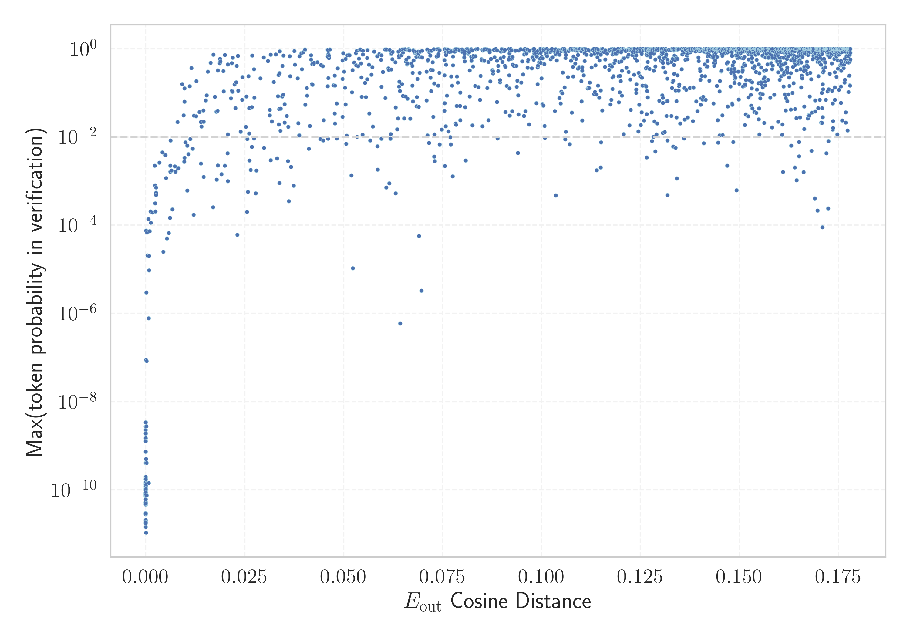

# Report for `allenai/OLMo-2-1124-7B`

## Model info

* Model Info: 
  * Tied embeddings: False
  * LM head uses bias: False
  * Embeddings shape: [100352, 4096]
* Tokenizer Info: 
  * Vocab Size: 100278
  * Tokenizer Class: GPT2Tokenizer
  * Tokenizer Type: BPE
  * Bytes handling: Byte Input
  * Token for verification prompt building: abcdefghijklmnopqrstuvwxyz
  * Token id for verification prompt building: 68612
* Indicator summary: 
  * Indicator for under-trained tokens: E_{out} Cosine Distance
  * Overall distribution: 0.350 +/- 0.079
* Detected Token Counts: 
  * Number of tested under-trained tokens: 1992, 1973 non-special, 179 below p = 0.01 threshold, 82 below soft indicator threshold
  * Number of single byte tokens: 256, of which 13 below indicator threshold
  * Number of special tokens: 0, of which 0 below indicator threshold
  * Number of non-single-byte UTF-fragment tokens:  645, of which 3 below soft indicator threshold

## Under-trained token indicators plot


## Verification plot


## Under-trained token verification results
82 entries below threshold of 0.010

|   token_id | token                                 |    indicator | max_prob                                                         | in_other_tokens                                                                                                                                                                              |
|------------|---------------------------------------|--------------|------------------------------------------------------------------|----------------------------------------------------------------------------------------------------------------------------------------------------------------------------------------------|
|      89472 | ````` useRalative `````               | -2.38419e-07 | <span style='border: 1px solid rgb(169, 68, 66);'>1.5e-09</span> | <span style='border: 1px solid rgb(169, 68, 66);'>````` useRalativeImagePath `````</span>                                                                                                    |
|      89471 | ````` useRal `````                    | -1.19209e-07 | <span style='border: 1px solid rgb(169, 68, 66);'>1.4e-11</span> | <span style='border: 1px solid rgb(169, 68, 66);'>````` useRalativeImagePath `````</span>, <span style='border: 1px solid rgb(169, 68, 66);'>````` useRalative `````</span>                  |
|     100262 | ````` \|\|\|EMAIL_ADDRESS\|\|\| ````` | -1.19209e-07 | <span style='border: 1px solid rgb(169, 68, 66);'>1.5e-10</span> |                                                                                                                                                                                              |
|      33786 | ````` webElementProperties `````      | -1.19209e-07 | <span style='border: 1px solid rgb(169, 68, 66);'>7.3e-11</span> |                                                                                                                                                                                              |
|      57779 | ````` \tRTLU `````                    |  0           | <span style='border: 1px solid rgb(169, 68, 66);'>2e-10</span>   |                                                                                                                                                                                              |
|      85069 | ````` PostalCodesNL `````             |  0           | <span style='border: 1px solid rgb(169, 68, 66);'>8.4e-11</span> | <span style='border: 1px solid rgb(169, 68, 66);'>````` $PostalCodesNL `````</span>                                                                                                          |
|      47072 | ````` webElementX `````               |  0           | <span style='border: 1px solid rgb(169, 68, 66);'>8.4e-11</span> | <span style='border: 1px solid rgb(169, 68, 66);'>````` webElementXpaths `````</span>                                                                                                        |
|      85071 | ````` $PostalCodesNL `````            |  0           | <span style='border: 1px solid rgb(169, 68, 66);'>2.8e-11</span> |                                                                                                                                                                                              |
|      95812 | ````` \tRTCK `````                    |  0           | <span style='border: 1px solid rgb(169, 68, 66);'>7.5e-11</span> |                                                                                                                                                                                              |
|      41550 | ````` \tRTHOOK `````                  |  0           | <span style='border: 1px solid rgb(169, 68, 66);'>1.3e-10</span> |                                                                                                                                                                                              |
|      80370 | ````` ▁ForCanBeConvertedToF `````     |  0           | <span style='border: 1px solid rgb(169, 68, 66);'>8.8e-11</span> | <span style='border: 1px solid rgb(255, 145, 0);'>````` ▁ForCanBeConvertedToForeach `````</span>                                                                                             |
|      80369 | ````` ▁ForCanBeConverted `````        |  1.19209e-07 | <span style='border: 1px solid rgb(169, 68, 66);'>5.2e-11</span> | <span style='border: 1px solid rgb(169, 68, 66);'>````` ▁ForCanBeConvertedToF `````</span>, <span style='border: 1px solid rgb(255, 145, 0);'>````` ▁ForCanBeConvertedToForeach `````</span> |
|      47073 | ````` webElementXpaths `````          |  1.19209e-07 | <span style='border: 1px solid rgb(169, 68, 66);'>1.9e-09</span> |                                                                                                                                                                                              |
|      58508 | ````` :-------------</ `````          |  1.19209e-07 | <span style='border: 1px solid rgb(169, 68, 66);'>1.9e-09</span> |                                                                                                                                                                                              |
|     100261 | ````` \|\|\|PHONE_NUMBER\|\|\| `````  |  1.19209e-07 | <span style='border: 1px solid rgb(169, 68, 66);'>1.4e-10</span> |                                                                                                                                                                                              |
|      83315 | ````` richTextPanel `````             |  1.19209e-07 | <span style='border: 1px solid rgb(169, 68, 66);'>5.2e-11</span> |                                                                                                                                                                                              |
|      95073 | ````` -vesm `````                     |  1.19209e-07 | <span style='border: 1px solid rgb(169, 68, 66);'>7.3e-11</span> |                                                                                                                                                                                              |
|      80154 | ````` \tRTLI `````                    |  1.19209e-07 | <span style='border: 1px solid rgb(169, 68, 66);'>1.2e-10</span> |                                                                                                                                                                                              |
|      73018 | ````` ▁StreamLazy `````               |  1.19209e-07 | <span style='border: 1px solid rgb(169, 68, 66);'>4.1e-10</span> |                                                                                                                                                                                              |
|      79883 | ````` \tTokenNameIdentifier `````     |  1.19209e-07 | <span style='border: 1px solid rgb(169, 68, 66);'>1.7e-10</span> |                                                                                                                                                                                              |
<details><summary>62 additional entries below threshold</summary>

|   token_id | token                              |   indicator | max_prob                                                         | in_other_tokens                                                                                   |
|------------|------------------------------------|-------------|------------------------------------------------------------------|---------------------------------------------------------------------------------------------------|
|      70784 | ````` Japgolly `````               | 1.19209e-07 | <span style='border: 1px solid rgb(169, 68, 66);'>1e-10</span>   | <span style='border: 1px solid rgb(169, 68, 66);'>````` ▁typingsJapgolly `````</span>             |
|      89475 | ````` elementGuidId `````          | 1.19209e-07 | <span style='border: 1px solid rgb(169, 68, 66);'>1.8e-10</span> |                                                                                                   |
|      98100 | ````` (stypy `````                 | 1.19209e-07 | <span style='border: 1px solid rgb(169, 68, 66);'>1.9e-09</span> |                                                                                                   |
|      89473 | ````` useRalativeImagePath `````   | 1.78814e-07 | <span style='border: 1px solid rgb(169, 68, 66);'>1.7e-11</span> |                                                                                                   |
|     100263 | ````` \|\|\|IP_ADDRESS\|\|\| ````` | 1.78814e-07 | <span style='border: 1px solid rgb(169, 68, 66);'>1.9e-11</span> |                                                                                                   |
|      50325 | ````` adaptiveStyles `````         | 1.78814e-07 | <span style='border: 1px solid rgb(169, 68, 66);'>1.2e-10</span> |                                                                                                   |
|      67901 | ````` \tRTDBG `````                | 1.78814e-07 | <span style='border: 1px solid rgb(169, 68, 66);'>6.2e-11</span> |                                                                                                   |
|      52362 | ````` SpecWarn `````               | 2.98023e-07 | <span style='border: 1px solid rgb(169, 68, 66);'>8.7e-11</span> |                                                                                                   |
|      96656 | ````` methodPointerType `````      | 7.15256e-07 | <span style='border: 1px solid rgb(169, 68, 66);'>2.7e-09</span> |                                                                                                   |
|      99202 | ````` (statearr `````              | 8.9407e-07  | <span style='border: 1px solid rgb(169, 68, 66);'>3.4e-09</span> |                                                                                                   |
|      56930 | ````` \tRTLR `````                 | 1.16229e-05 | <span style='border: 1px solid rgb(169, 68, 66);'>4.6e-11</span> |                                                                                                   |
|      81259 | ````` artisanlib `````             | 1.18017e-05 | <span style='border: 1px solid rgb(169, 68, 66);'>4.9e-11</span> |                                                                                                   |
|      91198 | ````` externalActionCode `````     | 1.9908e-05  | <span style='border: 1px solid rgb(169, 68, 66);'>8.9e-08</span> |                                                                                                   |
|      82929 | ````` CppMethodIntialized `````    | 2.54512e-05 | <span style='border: 1px solid rgb(169, 68, 66);'>7.6e-05</span> |                                                                                                   |
|      93905 | ````` ▁QtAws `````                 | 2.65837e-05 | <span style='border: 1px solid rgb(169, 68, 66);'>1.1e-11</span> |                                                                                                   |
|      84576 | ````` ▁AppMethodBeat `````         | 3.3319e-05  | <span style='border: 1px solid rgb(169, 68, 66);'>7.8e-11</span> |                                                                                                   |
|      76371 | ````` LANGADM `````                | 5.98431e-05 | <span style='border: 1px solid rgb(169, 68, 66);'>5e-10</span>   |                                                                                                   |
|      72740 | ````` ▁typingsJapgolly `````       | 8.30889e-05 | <span style='border: 1px solid rgb(169, 68, 66);'>1.3e-10</span> |                                                                                                   |
|      31960 | ````` quotelev `````               | 0.000137806 | <span style='border: 1px solid rgb(169, 68, 66);'>3e-06</span>   |                                                                                                   |
|      90050 | ````` _ComCallableWrapper `````    | 0.00014472  | <span style='border: 1px solid rgb(169, 68, 66);'>2.8e-09</span> |                                                                                                   |
|      88023 | ````` /ayushman `````              | 0.000174642 | <span style='border: 1px solid rgb(169, 68, 66);'>8.3e-08</span> |                                                                                                   |
|      80612 | ````` MethodBeat `````             | 0.000183165 | <span style='border: 1px solid rgb(169, 68, 66);'>7.6e-11</span> | <span style='border: 1px solid rgb(169, 68, 66);'>````` ▁AppMethodBeat `````</span>               |
|      71337 | ````` +lsi `````                   | 0.000186622 | <span style='border: 1px solid rgb(169, 68, 66);'>4.1e-10</span> |                                                                                                   |
|      98668 | ````` );\r\r\r\n `````             | 0.000294089 | <span style='border: 1px solid rgb(169, 68, 66);'>6.8e-05</span> |                                                                                                   |
|      57361 | ````` _REALTYPE `````              | 0.00043869  | <span style='border: 1px solid rgb(169, 68, 66);'>2.1e-05</span> |                                                                                                   |
|      68896 | ````` ;\r\r\r\n `````              | 0.000684261 | <span style='border: 1px solid rgb(169, 68, 66);'>0.00014</span> | <span style='border: 1px solid rgb(169, 68, 66);'>````` );\r\r\r\n `````</span>                   |
|      97736 | ````` \tRTCT `````                 | 0.000716388 | <span style='border: 1px solid rgb(169, 68, 66);'>7.8e-07</span> |                                                                                                   |
|      90412 | ````` selectorMethod `````         | 0.000768423 | <span style='border: 1px solid rgb(169, 68, 66);'>1.4e-10</span> |                                                                                                   |
|      56225 | ````` .sulake `````                | 0.000790775 | <span style='border: 1px solid rgb(169, 68, 66);'>2e-05</span>   |                                                                                                   |
|      91817 | ````` (InitializedTypeInfo `````   | 0.000829816 | <span style='border: 1px solid rgb(169, 68, 66);'>9.5e-06</span> |                                                                                                   |
|      58944 | ````` /Subthreshold `````          | 0.000984609 | <span style='border: 1px solid rgb(169, 68, 66);'>7.3e-05</span> |                                                                                                   |
|      89496 | ````` _FieldOffsetTable `````      | 0.00121212  | <span style='border: 1px solid rgb(169, 68, 66);'>0.00021</span> |                                                                                                   |
|      73016 | ````` ▁EnumerableStream `````      | 0.00126624  | <span style='border: 1px solid rgb(169, 68, 66);'>0.00011</span> |                                                                                                   |
|      96737 | ````` departureday `````           | 0.00172448  | <span style='border: 1px solid rgb(169, 68, 66);'>0.0002</span>  |                                                                                                   |
|      67750 | ````` _typeDefinitionSize `````    | 0.00231582  | <span style='border: 1px solid rgb(255, 145, 0);'>0.0023</span>  |                                                                                                   |
|      73228 | ````` _InternalArray `````         | 0.00237793  | <span style='border: 1px solid rgb(169, 68, 66);'>0.0008</span>  |                                                                                                   |
|      26009 | ````` methodVisitor `````          | 0.00238055  | <span style='border: 1px solid rgb(169, 68, 66);'>0.00031</span> |                                                                                                   |
|      88039 | ````` ♀♀♀♀ `````                   | 0.0024671   | <span style='border: 1px solid rgb(169, 68, 66);'>0.0002</span>  |                                                                                                   |
|      37370 | ````` \tEIF `````                  | 0.00255948  | <span style='border: 1px solid rgb(169, 68, 66);'>0.00072</span> |                                                                                                   |
|      87551 | ````` CppGuid `````                | 0.00259966  | <span style='border: 1px solid rgb(169, 68, 66);'>0.00055</span> |                                                                                                   |
|      70316 | ````` erusform `````               | 0.00260186  | <span style='border: 1px solid rgb(169, 68, 66);'>0.00049</span> | <span style='border: 1px solid rgb(40, 167, 69);'>````` numerusform `````</span>                  |
|      67444 | ````` CppTypeDefinitionSizes ````` | 0.00339979  | <span style='border: 1px solid rgb(255, 145, 0);'>0.0026</span>  |                                                                                                   |
|      39866 | ````` .xrLabel `````               | 0.00416869  | <span style='border: 1px solid rgb(255, 145, 0);'>0.0045</span>  |                                                                                                   |
|      71390 | ````` ▁PodsDummy `````             | 0.00445569  | <span style='border: 1px solid rgb(169, 68, 66);'>2.5e-05</span> |                                                                                                   |
|      59839 | ````` ConstraintMaker `````        | 0.00497901  | <span style='border: 1px solid rgb(255, 145, 0);'>0.0039</span>  | <span style='border: 1px solid rgb(40, 167, 69);'>````` MASConstraintMaker `````</span>           |
|      67705 | ````` _typeDefinition `````        | 0.00510728  | <span style='border: 1px solid rgb(255, 145, 0);'>0.0012</span>  | <span style='border: 1px solid rgb(255, 145, 0);'>````` _typeDefinitionSize `````</span>          |
|      34956 | ````` ▁+#+#+#+ `````               | 0.00535917  | <span style='border: 1px solid rgb(169, 68, 66);'>5e-05</span>   | <span style='border: 1px solid rgb(255, 145, 0);'>````` ▁+#+#+#+#+#+ `````</span>                 |
|      87941 | ````` $fdata `````                 | 0.00576878  | <span style='border: 1px solid rgb(169, 68, 66);'>6.7e-05</span> |                                                                                                   |
|      67727 | ````` \|()\n `````                 | 0.00612545  | <span style='border: 1px solid rgb(169, 68, 66);'>0.00015</span> |                                                                                                   |
|      66235 | ````` CppTypeDefinition `````      | 0.00619704  | <span style='border: 1px solid rgb(255, 145, 0);'>0.0023</span>  | <span style='border: 1px solid rgb(255, 145, 0);'>````` CppTypeDefinitionSizes `````</span>       |
|      84993 | ````` rPid `````                   | 0.00621617  | <span style='border: 1px solid rgb(255, 145, 0);'>0.0016</span>  |                                                                                                   |
|      85154 | ````` buttonShape `````            | 0.00623816  | <span style='border: 1px solid rgb(255, 145, 0);'>0.0084</span>  |                                                                                                   |
|      24452 | ````` <lemma `````                 | 0.00646198  | <span style='border: 1px solid rgb(255, 145, 0);'>0.0018</span>  |                                                                                                   |
|      45146 | ````` %timeout `````               | 0.00674826  | <span style='border: 1px solid rgb(169, 68, 66);'>0.00023</span> |                                                                                                   |
|      75520 | ````` ▁NUITKA `````                | 0.00730926  | <span style='border: 1px solid rgb(255, 145, 0);'>0.0022</span>  |                                                                                                   |
|      75630 | ````` 雅黑 `````                   | 0.00752032  | <span style='border: 1px solid rgb(255, 145, 0);'>0.0016</span>  | ````` 微软雅黑 `````, <span style='border: 1px solid rgb(169, 68, 66);'>````` 软雅黑 `````</span> |
|      76613 | ````` extracomment `````           | 0.00804365  | <span style='border: 1px solid rgb(251, 189, 8);'>0.022</span>   |                                                                                                   |
|      43944 | ````` orThunk `````                | 0.00812399  | <span style='border: 1px solid rgb(255, 145, 0);'>0.0019</span>  | <span style='border: 1px solid rgb(251, 189, 8);'>````` _AdjustorThunk `````</span>               |
|      71227 | ````` ▁FINSEQ `````                | 0.00825447  | <span style='border: 1px solid rgb(255, 145, 0);'>0.002</span>   |                                                                                                   |
|      81325 | ````` .bindingNavigatorMove `````  | 0.00914651  | <span style='border: 1px solid rgb(40, 167, 69);'>0.16</span>    |                                                                                                   |
|      62761 | ````` .layoutControl `````         | 0.00955373  | <span style='border: 1px solid rgb(251, 189, 8);'>0.031</span>   |                                                                                                   |
|      55557 | ````` ((&___ `````                 | 0.00971556  | <span style='border: 1px solid rgb(255, 145, 0);'>0.0028</span>  |                                                                                                   |
</details>
<details><summary>1891 additional entries above threshold</summary>

|   token_id | token                                                                                         |   indicator | max_prob                                                         | in_other_tokens                                                                                                                                                                                                                                                                                                                                                                                                                                                                                                  |
|------------|-----------------------------------------------------------------------------------------------|-------------|------------------------------------------------------------------|------------------------------------------------------------------------------------------------------------------------------------------------------------------------------------------------------------------------------------------------------------------------------------------------------------------------------------------------------------------------------------------------------------------------------------------------------------------------------------------------------------------|
|      76709 | ````` ▁InternalEnumerator `````                                                               |  0.00976199 | <span style='border: 1px solid rgb(40, 167, 69);'>0.13</span>    |                                                                                                                                                                                                                                                                                                                                                                                                                                                                                                                  |
|      98715 | ````` .XRLabel `````                                                                          |  0.00976312 | <span style='border: 1px solid rgb(255, 145, 0);'>0.0034</span>  |                                                                                                                                                                                                                                                                                                                                                                                                                                                                                                                  |
|      96334 | ````` .bunifuFlatButton `````                                                                 |  0.00977039 | <span style='border: 1px solid rgb(251, 189, 8);'>0.064</span>   |                                                                                                                                                                                                                                                                                                                                                                                                                                                                                                                  |
|      63785 | ````` ▁RTWF `````                                                                             |  0.0100488  | <span style='border: 1px solid rgb(255, 145, 0);'>0.0076</span>  |                                                                                                                                                                                                                                                                                                                                                                                                                                                                                                                  |
|      81998 | ````` ablytyped `````                                                                         |  0.010478   | <span style='border: 1px solid rgb(169, 68, 66);'>0.00061</span> | <span style='border: 1px solid rgb(251, 189, 8);'>````` .scalablytyped `````</span>                                                                                                                                                                                                                                                                                                                                                                                                                              |
|      54278 | ````` CppGeneric `````                                                                        |  0.0105006  | <span style='border: 1px solid rgb(255, 145, 0);'>0.0063</span>  | <span style='border: 1px solid rgb(40, 167, 69);'>````` CppGenericClass `````</span>                                                                                                                                                                                                                                                                                                                                                                                                                             |
|      72745 | ````` ▁XBOOLE `````                                                                           |  0.0108022  | <span style='border: 1px solid rgb(255, 145, 0);'>0.0041</span>  |                                                                                                                                                                                                                                                                                                                                                                                                                                                                                                                  |
|      43053 | ````` .layoutControlItem `````                                                                |  0.0111176  | <span style='border: 1px solid rgb(40, 167, 69);'>0.14</span>    |                                                                                                                                                                                                                                                                                                                                                                                                                                                                                                                  |
|      59066 | ````` ▁hexatrigesimal `````                                                                   |  0.0112236  | <span style='border: 1px solid rgb(255, 145, 0);'>0.0091</span>  |                                                                                                                                                                                                                                                                                                                                                                                                                                                                                                                  |
|      58194 | ````` InternalEnumerator `````                                                                |  0.0115726  | <span style='border: 1px solid rgb(40, 167, 69);'>0.36</span>    | <span style='border: 1px solid rgb(40, 167, 69);'>````` ▁InternalEnumerator `````</span>                                                                                                                                                                                                                                                                                                                                                                                                                         |
|      69679 | ````` /settingsdialog `````                                                                   |  0.0118189  | <span style='border: 1px solid rgb(255, 145, 0);'>0.0054</span>  |                                                                                                                                                                                                                                                                                                                                                                                                                                                                                                                  |
|      99072 | ````` 。www `````                                                                             |  0.0120504  | <span style='border: 1px solid rgb(169, 68, 66);'>0.00017</span> |                                                                                                                                                                                                                                                                                                                                                                                                                                                                                                                  |
|      71664 | ````` \tNdrFc `````                                                                           |  0.0121372  | <span style='border: 1px solid rgb(251, 189, 8);'>0.031</span>   | <span style='border: 1px solid rgb(40, 167, 69);'>````` \tNdrFcShort `````</span>                                                                                                                                                                                                                                                                                                                                                                                                                                |
|      61963 | ````` _RGCTX `````                                                                            |  0.012674   | <span style='border: 1px solid rgb(251, 189, 8);'>0.03</span>    |                                                                                                                                                                                                                                                                                                                                                                                                                                                                                                                  |
|      46705 | ````` .bindingNavigator `````                                                                 |  0.0127496  | <span style='border: 1px solid rgb(40, 167, 69);'>0.19</span>    | <span style='border: 1px solid rgb(40, 167, 69);'>````` .bindingNavigatorMove `````</span>                                                                                                                                                                                                                                                                                                                                                                                                                       |
|      44001 | ````` _AdjustorThunk `````                                                                    |  0.0135791  | <span style='border: 1px solid rgb(251, 189, 8);'>0.037</span>   |                                                                                                                                                                                                                                                                                                                                                                                                                                                                                                                  |
|      35338 | ````` CppCodeGen `````                                                                        |  0.0139041  | <span style='border: 1px solid rgb(255, 145, 0);'>0.0025</span>  | <span style='border: 1px solid rgb(169, 68, 66);'>````` CppCodeGenWriteBarrier `````</span>                                                                                                                                                                                                                                                                                                                                                                                                                      |
|      84043 | ````` .LayoutControlItem `````                                                                |  0.0139282  | <span style='border: 1px solid rgb(251, 189, 8);'>0.022</span>   |                                                                                                                                                                                                                                                                                                                                                                                                                                                                                                                  |
|      96165 | ````` ▁HinderedRotor `````                                                                    |  0.0140461  | <span style='border: 1px solid rgb(251, 189, 8);'>0.017</span>   |                                                                                                                                                                                                                                                                                                                                                                                                                                                                                                                  |
|      91296 | ````` CppI `````                                                                              |  0.0145304  | <span style='border: 1px solid rgb(251, 189, 8);'>0.04</span>    |                                                                                                                                                                                                                                                                                                                                                                                                                                                                                                                  |
|      45794 | ````` >tagger `````                                                                           |  0.014611   | <span style='border: 1px solid rgb(255, 145, 0);'>0.0013</span>  |                                                                                                                                                                                                                                                                                                                                                                                                                                                                                                                  |
|      71366 | ````` drFc `````                                                                              |  0.0146487  | <span style='border: 1px solid rgb(251, 189, 8);'>0.022</span>   | <span style='border: 1px solid rgb(40, 167, 69);'>````` \tNdrFcShort `````</span>, <span style='border: 1px solid rgb(251, 189, 8);'>````` \tNdrFc `````</span>                                                                                                                                                                                                                                                                                                                                                  |
|      85731 | ````` (RuntimeObject `````                                                                    |  0.0151377  | <span style='border: 1px solid rgb(251, 189, 8);'>0.068</span>   |                                                                                                                                                                                                                                                                                                                                                                                                                                                                                                                  |
|      14686 | ````` spNet `````                                                                             |  0.0153769  | <span style='border: 1px solid rgb(251, 189, 8);'>0.088</span>   | <span style='border: 1px solid rgb(40, 167, 69);'>````` _AspNet `````</span>, ````` AspNet `````, ````` .AspNet `````, ````` .AspNetCore `````                                                                                                                                                                                                                                                                                                                                                                   |
|      57260 | ````` CppGenericClass `````                                                                   |  0.0157266  | <span style='border: 1px solid rgb(40, 167, 69);'>0.3</span>     |                                                                                                                                                                                                                                                                                                                                                                                                                                                                                                                  |
|      37074 | ````` _GenericClass `````                                                                     |  0.0163619  | <span style='border: 1px solid rgb(40, 167, 69);'>0.48</span>    |                                                                                                                                                                                                                                                                                                                                                                                                                                                                                                                  |
|      95664 | ````` ETweet `````                                                                            |  0.0170175  | <span style='border: 1px solid rgb(169, 68, 66);'>0.00026</span> |                                                                                                                                                                                                                                                                                                                                                                                                                                                                                                                  |
|      97100 | ````` .barDockControl `````                                                                   |  0.0170554  | <span style='border: 1px solid rgb(40, 167, 69);'>0.73</span>    |                                                                                                                                                                                                                                                                                                                                                                                                                                                                                                                  |
|      84915 | ````` sPid `````                                                                              |  0.0174447  | <span style='border: 1px solid rgb(251, 189, 8);'>0.081</span>   |                                                                                                                                                                                                                                                                                                                                                                                                                                                                                                                  |
|      31827 | ````` {EIF `````                                                                              |  0.0178259  | <span style='border: 1px solid rgb(251, 189, 8);'>0.038</span>   |                                                                                                                                                                                                                                                                                                                                                                                                                                                                                                                  |
|      57722 | ````` ▁;;= `````                                                                              |  0.0179335  | <span style='border: 1px solid rgb(255, 145, 0);'>0.0011</span>  |                                                                                                                                                                                                                                                                                                                                                                                                                                                                                                                  |
|      69215 | ````` .XtraLayout `````                                                                       |  0.0181733  | <span style='border: 1px solid rgb(251, 189, 8);'>0.04</span>    |                                                                                                                                                                                                                                                                                                                                                                                                                                                                                                                  |
|      86062 | ````` GameObjectWithTag `````                                                                 |  0.0181997  | <span style='border: 1px solid rgb(255, 145, 0);'>0.0023</span>  | <span style='border: 1px solid rgb(251, 189, 8);'>````` .FindGameObjectWithTag `````</span>                                                                                                                                                                                                                                                                                                                                                                                                                      |
|      80750 | ````` .groupControl `````                                                                     |  0.0182025  | <span style='border: 1px solid rgb(40, 167, 69);'>0.32</span>    |                                                                                                                                                                                                                                                                                                                                                                                                                                                                                                                  |
|      83949 | ````` .panelControl `````                                                                     |  0.0187101  | <span style='border: 1px solid rgb(40, 167, 69);'>0.47</span>    |                                                                                                                                                                                                                                                                                                                                                                                                                                                                                                                  |
|      25332 | ````` \r\r\r\n `````                                                                          |  0.0187513  | <span style='border: 1px solid rgb(40, 167, 69);'>0.59</span>    | <span style='border: 1px solid rgb(169, 68, 66);'>````` );\r\r\r\n `````</span>, <span style='border: 1px solid rgb(169, 68, 66);'>````` ;\r\r\r\n `````</span>                                                                                                                                                                                                                                                                                                                                                  |
|      43382 | ````` .labelControl `````                                                                     |  0.018856   | <span style='border: 1px solid rgb(40, 167, 69);'>0.52</span>    |                                                                                                                                                                                                                                                                                                                                                                                                                                                                                                                  |
|      35922 | ````` CppMethodPointer `````                                                                  |  0.019108   | <span style='border: 1px solid rgb(255, 145, 0);'>0.0014</span>  |                                                                                                                                                                                                                                                                                                                                                                                                                                                                                                                  |
|      81761 | ````` vinfos `````                                                                            |  0.0195682  | <span style='border: 1px solid rgb(40, 167, 69);'>0.31</span>    |                                                                                                                                                                                                                                                                                                                                                                                                                                                                                                                  |
|      24283 | ````` SequentialGroup `````                                                                   |  0.0196425  | <span style='border: 1px solid rgb(40, 167, 69);'>0.11</span>    | <span style='border: 1px solid rgb(255, 145, 0);'>````` .createSequentialGroup `````</span>                                                                                                                                                                                                                                                                                                                                                                                                                      |
|      76271 | ````` \tNdrFcShort `````                                                                      |  0.0199631  | <span style='border: 1px solid rgb(40, 167, 69);'>0.72</span>    |                                                                                                                                                                                                                                                                                                                                                                                                                                                                                                                  |
|      51717 | ````` ▁prostituerte `````                                                                     |  0.0199926  | <span style='border: 1px solid rgb(255, 145, 0);'>0.0022</span>  |                                                                                                                                                                                                                                                                                                                                                                                                                                                                                                                  |
|      64676 | ````` .AbsoluteConstraints `````                                                              |  0.0206354  | <span style='border: 1px solid rgb(255, 145, 0);'>0.0043</span>  |                                                                                                                                                                                                                                                                                                                                                                                                                                                                                                                  |
|      68131 | ````` _MetadataUsageId `````                                                                  |  0.0207291  | <span style='border: 1px solid rgb(251, 189, 8);'>0.012</span>   |                                                                                                                                                                                                                                                                                                                                                                                                                                                                                                                  |
|      47219 | ````` HeadersHeightSizeMode `````                                                             |  0.0207321  | <span style='border: 1px solid rgb(255, 145, 0);'>0.001</span>   | <span style='border: 1px solid rgb(169, 68, 66);'>````` .DataGridViewColumnHeadersHeightSizeMode `````</span>, <span style='border: 1px solid rgb(251, 189, 8);'>````` .ColumnHeadersHeightSizeMode `````</span>                                                                                                                                                                                                                                                                                                 |
|      89658 | ````` uniacid `````                                                                           |  0.0207466  | <span style='border: 1px solid rgb(40, 167, 69);'>0.44</span>    |                                                                                                                                                                                                                                                                                                                                                                                                                                                                                                                  |
|      61013 | ````` .StylePriority `````                                                                    |  0.0215343  | <span style='border: 1px solid rgb(251, 189, 8);'>0.076</span>   |                                                                                                                                                                                                                                                                                                                                                                                                                                                                                                                  |
|      40729 | ````` \tTokenName `````                                                                       |  0.0217412  | <span style='border: 1px solid rgb(40, 167, 69);'>0.11</span>    | <span style='border: 1px solid rgb(169, 68, 66);'>````` \tTokenNameIdentifier `````</span>                                                                                                                                                                                                                                                                                                                                                                                                                       |
|      97913 | ````` .simpleButton `````                                                                     |  0.0217522  | <span style='border: 1px solid rgb(40, 167, 69);'>0.47</span>    |                                                                                                                                                                                                                                                                                                                                                                                                                                                                                                                  |
|      94141 | ````` .XRTableCell `````                                                                      |  0.0218794  | <span style='border: 1px solid rgb(40, 167, 69);'>0.11</span>    |                                                                                                                                                                                                                                                                                                                                                                                                                                                                                                                  |
|      82468 | ````` ▁uLocal `````                                                                           |  0.0219443  | <span style='border: 1px solid rgb(40, 167, 69);'>0.63</span>    |                                                                                                                                                                                                                                                                                                                                                                                                                                                                                                                  |
|      48077 | ````` .dataGridViewTextBoxColumn `````                                                        |  0.0224168  | <span style='border: 1px solid rgb(40, 167, 69);'>0.16</span>    |                                                                                                                                                                                                                                                                                                                                                                                                                                                                                                                  |
|      98797 | ````` APolynomial `````                                                                       |  0.0226597  | <span style='border: 1px solid rgb(251, 189, 8);'>0.046</span>   |                                                                                                                                                                                                                                                                                                                                                                                                                                                                                                                  |
|      90013 | ````` _IEnumerator `````                                                                      |  0.0228516  | <span style='border: 1px solid rgb(40, 167, 69);'>0.17</span>    |                                                                                                                                                                                                                                                                                                                                                                                                                                                                                                                  |
|      48134 | ````` .xrTableCell `````                                                                      |  0.022941   | <span style='border: 1px solid rgb(40, 167, 69);'>0.41</span>    |                                                                                                                                                                                                                                                                                                                                                                                                                                                                                                                  |
|      99944 | ````` ▁davidjl `````                                                                          |  0.0230888  | <span style='border: 1px solid rgb(169, 68, 66);'>6.1e-05</span> |                                                                                                                                                                                                                                                                                                                                                                                                                                                                                                                  |
|      95525 | ````` ▁dataGridViewTextBoxColumn `````                                                        |  0.0233126  | <span style='border: 1px solid rgb(40, 167, 69);'>0.69</span>    |                                                                                                                                                                                                                                                                                                                                                                                                                                                                                                                  |
|      95649 | ````` _UFunction `````                                                                        |  0.0233281  | <span style='border: 1px solid rgb(40, 167, 69);'>0.11</span>    |                                                                                                                                                                                                                                                                                                                                                                                                                                                                                                                  |
|      94226 | ````` /contentassist `````                                                                    |  0.0239386  | <span style='border: 1px solid rgb(251, 189, 8);'>0.013</span>   |                                                                                                                                                                                                                                                                                                                                                                                                                                                                                                                  |
|      47817 | ````` :semicolon `````                                                                        |  0.0243598  | <span style='border: 1px solid rgb(251, 189, 8);'>0.069</span>   |                                                                                                                                                                                                                                                                                                                                                                                                                                                                                                                  |
|      84879 | ````` mPid `````                                                                              |  0.0244481  | <span style='border: 1px solid rgb(40, 167, 69);'>0.23</span>    |                                                                                                                                                                                                                                                                                                                                                                                                                                                                                                                  |
|      74475 | ````` (&___ `````                                                                             |  0.0252445  | <span style='border: 1px solid rgb(251, 189, 8);'>0.017</span>   |                                                                                                                                                                                                                                                                                                                                                                                                                                                                                                                  |
|      63216 | ````` \tiVar `````                                                                            |  0.0254379  | <span style='border: 1px solid rgb(251, 189, 8);'>0.083</span>   |                                                                                                                                                                                                                                                                                                                                                                                                                                                                                                                  |
|      73303 | ````` .DataGridViewColumnHeadersHeightSizeMode `````                                          |  0.0255681  | <span style='border: 1px solid rgb(169, 68, 66);'>0.0002</span>  |                                                                                                                                                                                                                                                                                                                                                                                                                                                                                                                  |
|      86849 | ````` \tRuntimeObject `````                                                                   |  0.0256841  | <span style='border: 1px solid rgb(255, 145, 0);'>0.009</span>   |                                                                                                                                                                                                                                                                                                                                                                                                                                                                                                                  |
|      40036 | ````` CppCodeGenWriteBarrier `````                                                            |  0.0258339  | <span style='border: 1px solid rgb(169, 68, 66);'>0.00057</span> |                                                                                                                                                                                                                                                                                                                                                                                                                                                                                                                  |
|      42968 | ````` \tNullCheck `````                                                                       |  0.0259447  | <span style='border: 1px solid rgb(40, 167, 69);'>0.24</span>    |                                                                                                                                                                                                                                                                                                                                                                                                                                                                                                                  |
|      71927 | ````` ▁guiActive `````                                                                        |  0.0260911  | <span style='border: 1px solid rgb(251, 189, 8);'>0.046</span>   |                                                                                                                                                                                                                                                                                                                                                                                                                                                                                                                  |
|      43587 | ````` atrigesimal `````                                                                       |  0.0261288  | <span style='border: 1px solid rgb(251, 189, 8);'>0.012</span>   | <span style='border: 1px solid rgb(169, 68, 66);'>````` ▁Hexatrigesimal `````</span>, <span style='border: 1px solid rgb(255, 145, 0);'>````` ▁hexatrigesimal `````</span>                                                                                                                                                                                                                                                                                                                                       |
|      80371 | ````` ▁ForCanBeConvertedToForeach `````                                                       |  0.0261546  | <span style='border: 1px solid rgb(255, 145, 0);'>0.003</span>   |                                                                                                                                                                                                                                                                                                                                                                                                                                                                                                                  |
|      79423 | ````` ▁thuisontvangst `````                                                                   |  0.0265095  | <span style='border: 1px solid rgb(255, 145, 0);'>0.0018</span>  |                                                                                                                                                                                                                                                                                                                                                                                                                                                                                                                  |
|      85275 | ````` .UseText `````                                                                          |  0.0267788  | <span style='border: 1px solid rgb(251, 189, 8);'>0.048</span>   |                                                                                                                                                                                                                                                                                                                                                                                                                                                                                                                  |
|      53974 | ````` CppMethodInitialized `````                                                              |  0.0268136  | <span style='border: 1px solid rgb(255, 145, 0);'>0.006</span>   |                                                                                                                                                                                                                                                                                                                                                                                                                                                                                                                  |
|      37176 | ````` .bunifu `````                                                                           |  0.0268461  | <span style='border: 1px solid rgb(40, 167, 69);'>0.71</span>    | <span style='border: 1px solid rgb(251, 189, 8);'>````` .bunifuFlatButton `````</span>                                                                                                                                                                                                                                                                                                                                                                                                                           |
|      69790 | ````` .metroLabel `````                                                                       |  0.027317   | <span style='border: 1px solid rgb(40, 167, 69);'>0.35</span>    |                                                                                                                                                                                                                                                                                                                                                                                                                                                                                                                  |
|      66174 | ````` .didReceiveMemoryWarning `````                                                          |  0.0273278  | <span style='border: 1px solid rgb(255, 145, 0);'>0.0093</span>  |                                                                                                                                                                                                                                                                                                                                                                                                                                                                                                                  |
|      92103 | ````` NavigatorMove `````                                                                     |  0.0274167  | <span style='border: 1px solid rgb(251, 189, 8);'>0.078</span>   |                                                                                                                                                                                                                                                                                                                                                                                                                                                                                                                  |
|      79740 | ````` ▁Hexatrigesimal `````                                                                   |  0.0277994  | <span style='border: 1px solid rgb(169, 68, 66);'>0.00053</span> |                                                                                                                                                                                                                                                                                                                                                                                                                                                                                                                  |
|      54853 | ````` ETwitter `````                                                                          |  0.027969   | <span style='border: 1px solid rgb(255, 145, 0);'>0.0017</span>  |                                                                                                                                                                                                                                                                                                                                                                                                                                                                                                                  |
|      62588 | ````` rgctx `````                                                                             |  0.0289229  | <span style='border: 1px solid rgb(40, 167, 69);'>0.22</span>    |                                                                                                                                                                                                                                                                                                                                                                                                                                                                                                                  |
|      96611 | ````` RGBO `````                                                                              |  0.0297884  | <span style='border: 1px solid rgb(40, 167, 69);'>0.64</span>    | <span style='border: 1px solid rgb(251, 189, 8);'>````` .fromRGBO `````</span>                                                                                                                                                                                                                                                                                                                                                                                                                                   |
|      95656 | ````` .DataGridViewContentAlignment `````                                                     |  0.029886   | <span style='border: 1px solid rgb(255, 145, 0);'>0.0057</span>  |                                                                                                                                                                                                                                                                                                                                                                                                                                                                                                                  |
|      77260 | ````` ▁RTAL `````                                                                             |  0.030856   | <span style='border: 1px solid rgb(40, 167, 69);'>0.53</span>    |                                                                                                                                                                                                                                                                                                                                                                                                                                                                                                                  |
|      34791 | ````` PreferredGap `````                                                                      |  0.0313112  | <span style='border: 1px solid rgb(251, 189, 8);'>0.031</span>   | <span style='border: 1px solid rgb(251, 189, 8);'>````` addPreferredGap `````</span>                                                                                                                                                                                                                                                                                                                                                                                                                             |
|      83878 | ````` .EditorButton `````                                                                     |  0.0313321  | <span style='border: 1px solid rgb(251, 189, 8);'>0.041</span>   |                                                                                                                                                                                                                                                                                                                                                                                                                                                                                                                  |
|      59590 | ````` IntoConstraints `````                                                                   |  0.0315663  | <span style='border: 1px solid rgb(255, 145, 0);'>0.003</span>   | <span style='border: 1px solid rgb(255, 145, 0);'>````` AutoresizingMaskIntoConstraints `````</span>, <span style='border: 1px solid rgb(251, 189, 8);'>````` latesAutoresizingMaskIntoConstraints `````</span>, <span style='border: 1px solid rgb(40, 167, 69);'>````` .translatesAutoresizingMaskIntoConstraints `````</span>                                                                                                                                                                                 |
|      89476 | ````` .labelX `````                                                                           |  0.0315675  | <span style='border: 1px solid rgb(40, 167, 69);'>0.74</span>    |                                                                                                                                                                                                                                                                                                                                                                                                                                                                                                                  |
|      70912 | ````` .PictureBoxSizeMode `````                                                               |  0.0318417  | <span style='border: 1px solid rgb(251, 189, 8);'>0.023</span>   |                                                                                                                                                                                                                                                                                                                                                                                                                                                                                                                  |
|      56622 | ````` _equalTo `````                                                                          |  0.0322853  | <span style='border: 1px solid rgb(40, 167, 69);'>0.18</span>    |                                                                                                                                                                                                                                                                                                                                                                                                                                                                                                                  |
|      24488 | ````` CppMethod `````                                                                         |  0.0328372  | <span style='border: 1px solid rgb(40, 167, 69);'>0.75</span>    | <span style='border: 1px solid rgb(255, 145, 0);'>````` CppMethodPointer `````</span>, <span style='border: 1px solid rgb(169, 68, 66);'>````` CppMethodIntialized `````</span>, <span style='border: 1px solid rgb(255, 145, 0);'>````` CppMethodInitialized `````</span>                                                                                                                                                                                                                                       |
|      40270 | ````` wcsstore `````                                                                          |  0.0331469  | <span style='border: 1px solid rgb(255, 145, 0);'>0.0033</span>  |                                                                                                                                                                                                                                                                                                                                                                                                                                                                                                                  |
|      88685 | ````` .ComboBoxStyle `````                                                                    |  0.0334244  | <span style='border: 1px solid rgb(251, 189, 8);'>0.084</span>   |                                                                                                                                                                                                                                                                                                                                                                                                                                                                                                                  |
|      73530 | ````` (egt `````                                                                              |  0.033574   | <span style='border: 1px solid rgb(40, 167, 69);'>0.25</span>    |                                                                                                                                                                                                                                                                                                                                                                                                                                                                                                                  |
|      34306 | ````` ContainerGap `````                                                                      |  0.0336229  | <span style='border: 1px solid rgb(251, 189, 8);'>0.019</span>   | <span style='border: 1px solid rgb(251, 189, 8);'>````` addContainerGap `````</span>                                                                                                                                                                                                                                                                                                                                                                                                                             |
|      73408 | ````` .ColumnStyle `````                                                                      |  0.0337237  | <span style='border: 1px solid rgb(251, 189, 8);'>0.043</span>   |                                                                                                                                                                                                                                                                                                                                                                                                                                                                                                                  |
|      57261 | ````` ▁;;^ `````                                                                              |  0.0337942  | <span style='border: 1px solid rgb(169, 68, 66);'>0.00091</span> |                                                                                                                                                                                                                                                                                                                                                                                                                                                                                                                  |
|      60837 | ````` .Bunifu `````                                                                           |  0.033806   | <span style='border: 1px solid rgb(40, 167, 69);'>0.28</span>    |                                                                                                                                                                                                                                                                                                                                                                                                                                                                                                                  |
|      70528 | ````` _MethodInfo `````                                                                       |  0.0338669  | <span style='border: 1px solid rgb(40, 167, 69);'>0.88</span>    |                                                                                                                                                                                                                                                                                                                                                                                                                                                                                                                  |
|      43823 | ````` ▁prostituerade `````                                                                    |  0.034041   | <span style='border: 1px solid rgb(251, 189, 8);'>0.014</span>   |                                                                                                                                                                                                                                                                                                                                                                                                                                                                                                                  |
|      99071 | ````` -cmpr `````                                                                             |  0.0340428  | <span style='border: 1px solid rgb(251, 189, 8);'>0.044</span>   |                                                                                                                                                                                                                                                                                                                                                                                                                                                                                                                  |
|      43408 | ````` .DotNetBar `````                                                                        |  0.0344776  | <span style='border: 1px solid rgb(251, 189, 8);'>0.082</span>   |                                                                                                                                                                                                                                                                                                                                                                                                                                                                                                                  |
|      63979 | ````` (iParam `````                                                                           |  0.034521   | <span style='border: 1px solid rgb(40, 167, 69);'>0.41</span>    |                                                                                                                                                                                                                                                                                                                                                                                                                                                                                                                  |
|      68189 | ````` _UClass `````                                                                           |  0.0347124  | <span style='border: 1px solid rgb(251, 189, 8);'>0.092</span>   |                                                                                                                                                                                                                                                                                                                                                                                                                                                                                                                  |
|      89531 | ````` _IList `````                                                                            |  0.0347776  | <span style='border: 1px solid rgb(40, 167, 69);'>0.7</span>     |                                                                                                                                                                                                                                                                                                                                                                                                                                                                                                                  |
|      91589 | ````` ImageRelation `````                                                                     |  0.0350564  | <span style='border: 1px solid rgb(251, 189, 8);'>0.056</span>   | <span style='border: 1px solid rgb(40, 167, 69);'>````` .TextImageRelation `````</span>                                                                                                                                                                                                                                                                                                                                                                                                                          |
|      86415 | ````` BundleOrNil `````                                                                       |  0.0350888  | <span style='border: 1px solid rgb(251, 189, 8);'>0.021</span>   | <span style='border: 1px solid rgb(255, 145, 0);'>````` ibBundleOrNil `````</span>                                                                                                                                                                                                                                                                                                                                                                                                                               |
|      25061 | ````` :UIControl `````                                                                        |  0.0356354  | <span style='border: 1px solid rgb(251, 189, 8);'>0.03</span>    | <span style='border: 1px solid rgb(251, 189, 8);'>````` :UIControlEventTouchUpInside `````</span>, <span style='border: 1px solid rgb(251, 189, 8);'>````` :UIControlState `````</span>, <span style='border: 1px solid rgb(251, 189, 8);'>````` :UIControlEvent `````</span>, <span style='border: 1px solid rgb(251, 189, 8);'>````` :UIControlStateNormal `````</span>                                                                                                                                        |
|      90490 | ````` ibBundleOrNil `````                                                                     |  0.0359451  | <span style='border: 1px solid rgb(255, 145, 0);'>0.0028</span>  |                                                                                                                                                                                                                                                                                                                                                                                                                                                                                                                  |
|      96348 | ````` ',\r\r\n `````                                                                          |  0.0359667  | <span style='border: 1px solid rgb(251, 189, 8);'>0.017</span>   |                                                                                                                                                                                                                                                                                                                                                                                                                                                                                                                  |
|      99168 | ````` SmartyHeaderCode `````                                                                  |  0.0361293  | <span style='border: 1px solid rgb(169, 68, 66);'>0.00035</span> |                                                                                                                                                                                                                                                                                                                                                                                                                                                                                                                  |
|      62850 | ````` _jButton `````                                                                          |  0.0364066  | <span style='border: 1px solid rgb(40, 167, 69);'>0.68</span>    |                                                                                                                                                                                                                                                                                                                                                                                                                                                                                                                  |
|      66330 | ````` 'LBL `````                                                                              |  0.0364847  | <span style='border: 1px solid rgb(40, 167, 69);'>0.24</span>    |                                                                                                                                                                                                                                                                                                                                                                                                                                                                                                                  |
|      80408 | ````` =BitConverter `````                                                                     |  0.0367173  | <span style='border: 1px solid rgb(255, 145, 0);'>0.0021</span>  |                                                                                                                                                                                                                                                                                                                                                                                                                                                                                                                  |
|      75631 | ````` 软雅黑 `````                                                                            |  0.0373696  | <span style='border: 1px solid rgb(169, 68, 66);'>0.00079</span> | ````` 微软雅黑 `````                                                                                                                                                                                                                                                                                                                                                                                                                                                                                             |
|      71819 | ````` numerusform `````                                                                       |  0.0375444  | <span style='border: 1px solid rgb(40, 167, 69);'>0.89</span>    |                                                                                                                                                                                                                                                                                                                                                                                                                                                                                                                  |
|      60809 | ````` .guna `````                                                                             |  0.0377055  | <span style='border: 1px solid rgb(40, 167, 69);'>0.44</span>    |                                                                                                                                                                                                                                                                                                                                                                                                                                                                                                                  |
|      96283 | ````` ▁fChain `````                                                                           |  0.0383958  | <span style='border: 1px solid rgb(40, 167, 69);'>0.21</span>    |                                                                                                                                                                                                                                                                                                                                                                                                                                                                                                                  |
|      77666 | ````` okableCall `````                                                                        |  0.0384938  | <span style='border: 1px solid rgb(251, 189, 8);'>0.021</span>   |                                                                                                                                                                                                                                                                                                                                                                                                                                                                                                                  |
|      60107 | ````` .awtextra `````                                                                         |  0.0387276  | <span style='border: 1px solid rgb(251, 189, 8);'>0.011</span>   |                                                                                                                                                                                                                                                                                                                                                                                                                                                                                                                  |
|      96037 | ````` .DataGridViewTriState `````                                                             |  0.0387535  | <span style='border: 1px solid rgb(251, 189, 8);'>0.011</span>   |                                                                                                                                                                                                                                                                                                                                                                                                                                                                                                                  |
|      95610 | ````` .btnExit `````                                                                          |  0.0388092  | <span style='border: 1px solid rgb(40, 167, 69);'>0.68</span>    |                                                                                                                                                                                                                                                                                                                                                                                                                                                                                                                  |
|      18927 | ````` ParallelGroup `````                                                                     |  0.0392914  | <span style='border: 1px solid rgb(40, 167, 69);'>0.8</span>     | <span style='border: 1px solid rgb(251, 189, 8);'>````` .createParallelGroup `````</span>                                                                                                                                                                                                                                                                                                                                                                                                                        |
|      87496 | ````` ▁yytype `````                                                                           |  0.0394261  | <span style='border: 1px solid rgb(40, 167, 69);'>0.34</span>    |                                                                                                                                                                                                                                                                                                                                                                                                                                                                                                                  |
|      82496 | ````` \uB `````                                                                               |  0.0397574  | <span style='border: 1px solid rgb(40, 167, 69);'>0.84</span>    |                                                                                                                                                                                                                                                                                                                                                                                                                                                                                                                  |
|      53335 | ````` BitFields `````                                                                         |  0.0401876  | <span style='border: 1px solid rgb(40, 167, 69);'>0.95</span>    |                                                                                                                                                                                                                                                                                                                                                                                                                                                                                                                  |
|      30003 | ````` \tHX `````                                                                              |  0.0401983  | <span style='border: 1px solid rgb(40, 167, 69);'>0.96</span>    |                                                                                                                                                                                                                                                                                                                                                                                                                                                                                                                  |
|      94394 | ````` .DataGridViewAutoSize `````                                                             |  0.0403175  | <span style='border: 1px solid rgb(251, 189, 8);'>0.054</span>   |                                                                                                                                                                                                                                                                                                                                                                                                                                                                                                                  |
|      92783 | ````` .VisibleIndex `````                                                                     |  0.0406508  | <span style='border: 1px solid rgb(40, 167, 69);'>0.13</span>    |                                                                                                                                                                                                                                                                                                                                                                                                                                                                                                                  |
|      51005 | ````` .XtraPrinting `````                                                                     |  0.0407389  | <span style='border: 1px solid rgb(251, 189, 8);'>0.087</span>   |                                                                                                                                                                                                                                                                                                                                                                                                                                                                                                                  |
|      66195 | ````` .FormStartPosition `````                                                                |  0.0411913  | <span style='border: 1px solid rgb(255, 145, 0);'>0.0055</span>  |                                                                                                                                                                                                                                                                                                                                                                                                                                                                                                                  |
|      51840 | ````` $IFn `````                                                                              |  0.041455   | <span style='border: 1px solid rgb(251, 189, 8);'>0.018</span>   |                                                                                                                                                                                                                                                                                                                                                                                                                                                                                                                  |
|      84799 | ````` FilterWhere `````                                                                       |  0.0417276  | <span style='border: 1px solid rgb(40, 167, 69);'>0.71</span>    | <span style='border: 1px solid rgb(40, 167, 69);'>````` andFilterWhere `````</span>                                                                                                                                                                                                                                                                                                                                                                                                                              |
|      64371 | ````` .LabelControl `````                                                                     |  0.0417608  | <span style='border: 1px solid rgb(40, 167, 69);'>0.57</span>    |                                                                                                                                                                                                                                                                                                                                                                                                                                                                                                                  |
|      98093 | ````` [iVar `````                                                                             |  0.0419767  | <span style='border: 1px solid rgb(40, 167, 69);'>0.16</span>    |                                                                                                                                                                                                                                                                                                                                                                                                                                                                                                                  |
|      92261 | ````` .BorderSide `````                                                                       |  0.0420552  | <span style='border: 1px solid rgb(40, 167, 69);'>0.45</span>    |                                                                                                                                                                                                                                                                                                                                                                                                                                                                                                                  |
|      98170 | ````` .StretchImage `````                                                                     |  0.0421268  | <span style='border: 1px solid rgb(40, 167, 69);'>0.15</span>    |                                                                                                                                                                                                                                                                                                                                                                                                                                                                                                                  |
|      19083 | ````` _gshared `````                                                                          |  0.042464   | <span style='border: 1px solid rgb(40, 167, 69);'>0.46</span>    |                                                                                                                                                                                                                                                                                                                                                                                                                                                                                                                  |
|      67672 | ````` .toolStripButton `````                                                                  |  0.0425235  | <span style='border: 1px solid rgb(40, 167, 69);'>0.48</span>    |                                                                                                                                                                                                                                                                                                                                                                                                                                                                                                                  |
|      60074 | ````` MASConstraintMaker `````                                                                |  0.0433517  | <span style='border: 1px solid rgb(40, 167, 69);'>0.49</span>    |                                                                                                                                                                                                                                                                                                                                                                                                                                                                                                                  |
|      34957 | ````` ▁+#+#+#+#+#+ `````                                                                      |  0.0441226  | <span style='border: 1px solid rgb(255, 145, 0);'>0.0091</span>  |                                                                                                                                                                                                                                                                                                                                                                                                                                                                                                                  |
|      50469 | ````` StoryboardSegue `````                                                                   |  0.0442551  | <span style='border: 1px solid rgb(40, 167, 69);'>0.43</span>    | <span style='border: 1px solid rgb(40, 167, 69);'>````` ▁UIStoryboardSegue `````</span>, <span style='border: 1px solid rgb(40, 167, 69);'>````` UIStoryboardSegue `````</span>                                                                                                                                                                                                                                                                                                                                  |
|      69058 | ````` .UseFont `````                                                                          |  0.0447277  | <span style='border: 1px solid rgb(40, 167, 69);'>0.4</span>     |                                                                                                                                                                                                                                                                                                                                                                                                                                                                                                                  |
|      87361 | ````` :UIButtonType `````                                                                     |  0.044803   | <span style='border: 1px solid rgb(255, 145, 0);'>0.0083</span>  | <span style='border: 1px solid rgb(251, 189, 8);'>````` :UIButtonTypeCustom `````</span>                                                                                                                                                                                                                                                                                                                                                                                                                         |
|      52963 | ````` .DataGridViewColumn `````                                                               |  0.0449678  | <span style='border: 1px solid rgb(251, 189, 8);'>0.024</span>   | <span style='border: 1px solid rgb(169, 68, 66);'>````` .DataGridViewColumnHeadersHeightSizeMode `````</span>                                                                                                                                                                                                                                                                                                                                                                                                    |
|      88268 | ````` ▁jMenuItem `````                                                                        |  0.0459257  | <span style='border: 1px solid rgb(40, 167, 69);'>0.95</span>    |                                                                                                                                                                                                                                                                                                                                                                                                                                                                                                                  |
|      14030 | ````` VisualStyleBackColor `````                                                              |  0.045935   | <span style='border: 1px solid rgb(40, 167, 69);'>0.14</span>    | <span style='border: 1px solid rgb(40, 167, 69);'>````` .UseVisualStyleBackColor `````</span>                                                                                                                                                                                                                                                                                                                                                                                                                    |
|      96444 | ````` %%*/ `````                                                                              |  0.0459391  | <span style='border: 1px solid rgb(40, 167, 69);'>0.67</span>    |                                                                                                                                                                                                                                                                                                                                                                                                                                                                                                                  |
|      96913 | ````` .UltraWin `````                                                                         |  0.0460083  | <span style='border: 1px solid rgb(255, 145, 0);'>0.0092</span>  |                                                                                                                                                                                                                                                                                                                                                                                                                                                                                                                  |
|      82465 | ````` _marshaled `````                                                                        |  0.0460891  | <span style='border: 1px solid rgb(40, 167, 69);'>0.22</span>    |                                                                                                                                                                                                                                                                                                                                                                                                                                                                                                                  |
|      89996 | ````` .trailingAnchor `````                                                                   |  0.046091   | <span style='border: 1px solid rgb(40, 167, 69);'>0.76</span>    |                                                                                                                                                                                                                                                                                                                                                                                                                                                                                                                  |
|      83517 | ````` \tDuel `````                                                                            |  0.0462842  | <span style='border: 1px solid rgb(40, 167, 69);'>0.62</span>    |                                                                                                                                                                                                                                                                                                                                                                                                                                                                                                                  |
|      86984 | ````` PropertyParams `````                                                                    |  0.0462921  | <span style='border: 1px solid rgb(40, 167, 69);'>0.7</span>     |                                                                                                                                                                                                                                                                                                                                                                                                                                                                                                                  |
|      99874 | ````` ▁MessageLookup `````                                                                    |  0.046487   | <span style='border: 1px solid rgb(40, 167, 69);'>0.97</span>    |                                                                                                                                                                                                                                                                                                                                                                                                                                                                                                                  |
|      59901 | ````` ▁principalColumn `````                                                                  |  0.0474405  | <span style='border: 1px solid rgb(40, 167, 69);'>0.15</span>    |                                                                                                                                                                                                                                                                                                                                                                                                                                                                                                                  |
|      76933 | ````` _gchandle `````                                                                         |  0.0476825  | <span style='border: 1px solid rgb(40, 167, 69);'>0.25</span>    |                                                                                                                                                                                                                                                                                                                                                                                                                                                                                                                  |
|      92339 | ````` <UFunction `````                                                                        |  0.0476956  | <span style='border: 1px solid rgb(251, 189, 8);'>0.034</span>   |                                                                                                                                                                                                                                                                                                                                                                                                                                                                                                                  |
|      99259 | ````` :UIButtonTypeCustom `````                                                               |  0.0477772  | <span style='border: 1px solid rgb(251, 189, 8);'>0.02</span>    |                                                                                                                                                                                                                                                                                                                                                                                                                                                                                                                  |
|      46241 | ````` HeadersHeight `````                                                                     |  0.0478146  | <span style='border: 1px solid rgb(40, 167, 69);'>0.15</span>    | <span style='border: 1px solid rgb(169, 68, 66);'>````` .DataGridViewColumnHeadersHeightSizeMode `````</span>, <span style='border: 1px solid rgb(251, 189, 8);'>````` .ColumnHeadersHeightSizeMode `````</span>, <span style='border: 1px solid rgb(255, 145, 0);'>````` HeadersHeightSizeMode `````</span>                                                                                                                                                                                                     |
|      83203 | ````` .SetKeyName `````                                                                       |  0.0482247  | <span style='border: 1px solid rgb(251, 189, 8);'>0.057</span>   |                                                                                                                                                                                                                                                                                                                                                                                                                                                                                                                  |
|      64424 | ````` ">\r\r\n `````                                                                          |  0.0482724  | <span style='border: 1px solid rgb(255, 145, 0);'>0.0093</span>  |                                                                                                                                                                                                                                                                                                                                                                                                                                                                                                                  |
|      38835 | ````` _StaticFields `````                                                                     |  0.0485063  | <span style='border: 1px solid rgb(40, 167, 69);'>0.36</span>    |                                                                                                                                                                                                                                                                                                                                                                                                                                                                                                                  |
|      65053 | ````` 监听页面 `````                                                                          |  0.0497136  | <span style='border: 1px solid rgb(40, 167, 69);'>0.54</span>    |                                                                                                                                                                                                                                                                                                                                                                                                                                                                                                                  |
|      91845 | ````` ▁pornôs `````                                                                           |  0.0497217  | <span style='border: 1px solid rgb(40, 167, 69);'>0.21</span>    |                                                                                                                                                                                                                                                                                                                                                                                                                                                                                                                  |
|      33694 | ````` .ContentAlignment `````                                                                 |  0.0497412  | <span style='border: 1px solid rgb(251, 189, 8);'>0.029</span>   |                                                                                                                                                                                                                                                                                                                                                                                                                                                                                                                  |
|      77520 | ````` _saida `````                                                                            |  0.0498576  | <span style='border: 1px solid rgb(40, 167, 69);'>0.8</span>     |                                                                                                                                                                                                                                                                                                                                                                                                                                                                                                                  |
|      97299 | ````` _OscInitStruct `````                                                                    |  0.0501249  | <span style='border: 1px solid rgb(40, 167, 69);'>0.3</span>     |                                                                                                                                                                                                                                                                                                                                                                                                                                                                                                                  |
|      78105 | ````` .dateTimePicker `````                                                                   |  0.0503143  | <span style='border: 1px solid rgb(40, 167, 69);'>0.13</span>    |                                                                                                                                                                                                                                                                                                                                                                                                                                                                                                                  |
|      97859 | ````` (UIAlertAction `````                                                                    |  0.0504697  | <span style='border: 1px solid rgb(251, 189, 8);'>0.055</span>   |                                                                                                                                                                                                                                                                                                                                                                                                                                                                                                                  |
|      69269 | ````` (ALOAD `````                                                                            |  0.050515   | <span style='border: 1px solid rgb(40, 167, 69);'>0.59</span>    |                                                                                                                                                                                                                                                                                                                                                                                                                                                                                                                  |
|      90426 | ````` ibNameOrNil `````                                                                       |  0.0506087  | <span style='border: 1px solid rgb(255, 145, 0);'>0.007</span>   |                                                                                                                                                                                                                                                                                                                                                                                                                                                                                                                  |
|      35673 | ````` .ComponentPlacement `````                                                               |  0.0508196  | <span style='border: 1px solid rgb(251, 189, 8);'>0.011</span>   |                                                                                                                                                                                                                                                                                                                                                                                                                                                                                                                  |
|      39731 | ````` yyvsp `````                                                                             |  0.0509342  | <span style='border: 1px solid rgb(40, 167, 69);'>0.71</span>    |                                                                                                                                                                                                                                                                                                                                                                                                                                                                                                                  |
|      57419 | ````` _Statics `````                                                                          |  0.0513262  | <span style='border: 1px solid rgb(40, 167, 69);'>0.74</span>    |                                                                                                                                                                                                                                                                                                                                                                                                                                                                                                                  |
|      68421 | ````` ▁Bunifu `````                                                                           |  0.0514542  | <span style='border: 1px solid rgb(40, 167, 69);'>0.72</span>    |                                                                                                                                                                                                                                                                                                                                                                                                                                                                                                                  |
|      94652 | ````` BracketAccess `````                                                                     |  0.0519153  | <span style='border: 1px solid rgb(255, 145, 0);'>0.0014</span>  | <span style='border: 1px solid rgb(169, 68, 66);'>````` ▁JSBracketAccess `````</span>                                                                                                                                                                                                                                                                                                                                                                                                                            |
|      51486 | ````` .DataGridViewCellStyle `````                                                            |  0.0521202  | <span style='border: 1px solid rgb(40, 167, 69);'>0.1</span>     |                                                                                                                                                                                                                                                                                                                                                                                                                                                                                                                  |
|      77988 | ````` /******/\n `````                                                                        |  0.0522643  | <span style='border: 1px solid rgb(40, 167, 69);'>0.33</span>    |                                                                                                                                                                                                                                                                                                                                                                                                                                                                                                                  |
|      97581 | ````` ▁JSName `````                                                                           |  0.0523374  | <span style='border: 1px solid rgb(169, 68, 66);'>1.1e-05</span> |                                                                                                                                                                                                                                                                                                                                                                                                                                                                                                                  |
|      96745 | ````` ,cljs `````                                                                             |  0.0526488  | <span style='border: 1px solid rgb(40, 167, 69);'>0.49</span>    |                                                                                                                                                                                                                                                                                                                                                                                                                                                                                                                  |
|      68515 | ````` \uC `````                                                                               |  0.0530647  | <span style='border: 1px solid rgb(40, 167, 69);'>0.79</span>    |                                                                                                                                                                                                                                                                                                                                                                                                                                                                                                                  |
|      93304 | ````` VertexUvs `````                                                                         |  0.0531324  | <span style='border: 1px solid rgb(40, 167, 69);'>0.42</span>    | <span style='border: 1px solid rgb(40, 167, 69);'>````` .faceVertexUvs `````</span>                                                                                                                                                                                                                                                                                                                                                                                                                              |
|      80033 | ````` _Parms `````                                                                            |  0.0533234  | <span style='border: 1px solid rgb(40, 167, 69);'>0.91</span>    |                                                                                                                                                                                                                                                                                                                                                                                                                                                                                                                  |
|      87829 | ````` ▁}\r\r\n `````                                                                          |  0.0533929  | <span style='border: 1px solid rgb(251, 189, 8);'>0.01</span>    |                                                                                                                                                                                                                                                                                                                                                                                                                                                                                                                  |
|      66532 | ````` ,UnityEngine `````                                                                      |  0.0536074  | <span style='border: 1px solid rgb(40, 167, 69);'>0.41</span>    |                                                                                                                                                                                                                                                                                                                                                                                                                                                                                                                  |
|      79639 | ````` \tgbc `````                                                                             |  0.0538691  | <span style='border: 1px solid rgb(40, 167, 69);'>0.6</span>     |                                                                                                                                                                                                                                                                                                                                                                                                                                                                                                                  |
|      42288 | ````` .gridColumn `````                                                                       |  0.0539891  | <span style='border: 1px solid rgb(40, 167, 69);'>0.93</span>    |                                                                                                                                                                                                                                                                                                                                                                                                                                                                                                                  |
|      50611 | ````` VMLINUX `````                                                                           |  0.0541653  | <span style='border: 1px solid rgb(40, 167, 69);'>0.97</span>    |                                                                                                                                                                                                                                                                                                                                                                                                                                                                                                                  |
|      92913 | ````` .TextImageRelation `````                                                                |  0.0544162  | <span style='border: 1px solid rgb(40, 167, 69);'>0.46</span>    |                                                                                                                                                                                                                                                                                                                                                                                                                                                                                                                  |
|      43740 | ````` .XtraBars `````                                                                         |  0.0544834  | <span style='border: 1px solid rgb(40, 167, 69);'>0.23</span>    |                                                                                                                                                                                                                                                                                                                                                                                                                                                                                                                  |
|      96725 | ````` \tZEPHIR `````                                                                          |  0.0545087  | <span style='border: 1px solid rgb(251, 189, 8);'>0.081</span>   |                                                                                                                                                                                                                                                                                                                                                                                                                                                                                                                  |
|      90737 | ````` HomeAs `````                                                                            |  0.0547662  | <span style='border: 1px solid rgb(251, 189, 8);'>0.011</span>   | <span style='border: 1px solid rgb(40, 167, 69);'>````` HomeAsUp `````</span>, <span style='border: 1px solid rgb(251, 189, 8);'>````` HomeAsUpEnabled `````</span>                                                                                                                                                                                                                                                                                                                                              |
|      92687 | ````` uParam `````                                                                            |  0.0548248  | <span style='border: 1px solid rgb(40, 167, 69);'>0.75</span>    |                                                                                                                                                                                                                                                                                                                                                                                                                                                                                                                  |
|      59870 | ````` ▁ReferentialAction `````                                                                |  0.054853   | <span style='border: 1px solid rgb(40, 167, 69);'>0.91</span>    |                                                                                                                                                                                                                                                                                                                                                                                                                                                                                                                  |
|      64237 | ````` _makeConstraints `````                                                                  |  0.0553453  | <span style='border: 1px solid rgb(40, 167, 69);'>0.17</span>    |                                                                                                                                                                                                                                                                                                                                                                                                                                                                                                                  |
|      81936 | ````` .UNRELATED `````                                                                        |  0.0555831  | <span style='border: 1px solid rgb(251, 189, 8);'>0.08</span>    |                                                                                                                                                                                                                                                                                                                                                                                                                                                                                                                  |
|      93179 | ````` _emlrt `````                                                                            |  0.0558841  | <span style='border: 1px solid rgb(40, 167, 69);'>0.2</span>     |                                                                                                                                                                                                                                                                                                                                                                                                                                                                                                                  |
|      50174 | ````` PlainOldData `````                                                                      |  0.0559008  | <span style='border: 1px solid rgb(40, 167, 69);'>0.62</span>    | <span style='border: 1px solid rgb(40, 167, 69);'>````` ▁IsPlainOldData `````</span>                                                                                                                                                                                                                                                                                                                                                                                                                             |
|      97719 | ````` _pedido `````                                                                           |  0.0560337  | <span style='border: 1px solid rgb(40, 167, 69);'>0.93</span>    |                                                                                                                                                                                                                                                                                                                                                                                                                                                                                                                  |
|      95791 | ````` ▁\r\r\n `````                                                                           |  0.0563514  | <span style='border: 1px solid rgb(40, 167, 69);'>0.44</span>    |                                                                                                                                                                                                                                                                                                                                                                                                                                                                                                                  |
|      94851 | ````` .ImageTransparentColor `````                                                            |  0.0564616  | <span style='border: 1px solid rgb(251, 189, 8);'>0.034</span>   |                                                                                                                                                                                                                                                                                                                                                                                                                                                                                                                  |
|      52896 | ````` __(/*! `````                                                                            |  0.0566831  | <span style='border: 1px solid rgb(255, 145, 0);'>0.0084</span>  |                                                                                                                                                                                                                                                                                                                                                                                                                                                                                                                  |
|      92607 | ````` :UIAlert `````                                                                          |  0.057005   | <span style='border: 1px solid rgb(40, 167, 69);'>0.26</span>    |                                                                                                                                                                                                                                                                                                                                                                                                                                                                                                                  |
|      86547 | ````` ▁"""",\n `````                                                                          |  0.0571845  | <span style='border: 1px solid rgb(40, 167, 69);'>0.38</span>    |                                                                                                                                                                                                                                                                                                                                                                                                                                                                                                                  |
|      93249 | ````` ();\r\r\n `````                                                                         |  0.057345   | <span style='border: 1px solid rgb(251, 189, 8);'>0.017</span>   |                                                                                                                                                                                                                                                                                                                                                                                                                                                                                                                  |
|      70715 | ````` DockControl `````                                                                       |  0.0577132  | <span style='border: 1px solid rgb(40, 167, 69);'>0.87</span>    | <span style='border: 1px solid rgb(40, 167, 69);'>````` .barDockControl `````</span>                                                                                                                                                                                                                                                                                                                                                                                                                             |
|      97095 | ````` .Fecha `````                                                                            |  0.0584719  | <span style='border: 1px solid rgb(40, 167, 69);'>0.68</span>    |                                                                                                                                                                                                                                                                                                                                                                                                                                                                                                                  |
|      74300 | ````` ['<{ `````                                                                              |  0.0585218  | <span style='border: 1px solid rgb(255, 145, 0);'>0.0062</span>  |                                                                                                                                                                                                                                                                                                                                                                                                                                                                                                                  |
|      62420 | ````` );\r\r\n `````                                                                          |  0.058567   | <span style='border: 1px solid rgb(255, 145, 0);'>0.0018</span>  | <span style='border: 1px solid rgb(251, 189, 8);'>````` ();\r\r\n `````</span>                                                                                                                                                                                                                                                                                                                                                                                                                                   |
|      82836 | ````` Intialized `````                                                                        |  0.0589869  | <span style='border: 1px solid rgb(40, 167, 69);'>0.76</span>    | <span style='border: 1px solid rgb(169, 68, 66);'>````` CppMethodIntialized `````</span>                                                                                                                                                                                                                                                                                                                                                                                                                         |
|      83654 | ````` UpEdit `````                                                                            |  0.0594365  | <span style='border: 1px solid rgb(40, 167, 69);'>0.56</span>    |                                                                                                                                                                                                                                                                                                                                                                                                                                                                                                                  |
|      62322 | ````` >xpath `````                                                                            |  0.0595041  | <span style='border: 1px solid rgb(40, 167, 69);'>0.14</span>    |                                                                                                                                                                                                                                                                                                                                                                                                                                                                                                                  |
|      79702 | ````` (tolua `````                                                                            |  0.0595043  | <span style='border: 1px solid rgb(40, 167, 69);'>0.71</span>    |                                                                                                                                                                                                                                                                                                                                                                                                                                                                                                                  |
|      75572 | ````` aincontri `````                                                                         |  0.0595303  | <span style='border: 1px solid rgb(255, 145, 0);'>0.0092</span>  |                                                                                                                                                                                                                                                                                                                                                                                                                                                                                                                  |
|      92617 | ````` (grammarAccess `````                                                                    |  0.0599087  | <span style='border: 1px solid rgb(40, 167, 69);'>0.3</span>     |                                                                                                                                                                                                                                                                                                                                                                                                                                                                                                                  |
|      68940 | ````` logradouro `````                                                                        |  0.0604739  | <span style='border: 1px solid rgb(40, 167, 69);'>0.97</span>    |                                                                                                                                                                                                                                                                                                                                                                                                                                                                                                                  |
|      30772 | ````` .DockStyle `````                                                                        |  0.0605474  | <span style='border: 1px solid rgb(251, 189, 8);'>0.077</span>   |                                                                                                                                                                                                                                                                                                                                                                                                                                                                                                                  |
|      57473 | ````` :initComponents `````                                                                   |  0.0607688  | <span style='border: 1px solid rgb(169, 68, 66);'>0.00071</span> |                                                                                                                                                                                                                                                                                                                                                                                                                                                                                                                  |
|      54307 | ````` localObject `````                                                                       |  0.0608078  | <span style='border: 1px solid rgb(40, 167, 69);'>0.97</span>    | <span style='border: 1px solid rgb(40, 167, 69);'>````` ▁localObject `````</span>, <span style='border: 1px solid rgb(251, 189, 8);'>````` )localObject `````</span>                                                                                                                                                                                                                                                                                                                                             |
|      37616 | ````` .XtraReports `````                                                                      |  0.0612896  | <span style='border: 1px solid rgb(40, 167, 69);'>0.36</span>    |                                                                                                                                                                                                                                                                                                                                                                                                                                                                                                                  |
|      64249 | ````` .ToolStripSeparator `````                                                               |  0.0613256  | <span style='border: 1px solid rgb(40, 167, 69);'>0.33</span>    |                                                                                                                                                                                                                                                                                                                                                                                                                                                                                                                  |
|      64902 | ````` ,'']]],\n `````                                                                         |  0.0615132  | <span style='border: 1px solid rgb(169, 68, 66);'>0.0009</span>  |                                                                                                                                                                                                                                                                                                                                                                                                                                                                                                                  |
|      48141 | ````` .SizeType `````                                                                         |  0.0616124  | <span style='border: 1px solid rgb(40, 167, 69);'>0.96</span>    |                                                                                                                                                                                                                                                                                                                                                                                                                                                                                                                  |
|      56424 | ````` .setHorizontalGroup `````                                                               |  0.0618444  | <span style='border: 1px solid rgb(255, 145, 0);'>0.0092</span>  |                                                                                                                                                                                                                                                                                                                                                                                                                                                                                                                  |
|      59751 | ````` ▁principalTable `````                                                                   |  0.0619258  | <span style='border: 1px solid rgb(251, 189, 8);'>0.012</span>   |                                                                                                                                                                                                                                                                                                                                                                                                                                                                                                                  |
|      24106 | ````` .DataGridViewTextBoxColumn `````                                                        |  0.0619448  | <span style='border: 1px solid rgb(40, 167, 69);'>0.34</span>    |                                                                                                                                                                                                                                                                                                                                                                                                                                                                                                                  |
|      84904 | ````` gMaps `````                                                                             |  0.0619722  | <span style='border: 1px solid rgb(40, 167, 69);'>0.77</span>    |                                                                                                                                                                                                                                                                                                                                                                                                                                                                                                                  |
|      97312 | ````` ▁emlrt `````                                                                            |  0.0620536  | <span style='border: 1px solid rgb(40, 167, 69);'>0.78</span>    |                                                                                                                                                                                                                                                                                                                                                                                                                                                                                                                  |
|      91954 | ````` ▁GETGLOBAL `````                                                                        |  0.0622573  | <span style='border: 1px solid rgb(40, 167, 69);'>0.58</span>    |                                                                                                                                                                                                                                                                                                                                                                                                                                                                                                                  |
|      89854 | ````` {lng `````                                                                              |  0.062353   | <span style='border: 1px solid rgb(40, 167, 69);'>0.85</span>    |                                                                                                                                                                                                                                                                                                                                                                                                                                                                                                                  |
|      72488 | ````` .ColumnStyles `````                                                                     |  0.0630543  | <span style='border: 1px solid rgb(40, 167, 69);'>0.5</span>     |                                                                                                                                                                                                                                                                                                                                                                                                                                                                                                                  |
|       7798 | ````` ERCHANTABILITY `````                                                                    |  0.0630898  | <span style='border: 1px solid rgb(169, 68, 66);'>0.00053</span> | ````` ▁MERCHANTABILITY `````, <span style='border: 1px solid rgb(40, 167, 69);'>````` MERCHANTABILITY `````</span>                                                                                                                                                                                                                                                                                                                                                                                               |
|      88879 | ````` ChildScrollView `````                                                                   |  0.0631525  | <span style='border: 1px solid rgb(251, 189, 8);'>0.047</span>   | <span style='border: 1px solid rgb(40, 167, 69);'>````` ▁SingleChildScrollView `````</span>                                                                                                                                                                                                                                                                                                                                                                                                                      |
|      81885 | ````` ketøy `````                                                                             |  0.0634968  | <span style='border: 1px solid rgb(251, 189, 8);'>0.015</span>   |                                                                                                                                                                                                                                                                                                                                                                                                                                                                                                                  |
|      76631 | ````` }\r\r\n `````                                                                           |  0.0637349  | <span style='border: 1px solid rgb(251, 189, 8);'>0.026</span>   | <span style='border: 1px solid rgb(251, 189, 8);'>````` ▁}\r\r\n `````</span>                                                                                                                                                                                                                                                                                                                                                                                                                                    |
|      86004 | ````` .toolStripMenuItem `````                                                                |  0.0637824  | <span style='border: 1px solid rgb(40, 167, 69);'>0.87</span>    |                                                                                                                                                                                                                                                                                                                                                                                                                                                                                                                  |
|      51574 | ````` ▁{\r\r\n `````                                                                          |  0.0639649  | <span style='border: 1px solid rgb(40, 167, 69);'>0.63</span>    |                                                                                                                                                                                                                                                                                                                                                                                                                                                                                                                  |
|      64366 | ````` .RowStyles `````                                                                        |  0.0639887  | <span style='border: 1px solid rgb(40, 167, 69);'>0.69</span>    |                                                                                                                                                                                                                                                                                                                                                                                                                                                                                                                  |
|      99503 | ````` ▁frække `````                                                                           |  0.063996   | <span style='border: 1px solid rgb(40, 167, 69);'>0.14</span>    |                                                                                                                                                                                                                                                                                                                                                                                                                                                                                                                  |
|      58775 | ````` _DIPSETTING `````                                                                       |  0.0640453  | <span style='border: 1px solid rgb(40, 167, 69);'>0.18</span>    |                                                                                                                                                                                                                                                                                                                                                                                                                                                                                                                  |
|      83330 | ````` ucursal `````                                                                           |  0.064213   | <span style='border: 1px solid rgb(40, 167, 69);'>0.11</span>    |                                                                                                                                                                                                                                                                                                                                                                                                                                                                                                                  |
|      97784 | ````` ▁JSBracketAccess `````                                                                  |  0.0642898  | <span style='border: 1px solid rgb(169, 68, 66);'>5.9e-07</span> |                                                                                                                                                                                                                                                                                                                                                                                                                                                                                                                  |
|      45684 | ````` ▁sourceMapping `````                                                                    |  0.0643824  | <span style='border: 1px solid rgb(40, 167, 69);'>0.96</span>    | ````` ▁sourceMappingURL `````                                                                                                                                                                                                                                                                                                                                                                                                                                                                                    |
|      93805 | ````` _TRNS `````                                                                             |  0.0645441  | <span style='border: 1px solid rgb(40, 167, 69);'>0.71</span>    |                                                                                                                                                                                                                                                                                                                                                                                                                                                                                                                  |
|      60976 | ````` (jButton `````                                                                          |  0.0647095  | <span style='border: 1px solid rgb(40, 167, 69);'>0.96</span>    |                                                                                                                                                                                                                                                                                                                                                                                                                                                                                                                  |
|      92488 | ````` ▁GUIDATA `````                                                                          |  0.0647662  | <span style='border: 1px solid rgb(40, 167, 69);'>0.16</span>    |                                                                                                                                                                                                                                                                                                                                                                                                                                                                                                                  |
|      96927 | ````` ▁AssemblyTrademark `````                                                                |  0.064937   | <span style='border: 1px solid rgb(251, 189, 8);'>0.086</span>   |                                                                                                                                                                                                                                                                                                                                                                                                                                                                                                                  |
|      97346 | ````` chartInstance `````                                                                     |  0.0649392  | <span style='border: 1px solid rgb(40, 167, 69);'>0.83</span>    |                                                                                                                                                                                                                                                                                                                                                                                                                                                                                                                  |
|      59528 | ````` _producto `````                                                                         |  0.0651319  | <span style='border: 1px solid rgb(40, 167, 69);'>0.96</span>    |                                                                                                                                                                                                                                                                                                                                                                                                                                                                                                                  |
|      53355 | ````` igrationBuilder `````                                                                   |  0.0652573  | <span style='border: 1px solid rgb(251, 189, 8);'>0.026</span>   | <span style='border: 1px solid rgb(255, 145, 0);'>````` (MigrationBuilder `````</span>                                                                                                                                                                                                                                                                                                                                                                                                                           |
|      66030 | ````` DataGridViewTextBoxColumn `````                                                         |  0.0655135  | <span style='border: 1px solid rgb(40, 167, 69);'>0.99</span>    |                                                                                                                                                                                                                                                                                                                                                                                                                                                                                                                  |
|      73229 | ````` .ColumnHeadersHeightSizeMode `````                                                      |  0.0656896  | <span style='border: 1px solid rgb(251, 189, 8);'>0.082</span>   |                                                                                                                                                                                                                                                                                                                                                                                                                                                                                                                  |
|      48046 | ````` _Tis `````                                                                              |  0.0657458  | <span style='border: 1px solid rgb(40, 167, 69);'>0.51</span>    |                                                                                                                                                                                                                                                                                                                                                                                                                                                                                                                  |
|      56265 | ````` .visitVarInsn `````                                                                     |  0.0658129  | <span style='border: 1px solid rgb(40, 167, 69);'>0.57</span>    |                                                                                                                                                                                                                                                                                                                                                                                                                                                                                                                  |
|      87914 | ````` ▁YYSTACK `````                                                                          |  0.0660062  | <span style='border: 1px solid rgb(40, 167, 69);'>0.44</span>    |                                                                                                                                                                                                                                                                                                                                                                                                                                                                                                                  |
|      40703 | ````` .ComponentResourceManager `````                                                         |  0.0660996  | <span style='border: 1px solid rgb(251, 189, 8);'>0.074</span>   |                                                                                                                                                                                                                                                                                                                                                                                                                                                                                                                  |
|      42964 | ````` (EIF `````                                                                              |  0.0661397  | <span style='border: 1px solid rgb(40, 167, 69);'>0.97</span>    |                                                                                                                                                                                                                                                                                                                                                                                                                                                                                                                  |
|      52113 | ````` .ToolStripButton `````                                                                  |  0.0661721  | <span style='border: 1px solid rgb(40, 167, 69);'>0.47</span>    |                                                                                                                                                                                                                                                                                                                                                                                                                                                                                                                  |
|      63621 | ````` SetBranch `````                                                                         |  0.0662346  | <span style='border: 1px solid rgb(40, 167, 69);'>0.95</span>    | <span style='border: 1px solid rgb(40, 167, 69);'>````` SetBranchAddress `````</span>                                                                                                                                                                                                                                                                                                                                                                                                                            |
|      65289 | ````` .RowStyle `````                                                                         |  0.0663923  | <span style='border: 1px solid rgb(40, 167, 69);'>0.99</span>    |                                                                                                                                                                                                                                                                                                                                                                                                                                                                                                                  |
|      88997 | ````` ,LOCATION `````                                                                         |  0.0664108  | <span style='border: 1px solid rgb(40, 167, 69);'>0.63</span>    |                                                                                                                                                                                                                                                                                                                                                                                                                                                                                                                  |
|      87095 | ````` .descripcion `````                                                                      |  0.0664268  | <span style='border: 1px solid rgb(40, 167, 69);'>0.94</span>    |                                                                                                                                                                                                                                                                                                                                                                                                                                                                                                                  |
|      53746 | ````` yyval `````                                                                             |  0.0665553  | <span style='border: 1px solid rgb(40, 167, 69);'>0.91</span>    |                                                                                                                                                                                                                                                                                                                                                                                                                                                                                                                  |
|      41459 | ````` rigesimal `````                                                                         |  0.0667753  | <span style='border: 1px solid rgb(251, 189, 8);'>0.026</span>   | <span style='border: 1px solid rgb(169, 68, 66);'>````` ▁Hexatrigesimal `````</span>, <span style='border: 1px solid rgb(251, 189, 8);'>````` atrigesimal `````</span>, <span style='border: 1px solid rgb(255, 145, 0);'>````` ▁hexatrigesimal `````</span>                                                                                                                                                                                                                                                     |
|      36461 | ````` .XtraGrid `````                                                                         |  0.0670023  | <span style='border: 1px solid rgb(40, 167, 69);'>0.47</span>    |                                                                                                                                                                                                                                                                                                                                                                                                                                                                                                                  |
|      85797 | ````` andFilterWhere `````                                                                    |  0.0672994  | <span style='border: 1px solid rgb(40, 167, 69);'>0.41</span>    |                                                                                                                                                                                                                                                                                                                                                                                                                                                                                                                  |
|      92963 | ````` InTheDocument `````                                                                     |  0.06735    | <span style='border: 1px solid rgb(40, 167, 69);'>0.15</span>    | <span style='border: 1px solid rgb(40, 167, 69);'>````` toBeInTheDocument `````</span>                                                                                                                                                                                                                                                                                                                                                                                                                           |
|      83482 | ````` (jScrollPane `````                                                                      |  0.0674365  | <span style='border: 1px solid rgb(40, 167, 69);'>0.29</span>    |                                                                                                                                                                                                                                                                                                                                                                                                                                                                                                                  |
|      60644 | ````` )localObject `````                                                                      |  0.0674656  | <span style='border: 1px solid rgb(251, 189, 8);'>0.064</span>   |                                                                                                                                                                                                                                                                                                                                                                                                                                                                                                                  |
|      88721 | ````` _venta `````                                                                            |  0.0675963  | <span style='border: 1px solid rgb(40, 167, 69);'>0.94</span>    |                                                                                                                                                                                                                                                                                                                                                                                                                                                                                                                  |
|      77961 | ````` _Pods `````                                                                             |  0.0676102  | <span style='border: 1px solid rgb(40, 167, 69);'>0.54</span>    |                                                                                                                                                                                                                                                                                                                                                                                                                                                                                                                  |
|      27539 | ````` ▁dataGridViewCellStyle `````                                                            |  0.0678637  | <span style='border: 1px solid rgb(40, 167, 69);'>0.82</span>    |                                                                                                                                                                                                                                                                                                                                                                                                                                                                                                                  |
|      52437 | ````` .DataPropertyName `````                                                                 |  0.0679823  | <span style='border: 1px solid rgb(40, 167, 69);'>0.86</span>    |                                                                                                                                                                                                                                                                                                                                                                                                                                                                                                                  |
|      69961 | ````` CHKERRQ `````                                                                           |  0.0683303  | <span style='border: 1px solid rgb(40, 167, 69);'>0.66</span>    |                                                                                                                                                                                                                                                                                                                                                                                                                                                                                                                  |
|      63075 | ````` 'gc `````                                                                               |  0.06835    | <span style='border: 1px solid rgb(40, 167, 69);'>0.82</span>    |                                                                                                                                                                                                                                                                                                                                                                                                                                                                                                                  |
|      49453 | ````` EDIATEK `````                                                                           |  0.0684184  | <span style='border: 1px solid rgb(251, 189, 8);'>0.05</span>    | <span style='border: 1px solid rgb(40, 167, 69);'>````` ▁MEDIATEK `````</span>                                                                                                                                                                                                                                                                                                                                                                                                                                   |
|      72502 | ````` .AllowGet `````                                                                         |  0.0684756  | <span style='border: 1px solid rgb(251, 189, 8);'>0.08</span>    |                                                                                                                                                                                                                                                                                                                                                                                                                                                                                                                  |
|      83637 | ````` ▁OutlineInputBorder `````                                                               |  0.0685673  | <span style='border: 1px solid rgb(40, 167, 69);'>0.74</span>    |                                                                                                                                                                                                                                                                                                                                                                                                                                                                                                                  |
|      72692 | ````` .numericUpDown `````                                                                    |  0.0686312  | <span style='border: 1px solid rgb(40, 167, 69);'>0.21</span>    |                                                                                                                                                                                                                                                                                                                                                                                                                                                                                                                  |
|      96761 | ````` _transaksi `````                                                                        |  0.0688167  | <span style='border: 1px solid rgb(40, 167, 69);'>0.87</span>    |                                                                                                                                                                                                                                                                                                                                                                                                                                                                                                                  |
|      66234 | ````` SetBranchAddress `````                                                                  |  0.0688854  | <span style='border: 1px solid rgb(40, 167, 69);'>0.79</span>    |                                                                                                                                                                                                                                                                                                                                                                                                                                                                                                                  |
|      58928 | ````` :UIControlEventTouchUpInside `````                                                      |  0.0689123  | <span style='border: 1px solid rgb(251, 189, 8);'>0.048</span>   |                                                                                                                                                                                                                                                                                                                                                                                                                                                                                                                  |
|      97558 | ````` JSGlobalScope `````                                                                     |  0.0690089  | <span style='border: 1px solid rgb(169, 68, 66);'>5.7e-05</span> |                                                                                                                                                                                                                                                                                                                                                                                                                                                                                                                  |
|      90444 | ````` .SimpleButton `````                                                                     |  0.0691644  | <span style='border: 1px solid rgb(40, 167, 69);'>0.66</span>    |                                                                                                                                                                                                                                                                                                                                                                                                                                                                                                                  |
|      87714 | ````` .flowLayoutPanel `````                                                                  |  0.0691678  | <span style='border: 1px solid rgb(40, 167, 69);'>0.29</span>    |                                                                                                                                                                                                                                                                                                                                                                                                                                                                                                                  |
|      81852 | ````` _produk `````                                                                           |  0.0692965  | <span style='border: 1px solid rgb(40, 167, 69);'>0.87</span>    |                                                                                                                                                                                                                                                                                                                                                                                                                                                                                                                  |
|      57769 | ````` LIBINT `````                                                                            |  0.0695837  | <span style='border: 1px solid rgb(40, 167, 69);'>0.65</span>    |                                                                                                                                                                                                                                                                                                                                                                                                                                                                                                                  |
|      62300 | ````` .`\|`\n `````                                                                           |  0.0696064  | <span style='border: 1px solid rgb(169, 68, 66);'>3.3e-06</span> |                                                                                                                                                                                                                                                                                                                                                                                                                                                                                                                  |
|      55859 | ````` VarInsn `````                                                                           |  0.0698165  | <span style='border: 1px solid rgb(40, 167, 69);'>0.9</span>     | <span style='border: 1px solid rgb(40, 167, 69);'>````` .visitVarInsn `````</span>                                                                                                                                                                                                                                                                                                                                                                                                                               |
|      56995 | ````` \tpstmt `````                                                                           |  0.069817   | <span style='border: 1px solid rgb(40, 167, 69);'>0.64</span>    |                                                                                                                                                                                                                                                                                                                                                                                                                                                                                                                  |
|      85945 | ````` .leadingAnchor `````                                                                    |  0.0709266  | <span style='border: 1px solid rgb(40, 167, 69);'>0.31</span>    |                                                                                                                                                                                                                                                                                                                                                                                                                                                                                                                  |
|      14613 | ````` ▁/*<<< `````                                                                            |  0.07094    | <span style='border: 1px solid rgb(251, 189, 8);'>0.067</span>   |                                                                                                                                                                                                                                                                                                                                                                                                                                                                                                                  |
|      83839 | ````` .visitInsn `````                                                                        |  0.0711017  | <span style='border: 1px solid rgb(40, 167, 69);'>0.96</span>    |                                                                                                                                                                                                                                                                                                                                                                                                                                                                                                                  |
|      35375 | ````` addPreferredGap `````                                                                   |  0.0711746  | <span style='border: 1px solid rgb(251, 189, 8);'>0.011</span>   |                                                                                                                                                                                                                                                                                                                                                                                                                                                                                                                  |
|      38763 | ````` \|(\n `````                                                                             |  0.0712131  | <span style='border: 1px solid rgb(40, 167, 69);'>0.54</span>    |                                                                                                                                                                                                                                                                                                                                                                                                                                                                                                                  |
|      67223 | ````` .ImageLayout `````                                                                      |  0.0713149  | <span style='border: 1px solid rgb(40, 167, 69);'>0.56</span>    |                                                                                                                                                                                                                                                                                                                                                                                                                                                                                                                  |
|      66757 | ````` wingConstants `````                                                                     |  0.071525   | <span style='border: 1px solid rgb(255, 145, 0);'>0.0074</span>  | <span style='border: 1px solid rgb(251, 189, 8);'>````` .SwingConstants `````</span>                                                                                                                                                                                                                                                                                                                                                                                                                             |
|      88941 | ````` ▁invokingState `````                                                                    |  0.0716345  | <span style='border: 1px solid rgb(40, 167, 69);'>0.83</span>    |                                                                                                                                                                                                                                                                                                                                                                                                                                                                                                                  |
|      90550 | ````` UIStoryboardSegue `````                                                                 |  0.0717412  | <span style='border: 1px solid rgb(40, 167, 69);'>0.91</span>    |                                                                                                                                                                                                                                                                                                                                                                                                                                                                                                                  |
|      92934 | ````` _registro `````                                                                         |  0.071846   | <span style='border: 1px solid rgb(40, 167, 69);'>0.71</span>    |                                                                                                                                                                                                                                                                                                                                                                                                                                                                                                                  |
|      44296 | ````` >--}}\n `````                                                                           |  0.0719059  | <span style='border: 1px solid rgb(40, 167, 69);'>0.22</span>    | <span style='border: 1px solid rgb(251, 189, 8);'>````` ">--}}\n `````</span>                                                                                                                                                                                                                                                                                                                                                                                                                                    |
|      24386 | ````` .XtraEditors `````                                                                      |  0.0719924  | <span style='border: 1px solid rgb(40, 167, 69);'>0.33</span>    |                                                                                                                                                                                                                                                                                                                                                                                                                                                                                                                  |
|      79972 | ````` CanBeConverted `````                                                                    |  0.0721251  | <span style='border: 1px solid rgb(40, 167, 69);'>0.11</span>    | <span style='border: 1px solid rgb(169, 68, 66);'>````` ▁ForCanBeConverted `````</span>, <span style='border: 1px solid rgb(169, 68, 66);'>````` ▁ForCanBeConvertedToF `````</span>, <span style='border: 1px solid rgb(255, 145, 0);'>````` ▁ForCanBeConvertedToForeach `````</span>                                                                                                                                                                                                                            |
|      54309 | ````` ontvangst `````                                                                         |  0.0721527  | <span style='border: 1px solid rgb(40, 167, 69);'>0.91</span>    | <span style='border: 1px solid rgb(255, 145, 0);'>````` ▁thuisontvangst `````</span>                                                                                                                                                                                                                                                                                                                                                                                                                             |
|      77995 | ````` (ofSize `````                                                                           |  0.0724443  | <span style='border: 1px solid rgb(40, 167, 69);'>0.33</span>    |                                                                                                                                                                                                                                                                                                                                                                                                                                                                                                                  |
|      14251 | ````` .AnchorStyles `````                                                                     |  0.0724491  | <span style='border: 1px solid rgb(40, 167, 69);'>0.5</span>     |                                                                                                                                                                                                                                                                                                                                                                                                                                                                                                                  |
|      32059 | ````` :UIControlState `````                                                                   |  0.0726013  | <span style='border: 1px solid rgb(251, 189, 8);'>0.029</span>   | <span style='border: 1px solid rgb(251, 189, 8);'>````` :UIControlStateNormal `````</span>                                                                                                                                                                                                                                                                                                                                                                                                                       |
|      89274 | ````` GuidId `````                                                                            |  0.0727736  | <span style='border: 1px solid rgb(40, 167, 69);'>0.99</span>    | <span style='border: 1px solid rgb(169, 68, 66);'>````` elementGuidId `````</span>                                                                                                                                                                                                                                                                                                                                                                                                                               |
|      60894 | ````` ичество `````                                                                           |  0.0728322  | <span style='border: 1px solid rgb(255, 145, 0);'>0.0036</span>  | ````` оличество `````, ````` ▁количество `````                                                                                                                                                                                                                                                                                                                                                                                                                                                                   |
|      90852 | ````` :NSLayout `````                                                                         |  0.0728642  | <span style='border: 1px solid rgb(40, 167, 69);'>0.16</span>    |                                                                                                                                                                                                                                                                                                                                                                                                                                                                                                                  |
|      34810 | ````` addContainerGap `````                                                                   |  0.0729003  | <span style='border: 1px solid rgb(251, 189, 8);'>0.011</span>   |                                                                                                                                                                                                                                                                                                                                                                                                                                                                                                                  |
|      91337 | ````` !*\\n `````                                                                             |  0.0729835  | <span style='border: 1px solid rgb(255, 145, 0);'>0.0029</span>  |                                                                                                                                                                                                                                                                                                                                                                                                                                                                                                                  |
|      86467 | ````` _lahir `````                                                                            |  0.0734919  | <span style='border: 1px solid rgb(40, 167, 69);'>0.67</span>    |                                                                                                                                                                                                                                                                                                                                                                                                                                                                                                                  |
|      57539 | ````` UIAlertAction `````                                                                     |  0.0736949  | <span style='border: 1px solid rgb(40, 167, 69);'>0.98</span>    | <span style='border: 1px solid rgb(251, 189, 8);'>````` (UIAlertAction `````</span>                                                                                                                                                                                                                                                                                                                                                                                                                              |
|      55287 | ````` -offsetof `````                                                                         |  0.0738264  | <span style='border: 1px solid rgb(40, 167, 69);'>0.15</span>    |                                                                                                                                                                                                                                                                                                                                                                                                                                                                                                                  |
|      44389 | ````` ▁CrossAxisAlignment `````                                                               |  0.0738474  | <span style='border: 1px solid rgb(40, 167, 69);'>0.7</span>     |                                                                                                                                                                                                                                                                                                                                                                                                                                                                                                                  |
|      16640 | ````` #+#+ `````                                                                              |  0.0739362  | <span style='border: 1px solid rgb(40, 167, 69);'>0.76</span>    | <span style='border: 1px solid rgb(169, 68, 66);'>````` ▁+#+#+#+ `````</span>, <span style='border: 1px solid rgb(255, 145, 0);'>````` ▁+#+#+#+#+#+ `````</span>                                                                                                                                                                                                                                                                                                                                                 |
|      50609 | ````` styleType `````                                                                         |  0.0740039  | <span style='border: 1px solid rgb(40, 167, 69);'>0.98</span>    |                                                                                                                                                                                                                                                                                                                                                                                                                                                                                                                  |
|      74010 | ````` .debugLine `````                                                                        |  0.0741777  | <span style='border: 1px solid rgb(40, 167, 69);'>0.28</span>    |                                                                                                                                                                                                                                                                                                                                                                                                                                                                                                                  |
|      90207 | ````` actionDate `````                                                                        |  0.0742579  | <span style='border: 1px solid rgb(40, 167, 69);'>0.93</span>    |                                                                                                                                                                                                                                                                                                                                                                                                                                                                                                                  |
|      54421 | ````` (MigrationBuilder `````                                                                 |  0.074267   | <span style='border: 1px solid rgb(255, 145, 0);'>0.0068</span>  |                                                                                                                                                                                                                                                                                                                                                                                                                                                                                                                  |
|      39659 | ````` queueReusableCell `````                                                                 |  0.0747992  | <span style='border: 1px solid rgb(251, 189, 8);'>0.015</span>   | <span style='border: 1px solid rgb(251, 189, 8);'>````` ▁dequeueReusableCellWithIdentifier `````</span>, <span style='border: 1px solid rgb(40, 167, 69);'>````` ▁dequeueReusableCell `````</span>, <span style='border: 1px solid rgb(40, 167, 69);'>````` .dequeueReusableCell `````</span>                                                                                                                                                                                                                    |
|      24644 | ````` addGap `````                                                                            |  0.0754341  | <span style='border: 1px solid rgb(251, 189, 8);'>0.059</span>   |                                                                                                                                                                                                                                                                                                                                                                                                                                                                                                                  |
|      84924 | ````` ▁buttonWithType `````                                                                   |  0.075453   | <span style='border: 1px solid rgb(40, 167, 69);'>0.25</span>    |                                                                                                                                                                                                                                                                                                                                                                                                                                                                                                                  |
|      90428 | ````` \GeneratedValue `````                                                                   |  0.0754658  | <span style='border: 1px solid rgb(251, 189, 8);'>0.039</span>   |                                                                                                                                                                                                                                                                                                                                                                                                                                                                                                                  |
|      93983 | ````` _pemb `````                                                                             |  0.0754901  | <span style='border: 1px solid rgb(40, 167, 69);'>0.56</span>    |                                                                                                                                                                                                                                                                                                                                                                                                                                                                                                                  |
|      68080 | ````` UsageId `````                                                                           |  0.0755168  | <span style='border: 1px solid rgb(40, 167, 69);'>0.98</span>    | <span style='border: 1px solid rgb(251, 189, 8);'>````` _MetadataUsageId `````</span>                                                                                                                                                                                                                                                                                                                                                                                                                            |
|      98656 | ````` )\r\r\n `````                                                                           |  0.075551   | <span style='border: 1px solid rgb(255, 145, 0);'>0.0022</span>  |                                                                                                                                                                                                                                                                                                                                                                                                                                                                                                                  |
|      52568 | ````` :UIControlEvent `````                                                                   |  0.0755721  | <span style='border: 1px solid rgb(251, 189, 8);'>0.059</span>   | <span style='border: 1px solid rgb(251, 189, 8);'>````` :UIControlEventTouchUpInside `````</span>                                                                                                                                                                                                                                                                                                                                                                                                                |
|      38285 | ````` queueReusable `````                                                                     |  0.0757685  | <span style='border: 1px solid rgb(251, 189, 8);'>0.018</span>   | <span style='border: 1px solid rgb(251, 189, 8);'>````` ▁dequeueReusableCellWithIdentifier `````</span>, <span style='border: 1px solid rgb(251, 189, 8);'>````` queueReusableCell `````</span>, <span style='border: 1px solid rgb(40, 167, 69);'>````` ▁dequeueReusableCell `````</span>, <span style='border: 1px solid rgb(40, 167, 69);'>````` .dequeueReusableCell `````</span>                                                                                                                            |
|      79693 | ````` _:* `````                                                                               |  0.0757883  | <span style='border: 1px solid rgb(40, 167, 69);'>0.82</span>    |                                                                                                                                                                                                                                                                                                                                                                                                                                                                                                                  |
|      99411 | ````` navbarDropdown `````                                                                    |  0.0758535  | <span style='border: 1px solid rgb(40, 167, 69);'>0.72</span>    |                                                                                                                                                                                                                                                                                                                                                                                                                                                                                                                  |
|      76684 | ````` SupportedContent `````                                                                  |  0.075868   | <span style='border: 1px solid rgb(40, 167, 69);'>0.44</span>    | <span style='border: 1px solid rgb(40, 167, 69);'>````` navbarSupportedContent `````</span>                                                                                                                                                                                                                                                                                                                                                                                                                      |
|      55359 | ````` ▁gridBagConstraints `````                                                               |  0.0759158  | <span style='border: 1px solid rgb(40, 167, 69);'>0.97</span>    |                                                                                                                                                                                                                                                                                                                                                                                                                                                                                                                  |
|      64537 | ````` ▁preferredStyle `````                                                                   |  0.0760582  | <span style='border: 1px solid rgb(40, 167, 69);'>0.87</span>    |                                                                                                                                                                                                                                                                                                                                                                                                                                                                                                                  |
|      85147 | ````` Ubergraph `````                                                                         |  0.0760762  | <span style='border: 1px solid rgb(251, 189, 8);'>0.087</span>   |                                                                                                                                                                                                                                                                                                                                                                                                                                                                                                                  |
|      98358 | ````` HeaderCode `````                                                                        |  0.0763294  | <span style='border: 1px solid rgb(40, 167, 69);'>0.97</span>    | <span style='border: 1px solid rgb(169, 68, 66);'>````` SmartyHeaderCode `````</span>                                                                                                                                                                                                                                                                                                                                                                                                                            |
|      95533 | ````` .RowHeaders `````                                                                       |  0.076373   | <span style='border: 1px solid rgb(40, 167, 69);'>0.84</span>    |                                                                                                                                                                                                                                                                                                                                                                                                                                                                                                                  |
|      61207 | ````` latesAutoresizingMaskIntoConstraints `````                                              |  0.0764602  | <span style='border: 1px solid rgb(251, 189, 8);'>0.013</span>   | <span style='border: 1px solid rgb(40, 167, 69);'>````` .translatesAutoresizingMaskIntoConstraints `````</span>                                                                                                                                                                                                                                                                                                                                                                                                  |
|      67718 | ````` .columnHeader `````                                                                     |  0.0768735  | <span style='border: 1px solid rgb(40, 167, 69);'>0.85</span>    |                                                                                                                                                                                                                                                                                                                                                                                                                                                                                                                  |
|      84676 | ````` ▁wannonce `````                                                                         |  0.0769413  | <span style='border: 1px solid rgb(255, 145, 0);'>0.0099</span>  |                                                                                                                                                                                                                                                                                                                                                                                                                                                                                                                  |
|      97210 | ````` _grupo `````                                                                            |  0.0769862  | <span style='border: 1px solid rgb(40, 167, 69);'>0.92</span>    |                                                                                                                                                                                                                                                                                                                                                                                                                                                                                                                  |
|      73881 | ````` .BorderSize `````                                                                       |  0.077062   | <span style='border: 1px solid rgb(40, 167, 69);'>0.87</span>    |                                                                                                                                                                                                                                                                                                                                                                                                                                                                                                                  |
|      72031 | ````` ▁?>">\r\n `````                                                                         |  0.0771035  | <span style='border: 1px solid rgb(255, 145, 0);'>0.0068</span>  |                                                                                                                                                                                                                                                                                                                                                                                                                                                                                                                  |
|      61458 | ````` NICALL `````                                                                            |  0.0771461  | <span style='border: 1px solid rgb(40, 167, 69);'>0.23</span>    | <span style='border: 1px solid rgb(251, 189, 8);'>````` ▁JNICALL `````</span>                                                                                                                                                                                                                                                                                                                                                                                                                                    |
|      94484 | ````` olleyError `````                                                                        |  0.0773898  | <span style='border: 1px solid rgb(40, 167, 69);'>0.15</span>    |                                                                                                                                                                                                                                                                                                                                                                                                                                                                                                                  |
|      59591 | ````` AutoresizingMaskIntoConstraints `````                                                   |  0.0775095  | <span style='border: 1px solid rgb(255, 145, 0);'>0.0013</span>  | <span style='border: 1px solid rgb(251, 189, 8);'>````` latesAutoresizingMaskIntoConstraints `````</span>, <span style='border: 1px solid rgb(40, 167, 69);'>````` .translatesAutoresizingMaskIntoConstraints `````</span>                                                                                                                                                                                                                                                                                       |
|      89541 | ````` .Guna `````                                                                             |  0.0775709  | <span style='border: 1px solid rgb(40, 167, 69);'>0.67</span>    |                                                                                                                                                                                                                                                                                                                                                                                                                                                                                                                  |
|      95998 | ````` *angstrom `````                                                                         |  0.0776254  | <span style='border: 1px solid rgb(40, 167, 69);'>0.42</span>    |                                                                                                                                                                                                                                                                                                                                                                                                                                                                                                                  |
|      78600 | ````` objPHPExcel `````                                                                       |  0.0780537  | <span style='border: 1px solid rgb(40, 167, 69);'>0.86</span>    | <span style='border: 1px solid rgb(40, 167, 69);'>````` $objPHPExcel `````</span>                                                                                                                                                                                                                                                                                                                                                                                                                                |
|      83674 | ````` .linkLabel `````                                                                        |  0.0782525  | <span style='border: 1px solid rgb(40, 167, 69);'>0.98</span>    |                                                                                                                                                                                                                                                                                                                                                                                                                                                                                                                  |
|      35129 | ````` :UIControlStateNormal `````                                                             |  0.078287   | <span style='border: 1px solid rgb(251, 189, 8);'>0.02</span>    |                                                                                                                                                                                                                                                                                                                                                                                                                                                                                                                  |
|      82124 | ````` NewUrlParser `````                                                                      |  0.078358   | <span style='border: 1px solid rgb(251, 189, 8);'>0.019</span>   | <span style='border: 1px solid rgb(40, 167, 69);'>````` ▁useNewUrlParser `````</span>                                                                                                                                                                                                                                                                                                                                                                                                                            |
|      27958 | ````` <LM `````                                                                               |  0.078535   | <span style='border: 1px solid rgb(40, 167, 69);'>0.99</span>    |                                                                                                                                                                                                                                                                                                                                                                                                                                                                                                                  |
|      80946 | ````` ">--}}\n `````                                                                          |  0.0785629  | <span style='border: 1px solid rgb(251, 189, 8);'>0.051</span>   |                                                                                                                                                                                                                                                                                                                                                                                                                                                                                                                  |
|      60675 | ````` \',\'".$ `````                                                                          |  0.0785955  | <span style='border: 1px solid rgb(40, 167, 69);'>0.24</span>    | <span style='border: 1px solid rgb(251, 189, 8);'>````` ."\',\'".$ `````</span>                                                                                                                                                                                                                                                                                                                                                                                                                                  |
|      10302 | ````` oolStrip `````                                                                          |  0.0788574  | <span style='border: 1px solid rgb(40, 167, 69);'>0.17</span>    | <span style='border: 1px solid rgb(40, 167, 69);'>````` .toolStripSeparator `````</span>, <span style='border: 1px solid rgb(40, 167, 69);'>````` .ToolStrip `````</span>, ````` ToolStripMenuItem `````, <span style='border: 1px solid rgb(40, 167, 69);'>````` .toolStrip `````</span>, <span style='border: 1px solid rgb(40, 167, 69);'>````` .toolStripButton `````</span>, ...                                                                                                                            |
|      58593 | ````` <Scalars `````                                                                          |  0.0790642  | <span style='border: 1px solid rgb(40, 167, 69);'>0.97</span>    |                                                                                                                                                                                                                                                                                                                                                                                                                                                                                                                  |
|      96943 | ````` (resultado `````                                                                        |  0.079228   | <span style='border: 1px solid rgb(40, 167, 69);'>0.93</span>    |                                                                                                                                                                                                                                                                                                                                                                                                                                                                                                                  |
|      85591 | ````` ."\',\'".$ `````                                                                        |  0.0793957  | <span style='border: 1px solid rgb(251, 189, 8);'>0.05</span>    |                                                                                                                                                                                                                                                                                                                                                                                                                                                                                                                  |
|       9844 | ````` utowired `````                                                                          |  0.0794564  | <span style='border: 1px solid rgb(40, 167, 69);'>0.1</span>     | ````` Autowired `````, ````` .Autowired `````, ````` @Autowired `````                                                                                                                                                                                                                                                                                                                                                                                                                                            |
|      13027 | ````` .ISupportInitialize `````                                                               |  0.0794585  | <span style='border: 1px solid rgb(251, 189, 8);'>0.024</span>   |                                                                                                                                                                                                                                                                                                                                                                                                                                                                                                                  |
|      91743 | ````` (jTextField `````                                                                       |  0.0798062  | <span style='border: 1px solid rgb(40, 167, 69);'>0.96</span>    |                                                                                                                                                                                                                                                                                                                                                                                                                                                                                                                  |
|      23057 | ````` .ToolStripMenuItem `````                                                                |  0.0799586  | <span style='border: 1px solid rgb(40, 167, 69);'>0.85</span>    |                                                                                                                                                                                                                                                                                                                                                                                                                                                                                                                  |
|      46118 | ````` CppObject `````                                                                         |  0.0799785  | <span style='border: 1px solid rgb(40, 167, 69);'>0.9</span>     |                                                                                                                                                                                                                                                                                                                                                                                                                                                                                                                  |
|      31995 | ````` _TypeInfo `````                                                                         |  0.0800149  | <span style='border: 1px solid rgb(40, 167, 69);'>0.85</span>    |                                                                                                                                                                                                                                                                                                                                                                                                                                                                                                                  |
|      82774 | ````` .btnDelete `````                                                                        |  0.0800662  | <span style='border: 1px solid rgb(40, 167, 69);'>0.97</span>    |                                                                                                                                                                                                                                                                                                                                                                                                                                                                                                                  |
|      82370 | ````` _kategori `````                                                                         |  0.0803993  | <span style='border: 1px solid rgb(40, 167, 69);'>0.92</span>    |                                                                                                                                                                                                                                                                                                                                                                                                                                                                                                                  |
|      83456 | ````` .visitMethodInsn `````                                                                  |  0.0804227  | <span style='border: 1px solid rgb(40, 167, 69);'>0.64</span>    |                                                                                                                                                                                                                                                                                                                                                                                                                                                                                                                  |
|      55574 | ````` localctx `````                                                                          |  0.0805172  | <span style='border: 1px solid rgb(40, 167, 69);'>0.77</span>    |                                                                                                                                                                                                                                                                                                                                                                                                                                                                                                                  |
|      93695 | ````` .faceVertexUvs `````                                                                    |  0.0805591  | <span style='border: 1px solid rgb(40, 167, 69);'>0.52</span>    |                                                                                                                                                                                                                                                                                                                                                                                                                                                                                                                  |
|      45222 | ````` ;\r\r\n `````                                                                           |  0.0807005  | <span style='border: 1px solid rgb(251, 189, 8);'>0.048</span>   | <span style='border: 1px solid rgb(255, 145, 0);'>````` );\r\r\n `````</span>, <span style='border: 1px solid rgb(251, 189, 8);'>````` ();\r\r\n `````</span>                                                                                                                                                                                                                                                                                                                                                    |
|      56428 | ````` .setVerticalGroup `````                                                                 |  0.0807932  | <span style='border: 1px solid rgb(255, 145, 0);'>0.0029</span>  |                                                                                                                                                                                                                                                                                                                                                                                                                                                                                                                  |
|      22286 | ````` (jPanel `````                                                                           |  0.0810573  | <span style='border: 1px solid rgb(40, 167, 69);'>0.98</span>    |                                                                                                                                                                                                                                                                                                                                                                                                                                                                                                                  |
|      62176 | ````` ERRQ `````                                                                              |  0.0811443  | <span style='border: 1px solid rgb(40, 167, 69);'>0.9</span>     | <span style='border: 1px solid rgb(40, 167, 69);'>````` CHKERRQ `````</span>                                                                                                                                                                                                                                                                                                                                                                                                                                     |
|      98855 | ````` ▁tableLayoutPanel `````                                                                 |  0.0813991  | <span style='border: 1px solid rgb(40, 167, 69);'>0.99</span>    |                                                                                                                                                                                                                                                                                                                                                                                                                                                                                                                  |
|      54759 | ````` ▁RuntimeObject `````                                                                    |  0.0814083  | <span style='border: 1px solid rgb(40, 167, 69);'>0.79</span>    |                                                                                                                                                                                                                                                                                                                                                                                                                                                                                                                  |
|      96571 | ````` _detalle `````                                                                          |  0.0815894  | <span style='border: 1px solid rgb(40, 167, 69);'>0.82</span>    |                                                                                                                                                                                                                                                                                                                                                                                                                                                                                                                  |
|      25436 | ````` .tabPage `````                                                                          |  0.0816969  | <span style='border: 1px solid rgb(40, 167, 69);'>0.84</span>    |                                                                                                                                                                                                                                                                                                                                                                                                                                                                                                                  |
|      65548 | ````` .toolStripSeparator `````                                                               |  0.0817921  | <span style='border: 1px solid rgb(40, 167, 69);'>0.32</span>    |                                                                                                                                                                                                                                                                                                                                                                                                                                                                                                                  |
|      84860 | ````` .MenuStrip `````                                                                        |  0.0818007  | <span style='border: 1px solid rgb(40, 167, 69);'>0.94</span>    |                                                                                                                                                                                                                                                                                                                                                                                                                                                                                                                  |
|      83503 | ````` exampleModalLabel `````                                                                 |  0.0818356  | <span style='border: 1px solid rgb(251, 189, 8);'>0.082</span>   |                                                                                                                                                                                                                                                                                                                                                                                                                                                                                                                  |
|      25308 | ````` (jLabel `````                                                                           |  0.0821807  | <span style='border: 1px solid rgb(40, 167, 69);'>0.98</span>    |                                                                                                                                                                                                                                                                                                                                                                                                                                                                                                                  |
|      66482 | ````` ▁dequeueReusableCell `````                                                              |  0.0821847  | <span style='border: 1px solid rgb(40, 167, 69);'>0.66</span>    | <span style='border: 1px solid rgb(251, 189, 8);'>````` ▁dequeueReusableCellWithIdentifier `````</span>                                                                                                                                                                                                                                                                                                                                                                                                          |
|      49943 | ````` _flashdata `````                                                                        |  0.0822825  | <span style='border: 1px solid rgb(40, 167, 69);'>0.54</span>    |                                                                                                                                                                                                                                                                                                                                                                                                                                                                                                                  |
|      97014 | ````` _kelas `````                                                                            |  0.0824514  | <span style='border: 1px solid rgb(40, 167, 69);'>0.91</span>    |                                                                                                                                                                                                                                                                                                                                                                                                                                                                                                                  |
|      41373 | ````` NetBar `````                                                                            |  0.0824751  | <span style='border: 1px solid rgb(251, 189, 8);'>0.018</span>   | <span style='border: 1px solid rgb(251, 189, 8);'>````` .DotNetBar `````</span>                                                                                                                                                                                                                                                                                                                                                                                                                                  |
|      78263 | ````` .richTextBox `````                                                                      |  0.0826431  | <span style='border: 1px solid rgb(40, 167, 69);'>0.65</span>    |                                                                                                                                                                                                                                                                                                                                                                                                                                                                                                                  |
|      58373 | ````` .ApplyResources `````                                                                   |  0.0826687  | <span style='border: 1px solid rgb(40, 167, 69);'>0.39</span>    |                                                                                                                                                                                                                                                                                                                                                                                                                                                                                                                  |
|      73622 | ````` ▁forCell `````                                                                          |  0.0827469  | <span style='border: 1px solid rgb(40, 167, 69);'>0.69</span>    | <span style='border: 1px solid rgb(40, 167, 69);'>````` ▁forCellReuseIdentifier `````</span>                                                                                                                                                                                                                                                                                                                                                                                                                     |
|      95115 | ````` \',\'"+ `````                                                                           |  0.0831964  | <span style='border: 1px solid rgb(40, 167, 69);'>0.15</span>    |                                                                                                                                                                                                                                                                                                                                                                                                                                                                                                                  |
|      96156 | ````` Nhap `````                                                                              |  0.0832987  | <span style='border: 1px solid rgb(40, 167, 69);'>0.68</span>    |                                                                                                                                                                                                                                                                                                                                                                                                                                                                                                                  |
|      73617 | ````` _fecha `````                                                                            |  0.0834063  | <span style='border: 1px solid rgb(40, 167, 69);'>0.98</span>    |                                                                                                                                                                                                                                                                                                                                                                                                                                                                                                                  |
|      86537 | ````` .CustomButton `````                                                                     |  0.0838333  | <span style='border: 1px solid rgb(40, 167, 69);'>0.99</span>    |                                                                                                                                                                                                                                                                                                                                                                                                                                                                                                                  |
|      73907 | ````` .bottomAnchor `````                                                                     |  0.0840617  | <span style='border: 1px solid rgb(40, 167, 69);'>0.14</span>    |                                                                                                                                                                                                                                                                                                                                                                                                                                                                                                                  |
|      35273 | ````` ▁########. `````                                                                        |  0.0844105  | <span style='border: 1px solid rgb(251, 189, 8);'>0.07</span>    |                                                                                                                                                                                                                                                                                                                                                                                                                                                                                                                  |
|      94956 | ````` ▁forCellReuseIdentifier `````                                                           |  0.0845472  | <span style='border: 1px solid rgb(40, 167, 69);'>0.24</span>    |                                                                                                                                                                                                                                                                                                                                                                                                                                                                                                                  |
|      96560 | ````` ColumnsMode `````                                                                       |  0.0847772  | <span style='border: 1px solid rgb(40, 167, 69);'>0.58</span>    |                                                                                                                                                                                                                                                                                                                                                                                                                                                                                                                  |
|      84206 | ````` InInspector `````                                                                       |  0.0849457  | <span style='border: 1px solid rgb(40, 167, 69);'>0.55</span>    | <span style='border: 1px solid rgb(40, 167, 69);'>````` HideInInspector `````</span>                                                                                                                                                                                                                                                                                                                                                                                                                             |
|      46715 | ````` .ToolStripItem `````                                                                    |  0.0850017  | <span style='border: 1px solid rgb(251, 189, 8);'>0.018</span>   |                                                                                                                                                                                                                                                                                                                                                                                                                                                                                                                  |
|      98755 | ````` ▁borderSide `````                                                                       |  0.085048   | <span style='border: 1px solid rgb(40, 167, 69);'>0.94</span>    |                                                                                                                                                                                                                                                                                                                                                                                                                                                                                                                  |
|      99564 | ````` $objPHPExcel `````                                                                      |  0.0851327  | <span style='border: 1px solid rgb(40, 167, 69);'>0.92</span>    |                                                                                                                                                                                                                                                                                                                                                                                                                                                                                                                  |
|      79836 | ````` _categoria `````                                                                        |  0.085327   | <span style='border: 1px solid rgb(40, 167, 69);'>0.95</span>    |                                                                                                                                                                                                                                                                                                                                                                                                                                                                                                                  |
|      80279 | ````` _pago `````                                                                             |  0.0854863  | <span style='border: 1px solid rgb(40, 167, 69);'>0.99</span>    |                                                                                                                                                                                                                                                                                                                                                                                                                                                                                                                  |
|      77717 | ````` ValueGenerationStrategy `````                                                           |  0.0854939  | <span style='border: 1px solid rgb(40, 167, 69);'>0.54</span>    |                                                                                                                                                                                                                                                                                                                                                                                                                                                                                                                  |
|      71037 | ````` (usuario `````                                                                          |  0.0858663  | <span style='border: 1px solid rgb(40, 167, 69);'>0.99</span>    |                                                                                                                                                                                                                                                                                                                                                                                                                                                                                                                  |
|      92482 | ````` .AddInParameter `````                                                                   |  0.0862834  | <span style='border: 1px solid rgb(40, 167, 69);'>0.13</span>    |                                                                                                                                                                                                                                                                                                                                                                                                                                                                                                                  |
|      95556 | ````` (INVOKE `````                                                                           |  0.0863186  | <span style='border: 1px solid rgb(40, 167, 69);'>0.96</span>    |                                                                                                                                                                                                                                                                                                                                                                                                                                                                                                                  |
|      71285 | ````` ▁!!}</ `````                                                                            |  0.0865541  | <span style='border: 1px solid rgb(251, 189, 8);'>0.024</span>   |                                                                                                                                                                                                                                                                                                                                                                                                                                                                                                                  |
|      83556 | ````` .WinControls `````                                                                      |  0.0865909  | <span style='border: 1px solid rgb(40, 167, 69);'>0.51</span>    |                                                                                                                                                                                                                                                                                                                                                                                                                                                                                                                  |
|      48102 | ````` CALLTYPE `````                                                                          |  0.0868692  | <span style='border: 1px solid rgb(40, 167, 69);'>0.83</span>    | ````` ▁STDMETHODCALLTYPE `````                                                                                                                                                                                                                                                                                                                                                                                                                                                                                   |
|      73799 | ````` InputBorder `````                                                                       |  0.0869056  | <span style='border: 1px solid rgb(40, 167, 69);'>0.94</span>    | <span style='border: 1px solid rgb(40, 167, 69);'>````` ▁OutlineInputBorder `````</span>                                                                                                                                                                                                                                                                                                                                                                                                                         |
|      88123 | ````` \ActiveForm `````                                                                       |  0.0870351  | <span style='border: 1px solid rgb(40, 167, 69);'>0.18</span>    |                                                                                                                                                                                                                                                                                                                                                                                                                                                                                                                  |
|      72420 | ````` .Nombre `````                                                                           |  0.087206   | <span style='border: 1px solid rgb(40, 167, 69);'>0.59</span>    |                                                                                                                                                                                                                                                                                                                                                                                                                                                                                                                  |
|      94225 | ````` ▁BlueprintReadOnly `````                                                                |  0.0875798  | <span style='border: 1px solid rgb(40, 167, 69);'>0.33</span>    |                                                                                                                                                                                                                                                                                                                                                                                                                                                                                                                  |
|      78974 | ````` \tcontentPane `````                                                                     |  0.087703   | <span style='border: 1px solid rgb(40, 167, 69);'>0.28</span>    |                                                                                                                                                                                                                                                                                                                                                                                                                                                                                                                  |
|      92699 | ````` "urls `````                                                                             |  0.0877243  | <span style='border: 1px solid rgb(40, 167, 69);'>0.31</span>    |                                                                                                                                                                                                                                                                                                                                                                                                                                                                                                                  |
|      72887 | ````` _empresa `````                                                                          |  0.0879164  | <span style='border: 1px solid rgb(40, 167, 69);'>0.94</span>    |                                                                                                                                                                                                                                                                                                                                                                                                                                                                                                                  |
|      87827 | ````` .QRect `````                                                                            |  0.0880705  | <span style='border: 1px solid rgb(40, 167, 69);'>0.65</span>    |                                                                                                                                                                                                                                                                                                                                                                                                                                                                                                                  |
|      93498 | ````` .SplitContainer `````                                                                   |  0.088377   | <span style='border: 1px solid rgb(40, 167, 69);'>0.99</span>    |                                                                                                                                                                                                                                                                                                                                                                                                                                                                                                                  |
|      62758 | ````` .gridView `````                                                                         |  0.0884369  | <span style='border: 1px solid rgb(40, 167, 69);'>1</span>       |                                                                                                                                                                                                                                                                                                                                                                                                                                                                                                                  |
|      69927 | ````` (cljs `````                                                                             |  0.0886828  | <span style='border: 1px solid rgb(40, 167, 69);'>0.92</span>    |                                                                                                                                                                                                                                                                                                                                                                                                                                                                                                                  |
|      74570 | ````` ~":" `````                                                                              |  0.0886839  | <span style='border: 1px solid rgb(40, 167, 69);'>0.53</span>    |                                                                                                                                                                                                                                                                                                                                                                                                                                                                                                                  |
|      83088 | ````` .statusStrip `````                                                                      |  0.0887516  | <span style='border: 1px solid rgb(251, 189, 8);'>0.063</span>   |                                                                                                                                                                                                                                                                                                                                                                                                                                                                                                                  |
|      24308 | ````` .createSequentialGroup `````                                                            |  0.0888587  | <span style='border: 1px solid rgb(255, 145, 0);'>0.0093</span>  |                                                                                                                                                                                                                                                                                                                                                                                                                                                                                                                  |
|      54723 | ````` ▁IsPlainOldData `````                                                                   |  0.0890523  | <span style='border: 1px solid rgb(40, 167, 69);'>0.31</span>    |                                                                                                                                                                                                                                                                                                                                                                                                                                                                                                                  |
|      73356 | ````` \tWebElement `````                                                                      |  0.089061   | <span style='border: 1px solid rgb(40, 167, 69);'>0.41</span>    |                                                                                                                                                                                                                                                                                                                                                                                                                                                                                                                  |
|      83093 | ````` .masksToBounds `````                                                                    |  0.0894705  | <span style='border: 1px solid rgb(40, 167, 69);'>0.18</span>    |                                                                                                                                                                                                                                                                                                                                                                                                                                                                                                                  |
|      86393 | ````` ▁PropelException `````                                                                  |  0.0894778  | <span style='border: 1px solid rgb(40, 167, 69);'>0.19</span>    |                                                                                                                                                                                                                                                                                                                                                                                                                                                                                                                  |
|      88031 | ````` "indices `````                                                                          |  0.0896367  | <span style='border: 1px solid rgb(40, 167, 69);'>0.61</span>    |                                                                                                                                                                                                                                                                                                                                                                                                                                                                                                                  |
|      93651 | ````` ▁TextInputType `````                                                                    |  0.0897363  | <span style='border: 1px solid rgb(40, 167, 69);'>0.86</span>    |                                                                                                                                                                                                                                                                                                                                                                                                                                                                                                                  |
|      70033 | ````` .topAnchor `````                                                                        |  0.0898424  | <span style='border: 1px solid rgb(40, 167, 69);'>0.92</span>    |                                                                                                                                                                                                                                                                                                                                                                                                                                                                                                                  |
|      91098 | ````` (Initialized `````                                                                      |  0.0899128  | <span style='border: 1px solid rgb(40, 167, 69);'>1</span>       | <span style='border: 1px solid rgb(169, 68, 66);'>````` (InitializedTypeInfo `````</span>                                                                                                                                                                                                                                                                                                                                                                                                                        |
|      86780 | ````` conexao `````                                                                           |  0.0899588  | <span style='border: 1px solid rgb(40, 167, 69);'>0.98</span>    | <span style='border: 1px solid rgb(40, 167, 69);'>````` ▁conexao `````</span>                                                                                                                                                                                                                                                                                                                                                                                                                                    |
|      89443 | ````` ▁kutje `````                                                                            |  0.0900788  | <span style='border: 1px solid rgb(40, 167, 69);'>0.51</span>    |                                                                                                                                                                                                                                                                                                                                                                                                                                                                                                                  |
|      45310 | ````` $arity `````                                                                            |  0.090421   | <span style='border: 1px solid rgb(40, 167, 69);'>0.66</span>    |                                                                                                                                                                                                                                                                                                                                                                                                                                                                                                                  |
|      42842 | ````` enderror `````                                                                          |  0.0905378  | <span style='border: 1px solid rgb(40, 167, 69);'>0.89</span>    |                                                                                                                                                                                                                                                                                                                                                                                                                                                                                                                  |
|      95347 | ````` \txtype `````                                                                           |  0.0906836  | <span style='border: 1px solid rgb(40, 167, 69);'>0.41</span>    |                                                                                                                                                                                                                                                                                                                                                                                                                                                                                                                  |
|      42325 | ````` ▁DevComponents `````                                                                    |  0.0906989  | <span style='border: 1px solid rgb(40, 167, 69);'>0.95</span>    |                                                                                                                                                                                                                                                                                                                                                                                                                                                                                                                  |
|      26562 | ````` ▁&___ `````                                                                             |  0.0908294  | <span style='border: 1px solid rgb(40, 167, 69);'>0.39</span>    |                                                                                                                                                                                                                                                                                                                                                                                                                                                                                                                  |
|      93882 | ````` )prepareForSegue `````                                                                  |  0.0908653  | <span style='border: 1px solid rgb(251, 189, 8);'>0.037</span>   |                                                                                                                                                                                                                                                                                                                                                                                                                                                                                                                  |
|      98127 | ````` .setViewportView `````                                                                  |  0.0911631  | <span style='border: 1px solid rgb(40, 167, 69);'>0.14</span>    |                                                                                                                                                                                                                                                                                                                                                                                                                                                                                                                  |
|      70260 | ````` ▁UIStoryboardSegue `````                                                                |  0.0917199  | <span style='border: 1px solid rgb(40, 167, 69);'>0.57</span>    |                                                                                                                                                                                                                                                                                                                                                                                                                                                                                                                  |
|      23345 | ````` ableOpacity `````                                                                       |  0.0917599  | <span style='border: 1px solid rgb(40, 167, 69);'>0.25</span>    | <span style='border: 1px solid rgb(40, 167, 69);'>````` TouchableOpacity `````</span>, ````` ▁TouchableOpacity `````                                                                                                                                                                                                                                                                                                                                                                                             |
|      55701 | ````` _barang `````                                                                           |  0.0917715  | <span style='border: 1px solid rgb(40, 167, 69);'>0.99</span>    |                                                                                                                                                                                                                                                                                                                                                                                                                                                                                                                  |
|      99342 | ````` .FirebaseAuth `````                                                                     |  0.091863   | <span style='border: 1px solid rgb(40, 167, 69);'>0.78</span>    |                                                                                                                                                                                                                                                                                                                                                                                                                                                                                                                  |
|      94017 | ````` .rightBarButtonItem `````                                                               |  0.0918664  | <span style='border: 1px solid rgb(40, 167, 69);'>0.13</span>    |                                                                                                                                                                                                                                                                                                                                                                                                                                                                                                                  |
|      93634 | ````` _HERSHEY `````                                                                          |  0.0919296  | <span style='border: 1px solid rgb(251, 189, 8);'>0.03</span>    |                                                                                                                                                                                                                                                                                                                                                                                                                                                                                                                  |
|      32211 | ````` .viewDidLoad `````                                                                      |  0.0919732  | <span style='border: 1px solid rgb(40, 167, 69);'>0.65</span>    |                                                                                                                                                                                                                                                                                                                                                                                                                                                                                                                  |
|      54701 | ````` HasMaxLength `````                                                                      |  0.0919942  | <span style='border: 1px solid rgb(40, 167, 69);'>0.92</span>    |                                                                                                                                                                                                                                                                                                                                                                                                                                                                                                                  |
|      53371 | ````` .fecha `````                                                                            |  0.092149   | <span style='border: 1px solid rgb(40, 167, 69);'>1</span>       |                                                                                                                                                                                                                                                                                                                                                                                                                                                                                                                  |
|      34314 | ````` ▁MainAxisAlignment `````                                                                |  0.0924239  | <span style='border: 1px solid rgb(40, 167, 69);'>0.91</span>    |                                                                                                                                                                                                                                                                                                                                                                                                                                                                                                                  |
|      93997 | ````` (withDuration `````                                                                     |  0.092466   | <span style='border: 1px solid rgb(40, 167, 69);'>0.6</span>     |                                                                                                                                                                                                                                                                                                                                                                                                                                                                                                                  |
|      46911 | ````` \')}}"></ `````                                                                         |  0.0925514  | <span style='border: 1px solid rgb(251, 189, 8);'>0.039</span>   |                                                                                                                                                                                                                                                                                                                                                                                                                                                                                                                  |
|      75632 | ````` _codigo `````                                                                           |  0.0926324  | <span style='border: 1px solid rgb(40, 167, 69);'>0.64</span>    |                                                                                                                                                                                                                                                                                                                                                                                                                                                                                                                  |
|      98518 | ````` .DefaultCellStyle `````                                                                 |  0.0926452  | <span style='border: 1px solid rgb(40, 167, 69);'>0.66</span>    |                                                                                                                                                                                                                                                                                                                                                                                                                                                                                                                  |
|      83846 | ````` ▁GCBO `````                                                                             |  0.0926889  | <span style='border: 1px solid rgb(40, 167, 69);'>0.44</span>    |                                                                                                                                                                                                                                                                                                                                                                                                                                                                                                                  |
|      48640 | ````` brakk `````                                                                             |  0.0929823  | <span style='border: 1px solid rgb(40, 167, 69);'>0.41</span>    | ````` rbrakk `````, ````` lbrakk `````                                                                                                                                                                                                                                                                                                                                                                                                                                                                           |
|      52916 | ````` ▁systemFontOfSize `````                                                                 |  0.0932788  | <span style='border: 1px solid rgb(40, 167, 69);'>0.9</span>     |                                                                                                                                                                                                                                                                                                                                                                                                                                                                                                                  |
|      70962 | ````` .CenterScreen `````                                                                     |  0.0936394  | <span style='border: 1px solid rgb(40, 167, 69);'>0.41</span>    |                                                                                                                                                                                                                                                                                                                                                                                                                                                                                                                  |
|      87983 | ````` .checkSelfPermission `````                                                              |  0.0937331  | <span style='border: 1px solid rgb(40, 167, 69);'>0.14</span>    |                                                                                                                                                                                                                                                                                                                                                                                                                                                                                                                  |
|      64960 | ````` ▁生命周期函数 `````                                                                     |  0.0938596  | <span style='border: 1px solid rgb(40, 167, 69);'>0.19</span>    |                                                                                                                                                                                                                                                                                                                                                                                                                                                                                                                  |
|      30166 | ````` ',['../ `````                                                                           |  0.0939685  | <span style='border: 1px solid rgb(255, 145, 0);'>0.0044</span>  |                                                                                                                                                                                                                                                                                                                                                                                                                                                                                                                  |
|      73628 | ````` ▁amatør `````                                                                           |  0.0941033  | <span style='border: 1px solid rgb(251, 189, 8);'>0.088</span>   |                                                                                                                                                                                                                                                                                                                                                                                                                                                                                                                  |
|      51345 | ````` )paren `````                                                                            |  0.0941918  | <span style='border: 1px solid rgb(251, 189, 8);'>0.033</span>   |                                                                                                                                                                                                                                                                                                                                                                                                                                                                                                                  |
|      99649 | ````` .TestCheck `````                                                                        |  0.0942391  | <span style='border: 1px solid rgb(40, 167, 69);'>0.92</span>    |                                                                                                                                                                                                                                                                                                                                                                                                                                                                                                                  |
|      77402 | ````` .btnClose `````                                                                         |  0.0947142  | <span style='border: 1px solid rgb(40, 167, 69);'>0.98</span>    |                                                                                                                                                                                                                                                                                                                                                                                                                                                                                                                  |
|      58068 | ````` .dequeueReusableCell `````                                                              |  0.0948855  | <span style='border: 1px solid rgb(40, 167, 69);'>0.17</span>    |                                                                                                                                                                                                                                                                                                                                                                                                                                                                                                                  |
|      86542 | ````` ->___ `````                                                                             |  0.095046   | <span style='border: 1px solid rgb(40, 167, 69);'>0.52</span>    |                                                                                                                                                                                                                                                                                                                                                                                                                                                                                                                  |
|      71003 | ````` '];?>\n `````                                                                           |  0.0953019  | <span style='border: 1px solid rgb(40, 167, 69);'>0.26</span>    |                                                                                                                                                                                                                                                                                                                                                                                                                                                                                                                  |
|      18946 | ````` .createParallelGroup `````                                                              |  0.0955276  | <span style='border: 1px solid rgb(251, 189, 8);'>0.03</span>    |                                                                                                                                                                                                                                                                                                                                                                                                                                                                                                                  |
|      24926 | ````` matchCondition `````                                                                    |  0.0955617  | <span style='border: 1px solid rgb(40, 167, 69);'>0.94</span>    |                                                                                                                                                                                                                                                                                                                                                                                                                                                                                                                  |
|      44148 | ````` .dgv `````                                                                              |  0.09557    | <span style='border: 1px solid rgb(40, 167, 69);'>0.75</span>    |                                                                                                                                                                                                                                                                                                                                                                                                                                                                                                                  |
|      99245 | ````` ▁ValueEventListener `````                                                               |  0.0955788  | <span style='border: 1px solid rgb(40, 167, 69);'>0.75</span>    |                                                                                                                                                                                                                                                                                                                                                                                                                                                                                                                  |
|      77357 | ````` HasColumnType `````                                                                     |  0.095604   | <span style='border: 1px solid rgb(40, 167, 69);'>0.75</span>    |                                                                                                                                                                                                                                                                                                                                                                                                                                                                                                                  |
|      71008 | ````` iParam `````                                                                            |  0.0957371  | <span style='border: 1px solid rgb(40, 167, 69);'>0.99</span>    |                                                                                                                                                                                                                                                                                                                                                                                                                                                                                                                  |
|      61038 | ````` _UnityEngine `````                                                                      |  0.095758   | <span style='border: 1px solid rgb(40, 167, 69);'>0.93</span>    |                                                                                                                                                                                                                                                                                                                                                                                                                                                                                                                  |
|      38150 | ````` ▁víde `````                                                                             |  0.0959169  | <span style='border: 1px solid rgb(251, 189, 8);'>0.039</span>   | ````` ▁vídeos `````, ````` ▁vídeo `````                                                                                                                                                                                                                                                                                                                                                                                                                                                                          |
|      42881 | ````` OptionsItemSelected `````                                                               |  0.0961279  | <span style='border: 1px solid rgb(40, 167, 69);'>0.79</span>    | <span style='border: 1px solid rgb(40, 167, 69);'>````` .onOptionsItemSelected `````</span>, ````` ▁onOptionsItemSelected `````                                                                                                                                                                                                                                                                                                                                                                                  |
|      98150 | ````` _atual `````                                                                            |  0.0962822  | <span style='border: 1px solid rgb(40, 167, 69);'>0.92</span>    |                                                                                                                                                                                                                                                                                                                                                                                                                                                                                                                  |
|      56710 | ````` ▁UIAlertAction `````                                                                    |  0.0964136  | <span style='border: 1px solid rgb(40, 167, 69);'>0.96</span>    |                                                                                                                                                                                                                                                                                                                                                                                                                                                                                                                  |
|      98448 | ````` (ExpectedConditions `````                                                               |  0.0964248  | <span style='border: 1px solid rgb(40, 167, 69);'>0.37</span>    |                                                                                                                                                                                                                                                                                                                                                                                                                                                                                                                  |
|      85965 | ````` ▁datingsider `````                                                                      |  0.0965644  | <span style='border: 1px solid rgb(40, 167, 69);'>0.52</span>    |                                                                                                                                                                                                                                                                                                                                                                                                                                                                                                                  |
|      94627 | ````` .onViewCreated `````                                                                    |  0.0966002  | <span style='border: 1px solid rgb(40, 167, 69);'>0.57</span>    |                                                                                                                                                                                                                                                                                                                                                                                                                                                                                                                  |
|      83883 | ````` stantiateViewController `````                                                           |  0.0968129  | <span style='border: 1px solid rgb(251, 189, 8);'>0.019</span>   |                                                                                                                                                                                                                                                                                                                                                                                                                                                                                                                  |
|      21029 | ````` .dataGridView `````                                                                     |  0.0969391  | <span style='border: 1px solid rgb(40, 167, 69);'>0.91</span>    | <span style='border: 1px solid rgb(40, 167, 69);'>````` .dataGridViewTextBoxColumn `````</span>                                                                                                                                                                                                                                                                                                                                                                                                                  |
|      43696 | ````` _InitStruct `````                                                                       |  0.0975638  | <span style='border: 1px solid rgb(40, 167, 69);'>0.36</span>    | <span style='border: 1px solid rgb(40, 167, 69);'>````` _InitStructure `````</span>                                                                                                                                                                                                                                                                                                                                                                                                                              |
|      87378 | ````` ▁sexkontakte `````                                                                      |  0.0976582  | <span style='border: 1px solid rgb(40, 167, 69);'>0.65</span>    |                                                                                                                                                                                                                                                                                                                                                                                                                                                                                                                  |
|      60370 | ````` .usuario `````                                                                          |  0.0979005  | <span style='border: 1px solid rgb(40, 167, 69);'>1</span>       |                                                                                                                                                                                                                                                                                                                                                                                                                                                                                                                  |
|      91165 | ````` ▁sqlSession `````                                                                       |  0.0979427  | <span style='border: 1px solid rgb(40, 167, 69);'>0.98</span>    |                                                                                                                                                                                                                                                                                                                                                                                                                                                                                                                  |
|      82287 | ````` ▁otherButtonTitles `````                                                                |  0.0979831  | <span style='border: 1px solid rgb(40, 167, 69);'>0.57</span>    |                                                                                                                                                                                                                                                                                                                                                                                                                                                                                                                  |
|      99311 | ````` withErrors `````                                                                        |  0.0980359  | <span style='border: 1px solid rgb(40, 167, 69);'>0.9</span>     |                                                                                                                                                                                                                                                                                                                                                                                                                                                                                                                  |
|      42369 | ````` setCellValue `````                                                                      |  0.0980494  | <span style='border: 1px solid rgb(40, 167, 69);'>1</span>       | <span style='border: 1px solid rgb(40, 167, 69);'>````` .setCellValue `````</span>                                                                                                                                                                                                                                                                                                                                                                                                                               |
|      72296 | ````` CallCheck `````                                                                         |  0.0981765  | <span style='border: 1px solid rgb(40, 167, 69);'>0.78</span>    | <span style='border: 1px solid rgb(40, 167, 69);'>````` classCallCheck `````</span>                                                                                                                                                                                                                                                                                                                                                                                                                              |
|      53309 | ````` arsimp `````                                                                            |  0.0984559  | <span style='border: 1px solid rgb(40, 167, 69);'>0.81</span>    | ````` clarsimp `````                                                                                                                                                                                                                                                                                                                                                                                                                                                                                             |
|      94129 | ````` ')->__(' `````                                                                          |  0.0986723  | <span style='border: 1px solid rgb(251, 189, 8);'>0.059</span>   |                                                                                                                                                                                                                                                                                                                                                                                                                                                                                                                  |
|      90645 | ````` ,SLOT `````                                                                             |  0.0987667  | <span style='border: 1px solid rgb(40, 167, 69);'>0.67</span>    |                                                                                                                                                                                                                                                                                                                                                                                                                                                                                                                  |
|      86221 | ````` itledBorder `````                                                                       |  0.0989515  | <span style='border: 1px solid rgb(40, 167, 69);'>0.16</span>    |                                                                                                                                                                                                                                                                                                                                                                                                                                                                                                                  |
|      25707 | ````` .toolStrip `````                                                                        |  0.0989547  | <span style='border: 1px solid rgb(40, 167, 69);'>0.38</span>    | <span style='border: 1px solid rgb(40, 167, 69);'>````` .toolStripSeparator `````</span>, <span style='border: 1px solid rgb(40, 167, 69);'>````` .toolStripButton `````</span>, <span style='border: 1px solid rgb(40, 167, 69);'>````` .toolStripMenuItem `````</span>                                                                                                                                                                                                                                         |
|      55508 | ````` .MiddleCenter `````                                                                     |  0.0990427  | <span style='border: 1px solid rgb(40, 167, 69);'>0.42</span>    |                                                                                                                                                                                                                                                                                                                                                                                                                                                                                                                  |
|      90379 | ````` redirectToRoute `````                                                                   |  0.0990527  | <span style='border: 1px solid rgb(40, 167, 69);'>0.89</span>    |                                                                                                                                                                                                                                                                                                                                                                                                                                                                                                                  |
|      39801 | ````` .splitContainer `````                                                                   |  0.0993293  | <span style='border: 1px solid rgb(40, 167, 69);'>0.79</span>    |                                                                                                                                                                                                                                                                                                                                                                                                                                                                                                                  |
|      77879 | ````` _IMETHOD `````                                                                          |  0.099366   | <span style='border: 1px solid rgb(40, 167, 69);'>0.5</span>     |                                                                                                                                                                                                                                                                                                                                                                                                                                                                                                                  |
|      60245 | ````` ▁QCOMPARE `````                                                                         |  0.0995538  | <span style='border: 1px solid rgb(40, 167, 69);'>0.99</span>    |                                                                                                                                                                                                                                                                                                                                                                                                                                                                                                                  |
|      93730 | ````` ▁useNewUrlParser `````                                                                  |  0.0995649  | <span style='border: 1px solid rgb(40, 167, 69);'>0.6</span>     |                                                                                                                                                                                                                                                                                                                                                                                                                                                                                                                  |
|       9644 | ````` ITableView `````                                                                        |  0.0996     | <span style='border: 1px solid rgb(40, 167, 69);'>0.87</span>    | ````` ▁UITableViewDelegate `````, ````` UITableViewCell `````, ````` ▁UITableView `````, <span style='border: 1px solid rgb(40, 167, 69);'>````` :UITableView `````</span>, ````` ▁UITableViewDataSource `````, ...                                                                                                                                                                                                                                                                                              |
|      77000 | ````` ▁NavParams `````                                                                        |  0.0997012  | <span style='border: 1px solid rgb(40, 167, 69);'>0.99</span>    |                                                                                                                                                                                                                                                                                                                                                                                                                                                                                                                  |
|      36397 | ````` \r\r\n\r\r\n `````                                                                      |  0.0997224  | <span style='border: 1px solid rgb(40, 167, 69);'>0.81</span>    |                                                                                                                                                                                                                                                                                                                                                                                                                                                                                                                  |
|      54396 | ````` .mybatisplus `````                                                                      |  0.0997495  | <span style='border: 1px solid rgb(40, 167, 69);'>0.48</span>    |                                                                                                                                                                                                                                                                                                                                                                                                                                                                                                                  |
|      99840 | ````` \tUFUNCTION `````                                                                       |  0.099973   | <span style='border: 1px solid rgb(40, 167, 69);'>0.22</span>    |                                                                                                                                                                                                                                                                                                                                                                                                                                                                                                                  |
|      43729 | ````` .menuStrip `````                                                                        |  0.100065   | <span style='border: 1px solid rgb(40, 167, 69);'>0.66</span>    |                                                                                                                                                                                                                                                                                                                                                                                                                                                                                                                  |
|      86395 | ````` .FindGameObjectWithTag `````                                                            |  0.100189   | <span style='border: 1px solid rgb(251, 189, 8);'>0.056</span>   |                                                                                                                                                                                                                                                                                                                                                                                                                                                                                                                  |
|      12451 | ````` .GraphicsUnit `````                                                                     |  0.10031    | <span style='border: 1px solid rgb(40, 167, 69);'>0.61</span>    |                                                                                                                                                                                                                                                                                                                                                                                                                                                                                                                  |
|      79826 | ````` ▁BCHP `````                                                                             |  0.100419   | <span style='border: 1px solid rgb(40, 167, 69);'>0.97</span>    |                                                                                                                                                                                                                                                                                                                                                                                                                                                                                                                  |
|      59849 | ````` extAlignment `````                                                                      |  0.100439   | <span style='border: 1px solid rgb(251, 189, 8);'>0.051</span>   | <span style='border: 1px solid rgb(40, 167, 69);'>````` .TextAlignment `````</span>, <span style='border: 1px solid rgb(40, 167, 69);'>````` ▁NSTextAlignment `````</span>                                                                                                                                                                                                                                                                                                                                       |
|      96268 | ````` ▁navCtrl `````                                                                          |  0.100555   | <span style='border: 1px solid rgb(40, 167, 69);'>0.92</span>    |                                                                                                                                                                                                                                                                                                                                                                                                                                                                                                                  |
|      94053 | ````` YLeaf `````                                                                             |  0.100668   | <span style='border: 1px solid rgb(40, 167, 69);'>0.45</span>    |                                                                                                                                                                                                                                                                                                                                                                                                                                                                                                                  |
|      89503 | ````` .='< `````                                                                              |  0.100766   | <span style='border: 1px solid rgb(251, 189, 8);'>0.018</span>   |                                                                                                                                                                                                                                                                                                                                                                                                                                                                                                                  |
|      67032 | ````` .NumericUpDown `````                                                                    |  0.100808   | <span style='border: 1px solid rgb(40, 167, 69);'>0.97</span>    |                                                                                                                                                                                                                                                                                                                                                                                                                                                                                                                  |
|      96904 | ````` :)]) `````                                                                              |  0.100808   | <span style='border: 1px solid rgb(255, 145, 0);'>0.0096</span>  |                                                                                                                                                                                                                                                                                                                                                                                                                                                                                                                  |
|      99756 | ````` ▁forIndexPath `````                                                                     |  0.101039   | <span style='border: 1px solid rgb(40, 167, 69);'>0.77</span>    |                                                                                                                                                                                                                                                                                                                                                                                                                                                                                                                  |
|      13765 | ````` TRGL `````                                                                              |  0.101306   | <span style='border: 1px solid rgb(40, 167, 69);'>1</span>       |                                                                                                                                                                                                                                                                                                                                                                                                                                                                                                                  |
|      75434 | ````` .MiddleRight `````                                                                      |  0.101311   | <span style='border: 1px solid rgb(40, 167, 69);'>0.77</span>    |                                                                                                                                                                                                                                                                                                                                                                                                                                                                                                                  |
|      95117 | ````` ▁AssemblyCopyright `````                                                                |  0.101365   | <span style='border: 1px solid rgb(40, 167, 69);'>0.68</span>    |                                                                                                                                                                                                                                                                                                                                                                                                                                                                                                                  |
|      42784 | ````` HasColumnName `````                                                                     |  0.101682   | <span style='border: 1px solid rgb(40, 167, 69);'>0.88</span>    |                                                                                                                                                                                                                                                                                                                                                                                                                                                                                                                  |
|      91662 | ````` ▁PdfPCell `````                                                                         |  0.10172    | <span style='border: 1px solid rgb(40, 167, 69);'>0.93</span>    |                                                                                                                                                                                                                                                                                                                                                                                                                                                                                                                  |
|      76363 | ````` ▁DataGridViewCellStyle `````                                                            |  0.102107   | <span style='border: 1px solid rgb(40, 167, 69);'>0.91</span>    |                                                                                                                                                                                                                                                                                                                                                                                                                                                                                                                  |
|      83755 | ````` ▁cellForRowAt `````                                                                     |  0.102185   | <span style='border: 1px solid rgb(40, 167, 69);'>0.85</span>    |                                                                                                                                                                                                                                                                                                                                                                                                                                                                                                                  |
|      72795 | ````` @FindBy `````                                                                           |  0.102314   | <span style='border: 1px solid rgb(40, 167, 69);'>0.58</span>    |                                                                                                                                                                                                                                                                                                                                                                                                                                                                                                                  |
|      43637 | ````` .GridColumn `````                                                                       |  0.102523   | <span style='border: 1px solid rgb(40, 167, 69);'>0.92</span>    |                                                                                                                                                                                                                                                                                                                                                                                                                                                                                                                  |
|      84161 | ````` _documento `````                                                                        |  0.102534   | <span style='border: 1px solid rgb(40, 167, 69);'>0.91</span>    |                                                                                                                                                                                                                                                                                                                                                                                                                                                                                                                  |
|      65293 | ````` ▁dataSnapshot `````                                                                     |  0.102625   | <span style='border: 1px solid rgb(40, 167, 69);'>1</span>       |                                                                                                                                                                                                                                                                                                                                                                                                                                                                                                                  |
|      53715 | ````` .MiddleLeft `````                                                                       |  0.102697   | <span style='border: 1px solid rgb(40, 167, 69);'>0.64</span>    |                                                                                                                                                                                                                                                                                                                                                                                                                                                                                                                  |
|      61199 | ````` _InitStructure `````                                                                    |  0.102826   | <span style='border: 1px solid rgb(40, 167, 69);'>0.65</span>    |                                                                                                                                                                                                                                                                                                                                                                                                                                                                                                                  |
|      84000 | ````` .DropDownStyle `````                                                                    |  0.103305   | <span style='border: 1px solid rgb(40, 167, 69);'>0.85</span>    |                                                                                                                                                                                                                                                                                                                                                                                                                                                                                                                  |
|      85972 | ````` CallableWrapper `````                                                                   |  0.103326   | <span style='border: 1px solid rgb(40, 167, 69);'>0.87</span>    | <span style='border: 1px solid rgb(169, 68, 66);'>````` _ComCallableWrapper `````</span>                                                                                                                                                                                                                                                                                                                                                                                                                         |
|      90728 | ````` .="< `````                                                                              |  0.103379   | <span style='border: 1px solid rgb(251, 189, 8);'>0.039</span>   |                                                                                                                                                                                                                                                                                                                                                                                                                                                                                                                  |
|      84057 | ````` ▁RoundedRectangleBorder `````                                                           |  0.103465   | <span style='border: 1px solid rgb(40, 167, 69);'>0.95</span>    |                                                                                                                                                                                                                                                                                                                                                                                                                                                                                                                  |
|      91097 | ````` EmptyEntries `````                                                                      |  0.103563   | <span style='border: 1px solid rgb(40, 167, 69);'>0.98</span>    | ````` .RemoveEmptyEntries `````                                                                                                                                                                                                                                                                                                                                                                                                                                                                                  |
|      70829 | ````` akeFromNib `````                                                                        |  0.103568   | <span style='border: 1px solid rgb(169, 68, 66);'>0.00047</span> | ````` ▁awakeFromNib `````                                                                                                                                                                                                                                                                                                                                                                                                                                                                                        |
|      92491 | ````` ▁AssemblyDescription `````                                                              |  0.103691   | <span style='border: 1px solid rgb(40, 167, 69);'>0.75</span>    |                                                                                                                                                                                                                                                                                                                                                                                                                                                                                                                  |
|      97778 | ````` \t▁▁▁▁\t\t\t `````                                                                      |  0.103824   | <span style='border: 1px solid rgb(40, 167, 69);'>0.54</span>    |                                                                                                                                                                                                                                                                                                                                                                                                                                                                                                                  |
|      81302 | ````` ▁HttpStatusCodeResult `````                                                             |  0.103984   | <span style='border: 1px solid rgb(40, 167, 69);'>0.87</span>    |                                                                                                                                                                                                                                                                                                                                                                                                                                                                                                                  |
|      83600 | ````` .navCtrl `````                                                                          |  0.104018   | <span style='border: 1px solid rgb(40, 167, 69);'>0.79</span>    |                                                                                                                                                                                                                                                                                                                                                                                                                                                                                                                  |
|      94540 | ````` .DisplayStyle `````                                                                     |  0.104161   | <span style='border: 1px solid rgb(40, 167, 69);'>0.93</span>    |                                                                                                                                                                                                                                                                                                                                                                                                                                                                                                                  |
|      84944 | ````` (HaveOccurred `````                                                                     |  0.104491   | <span style='border: 1px solid rgb(40, 167, 69);'>0.74</span>    |                                                                                                                                                                                                                                                                                                                                                                                                                                                                                                                  |
|      47598 | ````` NdEx `````                                                                              |  0.104508   | <span style='border: 1px solid rgb(251, 189, 8);'>0.077</span>   | ````` \tiNdEx `````, <span style='border: 1px solid rgb(40, 167, 69);'>````` ▁iNdEx `````</span>                                                                                                                                                                                                                                                                                                                                                                                                                 |
|      85325 | ````` .AddModelError `````                                                                    |  0.104783   | <span style='border: 1px solid rgb(251, 189, 8);'>0.058</span>   |                                                                                                                                                                                                                                                                                                                                                                                                                                                                                                                  |
|      41492 | ````` THOOK `````                                                                             |  0.104822   | <span style='border: 1px solid rgb(40, 167, 69);'>0.96</span>    | <span style='border: 1px solid rgb(169, 68, 66);'>````` \tRTHOOK `````</span>                                                                                                                                                                                                                                                                                                                                                                                                                                    |
|      94823 | ````` textTheme `````                                                                         |  0.104926   | <span style='border: 1px solid rgb(40, 167, 69);'>0.89</span>    |                                                                                                                                                                                                                                                                                                                                                                                                                                                                                                                  |
|      83043 | ````` ▁bakeka `````                                                                           |  0.104958   | <span style='border: 1px solid rgb(40, 167, 69);'>0.11</span>    |                                                                                                                                                                                                                                                                                                                                                                                                                                                                                                                  |
|      95420 | ````` @RequestParam `````                                                                     |  0.105155   | <span style='border: 1px solid rgb(40, 167, 69);'>0.97</span>    |                                                                                                                                                                                                                                                                                                                                                                                                                                                                                                                  |
|      98000 | ````` .Cdecl `````                                                                            |  0.105177   | <span style='border: 1px solid rgb(251, 189, 8);'>0.099</span>   |                                                                                                                                                                                                                                                                                                                                                                                                                                                                                                                  |
|      59715 | ````` .TableLayoutPanel `````                                                                 |  0.105229   | <span style='border: 1px solid rgb(40, 167, 69);'>0.98</span>    |                                                                                                                                                                                                                                                                                                                                                                                                                                                                                                                  |
|      44792 | ````` dropIfExists `````                                                                      |  0.105309   | <span style='border: 1px solid rgb(40, 167, 69);'>0.29</span>    |                                                                                                                                                                                                                                                                                                                                                                                                                                                                                                                  |
|      80562 | ````` ▁XCTAssertTrue `````                                                                    |  0.10541    | <span style='border: 1px solid rgb(40, 167, 69);'>0.99</span>    |                                                                                                                                                                                                                                                                                                                                                                                                                                                                                                                  |
|     100008 | ````` ▁onDataChange `````                                                                     |  0.105436   | <span style='border: 1px solid rgb(40, 167, 69);'>1</span>       |                                                                                                                                                                                                                                                                                                                                                                                                                                                                                                                  |
|      75985 | ````` getClientOriginal `````                                                                 |  0.10567    | <span style='border: 1px solid rgb(40, 167, 69);'>0.93</span>    |                                                                                                                                                                                                                                                                                                                                                                                                                                                                                                                  |
|      77912 | ````` .EditValue `````                                                                        |  0.105748   | <span style='border: 1px solid rgb(40, 167, 69);'>0.99</span>    |                                                                                                                                                                                                                                                                                                                                                                                                                                                                                                                  |
|      62768 | ````` \tUPROPERTY `````                                                                       |  0.105789   | <span style='border: 1px solid rgb(40, 167, 69);'>0.13</span>    |                                                                                                                                                                                                                                                                                                                                                                                                                                                                                                                  |
|      79707 | ````` ButtonTitles `````                                                                      |  0.1058     | <span style='border: 1px solid rgb(40, 167, 69);'>0.87</span>    | <span style='border: 1px solid rgb(40, 167, 69);'>````` ▁otherButtonTitles `````</span>                                                                                                                                                                                                                                                                                                                                                                                                                          |
|      59823 | ````` .DateTimePicker `````                                                                   |  0.105842   | <span style='border: 1px solid rgb(40, 167, 69);'>0.92</span>    |                                                                                                                                                                                                                                                                                                                                                                                                                                                                                                                  |
|      84196 | ````` .cgColor `````                                                                          |  0.10593    | <span style='border: 1px solid rgb(40, 167, 69);'>0.85</span>    |                                                                                                                                                                                                                                                                                                                                                                                                                                                                                                                  |
|      53559 | ````` ichTextBox `````                                                                        |  0.105948   | <span style='border: 1px solid rgb(255, 145, 0);'>0.0089</span>  | <span style='border: 1px solid rgb(40, 167, 69);'>````` ▁richTextBox `````</span>, <span style='border: 1px solid rgb(40, 167, 69);'>````` .richTextBox `````</span>, <span style='border: 1px solid rgb(40, 167, 69);'>````` .RichTextBox `````</span>                                                                                                                                                                                                                                                          |
|      50210 | ````` .updateDynamic `````                                                                    |  0.106039   | <span style='border: 1px solid rgb(40, 167, 69);'>0.62</span>    |                                                                                                                                                                                                                                                                                                                                                                                                                                                                                                                  |
|      35237 | ````` .LayoutStyle `````                                                                      |  0.106086   | <span style='border: 1px solid rgb(40, 167, 69);'>0.72</span>    |                                                                                                                                                                                                                                                                                                                                                                                                                                                                                                                  |
|      38718 | ````` .configureTestingModule `````                                                           |  0.106101   | <span style='border: 1px solid rgb(251, 189, 8);'>0.013</span>   |                                                                                                                                                                                                                                                                                                                                                                                                                                                                                                                  |
|      73977 | ````` ']>;\n `````                                                                            |  0.106685   | <span style='border: 1px solid rgb(40, 167, 69);'>0.23</span>    |                                                                                                                                                                                                                                                                                                                                                                                                                                                                                                                  |
|      33533 | ````` ▁ragaz `````                                                                            |  0.10681    | <span style='border: 1px solid rgb(40, 167, 69);'>0.89</span>    | ````` ▁ragazza `````, ````` ▁ragazzi `````, ````` ▁ragazze `````, ````` ▁ragazzo `````                                                                                                                                                                                                                                                                                                                                                                                                                           |
|      82996 | ````` .WebServlet `````                                                                       |  0.107091   | <span style='border: 1px solid rgb(255, 145, 0);'>0.0069</span>  |                                                                                                                                                                                                                                                                                                                                                                                                                                                                                                                  |
|      72607 | ````` DECREF `````                                                                            |  0.107176   | <span style='border: 1px solid rgb(40, 167, 69);'>0.99</span>    | <span style='border: 1px solid rgb(40, 167, 69);'>````` _XDECREF `````</span>                                                                                                                                                                                                                                                                                                                                                                                                                                    |
|      21000 | ````` BeginInit `````                                                                         |  0.107248   | <span style='border: 1px solid rgb(40, 167, 69);'>0.99</span>    |                                                                                                                                                                                                                                                                                                                                                                                                                                                                                                                  |
|      98218 | ````` ▁fontWithName `````                                                                     |  0.107417   | <span style='border: 1px solid rgb(40, 167, 69);'>0.54</span>    |                                                                                                                                                                                                                                                                                                                                                                                                                                                                                                                  |
|      55740 | ````` radouro `````                                                                           |  0.107646   | <span style='border: 1px solid rgb(251, 189, 8);'>0.036</span>   | <span style='border: 1px solid rgb(40, 167, 69);'>````` logradouro `````</span>                                                                                                                                                                                                                                                                                                                                                                                                                                  |
|      63480 | ````` .btnSave `````                                                                          |  0.107693   | <span style='border: 1px solid rgb(40, 167, 69);'>0.96</span>    |                                                                                                                                                                                                                                                                                                                                                                                                                                                                                                                  |
|      93306 | ````` ▁AssetImage `````                                                                       |  0.107824   | <span style='border: 1px solid rgb(40, 167, 69);'>1</span>       |                                                                                                                                                                                                                                                                                                                                                                                                                                                                                                                  |
|      66668 | ````` .BackgroundImageLayout `````                                                            |  0.107897   | <span style='border: 1px solid rgb(40, 167, 69);'>0.96</span>    |                                                                                                                                                                                                                                                                                                                                                                                                                                                                                                                  |
|      90746 | ````` ▁?>><? `````                                                                            |  0.107903   | <span style='border: 1px solid rgb(40, 167, 69);'>0.39</span>    |                                                                                                                                                                                                                                                                                                                                                                                                                                                                                                                  |
|      65279 | ````` AnimationsModule `````                                                                  |  0.107925   | <span style='border: 1px solid rgb(40, 167, 69);'>0.23</span>    | <span style='border: 1px solid rgb(40, 167, 69);'>````` ▁BrowserAnimationsModule `````</span>                                                                                                                                                                                                                                                                                                                                                                                                                    |
|      21145 | ````` ▁#+# `````                                                                              |  0.107995   | <span style='border: 1px solid rgb(40, 167, 69);'>0.63</span>    |                                                                                                                                                                                                                                                                                                                                                                                                                                                                                                                  |
|      90334 | ````` ▁pornofilm `````                                                                        |  0.107995   | <span style='border: 1px solid rgb(40, 167, 69);'>0.67</span>    |                                                                                                                                                                                                                                                                                                                                                                                                                                                                                                                  |
|      66609 | ````` _hresult `````                                                                          |  0.108205   | <span style='border: 1px solid rgb(40, 167, 69);'>0.96</span>    |                                                                                                                                                                                                                                                                                                                                                                                                                                                                                                                  |
|      92246 | ````` endereco `````                                                                          |  0.108465   | <span style='border: 1px solid rgb(40, 167, 69);'>1</span>       |                                                                                                                                                                                                                                                                                                                                                                                                                                                                                                                  |
|      70224 | ````` ▁århus `````                                                                            |  0.108466   | <span style='border: 1px solid rgb(40, 167, 69);'>0.47</span>    |                                                                                                                                                                                                                                                                                                                                                                                                                                                                                                                  |
|      64852 | ````` arParams `````                                                                          |  0.10854    | <span style='border: 1px solid rgb(40, 167, 69);'>0.93</span>    |                                                                                                                                                                                                                                                                                                                                                                                                                                                                                                                  |
|      87781 | ````` getStringExtra `````                                                                    |  0.108609   | <span style='border: 1px solid rgb(40, 167, 69);'>0.93</span>    |                                                                                                                                                                                                                                                                                                                                                                                                                                                                                                                  |
|      91405 | ````` :SetPoint `````                                                                         |  0.108729   | <span style='border: 1px solid rgb(40, 167, 69);'>0.97</span>    |                                                                                                                                                                                                                                                                                                                                                                                                                                                                                                                  |
|      93535 | ````` ▁AssemblyProduct `````                                                                  |  0.108733   | <span style='border: 1px solid rgb(40, 167, 69);'>0.59</span>    |                                                                                                                                                                                                                                                                                                                                                                                                                                                                                                                  |
|      56259 | ````` CloseOperation `````                                                                    |  0.108836   | <span style='border: 1px solid rgb(40, 167, 69);'>0.97</span>    | <span style='border: 1px solid rgb(40, 167, 69);'>````` ▁setDefaultCloseOperation `````</span>, <span style='border: 1px solid rgb(40, 167, 69);'>````` DefaultCloseOperation `````</span>                                                                                                                                                                                                                                                                                                                       |
|      44242 | ````` .TabPage `````                                                                          |  0.109111   | <span style='border: 1px solid rgb(40, 167, 69);'>0.96</span>    |                                                                                                                                                                                                                                                                                                                                                                                                                                                                                                                  |
|      65785 | ````` URLException `````                                                                      |  0.109111   | <span style='border: 1px solid rgb(40, 167, 69);'>0.92</span>    | <span style='border: 1px solid rgb(40, 167, 69);'>````` formedURLException `````</span>                                                                                                                                                                                                                                                                                                                                                                                                                          |
|      70336 | ````` ▁spep `````                                                                             |  0.109115   | <span style='border: 1px solid rgb(40, 167, 69);'>0.91</span>    |                                                                                                                                                                                                                                                                                                                                                                                                                                                                                                                  |
|      72104 | ````` ▁dejtings `````                                                                         |  0.109167   | <span style='border: 1px solid rgb(40, 167, 69);'>0.36</span>    | <span style='border: 1px solid rgb(40, 167, 69);'>````` ▁dejtingsaj `````</span>                                                                                                                                                                                                                                                                                                                                                                                                                                 |
|      90738 | ````` HomeAsUp `````                                                                          |  0.10918    | <span style='border: 1px solid rgb(40, 167, 69);'>0.73</span>    | <span style='border: 1px solid rgb(251, 189, 8);'>````` HomeAsUpEnabled `````</span>                                                                                                                                                                                                                                                                                                                                                                                                                             |
|      69355 | ````` .codigo `````                                                                           |  0.10935    | <span style='border: 1px solid rgb(40, 167, 69);'>0.93</span>    |                                                                                                                                                                                                                                                                                                                                                                                                                                                                                                                  |
|      55558 | ````` ▁defaultstate `````                                                                     |  0.109451   | <span style='border: 1px solid rgb(40, 167, 69);'>0.39</span>    |                                                                                                                                                                                                                                                                                                                                                                                                                                                                                                                  |
|      23957 | ````` ▁[-]: `````                                                                             |  0.109488   | <span style='border: 1px solid rgb(40, 167, 69);'>0.97</span>    |                                                                                                                                                                                                                                                                                                                                                                                                                                                                                                                  |
|      89512 | ````` ▁pickerView `````                                                                       |  0.109657   | <span style='border: 1px solid rgb(40, 167, 69);'>1</span>       |                                                                                                                                                                                                                                                                                                                                                                                                                                                                                                                  |
|      45098 | ````` compileComponents `````                                                                 |  0.109987   | <span style='border: 1px solid rgb(40, 167, 69);'>0.19</span>    |                                                                                                                                                                                                                                                                                                                                                                                                                                                                                                                  |
|      72529 | ````` .gridx `````                                                                            |  0.109991   | <span style='border: 1px solid rgb(40, 167, 69);'>0.9</span>     |                                                                                                                                                                                                                                                                                                                                                                                                                                                                                                                  |
|      60260 | ````` .FixedSingle `````                                                                      |  0.110114   | <span style='border: 1px solid rgb(251, 189, 8);'>0.065</span>   |                                                                                                                                                                                                                                                                                                                                                                                                                                                                                                                  |
|      95442 | ````` requete `````                                                                           |  0.110177   | <span style='border: 1px solid rgb(40, 167, 69);'>1</span>       |                                                                                                                                                                                                                                                                                                                                                                                                                                                                                                                  |
|      98977 | ````` ▁conexao `````                                                                          |  0.110214   | <span style='border: 1px solid rgb(40, 167, 69);'>1</span>       |                                                                                                                                                                                                                                                                                                                                                                                                                                                                                                                  |
|      12971 | ````` upportInitialize `````                                                                  |  0.110238   | <span style='border: 1px solid rgb(251, 189, 8);'>0.024</span>   | <span style='border: 1px solid rgb(251, 189, 8);'>````` .ISupportInitialize `````</span>                                                                                                                                                                                                                                                                                                                                                                                                                         |
|      28450 | ````` .SizeF `````                                                                            |  0.110239   | <span style='border: 1px solid rgb(40, 167, 69);'>0.39</span>    |                                                                                                                                                                                                                                                                                                                                                                                                                                                                                                                  |
|      86662 | ````` DefaultCellStyle `````                                                                  |  0.110263   | <span style='border: 1px solid rgb(40, 167, 69);'>0.32</span>    | <span style='border: 1px solid rgb(40, 167, 69);'>````` .DefaultCellStyle `````</span>                                                                                                                                                                                                                                                                                                                                                                                                                           |
|      88606 | ````` <translation `````                                                                      |  0.110342   | <span style='border: 1px solid rgb(40, 167, 69);'>0.99</span>    |                                                                                                                                                                                                                                                                                                                                                                                                                                                                                                                  |
|      88451 | ````` .toastr `````                                                                           |  0.110384   | <span style='border: 1px solid rgb(40, 167, 69);'>0.99</span>    |                                                                                                                                                                                                                                                                                                                                                                                                                                                                                                                  |
|      24816 | ````` webElement `````                                                                        |  0.110502   | <span style='border: 1px solid rgb(40, 167, 69);'>0.98</span>    | <span style='border: 1px solid rgb(169, 68, 66);'>````` webElementXpaths `````</span>, <span style='border: 1px solid rgb(169, 68, 66);'>````` webElementX `````</span>, <span style='border: 1px solid rgb(169, 68, 66);'>````` webElementProperties `````</span>                                                                                                                                                                                                                                               |
|      77487 | ````` .NVarChar `````                                                                         |  0.110621   | <span style='border: 1px solid rgb(40, 167, 69);'>0.25</span>    |                                                                                                                                                                                                                                                                                                                                                                                                                                                                                                                  |
|      92656 | ````` ▁lesbisk `````                                                                          |  0.110851   | <span style='border: 1px solid rgb(40, 167, 69);'>0.53</span>    |                                                                                                                                                                                                                                                                                                                                                                                                                                                                                                                  |
|      75413 | ````` HasForeignKey `````                                                                     |  0.110853   | <span style='border: 1px solid rgb(40, 167, 69);'>0.79</span>    |                                                                                                                                                                                                                                                                                                                                                                                                                                                                                                                  |
|      74805 | ````` Empleado `````                                                                          |  0.110994   | <span style='border: 1px solid rgb(40, 167, 69);'>1</span>       |                                                                                                                                                                                                                                                                                                                                                                                                                                                                                                                  |
|      94887 | ````` HTTPRequestOperation `````                                                              |  0.111155   | <span style='border: 1px solid rgb(40, 167, 69);'>0.98</span>    |                                                                                                                                                                                                                                                                                                                                                                                                                                                                                                                  |
|      99867 | ````` NavigationItemSelectedListener `````                                                    |  0.111215   | <span style='border: 1px solid rgb(40, 167, 69);'>0.95</span>    |                                                                                                                                                                                                                                                                                                                                                                                                                                                                                                                  |
|      55814 | ````` ▁ZeroConstructor `````                                                                  |  0.1113     | <span style='border: 1px solid rgb(40, 167, 69);'>0.73</span>    |                                                                                                                                                                                                                                                                                                                                                                                                                                                                                                                  |
|      49245 | ````` ']?></ `````                                                                            |  0.111625   | <span style='border: 1px solid rgb(40, 167, 69);'>0.13</span>    |                                                                                                                                                                                                                                                                                                                                                                                                                                                                                                                  |
|      96145 | ````` JEXEC `````                                                                             |  0.111764   | <span style='border: 1px solid rgb(40, 167, 69);'>0.95</span>    |                                                                                                                                                                                                                                                                                                                                                                                                                                                                                                                  |
|      23618 | ````` .PerformLayout `````                                                                    |  0.11182    | <span style='border: 1px solid rgb(40, 167, 69);'>0.13</span>    |                                                                                                                                                                                                                                                                                                                                                                                                                                                                                                                  |
|      69567 | ````` .onOptionsItemSelected `````                                                            |  0.112035   | <span style='border: 1px solid rgb(40, 167, 69);'>0.13</span>    |                                                                                                                                                                                                                                                                                                                                                                                                                                                                                                                  |
|      90753 | ````` .JMenuItem `````                                                                        |  0.11216    | <span style='border: 1px solid rgb(40, 167, 69);'>0.17</span>    |                                                                                                                                                                                                                                                                                                                                                                                                                                                                                                                  |
|      76692 | ````` LTRB `````                                                                              |  0.112171   | <span style='border: 1px solid rgb(40, 167, 69);'>0.91</span>    | ````` .fromLTRB `````                                                                                                                                                                                                                                                                                                                                                                                                                                                                                            |
|      49752 | ````` .TRAILING `````                                                                         |  0.112549   | <span style='border: 1px solid rgb(40, 167, 69);'>0.73</span>    |                                                                                                                                                                                                                                                                                                                                                                                                                                                                                                                  |
|      68953 | ````` ▁nakne `````                                                                            |  0.112595   | <span style='border: 1px solid rgb(40, 167, 69);'>0.38</span>    |                                                                                                                                                                                                                                                                                                                                                                                                                                                                                                                  |
|      84725 | ````` <AudioSource `````                                                                      |  0.112699   | <span style='border: 1px solid rgb(40, 167, 69);'>0.93</span>    |                                                                                                                                                                                                                                                                                                                                                                                                                                                                                                                  |
|      80793 | ````` ▁grantResults `````                                                                     |  0.112769   | <span style='border: 1px solid rgb(40, 167, 69);'>0.92</span>    |                                                                                                                                                                                                                                                                                                                                                                                                                                                                                                                  |
|      75031 | ````` .Usuario `````                                                                          |  0.1129     | <span style='border: 1px solid rgb(40, 167, 69);'>0.93</span>    |                                                                                                                                                                                                                                                                                                                                                                                                                                                                                                                  |
|      98371 | ````` pushViewController `````                                                                |  0.11316    | <span style='border: 1px solid rgb(40, 167, 69);'>0.99</span>    |                                                                                                                                                                                                                                                                                                                                                                                                                                                                                                                  |
|      97004 | ````` oralType `````                                                                          |  0.113208   | <span style='border: 1px solid rgb(251, 189, 8);'>0.094</span>   |                                                                                                                                                                                                                                                                                                                                                                                                                                                                                                                  |
|      62673 | ````` ImplOptions `````                                                                       |  0.113402   | <span style='border: 1px solid rgb(40, 167, 69);'>0.79</span>    | <span style='border: 1px solid rgb(255, 145, 0);'>````` (MethodImplOptions `````</span>                                                                                                                                                                                                                                                                                                                                                                                                                          |
|      65634 | ````` imizeBox `````                                                                          |  0.1135     | <span style='border: 1px solid rgb(40, 167, 69);'>0.1</span>     | <span style='border: 1px solid rgb(40, 167, 69);'>````` .MaximizeBox `````</span>                                                                                                                                                                                                                                                                                                                                                                                                                                |
|      68537 | ````` _Msp `````                                                                              |  0.113622   | <span style='border: 1px solid rgb(40, 167, 69);'>0.42</span>    |                                                                                                                                                                                                                                                                                                                                                                                                                                                                                                                  |
|      84752 | ````` CHEMY `````                                                                             |  0.113788   | <span style='border: 1px solid rgb(40, 167, 69);'>0.91</span>    | ````` ALCHEMY `````                                                                                                                                                                                                                                                                                                                                                                                                                                                                                              |
|      73034 | ````` flashdata `````                                                                         |  0.113848   | <span style='border: 1px solid rgb(40, 167, 69);'>0.99</span>    |                                                                                                                                                                                                                                                                                                                                                                                                                                                                                                                  |
|      34043 | ````` vangst `````                                                                            |  0.113868   | <span style='border: 1px solid rgb(251, 189, 8);'>0.092</span>   | <span style='border: 1px solid rgb(255, 145, 0);'>````` ▁thuisontvangst `````</span>, <span style='border: 1px solid rgb(40, 167, 69);'>````` ▁ontvangst `````</span>, <span style='border: 1px solid rgb(40, 167, 69);'>````` ontvangst `````</span>                                                                                                                                                                                                                                                            |
|      92571 | ````` ▁destinationViewController `````                                                        |  0.113879   | <span style='border: 1px solid rgb(40, 167, 69);'>1</span>       |                                                                                                                                                                                                                                                                                                                                                                                                                                                                                                                  |
|      72668 | ````` '])){\r\n `````                                                                         |  0.113957   | <span style='border: 1px solid rgb(255, 145, 0);'>0.0018</span>  |                                                                                                                                                                                                                                                                                                                                                                                                                                                                                                                  |
|      44720 | ````` .FlatAppearance `````                                                                   |  0.114075   | <span style='border: 1px solid rgb(40, 167, 69);'>0.65</span>    |                                                                                                                                                                                                                                                                                                                                                                                                                                                                                                                  |
|      92078 | ````` ▁jylland `````                                                                          |  0.114152   | <span style='border: 1px solid rgb(40, 167, 69);'>0.81</span>    |                                                                                                                                                                                                                                                                                                                                                                                                                                                                                                                  |
|      91511 | ````` }}">{{$ `````                                                                           |  0.114203   | <span style='border: 1px solid rgb(40, 167, 69);'>0.15</span>    |                                                                                                                                                                                                                                                                                                                                                                                                                                                                                                                  |
|      58792 | ````` exampleInput `````                                                                      |  0.114333   | <span style='border: 1px solid rgb(40, 167, 69);'>0.97</span>    | <span style='border: 1px solid rgb(40, 167, 69);'>````` exampleInputEmail `````</span>                                                                                                                                                                                                                                                                                                                                                                                                                           |
|      60673 | ````` ystatechange `````                                                                      |  0.11454    | <span style='border: 1px solid rgb(251, 189, 8);'>0.078</span>   | ````` readystatechange `````, ````` .onreadystatechange `````                                                                                                                                                                                                                                                                                                                                                                                                                                                    |
|      52455 | ````` ▁MetroFramework `````                                                                   |  0.114652   | <span style='border: 1px solid rgb(40, 167, 69);'>0.55</span>    |                                                                                                                                                                                                                                                                                                                                                                                                                                                                                                                  |
|      93313 | ````` ."\'";\n `````                                                                          |  0.11492    | <span style='border: 1px solid rgb(40, 167, 69);'>0.11</span>    |                                                                                                                                                                                                                                                                                                                                                                                                                                                                                                                  |
|      98182 | ````` ']}}</ `````                                                                            |  0.114922   | <span style='border: 1px solid rgb(255, 145, 0);'>0.002</span>   |                                                                                                                                                                                                                                                                                                                                                                                                                                                                                                                  |
|      82202 | ````` myModalLabel `````                                                                      |  0.114942   | <span style='border: 1px solid rgb(40, 167, 69);'>0.74</span>    |                                                                                                                                                                                                                                                                                                                                                                                                                                                                                                                  |
|      46455 | ````` CppType `````                                                                           |  0.115039   | <span style='border: 1px solid rgb(40, 167, 69);'>0.96</span>    | <span style='border: 1px solid rgb(255, 145, 0);'>````` CppTypeDefinitionSizes `````</span>, <span style='border: 1px solid rgb(255, 145, 0);'>````` CppTypeDefinition `````</span>                                                                                                                                                                                                                                                                                                                              |
|      10412 | ````` ictureBox `````                                                                         |  0.115039   | <span style='border: 1px solid rgb(255, 145, 0);'>0.0076</span>  | ````` ▁PictureBox `````, ````` PictureBox `````, <span style='border: 1px solid rgb(40, 167, 69);'>````` .pictureBox `````</span>, ````` ▁pictureBox `````, <span style='border: 1px solid rgb(40, 167, 69);'>````` pictureBox `````</span>, ...                                                                                                                                                                                                                                                                 |
|      75193 | ````` TableWidgetItem `````                                                                   |  0.115109   | <span style='border: 1px solid rgb(40, 167, 69);'>0.9</span>     | <span style='border: 1px solid rgb(40, 167, 69);'>````` ▁QTableWidgetItem `````</span>                                                                                                                                                                                                                                                                                                                                                                                                                           |
|      77730 | ````` .globalData `````                                                                       |  0.115144   | <span style='border: 1px solid rgb(40, 167, 69);'>0.99</span>    |                                                                                                                                                                                                                                                                                                                                                                                                                                                                                                                  |
|      50832 | ````` getActiveSheet `````                                                                    |  0.115248   | <span style='border: 1px solid rgb(40, 167, 69);'>0.98</span>    |                                                                                                                                                                                                                                                                                                                                                                                                                                                                                                                  |
|      76463 | ````` ForSegue `````                                                                          |  0.115282   | <span style='border: 1px solid rgb(251, 189, 8);'>0.04</span>    | <span style='border: 1px solid rgb(251, 189, 8);'>````` )prepareForSegue `````</span>                                                                                                                                                                                                                                                                                                                                                                                                                            |
|      40785 | ````` ♀♀ `````                                                                                |  0.115291   | <span style='border: 1px solid rgb(40, 167, 69);'>0.97</span>    | <span style='border: 1px solid rgb(169, 68, 66);'>````` ♀♀♀♀ `````</span>                                                                                                                                                                                                                                                                                                                                                                                                                                        |
|      64718 | ````` groupBox `````                                                                          |  0.115379   | <span style='border: 1px solid rgb(40, 167, 69);'>1</span>       |                                                                                                                                                                                                                                                                                                                                                                                                                                                                                                                  |
|      94882 | ````` .LookAndFeel `````                                                                      |  0.115708   | <span style='border: 1px solid rgb(40, 167, 69);'>0.86</span>    |                                                                                                                                                                                                                                                                                                                                                                                                                                                                                                                  |
|      90074 | ````` IntervalSince `````                                                                     |  0.116012   | <span style='border: 1px solid rgb(40, 167, 69);'>0.39</span>    |                                                                                                                                                                                                                                                                                                                                                                                                                                                                                                                  |
|      84762 | ````` endphp `````                                                                            |  0.116042   | <span style='border: 1px solid rgb(40, 167, 69);'>0.57</span>    |                                                                                                                                                                                                                                                                                                                                                                                                                                                                                                                  |
|      67134 | ````` ▁QVERIFY `````                                                                          |  0.116105   | <span style='border: 1px solid rgb(40, 167, 69);'>0.94</span>    |                                                                                                                                                                                                                                                                                                                                                                                                                                                                                                                  |
|      48928 | ````` KindOfClass `````                                                                       |  0.116536   | <span style='border: 1px solid rgb(40, 167, 69);'>0.79</span>    | ````` ▁isKindOfClass `````                                                                                                                                                                                                                                                                                                                                                                                                                                                                                       |
|      91388 | ````` .GetCurrentMethod `````                                                                 |  0.117065   | <span style='border: 1px solid rgb(40, 167, 69);'>0.33</span>    |                                                                                                                                                                                                                                                                                                                                                                                                                                                                                                                  |
|      98068 | ````` .setPositiveButton `````                                                                |  0.117104   | <span style='border: 1px solid rgb(40, 167, 69);'>0.9</span>     |                                                                                                                                                                                                                                                                                                                                                                                                                                                                                                                  |
|      48386 | ````` Autoresizing `````                                                                      |  0.117129   | <span style='border: 1px solid rgb(40, 167, 69);'>0.95</span>    | <span style='border: 1px solid rgb(255, 145, 0);'>````` AutoresizingMaskIntoConstraints `````</span>, <span style='border: 1px solid rgb(251, 189, 8);'>````` latesAutoresizingMaskIntoConstraints `````</span>, <span style='border: 1px solid rgb(40, 167, 69);'>````` .translatesAutoresizingMaskIntoConstraints `````</span>, <span style='border: 1px solid rgb(40, 167, 69);'>````` AutoresizingMask `````</span>                                                                                          |
|      13526 | ````` ▁+#+ `````                                                                              |  0.117248   | <span style='border: 1px solid rgb(40, 167, 69);'>0.42</span>    | <span style='border: 1px solid rgb(169, 68, 66);'>````` ▁+#+#+#+ `````</span>, <span style='border: 1px solid rgb(255, 145, 0);'>````` ▁+#+#+#+#+#+ `````</span>                                                                                                                                                                                                                                                                                                                                                 |
|      71601 | ````` \']?>" `````                                                                            |  0.117397   | <span style='border: 1px solid rgb(251, 189, 8);'>0.055</span>   |                                                                                                                                                                                                                                                                                                                                                                                                                                                                                                                  |
|      31836 | ````` >\r\r\n `````                                                                           |  0.117482   | <span style='border: 1px solid rgb(40, 167, 69);'>0.42</span>    | <span style='border: 1px solid rgb(255, 145, 0);'>````` ">\r\r\n `````</span>                                                                                                                                                                                                                                                                                                                                                                                                                                    |
|      78238 | ````` ▁setTitleColor `````                                                                    |  0.117496   | <span style='border: 1px solid rgb(40, 167, 69);'>0.98</span>    |                                                                                                                                                                                                                                                                                                                                                                                                                                                                                                                  |
|      84449 | ````` .CompareTag `````                                                                       |  0.11763    | <span style='border: 1px solid rgb(251, 189, 8);'>0.069</span>   |                                                                                                                                                                                                                                                                                                                                                                                                                                                                                                                  |
|      85991 | ````` =findViewById `````                                                                     |  0.11777    | <span style='border: 1px solid rgb(40, 167, 69);'>0.4</span>     |                                                                                                                                                                                                                                                                                                                                                                                                                                                                                                                  |
|      66348 | ````` managedType `````                                                                       |  0.117792   | <span style='border: 1px solid rgb(40, 167, 69);'>0.92</span>    | <span style='border: 1px solid rgb(40, 167, 69);'>````` (UnmanagedType `````</span>                                                                                                                                                                                                                                                                                                                                                                                                                              |
|      98963 | ````` .MouseEventHandler `````                                                                |  0.117885   | <span style='border: 1px solid rgb(40, 167, 69);'>0.23</span>    |                                                                                                                                                                                                                                                                                                                                                                                                                                                                                                                  |
|      95867 | ````` (datos `````                                                                            |  0.117904   | <span style='border: 1px solid rgb(40, 167, 69);'>0.98</span>    |                                                                                                                                                                                                                                                                                                                                                                                                                                                                                                                  |
|      98449 | ````` .postValue `````                                                                        |  0.117944   | <span style='border: 1px solid rgb(40, 167, 69);'>0.75</span>    |                                                                                                                                                                                                                                                                                                                                                                                                                                                                                                                  |
|      84877 | ````` "]=$ `````                                                                              |  0.117948   | <span style='border: 1px solid rgb(40, 167, 69);'>0.12</span>    |                                                                                                                                                                                                                                                                                                                                                                                                                                                                                                                  |
|      56367 | ````` ▁MaterialPageRoute `````                                                                |  0.118003   | <span style='border: 1px solid rgb(40, 167, 69);'>0.99</span>    |                                                                                                                                                                                                                                                                                                                                                                                                                                                                                                                  |
|      94792 | ````` ▁MatButtonModule `````                                                                  |  0.118018   | <span style='border: 1px solid rgb(40, 167, 69);'>0.87</span>    |                                                                                                                                                                                                                                                                                                                                                                                                                                                                                                                  |
|      96993 | ````` HeaderInSection `````                                                                   |  0.11805    | <span style='border: 1px solid rgb(40, 167, 69);'>0.91</span>    |                                                                                                                                                                                                                                                                                                                                                                                                                                                                                                                  |
|      73946 | ````` .KeyChar `````                                                                          |  0.118118   | <span style='border: 1px solid rgb(40, 167, 69);'>0.84</span>    |                                                                                                                                                                                                                                                                                                                                                                                                                                                                                                                  |
|      99287 | ````` ▁?>;\n `````                                                                            |  0.11816    | <span style='border: 1px solid rgb(40, 167, 69);'>0.24</span>    |                                                                                                                                                                                                                                                                                                                                                                                                                                                                                                                  |
|      87274 | ````` .ImageAlign `````                                                                       |  0.118163   | <span style='border: 1px solid rgb(40, 167, 69);'>0.77</span>    |                                                                                                                                                                                                                                                                                                                                                                                                                                                                                                                  |
|      77987 | ````` SplitOptions `````                                                                      |  0.118213   | <span style='border: 1px solid rgb(40, 167, 69);'>0.99</span>    | ````` ▁StringSplitOptions `````                                                                                                                                                                                                                                                                                                                                                                                                                                                                                  |
|      97906 | ````` (withId `````                                                                           |  0.118358   | <span style='border: 1px solid rgb(40, 167, 69);'>0.98</span>    |                                                                                                                                                                                                                                                                                                                                                                                                                                                                                                                  |
|      22937 | ````` .tableLayoutPanel `````                                                                 |  0.118407   | <span style='border: 1px solid rgb(40, 167, 69);'>0.48</span>    |                                                                                                                                                                                                                                                                                                                                                                                                                                                                                                                  |
|      56378 | ````` .btnCancel `````                                                                        |  0.118622   | <span style='border: 1px solid rgb(40, 167, 69);'>0.79</span>    |                                                                                                                                                                                                                                                                                                                                                                                                                                                                                                                  |
|      67199 | ````` :UITableView `````                                                                      |  0.118624   | <span style='border: 1px solid rgb(40, 167, 69);'>0.55</span>    |                                                                                                                                                                                                                                                                                                                                                                                                                                                                                                                  |
|      97935 | ````` ▁sextreffen `````                                                                       |  0.119012   | <span style='border: 1px solid rgb(40, 167, 69);'>0.78</span>    |                                                                                                                                                                                                                                                                                                                                                                                                                                                                                                                  |
|      89287 | ````` .DropDownItems `````                                                                    |  0.119248   | <span style='border: 1px solid rgb(40, 167, 69);'>0.87</span>    |                                                                                                                                                                                                                                                                                                                                                                                                                                                                                                                  |
|      94039 | ````` .Tipo `````                                                                             |  0.119284   | <span style='border: 1px solid rgb(40, 167, 69);'>0.99</span>    |                                                                                                                                                                                                                                                                                                                                                                                                                                                                                                                  |
|      28446 | ````` BagConstraints `````                                                                    |  0.119429   | <span style='border: 1px solid rgb(40, 167, 69);'>0.24</span>    | <span style='border: 1px solid rgb(40, 167, 69);'>````` ▁gridBagConstraints `````</span>, ````` ▁GridBagConstraints `````                                                                                                                                                                                                                                                                                                                                                                                        |
|      60001 | ````` \']."\' `````                                                                           |  0.119515   | <span style='border: 1px solid rgb(251, 189, 8);'>0.061</span>   |                                                                                                                                                                                                                                                                                                                                                                                                                                                                                                                  |
|      50547 | ````` .tabControl `````                                                                       |  0.119629   | <span style='border: 1px solid rgb(40, 167, 69);'>0.51</span>    |                                                                                                                                                                                                                                                                                                                                                                                                                                                                                                                  |
|      23667 | ````` .PictureBox `````                                                                       |  0.119675   | <span style='border: 1px solid rgb(40, 167, 69);'>0.96</span>    | <span style='border: 1px solid rgb(251, 189, 8);'>````` .PictureBoxSizeMode `````</span>                                                                                                                                                                                                                                                                                                                                                                                                                         |
|      66527 | ````` AxisSize `````                                                                          |  0.119751   | <span style='border: 1px solid rgb(40, 167, 69);'>0.88</span>    |                                                                                                                                                                                                                                                                                                                                                                                                                                                                                                                  |
|      95123 | ````` (pDX `````                                                                              |  0.119791   | <span style='border: 1px solid rgb(40, 167, 69);'>0.1</span>     |                                                                                                                                                                                                                                                                                                                                                                                                                                                                                                                  |
|      76494 | ````` \Seeder `````                                                                           |  0.11981    | <span style='border: 1px solid rgb(40, 167, 69);'>0.24</span>    |                                                                                                                                                                                                                                                                                                                                                                                                                                                                                                                  |
|      82781 | ````` BTTag `````                                                                             |  0.119994   | <span style='border: 1px solid rgb(40, 167, 69);'>0.19</span>    | <span style='border: 1px solid rgb(40, 167, 69);'>````` BTTagCompound `````</span>                                                                                                                                                                                                                                                                                                                                                                                                                               |
|      64986 | ````` .setCellValue `````                                                                     |  0.119998   | <span style='border: 1px solid rgb(40, 167, 69);'>0.99</span>    |                                                                                                                                                                                                                                                                                                                                                                                                                                                                                                                  |
|      56253 | ````` FunctionFlags `````                                                                     |  0.120058   | <span style='border: 1px solid rgb(40, 167, 69);'>0.84</span>    |                                                                                                                                                                                                                                                                                                                                                                                                                                                                                                                  |
|      47174 | ````` ▁bryster `````                                                                          |  0.120137   | <span style='border: 1px solid rgb(40, 167, 69);'>0.52</span>    |                                                                                                                                                                                                                                                                                                                                                                                                                                                                                                                  |
|      89779 | ````` RowAnimation `````                                                                      |  0.120174   | <span style='border: 1px solid rgb(40, 167, 69);'>0.94</span>    |                                                                                                                                                                                                                                                                                                                                                                                                                                                                                                                  |
|      43436 | ````` '].'</ `````                                                                            |  0.120284   | <span style='border: 1px solid rgb(251, 189, 8);'>0.087</span>   |                                                                                                                                                                                                                                                                                                                                                                                                                                                                                                                  |
|      99405 | ````` .contentMode `````                                                                      |  0.120318   | <span style='border: 1px solid rgb(40, 167, 69);'>0.32</span>    |                                                                                                                                                                                                                                                                                                                                                                                                                                                                                                                  |
|      58932 | ````` weakSelf `````                                                                          |  0.120398   | <span style='border: 1px solid rgb(40, 167, 69);'>0.98</span>    | <span style='border: 1px solid rgb(40, 167, 69);'>````` ▁weakSelf `````</span>                                                                                                                                                                                                                                                                                                                                                                                                                                   |
|      78521 | ````` _AspNet `````                                                                           |  0.120604   | <span style='border: 1px solid rgb(40, 167, 69);'>0.99</span>    |                                                                                                                                                                                                                                                                                                                                                                                                                                                                                                                  |
|      99978 | ````` \t\t▁▁▁▁\t\t `````                                                                      |  0.120642   | <span style='border: 1px solid rgb(40, 167, 69);'>0.62</span>    |                                                                                                                                                                                                                                                                                                                                                                                                                                                                                                                  |
|      25049 | ````` MemoryWarning `````                                                                     |  0.120678   | <span style='border: 1px solid rgb(40, 167, 69);'>0.96</span>    | ````` )didReceiveMemoryWarning `````, <span style='border: 1px solid rgb(255, 145, 0);'>````` .didReceiveMemoryWarning `````</span>, <span style='border: 1px solid rgb(40, 167, 69);'>````` ▁didReceiveMemoryWarning `````</span>, <span style='border: 1px solid rgb(40, 167, 69);'>````` ReceiveMemoryWarning `````</span>                                                                                                                                                                                    |
|      87579 | ````` importDefault `````                                                                     |  0.120684   | <span style='border: 1px solid rgb(40, 167, 69);'>0.61</span>    |                                                                                                                                                                                                                                                                                                                                                                                                                                                                                                                  |
|      67895 | ````` .JpaRepository `````                                                                    |  0.120743   | <span style='border: 1px solid rgb(251, 189, 8);'>0.012</span>   |                                                                                                                                                                                                                                                                                                                                                                                                                                                                                                                  |
|     100121 | ````` cmpeq `````                                                                             |  0.120808   | <span style='border: 1px solid rgb(40, 167, 69);'>0.94</span>    |                                                                                                                                                                                                                                                                                                                                                                                                                                                                                                                  |
|      31664 | ````` DispatchToProps `````                                                                   |  0.120854   | <span style='border: 1px solid rgb(40, 167, 69);'>0.61</span>    | ````` ▁mapDispatchToProps `````                                                                                                                                                                                                                                                                                                                                                                                                                                                                                  |
|      81598 | ````` ValueHandling `````                                                                     |  0.120861   | <span style='border: 1px solid rgb(40, 167, 69);'>0.92</span>    |                                                                                                                                                                                                                                                                                                                                                                                                                                                                                                                  |
|      94991 | ````` ▁AssemblyCompany `````                                                                  |  0.121085   | <span style='border: 1px solid rgb(40, 167, 69);'>0.94</span>    |                                                                                                                                                                                                                                                                                                                                                                                                                                                                                                                  |
|      72782 | ````` .gridy `````                                                                            |  0.121214   | <span style='border: 1px solid rgb(40, 167, 69);'>0.89</span>    |                                                                                                                                                                                                                                                                                                                                                                                                                                                                                                                  |
|      25054 | ````` ReceiveMemoryWarning `````                                                              |  0.121469   | <span style='border: 1px solid rgb(40, 167, 69);'>0.37</span>    | ````` )didReceiveMemoryWarning `````, <span style='border: 1px solid rgb(255, 145, 0);'>````` .didReceiveMemoryWarning `````</span>, <span style='border: 1px solid rgb(40, 167, 69);'>````` ▁didReceiveMemoryWarning `````</span>                                                                                                                                                                                                                                                                               |
|      90048 | ````` _EDEFAULT `````                                                                         |  0.121765   | <span style='border: 1px solid rgb(40, 167, 69);'>0.67</span>    |                                                                                                                                                                                                                                                                                                                                                                                                                                                                                                                  |
|      75334 | ````` ▁NSTextAlignment `````                                                                  |  0.121895   | <span style='border: 1px solid rgb(40, 167, 69);'>0.99</span>    |                                                                                                                                                                                                                                                                                                                                                                                                                                                                                                                  |
|      90384 | ````` \tLCD `````                                                                             |  0.121926   | <span style='border: 1px solid rgb(40, 167, 69);'>0.93</span>    |                                                                                                                                                                                                                                                                                                                                                                                                                                                                                                                  |
|      21003 | ````` EndInit `````                                                                           |  0.121962   | <span style='border: 1px solid rgb(40, 167, 69);'>0.74</span>    |                                                                                                                                                                                                                                                                                                                                                                                                                                                                                                                  |
|      49901 | ````` ▁forControlEvents `````                                                                 |  0.121974   | <span style='border: 1px solid rgb(40, 167, 69);'>0.3</span>     |                                                                                                                                                                                                                                                                                                                                                                                                                                                                                                                  |
|      24484 | ````` ++){\r\n `````                                                                          |  0.122233   | <span style='border: 1px solid rgb(251, 189, 8);'>0.019</span>   |                                                                                                                                                                                                                                                                                                                                                                                                                                                                                                                  |
|      86378 | ````` .TabControl `````                                                                       |  0.122355   | <span style='border: 1px solid rgb(40, 167, 69);'>0.92</span>    |                                                                                                                                                                                                                                                                                                                                                                                                                                                                                                                  |
|      97191 | ````` .getWritableDatabase `````                                                              |  0.122362   | <span style='border: 1px solid rgb(40, 167, 69);'>0.2</span>     |                                                                                                                                                                                                                                                                                                                                                                                                                                                                                                                  |
|      66639 | ````` toolStrip `````                                                                         |  0.122377   | <span style='border: 1px solid rgb(40, 167, 69);'>0.99</span>    | <span style='border: 1px solid rgb(40, 167, 69);'>````` .toolStripButton `````</span>, <span style='border: 1px solid rgb(40, 167, 69);'>````` .toolStripMenuItem `````</span>                                                                                                                                                                                                                                                                                                                                   |
|      73781 | ````` ▁alertController `````                                                                  |  0.12243    | <span style='border: 1px solid rgb(40, 167, 69);'>0.99</span>    |                                                                                                                                                                                                                                                                                                                                                                                                                                                                                                                  |
|      99006 | ````` ▁authDomain `````                                                                       |  0.122447   | <span style='border: 1px solid rgb(40, 167, 69);'>1</span>       |                                                                                                                                                                                                                                                                                                                                                                                                                                                                                                                  |
|      91927 | ````` \');?>" `````                                                                           |  0.122523   | <span style='border: 1px solid rgb(251, 189, 8);'>0.041</span>   |                                                                                                                                                                                                                                                                                                                                                                                                                                                                                                                  |
|      81775 | ````` ▁modelAndView `````                                                                     |  0.122638   | <span style='border: 1px solid rgb(40, 167, 69);'>0.98</span>    |                                                                                                                                                                                                                                                                                                                                                                                                                                                                                                                  |
|      22986 | ````` .LEADING `````                                                                          |  0.122655   | <span style='border: 1px solid rgb(40, 167, 69);'>0.98</span>    |                                                                                                                                                                                                                                                                                                                                                                                                                                                                                                                  |
|      94268 | ````` ▁IonicPage `````                                                                        |  0.122905   | <span style='border: 1px solid rgb(40, 167, 69);'>0.72</span>    |                                                                                                                                                                                                                                                                                                                                                                                                                                                                                                                  |
|      93368 | ````` .MapFrom `````                                                                          |  0.123007   | <span style='border: 1px solid rgb(40, 167, 69);'>0.98</span>    |                                                                                                                                                                                                                                                                                                                                                                                                                                                                                                                  |
|      61042 | ````` Apellido `````                                                                          |  0.123011   | <span style='border: 1px solid rgb(40, 167, 69);'>0.99</span>    |                                                                                                                                                                                                                                                                                                                                                                                                                                                                                                                  |
|      51519 | ````` AntiForgeryToken `````                                                                  |  0.123071   | <span style='border: 1px solid rgb(40, 167, 69);'>0.84</span>    | <span style='border: 1px solid rgb(40, 167, 69);'>````` ValidateAntiForgeryToken `````</span>                                                                                                                                                                                                                                                                                                                                                                                                                    |
|      59372 | ````` ▁localObject `````                                                                      |  0.123071   | <span style='border: 1px solid rgb(40, 167, 69);'>0.99</span>    |                                                                                                                                                                                                                                                                                                                                                                                                                                                                                                                  |
|      83961 | ````` togroup `````                                                                           |  0.123099   | <span style='border: 1px solid rgb(40, 167, 69);'>0.96</span>    | ````` addtogroup `````                                                                                                                                                                                                                                                                                                                                                                                                                                                                                           |
|      60181 | ````` arResult `````                                                                          |  0.123261   | <span style='border: 1px solid rgb(40, 167, 69);'>0.82</span>    |                                                                                                                                                                                                                                                                                                                                                                                                                                                                                                                  |
|      55429 | ````` fillType `````                                                                          |  0.123279   | <span style='border: 1px solid rgb(40, 167, 69);'>0.99</span>    |                                                                                                                                                                                                                                                                                                                                                                                                                                                                                                                  |
|      57089 | ````` ▁standardUserDefaults `````                                                             |  0.123281   | <span style='border: 1px solid rgb(40, 167, 69);'>0.92</span>    |                                                                                                                                                                                                                                                                                                                                                                                                                                                                                                                  |
|      66514 | ````` _inicio `````                                                                           |  0.123298   | <span style='border: 1px solid rgb(40, 167, 69);'>0.94</span>    |                                                                                                                                                                                                                                                                                                                                                                                                                                                                                                                  |
|      54142 | ````` .GetKeyDown `````                                                                       |  0.123386   | <span style='border: 1px solid rgb(40, 167, 69);'>0.26</span>    |                                                                                                                                                                                                                                                                                                                                                                                                                                                                                                                  |
|      22116 | ````` .GroupBox `````                                                                         |  0.123428   | <span style='border: 1px solid rgb(40, 167, 69);'>0.99</span>    |                                                                                                                                                                                                                                                                                                                                                                                                                                                                                                                  |
|      76421 | ````` angepicker `````                                                                        |  0.123592   | <span style='border: 1px solid rgb(40, 167, 69);'>0.62</span>    | ````` aterangepicker `````                                                                                                                                                                                                                                                                                                                                                                                                                                                                                       |
|      92793 | ````` ▁▁▁▁▁▁▁▁\t\t\t\t `````                                                                  |  0.123618   | <span style='border: 1px solid rgb(40, 167, 69);'>0.7</span>     |                                                                                                                                                                                                                                                                                                                                                                                                                                                                                                                  |
|      88443 | ````` _QMARK `````                                                                            |  0.123707   | <span style='border: 1px solid rgb(40, 167, 69);'>0.76</span>    |                                                                                                                                                                                                                                                                                                                                                                                                                                                                                                                  |
|      72072 | ````` \tmysqli `````                                                                          |  0.123822   | <span style='border: 1px solid rgb(40, 167, 69);'>0.79</span>    |                                                                                                                                                                                                                                                                                                                                                                                                                                                                                                                  |
|      91382 | ````` :NSMakeRange `````                                                                      |  0.123855   | <span style='border: 1px solid rgb(40, 167, 69);'>0.12</span>    |                                                                                                                                                                                                                                                                                                                                                                                                                                                                                                                  |
|     100139 | ````` toBeInTheDocument `````                                                                 |  0.123893   | <span style='border: 1px solid rgb(40, 167, 69);'>0.71</span>    |                                                                                                                                                                                                                                                                                                                                                                                                                                                                                                                  |
|      76822 | ````` navbarSupportedContent `````                                                            |  0.123923   | <span style='border: 1px solid rgb(40, 167, 69);'>0.1</span>     |                                                                                                                                                                                                                                                                                                                                                                                                                                                                                                                  |
|      88584 | ````` BindingUtil `````                                                                       |  0.123956   | <span style='border: 1px solid rgb(40, 167, 69);'>0.16</span>    |                                                                                                                                                                                                                                                                                                                                                                                                                                                                                                                  |
|      80909 | ````` Xã `````                                                                                |  0.124062   | <span style='border: 1px solid rgb(40, 167, 69);'>0.54</span>    |                                                                                                                                                                                                                                                                                                                                                                                                                                                                                                                  |
|      95272 | ````` .clipsToBounds `````                                                                    |  0.124224   | <span style='border: 1px solid rgb(40, 167, 69);'>0.88</span>    |                                                                                                                                                                                                                                                                                                                                                                                                                                                                                                                  |
|      63164 | ````` _estado `````                                                                           |  0.124253   | <span style='border: 1px solid rgb(40, 167, 69);'>0.98</span>    |                                                                                                                                                                                                                                                                                                                                                                                                                                                                                                                  |
|      69615 | ````` .centerY `````                                                                          |  0.12438    | <span style='border: 1px solid rgb(40, 167, 69);'>0.99</span>    |                                                                                                                                                                                                                                                                                                                                                                                                                                                                                                                  |
|      98186 | ````` (mappedBy `````                                                                         |  0.124413   | <span style='border: 1px solid rgb(251, 189, 8);'>0.014</span>   |                                                                                                                                                                                                                                                                                                                                                                                                                                                                                                                  |
|      98819 | ````` .getColumnModel `````                                                                   |  0.124481   | <span style='border: 1px solid rgb(40, 167, 69);'>0.28</span>    |                                                                                                                                                                                                                                                                                                                                                                                                                                                                                                                  |
|      70108 | ````` .forChild `````                                                                         |  0.124686   | <span style='border: 1px solid rgb(251, 189, 8);'>0.054</span>   |                                                                                                                                                                                                                                                                                                                                                                                                                                                                                                                  |
|      83447 | ````` ▁referencedColumnName `````                                                             |  0.124697   | <span style='border: 1px solid rgb(40, 167, 69);'>0.98</span>    |                                                                                                                                                                                                                                                                                                                                                                                                                                                                                                                  |
|      78002 | ````` ▁cancelButtonTitle `````                                                                |  0.124775   | <span style='border: 1px solid rgb(40, 167, 69);'>0.99</span>    |                                                                                                                                                                                                                                                                                                                                                                                                                                                                                                                  |
|      69219 | ````` .ModelAdmin `````                                                                       |  0.124893   | <span style='border: 1px solid rgb(40, 167, 69);'>0.24</span>    |                                                                                                                                                                                                                                                                                                                                                                                                                                                                                                                  |
|      96105 | ````` SectionsIn `````                                                                        |  0.124906   | <span style='border: 1px solid rgb(40, 167, 69);'>0.88</span>    |                                                                                                                                                                                                                                                                                                                                                                                                                                                                                                                  |
|      49250 | ````` ▁FStar `````                                                                            |  0.124932   | <span style='border: 1px solid rgb(40, 167, 69);'>1</span>       |                                                                                                                                                                                                                                                                                                                                                                                                                                                                                                                  |
|      83484 | ````` _icall `````                                                                            |  0.125056   | <span style='border: 1px solid rgb(40, 167, 69);'>0.94</span>    |                                                                                                                                                                                                                                                                                                                                                                                                                                                                                                                  |
|      60695 | ````` ]initWithFrame `````                                                                    |  0.125072   | <span style='border: 1px solid rgb(251, 189, 8);'>0.019</span>   |                                                                                                                                                                                                                                                                                                                                                                                                                                                                                                                  |
|      70714 | ````` \tafx `````                                                                             |  0.125243   | <span style='border: 1px solid rgb(251, 189, 8);'>0.036</span>   |                                                                                                                                                                                                                                                                                                                                                                                                                                                                                                                  |
|      10908 | ````` .Xtra `````                                                                             |  0.125264   | <span style='border: 1px solid rgb(40, 167, 69);'>0.78</span>    | <span style='border: 1px solid rgb(40, 167, 69);'>````` .XtraReports `````</span>, <span style='border: 1px solid rgb(251, 189, 8);'>````` .XtraLayout `````</span>, <span style='border: 1px solid rgb(40, 167, 69);'>````` .XtraBars `````</span>, <span style='border: 1px solid rgb(40, 167, 69);'>````` .XtraGrid `````</span>, <span style='border: 1px solid rgb(251, 189, 8);'>````` .XtraPrinting `````</span>, ...                                                                                     |
|      93079 | ````` \ttemplateUrl `````                                                                     |  0.125348   | <span style='border: 1px solid rgb(40, 167, 69);'>0.22</span>    |                                                                                                                                                                                                                                                                                                                                                                                                                                                                                                                  |
|      36485 | ````` fulWidget `````                                                                         |  0.125522   | <span style='border: 1px solid rgb(40, 167, 69);'>0.15</span>    | ````` ▁StatefulWidget `````                                                                                                                                                                                                                                                                                                                                                                                                                                                                                      |
|      70605 | ````` .listBox `````                                                                          |  0.125607   | <span style='border: 1px solid rgb(40, 167, 69);'>1</span>       |                                                                                                                                                                                                                                                                                                                                                                                                                                                                                                                  |
|      70931 | ````` ▁JsonRequestBehavior `````                                                              |  0.125654   | <span style='border: 1px solid rgb(40, 167, 69);'>0.93</span>    |                                                                                                                                                                                                                                                                                                                                                                                                                                                                                                                  |
|      79927 | ````` MFLOAT `````                                                                            |  0.12574    | <span style='border: 1px solid rgb(40, 167, 69);'>0.92</span>    |                                                                                                                                                                                                                                                                                                                                                                                                                                                                                                                  |
|      62121 | ````` ]));\r\n `````                                                                          |  0.125848   | <span style='border: 1px solid rgb(251, 189, 8);'>0.024</span>   |                                                                                                                                                                                                                                                                                                                                                                                                                                                                                                                  |
|      64927 | ````` .authService `````                                                                      |  0.12608    | <span style='border: 1px solid rgb(40, 167, 69);'>0.97</span>    |                                                                                                                                                                                                                                                                                                                                                                                                                                                                                                                  |
|      60361 | ````` ▁stringByAppending `````                                                                |  0.126241   | <span style='border: 1px solid rgb(40, 167, 69);'>0.95</span>    | <span style='border: 1px solid rgb(40, 167, 69);'>````` ▁stringByAppendingString `````</span>                                                                                                                                                                                                                                                                                                                                                                                                                    |
|      86609 | ````` \tglfw `````                                                                            |  0.126297   | <span style='border: 1px solid rgb(40, 167, 69);'>0.99</span>    |                                                                                                                                                                                                                                                                                                                                                                                                                                                                                                                  |
|      94475 | ````` BTTagCompound `````                                                                     |  0.126303   | <span style='border: 1px solid rgb(40, 167, 69);'>0.15</span>    |                                                                                                                                                                                                                                                                                                                                                                                                                                                                                                                  |
|      79602 | ````` .maxcdn `````                                                                           |  0.126318   | <span style='border: 1px solid rgb(40, 167, 69);'>0.36</span>    |                                                                                                                                                                                                                                                                                                                                                                                                                                                                                                                  |
|      98116 | ````` .lista `````                                                                            |  0.126353   | <span style='border: 1px solid rgb(40, 167, 69);'>1</span>       |                                                                                                                                                                                                                                                                                                                                                                                                                                                                                                                  |
|      89608 | ````` ▁JADX `````                                                                             |  0.126405   | <span style='border: 1px solid rgb(40, 167, 69);'>0.14</span>    |                                                                                                                                                                                                                                                                                                                                                                                                                                                                                                                  |
|      67025 | ````` .btnAdd `````                                                                           |  0.126415   | <span style='border: 1px solid rgb(40, 167, 69);'>0.97</span>    |                                                                                                                                                                                                                                                                                                                                                                                                                                                                                                                  |
|      93226 | ````` ▁TBranch `````                                                                          |  0.126441   | <span style='border: 1px solid rgb(40, 167, 69);'>0.96</span>    |                                                                                                                                                                                                                                                                                                                                                                                                                                                                                                                  |
|      72681 | ````` @endforeach `````                                                                       |  0.126463   | <span style='border: 1px solid rgb(40, 167, 69);'>0.75</span>    |                                                                                                                                                                                                                                                                                                                                                                                                                                                                                                                  |
|      45761 | ````` _cliente `````                                                                          |  0.126486   | <span style='border: 1px solid rgb(40, 167, 69);'>0.99</span>    |                                                                                                                                                                                                                                                                                                                                                                                                                                                                                                                  |
|      82346 | ````` )NSString `````                                                                         |  0.126536   | <span style='border: 1px solid rgb(251, 189, 8);'>0.033</span>   |                                                                                                                                                                                                                                                                                                                                                                                                                                                                                                                  |
|      87686 | ````` ckså `````                                                                              |  0.12656    | <span style='border: 1px solid rgb(255, 145, 0);'>0.0035</span>  | ````` ▁också `````                                                                                                                                                                                                                                                                                                                                                                                                                                                                                               |
|      59726 | ````` .DropTable `````                                                                        |  0.126586   | <span style='border: 1px solid rgb(40, 167, 69);'>0.9</span>     |                                                                                                                                                                                                                                                                                                                                                                                                                                                                                                                  |
|      41024 | ````` ▁prostituer `````                                                                       |  0.126634   | <span style='border: 1px solid rgb(40, 167, 69);'>0.71</span>    | <span style='border: 1px solid rgb(255, 145, 0);'>````` ▁prostituerte `````</span>, <span style='border: 1px solid rgb(251, 189, 8);'>````` ▁prostituerade `````</span>                                                                                                                                                                                                                                                                                                                                          |
|      45862 | ````` FontOfSize `````                                                                        |  0.126641   | <span style='border: 1px solid rgb(40, 167, 69);'>0.38</span>    | <span style='border: 1px solid rgb(40, 167, 69);'>````` ▁systemFontOfSize `````</span>                                                                                                                                                                                                                                                                                                                                                                                                                           |
|      78035 | ````` ornecedor `````                                                                         |  0.126657   | <span style='border: 1px solid rgb(40, 167, 69);'>0.11</span>    |                                                                                                                                                                                                                                                                                                                                                                                                                                                                                                                  |
|      13712 | ````` .ToolStrip `````                                                                        |  0.126774   | <span style='border: 1px solid rgb(40, 167, 69);'>0.51</span>    | <span style='border: 1px solid rgb(40, 167, 69);'>````` .ToolStripSeparator `````</span>, <span style='border: 1px solid rgb(251, 189, 8);'>````` .ToolStripItem `````</span>, <span style='border: 1px solid rgb(40, 167, 69);'>````` .ToolStripMenuItem `````</span>, <span style='border: 1px solid rgb(40, 167, 69);'>````` .ToolStripButton `````</span>                                                                                                                                                    |
|      80283 | ````` .JComboBox `````                                                                        |  0.126807   | <span style='border: 1px solid rgb(251, 189, 8);'>0.079</span>   |                                                                                                                                                                                                                                                                                                                                                                                                                                                                                                                  |
|      88910 | ````` ▁tabPage `````                                                                          |  0.126906   | <span style='border: 1px solid rgb(40, 167, 69);'>0.99</span>    |                                                                                                                                                                                                                                                                                                                                                                                                                                                                                                                  |
|      15467 | ````` TextBoxColumn `````                                                                     |  0.126963   | <span style='border: 1px solid rgb(40, 167, 69);'>0.88</span>    | <span style='border: 1px solid rgb(40, 167, 69);'>````` .dataGridViewTextBoxColumn `````</span>, <span style='border: 1px solid rgb(40, 167, 69);'>````` DataGridViewTextBoxColumn `````</span>, <span style='border: 1px solid rgb(40, 167, 69);'>````` .DataGridViewTextBoxColumn `````</span>, <span style='border: 1px solid rgb(40, 167, 69);'>````` ▁dataGridViewTextBoxColumn `````</span>                                                                                                                |
|      78955 | ````` SelfPermission `````                                                                    |  0.127047   | <span style='border: 1px solid rgb(40, 167, 69);'>0.71</span>    | <span style='border: 1px solid rgb(40, 167, 69);'>````` .checkSelfPermission `````</span>                                                                                                                                                                                                                                                                                                                                                                                                                        |
|      51809 | ````` ▁MEDIATEK `````                                                                         |  0.127067   | <span style='border: 1px solid rgb(40, 167, 69);'>0.98</span>    |                                                                                                                                                                                                                                                                                                                                                                                                                                                                                                                  |
|      84845 | ````` PostalCodes `````                                                                       |  0.127169   | <span style='border: 1px solid rgb(40, 167, 69);'>1</span>       | <span style='border: 1px solid rgb(169, 68, 66);'>````` PostalCodesNL `````</span>, <span style='border: 1px solid rgb(169, 68, 66);'>````` $PostalCodesNL `````</span>                                                                                                                                                                                                                                                                                                                                          |
|      95510 | ````` .lineEdit `````                                                                         |  0.127205   | <span style='border: 1px solid rgb(40, 167, 69);'>0.92</span>    |                                                                                                                                                                                                                                                                                                                                                                                                                                                                                                                  |
|      54052 | ````` ']?> `````                                                                              |  0.127236   | <span style='border: 1px solid rgb(40, 167, 69);'>0.35</span>    | <span style='border: 1px solid rgb(251, 189, 8);'>````` \']?>" `````</span>                                                                                                                                                                                                                                                                                                                                                                                                                                      |
|      95424 | ````` .numberOfLines `````                                                                    |  0.127239   | <span style='border: 1px solid rgb(40, 167, 69);'>0.98</span>    |                                                                                                                                                                                                                                                                                                                                                                                                                                                                                                                  |
|      87525 | ````` BinContent `````                                                                        |  0.127337   | <span style='border: 1px solid rgb(40, 167, 69);'>0.93</span>    |                                                                                                                                                                                                                                                                                                                                                                                                                                                                                                                  |
|      97828 | ````` _numero `````                                                                           |  0.127385   | <span style='border: 1px solid rgb(40, 167, 69);'>0.99</span>    |                                                                                                                                                                                                                                                                                                                                                                                                                                                                                                                  |
|      94453 | ````` .Nome `````                                                                             |  0.127417   | <span style='border: 1px solid rgb(40, 167, 69);'>0.98</span>    |                                                                                                                                                                                                                                                                                                                                                                                                                                                                                                                  |
|      88948 | ````` .pushButton `````                                                                       |  0.127454   | <span style='border: 1px solid rgb(40, 167, 69);'>0.79</span>    |                                                                                                                                                                                                                                                                                                                                                                                                                                                                                                                  |
|      87497 | ````` .DecimalField `````                                                                     |  0.127487   | <span style='border: 1px solid rgb(40, 167, 69);'>0.66</span>    |                                                                                                                                                                                                                                                                                                                                                                                                                                                                                                                  |
|      46154 | ````` BootTest `````                                                                          |  0.127705   | <span style='border: 1px solid rgb(40, 167, 69);'>0.93</span>    | <span style='border: 1px solid rgb(251, 189, 8);'>````` .SpringBootTest `````</span>, <span style='border: 1px solid rgb(40, 167, 69);'>````` @SpringBootTest `````</span>                                                                                                                                                                                                                                                                                                                                       |
|      68439 | ````` \'];?>" `````                                                                           |  0.127789   | <span style='border: 1px solid rgb(251, 189, 8);'>0.036</span>   |                                                                                                                                                                                                                                                                                                                                                                                                                                                                                                                  |
|      93600 | ````` ▁kInstruction `````                                                                     |  0.1278     | <span style='border: 1px solid rgb(40, 167, 69);'>0.99</span>    |                                                                                                                                                                                                                                                                                                                                                                                                                                                                                                                  |
|      46585 | ````` \']."</ `````                                                                           |  0.12789    | <span style='border: 1px solid rgb(255, 145, 0);'>0.0081</span>  |                                                                                                                                                                                                                                                                                                                                                                                                                                                                                                                  |
|      88553 | ````` toBeFalsy `````                                                                         |  0.12789    | <span style='border: 1px solid rgb(40, 167, 69);'>0.95</span>    |                                                                                                                                                                                                                                                                                                                                                                                                                                                                                                                  |
|      82748 | ````` SpaceItem `````                                                                         |  0.127995   | <span style='border: 1px solid rgb(40, 167, 69);'>1</span>       |                                                                                                                                                                                                                                                                                                                                                                                                                                                                                                                  |
|      82518 | ````` ▁contentValues `````                                                                    |  0.128025   | <span style='border: 1px solid rgb(40, 167, 69);'>0.98</span>    |                                                                                                                                                                                                                                                                                                                                                                                                                                                                                                                  |
|      81705 | ````` ▁dejtingsaj `````                                                                       |  0.128065   | <span style='border: 1px solid rgb(40, 167, 69);'>0.94</span>    |                                                                                                                                                                                                                                                                                                                                                                                                                                                                                                                  |
|      65922 | ````` \')}}"> `````                                                                           |  0.128247   | <span style='border: 1px solid rgb(251, 189, 8);'>0.01</span>    |                                                                                                                                                                                                                                                                                                                                                                                                                                                                                                                  |
|      50055 | ````` vtColor `````                                                                           |  0.128301   | <span style='border: 1px solid rgb(40, 167, 69);'>0.78</span>    | ````` .cvtColor `````                                                                                                                                                                                                                                                                                                                                                                                                                                                                                            |
|      73501 | ````` ▁BorderSide `````                                                                       |  0.12832    | <span style='border: 1px solid rgb(40, 167, 69);'>0.99</span>    |                                                                                                                                                                                                                                                                                                                                                                                                                                                                                                                  |
|      24859 | ````` ▁!!}\n `````                                                                            |  0.128344   | <span style='border: 1px solid rgb(40, 167, 69);'>0.32</span>    |                                                                                                                                                                                                                                                                                                                                                                                                                                                                                                                  |
|      91696 | ````` \tlcd `````                                                                             |  0.128457   | <span style='border: 1px solid rgb(40, 167, 69);'>0.96</span>    |                                                                                                                                                                                                                                                                                                                                                                                                                                                                                                                  |
|      44777 | ````` '];?></ `````                                                                           |  0.128471   | <span style='border: 1px solid rgb(251, 189, 8);'>0.023</span>   |                                                                                                                                                                                                                                                                                                                                                                                                                                                                                                                  |
|      96928 | ````` \tstartActivity `````                                                                   |  0.128511   | <span style='border: 1px solid rgb(40, 167, 69);'>0.9</span>     |                                                                                                                                                                                                                                                                                                                                                                                                                                                                                                                  |
|      64870 | ````` ▁jspb `````                                                                             |  0.128575   | <span style='border: 1px solid rgb(40, 167, 69);'>0.92</span>    |                                                                                                                                                                                                                                                                                                                                                                                                                                                                                                                  |
|      41893 | ````` andExpect `````                                                                         |  0.128718   | <span style='border: 1px solid rgb(40, 167, 69);'>0.57</span>    |                                                                                                                                                                                                                                                                                                                                                                                                                                                                                                                  |
|      25058 | ````` .SystemColors `````                                                                     |  0.128736   | <span style='border: 1px solid rgb(40, 167, 69);'>0.4</span>     |                                                                                                                                                                                                                                                                                                                                                                                                                                                                                                                  |
|      20679 | ````` >";\r\n `````                                                                           |  0.128742   | <span style='border: 1px solid rgb(255, 145, 0);'>0.0047</span>  |                                                                                                                                                                                                                                                                                                                                                                                                                                                                                                                  |
|      93572 | ````` RecognitionException `````                                                              |  0.128873   | <span style='border: 1px solid rgb(40, 167, 69);'>0.99</span>    |                                                                                                                                                                                                                                                                                                                                                                                                                                                                                                                  |
|      56800 | ````` ▁GenerationType `````                                                                   |  0.128966   | <span style='border: 1px solid rgb(40, 167, 69);'>0.92</span>    |                                                                                                                                                                                                                                                                                                                                                                                                                                                                                                                  |
|      74859 | ````` ▁weakSelf `````                                                                         |  0.129007   | <span style='border: 1px solid rgb(40, 167, 69);'>0.99</span>    |                                                                                                                                                                                                                                                                                                                                                                                                                                                                                                                  |
|      72304 | ````` .SpringBootTest `````                                                                   |  0.129023   | <span style='border: 1px solid rgb(251, 189, 8);'>0.012</span>   |                                                                                                                                                                                                                                                                                                                                                                                                                                                                                                                  |
|      56192 | ````` TouchUpInside `````                                                                     |  0.129032   | <span style='border: 1px solid rgb(40, 167, 69);'>0.99</span>    | <span style='border: 1px solid rgb(251, 189, 8);'>````` :UIControlEventTouchUpInside `````</span>                                                                                                                                                                                                                                                                                                                                                                                                                |
|      40002 | ````` .radioButton `````                                                                      |  0.129084   | <span style='border: 1px solid rgb(40, 167, 69);'>0.94</span>    |                                                                                                                                                                                                                                                                                                                                                                                                                                                                                                                  |
|      87474 | ````` 無しさん `````                                                                          |  0.129153   | <span style='border: 1px solid rgb(251, 189, 8);'>0.02</span>    |                                                                                                                                                                                                                                                                                                                                                                                                                                                                                                                  |
|      94047 | ````` jspb `````                                                                              |  0.129438   | <span style='border: 1px solid rgb(40, 167, 69);'>0.95</span>    |                                                                                                                                                                                                                                                                                                                                                                                                                                                                                                                  |
|      96347 | ````` ListItemIcon `````                                                                      |  0.129611   | <span style='border: 1px solid rgb(40, 167, 69);'>0.99</span>    |                                                                                                                                                                                                                                                                                                                                                                                                                                                                                                                  |
|      45411 | ````` (withIdentifier `````                                                                   |  0.12969    | <span style='border: 1px solid rgb(40, 167, 69);'>0.65</span>    |                                                                                                                                                                                                                                                                                                                                                                                                                                                                                                                  |
|      75654 | ````` mpjes `````                                                                             |  0.129735   | <span style='border: 1px solid rgb(251, 189, 8);'>0.066</span>   | ````` ▁filmpjes `````                                                                                                                                                                                                                                                                                                                                                                                                                                                                                            |
|      88460 | ````` ListItemText `````                                                                      |  0.130061   | <span style='border: 1px solid rgb(40, 167, 69);'>0.99</span>    |                                                                                                                                                                                                                                                                                                                                                                                                                                                                                                                  |
|      59040 | ````` oreferrer `````                                                                         |  0.130127   | <span style='border: 1px solid rgb(40, 167, 69);'>0.54</span>    | ````` ▁noreferrer `````                                                                                                                                                                                                                                                                                                                                                                                                                                                                                          |
|      84853 | ````` _SCANCODE `````                                                                         |  0.130256   | <span style='border: 1px solid rgb(40, 167, 69);'>1</span>       |                                                                                                                                                                                                                                                                                                                                                                                                                                                                                                                  |
|      54326 | ````` <Rigidbody `````                                                                        |  0.13034    | <span style='border: 1px solid rgb(40, 167, 69);'>0.77</span>    |                                                                                                                                                                                                                                                                                                                                                                                                                                                                                                                  |
|      44264 | ````` EditingController `````                                                                 |  0.130425   | <span style='border: 1px solid rgb(40, 167, 69);'>0.95</span>    | <span style='border: 1px solid rgb(40, 167, 69);'>````` ▁TextEditingController `````</span>                                                                                                                                                                                                                                                                                                                                                                                                                      |
|      51926 | ````` ValidateAntiForgeryToken `````                                                          |  0.130425   | <span style='border: 1px solid rgb(40, 167, 69);'>1</span>       |                                                                                                                                                                                                                                                                                                                                                                                                                                                                                                                  |
|      94884 | ````` .findByIdAndUpdate `````                                                                |  0.13044    | <span style='border: 1px solid rgb(40, 167, 69);'>0.84</span>    |                                                                                                                                                                                                                                                                                                                                                                                                                                                                                                                  |
|      55886 | ````` \')}}">\n `````                                                                         |  0.130504   | <span style='border: 1px solid rgb(251, 189, 8);'>0.089</span>   |                                                                                                                                                                                                                                                                                                                                                                                                                                                                                                                  |
|      49882 | ````` ▁?>">< `````                                                                            |  0.130506   | <span style='border: 1px solid rgb(40, 167, 69);'>0.53</span>    | <span style='border: 1px solid rgb(40, 167, 69);'>````` ▁?>"></ `````</span>                                                                                                                                                                                                                                                                                                                                                                                                                                     |
|      16518 | ````` .pictureBox `````                                                                       |  0.130615   | <span style='border: 1px solid rgb(40, 167, 69);'>0.81</span>    |                                                                                                                                                                                                                                                                                                                                                                                                                                                                                                                  |
|      46127 | ````` '}}>\n `````                                                                            |  0.130636   | <span style='border: 1px solid rgb(251, 189, 8);'>0.012</span>   |                                                                                                                                                                                                                                                                                                                                                                                                                                                                                                                  |
|      86160 | ````` .SwingConstants `````                                                                   |  0.130639   | <span style='border: 1px solid rgb(251, 189, 8);'>0.059</span>   |                                                                                                                                                                                                                                                                                                                                                                                                                                                                                                                  |
|      68277 | ````` \tJLabel `````                                                                          |  0.130653   | <span style='border: 1px solid rgb(40, 167, 69);'>0.48</span>    |                                                                                                                                                                                                                                                                                                                                                                                                                                                                                                                  |
|      33493 | ````` .bootstrapcdn `````                                                                     |  0.130669   | <span style='border: 1px solid rgb(251, 189, 8);'>0.078</span>   |                                                                                                                                                                                                                                                                                                                                                                                                                                                                                                                  |
|      94288 | ````` """),\n `````                                                                           |  0.130705   | <span style='border: 1px solid rgb(40, 167, 69);'>0.38</span>    |                                                                                                                                                                                                                                                                                                                                                                                                                                                                                                                  |
|      92100 | ````` ▁getMenuInflater `````                                                                  |  0.130816   | <span style='border: 1px solid rgb(40, 167, 69);'>0.95</span>    |                                                                                                                                                                                                                                                                                                                                                                                                                                                                                                                  |
|      66753 | ````` ▁erotiske `````                                                                         |  0.130881   | <span style='border: 1px solid rgb(40, 167, 69);'>0.62</span>    |                                                                                                                                                                                                                                                                                                                                                                                                                                                                                                                  |
|      64113 | ````` InitStruct `````                                                                        |  0.130921   | <span style='border: 1px solid rgb(40, 167, 69);'>0.99</span>    | <span style='border: 1px solid rgb(40, 167, 69);'>````` _OscInitStruct `````</span>                                                                                                                                                                                                                                                                                                                                                                                                                              |
|      78593 | ````` ISyntaxException `````                                                                  |  0.131084   | <span style='border: 1px solid rgb(251, 189, 8);'>0.013</span>   |                                                                                                                                                                                                                                                                                                                                                                                                                                                                                                                  |
|      95367 | ````` convertView `````                                                                       |  0.13124    | <span style='border: 1px solid rgb(40, 167, 69);'>0.98</span>    |                                                                                                                                                                                                                                                                                                                                                                                                                                                                                                                  |
|      89917 | ````` ▁porrf `````                                                                            |  0.131241   | <span style='border: 1px solid rgb(40, 167, 69);'>0.29</span>    |                                                                                                                                                                                                                                                                                                                                                                                                                                                                                                                  |
|      94070 | ````` .ScrollBars `````                                                                       |  0.1313     | <span style='border: 1px solid rgb(40, 167, 69);'>0.67</span>    |                                                                                                                                                                                                                                                                                                                                                                                                                                                                                                                  |
|      94231 | ````` _valor `````                                                                            |  0.131336   | <span style='border: 1px solid rgb(40, 167, 69);'>0.99</span>    |                                                                                                                                                                                                                                                                                                                                                                                                                                                                                                                  |
|      75575 | ````` _putstr `````                                                                           |  0.131412   | <span style='border: 1px solid rgb(40, 167, 69);'>0.93</span>    |                                                                                                                                                                                                                                                                                                                                                                                                                                                                                                                  |
|      78189 | ````` .SelectedIndexChanged `````                                                             |  0.131499   | <span style='border: 1px solid rgb(40, 167, 69);'>0.75</span>    |                                                                                                                                                                                                                                                                                                                                                                                                                                                                                                                  |
|      23704 | ````` >';\r\n `````                                                                           |  0.131562   | <span style='border: 1px solid rgb(251, 189, 8);'>0.03</span>    | <span style='border: 1px solid rgb(251, 189, 8);'>````` ">\';\r\n `````</span>                                                                                                                                                                                                                                                                                                                                                                                                                                   |
|      67090 | ````` \'].\'" `````                                                                           |  0.131576   | <span style='border: 1px solid rgb(251, 189, 8);'>0.065</span>   |                                                                                                                                                                                                                                                                                                                                                                                                                                                                                                                  |
|      89557 | ````` =<?=$ `````                                                                             |  0.131695   | <span style='border: 1px solid rgb(40, 167, 69);'>0.21</span>    |                                                                                                                                                                                                                                                                                                                                                                                                                                                                                                                  |
|      28553 | ````` asterxml `````                                                                          |  0.131751   | <span style='border: 1px solid rgb(251, 189, 8);'>0.066</span>   | ````` .fasterxml `````                                                                                                                                                                                                                                                                                                                                                                                                                                                                                           |
|      15842 | ````` uspendLayout `````                                                                      |  0.131785   | <span style='border: 1px solid rgb(255, 145, 0);'>0.0084</span>  | ````` .SuspendLayout `````                                                                                                                                                                                                                                                                                                                                                                                                                                                                                       |
|      55230 | ````` ▁?>>\n `````                                                                            |  0.131788   | <span style='border: 1px solid rgb(40, 167, 69);'>0.56</span>    |                                                                                                                                                                                                                                                                                                                                                                                                                                                                                                                  |
|      73433 | ````` \'";\r\n `````                                                                          |  0.131822   | <span style='border: 1px solid rgb(169, 68, 66);'>0.00048</span> |                                                                                                                                                                                                                                                                                                                                                                                                                                                                                                                  |
|      87389 | ````` \tUObject `````                                                                         |  0.131953   | <span style='border: 1px solid rgb(40, 167, 69);'>0.47</span>    |                                                                                                                                                                                                                                                                                                                                                                                                                                                                                                                  |
|      36846 | ````` _OCCURRED `````                                                                         |  0.13209    | <span style='border: 1px solid rgb(40, 167, 69);'>0.94</span>    |                                                                                                                                                                                                                                                                                                                                                                                                                                                                                                                  |
|      71811 | ````` .estado `````                                                                           |  0.132513   | <span style='border: 1px solid rgb(40, 167, 69);'>0.95</span>    |                                                                                                                                                                                                                                                                                                                                                                                                                                                                                                                  |
|      33594 | ````` [indexPath `````                                                                        |  0.132791   | <span style='border: 1px solid rgb(40, 167, 69);'>0.5</span>     |                                                                                                                                                                                                                                                                                                                                                                                                                                                                                                                  |
|      51408 | ````` ForgeryToken `````                                                                      |  0.1328     | <span style='border: 1px solid rgb(251, 189, 8);'>0.03</span>    | <span style='border: 1px solid rgb(40, 167, 69);'>````` ValidateAntiForgeryToken `````</span>, <span style='border: 1px solid rgb(40, 167, 69);'>````` AntiForgeryToken `````</span>                                                                                                                                                                                                                                                                                                                             |
|      85153 | ````` ▁unitOfWork `````                                                                       |  0.132945   | <span style='border: 1px solid rgb(40, 167, 69);'>1</span>       |                                                                                                                                                                                                                                                                                                                                                                                                                                                                                                                  |
|      74566 | ````` ":@" `````                                                                              |  0.132947   | <span style='border: 1px solid rgb(40, 167, 69);'>0.13</span>    |                                                                                                                                                                                                                                                                                                                                                                                                                                                                                                                  |
|      70454 | ````` ▁BoxFit `````                                                                           |  0.133016   | <span style='border: 1px solid rgb(40, 167, 69);'>1</span>       |                                                                                                                                                                                                                                                                                                                                                                                                                                                                                                                  |
|      99947 | ````` .setCancelable `````                                                                    |  0.133075   | <span style='border: 1px solid rgb(40, 167, 69);'>0.59</span>    |                                                                                                                                                                                                                                                                                                                                                                                                                                                                                                                  |
|      59480 | ````` .AllowUser `````                                                                        |  0.133103   | <span style='border: 1px solid rgb(40, 167, 69);'>0.18</span>    |                                                                                                                                                                                                                                                                                                                                                                                                                                                                                                                  |
|      55716 | ````` ▁?>\r\n\r\n `````                                                                       |  0.133212   | <span style='border: 1px solid rgb(255, 145, 0);'>0.0061</span>  |                                                                                                                                                                                                                                                                                                                                                                                                                                                                                                                  |
|      90407 | ````` .MaximizeBox `````                                                                      |  0.133218   | <span style='border: 1px solid rgb(40, 167, 69);'>0.19</span>    |                                                                                                                                                                                                                                                                                                                                                                                                                                                                                                                  |
|      83002 | ````` CheckedChangeListener `````                                                             |  0.133258   | <span style='border: 1px solid rgb(40, 167, 69);'>0.96</span>    |                                                                                                                                                                                                                                                                                                                                                                                                                                                                                                                  |
|      97459 | ````` @PostMapping `````                                                                      |  0.13334    | <span style='border: 1px solid rgb(40, 167, 69);'>0.95</span>    |                                                                                                                                                                                                                                                                                                                                                                                                                                                                                                                  |
|      56283 | ````` .textAlignment `````                                                                    |  0.133356   | <span style='border: 1px solid rgb(40, 167, 69);'>0.43</span>    |                                                                                                                                                                                                                                                                                                                                                                                                                                                                                                                  |
|      90690 | ````` ▁AssemblyTitle `````                                                                    |  0.133383   | <span style='border: 1px solid rgb(40, 167, 69);'>0.91</span>    |                                                                                                                                                                                                                                                                                                                                                                                                                                                                                                                  |
|      96366 | ````` ▁setBackgroundImage `````                                                               |  0.133383   | <span style='border: 1px solid rgb(40, 167, 69);'>0.94</span>    |                                                                                                                                                                                                                                                                                                                                                                                                                                                                                                                  |
|      87704 | ````` .modelo `````                                                                           |  0.133441   | <span style='border: 1px solid rgb(40, 167, 69);'>1</span>       |                                                                                                                                                                                                                                                                                                                                                                                                                                                                                                                  |
|      87024 | ````` @FXML `````                                                                             |  0.133467   | <span style='border: 1px solid rgb(40, 167, 69);'>0.27</span>    |                                                                                                                                                                                                                                                                                                                                                                                                                                                                                                                  |
|      80157 | ````` ▁SubLObject `````                                                                       |  0.133527   | <span style='border: 1px solid rgb(40, 167, 69);'>0.71</span>    |                                                                                                                                                                                                                                                                                                                                                                                                                                                                                                                  |
|      40969 | ````` $MESS `````                                                                             |  0.133646   | <span style='border: 1px solid rgb(40, 167, 69);'>0.96</span>    |                                                                                                                                                                                                                                                                                                                                                                                                                                                                                                                  |
|      96006 | ````` ableViewController `````                                                                |  0.133695   | <span style='border: 1px solid rgb(40, 167, 69);'>0.56</span>    | ````` ▁UITableViewController `````                                                                                                                                                                                                                                                                                                                                                                                                                                                                               |
|      83820 | ````` castHit `````                                                                           |  0.133816   | <span style='border: 1px solid rgb(40, 167, 69);'>0.11</span>    | ````` ▁RaycastHit `````                                                                                                                                                                                                                                                                                                                                                                                                                                                                                          |
|      81039 | ````` "}}>\n `````                                                                            |  0.133844   | <span style='border: 1px solid rgb(255, 145, 0);'>0.0057</span>  |                                                                                                                                                                                                                                                                                                                                                                                                                                                                                                                  |
|      37742 | ````` -------------</ `````                                                                   |  0.13387    | <span style='border: 1px solid rgb(40, 167, 69);'>0.67</span>    | <span style='border: 1px solid rgb(169, 68, 66);'>````` :-------------</ `````</span>                                                                                                                                                                                                                                                                                                                                                                                                                            |
|      84655 | ````` ▁***!\n `````                                                                           |  0.133994   | <span style='border: 1px solid rgb(40, 167, 69);'>0.61</span>    |                                                                                                                                                                                                                                                                                                                                                                                                                                                                                                                  |
|      44791 | ````` >");\r\n `````                                                                          |  0.134065   | <span style='border: 1px solid rgb(251, 189, 8);'>0.028</span>   |                                                                                                                                                                                                                                                                                                                                                                                                                                                                                                                  |
|      96240 | ````` }");\r\n `````                                                                          |  0.134106   | <span style='border: 1px solid rgb(251, 189, 8);'>0.066</span>   |                                                                                                                                                                                                                                                                                                                                                                                                                                                                                                                  |
|      60899 | ````` .LoadScene `````                                                                        |  0.134109   | <span style='border: 1px solid rgb(40, 167, 69);'>0.98</span>    |                                                                                                                                                                                                                                                                                                                                                                                                                                                                                                                  |
|      63023 | ````` .SpringBootApplication `````                                                            |  0.134155   | <span style='border: 1px solid rgb(255, 145, 0);'>0.0011</span>  |                                                                                                                                                                                                                                                                                                                                                                                                                                                                                                                  |
|      74705 | ````` MakeRange `````                                                                         |  0.1342     | <span style='border: 1px solid rgb(40, 167, 69);'>0.97</span>    | <span style='border: 1px solid rgb(40, 167, 69);'>````` :NSMakeRange `````</span>                                                                                                                                                                                                                                                                                                                                                                                                                                |
|      65507 | ````` apgolly `````                                                                           |  0.134285   | <span style='border: 1px solid rgb(40, 167, 69);'>0.25</span>    | <span style='border: 1px solid rgb(169, 68, 66);'>````` ▁typingsJapgolly `````</span>, <span style='border: 1px solid rgb(169, 68, 66);'>````` Japgolly `````</span>                                                                                                                                                                                                                                                                                                                                             |
|      88474 | ````` .dtp `````                                                                              |  0.134289   | <span style='border: 1px solid rgb(40, 167, 69);'>1</span>       |                                                                                                                                                                                                                                                                                                                                                                                                                                                                                                                  |
|      44622 | ````` .FormattingEnabled `````                                                                |  0.134342   | <span style='border: 1px solid rgb(40, 167, 69);'>0.59</span>    |                                                                                                                                                                                                                                                                                                                                                                                                                                                                                                                  |
|      17385 | ````` ▁migrationBuilder `````                                                                 |  0.13435    | <span style='border: 1px solid rgb(40, 167, 69);'>1</span>       |                                                                                                                                                                                                                                                                                                                                                                                                                                                                                                                  |
|      56776 | ````` .Cursors `````                                                                          |  0.13445    | <span style='border: 1px solid rgb(40, 167, 69);'>1</span>       |                                                                                                                                                                                                                                                                                                                                                                                                                                                                                                                  |
|      40752 | ````` \tglVertex `````                                                                        |  0.134521   | <span style='border: 1px solid rgb(40, 167, 69);'>0.98</span>    |                                                                                                                                                                                                                                                                                                                                                                                                                                                                                                                  |
|      67847 | ````` ]<<" `````                                                                              |  0.134644   | <span style='border: 1px solid rgb(40, 167, 69);'>0.11</span>    |                                                                                                                                                                                                                                                                                                                                                                                                                                                                                                                  |
|      39789 | ````` ]initWith `````                                                                         |  0.134683   | <span style='border: 1px solid rgb(40, 167, 69);'>0.14</span>    | <span style='border: 1px solid rgb(251, 189, 8);'>````` ]initWithFrame `````</span>                                                                                                                                                                                                                                                                                                                                                                                                                              |
|      43171 | ````` ?>">\n `````                                                                            |  0.134797   | <span style='border: 1px solid rgb(40, 167, 69);'>0.16</span>    |                                                                                                                                                                                                                                                                                                                                                                                                                                                                                                                  |
|      55714 | ````` apGestureRecognizer `````                                                               |  0.134997   | <span style='border: 1px solid rgb(251, 189, 8);'>0.02</span>    | ````` ▁UITapGestureRecognizer `````                                                                                                                                                                                                                                                                                                                                                                                                                                                                              |
|      99678 | ````` \|RF `````                                                                              |  0.135264   | <span style='border: 1px solid rgb(40, 167, 69);'>1</span>       |                                                                                                                                                                                                                                                                                                                                                                                                                                                                                                                  |
|     100095 | ````` ▁productService `````                                                                   |  0.135366   | <span style='border: 1px solid rgb(40, 167, 69);'>1</span>       |                                                                                                                                                                                                                                                                                                                                                                                                                                                                                                                  |
|      73749 | ````` .ModelSerializer `````                                                                  |  0.135389   | <span style='border: 1px solid rgb(40, 167, 69);'>0.35</span>    |                                                                                                                                                                                                                                                                                                                                                                                                                                                                                                                  |
|      82282 | ````` ▁IonicModule `````                                                                      |  0.135564   | <span style='border: 1px solid rgb(40, 167, 69);'>0.75</span>    |                                                                                                                                                                                                                                                                                                                                                                                                                                                                                                                  |
|      84999 | ````` WritableDatabase `````                                                                  |  0.135648   | <span style='border: 1px solid rgb(40, 167, 69);'>0.93</span>    | <span style='border: 1px solid rgb(40, 167, 69);'>````` .getWritableDatabase `````</span>                                                                                                                                                                                                                                                                                                                                                                                                                        |
|      32203 | ````` .comboBox `````                                                                         |  0.1358     | <span style='border: 1px solid rgb(40, 167, 69);'>0.99</span>    |                                                                                                                                                                                                                                                                                                                                                                                                                                                                                                                  |
|      86357 | ````` \tglUniform `````                                                                       |  0.135898   | <span style='border: 1px solid rgb(40, 167, 69);'>0.83</span>    |                                                                                                                                                                                                                                                                                                                                                                                                                                                                                                                  |
|      93649 | ````` ▁jTable `````                                                                           |  0.135919   | <span style='border: 1px solid rgb(40, 167, 69);'>1</span>       |                                                                                                                                                                                                                                                                                                                                                                                                                                                                                                                  |
|      66124 | ````` NoArgsConstructor `````                                                                 |  0.135991   | <span style='border: 1px solid rgb(40, 167, 69);'>0.9</span>     | <span style='border: 1px solid rgb(40, 167, 69);'>````` .NoArgsConstructor `````</span>, <span style='border: 1px solid rgb(40, 167, 69);'>````` @NoArgsConstructor `````</span>                                                                                                                                                                                                                                                                                                                                 |
|      66428 | ````` .SizeMode `````                                                                         |  0.135993   | <span style='border: 1px solid rgb(40, 167, 69);'>0.89</span>    |                                                                                                                                                                                                                                                                                                                                                                                                                                                                                                                  |
|      26727 | ````` ']);\r\n `````                                                                          |  0.136005   | <span style='border: 1px solid rgb(255, 145, 0);'>0.0093</span>  |                                                                                                                                                                                                                                                                                                                                                                                                                                                                                                                  |
|      90004 | ````` ▁?>:</ `````                                                                            |  0.136063   | <span style='border: 1px solid rgb(40, 167, 69);'>0.13</span>    |                                                                                                                                                                                                                                                                                                                                                                                                                                                                                                                  |
|      79142 | ````` ">\';\r\n `````                                                                         |  0.136154   | <span style='border: 1px solid rgb(251, 189, 8);'>0.025</span>   |                                                                                                                                                                                                                                                                                                                                                                                                                                                                                                                  |
|      94159 | ````` IsUnicode `````                                                                         |  0.136255   | <span style='border: 1px solid rgb(40, 167, 69);'>0.98</span>    |                                                                                                                                                                                                                                                                                                                                                                                                                                                                                                                  |
|      95446 | ````` URLOPT `````                                                                            |  0.136272   | <span style='border: 1px solid rgb(40, 167, 69);'>0.57</span>    |                                                                                                                                                                                                                                                                                                                                                                                                                                                                                                                  |
|      91278 | ````` (numero `````                                                                           |  0.136319   | <span style='border: 1px solid rgb(40, 167, 69);'>1</span>       |                                                                                                                                                                                                                                                                                                                                                                                                                                                                                                                  |
|      76621 | ````` .CurrentRow `````                                                                       |  0.136399   | <span style='border: 1px solid rgb(40, 167, 69);'>0.97</span>    |                                                                                                                                                                                                                                                                                                                                                                                                                                                                                                                  |
|      56591 | ````` .tipo `````                                                                             |  0.136429   | <span style='border: 1px solid rgb(40, 167, 69);'>1</span>       |                                                                                                                                                                                                                                                                                                                                                                                                                                                                                                                  |
|      87190 | ````` ▁defStyleAttr `````                                                                     |  0.136496   | <span style='border: 1px solid rgb(40, 167, 69);'>0.93</span>    |                                                                                                                                                                                                                                                                                                                                                                                                                                                                                                                  |
|      82032 | ````` imeInterval `````                                                                       |  0.136573   | <span style='border: 1px solid rgb(40, 167, 69);'>0.12</span>    | ````` ▁TimeInterval `````                                                                                                                                                                                                                                                                                                                                                                                                                                                                                        |
|      89332 | ````` .XPATH `````                                                                            |  0.136671   | <span style='border: 1px solid rgb(40, 167, 69);'>0.71</span>    |                                                                                                                                                                                                                                                                                                                                                                                                                                                                                                                  |
|      73218 | ````` .CheckedChanged `````                                                                   |  0.136692   | <span style='border: 1px solid rgb(40, 167, 69);'>0.96</span>    |                                                                                                                                                                                                                                                                                                                                                                                                                                                                                                                  |
|      65622 | ````` AllArgsConstructor `````                                                                |  0.136862   | <span style='border: 1px solid rgb(40, 167, 69);'>0.58</span>    | ````` .AllArgsConstructor `````, ````` @AllArgsConstructor `````                                                                                                                                                                                                                                                                                                                                                                                                                                                 |
|      82556 | ````` ▁animateWithDuration `````                                                              |  0.136888   | <span style='border: 1px solid rgb(40, 167, 69);'>0.79</span>    |                                                                                                                                                                                                                                                                                                                                                                                                                                                                                                                  |
|      94664 | ````` .ContextCompat `````                                                                    |  0.136911   | <span style='border: 1px solid rgb(251, 189, 8);'>0.028</span>   |                                                                                                                                                                                                                                                                                                                                                                                                                                                                                                                  |
|      78508 | ````` <SpriteRenderer `````                                                                   |  0.136915   | <span style='border: 1px solid rgb(40, 167, 69);'>0.89</span>    |                                                                                                                                                                                                                                                                                                                                                                                                                                                                                                                  |
|      52440 | ````` ▁jTextField `````                                                                       |  0.136954   | <span style='border: 1px solid rgb(40, 167, 69);'>1</span>       |                                                                                                                                                                                                                                                                                                                                                                                                                                                                                                                  |
|      73913 | ````` \tglEnable `````                                                                        |  0.137136   | <span style='border: 1px solid rgb(40, 167, 69);'>0.93</span>    |                                                                                                                                                                                                                                                                                                                                                                                                                                                                                                                  |
|     100221 | ````` ▁navigationOptions `````                                                                |  0.137152   | <span style='border: 1px solid rgb(40, 167, 69);'>0.99</span>    |                                                                                                                                                                                                                                                                                                                                                                                                                                                                                                                  |
|      77755 | ````` ▁!!} `````                                                                              |  0.137317   | <span style='border: 1px solid rgb(40, 167, 69);'>0.93</span>    |                                                                                                                                                                                                                                                                                                                                                                                                                                                                                                                  |
|      85618 | ````` \tJButton `````                                                                         |  0.137437   | <span style='border: 1px solid rgb(40, 167, 69);'>0.13</span>    |                                                                                                                                                                                                                                                                                                                                                                                                                                                                                                                  |
|      99537 | ````` ScrollIndicator `````                                                                   |  0.13744    | <span style='border: 1px solid rgb(40, 167, 69);'>1</span>       |                                                                                                                                                                                                                                                                                                                                                                                                                                                                                                                  |
|      63928 | ````` .JScrollPane `````                                                                      |  0.137524   | <span style='border: 1px solid rgb(40, 167, 69);'>0.83</span>    |                                                                                                                                                                                                                                                                                                                                                                                                                                                                                                                  |
|      68812 | ````` @ResponseBody `````                                                                     |  0.13753    | <span style='border: 1px solid rgb(40, 167, 69);'>0.97</span>    |                                                                                                                                                                                                                                                                                                                                                                                                                                                                                                                  |
|      95049 | ````` .SetToolTip `````                                                                       |  0.137552   | <span style='border: 1px solid rgb(40, 167, 69);'>0.91</span>    |                                                                                                                                                                                                                                                                                                                                                                                                                                                                                                                  |
|      64715 | ````` \tglut `````                                                                            |  0.138035   | <span style='border: 1px solid rgb(40, 167, 69);'>0.95</span>    |                                                                                                                                                                                                                                                                                                                                                                                                                                                                                                                  |
|      23554 | ````` ICollectionView `````                                                                   |  0.138048   | <span style='border: 1px solid rgb(40, 167, 69);'>1</span>       | ````` ▁UICollectionView `````, ````` ▁UICollectionViewCell `````, ````` UICollectionView `````                                                                                                                                                                                                                                                                                                                                                                                                                   |
|      52317 | ````` INavigationController `````                                                             |  0.138246   | <span style='border: 1px solid rgb(251, 189, 8);'>0.023</span>   | ````` ▁UINavigationController `````                                                                                                                                                                                                                                                                                                                                                                                                                                                                              |
|      50485 | ````` -Javadoc `````                                                                          |  0.138321   | <span style='border: 1px solid rgb(40, 167, 69);'>0.13</span>    |                                                                                                                                                                                                                                                                                                                                                                                                                                                                                                                  |
|      28294 | ````` atedRoute `````                                                                         |  0.138375   | <span style='border: 1px solid rgb(40, 167, 69);'>0.13</span>    | ````` ▁ActivatedRoute `````                                                                                                                                                                                                                                                                                                                                                                                                                                                                                      |
|      12180 | ````` .DataGridView `````                                                                     |  0.138498   | <span style='border: 1px solid rgb(40, 167, 69);'>0.98</span>    | <span style='border: 1px solid rgb(169, 68, 66);'>````` .DataGridViewColumnHeadersHeightSizeMode `````</span>, <span style='border: 1px solid rgb(251, 189, 8);'>````` .DataGridViewTriState `````</span>, <span style='border: 1px solid rgb(40, 167, 69);'>````` .DataGridViewCellStyle `````</span>, <span style='border: 1px solid rgb(255, 145, 0);'>````` .DataGridViewContentAlignment `````</span>, <span style='border: 1px solid rgb(40, 167, 69);'>````` .DataGridViewTextBoxColumn `````</span>, ... |
|      88203 | ````` .contentOffset `````                                                                    |  0.138596   | <span style='border: 1px solid rgb(40, 167, 69);'>0.98</span>    |                                                                                                                                                                                                                                                                                                                                                                                                                                                                                                                  |
|      86788 | ````` .userdetails `````                                                                      |  0.138679   | <span style='border: 1px solid rgb(40, 167, 69);'>0.9</span>     |                                                                                                                                                                                                                                                                                                                                                                                                                                                                                                                  |
|      77519 | ````` .createCell `````                                                                       |  0.138728   | <span style='border: 1px solid rgb(40, 167, 69);'>0.99</span>    |                                                                                                                                                                                                                                                                                                                                                                                                                                                                                                                  |
|      76459 | ````` \tGtk `````                                                                             |  0.138797   | <span style='border: 1px solid rgb(40, 167, 69);'>0.95</span>    |                                                                                                                                                                                                                                                                                                                                                                                                                                                                                                                  |
|      58141 | ````` \t▁▁▁▁\t\t `````                                                                        |  0.138876   | <span style='border: 1px solid rgb(40, 167, 69);'>0.88</span>    | <span style='border: 1px solid rgb(40, 167, 69);'>````` \t▁▁▁▁\t\t\t `````</span>, <span style='border: 1px solid rgb(40, 167, 69);'>````` \t\t▁▁▁▁\t\t `````</span>                                                                                                                                                                                                                                                                                                                                             |
|      66808 | ````` .collectionView `````                                                                   |  0.138954   | <span style='border: 1px solid rgb(40, 167, 69);'>0.98</span>    |                                                                                                                                                                                                                                                                                                                                                                                                                                                                                                                  |
|      23230 | ````` paredStatement `````                                                                    |  0.139036   | <span style='border: 1px solid rgb(251, 189, 8);'>0.065</span>   | ````` ▁PreparedStatement `````, <span style='border: 1px solid rgb(40, 167, 69);'>````` \tPreparedStatement `````</span>, ````` PreparedStatement `````, ````` .PreparedStatement `````, ````` ▁preparedStatement `````                                                                                                                                                                                                                                                                                          |
|      64335 | ````` OptionsResolver `````                                                                   |  0.139155   | <span style='border: 1px solid rgb(40, 167, 69);'>0.93</span>    | ````` \OptionsResolver `````                                                                                                                                                                                                                                                                                                                                                                                                                                                                                     |
|      72573 | ````` (EFFECT `````                                                                           |  0.139361   | <span style='border: 1px solid rgb(40, 167, 69);'>0.96</span>    |                                                                                                                                                                                                                                                                                                                                                                                                                                                                                                                  |
|      96750 | ````` .fromRGBO `````                                                                         |  0.139366   | <span style='border: 1px solid rgb(251, 189, 8);'>0.039</span>   |                                                                                                                                                                                                                                                                                                                                                                                                                                                                                                                  |
|      97887 | ````` ▁YYS `````                                                                              |  0.139385   | <span style='border: 1px solid rgb(40, 167, 69);'>0.99</span>    | ````` ▁YYSTYPE `````                                                                                                                                                                                                                                                                                                                                                                                                                                                                                             |
|      56462 | ````` .reloadData `````                                                                       |  0.139521   | <span style='border: 1px solid rgb(40, 167, 69);'>0.93</span>    |                                                                                                                                                                                                                                                                                                                                                                                                                                                                                                                  |
|      33677 | ````` .nombre `````                                                                           |  0.139602   | <span style='border: 1px solid rgb(40, 167, 69);'>0.99</span>    |                                                                                                                                                                                                                                                                                                                                                                                                                                                                                                                  |
|      26057 | ````` ArgsConstructor `````                                                                   |  0.139626   | <span style='border: 1px solid rgb(40, 167, 69);'>0.64</span>    | <span style='border: 1px solid rgb(40, 167, 69);'>````` AllArgsConstructor `````</span>, ````` .AllArgsConstructor `````, <span style='border: 1px solid rgb(40, 167, 69);'>````` .NoArgsConstructor `````</span>, <span style='border: 1px solid rgb(40, 167, 69);'>````` NoArgsConstructor `````</span>, <span style='border: 1px solid rgb(40, 167, 69);'>````` @NoArgsConstructor `````</span>, ...                                                                                                          |
|      79358 | ````` .habbo `````                                                                            |  0.139631   | <span style='border: 1px solid rgb(40, 167, 69);'>0.98</span>    |                                                                                                                                                                                                                                                                                                                                                                                                                                                                                                                  |
|      96432 | ````` .navigateByUrl `````                                                                    |  0.139694   | <span style='border: 1px solid rgb(40, 167, 69);'>0.53</span>    |                                                                                                                                                                                                                                                                                                                                                                                                                                                                                                                  |
|      77645 | ````` GenerationStrategy `````                                                                |  0.13977    | <span style='border: 1px solid rgb(40, 167, 69);'>0.9</span>     | <span style='border: 1px solid rgb(40, 167, 69);'>````` ValueGenerationStrategy `````</span>                                                                                                                                                                                                                                                                                                                                                                                                                     |
|      95632 | ````` ▁fragmentManager `````                                                                  |  0.139797   | <span style='border: 1px solid rgb(40, 167, 69);'>1</span>       |                                                                                                                                                                                                                                                                                                                                                                                                                                                                                                                  |
|      43556 | ````` UpInside `````                                                                          |  0.139967   | <span style='border: 1px solid rgb(40, 167, 69);'>0.35</span>    | <span style='border: 1px solid rgb(251, 189, 8);'>````` :UIControlEventTouchUpInside `````</span>, <span style='border: 1px solid rgb(40, 167, 69);'>````` TouchUpInside `````</span>                                                                                                                                                                                                                                                                                                                            |
|      10941 | ````` .groupBox `````                                                                         |  0.139982   | <span style='border: 1px solid rgb(40, 167, 69);'>0.9</span>     |                                                                                                                                                                                                                                                                                                                                                                                                                                                                                                                  |
|      52615 | ````` .VarChar `````                                                                          |  0.140013   | <span style='border: 1px solid rgb(40, 167, 69);'>0.94</span>    |                                                                                                                                                                                                                                                                                                                                                                                                                                                                                                                  |
|      13274 | ````` .PREFERRED `````                                                                        |  0.140035   | <span style='border: 1px solid rgb(40, 167, 69);'>1</span>       |                                                                                                                                                                                                                                                                                                                                                                                                                                                                                                                  |
|      93483 | ````` .IsDBNull `````                                                                         |  0.140047   | <span style='border: 1px solid rgb(40, 167, 69);'>0.34</span>    |                                                                                                                                                                                                                                                                                                                                                                                                                                                                                                                  |
|      66118 | ````` _^( `````                                                                               |  0.14005    | <span style='border: 1px solid rgb(40, 167, 69);'>0.97</span>    |                                                                                                                                                                                                                                                                                                                                                                                                                                                                                                                  |
|      63570 | ````` .translatesAutoresizingMaskIntoConstraints `````                                        |  0.140055   | <span style='border: 1px solid rgb(40, 167, 69);'>0.31</span>    |                                                                                                                                                                                                                                                                                                                                                                                                                                                                                                                  |
|      60535 | ````` \tImGui `````                                                                           |  0.140145   | <span style='border: 1px solid rgb(40, 167, 69);'>0.2</span>     |                                                                                                                                                                                                                                                                                                                                                                                                                                                                                                                  |
|      89037 | ````` probante `````                                                                          |  0.140194   | <span style='border: 1px solid rgb(40, 167, 69);'>0.95</span>    |                                                                                                                                                                                                                                                                                                                                                                                                                                                                                                                  |
|      94489 | ````` )))));\r\n `````                                                                        |  0.14025    | <span style='border: 1px solid rgb(251, 189, 8);'>0.054</span>   |                                                                                                                                                                                                                                                                                                                                                                                                                                                                                                                  |
|      53836 | ````` ;?>" `````                                                                              |  0.140328   | <span style='border: 1px solid rgb(251, 189, 8);'>0.076</span>   | <span style='border: 1px solid rgb(251, 189, 8);'>````` \');?>" `````</span>, <span style='border: 1px solid rgb(251, 189, 8);'>````` \'];?>" `````</span>                                                                                                                                                                                                                                                                                                                                                       |
|      98011 | ````` (Schedulers `````                                                                       |  0.140372   | <span style='border: 1px solid rgb(40, 167, 69);'>0.92</span>    |                                                                                                                                                                                                                                                                                                                                                                                                                                                                                                                  |
|      20513 | ````` itempty `````                                                                           |  0.14047    | <span style='border: 1px solid rgb(40, 167, 69);'>0.24</span>    | ````` ,omitempty `````, ````` omitempty `````                                                                                                                                                                                                                                                                                                                                                                                                                                                                    |
|      81905 | ````` SuccessListener `````                                                                   |  0.140602   | <span style='border: 1px solid rgb(40, 167, 69);'>0.94</span>    |                                                                                                                                                                                                                                                                                                                                                                                                                                                                                                                  |
|      98282 | ````` .getExternalStorage `````                                                               |  0.140641   | <span style='border: 1px solid rgb(40, 167, 69);'>0.88</span>    |                                                                                                                                                                                                                                                                                                                                                                                                                                                                                                                  |
|      86818 | ````` ')?></ `````                                                                            |  0.140693   | <span style='border: 1px solid rgb(251, 189, 8);'>0.071</span>   |                                                                                                                                                                                                                                                                                                                                                                                                                                                                                                                  |
|      87432 | ````` ','=',$ `````                                                                           |  0.140864   | <span style='border: 1px solid rgb(251, 189, 8);'>0.082</span>   |                                                                                                                                                                                                                                                                                                                                                                                                                                                                                                                  |
|      36123 | ````` NIEnv `````                                                                             |  0.140993   | <span style='border: 1px solid rgb(255, 145, 0);'>0.0073</span>  | ````` JNIEnv `````, ````` (JNIEnv `````, ````` ▁JNIEnv `````                                                                                                                                                                                                                                                                                                                                                                                                                                                     |
|      14179 | ````` ▁jLabel `````                                                                           |  0.14103    | <span style='border: 1px solid rgb(40, 167, 69);'>1</span>       |                                                                                                                                                                                                                                                                                                                                                                                                                                                                                                                  |
|      86504 | ````` PointXYZ `````                                                                          |  0.141059   | <span style='border: 1px solid rgb(40, 167, 69);'>0.99</span>    |                                                                                                                                                                                                                                                                                                                                                                                                                                                                                                                  |
|      67150 | ````` ▁aDecoder `````                                                                         |  0.141077   | <span style='border: 1px solid rgb(40, 167, 69);'>0.87</span>    |                                                                                                                                                                                                                                                                                                                                                                                                                                                                                                                  |
|      87636 | ````` _nama `````                                                                             |  0.14108    | <span style='border: 1px solid rgb(40, 167, 69);'>0.97</span>    |                                                                                                                                                                                                                                                                                                                                                                                                                                                                                                                  |
|      99920 | ````` ▁createStackNavigator `````                                                             |  0.141126   | <span style='border: 1px solid rgb(40, 167, 69);'>0.94</span>    |                                                                                                                                                                                                                                                                                                                                                                                                                                                                                                                  |
|      99377 | ````` ▁numberWithInt `````                                                                    |  0.141233   | <span style='border: 1px solid rgb(40, 167, 69);'>0.44</span>    |                                                                                                                                                                                                                                                                                                                                                                                                                                                                                                                  |
|      99532 | ````` .getSharedPreferences `````                                                             |  0.141322   | <span style='border: 1px solid rgb(40, 167, 69);'>0.24</span>    |                                                                                                                                                                                                                                                                                                                                                                                                                                                                                                                  |
|      33650 | ````` ▁XCTAssertEqual `````                                                                   |  0.141377   | <span style='border: 1px solid rgb(40, 167, 69);'>0.99</span>    |                                                                                                                                                                                                                                                                                                                                                                                                                                                                                                                  |
|      36510 | ````` ::_(' `````                                                                             |  0.141447   | <span style='border: 1px solid rgb(251, 189, 8);'>0.069</span>   |                                                                                                                                                                                                                                                                                                                                                                                                                                                                                                                  |
|      65304 | ````` ▁▁▁▁▁▁▁▁\t\t\t `````                                                                    |  0.141534   | <span style='border: 1px solid rgb(40, 167, 69);'>0.95</span>    | <span style='border: 1px solid rgb(40, 167, 69);'>````` ▁▁▁▁▁▁▁▁\t\t\t\t `````</span>                                                                                                                                                                                                                                                                                                                                                                                                                            |
|      79211 | ````` ▁TextFormField `````                                                                    |  0.14156    | <span style='border: 1px solid rgb(40, 167, 69);'>1</span>       |                                                                                                                                                                                                                                                                                                                                                                                                                                                                                                                  |
|      71385 | ````` \|{\n `````                                                                             |  0.141694   | <span style='border: 1px solid rgb(40, 167, 69);'>0.9</span>     |                                                                                                                                                                                                                                                                                                                                                                                                                                                                                                                  |
|      88492 | ````` .JTable `````                                                                           |  0.141743   | <span style='border: 1px solid rgb(40, 167, 69);'>0.93</span>    |                                                                                                                                                                                                                                                                                                                                                                                                                                                                                                                  |
|      75811 | ````` .usermodel `````                                                                        |  0.141775   | <span style='border: 1px solid rgb(40, 167, 69);'>0.39</span>    |                                                                                                                                                                                                                                                                                                                                                                                                                                                                                                                  |
|      96198 | ````` :SetText `````                                                                          |  0.141799   | <span style='border: 1px solid rgb(40, 167, 69);'>0.8</span>     |                                                                                                                                                                                                                                                                                                                                                                                                                                                                                                                  |
|      52885 | ````` '];?> `````                                                                             |  0.141866   | <span style='border: 1px solid rgb(40, 167, 69);'>0.4</span>     | <span style='border: 1px solid rgb(40, 167, 69);'>````` '];?>\n `````</span>, <span style='border: 1px solid rgb(251, 189, 8);'>````` \'];?>" `````</span>                                                                                                                                                                                                                                                                                                                                                       |
|      99838 | ````` \t\t\t▁▁▁▁\t `````                                                                      |  0.141929   | <span style='border: 1px solid rgb(40, 167, 69);'>0.53</span>    |                                                                                                                                                                                                                                                                                                                                                                                                                                                                                                                  |
|      65869 | ````` MERCHANTABILITY `````                                                                   |  0.141998   | <span style='border: 1px solid rgb(40, 167, 69);'>0.68</span>    |                                                                                                                                                                                                                                                                                                                                                                                                                                                                                                                  |
|      93442 | ````` .SubElement `````                                                                       |  0.142123   | <span style='border: 1px solid rgb(40, 167, 69);'>0.98</span>    |                                                                                                                                                                                                                                                                                                                                                                                                                                                                                                                  |
|      64839 | ````` .GetMapping `````                                                                       |  0.142171   | <span style='border: 1px solid rgb(40, 167, 69);'>0.84</span>    |                                                                                                                                                                                                                                                                                                                                                                                                                                                                                                                  |
|      45931 | ````` .ColumnHeader `````                                                                     |  0.142182   | <span style='border: 1px solid rgb(40, 167, 69);'>0.99</span>    | <span style='border: 1px solid rgb(251, 189, 8);'>````` .ColumnHeadersHeightSizeMode `````</span>                                                                                                                                                                                                                                                                                                                                                                                                                |
|      50818 | ````` .BASELINE `````                                                                         |  0.14219    | <span style='border: 1px solid rgb(40, 167, 69);'>0.73</span>    |                                                                                                                                                                                                                                                                                                                                                                                                                                                                                                                  |
|      52704 | ````` \tglBind `````                                                                          |  0.142236   | <span style='border: 1px solid rgb(40, 167, 69);'>0.99</span>    |                                                                                                                                                                                                                                                                                                                                                                                                                                                                                                                  |
|      92568 | ````` _pushButton `````                                                                       |  0.14228    | <span style='border: 1px solid rgb(40, 167, 69);'>0.95</span>    |                                                                                                                                                                                                                                                                                                                                                                                                                                                                                                                  |
|      75635 | ````` requestCode `````                                                                       |  0.142284   | <span style='border: 1px solid rgb(40, 167, 69);'>0.99</span>    |                                                                                                                                                                                                                                                                                                                                                                                                                                                                                                                  |
|      33768 | ````` .showMessageDialog `````                                                                |  0.142357   | <span style='border: 1px solid rgb(40, 167, 69);'>0.92</span>    |                                                                                                                                                                                                                                                                                                                                                                                                                                                                                                                  |
|      51260 | ````` ▁?>"></ `````                                                                           |  0.142358   | <span style='border: 1px solid rgb(40, 167, 69);'>0.19</span>    |                                                                                                                                                                                                                                                                                                                                                                                                                                                                                                                  |
|      83267 | ````` .BindingSource `````                                                                    |  0.14239    | <span style='border: 1px solid rgb(40, 167, 69);'>0.95</span>    |                                                                                                                                                                                                                                                                                                                                                                                                                                                                                                                  |
|      97574 | ````` .RichTextBox `````                                                                      |  0.142411   | <span style='border: 1px solid rgb(40, 167, 69);'>0.94</span>    |                                                                                                                                                                                                                                                                                                                                                                                                                                                                                                                  |
|      81303 | ````` ▁hieronta `````                                                                         |  0.142479   | <span style='border: 1px solid rgb(40, 167, 69);'>0.69</span>    |                                                                                                                                                                                                                                                                                                                                                                                                                                                                                                                  |
|      91341 | ````` (ChatColor `````                                                                        |  0.14278    | <span style='border: 1px solid rgb(40, 167, 69);'>0.99</span>    |                                                                                                                                                                                                                                                                                                                                                                                                                                                                                                                  |
|      98703 | ````` ▁MessageBoxButton `````                                                                 |  0.142855   | <span style='border: 1px solid rgb(40, 167, 69);'>0.98</span>    |                                                                                                                                                                                                                                                                                                                                                                                                                                                                                                                  |
|      56889 | ````` .textLabel `````                                                                        |  0.143101   | <span style='border: 1px solid rgb(40, 167, 69);'>0.98</span>    |                                                                                                                                                                                                                                                                                                                                                                                                                                                                                                                  |
|      37270 | ````` (hObject `````                                                                          |  0.14312    | <span style='border: 1px solid rgb(40, 167, 69);'>0.64</span>    |                                                                                                                                                                                                                                                                                                                                                                                                                                                                                                                  |
|      52630 | ````` ','= `````                                                                              |  0.143185   | <span style='border: 1px solid rgb(40, 167, 69);'>0.67</span>    | <span style='border: 1px solid rgb(251, 189, 8);'>````` ','=',$ `````</span>, <span style='border: 1px solid rgb(40, 167, 69);'>````` ','=', `````</span>, <span style='border: 1px solid rgb(40, 167, 69);'>````` ','=',' `````</span>                                                                                                                                                                                                                                                                          |
|      43393 | ````` :indexPath `````                                                                        |  0.14325    | <span style='border: 1px solid rgb(40, 167, 69);'>0.89</span>    |                                                                                                                                                                                                                                                                                                                                                                                                                                                                                                                  |
|      42346 | ````` umericUpDown `````                                                                      |  0.143397   | <span style='border: 1px solid rgb(251, 189, 8);'>0.058</span>   | <span style='border: 1px solid rgb(40, 167, 69);'>````` .numericUpDown `````</span>, <span style='border: 1px solid rgb(40, 167, 69);'>````` .NumericUpDown `````</span>                                                                                                                                                                                                                                                                                                                                         |
|      80253 | ````` .moveToFirst `````                                                                      |  0.143443   | <span style='border: 1px solid rgb(40, 167, 69);'>0.63</span>    |                                                                                                                                                                                                                                                                                                                                                                                                                                                                                                                  |
|      72108 | ````` .MockMvc `````                                                                          |  0.143502   | <span style='border: 1px solid rgb(40, 167, 69);'>0.48</span>    |                                                                                                                                                                                                                                                                                                                                                                                                                                                                                                                  |
|      88678 | ````` ▁RTVF `````                                                                             |  0.14358    | <span style='border: 1px solid rgb(40, 167, 69);'>0.76</span>    |                                                                                                                                                                                                                                                                                                                                                                                                                                                                                                                  |
|      59490 | ````` exampleModal `````                                                                      |  0.1436     | <span style='border: 1px solid rgb(40, 167, 69);'>0.41</span>    | <span style='border: 1px solid rgb(251, 189, 8);'>````` exampleModalLabel `````</span>                                                                                                                                                                                                                                                                                                                                                                                                                           |
|      20887 | ````` ▁XCTAssert `````                                                                        |  0.143606   | <span style='border: 1px solid rgb(40, 167, 69);'>0.99</span>    | <span style='border: 1px solid rgb(40, 167, 69);'>````` ▁XCTAssertEqual `````</span>, <span style='border: 1px solid rgb(40, 167, 69);'>````` ▁XCTAssertTrue `````</span>                                                                                                                                                                                                                                                                                                                                        |
|      84900 | ````` .AutoSizeMode `````                                                                     |  0.14363    | <span style='border: 1px solid rgb(40, 167, 69);'>0.95</span>    |                                                                                                                                                                                                                                                                                                                                                                                                                                                                                                                  |
|      96484 | ````` .setOnAction `````                                                                      |  0.14366    | <span style='border: 1px solid rgb(40, 167, 69);'>0.97</span>    |                                                                                                                                                                                                                                                                                                                                                                                                                                                                                                                  |
|      94807 | ````` ▁RTBU `````                                                                             |  0.143757   | <span style='border: 1px solid rgb(40, 167, 69);'>0.89</span>    |                                                                                                                                                                                                                                                                                                                                                                                                                                                                                                                  |
|      70897 | ````` ださい `````                                                                            |  0.143799   | <span style='border: 1px solid rgb(40, 167, 69);'>0.48</span>    | ````` ください `````                                                                                                                                                                                                                                                                                                                                                                                                                                                                                             |
|      35362 | ````` .addSubview `````                                                                       |  0.143811   | <span style='border: 1px solid rgb(40, 167, 69);'>0.98</span>    |                                                                                                                                                                                                                                                                                                                                                                                                                                                                                                                  |
|      81569 | ````` isContained `````                                                                       |  0.143812   | <span style='border: 1px solid rgb(40, 167, 69);'>0.55</span>    |                                                                                                                                                                                                                                                                                                                                                                                                                                                                                                                  |
|      93656 | ````` IconModule `````                                                                        |  0.14392    | <span style='border: 1px solid rgb(40, 167, 69);'>0.97</span>    |                                                                                                                                                                                                                                                                                                                                                                                                                                                                                                                  |
|      63789 | ````` direccion `````                                                                         |  0.143956   | <span style='border: 1px solid rgb(40, 167, 69);'>0.99</span>    | ````` ▁direccion `````                                                                                                                                                                                                                                                                                                                                                                                                                                                                                           |
|      85467 | ````` .getJSONArray `````                                                                     |  0.143982   | <span style='border: 1px solid rgb(40, 167, 69);'>0.81</span>    |                                                                                                                                                                                                                                                                                                                                                                                                                                                                                                                  |
|      85264 | ````` (OpCodes `````                                                                          |  0.144202   | <span style='border: 1px solid rgb(40, 167, 69);'>0.99</span>    |                                                                                                                                                                                                                                                                                                                                                                                                                                                                                                                  |
|      31441 | ````` .JTextField `````                                                                       |  0.144283   | <span style='border: 1px solid rgb(40, 167, 69);'>0.14</span>    |                                                                                                                                                                                                                                                                                                                                                                                                                                                                                                                  |
|      82110 | ````` ▁ModelRenderer `````                                                                    |  0.144327   | <span style='border: 1px solid rgb(40, 167, 69);'>0.98</span>    |                                                                                                                                                                                                                                                                                                                                                                                                                                                                                                                  |
|      84865 | ````` .spaceBetween `````                                                                     |  0.144351   | <span style='border: 1px solid rgb(40, 167, 69);'>0.66</span>    |                                                                                                                                                                                                                                                                                                                                                                                                                                                                                                                  |
|      90884 | ````` .ToBoolean `````                                                                        |  0.144359   | <span style='border: 1px solid rgb(40, 167, 69);'>0.97</span>    |                                                                                                                                                                                                                                                                                                                                                                                                                                                                                                                  |
|      70749 | ````` .OrdinalIgnoreCase `````                                                                |  0.144422   | <span style='border: 1px solid rgb(40, 167, 69);'>0.91</span>    |                                                                                                                                                                                                                                                                                                                                                                                                                                                                                                                  |
|      12161 | ````` yclerView `````                                                                         |  0.144498   | <span style='border: 1px solid rgb(251, 189, 8);'>0.024</span>   | ````` RecyclerView `````, ````` ▁recyclerView `````, ````` .RecyclerView `````, ````` ▁mRecyclerView `````, ````` ▁RecyclerView `````                                                                                                                                                                                                                                                                                                                                                                            |
|      85547 | ````` ▁MatTable `````                                                                         |  0.144554   | <span style='border: 1px solid rgb(40, 167, 69);'>0.95</span>    |                                                                                                                                                                                                                                                                                                                                                                                                                                                                                                                  |
|      55578 | ````` ▁InputDecoration `````                                                                  |  0.144558   | <span style='border: 1px solid rgb(40, 167, 69);'>0.94</span>    |                                                                                                                                                                                                                                                                                                                                                                                                                                                                                                                  |
|      80016 | ````` >');\r\n `````                                                                          |  0.144563   | <span style='border: 1px solid rgb(255, 145, 0);'>0.0075</span>  |                                                                                                                                                                                                                                                                                                                                                                                                                                                                                                                  |
|      61862 | ````` PositiveButton `````                                                                    |  0.144688   | <span style='border: 1px solid rgb(40, 167, 69);'>0.96</span>    | <span style='border: 1px solid rgb(40, 167, 69);'>````` .setPositiveButton `````</span>                                                                                                                                                                                                                                                                                                                                                                                                                          |
|      75920 | ````` _regeneration `````                                                                     |  0.144715   | <span style='border: 1px solid rgb(40, 167, 69);'>1</span>       |                                                                                                                                                                                                                                                                                                                                                                                                                                                                                                                  |
|      74216 | ````` unitOfWork `````                                                                        |  0.144738   | <span style='border: 1px solid rgb(40, 167, 69);'>0.99</span>    | <span style='border: 1px solid rgb(40, 167, 69);'>````` ▁unitOfWork `````</span>                                                                                                                                                                                                                                                                                                                                                                                                                                 |
|      83507 | ````` .TextEdit `````                                                                         |  0.144866   | <span style='border: 1px solid rgb(40, 167, 69);'>0.91</span>    |                                                                                                                                                                                                                                                                                                                                                                                                                                                                                                                  |
|     100199 | ````` ▁GNUNET `````                                                                           |  0.144889   | <span style='border: 1px solid rgb(40, 167, 69);'>0.99</span>    |                                                                                                                                                                                                                                                                                                                                                                                                                                                                                                                  |
|      65871 | ````` formedURLException `````                                                                |  0.14497    | <span style='border: 1px solid rgb(40, 167, 69);'>0.11</span>    |                                                                                                                                                                                                                                                                                                                                                                                                                                                                                                                  |
|      82000 | ````` .scalablytyped `````                                                                    |  0.144988   | <span style='border: 1px solid rgb(251, 189, 8);'>0.011</span>   |                                                                                                                                                                                                                                                                                                                                                                                                                                                                                                                  |
|      72150 | ````` camatan `````                                                                           |  0.145032   | <span style='border: 1px solid rgb(40, 167, 69);'>0.19</span>    |                                                                                                                                                                                                                                                                                                                                                                                                                                                                                                                  |
|      92448 | ````` .GetOrdinal `````                                                                       |  0.145121   | <span style='border: 1px solid rgb(40, 167, 69);'>0.88</span>    |                                                                                                                                                                                                                                                                                                                                                                                                                                                                                                                  |
|      86861 | ````` @testable `````                                                                         |  0.145323   | <span style='border: 1px solid rgb(40, 167, 69);'>0.31</span>    |                                                                                                                                                                                                                                                                                                                                                                                                                                                                                                                  |
|      96077 | ````` .setImageBitmap `````                                                                   |  0.14541    | <span style='border: 1px solid rgb(40, 167, 69);'>0.73</span>    |                                                                                                                                                                                                                                                                                                                                                                                                                                                                                                                  |
|      75479 | ````` $LANG `````                                                                             |  0.145439   | <span style='border: 1px solid rgb(40, 167, 69);'>0.96</span>    |                                                                                                                                                                                                                                                                                                                                                                                                                                                                                                                  |
|      91325 | ````` \tJPanel `````                                                                          |  0.145442   | <span style='border: 1px solid rgb(40, 167, 69);'>0.32</span>    |                                                                                                                                                                                                                                                                                                                                                                                                                                                                                                                  |
|      81053 | ````` .navigationBar `````                                                                    |  0.145508   | <span style='border: 1px solid rgb(40, 167, 69);'>0.99</span>    |                                                                                                                                                                                                                                                                                                                                                                                                                                                                                                                  |
|      98289 | ````` '],$_ `````                                                                             |  0.145662   | <span style='border: 1px solid rgb(251, 189, 8);'>0.031</span>   |                                                                                                                                                                                                                                                                                                                                                                                                                                                                                                                  |
|      97568 | ````` \tORDER `````                                                                           |  0.145666   | <span style='border: 1px solid rgb(40, 167, 69);'>0.93</span>    |                                                                                                                                                                                                                                                                                                                                                                                                                                                                                                                  |
|      65754 | ````` .userService `````                                                                      |  0.145677   | <span style='border: 1px solid rgb(40, 167, 69);'>0.97</span>    |                                                                                                                                                                                                                                                                                                                                                                                                                                                                                                                  |
|      99785 | ````` (^)( `````                                                                              |  0.145689   | <span style='border: 1px solid rgb(40, 167, 69);'>0.69</span>    |                                                                                                                                                                                                                                                                                                                                                                                                                                                                                                                  |
|      59437 | ````` ")));\r\n `````                                                                         |  0.145708   | <span style='border: 1px solid rgb(251, 189, 8);'>0.011</span>   |                                                                                                                                                                                                                                                                                                                                                                                                                                                                                                                  |
|      85524 | ````` *=*= `````                                                                              |  0.145711   | <span style='border: 1px solid rgb(40, 167, 69);'>0.9</span>     |                                                                                                                                                                                                                                                                                                                                                                                                                                                                                                                  |
|      97080 | ````` ▁dbHelper `````                                                                         |  0.145963   | <span style='border: 1px solid rgb(40, 167, 69);'>0.99</span>    |                                                                                                                                                                                                                                                                                                                                                                                                                                                                                                                  |
|      95276 | ````` ▁DropIndex `````                                                                        |  0.145997   | <span style='border: 1px solid rgb(40, 167, 69);'>1</span>       |                                                                                                                                                                                                                                                                                                                                                                                                                                                                                                                  |
|      86802 | ````` ▁RouteServiceProvider `````                                                             |  0.146009   | <span style='border: 1px solid rgb(40, 167, 69);'>0.89</span>    |                                                                                                                                                                                                                                                                                                                                                                                                                                                                                                                  |
|      19609 | ````` ▁jPanel `````                                                                           |  0.14602    | <span style='border: 1px solid rgb(40, 167, 69);'>1</span>       |                                                                                                                                                                                                                                                                                                                                                                                                                                                                                                                  |
|      15139 | ````` AxisAlignment `````                                                                     |  0.146111   | <span style='border: 1px solid rgb(40, 167, 69);'>0.86</span>    | <span style='border: 1px solid rgb(40, 167, 69);'>````` ▁CrossAxisAlignment `````</span>, <span style='border: 1px solid rgb(40, 167, 69);'>````` ▁MainAxisAlignment `````</span>, ````` ▁crossAxisAlignment `````, ````` ▁mainAxisAlignment `````                                                                                                                                                                                                                                                               |
|      77135 | ````` ▁datingside `````                                                                       |  0.146256   | <span style='border: 1px solid rgb(40, 167, 69);'>0.94</span>    | <span style='border: 1px solid rgb(40, 167, 69);'>````` ▁datingsider `````</span>                                                                                                                                                                                                                                                                                                                                                                                                                                |
|      13410 | ````` ▁+:+ `````                                                                              |  0.146281   | <span style='border: 1px solid rgb(40, 167, 69);'>0.8</span>     |                                                                                                                                                                                                                                                                                                                                                                                                                                                                                                                  |
|      44121 | ````` \tbtn `````                                                                             |  0.146304   | <span style='border: 1px solid rgb(40, 167, 69);'>0.97</span>    |                                                                                                                                                                                                                                                                                                                                                                                                                                                                                                                  |
|      98881 | ````` PermissionsResult `````                                                                 |  0.146391   | <span style='border: 1px solid rgb(40, 167, 69);'>0.98</span>    |                                                                                                                                                                                                                                                                                                                                                                                                                                                                                                                  |
|      33414 | ````` "];\r\n `````                                                                           |  0.146472   | <span style='border: 1px solid rgb(40, 167, 69);'>0.87</span>    |                                                                                                                                                                                                                                                                                                                                                                                                                                                                                                                  |
|      94061 | ````` .ImageField `````                                                                       |  0.146549   | <span style='border: 1px solid rgb(40, 167, 69);'>0.98</span>    |                                                                                                                                                                                                                                                                                                                                                                                                                                                                                                                  |
|      65975 | ````` ▁defStyle `````                                                                         |  0.146561   | <span style='border: 1px solid rgb(40, 167, 69);'>0.81</span>    | <span style='border: 1px solid rgb(40, 167, 69);'>````` ▁defStyleAttr `````</span>                                                                                                                                                                                                                                                                                                                                                                                                                               |
|      96856 | ````` .rawQuery `````                                                                         |  0.146821   | <span style='border: 1px solid rgb(40, 167, 69);'>0.47</span>    |                                                                                                                                                                                                                                                                                                                                                                                                                                                                                                                  |
|      51821 | ````` <>();\r\n `````                                                                         |  0.146855   | <span style='border: 1px solid rgb(255, 145, 0);'>0.0022</span>  |                                                                                                                                                                                                                                                                                                                                                                                                                                                                                                                  |
|      81591 | ````` WillDisappear `````                                                                     |  0.146861   | <span style='border: 1px solid rgb(40, 167, 69);'>0.82</span>    |                                                                                                                                                                                                                                                                                                                                                                                                                                                                                                                  |
|      43834 | ````` ▁groupBox `````                                                                         |  0.146985   | <span style='border: 1px solid rgb(40, 167, 69);'>1</span>       |                                                                                                                                                                                                                                                                                                                                                                                                                                                                                                                  |
|      62952 | ````` .ImageIcon `````                                                                        |  0.146999   | <span style='border: 1px solid rgb(40, 167, 69);'>0.49</span>    |                                                                                                                                                                                                                                                                                                                                                                                                                                                                                                                  |
|      98706 | ````` (QIcon `````                                                                            |  0.147004   | <span style='border: 1px solid rgb(40, 167, 69);'>0.98</span>    |                                                                                                                                                                                                                                                                                                                                                                                                                                                                                                                  |
|      76221 | ````` :NSUTF `````                                                                            |  0.147044   | <span style='border: 1px solid rgb(251, 189, 8);'>0.049</span>   |                                                                                                                                                                                                                                                                                                                                                                                                                                                                                                                  |
|      78384 | ````` .nama `````                                                                             |  0.147077   | <span style='border: 1px solid rgb(40, 167, 69);'>0.99</span>    |                                                                                                                                                                                                                                                                                                                                                                                                                                                                                                                  |
|      52205 | ````` BOOLE `````                                                                             |  0.147149   | <span style='border: 1px solid rgb(40, 167, 69);'>0.91</span>    | <span style='border: 1px solid rgb(255, 145, 0);'>````` ▁XBOOLE `````</span>, ````` BOOLEAN `````, ````` ▁BOOLEAN `````                                                                                                                                                                                                                                                                                                                                                                                          |
|      76168 | ````` NegativeButton `````                                                                    |  0.147162   | <span style='border: 1px solid rgb(40, 167, 69);'>0.99</span>    |                                                                                                                                                                                                                                                                                                                                                                                                                                                                                                                  |
|       7262 | ````` .GroupLayout `````                                                                      |  0.147171   | <span style='border: 1px solid rgb(40, 167, 69);'>0.34</span>    |                                                                                                                                                                                                                                                                                                                                                                                                                                                                                                                  |
|      46833 | ````` .localScale `````                                                                       |  0.14725    | <span style='border: 1px solid rgb(40, 167, 69);'>0.9</span>     |                                                                                                                                                                                                                                                                                                                                                                                                                                                                                                                  |
|      83361 | ````` printStats `````                                                                        |  0.147384   | <span style='border: 1px solid rgb(40, 167, 69);'>0.99</span>    |                                                                                                                                                                                                                                                                                                                                                                                                                                                                                                                  |
|      75271 | ````` .getCmp `````                                                                           |  0.147702   | <span style='border: 1px solid rgb(40, 167, 69);'>0.14</span>    |                                                                                                                                                                                                                                                                                                                                                                                                                                                                                                                  |
|      17234 | ````` arLayout `````                                                                          |  0.147855   | <span style='border: 1px solid rgb(40, 167, 69);'>0.89</span>    | ````` .LinearLayout `````, ````` LinearLayout `````, ````` ▁LinearLayout `````, <span style='border: 1px solid rgb(169, 68, 66);'>````` .LinearLayoutManager `````</span>, ````` ▁LinearLayoutManager `````                                                                                                                                                                                                                                                                                                      |
|      85461 | ````` WithEmailAndPassword `````                                                              |  0.147898   | <span style='border: 1px solid rgb(40, 167, 69);'>0.35</span>    |                                                                                                                                                                                                                                                                                                                                                                                                                                                                                                                  |
|      63910 | ````` ▁XCTestCase `````                                                                       |  0.147908   | <span style='border: 1px solid rgb(40, 167, 69);'>0.98</span>    |                                                                                                                                                                                                                                                                                                                                                                                                                                                                                                                  |
|      64840 | ````` (AdapterView `````                                                                      |  0.147913   | <span style='border: 1px solid rgb(40, 167, 69);'>0.28</span>    |                                                                                                                                                                                                                                                                                                                                                                                                                                                                                                                  |
|      46213 | ````` ApiModelProperty `````                                                                  |  0.147951   | <span style='border: 1px solid rgb(40, 167, 69);'>0.88</span>    |                                                                                                                                                                                                                                                                                                                                                                                                                                                                                                                  |
|      63617 | ````` umptech `````                                                                           |  0.14798    | <span style='border: 1px solid rgb(40, 167, 69);'>0.78</span>    | ````` .bumptech `````                                                                                                                                                                                                                                                                                                                                                                                                                                                                                            |
|      61646 | ````` SupportFragmentManager `````                                                            |  0.147989   | <span style='border: 1px solid rgb(40, 167, 69);'>0.87</span>    | <span style='border: 1px solid rgb(40, 167, 69);'>````` ▁getSupportFragmentManager `````</span>                                                                                                                                                                                                                                                                                                                                                                                                                  |
|      91631 | ````` .userInteractionEnabled `````                                                           |  0.147996   | <span style='border: 1px solid rgb(40, 167, 69);'>0.84</span>    |                                                                                                                                                                                                                                                                                                                                                                                                                                                                                                                  |
|      77216 | ````` `='$ `````                                                                              |  0.148101   | <span style='border: 1px solid rgb(251, 189, 8);'>0.057</span>   |                                                                                                                                                                                                                                                                                                                                                                                                                                                                                                                  |
|      82827 | ````` .setStyleSheet `````                                                                    |  0.14814    | <span style='border: 1px solid rgb(40, 167, 69);'>0.69</span>    |                                                                                                                                                                                                                                                                                                                                                                                                                                                                                                                  |
|      43619 | ````` ()){\r\n `````                                                                          |  0.148176   | <span style='border: 1px solid rgb(251, 189, 8);'>0.054</span>   |                                                                                                                                                                                                                                                                                                                                                                                                                                                                                                                  |
|      81393 | ````` UrlParser `````                                                                         |  0.148209   | <span style='border: 1px solid rgb(40, 167, 69);'>1</span>       | <span style='border: 1px solid rgb(40, 167, 69);'>````` ▁useNewUrlParser `````</span>, <span style='border: 1px solid rgb(251, 189, 8);'>````` NewUrlParser `````</span>                                                                                                                                                                                                                                                                                                                                         |
|      87499 | ````` .setLayoutParams `````                                                                  |  0.148257   | <span style='border: 1px solid rgb(40, 167, 69);'>0.42</span>    |                                                                                                                                                                                                                                                                                                                                                                                                                                                                                                                  |
|      55821 | ````` :@"%@ `````                                                                             |  0.148383   | <span style='border: 1px solid rgb(255, 145, 0);'>0.0078</span>  | <span style='border: 1px solid rgb(251, 189, 8);'>````` :@"%@", `````</span>                                                                                                                                                                                                                                                                                                                                                                                                                                     |
|      74897 | ````` .valor `````                                                                            |  0.148392   | <span style='border: 1px solid rgb(40, 167, 69);'>1</span>       |                                                                                                                                                                                                                                                                                                                                                                                                                                                                                                                  |
|      53771 | ````` ▁ReactiveFormsModule `````                                                              |  0.148398   | <span style='border: 1px solid rgb(40, 167, 69);'>1</span>       |                                                                                                                                                                                                                                                                                                                                                                                                                                                                                                                  |
|      35136 | ````` ▁MessageBoxIcon `````                                                                   |  0.148496   | <span style='border: 1px solid rgb(40, 167, 69);'>0.99</span>    |                                                                                                                                                                                                                                                                                                                                                                                                                                                                                                                  |
|      96685 | ````` ]=] `````                                                                               |  0.148506   | <span style='border: 1px solid rgb(40, 167, 69);'>1</span>       |                                                                                                                                                                                                                                                                                                                                                                                                                                                                                                                  |
|      59568 | ````` ▁canActivate `````                                                                      |  0.148521   | <span style='border: 1px solid rgb(40, 167, 69);'>1</span>       |                                                                                                                                                                                                                                                                                                                                                                                                                                                                                                                  |
|      55073 | ````` (itemView `````                                                                         |  0.148538   | <span style='border: 1px solid rgb(40, 167, 69);'>1</span>       |                                                                                                                                                                                                                                                                                                                                                                                                                                                                                                                  |
|      91720 | ````` ProducesResponseType `````                                                              |  0.14854    | <span style='border: 1px solid rgb(40, 167, 69);'>0.5</span>     |                                                                                                                                                                                                                                                                                                                                                                                                                                                                                                                  |
|      69851 | ````` (UnmanagedType `````                                                                    |  0.148571   | <span style='border: 1px solid rgb(40, 167, 69);'>0.3</span>     |                                                                                                                                                                                                                                                                                                                                                                                                                                                                                                                  |
|      82766 | ````` .mousePosition `````                                                                    |  0.148598   | <span style='border: 1px solid rgb(40, 167, 69);'>1</span>       |                                                                                                                                                                                                                                                                                                                                                                                                                                                                                                                  |
|      89056 | ````` .numero `````                                                                           |  0.148711   | <span style='border: 1px solid rgb(40, 167, 69);'>1</span>       |                                                                                                                                                                                                                                                                                                                                                                                                                                                                                                                  |
|      77593 | ````` yntaxException `````                                                                    |  0.148722   | <span style='border: 1px solid rgb(40, 167, 69);'>0.17</span>    | <span style='border: 1px solid rgb(251, 189, 8);'>````` ISyntaxException `````</span>                                                                                                                                                                                                                                                                                                                                                                                                                            |
|      79852 | ````` ▁JSImport `````                                                                         |  0.148727   | <span style='border: 1px solid rgb(40, 167, 69);'>0.24</span>    |                                                                                                                                                                                                                                                                                                                                                                                                                                                                                                                  |
|      19986 | ````` .AutoScaleMode `````                                                                    |  0.148728   | <span style='border: 1px solid rgb(40, 167, 69);'>0.35</span>    |                                                                                                                                                                                                                                                                                                                                                                                                                                                                                                                  |
|      14421 | ````` '];\r\n `````                                                                           |  0.148807   | <span style='border: 1px solid rgb(40, 167, 69);'>0.21</span>    | <span style='border: 1px solid rgb(251, 189, 8);'>````` '];\r\n\r\n `````</span>                                                                                                                                                                                                                                                                                                                                                                                                                                 |
|      40338 | ````` descripcion `````                                                                       |  0.148892   | <span style='border: 1px solid rgb(40, 167, 69);'>0.99</span>    | ````` ▁descripcion `````, <span style='border: 1px solid rgb(40, 167, 69);'>````` .descripcion `````</span>                                                                                                                                                                                                                                                                                                                                                                                                      |
|      55627 | ````` .AutoField `````                                                                        |  0.148934   | <span style='border: 1px solid rgb(40, 167, 69);'>0.22</span>    |                                                                                                                                                                                                                                                                                                                                                                                                                                                                                                                  |
|      43148 | ````` ▁iParam `````                                                                           |  0.149049   | <span style='border: 1px solid rgb(40, 167, 69);'>0.99</span>    |                                                                                                                                                                                                                                                                                                                                                                                                                                                                                                                  |
|      77486 | ````` _lista `````                                                                            |  0.149053   | <span style='border: 1px solid rgb(40, 167, 69);'>0.98</span>    |                                                                                                                                                                                                                                                                                                                                                                                                                                                                                                                  |
|      69247 | ````` \tLOGGER `````                                                                          |  0.149112   | <span style='border: 1px solid rgb(40, 167, 69);'>0.72</span>    |                                                                                                                                                                                                                                                                                                                                                                                                                                                                                                                  |
|      72536 | ````` ▁BrowserAnimationsModule `````                                                          |  0.149151   | <span style='border: 1px solid rgb(40, 167, 69);'>0.94</span>    |                                                                                                                                                                                                                                                                                                                                                                                                                                                                                                                  |
|      29481 | ````` GLIGENCE `````                                                                          |  0.149227   | <span style='border: 1px solid rgb(169, 68, 66);'>0.00062</span> | ````` ▁NEGLIGENCE `````                                                                                                                                                                                                                                                                                                                                                                                                                                                                                          |
|      66151 | ````` .execSQL `````                                                                          |  0.14924    | <span style='border: 1px solid rgb(40, 167, 69);'>0.71</span>    |                                                                                                                                                                                                                                                                                                                                                                                                                                                                                                                  |
|      90892 | ````` .WebElement `````                                                                       |  0.14929    | <span style='border: 1px solid rgb(40, 167, 69);'>0.9</span>     |                                                                                                                                                                                                                                                                                                                                                                                                                                                                                                                  |
|      89012 | ````` ▁mAuth `````                                                                            |  0.149454   | <span style='border: 1px solid rgb(40, 167, 69);'>0.99</span>    |                                                                                                                                                                                                                                                                                                                                                                                                                                                                                                                  |
|      80927 | ````` .OnItemClickListener `````                                                              |  0.149471   | <span style='border: 1px solid rgb(40, 167, 69);'>0.62</span>    |                                                                                                                                                                                                                                                                                                                                                                                                                                                                                                                  |
|      50148 | ````` ;">\r\n `````                                                                           |  0.149486   | <span style='border: 1px solid rgb(40, 167, 69);'>0.64</span>    |                                                                                                                                                                                                                                                                                                                                                                                                                                                                                                                  |
|      85868 | ````` .ModelForm `````                                                                        |  0.149502   | <span style='border: 1px solid rgb(40, 167, 69);'>0.71</span>    |                                                                                                                                                                                                                                                                                                                                                                                                                                                                                                                  |
|      41850 | ````` ▁paramInt `````                                                                         |  0.14954    | <span style='border: 1px solid rgb(40, 167, 69);'>1</span>       |                                                                                                                                                                                                                                                                                                                                                                                                                                                                                                                  |
|      79900 | ````` .SubItems `````                                                                         |  0.149571   | <span style='border: 1px solid rgb(40, 167, 69);'>0.95</span>    |                                                                                                                                                                                                                                                                                                                                                                                                                                                                                                                  |
|      83991 | ````` <pcl `````                                                                              |  0.149599   | <span style='border: 1px solid rgb(40, 167, 69);'>0.88</span>    |                                                                                                                                                                                                                                                                                                                                                                                                                                                                                                                  |
|      65557 | ````` (resultSet `````                                                                        |  0.149608   | <span style='border: 1px solid rgb(40, 167, 69);'>0.99</span>    |                                                                                                                                                                                                                                                                                                                                                                                                                                                                                                                  |
|      78506 | ````` '=>$_ `````                                                                             |  0.149619   | <span style='border: 1px solid rgb(40, 167, 69);'>0.31</span>    |                                                                                                                                                                                                                                                                                                                                                                                                                                                                                                                  |
|      12275 | ````` ]);\r\n `````                                                                           |  0.14967    | <span style='border: 1px solid rgb(40, 167, 69);'>0.82</span>    | ````` ]);\r\n\r\n `````, <span style='border: 1px solid rgb(255, 145, 0);'>````` ']);\r\n `````</span>, <span style='border: 1px solid rgb(251, 189, 8);'>````` "]);\r\n `````</span>                                                                                                                                                                                                                                                                                                                            |
|      80485 | ````` <WebElement `````                                                                       |  0.149734   | <span style='border: 1px solid rgb(40, 167, 69);'>0.81</span>    |                                                                                                                                                                                                                                                                                                                                                                                                                                                                                                                  |
|      48002 | ````` ▁toolStrip `````                                                                        |  0.149754   | <span style='border: 1px solid rgb(40, 167, 69);'>1</span>       |                                                                                                                                                                                                                                                                                                                                                                                                                                                                                                                  |
|      31283 | ````` igDecimal `````                                                                         |  0.149808   | <span style='border: 1px solid rgb(251, 189, 8);'>0.07</span>    | ````` .BigDecimal `````, ````` (BigDecimal `````, ````` BigDecimal `````                                                                                                                                                                                                                                                                                                                                                                                                                                         |
|      54697 | ````` SupportedException `````                                                                |  0.149958   | <span style='border: 1px solid rgb(40, 167, 69);'>0.16</span>    | ````` NotSupportedException `````, ````` ▁NotSupportedException `````                                                                                                                                                                                                                                                                                                                                                                                                                                            |
|      70427 | ````` .IsFalse `````                                                                          |  0.149992   | <span style='border: 1px solid rgb(40, 167, 69);'>0.9</span>     |                                                                                                                                                                                                                                                                                                                                                                                                                                                                                                                  |
|      77616 | ````` ▁PdfP `````                                                                             |  0.150017   | <span style='border: 1px solid rgb(40, 167, 69);'>0.95</span>    | <span style='border: 1px solid rgb(40, 167, 69);'>````` ▁PdfPCell `````</span>                                                                                                                                                                                                                                                                                                                                                                                                                                   |
|      47526 | ````` \t\t\t\t\t\t\r\n `````                                                                  |  0.150077   | <span style='border: 1px solid rgb(40, 167, 69);'>0.63</span>    | ````` \t\t\t\t\t\t\t\t\r\n `````, ````` \t\t\t\t\t\t\t\r\n `````                                                                                                                                                                                                                                                                                                                                                                                                                                                 |
|      50037 | ````` (DialogInterface `````                                                                  |  0.150112   | <span style='border: 1px solid rgb(40, 167, 69);'>0.78</span>    |                                                                                                                                                                                                                                                                                                                                                                                                                                                                                                                  |
|       4965 | ````` ));\r\n `````                                                                           |  0.150254   | <span style='border: 1px solid rgb(40, 167, 69);'>0.23</span>    | <span style='border: 1px solid rgb(251, 189, 8);'>````` ")));\r\n `````</span>, ````` ());\r\n\r\n `````, <span style='border: 1px solid rgb(40, 167, 69);'>````` "));\r\n `````</span>, <span style='border: 1px solid rgb(251, 189, 8);'>````` )))));\r\n `````</span>, <span style='border: 1px solid rgb(40, 167, 69);'>````` ());\r\n `````</span>, ...                                                                                                                                                     |
|      78322 | ````` .clientY `````                                                                          |  0.150263   | <span style='border: 1px solid rgb(40, 167, 69);'>0.79</span>    |                                                                                                                                                                                                                                                                                                                                                                                                                                                                                                                  |
|      87817 | ````` AsStringAsync `````                                                                     |  0.15033    | <span style='border: 1px solid rgb(40, 167, 69);'>0.81</span>    | <span style='border: 1px solid rgb(40, 167, 69);'>````` .ReadAsStringAsync `````</span>                                                                                                                                                                                                                                                                                                                                                                                                                          |
|      84928 | ````` xoops `````                                                                             |  0.150571   | <span style='border: 1px solid rgb(40, 167, 69);'>1</span>       |                                                                                                                                                                                                                                                                                                                                                                                                                                                                                                                  |
|      72921 | ````` _XDECREF `````                                                                          |  0.150573   | <span style='border: 1px solid rgb(40, 167, 69);'>0.62</span>    |                                                                                                                                                                                                                                                                                                                                                                                                                                                                                                                  |
|      97663 | ````` ▁erotisch `````                                                                         |  0.150666   | <span style='border: 1px solid rgb(40, 167, 69);'>0.85</span>    |                                                                                                                                                                                                                                                                                                                                                                                                                                                                                                                  |
|      60437 | ````` \tPreparedStatement `````                                                               |  0.150718   | <span style='border: 1px solid rgb(40, 167, 69);'>0.3</span>     |                                                                                                                                                                                                                                                                                                                                                                                                                                                                                                                  |
|      89047 | ````` toHaveLength `````                                                                      |  0.150721   | <span style='border: 1px solid rgb(40, 167, 69);'>0.95</span>    |                                                                                                                                                                                                                                                                                                                                                                                                                                                                                                                  |
|      90133 | ````` DXVECTOR `````                                                                          |  0.150782   | <span style='border: 1px solid rgb(40, 167, 69);'>0.38</span>    |                                                                                                                                                                                                                                                                                                                                                                                                                                                                                                                  |
|      67928 | ````` \t▁▁▁▁▁▁▁▁\t `````                                                                      |  0.150788   | <span style='border: 1px solid rgb(40, 167, 69);'>0.88</span>    |                                                                                                                                                                                                                                                                                                                                                                                                                                                                                                                  |
|      61181 | ````` ToSelector `````                                                                        |  0.150817   | <span style='border: 1px solid rgb(40, 167, 69);'>0.33</span>    | ````` ▁respondsToSelector `````                                                                                                                                                                                                                                                                                                                                                                                                                                                                                  |
|      45783 | ````` AndFeel `````                                                                           |  0.150887   | <span style='border: 1px solid rgb(40, 167, 69);'>0.14</span>    | <span style='border: 1px solid rgb(40, 167, 69);'>````` .LookAndFeel `````</span>, ````` LookAndFeel `````                                                                                                                                                                                                                                                                                                                                                                                                       |
|      93544 | ````` ▁ActivityCompat `````                                                                   |  0.150896   | <span style='border: 1px solid rgb(40, 167, 69);'>0.99</span>    |                                                                                                                                                                                                                                                                                                                                                                                                                                                                                                                  |
|      89540 | ````` \tRTE `````                                                                             |  0.150928   | <span style='border: 1px solid rgb(40, 167, 69);'>0.61</span>    |                                                                                                                                                                                                                                                                                                                                                                                                                                                                                                                  |
|      44307 | ````` ▁AppRoutingModule `````                                                                 |  0.150967   | <span style='border: 1px solid rgb(40, 167, 69);'>0.99</span>    |                                                                                                                                                                                                                                                                                                                                                                                                                                                                                                                  |
|      61968 | ````` ▁onChangeText `````                                                                     |  0.150981   | <span style='border: 1px solid rgb(40, 167, 69);'>1</span>       |                                                                                                                                                                                                                                                                                                                                                                                                                                                                                                                  |
|      95716 | ````` \tassertFalse `````                                                                     |  0.15115    | <span style='border: 1px solid rgb(40, 167, 69);'>0.45</span>    |                                                                                                                                                                                                                                                                                                                                                                                                                                                                                                                  |
|      99726 | ````` .MustCompile `````                                                                      |  0.151227   | <span style='border: 1px solid rgb(40, 167, 69);'>0.66</span>    |                                                                                                                                                                                                                                                                                                                                                                                                                                                                                                                  |
|      83989 | ````` .moveToNext `````                                                                       |  0.151258   | <span style='border: 1px solid rgb(40, 167, 69);'>0.88</span>    |                                                                                                                                                                                                                                                                                                                                                                                                                                                                                                                  |
|      68017 | ````` \'>".$ `````                                                                            |  0.15131    | <span style='border: 1px solid rgb(40, 167, 69);'>0.15</span>    |                                                                                                                                                                                                                                                                                                                                                                                                                                                                                                                  |
|      99055 | ````` _mD `````                                                                               |  0.15133    | <span style='border: 1px solid rgb(40, 167, 69);'>0.98</span>    |                                                                                                                                                                                                                                                                                                                                                                                                                                                                                                                  |
|      63397 | ````` 命周期 `````                                                                            |  0.151342   | <span style='border: 1px solid rgb(251, 189, 8);'>0.019</span>   | <span style='border: 1px solid rgb(40, 167, 69);'>````` ▁生命周期函数 `````</span>, <span style='border: 1px solid rgb(40, 167, 69);'>````` ▁生命周期 `````</span>                                                                                                                                                                                                                                                                                                                                               |
|      99389 | ````` .closePath `````                                                                        |  0.1514     | <span style='border: 1px solid rgb(40, 167, 69);'>0.9</span>     |                                                                                                                                                                                                                                                                                                                                                                                                                                                                                                                  |
|      65707 | ````` ▁?>"\n `````                                                                            |  0.151429   | <span style='border: 1px solid rgb(40, 167, 69);'>0.16</span>    |                                                                                                                                                                                                                                                                                                                                                                                                                                                                                                                  |
|      68733 | ````` .setLayoutManager `````                                                                 |  0.151437   | <span style='border: 1px solid rgb(40, 167, 69);'>0.43</span>    |                                                                                                                                                                                                                                                                                                                                                                                                                                                                                                                  |
|      80420 | ````` ▁ChatColor `````                                                                        |  0.151441   | <span style='border: 1px solid rgb(40, 167, 69);'>1</span>       |                                                                                                                                                                                                                                                                                                                                                                                                                                                                                                                  |
|      25663 | ````` ▁jButton `````                                                                          |  0.151464   | <span style='border: 1px solid rgb(40, 167, 69);'>1</span>       |                                                                                                                                                                                                                                                                                                                                                                                                                                                                                                                  |
|      93245 | ````` _vlog `````                                                                             |  0.151499   | <span style='border: 1px solid rgb(40, 167, 69);'>1</span>       |                                                                                                                                                                                                                                                                                                                                                                                                                                                                                                                  |
|      29884 | ````` ATFORM `````                                                                            |  0.151536   | <span style='border: 1px solid rgb(251, 189, 8);'>0.032</span>   | ````` ▁PLATFORM `````, ````` PLATFORM `````, ````` _PLATFORM `````                                                                                                                                                                                                                                                                                                                                                                                                                                               |
|      23036 | ````` unifu `````                                                                             |  0.151601   | <span style='border: 1px solid rgb(40, 167, 69);'>0.19</span>    | <span style='border: 1px solid rgb(251, 189, 8);'>````` .bunifuFlatButton `````</span>, <span style='border: 1px solid rgb(40, 167, 69);'>````` ▁Bunifu `````</span>, <span style='border: 1px solid rgb(40, 167, 69);'>````` .Bunifu `````</span>, <span style='border: 1px solid rgb(40, 167, 69);'>````` .bunifu `````</span>                                                                                                                                                                                 |
|      61033 | ````` pictureBox `````                                                                        |  0.151605   | <span style='border: 1px solid rgb(40, 167, 69);'>0.99</span>    |                                                                                                                                                                                                                                                                                                                                                                                                                                                                                                                  |
|      79139 | ````` (ListNode `````                                                                         |  0.151728   | <span style='border: 1px solid rgb(40, 167, 69);'>1</span>       |                                                                                                                                                                                                                                                                                                                                                                                                                                                                                                                  |
|      88432 | ````` \tREQUIRE `````                                                                         |  0.151745   | <span style='border: 1px solid rgb(40, 167, 69);'>0.92</span>    |                                                                                                                                                                                                                                                                                                                                                                                                                                                                                                                  |
|      87072 | ````` ▁viewPager `````                                                                        |  0.151856   | <span style='border: 1px solid rgb(40, 167, 69);'>1</span>       |                                                                                                                                                                                                                                                                                                                                                                                                                                                                                                                  |
|      59072 | ````` ItemSelectedListener `````                                                              |  0.15192    | <span style='border: 1px solid rgb(40, 167, 69);'>0.98</span>    | <span style='border: 1px solid rgb(40, 167, 69);'>````` NavigationItemSelectedListener `````</span>                                                                                                                                                                                                                                                                                                                                                                                                              |
|      49600 | ````` \tglm `````                                                                             |  0.151985   | <span style='border: 1px solid rgb(40, 167, 69);'>0.96</span>    |                                                                                                                                                                                                                                                                                                                                                                                                                                                                                                                  |
|      30346 | ````` _usuario `````                                                                          |  0.152031   | <span style='border: 1px solid rgb(40, 167, 69);'>0.96</span>    |                                                                                                                                                                                                                                                                                                                                                                                                                                                                                                                  |
|      67806 | ````` ▁?>& `````                                                                              |  0.152067   | <span style='border: 1px solid rgb(40, 167, 69);'>0.82</span>    |                                                                                                                                                                                                                                                                                                                                                                                                                                                                                                                  |
|      95845 | ````` (indexPath `````                                                                        |  0.15211    | <span style='border: 1px solid rgb(40, 167, 69);'>0.96</span>    |                                                                                                                                                                                                                                                                                                                                                                                                                                                                                                                  |
|      64762 | ````` descricao `````                                                                         |  0.152119   | <span style='border: 1px solid rgb(40, 167, 69);'>0.99</span>    | <span style='border: 1px solid rgb(40, 167, 69);'>````` ▁descricao `````</span>                                                                                                                                                                                                                                                                                                                                                                                                                                  |
|      92099 | ````` 删除成功 `````                                                                          |  0.152194   | <span style='border: 1px solid rgb(40, 167, 69);'>0.86</span>    |                                                                                                                                                                                                                                                                                                                                                                                                                                                                                                                  |
|      57391 | ````` }`}>\n `````                                                                            |  0.152199   | <span style='border: 1px solid rgb(251, 189, 8);'>0.03</span>    |                                                                                                                                                                                                                                                                                                                                                                                                                                                                                                                  |
|      31507 | ````` \')}}" `````                                                                            |  0.152257   | <span style='border: 1px solid rgb(251, 189, 8);'>0.079</span>   | <span style='border: 1px solid rgb(251, 189, 8);'>````` \')}}"> `````</span>, <span style='border: 1px solid rgb(251, 189, 8);'>````` \')}}">\n `````</span>, <span style='border: 1px solid rgb(251, 189, 8);'>````` \')}}"></ `````</span>                                                                                                                                                                                                                                                                     |
|      74717 | ````` .fastjson `````                                                                         |  0.15227    | <span style='border: 1px solid rgb(40, 167, 69);'>0.77</span>    |                                                                                                                                                                                                                                                                                                                                                                                                                                                                                                                  |
|      54131 | ````` \tQString `````                                                                         |  0.152314   | <span style='border: 1px solid rgb(40, 167, 69);'>0.57</span>    |                                                                                                                                                                                                                                                                                                                                                                                                                                                                                                                  |
|      89677 | ````` StorageSync `````                                                                       |  0.152365   | <span style='border: 1px solid rgb(40, 167, 69);'>0.98</span>    |                                                                                                                                                                                                                                                                                                                                                                                                                                                                                                                  |
|      94492 | ````` ModelCreating `````                                                                     |  0.152371   | <span style='border: 1px solid rgb(40, 167, 69);'>0.84</span>    |                                                                                                                                                                                                                                                                                                                                                                                                                                                                                                                  |
|      94593 | ````` formulario `````                                                                        |  0.152374   | <span style='border: 1px solid rgb(40, 167, 69);'>1</span>       |                                                                                                                                                                                                                                                                                                                                                                                                                                                                                                                  |
|      87118 | ````` ▁pathMatch `````                                                                        |  0.152554   | <span style='border: 1px solid rgb(40, 167, 69);'>1</span>       |                                                                                                                                                                                                                                                                                                                                                                                                                                                                                                                  |
|      41112 | ````` ;?></ `````                                                                             |  0.152613   | <span style='border: 1px solid rgb(40, 167, 69);'>0.19</span>    | <span style='border: 1px solid rgb(251, 189, 8);'>````` ');?></ `````</span>, <span style='border: 1px solid rgb(251, 189, 8);'>````` '];?></ `````</span>                                                                                                                                                                                                                                                                                                                                                       |
|      85517 | ````` \tglColor `````                                                                         |  0.152617   | <span style='border: 1px solid rgb(40, 167, 69);'>0.99</span>    |                                                                                                                                                                                                                                                                                                                                                                                                                                                                                                                  |
|      93358 | ````` Descricao `````                                                                         |  0.152678   | <span style='border: 1px solid rgb(40, 167, 69);'>0.99</span>    |                                                                                                                                                                                                                                                                                                                                                                                                                                                                                                                  |
|      58475 | ````` \tassertThat `````                                                                      |  0.152767   | <span style='border: 1px solid rgb(40, 167, 69);'>0.91</span>    |                                                                                                                                                                                                                                                                                                                                                                                                                                                                                                                  |
|      87541 | ````` .QLabel `````                                                                           |  0.152794   | <span style='border: 1px solid rgb(40, 167, 69);'>0.85</span>    |                                                                                                                                                                                                                                                                                                                                                                                                                                                                                                                  |
|      44759 | ````` _tipo `````                                                                             |  0.152799   | <span style='border: 1px solid rgb(40, 167, 69);'>0.93</span>    |                                                                                                                                                                                                                                                                                                                                                                                                                                                                                                                  |
|      90136 | ````` :)];\n `````                                                                            |  0.152854   | <span style='border: 1px solid rgb(251, 189, 8);'>0.092</span>   |                                                                                                                                                                                                                                                                                                                                                                                                                                                                                                                  |
|      79364 | ````` --)\r\n `````                                                                           |  0.152942   | <span style='border: 1px solid rgb(251, 189, 8);'>0.051</span>   |                                                                                                                                                                                                                                                                                                                                                                                                                                                                                                                  |
|      99609 | ````` ▁MatSnackBar `````                                                                      |  0.152972   | <span style='border: 1px solid rgb(40, 167, 69);'>1</span>       |                                                                                                                                                                                                                                                                                                                                                                                                                                                                                                                  |
|      44151 | ````` \tgtk `````                                                                             |  0.152987   | <span style='border: 1px solid rgb(40, 167, 69);'>0.72</span>    |                                                                                                                                                                                                                                                                                                                                                                                                                                                                                                                  |
|      99579 | ````` ▁CircularProgressIndicator `````                                                        |  0.153078   | <span style='border: 1px solid rgb(40, 167, 69);'>0.83</span>    |                                                                                                                                                                                                                                                                                                                                                                                                                                                                                                                  |
|      30852 | ````` :@"% `````                                                                              |  0.153099   | <span style='border: 1px solid rgb(40, 167, 69);'>0.13</span>    | <span style='border: 1px solid rgb(251, 189, 8);'>````` :@"%@", `````</span>, <span style='border: 1px solid rgb(255, 145, 0);'>````` :@"%@ `````</span>                                                                                                                                                                                                                                                                                                                                                         |
|      45472 | ````` ▁输 `````                                                                               |  0.153102   | <span style='border: 1px solid rgb(40, 167, 69);'>0.99</span>    | ````` ▁输入 `````, ````` ▁输出 `````                                                                                                                                                                                                                                                                                                                                                                                                                                                                             |
|      78815 | ````` ▁RoundedRectangle `````                                                                 |  0.153107   | <span style='border: 1px solid rgb(40, 167, 69);'>0.99</span>    | <span style='border: 1px solid rgb(40, 167, 69);'>````` ▁RoundedRectangleBorder `````</span>                                                                                                                                                                                                                                                                                                                                                                                                                     |
|      96758 | ````` RequiredMixin `````                                                                     |  0.15313    | <span style='border: 1px solid rgb(40, 167, 69);'>0.62</span>    |                                                                                                                                                                                                                                                                                                                                                                                                                                                                                                                  |
|      79643 | ````` .ManyToManyField `````                                                                  |  0.153149   | <span style='border: 1px solid rgb(40, 167, 69);'>0.5</span>     |                                                                                                                                                                                                                                                                                                                                                                                                                                                                                                                  |
|      92256 | ````` '^$', `````                                                                             |  0.153175   | <span style='border: 1px solid rgb(40, 167, 69);'>0.17</span>    |                                                                                                                                                                                                                                                                                                                                                                                                                                                                                                                  |
|      60126 | ````` ');?></ `````                                                                           |  0.153205   | <span style='border: 1px solid rgb(251, 189, 8);'>0.045</span>   |                                                                                                                                                                                                                                                                                                                                                                                                                                                                                                                  |
|      90253 | ````` ▁endereco `````                                                                         |  0.15323    | <span style='border: 1px solid rgb(40, 167, 69);'>1</span>       |                                                                                                                                                                                                                                                                                                                                                                                                                                                                                                                  |
|      26601 | ````` specialchars `````                                                                      |  0.153384   | <span style='border: 1px solid rgb(40, 167, 69);'>0.99</span>    | ````` htmlspecialchars `````, ````` ▁htmlspecialchars `````                                                                                                                                                                                                                                                                                                                                                                                                                                                      |
|      95740 | ````` =<?= `````                                                                              |  0.153399   | <span style='border: 1px solid rgb(40, 167, 69);'>0.94</span>    |                                                                                                                                                                                                                                                                                                                                                                                                                                                                                                                  |
|      87495 | ````` >Nama `````                                                                             |  0.153405   | <span style='border: 1px solid rgb(40, 167, 69);'>0.37</span>    |                                                                                                                                                                                                                                                                                                                                                                                                                                                                                                                  |
|      96599 | ````` ▁호출 `````                                                                             |  0.153499   | <span style='border: 1px solid rgb(40, 167, 69);'>0.93</span>    |                                                                                                                                                                                                                                                                                                                                                                                                                                                                                                                  |
|      95327 | ````` (reordered `````                                                                        |  0.153556   | <span style='border: 1px solid rgb(40, 167, 69);'>0.81</span>    |                                                                                                                                                                                                                                                                                                                                                                                                                                                                                                                  |
|      52193 | ````` \t\t\t\t\t\t\t\t▁ `````                                                                 |  0.153589   | <span style='border: 1px solid rgb(40, 167, 69);'>0.81</span>    | <span style='border: 1px solid rgb(40, 167, 69);'>````` \t\t\t\t\t\t\t\t▁▁ `````</span>, ````` \t\t\t\t\t\t\t\t\t▁▁ `````, ````` \t\t\t\t\t\t\t\t\t\t▁ `````, ````` \t\t\t\t\t\t\t\t\t▁ `````                                                                                                                                                                                                                                                                                                                    |
|      77499 | ````` \FrameworkBundle `````                                                                  |  0.153624   | <span style='border: 1px solid rgb(40, 167, 69);'>0.36</span>    |                                                                                                                                                                                                                                                                                                                                                                                                                                                                                                                  |
|      66718 | ````` ▁JpaRepository `````                                                                    |  0.153753   | <span style='border: 1px solid rgb(40, 167, 69);'>0.99</span>    |                                                                                                                                                                                                                                                                                                                                                                                                                                                                                                                  |
|      55591 | ````` "]);\r\n `````                                                                          |  0.153756   | <span style='border: 1px solid rgb(251, 189, 8);'>0.037</span>   |                                                                                                                                                                                                                                                                                                                                                                                                                                                                                                                  |
|      56746 | ````` ▁defaultCenter `````                                                                    |  0.153781   | <span style='border: 1px solid rgb(40, 167, 69);'>0.97</span>    |                                                                                                                                                                                                                                                                                                                                                                                                                                                                                                                  |
|      79546 | ````` .AddScoped `````                                                                        |  0.153794   | <span style='border: 1px solid rgb(40, 167, 69);'>0.4</span>     |                                                                                                                                                                                                                                                                                                                                                                                                                                                                                                                  |
|      31119 | ````` ControlItem `````                                                                       |  0.153882   | <span style='border: 1px solid rgb(40, 167, 69);'>0.96</span>    | <span style='border: 1px solid rgb(40, 167, 69);'>````` .layoutControlItem `````</span>, <span style='border: 1px solid rgb(251, 189, 8);'>````` .LayoutControlItem `````</span>                                                                                                                                                                                                                                                                                                                                 |
|      39241 | ````` ▁didReceiveMemoryWarning `````                                                          |  0.15404    | <span style='border: 1px solid rgb(40, 167, 69);'>1</span>       |                                                                                                                                                                                                                                                                                                                                                                                                                                                                                                                  |
|      34706 | ````` toHaveBeenCalled `````                                                                  |  0.154053   | <span style='border: 1px solid rgb(40, 167, 69);'>0.87</span>    | <span style='border: 1px solid rgb(40, 167, 69);'>````` toHaveBeenCalledTimes `````</span>, <span style='border: 1px solid rgb(40, 167, 69);'>````` toHaveBeenCalledWith `````</span>                                                                                                                                                                                                                                                                                                                            |
|      91126 | ````` \tVk `````                                                                              |  0.154076   | <span style='border: 1px solid rgb(40, 167, 69);'>0.79</span>    |                                                                                                                                                                                                                                                                                                                                                                                                                                                                                                                  |
|      60679 | ````` ▁URLWithString `````                                                                    |  0.154118   | <span style='border: 1px solid rgb(40, 167, 69);'>0.74</span>    |                                                                                                                                                                                                                                                                                                                                                                                                                                                                                                                  |
|      56381 | ````` ▁MutableLiveData `````                                                                  |  0.154167   | <span style='border: 1px solid rgb(40, 167, 69);'>0.98</span>    |                                                                                                                                                                                                                                                                                                                                                                                                                                                                                                                  |
|      73186 | ````` %;\r\n `````                                                                            |  0.154179   | <span style='border: 1px solid rgb(40, 167, 69);'>0.3</span>     |                                                                                                                                                                                                                                                                                                                                                                                                                                                                                                                  |
|      40630 | ````` utedString `````                                                                        |  0.154211   | <span style='border: 1px solid rgb(251, 189, 8);'>0.035</span>   | ````` ▁NSAttributedString `````, ````` NSAttributedString `````, ````` AttributedString `````                                                                                                                                                                                                                                                                                                                                                                                                                    |
|      51298 | ````` _nombre `````                                                                           |  0.154247   | <span style='border: 1px solid rgb(40, 167, 69);'>0.98</span>    |                                                                                                                                                                                                                                                                                                                                                                                                                                                                                                                  |
|      61418 | ````` ▁sharedApplication `````                                                                |  0.154278   | <span style='border: 1px solid rgb(40, 167, 69);'>0.96</span>    |                                                                                                                                                                                                                                                                                                                                                                                                                                                                                                                  |
|      83101 | ````` exampleInputEmail `````                                                                 |  0.154297   | <span style='border: 1px solid rgb(40, 167, 69);'>0.56</span>    |                                                                                                                                                                                                                                                                                                                                                                                                                                                                                                                  |
|      98435 | ````` _mC `````                                                                               |  0.154353   | <span style='border: 1px solid rgb(40, 167, 69);'>0.91</span>    |                                                                                                                                                                                                                                                                                                                                                                                                                                                                                                                  |
|      94835 | ````` ▁JSGlobal `````                                                                         |  0.154377   | <span style='border: 1px solid rgb(40, 167, 69);'>0.12</span>    |                                                                                                                                                                                                                                                                                                                                                                                                                                                                                                                  |
|      68985 | ````` ▁layui `````                                                                            |  0.154408   | <span style='border: 1px solid rgb(40, 167, 69);'>0.99</span>    |                                                                                                                                                                                                                                                                                                                                                                                                                                                                                                                  |
|      87268 | ````` .fromFunction `````                                                                     |  0.154449   | <span style='border: 1px solid rgb(40, 167, 69);'>0.81</span>    |                                                                                                                                                                                                                                                                                                                                                                                                                                                                                                                  |
|      69574 | ````` ▁FirebaseDatabase `````                                                                 |  0.154497   | <span style='border: 1px solid rgb(40, 167, 69);'>0.99</span>    |                                                                                                                                                                                                                                                                                                                                                                                                                                                                                                                  |
|      80877 | ````` ▁dialogRef `````                                                                        |  0.154529   | <span style='border: 1px solid rgb(40, 167, 69);'>1</span>       |                                                                                                                                                                                                                                                                                                                                                                                                                                                                                                                  |
|      12767 | ````` .textBox `````                                                                          |  0.15453    | <span style='border: 1px solid rgb(40, 167, 69);'>0.99</span>    |                                                                                                                                                                                                                                                                                                                                                                                                                                                                                                                  |
|      95131 | ````` assertCount `````                                                                       |  0.154565   | <span style='border: 1px solid rgb(40, 167, 69);'>0.87</span>    |                                                                                                                                                                                                                                                                                                                                                                                                                                                                                                                  |
|      58449 | ````` AutoresizingMask `````                                                                  |  0.15468    | <span style='border: 1px solid rgb(40, 167, 69);'>0.78</span>    | <span style='border: 1px solid rgb(255, 145, 0);'>````` AutoresizingMaskIntoConstraints `````</span>, <span style='border: 1px solid rgb(251, 189, 8);'>````` latesAutoresizingMaskIntoConstraints `````</span>, <span style='border: 1px solid rgb(40, 167, 69);'>````` .translatesAutoresizingMaskIntoConstraints `````</span>                                                                                                                                                                                 |
|      78414 | ````` ▁));\r\n `````                                                                          |  0.154773   | <span style='border: 1px solid rgb(40, 167, 69);'>0.17</span>    |                                                                                                                                                                                                                                                                                                                                                                                                                                                                                                                  |
|      88334 | ````` .destroyAllWindows `````                                                                |  0.154867   | <span style='border: 1px solid rgb(251, 189, 8);'>0.025</span>   |                                                                                                                                                                                                                                                                                                                                                                                                                                                                                                                  |
|      92666 | ````` ▁?>' `````                                                                              |  0.15488    | <span style='border: 1px solid rgb(40, 167, 69);'>0.44</span>    |                                                                                                                                                                                                                                                                                                                                                                                                                                                                                                                  |
|      75798 | ````` .FloatField `````                                                                       |  0.154911   | <span style='border: 1px solid rgb(40, 167, 69);'>0.94</span>    |                                                                                                                                                                                                                                                                                                                                                                                                                                                                                                                  |
|      66534 | ````` '];\r\n\r\n `````                                                                       |  0.154918   | <span style='border: 1px solid rgb(251, 189, 8);'>0.011</span>   |                                                                                                                                                                                                                                                                                                                                                                                                                                                                                                                  |
|      80318 | ````` ']]);\n `````                                                                           |  0.154946   | <span style='border: 1px solid rgb(251, 189, 8);'>0.045</span>   |                                                                                                                                                                                                                                                                                                                                                                                                                                                                                                                  |
|      89640 | ````` .PostMapping `````                                                                      |  0.154979   | <span style='border: 1px solid rgb(251, 189, 8);'>0.011</span>   |                                                                                                                                                                                                                                                                                                                                                                                                                                                                                                                  |
|      99460 | ````` ▁toItem `````                                                                           |  0.154991   | <span style='border: 1px solid rgb(40, 167, 69);'>0.99</span>    |                                                                                                                                                                                                                                                                                                                                                                                                                                                                                                                  |
|      79162 | ````` .RequestParam `````                                                                     |  0.155029   | <span style='border: 1px solid rgb(40, 167, 69);'>0.28</span>    |                                                                                                                                                                                                                                                                                                                                                                                                                                                                                                                  |
|      86425 | ````` keterangan `````                                                                        |  0.155029   | <span style='border: 1px solid rgb(40, 167, 69);'>1</span>       |                                                                                                                                                                                                                                                                                                                                                                                                                                                                                                                  |
|      72295 | ````` ▁sexle `````                                                                            |  0.155084   | <span style='border: 1px solid rgb(40, 167, 69);'>0.91</span>    |                                                                                                                                                                                                                                                                                                                                                                                                                                                                                                                  |
|      88527 | ````` EditingStyle `````                                                                      |  0.155194   | <span style='border: 1px solid rgb(40, 167, 69);'>0.96</span>    |                                                                                                                                                                                                                                                                                                                                                                                                                                                                                                                  |
|      77540 | ````` )");\r\n `````                                                                          |  0.15522    | <span style='border: 1px solid rgb(251, 189, 8);'>0.097</span>   |                                                                                                                                                                                                                                                                                                                                                                                                                                                                                                                  |
|      46381 | ````` ▁whiteColor `````                                                                       |  0.155254   | <span style='border: 1px solid rgb(40, 167, 69);'>0.99</span>    |                                                                                                                                                                                                                                                                                                                                                                                                                                                                                                                  |
|      43072 | ````` paRepository `````                                                                      |  0.155265   | <span style='border: 1px solid rgb(251, 189, 8);'>0.075</span>   | <span style='border: 1px solid rgb(40, 167, 69);'>````` ▁JpaRepository `````</span>, <span style='border: 1px solid rgb(251, 189, 8);'>````` .JpaRepository `````</span>                                                                                                                                                                                                                                                                                                                                         |
|      69988 | ````` (nombre `````                                                                           |  0.155344   | <span style='border: 1px solid rgb(40, 167, 69);'>0.98</span>    |                                                                                                                                                                                                                                                                                                                                                                                                                                                                                                                  |
|      99385 | ````` .ReactNode `````                                                                        |  0.15537    | <span style='border: 1px solid rgb(40, 167, 69);'>0.17</span>    |                                                                                                                                                                                                                                                                                                                                                                                                                                                                                                                  |
|      65140 | ````` @GetMapping `````                                                                       |  0.155495   | <span style='border: 1px solid rgb(40, 167, 69);'>0.93</span>    |                                                                                                                                                                                                                                                                                                                                                                                                                                                                                                                  |
|      89236 | ````` .ReadAsStringAsync `````                                                                |  0.155498   | <span style='border: 1px solid rgb(40, 167, 69);'>0.38</span>    |                                                                                                                                                                                                                                                                                                                                                                                                                                                                                                                  |
|      31811 | ````` \t\t\t\t\t\t\t\t\t\t\t\t\t\t\t `````                                                    |  0.155511   | <span style='border: 1px solid rgb(40, 167, 69);'>0.92</span>    | <span style='border: 1px solid rgb(40, 167, 69);'>````` \t\t\t\t\t\t\t\t\t\t\t\t\t\t\t\t\t `````</span>, ````` \t\t\t\t\t\t\t\t\t\t\t\t\t\t\t\t\t\t\t `````, ````` \t\t\t\t\t\t\t\t\t\t\t\t\t\t\t\t\t\t `````, ````` \t\t\t\t\t\t\t\t\t\t\t\t\t\t\t\t\t\t\t\t `````                                                                                                                                                                                                                                              |
|      74668 | ````` ▁HttpNotFound `````                                                                     |  0.155582   | <span style='border: 1px solid rgb(40, 167, 69);'>0.93</span>    |                                                                                                                                                                                                                                                                                                                                                                                                                                                                                                                  |
|      79108 | ````` 设计器 `````                                                                            |  0.155585   | <span style='border: 1px solid rgb(40, 167, 69);'>0.99</span>    |                                                                                                                                                                                                                                                                                                                                                                                                                                                                                                                  |
|      59071 | ````` entialAction `````                                                                      |  0.155636   | <span style='border: 1px solid rgb(40, 167, 69);'>0.15</span>    | <span style='border: 1px solid rgb(40, 167, 69);'>````` ▁ReferentialAction `````</span>                                                                                                                                                                                                                                                                                                                                                                                                                          |
|      85218 | ````` detalle `````                                                                           |  0.155645   | <span style='border: 1px solid rgb(40, 167, 69);'>0.99</span>    | ````` ▁detalles `````, <span style='border: 1px solid rgb(40, 167, 69);'>````` _detalle `````</span>                                                                                                                                                                                                                                                                                                                                                                                                             |
|      52464 | ````` ()?> `````                                                                              |  0.155772   | <span style='border: 1px solid rgb(40, 167, 69);'>0.7</span>     |                                                                                                                                                                                                                                                                                                                                                                                                                                                                                                                  |
|      59068 | ````` (serializers `````                                                                      |  0.155818   | <span style='border: 1px solid rgb(40, 167, 69);'>0.99</span>    |                                                                                                                                                                                                                                                                                                                                                                                                                                                                                                                  |
|      94262 | ````` ;\"> `````                                                                              |  0.155834   | <span style='border: 1px solid rgb(40, 167, 69);'>0.13</span>    |                                                                                                                                                                                                                                                                                                                                                                                                                                                                                                                  |
|      82670 | ````` EPHIR `````                                                                             |  0.155835   | <span style='border: 1px solid rgb(251, 189, 8);'>0.094</span>   | <span style='border: 1px solid rgb(251, 189, 8);'>````` \tZEPHIR `````</span>                                                                                                                                                                                                                                                                                                                                                                                                                                    |
|      30439 | ````` $_[' `````                                                                              |  0.155901   | <span style='border: 1px solid rgb(40, 167, 69);'>0.93</span>    |                                                                                                                                                                                                                                                                                                                                                                                                                                                                                                                  |
|      77588 | ````` dataGridView `````                                                                      |  0.15594    | <span style='border: 1px solid rgb(40, 167, 69);'>1</span>       | <span style='border: 1px solid rgb(40, 167, 69);'>````` ▁dataGridViewTextBoxColumn `````</span>                                                                                                                                                                                                                                                                                                                                                                                                                  |
|      79061 | ````` ▁userDao `````                                                                          |  0.155966   | <span style='border: 1px solid rgb(40, 167, 69);'>1</span>       |                                                                                                                                                                                                                                                                                                                                                                                                                                                                                                                  |
|      98470 | ````` .getLongitude `````                                                                     |  0.155991   | <span style='border: 1px solid rgb(40, 167, 69);'>0.99</span>    |                                                                                                                                                                                                                                                                                                                                                                                                                                                                                                                  |
|      62280 | ````` ▁colorWithRed `````                                                                     |  0.156084   | <span style='border: 1px solid rgb(40, 167, 69);'>0.21</span>    |                                                                                                                                                                                                                                                                                                                                                                                                                                                                                                                  |
|      92273 | ````` \tintent `````                                                                          |  0.156122   | <span style='border: 1px solid rgb(40, 167, 69);'>0.97</span>    |                                                                                                                                                                                                                                                                                                                                                                                                                                                                                                                  |
|      91397 | ````` ▁[=[ `````                                                                              |  0.156147   | <span style='border: 1px solid rgb(40, 167, 69);'>0.96</span>    |                                                                                                                                                                                                                                                                                                                                                                                                                                                                                                                  |
|      87085 | ````` .BorderFactory `````                                                                    |  0.156194   | <span style='border: 1px solid rgb(251, 189, 8);'>0.021</span>   |                                                                                                                                                                                                                                                                                                                                                                                                                                                                                                                  |
|      99815 | ````` .HtmlControls `````                                                                     |  0.156206   | <span style='border: 1px solid rgb(40, 167, 69);'>0.32</span>    |                                                                                                                                                                                                                                                                                                                                                                                                                                                                                                                  |
|      44691 | ````` BackingField `````                                                                      |  0.156213   | <span style='border: 1px solid rgb(40, 167, 69);'>1</span>       |                                                                                                                                                                                                                                                                                                                                                                                                                                                                                                                  |
|      99286 | ````` .ButterKnife `````                                                                      |  0.156325   | <span style='border: 1px solid rgb(40, 167, 69);'>0.8</span>     |                                                                                                                                                                                                                                                                                                                                                                                                                                                                                                                  |
|      93603 | ````` AndHashCode `````                                                                       |  0.156342   | <span style='border: 1px solid rgb(40, 167, 69);'>0.23</span>    |                                                                                                                                                                                                                                                                                                                                                                                                                                                                                                                  |
|      89654 | ````` ▁SingleChildScrollView `````                                                            |  0.156357   | <span style='border: 1px solid rgb(40, 167, 69);'>0.95</span>    |                                                                                                                                                                                                                                                                                                                                                                                                                                                                                                                  |
|      72414 | ````` .sendKeys `````                                                                         |  0.15637    | <span style='border: 1px solid rgb(40, 167, 69);'>1</span>       |                                                                                                                                                                                                                                                                                                                                                                                                                                                                                                                  |
|      98195 | ````` \']");\n `````                                                                          |  0.156439   | <span style='border: 1px solid rgb(40, 167, 69);'>0.18</span>    |                                                                                                                                                                                                                                                                                                                                                                                                                                                                                                                  |
|      97040 | ````` .minLength `````                                                                        |  0.156467   | <span style='border: 1px solid rgb(40, 167, 69);'>0.98</span>    |                                                                                                                                                                                                                                                                                                                                                                                                                                                                                                                  |
|      82708 | ````` }")\r\n `````                                                                           |  0.156486   | <span style='border: 1px solid rgb(40, 167, 69);'>0.15</span>    |                                                                                                                                                                                                                                                                                                                                                                                                                                                                                                                  |
|      72486 | ````` AlgorithmException `````                                                                |  0.156505   | <span style='border: 1px solid rgb(40, 167, 69);'>1</span>       |                                                                                                                                                                                                                                                                                                                                                                                                                                                                                                                  |
|      96845 | ````` .setTextSize `````                                                                      |  0.156508   | <span style='border: 1px solid rgb(40, 167, 69);'>0.94</span>    |                                                                                                                                                                                                                                                                                                                                                                                                                                                                                                                  |
|     100020 | ````` ▁defaultManager `````                                                                   |  0.156514   | <span style='border: 1px solid rgb(40, 167, 69);'>0.91</span>    |                                                                                                                                                                                                                                                                                                                                                                                                                                                                                                                  |
|      91559 | ````` SSFWorkbook `````                                                                       |  0.156563   | <span style='border: 1px solid rgb(40, 167, 69);'>0.64</span>    |                                                                                                                                                                                                                                                                                                                                                                                                                                                                                                                  |
|      46330 | ````` SupportActionBar `````                                                                  |  0.156685   | <span style='border: 1px solid rgb(40, 167, 69);'>0.92</span>    | <span style='border: 1px solid rgb(40, 167, 69);'>````` ▁getSupportActionBar `````</span>, ````` ▁setSupportActionBar `````                                                                                                                                                                                                                                                                                                                                                                                      |
|      87571 | ````` StepThrough `````                                                                       |  0.156713   | <span style='border: 1px solid rgb(40, 167, 69);'>0.33</span>    |                                                                                                                                                                                                                                                                                                                                                                                                                                                                                                                  |
|      97900 | ````` ▁▁▁▁▁▁▁▁▁▁▁▁▁▁▁▁▁▁▁▁\t `````                                                            |  0.156715   | <span style='border: 1px solid rgb(40, 167, 69);'>0.89</span>    |                                                                                                                                                                                                                                                                                                                                                                                                                                                                                                                  |
|      77841 | ````` ()}>\n `````                                                                            |  0.156792   | <span style='border: 1px solid rgb(40, 167, 69);'>0.79</span>    |                                                                                                                                                                                                                                                                                                                                                                                                                                                                                                                  |
|      71416 | ````` "][$ `````                                                                              |  0.157052   | <span style='border: 1px solid rgb(40, 167, 69);'>0.45</span>    |                                                                                                                                                                                                                                                                                                                                                                                                                                                                                                                  |
|      78280 | ````` ▁removeFromSuperview `````                                                              |  0.157144   | <span style='border: 1px solid rgb(40, 167, 69);'>0.95</span>    |                                                                                                                                                                                                                                                                                                                                                                                                                                                                                                                  |
|      94844 | ````` ▁?>"/>\n `````                                                                          |  0.157201   | <span style='border: 1px solid rgb(40, 167, 69);'>0.2</span>     |                                                                                                                                                                                                                                                                                                                                                                                                                                                                                                                  |
|      16300 | ````` >();\r\n `````                                                                          |  0.157248   | <span style='border: 1px solid rgb(40, 167, 69);'>0.65</span>    | <span style='border: 1px solid rgb(255, 145, 0);'>````` <>();\r\n `````</span>, ````` >();\r\n\r\n `````                                                                                                                                                                                                                                                                                                                                                                                                         |
|      99103 | ````` .AddTransient `````                                                                     |  0.157266   | <span style='border: 1px solid rgb(40, 167, 69);'>0.63</span>    |                                                                                                                                                                                                                                                                                                                                                                                                                                                                                                                  |
|      86417 | ````` StackNavigator `````                                                                    |  0.157269   | <span style='border: 1px solid rgb(40, 167, 69);'>0.99</span>    | <span style='border: 1px solid rgb(40, 167, 69);'>````` ▁createStackNavigator `````</span>                                                                                                                                                                                                                                                                                                                                                                                                                       |
|      43472 | ````` (bodyParser `````                                                                       |  0.157322   | <span style='border: 1px solid rgb(40, 167, 69);'>0.84</span>    |                                                                                                                                                                                                                                                                                                                                                                                                                                                                                                                  |
|      62162 | ````` RuntimeObject `````                                                                     |  0.15736    | <span style='border: 1px solid rgb(40, 167, 69);'>1</span>       | <span style='border: 1px solid rgb(255, 145, 0);'>````` \tRuntimeObject `````</span>, <span style='border: 1px solid rgb(251, 189, 8);'>````` (RuntimeObject `````</span>                                                                                                                                                                                                                                                                                                                                        |
|      70597 | ````` .StatusBadRequest `````                                                                 |  0.157474   | <span style='border: 1px solid rgb(40, 167, 69);'>0.82</span>    |                                                                                                                                                                                                                                                                                                                                                                                                                                                                                                                  |
|      91339 | ````` ▁FXMLLoader `````                                                                       |  0.157526   | <span style='border: 1px solid rgb(40, 167, 69);'>0.99</span>    |                                                                                                                                                                                                                                                                                                                                                                                                                                                                                                                  |
|      96724 | ````` ▁columnHeader `````                                                                     |  0.157555   | <span style='border: 1px solid rgb(40, 167, 69);'>1</span>       |                                                                                                                                                                                                                                                                                                                                                                                                                                                                                                                  |
|      39376 | ````` .componentInstance `````                                                                |  0.157567   | <span style='border: 1px solid rgb(40, 167, 69);'>0.96</span>    |                                                                                                                                                                                                                                                                                                                                                                                                                                                                                                                  |
|      57660 | ````` .GetAxis `````                                                                          |  0.157689   | <span style='border: 1px solid rgb(40, 167, 69);'>0.99</span>    |                                                                                                                                                                                                                                                                                                                                                                                                                                                                                                                  |
|      90696 | ````` .setToolTipText `````                                                                   |  0.157735   | <span style='border: 1px solid rgb(40, 167, 69);'>0.89</span>    |                                                                                                                                                                                                                                                                                                                                                                                                                                                                                                                  |
|      64728 | ````` setOnClickListener `````                                                                |  0.157746   | <span style='border: 1px solid rgb(40, 167, 69);'>1</span>       |                                                                                                                                                                                                                                                                                                                                                                                                                                                                                                                  |
|      34916 | ````` bindParam `````                                                                         |  0.15776    | <span style='border: 1px solid rgb(40, 167, 69);'>0.99</span>    |                                                                                                                                                                                                                                                                                                                                                                                                                                                                                                                  |
|      73905 | ````` ▁dequeueReusableCellWithIdentifier `````                                                |  0.157763   | <span style='border: 1px solid rgb(251, 189, 8);'>0.078</span>   |                                                                                                                                                                                                                                                                                                                                                                                                                                                                                                                  |
|      86065 | ````` .setEmail `````                                                                         |  0.157773   | <span style='border: 1px solid rgb(40, 167, 69);'>0.95</span>    |                                                                                                                                                                                                                                                                                                                                                                                                                                                                                                                  |
|      33628 | ````` .Undef `````                                                                            |  0.157799   | <span style='border: 1px solid rgb(40, 167, 69);'>0.91</span>    | ````` .UndefOr `````                                                                                                                                                                                                                                                                                                                                                                                                                                                                                             |
|      84478 | ````` \|wx `````                                                                              |  0.157817   | <span style='border: 1px solid rgb(40, 167, 69);'>0.95</span>    |                                                                                                                                                                                                                                                                                                                                                                                                                                                                                                                  |
|      53231 | ````` ▁strSql `````                                                                           |  0.15784    | <span style='border: 1px solid rgb(40, 167, 69);'>0.88</span>    |                                                                                                                                                                                                                                                                                                                                                                                                                                                                                                                  |
|      51985 | ````` ReuseIdentifier `````                                                                   |  0.157876   | <span style='border: 1px solid rgb(40, 167, 69);'>0.75</span>    | <span style='border: 1px solid rgb(40, 167, 69);'>````` ▁forCellReuseIdentifier `````</span>                                                                                                                                                                                                                                                                                                                                                                                                                     |
|      94195 | ````` :NSLocalizedString `````                                                                |  0.157985   | <span style='border: 1px solid rgb(40, 167, 69);'>0.47</span>    |                                                                                                                                                                                                                                                                                                                                                                                                                                                                                                                  |
|      91630 | ````` MeshPro `````                                                                           |  0.158061   | <span style='border: 1px solid rgb(40, 167, 69);'>0.7</span>     |                                                                                                                                                                                                                                                                                                                                                                                                                                                                                                                  |
|      80416 | ````` ▁RecognitionException `````                                                             |  0.158081   | <span style='border: 1px solid rgb(40, 167, 69);'>0.99</span>    |                                                                                                                                                                                                                                                                                                                                                                                                                                                                                                                  |
|      67820 | ````` ▁descricao `````                                                                        |  0.158105   | <span style='border: 1px solid rgb(40, 167, 69);'>0.99</span>    |                                                                                                                                                                                                                                                                                                                                                                                                                                                                                                                  |
|      88648 | ````` _datos `````                                                                            |  0.15814    | <span style='border: 1px solid rgb(40, 167, 69);'>0.95</span>    |                                                                                                                                                                                                                                                                                                                                                                                                                                                                                                                  |
|      59301 | ````` ])){\n `````                                                                            |  0.158189   | <span style='border: 1px solid rgb(251, 189, 8);'>0.017</span>   | <span style='border: 1px solid rgb(255, 145, 0);'>````` "])){\n `````</span>                                                                                                                                                                                                                                                                                                                                                                                                                                     |
|      70657 | ````` ivityManager `````                                                                      |  0.158204   | <span style='border: 1px solid rgb(40, 167, 69);'>0.34</span>    |                                                                                                                                                                                                                                                                                                                                                                                                                                                                                                                  |
|      90469 | ````` :CGPoint `````                                                                          |  0.15822    | <span style='border: 1px solid rgb(40, 167, 69);'>0.61</span>    |                                                                                                                                                                                                                                                                                                                                                                                                                                                                                                                  |
|      47223 | ````` .useState `````                                                                         |  0.158222   | <span style='border: 1px solid rgb(40, 167, 69);'>0.62</span>    |                                                                                                                                                                                                                                                                                                                                                                                                                                                                                                                  |
|      69809 | ````` ▁JsonRequest `````                                                                      |  0.15824    | <span style='border: 1px solid rgb(40, 167, 69);'>0.99</span>    | <span style='border: 1px solid rgb(40, 167, 69);'>````` ▁JsonRequestBehavior `````</span>                                                                                                                                                                                                                                                                                                                                                                                                                        |
|      46526 | ````` "},\r\n `````                                                                           |  0.15832    | <span style='border: 1px solid rgb(40, 167, 69);'>0.63</span>    |                                                                                                                                                                                                                                                                                                                                                                                                                                                                                                                  |
|      81371 | ````` ▁modne `````                                                                            |  0.158406   | <span style='border: 1px solid rgb(40, 167, 69);'>0.42</span>    |                                                                                                                                                                                                                                                                                                                                                                                                                                                                                                                  |
|      69876 | ````` (tableView `````                                                                        |  0.158434   | <span style='border: 1px solid rgb(40, 167, 69);'>0.99</span>    |                                                                                                                                                                                                                                                                                                                                                                                                                                                                                                                  |
|      45110 | ````` ▁providedIn `````                                                                       |  0.158655   | <span style='border: 1px solid rgb(40, 167, 69);'>0.88</span>    |                                                                                                                                                                                                                                                                                                                                                                                                                                                                                                                  |
|      67278 | ````` weetalert `````                                                                         |  0.15872    | <span style='border: 1px solid rgb(251, 189, 8);'>0.091</span>   | ````` /sweetalert `````                                                                                                                                                                                                                                                                                                                                                                                                                                                                                          |
|      97019 | ````` \tINNER `````                                                                           |  0.158966   | <span style='border: 1px solid rgb(40, 167, 69);'>0.62</span>    |                                                                                                                                                                                                                                                                                                                                                                                                                                                                                                                  |
|      92052 | ````` CppClass `````                                                                          |  0.158967   | <span style='border: 1px solid rgb(40, 167, 69);'>1</span>       |                                                                                                                                                                                                                                                                                                                                                                                                                                                                                                                  |
|      93340 | ````` ▁FirebaseFirestore `````                                                                |  0.158984   | <span style='border: 1px solid rgb(40, 167, 69);'>0.99</span>    |                                                                                                                                                                                                                                                                                                                                                                                                                                                                                                                  |
|      81320 | ````` (userInfo `````                                                                         |  0.158993   | <span style='border: 1px solid rgb(40, 167, 69);'>0.98</span>    |                                                                                                                                                                                                                                                                                                                                                                                                                                                                                                                  |
|      60473 | ````` \tJSONObject `````                                                                      |  0.159101   | <span style='border: 1px solid rgb(40, 167, 69);'>0.73</span>    |                                                                                                                                                                                                                                                                                                                                                                                                                                                                                                                  |
|      56337 | ````` (dto `````                                                                              |  0.159184   | <span style='border: 1px solid rgb(40, 167, 69);'>1</span>       |                                                                                                                                                                                                                                                                                                                                                                                                                                                                                                                  |
|       6333 | ````` ());\r\n `````                                                                          |  0.159204   | <span style='border: 1px solid rgb(40, 167, 69);'>0.91</span>    | ````` ());\r\n\r\n `````                                                                                                                                                                                                                                                                                                                                                                                                                                                                                         |
|      60640 | ````` /dataTables `````                                                                       |  0.159318   | <span style='border: 1px solid rgb(40, 167, 69);'>0.84</span>    |                                                                                                                                                                                                                                                                                                                                                                                                                                                                                                                  |
|      95850 | ````` .DeepEqual `````                                                                        |  0.159402   | <span style='border: 1px solid rgb(40, 167, 69);'>0.53</span>    |                                                                                                                                                                                                                                                                                                                                                                                                                                                                                                                  |
|      75382 | ````` ').'</ `````                                                                            |  0.159519   | <span style='border: 1px solid rgb(40, 167, 69);'>0.51</span>    |                                                                                                                                                                                                                                                                                                                                                                                                                                                                                                                  |
|      77672 | ````` AreaView `````                                                                          |  0.159546   | <span style='border: 1px solid rgb(40, 167, 69);'>0.99</span>    |                                                                                                                                                                                                                                                                                                                                                                                                                                                                                                                  |
|      80211 | ````` .ConnectionStrings `````                                                                |  0.159572   | <span style='border: 1px solid rgb(40, 167, 69);'>0.97</span>    |                                                                                                                                                                                                                                                                                                                                                                                                                                                                                                                  |
|       6552 | ````` ');\r\n `````                                                                           |  0.159597   | <span style='border: 1px solid rgb(40, 167, 69);'>0.77</span>    | <span style='border: 1px solid rgb(255, 145, 0);'>````` >');\r\n `````</span>, ````` ');\r\n\r\n `````, <span style='border: 1px solid rgb(40, 167, 69);'>````` .');\r\n `````</span>, <span style='border: 1px solid rgb(251, 189, 8);'>````` ▁');\r\n `````</span>                                                                                                                                                                                                                                             |
|      45922 | ````` \tlua `````                                                                             |  0.159651   | <span style='border: 1px solid rgb(40, 167, 69);'>0.99</span>    |                                                                                                                                                                                                                                                                                                                                                                                                                                                                                                                  |
|      85697 | ````` .setOnItemClickListener `````                                                           |  0.15973    | <span style='border: 1px solid rgb(40, 167, 69);'>0.3</span>     |                                                                                                                                                                                                                                                                                                                                                                                                                                                                                                                  |
|      68860 | ````` unprocessable `````                                                                     |  0.159756   | <span style='border: 1px solid rgb(40, 167, 69);'>0.68</span>    |                                                                                                                                                                                                                                                                                                                                                                                                                                                                                                                  |
|      49371 | ````` '){\r\n `````                                                                           |  0.159761   | <span style='border: 1px solid rgb(251, 189, 8);'>0.022</span>   |                                                                                                                                                                                                                                                                                                                                                                                                                                                                                                                  |
|      73030 | ````` (jsonObject `````                                                                       |  0.159826   | <span style='border: 1px solid rgb(40, 167, 69);'>0.86</span>    |                                                                                                                                                                                                                                                                                                                                                                                                                                                                                                                  |
|      19246 | ````` ▁addCriterion `````                                                                     |  0.159844   | <span style='border: 1px solid rgb(40, 167, 69);'>0.85</span>    |                                                                                                                                                                                                                                                                                                                                                                                                                                                                                                                  |
|      38282 | ````` UIAlert `````                                                                           |  0.159874   | <span style='border: 1px solid rgb(40, 167, 69);'>0.99</span>    | ````` ▁UIAlertView `````, <span style='border: 1px solid rgb(251, 189, 8);'>````` (UIAlertAction `````</span>, <span style='border: 1px solid rgb(40, 167, 69);'>````` :UIAlert `````</span>, <span style='border: 1px solid rgb(40, 167, 69);'>````` UIAlertAction `````</span>, ````` UIAlertView `````, ...                                                                                                                                                                                                   |
|      42049 | ````` \t\t\r\n\t\t\r\n `````                                                                  |  0.159892   | <span style='border: 1px solid rgb(40, 167, 69);'>0.44</span>    |                                                                                                                                                                                                                                                                                                                                                                                                                                                                                                                  |
|      30923 | ````` ernetes `````                                                                           |  0.15992    | <span style='border: 1px solid rgb(40, 167, 69);'>0.87</span>    | ````` /kubernetes `````, ````` ▁Kubernetes `````, ````` ubernetes `````                                                                                                                                                                                                                                                                                                                                                                                                                                          |
|      58297 | ````` .SetBool `````                                                                          |  0.159923   | <span style='border: 1px solid rgb(40, 167, 69);'>0.99</span>    |                                                                                                                                                                                                                                                                                                                                                                                                                                                                                                                  |
|      89659 | ````` \tholder `````                                                                          |  0.159968   | <span style='border: 1px solid rgb(40, 167, 69);'>1</span>       |                                                                                                                                                                                                                                                                                                                                                                                                                                                                                                                  |
|      59483 | ````` bairro `````                                                                            |  0.160014   | <span style='border: 1px solid rgb(40, 167, 69);'>1</span>       |                                                                                                                                                                                                                                                                                                                                                                                                                                                                                                                  |
|      80054 | ````` .ArrayAdapter `````                                                                     |  0.160112   | <span style='border: 1px solid rgb(40, 167, 69);'>0.2</span>     |                                                                                                                                                                                                                                                                                                                                                                                                                                                                                                                  |
|      93757 | ````` UIApplicationDelegate `````                                                             |  0.160118   | <span style='border: 1px solid rgb(40, 167, 69);'>0.99</span>    |                                                                                                                                                                                                                                                                                                                                                                                                                                                                                                                  |
|      98737 | ````` ','=', `````                                                                            |  0.160127   | <span style='border: 1px solid rgb(40, 167, 69);'>0.93</span>    |                                                                                                                                                                                                                                                                                                                                                                                                                                                                                                                  |
|      71059 | ````` .setHorizontalAlignment `````                                                           |  0.160129   | <span style='border: 1px solid rgb(40, 167, 69);'>0.63</span>    |                                                                                                                                                                                                                                                                                                                                                                                                                                                                                                                  |
|      93588 | ````` .onActivityResult `````                                                                 |  0.160218   | <span style='border: 1px solid rgb(40, 167, 69);'>0.52</span>    |                                                                                                                                                                                                                                                                                                                                                                                                                                                                                                                  |
|      85713 | ````` (inflater `````                                                                         |  0.160233   | <span style='border: 1px solid rgb(40, 167, 69);'>0.96</span>    |                                                                                                                                                                                                                                                                                                                                                                                                                                                                                                                  |
|      51049 | ````` \tplt `````                                                                             |  0.160326   | <span style='border: 1px solid rgb(40, 167, 69);'>0.93</span>    |                                                                                                                                                                                                                                                                                                                                                                                                                                                                                                                  |
|      28166 | ````` TouchableOpacity `````                                                                  |  0.160381   | <span style='border: 1px solid rgb(40, 167, 69);'>0.99</span>    | ````` ▁TouchableOpacity `````                                                                                                                                                                                                                                                                                                                                                                                                                                                                                    |
|      41404 | ````` ▁--}}\n `````                                                                           |  0.160394   | <span style='border: 1px solid rgb(40, 167, 69);'>0.4</span>     |                                                                                                                                                                                                                                                                                                                                                                                                                                                                                                                  |
|      90924 | ````` _firestore `````                                                                        |  0.160407   | <span style='border: 1px solid rgb(40, 167, 69);'>1</span>       |                                                                                                                                                                                                                                                                                                                                                                                                                                                                                                                  |
|      87303 | ````` OffsetTable `````                                                                       |  0.160432   | <span style='border: 1px solid rgb(40, 167, 69);'>1</span>       | <span style='border: 1px solid rgb(169, 68, 66);'>````` _FieldOffsetTable `````</span>                                                                                                                                                                                                                                                                                                                                                                                                                           |
|      82799 | ````` ▁errorThrown `````                                                                      |  0.160467   | <span style='border: 1px solid rgb(40, 167, 69);'>1</span>       |                                                                                                                                                                                                                                                                                                                                                                                                                                                                                                                  |
|      92281 | ````` .ReadUInt `````                                                                         |  0.160482   | <span style='border: 1px solid rgb(40, 167, 69);'>0.63</span>    |                                                                                                                                                                                                                                                                                                                                                                                                                                                                                                                  |
|      24698 | ````` .AddWithValue `````                                                                     |  0.160542   | <span style='border: 1px solid rgb(40, 167, 69);'>0.43</span>    |                                                                                                                                                                                                                                                                                                                                                                                                                                                                                                                  |
|      42953 | ````` --;\r\n `````                                                                           |  0.160543   | <span style='border: 1px solid rgb(40, 167, 69);'>0.24</span>    |                                                                                                                                                                                                                                                                                                                                                                                                                                                                                                                  |
|      90862 | ````` 래스 `````                                                                              |  0.160592   | <span style='border: 1px solid rgb(40, 167, 69);'>0.86</span>    | <span style='border: 1px solid rgb(40, 167, 69);'>````` ▁클래스 `````</span>                                                                                                                                                                                                                                                                                                                                                                                                                                     |
|      28319 | ````` --}}\n `````                                                                            |  0.160609   | <span style='border: 1px solid rgb(40, 167, 69);'>0.34</span>    | <span style='border: 1px solid rgb(40, 167, 69);'>````` ▁--}}\n `````</span>, <span style='border: 1px solid rgb(40, 167, 69);'>````` >--}}\n `````</span>, <span style='border: 1px solid rgb(251, 189, 8);'>````` ">--}}\n `````</span>                                                                                                                                                                                                                                                                        |
|      28909 | ````` .FlatStyle `````                                                                        |  0.160741   | <span style='border: 1px solid rgb(40, 167, 69);'>0.98</span>    |                                                                                                                                                                                                                                                                                                                                                                                                                                                                                                                  |
|      78982 | ````` '}}> `````                                                                              |  0.160759   | <span style='border: 1px solid rgb(251, 189, 8);'>0.011</span>   |                                                                                                                                                                                                                                                                                                                                                                                                                                                                                                                  |
|      84336 | ````` .TypeString `````                                                                       |  0.160784   | <span style='border: 1px solid rgb(40, 167, 69);'>0.9</span>     |                                                                                                                                                                                                                                                                                                                                                                                                                                                                                                                  |
|      97207 | ````` OperationContract `````                                                                 |  0.160806   | <span style='border: 1px solid rgb(40, 167, 69);'>0.99</span>    |                                                                                                                                                                                                                                                                                                                                                                                                                                                                                                                  |
|      45134 | ````` RouterModule `````                                                                      |  0.160836   | <span style='border: 1px solid rgb(40, 167, 69);'>0.99</span>    |                                                                                                                                                                                                                                                                                                                                                                                                                                                                                                                  |
|      98409 | ````` ▁');\r\n `````                                                                          |  0.160846   | <span style='border: 1px solid rgb(251, 189, 8);'>0.019</span>   |                                                                                                                                                                                                                                                                                                                                                                                                                                                                                                                  |
|      56489 | ````` .handleSubmit `````                                                                     |  0.16089    | <span style='border: 1px solid rgb(40, 167, 69);'>0.93</span>    |                                                                                                                                                                                                                                                                                                                                                                                                                                                                                                                  |
|      99214 | ````` \tdfs `````                                                                             |  0.160915   | <span style='border: 1px solid rgb(40, 167, 69);'>0.98</span>    |                                                                                                                                                                                                                                                                                                                                                                                                                                                                                                                  |
|      41838 | ````` PostMapping `````                                                                       |  0.160931   | <span style='border: 1px solid rgb(40, 167, 69);'>0.98</span>    | <span style='border: 1px solid rgb(251, 189, 8);'>````` .PostMapping `````</span>, <span style='border: 1px solid rgb(40, 167, 69);'>````` @PostMapping `````</span>                                                                                                                                                                                                                                                                                                                                             |
|      68393 | ````` ']))\r\n `````                                                                          |  0.160945   | <span style='border: 1px solid rgb(255, 145, 0);'>0.0016</span>  |                                                                                                                                                                                                                                                                                                                                                                                                                                                                                                                  |
|      97061 | ````` .getLatitude `````                                                                      |  0.160947   | <span style='border: 1px solid rgb(40, 167, 69);'>1</span>       |                                                                                                                                                                                                                                                                                                                                                                                                                                                                                                                  |
|      76679 | ````` .DropDownList `````                                                                     |  0.160948   | <span style='border: 1px solid rgb(40, 167, 69);'>1</span>       |                                                                                                                                                                                                                                                                                                                                                                                                                                                                                                                  |
|      97467 | ````` .assertIsNot `````                                                                      |  0.160992   | <span style='border: 1px solid rgb(40, 167, 69);'>0.92</span>    |                                                                                                                                                                                                                                                                                                                                                                                                                                                                                                                  |
|      73472 | ````` .GenerationType `````                                                                   |  0.161      | <span style='border: 1px solid rgb(40, 167, 69);'>0.44</span>    |                                                                                                                                                                                                                                                                                                                                                                                                                                                                                                                  |
|      98815 | ````` complexContent `````                                                                    |  0.16101    | <span style='border: 1px solid rgb(40, 167, 69);'>0.97</span>    |                                                                                                                                                                                                                                                                                                                                                                                                                                                                                                                  |
|      97817 | ````` _mE `````                                                                               |  0.161067   | <span style='border: 1px solid rgb(40, 167, 69);'>0.89</span>    |                                                                                                                                                                                                                                                                                                                                                                                                                                                                                                                  |
|      99643 | ````` 】,【 `````                                                                             |  0.161103   | <span style='border: 1px solid rgb(40, 167, 69);'>0.14</span>    |                                                                                                                                                                                                                                                                                                                                                                                                                                                                                                                  |
|      96592 | ````` "]\');\n `````                                                                          |  0.161108   | <span style='border: 1px solid rgb(40, 167, 69);'>0.26</span>    |                                                                                                                                                                                                                                                                                                                                                                                                                                                                                                                  |
|      61902 | ````` .getMinutes `````                                                                       |  0.161154   | <span style='border: 1px solid rgb(40, 167, 69);'>0.99</span>    |                                                                                                                                                                                                                                                                                                                                                                                                                                                                                                                  |
|      68191 | ````` \tcuda `````                                                                            |  0.161155   | <span style='border: 1px solid rgb(40, 167, 69);'>0.95</span>    |                                                                                                                                                                                                                                                                                                                                                                                                                                                                                                                  |
|      39267 | ````` ▁eskorte `````                                                                          |  0.161163   | <span style='border: 1px solid rgb(40, 167, 69);'>0.63</span>    |                                                                                                                                                                                                                                                                                                                                                                                                                                                                                                                  |
|      36796 | ````` '));\r\n `````                                                                          |  0.161206   | <span style='border: 1px solid rgb(40, 167, 69);'>0.26</span>    |                                                                                                                                                                                                                                                                                                                                                                                                                                                                                                                  |
|      77962 | ````` <Animator `````                                                                         |  0.161214   | <span style='border: 1px solid rgb(40, 167, 69);'>1</span>       |                                                                                                                                                                                                                                                                                                                                                                                                                                                                                                                  |
|      56403 | ````` apellido `````                                                                          |  0.161219   | <span style='border: 1px solid rgb(40, 167, 69);'>1</span>       | ````` ▁apellido `````                                                                                                                                                                                                                                                                                                                                                                                                                                                                                            |
|      63547 | ````` _);\r\n `````                                                                           |  0.161259   | <span style='border: 1px solid rgb(40, 167, 69);'>0.29</span>    |                                                                                                                                                                                                                                                                                                                                                                                                                                                                                                                  |
|      88665 | ````` ]}>\n `````                                                                             |  0.161413   | <span style='border: 1px solid rgb(251, 189, 8);'>0.093</span>   |                                                                                                                                                                                                                                                                                                                                                                                                                                                                                                                  |
|      53922 | ````` ▁EditorGUILayout `````                                                                  |  0.161414   | <span style='border: 1px solid rgb(40, 167, 69);'>0.97</span>    |                                                                                                                                                                                                                                                                                                                                                                                                                                                                                                                  |
|      72928 | ````` \tcamera `````                                                                          |  0.16142    | <span style='border: 1px solid rgb(40, 167, 69);'>0.97</span>    |                                                                                                                                                                                                                                                                                                                                                                                                                                                                                                                  |
|      68961 | ````` .MixedReality `````                                                                     |  0.161453   | <span style='border: 1px solid rgb(40, 167, 69);'>0.78</span>    |                                                                                                                                                                                                                                                                                                                                                                                                                                                                                                                  |
|      95979 | ````` ▁반환 `````                                                                             |  0.161461   | <span style='border: 1px solid rgb(40, 167, 69);'>0.81</span>    |                                                                                                                                                                                                                                                                                                                                                                                                                                                                                                                  |
|      81146 | ````` ▁DatabaseReference `````                                                                |  0.161506   | <span style='border: 1px solid rgb(40, 167, 69);'>0.97</span>    |                                                                                                                                                                                                                                                                                                                                                                                                                                                                                                                  |
|      42611 | ````` ▁colorWith `````                                                                        |  0.161507   | <span style='border: 1px solid rgb(40, 167, 69);'>0.84</span>    | <span style='border: 1px solid rgb(40, 167, 69);'>````` ▁colorWithRed `````</span>                                                                                                                                                                                                                                                                                                                                                                                                                               |
|      70662 | ````` ▁▁▁▁▁▁▁▁▁▁▁▁\t\t `````                                                                  |  0.161559   | <span style='border: 1px solid rgb(40, 167, 69);'>0.95</span>    |                                                                                                                                                                                                                                                                                                                                                                                                                                                                                                                  |
|      21954 | ````` StateToProps `````                                                                      |  0.161619   | <span style='border: 1px solid rgb(40, 167, 69);'>0.48</span>    | ````` ▁mapStateToProps `````, ````` (mapStateToProps `````                                                                                                                                                                                                                                                                                                                                                                                                                                                       |
|      42347 | ````` \tassertTrue `````                                                                      |  0.161625   | <span style='border: 1px solid rgb(40, 167, 69);'>0.75</span>    |                                                                                                                                                                                                                                                                                                                                                                                                                                                                                                                  |
|      86189 | ````` ▁Teuchos `````                                                                          |  0.161626   | <span style='border: 1px solid rgb(40, 167, 69);'>0.98</span>    |                                                                                                                                                                                                                                                                                                                                                                                                                                                                                                                  |
|      74423 | ````` ObjectOfType `````                                                                      |  0.161638   | <span style='border: 1px solid rgb(40, 167, 69);'>0.95</span>    | ````` ▁FindObjectOfType `````                                                                                                                                                                                                                                                                                                                                                                                                                                                                                    |
|      83020 | ````` estureRecognizer `````                                                                  |  0.161646   | <span style='border: 1px solid rgb(251, 189, 8);'>0.076</span>   |                                                                                                                                                                                                                                                                                                                                                                                                                                                                                                                  |
|      70269 | ````` (jsonPath `````                                                                         |  0.161647   | <span style='border: 1px solid rgb(40, 167, 69);'>0.65</span>    |                                                                                                                                                                                                                                                                                                                                                                                                                                                                                                                  |
|      43623 | ````` aseña `````                                                                             |  0.161666   | <span style='border: 1px solid rgb(251, 189, 8);'>0.04</span>    | ````` ▁contraseña `````                                                                                                                                                                                                                                                                                                                                                                                                                                                                                          |
|      38020 | ````` ▁▁▁▁▁▁▁▁\t\t `````                                                                      |  0.161744   | <span style='border: 1px solid rgb(40, 167, 69);'>0.86</span>    | <span style='border: 1px solid rgb(40, 167, 69);'>````` ▁▁▁▁▁▁▁▁▁▁▁▁\t\t `````</span>, <span style='border: 1px solid rgb(40, 167, 69);'>````` ▁▁▁▁▁▁▁▁\t\t\t `````</span>, <span style='border: 1px solid rgb(40, 167, 69);'>````` ▁▁▁▁▁▁▁▁\t\t\t\t `````</span>                                                                                                                                                                                                                                                |
|      80135 | ````` ButtonModule `````                                                                      |  0.161746   | <span style='border: 1px solid rgb(40, 167, 69);'>0.86</span>    | <span style='border: 1px solid rgb(40, 167, 69);'>````` ▁MatButtonModule `````</span>                                                                                                                                                                                                                                                                                                                                                                                                                            |
|      59407 | ````` ▁MySqlCommand `````                                                                     |  0.161748   | <span style='border: 1px solid rgb(40, 167, 69);'>1</span>       |                                                                                                                                                                                                                                                                                                                                                                                                                                                                                                                  |
|      71460 | ````` .visitMethod `````                                                                      |  0.161772   | <span style='border: 1px solid rgb(40, 167, 69);'>0.88</span>    | <span style='border: 1px solid rgb(40, 167, 69);'>````` .visitMethodInsn `````</span>                                                                                                                                                                                                                                                                                                                                                                                                                            |
|      14096 | ````` .UseVisualStyleBackColor `````                                                          |  0.161798   | <span style='border: 1px solid rgb(40, 167, 69);'>0.77</span>    |                                                                                                                                                                                                                                                                                                                                                                                                                                                                                                                  |
|      84002 | ````` .Collapsed `````                                                                        |  0.161863   | <span style='border: 1px solid rgb(40, 167, 69);'>0.99</span>    |                                                                                                                                                                                                                                                                                                                                                                                                                                                                                                                  |
|      91066 | ````` =_(' `````                                                                              |  0.161916   | <span style='border: 1px solid rgb(40, 167, 69);'>0.74</span>    |                                                                                                                                                                                                                                                                                                                                                                                                                                                                                                                  |
|      72576 | ````` )];\r\n `````                                                                           |  0.16192    | <span style='border: 1px solid rgb(40, 167, 69);'>0.69</span>    |                                                                                                                                                                                                                                                                                                                                                                                                                                                                                                                  |
|      28773 | ````` ricao `````                                                                             |  0.161942   | <span style='border: 1px solid rgb(40, 167, 69);'>0.59</span>    | <span style='border: 1px solid rgb(40, 167, 69);'>````` ▁descricao `````</span>, <span style='border: 1px solid rgb(40, 167, 69);'>````` descricao `````</span>, <span style='border: 1px solid rgb(40, 167, 69);'>````` Descricao `````</span>                                                                                                                                                                                                                                                                  |
|      85030 | ````` .assertIsInstance `````                                                                 |  0.161961   | <span style='border: 1px solid rgb(40, 167, 69);'>0.34</span>    |                                                                                                                                                                                                                                                                                                                                                                                                                                                                                                                  |
|      68152 | ````` .TextChanged `````                                                                      |  0.161983   | <span style='border: 1px solid rgb(40, 167, 69);'>0.93</span>    |                                                                                                                                                                                                                                                                                                                                                                                                                                                                                                                  |
|      29609 | ````` :CGRectMake `````                                                                       |  0.162054   | <span style='border: 1px solid rgb(40, 167, 69);'>0.29</span>    |                                                                                                                                                                                                                                                                                                                                                                                                                                                                                                                  |
|      91288 | ````` ▁initWithStyle `````                                                                    |  0.162081   | <span style='border: 1px solid rgb(40, 167, 69);'>0.38</span>    |                                                                                                                                                                                                                                                                                                                                                                                                                                                                                                                  |
|      95564 | ````` //---------------------------------------------------------------------------\n\n ````` |  0.162087   | <span style='border: 1px solid rgb(251, 189, 8);'>0.066</span>   |                                                                                                                                                                                                                                                                                                                                                                                                                                                                                                                  |
|      99964 | ````` \tdto `````                                                                             |  0.162132   | <span style='border: 1px solid rgb(40, 167, 69);'>0.99</span>    |                                                                                                                                                                                                                                                                                                                                                                                                                                                                                                                  |
|      60854 | ````` ▁LoginComponent `````                                                                   |  0.16224    | <span style='border: 1px solid rgb(40, 167, 69);'>0.97</span>    |                                                                                                                                                                                                                                                                                                                                                                                                                                                                                                                  |
|      83644 | ````` toHaveBeenCalledTimes `````                                                             |  0.162257   | <span style='border: 1px solid rgb(40, 167, 69);'>0.68</span>    |                                                                                                                                                                                                                                                                                                                                                                                                                                                                                                                  |
|      40641 | ````` BootApplication `````                                                                   |  0.162264   | <span style='border: 1px solid rgb(40, 167, 69);'>0.98</span>    | <span style='border: 1px solid rgb(255, 145, 0);'>````` .SpringBootApplication `````</span>, ````` @SpringBootApplication `````                                                                                                                                                                                                                                                                                                                                                                                  |
|      46636 | ````` _TextChanged `````                                                                      |  0.162282   | <span style='border: 1px solid rgb(40, 167, 69);'>0.99</span>    |                                                                                                                                                                                                                                                                                                                                                                                                                                                                                                                  |
|      65521 | ````` .SceneManagement `````                                                                  |  0.162333   | <span style='border: 1px solid rgb(251, 189, 8);'>0.093</span>   |                                                                                                                                                                                                                                                                                                                                                                                                                                                                                                                  |
|      55468 | ````` JSONException `````                                                                     |  0.16244    | <span style='border: 1px solid rgb(40, 167, 69);'>0.99</span>    | ````` ▁JSONException `````, ````` .JSONException `````                                                                                                                                                                                                                                                                                                                                                                                                                                                           |
|      98913 | ````` .mContext `````                                                                         |  0.162494   | <span style='border: 1px solid rgb(40, 167, 69);'>0.97</span>    |                                                                                                                                                                                                                                                                                                                                                                                                                                                                                                                  |
|      79484 | ````` ▁})),\n `````                                                                           |  0.16252    | <span style='border: 1px solid rgb(40, 167, 69);'>0.22</span>    |                                                                                                                                                                                                                                                                                                                                                                                                                                                                                                                  |
|      99017 | ````` edTextBox `````                                                                         |  0.162586   | <span style='border: 1px solid rgb(40, 167, 69);'>0.14</span>    |                                                                                                                                                                                                                                                                                                                                                                                                                                                                                                                  |
|      59059 | ````` .getStringExtra `````                                                                   |  0.162589   | <span style='border: 1px solid rgb(40, 167, 69);'>0.8</span>     |                                                                                                                                                                                                                                                                                                                                                                                                                                                                                                                  |
|      84518 | ````` .onPause `````                                                                          |  0.162628   | <span style='border: 1px solid rgb(40, 167, 69);'>0.99</span>    |                                                                                                                                                                                                                                                                                                                                                                                                                                                                                                                  |
|      80006 | ````` _HandleTypeDef `````                                                                    |  0.1627     | <span style='border: 1px solid rgb(40, 167, 69);'>0.91</span>    |                                                                                                                                                                                                                                                                                                                                                                                                                                                                                                                  |
|      66061 | ````` VertexAttribArray `````                                                                 |  0.162778   | <span style='border: 1px solid rgb(40, 167, 69);'>0.78</span>    |                                                                                                                                                                                                                                                                                                                                                                                                                                                                                                                  |
|      92524 | ````` getMockBuilder `````                                                                    |  0.16283    | <span style='border: 1px solid rgb(40, 167, 69);'>0.95</span>    |                                                                                                                                                                                                                                                                                                                                                                                                                                                                                                                  |
|      46535 | ````` FromNib `````                                                                           |  0.16288    | <span style='border: 1px solid rgb(40, 167, 69);'>0.75</span>    | ````` ▁awakeFromNib `````, <span style='border: 1px solid rgb(169, 68, 66);'>````` akeFromNib `````</span>                                                                                                                                                                                                                                                                                                                                                                                                       |
|      70741 | ````` XMLLoader `````                                                                         |  0.162928   | <span style='border: 1px solid rgb(40, 167, 69);'>0.96</span>    | <span style='border: 1px solid rgb(40, 167, 69);'>````` ▁FXMLLoader `````</span>                                                                                                                                                                                                                                                                                                                                                                                                                                 |
|      85469 | ````` /tinyos `````                                                                           |  0.162948   | <span style='border: 1px solid rgb(40, 167, 69);'>0.28</span>    |                                                                                                                                                                                                                                                                                                                                                                                                                                                                                                                  |
|      64520 | ````` otionEvent `````                                                                        |  0.16297    | <span style='border: 1px solid rgb(251, 189, 8);'>0.042</span>   |                                                                                                                                                                                                                                                                                                                                                                                                                                                                                                                  |
|      56482 | ````` DefaultCloseOperation `````                                                             |  0.163015   | <span style='border: 1px solid rgb(40, 167, 69);'>0.55</span>    | <span style='border: 1px solid rgb(40, 167, 69);'>````` ▁setDefaultCloseOperation `````</span>                                                                                                                                                                                                                                                                                                                                                                                                                   |
|      89200 | ````` ############################ `````                                                      |  0.163022   | <span style='border: 1px solid rgb(40, 167, 69);'>0.98</span>    | ````` ▁######################################################################## `````, ````` ################################################################################\n `````, ````` ######################################################## `````, ````` ############################################################ `````                                                                                                                                                                            |
|      79232 | ````` .addMouseListener `````                                                                 |  0.16306    | <span style='border: 1px solid rgb(40, 167, 69);'>0.9</span>     |                                                                                                                                                                                                                                                                                                                                                                                                                                                                                                                  |
|     100013 | ````` _ValueChanged `````                                                                     |  0.163062   | <span style='border: 1px solid rgb(40, 167, 69);'>0.93</span>    |                                                                                                                                                                                                                                                                                                                                                                                                                                                                                                                  |
|      75546 | ````` "]));\n `````                                                                           |  0.163072   | <span style='border: 1px solid rgb(255, 145, 0);'>0.0064</span>  |                                                                                                                                                                                                                                                                                                                                                                                                                                                                                                                  |
|      87709 | ````` alertView `````                                                                         |  0.163163   | <span style='border: 1px solid rgb(40, 167, 69);'>1</span>       |                                                                                                                                                                                                                                                                                                                                                                                                                                                                                                                  |
|      71276 | ````` .getRequestDispatcher `````                                                             |  0.16318    | <span style='border: 1px solid rgb(40, 167, 69);'>0.91</span>    |                                                                                                                                                                                                                                                                                                                                                                                                                                                                                                                  |
|      74082 | ````` .scrollView `````                                                                       |  0.163248   | <span style='border: 1px solid rgb(40, 167, 69);'>0.92</span>    |                                                                                                                                                                                                                                                                                                                                                                                                                                                                                                                  |
|      95469 | ````` .VideoCapture `````                                                                     |  0.163319   | <span style='border: 1px solid rgb(40, 167, 69);'>0.95</span>    |                                                                                                                                                                                                                                                                                                                                                                                                                                                                                                                  |
|      29194 | ````` )){\r\n `````                                                                           |  0.163321   | <span style='border: 1px solid rgb(251, 189, 8);'>0.1</span>     | <span style='border: 1px solid rgb(251, 189, 8);'>````` ()){\r\n `````</span>, <span style='border: 1px solid rgb(251, 189, 8);'>````` ")){\r\n `````</span>, <span style='border: 1px solid rgb(255, 145, 0);'>````` '])){\r\n `````</span>                                                                                                                                                                                                                                                                     |
|      99653 | ````` donnees `````                                                                           |  0.163374   | <span style='border: 1px solid rgb(40, 167, 69);'>0.81</span>    |                                                                                                                                                                                                                                                                                                                                                                                                                                                                                                                  |
|      76332 | ````` ▁객체 `````                                                                             |  0.163417   | <span style='border: 1px solid rgb(40, 167, 69);'>0.91</span>    |                                                                                                                                                                                                                                                                                                                                                                                                                                                                                                                  |
|      52580 | ````` \t\t\t\t\t\t\t\t\t\n `````                                                              |  0.163507   | <span style='border: 1px solid rgb(40, 167, 69);'>0.72</span>    | ````` \t\t\t\t\t\t\t\t\t\t\n `````, ````` \t\t\t\t\t\t\t\t\t\t\t\n `````                                                                                                                                                                                                                                                                                                                                                                                                                                         |
|      81903 | ````` ););\n `````                                                                            |  0.163512   | <span style='border: 1px solid rgb(40, 167, 69);'>0.39</span>    |                                                                                                                                                                                                                                                                                                                                                                                                                                                                                                                  |
|      95781 | ````` tolua `````                                                                             |  0.163555   | <span style='border: 1px solid rgb(40, 167, 69);'>1</span>       |                                                                                                                                                                                                                                                                                                                                                                                                                                                                                                                  |
|      93725 | ````` ▁@{@" `````                                                                             |  0.163603   | <span style='border: 1px solid rgb(40, 167, 69);'>0.61</span>    |                                                                                                                                                                                                                                                                                                                                                                                                                                                                                                                  |
|      66546 | ````` PostExecute `````                                                                       |  0.163622   | <span style='border: 1px solid rgb(40, 167, 69);'>1</span>       | ````` ▁onPostExecute `````                                                                                                                                                                                                                                                                                                                                                                                                                                                                                       |
|      98155 | ````` .FragmentManager `````                                                                  |  0.163701   | <span style='border: 1px solid rgb(40, 167, 69);'>0.17</span>    |                                                                                                                                                                                                                                                                                                                                                                                                                                                                                                                  |
|      93506 | ````` \tlp `````                                                                              |  0.163775   | <span style='border: 1px solid rgb(40, 167, 69);'>0.88</span>    |                                                                                                                                                                                                                                                                                                                                                                                                                                                                                                                  |
|      15364 | ````` ])\r\n `````                                                                            |  0.163835   | <span style='border: 1px solid rgb(40, 167, 69);'>0.69</span>    | <span style='border: 1px solid rgb(40, 167, 69);'>````` "])\r\n `````</span>, ````` '])\r\n `````, <span style='border: 1px solid rgb(40, 167, 69);'>````` [])\r\n `````</span>, ````` ])\r\n\r\n `````                                                                                                                                                                                                                                                                                                          |
|      67270 | ````` adastrar `````                                                                          |  0.16389    | <span style='border: 1px solid rgb(40, 167, 69);'>0.49</span>    |                                                                                                                                                                                                                                                                                                                                                                                                                                                                                                                  |
|      93290 | ````` [])\r\n `````                                                                           |  0.163915   | <span style='border: 1px solid rgb(40, 167, 69);'>0.54</span>    |                                                                                                                                                                                                                                                                                                                                                                                                                                                                                                                  |
|      79055 | ````` "])){\n `````                                                                           |  0.163937   | <span style='border: 1px solid rgb(255, 145, 0);'>0.0021</span>  |                                                                                                                                                                                                                                                                                                                                                                                                                                                                                                                  |
|       6088 | ````` ];\r\n `````                                                                            |  0.163976   | <span style='border: 1px solid rgb(40, 167, 69);'>0.89</span>    | <span style='border: 1px solid rgb(40, 167, 69);'>````` )];\r\n `````</span>, <span style='border: 1px solid rgb(40, 167, 69);'>````` ▁];\r\n `````</span>, <span style='border: 1px solid rgb(40, 167, 69);'>````` '];\r\n `````</span>, ````` ▁[];\r\n `````, <span style='border: 1px solid rgb(40, 167, 69);'>````` "];\r\n `````</span>, ...                                                                                                                                                                |
|      71559 | ````` .AdapterView `````                                                                      |  0.164009   | <span style='border: 1px solid rgb(251, 189, 8);'>0.043</span>   |                                                                                                                                                                                                                                                                                                                                                                                                                                                                                                                  |
|      57646 | ````` \t\t▁▁▁▁\t `````                                                                        |  0.164024   | <span style='border: 1px solid rgb(40, 167, 69);'>0.43</span>    | <span style='border: 1px solid rgb(40, 167, 69);'>````` \t\t\t▁▁▁▁\t `````</span>, <span style='border: 1px solid rgb(40, 167, 69);'>````` \t\t▁▁▁▁\t\t `````</span>                                                                                                                                                                                                                                                                                                                                             |
|      76199 | ````` ▁keyboardType `````                                                                     |  0.164081   | <span style='border: 1px solid rgb(40, 167, 69);'>1</span>       |                                                                                                                                                                                                                                                                                                                                                                                                                                                                                                                  |
|      76654 | ````` ▁blackColor `````                                                                       |  0.164118   | <span style='border: 1px solid rgb(40, 167, 69);'>0.97</span>    |                                                                                                                                                                                                                                                                                                                                                                                                                                                                                                                  |
|      66247 | ````` andWhere `````                                                                          |  0.164147   | <span style='border: 1px solid rgb(40, 167, 69);'>0.97</span>    |                                                                                                                                                                                                                                                                                                                                                                                                                                                                                                                  |
|      53011 | ````` _CheckedChanged `````                                                                   |  0.164153   | <span style='border: 1px solid rgb(40, 167, 69);'>0.94</span>    |                                                                                                                                                                                                                                                                                                                                                                                                                                                                                                                  |
|      63657 | ````` ▁alertDialog `````                                                                      |  0.164281   | <span style='border: 1px solid rgb(40, 167, 69);'>1</span>       |                                                                                                                                                                                                                                                                                                                                                                                                                                                                                                                  |
|      89210 | ````` toThrow `````                                                                           |  0.164314   | <span style='border: 1px solid rgb(40, 167, 69);'>1</span>       |                                                                                                                                                                                                                                                                                                                                                                                                                                                                                                                  |
|      77568 | ````` \tHRESULT `````                                                                         |  0.164334   | <span style='border: 1px solid rgb(40, 167, 69);'>0.64</span>    |                                                                                                                                                                                                                                                                                                                                                                                                                                                                                                                  |
|      41057 | ````` ▁bakeca `````                                                                           |  0.164348   | <span style='border: 1px solid rgb(251, 189, 8);'>0.027</span>   |                                                                                                                                                                                                                                                                                                                                                                                                                                                                                                                  |
|      87688 | ````` \tlbl `````                                                                             |  0.164426   | <span style='border: 1px solid rgb(40, 167, 69);'>0.99</span>    |                                                                                                                                                                                                                                                                                                                                                                                                                                                                                                                  |
|      84174 | ````` stashop `````                                                                           |  0.164429   | <span style='border: 1px solid rgb(255, 145, 0);'>0.0011</span>  | ````` prestashop `````                                                                                                                                                                                                                                                                                                                                                                                                                                                                                           |
|      84711 | ````` @Setter `````                                                                           |  0.164441   | <span style='border: 1px solid rgb(40, 167, 69);'>0.32</span>    |                                                                                                                                                                                                                                                                                                                                                                                                                                                                                                                  |
|      63159 | ````` ▁pushViewController `````                                                               |  0.164508   | <span style='border: 1px solid rgb(40, 167, 69);'>0.99</span>    |                                                                                                                                                                                                                                                                                                                                                                                                                                                                                                                  |
|      32507 | ````` ▁MessageBoxButtons `````                                                                |  0.164537   | <span style='border: 1px solid rgb(40, 167, 69);'>0.99</span>    |                                                                                                                                                                                                                                                                                                                                                                                                                                                                                                                  |
|      66564 | ````` ▁IconData `````                                                                         |  0.164716   | <span style='border: 1px solid rgb(40, 167, 69);'>1</span>       |                                                                                                                                                                                                                                                                                                                                                                                                                                                                                                                  |
|      86891 | ````` ▁sidl `````                                                                             |  0.164732   | <span style='border: 1px solid rgb(40, 167, 69);'>1</span>       |                                                                                                                                                                                                                                                                                                                                                                                                                                                                                                                  |
|      67860 | ````` .StatusInternalServerError `````                                                        |  0.164754   | <span style='border: 1px solid rgb(40, 167, 69);'>0.68</span>    |                                                                                                                                                                                                                                                                                                                                                                                                                                                                                                                  |
|      32030 | ````` \t▁▁▁▁\t `````                                                                          |  0.16479    | <span style='border: 1px solid rgb(40, 167, 69);'>0.88</span>    | <span style='border: 1px solid rgb(40, 167, 69);'>````` \t\t\t▁▁▁▁\t `````</span>, <span style='border: 1px solid rgb(40, 167, 69);'>````` \t▁▁▁▁\t\t\t `````</span>, <span style='border: 1px solid rgb(40, 167, 69);'>````` \t\t▁▁▁▁\t\t `````</span>, <span style='border: 1px solid rgb(40, 167, 69);'>````` \t\t▁▁▁▁\t `````</span>, <span style='border: 1px solid rgb(40, 167, 69);'>````` \t▁▁▁▁\t\t `````</span>                                                                                        |
|      82855 | ````` \tMPI `````                                                                             |  0.16487    | <span style='border: 1px solid rgb(40, 167, 69);'>0.99</span>    |                                                                                                                                                                                                                                                                                                                                                                                                                                                                                                                  |
|      73230 | ````` MethodManager `````                                                                     |  0.16487    | <span style='border: 1px solid rgb(40, 167, 69);'>0.52</span>    |                                                                                                                                                                                                                                                                                                                                                                                                                                                                                                                  |
|      34399 | ````` \tToken `````                                                                           |  0.164926   | <span style='border: 1px solid rgb(40, 167, 69);'>0.47</span>    | <span style='border: 1px solid rgb(169, 68, 66);'>````` \tTokenNameIdentifier `````</span>, <span style='border: 1px solid rgb(40, 167, 69);'>````` \tTokenName `````</span>                                                                                                                                                                                                                                                                                                                                     |
|      73830 | ````` ▁initWithTitle `````                                                                    |  0.164927   | <span style='border: 1px solid rgb(40, 167, 69);'>0.92</span>    |                                                                                                                                                                                                                                                                                                                                                                                                                                                                                                                  |
|      73928 | ````` ▁getSupportActionBar `````                                                              |  0.164976   | <span style='border: 1px solid rgb(40, 167, 69);'>0.99</span>    |                                                                                                                                                                                                                                                                                                                                                                                                                                                                                                                  |
|      74507 | ````` (valor `````                                                                            |  0.165018   | <span style='border: 1px solid rgb(40, 167, 69);'>1</span>       |                                                                                                                                                                                                                                                                                                                                                                                                                                                                                                                  |
|      97758 | ````` .RelativeLayout `````                                                                   |  0.165027   | <span style='border: 1px solid rgb(40, 167, 69);'>0.81</span>    |                                                                                                                                                                                                                                                                                                                                                                                                                                                                                                                  |
|      98432 | ````` __));\n `````                                                                           |  0.165071   | <span style='border: 1px solid rgb(255, 145, 0);'>0.0037</span>  |                                                                                                                                                                                                                                                                                                                                                                                                                                                                                                                  |
|      59118 | ````` ":[{\n `````                                                                            |  0.165076   | <span style='border: 1px solid rgb(255, 145, 0);'>0.0077</span>  |                                                                                                                                                                                                                                                                                                                                                                                                                                                                                                                  |
|      76248 | ````` .Raycast `````                                                                          |  0.165177   | <span style='border: 1px solid rgb(40, 167, 69);'>0.55</span>    |                                                                                                                                                                                                                                                                                                                                                                                                                                                                                                                  |
|      13932 | ````` VisualStyle `````                                                                       |  0.165189   | <span style='border: 1px solid rgb(40, 167, 69);'>1</span>       | <span style='border: 1px solid rgb(40, 167, 69);'>````` VisualStyleBackColor `````</span>, <span style='border: 1px solid rgb(40, 167, 69);'>````` .UseVisualStyleBackColor `````</span>                                                                                                                                                                                                                                                                                                                         |
|      79354 | ````` .');\r\n `````                                                                          |  0.165209   | <span style='border: 1px solid rgb(40, 167, 69);'>0.49</span>    |                                                                                                                                                                                                                                                                                                                                                                                                                                                                                                                  |
|      89834 | ````` .PLL `````                                                                              |  0.165228   | <span style='border: 1px solid rgb(40, 167, 69);'>0.98</span>    |                                                                                                                                                                                                                                                                                                                                                                                                                                                                                                                  |
|      36391 | ````` <IActionResult `````                                                                    |  0.165231   | <span style='border: 1px solid rgb(40, 167, 69);'>0.87</span>    |                                                                                                                                                                                                                                                                                                                                                                                                                                                                                                                  |
|       3155 | ````` );\r\n\r\n `````                                                                        |  0.165265   | <span style='border: 1px solid rgb(251, 189, 8);'>0.028</span>   | ````` ());\r\n\r\n `````, ````` ▁);\r\n\r\n `````, ````` });\r\n\r\n `````, ````` ]);\r\n\r\n `````, ````` ');\r\n\r\n `````, ...                                                                                                                                                                                                                                                                                                                                                                                |
|      66978 | ````` ▁thaimassage `````                                                                      |  0.165375   | <span style='border: 1px solid rgb(40, 167, 69);'>0.76</span>    |                                                                                                                                                                                                                                                                                                                                                                                                                                                                                                                  |
|      64350 | ````` HBoxLayout `````                                                                        |  0.165384   | <span style='border: 1px solid rgb(40, 167, 69);'>0.99</span>    | ````` ▁QHBoxLayout `````                                                                                                                                                                                                                                                                                                                                                                                                                                                                                         |
|      84313 | ````` ▁"\"> `````                                                                             |  0.165428   | <span style='border: 1px solid rgb(40, 167, 69);'>0.35</span>    |                                                                                                                                                                                                                                                                                                                                                                                                                                                                                                                  |
|      99243 | ````` ▁AssemblyFileVersion `````                                                              |  0.165585   | <span style='border: 1px solid rgb(40, 167, 69);'>1</span>       |                                                                                                                                                                                                                                                                                                                                                                                                                                                                                                                  |
|      68938 | ````` \">";\n `````                                                                           |  0.165594   | <span style='border: 1px solid rgb(40, 167, 69);'>0.13</span>    |                                                                                                                                                                                                                                                                                                                                                                                                                                                                                                                  |
|      87896 | ````` ,SIGNAL `````                                                                           |  0.165616   | <span style='border: 1px solid rgb(40, 167, 69);'>0.49</span>    |                                                                                                                                                                                                                                                                                                                                                                                                                                                                                                                  |
|      87535 | ````` (pdev `````                                                                             |  0.165737   | <span style='border: 1px solid rgb(40, 167, 69);'>0.99</span>    |                                                                                                                                                                                                                                                                                                                                                                                                                                                                                                                  |
|      15759 | ````` "));\r\n `````                                                                          |  0.165738   | <span style='border: 1px solid rgb(40, 167, 69);'>0.25</span>    | ````` "));\r\n\r\n `````                                                                                                                                                                                                                                                                                                                                                                                                                                                                                         |
|      80139 | ````` ▁▁▁▁\t\t\t\t\t `````                                                                    |  0.165752   | <span style='border: 1px solid rgb(40, 167, 69);'>0.86</span>    |                                                                                                                                                                                                                                                                                                                                                                                                                                                                                                                  |
|      86252 | ````` <ApplicationUser `````                                                                  |  0.1658     | <span style='border: 1px solid rgb(40, 167, 69);'>0.78</span>    |                                                                                                                                                                                                                                                                                                                                                                                                                                                                                                                  |
|      76746 | ````` .PathVariable `````                                                                     |  0.165802   | <span style='border: 1px solid rgb(40, 167, 69);'>0.21</span>    |                                                                                                                                                                                                                                                                                                                                                                                                                                                                                                                  |
|      98463 | ````` ▁CLLocationCoordinate `````                                                             |  0.165899   | <span style='border: 1px solid rgb(40, 167, 69);'>0.99</span>    |                                                                                                                                                                                                                                                                                                                                                                                                                                                                                                                  |
|      90779 | ````` \tfreopen `````                                                                         |  0.165904   | <span style='border: 1px solid rgb(40, 167, 69);'>0.77</span>    |                                                                                                                                                                                                                                                                                                                                                                                                                                                                                                                  |
|      87787 | ````` \tJson `````                                                                            |  0.165916   | <span style='border: 1px solid rgb(40, 167, 69);'>0.66</span>    |                                                                                                                                                                                                                                                                                                                                                                                                                                                                                                                  |
|      89882 | ````` koneksi `````                                                                           |  0.165943   | <span style='border: 1px solid rgb(40, 167, 69);'>0.84</span>    |                                                                                                                                                                                                                                                                                                                                                                                                                                                                                                                  |
|      47098 | ````` ▁TextEditingController `````                                                            |  0.165964   | <span style='border: 1px solid rgb(40, 167, 69);'>0.99</span>    |                                                                                                                                                                                                                                                                                                                                                                                                                                                                                                                  |
|      33996 | ````` ▁IndexPath `````                                                                        |  0.165986   | <span style='border: 1px solid rgb(40, 167, 69);'>1</span>       |                                                                                                                                                                                                                                                                                                                                                                                                                                                                                                                  |
|      94620 | ````` .deleteById `````                                                                       |  0.166033   | <span style='border: 1px solid rgb(40, 167, 69);'>0.94</span>    |                                                                                                                                                                                                                                                                                                                                                                                                                                                                                                                  |
|      97490 | ````` ]){\r\n `````                                                                           |  0.16616    | <span style='border: 1px solid rgb(255, 145, 0);'>0.0016</span>  |                                                                                                                                                                                                                                                                                                                                                                                                                                                                                                                  |
|      87510 | ````` .EventSystems `````                                                                     |  0.166237   | <span style='border: 1px solid rgb(40, 167, 69);'>0.31</span>    |                                                                                                                                                                                                                                                                                                                                                                                                                                                                                                                  |
|      57247 | ````` toHaveBeenCalledWith `````                                                              |  0.166294   | <span style='border: 1px solid rgb(40, 167, 69);'>0.84</span>    |                                                                                                                                                                                                                                                                                                                                                                                                                                                                                                                  |
|      77427 | ````` '},\r\n `````                                                                           |  0.166309   | <span style='border: 1px solid rgb(40, 167, 69);'>0.39</span>    |                                                                                                                                                                                                                                                                                                                                                                                                                                                                                                                  |
|      88738 | ````` .DisplayMember `````                                                                    |  0.166317   | <span style='border: 1px solid rgb(40, 167, 69);'>0.99</span>    |                                                                                                                                                                                                                                                                                                                                                                                                                                                                                                                  |
|      68682 | ````` \tgpio `````                                                                            |  0.166337   | <span style='border: 1px solid rgb(40, 167, 69);'>0.94</span>    |                                                                                                                                                                                                                                                                                                                                                                                                                                                                                                                  |
|      60442 | ````` arDown `````                                                                            |  0.166369   | <span style='border: 1px solid rgb(251, 189, 8);'>0.05</span>    | ````` tearDown `````                                                                                                                                                                                                                                                                                                                                                                                                                                                                                             |
|      84609 | ````` \trenderer `````                                                                        |  0.166371   | <span style='border: 1px solid rgb(40, 167, 69);'>0.94</span>    |                                                                                                                                                                                                                                                                                                                                                                                                                                                                                                                  |
|      93436 | ````` earchBar `````                                                                          |  0.166372   | <span style='border: 1px solid rgb(251, 189, 8);'>0.015</span>   |                                                                                                                                                                                                                                                                                                                                                                                                                                                                                                                  |
|      68530 | ````` corlib `````                                                                            |  0.166381   | <span style='border: 1px solid rgb(40, 167, 69);'>0.81</span>    | ````` mscorlib `````                                                                                                                                                                                                                                                                                                                                                                                                                                                                                             |
|      85399 | ````` ######################## `````                                                          |  0.16654    | <span style='border: 1px solid rgb(40, 167, 69);'>0.99</span>    | ````` ▁######################################################################## `````, ````` ▁############################################################################ `````, ````` ################################################################################\n `````, <span style='border: 1px solid rgb(40, 167, 69);'>````` ############################ `````</span>, ````` ######################################################## `````, ...                                                   |
|      60436 | ````` (requestCode `````                                                                      |  0.166569   | <span style='border: 1px solid rgb(40, 167, 69);'>0.88</span>    |                                                                                                                                                                                                                                                                                                                                                                                                                                                                                                                  |
|      75127 | ````` iationException `````                                                                   |  0.166699   | <span style='border: 1px solid rgb(40, 167, 69);'>0.33</span>    | ````` InstantiationException `````                                                                                                                                                                                                                                                                                                                                                                                                                                                                               |
|      62470 | ````` \tretval `````                                                                          |  0.166734   | <span style='border: 1px solid rgb(40, 167, 69);'>0.79</span>    |                                                                                                                                                                                                                                                                                                                                                                                                                                                                                                                  |
|      57731 | ````` \tResultSet `````                                                                       |  0.166798   | <span style='border: 1px solid rgb(40, 167, 69);'>0.97</span>    |                                                                                                                                                                                                                                                                                                                                                                                                                                                                                                                  |
|      39933 | ````` \tSDL `````                                                                             |  0.166836   | <span style='border: 1px solid rgb(40, 167, 69);'>0.97</span>    |                                                                                                                                                                                                                                                                                                                                                                                                                                                                                                                  |
|      57710 | ````` .ToDecimal `````                                                                        |  0.166841   | <span style='border: 1px solid rgb(40, 167, 69);'>0.97</span>    |                                                                                                                                                                                                                                                                                                                                                                                                                                                                                                                  |
|      48187 | ````` .titleLabel `````                                                                       |  0.166848   | <span style='border: 1px solid rgb(40, 167, 69);'>0.87</span>    |                                                                                                                                                                                                                                                                                                                                                                                                                                                                                                                  |
|      87461 | ````` ▁NSStringFromClass `````                                                                |  0.166901   | <span style='border: 1px solid rgb(40, 167, 69);'>0.98</span>    |                                                                                                                                                                                                                                                                                                                                                                                                                                                                                                                  |
|      46516 | ````` FormsModule `````                                                                       |  0.166911   | <span style='border: 1px solid rgb(40, 167, 69);'>0.99</span>    | <span style='border: 1px solid rgb(40, 167, 69);'>````` ▁ReactiveFormsModule `````</span>                                                                                                                                                                                                                                                                                                                                                                                                                        |
|      93257 | ````` +='< `````                                                                              |  0.166991   | <span style='border: 1px solid rgb(40, 167, 69);'>0.43</span>    |                                                                                                                                                                                                                                                                                                                                                                                                                                                                                                                  |
|      91438 | ````` .addCell `````                                                                          |  0.167006   | <span style='border: 1px solid rgb(40, 167, 69);'>0.99</span>    |                                                                                                                                                                                                                                                                                                                                                                                                                                                                                                                  |
|      90559 | ````` (dateTime `````                                                                         |  0.167031   | <span style='border: 1px solid rgb(40, 167, 69);'>1</span>       |                                                                                                                                                                                                                                                                                                                                                                                                                                                                                                                  |
|      33999 | ````` interopRequire `````                                                                    |  0.167043   | <span style='border: 1px solid rgb(40, 167, 69);'>0.41</span>    | <span style='border: 1px solid rgb(40, 167, 69);'>````` interopRequireDefault `````</span>                                                                                                                                                                                                                                                                                                                                                                                                                       |
|      46750 | ````` ▁"\',\'" `````                                                                          |  0.167054   | <span style='border: 1px solid rgb(40, 167, 69);'>0.51</span>    |                                                                                                                                                                                                                                                                                                                                                                                                                                                                                                                  |
|      47408 | ````` ▁DialogInterface `````                                                                  |  0.167055   | <span style='border: 1px solid rgb(40, 167, 69);'>0.99</span>    |                                                                                                                                                                                                                                                                                                                                                                                                                                                                                                                  |
|      36464 | ````` interopRequireDefault `````                                                             |  0.167097   | <span style='border: 1px solid rgb(40, 167, 69);'>0.27</span>    |                                                                                                                                                                                                                                                                                                                                                                                                                                                                                                                  |
|      71092 | ````` .endDate `````                                                                          |  0.167143   | <span style='border: 1px solid rgb(40, 167, 69);'>1</span>       |                                                                                                                                                                                                                                                                                                                                                                                                                                                                                                                  |
|      99047 | ````` .HOUR `````                                                                             |  0.167181   | <span style='border: 1px solid rgb(40, 167, 69);'>0.98</span>    |                                                                                                                                                                                                                                                                                                                                                                                                                                                                                                                  |
|      99000 | ````` .MouseAdapter `````                                                                     |  0.167232   | <span style='border: 1px solid rgb(251, 189, 8);'>0.026</span>   |                                                                                                                                                                                                                                                                                                                                                                                                                                                                                                                  |
|     100122 | ````` .WriteAllText `````                                                                     |  0.167235   | <span style='border: 1px solid rgb(40, 167, 69);'>0.39</span>    |                                                                                                                                                                                                                                                                                                                                                                                                                                                                                                                  |
|      15137 | ````` .AutoScale `````                                                                        |  0.16726    | <span style='border: 1px solid rgb(40, 167, 69);'>0.88</span>    | <span style='border: 1px solid rgb(169, 68, 66);'>````` .AutoScaleDimensions `````</span>, <span style='border: 1px solid rgb(40, 167, 69);'>````` .AutoScaleMode `````</span>                                                                                                                                                                                                                                                                                                                                   |
|      42741 | ````` DataSetChanged `````                                                                    |  0.167359   | <span style='border: 1px solid rgb(40, 167, 69);'>0.93</span>    | <span style='border: 1px solid rgb(251, 189, 8);'>````` .notifyDataSetChanged `````</span>, ````` ▁notifyDataSetChanged `````                                                                                                                                                                                                                                                                                                                                                                                    |
|      73507 | ````` .styleable `````                                                                        |  0.167366   | <span style='border: 1px solid rgb(40, 167, 69);'>0.73</span>    |                                                                                                                                                                                                                                                                                                                                                                                                                                                                                                                  |
|      77145 | ````` \tmesh `````                                                                            |  0.167367   | <span style='border: 1px solid rgb(40, 167, 69);'>0.94</span>    |                                                                                                                                                                                                                                                                                                                                                                                                                                                                                                                  |
|      84344 | ````` ).'</ `````                                                                             |  0.167442   | <span style='border: 1px solid rgb(251, 189, 8);'>0.031</span>   |                                                                                                                                                                                                                                                                                                                                                                                                                                                                                                                  |
|      67843 | ````` prevState `````                                                                         |  0.167465   | <span style='border: 1px solid rgb(40, 167, 69);'>0.99</span>    | ````` ▁prevState `````                                                                                                                                                                                                                                                                                                                                                                                                                                                                                           |
|      97630 | ````` ]):\r\n `````                                                                           |  0.16748    | <span style='border: 1px solid rgb(251, 189, 8);'>0.031</span>   |                                                                                                                                                                                                                                                                                                                                                                                                                                                                                                                  |
|      76376 | ````` '}>\n `````                                                                             |  0.167498   | <span style='border: 1px solid rgb(40, 167, 69);'>0.83</span>    |                                                                                                                                                                                                                                                                                                                                                                                                                                                                                                                  |
|      51250 | ````` ▁numberOfRowsInSection `````                                                            |  0.167529   | <span style='border: 1px solid rgb(40, 167, 69);'>0.99</span>    |                                                                                                                                                                                                                                                                                                                                                                                                                                                                                                                  |
|      51653 | ````` .DeserializeObject `````                                                                |  0.167548   | <span style='border: 1px solid rgb(40, 167, 69);'>0.86</span>    |                                                                                                                                                                                                                                                                                                                                                                                                                                                                                                                  |
|      96983 | ````` ▁SelectListItem `````                                                                   |  0.167551   | <span style='border: 1px solid rgb(40, 167, 69);'>1</span>       |                                                                                                                                                                                                                                                                                                                                                                                                                                                                                                                  |
|      59031 | ````` ▁{{--< `````                                                                            |  0.167579   | <span style='border: 1px solid rgb(251, 189, 8);'>0.031</span>   |                                                                                                                                                                                                                                                                                                                                                                                                                                                                                                                  |
|      93216 | ````` ▁PropertyChangedEventArgs `````                                                         |  0.167591   | <span style='border: 1px solid rgb(40, 167, 69);'>0.98</span>    |                                                                                                                                                                                                                                                                                                                                                                                                                                                                                                                  |
|      46214 | ````` .FormBorderStyle `````                                                                  |  0.167611   | <span style='border: 1px solid rgb(40, 167, 69);'>0.95</span>    |                                                                                                                                                                                                                                                                                                                                                                                                                                                                                                                  |
|      66045 | ````` setChecked `````                                                                        |  0.167711   | <span style='border: 1px solid rgb(40, 167, 69);'>0.99</span>    |                                                                                                                                                                                                                                                                                                                                                                                                                                                                                                                  |
|      63400 | ````` .GeneratedValue `````                                                                   |  0.167739   | <span style='border: 1px solid rgb(251, 189, 8);'>0.083</span>   |                                                                                                                                                                                                                                                                                                                                                                                                                                                                                                                  |
|      69064 | ````` .FindElement `````                                                                      |  0.16781    | <span style='border: 1px solid rgb(40, 167, 69);'>0.85</span>    |                                                                                                                                                                                                                                                                                                                                                                                                                                                                                                                  |
|      63177 | ````` \tidx `````                                                                             |  0.167842   | <span style='border: 1px solid rgb(40, 167, 69);'>0.28</span>    |                                                                                                                                                                                                                                                                                                                                                                                                                                                                                                                  |
|      78598 | ````` richText `````                                                                          |  0.167853   | <span style='border: 1px solid rgb(40, 167, 69);'>1</span>       | <span style='border: 1px solid rgb(40, 167, 69);'>````` ▁richTextBox `````</span>, <span style='border: 1px solid rgb(169, 68, 66);'>````` richTextPanel `````</span>                                                                                                                                                                                                                                                                                                                                            |
|      96421 | ````` TreeWidgetItem `````                                                                    |  0.168032   | <span style='border: 1px solid rgb(40, 167, 69);'>0.98</span>    |                                                                                                                                                                                                                                                                                                                                                                                                                                                                                                                  |
|      29162 | ````` ']=$ `````                                                                              |  0.16807    | <span style='border: 1px solid rgb(40, 167, 69);'>0.2</span>     |                                                                                                                                                                                                                                                                                                                                                                                                                                                                                                                  |
|      81926 | ````` \tGLuint `````                                                                          |  0.168182   | <span style='border: 1px solid rgb(40, 167, 69);'>0.93</span>    |                                                                                                                                                                                                                                                                                                                                                                                                                                                                                                                  |
|      50721 | ````` .StoredProcedure `````                                                                  |  0.168184   | <span style='border: 1px solid rgb(40, 167, 69);'>1</span>       |                                                                                                                                                                                                                                                                                                                                                                                                                                                                                                                  |
|      80808 | ````` ']}</ `````                                                                             |  0.168184   | <span style='border: 1px solid rgb(255, 145, 0);'>0.0049</span>  |                                                                                                                                                                                                                                                                                                                                                                                                                                                                                                                  |
|      49280 | ````` \t\t\t\t\t\t\t\t\t\t\t\t\t\t\t\t\t `````                                                |  0.168216   | <span style='border: 1px solid rgb(40, 167, 69);'>0.97</span>    | ````` \t\t\t\t\t\t\t\t\t\t\t\t\t\t\t\t\t\t\t `````, ````` \t\t\t\t\t\t\t\t\t\t\t\t\t\t\t\t\t\t `````, ````` \t\t\t\t\t\t\t\t\t\t\t\t\t\t\t\t\t\t\t\t `````                                                                                                                                                                                                                                                                                                                                                       |
|      95988 | ````` ]});\n `````                                                                            |  0.168249   | <span style='border: 1px solid rgb(251, 189, 8);'>0.036</span>   |                                                                                                                                                                                                                                                                                                                                                                                                                                                                                                                  |
|      51118 | ````` getDoctrine `````                                                                       |  0.168286   | <span style='border: 1px solid rgb(40, 167, 69);'>0.99</span>    |                                                                                                                                                                                                                                                                                                                                                                                                                                                                                                                  |
|      78581 | ````` JSGlobal `````                                                                          |  0.168302   | <span style='border: 1px solid rgb(40, 167, 69);'>0.95</span>    | <span style='border: 1px solid rgb(40, 167, 69);'>````` ▁JSGlobal `````</span>, <span style='border: 1px solid rgb(169, 68, 66);'>````` JSGlobalScope `````</span>                                                                                                                                                                                                                                                                                                                                               |
|      88814 | ````` expectException `````                                                                   |  0.168325   | <span style='border: 1px solid rgb(40, 167, 69);'>0.95</span>    |                                                                                                                                                                                                                                                                                                                                                                                                                                                                                                                  |
|      53797 | ````` .urlencoded `````                                                                       |  0.168331   | <span style='border: 1px solid rgb(40, 167, 69);'>0.84</span>    |                                                                                                                                                                                                                                                                                                                                                                                                                                                                                                                  |
|      76316 | ````` _MetaData `````                                                                         |  0.16834    | <span style='border: 1px solid rgb(40, 167, 69);'>1</span>       |                                                                                                                                                                                                                                                                                                                                                                                                                                                                                                                  |
|      47529 | ````` ▁GUILayout `````                                                                        |  0.168354   | <span style='border: 1px solid rgb(40, 167, 69);'>0.99</span>    |                                                                                                                                                                                                                                                                                                                                                                                                                                                                                                                  |
|      72901 | ````` ▁searchBar `````                                                                        |  0.168415   | <span style='border: 1px solid rgb(40, 167, 69);'>1</span>       |                                                                                                                                                                                                                                                                                                                                                                                                                                                                                                                  |
|      64154 | ````` sendKeys `````                                                                          |  0.168433   | <span style='border: 1px solid rgb(40, 167, 69);'>0.99</span>    | <span style='border: 1px solid rgb(40, 167, 69);'>````` .sendKeys `````</span>                                                                                                                                                                                                                                                                                                                                                                                                                                   |
|      92338 | ````` .LAZY `````                                                                             |  0.168449   | <span style='border: 1px solid rgb(40, 167, 69);'>0.95</span>    |                                                                                                                                                                                                                                                                                                                                                                                                                                                                                                                  |
|      94282 | ````` ▁클래스 `````                                                                           |  0.16848    | <span style='border: 1px solid rgb(40, 167, 69);'>0.58</span>    |                                                                                                                                                                                                                                                                                                                                                                                                                                                                                                                  |
|       2885 | ````` ");\r\n `````                                                                           |  0.168619   | <span style='border: 1px solid rgb(40, 167, 69);'>0.87</span>    | <span style='border: 1px solid rgb(251, 189, 8);'>````` }");\r\n `````</span>, <span style='border: 1px solid rgb(251, 189, 8);'>````` >");\r\n `````</span>, ````` ▁");\r\n `````, ````` :");\r\n `````, <span style='border: 1px solid rgb(251, 189, 8);'>````` )");\r\n `````</span>, ...                                                                                                                                                                                                                     |
|      97871 | ````` (currentUser `````                                                                      |  0.168636   | <span style='border: 1px solid rgb(40, 167, 69);'>1</span>       |                                                                                                                                                                                                                                                                                                                                                                                                                                                                                                                  |
|      97897 | ````` .AddSingleton `````                                                                     |  0.16864    | <span style='border: 1px solid rgb(40, 167, 69);'>0.69</span>    |                                                                                                                                                                                                                                                                                                                                                                                                                                                                                                                  |
|      74716 | ````` .setToolTip `````                                                                       |  0.168645   | <span style='border: 1px solid rgb(40, 167, 69);'>0.99</span>    | <span style='border: 1px solid rgb(40, 167, 69);'>````` .setToolTipText `````</span>                                                                                                                                                                                                                                                                                                                                                                                                                             |
|      97442 | ````` ▁mockMvc `````                                                                          |  0.16866    | <span style='border: 1px solid rgb(40, 167, 69);'>0.99</span>    |                                                                                                                                                                                                                                                                                                                                                                                                                                                                                                                  |
|      85881 | ````` @GeneratedValue `````                                                                   |  0.168989   | <span style='border: 1px solid rgb(40, 167, 69);'>0.78</span>    |                                                                                                                                                                                                                                                                                                                                                                                                                                                                                                                  |
|      61228 | ````` .LinearLayoutManager `````                                                              |  0.169014   | <span style='border: 1px solid rgb(169, 68, 66);'>0.0004</span>  |                                                                                                                                                                                                                                                                                                                                                                                                                                                                                                                  |
|      97895 | ````` \tTArray `````                                                                          |  0.169025   | <span style='border: 1px solid rgb(40, 167, 69);'>0.73</span>    |                                                                                                                                                                                                                                                                                                                                                                                                                                                                                                                  |
|      87574 | ````` ')}>\n `````                                                                            |  0.169069   | <span style='border: 1px solid rgb(251, 189, 8);'>0.038</span>   |                                                                                                                                                                                                                                                                                                                                                                                                                                                                                                                  |
|      56341 | ````` ={`/ `````                                                                              |  0.169116   | <span style='border: 1px solid rgb(251, 189, 8);'>0.068</span>   |                                                                                                                                                                                                                                                                                                                                                                                                                                                                                                                  |
|      54113 | ````` .navigationItem `````                                                                   |  0.169139   | <span style='border: 1px solid rgb(40, 167, 69);'>0.79</span>    |                                                                                                                                                                                                                                                                                                                                                                                                                                                                                                                  |
|      55303 | ````` .";\r\n `````                                                                           |  0.169287   | <span style='border: 1px solid rgb(40, 167, 69);'>0.62</span>    |                                                                                                                                                                                                                                                                                                                                                                                                                                                                                                                  |
|      95177 | ````` CardBody `````                                                                          |  0.169343   | <span style='border: 1px solid rgb(40, 167, 69);'>0.99</span>    |                                                                                                                                                                                                                                                                                                                                                                                                                                                                                                                  |
|      98529 | ````` ▁richTextBox `````                                                                      |  0.169348   | <span style='border: 1px solid rgb(40, 167, 69);'>0.99</span>    |                                                                                                                                                                                                                                                                                                                                                                                                                                                                                                                  |
|      33645 | ````` \t\t\t\t\t\r\n `````                                                                    |  0.16946    | <span style='border: 1px solid rgb(40, 167, 69);'>0.65</span>    | <span style='border: 1px solid rgb(40, 167, 69);'>````` \t\t\t\t\t\t\r\n `````</span>, ````` \t\t\t\t\t\t\t\t\r\n `````, ````` \t\t\t\t\t\t\t\r\n `````                                                                                                                                                                                                                                                                                                                                                          |
|      39878 | ````` ▁RuntimeMethod `````                                                                    |  0.169496   | <span style='border: 1px solid rgb(40, 167, 69);'>0.99</span>    |                                                                                                                                                                                                                                                                                                                                                                                                                                                                                                                  |
|      64891 | ````` \tCString `````                                                                         |  0.169513   | <span style='border: 1px solid rgb(40, 167, 69);'>0.91</span>    |                                                                                                                                                                                                                                                                                                                                                                                                                                                                                                                  |
|      97949 | ````` ImageSharp `````                                                                        |  0.169565   | <span style='border: 1px solid rgb(40, 167, 69);'>1</span>       |                                                                                                                                                                                                                                                                                                                                                                                                                                                                                                                  |
|      34982 | ````` .checkBox `````                                                                         |  0.169576   | <span style='border: 1px solid rgb(40, 167, 69);'>0.99</span>    |                                                                                                                                                                                                                                                                                                                                                                                                                                                                                                                  |
|      76904 | ````` toContain `````                                                                         |  0.169611   | <span style='border: 1px solid rgb(40, 167, 69);'>0.93</span>    |                                                                                                                                                                                                                                                                                                                                                                                                                                                                                                                  |
|      67027 | ````` ▁ParameterDirection `````                                                               |  0.169648   | <span style='border: 1px solid rgb(40, 167, 69);'>0.99</span>    |                                                                                                                                                                                                                                                                                                                                                                                                                                                                                                                  |
|      86718 | ````` \tgui `````                                                                             |  0.169658   | <span style='border: 1px solid rgb(40, 167, 69);'>0.93</span>    |                                                                                                                                                                                                                                                                                                                                                                                                                                                                                                                  |
|      88258 | ````` HideInInspector `````                                                                   |  0.169675   | <span style='border: 1px solid rgb(40, 167, 69);'>0.95</span>    |                                                                                                                                                                                                                                                                                                                                                                                                                                                                                                                  |
|      98206 | ````` Proveedor `````                                                                         |  0.169682   | <span style='border: 1px solid rgb(40, 167, 69);'>1</span>       |                                                                                                                                                                                                                                                                                                                                                                                                                                                                                                                  |
|      90560 | ````` ()});\n `````                                                                           |  0.169708   | <span style='border: 1px solid rgb(40, 167, 69);'>0.56</span>    |                                                                                                                                                                                                                                                                                                                                                                                                                                                                                                                  |
|      88700 | ````` .assertAlmostEqual `````                                                                |  0.169714   | <span style='border: 1px solid rgb(40, 167, 69);'>0.51</span>    |                                                                                                                                                                                                                                                                                                                                                                                                                                                                                                                  |
|      92474 | ````` \tonClick `````                                                                         |  0.169722   | <span style='border: 1px solid rgb(40, 167, 69);'>0.95</span>    |                                                                                                                                                                                                                                                                                                                                                                                                                                                                                                                  |
|      32473 | ````` .AutoScaleDimensions `````                                                              |  0.169731   | <span style='border: 1px solid rgb(169, 68, 66);'>0.00022</span> |                                                                                                                                                                                                                                                                                                                                                                                                                                                                                                                  |
|      42886 | ````` WillAppear `````                                                                        |  0.16979    | <span style='border: 1px solid rgb(40, 167, 69);'>0.8</span>     | ````` ▁viewWillAppear `````                                                                                                                                                                                                                                                                                                                                                                                                                                                                                      |
|      45516 | ````` ！");\n `````                                                                           |  0.169824   | <span style='border: 1px solid rgb(40, 167, 69);'>0.97</span>    |                                                                                                                                                                                                                                                                                                                                                                                                                                                                                                                  |
|      97808 | ````` ▁initWithNibName `````                                                                  |  0.169838   | <span style='border: 1px solid rgb(40, 167, 69);'>0.99</span>    |                                                                                                                                                                                                                                                                                                                                                                                                                                                                                                                  |
|      63474 | ````` TexParameteri `````                                                                     |  0.169858   | <span style='border: 1px solid rgb(40, 167, 69);'>0.76</span>    |                                                                                                                                                                                                                                                                                                                                                                                                                                                                                                                  |
|      51277 | ````` ')}}</ `````                                                                            |  0.169872   | <span style='border: 1px solid rgb(251, 189, 8);'>0.045</span>   |                                                                                                                                                                                                                                                                                                                                                                                                                                                                                                                  |
|      78439 | ````` \tIntent `````                                                                          |  0.169877   | <span style='border: 1px solid rgb(40, 167, 69);'>0.94</span>    |                                                                                                                                                                                                                                                                                                                                                                                                                                                                                                                  |
|      99875 | ````` \tvo `````                                                                              |  0.169885   | <span style='border: 1px solid rgb(40, 167, 69);'>1</span>       |                                                                                                                                                                                                                                                                                                                                                                                                                                                                                                                  |
|      97610 | ````` ▁stringByAppendingString `````                                                          |  0.169925   | <span style='border: 1px solid rgb(40, 167, 69);'>0.99</span>    |                                                                                                                                                                                                                                                                                                                                                                                                                                                                                                                  |
|      56066 | ````` \tcurr `````                                                                            |  0.169933   | <span style='border: 1px solid rgb(40, 167, 69);'>0.77</span>    |                                                                                                                                                                                                                                                                                                                                                                                                                                                                                                                  |
|      49050 | ````` igInteger `````                                                                         |  0.169938   | <span style='border: 1px solid rgb(40, 167, 69);'>0.24</span>    | ````` BigInteger `````, ````` .BigInteger `````, ````` (BigInteger `````                                                                                                                                                                                                                                                                                                                                                                                                                                         |
|      97545 | ````` \tULONG `````                                                                           |  0.169966   | <span style='border: 1px solid rgb(40, 167, 69);'>0.89</span>    |                                                                                                                                                                                                                                                                                                                                                                                                                                                                                                                  |
|      46316 | ````` @endif `````                                                                            |  0.169991   | <span style='border: 1px solid rgb(40, 167, 69);'>0.84</span>    |                                                                                                                                                                                                                                                                                                                                                                                                                                                                                                                  |
|      94799 | ````` ▁gridColumn `````                                                                       |  0.170047   | <span style='border: 1px solid rgb(40, 167, 69);'>1</span>       |                                                                                                                                                                                                                                                                                                                                                                                                                                                                                                                  |
|      45108 | ````` ▁eventdata `````                                                                        |  0.170074   | <span style='border: 1px solid rgb(40, 167, 69);'>1</span>       |                                                                                                                                                                                                                                                                                                                                                                                                                                                                                                                  |
|      66762 | ````` ▁userManager `````                                                                      |  0.170093   | <span style='border: 1px solid rgb(40, 167, 69);'>1</span>       |                                                                                                                                                                                                                                                                                                                                                                                                                                                                                                                  |
|      35613 | ````` \t▁▁▁▁▁▁▁▁▁▁▁▁▁▁▁▁▁▁▁ `````                                                             |  0.170137   | <span style='border: 1px solid rgb(40, 167, 69);'>0.93</span>    | ````` \t\t▁▁▁▁▁▁▁▁▁▁▁▁▁▁▁▁▁▁▁▁▁▁▁ `````, <span style='border: 1px solid rgb(40, 167, 69);'>````` \t\t▁▁▁▁▁▁▁▁▁▁▁▁▁▁▁▁▁▁▁ `````</span>, ````` \t▁▁▁▁▁▁▁▁▁▁▁▁▁▁▁▁▁▁▁▁▁▁▁▁▁▁▁ `````, ````` \t▁▁▁▁▁▁▁▁▁▁▁▁▁▁▁▁▁▁▁▁▁▁▁ `````                                                                                                                                                                                                                                                                                          |
|      89221 | ````` \tassertNotNull `````                                                                   |  0.170146   | <span style='border: 1px solid rgb(40, 167, 69);'>0.5</span>     |                                                                                                                                                                                                                                                                                                                                                                                                                                                                                                                  |
|      89281 | ````` ▁\'".$_ `````                                                                           |  0.170188   | <span style='border: 1px solid rgb(40, 167, 69);'>0.49</span>    |                                                                                                                                                                                                                                                                                                                                                                                                                                                                                                                  |
|      18892 | ````` SerializeField `````                                                                    |  0.170199   | <span style='border: 1px solid rgb(40, 167, 69);'>0.99</span>    | ````` [SerializeField `````                                                                                                                                                                                                                                                                                                                                                                                                                                                                                      |
|      97366 | ````` ']}' `````                                                                              |  0.170255   | <span style='border: 1px solid rgb(251, 189, 8);'>0.07</span>    |                                                                                                                                                                                                                                                                                                                                                                                                                                                                                                                  |
|      84234 | ````` ▁!*** `````                                                                             |  0.170278   | <span style='border: 1px solid rgb(40, 167, 69);'>0.8</span>     |                                                                                                                                                                                                                                                                                                                                                                                                                                                                                                                  |
|      84407 | ````` \ttexture `````                                                                         |  0.170286   | <span style='border: 1px solid rgb(40, 167, 69);'>0.97</span>    |                                                                                                                                                                                                                                                                                                                                                                                                                                                                                                                  |
|      94982 | ````` .NotNil `````                                                                           |  0.170328   | <span style='border: 1px solid rgb(40, 167, 69);'>0.69</span>    |                                                                                                                                                                                                                                                                                                                                                                                                                                                                                                                  |
|      71677 | ````` \t\t\t\t\t\t\t\t▁▁ `````                                                                |  0.170332   | <span style='border: 1px solid rgb(40, 167, 69);'>0.63</span>    | ````` \t\t\t\t\t\t\t\t\t▁▁ `````                                                                                                                                                                                                                                                                                                                                                                                                                                                                                 |
|      81298 | ````` classCallCheck `````                                                                    |  0.170507   | <span style='border: 1px solid rgb(40, 167, 69);'>0.93</span>    |                                                                                                                                                                                                                                                                                                                                                                                                                                                                                                                  |
|      66319 | ````` \tfp `````                                                                              |  0.17052    | <span style='border: 1px solid rgb(40, 167, 69);'>0.89</span>    |                                                                                                                                                                                                                                                                                                                                                                                                                                                                                                                  |
|      78282 | ````` ▁FetchType `````                                                                        |  0.170523   | <span style='border: 1px solid rgb(40, 167, 69);'>0.99</span>    |                                                                                                                                                                                                                                                                                                                                                                                                                                                                                                                  |
|      57631 | ````` .INVISIBLE `````                                                                        |  0.17055    | <span style='border: 1px solid rgb(40, 167, 69);'>0.94</span>    |                                                                                                                                                                                                                                                                                                                                                                                                                                                                                                                  |
|      37661 | ````` .detectChanges `````                                                                    |  0.170569   | <span style='border: 1px solid rgb(40, 167, 69);'>0.96</span>    |                                                                                                                                                                                                                                                                                                                                                                                                                                                                                                                  |
|      91020 | ````` .LogInformation `````                                                                   |  0.170579   | <span style='border: 1px solid rgb(40, 167, 69);'>0.43</span>    |                                                                                                                                                                                                                                                                                                                                                                                                                                                                                                                  |
|      27111 | ````` IMARY `````                                                                             |  0.170583   | <span style='border: 1px solid rgb(40, 167, 69);'>1</span>       | ````` _PRIMARY `````, ````` ▁PRIMARY `````, ````` PRIMARY `````                                                                                                                                                                                                                                                                                                                                                                                                                                                  |
|      39066 | ````` .ArgumentParser `````                                                                   |  0.170606   | <span style='border: 1px solid rgb(40, 167, 69);'>0.88</span>    |                                                                                                                                                                                                                                                                                                                                                                                                                                                                                                                  |
|      40184 | ````` .setForeground `````                                                                    |  0.170625   | <span style='border: 1px solid rgb(40, 167, 69);'>0.82</span>    |                                                                                                                                                                                                                                                                                                                                                                                                                                                                                                                  |
|      96081 | ````` ▁dejting `````                                                                          |  0.170628   | <span style='border: 1px solid rgb(40, 167, 69);'>0.91</span>    |                                                                                                                                                                                                                                                                                                                                                                                                                                                                                                                  |
|      59264 | ````` ▁onCreateViewHolder `````                                                               |  0.170655   | <span style='border: 1px solid rgb(40, 167, 69);'>0.96</span>    |                                                                                                                                                                                                                                                                                                                                                                                                                                                                                                                  |
|      94105 | ````` categorias `````                                                                        |  0.17066    | <span style='border: 1px solid rgb(40, 167, 69);'>1</span>       |                                                                                                                                                                                                                                                                                                                                                                                                                                                                                                                  |
|      65694 | ````` .textView `````                                                                         |  0.170674   | <span style='border: 1px solid rgb(40, 167, 69);'>0.95</span>    |                                                                                                                                                                                                                                                                                                                                                                                                                                                                                                                  |
|      78036 | ````` \tBufferedReader `````                                                                  |  0.170674   | <span style='border: 1px solid rgb(251, 189, 8);'>0.021</span>   |                                                                                                                                                                                                                                                                                                                                                                                                                                                                                                                  |
|      84760 | ````` routeProvider `````                                                                     |  0.170739   | <span style='border: 1px solid rgb(40, 167, 69);'>0.96</span>    |                                                                                                                                                                                                                                                                                                                                                                                                                                                                                                                  |
|      98471 | ````` ▁openFileDialog `````                                                                   |  0.170744   | <span style='border: 1px solid rgb(40, 167, 69);'>1</span>       |                                                                                                                                                                                                                                                                                                                                                                                                                                                                                                                  |
|      57961 | ````` .notifyDataSetChanged `````                                                             |  0.170756   | <span style='border: 1px solid rgb(251, 189, 8);'>0.1</span>     |                                                                                                                                                                                                                                                                                                                                                                                                                                                                                                                  |
|      93548 | ````` .optString `````                                                                        |  0.170795   | <span style='border: 1px solid rgb(40, 167, 69);'>0.88</span>    |                                                                                                                                                                                                                                                                                                                                                                                                                                                                                                                  |
|      74931 | ````` [maxn `````                                                                             |  0.170809   | <span style='border: 1px solid rgb(40, 167, 69);'>0.95</span>    |                                                                                                                                                                                                                                                                                                                                                                                                                                                                                                                  |
|      90020 | ````` rparr `````                                                                             |  0.170834   | <span style='border: 1px solid rgb(40, 167, 69);'>0.78</span>    |                                                                                                                                                                                                                                                                                                                                                                                                                                                                                                                  |
|      73308 | ````` ")){\r\n `````                                                                          |  0.170852   | <span style='border: 1px solid rgb(251, 189, 8);'>0.046</span>   |                                                                                                                                                                                                                                                                                                                                                                                                                                                                                                                  |
|      82968 | ````` ])));\n `````                                                                           |  0.170853   | <span style='border: 1px solid rgb(251, 189, 8);'>0.021</span>   |                                                                                                                                                                                                                                                                                                                                                                                                                                                                                                                  |
|      89826 | ````` (itr `````                                                                              |  0.170859   | <span style='border: 1px solid rgb(40, 167, 69);'>0.97</span>    |                                                                                                                                                                                                                                                                                                                                                                                                                                                                                                                  |
|      82918 | ````` AccessorType `````                                                                      |  0.17087    | <span style='border: 1px solid rgb(40, 167, 69);'>0.92</span>    |                                                                                                                                                                                                                                                                                                                                                                                                                                                                                                                  |
|      89109 | ````` \tvertices `````                                                                        |  0.170884   | <span style='border: 1px solid rgb(40, 167, 69);'>0.98</span>    |                                                                                                                                                                                                                                                                                                                                                                                                                                                                                                                  |
|      48140 | ````` _SelectedIndexChanged `````                                                             |  0.170898   | <span style='border: 1px solid rgb(40, 167, 69);'>0.97</span>    |                                                                                                                                                                                                                                                                                                                                                                                                                                                                                                                  |
|      58538 | ````` ▁progressDialog `````                                                                   |  0.170916   | <span style='border: 1px solid rgb(40, 167, 69);'>1</span>       |                                                                                                                                                                                                                                                                                                                                                                                                                                                                                                                  |
|      92305 | ````` ▁▁▁▁▁▁▁▁▁▁▁▁▁▁▁\r\n `````                                                               |  0.170959   | <span style='border: 1px solid rgb(40, 167, 69);'>0.89</span>    |                                                                                                                                                                                                                                                                                                                                                                                                                                                                                                                  |
|      31488 | ````` EMPLARY `````                                                                           |  0.170961   | <span style='border: 1px solid rgb(169, 68, 66);'>9e-05</span>   | ````` ▁EXEMPLARY `````                                                                                                                                                                                                                                                                                                                                                                                                                                                                                           |
|      85658 | ````` ++;\r\n\r\n `````                                                                       |  0.170988   | <span style='border: 1px solid rgb(251, 189, 8);'>0.028</span>   |                                                                                                                                                                                                                                                                                                                                                                                                                                                                                                                  |
|       7466 | ````` ();\r\n\r\n `````                                                                       |  0.171028   | <span style='border: 1px solid rgb(40, 167, 69);'>0.16</span>    | ````` ();\r\n\r\n\r\n `````, ````` >();\r\n\r\n `````                                                                                                                                                                                                                                                                                                                                                                                                                                                            |
|      39987 | ````` _DECREF `````                                                                           |  0.17104    | <span style='border: 1px solid rgb(40, 167, 69);'>0.58</span>    |                                                                                                                                                                                                                                                                                                                                                                                                                                                                                                                  |
|      32782 | ````` "=>$ `````                                                                              |  0.171085   | <span style='border: 1px solid rgb(40, 167, 69);'>0.29</span>    |                                                                                                                                                                                                                                                                                                                                                                                                                                                                                                                  |
|      99326 | ````` ▁Prostitutas `````                                                                      |  0.171117   | <span style='border: 1px solid rgb(40, 167, 69);'>0.12</span>    |                                                                                                                                                                                                                                                                                                                                                                                                                                                                                                                  |
|      95820 | ````` .ToTable `````                                                                          |  0.17117    | <span style='border: 1px solid rgb(40, 167, 69);'>0.36</span>    |                                                                                                                                                                                                                                                                                                                                                                                                                                                                                                                  |
|      62330 | ````` InteractionEnabled `````                                                                |  0.171215   | <span style='border: 1px solid rgb(40, 167, 69);'>0.31</span>    | <span style='border: 1px solid rgb(40, 167, 69);'>````` .userInteractionEnabled `````</span>                                                                                                                                                                                                                                                                                                                                                                                                                     |
|      66719 | ````` Conexion `````                                                                          |  0.171317   | <span style='border: 1px solid rgb(40, 167, 69);'>0.99</span>    | ````` ▁Conexion `````                                                                                                                                                                                                                                                                                                                                                                                                                                                                                            |
|       7849 | ````` ')\r\n `````                                                                            |  0.171321   | <span style='border: 1px solid rgb(40, 167, 69);'>0.92</span>    | ````` ▁')\r\n `````, ````` ')\r\n\r\n `````                                                                                                                                                                                                                                                                                                                                                                                                                                                                      |
|      13029 | ````` .IsNullOr `````                                                                         |  0.171345   | <span style='border: 1px solid rgb(40, 167, 69);'>0.59</span>    | ````` .IsNullOrEmpty `````, ````` .IsNullOrWhiteSpace `````                                                                                                                                                                                                                                                                                                                                                                                                                                                      |
|      65983 | ````` .Getenv `````                                                                           |  0.171409   | <span style='border: 1px solid rgb(40, 167, 69);'>0.94</span>    |                                                                                                                                                                                                                                                                                                                                                                                                                                                                                                                  |
|      65796 | ````` ▁authService `````                                                                      |  0.171461   | <span style='border: 1px solid rgb(40, 167, 69);'>1</span>       |                                                                                                                                                                                                                                                                                                                                                                                                                                                                                                                  |
|      96015 | ````` ▁queryInterface `````                                                                   |  0.171471   | <span style='border: 1px solid rgb(40, 167, 69);'>0.98</span>    |                                                                                                                                                                                                                                                                                                                                                                                                                                                                                                                  |
|      89953 | ````` ▁}]);\n `````                                                                           |  0.171526   | <span style='border: 1px solid rgb(40, 167, 69);'>0.5</span>     |                                                                                                                                                                                                                                                                                                                                                                                                                                                                                                                  |
|      61420 | ````` FontAwesomeIcon `````                                                                   |  0.17155    | <span style='border: 1px solid rgb(40, 167, 69);'>0.96</span>    |                                                                                                                                                                                                                                                                                                                                                                                                                                                                                                                  |
|      81075 | ````` ×</ `````                                                                               |  0.171563   | <span style='border: 1px solid rgb(40, 167, 69);'>0.97</span>    | ````` ">×</ `````                                                                                                                                                                                                                                                                                                                                                                                                                                                                                                |
|     100251 | ````` (newUser `````                                                                          |  0.171572   | <span style='border: 1px solid rgb(40, 167, 69);'>1</span>       |                                                                                                                                                                                                                                                                                                                                                                                                                                                                                                                  |
|      54749 | ````` ▁HttpClientModule `````                                                                 |  0.171626   | <span style='border: 1px solid rgb(40, 167, 69);'>0.99</span>    |                                                                                                                                                                                                                                                                                                                                                                                                                                                                                                                  |
|      15078 | ````` CompatActivity `````                                                                    |  0.171646   | <span style='border: 1px solid rgb(40, 167, 69);'>0.49</span>    | ````` .AppCompatActivity `````, ````` ▁AppCompatActivity `````                                                                                                                                                                                                                                                                                                                                                                                                                                                   |
|      92768 | ````` .putText `````                                                                          |  0.171667   | <span style='border: 1px solid rgb(40, 167, 69);'>0.38</span>    |                                                                                                                                                                                                                                                                                                                                                                                                                                                                                                                  |
|      77191 | ````` .SerializedName `````                                                                   |  0.171812   | <span style='border: 1px solid rgb(251, 189, 8);'>0.07</span>    |                                                                                                                                                                                                                                                                                                                                                                                                                                                                                                                  |
|      97761 | ````` \tHANDLE `````                                                                          |  0.171817   | <span style='border: 1px solid rgb(40, 167, 69);'>0.98</span>    |                                                                                                                                                                                                                                                                                                                                                                                                                                                                                                                  |
|       1679 | ````` ();\r\n `````                                                                           |  0.171863   | <span style='border: 1px solid rgb(40, 167, 69);'>0.91</span>    | <span style='border: 1px solid rgb(255, 145, 0);'>````` <>();\r\n `````</span>, <span style='border: 1px solid rgb(40, 167, 69);'>````` >();\r\n `````</span>, ````` ▁();\r\n `````, ````` ();\r\n\r\n\r\n `````, ````` >();\r\n\r\n `````, ...                                                                                                                                                                                                                                                                  |
|      65700 | ````` (MethodImplOptions `````                                                                |  0.171918   | <span style='border: 1px solid rgb(255, 145, 0);'>0.0043</span>  |                                                                                                                                                                                                                                                                                                                                                                                                                                                                                                                  |
|      35466 | ````` .HeaderText `````                                                                       |  0.171952   | <span style='border: 1px solid rgb(40, 167, 69);'>0.99</span>    |                                                                                                                                                                                                                                                                                                                                                                                                                                                                                                                  |
|      81623 | ````` .eulerAngles `````                                                                      |  0.171954   | <span style='border: 1px solid rgb(40, 167, 69);'>0.96</span>    |                                                                                                                                                                                                                                                                                                                                                                                                                                                                                                                  |
|      65648 | ````` .initState `````                                                                        |  0.171993   | <span style='border: 1px solid rgb(40, 167, 69);'>0.97</span>    |                                                                                                                                                                                                                                                                                                                                                                                                                                                                                                                  |
|      81030 | ````` RectTransform `````                                                                     |  0.171998   | <span style='border: 1px solid rgb(40, 167, 69);'>1</span>       | ````` ▁RectTransform `````                                                                                                                                                                                                                                                                                                                                                                                                                                                                                       |
|      90117 | ````` ▁setDefaultCloseOperation `````                                                         |  0.172035   | <span style='border: 1px solid rgb(40, 167, 69);'>0.98</span>    |                                                                                                                                                                                                                                                                                                                                                                                                                                                                                                                  |
|       6188 | ````` ")\r\n `````                                                                            |  0.172116   | <span style='border: 1px solid rgb(40, 167, 69);'>0.84</span>    | <span style='border: 1px solid rgb(40, 167, 69);'>````` }")\r\n `````</span>, ````` ▁")\r\n `````, ````` ")\r\n\r\n `````, ````` ▁"")\r\n `````, ````` !")\r\n `````, ...                                                                                                                                                                                                                                                                                                                                        |
|      35222 | ````` \Blueprint `````                                                                        |  0.172126   | <span style='border: 1px solid rgb(40, 167, 69);'>0.97</span>    |                                                                                                                                                                                                                                                                                                                                                                                                                                                                                                                  |
|      24171 | ````` .VISIBLE `````                                                                          |  0.172138   | <span style='border: 1px solid rgb(40, 167, 69);'>0.97</span>    |                                                                                                                                                                                                                                                                                                                                                                                                                                                                                                                  |
|      96650 | ````` ▁ThemeData `````                                                                        |  0.172174   | <span style='border: 1px solid rgb(40, 167, 69);'>1</span>       |                                                                                                                                                                                                                                                                                                                                                                                                                                                                                                                  |
|      42540 | ````` ▁allowNull `````                                                                        |  0.172189   | <span style='border: 1px solid rgb(40, 167, 69);'>0.99</span>    |                                                                                                                                                                                                                                                                                                                                                                                                                                                                                                                  |
|      39912 | ````` \t\t▁\n `````                                                                           |  0.172227   | <span style='border: 1px solid rgb(40, 167, 69);'>0.73</span>    | ````` \t\t\t▁\n `````                                                                                                                                                                                                                                                                                                                                                                                                                                                                                            |
|      70745 | ````` ▁roleId `````                                                                           |  0.17223    | <span style='border: 1px solid rgb(40, 167, 69);'>1</span>       |                                                                                                                                                                                                                                                                                                                                                                                                                                                                                                                  |
|      33838 | ````` atLng `````                                                                             |  0.172239   | <span style='border: 1px solid rgb(40, 167, 69);'>0.11</span>    | ````` LatLng `````, ````` ▁LatLng `````, ````` .LatLng `````                                                                                                                                                                                                                                                                                                                                                                                                                                                     |
|      82697 | ````` _cmos `````                                                                             |  0.172262   | <span style='border: 1px solid rgb(40, 167, 69);'>0.99</span>    |                                                                                                                                                                                                                                                                                                                                                                                                                                                                                                                  |
|      89188 | ````` .HasKey `````                                                                           |  0.172273   | <span style='border: 1px solid rgb(40, 167, 69);'>0.95</span>    |                                                                                                                                                                                                                                                                                                                                                                                                                                                                                                                  |
|      94768 | ````` ▁값을 `````                                                                             |  0.172281   | <span style='border: 1px solid rgb(40, 167, 69);'>0.89</span>    |                                                                                                                                                                                                                                                                                                                                                                                                                                                                                                                  |
|      78358 | ````` ▁mainBundle `````                                                                       |  0.172333   | <span style='border: 1px solid rgb(40, 167, 69);'>1</span>       |                                                                                                                                                                                                                                                                                                                                                                                                                                                                                                                  |
|      88791 | ````` .SuppressLint `````                                                                     |  0.172364   | <span style='border: 1px solid rgb(169, 68, 66);'>0.00024</span> |                                                                                                                                                                                                                                                                                                                                                                                                                                                                                                                  |
|      55390 | ````` findOrFail `````                                                                        |  0.172395   | <span style='border: 1px solid rgb(40, 167, 69);'>0.98</span>    |                                                                                                                                                                                                                                                                                                                                                                                                                                                                                                                  |
|      61653 | ````` \tcnt `````                                                                             |  0.172404   | <span style='border: 1px solid rgb(40, 167, 69);'>0.78</span>    |                                                                                                                                                                                                                                                                                                                                                                                                                                                                                                                  |
|      71563 | ````` (viewModel `````                                                                        |  0.172414   | <span style='border: 1px solid rgb(40, 167, 69);'>0.99</span>    |                                                                                                                                                                                                                                                                                                                                                                                                                                                                                                                  |
|      12679 | ````` ▁});\r\n `````                                                                          |  0.172416   | <span style='border: 1px solid rgb(40, 167, 69);'>0.71</span>    | ````` ▁});\r\n\r\n `````                                                                                                                                                                                                                                                                                                                                                                                                                                                                                         |
|      80582 | ````` NewProp `````                                                                           |  0.17245    | <span style='border: 1px solid rgb(40, 167, 69);'>1</span>       |                                                                                                                                                                                                                                                                                                                                                                                                                                                                                                                  |
|      71887 | ````` )}}" `````                                                                              |  0.172479   | <span style='border: 1px solid rgb(255, 145, 0);'>0.0081</span>  |                                                                                                                                                                                                                                                                                                                                                                                                                                                                                                                  |
|      89185 | ````` createQueryBuilder `````                                                                |  0.172505   | <span style='border: 1px solid rgb(40, 167, 69);'>1</span>       |                                                                                                                                                                                                                                                                                                                                                                                                                                                                                                                  |
|      91543 | ````` ▁iNdEx `````                                                                            |  0.172561   | <span style='border: 1px solid rgb(40, 167, 69);'>0.12</span>    |                                                                                                                                                                                                                                                                                                                                                                                                                                                                                                                  |
|      53151 | ````` \tdst `````                                                                             |  0.172567   | <span style='border: 1px solid rgb(40, 167, 69);'>0.81</span>    |                                                                                                                                                                                                                                                                                                                                                                                                                                                                                                                  |
|      73811 | ````` \tLEFT `````                                                                            |  0.172615   | <span style='border: 1px solid rgb(40, 167, 69);'>0.95</span>    |                                                                                                                                                                                                                                                                                                                                                                                                                                                                                                                  |
|      84573 | ````` \tTexture `````                                                                         |  0.172625   | <span style='border: 1px solid rgb(40, 167, 69);'>0.89</span>    |                                                                                                                                                                                                                                                                                                                                                                                                                                                                                                                  |
|      99062 | ````` (productId `````                                                                        |  0.172668   | <span style='border: 1px solid rgb(40, 167, 69);'>1</span>       |                                                                                                                                                                                                                                                                                                                                                                                                                                                                                                                  |
|      16240 | ````` ▁?>\r\n `````                                                                           |  0.172801   | <span style='border: 1px solid rgb(40, 167, 69);'>0.27</span>    | <span style='border: 1px solid rgb(255, 145, 0);'>````` ▁?>\r\n\r\n `````</span>                                                                                                                                                                                                                                                                                                                                                                                                                                 |
|      97198 | ````` .withOpacity `````                                                                      |  0.172808   | <span style='border: 1px solid rgb(40, 167, 69);'>0.65</span>    |                                                                                                                                                                                                                                                                                                                                                                                                                                                                                                                  |
|      69062 | ````` .setBackgroundResource `````                                                            |  0.17289    | <span style='border: 1px solid rgb(40, 167, 69);'>0.81</span>    |                                                                                                                                                                                                                                                                                                                                                                                                                                                                                                                  |
|      92373 | ````` MBProgressHUD `````                                                                     |  0.173056   | <span style='border: 1px solid rgb(40, 167, 69);'>1</span>       |                                                                                                                                                                                                                                                                                                                                                                                                                                                                                                                  |
|      71115 | ````` ▁paddingRight `````                                                                     |  0.173057   | <span style='border: 1px solid rgb(40, 167, 69);'>1</span>       |                                                                                                                                                                                                                                                                                                                                                                                                                                                                                                                  |
|      51638 | ````` ▁▁▁▁\t\t\t\t `````                                                                      |  0.173079   | <span style='border: 1px solid rgb(40, 167, 69);'>0.93</span>    | <span style='border: 1px solid rgb(40, 167, 69);'>````` ▁▁▁▁\t\t\t\t\t `````</span>, <span style='border: 1px solid rgb(40, 167, 69);'>````` ▁▁▁▁▁▁▁▁\t\t\t\t `````</span>                                                                                                                                                                                                                                                                                                                                       |
|      85708 | ````` ▁rootReducer `````                                                                      |  0.173144   | <span style='border: 1px solid rgb(40, 167, 69);'>1</span>       |                                                                                                                                                                                                                                                                                                                                                                                                                                                                                                                  |
|      95611 | ````` ('//*[@ `````                                                                           |  0.173176   | <span style='border: 1px solid rgb(40, 167, 69);'>0.73</span>    |                                                                                                                                                                                                                                                                                                                                                                                                                                                                                                                  |
|      81025 | ````` "nil `````                                                                              |  0.173228   | <span style='border: 1px solid rgb(40, 167, 69);'>0.8</span>     |                                                                                                                                                                                                                                                                                                                                                                                                                                                                                                                  |
|      93823 | ````` ▁"]");\n `````                                                                          |  0.173311   | <span style='border: 1px solid rgb(40, 167, 69);'>0.47</span>    |                                                                                                                                                                                                                                                                                                                                                                                                                                                                                                                  |
|      96693 | ````` _Lean `````                                                                             |  0.173313   | <span style='border: 1px solid rgb(40, 167, 69);'>1</span>       |                                                                                                                                                                                                                                                                                                                                                                                                                                                                                                                  |
|      90683 | ````` .itemView `````                                                                         |  0.173345   | <span style='border: 1px solid rgb(40, 167, 69);'>0.95</span>    |                                                                                                                                                                                                                                                                                                                                                                                                                                                                                                                  |
|      73493 | ````` .NoArgsConstructor `````                                                                |  0.173427   | <span style='border: 1px solid rgb(40, 167, 69);'>0.11</span>    |                                                                                                                                                                                                                                                                                                                                                                                                                                                                                                                  |
|      84686 | ````` ▁wxDefault `````                                                                        |  0.173454   | <span style='border: 1px solid rgb(40, 167, 69);'>0.87</span>    |                                                                                                                                                                                                                                                                                                                                                                                                                                                                                                                  |
|      87253 | ````` .FindAsync `````                                                                        |  0.173457   | <span style='border: 1px solid rgb(40, 167, 69);'>0.93</span>    |                                                                                                                                                                                                                                                                                                                                                                                                                                                                                                                  |
|      77205 | ````` ','=',' `````                                                                           |  0.17352    | <span style='border: 1px solid rgb(40, 167, 69);'>0.77</span>    |                                                                                                                                                                                                                                                                                                                                                                                                                                                                                                                  |
|      58987 | ````` ()]);\n `````                                                                           |  0.173527   | <span style='border: 1px solid rgb(251, 189, 8);'>0.058</span>   |                                                                                                                                                                                                                                                                                                                                                                                                                                                                                                                  |
|      80387 | ````` \tToast `````                                                                           |  0.17353    | <span style='border: 1px solid rgb(40, 167, 69);'>0.99</span>    |                                                                                                                                                                                                                                                                                                                                                                                                                                                                                                                  |
|      43107 | ````` .cornerRadius `````                                                                     |  0.173544   | <span style='border: 1px solid rgb(40, 167, 69);'>1</span>       |                                                                                                                                                                                                                                                                                                                                                                                                                                                                                                                  |
|      53340 | ````` ']){\n `````                                                                            |  0.173569   | <span style='border: 1px solid rgb(251, 189, 8);'>0.015</span>   |                                                                                                                                                                                                                                                                                                                                                                                                                                                                                                                  |
|      78841 | ````` :@"%@", `````                                                                           |  0.173601   | <span style='border: 1px solid rgb(251, 189, 8);'>0.023</span>   |                                                                                                                                                                                                                                                                                                                                                                                                                                                                                                                  |
|      49998 | ````` ]))\r\n `````                                                                           |  0.173624   | <span style='border: 1px solid rgb(251, 189, 8);'>0.016</span>   | <span style='border: 1px solid rgb(255, 145, 0);'>````` ']))\r\n `````</span>                                                                                                                                                                                                                                                                                                                                                                                                                                    |
|      66660 | ````` handleSubmit `````                                                                      |  0.173666   | <span style='border: 1px solid rgb(40, 167, 69);'>1</span>       |                                                                                                                                                                                                                                                                                                                                                                                                                                                                                                                  |
|      83292 | ````` \tonChange `````                                                                        |  0.17368    | <span style='border: 1px solid rgb(40, 167, 69);'>0.86</span>    |                                                                                                                                                                                                                                                                                                                                                                                                                                                                                                                  |
|      86600 | ````` (JFrame `````                                                                           |  0.173752   | <span style='border: 1px solid rgb(40, 167, 69);'>1</span>       |                                                                                                                                                                                                                                                                                                                                                                                                                                                                                                                  |
|      87106 | ````` responseObject `````                                                                    |  0.173757   | <span style='border: 1px solid rgb(40, 167, 69);'>1</span>       |                                                                                                                                                                                                                                                                                                                                                                                                                                                                                                                  |
|      85198 | ````` ▁paddingHorizontal `````                                                                |  0.173797   | <span style='border: 1px solid rgb(40, 167, 69);'>0.99</span>    |                                                                                                                                                                                                                                                                                                                                                                                                                                                                                                                  |
|      64288 | ````` BrowserRouter `````                                                                     |  0.173852   | <span style='border: 1px solid rgb(40, 167, 69);'>1</span>       |                                                                                                                                                                                                                                                                                                                                                                                                                                                                                                                  |
|      58920 | ````` VBoxLayout `````                                                                        |  0.173863   | <span style='border: 1px solid rgb(40, 167, 69);'>0.86</span>    | ````` ▁QVBoxLayout `````                                                                                                                                                                                                                                                                                                                                                                                                                                                                                         |
|      77225 | ````` "}>\n `````                                                                             |  0.173945   | <span style='border: 1px solid rgb(40, 167, 69);'>0.59</span>    |                                                                                                                                                                                                                                                                                                                                                                                                                                                                                                                  |
|      70219 | ````` \tcanvas `````                                                                          |  0.174012   | <span style='border: 1px solid rgb(40, 167, 69);'>0.96</span>    |                                                                                                                                                                                                                                                                                                                                                                                                                                                                                                                  |
|      54936 | ````` .showToast `````                                                                        |  0.174039   | <span style='border: 1px solid rgb(40, 167, 69);'>0.96</span>    |                                                                                                                                                                                                                                                                                                                                                                                                                                                                                                                  |
|      82142 | ````` //--------------------------------------------------------------\n `````                |  0.174047   | <span style='border: 1px solid rgb(40, 167, 69);'>0.13</span>    |                                                                                                                                                                                                                                                                                                                                                                                                                                                                                                                  |
|      30172 | ````` outedEventArgs `````                                                                    |  0.174056   | <span style='border: 1px solid rgb(251, 189, 8);'>0.07</span>    | ````` ▁RoutedEventArgs `````                                                                                                                                                                                                                                                                                                                                                                                                                                                                                     |
|      70883 | ````` .setPreferredSize `````                                                                 |  0.174068   | <span style='border: 1px solid rgb(40, 167, 69);'>0.78</span>    |                                                                                                                                                                                                                                                                                                                                                                                                                                                                                                                  |
|      56656 | ````` ▁}?>\n `````                                                                            |  0.174078   | <span style='border: 1px solid rgb(40, 167, 69);'>0.3</span>     |                                                                                                                                                                                                                                                                                                                                                                                                                                                                                                                  |
|      83700 | ````` .tintColor `````                                                                        |  0.174151   | <span style='border: 1px solid rgb(40, 167, 69);'>0.72</span>    |                                                                                                                                                                                                                                                                                                                                                                                                                                                                                                                  |
|      78022 | ````` _AURA `````                                                                             |  0.174161   | <span style='border: 1px solid rgb(40, 167, 69);'>0.97</span>    |                                                                                                                                                                                                                                                                                                                                                                                                                                                                                                                  |
|      77244 | ````` _nome `````                                                                             |  0.174168   | <span style='border: 1px solid rgb(40, 167, 69);'>0.99</span>    |                                                                                                                                                                                                                                                                                                                                                                                                                                                                                                                  |
|      88350 | ````` .StringVar `````                                                                        |  0.174241   | <span style='border: 1px solid rgb(40, 167, 69);'>0.98</span>    |                                                                                                                                                                                                                                                                                                                                                                                                                                                                                                                  |
|      71824 | ````` PopMatrix `````                                                                         |  0.174274   | <span style='border: 1px solid rgb(40, 167, 69);'>0.83</span>    |                                                                                                                                                                                                                                                                                                                                                                                                                                                                                                                  |
|      25315 | ````` .GONE `````                                                                             |  0.174283   | <span style='border: 1px solid rgb(40, 167, 69);'>0.98</span>    |                                                                                                                                                                                                                                                                                                                                                                                                                                                                                                                  |
|      66524 | ````` _peng `````                                                                             |  0.174302   | <span style='border: 1px solid rgb(40, 167, 69);'>0.99</span>    |                                                                                                                                                                                                                                                                                                                                                                                                                                                                                                                  |
|      33072 | ````` DMETHOD `````                                                                           |  0.174304   | <span style='border: 1px solid rgb(40, 167, 69);'>0.97</span>    | ````` ▁STDMETHOD `````, ````` ▁STDMETHODCALLTYPE `````                                                                                                                                                                                                                                                                                                                                                                                                                                                           |
|      82109 | ````` .endTime `````                                                                          |  0.174307   | <span style='border: 1px solid rgb(40, 167, 69);'>1</span>       |                                                                                                                                                                                                                                                                                                                                                                                                                                                                                                                  |
|      45646 | ````` \tbuilder `````                                                                         |  0.174343   | <span style='border: 1px solid rgb(40, 167, 69);'>0.9</span>     |                                                                                                                                                                                                                                                                                                                                                                                                                                                                                                                  |
|      63404 | ````` .onResume `````                                                                         |  0.174383   | <span style='border: 1px solid rgb(40, 167, 69);'>0.99</span>    |                                                                                                                                                                                                                                                                                                                                                                                                                                                                                                                  |
|      69372 | ````` \ttxt `````                                                                             |  0.174384   | <span style='border: 1px solid rgb(40, 167, 69);'>0.89</span>    |                                                                                                                                                                                                                                                                                                                                                                                                                                                                                                                  |
|      63801 | ````` delivr `````                                                                            |  0.174395   | <span style='border: 1px solid rgb(40, 167, 69);'>0.71</span>    | ````` .jsdelivr `````                                                                                                                                                                                                                                                                                                                                                                                                                                                                                            |
|      51386 | ````` \tcfg `````                                                                             |  0.174461   | <span style='border: 1px solid rgb(40, 167, 69);'>0.23</span>    |                                                                                                                                                                                                                                                                                                                                                                                                                                                                                                                  |
|      62663 | ````` >`;\n `````                                                                             |  0.174461   | <span style='border: 1px solid rgb(40, 167, 69);'>0.67</span>    |                                                                                                                                                                                                                                                                                                                                                                                                                                                                                                                  |
|      99023 | ````` ()=' `````                                                                              |  0.174464   | <span style='border: 1px solid rgb(40, 167, 69);'>0.9</span>     |                                                                                                                                                                                                                                                                                                                                                                                                                                                                                                                  |
|      83130 | ````` \tbt `````                                                                              |  0.174602   | <span style='border: 1px solid rgb(40, 167, 69);'>0.95</span>    |                                                                                                                                                                                                                                                                                                                                                                                                                                                                                                                  |
|      83434 | ````` nodiscard `````                                                                         |  0.174619   | <span style='border: 1px solid rgb(40, 167, 69);'>0.98</span>    |                                                                                                                                                                                                                                                                                                                                                                                                                                                                                                                  |
|      83548 | ````` ▁presentViewController `````                                                            |  0.174659   | <span style='border: 1px solid rgb(40, 167, 69);'>0.99</span>    |                                                                                                                                                                                                                                                                                                                                                                                                                                                                                                                  |
|      96743 | ````` HomeAsUpEnabled `````                                                                   |  0.1747     | <span style='border: 1px solid rgb(251, 189, 8);'>0.011</span>   |                                                                                                                                                                                                                                                                                                                                                                                                                                                                                                                  |
|      93957 | ````` .untracked `````                                                                        |  0.174733   | <span style='border: 1px solid rgb(40, 167, 69);'>0.98</span>    |                                                                                                                                                                                                                                                                                                                                                                                                                                                                                                                  |
|      73193 | ````` .progressBar `````                                                                      |  0.174754   | <span style='border: 1px solid rgb(40, 167, 69);'>1</span>       |                                                                                                                                                                                                                                                                                                                                                                                                                                                                                                                  |
|      60354 | ````` \tdataType `````                                                                        |  0.174838   | <span style='border: 1px solid rgb(40, 167, 69);'>0.35</span>    |                                                                                                                                                                                                                                                                                                                                                                                                                                                                                                                  |
|      64128 | ````` ":[- `````                                                                              |  0.174881   | <span style='border: 1px solid rgb(40, 167, 69);'>0.54</span>    |                                                                                                                                                                                                                                                                                                                                                                                                                                                                                                                  |
|      31923 | ````` BeenCalled `````                                                                        |  0.174906   | <span style='border: 1px solid rgb(40, 167, 69);'>0.74</span>    | <span style='border: 1px solid rgb(40, 167, 69);'>````` toHaveBeenCalledTimes `````</span>, <span style='border: 1px solid rgb(40, 167, 69);'>````` toHaveBeenCalledWith `````</span>, <span style='border: 1px solid rgb(40, 167, 69);'>````` toHaveBeenCalled `````</span>                                                                                                                                                                                                                                     |
|      75071 | ````` (nome `````                                                                             |  0.174931   | <span style='border: 1px solid rgb(40, 167, 69);'>1</span>       |                                                                                                                                                                                                                                                                                                                                                                                                                                                                                                                  |
|      65842 | ````` =forms `````                                                                            |  0.174947   | <span style='border: 1px solid rgb(40, 167, 69);'>0.99</span>    |                                                                                                                                                                                                                                                                                                                                                                                                                                                                                                                  |
|      79787 | ````` ▁CGSizeMake `````                                                                       |  0.174987   | <span style='border: 1px solid rgb(40, 167, 69);'>0.96</span>    |                                                                                                                                                                                                                                                                                                                                                                                                                                                                                                                  |
|      34312 | ````` .HttpServletRequest `````                                                               |  0.174994   | <span style='border: 1px solid rgb(40, 167, 69);'>0.9</span>     |                                                                                                                                                                                                                                                                                                                                                                                                                                                                                                                  |
|      53897 | ````` (lista `````                                                                            |  0.175096   | <span style='border: 1px solid rgb(40, 167, 69);'>0.99</span>    |                                                                                                                                                                                                                                                                                                                                                                                                                                                                                                                  |
|      81344 | ````` "])\r\n `````                                                                           |  0.175097   | <span style='border: 1px solid rgb(40, 167, 69);'>0.12</span>    |                                                                                                                                                                                                                                                                                                                                                                                                                                                                                                                  |
|      76766 | ````` \tscene `````                                                                           |  0.175102   | <span style='border: 1px solid rgb(40, 167, 69);'>0.98</span>    |                                                                                                                                                                                                                                                                                                                                                                                                                                                                                                                  |
|      22476 | ````` \tassertEquals `````                                                                    |  0.175128   | <span style='border: 1px solid rgb(40, 167, 69);'>0.87</span>    |                                                                                                                                                                                                                                                                                                                                                                                                                                                                                                                  |
|      95508 | ````` ▁EditorGUI `````                                                                        |  0.175135   | <span style='border: 1px solid rgb(40, 167, 69);'>0.99</span>    |                                                                                                                                                                                                                                                                                                                                                                                                                                                                                                                  |
|      95457 | ````` .HasPrefix `````                                                                        |  0.175202   | <span style='border: 1px solid rgb(40, 167, 69);'>0.75</span>    |                                                                                                                                                                                                                                                                                                                                                                                                                                                                                                                  |
|      95744 | ````` ▁layoutParams `````                                                                     |  0.175218   | <span style='border: 1px solid rgb(40, 167, 69);'>1</span>       |                                                                                                                                                                                                                                                                                                                                                                                                                                                                                                                  |
|      37911 | ````` GUILayout `````                                                                         |  0.175249   | <span style='border: 1px solid rgb(40, 167, 69);'>0.96</span>    | <span style='border: 1px solid rgb(40, 167, 69);'>````` ▁EditorGUILayout `````</span>, <span style='border: 1px solid rgb(40, 167, 69);'>````` ▁GUILayout `````</span>                                                                                                                                                                                                                                                                                                                                           |
|      49192 | ````` .setObjectName `````                                                                    |  0.175257   | <span style='border: 1px solid rgb(40, 167, 69);'>0.99</span>    |                                                                                                                                                                                                                                                                                                                                                                                                                                                                                                                  |
|      96388 | ````` (WebDriver `````                                                                        |  0.175335   | <span style='border: 1px solid rgb(40, 167, 69);'>1</span>       |                                                                                                                                                                                                                                                                                                                                                                                                                                                                                                                  |
|      90343 | ````` ▁wireType `````                                                                         |  0.175344   | <span style='border: 1px solid rgb(40, 167, 69);'>0.97</span>    |                                                                                                                                                                                                                                                                                                                                                                                                                                                                                                                  |
|      54089 | ````` .StatusOK `````                                                                         |  0.175375   | <span style='border: 1px solid rgb(40, 167, 69);'>0.83</span>    |                                                                                                                                                                                                                                                                                                                                                                                                                                                                                                                  |
|      57136 | ````` .SerializeObject `````                                                                  |  0.175462   | <span style='border: 1px solid rgb(40, 167, 69);'>0.97</span>    |                                                                                                                                                                                                                                                                                                                                                                                                                                                                                                                  |
|      87233 | ````` ælland `````                                                                            |  0.175475   | <span style='border: 1px solid rgb(40, 167, 69);'>0.43</span>    |                                                                                                                                                                                                                                                                                                                                                                                                                                                                                                                  |
|      45076 | ````` \tEXPECT `````                                                                          |  0.175547   | <span style='border: 1px solid rgb(40, 167, 69);'>0.91</span>    |                                                                                                                                                                                                                                                                                                                                                                                                                                                                                                                  |
|      92377 | ````` ▁.'</ `````                                                                             |  0.175574   | <span style='border: 1px solid rgb(40, 167, 69);'>0.54</span>    |                                                                                                                                                                                                                                                                                                                                                                                                                                                                                                                  |
|      51017 | ````` '>\r\n `````                                                                            |  0.175592   | <span style='border: 1px solid rgb(40, 167, 69);'>0.54</span>    |                                                                                                                                                                                                                                                                                                                                                                                                                                                                                                                  |
|      62040 | ````` ▁JNICALL `````                                                                          |  0.175606   | <span style='border: 1px solid rgb(251, 189, 8);'>0.06</span>    |                                                                                                                                                                                                                                                                                                                                                                                                                                                                                                                  |
|      52038 | ````` "){\r\n `````                                                                           |  0.175606   | <span style='border: 1px solid rgb(40, 167, 69);'>0.14</span>    |                                                                                                                                                                                                                                                                                                                                                                                                                                                                                                                  |
|      60834 | ````` .StartPosition `````                                                                    |  0.175614   | <span style='border: 1px solid rgb(40, 167, 69);'>0.82</span>    |                                                                                                                                                                                                                                                                                                                                                                                                                                                                                                                  |
|      90260 | ````` ▁▁▁▁▁▁▁▁▁▁▁▁▁▁\r\n `````                                                                |  0.175627   | <span style='border: 1px solid rgb(40, 167, 69);'>0.95</span>    | <span style='border: 1px solid rgb(40, 167, 69);'>````` ▁▁▁▁▁▁▁▁▁▁▁▁▁▁▁\r\n `````</span>                                                                                                                                                                                                                                                                                                                                                                                                                         |
|      56922 | ````` \tstmt `````                                                                            |  0.175628   | <span style='border: 1px solid rgb(40, 167, 69);'>0.97</span>    |                                                                                                                                                                                                                                                                                                                                                                                                                                                                                                                  |
|      98954 | ````` ▁lesbische `````                                                                        |  0.175666   | <span style='border: 1px solid rgb(40, 167, 69);'>0.96</span>    |                                                                                                                                                                                                                                                                                                                                                                                                                                                                                                                  |
|      33366 | ````` pleado `````                                                                            |  0.175712   | <span style='border: 1px solid rgb(40, 167, 69);'>0.32</span>    | <span style='border: 1px solid rgb(40, 167, 69);'>````` Empleado `````</span>, ````` ▁empleado `````                                                                                                                                                                                                                                                                                                                                                                                                             |
|      69879 | ````` \telem `````                                                                            |  0.175732   | <span style='border: 1px solid rgb(40, 167, 69);'>0.44</span>    |                                                                                                                                                                                                                                                                                                                                                                                                                                                                                                                  |
|      64376 | ````` 。",\n `````                                                                            |  0.175769   | <span style='border: 1px solid rgb(40, 167, 69);'>0.47</span>    |                                                                                                                                                                                                                                                                                                                                                                                                                                                                                                                  |
|      80299 | ````` \tsprite `````                                                                          |  0.175777   | <span style='border: 1px solid rgb(40, 167, 69);'>0.97</span>    |                                                                                                                                                                                                                                                                                                                                                                                                                                                                                                                  |
|      94212 | ````` ▁HeaderComponent `````                                                                  |  0.1758     | <span style='border: 1px solid rgb(40, 167, 69);'>1</span>       |                                                                                                                                                                                                                                                                                                                                                                                                                                                                                                                  |
|      96686 | ````` (wallet `````                                                                           |  0.17581    | <span style='border: 1px solid rgb(40, 167, 69);'>1</span>       |                                                                                                                                                                                                                                                                                                                                                                                                                                                                                                                  |
|      44753 | ````` conexion `````                                                                          |  0.175862   | <span style='border: 1px solid rgb(40, 167, 69);'>0.98</span>    | ````` ▁conexion `````                                                                                                                                                                                                                                                                                                                                                                                                                                                                                            |
|      92852 | ````` )initWithFrame `````                                                                    |  0.175903   | <span style='border: 1px solid rgb(251, 189, 8);'>0.024</span>   |                                                                                                                                                                                                                                                                                                                                                                                                                                                                                                                  |
|      55979 | ````` \tvm `````                                                                              |  0.175916   | <span style='border: 1px solid rgb(40, 167, 69);'>0.86</span>    |                                                                                                                                                                                                                                                                                                                                                                                                                                                                                                                  |
|      86190 | ````` \tEntity `````                                                                          |  0.175953   | <span style='border: 1px solid rgb(40, 167, 69);'>0.86</span>    |                                                                                                                                                                                                                                                                                                                                                                                                                                                                                                                  |
|      16638 | ````` });\r\n `````                                                                           |  0.175957   | <span style='border: 1px solid rgb(40, 167, 69);'>0.85</span>    | ````` });\r\n\r\n `````, ````` ▁});\r\n\r\n `````                                                                                                                                                                                                                                                                                                                                                                                                                                                                |
|      88535 | ````` ▁getSupportFragmentManager `````                                                        |  0.176163   | <span style='border: 1px solid rgb(40, 167, 69);'>0.97</span>    |                                                                                                                                                                                                                                                                                                                                                                                                                                                                                                                  |
|      95759 | ````` ▁VStack `````                                                                           |  0.176197   | <span style='border: 1px solid rgb(40, 167, 69);'>1</span>       |                                                                                                                                                                                                                                                                                                                                                                                                                                                                                                                  |
|      92454 | ````` (formData `````                                                                         |  0.176228   | <span style='border: 1px solid rgb(40, 167, 69);'>0.97</span>    |                                                                                                                                                                                                                                                                                                                                                                                                                                                                                                                  |
|      72500 | ````` \t\t▁▁▁▁▁▁▁▁▁▁▁▁▁▁▁▁▁▁▁ `````                                                           |  0.176243   | <span style='border: 1px solid rgb(40, 167, 69);'>0.95</span>    | ````` \t\t▁▁▁▁▁▁▁▁▁▁▁▁▁▁▁▁▁▁▁▁▁▁▁ `````                                                                                                                                                                                                                                                                                                                                                                                                                                                                          |
|      66483 | ````` ▁];\r\n `````                                                                           |  0.176321   | <span style='border: 1px solid rgb(40, 167, 69);'>0.37</span>    |                                                                                                                                                                                                                                                                                                                                                                                                                                                                                                                  |
|      68005 | ````` ']];\n `````                                                                            |  0.176417   | <span style='border: 1px solid rgb(40, 167, 69);'>0.43</span>    |                                                                                                                                                                                                                                                                                                                                                                                                                                                                                                                  |
|      96159 | ````` observeOn `````                                                                         |  0.176451   | <span style='border: 1px solid rgb(40, 167, 69);'>0.98</span>    |                                                                                                                                                                                                                                                                                                                                                                                                                                                                                                                  |
|      77900 | ````` \tvertex `````                                                                          |  0.1765     | <span style='border: 1px solid rgb(40, 167, 69);'>0.91</span>    |                                                                                                                                                                                                                                                                                                                                                                                                                                                                                                                  |
|      98164 | ````` ']},\n `````                                                                            |  0.176519   | <span style='border: 1px solid rgb(40, 167, 69);'>0.17</span>    |                                                                                                                                                                                                                                                                                                                                                                                                                                                                                                                  |
|       2488 | ````` ################ `````                                                                  |  0.176547   | <span style='border: 1px solid rgb(40, 167, 69);'>0.94</span>    | ````` ▁################ `````, ````` ▁######################################################################## `````, ````` ▁################################ `````, ````` ▁############################################################################ `````, ````` ######################################################################## `````, ...                                                                                                                                                        |
|      93389 | ````` .setStroke `````                                                                        |  0.176557   | <span style='border: 1px solid rgb(40, 167, 69);'>0.99</span>    |                                                                                                                                                                                                                                                                                                                                                                                                                                                                                                                  |
|      74241 | ````` .DoesNotExist `````                                                                     |  0.17656    | <span style='border: 1px solid rgb(40, 167, 69);'>1</span>       |                                                                                                                                                                                                                                                                                                                                                                                                                                                                                                                  |
|      58897 | ````` ▁posY `````                                                                             |  0.176575   | <span style='border: 1px solid rgb(40, 167, 69);'>1</span>       |                                                                                                                                                                                                                                                                                                                                                                                                                                                                                                                  |
|      62350 | ````` ▁\|--------------------------------------------------------------------------\n `````   |  0.176587   | <span style='border: 1px solid rgb(40, 167, 69);'>0.59</span>    |                                                                                                                                                                                                                                                                                                                                                                                                                                                                                                                  |
|      84459 | ````` :";\r\n `````                                                                           |  0.176607   | <span style='border: 1px solid rgb(40, 167, 69);'>0.2</span>     |                                                                                                                                                                                                                                                                                                                                                                                                                                                                                                                  |
|      89941 | ````` mensagem `````                                                                          |  0.176629   | <span style='border: 1px solid rgb(40, 167, 69);'>1</span>       |                                                                                                                                                                                                                                                                                                                                                                                                                                                                                                                  |
|      44843 | ````` .BooleanField `````                                                                     |  0.17665    | <span style='border: 1px solid rgb(40, 167, 69);'>0.95</span>    |                                                                                                                                                                                                                                                                                                                                                                                                                                                                                                                  |
|      71230 | ````` (errorMessage `````                                                                     |  0.176678   | <span style='border: 1px solid rgb(40, 167, 69);'>1</span>       |                                                                                                                                                                                                                                                                                                                                                                                                                                                                                                                  |
|      89841 | ````` _tD `````                                                                               |  0.176747   | <span style='border: 1px solid rgb(40, 167, 69);'>0.96</span>    |                                                                                                                                                                                                                                                                                                                                                                                                                                                                                                                  |
|      33031 | ````` ()));\r\n `````                                                                         |  0.176749   | <span style='border: 1px solid rgb(40, 167, 69);'>0.51</span>    |                                                                                                                                                                                                                                                                                                                                                                                                                                                                                                                  |
|      68422 | ````` ▁nextProps `````                                                                        |  0.176774   | <span style='border: 1px solid rgb(40, 167, 69);'>1</span>       |                                                                                                                                                                                                                                                                                                                                                                                                                                                                                                                  |
|      54087 | ````` \tentity `````                                                                          |  0.176799   | <span style='border: 1px solid rgb(40, 167, 69);'>0.86</span>    |                                                                                                                                                                                                                                                                                                                                                                                                                                                                                                                  |
|      79558 | ````` (toolbar `````                                                                          |  0.176809   | <span style='border: 1px solid rgb(40, 167, 69);'>1</span>       |                                                                                                                                                                                                                                                                                                                                                                                                                                                                                                                  |
|      76356 | ````` .getPrice `````                                                                         |  0.176834   | <span style='border: 1px solid rgb(40, 167, 69);'>0.99</span>    |                                                                                                                                                                                                                                                                                                                                                                                                                                                                                                                  |
|      85617 | ````` (startDate `````                                                                        |  0.176839   | <span style='border: 1px solid rgb(40, 167, 69);'>1</span>       |                                                                                                                                                                                                                                                                                                                                                                                                                                                                                                                  |
|      35964 | ````` ']]],\n `````                                                                           |  0.176846   | <span style='border: 1px solid rgb(251, 189, 8);'>0.037</span>   | <span style='border: 1px solid rgb(169, 68, 66);'>````` ,'']]],\n `````</span>                                                                                                                                                                                                                                                                                                                                                                                                                                   |
|      17700 | ````` adioButton `````                                                                        |  0.176882   | <span style='border: 1px solid rgb(251, 189, 8);'>0.021</span>   | ````` .RadioButton `````, <span style='border: 1px solid rgb(40, 167, 69);'>````` .radioButton `````</span>, ````` ▁RadioButton `````, ````` ▁radioButton `````, ````` RadioButton `````                                                                                                                                                                                                                                                                                                                         |
|      52799 | ````` veedor `````                                                                            |  0.17699    | <span style='border: 1px solid rgb(40, 167, 69);'>0.68</span>    | <span style='border: 1px solid rgb(40, 167, 69);'>````` Proveedor `````</span>                                                                                                                                                                                                                                                                                                                                                                                                                                   |
|      67295 | ````` produto `````                                                                           |  0.176998   | <span style='border: 1px solid rgb(40, 167, 69);'>1</span>       |                                                                                                                                                                                                                                                                                                                                                                                                                                                                                                                  |
|      79947 | ````` \thr `````                                                                              |  0.177006   | <span style='border: 1px solid rgb(40, 167, 69);'>0.99</span>    |                                                                                                                                                                                                                                                                                                                                                                                                                                                                                                                  |
|       7291 | ````` ▁);\r\n `````                                                                           |  0.177058   | <span style='border: 1px solid rgb(40, 167, 69);'>0.54</span>    | ````` ▁);\r\n\r\n `````                                                                                                                                                                                                                                                                                                                                                                                                                                                                                          |
|      75447 | ````` _INCREF `````                                                                           |  0.177197   | <span style='border: 1px solid rgb(40, 167, 69);'>0.5</span>     |                                                                                                                                                                                                                                                                                                                                                                                                                                                                                                                  |
|      50898 | ````` ▁numberWith `````                                                                       |  0.177222   | <span style='border: 1px solid rgb(40, 167, 69);'>1</span>       | <span style='border: 1px solid rgb(40, 167, 69);'>````` ▁numberWithInt `````</span>                                                                                                                                                                                                                                                                                                                                                                                                                              |
|      76115 | ````` ▁}}">< `````                                                                            |  0.177234   | <span style='border: 1px solid rgb(40, 167, 69);'>0.5</span>     |                                                                                                                                                                                                                                                                                                                                                                                                                                                                                                                  |
|      63489 | ````` setFlash `````                                                                          |  0.177275   | <span style='border: 1px solid rgb(40, 167, 69);'>0.99</span>    |                                                                                                                                                                                                                                                                                                                                                                                                                                                                                                                  |
|      63576 | ````` /fwlink `````                                                                           |  0.177299   | <span style='border: 1px solid rgb(251, 189, 8);'>0.014</span>   |                                                                                                                                                                                                                                                                                                                                                                                                                                                                                                                  |
|      96707 | ````` ▁didSelectRowAtIndexPath `````                                                          |  0.177395   | <span style='border: 1px solid rgb(40, 167, 69);'>0.95</span>    |                                                                                                                                                                                                                                                                                                                                                                                                                                                                                                                  |
|      47998 | ````` \tGPIO `````                                                                            |  0.177412   | <span style='border: 1px solid rgb(40, 167, 69);'>1</span>       |                                                                                                                                                                                                                                                                                                                                                                                                                                                                                                                  |
|      45978 | ````` ▁WaitForSeconds `````                                                                   |  0.17743    | <span style='border: 1px solid rgb(40, 167, 69);'>1</span>       |                                                                                                                                                                                                                                                                                                                                                                                                                                                                                                                  |
|      50314 | ````` scrollView `````                                                                        |  0.177446   | <span style='border: 1px solid rgb(40, 167, 69);'>1</span>       | <span style='border: 1px solid rgb(40, 167, 69);'>````` .scrollView `````</span>                                                                                                                                                                                                                                                                                                                                                                                                                                 |
|      93477 | ````` ActivityCreated `````                                                                   |  0.17746    | <span style='border: 1px solid rgb(40, 167, 69);'>0.96</span>    |                                                                                                                                                                                                                                                                                                                                                                                                                                                                                                                  |
|      98743 | ````` _refptr `````                                                                           |  0.177471   | <span style='border: 1px solid rgb(40, 167, 69);'>0.84</span>    |                                                                                                                                                                                                                                                                                                                                                                                                                                                                                                                  |
|      46954 | ````` ▁swingerclub `````                                                                      |  0.17749    | <span style='border: 1px solid rgb(40, 167, 69);'>0.99</span>    |                                                                                                                                                                                                                                                                                                                                                                                                                                                                                                                  |
|      75308 | ````` \tJOptionPane `````                                                                     |  0.177535   | <span style='border: 1px solid rgb(40, 167, 69);'>0.1</span>     |                                                                                                                                                                                                                                                                                                                                                                                                                                                                                                                  |
|      68874 | ````` ()=>{\n `````                                                                           |  0.177555   | <span style='border: 1px solid rgb(40, 167, 69);'>0.68</span>    | ````` ▁()=>{\n `````                                                                                                                                                                                                                                                                                                                                                                                                                                                                                             |
|      74523 | ````` \ttp `````                                                                              |  0.177617   | <span style='border: 1px solid rgb(40, 167, 69);'>0.95</span>    |                                                                                                                                                                                                                                                                                                                                                                                                                                                                                                                  |
|      72263 | ````` (skb `````                                                                              |  0.177627   | <span style='border: 1px solid rgb(40, 167, 69);'>1</span>       |                                                                                                                                                                                                                                                                                                                                                                                                                                                                                                                  |
|      96754 | ````` [];\r\n `````                                                                           |  0.177631   | <span style='border: 1px solid rgb(40, 167, 69);'>0.49</span>    |                                                                                                                                                                                                                                                                                                                                                                                                                                                                                                                  |
|      48284 | ````` ("");\r\n `````                                                                         |  0.177642   | <span style='border: 1px solid rgb(40, 167, 69);'>0.24</span>    |                                                                                                                                                                                                                                                                                                                                                                                                                                                                                                                  |
|      55922 | ````` ▁padx `````                                                                             |  0.177697   | <span style='border: 1px solid rgb(40, 167, 69);'>0.97</span>    |                                                                                                                                                                                                                                                                                                                                                                                                                                                                                                                  |
|      40262 | ````` \timg `````                                                                             |  0.177716   | <span style='border: 1px solid rgb(40, 167, 69);'>0.96</span>    |                                                                                                                                                                                                                                                                                                                                                                                                                                                                                                                  |
|      81330 | ````` ▁centerY `````                                                                          |  0.177724   | <span style='border: 1px solid rgb(40, 167, 69);'>1</span>       |                                                                                                                                                                                                                                                                                                                                                                                                                                                                                                                  |
|      64910 | ````` \tcb `````                                                                              |  0.177728   | <span style='border: 1px solid rgb(40, 167, 69);'>0.96</span>    |                                                                                                                                                                                                                                                                                                                                                                                                                                                                                                                  |
|      54441 | ````` omidou `````                                                                            |  0.177741   | <span style='border: 1px solid rgb(40, 167, 69);'>0.25</span>    | ````` .baomidou `````                                                                                                                                                                                                                                                                                                                                                                                                                                                                                            |
|      69832 | ````` ▁locationManager `````                                                                  |  0.177804   | <span style='border: 1px solid rgb(40, 167, 69);'>1</span>       |                                                                                                                                                                                                                                                                                                                                                                                                                                                                                                                  |
|      96074 | ````` ▁withString `````                                                                       |  0.177816   | <span style='border: 1px solid rgb(40, 167, 69);'>0.99</span>    |                                                                                                                                                                                                                                                                                                                                                                                                                                                                                                                  |
|      56465 | ````` ▁jScrollPane `````                                                                      |  0.177822   | <span style='border: 1px solid rgb(40, 167, 69);'>1</span>       |                                                                                                                                                                                                                                                                                                                                                                                                                                                                                                                  |
|      74316 | ````` @SpringBootTest `````                                                                   |  0.17783    | <span style='border: 1px solid rgb(40, 167, 69);'>0.75</span>    |                                                                                                                                                                                                                                                                                                                                                                                                                                                                                                                  |
|      55337 | ````` Winvalid `````                                                                          |  0.177838   | <span style='border: 1px solid rgb(40, 167, 69);'>0.52</span>    |                                                                                                                                                                                                                                                                                                                                                                                                                                                                                                                  |
|      32383 | ````` ▁neuken `````                                                                           |  0.17784    | <span style='border: 1px solid rgb(40, 167, 69);'>1</span>       |                                                                                                                                                                                                                                                                                                                                                                                                                                                                                                                  |
|      91583 | ````` ▁QTableWidgetItem `````                                                                 |  0.177861   | <span style='border: 1px solid rgb(40, 167, 69);'>0.97</span>    |                                                                                                                                                                                                                                                                                                                                                                                                                                                                                                                  |
|      64291 | ````` ▁/>);\n `````                                                                           |  0.177865   | <span style='border: 1px solid rgb(40, 167, 69);'>0.15</span>    |                                                                                                                                                                                                                                                                                                                                                                                                                                                                                                                  |
|      68314 | ````` @NoArgsConstructor `````                                                                |  0.177894   | <span style='border: 1px solid rgb(40, 167, 69);'>0.15</span>    |                                                                                                                                                                                                                                                                                                                                                                                                                                                                                                                  |
|      51903 | ````` (Collider `````                                                                         |  0.177926   | <span style='border: 1px solid rgb(40, 167, 69);'>0.98</span>    |                                                                                                                                                                                                                                                                                                                                                                                                                                                                                                                  |
|      84374 | ````` @WebServlet `````                                                                       |  0.177949   | <span style='border: 1px solid rgb(40, 167, 69);'>0.96</span>    |                                                                                                                                                                                                                                                                                                                                                                                                                                                                                                                  |
|      75178 | ````` \tElement `````                                                                         |  0.177959   | <span style='border: 1px solid rgb(40, 167, 69);'>0.57</span>    |                                                                                                                                                                                                                                                                                                                                                                                                                                                                                                                  |
|      89598 | ````` getDrawable `````                                                                       |  0.17796    | <span style='border: 1px solid rgb(40, 167, 69);'>1</span>       |                                                                                                                                                                                                                                                                                                                                                                                                                                                                                                                  |
|      80759 | ````` \tstats `````                                                                           |  0.177983   | <span style='border: 1px solid rgb(40, 167, 69);'>0.81</span>    |                                                                                                                                                                                                                                                                                                                                                                                                                                                                                                                  |
</details>

## Tokens with partial UTF-8 sequences
3 entries below threshold of 0.010

|   token_id | token                      |    indicator | in_other_tokens                         |
|------------|----------------------------|--------------|-----------------------------------------|
|      36225 | ````` <0xB7><0xBB>加 ````` | -2.38419e-07 | ````` 添加 `````, ````` ▁添加 `````     |
|      28587 | ````` <0x8E><0xB7>取 ````` | -1.19209e-07 | ````` ▁获取 `````, ````` 获取 `````     |
|      52188 | ````` <0x9D>始化 `````     |  1.78814e-07 | ````` 初始化 `````, ````` ▁初始化 ````` |
<details><summary>642 additional entries above threshold</summary>

|   token_id | token                           |   indicator | in_other_tokens                                                                                                                                                                                                                  |
|------------|---------------------------------|-------------|----------------------------------------------------------------------------------------------------------------------------------------------------------------------------------------------------------------------------------|
|      85663 | ````` 無し<0xE3><0x81> `````    |   0.0390521 | <span style='border: 1px solid rgb(251, 189, 8);'>````` 無しさん `````</span>                                                                                                                                                    |
|      85667 | ````` <0x95>ん `````            |   0.124006  | ````` さん `````, <span style='border: 1px solid rgb(251, 189, 8);'>````` 無しさん `````</span>                                                                                                                                  |
|      74247 | ````` <0x9D>체 `````            |   0.142628  | <span style='border: 1px solid rgb(40, 167, 69);'>````` ▁객체 `````</span>                                                                                                                                                       |
|      25010 | ````` <0xA0>除 `````            |   0.143557  | <span style='border: 1px solid rgb(40, 167, 69);'>````` 删除成功 `````</span>, ````` ▁删除 `````, ````` 删除 `````                                                                                                               |
|      93287 | ````` <0xAB>자 `````            |   0.144887  |                                                                                                                                                                                                                                  |
|      69272 | ````` <0x90>藏 `````            |   0.149174  | ````` 隐藏 `````                                                                                                                                                                                                                 |
|      45934 | ````` <0x8F>述 `````            |   0.15401   | ````` 描述 `````                                                                                                                                                                                                                 |
|      58233 | ````` <0x9C>력 `````            |   0.165803  | ````` ▁출력 `````                                                                                                                                                                                                                |
|      67735 | ````` <0x8B>试 `````            |   0.185339  | ````` 测试 `````                                                                                                                                                                                                                 |
|      76232 | ````` <0xA0>택 `````            |   0.18705   | ````` ▁선택 `````                                                                                                                                                                                                                |
|      47971 | ````` <0xBE>示 `````            |   0.188889  | ````` 显示 `````                                                                                                                                                                                                                 |
|      66619 | ````` <0x82><0xAD>제 `````      |   0.190278  | ````` ▁삭제 `````                                                                                                                                                                                                                |
|      36820 | ````` <0xB1>от `````            |   0.190333  | ````` ▁работ `````, ````` ▁работы `````, ````` работ `````                                                                                                                                                                       |
|      51462 | ````` <0x8D><0xB0>이터 `````    |   0.192898  | ````` ▁데이터 `````                                                                                                                                                                                                              |
|      80979 | ````` <0x84>재 `````            |   0.201229  |                                                                                                                                                                                                                                  |
|      38609 | ````` <0x98>认 `````            |   0.201942  | ````` ▁默认 `````, ````` 默认 `````, ````` ，默认 `````                                                                                                                                                                          |
|      40466 | ````` <0x8A><0xB6>态 `````      |   0.212755  | ````` 状态 `````                                                                                                                                                                                                                 |
|      70041 | ````` <0x90><0x9C>索 `````      |   0.216399  | ````` 搜索 `````                                                                                                                                                                                                                 |
|      44820 | ````` <0xA2>单 `````            |   0.219472  | ````` 订单 `````                                                                                                                                                                                                                 |
|      78147 | ````` <0xBD><0x94>드 `````      |   0.221248  | ````` ▁코드 `````                                                                                                                                                                                                                |
|      31041 | ````` <0xBD>数 `````            |   0.224714  | ````` 函数 `````, <span style='border: 1px solid rgb(40, 167, 69);'>````` ▁生命周期函数 `````</span>                                                                                                                             |
|      51202 | ````` 选<0xE6><0x8B> `````      |   0.226933  | ````` 选择 `````, ````` 请选择 `````                                                                                                                                                                                             |
|      62717 | ````` <0x93>名 `````            |   0.232045  | ````` 姓名 `````                                                                                                                                                                                                                 |
|      67361 | ````` <0x95>인 `````            |   0.23595   | ````` ▁확인 `````                                                                                                                                                                                                                |
|      62085 | ````` ▁실<0xED> `````           |   0.237207  | ````` ▁실행 `````                                                                                                                                                                                                                |
|      49558 | ````` <0xA9>니다 `````          |   0.241376  | ````` 합니다 `````                                                                                                                                                                                                               |
|      80527 | ````` <0x8E><0x98>이지 `````    |   0.244141  | ````` ▁페이지 `````                                                                                                                                                                                                              |
|      44816 | ````` <0x9D>始 `````            |   0.247498  | ````` 初始化 `````, ````` <0x9D>始化 `````, ````` ▁初始化 `````                                                                                                                                                                  |
|      83042 | ````` <0x88>权 `````            |   0.249057  |                                                                                                                                                                                                                                  |
|      32438 | ````` <0x9B>建 `````            |   0.250235  | ````` 创建 `````, ````` ▁创建 `````                                                                                                                                                                                              |
|      90463 | ````` <0x88>습니다 `````        |   0.252559  |                                                                                                                                                                                                                                  |
|      94537 | ````` <0x84>件 `````            |   0.252787  |                                                                                                                                                                                                                                  |
|      59622 | ````` <0xA7>行 `````            |   0.255531  | ````` 执行 `````                                                                                                                                                                                                                 |
|      55570 | ````` <0x80>장 `````            |   0.255846  | ````` ▁저장 `````                                                                                                                                                                                                                |
|      80426 | ````` <0xA4>断 `````            |   0.259516  |                                                                                                                                                                                                                                  |
|      25870 | ````` <0xE1><0x80> `````        |   0.260611  |                                                                                                                                                                                                                                  |
|      90195 | ````` ▁<0xEC><0xBB> `````       |   0.263548  |                                                                                                                                                                                                                                  |
|      28359 | ````` <0x82>数 `````            |   0.266394  | ````` ▁参数 `````, ````` 参数 `````                                                                                                                                                                                              |
|      60239 | ````` <0x9E>性 `````            |   0.267368  | ````` 属性 `````                                                                                                                                                                                                                 |
|      92150 | ````` <0xB7>新 `````            |   0.270686  |                                                                                                                                                                                                                                  |
|      37648 | ````` <0x93><0x8D>作 `````      |   0.272815  | ````` 操作 `````                                                                                                                                                                                                                 |
|      95591 | ````` ▁<0xE0><0xAA> `````       |   0.274541  |                                                                                                                                                                                                                                  |
|      46413 | ````` ▁<0xED><0x81> `````       |   0.276864  | ````` ▁클 `````, <span style='border: 1px solid rgb(40, 167, 69);'>````` ▁클래스 `````</span>                                                                                                                                    |
|      63516 | ````` <0xE0><0xBD> `````        |   0.278877  |                                                                                                                                                                                                                                  |
|      70787 | ````` <0xE3><0x85> `````        |   0.278991  |                                                                                                                                                                                                                                  |
|      49208 | ````` ▁<0xEB><0xA9> `````       |   0.279768  | ````` ▁메 `````                                                                                                                                                                                                                  |
|      70292 | ````` ▁<0xEC><0x88> `````       |   0.281153  | ````` ▁수정 `````                                                                                                                                                                                                                |
|      75461 | ````` ▁<0xED><0x83> `````       |   0.281201  |                                                                                                                                                                                                                                  |
|      34839 | ````` <0xE0><0xB4> `````        |   0.281533  | ````` ്<0xE0><0xB4> `````                                                                                                                                                                                                         |
|      70482 | ````` <0xEC><0x83> `````        |   0.28162   | ````` 생 `````, ````` 색 `````                                                                                                                                                                                                   |
|      92988 | ````` <0xE0><0xBC> `````        |   0.28294   |                                                                                                                                                                                                                                  |
|      64319 | ````` <0xA0><0x80> `````        |   0.283559  | ````` ⠀⠀ `````, ````` ⠀ `````                                                                                                                                                                                                    |
|      28313 | ````` <0xEB><0xA9> `````        |   0.2848    | ````` 면 `````, ````` ▁<0xEB><0xA9> `````, ````` 메 `````, ````` ▁메 `````, ````` 으면 `````                                                                                                                                     |
|      65993 | ````` <0xED><0x81> `````        |   0.284967  | <span style='border: 1px solid rgb(40, 167, 69);'>````` ▁클래스 `````</span>, ````` 크 `````                                                                                                                                     |
|      77597 | ````` ▁<0xEB><0x94> `````       |   0.285002  |                                                                                                                                                                                                                                  |
|      36278 | ````` ▁<0xE0><0xA6> `````       |   0.285122  |                                                                                                                                                                                                                                  |
|      41814 | ````` <0xE0><0xAA> `````        |   0.285374  | ````` ▁<0xE0><0xAA> `````                                                                                                                                                                                                        |
|      15478 | ````` <0xEB><0x8A> `````        |   0.285748  | ````` 하는 `````, ````` ▁가능 `````, ````` 능 `````, ````` 는 `````, ````` ▁있는 `````                                                                                                                                           |
|      33943 | ````` <0xEB><0x90> `````        |   0.286011  | ````` ▁되 `````, ````` 되 `````, ````` ▁<0xEB><0x90> `````, ````` 된 `````                                                                                                                                                       |
|      26062 | ````` <0x94>回 `````            |   0.286307  | ````` 返回 `````, ````` ▁返回 `````                                                                                                                                                                                              |
|      70133 | ````` ▁<0xE0><0xA8> `````       |   0.286588  |                                                                                                                                                                                                                                  |
|      26787 | ````` <0xED><0x8A> `````        |   0.286592  | ````` 트 `````, ````` ▁리스트 `````, ````` 스트 `````, ````` 튼 `````                                                                                                                                                            |
|      66653 | ````` ▁<0xEB><0x84> `````       |   0.28687   |                                                                                                                                                                                                                                  |
|      67598 | ````` <0xEB><0x94> `````        |   0.287407  | ````` 디 `````, ````` ▁<0xEB><0x94> `````                                                                                                                                                                                        |
|      66799 | ````` ▁<0xEC><0xA2> `````       |   0.287617  | ````` ▁종 `````                                                                                                                                                                                                                  |
|      31055 | ````` <0xED><0x84> `````        |   0.287626  | ````` 턴 `````, ````` <0x8D><0xB0>이터 `````, ````` 터 `````, ````` ▁데이터 `````                                                                                                                                                |
|      35729 | ````` <0xE2><0x9F> `````        |   0.287743  | ````` ⟩ `````, ````` ▁⟨ `````                                                                                                                                                                                                    |
|      46204 | ````` ▁<0xED><0x8C> `````       |   0.288355  | ````` ▁파일 `````, ````` ▁파 `````                                                                                                                                                                                               |
|      15272 | ````` ▁<0xE0><0xA4> `````       |   0.289696  | ````` ▁प `````, ````` ▁ह `````, ````` ▁स `````, ````` ▁क `````, ````` ▁म `````                                                                                                                                                   |
|      57352 | ````` <0xF0><0x9D> `````        |   0.290613  | ````` ▁<0xF0><0x9D> `````                                                                                                                                                                                                        |
|      80690 | ````` <0xEC><0x82> `````        |   0.292598  | ````` 산 `````                                                                                                                                                                                                                   |
|      44852 | ````` <0xEB><0xB6> `````        |   0.293773  | ````` 분 `````, ````` ▁<0xEB><0xB6> `````, ````` 부 `````, ````` ▁부 `````                                                                                                                                                       |
|      48555 | ````` ▁<0xED><0x98> `````       |   0.29384   | ````` ▁호 `````, <span style='border: 1px solid rgb(40, 167, 69);'>````` ▁호출 `````</span>                                                                                                                                      |
|      24839 | ````` ▁<0xEA><0xB2> `````       |   0.293903  | ````` ▁경 `````, ````` ▁결 `````, ````` ▁경우 `````, ````` ▁게 `````, ````` ▁것 `````, ...                                                                                                                                       |
|      75984 | ````` ▁<0xEC><0x99> `````       |   0.294414  |                                                                                                                                                                                                                                  |
|      73444 | ````` ▁<0xEB><0x90> `````       |   0.294628  | ````` ▁되 `````                                                                                                                                                                                                                  |
|      55742 | ````` <0xE0><0xB6> `````        |   0.2952    |                                                                                                                                                                                                                                  |
|      21549 | ````` <0xE1><0x9E> `````        |   0.295677  | ````` ា `````, ````` ា<0xE1><0x9E> `````, ````` <0x92><0xE1><0x9E> `````, ````` ្<0xE1><0x9E> `````                                                                                                                                 |
|      80402 | ````` ▁<0xEC><0x96> `````       |   0.29626   |                                                                                                                                                                                                                                  |
|      70483 | ````` <0x8E><0x98>이 `````      |   0.296399  | ````` ▁페이지 `````, ````` <0x8E><0x98>이지 `````                                                                                                                                                                                |
|      40417 | ````` <0xE0><0xA8> `````        |   0.296431  | ````` ▁<0xE0><0xA8> `````                                                                                                                                                                                                        |
|      24814 | ````` ▁<0xEC><0x95> `````       |   0.296757  | ````` ▁안 `````, ````` ▁않 `````, ````` ▁아 `````                                                                                                                                                                                |
|      48479 | ````` <0x9A><0x8C> `````        |   0.297061  | ````` ▁회 `````, ````` ▁조회 `````, ````` 회 `````                                                                                                                                                                               |
|      51211 | ````` <0xE0><0xB5> `````        |   0.297171  | ````` ് `````, ````` ്<0xE0><0xB4> `````                                                                                                                                                                                           |
|      71279 | ````` <0xEC><0x85> `````        |   0.297375  | ````` 션 `````                                                                                                                                                                                                                   |
|      73596 | ````` <0x92><0xE1><0x9E> `````  |   0.29792   | ````` ្<0xE1><0x9E> `````                                                                                                                                                                                                         |
|      34656 | ````` <0xE0><0xB2> `````        |   0.298062  | ````` ▁<0xE0><0xB2> `````                                                                                                                                                                                                        |
|      38164 | ````` ▁<0xEC><0x9C> `````       |   0.298595  | ````` ▁위치 `````, ````` ▁위 `````                                                                                                                                                                                               |
|      78086 | ````` <0xEF><0x82> `````        |   0.298618  |                                                                                                                                                                                                                                  |
|      49849 | ````` <0xE0><0xB7> `````        |   0.298713  |                                                                                                                                                                                                                                  |
|      50273 | ````` <0xEB><0xAF> `````        |   0.299309  | ````` 미 `````, ````` ▁이미 `````                                                                                                                                                                                                |
|      47318 | ````` <0x8D><0xB0>이 `````      |   0.299592  | ````` <0x8D><0xB0>이터 `````, ````` ▁데이터 `````                                                                                                                                                                                |
|      69697 | ````` <0xEB><0x8D> `````        |   0.300505  |                                                                                                                                                                                                                                  |
|      28867 | ````` ▁<0xEC><0x84> `````       |   0.300743  | ````` ▁설정 `````, ````` ▁선택 `````, ````` ▁서 `````, ````` ▁설 `````                                                                                                                                                           |
|      66822 | ````` ▁<0xEC><0x9A> `````       |   0.300762  | ````` ▁요 `````                                                                                                                                                                                                                  |
|      98115 | ````` <0xE2><0x9E> `````        |   0.300773  |                                                                                                                                                                                                                                  |
|      98038 | ````` <0xEB><0xB8> `````        |   0.301006  |                                                                                                                                                                                                                                  |
|      66950 | ````` <0xE0><0xBA> `````        |   0.301796  |                                                                                                                                                                                                                                  |
|      16633 | ````` ▁<0xEC><0x9E> `````       |   0.301946  | ````` ▁있다 `````, ````` ▁있 `````, ````` ▁입력 `````, ````` ▁입 `````, ````` ▁있는 `````, ...                                                                                                                                   |
|      39623 | ````` ▁<0xEC><0x98> `````       |   0.302445  | ````` ▁오 `````, ````` ▁예 `````                                                                                                                                                                                                 |
|      48765 | ````` ▁<0xEB><0xB2> `````       |   0.302734  | ````` ▁버 `````, ````` ▁번 `````                                                                                                                                                                                                 |
|      61727 | ````` <0xED><0x83> `````        |   0.303025  | ````` 태 `````, ````` ▁선택 `````, ````` ▁<0xED><0x83> `````, ````` <0xA0>택 `````                                                                                                                                               |
|      80307 | ````` ▁<0xEC><0x8A> `````       |   0.303353  |                                                                                                                                                                                                                                  |
|      97908 | ````` <0x9F>能 `````            |   0.303606  | ````` 功能 `````                                                                                                                                                                                                                 |
|      49011 | ````` ▁<0xEC><0xA7> `````       |   0.303763  | ````` ▁지 `````                                                                                                                                                                                                                  |
|      47932 | ````` ▁<0xED><0x99> `````       |   0.303853  | ````` ▁확인 `````                                                                                                                                                                                                                |
|      20541 | ````` <0x88>다 `````            |   0.304049  | ````` ▁있다 `````, ````` <0xA9>니다 `````, ````` 습니다 `````, ````` 니다 `````, ````` 입니다 `````, ...                                                                                                                         |
|      34693 | ````` <0xED><0x99> `````        |   0.30416   | ````` ▁확인 `````, <span style='border: 1px solid rgb(40, 167, 69);'>````` ▁반환 `````</span>, ````` ▁<0xED><0x99> `````, ````` 화 `````, ````` 환 `````                                                                         |
|      76242 | ````` <0xEB><0x84> `````        |   0.304398  |                                                                                                                                                                                                                                  |
|      30027 | ````` ▁<0xEC><0x8B> `````       |   0.304692  | ````` ▁시작 `````, ````` ▁시 `````, ````` ▁실<0xED> `````, ````` ▁실행 `````                                                                                                                                                     |
|      17196 | ````` ▁<0xEA><0xB0> `````       |   0.305087  | <span style='border: 1px solid rgb(40, 167, 69);'>````` ▁객체 `````</span>, ````` ▁가능 `````, ````` ▁가 `````, ````` ▁개 `````, ````` ▁가져 `````, ...                                                                          |
|       3396 | ````` ▁<0xEC> `````             |   0.30522   | ````` ▁있다 `````, ````` ▁<0xEC><0x86> `````, ````` ▁안 `````, ````` ▁수정 `````, ````` ▁설정 `````, ...                                                                                                                         |
|      33281 | ````` ▁<0xE8><0xBF> `````       |   0.305268  | ````` ▁返回 `````                                                                                                                                                                                                                |
|      19097 | ````` ▁<0xEC><0xA0> `````       |   0.305421  | ````` ▁전 `````, ````` ▁정보 `````, ````` ▁정 `````, ````` ▁저장 `````, ````` ▁제 `````                                                                                                                                          |
|      49464 | ````` ▁<0xEC><0xB2> `````       |   0.305436  | ````` ▁처리 `````, ````` ▁처 `````                                                                                                                                                                                               |
|      73319 | ````` <0xE0><0xAB> `````        |   0.305477  |                                                                                                                                                                                                                                  |
|      17169 | ````` ▁<0xEC><0x9D> `````       |   0.30552   | ````` ▁일 `````, ````` ▁이 `````, ````` ▁이름 `````, ````` ▁인 `````, ````` ▁이미 `````                                                                                                                                          |
|      59399 | ````` <0xEC><0x99> `````        |   0.305606  | ````` ▁<0xEC><0x99> `````, ````` 와 `````                                                                                                                                                                                        |
|      71685 | ````` ▁<0xEB><0xA1> `````       |   0.305619  | ````` ▁로 `````                                                                                                                                                                                                                  |
|      50228 | ````` া<0xE0><0xA6> `````        |   0.306257  |                                                                                                                                                                                                                                  |
|      22817 | ````` ▁<0xEB><0xB0> `````       |   0.306348  | <span style='border: 1px solid rgb(40, 167, 69);'>````` ▁반환 `````</span>, ````` ▁배열 `````, ````` ▁반 `````, ````` ▁배 `````, ````` ▁방 `````, ...                                                                            |
|      25493 | ````` ▁<0xEC><0x97> `````       |   0.30648   | ````` ▁없 `````, ````` ▁여 `````, ````` ▁연 `````, ````` ▁에 `````                                                                                                                                                               |
|       6026 | ````` <0xEC><0x9D> `````        |   0.3071    | ````` ▁확인 `````, ````` <0x8E><0x98>이 `````, ````` 을 `````, ````` 이 `````, ````` ▁파일 `````, ...                                                                                                                            |
|      36246 | ````` <0xA3><0xBC> `````        |   0.307148  | ````` ▁주 `````, ````` 주세요 `````, ````` 주 `````                                                                                                                                                                              |
|      94278 | ````` ▁<0xE9><0x94> `````       |   0.307259  |                                                                                                                                                                                                                                  |
|      94355 | ````` ▁<0xE0><0xB0> `````       |   0.307363  |                                                                                                                                                                                                                                  |
|      34085 | ````` ▁<0xEB><0xA7> `````       |   0.30747   | ````` ▁마 `````, ````` ▁만 `````                                                                                                                                                                                                 |
|      38295 | ````` ▁<0xEB><0x82> `````       |   0.30769   | ````` ▁나 `````, ````` ▁내 `````                                                                                                                                                                                                 |
|      65905 | ````` ▁<0xEB><0x8F> `````       |   0.307994  |                                                                                                                                                                                                                                  |
|      41871 | ````` ▁<0xEA><0xB8> `````       |   0.308128  | ````` ▁기 `````                                                                                                                                                                                                                  |
|      63840 | ````` ▁<0xEB><0xB6> `````       |   0.308516  | ````` ▁부 `````                                                                                                                                                                                                                  |
|      71697 | ````` ▁<0xE0><0xAE> `````       |   0.308534  |                                                                                                                                                                                                                                  |
|      10997 | ````` ▁<0xED> `````             |   0.308812  | ````` ▁확인 `````, ````` ▁<0xED><0x8F> `````, ````` ▁필 `````, ````` ▁호 `````, ````` ▁클 `````, ...                                                                                                                             |
|      41847 | ````` <0xEB><0xAA> `````        |   0.308846  | ````` ▁모 `````, ````` 명 `````, ````` 목 `````                                                                                                                                                                                  |
|      13467 | ````` <0xEC><0x9E> `````        |   0.309014  | ````` ▁있다 `````, ````` 입 `````, ````` ▁있 `````, ````` 작 `````, ````` <0x84>재 `````, ...                                                                                                                                    |
|      70541 | ````` ▁<0xED><0x8F> `````       |   0.30977   | ````` ▁포 `````                                                                                                                                                                                                                  |
|      98629 | ````` ា<0xE1><0x9E> `````        |   0.309872  |                                                                                                                                                                                                                                  |
|      55089 | ````` ▁<0xEC><0xA4> `````       |   0.310033  | ````` ▁중 `````                                                                                                                                                                                                                  |
|      22605 | ````` <0xE2><0x95> `````        |   0.310307  | ````` ║ `````, ````` ╝ `````, ````` ══ `````, ````` ╗ `````, ````` ▁<0xE2><0x95> `````, ...                                                                                                                                      |
|      98272 | ````` ▁<0xEA><0xB1> `````       |   0.310413  |                                                                                                                                                                                                                                  |
|      32405 | ````` <0xE0><0xB0> `````        |   0.310784  | ````` ▁<0xE0><0xB0> `````                                                                                                                                                                                                        |
|      29099 | ````` <0xEB><0xB3> `````        |   0.311018  | ````` ▁변수 `````, ````` 복 `````, ````` ▁<0xEB><0xB3> `````, ````` ▁정보 `````, ````` ▁변경 `````, ...                                                                                                                          |
|      27433 | ````` <0xEC><0x9C> `````        |   0.311097  | ````` ▁위치 `````, ````` 위 `````, ````` 으로 `````, ````` 으 `````, ````` ▁<0xEC><0x9C> `````, ...                                                                                                                              |
|      40275 | ````` <0xEB><0x82> `````        |   0.311236  | ````` ▁나 `````, ````` ▁내 `````, ````` 내 `````, ````` 나 `````                                                                                                                                                                 |
|      18550 | ````` <0xEC><0x8A> `````        |   0.311363  | ````` ▁<0xEC><0x8A> `````, <span style='border: 1px solid rgb(40, 167, 69);'>````` 래스 `````</span>, ````` 습니다 `````, <span style='border: 1px solid rgb(40, 167, 69);'>````` ▁클래스 `````</span>, ````` ▁리스트 `````, ... |
|      17732 | ````` ▁<0xD7> `````             |   0.311443  | ````` ▁ל `````, ````` ▁א `````, ````` ▁ש `````, ````` ▁מ `````, ````` ▁ה `````, ...                                                                                                                                              |
|      45806 | ````` <0xB5><0xAC> `````        |   0.311902  | ````` 구 `````, ````` ▁구 `````                                                                                                                                                                                                  |
|      34026 | ````` <0xB7><0xB8> `````        |   0.312266  | ````` 로그 `````, ````` 그 `````, ````` ▁그 `````                                                                                                                                                                                |
|      56159 | ````` ▁<0xE6><0x8F> `````       |   0.312307  | ````` ▁提 `````                                                                                                                                                                                                                  |
|      20740 | ````` ▁<0xED><0x95> `````       |   0.312951  | ````` ▁필 `````, ````` ▁하 `````, ````` ▁함수 `````, ````` ▁해당 `````, ````` ▁해 `````, ...                                                                                                                                     |
|      63718 | ````` <0x98>이 `````            |   0.313217  | ````` <0x8E><0x98>이 `````, ````` ▁페이지 `````, ````` <0x8E><0x98>이지 `````                                                                                                                                                    |
|      78696 | ````` ▁<0xEC><0x86> `````       |   0.31324   |                                                                                                                                                                                                                                  |
|      38078 | ````` ▁<0xEB><0xAA> `````       |   0.313248  | ````` ▁모 `````                                                                                                                                                                                                                  |
|      15269 | ````` <0xEC><0x9A> `````        |   0.313489  | ````` 세요 `````, ````` ▁<0xEC><0x9A> `````, ````` 요 `````, ````` ▁경우 `````, ````` 주세요 `````, ...                                                                                                                          |
|      63199 | ````` ▁<0xEC><0xB0> `````       |   0.314147  |                                                                                                                                                                                                                                  |
|      49940 | ````` ▁<0xE7><0xAC> `````       |   0.314771  | ````` ▁第 `````                                                                                                                                                                                                                  |
|      47702 | ````` ▁<0xE6><0x8E> `````       |   0.31518   | ````` ▁控 `````                                                                                                                                                                                                                  |
|      32511 | ````` ा<0xE0><0xA4> `````        |   0.316238  |                                                                                                                                                                                                                                  |
|       4268 | ````` е<0xD0> `````             |   0.316301  | ````` ▁значение `````, ````` ение `````, ````` ект `````, ````` ываем `````, ````` ведите `````, ...                                                                                                                             |
|      91811 | ````` ▁<0xEC><0xB9> `````       |   0.316442  |                                                                                                                                                                                                                                  |
|      76460 | ````` <0xF0><0x9F><0x98> `````  |   0.317015  | ````` ▁😀 `````, ````` ▁😉\n\n `````                                                                                                                                                                                             |
|      56055 | ````` ▁<0xE8><0xA7> `````       |   0.317098  | ````` ▁解 `````                                                                                                                                                                                                                  |
|      37777 | ````` <0xAA><0x8C> `````        |   0.317741  | ````` 验 `````, ````` 验证码 `````, ````` 验证 `````                                                                                                                                                                             |
|      49900 | ````` <0xA1><0xB0> `````        |   0.317822  | ````` 조 `````, ````` ▁조 `````, ````` ▁조회 `````                                                                                                                                                                               |
|      78052 | ````` ▁<0xE7><0xA4> `````       |   0.318048  | ````` ▁示 `````, ````` ▁示例 `````                                                                                                                                                                                               |
|      81278 | ````` ি<0xE0><0xA6> `````        |   0.318331  |                                                                                                                                                                                                                                  |
|      20627 | ````` <0xE0><0xAE> `````        |   0.318391  | ````` ி `````, ````` ி<0xE0><0xAE> `````, ````` ்<0xE0><0xAE> `````, ````` ▁<0xE0><0xAE> `````                                                                                                                                      |
|      35859 | ````` <0xED><0x98> `````        |   0.318437  | ````` ▁호 `````, ````` ▁<0xED><0x98> `````, <span style='border: 1px solid rgb(40, 167, 69);'>````` ▁호출 `````</span>, ````` 번호 `````, ````` 호 `````                                                                         |
|      56990 | ````` <0xE0><0xB3> `````        |   0.318443  |                                                                                                                                                                                                                                  |
|      34524 | ````` ▁<0xE8><0xAE> `````       |   0.318696  | ````` ▁设置 `````, ````` ▁设 `````                                                                                                                                                                                               |
|      50534 | ````` ▁<0xE6><0x88> `````       |   0.319157  | ````` ▁成 `````, ````` ▁或 `````                                                                                                                                                                                                 |
|      36092 | ````` <0xEC><0x98> `````        |   0.319263  | ````` 오 `````, ````` ▁오 `````, ````` ▁예 `````, ````` ▁<0xEC><0x98> `````                                                                                                                                                      |
|      53987 | ````` <0xEB><0xA3> `````        |   0.319348  | ````` 료 `````                                                                                                                                                                                                                   |
|      31620 | ````` ▁<0xEB><0xB3> `````       |   0.319417  | ````` ▁변수 `````, ````` ▁변경 `````, ````` ▁보 `````, ````` ▁변 `````                                                                                                                                                           |
|      54596 | ````` <0xEC><0xB6> `````        |   0.319855  | ````` ▁출력 `````, ````` ▁추가 `````, ````` ▁추 `````, <span style='border: 1px solid rgb(40, 167, 69);'>````` ▁호출 `````</span>, ````` 출 `````                                                                                |
|      37430 | ````` ▁<0xEC><0xB6> `````       |   0.319896  | ````` ▁출력 `````, ````` ▁추가 `````, ````` ▁추 `````                                                                                                                                                                            |
|      80071 | ````` ▁<0xE5><0x95> `````       |   0.320325  | ````` ▁商品 `````, ````` ▁商 `````                                                                                                                                                                                               |
|      47382 | ````` <0xB9><0x84> `````        |   0.321073  | ````` ไม `````, ````` 비 `````, ````` ▁비 `````, ````` ไ `````                                                                                                                                                                   |
|      33308 | ````` <0xEB><0x8F> `````        |   0.32122   | ````` 동 `````, ````` 도 `````, ````` ▁<0xEB><0x8F> `````                                                                                                                                                                        |
|      35510 | ````` ▁<0xE2><0x9F> `````       |   0.321277  | ````` ▁⟨ `````                                                                                                                                                                                                                   |
|      31495 | ````` <0xEC><0x95> `````        |   0.321704  | ````` ▁안 `````, ````` 아 `````, ````` ▁않 `````, ````` ▁아 `````, ````` 야 `````                                                                                                                                                |
|      35243 | ````` ▁<0xEB><0x8B> `````       |   0.321743  | ````` ▁다 `````                                                                                                                                                                                                                  |
|      64861 | ````` <0xEA><0xB1> `````        |   0.322604  | ````` 거 `````, ````` ▁<0xEA><0xB1> `````                                                                                                                                                                                        |
|      69398 | ````` ▁<0xEF><0x82> `````       |   0.322646  |                                                                                                                                                                                                                                  |
|       5251 | ````` ▁<0xEB> `````             |   0.322685  | ````` ▁<0xEB><0xA1> `````, ````` ▁변수 `````, ````` ▁마 `````, ````` ▁때 `````, <span style='border: 1px solid rgb(40, 167, 69);'>````` ▁반환 `````</span>, ...                                                                  |
|      57923 | ````` <0xA6><0xAC> `````        |   0.32323   | ````` ▁처리 `````, ````` ▁리스트 `````, ````` ▁리 `````                                                                                                                                                                          |
|      49072 | ````` <0xEC><0xB9> `````        |   0.323355  | ````` ▁위치 `````, ````` 치 `````, ````` ▁<0xEC><0xB9> `````                                                                                                                                                                     |
|      11372 | ````` <0xE0><0xA6> `````        |   0.323798  | ````` ▁<0xE0><0xA6> `````, ````` ি<0xE0><0xA6> `````, ````` া `````, ````` া<0xE0><0xA6> `````, ````` ন `````, ...                                                                                                                  |
|      45154 | ````` ▁<0xE7><0xBB> `````       |   0.324006  | ````` ▁结 `````                                                                                                                                                                                                                  |
|      35677 | ````` <0xEC><0x86> `````        |   0.324316  | ````` ▁<0xEC><0x86> `````, ````` 소 `````                                                                                                                                                                                        |
|      69533 | ````` ▁<0xE7><0xB1> `````       |   0.324714  | ````` ▁类 `````                                                                                                                                                                                                                  |
|      90534 | ````` ▁<0xE0><0xB2> `````       |   0.324885  |                                                                                                                                                                                                                                  |
|      14705 | ````` <0xEA><0xB0> `````        |   0.324958  | ````` 가 `````, <span style='border: 1px solid rgb(40, 167, 69);'>````` ▁객체 `````</span>, ````` ▁<0xEA><0xB0> `````, ````` ▁추가 `````, ````` ▁가능 `````, ...                                                                 |
|      66977 | ````` <0xE0><0xA9> `````        |   0.324985  |                                                                                                                                                                                                                                  |
|      47850 | ````` ▁<0xE6><0x89> `````       |   0.325071  |                                                                                                                                                                                                                                  |
|      46230 | ````` ▁<0xEA><0xB3> `````       |   0.325132  | ````` ▁계 `````                                                                                                                                                                                                                  |
|      36393 | ````` <0xE1><0x83> `````        |   0.325704  |                                                                                                                                                                                                                                  |
|      56938 | ````` ▁<0xEB><0x93> `````       |   0.325741  | ````` ▁등 `````                                                                                                                                                                                                                  |
|      28740 | ````` <0xEA><0xB2> `````        |   0.325866  | ````` 결 `````, ````` ▁경 `````, ````` ▁변경 `````, ````` ▁결 `````, ````` ▁경우 `````, ...                                                                                                                                      |
|     100112 | ````` ி<0xE0><0xAE> `````        |   0.326033  |                                                                                                                                                                                                                                  |
|      67218 | ````` <0xED><0x8C> `````        |   0.326109  | ````` ▁파일 `````                                                                                                                                                                                                                |
|      86513 | ````` ▁<0xEC><0x9B> `````       |   0.326845  |                                                                                                                                                                                                                                  |
|      93273 | ````` <0xF0><0x9F><0x92> `````  |   0.327118  |                                                                                                                                                                                                                                  |
|      52561 | ````` ▁<0xE6><0xA0> `````       |   0.327274  |                                                                                                                                                                                                                                  |
|      59308 | ````` ▁<0xE2><0x95> `````       |   0.327595  |                                                                                                                                                                                                                                  |
|      45358 | ````` <0xE1><0x9F> `````        |   0.327798  | ````` ្<0xE1><0x9E> `````                                                                                                                                                                                                         |
|      73673 | ````` ្<0xE1><0x9E> `````        |   0.327913  |                                                                                                                                                                                                                                  |
|      21819 | ````` <0xEB><0x93> `````        |   0.328311  | ````` 들 `````, ````` ▁코드 `````, ````` ▁<0xEB><0x93> `````, ````` 드 `````, ````` ▁등 `````, ...                                                                                                                               |
|      28617 | ````` <0xEB><0xB2> `````        |   0.328314  | ````` ▁버 `````, ````` 번 `````, ````` 번호 `````, ````` ▁번 `````, ````` 버 `````, ...                                                                                                                                          |
|      43411 | ````` ि<0xE0><0xA4> `````        |   0.328659  |                                                                                                                                                                                                                                  |
|      85805 | ````` ്<0xE0><0xB4> `````        |   0.328994  |                                                                                                                                                                                                                                  |
|      13879 | ````` <0xEC><0x97> `````        |   0.329653  | ````` 에 `````, ````` ▁<0xEC><0x97> `````, ````` ▁배열 `````, ````` 열 `````, ````` 여 `````, ...                                                                                                                                |
|      82350 | ````` ▁<0xF0><0x9D> `````       |   0.329655  |                                                                                                                                                                                                                                  |
|      59269 | ````` <0xEC><0xA4> `````        |   0.330119  | ````` ▁중 `````                                                                                                                                                                                                                  |
|      27350 | ````` <0x92><0x8C> `````        |   0.330591  | ````` 和 `````, ````` ▁和 `````                                                                                                                                                                                                  |
|      22254 | ````` <0xEC><0x8B> `````        |   0.330662  | ````` ▁시작 `````, ````` ▁시 `````, ````` ▁<0xEC><0x8B> `````, ````` 시 `````, ````` ▁실<0xED> `````, ...                                                                                                                        |
|      16306 | ````` <0xEB><0xA5> `````        |   0.331098  | ````` 른 `````, ````` 류 `````, ````` 를 `````                                                                                                                                                                                   |
|      34643 | ````` <0xAC><0xB8> `````        |   0.331169  | ````` ▁문 `````, ````` 문 `````, ````` ▁문자 `````                                                                                                                                                                               |
|      20701 | ````` <0xEB><0xA6> `````        |   0.331189  | ````` 리 `````, ````` ▁처리 `````, ````` ▁리스트 `````, ````` ▁리 `````, ````` ▁이름 `````, ...                                                                                                                                  |
|      95020 | ````` ▁<0xE6><0x9E> `````       |   0.33135   |                                                                                                                                                                                                                                  |
|      28498 | ````` <0xEC><0x96> `````        |   0.331445  | ````` 어 `````, ````` ▁<0xEC><0x96> `````                                                                                                                                                                                        |
|      84291 | ````` <0xEA><0xB9> `````        |   0.331734  |                                                                                                                                                                                                                                  |
|      29082 | ````` ▁<0xE0> `````             |   0.331789  | ````` ▁<0xE0><0xA6> `````, ````` ▁प `````, ````` ▁ह `````, ````` ▁स `````, ````` ▁क `````, ...                                                                                                                                   |
|      11882 | ````` <0xE2><0x94> `````        |   0.331818  | ````` ──── `````, ````` ━ `````, ````` ─ `````, ````` ▁├── `````, ````` ▁│ `````, ...                                                                                                                                            |
|       2275 | ````` о<0xD0> `````             |   0.332166  | ````` она `````, ````` озвращает `````, ````` ▁пров `````, ````` ▁провер `````, ````` ▁программ `````, ...                                                                                                                       |
|      17164 | ````` <0xEC><0xA7> `````        |   0.332301  | ````` 진 `````, ````` 지 `````, ````` ▁페이지 `````, ````` ▁지 `````, ````` <0x8E><0x98>이지 `````, ...                                                                                                                          |
|      72581 | ````` <0xB5><0x9C> `````        |   0.332774  | ````` ▁최 `````                                                                                                                                                                                                                  |
|      36155 | ````` <0xEC><0xB2> `````        |   0.33287   | ````` ▁<0xEC><0xB2> `````, <span style='border: 1px solid rgb(40, 167, 69);'>````` ▁객체 `````</span>, ````` 체 `````, ````` ▁처리 `````, ````` <0x9D>체 `````, ...                                                              |
|      49412 | ````` <0xE2><0x91> `````        |   0.333499  |                                                                                                                                                                                                                                  |
|      15755 | ````` <0xEF><0xBD> `````        |   0.33377   | ````` ･ `````, ````` ～\n\n `````, ````` ･･ `````, ````` ～ `````                                                                                                                                                                |
|       8321 | ````` <0xE0><0xB9> `````        |   0.334005  | ````` ์ `````, ````` ้า `````, ````` ไม `````, ````` ใ `````, ````` ็ `````, ...                                                                                                                                                    |
|      39277 | ````` <0xEB><0xB0> `````        |   0.334048  | <span style='border: 1px solid rgb(40, 167, 69);'>````` ▁반환 `````</span>, ````` ▁배열 `````, ````` ▁반 `````, ````` ▁배 `````, ````` ▁방 `````, ...                                                                            |
|      89059 | ````` <0xEA><0xB5> `````        |   0.334131  | ````` 구 `````                                                                                                                                                                                                                   |
|      38389 | ````` <0xEC><0x9B> `````        |   0.334249  | ````` ▁<0xEC><0x9B> `````, ````` 원 `````                                                                                                                                                                                        |
|      90040 | ````` ▁<0xE5><0xBF> `````       |   0.334726  |                                                                                                                                                                                                                                  |
|      89641 | ````` <0xEC><0xB0> `````        |   0.334846  |                                                                                                                                                                                                                                  |
|      66827 | ````` ▁<0xE5><0x87> `````       |   0.334991  |                                                                                                                                                                                                                                  |
|      24715 | ````` <0x9E><0x8B> `````        |   0.335137  | ````` 类型 `````, ````` 型 `````                                                                                                                                                                                                 |
|      78507 | ````` ▁<0xE8><0xA1> `````       |   0.335358  |                                                                                                                                                                                                                                  |
|      21370 | ````` ▁<0xE3><0x83> `````       |   0.335418  | ````` ▁・ `````                                                                                                                                                                                                                  |
|      90161 | ````` <0xEA><0xB7> `````        |   0.335881  |                                                                                                                                                                                                                                  |
|      95405 | ````` ▁<0xE5><0x8C> `````       |   0.33698   |                                                                                                                                                                                                                                  |
|      32601 | ````` <0xE0><0xAF> `````        |   0.337063  | ````` ்<0xE0><0xAE> `````, ````` ு `````, ````` ் `````                                                                                                                                                                             |
|      24339 | ````` <0x97><0x8F> `````        |   0.337115  | ````` 隐藏 `````, ````` ● `````, ````` ▁● `````, ````` 族 `````, ````` 藏 `````, ...                                                                                                                                             |
|       8790 | ````` ▁<0xEA> `````             |   0.337306  | ````` ▁<0xEA><0xB3> `````, <span style='border: 1px solid rgb(40, 167, 69);'>````` ▁객체 `````</span>, ````` ▁<0xEA><0xB0> `````, ````` ▁경 `````, ````` ▁가능 `````, ...                                                        |
|      96841 | ````` フ<0xE3><0x82> `````      |   0.337755  |                                                                                                                                                                                                                                  |
|      97255 | ````` ▁<0xE6><0x8A> `````       |   0.337986  |                                                                                                                                                                                                                                  |
|      99413 | ````` ▁<0xE6><0xB5> `````       |   0.338094  |                                                                                                                                                                                                                                  |
|      47900 | ````` <0xEB><0x9F> `````        |   0.338546  | ````` 러 `````                                                                                                                                                                                                                   |
|       4996 | ````` ▁<0xE5> `````             |   0.338793  | ````` ▁如 `````, ````` ▁<0xE5><0x8C> `````, ````` ▁<0xE5><0xB0> `````, ````` ▁<0xE5><0x88> `````, ````` ▁<0xE5><0x9B> `````, ...                                                                                                 |
|      54597 | ````` ▁<0xE5><0xAD> `````       |   0.338876  | ````` ▁字 `````                                                                                                                                                                                                                  |
|      54125 | ````` ▁<0xE2><0x8A> `````       |   0.338877  |                                                                                                                                                                                                                                  |
|      28308 | ````` <0xE5><0x95> `````        |   0.339248  | ````` 商 `````, ````` 商品 `````, ````` 問 `````, ````` ▁<0xE5><0x95> `````, ````` ▁商品 `````, ...                                                                                                                              |
|      91576 | ````` ▁<0xE6><0x80> `````       |   0.339667  |                                                                                                                                                                                                                                  |
|      80721 | ````` ▁<0xE5><0xB1> `````       |   0.339721  |                                                                                                                                                                                                                                  |
|      18202 | ````` <0xEA><0xB8> `````        |   0.339751  | ````` 기 `````, ````` 하기 `````, ````` 글 `````, ````` ▁<0xEA><0xB8> `````, ````` ▁기 `````, ...                                                                                                                                |
|      91657 | ````` <0xA1><0xB4> `````        |   0.339756  |                                                                                                                                                                                                                                  |
|      14806 | ````` <0xEC><0xA0> `````        |   0.339768  | ````` ▁수정 `````, ````` ▁설정 `````, ````` ▁전 `````, ````` <0x82><0xAD>제 `````, ````` ▁정보 `````, ...                                                                                                                        |
|      16275 | ````` <0xE2><0x82> `````        |   0.340347  | ````` ₂ `````, ````` €“ `````, ````` ▁₹ `````, ````` €™ `````, ````` ₀ `````, ...                                                                                                                                                |
|      53606 | ````` ▁<0xE5><0xBC> `````       |   0.340678  | ````` ▁开 `````                                                                                                                                                                                                                  |
|      43949 | ````` ▁<0xE8><0xBE> `````       |   0.340682  | <span style='border: 1px solid rgb(40, 167, 69);'>````` ▁输 `````</span>, ````` ▁输入 `````, ````` ▁输出 `````                                                                                                                   |
|      40011 | ````` <0xEB><0xA7> `````        |   0.340831  | ````` ▁마 `````, ````` ▁만 `````, ````` 만 `````                                                                                                                                                                                 |
|      59564 | ````` ▁<0xE8><0x87> `````       |   0.340947  | ````` ▁自 `````, <span style='border: 1px solid rgb(40, 167, 69);'>````` ▁自动生成 `````</span>                                                                                                                                  |
|      96622 | ````` ▁<0xE5><0xBA> `````       |   0.341145  |                                                                                                                                                                                                                                  |
|      22289 | ````` <0xEB><0xA0> `````        |   0.341812  | ````` ▁출력 `````, ````` 력 `````, ````` <0x9C>력 `````, ````` ▁입력 `````                                                                                                                                                       |
|      66556 | ````` ▁<0xE6><0x9B> `````       |   0.341884  | ````` ▁更新 `````, ````` ▁更 `````                                                                                                                                                                                               |
|      45780 | ````` <0xA4><0xED> `````        |   0.341946  | ````` ▁리스트 `````, ````` 스트 `````, ````` ▁실<0xED> `````, ````` ▁실행 `````                                                                                                                                                  |
|      73136 | ````` ▁<0xE9><0xBB> `````       |   0.341985  | ````` ▁默认 `````                                                                                                                                                                                                                |
|      55699 | ````` ▁<0xE5><0x8A> `````       |   0.34202   | ````` ▁加 `````                                                                                                                                                                                                                  |
|      48478 | ````` <0x95><0x8C> `````        |   0.342419  | ````` ▁때 `````, ````` 界 `````                                                                                                                                                                                                  |
|      39519 | ````` <0xEB><0x9E> `````        |   0.342501  | <span style='border: 1px solid rgb(40, 167, 69);'>````` 래스 `````</span>, <span style='border: 1px solid rgb(40, 167, 69);'>````` ▁클래스 `````</span>, ````` 래 `````                                                          |
|       7459 | ````` <0xED><0x95> `````        |   0.342519  | ````` 해 `````, ````` 하는 `````, ````` ▁필 `````, ````` 하기 `````, ````` 할 `````, ...                                                                                                                                         |
|      95925 | ````` ▁(<0xE2><0x88> `````      |   0.342523  |                                                                                                                                                                                                                                  |
|      96064 | ````` <0xEC><0xA6> `````        |   0.342797  |                                                                                                                                                                                                                                  |
|      59330 | ````` ▁<0xE5><0xB0> `````       |   0.342841  |                                                                                                                                                                                                                                  |
|       5619 | ````` <0xE0><0xA4> `````        |   0.342902  | ````` म `````, ````` प `````, ````` ्र `````, ````` ▁प `````, ````` ि<0xE0><0xA4> `````, ...                                                                                                                                       |
|      69839 | ````` ▁<0xE5><0x86> `````       |   0.343436  |                                                                                                                                                                                                                                  |
|      81190 | ````` ▁<0xE6><0x94> `````       |   0.343476  |                                                                                                                                                                                                                                  |
|      31928 | ````` <0x99><0xA8> `````        |   0.343663  | <span style='border: 1px solid rgb(40, 167, 69);'>````` 设计器 `````</span>, ````` 器 `````, ````` 服务器 `````                                                                                                                  |
|       6704 | ````` ▁<0xE6> `````             |   0.344051  | ````` ▁成 `````, ````` ▁注 `````, ````` ▁数据 `````, ````` ▁控 `````, ````` ▁是否 `````, ...                                                                                                                                     |
|      87743 | ````` <0xE8><0xA2> `````        |   0.344649  |                                                                                                                                                                                                                                  |
|      15291 | ````` <0xEB><0xA1> `````        |   0.344867  | ````` ▁<0xEB><0xA1> `````, ````` 로 `````, ````` 로그 `````, ````` 으로 `````, ````` ▁로 `````, ...                                                                                                                              |
|      41766 | ````` ▁<0xE5><0xA4> `````       |   0.345138  |                                                                                                                                                                                                                                  |
|      98359 | ````` ▁<0xE6><0xB8> `````       |   0.345295  |                                                                                                                                                                                                                                  |
|      18049 | ````` ▁<0xE3><0x82> `````       |   0.345477  | ````` ▁コ `````, ````` ▁ア `````, ````` ▁を `````, ````` ▁ス `````                                                                                                                                                               |
|      32386 | ````` ▁<0xE6><0x96> `````       |   0.345824  | ````` ▁方 `````, ````` ▁方法 `````, ````` ▁文件 `````, ````` ▁新 `````, ````` ▁文 `````                                                                                                                                          |
|      20033 | ````` ▁<0xE5><0x88> `````       |   0.34588   | ````` ▁创建 `````, ````` ▁删除 `````, ````` ▁分 `````, ````` ▁初始化 `````                                                                                                                                                       |
|      32582 | ````` <0xE7><0xA1> `````        |   0.346182  | ````` 确认 `````, ````` 确 `````, ````` 正确 `````, ````` 确定 `````                                                                                                                                                             |
|      41832 | ````` <0xE2><0x97> `````        |   0.346308  | ````` ▁<0xE2><0x97> `````, ````` ● `````, ````` ▁● `````                                                                                                                                                                         |
|      39533 | ````` ▁<0xE5><0x90> `````       |   0.346683  | ````` ▁名 `````                                                                                                                                                                                                                  |
|      44714 | ````` ▁<0xE6><0x95> `````       |   0.347011  | ````` ▁数据 `````, ````` ▁数 `````                                                                                                                                                                                               |
|      49633 | ````` <0xE2><0x9D> `````        |   0.34703   | ````` ▁❤ `````, ````` ▁<0xE2><0x9D> `````                                                                                                                                                                                        |
|      66297 | ````` ▁<0xE5><0xBD> `````       |   0.347112  | ````` ▁当 `````                                                                                                                                                                                                                  |
|       9085 | ````` ▁<0xE8> `````             |   0.347195  | ````` ▁<0xE8><0xA1> `````, <span style='border: 1px solid rgb(40, 167, 69);'>````` ▁输 `````</span>, ````` ▁<0xE8><0x87> `````, ````` ▁输入 `````, ````` ▁解 `````, ...                                                          |
|      75265 | ````` <0xEB><0x85> `````        |   0.347327  |                                                                                                                                                                                                                                  |
|      28025 | ````` <0xE0><0xA7> `````        |   0.347374  | ````` ্ `````, ````` ে `````, ````` ্<0xE0><0xA6> `````                                                                                                                                                                             |
|      85241 | ````` ▁<0xE5><0xBE> `````       |   0.347409  |                                                                                                                                                                                                                                  |
|      38798 | ````` <0xE2><0x9C> `````        |   0.348058  | ````` ▁✔ `````, ````` ✔ `````, ````` ▁✓ `````                                                                                                                                                                                    |
|      21784 | ````` ▁<0xE2><0x89> `````       |   0.348274  | ````` ▁≥ `````, ````` ▁≤ `````, ````` ▁≠ `````                                                                                                                                                                                   |
|      14901 | ````` <0xEC><0x84> `````        |   0.348416  | ````` ▁설정 `````, ````` 세요 `````, ````` 성 `````, ````` ▁선택 `````, ````` ▁서 `````, ...                                                                                                                                     |
|       9015 | ````` ▁<0xD1> `````             |   0.348435  | ````` ▁і `````, ````` ▁файла `````, ````` ▁размер `````, ````` ▁ш `````, ````` ▁чтобы `````, ...                                                                                                                                 |
|      64146 | ````` <0xB4><0x88> `````        |   0.348502  | ````` ▁초 `````, ````` ▁초기 `````                                                                                                                                                                                               |
|      22783 | ````` <0xEA><0xB3> `````        |   0.348595  | ````` 공 `````, ````` ▁<0xEA><0xB3> `````, ````` 과 `````, ````` 고 `````, ````` ▁계 `````, ...                                                                                                                                  |
|      10447 | ````` ▁<0xE7> `````             |   0.348834  | ````` ▁示 `````, ````` ▁<0xE7><0xBB> `````, ````` ▁用户 `````, <span style='border: 1px solid rgb(40, 167, 69);'>````` ▁生命周期函数 `````</span>, ````` ▁<0xE7><0xA4> `````, ...                                                |
|      60094 | ````` <0xE2><0x89> `````        |   0.349092  | ````` ▁≥ `````, ````` ▁≠ `````                                                                                                                                                                                                   |
|      71397 | ````` <0xB4><0x80> `````        |   0.349124  | ````` ▁관 `````                                                                                                                                                                                                                  |
|      53906 | ````` ্<0xE0><0xA6> `````        |   0.349485  |                                                                                                                                                                                                                                  |
|      76771 | ````` ▁<0xE7><0xA7> `````       |   0.349645  |                                                                                                                                                                                                                                  |
|      65488 | ````` ▁<0xE7><0x89> `````       |   0.349744  |                                                                                                                                                                                                                                  |
|      53898 | ````` <0xE0><0xB1> `````        |   0.349919  |                                                                                                                                                                                                                                  |
|      69505 | ````` <0xEF><0xBE> `````        |   0.350038  |                                                                                                                                                                                                                                  |
|      37209 | ````` <0x83><0x81> `````        |   0.350284  | ````` ▁상 `````, ````` チ `````, ````` 상 `````                                                                                                                                                                                  |
|      37769 | ````` ו<0xD7> `````             |   0.350874  |                                                                                                                                                                                                                                  |
|      27623 | ````` ▁<0xF0><0x9F><0x98> ````` |   0.350973  | ````` ▁😀 `````, ````` ▁😉 `````, ````` ▁😉\n\n `````                                                                                                                                                                            |
|      55799 | ````` обра<0xD0> `````          |   0.351484  | ````` ображ `````                                                                                                                                                                                                                |
|      75677 | ````` ▁<0xE5><0xB9> `````       |   0.351646  |                                                                                                                                                                                                                                  |
|      54699 | ````` ▁<0xE5><0x9C> `````       |   0.351708  | ````` ▁在 `````                                                                                                                                                                                                                  |
|      23436 | ````` ▁<0xE2><0x94> `````       |   0.351817  | ````` ▁├── `````, ````` ▁│ `````, ````` ▁├ `````                                                                                                                                                                                 |
|      35469 | ````` ▁<0xE5><0x85> `````       |   0.352079  | ````` ▁关 `````                                                                                                                                                                                                                  |
|      64500 | ````` ்<0xE0><0xAE> `````        |   0.352371  |                                                                                                                                                                                                                                  |
|      63923 | ````` ▁<0xEF><0xBC> `````       |   0.352392  |                                                                                                                                                                                                                                  |
|      43336 | ````` י<0xD7> `````             |   0.35255   |                                                                                                                                                                                                                                  |
|      23964 | ````` <0xE7><0xAE> `````        |   0.35258   | ````` 管理员 `````, ````` 箱 `````, ````` 管 `````, ````` 算 `````, ````` 简 `````, ...                                                                                                                                          |
|      27951 | ````` ▁<0xE5><0x8F> `````       |   0.353285  | ````` ▁发 `````, ````` ▁参数 `````                                                                                                                                                                                               |
|      65620 | ````` <0x82><0xAD> `````        |   0.353388  | ````` <0x82><0xAD>제 `````, ````` ▁삭제 `````                                                                                                                                                                                    |
|      45204 | ````` <0x85><0x8D> `````        |   0.354021  | ````` 配 `````, ````` 配置 `````                                                                                                                                                                                                 |
|      31584 | ````` ्<0xE0><0xA4> `````        |   0.354154  | ````` ्र `````                                                                                                                                                                                                                    |
|      75966 | ````` ▁<0xE7><0x9B> `````       |   0.354302  |                                                                                                                                                                                                                                  |
|      26856 | ````` ư<0xE1><0xBB> `````       |   0.354991  | ````` ướ `````, ````` ượng `````, ````` ược `````, ````` ườ `````, ````` ười `````, ...                                                                                                                                          |
|      93220 | ````` <0x82><0xA4> `````        |   0.355134  |                                                                                                                                                                                                                                  |
|      64139 | ````` ▁<0xF0><0x9F><0x92> ````` |   0.355136  |                                                                                                                                                                                                                                  |
|      18107 | ````` <0xE2><0x98> `````        |   0.355453  | ````` ☆ `````, ````` ★★ `````, ````` ▁<0xE2><0x98> `````, ````` ▁★ `````, <span style='border: 1px solid rgb(40, 167, 69);'>````` ☴ `````</span>, ...                                                                            |
|      10634 | ````` <0xE2><0x96> `````        |   0.355834  | ````` ██ `````, ````` ░ `````, ````` ▁█████ `````, ````` █ `````, ````` ▁<0xE2><0x96> `````, ...                                                                                                                                 |
|      44659 | ````` <0xE9><0x93> `````        |   0.355928  | ````` 链 `````, ````` 链接 `````                                                                                                                                                                                                 |
|      55884 | ````` े<0xE0><0xA4> `````        |   0.356091  |                                                                                                                                                                                                                                  |
|       3732 | ````` а<0xD0> `````             |   0.356337  | ````` ▁как `````, ````` озвращает `````, ````` ▁адрес `````, ````` азвание `````, ````` ▁файла `````, ...                                                                                                                        |
|       1301 | ````` ▁<0xD0> `````             |   0.356425  | ````` ▁значение `````, ````` ▁массив `````, ````` ▁С `````, ````` ▁посл `````, ````` ▁как `````, ...                                                                                                                             |
|      21007 | ````` <0xE9><0x94> `````        |   0.356445  | ````` 错误 `````, ````` 错 `````, ````` 键 `````, ````` ▁<0xE9><0x94> `````, ````` 销 `````                                                                                                                                      |
|      21105 | ````` し<0xE3><0x81> `````      |   0.35646   | ````` そして `````, <span style='border: 1px solid rgb(251, 189, 8);'>````` 無しさん `````</span>, ````` しかし `````, ````` 無し<0xE3><0x81> `````, ````` しか `````, ...                                                       |
|      50702 | ````` ▁<0xE5><0x9B> `````       |   0.356663  | ````` ▁图 `````                                                                                                                                                                                                                  |
|      84102 | ````` ▁<0xE5><0xB7> `````       |   0.356769  |                                                                                                                                                                                                                                  |
|       9468 | ````` <0xF0><0x9F> `````        |   0.356871  | ````` ▁<0xF0><0x9F> `````, ````` ▁<0xF0><0x9F><0x94> `````, ````` ▁<0xF0><0x9F><0x92> `````, ````` ▁😀 `````, ````` ▁😉 `````, ...                                                                                               |
|       1569 | ````` <0xEF><0xBC> `````        |   0.357267  | ````` ，请 `````, <span style='border: 1px solid rgb(40, 167, 69);'>````` 。， `````</span>, ````` － `````, <span style='border: 1px solid rgb(40, 167, 69);'>````` ："+ `````</span>, ````` ！！ `````, ...                    |
|      73028 | ````` ▁<0xE6><0xAD> `````       |   0.357357  |                                                                                                                                                                                                                                  |
|      42579 | ````` ▁<0xE5><0xAE> `````       |   0.358184  | ````` ▁实 `````                                                                                                                                                                                                                  |
|       9019 | ````` <0xEB><0x8B> `````        |   0.358461  | ````` ▁있다 `````, ````` <0xA9>니다 `````, ````` <0x88>다 `````, ````` 습니다 `````, ````` ▁<0xEB><0x8B> `````, ...                                                                                                              |
|      56829 | ````` ▁<0xE2><0x97> `````       |   0.358579  |                                                                                                                                                                                                                                  |
|      38572 | ````` <0xE9><0x92> `````        |   0.359136  | ````` 分钟 `````, ````` 钟 `````, ````` 钮 `````, ````` 按钮 `````                                                                                                                                                               |
|      58260 | ````` <0xA0><0xED> `````        |   0.359571  | ````` ▁선택 `````, ````` <0xA0>택 `````                                                                                                                                                                                          |
|      40003 | ````` ▁<0xE6><0x98> `````       |   0.360105  | ````` ▁是否 `````, ````` ▁是 `````                                                                                                                                                                                               |
|      18630 | ````` ▁<0xE9> `````             |   0.360259  | ````` ▁默认 `````, ````` ▁页面 `````, ````` ▁<0xE9><0xBB> `````, ````` ▁<0xE9><0x94> `````                                                                                                                                       |
|      27017 | ````` <0xE2><0x86> `````        |   0.360338  | ````` ▁↔ `````, ````` ▁← `````, ````` ↑ `````, ````` → `````, ````` ▁→\n\n `````, ...                                                                                                                                            |
|      17839 | ````` ▁<0xCF> `````             |   0.360986  | ````` ▁τ `````, ````` ▁π `````, ````` ▁φ `````, ````` ▁σ `````                                                                                                                                                                   |
|      60153 | ````` ▁<0xE6><0xB3> `````       |   0.361082  | ````` ▁注 `````, ````` ▁注意 `````                                                                                                                                                                                               |
|      35911 | ````` <0xB7><0xBB> `````        |   0.361138  | ````` 添加 `````, ````` <0xB7><0xBB>加 `````, ````` ▁添加 `````                                                                                                                                                                  |
|      25906 | ````` <0xE7><0xBC> `````        |   0.361257  | ````` 编号 `````, ````` 编辑 `````, ````` ▁<0xE7><0xBC> `````, ````` 编 `````                                                                                                                                                    |
|      84326 | ````` ▁<0xE8><0x8B> `````       |   0.361808  | ````` ▁若要 `````, ````` ▁若 `````                                                                                                                                                                                               |
|      69394 | ````` ▁<0xE7><0x99> `````       |   0.362232  | ````` ▁登 `````                                                                                                                                                                                                                  |
|      85338 | ````` ▁<0xE7><0xBC> `````       |   0.363127  |                                                                                                                                                                                                                                  |
|      49854 | ````` ▁<0xE5><0xAF> `````       |   0.363165  | ````` ▁对 `````                                                                                                                                                                                                                  |
|      45501 | ````` <0xA8><0xA1> `````        |   0.363195  | ````` 模 `````                                                                                                                                                                                                                   |
|      83806 | ````` ▁<0xE2><0x9E> `````       |   0.364978  |                                                                                                                                                                                                                                  |
|      16050 | ````` <0xA0><0x81> `````        |   0.365537  | ````` 代码 `````, ````` 验证码 `````, ````` 码 `````, ````` 적 `````, ````` 密码 `````                                                                                                                                           |
|      36596 | ````` <0xE8><0xB7> `````        |   0.36566   | ````` 路径 `````, ````` 路 `````                                                                                                                                                                                                 |
|      13841 | ````` <0xE6><0x94> `````        |   0.365932  | ````` 放 `````, ````` 政 `````, ````` 支 `````, ````` 收 `````, ````` ▁<0xE6><0x94> `````, ...                                                                                                                                   |
|      37197 | ````` <0xB3><0xBB> `````        |   0.366025  | ````` 系 `````, ````` 系统 `````, ````` 联系 `````                                                                                                                                                                               |
|      84743 | ````` <0xBA><0xAB> `````        |   0.367205  | ````` 身 `````, ````` 分享 `````                                                                                                                                                                                                 |
|      96169 | ````` ▁<0xF0><0x9F><0x94> ````` |   0.367299  |                                                                                                                                                                                                                                  |
|      90183 | ````` <0xB6><0x9A> `````        |   0.368388  |                                                                                                                                                                                                                                  |
|      80010 | ````` <0x91><0x90> `````        |   0.368492  |                                                                                                                                                                                                                                  |
|       3098 | ````` <0xE0><0xB8> `````        |   0.368962  | ````` ำ `````, ````` ้า `````, ````` ว `````, ````` ส `````, ````` ไม `````, ...                                                                                                                                                  |
|      99834 | ````` <0xAD><0x90> `````        |   0.369294  |                                                                                                                                                                                                                                  |
|      26530 | ````` <0x8E><0xB7> `````        |   0.369357  | ````` <0x8E><0xB7>取 `````, ````` ▁获取 `````, ````` 获取 `````                                                                                                                                                                  |
|       5681 | ````` <0xEF><0xBF> `````        |   0.369508  | ````` ▁� `````, ````` �t `````, ````` ￥ `````, ````` �s `````, ````` .� `````, ...                                                                                                                                              |
|      25451 | ````` <0xA6><0x82> `````        |   0.369754  | ````` ▁如 `````, ````` 例如 `````, ````` 如果 `````, ````` ▁如果 `````, ````` 如 `````                                                                                                                                           |
|      61857 | ````` <0x82><0xA8> `````        |   0.370117  | ````` エ `````, ````` 您 `````                                                                                                                                                                                                   |
|      55592 | ````` <0x90><0x9C> `````        |   0.370172  | ````` 搜索 `````, ````` <0x90><0x9C>索 `````                                                                                                                                                                                     |
|      67621 | ````` ▁<0xE5><0x8D> `````       |   0.370265  |                                                                                                                                                                                                                                  |
|       8008 | ````` ▁<0xCE> `````             |   0.370587  | ````` ▁β `````, ````` ▁λ `````, ````` ▁Δ `````, ````` ▁Γ `````, ````` ▁κ `````, ...                                                                                                                                              |
|      10414 | ````` <0xE8><0xAE> `````        |   0.370826  | ````` 确认 `````, <span style='border: 1px solid rgb(40, 167, 69);'>````` 设计器 `````</span>, ````` 评论 `````, ````` 设 `````, ````` ▁<0xE8><0xAE> `````, ...                                                                  |
|       3299 | ````` <0xBB><0xBF> `````        |   0.370865  | ````` \ufeff/*\n `````, ````` \ufeff\n\n `````, ````` \ufeffusing `````, ````` ▁\ufeff `````, ````` \ufeff `````, ...                                                                                                            |
|      85300 | ````` <0xE6><0xB9> `````        |   0.372519  |                                                                                                                                                                                                                                  |
|      91834 | ````` <0xAC><0xB4> `````        |   0.373057  |                                                                                                                                                                                                                                  |
|      73609 | ````` <0x85><0x8C> `````        |   0.373279  |                                                                                                                                                                                                                                  |
|      47118 | ````` ▁<0xE2><0x87> `````       |   0.373512  | ````` ▁⇒ `````                                                                                                                                                                                                                   |
|      26182 | ````` ▁<0xE2><0x98> `````       |   0.374198  | ````` ▁★ `````, ````` ▁☆ `````                                                                                                                                                                                                   |
|      25190 | ````` ▁ра<0xD0> `````           |   0.374273  | ````` ▁размер `````, ````` ▁работ `````, ````` ▁работы `````, ````` ▁раз `````                                                                                                                                                   |
|      32016 | ````` <0xE7><0x84> `````        |   0.374384  | ````` 無 `````, <span style='border: 1px solid rgb(251, 189, 8);'>````` 無しさん `````</span>, ````` 無料 `````, ````` 無し<0xE3><0x81> `````, ````` 然 `````                                                                    |
|      84012 | ````` <0xE9><0xBE> `````        |   0.374386  |                                                                                                                                                                                                                                  |
|      19658 | ````` <0xE8><0xA7> `````        |   0.374405  | ````` ▁解 `````, ````` 见 `````, ````` 视 `````, ````` 解 `````, ````` 视频 `````, ...                                                                                                                                           |
|      59198 | ````` <0xA5><0xBF> `````        |   0.374644  | ````` 西 `````                                                                                                                                                                                                                   |
|      12774 | ````` <0xE7><0xBB> `````        |   0.375022  | ````` 网络 `````, ````` ▁<0xE7><0xBB> `````, ````` 结果 `````, ````` ▁结 `````, ````` 给 `````, ...                                                                                                                              |
|      87189 | ````` ▁<0xE1> `````             |   0.375162  |                                                                                                                                                                                                                                  |
|      49691 | ````` <0xE5><0x81> `````        |   0.375306  | ````` 停 `````                                                                                                                                                                                                                   |
|      15568 | ````` <0xE8><0xBD> `````        |   0.375413  | ````` 载 `````, ````` 转 `````, ````` 软 `````, ````` 微软雅黑 `````, ````` 下载 `````, ...                                                                                                                                      |
|       6744 | ````` <0xE8><0xAF> `````        |   0.375553  | ````` ，请 `````, ````` 错误 `````, ````` 测试 `````, ````` 说 `````, ````` 评论 `````, ...                                                                                                                                      |
|       5080 | ````` <0xE1><0xBB> `````        |   0.37587   | ````` ủa `````, ````` ỗi `````, ````` ố `````, ````` ướ `````, ````` ển `````, ...                                                                                                                                               |
|      23419 | ````` <0x83><0xBD> `````        |   0.376992  | ````` 能 `````, ````` 可能 `````, ````` 功能 `````, ````` 不能 `````, ````` 都 `````, ...                                                                                                                                        |
|      99742 | ````` <0x8C><0xA8> `````        |   0.377003  |                                                                                                                                                                                                                                  |
|      53233 | ````` <0xE2><0x81> `````        |   0.377423  | ````` ▁<0xE2><0x81> `````                                                                                                                                                                                                        |
|      31374 | ````` <0xE6><0x84> `````        |   0.377612  | ````` 意 `````, ````` 感 `````, ````` ▁注意 `````, ````` 注意 `````                                                                                                                                                              |
|      90279 | ````` <0x86><0xB5> `````        |   0.377836  |                                                                                                                                                                                                                                  |
|      63644 | ````` <0x94><0x84> `````        |   0.378135  | ````` ▁프 `````                                                                                                                                                                                                                  |
|      17245 | ````` <0xE2><0x99> `````        |   0.378367  | <span style='border: 1px solid rgb(40, 167, 69);'>````` ♀♀ `````</span>, ````` ♪ `````, ````` ♥ `````, ````` ▁♥ `````, <span style='border: 1px solid rgb(169, 68, 66);'>````` ♀♀♀♀ `````</span>, ...                            |
|      28857 | ````` <0xB6><0x88> `````        |   0.378402  | ````` 消 `````, ````` 取消 `````, ````` 消息 `````                                                                                                                                                                               |
|      85315 | ````` <0xE6><0xB7> `````        |   0.378533  |                                                                                                                                                                                                                                  |
|       8979 | ````` ▁<0xD8> `````             |   0.378635  | ````` ▁الم `````, ````` ▁أ `````, ````` ▁ت `````, ````` ▁ال `````, ````` ▁ع `````, ...                                                                                                                                           |
|      52514 | ````` ▁<0xE2><0x9D> `````       |   0.379109  | ````` ▁❤ `````                                                                                                                                                                                                                   |
|      46981 | ````` <0x9D><0xBC> `````        |   0.37911   | ````` 라 `````, ````` ▁파일 `````, ````` ▁일 `````                                                                                                                                                                               |
|      21555 | ````` <0xE6><0x81> `````        |   0.379204  | ````` 息 `````, ````` 消息 `````, ````` 信息 `````                                                                                                                                                                               |
|      17925 | ````` <0xE7><0xAC> `````        |   0.379644  | ````` 笑 `````, ````` 符 `````, ````` 字符 `````, ````` ▁第 `````, ````` （笑 `````, ...                                                                                                                                         |
|       2845 | ````` <0xE3><0x83> `````        |   0.379757  | ````` リ `````, ````` ン `````, ````` ダ `````, ````` ント `````, ````` イト `````, ...                                                                                                                                          |
|      27280 | ````` <0xE7><0x9C> `````        |   0.379811  | ````` 省 `````, ````` 看 `````, ````` 県 `````, ````` 真 `````                                                                                                                                                                   |
|      11001 | ````` ра<0xD0> `````            |   0.379922  | ````` ▁размер `````, ````` ▁программ `````, ````` рав `````, ````` хран `````, ````` арам `````, ...                                                                                                                             |
|      10890 | ````` <0xE5><0xAD> `````        |   0.380182  | ````` 文字 `````, ````` ▁<0xE5><0xAD> `````, ````` 保存 `````, ````` 字符 `````, ````` 不存在 `````, ...                                                                                                                         |
|      24153 | ````` <0x82><0xB9> `````        |   0.380301  | ````` 点 `````, ````` ▁₹ `````, ````` ース `````, ````` ▁ス `````, ````` スト `````, ...                                                                                                                                         |
|      17920 | ````` <0xE7><0xA4> `````        |   0.380593  | ````` 社 `````, ````` ▁示 `````, ````` ▁<0xE7><0xA4> `````, ````` <0xBE>示 `````, ````` 提示 `````, ...                                                                                                                          |
|      29753 | ````` ▁<0xE2><0x84> `````       |   0.380628  | ````` ▁ℕ `````, ````` ▁№ `````, ````` ▁ℝ `````                                                                                                                                                                                   |
|      62904 | ````` ▁<0xF0><0x9F><0x91> ````` |   0.381027  |                                                                                                                                                                                                                                  |
|      15284 | ````` <0xE2><0x84> `````        |   0.38153   | ````` ▁ℕ `````, ````` €™ `````, ````` ▁№ `````, ````` ▁ℝ `````, ````` ™ `````, ...                                                                                                                                               |
|      12906 | ````` <0xE0><0xA5> `````        |   0.381867  | ````` े `````, ````` ्र `````, ````` ो `````, ````` ्<0xE0><0xA4> `````, ````` ी `````, ...                                                                                                                                           |
|      61696 | ````` ▁<0xE6><0x9D> `````       |   0.381975  |                                                                                                                                                                                                                                  |
|      33565 | ````` <0xE6><0x83> `````        |   0.382354  | ````` 详情 `````, ````` 情 `````                                                                                                                                                                                                 |
|      26602 | ````` ▁<0xE2><0x9C> `````       |   0.382624  | ````` ▁✔ `````, ````` ▁✓ `````                                                                                                                                                                                                   |
|      41519 | ````` <0xAB><0x98> `````        |   0.38264   | ````` 高 `````                                                                                                                                                                                                                   |
|      59815 | ````` <0x9F><0xB3> `````        |   0.383388  | ````` 音 `````                                                                                                                                                                                                                   |
|      15017 | ````` <0xE6><0x8D> `````        |   0.383648  | ````` 数据 `````, ````` ▁数据 `````, ````` 换 `````, ````` 数据库 `````, ````` 据 `````                                                                                                                                          |
|      21441 | ````` <0xE6><0x8F> `````        |   0.383762  | ````` 提示 `````, ````` 描述 `````, ````` 提交 `````, ````` ▁<0xE6><0x8F> `````, ````` 提 `````, ...                                                                                                                             |
|      38540 | ````` <0x8A><0xB6> `````        |   0.383959  | ````` <0x8A><0xB6>态 `````, ````` 状态 `````                                                                                                                                                                                     |
|      91994 | ````` <0xE8><0x8C> `````        |   0.384412  |                                                                                                                                                                                                                                  |
|      34452 | ````` <0xE8><0x89> `````        |   0.384938  | ````` 色 `````                                                                                                                                                                                                                   |
|       7644 | ````` <0x82><0xAC> `````        |   0.385046  | ````` € `````, ````` ▁사 `````, ````` ▁€ `````, ````` €“ `````, ````` €™ `````, ...                                                                                                                                              |
|       9212 | ````` ▁<0xE2><0x86> `````       |   0.385157  | ````` ▁↔ `````, ````` ▁← `````, ````` ▁→\n\n `````, ````` ▁↓ `````, ````` ▁→ `````, ...                                                                                                                                          |
|      30775 | ````` <0xE6><0x8C> `````        |   0.385276  | ````` 按 `````, ````` 持 `````, ````` 按钮 `````, ````` 指 `````                                                                                                                                                                 |
|      19630 | ````` <0xE7><0xB1> `````        |   0.385318  | ````` 类 `````, ````` 类型 `````, ````` ▁类 `````, ````` ▁<0xE7><0xB1> `````, ````` 分类 `````, ...                                                                                                                              |
|      72543 | ````` <0x91><0x9C> `````        |   0.385386  |                                                                                                                                                                                                                                  |
|      28425 | ````` <0xE8><0xB5> `````        |   0.3854    | ````` 资源 `````, ````` 起 `````, ````` 资 `````                                                                                                                                                                                 |
|      30868 | ````` <0xE9><0xBB> `````        |   0.385863  | ````` 黑 `````, ````` 微软雅黑 `````, ````` ▁默认 `````, ````` 默认 `````, ````` ，默认 `````, ...                                                                                                                               |
|      14860 | ````` ▁<0xE2><0x96> `````       |   0.385894  | ````` ▁█████ `````, ````` ▁██ `````, ````` ▁█ `````, ````` ▁■ `````, ````` ▁► `````, ...                                                                                                                                         |
|      77180 | ````` <0xE9><0xA9> `````        |   0.385905  |                                                                                                                                                                                                                                  |
|      20321 | ````` <0xE7><0x90> `````        |   0.385937  | ````` 管理员 `````, ````` 处理 `````, ````` 球 `````, ````` 理 `````, ````` 管理 `````                                                                                                                                           |
|      58843 | ````` <0xE6><0x92> `````        |   0.385966  | ````` 播 `````                                                                                                                                                                                                                   |
|      55228 | ````` <0xE7><0xA5> `````        |   0.385994  | ````` 票 `````                                                                                                                                                                                                                   |
|      43576 | ````` \x80<0xC2> `````          |   0.386079  | ````` \x80\x99 `````                                                                                                                                                                                                             |
|       2243 | ````` <0xE3><0x81> `````        |   0.386135  | ````` そして `````, ````` こ `````, ````` さん `````, ````` あり `````, ````` え `````, ...                                                                                                                                      |
|      16906 | ````` <0xE5><0x8E> `````        |   0.386267  | ````` 原 `````, ````` 县 `````, ````` 去 `````, ````` 历 `````                                                                                                                                                                   |
|      91739 | ````` <0xE7><0xAA> `````        |   0.386575  |                                                                                                                                                                                                                                  |
|      13773 | ````` <0xE5><0x8C> `````        |   0.38669   | ````` ▁<0xE5><0x8C> `````, ````` 区 `````, ````` 化 `````, ````` 北京 `````, ````` 包 `````, ...                                                                                                                                 |
|      66391 | ````` <0xBD><0x94> `````        |   0.387224  | ````` ▁코드 `````, ````` <0xBD><0x94>드 `````                                                                                                                                                                                    |
|      19012 | ````` <0xE6><0x8E> `````        |   0.387609  | ````` ▁控 `````, ````` 推 `````, ````` 排序 `````, ````` 排 `````, ````` 接 `````, ...                                                                                                                                           |
|      12264 | ````` ▁<0xE2><0x88> `````       |   0.387988  | ````` ▁∈ `````, ````` ▁∀ `````, ````` ▁∧ `````, ````` ▁− `````                                                                                                                                                                   |
|      44559 | ````` <0xE6><0xA1> `````        |   0.388001  | ````` 案 `````                                                                                                                                                                                                                   |
|      17486 | ````` <0xE6><0x80> `````        |   0.388056  | ````` <0x8A><0xB6>态 `````, ````` <0x9E>性 `````, ````` 属性 `````, ````` 总 `````, ````` 态 `````, ...                                                                                                                          |
|      17599 | ````` <0xE5><0xBE> `````        |   0.38813   | ````` 後 `````, ````` 径 `````, ````` 微软雅黑 `````, ````` 路径 `````, ````` ▁<0xE5><0xBE> `````, ...                                                                                                                           |
|      22914 | ````` <0x9F><0xA5> `````        |   0.38846   | ````` 查询 `````, ````` 知 `````, ````` ▁查 `````, ````` 查 `````, ````` ▁查询 `````                                                                                                                                             |
|      88399 | ````` <0xE6><0x9A> `````        |   0.388609  |                                                                                                                                                                                                                                  |
|      45951 | ````` <0xE8><0x8A> `````        |   0.388763  | ````` 节 `````, ````` 节点 `````                                                                                                                                                                                                 |
|      21688 | ````` <0xE9><0x9D> `````        |   0.388794  | ````` 面 `````, ````` 非 `````, ````` 页面 `````, <span style='border: 1px solid rgb(40, 167, 69);'>````` 监听页面 `````</span>, ````` ▁页面 `````                                                                               |
|      33443 | ````` <0xE9><0x98> `````        |   0.38916   | ````` 阳 `````, ````` 队 `````                                                                                                                                                                                                   |
|      45114 | ````` <0xE6><0x99> `````        |   0.389177  | ````` 景 `````, ````` 時間 `````                                                                                                                                                                                                 |
|      84150 | ````` <0xE5><0x94> `````        |   0.389228  |                                                                                                                                                                                                                                  |
|      45932 | ````` <0xE9><0x82> `````        |   0.389632  | ````` 邮 `````, ````` 邮箱 `````                                                                                                                                                                                                 |
|      23043 | ````` <0xE7><0xBA> `````        |   0.389844  | ````` 约 `````, ````` 在线 `````, ````` 线 `````, ````` 级 `````                                                                                                                                                                 |
|      75309 | ````` <0x9B><0x84> `````        |   0.389929  | ````` ▁후 `````                                                                                                                                                                                                                  |
|      52375 | ````` <0x96><0x89> `````        |   0.389949  | ````` ▁실행 `````                                                                                                                                                                                                                |
|      68995 | ````` <0x93><0x98> `````        |   0.390332  | ````` ▁ⓘ `````                                                                                                                                                                                                                   |
|      36458 | ````` ▁<0xE2><0x99> `````       |   0.39069   | ````` ▁♥ `````                                                                                                                                                                                                                   |
|      35529 | ````` <0x93><0x8D> `````        |   0.390734  | ````` 操作 `````, ````` <0x93><0x8D>作 `````                                                                                                                                                                                     |
|      58699 | ````` <0xE5><0xB2> `````        |   0.390821  | ````` 岁 `````                                                                                                                                                                                                                   |
|      72406 | ````` <0xE9><0xA3> `````        |   0.391037  |                                                                                                                                                                                                                                  |
|      12554 | ````` <0xE5><0x9C> `````        |   0.391366  | ````` 地 `````, ````` ，在 `````, ````` 地址 `````, ````` 在线 `````, ````` 不存在 `````, ...                                                                                                                                    |
|       1300 | ````` <0xE3><0x80> `````        |   0.391375  | ````` \u3000 `````, ````` 。\n\n\n\n\n\n `````, ````` 。',\n `````, <span style='border: 1px solid rgb(40, 167, 69);'>````` 。， `````</span>, ````` 」\n\n `````, ...                                                           |
|      29207 | ````` <0xE7><0x8E> `````        |   0.391443  | ````` 率 `````, ````` 环 `````, ````` 现 `````                                                                                                                                                                                   |
|      59657 | ````` <0xE5><0xA1> `````        |   0.391516  | ````` 填 `````                                                                                                                                                                                                                   |
|      11410 | ````` ▁<0xF0><0x9F> `````       |   0.391674  | ````` ▁<0xF0><0x9F><0x94> `````, ````` ▁<0xF0><0x9F><0x92> `````, ````` ▁😀 `````, ````` ▁😉 `````, ````` ▁😉\n\n `````, ...                                                                                                     |
|      99046 | ````` <0xE6><0x91> `````        |   0.391912  |                                                                                                                                                                                                                                  |
|      91939 | ````` <0xE8><0x83> `````        |   0.392015  | ````` 功能 `````, ````` <0x9F>能 `````                                                                                                                                                                                           |
|      39622 | ````` <0xE9><0x95> `````        |   0.392035  | ````` 长 `````, ````` 长度 `````                                                                                                                                                                                                 |
|      90397 | ````` <0xE7><0xB2> `````        |   0.392194  |                                                                                                                                                                                                                                  |
|      36149 | ````` <0xE6><0xAE> `````        |   0.392449  | ````` 段 `````, ````` 字段 `````                                                                                                                                                                                                 |
|       9444 | ````` <0xE7><0x9A> `````        |   0.392507  | ````` ▁的 `````, ````` ”的 `````, ````` 我的 `````, ````` 的 `````                                                                                                                                                               |
|      17857 | ````` <0xE5><0x91> `````        |   0.392525  | ````` 管理员 `````, ````` 周期 `````, <span style='border: 1px solid rgb(40, 167, 69);'>````` ▁生命周期函数 `````</span>, ````` 周 `````, ````` 员 `````, ...                                                                    |
|      15308 | ````` <0xE6><0xA0> `````        |   0.392541  | ````` 格 `````, ````` 核 `````, ````` ▁<0xE6><0xA0> `````, ````` 格式 `````, ````` 标 `````, ...                                                                                                                                 |
|      30489 | ````` <0x83><0x9D> `````        |   0.392653  | ````` ▁선택 `````, ````` <0xA0>택 `````, ````` ポ `````, ````` ▁생 `````, ````` 생 `````, ...                                                                                                                                    |
|      11589 | ````` <0xE9><0x80> `````        |   0.392708  | ````` 退出 `````, ````` 送料 `````, ````` 送 `````, ````` 退 `````, ````` 选<0xE6><0x8B> `````, ...                                                                                                                              |
|      66285 | ````` <0xE7><0x81> `````        |   0.392759  | ````` 火 `````                                                                                                                                                                                                                   |
|      20551 | ````` <0xE8><0x80> `````        |   0.393254  | ````` 者 `````, ````` 作者 `````, ````` 考 `````, ````` 老 `````, ````` 而 `````                                                                                                                                                 |
|      76207 | ````` <0xE7><0x88> `````        |   0.393291  |                                                                                                                                                                                                                                  |
|      96311 | ````` <0xE6><0xB6> `````        |   0.393449  |                                                                                                                                                                                                                                  |
|      22447 | ````` <0xE2><0x88> `````        |   0.393698  | ````` ▁∈ `````, ````` ▁∀ `````, ````` ▁(<0xE2><0x88> `````, ````` ▁∧ `````, ````` − `````, ...                                                                                                                                   |
|      27699 | ````` <0xE6><0xB5> `````        |   0.393801  | ````` 测试 `````, ````` 流 `````, ````` ▁<0xE6><0xB5> `````, ````` 海 `````                                                                                                                                                      |
|      24615 | ````` <0xE7><0xA8> `````        |   0.393996  | ````` 稍 `````, ````` 程 `````, ````` 程序 `````, ````` 稿 `````, ````` 税 `````                                                                                                                                                 |
|      20119 | ````` <0xE6><0x9E> `````        |   0.394007  | ````` 结果 `````, ````` 构 `````, ````` ▁<0xE6><0x9E> `````, ````` 如果 `````, ````` 析 `````, ...                                                                                                                               |
|      43002 | ````` <0x8D><0xB0> `````        |   0.394094  | ````` <0x8D><0xB0>이 `````, ````` <0x8D><0xB0>이터 `````, ````` ▁데이터 `````                                                                                                                                                    |
|      51043 | ````` <0xE8><0x8B> `````        |   0.394494  | ````` ▁<0xE8><0x8B> `````, ````` 英 `````, ````` ▁若要 `````, ````` ▁若 `````                                                                                                                                                    |
|      26203 | ````` <0xE5><0xBF> `````        |   0.394613  | ````` 必 `````, ````` 心 `````, ````` ▁<0xE5><0xBF> `````, ````` 志 `````                                                                                                                                                        |
|      91779 | ````` <0xE9><0x8C> `````        |   0.39464   |                                                                                                                                                                                                                                  |
|       7305 | ````` <0xE5><0x90> `````        |   0.394726  | ````` 含 `````, ````` 名称 `````, ````` ▁是否 `````, ````` 向 `````, ````` 姓名 `````, ...                                                                                                                                       |
|      13870 | ````` <0xE5><0xBC> `````        |   0.395004  | ````` 张 `````, ````` 开 `````, ````` 引 `````, ````` ▁开 `````, ````` 方式 `````, ...                                                                                                                                           |
|      59999 | ````` <0xE5><0x83> `````        |   0.395078  | ````` 像 `````                                                                                                                                                                                                                   |
|      25766 | ````` <0xE5><0xBB> `````        |   0.395225  | ````` 创建 `````, ````` ▁创建 `````, ````` 建 `````, ````` <0x9B>建 `````                                                                                                                                                        |
|      13647 | ````` <0xE8><0xB4> `````        |   0.395263  | ````` 费 `````, ````` 账 `````, ````` 失败 `````, ````` 责 `````, ````` 败 `````, ...                                                                                                                                            |
|      30337 | ````` <0xEF><0xB8> `````        |   0.395278  | ````` ️ `````                                                                                                                                                                                                                     |
|      14191 | ````` <0xE7><0xA7> `````        |   0.395292  | ````` 称 `````, ````` 名称 `````, ````` 移 `````, ````` 种 `````, ````` 秒 `````, ...                                                                                                                                            |
|      12870 | ````` <0xE5><0x87> `````        |   0.395527  | ````` 退出 `````, ````` 函数 `````, ````` 击 `````, <span style='border: 1px solid rgb(40, 167, 69);'>````` ▁生命周期函数 `````</span>, ````` 出 `````, ...                                                                      |
|      40934 | ````` <0x8C><0x80> `````        |   0.39586   | ````` 대 `````, ````` ▁대 `````                                                                                                                                                                                                  |
|      73597 | ````` <0xE6><0xBB> `````        |   0.395923  |                                                                                                                                                                                                                                  |
|      76475 | ````` <0xE6><0x9F> `````        |   0.39594   | ````` ▁查询 `````                                                                                                                                                                                                                |
|      35722 | ````` <0xE5><0x9F> `````        |   0.39604   | ````` 基 `````, ````` 城 `````                                                                                                                                                                                                   |
|      50520 | ````` <0xE8><0xA9> `````        |   0.396231  | ````` 話 `````                                                                                                                                                                                                                   |
|      44510 | ````` <0xE8><0xB1> `````        |   0.39661   | ````` 对象 `````, ````` 象 `````                                                                                                                                                                                                 |
|      43244 | ````` <0xE5><0xA2> `````        |   0.396622  | ````` 增 `````, ````` 新增 `````                                                                                                                                                                                                 |
|      31075 | ````` <0xE6><0xAF> `````        |   0.396991  | ````` 比 `````, ````` 每 `````                                                                                                                                                                                                   |
|      19044 | ````` <0x99><0x82> `````        |   0.397035  | ````` ▁🙂 `````, ````` 時 `````, ````` ▁🙂\n\n `````, ````` 時間 `````                                                                                                                                                           |
|      86894 | ````` <0xE8><0x8F> `````        |   0.397131  |                                                                                                                                                                                                                                  |
|      24326 | ````` <0xE6><0x8A> `````        |   0.397398  | ````` 报道 `````, ````` 报 `````, ````` 技 `````, ````` ▁<0xE6><0x8A> `````, ````` 投 `````                                                                                                                                      |
|      73033 | ````` <0xB7><0xA8> `````        |   0.39751   |                                                                                                                                                                                                                                  |
|      25340 | ````` <0xE6><0xAC> `````        |   0.397605  | ````` 次 `````, ````` 款 `````                                                                                                                                                                                                   |
|      29245 | ````` <0xE8><0xA8> `````        |   0.398293  | ````` 言 `````, ````` 記 `````, ````` 計 `````, ````` 記事 `````                                                                                                                                                                 |
|      58254 | ````` <0xE7><0xB5> `````        |   0.39843   |                                                                                                                                                                                                                                  |
|      29857 | ````` <0xE7><0xAD> `````        |   0.398456  | ````` 等 `````, ````` 签 `````                                                                                                                                                                                                   |
|      78237 | ````` ▁<0xE2><0x81> `````       |   0.398576  |                                                                                                                                                                                                                                  |
|      10287 | ````` <0xE8><0xBF> `````        |   0.398626  | ````` 连 `````, ````` 返回 `````, ````` ▁返回 `````, ````` 进行 `````, ````` 这 `````, ...                                                                                                                                       |
|      28638 | ````` <0xE5><0x9D> `````        |   0.398691  | ````` 址 `````, ````` 地址 `````                                                                                                                                                                                                 |
|       8687 | ````` <0xE4><0xBD> `````        |   0.39881   | ````` 体 `````, ````` 余 `````, ````` 作 `````, ````` 作者 `````, ````` 操作 `````, ...                                                                                                                                          |
|      19817 | ````` <0xE9><0xA2> `````        |   0.399074  | ````` 金额 `````, ````` 额 `````, ````` 视频 `````, ````` 问题 `````, ````` 频 `````, ...                                                                                                                                        |
|      11881 | ````` <0xE6><0x98> `````        |   0.399209  | ````` 星 `````, ````` ▁是否 `````, ````` 明 `````, ````` 说明 `````, ````` ▁<0xE6><0x98> `````, ...                                                                                                                              |
|      45144 | ````` <0xE5><0xA0> `````        |   0.399235  | ````` 報 `````, ````` 場 `````                                                                                                                                                                                                   |
|      46065 | ````` <0xE9><0xA6> `````        |   0.399716  | ````` 首页 `````, ````` 首 `````                                                                                                                                                                                                 |
|      16281 | ````` <0x88><0x98> `````        |   0.399781  | ````` ▁변수 `````, ````` ▁수정 `````, ````` 수 `````, ````` ▁수 `````, ````` ▁함수 `````                                                                                                                                         |
|       6079 | ````` <0xE6><0x97> `````        |   0.400106  | ````` 日期 `````, ````` 时间 `````, ````` 同时 `````, ````` ▁日 `````, ````` 族 `````, ...                                                                                                                                       |
|      54656 | ````` <0xE7><0xA6> `````        |   0.400353  |                                                                                                                                                                                                                                  |
|      34273 | ````` <0xE9><0x96> `````        |   0.400412  | ````` 開 `````, ````` 関 `````, ````` 間 `````, ````` 時間 `````                                                                                                                                                                 |
|      81802 | ````` <0xE7><0xA2> `````        |   0.400474  |                                                                                                                                                                                                                                  |
|      13393 | ````` <0xE9><0x87> `````        |   0.40069   | ````` 金额 `````, ````` 里 `````, ````` 释 `````, ````` 重 `````, ````` 量 `````, ...                                                                                                                                            |
|      31938 | ````` <0xE9><0x83> `````        |   0.400749  | ````` 全部 `````, ````` 都 `````, ````` 部 `````                                                                                                                                                                                 |
|      21589 | ````` <0xE5><0xA7> `````        |   0.40086   | ````` <0x9D>始 `````, ````` 姓名 `````, ````` 初始化 `````, ````` 开始 `````, ````` <0x9D>始化 `````, ...                                                                                                                        |
|      23706 | ````` <0xE7><0x99> `````        |   0.40112   | ````` 登 `````, ````` 登录 `````, ````` ▁登 `````, ````` ▁<0xE7><0x99> `````                                                                                                                                                     |
|      15722 | ````` <0xE6><0xAD> `````        |   0.401191  | ````` 歳 `````, ````` ▁<0xE6><0xAD> `````, ````` 正 `````, ````` 正确 `````, ````` 正在 `````, ...                                                                                                                               |
|      71831 | ````` <0xAC><0x81> `````        |   0.401268  |                                                                                                                                                                                                                                  |
|      20135 | ````` <0xE4><0xBE> `````        |   0.401556  | ````` 例如 `````, ````` 価 `````, ````` 例 `````, ````` 供 `````, ````` ▁示例 `````                                                                                                                                              |
|      39013 | ````` <0xE8><0xB0> `````        |   0.401619  | ````` 调 `````                                                                                                                                                                                                                   |
|      31106 | ````` <0xE6><0xB2> `````        |   0.401684  | ````` 没有 `````, ````` 自治 `````, ````` 治 `````, ````` 没 `````                                                                                                                                                               |
|       2928 | ````` ▁<0xE2> `````             |   0.401798  | ````` ▁<0xE2><0x9E> `````, ````` ▁⇒ `````, ````` ▁\u200b `````, ````` ▁✔ `````, ````` ▁↔ `````, ...                                                                                                                              |
|      17044 | ````` <0xE7><0x89> `````        |   0.401936  | ````` 版本 `````, ````` 物 `````, ````` 图片 `````, ````` 版 `````, ````` 片 `````, ...                                                                                                                                          |
|      52597 | ````` <0xE9><0x9C> `````        |   0.401971  | ````` 需要 `````, ````` 需 `````                                                                                                                                                                                                 |
|      38248 | ````` ー<0xE3><0x82> `````      |   0.402412  | ````` ース `````, ````` ージ `````                                                                                                                                                                                               |
|      47600 | ````` ▁t<0xE1><0xBB> `````      |   0.402588  | ````` ▁từ `````                                                                                                                                                                                                                  |
|      13357 | ````` <0xE9><0x97> `````        |   0.403222  | ````` 间 `````, ````` 门 `````, ````` 闭 `````, ````` 问 `````, ````` 时间 `````, ...                                                                                                                                            |
|      92871 | ````` <0x85><0xA7> `````        |   0.403448  |                                                                                                                                                                                                                                  |
|      23602 | ````` <0xE5><0xB1> `````        |   0.403479  | ````` 属性 `````, ````` 山 `````, ````` 展 `````, ````` 局 `````, ````` ▁<0xE5><0xB1> `````                                                                                                                                      |
|      13828 | ````` <0xE5><0x86> `````        |   0.403834  | ````` 内容 `````, ````` 再 `````, ````` 内 `````, ````` 円 `````, ````` 册 `````, ...                                                                                                                                            |
|      25781 | ````` <0xE7><0xAB> `````        |   0.404239  | ````` 章 `````, ````` 端 `````, ````` 立 `````, ````` 站 `````, ````` 文章 `````                                                                                                                                                 |
|      57942 | ````` <0xE8><0x82> `````        |   0.404448  |                                                                                                                                                                                                                                  |
|       5877 | ````` <0xE5><0x8F> `````        |   0.404755  | ````` 公司 `````, ````` 变 `````, ````` 司 `````, ````` 可能 `````, ````` ▁发 `````, ...                                                                                                                                         |
|      20648 | ````` <0xE5><0x93> `````        |   0.404902  | ````` 哈 `````, ````` 商品 `````, ````` 产品 `````, ````` ▁商品 `````, ````` 品 `````                                                                                                                                            |
|      11743 | ````` <0xE4><0xBF> `````        |   0.404914  | ````` 信 `````, ````` 保存 `````, ````` 修 `````, ````` 保 `````, ````` 信息 `````, ...                                                                                                                                          |
|      26955 | ````` <0xE6><0x8B> `````        |   0.404947  | ````` 选<0xE6><0x8B> `````, ````` 选择 `````, ````` 拉 `````, ````` 请选择 `````                                                                                                                                                 |
|      36117 | ````` <0xE6><0xBA> `````        |   0.405002  | ````` 源 `````, ````` 资源 `````, ````` 来源 `````                                                                                                                                                                               |
|      77062 | ````` <0xE6><0xA3> `````        |   0.405231  | ````` 检 `````                                                                                                                                                                                                                   |
|      25005 | ````` ー<0xE3><0x83> `````      |   0.40537   | ````` ード `````, ````` ール `````, ````` ート `````                                                                                                                                                                             |
|      84264 | ````` <0xE8><0x99> `````        |   0.4055    |                                                                                                                                                                                                                                  |
|      84949 | ````` <0xE7><0x9D> `````        |   0.405787  |                                                                                                                                                                                                                                  |
|       6271 | ````` <0xE4><0xBB> `````        |   0.406402  | ````` 任务 `````, ````` 件 `````, ````` 介 `````, ````` 从 `````, ````` 条件 `````, ...                                                                                                                                          |
|      78256 | ````` <0xE6><0xBC> `````        |   0.406637  |                                                                                                                                                                                                                                  |
|      81180 | ````` <0xE8><0x90> `````        |   0.406719  |                                                                                                                                                                                                                                  |
|      25038 | ````` <0xE8><0xA6> `````        |   0.406978  | ````` 需要 `````, ````` 要 `````, ````` 見 `````, ````` ▁若要 `````                                                                                                                                                              |
|      71567 | ````` <0xE2><0x85> `````        |   0.407175  |                                                                                                                                                                                                                                  |
|      76698 | ````` <0xE8><0x8D> `````        |   0.407382  |                                                                                                                                                                                                                                  |
|      80242 | ````` <0xE7><0x8F> `````        |   0.408077  |                                                                                                                                                                                                                                  |
|      14888 | ````` <0xE6><0xB3> `````        |   0.408156  | ````` ▁注 `````, ````` 方法 `````, ````` 注 `````, ````` ▁<0xE6><0xB3> `````, ````` 注册 `````, ...                                                                                                                              |
|      28194 | ````` <0xE5><0xA5> `````        |   0.408276  | ````` 好 `````, ````` 女 `````                                                                                                                                                                                                   |
|      70892 | ````` <0xE8><0xA3> `````        |   0.408329  | ````` 装 `````                                                                                                                                                                                                                   |
|      83812 | ````` <0xE8><0xB3> `````        |   0.408356  |                                                                                                                                                                                                                                  |
|      15355 | ````` <0xE6><0x89> `````        |   0.408367  | ````` 执行 `````, ````` 手 `````, ````` 所有 `````, ````` 找 `````, ````` 所 `````, ...                                                                                                                                          |
|      69350 | ````` ا<0xD8> `````             |   0.408408  | ````` ▁است `````, ````` اس `````, ````` اب `````, ````` اء `````                                                                                                                                                                 |
|      36735 | ````` <0xE8><0x81> `````        |   0.408979  | ````` 联 `````, ````` 联系 `````                                                                                                                                                                                                 |
|       9921 | ````` <0xE5><0x9B> `````        |   0.409082  | ````` ▁<0xE5><0x9B> `````, ````` 中国 `````, ````` 返回 `````, ````` 图片 `````, ````` ▁返回 `````, ...                                                                                                                          |
|      47453 | ````` <0xE7><0xBE> `````        |   0.409504  | ````` 美 `````                                                                                                                                                                                                                   |
|      14608 | ````` <0xE5><0xBD> `````        |   0.409522  | ````` 形 `````, ````` 记录 `````, ````` ▁当 `````, ````` 登录 `````, ````` 当前 `````, ...                                                                                                                                       |
|      45918 | ````` <0xE8><0xAA> `````        |   0.40963   | ````` 読 `````                                                                                                                                                                                                                   |
|      61964 | ````` <0xE6><0xA5> `````        |   0.409952  |                                                                                                                                                                                                                                  |
|      14276 | ````` <0xE6><0x9D> `````        |   0.410237  | ````` 束 `````, ````` 条件 `````, ````` 权 `````, ````` <0x88>权 `````, ````` 权限 `````, ...                                                                                                                                    |
|      80631 | ````` <0xE8><0xB2> `````        |   0.410274  |                                                                                                                                                                                                                                  |
|      15581 | ````` <0xE7><0xBD> `````        |   0.410482  | ````` 网络 `````, ````` ▁设置 `````, ````` 位置 `````, ````` 网 `````, ````` 置 `````, ...                                                                                                                                       |
|      50266 | ````` <0xE8><0xB6> `````        |   0.410651  | ````` 超 `````                                                                                                                                                                                                                   |
|      44647 | ````` <0xE6><0xB4> `````        |   0.410895  | ````` 活 `````                                                                                                                                                                                                                   |
|      35086 | ````` <0xE6><0xB8> `````        |   0.411158  | ````` 清 `````, ````` 游 `````, ````` ▁<0xE6><0xB8> `````                                                                                                                                                                        |
|      83601 | ````` <0xE5><0x96> `````        |   0.411359  |                                                                                                                                                                                                                                  |
|      21980 | ````` <0xE6><0xB1> `````        |   0.411403  | ````` 江 `````, ````` ▁请求 `````, ````` 请求 `````, ````` 求 `````, ````` 汽 `````                                                                                                                                              |
|      13821 | ````` <0xE5><0xB8> `````        |   0.411631  | ````` 常 `````, ````` 异常 `````, ````` 布 `````, ````` 发布 `````, ````` 市 `````                                                                                                                                               |
|      83898 | ````` <0xE7><0xAF> `````        |   0.412     |                                                                                                                                                                                                                                  |
|      14309 | ````` <0xE9><0x99> `````        |   0.41206   | <span style='border: 1px solid rgb(40, 167, 69);'>````` 删除成功 `````</span>, ````` 限 `````, ````` 除 `````, ````` 院 `````, ````` ▁删除 `````, ...                                                                            |
|      40198 | ````` <0xE7><0x95> `````        |   0.412239  | ````` 番 `````, ````` 界 `````                                                                                                                                                                                                   |
|      10044 | ````` ▁<0xC4> `````             |   0.41232   | ````` ▁će `````, ````` ▁đ `````, ````` ▁đi `````, ````` ▁đã `````, ````` ▁č `````, ...                                                                                                                                           |
|       6655 | ````` <0xE1><0xBA> `````        |   0.412762  | ````` ận `````, ````` ạ `````, ````` ại `````, ````` ật `````, ````` ▁nhập `````, ...                                                                                                                                            |
|       7688 | ````` <0xE6><0x88> `````        |   0.412768  | ````` ▁成 `````, <span style='border: 1px solid rgb(40, 167, 69);'>````` 删除成功 `````</span>, ````` 完成 `````, ````` ▁用户 `````, ````` ▁或 `````, ...                                                                        |
|       7518 | ````` <0xE7><0x94> `````        |   0.41289   | ````` 生 `````, ````` ▁用户 `````, <span style='border: 1px solid rgb(40, 167, 69);'>````` ▁生命周期函数 `````</span>, ````` 男 `````, ````` 生成 `````, ...                                                                     |
|       3484 | ````` <0xE3><0x82> `````        |   0.413246  | ````` カ `````, ````` ん `````, ````` さん `````, ````` あり `````, ````` コ `````, ...                                                                                                                                          |
|       6701 | ````` <0xE5><0x88> `````        |   0.413433  | <span style='border: 1px solid rgb(40, 167, 69);'>````` 删除成功 `````</span>, ````` ▁<0xE5><0x88> `````, ````` 别 `````, ````` 创建 `````, ````` ▁创建 `````, ...                                                               |
|       7741 | ````` <0xE6><0x96> `````        |   0.413588  | ````` 方法 `````, ````` <0xA4>断 `````, ````` 方 `````, ````` 文字 `````, ````` 新 `````, ...                                                                                                                                    |
|      63105 | ````` <0xE8><0x88> `````        |   0.413903  |                                                                                                                                                                                                                                  |
|      33354 | ````` <0xE7><0xA9> `````        |   0.414196  | ````` 为空 `````, ````` 空 `````, ````` 不能为空 `````                                                                                                                                                                           |
|       8676 | ````` <0xE5><0xAE> `````        |   0.41429   | ````` 内容 `````, ````` 定义 `````, ````` 完成 `````, ````` 完 `````, ````` 容 `````, ...                                                                                                                                        |
|      80988 | ````` <0xE9><0xA0> `````        |   0.414389  |                                                                                                                                                                                                                                  |
|      17597 | ````` <0xE5><0xB7> `````        |   0.414409  | ````` 左 `````, ````` 工 `````, ````` ▁<0xE5><0xB7> `````, ````` 州 `````, ````` 已 `````                                                                                                                                        |
|      92148 | ````` <0xE8><0xAD> `````        |   0.414598  |                                                                                                                                                                                                                                  |
|      18259 | ````` <0xE4><0xB9> `````        |   0.414839  | ````` 书 `````, ````` 定义 `````, ````` 么 `````, ````` 也 `````, ````` 之 `````, ...                                                                                                                                            |
|       8192 | ````` <0xE5><0xA4> `````        |   0.41506   | ````` 失 `````, ````` 处理 `````, ````` 大 `````, ````` ▁<0xE5><0xA4> `````, ````` 头 `````, ...                                                                                                                                 |
|      25132 | ````` <0xE9><0x9B> `````        |   0.41518   | ````` 微软雅黑 `````, ````` 雷 `````, ````` 雅 `````, <span style='border: 1px solid rgb(255, 145, 0);'>````` 雅黑 `````</span>, ````` 集 `````, ...                                                                             |
|      21403 | ````` <0xE5><0x89> `````        |   0.415932  | ````` 当前 `````, ````` 前 `````                                                                                                                                                                                                 |
|       8067 | ````` <0xE6><0x95> `````        |   0.41603   | ````` 数据 `````, ````` ▁数据 `````, ````` 函数 `````, ````` 效 `````, ````` ▁数 `````, ...                                                                                                                                      |
|      53508 | ````` <0xE5><0x8B> `````        |   0.416229  | ````` 動 `````                                                                                                                                                                                                                   |
|       8239 | ````` <0xE5><0x8A> `````        |   0.416735  | ````` 添加 `````, ````` 任务 `````, <span style='border: 1px solid rgb(40, 167, 69);'>````` 删除成功 `````</span>, ````` 服务 `````, ````` ▁加 `````, ...                                                                        |
|      20022 | ````` <0xE5><0x80> `````        |   0.417325  | ````` 倍 `````, ````` 值 `````                                                                                                                                                                                                   |
|      30320 | ````` <0xE6><0xB0> `````        |   0.417873  | ````` 気 `````, ````` 水 `````, ````` 民 `````                                                                                                                                                                                   |
|      26274 | ````` <0xE8><0x87> `````        |   0.418358  | ````` ▁<0xE8><0x87> `````, ````` ▁自 `````, <span style='border: 1px solid rgb(40, 167, 69);'>````` ▁自动生成 `````</span>, ````` 自治 `````, ````` 至 `````, ...                                                                |
|      16175 | ````` <0xE5><0xB0> `````        |   0.418418  | ````` ▁<0xE5><0xB0> `````, ````` 大小 `````, ````` 尔 `````, ````` 就 `````, ````` 小 `````, ...                                                                                                                                 |
|       6708 | ````` <0xE5><0x85> `````        |   0.418877  | ````` 亿元 `````, ````` 公司 `````, ````` ▁输入 `````, ````` 万元 `````, ````` 关 `````, ...                                                                                                                                     |
|      37795 | ````` <0xE9><0x9A> `````        |   0.418983  | ````` 隐藏 `````                                                                                                                                                                                                                 |
|       3574 | ````` <0xE4><0xB8> `````        |   0.419811  | ````` ▁不 `````, ````` ▁下午 `````, ````` 万元 `````, ````` ▁中 `````, ````` 业 `````, ...                                                                                                                                       |
|       4916 | ````` <0xE6><0x9C> `````        |   0.420019  | ````` 没有 `````, ````` 服 `````, ````` 木 `````, ````` 服务 `````, ````` 版本 `````, ...                                                                                                                                        |
|      30250 | ````` <0xE9><0x81> `````        |   0.420202  | ````` 报道 `````, ````` 道 `````                                                                                                                                                                                                 |
|      14167 | ````` <0xE9><0xA1> `````        |   0.420586  | ````` 项 `````, ````` 页面 `````, ````` 一页 `````, <span style='border: 1px solid rgb(40, 167, 69);'>````` 监听页面 `````</span>, ````` ▁页面 `````, ...                                                                        |
|      13079 | ````` <0xE8><0xA1> `````        |   0.420596  | ````` ▁<0xE8><0xA1> `````, ````` 执行 `````, ````` 表 `````, ````` 进行 `````, ````` 表示 `````, ...                                                                                                                             |
|      16205 | ````` <0xE8><0xBE> `````        |   0.420912  | <span style='border: 1px solid rgb(40, 167, 69);'>````` ▁输 `````</span>, ````` ▁输入 `````, ````` ▁<0xE8><0xBE> `````, ````` 输出 `````, ````` 请输入 `````, ...                                                                |
|       6823 | ````` <0xE4><0xBA> `````        |   0.421061  | ````` 事 `````, ````` 亿元 `````, ````` 于 `````, ````` 亿 `````, ````` 京 `````, ...                                                                                                                                            |
|      16555 | ````` <0xE7><0x9B> `````        |   0.422044  | ````` 监 `````, ````` 直 `````, ````` 相关 `````, <span style='border: 1px solid rgb(40, 167, 69);'>````` 监听页面 `````</span>, ````` 监听 `````, ...                                                                           |
|      17885 | ````` <0xE4><0xBC> `````        |   0.422086  | ````` 企 `````, ````` 会 `````, ````` 传 `````, ````` 上传 `````, ````` 优 `````                                                                                                                                                 |
|      27552 | ````` <0xE6><0x9B> `````        |   0.422209  | ````` ▁更新 `````, ````` 更 `````, ````` ▁<0xE6><0x9B> `````, ````` 更新 `````, ````` ▁更 `````                                                                                                                                  |
|      27869 | ````` <0xE7><0xB4> `````        |   0.422912  | ````` 搜索 `````, ````` 素 `````, ````` <0x90><0x9C>索 `````, ````` 索 `````                                                                                                                                                     |
|       7190 | ````` <0xE5><0xB9> `````        |   0.423677  | ````` ，并 `````, ````` 广 `````, ````` ▁<0xE5><0xB9> `````, ````` 今年 `````, ````` 并 `````, ...                                                                                                                               |
|      15973 | ````` <0xE5><0xAF> `````        |   0.423999  | ````` 对 `````, ````` 对象 `````, ````` 密 `````, ````` 导 `````, ````` ▁对 `````, ...                                                                                                                                           |
|       2188 | ````` ▁<0xC2> `````             |   0.426792  | ````` ▁§ `````, ````` ▁\xa0 `````, ````` ▁\xa0▁\xa0 `````, ````` ▁§§ `````, ````` ▁± `````, ...                                                                                                                                  |
|      11795 | ````` <0xE5><0xBA> `````        |   0.428271  | ````` 店 `````, ````` 排序 `````, ````` ▁<0xE5><0xBA> `````, ````` 序 `````, ````` 数据库 `````, ...                                                                                                                             |
|      11239 | ````` <0xE5><0x8D> `````        |   0.431666  | ````` ▁下午 `````, ````` 十 `````, ````` <0xA2>单 `````, ````` 南 `````, ````` ▁<0xE5><0x8D> `````, ...                                                                                                                          |
|      27006 | ````` ▁<0xC5> `````             |   0.432013  | ````` ▁što `````, ````` ▁œ `````, ````` ▁Ş `````, ````` ▁życ `````, ````` ▁şi `````, ...                                                                                                                                         |
|      45826 | ````` <0xE5><0xA3> `````        |   0.435881  | ````` 声 `````, ````` 声明 `````                                                                                                                                                                                                 |
|        639 | ````` ▁<0xE2><0x80> `````       |   0.444355  | ````` ▁\u200b `````, ````` ▁― `````, <span style='border: 1px solid rgb(40, 167, 69);'>````` ▁— `````</span>, ````` ▁” `````, ````` ▁※ `````, ...                                                                                |
|       1717 | ````` ▁<0xC3> `````             |   0.463869  | ````` ▁ê `````, ````` ▁çalış `````, ````` ▁þ `````, ````` ▁áll `````, ````` ▁í `````, ...                                                                                                                                        |
|      33595 | ````` ▁<0xEF> `````             |   0.477418  | ````` ▁<0xEF><0x82> `````, ````` ▁���� `````, ````` ▁\ufeff `````, ````` ▁， `````, ````` ▁<0xEF><0xBC> `````, ...                                                                                                               |
|        378 | ````` <0xE2><0x80> `````        |   0.494479  | <span style='border: 1px solid rgb(40, 167, 69);'>````` ’t `````</span>, ````` —one `````, ````` …”\n\n `````, ````` ”) `````, ````` ▁<0xE2><0x80> `````, ...                                                                    |
</details>

## Byte tokens
13 entries below threshold of 0.017

|   token_id | token              |    indicator |   ord | hex   | byte_type   |
|------------|--------------------|--------------|-------|-------|-------------|
|        181 | ````` <0xF9> ````` | -2.38419e-07 |   249 | 0xF9  | unused_utf8 |
|        125 | ````` <0xC1> ````` |  0           |   193 | 0xC1  | unused_utf8 |
|        183 | ````` <0xFB> ````` |  0           |   251 | 0xFB  | unused_utf8 |
|        180 | ````` <0xF8> ````` |  0           |   248 | 0xF8  | unused_utf8 |
|        124 | ````` <0xC0> ````` |  1.19209e-07 |   192 | 0xC0  | unused_utf8 |
|        187 | ````` <0xFF> ````` |  1.19209e-07 |   255 | 0xFF  | unused_utf8 |
|        186 | ````` <0xFE> ````` |  1.19209e-07 |   254 | 0xFE  | unused_utf8 |
|        179 | ````` <0xF7> ````` |  1.19209e-07 |   247 | 0xF7  | unused_utf8 |
|        177 | ````` <0xF5> ````` |  1.19209e-07 |   245 | 0xF5  | unused_utf8 |
|        178 | ````` <0xF6> ````` |  1.19209e-07 |   246 | 0xF6  | unused_utf8 |
|        182 | ````` <0xFA> ````` |  1.78814e-07 |   250 | 0xFA  | unused_utf8 |
|        184 | ````` <0xFC> ````` |  1.78814e-07 |   252 | 0xFC  | unused_utf8 |
|        185 | ````` <0xFD> ````` |  2.98023e-07 |   253 | 0xFD  | unused_utf8 |
<details><summary>243 additional entries above threshold</summary>

|   token_id | token              |   indicator | hex   | byte_type   |   ord |
|------------|--------------------|-------------|-------|-------------|-------|
|        188 | ````` \x00 `````   |    0.142364 | 0x00  | ascii       |       |
|        174 | ````` <0xF2> ````` |    0.238174 | 0xF2  | utf8        |   242 |
|        154 | ````` <0xDE> ````` |    0.245175 | 0xDE  | utf8        |   222 |
|        173 | ````` <0xF1> ````` |    0.249065 | 0xF1  | utf8        |   241 |
|        155 | ````` <0xDF> ````` |    0.255807 | 0xDF  | utf8        |   223 |
|        153 | ````` <0xDD> ````` |    0.256947 | 0xDD  | utf8        |   221 |
|        152 | ````` <0xDC> ````` |    0.267451 | 0xDC  | utf8        |   220 |
|        193 | ````` \x05 `````   |    0.268637 | 0x05  | ascii       |     5 |
|        176 | ````` <0xF4> ````` |    0.269318 | 0xF4  | utf8        |   244 |
|        192 | ````` \x04 `````   |    0.271647 | 0x04  | ascii       |     4 |
|        205 | ````` \x11 `````   |    0.278175 | 0x11  | ascii       |    17 |
|        211 | ````` \x17 `````   |    0.292241 | 0x17  | ascii       |    23 |
|        194 | ````` \x06 `````   |    0.294229 | 0x06  | ascii       |     6 |
|        202 | ````` \x0e `````   |    0.297797 | 0x0E  | ascii       |    14 |
|        209 | ````` \x15 `````   |    0.300981 | 0x15  | ascii       |    21 |
|        210 | ````` \x16 `````   |    0.302473 | 0x16  | ascii       |    22 |
|        156 | ````` <0xE0> ````` |    0.305581 | 0xE0  | utf8        |   224 |
|        199 | ````` \x0b `````   |    0.306518 | 0x0B  | ascii       |    11 |
|        172 | ````` <0xF0> ````` |    0.308466 | 0xF0  | utf8        |   240 |
|        175 | ````` <0xF3> ````` |    0.313042 | 0xF3  | utf8        |   243 |
|        160 | ````` <0xE4> ````` |    0.313539 | 0xE4  | utf8        |   228 |
|        206 | ````` \x12 `````   |    0.314476 | 0x12  | ascii       |    18 |
|        208 | ````` \x14 `````   |    0.322337 | 0x14  | ascii       |    20 |
|        213 | ````` \x19 `````   |    0.322639 | 0x19  | ascii       |    25 |
|        215 | ````` \x1b `````   |    0.323721 | 0x1B  | ascii       |    27 |
|        197 | ````` \t `````     |    0.324597 | 0x09  | ascii       |     9 |
|        207 | ````` \x13 `````   |    0.32503  | 0x13  | ascii       |    19 |
|        217 | ````` \x1d `````   |    0.327933 | 0x1D  | ascii       |    29 |
|        212 | ````` \x18 `````   |    0.330029 | 0x18  | ascii       |    24 |
|        144 | ````` <0xD4> ````` |    0.33193  | 0xD4  | utf8        |   212 |
|        216 | ````` \x1c `````   |    0.332419 | 0x1C  | ascii       |    28 |
|        189 | ````` \x01 `````   |    0.335439 | 0x01  | ascii       |     1 |
|        159 | ````` <0xE3> ````` |    0.336103 | 0xE3  | utf8        |   227 |
|        203 | ````` \x0f `````   |    0.336776 | 0x0F  | ascii       |    15 |
|        200 | ````` \x0c `````   |    0.336801 | 0x0C  | ascii       |    12 |
|         92 | ````` } `````      |    0.339809 | 0x7D  | ascii       |   125 |
|        190 | ````` \x02 `````   |    0.339851 | 0x02  | ascii       |     2 |
|        169 | ````` <0xED> ````` |    0.343431 | 0xED  | utf8        |   237 |
|        168 | ````` <0xEC> ````` |    0.344263 | 0xEC  | utf8        |   236 |
|        218 | ````` \x1e `````   |    0.34735  | 0x1E  | ascii       |    30 |
|        167 | ````` <0xEB> ````` |    0.347679 | 0xEB  | utf8        |   235 |
|        204 | ````` \x10 `````   |    0.349014 | 0x10  | ascii       |    16 |
|        142 | ````` <0xD2> ````` |    0.351156 | 0xD2  | utf8        |   210 |
|        147 | ````` <0xD7> ````` |    0.351284 | 0xD7  | utf8        |   215 |
|         60 | ````` ] `````      |    0.352807 | 0x5D  | ascii       |    93 |
|        145 | ````` <0xD5> ````` |    0.353073 | 0xD5  | utf8        |   213 |
|        146 | ````` <0xD6> ````` |    0.356092 | 0xD6  | utf8        |   214 |
|        201 | ````` \r `````     |    0.356298 | 0x0D  | ascii       |    13 |
|        196 | ````` \x08 `````   |    0.356559 | 0x08  | ascii       |     8 |
|        140 | ````` <0xD0> ````` |    0.358283 | 0xD0  | utf8        |   208 |
|        143 | ````` <0xD3> ````` |    0.359018 | 0xD3  | utf8        |   211 |
|        219 | ````` \x1f `````   |    0.359939 | 0x1F  | ascii       |    31 |
|        191 | ````` \x03 `````   |    0.360353 | 0x03  | ascii       |     3 |
|        195 | ````` \x07 `````   |    0.362832 | 0x07  | ascii       |     7 |
|          4 | ````` % `````      |    0.36621  | 0x25  | ascii       |    37 |
|        141 | ````` <0xD1> ````` |    0.36822  | 0xD1  | utf8        |   209 |
|        138 | ````` <0xCE> ````` |    0.368575 | 0xCE  | utf8        |   206 |
|        221 | ````` \x7f `````   |    0.370729 | 0x7F  | ascii       |   127 |
|        166 | ````` <0xEA> ````` |    0.371449 | 0xEA  | utf8        |   234 |
|        214 | ````` \x1a `````   |    0.372953 | 0x1A  | ascii       |    26 |
|        170 | ````` <0xEE> ````` |    0.378618 | 0xEE  | utf8        |   238 |
|        158 | ````` <0xE2> ````` |    0.379394 | 0xE2  | utf8        |   226 |
|        139 | ````` <0xCF> ````` |    0.38204  | 0xCF  | utf8        |   207 |
|        132 | ````` <0xC8> ````` |    0.382461 | 0xC8  | utf8        |   200 |
|         22 | ````` 7 `````      |    0.38376  | 0x37  | ascii       |    55 |
|         24 | ````` 9 `````      |    0.384828 | 0x39  | ascii       |    57 |
|         21 | ````` 6 `````      |    0.387692 | 0x36  | ascii       |    54 |
|         29 | ````` > `````      |    0.388958 | 0x3E  | ascii       |    62 |
|        133 | ````` <0xC9> ````` |    0.389565 | 0xC9  | utf8        |   201 |
|         23 | ````` 8 `````      |    0.38995  | 0x38  | ascii       |    56 |
|        130 | ````` <0xC6> ````` |    0.391072 | 0xC6  | utf8        |   198 |
|         28 | ````` = `````      |    0.393129 | 0x3D  | ascii       |    61 |
|        151 | ````` <0xDB> ````` |    0.393175 | 0xDB  | utf8        |   219 |
|          3 | ````` $ `````      |    0.395648 | 0x24  | ascii       |    36 |
|         40 | ````` I `````      |    0.396994 | 0x49  | ascii       |    73 |
|         61 | ````` ^ `````      |    0.398482 | 0x5E  | ascii       |    94 |
|        137 | ````` <0xCD> ````` |    0.398729 | 0xCD  | utf8        |   205 |
|         20 | ````` 5 `````      |    0.399085 | 0x35  | ascii       |    53 |
|        238 | ````` <0x90> ````` |    0.400409 | 0x90  | utf8        |   144 |
|          8 | ````` ) `````      |    0.403614 | 0x29  | ascii       |    41 |
|        243 | ````` <0x95> ````` |    0.403678 | 0x95  | utf8        |   149 |
|        157 | ````` <0xE1> ````` |    0.405382 | 0xE1  | utf8        |   225 |
|         57 | ````` Z `````      |    0.406    | 0x5A  | ascii       |    90 |
|         91 | ````` \| `````     |    0.40717  | 0x7C  | ascii       |   124 |
|        108 | ````` <0xB0> ````` |    0.408134 | 0xB0  | utf8        |   176 |
|        150 | ````` <0xDA> ````` |    0.408379 | 0xDA  | utf8        |   218 |
|        163 | ````` <0xE7> ````` |    0.409557 | 0xE7  | utf8        |   231 |
|        162 | ````` <0xE6> ````` |    0.409671 | 0xE6  | utf8        |   230 |
|        135 | ````` <0xCB> ````` |    0.410088 | 0xCB  | utf8        |   203 |
|         90 | ````` { `````      |    0.411097 | 0x7B  | ascii       |   123 |
|          2 | ````` # `````      |    0.412307 | 0x23  | ascii       |    35 |
|        149 | ````` <0xD9> ````` |    0.412667 | 0xD9  | utf8        |   217 |
|         42 | ````` K `````      |    0.413157 | 0x4B  | ascii       |    75 |
|         59 | ````` \ `````      |    0.413283 | 0x5C  | ascii       |    92 |
|        134 | ````` <0xCA> ````` |    0.413727 | 0xCA  | utf8        |   202 |
|         48 | ````` Q `````      |    0.414541 | 0x51  | ascii       |    81 |
|         63 | ````` ` `````      |    0.414551 | 0x60  | ascii       |    96 |
|        161 | ````` <0xE5> ````` |    0.415461 | 0xE5  | utf8        |   229 |
|        131 | ````` <0xC7> ````` |    0.415865 | 0xC7  | utf8        |   199 |
|        113 | ````` <0xB5> ````` |    0.416097 | 0xB5  | utf8        |   181 |
|        164 | ````` <0xE8> ````` |    0.416184 | 0xE8  | utf8        |   232 |
|         27 | ````` < `````      |    0.416604 | 0x3C  | ascii       |    60 |
|         41 | ````` J `````      |    0.416822 | 0x4A  | ascii       |    74 |
|        116 | ````` <0xB8> ````` |    0.417148 | 0xB8  | utf8        |   184 |
|        101 | ````` <0xA8> ````` |    0.417814 | 0xA8  | utf8        |   168 |
|        165 | ````` <0xE9> ````` |    0.418914 | 0xE9  | utf8        |   233 |
|         31 | ````` @ `````      |    0.418945 | 0x40  | ascii       |    64 |
|        223 | ````` <0x81> ````` |    0.419408 | 0x81  | utf8        |   129 |
|        254 | ````` <0xA0> ````` |    0.419893 | 0xA0  | utf8        |   160 |
|         56 | ````` Y `````      |    0.42063  | 0x59  | ascii       |    89 |
|         54 | ````` W `````      |    0.420762 | 0x57  | ascii       |    87 |
|        222 | ````` <0x80> ````` |    0.420844 | 0x80  | utf8        |   128 |
|        106 | ````` <0xAE> ````` |    0.420896 | 0xAE  | utf8        |   174 |
|         46 | ````` O `````      |    0.421076 | 0x4F  | ascii       |    79 |
|         97 | ````` <0xA4> ````` |    0.421267 | 0xA4  | utf8        |   164 |
|        107 | ````` <0xAF> ````` |    0.421354 | 0xAF  | utf8        |   175 |
|         19 | ````` 4 `````      |    0.422022 | 0x34  | ascii       |    52 |
|         53 | ````` V `````      |    0.422609 | 0x56  | ascii       |    86 |
|        239 | ````` <0x91> ````` |    0.422891 | 0x91  | utf8        |   145 |
|        126 | ````` <0xC2> ````` |    0.423036 | 0xC2  | utf8        |   194 |
|        248 | ````` <0x9A> ````` |    0.424104 | 0x9A  | utf8        |   154 |
|         37 | ````` F `````      |    0.424905 | 0x46  | ascii       |    70 |
|        250 | ````` <0x9C> ````` |    0.425548 | 0x9C  | utf8        |   156 |
|        245 | ````` <0x97> ````` |    0.4262   | 0x97  | utf8        |   151 |
|         38 | ````` G `````      |    0.426716 | 0x47  | ascii       |    71 |
|         45 | ````` N `````      |    0.426907 | 0x4E  | ascii       |    78 |
|        120 | ````` <0xBC> ````` |    0.427189 | 0xBC  | utf8        |   188 |
|        103 | ````` <0xAA> ````` |    0.427556 | 0xAA  | utf8        |   170 |
|        233 | ````` <0x8B> ````` |    0.427571 | 0x8B  | utf8        |   139 |
|        230 | ````` <0x88> ````` |    0.428055 | 0x88  | utf8        |   136 |
|        225 | ````` <0x83> ````` |    0.428102 | 0x83  | utf8        |   131 |
|         32 | ````` A `````      |    0.428121 | 0x41  | ascii       |    65 |
|         44 | ````` M `````      |    0.428383 | 0x4D  | ascii       |    77 |
|         33 | ````` B `````      |    0.428871 | 0x42  | ascii       |    66 |
|         43 | ````` L `````      |    0.429379 | 0x4C  | ascii       |    76 |
|         39 | ````` H `````      |    0.429533 | 0x48  | ascii       |    72 |
|         18 | ````` 3 `````      |    0.429706 | 0x33  | ascii       |    51 |
|        235 | ````` <0x8D> ````` |    0.42971  | 0x8D  | utf8        |   141 |
|        123 | ````` <0xBF> ````` |    0.42979  | 0xBF  | utf8        |   191 |
|        228 | ````` <0x86> ````` |    0.42982  | 0x86  | utf8        |   134 |
|        232 | ````` <0x8A> ````` |    0.43037  | 0x8A  | utf8        |   138 |
|        114 | ````` <0xB6> ````` |    0.430688 | 0xB6  | utf8        |   182 |
|        229 | ````` <0x87> ````` |    0.431213 | 0x87  | utf8        |   135 |
|        127 | ````` <0xC3> ````` |    0.432013 | 0xC3  | utf8        |   195 |
|         98 | ````` <0xA5> ````` |    0.432399 | 0xA5  | utf8        |   165 |
|        241 | ````` <0x93> ````` |    0.432709 | 0x93  | utf8        |   147 |
|         49 | ````` R `````      |    0.433115 | 0x52  | ascii       |    82 |
|          0 | ````` ! `````      |    0.433253 | 0x21  | ascii       |    33 |
|         96 | ````` <0xA3> ````` |    0.433387 | 0xA3  | utf8        |   163 |
|         52 | ````` U `````      |    0.433456 | 0x55  | ascii       |    85 |
|         47 | ````` P `````      |    0.434421 | 0x50  | ascii       |    80 |
|        171 | ````` <0xEF> ````` |    0.435007 | 0xEF  | utf8        |   239 |
|        255 | ````` <0xAD> ````` |    0.435016 | 0xAD  | utf8        |   173 |
|        226 | ````` <0x84> ````` |    0.435134 | 0x84  | utf8        |   132 |
|         10 | ````` + `````      |    0.435166 | 0x2B  | ascii       |    43 |
|        110 | ````` <0xB2> ````` |    0.435204 | 0xB2  | utf8        |   178 |
|        105 | ````` <0xAC> ````` |    0.435256 | 0xAC  | utf8        |   172 |
|        242 | ````` <0x94> ````` |    0.435284 | 0x94  | utf8        |   148 |
|        224 | ````` <0x82> ````` |    0.435308 | 0x82  | utf8        |   130 |
|         35 | ````` D `````      |    0.435664 | 0x44  | ascii       |    68 |
|         34 | ````` C `````      |    0.435821 | 0x43  | ascii       |    67 |
|        119 | ````` <0xBB> ````` |    0.435848 | 0xBB  | utf8        |   187 |
|        247 | ````` <0x99> ````` |    0.436275 | 0x99  | utf8        |   153 |
|        148 | ````` <0xD8> ````` |    0.436369 | 0xD8  | utf8        |   216 |
|        237 | ````` <0x8F> ````` |    0.436451 | 0x8F  | utf8        |   143 |
|        236 | ````` <0x8E> ````` |    0.437126 | 0x8E  | utf8        |   142 |
|        234 | ````` <0x8C> ````` |    0.437257 | 0x8C  | utf8        |   140 |
|        227 | ````` <0x85> ````` |    0.437289 | 0x85  | utf8        |   133 |
|        122 | ````` <0xBE> ````` |    0.437501 | 0xBE  | utf8        |   190 |
|        249 | ````` <0x9B> ````` |    0.438258 | 0x9B  | utf8        |   155 |
|         99 | ````` <0xA6> ````` |    0.438279 | 0xA6  | utf8        |   166 |
|        252 | ````` <0x9E> ````` |    0.438723 | 0x9E  | utf8        |   158 |
|        128 | ````` <0xC4> ````` |    0.439031 | 0xC4  | utf8        |   196 |
|        121 | ````` <0xBD> ````` |    0.439598 | 0xBD  | utf8        |   189 |
|        102 | ````` <0xA9> ````` |    0.440681 | 0xA9  | utf8        |   169 |
|        104 | ````` <0xAB> ````` |    0.441125 | 0xAB  | utf8        |   171 |
|        112 | ````` <0xB4> ````` |    0.4416   | 0xB4  | utf8        |   180 |
|        240 | ````` <0x92> ````` |    0.441739 | 0x92  | utf8        |   146 |
|         36 | ````` E `````      |    0.441768 | 0x45  | ascii       |    69 |
|        246 | ````` <0x98> ````` |    0.441889 | 0x98  | utf8        |   152 |
|        115 | ````` <0xB7> ````` |    0.442176 | 0xB7  | utf8        |   183 |
|         95 | ````` <0xA2> ````` |    0.44311  | 0xA2  | utf8        |   162 |
|        118 | ````` <0xBA> ````` |    0.443129 | 0xBA  | utf8        |   186 |
|         55 | ````` X `````      |    0.445199 | 0x58  | ascii       |    88 |
|        231 | ````` <0x89> ````` |    0.445216 | 0x89  | utf8        |   137 |
|        129 | ````` <0xC5> ````` |    0.4455   | 0xC5  | utf8        |   197 |
|         94 | ````` <0xA1> ````` |    0.446354 | 0xA1  | utf8        |   161 |
|        244 | ````` <0x96> ````` |    0.446391 | 0x96  | utf8        |   150 |
|        251 | ````` <0x9D> ````` |    0.448106 | 0x9D  | utf8        |   157 |
|         15 | ````` 0 `````      |    0.448168 | 0x30  | ascii       |    48 |
|        117 | ````` <0xB9> ````` |    0.448209 | 0xB9  | utf8        |   185 |
|        109 | ````` <0xB1> ````` |    0.448635 | 0xB1  | utf8        |   177 |
|        111 | ````` <0xB3> ````` |    0.448654 | 0xB3  | utf8        |   179 |
|        253 | ````` <0x9F> ````` |    0.448819 | 0x9F  | utf8        |   159 |
|        136 | ````` <0xCC> ````` |    0.448844 | 0xCC  | utf8        |   204 |
|         30 | ````` ? `````      |    0.450946 | 0x3F  | ascii       |    63 |
|          9 | ````` * `````      |    0.451389 | 0x2A  | ascii       |    42 |
|        100 | ````` <0xA7> ````` |    0.451975 | 0xA7  | utf8        |   167 |
|         93 | ````` ~ `````      |    0.454688 | 0x7E  | ascii       |   126 |
|         17 | ````` 2 `````      |    0.455353 | 0x32  | ascii       |    50 |
|         80 | ````` q `````      |    0.455419 | 0x71  | ascii       |   113 |
|          5 | ````` & `````      |    0.456597 | 0x26  | ascii       |    38 |
|         62 | ````` _ `````      |    0.456799 | 0x5F  | ascii       |    95 |
|         51 | ````` T `````      |    0.457542 | 0x54  | ascii       |    84 |
|          1 | ````` " `````      |    0.458338 | 0x22  | ascii       |    34 |
|         26 | ````` ; `````      |    0.458487 | 0x3B  | ascii       |    59 |
|         50 | ````` S `````      |    0.46656  | 0x53  | ascii       |    83 |
|          7 | ````` ( `````      |    0.472736 | 0x28  | ascii       |    40 |
|         87 | ````` x `````      |    0.480166 | 0x78  | ascii       |   120 |
|         16 | ````` 1 `````      |    0.482399 | 0x31  | ascii       |    49 |
|         73 | ````` j `````      |    0.485316 | 0x6A  | ascii       |   106 |
|         74 | ````` k `````      |    0.494118 | 0x6B  | ascii       |   107 |
|         70 | ````` g `````      |    0.497545 | 0x67  | ascii       |   103 |
|         84 | ````` u `````      |    0.501517 | 0x75  | ascii       |   117 |
|         76 | ````` m `````      |    0.502235 | 0x6D  | ascii       |   109 |
|         58 | ````` [ `````      |    0.504827 | 0x5B  | ascii       |    91 |
|          6 | ````` ' `````      |    0.505851 | 0x27  | ascii       |    39 |
|         67 | ````` d `````      |    0.50604  | 0x64  | ascii       |   100 |
|         14 | ````` / `````      |    0.506808 | 0x2F  | ascii       |    47 |
|         89 | ````` z `````      |    0.509046 | 0x7A  | ascii       |   122 |
|         81 | ````` r `````      |    0.509824 | 0x72  | ascii       |   114 |
|         79 | ````` p `````      |    0.510028 | 0x70  | ascii       |   112 |
|         65 | ````` b `````      |    0.510981 | 0x62  | ascii       |    98 |
|         69 | ````` f `````      |    0.512844 | 0x66  | ascii       |   102 |
|         85 | ````` v `````      |    0.515735 | 0x76  | ascii       |   118 |
|         86 | ````` w `````      |    0.516099 | 0x77  | ascii       |   119 |
|         66 | ````` c `````      |    0.517243 | 0x63  | ascii       |    99 |
|         71 | ````` h `````      |    0.524398 | 0x68  | ascii       |   104 |
|         77 | ````` n `````      |    0.524719 | 0x6E  | ascii       |   110 |
|         25 | ````` : `````      |    0.526936 | 0x3A  | ascii       |    58 |
|         64 | ````` a `````      |    0.527461 | 0x61  | ascii       |    97 |
|         75 | ````` l `````      |    0.531272 | 0x6C  | ascii       |   108 |
|         13 | ````` . `````      |    0.533061 | 0x2E  | ascii       |    46 |
|         72 | ````` i `````      |    0.533843 | 0x69  | ascii       |   105 |
|         83 | ````` t `````      |    0.540201 | 0x74  | ascii       |   116 |
|         68 | ````` e `````      |    0.541656 | 0x65  | ascii       |   101 |
|         88 | ````` y `````      |    0.544019 | 0x79  | ascii       |   121 |
|         78 | ````` o `````      |    0.549678 | 0x6F  | ascii       |   111 |
|        198 | ````` \n `````     |    0.551601 | 0x0A  | ascii       |    10 |
|         12 | ````` - `````      |    0.555733 | 0x2D  | ascii       |    45 |
|         82 | ````` s `````      |    0.567614 | 0x73  | ascii       |   115 |
|         11 | ````` , `````      |    0.635343 | 0x2C  | ascii       |    44 |
|        220 | ````` ▁ `````      |    0.677248 | 0x20  | ascii       |    32 |
</details>

## Special tokens
18 entries below threshold of 0.017

|   token_id | token                         |    indicator | max_prob                                                         |
|------------|-------------------------------|--------------|------------------------------------------------------------------|
|     100272 | ````` <\|extra_id_7\|> `````  | -1.19209e-07 | <span style='border: 1px solid rgb(169, 68, 66);'>7.8e-11</span> |
|     100260 | ````` <\|fim_suffix\|> `````  | -1.19209e-07 | <span style='border: 1px solid rgb(169, 68, 66);'>9.8e-11</span> |
|     100275 | ````` <\|extra_id_10\|> ````` | -1.19209e-07 | <span style='border: 1px solid rgb(169, 68, 66);'>2.9e-11</span> |
|     100271 | ````` <\|extra_id_6\|> `````  |  0           | <span style='border: 1px solid rgb(169, 68, 66);'>1.3e-09</span> |
|     100267 | ````` <\|extra_id_2\|> `````  |  0           | <span style='border: 1px solid rgb(169, 68, 66);'>1.7e-10</span> |
|     100266 | ````` <\|extra_id_1\|> `````  |  0           | <span style='border: 1px solid rgb(169, 68, 66);'>3e-11</span>   |
|     100277 | ````` <\|pad\|> `````         |  0           | <span style='border: 1px solid rgb(169, 68, 66);'>2.9e-11</span> |
|     100256 | ````` <\|extra_id_0\|> `````  |  1.19209e-07 | <span style='border: 1px solid rgb(169, 68, 66);'>8.4e-11</span> |
|     100276 | ````` <\|endofprompt\|> ````` |  1.19209e-07 | <span style='border: 1px solid rgb(169, 68, 66);'>4.7e-11</span> |
|     100273 | ````` <\|extra_id_8\|> `````  |  1.19209e-07 | <span style='border: 1px solid rgb(169, 68, 66);'>5.3e-11</span> |
|     100274 | ````` <\|extra_id_9\|> `````  |  1.19209e-07 | <span style='border: 1px solid rgb(169, 68, 66);'>3e-11</span>   |
|     100258 | ````` <\|fim_prefix\|> `````  |  1.19209e-07 | <span style='border: 1px solid rgb(169, 68, 66);'>1e-10</span>   |
|     100259 | ````` <\|fim_middle\|> `````  |  1.19209e-07 | <span style='border: 1px solid rgb(169, 68, 66);'>7.8e-11</span> |
|     100265 | ````` <\|im_end\|> `````      |  1.19209e-07 | <span style='border: 1px solid rgb(169, 68, 66);'>1.1e-10</span> |
|     100268 | ````` <\|extra_id_3\|> `````  |  1.19209e-07 | <span style='border: 1px solid rgb(169, 68, 66);'>2.3e-09</span> |
|     100269 | ````` <\|extra_id_4\|> `````  |  1.19209e-07 | <span style='border: 1px solid rgb(169, 68, 66);'>2.1e-11</span> |
|     100270 | ````` <\|extra_id_5\|> `````  |  1.19209e-07 | <span style='border: 1px solid rgb(169, 68, 66);'>8e-11</span>   |
|     100264 | ````` <\|im_start\|> `````    |  1.78814e-07 | <span style='border: 1px solid rgb(169, 68, 66);'>7.4e-10</span> |
<details><summary>1 additional entries above threshold</summary>

|   token_id | token                       |   indicator | max_prob                                                       |
|------------|-----------------------------|-------------|----------------------------------------------------------------|
|     100257 | ````` <\|endoftext\|> ````` |    0.524592 | <span style='border: 1px solid rgb(251, 189, 8);'>0.068</span> |
</details>
