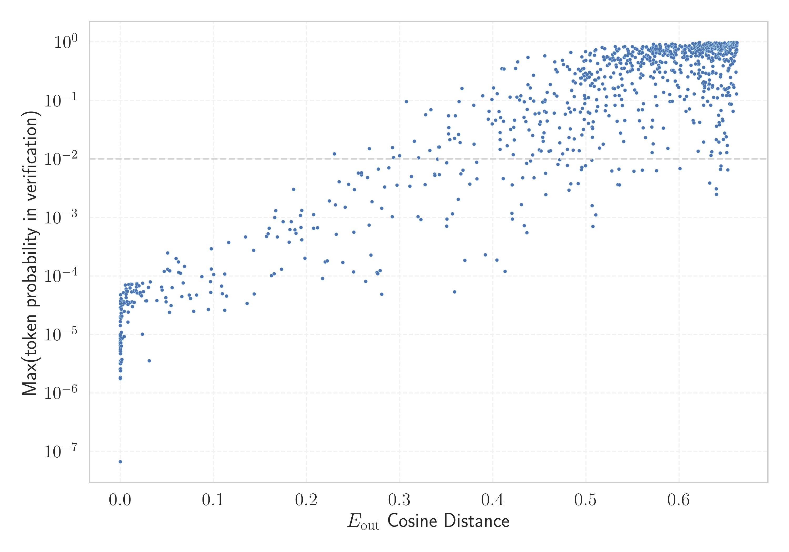

# Report for `allenai/OLMo-7B-hf`

## Model info

* Tied embeddings: no
* Unembeddings use bias: no
* Metric for under-trained tokens: Unemb. OOV Cosine Distance w/o 1st PC
  * Overall distribution 0.977 +/- 0.125
  * Token used for verification prompt building: `ArgumentException`
  * Verification threshold: 0.803
  * Threshold for showing candidate under-trained tokens: 0.472
  * Median verified threshold (for bytes, unreachable and special tokens): 0.236
* Embeddings shape: (50304, 4096)
* Vocabulary size: 50280
  * Number of single byte tokens: 243, of which 1 below metric threshold
  * Number of special tokens: 2, of which 1 below metric threshold
  * Number of unreachable non-single-byte tokens: 221, of which 221 below metric threshold
  * Number of non-single-byte UTF-fragment tokens: 369, 1 below soft metric threshold
  * Number of tested under-trained tokens: 992, 269 below p = 0.01 threshold, 199 below soft metric threshold

## Metrics plot


## Verification plot


## Under-trained token verification results
199 entries below threshold of 0.472

|   token_id | token               |      metric | max_prob                                                         | in_other_tokens                                                             |
|------------|---------------------|-------------|------------------------------------------------------------------|-----------------------------------------------------------------------------|
|      42041 | ````` ▁§\[ `````    | 9.11951e-06 | <span style='border: 1px solid rgb(169, 68, 66);'>4.7e-06</span> |                                                                             |
|      34761 | ````` ▁()](\ `````  | 9.23872e-06 | <span style='border: 1px solid rgb(169, 68, 66);'>8.4e-06</span> |                                                                             |
|      44162 | ````` ]{}\^[ `````  | 9.41753e-06 | <span style='border: 1px solid rgb(169, 68, 66);'>3.2e-06</span> |                                                                             |
|      46468 | ````` \])]{} `````  | 9.41753e-06 | <span style='border: 1px solid rgb(169, 68, 66);'>2.5e-06</span> |                                                                             |
|      45382 | ````` ]{}\_ `````   | 9.41753e-06 | <span style='border: 1px solid rgb(169, 68, 66);'>9.1e-06</span> |                                                                             |
|      43782 | ````` .^\[[@ `````  | 1.03712e-05 | <span style='border: 1px solid rgb(169, 68, 66);'>7.7e-06</span> |                                                                             |
|      31096 | ````` ^\[[@ `````   | 1.07884e-05 | <span style='border: 1px solid rgb(169, 68, 66);'>9.8e-06</span> | <span style='border: 1px solid rgb(169, 68, 66);'>````` .^\[[@ `````</span> |
|      49021 | ````` $.[]{ `````   | 1.10269e-05 | <span style='border: 1px solid rgb(169, 68, 66);'>5.2e-06</span> |                                                                             |
|      48471 | ````` :**]{} `````  | 1.12057e-05 | <span style='border: 1px solid rgb(169, 68, 66);'>2.6e-06</span> |                                                                             |
|      32214 | ````` ]\]^ `````    | 1.2815e-05  | <span style='border: 1px solid rgb(169, 68, 66);'>1.7e-05</span> |                                                                             |
|      41305 | ````` ]{}\_[ `````  | 1.9908e-05  | <span style='border: 1px solid rgb(169, 68, 66);'>9.9e-06</span> |                                                                             |
|      29013 | ````` \]]{} `````   | 2.11e-05    | <span style='border: 1px solid rgb(169, 68, 66);'>6.4e-06</span> |                                                                             |
|      23286 | ````` ^−/− `````    | 2.36034e-05 | <span style='border: 1px solid rgb(169, 68, 66);'>1.4e-05</span> | <span style='border: 1px solid rgb(169, 68, 66);'>````` ^−/−^ `````</span>  |
|      47686 | ````` \^[- `````    | 2.74181e-05 | <span style='border: 1px solid rgb(169, 68, 66);'>2.5e-06</span> |                                                                             |
|      49824 | ````` ▁[(\[ `````   | 2.7895e-05  | <span style='border: 1px solid rgb(169, 68, 66);'>1.8e-06</span> |                                                                             |
|      33805 | ````` ]{}\^ `````   | 2.79546e-05 | <span style='border: 1px solid rgb(169, 68, 66);'>3.4e-06</span> | <span style='border: 1px solid rgb(169, 68, 66);'>````` ]{}\^[ `````</span> |
|      23734 | ````` ▁[****, ````` | 3.03984e-05 | <span style='border: 1px solid rgb(169, 68, 66);'>5.5e-06</span> |                                                                             |
|      26119 | ````` *]{}. `````   | 3.32594e-05 | <span style='border: 1px solid rgb(169, 68, 66);'>1.8e-06</span> |                                                                             |
|      38475 | ````` "}\]. `````   | 4.24981e-05 | <span style='border: 1px solid rgb(169, 68, 66);'>6.9e-06</span> |                                                                             |
|      34494 | ````` ]\]). `````   | 4.57168e-05 | <span style='border: 1px solid rgb(169, 68, 66);'>2e-05</span>   |                                                                             |
<details><summary>179 additional entries below threshold</summary>

|   token_id | token                                            |      metric | max_prob                                                         | in_other_tokens                                                                                                                                                                                                                                                                                                                                                                                    |
|------------|--------------------------------------------------|-------------|------------------------------------------------------------------|----------------------------------------------------------------------------------------------------------------------------------------------------------------------------------------------------------------------------------------------------------------------------------------------------------------------------------------------------------------------------------------------------|
|      39310 | ````` "}**). `````                               | 5.16772e-05 | <span style='border: 1px solid rgb(169, 68, 66);'>1.8e-06</span> |                                                                                                                                                                                                                                                                                                                                                                                                    |
|      34607 | ````` ▁^[@ `````                                 | 6.47902e-05 | <span style='border: 1px solid rgb(169, 68, 66);'>2.9e-05</span> |                                                                                                                                                                                                                                                                                                                                                                                                    |
|      36487 | ````` .**]{} `````                               | 6.78301e-05 | <span style='border: 1px solid rgb(169, 68, 66);'>5.6e-06</span> |                                                                                                                                                                                                                                                                                                                                                                                                    |
|       9899 | ````` ]{}]{} `````                               | 9.04202e-05 | <span style='border: 1px solid rgb(169, 68, 66);'>7.2e-06</span> |                                                                                                                                                                                                                                                                                                                                                                                                    |
|      24994 | ````` ^−^ `````                                  | 9.39369e-05 | <span style='border: 1px solid rgb(169, 68, 66);'>6.6e-06</span> |                                                                                                                                                                                                                                                                                                                                                                                                    |
|      28912 | ````` ^−/−^ `````                                | 0.000102937 | <span style='border: 1px solid rgb(169, 68, 66);'>6.6e-06</span> |                                                                                                                                                                                                                                                                                                                                                                                                    |
|      16079 | ````` .[]{ `````                                 | 0.000109315 | <span style='border: 1px solid rgb(169, 68, 66);'>2.6e-06</span> | <span style='border: 1px solid rgb(169, 68, 66);'>````` $.[]{ `````</span>                                                                                                                                                                                                                                                                                                                         |
|      42804 | ````` )^[@ `````                                 | 0.000167131 | <span style='border: 1px solid rgb(169, 68, 66);'>3.2e-06</span> |                                                                                                                                                                                                                                                                                                                                                                                                    |
|      39083 | ````` "}](# `````                                | 0.000198662 | <span style='border: 1px solid rgb(169, 68, 66);'>2.4e-06</span> |                                                                                                                                                                                                                                                                                                                                                                                                    |
|      27720 | ````` .*]{}, `````                               | 0.000207484 | <span style='border: 1px solid rgb(169, 68, 66);'>8.1e-06</span> |                                                                                                                                                                                                                                                                                                                                                                                                    |
|      27114 | ````` .(\[ `````                                 | 0.000223339 | <span style='border: 1px solid rgb(169, 68, 66);'>3.5e-06</span> |                                                                                                                                                                                                                                                                                                                                                                                                    |
|       8088 | ````` \[[@ `````                                 | 0.000308871 | <span style='border: 1px solid rgb(169, 68, 66);'>9.2e-06</span> | <span style='border: 1px solid rgb(169, 68, 66);'>````` .\[[@ `````</span>, <span style='border: 1px solid rgb(169, 68, 66);'>````` .^\[[@ `````</span>, <span style='border: 1px solid rgb(169, 68, 66);'>````` ^\[[@ `````</span>                                                                                                                                                                |
|      34833 | ````` ▁xcex `````                                | 0.00034368  | <span style='border: 1px solid rgb(169, 68, 66);'>3.4e-05</span> |                                                                                                                                                                                                                                                                                                                                                                                                    |
|      15775 | ````` .\[[@ `````                                | 0.000355124 | <span style='border: 1px solid rgb(169, 68, 66);'>2.8e-05</span> |                                                                                                                                                                                                                                                                                                                                                                                                    |
|      24237 | ````` .]{} `````                                 | 0.00040549  | <span style='border: 1px solid rgb(169, 68, 66);'>5.1e-06</span> |                                                                                                                                                                                                                                                                                                                                                                                                    |
|      28696 | ````` FFIRMED `````                              | 0.000433385 | <span style='border: 1px solid rgb(169, 68, 66);'>9.6e-06</span> | <span style='border: 1px solid rgb(251, 189, 8);'>````` ▁AFFIRMED `````</span>, <span style='border: 1px solid rgb(169, 68, 66);'>````` AFFIRMED `````</span>                                                                                                                                                                                                                                      |
|      43134 | ````` ▁()]{} `````                               | 0.000538766 | <span style='border: 1px solid rgb(169, 68, 66);'>7e-06</span>   |                                                                                                                                                                                                                                                                                                                                                                                                    |
|      32334 | ````` ubottu `````                               | 0.000587106 | <span style='border: 1px solid rgb(169, 68, 66);'>6.2e-06</span> |                                                                                                                                                                                                                                                                                                                                                                                                    |
|      29547 | ````` ]\]; `````                                 | 0.00059402  | <span style='border: 1px solid rgb(169, 68, 66);'>1.9e-05</span> |                                                                                                                                                                                                                                                                                                                                                                                                    |
|      27468 | ````` ▁\_[ `````                                 | 0.000643134 | <span style='border: 1px solid rgb(169, 68, 66);'>4.8e-05</span> |                                                                                                                                                                                                                                                                                                                                                                                                    |
|      30371 | ````` marinedrugs `````                          | 0.000708103 | <span style='border: 1px solid rgb(169, 68, 66);'>4.7e-06</span> |                                                                                                                                                                                                                                                                                                                                                                                                    |
|      25416 | ````` [\*](# `````                               | 0.000738919 | <span style='border: 1px solid rgb(169, 68, 66);'>3.8e-05</span> |                                                                                                                                                                                                                                                                                                                                                                                                    |
|      35869 | ````` ]{}( `````                                 | 0.000968993 | <span style='border: 1px solid rgb(169, 68, 66);'>2.9e-05</span> |                                                                                                                                                                                                                                                                                                                                                                                                    |
|      27655 | ````` ▁$[]$ `````                                | 0.00133622  | <span style='border: 1px solid rgb(169, 68, 66);'>3.3e-05</span> |                                                                                                                                                                                                                                                                                                                                                                                                    |
|      13663 | ````` .*]{} `````                                | 0.00134283  | <span style='border: 1px solid rgb(169, 68, 66);'>1.9e-05</span> | <span style='border: 1px solid rgb(169, 68, 66);'>````` .*]{}, `````</span>                                                                                                                                                                                                                                                                                                                        |
|      33653 | ````` ^\*^ `````                                 | 0.0014292   | <span style='border: 1px solid rgb(169, 68, 66);'>7.2e-06</span> |                                                                                                                                                                                                                                                                                                                                                                                                    |
|      20977 | ````` }$]{} `````                                | 0.00168002  | <span style='border: 1px solid rgb(169, 68, 66);'>8.5e-06</span> |                                                                                                                                                                                                                                                                                                                                                                                                    |
|      30996 | ````` ,^[@ `````                                 | 0.00210279  | <span style='border: 1px solid rgb(169, 68, 66);'>2e-05</span>   |                                                                                                                                                                                                                                                                                                                                                                                                    |
|       4622 | ````` *]{} `````                                 | 0.00212288  | <span style='border: 1px solid rgb(169, 68, 66);'>4.1e-05</span> | <span style='border: 1px solid rgb(169, 68, 66);'>````` .**]{} `````</span>, <span style='border: 1px solid rgb(169, 68, 66);'>````` *]{}, `````</span>, <span style='border: 1px solid rgb(169, 68, 66);'>````` :**]{} `````</span>, <span style='border: 1px solid rgb(169, 68, 66);'>````` .*]{}, `````</span>, <span style='border: 1px solid rgb(169, 68, 66);'>````` *]{}. `````</span>, ... |
|      37406 | ````` medscimonit `````                          | 0.00219429  | <span style='border: 1px solid rgb(169, 68, 66);'>3.4e-06</span> |                                                                                                                                                                                                                                                                                                                                                                                                    |
|      33835 | ````` doibase `````                              | 0.00246018  | <span style='border: 1px solid rgb(169, 68, 66);'>2.3e-05</span> |                                                                                                                                                                                                                                                                                                                                                                                                    |
|      46597 | ````` ▁${{{\ `````                               | 0.00250417  | <span style='border: 1px solid rgb(169, 68, 66);'>2.7e-05</span> |                                                                                                                                                                                                                                                                                                                                                                                                    |
|      45509 | ````` "}^ `````                                  | 0.00269383  | <span style='border: 1px solid rgb(169, 68, 66);'>6.3e-06</span> |                                                                                                                                                                                                                                                                                                                                                                                                    |
|      47389 | ````` ~\] `````                                  | 0.00326657  | <span style='border: 1px solid rgb(169, 68, 66);'>1.1e-05</span> |                                                                                                                                                                                                                                                                                                                                                                                                    |
|      35088 | ````` ...\...\ `````                             | 0.00362641  | <span style='border: 1px solid rgb(169, 68, 66);'>2e-05</span>   |                                                                                                                                                                                                                                                                                                                                                                                                    |
|      26939 | ````` ▁\xa0\xa0▁\xa0\xa0▁\xa0\xa0▁\xa0\xa0 ````` | 0.00412583  | <span style='border: 1px solid rgb(169, 68, 66);'>2.1e-05</span> |                                                                                                                                                                                                                                                                                                                                                                                                    |
|      41163 | ````` micromachines `````                        | 0.00454253  | <span style='border: 1px solid rgb(169, 68, 66);'>3.8e-06</span> |                                                                                                                                                                                                                                                                                                                                                                                                    |
|      31350 | ````` $]{}; `````                                | 0.00633192  | <span style='border: 1px solid rgb(169, 68, 66);'>8.7e-06</span> |                                                                                                                                                                                                                                                                                                                                                                                                    |
|      11661 | ````` *]{}, `````                                | 0.00708342  | <span style='border: 1px solid rgb(169, 68, 66);'>3.2e-05</span> | <span style='border: 1px solid rgb(169, 68, 66);'>````` .*]{}, `````</span>                                                                                                                                                                                                                                                                                                                        |
|      15707 | ````` ▁]{} `````                                 | 0.00727057  | <span style='border: 1px solid rgb(169, 68, 66);'>3.5e-05</span> |                                                                                                                                                                                                                                                                                                                                                                                                    |
|      36134 | ````` [\*\* `````                                | 0.00910217  | <span style='border: 1px solid rgb(169, 68, 66);'>5.2e-05</span> |                                                                                                                                                                                                                                                                                                                                                                                                    |
|      30119 | ````` ▁(\> `````                                 | 0.00996947  | <span style='border: 1px solid rgb(169, 68, 66);'>3.4e-05</span> |                                                                                                                                                                                                                                                                                                                                                                                                    |
|      46924 | ````` obbsee `````                               | 0.010081    | <span style='border: 1px solid rgb(169, 68, 66);'>3.7e-05</span> |                                                                                                                                                                                                                                                                                                                                                                                                    |
|      38710 | ````` ▁\*\** `````                               | 0.0111406   | <span style='border: 1px solid rgb(169, 68, 66);'>3.6e-05</span> |                                                                                                                                                                                                                                                                                                                                                                                                    |
|      18022 | ````` \*](# `````                                | 0.0116369   | <span style='border: 1px solid rgb(169, 68, 66);'>2.5e-05</span> | <span style='border: 1px solid rgb(169, 68, 66);'>````` [\*](# `````</span>                                                                                                                                                                                                                                                                                                                        |
|      40743 | ````` ubotu `````                                | 0.0121526   | <span style='border: 1px solid rgb(169, 68, 66);'>9.2e-06</span> |                                                                                                                                                                                                                                                                                                                                                                                                    |
|      17548 | ````` ]-[@ `````                                 | 0.0132695   | <span style='border: 1px solid rgb(169, 68, 66);'>3.5e-05</span> |                                                                                                                                                                                                                                                                                                                                                                                                    |
|      42274 | ````` ]{}[ `````                                 | 0.0145651   | <span style='border: 1px solid rgb(169, 68, 66);'>7e-05</span>   |                                                                                                                                                                                                                                                                                                                                                                                                    |
|       5413 | ````` ]\], `````                                 | 0.016845    | <span style='border: 1px solid rgb(169, 68, 66);'>6e-05</span>   |                                                                                                                                                                                                                                                                                                                                                                                                    |
|       7444 | ````` **]{} `````                                | 0.0170099   | <span style='border: 1px solid rgb(169, 68, 66);'>4.9e-05</span> | <span style='border: 1px solid rgb(169, 68, 66);'>````` .**]{} `````</span>, <span style='border: 1px solid rgb(169, 68, 66);'>````` :**]{} `````</span>                                                                                                                                                                                                                                           |
|      26997 | ````` \^[ `````                                  | 0.0176834   | <span style='border: 1px solid rgb(169, 68, 66);'>4.3e-05</span> | <span style='border: 1px solid rgb(169, 68, 66);'>````` ]{}\^[ `````</span>, <span style='border: 1px solid rgb(169, 68, 66);'>````` \^[- `````</span>                                                                                                                                                                                                                                             |
|      26868 | ````` ÃÂÃÂÃÂÃÂ `````                             | 0.0180023   | <span style='border: 1px solid rgb(169, 68, 66);'>5.5e-05</span> | <span style='border: 1px solid rgb(255, 145, 0);'>````` ÃÂÃÂÃÂÃÂÃÂÃÂÃÂÃÂ `````</span>                                                                                                                                                                                                                                                                                                              |
|      19181 | ````` ]{}. `````                                 | 0.0202495   | <span style='border: 1px solid rgb(169, 68, 66);'>3.6e-05</span> | <span style='border: 1px solid rgb(169, 68, 66);'>````` *]{}. `````</span>                                                                                                                                                                                                                                                                                                                         |
|      45099 | ````` }}({{\ `````                               | 0.0207479   | <span style='border: 1px solid rgb(169, 68, 66);'>5.5e-05</span> |                                                                                                                                                                                                                                                                                                                                                                                                    |
|      31743 | ````` ^®^ `````                                  | 0.0225412   | <span style='border: 1px solid rgb(169, 68, 66);'>1.6e-05</span> |                                                                                                                                                                                                                                                                                                                                                                                                    |
|      47279 | ````` :$$\ `````                                 | 0.0225641   | <span style='border: 1px solid rgb(169, 68, 66);'>3.3e-05</span> |                                                                                                                                                                                                                                                                                                                                                                                                    |
|      38747 | ````` cjwatson `````                             | 0.0241069   | <span style='border: 1px solid rgb(169, 68, 66);'>2.4e-05</span> |                                                                                                                                                                                                                                                                                                                                                                                                    |
|       6257 | ````` **]{}, `````                               | 0.0249807   | <span style='border: 1px solid rgb(169, 68, 66);'>7.2e-05</span> |                                                                                                                                                                                                                                                                                                                                                                                                    |
|      35420 | ````` }({{\ `````                                | 0.0280253   | <span style='border: 1px solid rgb(169, 68, 66);'>6.3e-05</span> | <span style='border: 1px solid rgb(169, 68, 66);'>````` }}({{\ `````</span>                                                                                                                                                                                                                                                                                                                        |
|      25349 | ````` ))/((- `````                               | 0.0292298   | <span style='border: 1px solid rgb(169, 68, 66);'>3.5e-05</span> |                                                                                                                                                                                                                                                                                                                                                                                                    |
|      21687 | ````` )]{} `````                                 | 0.0307274   | <span style='border: 1px solid rgb(169, 68, 66);'>7.2e-05</span> | <span style='border: 1px solid rgb(169, 68, 66);'>````` \])]{} `````</span>, <span style='border: 1px solid rgb(169, 68, 66);'>````` ▁()]{} `````</span>                                                                                                                                                                                                                                           |
|      35379 | ````` )}^{( `````                                | 0.0326967   | <span style='border: 1px solid rgb(169, 68, 66);'>5.4e-05</span> |                                                                                                                                                                                                                                                                                                                                                                                                    |
|      17278 | ````` ^](# `````                                 | 0.0339229   | <span style='border: 1px solid rgb(169, 68, 66);'>7.2e-05</span> |                                                                                                                                                                                                                                                                                                                                                                                                    |
|      45707 | ````` }}})$ `````                                | 0.0342677   | <span style='border: 1px solid rgb(169, 68, 66);'>3.6e-05</span> |                                                                                                                                                                                                                                                                                                                                                                                                    |
|      14434 | ````` ▁"♪ `````                                  | 0.0348749   | <span style='border: 1px solid rgb(169, 68, 66);'>3e-05</span>   |                                                                                                                                                                                                                                                                                                                                                                                                    |
|      15479 | ````` ▁taxp `````                                | 0.0382571   | <span style='border: 1px solid rgb(169, 68, 66);'>3.5e-05</span> | ````` ▁taxpayers `````, ````` ▁taxpayer `````                                                                                                                                                                                                                                                                                                                                                      |
|      13488 | ````` $]{} `````                                 | 0.0403592   | <span style='border: 1px solid rgb(169, 68, 66);'>5.7e-05</span> | <span style='border: 1px solid rgb(169, 68, 66);'>````` }$]{} `````</span>, <span style='border: 1px solid rgb(169, 68, 66);'>````` $]{}; `````</span>                                                                                                                                                                                                                                             |
|      35768 | ````` ,{{\ `````                                 | 0.042224    | <span style='border: 1px solid rgb(169, 68, 66);'>5.5e-05</span> |                                                                                                                                                                                                                                                                                                                                                                                                    |
|      47056 | ````` }}}({\ `````                               | 0.0448959   | <span style='border: 1px solid rgb(169, 68, 66);'>5.6e-05</span> |                                                                                                                                                                                                                                                                                                                                                                                                    |
|      46201 | ````` )}/\ `````                                 | 0.0467076   | <span style='border: 1px solid rgb(169, 68, 66);'>6.5e-05</span> |                                                                                                                                                                                                                                                                                                                                                                                                    |
|      49411 | ````` *‐ `````                                   | 0.0493354   | <span style='border: 1px solid rgb(169, 68, 66);'>7.2e-05</span> |                                                                                                                                                                                                                                                                                                                                                                                                    |
|      35496 | ````` **--** `````                               | 0.0504313   | <span style='border: 1px solid rgb(169, 68, 66);'>7.4e-05</span> |                                                                                                                                                                                                                                                                                                                                                                                                    |
|      22367 | ````` ![** `````                                 | 0.051343    | <span style='border: 1px solid rgb(169, 68, 66);'>5.1e-05</span> |                                                                                                                                                                                                                                                                                                                                                                                                    |
|      37402 | ````` imonit `````                               | 0.055982    | <span style='border: 1px solid rgb(169, 68, 66);'>6.8e-05</span> | <span style='border: 1px solid rgb(169, 68, 66);'>````` medscimonit `````</span>                                                                                                                                                                                                                                                                                                                   |
|      41284 | ````` /((- `````                                 | 0.0585886   | <span style='border: 1px solid rgb(169, 68, 66);'>4.9e-05</span> |                                                                                                                                                                                                                                                                                                                                                                                                    |
|      47996 | ````` \!\!\! `````                               | 0.0618165   | <span style='border: 1px solid rgb(169, 68, 66);'>4.6e-05</span> |                                                                                                                                                                                                                                                                                                                                                                                                    |
|      39614 | ````` pitti `````                                | 0.0624471   | <span style='border: 1px solid rgb(169, 68, 66);'>5.2e-05</span> |                                                                                                                                                                                                                                                                                                                                                                                                    |
|      16986 | ````` )/((- `````                                | 0.0644664   | <span style='border: 1px solid rgb(169, 68, 66);'>7.5e-05</span> | <span style='border: 1px solid rgb(169, 68, 66);'>````` ))/((- `````</span>                                                                                                                                                                                                                                                                                                                        |
|       1254 | ````` ▁\[[@ `````                                | 0.0665633   | <span style='border: 1px solid rgb(169, 68, 66);'>5.4e-05</span> |                                                                                                                                                                                                                                                                                                                                                                                                    |
|      43421 | ````` Sportspeople `````                         | 0.0692022   | <span style='border: 1px solid rgb(169, 68, 66);'>1e-05</span>   |                                                                                                                                                                                                                                                                                                                                                                                                    |
|      14798 | ````` ▁affidav `````                             | 0.0693958   | <span style='border: 1px solid rgb(169, 68, 66);'>3.8e-05</span> | ````` ▁affidavits `````, ````` ▁affidavit `````                                                                                                                                                                                                                                                                                                                                                    |
|      47028 | ````` )\\|_{ `````                               | 0.0738958   | <span style='border: 1px solid rgb(169, 68, 66);'>3.8e-05</span> |                                                                                                                                                                                                                                                                                                                                                                                                    |
|      17030 | ````` ÃÂÃÂ `````                                 | 0.0799775   | <span style='border: 1px solid rgb(169, 68, 66);'>6.4e-05</span> | <span style='border: 1px solid rgb(169, 68, 66);'>````` ÃÂÃÂÃÂÃÂ `````</span>, <span style='border: 1px solid rgb(255, 145, 0);'>````` ÃÂÃÂÃÂÃÂÃÂÃÂÃÂÃÂ `````</span>                                                                                                                                                                                                                               |
|      42465 | ````` }},$$ `````                                | 0.0815685   | <span style='border: 1px solid rgb(169, 68, 66);'>3.6e-06</span> |                                                                                                                                                                                                                                                                                                                                                                                                    |
|      46608 | ````` *~( `````                                  | 0.0852742   | <span style='border: 1px solid rgb(169, 68, 66);'>8e-05</span>   |                                                                                                                                                                                                                                                                                                                                                                                                    |
|       7254 | ````` ]--[@ `````                                | 0.103954    | <span style='border: 1px solid rgb(169, 68, 66);'>3.8e-05</span> |                                                                                                                                                                                                                                                                                                                                                                                                    |
|      15236 | ````` ▁biomark `````                             | 0.113483    | <span style='border: 1px solid rgb(169, 68, 66);'>3.6e-05</span> | ````` ▁biomarkers `````, ````` ▁biomarker `````                                                                                                                                                                                                                                                                                                                                                    |
|      18781 | ````` ▁♪" `````                                  | 0.11494     | <span style='border: 1px solid rgb(169, 68, 66);'>6.4e-05</span> |                                                                                                                                                                                                                                                                                                                                                                                                    |
|       3951 | ````` ^[@ `````                                  | 0.12133     | <span style='border: 1px solid rgb(169, 68, 66);'>5.7e-05</span> | <span style='border: 1px solid rgb(169, 68, 66);'>````` )^[@ `````</span>, <span style='border: 1px solid rgb(169, 68, 66);'>````` ▁^[@ `````</span>, <span style='border: 1px solid rgb(169, 68, 66);'>````` .^[@ `````</span>, <span style='border: 1px solid rgb(169, 68, 66);'>````` ,^[@ `````</span>                                                                                         |
|      45472 | ````` ]{}) `````                                 | 0.122598    | <span style='border: 1px solid rgb(169, 68, 66);'>0.00012</span> |                                                                                                                                                                                                                                                                                                                                                                                                    |
|      13704 | ````` ▁\xa0\xa0▁\xa0\xa0 `````                   | 0.123215    | <span style='border: 1px solid rgb(169, 68, 66);'>0.00025</span> | <span style='border: 1px solid rgb(169, 68, 66);'>````` ▁\xa0\xa0▁\xa0\xa0▁\xa0\xa0▁\xa0\xa0 `````</span>                                                                                                                                                                                                                                                                                          |
|      38327 | ````` ))/(- `````                                | 0.126706    | <span style='border: 1px solid rgb(169, 68, 66);'>0.00013</span> |                                                                                                                                                                                                                                                                                                                                                                                                    |
|      42348 | ````` )}.$$ `````                                | 0.131303    | <span style='border: 1px solid rgb(169, 68, 66);'>2.4e-05</span> |                                                                                                                                                                                                                                                                                                                                                                                                    |
|      43214 | ````` }).$$ `````                                | 0.134015    | <span style='border: 1px solid rgb(169, 68, 66);'>3.1e-05</span> |                                                                                                                                                                                                                                                                                                                                                                                                    |
|      41456 | ````` ))*- `````                                 | 0.135184    | <span style='border: 1px solid rgb(169, 68, 66);'>0.00012</span> |                                                                                                                                                                                                                                                                                                                                                                                                    |
|      37087 | ````` medsc `````                                | 0.137219    | <span style='border: 1px solid rgb(169, 68, 66);'>4.3e-05</span> | <span style='border: 1px solid rgb(169, 68, 66);'>````` medscimonit `````</span>                                                                                                                                                                                                                                                                                                                   |
|      37857 | ````` \!\!\!\! `````                             | 0.146835    | <span style='border: 1px solid rgb(169, 68, 66);'>0.0002</span>  |                                                                                                                                                                                                                                                                                                                                                                                                    |
|      47827 | ````` mathchoice `````                           | 0.148612    | <span style='border: 1px solid rgb(169, 68, 66);'>6.3e-05</span> |                                                                                                                                                                                                                                                                                                                                                                                                    |
|      39743 | ````` 14514500 `````                             | 0.149382    | <span style='border: 1px solid rgb(169, 68, 66);'>0.00017</span> | <span style='border: 1px solid rgb(251, 189, 8);'>````` 1451450014514500 `````</span>                                                                                                                                                                                                                                                                                                              |
|       1656 | ````` ]\]. `````                                 | 0.154501    | <span style='border: 1px solid rgb(169, 68, 66);'>0.00012</span> | <span style='border: 1px solid rgb(255, 145, 0);'>````` \]\]. `````</span>                                                                                                                                                                                                                                                                                                                         |
|      18413 | ````` ]^, `````                                  | 0.161334    | <span style='border: 1px solid rgb(169, 68, 66);'>0.00011</span> |                                                                                                                                                                                                                                                                                                                                                                                                    |
|      39077 | ````` \}.$$ `````                                | 0.161868    | <span style='border: 1px solid rgb(169, 68, 66);'>4.4e-05</span> |                                                                                                                                                                                                                                                                                                                                                                                                    |
|      46230 | ````` \x88\x91 `````                             | 0.164605    | <span style='border: 1px solid rgb(169, 68, 66);'>7.6e-05</span> |                                                                                                                                                                                                                                                                                                                                                                                                    |
|      44578 | ````` ▁\u2009 `````                              | 0.169116    | <span style='border: 1px solid rgb(169, 68, 66);'>0.00015</span> |                                                                                                                                                                                                                                                                                                                                                                                                    |
|      32964 | ````` }}.$$ `````                                | 0.175238    | <span style='border: 1px solid rgb(169, 68, 66);'>4.7e-05</span> |                                                                                                                                                                                                                                                                                                                                                                                                    |
|      38913 | ````` \x98¯ `````                                | 0.181125    | <span style='border: 1px solid rgb(169, 68, 66);'>4.1e-05</span> |                                                                                                                                                                                                                                                                                                                                                                                                    |
|      45251 | ````` }})$, `````                                | 0.183725    | <span style='border: 1px solid rgb(169, 68, 66);'>2.5e-05</span> |                                                                                                                                                                                                                                                                                                                                                                                                    |
|      35799 | ````` }}}$, `````                                | 0.189255    | <span style='border: 1px solid rgb(169, 68, 66);'>4.7e-05</span> |                                                                                                                                                                                                                                                                                                                                                                                                    |
|      30780 | ````` ▁$({\ `````                                | 0.193793    | <span style='border: 1px solid rgb(169, 68, 66);'>9.8e-05</span> |                                                                                                                                                                                                                                                                                                                                                                                                    |
|      46045 | ````` brainsci `````                             | 0.211843    | <span style='border: 1px solid rgb(169, 68, 66);'>2.7e-05</span> |                                                                                                                                                                                                                                                                                                                                                                                                    |
|      33471 | ````` }}}$. `````                                | 0.212565    | <span style='border: 1px solid rgb(169, 68, 66);'>2.7e-05</span> |                                                                                                                                                                                                                                                                                                                                                                                                    |
|      10174 | ````` .^[@ `````                                 | 0.219636    | <span style='border: 1px solid rgb(169, 68, 66);'>8e-05</span>   |                                                                                                                                                                                                                                                                                                                                                                                                    |
|      28128 | ````` ))**(- `````                               | 0.223846    | <span style='border: 1px solid rgb(169, 68, 66);'>0.00029</span> |                                                                                                                                                                                                                                                                                                                                                                                                    |
|      12253 | ````` ▁questionna `````                          | 0.227688    | <span style='border: 1px solid rgb(169, 68, 66);'>4.5e-05</span> | ````` ▁questionnaire `````, ````` ▁questionnaires `````                                                                                                                                                                                                                                                                                                                                            |
|      26325 | ````` ▁,$$ `````                                 | 0.236044    | <span style='border: 1px solid rgb(169, 68, 66);'>0.00011</span> |                                                                                                                                                                                                                                                                                                                                                                                                    |
|      39049 | ````` }})$. `````                                | 0.23849     | <span style='border: 1px solid rgb(169, 68, 66);'>5e-05</span>   |                                                                                                                                                                                                                                                                                                                                                                                                    |
|       8827 | ````` rsfs `````                                 | 0.240814    | <span style='border: 1px solid rgb(169, 68, 66);'>0.00013</span> | <span style='border: 1px solid rgb(255, 145, 0);'>````` mathrsfs `````</span>                                                                                                                                                                                                                                                                                                                      |
|      42691 | ````` jcmm `````                                 | 0.242304    | <span style='border: 1px solid rgb(169, 68, 66);'>2.6e-05</span> |                                                                                                                                                                                                                                                                                                                                                                                                    |
|      35937 | ````` }}}}$ `````                                | 0.242595    | <span style='border: 1px solid rgb(169, 68, 66);'>0.00011</span> |                                                                                                                                                                                                                                                                                                                                                                                                    |
|      39111 | ````` }}}(\ `````                                | 0.243004    | <span style='border: 1px solid rgb(169, 68, 66);'>0.00037</span> |                                                                                                                                                                                                                                                                                                                                                                                                    |
|      26384 | ````` ▁remn `````                                | 0.245945    | <span style='border: 1px solid rgb(169, 68, 66);'>4.9e-05</span> | ````` ▁remnant `````, ````` ▁remnants `````                                                                                                                                                                                                                                                                                                                                                        |
|      20637 | ````` ▁supernat `````                            | 0.256305    | <span style='border: 1px solid rgb(169, 68, 66);'>3.4e-05</span> | ````` ▁supernatural `````, ````` ▁supernatant `````, ````` ▁supernatants `````                                                                                                                                                                                                                                                                                                                     |
|      38651 | ````` xymatrix `````                             | 0.259542    | <span style='border: 1px solid rgb(169, 68, 66);'>6.7e-05</span> |                                                                                                                                                                                                                                                                                                                                                                                                    |
|      30356 | ````` marined `````                              | 0.266969    | <span style='border: 1px solid rgb(169, 68, 66);'>5.2e-05</span> | <span style='border: 1px solid rgb(169, 68, 66);'>````` marinedrugs `````</span>                                                                                                                                                                                                                                                                                                                   |
|      10148 | ````` "}]( `````                                 | 0.278342    | <span style='border: 1px solid rgb(169, 68, 66);'>0.00046</span> | <span style='border: 1px solid rgb(169, 68, 66);'>````` "}](# `````</span>                                                                                                                                                                                                                                                                                                                         |
|      27092 | ````` ▁glimp `````                               | 0.295353    | <span style='border: 1px solid rgb(169, 68, 66);'>0.0001</span>  | ````` ▁glimpse `````, ````` ▁glimps `````                                                                                                                                                                                                                                                                                                                                                          |
|      26362 | ````` ▁{¶ `````                                  | 0.300233    | <span style='border: 1px solid rgb(169, 68, 66);'>0.00027</span> |                                                                                                                                                                                                                                                                                                                                                                                                    |
|      48367 | ````` }}^{{\ `````                               | 0.302064    | <span style='border: 1px solid rgb(169, 68, 66);'>0.00066</span> |                                                                                                                                                                                                                                                                                                                                                                                                    |
|      45659 | ````` ▁Spacewatch `````                          | 0.320328    | <span style='border: 1px solid rgb(169, 68, 66);'>0.00011</span> |                                                                                                                                                                                                                                                                                                                                                                                                    |
|      33857 | ````` mathds `````                               | 0.327511    | <span style='border: 1px solid rgb(169, 68, 66);'>0.00047</span> |                                                                                                                                                                                                                                                                                                                                                                                                    |
|      43189 | ````` )[@ `````                                  | 0.334324    | <span style='border: 1px solid rgb(169, 68, 66);'>0.00053</span> |                                                                                                                                                                                                                                                                                                                                                                                                    |
|      23063 | ````` ▁careg `````                               | 0.338595    | <span style='border: 1px solid rgb(169, 68, 66);'>9.1e-05</span> | ````` ▁caregivers `````, ````` ▁caregiver `````                                                                                                                                                                                                                                                                                                                                                    |
|      24759 | ````` }}}^ `````                                 | 0.339486    | <span style='border: 1px solid rgb(169, 68, 66);'>0.00085</span> | <span style='border: 1px solid rgb(251, 189, 8);'>````` }}}^{ `````</span>                                                                                                                                                                                                                                                                                                                         |
|      43913 | ````` eqno `````                                 | 0.345064    | <span style='border: 1px solid rgb(255, 145, 0);'>0.0013</span>  |                                                                                                                                                                                                                                                                                                                                                                                                    |
|      46658 | ````` "}* `````                                  | 0.34565     | <span style='border: 1px solid rgb(169, 68, 66);'>0.00085</span> |                                                                                                                                                                                                                                                                                                                                                                                                    |
|      44965 | ````` ▁[[* `````                                 | 0.346457    | <span style='border: 1px solid rgb(169, 68, 66);'>0.00054</span> |                                                                                                                                                                                                                                                                                                                                                                                                    |
|      27618 | ````` []$ `````                                  | 0.346811    | <span style='border: 1px solid rgb(169, 68, 66);'>0.001</span>   | <span style='border: 1px solid rgb(169, 68, 66);'>````` ▁$[]$ `````</span>                                                                                                                                                                                                                                                                                                                         |
|      28554 | ````` }}$- `````                                 | 0.347511    | <span style='border: 1px solid rgb(169, 68, 66);'>0.00038</span> |                                                                                                                                                                                                                                                                                                                                                                                                    |
|      34985 | ````` \xa0\n▁ `````                              | 0.349032    | <span style='border: 1px solid rgb(169, 68, 66);'>0.00047</span> |                                                                                                                                                                                                                                                                                                                                                                                                    |
|      41606 | ````` ÃÂÃÂÃÂÃÂÃÂÃÂÃÂÃÂ `````                     | 0.349954    | <span style='border: 1px solid rgb(255, 145, 0);'>0.003</span>   |                                                                                                                                                                                                                                                                                                                                                                                                    |
|      37276 | ````` }}}_{\ `````                               | 0.352222    | <span style='border: 1px solid rgb(255, 145, 0);'>0.0013</span>  |                                                                                                                                                                                                                                                                                                                                                                                                    |
|      46479 | ````` ▁\\|_{ `````                               | 0.36111     | <span style='border: 1px solid rgb(169, 68, 66);'>0.00061</span> |                                                                                                                                                                                                                                                                                                                                                                                                    |
|      30775 | ````` $– `````                                   | 0.365832    | <span style='border: 1px solid rgb(169, 68, 66);'>0.00041</span> |                                                                                                                                                                                                                                                                                                                                                                                                    |
|      43654 | ````` \\|_{\ `````                               | 0.369357    | <span style='border: 1px solid rgb(169, 68, 66);'>0.00067</span> |                                                                                                                                                                                                                                                                                                                                                                                                    |
|       7433 | ````` ^+^ `````                                  | 0.370577    | <span style='border: 1px solid rgb(255, 145, 0);'>0.0011</span>  |                                                                                                                                                                                                                                                                                                                                                                                                    |
|      18031 | ````` :"){ `````                                 | 0.372794    | <span style='border: 1px solid rgb(169, 68, 66);'>0.00062</span> |                                                                                                                                                                                                                                                                                                                                                                                                    |
|      42010 | ````` ▁BytePtrFromString `````                   | 0.374917    | <span style='border: 1px solid rgb(251, 189, 8);'>0.012</span>   |                                                                                                                                                                                                                                                                                                                                                                                                    |
|      48817 | ````` }+{\ `````                                 | 0.39338     | <span style='border: 1px solid rgb(169, 68, 66);'>0.00067</span> |                                                                                                                                                                                                                                                                                                                                                                                                    |
|      49372 | ````` _{\{ `````                                 | 0.395521    | <span style='border: 1px solid rgb(255, 145, 0);'>0.0011</span>  |                                                                                                                                                                                                                                                                                                                                                                                                    |
|      41137 | ````` *~, `````                                  | 0.395804    | <span style='border: 1px solid rgb(169, 68, 66);'>0.0002</span>  |                                                                                                                                                                                                                                                                                                                                                                                                    |
|      36847 | ````` mathbbm `````                              | 0.397245    | <span style='border: 1px solid rgb(169, 68, 66);'>0.00065</span> |                                                                                                                                                                                                                                                                                                                                                                                                    |
|      22066 | ````` ▁resemb `````                              | 0.403481    | <span style='border: 1px solid rgb(169, 68, 66);'>8.1e-05</span> | ````` ▁resembling `````, ````` ▁resembles `````, ````` ▁resembled `````, ````` ▁resemblance `````, ````` ▁resemble `````                                                                                                                                                                                                                                                                           |
|      41557 | ````` PtrFromString `````                        | 0.405138    | <span style='border: 1px solid rgb(255, 145, 0);'>0.0057</span>  | <span style='border: 1px solid rgb(251, 189, 8);'>````` ▁BytePtrFromString `````</span>                                                                                                                                                                                                                                                                                                            |
|      33053 | ````` biomolecules `````                         | 0.405939    | <span style='border: 1px solid rgb(169, 68, 66);'>0.00013</span> |                                                                                                                                                                                                                                                                                                                                                                                                    |
|       6334 | ````` .[@ `````                                  | 0.410363    | <span style='border: 1px solid rgb(169, 68, 66);'>0.00017</span> |                                                                                                                                                                                                                                                                                                                                                                                                    |
|      26398 | ````` _{(\ `````                                 | 0.416175    | <span style='border: 1px solid rgb(255, 145, 0);'>0.0019</span>  |                                                                                                                                                                                                                                                                                                                                                                                                    |
|      48738 | ````` \u2003\u2003\u2003 `````                   | 0.420067    | <span style='border: 1px solid rgb(255, 145, 0);'>0.0041</span>  |                                                                                                                                                                                                                                                                                                                                                                                                    |
|      21895 | ````` ▁predecess `````                           | 0.422371    | <span style='border: 1px solid rgb(169, 68, 66);'>0.00012</span> | ````` ▁predecessors `````, ````` ▁predecessor `````                                                                                                                                                                                                                                                                                                                                                |
|      19753 | ````` }}({\ `````                                | 0.423005    | <span style='border: 1px solid rgb(255, 145, 0);'>0.003</span>   | <span style='border: 1px solid rgb(169, 68, 66);'>````` }}}({\ `````</span>                                                                                                                                                                                                                                                                                                                        |
|      48628 | ````` ▁doxor `````                               | 0.429187    | <span style='border: 1px solid rgb(169, 68, 66);'>0.00012</span> | ````` ▁doxorubicin `````                                                                                                                                                                                                                                                                                                                                                                           |
|      41625 | ````` ¸\x8d `````                                | 0.43263     | <span style='border: 1px solid rgb(169, 68, 66);'>0.00017</span> |                                                                                                                                                                                                                                                                                                                                                                                                    |
|      47264 | ````` }-{\ `````                                 | 0.433144    | <span style='border: 1px solid rgb(255, 145, 0);'>0.0015</span>  |                                                                                                                                                                                                                                                                                                                                                                                                    |
|       8562 | ````` ]^. `````                                  | 0.434296    | <span style='border: 1px solid rgb(255, 145, 0);'>0.0037</span>  |                                                                                                                                                                                                                                                                                                                                                                                                    |
|      26136 | ````` }}_\ `````                                 | 0.435164    | <span style='border: 1px solid rgb(255, 145, 0);'>0.0048</span>  |                                                                                                                                                                                                                                                                                                                                                                                                    |
|      40608 | ````` }^{(\ `````                                | 0.435569    | <span style='border: 1px solid rgb(255, 145, 0);'>0.0054</span>  |                                                                                                                                                                                                                                                                                                                                                                                                    |
|      18822 | ````` ▁.$$ `````                                 | 0.438501    | <span style='border: 1px solid rgb(169, 68, 66);'>0.00051</span> |                                                                                                                                                                                                                                                                                                                                                                                                    |
|      18112 | ````` ▁practition `````                          | 0.438777    | <span style='border: 1px solid rgb(169, 68, 66);'>4.9e-05</span> | ````` ▁practitioner `````, ````` ▁practitioners `````                                                                                                                                                                                                                                                                                                                                              |
|      37075 | ````` RSOS `````                                 | 0.444779    | <span style='border: 1px solid rgb(255, 145, 0);'>0.0016</span>  |                                                                                                                                                                                                                                                                                                                                                                                                    |
|      16302 | ````` }}}_ `````                                 | 0.446186    | <span style='border: 1px solid rgb(255, 145, 0);'>0.0067</span>  | <span style='border: 1px solid rgb(40, 167, 69);'>````` }}}_{ `````</span>, <span style='border: 1px solid rgb(255, 145, 0);'>````` }}}_{\ `````</span>                                                                                                                                                                                                                                            |
|      47183 | ````` ▁$\\|\ `````                               | 0.447804    | <span style='border: 1px solid rgb(169, 68, 66);'>0.00023</span> |                                                                                                                                                                                                                                                                                                                                                                                                    |
|      44524 | ````` ].$$ `````                                 | 0.451742    | <span style='border: 1px solid rgb(169, 68, 66);'>0.00056</span> |                                                                                                                                                                                                                                                                                                                                                                                                    |
|      22372 | ````` ,[@ `````                                  | 0.452729    | <span style='border: 1px solid rgb(251, 189, 8);'>0.015</span>   |                                                                                                                                                                                                                                                                                                                                                                                                    |
|      42680 | ````` ▁Comiss `````                              | 0.460867    | <span style='border: 1px solid rgb(169, 68, 66);'>0.00012</span> | <span style='border: 1px solid rgb(251, 189, 8);'>````` ▁Comissão `````</span>                                                                                                                                                                                                                                                                                                                     |
|      28073 | ````` }}^\ `````                                 | 0.462998    | <span style='border: 1px solid rgb(255, 145, 0);'>0.0071</span>  |                                                                                                                                                                                                                                                                                                                                                                                                    |
|      13380 | ````` \_[ `````                                  | 0.466258    | <span style='border: 1px solid rgb(255, 145, 0);'>0.0058</span>  | <span style='border: 1px solid rgb(169, 68, 66);'>````` ]{}\_[ `````</span>, <span style='border: 1px solid rgb(169, 68, 66);'>````` ▁\_[ `````</span>                                                                                                                                                                                                                                             |
|      40125 | ````` ]^{\ `````                                 | 0.46711     | <span style='border: 1px solid rgb(255, 145, 0);'>0.0019</span>  |                                                                                                                                                                                                                                                                                                                                                                                                    |
|      39586 | ````` }{~ `````                                  | 0.467366    | <span style='border: 1px solid rgb(251, 189, 8);'>0.011</span>   | <span style='border: 1px solid rgb(40, 167, 69);'>````` ~}{~ `````</span>                                                                                                                                                                                                                                                                                                                          |
|      32673 | ````` }}^{( `````                                | 0.469953    | <span style='border: 1px solid rgb(251, 189, 8);'>0.011</span>   |                                                                                                                                                                                                                                                                                                                                                                                                    |
|      43029 | ````` AFFIRMED `````                             | 0.471509    | <span style='border: 1px solid rgb(169, 68, 66);'>0.00018</span> | <span style='border: 1px solid rgb(251, 189, 8);'>````` ▁AFFIRMED `````</span>                                                                                                                                                                                                                                                                                                                     |
</details>
<details><summary>793 additional entries above threshold</summary>

|   token_id | token                                                                                                                                                                                                                                                                         |   metric | max_prob                                                         | in_other_tokens                                                                                                                                                                                                                                                                                                                                                                                 |
|------------|-------------------------------------------------------------------------------------------------------------------------------------------------------------------------------------------------------------------------------------------------------------------------------|----------|------------------------------------------------------------------|-------------------------------------------------------------------------------------------------------------------------------------------------------------------------------------------------------------------------------------------------------------------------------------------------------------------------------------------------------------------------------------------------|
|      45536 | ````` ▁Euroopan `````                                                                                                                                                                                                                                                         | 0.472492 | <span style='border: 1px solid rgb(169, 68, 66);'>0.00011</span> |                                                                                                                                                                                                                                                                                                                                                                                                 |
|      35138 | ````` ▁\[* `````                                                                                                                                                                                                                                                              | 0.479672 | <span style='border: 1px solid rgb(255, 145, 0);'>0.001</span>   |                                                                                                                                                                                                                                                                                                                                                                                                 |
|       2947 | ````` ],[@ `````                                                                                                                                                                                                                                                              | 0.47995  | <span style='border: 1px solid rgb(169, 68, 66);'>0.00074</span> |                                                                                                                                                                                                                                                                                                                                                                                                 |
|      22180 | ````` _{{{\ `````                                                                                                                                                                                                                                                             | 0.481917 | <span style='border: 1px solid rgb(251, 189, 8);'>0.016</span>   |                                                                                                                                                                                                                                                                                                                                                                                                 |
|      27790 | ````` }}_{{\ `````                                                                                                                                                                                                                                                            | 0.481929 | <span style='border: 1px solid rgb(251, 189, 8);'>0.02</span>    |                                                                                                                                                                                                                                                                                                                                                                                                 |
|      39922 | ````` 1451450014514500 `````                                                                                                                                                                                                                                                  | 0.482386 | <span style='border: 1px solid rgb(251, 189, 8);'>0.096</span>   |                                                                                                                                                                                                                                                                                                                                                                                                 |
|      48070 | ````` smallmatrix `````                                                                                                                                                                                                                                                       | 0.493184 | <span style='border: 1px solid rgb(251, 189, 8);'>0.07</span>    |                                                                                                                                                                                                                                                                                                                                                                                                 |
|      27596 | ````` ^® `````                                                                                                                                                                                                                                                                | 0.497956 | <span style='border: 1px solid rgb(255, 145, 0);'>0.0014</span>  | <span style='border: 1px solid rgb(169, 68, 66);'>````` ^®^ `````</span>                                                                                                                                                                                                                                                                                                                        |
|      45656 | ````` ▁{{{\ `````                                                                                                                                                                                                                                                             | 0.498077 | <span style='border: 1px solid rgb(255, 145, 0);'>0.0036</span>  |                                                                                                                                                                                                                                                                                                                                                                                                 |
|       8865 | ````` idemargin `````                                                                                                                                                                                                                                                         | 0.500197 | <span style='border: 1px solid rgb(255, 145, 0);'>0.0086</span>  | <span style='border: 1px solid rgb(40, 167, 69);'>````` oddsidemargin `````</span>                                                                                                                                                                                                                                                                                                              |
|      12159 | ````` ]{}\ `````                                                                                                                                                                                                                                                              | 0.503974 | <span style='border: 1px solid rgb(251, 189, 8);'>0.057</span>   | <span style='border: 1px solid rgb(169, 68, 66);'>````` ]{}\_[ `````</span>, <span style='border: 1px solid rgb(169, 68, 66);'>````` ]{}\^[ `````</span>, <span style='border: 1px solid rgb(169, 68, 66);'>````` ]{}\_ `````</span>, <span style='border: 1px solid rgb(169, 68, 66);'>````` ]{}\^ `````</span>                                                                                |
|      16207 | ````` ▁$${\ `````                                                                                                                                                                                                                                                             | 0.505349 | <span style='border: 1px solid rgb(169, 68, 66);'>0.00093</span> |                                                                                                                                                                                                                                                                                                                                                                                                 |
|       8844 | ````` amsbsy `````                                                                                                                                                                                                                                                            | 0.508268 | <span style='border: 1px solid rgb(255, 145, 0);'>0.0046</span>  |                                                                                                                                                                                                                                                                                                                                                                                                 |
|      34273 | ````` }}^{- `````                                                                                                                                                                                                                                                             | 0.511186 | <span style='border: 1px solid rgb(251, 189, 8);'>0.014</span>   |                                                                                                                                                                                                                                                                                                                                                                                                 |
|      10365 | ````` ▁embod `````                                                                                                                                                                                                                                                            | 0.511881 | <span style='border: 1px solid rgb(169, 68, 66);'>0.00023</span> | ````` ▁embodiments `````, ````` ▁embodied `````, ````` ▁embodiment `````                                                                                                                                                                                                                                                                                                                        |
|      47402 | ````` })^{\ `````                                                                                                                                                                                                                                                             | 0.513345 | <span style='border: 1px solid rgb(255, 145, 0);'>0.0037</span>  |                                                                                                                                                                                                                                                                                                                                                                                                 |
|      22702 | ````` ▁errnoErr `````                                                                                                                                                                                                                                                         | 0.513809 | <span style='border: 1px solid rgb(40, 167, 69);'>0.16</span>    |                                                                                                                                                                                                                                                                                                                                                                                                 |
|       8861 | ````` upgreek `````                                                                                                                                                                                                                                                           | 0.516503 | <span style='border: 1px solid rgb(251, 189, 8);'>0.018</span>   |                                                                                                                                                                                                                                                                                                                                                                                                 |
|      37450 | ````` }}}^{ `````                                                                                                                                                                                                                                                             | 0.519562 | <span style='border: 1px solid rgb(251, 189, 8);'>0.027</span>   |                                                                                                                                                                                                                                                                                                                                                                                                 |
|      42643 | ````` _{\| `````                                                                                                                                                                                                                                                              | 0.524116 | <span style='border: 1px solid rgb(255, 145, 0);'>0.0034</span>  |                                                                                                                                                                                                                                                                                                                                                                                                 |
|      21852 | ````` ▁earthqu `````                                                                                                                                                                                                                                                          | 0.524507 | <span style='border: 1px solid rgb(169, 68, 66);'>0.00018</span> | ````` ▁earthquake `````, ````` ▁earthquakes `````                                                                                                                                                                                                                                                                                                                                               |
|      22596 | ````` ▁opio `````                                                                                                                                                                                                                                                             | 0.525618 | <span style='border: 1px solid rgb(169, 68, 66);'>0.00071</span> | ````` ▁opioid `````, ````` ▁opioids `````                                                                                                                                                                                                                                                                                                                                                       |
|      47106 | ````` ^+_ `````                                                                                                                                                                                                                                                               | 0.531973 | <span style='border: 1px solid rgb(251, 189, 8);'>0.01</span>    |                                                                                                                                                                                                                                                                                                                                                                                                 |
|      38113 | ````` }_{( `````                                                                                                                                                                                                                                                              | 0.533205 | <span style='border: 1px solid rgb(251, 189, 8);'>0.016</span>   |                                                                                                                                                                                                                                                                                                                                                                                                 |
|      27886 | ````` scriptscriptstyle `````                                                                                                                                                                                                                                                 | 0.534962 | <span style='border: 1px solid rgb(251, 189, 8);'>0.096</span>   |                                                                                                                                                                                                                                                                                                                                                                                                 |
|      10248 | ````` ▁specim `````                                                                                                                                                                                                                                                           | 0.538769 | <span style='border: 1px solid rgb(169, 68, 66);'>0.00012</span> | ````` ▁specimens `````, ````` ▁specimen `````                                                                                                                                                                                                                                                                                                                                                   |
|      45332 | ````` **~ `````                                                                                                                                                                                                                                                               | 0.543434 | <span style='border: 1px solid rgb(255, 145, 0);'>0.0033</span>  |                                                                                                                                                                                                                                                                                                                                                                                                 |
|      29914 | ````` Bigr `````                                                                                                                                                                                                                                                              | 0.544627 | <span style='border: 1px solid rgb(251, 189, 8);'>0.055</span>   |                                                                                                                                                                                                                                                                                                                                                                                                 |
|      37596 | ````` \]- `````                                                                                                                                                                                                                                                               | 0.546059 | <span style='border: 1px solid rgb(255, 145, 0);'>0.0055</span>  |                                                                                                                                                                                                                                                                                                                                                                                                 |
|      38225 | ````` )}_{\ `````                                                                                                                                                                                                                                                             | 0.546262 | <span style='border: 1px solid rgb(251, 189, 8);'>0.022</span>   |                                                                                                                                                                                                                                                                                                                                                                                                 |
|      19022 | ````` ^{{\ `````                                                                                                                                                                                                                                                              | 0.546687 | <span style='border: 1px solid rgb(251, 189, 8);'>0.016</span>   | <span style='border: 1px solid rgb(169, 68, 66);'>````` }}^{{\ `````</span>, <span style='border: 1px solid rgb(40, 167, 69);'>````` }^{{\ `````</span>                                                                                                                                                                                                                                         |
|      39294 | ````` )={\ `````                                                                                                                                                                                                                                                              | 0.546823 | <span style='border: 1px solid rgb(255, 145, 0);'>0.0054</span>  |                                                                                                                                                                                                                                                                                                                                                                                                 |
|      47942 | ````` ^*(\ `````                                                                                                                                                                                                                                                              | 0.54907  | <span style='border: 1px solid rgb(255, 145, 0);'>0.01</span>    |                                                                                                                                                                                                                                                                                                                                                                                                 |
|      44766 | ````` }}}= `````                                                                                                                                                                                                                                                              | 0.551998 | <span style='border: 1px solid rgb(255, 145, 0);'>0.0065</span>  |                                                                                                                                                                                                                                                                                                                                                                                                 |
|      13270 | ````` MOESM `````                                                                                                                                                                                                                                                             | 0.55937  | <span style='border: 1px solid rgb(40, 167, 69);'>0.35</span>    |                                                                                                                                                                                                                                                                                                                                                                                                 |
|       9014 | ````` \]), `````                                                                                                                                                                                                                                                              | 0.560058 | <span style='border: 1px solid rgb(169, 68, 66);'>0.00094</span> |                                                                                                                                                                                                                                                                                                                                                                                                 |
|      33438 | ````` biggl `````                                                                                                                                                                                                                                                             | 0.560722 | <span style='border: 1px solid rgb(255, 145, 0);'>0.0052</span>  |                                                                                                                                                                                                                                                                                                                                                                                                 |
|      47596 | ````` vphantom `````                                                                                                                                                                                                                                                          | 0.560741 | <span style='border: 1px solid rgb(251, 189, 8);'>0.021</span>   |                                                                                                                                                                                                                                                                                                                                                                                                 |
|      48138 | ````` )}}{\ `````                                                                                                                                                                                                                                                             | 0.56261  | <span style='border: 1px solid rgb(255, 145, 0);'>0.0037</span>  |                                                                                                                                                                                                                                                                                                                                                                                                 |
|      22254 | ````` }}}_{ `````                                                                                                                                                                                                                                                             | 0.564809 | <span style='border: 1px solid rgb(40, 167, 69);'>0.1</span>     | <span style='border: 1px solid rgb(255, 145, 0);'>````` }}}_{\ `````</span>                                                                                                                                                                                                                                                                                                                     |
|      34813 | ````` \|_{\ `````                                                                                                                                                                                                                                                             | 0.566931 | <span style='border: 1px solid rgb(251, 189, 8);'>0.019</span>   | <span style='border: 1px solid rgb(169, 68, 66);'>````` \\|_{\ `````</span>                                                                                                                                                                                                                                                                                                                     |
|      33714 | ````` }\! `````                                                                                                                                                                                                                                                               | 0.570548 | <span style='border: 1px solid rgb(40, 167, 69);'>0.16</span>    |                                                                                                                                                                                                                                                                                                                                                                                                 |
|      37425 | ````` ENRON `````                                                                                                                                                                                                                                                             | 0.571102 | <span style='border: 1px solid rgb(251, 189, 8);'>0.034</span>   |                                                                                                                                                                                                                                                                                                                                                                                                 |
|      35916 | ````` AndroidRuntime `````                                                                                                                                                                                                                                                    | 0.571526 | <span style='border: 1px solid rgb(251, 189, 8);'>0.055</span>   |                                                                                                                                                                                                                                                                                                                                                                                                 |
|      47546 | ````` **^ `````                                                                                                                                                                                                                                                               | 0.576019 | <span style='border: 1px solid rgb(255, 145, 0);'>0.001</span>   |                                                                                                                                                                                                                                                                                                                                                                                                 |
|      37207 | ````` }\|^ `````                                                                                                                                                                                                                                                              | 0.576247 | <span style='border: 1px solid rgb(251, 189, 8);'>0.048</span>   |                                                                                                                                                                                                                                                                                                                                                                                                 |
|      37185 | ````` ):=\ `````                                                                                                                                                                                                                                                              | 0.576464 | <span style='border: 1px solid rgb(255, 145, 0);'>0.002</span>   |                                                                                                                                                                                                                                                                                                                                                                                                 |
|       8860 | ````` wasysym `````                                                                                                                                                                                                                                                           | 0.576976 | <span style='border: 1px solid rgb(255, 145, 0);'>0.0036</span>  |                                                                                                                                                                                                                                                                                                                                                                                                 |
|      42637 | ````` }}-\ `````                                                                                                                                                                                                                                                              | 0.579554 | <span style='border: 1px solid rgb(251, 189, 8);'>0.04</span>    |                                                                                                                                                                                                                                                                                                                                                                                                 |
|      30145 | ````` }^{{\ `````                                                                                                                                                                                                                                                             | 0.580197 | <span style='border: 1px solid rgb(40, 167, 69);'>0.13</span>    | <span style='border: 1px solid rgb(169, 68, 66);'>````` }}^{{\ `````</span>                                                                                                                                                                                                                                                                                                                     |
|      28975 | ````` textnormal `````                                                                                                                                                                                                                                                        | 0.580827 | <span style='border: 1px solid rgb(251, 189, 8);'>0.083</span>   |                                                                                                                                                                                                                                                                                                                                                                                                 |
|      23125 | ````` pntd `````                                                                                                                                                                                                                                                              | 0.581424 | <span style='border: 1px solid rgb(251, 189, 8);'>0.044</span>   |                                                                                                                                                                                                                                                                                                                                                                                                 |
|      28503 | ````` }}\, `````                                                                                                                                                                                                                                                              | 0.581779 | <span style='border: 1px solid rgb(251, 189, 8);'>0.046</span>   |                                                                                                                                                                                                                                                                                                                                                                                                 |
|      29179 | ````` rbrack `````                                                                                                                                                                                                                                                            | 0.583134 | <span style='border: 1px solid rgb(40, 167, 69);'>0.35</span>    |                                                                                                                                                                                                                                                                                                                                                                                                 |
|      33996 | ````` varpi `````                                                                                                                                                                                                                                                             | 0.584727 | <span style='border: 1px solid rgb(251, 189, 8);'>0.026</span>   |                                                                                                                                                                                                                                                                                                                                                                                                 |
|      32399 | ````` ▁---------------------------------------------------------------------------------------------------------------------------------------------------------------------------------------------------------------------------------------------------------------- ````` | 0.587116 | <span style='border: 1px solid rgb(251, 189, 8);'>0.028</span>   |                                                                                                                                                                                                                                                                                                                                                                                                 |
|      43255 | ````` rceil `````                                                                                                                                                                                                                                                             | 0.587301 | <span style='border: 1px solid rgb(40, 167, 69);'>0.46</span>    |                                                                                                                                                                                                                                                                                                                                                                                                 |
|      30634 | ````` )_{\ `````                                                                                                                                                                                                                                                              | 0.589092 | <span style='border: 1px solid rgb(251, 189, 8);'>0.066</span>   |                                                                                                                                                                                                                                                                                                                                                                                                 |
|      49633 | ````` )}+ `````                                                                                                                                                                                                                                                               | 0.59183  | <span style='border: 1px solid rgb(251, 189, 8);'>0.015</span>   |                                                                                                                                                                                                                                                                                                                                                                                                 |
|      49169 | ````` GLIGENCE `````                                                                                                                                                                                                                                                          | 0.592101 | <span style='border: 1px solid rgb(169, 68, 66);'>0.00073</span> | ````` ▁NEGLIGENCE `````                                                                                                                                                                                                                                                                                                                                                                         |
|      36985 | ````` bigoplus `````                                                                                                                                                                                                                                                          | 0.592656 | <span style='border: 1px solid rgb(255, 145, 0);'>0.0055</span>  |                                                                                                                                                                                                                                                                                                                                                                                                 |
|       8828 | ````` mathrsfs `````                                                                                                                                                                                                                                                          | 0.594142 | <span style='border: 1px solid rgb(255, 145, 0);'>0.0048</span>  |                                                                                                                                                                                                                                                                                                                                                                                                 |
|      35729 | ````` }}+\ `````                                                                                                                                                                                                                                                              | 0.594515 | <span style='border: 1px solid rgb(251, 189, 8);'>0.017</span>   |                                                                                                                                                                                                                                                                                                                                                                                                 |
|      14457 | ````` bibr `````                                                                                                                                                                                                                                                              | 0.594653 | <span style='border: 1px solid rgb(40, 167, 69);'>0.12</span>    |                                                                                                                                                                                                                                                                                                                                                                                                 |
|      39106 | ````` }^+ `````                                                                                                                                                                                                                                                               | 0.596749 | <span style='border: 1px solid rgb(251, 189, 8);'>0.044</span>   |                                                                                                                                                                                                                                                                                                                                                                                                 |
|      48622 | ````` Kilos `````                                                                                                                                                                                                                                                             | 0.598213 | <span style='border: 1px solid rgb(255, 145, 0);'>0.005</span>   |                                                                                                                                                                                                                                                                                                                                                                                                 |
|      46538 | ````` )}^{ `````                                                                                                                                                                                                                                                              | 0.598391 | <span style='border: 1px solid rgb(40, 167, 69);'>0.11</span>    |                                                                                                                                                                                                                                                                                                                                                                                                 |
|      28042 | ````` rVert `````                                                                                                                                                                                                                                                             | 0.598809 | <span style='border: 1px solid rgb(40, 167, 69);'>0.54</span>    |                                                                                                                                                                                                                                                                                                                                                                                                 |
|      29591 | ````` )}(\ `````                                                                                                                                                                                                                                                              | 0.599206 | <span style='border: 1px solid rgb(251, 189, 8);'>0.032</span>   |                                                                                                                                                                                                                                                                                                                                                                                                 |
|      34319 | ````` ▁CURIAM `````                                                                                                                                                                                                                                                           | 0.60066  | <span style='border: 1px solid rgb(255, 145, 0);'>0.0012</span>  |                                                                                                                                                                                                                                                                                                                                                                                                 |
|      16265 | ````` }}}( `````                                                                                                                                                                                                                                                              | 0.601834 | <span style='border: 1px solid rgb(251, 189, 8);'>0.021</span>   | <span style='border: 1px solid rgb(169, 68, 66);'>````` }}}({\ `````</span>, <span style='border: 1px solid rgb(169, 68, 66);'>````` }}}(\ `````</span>                                                                                                                                                                                                                                         |
|      44359 | ````` })^{- `````                                                                                                                                                                                                                                                             | 0.601848 | <span style='border: 1px solid rgb(251, 189, 8);'>0.035</span>   |                                                                                                                                                                                                                                                                                                                                                                                                 |
|      49694 | ````` ▁([* `````                                                                                                                                                                                                                                                              | 0.604365 | <span style='border: 1px solid rgb(251, 189, 8);'>0.031</span>   |                                                                                                                                                                                                                                                                                                                                                                                                 |
|      31236 | ````` ▁triglycer `````                                                                                                                                                                                                                                                        | 0.604665 | <span style='border: 1px solid rgb(169, 68, 66);'>0.00055</span> | ````` ▁triglyceride `````, ````` ▁triglycerides `````                                                                                                                                                                                                                                                                                                                                           |
|      20386 | ````` CHANTABILITY `````                                                                                                                                                                                                                                                      | 0.607189 | <span style='border: 1px solid rgb(251, 189, 8);'>0.034</span>   | ````` ▁MERCHANTABILITY `````                                                                                                                                                                                                                                                                                                                                                                    |
|      30707 | ````` \x9a\x84 `````                                                                                                                                                                                                                                                          | 0.607681 | <span style='border: 1px solid rgb(169, 68, 66);'>0.00094</span> |                                                                                                                                                                                                                                                                                                                                                                                                 |
|      16996 | ````` }})$ `````                                                                                                                                                                                                                                                              | 0.611398 | <span style='border: 1px solid rgb(255, 145, 0);'>0.0017</span>  | <span style='border: 1px solid rgb(169, 68, 66);'>````` }})$, `````</span>, <span style='border: 1px solid rgb(169, 68, 66);'>````` }})$. `````</span>, <span style='border: 1px solid rgb(169, 68, 66);'>````` }}})$ `````</span>                                                                                                                                                              |
|       7201 | ````` ▁${{\ `````                                                                                                                                                                                                                                                             | 0.611426 | <span style='border: 1px solid rgb(251, 189, 8);'>0.028</span>   |                                                                                                                                                                                                                                                                                                                                                                                                 |
|      40188 | ````` )}^ `````                                                                                                                                                                                                                                                               | 0.61283  | <span style='border: 1px solid rgb(251, 189, 8);'>0.052</span>   | <span style='border: 1px solid rgb(40, 167, 69);'>````` )}^{ `````</span>                                                                                                                                                                                                                                                                                                                       |
|      46849 | ````` ^+( `````                                                                                                                                                                                                                                                               | 0.614799 | <span style='border: 1px solid rgb(251, 189, 8);'>0.051</span>   |                                                                                                                                                                                                                                                                                                                                                                                                 |
|      47206 | ````` _{* `````                                                                                                                                                                                                                                                               | 0.615644 | <span style='border: 1px solid rgb(251, 189, 8);'>0.065</span>   |                                                                                                                                                                                                                                                                                                                                                                                                 |
|      17092 | ````` \\|_{ `````                                                                                                                                                                                                                                                             | 0.618248 | <span style='border: 1px solid rgb(251, 189, 8);'>0.07</span>    | <span style='border: 1px solid rgb(169, 68, 66);'>````` \\|_{\ `````</span>, <span style='border: 1px solid rgb(169, 68, 66);'>````` ▁\\|_{ `````</span>, <span style='border: 1px solid rgb(169, 68, 66);'>````` )\\|_{ `````</span>                                                                                                                                                           |
|      41780 | ````` )}=\ `````                                                                                                                                                                                                                                                              | 0.622011 | <span style='border: 1px solid rgb(251, 189, 8);'>0.025</span>   |                                                                                                                                                                                                                                                                                                                                                                                                 |
|      37077 | ````` )\]. `````                                                                                                                                                                                                                                                              | 0.623213 | <span style='border: 1px solid rgb(255, 145, 0);'>0.0046</span>  |                                                                                                                                                                                                                                                                                                                                                                                                 |
|      39829 | ````` })}\ `````                                                                                                                                                                                                                                                              | 0.624207 | <span style='border: 1px solid rgb(255, 145, 0);'>0.0047</span>  |                                                                                                                                                                                                                                                                                                                                                                                                 |
|      29748 | ````` }}{{\ `````                                                                                                                                                                                                                                                             | 0.624346 | <span style='border: 1px solid rgb(40, 167, 69);'>0.27</span>    |                                                                                                                                                                                                                                                                                                                                                                                                 |
|      28118 | ````` \][ `````                                                                                                                                                                                                                                                               | 0.625081 | <span style='border: 1px solid rgb(251, 189, 8);'>0.021</span>   |                                                                                                                                                                                                                                                                                                                                                                                                 |
|      24254 | ````` ▁]$ `````                                                                                                                                                                                                                                                               | 0.625146 | <span style='border: 1px solid rgb(251, 189, 8);'>0.046</span>   |                                                                                                                                                                                                                                                                                                                                                                                                 |
|      43657 | ````` ;{\ `````                                                                                                                                                                                                                                                               | 0.626795 | <span style='border: 1px solid rgb(40, 167, 69);'>0.1</span>     |                                                                                                                                                                                                                                                                                                                                                                                                 |
|      39272 | ````` }}}}\ `````                                                                                                                                                                                                                                                             | 0.627063 | <span style='border: 1px solid rgb(251, 189, 8);'>0.014</span>   |                                                                                                                                                                                                                                                                                                                                                                                                 |
|      13093 | ````` \!\! `````                                                                                                                                                                                                                                                              | 0.627888 | <span style='border: 1px solid rgb(40, 167, 69);'>0.12</span>    | <span style='border: 1px solid rgb(169, 68, 66);'>````` \!\!\! `````</span>, <span style='border: 1px solid rgb(169, 68, 66);'>````` \!\!\!\! `````</span>                                                                                                                                                                                                                                      |
|      30266 | ````` rfloor `````                                                                                                                                                                                                                                                            | 0.628286 | <span style='border: 1px solid rgb(40, 167, 69);'>0.46</span>    |                                                                                                                                                                                                                                                                                                                                                                                                 |
|      17365 | ````` ▁errone `````                                                                                                                                                                                                                                                           | 0.628606 | <span style='border: 1px solid rgb(255, 145, 0);'>0.0081</span>  | ````` ▁erroneously `````, ````` ▁erroneous `````                                                                                                                                                                                                                                                                                                                                                |
|      32603 | ````` textup `````                                                                                                                                                                                                                                                            | 0.630464 | <span style='border: 1px solid rgb(40, 167, 69);'>0.35</span>    |                                                                                                                                                                                                                                                                                                                                                                                                 |
|      18381 | ````` pcbi `````                                                                                                                                                                                                                                                              | 0.630547 | <span style='border: 1px solid rgb(40, 167, 69);'>0.31</span>    |                                                                                                                                                                                                                                                                                                                                                                                                 |
|       3891 | ````` ▁(\[ `````                                                                                                                                                                                                                                                              | 0.630939 | <span style='border: 1px solid rgb(251, 189, 8);'>0.014</span>   |                                                                                                                                                                                                                                                                                                                                                                                                 |
|      37299 | ````` }\}$ `````                                                                                                                                                                                                                                                              | 0.632413 | <span style='border: 1px solid rgb(251, 189, 8);'>0.02</span>    |                                                                                                                                                                                                                                                                                                                                                                                                 |
|      45881 | ````` }=-\ `````                                                                                                                                                                                                                                                              | 0.633058 | <span style='border: 1px solid rgb(255, 145, 0);'>0.0084</span>  |                                                                                                                                                                                                                                                                                                                                                                                                 |
|      45637 | ````` ▁(\# `````                                                                                                                                                                                                                                                              | 0.633745 | <span style='border: 1px solid rgb(251, 189, 8);'>0.094</span>   |                                                                                                                                                                                                                                                                                                                                                                                                 |
|      27860 | ````` _{+ `````                                                                                                                                                                                                                                                               | 0.633773 | <span style='border: 1px solid rgb(251, 189, 8);'>0.094</span>   |                                                                                                                                                                                                                                                                                                                                                                                                 |
|      35539 | ````` NdEx `````                                                                                                                                                                                                                                                              | 0.633794 | <span style='border: 1px solid rgb(251, 189, 8);'>0.078</span>   | <span style='border: 1px solid rgb(40, 167, 69);'>````` iNdEx `````</span>                                                                                                                                                                                                                                                                                                                      |
|      18249 | ````` ▁reluct `````                                                                                                                                                                                                                                                           | 0.63396  | <span style='border: 1px solid rgb(255, 145, 0);'>0.0064</span>  | ````` ▁reluctance `````, ````` ▁reluctant `````, ````` ▁reluctantly `````                                                                                                                                                                                                                                                                                                                       |
|      49538 | ````` ^*$, `````                                                                                                                                                                                                                                                              | 0.634233 | <span style='border: 1px solid rgb(251, 189, 8);'>0.012</span>   |                                                                                                                                                                                                                                                                                                                                                                                                 |
|      31713 | ````` ▁\** `````                                                                                                                                                                                                                                                              | 0.634376 | <span style='border: 1px solid rgb(251, 189, 8);'>0.022</span>   |                                                                                                                                                                                                                                                                                                                                                                                                 |
|      20629 | ````` ▁[$\ `````                                                                                                                                                                                                                                                              | 0.63442  | <span style='border: 1px solid rgb(251, 189, 8);'>0.061</span>   |                                                                                                                                                                                                                                                                                                                                                                                                 |
|       6761 | ````` ortunately `````                                                                                                                                                                                                                                                        | 0.635091 | <span style='border: 1px solid rgb(169, 68, 66);'>5.3e-05</span> | ````` ▁Fortunately `````, ````` ▁Unfortunately `````, ````` fortunately `````, ````` Fortunately `````, ````` Unfortunately `````, ...                                                                                                                                                                                                                                                          |
|      39427 | ````` gså `````                                                                                                                                                                                                                                                               | 0.635535 | <span style='border: 1px solid rgb(169, 68, 66);'>0.00019</span> | ````` ▁også `````                                                                                                                                                                                                                                                                                                                                                                               |
|      43790 | ````` )\,\ `````                                                                                                                                                                                                                                                              | 0.635988 | <span style='border: 1px solid rgb(40, 167, 69);'>0.11</span>    |                                                                                                                                                                                                                                                                                                                                                                                                 |
|      33939 | ````` \x80\x82 `````                                                                                                                                                                                                                                                          | 0.637583 | <span style='border: 1px solid rgb(40, 167, 69);'>0.2</span>     |                                                                                                                                                                                                                                                                                                                                                                                                 |
|      11763 | ````` ijerph `````                                                                                                                                                                                                                                                            | 0.638441 | <span style='border: 1px solid rgb(255, 145, 0);'>0.0098</span>  |                                                                                                                                                                                                                                                                                                                                                                                                 |
|      40161 | ````` }}{( `````                                                                                                                                                                                                                                                              | 0.638552 | <span style='border: 1px solid rgb(251, 189, 8);'>0.014</span>   |                                                                                                                                                                                                                                                                                                                                                                                                 |
|      27056 | ````` varrho `````                                                                                                                                                                                                                                                            | 0.639138 | <span style='border: 1px solid rgb(40, 167, 69);'>0.19</span>    |                                                                                                                                                                                                                                                                                                                                                                                                 |
|      24255 | ````` &=&\ `````                                                                                                                                                                                                                                                              | 0.640486 | <span style='border: 1px solid rgb(251, 189, 8);'>0.098</span>   |                                                                                                                                                                                                                                                                                                                                                                                                 |
|      14640 | ````` },$$ `````                                                                                                                                                                                                                                                              | 0.641406 | <span style='border: 1px solid rgb(255, 145, 0);'>0.0092</span>  | <span style='border: 1px solid rgb(169, 68, 66);'>````` }},$$ `````</span>                                                                                                                                                                                                                                                                                                                      |
|      44988 | ````` NFTA `````                                                                                                                                                                                                                                                              | 0.642092 | <span style='border: 1px solid rgb(40, 167, 69);'>0.58</span>    |                                                                                                                                                                                                                                                                                                                                                                                                 |
|      32998 | ````` })_{ `````                                                                                                                                                                                                                                                              | 0.642209 | <span style='border: 1px solid rgb(40, 167, 69);'>0.12</span>    |                                                                                                                                                                                                                                                                                                                                                                                                 |
|      38400 | ````` }={\ `````                                                                                                                                                                                                                                                              | 0.642528 | <span style='border: 1px solid rgb(251, 189, 8);'>0.061</span>   |                                                                                                                                                                                                                                                                                                                                                                                                 |
|      48963 | ````` )\|$( `````                                                                                                                                                                                                                                                             | 0.64269  | <span style='border: 1px solid rgb(251, 189, 8);'>0.064</span>   |                                                                                                                                                                                                                                                                                                                                                                                                 |
|      29119 | ````` )}$, `````                                                                                                                                                                                                                                                              | 0.643318 | <span style='border: 1px solid rgb(255, 145, 0);'>0.0025</span>  |                                                                                                                                                                                                                                                                                                                                                                                                 |
|      12370 | ````` ICENSE `````                                                                                                                                                                                                                                                            | 0.644826 | <span style='border: 1px solid rgb(251, 189, 8);'>0.063</span>   | ````` ▁LICENSE `````, ````` LICENSE `````                                                                                                                                                                                                                                                                                                                                                       |
|      29753 | ````` rvert `````                                                                                                                                                                                                                                                             | 0.646253 | <span style='border: 1px solid rgb(40, 167, 69);'>0.49</span>    |                                                                                                                                                                                                                                                                                                                                                                                                 |
|      27637 | ````` }}}{\ `````                                                                                                                                                                                                                                                             | 0.646386 | <span style='border: 1px solid rgb(251, 189, 8);'>0.058</span>   |                                                                                                                                                                                                                                                                                                                                                                                                 |
|      16052 | ````` }}^{\ `````                                                                                                                                                                                                                                                             | 0.64742  | <span style='border: 1px solid rgb(40, 167, 69);'>0.34</span>    |                                                                                                                                                                                                                                                                                                                                                                                                 |
|      44418 | ````` ))$, `````                                                                                                                                                                                                                                                              | 0.647428 | <span style='border: 1px solid rgb(255, 145, 0);'>0.0057</span>  |                                                                                                                                                                                                                                                                                                                                                                                                 |
|      30316 | ````` ▁oligonucle `````                                                                                                                                                                                                                                                       | 0.647495 | <span style='border: 1px solid rgb(255, 145, 0);'>0.0038</span>  | ````` ▁oligonucleotide `````, ````` ▁oligonucleotides `````                                                                                                                                                                                                                                                                                                                                     |
|      19326 | ````` scriptstyle `````                                                                                                                                                                                                                                                       | 0.650105 | <span style='border: 1px solid rgb(40, 167, 69);'>0.34</span>    | <span style='border: 1px solid rgb(251, 189, 8);'>````` scriptscriptstyle `````</span>                                                                                                                                                                                                                                                                                                          |
|      37714 | ````` ▁antican `````                                                                                                                                                                                                                                                          | 0.652835 | <span style='border: 1px solid rgb(255, 145, 0);'>0.0011</span>  | ````` ▁anticancer `````                                                                                                                                                                                                                                                                                                                                                                         |
|      43485 | ````` ))**( `````                                                                                                                                                                                                                                                             | 0.653377 | <span style='border: 1px solid rgb(251, 189, 8);'>0.023</span>   |                                                                                                                                                                                                                                                                                                                                                                                                 |
|      24448 | ````` ^{(\ `````                                                                                                                                                                                                                                                              | 0.653684 | <span style='border: 1px solid rgb(40, 167, 69);'>0.19</span>    | <span style='border: 1px solid rgb(255, 145, 0);'>````` }^{(\ `````</span>                                                                                                                                                                                                                                                                                                                      |
|      26874 | ````` lbrack `````                                                                                                                                                                                                                                                            | 0.654068 | <span style='border: 1px solid rgb(40, 167, 69);'>0.16</span>    |                                                                                                                                                                                                                                                                                                                                                                                                 |
|       6767 | ````` widet `````                                                                                                                                                                                                                                                             | 0.65475  | <span style='border: 1px solid rgb(255, 145, 0);'>0.0088</span>  | <span style='border: 1px solid rgb(40, 167, 69);'>````` widetilde `````</span>                                                                                                                                                                                                                                                                                                                  |
|      21237 | ````` *^* `````                                                                                                                                                                                                                                                               | 0.65484  | <span style='border: 1px solid rgb(251, 189, 8);'>0.012</span>   |                                                                                                                                                                                                                                                                                                                                                                                                 |
|      12011 | ````` }}}$ `````                                                                                                                                                                                                                                                              | 0.655451 | <span style='border: 1px solid rgb(251, 189, 8);'>0.015</span>   | <span style='border: 1px solid rgb(169, 68, 66);'>````` }}}$, `````</span>, <span style='border: 1px solid rgb(169, 68, 66);'>````` }}}}$ `````</span>, <span style='border: 1px solid rgb(169, 68, 66);'>````` }}}$. `````</span>                                                                                                                                                              |
|      46865 | ````` ),\\ `````                                                                                                                                                                                                                                                              | 0.655834 | <span style='border: 1px solid rgb(251, 189, 8);'>0.096</span>   |                                                                                                                                                                                                                                                                                                                                                                                                 |
|      32222 | ````` }},{\ `````                                                                                                                                                                                                                                                             | 0.656257 | <span style='border: 1px solid rgb(40, 167, 69);'>0.47</span>    |                                                                                                                                                                                                                                                                                                                                                                                                 |
|      17738 | ````` }_{{\ `````                                                                                                                                                                                                                                                             | 0.656513 | <span style='border: 1px solid rgb(40, 167, 69);'>0.41</span>    | <span style='border: 1px solid rgb(251, 189, 8);'>````` }}_{{\ `````</span>                                                                                                                                                                                                                                                                                                                     |
|      16489 | ````` ),$$ `````                                                                                                                                                                                                                                                              | 0.656927 | <span style='border: 1px solid rgb(251, 189, 8);'>0.065</span>   |                                                                                                                                                                                                                                                                                                                                                                                                 |
|      21284 | ````` FPar `````                                                                                                                                                                                                                                                              | 0.658533 | <span style='border: 1px solid rgb(40, 167, 69);'>0.11</span>    |                                                                                                                                                                                                                                                                                                                                                                                                 |
|      45233 | ````` hookrightarrow `````                                                                                                                                                                                                                                                    | 0.658873 | <span style='border: 1px solid rgb(40, 167, 69);'>0.1</span>     |                                                                                                                                                                                                                                                                                                                                                                                                 |
|       2481 | ````` aintiff `````                                                                                                                                                                                                                                                           | 0.659011 | <span style='border: 1px solid rgb(251, 189, 8);'>0.012</span>   | ````` ▁plaintiff `````, ````` Plaintiffs `````, ````` ▁Plaintiff `````, ````` plaintiff `````, ````` Plaintiff `````, ...                                                                                                                                                                                                                                                                       |
|      43742 | ````` })$$ `````                                                                                                                                                                                                                                                              | 0.659399 | <span style='border: 1px solid rgb(251, 189, 8);'>0.023</span>   |                                                                                                                                                                                                                                                                                                                                                                                                 |
|      46433 | ````` )$; `````                                                                                                                                                                                                                                                               | 0.659624 | <span style='border: 1px solid rgb(251, 189, 8);'>0.044</span>   |                                                                                                                                                                                                                                                                                                                                                                                                 |
|      30079 | ````` })=\ `````                                                                                                                                                                                                                                                              | 0.660534 | <span style='border: 1px solid rgb(251, 189, 8);'>0.014</span>   |                                                                                                                                                                                                                                                                                                                                                                                                 |
|      29650 | ````` _{[ `````                                                                                                                                                                                                                                                               | 0.660593 | <span style='border: 1px solid rgb(40, 167, 69);'>0.14</span>    |                                                                                                                                                                                                                                                                                                                                                                                                 |
|      26808 | ````` nanomaterials `````                                                                                                                                                                                                                                                     | 0.660829 | <span style='border: 1px solid rgb(255, 145, 0);'>0.0011</span>  |                                                                                                                                                                                                                                                                                                                                                                                                 |
|      28185 | ````` )}$. `````                                                                                                                                                                                                                                                              | 0.661549 | <span style='border: 1px solid rgb(255, 145, 0);'>0.0029</span>  |                                                                                                                                                                                                                                                                                                                                                                                                 |
|      39478 | ````` }$; `````                                                                                                                                                                                                                                                               | 0.661754 | <span style='border: 1px solid rgb(251, 189, 8);'>0.014</span>   |                                                                                                                                                                                                                                                                                                                                                                                                 |
|       5789 | ````` )/(- `````                                                                                                                                                                                                                                                              | 0.661794 | <span style='border: 1px solid rgb(251, 189, 8);'>0.043</span>   | <span style='border: 1px solid rgb(169, 68, 66);'>````` ))/(- `````</span>                                                                                                                                                                                                                                                                                                                      |
|       8867 | ````` oddsidemargin `````                                                                                                                                                                                                                                                     | 0.663393 | <span style='border: 1px solid rgb(40, 167, 69);'>0.22</span>    |                                                                                                                                                                                                                                                                                                                                                                                                 |
|      40227 | ````` )}$$ `````                                                                                                                                                                                                                                                              | 0.663425 | <span style='border: 1px solid rgb(251, 189, 8);'>0.069</span>   |                                                                                                                                                                                                                                                                                                                                                                                                 |
|       1184 | ````` ]\] `````                                                                                                                                                                                                                                                               | 0.663952 | <span style='border: 1px solid rgb(40, 167, 69);'>0.13</span>    | <span style='border: 1px solid rgb(255, 145, 0);'>````` \]\]. `````</span>, <span style='border: 1px solid rgb(169, 68, 66);'>````` ]\]). `````</span>, <span style='border: 1px solid rgb(169, 68, 66);'>````` ]\]. `````</span>, <span style='border: 1px solid rgb(169, 68, 66);'>````` ]\]; `````</span>, <span style='border: 1px solid rgb(169, 68, 66);'>````` ]\], `````</span>, ...    |
|      38173 | ````` ClCompile `````                                                                                                                                                                                                                                                         | 0.66436  | <span style='border: 1px solid rgb(40, 167, 69);'>0.66</span>    |                                                                                                                                                                                                                                                                                                                                                                                                 |
|      14024 | ````` }}_{\ `````                                                                                                                                                                                                                                                             | 0.666311 | <span style='border: 1px solid rgb(40, 167, 69);'>0.49</span>    | <span style='border: 1px solid rgb(255, 145, 0);'>````` }}}_{\ `````</span>                                                                                                                                                                                                                                                                                                                     |
|      25703 | ````` })^{ `````                                                                                                                                                                                                                                                              | 0.667272 | <span style='border: 1px solid rgb(251, 189, 8);'>0.073</span>   | <span style='border: 1px solid rgb(251, 189, 8);'>````` })^{- `````</span>, <span style='border: 1px solid rgb(255, 145, 0);'>````` })^{\ `````</span>                                                                                                                                                                                                                                          |
|      43391 | ````` })}{ `````                                                                                                                                                                                                                                                              | 0.667492 | <span style='border: 1px solid rgb(251, 189, 8);'>0.014</span>   |                                                                                                                                                                                                                                                                                                                                                                                                 |
|      32291 | ````` geqslant `````                                                                                                                                                                                                                                                          | 0.668059 | <span style='border: 1px solid rgb(40, 167, 69);'>0.15</span>    |                                                                                                                                                                                                                                                                                                                                                                                                 |
|      49659 | ````` ▁jäsen `````                                                                                                                                                                                                                                                            | 0.668814 | <span style='border: 1px solid rgb(255, 145, 0);'>0.0037</span>  |                                                                                                                                                                                                                                                                                                                                                                                                 |
|      37570 | ````` ▁0000000000000000000000000000000000 `````                                                                                                                                                                                                                               | 0.66925  | <span style='border: 1px solid rgb(251, 189, 8);'>0.061</span>   |                                                                                                                                                                                                                                                                                                                                                                                                 |
|      42098 | ````` )))** `````                                                                                                                                                                                                                                                             | 0.671215 | <span style='border: 1px solid rgb(251, 189, 8);'>0.033</span>   |                                                                                                                                                                                                                                                                                                                                                                                                 |
|      28653 | ````` \]; `````                                                                                                                                                                                                                                                               | 0.671432 | <span style='border: 1px solid rgb(251, 189, 8);'>0.019</span>   | <span style='border: 1px solid rgb(169, 68, 66);'>````` ]\]; `````</span>                                                                                                                                                                                                                                                                                                                       |
|      42308 | ````` ''$ `````                                                                                                                                                                                                                                                               | 0.672314 | <span style='border: 1px solid rgb(251, 189, 8);'>0.039</span>   |                                                                                                                                                                                                                                                                                                                                                                                                 |
|      31040 | ````` }\\| `````                                                                                                                                                                                                                                                              | 0.672342 | <span style='border: 1px solid rgb(40, 167, 69);'>0.32</span>    |                                                                                                                                                                                                                                                                                                                                                                                                 |
|      48282 | ````` ▁$$\| `````                                                                                                                                                                                                                                                             | 0.672499 | <span style='border: 1px solid rgb(40, 167, 69);'>0.3</span>     |                                                                                                                                                                                                                                                                                                                                                                                                 |
|      28711 | ````` }^{* `````                                                                                                                                                                                                                                                              | 0.672619 | <span style='border: 1px solid rgb(40, 167, 69);'>0.35</span>    |                                                                                                                                                                                                                                                                                                                                                                                                 |
|      30522 | ````` ]^{ `````                                                                                                                                                                                                                                                               | 0.673339 | <span style='border: 1px solid rgb(251, 189, 8);'>0.074</span>   | <span style='border: 1px solid rgb(255, 145, 0);'>````` ]^{\ `````</span>                                                                                                                                                                                                                                                                                                                       |
|      29270 | ````` }}=\ `````                                                                                                                                                                                                                                                              | 0.674529 | <span style='border: 1px solid rgb(251, 189, 8);'>0.064</span>   |                                                                                                                                                                                                                                                                                                                                                                                                 |
|      41604 | ````` }]$ `````                                                                                                                                                                                                                                                               | 0.676242 | <span style='border: 1px solid rgb(40, 167, 69);'>0.16</span>    |                                                                                                                                                                                                                                                                                                                                                                                                 |
|      44306 | ````` ))/(( `````                                                                                                                                                                                                                                                             | 0.676494 | <span style='border: 1px solid rgb(40, 167, 69);'>0.26</span>    |                                                                                                                                                                                                                                                                                                                                                                                                 |
|      20669 | ````` )}_{ `````                                                                                                                                                                                                                                                              | 0.676501 | <span style='border: 1px solid rgb(40, 167, 69);'>0.25</span>    | <span style='border: 1px solid rgb(251, 189, 8);'>````` )}_{\ `````</span>                                                                                                                                                                                                                                                                                                                      |
|      19289 | ````` }_{- `````                                                                                                                                                                                                                                                              | 0.676594 | <span style='border: 1px solid rgb(40, 167, 69);'>0.48</span>    |                                                                                                                                                                                                                                                                                                                                                                                                 |
|       7294 | ````` }}^ `````                                                                                                                                                                                                                                                               | 0.676606 | <span style='border: 1px solid rgb(40, 167, 69);'>0.22</span>    | <span style='border: 1px solid rgb(40, 167, 69);'>````` }}^{ `````</span>, <span style='border: 1px solid rgb(169, 68, 66);'>````` }}^{{\ `````</span>, <span style='border: 1px solid rgb(40, 167, 69);'>````` }}^{\ `````</span>, <span style='border: 1px solid rgb(251, 189, 8);'>````` }}^{( `````</span>, <span style='border: 1px solid rgb(251, 189, 8);'>````` }}}^{ `````</span>, ... |
|      38438 | ````` ORAND `````                                                                                                                                                                                                                                                             | 0.676952 | <span style='border: 1px solid rgb(251, 189, 8);'>0.091</span>   | <span style='border: 1px solid rgb(40, 167, 69);'>````` ORANDUM `````</span>                                                                                                                                                                                                                                                                                                                    |
|      38414 | ````` )}}\ `````                                                                                                                                                                                                                                                              | 0.677125 | <span style='border: 1px solid rgb(251, 189, 8);'>0.043</span>   |                                                                                                                                                                                                                                                                                                                                                                                                 |
|      34398 | ````` ▁$[\ `````                                                                                                                                                                                                                                                              | 0.677196 | <span style='border: 1px solid rgb(251, 189, 8);'>0.046</span>   |                                                                                                                                                                                                                                                                                                                                                                                                 |
|      19446 | ````` })$, `````                                                                                                                                                                                                                                                              | 0.677368 | <span style='border: 1px solid rgb(255, 145, 0);'>0.0072</span>  | <span style='border: 1px solid rgb(169, 68, 66);'>````` }})$, `````</span>                                                                                                                                                                                                                                                                                                                      |
|      34801 | ````` ))$. `````                                                                                                                                                                                                                                                              | 0.6779   | <span style='border: 1px solid rgb(255, 145, 0);'>0.0066</span>  |                                                                                                                                                                                                                                                                                                                                                                                                 |
|      10791 | ````` }({\ `````                                                                                                                                                                                                                                                              | 0.678044 | <span style='border: 1px solid rgb(40, 167, 69);'>0.24</span>    | <span style='border: 1px solid rgb(169, 68, 66);'>````` }}}({\ `````</span>, <span style='border: 1px solid rgb(255, 145, 0);'>````` }}({\ `````</span>                                                                                                                                                                                                                                         |
|      27927 | ````` }})\ `````                                                                                                                                                                                                                                                              | 0.678152 | <span style='border: 1px solid rgb(255, 145, 0);'>0.0095</span>  |                                                                                                                                                                                                                                                                                                                                                                                                 |
|      16525 | ````` ---------------------------------------------------------------------------------------------------------------------------------------------------------------------------------------------------------------------------------------------------------------- `````  | 0.679015 | <span style='border: 1px solid rgb(40, 167, 69);'>0.64</span>    | <span style='border: 1px solid rgb(251, 189, 8);'>````` ▁---------------------------------------------------------------------------------------------------------------------------------------------------------------------------------------------------------------------------------------------------------------- `````</span>                                                          |
|      23997 | ````` vartheta `````                                                                                                                                                                                                                                                          | 0.679346 | <span style='border: 1px solid rgb(40, 167, 69);'>0.38</span>    |                                                                                                                                                                                                                                                                                                                                                                                                 |
|      23401 | ````` \u2003\u2003 `````                                                                                                                                                                                                                                                      | 0.679567 | <span style='border: 1px solid rgb(40, 167, 69);'>0.68</span>    | <span style='border: 1px solid rgb(255, 145, 0);'>````` \u2003\u2003\u2003 `````</span>                                                                                                                                                                                                                                                                                                         |
|      31667 | ````` \}_{ `````                                                                                                                                                                                                                                                              | 0.680094 | <span style='border: 1px solid rgb(40, 167, 69);'>0.11</span>    |                                                                                                                                                                                                                                                                                                                                                                                                 |
|      33923 | ````` )\|^ `````                                                                                                                                                                                                                                                              | 0.680816 | <span style='border: 1px solid rgb(40, 167, 69);'>0.12</span>    |                                                                                                                                                                                                                                                                                                                                                                                                 |
|      10878 | ````` }.$$ `````                                                                                                                                                                                                                                                              | 0.682211 | <span style='border: 1px solid rgb(251, 189, 8);'>0.064</span>   | <span style='border: 1px solid rgb(169, 68, 66);'>````` )}.$$ `````</span>, <span style='border: 1px solid rgb(169, 68, 66);'>````` }}.$$ `````</span>, <span style='border: 1px solid rgb(169, 68, 66);'>````` \}.$$ `````</span>                                                                                                                                                              |
|      25135 | ````` }^{+ `````                                                                                                                                                                                                                                                              | 0.682749 | <span style='border: 1px solid rgb(40, 167, 69);'>0.43</span>    |                                                                                                                                                                                                                                                                                                                                                                                                 |
|      41908 | ````` gtrsim `````                                                                                                                                                                                                                                                            | 0.683044 | <span style='border: 1px solid rgb(255, 145, 0);'>0.0077</span>  |                                                                                                                                                                                                                                                                                                                                                                                                 |
|      33354 | ````` \\|^ `````                                                                                                                                                                                                                                                              | 0.683301 | <span style='border: 1px solid rgb(40, 167, 69);'>0.24</span>    |                                                                                                                                                                                                                                                                                                                                                                                                 |
|      40047 | ````` )},\ `````                                                                                                                                                                                                                                                              | 0.68399  | <span style='border: 1px solid rgb(40, 167, 69);'>0.56</span>    |                                                                                                                                                                                                                                                                                                                                                                                                 |
|      39115 | ````` },\\ `````                                                                                                                                                                                                                                                              | 0.684517 | <span style='border: 1px solid rgb(40, 167, 69);'>0.3</span>     |                                                                                                                                                                                                                                                                                                                                                                                                 |
|      35830 | ````` ]_{ `````                                                                                                                                                                                                                                                               | 0.684923 | <span style='border: 1px solid rgb(40, 167, 69);'>0.22</span>    |                                                                                                                                                                                                                                                                                                                                                                                                 |
|      45094 | ````` ▁ocks `````                                                                                                                                                                                                                                                             | 0.684964 | <span style='border: 1px solid rgb(169, 68, 66);'>0.00071</span> | ````` ▁också `````                                                                                                                                                                                                                                                                                                                                                                              |
|      28876 | ````` \\|_ `````                                                                                                                                                                                                                                                              | 0.685685 | <span style='border: 1px solid rgb(40, 167, 69);'>0.29</span>    | <span style='border: 1px solid rgb(169, 68, 66);'>````` \\|_{\ `````</span>, <span style='border: 1px solid rgb(169, 68, 66);'>````` ▁\\|_{ `````</span>, <span style='border: 1px solid rgb(169, 68, 66);'>````` )\\|_{ `````</span>                                                                                                                                                           |
|      12460 | ````` }}$, `````                                                                                                                                                                                                                                                              | 0.686742 | <span style='border: 1px solid rgb(251, 189, 8);'>0.033</span>   | <span style='border: 1px solid rgb(169, 68, 66);'>````` }}}$, `````</span>                                                                                                                                                                                                                                                                                                                      |
|      17137 | ````` })$. `````                                                                                                                                                                                                                                                              | 0.687045 | <span style='border: 1px solid rgb(251, 189, 8);'>0.015</span>   | <span style='border: 1px solid rgb(169, 68, 66);'>````` }})$. `````</span>                                                                                                                                                                                                                                                                                                                      |
|      23002 | ````` +{\ `````                                                                                                                                                                                                                                                               | 0.687079 | <span style='border: 1px solid rgb(40, 167, 69);'>0.19</span>    | <span style='border: 1px solid rgb(169, 68, 66);'>````` }+{\ `````</span>                                                                                                                                                                                                                                                                                                                       |
|      26284 | ````` }}+ `````                                                                                                                                                                                                                                                               | 0.687094 | <span style='border: 1px solid rgb(40, 167, 69);'>0.22</span>    | <span style='border: 1px solid rgb(251, 189, 8);'>````` }}+\ `````</span>                                                                                                                                                                                                                                                                                                                       |
|      32156 | ````` ^*_ `````                                                                                                                                                                                                                                                               | 0.687263 | <span style='border: 1px solid rgb(40, 167, 69);'>0.29</span>    |                                                                                                                                                                                                                                                                                                                                                                                                 |
|      19747 | ````` boldmath `````                                                                                                                                                                                                                                                          | 0.687286 | <span style='border: 1px solid rgb(40, 167, 69);'>0.55</span>    |                                                                                                                                                                                                                                                                                                                                                                                                 |
|      20744 | ````` ;\;\ `````                                                                                                                                                                                                                                                              | 0.687509 | <span style='border: 1px solid rgb(40, 167, 69);'>0.28</span>    |                                                                                                                                                                                                                                                                                                                                                                                                 |
|      39779 | ````` }=- `````                                                                                                                                                                                                                                                               | 0.687544 | <span style='border: 1px solid rgb(251, 189, 8);'>0.032</span>   | <span style='border: 1px solid rgb(255, 145, 0);'>````` }=-\ `````</span>                                                                                                                                                                                                                                                                                                                       |
|       8834 | ````` amsfonts `````                                                                                                                                                                                                                                                          | 0.688122 | <span style='border: 1px solid rgb(40, 167, 69);'>0.15</span>    |                                                                                                                                                                                                                                                                                                                                                                                                 |
|      48542 | ````` )_\ `````                                                                                                                                                                                                                                                               | 0.689213 | <span style='border: 1px solid rgb(40, 167, 69);'>0.34</span>    |                                                                                                                                                                                                                                                                                                                                                                                                 |
|      11127 | ````` ).$$ `````                                                                                                                                                                                                                                                              | 0.689613 | <span style='border: 1px solid rgb(251, 189, 8);'>0.089</span>   | <span style='border: 1px solid rgb(169, 68, 66);'>````` }).$$ `````</span>                                                                                                                                                                                                                                                                                                                      |
|      45330 | ````` ETHERTYPE `````                                                                                                                                                                                                                                                         | 0.689638 | <span style='border: 1px solid rgb(40, 167, 69);'>0.59</span>    |                                                                                                                                                                                                                                                                                                                                                                                                 |
|      37982 | ````` ![\[ `````                                                                                                                                                                                                                                                              | 0.689756 | <span style='border: 1px solid rgb(40, 167, 69);'>0.12</span>    |                                                                                                                                                                                                                                                                                                                                                                                                 |
|      46257 | ````` }),\ `````                                                                                                                                                                                                                                                              | 0.690078 | <span style='border: 1px solid rgb(40, 167, 69);'>0.24</span>    |                                                                                                                                                                                                                                                                                                                                                                                                 |
|      27889 | ````` pbio `````                                                                                                                                                                                                                                                              | 0.69008  | <span style='border: 1px solid rgb(40, 167, 69);'>0.71</span>    |                                                                                                                                                                                                                                                                                                                                                                                                 |
|      48201 | ````` ="\'$( `````                                                                                                                                                                                                                                                            | 0.690381 | <span style='border: 1px solid rgb(40, 167, 69);'>0.16</span>    |                                                                                                                                                                                                                                                                                                                                                                                                 |
|       9496 | ````` }}^{ `````                                                                                                                                                                                                                                                              | 0.690617 | <span style='border: 1px solid rgb(40, 167, 69);'>0.4</span>     | <span style='border: 1px solid rgb(169, 68, 66);'>````` }}^{{\ `````</span>, <span style='border: 1px solid rgb(40, 167, 69);'>````` }}^{\ `````</span>, <span style='border: 1px solid rgb(251, 189, 8);'>````` }}^{( `````</span>, <span style='border: 1px solid rgb(251, 189, 8);'>````` }}}^{ `````</span>, <span style='border: 1px solid rgb(251, 189, 8);'>````` }}^{- `````</span>     |
|       3455 | ````` ]{}, `````                                                                                                                                                                                                                                                              | 0.691524 | <span style='border: 1px solid rgb(251, 189, 8);'>0.048</span>   | <span style='border: 1px solid rgb(169, 68, 66);'>````` *]{}, `````</span>, <span style='border: 1px solid rgb(169, 68, 66);'>````` .*]{}, `````</span>, <span style='border: 1px solid rgb(169, 68, 66);'>````` **]{}, `````</span>                                                                                                                                                            |
|      20866 | ````` leqslant `````                                                                                                                                                                                                                                                          | 0.691734 | <span style='border: 1px solid rgb(40, 167, 69);'>0.31</span>    |                                                                                                                                                                                                                                                                                                                                                                                                 |
|          0 | ````` \|\|\|IP_ADDRESS\|\|\| `````                                                                                                                                                                                                                                            | 0.692184 | <span style='border: 1px solid rgb(40, 167, 69);'>0.62</span>    |                                                                                                                                                                                                                                                                                                                                                                                                 |
|      11971 | ````` }}$. `````                                                                                                                                                                                                                                                              | 0.692347 | <span style='border: 1px solid rgb(251, 189, 8);'>0.067</span>   | <span style='border: 1px solid rgb(169, 68, 66);'>````` }}}$. `````</span>                                                                                                                                                                                                                                                                                                                      |
|      22805 | ````` \}$, `````                                                                                                                                                                                                                                                              | 0.693215 | <span style='border: 1px solid rgb(251, 189, 8);'>0.023</span>   |                                                                                                                                                                                                                                                                                                                                                                                                 |
|      33059 | ````` \x11\x03 `````                                                                                                                                                                                                                                                          | 0.693472 | <span style='border: 1px solid rgb(251, 189, 8);'>0.041</span>   |                                                                                                                                                                                                                                                                                                                                                                                                 |
|      45488 | ````` ▁([** `````                                                                                                                                                                                                                                                             | 0.693748 | <span style='border: 1px solid rgb(40, 167, 69);'>0.31</span>    |                                                                                                                                                                                                                                                                                                                                                                                                 |
|      49960 | ````` ▁$(- `````                                                                                                                                                                                                                                                              | 0.694945 | <span style='border: 1px solid rgb(251, 189, 8);'>0.082</span>   |                                                                                                                                                                                                                                                                                                                                                                                                 |
|      30848 | ````` }}$$ `````                                                                                                                                                                                                                                                              | 0.695927 | <span style='border: 1px solid rgb(251, 189, 8);'>0.082</span>   |                                                                                                                                                                                                                                                                                                                                                                                                 |
|      28511 | ````` ;\; `````                                                                                                                                                                                                                                                               | 0.696016 | <span style='border: 1px solid rgb(40, 167, 69);'>0.2</span>     |                                                                                                                                                                                                                                                                                                                                                                                                 |
|      27805 | ````` lVert `````                                                                                                                                                                                                                                                             | 0.696155 | <span style='border: 1px solid rgb(40, 167, 69);'>0.81</span>    |                                                                                                                                                                                                                                                                                                                                                                                                 |
|      13236 | ````` ▁teasp `````                                                                                                                                                                                                                                                            | 0.696195 | <span style='border: 1px solid rgb(255, 145, 0);'>0.0036</span>  | ````` ▁teaspoon `````, ````` ▁teaspoons `````                                                                                                                                                                                                                                                                                                                                                   |
|      34465 | ````` }=( `````                                                                                                                                                                                                                                                               | 0.696988 | <span style='border: 1px solid rgb(40, 167, 69);'>0.36</span>    |                                                                                                                                                                                                                                                                                                                                                                                                 |
|      46938 | ````` ▁}_ `````                                                                                                                                                                                                                                                               | 0.697114 | <span style='border: 1px solid rgb(40, 167, 69);'>0.51</span>    |                                                                                                                                                                                                                                                                                                                                                                                                 |
|      42696 | ````` ,\[ `````                                                                                                                                                                                                                                                               | 0.697322 | <span style='border: 1px solid rgb(251, 189, 8);'>0.066</span>   |                                                                                                                                                                                                                                                                                                                                                                                                 |
|      37860 | ````` /{\ `````                                                                                                                                                                                                                                                               | 0.698012 | <span style='border: 1px solid rgb(40, 167, 69);'>0.15</span>    |                                                                                                                                                                                                                                                                                                                                                                                                 |
|      42789 | ````` })+ `````                                                                                                                                                                                                                                                               | 0.698094 | <span style='border: 1px solid rgb(40, 167, 69);'>0.16</span>    |                                                                                                                                                                                                                                                                                                                                                                                                 |
|      44658 | ````` ませ `````                                                                                                                                                                                                                                                              | 0.698146 | <span style='border: 1px solid rgb(40, 167, 69);'>0.35</span>    | <span style='border: 1px solid rgb(40, 167, 69);'>````` ません `````</span>                                                                                                                                                                                                                                                                                                                     |
|      42914 | ````` lceil `````                                                                                                                                                                                                                                                             | 0.698655 | <span style='border: 1px solid rgb(40, 167, 69);'>0.25</span>    |                                                                                                                                                                                                                                                                                                                                                                                                 |
|      33237 | ````` columnwidth `````                                                                                                                                                                                                                                                       | 0.69884  | <span style='border: 1px solid rgb(40, 167, 69);'>0.73</span>    |                                                                                                                                                                                                                                                                                                                                                                                                 |
|      43558 | ````` ^*, `````                                                                                                                                                                                                                                                               | 0.698842 | <span style='border: 1px solid rgb(40, 167, 69);'>0.11</span>    |                                                                                                                                                                                                                                                                                                                                                                                                 |
|      44188 | ````` supset `````                                                                                                                                                                                                                                                            | 0.698846 | <span style='border: 1px solid rgb(40, 167, 69);'>0.61</span>    |                                                                                                                                                                                                                                                                                                                                                                                                 |
|      19135 | ````` }^* `````                                                                                                                                                                                                                                                               | 0.69894  | <span style='border: 1px solid rgb(40, 167, 69);'>0.5</span>     |                                                                                                                                                                                                                                                                                                                                                                                                 |
|      47715 | ````` \|}\ `````                                                                                                                                                                                                                                                              | 0.699103 | <span style='border: 1px solid rgb(40, 167, 69);'>0.18</span>    |                                                                                                                                                                                                                                                                                                                                                                                                 |
|      46265 | ````` [$\ `````                                                                                                                                                                                                                                                               | 0.700084 | <span style='border: 1px solid rgb(40, 167, 69);'>0.34</span>    |                                                                                                                                                                                                                                                                                                                                                                                                 |
|      47260 | ````` ▁}^{ `````                                                                                                                                                                                                                                                              | 0.700137 | <span style='border: 1px solid rgb(40, 167, 69);'>0.49</span>    |                                                                                                                                                                                                                                                                                                                                                                                                 |
|      16746 | ````` ({{\ `````                                                                                                                                                                                                                                                              | 0.700281 | <span style='border: 1px solid rgb(40, 167, 69);'>0.34</span>    | <span style='border: 1px solid rgb(169, 68, 66);'>````` }({{\ `````</span>, <span style='border: 1px solid rgb(169, 68, 66);'>````` }}({{\ `````</span>                                                                                                                                                                                                                                         |
|       8001 | ````` \]). `````                                                                                                                                                                                                                                                              | 0.700287 | <span style='border: 1px solid rgb(251, 189, 8);'>0.018</span>   | <span style='border: 1px solid rgb(169, 68, 66);'>````` ]\]). `````</span>                                                                                                                                                                                                                                                                                                                      |
|      23882 | ````` \|^{ `````                                                                                                                                                                                                                                                              | 0.700418 | <span style='border: 1px solid rgb(40, 167, 69);'>0.19</span>    |                                                                                                                                                                                                                                                                                                                                                                                                 |
|      40360 | ````` }$), `````                                                                                                                                                                                                                                                              | 0.701405 | <span style='border: 1px solid rgb(255, 145, 0);'>0.0016</span>  |                                                                                                                                                                                                                                                                                                                                                                                                 |
|      31357 | ````` ▁$\\| `````                                                                                                                                                                                                                                                             | 0.702801 | <span style='border: 1px solid rgb(251, 189, 8);'>0.035</span>   | <span style='border: 1px solid rgb(169, 68, 66);'>````` ▁$\\|\ `````</span>                                                                                                                                                                                                                                                                                                                     |
|      47044 | ````` \|$. `````                                                                                                                                                                                                                                                              | 0.702947 | <span style='border: 1px solid rgb(40, 167, 69);'>0.71</span>    |                                                                                                                                                                                                                                                                                                                                                                                                 |
|      35245 | ````` ίναι `````                                                                                                                                                                                                                                                              | 0.703156 | <span style='border: 1px solid rgb(255, 145, 0);'>0.0067</span>  | ````` ▁είναι `````                                                                                                                                                                                                                                                                                                                                                                              |
|      37294 | ````` íses `````                                                                                                                                                                                                                                                              | 0.703216 | <span style='border: 1px solid rgb(251, 189, 8);'>0.02</span>    | <span style='border: 1px solid rgb(40, 167, 69);'>````` ▁países `````</span>                                                                                                                                                                                                                                                                                                                    |
|      42051 | ````` \xa0\xa0\xa0\xa0\xa0\xa0\xa0\xa0\xa0\xa0\xa0\xa0\xa0\xa0\xa0\xa0\xa0\xa0\xa0\xa0\xa0\xa0\xa0\xa0\xa0\xa0\xa0\xa0\xa0\xa0\xa0\xa0 `````                                                                                                                                  | 0.7041   | <span style='border: 1px solid rgb(40, 167, 69);'>0.55</span>    |                                                                                                                                                                                                                                                                                                                                                                                                 |
|      37192 | ````` \,{\ `````                                                                                                                                                                                                                                                              | 0.704251 | <span style='border: 1px solid rgb(40, 167, 69);'>0.17</span>    |                                                                                                                                                                                                                                                                                                                                                                                                 |
|      38572 | ````` \\x03 `````                                                                                                                                                                                                                                                             | 0.704543 | <span style='border: 1px solid rgb(251, 189, 8);'>0.035</span>   |                                                                                                                                                                                                                                                                                                                                                                                                 |
|      26637 | ````` ▁^{\ `````                                                                                                                                                                                                                                                              | 0.705791 | <span style='border: 1px solid rgb(40, 167, 69);'>0.49</span>    |                                                                                                                                                                                                                                                                                                                                                                                                 |
|      32845 | ````` )}= `````                                                                                                                                                                                                                                                               | 0.705846 | <span style='border: 1px solid rgb(40, 167, 69);'>0.1</span>     | <span style='border: 1px solid rgb(251, 189, 8);'>````` )}=\ `````</span>                                                                                                                                                                                                                                                                                                                       |
|      31779 | ````` ="../../../../../ `````                                                                                                                                                                                                                                                 | 0.707031 | <span style='border: 1px solid rgb(40, 167, 69);'>0.6</span>     | <span style='border: 1px solid rgb(40, 167, 69);'>````` ="../../../../../../ `````</span>                                                                                                                                                                                                                                                                                                       |
|      23996 | ````` utative `````                                                                                                                                                                                                                                                           | 0.707158 | <span style='border: 1px solid rgb(251, 189, 8);'>0.026</span>   | ````` commutative `````, ````` ▁commutative `````                                                                                                                                                                                                                                                                                                                                               |
|      20089 | ````` lesssim `````                                                                                                                                                                                                                                                           | 0.707204 | <span style='border: 1px solid rgb(40, 167, 69);'>0.1</span>     |                                                                                                                                                                                                                                                                                                                                                                                                 |
|      39740 | ````` visiae `````                                                                                                                                                                                                                                                            | 0.707334 | <span style='border: 1px solid rgb(251, 189, 8);'>0.082</span>   | ````` ▁cerevisiae `````                                                                                                                                                                                                                                                                                                                                                                         |
|      17180 | ````` \|_{ `````                                                                                                                                                                                                                                                              | 0.707931 | <span style='border: 1px solid rgb(40, 167, 69);'>0.39</span>    | <span style='border: 1px solid rgb(169, 68, 66);'>````` \\|_{\ `````</span>, <span style='border: 1px solid rgb(169, 68, 66);'>````` ▁\\|_{ `````</span>, <span style='border: 1px solid rgb(169, 68, 66);'>````` )\\|_{ `````</span>, <span style='border: 1px solid rgb(251, 189, 8);'>````` \|_{\ `````</span>                                                                               |
|      25352 | ````` ▁$\{\ `````                                                                                                                                                                                                                                                             | 0.708274 | <span style='border: 1px solid rgb(251, 189, 8);'>0.034</span>   |                                                                                                                                                                                                                                                                                                                                                                                                 |
|       5782 | ````` ▁proport `````                                                                                                                                                                                                                                                          | 0.708312 | <span style='border: 1px solid rgb(255, 145, 0);'>0.0048</span>  | ````` ▁proportional `````, ````` ▁proportions `````, ````` ▁proportion `````                                                                                                                                                                                                                                                                                                                    |
|      37826 | ````` xrightarrow `````                                                                                                                                                                                                                                                       | 0.709462 | <span style='border: 1px solid rgb(40, 167, 69);'>0.28</span>    |                                                                                                                                                                                                                                                                                                                                                                                                 |
|      43978 | ````` ciparum `````                                                                                                                                                                                                                                                           | 0.709828 | <span style='border: 1px solid rgb(255, 145, 0);'>0.0036</span>  | ````` ▁falciparum `````                                                                                                                                                                                                                                                                                                                                                                         |
|      19562 | ````` \}$. `````                                                                                                                                                                                                                                                              | 0.71005  | <span style='border: 1px solid rgb(251, 189, 8);'>0.044</span>   |                                                                                                                                                                                                                                                                                                                                                                                                 |
|       8822 | ````` amssymb `````                                                                                                                                                                                                                                                           | 0.710812 | <span style='border: 1px solid rgb(40, 167, 69);'>0.12</span>    |                                                                                                                                                                                                                                                                                                                                                                                                 |
|      38409 | ````` leftrightarrow `````                                                                                                                                                                                                                                                    | 0.711034 | <span style='border: 1px solid rgb(40, 167, 69);'>0.76</span>    |                                                                                                                                                                                                                                                                                                                                                                                                 |
|      30843 | ````` \x0f\x03 `````                                                                                                                                                                                                                                                          | 0.711467 | <span style='border: 1px solid rgb(251, 189, 8);'>0.055</span>   |                                                                                                                                                                                                                                                                                                                                                                                                 |
|      22514 | ````` ▁Leban `````                                                                                                                                                                                                                                                            | 0.711684 | <span style='border: 1px solid rgb(251, 189, 8);'>0.013</span>   | ````` ▁Lebanon `````, ````` ▁Lebanese `````                                                                                                                                                                                                                                                                                                                                                     |
|      15207 | ````` )^{\ `````                                                                                                                                                                                                                                                              | 0.711786 | <span style='border: 1px solid rgb(40, 167, 69);'>0.44</span>    | <span style='border: 1px solid rgb(255, 145, 0);'>````` })^{\ `````</span>                                                                                                                                                                                                                                                                                                                      |
|      12945 | ````` }$$\ `````                                                                                                                                                                                                                                                              | 0.712865 | <span style='border: 1px solid rgb(40, 167, 69);'>0.63</span>    |                                                                                                                                                                                                                                                                                                                                                                                                 |
|      33763 | ````` ="../../../../../../ `````                                                                                                                                                                                                                                              | 0.71309  | <span style='border: 1px solid rgb(40, 167, 69);'>0.51</span>    |                                                                                                                                                                                                                                                                                                                                                                                                 |
|      38606 | ````` ▁\}$ `````                                                                                                                                                                                                                                                              | 0.713316 | <span style='border: 1px solid rgb(40, 167, 69);'>0.12</span>    |                                                                                                                                                                                                                                                                                                                                                                                                 |
|      42714 | ````` }$: `````                                                                                                                                                                                                                                                               | 0.713475 | <span style='border: 1px solid rgb(40, 167, 69);'>0.11</span>    |                                                                                                                                                                                                                                                                                                                                                                                                 |
|      24162 | ````` ▁invari `````                                                                                                                                                                                                                                                           | 0.713707 | <span style='border: 1px solid rgb(251, 189, 8);'>0.026</span>   | ````` ▁invariants `````, ````` ▁invariance `````, ````` ▁invariably `````                                                                                                                                                                                                                                                                                                                       |
|      41915 | ````` }&\ `````                                                                                                                                                                                                                                                               | 0.713777 | <span style='border: 1px solid rgb(40, 167, 69);'>0.28</span>    |                                                                                                                                                                                                                                                                                                                                                                                                 |
|      21837 | ````` \|{\ `````                                                                                                                                                                                                                                                              | 0.714155 | <span style='border: 1px solid rgb(40, 167, 69);'>0.27</span>    |                                                                                                                                                                                                                                                                                                                                                                                                 |
|      34942 | ````` }$). `````                                                                                                                                                                                                                                                              | 0.715471 | <span style='border: 1px solid rgb(255, 145, 0);'>0.0062</span>  |                                                                                                                                                                                                                                                                                                                                                                                                 |
|      29924 | ````` Bigl `````                                                                                                                                                                                                                                                              | 0.715575 | <span style='border: 1px solid rgb(251, 189, 8);'>0.059</span>   |                                                                                                                                                                                                                                                                                                                                                                                                 |
|      21627 | ````` }\,\ `````                                                                                                                                                                                                                                                              | 0.715705 | <span style='border: 1px solid rgb(40, 167, 69);'>0.43</span>    |                                                                                                                                                                                                                                                                                                                                                                                                 |
|      35386 | ````` Rptr `````                                                                                                                                                                                                                                                              | 0.716521 | <span style='border: 1px solid rgb(40, 167, 69);'>0.78</span>    | <span style='border: 1px solid rgb(40, 167, 69);'>````` ▁Rptr `````</span>                                                                                                                                                                                                                                                                                                                      |
|      36692 | ````` ^{[ `````                                                                                                                                                                                                                                                               | 0.716851 | <span style='border: 1px solid rgb(40, 167, 69);'>0.53</span>    |                                                                                                                                                                                                                                                                                                                                                                                                 |
|       7702 | ````` ▁encoun `````                                                                                                                                                                                                                                                           | 0.716969 | <span style='border: 1px solid rgb(255, 145, 0);'>0.0011</span>  | ````` ▁encountered `````, ````` ▁encounter `````, ````` ▁encounters `````                                                                                                                                                                                                                                                                                                                       |
|      46186 | ````` :{\ `````                                                                                                                                                                                                                                                               | 0.717326 | <span style='border: 1px solid rgb(40, 167, 69);'>0.74</span>    |                                                                                                                                                                                                                                                                                                                                                                                                 |
|      16793 | ````` ▁entreprene `````                                                                                                                                                                                                                                                       | 0.718359 | <span style='border: 1px solid rgb(255, 145, 0);'>0.0031</span>  | ````` ▁entrepreneurs `````, ````` ▁entrepreneur `````                                                                                                                                                                                                                                                                                                                                           |
|      30031 | ````` ViewById `````                                                                                                                                                                                                                                                          | 0.719307 | <span style='border: 1px solid rgb(40, 167, 69);'>0.77</span>    | <span style='border: 1px solid rgb(40, 167, 69);'>````` ▁findViewById `````</span>, ````` findViewById `````                                                                                                                                                                                                                                                                                    |
|      29291 | ````` )**(- `````                                                                                                                                                                                                                                                             | 0.719545 | <span style='border: 1px solid rgb(40, 167, 69);'>0.53</span>    |                                                                                                                                                                                                                                                                                                                                                                                                 |
|      26038 | ````` ="@+ `````                                                                                                                                                                                                                                                              | 0.719565 | <span style='border: 1px solid rgb(40, 167, 69);'>0.83</span>    |                                                                                                                                                                                                                                                                                                                                                                                                 |
|      34004 | ````` ^** `````                                                                                                                                                                                                                                                               | 0.719659 | <span style='border: 1px solid rgb(40, 167, 69);'>0.56</span>    |                                                                                                                                                                                                                                                                                                                                                                                                 |
|      44847 | ````` ▁Commissie `````                                                                                                                                                                                                                                                        | 0.720104 | <span style='border: 1px solid rgb(251, 189, 8);'>0.045</span>   |                                                                                                                                                                                                                                                                                                                                                                                                 |
|      46130 | ````` rbrace `````                                                                                                                                                                                                                                                            | 0.720563 | <span style='border: 1px solid rgb(40, 167, 69);'>0.83</span>    |                                                                                                                                                                                                                                                                                                                                                                                                 |
|      18866 | ````` ,\,\ `````                                                                                                                                                                                                                                                              | 0.721364 | <span style='border: 1px solid rgb(40, 167, 69);'>0.53</span>    |                                                                                                                                                                                                                                                                                                                                                                                                 |
|      26568 | ````` _{-\ `````                                                                                                                                                                                                                                                              | 0.721485 | <span style='border: 1px solid rgb(40, 167, 69);'>0.44</span>    |                                                                                                                                                                                                                                                                                                                                                                                                 |
|      30036 | ````` mathtt `````                                                                                                                                                                                                                                                            | 0.722074 | <span style='border: 1px solid rgb(40, 167, 69);'>0.64</span>    |                                                                                                                                                                                                                                                                                                                                                                                                 |
|      45195 | ````` overrightarrow `````                                                                                                                                                                                                                                                    | 0.722555 | <span style='border: 1px solid rgb(40, 167, 69);'>0.54</span>    |                                                                                                                                                                                                                                                                                                                                                                                                 |
|      47969 | ````` raisebox `````                                                                                                                                                                                                                                                          | 0.723427 | <span style='border: 1px solid rgb(40, 167, 69);'>0.48</span>    |                                                                                                                                                                                                                                                                                                                                                                                                 |
|      15638 | ````` &=& `````                                                                                                                                                                                                                                                               | 0.723508 | <span style='border: 1px solid rgb(40, 167, 69);'>0.51</span>    | <span style='border: 1px solid rgb(251, 189, 8);'>````` &=&\ `````</span>                                                                                                                                                                                                                                                                                                                       |
|      39130 | ````` \}, `````                                                                                                                                                                                                                                                               | 0.72356  | <span style='border: 1px solid rgb(40, 167, 69);'>0.62</span>    |                                                                                                                                                                                                                                                                                                                                                                                                 |
|      24768 | ````` },{\ `````                                                                                                                                                                                                                                                              | 0.724087 | <span style='border: 1px solid rgb(40, 167, 69);'>0.73</span>    | <span style='border: 1px solid rgb(40, 167, 69);'>````` }},{\ `````</span>                                                                                                                                                                                                                                                                                                                      |
|      33026 | ````` ^-$ `````                                                                                                                                                                                                                                                               | 0.724855 | <span style='border: 1px solid rgb(40, 167, 69);'>0.5</span>     |                                                                                                                                                                                                                                                                                                                                                                                                 |
|      43005 | ````` ουμε `````                                                                                                                                                                                                                                                              | 0.724862 | <span style='border: 1px solid rgb(40, 167, 69);'>0.13</span>    |                                                                                                                                                                                                                                                                                                                                                                                                 |
|      17318 | ````` smallcaps `````                                                                                                                                                                                                                                                         | 0.725023 | <span style='border: 1px solid rgb(40, 167, 69);'>0.76</span>    |                                                                                                                                                                                                                                                                                                                                                                                                 |
|      11278 | ````` estinal `````                                                                                                                                                                                                                                                           | 0.725087 | <span style='border: 1px solid rgb(40, 167, 69);'>0.15</span>    | ````` ▁gastrointestinal `````, ````` intestinal `````, ````` ▁intestinal `````                                                                                                                                                                                                                                                                                                                  |
|      23386 | ````` stackrel `````                                                                                                                                                                                                                                                          | 0.725195 | <span style='border: 1px solid rgb(40, 167, 69);'>0.42</span>    |                                                                                                                                                                                                                                                                                                                                                                                                 |
|      25690 | ````` )^\ `````                                                                                                                                                                                                                                                               | 0.726323 | <span style='border: 1px solid rgb(40, 167, 69);'>0.58</span>    |                                                                                                                                                                                                                                                                                                                                                                                                 |
|      37578 | ````` ^+\ `````                                                                                                                                                                                                                                                               | 0.726664 | <span style='border: 1px solid rgb(40, 167, 69);'>0.44</span>    |                                                                                                                                                                                                                                                                                                                                                                                                 |
|      30984 | ````` ▁}_{ `````                                                                                                                                                                                                                                                              | 0.726825 | <span style='border: 1px solid rgb(40, 167, 69);'>0.78</span>    |                                                                                                                                                                                                                                                                                                                                                                                                 |
|      21161 | ````` })^ `````                                                                                                                                                                                                                                                               | 0.727173 | <span style='border: 1px solid rgb(251, 189, 8);'>0.034</span>   | <span style='border: 1px solid rgb(251, 189, 8);'>````` })^{- `````</span>, <span style='border: 1px solid rgb(251, 189, 8);'>````` })^{ `````</span>, <span style='border: 1px solid rgb(255, 145, 0);'>````` })^{\ `````</span>                                                                                                                                                               |
|      41883 | ````` '}( `````                                                                                                                                                                                                                                                               | 0.727451 | <span style='border: 1px solid rgb(40, 167, 69);'>0.25</span>    |                                                                                                                                                                                                                                                                                                                                                                                                 |
|      27139 | ````` PhysRev `````                                                                                                                                                                                                                                                           | 0.727719 | <span style='border: 1px solid rgb(40, 167, 69);'>0.75</span>    |                                                                                                                                                                                                                                                                                                                                                                                                 |
|      12523 | ````` }}(\ `````                                                                                                                                                                                                                                                              | 0.728159 | <span style='border: 1px solid rgb(40, 167, 69);'>0.33</span>    | <span style='border: 1px solid rgb(169, 68, 66);'>````` }}}(\ `````</span>                                                                                                                                                                                                                                                                                                                      |
|      50169 | ````` っている `````                                                                                                                                                                                                                                                          | 0.729197 | <span style='border: 1px solid rgb(40, 167, 69);'>0.34</span>    |                                                                                                                                                                                                                                                                                                                                                                                                 |
|      24661 | ````` )}_ `````                                                                                                                                                                                                                                                               | 0.729412 | <span style='border: 1px solid rgb(40, 167, 69);'>0.14</span>    | <span style='border: 1px solid rgb(251, 189, 8);'>````` )}_{\ `````</span>                                                                                                                                                                                                                                                                                                                      |
|      33189 | ````` '$, `````                                                                                                                                                                                                                                                               | 0.729917 | <span style='border: 1px solid rgb(251, 189, 8);'>0.083</span>   |                                                                                                                                                                                                                                                                                                                                                                                                 |
|      47748 | ````` olymers `````                                                                                                                                                                                                                                                           | 0.730089 | <span style='border: 1px solid rgb(251, 189, 8);'>0.028</span>   | ````` ▁copolymers `````                                                                                                                                                                                                                                                                                                                                                                         |
|      37329 | ````` ▁$-\ `````                                                                                                                                                                                                                                                              | 0.730159 | <span style='border: 1px solid rgb(40, 167, 69);'>0.2</span>     |                                                                                                                                                                                                                                                                                                                                                                                                 |
|      46890 | ````` )}}{ `````                                                                                                                                                                                                                                                              | 0.731208 | <span style='border: 1px solid rgb(40, 167, 69);'>0.15</span>    | <span style='border: 1px solid rgb(255, 145, 0);'>````` )}}{\ `````</span>                                                                                                                                                                                                                                                                                                                      |
|      28439 | ````` vdots `````                                                                                                                                                                                                                                                             | 0.731897 | <span style='border: 1px solid rgb(40, 167, 69);'>0.64</span>    |                                                                                                                                                                                                                                                                                                                                                                                                 |
|      33873 | ````` }(- `````                                                                                                                                                                                                                                                               | 0.731972 | <span style='border: 1px solid rgb(40, 167, 69);'>0.45</span>    |                                                                                                                                                                                                                                                                                                                                                                                                 |
|       4253 | ````` ){# `````                                                                                                                                                                                                                                                               | 0.73213  | <span style='border: 1px solid rgb(40, 167, 69);'>0.34</span>    |                                                                                                                                                                                                                                                                                                                                                                                                 |
|      41505 | ````` овор `````                                                                                                                                                                                                                                                              | 0.732343 | <span style='border: 1px solid rgb(40, 167, 69);'>0.74</span>    |                                                                                                                                                                                                                                                                                                                                                                                                 |
|      38660 | ````` орм `````                                                                                                                                                                                                                                                               | 0.732591 | <span style='border: 1px solid rgb(40, 167, 69);'>0.92</span>    |                                                                                                                                                                                                                                                                                                                                                                                                 |
|      46986 | ````` \,$ `````                                                                                                                                                                                                                                                               | 0.7328   | <span style='border: 1px solid rgb(40, 167, 69);'>0.43</span>    |                                                                                                                                                                                                                                                                                                                                                                                                 |
|      16815 | ````` ="../../../../ `````                                                                                                                                                                                                                                                    | 0.733023 | <span style='border: 1px solid rgb(40, 167, 69);'>0.63</span>    | <span style='border: 1px solid rgb(40, 167, 69);'>````` ="../../../../../ `````</span>, <span style='border: 1px solid rgb(40, 167, 69);'>````` ="../../../../../../ `````</span>                                                                                                                                                                                                               |
|      24638 | ````` ^*\ `````                                                                                                                                                                                                                                                               | 0.733065 | <span style='border: 1px solid rgb(40, 167, 69);'>0.32</span>    |                                                                                                                                                                                                                                                                                                                                                                                                 |
|      28171 | ````` bigcup `````                                                                                                                                                                                                                                                            | 0.733098 | <span style='border: 1px solid rgb(40, 167, 69);'>0.3</span>     |                                                                                                                                                                                                                                                                                                                                                                                                 |
|      30489 | ````` lfloor `````                                                                                                                                                                                                                                                            | 0.733129 | <span style='border: 1px solid rgb(40, 167, 69);'>0.48</span>    |                                                                                                                                                                                                                                                                                                                                                                                                 |
|      30884 | ````` underset `````                                                                                                                                                                                                                                                          | 0.733203 | <span style='border: 1px solid rgb(40, 167, 69);'>0.38</span>    |                                                                                                                                                                                                                                                                                                                                                                                                 |
|      44851 | ````` {\|\ `````                                                                                                                                                                                                                                                              | 0.733599 | <span style='border: 1px solid rgb(40, 167, 69);'>0.18</span>    |                                                                                                                                                                                                                                                                                                                                                                                                 |
|      19002 | ````` })= `````                                                                                                                                                                                                                                                               | 0.734108 | <span style='border: 1px solid rgb(251, 189, 8);'>0.023</span>   | <span style='border: 1px solid rgb(251, 189, 8);'>````` })=\ `````</span>                                                                                                                                                                                                                                                                                                                       |
|      47632 | ````` ---\|---\|--- `````                                                                                                                                                                                                                                                     | 0.734265 | <span style='border: 1px solid rgb(40, 167, 69);'>0.77</span>    |                                                                                                                                                                                                                                                                                                                                                                                                 |
|       8814 | ````` }^{( `````                                                                                                                                                                                                                                                              | 0.734315 | <span style='border: 1px solid rgb(40, 167, 69);'>0.56</span>    | <span style='border: 1px solid rgb(169, 68, 66);'>````` )}^{( `````</span>, <span style='border: 1px solid rgb(251, 189, 8);'>````` }}^{( `````</span>, <span style='border: 1px solid rgb(255, 145, 0);'>````` }^{(\ `````</span>                                                                                                                                                              |
|      37766 | ````` ▁hydrocar `````                                                                                                                                                                                                                                                         | 0.734633 | <span style='border: 1px solid rgb(40, 167, 69);'>0.15</span>    | ````` ▁hydrocarbons `````                                                                                                                                                                                                                                                                                                                                                                       |
|      18231 | ````` ellees `````                                                                                                                                                                                                                                                            | 0.734691 | <span style='border: 1px solid rgb(40, 167, 69);'>0.24</span>    | <span style='border: 1px solid rgb(40, 167, 69);'>````` ▁appellees `````</span>, <span style='border: 1px solid rgb(40, 167, 69);'>````` Appellees `````</span>, <span style='border: 1px solid rgb(40, 167, 69);'>````` ▁Appellees `````</span>                                                                                                                                                |
|      38560 | ````` ORANDUM `````                                                                                                                                                                                                                                                           | 0.735738 | <span style='border: 1px solid rgb(40, 167, 69);'>0.63</span>    |                                                                                                                                                                                                                                                                                                                                                                                                 |
|       6211 | ````` ▁citiz `````                                                                                                                                                                                                                                                            | 0.736474 | <span style='border: 1px solid rgb(255, 145, 0);'>0.0076</span>  | ````` ▁citizen `````, ````` ▁citizenship `````, ````` ▁citizens `````                                                                                                                                                                                                                                                                                                                           |
|      14198 | ````` ▁Palestin `````                                                                                                                                                                                                                                                         | 0.737372 | <span style='border: 1px solid rgb(255, 145, 0);'>0.0039</span>  | ````` ▁Palestinians `````, ````` ▁Palestine `````, ````` ▁Palestinian `````                                                                                                                                                                                                                                                                                                                     |
|      34846 | ````` \}} `````                                                                                                                                                                                                                                                               | 0.737521 | <span style='border: 1px solid rgb(40, 167, 69);'>0.49</span>    |                                                                                                                                                                                                                                                                                                                                                                                                 |
|      48329 | ````` )$) `````                                                                                                                                                                                                                                                               | 0.737639 | <span style='border: 1px solid rgb(40, 167, 69);'>0.28</span>    |                                                                                                                                                                                                                                                                                                                                                                                                 |
|      20940 | ````` ▁_{\ `````                                                                                                                                                                                                                                                              | 0.738343 | <span style='border: 1px solid rgb(40, 167, 69);'>0.72</span>    |                                                                                                                                                                                                                                                                                                                                                                                                 |
|      14082 | ````` ▁&=& `````                                                                                                                                                                                                                                                              | 0.739605 | <span style='border: 1px solid rgb(40, 167, 69);'>0.66</span>    |                                                                                                                                                                                                                                                                                                                                                                                                 |
|      33401 | ````` ▁\\|\ `````                                                                                                                                                                                                                                                             | 0.739709 | <span style='border: 1px solid rgb(40, 167, 69);'>0.63</span>    |                                                                                                                                                                                                                                                                                                                                                                                                 |
|      44369 | ````` ActivityThread `````                                                                                                                                                                                                                                                    | 0.739727 | <span style='border: 1px solid rgb(40, 167, 69);'>0.82</span>    |                                                                                                                                                                                                                                                                                                                                                                                                 |
|      18955 | ````` {{{\ `````                                                                                                                                                                                                                                                              | 0.740011 | <span style='border: 1px solid rgb(40, 167, 69);'>0.59</span>    | <span style='border: 1px solid rgb(169, 68, 66);'>````` ▁${{{\ `````</span>, <span style='border: 1px solid rgb(251, 189, 8);'>````` _{{{\ `````</span>, <span style='border: 1px solid rgb(255, 145, 0);'>````` ▁{{{\ `````</span>                                                                                                                                                             |
|      23102 | ````` }},\ `````                                                                                                                                                                                                                                                              | 0.741081 | <span style='border: 1px solid rgb(40, 167, 69);'>0.71</span>    |                                                                                                                                                                                                                                                                                                                                                                                                 |
|      41060 | ````` ольз `````                                                                                                                                                                                                                                                              | 0.741142 | <span style='border: 1px solid rgb(40, 167, 69);'>0.79</span>    |                                                                                                                                                                                                                                                                                                                                                                                                 |
|      17334 | ````` ▁$\|\ `````                                                                                                                                                                                                                                                             | 0.741273 | <span style='border: 1px solid rgb(40, 167, 69);'>0.14</span>    |                                                                                                                                                                                                                                                                                                                                                                                                 |
|      45114 | ````` ]}$ `````                                                                                                                                                                                                                                                               | 0.74143  | <span style='border: 1px solid rgb(40, 167, 69);'>0.19</span>    |                                                                                                                                                                                                                                                                                                                                                                                                 |
|      21908 | ````` ══ `````                                                                                                                                                                                                                                                                | 0.741462 | <span style='border: 1px solid rgb(40, 167, 69);'>0.91</span>    | <span style='border: 1px solid rgb(40, 167, 69);'>````` ════ `````</span>                                                                                                                                                                                                                                                                                                                       |
|      30850 | ````` oietic `````                                                                                                                                                                                                                                                            | 0.741897 | <span style='border: 1px solid rgb(251, 189, 8);'>0.088</span>   | ````` ▁hematopoietic `````, ````` opoietic `````                                                                                                                                                                                                                                                                                                                                                |
|      21103 | ````` tfrac `````                                                                                                                                                                                                                                                             | 0.742076 | <span style='border: 1px solid rgb(40, 167, 69);'>0.68</span>    |                                                                                                                                                                                                                                                                                                                                                                                                 |
|       6006 | ````` ^− `````                                                                                                                                                                                                                                                                | 0.742084 | <span style='border: 1px solid rgb(40, 167, 69);'>0.27</span>    | <span style='border: 1px solid rgb(169, 68, 66);'>````` ^−/−^ `````</span>, <span style='border: 1px solid rgb(169, 68, 66);'>````` ^−/− `````</span>, <span style='border: 1px solid rgb(169, 68, 66);'>````` ^−^ `````</span>                                                                                                                                                                 |
|      31379 | ````` }}[ `````                                                                                                                                                                                                                                                               | 0.742232 | <span style='border: 1px solid rgb(40, 167, 69);'>0.71</span>    |                                                                                                                                                                                                                                                                                                                                                                                                 |
|       6263 | ````` _{{\ `````                                                                                                                                                                                                                                                              | 0.742261 | <span style='border: 1px solid rgb(40, 167, 69);'>0.67</span>    | <span style='border: 1px solid rgb(40, 167, 69);'>````` }_{{\ `````</span>, <span style='border: 1px solid rgb(251, 189, 8);'>````` }}_{{\ `````</span>                                                                                                                                                                                                                                         |
|      26051 | ````` YRIGHT `````                                                                                                                                                                                                                                                            | 0.742683 | <span style='border: 1px solid rgb(40, 167, 69);'>0.12</span>    | ````` ▁COPYRIGHT `````                                                                                                                                                                                                                                                                                                                                                                          |
|      22001 | ````` -{\ `````                                                                                                                                                                                                                                                               | 0.742719 | <span style='border: 1px solid rgb(40, 167, 69);'>0.35</span>    | <span style='border: 1px solid rgb(255, 145, 0);'>````` }-{\ `````</span>                                                                                                                                                                                                                                                                                                                       |
|      13310 | ````` ▁traject `````                                                                                                                                                                                                                                                          | 0.743184 | <span style='border: 1px solid rgb(40, 167, 69);'>0.51</span>    | ````` ▁trajectory `````, ````` ▁trajectories `````                                                                                                                                                                                                                                                                                                                                              |
|      13941 | ````` )\, `````                                                                                                                                                                                                                                                               | 0.743243 | <span style='border: 1px solid rgb(40, 167, 69);'>0.55</span>    | <span style='border: 1px solid rgb(40, 167, 69);'>````` )\,\ `````</span>                                                                                                                                                                                                                                                                                                                       |
|      34580 | ````` }.$ `````                                                                                                                                                                                                                                                               | 0.743469 | <span style='border: 1px solid rgb(40, 167, 69);'>0.43</span>    | <span style='border: 1px solid rgb(169, 68, 66);'>````` )}.$$ `````</span>, <span style='border: 1px solid rgb(169, 68, 66);'>````` \}.$$ `````</span>                                                                                                                                                                                                                                          |
|      47446 | ````` *](# `````                                                                                                                                                                                                                                                              | 0.743719 | <span style='border: 1px solid rgb(40, 167, 69);'>0.35</span>    |                                                                                                                                                                                                                                                                                                                                                                                                 |
|      36718 | ````` textstyle `````                                                                                                                                                                                                                                                         | 0.743724 | <span style='border: 1px solid rgb(40, 167, 69);'>0.83</span>    |                                                                                                                                                                                                                                                                                                                                                                                                 |
|      48346 | ````` ▁Comissão `````                                                                                                                                                                                                                                                         | 0.743833 | <span style='border: 1px solid rgb(251, 189, 8);'>0.066</span>   |                                                                                                                                                                                                                                                                                                                                                                                                 |
|      25942 | ````` :=\ `````                                                                                                                                                                                                                                                               | 0.743989 | <span style='border: 1px solid rgb(40, 167, 69);'>0.23</span>    | <span style='border: 1px solid rgb(255, 145, 0);'>````` ):=\ `````</span>                                                                                                                                                                                                                                                                                                                       |
|      41449 | ````` )[$ `````                                                                                                                                                                                                                                                               | 0.744296 | <span style='border: 1px solid rgb(40, 167, 69);'>0.39</span>    |                                                                                                                                                                                                                                                                                                                                                                                                 |
|      10900 | ````` ▁occas `````                                                                                                                                                                                                                                                            | 0.744511 | <span style='border: 1px solid rgb(255, 145, 0);'>0.0023</span>  | ````` ▁occasions `````, ````` ▁occasionally `````, ````` ▁occasional `````                                                                                                                                                                                                                                                                                                                      |
|      49819 | ````` hskip `````                                                                                                                                                                                                                                                             | 0.744516 | <span style='border: 1px solid rgb(40, 167, 69);'>0.5</span>     |                                                                                                                                                                                                                                                                                                                                                                                                 |
|      35487 | ````` \]\]. `````                                                                                                                                                                                                                                                             | 0.744781 | <span style='border: 1px solid rgb(255, 145, 0);'>0.0063</span>  |                                                                                                                                                                                                                                                                                                                                                                                                 |
|      36399 | ````` )\[ `````                                                                                                                                                                                                                                                               | 0.745468 | <span style='border: 1px solid rgb(40, 167, 69);'>0.55</span>    |                                                                                                                                                                                                                                                                                                                                                                                                 |
|      38052 | ````` ödinger `````                                                                                                                                                                                                                                                           | 0.74612  | <span style='border: 1px solid rgb(251, 189, 8);'>0.018</span>   | ````` ▁Schrödinger `````                                                                                                                                                                                                                                                                                                                                                                        |
|      37990 | ````` ferroni `````                                                                                                                                                                                                                                                           | 0.746164 | <span style='border: 1px solid rgb(251, 189, 8);'>0.046</span>   | ````` ▁Bonferroni `````                                                                                                                                                                                                                                                                                                                                                                         |
|      47312 | ````` iNdEx `````                                                                                                                                                                                                                                                             | 0.746576 | <span style='border: 1px solid rgb(40, 167, 69);'>0.92</span>    |                                                                                                                                                                                                                                                                                                                                                                                                 |
|      32453 | ````` }\; `````                                                                                                                                                                                                                                                               | 0.746737 | <span style='border: 1px solid rgb(40, 167, 69);'>0.66</span>    |                                                                                                                                                                                                                                                                                                                                                                                                 |
|      46552 | ````` pmed `````                                                                                                                                                                                                                                                              | 0.746877 | <span style='border: 1px solid rgb(40, 167, 69);'>0.64</span>    |                                                                                                                                                                                                                                                                                                                                                                                                 |
|      15734 | ````` )}{\ `````                                                                                                                                                                                                                                                              | 0.747041 | <span style='border: 1px solid rgb(40, 167, 69);'>0.37</span>    |                                                                                                                                                                                                                                                                                                                                                                                                 |
|      11881 | ````` *~* `````                                                                                                                                                                                                                                                               | 0.747142 | <span style='border: 1px solid rgb(40, 167, 69);'>0.17</span>    |                                                                                                                                                                                                                                                                                                                                                                                                 |
|      18002 | ````` bigr `````                                                                                                                                                                                                                                                              | 0.747321 | <span style='border: 1px solid rgb(40, 167, 69);'>0.61</span>    |                                                                                                                                                                                                                                                                                                                                                                                                 |
|      28526 | ````` lvert `````                                                                                                                                                                                                                                                             | 0.747742 | <span style='border: 1px solid rgb(40, 167, 69);'>0.55</span>    |                                                                                                                                                                                                                                                                                                                                                                                                 |
|      34500 | ````` ές `````                                                                                                                                                                                                                                                                | 0.747861 | <span style='border: 1px solid rgb(40, 167, 69);'>0.84</span>    |                                                                                                                                                                                                                                                                                                                                                                                                 |
|      38012 | ````` ▁MNRAS `````                                                                                                                                                                                                                                                            | 0.747981 | <span style='border: 1px solid rgb(40, 167, 69);'>0.18</span>    |                                                                                                                                                                                                                                                                                                                                                                                                 |
|      35280 | ````` ουν `````                                                                                                                                                                                                                                                               | 0.748175 | <span style='border: 1px solid rgb(40, 167, 69);'>0.86</span>    |                                                                                                                                                                                                                                                                                                                                                                                                 |
|      38444 | ````` σης `````                                                                                                                                                                                                                                                               | 0.74818  | <span style='border: 1px solid rgb(40, 167, 69);'>0.75</span>    |                                                                                                                                                                                                                                                                                                                                                                                                 |
|      44564 | ````` })- `````                                                                                                                                                                                                                                                               | 0.748855 | <span style='border: 1px solid rgb(40, 167, 69);'>0.14</span>    |                                                                                                                                                                                                                                                                                                                                                                                                 |
|      32558 | ````` nolimits `````                                                                                                                                                                                                                                                          | 0.749041 | <span style='border: 1px solid rgb(40, 167, 69);'>0.65</span>    |                                                                                                                                                                                                                                                                                                                                                                                                 |
|      47403 | ````` πει `````                                                                                                                                                                                                                                                               | 0.749111 | <span style='border: 1px solid rgb(40, 167, 69);'>0.88</span>    |                                                                                                                                                                                                                                                                                                                                                                                                 |
|      26723 | ````` ^+$ `````                                                                                                                                                                                                                                                               | 0.749238 | <span style='border: 1px solid rgb(40, 167, 69);'>0.51</span>    |                                                                                                                                                                                                                                                                                                                                                                                                 |
|      36530 | ````` uginosa `````                                                                                                                                                                                                                                                           | 0.749463 | <span style='border: 1px solid rgb(40, 167, 69);'>0.12</span>    | ````` ▁aeruginosa `````                                                                                                                                                                                                                                                                                                                                                                         |
|      45366 | ````` осс `````                                                                                                                                                                                                                                                               | 0.749542 | <span style='border: 1px solid rgb(40, 167, 69);'>0.87</span>    |                                                                                                                                                                                                                                                                                                                                                                                                 |
|      46686 | ````` люч `````                                                                                                                                                                                                                                                               | 0.750034 | <span style='border: 1px solid rgb(40, 167, 69);'>0.56</span>    |                                                                                                                                                                                                                                                                                                                                                                                                 |
|      44862 | ````` **,** `````                                                                                                                                                                                                                                                             | 0.750455 | <span style='border: 1px solid rgb(251, 189, 8);'>0.07</span>    |                                                                                                                                                                                                                                                                                                                                                                                                 |
|      41862 | ````` ῶ `````                                                                                                                                                                                                                                                                 | 0.750495 | <span style='border: 1px solid rgb(40, 167, 69);'>0.91</span>    | <span style='border: 1px solid rgb(40, 167, 69);'>````` ῶν `````</span>                                                                                                                                                                                                                                                                                                                         |
|      10609 | ````` mathscr `````                                                                                                                                                                                                                                                           | 0.750537 | <span style='border: 1px solid rgb(40, 167, 69);'>0.75</span>    |                                                                                                                                                                                                                                                                                                                                                                                                 |
|      49560 | ````` äsident `````                                                                                                                                                                                                                                                           | 0.751141 | <span style='border: 1px solid rgb(251, 189, 8);'>0.015</span>   |                                                                                                                                                                                                                                                                                                                                                                                                 |
|      14895 | ````` )*- `````                                                                                                                                                                                                                                                               | 0.751319 | <span style='border: 1px solid rgb(40, 167, 69);'>0.48</span>    | <span style='border: 1px solid rgb(169, 68, 66);'>````` ))*- `````</span>                                                                                                                                                                                                                                                                                                                       |
|      39945 | ````` ~}{~ `````                                                                                                                                                                                                                                                              | 0.751673 | <span style='border: 1px solid rgb(40, 167, 69);'>0.46</span>    |                                                                                                                                                                                                                                                                                                                                                                                                 |
|      45609 | ````` zitter `````                                                                                                                                                                                                                                                            | 0.751897 | <span style='border: 1px solid rgb(255, 145, 0);'>0.0062</span>  |                                                                                                                                                                                                                                                                                                                                                                                                 |
|      39834 | ````` ▁Europese `````                                                                                                                                                                                                                                                         | 0.751911 | <span style='border: 1px solid rgb(40, 167, 69);'>0.29</span>    |                                                                                                                                                                                                                                                                                                                                                                                                 |
|       6796 | ````` widetilde `````                                                                                                                                                                                                                                                         | 0.752739 | <span style='border: 1px solid rgb(40, 167, 69);'>0.69</span>    |                                                                                                                                                                                                                                                                                                                                                                                                 |
|      36324 | ````` абот `````                                                                                                                                                                                                                                                              | 0.752822 | <span style='border: 1px solid rgb(40, 167, 69);'>0.73</span>    | ````` ▁работ `````                                                                                                                                                                                                                                                                                                                                                                              |
|      47988 | ````` tikzpicture `````                                                                                                                                                                                                                                                       | 0.753052 | <span style='border: 1px solid rgb(40, 167, 69);'>0.58</span>    |                                                                                                                                                                                                                                                                                                                                                                                                 |
|      21828 | ````` ]$, `````                                                                                                                                                                                                                                                               | 0.753421 | <span style='border: 1px solid rgb(40, 167, 69);'>0.25</span>    |                                                                                                                                                                                                                                                                                                                                                                                                 |
|      27045 | ````` ▁Syscall `````                                                                                                                                                                                                                                                          | 0.753455 | <span style='border: 1px solid rgb(40, 167, 69);'>0.93</span>    |                                                                                                                                                                                                                                                                                                                                                                                                 |
|      47562 | ````` )$\ `````                                                                                                                                                                                                                                                               | 0.753481 | <span style='border: 1px solid rgb(40, 167, 69);'>0.38</span>    |                                                                                                                                                                                                                                                                                                                                                                                                 |
|      32767 | ````` }{\| `````                                                                                                                                                                                                                                                              | 0.753949 | <span style='border: 1px solid rgb(40, 167, 69);'>0.6</span>     |                                                                                                                                                                                                                                                                                                                                                                                                 |
|       6922 | ````` }}_{ `````                                                                                                                                                                                                                                                              | 0.7542   | <span style='border: 1px solid rgb(40, 167, 69);'>0.86</span>    | <span style='border: 1px solid rgb(40, 167, 69);'>````` }}}_{ `````</span>, <span style='border: 1px solid rgb(255, 145, 0);'>````` }}}_{\ `````</span>, <span style='border: 1px solid rgb(251, 189, 8);'>````` }}_{{\ `````</span>, <span style='border: 1px solid rgb(40, 167, 69);'>````` }}_{\ `````</span>                                                                                |
|      46120 | ````` лем `````                                                                                                                                                                                                                                                               | 0.75427  | <span style='border: 1px solid rgb(40, 167, 69);'>0.96</span>    |                                                                                                                                                                                                                                                                                                                                                                                                 |
|      48016 | ````` ี่ `````                                                                                                                                                                                                                                                                  | 0.754348 | <span style='border: 1px solid rgb(40, 167, 69);'>0.88</span>    |                                                                                                                                                                                                                                                                                                                                                                                                 |
|      12191 | ````` }}}\ `````                                                                                                                                                                                                                                                              | 0.754457 | <span style='border: 1px solid rgb(40, 167, 69);'>0.45</span>    | <span style='border: 1px solid rgb(251, 189, 8);'>````` }}}}\ `````</span>                                                                                                                                                                                                                                                                                                                      |
|      28247 | ````` ▁\,\ `````                                                                                                                                                                                                                                                              | 0.754539 | <span style='border: 1px solid rgb(40, 167, 69);'>0.47</span>    |                                                                                                                                                                                                                                                                                                                                                                                                 |
|      34575 | ````` ▁00000000000000000000000000000000 `````                                                                                                                                                                                                                                 | 0.754539 | <span style='border: 1px solid rgb(40, 167, 69);'>0.84</span>    | <span style='border: 1px solid rgb(251, 189, 8);'>````` ▁0000000000000000000000000000000000 `````</span>                                                                                                                                                                                                                                                                                        |
|      45492 | ````` ာ `````                                                                                                                                                                                                                                                                  | 0.75524  | <span style='border: 1px solid rgb(40, 167, 69);'>0.66</span>    |                                                                                                                                                                                                                                                                                                                                                                                                 |
|      14336 | ````` pmatrix `````                                                                                                                                                                                                                                                           | 0.755259 | <span style='border: 1px solid rgb(40, 167, 69);'>0.91</span>    |                                                                                                                                                                                                                                                                                                                                                                                                 |
|      20809 | ````` bmatrix `````                                                                                                                                                                                                                                                           | 0.755719 | <span style='border: 1px solid rgb(40, 167, 69);'>0.9</span>     |                                                                                                                                                                                                                                                                                                                                                                                                 |
|       9616 | ````` }^\ `````                                                                                                                                                                                                                                                               | 0.755799 | <span style='border: 1px solid rgb(40, 167, 69);'>0.77</span>    | <span style='border: 1px solid rgb(255, 145, 0);'>````` }}^\ `````</span>                                                                                                                                                                                                                                                                                                                       |
|      11444 | ````` }^{- `````                                                                                                                                                                                                                                                              | 0.755851 | <span style='border: 1px solid rgb(40, 167, 69);'>0.69</span>    | <span style='border: 1px solid rgb(251, 189, 8);'>````` }}^{- `````</span>                                                                                                                                                                                                                                                                                                                      |
|      49249 | ````` ▁BGCOLOR `````                                                                                                                                                                                                                                                          | 0.755968 | <span style='border: 1px solid rgb(40, 167, 69);'>0.94</span>    |                                                                                                                                                                                                                                                                                                                                                                                                 |
|      48058 | ````` ు `````                                                                                                                                                                                                                                                                  | 0.75605  | <span style='border: 1px solid rgb(40, 167, 69);'>0.68</span>    |                                                                                                                                                                                                                                                                                                                                                                                                 |
|      22625 | ````` ения `````                                                                                                                                                                                                                                                              | 0.756088 | <span style='border: 1px solid rgb(40, 167, 69);'>0.92</span>    |                                                                                                                                                                                                                                                                                                                                                                                                 |
|      20429 | ````` mathit `````                                                                                                                                                                                                                                                            | 0.756374 | <span style='border: 1px solid rgb(40, 167, 69);'>0.82</span>    |                                                                                                                                                                                                                                                                                                                                                                                                 |
|      11110 | ````` }_\ `````                                                                                                                                                                                                                                                               | 0.757035 | <span style='border: 1px solid rgb(40, 167, 69);'>0.7</span>     | <span style='border: 1px solid rgb(255, 145, 0);'>````` }}_\ `````</span>                                                                                                                                                                                                                                                                                                                       |
|      43215 | ````` ▁curiam `````                                                                                                                                                                                                                                                           | 0.757398 | <span style='border: 1px solid rgb(251, 189, 8);'>0.045</span>   |                                                                                                                                                                                                                                                                                                                                                                                                 |
|      49390 | ````` ател `````                                                                                                                                                                                                                                                              | 0.757423 | <span style='border: 1px solid rgb(40, 167, 69);'>0.7</span>     |                                                                                                                                                                                                                                                                                                                                                                                                 |
|      40301 | ````` ίας `````                                                                                                                                                                                                                                                               | 0.757537 | <span style='border: 1px solid rgb(40, 167, 69);'>0.83</span>    |                                                                                                                                                                                                                                                                                                                                                                                                 |
|      20481 | ````` ]$. `````                                                                                                                                                                                                                                                               | 0.757698 | <span style='border: 1px solid rgb(40, 167, 69);'>0.31</span>    |                                                                                                                                                                                                                                                                                                                                                                                                 |
|      23597 | ````` }\|\ `````                                                                                                                                                                                                                                                              | 0.757719 | <span style='border: 1px solid rgb(40, 167, 69);'>0.63</span>    |                                                                                                                                                                                                                                                                                                                                                                                                 |
|      35998 | ````` ▁Rptr `````                                                                                                                                                                                                                                                             | 0.757775 | <span style='border: 1px solid rgb(40, 167, 69);'>0.66</span>    |                                                                                                                                                                                                                                                                                                                                                                                                 |
|      19976 | ````` ETHOD `````                                                                                                                                                                                                                                                             | 0.758126 | <span style='border: 1px solid rgb(40, 167, 69);'>0.19</span>    | ````` METHOD `````, ````` ▁METHOD `````, ````` ▁METHODS `````                                                                                                                                                                                                                                                                                                                                   |
|      20550 | ````` ている `````                                                                                                                                                                                                                                                            | 0.758252 | <span style='border: 1px solid rgb(40, 167, 69);'>0.75</span>    | ````` している `````, <span style='border: 1px solid rgb(40, 167, 69);'>````` っている `````</span>                                                                                                                                                                                                                                                                                             |
|      49806 | ````` ]$$ `````                                                                                                                                                                                                                                                               | 0.758453 | <span style='border: 1px solid rgb(40, 167, 69);'>0.31</span>    |                                                                                                                                                                                                                                                                                                                                                                                                 |
|      48952 | ````` ства `````                                                                                                                                                                                                                                                              | 0.75872  | <span style='border: 1px solid rgb(40, 167, 69);'>0.71</span>    |                                                                                                                                                                                                                                                                                                                                                                                                 |
|      27782 | ````` }}}{ `````                                                                                                                                                                                                                                                              | 0.75879  | <span style='border: 1px solid rgb(40, 167, 69);'>0.33</span>    |                                                                                                                                                                                                                                                                                                                                                                                                 |
|      30485 | ````` ▁}{\ `````                                                                                                                                                                                                                                                              | 0.759002 | <span style='border: 1px solid rgb(40, 167, 69);'>0.73</span>    |                                                                                                                                                                                                                                                                                                                                                                                                 |
|       8798 | ````` amsmath `````                                                                                                                                                                                                                                                           | 0.759265 | <span style='border: 1px solid rgb(40, 167, 69);'>0.75</span>    |                                                                                                                                                                                                                                                                                                                                                                                                 |
|      19250 | ````` PDATE `````                                                                                                                                                                                                                                                             | 0.759427 | <span style='border: 1px solid rgb(40, 167, 69);'>0.33</span>    | ````` UPDATE `````, ````` ▁UPDATE `````                                                                                                                                                                                                                                                                                                                                                         |
|      11050 | ````` )*(- `````                                                                                                                                                                                                                                                              | 0.75955  | <span style='border: 1px solid rgb(40, 167, 69);'>0.45</span>    |                                                                                                                                                                                                                                                                                                                                                                                                 |
|      30935 | ````` υτ `````                                                                                                                                                                                                                                                                | 0.760123 | <span style='border: 1px solid rgb(40, 167, 69);'>0.74</span>    | ````` ▁αυτ `````                                                                                                                                                                                                                                                                                                                                                                                |
|      41601 | ````` олько `````                                                                                                                                                                                                                                                             | 0.760207 | <span style='border: 1px solid rgb(40, 167, 69);'>0.6</span>     |                                                                                                                                                                                                                                                                                                                                                                                                 |
|      47221 | ````` ると `````                                                                                                                                                                                                                                                              | 0.760264 | <span style='border: 1px solid rgb(40, 167, 69);'>0.47</span>    |                                                                                                                                                                                                                                                                                                                                                                                                 |
|      49763 | ````` ે `````                                                                                                                                                                                                                                                                  | 0.760509 | <span style='border: 1px solid rgb(251, 189, 8);'>0.097</span>   |                                                                                                                                                                                                                                                                                                                                                                                                 |
|      16160 | ````` *\< `````                                                                                                                                                                                                                                                               | 0.760615 | <span style='border: 1px solid rgb(40, 167, 69);'>0.25</span>    |                                                                                                                                                                                                                                                                                                                                                                                                 |
|      37447 | ````` ە `````                                                                                                                                                                                                                                                                 | 0.760723 | <span style='border: 1px solid rgb(40, 167, 69);'>0.97</span>    |                                                                                                                                                                                                                                                                                                                                                                                                 |
|       7440 | ````` ▁researc `````                                                                                                                                                                                                                                                          | 0.760886 | <span style='border: 1px solid rgb(251, 189, 8);'>0.011</span>   | ````` ▁researching `````, ````` ▁researchers `````, ````` ▁researched `````, ````` ▁researcher `````                                                                                                                                                                                                                                                                                            |
|      34353 | ````` -\-\ `````                                                                                                                                                                                                                                                              | 0.760981 | <span style='border: 1px solid rgb(40, 167, 69);'>0.9</span>     |                                                                                                                                                                                                                                                                                                                                                                                                 |
|      18637 | ````` longrightarrow `````                                                                                                                                                                                                                                                    | 0.761539 | <span style='border: 1px solid rgb(40, 167, 69);'>0.65</span>    |                                                                                                                                                                                                                                                                                                                                                                                                 |
|      14548 | ````` )_{ `````                                                                                                                                                                                                                                                               | 0.761716 | <span style='border: 1px solid rgb(40, 167, 69);'>0.59</span>    | <span style='border: 1px solid rgb(251, 189, 8);'>````` )_{\ `````</span>, <span style='border: 1px solid rgb(40, 167, 69);'>````` })_{ `````</span>                                                                                                                                                                                                                                            |
|      10952 | ````` \}$ `````                                                                                                                                                                                                                                                               | 0.761875 | <span style='border: 1px solid rgb(40, 167, 69);'>0.22</span>    | <span style='border: 1px solid rgb(251, 189, 8);'>````` \}$. `````</span>, <span style='border: 1px solid rgb(251, 189, 8);'>````` }\}$ `````</span>, <span style='border: 1px solid rgb(40, 167, 69);'>````` ▁\}$ `````</span>, <span style='border: 1px solid rgb(251, 189, 8);'>````` \}$, `````</span>                                                                                      |
|      33463 | ````` ▁Parlamento `````                                                                                                                                                                                                                                                       | 0.761913 | <span style='border: 1px solid rgb(40, 167, 69);'>0.24</span>    |                                                                                                                                                                                                                                                                                                                                                                                                 |
|      49030 | ````` ージ `````                                                                                                                                                                                                                                                              | 0.761937 | <span style='border: 1px solid rgb(40, 167, 69);'>0.97</span>    |                                                                                                                                                                                                                                                                                                                                                                                                 |
|      40437 | ````` }}\\ `````                                                                                                                                                                                                                                                              | 0.7624   | <span style='border: 1px solid rgb(40, 167, 69);'>0.51</span>    |                                                                                                                                                                                                                                                                                                                                                                                                 |
|      33160 | ````` ် `````                                                                                                                                                                                                                                                                  | 0.762569 | <span style='border: 1px solid rgb(40, 167, 69);'>0.89</span>    |                                                                                                                                                                                                                                                                                                                                                                                                 |
|      34476 | ````` ![( `````                                                                                                                                                                                                                                                               | 0.763107 | <span style='border: 1px solid rgb(40, 167, 69);'>0.43</span>    |                                                                                                                                                                                                                                                                                                                                                                                                 |
|      12750 | ````` setminus `````                                                                                                                                                                                                                                                          | 0.763118 | <span style='border: 1px solid rgb(40, 167, 69);'>0.45</span>    |                                                                                                                                                                                                                                                                                                                                                                                                 |
|      39692 | ````` られ `````                                                                                                                                                                                                                                                              | 0.763123 | <span style='border: 1px solid rgb(40, 167, 69);'>0.85</span>    |                                                                                                                                                                                                                                                                                                                                                                                                 |
|      39545 | ````` руг `````                                                                                                                                                                                                                                                               | 0.763248 | <span style='border: 1px solid rgb(40, 167, 69);'>0.89</span>    | ````` ▁друг `````                                                                                                                                                                                                                                                                                                                                                                               |
|      16550 | ````` )$- `````                                                                                                                                                                                                                                                               | 0.763326 | <span style='border: 1px solid rgb(40, 167, 69);'>0.21</span>    |                                                                                                                                                                                                                                                                                                                                                                                                 |
|       5000 | ````` }}_ `````                                                                                                                                                                                                                                                               | 0.76337  | <span style='border: 1px solid rgb(40, 167, 69);'>0.75</span>    | <span style='border: 1px solid rgb(255, 145, 0);'>````` }}}_ `````</span>, <span style='border: 1px solid rgb(40, 167, 69);'>````` }}}_{ `````</span>, <span style='border: 1px solid rgb(255, 145, 0);'>````` }}}_{\ `````</span>, <span style='border: 1px solid rgb(251, 189, 8);'>````` }}_{{\ `````</span>, <span style='border: 1px solid rgb(40, 167, 69);'>````` }}_{ `````</span>, ... |
|      47202 | ````` }\{ `````                                                                                                                                                                                                                                                               | 0.763388 | <span style='border: 1px solid rgb(40, 167, 69);'>0.65</span>    |                                                                                                                                                                                                                                                                                                                                                                                                 |
|      45476 | ````` ствен `````                                                                                                                                                                                                                                                             | 0.763516 | <span style='border: 1px solid rgb(40, 167, 69);'>0.81</span>    |                                                                                                                                                                                                                                                                                                                                                                                                 |
|      43736 | ````` ▁$<$ `````                                                                                                                                                                                                                                                              | 0.763592 | <span style='border: 1px solid rgb(40, 167, 69);'>0.82</span>    |                                                                                                                                                                                                                                                                                                                                                                                                 |
|      30916 | ````` '$. `````                                                                                                                                                                                                                                                               | 0.763825 | <span style='border: 1px solid rgb(40, 167, 69);'>0.76</span>    |                                                                                                                                                                                                                                                                                                                                                                                                 |
|      22515 | ````` ение `````                                                                                                                                                                                                                                                              | 0.764311 | <span style='border: 1px solid rgb(40, 167, 69);'>0.93</span>    |                                                                                                                                                                                                                                                                                                                                                                                                 |
|      35320 | ````` ydrates `````                                                                                                                                                                                                                                                           | 0.764316 | <span style='border: 1px solid rgb(251, 189, 8);'>0.041</span>   | ````` ▁carbohydrates `````                                                                                                                                                                                                                                                                                                                                                                      |
|      37604 | ````` ане `````                                                                                                                                                                                                                                                               | 0.764332 | <span style='border: 1px solid rgb(40, 167, 69);'>0.92</span>    |                                                                                                                                                                                                                                                                                                                                                                                                 |
|      12886 | ````` ^{-\ `````                                                                                                                                                                                                                                                              | 0.764424 | <span style='border: 1px solid rgb(40, 167, 69);'>0.59</span>    |                                                                                                                                                                                                                                                                                                                                                                                                 |
|      20377 | ````` yscall `````                                                                                                                                                                                                                                                            | 0.764507 | <span style='border: 1px solid rgb(40, 167, 69);'>0.24</span>    | ````` ▁syscall `````, <span style='border: 1px solid rgb(40, 167, 69);'>````` ▁Syscall `````</span>, ````` Syscall `````, ````` syscall `````                                                                                                                                                                                                                                                   |
|      13960 | ````` simeq `````                                                                                                                                                                                                                                                             | 0.764627 | <span style='border: 1px solid rgb(40, 167, 69);'>0.57</span>    |                                                                                                                                                                                                                                                                                                                                                                                                 |
|      27501 | ````` ▁[]{ `````                                                                                                                                                                                                                                                              | 0.764662 | <span style='border: 1px solid rgb(40, 167, 69);'>0.69</span>    |                                                                                                                                                                                                                                                                                                                                                                                                 |
|      49171 | ````` ု `````                                                                                                                                                                                                                                                                  | 0.764666 | <span style='border: 1px solid rgb(40, 167, 69);'>0.85</span>    |                                                                                                                                                                                                                                                                                                                                                                                                 |
|      33358 | ````` ै `````                                                                                                                                                                                                                                                                  | 0.764686 | <span style='border: 1px solid rgb(40, 167, 69);'>0.98</span>    |                                                                                                                                                                                                                                                                                                                                                                                                 |
|      46099 | ````` ▁JHEP `````                                                                                                                                                                                                                                                             | 0.764764 | <span style='border: 1px solid rgb(251, 189, 8);'>0.017</span>   |                                                                                                                                                                                                                                                                                                                                                                                                 |
|      49349 | ````` ител `````                                                                                                                                                                                                                                                              | 0.764814 | <span style='border: 1px solid rgb(40, 167, 69);'>0.63</span>    |                                                                                                                                                                                                                                                                                                                                                                                                 |
|      36576 | ````` $}} `````                                                                                                                                                                                                                                                               | 0.765001 | <span style='border: 1px solid rgb(40, 167, 69);'>0.68</span>    |                                                                                                                                                                                                                                                                                                                                                                                                 |
|      15243 | ````` }}= `````                                                                                                                                                                                                                                                               | 0.76513  | <span style='border: 1px solid rgb(40, 167, 69);'>0.43</span>    | <span style='border: 1px solid rgb(251, 189, 8);'>````` }}=\ `````</span>, <span style='border: 1px solid rgb(255, 145, 0);'>````` }}}= `````</span>                                                                                                                                                                                                                                            |
|      41722 | ````` hetized `````                                                                                                                                                                                                                                                           | 0.76521  | <span style='border: 1px solid rgb(40, 167, 69);'>0.1</span>     | ````` ▁anesthetized `````                                                                                                                                                                                                                                                                                                                                                                       |
|      49100 | ````` ρώ `````                                                                                                                                                                                                                                                                | 0.765299 | <span style='border: 1px solid rgb(40, 167, 69);'>0.88</span>    |                                                                                                                                                                                                                                                                                                                                                                                                 |
|      44192 | ````` ード `````                                                                                                                                                                                                                                                              | 0.765381 | <span style='border: 1px solid rgb(40, 167, 69);'>0.96</span>    |                                                                                                                                                                                                                                                                                                                                                                                                 |
|       6396 | ````` ▁jurisd `````                                                                                                                                                                                                                                                           | 0.765682 | <span style='border: 1px solid rgb(40, 167, 69);'>0.25</span>    | ````` ▁jurisdictions `````, ````` ▁jurisdiction `````, ````` ▁jurisdictional `````                                                                                                                                                                                                                                                                                                              |
|      20782 | ````` ---\|--- `````                                                                                                                                                                                                                                                          | 0.765686 | <span style='border: 1px solid rgb(40, 167, 69);'>0.77</span>    | <span style='border: 1px solid rgb(40, 167, 69);'>````` ---\|---\|--- `````</span>                                                                                                                                                                                                                                                                                                              |
|      37980 | ````` еР`````                                                                                                                                                                                                                                                               | 0.766627 | <span style='border: 1px solid rgb(40, 167, 69);'>0.77</span>    |                                                                                                                                                                                                                                                                                                                                                                                                 |
|      33301 | ````` --** `````                                                                                                                                                                                                                                                              | 0.766857 | <span style='border: 1px solid rgb(40, 167, 69);'>0.7</span>     | <span style='border: 1px solid rgb(169, 68, 66);'>````` **--** `````</span>                                                                                                                                                                                                                                                                                                                     |
|      36663 | ````` ется `````                                                                                                                                                                                                                                                              | 0.767135 | <span style='border: 1px solid rgb(40, 167, 69);'>0.42</span>    |                                                                                                                                                                                                                                                                                                                                                                                                 |
|      45657 | ````` underbrace `````                                                                                                                                                                                                                                                        | 0.767167 | <span style='border: 1px solid rgb(40, 167, 69);'>0.19</span>    |                                                                                                                                                                                                                                                                                                                                                                                                 |
|      50231 | ````` ете `````                                                                                                                                                                                                                                                               | 0.767255 | <span style='border: 1px solid rgb(40, 167, 69);'>0.89</span>    |                                                                                                                                                                                                                                                                                                                                                                                                 |
|      49437 | ````` ῶν `````                                                                                                                                                                                                                                                                | 0.7673   | <span style='border: 1px solid rgb(40, 167, 69);'>0.88</span>    |                                                                                                                                                                                                                                                                                                                                                                                                 |
|      49929 | ````` ▁επι `````                                                                                                                                                                                                                                                              | 0.767749 | <span style='border: 1px solid rgb(40, 167, 69);'>0.9</span>     |                                                                                                                                                                                                                                                                                                                                                                                                 |
|      20999 | ````` mathop `````                                                                                                                                                                                                                                                            | 0.767772 | <span style='border: 1px solid rgb(40, 167, 69);'>0.78</span>    |                                                                                                                                                                                                                                                                                                                                                                                                 |
|       8699 | ````` }{- `````                                                                                                                                                                                                                                                               | 0.767946 | <span style='border: 1px solid rgb(40, 167, 69);'>0.86</span>    |                                                                                                                                                                                                                                                                                                                                                                                                 |
|      15728 | ````` }$- `````                                                                                                                                                                                                                                                               | 0.768224 | <span style='border: 1px solid rgb(40, 167, 69);'>0.3</span>     | <span style='border: 1px solid rgb(169, 68, 66);'>````` }}$- `````</span>                                                                                                                                                                                                                                                                                                                       |
|      36587 | ````` ="../../../ `````                                                                                                                                                                                                                                                       | 0.768423 | <span style='border: 1px solid rgb(40, 167, 69);'>0.77</span>    |                                                                                                                                                                                                                                                                                                                                                                                                 |
|      17990 | ````` )-\ `````                                                                                                                                                                                                                                                               | 0.768667 | <span style='border: 1px solid rgb(40, 167, 69);'>0.73</span>    |                                                                                                                                                                                                                                                                                                                                                                                                 |
|      43077 | ````` ῖ `````                                                                                                                                                                                                                                                                 | 0.768712 | <span style='border: 1px solid rgb(40, 167, 69);'>0.93</span>    |                                                                                                                                                                                                                                                                                                                                                                                                 |
|      47167 | ````` IGENCE `````                                                                                                                                                                                                                                                            | 0.76874  | <span style='border: 1px solid rgb(40, 167, 69);'>0.21</span>    | ````` ▁NEGLIGENCE `````, <span style='border: 1px solid rgb(169, 68, 66);'>````` GLIGENCE `````</span>                                                                                                                                                                                                                                                                                          |
|      33629 | ````` σει `````                                                                                                                                                                                                                                                               | 0.769091 | <span style='border: 1px solid rgb(40, 167, 69);'>0.9</span>     |                                                                                                                                                                                                                                                                                                                                                                                                 |
|      45581 | ````` dAtA `````                                                                                                                                                                                                                                                              | 0.769146 | <span style='border: 1px solid rgb(40, 167, 69);'>0.95</span>    |                                                                                                                                                                                                                                                                                                                                                                                                 |
|      24060 | ````` &=\ `````                                                                                                                                                                                                                                                               | 0.76951  | <span style='border: 1px solid rgb(40, 167, 69);'>0.71</span>    |                                                                                                                                                                                                                                                                                                                                                                                                 |
|      28328 | ````` idopsis `````                                                                                                                                                                                                                                                           | 0.76983  | <span style='border: 1px solid rgb(40, 167, 69);'>0.31</span>    | ````` Arabidopsis `````, ````` ▁Arabidopsis `````                                                                                                                                                                                                                                                                                                                                               |
|      12004 | ````` ]{. `````                                                                                                                                                                                                                                                               | 0.769876 | <span style='border: 1px solid rgb(40, 167, 69);'>0.53</span>    |                                                                                                                                                                                                                                                                                                                                                                                                 |
|      25984 | ````` &&\ `````                                                                                                                                                                                                                                                               | 0.770136 | <span style='border: 1px solid rgb(40, 167, 69);'>0.82</span>    |                                                                                                                                                                                                                                                                                                                                                                                                 |
|       8633 | ````` }\, `````                                                                                                                                                                                                                                                               | 0.770138 | <span style='border: 1px solid rgb(40, 167, 69);'>0.7</span>     | <span style='border: 1px solid rgb(251, 189, 8);'>````` }}\, `````</span>, <span style='border: 1px solid rgb(40, 167, 69);'>````` }\,\ `````</span>                                                                                                                                                                                                                                            |
|      21411 | ````` overset `````                                                                                                                                                                                                                                                           | 0.770422 | <span style='border: 1px solid rgb(40, 167, 69);'>0.58</span>    |                                                                                                                                                                                                                                                                                                                                                                                                 |
|      40869 | ````` plicial `````                                                                                                                                                                                                                                                           | 0.770599 | <span style='border: 1px solid rgb(251, 189, 8);'>0.097</span>   | ````` ▁simplicial `````                                                                                                                                                                                                                                                                                                                                                                         |
|      44595 | ````` TIOC `````                                                                                                                                                                                                                                                              | 0.770624 | <span style='border: 1px solid rgb(40, 167, 69);'>0.85</span>    |                                                                                                                                                                                                                                                                                                                                                                                                 |
|       8752 | ````` widehat `````                                                                                                                                                                                                                                                           | 0.770883 | <span style='border: 1px solid rgb(40, 167, 69);'>0.7</span>     |                                                                                                                                                                                                                                                                                                                                                                                                 |
|      48377 | ````` roviral `````                                                                                                                                                                                                                                                           | 0.771257 | <span style='border: 1px solid rgb(40, 167, 69);'>0.13</span>    |                                                                                                                                                                                                                                                                                                                                                                                                 |
|      24213 | ````` propto `````                                                                                                                                                                                                                                                            | 0.771416 | <span style='border: 1px solid rgb(40, 167, 69);'>0.59</span>    |                                                                                                                                                                                                                                                                                                                                                                                                 |
|       9213 | ````` }+\ `````                                                                                                                                                                                                                                                               | 0.771674 | <span style='border: 1px solid rgb(40, 167, 69);'>0.25</span>    | <span style='border: 1px solid rgb(251, 189, 8);'>````` }}+\ `````</span>                                                                                                                                                                                                                                                                                                                       |
|      46357 | ````` ント `````                                                                                                                                                                                                                                                              | 0.772572 | <span style='border: 1px solid rgb(40, 167, 69);'>0.97</span>    |                                                                                                                                                                                                                                                                                                                                                                                                 |
|      23719 | ````` ▁ApJ `````                                                                                                                                                                                                                                                              | 0.772712 | <span style='border: 1px solid rgb(40, 167, 69);'>0.17</span>    |                                                                                                                                                                                                                                                                                                                                                                                                 |
|      31977 | ````` herichia `````                                                                                                                                                                                                                                                          | 0.772786 | <span style='border: 1px solid rgb(255, 145, 0);'>0.0068</span>  | ````` ▁Escherichia `````                                                                                                                                                                                                                                                                                                                                                                        |
|      45950 | ````` ていた `````                                                                                                                                                                                                                                                            | 0.772791 | <span style='border: 1px solid rgb(40, 167, 69);'>0.53</span>    |                                                                                                                                                                                                                                                                                                                                                                                                 |
|      33116 | ````` ции `````                                                                                                                                                                                                                                                               | 0.772891 | <span style='border: 1px solid rgb(40, 167, 69);'>0.47</span>    |                                                                                                                                                                                                                                                                                                                                                                                                 |
|      31318 | ````` еск `````                                                                                                                                                                                                                                                               | 0.772959 | <span style='border: 1px solid rgb(40, 167, 69);'>0.98</span>    | <span style='border: 1px solid rgb(40, 167, 69);'>````` ическ `````</span>                                                                                                                                                                                                                                                                                                                      |
|      42612 | ````` scriptsize `````                                                                                                                                                                                                                                                        | 0.773185 | <span style='border: 1px solid rgb(40, 167, 69);'>0.82</span>    |                                                                                                                                                                                                                                                                                                                                                                                                 |
|      46931 | ````` ))^ `````                                                                                                                                                                                                                                                               | 0.773186 | <span style='border: 1px solid rgb(40, 167, 69);'>0.26</span>    |                                                                                                                                                                                                                                                                                                                                                                                                 |
|      26867 | ````` ών `````                                                                                                                                                                                                                                                                | 0.773237 | <span style='border: 1px solid rgb(40, 167, 69);'>0.96</span>    |                                                                                                                                                                                                                                                                                                                                                                                                 |
|       8321 | ````` ▁disappe `````                                                                                                                                                                                                                                                          | 0.773397 | <span style='border: 1px solid rgb(255, 145, 0);'>0.0042</span>  | ````` ▁disappears `````, ````` ▁disappearing `````, ````` ▁disappeared `````, ````` ▁disappearance `````, ````` ▁disappear `````                                                                                                                                                                                                                                                                |
|      41620 | ````` ρέ `````                                                                                                                                                                                                                                                                | 0.773504 | <span style='border: 1px solid rgb(40, 167, 69);'>0.93</span>    |                                                                                                                                                                                                                                                                                                                                                                                                 |
|      36963 | ````` ════ `````                                                                                                                                                                                                                                                              | 0.77366  | <span style='border: 1px solid rgb(40, 167, 69);'>0.98</span>    |                                                                                                                                                                                                                                                                                                                                                                                                 |
|      41865 | ````` ▁égal `````                                                                                                                                                                                                                                                             | 0.773798 | <span style='border: 1px solid rgb(40, 167, 69);'>0.69</span>    | ````` ▁également `````                                                                                                                                                                                                                                                                                                                                                                          |
|      33211 | ````` ολ `````                                                                                                                                                                                                                                                                | 0.77382  | <span style='border: 1px solid rgb(40, 167, 69);'>0.83</span>    | <span style='border: 1px solid rgb(40, 167, 69);'>````` ▁πολ `````</span>                                                                                                                                                                                                                                                                                                                       |
|      44918 | ````` ▁myös `````                                                                                                                                                                                                                                                             | 0.773868 | <span style='border: 1px solid rgb(40, 167, 69);'>0.18</span>    |                                                                                                                                                                                                                                                                                                                                                                                                 |
|       6274 | ````` nonumber `````                                                                                                                                                                                                                                                          | 0.774492 | <span style='border: 1px solid rgb(40, 167, 69);'>0.76</span>    |                                                                                                                                                                                                                                                                                                                                                                                                 |
|      36894 | ````` ות `````                                                                                                                                                                                                                                                                | 0.774503 | <span style='border: 1px solid rgb(40, 167, 69);'>0.98</span>    |                                                                                                                                                                                                                                                                                                                                                                                                 |
|      43601 | ````` овать `````                                                                                                                                                                                                                                                             | 0.77452  | <span style='border: 1px solid rgb(40, 167, 69);'>0.31</span>    |                                                                                                                                                                                                                                                                                                                                                                                                 |
|      14607 | ````` )^{- `````                                                                                                                                                                                                                                                              | 0.774646 | <span style='border: 1px solid rgb(40, 167, 69);'>0.68</span>    | <span style='border: 1px solid rgb(251, 189, 8);'>````` })^{- `````</span>                                                                                                                                                                                                                                                                                                                      |
|      17840 | ````` ^{* `````                                                                                                                                                                                                                                                               | 0.774697 | <span style='border: 1px solid rgb(40, 167, 69);'>0.75</span>    | <span style='border: 1px solid rgb(40, 167, 69);'>````` }^{* `````</span>                                                                                                                                                                                                                                                                                                                       |
|      23628 | ````` ^*( `````                                                                                                                                                                                                                                                               | 0.774701 | <span style='border: 1px solid rgb(40, 167, 69);'>0.62</span>    | <span style='border: 1px solid rgb(255, 145, 0);'>````` ^*(\ `````</span>                                                                                                                                                                                                                                                                                                                       |
|      43766 | ````` ὲ `````                                                                                                                                                                                                                                                                 | 0.774876 | <span style='border: 1px solid rgb(40, 167, 69);'>0.75</span>    |                                                                                                                                                                                                                                                                                                                                                                                                 |
|      28013 | ````` astolic `````                                                                                                                                                                                                                                                           | 0.774957 | <span style='border: 1px solid rgb(251, 189, 8);'>0.042</span>   | ````` ▁diastolic `````                                                                                                                                                                                                                                                                                                                                                                          |
|      43242 | ````` τή `````                                                                                                                                                                                                                                                                | 0.775022 | <span style='border: 1px solid rgb(40, 167, 69);'>0.98</span>    |                                                                                                                                                                                                                                                                                                                                                                                                 |
|      43250 | ````` итель `````                                                                                                                                                                                                                                                             | 0.775133 | <span style='border: 1px solid rgb(40, 167, 69);'>0.86</span>    |                                                                                                                                                                                                                                                                                                                                                                                                 |
|      48763 | ````` eLife `````                                                                                                                                                                                                                                                             | 0.775148 | <span style='border: 1px solid rgb(40, 167, 69);'>0.66</span>    |                                                                                                                                                                                                                                                                                                                                                                                                 |
|      38084 | ````` ые `````                                                                                                                                                                                                                                                                | 0.775504 | <span style='border: 1px solid rgb(40, 167, 69);'>0.91</span>    |                                                                                                                                                                                                                                                                                                                                                                                                 |
|       7610 | ````` ijms `````                                                                                                                                                                                                                                                              | 0.775594 | <span style='border: 1px solid rgb(40, 167, 69);'>0.36</span>    |                                                                                                                                                                                                                                                                                                                                                                                                 |
|      29354 | ````` ρά `````                                                                                                                                                                                                                                                                | 0.775618 | <span style='border: 1px solid rgb(40, 167, 69);'>0.99</span>    |                                                                                                                                                                                                                                                                                                                                                                                                 |
|      24915 | ````` '_{ `````                                                                                                                                                                                                                                                               | 0.775678 | <span style='border: 1px solid rgb(40, 167, 69);'>0.64</span>    |                                                                                                                                                                                                                                                                                                                                                                                                 |
|      40286 | ````` ени `````                                                                                                                                                                                                                                                               | 0.775938 | <span style='border: 1px solid rgb(40, 167, 69);'>0.98</span>    |                                                                                                                                                                                                                                                                                                                                                                                                 |
|      23743 | ````` }$\ `````                                                                                                                                                                                                                                                               | 0.775964 | <span style='border: 1px solid rgb(40, 167, 69);'>0.79</span>    |                                                                                                                                                                                                                                                                                                                                                                                                 |
|       5577 | ````` mathfrak `````                                                                                                                                                                                                                                                          | 0.776031 | <span style='border: 1px solid rgb(40, 167, 69);'>0.84</span>    |                                                                                                                                                                                                                                                                                                                                                                                                 |
|      19219 | ````` ▁$^{ `````                                                                                                                                                                                                                                                              | 0.776599 | <span style='border: 1px solid rgb(40, 167, 69);'>0.35</span>    |                                                                                                                                                                                                                                                                                                                                                                                                 |
|      22632 | ````` notag `````                                                                                                                                                                                                                                                             | 0.776643 | <span style='border: 1px solid rgb(40, 167, 69);'>0.83</span>    |                                                                                                                                                                                                                                                                                                                                                                                                 |
|      38033 | ````` لى `````                                                                                                                                                                                                                                                                | 0.776771 | <span style='border: 1px solid rgb(40, 167, 69);'>0.98</span>    |                                                                                                                                                                                                                                                                                                                                                                                                 |
|      47169 | ````` ています `````                                                                                                                                                                                                                                                          | 0.776779 | <span style='border: 1px solid rgb(40, 167, 69);'>0.62</span>    |                                                                                                                                                                                                                                                                                                                                                                                                 |
|      48969 | ````` း `````                                                                                                                                                                                                                                                                  | 0.776887 | <span style='border: 1px solid rgb(40, 167, 69);'>0.59</span>    |                                                                                                                                                                                                                                                                                                                                                                                                 |
|      33221 | ````` ής `````                                                                                                                                                                                                                                                                | 0.777024 | <span style='border: 1px solid rgb(40, 167, 69);'>0.89</span>    |                                                                                                                                                                                                                                                                                                                                                                                                 |
|      39851 | ````` textsf `````                                                                                                                                                                                                                                                            | 0.777103 | <span style='border: 1px solid rgb(40, 167, 69);'>0.69</span>    |                                                                                                                                                                                                                                                                                                                                                                                                 |
|      32080 | ````` ▁\{\ `````                                                                                                                                                                                                                                                              | 0.777139 | <span style='border: 1px solid rgb(40, 167, 69);'>0.93</span>    |                                                                                                                                                                                                                                                                                                                                                                                                 |
|      47909 | ````` ▁συν `````                                                                                                                                                                                                                                                              | 0.777284 | <span style='border: 1px solid rgb(40, 167, 69);'>0.85</span>    |                                                                                                                                                                                                                                                                                                                                                                                                 |
|       9597 | ````` ▁semicon `````                                                                                                                                                                                                                                                          | 0.777555 | <span style='border: 1px solid rgb(40, 167, 69);'>0.62</span>    | ````` ▁semiconductor `````, ````` ▁semiconduct `````                                                                                                                                                                                                                                                                                                                                            |
|      21929 | ````` ozygous `````                                                                                                                                                                                                                                                           | 0.777648 | <span style='border: 1px solid rgb(40, 167, 69);'>0.64</span>    | ````` ▁heterozygous `````, ````` ▁homozygous `````                                                                                                                                                                                                                                                                                                                                              |
|      24175 | ````` uparrow `````                                                                                                                                                                                                                                                           | 0.77814  | <span style='border: 1px solid rgb(40, 167, 69);'>0.81</span>    |                                                                                                                                                                                                                                                                                                                                                                                                 |
|      43972 | ````` ょ `````                                                                                                                                                                                                                                                                | 0.778151 | <span style='border: 1px solid rgb(40, 167, 69);'>0.95</span>    |                                                                                                                                                                                                                                                                                                                                                                                                 |
|      46558 | ````` Appellees `````                                                                                                                                                                                                                                                         | 0.778304 | <span style='border: 1px solid rgb(40, 167, 69);'>0.56</span>    |                                                                                                                                                                                                                                                                                                                                                                                                 |
|      48744 | ````` )\< `````                                                                                                                                                                                                                                                               | 0.778393 | <span style='border: 1px solid rgb(40, 167, 69);'>0.72</span>    |                                                                                                                                                                                                                                                                                                                                                                                                 |
|      26097 | ````` ίν `````                                                                                                                                                                                                                                                                | 0.778688 | <span style='border: 1px solid rgb(40, 167, 69);'>0.86</span>    | ````` ▁είναι `````, <span style='border: 1px solid rgb(255, 145, 0);'>````` ίναι `````</span>                                                                                                                                                                                                                                                                                                   |
|      49406 | ````` ▁înt `````                                                                                                                                                                                                                                                              | 0.77894  | <span style='border: 1px solid rgb(40, 167, 69);'>0.69</span>    |                                                                                                                                                                                                                                                                                                                                                                                                 |
|      17042 | ````` }$) `````                                                                                                                                                                                                                                                               | 0.779011 | <span style='border: 1px solid rgb(40, 167, 69);'>0.12</span>    | <span style='border: 1px solid rgb(255, 145, 0);'>````` }$). `````</span>, <span style='border: 1px solid rgb(255, 145, 0);'>````` }$), `````</span>                                                                                                                                                                                                                                            |
|      32194 | ````` ▁assertEquals `````                                                                                                                                                                                                                                                     | 0.77932  | <span style='border: 1px solid rgb(40, 167, 69);'>0.97</span>    |                                                                                                                                                                                                                                                                                                                                                                                                 |
|      46212 | ````` ません `````                                                                                                                                                                                                                                                            | 0.779594 | <span style='border: 1px solid rgb(40, 167, 69);'>0.86</span>    |                                                                                                                                                                                                                                                                                                                                                                                                 |
|      28555 | ````` ὶ `````                                                                                                                                                                                                                                                                 | 0.779724 | <span style='border: 1px solid rgb(40, 167, 69);'>0.96</span>    | ````` ▁καὶ `````                                                                                                                                                                                                                                                                                                                                                                                |
|      44580 | ````` ERTYPE `````                                                                                                                                                                                                                                                            | 0.780142 | <span style='border: 1px solid rgb(40, 167, 69);'>0.82</span>    | <span style='border: 1px solid rgb(40, 167, 69);'>````` ETHERTYPE `````</span>                                                                                                                                                                                                                                                                                                                  |
|      22636 | ````` ▁detr `````                                                                                                                                                                                                                                                             | 0.780144 | <span style='border: 1px solid rgb(40, 167, 69);'>0.37</span>    | ````` ▁detriment `````, ````` ▁detrimental `````                                                                                                                                                                                                                                                                                                                                                |
|      12374 | ````` ▁((- `````                                                                                                                                                                                                                                                              | 0.780251 | <span style='border: 1px solid rgb(40, 167, 69);'>0.97</span>    |                                                                                                                                                                                                                                                                                                                                                                                                 |
|      10809 | ````` ▁$\{ `````                                                                                                                                                                                                                                                              | 0.780368 | <span style='border: 1px solid rgb(40, 167, 69);'>0.56</span>    | <span style='border: 1px solid rgb(251, 189, 8);'>````` ▁$\{\ `````</span>                                                                                                                                                                                                                                                                                                                      |
|      34682 | ````` ▁Redistributions `````                                                                                                                                                                                                                                                  | 0.780492 | <span style='border: 1px solid rgb(40, 167, 69);'>0.64</span>    |                                                                                                                                                                                                                                                                                                                                                                                                 |
|      44973 | ````` ి `````                                                                                                                                                                                                                                                                  | 0.780677 | <span style='border: 1px solid rgb(40, 167, 69);'>0.16</span>    |                                                                                                                                                                                                                                                                                                                                                                                                 |
|      29495 | ````` ▁επ `````                                                                                                                                                                                                                                                               | 0.78101  | <span style='border: 1px solid rgb(40, 167, 69);'>0.92</span>    | <span style='border: 1px solid rgb(40, 167, 69);'>````` ▁επι `````</span>                                                                                                                                                                                                                                                                                                                       |
|      41897 | ````` ÐµÑ `````                                                                                                                                                                                                                                                               | 0.781028 | <span style='border: 1px solid rgb(40, 167, 69);'>0.89</span>    |                                                                                                                                                                                                                                                                                                                                                                                                 |
|       4799 | ````` }^{\ `````                                                                                                                                                                                                                                                              | 0.781073 | <span style='border: 1px solid rgb(40, 167, 69);'>0.78</span>    | <span style='border: 1px solid rgb(40, 167, 69);'>````` }}^{\ `````</span>                                                                                                                                                                                                                                                                                                                      |
|       5584 | ````` /(- `````                                                                                                                                                                                                                                                               | 0.781158 | <span style='border: 1px solid rgb(40, 167, 69);'>0.4</span>     | <span style='border: 1px solid rgb(169, 68, 66);'>````` ))/(- `````</span>, <span style='border: 1px solid rgb(251, 189, 8);'>````` )/(- `````</span>                                                                                                                                                                                                                                           |
|      44206 | ````` ρη `````                                                                                                                                                                                                                                                                | 0.781218 | <span style='border: 1px solid rgb(40, 167, 69);'>0.98</span>    |                                                                                                                                                                                                                                                                                                                                                                                                 |
|      27673 | ````` )/(( `````                                                                                                                                                                                                                                                              | 0.781242 | <span style='border: 1px solid rgb(40, 167, 69);'>0.54</span>    | <span style='border: 1px solid rgb(40, 167, 69);'>````` ))/(( `````</span>                                                                                                                                                                                                                                                                                                                      |
|       4018 | ````` }}$ `````                                                                                                                                                                                                                                                               | 0.781245 | <span style='border: 1px solid rgb(40, 167, 69);'>0.7</span>     | <span style='border: 1px solid rgb(251, 189, 8);'>````` }}$. `````</span>, <span style='border: 1px solid rgb(169, 68, 66);'>````` }}}$, `````</span>, <span style='border: 1px solid rgb(169, 68, 66);'>````` }}$- `````</span>, <span style='border: 1px solid rgb(251, 189, 8);'>````` }}$$ `````</span>, <span style='border: 1px solid rgb(169, 68, 66);'>````` }}}}$ `````</span>, ...    |
|      37055 | ````` '}$ `````                                                                                                                                                                                                                                                               | 0.781432 | <span style='border: 1px solid rgb(40, 167, 69);'>0.25</span>    |                                                                                                                                                                                                                                                                                                                                                                                                 |
|      47640 | ````` otransferase `````                                                                                                                                                                                                                                                      | 0.781447 | <span style='border: 1px solid rgb(40, 167, 69);'>0.49</span>    |                                                                                                                                                                                                                                                                                                                                                                                                 |
|      39286 | ````` ект `````                                                                                                                                                                                                                                                               | 0.78163  | <span style='border: 1px solid rgb(40, 167, 69);'>0.98</span>    |                                                                                                                                                                                                                                                                                                                                                                                                 |
|      29096 | ````` xspace `````                                                                                                                                                                                                                                                            | 0.781635 | <span style='border: 1px solid rgb(40, 167, 69);'>0.7</span>     |                                                                                                                                                                                                                                                                                                                                                                                                 |
|      33147 | ````` oblot `````                                                                                                                                                                                                                                                             | 0.781857 | <span style='border: 1px solid rgb(40, 167, 69);'>0.17</span>    | ````` ▁immunoblot `````                                                                                                                                                                                                                                                                                                                                                                         |
|      39604 | ````` ▁Kommission `````                                                                                                                                                                                                                                                       | 0.781962 | <span style='border: 1px solid rgb(40, 167, 69);'>0.79</span>    |                                                                                                                                                                                                                                                                                                                                                                                                 |
|      41018 | ````` \]\[ `````                                                                                                                                                                                                                                                              | 0.782113 | <span style='border: 1px solid rgb(40, 167, 69);'>0.82</span>    |                                                                                                                                                                                                                                                                                                                                                                                                 |
|      32229 | ````` ية `````                                                                                                                                                                                                                                                                | 0.782202 | <span style='border: 1px solid rgb(40, 167, 69);'>0.94</span>    |                                                                                                                                                                                                                                                                                                                                                                                                 |
|      27081 | ````` }/\ `````                                                                                                                                                                                                                                                               | 0.782276 | <span style='border: 1px solid rgb(40, 167, 69);'>0.57</span>    | <span style='border: 1px solid rgb(169, 68, 66);'>````` )}/\ `````</span>                                                                                                                                                                                                                                                                                                                       |
|      48167 | ````` ][^ `````                                                                                                                                                                                                                                                               | 0.782554 | <span style='border: 1px solid rgb(40, 167, 69);'>0.67</span>    |                                                                                                                                                                                                                                                                                                                                                                                                 |
|      20886 | ````` ▁({\ `````                                                                                                                                                                                                                                                              | 0.782618 | <span style='border: 1px solid rgb(40, 167, 69);'>0.81</span>    |                                                                                                                                                                                                                                                                                                                                                                                                 |
|      41713 | ````` oxylin `````                                                                                                                                                                                                                                                            | 0.782635 | <span style='border: 1px solid rgb(40, 167, 69);'>0.29</span>    |                                                                                                                                                                                                                                                                                                                                                                                                 |
|      38063 | ````` ะ `````                                                                                                                                                                                                                                                                 | 0.782764 | <span style='border: 1px solid rgb(40, 167, 69);'>0.97</span>    |                                                                                                                                                                                                                                                                                                                                                                                                 |
|      41663 | ````` ър `````                                                                                                                                                                                                                                                                | 0.782921 | <span style='border: 1px solid rgb(40, 167, 69);'>0.96</span>    |                                                                                                                                                                                                                                                                                                                                                                                                 |
|      30919 | ````` )\|\ `````                                                                                                                                                                                                                                                              | 0.782997 | <span style='border: 1px solid rgb(40, 167, 69);'>0.72</span>    |                                                                                                                                                                                                                                                                                                                                                                                                 |
|      24281 | ````` ▁$-$ `````                                                                                                                                                                                                                                                              | 0.783062 | <span style='border: 1px solid rgb(40, 167, 69);'>0.69</span>    |                                                                                                                                                                                                                                                                                                                                                                                                 |
|      47946 | ````` φο `````                                                                                                                                                                                                                                                                | 0.783115 | <span style='border: 1px solid rgb(40, 167, 69);'>0.91</span>    |                                                                                                                                                                                                                                                                                                                                                                                                 |
|      17637 | ````` )+\ `````                                                                                                                                                                                                                                                               | 0.783421 | <span style='border: 1px solid rgb(40, 167, 69);'>0.88</span>    |                                                                                                                                                                                                                                                                                                                                                                                                 |
|      29910 | ````` ▁counc `````                                                                                                                                                                                                                                                            | 0.783514 | <span style='border: 1px solid rgb(255, 145, 0);'>0.0041</span>  | ````` ▁councils `````, ````` ▁councill `````                                                                                                                                                                                                                                                                                                                                                    |
|      36204 | ````` ιο `````                                                                                                                                                                                                                                                                | 0.783602 | <span style='border: 1px solid rgb(40, 167, 69);'>0.97</span>    |                                                                                                                                                                                                                                                                                                                                                                                                 |
|      22206 | ````` τικ `````                                                                                                                                                                                                                                                               | 0.784014 | <span style='border: 1px solid rgb(40, 167, 69);'>0.94</span>    |                                                                                                                                                                                                                                                                                                                                                                                                 |
|      31615 | ````` plectic `````                                                                                                                                                                                                                                                           | 0.784015 | <span style='border: 1px solid rgb(40, 167, 69);'>0.5</span>     | ````` ▁symplectic `````                                                                                                                                                                                                                                                                                                                                                                         |
|      34027 | ````` ▁$$( `````                                                                                                                                                                                                                                                              | 0.784022 | <span style='border: 1px solid rgb(40, 167, 69);'>0.91</span>    |                                                                                                                                                                                                                                                                                                                                                                                                 |
|      38619 | ````` ु `````                                                                                                                                                                                                                                                                  | 0.784033 | <span style='border: 1px solid rgb(40, 167, 69);'>0.71</span>    |                                                                                                                                                                                                                                                                                                                                                                                                 |
|      38632 | ````` ubicin `````                                                                                                                                                                                                                                                            | 0.784132 | <span style='border: 1px solid rgb(40, 167, 69);'>0.61</span>    | ````` ▁doxorubicin `````                                                                                                                                                                                                                                                                                                                                                                        |
|      36017 | ````` ე `````                                                                                                                                                                                                                                                                 | 0.784196 | <span style='border: 1px solid rgb(40, 167, 69);'>0.74</span>    | ````` ე<0xE1><0x83> `````                                                                                                                                                                                                                                                                                                                                                                       |
|      40052 | ````` ▁judicata `````                                                                                                                                                                                                                                                         | 0.78428  | <span style='border: 1px solid rgb(251, 189, 8);'>0.014</span>   |                                                                                                                                                                                                                                                                                                                                                                                                 |
|      31522 | ````` ▁\u2062 `````                                                                                                                                                                                                                                                           | 0.784313 | <span style='border: 1px solid rgb(40, 167, 69);'>0.79</span>    |                                                                                                                                                                                                                                                                                                                                                                                                 |
|      13061 | ````` _{( `````                                                                                                                                                                                                                                                               | 0.784515 | <span style='border: 1px solid rgb(40, 167, 69);'>0.75</span>    | <span style='border: 1px solid rgb(255, 145, 0);'>````` _{(\ `````</span>, <span style='border: 1px solid rgb(251, 189, 8);'>````` }_{( `````</span>                                                                                                                                                                                                                                            |
|       7415 | ````` )^{ `````                                                                                                                                                                                                                                                               | 0.784627 | <span style='border: 1px solid rgb(40, 167, 69);'>0.82</span>    | <span style='border: 1px solid rgb(40, 167, 69);'>````` )^{\ `````</span>, <span style='border: 1px solid rgb(40, 167, 69);'>````` )^{- `````</span>, <span style='border: 1px solid rgb(251, 189, 8);'>````` })^{- `````</span>, <span style='border: 1px solid rgb(251, 189, 8);'>````` })^{ `````</span>, <span style='border: 1px solid rgb(255, 145, 0);'>````` })^{\ `````</span>         |
|      30148 | ````` $_{\ `````                                                                                                                                                                                                                                                              | 0.784642 | <span style='border: 1px solid rgb(40, 167, 69);'>0.44</span>    |                                                                                                                                                                                                                                                                                                                                                                                                 |
|      36313 | ````` いて `````                                                                                                                                                                                                                                                              | 0.784662 | <span style='border: 1px solid rgb(40, 167, 69);'>0.79</span>    |                                                                                                                                                                                                                                                                                                                                                                                                 |
|      44668 | ````` ▁initWith `````                                                                                                                                                                                                                                                         | 0.784715 | <span style='border: 1px solid rgb(40, 167, 69);'>0.91</span>    |                                                                                                                                                                                                                                                                                                                                                                                                 |
|       5539 | ````` ensuremath `````                                                                                                                                                                                                                                                        | 0.78479  | <span style='border: 1px solid rgb(40, 167, 69);'>0.83</span>    |                                                                                                                                                                                                                                                                                                                                                                                                 |
|      43644 | ````` srep `````                                                                                                                                                                                                                                                              | 0.785009 | <span style='border: 1px solid rgb(40, 167, 69);'>0.85</span>    |                                                                                                                                                                                                                                                                                                                                                                                                 |
|      39885 | ````` $^{\ `````                                                                                                                                                                                                                                                              | 0.785217 | <span style='border: 1px solid rgb(40, 167, 69);'>0.31</span>    |                                                                                                                                                                                                                                                                                                                                                                                                 |
|      38943 | ````` }}\| `````                                                                                                                                                                                                                                                              | 0.785283 | <span style='border: 1px solid rgb(40, 167, 69);'>0.7</span>     |                                                                                                                                                                                                                                                                                                                                                                                                 |
|      10493 | ````` ▁$\| `````                                                                                                                                                                                                                                                              | 0.785362 | <span style='border: 1px solid rgb(40, 167, 69);'>0.9</span>     | <span style='border: 1px solid rgb(40, 167, 69);'>````` ▁$\|\ `````</span>                                                                                                                                                                                                                                                                                                                      |
|      47682 | ````` аю `````                                                                                                                                                                                                                                                                | 0.785374 | <span style='border: 1px solid rgb(40, 167, 69);'>0.93</span>    |                                                                                                                                                                                                                                                                                                                                                                                                 |
|      33036 | ````` ован `````                                                                                                                                                                                                                                                              | 0.785781 | <span style='border: 1px solid rgb(40, 167, 69);'>0.95</span>    |                                                                                                                                                                                                                                                                                                                                                                                                 |
|       9501 | ````` mathsf `````                                                                                                                                                                                                                                                            | 0.785991 | <span style='border: 1px solid rgb(40, 167, 69);'>0.87</span>    |                                                                                                                                                                                                                                                                                                                                                                                                 |
|      41259 | ````` othelium `````                                                                                                                                                                                                                                                          | 0.786599 | <span style='border: 1px solid rgb(40, 167, 69);'>0.2</span>     | ````` ▁endothelium `````                                                                                                                                                                                                                                                                                                                                                                        |
|      38736 | ````` databind `````                                                                                                                                                                                                                                                          | 0.786705 | <span style='border: 1px solid rgb(40, 167, 69);'>0.82</span>    |                                                                                                                                                                                                                                                                                                                                                                                                 |
|      41247 | ````` ▁^* `````                                                                                                                                                                                                                                                               | 0.786961 | <span style='border: 1px solid rgb(40, 167, 69);'>0.69</span>    |                                                                                                                                                                                                                                                                                                                                                                                                 |
|      48002 | ````` ▁τις `````                                                                                                                                                                                                                                                              | 0.78704  | <span style='border: 1px solid rgb(40, 167, 69);'>0.8</span>     |                                                                                                                                                                                                                                                                                                                                                                                                 |
|      47760 | ````` ェ `````                                                                                                                                                                                                                                                                | 0.787108 | <span style='border: 1px solid rgb(40, 167, 69);'>0.97</span>    |                                                                                                                                                                                                                                                                                                                                                                                                 |
|      47343 | ````` ゃ `````                                                                                                                                                                                                                                                                | 0.787152 | <span style='border: 1px solid rgb(40, 167, 69);'>0.97</span>    |                                                                                                                                                                                                                                                                                                                                                                                                 |
|      41348 | ````` oresist `````                                                                                                                                                                                                                                                           | 0.787156 | <span style='border: 1px solid rgb(40, 167, 69);'>0.28</span>    | ````` ▁photoresist `````                                                                                                                                                                                                                                                                                                                                                                        |
|      44951 | ````` огда `````                                                                                                                                                                                                                                                              | 0.787324 | <span style='border: 1px solid rgb(40, 167, 69);'>0.17</span>    |                                                                                                                                                                                                                                                                                                                                                                                                 |
|      45437 | ````` ▁AFFIRMED `````                                                                                                                                                                                                                                                         | 0.787547 | <span style='border: 1px solid rgb(251, 189, 8);'>0.068</span>   |                                                                                                                                                                                                                                                                                                                                                                                                 |
|      18636 | ````` ^*$ `````                                                                                                                                                                                                                                                               | 0.787583 | <span style='border: 1px solid rgb(40, 167, 69);'>0.4</span>     | <span style='border: 1px solid rgb(251, 189, 8);'>````` ^*$, `````</span>                                                                                                                                                                                                                                                                                                                       |
|      20758 | ````` CLUDING `````                                                                                                                                                                                                                                                           | 0.787708 | <span style='border: 1px solid rgb(40, 167, 69);'>0.16</span>    | ````` ▁INCLUDING `````, ````` INCLUDING `````                                                                                                                                                                                                                                                                                                                                                   |
|      36922 | ````` ным `````                                                                                                                                                                                                                                                               | 0.787744 | <span style='border: 1px solid rgb(40, 167, 69);'>0.71</span>    |                                                                                                                                                                                                                                                                                                                                                                                                 |
|      22394 | ````` ▁cryptocur `````                                                                                                                                                                                                                                                        | 0.787763 | <span style='border: 1px solid rgb(40, 167, 69);'>0.65</span>    | ````` ▁cryptocurrency `````, ````` ▁cryptocurrencies `````                                                                                                                                                                                                                                                                                                                                      |
|      45177 | ````` лед `````                                                                                                                                                                                                                                                               | 0.787855 | <span style='border: 1px solid rgb(40, 167, 69);'>0.95</span>    |                                                                                                                                                                                                                                                                                                                                                                                                 |
|      37384 | ````` ▁στη `````                                                                                                                                                                                                                                                              | 0.787867 | <span style='border: 1px solid rgb(40, 167, 69);'>0.51</span>    | <span style='border: 1px solid rgb(40, 167, 69);'>````` ▁στην `````</span>                                                                                                                                                                                                                                                                                                                      |
|       6580 | ````` })$ `````                                                                                                                                                                                                                                                               | 0.788039 | <span style='border: 1px solid rgb(40, 167, 69);'>0.22</span>    | <span style='border: 1px solid rgb(255, 145, 0);'>````` }})$ `````</span>, <span style='border: 1px solid rgb(169, 68, 66);'>````` }})$, `````</span>, <span style='border: 1px solid rgb(251, 189, 8);'>````` })$$ `````</span>, <span style='border: 1px solid rgb(251, 189, 8);'>````` })$. `````</span>, <span style='border: 1px solid rgb(169, 68, 66);'>````` }})$. `````</span>, ...    |
|      31827 | ````` TEGER `````                                                                                                                                                                                                                                                             | 0.788122 | <span style='border: 1px solid rgb(251, 189, 8);'>0.027</span>   | ````` ▁INTEGER `````                                                                                                                                                                                                                                                                                                                                                                            |
|      29945 | ````` enchymal `````                                                                                                                                                                                                                                                          | 0.788164 | <span style='border: 1px solid rgb(40, 167, 69);'>0.17</span>    | ````` ▁mesenchymal `````                                                                                                                                                                                                                                                                                                                                                                        |
|       9722 | ````` ▁$(\ `````                                                                                                                                                                                                                                                              | 0.788186 | <span style='border: 1px solid rgb(40, 167, 69);'>0.76</span>    |                                                                                                                                                                                                                                                                                                                                                                                                 |
|      47851 | ````` ▁εν `````                                                                                                                                                                                                                                                               | 0.788314 | <span style='border: 1px solid rgb(40, 167, 69);'>0.88</span>    |                                                                                                                                                                                                                                                                                                                                                                                                 |
|      46119 | ````` ESULT `````                                                                                                                                                                                                                                                             | 0.788346 | <span style='border: 1px solid rgb(40, 167, 69);'>0.23</span>    | ````` RESULT `````                                                                                                                                                                                                                                                                                                                                                                              |
|       7780 | ````` }}{\ `````                                                                                                                                                                                                                                                              | 0.788365 | <span style='border: 1px solid rgb(40, 167, 69);'>0.81</span>    | <span style='border: 1px solid rgb(251, 189, 8);'>````` }}}{\ `````</span>, <span style='border: 1px solid rgb(255, 145, 0);'>````` )}}{\ `````</span>                                                                                                                                                                                                                                          |
|      10392 | ````` )}$ `````                                                                                                                                                                                                                                                               | 0.78842  | <span style='border: 1px solid rgb(40, 167, 69);'>0.42</span>    | <span style='border: 1px solid rgb(251, 189, 8);'>````` )}$$ `````</span>, <span style='border: 1px solid rgb(255, 145, 0);'>````` )}$, `````</span>, <span style='border: 1px solid rgb(255, 145, 0);'>````` )}$. `````</span>                                                                                                                                                                 |
|      36003 | ````` ργ `````                                                                                                                                                                                                                                                                | 0.788786 | <span style='border: 1px solid rgb(40, 167, 69);'>0.96</span>    |                                                                                                                                                                                                                                                                                                                                                                                                 |
|      46440 | ````` ▁απο `````                                                                                                                                                                                                                                                              | 0.788825 | <span style='border: 1px solid rgb(40, 167, 69);'>0.88</span>    |                                                                                                                                                                                                                                                                                                                                                                                                 |
|      49170 | ````` ા `````                                                                                                                                                                                                                                                                  | 0.788842 | <span style='border: 1px solid rgb(251, 189, 8);'>0.066</span>   |                                                                                                                                                                                                                                                                                                                                                                                                 |
|      38077 | ````` ция `````                                                                                                                                                                                                                                                               | 0.788844 | <span style='border: 1px solid rgb(40, 167, 69);'>0.89</span>    |                                                                                                                                                                                                                                                                                                                                                                                                 |
|      27172 | ````` ▁pestic `````                                                                                                                                                                                                                                                           | 0.788954 | <span style='border: 1px solid rgb(40, 167, 69);'>0.4</span>     | ````` ▁pesticides `````, ````` ▁pesticide `````                                                                                                                                                                                                                                                                                                                                                 |
|      39125 | ````` сть `````                                                                                                                                                                                                                                                               | 0.789172 | <span style='border: 1px solid rgb(40, 167, 69);'>0.92</span>    |                                                                                                                                                                                                                                                                                                                                                                                                 |
|      38749 | ````` сли `````                                                                                                                                                                                                                                                               | 0.789258 | <span style='border: 1px solid rgb(40, 167, 69);'>0.89</span>    |                                                                                                                                                                                                                                                                                                                                                                                                 |
|      40017 | ````` ство `````                                                                                                                                                                                                                                                              | 0.789341 | <span style='border: 1px solid rgb(40, 167, 69);'>0.72</span>    |                                                                                                                                                                                                                                                                                                                                                                                                 |
|      36227 | ````` ▁kunn `````                                                                                                                                                                                                                                                             | 0.789606 | <span style='border: 1px solid rgb(40, 167, 69);'>0.29</span>    | ````` ▁kunnen `````                                                                                                                                                                                                                                                                                                                                                                             |
|      18184 | ````` ία `````                                                                                                                                                                                                                                                                | 0.789632 | <span style='border: 1px solid rgb(40, 167, 69);'>0.95</span>    | <span style='border: 1px solid rgb(40, 167, 69);'>````` ίας `````</span>                                                                                                                                                                                                                                                                                                                        |
|      28107 | ````` Appellee `````                                                                                                                                                                                                                                                          | 0.789659 | <span style='border: 1px solid rgb(40, 167, 69);'>0.74</span>    | <span style='border: 1px solid rgb(40, 167, 69);'>````` Appellees `````</span>, <span style='border: 1px solid rgb(40, 167, 69);'>````` ▁Appellees `````</span>                                                                                                                                                                                                                                 |
|      41760 | ````` ャ `````                                                                                                                                                                                                                                                                | 0.789672 | <span style='border: 1px solid rgb(40, 167, 69);'>0.99</span>    |                                                                                                                                                                                                                                                                                                                                                                                                 |
|      19551 | ````` ่ `````                                                                                                                                                                                                                                                                  | 0.789685 | <span style='border: 1px solid rgb(40, 167, 69);'>0.93</span>    | <span style='border: 1px solid rgb(40, 167, 69);'>````` ี่ `````</span>                                                                                                                                                                                                                                                                                                                           |
|      41093 | ````` oarth `````                                                                                                                                                                                                                                                             | 0.789886 | <span style='border: 1px solid rgb(40, 167, 69);'>0.26</span>    | ````` oarthritis `````                                                                                                                                                                                                                                                                                                                                                                          |
|      50024 | ````` javase `````                                                                                                                                                                                                                                                            | 0.789897 | <span style='border: 1px solid rgb(40, 167, 69);'>0.85</span>    |                                                                                                                                                                                                                                                                                                                                                                                                 |
|      13668 | ````` $^{- `````                                                                                                                                                                                                                                                              | 0.789912 | <span style='border: 1px solid rgb(40, 167, 69);'>0.5</span>     |                                                                                                                                                                                                                                                                                                                                                                                                 |
|      27969 | ````` ает `````                                                                                                                                                                                                                                                               | 0.78992  | <span style='border: 1px solid rgb(40, 167, 69);'>0.57</span>    |                                                                                                                                                                                                                                                                                                                                                                                                 |
|      26781 | ````` ა `````                                                                                                                                                                                                                                                                 | 0.79     | <span style='border: 1px solid rgb(40, 167, 69);'>0.95</span>    | ````` ა<0xE1><0x83> `````                                                                                                                                                                                                                                                                                                                                                                       |
|      26863 | ````` ี `````                                                                                                                                                                                                                                                                  | 0.790047 | <span style='border: 1px solid rgb(40, 167, 69);'>0.93</span>    | <span style='border: 1px solid rgb(40, 167, 69);'>````` ี่ `````</span>                                                                                                                                                                                                                                                                                                                           |
|      45496 | ````` ▁(!( `````                                                                                                                                                                                                                                                              | 0.790079 | <span style='border: 1px solid rgb(40, 167, 69);'>0.91</span>    |                                                                                                                                                                                                                                                                                                                                                                                                 |
|      32615 | ````` )/\ `````                                                                                                                                                                                                                                                               | 0.790211 | <span style='border: 1px solid rgb(40, 167, 69);'>0.84</span>    |                                                                                                                                                                                                                                                                                                                                                                                                 |
|      22457 | ````` downarrow `````                                                                                                                                                                                                                                                         | 0.790356 | <span style='border: 1px solid rgb(40, 167, 69);'>0.84</span>    |                                                                                                                                                                                                                                                                                                                                                                                                 |
|      49504 | ````` Affirmed `````                                                                                                                                                                                                                                                          | 0.790404 | <span style='border: 1px solid rgb(255, 145, 0);'>0.0077</span>  |                                                                                                                                                                                                                                                                                                                                                                                                 |
|      13442 | ````` てい `````                                                                                                                                                                                                                                                              | 0.790484 | <span style='border: 1px solid rgb(40, 167, 69);'>0.9</span>     | ````` している `````, <span style='border: 1px solid rgb(40, 167, 69);'>````` ています `````</span>, <span style='border: 1px solid rgb(40, 167, 69);'>````` っている `````</span>, <span style='border: 1px solid rgb(40, 167, 69);'>````` ている `````</span>, <span style='border: 1px solid rgb(40, 167, 69);'>````` ていた `````</span>                                                    |
|      46673 | ````` ὰ `````                                                                                                                                                                                                                                                                 | 0.790525 | <span style='border: 1px solid rgb(40, 167, 69);'>0.9</span>     |                                                                                                                                                                                                                                                                                                                                                                                                 |
|       9000 | ````` ▁apopt `````                                                                                                                                                                                                                                                            | 0.790535 | <span style='border: 1px solid rgb(40, 167, 69);'>0.72</span>    | ````` ▁apoptosis `````, ````` ▁apoptotic `````                                                                                                                                                                                                                                                                                                                                                  |
|      16354 | ````` \]( `````                                                                                                                                                                                                                                                               | 0.790554 | <span style='border: 1px solid rgb(40, 167, 69);'>0.42</span>    |                                                                                                                                                                                                                                                                                                                                                                                                 |
|      34299 | ````` ρί `````                                                                                                                                                                                                                                                                | 0.790652 | <span style='border: 1px solid rgb(40, 167, 69);'>0.97</span>    |                                                                                                                                                                                                                                                                                                                                                                                                 |
|      38568 | ````` ▁Appellees `````                                                                                                                                                                                                                                                        | 0.790719 | <span style='border: 1px solid rgb(40, 167, 69);'>0.83</span>    |                                                                                                                                                                                                                                                                                                                                                                                                 |
|      48234 | ````` ῦ `````                                                                                                                                                                                                                                                                 | 0.791153 | <span style='border: 1px solid rgb(40, 167, 69);'>0.95</span>    |                                                                                                                                                                                                                                                                                                                                                                                                 |
|      49405 | ````` ésident `````                                                                                                                                                                                                                                                           | 0.791166 | <span style='border: 1px solid rgb(251, 189, 8);'>0.083</span>   |                                                                                                                                                                                                                                                                                                                                                                                                 |
|       4689 | ````` }_{\ `````                                                                                                                                                                                                                                                              | 0.791291 | <span style='border: 1px solid rgb(40, 167, 69);'>0.86</span>    | <span style='border: 1px solid rgb(255, 145, 0);'>````` }}}_{\ `````</span>, <span style='border: 1px solid rgb(251, 189, 8);'>````` )}_{\ `````</span>, <span style='border: 1px solid rgb(40, 167, 69);'>````` }}_{\ `````</span>                                                                                                                                                             |
|      27212 | ````` \%$ `````                                                                                                                                                                                                                                                               | 0.79143  | <span style='border: 1px solid rgb(40, 167, 69);'>0.41</span>    |                                                                                                                                                                                                                                                                                                                                                                                                 |
|      18514 | ````` った `````                                                                                                                                                                                                                                                              | 0.791555 | <span style='border: 1px solid rgb(40, 167, 69);'>0.97</span>    |                                                                                                                                                                                                                                                                                                                                                                                                 |
|      35613 | ````` ▁/*! `````                                                                                                                                                                                                                                                              | 0.791602 | <span style='border: 1px solid rgb(40, 167, 69);'>0.92</span>    | ````` ▁/*!< `````                                                                                                                                                                                                                                                                                                                                                                               |
|      46077 | ````` рос `````                                                                                                                                                                                                                                                               | 0.79165  | <span style='border: 1px solid rgb(40, 167, 69);'>0.97</span>    |                                                                                                                                                                                                                                                                                                                                                                                                 |
|      48687 | ````` ▁findViewById `````                                                                                                                                                                                                                                                     | 0.791852 | <span style='border: 1px solid rgb(40, 167, 69);'>0.95</span>    |                                                                                                                                                                                                                                                                                                                                                                                                 |
|      38906 | ````` ット `````                                                                                                                                                                                                                                                              | 0.791882 | <span style='border: 1px solid rgb(40, 167, 69);'>0.98</span>    |                                                                                                                                                                                                                                                                                                                                                                                                 |
|      26786 | ````` ▁(\< `````                                                                                                                                                                                                                                                              | 0.792229 | <span style='border: 1px solid rgb(40, 167, 69);'>0.75</span>    |                                                                                                                                                                                                                                                                                                                                                                                                 |
|      25160 | ````` ั `````                                                                                                                                                                                                                                                                  | 0.792548 | <span style='border: 1px solid rgb(40, 167, 69);'>0.98</span>    |                                                                                                                                                                                                                                                                                                                                                                                                 |
|      46070 | ````` ых `````                                                                                                                                                                                                                                                                | 0.792801 | <span style='border: 1px solid rgb(40, 167, 69);'>0.93</span>    |                                                                                                                                                                                                                                                                                                                                                                                                 |
|      42313 | ````` άν `````                                                                                                                                                                                                                                                                | 0.792909 | <span style='border: 1px solid rgb(40, 167, 69);'>0.98</span>    |                                                                                                                                                                                                                                                                                                                                                                                                 |
|      43638 | ````` $.\ `````                                                                                                                                                                                                                                                               | 0.793    | <span style='border: 1px solid rgb(40, 167, 69);'>0.28</span>    |                                                                                                                                                                                                                                                                                                                                                                                                 |
|      34454 | ````` ▁)$ `````                                                                                                                                                                                                                                                               | 0.79318  | <span style='border: 1px solid rgb(40, 167, 69);'>0.55</span>    |                                                                                                                                                                                                                                                                                                                                                                                                 |
|      41302 | ````` },$ `````                                                                                                                                                                                                                                                               | 0.793282 | <span style='border: 1px solid rgb(40, 167, 69);'>0.67</span>    | <span style='border: 1px solid rgb(169, 68, 66);'>````` }},$$ `````</span>                                                                                                                                                                                                                                                                                                                      |
|      37988 | ````` ック `````                                                                                                                                                                                                                                                              | 0.793372 | <span style='border: 1px solid rgb(40, 167, 69);'>0.97</span>    |                                                                                                                                                                                                                                                                                                                                                                                                 |
|      29715 | ````` =-\ `````                                                                                                                                                                                                                                                               | 0.793445 | <span style='border: 1px solid rgb(40, 167, 69);'>0.67</span>    | <span style='border: 1px solid rgb(255, 145, 0);'>````` }=-\ `````</span>                                                                                                                                                                                                                                                                                                                       |
|      44158 | ````` ід `````                                                                                                                                                                                                                                                                | 0.793477 | <span style='border: 1px solid rgb(40, 167, 69);'>0.93</span>    |                                                                                                                                                                                                                                                                                                                                                                                                 |
|      48756 | ````` げ `````                                                                                                                                                                                                                                                                | 0.793555 | <span style='border: 1px solid rgb(40, 167, 69);'>0.97</span>    |                                                                                                                                                                                                                                                                                                                                                                                                 |
|      40895 | ````` ール `````                                                                                                                                                                                                                                                              | 0.793574 | <span style='border: 1px solid rgb(40, 167, 69);'>0.97</span>    |                                                                                                                                                                                                                                                                                                                                                                                                 |
|      22092 | ````` \}\ `````                                                                                                                                                                                                                                                               | 0.793581 | <span style='border: 1px solid rgb(40, 167, 69);'>0.7</span>     |                                                                                                                                                                                                                                                                                                                                                                                                 |
|      33011 | ````` ως `````                                                                                                                                                                                                                                                                | 0.793605 | <span style='border: 1px solid rgb(40, 167, 69);'>0.95</span>    |                                                                                                                                                                                                                                                                                                                                                                                                 |
|      15480 | ````` ▁infil `````                                                                                                                                                                                                                                                            | 0.793932 | <span style='border: 1px solid rgb(40, 167, 69);'>0.58</span>    | ````` ▁infiltration `````, ````` ▁infiltr `````                                                                                                                                                                                                                                                                                                                                                 |
|      43830 | ````` MBOL `````                                                                                                                                                                                                                                                              | 0.793933 | <span style='border: 1px solid rgb(40, 167, 69);'>0.32</span>    | ````` SYMBOL `````                                                                                                                                                                                                                                                                                                                                                                              |
|      15869 | ````` mapsto `````                                                                                                                                                                                                                                                            | 0.794076 | <span style='border: 1px solid rgb(40, 167, 69);'>0.83</span>    |                                                                                                                                                                                                                                                                                                                                                                                                 |
|      48931 | ````` isesti `````                                                                                                                                                                                                                                                            | 0.79415  | <span style='border: 1px solid rgb(40, 167, 69);'>0.31</span>    |                                                                                                                                                                                                                                                                                                                                                                                                 |
|      41344 | ````` ュ `````                                                                                                                                                                                                                                                                | 0.794164 | <span style='border: 1px solid rgb(40, 167, 69);'>0.98</span>    |                                                                                                                                                                                                                                                                                                                                                                                                 |
|      42767 | ````` ]{\ `````                                                                                                                                                                                                                                                               | 0.794165 | <span style='border: 1px solid rgb(40, 167, 69);'>0.64</span>    |                                                                                                                                                                                                                                                                                                                                                                                                 |
|      38093 | ````` ρω `````                                                                                                                                                                                                                                                                | 0.794201 | <span style='border: 1px solid rgb(40, 167, 69);'>0.95</span>    |                                                                                                                                                                                                                                                                                                                                                                                                 |
|      15876 | ````` binant `````                                                                                                                                                                                                                                                            | 0.794201 | <span style='border: 1px solid rgb(251, 189, 8);'>0.011</span>   | ````` ▁recombinant `````                                                                                                                                                                                                                                                                                                                                                                        |
|      28231 | ````` }[\ `````                                                                                                                                                                                                                                                               | 0.794397 | <span style='border: 1px solid rgb(40, 167, 69);'>0.59</span>    |                                                                                                                                                                                                                                                                                                                                                                                                 |
|      37148 | ````` inguishable `````                                                                                                                                                                                                                                                       | 0.794413 | <span style='border: 1px solid rgb(40, 167, 69);'>0.19</span>    | ````` ▁distinguishable `````, ````` ▁indistinguishable `````                                                                                                                                                                                                                                                                                                                                    |
|      21387 | ````` ите `````                                                                                                                                                                                                                                                               | 0.794608 | <span style='border: 1px solid rgb(40, 167, 69);'>0.94</span>    | <span style='border: 1px solid rgb(40, 167, 69);'>````` ител `````</span>, <span style='border: 1px solid rgb(40, 167, 69);'>````` итель `````</span>                                                                                                                                                                                                                                           |
|       1324 | ````` mathb `````                                                                                                                                                                                                                                                             | 0.794641 | <span style='border: 1px solid rgb(40, 167, 69);'>0.7</span>     | ````` mathbb `````, <span style='border: 1px solid rgb(169, 68, 66);'>````` mathbbm `````</span>, ````` mathbf `````                                                                                                                                                                                                                                                                            |
|      40063 | ````` ις `````                                                                                                                                                                                                                                                                | 0.794821 | <span style='border: 1px solid rgb(40, 167, 69);'>0.94</span>    | <span style='border: 1px solid rgb(40, 167, 69);'>````` ▁τις `````</span>                                                                                                                                                                                                                                                                                                                       |
|      18530 | ````` FTWARE `````                                                                                                                                                                                                                                                            | 0.794839 | <span style='border: 1px solid rgb(255, 145, 0);'>0.0025</span>  | ````` ▁SOFTWARE `````                                                                                                                                                                                                                                                                                                                                                                           |
|      38320 | ````` ▁¶¶ `````                                                                                                                                                                                                                                                               | 0.794881 | <span style='border: 1px solid rgb(40, 167, 69);'>0.36</span>    |                                                                                                                                                                                                                                                                                                                                                                                                 |
|      49669 | ````` တ `````                                                                                                                                                                                                                                                                 | 0.794897 | <span style='border: 1px solid rgb(40, 167, 69);'>0.95</span>    |                                                                                                                                                                                                                                                                                                                                                                                                 |
|      44949 | ````` вр `````                                                                                                                                                                                                                                                                | 0.794972 | <span style='border: 1px solid rgb(40, 167, 69);'>0.98</span>    |                                                                                                                                                                                                                                                                                                                                                                                                 |
|      21137 | ````` oclonal `````                                                                                                                                                                                                                                                           | 0.795073 | <span style='border: 1px solid rgb(251, 189, 8);'>0.038</span>   | ````` ▁monoclonal `````                                                                                                                                                                                                                                                                                                                                                                         |
|      14411 | ````` )}( `````                                                                                                                                                                                                                                                               | 0.795215 | <span style='border: 1px solid rgb(40, 167, 69);'>0.53</span>    | <span style='border: 1px solid rgb(251, 189, 8);'>````` )}(\ `````</span>                                                                                                                                                                                                                                                                                                                       |
|      39939 | ````` ▁hän `````                                                                                                                                                                                                                                                              | 0.795439 | <span style='border: 1px solid rgb(40, 167, 69);'>0.1</span>     |                                                                                                                                                                                                                                                                                                                                                                                                 |
|       6094 | ````` ▁behavi `````                                                                                                                                                                                                                                                           | 0.795473 | <span style='border: 1px solid rgb(40, 167, 69);'>0.57</span>    | ````` ▁behaving `````, ````` ▁behaviours `````, ````` ▁behavioral `````, ````` ▁behavioural `````, ````` ▁behaviors `````, ...                                                                                                                                                                                                                                                                  |
|      35883 | ````` ическ `````                                                                                                                                                                                                                                                             | 0.795497 | <span style='border: 1px solid rgb(40, 167, 69);'>0.85</span>    |                                                                                                                                                                                                                                                                                                                                                                                                 |
|      45485 | ````` иц `````                                                                                                                                                                                                                                                                | 0.795638 | <span style='border: 1px solid rgb(40, 167, 69);'>0.98</span>    |                                                                                                                                                                                                                                                                                                                                                                                                 |
|      43182 | ````` ὐ `````                                                                                                                                                                                                                                                                 | 0.795721 | <span style='border: 1px solid rgb(40, 167, 69);'>0.81</span>    |                                                                                                                                                                                                                                                                                                                                                                                                 |
|      45002 | ````` ▁πολ `````                                                                                                                                                                                                                                                              | 0.795723 | <span style='border: 1px solid rgb(40, 167, 69);'>0.88</span>    |                                                                                                                                                                                                                                                                                                                                                                                                 |
|      48911 | ````` ▁μέ `````                                                                                                                                                                                                                                                               | 0.795868 | <span style='border: 1px solid rgb(40, 167, 69);'>0.93</span>    |                                                                                                                                                                                                                                                                                                                                                                                                 |
|      30656 | ````` ται `````                                                                                                                                                                                                                                                               | 0.795886 | <span style='border: 1px solid rgb(40, 167, 69);'>0.94</span>    |                                                                                                                                                                                                                                                                                                                                                                                                 |
|      22969 | ````` =\{ `````                                                                                                                                                                                                                                                               | 0.796037 | <span style='border: 1px solid rgb(40, 167, 69);'>0.58</span>    |                                                                                                                                                                                                                                                                                                                                                                                                 |
|      37833 | ````` ους `````                                                                                                                                                                                                                                                               | 0.796184 | <span style='border: 1px solid rgb(40, 167, 69);'>0.85</span>    |                                                                                                                                                                                                                                                                                                                                                                                                 |
|      25492 | ````` ▁^\ `````                                                                                                                                                                                                                                                               | 0.796252 | <span style='border: 1px solid rgb(40, 167, 69);'>0.9</span>     |                                                                                                                                                                                                                                                                                                                                                                                                 |
|      31904 | ````` ▁\*\*\* `````                                                                                                                                                                                                                                                           | 0.796669 | <span style='border: 1px solid rgb(40, 167, 69);'>0.41</span>    |                                                                                                                                                                                                                                                                                                                                                                                                 |
|       7927 | ````` helial `````                                                                                                                                                                                                                                                            | 0.796798 | <span style='border: 1px solid rgb(40, 167, 69);'>0.11</span>    | ````` ▁epithelial `````, ````` othelial `````, ````` ▁endothelial `````, ````` epithelial `````                                                                                                                                                                                                                                                                                                 |
|      41330 | ````` fefefe `````                                                                                                                                                                                                                                                            | 0.796897 | <span style='border: 1px solid rgb(40, 167, 69);'>0.84</span>    |                                                                                                                                                                                                                                                                                                                                                                                                 |
|      36059 | ````` VERTISEMENT `````                                                                                                                                                                                                                                                       | 0.796973 | <span style='border: 1px solid rgb(251, 189, 8);'>0.023</span>   | ````` ADVERTISEMENT `````                                                                                                                                                                                                                                                                                                                                                                       |
|      39251 | ````` ิ `````                                                                                                                                                                                                                                                                  | 0.796978 | <span style='border: 1px solid rgb(40, 167, 69);'>0.97</span>    |                                                                                                                                                                                                                                                                                                                                                                                                 |
|      25748 | ````` ofluorescence `````                                                                                                                                                                                                                                                     | 0.797021 | <span style='border: 1px solid rgb(40, 167, 69);'>0.11</span>    | ````` ▁immunofluorescence `````                                                                                                                                                                                                                                                                                                                                                                 |
|      33576 | ````` ому `````                                                                                                                                                                                                                                                               | 0.797144 | <span style='border: 1px solid rgb(40, 167, 69);'>0.95</span>    |                                                                                                                                                                                                                                                                                                                                                                                                 |
|      11400 | ````` ,{\ `````                                                                                                                                                                                                                                                               | 0.797226 | <span style='border: 1px solid rgb(40, 167, 69);'>0.78</span>    | <span style='border: 1px solid rgb(40, 167, 69);'>````` \,{\ `````</span>, <span style='border: 1px solid rgb(40, 167, 69);'>````` },{\ `````</span>, <span style='border: 1px solid rgb(40, 167, 69);'>````` }},{\ `````</span>                                                                                                                                                                |
|       2138 | ````` }$$ `````                                                                                                                                                                                                                                                               | 0.797238 | <span style='border: 1px solid rgb(40, 167, 69);'>0.84</span>    | <span style='border: 1px solid rgb(251, 189, 8);'>````` )}$$ `````</span>, <span style='border: 1px solid rgb(40, 167, 69);'>````` }$$\ `````</span>, <span style='border: 1px solid rgb(251, 189, 8);'>````` }}$$ `````</span>                                                                                                                                                                 |
|      16990 | ````` ÃÂ `````                                                                                                                                                                                                                                                                | 0.797377 | <span style='border: 1px solid rgb(40, 167, 69);'>0.76</span>    | <span style='border: 1px solid rgb(169, 68, 66);'>````` ÃÂÃÂÃÂÃÂ `````</span>, <span style='border: 1px solid rgb(255, 145, 0);'>````` ÃÂÃÂÃÂÃÂÃÂÃÂÃÂÃÂ `````</span>, <span style='border: 1px solid rgb(169, 68, 66);'>````` ÃÂÃÂ `````</span>                                                                                                                                                 |
|      13566 | ````` ^{+ `````                                                                                                                                                                                                                                                               | 0.797406 | <span style='border: 1px solid rgb(40, 167, 69);'>0.85</span>    | <span style='border: 1px solid rgb(40, 167, 69);'>````` }^{+ `````</span>                                                                                                                                                                                                                                                                                                                       |
|      38850 | ````` Bankr `````                                                                                                                                                                                                                                                             | 0.797485 | <span style='border: 1px solid rgb(251, 189, 8);'>0.096</span>   |                                                                                                                                                                                                                                                                                                                                                                                                 |
|      46187 | ````` ▁Comisión `````                                                                                                                                                                                                                                                         | 0.797518 | <span style='border: 1px solid rgb(40, 167, 69);'>0.81</span>    |                                                                                                                                                                                                                                                                                                                                                                                                 |
|      29220 | ````` ные `````                                                                                                                                                                                                                                                               | 0.797522 | <span style='border: 1px solid rgb(40, 167, 69);'>0.59</span>    |                                                                                                                                                                                                                                                                                                                                                                                                 |
|      34443 | ````` ▁appellees `````                                                                                                                                                                                                                                                        | 0.797818 | <span style='border: 1px solid rgb(40, 167, 69);'>0.85</span>    |                                                                                                                                                                                                                                                                                                                                                                                                 |
|      47607 | ````` ▁στην `````                                                                                                                                                                                                                                                             | 0.797893 | <span style='border: 1px solid rgb(40, 167, 69);'>0.47</span>    |                                                                                                                                                                                                                                                                                                                                                                                                 |
|      49709 | ````` ampsia `````                                                                                                                                                                                                                                                            | 0.797917 | <span style='border: 1px solid rgb(251, 189, 8);'>0.083</span>   |                                                                                                                                                                                                                                                                                                                                                                                                 |
|      10131 | ````` ▁uintptr `````                                                                                                                                                                                                                                                          | 0.798    | <span style='border: 1px solid rgb(40, 167, 69);'>0.99</span>    |                                                                                                                                                                                                                                                                                                                                                                                                 |
|      21167 | ````` \xa0\xa0\xa0\xa0\xa0\xa0\xa0\xa0\xa0\xa0\xa0\xa0\xa0\xa0\xa0\xa0 `````                                                                                                                                                                                                  | 0.798209 | <span style='border: 1px solid rgb(40, 167, 69);'>0.85</span>    | <span style='border: 1px solid rgb(40, 167, 69);'>````` \xa0\xa0\xa0\xa0\xa0\xa0\xa0\xa0\xa0\xa0\xa0\xa0\xa0\xa0\xa0\xa0\xa0\xa0\xa0\xa0\xa0\xa0\xa0\xa0\xa0\xa0\xa0\xa0\xa0\xa0\xa0\xa0 `````</span>                                                                                                                                                                                           |
|      45133 | ````` κε `````                                                                                                                                                                                                                                                                | 0.798243 | <span style='border: 1px solid rgb(40, 167, 69);'>0.98</span>    |                                                                                                                                                                                                                                                                                                                                                                                                 |
|      44537 | ````` lbrace `````                                                                                                                                                                                                                                                            | 0.798271 | <span style='border: 1px solid rgb(40, 167, 69);'>0.71</span>    |                                                                                                                                                                                                                                                                                                                                                                                                 |
|      41878 | ````` ▁δια `````                                                                                                                                                                                                                                                              | 0.798321 | <span style='border: 1px solid rgb(40, 167, 69);'>0.91</span>    |                                                                                                                                                                                                                                                                                                                                                                                                 |
|      12740 | ````` _{- `````                                                                                                                                                                                                                                                               | 0.798354 | <span style='border: 1px solid rgb(40, 167, 69);'>0.81</span>    | <span style='border: 1px solid rgb(40, 167, 69);'>````` }_{- `````</span>, <span style='border: 1px solid rgb(40, 167, 69);'>````` _{-\ `````</span>                                                                                                                                                                                                                                            |
|      40557 | ````` ▁ότι `````                                                                                                                                                                                                                                                              | 0.798437 | <span style='border: 1px solid rgb(40, 167, 69);'>0.41</span>    |                                                                                                                                                                                                                                                                                                                                                                                                 |
|      39626 | ````` pués `````                                                                                                                                                                                                                                                              | 0.798447 | <span style='border: 1px solid rgb(251, 189, 8);'>0.019</span>   | ````` ▁después `````                                                                                                                                                                                                                                                                                                                                                                            |
|      24215 | ````` ии `````                                                                                                                                                                                                                                                                | 0.798528 | <span style='border: 1px solid rgb(40, 167, 69);'>0.96</span>    | <span style='border: 1px solid rgb(40, 167, 69);'>````` ции `````</span>                                                                                                                                                                                                                                                                                                                        |
|      22490 | ````` itoneal `````                                                                                                                                                                                                                                                           | 0.798648 | <span style='border: 1px solid rgb(251, 189, 8);'>0.045</span>   | ````` peritoneal `````, ````` ▁peritoneal `````                                                                                                                                                                                                                                                                                                                                                 |
|      33593 | ````` cibility `````                                                                                                                                                                                                                                                          | 0.798702 | <span style='border: 1px solid rgb(40, 167, 69);'>0.39</span>    | ````` ▁reproducibility `````                                                                                                                                                                                                                                                                                                                                                                    |
|      42364 | ````` ート `````                                                                                                                                                                                                                                                              | 0.798748 | <span style='border: 1px solid rgb(40, 167, 69);'>0.91</span>    |                                                                                                                                                                                                                                                                                                                                                                                                 |
|      29733 | ````` ィ `````                                                                                                                                                                                                                                                                | 0.799023 | <span style='border: 1px solid rgb(40, 167, 69);'>0.99</span>    |                                                                                                                                                                                                                                                                                                                                                                                                 |
|      23039 | ````` ้ `````                                                                                                                                                                                                                                                                  | 0.799062 | <span style='border: 1px solid rgb(40, 167, 69);'>0.95</span>    |                                                                                                                                                                                                                                                                                                                                                                                                 |
|      25609 | ````` oresis `````                                                                                                                                                                                                                                                            | 0.79928  | <span style='border: 1px solid rgb(40, 167, 69);'>0.58</span>    | <span style='border: 1px solid rgb(40, 167, 69);'>````` oresist `````</span>, ````` ▁photoresist `````, ````` ▁electrophoresis `````                                                                                                                                                                                                                                                            |
|      42732 | ````` асс `````                                                                                                                                                                                                                                                               | 0.799317 | <span style='border: 1px solid rgb(40, 167, 69);'>0.97</span>    |                                                                                                                                                                                                                                                                                                                                                                                                 |
|       5655 | ````` bolds `````                                                                                                                                                                                                                                                             | 0.799336 | <span style='border: 1px solid rgb(40, 167, 69);'>0.43</span>    | ````` boldsymbol `````                                                                                                                                                                                                                                                                                                                                                                          |
|      38709 | ````` ="#"> `````                                                                                                                                                                                                                                                             | 0.799347 | <span style='border: 1px solid rgb(40, 167, 69);'>0.45</span>    |                                                                                                                                                                                                                                                                                                                                                                                                 |
|      42929 | ````` -$\ `````                                                                                                                                                                                                                                                               | 0.799416 | <span style='border: 1px solid rgb(40, 167, 69);'>0.19</span>    |                                                                                                                                                                                                                                                                                                                                                                                                 |
|      49456 | ````` ▁δεν `````                                                                                                                                                                                                                                                              | 0.79962  | <span style='border: 1px solid rgb(40, 167, 69);'>0.39</span>    |                                                                                                                                                                                                                                                                                                                                                                                                 |
|      37199 | ````` ▁}( `````                                                                                                                                                                                                                                                               | 0.799709 | <span style='border: 1px solid rgb(40, 167, 69);'>0.75</span>    |                                                                                                                                                                                                                                                                                                                                                                                                 |
|      14733 | ````` ρο `````                                                                                                                                                                                                                                                                | 0.79974  | <span style='border: 1px solid rgb(40, 167, 69);'>0.99</span>    | ````` ▁προ `````                                                                                                                                                                                                                                                                                                                                                                                |
|      28434 | ````` ες `````                                                                                                                                                                                                                                                                | 0.799774 | <span style='border: 1px solid rgb(40, 167, 69);'>0.9</span>     |                                                                                                                                                                                                                                                                                                                                                                                                 |
|      43591 | ````` LRQ `````                                                                                                                                                                                                                                                               | 0.799811 | <span style='border: 1px solid rgb(40, 167, 69);'>0.72</span>    |                                                                                                                                                                                                                                                                                                                                                                                                 |
|      31807 | ````` ')$ `````                                                                                                                                                                                                                                                               | 0.799843 | <span style='border: 1px solid rgb(40, 167, 69);'>0.55</span>    |                                                                                                                                                                                                                                                                                                                                                                                                 |
|      30536 | ````` Rightarrow `````                                                                                                                                                                                                                                                        | 0.799852 | <span style='border: 1px solid rgb(40, 167, 69);'>0.88</span>    |                                                                                                                                                                                                                                                                                                                                                                                                 |
|      27372 | ````` ата `````                                                                                                                                                                                                                                                               | 0.799858 | <span style='border: 1px solid rgb(40, 167, 69);'>0.98</span>    |                                                                                                                                                                                                                                                                                                                                                                                                 |
|      26855 | ````` ▁συ `````                                                                                                                                                                                                                                                               | 0.800038 | <span style='border: 1px solid rgb(40, 167, 69);'>0.91</span>    | <span style='border: 1px solid rgb(40, 167, 69);'>````` ▁συν `````</span>                                                                                                                                                                                                                                                                                                                       |
|      39242 | ````` ας `````                                                                                                                                                                                                                                                                | 0.80015  | <span style='border: 1px solid rgb(40, 167, 69);'>0.96</span>    | <span style='border: 1px solid rgb(40, 167, 69);'>````` ίας `````</span>                                                                                                                                                                                                                                                                                                                        |
|      48765 | ````` IPPROTO `````                                                                                                                                                                                                                                                           | 0.800197 | <span style='border: 1px solid rgb(40, 167, 69);'>0.89</span>    |                                                                                                                                                                                                                                                                                                                                                                                                 |
|      38929 | ````` λη `````                                                                                                                                                                                                                                                                | 0.80026  | <span style='border: 1px solid rgb(40, 167, 69);'>0.95</span>    |                                                                                                                                                                                                                                                                                                                                                                                                 |
|      49760 | ````` IRQHandler `````                                                                                                                                                                                                                                                        | 0.800313 | <span style='border: 1px solid rgb(40, 167, 69);'>0.96</span>    |                                                                                                                                                                                                                                                                                                                                                                                                 |
|      24140 | ````` ▁supre `````                                                                                                                                                                                                                                                            | 0.800324 | <span style='border: 1px solid rgb(40, 167, 69);'>0.15</span>    | ````` ▁supremacy `````, ````` ▁suprem `````, ````` ▁supreme `````                                                                                                                                                                                                                                                                                                                               |
|      33207 | ````` али `````                                                                                                                                                                                                                                                               | 0.800347 | <span style='border: 1px solid rgb(40, 167, 69);'>0.99</span>    |                                                                                                                                                                                                                                                                                                                                                                                                 |
|      40123 | ````` ень `````                                                                                                                                                                                                                                                               | 0.800357 | <span style='border: 1px solid rgb(40, 167, 69);'>0.98</span>    |                                                                                                                                                                                                                                                                                                                                                                                                 |
|      49798 | ````` ρχ `````                                                                                                                                                                                                                                                                | 0.800551 | <span style='border: 1px solid rgb(40, 167, 69);'>0.87</span>    |                                                                                                                                                                                                                                                                                                                                                                                                 |
|      48128 | ````` ▁CONSEQUENTIAL `````                                                                                                                                                                                                                                                    | 0.800688 | <span style='border: 1px solid rgb(40, 167, 69);'>0.57</span>    |                                                                                                                                                                                                                                                                                                                                                                                                 |
|      22406 | ````` ocarcin `````                                                                                                                                                                                                                                                           | 0.800825 | <span style='border: 1px solid rgb(40, 167, 69);'>0.57</span>    | ````` ▁adenocarcinoma `````, ````` ocarcinoma `````                                                                                                                                                                                                                                                                                                                                             |
|      15815 | ````` ッ `````                                                                                                                                                                                                                                                                | 0.800849 | <span style='border: 1px solid rgb(40, 167, 69);'>0.99</span>    | <span style='border: 1px solid rgb(40, 167, 69);'>````` ット `````</span>, <span style='border: 1px solid rgb(40, 167, 69);'>````` ック `````</span>                                                                                                                                                                                                                                            |
|       4820 | ````` operatorname `````                                                                                                                                                                                                                                                      | 0.800935 | <span style='border: 1px solid rgb(40, 167, 69);'>0.86</span>    |                                                                                                                                                                                                                                                                                                                                                                                                 |
|      44737 | ````` litaxel `````                                                                                                                                                                                                                                                           | 0.800983 | <span style='border: 1px solid rgb(255, 145, 0);'>0.0066</span>  |                                                                                                                                                                                                                                                                                                                                                                                                 |
|      38132 | ````` ):= `````                                                                                                                                                                                                                                                               | 0.801098 | <span style='border: 1px solid rgb(40, 167, 69);'>0.76</span>    |                                                                                                                                                                                                                                                                                                                                                                                                 |
|      37926 | ````` َ `````                                                                                                                                                                                                                                                                  | 0.801151 | <span style='border: 1px solid rgb(40, 167, 69);'>0.98</span>    |                                                                                                                                                                                                                                                                                                                                                                                                 |
|      38196 | ````` ▁países `````                                                                                                                                                                                                                                                           | 0.801231 | <span style='border: 1px solid rgb(40, 167, 69);'>0.63</span>    |                                                                                                                                                                                                                                                                                                                                                                                                 |
|      15147 | ````` ого `````                                                                                                                                                                                                                                                               | 0.801262 | <span style='border: 1px solid rgb(40, 167, 69);'>0.96</span>    | ````` ного `````                                                                                                                                                                                                                                                                                                                                                                                |
|      35550 | ````` ました `````                                                                                                                                                                                                                                                            | 0.801279 | <span style='border: 1px solid rgb(40, 167, 69);'>0.88</span>    |                                                                                                                                                                                                                                                                                                                                                                                                 |
|      37097 | ````` ρε `````                                                                                                                                                                                                                                                                | 0.801351 | <span style='border: 1px solid rgb(40, 167, 69);'>0.99</span>    |                                                                                                                                                                                                                                                                                                                                                                                                 |
|      18103 | ````` ))$ `````                                                                                                                                                                                                                                                               | 0.801437 | <span style='border: 1px solid rgb(40, 167, 69);'>0.3</span>     | <span style='border: 1px solid rgb(255, 145, 0);'>````` ))$, `````</span>, <span style='border: 1px solid rgb(255, 145, 0);'>````` ))$. `````</span>                                                                                                                                                                                                                                            |
|      44909 | ````` ле `````                                                                                                                                                                                                                                                                | 0.8015   | <span style='border: 1px solid rgb(40, 167, 69);'>0.98</span>    | <span style='border: 1px solid rgb(40, 167, 69);'>````` лем `````</span>, <span style='border: 1px solid rgb(40, 167, 69);'>````` лед `````</span>                                                                                                                                                                                                                                              |
|      30537 | ````` ](\ `````                                                                                                                                                                                                                                                               | 0.801526 | <span style='border: 1px solid rgb(40, 167, 69);'>0.74</span>    | <span style='border: 1px solid rgb(169, 68, 66);'>````` ▁()](\ `````</span>                                                                                                                                                                                                                                                                                                                     |
|      44129 | ````` ioxidants `````                                                                                                                                                                                                                                                         | 0.80158  | <span style='border: 1px solid rgb(40, 167, 69);'>0.36</span>    | ````` antioxidants `````                                                                                                                                                                                                                                                                                                                                                                        |
|      22224 | ````` ी `````                                                                                                                                                                                                                                                                  | 0.801841 | <span style='border: 1px solid rgb(40, 167, 69);'>0.96</span>    |                                                                                                                                                                                                                                                                                                                                                                                                 |
|      47553 | ````` вет `````                                                                                                                                                                                                                                                               | 0.801868 | <span style='border: 1px solid rgb(40, 167, 69);'>0.96</span>    |                                                                                                                                                                                                                                                                                                                                                                                                 |
|      34400 | ````` kubuntu `````                                                                                                                                                                                                                                                           | 0.801896 | <span style='border: 1px solid rgb(251, 189, 8);'>0.069</span>   |                                                                                                                                                                                                                                                                                                                                                                                                 |
|      11861 | ````` subseteq `````                                                                                                                                                                                                                                                          | 0.801908 | <span style='border: 1px solid rgb(40, 167, 69);'>0.8</span>     |                                                                                                                                                                                                                                                                                                                                                                                                 |
|      21030 | ````` ить `````                                                                                                                                                                                                                                                               | 0.802024 | <span style='border: 1px solid rgb(40, 167, 69);'>0.98</span>    |                                                                                                                                                                                                                                                                                                                                                                                                 |
|      27435 | ````` ού `````                                                                                                                                                                                                                                                                | 0.802154 | <span style='border: 1px solid rgb(40, 167, 69);'>0.98</span>    |                                                                                                                                                                                                                                                                                                                                                                                                 |
|      44835 | ````` ր `````                                                                                                                                                                                                                                                                 | 0.802217 | <span style='border: 1px solid rgb(40, 167, 69);'>0.9</span>     |                                                                                                                                                                                                                                                                                                                                                                                                 |
|      35326 | ````` VERTIS `````                                                                                                                                                                                                                                                            | 0.802308 | <span style='border: 1px solid rgb(251, 189, 8);'>0.083</span>   | ````` ADVERTISEMENT `````, <span style='border: 1px solid rgb(251, 189, 8);'>````` VERTISEMENT `````</span>                                                                                                                                                                                                                                                                                     |
|      33992 | ````` ים `````                                                                                                                                                                                                                                                                | 0.802341 | <span style='border: 1px solid rgb(40, 167, 69);'>0.96</span>    |                                                                                                                                                                                                                                                                                                                                                                                                 |
|      18003 | ````` ▁fibrobl `````                                                                                                                                                                                                                                                          | 0.802404 | <span style='border: 1px solid rgb(40, 167, 69);'>0.56</span>    | ````` ▁fibroblast `````, ````` ▁fibroblasts `````                                                                                                                                                                                                                                                                                                                                               |
|      41451 | ````` νη `````                                                                                                                                                                                                                                                                | 0.802433 | <span style='border: 1px solid rgb(40, 167, 69);'>0.98</span>    |                                                                                                                                                                                                                                                                                                                                                                                                 |
|      45028 | ````` otransfer `````                                                                                                                                                                                                                                                         | 0.802442 | <span style='border: 1px solid rgb(40, 167, 69);'>0.55</span>    | <span style='border: 1px solid rgb(40, 167, 69);'>````` otransferase `````</span>                                                                                                                                                                                                                                                                                                               |
|      49977 | ````` ям `````                                                                                                                                                                                                                                                                | 0.80245  | <span style='border: 1px solid rgb(40, 167, 69);'>0.97</span>    |                                                                                                                                                                                                                                                                                                                                                                                                 |
|      27612 | ````` }}}) `````                                                                                                                                                                                                                                                              | 0.802543 | <span style='border: 1px solid rgb(40, 167, 69);'>0.11</span>    | <span style='border: 1px solid rgb(169, 68, 66);'>````` }}})$ `````</span>                                                                                                                                                                                                                                                                                                                      |
</details>

## Undecodable tokens
1 entries below threshold of 0.472

|   token_id | token                    |   metric | in_other_tokens                                  |
|------------|--------------------------|----------|--------------------------------------------------|
|      15911 | ````` <0x83><0xBD> ````` | 0.465342 | ````` 都 `````, ````` 可能 `````, ````` 能 ````` |
<details><summary>368 additional entries above threshold</summary>

|   token_id | token                           |   metric | in_other_tokens                                                                                                                                                                                                                                                                                                 |
|------------|---------------------------------|----------|-----------------------------------------------------------------------------------------------------------------------------------------------------------------------------------------------------------------------------------------------------------------------------------------------------------------|
|      24384 | ````` <0xBB><0xBF> `````        | 0.536625 | ````` ▁\ufeff `````, ````` \ufeff `````                                                                                                                                                                                                                                                                         |
|       8318 | ````` <0x99><0xAA> `````        | 0.562521 | ````` ▁♪ `````, ````` ♪ `````, <span style='border: 1px solid rgb(169, 68, 66);'>````` ▁♪" `````</span>, <span style='border: 1px solid rgb(169, 68, 66);'>````` ▁"♪ `````</span>                                                                                                                               |
|      18713 | ````` <0x99><0x82> `````        | 0.56771  | ````` ▁🙂 `````, ````` 時 `````                                                                                                                                                                                                                                                                                 |
|      13076 | ````` <0x86><0x92> `````        | 0.573242 | ````` → `````, ````` ▁→ `````                                                                                                                                                                                                                                                                                   |
|      34918 | ````` <0x9C><0x93> `````        | 0.618671 | ````` ▁✓ `````                                                                                                                                                                                                                                                                                                  |
|      35973 | ````` <0x96><0xB4> `````        | 0.627454 | ````` 어 `````                                                                                                                                                                                                                                                                                                  |
|      39068 | ````` <0xB7><0xB8> `````        | 0.644625 |                                                                                                                                                                                                                                                                                                                 |
|      19675 | ````` <0xBF><0xBD> `````        | 0.730523 | ````` � `````, ````` �� `````                                                                                                                                                                                                                                                                                   |
|       9223 | ````` <0x82><0xAC> `````        | 0.756101 | ````` ▁€ `````, ````` € `````, ````` -€ `````, ````` €™ `````                                                                                                                                                                                                                                                   |
|      22379 | ````` <0xE0><0xB1> `````        | 0.76192  | ````` ్ `````, <span style='border: 1px solid rgb(40, 167, 69);'>````` ు `````</span>                                                                                                                                                                                                                             |
|       1819 | ````` о<0xD0> `````             | 0.764329 | ````` ▁од `````, ````` ного `````, ````` ▁об `````, ````` оп `````, ````` ок `````, ...                                                                                                                                                                                                                         |
|      20516 | ````` า<0xE0><0xB8> `````       | 0.786367 |                                                                                                                                                                                                                                                                                                                 |
|      39936 | ````` <0xE1><0x9F> `````        | 0.786418 |                                                                                                                                                                                                                                                                                                                 |
|      44140 | ````` <0x88><0x98> `````        | 0.787332 |                                                                                                                                                                                                                                                                                                                 |
|       2871 | ````` е<0xD0> `````             | 0.795715 | ````` ед `````, ````` ель `````, <span style='border: 1px solid rgb(40, 167, 69);'>````` ение `````</span>, ````` ев `````, ````` ент `````, ...                                                                                                                                                                |
|       2467 | ````` а<0xD0> `````             | 0.800859 | ````` став `````, ````` анд `````, ````` ▁как `````, ````` прав `````, ````` ала `````, ...                                                                                                                                                                                                                     |
|      28888 | ````` <0xE0><0xB3> `````        | 0.802426 |                                                                                                                                                                                                                                                                                                                 |
|      42490 | ````` ი<0xE1><0x83> `````       | 0.807192 |                                                                                                                                                                                                                                                                                                                 |
|      25657 | ````` <0xE0><0xAB> `````        | 0.809057 | <span style='border: 1px solid rgb(251, 189, 8);'>````` ે `````</span>                                                                                                                                                                                                                                           |
|      36771 | ````` ա<0xD5> `````             | 0.809514 |                                                                                                                                                                                                                                                                                                                 |
|      39146 | ````` ე<0xE1><0x83> `````       | 0.810746 |                                                                                                                                                                                                                                                                                                                 |
|      15176 | ````` <0xE0><0xAF> `````        | 0.813872 | ````` ு `````, ````` ் `````                                                                                                                                                                                                                                                                                      |
|      21367 | ````` <0xE0><0xB5> `````        | 0.814322 | ````` ് `````                                                                                                                                                                                                                                                                                                    |
|      25558 | ````` ン<0xE3><0x83> `````      | 0.819954 | <span style='border: 1px solid rgb(40, 167, 69);'>````` ント `````</span>                                                                                                                                                                                                                                       |
|      12448 | ````` ー<0xE3><0x83> `````      | 0.823988 | <span style='border: 1px solid rgb(40, 167, 69);'>````` ール `````</span>, <span style='border: 1px solid rgb(40, 167, 69);'>````` ード `````</span>, <span style='border: 1px solid rgb(40, 167, 69);'>````` ート `````</span>                                                                                 |
|      38897 | ````` <0xE0><0xA9> `````        | 0.826333 |                                                                                                                                                                                                                                                                                                                 |
|      32141 | ````` ა<0xE1><0x83> `````       | 0.836333 |                                                                                                                                                                                                                                                                                                                 |
|      41777 | ````` <0xE8><0xBA> `````        | 0.844461 | ````` 身 `````                                                                                                                                                                                                                                                                                                  |
|      32654 | ````` <0xEB><0xA6> `````        | 0.849275 | ````` 리 `````                                                                                                                                                                                                                                                                                                  |
|      34996 | ````` ▁<0xE1><0xBD> `````       | 0.852553 |                                                                                                                                                                                                                                                                                                                 |
|      31956 | ````` <0xEB><0xA5> `````        | 0.858011 | ````` 를 `````                                                                                                                                                                                                                                                                                                  |
|      12859 | ````` ו<0xD7> `````             | 0.858982 | <span style='border: 1px solid rgb(40, 167, 69);'>````` ות `````</span>                                                                                                                                                                                                                                         |
|      21121 | ````` <0xE7><0xA4> `````        | 0.859087 | ````` 社 `````, ````` 示 `````                                                                                                                                                                                                                                                                                  |
|      27712 | ````` <0xE9><0xAB> `````        | 0.860907 | ````` 高 `````                                                                                                                                                                                                                                                                                                  |
|      22983 | ````` <0xEB><0x8A> `````        | 0.863425 | ````` 는 `````                                                                                                                                                                                                                                                                                                  |
|      26601 | ````` <0xE0><0xAC> `````        | 0.863451 |                                                                                                                                                                                                                                                                                                                 |
|      14239 | ````` ▁<0xE1><0xBC> `````       | 0.865043 | ````` ▁ἀ `````, ````` ▁ἐ `````                                                                                                                                                                                                                                                                                  |
|      16482 | ````` <0xE1><0xBF> `````        | 0.867474 | <span style='border: 1px solid rgb(40, 167, 69);'>````` ῖ `````</span>, <span style='border: 1px solid rgb(40, 167, 69);'>````` ῶν `````</span>, <span style='border: 1px solid rgb(40, 167, 69);'>````` ῦ `````</span>, <span style='border: 1px solid rgb(40, 167, 69);'>````` ῶ `````</span>                 |
|      46438 | ````` ▁<0xEA><0xB2> `````       | 0.869823 |                                                                                                                                                                                                                                                                                                                 |
|      31554 | ````` <0xEB><0xA1> `````        | 0.871596 | ````` 로 `````                                                                                                                                                                                                                                                                                                  |
|      46927 | ````` ▁<0xEB><0xA7> `````       | 0.871616 |                                                                                                                                                                                                                                                                                                                 |
|      34556 | ````` <0xE0><0xBA> `````        | 0.874122 |                                                                                                                                                                                                                                                                                                                 |
|      32115 | ````` ▁<0xEC><0x9E> `````       | 0.874845 | ````` ▁있 `````                                                                                                                                                                                                                                                                                                 |
|      31828 | ````` ▁<0xE0><0xAA> `````       | 0.875234 |                                                                                                                                                                                                                                                                                                                 |
|      36720 | ````` <0xE7><0x8A> `````        | 0.875799 | ````` 状 `````                                                                                                                                                                                                                                                                                                  |
|      38053 | ````` <0xE8><0xA2> `````        | 0.876167 | ````` 被 `````                                                                                                                                                                                                                                                                                                  |
|      21283 | ````` <0xE0><0xA7> `````        | 0.87714  | ````` ে `````, ````` ্ `````                                                                                                                                                                                                                                                                                      |
|      32053 | ````` <0xE5><0x99> `````        | 0.878733 | ````` 器 `````                                                                                                                                                                                                                                                                                                  |
|      49113 | ````` <0xE1><0xBE> `````        | 0.881396 |                                                                                                                                                                                                                                                                                                                 |
|      13963 | ````` י<0xD7> `````             | 0.883738 | <span style='border: 1px solid rgb(40, 167, 69);'>````` ים `````</span>                                                                                                                                                                                                                                         |
|      26036 | ````` <0xE7><0x84> `````        | 0.884921 | ````` 然 `````, ````` 無 `````                                                                                                                                                                                                                                                                                  |
|      34271 | ````` ▁<0xE1><0x83> `````       | 0.884947 |                                                                                                                                                                                                                                                                                                                 |
|      19621 | ````` ▁ال<0xD8> `````           | 0.885372 | ````` ▁الت `````, ````` ▁الأ `````                                                                                                                                                                                                                                                                              |
|      34749 | ````` ▁<0xE0><0xB0> `````       | 0.885891 |                                                                                                                                                                                                                                                                                                                 |
|      32120 | ````` <0xE5><0x9E> `````        | 0.886603 | ````` 型 `````                                                                                                                                                                                                                                                                                                  |
|      24299 | ````` <0xE9><0x83> `````        | 0.887665 | ````` 都 `````, ````` 部 `````                                                                                                                                                                                                                                                                                  |
|      49233 | ````` <0xE0><0xBD> `````        | 0.889233 |                                                                                                                                                                                                                                                                                                                 |
|      37679 | ````` <0xE7><0xB3> `````        | 0.890989 | ````` 系 `````                                                                                                                                                                                                                                                                                                  |
|      49070 | ````` <0xE8><0xBC> `````        | 0.891817 |                                                                                                                                                                                                                                                                                                                 |
|      37794 | ````` <0xE6><0xA9> `````        | 0.891865 | ````` 機 `````                                                                                                                                                                                                                                                                                                  |
|      43710 | ````` ▁<0xEC><0xA0> `````       | 0.891908 |                                                                                                                                                                                                                                                                                                                 |
|      35257 | ````` ▁<0xD5> `````             | 0.89325  |                                                                                                                                                                                                                                                                                                                 |
|      43033 | ````` <0xE6><0xA7> `````        | 0.894966 |                                                                                                                                                                                                                                                                                                                 |
|      48807 | ````` ▁<0xE0><0xB4> `````       | 0.8956   |                                                                                                                                                                                                                                                                                                                 |
|      37531 | ````` <0xE7><0x9D> `````        | 0.897079 | ````` 着 `````                                                                                                                                                                                                                                                                                                  |
|      21555 | ````` <0xE6><0x83> `````        | 0.899047 | ````` 想 `````, ````` 情 `````                                                                                                                                                                                                                                                                                  |
|      19597 | ````` <0xE6><0x84> `````        | 0.899619 | ````` 感 `````, ````` 意 `````                                                                                                                                                                                                                                                                                  |
|      47568 | ````` ▁<0xE0><0xB2> `````       | 0.900016 |                                                                                                                                                                                                                                                                                                                 |
|      32262 | ````` ▁ا<0xD8> `````            | 0.900306 |                                                                                                                                                                                                                                                                                                                 |
|      40329 | ````` <0xE8><0xBB> `````        | 0.900707 |                                                                                                                                                                                                                                                                                                                 |
|      10623 | ````` <0xE1><0xBD> `````        | 0.902004 | ````` ▁καὶ `````, <span style='border: 1px solid rgb(40, 167, 69);'>````` ὰ `````</span>, <span style='border: 1px solid rgb(40, 167, 69);'>````` ὲ `````</span>, ````` ὸ `````, <span style='border: 1px solid rgb(40, 167, 69);'>````` ὶ `````</span>, ...                                                    |
|      35305 | ````` ▁<0xEC><0x9D> `````       | 0.902205 | ````` ▁이 `````                                                                                                                                                                                                                                                                                                 |
|      22150 | ````` <0xE5><0xA0> `````        | 0.902561 | ````` 場 `````, ````` 報 `````                                                                                                                                                                                                                                                                                  |
|      50152 | ````` <0xEB><0xA0> `````        | 0.902564 |                                                                                                                                                                                                                                                                                                                 |
|      32790 | ````` <0xE9><0x9C> `````        | 0.903609 | ````` 需 `````, ````` 需要 `````                                                                                                                                                                                                                                                                                |
|      35801 | ````` <0xE7><0x8F> `````        | 0.903729 | ````` 現 `````                                                                                                                                                                                                                                                                                                  |
|      32653 | ````` <0xE5><0x83> `````        | 0.904269 | ````` 像 `````                                                                                                                                                                                                                                                                                                  |
|      35259 | ````` シ<0xE3><0x83> `````      | 0.904655 |                                                                                                                                                                                                                                                                                                                 |
|      46791 | ````` <0xE6><0x85> `````        | 0.904807 |                                                                                                                                                                                                                                                                                                                 |
|       6123 | ````` <0xE0><0xA5> `````        | 0.905533 | <span style='border: 1px solid rgb(40, 167, 69);'>````` ी `````</span>, <span style='border: 1px solid rgb(40, 167, 69);'>````` ै `````</span>, ````` ो `````, ````` ् `````, ````` े `````, ...                                                                                                                     |
|      41514 | ````` ▁<0xEC><0x95> `````       | 0.905793 |                                                                                                                                                                                                                                                                                                                 |
|      39393 | ````` <0xE7><0x96> `````        | 0.906214 |                                                                                                                                                                                                                                                                                                                 |
|      15954 | ````` <0xE9><0x96> `````        | 0.906663 | ````` 関 `````, ````` 間 `````, ````` 開 `````                                                                                                                                                                                                                                                                  |
|      21422 | ````` <0xE7><0x90> `````        | 0.906831 | ````` 理 `````                                                                                                                                                                                                                                                                                                  |
|      21683 | ````` <0xE5><0xA6> `````        | 0.907703 | ````` 如 `````, ````` 如果 `````                                                                                                                                                                                                                                                                                |
|      30834 | ````` ư<0xE1><0xBB> `````       | 0.90843  |                                                                                                                                                                                                                                                                                                                 |
|      11800 | ````` <0xE8><0xA6> `````        | 0.908545 | ````` 要 `````, ````` 見 `````, ````` 需要 `````                                                                                                                                                                                                                                                                |
|      43894 | ````` <0xE8><0xAB> `````        | 0.908784 |                                                                                                                                                                                                                                                                                                                 |
|      28215 | ````` <0xE7><0xA9> `````        | 0.909373 | ````` 空 `````                                                                                                                                                                                                                                                                                                  |
|      32363 | ````` <0xE8><0xB2> `````        | 0.909487 |                                                                                                                                                                                                                                                                                                                 |
|      42984 | ````` ▁<0xEA><0xB0> `````       | 0.909598 |                                                                                                                                                                                                                                                                                                                 |
|      49460 | ````` ▁<0xEB><0xB0> `````       | 0.910922 |                                                                                                                                                                                                                                                                                                                 |
|      26844 | ````` <0xE7><0xB1> `````        | 0.912684 | ````` 类 `````                                                                                                                                                                                                                                                                                                  |
|      27661 | ````` <0xE9><0xA0> `````        | 0.913269 |                                                                                                                                                                                                                                                                                                                 |
|      40162 | ````` <0xE7><0x97> `````        | 0.914318 |                                                                                                                                                                                                                                                                                                                 |
|      36178 | ````` <0xEA><0xB8> `````        | 0.914359 | ````` 기 `````                                                                                                                                                                                                                                                                                                  |
|      32750 | ````` <0xE8><0xAD> `````        | 0.915157 |                                                                                                                                                                                                                                                                                                                 |
|      37300 | ````` <0xE8><0xB1> `````        | 0.915716 | ````` 象 `````                                                                                                                                                                                                                                                                                                  |
|       7786 | ````` ▁<0xD1> `````             | 0.91601  | ````` ▁со `````, ````` ▁т `````, ````` ▁ц `````, ````` ▁х `````, ````` ▁тр `````, ...                                                                                                                                                                                                                           |
|      33836 | ````` <0xE8><0xB3> `````        | 0.916277 |                                                                                                                                                                                                                                                                                                                 |
|      35392 | ````` <0xE7><0xB6> `````        | 0.917379 |                                                                                                                                                                                                                                                                                                                 |
|       7183 | ````` <0xE1><0x80> `````        | 0.918747 | <span style='border: 1px solid rgb(40, 167, 69);'>````` ် `````</span>, <span style='border: 1px solid rgb(40, 167, 69);'>````` ု `````</span>, <span style='border: 1px solid rgb(40, 167, 69);'>````` း `````</span>, ````` က `````, <span style='border: 1px solid rgb(40, 167, 69);'>````` တ `````</span>, ... |
|      21163 | ````` <0xE5><0x8B> `````        | 0.918956 | ````` 動 `````                                                                                                                                                                                                                                                                                                  |
|      34431 | ````` <0xEB><0x93> `````        | 0.91953  |                                                                                                                                                                                                                                                                                                                 |
|      31165 | ````` ▁<0xE0><0xAE> `````       | 0.920444 |                                                                                                                                                                                                                                                                                                                 |
|      18537 | ````` <0xE0><0xA8> `````        | 0.921148 |                                                                                                                                                                                                                                                                                                                 |
|      32283 | ````` <0xE5><0xBB> `````        | 0.921592 | ````` 建 `````                                                                                                                                                                                                                                                                                                  |
|      30093 | ````` <0xE6><0xB4> `````        | 0.922043 | ````` 活 `````                                                                                                                                                                                                                                                                                                  |
|      20345 | ````` <0xE5><0x92> `````        | 0.922457 | ````` 和 `````                                                                                                                                                                                                                                                                                                  |
|      14945 | ````` <0xE8><0xA8> `````        | 0.922492 | ````` 記 `````, ````` 言 `````                                                                                                                                                                                                                                                                                  |
|      46180 | ````` <0xE7><0xA2> `````        | 0.922689 |                                                                                                                                                                                                                                                                                                                 |
|      10674 | ````` <0xE5><0xAD> `````        | 0.92288  | ````` 子 `````, ````` 学 `````, ````` 字 `````, ````` 存 `````                                                                                                                                                                                                                                                  |
|      28492 | ````` <0xE6><0xA5> `````        | 0.923095 | ````` 業 `````                                                                                                                                                                                                                                                                                                  |
|      44246 | ````` <0xE5><0x82> `````        | 0.923333 |                                                                                                                                                                                                                                                                                                                 |
|      30088 | ````` <0xE9><0x85> `````        | 0.924133 | ````` 配 `````                                                                                                                                                                                                                                                                                                  |
|      22580 | ````` <0xE7><0xA8> `````        | 0.924356 | ````` 程 `````                                                                                                                                                                                                                                                                                                  |
|      38675 | ````` <0xE7><0xB7> `````        | 0.92492  |                                                                                                                                                                                                                                                                                                                 |
|      33369 | ````` <0xE6><0xAE> `````        | 0.926044 |                                                                                                                                                                                                                                                                                                                 |
|      26581 | ````` <0xE5><0x9F> `````        | 0.926255 | ````` 基 `````                                                                                                                                                                                                                                                                                                  |
|      10714 | ````` ا<0xD8> `````             | 0.926541 | ````` ار `````, ````` اس `````, ````` ▁ا<0xD8> `````, ````` ات `````, ````` اب `````, ...                                                                                                                                                                                                                       |
|      28812 | ````` <0xE8><0xA9> `````        | 0.92715  |                                                                                                                                                                                                                                                                                                                 |
|      39429 | ````` <0xE5><0x96> `````        | 0.927853 |                                                                                                                                                                                                                                                                                                                 |
|      45128 | ````` <0xE6><0x92> `````        | 0.927931 |                                                                                                                                                                                                                                                                                                                 |
|      32417 | ````` <0xE8><0x89> `````        | 0.928586 | ````` 色 `````                                                                                                                                                                                                                                                                                                  |
|      12268 | ````` <0xE0><0xAA> `````        | 0.928896 | <span style='border: 1px solid rgb(251, 189, 8);'>````` ા `````</span>, ````` ▁<0xE0><0xAA> `````                                                                                                                                                                                                                |
|      37933 | ````` <0xE6><0xB6> `````        | 0.928908 |                                                                                                                                                                                                                                                                                                                 |
|      48897 | ````` <0xE5><0x84> `````        | 0.92971  |                                                                                                                                                                                                                                                                                                                 |
|      13499 | ````` <0xE9><0x87> `````        | 0.930034 | ````` 金 `````, ````` 量 `````, ````` 重 `````, ````` 里 `````                                                                                                                                                                                                                                                  |
|      28650 | ````` <0xE5><0xA7> `````        | 0.930088 | ````` 始 `````                                                                                                                                                                                                                                                                                                  |
|      21700 | ````` <0xE7><0xB5> `````        | 0.93072  |                                                                                                                                                                                                                                                                                                                 |
|      49835 | ````` <0xE7><0xA1> `````        | 0.931551 |                                                                                                                                                                                                                                                                                                                 |
|      38892 | ````` フ<0xE3><0x82> `````      | 0.931839 |                                                                                                                                                                                                                                                                                                                 |
|      20286 | ````` <0xE6><0x9B> `````        | 0.933    | ````` 更 `````, ````` 書 `````                                                                                                                                                                                                                                                                                  |
|      27750 | ````` <0xEC><0xA7> `````        | 0.934074 | ````` 지 `````                                                                                                                                                                                                                                                                                                  |
|      23823 | ````` <0xE6><0x8D> `````        | 0.934543 | ````` 据 `````, ````` 数据 `````                                                                                                                                                                                                                                                                                |
|      21944 | ````` <0xE7><0x82> `````        | 0.934597 | ````` 点 `````                                                                                                                                                                                                                                                                                                  |
|      24379 | ````` <0xE7><0xAD> `````        | 0.934915 | ````` 等 `````                                                                                                                                                                                                                                                                                                  |
|      36337 | ````` <0xE6><0xBA> `````        | 0.93498  |                                                                                                                                                                                                                                                                                                                 |
|      19119 | ````` <0xE8><0xAA> `````        | 0.935267 |                                                                                                                                                                                                                                                                                                                 |
|        765 | ````` <0xE3><0x81> `````        | 0.935346 | ````` ず `````, ````` そう `````, ````` ことが `````, ````` お `````, ````` え `````, ...                                                                                                                                                                                                                       |
|      18081 | ````` <0xE1><0x9E> `````        | 0.935603 |                                                                                                                                                                                                                                                                                                                 |
|      31811 | ````` <0xE8><0xB7> `````        | 0.935619 | ````` 路 `````                                                                                                                                                                                                                                                                                                  |
|      28917 | ````` <0xE5><0xA3> `````        | 0.935847 |                                                                                                                                                                                                                                                                                                                 |
|      40153 | ````` <0xE9><0x9F> `````        | 0.935851 |                                                                                                                                                                                                                                                                                                                 |
|      48604 | ````` <0xE9><0xAA> `````        | 0.936603 |                                                                                                                                                                                                                                                                                                                 |
|      30086 | ````` <0xE9><0x82> `````        | 0.936641 | ````` 那 `````                                                                                                                                                                                                                                                                                                  |
|      14670 | ````` <0xE6><0xB3> `````        | 0.93689  | ````` 法 `````, ````` 方法 `````, ````` 注 `````                                                                                                                                                                                                                                                                |
|      40025 | ````` <0xEB><0x8F> `````        | 0.93719  | ````` 도 `````                                                                                                                                                                                                                                                                                                  |
|       8587 | ````` <0xE6><0x96> `````        | 0.937304 | ````` 新 `````, ````` 方法 `````, ````` 方 `````, ````` 文 `````, ````` 文件 `````                                                                                                                                                                                                                              |
|      20827 | ````` <0xE7><0x9C> `````        | 0.938115 | ````` 看 `````, ````` 真 `````                                                                                                                                                                                                                                                                                  |
|      33057 | ````` <0xEC><0x8A> `````        | 0.938158 |                                                                                                                                                                                                                                                                                                                 |
|      37769 | ````` <0xE7><0xA5> `````        | 0.938413 |                                                                                                                                                                                                                                                                                                                 |
|      38822 | ````` <0xE8><0x83> `````        | 0.938741 | ````` 可能 `````                                                                                                                                                                                                                                                                                                |
|      27374 | ````` <0xE7><0xA0> `````        | 0.939676 | ````` 码 `````                                                                                                                                                                                                                                                                                                  |
|      46982 | ````` <0xE8><0x99> `````        | 0.939692 |                                                                                                                                                                                                                                                                                                                 |
|       5138 | ````` <0xE7><0x9A> `````        | 0.939848 | ````` 的 `````                                                                                                                                                                                                                                                                                                  |
|      45387 | ````` <0xE6><0xBC> `````        | 0.940265 |                                                                                                                                                                                                                                                                                                                 |
|      48672 | ````` <0xEB><0xA9> `````        | 0.940283 |                                                                                                                                                                                                                                                                                                                 |
|      48078 | ````` <0xE7><0x81> `````        | 0.940349 |                                                                                                                                                                                                                                                                                                                 |
|      32026 | ````` <0xE8><0x82> `````        | 0.940454 |                                                                                                                                                                                                                                                                                                                 |
|      23969 | ````` ▁<0xE0><0xA6> `````       | 0.940673 |                                                                                                                                                                                                                                                                                                                 |
|      26487 | ````` <0xE6><0xA8> `````        | 0.94085  | ````` 模 `````                                                                                                                                                                                                                                                                                                  |
|      29785 | ````` <0xE6><0x81> `````        | 0.94088  | ````` 息 `````                                                                                                                                                                                                                                                                                                  |
|      17783 | ````` <0xE9><0x99> `````        | 0.940913 | ````` 除 `````, ````` 限 `````                                                                                                                                                                                                                                                                                  |
|      10716 | ````` <0xE8><0xA1> `````        | 0.941039 | ````` 表 `````, ````` 行 `````                                                                                                                                                                                                                                                                                  |
|      44508 | ````` <0xE6><0x93> `````        | 0.941127 |                                                                                                                                                                                                                                                                                                                 |
|      34693 | ````` <0xE5><0xA2> `````        | 0.941779 |                                                                                                                                                                                                                                                                                                                 |
|      16800 | ````` <0xE4><0xBE> `````        | 0.942411 | ````` 供 `````, ````` 例 `````                                                                                                                                                                                                                                                                                  |
|      31902 | ````` <0xE5><0x9D> `````        | 0.942494 |                                                                                                                                                                                                                                                                                                                 |
|      32403 | ````` <0xE6><0x82> `````        | 0.942966 |                                                                                                                                                                                                                                                                                                                 |
|      29626 | ````` <0xE8><0xA3> `````        | 0.943109 |                                                                                                                                                                                                                                                                                                                 |
|      18947 | ````` <0xE7><0xAC> `````        | 0.943271 | ````` 第 `````                                                                                                                                                                                                                                                                                                  |
|      26974 | ````` <0xE6><0x9F> `````        | 0.943747 | ````` 查 `````                                                                                                                                                                                                                                                                                                  |
|      16127 | ````` <0xE6><0x94> `````        | 0.944005 | ````` 放 `````, ````` 政 `````, ````` 改 `````, ````` 支 `````                                                                                                                                                                                                                                                  |
|      22305 | ````` <0xE6><0xB2> `````        | 0.944047 | ````` 没 `````                                                                                                                                                                                                                                                                                                  |
|       7111 | ````` <0xE4><0xBD> `````        | 0.944129 | ````` 你 `````, ````` 位 `````, ````` 作 `````, ````` 使用 `````, ````` 但 `````, ...                                                                                                                                                                                                                           |
|      20616 | ````` <0xE9><0x97> `````        | 0.944239 | ````` 间 `````, ````` 问 `````                                                                                                                                                                                                                                                                                  |
|      20647 | ````` <0xE5><0x8E> `````        | 0.944298 | ````` 原 `````, ````` 去 `````                                                                                                                                                                                                                                                                                  |
|       4954 | ````` ▁<0xD8> `````             | 0.944483 | ````` ▁ش `````, ````` ▁ع `````, ````` ▁ح `````, ````` ▁ال<0xD8> `````, ````` ▁إ `````, ...                                                                                                                                                                                                                      |
|      28607 | ````` <0xE9><0x95> `````        | 0.944823 | ````` 長 `````                                                                                                                                                                                                                                                                                                  |
|      19127 | ````` <0xE9><0x9D> `````        | 0.945089 | ````` 面 `````, ````` 非 `````                                                                                                                                                                                                                                                                                  |
|      25762 | ````` <0xE7><0x9F> `````        | 0.945417 | ````` 知 `````                                                                                                                                                                                                                                                                                                  |
|      35458 | ````` <0xEA><0xB2> `````        | 0.945554 | ````` ▁<0xEA><0xB2> `````                                                                                                                                                                                                                                                                                       |
|      22760 | ````` ▁<0xE2><0x94> `````       | 0.94558  | ````` ▁│ `````                                                                                                                                                                                                                                                                                                  |
|      34372 | ````` <0xE8><0x88> `````        | 0.945731 |                                                                                                                                                                                                                                                                                                                 |
|      11043 | ````` <0xE5><0x8A> `````        | 0.946439 | ````` 动 `````, ````` 务 `````, ````` 加 `````, ````` 力 `````                                                                                                                                                                                                                                                  |
|      23956 | ````` <0xE7><0x95> `````        | 0.947698 | ````` 界 `````                                                                                                                                                                                                                                                                                                  |
|      46291 | ````` <0xE6><0xA3> `````        | 0.947747 |                                                                                                                                                                                                                                                                                                                 |
|      16857 | ````` ▁<0xEA> `````             | 0.947799 | ````` ▁<0xEA><0xB2> `````, ````` ▁<0xEA><0xB0> `````                                                                                                                                                                                                                                                            |
|      17289 | ````` <0xE6><0xB0> `````        | 0.947822 | ````` 水 `````, ````` 民 `````, ````` 気 `````, ````` 氏 `````                                                                                                                                                                                                                                                  |
|      16849 | ````` <0xE5><0x80> `````        | 0.948261 | ````` 個 `````, ````` 值 `````                                                                                                                                                                                                                                                                                  |
|      24545 | ````` <0xE6><0xB1> `````        | 0.948997 | ````` 求 `````                                                                                                                                                                                                                                                                                                  |
|      43641 | ````` <0xE8><0x84> `````        | 0.949677 |                                                                                                                                                                                                                                                                                                                 |
|      16787 | ````` <0xE8><0x87> `````        | 0.949895 | ````` 自 `````                                                                                                                                                                                                                                                                                                  |
|       8650 | ````` <0xE6><0x88> `````        | 0.950577 | ````` 我 `````, ````` 户 `````, ````` 我们 `````, ````` 或 `````, ````` 成 `````                                                                                                                                                                                                                                |
|      33700 | ````` <0xE9><0xA3> `````        | 0.950586 |                                                                                                                                                                                                                                                                                                                 |
|      48153 | ````` <0xE7><0xB2> `````        | 0.950608 |                                                                                                                                                                                                                                                                                                                 |
|      37895 | ````` <0xE6><0x99> `````        | 0.95065  |                                                                                                                                                                                                                                                                                                                 |
|      22470 | ````` <0xE6><0x8F> `````        | 0.950665 | ````` 提 `````                                                                                                                                                                                                                                                                                                  |
|      18245 | ````` <0xE6><0x8C> `````        | 0.952384 | ````` 指 `````, ````` 持 `````                                                                                                                                                                                                                                                                                  |
|      16818 | ````` <0xE4><0xBF> `````        | 0.952859 | ````` 信 `````, ````` 保 `````                                                                                                                                                                                                                                                                                  |
|      44028 | ````` <0xEB><0x82> `````        | 0.953138 |                                                                                                                                                                                                                                                                                                                 |
|      15074 | ````` <0xED><0x95> `````        | 0.953159 | ````` 한 `````, ````` 하 `````, ````` 해 `````                                                                                                                                                                                                                                                                  |
|      26335 | ````` <0xE9><0x9A> `````        | 0.953477 |                                                                                                                                                                                                                                                                                                                 |
|      35072 | ````` <0xE6><0xA1> `````        | 0.953559 |                                                                                                                                                                                                                                                                                                                 |
|      10962 | ````` <0xE6><0x95> `````        | 0.953886 | ````` 数 `````, ````` 数据 `````, ````` 教 `````                                                                                                                                                                                                                                                                |
|       6810 | ````` ▁<0xD7> `````             | 0.953933 | ````` ▁ו `````, ````` ▁ה `````, ````` ▁א `````, ````` ▁מ `````, ````` ▁ב `````, ...                                                                                                                                                                                                                             |
|      13764 | ````` <0xE7><0x9B> `````        | 0.954427 | ````` 目 `````, ````` 直 `````, ````` 相 `````                                                                                                                                                                                                                                                                  |
|      20557 | ````` <0xE7><0xB4> `````        | 0.954561 | ````` 素 `````                                                                                                                                                                                                                                                                                                  |
|      17474 | ````` <0xE5><0xA5> `````        | 0.954874 | ````` 女 `````, ````` 好 `````                                                                                                                                                                                                                                                                                  |
|      25541 | ````` <0xE7><0xAE> `````        | 0.955443 | ````` 算 `````, ````` 管 `````                                                                                                                                                                                                                                                                                  |
|      44020 | ````` <0xE7><0xA6> `````        | 0.955866 |                                                                                                                                                                                                                                                                                                                 |
|      14378 | ````` <0xE9><0x81> `````        | 0.957152 | ````` 道 `````                                                                                                                                                                                                                                                                                                  |
|      13744 | ````` <0xE5><0xAF> `````        | 0.957769 | ````` 対 `````, ````` 对 `````                                                                                                                                                                                                                                                                                  |
|      27997 | ````` <0xEC><0x9A> `````        | 0.958514 | ````` 요 `````                                                                                                                                                                                                                                                                                                  |
|      13180 | ````` <0xE8><0x80> `````        | 0.958854 | ````` 者 `````, ````` 而 `````, ````` 考 `````                                                                                                                                                                                                                                                                  |
|      16549 | ````` <0xE5><0xBF> `````        | 0.958906 | ````` 必 `````, ````` 心 `````                                                                                                                                                                                                                                                                                  |
|      12613 | ````` <0xE5><0xBA> `````        | 0.960189 | ````` 度 `````, ````` 序 `````, ````` 应 `````                                                                                                                                                                                                                                                                  |
|      12483 | ````` <0xE0><0xB4> `````        | 0.960827 | ````` ▁<0xE0><0xB4> `````                                                                                                                                                                                                                                                                                       |
|      19780 | ````` <0xE9><0xA1> `````        | 0.961205 |                                                                                                                                                                                                                                                                                                                 |
|      12272 | ````` <0xE1><0xBC> `````        | 0.961222 | ````` ▁ἀ `````, ````` ▁ἐ `````, ````` ▁<0xE1><0xBC> `````                                                                                                                                                                                                                                                       |
|       9504 | ````` <0xE5><0x9C> `````        | 0.961249 | ````` 地 `````, ````` 在 `````                                                                                                                                                                                                                                                                                  |
|      16805 | ````` <0xE5><0x89> `````        | 0.961466 | ````` 前 `````                                                                                                                                                                                                                                                                                                  |
|       1357 | ````` <0xE3><0x82> `````        | 0.961613 | ````` ケ `````, ````` ジ `````, ````` め `````, ````` コ `````, ````` でも `````, ...                                                                                                                                                                                                                           |
|      14489 | ````` <0xE0><0xB2> `````        | 0.961657 | ````` ▁<0xE0><0xB2> `````                                                                                                                                                                                                                                                                                       |
|      29597 | ````` <0xEC><0x84> `````        | 0.961685 | ````` 서 `````                                                                                                                                                                                                                                                                                                  |
|      25715 | ````` <0xE6><0xAC> `````        | 0.961839 | ````` 次 `````                                                                                                                                                                                                                                                                                                  |
|      16385 | ````` <0xE5><0xB7> `````        | 0.962048 | ````` 工 `````, ````` 已 `````                                                                                                                                                                                                                                                                                  |
|      34138 | ````` <0xE8><0xB6> `````        | 0.962138 |                                                                                                                                                                                                                                                                                                                 |
|      10673 | ````` <0xE5><0xB0> `````        | 0.962164 | ````` 就 `````, ````` 小 `````, ````` 少 `````, ````` 将 `````                                                                                                                                                                                                                                                  |
|      44633 | ````` <0xEC><0x9C> `````        | 0.963059 |                                                                                                                                                                                                                                                                                                                 |
|      26437 | ````` <0xEA><0xB3> `````        | 0.963282 | ````` 고 `````                                                                                                                                                                                                                                                                                                  |
|      22701 | ````` <0xE7><0xAB> `````        | 0.963361 | ````` 立 `````                                                                                                                                                                                                                                                                                                  |
|      12462 | ````` <0xE5><0xB9> `````        | 0.963677 | ````` 并 `````, ````` 年 `````, ````` 平 `````                                                                                                                                                                                                                                                                  |
|      10681 | ````` <0xE0><0xB0> `````        | 0.964132 | <span style='border: 1px solid rgb(40, 167, 69);'>````` ి `````</span>, ````` ▁<0xE0><0xB0> `````                                                                                                                                                                                                                |
|      21365 | ````` <0xE8><0xBE> `````        | 0.964166 |                                                                                                                                                                                                                                                                                                                 |
|      42025 | ````` <0xE7><0x88> `````        | 0.965156 |                                                                                                                                                                                                                                                                                                                 |
|      10460 | ````` <0xE6><0x97> `````        | 0.965438 | ````` 时 `````, ````` 无 `````, ````` 日 `````, ````` 日本 `````                                                                                                                                                                                                                                                |
|      14394 | ````` <0xEB><0x8B> `````        | 0.966068 | ````` 니 `````, ````` 니다 `````, ````` 다 `````                                                                                                                                                                                                                                                                |
|      17955 | ````` <0xE5><0xB1> `````        | 0.966659 |                                                                                                                                                                                                                                                                                                                 |
|      14486 | ````` <0xE6><0xAD> `````        | 0.966716 | ````` 此 `````, ````` 正 `````                                                                                                                                                                                                                                                                                  |
|      30255 | ````` <0xE7><0xBE> `````        | 0.967087 |                                                                                                                                                                                                                                                                                                                 |
|      35169 | ````` <0xEC><0x8B> `````        | 0.967126 |                                                                                                                                                                                                                                                                                                                 |
|      28915 | ````` <0xE5><0x81> `````        | 0.967369 |                                                                                                                                                                                                                                                                                                                 |
|      15446 | ````` <0xE5><0xB8> `````        | 0.967374 | ````` 市 `````, ````` 常 `````                                                                                                                                                                                                                                                                                  |
|      20833 | ````` <0xE5><0x93> `````        | 0.967617 | ````` 品 `````                                                                                                                                                                                                                                                                                                  |
|      36387 | ````` <0xE8><0x8A> `````        | 0.967701 |                                                                                                                                                                                                                                                                                                                 |
|      17321 | ````` <0xE6><0x9E> `````        | 0.968198 | ````` 果 `````, ````` 如果 `````                                                                                                                                                                                                                                                                                |
|      10041 | ````` <0xE5><0x9B> `````        | 0.969277 | ````` 因 `````, ````` 图 `````, ````` 回 `````, ````` 国 `````                                                                                                                                                                                                                                                  |
|      41986 | ````` <0xEB><0xA7> `````        | 0.969954 | ````` ▁<0xEB><0xA7> `````                                                                                                                                                                                                                                                                                       |
|      30590 | ````` <0xE8><0x81> `````        | 0.970063 |                                                                                                                                                                                                                                                                                                                 |
|      29333 | ````` <0xEC><0xA0> `````        | 0.97011  | ````` ▁<0xEC><0xA0> `````                                                                                                                                                                                                                                                                                       |
|      27258 | ````` <0xE8><0xBD> `````        | 0.970138 |                                                                                                                                                                                                                                                                                                                 |
|      37661 | ````` <0xE7><0xBC> `````        | 0.970197 |                                                                                                                                                                                                                                                                                                                 |
|      15756 | ````` <0xE6><0xA0> `````        | 0.970282 | ````` 格 `````, ````` 样 `````, ````` 标 `````                                                                                                                                                                                                                                                                  |
|      26151 | ````` <0xE6><0xB8> `````        | 0.970329 |                                                                                                                                                                                                                                                                                                                 |
|      29852 | ````` <0xE9><0x98> `````        | 0.970453 |                                                                                                                                                                                                                                                                                                                 |
|      27107 | ````` <0xE9><0xA2> `````        | 0.970505 |                                                                                                                                                                                                                                                                                                                 |
|      25811 | ````` ▁<0xED> `````             | 0.97062  |                                                                                                                                                                                                                                                                                                                 |
|       8841 | ````` <0xE6><0x98> `````        | 0.970692 | ````` 明 `````, ````` 是 `````                                                                                                                                                                                                                                                                                  |
|      33656 | ````` <0xE8><0xB0> `````        | 0.970893 |                                                                                                                                                                                                                                                                                                                 |
|      17559 | ````` <0xE8><0xA7> `````        | 0.971291 | ````` 解 `````                                                                                                                                                                                                                                                                                                  |
|      44966 | ````` <0xE8><0x8E> `````        | 0.971483 |                                                                                                                                                                                                                                                                                                                 |
|      20031 | ````` <0xE9><0x9B> `````        | 0.972378 | ````` 集 `````                                                                                                                                                                                                                                                                                                  |
|      27344 | ````` ▁<0xE2><0x81> `````       | 0.972584 | <span style='border: 1px solid rgb(40, 167, 69);'>````` ▁\u2062 `````</span>                                                                                                                                                                                                                                    |
|      21053 | ````` <0xEC><0x97> `````        | 0.973127 | ````` 에 `````                                                                                                                                                                                                                                                                                                  |
|      28774 | ````` <0xEC><0x9E> `````        | 0.974473 | ````` ▁있 `````, ````` ▁<0xEC><0x9E> `````                                                                                                                                                                                                                                                                      |
|      23692 | ````` <0xE8><0xB5> `````        | 0.974942 | ````` 起 `````                                                                                                                                                                                                                                                                                                  |
|      22985 | ````` <0xE6><0xAF> `````        | 0.975318 | ````` 比 `````                                                                                                                                                                                                                                                                                                  |
|      13258 | ````` <0xE6><0x80> `````        | 0.975616 | ````` 思 `````, ````` 性 `````                                                                                                                                                                                                                                                                                  |
|      13486 | ````` <0xE5><0x87> `````        | 0.975764 | ````` 出 `````                                                                                                                                                                                                                                                                                                  |
|      12811 | ````` <0xE5><0xBC> `````        | 0.975898 | ````` 引 `````, ````` 式 `````, ````` 开 `````                                                                                                                                                                                                                                                                  |
|      12005 | ````` <0xE5><0xBE> `````        | 0.976655 | ````` 得 `````, ````` 很 `````, ````` 後 `````                                                                                                                                                                                                                                                                  |
|      17598 | ````` <0xE6><0x8E> `````        | 0.97768  | ````` 接 `````                                                                                                                                                                                                                                                                                                  |
|      39915 | ````` <0xE9><0x94> `````        | 0.977772 |                                                                                                                                                                                                                                                                                                                 |
|      36087 | ````` <0xE6><0xB7> `````        | 0.978423 |                                                                                                                                                                                                                                                                                                                 |
|      15957 | ````` <0xE7><0x89> `````        | 0.979121 | ````` 物 `````, ````` 特 `````                                                                                                                                                                                                                                                                                  |
|       7772 | ````` <0xE0><0xB9> `````        | 0.979338 | ````` เ<0xE0><0xB8> `````, <span style='border: 1px solid rgb(40, 167, 69);'>````` ี่ `````</span>, ````` เ `````, ````` ไ `````, <span style='border: 1px solid rgb(40, 167, 69);'>````` ้ `````</span>, ...                                                                                                      |
|      30676 | ````` <0xE5><0x95> `````        | 0.979512 | ````` 問 `````                                                                                                                                                                                                                                                                                                  |
|      16998 | ````` <0xE7><0xA7> `````        | 0.979761 | ````` 私 `````, ````` 种 `````                                                                                                                                                                                                                                                                                  |
|      23825 | ````` <0xE6><0x8B> `````        | 0.979961 |                                                                                                                                                                                                                                                                                                                 |
|      19957 | ````` <0xE7><0xBD> `````        | 0.980203 | ````` 置 `````                                                                                                                                                                                                                                                                                                  |
|      11871 | ````` <0xE4><0xB9> `````        | 0.980333 | ````` 么 `````, ````` 之 `````, ````` 也 `````                                                                                                                                                                                                                                                                  |
|      29832 | ````` <0xE8><0xB4> `````        | 0.980657 |                                                                                                                                                                                                                                                                                                                 |
|      19218 | ````` <0xE7><0x99> `````        | 0.981325 | ````` 発 `````                                                                                                                                                                                                                                                                                                  |
|      20241 | ````` <0xE7><0x8E> `````        | 0.982239 | ````` 现 `````                                                                                                                                                                                                                                                                                                  |
|      40843 | ````` <0xE9><0xA6> `````        | 0.98311  |                                                                                                                                                                                                                                                                                                                 |
|      29268 | ````` <0xE7><0xBA> `````        | 0.983722 |                                                                                                                                                                                                                                                                                                                 |
|      12676 | ````` <0xE6><0x9D> `````        | 0.984014 | ````` 来 `````, ````` 条 `````                                                                                                                                                                                                                                                                                  |
|      18617 | ````` <0xE5><0x91> `````        | 0.984165 |                                                                                                                                                                                                                                                                                                                 |
|      26532 | ````` <0xEA><0xB0> `````        | 0.984428 | ````` ▁<0xEA><0xB0> `````, ````` 가 `````                                                                                                                                                                                                                                                                       |
|      14318 | ````` <0xE5><0xBD> `````        | 0.984959 | ````` 当 `````                                                                                                                                                                                                                                                                                                  |
|      10361 | ````` <0xEC><0x9D> `````        | 0.985219 | ````` 의 `````, ````` ▁<0xEC><0x9D> `````, ````` 이 `````, ````` 을 `````, ````` ▁이 `````, ...                                                                                                                                                                                                                 |
|      13127 | ````` <0xE4><0xBC> `````        | 0.986465 | ````` 会 `````                                                                                                                                                                                                                                                                                                  |
|      21998 | ````` <0xE6><0xB5> `````        | 0.987393 | ````` 流 `````                                                                                                                                                                                                                                                                                                  |
|       6280 | ````` ▁<0xE0><0xA4> `````       | 0.987589 | ````` ▁क `````, ````` ▁प `````, ````` ▁ह `````, ````` ▁स `````, ````` ▁म `````                                                                                                                                                                                                                                  |
|      14262 | ````` <0xE5><0x86> `````        | 0.987916 | ````` 再 `````, ````` 内 `````                                                                                                                                                                                                                                                                                  |
|      23101 | ````` เ<0xE0><0xB8> `````       | 0.988    |                                                                                                                                                                                                                                                                                                                 |
|       7297 | ````` <0xE7><0x94> `````        | 0.988094 | ````` 使用 `````, ````` 画 `````, ````` 用 `````, ````` 生 `````, ````` 由 `````                                                                                                                                                                                                                                |
|       6765 | ````` <0xE5><0x88> `````        | 0.988546 | ````` 制 `````, ````` 分 `````, ````` 利 `````, ````` 列 `````, ````` 初 `````, ...                                                                                                                                                                                                                             |
|      37215 | ````` <0xE9><0xBB> `````        | 0.989099 |                                                                                                                                                                                                                                                                                                                 |
|       6916 | ````` <0xE5><0xAE> `````        | 0.989775 | ````` 它 `````, ````` 安 `````, ````` 定 `````, ````` 容 `````, ````` 実 `````, ...                                                                                                                                                                                                                             |
|       5690 | ````` <0xE4><0xBB> `````        | 0.989801 | ````` 们 `````, ````` 以 `````, ````` 任 `````, ````` 我们 `````, ````` 件 `````, ...                                                                                                                                                                                                                           |
|      15899 | ````` <0xE5><0x8C> `````        | 0.992395 | ````` 化 `````                                                                                                                                                                                                                                                                                                  |
|      14129 | ````` <0xE8><0xAE> `````        | 0.992617 | ````` 设 `````                                                                                                                                                                                                                                                                                                  |
|       9078 | ````` <0xE8><0xBF> `````        | 0.992974 | ````` 进 `````, ````` 返 `````, ````` 过 `````, ````` 这 `````                                                                                                                                                                                                                                                  |
|       5959 | ````` <0xE6><0x9C> `````        | 0.99314  | ````` 有 `````, ````` 本 `````, ````` 日本 `````, ````` 期 `````, ````` 最 `````, ...                                                                                                                                                                                                                           |
|       8611 | ````` ▁<0xE2><0x89> `````       | 0.995052 | ````` ▁≥ `````, ````` ▁≤ `````                                                                                                                                                                                                                                                                                  |
|      11827 | ````` <0xE6><0x89> `````        | 0.995332 | ````` 手 `````, ````` 所 `````                                                                                                                                                                                                                                                                                  |
|       7249 | ````` <0xE5><0xA4> `````        | 0.995921 | ````` 変 `````, ````` 天 `````, ````` 外 `````, ````` 大 `````, ````` 多 `````                                                                                                                                                                                                                                  |
|      38672 | ````` <0xE8><0x8B> `````        | 0.997303 |                                                                                                                                                                                                                                                                                                                 |
|      33104 | ````` <0xEC><0x95> `````        | 0.99807  | ````` ▁<0xEC><0x95> `````                                                                                                                                                                                                                                                                                       |
|      11016 | ````` <0xE9><0x80> `````        | 0.99815  | ````` 选 `````, ````` 通 `````                                                                                                                                                                                                                                                                                  |
|      12755 | ````` <0xE7><0xBB> `````        | 0.998331 | ````` 结 `````, ````` 组 `````, ````` 经 `````                                                                                                                                                                                                                                                                  |
|      17865 | ````` <0xE2><0x95> `````        | 1.00122  | <span style='border: 1px solid rgb(40, 167, 69);'>````` ══ `````</span>, <span style='border: 1px solid rgb(40, 167, 69);'>````` ════ `````</span>, ````` ═ `````                                                                                                                                               |
|       7226 | ````` <0xE1><0x83> `````        | 1.00232  | <span style='border: 1px solid rgb(40, 167, 69);'>````` ა `````</span>, ````` ი<0xE1><0x83> `````, ````` ▁<0xE1><0x83> `````, ````` ი `````, ````` ა<0xE1><0x83> `````, ...                                                                                                                                     |
|       7719 | ````` <0xE5><0x90> `````        | 1.00345  | ````` 向 `````, ````` 同 `````, ````` 名 `````, ````` 后 `````, ````` 合 `````                                                                                                                                                                                                                                  |
|       5494 | ````` <0xE4><0xBA> `````        | 1.00427  | ````` 交 `````, ````` 些 `````, ````` 人 `````, ````` 二 `````, ````` 于 `````, ...                                                                                                                                                                                                                             |
|      18751 | ````` <0xE6><0x8A> `````        | 1.00557  |                                                                                                                                                                                                                                                                                                                 |
|       9053 | ````` <0xE0><0xAE> `````        | 1.00582  | ````` த `````, ````` ி `````, ````` ▁<0xE0><0xAE> `````, ````` க `````                                                                                                                                                                                                                                           |
|        929 | ````` ▁<0xD0> `````             | 1.00658  | ````` ▁од `````, ````` ▁ко `````, ````` ▁об `````, ````` ▁друг `````, ````` ▁на `````, ...                                                                                                                                                                                                                      |
|       7056 | ````` <0xE5><0x85> `````        | 1.00793  | ````` 其 `````, ````` 全 `````, ````` 先 `````, ````` 入 `````, ````` 关 `````, ...                                                                                                                                                                                                                             |
|       5941 | ````` <0xE5><0x8F> `````        | 1.00944  | ````` 取 `````, ````` 口 `````, ````` 参 `````, ````` 及 `````, ````` 可以 `````, ...                                                                                                                                                                                                                           |
|       8082 | ````` <0xE0><0xA6> `````        | 1.01173  | ````` া `````, ````` ি `````, ````` র `````, ````` ▁<0xE0><0xA6> `````                                                                                                                                                                                                                                            |
|      11894 | ````` <0xE8><0xAF> `````        | 1.01201  | ````` 说 `````, ````` 请 `````                                                                                                                                                                                                                                                                                  |
|       2869 | ````` <0xE0><0xB8> `````        | 1.01356  | ````` ย `````, ````` ค `````, <span style='border: 1px solid rgb(40, 167, 69);'>````` ั `````</span>, ````` เ<0xE0><0xB8> `````, ````` น `````, ...                                                                                                                                                              |
|      31963 | ````` ▁<0xE2><0x99> `````       | 1.0148   |                                                                                                                                                                                                                                                                                                                 |
|       6078 | ````` ▁<0xC5> `````             | 1.01812  | ````` ▁że `````, ````` ▁ž `````, ````` ▁š `````, ````` ▁şi `````, ````` ▁ż `````, ...                                                                                                                                                                                                                           |
|      10608 | ````` ▁<0xEB> `````             | 1.01903  | ````` ▁<0xEB><0xB0> `````, ````` ▁<0xEB><0xA7> `````                                                                                                                                                                                                                                                            |
|      31498 | ````` <0xE1><0xB8> `````        | 1.02088  |                                                                                                                                                                                                                                                                                                                 |
|       7775 | ````` ▁<0xEC> `````             | 1.02126  | ````` ▁있 `````, ````` ▁<0xEC><0x95> `````, ````` ▁<0xEC><0x9D> `````, ````` ▁<0xEC><0xA0> `````, ````` ▁<0xEC><0x9E> `````, ...                                                                                                                                                                                |
|      26473 | ````` ▁<0xE2><0x86> `````       | 1.02271  | ````` ▁↑ `````                                                                                                                                                                                                                                                                                                  |
|      25516 | ````` ▁<0xE2><0x96> `````       | 1.02278  | ````` ▁■ `````                                                                                                                                                                                                                                                                                                  |
|      12363 | ````` <0xE5><0x8D> `````        | 1.02413  | ````` 单 `````, ````` 十 `````                                                                                                                                                                                                                                                                                  |
|       1454 | ````` ▁<0xCE> `````             | 1.02957  | ````` ▁μm `````, ````` ▁και `````, ````` ▁είναι `````, <span style='border: 1px solid rgb(40, 167, 69);'>````` ▁επι `````</span>, ````` ▁μM `````, ...                                                                                                                                                          |
|       1769 | ````` <0xE3><0x83> `````        | 1.032    | ````` ラ `````, ````` リ `````, <span style='border: 1px solid rgb(40, 167, 69);'>````` ャ `````</span>, <span style='border: 1px solid rgb(40, 167, 69);'>````` ット `````</span>, <span style='border: 1px solid rgb(40, 167, 69);'>````` ール `````</span>, ...                                              |
|      38262 | ````` <0xE2><0x8B> `````        | 1.03313  | ````` ⋯ `````                                                                                                                                                                                                                                                                                                   |
|       3218 | ````` <0xE4><0xB8> `````        | 1.03554  | ````` 世 `````, ````` 不 `````, ````` 个 `````, ````` 一 `````, ````` 三 `````, ...                                                                                                                                                                                                                             |
|       9702 | ````` <0xE1><0xBA> `````        | 1.03669  | ````` ấ `````, ````` ạ `````, ````` ả `````, ````` ế `````                                                                                                                                                                                                                                                      |
|      15868 | ````` <0xE1><0xB9> `````        | 1.03846  |                                                                                                                                                                                                                                                                                                                 |
|      11437 | ````` ▁<0xC4> `````             | 1.03849  | ````` ▁đ `````, ````` ▁č `````                                                                                                                                                                                                                                                                                  |
|      13246 | ````` ▁<0xE2><0x88> `````       | 1.0528   | ````` ▁∼ `````                                                                                                                                                                                                                                                                                                  |
|       2483 | ````` <0xE0><0xA4> `````        | 1.05452  | ````` ग `````, ````` र `````, ````` त `````, ````` न `````, ````` ह `````, ...                                                                                                                                                                                                                                  |
|      49042 | ````` ▁<0xF0><0x9F><0x98> ````` | 1.05732  |                                                                                                                                                                                                                                                                                                                 |
|       6829 | ````` <0xE1><0xBB> `````        | 1.06455  | ````` ộ `````, ````` ư<0xE1><0xBB> `````, ````` ể `````, ````` ề `````, ````` ố `````, ...                                                                                                                                                                                                                      |
|       1191 | ````` ▁<0xC2> `````             | 1.07972  | ````` ▁\x97 `````, ````` ▁µg `````, <span style='border: 1px solid rgb(40, 167, 69);'>````` ▁¶¶ `````</span>, ````` ▁». `````, ````` \n▁▁\xa0 `````, ...                                                                                                                                                        |
|      22692 | ````` ▁<0xF0><0x9F> `````       | 1.08411  | ````` ▁<0xF0><0x9F><0x98> `````, ````` ▁🙂 `````                                                                                                                                                                                                                                                                |
|      12984 | ````` <0xE2><0x89> `````        | 1.08685  | ````` ≤ `````, ````` ▁≤ `````, ````` ▁(≥ `````, ````` ≥ `````                                                                                                                                                                                                                                                   |
|      20422 | ````` <0xEF><0xBD> `````        | 1.09108  | ````` ｡ `````                                                                                                                                                                                                                                                                                                   |
|        541 | ````` ▁<0xE2><0x80> `````       | 1.09247  | ````` ▁… `````, ````` ▁† `````, ````` ▁― `````, ````` \n▁▁\u2003 `````, ````` ▁„ `````, ...                                                                                                                                                                                                                     |
|       9799 | ````` <0xE2><0x94> `````        | 1.09249  | ````` ─ `````, ````` ──── `````, ````` ──────── `````, ````` ── `````, ````` ▁│ `````, ...                                                                                                                                                                                                                      |
|      46979 | ````` <0xE2><0x82> `````        | 1.09425  | ````` -€ `````, ````` €™ `````                                                                                                                                                                                                                                                                                  |
|      13262 | ````` <0xE2><0x84> `````        | 1.09519  | ````` ™ `````, ````` €™ `````                                                                                                                                                                                                                                                                                   |
|      16141 | ````` ▁<0xEF> `````             | 1.09753  | ````` ▁\ufeff `````                                                                                                                                                                                                                                                                                             |
|       3193 | ````` <0xEF><0xBC> `````        | 1.10249  | ````` （ `````, ````` ， `````, ````` ） `````, ````` １ `````, ````` ！ `````, ...                                                                                                                                                                                                                             |
|      27739 | ````` <0xE2><0x97> `````        | 1.1085   | ````` ● `````                                                                                                                                                                                                                                                                                                   |
|       1325 | ````` ▁<0xC3> `````             | 1.11265  | ````` ▁Å `````, <span style='border: 1px solid rgb(40, 167, 69);'>````` ▁égal `````</span>, ````` ▁í `````, ````` ▁ún `````, ````` ▁Á `````, ...                                                                                                                                                                |
|       3384 | ````` ▁<0xE2> `````             | 1.11562  | ````` ▁… `````, ````` ▁∼ `````, ````` ▁† `````, ````` ▁― `````, ````` ▁♪ `````, ...                                                                                                                                                                                                                             |
|      46992 | ````` <0xEF><0xAC> `````        | 1.12077  |                                                                                                                                                                                                                                                                                                                 |
|      25086 | ````` <0xE2><0x81> `````        | 1.12085  | ````` ▁<0xE2><0x81> `````, ````` ⁄ `````, <span style='border: 1px solid rgb(40, 167, 69);'>````` ▁\u2062 `````</span>                                                                                                                                                                                          |
|       2155 | ````` <0xE3><0x80> `````        | 1.12609  | ````` 、 `````, ````` 」 `````, ````` 『 `````, ````` \u3000 `````, ````` 。 `````, ...                                                                                                                                                                                                                         |
|      31600 | ````` <0xE2><0x98> `````        | 1.14145  | ````` ★ `````                                                                                                                                                                                                                                                                                                   |
|      10897 | ````` <0xE2><0x96> `````        | 1.14168  | ````` ■ `````, ````` █ `````, ````` ▁■ `````, ````` ██ `````, ````` ▪ `````, ...                                                                                                                                                                                                                                |
|      33089 | ````` <0xE2><0x86> `````        | 1.14256  | ````` ▁↑ `````                                                                                                                                                                                                                                                                                                  |
|      27582 | ````` <0xE2><0x99> `````        | 1.15208  | ````` ▁<0xE2><0x99> `````                                                                                                                                                                                                                                                                                       |
|       1853 | ````` <0xE2><0x88> `````        | 1.18644  | ````` ▁∼ `````, ````` − `````, ````` ∼ `````, <span style='border: 1px solid rgb(169, 68, 66);'>````` ^−/−^ `````</span>, ````` ∗ `````, ...                                                                                                                                                                    |
|      14931 | ````` <0xF0><0x9F> `````        | 1.18721  | ````` ▁<0xF0><0x9F><0x98> `````, ````` ▁🙂 `````, ````` ▁<0xF0><0x9F> `````                                                                                                                                                                                                                                     |
|        325 | ````` <0xE2><0x80> `````        | 1.2177   | ````` =” `````, ````` ▁… `````, ````` ”, `````, ````` ‑ `````, ````` )– `````, ...                                                                                                                                                                                                                              |
</details>

## Byte tokens
1 entries below threshold of 0.236

|   token_id | token              |      metric |   ord | hex   | byte_type   |
|------------|--------------------|-------------|-------|-------|-------------|
|        126 | ````` <0xC2> ````` | 9.23872e-06 |   194 | 0xC2  | utf8        |
<details><summary>242 additional entries above threshold</summary>

|   token_id | token              |   metric |   ord | hex   | byte_type   |
|------------|--------------------|----------|-------|-------|-------------|
|        173 | ````` <0xF1> ````` | 0.585732 |   241 | 0xF1  | utf8        |
|        174 | ````` <0xF2> ````` | 0.657199 |   242 | 0xF2  | utf8        |
|        109 | ````` <0xAF> ````` | 0.806725 |   175 | 0xAF  | utf8        |
|        153 | ````` <0xDD> ````` | 0.807055 |   221 | 0xDD  | utf8        |
|        242 | ````` <0x9F> ````` | 0.808769 |   159 | 0x9F  | utf8        |
|        243 | ````` <0xA0> ````` | 0.814135 |   160 | 0xA0  | utf8        |
|        106 | ````` <0xAB> ````` | 0.815307 |   171 | 0xAB  | utf8        |
|        108 | ````` <0xAE> ````` | 0.815999 |   174 | 0xAE  | utf8        |
|        116 | ````` <0xB6> ````` | 0.816337 |   182 | 0xB6  | utf8        |
|        111 | ````` <0xB1> ````` | 0.818077 |   177 | 0xB1  | utf8        |
|        122 | ````` <0xBC> ````` | 0.820036 |   188 | 0xBC  | utf8        |
|        236 | ````` <0x99> ````` | 0.820483 |   153 | 0x99  | utf8        |
|        244 | ````` <0xAD> ````` | 0.822456 |   173 | 0xAD  | utf8        |
|        125 | ````` <0xBF> ````` | 0.823066 |   191 | 0xBF  | utf8        |
|        113 | ````` <0xB3> ````` | 0.823649 |   179 | 0xB3  | utf8        |
|        104 | ````` <0xA9> ````` | 0.824043 |   169 | 0xA9  | utf8        |
|        123 | ````` <0xBD> ````` | 0.82455  |   189 | 0xBD  | utf8        |
|        154 | ````` <0xDE> ````` | 0.824706 |   222 | 0xDE  | utf8        |
|        241 | ````` <0x9E> ````` | 0.825189 |   158 | 0x9E  | utf8        |
|        102 | ````` <0xA7> ````` | 0.825865 |   167 | 0xA7  | utf8        |
|        124 | ````` <0xBE> ````` | 0.825901 |   190 | 0xBE  | utf8        |
|        107 | ````` <0xAC> ````` | 0.825982 |   172 | 0xAC  | utf8        |
|        121 | ````` <0xBB> ````` | 0.826619 |   187 | 0xBB  | utf8        |
|        226 | ````` <0x8F> ````` | 0.826843 |   143 | 0x8F  | utf8        |
|        101 | ````` <0xA6> ````` | 0.827039 |   166 | 0xA6  | utf8        |
|        103 | ````` <0xA8> ````` | 0.827153 |   168 | 0xA8  | utf8        |
|        233 | ````` <0x96> ````` | 0.827421 |   150 | 0x96  | utf8        |
|        120 | ````` <0xBA> ````` | 0.828201 |   186 | 0xBA  | utf8        |
|        100 | ````` <0xA5> ````` | 0.82939  |   165 | 0xA5  | utf8        |
|        117 | ````` <0xB7> ````` | 0.830022 |   183 | 0xB7  | utf8        |
|        200 | ````` \x17 `````   | 0.831576 |    23 | 0x17  | ascii       |
|        110 | ````` <0xB0> ````` | 0.831797 |   176 | 0xB0  | utf8        |
|        238 | ````` <0x9B> ````` | 0.832359 |   155 | 0x9B  | utf8        |
|         98 | ````` <0xA3> ````` | 0.832707 |   163 | 0xA3  | utf8        |
|        105 | ````` <0xAA> ````` | 0.833339 |   170 | 0xAA  | utf8        |
|        218 | ````` <0x87> ````` | 0.83579  |   135 | 0x87  | utf8        |
|        240 | ````` <0x9D> ````` | 0.836306 |   157 | 0x9D  | utf8        |
|        114 | ````` <0xB4> ````` | 0.836406 |   180 | 0xB4  | utf8        |
|        216 | ````` <0x85> ````` | 0.8369   |   133 | 0x85  | utf8        |
|        228 | ````` <0x91> ````` | 0.837759 |   145 | 0x91  | utf8        |
|        119 | ````` <0xB9> ````` | 0.837807 |   185 | 0xB9  | utf8        |
|        112 | ````` <0xB2> ````` | 0.839266 |   178 | 0xB2  | utf8        |
|        220 | ````` <0x89> ````` | 0.840409 |   137 | 0x89  | utf8        |
|        225 | ````` <0x8E> ````` | 0.840857 |   142 | 0x8E  | utf8        |
|         96 | ````` <0xA1> ````` | 0.840877 |   161 | 0xA1  | utf8        |
|        115 | ````` <0xB5> ````` | 0.840935 |   181 | 0xB5  | utf8        |
|        214 | ````` <0x83> ````` | 0.841207 |   131 | 0x83  | utf8        |
|        213 | ````` <0x82> ````` | 0.842049 |   130 | 0x82  | utf8        |
|        221 | ````` <0x8A> ````` | 0.84234  |   138 | 0x8A  | utf8        |
|        118 | ````` <0xB8> ````` | 0.843102 |   184 | 0xB8  | utf8        |
|         99 | ````` <0xA4> ````` | 0.843588 |   164 | 0xA4  | utf8        |
|        230 | ````` <0x93> ````` | 0.844396 |   147 | 0x93  | utf8        |
|        234 | ````` <0x97> ````` | 0.84482  |   151 | 0x97  | utf8        |
|        229 | ````` <0x92> ````` | 0.845949 |   146 | 0x92  | utf8        |
|         97 | ````` <0xA2> ````` | 0.846884 |   162 | 0xA2  | utf8        |
|        215 | ````` <0x84> ````` | 0.847116 |   132 | 0x84  | utf8        |
|        239 | ````` <0x9C> ````` | 0.847402 |   156 | 0x9C  | utf8        |
|        232 | ````` <0x95> ````` | 0.84792  |   149 | 0x95  | utf8        |
|        231 | ````` <0x94> ````` | 0.849296 |   148 | 0x94  | utf8        |
|        217 | ````` <0x86> ````` | 0.849674 |   134 | 0x86  | utf8        |
|        222 | ````` <0x8B> ````` | 0.850151 |   139 | 0x8B  | utf8        |
|        237 | ````` <0x9A> ````` | 0.850546 |   154 | 0x9A  | utf8        |
|        211 | ````` <0x80> ````` | 0.851456 |   128 | 0x80  | utf8        |
|        227 | ````` <0x90> ````` | 0.851578 |   144 | 0x90  | utf8        |
|        235 | ````` <0x98> ````` | 0.855354 |   152 | 0x98  | utf8        |
|        212 | ````` <0x81> ````` | 0.858034 |   129 | 0x81  | utf8        |
|        224 | ````` <0x8D> ````` | 0.861244 |   141 | 0x8D  | utf8        |
|        223 | ````` <0x8C> ````` | 0.861313 |   140 | 0x8C  | utf8        |
|        194 | ````` \x11 `````   | 0.861722 |    17 | 0x11  | ascii       |
|        160 | ````` <0xE4> ````` | 0.862134 |   228 | 0xE4  | utf8        |
|        219 | ````` <0x88> ````` | 0.863293 |   136 | 0x88  | utf8        |
|        152 | ````` <0xDC> ````` | 0.86468  |   220 | 0xDC  | utf8        |
|        198 | ````` \x15 `````   | 0.864706 |    21 | 0x15  | ascii       |
|        199 | ````` \x16 `````   | 0.872396 |    22 | 0x16  | ascii       |
|        191 | ````` \x0e `````   | 0.87519  |    14 | 0x0E  | ascii       |
|        201 | ````` \x18 `````   | 0.882866 |    24 | 0x18  | ascii       |
|        175 | ````` <0xF3> ````` | 0.8862   |   243 | 0xF3  | utf8        |
|        205 | ````` \x1c `````   | 0.890131 |    28 | 0x1C  | ascii       |
|        150 | ````` <0xDA> ````` | 0.893269 |   218 | 0xDA  | utf8        |
|        192 | ````` \x0f `````   | 0.895996 |    15 | 0x0F  | ascii       |
|        176 | ````` <0xF4> ````` | 0.899436 |   244 | 0xF4  | utf8        |
|        196 | ````` \x13 `````   | 0.900531 |    19 | 0x13  | ascii       |
|        195 | ````` \x12 `````   | 0.909913 |    18 | 0x12  | ascii       |
|        197 | ````` \x14 `````   | 0.910872 |    20 | 0x14  | ascii       |
|        181 | ````` \x04 `````   | 0.92007  |     4 | 0x04  | ascii       |
|        155 | ````` <0xDF> ````` | 0.922156 |   223 | 0xDF  | utf8        |
|        207 | ````` \x1e `````   | 0.923629 |    30 | 0x1E  | ascii       |
|        193 | ````` \x10 `````   | 0.938177 |    16 | 0x10  | ascii       |
|        206 | ````` \x1d `````   | 0.941556 |    29 | 0x1D  | ascii       |
|        202 | ````` \x19 `````   | 0.944023 |    25 | 0x19  | ascii       |
|        182 | ````` \x05 `````   | 0.946019 |     5 | 0x05  | ascii       |
|        183 | ````` \x06 `````   | 0.956634 |     6 | 0x06  | ascii       |
|        204 | ````` \x1b `````   | 0.959204 |    27 | 0x1B  | ascii       |
|        144 | ````` <0xD4> ````` | 0.962175 |   212 | 0xD4  | utf8        |
|        146 | ````` <0xD6> ````` | 0.964546 |   214 | 0xD6  | utf8        |
|        149 | ````` <0xD9> ````` | 0.965913 |   217 | 0xD9  | utf8        |
|        147 | ````` <0xD7> ````` | 0.96627  |   215 | 0xD7  | utf8        |
|        203 | ````` \x1a `````   | 0.969443 |    26 | 0x1A  | ascii       |
|        188 | ````` \x0b `````   | 0.978778 |    11 | 0x0B  | ascii       |
|        143 | ````` <0xD3> ````` | 0.981589 |   211 | 0xD3  | utf8        |
|        151 | ````` <0xDB> ````` | 0.982169 |   219 | 0xDB  | utf8        |
|        148 | ````` <0xD8> ````` | 0.9898   |   216 | 0xD8  | utf8        |
|        137 | ````` <0xCD> ````` | 0.992541 |   205 | 0xCD  | utf8        |
|        189 | ````` \x0c `````   | 0.994311 |    12 | 0x0C  | ascii       |
|        208 | ````` \x1f `````   | 0.995349 |    31 | 0x1F  | ascii       |
|        159 | ````` <0xE3> ````` | 1.00386  |   227 | 0xE3  | utf8        |
|        142 | ````` <0xD2> ````` | 1.00535  |   210 | 0xD2  | utf8        |
|        156 | ````` <0xE0> ````` | 1.00854  |   224 | 0xE0  | utf8        |
|        161 | ````` <0xE5> ````` | 1.01323  |   229 | 0xE5  | utf8        |
|        132 | ````` <0xC8> ````` | 1.02645  |   200 | 0xC8  | utf8        |
|        145 | ````` <0xD5> ````` | 1.03004  |   213 | 0xD5  | utf8        |
|        139 | ````` <0xCF> ````` | 1.03025  |   207 | 0xCF  | utf8        |
|        163 | ````` <0xE7> ````` | 1.03208  |   231 | 0xE7  | utf8        |
|        131 | ````` <0xC7> ````` | 1.03431  |   199 | 0xC7  | utf8        |
|        141 | ````` <0xD1> ````` | 1.03431  |   209 | 0xD1  | utf8        |
|        166 | ````` <0xEA> ````` | 1.03624  |   234 | 0xEA  | utf8        |
|        162 | ````` <0xE6> ````` | 1.03891  |   230 | 0xE6  | utf8        |
|        178 | ````` \x01 `````   | 1.04294  |     1 | 0x01  | ascii       |
|        184 | ````` \x07 `````   | 1.04536  |     7 | 0x07  | ascii       |
|        177 | ````` \x00 `````   | 1.0458   |       | 0x00  | ascii       |
|        180 | ````` \x03 `````   | 1.05182  |     3 | 0x03  | ascii       |
|        164 | ````` <0xE8> ````` | 1.05306  |   232 | 0xE8  | utf8        |
|        179 | ````` \x02 `````   | 1.05372  |     2 | 0x02  | ascii       |
|        169 | ````` <0xED> ````` | 1.06147  |   237 | 0xED  | utf8        |
|        130 | ````` <0xC6> ````` | 1.06523  |   198 | 0xC6  | utf8        |
|        185 | ````` \x08 `````   | 1.06591  |     8 | 0x08  | ascii       |
|        165 | ````` <0xE9> ````` | 1.0669   |   233 | 0xE9  | utf8        |
|        210 | ````` \x7f `````   | 1.07025  |   127 | 0x7F  | ascii       |
|        133 | ````` <0xC9> ````` | 1.0731   |   201 | 0xC9  | utf8        |
|        172 | ````` <0xF0> ````` | 1.07402  |   240 | 0xF0  | utf8        |
|        167 | ````` <0xEB> ````` | 1.08751  |   235 | 0xEB  | utf8        |
|        134 | ````` <0xCA> ````` | 1.09501  |   202 | 0xCA  | utf8        |
|        136 | ````` <0xCC> ````` | 1.1076   |   204 | 0xCC  | utf8        |
|        168 | ````` <0xEC> ````` | 1.11329  |   236 | 0xEC  | utf8        |
|        170 | ````` <0xEE> ````` | 1.11457  |   238 | 0xEE  | utf8        |
|        157 | ````` <0xE1> ````` | 1.11688  |   225 | 0xE1  | utf8        |
|        129 | ````` <0xC5> ````` | 1.15388  |   197 | 0xC5  | utf8        |
|        190 | ````` \r `````     | 1.15484  |    13 | 0x0D  | ascii       |
|        128 | ````` <0xC4> ````` | 1.15505  |   196 | 0xC4  | utf8        |
|        140 | ````` <0xD0> ````` | 1.16621  |   208 | 0xD0  | utf8        |
|        171 | ````` <0xEF> ````` | 1.16877  |   239 | 0xEF  | utf8        |
|        135 | ````` <0xCB> ````` | 1.17007  |   203 | 0xCB  | utf8        |
|        138 | ````` <0xCE> ````` | 1.18222  |   206 | 0xCE  | utf8        |
|         94 | ````` } `````      | 1.20792  |   125 | 0x7D  | ascii       |
|         92 | ````` { `````      | 1.22064  |   123 | 0x7B  | ascii       |
|        127 | ````` <0xC3> ````` | 1.22924  |   195 | 0xC3  | utf8        |
|        158 | ````` <0xE2> ````` | 1.22991  |   226 | 0xE2  | utf8        |
|         61 | ````` \ `````      | 1.23141  |    92 | 0x5C  | ascii       |
|        186 | ````` \t `````     | 1.23236  |     9 | 0x09  | ascii       |
|         65 | ````` ` `````      | 1.23386  |    96 | 0x60  | ascii       |
|          5 | ````` $ `````      | 1.24228  |    36 | 0x24  | ascii       |
|         62 | ````` ] `````      | 1.2502   |    93 | 0x5D  | ascii       |
|         93 | ````` \| `````     | 1.2517   |   124 | 0x7C  | ascii       |
|         33 | ````` @ `````      | 1.25205  |    64 | 0x40  | ascii       |
|         63 | ````` ^ `````      | 1.25958  |    94 | 0x5E  | ascii       |
|         95 | ````` ~ `````      | 1.2616   |   126 | 0x7E  | ascii       |
|         29 | ````` < `````      | 1.26162  |    60 | 0x3C  | ascii       |
|          6 | ````` % `````      | 1.27459  |    37 | 0x25  | ascii       |
|         30 | ````` = `````      | 1.27599  |    61 | 0x3D  | ascii       |
|         31 | ````` > `````      | 1.27836  |    62 | 0x3E  | ascii       |
|          7 | ````` & `````      | 1.27893  |    38 | 0x26  | ascii       |
|         60 | ````` [ `````      | 1.2819   |    91 | 0x5B  | ascii       |
|          8 | ````` ' `````      | 1.28322  |    39 | 0x27  | ascii       |
|         90 | ````` y `````      | 1.28484  |   121 | 0x79  | ascii       |
|         12 | ````` + `````      | 1.28983  |    43 | 0x2B  | ascii       |
|         80 | ````` o `````      | 1.29058  |   111 | 0x6F  | ascii       |
|        209 | ````` ▁ `````      | 1.29083  |    32 | 0x20  | ascii       |
|         86 | ````` u `````      | 1.29198  |   117 | 0x75  | ascii       |
|          4 | ````` # `````      | 1.29271  |    35 | 0x23  | ascii       |
|         70 | ````` e `````      | 1.29766  |   101 | 0x65  | ascii       |
|         82 | ````` q `````      | 1.30227  |   113 | 0x71  | ascii       |
|         50 | ````` Q `````      | 1.30364  |    81 | 0x51  | ascii       |
|         11 | ````` * `````      | 1.31535  |    42 | 0x2A  | ascii       |
|         16 | ````` / `````      | 1.32205  |    47 | 0x2F  | ascii       |
|         58 | ````` Y `````      | 1.3274   |    89 | 0x59  | ascii       |
|         83 | ````` r `````      | 1.32741  |   114 | 0x72  | ascii       |
|          3 | ````` " `````      | 1.32953  |    34 | 0x22  | ascii       |
|         10 | ````` ) `````      | 1.32991  |    41 | 0x29  | ascii       |
|         91 | ````` z `````      | 1.33029  |   122 | 0x7A  | ascii       |
|         28 | ````` ; `````      | 1.33304  |    59 | 0x3B  | ascii       |
|         84 | ````` s `````      | 1.33316  |   115 | 0x73  | ascii       |
|         54 | ````` U `````      | 1.33436  |    85 | 0x55  | ascii       |
|         57 | ````` X `````      | 1.3417   |    88 | 0x58  | ascii       |
|         74 | ````` i `````      | 1.34227  |   105 | 0x69  | ascii       |
|         85 | ````` t `````      | 1.34264  |   116 | 0x74  | ascii       |
|         59 | ````` Z `````      | 1.34688  |    90 | 0x5A  | ascii       |
|         77 | ````` l `````      | 1.34783  |   108 | 0x6C  | ascii       |
|         48 | ````` O `````      | 1.3499   |    79 | 0x4F  | ascii       |
|         79 | ````` n `````      | 1.34997  |   110 | 0x6E  | ascii       |
|         73 | ````` h `````      | 1.35049  |   104 | 0x68  | ascii       |
|         72 | ````` g `````      | 1.35138  |   103 | 0x67  | ascii       |
|         89 | ````` x `````      | 1.35637  |   120 | 0x78  | ascii       |
|         76 | ````` k `````      | 1.35742  |   107 | 0x6B  | ascii       |
|         64 | ````` _ `````      | 1.3597   |    95 | 0x5F  | ascii       |
|          9 | ````` ( `````      | 1.36116  |    40 | 0x28  | ascii       |
|         75 | ````` j `````      | 1.36255  |   106 | 0x6A  | ascii       |
|         27 | ````` : `````      | 1.36322  |    58 | 0x3A  | ascii       |
|         88 | ````` w `````      | 1.36931  |   119 | 0x77  | ascii       |
|         69 | ````` d `````      | 1.37157  |   100 | 0x64  | ascii       |
|         56 | ````` W `````      | 1.37295  |    87 | 0x57  | ascii       |
|         38 | ````` E `````      | 1.37296  |    69 | 0x45  | ascii       |
|         32 | ````` ? `````      | 1.37304  |    63 | 0x3F  | ascii       |
|         26 | ````` 9 `````      | 1.37507  |    57 | 0x39  | ascii       |
|         87 | ````` v `````      | 1.37603  |   118 | 0x76  | ascii       |
|         17 | ````` 0 `````      | 1.37657  |    48 | 0x30  | ascii       |
|         66 | ````` a `````      | 1.37939  |    97 | 0x61  | ascii       |
|          2 | ````` ! `````      | 1.37944  |    33 | 0x21  | ascii       |
|         55 | ````` V `````      | 1.38371  |    86 | 0x56  | ascii       |
|         78 | ````` m `````      | 1.38775  |   109 | 0x6D  | ascii       |
|         47 | ````` N `````      | 1.38795  |    78 | 0x4E  | ascii       |
|         67 | ````` b `````      | 1.38824  |    98 | 0x62  | ascii       |
|         25 | ````` 8 `````      | 1.38921  |    56 | 0x38  | ascii       |
|         43 | ````` J `````      | 1.38949  |    74 | 0x4A  | ascii       |
|         68 | ````` c `````      | 1.39063  |    99 | 0x63  | ascii       |
|        187 | ````` \n `````     | 1.39105  |    10 | 0x0A  | ascii       |
|         23 | ````` 6 `````      | 1.39111  |    54 | 0x36  | ascii       |
|         44 | ````` K `````      | 1.39225  |    75 | 0x4B  | ascii       |
|         51 | ````` R `````      | 1.39225  |    82 | 0x52  | ascii       |
|         24 | ````` 7 `````      | 1.39261  |    55 | 0x37  | ascii       |
|         45 | ````` L `````      | 1.39512  |    76 | 0x4C  | ascii       |
|         81 | ````` p `````      | 1.39587  |   112 | 0x70  | ascii       |
|         40 | ````` G `````      | 1.39758  |    71 | 0x47  | ascii       |
|         41 | ````` H `````      | 1.39913  |    72 | 0x48  | ascii       |
|         49 | ````` P `````      | 1.40191  |    80 | 0x50  | ascii       |
|         39 | ````` F `````      | 1.40295  |    70 | 0x46  | ascii       |
|         71 | ````` f `````      | 1.40643  |   102 | 0x66  | ascii       |
|         52 | ````` S `````      | 1.40741  |    83 | 0x53  | ascii       |
|         53 | ````` T `````      | 1.41045  |    84 | 0x54  | ascii       |
|         22 | ````` 5 `````      | 1.41093  |    53 | 0x35  | ascii       |
|         36 | ````` C `````      | 1.41309  |    67 | 0x43  | ascii       |
|         37 | ````` D `````      | 1.41414  |    68 | 0x44  | ascii       |
|         46 | ````` M `````      | 1.41678  |    77 | 0x4D  | ascii       |
|         21 | ````` 4 `````      | 1.42252  |    52 | 0x34  | ascii       |
|         35 | ````` B `````      | 1.42867  |    66 | 0x42  | ascii       |
|         42 | ````` I `````      | 1.432    |    73 | 0x49  | ascii       |
|         20 | ````` 3 `````      | 1.4394   |    51 | 0x33  | ascii       |
|         34 | ````` A `````      | 1.43948  |    65 | 0x41  | ascii       |
|         19 | ````` 2 `````      | 1.44912  |    50 | 0x32  | ascii       |
|         18 | ````` 1 `````      | 1.45229  |    49 | 0x31  | ascii       |
|         14 | ````` - `````      | 1.47316  |    45 | 0x2D  | ascii       |
|         13 | ````` , `````      | 1.49126  |    44 | 0x2C  | ascii       |
|         15 | ````` . `````      | 1.54709  |    46 | 0x2E  | ascii       |
</details>

## Special tokens
1 entries below threshold of 0.236

|   token_id | token                     |      metric | max_prob                                                         |
|------------|---------------------------|-------------|------------------------------------------------------------------|
|          1 | ````` <\|padding\|> ````` | 2.04444e-05 | <span style='border: 1px solid rgb(169, 68, 66);'>6.7e-08</span> |
<details><summary>1 additional entries above threshold</summary>

|   token_id | token                       |   metric |
|------------|-----------------------------|----------|
|      50279 | ````` <\|endoftext\|> ````` |  1.22678 |
</details>

## Unreachable tokens
221 entries below threshold of 0.236

|   token_id | token                                                                                       |      metric | reencoded                                                                                                                                                                 |
|------------|---------------------------------------------------------------------------------------------|-------------|---------------------------------------------------------------------------------------------------------------------------------------------------------------------------|
|       9660 | ````` \n▁▁▁▁▁▁▁▁▁▁▁▁▁▁ `````                                                                | 8.58307e-06 | 187: ````` \n `````, 50264: ````` ¿▁▁▁▁▁▁▁▁▁▁▁▁▁▁? `````                                                                                                                  |
|      13286 | ````` \r\n▁▁▁▁▁▁▁▁▁▁▁▁▁▁▁ `````                                                             | 8.58307e-06 | 2379: ````` \r\n `````, 50263: ````` ¿▁▁▁▁▁▁▁▁▁▁▁▁▁▁▁? `````                                                                                                              |
|       2707 | ````` \n\n▁▁▁▁▁▁▁ `````                                                                     | 8.58307e-06 | 535: ````` \n\n `````, 50271: ````` ¿▁▁▁▁▁▁▁? `````                                                                                                                       |
|       2674 | ````` ▁▁▁▁▁▁▁▁▁▁ `````                                                                      | 8.58307e-06 | 50268: ````` ¿▁▁▁▁▁▁▁▁▁▁? `````                                                                                                                                           |
|      48303 | ````` ▁▁▁▁▁▁▁▁▁▁▁▁▁▁▁▁▁▁▁▁▁▁▁▁▁▁▁▁▁▁▁▁▁▁▁▁▁▁▁▁▁▁▁▁▁▁▁▁▁▁▁▁▁▁▁▁▁▁▁▁▁▁▁▁▁▁▁▁▁▁▁▁▁▁▁▁▁▁▁ ````` | 8.70228e-06 | 50254: ````` ¿▁▁▁▁▁▁▁▁▁▁▁▁▁▁▁▁▁▁▁▁▁▁▁▁? `````, 50254: ````` ¿▁▁▁▁▁▁▁▁▁▁▁▁▁▁▁▁▁▁▁▁▁▁▁▁? `````, 50254: ````` ¿▁▁▁▁▁▁▁▁▁▁▁▁▁▁▁▁▁▁▁▁▁▁▁▁? `````, 50271: ````` ¿▁▁▁▁▁▁▁? ````` |
|      16085 | ````` ▁▁▁▁▁▁▁▁▁▁▁▁▁▁▁▁▁▁▁▁▁▁▁▁▁▁▁▁▁▁▁▁▁▁▁▁▁▁▁▁▁▁▁▁▁ `````                                   | 8.70228e-06 | 50254: ````` ¿▁▁▁▁▁▁▁▁▁▁▁▁▁▁▁▁▁▁▁▁▁▁▁▁? `````, 50257: ````` ¿▁▁▁▁▁▁▁▁▁▁▁▁▁▁▁▁▁▁▁▁▁? `````                                                                                 |
|       5980 | ````` ▁▁▁▁▁▁▁▁▁▁▁▁▁▁▁▁▁▁▁▁▁▁▁▁▁▁▁▁▁▁▁▁▁▁▁▁▁▁▁▁▁▁▁▁▁▁▁▁▁▁▁▁▁▁▁▁ `````                        | 8.70228e-06 | 50254: ````` ¿▁▁▁▁▁▁▁▁▁▁▁▁▁▁▁▁▁▁▁▁▁▁▁▁? `````, 50254: ````` ¿▁▁▁▁▁▁▁▁▁▁▁▁▁▁▁▁▁▁▁▁▁▁▁▁? `````, 50270: ````` ¿▁▁▁▁▁▁▁▁? `````                                               |
|      27323 | ````` \n▁▁▁▁▁▁▁▁▁▁▁▁▁▁▁▁▁▁▁▁▁▁▁▁▁▁▁▁▁▁▁▁▁▁▁▁▁ `````                                         | 8.70228e-06 | 187: ````` \n `````, 50254: ````` ¿▁▁▁▁▁▁▁▁▁▁▁▁▁▁▁▁▁▁▁▁▁▁▁▁? `````, 50265: ````` ¿▁▁▁▁▁▁▁▁▁▁▁▁▁? `````                                                                    |
|      26046 | ````` \n\n\n▁▁▁ `````                                                                       | 8.70228e-06 | 2756: ````` \n\n\n `````, 50275: ````` ¿▁▁▁? `````                                                                                                                        |
|      48513 | ````` \n\n▁▁▁▁▁▁▁▁▁▁▁▁▁▁▁▁▁▁▁▁▁▁▁▁▁▁▁▁▁▁▁▁▁▁▁▁▁▁▁▁▁▁▁▁▁ `````                               | 8.70228e-06 | 535: ````` \n\n `````, 50254: ````` ¿▁▁▁▁▁▁▁▁▁▁▁▁▁▁▁▁▁▁▁▁▁▁▁▁? `````, 50257: ````` ¿▁▁▁▁▁▁▁▁▁▁▁▁▁▁▁▁▁▁▁▁▁? `````                                                          |
|       5121 | ````` ▁▁▁▁▁▁▁▁▁▁▁▁▁▁▁▁▁▁▁▁ `````                                                            | 8.70228e-06 | 50258: ````` ¿▁▁▁▁▁▁▁▁▁▁▁▁▁▁▁▁▁▁▁▁? `````                                                                                                                                 |
|      12703 | ````` ▁▁▁▁▁▁▁▁▁▁▁▁▁▁▁▁▁▁▁▁▁▁▁▁▁▁▁▁▁▁▁▁▁▁ `````                                              | 8.70228e-06 | 50254: ````` ¿▁▁▁▁▁▁▁▁▁▁▁▁▁▁▁▁▁▁▁▁▁▁▁▁? `````, 50268: ````` ¿▁▁▁▁▁▁▁▁▁▁? `````                                                                                            |
|      48523 | ````` \n\n▁▁▁▁▁▁▁▁▁▁▁▁▁▁▁▁▁▁▁▁▁▁▁▁▁▁▁▁▁▁▁▁▁▁▁▁▁▁▁▁▁ `````                                   | 8.70228e-06 | 535: ````` \n\n `````, 50254: ````` ¿▁▁▁▁▁▁▁▁▁▁▁▁▁▁▁▁▁▁▁▁▁▁▁▁? `````, 50261: ````` ¿▁▁▁▁▁▁▁▁▁▁▁▁▁▁▁▁▁? `````                                                              |
|       5144 | ````` ▁▁▁▁▁▁▁▁▁▁▁▁▁▁▁▁▁▁▁▁▁ `````                                                           | 8.76188e-06 | 50257: ````` ¿▁▁▁▁▁▁▁▁▁▁▁▁▁▁▁▁▁▁▁▁▁? `````                                                                                                                                |
|      44898 | ````` \n\t▁▁ `````                                                                          | 8.76188e-06 | 996: ````` \n\t `````, 50276: ````` ¿▁▁? `````                                                                                                                            |
|      48581 | ````` ▁\n▁▁▁▁▁▁▁▁▁ `````                                                                    | 8.76188e-06 | 2490: ````` ▁\n `````, 50269: ````` ¿▁▁▁▁▁▁▁▁▁? `````                                                                                                                     |
|       7643 | ````` ▁▁▁▁▁▁▁▁▁▁▁▁▁▁▁▁▁▁▁▁▁▁▁▁▁ `````                                                       | 8.76188e-06 | 50254: ````` ¿▁▁▁▁▁▁▁▁▁▁▁▁▁▁▁▁▁▁▁▁▁▁▁▁? `````, 209: ````` ▁ `````                                                                                                         |
|      16413 | ````` \r\n▁▁ `````                                                                          | 8.76188e-06 | 2379: ````` \r\n `````, 50276: ````` ¿▁▁? `````                                                                                                                           |
|      31072 | ````` \n\n▁▁▁▁▁▁▁▁▁▁▁▁▁ `````                                                               | 8.76188e-06 | 535: ````` \n\n `````, 50265: ````` ¿▁▁▁▁▁▁▁▁▁▁▁▁▁? `````                                                                                                                 |
|       8431 | ````` \r\n▁▁▁▁▁ `````                                                                       | 8.76188e-06 | 2379: ````` \r\n `````, 50273: ````` ¿▁▁▁▁▁? `````                                                                                                                        |
<details><summary>201 additional entries below threshold</summary>

|   token_id | token                                                                                                                                                                                                                                                                                                                                                                                                                                                                                                                                        |      metric | reencoded                                                                                                                                                                                                                                                                                                                                                                                                                                                                                                                                                                                                                                                                                                                                                                                                                                                                                                                                                                                                                                                |
|------------|----------------------------------------------------------------------------------------------------------------------------------------------------------------------------------------------------------------------------------------------------------------------------------------------------------------------------------------------------------------------------------------------------------------------------------------------------------------------------------------------------------------------------------------------|-------------|----------------------------------------------------------------------------------------------------------------------------------------------------------------------------------------------------------------------------------------------------------------------------------------------------------------------------------------------------------------------------------------------------------------------------------------------------------------------------------------------------------------------------------------------------------------------------------------------------------------------------------------------------------------------------------------------------------------------------------------------------------------------------------------------------------------------------------------------------------------------------------------------------------------------------------------------------------------------------------------------------------------------------------------------------------|
|       4119 | ````` \n▁▁▁▁▁▁▁▁▁▁▁▁▁▁▁▁▁▁▁▁▁▁▁ `````                                                                                                                                                                                                                                                                                                                                                                                                                                                                                                        | 8.76188e-06 | 187: ````` \n `````, 50255: ````` ¿▁▁▁▁▁▁▁▁▁▁▁▁▁▁▁▁▁▁▁▁▁▁▁? `````                                                                                                                                                                                                                                                                                                                                                                                                                                                                                                                                                                                                                                                                                                                                                                                                                                                                                                                                                                                        |
|       8940 | ````` \n▁▁▁▁▁▁▁▁▁▁▁▁▁▁▁▁▁ `````                                                                                                                                                                                                                                                                                                                                                                                                                                                                                                              | 8.76188e-06 | 187: ````` \n `````, 50261: ````` ¿▁▁▁▁▁▁▁▁▁▁▁▁▁▁▁▁▁? `````                                                                                                                                                                                                                                                                                                                                                                                                                                                                                                                                                                                                                                                                                                                                                                                                                                                                                                                                                                                              |
|       7421 | ````` ▁▁▁▁▁▁▁▁▁▁▁▁▁▁▁▁▁▁▁▁▁▁▁▁▁▁▁▁▁▁▁▁▁▁▁▁▁▁▁▁▁▁▁▁▁▁▁▁▁▁▁▁▁▁▁▁▁▁▁▁▁▁▁▁▁▁▁▁▁▁▁▁▁▁▁▁▁▁▁▁▁▁▁▁▁▁▁▁▁▁▁▁▁▁▁▁▁▁▁▁▁▁▁▁▁▁▁▁▁▁▁▁▁▁▁▁▁▁▁▁▁▁▁▁▁▁▁▁▁▁▁▁▁▁▁▁▁▁▁▁▁▁▁▁▁▁▁▁▁▁▁▁▁▁▁▁▁▁▁▁▁▁▁▁▁▁▁▁▁▁▁▁▁▁▁▁▁▁▁▁▁▁▁▁▁▁▁▁▁▁▁▁▁▁▁▁▁▁▁▁▁▁▁▁▁▁▁▁▁▁▁▁▁▁▁▁▁▁▁▁▁▁▁▁▁▁▁▁▁▁▁▁▁▁▁▁▁▁▁▁▁▁▁▁▁▁▁▁▁▁▁▁▁▁▁▁ `````                                                                                                                                                                                                                                                                 | 8.76188e-06 | 50254: ````` ¿▁▁▁▁▁▁▁▁▁▁▁▁▁▁▁▁▁▁▁▁▁▁▁▁? `````, 50254: ````` ¿▁▁▁▁▁▁▁▁▁▁▁▁▁▁▁▁▁▁▁▁▁▁▁▁? `````, 50254: ````` ¿▁▁▁▁▁▁▁▁▁▁▁▁▁▁▁▁▁▁▁▁▁▁▁▁? `````, 50254: ````` ¿▁▁▁▁▁▁▁▁▁▁▁▁▁▁▁▁▁▁▁▁▁▁▁▁? `````, 50254: ````` ¿▁▁▁▁▁▁▁▁▁▁▁▁▁▁▁▁▁▁▁▁▁▁▁▁? `````, 50254: ````` ¿▁▁▁▁▁▁▁▁▁▁▁▁▁▁▁▁▁▁▁▁▁▁▁▁? `````, 50254: ````` ¿▁▁▁▁▁▁▁▁▁▁▁▁▁▁▁▁▁▁▁▁▁▁▁▁? `````, 50254: ````` ¿▁▁▁▁▁▁▁▁▁▁▁▁▁▁▁▁▁▁▁▁▁▁▁▁? `````, 50254: ````` ¿▁▁▁▁▁▁▁▁▁▁▁▁▁▁▁▁▁▁▁▁▁▁▁▁? `````, 50254: ````` ¿▁▁▁▁▁▁▁▁▁▁▁▁▁▁▁▁▁▁▁▁▁▁▁▁? `````, 50262: ````` ¿▁▁▁▁▁▁▁▁▁▁▁▁▁▁▁▁? `````                                                                                                                                                                                                                                                                                                                                                                                                                                                                                                                              |
|      11261 | ````` \n▁▁▁▁▁▁▁▁▁▁▁▁▁▁▁▁▁▁▁▁▁▁▁▁▁▁▁▁▁▁▁▁▁▁▁▁▁▁▁▁▁▁▁▁▁▁▁▁▁▁▁▁▁▁▁▁▁▁▁▁▁▁▁▁ `````                                                                                                                                                                                                                                                                                                                                                                                                                                                               | 8.76188e-06 | 187: ````` \n `````, 50254: ````` ¿▁▁▁▁▁▁▁▁▁▁▁▁▁▁▁▁▁▁▁▁▁▁▁▁? `````, 50254: ````` ¿▁▁▁▁▁▁▁▁▁▁▁▁▁▁▁▁▁▁▁▁▁▁▁▁? `````, 50262: ````` ¿▁▁▁▁▁▁▁▁▁▁▁▁▁▁▁▁? `````                                                                                                                                                                                                                                                                                                                                                                                                                                                                                                                                                                                                                                                                                                                                                                                                                                                                                                 |
|      10033 | ````` ▁▁▁▁▁▁▁▁▁▁▁▁▁▁▁▁▁▁▁▁▁▁▁▁▁▁▁▁▁▁▁ `````                                                                                                                                                                                                                                                                                                                                                                                                                                                                                                  | 8.76188e-06 | 50254: ````` ¿▁▁▁▁▁▁▁▁▁▁▁▁▁▁▁▁▁▁▁▁▁▁▁▁? `````, 50271: ````` ¿▁▁▁▁▁▁▁? `````                                                                                                                                                                                                                                                                                                                                                                                                                                                                                                                                                                                                                                                                                                                                                                                                                                                                                                                                                                              |
|       6530 | ````` \n\n▁▁▁▁▁▁ `````                                                                                                                                                                                                                                                                                                                                                                                                                                                                                                                       | 8.76188e-06 | 535: ````` \n\n `````, 50272: ````` ¿▁▁▁▁▁▁? `````                                                                                                                                                                                                                                                                                                                                                                                                                                                                                                                                                                                                                                                                                                                                                                                                                                                                                                                                                                                                       |
|       7833 | ````` \n▁▁▁▁▁▁▁▁▁▁▁▁ `````                                                                                                                                                                                                                                                                                                                                                                                                                                                                                                                   | 8.88109e-06 | 187: ````` \n `````, 50266: ````` ¿▁▁▁▁▁▁▁▁▁▁▁▁? `````                                                                                                                                                                                                                                                                                                                                                                                                                                                                                                                                                                                                                                                                                                                                                                                                                                                                                                                                                                                                   |
|      22686 | ````` ▁▁▁▁▁▁▁▁▁▁▁▁▁▁▁▁▁▁▁▁▁▁▁▁▁▁▁▁▁▁▁▁▁▁▁▁▁▁▁▁▁▁▁▁▁▁▁▁▁▁▁▁▁ `````                                                                                                                                                                                                                                                                                                                                                                                                                                                                            | 8.88109e-06 | 50254: ````` ¿▁▁▁▁▁▁▁▁▁▁▁▁▁▁▁▁▁▁▁▁▁▁▁▁? `````, 50254: ````` ¿▁▁▁▁▁▁▁▁▁▁▁▁▁▁▁▁▁▁▁▁▁▁▁▁? `````, 50273: ````` ¿▁▁▁▁▁? `````                                                                                                                                                                                                                                                                                                                                                                                                                                                                                                                                                                                                                                                                                                                                                                                                                                                                                                                                 |
|        467 | ````` ▁▁▁▁▁▁▁ `````                                                                                                                                                                                                                                                                                                                                                                                                                                                                                                                          | 8.88109e-06 | 50271: ````` ¿▁▁▁▁▁▁▁? `````                                                                                                                                                                                                                                                                                                                                                                                                                                                                                                                                                                                                                                                                                                                                                                                                                                                                                                                                                                                                                             |
|      49051 | ````` ▁▁▁▁▁▁▁▁▁▁▁▁▁▁▁▁▁▁▁▁▁▁▁▁▁▁▁▁▁▁▁▁▁▁▁▁▁▁▁▁▁▁▁▁▁▁▁▁▁▁▁▁▁▁▁▁▁▁▁▁▁▁▁▁▁▁▁▁▁▁▁▁▁▁▁▁▁▁ `````                                                                                                                                                                                                                                                                                                                                                                                                                                                   | 8.88109e-06 | 50254: ````` ¿▁▁▁▁▁▁▁▁▁▁▁▁▁▁▁▁▁▁▁▁▁▁▁▁? `````, 50254: ````` ¿▁▁▁▁▁▁▁▁▁▁▁▁▁▁▁▁▁▁▁▁▁▁▁▁? `````, 50254: ````` ¿▁▁▁▁▁▁▁▁▁▁▁▁▁▁▁▁▁▁▁▁▁▁▁▁? `````, 50272: ````` ¿▁▁▁▁▁▁? `````                                                                                                                                                                                                                                                                                                                                                                                                                                                                                                                                                                                                                                                                                                                                                                                                                                                                                 |
|       4333 | ````` ▁▁▁▁▁▁▁▁▁▁▁▁▁▁▁▁▁▁▁ `````                                                                                                                                                                                                                                                                                                                                                                                                                                                                                                              | 8.88109e-06 | 50259: ````` ¿▁▁▁▁▁▁▁▁▁▁▁▁▁▁▁▁▁▁▁? `````                                                                                                                                                                                                                                                                                                                                                                                                                                                                                                                                                                                                                                                                                                                                                                                                                                                                                                                                                                                                                 |
|      31617 | ````` ▁▁▁▁▁▁▁▁▁▁▁▁▁▁▁▁▁▁▁▁▁▁▁▁▁▁▁▁▁▁▁▁▁▁▁▁▁▁▁▁▁▁▁▁▁▁▁▁▁▁▁▁▁▁▁▁▁▁▁▁▁▁▁▁▁▁▁▁▁▁ `````                                                                                                                                                                                                                                                                                                                                                                                                                                                           | 8.88109e-06 | 50254: ````` ¿▁▁▁▁▁▁▁▁▁▁▁▁▁▁▁▁▁▁▁▁▁▁▁▁? `````, 50254: ````` ¿▁▁▁▁▁▁▁▁▁▁▁▁▁▁▁▁▁▁▁▁▁▁▁▁? `````, 50256: ````` ¿▁▁▁▁▁▁▁▁▁▁▁▁▁▁▁▁▁▁▁▁▁▁? `````                                                                                                                                                                                                                                                                                                                                                                                                                                                                                                                                                                                                                                                                                                                                                                                                                                                                                                                |
|      26213 | ````` \n▁▁▁▁▁▁▁▁▁▁▁▁▁▁▁▁▁▁▁▁▁▁▁▁▁▁▁▁▁▁▁▁▁ `````                                                                                                                                                                                                                                                                                                                                                                                                                                                                                              | 8.88109e-06 | 187: ````` \n `````, 50254: ````` ¿▁▁▁▁▁▁▁▁▁▁▁▁▁▁▁▁▁▁▁▁▁▁▁▁? `````, 50269: ````` ¿▁▁▁▁▁▁▁▁▁? `````                                                                                                                                                                                                                                                                                                                                                                                                                                                                                                                                                                                                                                                                                                                                                                                                                                                                                                                                                       |
|      13769 | ````` ▁▁\n `````                                                                                                                                                                                                                                                                                                                                                                                                                                                                                                                             | 8.88109e-06 | 50276: ````` ¿▁▁? `````, 187: ````` \n `````                                                                                                                                                                                                                                                                                                                                                                                                                                                                                                                                                                                                                                                                                                                                                                                                                                                                                                                                                                                                             |
|       2580 | ````` \n▁▁▁▁▁▁▁▁▁▁▁▁▁▁▁▁▁▁▁ `````                                                                                                                                                                                                                                                                                                                                                                                                                                                                                                            | 8.88109e-06 | 187: ````` \n `````, 50259: ````` ¿▁▁▁▁▁▁▁▁▁▁▁▁▁▁▁▁▁▁▁? `````                                                                                                                                                                                                                                                                                                                                                                                                                                                                                                                                                                                                                                                                                                                                                                                                                                                                                                                                                                                            |
|      13075 | ````` ▁▁▁▁▁▁▁▁▁▁▁▁▁▁▁▁▁▁▁▁▁▁▁▁▁▁▁▁▁▁▁▁▁▁▁▁▁▁▁▁▁ `````                                                                                                                                                                                                                                                                                                                                                                                                                                                                                        | 8.88109e-06 | 50254: ````` ¿▁▁▁▁▁▁▁▁▁▁▁▁▁▁▁▁▁▁▁▁▁▁▁▁? `````, 50261: ````` ¿▁▁▁▁▁▁▁▁▁▁▁▁▁▁▁▁▁? `````                                                                                                                                                                                                                                                                                                                                                                                                                                                                                                                                                                                                                                                                                                                                                                                                                                                                                                                                                                    |
|       9531 | ````` ▁▁▁▁▁▁▁▁▁▁▁▁▁▁▁▁▁▁▁▁▁▁▁▁▁▁▁▁▁ `````                                                                                                                                                                                                                                                                                                                                                                                                                                                                                                    | 8.88109e-06 | 50254: ````` ¿▁▁▁▁▁▁▁▁▁▁▁▁▁▁▁▁▁▁▁▁▁▁▁▁? `````, 50273: ````` ¿▁▁▁▁▁? `````                                                                                                                                                                                                                                                                                                                                                                                                                                                                                                                                                                                                                                                                                                                                                                                                                                                                                                                                                                                |
|       1636 | ````` ▁▁▁▁▁▁▁▁▁▁▁▁▁▁▁▁▁▁▁▁▁▁▁▁ `````                                                                                                                                                                                                                                                                                                                                                                                                                                                                                                         | 8.88109e-06 | 50254: ````` ¿▁▁▁▁▁▁▁▁▁▁▁▁▁▁▁▁▁▁▁▁▁▁▁▁? `````                                                                                                                                                                                                                                                                                                                                                                                                                                                                                                                                                                                                                                                                                                                                                                                                                                                                                                                                                                                                            |
|      10204 | ````` ▁▁▁▁▁▁▁▁▁▁▁▁▁▁▁▁▁▁▁▁▁▁▁▁▁▁▁▁▁▁ `````                                                                                                                                                                                                                                                                                                                                                                                                                                                                                                   | 8.88109e-06 | 50254: ````` ¿▁▁▁▁▁▁▁▁▁▁▁▁▁▁▁▁▁▁▁▁▁▁▁▁? `````, 50272: ````` ¿▁▁▁▁▁▁? `````                                                                                                                                                                                                                                                                                                                                                                                                                                                                                                                                                                                                                                                                                                                                                                                                                                                                                                                                                                               |
|      16310 | ````` \n▁▁▁▁▁▁▁▁▁▁▁▁▁▁▁▁▁▁▁▁▁▁▁▁▁ `````                                                                                                                                                                                                                                                                                                                                                                                                                                                                                                      | 8.88109e-06 | 187: ````` \n `````, 50254: ````` ¿▁▁▁▁▁▁▁▁▁▁▁▁▁▁▁▁▁▁▁▁▁▁▁▁? `````, 209: ````` ▁ `````                                                                                                                                                                                                                                                                                                                                                                                                                                                                                                                                                                                                                                                                                                                                                                                                                                                                                                                                                                   |
|        542 | ````` ▁▁▁▁▁▁▁▁▁▁▁▁▁▁▁▁▁▁▁▁▁▁▁▁▁▁▁▁▁▁▁▁ `````                                                                                                                                                                                                                                                                                                                                                                                                                                                                                                 | 8.88109e-06 | 50254: ````` ¿▁▁▁▁▁▁▁▁▁▁▁▁▁▁▁▁▁▁▁▁▁▁▁▁? `````, 50270: ````` ¿▁▁▁▁▁▁▁▁? `````                                                                                                                                                                                                                                                                                                                                                                                                                                                                                                                                                                                                                                                                                                                                                                                                                                                                                                                                                                             |
|      39454 | ````` ▁▁▁▁▁▁▁▁▁▁▁▁▁▁▁▁▁▁▁▁▁▁▁▁▁▁▁▁▁▁▁▁▁▁▁▁▁▁▁▁▁▁▁▁▁▁▁▁▁▁▁▁▁▁▁▁▁▁▁▁▁▁▁▁▁▁▁▁▁▁▁▁▁ `````                                                                                                                                                                                                                                                                                                                                                                                                                                                        | 8.88109e-06 | 50254: ````` ¿▁▁▁▁▁▁▁▁▁▁▁▁▁▁▁▁▁▁▁▁▁▁▁▁? `````, 50254: ````` ¿▁▁▁▁▁▁▁▁▁▁▁▁▁▁▁▁▁▁▁▁▁▁▁▁? `````, 50254: ````` ¿▁▁▁▁▁▁▁▁▁▁▁▁▁▁▁▁▁▁▁▁▁▁▁▁? `````, 209: ````` ▁ `````                                                                                                                                                                                                                                                                                                                                                                                                                                                                                                                                                                                                                                                                                                                                                                                                                                                                                          |
|      50133 | ````` \n\n▁▁▁▁▁▁▁▁▁▁▁▁▁▁▁▁▁ `````                                                                                                                                                                                                                                                                                                                                                                                                                                                                                                            | 8.88109e-06 | 535: ````` \n\n `````, 50261: ````` ¿▁▁▁▁▁▁▁▁▁▁▁▁▁▁▁▁▁? `````                                                                                                                                                                                                                                                                                                                                                                                                                                                                                                                                                                                                                                                                                                                                                                                                                                                                                                                                                                                            |
|      46500 | ````` \n▁▁▁▁▁▁▁▁▁▁▁▁▁▁▁▁▁▁▁▁▁▁▁▁▁▁▁▁▁▁▁▁▁▁▁▁▁▁▁▁▁▁▁▁▁▁▁▁▁ `````                                                                                                                                                                                                                                                                                                                                                                                                                                                                              | 8.88109e-06 | 187: ````` \n `````, 50254: ````` ¿▁▁▁▁▁▁▁▁▁▁▁▁▁▁▁▁▁▁▁▁▁▁▁▁? `````, 50254: ````` ¿▁▁▁▁▁▁▁▁▁▁▁▁▁▁▁▁▁▁▁▁▁▁▁▁? `````, 209: ````` ▁ `````                                                                                                                                                                                                                                                                                                                                                                                                                                                                                                                                                                                                                                                                                                                                                                                                                                                                                                                    |
|       7828 | ````` ▁▁▁▁▁▁▁▁▁▁▁▁▁▁▁▁▁▁▁▁▁▁▁▁▁▁ `````                                                                                                                                                                                                                                                                                                                                                                                                                                                                                                       | 8.88109e-06 | 50254: ````` ¿▁▁▁▁▁▁▁▁▁▁▁▁▁▁▁▁▁▁▁▁▁▁▁▁? `````, 50276: ````` ¿▁▁? `````                                                                                                                                                                                                                                                                                                                                                                                                                                                                                                                                                                                                                                                                                                                                                                                                                                                                                                                                                                                   |
|      41499 | ````` \r\r▁▁▁▁▁▁▁▁▁ `````                                                                                                                                                                                                                                                                                                                                                                                                                                                                                                                    | 8.88109e-06 | 16981: ````` \r\r `````, 50269: ````` ¿▁▁▁▁▁▁▁▁▁? `````                                                                                                                                                                                                                                                                                                                                                                                                                                                                                                                                                                                                                                                                                                                                                                                                                                                                                                                                                                                                  |
|      13582 | ````` ▁▁▁▁▁▁▁▁▁▁▁▁▁▁▁▁▁▁▁▁▁▁▁▁▁▁▁▁▁▁▁▁▁▁▁▁▁▁▁▁ `````                                                                                                                                                                                                                                                                                                                                                                                                                                                                                         | 8.88109e-06 | 50254: ````` ¿▁▁▁▁▁▁▁▁▁▁▁▁▁▁▁▁▁▁▁▁▁▁▁▁? `````, 50262: ````` ¿▁▁▁▁▁▁▁▁▁▁▁▁▁▁▁▁? `````                                                                                                                                                                                                                                                                                                                                                                                                                                                                                                                                                                                                                                                                                                                                                                                                                                                                                                                                                                     |
|      24262 | ````` ▁▁▁▁▁▁▁▁▁▁▁▁▁▁▁▁▁▁▁▁▁▁▁▁▁▁▁▁▁▁▁▁▁▁▁▁▁▁▁▁▁▁▁▁▁▁▁▁▁▁▁▁▁▁▁▁▁▁ `````                                                                                                                                                                                                                                                                                                                                                                                                                                                                       | 8.88109e-06 | 50254: ````` ¿▁▁▁▁▁▁▁▁▁▁▁▁▁▁▁▁▁▁▁▁▁▁▁▁? `````, 50254: ````` ¿▁▁▁▁▁▁▁▁▁▁▁▁▁▁▁▁▁▁▁▁▁▁▁▁? `````, 50268: ````` ¿▁▁▁▁▁▁▁▁▁▁? `````                                                                                                                                                                                                                                                                                                                                                                                                                                                                                                                                                                                                                                                                                                                                                                                                                                                                                                                            |
|      44652 | ````` ▁▁▁▁▁▁▁▁▁▁▁▁▁▁▁▁▁▁▁▁▁▁▁▁▁▁▁▁▁▁▁▁▁▁▁▁▁▁▁▁▁▁▁▁▁▁▁▁▁▁▁▁▁▁▁▁▁▁▁▁▁▁▁▁▁▁▁▁▁▁▁▁▁▁▁▁▁ `````                                                                                                                                                                                                                                                                                                                                                                                                                                                    | 8.88109e-06 | 50254: ````` ¿▁▁▁▁▁▁▁▁▁▁▁▁▁▁▁▁▁▁▁▁▁▁▁▁? `````, 50254: ````` ¿▁▁▁▁▁▁▁▁▁▁▁▁▁▁▁▁▁▁▁▁▁▁▁▁? `````, 50254: ````` ¿▁▁▁▁▁▁▁▁▁▁▁▁▁▁▁▁▁▁▁▁▁▁▁▁? `````, 50273: ````` ¿▁▁▁▁▁? `````                                                                                                                                                                                                                                                                                                                                                                                                                                                                                                                                                                                                                                                                                                                                                                                                                                                                                  |
|      14243 | ````` \n▁▁▁▁▁▁▁▁▁▁▁▁▁▁▁▁▁▁▁▁ `````                                                                                                                                                                                                                                                                                                                                                                                                                                                                                                           | 8.88109e-06 | 187: ````` \n `````, 50258: ````` ¿▁▁▁▁▁▁▁▁▁▁▁▁▁▁▁▁▁▁▁▁? `````                                                                                                                                                                                                                                                                                                                                                                                                                                                                                                                                                                                                                                                                                                                                                                                                                                                                                                                                                                                           |
|       5814 | ````` \n\n▁▁▁▁▁ `````                                                                                                                                                                                                                                                                                                                                                                                                                                                                                                                        | 8.88109e-06 | 535: ````` \n\n `````, 50273: ````` ¿▁▁▁▁▁? `````                                                                                                                                                                                                                                                                                                                                                                                                                                                                                                                                                                                                                                                                                                                                                                                                                                                                                                                                                                                                        |
|       3893 | ````` \n▁▁▁▁▁▁ `````                                                                                                                                                                                                                                                                                                                                                                                                                                                                                                                         | 8.88109e-06 | 187: ````` \n `````, 50272: ````` ¿▁▁▁▁▁▁? `````                                                                                                                                                                                                                                                                                                                                                                                                                                                                                                                                                                                                                                                                                                                                                                                                                                                                                                                                                                                                         |
|      30871 | ````` \n\n▁▁▁▁▁▁▁▁▁▁▁▁▁▁ `````                                                                                                                                                                                                                                                                                                                                                                                                                                                                                                               | 8.88109e-06 | 535: ````` \n\n `````, 50264: ````` ¿▁▁▁▁▁▁▁▁▁▁▁▁▁▁? `````                                                                                                                                                                                                                                                                                                                                                                                                                                                                                                                                                                                                                                                                                                                                                                                                                                                                                                                                                                                               |
|      18774 | ````` \n▁▁▁▁▁▁▁▁▁▁▁▁▁▁▁▁▁▁▁▁▁▁▁▁▁▁▁▁▁ `````                                                                                                                                                                                                                                                                                                                                                                                                                                                                                                  | 8.88109e-06 | 187: ````` \n `````, 50254: ````` ¿▁▁▁▁▁▁▁▁▁▁▁▁▁▁▁▁▁▁▁▁▁▁▁▁? `````, 50273: ````` ¿▁▁▁▁▁? `````                                                                                                                                                                                                                                                                                                                                                                                                                                                                                                                                                                                                                                                                                                                                                                                                                                                                                                                                                           |
|        286 | ````` ▁▁▁▁▁▁▁▁ `````                                                                                                                                                                                                                                                                                                                                                                                                                                                                                                                         | 8.88109e-06 | 50270: ````` ¿▁▁▁▁▁▁▁▁? `````                                                                                                                                                                                                                                                                                                                                                                                                                                                                                                                                                                                                                                                                                                                                                                                                                                                                                                                                                                                                                            |
|       4945 | ````` \n▁▁▁▁▁▁▁▁▁▁▁▁▁ `````                                                                                                                                                                                                                                                                                                                                                                                                                                                                                                                  | 8.88109e-06 | 187: ````` \n `````, 50265: ````` ¿▁▁▁▁▁▁▁▁▁▁▁▁▁? `````                                                                                                                                                                                                                                                                                                                                                                                                                                                                                                                                                                                                                                                                                                                                                                                                                                                                                                                                                                                                  |
|      38679 | ````` ▁▁▁\n `````                                                                                                                                                                                                                                                                                                                                                                                                                                                                                                                            | 8.88109e-06 | 50275: ````` ¿▁▁▁? `````, 187: ````` \n `````                                                                                                                                                                                                                                                                                                                                                                                                                                                                                                                                                                                                                                                                                                                                                                                                                                                                                                                                                                                                            |
|      17293 | ````` \r\n\r\n▁▁▁ `````                                                                                                                                                                                                                                                                                                                                                                                                                                                                                                                      | 8.88109e-06 | 15971: ````` \r\n\r\n `````, 50275: ````` ¿▁▁▁? `````                                                                                                                                                                                                                                                                                                                                                                                                                                                                                                                                                                                                                                                                                                                                                                                                                                                                                                                                                                                                    |
|      22177 | ````` ▁▁▁▁▁▁▁▁▁▁▁▁▁▁▁▁▁▁▁▁▁▁▁▁▁▁▁▁▁▁▁▁▁▁▁▁▁▁▁▁▁▁▁▁▁▁▁▁▁▁▁▁ `````                                                                                                                                                                                                                                                                                                                                                                                                                                                                             | 8.88109e-06 | 50254: ````` ¿▁▁▁▁▁▁▁▁▁▁▁▁▁▁▁▁▁▁▁▁▁▁▁▁? `````, 50254: ````` ¿▁▁▁▁▁▁▁▁▁▁▁▁▁▁▁▁▁▁▁▁▁▁▁▁? `````, 50274: ````` ¿▁▁▁▁? `````                                                                                                                                                                                                                                                                                                                                                                                                                                                                                                                                                                                                                                                                                                                                                                                                                                                                                                                                  |
|      46336 | ````` \n▁▁▁▁▁▁▁▁▁▁▁▁\n▁▁▁▁▁▁▁▁▁▁▁ `````                                                                                                                                                                                                                                                                                                                                                                                                                                                                                                      | 8.88109e-06 | 187: ````` \n `````, 50266: ````` ¿▁▁▁▁▁▁▁▁▁▁▁▁? `````, 187: ````` \n `````, 50267: ````` ¿▁▁▁▁▁▁▁▁▁▁▁? `````                                                                                                                                                                                                                                                                                                                                                                                                                                                                                                                                                                                                                                                                                                                                                                                                                                                                                                                                            |
|       3059 | ````` ▁▁▁▁▁▁▁▁▁▁▁▁ `````                                                                                                                                                                                                                                                                                                                                                                                                                                                                                                                     | 8.88109e-06 | 50266: ````` ¿▁▁▁▁▁▁▁▁▁▁▁▁? `````                                                                                                                                                                                                                                                                                                                                                                                                                                                                                                                                                                                                                                                                                                                                                                                                                                                                                                                                                                                                                        |
|      41689 | ````` \r\n▁▁▁▁▁▁ `````                                                                                                                                                                                                                                                                                                                                                                                                                                                                                                                       | 8.88109e-06 | 2379: ````` \r\n `````, 50272: ````` ¿▁▁▁▁▁▁? `````                                                                                                                                                                                                                                                                                                                                                                                                                                                                                                                                                                                                                                                                                                                                                                                                                                                                                                                                                                                                      |
|      25927 | ````` \n▁▁▁▁▁▁▁▁▁▁▁▁▁▁▁▁▁▁▁▁▁▁▁▁▁▁▁▁▁▁▁▁▁▁▁▁ `````                                                                                                                                                                                                                                                                                                                                                                                                                                                                                           | 8.88109e-06 | 187: ````` \n `````, 50254: ````` ¿▁▁▁▁▁▁▁▁▁▁▁▁▁▁▁▁▁▁▁▁▁▁▁▁? `````, 50266: ````` ¿▁▁▁▁▁▁▁▁▁▁▁▁? `````                                                                                                                                                                                                                                                                                                                                                                                                                                                                                                                                                                                                                                                                                                                                                                                                                                                                                                                                                    |
|      25878 | ````` ▁▁▁▁▁▁▁▁▁▁▁▁▁▁▁▁▁▁▁▁▁▁▁▁▁▁▁▁▁▁▁▁▁▁▁▁▁▁▁▁▁▁▁▁▁▁▁▁▁▁▁▁▁▁▁▁▁▁▁▁ `````                                                                                                                                                                                                                                                                                                                                                                                                                                                                     | 8.88109e-06 | 50254: ````` ¿▁▁▁▁▁▁▁▁▁▁▁▁▁▁▁▁▁▁▁▁▁▁▁▁? `````, 50254: ````` ¿▁▁▁▁▁▁▁▁▁▁▁▁▁▁▁▁▁▁▁▁▁▁▁▁? `````, 50266: ````` ¿▁▁▁▁▁▁▁▁▁▁▁▁? `````                                                                                                                                                                                                                                                                                                                                                                                                                                                                                                                                                                                                                                                                                                                                                                                                                                                                                                                          |
|      21981 | ````` \r\n▁▁▁▁▁▁▁▁▁▁▁▁▁▁▁▁▁▁▁ `````                                                                                                                                                                                                                                                                                                                                                                                                                                                                                                          | 9.0003e-06  | 2379: ````` \r\n `````, 50259: ````` ¿▁▁▁▁▁▁▁▁▁▁▁▁▁▁▁▁▁▁▁? `````                                                                                                                                                                                                                                                                                                                                                                                                                                                                                                                                                                                                                                                                                                                                                                                                                                                                                                                                                                                         |
|      28655 | ````` \n\t\t▁▁▁ `````                                                                                                                                                                                                                                                                                                                                                                                                                                                                                                                        | 9.0003e-06  | 988: ````` \n\t\t `````, 50275: ````` ¿▁▁▁? `````                                                                                                                                                                                                                                                                                                                                                                                                                                                                                                                                                                                                                                                                                                                                                                                                                                                                                                                                                                                                        |
|      13300 | ````` ▁\n▁▁▁▁▁▁▁ `````                                                                                                                                                                                                                                                                                                                                                                                                                                                                                                                       | 9.0003e-06  | 2490: ````` ▁\n `````, 50271: ````` ¿▁▁▁▁▁▁▁? `````                                                                                                                                                                                                                                                                                                                                                                                                                                                                                                                                                                                                                                                                                                                                                                                                                                                                                                                                                                                                      |
|      15518 | ````` \n▁▁▁▁▁▁▁▁▁▁▁▁▁▁▁▁▁▁ `````                                                                                                                                                                                                                                                                                                                                                                                                                                                                                                             | 9.0003e-06  | 187: ````` \n `````, 50260: ````` ¿▁▁▁▁▁▁▁▁▁▁▁▁▁▁▁▁▁▁? `````                                                                                                                                                                                                                                                                                                                                                                                                                                                                                                                                                                                                                                                                                                                                                                                                                                                                                                                                                                                             |
|      20170 | ````` ▁▁▁▁▁▁▁▁▁▁▁▁▁▁▁▁▁▁▁▁▁▁▁▁▁▁▁▁▁▁▁▁▁▁▁▁▁▁▁▁▁▁▁▁▁▁▁▁▁▁▁▁▁▁▁▁▁▁▁▁▁▁▁▁▁▁▁▁▁▁▁▁▁▁▁▁▁▁▁▁▁▁▁▁▁▁▁▁▁▁▁▁▁▁▁▁▁▁▁▁▁▁▁▁▁▁▁▁▁▁▁▁▁▁▁▁▁▁▁▁▁▁▁▁▁▁▁▁▁▁▁▁▁▁▁▁▁▁▁▁▁▁▁▁▁▁▁▁▁▁▁▁▁▁▁▁▁▁▁▁▁▁▁▁▁▁▁▁▁▁▁▁▁▁▁▁▁▁▁▁▁▁▁▁▁▁▁▁▁▁▁▁ `````                                                                                                                                                                                                                                                                                                                                 | 9.0003e-06  | 50254: ````` ¿▁▁▁▁▁▁▁▁▁▁▁▁▁▁▁▁▁▁▁▁▁▁▁▁? `````, 50254: ````` ¿▁▁▁▁▁▁▁▁▁▁▁▁▁▁▁▁▁▁▁▁▁▁▁▁? `````, 50254: ````` ¿▁▁▁▁▁▁▁▁▁▁▁▁▁▁▁▁▁▁▁▁▁▁▁▁? `````, 50254: ````` ¿▁▁▁▁▁▁▁▁▁▁▁▁▁▁▁▁▁▁▁▁▁▁▁▁? `````, 50254: ````` ¿▁▁▁▁▁▁▁▁▁▁▁▁▁▁▁▁▁▁▁▁▁▁▁▁? `````, 50254: ````` ¿▁▁▁▁▁▁▁▁▁▁▁▁▁▁▁▁▁▁▁▁▁▁▁▁? `````, 50254: ````` ¿▁▁▁▁▁▁▁▁▁▁▁▁▁▁▁▁▁▁▁▁▁▁▁▁? `````, 50254: ````` ¿▁▁▁▁▁▁▁▁▁▁▁▁▁▁▁▁▁▁▁▁▁▁▁▁? `````                                                                                                                                                                                                                                                                                                                                                                                                                                                                                                                                                                                                                                                                   |
|      17091 | ````` \n\n▁▁▁▁▁▁▁▁▁ `````                                                                                                                                                                                                                                                                                                                                                                                                                                                                                                                    | 9.0003e-06  | 535: ````` \n\n `````, 50269: ````` ¿▁▁▁▁▁▁▁▁▁? `````                                                                                                                                                                                                                                                                                                                                                                                                                                                                                                                                                                                                                                                                                                                                                                                                                                                                                                                                                                                                    |
|      43566 | ````` \n▁▁\xa0\xa0\xa0 `````                                                                                                                                                                                                                                                                                                                                                                                                                                                                                                                 | 9.0003e-06  | 187: ````` \n `````, 50276: ````` ¿▁▁? `````, 21469: ````` \xa0\xa0\xa0 `````                                                                                                                                                                                                                                                                                                                                                                                                                                                                                                                                                                                                                                                                                                                                                                                                                                                                                                                                                                            |
|      40960 | ````` ▁▁▁▁▁▁▁▁▁▁▁▁▁▁▁▁▁▁▁▁▁▁▁▁▁▁▁▁▁▁▁▁▁▁▁▁▁▁▁▁▁▁▁▁▁▁▁▁▁▁▁▁▁▁▁▁▁▁▁▁▁▁▁▁▁▁▁▁ `````                                                                                                                                                                                                                                                                                                                                                                                                                                                             | 9.0003e-06  | 50254: ````` ¿▁▁▁▁▁▁▁▁▁▁▁▁▁▁▁▁▁▁▁▁▁▁▁▁? `````, 50254: ````` ¿▁▁▁▁▁▁▁▁▁▁▁▁▁▁▁▁▁▁▁▁▁▁▁▁? `````, 50258: ````` ¿▁▁▁▁▁▁▁▁▁▁▁▁▁▁▁▁▁▁▁▁? `````                                                                                                                                                                                                                                                                                                                                                                                                                                                                                                                                                                                                                                                                                                                                                                                                                                                                                                                  |
|      42820 | ````` \n\t\t\t▁▁▁ `````                                                                                                                                                                                                                                                                                                                                                                                                                                                                                                                      | 9.0003e-06  | 2657: ````` \n\t\t\t `````, 50275: ````` ¿▁▁▁? `````                                                                                                                                                                                                                                                                                                                                                                                                                                                                                                                                                                                                                                                                                                                                                                                                                                                                                                                                                                                                     |
|      47147 | ````` \n\n\n▁▁▁▁▁▁▁ `````                                                                                                                                                                                                                                                                                                                                                                                                                                                                                                                    | 9.0003e-06  | 2756: ````` \n\n\n `````, 50271: ````` ¿▁▁▁▁▁▁▁? `````                                                                                                                                                                                                                                                                                                                                                                                                                                                                                                                                                                                                                                                                                                                                                                                                                                                                                                                                                                                                   |
|      38531 | ````` \n▁▁▁▁▁▁▁▁▁▁▁▁▁▁▁▁▁▁▁▁▁▁▁▁▁▁▁▁▁▁▁▁▁▁▁▁▁▁▁▁▁▁▁▁▁ `````                                                                                                                                                                                                                                                                                                                                                                                                                                                                                  | 9.0003e-06  | 187: ````` \n `````, 50254: ````` ¿▁▁▁▁▁▁▁▁▁▁▁▁▁▁▁▁▁▁▁▁▁▁▁▁? `````, 50257: ````` ¿▁▁▁▁▁▁▁▁▁▁▁▁▁▁▁▁▁▁▁▁▁? `````                                                                                                                                                                                                                                                                                                                                                                                                                                                                                                                                                                                                                                                                                                                                                                                                                                                                                                                                           |
|      21120 | ````` \n\n▁▁▁▁▁▁▁▁ `````                                                                                                                                                                                                                                                                                                                                                                                                                                                                                                                     | 9.0003e-06  | 535: ````` \n\n `````, 50270: ````` ¿▁▁▁▁▁▁▁▁? `````                                                                                                                                                                                                                                                                                                                                                                                                                                                                                                                                                                                                                                                                                                                                                                                                                                                                                                                                                                                                     |
|      37293 | ````` \n\n\n▁▁▁▁▁▁ `````                                                                                                                                                                                                                                                                                                                                                                                                                                                                                                                     | 9.0003e-06  | 2756: ````` \n\n\n `````, 50272: ````` ¿▁▁▁▁▁▁? `````                                                                                                                                                                                                                                                                                                                                                                                                                                                                                                                                                                                                                                                                                                                                                                                                                                                                                                                                                                                                    |
|      24356 | ````` ▁▁▁▁▁▁▁▁▁▁▁▁▁▁▁▁▁▁▁▁▁▁▁▁▁▁▁▁▁▁▁▁▁▁▁▁▁▁▁▁▁▁▁▁▁▁▁▁▁▁▁▁▁▁ `````                                                                                                                                                                                                                                                                                                                                                                                                                                                                           | 9.0003e-06  | 50254: ````` ¿▁▁▁▁▁▁▁▁▁▁▁▁▁▁▁▁▁▁▁▁▁▁▁▁? `````, 50254: ````` ¿▁▁▁▁▁▁▁▁▁▁▁▁▁▁▁▁▁▁▁▁▁▁▁▁? `````, 50272: ````` ¿▁▁▁▁▁▁? `````                                                                                                                                                                                                                                                                                                                                                                                                                                                                                                                                                                                                                                                                                                                                                                                                                                                                                                                                |
|       9219 | ````` ▁▁▁▁▁▁▁▁▁▁▁▁▁▁▁▁▁▁▁▁▁▁▁▁▁▁▁▁ `````                                                                                                                                                                                                                                                                                                                                                                                                                                                                                                     | 9.0003e-06  | 50254: ````` ¿▁▁▁▁▁▁▁▁▁▁▁▁▁▁▁▁▁▁▁▁▁▁▁▁? `````, 50274: ````` ¿▁▁▁▁? `````                                                                                                                                                                                                                                                                                                                                                                                                                                                                                                                                                                                                                                                                                                                                                                                                                                                                                                                                                                                 |
|      21024 | ````` ▁\n▁▁▁▁▁▁▁▁▁▁▁ `````                                                                                                                                                                                                                                                                                                                                                                                                                                                                                                                   | 9.0003e-06  | 2490: ````` ▁\n `````, 50267: ````` ¿▁▁▁▁▁▁▁▁▁▁▁? `````                                                                                                                                                                                                                                                                                                                                                                                                                                                                                                                                                                                                                                                                                                                                                                                                                                                                                                                                                                                                  |
|       8044 | ````` ▁▁▁▁▁▁▁▁▁▁▁▁▁▁▁▁▁▁▁▁▁▁▁▁▁▁▁ `````                                                                                                                                                                                                                                                                                                                                                                                                                                                                                                      | 9.0003e-06  | 50254: ````` ¿▁▁▁▁▁▁▁▁▁▁▁▁▁▁▁▁▁▁▁▁▁▁▁▁? `````, 50275: ````` ¿▁▁▁? `````                                                                                                                                                                                                                                                                                                                                                                                                                                                                                                                                                                                                                                                                                                                                                                                                                                                                                                                                                                                  |
|      38411 | ````` \r\n▁▁▁▁▁▁▁▁▁▁▁▁▁ `````                                                                                                                                                                                                                                                                                                                                                                                                                                                                                                                | 9.0003e-06  | 2379: ````` \r\n `````, 50265: ````` ¿▁▁▁▁▁▁▁▁▁▁▁▁▁? `````                                                                                                                                                                                                                                                                                                                                                                                                                                                                                                                                                                                                                                                                                                                                                                                                                                                                                                                                                                                               |
|      18761 | ````` \r\n▁▁▁▁▁▁▁▁▁ `````                                                                                                                                                                                                                                                                                                                                                                                                                                                                                                                    | 9.0003e-06  | 2379: ````` \r\n `````, 50269: ````` ¿▁▁▁▁▁▁▁▁▁? `````                                                                                                                                                                                                                                                                                                                                                                                                                                                                                                                                                                                                                                                                                                                                                                                                                                                                                                                                                                                                   |
|      35950 | ````` ▁▁\n▁▁▁ `````                                                                                                                                                                                                                                                                                                                                                                                                                                                                                                                          | 9.0003e-06  | 50276: ````` ¿▁▁? `````, 187: ````` \n `````, 50275: ````` ¿▁▁▁? `````                                                                                                                                                                                                                                                                                                                                                                                                                                                                                                                                                                                                                                                                                                                                                                                                                                                                                                                                                                                   |
|       1085 | ````` ▁▁▁▁▁▁▁▁▁▁▁▁▁▁▁▁▁▁▁▁▁▁▁▁▁▁▁▁▁▁▁▁▁▁▁▁▁▁▁▁▁▁▁▁▁▁▁▁▁▁▁▁▁▁▁▁▁▁▁▁▁▁▁▁ `````                                                                                                                                                                                                                                                                                                                                                                                                                                                                 | 9.0003e-06  | 50254: ````` ¿▁▁▁▁▁▁▁▁▁▁▁▁▁▁▁▁▁▁▁▁▁▁▁▁? `````, 50254: ````` ¿▁▁▁▁▁▁▁▁▁▁▁▁▁▁▁▁▁▁▁▁▁▁▁▁? `````, 50262: ````` ¿▁▁▁▁▁▁▁▁▁▁▁▁▁▁▁▁? `````                                                                                                                                                                                                                                                                                                                                                                                                                                                                                                                                                                                                                                                                                                                                                                                                                                                                                                                      |
|       1496 | ````` \n\n▁▁▁ `````                                                                                                                                                                                                                                                                                                                                                                                                                                                                                                                          | 9.0003e-06  | 535: ````` \n\n `````, 50275: ````` ¿▁▁▁? `````                                                                                                                                                                                                                                                                                                                                                                                                                                                                                                                                                                                                                                                                                                                                                                                                                                                                                                                                                                                                          |
|      30324 | ````` \n▁▁\n▁ `````                                                                                                                                                                                                                                                                                                                                                                                                                                                                                                                          | 9.0003e-06  | 187: ````` \n `````, 50276: ````` ¿▁▁? `````, 586: ````` \n▁ `````                                                                                                                                                                                                                                                                                                                                                                                                                                                                                                                                                                                                                                                                                                                                                                                                                                                                                                                                                                                       |
|      32972 | ````` \n\n▁▁▁▁▁▁▁▁▁▁▁▁ `````                                                                                                                                                                                                                                                                                                                                                                                                                                                                                                                 | 9.0003e-06  | 535: ````` \n\n `````, 50266: ````` ¿▁▁▁▁▁▁▁▁▁▁▁▁? `````                                                                                                                                                                                                                                                                                                                                                                                                                                                                                                                                                                                                                                                                                                                                                                                                                                                                                                                                                                                                 |
|      45936 | ````` \n\n\n▁▁▁▁▁ `````                                                                                                                                                                                                                                                                                                                                                                                                                                                                                                                      | 9.0003e-06  | 2756: ````` \n\n\n `````, 50273: ````` ¿▁▁▁▁▁? `````                                                                                                                                                                                                                                                                                                                                                                                                                                                                                                                                                                                                                                                                                                                                                                                                                                                                                                                                                                                                     |
|      41727 | ````` ▁▁▁▁▁▁▁▁▁▁▁▁▁▁▁▁▁▁▁▁▁▁▁▁▁▁▁▁▁▁▁▁▁▁▁▁▁▁▁▁▁▁▁▁▁▁▁▁▁▁▁▁▁▁▁▁▁▁▁▁▁▁▁▁▁▁▁▁▁▁▁▁▁▁ `````                                                                                                                                                                                                                                                                                                                                                                                                                                                       | 9.0003e-06  | 50254: ````` ¿▁▁▁▁▁▁▁▁▁▁▁▁▁▁▁▁▁▁▁▁▁▁▁▁? `````, 50254: ````` ¿▁▁▁▁▁▁▁▁▁▁▁▁▁▁▁▁▁▁▁▁▁▁▁▁? `````, 50254: ````` ¿▁▁▁▁▁▁▁▁▁▁▁▁▁▁▁▁▁▁▁▁▁▁▁▁? `````, 50276: ````` ¿▁▁? `````                                                                                                                                                                                                                                                                                                                                                                                                                                                                                                                                                                                                                                                                                                                                                                                                                                                                                     |
|        648 | ````` \n▁▁▁▁▁▁▁ `````                                                                                                                                                                                                                                                                                                                                                                                                                                                                                                                        | 9.0003e-06  | 187: ````` \n `````, 50271: ````` ¿▁▁▁▁▁▁▁? `````                                                                                                                                                                                                                                                                                                                                                                                                                                                                                                                                                                                                                                                                                                                                                                                                                                                                                                                                                                                                        |
|      15398 | ````` \n▁▁▁▁\n▁▁▁ `````                                                                                                                                                                                                                                                                                                                                                                                                                                                                                                                      | 9.0003e-06  | 187: ````` \n `````, 50274: ````` ¿▁▁▁▁? `````, 187: ````` \n `````, 50275: ````` ¿▁▁▁? `````                                                                                                                                                                                                                                                                                                                                                                                                                                                                                                                                                                                                                                                                                                                                                                                                                                                                                                                                                            |
|      10072 | ````` \n\n▁▁▁▁ `````                                                                                                                                                                                                                                                                                                                                                                                                                                                                                                                         | 9.0003e-06  | 535: ````` \n\n `````, 50274: ````` ¿▁▁▁▁? `````                                                                                                                                                                                                                                                                                                                                                                                                                                                                                                                                                                                                                                                                                                                                                                                                                                                                                                                                                                                                         |
|      14921 | ````` ▁▁▁▁▁▁▁▁▁▁▁▁▁▁▁▁▁▁▁▁▁▁▁▁▁▁▁▁▁▁▁▁▁▁▁▁▁▁▁▁▁▁▁ `````                                                                                                                                                                                                                                                                                                                                                                                                                                                                                      | 9.0003e-06  | 50254: ````` ¿▁▁▁▁▁▁▁▁▁▁▁▁▁▁▁▁▁▁▁▁▁▁▁▁? `````, 50259: ````` ¿▁▁▁▁▁▁▁▁▁▁▁▁▁▁▁▁▁▁▁? `````                                                                                                                                                                                                                                                                                                                                                                                                                                                                                                                                                                                                                                                                                                                                                                                                                                                                                                                                                                  |
|      36411 | ````` \n▁▁▁▁▁▁▁▁▁▁▁▁▁▁▁▁▁▁▁▁▁▁▁▁▁▁▁▁▁▁▁▁▁▁▁▁▁▁▁▁▁▁▁▁▁▁▁▁▁▁▁ `````                                                                                                                                                                                                                                                                                                                                                                                                                                                                            | 9.0003e-06  | 187: ````` \n `````, 50254: ````` ¿▁▁▁▁▁▁▁▁▁▁▁▁▁▁▁▁▁▁▁▁▁▁▁▁? `````, 50254: ````` ¿▁▁▁▁▁▁▁▁▁▁▁▁▁▁▁▁▁▁▁▁▁▁▁▁? `````, 50275: ````` ¿▁▁▁? `````                                                                                                                                                                                                                                                                                                                                                                                                                                                                                                                                                                                                                                                                                                                                                                                                                                                                                                              |
|      47729 | ````` \n\n▁▁▁▁▁▁▁▁▁▁▁▁▁▁▁▁▁▁▁▁▁▁▁▁▁▁▁▁▁▁▁ `````                                                                                                                                                                                                                                                                                                                                                                                                                                                                                              | 9.11951e-06 | 535: ````` \n\n `````, 50254: ````` ¿▁▁▁▁▁▁▁▁▁▁▁▁▁▁▁▁▁▁▁▁▁▁▁▁? `````, 50271: ````` ¿▁▁▁▁▁▁▁? `````                                                                                                                                                                                                                                                                                                                                                                                                                                                                                                                                                                                                                                                                                                                                                                                                                                                                                                                                                       |
|      17240 | ````` \n▁▁▁▁▁▁▁▁▁▁▁▁▁▁▁▁▁▁▁▁▁▁▁▁▁▁▁▁▁▁▁▁▁▁▁▁▁▁▁ `````                                                                                                                                                                                                                                                                                                                                                                                                                                                                                        | 9.11951e-06 | 187: ````` \n `````, 50254: ````` ¿▁▁▁▁▁▁▁▁▁▁▁▁▁▁▁▁▁▁▁▁▁▁▁▁? `````, 50263: ````` ¿▁▁▁▁▁▁▁▁▁▁▁▁▁▁▁? `````                                                                                                                                                                                                                                                                                                                                                                                                                                                                                                                                                                                                                                                                                                                                                                                                                                                                                                                                                 |
|      20102 | ````` \n▁▁▁▁▁▁▁▁▁▁▁▁▁▁▁▁▁▁▁▁▁▁▁▁▁▁▁▁ `````                                                                                                                                                                                                                                                                                                                                                                                                                                                                                                   | 9.11951e-06 | 187: ````` \n `````, 50254: ````` ¿▁▁▁▁▁▁▁▁▁▁▁▁▁▁▁▁▁▁▁▁▁▁▁▁? `````, 50274: ````` ¿▁▁▁▁? `````                                                                                                                                                                                                                                                                                                                                                                                                                                                                                                                                                                                                                                                                                                                                                                                                                                                                                                                                                            |
|       2463 | ````` \n▁▁▁▁▁▁▁▁▁ `````                                                                                                                                                                                                                                                                                                                                                                                                                                                                                                                      | 9.11951e-06 | 187: ````` \n `````, 50269: ````` ¿▁▁▁▁▁▁▁▁▁? `````                                                                                                                                                                                                                                                                                                                                                                                                                                                                                                                                                                                                                                                                                                                                                                                                                                                                                                                                                                                                      |
|      11475 | ````` \n\n▁▁▁▁▁▁▁▁▁▁▁▁▁▁▁ `````                                                                                                                                                                                                                                                                                                                                                                                                                                                                                                              | 9.11951e-06 | 535: ````` \n\n `````, 50263: ````` ¿▁▁▁▁▁▁▁▁▁▁▁▁▁▁▁? `````                                                                                                                                                                                                                                                                                                                                                                                                                                                                                                                                                                                                                                                                                                                                                                                                                                                                                                                                                                                              |
|      12826 | ````` \n▁▁▁▁▁▁▁▁▁▁▁▁▁▁▁▁▁▁▁▁▁ `````                                                                                                                                                                                                                                                                                                                                                                                                                                                                                                          | 9.11951e-06 | 187: ````` \n `````, 50257: ````` ¿▁▁▁▁▁▁▁▁▁▁▁▁▁▁▁▁▁▁▁▁▁? `````                                                                                                                                                                                                                                                                                                                                                                                                                                                                                                                                                                                                                                                                                                                                                                                                                                                                                                                                                                                          |
|      41642 | ````` \n▁▁▁▁▁▁▁▁▁▁▁▁▁▁▁▁▁▁▁▁▁▁▁▁▁▁▁▁▁▁▁▁▁▁▁▁▁▁▁▁▁▁▁▁▁▁ `````                                                                                                                                                                                                                                                                                                                                                                                                                                                                                 | 9.11951e-06 | 187: ````` \n `````, 50254: ````` ¿▁▁▁▁▁▁▁▁▁▁▁▁▁▁▁▁▁▁▁▁▁▁▁▁? `````, 50256: ````` ¿▁▁▁▁▁▁▁▁▁▁▁▁▁▁▁▁▁▁▁▁▁▁? `````                                                                                                                                                                                                                                                                                                                                                                                                                                                                                                                                                                                                                                                                                                                                                                                                                                                                                                                                          |
|      48018 | ````` ▁▁▁▁▁▁\n▁ `````                                                                                                                                                                                                                                                                                                                                                                                                                                                                                                                        | 9.11951e-06 | 50272: ````` ¿▁▁▁▁▁▁? `````, 586: ````` \n▁ `````                                                                                                                                                                                                                                                                                                                                                                                                                                                                                                                                                                                                                                                                                                                                                                                                                                                                                                                                                                                                        |
|       2763 | ````` ▁▁▁▁▁▁▁▁▁▁▁▁▁▁▁▁▁▁▁▁▁▁▁▁▁▁▁▁▁▁▁▁▁▁▁▁▁▁▁▁▁▁▁▁▁▁▁▁▁▁▁▁▁▁▁▁▁▁▁▁▁▁▁▁▁▁▁▁▁▁▁▁▁▁▁▁▁▁▁▁▁▁▁▁▁▁▁▁▁▁▁▁▁▁▁▁▁▁▁▁▁▁▁▁▁▁▁▁▁▁▁▁▁▁▁▁▁▁▁▁▁▁▁▁▁▁▁▁ `````                                                                                                                                                                                                                                                                                                                                                                                                 | 9.11951e-06 | 50254: ````` ¿▁▁▁▁▁▁▁▁▁▁▁▁▁▁▁▁▁▁▁▁▁▁▁▁? `````, 50254: ````` ¿▁▁▁▁▁▁▁▁▁▁▁▁▁▁▁▁▁▁▁▁▁▁▁▁? `````, 50254: ````` ¿▁▁▁▁▁▁▁▁▁▁▁▁▁▁▁▁▁▁▁▁▁▁▁▁? `````, 50254: ````` ¿▁▁▁▁▁▁▁▁▁▁▁▁▁▁▁▁▁▁▁▁▁▁▁▁? `````, 50254: ````` ¿▁▁▁▁▁▁▁▁▁▁▁▁▁▁▁▁▁▁▁▁▁▁▁▁? `````, 50270: ````` ¿▁▁▁▁▁▁▁▁? `````                                                                                                                                                                                                                                                                                                                                                                                                                                                                                                                                                                                                                                                                                                                                                                                 |
|      39992 | ````` \n▁▁▁▁▁▁▁▁▁▁▁▁▁▁▁▁▁▁▁▁▁▁▁▁▁▁▁▁▁▁▁▁▁▁▁▁▁▁▁▁▁▁▁▁▁▁▁▁ `````                                                                                                                                                                                                                                                                                                                                                                                                                                                                               | 9.11951e-06 | 187: ````` \n `````, 50254: ````` ¿▁▁▁▁▁▁▁▁▁▁▁▁▁▁▁▁▁▁▁▁▁▁▁▁? `````, 50254: ````` ¿▁▁▁▁▁▁▁▁▁▁▁▁▁▁▁▁▁▁▁▁▁▁▁▁? `````                                                                                                                                                                                                                                                                                                                                                                                                                                                                                                                                                                                                                                                                                                                                                                                                                                                                                                                                        |
|      27401 | ````` ▁\n▁▁▁▁ `````                                                                                                                                                                                                                                                                                                                                                                                                                                                                                                                          | 9.11951e-06 | 2490: ````` ▁\n `````, 50274: ````` ¿▁▁▁▁? `````                                                                                                                                                                                                                                                                                                                                                                                                                                                                                                                                                                                                                                                                                                                                                                                                                                                                                                                                                                                                         |
|       7633 | ````` \n▁▁▁▁▁▁▁▁▁▁ `````                                                                                                                                                                                                                                                                                                                                                                                                                                                                                                                     | 9.11951e-06 | 187: ````` \n `````, 50268: ````` ¿▁▁▁▁▁▁▁▁▁▁? `````                                                                                                                                                                                                                                                                                                                                                                                                                                                                                                                                                                                                                                                                                                                                                                                                                                                                                                                                                                                                     |
|      26625 | ````` ▁▁▁▁▁▁▁▁▁▁▁▁▁▁▁▁▁▁▁▁▁▁▁▁▁▁▁▁▁▁▁▁▁▁▁▁▁▁▁▁▁▁▁▁▁▁▁▁▁▁▁▁▁▁▁▁▁▁▁▁▁▁ `````                                                                                                                                                                                                                                                                                                                                                                                                                                                                   | 9.11951e-06 | 50254: ````` ¿▁▁▁▁▁▁▁▁▁▁▁▁▁▁▁▁▁▁▁▁▁▁▁▁? `````, 50254: ````` ¿▁▁▁▁▁▁▁▁▁▁▁▁▁▁▁▁▁▁▁▁▁▁▁▁? `````, 50264: ````` ¿▁▁▁▁▁▁▁▁▁▁▁▁▁▁? `````                                                                                                                                                                                                                                                                                                                                                                                                                                                                                                                                                                                                                                                                                                                                                                                                                                                                                                                        |
|      32776 | ````` ▁▁\n▁ `````                                                                                                                                                                                                                                                                                                                                                                                                                                                                                                                            | 9.11951e-06 | 50276: ````` ¿▁▁? `````, 586: ````` \n▁ `````                                                                                                                                                                                                                                                                                                                                                                                                                                                                                                                                                                                                                                                                                                                                                                                                                                                                                                                                                                                                            |
|      23883 | ````` \r\n\r\n▁▁▁▁▁▁▁ `````                                                                                                                                                                                                                                                                                                                                                                                                                                                                                                                  | 9.11951e-06 | 15971: ````` \r\n\r\n `````, 50271: ````` ¿▁▁▁▁▁▁▁? `````                                                                                                                                                                                                                                                                                                                                                                                                                                                                                                                                                                                                                                                                                                                                                                                                                                                                                                                                                                                                |
|       8129 | ````` ▁\n▁▁▁ `````                                                                                                                                                                                                                                                                                                                                                                                                                                                                                                                           | 9.11951e-06 | 2490: ````` ▁\n `````, 50275: ````` ¿▁▁▁? `````                                                                                                                                                                                                                                                                                                                                                                                                                                                                                                                                                                                                                                                                                                                                                                                                                                                                                                                                                                                                          |
|      47666 | ````` ▁▁▁▁▁▁▁▁▁▁▁▁▁▁▁▁▁▁▁▁▁▁▁▁▁▁▁▁▁▁▁▁▁▁▁▁▁▁▁▁▁▁▁▁▁▁▁▁▁▁▁▁▁▁▁▁▁▁▁▁▁▁▁▁▁▁▁▁▁▁▁▁▁▁▁▁ `````                                                                                                                                                                                                                                                                                                                                                                                                                                                     | 9.11951e-06 | 50254: ````` ¿▁▁▁▁▁▁▁▁▁▁▁▁▁▁▁▁▁▁▁▁▁▁▁▁? `````, 50254: ````` ¿▁▁▁▁▁▁▁▁▁▁▁▁▁▁▁▁▁▁▁▁▁▁▁▁? `````, 50254: ````` ¿▁▁▁▁▁▁▁▁▁▁▁▁▁▁▁▁▁▁▁▁▁▁▁▁? `````, 50274: ````` ¿▁▁▁▁? `````                                                                                                                                                                                                                                                                                                                                                                                                                                                                                                                                                                                                                                                                                                                                                                                                                                                                                   |
|      33634 | ````` \n▁▁▁▁▁▁▁▁▁▁▁▁▁▁▁▁▁▁▁▁▁▁▁▁▁▁▁▁▁▁▁▁▁▁▁▁▁▁▁▁▁ `````                                                                                                                                                                                                                                                                                                                                                                                                                                                                                      | 9.11951e-06 | 187: ````` \n `````, 50254: ````` ¿▁▁▁▁▁▁▁▁▁▁▁▁▁▁▁▁▁▁▁▁▁▁▁▁? `````, 50261: ````` ¿▁▁▁▁▁▁▁▁▁▁▁▁▁▁▁▁▁? `````                                                                                                                                                                                                                                                                                                                                                                                                                                                                                                                                                                                                                                                                                                                                                                                                                                                                                                                                               |
|      14352 | ````` \n\t▁▁▁ `````                                                                                                                                                                                                                                                                                                                                                                                                                                                                                                                          | 9.11951e-06 | 996: ````` \n\t `````, 50275: ````` ¿▁▁▁? `````                                                                                                                                                                                                                                                                                                                                                                                                                                                                                                                                                                                                                                                                                                                                                                                                                                                                                                                                                                                                          |
|       1932 | ````` ▁▁▁▁▁▁▁▁▁▁▁ `````                                                                                                                                                                                                                                                                                                                                                                                                                                                                                                                      | 9.11951e-06 | 50267: ````` ¿▁▁▁▁▁▁▁▁▁▁▁? `````                                                                                                                                                                                                                                                                                                                                                                                                                                                                                                                                                                                                                                                                                                                                                                                                                                                                                                                                                                                                                         |
|      14686 | ````` ▁▁▁▁▁▁▁▁▁▁▁▁▁▁▁▁▁▁▁▁▁▁▁▁▁▁▁▁▁▁▁▁▁▁▁▁▁▁▁▁▁▁ `````                                                                                                                                                                                                                                                                                                                                                                                                                                                                                       | 9.11951e-06 | 50254: ````` ¿▁▁▁▁▁▁▁▁▁▁▁▁▁▁▁▁▁▁▁▁▁▁▁▁? `````, 50260: ````` ¿▁▁▁▁▁▁▁▁▁▁▁▁▁▁▁▁▁▁? `````                                                                                                                                                                                                                                                                                                                                                                                                                                                                                                                                                                                                                                                                                                                                                                                                                                                                                                                                                                   |
|      34229 | ````` ▁▁▁▁▁▁▁▁▁▁\n▁ `````                                                                                                                                                                                                                                                                                                                                                                                                                                                                                                                    | 9.11951e-06 | 50268: ````` ¿▁▁▁▁▁▁▁▁▁▁? `````, 586: ````` \n▁ `````                                                                                                                                                                                                                                                                                                                                                                                                                                                                                                                                                                                                                                                                                                                                                                                                                                                                                                                                                                                                    |
|      27728 | ````` \n▁▁▁▁▁▁▁▁▁▁▁▁▁▁▁▁▁▁▁▁▁▁▁▁▁▁▁▁▁▁▁▁▁▁▁▁▁▁▁▁▁▁▁▁▁▁▁▁▁▁▁▁▁▁▁▁▁▁▁▁▁▁▁▁▁▁▁▁▁▁▁▁▁▁▁▁▁▁▁▁▁▁▁▁▁▁▁▁▁▁▁▁▁▁▁▁ `````                                                                                                                                                                                                                                                                                                                                                                                                                               | 9.11951e-06 | 187: ````` \n `````, 50254: ````` ¿▁▁▁▁▁▁▁▁▁▁▁▁▁▁▁▁▁▁▁▁▁▁▁▁? `````, 50254: ````` ¿▁▁▁▁▁▁▁▁▁▁▁▁▁▁▁▁▁▁▁▁▁▁▁▁? `````, 50254: ````` ¿▁▁▁▁▁▁▁▁▁▁▁▁▁▁▁▁▁▁▁▁▁▁▁▁? `````, 50254: ````` ¿▁▁▁▁▁▁▁▁▁▁▁▁▁▁▁▁▁▁▁▁▁▁▁▁? `````                                                                                                                                                                                                                                                                                                                                                                                                                                                                                                                                                                                                                                                                                                                                                                                                                                          |
|       1043 | ````` \n▁▁▁▁▁ `````                                                                                                                                                                                                                                                                                                                                                                                                                                                                                                                          | 9.11951e-06 | 187: ````` \n `````, 50273: ````` ¿▁▁▁▁▁? `````                                                                                                                                                                                                                                                                                                                                                                                                                                                                                                                                                                                                                                                                                                                                                                                                                                                                                                                                                                                                          |
|      21336 | ````` ▁▁▁▁▁▁▁▁▁▁▁▁▁▁▁▁▁▁▁▁▁▁▁▁▁▁▁▁▁▁▁▁▁▁▁▁▁▁▁▁▁▁▁▁▁▁▁▁▁▁▁ `````                                                                                                                                                                                                                                                                                                                                                                                                                                                                              | 9.11951e-06 | 50254: ````` ¿▁▁▁▁▁▁▁▁▁▁▁▁▁▁▁▁▁▁▁▁▁▁▁▁? `````, 50254: ````` ¿▁▁▁▁▁▁▁▁▁▁▁▁▁▁▁▁▁▁▁▁▁▁▁▁? `````, 50275: ````` ¿▁▁▁? `````                                                                                                                                                                                                                                                                                                                                                                                                                                                                                                                                                                                                                                                                                                                                                                                                                                                                                                                                   |
|       8173 | ````` \r\n▁▁▁▁▁▁▁▁▁▁▁ `````                                                                                                                                                                                                                                                                                                                                                                                                                                                                                                                  | 9.11951e-06 | 2379: ````` \r\n `````, 50267: ````` ¿▁▁▁▁▁▁▁▁▁▁▁? `````                                                                                                                                                                                                                                                                                                                                                                                                                                                                                                                                                                                                                                                                                                                                                                                                                                                                                                                                                                                                 |
|      37242 | ````` ▁▁▁▁▁▁▁▁▁▁▁▁▁▁▁▁▁▁▁▁▁▁▁▁▁▁▁▁▁▁▁▁▁▁▁▁▁▁▁▁▁▁▁▁▁▁▁▁▁▁▁▁▁▁▁▁▁▁▁▁▁▁▁▁▁▁▁▁▁▁▁ `````                                                                                                                                                                                                                                                                                                                                                                                                                                                          | 9.11951e-06 | 50254: ````` ¿▁▁▁▁▁▁▁▁▁▁▁▁▁▁▁▁▁▁▁▁▁▁▁▁? `````, 50254: ````` ¿▁▁▁▁▁▁▁▁▁▁▁▁▁▁▁▁▁▁▁▁▁▁▁▁? `````, 50255: ````` ¿▁▁▁▁▁▁▁▁▁▁▁▁▁▁▁▁▁▁▁▁▁▁▁? `````                                                                                                                                                                                                                                                                                                                                                                                                                                                                                                                                                                                                                                                                                                                                                                                                                                                                                                               |
|      43833 | ````` ▁▁▁▁▁▁▁▁▁▁▁▁▁▁▁▁▁▁▁▁▁▁▁▁▁▁▁▁▁▁▁▁▁▁▁▁▁▁▁▁▁▁▁▁▁▁▁▁▁▁▁▁▁▁▁▁▁▁▁▁▁▁▁▁▁▁▁▁▁▁▁▁▁▁▁ `````                                                                                                                                                                                                                                                                                                                                                                                                                                                      | 9.11951e-06 | 50254: ````` ¿▁▁▁▁▁▁▁▁▁▁▁▁▁▁▁▁▁▁▁▁▁▁▁▁? `````, 50254: ````` ¿▁▁▁▁▁▁▁▁▁▁▁▁▁▁▁▁▁▁▁▁▁▁▁▁? `````, 50254: ````` ¿▁▁▁▁▁▁▁▁▁▁▁▁▁▁▁▁▁▁▁▁▁▁▁▁? `````, 50275: ````` ¿▁▁▁? `````                                                                                                                                                                                                                                                                                                                                                                                                                                                                                                                                                                                                                                                                                                                                                                                                                                                                                    |
|      20380 | ````` \n▁▁▁▁▁▁▁▁▁▁▁▁▁▁▁▁▁▁▁▁▁▁▁▁▁▁ `````                                                                                                                                                                                                                                                                                                                                                                                                                                                                                                     | 9.11951e-06 | 187: ````` \n `````, 50254: ````` ¿▁▁▁▁▁▁▁▁▁▁▁▁▁▁▁▁▁▁▁▁▁▁▁▁? `````, 50276: ````` ¿▁▁? `````                                                                                                                                                                                                                                                                                                                                                                                                                                                                                                                                                                                                                                                                                                                                                                                                                                                                                                                                                              |
|      49176 | ````` ▁▁▁▁▁▁▁▁\n▁ `````                                                                                                                                                                                                                                                                                                                                                                                                                                                                                                                      | 9.11951e-06 | 50270: ````` ¿▁▁▁▁▁▁▁▁? `````, 586: ````` \n▁ `````                                                                                                                                                                                                                                                                                                                                                                                                                                                                                                                                                                                                                                                                                                                                                                                                                                                                                                                                                                                                      |
|      44919 | ````` \n▁▁▁▁▁▁▁▁▁▁▁▁▁▁▁▁▁▁▁▁▁▁▁▁▁▁▁▁▁▁▁▁▁▁▁▁▁▁▁▁▁▁▁▁▁▁▁▁▁▁▁▁▁▁▁▁▁▁▁▁▁▁▁▁▁▁▁▁▁▁▁▁▁▁▁▁▁▁▁▁▁▁▁▁▁▁▁▁▁▁▁▁▁▁▁▁▁▁▁▁▁▁▁▁▁▁▁▁▁▁▁▁▁▁▁▁▁▁▁▁▁▁▁▁▁▁▁▁▁▁▁▁▁▁▁▁▁▁▁▁▁▁▁▁▁▁▁▁▁▁▁▁▁▁▁▁▁▁▁▁▁▁▁▁▁▁▁▁▁▁▁▁▁▁▁▁▁▁▁▁▁▁▁▁▁▁▁▁▁▁▁▁▁▁▁▁▁▁▁▁▁▁▁▁▁▁▁▁▁▁▁▁▁▁▁▁▁▁▁▁▁▁▁▁▁▁▁▁▁▁▁▁▁▁▁▁▁▁▁▁▁▁▁▁▁▁▁▁▁▁▁▁▁▁▁▁ `````                                                                                                                                                                                                                                                               | 9.11951e-06 | 187: ````` \n `````, 50254: ````` ¿▁▁▁▁▁▁▁▁▁▁▁▁▁▁▁▁▁▁▁▁▁▁▁▁? `````, 50254: ````` ¿▁▁▁▁▁▁▁▁▁▁▁▁▁▁▁▁▁▁▁▁▁▁▁▁? `````, 50254: ````` ¿▁▁▁▁▁▁▁▁▁▁▁▁▁▁▁▁▁▁▁▁▁▁▁▁? `````, 50254: ````` ¿▁▁▁▁▁▁▁▁▁▁▁▁▁▁▁▁▁▁▁▁▁▁▁▁? `````, 50254: ````` ¿▁▁▁▁▁▁▁▁▁▁▁▁▁▁▁▁▁▁▁▁▁▁▁▁? `````, 50254: ````` ¿▁▁▁▁▁▁▁▁▁▁▁▁▁▁▁▁▁▁▁▁▁▁▁▁? `````, 50254: ````` ¿▁▁▁▁▁▁▁▁▁▁▁▁▁▁▁▁▁▁▁▁▁▁▁▁? `````, 50254: ````` ¿▁▁▁▁▁▁▁▁▁▁▁▁▁▁▁▁▁▁▁▁▁▁▁▁? `````, 50254: ````` ¿▁▁▁▁▁▁▁▁▁▁▁▁▁▁▁▁▁▁▁▁▁▁▁▁? `````, 50254: ````` ¿▁▁▁▁▁▁▁▁▁▁▁▁▁▁▁▁▁▁▁▁▁▁▁▁? `````, 50262: ````` ¿▁▁▁▁▁▁▁▁▁▁▁▁▁▁▁▁? `````                                                                                                                                                                                                                                                                                                                                                                                                                                                                                                         |
|      43993 | ````` ▁▁▁▁▁\n▁ `````                                                                                                                                                                                                                                                                                                                                                                                                                                                                                                                         | 9.11951e-06 | 50273: ````` ¿▁▁▁▁▁? `````, 586: ````` \n▁ `````                                                                                                                                                                                                                                                                                                                                                                                                                                                                                                                                                                                                                                                                                                                                                                                                                                                                                                                                                                                                         |
|      13873 | ````` ▁▁▁▁▁▁▁▁▁▁▁▁▁▁▁▁▁▁▁▁▁▁▁▁▁▁▁▁▁▁▁▁▁▁▁▁▁▁ `````                                                                                                                                                                                                                                                                                                                                                                                                                                                                                           | 9.11951e-06 | 50254: ````` ¿▁▁▁▁▁▁▁▁▁▁▁▁▁▁▁▁▁▁▁▁▁▁▁▁? `````, 50264: ````` ¿▁▁▁▁▁▁▁▁▁▁▁▁▁▁? `````                                                                                                                                                                                                                                                                                                                                                                                                                                                                                                                                                                                                                                                                                                                                                                                                                                                                                                                                                                       |
|      36321 | ````` ▁▁▁▁▁▁▁▁▁▁▁▁▁▁▁▁▁▁▁▁▁▁▁▁▁▁▁▁▁▁▁▁▁▁▁▁▁▁▁▁▁▁▁▁▁▁▁▁▁▁▁▁▁▁▁▁▁▁▁▁▁▁▁▁▁ `````                                                                                                                                                                                                                                                                                                                                                                                                                                                                | 9.23872e-06 | 50254: ````` ¿▁▁▁▁▁▁▁▁▁▁▁▁▁▁▁▁▁▁▁▁▁▁▁▁? `````, 50254: ````` ¿▁▁▁▁▁▁▁▁▁▁▁▁▁▁▁▁▁▁▁▁▁▁▁▁? `````, 50261: ````` ¿▁▁▁▁▁▁▁▁▁▁▁▁▁▁▁▁▁? `````                                                                                                                                                                                                                                                                                                                                                                                                                                                                                                                                                                                                                                                                                                                                                                                                                                                                                                                     |
|       3203 | ````` ▁▁▁▁▁▁▁▁▁▁▁▁▁ `````                                                                                                                                                                                                                                                                                                                                                                                                                                                                                                                    | 9.23872e-06 | 50265: ````` ¿▁▁▁▁▁▁▁▁▁▁▁▁▁? `````                                                                                                                                                                                                                                                                                                                                                                                                                                                                                                                                                                                                                                                                                                                                                                                                                                                                                                                                                                                                                       |
|      36393 | ````` ▁▁▁▁▁▁▁▁▁▁▁▁▁▁▁▁▁▁▁▁▁▁▁▁▁▁▁▁▁▁▁▁▁▁▁▁▁▁▁▁▁▁▁▁▁▁▁▁▁▁▁▁▁▁▁▁▁▁▁▁▁▁▁▁▁▁▁▁▁▁▁▁▁▁▁▁▁▁▁▁▁▁▁▁▁▁▁▁▁▁▁▁▁▁▁▁▁▁▁▁▁▁▁▁▁▁▁▁▁▁▁▁▁▁▁▁▁▁▁▁▁▁▁▁▁▁▁▁▁▁▁▁▁▁▁▁▁▁▁▁▁▁▁▁▁▁▁▁▁▁▁▁▁▁▁▁▁▁▁▁▁▁▁▁▁▁▁▁▁▁▁▁▁▁▁▁▁▁▁▁▁▁▁▁▁▁▁▁▁▁▁▁▁▁▁▁▁▁▁▁▁▁▁▁▁▁▁▁▁▁▁▁▁▁▁▁▁▁▁▁▁▁▁▁ `````                                                                                                                                                                                                                                                                                                 | 9.23872e-06 | 50254: ````` ¿▁▁▁▁▁▁▁▁▁▁▁▁▁▁▁▁▁▁▁▁▁▁▁▁? `````, 50254: ````` ¿▁▁▁▁▁▁▁▁▁▁▁▁▁▁▁▁▁▁▁▁▁▁▁▁? `````, 50254: ````` ¿▁▁▁▁▁▁▁▁▁▁▁▁▁▁▁▁▁▁▁▁▁▁▁▁? `````, 50254: ````` ¿▁▁▁▁▁▁▁▁▁▁▁▁▁▁▁▁▁▁▁▁▁▁▁▁? `````, 50254: ````` ¿▁▁▁▁▁▁▁▁▁▁▁▁▁▁▁▁▁▁▁▁▁▁▁▁? `````, 50254: ````` ¿▁▁▁▁▁▁▁▁▁▁▁▁▁▁▁▁▁▁▁▁▁▁▁▁? `````, 50254: ````` ¿▁▁▁▁▁▁▁▁▁▁▁▁▁▁▁▁▁▁▁▁▁▁▁▁? `````, 50254: ````` ¿▁▁▁▁▁▁▁▁▁▁▁▁▁▁▁▁▁▁▁▁▁▁▁▁? `````, 50254: ````` ¿▁▁▁▁▁▁▁▁▁▁▁▁▁▁▁▁▁▁▁▁▁▁▁▁? `````, 50270: ````` ¿▁▁▁▁▁▁▁▁? `````                                                                                                                                                                                                                                                                                                                                                                                                                                                                                                                                                                                     |
|      29223 | ````` \n▁▁\u2003 `````                                                                                                                                                                                                                                                                                                                                                                                                                                                                                                                       | 9.23872e-06 | 187: ````` \n `````, 50276: ````` ¿▁▁? `````, 3930: ````` \u2003 `````                                                                                                                                                                                                                                                                                                                                                                                                                                                                                                                                                                                                                                                                                                                                                                                                                                                                                                                                                                                   |
|      25835 | ````` \n▁▁▁▁▁▁▁▁▁▁▁▁▁▁▁▁▁▁▁▁▁▁▁▁▁▁▁▁▁▁▁▁▁▁▁▁▁▁▁▁▁▁▁▁▁▁▁▁▁▁▁▁▁▁▁▁▁▁▁▁▁▁▁▁▁▁▁▁▁▁▁▁▁▁▁▁▁▁▁▁▁▁▁▁▁▁▁▁▁▁▁▁▁▁▁▁▁▁▁▁▁▁▁▁▁▁▁▁▁▁▁▁▁▁▁▁▁▁▁▁▁▁▁▁▁▁▁▁ `````                                                                                                                                                                                                                                                                                                                                                                                               | 9.23872e-06 | 187: ````` \n `````, 50254: ````` ¿▁▁▁▁▁▁▁▁▁▁▁▁▁▁▁▁▁▁▁▁▁▁▁▁? `````, 50254: ````` ¿▁▁▁▁▁▁▁▁▁▁▁▁▁▁▁▁▁▁▁▁▁▁▁▁? `````, 50254: ````` ¿▁▁▁▁▁▁▁▁▁▁▁▁▁▁▁▁▁▁▁▁▁▁▁▁? `````, 50254: ````` ¿▁▁▁▁▁▁▁▁▁▁▁▁▁▁▁▁▁▁▁▁▁▁▁▁? `````, 50254: ````` ¿▁▁▁▁▁▁▁▁▁▁▁▁▁▁▁▁▁▁▁▁▁▁▁▁? `````, 50270: ````` ¿▁▁▁▁▁▁▁▁? `````                                                                                                                                                                                                                                                                                                                                                                                                                                                                                                                                                                                                                                                                                                                                                            |
|        477 | ````` \n▁▁▁ `````                                                                                                                                                                                                                                                                                                                                                                                                                                                                                                                            | 9.23872e-06 | 187: ````` \n `````, 50275: ````` ¿▁▁▁? `````                                                                                                                                                                                                                                                                                                                                                                                                                                                                                                                                                                                                                                                                                                                                                                                                                                                                                                                                                                                                            |
|       1772 | ````` \n▁▁ `````                                                                                                                                                                                                                                                                                                                                                                                                                                                                                                                             | 9.23872e-06 | 187: ````` \n `````, 50276: ````` ¿▁▁? `````                                                                                                                                                                                                                                                                                                                                                                                                                                                                                                                                                                                                                                                                                                                                                                                                                                                                                                                                                                                                             |
|      29942 | ````` \n▁▁▁▁▁▁▁▁▁▁▁▁▁▁▁▁▁▁▁▁▁▁▁▁▁▁▁▁▁▁▁▁▁▁▁▁▁▁ `````                                                                                                                                                                                                                                                                                                                                                                                                                                                                                         | 9.23872e-06 | 187: ````` \n `````, 50254: ````` ¿▁▁▁▁▁▁▁▁▁▁▁▁▁▁▁▁▁▁▁▁▁▁▁▁? `````, 50264: ````` ¿▁▁▁▁▁▁▁▁▁▁▁▁▁▁? `````                                                                                                                                                                                                                                                                                                                                                                                                                                                                                                                                                                                                                                                                                                                                                                                                                                                                                                                                                  |
|      13095 | ````` ▁▁▁▁▁▁▁▁▁▁▁▁▁▁▁▁▁▁▁▁▁▁▁▁▁▁▁▁▁▁▁▁▁▁▁▁ `````                                                                                                                                                                                                                                                                                                                                                                                                                                                                                             | 9.23872e-06 | 50254: ````` ¿▁▁▁▁▁▁▁▁▁▁▁▁▁▁▁▁▁▁▁▁▁▁▁▁? `````, 50266: ````` ¿▁▁▁▁▁▁▁▁▁▁▁▁? `````                                                                                                                                                                                                                                                                                                                                                                                                                                                                                                                                                                                                                                                                                                                                                                                                                                                                                                                                                                         |
|       3568 | ````` \r\n▁▁▁ `````                                                                                                                                                                                                                                                                                                                                                                                                                                                                                                                          | 9.23872e-06 | 2379: ````` \r\n `````, 50275: ````` ¿▁▁▁? `````                                                                                                                                                                                                                                                                                                                                                                                                                                                                                                                                                                                                                                                                                                                                                                                                                                                                                                                                                                                                         |
|       5452 | ````` \r\n▁▁▁▁▁▁▁ `````                                                                                                                                                                                                                                                                                                                                                                                                                                                                                                                      | 9.23872e-06 | 2379: ````` \r\n `````, 50271: ````` ¿▁▁▁▁▁▁▁? `````                                                                                                                                                                                                                                                                                                                                                                                                                                                                                                                                                                                                                                                                                                                                                                                                                                                                                                                                                                                                     |
|      21898 | ````` ▁\n▁▁ `````                                                                                                                                                                                                                                                                                                                                                                                                                                                                                                                            | 9.23872e-06 | 2490: ````` ▁\n `````, 50276: ````` ¿▁▁? `````                                                                                                                                                                                                                                                                                                                                                                                                                                                                                                                                                                                                                                                                                                                                                                                                                                                                                                                                                                                                           |
|      24245 | ````` ▁▁▁▁▁▁▁▁▁▁▁▁▁▁▁▁▁▁▁▁▁▁▁▁▁▁▁▁▁▁▁▁▁▁▁▁▁▁▁▁▁▁▁▁▁▁▁▁▁▁▁▁▁▁▁▁▁▁▁▁▁ `````                                                                                                                                                                                                                                                                                                                                                                                                                                                                    | 9.23872e-06 | 50254: ````` ¿▁▁▁▁▁▁▁▁▁▁▁▁▁▁▁▁▁▁▁▁▁▁▁▁? `````, 50254: ````` ¿▁▁▁▁▁▁▁▁▁▁▁▁▁▁▁▁▁▁▁▁▁▁▁▁? `````, 50265: ````` ¿▁▁▁▁▁▁▁▁▁▁▁▁▁? `````                                                                                                                                                                                                                                                                                                                                                                                                                                                                                                                                                                                                                                                                                                                                                                                                                                                                                                                         |
|      30462 | ````` \n\n▁▁▁▁▁▁▁▁▁▁▁▁▁▁▁▁▁▁▁▁▁▁▁ `````                                                                                                                                                                                                                                                                                                                                                                                                                                                                                                      | 9.23872e-06 | 535: ````` \n\n `````, 50255: ````` ¿▁▁▁▁▁▁▁▁▁▁▁▁▁▁▁▁▁▁▁▁▁▁▁? `````                                                                                                                                                                                                                                                                                                                                                                                                                                                                                                                                                                                                                                                                                                                                                                                                                                                                                                                                                                                      |
|      44782 | ````` ▁▁▁▁▁▁▁▁▁▁▁▁\n▁ `````                                                                                                                                                                                                                                                                                                                                                                                                                                                                                                                  | 9.23872e-06 | 50266: ````` ¿▁▁▁▁▁▁▁▁▁▁▁▁? `````, 586: ````` \n▁ `````                                                                                                                                                                                                                                                                                                                                                                                                                                                                                                                                                                                                                                                                                                                                                                                                                                                                                                                                                                                                  |
|      16727 | ````` ▁▁▁▁▁▁▁▁▁▁▁▁▁▁▁▁▁▁▁▁▁▁▁▁▁▁▁▁▁▁▁▁▁▁▁▁▁▁▁▁▁▁▁▁▁▁▁ `````                                                                                                                                                                                                                                                                                                                                                                                                                                                                                  | 9.23872e-06 | 50254: ````` ¿▁▁▁▁▁▁▁▁▁▁▁▁▁▁▁▁▁▁▁▁▁▁▁▁? `````, 50255: ````` ¿▁▁▁▁▁▁▁▁▁▁▁▁▁▁▁▁▁▁▁▁▁▁▁? `````                                                                                                                                                                                                                                                                                                                                                                                                                                                                                                                                                                                                                                                                                                                                                                                                                                                                                                                                                              |
|      22937 | ````` ▁\n▁▁▁▁▁ `````                                                                                                                                                                                                                                                                                                                                                                                                                                                                                                                         | 9.23872e-06 | 2490: ````` ▁\n `````, 50273: ````` ¿▁▁▁▁▁? `````                                                                                                                                                                                                                                                                                                                                                                                                                                                                                                                                                                                                                                                                                                                                                                                                                                                                                                                                                                                                        |
|      24546 | ````` ▁▁▁▁▁▁▁▁▁▁▁▁▁▁▁▁▁▁▁▁▁▁▁▁▁▁▁▁▁▁▁▁▁▁▁▁▁▁▁▁▁▁▁▁▁▁▁▁▁▁▁▁▁▁▁▁▁ `````                                                                                                                                                                                                                                                                                                                                                                                                                                                                        | 9.23872e-06 | 50254: ````` ¿▁▁▁▁▁▁▁▁▁▁▁▁▁▁▁▁▁▁▁▁▁▁▁▁? `````, 50254: ````` ¿▁▁▁▁▁▁▁▁▁▁▁▁▁▁▁▁▁▁▁▁▁▁▁▁? `````, 50269: ````` ¿▁▁▁▁▁▁▁▁▁? `````                                                                                                                                                                                                                                                                                                                                                                                                                                                                                                                                                                                                                                                                                                                                                                                                                                                                                                                             |
|      37682 | ````` \n\x0c▁▁▁▁▁▁ `````                                                                                                                                                                                                                                                                                                                                                                                                                                                                                                                     | 9.23872e-06 | 8675: ````` \n\x0c `````, 50272: ````` ¿▁▁▁▁▁▁? `````                                                                                                                                                                                                                                                                                                                                                                                                                                                                                                                                                                                                                                                                                                                                                                                                                                                                                                                                                                                                    |
|      36732 | ````` ▁▁▁▁▁▁▁▁▁▁▁▁▁▁▁▁▁▁▁▁▁▁▁▁▁▁▁▁▁▁▁▁▁▁▁▁▁▁▁▁▁▁▁▁▁▁▁▁▁▁▁▁▁▁▁▁▁▁▁▁▁▁▁▁▁▁ `````                                                                                                                                                                                                                                                                                                                                                                                                                                                               | 9.23872e-06 | 50254: ````` ¿▁▁▁▁▁▁▁▁▁▁▁▁▁▁▁▁▁▁▁▁▁▁▁▁? `````, 50254: ````` ¿▁▁▁▁▁▁▁▁▁▁▁▁▁▁▁▁▁▁▁▁▁▁▁▁? `````, 50260: ````` ¿▁▁▁▁▁▁▁▁▁▁▁▁▁▁▁▁▁▁? `````                                                                                                                                                                                                                                                                                                                                                                                                                                                                                                                                                                                                                                                                                                                                                                                                                                                                                                                    |
|      25766 | ````` ▁▁▁▁▁▁▁▁▁▁▁▁▁▁\n▁ `````                                                                                                                                                                                                                                                                                                                                                                                                                                                                                                                | 9.23872e-06 | 50264: ````` ¿▁▁▁▁▁▁▁▁▁▁▁▁▁▁? `````, 586: ````` \n▁ `````                                                                                                                                                                                                                                                                                                                                                                                                                                                                                                                                                                                                                                                                                                                                                                                                                                                                                                                                                                                                |
|       6596 | ````` \n▁▁▁▁▁▁▁▁▁▁▁▁▁▁▁▁▁▁▁▁▁▁▁▁▁▁▁ `````                                                                                                                                                                                                                                                                                                                                                                                                                                                                                                    | 9.23872e-06 | 187: ````` \n `````, 50254: ````` ¿▁▁▁▁▁▁▁▁▁▁▁▁▁▁▁▁▁▁▁▁▁▁▁▁? `````, 50275: ````` ¿▁▁▁? `````                                                                                                                                                                                                                                                                                                                                                                                                                                                                                                                                                                                                                                                                                                                                                                                                                                                                                                                                                             |
|      22597 | ````` \n▁▁▁▁▁▁▁▁▁▁▁▁▁▁▁▁▁▁▁▁▁▁▁▁▁▁▁▁▁▁ `````                                                                                                                                                                                                                                                                                                                                                                                                                                                                                                 | 9.23872e-06 | 187: ````` \n `````, 50254: ````` ¿▁▁▁▁▁▁▁▁▁▁▁▁▁▁▁▁▁▁▁▁▁▁▁▁? `````, 50272: ````` ¿▁▁▁▁▁▁? `````                                                                                                                                                                                                                                                                                                                                                                                                                                                                                                                                                                                                                                                                                                                                                                                                                                                                                                                                                          |
|      19617 | ````` ▁▁▁▁▁▁▁▁▁▁▁▁▁▁▁▁▁▁▁▁▁▁▁▁▁▁▁▁▁▁▁▁▁▁▁▁▁▁▁▁▁▁▁▁▁▁▁▁▁▁ `````                                                                                                                                                                                                                                                                                                                                                                                                                                                                               | 9.23872e-06 | 50254: ````` ¿▁▁▁▁▁▁▁▁▁▁▁▁▁▁▁▁▁▁▁▁▁▁▁▁? `````, 50254: ````` ¿▁▁▁▁▁▁▁▁▁▁▁▁▁▁▁▁▁▁▁▁▁▁▁▁? `````, 50276: ````` ¿▁▁? `````                                                                                                                                                                                                                                                                                                                                                                                                                                                                                                                                                                                                                                                                                                                                                                                                                                                                                                                                    |
|      47245 | ````` ▁▁▁▁▁▁▁\n▁ `````                                                                                                                                                                                                                                                                                                                                                                                                                                                                                                                       | 9.23872e-06 | 50271: ````` ¿▁▁▁▁▁▁▁? `````, 586: ````` \n▁ `````                                                                                                                                                                                                                                                                                                                                                                                                                                                                                                                                                                                                                                                                                                                                                                                                                                                                                                                                                                                                       |
|      29424 | ````` \n▁▁▁▁▁▁▁▁▁▁▁▁▁▁▁▁▁▁▁▁▁▁▁▁▁▁▁▁▁▁▁▁▁▁ `````                                                                                                                                                                                                                                                                                                                                                                                                                                                                                             | 9.23872e-06 | 187: ````` \n `````, 50254: ````` ¿▁▁▁▁▁▁▁▁▁▁▁▁▁▁▁▁▁▁▁▁▁▁▁▁? `````, 50268: ````` ¿▁▁▁▁▁▁▁▁▁▁? `````                                                                                                                                                                                                                                                                                                                                                                                                                                                                                                                                                                                                                                                                                                                                                                                                                                                                                                                                                      |
|      44863 | ````` ▁\n▁▁▁▁▁▁ `````                                                                                                                                                                                                                                                                                                                                                                                                                                                                                                                        | 9.23872e-06 | 2490: ````` ▁\n `````, 50272: ````` ¿▁▁▁▁▁▁? `````                                                                                                                                                                                                                                                                                                                                                                                                                                                                                                                                                                                                                                                                                                                                                                                                                                                                                                                                                                                                       |
|       5640 | ````` ▁▁▁▁▁▁▁▁▁▁▁▁▁▁▁▁▁▁▁▁▁▁▁ `````                                                                                                                                                                                                                                                                                                                                                                                                                                                                                                          | 9.23872e-06 | 50255: ````` ¿▁▁▁▁▁▁▁▁▁▁▁▁▁▁▁▁▁▁▁▁▁▁▁? `````                                                                                                                                                                                                                                                                                                                                                                                                                                                                                                                                                                                                                                                                                                                                                                                                                                                                                                                                                                                                             |
|      25511 | ````` ▁▁▁▁▁▁▁▁▁▁▁▁▁▁▁▁▁▁▁▁▁▁▁▁▁▁▁▁▁▁▁▁▁▁▁▁▁▁▁▁▁▁▁▁▁▁▁▁▁▁▁▁▁▁▁▁▁▁▁ `````                                                                                                                                                                                                                                                                                                                                                                                                                                                                      | 9.29832e-06 | 50254: ````` ¿▁▁▁▁▁▁▁▁▁▁▁▁▁▁▁▁▁▁▁▁▁▁▁▁? `````, 50254: ````` ¿▁▁▁▁▁▁▁▁▁▁▁▁▁▁▁▁▁▁▁▁▁▁▁▁? `````, 50267: ````` ¿▁▁▁▁▁▁▁▁▁▁▁? `````                                                                                                                                                                                                                                                                                                                                                                                                                                                                                                                                                                                                                                                                                                                                                                                                                                                                                                                           |
|       2286 | ````` ▁▁▁▁▁▁▁▁▁ `````                                                                                                                                                                                                                                                                                                                                                                                                                                                                                                                        | 9.29832e-06 | 50269: ````` ¿▁▁▁▁▁▁▁▁▁? `````                                                                                                                                                                                                                                                                                                                                                                                                                                                                                                                                                                                                                                                                                                                                                                                                                                                                                                                                                                                                                           |
|        674 | ````` ▁▁▁▁▁ `````                                                                                                                                                                                                                                                                                                                                                                                                                                                                                                                            | 9.29832e-06 | 50273: ````` ¿▁▁▁▁▁? `````                                                                                                                                                                                                                                                                                                                                                                                                                                                                                                                                                                                                                                                                                                                                                                                                                                                                                                                                                                                                                               |
|      18411 | ````` ▁▁▁▁▁▁▁▁▁▁▁▁▁▁▁▁▁▁▁▁▁▁▁▁▁▁▁▁▁▁▁▁▁▁▁▁▁▁▁▁▁▁▁▁▁▁▁▁▁ `````                                                                                                                                                                                                                                                                                                                                                                                                                                                                                | 9.29832e-06 | 50254: ````` ¿▁▁▁▁▁▁▁▁▁▁▁▁▁▁▁▁▁▁▁▁▁▁▁▁? `````, 50254: ````` ¿▁▁▁▁▁▁▁▁▁▁▁▁▁▁▁▁▁▁▁▁▁▁▁▁? `````, 209: ````` ▁ `````                                                                                                                                                                                                                                                                                                                                                                                                                                                                                                                                                                                                                                                                                                                                                                                                                                                                                                                                         |
|      33235 | ````` \r\n▁▁▁▁▁▁▁▁ `````                                                                                                                                                                                                                                                                                                                                                                                                                                                                                                                     | 9.29832e-06 | 2379: ````` \r\n `````, 50270: ````` ¿▁▁▁▁▁▁▁▁? `````                                                                                                                                                                                                                                                                                                                                                                                                                                                                                                                                                                                                                                                                                                                                                                                                                                                                                                                                                                                                    |
|        341 | ````` ▁▁▁ `````                                                                                                                                                                                                                                                                                                                                                                                                                                                                                                                              | 9.29832e-06 | 50275: ````` ¿▁▁▁? `````                                                                                                                                                                                                                                                                                                                                                                                                                                                                                                                                                                                                                                                                                                                                                                                                                                                                                                                                                                                                                                 |
|       9740 | ````` \n▁▁▁▁▁▁▁▁▁▁▁▁▁▁▁▁▁▁▁▁▁▁▁▁▁▁▁▁▁▁▁ `````                                                                                                                                                                                                                                                                                                                                                                                                                                                                                                | 9.29832e-06 | 187: ````` \n `````, 50254: ````` ¿▁▁▁▁▁▁▁▁▁▁▁▁▁▁▁▁▁▁▁▁▁▁▁▁? `````, 50271: ````` ¿▁▁▁▁▁▁▁? `````                                                                                                                                                                                                                                                                                                                                                                                                                                                                                                                                                                                                                                                                                                                                                                                                                                                                                                                                                         |
|      24675 | ````` \n▁▁▁▁▁▁▁▁\n▁▁▁▁▁▁▁ `````                                                                                                                                                                                                                                                                                                                                                                                                                                                                                                              | 9.29832e-06 | 187: ````` \n `````, 50270: ````` ¿▁▁▁▁▁▁▁▁? `````, 187: ````` \n `````, 50271: ````` ¿▁▁▁▁▁▁▁? `````                                                                                                                                                                                                                                                                                                                                                                                                                                                                                                                                                                                                                                                                                                                                                                                                                                                                                                                                                    |
|      13113 | ````` ▁▁▁▁▁▁▁▁▁▁▁▁▁▁▁▁▁▁▁▁▁▁▁▁▁▁▁▁▁▁▁▁▁▁▁▁▁ `````                                                                                                                                                                                                                                                                                                                                                                                                                                                                                            | 9.29832e-06 | 50254: ````` ¿▁▁▁▁▁▁▁▁▁▁▁▁▁▁▁▁▁▁▁▁▁▁▁▁? `````, 50265: ````` ¿▁▁▁▁▁▁▁▁▁▁▁▁▁? `````                                                                                                                                                                                                                                                                                                                                                                                                                                                                                                                                                                                                                                                                                                                                                                                                                                                                                                                                                                        |
|      36209 | ````` \n\n▁▁▁▁▁▁▁▁▁▁ `````                                                                                                                                                                                                                                                                                                                                                                                                                                                                                                                   | 9.29832e-06 | 535: ````` \n\n `````, 50268: ````` ¿▁▁▁▁▁▁▁▁▁▁? `````                                                                                                                                                                                                                                                                                                                                                                                                                                                                                                                                                                                                                                                                                                                                                                                                                                                                                                                                                                                                   |
|      47231 | ````` ▁\n▁▁▁▁▁▁▁▁ `````                                                                                                                                                                                                                                                                                                                                                                                                                                                                                                                      | 9.29832e-06 | 2490: ````` ▁\n `````, 50270: ````` ¿▁▁▁▁▁▁▁▁? `````                                                                                                                                                                                                                                                                                                                                                                                                                                                                                                                                                                                                                                                                                                                                                                                                                                                                                                                                                                                                     |
|        349 | ````` ▁▁▁▁▁▁▁▁▁▁▁▁▁▁▁▁ `````                                                                                                                                                                                                                                                                                                                                                                                                                                                                                                                 | 9.29832e-06 | 50262: ````` ¿▁▁▁▁▁▁▁▁▁▁▁▁▁▁▁▁? `````                                                                                                                                                                                                                                                                                                                                                                                                                                                                                                                                                                                                                                                                                                                                                                                                                                                                                                                                                                                                                    |
|      37129 | ````` ▁▁▁▁▁▁▁▁▁▁▁▁▁▁▁▁▁▁▁▁▁▁▁▁▁▁▁▁▁▁▁▁▁▁▁▁▁▁▁▁▁▁▁▁▁▁▁▁▁▁▁▁▁▁▁▁▁▁▁▁▁▁▁▁▁▁▁ `````                                                                                                                                                                                                                                                                                                                                                                                                                                                              | 9.29832e-06 | 50254: ````` ¿▁▁▁▁▁▁▁▁▁▁▁▁▁▁▁▁▁▁▁▁▁▁▁▁? `````, 50254: ````` ¿▁▁▁▁▁▁▁▁▁▁▁▁▁▁▁▁▁▁▁▁▁▁▁▁? `````, 50259: ````` ¿▁▁▁▁▁▁▁▁▁▁▁▁▁▁▁▁▁▁▁? `````                                                                                                                                                                                                                                                                                                                                                                                                                                                                                                                                                                                                                                                                                                                                                                                                                                                                                                                   |
|      37505 | ````` ▁▁▁▁▁▁▁▁▁▁▁▁▁▁▁▁▁▁▁▁▁▁▁▁▁▁▁▁▁▁▁▁▁▁▁▁▁▁▁▁▁▁▁▁▁▁▁▁▁▁▁▁▁▁▁▁▁▁▁▁▁▁▁▁▁▁▁▁▁▁▁▁ `````                                                                                                                                                                                                                                                                                                                                                                                                                                                         | 9.29832e-06 | 50254: ````` ¿▁▁▁▁▁▁▁▁▁▁▁▁▁▁▁▁▁▁▁▁▁▁▁▁? `````, 50254: ````` ¿▁▁▁▁▁▁▁▁▁▁▁▁▁▁▁▁▁▁▁▁▁▁▁▁? `````, 50254: ````` ¿▁▁▁▁▁▁▁▁▁▁▁▁▁▁▁▁▁▁▁▁▁▁▁▁? `````                                                                                                                                                                                                                                                                                                                                                                                                                                                                                                                                                                                                                                                                                                                                                                                                                                                                                                              |
|       8369 | ````` ▁▁▁▁▁▁▁▁▁▁▁▁▁▁▁▁▁▁▁▁▁▁▁▁▁▁▁▁▁▁▁▁▁▁▁▁▁▁▁▁▁▁▁▁▁▁▁▁▁▁▁▁▁▁▁▁▁▁▁▁▁▁▁▁▁▁▁▁▁▁▁▁▁▁▁▁▁▁▁▁▁▁▁▁▁▁▁▁▁▁▁▁▁▁▁▁ `````                                                                                                                                                                                                                                                                                                                                                                                                                                 | 9.29832e-06 | 50254: ````` ¿▁▁▁▁▁▁▁▁▁▁▁▁▁▁▁▁▁▁▁▁▁▁▁▁? `````, 50254: ````` ¿▁▁▁▁▁▁▁▁▁▁▁▁▁▁▁▁▁▁▁▁▁▁▁▁? `````, 50254: ````` ¿▁▁▁▁▁▁▁▁▁▁▁▁▁▁▁▁▁▁▁▁▁▁▁▁? `````, 50254: ````` ¿▁▁▁▁▁▁▁▁▁▁▁▁▁▁▁▁▁▁▁▁▁▁▁▁? `````                                                                                                                                                                                                                                                                                                                                                                                                                                                                                                                                                                                                                                                                                                                                                                                                                                                               |
|      14222 | ````` \n▁▁▁▁▁▁▁▁▁▁▁▁▁▁▁▁▁▁▁▁▁▁▁▁▁▁▁▁▁▁▁▁▁▁▁ `````                                                                                                                                                                                                                                                                                                                                                                                                                                                                                            | 9.29832e-06 | 187: ````` \n `````, 50254: ````` ¿▁▁▁▁▁▁▁▁▁▁▁▁▁▁▁▁▁▁▁▁▁▁▁▁? `````, 50267: ````` ¿▁▁▁▁▁▁▁▁▁▁▁? `````                                                                                                                                                                                                                                                                                                                                                                                                                                                                                                                                                                                                                                                                                                                                                                                                                                                                                                                                                     |
|       1015 | ````` \n▁▁▁▁▁▁▁▁▁▁▁▁▁▁▁ `````                                                                                                                                                                                                                                                                                                                                                                                                                                                                                                                | 9.29832e-06 | 187: ````` \n `````, 50263: ````` ¿▁▁▁▁▁▁▁▁▁▁▁▁▁▁▁? `````                                                                                                                                                                                                                                                                                                                                                                                                                                                                                                                                                                                                                                                                                                                                                                                                                                                                                                                                                                                                |
|        935 | ````` \n▁▁▁▁▁▁▁▁▁▁▁ `````                                                                                                                                                                                                                                                                                                                                                                                                                                                                                                                    | 9.29832e-06 | 187: ````` \n `````, 50267: ````` ¿▁▁▁▁▁▁▁▁▁▁▁? `````                                                                                                                                                                                                                                                                                                                                                                                                                                                                                                                                                                                                                                                                                                                                                                                                                                                                                                                                                                                                    |
|      17723 | ````` \r\n▁▁▁▁ `````                                                                                                                                                                                                                                                                                                                                                                                                                                                                                                                         | 9.29832e-06 | 2379: ````` \r\n `````, 50274: ````` ¿▁▁▁▁? `````                                                                                                                                                                                                                                                                                                                                                                                                                                                                                                                                                                                                                                                                                                                                                                                                                                                                                                                                                                                                        |
|       5808 | ````` ▁▁▁▁▁▁▁▁▁▁▁▁▁▁▁▁▁▁▁▁▁▁ `````                                                                                                                                                                                                                                                                                                                                                                                                                                                                                                           | 9.29832e-06 | 50256: ````` ¿▁▁▁▁▁▁▁▁▁▁▁▁▁▁▁▁▁▁▁▁▁▁? `````                                                                                                                                                                                                                                                                                                                                                                                                                                                                                                                                                                                                                                                                                                                                                                                                                                                                                                                                                                                                              |
|       8926 | ````` \n\n▁▁ `````                                                                                                                                                                                                                                                                                                                                                                                                                                                                                                                           | 9.29832e-06 | 535: ````` \n\n `````, 50276: ````` ¿▁▁? `````                                                                                                                                                                                                                                                                                                                                                                                                                                                                                                                                                                                                                                                                                                                                                                                                                                                                                                                                                                                                           |
|      47464 | ````` \n▁▁▁▁▁▁▁▁▁▁▁▁▁▁▁▁▁▁▁▁▁▁▁▁▁▁▁▁▁▁▁▁▁▁▁▁▁▁▁▁▁▁▁▁▁▁▁▁▁▁ `````                                                                                                                                                                                                                                                                                                                                                                                                                                                                             | 9.29832e-06 | 187: ````` \n `````, 50254: ````` ¿▁▁▁▁▁▁▁▁▁▁▁▁▁▁▁▁▁▁▁▁▁▁▁▁? `````, 50254: ````` ¿▁▁▁▁▁▁▁▁▁▁▁▁▁▁▁▁▁▁▁▁▁▁▁▁? `````, 50276: ````` ¿▁▁? `````                                                                                                                                                                                                                                                                                                                                                                                                                                                                                                                                                                                                                                                                                                                                                                                                                                                                                                               |
|       3990 | ````` ▁\n▁▁▁▁▁▁▁▁▁▁▁▁▁▁▁ `````                                                                                                                                                                                                                                                                                                                                                                                                                                                                                                               | 9.29832e-06 | 2490: ````` ▁\n `````, 50263: ````` ¿▁▁▁▁▁▁▁▁▁▁▁▁▁▁▁? `````                                                                                                                                                                                                                                                                                                                                                                                                                                                                                                                                                                                                                                                                                                                                                                                                                                                                                                                                                                                              |
|      17067 | ````` ▁▁▁▁▁▁▁▁▁▁▁▁▁▁▁▁▁▁▁▁▁▁▁▁▁▁▁▁▁▁▁▁▁▁▁▁▁▁▁▁▁▁▁▁▁▁ `````                                                                                                                                                                                                                                                                                                                                                                                                                                                                                   | 9.29832e-06 | 50254: ````` ¿▁▁▁▁▁▁▁▁▁▁▁▁▁▁▁▁▁▁▁▁▁▁▁▁? `````, 50256: ````` ¿▁▁▁▁▁▁▁▁▁▁▁▁▁▁▁▁▁▁▁▁▁▁? `````                                                                                                                                                                                                                                                                                                                                                                                                                                                                                                                                                                                                                                                                                                                                                                                                                                                                                                                                                               |
|       1760 | ````` \n▁▁▁▁ `````                                                                                                                                                                                                                                                                                                                                                                                                                                                                                                                           | 9.29832e-06 | 187: ````` \n `````, 50274: ````` ¿▁▁▁▁? `````                                                                                                                                                                                                                                                                                                                                                                                                                                                                                                                                                                                                                                                                                                                                                                                                                                                                                                                                                                                                           |
|      37992 | ````` ▁▁▁▁▁▁▁▁▁▁▁▁▁▁▁▁▁▁▁▁▁▁▁▁▁▁▁▁▁▁▁▁▁▁▁▁▁▁▁▁▁▁▁▁▁▁▁▁▁▁▁▁▁▁▁▁▁▁▁▁▁▁▁▁▁▁▁▁▁ `````                                                                                                                                                                                                                                                                                                                                                                                                                                                            | 9.29832e-06 | 50254: ````` ¿▁▁▁▁▁▁▁▁▁▁▁▁▁▁▁▁▁▁▁▁▁▁▁▁? `````, 50254: ````` ¿▁▁▁▁▁▁▁▁▁▁▁▁▁▁▁▁▁▁▁▁▁▁▁▁? `````, 50257: ````` ¿▁▁▁▁▁▁▁▁▁▁▁▁▁▁▁▁▁▁▁▁▁? `````                                                                                                                                                                                                                                                                                                                                                                                                                                                                                                                                                                                                                                                                                                                                                                                                                                                                                                                 |
|       3263 | ````` \n▁▁▁▁▁▁▁▁▁▁▁▁▁▁▁▁▁▁▁▁▁▁▁▁▁▁▁▁▁▁▁▁ `````                                                                                                                                                                                                                                                                                                                                                                                                                                                                                               | 9.29832e-06 | 187: ````` \n `````, 50254: ````` ¿▁▁▁▁▁▁▁▁▁▁▁▁▁▁▁▁▁▁▁▁▁▁▁▁? `````, 50270: ````` ¿▁▁▁▁▁▁▁▁? `````                                                                                                                                                                                                                                                                                                                                                                                                                                                                                                                                                                                                                                                                                                                                                                                                                                                                                                                                                        |
|      15533 | ````` ▁▁▁▁▁▁▁▁▁▁▁▁▁▁▁▁▁▁▁▁▁▁▁▁▁▁▁▁▁▁▁▁▁▁▁▁▁▁▁▁▁▁▁▁ `````                                                                                                                                                                                                                                                                                                                                                                                                                                                                                     | 9.29832e-06 | 50254: ````` ¿▁▁▁▁▁▁▁▁▁▁▁▁▁▁▁▁▁▁▁▁▁▁▁▁? `````, 50258: ````` ¿▁▁▁▁▁▁▁▁▁▁▁▁▁▁▁▁▁▁▁▁? `````                                                                                                                                                                                                                                                                                                                                                                                                                                                                                                                                                                                                                                                                                                                                                                                                                                                                                                                                                                 |
|      39229 | ````` \n▁▁▁▁▁▁▁▁▁▁▁▁▁▁▁▁▁▁▁▁▁▁▁▁▁▁▁▁▁▁▁▁▁▁▁▁▁▁▁▁▁▁▁▁ `````                                                                                                                                                                                                                                                                                                                                                                                                                                                                                   | 9.41753e-06 | 187: ````` \n `````, 50254: ````` ¿▁▁▁▁▁▁▁▁▁▁▁▁▁▁▁▁▁▁▁▁▁▁▁▁? `````, 50258: ````` ¿▁▁▁▁▁▁▁▁▁▁▁▁▁▁▁▁▁▁▁▁? `````                                                                                                                                                                                                                                                                                                                                                                                                                                                                                                                                                                                                                                                                                                                                                                                                                                                                                                                                            |
|        252 | ````` ▁▁▁▁ `````                                                                                                                                                                                                                                                                                                                                                                                                                                                                                                                             | 9.41753e-06 | 50274: ````` ¿▁▁▁▁? `````                                                                                                                                                                                                                                                                                                                                                                                                                                                                                                                                                                                                                                                                                                                                                                                                                                                                                                                                                                                                                                |
|      29162 | ````` \n▁▁▁▁▁▁▁▁▁▁▁▁▁▁▁▁▁▁▁▁▁▁▁▁▁▁▁▁▁▁▁▁▁▁▁▁▁▁▁▁▁▁▁▁▁▁▁ `````                                                                                                                                                                                                                                                                                                                                                                                                                                                                                | 9.41753e-06 | 187: ````` \n `````, 50254: ````` ¿▁▁▁▁▁▁▁▁▁▁▁▁▁▁▁▁▁▁▁▁▁▁▁▁? `````, 50255: ````` ¿▁▁▁▁▁▁▁▁▁▁▁▁▁▁▁▁▁▁▁▁▁▁▁? `````                                                                                                                                                                                                                                                                                                                                                                                                                                                                                                                                                                                                                                                                                                                                                                                                                                                                                                                                         |
|      19738 | ````` \n\n▁▁▁▁▁▁▁▁▁▁▁▁▁▁▁▁▁▁▁ `````                                                                                                                                                                                                                                                                                                                                                                                                                                                                                                          | 9.41753e-06 | 535: ````` \n\n `````, 50259: ````` ¿▁▁▁▁▁▁▁▁▁▁▁▁▁▁▁▁▁▁▁? `````                                                                                                                                                                                                                                                                                                                                                                                                                                                                                                                                                                                                                                                                                                                                                                                                                                                                                                                                                                                          |
|       4643 | ````` ▁▁▁▁▁▁▁▁▁▁▁▁▁▁▁▁▁▁ `````                                                                                                                                                                                                                                                                                                                                                                                                                                                                                                               | 9.41753e-06 | 50260: ````` ¿▁▁▁▁▁▁▁▁▁▁▁▁▁▁▁▁▁▁? `````                                                                                                                                                                                                                                                                                                                                                                                                                                                                                                                                                                                                                                                                                                                                                                                                                                                                                                                                                                                                                  |
|      29683 | ````` \n▁▁\xa0 `````                                                                                                                                                                                                                                                                                                                                                                                                                                                                                                                         | 9.41753e-06 | 187: ````` \n `````, 50276: ````` ¿▁▁? `````, 575: ````` \xa0 `````                                                                                                                                                                                                                                                                                                                                                                                                                                                                                                                                                                                                                                                                                                                                                                                                                                                                                                                                                                                      |
|      46209 | ````` ▁▁▁▁▁▁▁▁▁\n▁ `````                                                                                                                                                                                                                                                                                                                                                                                                                                                                                                                     | 9.41753e-06 | 50269: ````` ¿▁▁▁▁▁▁▁▁▁? `````, 586: ````` \n▁ `````                                                                                                                                                                                                                                                                                                                                                                                                                                                                                                                                                                                                                                                                                                                                                                                                                                                                                                                                                                                                     |
|      38827 | ````` \r\n\r\n▁▁▁▁▁▁▁▁▁▁▁ `````                                                                                                                                                                                                                                                                                                                                                                                                                                                                                                              | 9.41753e-06 | 15971: ````` \r\n\r\n `````, 50267: ````` ¿▁▁▁▁▁▁▁▁▁▁▁? `````                                                                                                                                                                                                                                                                                                                                                                                                                                                                                                                                                                                                                                                                                                                                                                                                                                                                                                                                                                                            |
|      19979 | ````` ▁▁▁▁▁▁▁▁▁▁▁▁▁▁▁▁▁▁▁▁▁▁▁▁▁▁▁▁▁▁▁▁▁▁▁▁▁▁▁▁▁▁▁▁▁▁▁▁▁▁▁▁▁▁▁▁▁▁▁▁▁▁▁▁▁▁▁▁▁▁▁▁▁▁▁▁▁▁▁▁▁▁▁▁▁▁▁▁▁▁▁▁▁▁▁▁▁▁▁▁▁▁▁▁▁▁▁▁▁▁▁▁▁▁▁▁▁▁▁▁▁▁▁▁▁▁▁▁▁▁▁▁▁▁▁▁▁▁▁▁▁▁▁▁▁▁▁▁▁▁▁▁▁▁▁▁▁▁▁▁▁▁▁▁▁▁▁▁▁▁▁▁▁▁▁▁▁▁▁▁▁▁▁▁▁▁▁▁▁▁▁▁▁▁▁▁▁▁▁▁▁▁▁▁▁▁▁▁▁▁▁▁▁▁▁▁▁▁▁▁▁▁▁▁▁▁▁▁▁▁▁▁▁▁▁▁▁▁▁▁▁▁▁▁▁▁▁▁▁▁▁▁▁▁▁▁▁▁▁▁▁▁▁▁▁▁▁▁▁▁▁▁▁▁▁▁▁▁▁▁▁▁▁▁▁▁▁▁▁▁▁▁▁▁▁▁▁▁▁▁▁▁▁▁▁▁▁▁▁▁▁▁▁▁▁▁▁▁▁▁▁▁▁▁▁▁▁▁▁▁▁▁▁▁▁▁▁▁▁▁▁▁▁▁▁▁▁▁▁▁▁▁▁▁▁▁▁▁▁▁▁▁▁▁▁▁▁▁▁▁▁▁▁▁▁▁▁▁▁▁▁▁▁▁▁▁▁▁▁▁▁▁▁▁▁▁▁▁▁▁▁▁▁▁▁▁▁▁▁▁▁▁▁▁▁▁▁▁▁▁▁▁▁▁▁▁▁▁▁▁▁▁▁▁▁▁▁▁▁▁▁▁▁▁▁▁▁▁▁▁▁▁▁▁▁▁▁▁▁▁▁▁▁▁▁▁▁▁▁▁▁▁▁▁▁▁▁▁▁▁▁▁▁▁▁▁▁▁▁▁▁▁▁▁▁▁▁▁▁▁▁▁▁▁▁▁▁▁▁▁▁▁ ````` | 9.41753e-06 | 50254: ````` ¿▁▁▁▁▁▁▁▁▁▁▁▁▁▁▁▁▁▁▁▁▁▁▁▁? `````, 50254: ````` ¿▁▁▁▁▁▁▁▁▁▁▁▁▁▁▁▁▁▁▁▁▁▁▁▁? `````, 50254: ````` ¿▁▁▁▁▁▁▁▁▁▁▁▁▁▁▁▁▁▁▁▁▁▁▁▁? `````, 50254: ````` ¿▁▁▁▁▁▁▁▁▁▁▁▁▁▁▁▁▁▁▁▁▁▁▁▁? `````, 50254: ````` ¿▁▁▁▁▁▁▁▁▁▁▁▁▁▁▁▁▁▁▁▁▁▁▁▁? `````, 50254: ````` ¿▁▁▁▁▁▁▁▁▁▁▁▁▁▁▁▁▁▁▁▁▁▁▁▁? `````, 50254: ````` ¿▁▁▁▁▁▁▁▁▁▁▁▁▁▁▁▁▁▁▁▁▁▁▁▁? `````, 50254: ````` ¿▁▁▁▁▁▁▁▁▁▁▁▁▁▁▁▁▁▁▁▁▁▁▁▁? `````, 50254: ````` ¿▁▁▁▁▁▁▁▁▁▁▁▁▁▁▁▁▁▁▁▁▁▁▁▁? `````, 50254: ````` ¿▁▁▁▁▁▁▁▁▁▁▁▁▁▁▁▁▁▁▁▁▁▁▁▁? `````, 50254: ````` ¿▁▁▁▁▁▁▁▁▁▁▁▁▁▁▁▁▁▁▁▁▁▁▁▁? `````, 50254: ````` ¿▁▁▁▁▁▁▁▁▁▁▁▁▁▁▁▁▁▁▁▁▁▁▁▁? `````, 50254: ````` ¿▁▁▁▁▁▁▁▁▁▁▁▁▁▁▁▁▁▁▁▁▁▁▁▁? `````, 50254: ````` ¿▁▁▁▁▁▁▁▁▁▁▁▁▁▁▁▁▁▁▁▁▁▁▁▁? `````, 50254: ````` ¿▁▁▁▁▁▁▁▁▁▁▁▁▁▁▁▁▁▁▁▁▁▁▁▁? `````, 50254: ````` ¿▁▁▁▁▁▁▁▁▁▁▁▁▁▁▁▁▁▁▁▁▁▁▁▁? `````, 50254: ````` ¿▁▁▁▁▁▁▁▁▁▁▁▁▁▁▁▁▁▁▁▁▁▁▁▁? `````, 50254: ````` ¿▁▁▁▁▁▁▁▁▁▁▁▁▁▁▁▁▁▁▁▁▁▁▁▁? `````, 50254: ````` ¿▁▁▁▁▁▁▁▁▁▁▁▁▁▁▁▁▁▁▁▁▁▁▁▁? `````, 50254: ````` ¿▁▁▁▁▁▁▁▁▁▁▁▁▁▁▁▁▁▁▁▁▁▁▁▁? `````, 50254: ````` ¿▁▁▁▁▁▁▁▁▁▁▁▁▁▁▁▁▁▁▁▁▁▁▁▁? `````, 50270: ````` ¿▁▁▁▁▁▁▁▁? ````` |
|      39472 | ````` \n\t▁▁▁▁▁ `````                                                                                                                                                                                                                                                                                                                                                                                                                                                                                                                        | 9.41753e-06 | 996: ````` \n\t `````, 50273: ````` ¿▁▁▁▁▁? `````                                                                                                                                                                                                                                                                                                                                                                                                                                                                                                                                                                                                                                                                                                                                                                                                                                                                                                                                                                                                        |
|        979 | ````` ▁▁▁▁▁▁ `````                                                                                                                                                                                                                                                                                                                                                                                                                                                                                                                           | 9.41753e-06 | 50272: ````` ¿▁▁▁▁▁▁? `````                                                                                                                                                                                                                                                                                                                                                                                                                                                                                                                                                                                                                                                                                                                                                                                                                                                                                                                                                                                                                              |
|      23893 | ````` ▁▁▁▁▁▁▁▁▁▁▁\n▁ `````                                                                                                                                                                                                                                                                                                                                                                                                                                                                                                                   | 9.41753e-06 | 50267: ````` ¿▁▁▁▁▁▁▁▁▁▁▁? `````, 586: ````` \n▁ `````                                                                                                                                                                                                                                                                                                                                                                                                                                                                                                                                                                                                                                                                                                                                                                                                                                                                                                                                                                                                   |
|      12375 | ````` ▁▁▁▁▁▁▁▁▁▁▁▁▁▁▁▁▁▁▁▁▁▁▁▁▁▁▁▁▁▁▁▁▁▁▁ `````                                                                                                                                                                                                                                                                                                                                                                                                                                                                                              | 9.41753e-06 | 50254: ````` ¿▁▁▁▁▁▁▁▁▁▁▁▁▁▁▁▁▁▁▁▁▁▁▁▁? `````, 50267: ````` ¿▁▁▁▁▁▁▁▁▁▁▁? `````                                                                                                                                                                                                                                                                                                                                                                                                                                                                                                                                                                                                                                                                                                                                                                                                                                                                                                                                                                          |
|       2857 | ````` ▁▁▁▁▁▁▁▁▁▁▁▁▁▁▁ `````                                                                                                                                                                                                                                                                                                                                                                                                                                                                                                                  | 9.41753e-06 | 50263: ````` ¿▁▁▁▁▁▁▁▁▁▁▁▁▁▁▁? `````                                                                                                                                                                                                                                                                                                                                                                                                                                                                                                                                                                                                                                                                                                                                                                                                                                                                                                                                                                                                                     |
|      33528 | ````` \r\n▁▁▁▁▁▁▁▁▁▁▁▁▁▁▁▁▁▁▁▁▁▁▁ `````                                                                                                                                                                                                                                                                                                                                                                                                                                                                                                      | 9.41753e-06 | 2379: ````` \r\n `````, 50255: ````` ¿▁▁▁▁▁▁▁▁▁▁▁▁▁▁▁▁▁▁▁▁▁▁▁? `````                                                                                                                                                                                                                                                                                                                                                                                                                                                                                                                                                                                                                                                                                                                                                                                                                                                                                                                                                                                     |
|      33640 | ````` \n▁▁▁▁▁▁▁▁▁▁▁▁▁▁▁▁▁▁▁▁▁▁▁▁▁▁▁▁▁▁▁▁▁▁▁▁▁▁▁▁ `````                                                                                                                                                                                                                                                                                                                                                                                                                                                                                       | 9.41753e-06 | 187: ````` \n `````, 50254: ````` ¿▁▁▁▁▁▁▁▁▁▁▁▁▁▁▁▁▁▁▁▁▁▁▁▁? `````, 50262: ````` ¿▁▁▁▁▁▁▁▁▁▁▁▁▁▁▁▁? `````                                                                                                                                                                                                                                                                                                                                                                                                                                                                                                                                                                                                                                                                                                                                                                                                                                                                                                                                                |
|       1188 | ````` \n▁▁▁▁▁▁▁▁▁▁▁▁▁▁▁▁ `````                                                                                                                                                                                                                                                                                                                                                                                                                                                                                                               | 9.41753e-06 | 187: ````` \n `````, 50262: ````` ¿▁▁▁▁▁▁▁▁▁▁▁▁▁▁▁▁? `````                                                                                                                                                                                                                                                                                                                                                                                                                                                                                                                                                                                                                                                                                                                                                                                                                                                                                                                                                                                               |
|       3380 | ````` ▁▁▁▁▁▁▁▁▁▁▁▁▁▁ `````                                                                                                                                                                                                                                                                                                                                                                                                                                                                                                                   | 9.41753e-06 | 50264: ````` ¿▁▁▁▁▁▁▁▁▁▁▁▁▁▁? `````                                                                                                                                                                                                                                                                                                                                                                                                                                                                                                                                                                                                                                                                                                                                                                                                                                                                                                                                                                                                                      |
|      20426 | ````` ▁▁▁\n▁ `````                                                                                                                                                                                                                                                                                                                                                                                                                                                                                                                           | 9.41753e-06 | 50275: ````` ¿▁▁▁? `````, 586: ````` \n▁ `````                                                                                                                                                                                                                                                                                                                                                                                                                                                                                                                                                                                                                                                                                                                                                                                                                                                                                                                                                                                                           |
|      18118 | ````` \n▁▁▁▁▁▁▁▁▁▁▁▁▁▁▁▁▁▁▁▁▁▁▁▁ `````                                                                                                                                                                                                                                                                                                                                                                                                                                                                                                       | 9.41753e-06 | 187: ````` \n `````, 50254: ````` ¿▁▁▁▁▁▁▁▁▁▁▁▁▁▁▁▁▁▁▁▁▁▁▁▁? `````                                                                                                                                                                                                                                                                                                                                                                                                                                                                                                                                                                                                                                                                                                                                                                                                                                                                                                                                                                                       |
|        576 | ````` \n▁▁▁▁▁▁▁▁ `````                                                                                                                                                                                                                                                                                                                                                                                                                                                                                                                       | 9.41753e-06 | 187: ````` \n `````, 50270: ````` ¿▁▁▁▁▁▁▁▁? `````                                                                                                                                                                                                                                                                                                                                                                                                                                                                                                                                                                                                                                                                                                                                                                                                                                                                                                                                                                                                       |
|      31988 | ````` ▁▁▁▁\n▁ `````                                                                                                                                                                                                                                                                                                                                                                                                                                                                                                                          | 9.41753e-06 | 50274: ````` ¿▁▁▁▁? `````, 586: ````` \n▁ `````                                                                                                                                                                                                                                                                                                                                                                                                                                                                                                                                                                                                                                                                                                                                                                                                                                                                                                                                                                                                          |
|       8533 | ````` \n\n▁▁▁▁▁▁▁▁▁▁▁▁▁▁▁▁▁▁▁▁▁▁▁▁▁▁▁▁▁▁▁▁ `````                                                                                                                                                                                                                                                                                                                                                                                                                                                                                             | 9.41753e-06 | 535: ````` \n\n `````, 50254: ````` ¿▁▁▁▁▁▁▁▁▁▁▁▁▁▁▁▁▁▁▁▁▁▁▁▁? `````, 50270: ````` ¿▁▁▁▁▁▁▁▁? `````                                                                                                                                                                                                                                                                                                                                                                                                                                                                                                                                                                                                                                                                                                                                                                                                                                                                                                                                                      |
|      22672 | ````` \n▁▁▁▁▁▁▁▁▁▁▁▁▁▁▁▁▁▁▁▁▁▁▁▁▁▁▁▁▁▁▁▁▁▁▁▁▁▁▁▁▁▁▁ `````                                                                                                                                                                                                                                                                                                                                                                                                                                                                                    | 9.41753e-06 | 187: ````` \n `````, 50254: ````` ¿▁▁▁▁▁▁▁▁▁▁▁▁▁▁▁▁▁▁▁▁▁▁▁▁? `````, 50259: ````` ¿▁▁▁▁▁▁▁▁▁▁▁▁▁▁▁▁▁▁▁? `````                                                                                                                                                                                                                                                                                                                                                                                                                                                                                                                                                                                                                                                                                                                                                                                                                                                                                                                                             |
|        245 | ````` ▁▁ `````                                                                                                                                                                                                                                                                                                                                                                                                                                                                                                                               | 9.41753e-06 | 50276: ````` ¿▁▁? `````                                                                                                                                                                                                                                                                                                                                                                                                                                                                                                                                                                                                                                                                                                                                                                                                                                                                                                                                                                                                                                  |
|      28272 | ````` ▁▁▁▁▁▁▁▁▁▁▁▁▁▁▁▁▁▁▁▁▁▁▁▁▁▁▁▁▁▁▁▁▁▁▁▁▁▁▁▁▁▁▁▁▁▁▁▁▁▁▁▁▁▁▁▁▁▁▁▁▁▁▁ `````                                                                                                                                                                                                                                                                                                                                                                                                                                                                  | 9.41753e-06 | 50254: ````` ¿▁▁▁▁▁▁▁▁▁▁▁▁▁▁▁▁▁▁▁▁▁▁▁▁? `````, 50254: ````` ¿▁▁▁▁▁▁▁▁▁▁▁▁▁▁▁▁▁▁▁▁▁▁▁▁? `````, 50263: ````` ¿▁▁▁▁▁▁▁▁▁▁▁▁▁▁▁? `````                                                                                                                                                                                                                                                                                                                                                                                                                                                                                                                                                                                                                                                                                                                                                                                                                                                                                                                       |
|      17482 | ````` \n▁▁▁▁▁▁▁▁▁▁▁▁▁▁▁▁▁▁▁▁▁▁ `````                                                                                                                                                                                                                                                                                                                                                                                                                                                                                                         | 9.53674e-06 | 187: ````` \n `````, 50256: ````` ¿▁▁▁▁▁▁▁▁▁▁▁▁▁▁▁▁▁▁▁▁▁▁? `````                                                                                                                                                                                                                                                                                                                                                                                                                                                                                                                                                                                                                                                                                                                                                                                                                                                                                                                                                                                         |
|      48458 | ````` \n\n▁▁▁▁▁▁▁▁▁▁▁▁▁▁▁▁▁▁▁▁ `````                                                                                                                                                                                                                                                                                                                                                                                                                                                                                                         | 9.53674e-06 | 535: ````` \n\n `````, 50258: ````` ¿▁▁▁▁▁▁▁▁▁▁▁▁▁▁▁▁▁▁▁▁? `````                                                                                                                                                                                                                                                                                                                                                                                                                                                                                                                                                                                                                                                                                                                                                                                                                                                                                                                                                                                         |
|      37974 | ````` \n▁▁▁▁▁▁▁▁▁▁▁▁▁▁▁▁▁▁▁▁▁▁▁▁▁▁▁▁▁▁▁▁▁▁▁▁▁▁▁▁▁▁ `````                                                                                                                                                                                                                                                                                                                                                                                                                                                                                     | 9.53674e-06 | 187: ````` \n `````, 50254: ````` ¿▁▁▁▁▁▁▁▁▁▁▁▁▁▁▁▁▁▁▁▁▁▁▁▁? `````, 50260: ````` ¿▁▁▁▁▁▁▁▁▁▁▁▁▁▁▁▁▁▁? `````                                                                                                                                                                                                                                                                                                                                                                                                                                                                                                                                                                                                                                                                                                                                                                                                                                                                                                                                              |
|      13475 | ````` ▁▁▁▁▁▁▁▁▁▁▁▁▁▁▁▁▁▁▁▁▁▁▁▁▁▁▁▁▁▁▁▁▁▁▁▁▁▁▁ `````                                                                                                                                                                                                                                                                                                                                                                                                                                                                                          | 9.53674e-06 | 50254: ````` ¿▁▁▁▁▁▁▁▁▁▁▁▁▁▁▁▁▁▁▁▁▁▁▁▁? `````, 50263: ````` ¿▁▁▁▁▁▁▁▁▁▁▁▁▁▁▁? `````                                                                                                                                                                                                                                                                                                                                                                                                                                                                                                                                                                                                                                                                                                                                                                                                                                                                                                                                                                      |
|       4356 | ````` ▁▁▁▁▁▁▁▁▁▁▁▁▁▁▁▁▁ `````                                                                                                                                                                                                                                                                                                                                                                                                                                                                                                                | 9.53674e-06 | 50261: ````` ¿▁▁▁▁▁▁▁▁▁▁▁▁▁▁▁▁▁? `````                                                                                                                                                                                                                                                                                                                                                                                                                                                                                                                                                                                                                                                                                                                                                                                                                                                                                                                                                                                                                   |
|      43068 | ````` \n▁▁▁▁▁▁▁▁▁▁▁▁▁▁▁▁▁▁▁▁▁▁▁▁▁▁▁▁▁▁▁▁▁▁▁▁▁▁▁▁▁▁▁▁▁▁▁▁▁▁▁▁▁▁▁ `````                                                                                                                                                                                                                                                                                                                                                                                                                                                                        | 9.53674e-06 | 187: ````` \n `````, 50254: ````` ¿▁▁▁▁▁▁▁▁▁▁▁▁▁▁▁▁▁▁▁▁▁▁▁▁? `````, 50254: ````` ¿▁▁▁▁▁▁▁▁▁▁▁▁▁▁▁▁▁▁▁▁▁▁▁▁? `````, 50271: ````` ¿▁▁▁▁▁▁▁? `````                                                                                                                                                                                                                                                                                                                                                                                                                                                                                                                                                                                                                                                                                                                                                                                                                                                                                                          |
|       6066 | ````` \n\n▁▁▁▁▁▁▁▁▁▁▁ `````                                                                                                                                                                                                                                                                                                                                                                                                                                                                                                                  | 9.53674e-06 | 535: ````` \n\n `````, 50267: ````` ¿▁▁▁▁▁▁▁▁▁▁▁? `````                                                                                                                                                                                                                                                                                                                                                                                                                                                                                                                                                                                                                                                                                                                                                                                                                                                                                                                                                                                                  |
|      17677 | ````` ▁▁▁▁▁▁▁▁▁▁▁▁▁▁▁▁▁▁▁▁▁▁▁▁▁▁▁▁▁▁▁▁▁▁▁▁▁▁▁▁▁▁▁▁▁▁▁▁ `````                                                                                                                                                                                                                                                                                                                                                                                                                                                                                 | 9.65595e-06 | 50254: ````` ¿▁▁▁▁▁▁▁▁▁▁▁▁▁▁▁▁▁▁▁▁▁▁▁▁? `````, 50254: ````` ¿▁▁▁▁▁▁▁▁▁▁▁▁▁▁▁▁▁▁▁▁▁▁▁▁? `````                                                                                                                                                                                                                                                                                                                                                                                                                                                                                                                                                                                                                                                                                                                                                                                                                                                                                                                                                             |
|      42897 | ````` \n\n▁▁▁▁▁▁▁▁▁▁▁▁▁▁▁▁▁▁▁▁▁▁▁▁▁▁▁ `````                                                                                                                                                                                                                                                                                                                                                                                                                                                                                                  | 9.65595e-06 | 535: ````` \n\n `````, 50254: ````` ¿▁▁▁▁▁▁▁▁▁▁▁▁▁▁▁▁▁▁▁▁▁▁▁▁? `````, 50275: ````` ¿▁▁▁? `````                                                                                                                                                                                                                                                                                                                                                                                                                                                                                                                                                                                                                                                                                                                                                                                                                                                                                                                                                           |
|      12849 | ````` ▁▁▁▁▁▁▁▁▁▁▁▁▁▁▁▁▁▁▁▁▁▁▁▁▁▁▁▁▁▁▁▁▁ `````                                                                                                                                                                                                                                                                                                                                                                                                                                                                                                | 9.65595e-06 | 50254: ````` ¿▁▁▁▁▁▁▁▁▁▁▁▁▁▁▁▁▁▁▁▁▁▁▁▁? `````, 50269: ````` ¿▁▁▁▁▁▁▁▁▁? `````                                                                                                                                                                                                                                                                                                                                                                                                                                                                                                                                                                                                                                                                                                                                                                                                                                                                                                                                                                            |
|      23913 | ````` ▁▁▁▁▁▁▁▁▁▁▁▁▁▁▁▁▁▁▁▁▁▁▁▁▁▁▁▁▁▁▁▁▁▁▁▁▁▁▁▁▁▁▁▁▁▁▁▁▁▁▁▁▁▁▁ `````                                                                                                                                                                                                                                                                                                                                                                                                                                                                          | 9.65595e-06 | 50254: ````` ¿▁▁▁▁▁▁▁▁▁▁▁▁▁▁▁▁▁▁▁▁▁▁▁▁? `````, 50254: ````` ¿▁▁▁▁▁▁▁▁▁▁▁▁▁▁▁▁▁▁▁▁▁▁▁▁? `````, 50271: ````` ¿▁▁▁▁▁▁▁? `````                                                                                                                                                                                                                                                                                                                                                                                                                                                                                                                                                                                                                                                                                                                                                                                                                                                                                                                               |
</details>

