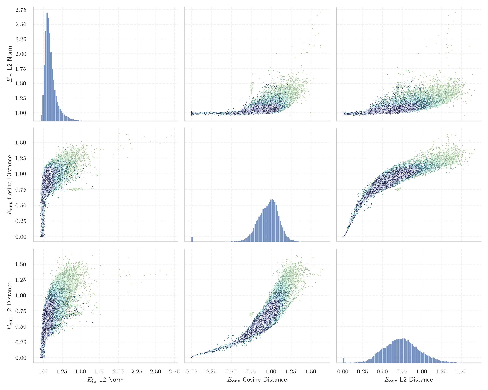

# Report for `allenai/OLMo-7B-hf`

## Model info

* Tied embeddings: no
* LM head uses bias: no
* Indicator for under-trained tokens: Centered E_{out} Cosine Distance
  * Overall distribution 0.959 +/- 0.158
  * Token used for verification prompt building: `ArgumentException`
  * Verification threshold: 0.667
  * Threshold for showing candidate under-trained tokens: 0.300
  * Median verified threshold (for bytes, unreachable and special tokens): 0.100
* Embeddings shape: (50304, 4096)
* Vocabulary size: 50280
  * Number of single byte tokens: 243, of which 1 below indicator threshold
  * Number of special tokens: 2, of which 1 below indicator threshold
  * Number of non-single-byte unreachable tokens: 221, of which 221 below indicator threshold
  * Number of non-single-byte UTF-fragment tokens: 369, 0 below soft indicator threshold
  * Number of tested under-trained tokens: 992, 992 non-special, 265 below p = 0.01 threshold, 203 below soft indicator threshold

## Under-trained token indicators plot


## Verification plot


## Under-trained token verification results
203 entries below threshold of 0.300

|   token_id | token               |   indicator | max_prob                                                         | in_other_tokens                                                             |
|------------|---------------------|-------------|------------------------------------------------------------------|-----------------------------------------------------------------------------|
|      42041 | ````` ▁§\[ `````    | 3.33786e-06 | <span style='border: 1px solid rgb(169, 68, 66);'>4.7e-06</span> |                                                                             |
|      44162 | ````` ]{}\^[ `````  | 3.51667e-06 | <span style='border: 1px solid rgb(169, 68, 66);'>3.2e-06</span> |                                                                             |
|      46468 | ````` \])]{} `````  | 3.57628e-06 | <span style='border: 1px solid rgb(169, 68, 66);'>2.5e-06</span> |                                                                             |
|      45382 | ````` ]{}\_ `````   | 3.63588e-06 | <span style='border: 1px solid rgb(169, 68, 66);'>9.1e-06</span> |                                                                             |
|      34761 | ````` ▁()](\ `````  | 3.63588e-06 | <span style='border: 1px solid rgb(169, 68, 66);'>8.4e-06</span> |                                                                             |
|      43782 | ````` .^\[[@ `````  | 3.8743e-06  | <span style='border: 1px solid rgb(169, 68, 66);'>7.7e-06</span> |                                                                             |
|      49021 | ````` $.[]{ `````   | 3.8743e-06  | <span style='border: 1px solid rgb(169, 68, 66);'>5.2e-06</span> |                                                                             |
|      31096 | ````` ^\[[@ `````   | 4.05312e-06 | <span style='border: 1px solid rgb(169, 68, 66);'>9.8e-06</span> | <span style='border: 1px solid rgb(169, 68, 66);'>````` .^\[[@ `````</span> |
|      48471 | ````` :**]{} `````  | 4.17233e-06 | <span style='border: 1px solid rgb(169, 68, 66);'>2.6e-06</span> |                                                                             |
|      32214 | ````` ]\]^ `````    | 4.82798e-06 | <span style='border: 1px solid rgb(169, 68, 66);'>1.7e-05</span> |                                                                             |
|      41305 | ````` ]{}\_[ `````  | 7.56979e-06 | <span style='border: 1px solid rgb(169, 68, 66);'>9.9e-06</span> |                                                                             |
|      29013 | ````` \]]{} `````   | 7.62939e-06 | <span style='border: 1px solid rgb(169, 68, 66);'>6.4e-06</span> |                                                                             |
|      23286 | ````` ^−/− `````    | 8.52346e-06 | <span style='border: 1px solid rgb(169, 68, 66);'>1.4e-05</span> | <span style='border: 1px solid rgb(169, 68, 66);'>````` ^−/−^ `````</span>  |
|      49824 | ````` ▁[(\[ `````   | 9.95398e-06 | <span style='border: 1px solid rgb(169, 68, 66);'>1.8e-06</span> |                                                                             |
|      47686 | ````` \^[- `````    | 1.0252e-05  | <span style='border: 1px solid rgb(169, 68, 66);'>2.5e-06</span> |                                                                             |
|      33805 | ````` ]{}\^ `````   | 1.03116e-05 | <span style='border: 1px solid rgb(169, 68, 66);'>3.4e-06</span> | <span style='border: 1px solid rgb(169, 68, 66);'>````` ]{}\^[ `````</span> |
|      23734 | ````` ▁[****, ````` | 1.10269e-05 | <span style='border: 1px solid rgb(169, 68, 66);'>5.5e-06</span> |                                                                             |
|      26119 | ````` *]{}. `````   | 1.21593e-05 | <span style='border: 1px solid rgb(169, 68, 66);'>1.8e-06</span> |                                                                             |
|      38475 | ````` "}\]. `````   | 1.57952e-05 | <span style='border: 1px solid rgb(169, 68, 66);'>6.9e-06</span> |                                                                             |
|      34494 | ````` ]\]). `````   | 1.65701e-05 | <span style='border: 1px solid rgb(169, 68, 66);'>2e-05</span>   |                                                                             |
<details><summary>183 additional entries below threshold</summary>

|   token_id | token                                            |   indicator | max_prob                                                         | in_other_tokens                                                                                                                                                                                                                                                                                                                                                                                    |
|------------|--------------------------------------------------|-------------|------------------------------------------------------------------|----------------------------------------------------------------------------------------------------------------------------------------------------------------------------------------------------------------------------------------------------------------------------------------------------------------------------------------------------------------------------------------------------|
|      39310 | ````` "}**). `````                               | 1.90735e-05 | <span style='border: 1px solid rgb(169, 68, 66);'>1.8e-06</span> |                                                                                                                                                                                                                                                                                                                                                                                                    |
|      34607 | ````` ▁^[@ `````                                 | 2.37823e-05 | <span style='border: 1px solid rgb(169, 68, 66);'>2.9e-05</span> |                                                                                                                                                                                                                                                                                                                                                                                                    |
|      36487 | ````` .**]{} `````                               | 2.49147e-05 | <span style='border: 1px solid rgb(169, 68, 66);'>5.6e-06</span> |                                                                                                                                                                                                                                                                                                                                                                                                    |
|       9899 | ````` ]{}]{} `````                               | 3.31998e-05 | <span style='border: 1px solid rgb(169, 68, 66);'>7.2e-06</span> |                                                                                                                                                                                                                                                                                                                                                                                                    |
|      24994 | ````` ^−^ `````                                  | 3.46899e-05 | <span style='border: 1px solid rgb(169, 68, 66);'>6.6e-06</span> |                                                                                                                                                                                                                                                                                                                                                                                                    |
|      28912 | ````` ^−/−^ `````                                | 3.79682e-05 | <span style='border: 1px solid rgb(169, 68, 66);'>6.6e-06</span> |                                                                                                                                                                                                                                                                                                                                                                                                    |
|      16079 | ````` .[]{ `````                                 | 4.02927e-05 | <span style='border: 1px solid rgb(169, 68, 66);'>2.6e-06</span> | <span style='border: 1px solid rgb(169, 68, 66);'>````` $.[]{ `````</span>                                                                                                                                                                                                                                                                                                                         |
|      42804 | ````` )^[@ `````                                 | 6.1214e-05  | <span style='border: 1px solid rgb(169, 68, 66);'>3.2e-06</span> |                                                                                                                                                                                                                                                                                                                                                                                                    |
|      39083 | ````` "}](# `````                                | 7.24792e-05 | <span style='border: 1px solid rgb(169, 68, 66);'>2.4e-06</span> |                                                                                                                                                                                                                                                                                                                                                                                                    |
|      27720 | ````` .*]{}, `````                               | 7.63535e-05 | <span style='border: 1px solid rgb(169, 68, 66);'>8.1e-06</span> |                                                                                                                                                                                                                                                                                                                                                                                                    |
|      27114 | ````` .(\[ `````                                 | 8.19564e-05 | <span style='border: 1px solid rgb(169, 68, 66);'>3.5e-06</span> |                                                                                                                                                                                                                                                                                                                                                                                                    |
|       8088 | ````` \[[@ `````                                 | 0.000115216 | <span style='border: 1px solid rgb(169, 68, 66);'>9.2e-06</span> | <span style='border: 1px solid rgb(169, 68, 66);'>````` .\[[@ `````</span>, <span style='border: 1px solid rgb(169, 68, 66);'>````` .^\[[@ `````</span>, <span style='border: 1px solid rgb(169, 68, 66);'>````` ^\[[@ `````</span>                                                                                                                                                                |
|      34833 | ````` ▁xcex `````                                | 0.000126064 | <span style='border: 1px solid rgb(169, 68, 66);'>3.4e-05</span> |                                                                                                                                                                                                                                                                                                                                                                                                    |
|      15775 | ````` .\[[@ `````                                | 0.000129879 | <span style='border: 1px solid rgb(169, 68, 66);'>2.8e-05</span> |                                                                                                                                                                                                                                                                                                                                                                                                    |
|      24237 | ````` .]{} `````                                 | 0.000148952 | <span style='border: 1px solid rgb(169, 68, 66);'>5.1e-06</span> |                                                                                                                                                                                                                                                                                                                                                                                                    |
|      28696 | ````` FFIRMED `````                              | 0.000158489 | <span style='border: 1px solid rgb(169, 68, 66);'>9.6e-06</span> | <span style='border: 1px solid rgb(169, 68, 66);'>````` AFFIRMED `````</span>, <span style='border: 1px solid rgb(251, 189, 8);'>````` ▁AFFIRMED `````</span>                                                                                                                                                                                                                                      |
|      43134 | ````` ▁()]{} `````                               | 0.000197172 | <span style='border: 1px solid rgb(169, 68, 66);'>7e-06</span>   |                                                                                                                                                                                                                                                                                                                                                                                                    |
|      29547 | ````` ]\]; `````                                 | 0.000217915 | <span style='border: 1px solid rgb(169, 68, 66);'>1.9e-05</span> |                                                                                                                                                                                                                                                                                                                                                                                                    |
|      32334 | ````` ubottu `````                               | 0.000230134 | <span style='border: 1px solid rgb(169, 68, 66);'>6.2e-06</span> |                                                                                                                                                                                                                                                                                                                                                                                                    |
|      27468 | ````` ▁\_[ `````                                 | 0.000235617 | <span style='border: 1px solid rgb(169, 68, 66);'>4.8e-05</span> |                                                                                                                                                                                                                                                                                                                                                                                                    |
|      30371 | ````` marinedrugs `````                          | 0.000260174 | <span style='border: 1px solid rgb(169, 68, 66);'>4.7e-06</span> |                                                                                                                                                                                                                                                                                                                                                                                                    |
|      25416 | ````` [\*](# `````                               | 0.000270724 | <span style='border: 1px solid rgb(169, 68, 66);'>3.8e-05</span> |                                                                                                                                                                                                                                                                                                                                                                                                    |
|      35869 | ````` ]{}( `````                                 | 0.000354707 | <span style='border: 1px solid rgb(169, 68, 66);'>2.9e-05</span> |                                                                                                                                                                                                                                                                                                                                                                                                    |
|      27655 | ````` ▁$[]$ `````                                | 0.000491321 | <span style='border: 1px solid rgb(169, 68, 66);'>3.3e-05</span> |                                                                                                                                                                                                                                                                                                                                                                                                    |
|      13663 | ````` .*]{} `````                                | 0.00049144  | <span style='border: 1px solid rgb(169, 68, 66);'>1.9e-05</span> | <span style='border: 1px solid rgb(169, 68, 66);'>````` .*]{}, `````</span>                                                                                                                                                                                                                                                                                                                        |
|      33653 | ````` ^\*^ `````                                 | 0.00052315  | <span style='border: 1px solid rgb(169, 68, 66);'>7.2e-06</span> |                                                                                                                                                                                                                                                                                                                                                                                                    |
|      20977 | ````` }$]{} `````                                | 0.000617743 | <span style='border: 1px solid rgb(169, 68, 66);'>8.5e-06</span> |                                                                                                                                                                                                                                                                                                                                                                                                    |
|      30996 | ````` ,^[@ `````                                 | 0.000771403 | <span style='border: 1px solid rgb(169, 68, 66);'>2e-05</span>   |                                                                                                                                                                                                                                                                                                                                                                                                    |
|       4622 | ````` *]{} `````                                 | 0.000776708 | <span style='border: 1px solid rgb(169, 68, 66);'>4.1e-05</span> | <span style='border: 1px solid rgb(169, 68, 66);'>````` *]{}, `````</span>, <span style='border: 1px solid rgb(169, 68, 66);'>````` :**]{} `````</span>, <span style='border: 1px solid rgb(169, 68, 66);'>````` .*]{} `````</span>, <span style='border: 1px solid rgb(169, 68, 66);'>````` .**]{} `````</span>, <span style='border: 1px solid rgb(169, 68, 66);'>````` .*]{}, `````</span>, ... |
|      37406 | ````` medscimonit `````                          | 0.000810921 | <span style='border: 1px solid rgb(169, 68, 66);'>3.4e-06</span> |                                                                                                                                                                                                                                                                                                                                                                                                    |
|      33835 | ````` doibase `````                              | 0.000900805 | <span style='border: 1px solid rgb(169, 68, 66);'>2.3e-05</span> |                                                                                                                                                                                                                                                                                                                                                                                                    |
|      46597 | ````` ▁${{{\ `````                               | 0.000922859 | <span style='border: 1px solid rgb(169, 68, 66);'>2.7e-05</span> |                                                                                                                                                                                                                                                                                                                                                                                                    |
|      45509 | ````` "}^ `````                                  | 0.00098598  | <span style='border: 1px solid rgb(169, 68, 66);'>6.3e-06</span> |                                                                                                                                                                                                                                                                                                                                                                                                    |
|      47389 | ````` ~\] `````                                  | 0.00119948  | <span style='border: 1px solid rgb(169, 68, 66);'>1.1e-05</span> |                                                                                                                                                                                                                                                                                                                                                                                                    |
|      35088 | ````` ...\...\ `````                             | 0.0013786   | <span style='border: 1px solid rgb(169, 68, 66);'>2e-05</span>   |                                                                                                                                                                                                                                                                                                                                                                                                    |
|      26939 | ````` ▁\xa0\xa0▁\xa0\xa0▁\xa0\xa0▁\xa0\xa0 ````` | 0.00151581  | <span style='border: 1px solid rgb(169, 68, 66);'>2.1e-05</span> |                                                                                                                                                                                                                                                                                                                                                                                                    |
|      41163 | ````` micromachines `````                        | 0.00172025  | <span style='border: 1px solid rgb(169, 68, 66);'>3.8e-06</span> |                                                                                                                                                                                                                                                                                                                                                                                                    |
|      31350 | ````` $]{}; `````                                | 0.00234973  | <span style='border: 1px solid rgb(169, 68, 66);'>8.7e-06</span> |                                                                                                                                                                                                                                                                                                                                                                                                    |
|      11661 | ````` *]{}, `````                                | 0.00260031  | <span style='border: 1px solid rgb(169, 68, 66);'>3.2e-05</span> | <span style='border: 1px solid rgb(169, 68, 66);'>````` .*]{}, `````</span>                                                                                                                                                                                                                                                                                                                        |
|      15707 | ````` ▁]{} `````                                 | 0.00266135  | <span style='border: 1px solid rgb(169, 68, 66);'>3.5e-05</span> |                                                                                                                                                                                                                                                                                                                                                                                                    |
|      36134 | ````` [\*\* `````                                | 0.00334263  | <span style='border: 1px solid rgb(169, 68, 66);'>5.2e-05</span> |                                                                                                                                                                                                                                                                                                                                                                                                    |
|      46924 | ````` obbsee `````                               | 0.00369561  | <span style='border: 1px solid rgb(169, 68, 66);'>3.7e-05</span> |                                                                                                                                                                                                                                                                                                                                                                                                    |
|      30119 | ````` ▁(\> `````                                 | 0.00370151  | <span style='border: 1px solid rgb(169, 68, 66);'>3.4e-05</span> |                                                                                                                                                                                                                                                                                                                                                                                                    |
|      38710 | ````` ▁\*\** `````                               | 0.00415277  | <span style='border: 1px solid rgb(169, 68, 66);'>3.6e-05</span> |                                                                                                                                                                                                                                                                                                                                                                                                    |
|      18022 | ````` \*](# `````                                | 0.00429219  | <span style='border: 1px solid rgb(169, 68, 66);'>2.5e-05</span> | <span style='border: 1px solid rgb(169, 68, 66);'>````` [\*](# `````</span>                                                                                                                                                                                                                                                                                                                        |
|      40743 | ````` ubotu `````                                | 0.00444722  | <span style='border: 1px solid rgb(169, 68, 66);'>9.2e-06</span> |                                                                                                                                                                                                                                                                                                                                                                                                    |
|      17548 | ````` ]-[@ `````                                 | 0.00484532  | <span style='border: 1px solid rgb(169, 68, 66);'>3.5e-05</span> |                                                                                                                                                                                                                                                                                                                                                                                                    |
|      42274 | ````` ]{}[ `````                                 | 0.00544804  | <span style='border: 1px solid rgb(169, 68, 66);'>7e-05</span>   |                                                                                                                                                                                                                                                                                                                                                                                                    |
|       5413 | ````` ]\], `````                                 | 0.0062409   | <span style='border: 1px solid rgb(169, 68, 66);'>6e-05</span>   |                                                                                                                                                                                                                                                                                                                                                                                                    |
|       7444 | ````` **]{} `````                                | 0.00629973  | <span style='border: 1px solid rgb(169, 68, 66);'>4.9e-05</span> | <span style='border: 1px solid rgb(169, 68, 66);'>````` :**]{} `````</span>, <span style='border: 1px solid rgb(169, 68, 66);'>````` .**]{} `````</span>                                                                                                                                                                                                                                           |
|      26997 | ````` \^[ `````                                  | 0.00643265  | <span style='border: 1px solid rgb(169, 68, 66);'>4.3e-05</span> | <span style='border: 1px solid rgb(169, 68, 66);'>````` \^[- `````</span>, <span style='border: 1px solid rgb(169, 68, 66);'>````` ]{}\^[ `````</span>                                                                                                                                                                                                                                             |
|      26868 | ````` ÃÂÃÂÃÂÃÂ `````                             | 0.0066632   | <span style='border: 1px solid rgb(169, 68, 66);'>5.5e-05</span> | <span style='border: 1px solid rgb(255, 145, 0);'>````` ÃÂÃÂÃÂÃÂÃÂÃÂÃÂÃÂ `````</span>                                                                                                                                                                                                                                                                                                              |
|      19181 | ````` ]{}. `````                                 | 0.00740242  | <span style='border: 1px solid rgb(169, 68, 66);'>3.6e-05</span> | <span style='border: 1px solid rgb(169, 68, 66);'>````` *]{}. `````</span>                                                                                                                                                                                                                                                                                                                         |
|      45099 | ````` }}({{\ `````                               | 0.00788891  | <span style='border: 1px solid rgb(169, 68, 66);'>5.5e-05</span> |                                                                                                                                                                                                                                                                                                                                                                                                    |
|      31743 | ````` ^®^ `````                                  | 0.00830382  | <span style='border: 1px solid rgb(169, 68, 66);'>1.6e-05</span> |                                                                                                                                                                                                                                                                                                                                                                                                    |
|      47279 | ````` :$$\ `````                                 | 0.00850785  | <span style='border: 1px solid rgb(169, 68, 66);'>3.3e-05</span> |                                                                                                                                                                                                                                                                                                                                                                                                    |
|      38747 | ````` cjwatson `````                             | 0.00875276  | <span style='border: 1px solid rgb(169, 68, 66);'>2.4e-05</span> |                                                                                                                                                                                                                                                                                                                                                                                                    |
|       6257 | ````` **]{}, `````                               | 0.00931013  | <span style='border: 1px solid rgb(169, 68, 66);'>7.2e-05</span> |                                                                                                                                                                                                                                                                                                                                                                                                    |
|      35420 | ````` }({{\ `````                                | 0.0106573   | <span style='border: 1px solid rgb(169, 68, 66);'>6.3e-05</span> | <span style='border: 1px solid rgb(169, 68, 66);'>````` }}({{\ `````</span>                                                                                                                                                                                                                                                                                                                        |
|      25349 | ````` ))/((- `````                               | 0.0111225   | <span style='border: 1px solid rgb(169, 68, 66);'>3.5e-05</span> |                                                                                                                                                                                                                                                                                                                                                                                                    |
|      21687 | ````` )]{} `````                                 | 0.0115958   | <span style='border: 1px solid rgb(169, 68, 66);'>7.2e-05</span> | <span style='border: 1px solid rgb(169, 68, 66);'>````` ▁()]{} `````</span>, <span style='border: 1px solid rgb(169, 68, 66);'>````` \])]{} `````</span>                                                                                                                                                                                                                                           |
|      35379 | ````` )}^{( `````                                | 0.012516    | <span style='border: 1px solid rgb(169, 68, 66);'>5.4e-05</span> |                                                                                                                                                                                                                                                                                                                                                                                                    |
|      17278 | ````` ^](# `````                                 | 0.0126998   | <span style='border: 1px solid rgb(169, 68, 66);'>7.2e-05</span> |                                                                                                                                                                                                                                                                                                                                                                                                    |
|      45707 | ````` }}})$ `````                                | 0.0130184   | <span style='border: 1px solid rgb(169, 68, 66);'>3.6e-05</span> |                                                                                                                                                                                                                                                                                                                                                                                                    |
|      14434 | ````` ▁"♪ `````                                  | 0.013425    | <span style='border: 1px solid rgb(169, 68, 66);'>3e-05</span>   |                                                                                                                                                                                                                                                                                                                                                                                                    |
|      13488 | ````` $]{} `````                                 | 0.0154629   | <span style='border: 1px solid rgb(169, 68, 66);'>5.7e-05</span> | <span style='border: 1px solid rgb(169, 68, 66);'>````` }$]{} `````</span>, <span style='border: 1px solid rgb(169, 68, 66);'>````` $]{}; `````</span>                                                                                                                                                                                                                                             |
|      15479 | ````` ▁taxp `````                                | 0.0155396   | <span style='border: 1px solid rgb(169, 68, 66);'>3.5e-05</span> | ````` ▁taxpayers `````, ````` ▁taxpayer `````                                                                                                                                                                                                                                                                                                                                                      |
|      35768 | ````` ,{{\ `````                                 | 0.0159033   | <span style='border: 1px solid rgb(169, 68, 66);'>5.5e-05</span> |                                                                                                                                                                                                                                                                                                                                                                                                    |
|      47056 | ````` }}}({\ `````                               | 0.0175987   | <span style='border: 1px solid rgb(169, 68, 66);'>5.6e-05</span> |                                                                                                                                                                                                                                                                                                                                                                                                    |
|      46201 | ````` )}/\ `````                                 | 0.0179137   | <span style='border: 1px solid rgb(169, 68, 66);'>6.5e-05</span> |                                                                                                                                                                                                                                                                                                                                                                                                    |
|      49411 | ````` *‐ `````                                   | 0.0184253   | <span style='border: 1px solid rgb(169, 68, 66);'>7.2e-05</span> |                                                                                                                                                                                                                                                                                                                                                                                                    |
|      35496 | ````` **--** `````                               | 0.0184263   | <span style='border: 1px solid rgb(169, 68, 66);'>7.4e-05</span> |                                                                                                                                                                                                                                                                                                                                                                                                    |
|      22367 | ````` ![** `````                                 | 0.0186302   | <span style='border: 1px solid rgb(169, 68, 66);'>5.1e-05</span> |                                                                                                                                                                                                                                                                                                                                                                                                    |
|      37402 | ````` imonit `````                               | 0.0208306   | <span style='border: 1px solid rgb(169, 68, 66);'>6.8e-05</span> | <span style='border: 1px solid rgb(169, 68, 66);'>````` medscimonit `````</span>                                                                                                                                                                                                                                                                                                                   |
|      41284 | ````` /((- `````                                 | 0.022052    | <span style='border: 1px solid rgb(169, 68, 66);'>4.9e-05</span> |                                                                                                                                                                                                                                                                                                                                                                                                    |
|      39614 | ````` pitti `````                                | 0.0223736   | <span style='border: 1px solid rgb(169, 68, 66);'>5.2e-05</span> |                                                                                                                                                                                                                                                                                                                                                                                                    |
|      47996 | ````` \!\!\! `````                               | 0.0237934   | <span style='border: 1px solid rgb(169, 68, 66);'>4.6e-05</span> |                                                                                                                                                                                                                                                                                                                                                                                                    |
|      43421 | ````` Sportspeople `````                         | 0.0247481   | <span style='border: 1px solid rgb(169, 68, 66);'>1e-05</span>   |                                                                                                                                                                                                                                                                                                                                                                                                    |
|      16986 | ````` )/((- `````                                | 0.0249528   | <span style='border: 1px solid rgb(169, 68, 66);'>7.5e-05</span> | <span style='border: 1px solid rgb(169, 68, 66);'>````` ))/((- `````</span>                                                                                                                                                                                                                                                                                                                        |
|       1254 | ````` ▁\[[@ `````                                | 0.0258996   | <span style='border: 1px solid rgb(169, 68, 66);'>5.4e-05</span> |                                                                                                                                                                                                                                                                                                                                                                                                    |
|      14798 | ````` ▁affidav `````                             | 0.028457    | <span style='border: 1px solid rgb(169, 68, 66);'>3.8e-05</span> | ````` ▁affidavits `````, ````` ▁affidavit `````                                                                                                                                                                                                                                                                                                                                                    |
|      47028 | ````` )\\|_{ `````                               | 0.0292294   | <span style='border: 1px solid rgb(169, 68, 66);'>3.8e-05</span> |                                                                                                                                                                                                                                                                                                                                                                                                    |
|      17030 | ````` ÃÂÃÂ `````                                 | 0.0312288   | <span style='border: 1px solid rgb(169, 68, 66);'>6.4e-05</span> | <span style='border: 1px solid rgb(169, 68, 66);'>````` ÃÂÃÂÃÂÃÂ `````</span>, <span style='border: 1px solid rgb(255, 145, 0);'>````` ÃÂÃÂÃÂÃÂÃÂÃÂÃÂÃÂ `````</span>                                                                                                                                                                                                                               |
|      42465 | ````` }},$$ `````                                | 0.0322061   | <span style='border: 1px solid rgb(169, 68, 66);'>3.6e-06</span> |                                                                                                                                                                                                                                                                                                                                                                                                    |
|      46608 | ````` *~( `````                                  | 0.0334248   | <span style='border: 1px solid rgb(169, 68, 66);'>8e-05</span>   |                                                                                                                                                                                                                                                                                                                                                                                                    |
|       7254 | ````` ]--[@ `````                                | 0.0407042   | <span style='border: 1px solid rgb(169, 68, 66);'>3.8e-05</span> |                                                                                                                                                                                                                                                                                                                                                                                                    |
|      18781 | ````` ▁♪" `````                                  | 0.0462207   | <span style='border: 1px solid rgb(169, 68, 66);'>6.4e-05</span> |                                                                                                                                                                                                                                                                                                                                                                                                    |
|       3951 | ````` ^[@ `````                                  | 0.0466449   | <span style='border: 1px solid rgb(169, 68, 66);'>5.7e-05</span> | <span style='border: 1px solid rgb(169, 68, 66);'>````` ▁^[@ `````</span>, <span style='border: 1px solid rgb(169, 68, 66);'>````` .^[@ `````</span>, <span style='border: 1px solid rgb(169, 68, 66);'>````` )^[@ `````</span>, <span style='border: 1px solid rgb(169, 68, 66);'>````` ,^[@ `````</span>                                                                                         |
|      45472 | ````` ]{}) `````                                 | 0.0487702   | <span style='border: 1px solid rgb(169, 68, 66);'>0.00012</span> |                                                                                                                                                                                                                                                                                                                                                                                                    |
|      37087 | ````` medsc `````                                | 0.0508105   | <span style='border: 1px solid rgb(169, 68, 66);'>4.3e-05</span> | <span style='border: 1px solid rgb(169, 68, 66);'>````` medscimonit `````</span>                                                                                                                                                                                                                                                                                                                   |
|      15236 | ````` ▁biomark `````                             | 0.0511153   | <span style='border: 1px solid rgb(169, 68, 66);'>3.6e-05</span> | ````` ▁biomarker `````, ````` ▁biomarkers `````                                                                                                                                                                                                                                                                                                                                                    |
|      38327 | ````` ))/(- `````                                | 0.0526686   | <span style='border: 1px solid rgb(169, 68, 66);'>0.00013</span> |                                                                                                                                                                                                                                                                                                                                                                                                    |
|      13704 | ````` ▁\xa0\xa0▁\xa0\xa0 `````                   | 0.0527237   | <span style='border: 1px solid rgb(169, 68, 66);'>0.00025</span> | <span style='border: 1px solid rgb(169, 68, 66);'>````` ▁\xa0\xa0▁\xa0\xa0▁\xa0\xa0▁\xa0\xa0 `````</span>                                                                                                                                                                                                                                                                                          |
|      42348 | ````` )}.$$ `````                                | 0.054825    | <span style='border: 1px solid rgb(169, 68, 66);'>2.4e-05</span> |                                                                                                                                                                                                                                                                                                                                                                                                    |
|      41456 | ````` ))*- `````                                 | 0.055142    | <span style='border: 1px solid rgb(169, 68, 66);'>0.00012</span> |                                                                                                                                                                                                                                                                                                                                                                                                    |
|      43214 | ````` }).$$ `````                                | 0.0563527   | <span style='border: 1px solid rgb(169, 68, 66);'>3.1e-05</span> |                                                                                                                                                                                                                                                                                                                                                                                                    |
|      47827 | ````` mathchoice `````                           | 0.057741    | <span style='border: 1px solid rgb(169, 68, 66);'>6.3e-05</span> |                                                                                                                                                                                                                                                                                                                                                                                                    |
|      37857 | ````` \!\!\!\! `````                             | 0.0619937   | <span style='border: 1px solid rgb(169, 68, 66);'>0.0002</span>  |                                                                                                                                                                                                                                                                                                                                                                                                    |
|       1656 | ````` ]\]. `````                                 | 0.0647845   | <span style='border: 1px solid rgb(169, 68, 66);'>0.00012</span> | <span style='border: 1px solid rgb(255, 145, 0);'>````` \]\]. `````</span>                                                                                                                                                                                                                                                                                                                         |
|      39743 | ````` 14514500 `````                             | 0.0650494   | <span style='border: 1px solid rgb(169, 68, 66);'>0.00017</span> | <span style='border: 1px solid rgb(251, 189, 8);'>````` 1451450014514500 `````</span>                                                                                                                                                                                                                                                                                                              |
|      18413 | ````` ]^, `````                                  | 0.0668507   | <span style='border: 1px solid rgb(169, 68, 66);'>0.00011</span> |                                                                                                                                                                                                                                                                                                                                                                                                    |
|      39077 | ````` \}.$$ `````                                | 0.0684783   | <span style='border: 1px solid rgb(169, 68, 66);'>4.4e-05</span> |                                                                                                                                                                                                                                                                                                                                                                                                    |
|      46230 | ````` \x88\x91 `````                             | 0.0699279   | <span style='border: 1px solid rgb(169, 68, 66);'>7.6e-05</span> |                                                                                                                                                                                                                                                                                                                                                                                                    |
|      44578 | ````` ▁\u2009 `````                              | 0.0712469   | <span style='border: 1px solid rgb(169, 68, 66);'>0.00015</span> |                                                                                                                                                                                                                                                                                                                                                                                                    |
|      32964 | ````` }}.$$ `````                                | 0.0764995   | <span style='border: 1px solid rgb(169, 68, 66);'>4.7e-05</span> |                                                                                                                                                                                                                                                                                                                                                                                                    |
|      38913 | ````` \x98¯ `````                                | 0.078114    | <span style='border: 1px solid rgb(169, 68, 66);'>4.1e-05</span> |                                                                                                                                                                                                                                                                                                                                                                                                    |
|      45251 | ````` }})$, `````                                | 0.0815615   | <span style='border: 1px solid rgb(169, 68, 66);'>2.5e-05</span> |                                                                                                                                                                                                                                                                                                                                                                                                    |
|      35799 | ````` }}}$, `````                                | 0.0847044   | <span style='border: 1px solid rgb(169, 68, 66);'>4.7e-05</span> |                                                                                                                                                                                                                                                                                                                                                                                                    |
|      30780 | ````` ▁$({\ `````                                | 0.09036     | <span style='border: 1px solid rgb(169, 68, 66);'>9.8e-05</span> |                                                                                                                                                                                                                                                                                                                                                                                                    |
|      33471 | ````` }}}$. `````                                | 0.0977834   | <span style='border: 1px solid rgb(169, 68, 66);'>2.7e-05</span> |                                                                                                                                                                                                                                                                                                                                                                                                    |
|      46045 | ````` brainsci `````                             | 0.0981479   | <span style='border: 1px solid rgb(169, 68, 66);'>2.7e-05</span> |                                                                                                                                                                                                                                                                                                                                                                                                    |
|      10174 | ````` .^[@ `````                                 | 0.100385    | <span style='border: 1px solid rgb(169, 68, 66);'>8e-05</span>   |                                                                                                                                                                                                                                                                                                                                                                                                    |
|      30356 | ````` marined `````                              | 0.100484    | <span style='border: 1px solid rgb(169, 68, 66);'>5.2e-05</span> | <span style='border: 1px solid rgb(169, 68, 66);'>````` marinedrugs `````</span>                                                                                                                                                                                                                                                                                                                   |
|       8827 | ````` rsfs `````                                 | 0.101055    | <span style='border: 1px solid rgb(169, 68, 66);'>0.00013</span> | <span style='border: 1px solid rgb(255, 145, 0);'>````` mathrsfs `````</span>                                                                                                                                                                                                                                                                                                                      |
|      28128 | ````` ))**(- `````                               | 0.101236    | <span style='border: 1px solid rgb(169, 68, 66);'>0.00029</span> |                                                                                                                                                                                                                                                                                                                                                                                                    |
|      26325 | ````` ▁,$$ `````                                 | 0.103561    | <span style='border: 1px solid rgb(169, 68, 66);'>0.00011</span> |                                                                                                                                                                                                                                                                                                                                                                                                    |
|      38651 | ````` xymatrix `````                             | 0.112637    | <span style='border: 1px solid rgb(169, 68, 66);'>6.7e-05</span> |                                                                                                                                                                                                                                                                                                                                                                                                    |
|      39049 | ````` }})$. `````                                | 0.113292    | <span style='border: 1px solid rgb(169, 68, 66);'>5e-05</span>   |                                                                                                                                                                                                                                                                                                                                                                                                    |
|      35937 | ````` }}}}$ `````                                | 0.115683    | <span style='border: 1px solid rgb(169, 68, 66);'>0.00011</span> |                                                                                                                                                                                                                                                                                                                                                                                                    |
|      42691 | ````` jcmm `````                                 | 0.116226    | <span style='border: 1px solid rgb(169, 68, 66);'>2.6e-05</span> |                                                                                                                                                                                                                                                                                                                                                                                                    |
|      12253 | ````` ▁questionna `````                          | 0.118778    | <span style='border: 1px solid rgb(169, 68, 66);'>4.5e-05</span> | ````` ▁questionnaire `````, ````` ▁questionnaires `````                                                                                                                                                                                                                                                                                                                                            |
|      39111 | ````` }}}(\ `````                                | 0.120303    | <span style='border: 1px solid rgb(169, 68, 66);'>0.00037</span> |                                                                                                                                                                                                                                                                                                                                                                                                    |
|      10148 | ````` "}]( `````                                 | 0.139047    | <span style='border: 1px solid rgb(169, 68, 66);'>0.00046</span> | <span style='border: 1px solid rgb(169, 68, 66);'>````` "}](# `````</span>                                                                                                                                                                                                                                                                                                                         |
|      20637 | ````` ▁supernat `````                            | 0.141411    | <span style='border: 1px solid rgb(169, 68, 66);'>3.4e-05</span> | ````` ▁supernatural `````, ````` ▁supernatants `````, ````` ▁supernatant `````                                                                                                                                                                                                                                                                                                                     |
|      26362 | ````` ▁{¶ `````                                  | 0.147824    | <span style='border: 1px solid rgb(169, 68, 66);'>0.00027</span> |                                                                                                                                                                                                                                                                                                                                                                                                    |
|      26384 | ````` ▁remn `````                                | 0.150198    | <span style='border: 1px solid rgb(169, 68, 66);'>4.9e-05</span> | ````` ▁remnants `````, ````` ▁remnant `````                                                                                                                                                                                                                                                                                                                                                        |
|      33857 | ````` mathds `````                               | 0.162395    | <span style='border: 1px solid rgb(169, 68, 66);'>0.00047</span> |                                                                                                                                                                                                                                                                                                                                                                                                    |
|      43189 | ````` )[@ `````                                  | 0.163257    | <span style='border: 1px solid rgb(169, 68, 66);'>0.00053</span> |                                                                                                                                                                                                                                                                                                                                                                                                    |
|      48367 | ````` }}^{{\ `````                               | 0.165167    | <span style='border: 1px solid rgb(169, 68, 66);'>0.00066</span> |                                                                                                                                                                                                                                                                                                                                                                                                    |
|      27092 | ````` ▁glimp `````                               | 0.169098    | <span style='border: 1px solid rgb(169, 68, 66);'>0.0001</span>  | ````` ▁glimpse `````, ````` ▁glimps `````                                                                                                                                                                                                                                                                                                                                                          |
|      27618 | ````` []$ `````                                  | 0.170206    | <span style='border: 1px solid rgb(169, 68, 66);'>0.001</span>   | <span style='border: 1px solid rgb(169, 68, 66);'>````` ▁$[]$ `````</span>                                                                                                                                                                                                                                                                                                                         |
|      45659 | ````` ▁Spacewatch `````                          | 0.170849    | <span style='border: 1px solid rgb(169, 68, 66);'>0.00011</span> |                                                                                                                                                                                                                                                                                                                                                                                                    |
|      43913 | ````` eqno `````                                 | 0.172328    | <span style='border: 1px solid rgb(255, 145, 0);'>0.0013</span>  |                                                                                                                                                                                                                                                                                                                                                                                                    |
|      34985 | ````` \xa0\n▁ `````                              | 0.173812    | <span style='border: 1px solid rgb(169, 68, 66);'>0.00047</span> |                                                                                                                                                                                                                                                                                                                                                                                                    |
|      33053 | ````` biomolecules `````                         | 0.178059    | <span style='border: 1px solid rgb(169, 68, 66);'>0.00013</span> |                                                                                                                                                                                                                                                                                                                                                                                                    |
|      46658 | ````` "}* `````                                  | 0.180113    | <span style='border: 1px solid rgb(169, 68, 66);'>0.00085</span> |                                                                                                                                                                                                                                                                                                                                                                                                    |
|      28554 | ````` }}$- `````                                 | 0.186646    | <span style='border: 1px solid rgb(169, 68, 66);'>0.00038</span> |                                                                                                                                                                                                                                                                                                                                                                                                    |
|      18031 | ````` :"){ `````                                 | 0.187415    | <span style='border: 1px solid rgb(169, 68, 66);'>0.00062</span> |                                                                                                                                                                                                                                                                                                                                                                                                    |
|      24759 | ````` }}}^ `````                                 | 0.189341    | <span style='border: 1px solid rgb(169, 68, 66);'>0.00085</span> | <span style='border: 1px solid rgb(251, 189, 8);'>````` }}}^{ `````</span>                                                                                                                                                                                                                                                                                                                         |
|      41606 | ````` ÃÂÃÂÃÂÃÂÃÂÃÂÃÂÃÂ `````                     | 0.191945    | <span style='border: 1px solid rgb(255, 145, 0);'>0.003</span>   |                                                                                                                                                                                                                                                                                                                                                                                                    |
|      46479 | ````` ▁\\|_{ `````                               | 0.192776    | <span style='border: 1px solid rgb(169, 68, 66);'>0.00061</span> |                                                                                                                                                                                                                                                                                                                                                                                                    |
|      44965 | ````` ▁[[* `````                                 | 0.194207    | <span style='border: 1px solid rgb(169, 68, 66);'>0.00054</span> |                                                                                                                                                                                                                                                                                                                                                                                                    |
|       7433 | ````` ^+^ `````                                  | 0.198811    | <span style='border: 1px solid rgb(255, 145, 0);'>0.0011</span>  |                                                                                                                                                                                                                                                                                                                                                                                                    |
|      43654 | ````` \\|_{\ `````                               | 0.199605    | <span style='border: 1px solid rgb(169, 68, 66);'>0.00067</span> |                                                                                                                                                                                                                                                                                                                                                                                                    |
|      30775 | ````` $– `````                                   | 0.200103    | <span style='border: 1px solid rgb(169, 68, 66);'>0.00041</span> |                                                                                                                                                                                                                                                                                                                                                                                                    |
|      37276 | ````` }}}_{\ `````                               | 0.201017    | <span style='border: 1px solid rgb(255, 145, 0);'>0.0013</span>  |                                                                                                                                                                                                                                                                                                                                                                                                    |
|      41137 | ````` *~, `````                                  | 0.203984    | <span style='border: 1px solid rgb(169, 68, 66);'>0.0002</span>  |                                                                                                                                                                                                                                                                                                                                                                                                    |
|      49372 | ````` _{\{ `````                                 | 0.212915    | <span style='border: 1px solid rgb(255, 145, 0);'>0.0011</span>  |                                                                                                                                                                                                                                                                                                                                                                                                    |
|      36847 | ````` mathbbm `````                              | 0.214371    | <span style='border: 1px solid rgb(169, 68, 66);'>0.00065</span> |                                                                                                                                                                                                                                                                                                                                                                                                    |
|      48817 | ````` }+{\ `````                                 | 0.217578    | <span style='border: 1px solid rgb(169, 68, 66);'>0.00067</span> |                                                                                                                                                                                                                                                                                                                                                                                                    |
|      23063 | ````` ▁careg `````                               | 0.225258    | <span style='border: 1px solid rgb(169, 68, 66);'>9.1e-05</span> | ````` ▁caregivers `````, ````` ▁caregiver `````                                                                                                                                                                                                                                                                                                                                                    |
|       6334 | ````` .[@ `````                                  | 0.226719    | <span style='border: 1px solid rgb(169, 68, 66);'>0.00017</span> |                                                                                                                                                                                                                                                                                                                                                                                                    |
|      43029 | ````` AFFIRMED `````                             | 0.228615    | <span style='border: 1px solid rgb(169, 68, 66);'>0.00018</span> | <span style='border: 1px solid rgb(251, 189, 8);'>````` ▁AFFIRMED `````</span>                                                                                                                                                                                                                                                                                                                     |
|      26398 | ````` _{(\ `````                                 | 0.230024    | <span style='border: 1px solid rgb(255, 145, 0);'>0.0019</span>  |                                                                                                                                                                                                                                                                                                                                                                                                    |
|      42010 | ````` ▁BytePtrFromString `````                   | 0.236293    | <span style='border: 1px solid rgb(251, 189, 8);'>0.012</span>   |                                                                                                                                                                                                                                                                                                                                                                                                    |
|      37075 | ````` RSOS `````                                 | 0.237355    | <span style='border: 1px solid rgb(255, 145, 0);'>0.0016</span>  |                                                                                                                                                                                                                                                                                                                                                                                                    |
|      18822 | ````` ▁.$$ `````                                 | 0.237814    | <span style='border: 1px solid rgb(169, 68, 66);'>0.00051</span> |                                                                                                                                                                                                                                                                                                                                                                                                    |
|      48738 | ````` \u2003\u2003\u2003 `````                   | 0.241489    | <span style='border: 1px solid rgb(255, 145, 0);'>0.0041</span>  |                                                                                                                                                                                                                                                                                                                                                                                                    |
|      41625 | ````` ¸\x8d `````                                | 0.245273    | <span style='border: 1px solid rgb(169, 68, 66);'>0.00017</span> |                                                                                                                                                                                                                                                                                                                                                                                                    |
|      47264 | ````` }-{\ `````                                 | 0.247574    | <span style='border: 1px solid rgb(255, 145, 0);'>0.0015</span>  |                                                                                                                                                                                                                                                                                                                                                                                                    |
|       8562 | ````` ]^. `````                                  | 0.251604    | <span style='border: 1px solid rgb(255, 145, 0);'>0.0037</span>  |                                                                                                                                                                                                                                                                                                                                                                                                    |
|      44524 | ````` ].$$ `````                                 | 0.256796    | <span style='border: 1px solid rgb(169, 68, 66);'>0.00056</span> |                                                                                                                                                                                                                                                                                                                                                                                                    |
|      48628 | ````` ▁doxor `````                               | 0.257078    | <span style='border: 1px solid rgb(169, 68, 66);'>0.00012</span> | ````` ▁doxorubicin `````                                                                                                                                                                                                                                                                                                                                                                           |
|      19753 | ````` }}({\ `````                                | 0.258275    | <span style='border: 1px solid rgb(255, 145, 0);'>0.003</span>   | <span style='border: 1px solid rgb(169, 68, 66);'>````` }}}({\ `````</span>                                                                                                                                                                                                                                                                                                                        |
|      41557 | ````` PtrFromString `````                        | 0.263162    | <span style='border: 1px solid rgb(255, 145, 0);'>0.0057</span>  | <span style='border: 1px solid rgb(251, 189, 8);'>````` ▁BytePtrFromString `````</span>                                                                                                                                                                                                                                                                                                            |
|      13380 | ````` \_[ `````                                  | 0.265138    | <span style='border: 1px solid rgb(255, 145, 0);'>0.0058</span>  | <span style='border: 1px solid rgb(169, 68, 66);'>````` ▁\_[ `````</span>, <span style='border: 1px solid rgb(169, 68, 66);'>````` ]{}\_[ `````</span>                                                                                                                                                                                                                                             |
|      40608 | ````` }^{(\ `````                                | 0.265613    | <span style='border: 1px solid rgb(255, 145, 0);'>0.0054</span>  |                                                                                                                                                                                                                                                                                                                                                                                                    |
|      26136 | ````` }}_\ `````                                 | 0.27267     | <span style='border: 1px solid rgb(255, 145, 0);'>0.0048</span>  |                                                                                                                                                                                                                                                                                                                                                                                                    |
|      22066 | ````` ▁resemb `````                              | 0.273022    | <span style='border: 1px solid rgb(169, 68, 66);'>8.1e-05</span> | ````` ▁resemblance `````, ````` ▁resembling `````, ````` ▁resemble `````, ````` ▁resembled `````, ````` ▁resembles `````                                                                                                                                                                                                                                                                           |
|       2947 | ````` ],[@ `````                                 | 0.273465    | <span style='border: 1px solid rgb(169, 68, 66);'>0.00074</span> |                                                                                                                                                                                                                                                                                                                                                                                                    |
|      22372 | ````` ,[@ `````                                  | 0.274412    | <span style='border: 1px solid rgb(251, 189, 8);'>0.015</span>   |                                                                                                                                                                                                                                                                                                                                                                                                    |
|      47183 | ````` ▁$\\|\ `````                               | 0.274722    | <span style='border: 1px solid rgb(169, 68, 66);'>0.00023</span> |                                                                                                                                                                                                                                                                                                                                                                                                    |
|      40125 | ````` ]^{\ `````                                 | 0.276777    | <span style='border: 1px solid rgb(255, 145, 0);'>0.0019</span>  |                                                                                                                                                                                                                                                                                                                                                                                                    |
|      21895 | ````` ▁predecess `````                           | 0.284074    | <span style='border: 1px solid rgb(169, 68, 66);'>0.00012</span> | ````` ▁predecessor `````, ````` ▁predecessors `````                                                                                                                                                                                                                                                                                                                                                |
|      16302 | ````` }}}_ `````                                 | 0.284748    | <span style='border: 1px solid rgb(255, 145, 0);'>0.0067</span>  | <span style='border: 1px solid rgb(255, 145, 0);'>````` }}}_{\ `````</span>, <span style='border: 1px solid rgb(40, 167, 69);'>````` }}}_{ `````</span>                                                                                                                                                                                                                                            |
|      45536 | ````` ▁Euroopan `````                            | 0.285083    | <span style='border: 1px solid rgb(169, 68, 66);'>0.00011</span> |                                                                                                                                                                                                                                                                                                                                                                                                    |
|      27596 | ````` ^® `````                                   | 0.287752    | <span style='border: 1px solid rgb(255, 145, 0);'>0.0014</span>  | <span style='border: 1px solid rgb(169, 68, 66);'>````` ^®^ `````</span>                                                                                                                                                                                                                                                                                                                           |
|      42680 | ````` ▁Comiss `````                              | 0.287995    | <span style='border: 1px solid rgb(169, 68, 66);'>0.00012</span> | <span style='border: 1px solid rgb(251, 189, 8);'>````` ▁Comissão `````</span>                                                                                                                                                                                                                                                                                                                     |
|      18112 | ````` ▁practition `````                          | 0.289376    | <span style='border: 1px solid rgb(169, 68, 66);'>4.9e-05</span> | ````` ▁practitioners `````, ````` ▁practitioner `````                                                                                                                                                                                                                                                                                                                                              |
|      45332 | ````` **~ `````                                  | 0.290888    | <span style='border: 1px solid rgb(255, 145, 0);'>0.0033</span>  |                                                                                                                                                                                                                                                                                                                                                                                                    |
|      28073 | ````` }}^\ `````                                 | 0.295583    | <span style='border: 1px solid rgb(255, 145, 0);'>0.0071</span>  |                                                                                                                                                                                                                                                                                                                                                                                                    |
|      22180 | ````` _{{{\ `````                                | 0.298833    | <span style='border: 1px solid rgb(251, 189, 8);'>0.016</span>   |                                                                                                                                                                                                                                                                                                                                                                                                    |
|      39586 | ````` }{~ `````                                  | 0.299959    | <span style='border: 1px solid rgb(251, 189, 8);'>0.011</span>   | <span style='border: 1px solid rgb(40, 167, 69);'>````` ~}{~ `````</span>                                                                                                                                                                                                                                                                                                                          |
</details>
<details><summary>789 additional entries above threshold</summary>

|   token_id | token                                                                                                                                                                                                                                                                         |   indicator | max_prob                                                         | in_other_tokens                                                                                                                                                                                                                                                                                                                                                                                  |
|------------|-------------------------------------------------------------------------------------------------------------------------------------------------------------------------------------------------------------------------------------------------------------------------------|-------------|------------------------------------------------------------------|--------------------------------------------------------------------------------------------------------------------------------------------------------------------------------------------------------------------------------------------------------------------------------------------------------------------------------------------------------------------------------------------------|
|      35138 | ````` ▁\[* `````                                                                                                                                                                                                                                                              |    0.300472 | <span style='border: 1px solid rgb(255, 145, 0);'>0.001</span>   |                                                                                                                                                                                                                                                                                                                                                                                                  |
|      45656 | ````` ▁{{{\ `````                                                                                                                                                                                                                                                             |    0.302932 | <span style='border: 1px solid rgb(255, 145, 0);'>0.0036</span>  |                                                                                                                                                                                                                                                                                                                                                                                                  |
|      32673 | ````` }}^{( `````                                                                                                                                                                                                                                                             |    0.307443 | <span style='border: 1px solid rgb(251, 189, 8);'>0.011</span>   |                                                                                                                                                                                                                                                                                                                                                                                                  |
|      39922 | ````` 1451450014514500 `````                                                                                                                                                                                                                                                  |    0.316129 | <span style='border: 1px solid rgb(251, 189, 8);'>0.096</span>   |                                                                                                                                                                                                                                                                                                                                                                                                  |
|      42643 | ````` _{\| `````                                                                                                                                                                                                                                                              |    0.316846 | <span style='border: 1px solid rgb(255, 145, 0);'>0.0034</span>  |                                                                                                                                                                                                                                                                                                                                                                                                  |
|      48622 | ````` Kilos `````                                                                                                                                                                                                                                                             |    0.319826 | <span style='border: 1px solid rgb(255, 145, 0);'>0.005</span>   |                                                                                                                                                                                                                                                                                                                                                                                                  |
|      27790 | ````` }}_{{\ `````                                                                                                                                                                                                                                                            |    0.323552 | <span style='border: 1px solid rgb(251, 189, 8);'>0.02</span>    |                                                                                                                                                                                                                                                                                                                                                                                                  |
|      47106 | ````` ^+_ `````                                                                                                                                                                                                                                                               |    0.32674  | <span style='border: 1px solid rgb(251, 189, 8);'>0.01</span>    |                                                                                                                                                                                                                                                                                                                                                                                                  |
|      47546 | ````` **^ `````                                                                                                                                                                                                                                                               |    0.327213 | <span style='border: 1px solid rgb(255, 145, 0);'>0.001</span>   |                                                                                                                                                                                                                                                                                                                                                                                                  |
|      16207 | ````` ▁$${\ `````                                                                                                                                                                                                                                                             |    0.329248 | <span style='border: 1px solid rgb(169, 68, 66);'>0.00093</span> |                                                                                                                                                                                                                                                                                                                                                                                                  |
|      47402 | ````` })^{\ `````                                                                                                                                                                                                                                                             |    0.334098 | <span style='border: 1px solid rgb(255, 145, 0);'>0.0037</span>  |                                                                                                                                                                                                                                                                                                                                                                                                  |
|      12159 | ````` ]{}\ `````                                                                                                                                                                                                                                                              |    0.335688 | <span style='border: 1px solid rgb(251, 189, 8);'>0.057</span>   | <span style='border: 1px solid rgb(169, 68, 66);'>````` ]{}\_ `````</span>, <span style='border: 1px solid rgb(169, 68, 66);'>````` ]{}\_[ `````</span>, <span style='border: 1px solid rgb(169, 68, 66);'>````` ]{}\^[ `````</span>, <span style='border: 1px solid rgb(169, 68, 66);'>````` ]{}\^ `````</span>                                                                                 |
|      34273 | ````` }}^{- `````                                                                                                                                                                                                                                                             |    0.339567 | <span style='border: 1px solid rgb(251, 189, 8);'>0.014</span>   |                                                                                                                                                                                                                                                                                                                                                                                                  |
|      48070 | ````` smallmatrix `````                                                                                                                                                                                                                                                       |    0.343014 | <span style='border: 1px solid rgb(251, 189, 8);'>0.07</span>    |                                                                                                                                                                                                                                                                                                                                                                                                  |
|      37596 | ````` \]- `````                                                                                                                                                                                                                                                               |    0.344081 | <span style='border: 1px solid rgb(255, 145, 0);'>0.0055</span>  |                                                                                                                                                                                                                                                                                                                                                                                                  |
|      33438 | ````` biggl `````                                                                                                                                                                                                                                                             |    0.345526 | <span style='border: 1px solid rgb(255, 145, 0);'>0.0052</span>  |                                                                                                                                                                                                                                                                                                                                                                                                  |
|      47942 | ````` ^*(\ `````                                                                                                                                                                                                                                                              |    0.347188 | <span style='border: 1px solid rgb(255, 145, 0);'>0.01</span>    |                                                                                                                                                                                                                                                                                                                                                                                                  |
|      38113 | ````` }_{( `````                                                                                                                                                                                                                                                              |    0.348835 | <span style='border: 1px solid rgb(251, 189, 8);'>0.016</span>   |                                                                                                                                                                                                                                                                                                                                                                                                  |
|      19022 | ````` ^{{\ `````                                                                                                                                                                                                                                                              |    0.349128 | <span style='border: 1px solid rgb(251, 189, 8);'>0.016</span>   | <span style='border: 1px solid rgb(40, 167, 69);'>````` }^{{\ `````</span>, <span style='border: 1px solid rgb(169, 68, 66);'>````` }}^{{\ `````</span>                                                                                                                                                                                                                                          |
|      39294 | ````` )={\ `````                                                                                                                                                                                                                                                              |    0.349374 | <span style='border: 1px solid rgb(255, 145, 0);'>0.0054</span>  |                                                                                                                                                                                                                                                                                                                                                                                                  |
|       9014 | ````` \]), `````                                                                                                                                                                                                                                                              |    0.356908 | <span style='border: 1px solid rgb(169, 68, 66);'>0.00094</span> |                                                                                                                                                                                                                                                                                                                                                                                                  |
|      22596 | ````` ▁opio `````                                                                                                                                                                                                                                                             |    0.359713 | <span style='border: 1px solid rgb(169, 68, 66);'>0.00071</span> | ````` ▁opioid `````, ````` ▁opioids `````                                                                                                                                                                                                                                                                                                                                                        |
|       8865 | ````` idemargin `````                                                                                                                                                                                                                                                         |    0.35996  | <span style='border: 1px solid rgb(255, 145, 0);'>0.0086</span>  | <span style='border: 1px solid rgb(40, 167, 69);'>````` oddsidemargin `````</span>                                                                                                                                                                                                                                                                                                               |
|      37450 | ````` }}}^{ `````                                                                                                                                                                                                                                                             |    0.360507 | <span style='border: 1px solid rgb(251, 189, 8);'>0.027</span>   |                                                                                                                                                                                                                                                                                                                                                                                                  |
|      35916 | ````` AndroidRuntime `````                                                                                                                                                                                                                                                    |    0.360733 | <span style='border: 1px solid rgb(251, 189, 8);'>0.055</span>   |                                                                                                                                                                                                                                                                                                                                                                                                  |
|      37425 | ````` ENRON `````                                                                                                                                                                                                                                                             |    0.361276 | <span style='border: 1px solid rgb(251, 189, 8);'>0.034</span>   |                                                                                                                                                                                                                                                                                                                                                                                                  |
|      47596 | ````` vphantom `````                                                                                                                                                                                                                                                          |    0.36247  | <span style='border: 1px solid rgb(251, 189, 8);'>0.021</span>   |                                                                                                                                                                                                                                                                                                                                                                                                  |
|      26808 | ````` nanomaterials `````                                                                                                                                                                                                                                                     |    0.363302 | <span style='border: 1px solid rgb(255, 145, 0);'>0.0011</span>  |                                                                                                                                                                                                                                                                                                                                                                                                  |
|       6761 | ````` ortunately `````                                                                                                                                                                                                                                                        |    0.365688 | <span style='border: 1px solid rgb(169, 68, 66);'>5.3e-05</span> | ````` Unfortunately `````, ````` Fortunately `````, ````` ▁Unfortunately `````, <span style='border: 1px solid rgb(40, 167, 69);'>````` fortunately `````</span>, ````` ▁unfortunately `````, ...                                                                                                                                                                                                |
|      38225 | ````` )}_{\ `````                                                                                                                                                                                                                                                             |    0.36628  | <span style='border: 1px solid rgb(251, 189, 8);'>0.022</span>   |                                                                                                                                                                                                                                                                                                                                                                                                  |
|      29914 | ````` Bigr `````                                                                                                                                                                                                                                                              |    0.368255 | <span style='border: 1px solid rgb(251, 189, 8);'>0.055</span>   |                                                                                                                                                                                                                                                                                                                                                                                                  |
|      37185 | ````` ):=\ `````                                                                                                                                                                                                                                                              |    0.369543 | <span style='border: 1px solid rgb(255, 145, 0);'>0.002</span>   |                                                                                                                                                                                                                                                                                                                                                                                                  |
|      33996 | ````` varpi `````                                                                                                                                                                                                                                                             |    0.371086 | <span style='border: 1px solid rgb(251, 189, 8);'>0.026</span>   |                                                                                                                                                                                                                                                                                                                                                                                                  |
|      34813 | ````` \|_{\ `````                                                                                                                                                                                                                                                             |    0.371546 | <span style='border: 1px solid rgb(251, 189, 8);'>0.019</span>   | <span style='border: 1px solid rgb(169, 68, 66);'>````` \\|_{\ `````</span>                                                                                                                                                                                                                                                                                                                      |
|      27886 | ````` scriptscriptstyle `````                                                                                                                                                                                                                                                 |    0.373575 | <span style='border: 1px solid rgb(251, 189, 8);'>0.096</span>   |                                                                                                                                                                                                                                                                                                                                                                                                  |
|      36985 | ````` bigoplus `````                                                                                                                                                                                                                                                          |    0.373851 | <span style='border: 1px solid rgb(255, 145, 0);'>0.0055</span>  |                                                                                                                                                                                                                                                                                                                                                                                                  |
|      22702 | ````` ▁errnoErr `````                                                                                                                                                                                                                                                         |    0.374822 | <span style='border: 1px solid rgb(40, 167, 69);'>0.16</span>    |                                                                                                                                                                                                                                                                                                                                                                                                  |
|      44766 | ````` }}}= `````                                                                                                                                                                                                                                                              |    0.375417 | <span style='border: 1px solid rgb(255, 145, 0);'>0.0065</span>  |                                                                                                                                                                                                                                                                                                                                                                                                  |
|      21852 | ````` ▁earthqu `````                                                                                                                                                                                                                                                          |    0.381905 | <span style='border: 1px solid rgb(169, 68, 66);'>0.00018</span> | ````` ▁earthquake `````, ````` ▁earthquakes `````                                                                                                                                                                                                                                                                                                                                                |
|      48138 | ````` )}}{\ `````                                                                                                                                                                                                                                                             |    0.382844 | <span style='border: 1px solid rgb(255, 145, 0);'>0.0037</span>  |                                                                                                                                                                                                                                                                                                                                                                                                  |
|      28975 | ````` textnormal `````                                                                                                                                                                                                                                                        |    0.388654 | <span style='border: 1px solid rgb(251, 189, 8);'>0.083</span>   |                                                                                                                                                                                                                                                                                                                                                                                                  |
|       6767 | ````` widet `````                                                                                                                                                                                                                                                             |    0.390274 | <span style='border: 1px solid rgb(255, 145, 0);'>0.0088</span>  | <span style='border: 1px solid rgb(40, 167, 69);'>````` widetilde `````</span>                                                                                                                                                                                                                                                                                                                   |
|       8861 | ````` upgreek `````                                                                                                                                                                                                                                                           |    0.3906   | <span style='border: 1px solid rgb(251, 189, 8);'>0.018</span>   |                                                                                                                                                                                                                                                                                                                                                                                                  |
|       8844 | ````` amsbsy `````                                                                                                                                                                                                                                                            |    0.392916 | <span style='border: 1px solid rgb(255, 145, 0);'>0.0046</span>  |                                                                                                                                                                                                                                                                                                                                                                                                  |
|      14457 | ````` bibr `````                                                                                                                                                                                                                                                              |    0.39798  | <span style='border: 1px solid rgb(40, 167, 69);'>0.12</span>    |                                                                                                                                                                                                                                                                                                                                                                                                  |
|      37207 | ````` }\|^ `````                                                                                                                                                                                                                                                              |    0.402135 | <span style='border: 1px solid rgb(251, 189, 8);'>0.048</span>   |                                                                                                                                                                                                                                                                                                                                                                                                  |
|      30634 | ````` )_{\ `````                                                                                                                                                                                                                                                              |    0.402783 | <span style='border: 1px solid rgb(251, 189, 8);'>0.066</span>   |                                                                                                                                                                                                                                                                                                                                                                                                  |
|      10365 | ````` ▁embod `````                                                                                                                                                                                                                                                            |    0.404329 | <span style='border: 1px solid rgb(169, 68, 66);'>0.00023</span> | ````` ▁embodiment `````, ````` ▁embodied `````, ````` ▁embodiments `````                                                                                                                                                                                                                                                                                                                         |
|      42637 | ````` }}-\ `````                                                                                                                                                                                                                                                              |    0.406555 | <span style='border: 1px solid rgb(251, 189, 8);'>0.04</span>    |                                                                                                                                                                                                                                                                                                                                                                                                  |
|      22254 | ````` }}}_{ `````                                                                                                                                                                                                                                                             |    0.407081 | <span style='border: 1px solid rgb(40, 167, 69);'>0.1</span>     | <span style='border: 1px solid rgb(255, 145, 0);'>````` }}}_{\ `````</span>                                                                                                                                                                                                                                                                                                                      |
|      33714 | ````` }\! `````                                                                                                                                                                                                                                                               |    0.408275 | <span style='border: 1px solid rgb(40, 167, 69);'>0.16</span>    |                                                                                                                                                                                                                                                                                                                                                                                                  |
|      28503 | ````` }}\, `````                                                                                                                                                                                                                                                              |    0.409996 | <span style='border: 1px solid rgb(251, 189, 8);'>0.046</span>   |                                                                                                                                                                                                                                                                                                                                                                                                  |
|      39427 | ````` gså `````                                                                                                                                                                                                                                                               |    0.411263 | <span style='border: 1px solid rgb(169, 68, 66);'>0.00019</span> | <span style='border: 1px solid rgb(40, 167, 69);'>````` ▁også `````</span>                                                                                                                                                                                                                                                                                                                       |
|      30145 | ````` }^{{\ `````                                                                                                                                                                                                                                                             |    0.412476 | <span style='border: 1px solid rgb(40, 167, 69);'>0.13</span>    | <span style='border: 1px solid rgb(169, 68, 66);'>````` }}^{{\ `````</span>                                                                                                                                                                                                                                                                                                                      |
|      47206 | ````` _{* `````                                                                                                                                                                                                                                                               |    0.413021 | <span style='border: 1px solid rgb(251, 189, 8);'>0.065</span>   |                                                                                                                                                                                                                                                                                                                                                                                                  |
|      28118 | ````` \][ `````                                                                                                                                                                                                                                                               |    0.414394 | <span style='border: 1px solid rgb(251, 189, 8);'>0.021</span>   |                                                                                                                                                                                                                                                                                                                                                                                                  |
|      49633 | ````` )}+ `````                                                                                                                                                                                                                                                               |    0.41466  | <span style='border: 1px solid rgb(251, 189, 8);'>0.015</span>   |                                                                                                                                                                                                                                                                                                                                                                                                  |
|      46849 | ````` ^+( `````                                                                                                                                                                                                                                                               |    0.414843 | <span style='border: 1px solid rgb(251, 189, 8);'>0.051</span>   |                                                                                                                                                                                                                                                                                                                                                                                                  |
|      32399 | ````` ▁---------------------------------------------------------------------------------------------------------------------------------------------------------------------------------------------------------------------------------------------------------------- ````` |    0.415021 | <span style='border: 1px solid rgb(251, 189, 8);'>0.028</span>   |                                                                                                                                                                                                                                                                                                                                                                                                  |
|      37077 | ````` )\]. `````                                                                                                                                                                                                                                                              |    0.418099 | <span style='border: 1px solid rgb(255, 145, 0);'>0.0046</span>  |                                                                                                                                                                                                                                                                                                                                                                                                  |
|      29179 | ````` rbrack `````                                                                                                                                                                                                                                                            |    0.418401 | <span style='border: 1px solid rgb(40, 167, 69);'>0.35</span>    |                                                                                                                                                                                                                                                                                                                                                                                                  |
|      39106 | ````` }^+ `````                                                                                                                                                                                                                                                               |    0.418467 | <span style='border: 1px solid rgb(251, 189, 8);'>0.044</span>   |                                                                                                                                                                                                                                                                                                                                                                                                  |
|      35729 | ````` }}+\ `````                                                                                                                                                                                                                                                              |    0.422353 | <span style='border: 1px solid rgb(251, 189, 8);'>0.017</span>   |                                                                                                                                                                                                                                                                                                                                                                                                  |
|      13270 | ````` MOESM `````                                                                                                                                                                                                                                                             |    0.423127 | <span style='border: 1px solid rgb(40, 167, 69);'>0.35</span>    |                                                                                                                                                                                                                                                                                                                                                                                                  |
|      10248 | ````` ▁specim `````                                                                                                                                                                                                                                                           |    0.425008 | <span style='border: 1px solid rgb(169, 68, 66);'>0.00012</span> | ````` ▁specimens `````, ````` ▁specimen `````                                                                                                                                                                                                                                                                                                                                                    |
|      21284 | ````` FPar `````                                                                                                                                                                                                                                                              |    0.425296 | <span style='border: 1px solid rgb(40, 167, 69);'>0.11</span>    |                                                                                                                                                                                                                                                                                                                                                                                                  |
|      29591 | ````` )}(\ `````                                                                                                                                                                                                                                                              |    0.426898 | <span style='border: 1px solid rgb(251, 189, 8);'>0.032</span>   |                                                                                                                                                                                                                                                                                                                                                                                                  |
|      34319 | ````` ▁CURIAM `````                                                                                                                                                                                                                                                           |    0.428241 | <span style='border: 1px solid rgb(255, 145, 0);'>0.0012</span>  |                                                                                                                                                                                                                                                                                                                                                                                                  |
|      49538 | ````` ^*$, `````                                                                                                                                                                                                                                                              |    0.428365 | <span style='border: 1px solid rgb(251, 189, 8);'>0.012</span>   |                                                                                                                                                                                                                                                                                                                                                                                                  |
|      30707 | ````` \x9a\x84 `````                                                                                                                                                                                                                                                          |    0.428891 | <span style='border: 1px solid rgb(169, 68, 66);'>0.00094</span> |                                                                                                                                                                                                                                                                                                                                                                                                  |
|      44359 | ````` })^{- `````                                                                                                                                                                                                                                                             |    0.42979  | <span style='border: 1px solid rgb(251, 189, 8);'>0.035</span>   |                                                                                                                                                                                                                                                                                                                                                                                                  |
|      24254 | ````` ▁]$ `````                                                                                                                                                                                                                                                               |    0.430064 | <span style='border: 1px solid rgb(251, 189, 8);'>0.046</span>   |                                                                                                                                                                                                                                                                                                                                                                                                  |
|      16265 | ````` }}}( `````                                                                                                                                                                                                                                                              |    0.430412 | <span style='border: 1px solid rgb(251, 189, 8);'>0.021</span>   | <span style='border: 1px solid rgb(169, 68, 66);'>````` }}}(\ `````</span>, <span style='border: 1px solid rgb(169, 68, 66);'>````` }}}({\ `````</span>                                                                                                                                                                                                                                          |
|       8860 | ````` wasysym `````                                                                                                                                                                                                                                                           |    0.430705 | <span style='border: 1px solid rgb(255, 145, 0);'>0.0036</span>  |                                                                                                                                                                                                                                                                                                                                                                                                  |
|      46538 | ````` )}^{ `````                                                                                                                                                                                                                                                              |    0.433218 | <span style='border: 1px solid rgb(40, 167, 69);'>0.11</span>    |                                                                                                                                                                                                                                                                                                                                                                                                  |
|      32603 | ````` textup `````                                                                                                                                                                                                                                                            |    0.433487 | <span style='border: 1px solid rgb(40, 167, 69);'>0.35</span>    |                                                                                                                                                                                                                                                                                                                                                                                                  |
|      43657 | ````` ;{\ `````                                                                                                                                                                                                                                                               |    0.435689 | <span style='border: 1px solid rgb(40, 167, 69);'>0.1</span>     |                                                                                                                                                                                                                                                                                                                                                                                                  |
|      43255 | ````` rceil `````                                                                                                                                                                                                                                                             |    0.43635  | <span style='border: 1px solid rgb(40, 167, 69);'>0.46</span>    |                                                                                                                                                                                                                                                                                                                                                                                                  |
|      13093 | ````` \!\! `````                                                                                                                                                                                                                                                              |    0.436873 | <span style='border: 1px solid rgb(40, 167, 69);'>0.12</span>    | <span style='border: 1px solid rgb(169, 68, 66);'>````` \!\!\! `````</span>, <span style='border: 1px solid rgb(169, 68, 66);'>````` \!\!\!\! `````</span>                                                                                                                                                                                                                                       |
|      16996 | ````` }})$ `````                                                                                                                                                                                                                                                              |    0.437469 | <span style='border: 1px solid rgb(255, 145, 0);'>0.0017</span>  | <span style='border: 1px solid rgb(169, 68, 66);'>````` }})$, `````</span>, <span style='border: 1px solid rgb(169, 68, 66);'>````` }})$. `````</span>, <span style='border: 1px solid rgb(169, 68, 66);'>````` }}})$ `````</span>                                                                                                                                                               |
|      27860 | ````` _{+ `````                                                                                                                                                                                                                                                               |    0.439901 | <span style='border: 1px solid rgb(251, 189, 8);'>0.094</span>   |                                                                                                                                                                                                                                                                                                                                                                                                  |
|      40188 | ````` )}^ `````                                                                                                                                                                                                                                                               |    0.440499 | <span style='border: 1px solid rgb(251, 189, 8);'>0.052</span>   | <span style='border: 1px solid rgb(40, 167, 69);'>````` )}^{ `````</span>                                                                                                                                                                                                                                                                                                                        |
|      49169 | ````` GLIGENCE `````                                                                                                                                                                                                                                                          |    0.442145 | <span style='border: 1px solid rgb(169, 68, 66);'>0.00073</span> | ````` ▁NEGLIGENCE `````                                                                                                                                                                                                                                                                                                                                                                          |
|       8828 | ````` mathrsfs `````                                                                                                                                                                                                                                                          |    0.44262  | <span style='border: 1px solid rgb(255, 145, 0);'>0.0048</span>  |                                                                                                                                                                                                                                                                                                                                                                                                  |
|      45881 | ````` }=-\ `````                                                                                                                                                                                                                                                              |    0.443312 | <span style='border: 1px solid rgb(255, 145, 0);'>0.0084</span>  |                                                                                                                                                                                                                                                                                                                                                                                                  |
|      31236 | ````` ▁triglycer `````                                                                                                                                                                                                                                                        |    0.443667 | <span style='border: 1px solid rgb(169, 68, 66);'>0.00055</span> | ````` ▁triglyceride `````, ````` ▁triglycerides `````                                                                                                                                                                                                                                                                                                                                            |
|      23125 | ````` pntd `````                                                                                                                                                                                                                                                              |    0.444021 | <span style='border: 1px solid rgb(251, 189, 8);'>0.044</span>   |                                                                                                                                                                                                                                                                                                                                                                                                  |
|      17092 | ````` \\|_{ `````                                                                                                                                                                                                                                                             |    0.444069 | <span style='border: 1px solid rgb(251, 189, 8);'>0.07</span>    | <span style='border: 1px solid rgb(169, 68, 66);'>````` )\\|_{ `````</span>, <span style='border: 1px solid rgb(169, 68, 66);'>````` \\|_{\ `````</span>, <span style='border: 1px solid rgb(169, 68, 66);'>````` ▁\\|_{ `````</span>                                                                                                                                                            |
|      27056 | ````` varrho `````                                                                                                                                                                                                                                                            |    0.445898 | <span style='border: 1px solid rgb(40, 167, 69);'>0.19</span>    |                                                                                                                                                                                                                                                                                                                                                                                                  |
|      28042 | ````` rVert `````                                                                                                                                                                                                                                                             |    0.44609  | <span style='border: 1px solid rgb(40, 167, 69);'>0.54</span>    |                                                                                                                                                                                                                                                                                                                                                                                                  |
|      49694 | ````` ▁([* `````                                                                                                                                                                                                                                                              |    0.446824 | <span style='border: 1px solid rgb(251, 189, 8);'>0.031</span>   |                                                                                                                                                                                                                                                                                                                                                                                                  |
|      14640 | ````` },$$ `````                                                                                                                                                                                                                                                              |    0.446941 | <span style='border: 1px solid rgb(255, 145, 0);'>0.0092</span>  | <span style='border: 1px solid rgb(169, 68, 66);'>````` }},$$ `````</span>                                                                                                                                                                                                                                                                                                                       |
|      43790 | ````` )\,\ `````                                                                                                                                                                                                                                                              |    0.447205 | <span style='border: 1px solid rgb(40, 167, 69);'>0.11</span>    |                                                                                                                                                                                                                                                                                                                                                                                                  |
|      26874 | ````` lbrack `````                                                                                                                                                                                                                                                            |    0.447768 | <span style='border: 1px solid rgb(40, 167, 69);'>0.16</span>    |                                                                                                                                                                                                                                                                                                                                                                                                  |
|      21237 | ````` *^* `````                                                                                                                                                                                                                                                               |    0.449684 | <span style='border: 1px solid rgb(251, 189, 8);'>0.012</span>   |                                                                                                                                                                                                                                                                                                                                                                                                  |
|      29748 | ````` }}{{\ `````                                                                                                                                                                                                                                                             |    0.45006  | <span style='border: 1px solid rgb(40, 167, 69);'>0.27</span>    |                                                                                                                                                                                                                                                                                                                                                                                                  |
|      41780 | ````` )}=\ `````                                                                                                                                                                                                                                                              |    0.450155 | <span style='border: 1px solid rgb(251, 189, 8);'>0.025</span>   |                                                                                                                                                                                                                                                                                                                                                                                                  |
|      39829 | ````` })}\ `````                                                                                                                                                                                                                                                              |    0.451098 | <span style='border: 1px solid rgb(255, 145, 0);'>0.0047</span>  |                                                                                                                                                                                                                                                                                                                                                                                                  |
|      24255 | ````` &=&\ `````                                                                                                                                                                                                                                                              |    0.45134  | <span style='border: 1px solid rgb(251, 189, 8);'>0.098</span>   |                                                                                                                                                                                                                                                                                                                                                                                                  |
|      29924 | ````` Bigl `````                                                                                                                                                                                                                                                              |    0.452975 | <span style='border: 1px solid rgb(251, 189, 8);'>0.059</span>   |                                                                                                                                                                                                                                                                                                                                                                                                  |
|      39272 | ````` }}}}\ `````                                                                                                                                                                                                                                                             |    0.456477 | <span style='border: 1px solid rgb(251, 189, 8);'>0.014</span>   |                                                                                                                                                                                                                                                                                                                                                                                                  |
|      38400 | ````` }={\ `````                                                                                                                                                                                                                                                              |    0.456549 | <span style='border: 1px solid rgb(251, 189, 8);'>0.061</span>   |                                                                                                                                                                                                                                                                                                                                                                                                  |
|      42308 | ````` ''$ `````                                                                                                                                                                                                                                                               |    0.456666 | <span style='border: 1px solid rgb(251, 189, 8);'>0.039</span>   |                                                                                                                                                                                                                                                                                                                                                                                                  |
|       5789 | ````` )/(- `````                                                                                                                                                                                                                                                              |    0.457443 | <span style='border: 1px solid rgb(251, 189, 8);'>0.043</span>   | <span style='border: 1px solid rgb(169, 68, 66);'>````` ))/(- `````</span>                                                                                                                                                                                                                                                                                                                       |
|      40161 | ````` }}{( `````                                                                                                                                                                                                                                                              |    0.458568 | <span style='border: 1px solid rgb(251, 189, 8);'>0.014</span>   |                                                                                                                                                                                                                                                                                                                                                                                                  |
|      45637 | ````` ▁(\# `````                                                                                                                                                                                                                                                              |    0.458832 | <span style='border: 1px solid rgb(251, 189, 8);'>0.094</span>   |                                                                                                                                                                                                                                                                                                                                                                                                  |
|       7201 | ````` ▁${{\ `````                                                                                                                                                                                                                                                             |    0.459222 | <span style='border: 1px solid rgb(251, 189, 8);'>0.028</span>   |                                                                                                                                                                                                                                                                                                                                                                                                  |
|      37299 | ````` }\}$ `````                                                                                                                                                                                                                                                              |    0.460618 | <span style='border: 1px solid rgb(251, 189, 8);'>0.02</span>    |                                                                                                                                                                                                                                                                                                                                                                                                  |
|      43485 | ````` ))**( `````                                                                                                                                                                                                                                                             |    0.460661 | <span style='border: 1px solid rgb(251, 189, 8);'>0.023</span>   |                                                                                                                                                                                                                                                                                                                                                                                                  |
|      16489 | ````` ),$$ `````                                                                                                                                                                                                                                                              |    0.46162  | <span style='border: 1px solid rgb(251, 189, 8);'>0.065</span>   |                                                                                                                                                                                                                                                                                                                                                                                                  |
|      46865 | ````` ),\\ `````                                                                                                                                                                                                                                                              |    0.462319 | <span style='border: 1px solid rgb(251, 189, 8);'>0.096</span>   |                                                                                                                                                                                                                                                                                                                                                                                                  |
|      44418 | ````` ))$, `````                                                                                                                                                                                                                                                              |    0.463271 | <span style='border: 1px solid rgb(255, 145, 0);'>0.0057</span>  |                                                                                                                                                                                                                                                                                                                                                                                                  |
|      29119 | ````` )}$, `````                                                                                                                                                                                                                                                              |    0.464    | <span style='border: 1px solid rgb(255, 145, 0);'>0.0025</span>  |                                                                                                                                                                                                                                                                                                                                                                                                  |
|      44988 | ````` NFTA `````                                                                                                                                                                                                                                                              |    0.464199 | <span style='border: 1px solid rgb(40, 167, 69);'>0.58</span>    |                                                                                                                                                                                                                                                                                                                                                                                                  |
|      29650 | ````` _{[ `````                                                                                                                                                                                                                                                               |    0.464274 | <span style='border: 1px solid rgb(40, 167, 69);'>0.14</span>    |                                                                                                                                                                                                                                                                                                                                                                                                  |
|      46433 | ````` )$; `````                                                                                                                                                                                                                                                               |    0.464807 | <span style='border: 1px solid rgb(251, 189, 8);'>0.044</span>   |                                                                                                                                                                                                                                                                                                                                                                                                  |
|      45233 | ````` hookrightarrow `````                                                                                                                                                                                                                                                    |    0.465135 | <span style='border: 1px solid rgb(40, 167, 69);'>0.1</span>     |                                                                                                                                                                                                                                                                                                                                                                                                  |
|      12370 | ````` ICENSE `````                                                                                                                                                                                                                                                            |    0.466643 | <span style='border: 1px solid rgb(251, 189, 8);'>0.063</span>   | ````` ▁LICENSE `````, ````` LICENSE `````                                                                                                                                                                                                                                                                                                                                                        |
|      24448 | ````` ^{(\ `````                                                                                                                                                                                                                                                              |    0.467904 | <span style='border: 1px solid rgb(40, 167, 69);'>0.19</span>    | <span style='border: 1px solid rgb(255, 145, 0);'>````` }^{(\ `````</span>                                                                                                                                                                                                                                                                                                                       |
|       3891 | ````` ▁(\[ `````                                                                                                                                                                                                                                                              |    0.468528 | <span style='border: 1px solid rgb(251, 189, 8);'>0.014</span>   |                                                                                                                                                                                                                                                                                                                                                                                                  |
|      39478 | ````` }$; `````                                                                                                                                                                                                                                                               |    0.468596 | <span style='border: 1px solid rgb(251, 189, 8);'>0.014</span>   |                                                                                                                                                                                                                                                                                                                                                                                                  |
|      20629 | ````` ▁[$\ `````                                                                                                                                                                                                                                                              |    0.471181 | <span style='border: 1px solid rgb(251, 189, 8);'>0.061</span>   |                                                                                                                                                                                                                                                                                                                                                                                                  |
|       1184 | ````` ]\] `````                                                                                                                                                                                                                                                               |    0.472349 | <span style='border: 1px solid rgb(40, 167, 69);'>0.13</span>    | <span style='border: 1px solid rgb(169, 68, 66);'>````` ]\]). `````</span>, <span style='border: 1px solid rgb(169, 68, 66);'>````` ]\]. `````</span>, <span style='border: 1px solid rgb(169, 68, 66);'>````` ]\]; `````</span>, <span style='border: 1px solid rgb(169, 68, 66);'>````` ]\], `````</span>, <span style='border: 1px solid rgb(169, 68, 66);'>````` ]\]^ `````</span>, ...      |
|      30266 | ````` rfloor `````                                                                                                                                                                                                                                                            |    0.475548 | <span style='border: 1px solid rgb(40, 167, 69);'>0.46</span>    |                                                                                                                                                                                                                                                                                                                                                                                                  |
|      32998 | ````` })_{ `````                                                                                                                                                                                                                                                              |    0.475987 | <span style='border: 1px solid rgb(40, 167, 69);'>0.12</span>    |                                                                                                                                                                                                                                                                                                                                                                                                  |
|      19326 | ````` scriptstyle `````                                                                                                                                                                                                                                                       |    0.476865 | <span style='border: 1px solid rgb(40, 167, 69);'>0.34</span>    | <span style='border: 1px solid rgb(251, 189, 8);'>````` scriptscriptstyle `````</span>                                                                                                                                                                                                                                                                                                           |
|      18381 | ````` pcbi `````                                                                                                                                                                                                                                                              |    0.477856 | <span style='border: 1px solid rgb(40, 167, 69);'>0.31</span>    |                                                                                                                                                                                                                                                                                                                                                                                                  |
|      28653 | ````` \]; `````                                                                                                                                                                                                                                                               |    0.477876 | <span style='border: 1px solid rgb(251, 189, 8);'>0.019</span>   | <span style='border: 1px solid rgb(169, 68, 66);'>````` ]\]; `````</span>                                                                                                                                                                                                                                                                                                                        |
|      17365 | ````` ▁errone `````                                                                                                                                                                                                                                                           |    0.4799   | <span style='border: 1px solid rgb(255, 145, 0);'>0.0081</span>  | ````` ▁erroneous `````, ````` ▁erroneously `````                                                                                                                                                                                                                                                                                                                                                 |
|      11763 | ````` ijerph `````                                                                                                                                                                                                                                                            |    0.480284 | <span style='border: 1px solid rgb(255, 145, 0);'>0.0098</span>  |                                                                                                                                                                                                                                                                                                                                                                                                  |
|      20386 | ````` CHANTABILITY `````                                                                                                                                                                                                                                                      |    0.480887 | <span style='border: 1px solid rgb(251, 189, 8);'>0.034</span>   | ````` ▁MERCHANTABILITY `````                                                                                                                                                                                                                                                                                                                                                                     |
|      29753 | ````` rvert `````                                                                                                                                                                                                                                                             |    0.483192 | <span style='border: 1px solid rgb(40, 167, 69);'>0.49</span>    |                                                                                                                                                                                                                                                                                                                                                                                                  |
|       2481 | ````` aintiff `````                                                                                                                                                                                                                                                           |    0.483196 | <span style='border: 1px solid rgb(251, 189, 8);'>0.012</span>   | ````` Plaintiff `````, ````` ▁plaintiff `````, <span style='border: 1px solid rgb(40, 167, 69);'>````` plaintiff `````</span>, ````` ▁Plaintiffs `````, ````` ▁plaintiffs `````, ...                                                                                                                                                                                                             |
|      17738 | ````` }_{{\ `````                                                                                                                                                                                                                                                             |    0.483343 | <span style='border: 1px solid rgb(40, 167, 69);'>0.41</span>    | <span style='border: 1px solid rgb(251, 189, 8);'>````` }}_{{\ `````</span>                                                                                                                                                                                                                                                                                                                      |
|      27637 | ````` }}}{\ `````                                                                                                                                                                                                                                                             |    0.484803 | <span style='border: 1px solid rgb(251, 189, 8);'>0.058</span>   |                                                                                                                                                                                                                                                                                                                                                                                                  |
|      12011 | ````` }}}$ `````                                                                                                                                                                                                                                                              |    0.486495 | <span style='border: 1px solid rgb(251, 189, 8);'>0.015</span>   | <span style='border: 1px solid rgb(169, 68, 66);'>````` }}}$, `````</span>, <span style='border: 1px solid rgb(169, 68, 66);'>````` }}}}$ `````</span>, <span style='border: 1px solid rgb(169, 68, 66);'>````` }}}$. `````</span>                                                                                                                                                               |
|      38438 | ````` ORAND `````                                                                                                                                                                                                                                                             |    0.487781 | <span style='border: 1px solid rgb(251, 189, 8);'>0.091</span>   | <span style='border: 1px solid rgb(40, 167, 69);'>````` ORANDUM `````</span>                                                                                                                                                                                                                                                                                                                     |
|      43742 | ````` })$$ `````                                                                                                                                                                                                                                                              |    0.487811 | <span style='border: 1px solid rgb(251, 189, 8);'>0.023</span>   |                                                                                                                                                                                                                                                                                                                                                                                                  |
|      30522 | ````` ]^{ `````                                                                                                                                                                                                                                                               |    0.48817  | <span style='border: 1px solid rgb(251, 189, 8);'>0.074</span>   | <span style='border: 1px solid rgb(255, 145, 0);'>````` ]^{\ `````</span>                                                                                                                                                                                                                                                                                                                        |
|      23997 | ````` vartheta `````                                                                                                                                                                                                                                                          |    0.488329 | <span style='border: 1px solid rgb(40, 167, 69);'>0.38</span>    |                                                                                                                                                                                                                                                                                                                                                                                                  |
|      28185 | ````` )}$. `````                                                                                                                                                                                                                                                              |    0.488597 | <span style='border: 1px solid rgb(255, 145, 0);'>0.0029</span>  |                                                                                                                                                                                                                                                                                                                                                                                                  |
|      41908 | ````` gtrsim `````                                                                                                                                                                                                                                                            |    0.488755 | <span style='border: 1px solid rgb(255, 145, 0);'>0.0077</span>  |                                                                                                                                                                                                                                                                                                                                                                                                  |
|      16052 | ````` }}^{\ `````                                                                                                                                                                                                                                                             |    0.488928 | <span style='border: 1px solid rgb(40, 167, 69);'>0.34</span>    |                                                                                                                                                                                                                                                                                                                                                                                                  |
|      37860 | ````` /{\ `````                                                                                                                                                                                                                                                               |    0.489914 | <span style='border: 1px solid rgb(40, 167, 69);'>0.15</span>    |                                                                                                                                                                                                                                                                                                                                                                                                  |
|      42098 | ````` )))** `````                                                                                                                                                                                                                                                             |    0.49074  | <span style='border: 1px solid rgb(251, 189, 8);'>0.033</span>   |                                                                                                                                                                                                                                                                                                                                                                                                  |
|      48963 | ````` )\|$( `````                                                                                                                                                                                                                                                             |    0.491272 | <span style='border: 1px solid rgb(251, 189, 8);'>0.064</span>   |                                                                                                                                                                                                                                                                                                                                                                                                  |
|      49659 | ````` ▁jäsen `````                                                                                                                                                                                                                                                            |    0.49179  | <span style='border: 1px solid rgb(255, 145, 0);'>0.0037</span>  |                                                                                                                                                                                                                                                                                                                                                                                                  |
|      38173 | ````` ClCompile `````                                                                                                                                                                                                                                                         |    0.492409 | <span style='border: 1px solid rgb(40, 167, 69);'>0.66</span>    |                                                                                                                                                                                                                                                                                                                                                                                                  |
|      30079 | ````` })=\ `````                                                                                                                                                                                                                                                              |    0.493076 | <span style='border: 1px solid rgb(251, 189, 8);'>0.014</span>   |                                                                                                                                                                                                                                                                                                                                                                                                  |
|      32291 | ````` geqslant `````                                                                                                                                                                                                                                                          |    0.493551 | <span style='border: 1px solid rgb(40, 167, 69);'>0.15</span>    |                                                                                                                                                                                                                                                                                                                                                                                                  |
|      32156 | ````` ^*_ `````                                                                                                                                                                                                                                                               |    0.49402  | <span style='border: 1px solid rgb(40, 167, 69);'>0.29</span>    |                                                                                                                                                                                                                                                                                                                                                                                                  |
|      40227 | ````` )}$$ `````                                                                                                                                                                                                                                                              |    0.494067 | <span style='border: 1px solid rgb(251, 189, 8);'>0.069</span>   |                                                                                                                                                                                                                                                                                                                                                                                                  |
|      37982 | ````` ![\[ `````                                                                                                                                                                                                                                                              |    0.494954 | <span style='border: 1px solid rgb(40, 167, 69);'>0.12</span>    |                                                                                                                                                                                                                                                                                                                                                                                                  |
|       8867 | ````` oddsidemargin `````                                                                                                                                                                                                                                                     |    0.495984 | <span style='border: 1px solid rgb(40, 167, 69);'>0.22</span>    |                                                                                                                                                                                                                                                                                                                                                                                                  |
|      30316 | ````` ▁oligonucle `````                                                                                                                                                                                                                                                       |    0.496314 | <span style='border: 1px solid rgb(255, 145, 0);'>0.0038</span>  | ````` ▁oligonucleotide `````, ````` ▁oligonucleotides `````                                                                                                                                                                                                                                                                                                                                      |
|      33939 | ````` \x80\x82 `````                                                                                                                                                                                                                                                          |    0.496428 | <span style='border: 1px solid rgb(40, 167, 69);'>0.2</span>     |                                                                                                                                                                                                                                                                                                                                                                                                  |
|      31713 | ````` ▁\** `````                                                                                                                                                                                                                                                              |    0.497069 | <span style='border: 1px solid rgb(251, 189, 8);'>0.022</span>   |                                                                                                                                                                                                                                                                                                                                                                                                  |
|      48542 | ````` )_\ `````                                                                                                                                                                                                                                                               |    0.498252 | <span style='border: 1px solid rgb(40, 167, 69);'>0.34</span>    |                                                                                                                                                                                                                                                                                                                                                                                                  |
|      43391 | ````` })}{ `````                                                                                                                                                                                                                                                              |    0.499558 | <span style='border: 1px solid rgb(251, 189, 8);'>0.014</span>   |                                                                                                                                                                                                                                                                                                                                                                                                  |
|      10878 | ````` }.$$ `````                                                                                                                                                                                                                                                              |    0.500052 | <span style='border: 1px solid rgb(251, 189, 8);'>0.064</span>   | <span style='border: 1px solid rgb(169, 68, 66);'>````` \}.$$ `````</span>, <span style='border: 1px solid rgb(169, 68, 66);'>````` )}.$$ `````</span>, <span style='border: 1px solid rgb(169, 68, 66);'>````` }}.$$ `````</span>                                                                                                                                                               |
|      31040 | ````` }\\| `````                                                                                                                                                                                                                                                              |    0.50032  | <span style='border: 1px solid rgb(40, 167, 69);'>0.32</span>    |                                                                                                                                                                                                                                                                                                                                                                                                  |
|      23002 | ````` +{\ `````                                                                                                                                                                                                                                                               |    0.500581 | <span style='border: 1px solid rgb(40, 167, 69);'>0.19</span>    | <span style='border: 1px solid rgb(169, 68, 66);'>````` }+{\ `````</span>                                                                                                                                                                                                                                                                                                                        |
|      10791 | ````` }({\ `````                                                                                                                                                                                                                                                              |    0.50089  | <span style='border: 1px solid rgb(40, 167, 69);'>0.24</span>    | <span style='border: 1px solid rgb(255, 145, 0);'>````` }}({\ `````</span>, <span style='border: 1px solid rgb(169, 68, 66);'>````` }}}({\ `````</span>                                                                                                                                                                                                                                          |
|      34801 | ````` ))$. `````                                                                                                                                                                                                                                                              |    0.501499 | <span style='border: 1px solid rgb(255, 145, 0);'>0.0066</span>  |                                                                                                                                                                                                                                                                                                                                                                                                  |
|      33354 | ````` \\|^ `````                                                                                                                                                                                                                                                              |    0.501515 | <span style='border: 1px solid rgb(40, 167, 69);'>0.24</span>    |                                                                                                                                                                                                                                                                                                                                                                                                  |
|      19446 | ````` })$, `````                                                                                                                                                                                                                                                              |    0.502125 | <span style='border: 1px solid rgb(255, 145, 0);'>0.0072</span>  | <span style='border: 1px solid rgb(169, 68, 66);'>````` }})$, `````</span>                                                                                                                                                                                                                                                                                                                       |
|      23996 | ````` utative `````                                                                                                                                                                                                                                                           |    0.502178 | <span style='border: 1px solid rgb(251, 189, 8);'>0.026</span>   | ````` ▁commutative `````, ````` commutative `````                                                                                                                                                                                                                                                                                                                                                |
|      25703 | ````` })^{ `````                                                                                                                                                                                                                                                              |    0.502298 | <span style='border: 1px solid rgb(251, 189, 8);'>0.073</span>   | <span style='border: 1px solid rgb(255, 145, 0);'>````` })^{\ `````</span>, <span style='border: 1px solid rgb(251, 189, 8);'>````` })^{- `````</span>                                                                                                                                                                                                                                           |
|      46265 | ````` [$\ `````                                                                                                                                                                                                                                                               |    0.502503 | <span style='border: 1px solid rgb(40, 167, 69);'>0.34</span>    |                                                                                                                                                                                                                                                                                                                                                                                                  |
|      39779 | ````` }=- `````                                                                                                                                                                                                                                                               |    0.503741 | <span style='border: 1px solid rgb(251, 189, 8);'>0.032</span>   | <span style='border: 1px solid rgb(255, 145, 0);'>````` }=-\ `````</span>                                                                                                                                                                                                                                                                                                                        |
|      28711 | ````` }^{* `````                                                                                                                                                                                                                                                              |    0.503864 | <span style='border: 1px solid rgb(40, 167, 69);'>0.35</span>    |                                                                                                                                                                                                                                                                                                                                                                                                  |
|      19747 | ````` boldmath `````                                                                                                                                                                                                                                                          |    0.504077 | <span style='border: 1px solid rgb(40, 167, 69);'>0.55</span>    |                                                                                                                                                                                                                                                                                                                                                                                                  |
|      33923 | ````` )\|^ `````                                                                                                                                                                                                                                                              |    0.504674 | <span style='border: 1px solid rgb(40, 167, 69);'>0.12</span>    |                                                                                                                                                                                                                                                                                                                                                                                                  |
|      11127 | ````` ).$$ `````                                                                                                                                                                                                                                                              |    0.504687 | <span style='border: 1px solid rgb(251, 189, 8);'>0.089</span>   | <span style='border: 1px solid rgb(169, 68, 66);'>````` }).$$ `````</span>                                                                                                                                                                                                                                                                                                                       |
|      43558 | ````` ^*, `````                                                                                                                                                                                                                                                               |    0.504758 | <span style='border: 1px solid rgb(40, 167, 69);'>0.11</span>    |                                                                                                                                                                                                                                                                                                                                                                                                  |
|      32222 | ````` }},{\ `````                                                                                                                                                                                                                                                             |    0.504963 | <span style='border: 1px solid rgb(40, 167, 69);'>0.47</span>    |                                                                                                                                                                                                                                                                                                                                                                                                  |
|      20744 | ````` ;\;\ `````                                                                                                                                                                                                                                                              |    0.505021 | <span style='border: 1px solid rgb(40, 167, 69);'>0.28</span>    |                                                                                                                                                                                                                                                                                                                                                                                                  |
|      35830 | ````` ]_{ `````                                                                                                                                                                                                                                                               |    0.505189 | <span style='border: 1px solid rgb(40, 167, 69);'>0.22</span>    |                                                                                                                                                                                                                                                                                                                                                                                                  |
|       3455 | ````` ]{}, `````                                                                                                                                                                                                                                                              |    0.505336 | <span style='border: 1px solid rgb(251, 189, 8);'>0.048</span>   | <span style='border: 1px solid rgb(169, 68, 66);'>````` *]{}, `````</span>, <span style='border: 1px solid rgb(169, 68, 66);'>````` .*]{}, `````</span>, <span style='border: 1px solid rgb(169, 68, 66);'>````` **]{}, `````</span>                                                                                                                                                             |
|      44306 | ````` ))/(( `````                                                                                                                                                                                                                                                             |    0.505338 | <span style='border: 1px solid rgb(40, 167, 69);'>0.26</span>    |                                                                                                                                                                                                                                                                                                                                                                                                  |
|      28876 | ````` \\|_ `````                                                                                                                                                                                                                                                              |    0.505922 | <span style='border: 1px solid rgb(40, 167, 69);'>0.29</span>    | <span style='border: 1px solid rgb(169, 68, 66);'>````` )\\|_{ `````</span>, <span style='border: 1px solid rgb(169, 68, 66);'>````` \\|_{\ `````</span>, <span style='border: 1px solid rgb(169, 68, 66);'>````` ▁\\|_{ `````</span>                                                                                                                                                            |
|      23401 | ````` \u2003\u2003 `````                                                                                                                                                                                                                                                      |    0.506429 | <span style='border: 1px solid rgb(40, 167, 69);'>0.68</span>    | <span style='border: 1px solid rgb(255, 145, 0);'>````` \u2003\u2003\u2003 `````</span>                                                                                                                                                                                                                                                                                                          |
|      14024 | ````` }}_{\ `````                                                                                                                                                                                                                                                             |    0.506907 | <span style='border: 1px solid rgb(40, 167, 69);'>0.49</span>    | <span style='border: 1px solid rgb(255, 145, 0);'>````` }}}_{\ `````</span>                                                                                                                                                                                                                                                                                                                      |
|      21837 | ````` \|{\ `````                                                                                                                                                                                                                                                              |    0.507142 | <span style='border: 1px solid rgb(40, 167, 69);'>0.27</span>    |                                                                                                                                                                                                                                                                                                                                                                                                  |
|      49504 | ````` Affirmed `````                                                                                                                                                                                                                                                          |    0.5074   | <span style='border: 1px solid rgb(255, 145, 0);'>0.0077</span>  |                                                                                                                                                                                                                                                                                                                                                                                                  |
|      33059 | ````` \x11\x03 `````                                                                                                                                                                                                                                                          |    0.507982 | <span style='border: 1px solid rgb(251, 189, 8);'>0.041</span>   |                                                                                                                                                                                                                                                                                                                                                                                                  |
|      29270 | ````` }}=\ `````                                                                                                                                                                                                                                                              |    0.508942 | <span style='border: 1px solid rgb(251, 189, 8);'>0.064</span>   |                                                                                                                                                                                                                                                                                                                                                                                                  |
|      31667 | ````` \}_{ `````                                                                                                                                                                                                                                                              |    0.509447 | <span style='border: 1px solid rgb(40, 167, 69);'>0.11</span>    |                                                                                                                                                                                                                                                                                                                                                                                                  |
|      37570 | ````` ▁0000000000000000000000000000000000 `````                                                                                                                                                                                                                               |    0.509589 | <span style='border: 1px solid rgb(251, 189, 8);'>0.061</span>   |                                                                                                                                                                                                                                                                                                                                                                                                  |
|      48282 | ````` ▁$$\| `````                                                                                                                                                                                                                                                             |    0.509673 | <span style='border: 1px solid rgb(40, 167, 69);'>0.3</span>     |                                                                                                                                                                                                                                                                                                                                                                                                  |
|      39115 | ````` },\\ `````                                                                                                                                                                                                                                                              |    0.510111 | <span style='border: 1px solid rgb(40, 167, 69);'>0.3</span>     |                                                                                                                                                                                                                                                                                                                                                                                                  |
|      42914 | ````` lceil `````                                                                                                                                                                                                                                                             |    0.510184 | <span style='border: 1px solid rgb(40, 167, 69);'>0.25</span>    |                                                                                                                                                                                                                                                                                                                                                                                                  |
|      20669 | ````` )}_{ `````                                                                                                                                                                                                                                                              |    0.510354 | <span style='border: 1px solid rgb(40, 167, 69);'>0.25</span>    | <span style='border: 1px solid rgb(251, 189, 8);'>````` )}_{\ `````</span>                                                                                                                                                                                                                                                                                                                       |
|      47715 | ````` \|}\ `````                                                                                                                                                                                                                                                              |    0.51119  | <span style='border: 1px solid rgb(40, 167, 69);'>0.18</span>    |                                                                                                                                                                                                                                                                                                                                                                                                  |
|      19289 | ````` }_{- `````                                                                                                                                                                                                                                                              |    0.511575 | <span style='border: 1px solid rgb(40, 167, 69);'>0.48</span>    |                                                                                                                                                                                                                                                                                                                                                                                                  |
|      38572 | ````` \\x03 `````                                                                                                                                                                                                                                                             |    0.512135 | <span style='border: 1px solid rgb(251, 189, 8);'>0.035</span>   |                                                                                                                                                                                                                                                                                                                                                                                                  |
|      16525 | ````` ---------------------------------------------------------------------------------------------------------------------------------------------------------------------------------------------------------------------------------------------------------------- `````  |    0.51267  | <span style='border: 1px solid rgb(40, 167, 69);'>0.64</span>    | <span style='border: 1px solid rgb(251, 189, 8);'>````` ▁---------------------------------------------------------------------------------------------------------------------------------------------------------------------------------------------------------------------------------------------------------------- `````</span>                                                           |
|      27927 | ````` }})\ `````                                                                                                                                                                                                                                                              |    0.512818 | <span style='border: 1px solid rgb(255, 145, 0);'>0.0095</span>  |                                                                                                                                                                                                                                                                                                                                                                                                  |
|          0 | ````` \|\|\|IP_ADDRESS\|\|\| `````                                                                                                                                                                                                                                            |    0.513153 | <span style='border: 1px solid rgb(40, 167, 69);'>0.62</span>    |                                                                                                                                                                                                                                                                                                                                                                                                  |
|      44188 | ````` supset `````                                                                                                                                                                                                                                                            |    0.513163 | <span style='border: 1px solid rgb(40, 167, 69);'>0.61</span>    |                                                                                                                                                                                                                                                                                                                                                                                                  |
|      40360 | ````` }$), `````                                                                                                                                                                                                                                                              |    0.513296 | <span style='border: 1px solid rgb(255, 145, 0);'>0.0016</span>  |                                                                                                                                                                                                                                                                                                                                                                                                  |
|      12460 | ````` }}$, `````                                                                                                                                                                                                                                                              |    0.513491 | <span style='border: 1px solid rgb(251, 189, 8);'>0.033</span>   | <span style='border: 1px solid rgb(169, 68, 66);'>````` }}}$, `````</span>                                                                                                                                                                                                                                                                                                                       |
|      28511 | ````` ;\; `````                                                                                                                                                                                                                                                               |    0.51354  | <span style='border: 1px solid rgb(40, 167, 69);'>0.2</span>     |                                                                                                                                                                                                                                                                                                                                                                                                  |
|      22805 | ````` \}$, `````                                                                                                                                                                                                                                                              |    0.513699 | <span style='border: 1px solid rgb(251, 189, 8);'>0.023</span>   |                                                                                                                                                                                                                                                                                                                                                                                                  |
|      38414 | ````` )}}\ `````                                                                                                                                                                                                                                                              |    0.513943 | <span style='border: 1px solid rgb(251, 189, 8);'>0.043</span>   |                                                                                                                                                                                                                                                                                                                                                                                                  |
|      37826 | ````` xrightarrow `````                                                                                                                                                                                                                                                       |    0.514457 | <span style='border: 1px solid rgb(40, 167, 69);'>0.28</span>    |                                                                                                                                                                                                                                                                                                                                                                                                  |
|      37192 | ````` \,{\ `````                                                                                                                                                                                                                                                              |    0.514693 | <span style='border: 1px solid rgb(40, 167, 69);'>0.17</span>    |                                                                                                                                                                                                                                                                                                                                                                                                  |
|      26284 | ````` }}+ `````                                                                                                                                                                                                                                                               |    0.515492 | <span style='border: 1px solid rgb(40, 167, 69);'>0.22</span>    | <span style='border: 1px solid rgb(251, 189, 8);'>````` }}+\ `````</span>                                                                                                                                                                                                                                                                                                                        |
|      37714 | ````` ▁antican `````                                                                                                                                                                                                                                                          |    0.516858 | <span style='border: 1px solid rgb(255, 145, 0);'>0.0011</span>  | ````` ▁anticancer `````                                                                                                                                                                                                                                                                                                                                                                          |
|      27889 | ````` pbio `````                                                                                                                                                                                                                                                              |    0.51694  | <span style='border: 1px solid rgb(40, 167, 69);'>0.71</span>    |                                                                                                                                                                                                                                                                                                                                                                                                  |
|       7294 | ````` }}^ `````                                                                                                                                                                                                                                                               |    0.517065 | <span style='border: 1px solid rgb(40, 167, 69);'>0.22</span>    | <span style='border: 1px solid rgb(251, 189, 8);'>````` }}}^{ `````</span>, <span style='border: 1px solid rgb(169, 68, 66);'>````` }}}^ `````</span>, <span style='border: 1px solid rgb(40, 167, 69);'>````` }}^{ `````</span>, <span style='border: 1px solid rgb(40, 167, 69);'>````` }}^{\ `````</span>, <span style='border: 1px solid rgb(251, 189, 8);'>````` }}^{( `````</span>, ...    |
|      45330 | ````` ETHERTYPE `````                                                                                                                                                                                                                                                         |    0.517415 | <span style='border: 1px solid rgb(40, 167, 69);'>0.59</span>    |                                                                                                                                                                                                                                                                                                                                                                                                  |
|      42696 | ````` ,\[ `````                                                                                                                                                                                                                                                               |    0.517701 | <span style='border: 1px solid rgb(251, 189, 8);'>0.066</span>   |                                                                                                                                                                                                                                                                                                                                                                                                  |
|      45094 | ````` ▁ocks `````                                                                                                                                                                                                                                                             |    0.517936 | <span style='border: 1px solid rgb(169, 68, 66);'>0.00071</span> | ````` ▁också `````                                                                                                                                                                                                                                                                                                                                                                               |
|      33237 | ````` columnwidth `````                                                                                                                                                                                                                                                       |    0.518707 | <span style='border: 1px solid rgb(40, 167, 69);'>0.73</span>    |                                                                                                                                                                                                                                                                                                                                                                                                  |
|      35539 | ````` NdEx `````                                                                                                                                                                                                                                                              |    0.519082 | <span style='border: 1px solid rgb(251, 189, 8);'>0.078</span>   | <span style='border: 1px solid rgb(40, 167, 69);'>````` iNdEx `````</span>                                                                                                                                                                                                                                                                                                                       |
|      25135 | ````` }^{+ `````                                                                                                                                                                                                                                                              |    0.519265 | <span style='border: 1px solid rgb(40, 167, 69);'>0.43</span>    |                                                                                                                                                                                                                                                                                                                                                                                                  |
|      20089 | ````` lesssim `````                                                                                                                                                                                                                                                           |    0.519647 | <span style='border: 1px solid rgb(40, 167, 69);'>0.1</span>     |                                                                                                                                                                                                                                                                                                                                                                                                  |
|      46257 | ````` }),\ `````                                                                                                                                                                                                                                                              |    0.520656 | <span style='border: 1px solid rgb(40, 167, 69);'>0.24</span>    |                                                                                                                                                                                                                                                                                                                                                                                                  |
|      20866 | ````` leqslant `````                                                                                                                                                                                                                                                          |    0.520802 | <span style='border: 1px solid rgb(40, 167, 69);'>0.31</span>    |                                                                                                                                                                                                                                                                                                                                                                                                  |
|      17137 | ````` })$. `````                                                                                                                                                                                                                                                              |    0.520873 | <span style='border: 1px solid rgb(251, 189, 8);'>0.015</span>   | <span style='border: 1px solid rgb(169, 68, 66);'>````` }})$. `````</span>                                                                                                                                                                                                                                                                                                                       |
|      16746 | ````` ({{\ `````                                                                                                                                                                                                                                                              |    0.522616 | <span style='border: 1px solid rgb(40, 167, 69);'>0.34</span>    | <span style='border: 1px solid rgb(169, 68, 66);'>````` }}({{\ `````</span>, <span style='border: 1px solid rgb(169, 68, 66);'>````` }({{\ `````</span>                                                                                                                                                                                                                                          |
|       8834 | ````` amsfonts `````                                                                                                                                                                                                                                                          |    0.523335 | <span style='border: 1px solid rgb(40, 167, 69);'>0.15</span>    |                                                                                                                                                                                                                                                                                                                                                                                                  |
|       8001 | ````` \]). `````                                                                                                                                                                                                                                                              |    0.523583 | <span style='border: 1px solid rgb(251, 189, 8);'>0.018</span>   | <span style='border: 1px solid rgb(169, 68, 66);'>````` ]\]). `````</span>                                                                                                                                                                                                                                                                                                                       |
|      23882 | ````` \|^{ `````                                                                                                                                                                                                                                                              |    0.52384  | <span style='border: 1px solid rgb(40, 167, 69);'>0.19</span>    |                                                                                                                                                                                                                                                                                                                                                                                                  |
|      27805 | ````` lVert `````                                                                                                                                                                                                                                                             |    0.524365 | <span style='border: 1px solid rgb(40, 167, 69);'>0.81</span>    |                                                                                                                                                                                                                                                                                                                                                                                                  |
|      16160 | ````` *\< `````                                                                                                                                                                                                                                                               |    0.525758 | <span style='border: 1px solid rgb(40, 167, 69);'>0.25</span>    |                                                                                                                                                                                                                                                                                                                                                                                                  |
|      19135 | ````` }^* `````                                                                                                                                                                                                                                                               |    0.526476 | <span style='border: 1px solid rgb(40, 167, 69);'>0.5</span>     |                                                                                                                                                                                                                                                                                                                                                                                                  |
|      34004 | ````` ^** `````                                                                                                                                                                                                                                                               |    0.526514 | <span style='border: 1px solid rgb(40, 167, 69);'>0.56</span>    |                                                                                                                                                                                                                                                                                                                                                                                                  |
|      11971 | ````` }}$. `````                                                                                                                                                                                                                                                              |    0.526989 | <span style='border: 1px solid rgb(251, 189, 8);'>0.067</span>   | <span style='border: 1px solid rgb(169, 68, 66);'>````` }}}$. `````</span>                                                                                                                                                                                                                                                                                                                       |
|      41604 | ````` }]$ `````                                                                                                                                                                                                                                                               |    0.527102 | <span style='border: 1px solid rgb(40, 167, 69);'>0.16</span>    |                                                                                                                                                                                                                                                                                                                                                                                                  |
|      30848 | ````` }}$$ `````                                                                                                                                                                                                                                                              |    0.527242 | <span style='border: 1px solid rgb(251, 189, 8);'>0.082</span>   |                                                                                                                                                                                                                                                                                                                                                                                                  |
|      17318 | ````` smallcaps `````                                                                                                                                                                                                                                                         |    0.528053 | <span style='border: 1px solid rgb(40, 167, 69);'>0.76</span>    |                                                                                                                                                                                                                                                                                                                                                                                                  |
|      17180 | ````` \|_{ `````                                                                                                                                                                                                                                                              |    0.528541 | <span style='border: 1px solid rgb(40, 167, 69);'>0.39</span>    | <span style='border: 1px solid rgb(169, 68, 66);'>````` )\\|_{ `````</span>, <span style='border: 1px solid rgb(251, 189, 8);'>````` \|_{\ `````</span>, <span style='border: 1px solid rgb(169, 68, 66);'>````` \\|_{\ `````</span>, <span style='border: 1px solid rgb(169, 68, 66);'>````` ▁\\|_{ `````</span>                                                                                |
|      42051 | ````` \xa0\xa0\xa0\xa0\xa0\xa0\xa0\xa0\xa0\xa0\xa0\xa0\xa0\xa0\xa0\xa0\xa0\xa0\xa0\xa0\xa0\xa0\xa0\xa0\xa0\xa0\xa0\xa0\xa0\xa0\xa0\xa0 `````                                                                                                                                  |    0.528729 | <span style='border: 1px solid rgb(40, 167, 69);'>0.55</span>    |                                                                                                                                                                                                                                                                                                                                                                                                  |
|      42714 | ````` }$: `````                                                                                                                                                                                                                                                               |    0.529011 | <span style='border: 1px solid rgb(40, 167, 69);'>0.11</span>    |                                                                                                                                                                                                                                                                                                                                                                                                  |
|      40047 | ````` )},\ `````                                                                                                                                                                                                                                                              |    0.529489 | <span style='border: 1px solid rgb(40, 167, 69);'>0.56</span>    |                                                                                                                                                                                                                                                                                                                                                                                                  |
|      30843 | ````` \x0f\x03 `````                                                                                                                                                                                                                                                          |    0.529879 | <span style='border: 1px solid rgb(251, 189, 8);'>0.055</span>   |                                                                                                                                                                                                                                                                                                                                                                                                  |
|      36692 | ````` ^{[ `````                                                                                                                                                                                                                                                               |    0.530244 | <span style='border: 1px solid rgb(40, 167, 69);'>0.53</span>    |                                                                                                                                                                                                                                                                                                                                                                                                  |
|      46938 | ````` ▁}_ `````                                                                                                                                                                                                                                                               |    0.531537 | <span style='border: 1px solid rgb(40, 167, 69);'>0.51</span>    |                                                                                                                                                                                                                                                                                                                                                                                                  |
|      23386 | ````` stackrel `````                                                                                                                                                                                                                                                          |    0.532692 | <span style='border: 1px solid rgb(40, 167, 69);'>0.42</span>    |                                                                                                                                                                                                                                                                                                                                                                                                  |
|      41883 | ````` '}( `````                                                                                                                                                                                                                                                               |    0.532763 | <span style='border: 1px solid rgb(40, 167, 69);'>0.25</span>    |                                                                                                                                                                                                                                                                                                                                                                                                  |
|      47260 | ````` ▁}^{ `````                                                                                                                                                                                                                                                              |    0.534056 | <span style='border: 1px solid rgb(40, 167, 69);'>0.49</span>    |                                                                                                                                                                                                                                                                                                                                                                                                  |
|      34942 | ````` }$). `````                                                                                                                                                                                                                                                              |    0.534221 | <span style='border: 1px solid rgb(255, 145, 0);'>0.0062</span>  |                                                                                                                                                                                                                                                                                                                                                                                                  |
|      42789 | ````` })+ `````                                                                                                                                                                                                                                                               |    0.535022 | <span style='border: 1px solid rgb(40, 167, 69);'>0.16</span>    |                                                                                                                                                                                                                                                                                                                                                                                                  |
|      18866 | ````` ,\,\ `````                                                                                                                                                                                                                                                              |    0.535167 | <span style='border: 1px solid rgb(40, 167, 69);'>0.53</span>    |                                                                                                                                                                                                                                                                                                                                                                                                  |
|      18002 | ````` bigr `````                                                                                                                                                                                                                                                              |    0.535445 | <span style='border: 1px solid rgb(40, 167, 69);'>0.61</span>    |                                                                                                                                                                                                                                                                                                                                                                                                  |
|      26637 | ````` ▁^{\ `````                                                                                                                                                                                                                                                              |    0.535834 | <span style='border: 1px solid rgb(40, 167, 69);'>0.49</span>    |                                                                                                                                                                                                                                                                                                                                                                                                  |
|      33189 | ````` '$, `````                                                                                                                                                                                                                                                               |    0.536957 | <span style='border: 1px solid rgb(251, 189, 8);'>0.083</span>   |                                                                                                                                                                                                                                                                                                                                                                                                  |
|      47969 | ````` raisebox `````                                                                                                                                                                                                                                                          |    0.536981 | <span style='border: 1px solid rgb(40, 167, 69);'>0.48</span>    |                                                                                                                                                                                                                                                                                                                                                                                                  |
|      38606 | ````` ▁\}$ `````                                                                                                                                                                                                                                                              |    0.537295 | <span style='border: 1px solid rgb(40, 167, 69);'>0.12</span>    |                                                                                                                                                                                                                                                                                                                                                                                                  |
|      28171 | ````` bigcup `````                                                                                                                                                                                                                                                            |    0.537339 | <span style='border: 1px solid rgb(40, 167, 69);'>0.3</span>     |                                                                                                                                                                                                                                                                                                                                                                                                  |
|      32558 | ````` nolimits `````                                                                                                                                                                                                                                                          |    0.538067 | <span style='border: 1px solid rgb(40, 167, 69);'>0.65</span>    |                                                                                                                                                                                                                                                                                                                                                                                                  |
|      46130 | ````` rbrace `````                                                                                                                                                                                                                                                            |    0.538313 | <span style='border: 1px solid rgb(40, 167, 69);'>0.83</span>    |                                                                                                                                                                                                                                                                                                                                                                                                  |
|       9496 | ````` }}^{ `````                                                                                                                                                                                                                                                              |    0.538401 | <span style='border: 1px solid rgb(40, 167, 69);'>0.4</span>     | <span style='border: 1px solid rgb(251, 189, 8);'>````` }}}^{ `````</span>, <span style='border: 1px solid rgb(40, 167, 69);'>````` }}^{\ `````</span>, <span style='border: 1px solid rgb(251, 189, 8);'>````` }}^{( `````</span>, <span style='border: 1px solid rgb(251, 189, 8);'>````` }}^{- `````</span>, <span style='border: 1px solid rgb(169, 68, 66);'>````` }}^{{\ `````</span>      |
|      48201 | ````` ="\'$( `````                                                                                                                                                                                                                                                            |    0.538444 | <span style='border: 1px solid rgb(40, 167, 69);'>0.16</span>    |                                                                                                                                                                                                                                                                                                                                                                                                  |
|      30036 | ````` mathtt `````                                                                                                                                                                                                                                                            |    0.53858  | <span style='border: 1px solid rgb(40, 167, 69);'>0.64</span>    |                                                                                                                                                                                                                                                                                                                                                                                                  |
|      46186 | ````` :{\ `````                                                                                                                                                                                                                                                               |    0.538873 | <span style='border: 1px solid rgb(40, 167, 69);'>0.74</span>    |                                                                                                                                                                                                                                                                                                                                                                                                  |
|      47044 | ````` \|$. `````                                                                                                                                                                                                                                                              |    0.539748 | <span style='border: 1px solid rgb(40, 167, 69);'>0.71</span>    |                                                                                                                                                                                                                                                                                                                                                                                                  |
|      19562 | ````` \}$. `````                                                                                                                                                                                                                                                              |    0.540276 | <span style='border: 1px solid rgb(251, 189, 8);'>0.044</span>   |                                                                                                                                                                                                                                                                                                                                                                                                  |
|      30884 | ````` underset `````                                                                                                                                                                                                                                                          |    0.54043  | <span style='border: 1px solid rgb(40, 167, 69);'>0.38</span>    |                                                                                                                                                                                                                                                                                                                                                                                                  |
|      29291 | ````` )**(- `````                                                                                                                                                                                                                                                             |    0.540895 | <span style='border: 1px solid rgb(40, 167, 69);'>0.53</span>    |                                                                                                                                                                                                                                                                                                                                                                                                  |
|      15638 | ````` &=& `````                                                                                                                                                                                                                                                               |    0.540981 | <span style='border: 1px solid rgb(40, 167, 69);'>0.51</span>    | <span style='border: 1px solid rgb(251, 189, 8);'>````` &=&\ `````</span>                                                                                                                                                                                                                                                                                                                        |
|      35245 | ````` ίναι `````                                                                                                                                                                                                                                                              |    0.541894 | <span style='border: 1px solid rgb(255, 145, 0);'>0.0067</span>  | ````` ▁είναι `````                                                                                                                                                                                                                                                                                                                                                                               |
|      11881 | ````` *~* `````                                                                                                                                                                                                                                                               |    0.542476 | <span style='border: 1px solid rgb(40, 167, 69);'>0.17</span>    |                                                                                                                                                                                                                                                                                                                                                                                                  |
|      13236 | ````` ▁teasp `````                                                                                                                                                                                                                                                            |    0.54252  | <span style='border: 1px solid rgb(255, 145, 0);'>0.0036</span>  | ````` ▁teaspoons `````, ````` ▁teaspoon `````                                                                                                                                                                                                                                                                                                                                                    |
|      15207 | ````` )^{\ `````                                                                                                                                                                                                                                                              |    0.542911 | <span style='border: 1px solid rgb(40, 167, 69);'>0.44</span>    | <span style='border: 1px solid rgb(255, 145, 0);'>````` })^{\ `````</span>                                                                                                                                                                                                                                                                                                                       |
|      41915 | ````` }&\ `````                                                                                                                                                                                                                                                               |    0.543063 | <span style='border: 1px solid rgb(40, 167, 69);'>0.28</span>    |                                                                                                                                                                                                                                                                                                                                                                                                  |
|      33026 | ````` ^-$ `````                                                                                                                                                                                                                                                               |    0.543335 | <span style='border: 1px solid rgb(40, 167, 69);'>0.5</span>     |                                                                                                                                                                                                                                                                                                                                                                                                  |
|      25942 | ````` :=\ `````                                                                                                                                                                                                                                                               |    0.543403 | <span style='border: 1px solid rgb(40, 167, 69);'>0.23</span>    | <span style='border: 1px solid rgb(255, 145, 0);'>````` ):=\ `````</span>                                                                                                                                                                                                                                                                                                                        |
|      43978 | ````` ciparum `````                                                                                                                                                                                                                                                           |    0.54353  | <span style='border: 1px solid rgb(255, 145, 0);'>0.0036</span>  | ````` ▁falciparum `````                                                                                                                                                                                                                                                                                                                                                                          |
|      38409 | ````` leftrightarrow `````                                                                                                                                                                                                                                                    |    0.54355  | <span style='border: 1px solid rgb(40, 167, 69);'>0.76</span>    |                                                                                                                                                                                                                                                                                                                                                                                                  |
|      21627 | ````` }\,\ `````                                                                                                                                                                                                                                                              |    0.543576 | <span style='border: 1px solid rgb(40, 167, 69);'>0.43</span>    |                                                                                                                                                                                                                                                                                                                                                                                                  |
|      22001 | ````` -{\ `````                                                                                                                                                                                                                                                               |    0.543857 | <span style='border: 1px solid rgb(40, 167, 69);'>0.35</span>    | <span style='border: 1px solid rgb(255, 145, 0);'>````` }-{\ `````</span>                                                                                                                                                                                                                                                                                                                        |
|      44851 | ````` {\|\ `````                                                                                                                                                                                                                                                              |    0.544064 | <span style='border: 1px solid rgb(40, 167, 69);'>0.18</span>    |                                                                                                                                                                                                                                                                                                                                                                                                  |
|       8822 | ````` amssymb `````                                                                                                                                                                                                                                                           |    0.544183 | <span style='border: 1px solid rgb(40, 167, 69);'>0.12</span>    |                                                                                                                                                                                                                                                                                                                                                                                                  |
|      32845 | ````` )}= `````                                                                                                                                                                                                                                                               |    0.544585 | <span style='border: 1px solid rgb(40, 167, 69);'>0.1</span>     | <span style='border: 1px solid rgb(251, 189, 8);'>````` )}=\ `````</span>                                                                                                                                                                                                                                                                                                                        |
|      47748 | ````` olymers `````                                                                                                                                                                                                                                                           |    0.544832 | <span style='border: 1px solid rgb(251, 189, 8);'>0.028</span>   | ````` ▁copolymers `````                                                                                                                                                                                                                                                                                                                                                                          |
|      34398 | ````` ▁$[\ `````                                                                                                                                                                                                                                                              |    0.545939 | <span style='border: 1px solid rgb(251, 189, 8);'>0.046</span>   |                                                                                                                                                                                                                                                                                                                                                                                                  |
|      44369 | ````` ActivityThread `````                                                                                                                                                                                                                                                    |    0.547187 | <span style='border: 1px solid rgb(40, 167, 69);'>0.82</span>    |                                                                                                                                                                                                                                                                                                                                                                                                  |
|      39740 | ````` visiae `````                                                                                                                                                                                                                                                            |    0.547586 | <span style='border: 1px solid rgb(251, 189, 8);'>0.082</span>   | ````` ▁cerevisiae `````                                                                                                                                                                                                                                                                                                                                                                          |
|      45195 | ````` overrightarrow `````                                                                                                                                                                                                                                                    |    0.54778  | <span style='border: 1px solid rgb(40, 167, 69);'>0.54</span>    |                                                                                                                                                                                                                                                                                                                                                                                                  |
|      34465 | ````` }=( `````                                                                                                                                                                                                                                                               |    0.548169 | <span style='border: 1px solid rgb(40, 167, 69);'>0.36</span>    |                                                                                                                                                                                                                                                                                                                                                                                                  |
|      36718 | ````` textstyle `````                                                                                                                                                                                                                                                         |    0.548275 | <span style='border: 1px solid rgb(40, 167, 69);'>0.83</span>    |                                                                                                                                                                                                                                                                                                                                                                                                  |
|      37294 | ````` íses `````                                                                                                                                                                                                                                                              |    0.54838  | <span style='border: 1px solid rgb(251, 189, 8);'>0.02</span>    | <span style='border: 1px solid rgb(40, 167, 69);'>````` ▁países `````</span>                                                                                                                                                                                                                                                                                                                     |
|      25690 | ````` )^\ `````                                                                                                                                                                                                                                                               |    0.548431 | <span style='border: 1px solid rgb(40, 167, 69);'>0.58</span>    |                                                                                                                                                                                                                                                                                                                                                                                                  |
|      46986 | ````` \,$ `````                                                                                                                                                                                                                                                               |    0.549294 | <span style='border: 1px solid rgb(40, 167, 69);'>0.43</span>    |                                                                                                                                                                                                                                                                                                                                                                                                  |
|      11278 | ````` estinal `````                                                                                                                                                                                                                                                           |    0.549609 | <span style='border: 1px solid rgb(40, 167, 69);'>0.15</span>    | ````` intestinal `````, ````` ▁intestinal `````, ````` ▁gastrointestinal `````                                                                                                                                                                                                                                                                                                                   |
|      45488 | ````` ▁([** `````                                                                                                                                                                                                                                                             |    0.550462 | <span style='border: 1px solid rgb(40, 167, 69);'>0.31</span>    |                                                                                                                                                                                                                                                                                                                                                                                                  |
|      18955 | ````` {{{\ `````                                                                                                                                                                                                                                                              |    0.551133 | <span style='border: 1px solid rgb(40, 167, 69);'>0.59</span>    | <span style='border: 1px solid rgb(169, 68, 66);'>````` ▁${{{\ `````</span>, <span style='border: 1px solid rgb(251, 189, 8);'>````` _{{{\ `````</span>, <span style='border: 1px solid rgb(255, 145, 0);'>````` ▁{{{\ `````</span>                                                                                                                                                              |
|      12945 | ````` }$$\ `````                                                                                                                                                                                                                                                              |    0.551736 | <span style='border: 1px solid rgb(40, 167, 69);'>0.63</span>    |                                                                                                                                                                                                                                                                                                                                                                                                  |
|       1324 | ````` mathb `````                                                                                                                                                                                                                                                             |    0.55175  | <span style='border: 1px solid rgb(40, 167, 69);'>0.7</span>     | ````` mathbb `````, <span style='border: 1px solid rgb(169, 68, 66);'>````` mathbbm `````</span>, ````` mathbf `````                                                                                                                                                                                                                                                                             |
|      27139 | ````` PhysRev `````                                                                                                                                                                                                                                                           |    0.552447 | <span style='border: 1px solid rgb(40, 167, 69);'>0.75</span>    |                                                                                                                                                                                                                                                                                                                                                                                                  |
|      30489 | ````` lfloor `````                                                                                                                                                                                                                                                            |    0.552486 | <span style='border: 1px solid rgb(40, 167, 69);'>0.48</span>    |                                                                                                                                                                                                                                                                                                                                                                                                  |
|      24638 | ````` ^*\ `````                                                                                                                                                                                                                                                               |    0.552816 | <span style='border: 1px solid rgb(40, 167, 69);'>0.32</span>    |                                                                                                                                                                                                                                                                                                                                                                                                  |
|      37578 | ````` ^+\ `````                                                                                                                                                                                                                                                               |    0.553391 | <span style='border: 1px solid rgb(40, 167, 69);'>0.44</span>    |                                                                                                                                                                                                                                                                                                                                                                                                  |
|      49819 | ````` hskip `````                                                                                                                                                                                                                                                             |    0.554342 | <span style='border: 1px solid rgb(40, 167, 69);'>0.5</span>     |                                                                                                                                                                                                                                                                                                                                                                                                  |
|      39130 | ````` \}, `````                                                                                                                                                                                                                                                               |    0.554765 | <span style='border: 1px solid rgb(40, 167, 69);'>0.62</span>    |                                                                                                                                                                                                                                                                                                                                                                                                  |
|      41449 | ````` )[$ `````                                                                                                                                                                                                                                                               |    0.554847 | <span style='border: 1px solid rgb(40, 167, 69);'>0.39</span>    |                                                                                                                                                                                                                                                                                                                                                                                                  |
|      12523 | ````` }}(\ `````                                                                                                                                                                                                                                                              |    0.556095 | <span style='border: 1px solid rgb(40, 167, 69);'>0.33</span>    | <span style='border: 1px solid rgb(169, 68, 66);'>````` }}}(\ `````</span>                                                                                                                                                                                                                                                                                                                       |
|      45657 | ````` underbrace `````                                                                                                                                                                                                                                                        |    0.556752 | <span style='border: 1px solid rgb(40, 167, 69);'>0.19</span>    |                                                                                                                                                                                                                                                                                                                                                                                                  |
|      21411 | ````` overset `````                                                                                                                                                                                                                                                           |    0.556821 | <span style='border: 1px solid rgb(40, 167, 69);'>0.58</span>    |                                                                                                                                                                                                                                                                                                                                                                                                  |
|      44658 | ````` ませ `````                                                                                                                                                                                                                                                              |    0.556955 | <span style='border: 1px solid rgb(40, 167, 69);'>0.35</span>    | <span style='border: 1px solid rgb(40, 167, 69);'>````` ません `````</span>                                                                                                                                                                                                                                                                                                                      |
|      22632 | ````` notag `````                                                                                                                                                                                                                                                             |    0.55706  | <span style='border: 1px solid rgb(40, 167, 69);'>0.83</span>    |                                                                                                                                                                                                                                                                                                                                                                                                  |
|      21103 | ````` tfrac `````                                                                                                                                                                                                                                                             |    0.557392 | <span style='border: 1px solid rgb(40, 167, 69);'>0.68</span>    |                                                                                                                                                                                                                                                                                                                                                                                                  |
|      45609 | ````` zitter `````                                                                                                                                                                                                                                                            |    0.55814  | <span style='border: 1px solid rgb(255, 145, 0);'>0.0062</span>  |                                                                                                                                                                                                                                                                                                                                                                                                  |
|      46890 | ````` )}}{ `````                                                                                                                                                                                                                                                              |    0.558197 | <span style='border: 1px solid rgb(40, 167, 69);'>0.15</span>    | <span style='border: 1px solid rgb(255, 145, 0);'>````` )}}{\ `````</span>                                                                                                                                                                                                                                                                                                                       |
|      28526 | ````` lvert `````                                                                                                                                                                                                                                                             |    0.559565 | <span style='border: 1px solid rgb(40, 167, 69);'>0.55</span>    |                                                                                                                                                                                                                                                                                                                                                                                                  |
|      30031 | ````` ViewById `````                                                                                                                                                                                                                                                          |    0.559867 | <span style='border: 1px solid rgb(40, 167, 69);'>0.77</span>    | <span style='border: 1px solid rgb(40, 167, 69);'>````` ▁findViewById `````</span>, ````` findViewById `````                                                                                                                                                                                                                                                                                     |
|      20999 | ````` mathop `````                                                                                                                                                                                                                                                            |    0.559902 | <span style='border: 1px solid rgb(40, 167, 69);'>0.78</span>    |                                                                                                                                                                                                                                                                                                                                                                                                  |
|      24661 | ````` )}_ `````                                                                                                                                                                                                                                                               |    0.56068  | <span style='border: 1px solid rgb(40, 167, 69);'>0.14</span>    | <span style='border: 1px solid rgb(251, 189, 8);'>````` )}_{\ `````</span>                                                                                                                                                                                                                                                                                                                       |
|       4253 | ````` ){# `````                                                                                                                                                                                                                                                               |    0.560843 | <span style='border: 1px solid rgb(40, 167, 69);'>0.34</span>    |                                                                                                                                                                                                                                                                                                                                                                                                  |
|      26568 | ````` _{-\ `````                                                                                                                                                                                                                                                              |    0.561123 | <span style='border: 1px solid rgb(40, 167, 69);'>0.44</span>    |                                                                                                                                                                                                                                                                                                                                                                                                  |
|      10609 | ````` mathscr `````                                                                                                                                                                                                                                                           |    0.561588 | <span style='border: 1px solid rgb(40, 167, 69);'>0.75</span>    |                                                                                                                                                                                                                                                                                                                                                                                                  |
|      34400 | ````` kubuntu `````                                                                                                                                                                                                                                                           |    0.563487 | <span style='border: 1px solid rgb(251, 189, 8);'>0.069</span>   |                                                                                                                                                                                                                                                                                                                                                                                                  |
|      46552 | ````` pmed `````                                                                                                                                                                                                                                                              |    0.563873 | <span style='border: 1px solid rgb(40, 167, 69);'>0.64</span>    |                                                                                                                                                                                                                                                                                                                                                                                                  |
|      47562 | ````` )$\ `````                                                                                                                                                                                                                                                               |    0.564152 | <span style='border: 1px solid rgb(40, 167, 69);'>0.38</span>    |                                                                                                                                                                                                                                                                                                                                                                                                  |
|       6796 | ````` widetilde `````                                                                                                                                                                                                                                                         |    0.564196 | <span style='border: 1px solid rgb(40, 167, 69);'>0.69</span>    |                                                                                                                                                                                                                                                                                                                                                                                                  |
|      44847 | ````` ▁Commissie `````                                                                                                                                                                                                                                                        |    0.564553 | <span style='border: 1px solid rgb(251, 189, 8);'>0.045</span>   |                                                                                                                                                                                                                                                                                                                                                                                                  |
|      14082 | ````` ▁&=& `````                                                                                                                                                                                                                                                              |    0.565192 | <span style='border: 1px solid rgb(40, 167, 69);'>0.66</span>    |                                                                                                                                                                                                                                                                                                                                                                                                  |
|       6263 | ````` _{{\ `````                                                                                                                                                                                                                                                              |    0.565205 | <span style='border: 1px solid rgb(40, 167, 69);'>0.67</span>    | <span style='border: 1px solid rgb(40, 167, 69);'>````` }_{{\ `````</span>, <span style='border: 1px solid rgb(251, 189, 8);'>````` }}_{{\ `````</span>                                                                                                                                                                                                                                          |
|      48329 | ````` )$) `````                                                                                                                                                                                                                                                               |    0.565362 | <span style='border: 1px solid rgb(40, 167, 69);'>0.28</span>    |                                                                                                                                                                                                                                                                                                                                                                                                  |
|      34476 | ````` ![( `````                                                                                                                                                                                                                                                               |    0.565826 | <span style='border: 1px solid rgb(40, 167, 69);'>0.43</span>    |                                                                                                                                                                                                                                                                                                                                                                                                  |
|      18231 | ````` ellees `````                                                                                                                                                                                                                                                            |    0.566106 | <span style='border: 1px solid rgb(40, 167, 69);'>0.24</span>    | <span style='border: 1px solid rgb(40, 167, 69);'>````` ▁Appellees `````</span>, <span style='border: 1px solid rgb(40, 167, 69);'>````` Appellees `````</span>, <span style='border: 1px solid rgb(40, 167, 69);'>````` ▁appellees `````</span>                                                                                                                                                 |
|      33873 | ````` }(- `````                                                                                                                                                                                                                                                               |    0.566268 | <span style='border: 1px solid rgb(40, 167, 69);'>0.45</span>    |                                                                                                                                                                                                                                                                                                                                                                                                  |
|       6006 | ````` ^− `````                                                                                                                                                                                                                                                                |    0.566472 | <span style='border: 1px solid rgb(40, 167, 69);'>0.27</span>    | <span style='border: 1px solid rgb(169, 68, 66);'>````` ^−/−^ `````</span>, <span style='border: 1px solid rgb(169, 68, 66);'>````` ^−^ `````</span>, <span style='border: 1px solid rgb(169, 68, 66);'>````` ^−/− `````</span>                                                                                                                                                                  |
|      21161 | ````` })^ `````                                                                                                                                                                                                                                                               |    0.567083 | <span style='border: 1px solid rgb(251, 189, 8);'>0.034</span>   | <span style='border: 1px solid rgb(251, 189, 8);'>````` })^{ `````</span>, <span style='border: 1px solid rgb(255, 145, 0);'>````` })^{\ `````</span>, <span style='border: 1px solid rgb(251, 189, 8);'>````` })^{- `````</span>                                                                                                                                                                |
|      28439 | ````` vdots `````                                                                                                                                                                                                                                                             |    0.567557 | <span style='border: 1px solid rgb(40, 167, 69);'>0.64</span>    |                                                                                                                                                                                                                                                                                                                                                                                                  |
|      33763 | ````` ="../../../../../../ `````                                                                                                                                                                                                                                              |    0.567634 | <span style='border: 1px solid rgb(40, 167, 69);'>0.51</span>    |                                                                                                                                                                                                                                                                                                                                                                                                  |
|       8814 | ````` }^{( `````                                                                                                                                                                                                                                                              |    0.56767  | <span style='border: 1px solid rgb(40, 167, 69);'>0.56</span>    | <span style='border: 1px solid rgb(255, 145, 0);'>````` }^{(\ `````</span>, <span style='border: 1px solid rgb(251, 189, 8);'>````` }}^{( `````</span>, <span style='border: 1px solid rgb(169, 68, 66);'>````` )}^{( `````</span>                                                                                                                                                               |
|      47632 | ````` ---\|---\|--- `````                                                                                                                                                                                                                                                     |    0.567883 | <span style='border: 1px solid rgb(40, 167, 69);'>0.77</span>    |                                                                                                                                                                                                                                                                                                                                                                                                  |
|      26038 | ````` ="@+ `````                                                                                                                                                                                                                                                              |    0.567966 | <span style='border: 1px solid rgb(40, 167, 69);'>0.83</span>    |                                                                                                                                                                                                                                                                                                                                                                                                  |
|      34580 | ````` }.$ `````                                                                                                                                                                                                                                                               |    0.568041 | <span style='border: 1px solid rgb(40, 167, 69);'>0.43</span>    | <span style='border: 1px solid rgb(169, 68, 66);'>````` \}.$$ `````</span>, <span style='border: 1px solid rgb(169, 68, 66);'>````` )}.$$ `````</span>                                                                                                                                                                                                                                           |
|      44862 | ````` **,** `````                                                                                                                                                                                                                                                             |    0.568236 | <span style='border: 1px solid rgb(251, 189, 8);'>0.07</span>    |                                                                                                                                                                                                                                                                                                                                                                                                  |
|      48763 | ````` eLife `````                                                                                                                                                                                                                                                             |    0.568354 | <span style='border: 1px solid rgb(40, 167, 69);'>0.66</span>    |                                                                                                                                                                                                                                                                                                                                                                                                  |
|      19002 | ````` })= `````                                                                                                                                                                                                                                                               |    0.569441 | <span style='border: 1px solid rgb(251, 189, 8);'>0.023</span>   | <span style='border: 1px solid rgb(251, 189, 8);'>````` })=\ `````</span>                                                                                                                                                                                                                                                                                                                        |
|      30850 | ````` oietic `````                                                                                                                                                                                                                                                            |    0.569539 | <span style='border: 1px solid rgb(251, 189, 8);'>0.088</span>   | ````` opoietic `````, ````` ▁hematopoietic `````                                                                                                                                                                                                                                                                                                                                                 |
|      36399 | ````` )\[ `````                                                                                                                                                                                                                                                               |    0.570201 | <span style='border: 1px solid rgb(40, 167, 69);'>0.55</span>    |                                                                                                                                                                                                                                                                                                                                                                                                  |
|      24175 | ````` uparrow `````                                                                                                                                                                                                                                                           |    0.571234 | <span style='border: 1px solid rgb(40, 167, 69);'>0.81</span>    |                                                                                                                                                                                                                                                                                                                                                                                                  |
|      26723 | ````` ^+$ `````                                                                                                                                                                                                                                                               |    0.57131  | <span style='border: 1px solid rgb(40, 167, 69);'>0.51</span>    |                                                                                                                                                                                                                                                                                                                                                                                                  |
|      18249 | ````` ▁reluct `````                                                                                                                                                                                                                                                           |    0.571469 | <span style='border: 1px solid rgb(255, 145, 0);'>0.0064</span>  | ````` ▁reluctant `````, ````` ▁reluctantly `````, ````` ▁reluctance `````                                                                                                                                                                                                                                                                                                                        |
|      31779 | ````` ="../../../../../ `````                                                                                                                                                                                                                                                 |    0.571734 | <span style='border: 1px solid rgb(40, 167, 69);'>0.6</span>     | <span style='border: 1px solid rgb(40, 167, 69);'>````` ="../../../../../../ `````</span>                                                                                                                                                                                                                                                                                                        |
|      20429 | ````` mathit `````                                                                                                                                                                                                                                                            |    0.572162 | <span style='border: 1px solid rgb(40, 167, 69);'>0.82</span>    |                                                                                                                                                                                                                                                                                                                                                                                                  |
|      24768 | ````` },{\ `````                                                                                                                                                                                                                                                              |    0.573532 | <span style='border: 1px solid rgb(40, 167, 69);'>0.73</span>    | <span style='border: 1px solid rgb(40, 167, 69);'>````` }},{\ `````</span>                                                                                                                                                                                                                                                                                                                       |
|      13941 | ````` )\, `````                                                                                                                                                                                                                                                               |    0.574193 | <span style='border: 1px solid rgb(40, 167, 69);'>0.55</span>    | <span style='border: 1px solid rgb(40, 167, 69);'>````` )\,\ `````</span>                                                                                                                                                                                                                                                                                                                        |
|      14895 | ````` )*- `````                                                                                                                                                                                                                                                               |    0.574358 | <span style='border: 1px solid rgb(40, 167, 69);'>0.48</span>    | <span style='border: 1px solid rgb(169, 68, 66);'>````` ))*- `````</span>                                                                                                                                                                                                                                                                                                                        |
|      47988 | ````` tikzpicture `````                                                                                                                                                                                                                                                       |    0.574723 | <span style='border: 1px solid rgb(40, 167, 69);'>0.58</span>    |                                                                                                                                                                                                                                                                                                                                                                                                  |
|      31357 | ````` ▁$\\| `````                                                                                                                                                                                                                                                             |    0.575138 | <span style='border: 1px solid rgb(251, 189, 8);'>0.035</span>   | <span style='border: 1px solid rgb(169, 68, 66);'>````` ▁$\\|\ `````</span>                                                                                                                                                                                                                                                                                                                      |
|      21828 | ````` ]$, `````                                                                                                                                                                                                                                                               |    0.575195 | <span style='border: 1px solid rgb(40, 167, 69);'>0.25</span>    |                                                                                                                                                                                                                                                                                                                                                                                                  |
|      35386 | ````` Rptr `````                                                                                                                                                                                                                                                              |    0.576245 | <span style='border: 1px solid rgb(40, 167, 69);'>0.78</span>    | <span style='border: 1px solid rgb(40, 167, 69);'>````` ▁Rptr `````</span>                                                                                                                                                                                                                                                                                                                       |
|      29096 | ````` xspace `````                                                                                                                                                                                                                                                            |    0.576664 | <span style='border: 1px solid rgb(40, 167, 69);'>0.7</span>     |                                                                                                                                                                                                                                                                                                                                                                                                  |
|      30984 | ````` ▁}_{ `````                                                                                                                                                                                                                                                              |    0.576722 | <span style='border: 1px solid rgb(40, 167, 69);'>0.78</span>    |                                                                                                                                                                                                                                                                                                                                                                                                  |
|      16658 | ````` tocol `````                                                                                                                                                                                                                                                             |    0.576765 | <span style='border: 1px solid rgb(40, 167, 69);'>0.42</span>    | ````` ▁Protocol `````, ````` Protocol `````, ````` protocol `````                                                                                                                                                                                                                                                                                                                                |
|      33401 | ````` ▁\\|\ `````                                                                                                                                                                                                                                                             |    0.576801 | <span style='border: 1px solid rgb(40, 167, 69);'>0.63</span>    |                                                                                                                                                                                                                                                                                                                                                                                                  |
|      32453 | ````` }\; `````                                                                                                                                                                                                                                                               |    0.576963 | <span style='border: 1px solid rgb(40, 167, 69);'>0.66</span>    |                                                                                                                                                                                                                                                                                                                                                                                                  |
|      30916 | ````` '$. `````                                                                                                                                                                                                                                                               |    0.577482 | <span style='border: 1px solid rgb(40, 167, 69);'>0.76</span>    |                                                                                                                                                                                                                                                                                                                                                                                                  |
|       5655 | ````` bolds `````                                                                                                                                                                                                                                                             |    0.577962 | <span style='border: 1px solid rgb(40, 167, 69);'>0.43</span>    | <span style='border: 1px solid rgb(40, 167, 69);'>````` boldsymbol `````</span>                                                                                                                                                                                                                                                                                                                  |
|      39851 | ````` textsf `````                                                                                                                                                                                                                                                            |    0.578021 | <span style='border: 1px solid rgb(40, 167, 69);'>0.69</span>    |                                                                                                                                                                                                                                                                                                                                                                                                  |
|      37990 | ````` ferroni `````                                                                                                                                                                                                                                                           |    0.578387 | <span style='border: 1px solid rgb(251, 189, 8);'>0.046</span>   | ````` ▁Bonferroni `````                                                                                                                                                                                                                                                                                                                                                                          |
|      34846 | ````` \}} `````                                                                                                                                                                                                                                                               |    0.57856  | <span style='border: 1px solid rgb(40, 167, 69);'>0.49</span>    |                                                                                                                                                                                                                                                                                                                                                                                                  |
|      38052 | ````` ödinger `````                                                                                                                                                                                                                                                           |    0.578904 | <span style='border: 1px solid rgb(251, 189, 8);'>0.018</span>   | ````` ▁Schrödinger `````                                                                                                                                                                                                                                                                                                                                                                         |
|      20377 | ````` yscall `````                                                                                                                                                                                                                                                            |    0.578979 | <span style='border: 1px solid rgb(40, 167, 69);'>0.24</span>    | <span style='border: 1px solid rgb(40, 167, 69);'>````` ▁Syscall `````</span>, ````` ▁syscall `````, <span style='border: 1px solid rgb(40, 167, 69);'>````` Syscall `````</span>, ````` syscall `````                                                                                                                                                                                           |
|      14336 | ````` pmatrix `````                                                                                                                                                                                                                                                           |    0.579226 | <span style='border: 1px solid rgb(40, 167, 69);'>0.91</span>    |                                                                                                                                                                                                                                                                                                                                                                                                  |
|      42612 | ````` scriptsize `````                                                                                                                                                                                                                                                        |    0.580063 | <span style='border: 1px solid rgb(40, 167, 69);'>0.82</span>    |                                                                                                                                                                                                                                                                                                                                                                                                  |
|       6274 | ````` nonumber `````                                                                                                                                                                                                                                                          |    0.580322 | <span style='border: 1px solid rgb(40, 167, 69);'>0.76</span>    |                                                                                                                                                                                                                                                                                                                                                                                                  |
|      11050 | ````` )*(- `````                                                                                                                                                                                                                                                              |    0.580418 | <span style='border: 1px solid rgb(40, 167, 69);'>0.45</span>    |                                                                                                                                                                                                                                                                                                                                                                                                  |
|      49960 | ````` ▁$(- `````                                                                                                                                                                                                                                                              |    0.580505 | <span style='border: 1px solid rgb(251, 189, 8);'>0.082</span>   |                                                                                                                                                                                                                                                                                                                                                                                                  |
|      45114 | ````` ]}$ `````                                                                                                                                                                                                                                                               |    0.580801 | <span style='border: 1px solid rgb(40, 167, 69);'>0.19</span>    |                                                                                                                                                                                                                                                                                                                                                                                                  |
|      11110 | ````` }_\ `````                                                                                                                                                                                                                                                               |    0.580822 | <span style='border: 1px solid rgb(40, 167, 69);'>0.7</span>     | <span style='border: 1px solid rgb(255, 145, 0);'>````` }}_\ `````</span>                                                                                                                                                                                                                                                                                                                        |
|      46428 | ````` Riddell `````                                                                                                                                                                                                                                                           |    0.581029 | <span style='border: 1px solid rgb(40, 167, 69);'>0.31</span>    |                                                                                                                                                                                                                                                                                                                                                                                                  |
|      13960 | ````` simeq `````                                                                                                                                                                                                                                                             |    0.581458 | <span style='border: 1px solid rgb(40, 167, 69);'>0.57</span>    |                                                                                                                                                                                                                                                                                                                                                                                                  |
|      35487 | ````` \]\]. `````                                                                                                                                                                                                                                                             |    0.581686 | <span style='border: 1px solid rgb(255, 145, 0);'>0.0063</span>  |                                                                                                                                                                                                                                                                                                                                                                                                  |
|      47446 | ````` *](# `````                                                                                                                                                                                                                                                              |    0.581814 | <span style='border: 1px solid rgb(40, 167, 69);'>0.35</span>    |                                                                                                                                                                                                                                                                                                                                                                                                  |
|      44595 | ````` TIOC `````                                                                                                                                                                                                                                                              |    0.582039 | <span style='border: 1px solid rgb(40, 167, 69);'>0.85</span>    |                                                                                                                                                                                                                                                                                                                                                                                                  |
|      36530 | ````` uginosa `````                                                                                                                                                                                                                                                           |    0.582248 | <span style='border: 1px solid rgb(40, 167, 69);'>0.12</span>    | ````` ▁aeruginosa `````                                                                                                                                                                                                                                                                                                                                                                          |
|      18637 | ````` longrightarrow `````                                                                                                                                                                                                                                                    |    0.583    | <span style='border: 1px solid rgb(40, 167, 69);'>0.65</span>    |                                                                                                                                                                                                                                                                                                                                                                                                  |
|       5584 | ````` /(- `````                                                                                                                                                                                                                                                               |    0.583097 | <span style='border: 1px solid rgb(40, 167, 69);'>0.4</span>     | <span style='border: 1px solid rgb(169, 68, 66);'>````` ))/(- `````</span>, <span style='border: 1px solid rgb(251, 189, 8);'>````` )/(- `````</span>                                                                                                                                                                                                                                            |
|      22514 | ````` ▁Leban `````                                                                                                                                                                                                                                                            |    0.583107 | <span style='border: 1px solid rgb(251, 189, 8);'>0.013</span>   | ````` ▁Lebanese `````, ````` ▁Lebanon `````                                                                                                                                                                                                                                                                                                                                                      |
|      31379 | ````` }}[ `````                                                                                                                                                                                                                                                               |    0.583853 | <span style='border: 1px solid rgb(40, 167, 69);'>0.71</span>    |                                                                                                                                                                                                                                                                                                                                                                                                  |
|      15734 | ````` )}{\ `````                                                                                                                                                                                                                                                              |    0.584286 | <span style='border: 1px solid rgb(40, 167, 69);'>0.37</span>    |                                                                                                                                                                                                                                                                                                                                                                                                  |
|       8798 | ````` amsmath `````                                                                                                                                                                                                                                                           |    0.584417 | <span style='border: 1px solid rgb(40, 167, 69);'>0.75</span>    |                                                                                                                                                                                                                                                                                                                                                                                                  |
|      20481 | ````` ]$. `````                                                                                                                                                                                                                                                               |    0.584759 | <span style='border: 1px solid rgb(40, 167, 69);'>0.31</span>    |                                                                                                                                                                                                                                                                                                                                                                                                  |
|      28247 | ````` ▁\,\ `````                                                                                                                                                                                                                                                              |    0.584814 | <span style='border: 1px solid rgb(40, 167, 69);'>0.47</span>    |                                                                                                                                                                                                                                                                                                                                                                                                  |
|      34353 | ````` -\-\ `````                                                                                                                                                                                                                                                              |    0.585047 | <span style='border: 1px solid rgb(40, 167, 69);'>0.9</span>     |                                                                                                                                                                                                                                                                                                                                                                                                  |
|       7610 | ````` ijms `````                                                                                                                                                                                                                                                              |    0.585163 | <span style='border: 1px solid rgb(40, 167, 69);'>0.36</span>    |                                                                                                                                                                                                                                                                                                                                                                                                  |
|      22457 | ````` downarrow `````                                                                                                                                                                                                                                                         |    0.585848 | <span style='border: 1px solid rgb(40, 167, 69);'>0.84</span>    |                                                                                                                                                                                                                                                                                                                                                                                                  |
|       8752 | ````` widehat `````                                                                                                                                                                                                                                                           |    0.586012 | <span style='border: 1px solid rgb(40, 167, 69);'>0.7</span>     |                                                                                                                                                                                                                                                                                                                                                                                                  |
|      38560 | ````` ORANDUM `````                                                                                                                                                                                                                                                           |    0.586132 | <span style='border: 1px solid rgb(40, 167, 69);'>0.63</span>    |                                                                                                                                                                                                                                                                                                                                                                                                  |
|      20782 | ````` ---\|--- `````                                                                                                                                                                                                                                                          |    0.586453 | <span style='border: 1px solid rgb(40, 167, 69);'>0.77</span>    | <span style='border: 1px solid rgb(40, 167, 69);'>````` ---\|---\|--- `````</span>                                                                                                                                                                                                                                                                                                               |
|      25352 | ````` ▁$\{\ `````                                                                                                                                                                                                                                                             |    0.586508 | <span style='border: 1px solid rgb(251, 189, 8);'>0.034</span>   |                                                                                                                                                                                                                                                                                                                                                                                                  |
|      23102 | ````` }},\ `````                                                                                                                                                                                                                                                              |    0.587749 | <span style='border: 1px solid rgb(40, 167, 69);'>0.71</span>    |                                                                                                                                                                                                                                                                                                                                                                                                  |
|      12750 | ````` setminus `````                                                                                                                                                                                                                                                          |    0.587755 | <span style='border: 1px solid rgb(40, 167, 69);'>0.45</span>    |                                                                                                                                                                                                                                                                                                                                                                                                  |
|      20940 | ````` ▁_{\ `````                                                                                                                                                                                                                                                              |    0.588317 | <span style='border: 1px solid rgb(40, 167, 69);'>0.72</span>    |                                                                                                                                                                                                                                                                                                                                                                                                  |
|      37055 | ````` '}$ `````                                                                                                                                                                                                                                                               |    0.588409 | <span style='border: 1px solid rgb(40, 167, 69);'>0.25</span>    |                                                                                                                                                                                                                                                                                                                                                                                                  |
|      24915 | ````` '_{ `````                                                                                                                                                                                                                                                               |    0.588782 | <span style='border: 1px solid rgb(40, 167, 69);'>0.64</span>    |                                                                                                                                                                                                                                                                                                                                                                                                  |
|      44564 | ````` })- `````                                                                                                                                                                                                                                                               |    0.588831 | <span style='border: 1px solid rgb(40, 167, 69);'>0.14</span>    |                                                                                                                                                                                                                                                                                                                                                                                                  |
|      35998 | ````` ▁Rptr `````                                                                                                                                                                                                                                                             |    0.589422 | <span style='border: 1px solid rgb(40, 167, 69);'>0.66</span>    |                                                                                                                                                                                                                                                                                                                                                                                                  |
|      24213 | ````` propto `````                                                                                                                                                                                                                                                            |    0.589703 | <span style='border: 1px solid rgb(40, 167, 69);'>0.59</span>    |                                                                                                                                                                                                                                                                                                                                                                                                  |
|      49806 | ````` ]$$ `````                                                                                                                                                                                                                                                               |    0.590224 | <span style='border: 1px solid rgb(40, 167, 69);'>0.31</span>    |                                                                                                                                                                                                                                                                                                                                                                                                  |
|      25984 | ````` &&\ `````                                                                                                                                                                                                                                                               |    0.590785 | <span style='border: 1px solid rgb(40, 167, 69);'>0.82</span>    |                                                                                                                                                                                                                                                                                                                                                                                                  |
|      17990 | ````` )-\ `````                                                                                                                                                                                                                                                               |    0.590925 | <span style='border: 1px solid rgb(40, 167, 69);'>0.73</span>    |                                                                                                                                                                                                                                                                                                                                                                                                  |
|      12191 | ````` }}}\ `````                                                                                                                                                                                                                                                              |    0.591039 | <span style='border: 1px solid rgb(40, 167, 69);'>0.45</span>    | <span style='border: 1px solid rgb(251, 189, 8);'>````` }}}}\ `````</span>                                                                                                                                                                                                                                                                                                                       |
|      24060 | ````` &=\ `````                                                                                                                                                                                                                                                               |    0.592181 | <span style='border: 1px solid rgb(40, 167, 69);'>0.71</span>    |                                                                                                                                                                                                                                                                                                                                                                                                  |
|      20809 | ````` bmatrix `````                                                                                                                                                                                                                                                           |    0.592351 | <span style='border: 1px solid rgb(40, 167, 69);'>0.9</span>     |                                                                                                                                                                                                                                                                                                                                                                                                  |
|      14548 | ````` )_{ `````                                                                                                                                                                                                                                                               |    0.592625 | <span style='border: 1px solid rgb(40, 167, 69);'>0.59</span>    | <span style='border: 1px solid rgb(251, 189, 8);'>````` )_{\ `````</span>, <span style='border: 1px solid rgb(40, 167, 69);'>````` })_{ `````</span>                                                                                                                                                                                                                                             |
|       9616 | ````` }^\ `````                                                                                                                                                                                                                                                               |    0.593465 | <span style='border: 1px solid rgb(40, 167, 69);'>0.77</span>    | <span style='border: 1px solid rgb(255, 145, 0);'>````` }}^\ `````</span>                                                                                                                                                                                                                                                                                                                        |
|      44537 | ````` lbrace `````                                                                                                                                                                                                                                                            |    0.59355  | <span style='border: 1px solid rgb(40, 167, 69);'>0.71</span>    |                                                                                                                                                                                                                                                                                                                                                                                                  |
|      10952 | ````` \}$ `````                                                                                                                                                                                                                                                               |    0.593827 | <span style='border: 1px solid rgb(40, 167, 69);'>0.22</span>    | <span style='border: 1px solid rgb(251, 189, 8);'>````` \}$, `````</span>, <span style='border: 1px solid rgb(40, 167, 69);'>````` ▁\}$ `````</span>, <span style='border: 1px solid rgb(251, 189, 8);'>````` }\}$ `````</span>, <span style='border: 1px solid rgb(251, 189, 8);'>````` \}$. `````</span>                                                                                       |
|      49423 | ````` upsilon `````                                                                                                                                                                                                                                                           |    0.59453  | <span style='border: 1px solid rgb(40, 167, 69);'>0.83</span>    |                                                                                                                                                                                                                                                                                                                                                                                                  |
|      43644 | ````` srep `````                                                                                                                                                                                                                                                              |    0.594777 | <span style='border: 1px solid rgb(40, 167, 69);'>0.85</span>    |                                                                                                                                                                                                                                                                                                                                                                                                  |
|      49560 | ````` äsident `````                                                                                                                                                                                                                                                           |    0.595002 | <span style='border: 1px solid rgb(251, 189, 8);'>0.015</span>   |                                                                                                                                                                                                                                                                                                                                                                                                  |
|      33301 | ````` --** `````                                                                                                                                                                                                                                                              |    0.595051 | <span style='border: 1px solid rgb(40, 167, 69);'>0.7</span>     | <span style='border: 1px solid rgb(169, 68, 66);'>````` **--** `````</span>                                                                                                                                                                                                                                                                                                                      |
|      47202 | ````` }\{ `````                                                                                                                                                                                                                                                               |    0.595345 | <span style='border: 1px solid rgb(40, 167, 69);'>0.65</span>    |                                                                                                                                                                                                                                                                                                                                                                                                  |
|      16815 | ````` ="../../../../ `````                                                                                                                                                                                                                                                    |    0.595742 | <span style='border: 1px solid rgb(40, 167, 69);'>0.63</span>    | <span style='border: 1px solid rgb(40, 167, 69);'>````` ="../../../../../../ `````</span>, <span style='border: 1px solid rgb(40, 167, 69);'>````` ="../../../../../ `````</span>                                                                                                                                                                                                                |
|      23628 | ````` ^*( `````                                                                                                                                                                                                                                                               |    0.595782 | <span style='border: 1px solid rgb(40, 167, 69);'>0.62</span>    | <span style='border: 1px solid rgb(255, 145, 0);'>````` ^*(\ `````</span>                                                                                                                                                                                                                                                                                                                        |
|      11444 | ````` }^{- `````                                                                                                                                                                                                                                                              |    0.596327 | <span style='border: 1px solid rgb(40, 167, 69);'>0.69</span>    | <span style='border: 1px solid rgb(251, 189, 8);'>````` }}^{- `````</span>                                                                                                                                                                                                                                                                                                                       |
|      43005 | ````` ουμε `````                                                                                                                                                                                                                                                              |    0.596339 | <span style='border: 1px solid rgb(40, 167, 69);'>0.13</span>    |                                                                                                                                                                                                                                                                                                                                                                                                  |
|      23597 | ````` }\|\ `````                                                                                                                                                                                                                                                              |    0.596896 | <span style='border: 1px solid rgb(40, 167, 69);'>0.63</span>    |                                                                                                                                                                                                                                                                                                                                                                                                  |
|      21908 | ````` ══ `````                                                                                                                                                                                                                                                                |    0.596942 | <span style='border: 1px solid rgb(40, 167, 69);'>0.91</span>    | <span style='border: 1px solid rgb(40, 167, 69);'>````` ════ `````</span>                                                                                                                                                                                                                                                                                                                        |
|      38850 | ````` Bankr `````                                                                                                                                                                                                                                                             |    0.596983 | <span style='border: 1px solid rgb(251, 189, 8);'>0.096</span>   |                                                                                                                                                                                                                                                                                                                                                                                                  |
|      47312 | ````` iNdEx `````                                                                                                                                                                                                                                                             |    0.597763 | <span style='border: 1px solid rgb(40, 167, 69);'>0.92</span>    |                                                                                                                                                                                                                                                                                                                                                                                                  |
|      34674 | ````` Upsilon `````                                                                                                                                                                                                                                                           |    0.597834 | <span style='border: 1px solid rgb(40, 167, 69);'>0.85</span>    |                                                                                                                                                                                                                                                                                                                                                                                                  |
|      19250 | ````` PDATE `````                                                                                                                                                                                                                                                             |    0.59791  | <span style='border: 1px solid rgb(40, 167, 69);'>0.33</span>    | ````` UPDATE `````, ````` ▁UPDATE `````                                                                                                                                                                                                                                                                                                                                                          |
|       9501 | ````` mathsf `````                                                                                                                                                                                                                                                            |    0.598155 | <span style='border: 1px solid rgb(40, 167, 69);'>0.87</span>    |                                                                                                                                                                                                                                                                                                                                                                                                  |
|      27782 | ````` }}}{ `````                                                                                                                                                                                                                                                              |    0.59836  | <span style='border: 1px solid rgb(40, 167, 69);'>0.33</span>    |                                                                                                                                                                                                                                                                                                                                                                                                  |
|      40869 | ````` plicial `````                                                                                                                                                                                                                                                           |    0.598441 | <span style='border: 1px solid rgb(251, 189, 8);'>0.097</span>   | ````` ▁simplicial `````                                                                                                                                                                                                                                                                                                                                                                          |
|      12004 | ````` ]{. `````                                                                                                                                                                                                                                                               |    0.598913 | <span style='border: 1px solid rgb(40, 167, 69);'>0.53</span>    |                                                                                                                                                                                                                                                                                                                                                                                                  |
|      46558 | ````` Appellees `````                                                                                                                                                                                                                                                         |    0.599079 | <span style='border: 1px solid rgb(40, 167, 69);'>0.56</span>    |                                                                                                                                                                                                                                                                                                                                                                                                  |
|      30148 | ````` $_{\ `````                                                                                                                                                                                                                                                              |    0.599489 | <span style='border: 1px solid rgb(40, 167, 69);'>0.44</span>    |                                                                                                                                                                                                                                                                                                                                                                                                  |
|      23743 | ````` }$\ `````                                                                                                                                                                                                                                                               |    0.599813 | <span style='border: 1px solid rgb(40, 167, 69);'>0.79</span>    |                                                                                                                                                                                                                                                                                                                                                                                                  |
|      36576 | ````` $}} `````                                                                                                                                                                                                                                                               |    0.599827 | <span style='border: 1px solid rgb(40, 167, 69);'>0.68</span>    |                                                                                                                                                                                                                                                                                                                                                                                                  |
|      39945 | ````` ~}{~ `````                                                                                                                                                                                                                                                              |    0.59987  | <span style='border: 1px solid rgb(40, 167, 69);'>0.46</span>    |                                                                                                                                                                                                                                                                                                                                                                                                  |
|      12886 | ````` ^{-\ `````                                                                                                                                                                                                                                                              |    0.599993 | <span style='border: 1px solid rgb(40, 167, 69);'>0.59</span>    |                                                                                                                                                                                                                                                                                                                                                                                                  |
|      48167 | ````` ][^ `````                                                                                                                                                                                                                                                               |    0.600462 | <span style='border: 1px solid rgb(40, 167, 69);'>0.67</span>    |                                                                                                                                                                                                                                                                                                                                                                                                  |
|       5577 | ````` mathfrak `````                                                                                                                                                                                                                                                          |    0.600536 | <span style='border: 1px solid rgb(40, 167, 69);'>0.84</span>    |                                                                                                                                                                                                                                                                                                                                                                                                  |
|      16550 | ````` )$- `````                                                                                                                                                                                                                                                               |    0.601287 | <span style='border: 1px solid rgb(40, 167, 69);'>0.21</span>    |                                                                                                                                                                                                                                                                                                                                                                                                  |
|      32767 | ````` }{\| `````                                                                                                                                                                                                                                                              |    0.60175  | <span style='border: 1px solid rgb(40, 167, 69);'>0.6</span>     |                                                                                                                                                                                                                                                                                                                                                                                                  |
|      30485 | ````` ▁}{\ `````                                                                                                                                                                                                                                                              |    0.601758 | <span style='border: 1px solid rgb(40, 167, 69);'>0.73</span>    |                                                                                                                                                                                                                                                                                                                                                                                                  |
|      15243 | ````` }}= `````                                                                                                                                                                                                                                                               |    0.602143 | <span style='border: 1px solid rgb(40, 167, 69);'>0.43</span>    | <span style='border: 1px solid rgb(251, 189, 8);'>````` }}=\ `````</span>, <span style='border: 1px solid rgb(255, 145, 0);'>````` }}}= `````</span>                                                                                                                                                                                                                                             |
|      22322 | ````` unnumbered `````                                                                                                                                                                                                                                                        |    0.602617 | <span style='border: 1px solid rgb(40, 167, 69);'>0.89</span>    |                                                                                                                                                                                                                                                                                                                                                                                                  |
|      28328 | ````` idopsis `````                                                                                                                                                                                                                                                           |    0.602671 | <span style='border: 1px solid rgb(40, 167, 69);'>0.31</span>    | ````` Arabidopsis `````, ````` ▁Arabidopsis `````                                                                                                                                                                                                                                                                                                                                                |
|      17840 | ````` ^{* `````                                                                                                                                                                                                                                                               |    0.602723 | <span style='border: 1px solid rgb(40, 167, 69);'>0.75</span>    | <span style='border: 1px solid rgb(40, 167, 69);'>````` }^{* `````</span>                                                                                                                                                                                                                                                                                                                        |
|       5539 | ````` ensuremath `````                                                                                                                                                                                                                                                        |    0.603083 | <span style='border: 1px solid rgb(40, 167, 69);'>0.83</span>    |                                                                                                                                                                                                                                                                                                                                                                                                  |
|      38012 | ````` ▁MNRAS `````                                                                                                                                                                                                                                                            |    0.604044 | <span style='border: 1px solid rgb(40, 167, 69);'>0.18</span>    |                                                                                                                                                                                                                                                                                                                                                                                                  |
|       6922 | ````` }}_{ `````                                                                                                                                                                                                                                                              |    0.605714 | <span style='border: 1px solid rgb(40, 167, 69);'>0.86</span>    | <span style='border: 1px solid rgb(255, 145, 0);'>````` }}}_{\ `````</span>, <span style='border: 1px solid rgb(40, 167, 69);'>````` }}}_{ `````</span>, <span style='border: 1px solid rgb(251, 189, 8);'>````` }}_{{\ `````</span>, <span style='border: 1px solid rgb(40, 167, 69);'>````` }}_{\ `````</span>                                                                                 |
|      18636 | ````` ^*$ `````                                                                                                                                                                                                                                                               |    0.606407 | <span style='border: 1px solid rgb(40, 167, 69);'>0.4</span>     | <span style='border: 1px solid rgb(251, 189, 8);'>````` ^*$, `````</span>                                                                                                                                                                                                                                                                                                                        |
|      33147 | ````` oblot `````                                                                                                                                                                                                                                                             |    0.606753 | <span style='border: 1px solid rgb(40, 167, 69);'>0.17</span>    | ````` ▁immunoblot `````                                                                                                                                                                                                                                                                                                                                                                          |
|      50169 | ````` っている `````                                                                                                                                                                                                                                                          |    0.60678  | <span style='border: 1px solid rgb(40, 167, 69);'>0.34</span>    |                                                                                                                                                                                                                                                                                                                                                                                                  |
|      31977 | ````` herichia `````                                                                                                                                                                                                                                                          |    0.607377 | <span style='border: 1px solid rgb(255, 145, 0);'>0.0068</span>  | ````` ▁Escherichia `````                                                                                                                                                                                                                                                                                                                                                                         |
|      41018 | ````` \]\[ `````                                                                                                                                                                                                                                                              |    0.607388 | <span style='border: 1px solid rgb(40, 167, 69);'>0.82</span>    |                                                                                                                                                                                                                                                                                                                                                                                                  |
|      15728 | ````` }$- `````                                                                                                                                                                                                                                                               |    0.607822 | <span style='border: 1px solid rgb(40, 167, 69);'>0.3</span>     | <span style='border: 1px solid rgb(169, 68, 66);'>````` }}$- `````</span>                                                                                                                                                                                                                                                                                                                        |
|      26051 | ````` YRIGHT `````                                                                                                                                                                                                                                                            |    0.60796  | <span style='border: 1px solid rgb(40, 167, 69);'>0.12</span>    | ````` ▁COPYRIGHT `````                                                                                                                                                                                                                                                                                                                                                                           |
|      31807 | ````` ')$ `````                                                                                                                                                                                                                                                               |    0.60869  | <span style='border: 1px solid rgb(40, 167, 69);'>0.55</span>    |                                                                                                                                                                                                                                                                                                                                                                                                  |
|      14607 | ````` )^{- `````                                                                                                                                                                                                                                                              |    0.608925 | <span style='border: 1px solid rgb(40, 167, 69);'>0.68</span>    | <span style='border: 1px solid rgb(251, 189, 8);'>````` })^{- `````</span>                                                                                                                                                                                                                                                                                                                       |
|      13061 | ````` _{( `````                                                                                                                                                                                                                                                               |    0.60963  | <span style='border: 1px solid rgb(40, 167, 69);'>0.75</span>    | <span style='border: 1px solid rgb(255, 145, 0);'>````` _{(\ `````</span>, <span style='border: 1px solid rgb(251, 189, 8);'>````` }_{( `````</span>                                                                                                                                                                                                                                             |
|       8633 | ````` }\, `````                                                                                                                                                                                                                                                               |    0.609977 | <span style='border: 1px solid rgb(40, 167, 69);'>0.7</span>     | <span style='border: 1px solid rgb(40, 167, 69);'>````` }\,\ `````</span>, <span style='border: 1px solid rgb(251, 189, 8);'>````` }}\, `````</span>                                                                                                                                                                                                                                             |
|      40914 | ````` textsc `````                                                                                                                                                                                                                                                            |    0.61017  | <span style='border: 1px solid rgb(40, 167, 69);'>0.66</span>    |                                                                                                                                                                                                                                                                                                                                                                                                  |
|      28231 | ````` }[\ `````                                                                                                                                                                                                                                                               |    0.610999 | <span style='border: 1px solid rgb(40, 167, 69);'>0.59</span>    |                                                                                                                                                                                                                                                                                                                                                                                                  |
|      27673 | ````` )/(( `````                                                                                                                                                                                                                                                              |    0.611889 | <span style='border: 1px solid rgb(40, 167, 69);'>0.54</span>    | <span style='border: 1px solid rgb(40, 167, 69);'>````` ))/(( `````</span>                                                                                                                                                                                                                                                                                                                       |
|      28107 | ````` Appellee `````                                                                                                                                                                                                                                                          |    0.612183 | <span style='border: 1px solid rgb(40, 167, 69);'>0.74</span>    | <span style='border: 1px solid rgb(40, 167, 69);'>````` ▁Appellees `````</span>, <span style='border: 1px solid rgb(40, 167, 69);'>````` Appellees `````</span>                                                                                                                                                                                                                                  |
|      26941 | ````` NRAS `````                                                                                                                                                                                                                                                              |    0.612335 | <span style='border: 1px solid rgb(40, 167, 69);'>0.66</span>    | <span style='border: 1px solid rgb(40, 167, 69);'>````` ▁MNRAS `````</span>, <span style='border: 1px solid rgb(40, 167, 69);'>````` MNRAS `````</span>                                                                                                                                                                                                                                          |
|       4820 | ````` operatorname `````                                                                                                                                                                                                                                                      |    0.612446 | <span style='border: 1px solid rgb(40, 167, 69);'>0.86</span>    |                                                                                                                                                                                                                                                                                                                                                                                                  |
|      27081 | ````` }/\ `````                                                                                                                                                                                                                                                               |    0.613294 | <span style='border: 1px solid rgb(40, 167, 69);'>0.57</span>    | <span style='border: 1px solid rgb(169, 68, 66);'>````` )}/\ `````</span>                                                                                                                                                                                                                                                                                                                        |
|      40437 | ````` }}\\ `````                                                                                                                                                                                                                                                              |    0.61332  | <span style='border: 1px solid rgb(40, 167, 69);'>0.51</span>    |                                                                                                                                                                                                                                                                                                                                                                                                  |
|      41722 | ````` hetized `````                                                                                                                                                                                                                                                           |    0.61367  | <span style='border: 1px solid rgb(40, 167, 69);'>0.1</span>     | ````` ▁anesthetized `````                                                                                                                                                                                                                                                                                                                                                                        |
|      17042 | ````` }$) `````                                                                                                                                                                                                                                                               |    0.613762 | <span style='border: 1px solid rgb(40, 167, 69);'>0.12</span>    | <span style='border: 1px solid rgb(255, 145, 0);'>````` }$), `````</span>, <span style='border: 1px solid rgb(255, 145, 0);'>````` }$). `````</span>                                                                                                                                                                                                                                             |
|      31615 | ````` plectic `````                                                                                                                                                                                                                                                           |    0.614242 | <span style='border: 1px solid rgb(40, 167, 69);'>0.5</span>     | ````` ▁symplectic `````                                                                                                                                                                                                                                                                                                                                                                          |
|       9213 | ````` }+\ `````                                                                                                                                                                                                                                                               |    0.614262 | <span style='border: 1px solid rgb(40, 167, 69);'>0.25</span>    | <span style='border: 1px solid rgb(251, 189, 8);'>````` }}+\ `````</span>                                                                                                                                                                                                                                                                                                                        |
|      48346 | ````` ▁Comissão `````                                                                                                                                                                                                                                                         |    0.614723 | <span style='border: 1px solid rgb(251, 189, 8);'>0.066</span>   |                                                                                                                                                                                                                                                                                                                                                                                                  |
|      37766 | ````` ▁hydrocar `````                                                                                                                                                                                                                                                         |    0.614802 | <span style='border: 1px solid rgb(40, 167, 69);'>0.15</span>    | ````` ▁hydrocarbons `````                                                                                                                                                                                                                                                                                                                                                                        |
|       5000 | ````` }}_ `````                                                                                                                                                                                                                                                               |    0.615429 | <span style='border: 1px solid rgb(40, 167, 69);'>0.75</span>    | <span style='border: 1px solid rgb(255, 145, 0);'>````` }}}_{\ `````</span>, <span style='border: 1px solid rgb(255, 145, 0);'>````` }}_\ `````</span>, <span style='border: 1px solid rgb(40, 167, 69);'>````` }}}_{ `````</span>, <span style='border: 1px solid rgb(251, 189, 8);'>````` }}_{{\ `````</span>, <span style='border: 1px solid rgb(40, 167, 69);'>````` }}_{\ `````</span>, ... |
|      17098 | ````` }{{\ `````                                                                                                                                                                                                                                                              |    0.615434 | <span style='border: 1px solid rgb(40, 167, 69);'>0.78</span>    | <span style='border: 1px solid rgb(40, 167, 69);'>````` }}{{\ `````</span>                                                                                                                                                                                                                                                                                                                       |
|      48744 | ````` )\< `````                                                                                                                                                                                                                                                               |    0.615543 | <span style='border: 1px solid rgb(40, 167, 69);'>0.72</span>    |                                                                                                                                                                                                                                                                                                                                                                                                  |
|       8699 | ````` }{- `````                                                                                                                                                                                                                                                               |    0.615952 | <span style='border: 1px solid rgb(40, 167, 69);'>0.86</span>    |                                                                                                                                                                                                                                                                                                                                                                                                  |
|      38736 | ````` databind `````                                                                                                                                                                                                                                                          |    0.616365 | <span style='border: 1px solid rgb(40, 167, 69);'>0.82</span>    |                                                                                                                                                                                                                                                                                                                                                                                                  |
|      30919 | ````` )\|\ `````                                                                                                                                                                                                                                                              |    0.616387 | <span style='border: 1px solid rgb(40, 167, 69);'>0.72</span>    |                                                                                                                                                                                                                                                                                                                                                                                                  |
|      15869 | ````` mapsto `````                                                                                                                                                                                                                                                            |    0.616539 | <span style='border: 1px solid rgb(40, 167, 69);'>0.83</span>    |                                                                                                                                                                                                                                                                                                                                                                                                  |
|      39885 | ````` $^{\ `````                                                                                                                                                                                                                                                              |    0.61735  | <span style='border: 1px solid rgb(40, 167, 69);'>0.31</span>    |                                                                                                                                                                                                                                                                                                                                                                                                  |
|      26678 | ````` ^-- `````                                                                                                                                                                                                                                                               |    0.617951 | <span style='border: 1px solid rgb(40, 167, 69);'>0.57</span>    |                                                                                                                                                                                                                                                                                                                                                                                                  |
|      34682 | ````` ▁Redistributions `````                                                                                                                                                                                                                                                  |    0.618294 | <span style='border: 1px solid rgb(40, 167, 69);'>0.64</span>    |                                                                                                                                                                                                                                                                                                                                                                                                  |
|      29304 | ````` uvant `````                                                                                                                                                                                                                                                             |    0.618381 | <span style='border: 1px solid rgb(40, 167, 69);'>0.4</span>     | ````` ▁adjuvant `````, ````` juvant `````                                                                                                                                                                                                                                                                                                                                                        |
|      50024 | ````` javase `````                                                                                                                                                                                                                                                            |    0.618499 | <span style='border: 1px solid rgb(40, 167, 69);'>0.85</span>    |                                                                                                                                                                                                                                                                                                                                                                                                  |
|      41302 | ````` },$ `````                                                                                                                                                                                                                                                               |    0.618533 | <span style='border: 1px solid rgb(40, 167, 69);'>0.67</span>    | <span style='border: 1px solid rgb(169, 68, 66);'>````` }},$$ `````</span>                                                                                                                                                                                                                                                                                                                       |
|      11400 | ````` ,{\ `````                                                                                                                                                                                                                                                               |    0.61854  | <span style='border: 1px solid rgb(40, 167, 69);'>0.78</span>    | <span style='border: 1px solid rgb(40, 167, 69);'>````` \,{\ `````</span>, <span style='border: 1px solid rgb(40, 167, 69);'>````` }},{\ `````</span>, <span style='border: 1px solid rgb(40, 167, 69);'>````` },{\ `````</span>                                                                                                                                                                 |
|      46019 | ````` Argued `````                                                                                                                                                                                                                                                            |    0.618883 | <span style='border: 1px solid rgb(251, 189, 8);'>0.072</span>   |                                                                                                                                                                                                                                                                                                                                                                                                  |
|      45581 | ````` dAtA `````                                                                                                                                                                                                                                                              |    0.61991  | <span style='border: 1px solid rgb(40, 167, 69);'>0.95</span>    |                                                                                                                                                                                                                                                                                                                                                                                                  |
|      41447 | ````` [\# `````                                                                                                                                                                                                                                                               |    0.620193 | <span style='border: 1px solid rgb(40, 167, 69);'>0.79</span>    |                                                                                                                                                                                                                                                                                                                                                                                                  |
|      12740 | ````` _{- `````                                                                                                                                                                                                                                                               |    0.621017 | <span style='border: 1px solid rgb(40, 167, 69);'>0.81</span>    | <span style='border: 1px solid rgb(40, 167, 69);'>````` _{-\ `````</span>, <span style='border: 1px solid rgb(40, 167, 69);'>````` }_{- `````</span>                                                                                                                                                                                                                                             |
|      43215 | ````` ▁curiam `````                                                                                                                                                                                                                                                           |    0.621066 | <span style='border: 1px solid rgb(251, 189, 8);'>0.045</span>   |                                                                                                                                                                                                                                                                                                                                                                                                  |
|       4799 | ````` }^{\ `````                                                                                                                                                                                                                                                              |    0.621556 | <span style='border: 1px solid rgb(40, 167, 69);'>0.78</span>    | <span style='border: 1px solid rgb(40, 167, 69);'>````` }}^{\ `````</span>                                                                                                                                                                                                                                                                                                                       |
|      43638 | ````` $.\ `````                                                                                                                                                                                                                                                               |    0.621781 | <span style='border: 1px solid rgb(40, 167, 69);'>0.28</span>    |                                                                                                                                                                                                                                                                                                                                                                                                  |
|      29715 | ````` =-\ `````                                                                                                                                                                                                                                                               |    0.621897 | <span style='border: 1px solid rgb(40, 167, 69);'>0.67</span>    | <span style='border: 1px solid rgb(255, 145, 0);'>````` }=-\ `````</span>                                                                                                                                                                                                                                                                                                                        |
|      42731 | ````` ubunt `````                                                                                                                                                                                                                                                             |    0.622037 | <span style='border: 1px solid rgb(40, 167, 69);'>0.66</span>    |                                                                                                                                                                                                                                                                                                                                                                                                  |
|      49249 | ````` ▁BGCOLOR `````                                                                                                                                                                                                                                                          |    0.622121 | <span style='border: 1px solid rgb(40, 167, 69);'>0.94</span>    |                                                                                                                                                                                                                                                                                                                                                                                                  |
|      30536 | ````` Rightarrow `````                                                                                                                                                                                                                                                        |    0.622401 | <span style='border: 1px solid rgb(40, 167, 69);'>0.88</span>    |                                                                                                                                                                                                                                                                                                                                                                                                  |
|      11861 | ````` subseteq `````                                                                                                                                                                                                                                                          |    0.622598 | <span style='border: 1px solid rgb(40, 167, 69);'>0.8</span>     |                                                                                                                                                                                                                                                                                                                                                                                                  |
|      16354 | ````` \]( `````                                                                                                                                                                                                                                                               |    0.622669 | <span style='border: 1px solid rgb(40, 167, 69);'>0.42</span>    |                                                                                                                                                                                                                                                                                                                                                                                                  |
|      48377 | ````` roviral `````                                                                                                                                                                                                                                                           |    0.622801 | <span style='border: 1px solid rgb(40, 167, 69);'>0.13</span>    |                                                                                                                                                                                                                                                                                                                                                                                                  |
|      43591 | ````` LRQ `````                                                                                                                                                                                                                                                               |    0.622844 | <span style='border: 1px solid rgb(40, 167, 69);'>0.72</span>    |                                                                                                                                                                                                                                                                                                                                                                                                  |
|      35320 | ````` ydrates `````                                                                                                                                                                                                                                                           |    0.622962 | <span style='border: 1px solid rgb(251, 189, 8);'>0.041</span>   | ````` ▁carbohydrates `````                                                                                                                                                                                                                                                                                                                                                                       |
|      37273 | ````` mspace `````                                                                                                                                                                                                                                                            |    0.622994 | <span style='border: 1px solid rgb(40, 167, 69);'>0.91</span>    |                                                                                                                                                                                                                                                                                                                                                                                                  |
|      47034 | ````` \n▁\n▁\n▁\n▁\n▁\n▁\n▁\n▁ `````                                                                                                                                                                                                                                          |    0.623294 | <span style='border: 1px solid rgb(40, 167, 69);'>0.58</span>    |                                                                                                                                                                                                                                                                                                                                                                                                  |
|      49345 | ````` Undecided `````                                                                                                                                                                                                                                                         |    0.623956 | <span style='border: 1px solid rgb(40, 167, 69);'>0.77</span>    |                                                                                                                                                                                                                                                                                                                                                                                                  |
|      32615 | ````` )/\ `````                                                                                                                                                                                                                                                               |    0.624003 | <span style='border: 1px solid rgb(40, 167, 69);'>0.84</span>    |                                                                                                                                                                                                                                                                                                                                                                                                  |
|      38943 | ````` }}\| `````                                                                                                                                                                                                                                                              |    0.624473 | <span style='border: 1px solid rgb(40, 167, 69);'>0.7</span>     |                                                                                                                                                                                                                                                                                                                                                                                                  |
|      22974 | ````` \!\ `````                                                                                                                                                                                                                                                               |    0.624565 | <span style='border: 1px solid rgb(40, 167, 69);'>0.81</span>    | <span style='border: 1px solid rgb(169, 68, 66);'>````` \!\!\! `````</span>, <span style='border: 1px solid rgb(169, 68, 66);'>````` \!\!\!\! `````</span>                                                                                                                                                                                                                                       |
|      17637 | ````` )+\ `````                                                                                                                                                                                                                                                               |    0.624598 | <span style='border: 1px solid rgb(40, 167, 69);'>0.88</span>    |                                                                                                                                                                                                                                                                                                                                                                                                  |
|      36587 | ````` ="../../../ `````                                                                                                                                                                                                                                                       |    0.624936 | <span style='border: 1px solid rgb(40, 167, 69);'>0.77</span>    |                                                                                                                                                                                                                                                                                                                                                                                                  |
|       4689 | ````` }_{\ `````                                                                                                                                                                                                                                                              |    0.624966 | <span style='border: 1px solid rgb(40, 167, 69);'>0.86</span>    | <span style='border: 1px solid rgb(255, 145, 0);'>````` }}}_{\ `````</span>, <span style='border: 1px solid rgb(251, 189, 8);'>````` )}_{\ `````</span>, <span style='border: 1px solid rgb(40, 167, 69);'>````` }}_{\ `````</span>                                                                                                                                                              |
|      22969 | ````` =\{ `````                                                                                                                                                                                                                                                               |    0.625003 | <span style='border: 1px solid rgb(40, 167, 69);'>0.58</span>    |                                                                                                                                                                                                                                                                                                                                                                                                  |
|      11920 | ````` textrm `````                                                                                                                                                                                                                                                            |    0.625166 | <span style='border: 1px solid rgb(40, 167, 69);'>0.78</span>    |                                                                                                                                                                                                                                                                                                                                                                                                  |
|      48667 | ````` )**( `````                                                                                                                                                                                                                                                              |    0.625295 | <span style='border: 1px solid rgb(40, 167, 69);'>0.47</span>    |                                                                                                                                                                                                                                                                                                                                                                                                  |
|      40052 | ````` ▁judicata `````                                                                                                                                                                                                                                                         |    0.625881 | <span style='border: 1px solid rgb(251, 189, 8);'>0.014</span>   |                                                                                                                                                                                                                                                                                                                                                                                                  |
|      10392 | ````` )}$ `````                                                                                                                                                                                                                                                               |    0.626176 | <span style='border: 1px solid rgb(40, 167, 69);'>0.42</span>    | <span style='border: 1px solid rgb(251, 189, 8);'>````` )}$$ `````</span>, <span style='border: 1px solid rgb(255, 145, 0);'>````` )}$. `````</span>, <span style='border: 1px solid rgb(255, 145, 0);'>````` )}$, `````</span>                                                                                                                                                                  |
|      35673 | ````` textwidth `````                                                                                                                                                                                                                                                         |    0.626201 | <span style='border: 1px solid rgb(40, 167, 69);'>0.93</span>    |                                                                                                                                                                                                                                                                                                                                                                                                  |
|      48765 | ````` IPPROTO `````                                                                                                                                                                                                                                                           |    0.626377 | <span style='border: 1px solid rgb(40, 167, 69);'>0.89</span>    |                                                                                                                                                                                                                                                                                                                                                                                                  |
|      36963 | ````` ════ `````                                                                                                                                                                                                                                                              |    0.626426 | <span style='border: 1px solid rgb(40, 167, 69);'>0.98</span>    |                                                                                                                                                                                                                                                                                                                                                                                                  |
|      41713 | ````` oxylin `````                                                                                                                                                                                                                                                            |    0.626464 | <span style='border: 1px solid rgb(40, 167, 69);'>0.29</span>    |                                                                                                                                                                                                                                                                                                                                                                                                  |
|      27212 | ````` \%$ `````                                                                                                                                                                                                                                                               |    0.62672  | <span style='border: 1px solid rgb(40, 167, 69);'>0.41</span>    |                                                                                                                                                                                                                                                                                                                                                                                                  |
|      46931 | ````` ))^ `````                                                                                                                                                                                                                                                               |    0.626783 | <span style='border: 1px solid rgb(40, 167, 69);'>0.26</span>    |                                                                                                                                                                                                                                                                                                                                                                                                  |
|      41330 | ````` fefefe `````                                                                                                                                                                                                                                                            |    0.627089 | <span style='border: 1px solid rgb(40, 167, 69);'>0.84</span>    |                                                                                                                                                                                                                                                                                                                                                                                                  |
|      47403 | ````` πει `````                                                                                                                                                                                                                                                               |    0.627192 | <span style='border: 1px solid rgb(40, 167, 69);'>0.88</span>    |                                                                                                                                                                                                                                                                                                                                                                                                  |
|      21167 | ````` \xa0\xa0\xa0\xa0\xa0\xa0\xa0\xa0\xa0\xa0\xa0\xa0\xa0\xa0\xa0\xa0 `````                                                                                                                                                                                                  |    0.627333 | <span style='border: 1px solid rgb(40, 167, 69);'>0.85</span>    | <span style='border: 1px solid rgb(40, 167, 69);'>````` \xa0\xa0\xa0\xa0\xa0\xa0\xa0\xa0\xa0\xa0\xa0\xa0\xa0\xa0\xa0\xa0\xa0\xa0\xa0\xa0\xa0\xa0\xa0\xa0\xa0\xa0\xa0\xa0\xa0\xa0\xa0\xa0 `````</span>                                                                                                                                                                                            |
|      20080 | ````` izoph `````                                                                                                                                                                                                                                                             |    0.627701 | <span style='border: 1px solid rgb(40, 167, 69);'>0.33</span>    | ````` ▁schizophren `````, <span style='border: 1px solid rgb(251, 189, 8);'>````` izophren `````</span>, ````` ▁schizophrenia `````                                                                                                                                                                                                                                                              |
|      32400 | ````` WKH `````                                                                                                                                                                                                                                                               |    0.62804  | <span style='border: 1px solid rgb(40, 167, 69);'>0.73</span>    |                                                                                                                                                                                                                                                                                                                                                                                                  |
|      33463 | ````` ▁Parlamento `````                                                                                                                                                                                                                                                       |    0.628261 | <span style='border: 1px solid rgb(40, 167, 69);'>0.24</span>    |                                                                                                                                                                                                                                                                                                                                                                                                  |
|      28013 | ````` astolic `````                                                                                                                                                                                                                                                           |    0.62851  | <span style='border: 1px solid rgb(251, 189, 8);'>0.042</span>   | ````` ▁diastolic `````                                                                                                                                                                                                                                                                                                                                                                           |
|      21929 | ````` ozygous `````                                                                                                                                                                                                                                                           |    0.628533 | <span style='border: 1px solid rgb(40, 167, 69);'>0.64</span>    | ````` ▁homozygous `````, ````` ▁heterozygous `````                                                                                                                                                                                                                                                                                                                                               |
|      41505 | ````` овор `````                                                                                                                                                                                                                                                              |    0.628887 | <span style='border: 1px solid rgb(40, 167, 69);'>0.74</span>    |                                                                                                                                                                                                                                                                                                                                                                                                  |
|      38632 | ````` ubicin `````                                                                                                                                                                                                                                                            |    0.629215 | <span style='border: 1px solid rgb(40, 167, 69);'>0.61</span>    | ````` ▁doxorubicin `````                                                                                                                                                                                                                                                                                                                                                                         |
|      18103 | ````` ))$ `````                                                                                                                                                                                                                                                               |    0.629545 | <span style='border: 1px solid rgb(40, 167, 69);'>0.3</span>     | <span style='border: 1px solid rgb(255, 145, 0);'>````` ))$, `````</span>, <span style='border: 1px solid rgb(255, 145, 0);'>````` ))$. `````</span>                                                                                                                                                                                                                                             |
|      41093 | ````` oarth `````                                                                                                                                                                                                                                                             |    0.629582 | <span style='border: 1px solid rgb(40, 167, 69);'>0.26</span>    | ````` oarthritis `````                                                                                                                                                                                                                                                                                                                                                                           |
|      20760 | ````` emptyset `````                                                                                                                                                                                                                                                          |    0.629674 | <span style='border: 1px solid rgb(40, 167, 69);'>0.81</span>    |                                                                                                                                                                                                                                                                                                                                                                                                  |
|      49171 | ````` ု `````                                                                                                                                                                                                                                                                  |    0.629725 | <span style='border: 1px solid rgb(40, 167, 69);'>0.85</span>    |                                                                                                                                                                                                                                                                                                                                                                                                  |
|      34454 | ````` ▁)$ `````                                                                                                                                                                                                                                                               |    0.630036 | <span style='border: 1px solid rgb(40, 167, 69);'>0.55</span>    |                                                                                                                                                                                                                                                                                                                                                                                                  |
|      45492 | ````` ာ `````                                                                                                                                                                                                                                                                  |    0.630087 | <span style='border: 1px solid rgb(40, 167, 69);'>0.66</span>    |                                                                                                                                                                                                                                                                                                                                                                                                  |
|      39283 | ````` AtA `````                                                                                                                                                                                                                                                               |    0.631037 | <span style='border: 1px solid rgb(40, 167, 69);'>0.92</span>    | <span style='border: 1px solid rgb(40, 167, 69);'>````` dAtA `````</span>                                                                                                                                                                                                                                                                                                                        |
|       7415 | ````` )^{ `````                                                                                                                                                                                                                                                               |    0.631077 | <span style='border: 1px solid rgb(40, 167, 69);'>0.82</span>    | <span style='border: 1px solid rgb(40, 167, 69);'>````` )^{- `````</span>, <span style='border: 1px solid rgb(251, 189, 8);'>````` })^{ `````</span>, <span style='border: 1px solid rgb(40, 167, 69);'>````` )^{\ `````</span>, <span style='border: 1px solid rgb(255, 145, 0);'>````` })^{\ `````</span>, <span style='border: 1px solid rgb(251, 189, 8);'>````` })^{- `````</span>          |
|      41259 | ````` othelium `````                                                                                                                                                                                                                                                          |    0.631293 | <span style='border: 1px solid rgb(40, 167, 69);'>0.2</span>     | ````` ▁endothelium `````                                                                                                                                                                                                                                                                                                                                                                         |
|      16990 | ````` ÃÂ `````                                                                                                                                                                                                                                                                |    0.632057 | <span style='border: 1px solid rgb(40, 167, 69);'>0.76</span>    | <span style='border: 1px solid rgb(169, 68, 66);'>````` ÃÂÃÂÃÂÃÂ `````</span>, <span style='border: 1px solid rgb(169, 68, 66);'>````` ÃÂÃÂ `````</span>, <span style='border: 1px solid rgb(255, 145, 0);'>````` ÃÂÃÂÃÂÃÂÃÂÃÂÃÂÃÂ `````</span>                                                                                                                                                  |
|      16980 | ````` dfrac `````                                                                                                                                                                                                                                                             |    0.632097 | <span style='border: 1px solid rgb(40, 167, 69);'>0.88</span>    |                                                                                                                                                                                                                                                                                                                                                                                                  |
|      31782 | ````` äº `````                                                                                                                                                                                                                                                                |    0.632123 | <span style='border: 1px solid rgb(40, 167, 69);'>0.14</span>    |                                                                                                                                                                                                                                                                                                                                                                                                  |
|       7927 | ````` helial `````                                                                                                                                                                                                                                                            |    0.632237 | <span style='border: 1px solid rgb(40, 167, 69);'>0.11</span>    | ````` ▁epithelial `````, ````` epithelial `````, ````` othelial `````, ````` ▁endothelial `````                                                                                                                                                                                                                                                                                                  |
|       8731 | ````` setlength `````                                                                                                                                                                                                                                                         |    0.632272 | <span style='border: 1px solid rgb(40, 167, 69);'>0.9</span>     |                                                                                                                                                                                                                                                                                                                                                                                                  |
|      39626 | ````` pués `````                                                                                                                                                                                                                                                              |    0.632392 | <span style='border: 1px solid rgb(251, 189, 8);'>0.019</span>   | <span style='border: 1px solid rgb(40, 167, 69);'>````` ▁después `````</span>                                                                                                                                                                                                                                                                                                                    |
|      34500 | ````` ές `````                                                                                                                                                                                                                                                                |    0.632436 | <span style='border: 1px solid rgb(40, 167, 69);'>0.84</span>    |                                                                                                                                                                                                                                                                                                                                                                                                  |
|      37329 | ````` ▁$-\ `````                                                                                                                                                                                                                                                              |    0.632486 | <span style='border: 1px solid rgb(40, 167, 69);'>0.2</span>     |                                                                                                                                                                                                                                                                                                                                                                                                  |
|      41444 | ````` '(\ `````                                                                                                                                                                                                                                                               |    0.63293  | <span style='border: 1px solid rgb(40, 167, 69);'>0.79</span>    |                                                                                                                                                                                                                                                                                                                                                                                                  |
|       4018 | ````` }}$ `````                                                                                                                                                                                                                                                               |    0.63321  | <span style='border: 1px solid rgb(40, 167, 69);'>0.7</span>     | <span style='border: 1px solid rgb(251, 189, 8);'>````` }}$, `````</span>, <span style='border: 1px solid rgb(251, 189, 8);'>````` }}$$ `````</span>, <span style='border: 1px solid rgb(251, 189, 8);'>````` }}}$ `````</span>, <span style='border: 1px solid rgb(169, 68, 66);'>````` }}$- `````</span>, <span style='border: 1px solid rgb(251, 189, 8);'>````` }}$. `````</span>, ...       |
|      25401 | ````` pancy `````                                                                                                                                                                                                                                                             |    0.633235 | <span style='border: 1px solid rgb(40, 167, 69);'>0.17</span>    | ````` ▁occupancy `````, ````` ▁discrepancy `````                                                                                                                                                                                                                                                                                                                                                 |
|      49405 | ````` ésident `````                                                                                                                                                                                                                                                           |    0.633268 | <span style='border: 1px solid rgb(251, 189, 8);'>0.083</span>   |                                                                                                                                                                                                                                                                                                                                                                                                  |
|      29432 | ````` *., `````                                                                                                                                                                                                                                                               |    0.633315 | <span style='border: 1px solid rgb(40, 167, 69);'>0.37</span>    |                                                                                                                                                                                                                                                                                                                                                                                                  |
|      47167 | ````` IGENCE `````                                                                                                                                                                                                                                                            |    0.633466 | <span style='border: 1px solid rgb(40, 167, 69);'>0.21</span>    | <span style='border: 1px solid rgb(169, 68, 66);'>````` GLIGENCE `````</span>, ````` ▁NEGLIGENCE `````                                                                                                                                                                                                                                                                                           |
|      29945 | ````` enchymal `````                                                                                                                                                                                                                                                          |    0.633791 | <span style='border: 1px solid rgb(40, 167, 69);'>0.17</span>    | ````` ▁mesenchymal `````                                                                                                                                                                                                                                                                                                                                                                         |
|      19976 | ````` ETHOD `````                                                                                                                                                                                                                                                             |    0.633944 | <span style='border: 1px solid rgb(40, 167, 69);'>0.19</span>    | ````` METHOD `````, ````` ▁METHOD `````, ````` ▁METHODS `````                                                                                                                                                                                                                                                                                                                                    |
|      14101 | ````` ,\, `````                                                                                                                                                                                                                                                               |    0.634033 | <span style='border: 1px solid rgb(40, 167, 69);'>0.7</span>     | <span style='border: 1px solid rgb(40, 167, 69);'>````` ,\,\ `````</span>                                                                                                                                                                                                                                                                                                                        |
|      20550 | ````` ている `````                                                                                                                                                                                                                                                            |    0.634114 | <span style='border: 1px solid rgb(40, 167, 69);'>0.75</span>    | <span style='border: 1px solid rgb(40, 167, 69);'>````` っている `````</span>, ````` している `````                                                                                                                                                                                                                                                                                              |
|      29890 | ````` {(\ `````                                                                                                                                                                                                                                                               |    0.634627 | <span style='border: 1px solid rgb(40, 167, 69);'>0.75</span>    | <span style='border: 1px solid rgb(255, 145, 0);'>````` }^{(\ `````</span>                                                                                                                                                                                                                                                                                                                       |
|      41862 | ````` ῶ `````                                                                                                                                                                                                                                                                 |    0.634699 | <span style='border: 1px solid rgb(40, 167, 69);'>0.91</span>    | <span style='border: 1px solid rgb(40, 167, 69);'>````` ῶν `````</span>                                                                                                                                                                                                                                                                                                                          |
|      42929 | ````` -$\ `````                                                                                                                                                                                                                                                               |    0.63487  | <span style='border: 1px solid rgb(40, 167, 69);'>0.19</span>    |                                                                                                                                                                                                                                                                                                                                                                                                  |
|      33028 | ````` leftarrow `````                                                                                                                                                                                                                                                         |    0.634945 | <span style='border: 1px solid rgb(40, 167, 69);'>0.91</span>    |                                                                                                                                                                                                                                                                                                                                                                                                  |
|      41601 | ````` олько `````                                                                                                                                                                                                                                                             |    0.635315 | <span style='border: 1px solid rgb(40, 167, 69);'>0.6</span>     |                                                                                                                                                                                                                                                                                                                                                                                                  |
|       5664 | ````` boldsymbol `````                                                                                                                                                                                                                                                        |    0.635545 | <span style='border: 1px solid rgb(40, 167, 69);'>0.95</span>    |                                                                                                                                                                                                                                                                                                                                                                                                  |
|      31522 | ````` ▁\u2062 `````                                                                                                                                                                                                                                                           |    0.635733 | <span style='border: 1px solid rgb(40, 167, 69);'>0.79</span>    |                                                                                                                                                                                                                                                                                                                                                                                                  |
|      41060 | ````` ольз `````                                                                                                                                                                                                                                                              |    0.635839 | <span style='border: 1px solid rgb(40, 167, 69);'>0.79</span>    |                                                                                                                                                                                                                                                                                                                                                                                                  |
|      42944 | ````` ]{}; `````                                                                                                                                                                                                                                                              |    0.636181 | <span style='border: 1px solid rgb(40, 167, 69);'>0.29</span>    |                                                                                                                                                                                                                                                                                                                                                                                                  |
|      14411 | ````` )}( `````                                                                                                                                                                                                                                                               |    0.636208 | <span style='border: 1px solid rgb(40, 167, 69);'>0.53</span>    | <span style='border: 1px solid rgb(251, 189, 8);'>````` )}(\ `````</span>                                                                                                                                                                                                                                                                                                                        |
|      39834 | ````` ▁Europese `````                                                                                                                                                                                                                                                         |    0.636231 | <span style='border: 1px solid rgb(40, 167, 69);'>0.29</span>    |                                                                                                                                                                                                                                                                                                                                                                                                  |
|      49763 | ````` ે `````                                                                                                                                                                                                                                                                  |    0.636238 | <span style='border: 1px solid rgb(251, 189, 8);'>0.097</span>   |                                                                                                                                                                                                                                                                                                                                                                                                  |
|      29589 | ````` blockList `````                                                                                                                                                                                                                                                         |    0.636728 | <span style='border: 1px solid rgb(40, 167, 69);'>0.97</span>    |                                                                                                                                                                                                                                                                                                                                                                                                  |
|       6580 | ````` })$ `````                                                                                                                                                                                                                                                               |    0.636777 | <span style='border: 1px solid rgb(40, 167, 69);'>0.22</span>    | <span style='border: 1px solid rgb(255, 145, 0);'>````` }})$ `````</span>, <span style='border: 1px solid rgb(169, 68, 66);'>````` }})$, `````</span>, <span style='border: 1px solid rgb(169, 68, 66);'>````` }})$. `````</span>, <span style='border: 1px solid rgb(169, 68, 66);'>````` }}})$ `````</span>, <span style='border: 1px solid rgb(251, 189, 8);'>````` })$. `````</span>, ...    |
|      22092 | ````` \}\ `````                                                                                                                                                                                                                                                               |    0.637069 | <span style='border: 1px solid rgb(40, 167, 69);'>0.7</span>     |                                                                                                                                                                                                                                                                                                                                                                                                  |
|      40739 | ````` SIOC `````                                                                                                                                                                                                                                                              |    0.637115 | <span style='border: 1px solid rgb(40, 167, 69);'>0.9</span>     |                                                                                                                                                                                                                                                                                                                                                                                                  |
|      24630 | ````` %%%%%%%% `````                                                                                                                                                                                                                                                          |    0.637194 | <span style='border: 1px solid rgb(40, 167, 69);'>0.94</span>    | ````` %%%%%%%%%%%%%%%% `````                                                                                                                                                                                                                                                                                                                                                                     |
|      38618 | ````` newcommand `````                                                                                                                                                                                                                                                        |    0.637497 | <span style='border: 1px solid rgb(40, 167, 69);'>0.85</span>    |                                                                                                                                                                                                                                                                                                                                                                                                  |
|      37853 | ````` ietal `````                                                                                                                                                                                                                                                             |    0.637625 | <span style='border: 1px solid rgb(40, 167, 69);'>0.28</span>    | ````` ▁societal `````, ````` ▁parietal `````                                                                                                                                                                                                                                                                                                                                                     |
|      34145 | ````` biggr `````                                                                                                                                                                                                                                                             |    0.637637 | <span style='border: 1px solid rgb(40, 167, 69);'>0.59</span>    |                                                                                                                                                                                                                                                                                                                                                                                                  |
|      43751 | ````` ipsych `````                                                                                                                                                                                                                                                            |    0.637906 | <span style='border: 1px solid rgb(40, 167, 69);'>0.16</span>    | ````` ▁antipsych `````                                                                                                                                                                                                                                                                                                                                                                           |
|      25609 | ````` oresis `````                                                                                                                                                                                                                                                            |    0.63808  | <span style='border: 1px solid rgb(40, 167, 69);'>0.58</span>    | ````` ▁photoresist `````, <span style='border: 1px solid rgb(40, 167, 69);'>````` oresist `````</span>, ````` ▁electrophoresis `````                                                                                                                                                                                                                                                             |
|       7718 | ````` cdots `````                                                                                                                                                                                                                                                             |    0.638121 | <span style='border: 1px solid rgb(40, 167, 69);'>0.53</span>    |                                                                                                                                                                                                                                                                                                                                                                                                  |
|      13668 | ````` $^{- `````                                                                                                                                                                                                                                                              |    0.63831  | <span style='border: 1px solid rgb(40, 167, 69);'>0.5</span>     |                                                                                                                                                                                                                                                                                                                                                                                                  |
|      39318 | ````` \n\xa0\xa0 `````                                                                                                                                                                                                                                                        |    0.63834  | <span style='border: 1px solid rgb(40, 167, 69);'>0.94</span>    |                                                                                                                                                                                                                                                                                                                                                                                                  |
|      37148 | ````` inguishable `````                                                                                                                                                                                                                                                       |    0.638564 | <span style='border: 1px solid rgb(40, 167, 69);'>0.19</span>    | ````` ▁distinguishable `````, ````` ▁indistinguishable `````                                                                                                                                                                                                                                                                                                                                     |
|      35280 | ````` ουν `````                                                                                                                                                                                                                                                               |    0.638856 | <span style='border: 1px solid rgb(40, 167, 69);'>0.86</span>    |                                                                                                                                                                                                                                                                                                                                                                                                  |
|      48016 | ````` ี่ `````                                                                                                                                                                                                                                                                  |    0.639157 | <span style='border: 1px solid rgb(40, 167, 69);'>0.88</span>    |                                                                                                                                                                                                                                                                                                                                                                                                  |
|      49760 | ````` IRQHandler `````                                                                                                                                                                                                                                                        |    0.63929  | <span style='border: 1px solid rgb(40, 167, 69);'>0.96</span>    |                                                                                                                                                                                                                                                                                                                                                                                                  |
|      30537 | ````` ](\ `````                                                                                                                                                                                                                                                               |    0.639295 | <span style='border: 1px solid rgb(40, 167, 69);'>0.74</span>    | <span style='border: 1px solid rgb(169, 68, 66);'>````` ▁()](\ `````</span>                                                                                                                                                                                                                                                                                                                      |
|      45712 | ````` itars `````                                                                                                                                                                                                                                                             |    0.639515 | <span style='border: 1px solid rgb(40, 167, 69);'>0.74</span>    | ````` ▁guitars `````                                                                                                                                                                                                                                                                                                                                                                             |
|      38132 | ````` ):= `````                                                                                                                                                                                                                                                               |    0.639723 | <span style='border: 1px solid rgb(40, 167, 69);'>0.76</span>    |                                                                                                                                                                                                                                                                                                                                                                                                  |
|      31657 | ````` subsec `````                                                                                                                                                                                                                                                            |    0.639794 | <span style='border: 1px solid rgb(40, 167, 69);'>0.9</span>     |                                                                                                                                                                                                                                                                                                                                                                                                  |
|      15876 | ````` binant `````                                                                                                                                                                                                                                                            |    0.639916 | <span style='border: 1px solid rgb(251, 189, 8);'>0.011</span>   | ````` ▁recombinant `````                                                                                                                                                                                                                                                                                                                                                                         |
|      33160 | ````` ် `````                                                                                                                                                                                                                                                                  |    0.639975 | <span style='border: 1px solid rgb(40, 167, 69);'>0.89</span>    |                                                                                                                                                                                                                                                                                                                                                                                                  |
|      48058 | ````` ు `````                                                                                                                                                                                                                                                                  |    0.640159 | <span style='border: 1px solid rgb(40, 167, 69);'>0.68</span>    |                                                                                                                                                                                                                                                                                                                                                                                                  |
|      20214 | ````` –––– `````                                                                                                                                                                                                                                                              |    0.640411 | <span style='border: 1px solid rgb(40, 167, 69);'>0.89</span>    | <span style='border: 1px solid rgb(40, 167, 69);'>````` –––––––– `````</span>                                                                                                                                                                                                                                                                                                                    |
|      38444 | ````` σης `````                                                                                                                                                                                                                                                               |    0.640498 | <span style='border: 1px solid rgb(40, 167, 69);'>0.75</span>    |                                                                                                                                                                                                                                                                                                                                                                                                  |
|      49709 | ````` ampsia `````                                                                                                                                                                                                                                                            |    0.640499 | <span style='border: 1px solid rgb(251, 189, 8);'>0.083</span>   |                                                                                                                                                                                                                                                                                                                                                                                                  |
|      31882 | ````` orandum `````                                                                                                                                                                                                                                                           |    0.640546 | <span style='border: 1px solid rgb(251, 189, 8);'>0.013</span>   | ````` ▁Memorandum `````                                                                                                                                                                                                                                                                                                                                                                          |
|      47221 | ````` ると `````                                                                                                                                                                                                                                                              |    0.640562 | <span style='border: 1px solid rgb(40, 167, 69);'>0.47</span>    |                                                                                                                                                                                                                                                                                                                                                                                                  |
|      31148 | ````` )\] `````                                                                                                                                                                                                                                                               |    0.641048 | <span style='border: 1px solid rgb(40, 167, 69);'>0.48</span>    | <span style='border: 1px solid rgb(255, 145, 0);'>````` )\]. `````</span>                                                                                                                                                                                                                                                                                                                        |
|       9318 | ````` ][@ `````                                                                                                                                                                                                                                                               |    0.641166 | <span style='border: 1px solid rgb(40, 167, 69);'>0.84</span>    |                                                                                                                                                                                                                                                                                                                                                                                                  |
|      39604 | ````` ▁Kommission `````                                                                                                                                                                                                                                                       |    0.641316 | <span style='border: 1px solid rgb(40, 167, 69);'>0.79</span>    |                                                                                                                                                                                                                                                                                                                                                                                                  |
|      45950 | ````` ていた `````                                                                                                                                                                                                                                                            |    0.641434 | <span style='border: 1px solid rgb(40, 167, 69);'>0.53</span>    |                                                                                                                                                                                                                                                                                                                                                                                                  |
|      12765 | ````` +^ `````                                                                                                                                                                                                                                                                |    0.641639 | <span style='border: 1px solid rgb(40, 167, 69);'>0.83</span>    |                                                                                                                                                                                                                                                                                                                                                                                                  |
|      15669 | ````` ailure `````                                                                                                                                                                                                                                                            |    0.641733 | <span style='border: 1px solid rgb(40, 167, 69);'>0.3</span>     | ````` Failure `````, ````` ▁Failure `````, ````` failure `````, ````` ▁failures `````                                                                                                                                                                                                                                                                                                            |
|       9315 | ````` qquad `````                                                                                                                                                                                                                                                             |    0.641759 | <span style='border: 1px solid rgb(40, 167, 69);'>0.64</span>    |                                                                                                                                                                                                                                                                                                                                                                                                  |
|      27612 | ````` }}}) `````                                                                                                                                                                                                                                                              |    0.641788 | <span style='border: 1px solid rgb(40, 167, 69);'>0.11</span>    | <span style='border: 1px solid rgb(169, 68, 66);'>````` }}})$ `````</span>                                                                                                                                                                                                                                                                                                                       |
|      23719 | ````` ▁ApJ `````                                                                                                                                                                                                                                                              |    0.641855 | <span style='border: 1px solid rgb(40, 167, 69);'>0.17</span>    |                                                                                                                                                                                                                                                                                                                                                                                                  |
|      48931 | ````` isesti `````                                                                                                                                                                                                                                                            |    0.642174 | <span style='border: 1px solid rgb(40, 167, 69);'>0.31</span>    |                                                                                                                                                                                                                                                                                                                                                                                                  |
|      42831 | ````` microorganisms `````                                                                                                                                                                                                                                                    |    0.642383 | <span style='border: 1px solid rgb(40, 167, 69);'>0.38</span>    |                                                                                                                                                                                                                                                                                                                                                                                                  |
|      10780 | ````` }-\ `````                                                                                                                                                                                                                                                               |    0.642475 | <span style='border: 1px solid rgb(40, 167, 69);'>0.76</span>    | <span style='border: 1px solid rgb(251, 189, 8);'>````` }}-\ `````</span>                                                                                                                                                                                                                                                                                                                        |
|      24750 | ````` tfn `````                                                                                                                                                                                                                                                               |    0.642744 | <span style='border: 1px solid rgb(40, 167, 69);'>0.89</span>    |                                                                                                                                                                                                                                                                                                                                                                                                  |
|      13566 | ````` ^{+ `````                                                                                                                                                                                                                                                               |    0.642847 | <span style='border: 1px solid rgb(40, 167, 69);'>0.85</span>    | <span style='border: 1px solid rgb(40, 167, 69);'>````` }^{+ `````</span>                                                                                                                                                                                                                                                                                                                        |
|       2099 | ````` usepackage `````                                                                                                                                                                                                                                                        |    0.642888 | <span style='border: 1px solid rgb(40, 167, 69);'>0.78</span>    |                                                                                                                                                                                                                                                                                                                                                                                                  |
|      14198 | ````` ▁Palestin `````                                                                                                                                                                                                                                                         |    0.643072 | <span style='border: 1px solid rgb(255, 145, 0);'>0.0039</span>  | ````` ▁Palestinians `````, ````` ▁Palestine `````, ````` ▁Palestinian `````                                                                                                                                                                                                                                                                                                                      |
|      29762 | ````` fasterxml `````                                                                                                                                                                                                                                                         |    0.643313 | <span style='border: 1px solid rgb(40, 167, 69);'>0.18</span>    |                                                                                                                                                                                                                                                                                                                                                                                                  |
|      34575 | ````` ▁00000000000000000000000000000000 `````                                                                                                                                                                                                                                 |    0.643408 | <span style='border: 1px solid rgb(40, 167, 69);'>0.84</span>    | <span style='border: 1px solid rgb(251, 189, 8);'>````` ▁0000000000000000000000000000000000 `````</span>                                                                                                                                                                                                                                                                                         |
|       7780 | ````` }}{\ `````                                                                                                                                                                                                                                                              |    0.643524 | <span style='border: 1px solid rgb(40, 167, 69);'>0.81</span>    | <span style='border: 1px solid rgb(255, 145, 0);'>````` )}}{\ `````</span>, <span style='border: 1px solid rgb(251, 189, 8);'>````` }}}{\ `````</span>                                                                                                                                                                                                                                           |
|      25583 | ````` \\|\ `````                                                                                                                                                                                                                                                              |    0.644206 | <span style='border: 1px solid rgb(40, 167, 69);'>0.9</span>     | <span style='border: 1px solid rgb(169, 68, 66);'>````` ▁$\\|\ `````</span>, <span style='border: 1px solid rgb(40, 167, 69);'>````` ▁\\|\ `````</span>                                                                                                                                                                                                                                          |
|       2138 | ````` }$$ `````                                                                                                                                                                                                                                                               |    0.644345 | <span style='border: 1px solid rgb(40, 167, 69);'>0.84</span>    | <span style='border: 1px solid rgb(251, 189, 8);'>````` )}$$ `````</span>, <span style='border: 1px solid rgb(251, 189, 8);'>````` }}$$ `````</span>, <span style='border: 1px solid rgb(40, 167, 69);'>````` }$$\ `````</span>                                                                                                                                                                  |
|      43736 | ````` ▁$<$ `````                                                                                                                                                                                                                                                              |    0.644549 | <span style='border: 1px solid rgb(40, 167, 69);'>0.82</span>    |                                                                                                                                                                                                                                                                                                                                                                                                  |
|      42878 | ````` ichlet `````                                                                                                                                                                                                                                                            |    0.644571 | <span style='border: 1px solid rgb(251, 189, 8);'>0.036</span>   | ````` ▁Dirichlet `````                                                                                                                                                                                                                                                                                                                                                                           |
|      20868 | ````` %"} `````                                                                                                                                                                                                                                                               |    0.644811 | <span style='border: 1px solid rgb(40, 167, 69);'>0.29</span>    |                                                                                                                                                                                                                                                                                                                                                                                                  |
|      32821 | ````` –––––––– `````                                                                                                                                                                                                                                                          |    0.644863 | <span style='border: 1px solid rgb(40, 167, 69);'>0.96</span>    |                                                                                                                                                                                                                                                                                                                                                                                                  |
|      17505 | ````` gorithm `````                                                                                                                                                                                                                                                           |    0.644877 | <span style='border: 1px solid rgb(40, 167, 69);'>0.54</span>    | ````` ▁Algorithm `````, ````` Algorithm `````, ````` gorithms `````, ````` algorithm `````                                                                                                                                                                                                                                                                                                       |
|      40643 | ````` ^), `````                                                                                                                                                                                                                                                               |    0.644988 | <span style='border: 1px solid rgb(40, 167, 69);'>0.61</span>    |                                                                                                                                                                                                                                                                                                                                                                                                  |
|      46120 | ````` лем `````                                                                                                                                                                                                                                                               |    0.645469 | <span style='border: 1px solid rgb(40, 167, 69);'>0.96</span>    |                                                                                                                                                                                                                                                                                                                                                                                                  |
|      24943 | ````` {$\ `````                                                                                                                                                                                                                                                               |    0.645486 | <span style='border: 1px solid rgb(40, 167, 69);'>0.9</span>     |                                                                                                                                                                                                                                                                                                                                                                                                  |
|      46686 | ````` люч `````                                                                                                                                                                                                                                                               |    0.645531 | <span style='border: 1px solid rgb(40, 167, 69);'>0.56</span>    |                                                                                                                                                                                                                                                                                                                                                                                                  |
|      22069 | ````` plitudes `````                                                                                                                                                                                                                                                          |    0.645565 | <span style='border: 1px solid rgb(251, 189, 8);'>0.021</span>   | ````` ▁amplitudes `````                                                                                                                                                                                                                                                                                                                                                                          |
|      46068 | ````` SEQUENTIAL `````                                                                                                                                                                                                                                                        |    0.645641 | <span style='border: 1px solid rgb(40, 167, 69);'>0.93</span>    | <span style='border: 1px solid rgb(40, 167, 69);'>````` ▁CONSEQUENTIAL `````</span>                                                                                                                                                                                                                                                                                                              |
|      22406 | ````` ocarcin `````                                                                                                                                                                                                                                                           |    0.646175 | <span style='border: 1px solid rgb(40, 167, 69);'>0.57</span>    | ````` ▁adenocarcinoma `````, <span style='border: 1px solid rgb(40, 167, 69);'>````` ocarcinoma `````</span>                                                                                                                                                                                                                                                                                     |
|      18424 | ````` }{( `````                                                                                                                                                                                                                                                               |    0.646441 | <span style='border: 1px solid rgb(40, 167, 69);'>0.62</span>    | <span style='border: 1px solid rgb(251, 189, 8);'>````` }}{( `````</span>                                                                                                                                                                                                                                                                                                                        |
|      18530 | ````` FTWARE `````                                                                                                                                                                                                                                                            |    0.646814 | <span style='border: 1px solid rgb(255, 145, 0);'>0.0025</span>  | ````` ▁SOFTWARE `````                                                                                                                                                                                                                                                                                                                                                                            |
|      42767 | ````` ]{\ `````                                                                                                                                                                                                                                                               |    0.647045 | <span style='border: 1px solid rgb(40, 167, 69);'>0.64</span>    |                                                                                                                                                                                                                                                                                                                                                                                                  |
|      11189 | ````` )$$ `````                                                                                                                                                                                                                                                               |    0.647317 | <span style='border: 1px solid rgb(40, 167, 69);'>0.74</span>    | <span style='border: 1px solid rgb(251, 189, 8);'>````` })$$ `````</span>                                                                                                                                                                                                                                                                                                                        |
|      43265 | ````` jsfiddle `````                                                                                                                                                                                                                                                          |    0.647385 | <span style='border: 1px solid rgb(40, 167, 69);'>0.78</span>    |                                                                                                                                                                                                                                                                                                                                                                                                  |
|      36017 | ````` ე `````                                                                                                                                                                                                                                                                 |    0.647568 | <span style='border: 1px solid rgb(40, 167, 69);'>0.74</span>    | ````` ე<0xE1><0x83> `````                                                                                                                                                                                                                                                                                                                                                                        |
|      41154 | ````` isciplinary `````                                                                                                                                                                                                                                                       |    0.647704 | <span style='border: 1px solid rgb(40, 167, 69);'>0.16</span>    | ````` ▁multidisciplinary `````                                                                                                                                                                                                                                                                                                                                                                   |
|      25748 | ````` ofluorescence `````                                                                                                                                                                                                                                                     |    0.647817 | <span style='border: 1px solid rgb(40, 167, 69);'>0.11</span>    | ````` ▁immunofluorescence `````                                                                                                                                                                                                                                                                                                                                                                  |
|      45366 | ````` осс `````                                                                                                                                                                                                                                                               |    0.647826 | <span style='border: 1px solid rgb(40, 167, 69);'>0.87</span>    |                                                                                                                                                                                                                                                                                                                                                                                                  |
|      30935 | ````` υτ `````                                                                                                                                                                                                                                                                |    0.647844 | <span style='border: 1px solid rgb(40, 167, 69);'>0.74</span>    | <span style='border: 1px solid rgb(40, 167, 69);'>````` ▁αυτ `````</span>                                                                                                                                                                                                                                                                                                                        |
|      49929 | ````` ▁επι `````                                                                                                                                                                                                                                                              |    0.647903 | <span style='border: 1px solid rgb(40, 167, 69);'>0.9</span>     |                                                                                                                                                                                                                                                                                                                                                                                                  |
|      45028 | ````` otransfer `````                                                                                                                                                                                                                                                         |    0.647961 | <span style='border: 1px solid rgb(40, 167, 69);'>0.55</span>    | <span style='border: 1px solid rgb(40, 167, 69);'>````` otransferase `````</span>                                                                                                                                                                                                                                                                                                                |
|      17405 | ````` ollary `````                                                                                                                                                                                                                                                            |    0.648098 | <span style='border: 1px solid rgb(251, 189, 8);'>0.056</span>   | ````` ▁corollary `````, ````` ▁Corollary `````                                                                                                                                                                                                                                                                                                                                                   |
|      40301 | ````` ίας `````                                                                                                                                                                                                                                                               |    0.648103 | <span style='border: 1px solid rgb(40, 167, 69);'>0.83</span>    |                                                                                                                                                                                                                                                                                                                                                                                                  |
|      44580 | ````` ERTYPE `````                                                                                                                                                                                                                                                            |    0.648185 | <span style='border: 1px solid rgb(40, 167, 69);'>0.82</span>    | <span style='border: 1px solid rgb(40, 167, 69);'>````` ETHERTYPE `````</span>                                                                                                                                                                                                                                                                                                                   |
|      27324 | ````` ▁}$ `````                                                                                                                                                                                                                                                               |    0.648269 | <span style='border: 1px solid rgb(40, 167, 69);'>0.71</span>    |                                                                                                                                                                                                                                                                                                                                                                                                  |
|      43766 | ````` ὲ `````                                                                                                                                                                                                                                                                 |    0.648332 | <span style='border: 1px solid rgb(40, 167, 69);'>0.75</span>    |                                                                                                                                                                                                                                                                                                                                                                                                  |
|      37384 | ````` ▁στη `````                                                                                                                                                                                                                                                              |    0.648339 | <span style='border: 1px solid rgb(40, 167, 69);'>0.51</span>    | <span style='border: 1px solid rgb(40, 167, 69);'>````` ▁στην `````</span>                                                                                                                                                                                                                                                                                                                       |
|      45486 | ````` chrotron `````                                                                                                                                                                                                                                                          |    0.648423 | <span style='border: 1px solid rgb(251, 189, 8);'>0.019</span>   |                                                                                                                                                                                                                                                                                                                                                                                                  |
|      38660 | ````` орм `````                                                                                                                                                                                                                                                               |    0.648533 | <span style='border: 1px solid rgb(40, 167, 69);'>0.92</span>    |                                                                                                                                                                                                                                                                                                                                                                                                  |
|      20327 | ````` otides `````                                                                                                                                                                                                                                                            |    0.648779 | <span style='border: 1px solid rgb(40, 167, 69);'>0.53</span>    | ````` ▁oligonucleotides `````, ````` ▁nucleotides `````                                                                                                                                                                                                                                                                                                                                          |
|      40251 | ````` chrane `````                                                                                                                                                                                                                                                            |    0.648836 | <span style='border: 1px solid rgb(251, 189, 8);'>0.013</span>   | ````` ▁Cochrane `````                                                                                                                                                                                                                                                                                                                                                                            |
|      19650 | ````` izontal `````                                                                                                                                                                                                                                                           |    0.648852 | <span style='border: 1px solid rgb(40, 167, 69);'>0.25</span>    | ````` ▁horizontally `````, ````` Horizontal `````, ````` horizontal `````, ````` ▁Horizontal `````                                                                                                                                                                                                                                                                                               |
|      28048 | ````` ustomed `````                                                                                                                                                                                                                                                           |    0.648921 | <span style='border: 1px solid rgb(251, 189, 8);'>0.042</span>   | ````` ▁accustomed `````                                                                                                                                                                                                                                                                                                                                                                          |
|      21137 | ````` oclonal `````                                                                                                                                                                                                                                                           |    0.649137 | <span style='border: 1px solid rgb(251, 189, 8);'>0.038</span>   | ````` ▁monoclonal `````                                                                                                                                                                                                                                                                                                                                                                          |
|       7628 | ````` }=\ `````                                                                                                                                                                                                                                                               |    0.649209 | <span style='border: 1px solid rgb(40, 167, 69);'>0.62</span>    | <span style='border: 1px solid rgb(251, 189, 8);'>````` }}=\ `````</span>, <span style='border: 1px solid rgb(251, 189, 8);'>````` )}=\ `````</span>                                                                                                                                                                                                                                             |
|      11227 | ````` ,$$ `````                                                                                                                                                                                                                                                               |    0.649246 | <span style='border: 1px solid rgb(40, 167, 69);'>0.8</span>     | <span style='border: 1px solid rgb(169, 68, 66);'>````` ▁,$$ `````</span>, <span style='border: 1px solid rgb(251, 189, 8);'>````` ),$$ `````</span>, <span style='border: 1px solid rgb(169, 68, 66);'>````` }},$$ `````</span>, <span style='border: 1px solid rgb(255, 145, 0);'>````` },$$ `````</span>                                                                                      |
|      42264 | ````` nonatomic `````                                                                                                                                                                                                                                                         |    0.649526 | <span style='border: 1px solid rgb(40, 167, 69);'>0.51</span>    |                                                                                                                                                                                                                                                                                                                                                                                                  |
|      39692 | ````` られ `````                                                                                                                                                                                                                                                              |    0.650143 | <span style='border: 1px solid rgb(40, 167, 69);'>0.85</span>    |                                                                                                                                                                                                                                                                                                                                                                                                  |
|      44737 | ````` litaxel `````                                                                                                                                                                                                                                                           |    0.650152 | <span style='border: 1px solid rgb(255, 145, 0);'>0.0066</span>  |                                                                                                                                                                                                                                                                                                                                                                                                  |
|      29148 | ````` 14514 `````                                                                                                                                                                                                                                                             |    0.650185 | <span style='border: 1px solid rgb(40, 167, 69);'>0.95</span>    | <span style='border: 1px solid rgb(251, 189, 8);'>````` 1451450014514500 `````</span>, <span style='border: 1px solid rgb(169, 68, 66);'>````` 14514500 `````</span>                                                                                                                                                                                                                             |
|      49390 | ````` ател `````                                                                                                                                                                                                                                                              |    0.650255 | <span style='border: 1px solid rgb(40, 167, 69);'>0.7</span>     |                                                                                                                                                                                                                                                                                                                                                                                                  |
|      16793 | ````` ▁entreprene `````                                                                                                                                                                                                                                                       |    0.65059  | <span style='border: 1px solid rgb(255, 145, 0);'>0.0031</span>  | ````` ▁entrepreneurs `````, ````` ▁entrepreneur `````                                                                                                                                                                                                                                                                                                                                            |
|      41348 | ````` oresist `````                                                                                                                                                                                                                                                           |    0.650614 | <span style='border: 1px solid rgb(40, 167, 69);'>0.28</span>    | ````` ▁photoresist `````                                                                                                                                                                                                                                                                                                                                                                         |
|      45437 | ````` ▁AFFIRMED `````                                                                                                                                                                                                                                                         |    0.650853 | <span style='border: 1px solid rgb(251, 189, 8);'>0.068</span>   |                                                                                                                                                                                                                                                                                                                                                                                                  |
|      42211 | ````` oltzmann `````                                                                                                                                                                                                                                                          |    0.650987 | <span style='border: 1px solid rgb(251, 189, 8);'>0.048</span>   | ````` ▁Boltzmann `````                                                                                                                                                                                                                                                                                                                                                                           |
|      48969 | ````` း `````                                                                                                                                                                                                                                                                  |    0.651005 | <span style='border: 1px solid rgb(40, 167, 69);'>0.59</span>    |                                                                                                                                                                                                                                                                                                                                                                                                  |
|      27045 | ````` ▁Syscall `````                                                                                                                                                                                                                                                          |    0.651232 | <span style='border: 1px solid rgb(40, 167, 69);'>0.93</span>    |                                                                                                                                                                                                                                                                                                                                                                                                  |
|      37980 | ````` еР`````                                                                                                                                                                                                                                                               |    0.651981 | <span style='border: 1px solid rgb(40, 167, 69);'>0.77</span>    |                                                                                                                                                                                                                                                                                                                                                                                                  |
|      48002 | ````` ▁τις `````                                                                                                                                                                                                                                                              |    0.651986 | <span style='border: 1px solid rgb(40, 167, 69);'>0.8</span>     |                                                                                                                                                                                                                                                                                                                                                                                                  |
|      36324 | ````` абот `````                                                                                                                                                                                                                                                              |    0.652111 | <span style='border: 1px solid rgb(40, 167, 69);'>0.73</span>    | ````` ▁работ `````                                                                                                                                                                                                                                                                                                                                                                               |
|      44918 | ````` ▁myös `````                                                                                                                                                                                                                                                             |    0.652417 | <span style='border: 1px solid rgb(40, 167, 69);'>0.18</span>    |                                                                                                                                                                                                                                                                                                                                                                                                  |
|      49437 | ````` ῶν `````                                                                                                                                                                                                                                                                |    0.652602 | <span style='border: 1px solid rgb(40, 167, 69);'>0.88</span>    |                                                                                                                                                                                                                                                                                                                                                                                                  |
|      49669 | ````` တ `````                                                                                                                                                                                                                                                                 |    0.652602 | <span style='border: 1px solid rgb(40, 167, 69);'>0.95</span>    |                                                                                                                                                                                                                                                                                                                                                                                                  |
|      22490 | ````` itoneal `````                                                                                                                                                                                                                                                           |    0.652755 | <span style='border: 1px solid rgb(251, 189, 8);'>0.045</span>   | ````` ▁peritoneal `````, ````` peritoneal `````                                                                                                                                                                                                                                                                                                                                                  |
|      49232 | ````` MNRAS `````                                                                                                                                                                                                                                                             |    0.65281  | <span style='border: 1px solid rgb(40, 167, 69);'>0.12</span>    |                                                                                                                                                                                                                                                                                                                                                                                                  |
|       7182 | ````` )=\ `````                                                                                                                                                                                                                                                               |    0.65286  | <span style='border: 1px solid rgb(40, 167, 69);'>0.82</span>    | <span style='border: 1px solid rgb(251, 189, 8);'>````` })=\ `````</span>                                                                                                                                                                                                                                                                                                                        |
|       3363 | ````` }$. `````                                                                                                                                                                                                                                                               |    0.652998 | <span style='border: 1px solid rgb(40, 167, 69);'>0.62</span>    | <span style='border: 1px solid rgb(251, 189, 8);'>````` \}$. `````</span>, <span style='border: 1px solid rgb(255, 145, 0);'>````` )}$. `````</span>, <span style='border: 1px solid rgb(251, 189, 8);'>````` }}$. `````</span>, <span style='border: 1px solid rgb(169, 68, 66);'>````` }}}$. `````</span>                                                                                      |
|      40494 | ````` bersome `````                                                                                                                                                                                                                                                           |    0.653198 | <span style='border: 1px solid rgb(251, 189, 8);'>0.022</span>   | ````` ▁cumbersome `````                                                                                                                                                                                                                                                                                                                                                                          |
|      23623 | ````` rangian `````                                                                                                                                                                                                                                                           |    0.653335 | <span style='border: 1px solid rgb(251, 189, 8);'>0.028</span>   | ````` ▁Lagrangian `````                                                                                                                                                                                                                                                                                                                                                                          |
|      16343 | ````` gebras `````                                                                                                                                                                                                                                                            |    0.653373 | <span style='border: 1px solid rgb(40, 167, 69);'>0.5</span>     | ````` algebras `````, ````` ▁algebras `````                                                                                                                                                                                                                                                                                                                                                      |
|      33593 | ````` cibility `````                                                                                                                                                                                                                                                          |    0.65373  | <span style='border: 1px solid rgb(40, 167, 69);'>0.39</span>    | ````` ▁reproducibility `````                                                                                                                                                                                                                                                                                                                                                                     |
|      45372 | ````` }({ `````                                                                                                                                                                                                                                                               |    0.653864 | <span style='border: 1px solid rgb(40, 167, 69);'>0.68</span>    | <span style='border: 1px solid rgb(169, 68, 66);'>````` }}}({\ `````</span>                                                                                                                                                                                                                                                                                                                      |
|      43972 | ````` ょ `````                                                                                                                                                                                                                                                                |    0.653923 | <span style='border: 1px solid rgb(40, 167, 69);'>0.95</span>    |                                                                                                                                                                                                                                                                                                                                                                                                  |
|      47640 | ````` otransferase `````                                                                                                                                                                                                                                                      |    0.654043 | <span style='border: 1px solid rgb(40, 167, 69);'>0.49</span>    |                                                                                                                                                                                                                                                                                                                                                                                                  |
|      49100 | ````` ρώ `````                                                                                                                                                                                                                                                                |    0.654104 | <span style='border: 1px solid rgb(40, 167, 69);'>0.88</span>    |                                                                                                                                                                                                                                                                                                                                                                                                  |
|      20758 | ````` CLUDING `````                                                                                                                                                                                                                                                           |    0.654644 | <span style='border: 1px solid rgb(40, 167, 69);'>0.16</span>    | ````` ▁INCLUDING `````, ````` INCLUDING `````                                                                                                                                                                                                                                                                                                                                                    |
|      45476 | ````` ствен `````                                                                                                                                                                                                                                                             |    0.654751 | <span style='border: 1px solid rgb(40, 167, 69);'>0.81</span>    |                                                                                                                                                                                                                                                                                                                                                                                                  |
|      48952 | ````` ства `````                                                                                                                                                                                                                                                              |    0.654792 | <span style='border: 1px solid rgb(40, 167, 69);'>0.71</span>    |                                                                                                                                                                                                                                                                                                                                                                                                  |
|      33211 | ````` ολ `````                                                                                                                                                                                                                                                                |    0.65488  | <span style='border: 1px solid rgb(40, 167, 69);'>0.83</span>    | <span style='border: 1px solid rgb(40, 167, 69);'>````` ▁πολ `````</span>                                                                                                                                                                                                                                                                                                                        |
|      49030 | ````` ージ `````                                                                                                                                                                                                                                                              |    0.654886 | <span style='border: 1px solid rgb(40, 167, 69);'>0.97</span>    |                                                                                                                                                                                                                                                                                                                                                                                                  |
|      45662 | ````` \]]( `````                                                                                                                                                                                                                                                              |    0.654932 | <span style='border: 1px solid rgb(40, 167, 69);'>0.47</span>    |                                                                                                                                                                                                                                                                                                                                                                                                  |
|      32465 | ````` APDH `````                                                                                                                                                                                                                                                              |    0.655278 | <span style='border: 1px solid rgb(40, 167, 69);'>0.12</span>    | ````` ▁GAPDH `````                                                                                                                                                                                                                                                                                                                                                                               |
|      20030 | ````` cticut `````                                                                                                                                                                                                                                                            |    0.655559 | <span style='border: 1px solid rgb(40, 167, 69);'>0.15</span>    | ````` ▁Connecticut `````                                                                                                                                                                                                                                                                                                                                                                         |
|      17334 | ````` ▁$\|\ `````                                                                                                                                                                                                                                                             |    0.65597  | <span style='border: 1px solid rgb(40, 167, 69);'>0.14</span>    |                                                                                                                                                                                                                                                                                                                                                                                                  |
|      41428 | ````` idemia `````                                                                                                                                                                                                                                                            |    0.656032 | <span style='border: 1px solid rgb(40, 167, 69);'>0.71</span>    | ````` lipidemia `````                                                                                                                                                                                                                                                                                                                                                                            |
|      20300 | ````` Rearrange `````                                                                                                                                                                                                                                                         |    0.656044 | <span style='border: 1px solid rgb(40, 167, 69);'>0.85</span>    |                                                                                                                                                                                                                                                                                                                                                                                                  |
|      47169 | ````` ています `````                                                                                                                                                                                                                                                          |    0.656114 | <span style='border: 1px solid rgb(40, 167, 69);'>0.62</span>    |                                                                                                                                                                                                                                                                                                                                                                                                  |
|      44973 | ````` ి `````                                                                                                                                                                                                                                                                  |    0.656127 | <span style='border: 1px solid rgb(40, 167, 69);'>0.16</span>    |                                                                                                                                                                                                                                                                                                                                                                                                  |
|      32080 | ````` ▁\{\ `````                                                                                                                                                                                                                                                              |    0.656202 | <span style='border: 1px solid rgb(40, 167, 69);'>0.93</span>    |                                                                                                                                                                                                                                                                                                                                                                                                  |
|      36699 | ````` aucoma `````                                                                                                                                                                                                                                                            |    0.656399 | <span style='border: 1px solid rgb(251, 189, 8);'>0.024</span>   | ````` ▁glaucoma `````                                                                                                                                                                                                                                                                                                                                                                            |
|      27501 | ````` ▁[]{ `````                                                                                                                                                                                                                                                              |    0.656495 | <span style='border: 1px solid rgb(40, 167, 69);'>0.69</span>    |                                                                                                                                                                                                                                                                                                                                                                                                  |
|      33629 | ````` σει `````                                                                                                                                                                                                                                                               |    0.656499 | <span style='border: 1px solid rgb(40, 167, 69);'>0.9</span>     |                                                                                                                                                                                                                                                                                                                                                                                                  |
|      26594 | ````` とい `````                                                                                                                                                                                                                                                              |    0.656521 | <span style='border: 1px solid rgb(40, 167, 69);'>0.5</span>     | ````` という `````                                                                                                                                                                                                                                                                                                                                                                               |
|      25554 | ````` ocarcinoma `````                                                                                                                                                                                                                                                        |    0.656773 | <span style='border: 1px solid rgb(40, 167, 69);'>0.68</span>    | ````` ▁adenocarcinoma `````                                                                                                                                                                                                                                                                                                                                                                      |
|       3303 | ````` }$, `````                                                                                                                                                                                                                                                               |    0.656798 | <span style='border: 1px solid rgb(40, 167, 69);'>0.8</span>     | <span style='border: 1px solid rgb(251, 189, 8);'>````` }}$, `````</span>, <span style='border: 1px solid rgb(251, 189, 8);'>````` \}$, `````</span>, <span style='border: 1px solid rgb(255, 145, 0);'>````` )}$, `````</span>, <span style='border: 1px solid rgb(169, 68, 66);'>````` }}}$, `````</span>                                                                                      |
|      46858 | ````` biamo `````                                                                                                                                                                                                                                                             |    0.656804 | <span style='border: 1px solid rgb(251, 189, 8);'>0.013</span>   |                                                                                                                                                                                                                                                                                                                                                                                                  |
|      46099 | ````` ▁JHEP `````                                                                                                                                                                                                                                                             |    0.657335 | <span style='border: 1px solid rgb(251, 189, 8);'>0.017</span>   |                                                                                                                                                                                                                                                                                                                                                                                                  |
|      37483 | ````` ietzsche `````                                                                                                                                                                                                                                                          |    0.657383 | <span style='border: 1px solid rgb(255, 145, 0);'>0.0065</span>  | ````` ▁Nietzsche `````                                                                                                                                                                                                                                                                                                                                                                           |
|      12635 | ````` ariju `````                                                                                                                                                                                                                                                             |    0.65748  | <span style='border: 1px solid rgb(40, 167, 69);'>0.33</span>    | ````` ▁marijuana `````, ````` arijuana `````                                                                                                                                                                                                                                                                                                                                                     |
|       6211 | ````` ▁citiz `````                                                                                                                                                                                                                                                            |    0.657485 | <span style='border: 1px solid rgb(255, 145, 0);'>0.0076</span>  | ````` ▁citizenship `````, ````` ▁citizens `````, ````` ▁citizen `````                                                                                                                                                                                                                                                                                                                            |
|      38749 | ````` сли `````                                                                                                                                                                                                                                                               |    0.657549 | <span style='border: 1px solid rgb(40, 167, 69);'>0.89</span>    |                                                                                                                                                                                                                                                                                                                                                                                                  |
|      25357 | ````` othetical `````                                                                                                                                                                                                                                                         |    0.657728 | <span style='border: 1px solid rgb(40, 167, 69);'>0.87</span>    | ````` ▁hypothetical `````                                                                                                                                                                                                                                                                                                                                                                        |
|      30493 | ````` athione `````                                                                                                                                                                                                                                                           |    0.657735 | <span style='border: 1px solid rgb(40, 167, 69);'>0.9</span>     | ````` ▁glutathione `````                                                                                                                                                                                                                                                                                                                                                                         |
|      44740 | ````` ▁/*!< `````                                                                                                                                                                                                                                                             |    0.657831 | <span style='border: 1px solid rgb(40, 167, 69);'>0.84</span>    |                                                                                                                                                                                                                                                                                                                                                                                                  |
|      43830 | ````` MBOL `````                                                                                                                                                                                                                                                              |    0.658117 | <span style='border: 1px solid rgb(40, 167, 69);'>0.32</span>    | ````` SYMBOL `````                                                                                                                                                                                                                                                                                                                                                                               |
|      47343 | ````` ゃ `````                                                                                                                                                                                                                                                                |    0.658163 | <span style='border: 1px solid rgb(40, 167, 69);'>0.97</span>    |                                                                                                                                                                                                                                                                                                                                                                                                  |
|      21370 | ````` $-$ `````                                                                                                                                                                                                                                                               |    0.658173 | <span style='border: 1px solid rgb(40, 167, 69);'>0.75</span>    | <span style='border: 1px solid rgb(40, 167, 69);'>````` ▁$-$ `````</span>                                                                                                                                                                                                                                                                                                                        |
|      46121 | ````` GRect `````                                                                                                                                                                                                                                                             |    0.658239 | <span style='border: 1px solid rgb(40, 167, 69);'>0.81</span>    |                                                                                                                                                                                                                                                                                                                                                                                                  |
|      16882 | ````` havior `````                                                                                                                                                                                                                                                            |    0.658298 | <span style='border: 1px solid rgb(40, 167, 69);'>0.17</span>    | ````` Behavior `````, ````` behavior `````, ````` ▁Behavior `````                                                                                                                                                                                                                                                                                                                                |
|      28479 | ````` "}: `````                                                                                                                                                                                                                                                               |    0.658421 | <span style='border: 1px solid rgb(40, 167, 69);'>0.47</span>    |                                                                                                                                                                                                                                                                                                                                                                                                  |
|      47946 | ````` φο `````                                                                                                                                                                                                                                                                |    0.658479 | <span style='border: 1px solid rgb(40, 167, 69);'>0.91</span>    |                                                                                                                                                                                                                                                                                                                                                                                                  |
|      41247 | ````` ▁^* `````                                                                                                                                                                                                                                                               |    0.658571 | <span style='border: 1px solid rgb(40, 167, 69);'>0.69</span>    |                                                                                                                                                                                                                                                                                                                                                                                                  |
|      43917 | ````` placian `````                                                                                                                                                                                                                                                           |    0.658692 | <span style='border: 1px solid rgb(251, 189, 8);'>0.087</span>   |                                                                                                                                                                                                                                                                                                                                                                                                  |
|      44129 | ````` ioxidants `````                                                                                                                                                                                                                                                         |    0.658695 | <span style='border: 1px solid rgb(40, 167, 69);'>0.36</span>    | ````` antioxidants `````                                                                                                                                                                                                                                                                                                                                                                         |
|      18736 | ````` )[( `````                                                                                                                                                                                                                                                               |    0.658717 | <span style='border: 1px solid rgb(40, 167, 69);'>0.87</span>    |                                                                                                                                                                                                                                                                                                                                                                                                  |
|       3851 | ````` \]) `````                                                                                                                                                                                                                                                               |    0.658891 | <span style='border: 1px solid rgb(40, 167, 69);'>0.72</span>    | <span style='border: 1px solid rgb(169, 68, 66);'>````` ]\]). `````</span>, <span style='border: 1px solid rgb(251, 189, 8);'>````` \]). `````</span>, <span style='border: 1px solid rgb(169, 68, 66);'>````` \])]{} `````</span>, <span style='border: 1px solid rgb(169, 68, 66);'>````` \]), `````</span>                                                                                    |
|      44813 | ````` pmod `````                                                                                                                                                                                                                                                              |    0.658953 | <span style='border: 1px solid rgb(40, 167, 69);'>0.94</span>    |                                                                                                                                                                                                                                                                                                                                                                                                  |
|      32419 | ````` uitary `````                                                                                                                                                                                                                                                            |    0.659255 | <span style='border: 1px solid rgb(40, 167, 69);'>0.67</span>    | ````` ▁pituitary `````                                                                                                                                                                                                                                                                                                                                                                           |
|      44479 | ````` ]}\ `````                                                                                                                                                                                                                                                               |    0.659677 | <span style='border: 1px solid rgb(40, 167, 69);'>0.52</span>    |                                                                                                                                                                                                                                                                                                                                                                                                  |
|      13899 | ````` sime `````                                                                                                                                                                                                                                                              |    0.659808 | <span style='border: 1px solid rgb(40, 167, 69);'>0.9</span>     | <span style='border: 1px solid rgb(40, 167, 69);'>````` simeq `````</span>                                                                                                                                                                                                                                                                                                                       |
|      46212 | ````` ません `````                                                                                                                                                                                                                                                            |    0.659823 | <span style='border: 1px solid rgb(40, 167, 69);'>0.86</span>    |                                                                                                                                                                                                                                                                                                                                                                                                  |
|       4519 | ````` varepsilon `````                                                                                                                                                                                                                                                        |    0.659978 | <span style='border: 1px solid rgb(40, 167, 69);'>0.94</span>    |                                                                                                                                                                                                                                                                                                                                                                                                  |
|      10055 | ````` iscussion `````                                                                                                                                                                                                                                                         |    0.660159 | <span style='border: 1px solid rgb(40, 167, 69);'>0.12</span>    | ````` ▁discussions `````, ````` discussion `````, ````` Discussion `````, ````` ▁Discussion `````                                                                                                                                                                                                                                                                                                |
|       4535 | ````` varphi `````                                                                                                                                                                                                                                                            |    0.660336 | <span style='border: 1px solid rgb(40, 167, 69);'>0.97</span>    |                                                                                                                                                                                                                                                                                                                                                                                                  |
|      40557 | ````` ▁ότι `````                                                                                                                                                                                                                                                              |    0.660443 | <span style='border: 1px solid rgb(40, 167, 69);'>0.41</span>    |                                                                                                                                                                                                                                                                                                                                                                                                  |
|      44192 | ````` ード `````                                                                                                                                                                                                                                                              |    0.660453 | <span style='border: 1px solid rgb(40, 167, 69);'>0.96</span>    |                                                                                                                                                                                                                                                                                                                                                                                                  |
|      17567 | ````` \{\ `````                                                                                                                                                                                                                                                               |    0.660724 | <span style='border: 1px solid rgb(40, 167, 69);'>0.88</span>    | <span style='border: 1px solid rgb(40, 167, 69);'>````` ▁\{\ `````</span>, <span style='border: 1px solid rgb(251, 189, 8);'>````` ▁$\{\ `````</span>                                                                                                                                                                                                                                            |
|       8604 | ````` documentclass `````                                                                                                                                                                                                                                                     |    0.661049 | <span style='border: 1px solid rgb(40, 167, 69);'>0.89</span>    |                                                                                                                                                                                                                                                                                                                                                                                                  |
|      26069 | ````` ──── `````                                                                                                                                                                                                                                                              |    0.661087 | <span style='border: 1px solid rgb(40, 167, 69);'>0.98</span>    | ````` ──────── `````                                                                                                                                                                                                                                                                                                                                                                             |
|      40888 | ````` ruvate `````                                                                                                                                                                                                                                                            |    0.66146  | <span style='border: 1px solid rgb(251, 189, 8);'>0.086</span>   |                                                                                                                                                                                                                                                                                                                                                                                                  |
|      37447 | ````` ە `````                                                                                                                                                                                                                                                                 |    0.661564 | <span style='border: 1px solid rgb(40, 167, 69);'>0.97</span>    |                                                                                                                                                                                                                                                                                                                                                                                                  |
|      10803 | ````` monary `````                                                                                                                                                                                                                                                            |    0.661693 | <span style='border: 1px solid rgb(40, 167, 69);'>0.19</span>    | ````` ▁pulmonary `````, ````` ulmonary `````                                                                                                                                                                                                                                                                                                                                                     |
|      41620 | ````` ρέ `````                                                                                                                                                                                                                                                                |    0.661931 | <span style='border: 1px solid rgb(40, 167, 69);'>0.93</span>    |                                                                                                                                                                                                                                                                                                                                                                                                  |
|      37420 | ````` isdiction `````                                                                                                                                                                                                                                                         |    0.662048 | <span style='border: 1px solid rgb(40, 167, 69);'>0.92</span>    |                                                                                                                                                                                                                                                                                                                                                                                                  |
|      46357 | ````` ント `````                                                                                                                                                                                                                                                              |    0.662119 | <span style='border: 1px solid rgb(40, 167, 69);'>0.97</span>    |                                                                                                                                                                                                                                                                                                                                                                                                  |
|      44466 | ````` lifeless `````                                                                                                                                                                                                                                                          |    0.662203 | <span style='border: 1px solid rgb(40, 167, 69);'>0.25</span>    | ````` ▁lifeless `````                                                                                                                                                                                                                                                                                                                                                                            |
|      33307 | ````` \x9b `````                                                                                                                                                                                                                                                              |    0.662251 | <span style='border: 1px solid rgb(40, 167, 69);'>0.93</span>    |                                                                                                                                                                                                                                                                                                                                                                                                  |
|      42617 | ````` boBox `````                                                                                                                                                                                                                                                             |    0.662282 | <span style='border: 1px solid rgb(40, 167, 69);'>0.48</span>    |                                                                                                                                                                                                                                                                                                                                                                                                  |
|      49349 | ````` ител `````                                                                                                                                                                                                                                                              |    0.662302 | <span style='border: 1px solid rgb(40, 167, 69);'>0.63</span>    |                                                                                                                                                                                                                                                                                                                                                                                                  |
|      41410 | ````` PropertyGroup `````                                                                                                                                                                                                                                                     |    0.662474 | <span style='border: 1px solid rgb(40, 167, 69);'>0.98</span>    |                                                                                                                                                                                                                                                                                                                                                                                                  |
|      49170 | ````` ા `````                                                                                                                                                                                                                                                                  |    0.662514 | <span style='border: 1px solid rgb(251, 189, 8);'>0.066</span>   |                                                                                                                                                                                                                                                                                                                                                                                                  |
|      36663 | ````` ется `````                                                                                                                                                                                                                                                              |    0.662716 | <span style='border: 1px solid rgb(40, 167, 69);'>0.42</span>    |                                                                                                                                                                                                                                                                                                                                                                                                  |
|      46893 | ````` acycline `````                                                                                                                                                                                                                                                          |    0.662938 | <span style='border: 1px solid rgb(40, 167, 69);'>0.81</span>    |                                                                                                                                                                                                                                                                                                                                                                                                  |
|      48756 | ````` げ `````                                                                                                                                                                                                                                                                |    0.663113 | <span style='border: 1px solid rgb(40, 167, 69);'>0.97</span>    |                                                                                                                                                                                                                                                                                                                                                                                                  |
|      14529 | ````` scious `````                                                                                                                                                                                                                                                            |    0.663181 | <span style='border: 1px solid rgb(40, 167, 69);'>0.18</span>    | ````` ▁unconscious `````, ````` ▁consciously `````, ````` conscious `````, ````` sciously `````                                                                                                                                                                                                                                                                                                  |
|      43077 | ````` ῖ `````                                                                                                                                                                                                                                                                 |    0.663604 | <span style='border: 1px solid rgb(40, 167, 69);'>0.93</span>    |                                                                                                                                                                                                                                                                                                                                                                                                  |
|      41383 | ````` Appellants `````                                                                                                                                                                                                                                                        |    0.663605 | <span style='border: 1px solid rgb(40, 167, 69);'>0.83</span>    |                                                                                                                                                                                                                                                                                                                                                                                                  |
|       4244 | ````` )$, `````                                                                                                                                                                                                                                                               |    0.663704 | <span style='border: 1px solid rgb(40, 167, 69);'>0.6</span>     | <span style='border: 1px solid rgb(255, 145, 0);'>````` ))$, `````</span>, <span style='border: 1px solid rgb(169, 68, 66);'>````` }})$, `````</span>, <span style='border: 1px solid rgb(255, 145, 0);'>````` })$, `````</span>                                                                                                                                                                 |
|      44951 | ````` огда `````                                                                                                                                                                                                                                                              |    0.663996 | <span style='border: 1px solid rgb(40, 167, 69);'>0.17</span>    |                                                                                                                                                                                                                                                                                                                                                                                                  |
|       4935 | ````` }}( `````                                                                                                                                                                                                                                                               |    0.664082 | <span style='border: 1px solid rgb(40, 167, 69);'>0.65</span>    | <span style='border: 1px solid rgb(255, 145, 0);'>````` }}({\ `````</span>, <span style='border: 1px solid rgb(40, 167, 69);'>````` }}(\ `````</span>, <span style='border: 1px solid rgb(169, 68, 66);'>````` }}}(\ `````</span>, <span style='border: 1px solid rgb(169, 68, 66);'>````` }}}({\ `````</span>, <span style='border: 1px solid rgb(169, 68, 66);'>````` }}({{\ `````</span>, ... |
|      12179 | ````` Xiv `````                                                                                                                                                                                                                                                               |    0.664166 | <span style='border: 1px solid rgb(40, 167, 69);'>0.84</span>    | ````` ▁arXiv `````, ````` arXiv `````                                                                                                                                                                                                                                                                                                                                                            |
|      33221 | ````` ής `````                                                                                                                                                                                                                                                                |    0.66423  | <span style='border: 1px solid rgb(40, 167, 69);'>0.89</span>    |                                                                                                                                                                                                                                                                                                                                                                                                  |
|      47607 | ````` ▁στην `````                                                                                                                                                                                                                                                             |    0.664301 | <span style='border: 1px solid rgb(40, 167, 69);'>0.47</span>    |                                                                                                                                                                                                                                                                                                                                                                                                  |
|      39545 | ````` руг `````                                                                                                                                                                                                                                                               |    0.664434 | <span style='border: 1px solid rgb(40, 167, 69);'>0.89</span>    | ````` ▁друг `````                                                                                                                                                                                                                                                                                                                                                                                |
|      48128 | ````` ▁CONSEQUENTIAL `````                                                                                                                                                                                                                                                    |    0.664609 | <span style='border: 1px solid rgb(40, 167, 69);'>0.57</span>    |                                                                                                                                                                                                                                                                                                                                                                                                  |
|       1181 | ````` ]{} `````                                                                                                                                                                                                                                                               |    0.664777 | <span style='border: 1px solid rgb(40, 167, 69);'>0.74</span>    | <span style='border: 1px solid rgb(169, 68, 66);'>````` *]{}, `````</span>, <span style='border: 1px solid rgb(169, 68, 66);'>````` $]{} `````</span>, <span style='border: 1px solid rgb(169, 68, 66);'>````` ▁]{} `````</span>, <span style='border: 1px solid rgb(169, 68, 66);'>````` ]{}[ `````</span>, <span style='border: 1px solid rgb(169, 68, 66);'>````` :**]{} `````</span>, ...    |
|      29152 | ````` ${\ `````                                                                                                                                                                                                                                                               |    0.664858 | <span style='border: 1px solid rgb(40, 167, 69);'>0.85</span>    |                                                                                                                                                                                                                                                                                                                                                                                                  |
|      43182 | ````` ὐ `````                                                                                                                                                                                                                                                                 |    0.66515  | <span style='border: 1px solid rgb(40, 167, 69);'>0.81</span>    |                                                                                                                                                                                                                                                                                                                                                                                                  |
|      33721 | ````` iotensin `````                                                                                                                                                                                                                                                          |    0.665367 | <span style='border: 1px solid rgb(40, 167, 69);'>0.82</span>    | ````` ▁angiotensin `````                                                                                                                                                                                                                                                                                                                                                                         |
|      28555 | ````` ὶ `````                                                                                                                                                                                                                                                                 |    0.665468 | <span style='border: 1px solid rgb(40, 167, 69);'>0.96</span>    | ````` ▁καὶ `````                                                                                                                                                                                                                                                                                                                                                                                 |
|      45401 | ````` texttt `````                                                                                                                                                                                                                                                            |    0.665551 | <span style='border: 1px solid rgb(40, 167, 69);'>0.92</span>    |                                                                                                                                                                                                                                                                                                                                                                                                  |
|      43601 | ````` овать `````                                                                                                                                                                                                                                                             |    0.665573 | <span style='border: 1px solid rgb(40, 167, 69);'>0.31</span>    |                                                                                                                                                                                                                                                                                                                                                                                                  |
|      34210 | ````` \x9e `````                                                                                                                                                                                                                                                              |    0.665725 | <span style='border: 1px solid rgb(40, 167, 69);'>0.95</span>    |                                                                                                                                                                                                                                                                                                                                                                                                  |
|      25391 | ````` iferase `````                                                                                                                                                                                                                                                           |    0.666041 | <span style='border: 1px solid rgb(40, 167, 69);'>0.13</span>    | ````` ▁luciferase `````                                                                                                                                                                                                                                                                                                                                                                          |
|      22625 | ````` ения `````                                                                                                                                                                                                                                                              |    0.666091 | <span style='border: 1px solid rgb(40, 167, 69);'>0.92</span>    |                                                                                                                                                                                                                                                                                                                                                                                                  |
|      45201 | ````` )\* `````                                                                                                                                                                                                                                                               |    0.66615  | <span style='border: 1px solid rgb(40, 167, 69);'>0.71</span>    |                                                                                                                                                                                                                                                                                                                                                                                                  |
|      26097 | ````` ίν `````                                                                                                                                                                                                                                                                |    0.666249 | <span style='border: 1px solid rgb(40, 167, 69);'>0.86</span>    | <span style='border: 1px solid rgb(255, 145, 0);'>````` ίναι `````</span>, ````` ▁είναι `````                                                                                                                                                                                                                                                                                                    |
|      40792 | ````` ddot `````                                                                                                                                                                                                                                                              |    0.666335 | <span style='border: 1px solid rgb(40, 167, 69);'>0.96</span>    |                                                                                                                                                                                                                                                                                                                                                                                                  |
|      47909 | ````` ▁συν `````                                                                                                                                                                                                                                                              |    0.666478 | <span style='border: 1px solid rgb(40, 167, 69);'>0.85</span>    |                                                                                                                                                                                                                                                                                                                                                                                                  |
|      41897 | ````` ÐµÑ `````                                                                                                                                                                                                                                                               |    0.666587 | <span style='border: 1px solid rgb(40, 167, 69);'>0.89</span>    |                                                                                                                                                                                                                                                                                                                                                                                                  |
|      24281 | ````` ▁$-$ `````                                                                                                                                                                                                                                                              |    0.666622 | <span style='border: 1px solid rgb(40, 167, 69);'>0.69</span>    |                                                                                                                                                                                                                                                                                                                                                                                                  |
|       3822 | ````` )$. `````                                                                                                                                                                                                                                                               |    0.666716 | <span style='border: 1px solid rgb(40, 167, 69);'>0.68</span>    | <span style='border: 1px solid rgb(255, 145, 0);'>````` ))$. `````</span>, <span style='border: 1px solid rgb(169, 68, 66);'>````` }})$. `````</span>, <span style='border: 1px solid rgb(251, 189, 8);'>````` })$. `````</span>                                                                                                                                                                 |
|      26261 | ````` \x8a `````                                                                                                                                                                                                                                                              |    0.667026 | <span style='border: 1px solid rgb(40, 167, 69);'>0.97</span>    |                                                                                                                                                                                                                                                                                                                                                                                                  |
|      46673 | ````` ὰ `````                                                                                                                                                                                                                                                                 |    0.667174 | <span style='border: 1px solid rgb(40, 167, 69);'>0.9</span>     |                                                                                                                                                                                                                                                                                                                                                                                                  |
|      43738 | ````` iorari `````                                                                                                                                                                                                                                                            |    0.667214 | <span style='border: 1px solid rgb(251, 189, 8);'>0.031</span>   |                                                                                                                                                                                                                                                                                                                                                                                                  |
|      36860 | ````` ADVERTISEMENT `````                                                                                                                                                                                                                                                     |    0.667242 | <span style='border: 1px solid rgb(40, 167, 69);'>0.64</span>    |                                                                                                                                                                                                                                                                                                                                                                                                  |
|      29495 | ````` ▁επ `````                                                                                                                                                                                                                                                               |    0.667326 | <span style='border: 1px solid rgb(40, 167, 69);'>0.92</span>    | <span style='border: 1px solid rgb(40, 167, 69);'>````` ▁επι `````</span>                                                                                                                                                                                                                                                                                                                        |
</details>

## Partial UTF-8 tokens
0 entries below threshold of 0.300


<details><summary>369 additional entries above threshold</summary>

|   token_id | token                           |   indicator | in_other_tokens                                                                                                                                                                                                                                                                                                                  |
|------------|---------------------------------|-------------|----------------------------------------------------------------------------------------------------------------------------------------------------------------------------------------------------------------------------------------------------------------------------------------------------------------------------------|
|      15911 | ````` <0x83><0xBD> `````        |    0.340158 | ````` 能 `````, ````` 可能 `````, ````` 都 `````                                                                                                                                                                                                                                                                                 |
|      24384 | ````` <0xBB><0xBF> `````        |    0.426862 | ````` \ufeff `````, ````` ▁\ufeff `````                                                                                                                                                                                                                                                                                          |
|       8318 | ````` <0x99><0xAA> `````        |    0.463229 | ````` ♪ `````, <span style='border: 1px solid rgb(169, 68, 66);'>````` ▁"♪ `````</span>, <span style='border: 1px solid rgb(169, 68, 66);'>````` ▁♪" `````</span>, ````` ▁♪ `````                                                                                                                                                |
|      18713 | ````` <0x99><0x82> `````        |    0.473188 | ````` ▁🙂 `````, ````` 時 `````                                                                                                                                                                                                                                                                                                  |
|      13076 | ````` <0x86><0x92> `````        |    0.477524 | ````` → `````, ````` ▁→ `````                                                                                                                                                                                                                                                                                                    |
|      34918 | ````` <0x9C><0x93> `````        |    0.507012 | ````` ▁✓ `````                                                                                                                                                                                                                                                                                                                   |
|      35973 | ````` <0x96><0xB4> `````        |    0.523118 | ````` 어 `````                                                                                                                                                                                                                                                                                                                   |
|      39068 | ````` <0xB7><0xB8> `````        |    0.538773 |                                                                                                                                                                                                                                                                                                                                  |
|       1819 | ````` о<0xD0> `````             |    0.622251 | <span style='border: 1px solid rgb(40, 167, 69);'>````` олько `````</span>, <span style='border: 1px solid rgb(40, 167, 69);'>````` ого `````</span>, ````` ▁ком `````, <span style='border: 1px solid rgb(40, 167, 69);'>````` ому `````</span>, <span style='border: 1px solid rgb(40, 167, 69);'>````` ▁год `````</span>, ... |
|      19675 | ````` <0xBF><0xBD> `````        |    0.629947 | ````` � `````, ````` �� `````                                                                                                                                                                                                                                                                                                    |
|      22379 | ````` <0xE0><0xB1> `````        |    0.645923 | <span style='border: 1px solid rgb(40, 167, 69);'>````` ు `````</span>, ````` ్ `````                                                                                                                                                                                                                                              |
|       2871 | ````` е<0xD0> `````             |    0.650893 | <span style='border: 1px solid rgb(40, 167, 69);'>````` ени `````</span>, ````` ель `````, ````` его `````, <span style='border: 1px solid rgb(40, 167, 69);'>````` ствен `````</span>, <span style='border: 1px solid rgb(40, 167, 69);'>````` ект `````</span>, ...                                                            |
|      39936 | ````` <0xE1><0x9F> `````        |    0.666013 |                                                                                                                                                                                                                                                                                                                                  |
|       2467 | ````` а<0xD0> `````             |    0.66959  | ````` ▁так `````, ````` ан `````, ````` аг `````, ````` ай `````, ````` аб `````, ...                                                                                                                                                                                                                                            |
|      42490 | ````` ი<0xE1><0x83> `````       |    0.672745 |                                                                                                                                                                                                                                                                                                                                  |
|      28888 | ````` <0xE0><0xB3> `````        |    0.673066 |                                                                                                                                                                                                                                                                                                                                  |
|      36771 | ````` ա<0xD5> `````             |    0.673417 |                                                                                                                                                                                                                                                                                                                                  |
|      25657 | ````` <0xE0><0xAB> `````        |    0.674616 | <span style='border: 1px solid rgb(251, 189, 8);'>````` ે `````</span>                                                                                                                                                                                                                                                            |
|      39146 | ````` ე<0xE1><0x83> `````       |    0.674672 |                                                                                                                                                                                                                                                                                                                                  |
|       9223 | ````` <0x82><0xAC> `````        |    0.675413 | ````` ▁€ `````, <span style='border: 1px solid rgb(40, 167, 69);'>````` -€ `````</span>, ````` € `````, ````` €™ `````                                                                                                                                                                                                           |
|      32141 | ````` ა<0xE1><0x83> `````       |    0.682774 |                                                                                                                                                                                                                                                                                                                                  |
|      20516 | ````` า<0xE0><0xB8> `````       |    0.684729 |                                                                                                                                                                                                                                                                                                                                  |
|      21367 | ````` <0xE0><0xB5> `````        |    0.689554 | ````` ് `````                                                                                                                                                                                                                                                                                                                     |
|      38897 | ````` <0xE0><0xA9> `````        |    0.695914 |                                                                                                                                                                                                                                                                                                                                  |
|      44140 | ````` <0x88><0x98> `````        |    0.699261 |                                                                                                                                                                                                                                                                                                                                  |
|      15176 | ````` <0xE0><0xAF> `````        |    0.69933  | ````` ு `````, ````` ் `````                                                                                                                                                                                                                                                                                                       |
|      41777 | ````` <0xE8><0xBA> `````        |    0.705616 | ````` 身 `````                                                                                                                                                                                                                                                                                                                   |
|      26601 | ````` <0xE0><0xAC> `````        |    0.708037 |                                                                                                                                                                                                                                                                                                                                  |
|      25558 | ````` ン<0xE3><0x83> `````      |    0.710405 | <span style='border: 1px solid rgb(40, 167, 69);'>````` ント `````</span>                                                                                                                                                                                                                                                        |
|      34556 | ````` <0xE0><0xBA> `````        |    0.718585 |                                                                                                                                                                                                                                                                                                                                  |
|      32053 | ````` <0xE5><0x99> `````        |    0.72135  | ````` 器 `````                                                                                                                                                                                                                                                                                                                   |
|      49233 | ````` <0xE0><0xBD> `````        |    0.725536 |                                                                                                                                                                                                                                                                                                                                  |
|      22983 | ````` <0xEB><0x8A> `````        |    0.727801 | ````` 는 `````                                                                                                                                                                                                                                                                                                                   |
|      12448 | ````` ー<0xE3><0x83> `````      |    0.729908 | <span style='border: 1px solid rgb(40, 167, 69);'>````` ート `````</span>, <span style='border: 1px solid rgb(40, 167, 69);'>````` ード `````</span>, <span style='border: 1px solid rgb(40, 167, 69);'>````` ール `````</span>                                                                                                  |
|      21121 | ````` <0xE7><0xA4> `````        |    0.733153 | ````` 社 `````, ````` 示 `````                                                                                                                                                                                                                                                                                                   |
|      12859 | ````` ו<0xD7> `````             |    0.735908 | <span style='border: 1px solid rgb(40, 167, 69);'>````` ות `````</span>                                                                                                                                                                                                                                                          |
|      32654 | ````` <0xEB><0xA6> `````        |    0.740905 | ````` 리 `````                                                                                                                                                                                                                                                                                                                   |
|      10623 | ````` <0xE1><0xBD> `````        |    0.742194 | ````` ▁<0xE1><0xBD> `````, <span style='border: 1px solid rgb(40, 167, 69);'>````` ὐ `````</span>, ````` ὸ `````, <span style='border: 1px solid rgb(40, 167, 69);'>````` ὶ `````</span>, ````` ▁καὶ `````, ...                                                                                                                  |
|      27712 | ````` <0xE9><0xAB> `````        |    0.74224  | ````` 高 `````                                                                                                                                                                                                                                                                                                                   |
|      37794 | ````` <0xE6><0xA9> `````        |    0.743385 | ````` 機 `````                                                                                                                                                                                                                                                                                                                   |
|      16482 | ````` <0xE1><0xBF> `````        |    0.743719 | <span style='border: 1px solid rgb(40, 167, 69);'>````` ῦ `````</span>, <span style='border: 1px solid rgb(40, 167, 69);'>````` ῖ `````</span>, <span style='border: 1px solid rgb(40, 167, 69);'>````` ῶ `````</span>, <span style='border: 1px solid rgb(40, 167, 69);'>````` ῶν `````</span>                                  |
|      21283 | ````` <0xE0><0xA7> `````        |    0.744053 | ````` ে `````, ````` ্ `````                                                                                                                                                                                                                                                                                                       |
|      36720 | ````` <0xE7><0x8A> `````        |    0.74406  | ````` 状 `````                                                                                                                                                                                                                                                                                                                   |
|      31956 | ````` <0xEB><0xA5> `````        |    0.745702 | ````` 를 `````                                                                                                                                                                                                                                                                                                                   |
|       7183 | ````` <0xE1><0x80> `````        |    0.749103 | <span style='border: 1px solid rgb(40, 167, 69);'>````` တ `````</span>, <span style='border: 1px solid rgb(40, 167, 69);'>````` ာ `````</span>, <span style='border: 1px solid rgb(40, 167, 69);'>````` ု `````</span>, ````` က `````, <span style='border: 1px solid rgb(40, 167, 69);'>````` ် `````</span>, ...                  |
|      38053 | ````` <0xE8><0xA2> `````        |    0.750595 | ````` 被 `````                                                                                                                                                                                                                                                                                                                   |
|      31554 | ````` <0xEB><0xA1> `````        |    0.751437 | ````` 로 `````                                                                                                                                                                                                                                                                                                                   |
|      12268 | ````` <0xE0><0xAA> `````        |    0.75182  | ````` ▁<0xE0><0xAA> `````, <span style='border: 1px solid rgb(251, 189, 8);'>````` ા `````</span>                                                                                                                                                                                                                                 |
|      13963 | ````` י<0xD7> `````             |    0.755005 | <span style='border: 1px solid rgb(40, 167, 69);'>````` ים `````</span>                                                                                                                                                                                                                                                          |
|      37679 | ````` <0xE7><0xB3> `````        |    0.756241 | ````` 系 `````                                                                                                                                                                                                                                                                                                                   |
|      18537 | ````` <0xE0><0xA8> `````        |    0.760999 |                                                                                                                                                                                                                                                                                                                                  |
|      26036 | ````` <0xE7><0x84> `````        |    0.762198 | ````` 然 `````, ````` 無 `````                                                                                                                                                                                                                                                                                                   |
|      24299 | ````` <0xE9><0x83> `````        |    0.762778 | ````` 都 `````, ````` 部 `````                                                                                                                                                                                                                                                                                                   |
|      32120 | ````` <0xE5><0x9E> `````        |    0.762798 | ````` 型 `````                                                                                                                                                                                                                                                                                                                   |
|      37531 | ````` <0xE7><0x9D> `````        |    0.765255 | ````` 着 `````                                                                                                                                                                                                                                                                                                                   |
|      39393 | ````` <0xE7><0x96> `````        |    0.770159 |                                                                                                                                                                                                                                                                                                                                  |
|      18081 | ````` <0xE1><0x9E> `````        |    0.770416 |                                                                                                                                                                                                                                                                                                                                  |
|      43033 | ````` <0xE6><0xA7> `````        |    0.771925 |                                                                                                                                                                                                                                                                                                                                  |
|      32653 | ````` <0xE5><0x83> `````        |    0.772724 | ````` 像 `````                                                                                                                                                                                                                                                                                                                   |
|      19597 | ````` <0xE6><0x84> `````        |    0.772763 | ````` 感 `````, ````` 意 `````                                                                                                                                                                                                                                                                                                   |
|      35259 | ````` シ<0xE3><0x83> `````      |    0.772791 |                                                                                                                                                                                                                                                                                                                                  |
|      30834 | ````` ư<0xE1><0xBB> `````       |    0.772826 |                                                                                                                                                                                                                                                                                                                                  |
|      36178 | ````` <0xEA><0xB8> `````        |    0.774682 | ````` 기 `````                                                                                                                                                                                                                                                                                                                   |
|      50152 | ````` <0xEB><0xA0> `````        |    0.777299 |                                                                                                                                                                                                                                                                                                                                  |
|      40329 | ````` <0xE8><0xBB> `````        |    0.777332 |                                                                                                                                                                                                                                                                                                                                  |
|      49070 | ````` <0xE8><0xBC> `````        |    0.777434 |                                                                                                                                                                                                                                                                                                                                  |
|      21422 | ````` <0xE7><0x90> `````        |    0.777626 | ````` 理 `````                                                                                                                                                                                                                                                                                                                   |
|      34996 | ````` ▁<0xE1><0xBD> `````       |    0.777952 |                                                                                                                                                                                                                                                                                                                                  |
|      21555 | ````` <0xE6><0x83> `````        |    0.778244 | ````` 情 `````, ````` 想 `````                                                                                                                                                                                                                                                                                                   |
|      32790 | ````` <0xE9><0x9C> `````        |    0.779072 | ````` 需要 `````, ````` 需 `````                                                                                                                                                                                                                                                                                                 |
|      46791 | ````` <0xE6><0x85> `````        |    0.779752 |                                                                                                                                                                                                                                                                                                                                  |
|      35801 | ````` <0xE7><0x8F> `````        |    0.779954 | ````` 現 `````                                                                                                                                                                                                                                                                                                                   |
|      43894 | ````` <0xE8><0xAB> `````        |    0.781396 |                                                                                                                                                                                                                                                                                                                                  |
|      10714 | ````` ا<0xD8> `````             |    0.781471 | ````` اس `````, ````` ات `````, ````` ▁ا<0xD8> `````, ````` اد `````, ````` اب `````, ...                                                                                                                                                                                                                                        |
|      40025 | ````` <0xEB><0x8F> `````        |    0.781539 | ````` 도 `````                                                                                                                                                                                                                                                                                                                   |
|      40162 | ````` <0xE7><0x97> `````        |    0.783502 |                                                                                                                                                                                                                                                                                                                                  |
|      15954 | ````` <0xE9><0x96> `````        |    0.783686 | ````` 関 `````, ````` 間 `````, ````` 開 `````                                                                                                                                                                                                                                                                                   |
|      12483 | ````` <0xE0><0xB4> `````        |    0.785592 | ````` ▁<0xE0><0xB4> `````                                                                                                                                                                                                                                                                                                        |
|      37300 | ````` <0xE8><0xB1> `````        |    0.785742 | ````` 象 `````                                                                                                                                                                                                                                                                                                                   |
|      32363 | ````` <0xE8><0xB2> `````        |    0.788479 |                                                                                                                                                                                                                                                                                                                                  |
|      28215 | ````` <0xE7><0xA9> `````        |    0.789008 | ````` 空 `````                                                                                                                                                                                                                                                                                                                   |
|      21683 | ````` <0xE5><0xA6> `````        |    0.78916  | ````` 如果 `````, ````` 如 `````                                                                                                                                                                                                                                                                                                 |
|      49113 | ````` <0xE1><0xBE> `````        |    0.789174 |                                                                                                                                                                                                                                                                                                                                  |
|      26844 | ````` <0xE7><0xB1> `````        |    0.78935  | ````` 类 `````                                                                                                                                                                                                                                                                                                                   |
|      12272 | ````` <0xE1><0xBC> `````        |    0.789571 | ````` ▁ἀ `````, ````` ▁<0xE1><0xBC> `````, ````` ▁ἐ `````                                                                                                                                                                                                                                                                        |
|      14489 | ````` <0xE0><0xB2> `````        |    0.790683 | ````` ▁<0xE0><0xB2> `````                                                                                                                                                                                                                                                                                                        |
|      22150 | ````` <0xE5><0xA0> `````        |    0.791247 | ````` 場 `````, ````` 報 `````                                                                                                                                                                                                                                                                                                   |
|      30088 | ````` <0xE9><0x85> `````        |    0.792391 | ````` 配 `````                                                                                                                                                                                                                                                                                                                   |
|      10681 | ````` <0xE0><0xB0> `````        |    0.792467 | <span style='border: 1px solid rgb(40, 167, 69);'>````` ి `````</span>, ````` ▁<0xE0><0xB0> `````                                                                                                                                                                                                                                 |
|      32750 | ````` <0xE8><0xAD> `````        |    0.792509 |                                                                                                                                                                                                                                                                                                                                  |
|      31828 | ````` ▁<0xE0><0xAA> `````       |    0.795444 |                                                                                                                                                                                                                                                                                                                                  |
|      11800 | ````` <0xE8><0xA6> `````        |    0.795578 | ````` 需要 `````, ````` 要 `````, ````` 見 `````                                                                                                                                                                                                                                                                                 |
|      33057 | ````` <0xEC><0x8A> `````        |    0.795937 |                                                                                                                                                                                                                                                                                                                                  |
|      20345 | ````` <0xE5><0x92> `````        |    0.796448 | ````` 和 `````                                                                                                                                                                                                                                                                                                                   |
|      48672 | ````` <0xEB><0xA9> `````        |    0.79683  |                                                                                                                                                                                                                                                                                                                                  |
|      10674 | ````` <0xE5><0xAD> `````        |    0.796982 | ````` 字 `````, ````` 存 `````, ````` 子 `````, ````` 学 `````                                                                                                                                                                                                                                                                   |
|      38892 | ````` フ<0xE3><0x82> `````      |    0.797774 |                                                                                                                                                                                                                                                                                                                                  |
|      32283 | ````` <0xE5><0xBB> `````        |    0.798558 | ````` 建 `````                                                                                                                                                                                                                                                                                                                   |
|      28492 | ````` <0xE6><0xA5> `````        |    0.79918  | ````` 業 `````                                                                                                                                                                                                                                                                                                                   |
|      27750 | ````` <0xEC><0xA7> `````        |    0.799967 | ````` 지 `````                                                                                                                                                                                                                                                                                                                   |
|      14239 | ````` ▁<0xE1><0xBC> `````       |    0.800051 | ````` ▁ἀ `````, ````` ▁ἐ `````                                                                                                                                                                                                                                                                                                   |
|      30093 | ````` <0xE6><0xB4> `````        |    0.801108 | ````` 活 `````                                                                                                                                                                                                                                                                                                                   |
|      21163 | ````` <0xE5><0x8B> `````        |    0.801471 | ````` 動 `````                                                                                                                                                                                                                                                                                                                   |
|      35392 | ````` <0xE7><0xB6> `````        |    0.802644 |                                                                                                                                                                                                                                                                                                                                  |
|      33369 | ````` <0xE6><0xAE> `````        |    0.802707 |                                                                                                                                                                                                                                                                                                                                  |
|      38675 | ````` <0xE7><0xB7> `````        |    0.803306 |                                                                                                                                                                                                                                                                                                                                  |
|      33836 | ````` <0xE8><0xB3> `````        |    0.803853 |                                                                                                                                                                                                                                                                                                                                  |
|      27661 | ````` <0xE9><0xA0> `````        |    0.804793 |                                                                                                                                                                                                                                                                                                                                  |
|      44246 | ````` <0xE5><0x82> `````        |    0.805331 |                                                                                                                                                                                                                                                                                                                                  |
|      34693 | ````` <0xE5><0xA2> `````        |    0.805452 |                                                                                                                                                                                                                                                                                                                                  |
|      32417 | ````` <0xE8><0x89> `````        |    0.805634 | ````` 色 `````                                                                                                                                                                                                                                                                                                                   |
|      35458 | ````` <0xEA><0xB2> `````        |    0.805817 | ````` ▁<0xEA><0xB2> `````                                                                                                                                                                                                                                                                                                        |
|      34431 | ````` <0xEB><0x93> `````        |    0.806785 |                                                                                                                                                                                                                                                                                                                                  |
|      37769 | ````` <0xE7><0xA5> `````        |    0.807133 |                                                                                                                                                                                                                                                                                                                                  |
|      45128 | ````` <0xE6><0x92> `````        |    0.807139 |                                                                                                                                                                                                                                                                                                                                  |
|      46180 | ````` <0xE7><0xA2> `````        |    0.807165 |                                                                                                                                                                                                                                                                                                                                  |
|      40153 | ````` <0xE9><0x9F> `````        |    0.807584 |                                                                                                                                                                                                                                                                                                                                  |
|      27374 | ````` <0xE7><0xA0> `````        |    0.808189 | ````` 码 `````                                                                                                                                                                                                                                                                                                                   |
|       5138 | ````` <0xE7><0x9A> `````        |    0.809453 | ````` 的 `````                                                                                                                                                                                                                                                                                                                   |
|      20827 | ````` <0xE7><0x9C> `````        |    0.809758 | ````` 真 `````, ````` 看 `````                                                                                                                                                                                                                                                                                                   |
|       6123 | ````` <0xE0><0xA5> `````        |    0.810658 | ````` ् `````, <span style='border: 1px solid rgb(40, 167, 69);'>````` ै `````</span>, <span style='border: 1px solid rgb(40, 167, 69);'>````` ी `````</span>, <span style='border: 1px solid rgb(40, 167, 69);'>````` ु `````</span>, ````` ो `````, ...                                                                             |
|      21700 | ````` <0xE7><0xB5> `````        |    0.811117 |                                                                                                                                                                                                                                                                                                                                  |
|      14945 | ````` <0xE8><0xA8> `````        |    0.811174 | ````` 言 `````, ````` 記 `````                                                                                                                                                                                                                                                                                                   |
|      13499 | ````` <0xE9><0x87> `````        |    0.811521 | ````` 里 `````, ````` 量 `````, ````` 重 `````, ````` 金 `````                                                                                                                                                                                                                                                                   |
|      29785 | ````` <0xE6><0x81> `````        |    0.811884 | ````` 息 `````                                                                                                                                                                                                                                                                                                                   |
|      23823 | ````` <0xE6><0x8D> `````        |    0.811894 | ````` 据 `````, ````` 数据 `````                                                                                                                                                                                                                                                                                                 |
|      22580 | ````` <0xE7><0xA8> `````        |    0.812279 | ````` 程 `````                                                                                                                                                                                                                                                                                                                   |
|      32026 | ````` <0xE8><0x82> `````        |    0.812921 |                                                                                                                                                                                                                                                                                                                                  |
|      28650 | ````` <0xE5><0xA7> `````        |    0.81298  | ````` 始 `````                                                                                                                                                                                                                                                                                                                   |
|      28812 | ````` <0xE8><0xA9> `````        |    0.813525 |                                                                                                                                                                                                                                                                                                                                  |
|      38822 | ````` <0xE8><0x83> `````        |    0.813707 | ````` 可能 `````                                                                                                                                                                                                                                                                                                                 |
|      48078 | ````` <0xE7><0x81> `````        |    0.813915 |                                                                                                                                                                                                                                                                                                                                  |
|        765 | ````` <0xE3><0x81> `````        |    0.814362 | ````` ま `````, ````` ば `````, ````` す `````, ````` には `````, ````` ため `````, ...                                                                                                                                                                                                                                          |
|      26487 | ````` <0xE6><0xA8> `````        |    0.814408 | ````` 模 `````                                                                                                                                                                                                                                                                                                                   |
|      19621 | ````` ▁ال<0xD8> `````           |    0.815189 | ````` ▁الت `````, ````` ▁الأ `````                                                                                                                                                                                                                                                                                               |
|      48897 | ````` <0xE5><0x84> `````        |    0.815869 |                                                                                                                                                                                                                                                                                                                                  |
|      20286 | ````` <0xE6><0x9B> `````        |    0.815983 | ````` 書 `````, ````` 更 `````                                                                                                                                                                                                                                                                                                   |
|      44028 | ````` <0xEB><0x82> `````        |    0.816087 |                                                                                                                                                                                                                                                                                                                                  |
|      28917 | ````` <0xE5><0xA3> `````        |    0.816181 |                                                                                                                                                                                                                                                                                                                                  |
|      49835 | ````` <0xE7><0xA1> `````        |    0.816268 |                                                                                                                                                                                                                                                                                                                                  |
|      48604 | ````` <0xE9><0xAA> `````        |    0.816413 |                                                                                                                                                                                                                                                                                                                                  |
|      39429 | ````` <0xE5><0x96> `````        |    0.816916 |                                                                                                                                                                                                                                                                                                                                  |
|      30086 | ````` <0xE9><0x82> `````        |    0.817236 | ````` 那 `````                                                                                                                                                                                                                                                                                                                   |
|      15074 | ````` <0xED><0x95> `````        |    0.81726  | ````` 하 `````, ````` 한 `````, ````` 해 `````                                                                                                                                                                                                                                                                                   |
|      26581 | ````` <0xE5><0x9F> `````        |    0.817497 | ````` 基 `````                                                                                                                                                                                                                                                                                                                   |
|      14670 | ````` <0xE6><0xB3> `````        |    0.817703 | ````` 方法 `````, ````` 法 `````, ````` 注 `````                                                                                                                                                                                                                                                                                 |
|      32403 | ````` <0xE6><0x82> `````        |    0.817947 |                                                                                                                                                                                                                                                                                                                                  |
|      29597 | ````` <0xEC><0x84> `````        |    0.818783 | ````` 서 `````                                                                                                                                                                                                                                                                                                                   |
|      34749 | ````` ▁<0xE0><0xB0> `````       |    0.818831 |                                                                                                                                                                                                                                                                                                                                  |
|       7226 | ````` <0xE1><0x83> `````        |    0.819594 | <span style='border: 1px solid rgb(40, 167, 69);'>````` ე `````</span>, ````` ე<0xE1><0x83> `````, <span style='border: 1px solid rgb(40, 167, 69);'>````` ა `````</span>, ````` ი<0xE1><0x83> `````, ````` ა<0xE1><0x83> `````, ...                                                                                             |
|      25541 | ````` <0xE7><0xAE> `````        |    0.819697 | ````` 算 `````, ````` 管 `````                                                                                                                                                                                                                                                                                                   |
|      45387 | ````` <0xE6><0xBC> `````        |    0.820025 |                                                                                                                                                                                                                                                                                                                                  |
|      19127 | ````` <0xE9><0x9D> `````        |    0.820282 | ````` 非 `````, ````` 面 `````                                                                                                                                                                                                                                                                                                   |
|      37933 | ````` <0xE6><0xB6> `````        |    0.820434 |                                                                                                                                                                                                                                                                                                                                  |
|      21944 | ````` <0xE7><0x82> `````        |    0.820739 | ````` 点 `````                                                                                                                                                                                                                                                                                                                   |
|      17289 | ````` <0xE6><0xB0> `````        |    0.820843 | ````` 氏 `````, ````` 水 `````, ````` 民 `````, ````` 気 `````                                                                                                                                                                                                                                                                   |
|      23101 | ````` เ<0xE0><0xB8> `````       |    0.821206 |                                                                                                                                                                                                                                                                                                                                  |
|      31811 | ````` <0xE8><0xB7> `````        |    0.82123  | ````` 路 `````                                                                                                                                                                                                                                                                                                                   |
|      10716 | ````` <0xE8><0xA1> `````        |    0.821273 | ````` 行 `````, ````` 表 `````                                                                                                                                                                                                                                                                                                   |
|      19119 | ````` <0xE8><0xAA> `````        |    0.821361 |                                                                                                                                                                                                                                                                                                                                  |
|      27997 | ````` <0xEC><0x9A> `````        |    0.821962 | ````` 요 `````                                                                                                                                                                                                                                                                                                                   |
|      44508 | ````` <0xE6><0x93> `````        |    0.82207  |                                                                                                                                                                                                                                                                                                                                  |
|      25762 | ````` <0xE7><0x9F> `````        |    0.822224 | ````` 知 `````                                                                                                                                                                                                                                                                                                                   |
|      46291 | ````` <0xE6><0xA3> `````        |    0.822702 |                                                                                                                                                                                                                                                                                                                                  |
|      33700 | ````` <0xE9><0xA3> `````        |    0.823164 |                                                                                                                                                                                                                                                                                                                                  |
|      24379 | ````` <0xE7><0xAD> `````        |    0.823298 | ````` 等 `````                                                                                                                                                                                                                                                                                                                   |
|      36337 | ````` <0xE6><0xBA> `````        |    0.823436 |                                                                                                                                                                                                                                                                                                                                  |
|      44633 | ````` <0xEC><0x9C> `````        |    0.823441 |                                                                                                                                                                                                                                                                                                                                  |
|      29333 | ````` <0xEC><0xA0> `````        |    0.82375  | ````` ▁<0xEC><0xA0> `````                                                                                                                                                                                                                                                                                                        |
|      16127 | ````` <0xE6><0x94> `````        |    0.824325 | ````` 改 `````, ````` 政 `````, ````` 放 `````, ````` 支 `````                                                                                                                                                                                                                                                                   |
|      32262 | ````` ▁ا<0xD8> `````            |    0.824337 |                                                                                                                                                                                                                                                                                                                                  |
|       8650 | ````` <0xE6><0x88> `````        |    0.824608 | ````` 我 `````, ````` 成 `````, ````` 或 `````, ````` 户 `````, ````` 我们 `````                                                                                                                                                                                                                                                 |
|      26974 | ````` <0xE6><0x9F> `````        |    0.82464  | ````` 查 `````                                                                                                                                                                                                                                                                                                                   |
|      34271 | ````` ▁<0xE1><0x83> `````       |    0.824685 |                                                                                                                                                                                                                                                                                                                                  |
|      20616 | ````` <0xE9><0x97> `````        |    0.824737 | ````` 问 `````, ````` 间 `````                                                                                                                                                                                                                                                                                                   |
|      37895 | ````` <0xE6><0x99> `````        |    0.825008 |                                                                                                                                                                                                                                                                                                                                  |
|      48807 | ````` ▁<0xE0><0xB4> `````       |    0.825165 |                                                                                                                                                                                                                                                                                                                                  |
|      28607 | ````` <0xE9><0x95> `````        |    0.825188 | ````` 長 `````                                                                                                                                                                                                                                                                                                                   |
|      21053 | ````` <0xEC><0x97> `````        |    0.826083 | ````` 에 `````                                                                                                                                                                                                                                                                                                                   |
|      46982 | ````` <0xE8><0x99> `````        |    0.826255 |                                                                                                                                                                                                                                                                                                                                  |
|      16818 | ````` <0xE4><0xBF> `````        |    0.826855 | ````` 保 `````, ````` 信 `````                                                                                                                                                                                                                                                                                                   |
|      20647 | ````` <0xE5><0x8E> `````        |    0.827026 | ````` 原 `````, ````` 去 `````                                                                                                                                                                                                                                                                                                   |
|      18947 | ````` <0xE7><0xAC> `````        |    0.827374 | ````` 第 `````                                                                                                                                                                                                                                                                                                                   |
|      17783 | ````` <0xE9><0x99> `````        |    0.828188 | ````` 除 `````, ````` 限 `````                                                                                                                                                                                                                                                                                                   |
|       9053 | ````` <0xE0><0xAE> `````        |    0.828578 | ````` ி `````, ````` த `````, ````` க `````, ````` ▁<0xE0><0xAE> `````                                                                                                                                                                                                                                                            |
|      26437 | ````` <0xEA><0xB3> `````        |    0.829001 | ````` 고 `````                                                                                                                                                                                                                                                                                                                   |
|      13180 | ````` <0xE8><0x80> `````        |    0.829154 | ````` 考 `````, ````` 而 `````, ````` 者 `````                                                                                                                                                                                                                                                                                   |
|      24545 | ````` <0xE6><0xB1> `````        |    0.829173 | ````` 求 `````                                                                                                                                                                                                                                                                                                                   |
|      23956 | ````` <0xE7><0x95> `````        |    0.829287 | ````` 界 `````                                                                                                                                                                                                                                                                                                                   |
|      20557 | ````` <0xE7><0xB4> `````        |    0.829457 | ````` 素 `````                                                                                                                                                                                                                                                                                                                   |
|      29626 | ````` <0xE8><0xA3> `````        |    0.829587 |                                                                                                                                                                                                                                                                                                                                  |
|      44020 | ````` <0xE7><0xA6> `````        |    0.829621 |                                                                                                                                                                                                                                                                                                                                  |
|      43641 | ````` <0xE8><0x84> `````        |    0.829851 |                                                                                                                                                                                                                                                                                                                                  |
|       8082 | ````` <0xE0><0xA6> `````        |    0.830054 | ````` ▁<0xE0><0xA6> `````, ````` র `````, ````` ি `````, ````` া `````                                                                                                                                                                                                                                                             |
|      22305 | ````` <0xE6><0xB2> `````        |    0.830143 | ````` 没 `````                                                                                                                                                                                                                                                                                                                   |
|      22470 | ````` <0xE6><0x8F> `````        |    0.830801 | ````` 提 `````                                                                                                                                                                                                                                                                                                                   |
|      34372 | ````` <0xE8><0x88> `````        |    0.83094  |                                                                                                                                                                                                                                                                                                                                  |
|      31902 | ````` <0xE5><0x9D> `````        |    0.83105  |                                                                                                                                                                                                                                                                                                                                  |
|      48153 | ````` <0xE7><0xB2> `````        |    0.831489 |                                                                                                                                                                                                                                                                                                                                  |
|      16787 | ````` <0xE8><0x87> `````        |    0.831651 | ````` 自 `````                                                                                                                                                                                                                                                                                                                   |
|       7111 | ````` <0xE4><0xBD> `````        |    0.832355 | ````` 位 `````, ````` 体 `````, ````` 使 `````, ````` 但 `````, ````` 何 `````, ...                                                                                                                                                                                                                                              |
|      14394 | ````` <0xEB><0x8B> `````        |    0.833658 | ````` 니 `````, ````` 니다 `````, ````` 다 `````                                                                                                                                                                                                                                                                                 |
|      35169 | ````` <0xEC><0x8B> `````        |    0.83381  |                                                                                                                                                                                                                                                                                                                                  |
|      13764 | ````` <0xE7><0x9B> `````        |    0.833877 | ````` 目 `````, ````` 相 `````, ````` 直 `````                                                                                                                                                                                                                                                                                   |
|      16849 | ````` <0xE5><0x80> `````        |    0.833983 | ````` 個 `````, ````` 值 `````                                                                                                                                                                                                                                                                                                   |
|      26532 | ````` <0xEA><0xB0> `````        |    0.834744 | ````` ▁<0xEA><0xB0> `````, ````` 가 `````                                                                                                                                                                                                                                                                                        |
|      11043 | ````` <0xE5><0x8A> `````        |    0.834824 | ````` 动 `````, ````` 力 `````, ````` 加 `````, ````` 务 `````                                                                                                                                                                                                                                                                   |
|      16800 | ````` <0xE4><0xBE> `````        |    0.83495  | ````` 供 `````, ````` 例 `````                                                                                                                                                                                                                                                                                                   |
|       9504 | ````` <0xE5><0x9C> `````        |    0.835259 | ````` 在 `````, ````` 地 `````                                                                                                                                                                                                                                                                                                   |
|       8587 | ````` <0xE6><0x96> `````        |    0.835678 | ````` 方法 `````, ````` 文 `````, ````` 文件 `````, ````` 新 `````, ````` 方 `````                                                                                                                                                                                                                                               |
|      16549 | ````` <0xE5><0xBF> `````        |    0.835727 | ````` 必 `````, ````` 心 `````                                                                                                                                                                                                                                                                                                   |
|      26335 | ````` <0xE9><0x9A> `````        |    0.836737 |                                                                                                                                                                                                                                                                                                                                  |
|       1357 | ````` <0xE3><0x82> `````        |    0.837023 | ````` タ `````, ````` を `````, ````` ため `````, ````` カ `````, ````` エ `````, ...                                                                                                                                                                                                                                            |
|      18245 | ````` <0xE6><0x8C> `````        |    0.837069 | ````` 指 `````, ````` 持 `````                                                                                                                                                                                                                                                                                                   |
|      47568 | ````` ▁<0xE0><0xB2> `````       |    0.837104 |                                                                                                                                                                                                                                                                                                                                  |
|      28774 | ````` <0xEC><0x9E> `````        |    0.837267 | ````` ▁<0xEC><0x9E> `````, ````` ▁있 `````                                                                                                                                                                                                                                                                                       |
|      33104 | ````` <0xEC><0x95> `````        |    0.838354 | ````` ▁<0xEC><0x95> `````                                                                                                                                                                                                                                                                                                        |
|      35072 | ````` <0xE6><0xA1> `````        |    0.838537 |                                                                                                                                                                                                                                                                                                                                  |
|      41986 | ````` <0xEB><0xA7> `````        |    0.838546 | ````` ▁<0xEB><0xA7> `````                                                                                                                                                                                                                                                                                                        |
|      34138 | ````` <0xE8><0xB6> `````        |    0.838875 |                                                                                                                                                                                                                                                                                                                                  |
|      10460 | ````` <0xE6><0x97> `````        |    0.838924 | ````` 无 `````, ````` 日本 `````, ````` 时 `````, ````` 日 `````                                                                                                                                                                                                                                                                 |
|      14378 | ````` <0xE9><0x81> `````        |    0.839601 | ````` 道 `````                                                                                                                                                                                                                                                                                                                   |
|      17474 | ````` <0xE5><0xA5> `````        |    0.840362 | ````` 女 `````, ````` 好 `````                                                                                                                                                                                                                                                                                                   |
|      44966 | ````` <0xE8><0x8E> `````        |    0.841364 |                                                                                                                                                                                                                                                                                                                                  |
|      30255 | ````` <0xE7><0xBE> `````        |    0.841558 |                                                                                                                                                                                                                                                                                                                                  |
|      17865 | ````` <0xE2><0x95> `````        |    0.841681 | <span style='border: 1px solid rgb(40, 167, 69);'>````` ════ `````</span>, ````` ═ `````, <span style='border: 1px solid rgb(40, 167, 69);'>````` ══ `````</span>                                                                                                                                                                |
|      26151 | ````` <0xE6><0xB8> `````        |    0.842033 |                                                                                                                                                                                                                                                                                                                                  |
|      10962 | ````` <0xE6><0x95> `````        |    0.842306 | ````` 数 `````, ````` 教 `````, ````` 数据 `````                                                                                                                                                                                                                                                                                 |
|      16805 | ````` <0xE5><0x89> `````        |    0.842335 | ````` 前 `````                                                                                                                                                                                                                                                                                                                   |
|      42025 | ````` <0xE7><0x88> `````        |    0.842537 |                                                                                                                                                                                                                                                                                                                                  |
|      10041 | ````` <0xE5><0x9B> `````        |    0.842947 | ````` 国 `````, ````` 回 `````, ````` 图 `````, ````` 因 `````                                                                                                                                                                                                                                                                   |
|      14486 | ````` <0xE6><0xAD> `````        |    0.844277 | ````` 正 `````, ````` 此 `````                                                                                                                                                                                                                                                                                                   |
|       7772 | ````` <0xE0><0xB9> `````        |    0.845003 | <span style='border: 1px solid rgb(40, 167, 69);'>````` ่ `````</span>, ````` เ `````, ````` ไ `````, <span style='border: 1px solid rgb(40, 167, 69);'>````` ้ `````</span>, <span style='border: 1px solid rgb(40, 167, 69);'>````` ี่ `````</span>, ...                                                                           |
|       8841 | ````` <0xE6><0x98> `````        |    0.845478 | ````` 明 `````, ````` 是 `````                                                                                                                                                                                                                                                                                                   |
|      12613 | ````` <0xE5><0xBA> `````        |    0.846048 | ````` 应 `````, ````` 度 `````, ````` 序 `````                                                                                                                                                                                                                                                                                   |
|      28915 | ````` <0xE5><0x81> `````        |    0.846061 |                                                                                                                                                                                                                                                                                                                                  |
|      15756 | ````` <0xE6><0xA0> `````        |    0.846721 | ````` 格 `````, ````` 样 `````, ````` 标 `````                                                                                                                                                                                                                                                                                   |
|      17321 | ````` <0xE6><0x9E> `````        |    0.846785 | ````` 果 `````, ````` 如果 `````                                                                                                                                                                                                                                                                                                 |
|      13744 | ````` <0xE5><0xAF> `````        |    0.846921 | ````` 对 `````, ````` 対 `````                                                                                                                                                                                                                                                                                                   |
|      27258 | ````` <0xE8><0xBD> `````        |    0.847115 |                                                                                                                                                                                                                                                                                                                                  |
|      20031 | ````` <0xE9><0x9B> `````        |    0.847601 | ````` 集 `````                                                                                                                                                                                                                                                                                                                   |
|      10361 | ````` <0xEC><0x9D> `````        |    0.84787  | ````` 이 `````, ````` ▁<0xEC><0x9D> `````, ````` ▁이 `````, ````` 을 `````, ````` 의 `````, ...                                                                                                                                                                                                                                  |
|      22701 | ````` <0xE7><0xAB> `````        |    0.848237 | ````` 立 `````                                                                                                                                                                                                                                                                                                                   |
|      19957 | ````` <0xE7><0xBD> `````        |    0.848556 | ````` 置 `````                                                                                                                                                                                                                                                                                                                   |
|      12462 | ````` <0xE5><0xB9> `````        |    0.848568 | ````` 年 `````, ````` 并 `````, ````` 平 `````                                                                                                                                                                                                                                                                                   |
|      16385 | ````` <0xE5><0xB7> `````        |    0.848599 | ````` 已 `````, ````` 工 `````                                                                                                                                                                                                                                                                                                   |
|      37661 | ````` <0xE7><0xBC> `````        |    0.848643 |                                                                                                                                                                                                                                                                                                                                  |
|      19780 | ````` <0xE9><0xA1> `````        |    0.848822 |                                                                                                                                                                                                                                                                                                                                  |
|      12811 | ````` <0xE5><0xBC> `````        |    0.848881 | ````` 引 `````, ````` 开 `````, ````` 式 `````                                                                                                                                                                                                                                                                                   |
|      27107 | ````` <0xE9><0xA2> `````        |    0.849585 |                                                                                                                                                                                                                                                                                                                                  |
|      23692 | ````` <0xE8><0xB5> `````        |    0.850054 | ````` 起 `````                                                                                                                                                                                                                                                                                                                   |
|      25715 | ````` <0xE6><0xAC> `````        |    0.85014  | ````` 次 `````                                                                                                                                                                                                                                                                                                                   |
|      17955 | ````` <0xE5><0xB1> `````        |    0.850389 |                                                                                                                                                                                                                                                                                                                                  |
|      33656 | ````` <0xE8><0xB0> `````        |    0.850538 |                                                                                                                                                                                                                                                                                                                                  |
|      21998 | ````` <0xE6><0xB5> `````        |    0.851143 | ````` 流 `````                                                                                                                                                                                                                                                                                                                   |
|      22985 | ````` <0xE6><0xAF> `````        |    0.852159 | ````` 比 `````                                                                                                                                                                                                                                                                                                                   |
|      36087 | ````` <0xE6><0xB7> `````        |    0.852206 |                                                                                                                                                                                                                                                                                                                                  |
|      10673 | ````` <0xE5><0xB0> `````        |    0.852691 | ````` 少 `````, ````` 将 `````, ````` 小 `````, ````` 就 `````                                                                                                                                                                                                                                                                   |
|      11871 | ````` <0xE4><0xB9> `````        |    0.852894 | ````` 么 `````, ````` 也 `````, ````` 之 `````                                                                                                                                                                                                                                                                                   |
|      37215 | ````` <0xE9><0xBB> `````        |    0.853204 |                                                                                                                                                                                                                                                                                                                                  |
|      12005 | ````` <0xE5><0xBE> `````        |    0.853495 | ````` 得 `````, ````` 後 `````, ````` 很 `````                                                                                                                                                                                                                                                                                   |
|      13258 | ````` <0xE6><0x80> `````        |    0.853597 | ````` 性 `````, ````` 思 `````                                                                                                                                                                                                                                                                                                   |
|      29852 | ````` <0xE9><0x98> `````        |    0.853635 |                                                                                                                                                                                                                                                                                                                                  |
|      40843 | ````` <0xE9><0xA6> `````        |    0.85375  |                                                                                                                                                                                                                                                                                                                                  |
|      21365 | ````` <0xE8><0xBE> `````        |    0.854115 |                                                                                                                                                                                                                                                                                                                                  |
|      20833 | ````` <0xE5><0x93> `````        |    0.854521 | ````` 品 `````                                                                                                                                                                                                                                                                                                                   |
|      15446 | ````` <0xE5><0xB8> `````        |    0.855595 | ````` 市 `````, ````` 常 `````                                                                                                                                                                                                                                                                                                   |
|      17559 | ````` <0xE8><0xA7> `````        |    0.855884 | ````` 解 `````                                                                                                                                                                                                                                                                                                                   |
|      20241 | ````` <0xE7><0x8E> `````        |    0.855924 | ````` 现 `````                                                                                                                                                                                                                                                                                                                   |
|      19218 | ````` <0xE7><0x99> `````        |    0.856422 | ````` 発 `````                                                                                                                                                                                                                                                                                                                   |
|      16998 | ````` <0xE7><0xA7> `````        |    0.856891 | ````` 种 `````, ````` 私 `````                                                                                                                                                                                                                                                                                                   |
|       2869 | ````` <0xE0><0xB8> `````        |    0.857973 | ````` ส `````, <span style='border: 1px solid rgb(40, 167, 69);'>````` ิ `````</span>, ````` บ `````, ````` ห `````, <span style='border: 1px solid rgb(40, 167, 69);'>````` ั `````</span>, ...                                                                                                                                   |
|      17598 | ````` <0xE6><0x8E> `````        |    0.858664 | ````` 接 `````                                                                                                                                                                                                                                                                                                                   |
|      46438 | ````` ▁<0xEA><0xB2> `````       |    0.859142 |                                                                                                                                                                                                                                                                                                                                  |
|       7297 | ````` <0xE7><0x94> `````        |    0.85957  | ````` 由 `````, ````` 用 `````, ````` 生 `````, ````` 画 `````, ````` 使用 `````                                                                                                                                                                                                                                                 |
|      13486 | ````` <0xE5><0x87> `````        |    0.859613 | ````` 出 `````                                                                                                                                                                                                                                                                                                                   |
|      32115 | ````` ▁<0xEC><0x9E> `````       |    0.859741 | ````` ▁있 `````                                                                                                                                                                                                                                                                                                                  |
|      29832 | ````` <0xE8><0xB4> `````        |    0.86126  |                                                                                                                                                                                                                                                                                                                                  |
|      12676 | ````` <0xE6><0x9D> `````        |    0.862359 | ````` 条 `````, ````` 来 `````                                                                                                                                                                                                                                                                                                   |
|      23825 | ````` <0xE6><0x8B> `````        |    0.862792 |                                                                                                                                                                                                                                                                                                                                  |
|      15957 | ````` <0xE7><0x89> `````        |    0.864342 | ````` 物 `````, ````` 特 `````                                                                                                                                                                                                                                                                                                   |
|      30676 | ````` <0xE5><0x95> `````        |    0.86438  | ````` 問 `````                                                                                                                                                                                                                                                                                                                   |
|       6765 | ````` <0xE5><0x88> `````        |    0.864788 | ````` 利 `````, ````` 初 `````, ````` 分 `````, ````` 制 `````, ````` 列 `````, ...                                                                                                                                                                                                                                              |
|      38672 | ````` <0xE8><0x8B> `````        |    0.865024 |                                                                                                                                                                                                                                                                                                                                  |
|       5959 | ````` <0xE6><0x9C> `````        |    0.865831 | ````` 有 `````, ````` 期 `````, ````` 服 `````, ````` 日本 `````, ````` 本 `````, ...                                                                                                                                                                                                                                            |
|      36387 | ````` <0xE8><0x8A> `````        |    0.866525 |                                                                                                                                                                                                                                                                                                                                  |
|      13127 | ````` <0xE4><0xBC> `````        |    0.866941 | ````` 会 `````                                                                                                                                                                                                                                                                                                                   |
|      15899 | ````` <0xE5><0x8C> `````        |    0.867964 | ````` 化 `````                                                                                                                                                                                                                                                                                                                   |
|       6916 | ````` <0xE5><0xAE> `````        |    0.868831 | ````` 定 `````, ````` 家 `````, ````` 実 `````, ````` 完 `````, ````` 安 `````, ...                                                                                                                                                                                                                                              |
|      29268 | ````` <0xE7><0xBA> `````        |    0.868953 |                                                                                                                                                                                                                                                                                                                                  |
|      39915 | ````` <0xE9><0x94> `````        |    0.871367 |                                                                                                                                                                                                                                                                                                                                  |
|      14318 | ````` <0xE5><0xBD> `````        |    0.872716 | ````` 当 `````                                                                                                                                                                                                                                                                                                                   |
|      18617 | ````` <0xE5><0x91> `````        |    0.873058 |                                                                                                                                                                                                                                                                                                                                  |
|      12755 | ````` <0xE7><0xBB> `````        |    0.878367 | ````` 经 `````, ````` 组 `````, ````` 结 `````                                                                                                                                                                                                                                                                                   |
|       5690 | ````` <0xE4><0xBB> `````        |    0.878517 | ````` 文件 `````, ````` 今 `````, ````` 件 `````, ````` 可以 `````, ````` 我们 `````, ...                                                                                                                                                                                                                                        |
|      14129 | ````` <0xE8><0xAE> `````        |    0.878532 | ````` 设 `````                                                                                                                                                                                                                                                                                                                   |
|       2483 | ````` <0xE0><0xA4> `````        |    0.878714 | ````` क `````, ````` प `````, ````` ग `````, ````` ह `````, ````` ा `````, ...                                                                                                                                                                                                                                                    |
|      11016 | ````` <0xE9><0x80> `````        |    0.879815 | ````` 选 `````, ````` 通 `````                                                                                                                                                                                                                                                                                                   |
|      11827 | ````` <0xE6><0x89> `````        |    0.880313 | ````` 所 `````, ````` 手 `````                                                                                                                                                                                                                                                                                                   |
|       7249 | ````` <0xE5><0xA4> `````        |    0.880435 | ````` 大 `````, ````` 外 `````, ````` 天 `````, ````` 変 `````, ````` 多 `````                                                                                                                                                                                                                                                   |
|      31165 | ````` ▁<0xE0><0xAE> `````       |    0.88109  |                                                                                                                                                                                                                                                                                                                                  |
|       9078 | ````` <0xE8><0xBF> `````        |    0.883487 | ````` 进 `````, ````` 这 `````, ````` 返 `````, ````` 过 `````                                                                                                                                                                                                                                                                   |
|      30590 | ````` <0xE8><0x81> `````        |    0.884046 |                                                                                                                                                                                                                                                                                                                                  |
|       1769 | ````` <0xE3><0x83> `````        |    0.884094 | <span style='border: 1px solid rgb(40, 167, 69);'>````` ャ `````</span>, <span style='border: 1px solid rgb(40, 167, 69);'>````` ット `````</span>, ````` プ `````, <span style='border: 1px solid rgb(40, 167, 69);'>````` ート `````</span>, ````` マ `````, ...                                                               |
|      14262 | ````` <0xE5><0x86> `````        |    0.884467 | ````` 再 `````, ````` 内 `````                                                                                                                                                                                                                                                                                                   |
|       5941 | ````` <0xE5><0x8F> `````        |    0.885807 | ````` 取 `````, ````` 可 `````, ````` 发 `````, ````` 可以 `````, ````` 可能 `````, ...                                                                                                                                                                                                                                          |
|       7056 | ````` <0xE5><0x85> `````        |    0.886477 | ````` 元 `````, ````` 先 `````, ````` 其 `````, ````` 全 `````, ````` 公 `````, ...                                                                                                                                                                                                                                              |
|       5494 | ````` <0xE4><0xBA> `````        |    0.886961 | ````` 交 `````, ````` 人 `````, ````` 事 `````, ````` 二 `````, ````` 些 `````, ...                                                                                                                                                                                                                                              |
|      38262 | ````` <0xE2><0x8B> `````        |    0.887136 | <span style='border: 1px solid rgb(40, 167, 69);'>````` ⋯ `````</span>                                                                                                                                                                                                                                                           |
|       7719 | ````` <0xE5><0x90> `````        |    0.887381 | ````` 后 `````, ````` 合 `````, ````` 同 `````, ````` 名 `````, ````` 向 `````                                                                                                                                                                                                                                                   |
|      46927 | ````` ▁<0xEB><0xA7> `````       |    0.888505 |                                                                                                                                                                                                                                                                                                                                  |
|      11894 | ````` <0xE8><0xAF> `````        |    0.889888 | ````` 说 `````, ````` 请 `````                                                                                                                                                                                                                                                                                                   |
|      43710 | ````` ▁<0xEC><0xA0> `````       |    0.89961  |                                                                                                                                                                                                                                                                                                                                  |
|      35257 | ````` ▁<0xD5> `````             |    0.903062 |                                                                                                                                                                                                                                                                                                                                  |
|      12363 | ````` <0xE5><0x8D> `````        |    0.903781 | ````` 十 `````, ````` 单 `````                                                                                                                                                                                                                                                                                                   |
|      42984 | ````` ▁<0xEA><0xB0> `````       |    0.914093 |                                                                                                                                                                                                                                                                                                                                  |
|      18751 | ````` <0xE6><0x8A> `````        |    0.918463 |                                                                                                                                                                                                                                                                                                                                  |
|       3218 | ````` <0xE4><0xB8> `````        |    0.918853 | ````` 一 `````, ````` 下 `````, ````` 主 `````, ````` 上 `````, ````` 世 `````, ...                                                                                                                                                                                                                                              |
|      35305 | ````` ▁<0xEC><0x9D> `````       |    0.919735 | ````` ▁이 `````                                                                                                                                                                                                                                                                                                                  |
|      31498 | ````` <0xE1><0xB8> `````        |    0.924208 |                                                                                                                                                                                                                                                                                                                                  |
|       4954 | ````` ▁<0xD8> `````             |    0.929341 | ````` ▁س `````, ````` ▁خ `````, ````` ▁د `````, ````` ▁ا<0xD8> `````, ````` ▁ع `````, ...                                                                                                                                                                                                                                        |
|      41514 | ````` ▁<0xEC><0x95> `````       |    0.931545 |                                                                                                                                                                                                                                                                                                                                  |
|      49460 | ````` ▁<0xEB><0xB0> `````       |    0.936544 |                                                                                                                                                                                                                                                                                                                                  |
|       9702 | ````` <0xE1><0xBA> `````        |    0.937893 | ````` ấ `````, ````` ạ `````, ````` ế `````, ````` ả `````                                                                                                                                                                                                                                                                       |
|      23969 | ````` ▁<0xE0><0xA6> `````       |    0.93978  |                                                                                                                                                                                                                                                                                                                                  |
|      12984 | ````` <0xE2><0x89> `````        |    0.94046  | ````` ≤ `````, ````` ▁(≥ `````, ````` ≥ `````, ````` ▁≤ `````                                                                                                                                                                                                                                                                    |
|       7786 | ````` ▁<0xD1> `````             |    0.943076 | ````` ▁ф `````, ````` ▁ш `````, ````` ▁так `````, ````` ▁это `````, ````` ▁у `````, ...                                                                                                                                                                                                                                          |
|      15868 | ````` <0xE1><0xB9> `````        |    0.943512 |                                                                                                                                                                                                                                                                                                                                  |
|       6829 | ````` <0xE1><0xBB> `````        |    0.945175 | ````` ề `````, ````` ệ `````, ````` ư<0xE1><0xBB> `````, ````` ộ `````, ````` ố `````, ...                                                                                                                                                                                                                                       |
|      27739 | ````` <0xE2><0x97> `````        |    0.952378 | ````` ● `````                                                                                                                                                                                                                                                                                                                    |
|       9799 | ````` <0xE2><0x94> `````        |    0.958598 | ````` ─ `````, ````` ▁│ `````, ````` ── `````, <span style='border: 1px solid rgb(40, 167, 69);'>````` ──── `````</span>, ````` ──────── `````, ...                                                                                                                                                                              |
|      46979 | ````` <0xE2><0x82> `````        |    0.966455 | <span style='border: 1px solid rgb(40, 167, 69);'>````` -€ `````</span>, ````` €™ `````                                                                                                                                                                                                                                          |
|      16857 | ````` ▁<0xEA> `````             |    0.980696 | ````` ▁<0xEA><0xB0> `````, ````` ▁<0xEA><0xB2> `````                                                                                                                                                                                                                                                                             |
|       6810 | ````` ▁<0xD7> `````             |    0.98928  | ````` ▁ב `````, ````` ▁ש `````, ````` ▁ה `````, ````` ▁א `````, ````` ▁ו `````, ...                                                                                                                                                                                                                                              |
|      13262 | ````` <0xE2><0x84> `````        |    0.991231 | ````` €™ `````, ````` ™ `````                                                                                                                                                                                                                                                                                                    |
|      20422 | ````` <0xEF><0xBD> `````        |    0.994254 | ````` ｡ `````                                                                                                                                                                                                                                                                                                                    |
|      10897 | ````` <0xE2><0x96> `````        |    0.995202 | ````` ▁■ `````, ````` ▁<0xE2><0x96> `````, ````` █ `````, ````` ■ `````, ````` ▪ `````, ...                                                                                                                                                                                                                                      |
|      33089 | ````` <0xE2><0x86> `````        |    1.01201  | ````` ▁↑ `````                                                                                                                                                                                                                                                                                                                   |
|       6280 | ````` ▁<0xE0><0xA4> `````       |    1.01293  | ````` ▁ह `````, ````` ▁स `````, ````` ▁प `````, ````` ▁म `````, ````` ▁क `````                                                                                                                                                                                                                                                   |
|      22760 | ````` ▁<0xE2><0x94> `````       |    1.01972  | ````` ▁│ `````                                                                                                                                                                                                                                                                                                                   |
|      25811 | ````` ▁<0xED> `````             |    1.02181  |                                                                                                                                                                                                                                                                                                                                  |
|      27582 | ````` <0xE2><0x99> `````        |    1.02782  | ````` ▁<0xE2><0x99> `````                                                                                                                                                                                                                                                                                                        |
|      31600 | ````` <0xE2><0x98> `````        |    1.03491  | ````` ★ `````                                                                                                                                                                                                                                                                                                                    |
|       2155 | ````` <0xE3><0x80> `````        |    1.03654  | ````` 。 `````, ````` 「 `````, ````` \u3000\u3000 `````, ````` 」 `````, ````` 、 `````, ...                                                                                                                                                                                                                                    |
|       8611 | ````` ▁<0xE2><0x89> `````       |    1.03786  | ````` ▁≤ `````, ````` ▁≥ `````                                                                                                                                                                                                                                                                                                   |
|      27344 | ````` ▁<0xE2><0x81> `````       |    1.04148  | <span style='border: 1px solid rgb(40, 167, 69);'>````` ▁\u2062 `````</span>                                                                                                                                                                                                                                                     |
|      26473 | ````` ▁<0xE2><0x86> `````       |    1.0441   | ````` ▁↑ `````                                                                                                                                                                                                                                                                                                                   |
|      46992 | ````` <0xEF><0xAC> `````        |    1.04832  |                                                                                                                                                                                                                                                                                                                                  |
|        929 | ````` ▁<0xD0> `````             |    1.05332  | ````` ▁на `````, ````` ▁за `````, ````` ▁п `````, ````` ▁по `````, ````` ▁из `````, ...                                                                                                                                                                                                                                          |
|       3193 | ````` <0xEF><0xBC> `````        |    1.05706  | ````` ！ `````, ````` （ `````, ````` １ `````, ````` ， `````, ````` ） `````, ...                                                                                                                                                                                                                                              |
|       1853 | ````` <0xE2><0x88> `````        |    1.06389  | <span style='border: 1px solid rgb(40, 167, 69);'>````` )− `````</span>, <span style='border: 1px solid rgb(40, 167, 69);'>````` ^− `````</span>, ````` ∗ `````, ````` ▁∼ `````, ````` −/− `````, ...                                                                                                                            |
|      31963 | ````` ▁<0xE2><0x99> `````       |    1.07813  |                                                                                                                                                                                                                                                                                                                                  |
|      25516 | ````` ▁<0xE2><0x96> `````       |    1.08016  | ````` ▁■ `````                                                                                                                                                                                                                                                                                                                   |
|      13246 | ````` ▁<0xE2><0x88> `````       |    1.08924  | ````` ▁∼ `````                                                                                                                                                                                                                                                                                                                   |
|       1454 | ````` ▁<0xCE> `````             |    1.09255  | ````` ▁δ `````, ````` ▁ε `````, ````` ▁έ `````, <span style='border: 1px solid rgb(40, 167, 69);'>````` ▁απο `````</span>, ````` ▁και `````, ...                                                                                                                                                                                 |
|      49042 | ````` ▁<0xF0><0x9F><0x98> ````` |    1.09308  |                                                                                                                                                                                                                                                                                                                                  |
|      10608 | ````` ▁<0xEB> `````             |    1.09333  | ````` ▁<0xEB><0xA7> `````, ````` ▁<0xEB><0xB0> `````                                                                                                                                                                                                                                                                             |
|       6078 | ````` ▁<0xC5> `````             |    1.09353  | ````` ▁ş `````, ````` ▁že `````, ````` ▁Š `````, ````` ▁şi `````, ````` ▁ż `````, ...                                                                                                                                                                                                                                            |
|      25086 | ````` <0xE2><0x81> `````        |    1.0964   | <span style='border: 1px solid rgb(40, 167, 69);'>````` ▁\u2062 `````</span>, ````` ⁄ `````, ````` ▁<0xE2><0x81> `````                                                                                                                                                                                                           |
|      11437 | ````` ▁<0xC4> `````             |    1.10005  | ````` ▁đ `````, ````` ▁č `````                                                                                                                                                                                                                                                                                                   |
|       7775 | ````` ▁<0xEC> `````             |    1.11173  | ````` ▁<0xEC><0x95> `````, ````` ▁<0xEC><0x9D> `````, ````` ▁이 `````, ````` ▁<0xEC><0x9E> `````, ````` ▁있 `````, ...                                                                                                                                                                                                           |
|      14931 | ````` <0xF0><0x9F> `````        |    1.12067  | ````` ▁<0xF0><0x9F> `````, ````` ▁<0xF0><0x9F><0x98> `````, ````` ▁🙂 `````                                                                                                                                                                                                                                                      |
|      22692 | ````` ▁<0xF0><0x9F> `````       |    1.16127  | ````` ▁<0xF0><0x9F><0x98> `````, ````` ▁🙂 `````                                                                                                                                                                                                                                                                                 |
|        541 | ````` ▁<0xE2><0x80> `````       |    1.20934  | ````` ▁– `````, ````` ▁„ `````, ````` ▁‘ `````, ````` ▁“[ `````, ````` \n▁▁\u2003 `````, ...                                                                                                                                                                                                                                     |
|       1191 | ````` ▁<0xC2> `````             |    1.21808  | ````` ▁± `````, ````` ▁§ `````, ````` ▁». `````, <span style='border: 1px solid rgb(40, 167, 69);'>````` ▁¶¶ `````</span>, ````` \n▁▁\xa0\xa0\xa0 `````, ...                                                                                                                                                                     |
|        325 | ````` <0xE2><0x80> `````        |    1.22127  | ````` )– `````, ````` \u200b `````, ````` ▁– `````, ````` ”, `````, ````` ”). `````, ...                                                                                                                                                                                                                                         |
|       1325 | ````` ▁<0xC3> `````             |    1.22409  | ````` ▁à `````, ````` ▁Î `````, ````` ▁év `````, ````` ▁était `````, ````` ▁É `````, ...                                                                                                                                                                                                                                         |
|       3384 | ````` ▁<0xE2> `````             |    1.22579  | ````` ▁✓ `````, ````` ▁„ `````, ````` ▁“[ `````, ````` ▁<0xE2><0x89> `````, ````` ▁<0xE2><0x86> `````, ...                                                                                                                                                                                                                       |
|      16141 | ````` ▁<0xEF> `````             |    1.24393  | ````` ▁\ufeff `````                                                                                                                                                                                                                                                                                                              |
</details>

## Byte tokens
1 entries below threshold of 0.100

|   token_id | token              |   indicator |   ord | hex   | byte_type   |
|------------|--------------------|-------------|-------|-------|-------------|
|        126 | ````` <0xC2> ````` | 3.27826e-06 |   194 | 0xC2  | utf8        |
<details><summary>242 additional entries above threshold</summary>

|   token_id | token              |   indicator |   ord | hex   | byte_type   |
|------------|--------------------|-------------|-------|-------|-------------|
|        173 | ````` <0xF1> ````` |    0.36425  |   241 | 0xF1  | utf8        |
|        174 | ````` <0xF2> ````` |    0.420538 |   242 | 0xF2  | utf8        |
|        153 | ````` <0xDD> ````` |    0.65183  |   221 | 0xDD  | utf8        |
|        200 | ````` \x17 `````   |    0.679302 |    23 | 0x17  | ascii       |
|        154 | ````` <0xDE> ````` |    0.680461 |   222 | 0xDE  | utf8        |
|        160 | ````` <0xE4> ````` |    0.69677  |   228 | 0xE4  | utf8        |
|        175 | ````` <0xF3> ````` |    0.697465 |   243 | 0xF3  | utf8        |
|        201 | ````` \x18 `````   |    0.704605 |    24 | 0x18  | ascii       |
|        199 | ````` \x16 `````   |    0.705829 |    22 | 0x16  | ascii       |
|        194 | ````` \x11 `````   |    0.708588 |    17 | 0x11  | ascii       |
|        198 | ````` \x15 `````   |    0.708633 |    21 | 0x15  | ascii       |
|        176 | ````` <0xF4> ````` |    0.709626 |   244 | 0xF4  | utf8        |
|        152 | ````` <0xDC> ````` |    0.710222 |   220 | 0xDC  | utf8        |
|        191 | ````` \x0e `````   |    0.712571 |    14 | 0x0E  | ascii       |
|        192 | ````` \x0f `````   |    0.729539 |    15 | 0x0F  | ascii       |
|        205 | ````` \x1c `````   |    0.729602 |    28 | 0x1C  | ascii       |
|        196 | ````` \x13 `````   |    0.732728 |    19 | 0x13  | ascii       |
|        116 | ````` <0xB6> ````` |    0.739187 |   182 | 0xB6  | utf8        |
|        242 | ````` <0x9F> ````` |    0.739881 |   159 | 0x9F  | utf8        |
|        113 | ````` <0xB3> ````` |    0.744998 |   179 | 0xB3  | utf8        |
|        109 | ````` <0xAF> ````` |    0.745612 |   175 | 0xAF  | utf8        |
|        243 | ````` <0xA0> ````` |    0.747633 |   160 | 0xA0  | utf8        |
|        218 | ````` <0x87> ````` |    0.74824  |   135 | 0x87  | utf8        |
|        103 | ````` <0xA8> ````` |    0.74889  |   168 | 0xA8  | utf8        |
|        106 | ````` <0xAB> ````` |    0.750348 |   171 | 0xAB  | utf8        |
|        108 | ````` <0xAE> ````` |    0.750495 |   174 | 0xAE  | utf8        |
|        111 | ````` <0xB1> ````` |    0.751488 |   177 | 0xB1  | utf8        |
|        121 | ````` <0xBB> ````` |    0.752354 |   187 | 0xBB  | utf8        |
|        228 | ````` <0x91> ````` |    0.752403 |   145 | 0x91  | utf8        |
|        125 | ````` <0xBF> ````` |    0.752437 |   191 | 0xBF  | utf8        |
|        226 | ````` <0x8F> ````` |    0.752537 |   143 | 0x8F  | utf8        |
|        221 | ````` <0x8A> ````` |    0.752816 |   138 | 0x8A  | utf8        |
|        124 | ````` <0xBE> ````` |    0.753248 |   190 | 0xBE  | utf8        |
|        102 | ````` <0xA7> ````` |    0.753433 |   167 | 0xA7  | utf8        |
|        118 | ````` <0xB8> ````` |    0.753503 |   184 | 0xB8  | utf8        |
|        244 | ````` <0xAD> ````` |    0.753633 |   173 | 0xAD  | utf8        |
|        216 | ````` <0x85> ````` |    0.753823 |   133 | 0x85  | utf8        |
|        241 | ````` <0x9E> ````` |    0.753843 |   158 | 0x9E  | utf8        |
|        120 | ````` <0xBA> ````` |    0.754246 |   186 | 0xBA  | utf8        |
|        107 | ````` <0xAC> ````` |    0.75453  |   172 | 0xAC  | utf8        |
|        123 | ````` <0xBD> ````` |    0.755282 |   189 | 0xBD  | utf8        |
|        117 | ````` <0xB7> ````` |    0.755458 |   183 | 0xB7  | utf8        |
|        233 | ````` <0x96> ````` |    0.756573 |   150 | 0x96  | utf8        |
|        119 | ````` <0xB9> ````` |    0.756778 |   185 | 0xB9  | utf8        |
|        122 | ````` <0xBC> ````` |    0.756784 |   188 | 0xBC  | utf8        |
|        114 | ````` <0xB4> ````` |    0.757234 |   180 | 0xB4  | utf8        |
|        100 | ````` <0xA5> ````` |    0.757874 |   165 | 0xA5  | utf8        |
|        104 | ````` <0xA9> ````` |    0.759076 |   169 | 0xA9  | utf8        |
|        110 | ````` <0xB0> ````` |    0.759331 |   176 | 0xB0  | utf8        |
|        238 | ````` <0x9B> ````` |    0.760734 |   155 | 0x9B  | utf8        |
|        105 | ````` <0xAA> ````` |    0.760914 |   170 | 0xAA  | utf8        |
|        236 | ````` <0x99> ````` |    0.760949 |   153 | 0x99  | utf8        |
|        220 | ````` <0x89> ````` |    0.761504 |   137 | 0x89  | utf8        |
|        222 | ````` <0x8B> ````` |    0.761768 |   139 | 0x8B  | utf8        |
|        229 | ````` <0x92> ````` |    0.762545 |   146 | 0x92  | utf8        |
|        181 | ````` \x04 `````   |    0.762788 |     4 | 0x04  | ascii       |
|        213 | ````` <0x82> ````` |    0.762915 |   130 | 0x82  | utf8        |
|        214 | ````` <0x83> ````` |    0.762917 |   131 | 0x83  | utf8        |
|        225 | ````` <0x8E> ````` |    0.763622 |   142 | 0x8E  | utf8        |
|        115 | ````` <0xB5> ````` |    0.763829 |   181 | 0xB5  | utf8        |
|        240 | ````` <0x9D> ````` |    0.763935 |   157 | 0x9D  | utf8        |
|         98 | ````` <0xA3> ````` |    0.763937 |   163 | 0xA3  | utf8        |
|         96 | ````` <0xA1> ````` |    0.765491 |   161 | 0xA1  | utf8        |
|        231 | ````` <0x94> ````` |    0.765687 |   148 | 0x94  | utf8        |
|        101 | ````` <0xA6> ````` |    0.765761 |   166 | 0xA6  | utf8        |
|        230 | ````` <0x93> ````` |    0.765844 |   147 | 0x93  | utf8        |
|        112 | ````` <0xB2> ````` |    0.766494 |   178 | 0xB2  | utf8        |
|        150 | ````` <0xDA> ````` |    0.767093 |   218 | 0xDA  | utf8        |
|        215 | ````` <0x84> ````` |    0.767204 |   132 | 0x84  | utf8        |
|        239 | ````` <0x9C> ````` |    0.767684 |   156 | 0x9C  | utf8        |
|        234 | ````` <0x97> ````` |    0.767992 |   151 | 0x97  | utf8        |
|        227 | ````` <0x90> ````` |    0.768262 |   144 | 0x90  | utf8        |
|         97 | ````` <0xA2> ````` |    0.768473 |   162 | 0xA2  | utf8        |
|        217 | ````` <0x86> ````` |    0.768713 |   134 | 0x86  | utf8        |
|         99 | ````` <0xA4> ````` |    0.768911 |   164 | 0xA4  | utf8        |
|        232 | ````` <0x95> ````` |    0.769155 |   149 | 0x95  | utf8        |
|        223 | ````` <0x8C> ````` |    0.770617 |   140 | 0x8C  | utf8        |
|        193 | ````` \x10 `````   |    0.771655 |    16 | 0x10  | ascii       |
|        237 | ````` <0x9A> ````` |    0.774176 |   154 | 0x9A  | utf8        |
|        235 | ````` <0x98> ````` |    0.774646 |   152 | 0x98  | utf8        |
|        211 | ````` <0x80> ````` |    0.775294 |   128 | 0x80  | utf8        |
|        219 | ````` <0x88> ````` |    0.775466 |   136 | 0x88  | utf8        |
|        212 | ````` <0x81> ````` |    0.7756   |   129 | 0x81  | utf8        |
|        224 | ````` <0x8D> ````` |    0.780511 |   141 | 0x8D  | utf8        |
|        197 | ````` \x14 `````   |    0.781124 |    20 | 0x14  | ascii       |
|        207 | ````` \x1e `````   |    0.782271 |    30 | 0x1E  | ascii       |
|        155 | ````` <0xDF> ````` |    0.786323 |   223 | 0xDF  | utf8        |
|        195 | ````` \x12 `````   |    0.804158 |    18 | 0x12  | ascii       |
|        204 | ````` \x1b `````   |    0.816188 |    27 | 0x1B  | ascii       |
|        182 | ````` \x05 `````   |    0.824002 |     5 | 0x05  | ascii       |
|        203 | ````` \x1a `````   |    0.826747 |    26 | 0x1A  | ascii       |
|        144 | ````` <0xD4> ````` |    0.839854 |   212 | 0xD4  | utf8        |
|        143 | ````` <0xD3> ````` |    0.851837 |   211 | 0xD3  | utf8        |
|        149 | ````` <0xD9> ````` |    0.853209 |   217 | 0xD9  | utf8        |
|        147 | ````` <0xD7> ````` |    0.855435 |   215 | 0xD7  | utf8        |
|        178 | ````` \x01 `````   |    0.855719 |     1 | 0x01  | ascii       |
|        156 | ````` <0xE0> ````` |    0.859417 |   224 | 0xE0  | utf8        |
|        183 | ````` \x06 `````   |    0.862117 |     6 | 0x06  | ascii       |
|        206 | ````` \x1d `````   |    0.867859 |    29 | 0x1D  | ascii       |
|        148 | ````` <0xD8> ````` |    0.868969 |   216 | 0xD8  | utf8        |
|        159 | ````` <0xE3> ````` |    0.87301  |   227 | 0xE3  | utf8        |
|        208 | ````` \x1f `````   |    0.873702 |    31 | 0x1F  | ascii       |
|        145 | ````` <0xD5> ````` |    0.874118 |   213 | 0xD5  | utf8        |
|        151 | ````` <0xDB> ````` |    0.875005 |   219 | 0xDB  | utf8        |
|        146 | ````` <0xD6> ````` |    0.879583 |   214 | 0xD6  | utf8        |
|        137 | ````` <0xCD> ````` |    0.880093 |   205 | 0xCD  | utf8        |
|        139 | ````` <0xCF> ````` |    0.893116 |   207 | 0xCF  | utf8        |
|        161 | ````` <0xE5> ````` |    0.893293 |   229 | 0xE5  | utf8        |
|        188 | ````` \x0b `````   |    0.89601  |    11 | 0x0B  | ascii       |
|        132 | ````` <0xC8> ````` |    0.898817 |   200 | 0xC8  | utf8        |
|        169 | ````` <0xED> ````` |    0.90286  |   237 | 0xED  | utf8        |
|        184 | ````` \x07 `````   |    0.905733 |     7 | 0x07  | ascii       |
|        166 | ````` <0xEA> ````` |    0.908349 |   234 | 0xEA  | utf8        |
|        163 | ````` <0xE7> ````` |    0.908359 |   231 | 0xE7  | utf8        |
|        142 | ````` <0xD2> ````` |    0.913213 |   210 | 0xD2  | utf8        |
|        189 | ````` \x0c `````   |    0.916023 |    12 | 0x0C  | ascii       |
|        172 | ````` <0xF0> ````` |    0.917119 |   240 | 0xF0  | utf8        |
|        131 | ````` <0xC7> ````` |    0.917341 |   199 | 0xC7  | utf8        |
|        177 | ````` \x00 `````   |    0.917537 |       | 0x00  | ascii       |
|        162 | ````` <0xE6> ````` |    0.917662 |   230 | 0xE6  | utf8        |
|        179 | ````` \x02 `````   |    0.92137  |     2 | 0x02  | ascii       |
|        164 | ````` <0xE8> ````` |    0.922838 |   232 | 0xE8  | utf8        |
|        202 | ````` \x19 `````   |    0.926803 |    25 | 0x19  | ascii       |
|        167 | ````` <0xEB> ````` |    0.944035 |   235 | 0xEB  | utf8        |
|        133 | ````` <0xC9> ````` |    0.944289 |   201 | 0xC9  | utf8        |
|        130 | ````` <0xC6> ````` |    0.956506 |   198 | 0xC6  | utf8        |
|        141 | ````` <0xD1> ````` |    0.958509 |   209 | 0xD1  | utf8        |
|        210 | ````` \x7f `````   |    0.963243 |   127 | 0x7F  | ascii       |
|        168 | ````` <0xEC> ````` |    0.972755 |   236 | 0xEC  | utf8        |
|        185 | ````` \x08 `````   |    0.977169 |     8 | 0x08  | ascii       |
|        157 | ````` <0xE1> ````` |    0.996076 |   225 | 0xE1  | utf8        |
|        165 | ````` <0xE9> ````` |    0.996763 |   233 | 0xE9  | utf8        |
|        180 | ````` \x03 `````   |    1.0189   |     3 | 0x03  | ascii       |
|        170 | ````` <0xEE> ````` |    1.02014  |   238 | 0xEE  | utf8        |
|        138 | ````` <0xCE> ````` |    1.03804  |   206 | 0xCE  | utf8        |
|        136 | ````` <0xCC> ````` |    1.04052  |   204 | 0xCC  | utf8        |
|        140 | ````` <0xD0> ````` |    1.04632  |   208 | 0xD0  | utf8        |
|        129 | ````` <0xC5> ````` |    1.05599  |   197 | 0xC5  | utf8        |
|        128 | ````` <0xC4> ````` |    1.06509  |   196 | 0xC4  | utf8        |
|        134 | ````` <0xCA> ````` |    1.07392  |   202 | 0xCA  | utf8        |
|        135 | ````` <0xCB> ````` |    1.09507  |   203 | 0xCB  | utf8        |
|        171 | ````` <0xEF> ````` |    1.12871  |   239 | 0xEF  | utf8        |
|        190 | ````` \r `````     |    1.12946  |    13 | 0x0D  | ascii       |
|         92 | ````` { `````      |    1.14497  |   123 | 0x7B  | ascii       |
|         94 | ````` } `````      |    1.14566  |   125 | 0x7D  | ascii       |
|        158 | ````` <0xE2> ````` |    1.14994  |   226 | 0xE2  | utf8        |
|          5 | ````` $ `````      |    1.15556  |    36 | 0x24  | ascii       |
|        127 | ````` <0xC3> ````` |    1.16188  |   195 | 0xC3  | utf8        |
|         50 | ````` Q `````      |    1.1675   |    81 | 0x51  | ascii       |
|         33 | ````` @ `````      |    1.16961  |    64 | 0x40  | ascii       |
|         82 | ````` q `````      |    1.18884  |   113 | 0x71  | ascii       |
|         63 | ````` ^ `````      |    1.19403  |    94 | 0x5E  | ascii       |
|         59 | ````` Z `````      |    1.19542  |    90 | 0x5A  | ascii       |
|         29 | ````` < `````      |    1.19972  |    60 | 0x3C  | ascii       |
|         54 | ````` U `````      |    1.20378  |    85 | 0x55  | ascii       |
|         58 | ````` Y `````      |    1.2058   |    89 | 0x59  | ascii       |
|         65 | ````` ` `````      |    1.21244  |    96 | 0x60  | ascii       |
|          6 | ````` % `````      |    1.21244  |    37 | 0x25  | ascii       |
|          4 | ````` # `````      |    1.21298  |    35 | 0x23  | ascii       |
|         93 | ````` \| `````     |    1.2131   |   124 | 0x7C  | ascii       |
|         57 | ````` X `````      |    1.21362  |    88 | 0x58  | ascii       |
|         86 | ````` u `````      |    1.21865  |   117 | 0x75  | ascii       |
|         61 | ````` \ `````      |    1.21982  |    92 | 0x5C  | ascii       |
|         95 | ````` ~ `````      |    1.22401  |   126 | 0x7E  | ascii       |
|         48 | ````` O `````      |    1.22678  |    79 | 0x4F  | ascii       |
|         31 | ````` > `````      |    1.23449  |    62 | 0x3E  | ascii       |
|        186 | ````` \t `````     |    1.23811  |     9 | 0x09  | ascii       |
|         30 | ````` = `````      |    1.24022  |    61 | 0x3D  | ascii       |
|         43 | ````` J `````      |    1.24261  |    74 | 0x4A  | ascii       |
|         62 | ````` ] `````      |    1.24398  |    93 | 0x5D  | ascii       |
|         91 | ````` z `````      |    1.24471  |   122 | 0x7A  | ascii       |
|         80 | ````` o `````      |    1.24966  |   111 | 0x6F  | ascii       |
|         38 | ````` E `````      |    1.25028  |    69 | 0x45  | ascii       |
|         17 | ````` 0 `````      |    1.25343  |    48 | 0x30  | ascii       |
|         75 | ````` j `````      |    1.25374  |   106 | 0x6A  | ascii       |
|         90 | ````` y `````      |    1.25375  |   121 | 0x79  | ascii       |
|         56 | ````` W `````      |    1.25582  |    87 | 0x57  | ascii       |
|         55 | ````` V `````      |    1.25626  |    86 | 0x56  | ascii       |
|         26 | ````` 9 `````      |    1.25681  |    57 | 0x39  | ascii       |
|          7 | ````` & `````      |    1.25856  |    38 | 0x26  | ascii       |
|         76 | ````` k `````      |    1.26299  |   107 | 0x6B  | ascii       |
|         12 | ````` + `````      |    1.26536  |    43 | 0x2B  | ascii       |
|         25 | ````` 8 `````      |    1.26575  |    56 | 0x38  | ascii       |
|         89 | ````` x `````      |    1.26587  |   120 | 0x78  | ascii       |
|         44 | ````` K `````      |    1.26745  |    75 | 0x4B  | ascii       |
|         51 | ````` R `````      |    1.2676   |    82 | 0x52  | ascii       |
|         47 | ````` N `````      |    1.26832  |    78 | 0x4E  | ascii       |
|         60 | ````` [ `````      |    1.26854  |    91 | 0x5B  | ascii       |
|         70 | ````` e `````      |    1.2723   |   101 | 0x65  | ascii       |
|         72 | ````` g `````      |    1.27341  |   103 | 0x67  | ascii       |
|         83 | ````` r `````      |    1.2747   |   114 | 0x72  | ascii       |
|         23 | ````` 6 `````      |    1.27593  |    54 | 0x36  | ascii       |
|         40 | ````` G `````      |    1.27604  |    71 | 0x47  | ascii       |
|         39 | ````` F `````      |    1.27622  |    70 | 0x46  | ascii       |
|         24 | ````` 7 `````      |    1.2771   |    55 | 0x37  | ascii       |
|         87 | ````` v `````      |    1.27724  |   118 | 0x76  | ascii       |
|         73 | ````` h `````      |    1.27729  |   104 | 0x68  | ascii       |
|         45 | ````` L `````      |    1.27804  |    76 | 0x4C  | ascii       |
|         49 | ````` P `````      |    1.27939  |    80 | 0x50  | ascii       |
|         41 | ````` H `````      |    1.28096  |    72 | 0x48  | ascii       |
|         79 | ````` n `````      |    1.28427  |   110 | 0x6E  | ascii       |
|         74 | ````` i `````      |    1.28537  |   105 | 0x69  | ascii       |
|         85 | ````` t `````      |    1.28654  |   116 | 0x74  | ascii       |
|         88 | ````` w `````      |    1.28717  |   119 | 0x77  | ascii       |
|         37 | ````` D `````      |    1.29129  |    68 | 0x44  | ascii       |
|          8 | ````` ' `````      |    1.2949   |    39 | 0x27  | ascii       |
|         36 | ````` C `````      |    1.29567  |    67 | 0x43  | ascii       |
|         77 | ````` l `````      |    1.29713  |   108 | 0x6C  | ascii       |
|         69 | ````` d `````      |    1.29865  |   100 | 0x64  | ascii       |
|         64 | ````` _ `````      |    1.2991   |    95 | 0x5F  | ascii       |
|         53 | ````` T `````      |    1.29921  |    84 | 0x54  | ascii       |
|         22 | ````` 5 `````      |    1.29961  |    53 | 0x35  | ascii       |
|         46 | ````` M `````      |    1.29972  |    77 | 0x4D  | ascii       |
|         68 | ````` c `````      |    1.3013   |    99 | 0x63  | ascii       |
|         52 | ````` S `````      |    1.30433  |    83 | 0x53  | ascii       |
|         81 | ````` p `````      |    1.30524  |   112 | 0x70  | ascii       |
|         67 | ````` b `````      |    1.30908  |    98 | 0x62  | ascii       |
|         35 | ````` B `````      |    1.3114   |    66 | 0x42  | ascii       |
|         11 | ````` * `````      |    1.31292  |    42 | 0x2A  | ascii       |
|         84 | ````` s `````      |    1.31398  |   115 | 0x73  | ascii       |
|         78 | ````` m `````      |    1.31565  |   109 | 0x6D  | ascii       |
|         42 | ````` I `````      |    1.31619  |    73 | 0x49  | ascii       |
|         71 | ````` f `````      |    1.31712  |   102 | 0x66  | ascii       |
|         21 | ````` 4 `````      |    1.31754  |    52 | 0x34  | ascii       |
|         34 | ````` A `````      |    1.32329  |    65 | 0x41  | ascii       |
|         20 | ````` 3 `````      |    1.33185  |    51 | 0x33  | ascii       |
|          3 | ````` " `````      |    1.33317  |    34 | 0x22  | ascii       |
|         66 | ````` a `````      |    1.33673  |    97 | 0x61  | ascii       |
|         19 | ````` 2 `````      |    1.35033  |    50 | 0x32  | ascii       |
|         10 | ````` ) `````      |    1.35988  |    41 | 0x29  | ascii       |
|          9 | ````` ( `````      |    1.36017  |    40 | 0x28  | ascii       |
|         18 | ````` 1 `````      |    1.37063  |    49 | 0x31  | ascii       |
|        209 | ````` ▁ `````      |    1.38002  |    32 | 0x20  | ascii       |
|         16 | ````` / `````      |    1.38056  |    47 | 0x2F  | ascii       |
|        187 | ````` \n `````     |    1.39547  |    10 | 0x0A  | ascii       |
|         28 | ````` ; `````      |    1.39935  |    59 | 0x3B  | ascii       |
|         32 | ````` ? `````      |    1.41666  |    63 | 0x3F  | ascii       |
|          2 | ````` ! `````      |    1.42018  |    33 | 0x21  | ascii       |
|         27 | ````` : `````      |    1.43123  |    58 | 0x3A  | ascii       |
|         14 | ````` - `````      |    1.51846  |    45 | 0x2D  | ascii       |
|         15 | ````` . `````      |    1.61314  |    46 | 0x2E  | ascii       |
|         13 | ````` , `````      |    1.63806  |    44 | 0x2C  | ascii       |
</details>

## Special tokens
1 entries below threshold of 0.100

|   token_id | token                     |   indicator | max_prob                                                         |
|------------|---------------------------|-------------|------------------------------------------------------------------|
|          1 | ````` <\|padding\|> ````` |   7.689e-06 | <span style='border: 1px solid rgb(169, 68, 66);'>6.7e-08</span> |
<details><summary>1 additional entries above threshold</summary>

|   token_id | token                       |   indicator |
|------------|-----------------------------|-------------|
|      50279 | ````` <\|endoftext\|> ````` |     1.25965 |
</details>

## Unreachable tokens
221 entries below threshold of 0.100

|   token_id | token                                                                                                                                                                                                                                                                        |   indicator | reencoded                                                                                                                                                                                                                                                                                                                                                                                                                                                                                                                   |
|------------|------------------------------------------------------------------------------------------------------------------------------------------------------------------------------------------------------------------------------------------------------------------------------|-------------|-----------------------------------------------------------------------------------------------------------------------------------------------------------------------------------------------------------------------------------------------------------------------------------------------------------------------------------------------------------------------------------------------------------------------------------------------------------------------------------------------------------------------------|
|       2707 | ````` \n\n▁▁▁▁▁▁▁ `````                                                                                                                                                                                                                                                      | 3.03984e-06 | 535: ````` \n\n `````, 50271: ````` ¿▁▁▁▁▁▁▁? `````                                                                                                                                                                                                                                                                                                                                                                                                                                                                         |
|       7421 | ````` ▁▁▁▁▁▁▁▁▁▁▁▁▁▁▁▁▁▁▁▁▁▁▁▁▁▁▁▁▁▁▁▁▁▁▁▁▁▁▁▁▁▁▁▁▁▁▁▁▁▁▁▁▁▁▁▁▁▁▁▁▁▁▁▁▁▁▁▁▁▁▁▁▁▁▁▁▁▁▁▁▁▁▁▁▁▁▁▁▁▁▁▁▁▁▁▁▁▁▁▁▁▁▁▁▁▁▁▁▁▁▁▁▁▁▁▁▁▁▁▁▁▁▁▁▁▁▁▁▁▁▁▁▁▁▁▁▁▁▁▁▁▁▁▁▁▁▁▁▁▁▁▁▁▁▁▁▁▁▁▁▁▁▁▁▁▁▁▁▁▁▁▁▁▁▁▁▁▁▁▁▁▁▁▁▁▁▁▁▁▁▁▁▁▁▁▁▁▁▁▁▁▁▁▁▁▁▁▁▁▁▁▁▁▁▁▁▁▁▁▁▁▁▁▁▁▁▁▁▁▁▁▁▁▁▁▁▁▁▁▁▁▁▁▁▁▁▁▁▁▁▁▁▁▁▁▁ ````` | 3.03984e-06 | 50254: ````` ¿▁▁▁▁▁▁▁▁▁▁▁▁▁▁▁▁▁▁▁▁▁▁▁▁? `````, 50254: ````` ¿▁▁▁▁▁▁▁▁▁▁▁▁▁▁▁▁▁▁▁▁▁▁▁▁? `````, 50254: ````` ¿▁▁▁▁▁▁▁▁▁▁▁▁▁▁▁▁▁▁▁▁▁▁▁▁? `````, 50254: ````` ¿▁▁▁▁▁▁▁▁▁▁▁▁▁▁▁▁▁▁▁▁▁▁▁▁? `````, 50254: ````` ¿▁▁▁▁▁▁▁▁▁▁▁▁▁▁▁▁▁▁▁▁▁▁▁▁? `````, 50254: ````` ¿▁▁▁▁▁▁▁▁▁▁▁▁▁▁▁▁▁▁▁▁▁▁▁▁? `````, 50254: ````` ¿▁▁▁▁▁▁▁▁▁▁▁▁▁▁▁▁▁▁▁▁▁▁▁▁? `````, 50254: ````` ¿▁▁▁▁▁▁▁▁▁▁▁▁▁▁▁▁▁▁▁▁▁▁▁▁? `````, 50254: ````` ¿▁▁▁▁▁▁▁▁▁▁▁▁▁▁▁▁▁▁▁▁▁▁▁▁? `````, 50254: ````` ¿▁▁▁▁▁▁▁▁▁▁▁▁▁▁▁▁▁▁▁▁▁▁▁▁? `````, 50262: ````` ¿▁▁▁▁▁▁▁▁▁▁▁▁▁▁▁▁? ````` |
|      32972 | ````` \n\n▁▁▁▁▁▁▁▁▁▁▁▁ `````                                                                                                                                                                                                                                                 | 3.03984e-06 | 535: ````` \n\n `````, 50266: ````` ¿▁▁▁▁▁▁▁▁▁▁▁▁? `````                                                                                                                                                                                                                                                                                                                                                                                                                                                                    |
|      15518 | ````` \n▁▁▁▁▁▁▁▁▁▁▁▁▁▁▁▁▁▁ `````                                                                                                                                                                                                                                             | 3.03984e-06 | 187: ````` \n `````, 50260: ````` ¿▁▁▁▁▁▁▁▁▁▁▁▁▁▁▁▁▁▁? `````                                                                                                                                                                                                                                                                                                                                                                                                                                                                |
|       5121 | ````` ▁▁▁▁▁▁▁▁▁▁▁▁▁▁▁▁▁▁▁▁ `````                                                                                                                                                                                                                                             | 3.09944e-06 | 50258: ````` ¿▁▁▁▁▁▁▁▁▁▁▁▁▁▁▁▁▁▁▁▁? `````                                                                                                                                                                                                                                                                                                                                                                                                                                                                                   |
|      20426 | ````` ▁▁▁\n▁ `````                                                                                                                                                                                                                                                           | 3.09944e-06 | 50275: ````` ¿▁▁▁? `````, 586: ````` \n▁ `````                                                                                                                                                                                                                                                                                                                                                                                                                                                                              |
|       2674 | ````` ▁▁▁▁▁▁▁▁▁▁ `````                                                                                                                                                                                                                                                       | 3.09944e-06 | 50268: ````` ¿▁▁▁▁▁▁▁▁▁▁? `````                                                                                                                                                                                                                                                                                                                                                                                                                                                                                             |
|       9660 | ````` \n▁▁▁▁▁▁▁▁▁▁▁▁▁▁ `````                                                                                                                                                                                                                                                 | 3.09944e-06 | 187: ````` \n `````, 50264: ````` ¿▁▁▁▁▁▁▁▁▁▁▁▁▁▁? `````                                                                                                                                                                                                                                                                                                                                                                                                                                                                    |
|        648 | ````` \n▁▁▁▁▁▁▁ `````                                                                                                                                                                                                                                                        | 3.09944e-06 | 187: ````` \n `````, 50271: ````` ¿▁▁▁▁▁▁▁? `````                                                                                                                                                                                                                                                                                                                                                                                                                                                                           |
|      18761 | ````` \r\n▁▁▁▁▁▁▁▁▁ `````                                                                                                                                                                                                                                                    | 3.09944e-06 | 2379: ````` \r\n `````, 50269: ````` ¿▁▁▁▁▁▁▁▁▁? `````                                                                                                                                                                                                                                                                                                                                                                                                                                                                      |
|       5144 | ````` ▁▁▁▁▁▁▁▁▁▁▁▁▁▁▁▁▁▁▁▁▁ `````                                                                                                                                                                                                                                            | 3.09944e-06 | 50257: ````` ¿▁▁▁▁▁▁▁▁▁▁▁▁▁▁▁▁▁▁▁▁▁? `````                                                                                                                                                                                                                                                                                                                                                                                                                                                                                  |
|      26046 | ````` \n\n\n▁▁▁ `````                                                                                                                                                                                                                                                        | 3.15905e-06 | 2756: ````` \n\n\n `````, 50275: ````` ¿▁▁▁? `````                                                                                                                                                                                                                                                                                                                                                                                                                                                                          |
|      43566 | ````` \n▁▁\xa0\xa0\xa0 `````                                                                                                                                                                                                                                                 | 3.15905e-06 | 187: ````` \n `````, 50276: ````` ¿▁▁? `````, 21469: ````` \xa0\xa0\xa0 `````                                                                                                                                                                                                                                                                                                                                                                                                                                               |
|       3059 | ````` ▁▁▁▁▁▁▁▁▁▁▁▁ `````                                                                                                                                                                                                                                                     | 3.15905e-06 | 50266: ````` ¿▁▁▁▁▁▁▁▁▁▁▁▁? `````                                                                                                                                                                                                                                                                                                                                                                                                                                                                                           |
|       1043 | ````` \n▁▁▁▁▁ `````                                                                                                                                                                                                                                                          | 3.15905e-06 | 187: ````` \n `````, 50273: ````` ¿▁▁▁▁▁? `````                                                                                                                                                                                                                                                                                                                                                                                                                                                                             |
|      13075 | ````` ▁▁▁▁▁▁▁▁▁▁▁▁▁▁▁▁▁▁▁▁▁▁▁▁▁▁▁▁▁▁▁▁▁▁▁▁▁▁▁▁▁ `````                                                                                                                                                                                                                        | 3.15905e-06 | 50254: ````` ¿▁▁▁▁▁▁▁▁▁▁▁▁▁▁▁▁▁▁▁▁▁▁▁▁? `````, 50261: ````` ¿▁▁▁▁▁▁▁▁▁▁▁▁▁▁▁▁▁? `````                                                                                                                                                                                                                                                                                                                                                                                                                                       |
|      43993 | ````` ▁▁▁▁▁\n▁ `````                                                                                                                                                                                                                                                         | 3.15905e-06 | 50273: ````` ¿▁▁▁▁▁? `````, 586: ````` \n▁ `````                                                                                                                                                                                                                                                                                                                                                                                                                                                                            |
|      42897 | ````` \n\n▁▁▁▁▁▁▁▁▁▁▁▁▁▁▁▁▁▁▁▁▁▁▁▁▁▁▁ `````                                                                                                                                                                                                                                  | 3.15905e-06 | 535: ````` \n\n `````, 50254: ````` ¿▁▁▁▁▁▁▁▁▁▁▁▁▁▁▁▁▁▁▁▁▁▁▁▁? `````, 50275: ````` ¿▁▁▁? `````                                                                                                                                                                                                                                                                                                                                                                                                                              |
|      27401 | ````` ▁\n▁▁▁▁ `````                                                                                                                                                                                                                                                          | 3.15905e-06 | 2490: ````` ▁\n `````, 50274: ````` ¿▁▁▁▁? `````                                                                                                                                                                                                                                                                                                                                                                                                                                                                            |
|      11261 | ````` \n▁▁▁▁▁▁▁▁▁▁▁▁▁▁▁▁▁▁▁▁▁▁▁▁▁▁▁▁▁▁▁▁▁▁▁▁▁▁▁▁▁▁▁▁▁▁▁▁▁▁▁▁▁▁▁▁▁▁▁▁▁▁▁▁ `````                                                                                                                                                                                               | 3.15905e-06 | 187: ````` \n `````, 50254: ````` ¿▁▁▁▁▁▁▁▁▁▁▁▁▁▁▁▁▁▁▁▁▁▁▁▁? `````, 50254: ````` ¿▁▁▁▁▁▁▁▁▁▁▁▁▁▁▁▁▁▁▁▁▁▁▁▁? `````, 50262: ````` ¿▁▁▁▁▁▁▁▁▁▁▁▁▁▁▁▁? `````                                                                                                                                                                                                                                                                                                                                                                    |
<details><summary>201 additional entries below threshold</summary>

|   token_id | token                                                                                                                                                                                                                                                                                                                                                                                                                                                                                                                                        |   indicator | reencoded                                                                                                                                                                                                                                                                                                                                                                                                                                                                                                                                                                                                                                                                                                                                                                                                                                                                                                                                                                                                                                                |
|------------|----------------------------------------------------------------------------------------------------------------------------------------------------------------------------------------------------------------------------------------------------------------------------------------------------------------------------------------------------------------------------------------------------------------------------------------------------------------------------------------------------------------------------------------------|-------------|----------------------------------------------------------------------------------------------------------------------------------------------------------------------------------------------------------------------------------------------------------------------------------------------------------------------------------------------------------------------------------------------------------------------------------------------------------------------------------------------------------------------------------------------------------------------------------------------------------------------------------------------------------------------------------------------------------------------------------------------------------------------------------------------------------------------------------------------------------------------------------------------------------------------------------------------------------------------------------------------------------------------------------------------------------|
|      16413 | ````` \r\n▁▁ `````                                                                                                                                                                                                                                                                                                                                                                                                                                                                                                                           | 3.15905e-06 | 2379: ````` \r\n `````, 50276: ````` ¿▁▁? `````                                                                                                                                                                                                                                                                                                                                                                                                                                                                                                                                                                                                                                                                                                                                                                                                                                                                                                                                                                                                          |
|      22597 | ````` \n▁▁▁▁▁▁▁▁▁▁▁▁▁▁▁▁▁▁▁▁▁▁▁▁▁▁▁▁▁▁ `````                                                                                                                                                                                                                                                                                                                                                                                                                                                                                                 | 3.15905e-06 | 187: ````` \n `````, 50254: ````` ¿▁▁▁▁▁▁▁▁▁▁▁▁▁▁▁▁▁▁▁▁▁▁▁▁? `````, 50272: ````` ¿▁▁▁▁▁▁? `````                                                                                                                                                                                                                                                                                                                                                                                                                                                                                                                                                                                                                                                                                                                                                                                                                                                                                                                                                          |
|      37293 | ````` \n\n\n▁▁▁▁▁▁ `````                                                                                                                                                                                                                                                                                                                                                                                                                                                                                                                     | 3.15905e-06 | 2756: ````` \n\n\n `````, 50272: ````` ¿▁▁▁▁▁▁? `````                                                                                                                                                                                                                                                                                                                                                                                                                                                                                                                                                                                                                                                                                                                                                                                                                                                                                                                                                                                                    |
|       5640 | ````` ▁▁▁▁▁▁▁▁▁▁▁▁▁▁▁▁▁▁▁▁▁▁▁ `````                                                                                                                                                                                                                                                                                                                                                                                                                                                                                                          | 3.15905e-06 | 50255: ````` ¿▁▁▁▁▁▁▁▁▁▁▁▁▁▁▁▁▁▁▁▁▁▁▁? `````                                                                                                                                                                                                                                                                                                                                                                                                                                                                                                                                                                                                                                                                                                                                                                                                                                                                                                                                                                                                             |
|      20102 | ````` \n▁▁▁▁▁▁▁▁▁▁▁▁▁▁▁▁▁▁▁▁▁▁▁▁▁▁▁▁ `````                                                                                                                                                                                                                                                                                                                                                                                                                                                                                                   | 3.15905e-06 | 187: ````` \n `````, 50254: ````` ¿▁▁▁▁▁▁▁▁▁▁▁▁▁▁▁▁▁▁▁▁▁▁▁▁? `````, 50274: ````` ¿▁▁▁▁? `````                                                                                                                                                                                                                                                                                                                                                                                                                                                                                                                                                                                                                                                                                                                                                                                                                                                                                                                                                            |
|      13873 | ````` ▁▁▁▁▁▁▁▁▁▁▁▁▁▁▁▁▁▁▁▁▁▁▁▁▁▁▁▁▁▁▁▁▁▁▁▁▁▁ `````                                                                                                                                                                                                                                                                                                                                                                                                                                                                                           | 3.15905e-06 | 50254: ````` ¿▁▁▁▁▁▁▁▁▁▁▁▁▁▁▁▁▁▁▁▁▁▁▁▁? `````, 50264: ````` ¿▁▁▁▁▁▁▁▁▁▁▁▁▁▁? `````                                                                                                                                                                                                                                                                                                                                                                                                                                                                                                                                                                                                                                                                                                                                                                                                                                                                                                                                                                       |
|       8173 | ````` \r\n▁▁▁▁▁▁▁▁▁▁▁ `````                                                                                                                                                                                                                                                                                                                                                                                                                                                                                                                  | 3.15905e-06 | 2379: ````` \r\n `````, 50267: ````` ¿▁▁▁▁▁▁▁▁▁▁▁? `````                                                                                                                                                                                                                                                                                                                                                                                                                                                                                                                                                                                                                                                                                                                                                                                                                                                                                                                                                                                                 |
|       1496 | ````` \n\n▁▁▁ `````                                                                                                                                                                                                                                                                                                                                                                                                                                                                                                                          | 3.15905e-06 | 535: ````` \n\n `````, 50275: ````` ¿▁▁▁? `````                                                                                                                                                                                                                                                                                                                                                                                                                                                                                                                                                                                                                                                                                                                                                                                                                                                                                                                                                                                                          |
|      20170 | ````` ▁▁▁▁▁▁▁▁▁▁▁▁▁▁▁▁▁▁▁▁▁▁▁▁▁▁▁▁▁▁▁▁▁▁▁▁▁▁▁▁▁▁▁▁▁▁▁▁▁▁▁▁▁▁▁▁▁▁▁▁▁▁▁▁▁▁▁▁▁▁▁▁▁▁▁▁▁▁▁▁▁▁▁▁▁▁▁▁▁▁▁▁▁▁▁▁▁▁▁▁▁▁▁▁▁▁▁▁▁▁▁▁▁▁▁▁▁▁▁▁▁▁▁▁▁▁▁▁▁▁▁▁▁▁▁▁▁▁▁▁▁▁▁▁▁▁▁▁▁▁▁▁▁▁▁▁▁▁▁▁▁▁▁▁▁▁▁▁▁▁▁▁▁▁▁▁▁▁▁▁▁▁▁▁▁▁▁▁▁▁▁▁ `````                                                                                                                                                                                                                                                                                                                                 | 3.15905e-06 | 50254: ````` ¿▁▁▁▁▁▁▁▁▁▁▁▁▁▁▁▁▁▁▁▁▁▁▁▁? `````, 50254: ````` ¿▁▁▁▁▁▁▁▁▁▁▁▁▁▁▁▁▁▁▁▁▁▁▁▁? `````, 50254: ````` ¿▁▁▁▁▁▁▁▁▁▁▁▁▁▁▁▁▁▁▁▁▁▁▁▁? `````, 50254: ````` ¿▁▁▁▁▁▁▁▁▁▁▁▁▁▁▁▁▁▁▁▁▁▁▁▁? `````, 50254: ````` ¿▁▁▁▁▁▁▁▁▁▁▁▁▁▁▁▁▁▁▁▁▁▁▁▁? `````, 50254: ````` ¿▁▁▁▁▁▁▁▁▁▁▁▁▁▁▁▁▁▁▁▁▁▁▁▁? `````, 50254: ````` ¿▁▁▁▁▁▁▁▁▁▁▁▁▁▁▁▁▁▁▁▁▁▁▁▁? `````, 50254: ````` ¿▁▁▁▁▁▁▁▁▁▁▁▁▁▁▁▁▁▁▁▁▁▁▁▁? `````                                                                                                                                                                                                                                                                                                                                                                                                                                                                                                                                                                                                                                                                   |
|      16085 | ````` ▁▁▁▁▁▁▁▁▁▁▁▁▁▁▁▁▁▁▁▁▁▁▁▁▁▁▁▁▁▁▁▁▁▁▁▁▁▁▁▁▁▁▁▁▁ `````                                                                                                                                                                                                                                                                                                                                                                                                                                                                                    | 3.15905e-06 | 50254: ````` ¿▁▁▁▁▁▁▁▁▁▁▁▁▁▁▁▁▁▁▁▁▁▁▁▁? `````, 50257: ````` ¿▁▁▁▁▁▁▁▁▁▁▁▁▁▁▁▁▁▁▁▁▁? `````                                                                                                                                                                                                                                                                                                                                                                                                                                                                                                                                                                                                                                                                                                                                                                                                                                                                                                                                                                |
|      39454 | ````` ▁▁▁▁▁▁▁▁▁▁▁▁▁▁▁▁▁▁▁▁▁▁▁▁▁▁▁▁▁▁▁▁▁▁▁▁▁▁▁▁▁▁▁▁▁▁▁▁▁▁▁▁▁▁▁▁▁▁▁▁▁▁▁▁▁▁▁▁▁▁▁▁▁ `````                                                                                                                                                                                                                                                                                                                                                                                                                                                        | 3.15905e-06 | 50254: ````` ¿▁▁▁▁▁▁▁▁▁▁▁▁▁▁▁▁▁▁▁▁▁▁▁▁? `````, 50254: ````` ¿▁▁▁▁▁▁▁▁▁▁▁▁▁▁▁▁▁▁▁▁▁▁▁▁? `````, 50254: ````` ¿▁▁▁▁▁▁▁▁▁▁▁▁▁▁▁▁▁▁▁▁▁▁▁▁? `````, 209: ````` ▁ `````                                                                                                                                                                                                                                                                                                                                                                                                                                                                                                                                                                                                                                                                                                                                                                                                                                                                                          |
|      48513 | ````` \n\n▁▁▁▁▁▁▁▁▁▁▁▁▁▁▁▁▁▁▁▁▁▁▁▁▁▁▁▁▁▁▁▁▁▁▁▁▁▁▁▁▁▁▁▁▁ `````                                                                                                                                                                                                                                                                                                                                                                                                                                                                                | 3.15905e-06 | 535: ````` \n\n `````, 50254: ````` ¿▁▁▁▁▁▁▁▁▁▁▁▁▁▁▁▁▁▁▁▁▁▁▁▁? `````, 50257: ````` ¿▁▁▁▁▁▁▁▁▁▁▁▁▁▁▁▁▁▁▁▁▁? `````                                                                                                                                                                                                                                                                                                                                                                                                                                                                                                                                                                                                                                                                                                                                                                                                                                                                                                                                         |
|       3203 | ````` ▁▁▁▁▁▁▁▁▁▁▁▁▁ `````                                                                                                                                                                                                                                                                                                                                                                                                                                                                                                                    | 3.15905e-06 | 50265: ````` ¿▁▁▁▁▁▁▁▁▁▁▁▁▁? `````                                                                                                                                                                                                                                                                                                                                                                                                                                                                                                                                                                                                                                                                                                                                                                                                                                                                                                                                                                                                                       |
|      38531 | ````` \n▁▁▁▁▁▁▁▁▁▁▁▁▁▁▁▁▁▁▁▁▁▁▁▁▁▁▁▁▁▁▁▁▁▁▁▁▁▁▁▁▁▁▁▁▁ `````                                                                                                                                                                                                                                                                                                                                                                                                                                                                                  | 3.15905e-06 | 187: ````` \n `````, 50254: ````` ¿▁▁▁▁▁▁▁▁▁▁▁▁▁▁▁▁▁▁▁▁▁▁▁▁? `````, 50257: ````` ¿▁▁▁▁▁▁▁▁▁▁▁▁▁▁▁▁▁▁▁▁▁? `````                                                                                                                                                                                                                                                                                                                                                                                                                                                                                                                                                                                                                                                                                                                                                                                                                                                                                                                                           |
|      15398 | ````` \n▁▁▁▁\n▁▁▁ `````                                                                                                                                                                                                                                                                                                                                                                                                                                                                                                                      | 3.27826e-06 | 187: ````` \n `````, 50274: ````` ¿▁▁▁▁? `````, 187: ````` \n `````, 50275: ````` ¿▁▁▁? `````                                                                                                                                                                                                                                                                                                                                                                                                                                                                                                                                                                                                                                                                                                                                                                                                                                                                                                                                                            |
|      33528 | ````` \r\n▁▁▁▁▁▁▁▁▁▁▁▁▁▁▁▁▁▁▁▁▁▁▁ `````                                                                                                                                                                                                                                                                                                                                                                                                                                                                                                      | 3.27826e-06 | 2379: ````` \r\n `````, 50255: ````` ¿▁▁▁▁▁▁▁▁▁▁▁▁▁▁▁▁▁▁▁▁▁▁▁? `````                                                                                                                                                                                                                                                                                                                                                                                                                                                                                                                                                                                                                                                                                                                                                                                                                                                                                                                                                                                     |
|      41499 | ````` \r\r▁▁▁▁▁▁▁▁▁ `````                                                                                                                                                                                                                                                                                                                                                                                                                                                                                                                    | 3.27826e-06 | 16981: ````` \r\r `````, 50269: ````` ¿▁▁▁▁▁▁▁▁▁? `````                                                                                                                                                                                                                                                                                                                                                                                                                                                                                                                                                                                                                                                                                                                                                                                                                                                                                                                                                                                                  |
|        252 | ````` ▁▁▁▁ `````                                                                                                                                                                                                                                                                                                                                                                                                                                                                                                                             | 3.27826e-06 | 50274: ````` ¿▁▁▁▁? `````                                                                                                                                                                                                                                                                                                                                                                                                                                                                                                                                                                                                                                                                                                                                                                                                                                                                                                                                                                                                                                |
|      48581 | ````` ▁\n▁▁▁▁▁▁▁▁▁ `````                                                                                                                                                                                                                                                                                                                                                                                                                                                                                                                     | 3.27826e-06 | 2490: ````` ▁\n `````, 50269: ````` ¿▁▁▁▁▁▁▁▁▁? `````                                                                                                                                                                                                                                                                                                                                                                                                                                                                                                                                                                                                                                                                                                                                                                                                                                                                                                                                                                                                    |
|       3893 | ````` \n▁▁▁▁▁▁ `````                                                                                                                                                                                                                                                                                                                                                                                                                                                                                                                         | 3.27826e-06 | 187: ````` \n `````, 50272: ````` ¿▁▁▁▁▁▁? `````                                                                                                                                                                                                                                                                                                                                                                                                                                                                                                                                                                                                                                                                                                                                                                                                                                                                                                                                                                                                         |
|      41689 | ````` \r\n▁▁▁▁▁▁ `````                                                                                                                                                                                                                                                                                                                                                                                                                                                                                                                       | 3.27826e-06 | 2379: ````` \r\n `````, 50272: ````` ¿▁▁▁▁▁▁? `````                                                                                                                                                                                                                                                                                                                                                                                                                                                                                                                                                                                                                                                                                                                                                                                                                                                                                                                                                                                                      |
|      40960 | ````` ▁▁▁▁▁▁▁▁▁▁▁▁▁▁▁▁▁▁▁▁▁▁▁▁▁▁▁▁▁▁▁▁▁▁▁▁▁▁▁▁▁▁▁▁▁▁▁▁▁▁▁▁▁▁▁▁▁▁▁▁▁▁▁▁▁▁▁▁ `````                                                                                                                                                                                                                                                                                                                                                                                                                                                             | 3.27826e-06 | 50254: ````` ¿▁▁▁▁▁▁▁▁▁▁▁▁▁▁▁▁▁▁▁▁▁▁▁▁? `````, 50254: ````` ¿▁▁▁▁▁▁▁▁▁▁▁▁▁▁▁▁▁▁▁▁▁▁▁▁? `````, 50258: ````` ¿▁▁▁▁▁▁▁▁▁▁▁▁▁▁▁▁▁▁▁▁? `````                                                                                                                                                                                                                                                                                                                                                                                                                                                                                                                                                                                                                                                                                                                                                                                                                                                                                                                  |
|      37505 | ````` ▁▁▁▁▁▁▁▁▁▁▁▁▁▁▁▁▁▁▁▁▁▁▁▁▁▁▁▁▁▁▁▁▁▁▁▁▁▁▁▁▁▁▁▁▁▁▁▁▁▁▁▁▁▁▁▁▁▁▁▁▁▁▁▁▁▁▁▁▁▁▁▁ `````                                                                                                                                                                                                                                                                                                                                                                                                                                                         | 3.27826e-06 | 50254: ````` ¿▁▁▁▁▁▁▁▁▁▁▁▁▁▁▁▁▁▁▁▁▁▁▁▁? `````, 50254: ````` ¿▁▁▁▁▁▁▁▁▁▁▁▁▁▁▁▁▁▁▁▁▁▁▁▁? `````, 50254: ````` ¿▁▁▁▁▁▁▁▁▁▁▁▁▁▁▁▁▁▁▁▁▁▁▁▁? `````                                                                                                                                                                                                                                                                                                                                                                                                                                                                                                                                                                                                                                                                                                                                                                                                                                                                                                              |
|      29223 | ````` \n▁▁\u2003 `````                                                                                                                                                                                                                                                                                                                                                                                                                                                                                                                       | 3.27826e-06 | 187: ````` \n `````, 50276: ````` ¿▁▁? `````, 3930: ````` \u2003 `````                                                                                                                                                                                                                                                                                                                                                                                                                                                                                                                                                                                                                                                                                                                                                                                                                                                                                                                                                                                   |
|      36209 | ````` \n\n▁▁▁▁▁▁▁▁▁▁ `````                                                                                                                                                                                                                                                                                                                                                                                                                                                                                                                   | 3.27826e-06 | 535: ````` \n\n `````, 50268: ````` ¿▁▁▁▁▁▁▁▁▁▁? `````                                                                                                                                                                                                                                                                                                                                                                                                                                                                                                                                                                                                                                                                                                                                                                                                                                                                                                                                                                                                   |
|       7828 | ````` ▁▁▁▁▁▁▁▁▁▁▁▁▁▁▁▁▁▁▁▁▁▁▁▁▁▁ `````                                                                                                                                                                                                                                                                                                                                                                                                                                                                                                       | 3.27826e-06 | 50254: ````` ¿▁▁▁▁▁▁▁▁▁▁▁▁▁▁▁▁▁▁▁▁▁▁▁▁? `````, 50276: ````` ¿▁▁? `````                                                                                                                                                                                                                                                                                                                                                                                                                                                                                                                                                                                                                                                                                                                                                                                                                                                                                                                                                                                   |
|      13300 | ````` ▁\n▁▁▁▁▁▁▁ `````                                                                                                                                                                                                                                                                                                                                                                                                                                                                                                                       | 3.27826e-06 | 2490: ````` ▁\n `````, 50271: ````` ¿▁▁▁▁▁▁▁? `````                                                                                                                                                                                                                                                                                                                                                                                                                                                                                                                                                                                                                                                                                                                                                                                                                                                                                                                                                                                                      |
|      23883 | ````` \r\n\r\n▁▁▁▁▁▁▁ `````                                                                                                                                                                                                                                                                                                                                                                                                                                                                                                                  | 3.27826e-06 | 15971: ````` \r\n\r\n `````, 50271: ````` ¿▁▁▁▁▁▁▁? `````                                                                                                                                                                                                                                                                                                                                                                                                                                                                                                                                                                                                                                                                                                                                                                                                                                                                                                                                                                                                |
|      12703 | ````` ▁▁▁▁▁▁▁▁▁▁▁▁▁▁▁▁▁▁▁▁▁▁▁▁▁▁▁▁▁▁▁▁▁▁ `````                                                                                                                                                                                                                                                                                                                                                                                                                                                                                               | 3.27826e-06 | 50254: ````` ¿▁▁▁▁▁▁▁▁▁▁▁▁▁▁▁▁▁▁▁▁▁▁▁▁? `````, 50268: ````` ¿▁▁▁▁▁▁▁▁▁▁? `````                                                                                                                                                                                                                                                                                                                                                                                                                                                                                                                                                                                                                                                                                                                                                                                                                                                                                                                                                                           |
|      44919 | ````` \n▁▁▁▁▁▁▁▁▁▁▁▁▁▁▁▁▁▁▁▁▁▁▁▁▁▁▁▁▁▁▁▁▁▁▁▁▁▁▁▁▁▁▁▁▁▁▁▁▁▁▁▁▁▁▁▁▁▁▁▁▁▁▁▁▁▁▁▁▁▁▁▁▁▁▁▁▁▁▁▁▁▁▁▁▁▁▁▁▁▁▁▁▁▁▁▁▁▁▁▁▁▁▁▁▁▁▁▁▁▁▁▁▁▁▁▁▁▁▁▁▁▁▁▁▁▁▁▁▁▁▁▁▁▁▁▁▁▁▁▁▁▁▁▁▁▁▁▁▁▁▁▁▁▁▁▁▁▁▁▁▁▁▁▁▁▁▁▁▁▁▁▁▁▁▁▁▁▁▁▁▁▁▁▁▁▁▁▁▁▁▁▁▁▁▁▁▁▁▁▁▁▁▁▁▁▁▁▁▁▁▁▁▁▁▁▁▁▁▁▁▁▁▁▁▁▁▁▁▁▁▁▁▁▁▁▁▁▁▁▁▁▁▁▁▁▁▁▁▁▁▁▁▁▁▁▁ `````                                                                                                                                                                                                                                                               | 3.27826e-06 | 187: ````` \n `````, 50254: ````` ¿▁▁▁▁▁▁▁▁▁▁▁▁▁▁▁▁▁▁▁▁▁▁▁▁? `````, 50254: ````` ¿▁▁▁▁▁▁▁▁▁▁▁▁▁▁▁▁▁▁▁▁▁▁▁▁? `````, 50254: ````` ¿▁▁▁▁▁▁▁▁▁▁▁▁▁▁▁▁▁▁▁▁▁▁▁▁? `````, 50254: ````` ¿▁▁▁▁▁▁▁▁▁▁▁▁▁▁▁▁▁▁▁▁▁▁▁▁? `````, 50254: ````` ¿▁▁▁▁▁▁▁▁▁▁▁▁▁▁▁▁▁▁▁▁▁▁▁▁? `````, 50254: ````` ¿▁▁▁▁▁▁▁▁▁▁▁▁▁▁▁▁▁▁▁▁▁▁▁▁? `````, 50254: ````` ¿▁▁▁▁▁▁▁▁▁▁▁▁▁▁▁▁▁▁▁▁▁▁▁▁? `````, 50254: ````` ¿▁▁▁▁▁▁▁▁▁▁▁▁▁▁▁▁▁▁▁▁▁▁▁▁? `````, 50254: ````` ¿▁▁▁▁▁▁▁▁▁▁▁▁▁▁▁▁▁▁▁▁▁▁▁▁? `````, 50254: ````` ¿▁▁▁▁▁▁▁▁▁▁▁▁▁▁▁▁▁▁▁▁▁▁▁▁? `````, 50262: ````` ¿▁▁▁▁▁▁▁▁▁▁▁▁▁▁▁▁? `````                                                                                                                                                                                                                                                                                                                                                                                                                                                                                                         |
|      48523 | ````` \n\n▁▁▁▁▁▁▁▁▁▁▁▁▁▁▁▁▁▁▁▁▁▁▁▁▁▁▁▁▁▁▁▁▁▁▁▁▁▁▁▁▁ `````                                                                                                                                                                                                                                                                                                                                                                                                                                                                                    | 3.27826e-06 | 535: ````` \n\n `````, 50254: ````` ¿▁▁▁▁▁▁▁▁▁▁▁▁▁▁▁▁▁▁▁▁▁▁▁▁? `````, 50261: ````` ¿▁▁▁▁▁▁▁▁▁▁▁▁▁▁▁▁▁? `````                                                                                                                                                                                                                                                                                                                                                                                                                                                                                                                                                                                                                                                                                                                                                                                                                                                                                                                                             |
|      31072 | ````` \n\n▁▁▁▁▁▁▁▁▁▁▁▁▁ `````                                                                                                                                                                                                                                                                                                                                                                                                                                                                                                                | 3.27826e-06 | 535: ````` \n\n `````, 50265: ````` ¿▁▁▁▁▁▁▁▁▁▁▁▁▁? `````                                                                                                                                                                                                                                                                                                                                                                                                                                                                                                                                                                                                                                                                                                                                                                                                                                                                                                                                                                                                |
|      25878 | ````` ▁▁▁▁▁▁▁▁▁▁▁▁▁▁▁▁▁▁▁▁▁▁▁▁▁▁▁▁▁▁▁▁▁▁▁▁▁▁▁▁▁▁▁▁▁▁▁▁▁▁▁▁▁▁▁▁▁▁▁▁ `````                                                                                                                                                                                                                                                                                                                                                                                                                                                                     | 3.27826e-06 | 50254: ````` ¿▁▁▁▁▁▁▁▁▁▁▁▁▁▁▁▁▁▁▁▁▁▁▁▁? `````, 50254: ````` ¿▁▁▁▁▁▁▁▁▁▁▁▁▁▁▁▁▁▁▁▁▁▁▁▁? `````, 50266: ````` ¿▁▁▁▁▁▁▁▁▁▁▁▁? `````                                                                                                                                                                                                                                                                                                                                                                                                                                                                                                                                                                                                                                                                                                                                                                                                                                                                                                                          |
|       3568 | ````` \r\n▁▁▁ `````                                                                                                                                                                                                                                                                                                                                                                                                                                                                                                                          | 3.27826e-06 | 2379: ````` \r\n `````, 50275: ````` ¿▁▁▁? `````                                                                                                                                                                                                                                                                                                                                                                                                                                                                                                                                                                                                                                                                                                                                                                                                                                                                                                                                                                                                         |
|        477 | ````` \n▁▁▁ `````                                                                                                                                                                                                                                                                                                                                                                                                                                                                                                                            | 3.27826e-06 | 187: ````` \n `````, 50275: ````` ¿▁▁▁? `````                                                                                                                                                                                                                                                                                                                                                                                                                                                                                                                                                                                                                                                                                                                                                                                                                                                                                                                                                                                                            |
|      18774 | ````` \n▁▁▁▁▁▁▁▁▁▁▁▁▁▁▁▁▁▁▁▁▁▁▁▁▁▁▁▁▁ `````                                                                                                                                                                                                                                                                                                                                                                                                                                                                                                  | 3.27826e-06 | 187: ````` \n `````, 50254: ````` ¿▁▁▁▁▁▁▁▁▁▁▁▁▁▁▁▁▁▁▁▁▁▁▁▁? `````, 50273: ````` ¿▁▁▁▁▁? `````                                                                                                                                                                                                                                                                                                                                                                                                                                                                                                                                                                                                                                                                                                                                                                                                                                                                                                                                                           |
|      24356 | ````` ▁▁▁▁▁▁▁▁▁▁▁▁▁▁▁▁▁▁▁▁▁▁▁▁▁▁▁▁▁▁▁▁▁▁▁▁▁▁▁▁▁▁▁▁▁▁▁▁▁▁▁▁▁▁ `````                                                                                                                                                                                                                                                                                                                                                                                                                                                                           | 3.27826e-06 | 50254: ````` ¿▁▁▁▁▁▁▁▁▁▁▁▁▁▁▁▁▁▁▁▁▁▁▁▁? `````, 50254: ````` ¿▁▁▁▁▁▁▁▁▁▁▁▁▁▁▁▁▁▁▁▁▁▁▁▁? `````, 50272: ````` ¿▁▁▁▁▁▁? `````                                                                                                                                                                                                                                                                                                                                                                                                                                                                                                                                                                                                                                                                                                                                                                                                                                                                                                                                |
|       8533 | ````` \n\n▁▁▁▁▁▁▁▁▁▁▁▁▁▁▁▁▁▁▁▁▁▁▁▁▁▁▁▁▁▁▁▁ `````                                                                                                                                                                                                                                                                                                                                                                                                                                                                                             | 3.27826e-06 | 535: ````` \n\n `````, 50254: ````` ¿▁▁▁▁▁▁▁▁▁▁▁▁▁▁▁▁▁▁▁▁▁▁▁▁? `````, 50270: ````` ¿▁▁▁▁▁▁▁▁? `````                                                                                                                                                                                                                                                                                                                                                                                                                                                                                                                                                                                                                                                                                                                                                                                                                                                                                                                                                      |
|      49051 | ````` ▁▁▁▁▁▁▁▁▁▁▁▁▁▁▁▁▁▁▁▁▁▁▁▁▁▁▁▁▁▁▁▁▁▁▁▁▁▁▁▁▁▁▁▁▁▁▁▁▁▁▁▁▁▁▁▁▁▁▁▁▁▁▁▁▁▁▁▁▁▁▁▁▁▁▁▁▁▁ `````                                                                                                                                                                                                                                                                                                                                                                                                                                                   | 3.27826e-06 | 50254: ````` ¿▁▁▁▁▁▁▁▁▁▁▁▁▁▁▁▁▁▁▁▁▁▁▁▁? `````, 50254: ````` ¿▁▁▁▁▁▁▁▁▁▁▁▁▁▁▁▁▁▁▁▁▁▁▁▁? `````, 50254: ````` ¿▁▁▁▁▁▁▁▁▁▁▁▁▁▁▁▁▁▁▁▁▁▁▁▁? `````, 50272: ````` ¿▁▁▁▁▁▁? `````                                                                                                                                                                                                                                                                                                                                                                                                                                                                                                                                                                                                                                                                                                                                                                                                                                                                                 |
|      28655 | ````` \n\t\t▁▁▁ `````                                                                                                                                                                                                                                                                                                                                                                                                                                                                                                                        | 3.27826e-06 | 988: ````` \n\t\t `````, 50275: ````` ¿▁▁▁? `````                                                                                                                                                                                                                                                                                                                                                                                                                                                                                                                                                                                                                                                                                                                                                                                                                                                                                                                                                                                                        |
|      10033 | ````` ▁▁▁▁▁▁▁▁▁▁▁▁▁▁▁▁▁▁▁▁▁▁▁▁▁▁▁▁▁▁▁ `````                                                                                                                                                                                                                                                                                                                                                                                                                                                                                                  | 3.27826e-06 | 50254: ````` ¿▁▁▁▁▁▁▁▁▁▁▁▁▁▁▁▁▁▁▁▁▁▁▁▁? `````, 50271: ````` ¿▁▁▁▁▁▁▁? `````                                                                                                                                                                                                                                                                                                                                                                                                                                                                                                                                                                                                                                                                                                                                                                                                                                                                                                                                                                              |
|       4945 | ````` \n▁▁▁▁▁▁▁▁▁▁▁▁▁ `````                                                                                                                                                                                                                                                                                                                                                                                                                                                                                                                  | 3.27826e-06 | 187: ````` \n `````, 50265: ````` ¿▁▁▁▁▁▁▁▁▁▁▁▁▁? `````                                                                                                                                                                                                                                                                                                                                                                                                                                                                                                                                                                                                                                                                                                                                                                                                                                                                                                                                                                                                  |
|      16727 | ````` ▁▁▁▁▁▁▁▁▁▁▁▁▁▁▁▁▁▁▁▁▁▁▁▁▁▁▁▁▁▁▁▁▁▁▁▁▁▁▁▁▁▁▁▁▁▁▁ `````                                                                                                                                                                                                                                                                                                                                                                                                                                                                                  | 3.27826e-06 | 50254: ````` ¿▁▁▁▁▁▁▁▁▁▁▁▁▁▁▁▁▁▁▁▁▁▁▁▁? `````, 50255: ````` ¿▁▁▁▁▁▁▁▁▁▁▁▁▁▁▁▁▁▁▁▁▁▁▁? `````                                                                                                                                                                                                                                                                                                                                                                                                                                                                                                                                                                                                                                                                                                                                                                                                                                                                                                                                                              |
|       4356 | ````` ▁▁▁▁▁▁▁▁▁▁▁▁▁▁▁▁▁ `````                                                                                                                                                                                                                                                                                                                                                                                                                                                                                                                | 3.27826e-06 | 50261: ````` ¿▁▁▁▁▁▁▁▁▁▁▁▁▁▁▁▁▁? `````                                                                                                                                                                                                                                                                                                                                                                                                                                                                                                                                                                                                                                                                                                                                                                                                                                                                                                                                                                                                                   |
|      36393 | ````` ▁▁▁▁▁▁▁▁▁▁▁▁▁▁▁▁▁▁▁▁▁▁▁▁▁▁▁▁▁▁▁▁▁▁▁▁▁▁▁▁▁▁▁▁▁▁▁▁▁▁▁▁▁▁▁▁▁▁▁▁▁▁▁▁▁▁▁▁▁▁▁▁▁▁▁▁▁▁▁▁▁▁▁▁▁▁▁▁▁▁▁▁▁▁▁▁▁▁▁▁▁▁▁▁▁▁▁▁▁▁▁▁▁▁▁▁▁▁▁▁▁▁▁▁▁▁▁▁▁▁▁▁▁▁▁▁▁▁▁▁▁▁▁▁▁▁▁▁▁▁▁▁▁▁▁▁▁▁▁▁▁▁▁▁▁▁▁▁▁▁▁▁▁▁▁▁▁▁▁▁▁▁▁▁▁▁▁▁▁▁▁▁▁▁▁▁▁▁▁▁▁▁▁▁▁▁▁▁▁▁▁▁▁▁▁▁▁▁▁▁▁▁▁▁ `````                                                                                                                                                                                                                                                                                                 | 3.27826e-06 | 50254: ````` ¿▁▁▁▁▁▁▁▁▁▁▁▁▁▁▁▁▁▁▁▁▁▁▁▁? `````, 50254: ````` ¿▁▁▁▁▁▁▁▁▁▁▁▁▁▁▁▁▁▁▁▁▁▁▁▁? `````, 50254: ````` ¿▁▁▁▁▁▁▁▁▁▁▁▁▁▁▁▁▁▁▁▁▁▁▁▁? `````, 50254: ````` ¿▁▁▁▁▁▁▁▁▁▁▁▁▁▁▁▁▁▁▁▁▁▁▁▁? `````, 50254: ````` ¿▁▁▁▁▁▁▁▁▁▁▁▁▁▁▁▁▁▁▁▁▁▁▁▁? `````, 50254: ````` ¿▁▁▁▁▁▁▁▁▁▁▁▁▁▁▁▁▁▁▁▁▁▁▁▁? `````, 50254: ````` ¿▁▁▁▁▁▁▁▁▁▁▁▁▁▁▁▁▁▁▁▁▁▁▁▁? `````, 50254: ````` ¿▁▁▁▁▁▁▁▁▁▁▁▁▁▁▁▁▁▁▁▁▁▁▁▁? `````, 50254: ````` ¿▁▁▁▁▁▁▁▁▁▁▁▁▁▁▁▁▁▁▁▁▁▁▁▁? `````, 50270: ````` ¿▁▁▁▁▁▁▁▁? `````                                                                                                                                                                                                                                                                                                                                                                                                                                                                                                                                                                                     |
|      21120 | ````` \n\n▁▁▁▁▁▁▁▁ `````                                                                                                                                                                                                                                                                                                                                                                                                                                                                                                                     | 3.27826e-06 | 535: ````` \n\n `````, 50270: ````` ¿▁▁▁▁▁▁▁▁? `````                                                                                                                                                                                                                                                                                                                                                                                                                                                                                                                                                                                                                                                                                                                                                                                                                                                                                                                                                                                                     |
|      32776 | ````` ▁▁\n▁ `````                                                                                                                                                                                                                                                                                                                                                                                                                                                                                                                            | 3.27826e-06 | 50276: ````` ¿▁▁? `````, 586: ````` \n▁ `````                                                                                                                                                                                                                                                                                                                                                                                                                                                                                                                                                                                                                                                                                                                                                                                                                                                                                                                                                                                                            |
|      47729 | ````` \n\n▁▁▁▁▁▁▁▁▁▁▁▁▁▁▁▁▁▁▁▁▁▁▁▁▁▁▁▁▁▁▁ `````                                                                                                                                                                                                                                                                                                                                                                                                                                                                                              | 3.27826e-06 | 535: ````` \n\n `````, 50254: ````` ¿▁▁▁▁▁▁▁▁▁▁▁▁▁▁▁▁▁▁▁▁▁▁▁▁? `````, 50271: ````` ¿▁▁▁▁▁▁▁? `````                                                                                                                                                                                                                                                                                                                                                                                                                                                                                                                                                                                                                                                                                                                                                                                                                                                                                                                                                       |
|      21981 | ````` \r\n▁▁▁▁▁▁▁▁▁▁▁▁▁▁▁▁▁▁▁ `````                                                                                                                                                                                                                                                                                                                                                                                                                                                                                                          | 3.33786e-06 | 2379: ````` \r\n `````, 50259: ````` ¿▁▁▁▁▁▁▁▁▁▁▁▁▁▁▁▁▁▁▁? `````                                                                                                                                                                                                                                                                                                                                                                                                                                                                                                                                                                                                                                                                                                                                                                                                                                                                                                                                                                                         |
|       2286 | ````` ▁▁▁▁▁▁▁▁▁ `````                                                                                                                                                                                                                                                                                                                                                                                                                                                                                                                        | 3.33786e-06 | 50269: ````` ¿▁▁▁▁▁▁▁▁▁? `````                                                                                                                                                                                                                                                                                                                                                                                                                                                                                                                                                                                                                                                                                                                                                                                                                                                                                                                                                                                                                           |
|        467 | ````` ▁▁▁▁▁▁▁ `````                                                                                                                                                                                                                                                                                                                                                                                                                                                                                                                          | 3.33786e-06 | 50271: ````` ¿▁▁▁▁▁▁▁? `````                                                                                                                                                                                                                                                                                                                                                                                                                                                                                                                                                                                                                                                                                                                                                                                                                                                                                                                                                                                                                             |
|       6530 | ````` \n\n▁▁▁▁▁▁ `````                                                                                                                                                                                                                                                                                                                                                                                                                                                                                                                       | 3.33786e-06 | 535: ````` \n\n `````, 50272: ````` ¿▁▁▁▁▁▁? `````                                                                                                                                                                                                                                                                                                                                                                                                                                                                                                                                                                                                                                                                                                                                                                                                                                                                                                                                                                                                       |
|      14222 | ````` \n▁▁▁▁▁▁▁▁▁▁▁▁▁▁▁▁▁▁▁▁▁▁▁▁▁▁▁▁▁▁▁▁▁▁▁ `````                                                                                                                                                                                                                                                                                                                                                                                                                                                                                            | 3.33786e-06 | 187: ````` \n `````, 50254: ````` ¿▁▁▁▁▁▁▁▁▁▁▁▁▁▁▁▁▁▁▁▁▁▁▁▁? `````, 50267: ````` ¿▁▁▁▁▁▁▁▁▁▁▁? `````                                                                                                                                                                                                                                                                                                                                                                                                                                                                                                                                                                                                                                                                                                                                                                                                                                                                                                                                                     |
|       9219 | ````` ▁▁▁▁▁▁▁▁▁▁▁▁▁▁▁▁▁▁▁▁▁▁▁▁▁▁▁▁ `````                                                                                                                                                                                                                                                                                                                                                                                                                                                                                                     | 3.33786e-06 | 50254: ````` ¿▁▁▁▁▁▁▁▁▁▁▁▁▁▁▁▁▁▁▁▁▁▁▁▁? `````, 50274: ````` ¿▁▁▁▁? `````                                                                                                                                                                                                                                                                                                                                                                                                                                                                                                                                                                                                                                                                                                                                                                                                                                                                                                                                                                                 |
|       9531 | ````` ▁▁▁▁▁▁▁▁▁▁▁▁▁▁▁▁▁▁▁▁▁▁▁▁▁▁▁▁▁ `````                                                                                                                                                                                                                                                                                                                                                                                                                                                                                                    | 3.33786e-06 | 50254: ````` ¿▁▁▁▁▁▁▁▁▁▁▁▁▁▁▁▁▁▁▁▁▁▁▁▁? `````, 50273: ````` ¿▁▁▁▁▁? `````                                                                                                                                                                                                                                                                                                                                                                                                                                                                                                                                                                                                                                                                                                                                                                                                                                                                                                                                                                                |
|      30871 | ````` \n\n▁▁▁▁▁▁▁▁▁▁▁▁▁▁ `````                                                                                                                                                                                                                                                                                                                                                                                                                                                                                                               | 3.33786e-06 | 535: ````` \n\n `````, 50264: ````` ¿▁▁▁▁▁▁▁▁▁▁▁▁▁▁? `````                                                                                                                                                                                                                                                                                                                                                                                                                                                                                                                                                                                                                                                                                                                                                                                                                                                                                                                                                                                               |
|      46500 | ````` \n▁▁▁▁▁▁▁▁▁▁▁▁▁▁▁▁▁▁▁▁▁▁▁▁▁▁▁▁▁▁▁▁▁▁▁▁▁▁▁▁▁▁▁▁▁▁▁▁▁ `````                                                                                                                                                                                                                                                                                                                                                                                                                                                                              | 3.33786e-06 | 187: ````` \n `````, 50254: ````` ¿▁▁▁▁▁▁▁▁▁▁▁▁▁▁▁▁▁▁▁▁▁▁▁▁? `````, 50254: ````` ¿▁▁▁▁▁▁▁▁▁▁▁▁▁▁▁▁▁▁▁▁▁▁▁▁? `````, 209: ````` ▁ `````                                                                                                                                                                                                                                                                                                                                                                                                                                                                                                                                                                                                                                                                                                                                                                                                                                                                                                                    |
|      43833 | ````` ▁▁▁▁▁▁▁▁▁▁▁▁▁▁▁▁▁▁▁▁▁▁▁▁▁▁▁▁▁▁▁▁▁▁▁▁▁▁▁▁▁▁▁▁▁▁▁▁▁▁▁▁▁▁▁▁▁▁▁▁▁▁▁▁▁▁▁▁▁▁▁▁▁▁▁ `````                                                                                                                                                                                                                                                                                                                                                                                                                                                      | 3.33786e-06 | 50254: ````` ¿▁▁▁▁▁▁▁▁▁▁▁▁▁▁▁▁▁▁▁▁▁▁▁▁? `````, 50254: ````` ¿▁▁▁▁▁▁▁▁▁▁▁▁▁▁▁▁▁▁▁▁▁▁▁▁? `````, 50254: ````` ¿▁▁▁▁▁▁▁▁▁▁▁▁▁▁▁▁▁▁▁▁▁▁▁▁? `````, 50275: ````` ¿▁▁▁? `````                                                                                                                                                                                                                                                                                                                                                                                                                                                                                                                                                                                                                                                                                                                                                                                                                                                                                    |
|      37129 | ````` ▁▁▁▁▁▁▁▁▁▁▁▁▁▁▁▁▁▁▁▁▁▁▁▁▁▁▁▁▁▁▁▁▁▁▁▁▁▁▁▁▁▁▁▁▁▁▁▁▁▁▁▁▁▁▁▁▁▁▁▁▁▁▁▁▁▁▁ `````                                                                                                                                                                                                                                                                                                                                                                                                                                                              | 3.33786e-06 | 50254: ````` ¿▁▁▁▁▁▁▁▁▁▁▁▁▁▁▁▁▁▁▁▁▁▁▁▁? `````, 50254: ````` ¿▁▁▁▁▁▁▁▁▁▁▁▁▁▁▁▁▁▁▁▁▁▁▁▁? `````, 50259: ````` ¿▁▁▁▁▁▁▁▁▁▁▁▁▁▁▁▁▁▁▁? `````                                                                                                                                                                                                                                                                                                                                                                                                                                                                                                                                                                                                                                                                                                                                                                                                                                                                                                                   |
|      17723 | ````` \r\n▁▁▁▁ `````                                                                                                                                                                                                                                                                                                                                                                                                                                                                                                                         | 3.33786e-06 | 2379: ````` \r\n `````, 50274: ````` ¿▁▁▁▁? `````                                                                                                                                                                                                                                                                                                                                                                                                                                                                                                                                                                                                                                                                                                                                                                                                                                                                                                                                                                                                        |
|       3263 | ````` \n▁▁▁▁▁▁▁▁▁▁▁▁▁▁▁▁▁▁▁▁▁▁▁▁▁▁▁▁▁▁▁▁ `````                                                                                                                                                                                                                                                                                                                                                                                                                                                                                               | 3.33786e-06 | 187: ````` \n `````, 50254: ````` ¿▁▁▁▁▁▁▁▁▁▁▁▁▁▁▁▁▁▁▁▁▁▁▁▁? `````, 50270: ````` ¿▁▁▁▁▁▁▁▁? `````                                                                                                                                                                                                                                                                                                                                                                                                                                                                                                                                                                                                                                                                                                                                                                                                                                                                                                                                                        |
|       5980 | ````` ▁▁▁▁▁▁▁▁▁▁▁▁▁▁▁▁▁▁▁▁▁▁▁▁▁▁▁▁▁▁▁▁▁▁▁▁▁▁▁▁▁▁▁▁▁▁▁▁▁▁▁▁▁▁▁▁ `````                                                                                                                                                                                                                                                                                                                                                                                                                                                                         | 3.33786e-06 | 50254: ````` ¿▁▁▁▁▁▁▁▁▁▁▁▁▁▁▁▁▁▁▁▁▁▁▁▁? `````, 50254: ````` ¿▁▁▁▁▁▁▁▁▁▁▁▁▁▁▁▁▁▁▁▁▁▁▁▁? `````, 50270: ````` ¿▁▁▁▁▁▁▁▁? `````                                                                                                                                                                                                                                                                                                                                                                                                                                                                                                                                                                                                                                                                                                                                                                                                                                                                                                                              |
|       8044 | ````` ▁▁▁▁▁▁▁▁▁▁▁▁▁▁▁▁▁▁▁▁▁▁▁▁▁▁▁ `````                                                                                                                                                                                                                                                                                                                                                                                                                                                                                                      | 3.33786e-06 | 50254: ````` ¿▁▁▁▁▁▁▁▁▁▁▁▁▁▁▁▁▁▁▁▁▁▁▁▁? `````, 50275: ````` ¿▁▁▁? `````                                                                                                                                                                                                                                                                                                                                                                                                                                                                                                                                                                                                                                                                                                                                                                                                                                                                                                                                                                                  |
|      13286 | ````` \r\n▁▁▁▁▁▁▁▁▁▁▁▁▁▁▁ `````                                                                                                                                                                                                                                                                                                                                                                                                                                                                                                              | 3.33786e-06 | 2379: ````` \r\n `````, 50263: ````` ¿▁▁▁▁▁▁▁▁▁▁▁▁▁▁▁? `````                                                                                                                                                                                                                                                                                                                                                                                                                                                                                                                                                                                                                                                                                                                                                                                                                                                                                                                                                                                             |
|      44898 | ````` \n\t▁▁ `````                                                                                                                                                                                                                                                                                                                                                                                                                                                                                                                           | 3.33786e-06 | 996: ````` \n\t `````, 50276: ````` ¿▁▁? `````                                                                                                                                                                                                                                                                                                                                                                                                                                                                                                                                                                                                                                                                                                                                                                                                                                                                                                                                                                                                           |
|        341 | ````` ▁▁▁ `````                                                                                                                                                                                                                                                                                                                                                                                                                                                                                                                              | 3.33786e-06 | 50275: ````` ¿▁▁▁? `````                                                                                                                                                                                                                                                                                                                                                                                                                                                                                                                                                                                                                                                                                                                                                                                                                                                                                                                                                                                                                                 |
|      27323 | ````` \n▁▁▁▁▁▁▁▁▁▁▁▁▁▁▁▁▁▁▁▁▁▁▁▁▁▁▁▁▁▁▁▁▁▁▁▁▁ `````                                                                                                                                                                                                                                                                                                                                                                                                                                                                                          | 3.33786e-06 | 187: ````` \n `````, 50254: ````` ¿▁▁▁▁▁▁▁▁▁▁▁▁▁▁▁▁▁▁▁▁▁▁▁▁? `````, 50265: ````` ¿▁▁▁▁▁▁▁▁▁▁▁▁▁? `````                                                                                                                                                                                                                                                                                                                                                                                                                                                                                                                                                                                                                                                                                                                                                                                                                                                                                                                                                   |
|       8431 | ````` \r\n▁▁▁▁▁ `````                                                                                                                                                                                                                                                                                                                                                                                                                                                                                                                        | 3.33786e-06 | 2379: ````` \r\n `````, 50273: ````` ¿▁▁▁▁▁? `````                                                                                                                                                                                                                                                                                                                                                                                                                                                                                                                                                                                                                                                                                                                                                                                                                                                                                                                                                                                                       |
|       6596 | ````` \n▁▁▁▁▁▁▁▁▁▁▁▁▁▁▁▁▁▁▁▁▁▁▁▁▁▁▁ `````                                                                                                                                                                                                                                                                                                                                                                                                                                                                                                    | 3.33786e-06 | 187: ````` \n `````, 50254: ````` ¿▁▁▁▁▁▁▁▁▁▁▁▁▁▁▁▁▁▁▁▁▁▁▁▁? `````, 50275: ````` ¿▁▁▁? `````                                                                                                                                                                                                                                                                                                                                                                                                                                                                                                                                                                                                                                                                                                                                                                                                                                                                                                                                                             |
|      17293 | ````` \r\n\r\n▁▁▁ `````                                                                                                                                                                                                                                                                                                                                                                                                                                                                                                                      | 3.33786e-06 | 15971: ````` \r\n\r\n `````, 50275: ````` ¿▁▁▁? `````                                                                                                                                                                                                                                                                                                                                                                                                                                                                                                                                                                                                                                                                                                                                                                                                                                                                                                                                                                                                    |
|      34229 | ````` ▁▁▁▁▁▁▁▁▁▁\n▁ `````                                                                                                                                                                                                                                                                                                                                                                                                                                                                                                                    | 3.33786e-06 | 50268: ````` ¿▁▁▁▁▁▁▁▁▁▁? `````, 586: ````` \n▁ `````                                                                                                                                                                                                                                                                                                                                                                                                                                                                                                                                                                                                                                                                                                                                                                                                                                                                                                                                                                                                    |
|       4119 | ````` \n▁▁▁▁▁▁▁▁▁▁▁▁▁▁▁▁▁▁▁▁▁▁▁ `````                                                                                                                                                                                                                                                                                                                                                                                                                                                                                                        | 3.33786e-06 | 187: ````` \n `````, 50255: ````` ¿▁▁▁▁▁▁▁▁▁▁▁▁▁▁▁▁▁▁▁▁▁▁▁? `````                                                                                                                                                                                                                                                                                                                                                                                                                                                                                                                                                                                                                                                                                                                                                                                                                                                                                                                                                                                        |
|      29942 | ````` \n▁▁▁▁▁▁▁▁▁▁▁▁▁▁▁▁▁▁▁▁▁▁▁▁▁▁▁▁▁▁▁▁▁▁▁▁▁▁ `````                                                                                                                                                                                                                                                                                                                                                                                                                                                                                         | 3.33786e-06 | 187: ````` \n `````, 50254: ````` ¿▁▁▁▁▁▁▁▁▁▁▁▁▁▁▁▁▁▁▁▁▁▁▁▁? `````, 50264: ````` ¿▁▁▁▁▁▁▁▁▁▁▁▁▁▁? `````                                                                                                                                                                                                                                                                                                                                                                                                                                                                                                                                                                                                                                                                                                                                                                                                                                                                                                                                                  |
|      24245 | ````` ▁▁▁▁▁▁▁▁▁▁▁▁▁▁▁▁▁▁▁▁▁▁▁▁▁▁▁▁▁▁▁▁▁▁▁▁▁▁▁▁▁▁▁▁▁▁▁▁▁▁▁▁▁▁▁▁▁▁▁▁▁ `````                                                                                                                                                                                                                                                                                                                                                                                                                                                                    | 3.33786e-06 | 50254: ````` ¿▁▁▁▁▁▁▁▁▁▁▁▁▁▁▁▁▁▁▁▁▁▁▁▁? `````, 50254: ````` ¿▁▁▁▁▁▁▁▁▁▁▁▁▁▁▁▁▁▁▁▁▁▁▁▁? `````, 50265: ````` ¿▁▁▁▁▁▁▁▁▁▁▁▁▁? `````                                                                                                                                                                                                                                                                                                                                                                                                                                                                                                                                                                                                                                                                                                                                                                                                                                                                                                                         |
|      37242 | ````` ▁▁▁▁▁▁▁▁▁▁▁▁▁▁▁▁▁▁▁▁▁▁▁▁▁▁▁▁▁▁▁▁▁▁▁▁▁▁▁▁▁▁▁▁▁▁▁▁▁▁▁▁▁▁▁▁▁▁▁▁▁▁▁▁▁▁▁▁▁▁▁ `````                                                                                                                                                                                                                                                                                                                                                                                                                                                          | 3.33786e-06 | 50254: ````` ¿▁▁▁▁▁▁▁▁▁▁▁▁▁▁▁▁▁▁▁▁▁▁▁▁? `````, 50254: ````` ¿▁▁▁▁▁▁▁▁▁▁▁▁▁▁▁▁▁▁▁▁▁▁▁▁? `````, 50255: ````` ¿▁▁▁▁▁▁▁▁▁▁▁▁▁▁▁▁▁▁▁▁▁▁▁? `````                                                                                                                                                                                                                                                                                                                                                                                                                                                                                                                                                                                                                                                                                                                                                                                                                                                                                                               |
|      47666 | ````` ▁▁▁▁▁▁▁▁▁▁▁▁▁▁▁▁▁▁▁▁▁▁▁▁▁▁▁▁▁▁▁▁▁▁▁▁▁▁▁▁▁▁▁▁▁▁▁▁▁▁▁▁▁▁▁▁▁▁▁▁▁▁▁▁▁▁▁▁▁▁▁▁▁▁▁▁ `````                                                                                                                                                                                                                                                                                                                                                                                                                                                     | 3.33786e-06 | 50254: ````` ¿▁▁▁▁▁▁▁▁▁▁▁▁▁▁▁▁▁▁▁▁▁▁▁▁? `````, 50254: ````` ¿▁▁▁▁▁▁▁▁▁▁▁▁▁▁▁▁▁▁▁▁▁▁▁▁? `````, 50254: ````` ¿▁▁▁▁▁▁▁▁▁▁▁▁▁▁▁▁▁▁▁▁▁▁▁▁? `````, 50274: ````` ¿▁▁▁▁? `````                                                                                                                                                                                                                                                                                                                                                                                                                                                                                                                                                                                                                                                                                                                                                                                                                                                                                   |
|      23893 | ````` ▁▁▁▁▁▁▁▁▁▁▁\n▁ `````                                                                                                                                                                                                                                                                                                                                                                                                                                                                                                                   | 3.33786e-06 | 50267: ````` ¿▁▁▁▁▁▁▁▁▁▁▁? `````, 586: ````` \n▁ `````                                                                                                                                                                                                                                                                                                                                                                                                                                                                                                                                                                                                                                                                                                                                                                                                                                                                                                                                                                                                   |
|      13582 | ````` ▁▁▁▁▁▁▁▁▁▁▁▁▁▁▁▁▁▁▁▁▁▁▁▁▁▁▁▁▁▁▁▁▁▁▁▁▁▁▁▁ `````                                                                                                                                                                                                                                                                                                                                                                                                                                                                                         | 3.33786e-06 | 50254: ````` ¿▁▁▁▁▁▁▁▁▁▁▁▁▁▁▁▁▁▁▁▁▁▁▁▁? `````, 50262: ````` ¿▁▁▁▁▁▁▁▁▁▁▁▁▁▁▁▁? `````                                                                                                                                                                                                                                                                                                                                                                                                                                                                                                                                                                                                                                                                                                                                                                                                                                                                                                                                                                     |
|      12375 | ````` ▁▁▁▁▁▁▁▁▁▁▁▁▁▁▁▁▁▁▁▁▁▁▁▁▁▁▁▁▁▁▁▁▁▁▁ `````                                                                                                                                                                                                                                                                                                                                                                                                                                                                                              | 3.33786e-06 | 50254: ````` ¿▁▁▁▁▁▁▁▁▁▁▁▁▁▁▁▁▁▁▁▁▁▁▁▁? `````, 50267: ````` ¿▁▁▁▁▁▁▁▁▁▁▁? `````                                                                                                                                                                                                                                                                                                                                                                                                                                                                                                                                                                                                                                                                                                                                                                                                                                                                                                                                                                          |
|      14352 | ````` \n\t▁▁▁ `````                                                                                                                                                                                                                                                                                                                                                                                                                                                                                                                          | 3.33786e-06 | 996: ````` \n\t `````, 50275: ````` ¿▁▁▁? `````                                                                                                                                                                                                                                                                                                                                                                                                                                                                                                                                                                                                                                                                                                                                                                                                                                                                                                                                                                                                          |
|      13769 | ````` ▁▁\n `````                                                                                                                                                                                                                                                                                                                                                                                                                                                                                                                             | 3.33786e-06 | 50276: ````` ¿▁▁? `````, 187: ````` \n `````                                                                                                                                                                                                                                                                                                                                                                                                                                                                                                                                                                                                                                                                                                                                                                                                                                                                                                                                                                                                             |
|      17240 | ````` \n▁▁▁▁▁▁▁▁▁▁▁▁▁▁▁▁▁▁▁▁▁▁▁▁▁▁▁▁▁▁▁▁▁▁▁▁▁▁▁ `````                                                                                                                                                                                                                                                                                                                                                                                                                                                                                        | 3.33786e-06 | 187: ````` \n `````, 50254: ````` ¿▁▁▁▁▁▁▁▁▁▁▁▁▁▁▁▁▁▁▁▁▁▁▁▁? `````, 50263: ````` ¿▁▁▁▁▁▁▁▁▁▁▁▁▁▁▁? `````                                                                                                                                                                                                                                                                                                                                                                                                                                                                                                                                                                                                                                                                                                                                                                                                                                                                                                                                                 |
|      38679 | ````` ▁▁▁\n `````                                                                                                                                                                                                                                                                                                                                                                                                                                                                                                                            | 3.33786e-06 | 50275: ````` ¿▁▁▁? `````, 187: ````` \n `````                                                                                                                                                                                                                                                                                                                                                                                                                                                                                                                                                                                                                                                                                                                                                                                                                                                                                                                                                                                                            |
|      22672 | ````` \n▁▁▁▁▁▁▁▁▁▁▁▁▁▁▁▁▁▁▁▁▁▁▁▁▁▁▁▁▁▁▁▁▁▁▁▁▁▁▁▁▁▁▁ `````                                                                                                                                                                                                                                                                                                                                                                                                                                                                                    | 3.33786e-06 | 187: ````` \n `````, 50254: ````` ¿▁▁▁▁▁▁▁▁▁▁▁▁▁▁▁▁▁▁▁▁▁▁▁▁? `````, 50259: ````` ¿▁▁▁▁▁▁▁▁▁▁▁▁▁▁▁▁▁▁▁? `````                                                                                                                                                                                                                                                                                                                                                                                                                                                                                                                                                                                                                                                                                                                                                                                                                                                                                                                                             |
|      26213 | ````` \n▁▁▁▁▁▁▁▁▁▁▁▁▁▁▁▁▁▁▁▁▁▁▁▁▁▁▁▁▁▁▁▁▁ `````                                                                                                                                                                                                                                                                                                                                                                                                                                                                                              | 3.33786e-06 | 187: ````` \n `````, 50254: ````` ¿▁▁▁▁▁▁▁▁▁▁▁▁▁▁▁▁▁▁▁▁▁▁▁▁? `````, 50269: ````` ¿▁▁▁▁▁▁▁▁▁? `````                                                                                                                                                                                                                                                                                                                                                                                                                                                                                                                                                                                                                                                                                                                                                                                                                                                                                                                                                       |
|      29424 | ````` \n▁▁▁▁▁▁▁▁▁▁▁▁▁▁▁▁▁▁▁▁▁▁▁▁▁▁▁▁▁▁▁▁▁▁ `````                                                                                                                                                                                                                                                                                                                                                                                                                                                                                             | 3.33786e-06 | 187: ````` \n `````, 50254: ````` ¿▁▁▁▁▁▁▁▁▁▁▁▁▁▁▁▁▁▁▁▁▁▁▁▁? `````, 50268: ````` ¿▁▁▁▁▁▁▁▁▁▁? `````                                                                                                                                                                                                                                                                                                                                                                                                                                                                                                                                                                                                                                                                                                                                                                                                                                                                                                                                                      |
|      13113 | ````` ▁▁▁▁▁▁▁▁▁▁▁▁▁▁▁▁▁▁▁▁▁▁▁▁▁▁▁▁▁▁▁▁▁▁▁▁▁ `````                                                                                                                                                                                                                                                                                                                                                                                                                                                                                            | 3.33786e-06 | 50254: ````` ¿▁▁▁▁▁▁▁▁▁▁▁▁▁▁▁▁▁▁▁▁▁▁▁▁? `````, 50265: ````` ¿▁▁▁▁▁▁▁▁▁▁▁▁▁? `````                                                                                                                                                                                                                                                                                                                                                                                                                                                                                                                                                                                                                                                                                                                                                                                                                                                                                                                                                                        |
|      48303 | ````` ▁▁▁▁▁▁▁▁▁▁▁▁▁▁▁▁▁▁▁▁▁▁▁▁▁▁▁▁▁▁▁▁▁▁▁▁▁▁▁▁▁▁▁▁▁▁▁▁▁▁▁▁▁▁▁▁▁▁▁▁▁▁▁▁▁▁▁▁▁▁▁▁▁▁▁▁▁▁▁ `````                                                                                                                                                                                                                                                                                                                                                                                                                                                  | 3.33786e-06 | 50254: ````` ¿▁▁▁▁▁▁▁▁▁▁▁▁▁▁▁▁▁▁▁▁▁▁▁▁? `````, 50254: ````` ¿▁▁▁▁▁▁▁▁▁▁▁▁▁▁▁▁▁▁▁▁▁▁▁▁? `````, 50254: ````` ¿▁▁▁▁▁▁▁▁▁▁▁▁▁▁▁▁▁▁▁▁▁▁▁▁? `````, 50271: ````` ¿▁▁▁▁▁▁▁? `````                                                                                                                                                                                                                                                                                                                                                                                                                                                                                                                                                                                                                                                                                                                                                                                                                                                                                |
|      14243 | ````` \n▁▁▁▁▁▁▁▁▁▁▁▁▁▁▁▁▁▁▁▁ `````                                                                                                                                                                                                                                                                                                                                                                                                                                                                                                           | 3.33786e-06 | 187: ````` \n `````, 50258: ````` ¿▁▁▁▁▁▁▁▁▁▁▁▁▁▁▁▁▁▁▁▁? `````                                                                                                                                                                                                                                                                                                                                                                                                                                                                                                                                                                                                                                                                                                                                                                                                                                                                                                                                                                                           |
|      24675 | ````` \n▁▁▁▁▁▁▁▁\n▁▁▁▁▁▁▁ `````                                                                                                                                                                                                                                                                                                                                                                                                                                                                                                              | 3.33786e-06 | 187: ````` \n `````, 50270: ````` ¿▁▁▁▁▁▁▁▁? `````, 187: ````` \n `````, 50271: ````` ¿▁▁▁▁▁▁▁? `````                                                                                                                                                                                                                                                                                                                                                                                                                                                                                                                                                                                                                                                                                                                                                                                                                                                                                                                                                    |
|      43068 | ````` \n▁▁▁▁▁▁▁▁▁▁▁▁▁▁▁▁▁▁▁▁▁▁▁▁▁▁▁▁▁▁▁▁▁▁▁▁▁▁▁▁▁▁▁▁▁▁▁▁▁▁▁▁▁▁▁ `````                                                                                                                                                                                                                                                                                                                                                                                                                                                                        | 3.33786e-06 | 187: ````` \n `````, 50254: ````` ¿▁▁▁▁▁▁▁▁▁▁▁▁▁▁▁▁▁▁▁▁▁▁▁▁? `````, 50254: ````` ¿▁▁▁▁▁▁▁▁▁▁▁▁▁▁▁▁▁▁▁▁▁▁▁▁? `````, 50271: ````` ¿▁▁▁▁▁▁▁? `````                                                                                                                                                                                                                                                                                                                                                                                                                                                                                                                                                                                                                                                                                                                                                                                                                                                                                                          |
|      17677 | ````` ▁▁▁▁▁▁▁▁▁▁▁▁▁▁▁▁▁▁▁▁▁▁▁▁▁▁▁▁▁▁▁▁▁▁▁▁▁▁▁▁▁▁▁▁▁▁▁▁ `````                                                                                                                                                                                                                                                                                                                                                                                                                                                                                 | 3.33786e-06 | 50254: ````` ¿▁▁▁▁▁▁▁▁▁▁▁▁▁▁▁▁▁▁▁▁▁▁▁▁? `````, 50254: ````` ¿▁▁▁▁▁▁▁▁▁▁▁▁▁▁▁▁▁▁▁▁▁▁▁▁? `````                                                                                                                                                                                                                                                                                                                                                                                                                                                                                                                                                                                                                                                                                                                                                                                                                                                                                                                                                             |
|      20380 | ````` \n▁▁▁▁▁▁▁▁▁▁▁▁▁▁▁▁▁▁▁▁▁▁▁▁▁▁ `````                                                                                                                                                                                                                                                                                                                                                                                                                                                                                                     | 3.33786e-06 | 187: ````` \n `````, 50254: ````` ¿▁▁▁▁▁▁▁▁▁▁▁▁▁▁▁▁▁▁▁▁▁▁▁▁? `````, 50276: ````` ¿▁▁? `````                                                                                                                                                                                                                                                                                                                                                                                                                                                                                                                                                                                                                                                                                                                                                                                                                                                                                                                                                              |
|       2763 | ````` ▁▁▁▁▁▁▁▁▁▁▁▁▁▁▁▁▁▁▁▁▁▁▁▁▁▁▁▁▁▁▁▁▁▁▁▁▁▁▁▁▁▁▁▁▁▁▁▁▁▁▁▁▁▁▁▁▁▁▁▁▁▁▁▁▁▁▁▁▁▁▁▁▁▁▁▁▁▁▁▁▁▁▁▁▁▁▁▁▁▁▁▁▁▁▁▁▁▁▁▁▁▁▁▁▁▁▁▁▁▁▁▁▁▁▁▁▁▁▁▁▁▁▁▁▁▁▁▁ `````                                                                                                                                                                                                                                                                                                                                                                                                 | 3.33786e-06 | 50254: ````` ¿▁▁▁▁▁▁▁▁▁▁▁▁▁▁▁▁▁▁▁▁▁▁▁▁? `````, 50254: ````` ¿▁▁▁▁▁▁▁▁▁▁▁▁▁▁▁▁▁▁▁▁▁▁▁▁? `````, 50254: ````` ¿▁▁▁▁▁▁▁▁▁▁▁▁▁▁▁▁▁▁▁▁▁▁▁▁? `````, 50254: ````` ¿▁▁▁▁▁▁▁▁▁▁▁▁▁▁▁▁▁▁▁▁▁▁▁▁? `````, 50254: ````` ¿▁▁▁▁▁▁▁▁▁▁▁▁▁▁▁▁▁▁▁▁▁▁▁▁? `````, 50270: ````` ¿▁▁▁▁▁▁▁▁? `````                                                                                                                                                                                                                                                                                                                                                                                                                                                                                                                                                                                                                                                                                                                                                                                 |
|      38411 | ````` \r\n▁▁▁▁▁▁▁▁▁▁▁▁▁ `````                                                                                                                                                                                                                                                                                                                                                                                                                                                                                                                | 3.33786e-06 | 2379: ````` \r\n `````, 50265: ````` ¿▁▁▁▁▁▁▁▁▁▁▁▁▁? `````                                                                                                                                                                                                                                                                                                                                                                                                                                                                                                                                                                                                                                                                                                                                                                                                                                                                                                                                                                                               |
|      25766 | ````` ▁▁▁▁▁▁▁▁▁▁▁▁▁▁\n▁ `````                                                                                                                                                                                                                                                                                                                                                                                                                                                                                                                | 3.33786e-06 | 50264: ````` ¿▁▁▁▁▁▁▁▁▁▁▁▁▁▁? `````, 586: ````` \n▁ `````                                                                                                                                                                                                                                                                                                                                                                                                                                                                                                                                                                                                                                                                                                                                                                                                                                                                                                                                                                                                |
|      12826 | ````` \n▁▁▁▁▁▁▁▁▁▁▁▁▁▁▁▁▁▁▁▁▁ `````                                                                                                                                                                                                                                                                                                                                                                                                                                                                                                          | 3.33786e-06 | 187: ````` \n `````, 50257: ````` ¿▁▁▁▁▁▁▁▁▁▁▁▁▁▁▁▁▁▁▁▁▁? `````                                                                                                                                                                                                                                                                                                                                                                                                                                                                                                                                                                                                                                                                                                                                                                                                                                                                                                                                                                                          |
|      48018 | ````` ▁▁▁▁▁▁\n▁ `````                                                                                                                                                                                                                                                                                                                                                                                                                                                                                                                        | 3.33786e-06 | 50272: ````` ¿▁▁▁▁▁▁? `````, 586: ````` \n▁ `````                                                                                                                                                                                                                                                                                                                                                                                                                                                                                                                                                                                                                                                                                                                                                                                                                                                                                                                                                                                                        |
|      35950 | ````` ▁▁\n▁▁▁ `````                                                                                                                                                                                                                                                                                                                                                                                                                                                                                                                          | 3.33786e-06 | 50276: ````` ¿▁▁? `````, 187: ````` \n `````, 50275: ````` ¿▁▁▁? `````                                                                                                                                                                                                                                                                                                                                                                                                                                                                                                                                                                                                                                                                                                                                                                                                                                                                                                                                                                                   |
|      33634 | ````` \n▁▁▁▁▁▁▁▁▁▁▁▁▁▁▁▁▁▁▁▁▁▁▁▁▁▁▁▁▁▁▁▁▁▁▁▁▁▁▁▁▁ `````                                                                                                                                                                                                                                                                                                                                                                                                                                                                                      | 3.39746e-06 | 187: ````` \n `````, 50254: ````` ¿▁▁▁▁▁▁▁▁▁▁▁▁▁▁▁▁▁▁▁▁▁▁▁▁? `````, 50261: ````` ¿▁▁▁▁▁▁▁▁▁▁▁▁▁▁▁▁▁? `````                                                                                                                                                                                                                                                                                                                                                                                                                                                                                                                                                                                                                                                                                                                                                                                                                                                                                                                                               |
|      21024 | ````` ▁\n▁▁▁▁▁▁▁▁▁▁▁ `````                                                                                                                                                                                                                                                                                                                                                                                                                                                                                                                   | 3.39746e-06 | 2490: ````` ▁\n `````, 50267: ````` ¿▁▁▁▁▁▁▁▁▁▁▁? `````                                                                                                                                                                                                                                                                                                                                                                                                                                                                                                                                                                                                                                                                                                                                                                                                                                                                                                                                                                                                  |
|        576 | ````` \n▁▁▁▁▁▁▁▁ `````                                                                                                                                                                                                                                                                                                                                                                                                                                                                                                                       | 3.39746e-06 | 187: ````` \n `````, 50270: ````` ¿▁▁▁▁▁▁▁▁? `````                                                                                                                                                                                                                                                                                                                                                                                                                                                                                                                                                                                                                                                                                                                                                                                                                                                                                                                                                                                                       |
|      47147 | ````` \n\n\n▁▁▁▁▁▁▁ `````                                                                                                                                                                                                                                                                                                                                                                                                                                                                                                                    | 3.39746e-06 | 2756: ````` \n\n\n `````, 50271: ````` ¿▁▁▁▁▁▁▁? `````                                                                                                                                                                                                                                                                                                                                                                                                                                                                                                                                                                                                                                                                                                                                                                                                                                                                                                                                                                                                   |
|       2857 | ````` ▁▁▁▁▁▁▁▁▁▁▁▁▁▁▁ `````                                                                                                                                                                                                                                                                                                                                                                                                                                                                                                                  | 3.39746e-06 | 50263: ````` ¿▁▁▁▁▁▁▁▁▁▁▁▁▁▁▁? `````                                                                                                                                                                                                                                                                                                                                                                                                                                                                                                                                                                                                                                                                                                                                                                                                                                                                                                                                                                                                                     |
|      36732 | ````` ▁▁▁▁▁▁▁▁▁▁▁▁▁▁▁▁▁▁▁▁▁▁▁▁▁▁▁▁▁▁▁▁▁▁▁▁▁▁▁▁▁▁▁▁▁▁▁▁▁▁▁▁▁▁▁▁▁▁▁▁▁▁▁▁▁▁ `````                                                                                                                                                                                                                                                                                                                                                                                                                                                               | 3.39746e-06 | 50254: ````` ¿▁▁▁▁▁▁▁▁▁▁▁▁▁▁▁▁▁▁▁▁▁▁▁▁? `````, 50254: ````` ¿▁▁▁▁▁▁▁▁▁▁▁▁▁▁▁▁▁▁▁▁▁▁▁▁? `````, 50260: ````` ¿▁▁▁▁▁▁▁▁▁▁▁▁▁▁▁▁▁▁? `````                                                                                                                                                                                                                                                                                                                                                                                                                                                                                                                                                                                                                                                                                                                                                                                                                                                                                                                    |
|      24546 | ````` ▁▁▁▁▁▁▁▁▁▁▁▁▁▁▁▁▁▁▁▁▁▁▁▁▁▁▁▁▁▁▁▁▁▁▁▁▁▁▁▁▁▁▁▁▁▁▁▁▁▁▁▁▁▁▁▁▁ `````                                                                                                                                                                                                                                                                                                                                                                                                                                                                        | 3.39746e-06 | 50254: ````` ¿▁▁▁▁▁▁▁▁▁▁▁▁▁▁▁▁▁▁▁▁▁▁▁▁? `````, 50254: ````` ¿▁▁▁▁▁▁▁▁▁▁▁▁▁▁▁▁▁▁▁▁▁▁▁▁? `````, 50269: ````` ¿▁▁▁▁▁▁▁▁▁? `````                                                                                                                                                                                                                                                                                                                                                                                                                                                                                                                                                                                                                                                                                                                                                                                                                                                                                                                             |
|      31617 | ````` ▁▁▁▁▁▁▁▁▁▁▁▁▁▁▁▁▁▁▁▁▁▁▁▁▁▁▁▁▁▁▁▁▁▁▁▁▁▁▁▁▁▁▁▁▁▁▁▁▁▁▁▁▁▁▁▁▁▁▁▁▁▁▁▁▁▁▁▁▁▁ `````                                                                                                                                                                                                                                                                                                                                                                                                                                                           | 3.39746e-06 | 50254: ````` ¿▁▁▁▁▁▁▁▁▁▁▁▁▁▁▁▁▁▁▁▁▁▁▁▁? `````, 50254: ````` ¿▁▁▁▁▁▁▁▁▁▁▁▁▁▁▁▁▁▁▁▁▁▁▁▁? `````, 50256: ````` ¿▁▁▁▁▁▁▁▁▁▁▁▁▁▁▁▁▁▁▁▁▁▁? `````                                                                                                                                                                                                                                                                                                                                                                                                                                                                                                                                                                                                                                                                                                                                                                                                                                                                                                                |
|      44652 | ````` ▁▁▁▁▁▁▁▁▁▁▁▁▁▁▁▁▁▁▁▁▁▁▁▁▁▁▁▁▁▁▁▁▁▁▁▁▁▁▁▁▁▁▁▁▁▁▁▁▁▁▁▁▁▁▁▁▁▁▁▁▁▁▁▁▁▁▁▁▁▁▁▁▁▁▁▁▁ `````                                                                                                                                                                                                                                                                                                                                                                                                                                                    | 3.39746e-06 | 50254: ````` ¿▁▁▁▁▁▁▁▁▁▁▁▁▁▁▁▁▁▁▁▁▁▁▁▁? `````, 50254: ````` ¿▁▁▁▁▁▁▁▁▁▁▁▁▁▁▁▁▁▁▁▁▁▁▁▁? `````, 50254: ````` ¿▁▁▁▁▁▁▁▁▁▁▁▁▁▁▁▁▁▁▁▁▁▁▁▁? `````, 50273: ````` ¿▁▁▁▁▁? `````                                                                                                                                                                                                                                                                                                                                                                                                                                                                                                                                                                                                                                                                                                                                                                                                                                                                                  |
|      47464 | ````` \n▁▁▁▁▁▁▁▁▁▁▁▁▁▁▁▁▁▁▁▁▁▁▁▁▁▁▁▁▁▁▁▁▁▁▁▁▁▁▁▁▁▁▁▁▁▁▁▁▁▁ `````                                                                                                                                                                                                                                                                                                                                                                                                                                                                             | 3.39746e-06 | 187: ````` \n `````, 50254: ````` ¿▁▁▁▁▁▁▁▁▁▁▁▁▁▁▁▁▁▁▁▁▁▁▁▁? `````, 50254: ````` ¿▁▁▁▁▁▁▁▁▁▁▁▁▁▁▁▁▁▁▁▁▁▁▁▁? `````, 50276: ````` ¿▁▁? `````                                                                                                                                                                                                                                                                                                                                                                                                                                                                                                                                                                                                                                                                                                                                                                                                                                                                                                               |
|       1932 | ````` ▁▁▁▁▁▁▁▁▁▁▁ `````                                                                                                                                                                                                                                                                                                                                                                                                                                                                                                                      | 3.39746e-06 | 50267: ````` ¿▁▁▁▁▁▁▁▁▁▁▁? `````                                                                                                                                                                                                                                                                                                                                                                                                                                                                                                                                                                                                                                                                                                                                                                                                                                                                                                                                                                                                                         |
|      49176 | ````` ▁▁▁▁▁▁▁▁\n▁ `````                                                                                                                                                                                                                                                                                                                                                                                                                                                                                                                      | 3.39746e-06 | 50270: ````` ¿▁▁▁▁▁▁▁▁? `````, 586: ````` \n▁ `````                                                                                                                                                                                                                                                                                                                                                                                                                                                                                                                                                                                                                                                                                                                                                                                                                                                                                                                                                                                                      |
|       8369 | ````` ▁▁▁▁▁▁▁▁▁▁▁▁▁▁▁▁▁▁▁▁▁▁▁▁▁▁▁▁▁▁▁▁▁▁▁▁▁▁▁▁▁▁▁▁▁▁▁▁▁▁▁▁▁▁▁▁▁▁▁▁▁▁▁▁▁▁▁▁▁▁▁▁▁▁▁▁▁▁▁▁▁▁▁▁▁▁▁▁▁▁▁▁▁▁▁▁ `````                                                                                                                                                                                                                                                                                                                                                                                                                                 | 3.39746e-06 | 50254: ````` ¿▁▁▁▁▁▁▁▁▁▁▁▁▁▁▁▁▁▁▁▁▁▁▁▁? `````, 50254: ````` ¿▁▁▁▁▁▁▁▁▁▁▁▁▁▁▁▁▁▁▁▁▁▁▁▁? `````, 50254: ````` ¿▁▁▁▁▁▁▁▁▁▁▁▁▁▁▁▁▁▁▁▁▁▁▁▁? `````, 50254: ````` ¿▁▁▁▁▁▁▁▁▁▁▁▁▁▁▁▁▁▁▁▁▁▁▁▁? `````                                                                                                                                                                                                                                                                                                                                                                                                                                                                                                                                                                                                                                                                                                                                                                                                                                                               |
|      11475 | ````` \n\n▁▁▁▁▁▁▁▁▁▁▁▁▁▁▁ `````                                                                                                                                                                                                                                                                                                                                                                                                                                                                                                              | 3.39746e-06 | 535: ````` \n\n `````, 50263: ````` ¿▁▁▁▁▁▁▁▁▁▁▁▁▁▁▁? `````                                                                                                                                                                                                                                                                                                                                                                                                                                                                                                                                                                                                                                                                                                                                                                                                                                                                                                                                                                                              |
|       5452 | ````` \r\n▁▁▁▁▁▁▁ `````                                                                                                                                                                                                                                                                                                                                                                                                                                                                                                                      | 3.39746e-06 | 2379: ````` \r\n `````, 50271: ````` ¿▁▁▁▁▁▁▁? `````                                                                                                                                                                                                                                                                                                                                                                                                                                                                                                                                                                                                                                                                                                                                                                                                                                                                                                                                                                                                     |
|      26625 | ````` ▁▁▁▁▁▁▁▁▁▁▁▁▁▁▁▁▁▁▁▁▁▁▁▁▁▁▁▁▁▁▁▁▁▁▁▁▁▁▁▁▁▁▁▁▁▁▁▁▁▁▁▁▁▁▁▁▁▁▁▁▁▁ `````                                                                                                                                                                                                                                                                                                                                                                                                                                                                   | 3.39746e-06 | 50254: ````` ¿▁▁▁▁▁▁▁▁▁▁▁▁▁▁▁▁▁▁▁▁▁▁▁▁? `````, 50254: ````` ¿▁▁▁▁▁▁▁▁▁▁▁▁▁▁▁▁▁▁▁▁▁▁▁▁? `````, 50264: ````` ¿▁▁▁▁▁▁▁▁▁▁▁▁▁▁? `````                                                                                                                                                                                                                                                                                                                                                                                                                                                                                                                                                                                                                                                                                                                                                                                                                                                                                                                        |
|       7643 | ````` ▁▁▁▁▁▁▁▁▁▁▁▁▁▁▁▁▁▁▁▁▁▁▁▁▁ `````                                                                                                                                                                                                                                                                                                                                                                                                                                                                                                        | 3.39746e-06 | 50254: ````` ¿▁▁▁▁▁▁▁▁▁▁▁▁▁▁▁▁▁▁▁▁▁▁▁▁? `````, 209: ````` ▁ `````                                                                                                                                                                                                                                                                                                                                                                                                                                                                                                                                                                                                                                                                                                                                                                                                                                                                                                                                                                                        |
|      36321 | ````` ▁▁▁▁▁▁▁▁▁▁▁▁▁▁▁▁▁▁▁▁▁▁▁▁▁▁▁▁▁▁▁▁▁▁▁▁▁▁▁▁▁▁▁▁▁▁▁▁▁▁▁▁▁▁▁▁▁▁▁▁▁▁▁▁▁ `````                                                                                                                                                                                                                                                                                                                                                                                                                                                                | 3.39746e-06 | 50254: ````` ¿▁▁▁▁▁▁▁▁▁▁▁▁▁▁▁▁▁▁▁▁▁▁▁▁? `````, 50254: ````` ¿▁▁▁▁▁▁▁▁▁▁▁▁▁▁▁▁▁▁▁▁▁▁▁▁? `````, 50261: ````` ¿▁▁▁▁▁▁▁▁▁▁▁▁▁▁▁▁▁? `````                                                                                                                                                                                                                                                                                                                                                                                                                                                                                                                                                                                                                                                                                                                                                                                                                                                                                                                     |
|      22937 | ````` ▁\n▁▁▁▁▁ `````                                                                                                                                                                                                                                                                                                                                                                                                                                                                                                                         | 3.39746e-06 | 2490: ````` ▁\n `````, 50273: ````` ¿▁▁▁▁▁? `````                                                                                                                                                                                                                                                                                                                                                                                                                                                                                                                                                                                                                                                                                                                                                                                                                                                                                                                                                                                                        |
|      14921 | ````` ▁▁▁▁▁▁▁▁▁▁▁▁▁▁▁▁▁▁▁▁▁▁▁▁▁▁▁▁▁▁▁▁▁▁▁▁▁▁▁▁▁▁▁ `````                                                                                                                                                                                                                                                                                                                                                                                                                                                                                      | 3.39746e-06 | 50254: ````` ¿▁▁▁▁▁▁▁▁▁▁▁▁▁▁▁▁▁▁▁▁▁▁▁▁? `````, 50259: ````` ¿▁▁▁▁▁▁▁▁▁▁▁▁▁▁▁▁▁▁▁? `````                                                                                                                                                                                                                                                                                                                                                                                                                                                                                                                                                                                                                                                                                                                                                                                                                                                                                                                                                                  |
|      46336 | ````` \n▁▁▁▁▁▁▁▁▁▁▁▁\n▁▁▁▁▁▁▁▁▁▁▁ `````                                                                                                                                                                                                                                                                                                                                                                                                                                                                                                      | 3.39746e-06 | 187: ````` \n `````, 50266: ````` ¿▁▁▁▁▁▁▁▁▁▁▁▁? `````, 187: ````` \n `````, 50267: ````` ¿▁▁▁▁▁▁▁▁▁▁▁? `````                                                                                                                                                                                                                                                                                                                                                                                                                                                                                                                                                                                                                                                                                                                                                                                                                                                                                                                                            |
|      25927 | ````` \n▁▁▁▁▁▁▁▁▁▁▁▁▁▁▁▁▁▁▁▁▁▁▁▁▁▁▁▁▁▁▁▁▁▁▁▁ `````                                                                                                                                                                                                                                                                                                                                                                                                                                                                                           | 3.39746e-06 | 187: ````` \n `````, 50254: ````` ¿▁▁▁▁▁▁▁▁▁▁▁▁▁▁▁▁▁▁▁▁▁▁▁▁? `````, 50266: ````` ¿▁▁▁▁▁▁▁▁▁▁▁▁? `````                                                                                                                                                                                                                                                                                                                                                                                                                                                                                                                                                                                                                                                                                                                                                                                                                                                                                                                                                    |
|        979 | ````` ▁▁▁▁▁▁ `````                                                                                                                                                                                                                                                                                                                                                                                                                                                                                                                           | 3.39746e-06 | 50272: ````` ¿▁▁▁▁▁▁? `````                                                                                                                                                                                                                                                                                                                                                                                                                                                                                                                                                                                                                                                                                                                                                                                                                                                                                                                                                                                                                              |
|       5814 | ````` \n\n▁▁▁▁▁ `````                                                                                                                                                                                                                                                                                                                                                                                                                                                                                                                        | 3.39746e-06 | 535: ````` \n\n `````, 50273: ````` ¿▁▁▁▁▁? `````                                                                                                                                                                                                                                                                                                                                                                                                                                                                                                                                                                                                                                                                                                                                                                                                                                                                                                                                                                                                        |
|      45936 | ````` \n\n\n▁▁▁▁▁ `````                                                                                                                                                                                                                                                                                                                                                                                                                                                                                                                      | 3.39746e-06 | 2756: ````` \n\n\n `````, 50273: ````` ¿▁▁▁▁▁? `````                                                                                                                                                                                                                                                                                                                                                                                                                                                                                                                                                                                                                                                                                                                                                                                                                                                                                                                                                                                                     |
|      41642 | ````` \n▁▁▁▁▁▁▁▁▁▁▁▁▁▁▁▁▁▁▁▁▁▁▁▁▁▁▁▁▁▁▁▁▁▁▁▁▁▁▁▁▁▁▁▁▁▁ `````                                                                                                                                                                                                                                                                                                                                                                                                                                                                                 | 3.39746e-06 | 187: ````` \n `````, 50254: ````` ¿▁▁▁▁▁▁▁▁▁▁▁▁▁▁▁▁▁▁▁▁▁▁▁▁? `````, 50256: ````` ¿▁▁▁▁▁▁▁▁▁▁▁▁▁▁▁▁▁▁▁▁▁▁? `````                                                                                                                                                                                                                                                                                                                                                                                                                                                                                                                                                                                                                                                                                                                                                                                                                                                                                                                                          |
|      39992 | ````` \n▁▁▁▁▁▁▁▁▁▁▁▁▁▁▁▁▁▁▁▁▁▁▁▁▁▁▁▁▁▁▁▁▁▁▁▁▁▁▁▁▁▁▁▁▁▁▁▁ `````                                                                                                                                                                                                                                                                                                                                                                                                                                                                               | 3.39746e-06 | 187: ````` \n `````, 50254: ````` ¿▁▁▁▁▁▁▁▁▁▁▁▁▁▁▁▁▁▁▁▁▁▁▁▁? `````, 50254: ````` ¿▁▁▁▁▁▁▁▁▁▁▁▁▁▁▁▁▁▁▁▁▁▁▁▁? `````                                                                                                                                                                                                                                                                                                                                                                                                                                                                                                                                                                                                                                                                                                                                                                                                                                                                                                                                        |
|      17067 | ````` ▁▁▁▁▁▁▁▁▁▁▁▁▁▁▁▁▁▁▁▁▁▁▁▁▁▁▁▁▁▁▁▁▁▁▁▁▁▁▁▁▁▁▁▁▁▁ `````                                                                                                                                                                                                                                                                                                                                                                                                                                                                                   | 3.39746e-06 | 50254: ````` ¿▁▁▁▁▁▁▁▁▁▁▁▁▁▁▁▁▁▁▁▁▁▁▁▁? `````, 50256: ````` ¿▁▁▁▁▁▁▁▁▁▁▁▁▁▁▁▁▁▁▁▁▁▁? `````                                                                                                                                                                                                                                                                                                                                                                                                                                                                                                                                                                                                                                                                                                                                                                                                                                                                                                                                                               |
|      41727 | ````` ▁▁▁▁▁▁▁▁▁▁▁▁▁▁▁▁▁▁▁▁▁▁▁▁▁▁▁▁▁▁▁▁▁▁▁▁▁▁▁▁▁▁▁▁▁▁▁▁▁▁▁▁▁▁▁▁▁▁▁▁▁▁▁▁▁▁▁▁▁▁▁▁▁▁ `````                                                                                                                                                                                                                                                                                                                                                                                                                                                       | 3.39746e-06 | 50254: ````` ¿▁▁▁▁▁▁▁▁▁▁▁▁▁▁▁▁▁▁▁▁▁▁▁▁? `````, 50254: ````` ¿▁▁▁▁▁▁▁▁▁▁▁▁▁▁▁▁▁▁▁▁▁▁▁▁? `````, 50254: ````` ¿▁▁▁▁▁▁▁▁▁▁▁▁▁▁▁▁▁▁▁▁▁▁▁▁? `````, 50276: ````` ¿▁▁? `````                                                                                                                                                                                                                                                                                                                                                                                                                                                                                                                                                                                                                                                                                                                                                                                                                                                                                     |
|       7833 | ````` \n▁▁▁▁▁▁▁▁▁▁▁▁ `````                                                                                                                                                                                                                                                                                                                                                                                                                                                                                                                   | 3.39746e-06 | 187: ````` \n `````, 50266: ````` ¿▁▁▁▁▁▁▁▁▁▁▁▁? `````                                                                                                                                                                                                                                                                                                                                                                                                                                                                                                                                                                                                                                                                                                                                                                                                                                                                                                                                                                                                   |
|      36411 | ````` \n▁▁▁▁▁▁▁▁▁▁▁▁▁▁▁▁▁▁▁▁▁▁▁▁▁▁▁▁▁▁▁▁▁▁▁▁▁▁▁▁▁▁▁▁▁▁▁▁▁▁▁ `````                                                                                                                                                                                                                                                                                                                                                                                                                                                                            | 3.39746e-06 | 187: ````` \n `````, 50254: ````` ¿▁▁▁▁▁▁▁▁▁▁▁▁▁▁▁▁▁▁▁▁▁▁▁▁? `````, 50254: ````` ¿▁▁▁▁▁▁▁▁▁▁▁▁▁▁▁▁▁▁▁▁▁▁▁▁? `````, 50275: ````` ¿▁▁▁? `````                                                                                                                                                                                                                                                                                                                                                                                                                                                                                                                                                                                                                                                                                                                                                                                                                                                                                                              |
|       1772 | ````` \n▁▁ `````                                                                                                                                                                                                                                                                                                                                                                                                                                                                                                                             | 3.39746e-06 | 187: ````` \n `````, 50276: ````` ¿▁▁? `````                                                                                                                                                                                                                                                                                                                                                                                                                                                                                                                                                                                                                                                                                                                                                                                                                                                                                                                                                                                                             |
|      21898 | ````` ▁\n▁▁ `````                                                                                                                                                                                                                                                                                                                                                                                                                                                                                                                            | 3.39746e-06 | 2490: ````` ▁\n `````, 50276: ````` ¿▁▁? `````                                                                                                                                                                                                                                                                                                                                                                                                                                                                                                                                                                                                                                                                                                                                                                                                                                                                                                                                                                                                           |
|        245 | ````` ▁▁ `````                                                                                                                                                                                                                                                                                                                                                                                                                                                                                                                               | 3.39746e-06 | 50276: ````` ¿▁▁? `````                                                                                                                                                                                                                                                                                                                                                                                                                                                                                                                                                                                                                                                                                                                                                                                                                                                                                                                                                                                                                                  |
|      13095 | ````` ▁▁▁▁▁▁▁▁▁▁▁▁▁▁▁▁▁▁▁▁▁▁▁▁▁▁▁▁▁▁▁▁▁▁▁▁ `````                                                                                                                                                                                                                                                                                                                                                                                                                                                                                             | 3.39746e-06 | 50254: ````` ¿▁▁▁▁▁▁▁▁▁▁▁▁▁▁▁▁▁▁▁▁▁▁▁▁? `````, 50266: ````` ¿▁▁▁▁▁▁▁▁▁▁▁▁? `````                                                                                                                                                                                                                                                                                                                                                                                                                                                                                                                                                                                                                                                                                                                                                                                                                                                                                                                                                                         |
|      24262 | ````` ▁▁▁▁▁▁▁▁▁▁▁▁▁▁▁▁▁▁▁▁▁▁▁▁▁▁▁▁▁▁▁▁▁▁▁▁▁▁▁▁▁▁▁▁▁▁▁▁▁▁▁▁▁▁▁▁▁▁ `````                                                                                                                                                                                                                                                                                                                                                                                                                                                                       | 3.39746e-06 | 50254: ````` ¿▁▁▁▁▁▁▁▁▁▁▁▁▁▁▁▁▁▁▁▁▁▁▁▁? `````, 50254: ````` ¿▁▁▁▁▁▁▁▁▁▁▁▁▁▁▁▁▁▁▁▁▁▁▁▁? `````, 50268: ````` ¿▁▁▁▁▁▁▁▁▁▁? `````                                                                                                                                                                                                                                                                                                                                                                                                                                                                                                                                                                                                                                                                                                                                                                                                                                                                                                                            |
|      19979 | ````` ▁▁▁▁▁▁▁▁▁▁▁▁▁▁▁▁▁▁▁▁▁▁▁▁▁▁▁▁▁▁▁▁▁▁▁▁▁▁▁▁▁▁▁▁▁▁▁▁▁▁▁▁▁▁▁▁▁▁▁▁▁▁▁▁▁▁▁▁▁▁▁▁▁▁▁▁▁▁▁▁▁▁▁▁▁▁▁▁▁▁▁▁▁▁▁▁▁▁▁▁▁▁▁▁▁▁▁▁▁▁▁▁▁▁▁▁▁▁▁▁▁▁▁▁▁▁▁▁▁▁▁▁▁▁▁▁▁▁▁▁▁▁▁▁▁▁▁▁▁▁▁▁▁▁▁▁▁▁▁▁▁▁▁▁▁▁▁▁▁▁▁▁▁▁▁▁▁▁▁▁▁▁▁▁▁▁▁▁▁▁▁▁▁▁▁▁▁▁▁▁▁▁▁▁▁▁▁▁▁▁▁▁▁▁▁▁▁▁▁▁▁▁▁▁▁▁▁▁▁▁▁▁▁▁▁▁▁▁▁▁▁▁▁▁▁▁▁▁▁▁▁▁▁▁▁▁▁▁▁▁▁▁▁▁▁▁▁▁▁▁▁▁▁▁▁▁▁▁▁▁▁▁▁▁▁▁▁▁▁▁▁▁▁▁▁▁▁▁▁▁▁▁▁▁▁▁▁▁▁▁▁▁▁▁▁▁▁▁▁▁▁▁▁▁▁▁▁▁▁▁▁▁▁▁▁▁▁▁▁▁▁▁▁▁▁▁▁▁▁▁▁▁▁▁▁▁▁▁▁▁▁▁▁▁▁▁▁▁▁▁▁▁▁▁▁▁▁▁▁▁▁▁▁▁▁▁▁▁▁▁▁▁▁▁▁▁▁▁▁▁▁▁▁▁▁▁▁▁▁▁▁▁▁▁▁▁▁▁▁▁▁▁▁▁▁▁▁▁▁▁▁▁▁▁▁▁▁▁▁▁▁▁▁▁▁▁▁▁▁▁▁▁▁▁▁▁▁▁▁▁▁▁▁▁▁▁▁▁▁▁▁▁▁▁▁▁▁▁▁▁▁▁▁▁▁▁▁▁▁▁▁▁▁▁▁▁▁▁▁▁▁▁▁▁▁▁▁▁▁▁▁▁ ````` | 3.39746e-06 | 50254: ````` ¿▁▁▁▁▁▁▁▁▁▁▁▁▁▁▁▁▁▁▁▁▁▁▁▁? `````, 50254: ````` ¿▁▁▁▁▁▁▁▁▁▁▁▁▁▁▁▁▁▁▁▁▁▁▁▁? `````, 50254: ````` ¿▁▁▁▁▁▁▁▁▁▁▁▁▁▁▁▁▁▁▁▁▁▁▁▁? `````, 50254: ````` ¿▁▁▁▁▁▁▁▁▁▁▁▁▁▁▁▁▁▁▁▁▁▁▁▁? `````, 50254: ````` ¿▁▁▁▁▁▁▁▁▁▁▁▁▁▁▁▁▁▁▁▁▁▁▁▁? `````, 50254: ````` ¿▁▁▁▁▁▁▁▁▁▁▁▁▁▁▁▁▁▁▁▁▁▁▁▁? `````, 50254: ````` ¿▁▁▁▁▁▁▁▁▁▁▁▁▁▁▁▁▁▁▁▁▁▁▁▁? `````, 50254: ````` ¿▁▁▁▁▁▁▁▁▁▁▁▁▁▁▁▁▁▁▁▁▁▁▁▁? `````, 50254: ````` ¿▁▁▁▁▁▁▁▁▁▁▁▁▁▁▁▁▁▁▁▁▁▁▁▁? `````, 50254: ````` ¿▁▁▁▁▁▁▁▁▁▁▁▁▁▁▁▁▁▁▁▁▁▁▁▁? `````, 50254: ````` ¿▁▁▁▁▁▁▁▁▁▁▁▁▁▁▁▁▁▁▁▁▁▁▁▁? `````, 50254: ````` ¿▁▁▁▁▁▁▁▁▁▁▁▁▁▁▁▁▁▁▁▁▁▁▁▁? `````, 50254: ````` ¿▁▁▁▁▁▁▁▁▁▁▁▁▁▁▁▁▁▁▁▁▁▁▁▁? `````, 50254: ````` ¿▁▁▁▁▁▁▁▁▁▁▁▁▁▁▁▁▁▁▁▁▁▁▁▁? `````, 50254: ````` ¿▁▁▁▁▁▁▁▁▁▁▁▁▁▁▁▁▁▁▁▁▁▁▁▁? `````, 50254: ````` ¿▁▁▁▁▁▁▁▁▁▁▁▁▁▁▁▁▁▁▁▁▁▁▁▁? `````, 50254: ````` ¿▁▁▁▁▁▁▁▁▁▁▁▁▁▁▁▁▁▁▁▁▁▁▁▁? `````, 50254: ````` ¿▁▁▁▁▁▁▁▁▁▁▁▁▁▁▁▁▁▁▁▁▁▁▁▁? `````, 50254: ````` ¿▁▁▁▁▁▁▁▁▁▁▁▁▁▁▁▁▁▁▁▁▁▁▁▁? `````, 50254: ````` ¿▁▁▁▁▁▁▁▁▁▁▁▁▁▁▁▁▁▁▁▁▁▁▁▁? `````, 50254: ````` ¿▁▁▁▁▁▁▁▁▁▁▁▁▁▁▁▁▁▁▁▁▁▁▁▁? `````, 50270: ````` ¿▁▁▁▁▁▁▁▁? ````` |
|       8129 | ````` ▁\n▁▁▁ `````                                                                                                                                                                                                                                                                                                                                                                                                                                                                                                                           | 3.39746e-06 | 2490: ````` ▁\n `````, 50275: ````` ¿▁▁▁? `````                                                                                                                                                                                                                                                                                                                                                                                                                                                                                                                                                                                                                                                                                                                                                                                                                                                                                                                                                                                                          |
|        542 | ````` ▁▁▁▁▁▁▁▁▁▁▁▁▁▁▁▁▁▁▁▁▁▁▁▁▁▁▁▁▁▁▁▁ `````                                                                                                                                                                                                                                                                                                                                                                                                                                                                                                 | 3.39746e-06 | 50254: ````` ¿▁▁▁▁▁▁▁▁▁▁▁▁▁▁▁▁▁▁▁▁▁▁▁▁? `````, 50270: ````` ¿▁▁▁▁▁▁▁▁? `````                                                                                                                                                                                                                                                                                                                                                                                                                                                                                                                                                                                                                                                                                                                                                                                                                                                                                                                                                                             |
|      44863 | ````` ▁\n▁▁▁▁▁▁ `````                                                                                                                                                                                                                                                                                                                                                                                                                                                                                                                        | 3.39746e-06 | 2490: ````` ▁\n `````, 50272: ````` ¿▁▁▁▁▁▁? `````                                                                                                                                                                                                                                                                                                                                                                                                                                                                                                                                                                                                                                                                                                                                                                                                                                                                                                                                                                                                       |
|      47245 | ````` ▁▁▁▁▁▁▁\n▁ `````                                                                                                                                                                                                                                                                                                                                                                                                                                                                                                                       | 3.39746e-06 | 50271: ````` ¿▁▁▁▁▁▁▁? `````, 586: ````` \n▁ `````                                                                                                                                                                                                                                                                                                                                                                                                                                                                                                                                                                                                                                                                                                                                                                                                                                                                                                                                                                                                       |
|      29683 | ````` \n▁▁\xa0 `````                                                                                                                                                                                                                                                                                                                                                                                                                                                                                                                         | 3.39746e-06 | 187: ````` \n `````, 50276: ````` ¿▁▁? `````, 575: ````` \xa0 `````                                                                                                                                                                                                                                                                                                                                                                                                                                                                                                                                                                                                                                                                                                                                                                                                                                                                                                                                                                                      |
|       1085 | ````` ▁▁▁▁▁▁▁▁▁▁▁▁▁▁▁▁▁▁▁▁▁▁▁▁▁▁▁▁▁▁▁▁▁▁▁▁▁▁▁▁▁▁▁▁▁▁▁▁▁▁▁▁▁▁▁▁▁▁▁▁▁▁▁▁ `````                                                                                                                                                                                                                                                                                                                                                                                                                                                                 | 3.39746e-06 | 50254: ````` ¿▁▁▁▁▁▁▁▁▁▁▁▁▁▁▁▁▁▁▁▁▁▁▁▁? `````, 50254: ````` ¿▁▁▁▁▁▁▁▁▁▁▁▁▁▁▁▁▁▁▁▁▁▁▁▁? `````, 50262: ````` ¿▁▁▁▁▁▁▁▁▁▁▁▁▁▁▁▁? `````                                                                                                                                                                                                                                                                                                                                                                                                                                                                                                                                                                                                                                                                                                                                                                                                                                                                                                                      |
|      28272 | ````` ▁▁▁▁▁▁▁▁▁▁▁▁▁▁▁▁▁▁▁▁▁▁▁▁▁▁▁▁▁▁▁▁▁▁▁▁▁▁▁▁▁▁▁▁▁▁▁▁▁▁▁▁▁▁▁▁▁▁▁▁▁▁▁ `````                                                                                                                                                                                                                                                                                                                                                                                                                                                                  | 3.39746e-06 | 50254: ````` ¿▁▁▁▁▁▁▁▁▁▁▁▁▁▁▁▁▁▁▁▁▁▁▁▁? `````, 50254: ````` ¿▁▁▁▁▁▁▁▁▁▁▁▁▁▁▁▁▁▁▁▁▁▁▁▁? `````, 50263: ````` ¿▁▁▁▁▁▁▁▁▁▁▁▁▁▁▁? `````                                                                                                                                                                                                                                                                                                                                                                                                                                                                                                                                                                                                                                                                                                                                                                                                                                                                                                                       |
|      30462 | ````` \n\n▁▁▁▁▁▁▁▁▁▁▁▁▁▁▁▁▁▁▁▁▁▁▁ `````                                                                                                                                                                                                                                                                                                                                                                                                                                                                                                      | 3.51667e-06 | 535: ````` \n\n `````, 50255: ````` ¿▁▁▁▁▁▁▁▁▁▁▁▁▁▁▁▁▁▁▁▁▁▁▁? `````                                                                                                                                                                                                                                                                                                                                                                                                                                                                                                                                                                                                                                                                                                                                                                                                                                                                                                                                                                                      |
|      48458 | ````` \n\n▁▁▁▁▁▁▁▁▁▁▁▁▁▁▁▁▁▁▁▁ `````                                                                                                                                                                                                                                                                                                                                                                                                                                                                                                         | 3.51667e-06 | 535: ````` \n\n `````, 50258: ````` ¿▁▁▁▁▁▁▁▁▁▁▁▁▁▁▁▁▁▁▁▁? `````                                                                                                                                                                                                                                                                                                                                                                                                                                                                                                                                                                                                                                                                                                                                                                                                                                                                                                                                                                                         |
|        674 | ````` ▁▁▁▁▁ `````                                                                                                                                                                                                                                                                                                                                                                                                                                                                                                                            | 3.51667e-06 | 50273: ````` ¿▁▁▁▁▁? `````                                                                                                                                                                                                                                                                                                                                                                                                                                                                                                                                                                                                                                                                                                                                                                                                                                                                                                                                                                                                                               |
|      44782 | ````` ▁▁▁▁▁▁▁▁▁▁▁▁\n▁ `````                                                                                                                                                                                                                                                                                                                                                                                                                                                                                                                  | 3.51667e-06 | 50266: ````` ¿▁▁▁▁▁▁▁▁▁▁▁▁? `````, 586: ````` \n▁ `````                                                                                                                                                                                                                                                                                                                                                                                                                                                                                                                                                                                                                                                                                                                                                                                                                                                                                                                                                                                                  |
|      18411 | ````` ▁▁▁▁▁▁▁▁▁▁▁▁▁▁▁▁▁▁▁▁▁▁▁▁▁▁▁▁▁▁▁▁▁▁▁▁▁▁▁▁▁▁▁▁▁▁▁▁▁ `````                                                                                                                                                                                                                                                                                                                                                                                                                                                                                | 3.51667e-06 | 50254: ````` ¿▁▁▁▁▁▁▁▁▁▁▁▁▁▁▁▁▁▁▁▁▁▁▁▁? `````, 50254: ````` ¿▁▁▁▁▁▁▁▁▁▁▁▁▁▁▁▁▁▁▁▁▁▁▁▁? `````, 209: ````` ▁ `````                                                                                                                                                                                                                                                                                                                                                                                                                                                                                                                                                                                                                                                                                                                                                                                                                                                                                                                                         |
|       3380 | ````` ▁▁▁▁▁▁▁▁▁▁▁▁▁▁ `````                                                                                                                                                                                                                                                                                                                                                                                                                                                                                                                   | 3.51667e-06 | 50264: ````` ¿▁▁▁▁▁▁▁▁▁▁▁▁▁▁? `````                                                                                                                                                                                                                                                                                                                                                                                                                                                                                                                                                                                                                                                                                                                                                                                                                                                                                                                                                                                                                      |
|      18118 | ````` \n▁▁▁▁▁▁▁▁▁▁▁▁▁▁▁▁▁▁▁▁▁▁▁▁ `````                                                                                                                                                                                                                                                                                                                                                                                                                                                                                                       | 3.51667e-06 | 187: ````` \n `````, 50254: ````` ¿▁▁▁▁▁▁▁▁▁▁▁▁▁▁▁▁▁▁▁▁▁▁▁▁? `````                                                                                                                                                                                                                                                                                                                                                                                                                                                                                                                                                                                                                                                                                                                                                                                                                                                                                                                                                                                       |
|      21336 | ````` ▁▁▁▁▁▁▁▁▁▁▁▁▁▁▁▁▁▁▁▁▁▁▁▁▁▁▁▁▁▁▁▁▁▁▁▁▁▁▁▁▁▁▁▁▁▁▁▁▁▁▁ `````                                                                                                                                                                                                                                                                                                                                                                                                                                                                              | 3.51667e-06 | 50254: ````` ¿▁▁▁▁▁▁▁▁▁▁▁▁▁▁▁▁▁▁▁▁▁▁▁▁? `````, 50254: ````` ¿▁▁▁▁▁▁▁▁▁▁▁▁▁▁▁▁▁▁▁▁▁▁▁▁? `````, 50275: ````` ¿▁▁▁? `````                                                                                                                                                                                                                                                                                                                                                                                                                                                                                                                                                                                                                                                                                                                                                                                                                                                                                                                                   |
|      39472 | ````` \n\t▁▁▁▁▁ `````                                                                                                                                                                                                                                                                                                                                                                                                                                                                                                                        | 3.51667e-06 | 996: ````` \n\t `````, 50273: ````` ¿▁▁▁▁▁? `````                                                                                                                                                                                                                                                                                                                                                                                                                                                                                                                                                                                                                                                                                                                                                                                                                                                                                                                                                                                                        |
|        935 | ````` \n▁▁▁▁▁▁▁▁▁▁▁ `````                                                                                                                                                                                                                                                                                                                                                                                                                                                                                                                    | 3.51667e-06 | 187: ````` \n `````, 50267: ````` ¿▁▁▁▁▁▁▁▁▁▁▁? `````                                                                                                                                                                                                                                                                                                                                                                                                                                                                                                                                                                                                                                                                                                                                                                                                                                                                                                                                                                                                    |
|       1636 | ````` ▁▁▁▁▁▁▁▁▁▁▁▁▁▁▁▁▁▁▁▁▁▁▁▁ `````                                                                                                                                                                                                                                                                                                                                                                                                                                                                                                         | 3.51667e-06 | 50254: ````` ¿▁▁▁▁▁▁▁▁▁▁▁▁▁▁▁▁▁▁▁▁▁▁▁▁? `````                                                                                                                                                                                                                                                                                                                                                                                                                                                                                                                                                                                                                                                                                                                                                                                                                                                                                                                                                                                                            |
|       8940 | ````` \n▁▁▁▁▁▁▁▁▁▁▁▁▁▁▁▁▁ `````                                                                                                                                                                                                                                                                                                                                                                                                                                                                                                              | 3.51667e-06 | 187: ````` \n `````, 50261: ````` ¿▁▁▁▁▁▁▁▁▁▁▁▁▁▁▁▁▁? `````                                                                                                                                                                                                                                                                                                                                                                                                                                                                                                                                                                                                                                                                                                                                                                                                                                                                                                                                                                                              |
|      10072 | ````` \n\n▁▁▁▁ `````                                                                                                                                                                                                                                                                                                                                                                                                                                                                                                                         | 3.51667e-06 | 535: ````` \n\n `````, 50274: ````` ¿▁▁▁▁? `````                                                                                                                                                                                                                                                                                                                                                                                                                                                                                                                                                                                                                                                                                                                                                                                                                                                                                                                                                                                                         |
|      14686 | ````` ▁▁▁▁▁▁▁▁▁▁▁▁▁▁▁▁▁▁▁▁▁▁▁▁▁▁▁▁▁▁▁▁▁▁▁▁▁▁▁▁▁▁ `````                                                                                                                                                                                                                                                                                                                                                                                                                                                                                       | 3.51667e-06 | 50254: ````` ¿▁▁▁▁▁▁▁▁▁▁▁▁▁▁▁▁▁▁▁▁▁▁▁▁? `````, 50260: ````` ¿▁▁▁▁▁▁▁▁▁▁▁▁▁▁▁▁▁▁? `````                                                                                                                                                                                                                                                                                                                                                                                                                                                                                                                                                                                                                                                                                                                                                                                                                                                                                                                                                                   |
|      13475 | ````` ▁▁▁▁▁▁▁▁▁▁▁▁▁▁▁▁▁▁▁▁▁▁▁▁▁▁▁▁▁▁▁▁▁▁▁▁▁▁▁ `````                                                                                                                                                                                                                                                                                                                                                                                                                                                                                          | 3.51667e-06 | 50254: ````` ¿▁▁▁▁▁▁▁▁▁▁▁▁▁▁▁▁▁▁▁▁▁▁▁▁? `````, 50263: ````` ¿▁▁▁▁▁▁▁▁▁▁▁▁▁▁▁? `````                                                                                                                                                                                                                                                                                                                                                                                                                                                                                                                                                                                                                                                                                                                                                                                                                                                                                                                                                                      |
|      31988 | ````` ▁▁▁▁\n▁ `````                                                                                                                                                                                                                                                                                                                                                                                                                                                                                                                          | 3.51667e-06 | 50274: ````` ¿▁▁▁▁? `````, 586: ````` \n▁ `````                                                                                                                                                                                                                                                                                                                                                                                                                                                                                                                                                                                                                                                                                                                                                                                                                                                                                                                                                                                                          |
|       1760 | ````` \n▁▁▁▁ `````                                                                                                                                                                                                                                                                                                                                                                                                                                                                                                                           | 3.51667e-06 | 187: ````` \n `````, 50274: ````` ¿▁▁▁▁? `````                                                                                                                                                                                                                                                                                                                                                                                                                                                                                                                                                                                                                                                                                                                                                                                                                                                                                                                                                                                                           |
|      33235 | ````` \r\n▁▁▁▁▁▁▁▁ `````                                                                                                                                                                                                                                                                                                                                                                                                                                                                                                                     | 3.51667e-06 | 2379: ````` \r\n `````, 50270: ````` ¿▁▁▁▁▁▁▁▁? `````                                                                                                                                                                                                                                                                                                                                                                                                                                                                                                                                                                                                                                                                                                                                                                                                                                                                                                                                                                                                    |
|      23913 | ````` ▁▁▁▁▁▁▁▁▁▁▁▁▁▁▁▁▁▁▁▁▁▁▁▁▁▁▁▁▁▁▁▁▁▁▁▁▁▁▁▁▁▁▁▁▁▁▁▁▁▁▁▁▁▁▁ `````                                                                                                                                                                                                                                                                                                                                                                                                                                                                          | 3.51667e-06 | 50254: ````` ¿▁▁▁▁▁▁▁▁▁▁▁▁▁▁▁▁▁▁▁▁▁▁▁▁? `````, 50254: ````` ¿▁▁▁▁▁▁▁▁▁▁▁▁▁▁▁▁▁▁▁▁▁▁▁▁? `````, 50271: ````` ¿▁▁▁▁▁▁▁? `````                                                                                                                                                                                                                                                                                                                                                                                                                                                                                                                                                                                                                                                                                                                                                                                                                                                                                                                               |
|       7633 | ````` \n▁▁▁▁▁▁▁▁▁▁ `````                                                                                                                                                                                                                                                                                                                                                                                                                                                                                                                     | 3.51667e-06 | 187: ````` \n `````, 50268: ````` ¿▁▁▁▁▁▁▁▁▁▁? `````                                                                                                                                                                                                                                                                                                                                                                                                                                                                                                                                                                                                                                                                                                                                                                                                                                                                                                                                                                                                     |
|      17482 | ````` \n▁▁▁▁▁▁▁▁▁▁▁▁▁▁▁▁▁▁▁▁▁▁ `````                                                                                                                                                                                                                                                                                                                                                                                                                                                                                                         | 3.51667e-06 | 187: ````` \n `````, 50256: ````` ¿▁▁▁▁▁▁▁▁▁▁▁▁▁▁▁▁▁▁▁▁▁▁? `````                                                                                                                                                                                                                                                                                                                                                                                                                                                                                                                                                                                                                                                                                                                                                                                                                                                                                                                                                                                         |
|       2463 | ````` \n▁▁▁▁▁▁▁▁▁ `````                                                                                                                                                                                                                                                                                                                                                                                                                                                                                                                      | 3.51667e-06 | 187: ````` \n `````, 50269: ````` ¿▁▁▁▁▁▁▁▁▁? `````                                                                                                                                                                                                                                                                                                                                                                                                                                                                                                                                                                                                                                                                                                                                                                                                                                                                                                                                                                                                      |
|       3990 | ````` ▁\n▁▁▁▁▁▁▁▁▁▁▁▁▁▁▁ `````                                                                                                                                                                                                                                                                                                                                                                                                                                                                                                               | 3.51667e-06 | 2490: ````` ▁\n `````, 50263: ````` ¿▁▁▁▁▁▁▁▁▁▁▁▁▁▁▁? `````                                                                                                                                                                                                                                                                                                                                                                                                                                                                                                                                                                                                                                                                                                                                                                                                                                                                                                                                                                                              |
|      30324 | ````` \n▁▁\n▁ `````                                                                                                                                                                                                                                                                                                                                                                                                                                                                                                                          | 3.51667e-06 | 187: ````` \n `````, 50276: ````` ¿▁▁? `````, 586: ````` \n▁ `````                                                                                                                                                                                                                                                                                                                                                                                                                                                                                                                                                                                                                                                                                                                                                                                                                                                                                                                                                                                       |
|      33640 | ````` \n▁▁▁▁▁▁▁▁▁▁▁▁▁▁▁▁▁▁▁▁▁▁▁▁▁▁▁▁▁▁▁▁▁▁▁▁▁▁▁▁ `````                                                                                                                                                                                                                                                                                                                                                                                                                                                                                       | 3.51667e-06 | 187: ````` \n `````, 50254: ````` ¿▁▁▁▁▁▁▁▁▁▁▁▁▁▁▁▁▁▁▁▁▁▁▁▁? `````, 50262: ````` ¿▁▁▁▁▁▁▁▁▁▁▁▁▁▁▁▁? `````                                                                                                                                                                                                                                                                                                                                                                                                                                                                                                                                                                                                                                                                                                                                                                                                                                                                                                                                                |
|       8926 | ````` \n\n▁▁ `````                                                                                                                                                                                                                                                                                                                                                                                                                                                                                                                           | 3.51667e-06 | 535: ````` \n\n `````, 50276: ````` ¿▁▁? `````                                                                                                                                                                                                                                                                                                                                                                                                                                                                                                                                                                                                                                                                                                                                                                                                                                                                                                                                                                                                           |
|       2580 | ````` \n▁▁▁▁▁▁▁▁▁▁▁▁▁▁▁▁▁▁▁ `````                                                                                                                                                                                                                                                                                                                                                                                                                                                                                                            | 3.51667e-06 | 187: ````` \n `````, 50259: ````` ¿▁▁▁▁▁▁▁▁▁▁▁▁▁▁▁▁▁▁▁? `````                                                                                                                                                                                                                                                                                                                                                                                                                                                                                                                                                                                                                                                                                                                                                                                                                                                                                                                                                                                            |
|      37974 | ````` \n▁▁▁▁▁▁▁▁▁▁▁▁▁▁▁▁▁▁▁▁▁▁▁▁▁▁▁▁▁▁▁▁▁▁▁▁▁▁▁▁▁▁ `````                                                                                                                                                                                                                                                                                                                                                                                                                                                                                     | 3.51667e-06 | 187: ````` \n `````, 50254: ````` ¿▁▁▁▁▁▁▁▁▁▁▁▁▁▁▁▁▁▁▁▁▁▁▁▁? `````, 50260: ````` ¿▁▁▁▁▁▁▁▁▁▁▁▁▁▁▁▁▁▁? `````                                                                                                                                                                                                                                                                                                                                                                                                                                                                                                                                                                                                                                                                                                                                                                                                                                                                                                                                              |
|        286 | ````` ▁▁▁▁▁▁▁▁ `````                                                                                                                                                                                                                                                                                                                                                                                                                                                                                                                         | 3.51667e-06 | 50270: ````` ¿▁▁▁▁▁▁▁▁? `````                                                                                                                                                                                                                                                                                                                                                                                                                                                                                                                                                                                                                                                                                                                                                                                                                                                                                                                                                                                                                            |
|      42820 | ````` \n\t\t\t▁▁▁ `````                                                                                                                                                                                                                                                                                                                                                                                                                                                                                                                      | 3.51667e-06 | 2657: ````` \n\t\t\t `````, 50275: ````` ¿▁▁▁? `````                                                                                                                                                                                                                                                                                                                                                                                                                                                                                                                                                                                                                                                                                                                                                                                                                                                                                                                                                                                                     |
|      29162 | ````` \n▁▁▁▁▁▁▁▁▁▁▁▁▁▁▁▁▁▁▁▁▁▁▁▁▁▁▁▁▁▁▁▁▁▁▁▁▁▁▁▁▁▁▁▁▁▁▁ `````                                                                                                                                                                                                                                                                                                                                                                                                                                                                                | 3.51667e-06 | 187: ````` \n `````, 50254: ````` ¿▁▁▁▁▁▁▁▁▁▁▁▁▁▁▁▁▁▁▁▁▁▁▁▁? `````, 50255: ````` ¿▁▁▁▁▁▁▁▁▁▁▁▁▁▁▁▁▁▁▁▁▁▁▁? `````                                                                                                                                                                                                                                                                                                                                                                                                                                                                                                                                                                                                                                                                                                                                                                                                                                                                                                                                         |
|        349 | ````` ▁▁▁▁▁▁▁▁▁▁▁▁▁▁▁▁ `````                                                                                                                                                                                                                                                                                                                                                                                                                                                                                                                 | 3.51667e-06 | 50262: ````` ¿▁▁▁▁▁▁▁▁▁▁▁▁▁▁▁▁? `````                                                                                                                                                                                                                                                                                                                                                                                                                                                                                                                                                                                                                                                                                                                                                                                                                                                                                                                                                                                                                    |
|       4333 | ````` ▁▁▁▁▁▁▁▁▁▁▁▁▁▁▁▁▁▁▁ `````                                                                                                                                                                                                                                                                                                                                                                                                                                                                                                              | 3.57628e-06 | 50259: ````` ¿▁▁▁▁▁▁▁▁▁▁▁▁▁▁▁▁▁▁▁? `````                                                                                                                                                                                                                                                                                                                                                                                                                                                                                                                                                                                                                                                                                                                                                                                                                                                                                                                                                                                                                 |
|      27728 | ````` \n▁▁▁▁▁▁▁▁▁▁▁▁▁▁▁▁▁▁▁▁▁▁▁▁▁▁▁▁▁▁▁▁▁▁▁▁▁▁▁▁▁▁▁▁▁▁▁▁▁▁▁▁▁▁▁▁▁▁▁▁▁▁▁▁▁▁▁▁▁▁▁▁▁▁▁▁▁▁▁▁▁▁▁▁▁▁▁▁▁▁▁▁▁▁▁▁ `````                                                                                                                                                                                                                                                                                                                                                                                                                               | 3.57628e-06 | 187: ````` \n `````, 50254: ````` ¿▁▁▁▁▁▁▁▁▁▁▁▁▁▁▁▁▁▁▁▁▁▁▁▁? `````, 50254: ````` ¿▁▁▁▁▁▁▁▁▁▁▁▁▁▁▁▁▁▁▁▁▁▁▁▁? `````, 50254: ````` ¿▁▁▁▁▁▁▁▁▁▁▁▁▁▁▁▁▁▁▁▁▁▁▁▁? `````, 50254: ````` ¿▁▁▁▁▁▁▁▁▁▁▁▁▁▁▁▁▁▁▁▁▁▁▁▁? `````                                                                                                                                                                                                                                                                                                                                                                                                                                                                                                                                                                                                                                                                                                                                                                                                                                          |
|       1015 | ````` \n▁▁▁▁▁▁▁▁▁▁▁▁▁▁▁ `````                                                                                                                                                                                                                                                                                                                                                                                                                                                                                                                | 3.57628e-06 | 187: ````` \n `````, 50263: ````` ¿▁▁▁▁▁▁▁▁▁▁▁▁▁▁▁? `````                                                                                                                                                                                                                                                                                                                                                                                                                                                                                                                                                                                                                                                                                                                                                                                                                                                                                                                                                                                                |
|       6066 | ````` \n\n▁▁▁▁▁▁▁▁▁▁▁ `````                                                                                                                                                                                                                                                                                                                                                                                                                                                                                                                  | 3.57628e-06 | 535: ````` \n\n `````, 50267: ````` ¿▁▁▁▁▁▁▁▁▁▁▁? `````                                                                                                                                                                                                                                                                                                                                                                                                                                                                                                                                                                                                                                                                                                                                                                                                                                                                                                                                                                                                  |
|      50133 | ````` \n\n▁▁▁▁▁▁▁▁▁▁▁▁▁▁▁▁▁ `````                                                                                                                                                                                                                                                                                                                                                                                                                                                                                                            | 3.57628e-06 | 535: ````` \n\n `````, 50261: ````` ¿▁▁▁▁▁▁▁▁▁▁▁▁▁▁▁▁▁? `````                                                                                                                                                                                                                                                                                                                                                                                                                                                                                                                                                                                                                                                                                                                                                                                                                                                                                                                                                                                            |
|       1188 | ````` \n▁▁▁▁▁▁▁▁▁▁▁▁▁▁▁▁ `````                                                                                                                                                                                                                                                                                                                                                                                                                                                                                                               | 3.57628e-06 | 187: ````` \n `````, 50262: ````` ¿▁▁▁▁▁▁▁▁▁▁▁▁▁▁▁▁? `````                                                                                                                                                                                                                                                                                                                                                                                                                                                                                                                                                                                                                                                                                                                                                                                                                                                                                                                                                                                               |
|      15533 | ````` ▁▁▁▁▁▁▁▁▁▁▁▁▁▁▁▁▁▁▁▁▁▁▁▁▁▁▁▁▁▁▁▁▁▁▁▁▁▁▁▁▁▁▁▁ `````                                                                                                                                                                                                                                                                                                                                                                                                                                                                                     | 3.57628e-06 | 50254: ````` ¿▁▁▁▁▁▁▁▁▁▁▁▁▁▁▁▁▁▁▁▁▁▁▁▁? `````, 50258: ````` ¿▁▁▁▁▁▁▁▁▁▁▁▁▁▁▁▁▁▁▁▁? `````                                                                                                                                                                                                                                                                                                                                                                                                                                                                                                                                                                                                                                                                                                                                                                                                                                                                                                                                                                 |
|      22686 | ````` ▁▁▁▁▁▁▁▁▁▁▁▁▁▁▁▁▁▁▁▁▁▁▁▁▁▁▁▁▁▁▁▁▁▁▁▁▁▁▁▁▁▁▁▁▁▁▁▁▁▁▁▁▁ `````                                                                                                                                                                                                                                                                                                                                                                                                                                                                            | 3.57628e-06 | 50254: ````` ¿▁▁▁▁▁▁▁▁▁▁▁▁▁▁▁▁▁▁▁▁▁▁▁▁? `````, 50254: ````` ¿▁▁▁▁▁▁▁▁▁▁▁▁▁▁▁▁▁▁▁▁▁▁▁▁? `````, 50273: ````` ¿▁▁▁▁▁? `````                                                                                                                                                                                                                                                                                                                                                                                                                                                                                                                                                                                                                                                                                                                                                                                                                                                                                                                                 |
|      25511 | ````` ▁▁▁▁▁▁▁▁▁▁▁▁▁▁▁▁▁▁▁▁▁▁▁▁▁▁▁▁▁▁▁▁▁▁▁▁▁▁▁▁▁▁▁▁▁▁▁▁▁▁▁▁▁▁▁▁▁▁▁ `````                                                                                                                                                                                                                                                                                                                                                                                                                                                                      | 3.57628e-06 | 50254: ````` ¿▁▁▁▁▁▁▁▁▁▁▁▁▁▁▁▁▁▁▁▁▁▁▁▁? `````, 50254: ````` ¿▁▁▁▁▁▁▁▁▁▁▁▁▁▁▁▁▁▁▁▁▁▁▁▁? `````, 50267: ````` ¿▁▁▁▁▁▁▁▁▁▁▁? `````                                                                                                                                                                                                                                                                                                                                                                                                                                                                                                                                                                                                                                                                                                                                                                                                                                                                                                                           |
|      19617 | ````` ▁▁▁▁▁▁▁▁▁▁▁▁▁▁▁▁▁▁▁▁▁▁▁▁▁▁▁▁▁▁▁▁▁▁▁▁▁▁▁▁▁▁▁▁▁▁▁▁▁▁ `````                                                                                                                                                                                                                                                                                                                                                                                                                                                                               | 3.57628e-06 | 50254: ````` ¿▁▁▁▁▁▁▁▁▁▁▁▁▁▁▁▁▁▁▁▁▁▁▁▁? `````, 50254: ````` ¿▁▁▁▁▁▁▁▁▁▁▁▁▁▁▁▁▁▁▁▁▁▁▁▁? `````, 50276: ````` ¿▁▁? `````                                                                                                                                                                                                                                                                                                                                                                                                                                                                                                                                                                                                                                                                                                                                                                                                                                                                                                                                    |
|      19738 | ````` \n\n▁▁▁▁▁▁▁▁▁▁▁▁▁▁▁▁▁▁▁ `````                                                                                                                                                                                                                                                                                                                                                                                                                                                                                                          | 3.57628e-06 | 535: ````` \n\n `````, 50259: ````` ¿▁▁▁▁▁▁▁▁▁▁▁▁▁▁▁▁▁▁▁? `````                                                                                                                                                                                                                                                                                                                                                                                                                                                                                                                                                                                                                                                                                                                                                                                                                                                                                                                                                                                          |
|      38827 | ````` \r\n\r\n▁▁▁▁▁▁▁▁▁▁▁ `````                                                                                                                                                                                                                                                                                                                                                                                                                                                                                                              | 3.57628e-06 | 15971: ````` \r\n\r\n `````, 50267: ````` ¿▁▁▁▁▁▁▁▁▁▁▁? `````                                                                                                                                                                                                                                                                                                                                                                                                                                                                                                                                                                                                                                                                                                                                                                                                                                                                                                                                                                                            |
|       9740 | ````` \n▁▁▁▁▁▁▁▁▁▁▁▁▁▁▁▁▁▁▁▁▁▁▁▁▁▁▁▁▁▁▁ `````                                                                                                                                                                                                                                                                                                                                                                                                                                                                                                | 3.57628e-06 | 187: ````` \n `````, 50254: ````` ¿▁▁▁▁▁▁▁▁▁▁▁▁▁▁▁▁▁▁▁▁▁▁▁▁? `````, 50271: ````` ¿▁▁▁▁▁▁▁? `````                                                                                                                                                                                                                                                                                                                                                                                                                                                                                                                                                                                                                                                                                                                                                                                                                                                                                                                                                         |
|       4643 | ````` ▁▁▁▁▁▁▁▁▁▁▁▁▁▁▁▁▁▁ `````                                                                                                                                                                                                                                                                                                                                                                                                                                                                                                               | 3.57628e-06 | 50260: ````` ¿▁▁▁▁▁▁▁▁▁▁▁▁▁▁▁▁▁▁? `````                                                                                                                                                                                                                                                                                                                                                                                                                                                                                                                                                                                                                                                                                                                                                                                                                                                                                                                                                                                                                  |
|      22177 | ````` ▁▁▁▁▁▁▁▁▁▁▁▁▁▁▁▁▁▁▁▁▁▁▁▁▁▁▁▁▁▁▁▁▁▁▁▁▁▁▁▁▁▁▁▁▁▁▁▁▁▁▁▁ `````                                                                                                                                                                                                                                                                                                                                                                                                                                                                             | 3.63588e-06 | 50254: ````` ¿▁▁▁▁▁▁▁▁▁▁▁▁▁▁▁▁▁▁▁▁▁▁▁▁? `````, 50254: ````` ¿▁▁▁▁▁▁▁▁▁▁▁▁▁▁▁▁▁▁▁▁▁▁▁▁? `````, 50274: ````` ¿▁▁▁▁? `````                                                                                                                                                                                                                                                                                                                                                                                                                                                                                                                                                                                                                                                                                                                                                                                                                                                                                                                                  |
|      37682 | ````` \n\x0c▁▁▁▁▁▁ `````                                                                                                                                                                                                                                                                                                                                                                                                                                                                                                                     | 3.63588e-06 | 8675: ````` \n\x0c `````, 50272: ````` ¿▁▁▁▁▁▁? `````                                                                                                                                                                                                                                                                                                                                                                                                                                                                                                                                                                                                                                                                                                                                                                                                                                                                                                                                                                                                    |
|      46209 | ````` ▁▁▁▁▁▁▁▁▁\n▁ `````                                                                                                                                                                                                                                                                                                                                                                                                                                                                                                                     | 3.63588e-06 | 50269: ````` ¿▁▁▁▁▁▁▁▁▁? `````, 586: ````` \n▁ `````                                                                                                                                                                                                                                                                                                                                                                                                                                                                                                                                                                                                                                                                                                                                                                                                                                                                                                                                                                                                     |
|      17091 | ````` \n\n▁▁▁▁▁▁▁▁▁ `````                                                                                                                                                                                                                                                                                                                                                                                                                                                                                                                    | 3.63588e-06 | 535: ````` \n\n `````, 50269: ````` ¿▁▁▁▁▁▁▁▁▁? `````                                                                                                                                                                                                                                                                                                                                                                                                                                                                                                                                                                                                                                                                                                                                                                                                                                                                                                                                                                                                    |
|       5808 | ````` ▁▁▁▁▁▁▁▁▁▁▁▁▁▁▁▁▁▁▁▁▁▁ `````                                                                                                                                                                                                                                                                                                                                                                                                                                                                                                           | 3.63588e-06 | 50256: ````` ¿▁▁▁▁▁▁▁▁▁▁▁▁▁▁▁▁▁▁▁▁▁▁? `````                                                                                                                                                                                                                                                                                                                                                                                                                                                                                                                                                                                                                                                                                                                                                                                                                                                                                                                                                                                                              |
|      12849 | ````` ▁▁▁▁▁▁▁▁▁▁▁▁▁▁▁▁▁▁▁▁▁▁▁▁▁▁▁▁▁▁▁▁▁ `````                                                                                                                                                                                                                                                                                                                                                                                                                                                                                                | 3.63588e-06 | 50254: ````` ¿▁▁▁▁▁▁▁▁▁▁▁▁▁▁▁▁▁▁▁▁▁▁▁▁? `````, 50269: ````` ¿▁▁▁▁▁▁▁▁▁? `````                                                                                                                                                                                                                                                                                                                                                                                                                                                                                                                                                                                                                                                                                                                                                                                                                                                                                                                                                                            |
|      25835 | ````` \n▁▁▁▁▁▁▁▁▁▁▁▁▁▁▁▁▁▁▁▁▁▁▁▁▁▁▁▁▁▁▁▁▁▁▁▁▁▁▁▁▁▁▁▁▁▁▁▁▁▁▁▁▁▁▁▁▁▁▁▁▁▁▁▁▁▁▁▁▁▁▁▁▁▁▁▁▁▁▁▁▁▁▁▁▁▁▁▁▁▁▁▁▁▁▁▁▁▁▁▁▁▁▁▁▁▁▁▁▁▁▁▁▁▁▁▁▁▁▁▁▁▁▁▁▁▁▁▁ `````                                                                                                                                                                                                                                                                                                                                                                                               | 3.63588e-06 | 187: ````` \n `````, 50254: ````` ¿▁▁▁▁▁▁▁▁▁▁▁▁▁▁▁▁▁▁▁▁▁▁▁▁? `````, 50254: ````` ¿▁▁▁▁▁▁▁▁▁▁▁▁▁▁▁▁▁▁▁▁▁▁▁▁? `````, 50254: ````` ¿▁▁▁▁▁▁▁▁▁▁▁▁▁▁▁▁▁▁▁▁▁▁▁▁? `````, 50254: ````` ¿▁▁▁▁▁▁▁▁▁▁▁▁▁▁▁▁▁▁▁▁▁▁▁▁? `````, 50254: ````` ¿▁▁▁▁▁▁▁▁▁▁▁▁▁▁▁▁▁▁▁▁▁▁▁▁? `````, 50270: ````` ¿▁▁▁▁▁▁▁▁? `````                                                                                                                                                                                                                                                                                                                                                                                                                                                                                                                                                                                                                                                                                                                                                            |
|      10204 | ````` ▁▁▁▁▁▁▁▁▁▁▁▁▁▁▁▁▁▁▁▁▁▁▁▁▁▁▁▁▁▁ `````                                                                                                                                                                                                                                                                                                                                                                                                                                                                                                   | 3.63588e-06 | 50254: ````` ¿▁▁▁▁▁▁▁▁▁▁▁▁▁▁▁▁▁▁▁▁▁▁▁▁? `````, 50272: ````` ¿▁▁▁▁▁▁? `````                                                                                                                                                                                                                                                                                                                                                                                                                                                                                                                                                                                                                                                                                                                                                                                                                                                                                                                                                                               |
|      37992 | ````` ▁▁▁▁▁▁▁▁▁▁▁▁▁▁▁▁▁▁▁▁▁▁▁▁▁▁▁▁▁▁▁▁▁▁▁▁▁▁▁▁▁▁▁▁▁▁▁▁▁▁▁▁▁▁▁▁▁▁▁▁▁▁▁▁▁▁▁▁▁ `````                                                                                                                                                                                                                                                                                                                                                                                                                                                            | 3.63588e-06 | 50254: ````` ¿▁▁▁▁▁▁▁▁▁▁▁▁▁▁▁▁▁▁▁▁▁▁▁▁? `````, 50254: ````` ¿▁▁▁▁▁▁▁▁▁▁▁▁▁▁▁▁▁▁▁▁▁▁▁▁? `````, 50257: ````` ¿▁▁▁▁▁▁▁▁▁▁▁▁▁▁▁▁▁▁▁▁▁? `````                                                                                                                                                                                                                                                                                                                                                                                                                                                                                                                                                                                                                                                                                                                                                                                                                                                                                                                 |
|      16310 | ````` \n▁▁▁▁▁▁▁▁▁▁▁▁▁▁▁▁▁▁▁▁▁▁▁▁▁ `````                                                                                                                                                                                                                                                                                                                                                                                                                                                                                                      | 3.69549e-06 | 187: ````` \n `````, 50254: ````` ¿▁▁▁▁▁▁▁▁▁▁▁▁▁▁▁▁▁▁▁▁▁▁▁▁? `````, 209: ````` ▁ `````                                                                                                                                                                                                                                                                                                                                                                                                                                                                                                                                                                                                                                                                                                                                                                                                                                                                                                                                                                   |
|      47231 | ````` ▁\n▁▁▁▁▁▁▁▁ `````                                                                                                                                                                                                                                                                                                                                                                                                                                                                                                                      | 3.69549e-06 | 2490: ````` ▁\n `````, 50270: ````` ¿▁▁▁▁▁▁▁▁? `````                                                                                                                                                                                                                                                                                                                                                                                                                                                                                                                                                                                                                                                                                                                                                                                                                                                                                                                                                                                                     |
|      39229 | ````` \n▁▁▁▁▁▁▁▁▁▁▁▁▁▁▁▁▁▁▁▁▁▁▁▁▁▁▁▁▁▁▁▁▁▁▁▁▁▁▁▁▁▁▁▁ `````                                                                                                                                                                                                                                                                                                                                                                                                                                                                                   | 3.69549e-06 | 187: ````` \n `````, 50254: ````` ¿▁▁▁▁▁▁▁▁▁▁▁▁▁▁▁▁▁▁▁▁▁▁▁▁? `````, 50258: ````` ¿▁▁▁▁▁▁▁▁▁▁▁▁▁▁▁▁▁▁▁▁? `````                                                                                                                                                                                                                                                                                                                                                                                                                                                                                                                                                                                                                                                                                                                                                                                                                                                                                                                                            |
</details>

