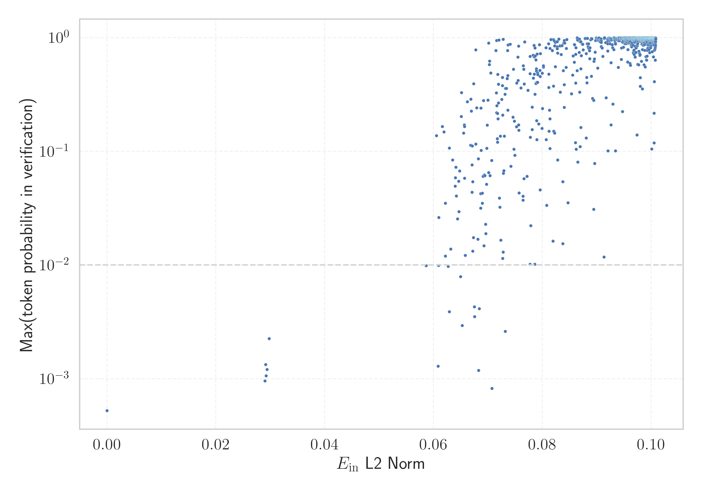

# Report for `benjamin/Mistral-7B-v0.1-zett-gpt2`

## Model info

* Tied embeddings: no
* LM head uses bias: no
* Indicator for under-trained tokens: E_{in} L2 Norm
  * Overall distribution 0.187 +/- 0.081
  * Token used for verification prompt building: `BuyableInstoreAndOnline`
  * Verification threshold: 0.101
  * Threshold for showing candidate under-trained tokens: 0.063
  * Median verified threshold (for bytes, unreachable and special tokens): 0.065
* Embeddings shape: (50394, 4096)
* Vocabulary size: 50394
  * Number of single byte tokens: 256, of which 7 below indicator threshold
  * Number of special tokens: 7, of which 1 below indicator threshold
  * Number of non-single-byte unreachable tokens: 63, of which 0 below indicator threshold
  * Number of non-single-byte UTF-fragment tokens: 216, 0 below soft indicator threshold
  * Number of tested under-trained tokens: 1002, 979 non-special, 13 below p = 0.01 threshold, 11 below soft indicator threshold

## Under-trained token indicators plot


## Verification plot


## Under-trained token verification results
11 entries below threshold of 0.063

|   token_id | token          |   indicator | max_prob                                                        | in_other_tokens                                                                          |
|------------|----------------|-------------|-----------------------------------------------------------------|------------------------------------------------------------------------------------------|
|      44115 | ````` 黒 ````` |   0.0586349 | <span style='border: 1px solid rgb(255, 145, 0);'>0.0099</span> |                                                                                          |
|      45038 | ````` ы `````  |   0.060533  | <span style='border: 1px solid rgb(40, 167, 69);'>0.14</span>   |                                                                                          |
|      25365 | ````` ァ ````` |   0.0608421 | <span style='border: 1px solid rgb(255, 145, 0);'>0.0013</span> | ````` ファ `````, ````` ヴァ `````                                                       |
|      36707 | ````` 戦 ````` |   0.0609177 | <span style='border: 1px solid rgb(255, 145, 0);'>0.0099</span> |                                                                                          |
|      37861 | ````` ヤ ````` |   0.0609662 | <span style='border: 1px solid rgb(251, 189, 8);'>0.026</span>  |                                                                                          |
|      24004 | ````` ブ ````` |   0.0616035 | <span style='border: 1px solid rgb(40, 167, 69);'>0.16</span>   |                                                                                          |
|      44036 | ````` ▀ `````  |   0.0618981 | <span style='border: 1px solid rgb(40, 167, 69);'>0.15</span>   |                                                                                          |
|      49963 | ````` 機 ````` |   0.0621713 | <span style='border: 1px solid rgb(251, 189, 8);'>0.012</span>  |                                                                                          |
|      20807 | ````` 魔 ````` |   0.0621833 | <span style='border: 1px solid rgb(251, 189, 8);'>0.035</span>  | ````` の魔 `````                                                                         |
|      17936 | ````` ゴ ````` |   0.0626853 | <span style='border: 1px solid rgb(255, 145, 0);'>0.0097</span> | ````` ゴン `````, ````` ドラゴン `````                                                   |
|      11888 | ````` 龍 ````` |   0.0628957 | <span style='border: 1px solid rgb(255, 145, 0);'>0.0039</span> | ````` 龍<0xE5> `````, ````` 龍喚士 `````, ````` 龍<0xE5><0xA5> `````, ````` 龍契士 ````` |
<details><summary>968 additional entries above threshold</summary>

|   token_id | token                 |   indicator | max_prob                                                         | in_other_tokens                                                                                                                                                                                                                                                         |
|------------|-----------------------|-------------|------------------------------------------------------------------|-------------------------------------------------------------------------------------------------------------------------------------------------------------------------------------------------------------------------------------------------------------------------|
|      47274 | ````` セ `````        |   0.0629024 | <span style='border: 1px solid rgb(40, 167, 69);'>0.11</span>    |                                                                                                                                                                                                                                                                         |
|      40013 | ````` ל `````         |   0.063146  | <span style='border: 1px solid rgb(251, 189, 8);'>0.014</span>   |                                                                                                                                                                                                                                                                         |
|      25087 | ````` キ `````        |   0.0635259 | <span style='border: 1px solid rgb(251, 189, 8);'>0.084</span>   |                                                                                                                                                                                                                                                                         |
|      44919 | ````` ネ `````        |   0.0639825 | <span style='border: 1px solid rgb(251, 189, 8);'>0.049</span>   |                                                                                                                                                                                                                                                                         |
|      16168 | ````` ウ `````        |   0.0640404 | <span style='border: 1px solid rgb(251, 189, 8);'>0.059</span>   | ````` ウス `````, ````` ゼウス `````                                                                                                                                                                                                                                    |
|      42067 | ````` ת `````         |   0.0641239 | <span style='border: 1px solid rgb(251, 189, 8);'>0.072</span>   |                                                                                                                                                                                                                                                                         |
|      37415 | ````` ハ `````        |   0.064212  | <span style='border: 1px solid rgb(251, 189, 8);'>0.041</span>   |                                                                                                                                                                                                                                                                         |
|      20516 | ````` オ `````        |   0.0643954 | <span style='border: 1px solid rgb(251, 189, 8);'>0.025</span>   |                                                                                                                                                                                                                                                                         |
|      40951 | ````` あ `````        |   0.0646235 | <span style='border: 1px solid rgb(251, 189, 8);'>0.054</span>   |                                                                                                                                                                                                                                                                         |
|      45789 | ````` ▄ `````         |   0.0646684 | <span style='border: 1px solid rgb(251, 189, 8);'>0.03</span>    |                                                                                                                                                                                                                                                                         |
|      13301 | ````` ト `````        |   0.0647945 | <span style='border: 1px solid rgb(251, 189, 8);'>0.067</span>   | ````` ット `````, ````` イト `````, ````` スト `````                                                                                                                                                                                                                    |
|      23731 | ````` ガ `````        |   0.0649695 | <span style='border: 1px solid rgb(255, 145, 0);'>0.0079</span>  |                                                                                                                                                                                                                                                                         |
|      16256 | ````` ロ `````        |   0.0650896 | <span style='border: 1px solid rgb(40, 167, 69);'>0.2</span>     |                                                                                                                                                                                                                                                                         |
|      26900 | ````` ر `````         |   0.0651504 | <span style='border: 1px solid rgb(40, 167, 69);'>0.33</span>    |                                                                                                                                                                                                                                                                         |
|      25798 | ````` ム `````        |   0.0652735 | <span style='border: 1px solid rgb(255, 145, 0);'>0.0029</span>  |                                                                                                                                                                                                                                                                         |
|      29522 | ````` ه `````         |   0.0655217 | <span style='border: 1px solid rgb(40, 167, 69);'>0.14</span>    |                                                                                                                                                                                                                                                                         |
|      25227 | ````` た `````        |   0.0656384 | <span style='border: 1px solid rgb(40, 167, 69);'>0.17</span>    |                                                                                                                                                                                                                                                                         |
|      25532 | ````` י `````         |   0.0656883 | <span style='border: 1px solid rgb(40, 167, 69);'>0.17</span>    | ````` י<0xD7> `````                                                                                                                                                                                                                                                     |
|      29662 | ````` バ `````        |   0.0657014 | <span style='border: 1px solid rgb(251, 189, 8);'>0.058</span>   |                                                                                                                                                                                                                                                                         |
|      27001 | ````` メ `````        |   0.0658471 | <span style='border: 1px solid rgb(251, 189, 8);'>0.012</span>   |                                                                                                                                                                                                                                                                         |
|      25056 | ````` ノ `````        |   0.0662359 | <span style='border: 1px solid rgb(40, 167, 69);'>0.27</span>    |                                                                                                                                                                                                                                                                         |
|      26506 | ````` サ `````        |   0.0667998 | <span style='border: 1px solid rgb(40, 167, 69);'>0.11</span>    | ````` ▁サ `````, ````` ▁サーティ `````, ````` ▁サーティワン `````                                                                                                                                                                                                       |
|      29560 | ````` う `````        |   0.0668825 | <span style='border: 1px solid rgb(40, 167, 69);'>0.29</span>    |                                                                                                                                                                                                                                                                         |
|      45695 | ````` س `````         |   0.0669646 | <span style='border: 1px solid rgb(40, 167, 69);'>0.23</span>    |                                                                                                                                                                                                                                                                         |
|      11842 | ````` ア `````        |   0.0670744 | <span style='border: 1px solid rgb(251, 189, 8);'>0.044</span>   | ````` アル `````                                                                                                                                                                                                                                                        |
|      37781 | ````` ר `````         |   0.0670925 | <span style='border: 1px solid rgb(251, 189, 8);'>0.076</span>   |                                                                                                                                                                                                                                                                         |
|      36925 | ````` ビ `````        |   0.0671194 | <span style='border: 1px solid rgb(40, 167, 69);'>0.11</span>    |                                                                                                                                                                                                                                                                         |
|       9205 | ````` ル `````        |   0.0672004 | <span style='border: 1px solid rgb(251, 189, 8);'>0.054</span>   | ````` ール `````, ````` エル `````, ````` アル `````                                                                                                                                                                                                                    |
|      11485 | ````` イ `````        |   0.0672145 | <span style='border: 1px solid rgb(251, 189, 8);'>0.013</span>   | ````` イト `````                                                                                                                                                                                                                                                        |
|      37429 | ````` ズ `````        |   0.0673301 | <span style='border: 1px solid rgb(251, 189, 8);'>0.017</span>   |                                                                                                                                                                                                                                                                         |
|      31920 | ````` く `````        |   0.0673926 | <span style='border: 1px solid rgb(40, 167, 69);'>0.39</span>    |                                                                                                                                                                                                                                                                         |
|      43902 | ````` ギ `````        |   0.0675059 | <span style='border: 1px solid rgb(255, 145, 0);'>0.0043</span>  |                                                                                                                                                                                                                                                                         |
|      29755 | ````` ヴ `````        |   0.0675434 | <span style='border: 1px solid rgb(255, 145, 0);'>0.0035</span>  | ````` ヴァ `````                                                                                                                                                                                                                                                        |
|      26948 | ````` な `````        |   0.0677468 | <span style='border: 1px solid rgb(40, 167, 69);'>0.12</span>    |                                                                                                                                                                                                                                                                         |
|      21730 | ````` с `````         |   0.0677625 | <span style='border: 1px solid rgb(40, 167, 69);'>0.78</span>    |                                                                                                                                                                                                                                                                         |
|      33781 | ````` き `````        |   0.0679486 | <span style='border: 1px solid rgb(40, 167, 69);'>0.24</span>    |                                                                                                                                                                                                                                                                         |
|      27855 | ````` ダ `````        |   0.0681437 | <span style='border: 1px solid rgb(251, 189, 8);'>0.017</span>   |                                                                                                                                                                                                                                                                         |
|      44693 | ````` ع `````         |   0.0682268 | <span style='border: 1px solid rgb(251, 189, 8);'>0.086</span>   |                                                                                                                                                                                                                                                                         |
|      16649 | ````` ィ `````        |   0.0682834 | <span style='border: 1px solid rgb(255, 145, 0);'>0.0012</span>  | ````` ディ `````, ````` ティ `````, ````` ーティ `````, ````` ▁サーティ `````, ````` ▁サーティワン `````                                                                                                                                                                |
|      37665 | ````` ォ `````        |   0.0684307 | <span style='border: 1px solid rgb(255, 145, 0);'>0.0041</span>  | ````` フォ `````                                                                                                                                                                                                                                                        |
|      23547 | ````` エ `````        |   0.0686652 | <span style='border: 1px solid rgb(251, 189, 8);'>0.042</span>   | ````` エル `````                                                                                                                                                                                                                                                        |
|      28258 | ````` り `````        |   0.0686676 | <span style='border: 1px solid rgb(251, 189, 8);'>0.032</span>   |                                                                                                                                                                                                                                                                         |
|      18569 | ````` い `````        |   0.0686913 | <span style='border: 1px solid rgb(40, 167, 69);'>0.24</span>    |                                                                                                                                                                                                                                                                         |
|      30162 | ````` ま `````        |   0.0687685 | <span style='border: 1px solid rgb(40, 167, 69);'>0.1</span>     |                                                                                                                                                                                                                                                                         |
|      30168 | ````` ニ `````        |   0.0689597 | <span style='border: 1px solid rgb(251, 189, 8);'>0.035</span>   |                                                                                                                                                                                                                                                                         |
|      46780 | ````` だ `````        |   0.0689706 | <span style='border: 1px solid rgb(251, 189, 8);'>0.043</span>   |                                                                                                                                                                                                                                                                         |
|      30435 | ````` ゼ `````        |   0.0690881 | <span style='border: 1px solid rgb(251, 189, 8);'>0.06</span>    | ````` ゼウス `````                                                                                                                                                                                                                                                      |
|      45370 | ````` ь `````         |   0.0691835 | <span style='border: 1px solid rgb(40, 167, 69);'>0.28</span>    |                                                                                                                                                                                                                                                                         |
|      43269 | ````` も `````        |   0.0692869 | <span style='border: 1px solid rgb(251, 189, 8);'>0.015</span>   |                                                                                                                                                                                                                                                                         |
|      46039 | ````` こ `````        |   0.0693703 | <span style='border: 1px solid rgb(251, 189, 8);'>0.062</span>   |                                                                                                                                                                                                                                                                         |
|      47533 | ````` ▬ `````         |   0.0694302 | <span style='border: 1px solid rgb(251, 189, 8);'>0.061</span>   | ````` ▬▬ `````                                                                                                                                                                                                                                                          |
|      49171 | ````` מ `````         |   0.0695565 | <span style='border: 1px solid rgb(251, 189, 8);'>0.023</span>   |                                                                                                                                                                                                                                                                         |
|      26098 | ````` グ `````        |   0.0696168 | <span style='border: 1px solid rgb(251, 189, 8);'>0.019</span>   |                                                                                                                                                                                                                                                                         |
|      25592 | ````` ワ `````        |   0.069725  | <span style='border: 1px solid rgb(251, 189, 8);'>0.051</span>   | ````` ワン `````, ````` ▁サーティワン `````                                                                                                                                                                                                                             |
|      39261 | ````` れ `````        |   0.0697923 | <span style='border: 1px solid rgb(40, 167, 69);'>0.11</span>    |                                                                                                                                                                                                                                                                         |
|       8946 | ````` ス `````        |   0.0698655 | <span style='border: 1px solid rgb(40, 167, 69);'>0.17</span>    | ````` ウス `````, ````` スト `````, ````` ゼウス `````                                                                                                                                                                                                                  |
|      23379 | ````` タ `````        |   0.0700072 | <span style='border: 1px solid rgb(40, 167, 69);'>0.28</span>    |                                                                                                                                                                                                                                                                         |
|      15664 | ````` シ `````        |   0.0701146 | <span style='border: 1px solid rgb(251, 189, 8);'>0.065</span>   | ````` シャ `````                                                                                                                                                                                                                                                        |
|      21172 | ````` р `````         |   0.0701483 | <span style='border: 1px solid rgb(40, 167, 69);'>0.9</span>     |                                                                                                                                                                                                                                                                         |
|      38846 | ````` د `````         |   0.0702424 | <span style='border: 1px solid rgb(40, 167, 69);'>0.58</span>    |                                                                                                                                                                                                                                                                         |
|      22657 | ````` ي `````         |   0.0703081 | <span style='border: 1px solid rgb(40, 167, 69);'>0.62</span>    |                                                                                                                                                                                                                                                                         |
|       9266 | ````` ラ `````        |   0.0703685 | <span style='border: 1px solid rgb(251, 189, 8);'>0.061</span>   | ````` ドラ `````, ````` ドラゴン `````, ````` ヘラ `````, ````` ラン `````                                                                                                                                                                                              |
|      35075 | ````` у `````         |   0.0705336 | <span style='border: 1px solid rgb(40, 167, 69);'>0.49</span>    |                                                                                                                                                                                                                                                                         |
|      24189 | ````` レ `````        |   0.0706873 | <span style='border: 1px solid rgb(251, 189, 8);'>0.083</span>   |                                                                                                                                                                                                                                                                         |
|      24443 | ````` ュ `````        |   0.0707253 | <span style='border: 1px solid rgb(169, 68, 66);'>0.00082</span> |                                                                                                                                                                                                                                                                         |
|      37958 | ````` 生 `````        |   0.0714645 | <span style='border: 1px solid rgb(40, 167, 69);'>0.77</span>    |                                                                                                                                                                                                                                                                         |
|      13865 | ````` ل `````         |   0.0715702 | <span style='border: 1px solid rgb(40, 167, 69);'>0.33</span>    | <span style='border: 1px solid rgb(40, 167, 69);'>````` ال `````</span>, <span style='border: 1px solid rgb(40, 167, 69);'>````` ▁ال `````</span>                                                                                                                       |
|      45635 | ````` ة `````         |   0.0715796 | <span style='border: 1px solid rgb(40, 167, 69);'>0.22</span>    |                                                                                                                                                                                                                                                                         |
|      43669 | ````` д `````         |   0.0716041 | <span style='border: 1px solid rgb(40, 167, 69);'>0.95</span>    |                                                                                                                                                                                                                                                                         |
|      27373 | ````` か `````        |   0.0716262 | <span style='border: 1px solid rgb(40, 167, 69);'>0.25</span>    |                                                                                                                                                                                                                                                                         |
|      30204 | ````` と `````        |   0.0717044 | <span style='border: 1px solid rgb(40, 167, 69);'>0.13</span>    |                                                                                                                                                                                                                                                                         |
|      21766 | ````` カ `````        |   0.0717522 | <span style='border: 1px solid rgb(40, 167, 69);'>0.12</span>    |                                                                                                                                                                                                                                                                         |
|      31093 | ````` チ `````        |   0.0717599 | <span style='border: 1px solid rgb(40, 167, 69);'>0.22</span>    |                                                                                                                                                                                                                                                                         |
|      38272 | ````` ה `````         |   0.0718237 | <span style='border: 1px solid rgb(40, 167, 69);'>0.47</span>    |                                                                                                                                                                                                                                                                         |
|      14102 | ````` ク `````        |   0.0718601 | <span style='border: 1px solid rgb(40, 167, 69);'>0.19</span>    | ````` ック `````, ````` ーク `````                                                                                                                                                                                                                                      |
|      24682 | ````` コ `````        |   0.0719247 | <span style='border: 1px solid rgb(40, 167, 69);'>0.27</span>    |                                                                                                                                                                                                                                                                         |
|      41489 | ````` ت `````         |   0.0719257 | <span style='border: 1px solid rgb(40, 167, 69);'>0.39</span>    |                                                                                                                                                                                                                                                                         |
|      40626 | ````` я `````         |   0.0720223 | <span style='border: 1px solid rgb(40, 167, 69);'>0.95</span>    |                                                                                                                                                                                                                                                                         |
|      27545 | ````` ミ `````        |   0.0721122 | <span style='border: 1px solid rgb(251, 189, 8);'>0.039</span>   |                                                                                                                                                                                                                                                                         |
|      18806 | ````` 士 `````        |   0.0722151 | <span style='border: 1px solid rgb(251, 189, 8);'>0.032</span>   | ````` <0x96><0x9A>士 `````, ````` 龍喚士 `````, ````` <0x91>士 `````, ````` 龍契士 `````                                                                                                                                                                                |
|      35607 | ````` ベ `````        |   0.0722615 | <span style='border: 1px solid rgb(40, 167, 69);'>0.14</span>    |                                                                                                                                                                                                                                                                         |
|      47489 | ````` ━ `````         |   0.0723794 | <span style='border: 1px solid rgb(251, 189, 8);'>0.017</span>   |                                                                                                                                                                                                                                                                         |
|      50230 | ````` ש `````         |   0.0725491 | <span style='border: 1px solid rgb(40, 167, 69);'>0.29</span>    |                                                                                                                                                                                                                                                                         |
|      23341 | ````` ن `````         |   0.0726638 | <span style='border: 1px solid rgb(40, 167, 69);'>0.38</span>    |                                                                                                                                                                                                                                                                         |
|      38522 | ````` 者 `````        |   0.0726806 | <span style='border: 1px solid rgb(40, 167, 69);'>0.45</span>    |                                                                                                                                                                                                                                                                         |
|      48461 | ````` ザ `````        |   0.0727165 | <span style='border: 1px solid rgb(251, 189, 8);'>0.011</span>   |                                                                                                                                                                                                                                                                         |
|       6315 | ````` ー `````        |   0.0727191 | <span style='border: 1px solid rgb(40, 167, 69);'>0.21</span>    | ````` ー<0xE3><0x83> `````, ````` ーン `````, ````` ーク `````, ````` ール `````, ````` ーテ `````, ...                                                                                                                                                                 |
|      33183 | ````` っ `````        |   0.0727822 | <span style='border: 1px solid rgb(251, 189, 8);'>0.013</span>   |                                                                                                                                                                                                                                                                         |
|      20378 | ````` т `````         |   0.0727991 | <span style='border: 1px solid rgb(40, 167, 69);'>0.97</span>    |                                                                                                                                                                                                                                                                         |
|      15354 | ````` 神 `````        |   0.072824  | <span style='border: 1px solid rgb(251, 189, 8);'>0.064</span>   | ````` ▁神 `````                                                                                                                                                                                                                                                         |
|      17684 | ````` フ `````        |   0.0729185 | <span style='border: 1px solid rgb(251, 189, 8);'>0.068</span>   | ````` ファ `````, ````` フォ `````                                                                                                                                                                                                                                      |
|      13768 | ````` ド `````        |   0.073028  | <span style='border: 1px solid rgb(40, 167, 69);'>0.14</span>    | ````` ドラ `````, ````` ドラゴン `````, ````` ッド `````                                                                                                                                                                                                                |
|      43360 | ````` さ `````        |   0.0731445 | <span style='border: 1px solid rgb(40, 167, 69);'>0.32</span>    |                                                                                                                                                                                                                                                                         |
|      23134 | ````` ャ `````        |   0.0732007 | <span style='border: 1px solid rgb(255, 145, 0);'>0.0026</span>  | ````` シャ `````                                                                                                                                                                                                                                                        |
|      39851 | ````` ب `````         |   0.0732343 | <span style='border: 1px solid rgb(40, 167, 69);'>0.36</span>    |                                                                                                                                                                                                                                                                         |
|      42976 | ````` א `````         |   0.073398  | <span style='border: 1px solid rgb(40, 167, 69);'>0.36</span>    |                                                                                                                                                                                                                                                                         |
|      12678 | ````` リ `````        |   0.0735227 | <span style='border: 1px solid rgb(40, 167, 69);'>0.44</span>    |                                                                                                                                                                                                                                                                         |
|      18852 | ````` и `````         |   0.0736303 | <span style='border: 1px solid rgb(40, 167, 69);'>0.77</span>    |                                                                                                                                                                                                                                                                         |
|      43098 | ````` 方 `````        |   0.073641  | <span style='border: 1px solid rgb(40, 167, 69);'>0.46</span>    |                                                                                                                                                                                                                                                                         |
|      12922 | ````` ا `````         |   0.073664  | <span style='border: 1px solid rgb(40, 167, 69);'>0.23</span>    | <span style='border: 1px solid rgb(40, 167, 69);'>````` ال `````</span>, <span style='border: 1px solid rgb(40, 167, 69);'>````` ▁ال `````</span>, ````` ا<0xD8> `````                                                                                                  |
|      33626 | ````` す `````        |   0.0737135 | <span style='border: 1px solid rgb(40, 167, 69);'>0.86</span>    |                                                                                                                                                                                                                                                                         |
|      16145 | ````` а `````         |   0.0740914 | <span style='border: 1px solid rgb(40, 167, 69);'>0.88</span>    |                                                                                                                                                                                                                                                                         |
|      30968 | ````` プ `````        |   0.0742144 | <span style='border: 1px solid rgb(251, 189, 8);'>0.074</span>   |                                                                                                                                                                                                                                                                         |
|      30643 | ````` で `````        |   0.0746115 | <span style='border: 1px solid rgb(40, 167, 69);'>0.2</span>     |                                                                                                                                                                                                                                                                         |
|      36856 | ````` ら `````        |   0.074762  | <span style='border: 1px solid rgb(40, 167, 69);'>0.1</span>     |                                                                                                                                                                                                                                                                         |
|      31679 | ````` は `````        |   0.0748814 | <span style='border: 1px solid rgb(40, 167, 69);'>0.18</span>    |                                                                                                                                                                                                                                                                         |
|      20118 | ````` マ `````        |   0.0749417 | <span style='border: 1px solid rgb(251, 189, 8);'>0.092</span>   |                                                                                                                                                                                                                                                                         |
|      28621 | ````` に `````        |   0.075256  | <span style='border: 1px solid rgb(40, 167, 69);'>0.16</span>    |                                                                                                                                                                                                                                                                         |
|      23528 | ````` ال `````        |   0.0753064 | <span style='border: 1px solid rgb(40, 167, 69);'>0.4</span>     | <span style='border: 1px solid rgb(40, 167, 69);'>````` ▁ال `````</span>                                                                                                                                                                                                |
|      15169 | ````` о `````         |   0.0755165 | <span style='border: 1px solid rgb(40, 167, 69);'>0.67</span>    | ````` о<0xD0> `````                                                                                                                                                                                                                                                     |
|      32549 | ````` パ `````        |   0.075551  | <span style='border: 1px solid rgb(40, 167, 69);'>0.42</span>    |                                                                                                                                                                                                                                                                         |
|       6530 | ````` ン `````        |   0.0756165 | <span style='border: 1px solid rgb(40, 167, 69);'>0.17</span>    | ````` ゴン `````, ````` ドラゴン `````, ````` ーン `````, ````` ワン `````, ````` ▁サーティワン `````, ...                                                                                                                                                              |
|      43111 | ````` м `````         |   0.0756186 | <span style='border: 1px solid rgb(40, 167, 69);'>0.84</span>    |                                                                                                                                                                                                                                                                         |
|      27075 | ````` ו `````         |   0.0756899 | <span style='border: 1px solid rgb(40, 167, 69);'>0.15</span>    |                                                                                                                                                                                                                                                                         |
|      41661 | ````` ケ `````        |   0.0757305 | <span style='border: 1px solid rgb(251, 189, 8);'>0.043</span>   |                                                                                                                                                                                                                                                                         |
|      40519 | ````` ▒ `````         |   0.0760675 | <span style='border: 1px solid rgb(40, 167, 69);'>0.36</span>    |                                                                                                                                                                                                                                                                         |
|      22177 | ````` ん `````        |   0.076435  | <span style='border: 1px solid rgb(251, 189, 8);'>0.037</span>   |                                                                                                                                                                                                                                                                         |
|      14780 | ````` ッ `````        |   0.0764351 | <span style='border: 1px solid rgb(251, 189, 8);'>0.04</span>    | ````` ック `````, ````` ット `````, ````` ッド `````                                                                                                                                                                                                                    |
|      24339 | ````` テ `````        |   0.0765051 | <span style='border: 1px solid rgb(40, 167, 69);'>0.57</span>    | ````` ーテ `````, ````` ティ `````, ````` ーティ `````, ````` ▁サーティ `````, ````` ▁サーティワン `````                                                                                                                                                                |
|      49393 | ````` 五 `````        |   0.0765615 | <span style='border: 1px solid rgb(40, 167, 69);'>0.53</span>    |                                                                                                                                                                                                                                                                         |
|      22183 | ````` し `````        |   0.0766394 | <span style='border: 1px solid rgb(251, 189, 8);'>0.057</span>   |                                                                                                                                                                                                                                                                         |
|      22180 | ````` н `````         |   0.0767326 | <span style='border: 1px solid rgb(40, 167, 69);'>0.92</span>    |                                                                                                                                                                                                                                                                         |
|      35561 | ````` ς `````         |   0.0771964 | <span style='border: 1px solid rgb(251, 189, 8);'>0.06</span>    |                                                                                                                                                                                                                                                                         |
|      25408 | ````` م `````         |   0.0773692 | <span style='border: 1px solid rgb(40, 167, 69);'>0.34</span>    | <span style='border: 1px solid rgb(40, 167, 69);'>````` ▁م `````</span>                                                                                                                                                                                                 |
|      49606 | ````` ב `````         |   0.0777369 | <span style='border: 1px solid rgb(40, 167, 69);'>0.68</span>    |                                                                                                                                                                                                                                                                         |
|      25584 | ````` 王 `````        |   0.0777921 | <span style='border: 1px solid rgb(40, 167, 69);'>0.13</span>    |                                                                                                                                                                                                                                                                         |
|      40364 | ````` モ `````        |   0.077862  | <span style='border: 1px solid rgb(251, 189, 8);'>0.022</span>   |                                                                                                                                                                                                                                                                         |
|      47562 | ````` ソ `````        |   0.0781187 | <span style='border: 1px solid rgb(40, 167, 69);'>0.16</span>    |                                                                                                                                                                                                                                                                         |
|      29948 | ````` ι `````         |   0.0783231 | <span style='border: 1px solid rgb(40, 167, 69);'>0.7</span>     |                                                                                                                                                                                                                                                                         |
|      29093 | ````` å `````         |   0.0783573 | <span style='border: 1px solid rgb(40, 167, 69);'>0.44</span>    |                                                                                                                                                                                                                                                                         |
|      30146 | ````` л `````         |   0.078472  | <span style='border: 1px solid rgb(40, 167, 69);'>0.86</span>    |                                                                                                                                                                                                                                                                         |
|      26232 | ````` ナ `````        |   0.0785225 | <span style='border: 1px solid rgb(40, 167, 69);'>0.68</span>    |                                                                                                                                                                                                                                                                         |
|      46198 | ````` č `````         |   0.0785247 | <span style='border: 1px solid rgb(40, 167, 69);'>0.48</span>    |                                                                                                                                                                                                                                                                         |
|      44211 | ````` ِ `````          |   0.0786048 | <span style='border: 1px solid rgb(251, 189, 8);'>0.01</span>    |                                                                                                                                                                                                                                                                         |
|      16846 | ````` е `````         |   0.0786623 | <span style='border: 1px solid rgb(40, 167, 69);'>0.81</span>    |                                                                                                                                                                                                                                                                         |
|      47990 | ````` 代 `````        |   0.0786645 | <span style='border: 1px solid rgb(40, 167, 69);'>0.32</span>    |                                                                                                                                                                                                                                                                         |
|      48307 | ````` 版 `````        |   0.0787057 | <span style='border: 1px solid rgb(40, 167, 69);'>0.69</span>    |                                                                                                                                                                                                                                                                         |
|      42448 | ````` ér `````        |   0.0788204 | <span style='border: 1px solid rgb(40, 167, 69);'>0.64</span>    |                                                                                                                                                                                                                                                                         |
|      48369 | ````` ◼ `````         |   0.0788348 | <span style='border: 1px solid rgb(40, 167, 69);'>0.4</span>     |                                                                                                                                                                                                                                                                         |
|      49014 | ````` 三 `````        |   0.0788838 | <span style='border: 1px solid rgb(40, 167, 69);'>0.53</span>    |                                                                                                                                                                                                                                                                         |
|      35588 | ````` が `````        |   0.0788916 | <span style='border: 1px solid rgb(40, 167, 69);'>0.51</span>    |                                                                                                                                                                                                                                                                         |
|      28984 | ````` ▁ال `````       |   0.0789301 | <span style='border: 1px solid rgb(40, 167, 69);'>0.19</span>    |                                                                                                                                                                                                                                                                         |
|      23366 | ````` ヘ `````        |   0.0789704 | <span style='border: 1px solid rgb(40, 167, 69);'>0.13</span>    | ````` ヘラ `````                                                                                                                                                                                                                                                        |
|      46271 | ````` 光 `````        |   0.0789775 | <span style='border: 1px solid rgb(40, 167, 69);'>0.4</span>     |                                                                                                                                                                                                                                                                         |
|      22164 | ````` ée `````        |   0.0790197 | <span style='border: 1px solid rgb(40, 167, 69);'>0.72</span>    |                                                                                                                                                                                                                                                                         |
|      26183 | ````` ν `````         |   0.0791016 | <span style='border: 1px solid rgb(40, 167, 69);'>0.49</span>    |                                                                                                                                                                                                                                                                         |
|      27086 | ````` ô `````         |   0.0791114 | <span style='border: 1px solid rgb(40, 167, 69);'>0.4</span>     |                                                                                                                                                                                                                                                                         |
|      25751 | ````` る `````        |   0.0791836 | <span style='border: 1px solid rgb(40, 167, 69);'>0.47</span>    |                                                                                                                                                                                                                                                                         |
|      38641 | ````` Í `````         |   0.0793335 | <span style='border: 1px solid rgb(40, 167, 69);'>0.17</span>    | ````` ÍÍ `````                                                                                                                                                                                                                                                          |
|      31586 | ````` к `````         |   0.0794595 | <span style='border: 1px solid rgb(40, 167, 69);'>0.87</span>    |                                                                                                                                                                                                                                                                         |
|      45301 | ````` 之 `````        |   0.0795722 | <span style='border: 1px solid rgb(251, 189, 8);'>0.046</span>   |                                                                                                                                                                                                                                                                         |
|      28137 | ````` て `````        |   0.0795757 | <span style='border: 1px solid rgb(40, 167, 69);'>0.45</span>    |                                                                                                                                                                                                                                                                         |
|      33646 | ````` ρ `````         |   0.079616  | <span style='border: 1px solid rgb(40, 167, 69);'>0.72</span>    |                                                                                                                                                                                                                                                                         |
|      30338 | ````` و `````         |   0.0799441 | <span style='border: 1px solid rgb(40, 167, 69);'>0.16</span>    | ````` ▁و `````                                                                                                                                                                                                                                                          |
|      35321 | ````` 装 `````        |   0.0799784 | <span style='border: 1px solid rgb(40, 167, 69);'>0.49</span>    |                                                                                                                                                                                                                                                                         |
|      21094 | ````` ジ `````        |   0.0800438 | <span style='border: 1px solid rgb(40, 167, 69);'>0.24</span>    | ````` ンジ `````                                                                                                                                                                                                                                                        |
|      21165 | ````` án `````        |   0.0802052 | <span style='border: 1px solid rgb(40, 167, 69);'>0.57</span>    |                                                                                                                                                                                                                                                                         |
|       6560 | ````` á `````         |   0.0806691 | <span style='border: 1px solid rgb(40, 167, 69);'>0.82</span>    | <span style='border: 1px solid rgb(40, 167, 69);'>````` án `````</span>, ````` ▁Bahá `````, <span style='border: 1px solid rgb(40, 167, 69);'>````` ás `````</span>                                                                                                     |
|      41118 | ````` ツ `````        |   0.0807037 | <span style='border: 1px solid rgb(40, 167, 69);'>0.13</span>    |                                                                                                                                                                                                                                                                         |
|      48080 | ````` ा `````          |   0.0807907 | <span style='border: 1px solid rgb(251, 189, 8);'>0.033</span>   |                                                                                                                                                                                                                                                                         |
|      30953 | ````` ε `````         |   0.0811276 | <span style='border: 1px solid rgb(40, 167, 69);'>0.88</span>    |                                                                                                                                                                                                                                                                         |
|      45638 | ````` 使 `````        |   0.0811654 | <span style='border: 1px solid rgb(40, 167, 69);'>0.48</span>    |                                                                                                                                                                                                                                                                         |
|      14067 | ````` è `````         |   0.0811754 | <span style='border: 1px solid rgb(40, 167, 69);'>0.36</span>    | <span style='border: 1px solid rgb(40, 167, 69);'>````` ère `````</span>                                                                                                                                                                                                |
|      34546 | ````` Û `````         |   0.0812248 | <span style='border: 1px solid rgb(40, 167, 69);'>0.15</span>    | ````` ÛÛ `````                                                                                                                                                                                                                                                          |
|      21962 | ````` デ `````        |   0.0813216 | <span style='border: 1px solid rgb(40, 167, 69);'>0.23</span>    | ````` ディ `````                                                                                                                                                                                                                                                        |
|      28752 | ````` ão `````        |   0.0813894 | <span style='border: 1px solid rgb(40, 167, 69);'>0.8</span>     |                                                                                                                                                                                                                                                                         |
|      42327 | ````` û `````         |   0.0813982 | <span style='border: 1px solid rgb(40, 167, 69);'>0.19</span>    |                                                                                                                                                                                                                                                                         |
|      47051 | ````` ▁م `````        |   0.0814088 | <span style='border: 1px solid rgb(40, 167, 69);'>0.11</span>    |                                                                                                                                                                                                                                                                         |
|      42066 | ````` γ `````         |   0.0815703 | <span style='border: 1px solid rgb(40, 167, 69);'>0.96</span>    |                                                                                                                                                                                                                                                                         |
|      21692 | ````` 人 `````        |   0.0818181 | <span style='border: 1px solid rgb(40, 167, 69);'>0.77</span>    |                                                                                                                                                                                                                                                                         |
|      24809 | ````` ェ `````        |   0.0819586 | <span style='border: 1px solid rgb(251, 189, 8);'>0.016</span>   |                                                                                                                                                                                                                                                                         |
|      38354 | ````` É `````         |   0.0820354 | <span style='border: 1px solid rgb(40, 167, 69);'>0.96</span>    | <span style='border: 1px solid rgb(40, 167, 69);'>````` ▁É `````</span>                                                                                                                                                                                                 |
|      22113 | ````` ░ `````         |   0.0820572 | <span style='border: 1px solid rgb(40, 167, 69);'>0.37</span>    | ````` ░░ `````                                                                                                                                                                                                                                                          |
|      25795 | ````` ê `````         |   0.0820813 | <span style='border: 1px solid rgb(40, 167, 69);'>0.15</span>    |                                                                                                                                                                                                                                                                         |
|      38395 | ````` σ `````         |   0.0821724 | <span style='border: 1px solid rgb(40, 167, 69);'>0.94</span>    |                                                                                                                                                                                                                                                                         |
|      25468 | ````` 天 `````        |   0.0822453 | <span style='border: 1px solid rgb(40, 167, 69);'>0.85</span>    |                                                                                                                                                                                                                                                                         |
|      41618 | ````` ł `````         |   0.0822799 | <span style='border: 1px solid rgb(40, 167, 69);'>0.14</span>    |                                                                                                                                                                                                                                                                         |
|      11036 | ````` ä `````         |   0.08238   | <span style='border: 1px solid rgb(40, 167, 69);'>0.91</span>    |                                                                                                                                                                                                                                                                         |
|      43294 | ````` 作 `````        |   0.0827199 | <span style='border: 1px solid rgb(40, 167, 69);'>0.83</span>    |                                                                                                                                                                                                                                                                         |
|      40141 | ````` ás `````        |   0.0827294 | <span style='border: 1px solid rgb(40, 167, 69);'>0.92</span>    |                                                                                                                                                                                                                                                                         |
|      30647 | ````` ña `````        |   0.0827536 | <span style='border: 1px solid rgb(40, 167, 69);'>0.8</span>     |                                                                                                                                                                                                                                                                         |
|      32017 | ````` 大 `````        |   0.0828162 | <span style='border: 1px solid rgb(40, 167, 69);'>0.73</span>    |                                                                                                                                                                                                                                                                         |
|      38328 | ````` ć `````         |   0.0828291 | <span style='border: 1px solid rgb(251, 189, 8);'>0.084</span>   |                                                                                                                                                                                                                                                                         |
|      31663 | ````` 一 `````        |   0.0830153 | <span style='border: 1px solid rgb(40, 167, 69);'>0.97</span>    |                                                                                                                                                                                                                                                                         |
|      21359 | ````` ú `````         |   0.083235  | <span style='border: 1px solid rgb(40, 167, 69);'>0.85</span>    |                                                                                                                                                                                                                                                                         |
|      32793 | ````` š `````         |   0.0832727 | <span style='border: 1px solid rgb(40, 167, 69);'>0.33</span>    |                                                                                                                                                                                                                                                                         |
|      36313 | ````` 子 `````        |   0.0835985 | <span style='border: 1px solid rgb(40, 167, 69);'>0.85</span>    |                                                                                                                                                                                                                                                                         |
|      31735 | ````` ══ `````        |   0.0837839 | <span style='border: 1px solid rgb(251, 189, 8);'>0.054</span>   |                                                                                                                                                                                                                                                                         |
|      47906 | ````` ּ `````          |   0.0837842 | <span style='border: 1px solid rgb(251, 189, 8);'>0.015</span>   |                                                                                                                                                                                                                                                                         |
|      40563 | ````` ▁ré `````       |   0.083929  | <span style='border: 1px solid rgb(40, 167, 69);'>0.9</span>     |                                                                                                                                                                                                                                                                         |
|      31761 | ````` を `````        |   0.0840117 | <span style='border: 1px solid rgb(40, 167, 69);'>0.39</span>    |                                                                                                                                                                                                                                                                         |
|      39591 | ````` ín `````        |   0.0840154 | <span style='border: 1px solid rgb(40, 167, 69);'>0.94</span>    |                                                                                                                                                                                                                                                                         |
|      21244 | ````` æ `````         |   0.084024  | <span style='border: 1px solid rgb(40, 167, 69);'>0.24</span>    |                                                                                                                                                                                                                                                                         |
|      45034 | ````` lé `````        |   0.0841131 | <span style='border: 1px solid rgb(40, 167, 69);'>0.9</span>     |                                                                                                                                                                                                                                                                         |
|      49538 | ````` ω `````         |   0.084394  | <span style='border: 1px solid rgb(40, 167, 69);'>0.8</span>     |                                                                                                                                                                                                                                                                         |
|      20957 | ````` és `````        |   0.0845067 | <span style='border: 1px solid rgb(40, 167, 69);'>0.96</span>    |                                                                                                                                                                                                                                                                         |
|      46484 | ````` ş `````         |   0.0847263 | <span style='border: 1px solid rgb(251, 189, 8);'>0.035</span>   |                                                                                                                                                                                                                                                                         |
|       8839 | ````` í `````         |   0.0855892 | <span style='border: 1px solid rgb(40, 167, 69);'>0.47</span>    | <span style='border: 1px solid rgb(40, 167, 69);'>````` ía `````</span>, <span style='border: 1px solid rgb(40, 167, 69);'>````` ín `````</span>, <span style='border: 1px solid rgb(40, 167, 69);'>````` ís `````</span>                                               |
|      25154 | ````` ür `````        |   0.0856438 | <span style='border: 1px solid rgb(40, 167, 69);'>0.69</span>    |                                                                                                                                                                                                                                                                         |
|       9119 | ````` ü `````         |   0.0858603 | <span style='border: 1px solid rgb(40, 167, 69);'>0.87</span>    | <span style='border: 1px solid rgb(40, 167, 69);'>````` ür `````</span>, ````` ▁Mü `````                                                                                                                                                                                |
|      35945 | ````` én `````        |   0.0858715 | <span style='border: 1px solid rgb(40, 167, 69);'>0.87</span>    |                                                                                                                                                                                                                                                                         |
|      32685 | ````` cé `````        |   0.0858809 | <span style='border: 1px solid rgb(40, 167, 69);'>0.61</span>    |                                                                                                                                                                                                                                                                         |
|      24250 | ````` à `````         |   0.0858997 | <span style='border: 1px solid rgb(40, 167, 69);'>0.87</span>    | <span style='border: 1px solid rgb(40, 167, 69);'>````` ▁à `````</span>                                                                                                                                                                                                 |
|      38629 | ````` ▓ `````         |   0.0860871 | <span style='border: 1px solid rgb(40, 167, 69);'>0.12</span>    |                                                                                                                                                                                                                                                                         |
|      41471 | ````` 上 `````        |   0.0861228 | <span style='border: 1px solid rgb(40, 167, 69);'>0.71</span>    |                                                                                                                                                                                                                                                                         |
|      49479 | ````` 武 `````        |   0.0861279 | <span style='border: 1px solid rgb(40, 167, 69);'>0.4</span>     |                                                                                                                                                                                                                                                                         |
|       8118 | ````` █ `````         |   0.086214  | <span style='border: 1px solid rgb(40, 167, 69);'>0.1</span>     | ````` ██ `````, ````` ████ `````, ````` ▁█ `````, ````` ████████ `````                                                                                                                                                                                                  |
|      42640 | ````` 女 `````        |   0.0863711 | <span style='border: 1px solid rgb(40, 167, 69);'>0.51</span>    |                                                                                                                                                                                                                                                                         |
|      29353 | ````` ré `````        |   0.0863746 | <span style='border: 1px solid rgb(40, 167, 69);'>1</span>       | <span style='border: 1px solid rgb(40, 167, 69);'>````` ▁ré `````</span>                                                                                                                                                                                                |
|      28124 | ````` jas `````       |   0.0864369 | <span style='border: 1px solid rgb(40, 167, 69);'>0.99</span>    |                                                                                                                                                                                                                                                                         |
|      34706 | ````` μ `````         |   0.0864533 | <span style='border: 1px solid rgb(40, 167, 69);'>0.95</span>    | ````` ▁μg `````                                                                                                                                                                                                                                                         |
|       5644 | ````` の `````        |   0.0865204 | <span style='border: 1px solid rgb(251, 189, 8);'>0.08</span>    | ````` の<0xE5> `````, ````` の<0xE7> `````, ````` の<0xE6> `````, ````` の<0xE9> `````, ````` の魔 `````, ...                                                                                                                                                           |
|      32833 | ````` τ `````         |   0.086777  | <span style='border: 1px solid rgb(40, 167, 69);'>0.74</span>    | ````` ▁τ `````                                                                                                                                                                                                                                                          |
|      48851 | ````` ijn `````       |   0.0868057 | <span style='border: 1px solid rgb(40, 167, 69);'>0.97</span>    |                                                                                                                                                                                                                                                                         |
|      34806 | ````` î `````         |   0.0868692 | <span style='border: 1px solid rgb(40, 167, 69);'>0.33</span>    |                                                                                                                                                                                                                                                                         |
|      17397 | ````` α `````         |   0.0868781 | <span style='border: 1px solid rgb(40, 167, 69);'>0.92</span>    | ````` ▁α `````                                                                                                                                                                                                                                                          |
|      35575 | ````` 田 `````        |   0.0869384 | <span style='border: 1px solid rgb(40, 167, 69);'>0.11</span>    |                                                                                                                                                                                                                                                                         |
|      26105 | ````` ã `````         |   0.0870094 | <span style='border: 1px solid rgb(40, 167, 69);'>0.92</span>    | <span style='border: 1px solid rgb(40, 167, 69);'>````` ão `````</span>                                                                                                                                                                                                 |
|      18965 | ````` ī `````         |   0.0870581 | <span style='border: 1px solid rgb(40, 167, 69);'>0.16</span>    |                                                                                                                                                                                                                                                                         |
|      28054 | ````` icz `````       |   0.0870639 | <span style='border: 1px solid rgb(40, 167, 69);'>0.92</span>    | ````` owicz `````, ````` iewicz `````                                                                                                                                                                                                                                   |
|      29693 | ````` ía `````        |   0.087078  | <span style='border: 1px solid rgb(40, 167, 69);'>0.53</span>    |                                                                                                                                                                                                                                                                         |
|      39686 | ````` ß `````         |   0.0871761 | <span style='border: 1px solid rgb(40, 167, 69);'>0.69</span>    |                                                                                                                                                                                                                                                                         |
|      21044 | ````` berger `````    |   0.0873128 | <span style='border: 1px solid rgb(40, 167, 69);'>0.87</span>    |                                                                                                                                                                                                                                                                         |
|      45214 | ````` ateurs `````    |   0.0874001 | <span style='border: 1px solid rgb(40, 167, 69);'>0.88</span>    |                                                                                                                                                                                                                                                                         |
|      18843 | ````` ón `````        |   0.0874882 | <span style='border: 1px solid rgb(40, 167, 69);'>0.78</span>    |                                                                                                                                                                                                                                                                         |
|      43003 | ````` κ `````         |   0.0878295 | <span style='border: 1px solid rgb(40, 167, 69);'>0.98</span>    |                                                                                                                                                                                                                                                                         |
|      25128 | ````` ét `````        |   0.0878981 | <span style='border: 1px solid rgb(40, 167, 69);'>0.98</span>    |                                                                                                                                                                                                                                                                         |
|      27095 | ````` ē `````         |   0.0880519 | <span style='border: 1px solid rgb(40, 167, 69);'>0.13</span>    |                                                                                                                                                                                                                                                                         |
|      10208 | ````` ó `````         |   0.0880698 | <span style='border: 1px solid rgb(40, 167, 69);'>0.72</span>    | <span style='border: 1px solid rgb(40, 167, 69);'>````` ón `````</span>                                                                                                                                                                                                 |
|      41203 | ````` ís `````        |   0.0881436 | <span style='border: 1px solid rgb(40, 167, 69);'>0.45</span>    |                                                                                                                                                                                                                                                                         |
|      20320 | ````` ū `````         |   0.0881992 | <span style='border: 1px solid rgb(40, 167, 69);'>0.4</span>     |                                                                                                                                                                                                                                                                         |
|      28144 | ````` ▁à `````        |   0.088255  | <span style='border: 1px solid rgb(40, 167, 69);'>0.88</span>    |                                                                                                                                                                                                                                                                         |
|      30833 | ````` icht `````      |   0.0882596 | <span style='border: 1px solid rgb(40, 167, 69);'>0.98</span>    |                                                                                                                                                                                                                                                                         |
|      35954 | ````` ussen `````     |   0.0884279 | <span style='border: 1px solid rgb(40, 167, 69);'>0.83</span>    | ````` ▁Rasmussen `````                                                                                                                                                                                                                                                  |
|      43819 | ````` ité `````       |   0.0884937 | <span style='border: 1px solid rgb(40, 167, 69);'>0.88</span>    |                                                                                                                                                                                                                                                                         |
|       9104 | ````` ö `````         |   0.0885366 | <span style='border: 1px solid rgb(40, 167, 69);'>0.8</span>     | <span style='border: 1px solid rgb(40, 167, 69);'>````` ör `````</span>, <span style='border: 1px solid rgb(40, 167, 69);'>````` ön `````</span>, ````` ▁Gö `````                                                                                                       |
|      24648 | ````` ischer `````    |   0.0886544 | <span style='border: 1px solid rgb(40, 167, 69);'>0.77</span>    | ````` ▁Fischer `````                                                                                                                                                                                                                                                    |
|      49366 | ````` ▁Ü `````        |   0.0887083 | <span style='border: 1px solid rgb(40, 167, 69);'>0.65</span>    |                                                                                                                                                                                                                                                                         |
|      28423 | ````` heid `````      |   0.0887581 | <span style='border: 1px solid rgb(40, 167, 69);'>0.81</span>    | ````` ▁apartheid `````                                                                                                                                                                                                                                                  |
|      46100 | ````` ische `````     |   0.0888891 | <span style='border: 1px solid rgb(40, 167, 69);'>0.96</span>    |                                                                                                                                                                                                                                                                         |
|      36861 | ````` lez `````       |   0.0889941 | <span style='border: 1px solid rgb(40, 167, 69);'>0.98</span>    |                                                                                                                                                                                                                                                                         |
|      26520 | ````` ο `````         |   0.0890329 | <span style='border: 1px solid rgb(40, 167, 69);'>0.46</span>    |                                                                                                                                                                                                                                                                         |
|      38866 | ````` stadt `````     |   0.0891164 | <span style='border: 1px solid rgb(40, 167, 69);'>0.97</span>    |                                                                                                                                                                                                                                                                         |
|      13700 | ````` 「 `````        |   0.0892084 | <span style='border: 1px solid rgb(40, 167, 69);'>0.29</span>    | ````` ▁「 `````                                                                                                                                                                                                                                                         |
|      24336 | ````` َ `````          |   0.0894356 | <span style='border: 1px solid rgb(251, 189, 8);'>0.031</span>   |                                                                                                                                                                                                                                                                         |
|      49549 | ````` 将 `````        |   0.0894453 | <span style='border: 1px solid rgb(40, 167, 69);'>0.28</span>    |                                                                                                                                                                                                                                                                         |
|      13703 | ````` 」 `````        |   0.0894674 | <span style='border: 1px solid rgb(40, 167, 69);'>0.62</span>    | ````` ?」 `````, ````` .」 `````                                                                                                                                                                                                                                        |
|      48282 | ````` itsch `````     |   0.089575  | <span style='border: 1px solid rgb(40, 167, 69);'>0.65</span>    |                                                                                                                                                                                                                                                                         |
|      26692 | ````` ë `````         |   0.0896285 | <span style='border: 1px solid rgb(251, 189, 8);'>0.078</span>   |                                                                                                                                                                                                                                                                         |
|      48866 | ````` ön `````        |   0.0897134 | <span style='border: 1px solid rgb(40, 167, 69);'>0.74</span>    |                                                                                                                                                                                                                                                                         |
|      13220 | ````` Ant `````       |   0.0897643 | <span style='border: 1px solid rgb(40, 167, 69);'>0.94</span>    | ````` ▁Antar `````, ````` Anti `````, ````` ▁Antarctica `````, ````` Anth `````, ````` Anthony `````, ...                                                                                                                                                               |
|       2637 | ````` é `````         |   0.0899066 | <span style='border: 1px solid rgb(40, 167, 69);'>0.99</span>    | ````` ▁Poké `````, ````` ▁Pokémon `````, <span style='border: 1px solid rgb(40, 167, 69);'>````` és `````</span>, <span style='border: 1px solid rgb(40, 167, 69);'>````` ée `````</span>, <span style='border: 1px solid rgb(40, 167, 69);'>````` ét `````</span>, ... |
|      21670 | ````` wald `````      |   0.0900471 | <span style='border: 1px solid rgb(40, 167, 69);'>0.98</span>    | ````` ▁Oswald `````, ````` ▁Greenwald `````                                                                                                                                                                                                                             |
|      39380 | ````` λ `````         |   0.0901804 | <span style='border: 1px solid rgb(40, 167, 69);'>0.95</span>    |                                                                                                                                                                                                                                                                         |
|      27217 | ````` ð `````         |   0.0901852 | <span style='border: 1px solid rgb(40, 167, 69);'>0.54</span>    |                                                                                                                                                                                                                                                                         |
|      17696 | ````` aires `````     |   0.0901908 | <span style='border: 1px solid rgb(40, 167, 69);'>0.97</span>    | ````` ▁billionaires `````, ````` naires `````, ````` ▁millionaires `````                                                                                                                                                                                                |
|      12607 | ````` aments `````    |   0.0902267 | <span style='border: 1px solid rgb(40, 167, 69);'>0.98</span>    | ````` ournaments `````, ````` ▁tournaments `````                                                                                                                                                                                                                        |
|      35982 | ````` ère `````       |   0.0903065 | <span style='border: 1px solid rgb(40, 167, 69);'>0.99</span>    |                                                                                                                                                                                                                                                                         |
|      15343 | ````` utenant `````   |   0.0904345 | <span style='border: 1px solid rgb(40, 167, 69);'>0.99</span>    | ````` ▁Lieutenant `````, ````` ▁lieutenant `````                                                                                                                                                                                                                        |
|      46496 | ````` uning `````     |   0.0905881 | <span style='border: 1px solid rgb(40, 167, 69);'>0.92</span>    |                                                                                                                                                                                                                                                                         |
|      45545 | ````` eln `````       |   0.0906311 | <span style='border: 1px solid rgb(40, 167, 69);'>0.97</span>    |                                                                                                                                                                                                                                                                         |
|      41440 | ````` ichen `````     |   0.0907262 | <span style='border: 1px solid rgb(40, 167, 69);'>0.97</span>    |                                                                                                                                                                                                                                                                         |
|      12143 | ````` anches `````    |   0.0907956 | <span style='border: 1px solid rgb(40, 167, 69);'>0.98</span>    | ````` ▁branches `````, ````` Manchester `````                                                                                                                                                                                                                           |
|      24175 | ````` ø `````         |   0.0908133 | <span style='border: 1px solid rgb(40, 167, 69);'>0.94</span>    |                                                                                                                                                                                                                                                                         |
|      16178 | ````` ç `````         |   0.0908147 | <span style='border: 1px solid rgb(40, 167, 69);'>0.83</span>    | ````` ▁Franç `````, <span style='border: 1px solid rgb(40, 167, 69);'>````` ça `````</span>, ````` ▁François `````                                                                                                                                                      |
|      22487 | ````` ados `````      |   0.0908322 | <span style='border: 1px solid rgb(40, 167, 69);'>0.91</span>    |                                                                                                                                                                                                                                                                         |
|      40902 | ````` kamp `````      |   0.0909973 | <span style='border: 1px solid rgb(40, 167, 69);'>0.81</span>    |                                                                                                                                                                                                                                                                         |
|      28673 | ````` ═ `````         |   0.0911391 | <span style='border: 1px solid rgb(40, 167, 69);'>0.68</span>    | <span style='border: 1px solid rgb(251, 189, 8);'>````` ══ `````</span>                                                                                                                                                                                                 |
|      48766 | ````` ْ `````          |   0.0913176 | <span style='border: 1px solid rgb(251, 189, 8);'>0.012</span>   |                                                                                                                                                                                                                                                                         |
|       9685 | ````` irts `````      |   0.0913846 | <span style='border: 1px solid rgb(40, 167, 69);'>0.98</span>    | ````` ▁shirts `````, ````` shirts `````, ````` skirts `````, ````` ▁outskirts `````, ````` ▁skirts `````                                                                                                                                                                |
|      16268 | ````` feld `````      |   0.0914045 | <span style='border: 1px solid rgb(40, 167, 69);'>1</span>       | ````` infeld `````                                                                                                                                                                                                                                                      |
|      12657 | ````` ñ `````         |   0.0916294 | <span style='border: 1px solid rgb(40, 167, 69);'>0.9</span>     | <span style='border: 1px solid rgb(40, 167, 69);'>````` ña `````</span>, <span style='border: 1px solid rgb(40, 167, 69);'>````` ño `````</span>, ````` ▁Niño `````                                                                                                     |
|      36920 | ````` %%%% `````      |   0.0917326 | <span style='border: 1px solid rgb(40, 167, 69);'>0.3</span>     |                                                                                                                                                                                                                                                                         |
|      47960 | ````` ▁Ré `````       |   0.0919489 | <span style='border: 1px solid rgb(40, 167, 69);'>0.97</span>    |                                                                                                                                                                                                                                                                         |
|      16901 | ````` atted `````     |   0.0920045 | <span style='border: 1px solid rgb(40, 167, 69);'>0.76</span>    | ````` ▁formatted `````, ````` ▁batted `````                                                                                                                                                                                                                             |
|      28602 | ````` cius `````      |   0.0920049 | <span style='border: 1px solid rgb(40, 167, 69);'>0.94</span>    | ````` ▁Lucius `````                                                                                                                                                                                                                                                     |
|       6365 | ````` anche `````     |   0.0920359 | <span style='border: 1px solid rgb(40, 167, 69);'>0.88</span>    | ````` anchester `````, ````` ▁Manchester `````, <span style='border: 1px solid rgb(40, 167, 69);'>````` anches `````</span>, ````` ▁branches `````, ````` anchez `````, ...                                                                                             |
|      43055 | ````` ▁É `````        |   0.0920417 | <span style='border: 1px solid rgb(40, 167, 69);'>0.98</span>    |                                                                                                                                                                                                                                                                         |
|      47350 | ````` zn `````        |   0.0920686 | <span style='border: 1px solid rgb(40, 167, 69);'>0.96</span>    |                                                                                                                                                                                                                                                                         |
|      40552 | ````` 』 `````        |   0.0920729 | <span style='border: 1px solid rgb(40, 167, 69);'>0.1</span>     |                                                                                                                                                                                                                                                                         |
|      38837 | ````` 不 `````        |   0.0921696 | <span style='border: 1px solid rgb(40, 167, 69);'>0.99</span>    |                                                                                                                                                                                                                                                                         |
|      18176 | ````` uler `````      |   0.0922812 | <span style='border: 1px solid rgb(40, 167, 69);'>1</span>       | ````` ▁ruler `````, ````` ▁rulers `````, ````` ▁Ruler `````                                                                                                                                                                                                             |
|      44718 | ````` akov `````      |   0.0923652 | <span style='border: 1px solid rgb(40, 167, 69);'>0.94</span>    |                                                                                                                                                                                                                                                                         |
|      32180 | ````` oire `````      |   0.0923706 | <span style='border: 1px solid rgb(40, 167, 69);'>0.99</span>    | ````` ▁repertoire `````, ````` ▁Grimoire `````                                                                                                                                                                                                                          |
|      36168 | ````` º `````         |   0.0924693 | <span style='border: 1px solid rgb(40, 167, 69);'>0.88</span>    |                                                                                                                                                                                                                                                                         |
|      35495 | ````` atos `````      |   0.0924851 | <span style='border: 1px solid rgb(40, 167, 69);'>0.99</span>    | ````` ▁Satoshi `````                                                                                                                                                                                                                                                    |
|       6123 | ````` agues `````     |   0.0925304 | <span style='border: 1px solid rgb(40, 167, 69);'>0.98</span>    | ````` ▁colleagues `````, ````` ▁leagues `````                                                                                                                                                                                                                           |
|      24259 | ````` bourg `````     |   0.0925367 | <span style='border: 1px solid rgb(40, 167, 69);'>0.98</span>    | ````` ▁Luxembourg `````, ````` ▁bourgeoisie `````                                                                                                                                                                                                                       |
|      30105 | ````` ı `````         |   0.0926073 | <span style='border: 1px solid rgb(40, 167, 69);'>0.17</span>    |                                                                                                                                                                                                                                                                         |
|      31061 | ````` ierre `````     |   0.0926351 | <span style='border: 1px solid rgb(40, 167, 69);'>0.6</span>     | ````` Pierre `````, ````` ierrez `````, ````` ▁Gutierrez `````                                                                                                                                                                                                          |
|      11440 | ````` enez `````      |   0.0926371 | <span style='border: 1px solid rgb(40, 167, 69);'>0.95</span>    | ````` enezuel `````, ````` ▁Venezuel `````, ````` ▁Venezuela `````, ````` ▁Venezuelan `````                                                                                                                                                                             |
|      22742 | ````` aned `````      |   0.0927244 | <span style='border: 1px solid rgb(40, 167, 69);'>0.95</span>    | ````` ▁leaned `````                                                                                                                                                                                                                                                     |
|      37941 | ````` ienne `````     |   0.0928082 | <span style='border: 1px solid rgb(40, 167, 69);'>0.97</span>    |                                                                                                                                                                                                                                                                         |
|      13105 | ````` Mer `````       |   0.0928413 | <span style='border: 1px solid rgb(40, 167, 69);'>0.87</span>    | ````` ▁Merkel `````, ````` ▁Mercedes `````, ````` Merit `````, ````` ▁Mercury `````, ````` ▁Mercy `````, ...                                                                                                                                                            |
|      33136 | ````` ğ `````         |   0.0929339 | <span style='border: 1px solid rgb(40, 167, 69);'>0.81</span>    | ````` oğ `````, ````` oğan `````                                                                                                                                                                                                                                        |
|       5199 | ````` ¯ `````         |   0.0929817 | <span style='border: 1px solid rgb(40, 167, 69);'>0.26</span>    | ````` ¯¯ `````, ````` ¯¯¯¯ `````, ````` ¯¯¯¯¯¯¯¯ `````, ````` ¯¯¯¯¯¯¯¯¯¯¯¯¯¯¯¯ `````, ````` ▁¯ `````                                                                                                                                                                    |
|      14140 | ````` icts `````      |   0.0930426 | <span style='border: 1px solid rgb(40, 167, 69);'>0.99</span>    | ````` ▁predicts `````, ````` ▁depicts `````, ````` ▁addicts `````, ````` ▁contradicts `````, ````` licts `````, ...                                                                                                                                                     |
|      19499 | ````` bach `````      |   0.093074  | <span style='border: 1px solid rgb(40, 167, 69);'>0.98</span>    | ````` ▁bachelor `````                                                                                                                                                                                                                                                   |
|      29730 | ````` enne `````      |   0.0930974 | <span style='border: 1px solid rgb(40, 167, 69);'>0.99</span>    | ````` ▁openness `````, ````` ▁penned `````, <span style='border: 1px solid rgb(40, 167, 69);'>````` ienne `````</span>, ````` ▁Jenner `````, <span style='border: 1px solid rgb(40, 167, 69);'>````` ennes `````</span>, ...                                            |
|      30356 | ````` atts `````      |   0.0930974 | <span style='border: 1px solid rgb(40, 167, 69);'>0.98</span>    | ````` ▁watts `````, ````` awatts `````                                                                                                                                                                                                                                  |
|      39152 | ````` CLUD `````      |   0.0931242 | <span style='border: 1px solid rgb(40, 167, 69);'>0.99</span>    | ````` ▁INCLUD `````                                                                                                                                                                                                                                                     |
|      26694 | ````` cz `````        |   0.0931259 | <span style='border: 1px solid rgb(40, 167, 69);'>1</span>       | <span style='border: 1px solid rgb(40, 167, 69);'>````` icz `````</span>, ````` owicz `````, ````` iewicz `````                                                                                                                                                         |
|      22394 | ````` iffe `````      |   0.0931456 | <span style='border: 1px solid rgb(40, 167, 69);'>0.78</span>    | ````` ▁differential `````, ````` ▁differs `````, ````` ▁differing `````, ````` ▁differentiate `````, ````` ▁indifferent `````, ...                                                                                                                                      |
|      13736 | ````` ocy `````       |   0.0931485 | <span style='border: 1px solid rgb(40, 167, 69);'>0.98</span>    | ````` ocytes `````, ````` ocyte `````                                                                                                                                                                                                                                   |
|       9931 | ````` acles `````     |   0.0931829 | <span style='border: 1px solid rgb(40, 167, 69);'>0.97</span>    | ````` ▁obstacles `````, ````` ▁miracles `````, ````` ▁tentacles `````                                                                                                                                                                                                   |
|      29233 | ````` gebra `````     |   0.0932542 | <span style='border: 1px solid rgb(40, 167, 69);'>0.98</span>    | ````` ▁algebra `````                                                                                                                                                                                                                                                    |
|      20785 | ````` isse `````      |   0.0932848 | <span style='border: 1px solid rgb(40, 167, 69);'>0.99</span>    | ````` ▁disse `````, ````` ▁kissed `````, ````` ▁pissed `````, ````` ▁dissemin `````, ````` ▁kisses `````, ...                                                                                                                                                           |
|      16264 | ````` auer `````      |   0.0933109 | <span style='border: 1px solid rgb(40, 167, 69);'>0.94</span>    | ````` ▁Bauer `````                                                                                                                                                                                                                                                      |
|      12348 | ````` acre `````      |   0.0933585 | <span style='border: 1px solid rgb(40, 167, 69);'>0.99</span>    | ````` ▁sacred `````, ````` ▁acres `````, ````` ▁Sacred `````, ````` ▁massacre `````, ````` ▁acre `````, ...                                                                                                                                                             |
|      48522 | ````` itta `````      |   0.093387  | <span style='border: 1px solid rgb(40, 167, 69);'>0.9</span>     | ````` ▁Brittany `````                                                                                                                                                                                                                                                   |
|      32426 | ````` Die `````       |   0.0934081 | <span style='border: 1px solid rgb(40, 167, 69);'>0.98</span>    | ````` ▁Died `````, ````` ▁Dietary `````, ````` ▁Diesel `````                                                                                                                                                                                                            |
|      48672 | ````` agna `````      |   0.0934321 | <span style='border: 1px solid rgb(40, 167, 69);'>0.88</span>    |                                                                                                                                                                                                                                                                         |
|      19278 | ````` alion `````     |   0.0934609 | <span style='border: 1px solid rgb(40, 167, 69);'>0.1</span>     | ````` ▁Battalion `````, ````` ▁battalion `````, ````` alions `````                                                                                                                                                                                                      |
|      22522 | ````` ± `````         |   0.093574  | <span style='border: 1px solid rgb(40, 167, 69);'>0.97</span>    |                                                                                                                                                                                                                                                                         |
|      39894 | ````` hof `````       |   0.0936884 | <span style='border: 1px solid rgb(40, 167, 69);'>0.97</span>    |                                                                                                                                                                                                                                                                         |
|      16593 | ````` ichi `````      |   0.0937275 | <span style='border: 1px solid rgb(40, 167, 69);'>0.99</span>    | ````` ichick `````, ````` ▁Belichick `````, ````` Michigan `````, ````` ichita `````, ````` ▁Wichita `````, ...                                                                                                                                                         |
|      13933 | ````` cules `````     |   0.0937777 | <span style='border: 1px solid rgb(40, 167, 69);'>0.98</span>    | ````` ▁molecules `````, ````` ▁Hercules `````                                                                                                                                                                                                                           |
|       9889 | ````` isons `````     |   0.0939088 | <span style='border: 1px solid rgb(40, 167, 69);'>0.98</span>    | ````` ▁comparisons `````, ````` ▁prisons `````, ````` ▁poisons `````                                                                                                                                                                                                    |
|      30436 | ````` utsche `````    |   0.0939481 | <span style='border: 1px solid rgb(40, 167, 69);'>0.55</span>    | ````` ▁Deutsche `````                                                                                                                                                                                                                                                   |
|      21178 | ````` gow `````       |   0.0940091 | <span style='border: 1px solid rgb(40, 167, 69);'>0.99</span>    | ````` ▁Glasgow `````, ````` ▁gown `````                                                                                                                                                                                                                                 |
|      30634 | ````` RAY `````       |   0.0940174 | <span style='border: 1px solid rgb(40, 167, 69);'>0.94</span>    |                                                                                                                                                                                                                                                                         |
|      44012 | ````` jer `````       |   0.0940369 | <span style='border: 1px solid rgb(40, 167, 69);'>1</span>       |                                                                                                                                                                                                                                                                         |
|      15671 | ````` ahl `````       |   0.0940642 | <span style='border: 1px solid rgb(40, 167, 69);'>0.97</span>    | ````` ▁Dahl `````                                                                                                                                                                                                                                                       |
|       3024 | ````` aled `````      |   0.0940697 | <span style='border: 1px solid rgb(40, 167, 69);'>0.99</span>    | ````` ▁revealed `````, ````` ▁sealed `````, ````` ▁concealed `````, ````` ▁appealed `````, ````` ▁scaled `````, ...                                                                                                                                                     |
|      40763 | ````` YN `````        |   0.094157  | <span style='border: 1px solid rgb(40, 167, 69);'>0.94</span>    |                                                                                                                                                                                                                                                                         |
|      16439 | ````` acs `````       |   0.094159  | <span style='border: 1px solid rgb(40, 167, 69);'>1</span>       | ````` ▁Emacs `````                                                                                                                                                                                                                                                      |
|      49446 | ````` acion `````     |   0.0942247 | <span style='border: 1px solid rgb(40, 167, 69);'>0.97</span>    |                                                                                                                                                                                                                                                                         |
|      36076 | ````` ikk `````       |   0.0943684 | <span style='border: 1px solid rgb(40, 167, 69);'>0.98</span>    |                                                                                                                                                                                                                                                                         |
|      30573 | ````` ör `````        |   0.0943999 | <span style='border: 1px solid rgb(40, 167, 69);'>0.97</span>    |                                                                                                                                                                                                                                                                         |
|      48799 | ````` jen `````       |   0.0944317 | <span style='border: 1px solid rgb(40, 167, 69);'>0.98</span>    |                                                                                                                                                                                                                                                                         |
|      39912 | ````` gew `````       |   0.0944401 | <span style='border: 1px solid rgb(40, 167, 69);'>0.98</span>    | ````` gewater `````, ````` ▁Bridgewater `````                                                                                                                                                                                                                           |
|      15705 | ````` ieg `````       |   0.0944501 | <span style='border: 1px solid rgb(40, 167, 69);'>0.98</span>    | ````` ▁siege `````, ````` iegel `````, ````` ▁Siege `````, ````` ▁besieged `````, ````` ▁Sieg `````, ...                                                                                                                                                                |
|      25523 | ````` fried `````     |   0.0944573 | <span style='border: 1px solid rgb(40, 167, 69);'>1</span>       |                                                                                                                                                                                                                                                                         |
|      13249 | ````` BER `````       |   0.0944675 | <span style='border: 1px solid rgb(40, 167, 69);'>0.99</span>    | ````` EMBER `````                                                                                                                                                                                                                                                       |
|      28535 | ````` Der `````       |   0.0944796 | <span style='border: 1px solid rgb(40, 167, 69);'>0.99</span>    | ````` ▁Derrick `````                                                                                                                                                                                                                                                    |
|      50044 | ````` ça `````        |   0.0945085 | <span style='border: 1px solid rgb(40, 167, 69);'>0.64</span>    |                                                                                                                                                                                                                                                                         |
|      21477 | ````` cht `````       |   0.094537  | <span style='border: 1px solid rgb(40, 167, 69);'>1</span>       | <span style='border: 1px solid rgb(40, 167, 69);'>````` icht `````</span>, ````` ▁yacht `````                                                                                                                                                                           |
|      21715 | ````` itating `````   |   0.0945656 | <span style='border: 1px solid rgb(40, 167, 69);'>0.81</span>    | ````` ilitating `````, ````` ▁facilitating `````, ````` ▁debilitating `````, ````` ▁irritating `````                                                                                                                                                                    |
|      40200 | ````` asta `````      |   0.0946582 | <span style='border: 1px solid rgb(40, 167, 69);'>0.99</span>    | ````` ▁Coastal `````, ````` ▁Bastard `````                                                                                                                                                                                                                              |
|      23017 | ````` ettes `````     |   0.094737  | <span style='border: 1px solid rgb(40, 167, 69);'>0.91</span>    | ````` cigarettes `````                                                                                                                                                                                                                                                  |
|      40496 | ````` 『 `````        |   0.094746  | <span style='border: 1px solid rgb(40, 167, 69);'>0.22</span>    |                                                                                                                                                                                                                                                                         |
|      18466 | ````` ogs `````       |   0.0947466 | <span style='border: 1px solid rgb(40, 167, 69);'>1</span>       | ````` ▁blogs `````, ````` ▁Dogs `````, ````` dogs `````, ````` ▁Bulldogs `````, ````` blogspot `````, ...                                                                                                                                                               |
|      34058 | ````` usher `````     |   0.0948101 | <span style='border: 1px solid rgb(40, 167, 69);'>0.98</span>    | ````` ▁usher `````, ````` ▁Crusher `````, ````` ▁ushered `````, ````` ▁rusher `````                                                                                                                                                                                     |
|       2948 | ````` ened `````      |   0.0948187 | <span style='border: 1px solid rgb(40, 167, 69);'>0.97</span>    | ````` ▁happened `````, ````` ▁opened `````, ````` ▁threatened `````, ````` ▁listened `````, ````` ▁weakened `````, ...                                                                                                                                                  |
|      19728 | ````` acht `````      |   0.0948307 | <span style='border: 1px solid rgb(40, 167, 69);'>0.99</span>    | ````` ▁yacht `````                                                                                                                                                                                                                                                      |
|      32765 | ````` gren `````      |   0.0948324 | <span style='border: 1px solid rgb(40, 167, 69);'>0.99</span>    |                                                                                                                                                                                                                                                                         |
|      26600 | ````` iem `````       |   0.094913  | <span style='border: 1px solid rgb(40, 167, 69);'>1</span>       | ````` ▁Siem `````                                                                                                                                                                                                                                                       |
|      19873 | ````` insky `````     |   0.0949191 | <span style='border: 1px solid rgb(40, 167, 69);'>0.93</span>    |                                                                                                                                                                                                                                                                         |
|      12082 | ````` owski `````     |   0.0949219 | <span style='border: 1px solid rgb(40, 167, 69);'>0.82</span>    | ````` kowski `````, ````` andowski `````                                                                                                                                                                                                                                |
|       4253 | ````` uing `````      |   0.0949323 | <span style='border: 1px solid rgb(40, 167, 69);'>0.99</span>    | ````` ▁continuing `````, ````` ▁arguing `````, ````` ▁pursuing `````, ````` ▁issuing `````, ````` ▁intriguing `````, ...                                                                                                                                                |
|      19123 | ````` gom `````       |   0.094975  | <span style='border: 1px solid rgb(40, 167, 69);'>1</span>       | ````` gomery `````, ````` ▁Montgomery `````                                                                                                                                                                                                                             |
|      24906 | ````` faced `````     |   0.0949869 | <span style='border: 1px solid rgb(40, 167, 69);'>1</span>       |                                                                                                                                                                                                                                                                         |
|      23776 | ````` etz `````       |   0.0949955 | <span style='border: 1px solid rgb(40, 167, 69);'>0.99</span>    | ````` ▁Nietzsche `````, ````` aretz `````                                                                                                                                                                                                                               |
|      29867 | ````` ieri `````      |   0.0950409 | <span style='border: 1px solid rgb(40, 167, 69);'>0.97</span>    |                                                                                                                                                                                                                                                                         |
|      34205 | ````` arta `````      |   0.0950584 | <span style='border: 1px solid rgb(40, 167, 69);'>0.98</span>    | ````` ▁Spartan `````, ````` ▁Spartans `````, ````` ▁partake `````, ````` ▁Jakarta `````                                                                                                                                                                                 |
|      42601 | ````` HY `````        |   0.0950666 | <span style='border: 1px solid rgb(40, 167, 69);'>0.99</span>    | ````` ▁HY `````, ````` ▁WHY `````                                                                                                                                                                                                                                       |
|      18323 | ````` iker `````      |   0.0950998 | <span style='border: 1px solid rgb(40, 167, 69);'>0.98</span>    | ````` ▁striker `````, ````` ikers `````, ````` ▁moniker `````, ````` ▁strikers `````, ````` ▁hikers `````                                                                                                                                                               |
|      13497 | ````` idding `````    |   0.0951522 | <span style='border: 1px solid rgb(40, 167, 69);'>0.94</span>    | ````` ▁bidding `````, ````` ▁kidding `````                                                                                                                                                                                                                              |
|      47450 | ````` ▁Zeit `````     |   0.0951547 | <span style='border: 1px solid rgb(40, 167, 69);'>0.88</span>    |                                                                                                                                                                                                                                                                         |
|      12483 | ````` neg `````       |   0.0951737 | <span style='border: 1px solid rgb(40, 167, 69);'>1</span>       | ````` ▁negotiate `````, ````` ▁neglig `````, ````` ▁neglect `````, ````` ▁negotiating `````, ````` ▁negotiated `````, ...                                                                                                                                               |
|      12709 | ````` iors `````      |   0.095182  | <span style='border: 1px solid rgb(40, 167, 69);'>0.99</span>    | ````` ▁behaviors `````, ````` ▁warriors `````, ````` ▁seniors `````, ````` ▁superiors `````                                                                                                                                                                             |
|      34894 | ````` atti `````      |   0.0951921 | <span style='border: 1px solid rgb(40, 167, 69);'>0.96</span>    | ````` ▁Mattis `````, ````` ▁attire `````, ````` ▁attic `````                                                                                                                                                                                                            |
|      46060 | ````` pez `````       |   0.0952    | <span style='border: 1px solid rgb(40, 167, 69);'>0.95</span>    |                                                                                                                                                                                                                                                                         |
|      37806 | ````` agles `````     |   0.0952266 | <span style='border: 1px solid rgb(40, 167, 69);'>0.97</span>    |                                                                                                                                                                                                                                                                         |
|      10140 | ````` pled `````      |   0.095242  | <span style='border: 1px solid rgb(40, 167, 69);'>0.99</span>    | ````` ▁pledge `````, ````` ▁pledged `````, ````` ▁coupled `````, ````` ▁pledges `````, ````` ▁sampled `````, ...                                                                                                                                                        |
|      28646 | ````` iku `````       |   0.09525   | <span style='border: 1px solid rgb(40, 167, 69);'>0.88</span>    | ````` ikuman `````, ````` ▁Kinnikuman `````                                                                                                                                                                                                                             |
|      27860 | ````` MON `````       |   0.0952734 | <span style='border: 1px solid rgb(40, 167, 69);'>1</span>       |                                                                                                                                                                                                                                                                         |
|      11350 | ````` pling `````     |   0.0952948 | <span style='border: 1px solid rgb(40, 167, 69);'>0.98</span>    | ````` ▁sampling `````, ````` ▁grappling `````, ````` ▁crippling `````, ````` ▁coupling `````, ````` plings `````                                                                                                                                                        |
|      38254 | ````` ▁é `````        |   0.0952958 | <span style='border: 1px solid rgb(40, 167, 69);'>0.99</span>    |                                                                                                                                                                                                                                                                         |
|      29637 | ````` encia `````     |   0.0953056 | <span style='border: 1px solid rgb(40, 167, 69);'>0.97</span>    | ````` ▁Valencia `````                                                                                                                                                                                                                                                   |
|      25286 | ````` ulas `````      |   0.0953191 | <span style='border: 1px solid rgb(40, 167, 69);'>0.98</span>    | ````` ▁formulas `````                                                                                                                                                                                                                                                   |
|      37510 | ````` edes `````      |   0.0953229 | <span style='border: 1px solid rgb(40, 167, 69);'>1</span>       | ````` ▁concedes `````                                                                                                                                                                                                                                                   |
|      45475 | ````` POL `````       |   0.0953529 | <span style='border: 1px solid rgb(40, 167, 69);'>0.98</span>    |                                                                                                                                                                                                                                                                         |
|      17503 | ````` osc `````       |   0.0953617 | <span style='border: 1px solid rgb(40, 167, 69);'>1</span>       | ````` ▁microsc `````, ````` ▁oscill `````, ````` ▁microscope `````, ````` ▁Neuroscience `````, ````` ▁neuroscience `````, ...                                                                                                                                           |
|      26711 | ````` MY `````        |   0.0953736 | <span style='border: 1px solid rgb(40, 167, 69);'>1</span>       | ````` AMY `````                                                                                                                                                                                                                                                         |
|      45349 | ````` BUS `````       |   0.0953909 | <span style='border: 1px solid rgb(40, 167, 69);'>0.98</span>    |                                                                                                                                                                                                                                                                         |
|      48432 | ````` rieg `````      |   0.0954063 | <span style='border: 1px solid rgb(40, 167, 69);'>0.94</span>    |                                                                                                                                                                                                                                                                         |
|      41979 | ````` iera `````      |   0.0954237 | <span style='border: 1px solid rgb(40, 167, 69);'>0.89</span>    |                                                                                                                                                                                                                                                                         |
|      15972 | ````` idges `````     |   0.0954519 | <span style='border: 1px solid rgb(40, 167, 69);'>0.94</span>    | ````` ▁bridges `````, ````` ridges `````, ````` ▁cartridges `````, ````` ▁Bridges `````                                                                                                                                                                                 |
|      45180 | ````` uve `````       |   0.0954727 | <span style='border: 1px solid rgb(40, 167, 69);'>0.93</span>    | ````` ▁rejuven `````, ````` ▁Juven `````, ````` ▁juveniles `````                                                                                                                                                                                                        |
|      11981 | ````` elled `````     |   0.0954917 | <span style='border: 1px solid rgb(40, 167, 69);'>0.91</span>    | ````` pelled `````, ````` ▁cancelled `````, ````` ▁compelled `````, ````` ▁travelled `````, ````` ▁yelled `````, ...                                                                                                                                                    |
|      42576 | ````` ennes `````     |   0.0955116 | <span style='border: 1px solid rgb(40, 167, 69);'>0.96</span>    |                                                                                                                                                                                                                                                                         |
|      38633 | ````` ivas `````      |   0.0955276 | <span style='border: 1px solid rgb(40, 167, 69);'>0.99</span>    |                                                                                                                                                                                                                                                                         |
|      16531 | ````` sson `````      |   0.0955405 | <span style='border: 1px solid rgb(40, 167, 69);'>0.97</span>    | <span style='border: 1px solid rgb(40, 167, 69);'>````` isson `````</span>, ````` esson `````, ````` ansson `````, ````` ▁Lessons `````, ````` ▁disson `````                                                                                                            |
|      48999 | ````` TING `````      |   0.0955498 | <span style='border: 1px solid rgb(40, 167, 69);'>0.98</span>    |                                                                                                                                                                                                                                                                         |
|      47759 | ````` atro `````      |   0.0955539 | <span style='border: 1px solid rgb(40, 167, 69);'>0.98</span>    | ````` ▁patronage `````                                                                                                                                                                                                                                                  |
|      38575 | ````` nen `````       |   0.0955713 | <span style='border: 1px solid rgb(40, 167, 69);'>0.99</span>    | ````` ▁exponential `````, ````` ▁abstinence `````, ````` ▁linen `````, <span style='border: 1px solid rgb(40, 167, 69);'>````` inen `````</span>, ````` ▁proponent `````, ...                                                                                           |
|      38771 | ````` adas `````      |   0.0955857 | <span style='border: 1px solid rgb(40, 167, 69);'>0.96</span>    |                                                                                                                                                                                                                                                                         |
|       8020 | ````` Pol `````       |   0.09559   | <span style='border: 1px solid rgb(40, 167, 69);'>0.99</span>    | ````` Police `````, ````` ▁Poly `````, ````` ▁Poll `````, ````` ▁Poland `````, ````` ▁Political `````, ...                                                                                                                                                              |
|      12487 | ````` oning `````     |   0.0956661 | <span style='border: 1px solid rgb(40, 167, 69);'>0.99</span>    | ````` ▁questioning `````, ````` ▁reasoning `````, ````` ▁functioning `````, ````` ▁mentioning `````, ````` ▁conditioning `````, ...                                                                                                                                     |
|       9327 | ````` igen `````      |   0.0956803 | <span style='border: 1px solid rgb(40, 167, 69);'>1</span>       | ````` ▁Intelligence `````, ````` igenous `````, ````` ▁intelligent `````, ````` ▁indigenous `````, ````` ▁Indigenous `````, ...                                                                                                                                         |
|      24611 | ````` opsis `````     |   0.0956863 | <span style='border: 1px solid rgb(40, 167, 69);'>0.91</span>    | ````` ▁synopsis `````, ````` Synopsis `````                                                                                                                                                                                                                             |
|      34741 | ````` ansk `````      |   0.0956941 | <span style='border: 1px solid rgb(40, 167, 69);'>0.61</span>    | ````` anski `````, ````` ▁Sanskrit `````, ````` ansky `````                                                                                                                                                                                                             |
|      29364 | ````` heit `````      |   0.0957035 | <span style='border: 1px solid rgb(40, 167, 69);'>0.96</span>    | ````` renheit `````, ````` ▁Fahrenheit `````                                                                                                                                                                                                                            |
|      40334 | ````` SUP `````       |   0.0957046 | <span style='border: 1px solid rgb(40, 167, 69);'>1</span>       | ````` ▁SUPPORT `````                                                                                                                                                                                                                                                    |
|      13238 | ````` iere `````      |   0.0957142 | <span style='border: 1px solid rgb(40, 167, 69);'>0.78</span>    | ````` ▁premiere `````, ````` ▁premiered `````, ````` ▁Premiere `````                                                                                                                                                                                                    |
|      40903 | ````` chio `````      |   0.0957162 | <span style='border: 1px solid rgb(40, 167, 69);'>0.95</span>    |                                                                                                                                                                                                                                                                         |
|      36798 | ````` ingen `````     |   0.0958108 | <span style='border: 1px solid rgb(40, 167, 69);'>1</span>       | ````` ▁contingency `````, ````` ▁ingenious `````, ````` ▁ingenuity `````, ````` ▁disingen `````                                                                                                                                                                         |
|      18452 | ````` eled `````      |   0.0958276 | <span style='border: 1px solid rgb(40, 167, 69);'>1</span>       | ````` ▁canceled `````, ````` ▁fueled `````, ````` ▁modeled `````, ````` ▁leveled `````, ````` paralleled `````, ...                                                                                                                                                     |
|       9272 | ````` aping `````     |   0.0958413 | <span style='border: 1px solid rgb(40, 167, 69);'>0.98</span>    | ````` ▁shaping `````, ````` ▁escaping `````, ````` ▁raping `````, ````` ▁vaping `````, ````` ▁leaping `````, ...                                                                                                                                                        |
|      15495 | ````` aky `````       |   0.0958444 | <span style='border: 1px solid rgb(40, 167, 69);'>0.99</span>    | ````` ▁shaky `````, ````` ▁sneaky `````                                                                                                                                                                                                                                 |
|      19861 | ````` acters `````    |   0.0958548 | <span style='border: 1px solid rgb(40, 167, 69);'>0.9</span>     | ````` ▁Characters `````, ````` Characters `````                                                                                                                                                                                                                         |
|      10199 | ````` olph `````      |   0.0958789 | <span style='border: 1px solid rgb(40, 167, 69);'>0.92</span>    | ````` olphins `````, ````` ▁Dolphins `````, ````` olphin `````, ````` ▁dolphins `````, ````` ▁Randolph `````, ...                                                                                                                                                       |
|      27909 | ````` atz `````       |   0.0958819 | <span style='border: 1px solid rgb(40, 167, 69);'>0.99</span>    | ````` ▁Katz `````                                                                                                                                                                                                                                                       |
|      23677 | ````` enza `````      |   0.0958895 | <span style='border: 1px solid rgb(40, 167, 69);'>0.98</span>    | ````` ▁influenza `````                                                                                                                                                                                                                                                  |
|      37039 | ````` enburg `````    |   0.0958999 | <span style='border: 1px solid rgb(40, 167, 69);'>0.92</span>    |                                                                                                                                                                                                                                                                         |
|      11725 | ````` ben `````       |   0.0959276 | <span style='border: 1px solid rgb(40, 167, 69);'>1</span>       | ````` ▁beneficial `````, ````` ▁bent `````, ````` ▁benchmark `````, ````` ▁bend `````, ````` ▁incumbent `````, ...                                                                                                                                                      |
|      10231 | ````` attered `````   |   0.0959527 | <span style='border: 1px solid rgb(40, 167, 69);'>0.91</span>    | ````` ▁scattered `````, ````` ▁shattered `````, ````` ▁mattered `````, ````` ▁battered `````, ````` ▁Shattered `````                                                                                                                                                    |
|      30736 | ````` MED `````       |   0.0959784 | <span style='border: 1px solid rgb(40, 167, 69);'>0.99</span>    |                                                                                                                                                                                                                                                                         |
|      21721 | ````` illes `````     |   0.0959935 | <span style='border: 1px solid rgb(40, 167, 69);'>0.96</span>    | ````` ▁Achilles `````, ````` ▁Gillespie `````                                                                                                                                                                                                                           |
|      25311 | ````` isch `````      |   0.0959954 | <span style='border: 1px solid rgb(40, 167, 69);'>0.95</span>    | ````` ▁discharged `````, ````` ▁Fischer `````, ````` ▁mischief `````, <span style='border: 1px solid rgb(40, 167, 69);'>````` ische `````</span>                                                                                                                        |
|      36689 | ````` aten `````      |   0.096001  | <span style='border: 1px solid rgb(40, 167, 69);'>0.99</span>    | ````` catentry `````, ````` ▁latent `````, ````` ▁Staten `````, ````` ▁unbeaten `````                                                                                                                                                                                   |
|      26563 | ````` Arm `````       |   0.0960042 | <span style='border: 1px solid rgb(40, 167, 69);'>0.99</span>    | ````` ▁Armored `````, ````` ▁Armenian `````, ````` Armor `````, ````` ▁Armenia `````, ````` Army `````, ...                                                                                                                                                             |
|      25463 | ````` Pres `````      |   0.0960091 | <span style='border: 1px solid rgb(40, 167, 69);'>0.99</span>    | ````` ▁Pressure `````, ````` ▁Preston `````, ````` Present `````, ````` ▁Presidents `````, ````` ▁Presidency `````, ...                                                                                                                                                 |
|      23307 | ````` ELL `````       |   0.096013  | <span style='border: 1px solid rgb(40, 167, 69);'>0.97</span>    | ````` ▁HELL `````                                                                                                                                                                                                                                                       |
|       2932 | ````` atives `````    |   0.0960321 | <span style='border: 1px solid rgb(40, 167, 69);'>0.99</span>    | ````` ▁representatives `````, ````` ▁conservatives `````, ````` ▁relatives `````, ````` ▁alternatives `````, ````` ▁initiatives `````, ...                                                                                                                              |
|      40795 | ````` 中 `````        |   0.0960453 | <span style='border: 1px solid rgb(40, 167, 69);'>0.94</span>    |                                                                                                                                                                                                                                                                         |
|      25157 | ````` COL `````       |   0.0960587 | <span style='border: 1px solid rgb(40, 167, 69);'>1</span>       | ````` COLOR `````                                                                                                                                                                                                                                                       |
|      39784 | ````` antes `````     |   0.0960613 | <span style='border: 1px solid rgb(40, 167, 69);'>0.97</span>    |                                                                                                                                                                                                                                                                         |
|      33470 | ````` lich `````      |   0.0960747 | <span style='border: 1px solid rgb(40, 167, 69);'>0.99</span>    | ````` ▁clich `````, ````` ▁Belichick `````, ````` ▁lich `````, ````` ▁cliché `````                                                                                                                                                                                      |
|      33915 | ````` † `````         |   0.0960904 | <span style='border: 1px solid rgb(40, 167, 69);'>0.59</span>    |                                                                                                                                                                                                                                                                         |
|      15096 | ````` ateur `````     |   0.0961069 | <span style='border: 1px solid rgb(40, 167, 69);'>0.98</span>    | ````` ▁amateur `````, <span style='border: 1px solid rgb(40, 167, 69);'>````` ateurs `````</span>, ````` ▁Amateur `````                                                                                                                                                 |
|      16478 | ````` attering `````  |   0.0961555 | <span style='border: 1px solid rgb(40, 167, 69);'>0.91</span>    | ````` ▁scattering `````, ````` ▁flattering `````, ````` ▁shattering `````                                                                                                                                                                                               |
|      42471 | ````` 是 `````        |   0.0961612 | <span style='border: 1px solid rgb(40, 167, 69);'>0.99</span>    |                                                                                                                                                                                                                                                                         |
|      28120 | ````` eenth `````     |   0.0961952 | <span style='border: 1px solid rgb(40, 167, 69);'>0.57</span>    | ````` ▁nineteenth `````, ````` ▁eighteenth `````                                                                                                                                                                                                                        |
|      24300 | ````` irling `````    |   0.096201  | <span style='border: 1px solid rgb(40, 167, 69);'>0.99</span>    | ````` ▁swirling `````                                                                                                                                                                                                                                                   |
|      32485 | ````` idad `````      |   0.0962033 | <span style='border: 1px solid rgb(40, 167, 69);'>0.92</span>    | ````` ▁Trinidad `````                                                                                                                                                                                                                                                   |
|      18837 | ````` eyed `````      |   0.0962322 | <span style='border: 1px solid rgb(40, 167, 69);'>1</span>       | ````` ▁surveyed `````, ````` ▁conveyed `````, ````` ▁eyed `````                                                                                                                                                                                                         |
|      14718 | ````` asha `````      |   0.0962382 | <span style='border: 1px solid rgb(40, 167, 69);'>0.99</span>    | ````` ▁ashamed `````, ````` ▁Bashar `````, ````` ▁Sasha `````, ````` ▁Natasha `````                                                                                                                                                                                     |
|      14817 | ````` amy `````       |   0.0962716 | <span style='border: 1px solid rgb(40, 167, 69);'>0.99</span>    | ````` ▁creamy `````, ````` ▁amy `````, ````` ▁polygamy `````, ````` ▁amygdala `````                                                                                                                                                                                     |
|      25017 | ````` atta `````      |   0.0963269 | <span style='border: 1px solid rgb(40, 167, 69);'>0.99</span>    | ````` ▁attained `````, ````` ▁Battalion `````, ````` ▁attachments `````, ````` ▁battalion `````, ````` attacks `````, ...                                                                                                                                               |
|      26630 | ````` itaire `````    |   0.0963392 | <span style='border: 1px solid rgb(40, 167, 69);'>0.88</span>    | ````` ▁Solitaire `````                                                                                                                                                                                                                                                  |
|      24642 | ````` ELD `````       |   0.0963403 | <span style='border: 1px solid rgb(40, 167, 69);'>0.86</span>    | ````` FIELD `````, ````` IELD `````                                                                                                                                                                                                                                     |
|      11739 | ````` acer `````      |   0.0963974 | <span style='border: 1px solid rgb(40, 167, 69);'>0.98</span>    | ````` acerb `````, ````` ▁exacerb `````, ````` ▁Pacers `````, ````` ▁exacerbated `````, ````` ▁Racer `````, ...                                                                                                                                                         |
|       8726 | ````` peror `````     |   0.0964116 | <span style='border: 1px solid rgb(40, 167, 69);'>0.83</span>    | ````` ▁Emperor `````, ````` ▁emperor `````, ````` perors `````                                                                                                                                                                                                          |
|      29319 | ````` ■ `````         |   0.0964188 | <span style='border: 1px solid rgb(40, 167, 69);'>0.88</span>    | ````` ▁■ `````                                                                                                                                                                                                                                                          |
|      32044 | ````` fif `````       |   0.096425  | <span style='border: 1px solid rgb(40, 167, 69);'>0.87</span>    | ````` fifth `````                                                                                                                                                                                                                                                       |
|      25150 | ````` imo `````       |   0.0964303 | <span style='border: 1px solid rgb(40, 167, 69);'>0.98</span>    | ````` ▁unanimous `````, ````` ▁unanimously `````, ````` imony `````, ````` Simon `````, ````` ▁Grimoire `````, ...                                                                                                                                                      |
|      13013 | ````` arios `````     |   0.0964499 | <span style='border: 1px solid rgb(40, 167, 69);'>0.99</span>    | ````` ▁scenarios `````                                                                                                                                                                                                                                                  |
|       4129 | ````` anted `````     |   0.0964608 | <span style='border: 1px solid rgb(40, 167, 69);'>0.96</span>    | ````` ▁granted `````, ````` ▁planted `````, ````` ▁unwanted `````, ````` chanted `````, ````` ▁warranted `````, ...                                                                                                                                                     |
|      26058 | ````` Hen `````       |   0.0964889 | <span style='border: 1px solid rgb(40, 167, 69);'>0.89</span>    | ````` Henry `````, ````` ▁Hendricks `````, ````` ▁Henri `````                                                                                                                                                                                                           |
|      16767 | ````` 。 `````        |   0.0965071 | <span style='border: 1px solid rgb(40, 167, 69);'>0.98</span>    |                                                                                                                                                                                                                                                                         |
|      45964 | ````` ijk `````       |   0.0965188 | <span style='border: 1px solid rgb(40, 167, 69);'>0.95</span>    |                                                                                                                                                                                                                                                                         |
|      23351 | ````` falls `````     |   0.0965247 | <span style='border: 1px solid rgb(40, 167, 69);'>1</span>       | ````` ▁pitfalls `````                                                                                                                                                                                                                                                   |
|       9975 | ````` aders `````     |   0.0965619 | <span style='border: 1px solid rgb(40, 167, 69);'>0.99</span>    | ````` ▁Leaders `````, ````` ▁traders `````, ````` ▁headers `````, ````` ▁Leadership `````, ````` leaders `````, ...                                                                                                                                                     |
|      18722 | ````` enes `````      |   0.0965855 | <span style='border: 1px solid rgb(40, 167, 69);'>0.98</span>    | ````` ▁Genesis `````, ````` ogenesis `````, ````` ▁forgiveness `````, ````` scenes `````, ````` itiveness `````, ...                                                                                                                                                    |
|      42127 | ````` anca `````      |   0.0966031 | <span style='border: 1px solid rgb(40, 167, 69);'>0.99</span>    | ````` ▁pancakes `````                                                                                                                                                                                                                                                   |
|      22196 | ````` oux `````       |   0.0966146 | <span style='border: 1px solid rgb(40, 167, 69);'>0.99</span>    | ````` ▁Sioux `````                                                                                                                                                                                                                                                      |
|      31332 | ````` ño `````        |   0.0966359 | <span style='border: 1px solid rgb(40, 167, 69);'>0.94</span>    | ````` ▁Niño `````                                                                                                                                                                                                                                                       |
|      18757 | ````` eking `````     |   0.0966611 | <span style='border: 1px solid rgb(40, 167, 69);'>0.95</span>    | ````` seeking `````, ````` ▁Seeking `````                                                                                                                                                                                                                               |
|      30318 | ````` alla `````      |   0.096662  | <span style='border: 1px solid rgb(40, 167, 69);'>0.95</span>    | ````` Installation `````, ````` allah `````, ````` ▁Installation `````, ````` ▁Gallagher `````, ````` ▁fallacy `````, ...                                                                                                                                               |
|      10984 | ````` itched `````    |   0.0966728 | <span style='border: 1px solid rgb(40, 167, 69);'>0.99</span>    | ````` ▁switched `````, ````` ▁pitched `````                                                                                                                                                                                                                             |
|      11672 | ````` thal `````      |   0.0966961 | <span style='border: 1px solid rgb(40, 167, 69);'>0.99</span>    | ````` ▁lethal `````, ````` enthal `````, ````` umenthal `````, ````` othal `````, ````` ▁Blumenthal `````, ...                                                                                                                                                          |
|      43403 | ````` bler `````      |   0.0966977 | <span style='border: 1px solid rgb(40, 167, 69);'>0.99</span>    |                                                                                                                                                                                                                                                                         |
|       3403 | ````` aly `````       |   0.0967072 | <span style='border: 1px solid rgb(40, 167, 69);'>0.96</span>    | ````` ▁analysis `````, ````` ▁analy `````, ````` ▁Italy `````, ````` alysis `````, ````` ▁analys `````, ...                                                                                                                                                             |
|      33579 | ````` ilon `````      |   0.0967189 | <span style='border: 1px solid rgb(40, 167, 69);'>0.73</span>    |                                                                                                                                                                                                                                                                         |
|      27982 | ````` caps `````      |   0.096755  | <span style='border: 1px solid rgb(40, 167, 69);'>1</span>       | ````` ▁encaps `````, ````` ▁capsules `````                                                                                                                                                                                                                              |
|       5289 | ````` aded `````      |   0.0967592 | <span style='border: 1px solid rgb(40, 167, 69);'>0.99</span>    | ````` ▁headed `````, ````` ▁loaded `````, ````` ▁traded `````, ````` loaded `````, ````` headed `````, ...                                                                                                                                                              |
|      22593 | ````` ovan `````      |   0.0967764 | <span style='border: 1px solid rgb(40, 167, 69);'>0.96</span>    | ````` ▁Donovan `````, ````` ▁Giovanni `````                                                                                                                                                                                                                             |
|      13942 | ````` itated `````    |   0.0967842 | <span style='border: 1px solid rgb(40, 167, 69);'>0.76</span>    | ````` ▁facilitated `````, ````` ▁irritated `````, ````` ▁agitated `````, ````` ▁hesitated `````                                                                                                                                                                         |
|      12934 | ````` iated `````     |   0.0967971 | <span style='border: 1px solid rgb(40, 167, 69);'>0.96</span>    | ````` ▁appreciated `````, ````` ▁initiated `````, ````` ▁affiliated `````, ````` ociated `````, ````` ▁negotiated `````, ...                                                                                                                                            |
|      32566 | ````` opter `````     |   0.0968376 | <span style='border: 1px solid rgb(40, 167, 69);'>0.99</span>    |                                                                                                                                                                                                                                                                         |
|      24982 | ````` amination ````` |   0.0968562 | <span style='border: 1px solid rgb(40, 167, 69);'>0.78</span>    | ````` ▁examinations `````, ````` examination `````, ````` ▁Examination `````                                                                                                                                                                                            |
|       3083 | ````` aves `````      |   0.0968616 | <span style='border: 1px solid rgb(40, 167, 69);'>1</span>       | ````` ▁leaves `````, ````` ▁waves `````, ````` ▁slaves `````, ````` ▁saves `````, ````` ▁Braves `````, ...                                                                                                                                                              |
|      10468 | ````` iens `````      |   0.0968712 | <span style='border: 1px solid rgb(40, 167, 69);'>0.96</span>    | ````` ▁aliens `````, ````` ▁Canadiens `````, ````` ▁Aliens `````                                                                                                                                                                                                        |
|      13564 | ````` engu `````      |   0.0968905 | <span style='border: 1px solid rgb(40, 167, 69);'>0.97</span>    | ````` ▁Pengu `````, ````` ▁Penguins `````, ````` ▁engulf `````, ````` ▁Penguin `````, ````` ▁pengu `````, ...                                                                                                                                                           |
|      22533 | ````` irteen `````    |   0.0968922 | <span style='border: 1px solid rgb(40, 167, 69);'>0.71</span>    | ````` ▁thirteen `````                                                                                                                                                                                                                                                   |
|       6504 | ````` stood `````     |   0.0968977 | <span style='border: 1px solid rgb(40, 167, 69);'>1</span>       | ````` ▁understood `````, ````` ▁misunderstood `````                                                                                                                                                                                                                     |
|      12140 | ````` encer `````     |   0.0968985 | <span style='border: 1px solid rgb(40, 167, 69);'>0.99</span>    | ````` ▁Spencer `````, ````` encers `````                                                                                                                                                                                                                                |
|      22726 | ````` imer `````      |   0.0969023 | <span style='border: 1px solid rgb(40, 167, 69);'>1</span>       | ````` ▁primer `````, ````` ▁disclaimer `````, ````` ▁Chimera `````, ````` timer `````, ````` ▁timers `````, ...                                                                                                                                                         |
|      16771 | ````` HH `````        |   0.0969362 | <span style='border: 1px solid rgb(40, 167, 69);'>0.94</span>    | ````` HHHH `````, ````` ▁HHS `````, ````` ▁HH `````                                                                                                                                                                                                                     |
|      10257 | ````` atal `````      |   0.0969522 | <span style='border: 1px solid rgb(40, 167, 69);'>0.97</span>    | ````` ▁fatal `````, ````` ▁Catal `````, ````` ▁catalog `````, ````` ▁fatally `````, ````` ▁fatalities `````, ...                                                                                                                                                        |
|      24045 | ````` naire `````     |   0.0969593 | <span style='border: 1px solid rgb(40, 167, 69);'>0.91</span>    | ````` ▁questionnaire `````, ````` ▁billionaires `````, ````` naires `````, ````` ▁millionaire `````, ````` ▁millionaires `````                                                                                                                                          |
|      29604 | ````` iago `````      |   0.0969615 | <span style='border: 1px solid rgb(40, 167, 69);'>0.92</span>    | ````` ▁Santiago `````, ````` ▁diagonal `````                                                                                                                                                                                                                            |
|      19264 | ````` emet `````      |   0.0969742 | <span style='border: 1px solid rgb(40, 167, 69);'>0.99</span>    | ````` emetery `````, ````` ▁cemetery `````, ````` ▁Cemetery `````                                                                                                                                                                                                       |
|      14992 | ````` Fig `````       |   0.096989  | <span style='border: 1px solid rgb(40, 167, 69);'>0.99</span>    | ````` ▁Fighter `````, ````` ▁Fighting `````, ````` Fight `````, ````` ▁Fighters `````, ````` ▁Figures `````, ...                                                                                                                                                        |
|      13039 | ````` ttes `````      |   0.0969935 | <span style='border: 1px solid rgb(40, 167, 69);'>0.99</span>    | ````` arettes `````, ````` ▁cigarettes `````, <span style='border: 1px solid rgb(40, 167, 69);'>````` ettes `````</span>, ````` ottesville `````, ````` ▁Charlottesville `````, ...                                                                                     |
|      27994 | ````` Hor `````       |   0.0970034 | <span style='border: 1px solid rgb(40, 167, 69);'>0.99</span>    | ````` ▁Horus `````, ````` ▁Hort `````, ````` ▁Horde `````, ````` ▁Hornets `````, ````` ▁Horizons `````, ...                                                                                                                                                             |
|      28287 | ````` gang `````      |   0.0970149 | <span style='border: 1px solid rgb(40, 167, 69);'>1</span>       | ````` ▁Wolfgang `````                                                                                                                                                                                                                                                   |
|      13112 | ````` ardo `````      |   0.0970158 | <span style='border: 1px solid rgb(40, 167, 69);'>0.99</span>    | ````` ardon `````, ````` ▁hazardous `````, ````` ▁pardon `````, ````` ▁Leonardo `````, ````` ▁Ricardo `````                                                                                                                                                             |
|      20509 | ````` uese `````      |   0.0970391 | <span style='border: 1px solid rgb(40, 167, 69);'>0.84</span>    | ````` ▁Portuguese `````                                                                                                                                                                                                                                                 |
|      31188 | ````` ² `````         |   0.0970464 | <span style='border: 1px solid rgb(40, 167, 69);'>0.98</span>    |                                                                                                                                                                                                                                                                         |
|       2893 | ````` izing `````     |   0.0970597 | <span style='border: 1px solid rgb(40, 167, 69);'>0.99</span>    | ````` ▁organizing `````, ````` ▁realizing `````, ````` ▁recognizing `````, ````` ▁utilizing `````, ````` ▁criticizing `````, ...                                                                                                                                        |
|      17499 | ````` urers `````     |   0.0970674 | <span style='border: 1px solid rgb(40, 167, 69);'>0.68</span>    | ````` ▁insurers `````, ````` ▁adventurers `````                                                                                                                                                                                                                         |
|      15207 | ````` ulsion `````    |   0.0970916 | <span style='border: 1px solid rgb(40, 167, 69);'>0.95</span>    | ````` ▁expulsion `````, ````` ▁propulsion `````, ````` ▁compulsion `````                                                                                                                                                                                                |
|       1742 | ````` ued `````       |   0.0971032 | <span style='border: 1px solid rgb(40, 167, 69);'>1</span>       | ````` ▁continued `````, ````` ▁issued `````, ````` ▁argued `````, ````` ▁sued `````, ````` ▁valued `````, ...                                                                                                                                                           |
|      25317 | ````` illas `````     |   0.0971257 | <span style='border: 1px solid rgb(40, 167, 69);'>0.99</span>    |                                                                                                                                                                                                                                                                         |
|      33484 | ````` Bul `````       |   0.097132  | <span style='border: 1px solid rgb(40, 167, 69);'>0.97</span>    | ````` ▁Bulldogs `````, ````` ▁Bulg `````, ````` Bull `````, ````` ▁Bullets `````, ````` ▁Bulgarian `````, ...                                                                                                                                                           |
|      20035 | ````` FIN `````       |   0.0971488 | <span style='border: 1px solid rgb(40, 167, 69);'>0.97</span>    | ````` ▁FINAL `````, ````` FINE `````, ````` ▁FIN `````, ````` FINEST `````                                                                                                                                                                                              |
|      10358 | ````` alties `````    |   0.0971495 | <span style='border: 1px solid rgb(40, 167, 69);'>0.95</span>    | ````` ▁penalties `````, ````` ▁casualties `````, ````` ▁royalties `````                                                                                                                                                                                                 |
|      15883 | ````` usions `````    |   0.0971533 | <span style='border: 1px solid rgb(40, 167, 69);'>0.96</span>    | ````` ▁illusions `````, ````` ▁delusions `````                                                                                                                                                                                                                          |
|      45810 | ````` atto `````      |   0.0971602 | <span style='border: 1px solid rgb(40, 167, 69);'>0.95</span>    |                                                                                                                                                                                                                                                                         |
|      12007 | ````` oned `````      |   0.0971743 | <span style='border: 1px solid rgb(40, 167, 69);'>1</span>       | <span style='border: 1px solid rgb(40, 167, 69);'>````` ioned `````</span>, ````` mentioned `````, ````` ▁positioned `````, ````` ▁summoned `````, ````` ▁commissioned `````, ...                                                                                       |
|      48927 | ````` ▁dag `````      |   0.0971861 | <span style='border: 1px solid rgb(40, 167, 69);'>0.97</span>    |                                                                                                                                                                                                                                                                         |
|       4275 | ````` aling `````     |   0.0971917 | <span style='border: 1px solid rgb(40, 167, 69);'>0.99</span>    | ````` ▁dealing `````, ````` ▁healing `````, ````` ▁revealing `````, ````` ▁appealing `````, ````` ▁stealing `````, ...                                                                                                                                                  |
|      20978 | ````` appa `````      |   0.097196  | <span style='border: 1px solid rgb(40, 167, 69);'>0.74</span>    | ````` ▁apparatus `````, ````` ▁appalling `````, ````` ▁apparel `````, ````` ▁Kappa `````, ````` ▁appalled `````                                                                                                                                                         |
|      10238 | ````` ā `````         |   0.0972276 | <span style='border: 1px solid rgb(40, 167, 69);'>0.81</span>    |                                                                                                                                                                                                                                                                         |
|      42725 | ````` oine `````      |   0.0972331 | <span style='border: 1px solid rgb(40, 167, 69);'>0.98</span>    | ````` joined `````                                                                                                                                                                                                                                                      |
|      16701 | ````` omon `````      |   0.0972427 | <span style='border: 1px solid rgb(40, 167, 69);'>0.98</span>    | ````` ▁Solomon `````                                                                                                                                                                                                                                                    |
|      47434 | ````` acia `````      |   0.0972529 | <span style='border: 1px solid rgb(40, 167, 69);'>0.95</span>    |                                                                                                                                                                                                                                                                         |
|      11311 | ````` uki `````       |   0.0972535 | <span style='border: 1px solid rgb(40, 167, 69);'>0.96</span>    | ````` ▁Suzuki `````, ````` atsuki `````                                                                                                                                                                                                                                 |
|      27926 | ````` agonal `````    |   0.0972659 | <span style='border: 1px solid rgb(40, 167, 69);'>0.96</span>    | ````` ▁diagonal `````                                                                                                                                                                                                                                                   |
|       9800 | ````` adows `````     |   0.0972672 | <span style='border: 1px solid rgb(40, 167, 69);'>0.94</span>    | ````` ▁shadows `````, ````` ▁Shadows `````, ````` ▁Meadows `````                                                                                                                                                                                                        |
|      28561 | ````` eny `````       |   0.0973041 | <span style='border: 1px solid rgb(40, 167, 69);'>0.99</span>    | ````` ▁Kenyan `````, ````` heny `````                                                                                                                                                                                                                                   |
|      14268 | ````` atched `````    |   0.0973071 | <span style='border: 1px solid rgb(40, 167, 69);'>0.97</span>    | ````` ▁matched `````, ````` ▁dispatched `````, ````` matched `````, ````` ▁scratched `````, ````` ▁patched `````, ...                                                                                                                                                   |
|      25499 | ````` ako `````       |   0.0973132 | <span style='border: 1px solid rgb(40, 167, 69);'>1</span>       | ````` ▁breakout `````, ````` ▁Makoto `````, <span style='border: 1px solid rgb(40, 167, 69);'>````` akov `````</span>                                                                                                                                                   |
|      11214 | ````` ASH `````       |   0.0973363 | <span style='border: 1px solid rgb(40, 167, 69);'>0.99</span>    | ````` ASHINGTON `````, ````` WASHINGTON `````                                                                                                                                                                                                                           |
|      20330 | ````` inho `````      |   0.0973421 | <span style='border: 1px solid rgb(40, 167, 69);'>0.99</span>    | ````` ▁Mourinho `````                                                                                                                                                                                                                                                   |
|      10220 | ````` held `````      |   0.0973737 | <span style='border: 1px solid rgb(40, 167, 69);'>1</span>       | ````` ▁upheld `````, ````` ▁withheld `````, ````` ▁handheld `````, ````` ▁Sheldon `````                                                                                                                                                                                 |
|      26069 | ````` atra `````      |   0.097393  | <span style='border: 1px solid rgb(40, 167, 69);'>0.99</span>    |                                                                                                                                                                                                                                                                         |
|      28969 | ````` ascade `````    |   0.0974024 | <span style='border: 1px solid rgb(40, 167, 69);'>0.14</span>    | ````` ▁cascade `````, ````` ▁Cascade `````                                                                                                                                                                                                                              |
|       7753 | ````` kel `````       |   0.0974053 | <span style='border: 1px solid rgb(40, 167, 69);'>0.99</span>    | ````` keley `````, ````` ▁Berkeley `````, ````` ▁likelihood `````, ````` kell `````, ````` ▁skelet `````, ...                                                                                                                                                           |
|      13484 | ````` iao `````       |   0.0974481 | <span style='border: 1px solid rgb(40, 167, 69);'>0.85</span>    | ````` ▁Xiao `````, ````` ▁Qiao `````, ````` ▁Xiaomi `````                                                                                                                                                                                                               |
|       6803 | ````` iments `````    |   0.0974487 | <span style='border: 1px solid rgb(40, 167, 69);'>0.87</span>    | ````` ▁experiments `````, ````` ▁sentiments `````, ````` ▁embodiments `````, ````` ▁compliments `````                                                                                                                                                                   |
|      10129 | ````` reshold `````   |   0.0974507 | <span style='border: 1px solid rgb(40, 167, 69);'>0.98</span>    | ````` ▁threshold `````, ````` ▁thresholds `````                                                                                                                                                                                                                         |
|      12378 | ````` otta `````      |   0.0974677 | <span style='border: 1px solid rgb(40, 167, 69);'>0.94</span>    | ````` ▁gotta `````, <span style='border: 1px solid rgb(40, 167, 69);'>````` ottage `````</span>, ````` ▁cottage `````                                                                                                                                                   |
|      41033 | ````` Seg `````       |   0.0974883 | <span style='border: 1px solid rgb(40, 167, 69);'>1</span>       |                                                                                                                                                                                                                                                                         |
|       8048 | ````` aron `````      |   0.0975034 | <span style='border: 1px solid rgb(40, 167, 69);'>1</span>       | ````` ▁Aaron `````, ````` ▁Baron `````, ````` ▁Sharon `````, ````` Aaron `````                                                                                                                                                                                          |
|      26641 | ````` β `````         |   0.0975082 | <span style='border: 1px solid rgb(40, 167, 69);'>0.97</span>    | ````` ▁β `````                                                                                                                                                                                                                                                          |
|      13851 | ````` ikh `````       |   0.0975138 | <span style='border: 1px solid rgb(40, 167, 69);'>0.89</span>    | ````` ▁Sheikh `````, ````` ▁Sikh `````, ````` ikhail `````, ````` ▁Mikhail `````                                                                                                                                                                                        |
|      37270 | ````` EFF `````       |   0.0975264 | <span style='border: 1px solid rgb(40, 167, 69);'>0.98</span>    |                                                                                                                                                                                                                                                                         |
|      37105 | ````` ¨ `````         |   0.09753   | <span style='border: 1px solid rgb(40, 167, 69);'>0.58</span>    |                                                                                                                                                                                                                                                                         |
|       9763 | ````` itty `````      |   0.0975309 | <span style='border: 1px solid rgb(40, 167, 69);'>0.98</span>    | ````` ▁Kitty `````, ````` ▁shitty `````, ````` ▁gritty `````, ````` ▁witty `````                                                                                                                                                                                        |
|        491 | ````` ich `````       |   0.0975352 | <span style='border: 1px solid rgb(40, 167, 69);'>0.99</span>    | ````` ▁which `````, ````` ▁Mich `````, ````` ▁Michael `````, ````` ▁Rich `````, ````` which `````, ...                                                                                                                                                                  |
|      49666 | ````` vier `````      |   0.0975409 | <span style='border: 1px solid rgb(40, 167, 69);'>1</span>       |                                                                                                                                                                                                                                                                         |
|      19072 | ````` enson `````     |   0.097544  | <span style='border: 1px solid rgb(40, 167, 69);'>0.97</span>    | ````` ▁Benson `````, ````` ▁Stevenson `````, ````` ▁Stephenson `````                                                                                                                                                                                                    |
|      25556 | ````` Pen `````       |   0.097555  | <span style='border: 1px solid rgb(40, 167, 69);'>0.98</span>    | ````` ▁Penny `````, ````` ▁Penguins `````, ````` ▁Penguin `````, ````` ▁Pend `````, ````` ▁Pens `````, ...                                                                                                                                                              |
|      17761 | ````` ucked `````     |   0.0975567 | <span style='border: 1px solid rgb(40, 167, 69);'>0.93</span>    | ````` ▁fucked `````, ````` ▁sucked `````, ````` ▁tucked `````                                                                                                                                                                                                           |
|      41377 | ````` DEC `````       |   0.0976014 | <span style='border: 1px solid rgb(40, 167, 69);'>1</span>       |                                                                                                                                                                                                                                                                         |
|      14997 | ````` ioned `````     |   0.0976328 | <span style='border: 1px solid rgb(40, 167, 69);'>0.99</span>    | ````` mentioned `````, ````` ▁positioned `````, ````` ▁commissioned `````, ````` ▁aforementioned `````, ````` ▁stationed `````, ...                                                                                                                                     |
|      17399 | ````` zel `````       |   0.0976376 | <span style='border: 1px solid rgb(40, 167, 69);'>0.99</span>    | ````` azel `````, ````` ▁Hazel `````                                                                                                                                                                                                                                    |
|        945 | ````` ures `````      |   0.09766   | <span style='border: 1px solid rgb(40, 167, 69);'>1</span>       | ````` ▁features `````, ````` ▁measures `````, ````` ▁figures `````, ````` ▁pictures `````, ````` atures `````, ...                                                                                                                                                      |
|      35356 | ````` GEN `````       |   0.0976818 | <span style='border: 1px solid rgb(40, 167, 69);'>0.99</span>    | ````` ▁GENERAL `````                                                                                                                                                                                                                                                    |
|      22958 | ````` _- `````        |   0.0976899 | <span style='border: 1px solid rgb(40, 167, 69);'>0.58</span>    | ````` _-_ `````                                                                                                                                                                                                                                                         |
|      46377 | ````` omorphic `````  |   0.0976906 | <span style='border: 1px solid rgb(40, 167, 69);'>0.95</span>    |                                                                                                                                                                                                                                                                         |
|       8404 | ````` udes `````      |   0.0976912 | <span style='border: 1px solid rgb(40, 167, 69);'>0.99</span>    | ````` itudes `````, ````` cludes `````, ````` ▁attitudes `````, ````` ▁concludes `````, ````` ▁Includes `````, ...                                                                                                                                                      |
|      17142 | ````` ATT `````       |   0.097693  | <span style='border: 1px solid rgb(40, 167, 69);'>0.99</span>    | ````` ▁ATT `````, ````` ATTLE `````                                                                                                                                                                                                                                     |
|      23823 | ````` Ir `````        |   0.0977103 | <span style='border: 1px solid rgb(40, 167, 69);'>0.99</span>    | ````` ▁Irving `````, ````` Iraq `````, ````` ▁Iris `````, ````` ▁Iranians `````, ````` ▁Iraqis `````, ...                                                                                                                                                               |
|      30851 | ````` oche `````      |   0.0977129 | <span style='border: 1px solid rgb(40, 167, 69);'>0.99</span>    | ````` ochemical `````, ````` ochemistry `````, ````` ▁crochet `````, ````` ▁biochemical `````, ````` ▁Roche `````, ...                                                                                                                                                  |
|      39076 | ````` ▁dé `````       |   0.0977146 | <span style='border: 1px solid rgb(40, 167, 69);'>0.93</span>    |                                                                                                                                                                                                                                                                         |
|       9589 | ````` aved `````      |   0.0977183 | <span style='border: 1px solid rgb(40, 167, 69);'>0.99</span>    | ````` ▁waved `````, ````` raved `````, ````` ▁paved `````, ````` ▁behaved `````, ````` ▁enslaved `````, ...                                                                                                                                                             |
|      21865 | ````` kov `````       |   0.0977254 | <span style='border: 1px solid rgb(40, 167, 69);'>1</span>       | ````` ▁Yanukovych `````, <span style='border: 1px solid rgb(40, 167, 69);'>````` akov `````</span>, ````` nikov `````                                                                                                                                                   |
|      14742 | ````` umbling `````   |   0.0977577 | <span style='border: 1px solid rgb(40, 167, 69);'>0.97</span>    | ````` ▁crumbling `````, ````` ▁stumbling `````                                                                                                                                                                                                                          |
|      26607 | ````` ¶ `````         |   0.0977631 | <span style='border: 1px solid rgb(40, 167, 69);'>0.76</span>    | ````` ▁¶ `````                                                                                                                                                                                                                                                          |
|      33428 | ````` vez `````       |   0.0977738 | <span style='border: 1px solid rgb(40, 167, 69);'>0.97</span>    |                                                                                                                                                                                                                                                                         |
|      22984 | ````` holm `````      |   0.0977746 | <span style='border: 1px solid rgb(40, 167, 69);'>1</span>       | ````` ▁Stockholm `````                                                                                                                                                                                                                                                  |
|       6608 | ````` uated `````     |   0.0977888 | <span style='border: 1px solid rgb(40, 167, 69);'>0.97</span>    | ````` ▁evaluated `````, ````` ▁graduated `````, ````` ▁situated `````, ````` ▁evacuated `````                                                                                                                                                                           |
|      29581 | ````` oren `````      |   0.0977929 | <span style='border: 1px solid rgb(40, 167, 69);'>1</span>       | ````` ▁Loren `````, ````` ▁Lorenzo `````, ````` ▁Moreno `````, ````` ▁Forensic `````                                                                                                                                                                                    |
|      15494 | ````` irmed `````     |   0.0978104 | <span style='border: 1px solid rgb(40, 167, 69);'>0.72</span>    | ````` ▁affirmed `````, ````` confirmed `````                                                                                                                                                                                                                            |
|      17543 | ````` inates `````    |   0.0978203 | <span style='border: 1px solid rgb(40, 167, 69);'>0.99</span>    | ````` ▁coordinates `````, ````` ▁eliminates `````, ````` ▁dominates `````, ````` ▁subordinates `````                                                                                                                                                                    |
|      36912 | ````` uno `````       |   0.0978227 | <span style='border: 1px solid rgb(40, 167, 69);'>1</span>       | ````` ▁runoff `````, ````` ▁unob `````, ````` ▁Juno `````, ````` ▁unorthodox `````                                                                                                                                                                                      |
|      16667 | ````` iov `````       |   0.0978303 | <span style='border: 1px solid rgb(40, 167, 69);'>0.97</span>    | ````` iovascular `````, ````` ▁cardiovascular `````, ````` ▁Giov `````, ````` ▁Giovanni `````                                                                                                                                                                           |
|      26875 | ````` adding `````    |   0.0978419 | <span style='border: 1px solid rgb(40, 167, 69);'>0.99</span>    | ````` padding `````                                                                                                                                                                                                                                                     |
|      44129 | ````` ismo `````      |   0.0978585 | <span style='border: 1px solid rgb(40, 167, 69);'>0.95</span>    |                                                                                                                                                                                                                                                                         |
|      31820 | ````` 】 `````        |   0.0978833 | <span style='border: 1px solid rgb(40, 167, 69);'>0.72</span>    |                                                                                                                                                                                                                                                                         |
|      15819 | ````` oping `````     |   0.0978923 | <span style='border: 1px solid rgb(40, 167, 69);'>0.95</span>    | ````` ▁coping `````, ````` ▁doping `````                                                                                                                                                                                                                                |
|      38478 | ````` SG `````        |   0.0979    | <span style='border: 1px solid rgb(40, 167, 69);'>1</span>       | ````` ▁MSG `````                                                                                                                                                                                                                                                        |
|      14149 | ````` inging `````    |   0.0979176 | <span style='border: 1px solid rgb(40, 167, 69);'>0.97</span>    | ````` ▁swinging `````, ````` ▁ringing `````, ````` bringing `````, ````` ▁clinging `````, ````` ▁upbringing `````, ...                                                                                                                                                  |
|      23518 | ````` ulus `````      |   0.0979238 | <span style='border: 1px solid rgb(40, 167, 69);'>0.95</span>    | ````` ▁calculus `````                                                                                                                                                                                                                                                   |
|      17895 | ````` achers `````    |   0.0979272 | <span style='border: 1px solid rgb(40, 167, 69);'>0.7</span>     | ````` ▁Teachers `````                                                                                                                                                                                                                                                   |
|      48364 | ````` yk `````        |   0.0979323 | <span style='border: 1px solid rgb(40, 167, 69);'>0.99</span>    |                                                                                                                                                                                                                                                                         |
|      40018 | ````` anos `````      |   0.0979356 | <span style='border: 1px solid rgb(40, 167, 69);'>0.99</span>    |                                                                                                                                                                                                                                                                         |
|      10576 | ````` ammed `````     |   0.0979506 | <span style='border: 1px solid rgb(40, 167, 69);'>0.93</span>    | ````` ▁Mohammed `````, ````` ▁slammed `````, ````` ▁programmed `````, ````` ▁jammed `````, ````` ▁crammed `````                                                                                                                                                         |
|       6000 | ````` sembly `````    |   0.0979617 | <span style='border: 1px solid rgb(40, 167, 69);'>0.71</span>    | ````` ▁Assembly `````, ````` ▁assembly `````, ````` assembly `````, ````` Assembly `````                                                                                                                                                                                |
|      35809 | ````` Lean `````      |   0.097967  | <span style='border: 1px solid rgb(40, 167, 69);'>0.99</span>    | ````` ▁Lean `````                                                                                                                                                                                                                                                       |
|      41101 | ````` jj `````        |   0.097985  | <span style='border: 1px solid rgb(40, 167, 69);'>0.98</span>    |                                                                                                                                                                                                                                                                         |
|       8231 | ````` eding `````     |   0.0979858 | <span style='border: 1px solid rgb(40, 167, 69);'>0.98</span>    | ````` ▁feeding `````, ````` ▁proceedings `````, ````` ▁bleeding `````, ````` ▁needing `````, ````` ▁preceding `````, ...                                                                                                                                                |
|      16404 | ````` iasm `````      |   0.0979881 | <span style='border: 1px solid rgb(40, 167, 69);'>0.37</span>    | ````` ▁enthusiasm `````                                                                                                                                                                                                                                                 |
|      21187 | ````` midt `````      |   0.0979955 | <span style='border: 1px solid rgb(40, 167, 69);'>0.97</span>    | ````` ▁Schmidt `````, ````` ▁midterm `````                                                                                                                                                                                                                              |
|      38025 | ````` GU `````        |   0.0980007 | <span style='border: 1px solid rgb(40, 167, 69);'>0.99</span>    | ````` GUI `````, ````` ▁GUN `````                                                                                                                                                                                                                                       |
|       3375 | ````` asc `````       |   0.0980069 | <span style='border: 1px solid rgb(40, 167, 69);'>1</span>       | ````` ▁fasc `````, ````` ▁asc `````, ````` ▁fascinating `````, ````` ascular `````, ````` ascript `````, ...                                                                                                                                                            |
|      16848 | ````` itutes `````    |   0.0980071 | <span style='border: 1px solid rgb(40, 167, 69);'>0.45</span>    | ````` ▁constitutes `````, ````` ▁prostitutes `````, ````` ▁Institutes `````, ````` ▁substitutes `````                                                                                                                                                                   |
|       3905 | ````` iled `````      |   0.0980102 | <span style='border: 1px solid rgb(40, 167, 69);'>0.99</span>    | ````` ▁failed `````, ````` ▁filed `````, ````` ailed `````, ````` ▁detailed `````, ````` ▁smiled `````, ...                                                                                                                                                             |
|      47086 | ````` bek `````       |   0.0980143 | <span style='border: 1px solid rgb(40, 167, 69);'>0.95</span>    |                                                                                                                                                                                                                                                                         |
|       5615 | ````` isation `````   |   0.0980174 | <span style='border: 1px solid rgb(40, 167, 69);'>1</span>       | ````` ▁organisation `````, ````` ▁organisations `````, ````` ▁Organisation `````, ````` isations `````, ````` ▁civilisation `````                                                                                                                                       |
|      11344 | ````` izers `````     |   0.0980365 | <span style='border: 1px solid rgb(40, 167, 69);'>0.96</span>    | ````` ▁organizers `````                                                                                                                                                                                                                                                 |
|      40783 | ````` aden `````      |   0.0980398 | <span style='border: 1px solid rgb(40, 167, 69);'>0.99</span>    | ````` ▁Pasadena `````, ````` ▁broaden `````                                                                                                                                                                                                                             |
|      11340 | ````` Figure `````    |   0.098062  | <span style='border: 1px solid rgb(40, 167, 69);'>0.99</span>    | ````` ▁Figures `````                                                                                                                                                                                                                                                    |
|      44561 | ````` VOL `````       |   0.0980646 | <span style='border: 1px solid rgb(40, 167, 69);'>0.99</span>    |                                                                                                                                                                                                                                                                         |
|       9433 | ````` amps `````      |   0.0980703 | <span style='border: 1px solid rgb(40, 167, 69);'>0.99</span>    | ````` ▁camps `````, ````` ▁Hampshire `````, ````` ▁stamps `````, ````` ▁lamps `````, ````` ▁ramps `````, ...                                                                                                                                                            |
|      20286 | ````` teenth `````    |   0.0981115 | <span style='border: 1px solid rgb(40, 167, 69);'>0.94</span>    | ````` eteenth `````, ````` ▁nineteenth `````, ````` ▁eighteenth `````                                                                                                                                                                                                   |
|      48991 | ````` ohl `````       |   0.0981152 | <span style='border: 1px solid rgb(40, 167, 69);'>0.99</span>    |                                                                                                                                                                                                                                                                         |
|      22074 | ````` peg `````       |   0.0981162 | <span style='border: 1px solid rgb(40, 167, 69);'>0.99</span>    | ````` ▁Winnipeg `````, ````` apego `````, ````` ▁peg `````, ````` ▁scapego `````, ````` mpeg `````, ...                                                                                                                                                                 |
|      47471 | ````` VL `````        |   0.0981371 | <span style='border: 1px solid rgb(40, 167, 69);'>0.98</span>    |                                                                                                                                                                                                                                                                         |
|       3496 | ````` acher `````     |   0.0981869 | <span style='border: 1px solid rgb(40, 167, 69);'>0.96</span>    | ````` ▁teacher `````, ````` ▁teachers `````, <span style='border: 1px solid rgb(40, 167, 69);'>````` achers `````</span>, ````` ▁Teacher `````, ````` ▁Teachers `````, ...                                                                                              |
|      40802 | ````` gling `````     |   0.0981893 | <span style='border: 1px solid rgb(40, 167, 69);'>0.96</span>    | ````` ▁dangling `````, ````` ▁juggling `````, ````` ▁fledgling `````                                                                                                                                                                                                    |
|      22077 | ````` ▁° `````        |   0.0982055 | <span style='border: 1px solid rgb(40, 167, 69);'>0.97</span>    |                                                                                                                                                                                                                                                                         |
|      44243 | ````` icc `````       |   0.098208  | <span style='border: 1px solid rgb(40, 167, 69);'>0.98</span>    |                                                                                                                                                                                                                                                                         |
|      11454 | ````` wich `````      |   0.0982299 | <span style='border: 1px solid rgb(40, 167, 69);'>0.92</span>    | ````` ▁sandwich `````, ````` ▁sandwiches `````, ````` ▁Norwich `````, ````` ▁Sandwich `````, ````` ▁Greenwich `````                                                                                                                                                     |
|      43491 | ````` AAAAAAAA `````  |   0.0982305 | <span style='border: 1px solid rgb(40, 167, 69);'>0.62</span>    |                                                                                                                                                                                                                                                                         |
|      26906 | ````` Az `````        |   0.0982351 | <span style='border: 1px solid rgb(40, 167, 69);'>1</span>       | ````` ▁Azerb `````, ````` ▁Azerbai `````, ````` ▁Azerbaijan `````                                                                                                                                                                                                       |
|      13657 | ````` usters `````    |   0.098252  | <span style='border: 1px solid rgb(40, 167, 69);'>0.96</span>    | ````` ▁clusters `````, ````` busters `````, ````` ▁Ghostbusters `````                                                                                                                                                                                                   |
|      10523 | ````` ilation `````   |   0.0982533 | <span style='border: 1px solid rgb(40, 167, 69);'>0.94</span>    | ````` ▁compilation `````, ````` ihilation `````, ````` ▁ventilation `````, ````` imilation `````, ````` ▁annihilation `````                                                                                                                                             |
|      12128 | ````` iko `````       |   0.0982606 | <span style='border: 1px solid rgb(40, 167, 69);'>0.99</span>    | ````` ▁Nikon `````, ````` nikov `````, ````` ▁Nikola `````, ````` ▁Nikol `````, ````` ▁Miko `````                                                                                                                                                                       |
|      28364 | ````` apsed `````     |   0.0982628 | <span style='border: 1px solid rgb(40, 167, 69);'>0.96</span>    | ````` ▁elapsed `````                                                                                                                                                                                                                                                    |
|       4452 | ````` ih `````        |   0.0982662 | <span style='border: 1px solid rgb(40, 167, 69);'>0.99</span>    | ````` ihad `````, ````` lihood `````, ````` ▁jihad `````, ````` ▁likelihood `````, ````` ihil `````, ...                                                                                                                                                                |
|      20045 | ````` leen `````      |   0.0982859 | <span style='border: 1px solid rgb(40, 167, 69);'>0.94</span>    | ````` ▁Kathleen `````, ````` ileen `````                                                                                                                                                                                                                                |
|      20158 | ````` icals `````     |   0.0982906 | <span style='border: 1px solid rgb(40, 167, 69);'>1</span>       | ````` ▁radicals `````, ````` ▁evangelicals `````                                                                                                                                                                                                                        |
|      31318 | ````` ARCH `````      |   0.0983135 | <span style='border: 1px solid rgb(40, 167, 69);'>0.87</span>    |                                                                                                                                                                                                                                                                         |
|      18382 | ````` ICT `````       |   0.0983247 | <span style='border: 1px solid rgb(40, 167, 69);'>1</span>       | ````` ▁DISTRICT `````                                                                                                                                                                                                                                                   |
|      24255 | ````` inas `````      |   0.0983275 | <span style='border: 1px solid rgb(40, 167, 69);'>1</span>       |                                                                                                                                                                                                                                                                         |
|       1713 | ````` ising `````     |   0.0983384 | <span style='border: 1px solid rgb(40, 167, 69);'>1</span>       | ````` ▁surprising `````, ````` ▁rising `````, ````` ▁advertising `````, ````` ▁raising `````, ````` ▁promising `````, ...                                                                                                                                               |
|      18432 | ````` AH `````        |   0.0983392 | <span style='border: 1px solid rgb(40, 167, 69);'>0.99</span>    | ````` HAHA `````, ````` ▁AH `````, ````` ▁AHL `````, ````` HAHAHAHA `````                                                                                                                                                                                               |
|      49839 | ````` FACE `````      |   0.0983514 | <span style='border: 1px solid rgb(40, 167, 69);'>0.95</span>    |                                                                                                                                                                                                                                                                         |
|      30007 | ````` ▁ell `````      |   0.0983528 | <span style='border: 1px solid rgb(40, 167, 69);'>0.93</span>    | ````` ▁ellipt `````                                                                                                                                                                                                                                                     |
|      19030 | ````` imen `````      |   0.098361  | <span style='border: 1px solid rgb(40, 167, 69);'>0.93</span>    | ````` ▁compliment `````, ````` dimensional `````, ````` ▁embodiment `````, ````` ▁sentiments `````, ````` ▁specimens `````, ...                                                                                                                                         |
|       8250 | ````` zens `````      |   0.0983624 | <span style='border: 1px solid rgb(40, 167, 69);'>0.98</span>    | ````` ▁dozens `````, ````` ▁citizenship `````, ````` ▁Citizens `````, ````` itizens `````, ````` ▁Dozens `````, ...                                                                                                                                                     |
|       7961 | ````` icking `````    |   0.0983669 | <span style='border: 1px solid rgb(40, 167, 69);'>0.99</span>    | ````` ▁picking `````, ````` ▁clicking `````, ````` ▁trafficking `````, ````` ▁sticking `````, ````` ▁kicking `````, ...                                                                                                                                                 |
|       5717 | ````` stein `````     |   0.0983698 | <span style='border: 1px solid rgb(40, 167, 69);'>0.94</span>    | ````` instein `````, ````` ▁Weinstein `````, ````` ▁Einstein `````, ````` ▁Epstein `````, ````` ▁Feinstein `````, ...                                                                                                                                                   |
|      16244 | ````` usc `````       |   0.0983706 | <span style='border: 1px solid rgb(40, 167, 69);'>0.99</span>    | ````` ▁manuscript `````, ````` ▁suscept `````, ````` ▁susceptible `````, ````` ▁muscular `````, ````` ▁manuscripts `````, ...                                                                                                                                           |
|      46289 | ````` jon `````       |   0.0983807 | <span style='border: 1px solid rgb(40, 167, 69);'>0.98</span>    |                                                                                                                                                                                                                                                                         |
|      13093 | ````` ō `````         |   0.0983837 | <span style='border: 1px solid rgb(40, 167, 69);'>0.35</span>    |                                                                                                                                                                                                                                                                         |
|       6699 | ````` athan `````     |   0.0983896 | <span style='border: 1px solid rgb(40, 167, 69);'>0.98</span>    | ````` ▁Jonathan `````, ````` ▁Nathan `````, ````` Jonathan `````, ````` ▁Leviathan `````, ````` ▁Nathaniel `````                                                                                                                                                        |
|      43133 | ````` zek `````       |   0.0983908 | <span style='border: 1px solid rgb(40, 167, 69);'>0.97</span>    | ````` ▁Ezek `````, ````` ▁Ezekiel `````                                                                                                                                                                                                                                 |
|      41689 | ````` udder `````     |   0.0984002 | <span style='border: 1px solid rgb(40, 167, 69);'>0.78</span>    | ````` ▁shudder `````                                                                                                                                                                                                                                                    |
|       5377 | ````` och `````       |   0.0984034 | <span style='border: 1px solid rgb(40, 167, 69);'>1</span>       | ````` ▁Koch `````, ````` ochem `````, ````` ochond `````, ````` ▁mitochond `````, ````` ▁Rochester `````, ...                                                                                                                                                           |
|       2949 | ````` hold `````      |   0.0984189 | <span style='border: 1px solid rgb(40, 167, 69);'>0.99</span>    | ````` ▁holding `````, ````` ▁holds `````, ````` ▁household `````, <span style='border: 1px solid rgb(40, 167, 69);'>````` reshold `````</span>, ````` holders `````, ...                                                                                                |
|      45097 | ````` aban `````      |   0.0984208 | <span style='border: 1px solid rgb(40, 167, 69);'>0.97</span>    | ````` aband `````                                                                                                                                                                                                                                                       |
|      12006 | ````` udo `````       |   0.0984293 | <span style='border: 1px solid rgb(40, 167, 69);'>0.96</span>    | ````` ▁sudo `````, ````` sudo `````, ````` ▁pseudo `````, ````` udos `````, ````` ▁pseudonym `````, ...                                                                                                                                                                 |
|      24854 | ````` etti `````      |   0.0984295 | <span style='border: 1px solid rgb(40, 167, 69);'>0.94</span>    | ````` ▁Setting `````, ````` Settings `````, ````` ▁forgetting `````, ````` hetti `````, ````` settings `````, ...                                                                                                                                                       |
|       9305 | ````` engers `````    |   0.0984317 | <span style='border: 1px solid rgb(40, 167, 69);'>0.97</span>    | ````` ▁passengers `````, ````` ▁Avengers `````, ````` ▁challengers `````                                                                                                                                                                                                |
|      17577 | ````` Foot `````      |   0.0984332 | <span style='border: 1px solid rgb(40, 167, 69);'>0.99</span>    | ````` Footnote `````, ````` Football `````                                                                                                                                                                                                                              |
|       6574 | ````` oen `````       |   0.0984411 | <span style='border: 1px solid rgb(40, 167, 69);'>0.97</span>    | ````` oenix `````, ````` ▁Phoenix `````, ````` ▁subpoen `````, ````` ▁subpoena `````, ````` Phoenix `````, ...                                                                                                                                                          |
|       5867 | ````` enced `````     |   0.0984522 | <span style='border: 1px solid rgb(40, 167, 69);'>0.96</span>    | ````` ▁experienced `````, ````` ▁sentenced `````, ````` ▁influenced `````, ````` ▁referenced `````, ````` ienced `````, ...                                                                                                                                             |
|      15994 | ````` anas `````      |   0.0984534 | <span style='border: 1px solid rgb(40, 167, 69);'>1</span>       | ````` ▁bananas `````, ````` anasia `````, ````` ▁Panasonic `````                                                                                                                                                                                                        |
|      10565 | ````` atre `````      |   0.0984654 | <span style='border: 1px solid rgb(40, 167, 69);'>0.99</span>    | ````` ▁hatred `````, ````` ▁Theatre `````, ````` ▁theatre `````, ````` ▁Patreon `````                                                                                                                                                                                   |
|      13812 | ````` ivan `````      |   0.098472  | <span style='border: 1px solid rgb(40, 167, 69);'>1</span>       | ````` ullivan `````, ````` ▁Sullivan `````, ````` Sullivan `````                                                                                                                                                                                                        |
|      41928 | ````` DOWN `````      |   0.0984758 | <span style='border: 1px solid rgb(40, 167, 69);'>1</span>       |                                                                                                                                                                                                                                                                         |
|       3104 | ````` ening `````     |   0.0984877 | <span style='border: 1px solid rgb(40, 167, 69);'>0.99</span>    | ````` ▁opening `````, ````` ▁happening `````, ````` ▁evening `````, ````` ▁listening `````, ````` ▁threatening `````, ...                                                                                                                                               |
|      24330 | ````` yles `````      |   0.0985118 | <span style='border: 1px solid rgb(40, 167, 69);'>0.95</span>    | ````` estyles `````, ````` ▁lifestyles `````, ````` ▁Styles `````, ````` styles `````                                                                                                                                                                                   |
|      39761 | ````` BOX `````       |   0.0985134 | <span style='border: 1px solid rgb(40, 167, 69);'>0.86</span>    | ````` ▁BOX `````                                                                                                                                                                                                                                                        |
|      12606 | ````` ucker `````     |   0.0985194 | <span style='border: 1px solid rgb(40, 167, 69);'>0.96</span>    | ````` ▁Tucker `````, ````` ▁Zucker `````, ````` ▁Zuckerberg `````, ````` ▁sucker `````                                                                                                                                                                                  |
|      36948 | ````` ▁nem `````      |   0.0985233 | <span style='border: 1px solid rgb(40, 167, 69);'>0.95</span>    |                                                                                                                                                                                                                                                                         |
|      27048 | ````` icol `````      |   0.0985253 | <span style='border: 1px solid rgb(40, 167, 69);'>0.99</span>    | ````` ▁Nicolas `````, ````` ▁Nicola `````, ````` ▁Nicol `````                                                                                                                                                                                                           |
|      39039 | ````` atan `````      |   0.0985325 | <span style='border: 1px solid rgb(40, 167, 69);'>0.99</span>    | ````` ▁blatantly `````, ````` ▁combatants `````, ````` ▁Satanic `````, ````` atana `````                                                                                                                                                                                |
|      20046 | ````` chet `````      |   0.0985357 | <span style='border: 1px solid rgb(40, 167, 69);'>0.97</span>    | ````` ▁archetype `````, ````` ▁crochet `````, ````` ochet `````                                                                                                                                                                                                         |
|      25114 | ````` iani `````      |   0.0985441 | <span style='border: 1px solid rgb(40, 167, 69);'>0.86</span>    | ````` ▁Giuliani `````                                                                                                                                                                                                                                                   |
|      46264 | ````` Vel `````       |   0.0985464 | <span style='border: 1px solid rgb(40, 167, 69);'>0.99</span>    |                                                                                                                                                                                                                                                                         |
|      47099 | ````` igent `````     |   0.0985513 | <span style='border: 1px solid rgb(40, 167, 69);'>0.98</span>    | ````` ▁diligent `````, ````` ▁Intelligent `````                                                                                                                                                                                                                         |
|      41207 | ````` undo `````      |   0.0985538 | <span style='border: 1px solid rgb(40, 167, 69);'>0.99</span>    | ````` undown `````, ````` ▁undone `````, ````` ▁rundown `````                                                                                                                                                                                                           |
|      45980 | ````` rices `````     |   0.098586  | <span style='border: 1px solid rgb(40, 167, 69);'>0.97</span>    |                                                                                                                                                                                                                                                                         |
|      35508 | ````` prime `````     |   0.0985907 | <span style='border: 1px solid rgb(40, 167, 69);'>1</span>       | ````` ▁primed `````                                                                                                                                                                                                                                                     |
|      24305 | ````` FER `````       |   0.0986082 | <span style='border: 1px solid rgb(40, 167, 69);'>0.99</span>    | ````` FFER `````                                                                                                                                                                                                                                                        |
|       5725 | ````` icted `````     |   0.0986289 | <span style='border: 1px solid rgb(40, 167, 69);'>0.96</span>    | ````` ▁convicted `````, ````` ▁restricted `````, ````` ▁predicted `````, ````` licted `````, ````` ▁depicted `````, ...                                                                                                                                                 |
|      18767 | ````` ibles `````     |   0.0986371 | <span style='border: 1px solid rgb(40, 167, 69);'>0.93</span>    |                                                                                                                                                                                                                                                                         |
|      12424 | ````` avan `````      |   0.0986562 | <span style='border: 1px solid rgb(40, 167, 69);'>0.9</span>     | ````` avanaugh `````, ````` ▁Kavanaugh `````, ````` ▁Havana `````, ````` ▁Savannah `````, ````` ▁caravan `````                                                                                                                                                          |
|      10557 | ````` ITH `````       |   0.0986582 | <span style='border: 1px solid rgb(40, 167, 69);'>0.87</span>    | ````` ▁WITH `````, ````` ▁WITHOUT `````                                                                                                                                                                                                                                 |
|      26367 | ````` ▁Ich `````      |   0.098673  | <span style='border: 1px solid rgb(40, 167, 69);'>0.97</span>    | ````` ▁Ichigo `````                                                                                                                                                                                                                                                     |
|      39372 | ````` nos `````       |   0.0986783 | <span style='border: 1px solid rgb(40, 167, 69);'>1</span>       | ````` ▁casinos `````, <span style='border: 1px solid rgb(40, 167, 69);'>````` anos `````</span>, ````` ▁nostalgic `````, ````` ▁diagnoses `````, ````` ▁noses `````, ...                                                                                                |
|      11620 | ````` ATED `````      |   0.098689  | <span style='border: 1px solid rgb(40, 167, 69);'>0.95</span>    | ````` RELATED `````, ````` PDATED `````                                                                                                                                                                                                                                 |
|      37488 | ````` FTWARE `````    |   0.0986906 | <span style='border: 1px solid rgb(40, 167, 69);'>0.58</span>    | ````` ▁SOFTWARE `````                                                                                                                                                                                                                                                   |
|      16291 | ````` heimer `````    |   0.0987034 | <span style='border: 1px solid rgb(40, 167, 69);'>0.9</span>     | ````` ▁Alzheimer `````                                                                                                                                                                                                                                                  |
|       6548 | ````` oked `````      |   0.0987164 | <span style='border: 1px solid rgb(40, 167, 69);'>0.98</span>    | ````` ▁cooked `````, ````` ▁smoked `````, ````` ▁overlooked `````, ````` ▁booked `````, ````` ▁hooked `````, ...                                                                                                                                                        |
|      23596 | ````` ivo `````       |   0.0987211 | <span style='border: 1px solid rgb(40, 167, 69);'>0.99</span>    | ````` ▁Survivor `````, ````` ▁divorced `````, ````` ▁pivotal `````, ````` ▁pivot `````, ````` ▁ivory `````, ...                                                                                                                                                         |
|       4343 | ````` izes `````      |   0.098727  | <span style='border: 1px solid rgb(40, 167, 69);'>1</span>       | ````` ▁sizes `````, ````` ▁recognizes `````, ````` ▁prizes `````, ````` ▁realizes `````, ````` ▁specializes `````, ...                                                                                                                                                  |
|       2143 | ````` ashing `````    |   0.0987324 | <span style='border: 1px solid rgb(40, 167, 69);'>0.98</span>    | ````` ashington `````, ````` ▁Washington `````, ````` Washington `````, ````` ▁washing `````, ````` ▁crashing `````, ...                                                                                                                                                |
|      29208 | ````` furt `````      |   0.0987413 | <span style='border: 1px solid rgb(40, 167, 69);'>0.99</span>    | ````` ▁Frankfurt `````, ````` ▁furthe `````, ````` ▁furthermore `````                                                                                                                                                                                                   |
|      27795 | ````` aja `````       |   0.0987482 | <span style='border: 1px solid rgb(40, 167, 69);'>0.93</span>    |                                                                                                                                                                                                                                                                         |
|      16604 | ````` KK `````        |   0.0987544 | <span style='border: 1px solid rgb(40, 167, 69);'>0.98</span>    | ````` ▁PKK `````, ````` ▁KKK `````                                                                                                                                                                                                                                      |
|       3381 | ````` icks `````      |   0.0987557 | <span style='border: 1px solid rgb(40, 167, 69);'>0.99</span>    | ````` ▁picks `````, ````` ▁Kickstarter `````, ````` ▁tricks `````, ````` ▁sticks `````, ````` ▁kicks `````, ...                                                                                                                                                         |
|      32300 | ````` IFT `````       |   0.0987693 | <span style='border: 1px solid rgb(40, 167, 69);'>0.94</span>    |                                                                                                                                                                                                                                                                         |
|      10560 | ````` itzer `````     |   0.098785  | <span style='border: 1px solid rgb(40, 167, 69);'>0.97</span>    | ````` itzerland `````, ````` ▁Switzerland `````, ````` ▁Pulitzer `````                                                                                                                                                                                                  |
|      44459 | ````` acci `````      |   0.098799  | <span style='border: 1px solid rgb(40, 167, 69);'>0.93</span>    | ````` ▁vaccinations `````                                                                                                                                                                                                                                               |
|      12617 | ````` oples `````     |   0.0987994 | <span style='border: 1px solid rgb(40, 167, 69);'>0.87</span>    | ````` ▁peoples `````, ````` ▁Peoples `````                                                                                                                                                                                                                              |
|      21144 | ````` inski `````     |   0.0988003 | <span style='border: 1px solid rgb(40, 167, 69);'>0.77</span>    | ````` zinski `````                                                                                                                                                                                                                                                      |
|      13060 | ````` imir `````      |   0.0988092 | <span style='border: 1px solid rgb(40, 167, 69);'>0.91</span>    | ````` ▁Vladimir `````                                                                                                                                                                                                                                                   |
|      19546 | ````` oter `````      |   0.0988152 | <span style='border: 1px solid rgb(40, 167, 69);'>0.97</span>    | ````` ooter `````, ````` oters `````, ````` ▁shooters `````, ````` ▁promoter `````, ````` ▁Shooter `````, ...                                                                                                                                                           |
|      19584 | ````` dates `````     |   0.0988483 | <span style='border: 1px solid rgb(40, 167, 69);'>1</span>       | ````` ▁Updates `````, ````` ▁mandates `````, ````` idates `````                                                                                                                                                                                                         |
|      23221 | ````` asia `````      |   0.0988529 | <span style='border: 1px solid rgb(40, 167, 69);'>1</span>       | ````` ▁Caucasian `````, ````` anasia `````                                                                                                                                                                                                                              |
|       8170 | ````` oured `````     |   0.0988611 | <span style='border: 1px solid rgb(40, 167, 69);'>0.94</span>    | ````` ▁poured `````, ````` ▁coloured `````, ````` ▁favoured `````, ````` ▁toured `````, ````` ▁armoured `````, ...                                                                                                                                                      |
|      26429 | ````` ensing `````    |   0.0988619 | <span style='border: 1px solid rgb(40, 167, 69);'>1</span>       | ````` ▁sensing `````                                                                                                                                                                                                                                                    |
|      35822 | ````` anza `````      |   0.0988735 | <span style='border: 1px solid rgb(40, 167, 69);'>0.99</span>    | ````` ▁Tanzania `````                                                                                                                                                                                                                                                   |
|      17328 | ````` abad `````      |   0.0988826 | <span style='border: 1px solid rgb(40, 167, 69);'>0.97</span>    | ````` ▁Islamabad `````                                                                                                                                                                                                                                                  |
|      10549 | ````` aman `````      |   0.0988852 | <span style='border: 1px solid rgb(40, 167, 69);'>1</span>       | ````` ▁Samantha `````, ````` ▁Shaman `````, ````` ▁adamant `````, ````` ▁shaman `````, ````` ▁Adamant `````                                                                                                                                                             |
|       6264 | ````` ighters `````   |   0.0988879 | <span style='border: 1px solid rgb(40, 167, 69);'>1</span>       | ````` ▁fighters `````, ````` fighters `````, ````` ▁firefighters `````, ````` ▁Fighters `````                                                                                                                                                                           |
|      34186 | ````` anya `````      |   0.0989006 | <span style='border: 1px solid rgb(40, 167, 69);'>0.93</span>    |                                                                                                                                                                                                                                                                         |
|      23903 | ````` atem `````      |   0.0989098 | <span style='border: 1px solid rgb(40, 167, 69);'>0.99</span>    | ````` statement `````, ````` ▁Guatem `````, ````` ▁Guatemala `````, ````` ▁Statements `````, ````` ▁understatement `````, ...                                                                                                                                           |
|      26391 | ````` oslav `````     |   0.0989143 | <span style='border: 1px solid rgb(40, 167, 69);'>0.55</span>    | ````` ▁Yugoslav `````, ````` ▁Yugoslavia `````                                                                                                                                                                                                                          |
|      15314 | ````` bris `````      |   0.0989159 | <span style='border: 1px solid rgb(40, 167, 69);'>0.98</span>    | ````` ▁debris `````, ````` ▁brisk `````, ````` ▁brist `````                                                                                                                                                                                                             |
|       3372 | ````` okes `````      |   0.0989265 | <span style='border: 1px solid rgb(40, 167, 69);'>0.99</span>    | ````` ▁spokes `````, ````` ▁spokesman `````, ````` ▁spokesperson `````, ````` ▁spokeswoman `````, ````` ▁jokes `````, ...                                                                                                                                               |
|       5266 | ````` ashed `````     |   0.0989357 | <span style='border: 1px solid rgb(40, 167, 69);'>0.99</span>    | ````` ▁crashed `````, ````` ▁washed `````, ````` ▁smashed `````, ````` ▁unleashed `````, ````` ▁flashed `````, ...                                                                                                                                                      |
|       5961 | ````` osis `````      |   0.0989586 | <span style='border: 1px solid rgb(40, 167, 69);'>0.98</span>    | ````` ▁diagnosis `````, ````` clerosis `````, ````` nosis `````, ````` rosis `````, ````` ▁psychosis `````, ...                                                                                                                                                         |
|      32077 | ````` arte `````      |   0.0989599 | <span style='border: 1px solid rgb(40, 167, 69);'>1</span>       | ````` ▁Headquarters `````, ````` ▁cartel `````, ````` ▁Quarterly `````, ````` ▁Starter `````, ````` ▁artery `````, ...                                                                                                                                                  |
|      43351 | ````` ulo `````       |   0.0989698 | <span style='border: 1px solid rgb(40, 167, 69);'>1</span>       | ````` ▁populous `````, ````` ▁tuberculosis `````, ````` rupulous `````, ````` ▁meticulously `````, ````` ▁meticulous `````                                                                                                                                              |
|      29955 | ````` ollen `````     |   0.0989735 | <span style='border: 1px solid rgb(40, 167, 69);'>0.93</span>    | ````` ▁swollen `````, ````` ▁pollen `````                                                                                                                                                                                                                               |
|      28613 | ````` arna `````      |   0.0989835 | <span style='border: 1px solid rgb(40, 167, 69);'>0.95</span>    | ````` ▁incarnation `````, ````` ▁carnage `````, ````` arnaev `````, ````` ▁Tsarnaev `````, ````` ▁Carnage `````, ...                                                                                                                                                    |
|       7310 | ````` eters `````     |   0.0989857 | <span style='border: 1px solid rgb(40, 167, 69);'>0.96</span>    | ````` ▁parameters `````, ````` ▁meters `````, ````` ▁Peters `````, ````` ▁kilometers `````, ````` ▁Peterson `````, ...                                                                                                                                                  |
|       9535 | ````` encing `````    |   0.0989901 | <span style='border: 1px solid rgb(40, 167, 69);'>0.97</span>    | ````` ▁experiencing `````, ````` ▁sentencing `````, ````` ▁referencing `````, ````` ▁influencing `````, ````` ▁sequencing `````, ...                                                                                                                                    |
|      11289 | ````` agen `````      |   0.0989922 | <span style='border: 1px solid rgb(40, 167, 69);'>0.99</span>    | ````` agent `````, ````` wagen `````, ````` enhagen `````, ````` ▁Copenhagen `````, ````` ▁Volkswagen `````, ...                                                                                                                                                        |
|      45747 | ````` erd `````       |   0.0989969 | <span style='border: 1px solid rgb(40, 167, 69);'>0.99</span>    | ````` ▁shepherd `````, ````` ▁nerds `````, ````` ▁overdoses `````, ````` ▁herds `````                                                                                                                                                                                   |
|       1352 | ````` chn `````       |   0.0989973 | <span style='border: 1px solid rgb(40, 167, 69);'>0.99</span>    | ````` ▁techn `````, ````` ▁technology `````, ````` ▁Techn `````, ````` ▁technical `````, ````` ▁techniques `````, ...                                                                                                                                                   |
|       5822 | ````` uster `````     |   0.0989993 | <span style='border: 1px solid rgb(40, 167, 69);'>0.99</span>    | <span style='border: 1px solid rgb(40, 167, 69);'>````` usters `````</span>, ````` ▁cluster `````, ````` usterity `````, ````` ▁austerity `````, ````` ▁clusters `````, ...                                                                                             |
|       8806 | ````` opher `````     |   0.0990477 | <span style='border: 1px solid rgb(40, 167, 69);'>0.68</span>    | ````` ▁Christopher `````, ````` ophers `````, ````` ▁philosopher `````, ````` ▁philosophers `````, ````` Christopher `````                                                                                                                                              |
|      32764 | ````` PRESS `````     |   0.0990489 | <span style='border: 1px solid rgb(40, 167, 69);'>0.99</span>    | ````` ▁PRESS `````                                                                                                                                                                                                                                                      |
|       7308 | ````` anes `````      |   0.0990505 | <span style='border: 1px solid rgb(40, 167, 69);'>0.99</span>    | ````` ▁planes `````, ````` ▁lanes `````, ````` planes `````, ````` ricanes `````, ````` Japanese `````, ...                                                                                                                                                             |
|       5194 | ````` oted `````      |   0.0990635 | <span style='border: 1px solid rgb(40, 167, 69);'>0.97</span>    | ````` ▁voted `````, ````` ▁quoted `````, ````` ▁devoted `````, ````` ▁promoted `````, ````` ▁rooted `````, ...                                                                                                                                                          |
|       8646 | ````` ANT `````       |   0.0990715 | <span style='border: 1px solid rgb(40, 167, 69);'>0.98</span>    | ````` ▁FANT `````, ````` ▁FANTASY `````, ````` RANT `````, ````` ▁WARRANT `````, ````` ▁WANT `````                                                                                                                                                                      |
|      24555 | ````` icus `````      |   0.0990738 | <span style='border: 1px solid rgb(40, 167, 69);'>0.98</span>    |                                                                                                                                                                                                                                                                         |
|      29274 | ````` Dim `````       |   0.0990742 | <span style='border: 1px solid rgb(40, 167, 69);'>0.98</span>    | ````` ▁Dimension `````, ````` ▁Dimensions `````                                                                                                                                                                                                                         |
|      48400 | ````` WF `````        |   0.0990743 | <span style='border: 1px solid rgb(40, 167, 69);'>0.98</span>    |                                                                                                                                                                                                                                                                         |
|      17634 | ````` otto `````      |   0.0990838 | <span style='border: 1px solid rgb(40, 167, 69);'>0.97</span>    | ````` bottom `````, ````` ▁Cotton `````, ````` ▁Bottom `````, ````` ▁motto `````, ````` Bottom `````                                                                                                                                                                    |
|       2289 | ````` aced `````      |   0.0990935 | <span style='border: 1px solid rgb(40, 167, 69);'>0.99</span>    | ````` ▁placed `````, ````` ▁replaced `````, ````` ▁faced `````, ````` ▁embraced `````, ````` ▁displaced `````, ...                                                                                                                                                      |
|       2435 | ````` ▁weap `````     |   0.0990983 | <span style='border: 1px solid rgb(40, 167, 69);'>0.64</span>    | ````` ▁weapons `````, ````` ▁weapon `````, ````` ▁weaponry `````                                                                                                                                                                                                        |
|      24817 | ````` Ber `````       |   0.0991068 | <span style='border: 1px solid rgb(40, 167, 69);'>0.99</span>    | ````` Berry `````, ````` ▁Bers `````, ````` ▁BlackBerry `````, ````` ▁Berger `````, ````` Bernie `````, ...                                                                                                                                                             |
|      10122 | ````` olds `````      |   0.0991077 | <span style='border: 1px solid rgb(40, 167, 69);'>1</span>       | ````` ▁households `````, ````` ▁Reynolds `````, ````` ▁folds `````, ````` ▁thresholds `````, ````` ▁olds `````, ...                                                                                                                                                     |
|      15786 | ````` Bro `````       |   0.0991125 | <span style='border: 1px solid rgb(40, 167, 69);'>0.96</span>    | ````` ▁Brothers `````, ````` ▁Broncos `````, ````` ▁Browns `````, ````` ▁Brooks `````, ````` ▁Brotherhood `````, ...                                                                                                                                                    |
|       4095 | ````` acing `````     |   0.0991139 | <span style='border: 1px solid rgb(40, 167, 69);'>0.98</span>    | ````` ▁facing `````, ````` ▁racing `````, ````` ▁placing `````, ````` ▁replacing `````, ````` ▁Racing `````, ...                                                                                                                                                        |
|      12257 | ````` fly `````       |   0.0991271 | <span style='border: 1px solid rgb(40, 167, 69);'>1</span>       | ````` ▁butterfly `````, ````` ▁chiefly `````, ````` ▁Butterfly `````, ````` ▁Firefly `````, ````` ▁flyer `````, ...                                                                                                                                                     |
|      23029 | ````` anton `````     |   0.0991399 | <span style='border: 1px solid rgb(40, 167, 69);'>0.99</span>    | ````` ▁Stanton `````                                                                                                                                                                                                                                                    |
|      23371 | ````` awi `````       |   0.0991619 | <span style='border: 1px solid rgb(40, 167, 69);'>0.9</span>     | ````` ▁drawings `````, ````` ▁withdrawing `````, ````` ▁Drawing `````                                                                                                                                                                                                   |
|       8483 | ````` aska `````      |   0.0991626 | <span style='border: 1px solid rgb(40, 167, 69);'>0.98</span>    | ````` ▁Alaska `````, ````` braska `````, ````` ▁Nebraska `````, ````` ▁Saskatchewan `````                                                                                                                                                                               |
|      16114 | ````` illo `````      |   0.0991633 | <span style='border: 1px solid rgb(40, 167, 69);'>1</span>       | <span style='border: 1px solid rgb(40, 167, 69);'>````` illon `````</span>, ````` ▁pillow `````, ````` ▁Willow `````, ````` ▁councillor `````, ````` ▁Dillon `````, ...                                                                                                 |
|      26887 | ````` ï `````         |   0.0991677 | <span style='border: 1px solid rgb(40, 167, 69);'>0.63</span>    | ````` ïve `````, ````` ▁naïve `````                                                                                                                                                                                                                                     |
|      15971 | ````` ulates `````    |   0.0991858 | <span style='border: 1px solid rgb(40, 167, 69);'>0.98</span>    | ````` ▁regulates `````, ````` ▁calculates `````, ````` ▁stimulates `````                                                                                                                                                                                                |
|       7778 | ````` roit `````      |   0.0991945 | <span style='border: 1px solid rgb(40, 167, 69);'>0.98</span>    | ````` ▁Detroit `````, ````` Detroit `````                                                                                                                                                                                                                               |
|      33269 | ````` olding `````    |   0.0992377 | <span style='border: 1px solid rgb(40, 167, 69);'>0.99</span>    | ````` ▁withholding `````, ````` ▁unfolding `````, ````` ▁upholding `````                                                                                                                                                                                                |
|      23144 | ````` ½ `````         |   0.0992416 | <span style='border: 1px solid rgb(40, 167, 69);'>0.93</span>    | ````` ▁½ `````                                                                                                                                                                                                                                                          |
|      40771 | ````` utsch `````     |   0.0992441 | <span style='border: 1px solid rgb(40, 167, 69);'>0.69</span>    |                                                                                                                                                                                                                                                                         |
|       4451 | ````` ias `````       |   0.0992524 | <span style='border: 1px solid rgb(40, 167, 69);'>0.99</span>    | ````` ▁bias `````, ````` ▁alias `````, <span style='border: 1px solid rgb(40, 167, 69);'>````` iasm `````</span>, ````` ▁enthusiasm `````, ````` ▁enthusiastic `````, ...                                                                                               |
|       2677 | ````` apan `````      |   0.0992539 | <span style='border: 1px solid rgb(40, 167, 69);'>0.97</span>    | ````` ▁Japan `````, ````` ▁Japanese `````, ````` Japan `````, ````` Japanese `````                                                                                                                                                                                      |
|      16224 | ````` mans `````      |   0.0992607 | <span style='border: 1px solid rgb(40, 167, 69);'>1</span>       | ````` ▁Romans `````, ````` ▁mansion `````, ````` ▁mans `````, ````` manship `````, ````` ▁Humans `````, ...                                                                                                                                                             |
|      14653 | ````` ussy `````      |   0.099276  | <span style='border: 1px solid rgb(40, 167, 69);'>0.87</span>    | ````` ▁pussy `````                                                                                                                                                                                                                                                      |
|      13954 | ````` aton `````      |   0.0992813 | <span style='border: 1px solid rgb(40, 167, 69);'>0.77</span>    | ````` ▁Baton `````, ````` atonin `````, ````` ▁Eaton `````                                                                                                                                                                                                              |
|      11937 | ````` orer `````      |   0.0992873 | <span style='border: 1px solid rgb(40, 167, 69);'>0.99</span>    | ````` ▁Explorer `````, ````` ▁poorer `````, ````` orers `````, ````` ▁scorer `````, ````` ▁explorer `````, ...                                                                                                                                                          |
|       6948 | ````` ifies `````     |   0.0992967 | <span style='border: 1px solid rgb(40, 167, 69);'>0.96</span>    | ````` ▁identifies `````, ````` ▁specifies `````, ````` ▁qualifies `````, ````` ▁signifies `````, ````` ▁justifies `````                                                                                                                                                 |
|      31693 | ````` othes `````     |   0.0993093 | <span style='border: 1px solid rgb(40, 167, 69);'>0.92</span>    | ````` ▁hypotheses `````, ````` ▁hypothesized `````                                                                                                                                                                                                                      |
|      41040 | ````` fen `````       |   0.0993276 | <span style='border: 1px solid rgb(40, 167, 69);'>1</span>       | ````` ▁fend `````, ````` ▁offensively `````, ````` ▁Defendant `````, ````` ▁Offense `````, ````` ▁Defendants `````, ...                                                                                                                                                 |
|      10339 | ````` ivals `````     |   0.0993291 | <span style='border: 1px solid rgb(40, 167, 69);'>0.99</span>    | ````` ▁rivals `````, ````` ▁festivals `````, ````` ▁arrivals `````, ````` ▁Rivals `````                                                                                                                                                                                 |
|      26317 | ````` YY `````        |   0.0993426 | <span style='border: 1px solid rgb(40, 167, 69);'>0.98</span>    |                                                                                                                                                                                                                                                                         |
|      18305 | ````` pres `````      |   0.0993454 | <span style='border: 1px solid rgb(40, 167, 69);'>1</span>       | ````` ▁oppression `````, ````` ▁pressures `````, ````` ▁preseason `````, ````` ▁presidents `````, ````` ▁depressed `````, ...                                                                                                                                           |
|      33459 | ````` ARM `````       |   0.0993482 | <span style='border: 1px solid rgb(40, 167, 69);'>0.99</span>    |                                                                                                                                                                                                                                                                         |
|      41829 | ````` kat `````       |   0.0993485 | <span style='border: 1px solid rgb(40, 167, 69);'>0.99</span>    |                                                                                                                                                                                                                                                                         |
|       6962 | ````` adel `````      |   0.0993546 | <span style='border: 1px solid rgb(40, 167, 69);'>0.98</span>    | ````` adelphia `````, ````` ▁Philadelphia `````, ````` ▁Citadel `````, ````` Philadelphia `````                                                                                                                                                                         |
|      14353 | ````` Rob `````       |   0.0993567 | <span style='border: 1px solid rgb(40, 167, 69);'>0.97</span>    | ````` Rober `````, ````` ▁Robot `````, ````` Robert `````, ````` ▁Robertson `````, ````` ▁Robb `````, ...                                                                                                                                                               |
|      17240 | ````` ushes `````     |   0.0993653 | <span style='border: 1px solid rgb(40, 167, 69);'>0.98</span>    | ````` ▁pushes `````, ````` ▁brushes `````, ````` ▁bushes `````, ````` ▁rushes `````                                                                                                                                                                                     |
|      20056 | ````` pler `````      |   0.0993671 | <span style='border: 1px solid rgb(40, 167, 69);'>0.99</span>    | ````` ▁Kepler `````                                                                                                                                                                                                                                                     |
|      41812 | ````` STER `````      |   0.0993953 | <span style='border: 1px solid rgb(40, 167, 69);'>0.81</span>    |                                                                                                                                                                                                                                                                         |
|      11361 | ````` father `````    |   0.0993988 | <span style='border: 1px solid rgb(40, 167, 69);'>0.99</span>    | ````` ▁fathers `````, ````` ▁grandfather `````                                                                                                                                                                                                                          |
|       7659 | ````` oding `````     |   0.0994025 | <span style='border: 1px solid rgb(40, 167, 69);'>0.99</span>    | ````` ▁flooding `````, ````` ▁coding `````, ````` ▁encoding `````, ````` ▁exploding `````, ````` ▁decoding `````                                                                                                                                                        |
|      38830 | ````` REC `````       |   0.0994032 | <span style='border: 1px solid rgb(40, 167, 69);'>1</span>       | ````` ▁DIRECT `````                                                                                                                                                                                                                                                     |
|      11405 | ````` reck `````      |   0.0994058 | <span style='border: 1px solid rgb(40, 167, 69);'>0.98</span>    | ````` ▁reck `````, ````` ▁wreck `````, ````` ▁reckless `````, ````` ▁wreckage `````, ````` wreck `````, ...                                                                                                                                                             |
|      43310 | ````` ▁Ö `````        |   0.09942   | <span style='border: 1px solid rgb(40, 167, 69);'>0.97</span>    |                                                                                                                                                                                                                                                                         |
|      32744 | ````` raising `````   |   0.0994214 | <span style='border: 1px solid rgb(40, 167, 69);'>1</span>       | ````` ▁praising `````                                                                                                                                                                                                                                                   |
|      13230 | ````` cca `````       |   0.0994228 | <span style='border: 1px solid rgb(40, 167, 69);'>0.97</span>    | ````` becca `````, ````` ▁Rebecca `````, ````` ▁Mecca `````, ````` ▁Buccaneers `````, ````` ▁Occasionally `````, ...                                                                                                                                                    |
|      40057 | ````` anse `````      |   0.0994266 | <span style='border: 1px solid rgb(40, 167, 69);'>1</span>       |                                                                                                                                                                                                                                                                         |
|       8002 | ````` cers `````      |   0.0994312 | <span style='border: 1px solid rgb(40, 167, 69);'>0.99</span>    | ````` ▁producers `````, ````` ancers `````, ````` ▁Officers `````, ````` ▁cancers `````, ````` ▁Pacers `````, ...                                                                                                                                                       |
|      28381 | ````` LES `````       |   0.0994336 | <span style='border: 1px solid rgb(40, 167, 69);'>1</span>       | ````` LESS `````                                                                                                                                                                                                                                                        |
|      23030 | ````` illon `````     |   0.0994348 | <span style='border: 1px solid rgb(40, 167, 69);'>0.87</span>    | ````` ▁Dillon `````                                                                                                                                                                                                                                                     |
|      15930 | ````` anka `````      |   0.0994357 | <span style='border: 1px solid rgb(40, 167, 69);'>0.98</span>    | ````` ▁Lanka `````, ````` ▁Ivanka `````                                                                                                                                                                                                                                 |
|      22808 | ````` finder `````    |   0.0994401 | <span style='border: 1px solid rgb(40, 167, 69);'>0.99</span>    | ````` ▁Pathfinder `````                                                                                                                                                                                                                                                 |
|      37066 | ````` ▁faire `````    |   0.0994497 | <span style='border: 1px solid rgb(40, 167, 69);'>0.86</span>    |                                                                                                                                                                                                                                                                         |
|       8659 | ````` acts `````      |   0.0994703 | <span style='border: 1px solid rgb(40, 167, 69);'>1</span>       | ````` ▁impacts `````, ````` ▁contacts `````, ````` ▁artifacts `````, ````` ▁Facts `````, ````` ▁reacts `````, ...                                                                                                                                                       |
|      28341 | ````` ropy `````      |   0.0994813 | <span style='border: 1px solid rgb(40, 167, 69);'>0.99</span>    | ````` ▁entropy `````                                                                                                                                                                                                                                                    |
|      43936 | ````` vre `````       |   0.099483  | <span style='border: 1px solid rgb(40, 167, 69);'>1</span>       |                                                                                                                                                                                                                                                                         |
|      12275 | ````` pes `````       |   0.0995121 | <span style='border: 1px solid rgb(40, 167, 69);'>1</span>       | ````` otypes `````, ````` opes `````, ````` ▁recipes `````, ````` ▁shapes `````, ````` ipes `````, ...                                                                                                                                                                  |
|      24620 | ````` loe `````       |   0.0995214 | <span style='border: 1px solid rgb(40, 167, 69);'>1</span>       | ````` ▁Chloe `````                                                                                                                                                                                                                                                      |
|      10474 | ````` agh `````       |   0.0995484 | <span style='border: 1px solid rgb(40, 167, 69);'>0.95</span>    | ````` aghd `````, ````` ▁Baghd `````, ````` ▁Baghdad `````, ````` agher `````, ````` aghetti `````, ...                                                                                                                                                                 |
|      37184 | ````` HOW `````       |   0.099549  | <span style='border: 1px solid rgb(40, 167, 69);'>0.99</span>    |                                                                                                                                                                                                                                                                         |
|       3169 | ````` aries `````     |   0.0995544 | <span style='border: 1px solid rgb(40, 167, 69);'>0.99</span>    | ````` ibraries `````, ````` ▁libraries `````, ````` ▁boundaries `````, ````` ▁salaries `````, ````` ▁varies `````, ...                                                                                                                                                  |
|       2918 | ````` iles `````      |   0.0995599 | <span style='border: 1px solid rgb(40, 167, 69);'>1</span>       | ````` ▁files `````, ````` ▁miles `````, ````` ▁missiles `````, ````` ▁Files `````, ````` ▁profiles `````, ...                                                                                                                                                           |
|       8429 | ````` otted `````     |   0.099561  | <span style='border: 1px solid rgb(40, 167, 69);'>0.89</span>    | ````` ▁spotted `````, ````` ▁plotted `````, ````` ▁dotted `````, ````` ▁allotted `````                                                                                                                                                                                  |
|      16047 | ````` oko `````       |   0.0995838 | <span style='border: 1px solid rgb(40, 167, 69);'>0.97</span>    | ````` ▁Boko `````, ````` ▁lookout `````                                                                                                                                                                                                                                 |
|      29286 | ````` rir `````       |   0.0995879 | <span style='border: 1px solid rgb(40, 167, 69);'>0.78</span>    | ````` ▁Fenrir `````                                                                                                                                                                                                                                                     |
|      13628 | ````` oler `````      |   0.0995982 | <span style='border: 1px solid rgb(40, 167, 69);'>0.99</span>    | ````` ▁tolerance `````, ````` ▁cooler `````, ````` ▁intoler `````, ````` ▁tolerate `````, ````` ▁tolerated `````, ...                                                                                                                                                   |
|       6647 | ````` ogen `````      |   0.0996018 | <span style='border: 1px solid rgb(40, 167, 69);'>0.99</span>    | ````` rogen `````, ````` ogenic `````, ````` ▁hydrogen `````, <span style='border: 1px solid rgb(40, 167, 69);'>````` ogene `````</span>, ````` ▁nitrogen `````, ...                                                                                                    |
|       9410 | ````` abeth `````     |   0.0996094 | <span style='border: 1px solid rgb(40, 167, 69);'>0.96</span>    | ````` izabeth `````, ````` ▁Elizabeth `````, ````` Elizabeth `````                                                                                                                                                                                                      |
|      28118 | ````` Hol `````       |   0.0996185 | <span style='border: 1px solid rgb(40, 167, 69);'>0.99</span>    | ````` ▁Holt `````, ````` ▁Holdings `````, ````` ▁Holding `````, ````` Holy `````, ````` ▁Hollande `````, ...                                                                                                                                                            |
|      16599 | ````` unning `````    |   0.0996197 | <span style='border: 1px solid rgb(40, 167, 69);'>0.92</span>    | ````` ▁Running `````, ````` running `````, ````` Running `````, ````` ▁Cunning `````, ````` ▁cunning `````, ...                                                                                                                                                         |
|      27790 | ````` angles `````    |   0.0996208 | <span style='border: 1px solid rgb(40, 167, 69);'>1</span>       | ````` ▁triangles `````                                                                                                                                                                                                                                                  |
|      21253 | ````` THER `````      |   0.0996216 | <span style='border: 1px solid rgb(40, 167, 69);'>0.94</span>    | ````` ▁OTHER `````, ````` OTHER `````, ````` ▁THERE `````, ````` ATHER `````                                                                                                                                                                                            |
|      17993 | ````` usk `````       |   0.0996243 | <span style='border: 1px solid rgb(40, 167, 69);'>0.99</span>    | ````` ▁Musk `````, ````` usky `````, ````` ▁Dusk `````, ````` ▁dusk `````                                                                                                                                                                                               |
|      43962 | ````` KEN `````       |   0.0996301 | <span style='border: 1px solid rgb(40, 167, 69);'>1</span>       |                                                                                                                                                                                                                                                                         |
|       9148 | ````` omy `````       |   0.0996302 | <span style='border: 1px solid rgb(40, 167, 69);'>1</span>       | ````` ▁Economy `````, ````` ▁autonomy `````, ````` onomy `````, ````` ▁anatomy `````, ````` ▁astronomy `````, ...                                                                                                                                                       |
|      34947 | ````` ajo `````       |   0.099641  | <span style='border: 1px solid rgb(40, 167, 69);'>0.93</span>    | ````` majority `````, ````` ▁majorities `````, ````` ▁Navajo `````                                                                                                                                                                                                      |
|       8309 | ````` ulating `````   |   0.0996488 | <span style='border: 1px solid rgb(40, 167, 69);'>0.95</span>    | ````` ▁circulating `````, ````` ▁calculating `````, ````` ▁regulating `````, ````` ▁manipulating `````, ````` ▁stimulating `````, ...                                                                                                                                   |
|      10048 | ````` ige `````       |   0.0996538 | <span style='border: 1px solid rgb(40, 167, 69);'>0.99</span>    | ````` igenous `````, ````` ▁intelligent `````, ````` ▁digest `````, ````` ▁Tiger `````, ````` ▁Tigers `````, ...                                                                                                                                                        |
|       8722 | ````` aku `````       |   0.0996575 | <span style='border: 1px solid rgb(40, 167, 69);'>0.98</span>    | ````` ▁Sakura `````, ````` akuya `````, ````` ▁Sakuya `````, ````` ▁Haku `````, ````` ▁breakup `````, ...                                                                                                                                                               |
|      29725 | ````` ITS `````       |   0.0996597 | <span style='border: 1px solid rgb(40, 167, 69);'>0.99</span>    | ````` ▁ITS `````                                                                                                                                                                                                                                                        |
|      23580 | ````` uj `````        |   0.0996655 | <span style='border: 1px solid rgb(40, 167, 69);'>0.99</span>    | ````` ▁Gujar `````, ````` ▁Gujarat `````, ````` ▁Fuj `````, ````` ▁Fuji `````, ````` ujah `````                                                                                                                                                                         |
|      21177 | ````` Dan `````       |   0.0996689 | <span style='border: 1px solid rgb(40, 167, 69);'>0.99</span>    | ````` ▁Dani `````, ````` ▁Dana `````, ````` ▁Daniels `````, ````` ▁Dangerous `````, ````` ▁Dancing `````, ...                                                                                                                                                           |
|      31756 | ````` heng `````      |   0.0996862 | <span style='border: 1px solid rgb(40, 167, 69);'>0.99</span>    | ````` ▁Zheng `````                                                                                                                                                                                                                                                      |
|      18417 | ````` colm `````      |   0.0996878 | <span style='border: 1px solid rgb(40, 167, 69);'>1</span>       | ````` ▁Malcolm `````                                                                                                                                                                                                                                                    |
|      24896 | ````` Ten `````       |   0.0996882 | <span style='border: 1px solid rgb(40, 167, 69);'>0.99</span>    | ````` ▁Tent `````, ````` ▁Tennis `````, ````` ▁Tens `````, ````` Tenn `````, ````` ▁Tenth `````, ...                                                                                                                                                                    |
|      19594 | ````` Ray `````       |   0.0996961 | <span style='border: 1px solid rgb(40, 167, 69);'>0.99</span>    | ````` ▁Raymond `````, ````` ▁Rays `````                                                                                                                                                                                                                                 |
|       7459 | ````` uh `````        |   0.0997058 | <span style='border: 1px solid rgb(40, 167, 69);'>0.98</span>    | ````` ▁Muhammad `````, ````` ▁uh `````, ````` ▁huh `````, ````` ▁Rouhani `````, ````` ▁Huh `````, ...                                                                                                                                                                   |
|      11609 | ````` ategory `````   |   0.0997062 | <span style='border: 1px solid rgb(40, 167, 69);'>0.74</span>    | ````` ▁Category `````, ````` category `````, ````` Category `````                                                                                                                                                                                                       |
|       4626 | ````` bing `````      |   0.0997162 | <span style='border: 1px solid rgb(40, 167, 69);'>0.99</span>    | ````` ▁describing `````, ````` ▁bombing `````, ````` ▁climbing `````, ````` ▁disturbing `````, ````` ▁subscribing `````, ...                                                                                                                                            |
|      13663 | ````` outing `````    |   0.0997215 | <span style='border: 1px solid rgb(40, 167, 69);'>0.99</span>    | ````` ▁shouting `````, ````` ▁scouting `````, ````` ▁routing `````, ````` ▁outing `````, ````` ▁outings `````, ...                                                                                                                                                      |
|       2117 | ````` aces `````      |   0.099728  | <span style='border: 1px solid rgb(40, 167, 69);'>1</span>       | ````` ▁places `````, ````` ▁faces `````, ````` ▁spaces `````, ````` ▁races `````, ````` ▁surfaces `````, ...                                                                                                                                                            |
|      16487 | ````` anga `````      |   0.0997364 | <span style='border: 1px solid rgb(40, 167, 69);'>0.94</span>    | ````` ▁Manga `````, ````` angan `````, ````` ▁hangar `````, ````` ▁Bangalore `````                                                                                                                                                                                      |
|      13566 | ````` ATA `````       |   0.0997413 | <span style='border: 1px solid rgb(40, 167, 69);'>0.98</span>    | ````` DATA `````, ````` ▁SATA `````, ````` ▁DATA `````                                                                                                                                                                                                                  |
|       6900 | ````` inals `````     |   0.0997742 | <span style='border: 1px solid rgb(40, 167, 69);'>0.95</span>    | ````` ▁criminals `````, ````` ▁Cardinals `````, ````` ▁finals `````, ````` ▁Finals `````, ````` ▁terminals `````, ...                                                                                                                                                   |
|      27346 | ````` beck `````      |   0.0997783 | <span style='border: 1px solid rgb(40, 167, 69);'>0.99</span>    | ````` ▁beck `````                                                                                                                                                                                                                                                       |
|       8257 | ````` iger `````      |   0.0997789 | <span style='border: 1px solid rgb(40, 167, 69);'>0.99</span>    | ````` ▁Tiger `````, ````` ▁Tigers `````, ````` riger `````, ````` ▁Nigeria `````, ````` ▁refriger `````, ...                                                                                                                                                            |
|      20676 | ````` ORS `````       |   0.0997815 | <span style='border: 1px solid rgb(40, 167, 69);'>0.97</span>    |                                                                                                                                                                                                                                                                         |
|      20154 | ````` ICAL `````      |   0.099787  | <span style='border: 1px solid rgb(40, 167, 69);'>0.97</span>    |                                                                                                                                                                                                                                                                         |
|       1570 | ````` augh `````      |   0.0997906 | <span style='border: 1px solid rgb(40, 167, 69);'>0.88</span>    | ````` aught `````, ````` aughter `````, ````` ▁daughter `````, ````` ▁caught `````, ````` ▁laugh `````, ...                                                                                                                                                             |
|      11863 | ````` ICK `````       |   0.099803  | <span style='border: 1px solid rgb(40, 167, 69);'>0.99</span>    | ````` ▁CLICK `````                                                                                                                                                                                                                                                      |
|      14237 | ````` iche `````      |   0.0998063 | <span style='border: 1px solid rgb(40, 167, 69);'>0.99</span>    | ````` ▁Michelle `````, ````` ▁niche `````, ````` ichever `````, ````` ▁richest `````, ````` ▁richer `````, ...                                                                                                                                                          |
|      31832 | ````` eden `````      |   0.0998084 | <span style='border: 1px solid rgb(40, 167, 69);'>0.98</span>    | ````` ▁precedence `````, ````` ▁credential `````                                                                                                                                                                                                                        |
|      13632 | ````` eting `````     |   0.0998197 | <span style='border: 1px solid rgb(40, 167, 69);'>1</span>       | ````` ▁completing `````, ````` ▁Marketing `````, ````` ▁Meeting `````, ````` ▁tweeting `````, ````` ▁greeting `````, ...                                                                                                                                                |
|       6323 | ````` apped `````     |   0.099824  | <span style='border: 1px solid rgb(40, 167, 69);'>0.99</span>    | ````` ▁wrapped `````, ````` ▁trapped `````, ````` ▁snapped `````, ````` ▁tapped `````, ````` ▁kidnapped `````, ...                                                                                                                                                      |
|      24499 | ````` idas `````      |   0.0998323 | <span style='border: 1px solid rgb(40, 167, 69);'>0.98</span>    | ````` ▁Adidas `````                                                                                                                                                                                                                                                     |
|       2740 | ````` ites `````      |   0.0998394 | <span style='border: 1px solid rgb(40, 167, 69);'>1</span>       | ````` ▁sites `````, ````` ▁writes `````, ````` ▁websites `````, ````` <unused_whitespace__11504> `````, ````` ▁whites `````, ...                                                                                                                                        |
|       6478 | ````` amm `````       |   0.0998551 | <span style='border: 1px solid rgb(40, 167, 69);'>0.98</span>    | ````` ▁programming `````, <span style='border: 1px solid rgb(40, 167, 69);'>````` ammed `````</span>, ````` lamm `````, ````` ▁programme `````, ````` ▁teammates `````, ...                                                                                             |
|      36216 | ````` aler `````      |   0.0998676 | <span style='border: 1px solid rgb(40, 167, 69);'>0.98</span>    | ````` ▁healer `````, ````` ▁Dealer `````, ````` alert `````, ````` ▁dealership `````, ````` ▁Valerie `````, ...                                                                                                                                                         |
|      25096 | ````` vv `````        |   0.0998735 | <span style='border: 1px solid rgb(40, 167, 69);'>1</span>       | ````` ▁savvy `````                                                                                                                                                                                                                                                      |
|      11018 | ````` IES `````       |   0.0998797 | <span style='border: 1px solid rgb(40, 167, 69);'>0.99</span>    | ````` ITIES `````, ````` BILITIES `````                                                                                                                                                                                                                                 |
|       7143 | ````` utch `````      |   0.0998819 | <span style='border: 1px solid rgb(40, 167, 69);'>0.99</span>    | ````` ▁Dutch `````, ````` ▁clutch `````, ````` ▁Hutch `````, ````` ▁butcher `````, ````` ▁Butcher `````, ...                                                                                                                                                            |
|       1637 | ````` ization `````   |   0.0998829 | <span style='border: 1px solid rgb(40, 167, 69);'>0.99</span>    | ````` ▁organization `````, <span style='border: 1px solid rgb(40, 167, 69);'>````` izations `````</span>, ````` ▁organizations `````, ````` ▁Organization `````, ````` ▁civilization `````, ...                                                                         |
|      13682 | ````` !' `````        |   0.0999035 | <span style='border: 1px solid rgb(40, 167, 69);'>0.9</span>     | ````` !\'" `````                                                                                                                                                                                                                                                        |
|       9281 | ````` ictions `````   |   0.0999079 | <span style='border: 1px solid rgb(40, 167, 69);'>0.95</span>    | ````` ▁predictions `````, ````` ▁convictions `````, ````` ▁jurisdictions `````, ````` ▁contradictions `````, ````` ▁depictions `````                                                                                                                                    |
|      38860 | ````` в `````         |   0.0999096 | <span style='border: 1px solid rgb(40, 167, 69);'>0.81</span>    |                                                                                                                                                                                                                                                                         |
|       4983 | ````` ading `````     |   0.0999128 | <span style='border: 1px solid rgb(40, 167, 69);'>0.99</span>    | ````` ▁trading `````, ````` ▁heading `````, ````` ▁loading `````, ````` ▁Reading `````, ````` leading `````, ...                                                                                                                                                        |
|      46585 | ````` π `````         |   0.0999182 | <span style='border: 1px solid rgb(40, 167, 69);'>0.98</span>    |                                                                                                                                                                                                                                                                         |
|      10812 | ````` eling `````     |   0.0999278 | <span style='border: 1px solid rgb(40, 167, 69);'>0.99</span>    | ````` ▁traveling `````, ````` ▁modeling `````, ````` ▁counseling `````, ````` ▁labeling `````, ````` ▁leveling `````, ...                                                                                                                                               |
|      15769 | ````` BN `````        |   0.0999287 | <span style='border: 1px solid rgb(40, 167, 69);'>1</span>       | ````` ▁ISBN `````, ````` ▁NBN `````                                                                                                                                                                                                                                     |
|      27842 | ````` utz `````       |   0.0999383 | <span style='border: 1px solid rgb(40, 167, 69);'>0.95</span>    |                                                                                                                                                                                                                                                                         |
|      16999 | ````` ometric `````   |   0.0999512 | <span style='border: 1px solid rgb(40, 167, 69);'>0.97</span>    | ````` ▁geometric `````                                                                                                                                                                                                                                                  |
|      19538 | ````` RES `````       |   0.0999542 | <span style='border: 1px solid rgb(40, 167, 69);'>1</span>       | ````` URES `````, ````` ▁REST `````, ````` ▁PRES `````, <span style='border: 1px solid rgb(40, 167, 69);'>````` PRESS `````</span>, ````` ▁PRESS `````, ...                                                                                                             |
|      31740 | ````` Break `````     |   0.0999664 | <span style='border: 1px solid rgb(40, 167, 69);'>0.99</span>    | ````` ▁Breakfast `````, ````` ▁Breaker `````                                                                                                                                                                                                                            |
|      41654 | ````` gart `````      |   0.099967  | <span style='border: 1px solid rgb(40, 167, 69);'>0.99</span>    |                                                                                                                                                                                                                                                                         |
|       3903 | ````` berg `````      |   0.0999789 | <span style='border: 1px solid rgb(40, 167, 69);'>0.99</span>    | ````` ▁Bloomberg `````, ````` utenberg `````, ````` ▁Gutenberg `````, <span style='border: 1px solid rgb(40, 167, 69);'>````` berger `````</span>, ````` enberg `````, ...                                                                                              |
|       3771 | ````` osh `````       |   0.0999806 | <span style='border: 1px solid rgb(40, 167, 69);'>0.99</span>    | ````` ▁Josh `````, ````` oshi `````, ````` ▁Joshua `````, ````` Josh `````, ````` oshop `````, ...                                                                                                                                                                      |
|      14877 | ````` Sch `````       |   0.0999863 | <span style='border: 1px solid rgb(40, 167, 69);'>0.99</span>    | ````` ▁Schedule `````, ````` ▁Schools `````, ````` ▁Schw `````, ````` ▁Schne `````, ````` ▁Schmidt `````, ...                                                                                                                                                           |
|      15248 | ````` chem `````      |   0.0999864 | <span style='border: 1px solid rgb(40, 167, 69);'>0.97</span>    | ````` ▁schemes `````, ````` ▁chemistry `````, ````` ochem `````, ````` chemy `````, ````` chemist `````, ...                                                                                                                                                            |
|      36395 | ````` VT `````        |   0.0999901 | <span style='border: 1px solid rgb(40, 167, 69);'>1</span>       |                                                                                                                                                                                                                                                                         |
|      15157 | ````` ANK `````       |   0.0999907 | <span style='border: 1px solid rgb(40, 167, 69);'>0.96</span>    | ````` ▁THANK `````                                                                                                                                                                                                                                                      |
|      47116 | ````` $, `````        |   0.099998  | <span style='border: 1px solid rgb(40, 167, 69);'>1</span>       |                                                                                                                                                                                                                                                                         |
|      21955 | ````` anne `````      |   0.100005  | <span style='border: 1px solid rgb(40, 167, 69);'>0.99</span>    | ````` ▁annex `````, ````` ▁Banner `````, ````` ▁scanner `````, ````` ▁scanned `````, ````` Channel `````, ...                                                                                                                                                           |
|       5915 | ````` apping `````    |   0.100014  | <span style='border: 1px solid rgb(40, 167, 69);'>0.97</span>    | ````` ▁mapping `````, ````` ▁tapping `````, ````` ▁kidnapping `````, ````` ▁wrapping `````, ````` ▁overlapping `````, ...                                                                                                                                               |
|      14249 | ````` iw `````        |   0.100018  | <span style='border: 1px solid rgb(40, 167, 69);'>1</span>       | ````` jriwal `````, ````` ▁Kiw `````, ````` ▁Taiwanese `````, ````` ▁Kejriwal `````                                                                                                                                                                                     |
|      40546 | ````` avia `````      |   0.100019  | <span style='border: 1px solid rgb(40, 167, 69);'>0.95</span>    | ````` ▁Scandinavian `````                                                                                                                                                                                                                                               |
|      21220 | ````` Hy `````        |   0.100024  | <span style='border: 1px solid rgb(40, 167, 69);'>0.95</span>    | ````` ▁Hybrid `````, ````` ▁Hyde `````, ````` ▁Hydra `````, ````` ▁Hydro `````, ````` Hyper `````, ...                                                                                                                                                                  |
|      22396 | ````` angled `````    |   0.100061  | <span style='border: 1px solid rgb(40, 167, 69);'>0.85</span>    | ````` ▁tangled `````, ````` ▁entangled `````, ````` ▁angled `````                                                                                                                                                                                                       |
|      11864 | ````` leans `````     |   0.100067  | <span style='border: 1px solid rgb(40, 167, 69);'>1</span>       | ````` ▁Orleans `````, ````` ▁cleans `````, ````` ▁cleansing `````, ````` ▁leans `````                                                                                                                                                                                   |
|      19900 | ````` arius `````     |   0.100073  | <span style='border: 1px solid rgb(40, 167, 69);'>0.98</span>    | ````` ▁Darius `````                                                                                                                                                                                                                                                     |
|      33868 | ````` rique `````     |   0.100077  | <span style='border: 1px solid rgb(40, 167, 69);'>0.99</span>    | ````` ▁Enrique `````                                                                                                                                                                                                                                                    |
|       5626 | ````` uous `````      |   0.100095  | <span style='border: 1px solid rgb(40, 167, 69);'>0.1</span>     | ````` ▁continuous `````, ````` ▁continuously `````, ````` uously `````, ````` ▁ambiguous `````, ````` iguous `````, ...                                                                                                                                                 |
|      13428 | ````` orph `````      |   0.100098  | <span style='border: 1px solid rgb(40, 167, 69);'>0.98</span>    | ````` ▁morph `````, ````` morph `````, ````` omorph `````, ````` ▁orphan `````, ````` ▁polymorph `````, ...                                                                                                                                                             |
|       4585 | ````` izations `````  |   0.100098  | <span style='border: 1px solid rgb(40, 167, 69);'>0.99</span>    | ````` ▁organizations `````, ````` ▁civilizations `````, ````` ▁optimizations `````, ````` ▁Organizations `````                                                                                                                                                          |
|      16107 | ````` pol `````       |   0.100104  | <span style='border: 1px solid rgb(40, 167, 69);'>1</span>       | ````` ▁apologize `````, ````` ▁pole `````, ````` ▁apology `````, ````` ▁Apollo `````, ````` neapolis `````, ...                                                                                                                                                         |
|       8828 | ````` annon `````     |   0.100107  | <span style='border: 1px solid rgb(40, 167, 69);'>0.99</span>    | ````` ▁Bannon `````, ````` ▁Cannon `````, ````` ▁cannon `````, ````` ▁Shannon `````, ````` ▁cannons `````                                                                                                                                                               |
|      17893 | ````` iaz `````       |   0.100112  | <span style='border: 1px solid rgb(40, 167, 69);'>0.96</span>    | ````` ▁Diaz `````, ````` iazep `````                                                                                                                                                                                                                                    |
|      20856 | ````` berries `````   |   0.100113  | <span style='border: 1px solid rgb(40, 167, 69);'>0.99</span>    | ````` ▁berries `````, ````` ▁strawberries `````                                                                                                                                                                                                                         |
|      14079 | ````` anked `````     |   0.100127  | <span style='border: 1px solid rgb(40, 167, 69);'>0.96</span>    | ````` ▁thanked `````, ````` ranked `````, ````` Ranked `````, ````` ▁Ranked `````, ````` ▁flanked `````                                                                                                                                                                 |
|      15306 | ````` eous `````      |   0.100127  | <span style='border: 1px solid rgb(40, 167, 69);'>0.98</span>    | ````` ▁gorgeous `````, ````` ▁righteous `````, ````` ▁outrageous `````, ````` ▁spontaneous `````, ````` cellaneous `````, ...                                                                                                                                           |
|      11487 | ````` Leg `````       |   0.100141  | <span style='border: 1px solid rgb(40, 167, 69);'>0.94</span>    | ````` ▁Legisl `````, ````` ▁Legends `````, ````` ▁Legacy `````, ````` ▁Legion `````, ````` ▁Legal `````, ...                                                                                                                                                            |
|      48714 | ````` acio `````      |   0.100153  | <span style='border: 1px solid rgb(40, 167, 69);'>0.99</span>    | <span style='border: 1px solid rgb(40, 167, 69);'>````` acion `````</span>                                                                                                                                                                                              |
|      37821 | ````` rek `````       |   0.100161  | <span style='border: 1px solid rgb(40, 167, 69);'>1</span>       |                                                                                                                                                                                                                                                                         |
|       7810 | ````` acon `````      |   0.100166  | <span style='border: 1px solid rgb(40, 167, 69);'>1</span>       | ````` ▁bacon `````, ````` ▁dracon `````, ````` ▁Bacon `````, ````` ▁Beacon `````, ````` ▁draconian `````, ...                                                                                                                                                           |
|      33380 | ````` Shift `````     |   0.100168  | <span style='border: 1px solid rgb(40, 167, 69);'>0.99</span>    |                                                                                                                                                                                                                                                                         |
|      28209 | ````` VIEW `````      |   0.100173  | <span style='border: 1px solid rgb(40, 167, 69);'>1</span>       | ````` ▁VIEW `````                                                                                                                                                                                                                                                       |
|      24660 | ````` wart `````      |   0.100184  | <span style='border: 1px solid rgb(40, 167, 69);'>0.97</span>    | ````` warts `````, ````` ▁Schwartz `````, ````` ▁Hogwarts `````, ````` ▁wart `````, ````` ▁wartime `````, ...                                                                                                                                                           |
|      13903 | ````` Sem `````       |   0.100192  | <span style='border: 1px solid rgb(40, 167, 69);'>0.99</span>    | ````` Semitism `````, ````` Semitic `````, ````` ▁Semi `````, ````` ▁Semin `````                                                                                                                                                                                        |
|      11934 | ````` sburgh `````    |   0.100192  | <span style='border: 1px solid rgb(40, 167, 69);'>0.75</span>    | ````` ▁Pittsburgh `````                                                                                                                                                                                                                                                 |
|      47702 | ````` anco `````      |   0.100193  | <span style='border: 1px solid rgb(40, 167, 69);'>0.95</span>    |                                                                                                                                                                                                                                                                         |
|       5244 | ````` oves `````      |   0.100194  | <span style='border: 1px solid rgb(40, 167, 69);'>0.99</span>    | ````` ▁moves `````, ````` ▁loves `````, ````` ▁proves `````, ````` ▁gloves `````, ````` ▁improves `````, ...                                                                                                                                                            |
|      21096 | ````` iral `````      |   0.100208  | <span style='border: 1px solid rgb(40, 167, 69);'>1</span>       | ````` ▁spiral `````, ````` ▁Admiral `````, ````` ▁Spiral `````                                                                                                                                                                                                          |
|       5617 | ````` ishes `````     |   0.100213  | <span style='border: 1px solid rgb(40, 167, 69);'>0.95</span>    | ````` ▁wishes `````, ````` ▁dishes `````, ````` lishes `````, ````` ▁finishes `````, ````` ▁establishes `````, ...                                                                                                                                                      |
|      31180 | ````` grades `````    |   0.100214  | <span style='border: 1px solid rgb(40, 167, 69);'>1</span>       |                                                                                                                                                                                                                                                                         |
|      34447 | ````` ICES `````      |   0.100237  | <span style='border: 1px solid rgb(40, 167, 69);'>0.99</span>    | ````` ▁SERVICES `````                                                                                                                                                                                                                                                   |
|      47411 | ````` leave `````     |   0.100242  | <span style='border: 1px solid rgb(40, 167, 69);'>1</span>       |                                                                                                                                                                                                                                                                         |
|       7358 | ````` Av `````        |   0.100242  | <span style='border: 1px solid rgb(40, 167, 69);'>0.99</span>    | ````` ▁Avenue `````, ````` Available `````, ````` ▁Ave `````, ````` ▁Average `````, ````` ▁Available `````, ...                                                                                                                                                         |
|       8213 | ````` offs `````      |   0.100257  | <span style='border: 1px solid rgb(40, 167, 69);'>0.92</span>    | ````` ▁offset `````, ````` ▁playoffs `````, ````` ▁offseason `````, ````` ▁offshore `````, ````` ▁offspring `````, ...                                                                                                                                                  |
|      20881 | ````` ogene `````     |   0.100267  | <span style='border: 1px solid rgb(40, 167, 69);'>0.87</span>    | ````` ogenesis `````, ````` ogeneous `````, ````` ogeneity `````, ````` ▁heterogeneity `````                                                                                                                                                                            |
|      44695 | ````` ▁Aires `````    |   0.100273  | <span style='border: 1px solid rgb(40, 167, 69);'>0.99</span>    |                                                                                                                                                                                                                                                                         |
|      14309 | ````` marks `````     |   0.100273  | <span style='border: 1px solid rgb(40, 167, 69);'>1</span>       | ````` ▁trademarks `````, ````` ▁benchmarks `````, ````` ▁landmarks `````                                                                                                                                                                                                |
|       8378 | ````` rolled `````    |   0.100279  | <span style='border: 1px solid rgb(40, 167, 69);'>0.98</span>    | ````` ▁rolled `````, ````` controlled `````, ````` ▁enrolled `````, ````` ▁Controlled `````, ````` ▁uncontrolled `````                                                                                                                                                  |
|      45116 | ````` GD `````        |   0.100287  | <span style='border: 1px solid rgb(40, 167, 69);'>0.99</span>    | ````` ▁GDDR `````                                                                                                                                                                                                                                                       |
|      13453 | ````` Ang `````       |   0.1003    | <span style='border: 1px solid rgb(40, 167, 69);'>0.91</span>    | ````` ▁Angels `````, ````` ▁Angela `````, ````` ▁Anglo `````, ````` ▁Angular `````, ````` ▁Angry `````, ...                                                                                                                                                             |
|       6013 | ````` inating `````   |   0.100312  | <span style='border: 1px solid rgb(40, 167, 69);'>0.99</span>    | ````` ▁fascinating `````, ````` ▁eliminating `````, ````` ▁dominating `````, ````` ▁coordinating `````, ````` ▁originating `````, ...                                                                                                                                   |
|       4018 | ````` unes `````      |   0.100312  | <span style='border: 1px solid rgb(40, 167, 69);'>0.99</span>    | ````` ▁iTunes `````, ````` ▁fortunes `````, ````` ▁tunes `````, ````` ▁runes `````, ````` ▁Nunes `````, ...                                                                                                                                                             |
|      20578 | ````` Comb `````      |   0.100331  | <span style='border: 1px solid rgb(40, 167, 69);'>0.99</span>    | ````` ▁Combine `````, ````` ▁Combined `````, ````` ▁Combo `````, ````` Combat `````                                                                                                                                                                                     |
|       1688 | ````` aken `````      |   0.100335  | <span style='border: 1px solid rgb(40, 167, 69);'>0.98</span>    | ````` ▁taken `````, ````` ▁weaken `````, ````` ▁mistaken `````, ````` akening `````, ````` ▁undertaken `````, ...                                                                                                                                                       |
|      31176 | ````` jet `````       |   0.100342  | <span style='border: 1px solid rgb(40, 167, 69);'>0.99</span>    |                                                                                                                                                                                                                                                                         |
|      25530 | ````` WP `````        |   0.100346  | <span style='border: 1px solid rgb(40, 167, 69);'>0.99</span>    | ````` ▁WP `````                                                                                                                                                                                                                                                         |
|      30407 | ````` haus `````      |   0.10035   | <span style='border: 1px solid rgb(40, 167, 69);'>0.98</span>    | ````` ▁exhaustion `````, ````` ▁exhaustive `````, ````` ▁exhausting `````, ````` haust `````                                                                                                                                                                            |
|      26649 | ````` atri `````      |   0.100366  | <span style='border: 1px solid rgb(40, 167, 69);'>0.88</span>    | ````` ▁Patriot `````, ````` ▁patriarch `````, ````` ▁patriot `````, ````` patrick `````, ````` ▁pediatric `````, ...                                                                                                                                                    |
|      13436 | ````` acies `````     |   0.100376  | <span style='border: 1px solid rgb(40, 167, 69);'>0.93</span>    | ````` ▁democracies `````, ````` ▁pharmacies `````                                                                                                                                                                                                                       |
|       8026 | ````` ushing `````    |   0.100377  | <span style='border: 1px solid rgb(40, 167, 69);'>0.92</span>    | ````` ▁rushing `````, ````` ▁crushing `````, ````` ▁brushing `````                                                                                                                                                                                                      |
|      13302 | ````` ampa `````      |   0.100391  | <span style='border: 1px solid rgb(40, 167, 69);'>0.97</span>    | ````` ▁Campaign `````, ````` ▁Tampa `````, ````` ▁campaigning `````, ````` ▁rampant `````, ````` ▁campaigned `````, ...                                                                                                                                                 |
|      22634 | ````` ▁IX `````       |   0.100392  | <span style='border: 1px solid rgb(40, 167, 69);'>0.99</span>    |                                                                                                                                                                                                                                                                         |
|      40074 | ````` ▁Zel `````      |   0.100396  | <span style='border: 1px solid rgb(40, 167, 69);'>0.97</span>    |                                                                                                                                                                                                                                                                         |
|      20949 | ````` akespeare ````` |   0.1004    | <span style='border: 1px solid rgb(40, 167, 69);'>0.68</span>    | ````` ▁Shakespeare `````                                                                                                                                                                                                                                                |
|      27728 | ````` angs `````      |   0.100401  | <span style='border: 1px solid rgb(40, 167, 69);'>0.98</span>    | ````` ▁hangs `````, ````` ▁angst `````                                                                                                                                                                                                                                  |
|       7468 | ````` ashes `````     |   0.100408  | <span style='border: 1px solid rgb(40, 167, 69);'>0.99</span>    | ````` ▁crashes `````, ````` ▁clashes `````, ````` ▁flashes `````, ````` ▁ashes `````, ````` ▁lashes `````, ...                                                                                                                                                          |
|      42734 | ````` Grad `````      |   0.100408  | <span style='border: 1px solid rgb(40, 167, 69);'>0.93</span>    |                                                                                                                                                                                                                                                                         |
|      27291 | ````` tons `````      |   0.100416  | <span style='border: 1px solid rgb(40, 167, 69);'>0.99</span>    | ````` ▁Clintons `````, ````` ▁Pistons `````, ````` ▁Britons `````, ````` ▁photons `````                                                                                                                                                                                 |
|      20196 | ````` inters `````    |   0.100426  | <span style='border: 1px solid rgb(40, 167, 69);'>1</span>       | ````` interstitial `````, ````` ▁pointers `````, ````` ▁interstate `````, ````` ▁printers `````, ````` ▁intersect `````, ...                                                                                                                                            |
|      25636 | ````` ATOR `````      |   0.100439  | <span style='border: 1px solid rgb(40, 167, 69);'>0.98</span>    |                                                                                                                                                                                                                                                                         |
|       6551 | ````` illy `````      |   0.10044   | <span style='border: 1px solid rgb(40, 167, 69);'>1</span>       | ````` ▁silly `````, ````` ▁Billy `````, ````` Reilly `````, ````` ▁Philly `````, ````` ▁Lilly `````, ...                                                                                                                                                                |
|      25364 | ````` STEM `````      |   0.100445  | <span style='border: 1px solid rgb(40, 167, 69);'>0.95</span>    | ````` ▁STEM `````, ````` ▁SYSTEM `````                                                                                                                                                                                                                                  |
|      10960 | ````` immer `````     |   0.10045   | <span style='border: 1px solid rgb(40, 167, 69);'>0.99</span>    | ````` ▁Zimmer `````, ````` ▁Zimmerman `````, ````` ▁immersive `````, ````` ▁simmer `````, ````` ▁shimmer `````, ...                                                                                                                                                     |
|      30930 | ````` isson `````     |   0.100451  | <span style='border: 1px solid rgb(40, 167, 69);'>0.86</span>    | ````` ▁disson `````                                                                                                                                                                                                                                                     |
|      44728 | ````` ilde `````      |   0.10047   | <span style='border: 1px solid rgb(40, 167, 69);'>0.96</span>    | ````` ▁Wilde `````, ````` ilded `````, ````` builders `````                                                                                                                                                                                                             |
|      34223 | ````` Poly `````      |   0.100475  | <span style='border: 1px solid rgb(40, 167, 69);'>0.99</span>    |                                                                                                                                                                                                                                                                         |
|      46632 | ````` appers `````    |   0.100477  | <span style='border: 1px solid rgb(40, 167, 69);'>0.98</span>    | ````` ▁rappers `````                                                                                                                                                                                                                                                    |
|      38080 | ````` Alpha `````     |   0.100502  | <span style='border: 1px solid rgb(40, 167, 69);'>1</span>       | ````` ▁Alphabet `````                                                                                                                                                                                                                                                   |
|       7477 | ````` ushed `````     |   0.100511  | <span style='border: 1px solid rgb(40, 167, 69);'>0.99</span>    | ````` ▁rushed `````, ````` ▁crushed `````, ````` ▁brushed `````, ````` ▁flushed `````                                                                                                                                                                                   |
|      13205 | ````` boys `````      |   0.100511  | <span style='border: 1px solid rgb(40, 167, 69);'>1</span>       | ````` ▁Cowboys `````                                                                                                                                                                                                                                                    |
|      12613 | ````` atile `````     |   0.100516  | <span style='border: 1px solid rgb(40, 167, 69);'>0.99</span>    | ````` ▁versatile `````, ````` ▁volatile `````                                                                                                                                                                                                                           |
|      24215 | ````` ULE `````       |   0.100522  | <span style='border: 1px solid rgb(40, 167, 69);'>0.99</span>    | ````` ▁MODULE `````                                                                                                                                                                                                                                                     |
|       9621 | ````` iley `````      |   0.100535  | <span style='border: 1px solid rgb(40, 167, 69);'>0.96</span>    | ````` ▁Bailey `````, ````` ▁Riley `````, ````` ▁Wiley `````                                                                                                                                                                                                             |
|      28498 | ````` IENT `````      |   0.100538  | <span style='border: 1px solid rgb(40, 167, 69);'>0.92</span>    | ````` ▁CLIENT `````                                                                                                                                                                                                                                                     |
|      36344 | ````` slave `````     |   0.100543  | <span style='border: 1px solid rgb(40, 167, 69);'>1</span>       | ````` ▁enslaved `````                                                                                                                                                                                                                                                   |
|       5519 | ````` igan `````      |   0.100545  | <span style='border: 1px solid rgb(40, 167, 69);'>0.99</span>    | ````` ▁Michigan `````, ````` ▁gigantic `````, ````` igans `````, ````` rigan `````, ````` Michigan `````, ...                                                                                                                                                           |
|      36081 | ````` SEE `````       |   0.100545  | <span style='border: 1px solid rgb(40, 167, 69);'>0.97</span>    |                                                                                                                                                                                                                                                                         |
|      26872 | ````` Roll `````      |   0.100546  | <span style='border: 1px solid rgb(40, 167, 69);'>0.99</span>    | ````` ▁Rolls `````, ````` ▁Rollins `````                                                                                                                                                                                                                                |
|       9404 | ````` imore `````     |   0.100547  | <span style='border: 1px solid rgb(40, 167, 69);'>0.86</span>    | ````` ▁Baltimore `````, ````` Baltimore `````                                                                                                                                                                                                                           |
|      29316 | ````` anth `````      |   0.100548  | <span style='border: 1px solid rgb(40, 167, 69);'>0.92</span>    | ````` ▁Panther `````, ````` antha `````, ````` ▁Samantha `````, ````` ▁anthology `````, ````` ▁anthropology `````                                                                                                                                                       |
|      29483 | ````` ottage `````    |   0.100553  | <span style='border: 1px solid rgb(40, 167, 69);'>0.12</span>    | ````` ▁cottage `````                                                                                                                                                                                                                                                    |
|      48872 | ````` ̶ `````          |   0.100555  | <span style='border: 1px solid rgb(40, 167, 69);'>0.22</span>    |                                                                                                                                                                                                                                                                         |
|      14553 | ````` Dam `````       |   0.100559  | <span style='border: 1px solid rgb(40, 167, 69);'>0.98</span>    | ````` ▁Dame `````, ````` ▁Damascus `````, ````` Damage `````, ````` ▁Damon `````, ````` ▁Damn `````, ...                                                                                                                                                                |
|      23516 | ````` 、 `````        |   0.100562  | <span style='border: 1px solid rgb(40, 167, 69);'>0.98</span>    |                                                                                                                                                                                                                                                                         |
|      39497 | ````` EMP `````       |   0.100563  | <span style='border: 1px solid rgb(40, 167, 69);'>0.99</span>    |                                                                                                                                                                                                                                                                         |
|      14726 | ````` anto `````      |   0.100573  | <span style='border: 1px solid rgb(40, 167, 69);'>0.98</span>    | <span style='border: 1px solid rgb(40, 167, 69);'>````` anton `````</span>, ````` ▁Monsanto `````, ````` ▁Santos `````, ````` ▁Santorum `````, ````` ▁phantom `````, ...                                                                                                |
|      27288 | ````` WAY `````       |   0.100576  | <span style='border: 1px solid rgb(40, 167, 69);'>0.92</span>    | ````` ▁WAY `````, ````` WAYS `````, ````` ▁ALWAYS `````                                                                                                                                                                                                                 |
|       9224 | ````` alling `````    |   0.100579  | <span style='border: 1px solid rgb(40, 167, 69);'>0.98</span>    | ````` ▁installing `````, ````` ▁Calling `````, ````` ▁appalling `````, ````` ▁recalling `````, ````` ▁Falling `````, ...                                                                                                                                                |
|      23551 | ````` zh `````        |   0.10058   | <span style='border: 1px solid rgb(40, 167, 69);'>0.97</span>    | ````` zhou `````, ````` zhen `````                                                                                                                                                                                                                                      |
|      17789 | ````` uras `````      |   0.100581  | <span style='border: 1px solid rgb(40, 167, 69);'>0.41</span>    | ````` ▁Honduras `````, ````` ▁Euras `````, ````` ▁Jurassic `````                                                                                                                                                                                                        |
|      15570 | ````` ANG `````       |   0.100587  | <span style='border: 1px solid rgb(40, 167, 69);'>0.96</span>    | ````` ANGE `````, ````` ▁ANG `````, ````` ▁ANGEL `````                                                                                                                                                                                                                  |
|      13961 | ````` ▁× `````        |   0.100598  | <span style='border: 1px solid rgb(40, 167, 69);'>0.99</span>    |                                                                                                                                                                                                                                                                         |
|       1783 | ````` iting `````     |   0.100607  | <span style='border: 1px solid rgb(40, 167, 69);'>0.98</span>    | ````` ▁writing `````, ````` ▁waiting `````, ````` ▁exciting `````, ````` ▁visiting `````, ````` ▁editing `````, ...                                                                                                                                                     |
|       3544 | ````` iny `````       |   0.100609  | <span style='border: 1px solid rgb(40, 167, 69);'>1</span>       | ````` ▁tiny `````, ````` ▁scrutiny `````, ````` ▁Destiny `````, ````` inyl `````, ````` ▁Tiny `````, ...                                                                                                                                                                |
|       6237 | ````` ATION `````     |   0.10063   | <span style='border: 1px solid rgb(40, 167, 69);'>0.99</span>    | ````` ATIONS `````, ````` ATIONAL `````, ````` FORMATION `````, ````` ▁INFORMATION `````                                                                                                                                                                                |
|      37837 | ````` ensis `````     |   0.100633  | <span style='border: 1px solid rgb(40, 167, 69);'>0.78</span>    |                                                                                                                                                                                                                                                                         |
|      13325 | ````` amped `````     |   0.100654  | <span style='border: 1px solid rgb(40, 167, 69);'>0.97</span>    | ````` ▁stamped `````, ````` ▁cramped `````, ````` ▁revamped `````                                                                                                                                                                                                       |
|      26733 | ````` oby `````       |   0.100656  | <span style='border: 1px solid rgb(40, 167, 69);'>1</span>       | ````` ▁Toby `````, ````` obyl `````                                                                                                                                                                                                                                     |
|       6011 | ````` acle `````      |   0.100658  | <span style='border: 1px solid rgb(40, 167, 69);'>0.98</span>    | <span style='border: 1px solid rgb(40, 167, 69);'>````` acles `````</span>, ````` ▁obstacles `````, ````` ▁Oracle `````, ````` ▁miracle `````, ````` ▁obstacle `````, ...                                                                                               |
|       8007 | ````` rets `````      |   0.100664  | <span style='border: 1px solid rgb(40, 167, 69);'>1</span>       | ````` ▁secrets `````, ````` ▁Secrets `````, ````` ▁regrets `````, ````` ▁turrets `````                                                                                                                                                                                  |
|      46703 | ````` FIL `````       |   0.100666  | <span style='border: 1px solid rgb(40, 167, 69);'>0.98</span>    |                                                                                                                                                                                                                                                                         |
|      13264 | ````` five `````      |   0.100672  | <span style='border: 1px solid rgb(40, 167, 69);'>0.99</span>    |                                                                                                                                                                                                                                                                         |
|      21110 | ````` rez `````       |   0.100682  | <span style='border: 1px solid rgb(40, 167, 69);'>1</span>       | ````` ▁Perez `````, ````` irez `````, ````` ▁Ramirez `````, ````` ▁Alvarez `````, ````` ▁Suarez `````, ...                                                                                                                                                              |
|       9462 | ````` atar `````      |   0.100682  | <span style='border: 1px solid rgb(40, 167, 69);'>0.99</span>    | ````` ▁Qatar `````, ````` ▁Avatar `````, ````` ▁avatar `````, ````` atari `````, ````` atars `````                                                                                                                                                                      |
|      40975 | ````` quant `````     |   0.100685  | <span style='border: 1px solid rgb(40, 167, 69);'>0.99</span>    |                                                                                                                                                                                                                                                                         |
|      26090 | ````` RET `````       |   0.100687  | <span style='border: 1px solid rgb(40, 167, 69);'>1</span>       | ````` ▁RET `````                                                                                                                                                                                                                                                        |
|      16451 | ````` REL `````       |   0.100688  | <span style='border: 1px solid rgb(40, 167, 69);'>0.99</span>    | ````` RELATED `````, ````` ▁REL `````, ````` ▁RELEASE `````, ````` ▁RELE `````                                                                                                                                                                                          |
|      20128 | ````` mund `````      |   0.100706  | <span style='border: 1px solid rgb(40, 167, 69);'>0.98</span>    | ````` ▁mund `````, ````` ▁mundane `````, ````` ortmund `````, ````` ▁Edmund `````, ````` ▁Dortmund `````                                                                                                                                                                |
|      47656 | ````` alter `````     |   0.100706  | <span style='border: 1px solid rgb(40, 167, 69);'>1</span>       |                                                                                                                                                                                                                                                                         |
|      16186 | ````` ancies `````    |   0.100712  | <span style='border: 1px solid rgb(40, 167, 69);'>0.95</span>    | ````` ▁pregnancies `````, ````` ▁discrepancies `````, ````` ▁vacancies `````                                                                                                                                                                                            |
|      10609 | ````` Cor `````       |   0.100713  | <span style='border: 1px solid rgb(40, 167, 69);'>0.98</span>    | ````` ▁Corp `````, ````` ▁Corn `````, ````` ▁Corps `````, ````` Core `````, ````` ▁Corbyn `````, ...                                                                                                                                                                    |
|      34658 | ````` ija `````       |   0.100716  | <span style='border: 1px solid rgb(40, 167, 69);'>0.9</span>     | ````` ▁Elijah `````, ````` ▁hijacked `````, ````` ▁hijab `````                                                                                                                                                                                                          |
|      47599 | ````` xff `````       |   0.100717  | <span style='border: 1px solid rgb(40, 167, 69);'>0.8</span>     |                                                                                                                                                                                                                                                                         |
|      44486 | ````` essen `````     |   0.100718  | <span style='border: 1px solid rgb(40, 167, 69);'>0.97</span>    |                                                                                                                                                                                                                                                                         |
|       2538 | ````` itting `````    |   0.100727  | <span style='border: 1px solid rgb(40, 167, 69);'>0.96</span>    | ````` ▁sitting `````, ````` ▁hitting `````, ````` ▁fitting `````, ````` mitting `````, ````` ▁committing `````, ...                                                                                                                                                     |
|       6241 | ````` ucks `````      |   0.100738  | <span style='border: 1px solid rgb(40, 167, 69);'>0.99</span>    | ````` ▁trucks `````, ````` bucks `````, ````` ▁sucks `````, ````` ▁Starbucks `````, ````` ▁bucks `````, ...                                                                                                                                                             |
|      42329 | ````` inen `````      |   0.100744  | <span style='border: 1px solid rgb(40, 167, 69);'>1</span>       | ````` ▁Continent `````                                                                                                                                                                                                                                                  |
|      19292 | ````` uded `````      |   0.100744  | <span style='border: 1px solid rgb(40, 167, 69);'>0.96</span>    | ````` ▁Included `````, ````` ▁applauded `````, ````` ▁lauded `````, ````` ▁alluded `````, ````` ▁shrouded `````                                                                                                                                                         |
|      47927 | ````` PASS `````      |   0.100745  | <span style='border: 1px solid rgb(40, 167, 69);'>1</span>       |                                                                                                                                                                                                                                                                         |
|      27284 | ````` ilda `````      |   0.100755  | <span style='border: 1px solid rgb(40, 167, 69);'>0.83</span>    |                                                                                                                                                                                                                                                                         |
|      12215 | ````` rons `````      |   0.100758  | <span style='border: 1px solid rgb(40, 167, 69);'>0.99</span>    | ````` ▁neurons `````, ````` ▁patrons `````, ````` ▁electrons `````                                                                                                                                                                                                      |
|      15382 | ````` uits `````      |   0.100761  | <span style='border: 1px solid rgb(40, 167, 69);'>0.99</span>    | ````` ▁fruits `````, ````` suits `````, ````` ▁lawsuits `````, ````` ▁recruits `````, ````` ▁circuits `````, ...                                                                                                                                                        |
|      11499 | ````` .\'" `````      |   0.100763  | <span style='border: 1px solid rgb(40, 167, 69);'>0.63</span>    |                                                                                                                                                                                                                                                                         |
|      41910 | ````` bis `````       |   0.100769  | <span style='border: 1px solid rgb(40, 167, 69);'>1</span>       | ````` ubis `````, ````` ▁bis `````, ````` ▁biscuits `````                                                                                                                                                                                                               |
|       2699 | ````` ises `````      |   0.10077   | <span style='border: 1px solid rgb(40, 167, 69);'>1</span>       | ````` ▁promises `````, ````` ▁raises `````, ````` ▁exercises `````, ````` ▁rises `````, ````` ▁premises `````, ...                                                                                                                                                      |
|      22365 | ````` Est `````       |   0.100776  | <span style='border: 1px solid rgb(40, 167, 69);'>1</span>       | ````` ▁Estate `````, ````` ▁Eston `````, ````` ▁Estonia `````, ````` ▁Establishment `````, ````` ▁Estimates `````, ...                                                                                                                                                  |
|      10347 | ````` umble `````     |   0.100793  | <span style='border: 1px solid rgb(40, 167, 69);'>0.97</span>    | ````` umbled `````, ````` ▁humble `````, ````` ▁stumbled `````, ````` umbles `````, ````` umbledore `````, ...                                                                                                                                                          |
|      12585 | ````` azy `````       |   0.100794  | <span style='border: 1px solid rgb(40, 167, 69);'>0.86</span>    | ````` ▁lazy `````, ````` ▁Crazy `````, ````` crazy `````                                                                                                                                                                                                                |
|      15389 | ````` ahn `````       |   0.1008    | <span style='border: 1px solid rgb(40, 167, 69);'>0.94</span>    | ````` ▁Kahn `````                                                                                                                                                                                                                                                       |
|       7332 | ````` agan `````      |   0.100801  | <span style='border: 1px solid rgb(40, 167, 69);'>0.91</span>    | ````` ▁propaganda `````, ````` ▁Reagan `````, ````` ▁pagan `````, ````` aganda `````, ````` ▁extravagant `````, ...                                                                                                                                                     |
|       8106 | ````` aching `````    |   0.10081   | <span style='border: 1px solid rgb(40, 167, 69);'>0.98</span>    | ````` ▁reaching `````, ````` ▁coaching `````, ````` ▁approaching `````, ````` ▁teachings `````, ````` reaching `````, ...                                                                                                                                               |
|      15032 | ````` Mal `````       |   0.10081   | <span style='border: 1px solid rgb(40, 167, 69);'>0.98</span>    | ````` ▁Malaysia `````, ````` ▁Mall `````, ````` ▁Malcolm `````, ````` ▁Malt `````, ````` Male `````, ...                                                                                                                                                                |
|      46437 | ````` yna `````       |   0.100814  | <span style='border: 1px solid rgb(40, 167, 69);'>0.93</span>    | ````` ▁synaptic `````                                                                                                                                                                                                                                                   |
|      20913 | ````` shots `````     |   0.100819  | <span style='border: 1px solid rgb(40, 167, 69);'>0.99</span>    | ````` ▁screenshots `````, ````` reenshots `````, ````` ▁gunshots `````, ````` ▁snapshots `````                                                                                                                                                                          |
|      31738 | ````` quel `````      |   0.100827  | <span style='border: 1px solid rgb(40, 167, 69);'>0.99</span>    | ````` ▁sequels `````                                                                                                                                                                                                                                                    |
|      18950 | ````` Live `````      |   0.100828  | <span style='border: 1px solid rgb(40, 167, 69);'>0.99</span>    | ````` ▁Lives `````, ````` Liverpool `````, ````` ▁Liver `````                                                                                                                                                                                                           |
|      14098 | ````` − `````         |   0.10083   | <span style='border: 1px solid rgb(40, 167, 69);'>0.97</span>    | ````` ▁(− `````                                                                                                                                                                                                                                                         |
</details>

## Partial UTF-8 tokens
0 entries below threshold of 0.063


<details><summary>216 additional entries above threshold</summary>

|   token_id | token                           |   indicator | in_other_tokens                                                                                                                                                                                                                                                                                                                                                                  |
|------------|---------------------------------|-------------|----------------------------------------------------------------------------------------------------------------------------------------------------------------------------------------------------------------------------------------------------------------------------------------------------------------------------------------------------------------------------------|
|      11808 | ````` <0x98><0x85> `````        |   0.0786579 | ````` ★ `````, ````` ▁★ `````, ````` ★★ `````                                                                                                                                                                                                                                                                                                                                    |
|      45498 | ````` <0xE1><0xBD> `````        |   0.111961  |                                                                                                                                                                                                                                                                                                                                                                                  |
|      25084 | ````` <0x99><0x82> `````        |   0.116237  | ````` ▁🙂 `````                                                                                                                                                                                                                                                                                                                                                                  |
|      19472 | ````` <0xE0><0xA8> `````        |   0.12956   | ````` ▁<0xE0><0xA8> `````                                                                                                                                                                                                                                                                                                                                                        |
|      37608 | ````` <0xE5><0xBD> `````        |   0.139228  |                                                                                                                                                                                                                                                                                                                                                                                  |
|      46698 | ````` <0xEB><0x8B> `````        |   0.143584  |                                                                                                                                                                                                                                                                                                                                                                                  |
|      27953 | ````` <0xE5><0x8A> `````        |   0.144247  |                                                                                                                                                                                                                                                                                                                                                                                  |
|      20049 | ````` <0xE4><0xB9> `````        |   0.145511  | <span style='border: 1px solid rgb(251, 189, 8);'>````` 之 `````</span>                                                                                                                                                                                                                                                                                                          |
|      26196 | ````` <0xE8><0xA1> `````        |   0.146808  |                                                                                                                                                                                                                                                                                                                                                                                  |
|      17361 | ````` <0xE8><0xA6> `````        |   0.147467  | ````` 覚醒 `````, ````` ▁裏覚醒 `````                                                                                                                                                                                                                                                                                                                                            |
|      18799 | ````` <0xE7><0x94> `````        |   0.14816   | <span style='border: 1px solid rgb(40, 167, 69);'>````` 田 `````</span>, <span style='border: 1px solid rgb(40, 167, 69);'>````` 生 `````</span>                                                                                                                                                                                                                                 |
|      43383 | ````` <0xE5><0xAF> `````        |   0.148994  |                                                                                                                                                                                                                                                                                                                                                                                  |
|      10313 | ````` <0xE4><0xB8> `````        |   0.150837  | <span style='border: 1px solid rgb(40, 167, 69);'>````` 一 `````</span>, <span style='border: 1px solid rgb(40, 167, 69);'>````` 不 `````</span>, <span style='border: 1px solid rgb(40, 167, 69);'>````` 中 `````</span>, <span style='border: 1px solid rgb(40, 167, 69);'>````` 上 `````</span>, <span style='border: 1px solid rgb(40, 167, 69);'>````` 三 `````</span>      |
|      41343 | ````` <0xE0><0xBC> `````        |   0.150842  |                                                                                                                                                                                                                                                                                                                                                                                  |
|      41588 | ````` <0xE1><0xB8> `````        |   0.150843  |                                                                                                                                                                                                                                                                                                                                                                                  |
|      17315 | ````` <0xE6><0x9C> `````        |   0.150898  | ````` ▁<0xE6><0x9C> `````                                                                                                                                                                                                                                                                                                                                                        |
|      28941 | ````` <0xE5><0x90> `````        |   0.150952  |                                                                                                                                                                                                                                                                                                                                                                                  |
|      19570 | ````` <0xE0><0xB8> `````        |   0.151246  |                                                                                                                                                                                                                                                                                                                                                                                  |
|      22758 | ````` <0xE6><0x88> `````        |   0.151384  | <span style='border: 1px solid rgb(255, 145, 0);'>````` 戦 `````</span>                                                                                                                                                                                                                                                                                                          |
|      39358 | ````` <0xE5><0x8D> `````        |   0.151415  |                                                                                                                                                                                                                                                                                                                                                                                  |
|      28842 | ````` <0xE5><0x9C> `````        |   0.151677  |                                                                                                                                                                                                                                                                                                                                                                                  |
|      12862 | ````` <0xE4><0xBA> `````        |   0.151924  | <span style='border: 1px solid rgb(40, 167, 69);'>````` 人 `````</span>, <span style='border: 1px solid rgb(40, 167, 69);'>````` 五 `````</span>                                                                                                                                                                                                                                 |
|      31968 | ````` <0xE7><0x89> `````        |   0.152775  | <span style='border: 1px solid rgb(40, 167, 69);'>````` 版 `````</span>                                                                                                                                                                                                                                                                                                          |
|      23880 | ````` <0xE6><0x96> `````        |   0.1529    | <span style='border: 1px solid rgb(40, 167, 69);'>````` 方 `````</span>                                                                                                                                                                                                                                                                                                          |
|      46240 | ````` <0xE8><0xAF> `````        |   0.152967  |                                                                                                                                                                                                                                                                                                                                                                                  |
|      49038 | ````` <0xE5><0x87> `````        |   0.153031  |                                                                                                                                                                                                                                                                                                                                                                                  |
|      32521 | ````` <0xE8><0xA3> `````        |   0.153285  | ````` ▁裏<0xE8> `````, <span style='border: 1px solid rgb(40, 167, 69);'>````` 装 `````</span>                                                                                                                                                                                                                                                                                   |
|      41756 | ````` <0xE5><0xBA> `````        |   0.153308  |                                                                                                                                                                                                                                                                                                                                                                                  |
|      43721 | ````` <0xE6><0xA0> `````        |   0.153632  |                                                                                                                                                                                                                                                                                                                                                                                  |
|      43900 | ````` <0xE6><0xA9> `````        |   0.153645  | <span style='border: 1px solid rgb(251, 189, 8);'>````` 機 `````</span>                                                                                                                                                                                                                                                                                                          |
|      24234 | ````` <0xE0><0xA5> `````        |   0.154114  |                                                                                                                                                                                                                                                                                                                                                                                  |
|      35708 | ````` <0xE2><0x89> `````        |   0.15418   | ````` ▁≡ `````, ````` ▁≤ `````                                                                                                                                                                                                                                                                                                                                                   |
|      26347 | ````` <0xE5><0x88> `````        |   0.154812  |                                                                                                                                                                                                                                                                                                                                                                                  |
|      37866 | ````` <0xE5><0x86> `````        |   0.154995  |                                                                                                                                                                                                                                                                                                                                                                                  |
|      33771 | ````` <0xE6><0x97> `````        |   0.155664  |                                                                                                                                                                                                                                                                                                                                                                                  |
|      35978 | ````` <0xEC><0x9D> `````        |   0.155801  |                                                                                                                                                                                                                                                                                                                                                                                  |
|      32006 | ````` <0xE8><0x80> `````        |   0.155981  | <span style='border: 1px solid rgb(40, 167, 69);'>````` 者 `````</span>                                                                                                                                                                                                                                                                                                          |
|      45620 | ````` <0xE9><0xA3> `````        |   0.155995  |                                                                                                                                                                                                                                                                                                                                                                                  |
|      30588 | ````` <0xE5><0xB8> `````        |   0.156101  |                                                                                                                                                                                                                                                                                                                                                                                  |
|      32576 | ````` <0xE8><0xBF> `````        |   0.156244  |                                                                                                                                                                                                                                                                                                                                                                                  |
|      30269 | ````` <0xE6><0x9D> `````        |   0.156713  |                                                                                                                                                                                                                                                                                                                                                                                  |
|      37775 | ````` <0xE5><0x91> `````        |   0.157152  |                                                                                                                                                                                                                                                                                                                                                                                  |
|      36688 | ````` <0xE5><0xA6> `````        |   0.157163  |                                                                                                                                                                                                                                                                                                                                                                                  |
|      29788 | ````` <0xE9><0x97> `````        |   0.157243  | ````` 闘 `````                                                                                                                                                                                                                                                                                                                                                                   |
|      29708 | ````` <0xE2><0x86> `````        |   0.157331  | ````` → `````, ````` ↑ `````                                                                                                                                                                                                                                                                                                                                                     |
|      17742 | ````` <0xE5><0x85> `````        |   0.157452  | <span style='border: 1px solid rgb(40, 167, 69);'>````` 光 `````</span>                                                                                                                                                                                                                                                                                                          |
|      46259 | ````` <0xE2><0x81> `````        |   0.157639  |                                                                                                                                                                                                                                                                                                                                                                                  |
|      20018 | ````` <0xE4><0xBB> `````        |   0.158029  | <span style='border: 1px solid rgb(40, 167, 69);'>````` 代 `````</span>                                                                                                                                                                                                                                                                                                          |
|      33235 | ````` <0xE5><0xBF> `````        |   0.158425  |                                                                                                                                                                                                                                                                                                                                                                                  |
|      22883 | ````` <0xE2><0x95> `````        |   0.158547  | <span style='border: 1px solid rgb(40, 167, 69);'>````` ═ `````</span>, <span style='border: 1px solid rgb(251, 189, 8);'>````` ══ `````</span>                                                                                                                                                                                                                                  |
|      45914 | ````` <0xE7><0x95> `````        |   0.159338  |                                                                                                                                                                                                                                                                                                                                                                                  |
|      46352 | ````` <0xE6><0x83> `````        |   0.159447  |                                                                                                                                                                                                                                                                                                                                                                                  |
|      32435 | ````` <0xE5><0xB7> `````        |   0.15967   |                                                                                                                                                                                                                                                                                                                                                                                  |
|      29829 | ````` <0xE6><0xAD> `````        |   0.160017  | <span style='border: 1px solid rgb(40, 167, 69);'>````` 武 `````</span>                                                                                                                                                                                                                                                                                                          |
|      45742 | ````` <0xE8><0xAA> `````        |   0.160509  |                                                                                                                                                                                                                                                                                                                                                                                  |
|      47800 | ````` <0xE8><0x83> `````        |   0.160525  |                                                                                                                                                                                                                                                                                                                                                                                  |
|      32371 | ````` <0xE5><0x9B> `````        |   0.160612  |                                                                                                                                                                                                                                                                                                                                                                                  |
|      22890 | ````` <0xE5><0xB0> `````        |   0.16071   | <span style='border: 1px solid rgb(40, 167, 69);'>````` 将 `````</span>                                                                                                                                                                                                                                                                                                          |
|      27767 | ````` <0xE5><0xAD> `````        |   0.160776  | <span style='border: 1px solid rgb(40, 167, 69);'>````` 子 `````</span>                                                                                                                                                                                                                                                                                                          |
|      40370 | ````` <0xE7><0x9C> `````        |   0.16078   |                                                                                                                                                                                                                                                                                                                                                                                  |
|      15929 | ````` <0xE2><0x97> `````        |   0.160825  | ````` ▁<0xE2><0x97> `````, ````` ● `````, ````` ▁● `````, <span style='border: 1px solid rgb(40, 167, 69);'>````` ◼ `````</span>                                                                                                                                                                                                                                                 |
|      34405 | ````` <0xE9><0x81> `````        |   0.160894  |                                                                                                                                                                                                                                                                                                                                                                                  |
|      33569 | ````` <0xE7><0x9B> `````        |   0.160965  |                                                                                                                                                                                                                                                                                                                                                                                  |
|      44296 | ````` <0xE5><0x8C> `````        |   0.161062  |                                                                                                                                                                                                                                                                                                                                                                                  |
|      24864 | ````` <0xE2><0x88> `````        |   0.161091  | ````` ▁(− `````, ````` ▁∼ `````                                                                                                                                                                                                                                                                                                                                                  |
|      32394 | ````` <0xE2><0x9D> `````        |   0.161126  | ````` ▁<0xE2><0x9D> `````                                                                                                                                                                                                                                                                                                                                                        |
|      46482 | ````` <0xE4><0xBF> `````        |   0.161368  |                                                                                                                                                                                                                                                                                                                                                                                  |
|      46766 | ````` <0xE6><0x95> `````        |   0.161483  |                                                                                                                                                                                                                                                                                                                                                                                  |
|      19024 | ````` <0xE7><0x9A> `````        |   0.161684  | ````` 的 `````                                                                                                                                                                                                                                                                                                                                                                   |
|      47994 | ````` <0xED><0x95> `````        |   0.161746  |                                                                                                                                                                                                                                                                                                                                                                                  |
|      43639 | ````` <0xE5><0x82> `````        |   0.161879  |                                                                                                                                                                                                                                                                                                                                                                                  |
|      33702 | ````` <0xE6><0x89> `````        |   0.161917  |                                                                                                                                                                                                                                                                                                                                                                                  |
|      18007 | ````` <0xE5><0xA3> `````        |   0.161927  | <span style='border: 1px solid rgb(251, 189, 8);'>````` 士 `````</span>, ````` <0x96><0x9A>士 `````, ````` 龍喚士 `````, ````` <0x91>士 `````, ````` 龍契士 `````                                                                                                                                                                                                                |
|      11740 | ````` <0xE9><0xBE> `````        |   0.162192  | <span style='border: 1px solid rgb(255, 145, 0);'>````` 龍 `````</span>, ````` 龍<0xE5> `````, ````` 龍喚士 `````, ````` 龍<0xE5><0xA5> `````, ````` 龍契士 `````                                                                                                                                                                                                                |
|      36368 | ````` <0xE6><0xB0> `````        |   0.162304  |                                                                                                                                                                                                                                                                                                                                                                                  |
|      36184 | ````` <0xE5><0xBE> `````        |   0.162417  |                                                                                                                                                                                                                                                                                                                                                                                  |
|      48961 | ````` <0xE8><0x88> `````        |   0.162587  |                                                                                                                                                                                                                                                                                                                                                                                  |
|      43892 | ````` <0xE5><0x8E> `````        |   0.162704  |                                                                                                                                                                                                                                                                                                                                                                                  |
|      45382 | ````` <0xE7><0x8B> `````        |   0.162748  |                                                                                                                                                                                                                                                                                                                                                                                  |
|      35710 | ````` <0xE6><0x84> `````        |   0.163071  |                                                                                                                                                                                                                                                                                                                                                                                  |
|      33179 | ````` <0xE5><0xB9> `````        |   0.163114  |                                                                                                                                                                                                                                                                                                                                                                                  |
|      37348 | ````` <0xE6><0xB3> `````        |   0.163331  |                                                                                                                                                                                                                                                                                                                                                                                  |
|      21001 | ````` <0xE5><0x8F> `````        |   0.163379  |                                                                                                                                                                                                                                                                                                                                                                                  |
|      47081 | ````` <0xE7><0x84> `````        |   0.163442  |                                                                                                                                                                                                                                                                                                                                                                                  |
|      13786 | ````` <0xE5><0xA4> `````        |   0.163573  | <span style='border: 1px solid rgb(40, 167, 69);'>````` 天 `````</span>, <span style='border: 1px solid rgb(40, 167, 69);'>````` 大 `````</span>, ````` ▁<0xE5><0xA4> `````                                                                                                                                                                                                      |
|      49429 | ````` <0xE7><0x90> `````        |   0.163777  |                                                                                                                                                                                                                                                                                                                                                                                  |
|      19529 | ````` <0xE4><0xBD> `````        |   0.163824  | <span style='border: 1px solid rgb(40, 167, 69);'>````` 作 `````</span>, <span style='border: 1px solid rgb(40, 167, 69);'>````` 使 `````</span>                                                                                                                                                                                                                                 |
|      26489 | ````` <0xE2><0x9C> `````        |   0.164083  | ````` ▁✔ `````                                                                                                                                                                                                                                                                                                                                                                   |
|      45787 | ````` <0xE7><0xB7> `````        |   0.164102  |                                                                                                                                                                                                                                                                                                                                                                                  |
|      17995 | ````` <0xE2><0x99> `````        |   0.164253  | ````` ▁<0xE2><0x99> `````, ````` ♥ `````, ````` ♦ `````                                                                                                                                                                                                                                                                                                                          |
|      45253 | ````` <0xE6><0x80> `````        |   0.164304  |                                                                                                                                                                                                                                                                                                                                                                                  |
|      47950 | ````` <0xE5><0x8B> `````        |   0.164319  |                                                                                                                                                                                                                                                                                                                                                                                  |
|      32852 | ````` <0xE9><0x83> `````        |   0.164386  |                                                                                                                                                                                                                                                                                                                                                                                  |
|      30301 | ````` <0xE5><0x89> `````        |   0.164716  |                                                                                                                                                                                                                                                                                                                                                                                  |
|      31482 | ````` <0xE0><0xB9> `````        |   0.164726  |                                                                                                                                                                                                                                                                                                                                                                                  |
|      25004 | ````` <0xE5><0xA5> `````        |   0.165067  | ````` 龍<0xE5><0xA5> `````, ````` 龍契士 `````, <span style='border: 1px solid rgb(40, 167, 69);'>````` 女 `````</span>                                                                                                                                                                                                                                                          |
|      34935 | ````` <0xE9><0x87> `````        |   0.165529  |                                                                                                                                                                                                                                                                                                                                                                                  |
|      37242 | ````` <0xE9><0x9B> `````        |   0.165908  |                                                                                                                                                                                                                                                                                                                                                                                  |
|       2518 | ````` <0xE3><0x81> `````        |   0.166166  | <span style='border: 1px solid rgb(251, 189, 8);'>````` の `````</span>, ````` の<0xE5> `````, ````` の<0xE7> `````, <span style='border: 1px solid rgb(40, 167, 69);'>````` い `````</span>, <span style='border: 1px solid rgb(251, 189, 8);'>````` し `````</span>, ...                                                                                                       |
|      35269 | ````` <0xEF><0xB8> `````        |   0.166428  | ````` ️ `````                                                                                                                                                                                                                                                                                                                                                                     |
|      23629 | ````` <0xE6><0x98> `````        |   0.166722  | <span style='border: 1px solid rgb(40, 167, 69);'>````` 是 `````</span>                                                                                                                                                                                                                                                                                                          |
|      28159 | ````` <0xE5><0xBC> `````        |   0.167069  |                                                                                                                                                                                                                                                                                                                                                                                  |
|      38187 | ````` <0xE6><0xB5> `````        |   0.167454  |                                                                                                                                                                                                                                                                                                                                                                                  |
|      38464 | ````` <0xE9><0x96> `````        |   0.16782   |                                                                                                                                                                                                                                                                                                                                                                                  |
|      49697 | ````` <0xE9><0x9A> `````        |   0.168022  |                                                                                                                                                                                                                                                                                                                                                                                  |
|      34653 | ````` <0xE5><0xA7> `````        |   0.168481  | ````` 姫 `````                                                                                                                                                                                                                                                                                                                                                                   |
|       1795 | ````` <0xE3><0x82> `````        |   0.168787  | <span style='border: 1px solid rgb(40, 167, 69);'>````` ス `````</span>, <span style='border: 1px solid rgb(251, 189, 8);'>````` イ `````</span>, <span style='border: 1px solid rgb(251, 189, 8);'>````` ア `````</span>, <span style='border: 1px solid rgb(40, 167, 69);'>````` ク `````</span>, <span style='border: 1px solid rgb(251, 189, 8);'>````` シ `````</span>, ... |
|       8585 | ````` <0xF0><0x9F> `````        |   0.168952  | ````` ▁<0xF0><0x9F> `````, ````` ▁<0xF0><0x9F><0x98> `````, ````` ▁🙂 `````, ````` <0xF0><0x9F><0x91> `````, ````` <0xF0><0x9F><0x98> `````, ...                                                                                                                                                                                                                                 |
|       1212 | ````` <0xE3><0x83> `````        |   0.169708  | ````` ・ `````, <span style='border: 1px solid rgb(40, 167, 69);'>````` ー `````</span>, <span style='border: 1px solid rgb(40, 167, 69);'>````` ン `````</span>, <span style='border: 1px solid rgb(251, 189, 8);'>````` ル `````</span>, <span style='border: 1px solid rgb(251, 189, 8);'>````` ラ `````</span>, ...                                                          |
|      22525 | ````` <0xE5><0xAE> `````        |   0.170094  | ````` の<0xE5><0xAE> `````                                                                                                                                                                                                                                                                                                                                                       |
|      44168 | ````` <0xE7><0xAB> `````        |   0.170351  |                                                                                                                                                                                                                                                                                                                                                                                  |
|      43105 | ````` <0xE8><0xBB> `````        |   0.170917  |                                                                                                                                                                                                                                                                                                                                                                                  |
|      34463 | ````` <0xE9><0x80> `````        |   0.171453  |                                                                                                                                                                                                                                                                                                                                                                                  |
|      11979 | ````` <0xE0><0xA4> `````        |   0.172454  | ````` ▁<0xE0><0xA4> `````, <span style='border: 1px solid rgb(251, 189, 8);'>````` ा `````</span>                                                                                                                                                                                                                                                                                 |
|      24586 | ````` <0xE2><0x98> `````        |   0.173125  | ````` ★★ `````, ````` ▁<0xE2><0x98> `````, ````` ☆ `````                                                                                                                                                                                                                                                                                                                         |
|      27673 | ````` <0xE4><0xBC> `````        |   0.173504  |                                                                                                                                                                                                                                                                                                                                                                                  |
|      48074 | ````` <0xE0><0xA6> `````        |   0.175126  |                                                                                                                                                                                                                                                                                                                                                                                  |
|       5011 | ````` <0xE2><0x96> `````        |   0.1769    | <span style='border: 1px solid rgb(40, 167, 69);'>````` █ `````</span>, ````` ██ `````, ````` ▁<0xE2><0x96> `````, ````` ████ `````, <span style='border: 1px solid rgb(40, 167, 69);'>````` ░ `````</span>, ...                                                                                                                                                                 |
|       5102 | ````` <0xE3><0x80> `````        |   0.17911   | <span style='border: 1px solid rgb(40, 167, 69);'>````` 「 `````</span>, <span style='border: 1px solid rgb(40, 167, 69);'>````` 」 `````</span>, <span style='border: 1px solid rgb(40, 167, 69);'>````` 。 `````</span>, <span style='border: 1px solid rgb(40, 167, 69);'>````` 、 `````</span>, <span style='border: 1px solid rgb(40, 167, 69);'>````` 】 `````</span>, ... |
|       6555 | ````` <0xE2><0x94> `````        |   0.179132  | ````` ─ `````, ````` ── `````, ````` ▁<0xE2><0x94> `````, ````` ──── `````, ````` ▁│ `````, ...                                                                                                                                                                                                                                                                                  |
|      26295 | ````` <0xE1><0xB9> `````        |   0.182802  |                                                                                                                                                                                                                                                                                                                                                                                  |
|        450 | ````` <0xE2><0x80> `````        |   0.196525  | ````` ▁<0xE2><0x80> `````, ````` ▁– `````, ````` ▁— `````, ````` — `````, ````` … `````, ...                                                                                                                                                                                                                                                                                     |
|      31207 | ````` <0x96><0x9A> `````        |   0.210381  | ````` <0x96><0x9A>士 `````, ````` 龍喚士 `````                                                                                                                                                                                                                                                                                                                                   |
|      12469 | ````` ▁<0xD0> `````             |   0.232904  |                                                                                                                                                                                                                                                                                                                                                                                  |
|      23332 | ````` <0x8E><0x8B> `````        |   0.233268  | <span style='border: 1px solid rgb(40, 167, 69);'>````` 王 `````</span>                                                                                                                                                                                                                                                                                                          |
|      45542 | ````` <0xAC><0xBC> `````        |   0.235138  |                                                                                                                                                                                                                                                                                                                                                                                  |
|      41368 | ````` <0x82><0xAA> `````        |   0.235212  |                                                                                                                                                                                                                                                                                                                                                                                  |
|      31622 | ````` ▁<0xEB> `````             |   0.239224  |                                                                                                                                                                                                                                                                                                                                                                                  |
|      10548 | ````` ▁<0xE6> `````             |   0.241918  | ````` ▁<0xE6><0x9C> `````                                                                                                                                                                                                                                                                                                                                                        |
|       5528 | ````` ▁<0xE8> `````             |   0.242633  | ````` ▁裏 `````, ````` ▁裏<0xE7> `````, ````` ▁裏覚醒 `````, ````` ▁裏<0xE8> `````                                                                                                                                                                                                                                                                                               |
|      13331 | ````` ▁<0xE7> `````             |   0.242855  | ````` ▁神 `````                                                                                                                                                                                                                                                                                                                                                                  |
|      10256 | ````` <0x86><0x92> `````        |   0.246438  | ````` ▁→ `````, ````` <0x9A>醒 `````, ````` 覚醒 `````, ````` ▁裏覚醒 `````, ````` → `````                                                                                                                                                                                                                                                                                       |
|      48956 | ````` <0xAD><0xB7> `````        |   0.246464  |                                                                                                                                                                                                                                                                                                                                                                                  |
|      16271 | ````` ▁<0xE9> `````             |   0.250174  |                                                                                                                                                                                                                                                                                                                                                                                  |
|      41681 | ````` <0xB6><0x85> `````        |   0.250555  |                                                                                                                                                                                                                                                                                                                                                                                  |
|       7137 | ````` <0x88><0x92> `````        |   0.250779  | ````` ▁− `````, <span style='border: 1px solid rgb(40, 167, 69);'>````` − `````</span>, ````` ▁(− `````                                                                                                                                                                                                                                                                          |
|       1590 | ````` ▁<0xC2> `````             |   0.252256  | ````` ▁£ `````, ````` ▁\xa0 `````, ````` ▁± `````, ````` ▁§ `````, ````` ▁© `````, ...                                                                                                                                                                                                                                                                                           |
|      10266 | ````` ▁<0xE5> `````             |   0.252371  | ````` ▁<0xE5><0xA4> `````                                                                                                                                                                                                                                                                                                                                                        |
|       6187 | ````` ▁<0xC3> `````             |   0.252432  | <span style='border: 1px solid rgb(40, 167, 69);'>````` ▁× `````</span>, <span style='border: 1px solid rgb(40, 167, 69);'>````` ▁à `````</span>, <span style='border: 1px solid rgb(40, 167, 69);'>````` ▁é `````</span>, ````` ▁þ `````, <span style='border: 1px solid rgb(40, 167, 69);'>````` ▁É `````</span>, ...                                                          |
|      39336 | ````` <0xB2><0xBE> `````        |   0.260332  |                                                                                                                                                                                                                                                                                                                                                                                  |
|      43300 | ````` <0xE0><0xA9> `````        |   0.262925  |                                                                                                                                                                                                                                                                                                                                                                                  |
|      36599 | ````` <0xBB><0x92> `````        |   0.263412  | <span style='border: 1px solid rgb(255, 145, 0);'>````` 黒 `````</span>                                                                                                                                                                                                                                                                                                          |
|      45868 | ````` <0xAB><0x98> `````        |   0.263977  |                                                                                                                                                                                                                                                                                                                                                                                  |
|      23599 | ````` <0x93><0x98> `````        |   0.264357  | ````` ▁ⓘ `````, ````` ⓘ `````                                                                                                                                                                                                                                                                                                                                                    |
|      18436 | ````` <0xAD><0x94> `````        |   0.265239  | <span style='border: 1px solid rgb(251, 189, 8);'>````` 魔 `````</span>, ````` の魔 `````                                                                                                                                                                                                                                                                                        |
|      23824 | ````` ▁<0xEC> `````             |   0.265741  |                                                                                                                                                                                                                                                                                                                                                                                  |
|       2346 | ````` ▁<0xE2> `````             |   0.267551  | ````` ▁… `````, ````` ▁• `````, ````` ▁− `````, ````` ▁€ `````, ````` ▁<0xE2><0x96> `````, ...                                                                                                                                                                                                                                                                                   |
|       7380 | ````` ▁<0xCE> `````             |   0.268026  | ````` ▁μ `````, ````` ▁α `````, ````` ▁β `````, ````` ▁Δ `````, ````` ▁μg `````                                                                                                                                                                                                                                                                                                  |
|       4207 | ````` <0xBF><0xBD> `````        |   0.26927   | ````` � `````, ````` �� `````, ````` ���� `````, ````` ▁� `````, ````` ▁���� `````, ...                                                                                                                                                                                                                                                                                          |
|      26537 | ````` <0x85><0x8B> `````        |   0.270144  | ````` ㅋ `````, ````` ㅋㅋ `````                                                                                                                                                                                                                                                                                                                                                 |
|      43521 | ````` <0x82><0x8E> `````        |   0.271907  |                                                                                                                                                                                                                                                                                                                                                                                  |
|      45436 | ````` <0x81><0x96> `````        |   0.273901  |                                                                                                                                                                                                                                                                                                                                                                                  |
|      18077 | ````` ▁<0xCF> `````             |   0.27426   | ````` ▁τ `````                                                                                                                                                                                                                                                                                                                                                                   |
|      29776 | ````` <0xEE><0x80> `````        |   0.277106  |                                                                                                                                                                                                                                                                                                                                                                                  |
|      34757 | ````` ▁<0xC4> `````             |   0.279089  |                                                                                                                                                                                                                                                                                                                                                                                  |
|      47731 | ````` <0xF0><0x9D> `````        |   0.279912  |                                                                                                                                                                                                                                                                                                                                                                                  |
|       8958 | ````` <0x82><0xAC> `````        |   0.283044  | ````` ▁€ `````, <span style='border: 1px solid rgb(255, 145, 0);'>````` ガ `````</span>, ````` € `````                                                                                                                                                                                                                                                                           |
|      43772 | ````` <0x81><0xAB> `````        |   0.284059  |                                                                                                                                                                                                                                                                                                                                                                                  |
|      27335 | ````` ▁<0xEF> `````             |   0.284739  | ````` ▁�������� `````                                                                                                                                                                                                                                                                                                                                                            |
|      50162 | ````` <0x99><0xBD> `````        |   0.285999  |                                                                                                                                                                                                                                                                                                                                                                                  |
|      14363 | ````` ▁<0xD7> `````             |   0.288355  |                                                                                                                                                                                                                                                                                                                                                                                  |
|       8011 | ````` <0x84><0xA2> `````        |   0.289726  | ````` ™ `````, ````` ™: `````                                                                                                                                                                                                                                                                                                                                                    |
|      25373 | ````` ▁<0xC5> `````             |   0.294065  |                                                                                                                                                                                                                                                                                                                                                                                  |
|      42167 | ````` ▁<0xE6><0x9C> `````       |   0.294348  |                                                                                                                                                                                                                                                                                                                                                                                  |
|      46791 | ````` <0x8A><0xB1> `````        |   0.29806   |                                                                                                                                                                                                                                                                                                                                                                                  |
|      47252 | ````` <0xF0><0x9F><0x98> `````  |   0.306821  |                                                                                                                                                                                                                                                                                                                                                                                  |
|      18926 | ````` ▁<0xD9> `````             |   0.307868  | ````` ▁و `````, <span style='border: 1px solid rgb(40, 167, 69);'>````` ▁م `````</span>                                                                                                                                                                                                                                                                                          |
|      28056 | ````` ▁<0xE1> `````             |   0.309866  |                                                                                                                                                                                                                                                                                                                                                                                  |
|      17807 | ````` ▁<0xE2><0x86> `````       |   0.310037  | ````` ▁↑ `````                                                                                                                                                                                                                                                                                                                                                                   |
|       6411 | ````` <0xA3><0x8F> `````        |   0.310144  | ````` ▁裏 `````, ````` ▁裏<0xE7> `````, ````` ▁裏覚醒 `````, ````` ▁裏<0xE8> `````                                                                                                                                                                                                                                                                                               |
|      35072 | ````` <0xA5><0xB5> `````        |   0.319584  | ````` <0xA9><0xB6>極 `````                                                                                                                                                                                                                                                                                                                                                       |
|      23297 | ````` ▁<0xE3><0x81> `````       |   0.322976  |                                                                                                                                                                                                                                                                                                                                                                                  |
|      13948 | ````` <0xA5><0x9E> `````        |   0.32528   | <span style='border: 1px solid rgb(251, 189, 8);'>````` 神 `````</span>, ````` ▁神 `````                                                                                                                                                                                                                                                                                         |
|      22760 | ````` <0x9A>醒 `````            |   0.334256  | ````` 覚醒 `````, ````` ▁裏覚醒 `````                                                                                                                                                                                                                                                                                                                                            |
|      17553 | ````` ▁<0xD8> `````             |   0.337616  | <span style='border: 1px solid rgb(40, 167, 69);'>````` ▁ال `````</span>                                                                                                                                                                                                                                                                                                         |
|      25446 | ````` о<0xD0> `````             |   0.347978  |                                                                                                                                                                                                                                                                                                                                                                                  |
|      39614 | ````` <0xE1><0xB5> `````        |   0.350214  |                                                                                                                                                                                                                                                                                                                                                                                  |
|      14527 | ````` ▁<0xE3><0x83> `````       |   0.350296  |                                                                                                                                                                                                                                                                                                                                                                                  |
|      13308 | ````` ▁<0xE2><0x94> `````       |   0.350993  | ````` ▁│ `````, ````` ▁├ `````, ````` ▁├── `````                                                                                                                                                                                                                                                                                                                                 |
|      12523 | ````` ▁<0xF0><0x9F> `````       |   0.351289  | ````` ▁<0xF0><0x9F><0x98> `````, ````` ▁🙂 `````, ````` ▁<0xF0><0x9F><0x91> `````                                                                                                                                                                                                                                                                                                |
|      30328 | ````` ▁<0xF0><0x9F><0x98> ````` |   0.352945  |                                                                                                                                                                                                                                                                                                                                                                                  |
|      35053 | ````` <0xB6><0xE6> `````        |   0.35403   | ````` <0xA9><0xB6><0xE6> `````, ````` <0xA9><0xB6>極 `````                                                                                                                                                                                                                                                                                                                       |
|      21256 | ````` <0x9A><0xE9> `````        |   0.357636  | ````` <0x9A>醒 `````, ````` 覚醒 `````, ````` ▁裏覚醒 `````                                                                                                                                                                                                                                                                                                                      |
|      20727 | ````` ▁<0xE2><0x99> `````       |   0.359349  |                                                                                                                                                                                                                                                                                                                                                                                  |
|      41843 | ````` <0xF0><0x9F><0x91> `````  |   0.362325  | ````` ▁<0xF0><0x9F><0x91> `````                                                                                                                                                                                                                                                                                                                                                  |
|      17436 | ````` ▁<0xE3><0x82> `````       |   0.36633   | ````` ▁サ `````, ````` ▁サーティ `````, ````` ▁サーティワン `````                                                                                                                                                                                                                                                                                                                |
|      18875 | ````` ▁<0xE2><0x88> `````       |   0.371222  | ````` ▁∼ `````                                                                                                                                                                                                                                                                                                                                                                   |
|      42065 | ````` <0x88><0xE8> `````        |   0.381142  |                                                                                                                                                                                                                                                                                                                                                                                  |
|      33954 | ````` י<0xD7> `````             |   0.381193  |                                                                                                                                                                                                                                                                                                                                                                                  |
|        567 | ````` ▁<0xE2><0x80> `````       |   0.381542  | ````` ▁– `````, ````` ▁— `````, ````` ▁… `````, ````` ▁• `````, ````` ▁\u200b `````, ...                                                                                                                                                                                                                                                                                         |
|      39377 | ````` <0x91>士 `````            |   0.382812  | ````` 龍契士 `````                                                                                                                                                                                                                                                                                                                                                               |
|      43077 | ````` ▁<0xE2><0x9D> `````       |   0.383615  |                                                                                                                                                                                                                                                                                                                                                                                  |
|      12048 | ````` ー<0xE3><0x83> `````      |   0.383994  | ````` ーン `````, ````` ール `````, ````` ーテ `````, ````` ーティ `````, ````` ▁サーティ `````, ...                                                                                                                                                                                                                                                                             |
|      36472 | ````` ▁<0xE5><0xA4> `````       |   0.384355  |                                                                                                                                                                                                                                                                                                                                                                                  |
|      14522 | ````` ▁<0xE2><0x9C> `````       |   0.385363  | ````` ▁✓ `````, ````` ▁✔ `````                                                                                                                                                                                                                                                                                                                                                   |
|      11022 | ````` ▁<0xE2><0x96> `````       |   0.387181  | ````` ▁█ `````, ````` ▁■ `````, ````` ▁► `````                                                                                                                                                                                                                                                                                                                                   |
|      42317 | ````` ▁<0xE0><0xA8> `````       |   0.391199  |                                                                                                                                                                                                                                                                                                                                                                                  |
|      33437 | ````` <0x96><0x9A>士 `````      |   0.392018  | ````` 龍喚士 `````                                                                                                                                                                                                                                                                                                                                                               |
|      47706 | ````` <0xA9><0xB6>極 `````      |   0.393691  |                                                                                                                                                                                                                                                                                                                                                                                  |
|      42530 | ````` ▁<0xE2><0x87> `````       |   0.39447   |                                                                                                                                                                                                                                                                                                                                                                                  |
|      24969 | ````` ▁<0xE2><0x97> `````       |   0.396846  | ````` ▁● `````                                                                                                                                                                                                                                                                                                                                                                   |
|      28228 | ````` ▁<0xE0><0xA4> `````       |   0.396884  |                                                                                                                                                                                                                                                                                                                                                                                  |
|      15142 | ````` ▁<0xE2><0x89> `````       |   0.398489  | ````` ▁≥ `````, ````` ▁≡ `````, ````` ▁≤ `````                                                                                                                                                                                                                                                                                                                                   |
|      15477 | ````` の<0xE5> `````            |   0.402214  | ````` の<0xE5><0xAE> `````                                                                                                                                                                                                                                                                                                                                                       |
|      34722 | ````` ▁<0xE2><0x98> `````       |   0.407937  |                                                                                                                                                                                                                                                                                                                                                                                  |
|      50172 | ````` ▁<0xF0><0x9F><0x91> ````` |   0.412143  |                                                                                                                                                                                                                                                                                                                                                                                  |
|      17686 | ````` の<0xE7> `````            |   0.422127  |                                                                                                                                                                                                                                                                                                                                                                                  |
|      34250 | ````` ا<0xD8> `````             |   0.42236   |                                                                                                                                                                                                                                                                                                                                                                                  |
|      27035 | ````` の<0xE6> `````            |   0.424995  |                                                                                                                                                                                                                                                                                                                                                                                  |
|      47493 | ````` <0xA9><0xB6><0xE6> `````  |   0.430432  | ````` <0xA9><0xB6>極 `````                                                                                                                                                                                                                                                                                                                                                       |
|      33429 | ````` の<0xE9> `````            |   0.445646  | ````` の魔 `````                                                                                                                                                                                                                                                                                                                                                                 |
|      49152 | ````` の<0xE5><0xAE> `````      |   0.458667  |                                                                                                                                                                                                                                                                                                                                                                                  |
|      19052 | ````` 龍<0xE5> `````            |   0.478206  | ````` 龍喚士 `````, ````` 龍<0xE5><0xA5> `````, ````` 龍契士 `````                                                                                                                                                                                                                                                                                                               |
|      20177 | ````` ▁裏<0xE7> `````           |   0.487031  |                                                                                                                                                                                                                                                                                                                                                                                  |
|      34507 | ````` ▁裏<0xE8> `````           |   0.49226   |                                                                                                                                                                                                                                                                                                                                                                                  |
|      39823 | ````` 龍<0xE5><0xA5> `````      |   0.498244  | ````` 龍契士 `````                                                                                                                                                                                                                                                                                                                                                               |
</details>

## Byte tokens
7 entries below threshold of 0.065

|   token_id | token              |   indicator |   ord | hex   | byte_type   |
|------------|--------------------|-------------|-------|-------|-------------|
|        219 | ````` \x1c `````   |   0.0290068 |    28 | 0x1C  | ascii       |
|        220 | ````` \x1d `````   |   0.0291407 |    29 | 0x1D  | ascii       |
|        221 | ````` \x1e `````   |   0.0292425 |    30 | 0x1E  | ascii       |
|        203 | ````` \x0c `````   |   0.0293925 |    12 | 0x0C  | ascii       |
|        202 | ````` \x0b `````   |   0.0298095 |    11 | 0x0B  | ascii       |
|        176 | ````` <0xF1> ````` |   0.0491124 |   241 | 0xF1  | utf8        |
|        177 | ````` <0xF2> ````` |   0.0551483 |   242 | 0xF2  | utf8        |
<details><summary>249 additional entries above threshold</summary>

|   token_id | token              |   indicator |   ord | hex   | byte_type   |
|------------|--------------------|-------------|-------|-------|-------------|
|        222 | ````` \x1f `````   |   0.0746896 |    31 | 0x1F  | ascii       |
|        128 | ````` <0xC1> ````` |   0.075989  |   193 | 0xC1  | unused_utf8 |
|        130 | ````` <0xC3> ````` |   0.07599   |   195 | 0xC3  | utf8        |
|        189 | ````` <0xFE> ````` |   0.07599   |   254 | 0xFE  | unused_utf8 |
|        181 | ````` <0xF6> ````` |   0.0760033 |   246 | 0xF6  | unused_utf8 |
|        185 | ````` <0xFA> ````` |   0.0760056 |   250 | 0xFA  | unused_utf8 |
|        183 | ````` <0xF8> ````` |   0.0760097 |   248 | 0xF8  | unused_utf8 |
|        184 | ````` <0xF9> ````` |   0.0760115 |   249 | 0xF9  | unused_utf8 |
|        127 | ````` <0xC0> ````` |   0.0760131 |   192 | 0xC0  | unused_utf8 |
|        186 | ````` <0xFB> ````` |   0.0760193 |   251 | 0xFB  | unused_utf8 |
|        187 | ````` <0xFC> ````` |   0.0760344 |   252 | 0xFC  | unused_utf8 |
|        182 | ````` <0xF7> ````` |   0.0760362 |   247 | 0xF7  | unused_utf8 |
|        129 | ````` <0xC2> ````` |   0.0760405 |   194 | 0xC2  | utf8        |
|        180 | ````` <0xF5> ````` |   0.0760486 |   245 | 0xF5  | unused_utf8 |
|        188 | ````` <0xFD> ````` |   0.0760599 |   253 | 0xFD  | unused_utf8 |
|        213 | ````` \x16 `````   |   0.0766752 |    22 | 0x16  | ascii       |
|        214 | ````` \x17 `````   |   0.0777587 |    23 | 0x17  | ascii       |
|        209 | ````` \x12 `````   |   0.0781088 |    18 | 0x12  | ascii       |
|        210 | ````` \x13 `````   |   0.0795686 |    19 | 0x13  | ascii       |
|        211 | ````` \x14 `````   |   0.0801852 |    20 | 0x14  | ascii       |
|        212 | ````` \x15 `````   |   0.0823819 |    21 | 0x15  | ascii       |
|        206 | ````` \x0f `````   |   0.083464  |    15 | 0x0F  | ascii       |
|        205 | ````` \x0e `````   |   0.0838614 |    14 | 0x0E  | ascii       |
|        208 | ````` \x11 `````   |   0.0843619 |    17 | 0x11  | ascii       |
|        195 | ````` \x04 `````   |   0.0853517 |     4 | 0x04  | ascii       |
|        197 | ````` \x06 `````   |   0.0861804 |     6 | 0x06  | ascii       |
|        216 | ````` \x19 `````   |   0.0923853 |    25 | 0x19  | ascii       |
|        198 | ````` \x07 `````   |   0.0966845 |     7 | 0x07  | ascii       |
|        215 | ````` \x18 `````   |   0.0998371 |    24 | 0x18  | ascii       |
|        207 | ````` \x10 `````   |   0.100304  |    16 | 0x10  | ascii       |
|        156 | ````` <0xDD> ````` |   0.100615  |   221 | 0xDD  | utf8        |
|        194 | ````` \x03 `````   |   0.101029  |     3 | 0x03  | ascii       |
|        196 | ````` \x05 `````   |   0.102392  |     5 | 0x05  | ascii       |
|        157 | ````` <0xDE> ````` |   0.109348  |   222 | 0xDE  | utf8        |
|        158 | ````` <0xDF> ````` |   0.112316  |   223 | 0xDF  | utf8        |
|        193 | ````` \x02 `````   |   0.112733  |     2 | 0x02  | ascii       |
|         92 | ````` z `````      |   0.116679  |   122 | 0x7A  | ascii       |
|        191 | ````` \x00 `````   |   0.118182  |       | 0x00  | ascii       |
|         59 | ````` Y `````      |   0.119111  |    89 | 0x59  | ascii       |
|         60 | ````` Z `````      |   0.119723  |    90 | 0x5A  | ascii       |
|        192 | ````` \x01 `````   |   0.120554  |     1 | 0x01  | ascii       |
|        218 | ````` \x1b `````   |   0.121936  |    27 | 0x1B  | ascii       |
|         45 | ````` K `````      |   0.122543  |    75 | 0x4B  | ascii       |
|         58 | ````` X `````      |   0.123291  |    88 | 0x58  | ascii       |
|        179 | ````` <0xF4> ````` |   0.123613  |   244 | 0xF4  | utf8        |
|        103 | ````` <0xA7> ````` |   0.123929  |   167 | 0xA7  | utf8        |
|        251 | ````` <0x9A> ````` |   0.124166  |   154 | 0x9A  | utf8        |
|        155 | ````` <0xDC> ````` |   0.124189  |   220 | 0xDC  | utf8        |
|        106 | ````` <0xAA> ````` |   0.124204  |   170 | 0xAA  | utf8        |
|         91 | ````` y `````      |   0.124644  |   121 | 0x79  | ascii       |
|        167 | ````` <0xE8> ````` |   0.125045  |   232 | 0xE8  | utf8        |
|        104 | ````` <0xA8> ````` |   0.125476  |   168 | 0xA8  | utf8        |
|         90 | ````` x `````      |   0.125647  |   120 | 0x78  | ascii       |
|         23 | ````` 5 `````      |   0.12568   |    53 | 0x35  | ascii       |
|        233 | ````` <0x88> ````` |   0.125726  |   136 | 0x88  | utf8        |
|        237 | ````` <0x8C> ````` |   0.126051  |   140 | 0x8C  | utf8        |
|        257 | ````` <0xA0> ````` |   0.1262    |   160 | 0xA0  | utf8        |
|        100 | ````` <0xA4> ````` |   0.126286  |   164 | 0xA4  | utf8        |
|         24 | ````` 6 `````      |   0.12654   |    54 | 0x36  | ascii       |
|        116 | ````` <0xB5> ````` |   0.126793  |   181 | 0xB5  | utf8        |
|        117 | ````` <0xB6> ````` |   0.126795  |   182 | 0xB6  | utf8        |
|        110 | ````` <0xAF> ````` |   0.126836  |   175 | 0xAF  | utf8        |
|        238 | ````` <0x8D> ````` |   0.127106  |   141 | 0x8D  | utf8        |
|         22 | ````` 4 `````      |   0.127263  |    52 | 0x34  | ascii       |
|        101 | ````` <0xA5> ````` |   0.127336  |   165 | 0xA5  | utf8        |
|         64 | ````` ^ `````      |   0.127354  |    94 | 0x5E  | ascii       |
|        171 | ````` <0xEC> ````` |   0.127607  |   236 | 0xEC  | utf8        |
|        114 | ````` <0xB3> ````` |   0.127624  |   179 | 0xB3  | utf8        |
|        123 | ````` <0xBC> ````` |   0.127735  |   188 | 0xBC  | utf8        |
|         70 | ````` d `````      |   0.127797  |   100 | 0x64  | ascii       |
|        246 | ````` <0x95> ````` |   0.127823  |   149 | 0x95  | utf8        |
|        255 | ````` <0x9E> ````` |   0.127899  |   158 | 0x9E  | utf8        |
|        105 | ````` <0xA9> ````` |   0.127966  |   169 | 0xA9  | utf8        |
|        113 | ````` <0xB2> ````` |   0.127969  |   178 | 0xB2  | utf8        |
|         77 | ````` k `````      |   0.128057  |   107 | 0x6B  | ascii       |
|        217 | ````` \x1a `````   |   0.128116  |    26 | 0x1A  | ascii       |
|         20 | ````` 2 `````      |   0.128231  |    50 | 0x32  | ascii       |
|         21 | ````` 3 `````      |   0.128484  |    51 | 0x33  | ascii       |
|        120 | ````` <0xB9> ````` |   0.128744  |   185 | 0xB9  | utf8        |
|         25 | ````` 7 `````      |   0.12891   |    55 | 0x37  | ascii       |
|        232 | ````` <0x87> ````` |   0.129015  |   135 | 0x87  | utf8        |
|        245 | ````` <0x94> ````` |   0.129108  |   148 | 0x94  | utf8        |
|        112 | ````` <0xB1> ````` |   0.129136  |   177 | 0xB1  | utf8        |
|         54 | ````` T `````      |   0.129475  |    84 | 0x54  | ascii       |
|         26 | ````` 8 `````      |   0.129616  |    56 | 0x38  | ascii       |
|         56 | ````` V `````      |   0.129667  |    86 | 0x56  | ascii       |
|        165 | ````` <0xE6> ````` |   0.129773  |   230 | 0xE6  | utf8        |
|        166 | ````` <0xE7> ````` |   0.129853  |   231 | 0xE7  | utf8        |
|        249 | ````` <0x98> ````` |   0.130035  |   152 | 0x98  | utf8        |
|         51 | ````` Q `````      |   0.130203  |    81 | 0x51  | ascii       |
|        234 | ````` <0x89> ````` |   0.130259  |   137 | 0x89  | utf8        |
|        115 | ````` <0xB4> ````` |   0.130269  |   180 | 0xB4  | utf8        |
|         76 | ````` j `````      |   0.130737  |   106 | 0x6A  | ascii       |
|        111 | ````` <0xB0> ````` |   0.130907  |   176 | 0xB0  | utf8        |
|        252 | ````` <0x9B> ````` |   0.130965  |   155 | 0x9B  | utf8        |
|        151 | ````` <0xD8> ````` |   0.131015  |   216 | 0xD8  | utf8        |
|        226 | ````` <0x81> ````` |   0.131456  |   129 | 0x81  | utf8        |
|         97 | ````` <0xA1> ````` |   0.131564  |   161 | 0xA1  | utf8        |
|         44 | ````` J `````      |   0.131782  |    74 | 0x4A  | ascii       |
|        231 | ````` <0x86> ````` |   0.131808  |   134 | 0x86  | utf8        |
|        108 | ````` <0xAC> ````` |   0.132053  |   172 | 0xAC  | utf8        |
|         86 | ````` t `````      |   0.132103  |   116 | 0x74  | ascii       |
|        229 | ````` <0x84> ````` |   0.132125  |   132 | 0x84  | utf8        |
|         53 | ````` S `````      |   0.132183  |    83 | 0x53  | ascii       |
|         38 | ````` D `````      |   0.132204  |    68 | 0x44  | ascii       |
|         27 | ````` 9 `````      |   0.132229  |    57 | 0x39  | ascii       |
|        125 | ````` <0xBE> ````` |   0.132256  |   190 | 0xBE  | utf8        |
|        253 | ````` <0x9C> ````` |   0.132427  |   156 | 0x9C  | utf8        |
|         99 | ````` <0xA3> ````` |   0.132704  |   163 | 0xA3  | utf8        |
|        107 | ````` <0xAB> ````` |   0.132725  |   171 | 0xAB  | utf8        |
|         52 | ````` R `````      |   0.13283   |    82 | 0x52  | ascii       |
|         83 | ````` q `````      |   0.132958  |   113 | 0x71  | ascii       |
|        109 | ````` <0xAE> ````` |   0.133077  |   174 | 0xAE  | utf8        |
|        230 | ````` <0x85> ````` |   0.133089  |   133 | 0x85  | utf8        |
|         96 | ````` ~ `````      |   0.133215  |   126 | 0x7E  | ascii       |
|        256 | ````` <0x9F> ````` |   0.133246  |   159 | 0x9F  | utf8        |
|         37 | ````` C `````      |   0.133357  |    67 | 0x43  | ascii       |
|         46 | ````` L `````      |   0.133371  |    76 | 0x4C  | ascii       |
|         39 | ````` E `````      |   0.13349   |    69 | 0x45  | ascii       |
|        124 | ````` <0xBD> ````` |   0.133609  |   189 | 0xBD  | utf8        |
|        119 | ````` <0xB8> ````` |   0.133645  |   184 | 0xB8  | utf8        |
|        240 | ````` <0x8F> ````` |   0.133717  |   143 | 0x8F  | utf8        |
|        235 | ````` <0x8A> ````` |   0.134042  |   138 | 0x8A  | utf8        |
|        239 | ````` <0x8E> ````` |   0.13411   |   142 | 0x8E  | utf8        |
|        244 | ````` <0x93> ````` |   0.134305  |   147 | 0x93  | utf8        |
|        228 | ````` <0x83> ````` |   0.134396  |   131 | 0x83  | utf8        |
|         79 | ````` m `````      |   0.134447  |   109 | 0x6D  | ascii       |
|        170 | ````` <0xEB> ````` |   0.134594  |   235 | 0xEB  | utf8        |
|        242 | ````` <0x91> ````` |   0.134834  |   145 | 0x91  | utf8        |
|         48 | ````` N `````      |   0.134985  |    78 | 0x4E  | ascii       |
|         88 | ````` v `````      |   0.135344  |   118 | 0x76  | ascii       |
|         41 | ````` G `````      |   0.135357  |    71 | 0x47  | ascii       |
|        247 | ````` <0x96> ````` |   0.135639  |   150 | 0x96  | utf8        |
|        102 | ````` <0xA6> ````` |   0.13575   |   166 | 0xA6  | utf8        |
|        236 | ````` <0x8B> ````` |   0.135765  |   139 | 0x8B  | utf8        |
|        159 | ````` <0xE0> ````` |   0.135948  |   224 | 0xE0  | utf8        |
|        126 | ````` <0xBF> ````` |   0.136368  |   191 | 0xBF  | utf8        |
|        121 | ````` <0xBA> ````` |   0.136582  |   186 | 0xBA  | utf8        |
|        243 | ````` <0x92> ````` |   0.137025  |   146 | 0x92  | utf8        |
|         62 | ````` \ `````      |   0.137161  |    92 | 0x5C  | ascii       |
|        248 | ````` <0x97> ````` |   0.137268  |   151 | 0x97  | utf8        |
|        163 | ````` <0xE4> ````` |   0.137324  |   228 | 0xE4  | utf8        |
|        144 | ````` <0xD1> ````` |   0.137433  |   209 | 0xD1  | utf8        |
|         85 | ````` s `````      |   0.137482  |   115 | 0x73  | ascii       |
|         68 | ````` b `````      |   0.137709  |    98 | 0x62  | ascii       |
|         19 | ````` 1 `````      |   0.137853  |    49 | 0x31  | ascii       |
|         55 | ````` U `````      |   0.138428  |    85 | 0x55  | ascii       |
|        254 | ````` <0x9D> ````` |   0.138526  |   157 | 0x9D  | utf8        |
|        241 | ````` <0x90> ````` |   0.138537  |   144 | 0x90  | utf8        |
|         47 | ````` M `````      |   0.138783  |    77 | 0x4D  | ascii       |
|         78 | ````` l `````      |   0.139024  |   108 | 0x6C  | ascii       |
|         80 | ````` n `````      |   0.139248  |   110 | 0x6E  | ascii       |
|         42 | ````` H `````      |   0.139514  |    72 | 0x48  | ascii       |
|         82 | ````` p `````      |   0.139521  |   112 | 0x70  | ascii       |
|         71 | ````` e `````      |   0.139725  |   101 | 0x65  | ascii       |
|         98 | ````` <0xA2> ````` |   0.139822  |   162 | 0xA2  | utf8        |
|         50 | ````` P `````      |   0.140065  |    80 | 0x50  | ascii       |
|        168 | ````` <0xE9> ````` |   0.14023   |   233 | 0xE9  | utf8        |
|         57 | ````` W `````      |   0.141068  |    87 | 0x57  | ascii       |
|         36 | ````` B `````      |   0.141678  |    66 | 0x42  | ascii       |
|         84 | ````` r `````      |   0.142122  |   114 | 0x72  | ascii       |
|        164 | ````` <0xE5> ````` |   0.142135  |   229 | 0xE5  | utf8        |
|        143 | ````` <0xD0> ````` |   0.142234  |   208 | 0xD0  | utf8        |
|        225 | ````` <0x80> ````` |   0.142717  |   128 | 0x80  | utf8        |
|         49 | ````` O `````      |   0.142833  |    79 | 0x4F  | ascii       |
|         73 | ````` g `````      |   0.142915  |   103 | 0x67  | ascii       |
|        118 | ````` <0xB7> ````` |   0.14314   |   183 | 0xB7  | utf8        |
|          6 | ````` $ `````      |   0.143268  |    36 | 0x24  | ascii       |
|         89 | ````` w `````      |   0.143555  |   119 | 0x77  | ascii       |
|        122 | ````` <0xBB> ````` |   0.144054  |   187 | 0xBB  | utf8        |
|         74 | ````` h `````      |   0.144761  |   104 | 0x68  | ascii       |
|        250 | ````` <0x99> ````` |   0.144778  |   153 | 0x99  | utf8        |
|         40 | ````` F `````      |   0.145142  |    70 | 0x46  | ascii       |
|        152 | ````` <0xD9> ````` |   0.14547   |   217 | 0xD9  | utf8        |
|        172 | ````` <0xED> ````` |   0.146695  |   237 | 0xED  | utf8        |
|        258 | ````` <0xAD> ````` |   0.146795  |   173 | 0xAD  | utf8        |
|        227 | ````` <0x82> ````` |   0.14763   |   130 | 0x82  | utf8        |
|         35 | ````` A `````      |   0.147782  |    65 | 0x41  | ascii       |
|         13 | ````` + `````      |   0.148036  |    43 | 0x2B  | ascii       |
|        161 | ````` <0xE2> ````` |   0.14941   |   226 | 0xE2  | utf8        |
|        199 | ````` \x08 `````   |   0.149446  |     8 | 0x08  | ascii       |
|        141 | ````` <0xCE> ````` |   0.149852  |   206 | 0xCE  | utf8        |
|         69 | ````` c `````      |   0.151424  |    99 | 0x63  | ascii       |
|         72 | ````` f `````      |   0.151674  |   102 | 0x66  | ascii       |
|        153 | ````` <0xDA> ````` |   0.151883  |   218 | 0xDA  | utf8        |
|        160 | ````` <0xE1> ````` |   0.15219   |   225 | 0xE1  | utf8        |
|        175 | ````` <0xF0> ````` |   0.153001  |   240 | 0xF0  | utf8        |
|        169 | ````` <0xEA> ````` |   0.154709  |   234 | 0xEA  | utf8        |
|         43 | ````` I `````      |   0.157239  |    73 | 0x49  | ascii       |
|        147 | ````` <0xD4> ````` |   0.157773  |   212 | 0xD4  | utf8        |
|        150 | ````` <0xD7> ````` |   0.157813  |   215 | 0xD7  | utf8        |
|         18 | ````` 0 `````      |   0.158206  |    48 | 0x30  | ascii       |
|        145 | ````` <0xD2> ````` |   0.15932   |   210 | 0xD2  | utf8        |
|        174 | ````` <0xEF> ````` |   0.159844  |   239 | 0xEF  | utf8        |
|          7 | ````` % `````      |   0.160176  |    37 | 0x25  | ascii       |
|        148 | ````` <0xD5> ````` |   0.161852  |   213 | 0xD5  | utf8        |
|        162 | ````` <0xE3> ````` |   0.161876  |   227 | 0xE3  | utf8        |
|        190 | ````` <0xFF> ````` |   0.165048  |   255 | 0xFF  | unused_utf8 |
|         81 | ````` o `````      |   0.165258  |   111 | 0x6F  | ascii       |
|        149 | ````` <0xD6> ````` |   0.165917  |   214 | 0xD6  | utf8        |
|         67 | ````` a `````      |   0.166169  |    97 | 0x61  | ascii       |
|         34 | ````` @ `````      |   0.166673  |    64 | 0x40  | ascii       |
|        131 | ````` <0xC4> ````` |   0.167199  |   196 | 0xC4  | utf8        |
|         87 | ````` u `````      |   0.167743  |   117 | 0x75  | ascii       |
|        178 | ````` <0xF3> ````` |   0.167871  |   243 | 0xF3  | utf8        |
|          8 | ````` & `````      |   0.168565  |    38 | 0x26  | ascii       |
|         66 | ````` ` `````      |   0.16894   |    96 | 0x60  | ascii       |
|        132 | ````` <0xC5> ````` |   0.170047  |   197 | 0xC5  | utf8        |
|         61 | ````` [ `````      |   0.170609  |    91 | 0x5B  | ascii       |
|        154 | ````` <0xDB> ````` |   0.171869  |   219 | 0xDB  | utf8        |
|        133 | ````` <0xC6> ````` |   0.173667  |   198 | 0xC6  | utf8        |
|        142 | ````` <0xCF> ````` |   0.173736  |   207 | 0xCF  | utf8        |
|         75 | ````` i `````      |   0.173843  |   105 | 0x69  | ascii       |
|        146 | ````` <0xD3> ````` |   0.174037  |   211 | 0xD3  | utf8        |
|        138 | ````` <0xCB> ````` |   0.174054  |   203 | 0xCB  | utf8        |
|        135 | ````` <0xC8> ````` |   0.174117  |   200 | 0xC8  | utf8        |
|         31 | ````` = `````      |   0.174699  |    61 | 0x3D  | ascii       |
|         14 | ````` , `````      |   0.17595   |    44 | 0x2C  | ascii       |
|        136 | ````` <0xC9> ````` |   0.177347  |   201 | 0xC9  | utf8        |
|        134 | ````` <0xC7> ````` |   0.178529  |   199 | 0xC7  | utf8        |
|        140 | ````` <0xCD> ````` |   0.179406  |   205 | 0xCD  | utf8        |
|         93 | ````` { `````      |   0.17942   |   123 | 0x7B  | ascii       |
|         63 | ````` ] `````      |   0.179835  |    93 | 0x5D  | ascii       |
|        139 | ````` <0xCC> ````` |   0.180692  |   204 | 0xCC  | utf8        |
|          9 | ````` ' `````      |   0.180873  |    39 | 0x27  | ascii       |
|         15 | ````` - `````      |   0.182765  |    45 | 0x2D  | ascii       |
|        173 | ````` <0xEE> ````` |   0.184925  |   238 | 0xEE  | utf8        |
|         28 | ````` : `````      |   0.18551   |    58 | 0x3A  | ascii       |
|         94 | ````` \| `````     |   0.186502  |   124 | 0x7C  | ascii       |
|         11 | ````` ) `````      |   0.186905  |    41 | 0x29  | ascii       |
|          3 | ````` ! `````      |   0.187393  |    33 | 0x21  | ascii       |
|        137 | ````` <0xCA> ````` |   0.188319  |   202 | 0xCA  | utf8        |
|         33 | ````` ? `````      |   0.189475  |    63 | 0x3F  | ascii       |
|          4 | ````` " `````      |   0.18981   |    34 | 0x22  | ascii       |
|        224 | ````` \x7f `````   |   0.190663  |   127 | 0x7F  | ascii       |
|         95 | ````` } `````      |   0.191386  |   125 | 0x7D  | ascii       |
|         10 | ````` ( `````      |   0.192247  |    40 | 0x28  | ascii       |
|         12 | ````` * `````      |   0.192365  |    42 | 0x2A  | ascii       |
|          5 | ````` # `````      |   0.192658  |    35 | 0x23  | ascii       |
|         29 | ````` ; `````      |   0.194648  |    59 | 0x3B  | ascii       |
|         17 | ````` / `````      |   0.19854   |    47 | 0x2F  | ascii       |
|         65 | ````` _ `````      |   0.201577  |    95 | 0x5F  | ascii       |
|         30 | ````` < `````      |   0.211357  |    60 | 0x3C  | ascii       |
|         16 | ````` . `````      |   0.227441  |    46 | 0x2E  | ascii       |
|        200 | ````` \t `````     |   0.246484  |     9 | 0x09  | ascii       |
|         32 | ````` > `````      |   0.251268  |    62 | 0x3E  | ascii       |
|        204 | ````` \r `````     |   0.256897  |    13 | 0x0D  | ascii       |
|        223 | ````` ▁ `````      |   0.496807  |    32 | 0x20  | ascii       |
|        201 | ````` \n `````     |   0.50216   |    10 | 0x0A  | ascii       |
</details>

## Special tokens
1 entries below threshold of 0.065

|   token_id | token             |   indicator | max_prob                                                         |
|------------|-------------------|-------------|------------------------------------------------------------------|
|          0 | ````` <unk> ````` |           0 | <span style='border: 1px solid rgb(169, 68, 66);'>0.00053</span> |
<details><summary>6 additional entries above threshold</summary>

|   token_id | token                                  |   indicator | max_prob                                                      | reencoded                                                                                                                                                                                                                                      |
|------------|----------------------------------------|-------------|---------------------------------------------------------------|------------------------------------------------------------------------------------------------------------------------------------------------------------------------------------------------------------------------------------------------|
|          2 | ````` </s> `````                       |   0.0777459 | <span style='border: 1px solid rgb(251, 189, 8);'>0.01</span> |                                                                                                                                                                                                                                                |
|          1 | ````` <s> `````                        |   0.144863  |                                                               |                                                                                                                                                                                                                                                |
|      50393 | ````` <\|endoftext\|> `````            |   0.415236  |                                                               |                                                                                                                                                                                                                                                |
|      11507 | ````` <unused_whitespace__11504> ````` |   0.498452  |                                                               | 30: ````` < `````, 406: ````` un `````, 1487: ````` used `````, 65: ````` _ `````, 1932: ````` wh `````, 2740: ````` ites `````, 10226: ````` pace `````, 837: ````` __ `````, 1160: ````` 11 `````, 33583: ````` 504 `````, 32: ````` > ````` |
|      22689 | ````` <unused_whitespace__22686> ````` |   0.498452  |                                                               | 30: ````` < `````, 406: ````` un `````, 1487: ````` used `````, 65: ````` _ `````, 1932: ````` wh `````, 2740: ````` ites `````, 10226: ````` pace `````, 837: ````` __ `````, 1831: ````` 22 `````, 33811: ````` 686 `````, 32: ````` > ````` |
|      45709 | ````` <unused_whitespace__45706> ````` |   0.498452  |                                                               | 30: ````` < `````, 406: ````` un `````, 1487: ````` used `````, 65: ````` _ `````, 1932: ````` wh `````, 2740: ````` ites `````, 10226: ````` pace `````, 837: ````` __ `````, 2234: ````` 45 `````, 35405: ````` 706 `````, 32: ````` > ````` |
</details>

## Unreachable tokens
0 entries below threshold of 0.065


<details><summary>63 additional entries above threshold</summary>

|   token_id | token                                        |   indicator | reencoded                                                                                 |
|------------|----------------------------------------------|-------------|-------------------------------------------------------------------------------------------|
|      50286 | ````` ▁▁▁▁▁▁▁▁▁▁▁ `````                      |    0.141038 | 50283: ````` ▁▁▁▁▁▁▁▁▁▁ `````, 223: ````` ▁ `````                                         |
|      50274 | ````` ▁▁▁▁▁▁▁ `````                          |    0.156021 | 50271: ````` ▁▁▁▁▁▁ `````, 223: ````` ▁ `````                                             |
|      50298 | ````` ▁▁▁▁▁▁▁▁▁▁▁▁▁▁▁ `````                  |    0.273976 | 50295: ````` ▁▁▁▁▁▁▁▁▁▁▁▁▁▁ `````, 223: ````` ▁ `````                                     |
|      50264 | ````` \t▁▁ `````                             |    0.334301 | 200: ````` \t `````, 50259: ````` ▁▁ `````                                                |
|      50270 | ````` \t▁▁▁▁ `````                           |    0.348281 | 200: ````` \t `````, 50265: ````` ▁▁▁▁ `````                                              |
|      50267 | ````` \t▁▁▁ `````                            |    0.356847 | 200: ````` \t `````, 50262: ````` ▁▁▁ `````                                               |
|      50273 | ````` \t▁▁▁▁▁ `````                          |    0.366578 | 200: ````` \t `````, 50268: ````` ▁▁▁▁▁ `````                                             |
|      50291 | ````` \t▁▁▁▁▁▁▁▁▁▁▁ `````                    |    0.37519  | 200: ````` \t `````, 50283: ````` ▁▁▁▁▁▁▁▁▁▁ `````, 223: ````` ▁ `````                    |
|      50279 | ````` \t▁▁▁▁▁▁▁ `````                        |    0.380982 | 200: ````` \t `````, 50271: ````` ▁▁▁▁▁▁ `````, 223: ````` ▁ `````                        |
|      50303 | ````` \t▁▁▁▁▁▁▁▁▁▁▁▁▁▁▁ `````                |    0.38226  | 200: ````` \t `````, 50295: ````` ▁▁▁▁▁▁▁▁▁▁▁▁▁▁ `````, 223: ````` ▁ `````                |
|      50297 | ````` \t▁▁▁▁▁▁▁▁▁▁▁▁▁ `````                  |    0.383445 | 200: ````` \t `````, 50292: ````` ▁▁▁▁▁▁▁▁▁▁▁▁▁ `````                                     |
|      50288 | ````` \t▁▁▁▁▁▁▁▁▁▁ `````                     |    0.384814 | 200: ````` \t `````, 50283: ````` ▁▁▁▁▁▁▁▁▁▁ `````                                        |
|      50276 | ````` \t▁▁▁▁▁▁ `````                         |    0.385426 | 200: ````` \t `````, 50271: ````` ▁▁▁▁▁▁ `````                                            |
|      50300 | ````` \t▁▁▁▁▁▁▁▁▁▁▁▁▁▁ `````                 |    0.385682 | 200: ````` \t `````, 50295: ````` ▁▁▁▁▁▁▁▁▁▁▁▁▁▁ `````                                    |
|      50282 | ````` \t▁▁▁▁▁▁▁▁ `````                       |    0.386283 | 200: ````` \t `````, 50277: ````` ▁▁▁▁▁▁▁▁ `````                                          |
|      50294 | ````` \t▁▁▁▁▁▁▁▁▁▁▁▁ `````                   |    0.390272 | 200: ````` \t `````, 50289: ````` ▁▁▁▁▁▁▁▁▁▁▁▁ `````                                      |
|      50285 | ````` \t▁▁▁▁▁▁▁▁▁ `````                      |    0.395775 | 200: ````` \t `````, 50280: ````` ▁▁▁▁▁▁▁▁▁ `````                                         |
|      50278 | ````` \n▁▁▁▁▁▁▁ `````                        |    0.469049 | 201: ````` \n `````, 50271: ````` ▁▁▁▁▁▁ `````, 223: ````` ▁ `````                        |
|      50266 | ````` \n▁▁▁ `````                            |    0.475316 | 201: ````` \n `````, 50262: ````` ▁▁▁ `````                                               |
|      50371 | ````` \t\t\t\t\t\t\t\t\t `````               |    0.475343 | 50356: ````` \t\t\t\t `````, 50359: ````` \t\t\t\t\t `````                                |
|      50320 | ````` \t\n\n\n\n\n\n `````                   |    0.479289 | 200: ````` \t `````, 50316: ````` \n\n\n\n\n\n `````                                      |
|      50323 | ````` \t\n\n\n\n\n\n\n `````                 |    0.479289 | 200: ````` \t `````, 50316: ````` \n\n\n\n\n\n `````, 201: ````` \n `````                 |
|      50326 | ````` \t\n\n\n\n\n\n\n\n `````               |    0.479289 | 200: ````` \t `````, 50322: ````` \n\n\n\n\n\n\n\n `````                                  |
|      50329 | ````` \t\n\n\n\n\n\n\n\n\n `````             |    0.479289 | 200: ````` \t `````, 50325: ````` \n\n\n\n\n\n\n\n\n `````                                |
|      50332 | ````` \t\n\n\n\n\n\n\n\n\n\n `````           |    0.479289 | 200: ````` \t `````, 50328: ````` \n\n\n\n\n\n\n\n\n\n `````                              |
|      50335 | ````` \t\n\n\n\n\n\n\n\n\n\n\n `````         |    0.479289 | 200: ````` \t `````, 50331: ````` \n\n\n\n\n\n\n\n\n\n\n `````                            |
|      50338 | ````` \t\n\n\n\n\n\n\n\n\n\n\n\n `````       |    0.479289 | 200: ````` \t `````, 50334: ````` \n\n\n\n\n\n\n\n\n\n\n\n `````                          |
|      50341 | ````` \t\n\n\n\n\n\n\n\n\n\n\n\n\n `````     |    0.479289 | 200: ````` \t `````, 50337: ````` \n\n\n\n\n\n\n\n\n\n\n\n\n `````                        |
|      50344 | ````` \t\n\n\n\n\n\n\n\n\n\n\n\n\n\n `````   |    0.479289 | 200: ````` \t `````, 50340: ````` \n\n\n\n\n\n\n\n\n\n\n\n\n\n `````                      |
|      50347 | ````` \t\n\n\n\n\n\n\n\n\n\n\n\n\n\n\n ````` |    0.479289 | 200: ````` \t `````, 50340: ````` \n\n\n\n\n\n\n\n\n\n\n\n\n\n `````, 201: ````` \n ````` |
|      50290 | ````` \n▁▁▁▁▁▁▁▁▁▁▁ `````                    |    0.479778 | 201: ````` \n `````, 50283: ````` ▁▁▁▁▁▁▁▁▁▁ `````, 223: ````` ▁ `````                    |
|      50275 | ````` \n▁▁▁▁▁▁ `````                         |    0.496895 | 201: ````` \n `````, 50271: ````` ▁▁▁▁▁▁ `````                                            |
|      50302 | ````` \n▁▁▁▁▁▁▁▁▁▁▁▁▁▁▁ `````                |    0.499408 | 201: ````` \n `````, 50295: ````` ▁▁▁▁▁▁▁▁▁▁▁▁▁▁ `````, 223: ````` ▁ `````                |
|      50272 | ````` \n▁▁▁▁▁ `````                          |    0.506963 | 201: ````` \n `````, 50268: ````` ▁▁▁▁▁ `````                                             |
|      50287 | ````` \n▁▁▁▁▁▁▁▁▁▁ `````                     |    0.508529 | 201: ````` \n `````, 50283: ````` ▁▁▁▁▁▁▁▁▁▁ `````                                        |
|      50299 | ````` \n▁▁▁▁▁▁▁▁▁▁▁▁▁▁ `````                 |    0.512778 | 201: ````` \n `````, 50295: ````` ▁▁▁▁▁▁▁▁▁▁▁▁▁▁ `````                                    |
|      50293 | ````` \n▁▁▁▁▁▁▁▁▁▁▁▁ `````                   |    0.51427  | 201: ````` \n `````, 50289: ````` ▁▁▁▁▁▁▁▁▁▁▁▁ `````                                      |
|      50284 | ````` \n▁▁▁▁▁▁▁▁▁ `````                      |    0.514655 | 201: ````` \n `````, 50280: ````` ▁▁▁▁▁▁▁▁▁ `````                                         |
|      50342 | ````` ▁\n\n\n\n\n\n\n\n\n\n\n\n\n\n `````    |    0.515605 | 50339: ````` ▁\n\n\n\n\n\n\n\n\n\n\n\n\n `````, 201: ````` \n `````                       |
|      50269 | ````` \n▁▁▁▁ `````                           |    0.519254 | 201: ````` \n `````, 50265: ````` ▁▁▁▁ `````                                              |
|      50317 | ````` \t\n\n\n\n\n `````                     |    0.521282 | 200: ````` \t `````, 50313: ````` \n\n\n\n\n `````                                        |
|      50263 | ````` \n▁▁ `````                             |    0.521898 | 201: ````` \n `````, 50259: ````` ▁▁ `````                                                |
|      50296 | ````` \n▁▁▁▁▁▁▁▁▁▁▁▁▁ `````                  |    0.527458 | 201: ````` \n `````, 50292: ````` ▁▁▁▁▁▁▁▁▁▁▁▁▁ `````                                     |
|      50281 | ````` \n▁▁▁▁▁▁▁▁ `````                       |    0.528275 | 201: ````` \n `````, 50277: ````` ▁▁▁▁▁▁▁▁ `````                                          |
|      50314 | ````` \t\n\n\n\n `````                       |    0.539797 | 200: ````` \t `````, 50310: ````` \n\n\n\n `````                                          |
|      50364 | ````` \n\t\t\t\t\t\t `````                   |    0.546622 | 201: ````` \n `````, 50362: ````` \t\t\t\t\t\t `````                                      |
|      50367 | ````` \n\t\t\t\t\t\t\t `````                 |    0.546622 | 201: ````` \n `````, 50365: ````` \t\t\t\t\t\t\t `````                                    |
|      50370 | ````` \n\t\t\t\t\t\t\t\t `````               |    0.546622 | 201: ````` \n `````, 50368: ````` \t\t\t\t\t\t\t\t `````                                  |
|      50373 | ````` \n\t\t\t\t\t\t\t\t\t `````             |    0.546622 | 201: ````` \n `````, 50356: ````` \t\t\t\t `````, 50359: ````` \t\t\t\t\t `````           |
|      50376 | ````` \n\t\t\t\t\t\t\t\t\t\t `````           |    0.546622 | 201: ````` \n `````, 50374: ````` \t\t\t\t\t\t\t\t\t\t `````                              |
|      50379 | ````` \n\t\t\t\t\t\t\t\t\t\t\t `````         |    0.546622 | 201: ````` \n `````, 50377: ````` \t\t\t\t\t\t\t\t\t\t\t `````                            |
|      50382 | ````` \n\t\t\t\t\t\t\t\t\t\t\t\t `````       |    0.546622 | 201: ````` \n `````, 50380: ````` \t\t\t\t\t\t\t\t\t\t\t\t `````                          |
|      50385 | ````` \n\t\t\t\t\t\t\t\t\t\t\t\t\t `````     |    0.546622 | 201: ````` \n `````, 50383: ````` \t\t\t\t\t\t\t\t\t\t\t\t\t `````                        |
|      50388 | ````` \n\t\t\t\t\t\t\t\t\t\t\t\t\t\t `````   |    0.546622 | 201: ````` \n `````, 50386: ````` \t\t\t\t\t\t\t\t\t\t\t\t\t\t `````                      |
|      50391 | ````` \n\t\t\t\t\t\t\t\t\t\t\t\t\t\t\t ````` |    0.546622 | 201: ````` \n `````, 50389: ````` \t\t\t\t\t\t\t\t\t\t\t\t\t\t\t `````                    |
|      50319 | ````` \n\n\n\n\n\n\n `````                   |    0.567922 | 50316: ````` \n\n\n\n\n\n `````, 201: ````` \n `````                                      |
|      50343 | ````` \n\n\n\n\n\n\n\n\n\n\n\n\n\n\n `````   |    0.567922 | 50340: ````` \n\n\n\n\n\n\n\n\n\n\n\n\n\n `````, 201: ````` \n `````                      |
|      50361 | ````` \n\t\t\t\t\t `````                     |    0.573475 | 201: ````` \n `````, 50359: ````` \t\t\t\t\t `````                                        |
|      50311 | ````` \t\n\n\n `````                         |    0.57373  | 200: ````` \t `````, 50307: ````` \n\n\n `````                                            |
|      50358 | ````` \n\t\t\t\t `````                       |    0.589121 | 201: ````` \n `````, 50356: ````` \t\t\t\t `````                                          |
|      50308 | ````` \t\n\n `````                           |    0.607557 | 200: ````` \t `````, 631: ````` \n\n `````                                                |
|      50355 | ````` \n\t\t\t `````                         |    0.621047 | 201: ````` \n `````, 50353: ````` \t\t\t `````                                            |
|      50352 | ````` \n\t\t `````                           |    0.668646 | 201: ````` \n `````, 50350: ````` \t\t `````                                              |
</details>
