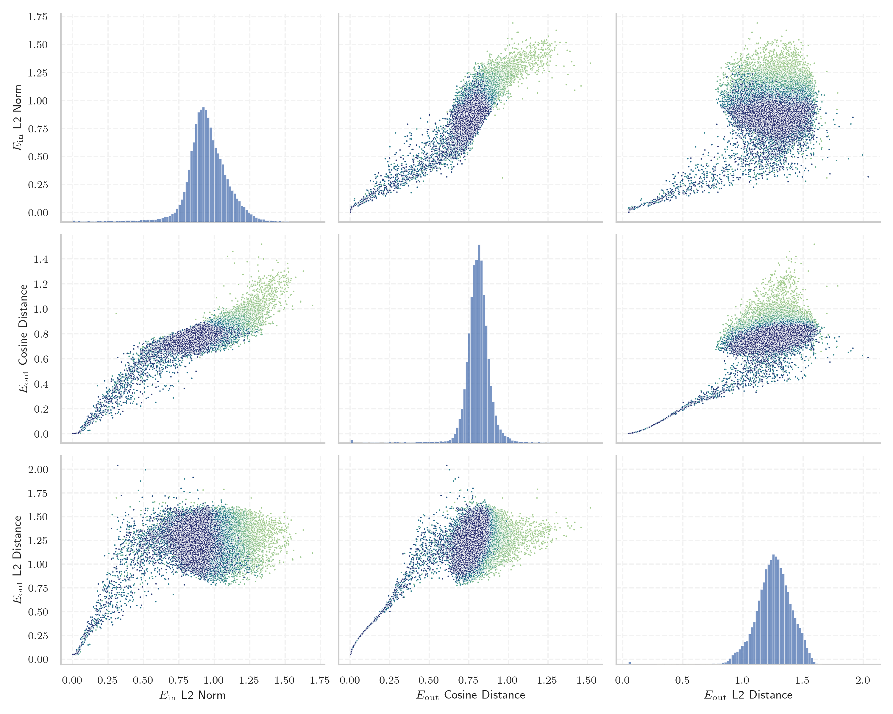
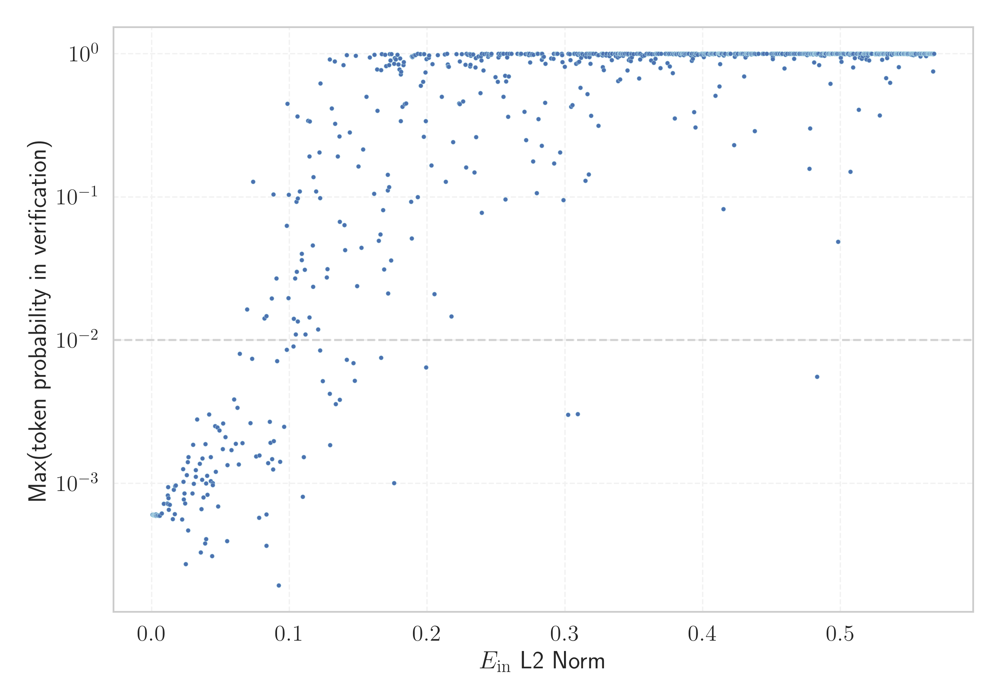

# Report for `bigcode/starcoder2-15b`

## Model info

* Tied embeddings: no
* LM head uses bias: no
* Indicator for under-trained tokens: E_{in} L2 Norm
  * Overall distribution 0.945 +/- 0.155
  * Token used for verification prompt building: `InvalidProtocolBufferException`
  * Verification threshold: 0.568
  * Threshold for showing candidate under-trained tokens: 0.087
  * Median verified threshold (for bytes, unreachable and special tokens): 0.039
* Embeddings shape: (49152, 6144)
* Vocabulary size: 49152
  * Number of single byte tokens: 242, of which 0 below indicator threshold
  * Number of special tokens: 38, of which 0 below indicator threshold
  * Number of non-single-byte UTF-fragment tokens: 676, 2 below soft indicator threshold
  * Number of tested under-trained tokens: 966, 966 non-special, 128 below p = 0.01 threshold, 106 below soft indicator threshold

## Under-trained token indicators plot


## Verification plot


## Under-trained token verification results
106 entries below threshold of 0.087

|   token_id | token                                                                       |   indicator | max_prob                                                         | in_other_tokens                                                                                                                                                                                                                                                                                                                                                                             |
|------------|-----------------------------------------------------------------------------|-------------|------------------------------------------------------------------|---------------------------------------------------------------------------------------------------------------------------------------------------------------------------------------------------------------------------------------------------------------------------------------------------------------------------------------------------------------------------------------------|
|      45759 | ````` Integervelvel `````                                                   | 0.000671484 | <span style='border: 1px solid rgb(169, 68, 66);'>0.0006</span>  | <span style='border: 1px solid rgb(169, 68, 66);'>````` LoremipumdolorsitametconsecteturadipiscingelitIntegervelvel `````</span>, <span style='border: 1px solid rgb(169, 68, 66);'>````` ittrLoremipumdolorsitametconsecteturadipiscingelitIntegervelvel `````</span>                                                                                                                      |
|      43865 | ````` Loremipumdolorsitametconsecteturadipiscingelit `````                  | 0.00110438  | <span style='border: 1px solid rgb(169, 68, 66);'>0.0006</span>  | <span style='border: 1px solid rgb(169, 68, 66);'>````` LoremipumdolorsitametconsecteturadipiscingelitIntegervelvel `````</span>, <span style='border: 1px solid rgb(169, 68, 66);'>````` ittrLoremipumdolorsitametconsecteturadipiscingelitIntegervelvel `````</span>                                                                                                                      |
|      39147 | ````` lcsStatusWlan `````                                                   | 0.00121611  | <span style='border: 1px solid rgb(169, 68, 66);'>0.0006</span>  |                                                                                                                                                                                                                                                                                                                                                                                             |
|      42046 | ````` ucMZQg `````                                                          | 0.00146624  | <span style='border: 1px solid rgb(169, 68, 66);'>0.0006</span>  | <span style='border: 1px solid rgb(251, 189, 8);'>````` bzZBlucMZQg `````</span>                                                                                                                                                                                                                                                                                                            |
|      44961 | ````` hqSLBjKPZFq `````                                                     | 0.00170863  | <span style='border: 1px solid rgb(169, 68, 66);'>0.0006</span>  | <span style='border: 1px solid rgb(169, 68, 66);'>````` hqSLBjKPZFqxj `````</span>                                                                                                                                                                                                                                                                                                          |
|      44959 | ````` fWILIM `````                                                          | 0.00171175  | <span style='border: 1px solid rgb(169, 68, 66);'>0.0006</span>  | <span style='border: 1px solid rgb(169, 68, 66);'>````` fWILIMmJNUZLIEMNV `````</span>                                                                                                                                                                                                                                                                                                      |
|      42504 | ````` tableOBJECT `````                                                     | 0.00201391  | <span style='border: 1px solid rgb(169, 68, 66);'>0.0006</span>  |                                                                                                                                                                                                                                                                                                                                                                                             |
|      44954 | ````` vjHPp `````                                                           | 0.00205637  | <span style='border: 1px solid rgb(169, 68, 66);'>0.0006</span>  | <span style='border: 1px solid rgb(169, 68, 66);'>````` vjHPpWa `````</span>                                                                                                                                                                                                                                                                                                                |
|      44964 | ````` fWILIMmJNUZLIEMNV `````                                               | 0.00214889  | <span style='border: 1px solid rgb(169, 68, 66);'>0.00061</span> |                                                                                                                                                                                                                                                                                                                                                                                             |
|      42305 | ````` GQGantt `````                                                         | 0.00218442  | <span style='border: 1px solid rgb(169, 68, 66);'>0.0006</span>  |                                                                                                                                                                                                                                                                                                                                                                                             |
|      46129 | ````` SMKTHBISA `````                                                       | 0.00220527  | <span style='border: 1px solid rgb(169, 68, 66);'>0.0006</span>  |                                                                                                                                                                                                                                                                                                                                                                                             |
|      44958 | ````` BjKPZFq `````                                                         | 0.00250998  | <span style='border: 1px solid rgb(169, 68, 66);'>0.0006</span>  | <span style='border: 1px solid rgb(169, 68, 66);'>````` hqSLBjKPZFq `````</span>, <span style='border: 1px solid rgb(169, 68, 66);'>````` hqSLBjKPZFqxj `````</span>                                                                                                                                                                                                                        |
|      44963 | ````` mJNUZLIEMNV `````                                                     | 0.00266794  | <span style='border: 1px solid rgb(169, 68, 66);'>0.0006</span>  | <span style='border: 1px solid rgb(169, 68, 66);'>````` fWILIMmJNUZLIEMNV `````</span>                                                                                                                                                                                                                                                                                                      |
|      44238 | ````` INCEXPRS `````                                                        | 0.00267002  | <span style='border: 1px solid rgb(169, 68, 66);'>0.0006</span>  |                                                                                                                                                                                                                                                                                                                                                                                             |
|      48748 | ````` ▁cKVisitor `````                                                      | 0.00291124  | <span style='border: 1px solid rgb(169, 68, 66);'>0.0006</span>  |                                                                                                                                                                                                                                                                                                                                                                                             |
|      48263 | ````` ittrLoremipumdolorsitametconsecteturadipiscingelitIntegervelvel ````` | 0.00296864  | <span style='border: 1px solid rgb(169, 68, 66);'>0.00061</span> |                                                                                                                                                                                                                                                                                                                                                                                             |
|      44965 | ````` hqSLBjKPZFqxj `````                                                   | 0.00302345  | <span style='border: 1px solid rgb(169, 68, 66);'>0.0006</span>  |                                                                                                                                                                                                                                                                                                                                                                                             |
|      44962 | ````` vjHPpWa `````                                                         | 0.00309566  | <span style='border: 1px solid rgb(169, 68, 66);'>0.0006</span>  |                                                                                                                                                                                                                                                                                                                                                                                             |
|      43846 | ````` Loremipumdolorsitamet `````                                           | 0.0031325   | <span style='border: 1px solid rgb(169, 68, 66);'>0.00061</span> | <span style='border: 1px solid rgb(169, 68, 66);'>````` Loremipumdolorsitametconsecteturadipiscingelit `````</span>, <span style='border: 1px solid rgb(169, 68, 66);'>````` LoremipumdolorsitametconsecteturadipiscingelitIntegervelvel `````</span>, <span style='border: 1px solid rgb(169, 68, 66);'>````` ittrLoremipumdolorsitametconsecteturadipiscingelitIntegervelvel `````</span> |
|      32866 | ````` ELABSCOPES `````                                                      | 0.00318012  | <span style='border: 1px solid rgb(169, 68, 66);'>0.0006</span>  |                                                                                                                                                                                                                                                                                                                                                                                             |
<details><summary>86 additional entries below threshold</summary>

|   token_id | token                                                                   |   indicator | max_prob                                                         | in_other_tokens                                                                                                                                                                                                                                                                                                                                                                                                                                                                         |
|------------|-------------------------------------------------------------------------|-------------|------------------------------------------------------------------|-----------------------------------------------------------------------------------------------------------------------------------------------------------------------------------------------------------------------------------------------------------------------------------------------------------------------------------------------------------------------------------------------------------------------------------------------------------------------------------------|
|      44957 | ````` mJNUZLI `````                                                     |  0.00363334 | <span style='border: 1px solid rgb(169, 68, 66);'>0.0006</span>  | <span style='border: 1px solid rgb(169, 68, 66);'>````` mJNUZLIEMNV `````</span>, <span style='border: 1px solid rgb(169, 68, 66);'>````` fWILIMmJNUZLIEMNV `````</span>                                                                                                                                                                                                                                                                                                                |
|      45799 | ````` LoremipumdolorsitametconsecteturadipiscingelitIntegervelvel ````` |  0.00397951 | <span style='border: 1px solid rgb(169, 68, 66);'>0.0006</span>  | <span style='border: 1px solid rgb(169, 68, 66);'>````` ittrLoremipumdolorsitametconsecteturadipiscingelitIntegervelvel `````</span>                                                                                                                                                                                                                                                                                                                                                    |
|      13432 | ````` ritüütsch `````                                                   |  0.00449442 | <span style='border: 1px solid rgb(169, 68, 66);'>0.0006</span>  | <span style='border: 1px solid rgb(169, 68, 66);'>````` üritüütsch `````</span>, <span style='border: 1px solid rgb(169, 68, 66);'>````` Züritüütsch `````</span>, <span style='border: 1px solid rgb(169, 68, 66);'>````` ▁Züritüütsch `````</span>                                                                                                                                                                                                                                    |
|      12788 | ````` ▁simpleIndexQueryParserTests `````                                |  0.00529457 | <span style='border: 1px solid rgb(169, 68, 66);'>0.0006</span>  |                                                                                                                                                                                                                                                                                                                                                                                                                                                                                         |
|      23117 | ````` Ostschwiz `````                                                   |  0.00586958 | <span style='border: 1px solid rgb(169, 68, 66);'>0.0006</span>  | <span style='border: 1px solid rgb(169, 68, 66);'>````` Ostschwizertütsch `````</span>                                                                                                                                                                                                                                                                                                                                                                                                  |
|      23118 | ````` Ostschwizertütsch `````                                           |  0.00596584 | <span style='border: 1px solid rgb(169, 68, 66);'>0.0006</span>  |                                                                                                                                                                                                                                                                                                                                                                                                                                                                                         |
|      10905 | ````` IndexQueryParserTests `````                                       |  0.00732407 | <span style='border: 1px solid rgb(169, 68, 66);'>0.00062</span> | <span style='border: 1px solid rgb(169, 68, 66);'>````` ▁simpleIndexQueryParserTests `````</span>, <span style='border: 1px solid rgb(169, 68, 66);'>````` SimpleIndexQueryParserTests `````</span>                                                                                                                                                                                                                                                                                     |
|      44953 | ````` KPZFq `````                                                       |  0.00881589 | <span style='border: 1px solid rgb(169, 68, 66);'>0.00072</span> | <span style='border: 1px solid rgb(169, 68, 66);'>````` BjKPZFq `````</span>, <span style='border: 1px solid rgb(169, 68, 66);'>````` hqSLBjKPZFq `````</span>, <span style='border: 1px solid rgb(169, 68, 66);'>````` hqSLBjKPZFqxj `````</span>                                                                                                                                                                                                                                      |
|      48363 | ````` SimulationProtos `````                                            |  0.0114452  | <span style='border: 1px solid rgb(169, 68, 66);'>0.00072</span> | <span style='border: 1px solid rgb(255, 145, 0);'>````` ClusterSimulationProtos `````</span>                                                                                                                                                                                                                                                                                                                                                                                            |
|      42060 | ````` bzZBl `````                                                       |  0.0118046  | <span style='border: 1px solid rgb(169, 68, 66);'>0.00083</span> | <span style='border: 1px solid rgb(251, 189, 8);'>````` bzZBlucMZQg `````</span>                                                                                                                                                                                                                                                                                                                                                                                                        |
|      32939 | ````` trimBalanco `````                                                 |  0.0119184  | <span style='border: 1px solid rgb(169, 68, 66);'>0.00094</span> |                                                                                                                                                                                                                                                                                                                                                                                                                                                                                         |
|      42014 | ````` ▁DexReferenceItem `````                                           |  0.0120015  | <span style='border: 1px solid rgb(169, 68, 66);'>0.00072</span> |                                                                                                                                                                                                                                                                                                                                                                                                                                                                                         |
|      46128 | ````` SMKTHB `````                                                      |  0.0120981  | <span style='border: 1px solid rgb(169, 68, 66);'>0.00079</span> | <span style='border: 1px solid rgb(169, 68, 66);'>````` SMKTHBISA `````</span>                                                                                                                                                                                                                                                                                                                                                                                                          |
|      26771 | ````` ▁Baseldytsch `````                                                |  0.0124197  | <span style='border: 1px solid rgb(169, 68, 66);'>0.00066</span> |                                                                                                                                                                                                                                                                                                                                                                                                                                                                                         |
|      38954 | ````` GoStackCheck `````                                                |  0.0131085  | <span style='border: 1px solid rgb(169, 68, 66);'>0.00071</span> | <span style='border: 1px solid rgb(255, 145, 0);'>````` callGoStackCheck `````</span>                                                                                                                                                                                                                                                                                                                                                                                                   |
|      13439 | ````` fpArccosX `````                                                   |  0.0154341  | <span style='border: 1px solid rgb(169, 68, 66);'>0.00056</span> | <span style='border: 1px solid rgb(40, 167, 69);'>````` fpArccosXTest `````</span>                                                                                                                                                                                                                                                                                                                                                                                                      |
|      37234 | ````` trimDRE `````                                                     |  0.0160074  | <span style='border: 1px solid rgb(169, 68, 66);'>0.0009</span>  |                                                                                                                                                                                                                                                                                                                                                                                                                                                                                         |
|      27699 | ````` SimpleIndexQueryParserTests `````                                 |  0.0167017  | <span style='border: 1px solid rgb(169, 68, 66);'>0.00061</span> |                                                                                                                                                                                                                                                                                                                                                                                                                                                                                         |
|      42245 | ````` INCEXPR `````                                                     |  0.0171078  | <span style='border: 1px solid rgb(169, 68, 66);'>0.00096</span> | <span style='border: 1px solid rgb(169, 68, 66);'>````` INCEXPRS `````</span>                                                                                                                                                                                                                                                                                                                                                                                                           |
|      19903 | ````` lcsSetup `````                                                    |  0.0173933  | <span style='border: 1px solid rgb(169, 68, 66);'>0.00097</span> |                                                                                                                                                                                                                                                                                                                                                                                                                                                                                         |
|      44945 | ````` NUZLI `````                                                       |  0.0221915  | <span style='border: 1px solid rgb(169, 68, 66);'>0.00056</span> | <span style='border: 1px solid rgb(169, 68, 66);'>````` mJNUZLI `````</span>, <span style='border: 1px solid rgb(169, 68, 66);'>````` mJNUZLIEMNV `````</span>, <span style='border: 1px solid rgb(169, 68, 66);'>````` fWILIMmJNUZLIEMNV `````</span>                                                                                                                                                                                                                                  |
|      40369 | ````` ▁awsAwsjson `````                                                 |  0.0227423  | <span style='border: 1px solid rgb(255, 145, 0);'>0.0013</span>  |                                                                                                                                                                                                                                                                                                                                                                                                                                                                                         |
|      48442 | ````` ClusterSimulationProtos `````                                     |  0.0231205  | <span style='border: 1px solid rgb(255, 145, 0);'>0.001</span>   |                                                                                                                                                                                                                                                                                                                                                                                                                                                                                         |
|      13804 | ````` Baseldytsch `````                                                 |  0.0233197  | <span style='border: 1px solid rgb(169, 68, 66);'>0.00077</span> | <span style='border: 1px solid rgb(169, 68, 66);'>````` ▁Baseldytsch `````</span>                                                                                                                                                                                                                                                                                                                                                                                                       |
|      13433 | ````` üritüütsch `````                                                  |  0.023911   | <span style='border: 1px solid rgb(169, 68, 66);'>0.00085</span> | <span style='border: 1px solid rgb(169, 68, 66);'>````` Züritüütsch `````</span>, <span style='border: 1px solid rgb(169, 68, 66);'>````` ▁Züritüütsch `````</span>                                                                                                                                                                                                                                                                                                                     |
|      11457 | ````` ldytsch `````                                                     |  0.0242381  | <span style='border: 1px solid rgb(169, 68, 66);'>0.00072</span> | <span style='border: 1px solid rgb(169, 68, 66);'>````` Baseldytsch `````</span>, <span style='border: 1px solid rgb(169, 68, 66);'>````` ▁Baseldytsch `````</span>                                                                                                                                                                                                                                                                                                                     |
|      41236 | ````` ffijson `````                                                     |  0.0248689  | <span style='border: 1px solid rgb(169, 68, 66);'>0.00027</span> |                                                                                                                                                                                                                                                                                                                                                                                                                                                                                         |
|      43800 | ````` umdolorsitamet `````                                              |  0.0255775  | <span style='border: 1px solid rgb(255, 145, 0);'>0.0011</span>  | <span style='border: 1px solid rgb(169, 68, 66);'>````` Loremipumdolorsitamet `````</span>, <span style='border: 1px solid rgb(169, 68, 66);'>````` Loremipumdolorsitametconsecteturadipiscingelit `````</span>, <span style='border: 1px solid rgb(169, 68, 66);'>````` LoremipumdolorsitametconsecteturadipiscingelitIntegervelvel `````</span>, <span style='border: 1px solid rgb(169, 68, 66);'>````` ittrLoremipumdolorsitametconsecteturadipiscingelitIntegervelvel `````</span> |
|      39131 | ````` sheridango `````                                                  |  0.0262532  | <span style='border: 1px solid rgb(255, 145, 0);'>0.0014</span>  |                                                                                                                                                                                                                                                                                                                                                                                                                                                                                         |
|      22333 | ````` ",[$] `````                                                       |  0.0265765  | <span style='border: 1px solid rgb(169, 68, 66);'>0.00047</span> |                                                                                                                                                                                                                                                                                                                                                                                                                                                                                         |
|      43535 | ````` instalearner `````                                                |  0.0266218  | <span style='border: 1px solid rgb(255, 145, 0);'>0.0015</span>  |                                                                                                                                                                                                                                                                                                                                                                                                                                                                                         |
|      35200 | ````` ProrrateoImpor `````                                              |  0.0296085  | <span style='border: 1px solid rgb(169, 68, 66);'>0.00085</span> | <span style='border: 1px solid rgb(255, 145, 0);'>````` TipoProrrateoImpor `````</span>                                                                                                                                                                                                                                                                                                                                                                                                 |
|      44603 | ````` ÔòÉÔòÉ `````                                                      |  0.0299866  | <span style='border: 1px solid rgb(255, 145, 0);'>0.0019</span>  |                                                                                                                                                                                                                                                                                                                                                                                                                                                                                         |
|      44402 | ````` HdfsServerProtos `````                                            |  0.0305738  | <span style='border: 1px solid rgb(169, 68, 66);'>0.001</span>   |                                                                                                                                                                                                                                                                                                                                                                                                                                                                                         |
|      40567 | ````` ▁hdpiMode `````                                                   |  0.0319479  | <span style='border: 1px solid rgb(255, 145, 0);'>0.0012</span>  |                                                                                                                                                                                                                                                                                                                                                                                                                                                                                         |
|      10460 | ````` ärndütsch `````                                                   |  0.0319582  | <span style='border: 1px solid rgb(255, 145, 0);'>0.0011</span>  | <span style='border: 1px solid rgb(169, 68, 66);'>````` Bärndütsch `````</span>, <span style='border: 1px solid rgb(169, 68, 66);'>````` ▁Bärndütsch `````</span>                                                                                                                                                                                                                                                                                                                       |
|      47247 | ````` ▁PHYBOEH `````                                                    |  0.0329435  | <span style='border: 1px solid rgb(255, 145, 0);'>0.0028</span>  |                                                                                                                                                                                                                                                                                                                                                                                                                                                                                         |
|      44088 | ````` PoliticaProducto `````                                            |  0.034913   | <span style='border: 1px solid rgb(255, 145, 0);'>0.0014</span>  |                                                                                                                                                                                                                                                                                                                                                                                                                                                                                         |
|      27001 | ````` reUIe `````                                                       |  0.0355778  | <span style='border: 1px solid rgb(169, 68, 66);'>0.00033</span> | <span style='border: 1px solid rgb(169, 68, 66);'>````` reUIeJgWVA `````</span>, <span style='border: 1px solid rgb(40, 167, 69);'>````` kSiPTcNreUIeJgWVA `````</span>                                                                                                                                                                                                                                                                                                                 |
|      27010 | ````` JgWVA `````                                                       |  0.0360596  | <span style='border: 1px solid rgb(169, 68, 66);'>0.00066</span> | <span style='border: 1px solid rgb(169, 68, 66);'>````` reUIeJgWVA `````</span>, <span style='border: 1px solid rgb(40, 167, 69);'>````` kSiPTcNreUIeJgWVA `````</span>                                                                                                                                                                                                                                                                                                                 |
|      32661 | ````` Awsjson `````                                                     |  0.0365107  | <span style='border: 1px solid rgb(255, 145, 0);'>0.0011</span>  | <span style='border: 1px solid rgb(255, 145, 0);'>````` ▁awsAwsjson `````</span>                                                                                                                                                                                                                                                                                                                                                                                                        |
|      21592 | ````` DOTOMP `````                                                      |  0.0368412  | <span style='border: 1px solid rgb(255, 145, 0);'>0.0015</span>  |                                                                                                                                                                                                                                                                                                                                                                                                                                                                                         |
|      29475 | ````` >@[+ `````                                                        |  0.0376973  | <span style='border: 1px solid rgb(169, 68, 66);'>0.0008</span>  | <span style='border: 1px solid rgb(40, 167, 69);'>````` >@[+][< `````</span>                                                                                                                                                                                                                                                                                                                                                                                                            |
|      27011 | ````` kSiPTcN `````                                                     |  0.0387121  | <span style='border: 1px solid rgb(169, 68, 66);'>0.00038</span> | <span style='border: 1px solid rgb(40, 167, 69);'>````` kSiPTcNreUIeJgWVA `````</span>                                                                                                                                                                                                                                                                                                                                                                                                  |
|      38972 | ````` callGoStackCheck `````                                            |  0.0390746  | <span style='border: 1px solid rgb(255, 145, 0);'>0.0019</span>  |                                                                                                                                                                                                                                                                                                                                                                                                                                                                                         |
|      48397 | ````` ▁Züritüütsch `````                                                |  0.0395518  | <span style='border: 1px solid rgb(169, 68, 66);'>0.001</span>   |                                                                                                                                                                                                                                                                                                                                                                                                                                                                                         |
|      23519 | ````` ▁Bärndütsch `````                                                 |  0.0395659  | <span style='border: 1px solid rgb(169, 68, 66);'>0.00041</span> |                                                                                                                                                                                                                                                                                                                                                                                                                                                                                         |
|      42417 | ````` zuotzuot `````                                                    |  0.0402813  | <span style='border: 1px solid rgb(255, 145, 0);'>0.0011</span>  |                                                                                                                                                                                                                                                                                                                                                                                                                                                                                         |
|      23115 | ````` ertütsch `````                                                    |  0.0404927  | <span style='border: 1px solid rgb(169, 68, 66);'>0.00083</span> | <span style='border: 1px solid rgb(169, 68, 66);'>````` Ostschwizertütsch `````</span>                                                                                                                                                                                                                                                                                                                                                                                                  |
|      49106 | ````` gridBagConstraintsAutoriPagoOrdenCompra `````                     |  0.041702   | <span style='border: 1px solid rgb(255, 145, 0);'>0.003</span>   |                                                                                                                                                                                                                                                                                                                                                                                                                                                                                         |
|      23489 | ````` iPagoOrdenCompra `````                                            |  0.0428961  | <span style='border: 1px solid rgb(255, 145, 0);'>0.001</span>   | <span style='border: 1px solid rgb(40, 167, 69);'>````` AutoriPagoOrdenCompra `````</span>, <span style='border: 1px solid rgb(255, 145, 0);'>````` gridBagConstraintsAutoriPagoOrdenCompra `````</span>                                                                                                                                                                                                                                                                                |
|      38366 | ````` ADynArray `````                                                   |  0.0429268  | <span style='border: 1px solid rgb(255, 145, 0);'>0.0015</span>  |                                                                                                                                                                                                                                                                                                                                                                                                                                                                                         |
|      27012 | ````` reUIeJgWVA `````                                                  |  0.0437693  | <span style='border: 1px solid rgb(169, 68, 66);'>0.00031</span> | <span style='border: 1px solid rgb(40, 167, 69);'>````` kSiPTcNreUIeJgWVA `````</span>                                                                                                                                                                                                                                                                                                                                                                                                  |
|      37727 | ````` ▁BibleDownload `````                                              |  0.0442842  | <span style='border: 1px solid rgb(255, 145, 0);'>0.001</span>   |                                                                                                                                                                                                                                                                                                                                                                                                                                                                                         |
|      14635 | ````` Züritüütsch `````                                                 |  0.0443632  | <span style='border: 1px solid rgb(169, 68, 66);'>0.00098</span> | <span style='border: 1px solid rgb(169, 68, 66);'>````` ▁Züritüütsch `````</span>                                                                                                                                                                                                                                                                                                                                                                                                       |
|      16863 | ````` lcsStatus `````                                                   |  0.0461629  | <span style='border: 1px solid rgb(255, 145, 0);'>0.0025</span>  | <span style='border: 1px solid rgb(169, 68, 66);'>````` lcsStatusWlan `````</span>                                                                                                                                                                                                                                                                                                                                                                                                      |
|      39513 | ````` setInitialBackgroundColor `````                                   |  0.0466129  | <span style='border: 1px solid rgb(255, 145, 0);'>0.0012</span>  |                                                                                                                                                                                                                                                                                                                                                                                                                                                                                         |
|      39130 | ````` sykesdev `````                                                    |  0.0477083  | <span style='border: 1px solid rgb(255, 145, 0);'>0.0025</span>  |                                                                                                                                                                                                                                                                                                                                                                                                                                                                                         |
|      37728 | ````` GribCollectionProto `````                                         |  0.0481704  | <span style='border: 1px solid rgb(169, 68, 66);'>0.00069</span> |                                                                                                                                                                                                                                                                                                                                                                                                                                                                                         |
|      44855 | ````` coverflowdemo `````                                               |  0.0491048  | <span style='border: 1px solid rgb(255, 145, 0);'>0.0023</span>  |                                                                                                                                                                                                                                                                                                                                                                                                                                                                                         |
|      48722 | ````` ▁shlwapidll `````                                                 |  0.0517348  | <span style='border: 1px solid rgb(255, 145, 0);'>0.0017</span>  |                                                                                                                                                                                                                                                                                                                                                                                                                                                                                         |
|      40675 | ````` getNumRelational `````                                            |  0.0519469  | <span style='border: 1px solid rgb(255, 145, 0);'>0.0026</span>  |                                                                                                                                                                                                                                                                                                                                                                                                                                                                                         |
|      35658 | ````` keyedLiteral `````                                                |  0.0536604  | <span style='border: 1px solid rgb(255, 145, 0);'>0.0021</span>  | <span style='border: 1px solid rgb(40, 167, 69);'>````` NoUnkeyedLiteral `````</span>                                                                                                                                                                                                                                                                                                                                                                                                   |
|      12740 | ````` Bärndütsch `````                                                  |  0.0547896  | <span style='border: 1px solid rgb(169, 68, 66);'>0.0004</span>  | <span style='border: 1px solid rgb(169, 68, 66);'>````` ▁Bärndütsch `````</span>                                                                                                                                                                                                                                                                                                                                                                                                        |
|      13409 | ````` ArccosX `````                                                     |  0.0550804  | <span style='border: 1px solid rgb(255, 145, 0);'>0.0013</span>  | <span style='border: 1px solid rgb(169, 68, 66);'>````` fpArccosX `````</span>, <span style='border: 1px solid rgb(40, 167, 69);'>````` fpArccosXTest `````</span>                                                                                                                                                                                                                                                                                                                      |
|      39352 | ````` akashaproject `````                                               |  0.0579731  | <span style='border: 1px solid rgb(255, 145, 0);'>0.0017</span>  |                                                                                                                                                                                                                                                                                                                                                                                                                                                                                         |
|      25383 | ````` detallenotacreditopunto `````                                     |  0.0597983  | <span style='border: 1px solid rgb(255, 145, 0);'>0.0039</span>  | <span style='border: 1px solid rgb(251, 189, 8);'>````` detallenotacreditopuntoventa `````</span>                                                                                                                                                                                                                                                                                                                                                                                       |
|      44358 | ````` hdpiMode `````                                                    |  0.0610378  | <span style='border: 1px solid rgb(255, 145, 0);'>0.0019</span>  |                                                                                                                                                                                                                                                                                                                                                                                                                                                                                         |
|      35454 | ````` TipoProrrateoImpor `````                                          |  0.0622814  | <span style='border: 1px solid rgb(255, 145, 0);'>0.0034</span>  |                                                                                                                                                                                                                                                                                                                                                                                                                                                                                         |
|      46366 | ````` setHdpiMode `````                                                 |  0.0632982  | <span style='border: 1px solid rgb(255, 145, 0);'>0.0014</span>  |                                                                                                                                                                                                                                                                                                                                                                                                                                                                                         |
|      36443 | ````` ▁FOLDEF `````                                                     |  0.0639768  | <span style='border: 1px solid rgb(255, 145, 0);'>0.008</span>   |                                                                                                                                                                                                                                                                                                                                                                                                                                                                                         |
|      24002 | ````` otacreditopunto `````                                             |  0.0657837  | <span style='border: 1px solid rgb(255, 145, 0);'>0.0019</span>  | <span style='border: 1px solid rgb(255, 145, 0);'>````` allenotacreditopunto `````</span>, <span style='border: 1px solid rgb(255, 145, 0);'>````` detallenotacreditopunto `````</span>, <span style='border: 1px solid rgb(251, 189, 8);'>````` detallenotacreditopuntoventa `````</span>                                                                                                                                                                                              |
|      35395 | ````` getExecSqlList `````                                              |  0.0692711  | <span style='border: 1px solid rgb(251, 189, 8);'>0.016</span>   |                                                                                                                                                                                                                                                                                                                                                                                                                                                                                         |
|      44885 | ````` ▁BCMLTD `````                                                     |  0.0717284  | <span style='border: 1px solid rgb(255, 145, 0);'>0.0026</span>  |                                                                                                                                                                                                                                                                                                                                                                                                                                                                                         |
|      36865 | ````` ExperimentResultSet `````                                         |  0.0728635  | <span style='border: 1px solid rgb(255, 145, 0);'>0.0074</span>  |                                                                                                                                                                                                                                                                                                                                                                                                                                                                                         |
|      23589 | ````` AutoriPagoOrdenCompra `````                                       |  0.0736657  | <span style='border: 1px solid rgb(40, 167, 69);'>0.13</span>    | <span style='border: 1px solid rgb(255, 145, 0);'>````` gridBagConstraintsAutoriPagoOrdenCompra `````</span>                                                                                                                                                                                                                                                                                                                                                                            |
|      24027 | ````` allenotacreditopunto `````                                        |  0.0758413  | <span style='border: 1px solid rgb(255, 145, 0);'>0.0015</span>  | <span style='border: 1px solid rgb(255, 145, 0);'>````` detallenotacreditopunto `````</span>, <span style='border: 1px solid rgb(251, 189, 8);'>````` detallenotacreditopuntoventa `````</span>                                                                                                                                                                                                                                                                                         |
|      44883 | ````` hqSL `````                                                        |  0.0779016  | <span style='border: 1px solid rgb(169, 68, 66);'>0.00058</span> | <span style='border: 1px solid rgb(169, 68, 66);'>````` hqSLBjKPZFq `````</span>, <span style='border: 1px solid rgb(169, 68, 66);'>````` hqSLBjKPZFqxj `````</span>                                                                                                                                                                                                                                                                                                                    |
|      41111 | ````` ▁jSONScanner `````                                                |  0.0781981  | <span style='border: 1px solid rgb(255, 145, 0);'>0.0016</span>  |                                                                                                                                                                                                                                                                                                                                                                                                                                                                                         |
|      27210 | ````` detallenotacreditopuntoventa `````                                |  0.0818883  | <span style='border: 1px solid rgb(251, 189, 8);'>0.014</span>   |                                                                                                                                                                                                                                                                                                                                                                                                                                                                                         |
|      48859 | ````` BindingEncoder `````                                              |  0.0832037  | <span style='border: 1px solid rgb(251, 189, 8);'>0.015</span>   |                                                                                                                                                                                                                                                                                                                                                                                                                                                                                         |
|      38611 | ````` ▁DiskBox `````                                                    |  0.0832216  | <span style='border: 1px solid rgb(169, 68, 66);'>0.00037</span> |                                                                                                                                                                                                                                                                                                                                                                                                                                                                                         |
|      35950 | ````` LCJwYWNrYWdl `````                                                |  0.0833504  | <span style='border: 1px solid rgb(169, 68, 66);'>0.00061</span> |                                                                                                                                                                                                                                                                                                                                                                                                                                                                                         |
|      42050 | ````` cfUO `````                                                        |  0.0846086  | <span style='border: 1px solid rgb(255, 145, 0);'>0.0014</span>  | <span style='border: 1px solid rgb(251, 189, 8);'>````` cfUOQOae `````</span>                                                                                                                                                                                                                                                                                                                                                                                                           |
|      44688 | ````` cmpqp `````                                                       |  0.0857947  | <span style='border: 1px solid rgb(255, 145, 0);'>0.0027</span>  |                                                                                                                                                                                                                                                                                                                                                                                                                                                                                         |
|      46998 | ````` DocFxV `````                                                      |  0.0863105  | <span style='border: 1px solid rgb(255, 145, 0);'>0.0019</span>  |                                                                                                                                                                                                                                                                                                                                                                                                                                                                                         |
</details>
<details><summary>860 additional entries above threshold</summary>

|   token_id | token                                    |   indicator | max_prob                                                         | in_other_tokens                                                                                                                                                                                                                                                                                                                                                                                                                                                                                                                                                                  |
|------------|------------------------------------------|-------------|------------------------------------------------------------------|----------------------------------------------------------------------------------------------------------------------------------------------------------------------------------------------------------------------------------------------------------------------------------------------------------------------------------------------------------------------------------------------------------------------------------------------------------------------------------------------------------------------------------------------------------------------------------|
|      34198 | ````` kFontPackage `````                 |   0.0871919 | <span style='border: 1px solid rgb(251, 189, 8);'>0.02</span>    |                                                                                                                                                                                                                                                                                                                                                                                                                                                                                                                                                                                  |
|      13606 | ````` apticPopulation `````              |   0.0874263 | <span style='border: 1px solid rgb(255, 145, 0);'>0.0015</span>  | <span style='border: 1px solid rgb(40, 167, 69);'>````` ▁presynapticPopulation `````</span>, <span style='border: 1px solid rgb(251, 189, 8);'>````` ▁postsynapticPopulation `````</span>                                                                                                                                                                                                                                                                                                                                                                                        |
|      29234 | ````` Drealtime `````                    |   0.0880373 | <span style='border: 1px solid rgb(255, 145, 0);'>0.0012</span>  | ````` Drealtimehot `````                                                                                                                                                                                                                                                                                                                                                                                                                                                                                                                                                         |
|      46928 | ````` ▁DartLib `````                     |   0.0884093 | <span style='border: 1px solid rgb(40, 167, 69);'>0.1</span>     |                                                                                                                                                                                                                                                                                                                                                                                                                                                                                                                                                                                  |
|      27007 | ````` PTcN `````                         |   0.0885214 | <span style='border: 1px solid rgb(255, 145, 0);'>0.002</span>   | <span style='border: 1px solid rgb(169, 68, 66);'>````` kSiPTcN `````</span>, <span style='border: 1px solid rgb(40, 167, 69);'>````` kSiPTcNreUIeJgWVA `````</span>                                                                                                                                                                                                                                                                                                                                                                                                             |
|      37498 | ````` IClus `````                        |   0.0905611 | <span style='border: 1px solid rgb(251, 189, 8);'>0.027</span>   | <span style='border: 1px solid rgb(40, 167, 69);'>````` IClusCfg `````</span>, <span style='border: 1px solid rgb(251, 189, 8);'>````` ▁AsyncIClusCfg `````</span>, <span style='border: 1px solid rgb(40, 167, 69);'>````` ▁IClusCfg `````</span>                                                                                                                                                                                                                                                                                                                               |
|      42015 | ````` MZQg `````                         |   0.0910991 | <span style='border: 1px solid rgb(255, 145, 0);'>0.0071</span>  | <span style='border: 1px solid rgb(169, 68, 66);'>````` ucMZQg `````</span>, <span style='border: 1px solid rgb(251, 189, 8);'>````` bzZBlucMZQg `````</span>                                                                                                                                                                                                                                                                                                                                                                                                                    |
|      40411 | ````` ▁只看该 `````                      |   0.0923631 | <span style='border: 1px solid rgb(169, 68, 66);'>0.00019</span> | ````` ▁只看该作者 `````                                                                                                                                                                                                                                                                                                                                                                                                                                                                                                                                                          |
|      14195 | ````` aCreditoPunto `````                |   0.0932623 | <span style='border: 1px solid rgb(255, 145, 0);'>0.0014</span>  | <span style='border: 1px solid rgb(40, 167, 69);'>````` NotaCreditoPunto `````</span>, <span style='border: 1px solid rgb(40, 167, 69);'>````` NotaCreditoPuntoVenta `````</span>, <span style='border: 1px solid rgb(40, 167, 69);'>````` DetalleNotaCreditoPuntoVenta `````</span>                                                                                                                                                                                                                                                                                             |
|      42066 | ````` QOae `````                         |   0.0961959 | <span style='border: 1px solid rgb(255, 145, 0);'>0.0025</span>  | <span style='border: 1px solid rgb(251, 189, 8);'>````` cfUOQOae `````</span>                                                                                                                                                                                                                                                                                                                                                                                                                                                                                                    |
|      38374 | ````` idiomasvw `````                    |   0.0980461 | <span style='border: 1px solid rgb(255, 145, 0);'>0.0086</span>  |                                                                                                                                                                                                                                                                                                                                                                                                                                                                                                                                                                                  |
|      30200 | ````` ▁PYGLOW `````                      |   0.0981025 | <span style='border: 1px solid rgb(251, 189, 8);'>0.063</span>   |                                                                                                                                                                                                                                                                                                                                                                                                                                                                                                                                                                                  |
|      23116 | ````` schwiz `````                       |   0.0985583 | <span style='border: 1px solid rgb(40, 167, 69);'>0.45</span>    | <span style='border: 1px solid rgb(169, 68, 66);'>````` Ostschwiz `````</span>, <span style='border: 1px solid rgb(169, 68, 66);'>````` Ostschwizertütsch `````</span>                                                                                                                                                                                                                                                                                                                                                                                                           |
|      21237 | ````` ▁codigoAssunto `````               |   0.0993802 | <span style='border: 1px solid rgb(251, 189, 8);'>0.02</span>    | <span style='border: 1px solid rgb(255, 145, 0);'>````` ▁codigoAssuntoPai `````</span>                                                                                                                                                                                                                                                                                                                                                                                                                                                                                           |
|      15308 | ````` DetalleNotaCreditoPuntoVenta ````` |   0.0995573 | <span style='border: 1px solid rgb(40, 167, 69);'>0.1</span>     |                                                                                                                                                                                                                                                                                                                                                                                                                                                                                                                                                                                  |
|      21238 | ````` ▁codigoAssuntoPai `````            |   0.103009  | <span style='border: 1px solid rgb(255, 145, 0);'>0.0091</span>  |                                                                                                                                                                                                                                                                                                                                                                                                                                                                                                                                                                                  |
|      37148 | ````` ▁LNControlPoint `````              |   0.103199  | <span style='border: 1px solid rgb(251, 189, 8);'>0.014</span>   |                                                                                                                                                                                                                                                                                                                                                                                                                                                                                                                                                                                  |
|      38982 | ````` matthamlin `````                   |   0.104036  | <span style='border: 1px solid rgb(251, 189, 8);'>0.027</span>   |                                                                                                                                                                                                                                                                                                                                                                                                                                                                                                                                                                                  |
|      43793 | ````` adipiscingelit `````               |   0.104601  | <span style='border: 1px solid rgb(251, 189, 8);'>0.011</span>   | <span style='border: 1px solid rgb(40, 167, 69);'>````` consecteturadipiscingelit `````</span>, <span style='border: 1px solid rgb(169, 68, 66);'>````` Loremipumdolorsitametconsecteturadipiscingelit `````</span>, <span style='border: 1px solid rgb(169, 68, 66);'>````` LoremipumdolorsitametconsecteturadipiscingelitIntegervelvel `````</span>, <span style='border: 1px solid rgb(169, 68, 66);'>````` ittrLoremipumdolorsitametconsecteturadipiscingelitIntegervelvel `````</span>                                                                                      |
|      42070 | ````` cfUOQOae `````                     |   0.10502   | <span style='border: 1px solid rgb(251, 189, 8);'>0.093</span>   |                                                                                                                                                                                                                                                                                                                                                                                                                                                                                                                                                                                  |
|      28624 | ````` shortsands `````                   |   0.105305  | <span style='border: 1px solid rgb(251, 189, 8);'>0.03</span>    |                                                                                                                                                                                                                                                                                                                                                                                                                                                                                                                                                                                  |
|      36864 | ````` ExperimentEnv `````                |   0.105769  | <span style='border: 1px solid rgb(40, 167, 69);'>0.36</span>    |                                                                                                                                                                                                                                                                                                                                                                                                                                                                                                                                                                                  |
|      41893 | ````` PeriodoDeclara `````               |   0.106093  | <span style='border: 1px solid rgb(251, 189, 8);'>0.098</span>   |                                                                                                                                                                                                                                                                                                                                                                                                                                                                                                                                                                                  |
|      44986 | ````` DocSyntaxParser `````              |   0.106167  | <span style='border: 1px solid rgb(251, 189, 8);'>0.014</span>   |                                                                                                                                                                                                                                                                                                                                                                                                                                                                                                                                                                                  |
|      14207 | ````` NotaCreditoPunto `````             |   0.107448  | <span style='border: 1px solid rgb(40, 167, 69);'>0.11</span>    | <span style='border: 1px solid rgb(40, 167, 69);'>````` NotaCreditoPuntoVenta `````</span>, <span style='border: 1px solid rgb(40, 167, 69);'>````` DetalleNotaCreditoPuntoVenta `````</span>                                                                                                                                                                                                                                                                                                                                                                                    |
|      20864 | ````` ▁postsynapticPopulation `````      |   0.10907   | <span style='border: 1px solid rgb(251, 189, 8);'>0.04</span>    |                                                                                                                                                                                                                                                                                                                                                                                                                                                                                                                                                                                  |
|      32014 | ````` ▁ZrLogUtil `````                   |   0.109072  | <span style='border: 1px solid rgb(251, 189, 8);'>0.036</span>   |                                                                                                                                                                                                                                                                                                                                                                                                                                                                                                                                                                                  |
|      44265 | ````` icGFja `````                       |   0.109606  | <span style='border: 1px solid rgb(169, 68, 66);'>0.00081</span> |                                                                                                                                                                                                                                                                                                                                                                                                                                                                                                                                                                                  |
|      43943 | ````` ÔòÉ `````                          |   0.110296  | <span style='border: 1px solid rgb(255, 145, 0);'>0.0015</span>  | <span style='border: 1px solid rgb(255, 145, 0);'>````` ÔòÉÔòÉ `````</span>                                                                                                                                                                                                                                                                                                                                                                                                                                                                                                      |
|      10904 | ````` IndexQueryParser `````             |   0.111224  | <span style='border: 1px solid rgb(251, 189, 8);'>0.031</span>   | <span style='border: 1px solid rgb(169, 68, 66);'>````` IndexQueryParserTests `````</span>, <span style='border: 1px solid rgb(169, 68, 66);'>````` ▁simpleIndexQueryParserTests `````</span>, <span style='border: 1px solid rgb(169, 68, 66);'>````` SimpleIndexQueryParserTests `````</span>                                                                                                                                                                                                                                                                                  |
|      43677 | ````` orsitamet `````                    |   0.11153   | <span style='border: 1px solid rgb(251, 189, 8);'>0.011</span>   | <span style='border: 1px solid rgb(40, 167, 69);'>````` dolorsitamet `````</span>, <span style='border: 1px solid rgb(255, 145, 0);'>````` umdolorsitamet `````</span>, <span style='border: 1px solid rgb(169, 68, 66);'>````` Loremipumdolorsitamet `````</span>, <span style='border: 1px solid rgb(169, 68, 66);'>````` Loremipumdolorsitametconsecteturadipiscingelit `````</span>, <span style='border: 1px solid rgb(169, 68, 66);'>````` LoremipumdolorsitametconsecteturadipiscingelitIntegervelvel `````</span>, ...                                                   |
|      36939 | ````` serializeOp `````                  |   0.113536  | <span style='border: 1px solid rgb(40, 167, 69);'>0.34</span>    |                                                                                                                                                                                                                                                                                                                                                                                                                                                                                                                                                                                  |
|      42071 | ````` bzZBlucMZQg `````                  |   0.11445   | <span style='border: 1px solid rgb(251, 189, 8);'>0.014</span>   |                                                                                                                                                                                                                                                                                                                                                                                                                                                                                                                                                                                  |
|      49137 | ````` wpforge `````                      |   0.114494  | <span style='border: 1px solid rgb(40, 167, 69);'>0.19</span>    |                                                                                                                                                                                                                                                                                                                                                                                                                                                                                                                                                                                  |
|      44909 | ````` ▁[💾]( `````                       |   0.114769  | <span style='border: 1px solid rgb(40, 167, 69);'>0.34</span>    |                                                                                                                                                                                                                                                                                                                                                                                                                                                                                                                                                                                  |
|      44169 | ````` esatterwhite `````                 |   0.116988  | <span style='border: 1px solid rgb(251, 189, 8);'>0.046</span>   |                                                                                                                                                                                                                                                                                                                                                                                                                                                                                                                                                                                  |
|      38971 | ````` mattham `````                      |   0.117232  | <span style='border: 1px solid rgb(251, 189, 8);'>0.024</span>   | <span style='border: 1px solid rgb(251, 189, 8);'>````` matthamlin `````</span>                                                                                                                                                                                                                                                                                                                                                                                                                                                                                                  |
|      48544 | ````` strHomeaddressLive `````           |   0.117473  | <span style='border: 1px solid rgb(40, 167, 69);'>0.14</span>    |                                                                                                                                                                                                                                                                                                                                                                                                                                                                                                                                                                                  |
|      20863 | ````` ▁presynapticPopulation `````       |   0.119421  | <span style='border: 1px solid rgb(40, 167, 69);'>0.11</span>    |                                                                                                                                                                                                                                                                                                                                                                                                                                                                                                                                                                                  |
|      36054 | ````` ▁SUBSETP `````                     |   0.120747  | <span style='border: 1px solid rgb(251, 189, 8);'>0.012</span>   |                                                                                                                                                                                                                                                                                                                                                                                                                                                                                                                                                                                  |
|      46782 | ````` ▁MENTER `````                      |   0.121758  | <span style='border: 1px solid rgb(40, 167, 69);'>0.2</span>     | <span style='border: 1px solid rgb(251, 189, 8);'>````` ▁MENTERI `````</span>                                                                                                                                                                                                                                                                                                                                                                                                                                                                                                    |
|      43860 | ````` ▁AsyncIClusCfg `````               |   0.122165  | <span style='border: 1px solid rgb(251, 189, 8);'>0.098</span>   |                                                                                                                                                                                                                                                                                                                                                                                                                                                                                                                                                                                  |
|      26457 | ````` HdpiMode `````                     |   0.122368  | <span style='border: 1px solid rgb(255, 145, 0);'>0.0085</span>  | <span style='border: 1px solid rgb(255, 145, 0);'>````` setHdpiMode `````</span>                                                                                                                                                                                                                                                                                                                                                                                                                                                                                                 |
|      35838 | ````` SchedulingSimulation `````         |   0.122439  | <span style='border: 1px solid rgb(40, 167, 69);'>0.62</span>    |                                                                                                                                                                                                                                                                                                                                                                                                                                                                                                                                                                                  |
|      29391 | ````` rLogUtil `````                     |   0.124154  | <span style='border: 1px solid rgb(255, 145, 0);'>0.0052</span>  | <span style='border: 1px solid rgb(251, 189, 8);'>````` ▁ZrLogUtil `````</span>                                                                                                                                                                                                                                                                                                                                                                                                                                                                                                  |
|      36747 | ````` GribCollection `````               |   0.127205  | <span style='border: 1px solid rgb(251, 189, 8);'>0.027</span>   | <span style='border: 1px solid rgb(169, 68, 66);'>````` GribCollectionProto `````</span>                                                                                                                                                                                                                                                                                                                                                                                                                                                                                         |
|      45556 | ````` ▁outputStatusMessage `````         |   0.127631  | <span style='border: 1px solid rgb(251, 189, 8);'>0.031</span>   |                                                                                                                                                                                                                                                                                                                                                                                                                                                                                                                                                                                  |
|      41489 | ````` classificationSet `````            |   0.129195  | <span style='border: 1px solid rgb(40, 167, 69);'>0.91</span>    |                                                                                                                                                                                                                                                                                                                                                                                                                                                                                                                                                                                  |
|      32609 | ````` wYWNr `````                        |   0.129312  | <span style='border: 1px solid rgb(255, 145, 0);'>0.0042</span>  | <span style='border: 1px solid rgb(255, 145, 0);'>````` wYWNrYWdl `````</span>, <span style='border: 1px solid rgb(169, 68, 66);'>````` LCJwYWNrYWdl `````</span>                                                                                                                                                                                                                                                                                                                                                                                                                |
|      44163 | ````` ి'), `````                          |   0.129469  | <span style='border: 1px solid rgb(255, 145, 0);'>0.0019</span>  |                                                                                                                                                                                                                                                                                                                                                                                                                                                                                                                                                                                  |
|      21631 | ````` strHomeaddress `````               |   0.130628  | <span style='border: 1px solid rgb(40, 167, 69);'>0.41</span>    | <span style='border: 1px solid rgb(40, 167, 69);'>````` strHomeaddressLive `````</span>                                                                                                                                                                                                                                                                                                                                                                                                                                                                                          |
|      38880 | ````` ▁mtlk `````                        |   0.132915  | <span style='border: 1px solid rgb(40, 167, 69);'>0.88</span>    |                                                                                                                                                                                                                                                                                                                                                                                                                                                                                                                                                                                  |
|      41039 | ````` mangledNameHash `````              |   0.133214  | <span style='border: 1px solid rgb(40, 167, 69);'>0.32</span>    |                                                                                                                                                                                                                                                                                                                                                                                                                                                                                                                                                                                  |
|      46718 | ````` RegisterMbeans `````               |   0.133541  | <span style='border: 1px solid rgb(255, 145, 0);'>0.0036</span>  |                                                                                                                                                                                                                                                                                                                                                                                                                                                                                                                                                                                  |
|      20860 | ````` ▁preCellId `````                   |   0.135017  | <span style='border: 1px solid rgb(40, 167, 69);'>0.19</span>    |                                                                                                                                                                                                                                                                                                                                                                                                                                                                                                                                                                                  |
|      14688 | ````` ▁GLConstant `````                  |   0.136337  | <span style='border: 1px solid rgb(40, 167, 69);'>0.26</span>    |                                                                                                                                                                                                                                                                                                                                                                                                                                                                                                                                                                                  |
|      23221 | ````` acreditopunto `````                |   0.136464  | <span style='border: 1px solid rgb(255, 145, 0);'>0.0038</span>  | <span style='border: 1px solid rgb(255, 145, 0);'>````` otacreditopunto `````</span>, <span style='border: 1px solid rgb(255, 145, 0);'>````` allenotacreditopunto `````</span>, <span style='border: 1px solid rgb(255, 145, 0);'>````` detallenotacreditopunto `````</span>, <span style='border: 1px solid rgb(251, 189, 8);'>````` detallenotacreditopuntoventa `````</span>                                                                                                                                                                                                 |
|      42672 | ````` classShapeBase `````               |   0.136575  | <span style='border: 1px solid rgb(251, 189, 8);'>0.067</span>   |                                                                                                                                                                                                                                                                                                                                                                                                                                                                                                                                                                                  |
|      38004 | ````` setWindowListener `````            |   0.139279  | <span style='border: 1px solid rgb(40, 167, 69);'>0.83</span>    |                                                                                                                                                                                                                                                                                                                                                                                                                                                                                                                                                                                  |
|      37008 | ````` `"}], `````                        |   0.139845  | <span style='border: 1px solid rgb(251, 189, 8);'>0.063</span>   |                                                                                                                                                                                                                                                                                                                                                                                                                                                                                                                                                                                  |
|      22873 | ````` ExpressionUUID `````               |   0.140491  | <span style='border: 1px solid rgb(251, 189, 8);'>0.042</span>   |                                                                                                                                                                                                                                                                                                                                                                                                                                                                                                                                                                                  |
|      46717 | ````` ▁outboundMarshaler `````           |   0.141508  | <span style='border: 1px solid rgb(255, 145, 0);'>0.0073</span>  |                                                                                                                                                                                                                                                                                                                                                                                                                                                                                                                                                                                  |
|      30526 | ````` ▁MTLK `````                        |   0.141635  | <span style='border: 1px solid rgb(40, 167, 69);'>0.98</span>    |                                                                                                                                                                                                                                                                                                                                                                                                                                                                                                                                                                                  |
|      20861 | ````` ▁postCellId `````                  |   0.143823  | <span style='border: 1px solid rgb(40, 167, 69);'>0.28</span>    |                                                                                                                                                                                                                                                                                                                                                                                                                                                                                                                                                                                  |
|      40442 | ````` BulkMutateJobService `````         |   0.14641   | <span style='border: 1px solid rgb(255, 145, 0);'>0.0069</span>  |                                                                                                                                                                                                                                                                                                                                                                                                                                                                                                                                                                                  |
|      32680 | ````` wYWNrYWdl `````                    |   0.147473  | <span style='border: 1px solid rgb(255, 145, 0);'>0.0052</span>  | <span style='border: 1px solid rgb(169, 68, 66);'>````` LCJwYWNrYWdl `````</span>                                                                                                                                                                                                                                                                                                                                                                                                                                                                                                |
|      34787 | ````` mrmq `````                         |   0.148237  | <span style='border: 1px solid rgb(40, 167, 69);'>0.97</span>    |                                                                                                                                                                                                                                                                                                                                                                                                                                                                                                                                                                                  |
|      18651 | ````` CONSTFN `````                      |   0.149006  | <span style='border: 1px solid rgb(251, 189, 8);'>0.024</span>   |                                                                                                                                                                                                                                                                                                                                                                                                                                                                                                                                                                                  |
|      46869 | ````` ▁pBNS `````                        |   0.149988  | <span style='border: 1px solid rgb(40, 167, 69);'>0.16</span>    |                                                                                                                                                                                                                                                                                                                                                                                                                                                                                                                                                                                  |
|      20466 | ````` dpiMode `````                      |   0.152376  | <span style='border: 1px solid rgb(251, 189, 8);'>0.044</span>   | <span style='border: 1px solid rgb(255, 145, 0);'>````` HdpiMode `````</span>, <span style='border: 1px solid rgb(255, 145, 0);'>````` ▁hdpiMode `````</span>, <span style='border: 1px solid rgb(255, 145, 0);'>````` hdpiMode `````</span>, <span style='border: 1px solid rgb(255, 145, 0);'>````` setHdpiMode `````</span>                                                                                                                                                                                                                                                   |
|      40676 | ````` ▁RubyLint `````                    |   0.153356  | <span style='border: 1px solid rgb(40, 167, 69);'>0.21</span>    |                                                                                                                                                                                                                                                                                                                                                                                                                                                                                                                                                                                  |
|      19643 | ````` ALISTP `````                       |   0.155819  | <span style='border: 1px solid rgb(40, 167, 69);'>0.5</span>     |                                                                                                                                                                                                                                                                                                                                                                                                                                                                                                                                                                                  |
|      21587 | ````` ~\|', `````                        |   0.158327  | <span style='border: 1px solid rgb(40, 167, 69);'>0.94</span>    |                                                                                                                                                                                                                                                                                                                                                                                                                                                                                                                                                                                  |
|      46860 | ````` ▁crocksdb `````                    |   0.161517  | <span style='border: 1px solid rgb(40, 167, 69);'>0.11</span>    |                                                                                                                                                                                                                                                                                                                                                                                                                                                                                                                                                                                  |
|      27297 | ````` LPADDING `````                     |   0.161721  | <span style='border: 1px solid rgb(40, 167, 69);'>0.98</span>    | ````` ▁CELLPADDING `````                                                                                                                                                                                                                                                                                                                                                                                                                                                                                                                                                         |
|      35136 | ````` PVRTX `````                        |   0.163733  | <span style='border: 1px solid rgb(40, 167, 69);'>0.77</span>    |                                                                                                                                                                                                                                                                                                                                                                                                                                                                                                                                                                                  |
|      39282 | ````` BulkMutate `````                   |   0.163943  | <span style='border: 1px solid rgb(40, 167, 69);'>0.4</span>     | <span style='border: 1px solid rgb(255, 145, 0);'>````` BulkMutateJobService `````</span>                                                                                                                                                                                                                                                                                                                                                                                                                                                                                        |
|       9829 | ````` avsop `````                        |   0.164893  | <span style='border: 1px solid rgb(251, 189, 8);'>0.049</span>   | <span style='border: 1px solid rgb(251, 189, 8);'>````` ▁aavsop `````</span>                                                                                                                                                                                                                                                                                                                                                                                                                                                                                                     |
|      41573 | ````` ▁intStringLen `````                |   0.165994  | <span style='border: 1px solid rgb(251, 189, 8);'>0.055</span>   |                                                                                                                                                                                                                                                                                                                                                                                                                                                                                                                                                                                  |
|      41651 | ````` softposit `````                    |   0.166422  | <span style='border: 1px solid rgb(40, 167, 69);'>0.77</span>    |                                                                                                                                                                                                                                                                                                                                                                                                                                                                                                                                                                                  |
|      44780 | ````` ా'), `````                          |   0.166422  | <span style='border: 1px solid rgb(255, 145, 0);'>0.0075</span>  |                                                                                                                                                                                                                                                                                                                                                                                                                                                                                                                                                                                  |
|      43829 | ````` velvel `````                       |   0.166979  | <span style='border: 1px solid rgb(40, 167, 69);'>1</span>       | <span style='border: 1px solid rgb(169, 68, 66);'>````` Integervelvel `````</span>, <span style='border: 1px solid rgb(169, 68, 66);'>````` LoremipumdolorsitametconsecteturadipiscingelitIntegervelvel `````</span>, <span style='border: 1px solid rgb(169, 68, 66);'>````` ittrLoremipumdolorsitametconsecteturadipiscingelitIntegervelvel `````</span>                                                                                                                                                                                                                       |
|      44424 | ````` ▁libsais `````                     |   0.167953  | <span style='border: 1px solid rgb(251, 189, 8);'>0.081</span>   |                                                                                                                                                                                                                                                                                                                                                                                                                                                                                                                                                                                  |
|      37443 | ````` *)(*@\ `````                       |   0.168594  | <span style='border: 1px solid rgb(251, 189, 8);'>0.031</span>   | <span style='border: 1px solid rgb(251, 189, 8);'>````` }@*)(*@\ `````</span>                                                                                                                                                                                                                                                                                                                                                                                                                                                                                                    |
|      41936 | ````` rpapi `````                        |   0.169423  | <span style='border: 1px solid rgb(40, 167, 69);'>0.98</span>    |                                                                                                                                                                                                                                                                                                                                                                                                                                                                                                                                                                                  |
|      25733 | ````` ReferenciaPersonal `````           |   0.170214  | <span style='border: 1px solid rgb(40, 167, 69);'>0.82</span>    |                                                                                                                                                                                                                                                                                                                                                                                                                                                                                                                                                                                  |
|      29244 | ````` ు'), `````                          |   0.171372  | <span style='border: 1px solid rgb(40, 167, 69);'>0.11</span>    |                                                                                                                                                                                                                                                                                                                                                                                                                                                                                                                                                                                  |
|      37762 | ````` ▁postingsEnum `````                |   0.171475  | <span style='border: 1px solid rgb(40, 167, 69);'>0.14</span>    |                                                                                                                                                                                                                                                                                                                                                                                                                                                                                                                                                                                  |
|      28957 | ````` hglBI `````                        |   0.171649  | <span style='border: 1px solid rgb(251, 189, 8);'>0.021</span>   |                                                                                                                                                                                                                                                                                                                                                                                                                                                                                                                                                                                  |
|      13440 | ````` fpArccosXTest `````                |   0.172292  | <span style='border: 1px solid rgb(40, 167, 69);'>0.12</span>    |                                                                                                                                                                                                                                                                                                                                                                                                                                                                                                                                                                                  |
|      43590 | ````` isGeneratedId `````                |   0.172322  | <span style='border: 1px solid rgb(40, 167, 69);'>0.83</span>    |                                                                                                                                                                                                                                                                                                                                                                                                                                                                                                                                                                                  |
|      49118 | ````` WISI `````                         |   0.172843  | <span style='border: 1px solid rgb(40, 167, 69);'>1</span>       |                                                                                                                                                                                                                                                                                                                                                                                                                                                                                                                                                                                  |
|      14781 | ````` ▁CarbonIconType `````              |   0.173338  | <span style='border: 1px solid rgb(40, 167, 69);'>0.9</span>     |                                                                                                                                                                                                                                                                                                                                                                                                                                                                                                                                                                                  |
|      41543 | ````` ▁IKabs `````                       |   0.173803  | <span style='border: 1px solid rgb(251, 189, 8);'>0.036</span>   |                                                                                                                                                                                                                                                                                                                                                                                                                                                                                                                                                                                  |
|      46173 | ````` pypacker `````                     |   0.174001  | <span style='border: 1px solid rgb(40, 167, 69);'>0.99</span>    |                                                                                                                                                                                                                                                                                                                                                                                                                                                                                                                                                                                  |
|      25890 | ````` ▁jobbuilder `````                  |   0.176046  | <span style='border: 1px solid rgb(255, 145, 0);'>0.001</span>   |                                                                                                                                                                                                                                                                                                                                                                                                                                                                                                                                                                                  |
|      34671 | ````` Thetest `````                      |   0.176074  | <span style='border: 1px solid rgb(40, 167, 69);'>0.85</span>    |                                                                                                                                                                                                                                                                                                                                                                                                                                                                                                                                                                                  |
|      42559 | ````` AdventureWorksModel `````          |   0.176532  | <span style='border: 1px solid rgb(40, 167, 69);'>0.93</span>    |                                                                                                                                                                                                                                                                                                                                                                                                                                                                                                                                                                                  |
|      44946 | ````` SUBSETP `````                      |   0.177101  | <span style='border: 1px solid rgb(40, 167, 69);'>0.91</span>    |                                                                                                                                                                                                                                                                                                                                                                                                                                                                                                                                                                                  |
|      27966 | ````` SERIALE `````                      |   0.178472  | <span style='border: 1px solid rgb(40, 167, 69);'>0.98</span>    |                                                                                                                                                                                                                                                                                                                                                                                                                                                                                                                                                                                  |
|      43291 | ````` MODRST `````                       |   0.179127  | <span style='border: 1px solid rgb(40, 167, 69);'>0.84</span>    |                                                                                                                                                                                                                                                                                                                                                                                                                                                                                                                                                                                  |
|      43511 | ````` lyEnum `````                       |   0.179722  | <span style='border: 1px solid rgb(40, 167, 69);'>0.78</span>    |                                                                                                                                                                                                                                                                                                                                                                                                                                                                                                                                                                                  |
|      14632 | ````` NotaCreditoPuntoVenta `````        |   0.180434  | <span style='border: 1px solid rgb(40, 167, 69);'>0.93</span>    | <span style='border: 1px solid rgb(40, 167, 69);'>````` DetalleNotaCreditoPuntoVenta `````</span>                                                                                                                                                                                                                                                                                                                                                                                                                                                                                |
|      43845 | ````` consecteturadipiscingelit `````    |   0.180772  | <span style='border: 1px solid rgb(40, 167, 69);'>0.71</span>    | <span style='border: 1px solid rgb(169, 68, 66);'>````` Loremipumdolorsitametconsecteturadipiscingelit `````</span>, <span style='border: 1px solid rgb(169, 68, 66);'>````` LoremipumdolorsitametconsecteturadipiscingelitIntegervelvel `````</span>, <span style='border: 1px solid rgb(169, 68, 66);'>````` ittrLoremipumdolorsitametconsecteturadipiscingelitIntegervelvel `````</span>                                                                                                                                                                                      |
|      29091 | ````` ";\'} `````                        |   0.18091   | <span style='border: 1px solid rgb(40, 167, 69);'>0.34</span>    |                                                                                                                                                                                                                                                                                                                                                                                                                                                                                                                                                                                  |
|      34410 | ````` arcsinL `````                      |   0.180952  | <span style='border: 1px solid rgb(40, 167, 69);'>0.75</span>    |                                                                                                                                                                                                                                                                                                                                                                                                                                                                                                                                                                                  |
|      44158 | ````` atterwhite `````                   |   0.181914  | <span style='border: 1px solid rgb(40, 167, 69);'>0.43</span>    | <span style='border: 1px solid rgb(251, 189, 8);'>````` esatterwhite `````</span>                                                                                                                                                                                                                                                                                                                                                                                                                                                                                                |
|      37504 | ````` IClusCfg `````                     |   0.182689  | <span style='border: 1px solid rgb(40, 167, 69);'>0.83</span>    | <span style='border: 1px solid rgb(251, 189, 8);'>````` ▁AsyncIClusCfg `````</span>, <span style='border: 1px solid rgb(40, 167, 69);'>````` ▁IClusCfg `````</span>                                                                                                                                                                                                                                                                                                                                                                                                              |
|      41633 | ````` willyb `````                       |   0.182999  | <span style='border: 1px solid rgb(40, 167, 69);'>0.87</span>    |                                                                                                                                                                                                                                                                                                                                                                                                                                                                                                                                                                                  |
|      46185 | ````` BTESH `````                        |   0.183726  | <span style='border: 1px solid rgb(40, 167, 69);'>0.44</span>    |                                                                                                                                                                                                                                                                                                                                                                                                                                                                                                                                                                                  |
|      26808 | ````` DetalleFacturaProveedor `````      |   0.184598  | <span style='border: 1px solid rgb(40, 167, 69);'>0.45</span>    |                                                                                                                                                                                                                                                                                                                                                                                                                                                                                                                                                                                  |
|      27563 | ````` ׃", `````                          |   0.18837   | <span style='border: 1px solid rgb(251, 189, 8);'>0.093</span>   |                                                                                                                                                                                                                                                                                                                                                                                                                                                                                                                                                                                  |
|      13412 | ````` ▁learnedat `````                   |   0.188672  | <span style='border: 1px solid rgb(251, 189, 8);'>0.051</span>   |                                                                                                                                                                                                                                                                                                                                                                                                                                                                                                                                                                                  |
|      36086 | ````` evalcond `````                     |   0.188894  | <span style='border: 1px solid rgb(40, 167, 69);'>0.96</span>    |                                                                                                                                                                                                                                                                                                                                                                                                                                                                                                                                                                                  |
|      46119 | ````` sqrtFPL `````                      |   0.189342  | <span style='border: 1px solid rgb(40, 167, 69);'>0.95</span>    |                                                                                                                                                                                                                                                                                                                                                                                                                                                                                                                                                                                  |
|      31677 | ````` ▁GNUNET `````                      |   0.18957   | <span style='border: 1px solid rgb(40, 167, 69);'>0.95</span>    |                                                                                                                                                                                                                                                                                                                                                                                                                                                                                                                                                                                  |
|      28011 | ````` PHPSandbox `````                   |   0.190724  | <span style='border: 1px solid rgb(40, 167, 69);'>0.98</span>    |                                                                                                                                                                                                                                                                                                                                                                                                                                                                                                                                                                                  |
|       6809 | ````` NdEx `````                         |   0.191461  | <span style='border: 1px solid rgb(40, 167, 69);'>0.97</span>    | <span style='border: 1px solid rgb(40, 167, 69);'>````` iNdEx `````</span>, <span style='border: 1px solid rgb(40, 167, 69);'>````` ▁iNdEx `````</span>                                                                                                                                                                                                                                                                                                                                                                                                                          |
|      26541 | ````` vinfos `````                       |   0.193151  | <span style='border: 1px solid rgb(40, 167, 69);'>1</span>       |                                                                                                                                                                                                                                                                                                                                                                                                                                                                                                                                                                                  |
|      28958 | ````` zHjZQW `````                       |   0.193215  | <span style='border: 1px solid rgb(251, 189, 8);'>0.1</span>     |                                                                                                                                                                                                                                                                                                                                                                                                                                                                                                                                                                                  |
|      47158 | ````` bgwy `````                         |   0.195161  | <span style='border: 1px solid rgb(40, 167, 69);'>0.99</span>    |                                                                                                                                                                                                                                                                                                                                                                                                                                                                                                                                                                                  |
|      34548 | ````` ＯＯＯＯ `````                     |   0.195235  | <span style='border: 1px solid rgb(40, 167, 69);'>0.6</span>     |                                                                                                                                                                                                                                                                                                                                                                                                                                                                                                                                                                                  |
|      44073 | ````` twngo `````                        |   0.196946  | <span style='border: 1px solid rgb(40, 167, 69);'>0.64</span>    |                                                                                                                                                                                                                                                                                                                                                                                                                                                                                                                                                                                  |
|      34363 | ````` playerDataArray `````              |   0.197429  | <span style='border: 1px solid rgb(40, 167, 69);'>0.99</span>    |                                                                                                                                                                                                                                                                                                                                                                                                                                                                                                                                                                                  |
|      40800 | ````` MessageStateOf `````               |   0.197473  | <span style='border: 1px solid rgb(40, 167, 69);'>0.26</span>    |                                                                                                                                                                                                                                                                                                                                                                                                                                                                                                                                                                                  |
|      48688 | ````` apidll `````                       |   0.19768   | <span style='border: 1px solid rgb(40, 167, 69);'>0.99</span>    | <span style='border: 1px solid rgb(255, 145, 0);'>````` ▁shlwapidll `````</span>                                                                                                                                                                                                                                                                                                                                                                                                                                                                                                 |
|      41782 | ````` litsec `````                       |   0.198831  | <span style='border: 1px solid rgb(40, 167, 69);'>0.74</span>    |                                                                                                                                                                                                                                                                                                                                                                                                                                                                                                                                                                                  |
|      39378 | ````` ▁CNWVirtualMachineCommands `````   |   0.198862  | <span style='border: 1px solid rgb(40, 167, 69);'>0.34</span>    |                                                                                                                                                                                                                                                                                                                                                                                                                                                                                                                                                                                  |
|      34098 | ````` ToSizedBuffer `````                |   0.199104  | <span style='border: 1px solid rgb(255, 145, 0);'>0.0065</span>  | <span style='border: 1px solid rgb(40, 167, 69);'>````` MarshalToSizedBuffer `````</span>                                                                                                                                                                                                                                                                                                                                                                                                                                                                                        |
|      44000 | ````` skyring `````                      |   0.199413  | <span style='border: 1px solid rgb(40, 167, 69);'>0.92</span>    |                                                                                                                                                                                                                                                                                                                                                                                                                                                                                                                                                                                  |
|      28039 | ````` ᚋ `````                            |   0.201151  | <span style='border: 1px solid rgb(40, 167, 69);'>0.93</span>    |                                                                                                                                                                                                                                                                                                                                                                                                                                                                                                                                                                                  |
|      44291 | ````` Mmcsd `````                        |   0.201369  | <span style='border: 1px solid rgb(40, 167, 69);'>0.97</span>    |                                                                                                                                                                                                                                                                                                                                                                                                                                                                                                                                                                                  |
|      40787 | ````` StoreMessageInfo `````             |   0.203109  | <span style='border: 1px solid rgb(40, 167, 69);'>0.17</span>    |                                                                                                                                                                                                                                                                                                                                                                                                                                                                                                                                                                                  |
|      44856 | ````` moondroid `````                    |   0.203868  | <span style='border: 1px solid rgb(40, 167, 69);'>0.85</span>    |                                                                                                                                                                                                                                                                                                                                                                                                                                                                                                                                                                                  |
|      42371 | ````` }@*)(*@\ `````                     |   0.205171  | <span style='border: 1px solid rgb(251, 189, 8);'>0.021</span>   |                                                                                                                                                                                                                                                                                                                                                                                                                                                                                                                                                                                  |
|      10458 | ````` ärnd `````                         |   0.207687  | <span style='border: 1px solid rgb(40, 167, 69);'>0.98</span>    | <span style='border: 1px solid rgb(255, 145, 0);'>````` ärndütsch `````</span>, <span style='border: 1px solid rgb(169, 68, 66);'>````` Bärndütsch `````</span>, <span style='border: 1px solid rgb(169, 68, 66);'>````` ▁Bärndütsch `````</span>                                                                                                                                                                                                                                                                                                                                |
|      28955 | ````` GOJT `````                         |   0.210535  | <span style='border: 1px solid rgb(40, 167, 69);'>0.5</span>     |                                                                                                                                                                                                                                                                                                                                                                                                                                                                                                                                                                                  |
|      21481 | ````` memItem `````                      |   0.212694  | <span style='border: 1px solid rgb(40, 167, 69);'>0.99</span>    | ````` memItemLeft `````, ````` memItemRight `````                                                                                                                                                                                                                                                                                                                                                                                                                                                                                                                                |
|      45119 | ````` ▁CellChangeTimes `````             |   0.213452  | <span style='border: 1px solid rgb(40, 167, 69);'>0.13</span>    |                                                                                                                                                                                                                                                                                                                                                                                                                                                                                                                                                                                  |
|      40988 | ````` AEJB `````                         |   0.214478  | <span style='border: 1px solid rgb(40, 167, 69);'>1</span>       | <span style='border: 1px solid rgb(40, 167, 69);'>````` ISUSAEJB `````</span>                                                                                                                                                                                                                                                                                                                                                                                                                                                                                                    |
|      44466 | ````` IkReal `````                       |   0.214847  | <span style='border: 1px solid rgb(40, 167, 69);'>0.84</span>    |                                                                                                                                                                                                                                                                                                                                                                                                                                                                                                                                                                                  |
|      43621 | ````` icaProducto `````                  |   0.215248  | <span style='border: 1px solid rgb(40, 167, 69);'>0.82</span>    | <span style='border: 1px solid rgb(255, 145, 0);'>````` PoliticaProducto `````</span>                                                                                                                                                                                                                                                                                                                                                                                                                                                                                            |
|      27216 | ````` RSTMGR `````                       |   0.215633  | <span style='border: 1px solid rgb(40, 167, 69);'>0.81</span>    |                                                                                                                                                                                                                                                                                                                                                                                                                                                                                                                                                                                  |
|      39338 | ````` omidou `````                       |   0.217584  | <span style='border: 1px solid rgb(251, 189, 8);'>0.015</span>   | ````` baomidou `````                                                                                                                                                                                                                                                                                                                                                                                                                                                                                                                                                             |
|      35367 | ````` nableReference `````               |   0.21867   | <span style='border: 1px solid rgb(40, 167, 69);'>0.24</span>    | <span style='border: 1px solid rgb(40, 167, 69);'>````` GetPinnableReference `````</span>                                                                                                                                                                                                                                                                                                                                                                                                                                                                                        |
|      33652 | ````` ▁WORKB `````                       |   0.221151  | <span style='border: 1px solid rgb(40, 167, 69);'>0.99</span>    |                                                                                                                                                                                                                                                                                                                                                                                                                                                                                                                                                                                  |
|      44890 | ````` ▁[💾 `````                         |   0.223071  | <span style='border: 1px solid rgb(40, 167, 69);'>0.45</span>    | <span style='border: 1px solid rgb(40, 167, 69);'>````` ▁[💾]( `````</span>                                                                                                                                                                                                                                                                                                                                                                                                                                                                                                      |
|      31083 | ````` ▁UNPROVIDED `````                  |   0.223716  | <span style='border: 1px solid rgb(40, 167, 69);'>0.44</span>    |                                                                                                                                                                                                                                                                                                                                                                                                                                                                                                                                                                                  |
|      46598 | ````` ▁IKFAST `````                      |   0.223744  | <span style='border: 1px solid rgb(40, 167, 69);'>0.88</span>    |                                                                                                                                                                                                                                                                                                                                                                                                                                                                                                                                                                                  |
|      23425 | ````` ▁ArrowBox `````                    |   0.225075  | <span style='border: 1px solid rgb(40, 167, 69);'>0.99</span>    |                                                                                                                                                                                                                                                                                                                                                                                                                                                                                                                                                                                  |
|      37320 | ````` %;""> `````                        |   0.22603   | <span style='border: 1px solid rgb(40, 167, 69);'>0.46</span>    |                                                                                                                                                                                                                                                                                                                                                                                                                                                                                                                                                                                  |
|      44528 | ````` iyouport `````                     |   0.227818  | <span style='border: 1px solid rgb(40, 167, 69);'>0.84</span>    |                                                                                                                                                                                                                                                                                                                                                                                                                                                                                                                                                                                  |
|      23599 | ````` ▁ErrIntOverflow `````              |   0.228325  | <span style='border: 1px solid rgb(40, 167, 69);'>0.16</span>    |                                                                                                                                                                                                                                                                                                                                                                                                                                                                                                                                                                                  |
|      45319 | ````` DieArray `````                     |   0.228581  | <span style='border: 1px solid rgb(40, 167, 69);'>1</span>       |                                                                                                                                                                                                                                                                                                                                                                                                                                                                                                                                                                                  |
|      17238 | ````` allEmoji `````                     |   0.229316  | <span style='border: 1px solid rgb(40, 167, 69);'>0.98</span>    |                                                                                                                                                                                                                                                                                                                                                                                                                                                                                                                                                                                  |
|      25389 | ````` actionExpression `````             |   0.230777  | <span style='border: 1px solid rgb(40, 167, 69);'>0.99</span>    |                                                                                                                                                                                                                                                                                                                                                                                                                                                                                                                                                                                  |
|      27316 | ````` rowsHTML `````                     |   0.231124  | <span style='border: 1px solid rgb(40, 167, 69);'>0.82</span>    |                                                                                                                                                                                                                                                                                                                                                                                                                                                                                                                                                                                  |
|      34684 | ````` ClusCfg `````                      |   0.231288  | <span style='border: 1px solid rgb(40, 167, 69);'>0.84</span>    | <span style='border: 1px solid rgb(40, 167, 69);'>````` IClusCfg `````</span>, <span style='border: 1px solid rgb(251, 189, 8);'>````` ▁AsyncIClusCfg `````</span>, <span style='border: 1px solid rgb(40, 167, 69);'>````` ▁IClusCfg `````</span>                                                                                                                                                                                                                                                                                                                               |
|      45938 | ````` ▁IClusCfg `````                    |   0.231554  | <span style='border: 1px solid rgb(40, 167, 69);'>0.97</span>    |                                                                                                                                                                                                                                                                                                                                                                                                                                                                                                                                                                                  |
|      43550 | ````` defaultTagName `````               |   0.231647  | <span style='border: 1px solid rgb(40, 167, 69);'>0.99</span>    |                                                                                                                                                                                                                                                                                                                                                                                                                                                                                                                                                                                  |
|      27200 | ````` xtreem `````                       |   0.233366  | <span style='border: 1px solid rgb(40, 167, 69);'>0.99</span>    | <span style='border: 1px solid rgb(40, 167, 69);'>````` xtreemfs `````</span>                                                                                                                                                                                                                                                                                                                                                                                                                                                                                                    |
|      13429 | ````` üütsch `````                       |   0.234289  | <span style='border: 1px solid rgb(40, 167, 69);'>0.15</span>    | <span style='border: 1px solid rgb(169, 68, 66);'>````` ritüütsch `````</span>, <span style='border: 1px solid rgb(169, 68, 66);'>````` üritüütsch `````</span>, <span style='border: 1px solid rgb(169, 68, 66);'>````` Züritüütsch `````</span>, <span style='border: 1px solid rgb(169, 68, 66);'>````` ▁Züritüütsch `````</span>                                                                                                                                                                                                                                             |
|      39374 | ````` MarshalToSizedBuffer `````         |   0.23511   | <span style='border: 1px solid rgb(40, 167, 69);'>0.8</span>     |                                                                                                                                                                                                                                                                                                                                                                                                                                                                                                                                                                                  |
|      31473 | ````` hlslpp `````                       |   0.235135  | <span style='border: 1px solid rgb(40, 167, 69);'>0.93</span>    |                                                                                                                                                                                                                                                                                                                                                                                                                                                                                                                                                                                  |
|      37899 | ````` truiton `````                      |   0.235378  | <span style='border: 1px solid rgb(40, 167, 69);'>0.26</span>    |                                                                                                                                                                                                                                                                                                                                                                                                                                                                                                                                                                                  |
|      44944 | ````` EMNV `````                         |   0.237106  | <span style='border: 1px solid rgb(40, 167, 69);'>0.96</span>    | <span style='border: 1px solid rgb(169, 68, 66);'>````` mJNUZLIEMNV `````</span>, <span style='border: 1px solid rgb(169, 68, 66);'>````` fWILIMmJNUZLIEMNV `````</span>                                                                                                                                                                                                                                                                                                                                                                                                         |
|      40298 | ````` ">\({\ `````                       |   0.23859   | <span style='border: 1px solid rgb(40, 167, 69);'>0.53</span>    |                                                                                                                                                                                                                                                                                                                                                                                                                                                                                                                                                                                  |
|      37204 | ````` aiflow `````                       |   0.238809  | <span style='border: 1px solid rgb(40, 167, 69);'>0.96</span>    |                                                                                                                                                                                                                                                                                                                                                                                                                                                                                                                                                                                  |
|      42952 | ````` CellGroupData `````                |   0.239413  | <span style='border: 1px solid rgb(40, 167, 69);'>0.9</span>     |                                                                                                                                                                                                                                                                                                                                                                                                                                                                                                                                                                                  |
|      39411 | ````` ▁WDOT `````                        |   0.23959   | <span style='border: 1px solid rgb(40, 167, 69);'>1</span>       |                                                                                                                                                                                                                                                                                                                                                                                                                                                                                                                                                                                  |
|       9862 | ````` ▁aavsop `````                      |   0.239696  | <span style='border: 1px solid rgb(251, 189, 8);'>0.077</span>   |                                                                                                                                                                                                                                                                                                                                                                                                                                                                                                                                                                                  |
|      28944 | ````` [{"-", `````                       |   0.240728  | <span style='border: 1px solid rgb(40, 167, 69);'>0.76</span>    |                                                                                                                                                                                                                                                                                                                                                                                                                                                                                                                                                                                  |
|      44002 | ````` XOCL `````                         |   0.241211  | <span style='border: 1px solid rgb(40, 167, 69);'>0.99</span>    |                                                                                                                                                                                                                                                                                                                                                                                                                                                                                                                                                                                  |
|      35751 | ````` CASELIST `````                     |   0.242974  | <span style='border: 1px solid rgb(40, 167, 69);'>1</span>       |                                                                                                                                                                                                                                                                                                                                                                                                                                                                                                                                                                                  |
|      35924 | ````` PERATURAN `````                    |   0.244121  | <span style='border: 1px solid rgb(40, 167, 69);'>0.99</span>    |                                                                                                                                                                                                                                                                                                                                                                                                                                                                                                                                                                                  |
|      47507 | ````` setFullscreenMode `````            |   0.244219  | <span style='border: 1px solid rgb(40, 167, 69);'>0.95</span>    |                                                                                                                                                                                                                                                                                                                                                                                                                                                                                                                                                                                  |
|      42909 | ````` emitInstruction `````              |   0.244277  | <span style='border: 1px solid rgb(40, 167, 69);'>1</span>       |                                                                                                                                                                                                                                                                                                                                                                                                                                                                                                                                                                                  |
|       9064 | ````` iNdEx `````                        |   0.244521  | <span style='border: 1px solid rgb(40, 167, 69);'>0.98</span>    | <span style='border: 1px solid rgb(40, 167, 69);'>````` ▁iNdEx `````</span>                                                                                                                                                                                                                                                                                                                                                                                                                                                                                                      |
|      43721 | ````` dolorsitamet `````                 |   0.245572  | <span style='border: 1px solid rgb(40, 167, 69);'>0.98</span>    | <span style='border: 1px solid rgb(255, 145, 0);'>````` umdolorsitamet `````</span>, <span style='border: 1px solid rgb(169, 68, 66);'>````` Loremipumdolorsitamet `````</span>, <span style='border: 1px solid rgb(169, 68, 66);'>````` Loremipumdolorsitametconsecteturadipiscingelit `````</span>, <span style='border: 1px solid rgb(169, 68, 66);'>````` LoremipumdolorsitametconsecteturadipiscingelitIntegervelvel `````</span>, <span style='border: 1px solid rgb(169, 68, 66);'>````` ittrLoremipumdolorsitametconsecteturadipiscingelitIntegervelvel `````</span>     |
|      19271 | ````` Homeaddress `````                  |   0.246324  | <span style='border: 1px solid rgb(40, 167, 69);'>0.98</span>    | <span style='border: 1px solid rgb(40, 167, 69);'>````` strHomeaddress `````</span>, <span style='border: 1px solid rgb(40, 167, 69);'>````` strHomeaddressLive `````</span>                                                                                                                                                                                                                                                                                                                                                                                                     |
|      42217 | ````` SVEX `````                         |   0.246643  | <span style='border: 1px solid rgb(40, 167, 69);'>1</span>       |                                                                                                                                                                                                                                                                                                                                                                                                                                                                                                                                                                                  |
|      46888 | ````` ▁"}"}], `````                      |   0.249609  | <span style='border: 1px solid rgb(40, 167, 69);'>0.69</span>    |                                                                                                                                                                                                                                                                                                                                                                                                                                                                                                                                                                                  |
|      13337 | ````` ▁iNdEx `````                       |   0.251307  | <span style='border: 1px solid rgb(40, 167, 69);'>0.64</span>    |                                                                                                                                                                                                                                                                                                                                                                                                                                                                                                                                                                                  |
|      44294 | ````` HdfsServer `````                   |   0.251689  | <span style='border: 1px solid rgb(40, 167, 69);'>0.94</span>    | <span style='border: 1px solid rgb(169, 68, 66);'>````` HdfsServerProtos `````</span>                                                                                                                                                                                                                                                                                                                                                                                                                                                                                            |
|      38073 | ````` beamY `````                        |   0.25172   | <span style='border: 1px solid rgb(40, 167, 69);'>1</span>       |                                                                                                                                                                                                                                                                                                                                                                                                                                                                                                                                                                                  |
|      23445 | ````` GLBINDING `````                    |   0.252595  | <span style='border: 1px solid rgb(40, 167, 69);'>0.98</span>    |                                                                                                                                                                                                                                                                                                                                                                                                                                                                                                                                                                                  |
|      39785 | ````` ▁BCML `````                        |   0.253423  | <span style='border: 1px solid rgb(40, 167, 69);'>1</span>       | <span style='border: 1px solid rgb(255, 145, 0);'>````` ▁BCMLTD `````</span>                                                                                                                                                                                                                                                                                                                                                                                                                                                                                                     |
|      11708 | ````` LAUL `````                         |   0.254809  | <span style='border: 1px solid rgb(40, 167, 69);'>1</span>       |                                                                                                                                                                                                                                                                                                                                                                                                                                                                                                                                                                                  |
|      19157 | ````` quantitativo `````                 |   0.25523   | <span style='border: 1px solid rgb(40, 167, 69);'>1</span>       |                                                                                                                                                                                                                                                                                                                                                                                                                                                                                                                                                                                  |
|      29547 | ````` VisualStyleBackColor `````         |   0.255299  | <span style='border: 1px solid rgb(40, 167, 69);'>0.5</span>     | ````` UseVisualStyleBackColor `````                                                                                                                                                                                                                                                                                                                                                                                                                                                                                                                                              |
|      24418 | ````` >?[< `````                         |   0.256513  | <span style='border: 1px solid rgb(40, 167, 69);'>0.7</span>     |                                                                                                                                                                                                                                                                                                                                                                                                                                                                                                                                                                                  |
|      47822 | ````` ▁MENTERI `````                     |   0.256864  | <span style='border: 1px solid rgb(251, 189, 8);'>0.096</span>   |                                                                                                                                                                                                                                                                                                                                                                                                                                                                                                                                                                                  |
|      36335 | ````` setWindowedMode `````              |   0.257203  | <span style='border: 1px solid rgb(40, 167, 69);'>0.64</span>    |                                                                                                                                                                                                                                                                                                                                                                                                                                                                                                                                                                                  |
|      26078 | ````` ▁>-( `````                         |   0.257701  | <span style='border: 1px solid rgb(40, 167, 69);'>1</span>       |                                                                                                                                                                                                                                                                                                                                                                                                                                                                                                                                                                                  |
|      21451 | ````` ▁ErrInvalidLength `````            |   0.257996  | <span style='border: 1px solid rgb(40, 167, 69);'>0.94</span>    |                                                                                                                                                                                                                                                                                                                                                                                                                                                                                                                                                                                  |
|      39317 | ````` VirtualMachineCommands `````       |   0.258715  | <span style='border: 1px solid rgb(40, 167, 69);'>0.36</span>    | <span style='border: 1px solid rgb(40, 167, 69);'>````` ▁CNWVirtualMachineCommands `````</span>                                                                                                                                                                                                                                                                                                                                                                                                                                                                                  |
|      37296 | ````` ProtoLens `````                    |   0.259296  | <span style='border: 1px solid rgb(40, 167, 69);'>0.69</span>    |                                                                                                                                                                                                                                                                                                                                                                                                                                                                                                                                                                                  |
|      42149 | ````` ResponseBodyData `````             |   0.259695  | <span style='border: 1px solid rgb(40, 167, 69);'>1</span>       |                                                                                                                                                                                                                                                                                                                                                                                                                                                                                                                                                                                  |
|      32779 | ````` mtlk `````                         |   0.261129  | <span style='border: 1px solid rgb(40, 167, 69);'>1</span>       | <span style='border: 1px solid rgb(40, 167, 69);'>````` ▁mtlk `````</span>                                                                                                                                                                                                                                                                                                                                                                                                                                                                                                       |
|      28947 | ````` PLIO `````                         |   0.261218  | <span style='border: 1px solid rgb(40, 167, 69);'>1</span>       |                                                                                                                                                                                                                                                                                                                                                                                                                                                                                                                                                                                  |
|      29666 | ````` ▁CNWSCreature `````                |   0.265388  | <span style='border: 1px solid rgb(40, 167, 69);'>1</span>       |                                                                                                                                                                                                                                                                                                                                                                                                                                                                                                                                                                                  |
|      34855 | ````` >:][< `````                        |   0.267418  | <span style='border: 1px solid rgb(40, 167, 69);'>0.99</span>    |                                                                                                                                                                                                                                                                                                                                                                                                                                                                                                                                                                                  |
|      43093 | ````` DedicatedCloud `````               |   0.267524  | <span style='border: 1px solid rgb(40, 167, 69);'>0.99</span>    |                                                                                                                                                                                                                                                                                                                                                                                                                                                                                                                                                                                  |
|      40208 | ````` LCOS `````                         |   0.267662  | <span style='border: 1px solid rgb(40, 167, 69);'>1</span>       |                                                                                                                                                                                                                                                                                                                                                                                                                                                                                                                                                                                  |
|      23381 | ````` iPago `````                        |   0.26814   | <span style='border: 1px solid rgb(40, 167, 69);'>1</span>       | <span style='border: 1px solid rgb(255, 145, 0);'>````` iPagoOrdenCompra `````</span>, <span style='border: 1px solid rgb(40, 167, 69);'>````` AutoriPagoOrdenCompra `````</span>, <span style='border: 1px solid rgb(255, 145, 0);'>````` gridBagConstraintsAutoriPagoOrdenCompra `````</span>                                                                                                                                                                                                                                                                                  |
|      36241 | ````` uttify `````                       |   0.270445  | <span style='border: 1px solid rgb(40, 167, 69);'>0.39</span>    | <span style='border: 1px solid rgb(40, 167, 69);'>````` fluttify `````</span>                                                                                                                                                                                                                                                                                                                                                                                                                                                                                                    |
|      48369 | ````` Ezsign `````                       |   0.271322  | <span style='border: 1px solid rgb(40, 167, 69);'>0.99</span>    |                                                                                                                                                                                                                                                                                                                                                                                                                                                                                                                                                                                  |
|      29476 | ````` >@[+][< `````                      |   0.27183   | <span style='border: 1px solid rgb(40, 167, 69);'>0.25</span>    |                                                                                                                                                                                                                                                                                                                                                                                                                                                                                                                                                                                  |
|      48661 | ````` setDecorated `````                 |   0.273038  | <span style='border: 1px solid rgb(40, 167, 69);'>1</span>       |                                                                                                                                                                                                                                                                                                                                                                                                                                                                                                                                                                                  |
|      43998 | ````` HLJL `````                         |   0.273627  | <span style='border: 1px solid rgb(40, 167, 69);'>0.99</span>    |                                                                                                                                                                                                                                                                                                                                                                                                                                                                                                                                                                                  |
|      20650 | ````` ▁dAtA `````                        |   0.273808  | <span style='border: 1px solid rgb(40, 167, 69);'>0.98</span>    |                                                                                                                                                                                                                                                                                                                                                                                                                                                                                                                                                                                  |
|      24974 | ````` ▁actionExpression `````            |   0.274225  | <span style='border: 1px solid rgb(40, 167, 69);'>1</span>       |                                                                                                                                                                                                                                                                                                                                                                                                                                                                                                                                                                                  |
|      43941 | ````` òÉ `````                           |   0.274581  | <span style='border: 1px solid rgb(40, 167, 69);'>0.87</span>    | <span style='border: 1px solid rgb(255, 145, 0);'>````` ÔòÉ `````</span>, <span style='border: 1px solid rgb(255, 145, 0);'>````` ÔòÉÔòÉ `````</span>                                                                                                                                                                                                                                                                                                                                                                                                                            |
|      40080 | ````` ▁℞ `````                           |   0.275538  | <span style='border: 1px solid rgb(40, 167, 69);'>0.98</span>    |                                                                                                                                                                                                                                                                                                                                                                                                                                                                                                                                                                                  |
|      48628 | ````` StatusPointer `````                |   0.276237  | <span style='border: 1px solid rgb(40, 167, 69);'>1</span>       |                                                                                                                                                                                                                                                                                                                                                                                                                                                                                                                                                                                  |
|      32888 | ````` InternalMessageInfo `````          |   0.276904  | <span style='border: 1px solid rgb(40, 167, 69);'>0.18</span>    |                                                                                                                                                                                                                                                                                                                                                                                                                                                                                                                                                                                  |
|      47957 | ````` swiffy `````                       |   0.277136  | <span style='border: 1px solid rgb(40, 167, 69);'>0.98</span>    |                                                                                                                                                                                                                                                                                                                                                                                                                                                                                                                                                                                  |
|      33173 | ````` [{"{", `````                       |   0.279548  | <span style='border: 1px solid rgb(40, 167, 69);'>0.11</span>    |                                                                                                                                                                                                                                                                                                                                                                                                                                                                                                                                                                                  |
|      18477 | ````` `*^ `````                          |   0.279638  | <span style='border: 1px solid rgb(40, 167, 69);'>1</span>       |                                                                                                                                                                                                                                                                                                                                                                                                                                                                                                                                                                                  |
|      22400 | ````` Newobject `````                    |   0.279842  | <span style='border: 1px solid rgb(40, 167, 69);'>1</span>       |                                                                                                                                                                                                                                                                                                                                                                                                                                                                                                                                                                                  |
|      31850 | ````` sideY `````                        |   0.279915  | <span style='border: 1px solid rgb(40, 167, 69);'>1</span>       |                                                                                                                                                                                                                                                                                                                                                                                                                                                                                                                                                                                  |
|      30409 | ````` ▁OpConst `````                     |   0.280331  | <span style='border: 1px solid rgb(40, 167, 69);'>1</span>       |                                                                                                                                                                                                                                                                                                                                                                                                                                                                                                                                                                                  |
|      33288 | ````` loudFormation `````                |   0.280834  | <span style='border: 1px solid rgb(40, 167, 69);'>0.35</span>    | ````` AWSCloudFormation `````, ````` ▁CloudFormation `````                                                                                                                                                                                                                                                                                                                                                                                                                                                                                                                       |
|      22831 | ````` CURITY `````                       |   0.282875  | <span style='border: 1px solid rgb(40, 167, 69);'>1</span>       | ````` SECURITY `````, ````` ▁SECURITY `````                                                                                                                                                                                                                                                                                                                                                                                                                                                                                                                                      |
|      37553 | ````` ▁"]"}], `````                      |   0.283153  | <span style='border: 1px solid rgb(40, 167, 69);'>0.91</span>    |                                                                                                                                                                                                                                                                                                                                                                                                                                                                                                                                                                                  |
|      39127 | ````` UnsafeEnabled `````                |   0.283198  | <span style='border: 1px solid rgb(40, 167, 69);'>0.23</span>    |                                                                                                                                                                                                                                                                                                                                                                                                                                                                                                                                                                                  |
|      25723 | ````` BeatmapLevel `````                 |   0.283441  | <span style='border: 1px solid rgb(40, 167, 69);'>1</span>       |                                                                                                                                                                                                                                                                                                                                                                                                                                                                                                                                                                                  |
|      19806 | ````` ▁⧺ `````                           |   0.284009  | <span style='border: 1px solid rgb(40, 167, 69);'>0.95</span>    |                                                                                                                                                                                                                                                                                                                                                                                                                                                                                                                                                                                  |
|      41353 | ````` ▁GLEnum `````                      |   0.284515  | <span style='border: 1px solid rgb(40, 167, 69);'>0.95</span>    |                                                                                                                                                                                                                                                                                                                                                                                                                                                                                                                                                                                  |
|      27972 | ````` ,''),( `````                       |   0.285524  | <span style='border: 1px solid rgb(40, 167, 69);'>0.45</span>    |                                                                                                                                                                                                                                                                                                                                                                                                                                                                                                                                                                                  |
|      36418 | ````` IndentingNewLine `````             |   0.285743  | <span style='border: 1px solid rgb(40, 167, 69);'>0.85</span>    |                                                                                                                                                                                                                                                                                                                                                                                                                                                                                                                                                                                  |
|      33266 | ````` ▁encodeVarint `````                |   0.289911  | <span style='border: 1px solid rgb(40, 167, 69);'>0.93</span>    |                                                                                                                                                                                                                                                                                                                                                                                                                                                                                                                                                                                  |
|      37464 | ````` ▁GlobalNamespace `````             |   0.29158   | <span style='border: 1px solid rgb(40, 167, 69);'>0.92</span>    |                                                                                                                                                                                                                                                                                                                                                                                                                                                                                                                                                                                  |
|      43719 | ````` Loremip `````                      |   0.291948  | <span style='border: 1px solid rgb(40, 167, 69);'>1</span>       | <span style='border: 1px solid rgb(169, 68, 66);'>````` Loremipumdolorsitamet `````</span>, <span style='border: 1px solid rgb(169, 68, 66);'>````` Loremipumdolorsitametconsecteturadipiscingelit `````</span>, <span style='border: 1px solid rgb(169, 68, 66);'>````` LoremipumdolorsitametconsecteturadipiscingelitIntegervelvel `````</span>, <span style='border: 1px solid rgb(169, 68, 66);'>````` ittrLoremipumdolorsitametconsecteturadipiscingelitIntegervelvel `````</span>                                                                                          |
|      41761 | ````` ు', `````                           |   0.291994  | <span style='border: 1px solid rgb(40, 167, 69);'>0.17</span>    |                                                                                                                                                                                                                                                                                                                                                                                                                                                                                                                                                                                  |
|      45152 | ````` LbConfig `````                     |   0.293445  | <span style='border: 1px solid rgb(40, 167, 69);'>1</span>       |                                                                                                                                                                                                                                                                                                                                                                                                                                                                                                                                                                                  |
|      48841 | ````` ▁MREQ `````                        |   0.294206  | <span style='border: 1px solid rgb(40, 167, 69);'>1</span>       |                                                                                                                                                                                                                                                                                                                                                                                                                                                                                                                                                                                  |
|      11769 | ````` StepShape `````                    |   0.294434  | <span style='border: 1px solid rgb(40, 167, 69);'>1</span>       |                                                                                                                                                                                                                                                                                                                                                                                                                                                                                                                                                                                  |
|      47305 | ````` ToAuxInt `````                     |   0.296481  | <span style='border: 1px solid rgb(40, 167, 69);'>0.2</span>     |                                                                                                                                                                                                                                                                                                                                                                                                                                                                                                                                                                                  |
|      42463 | ````` Datacatalog `````                  |   0.297771  | <span style='border: 1px solid rgb(40, 167, 69);'>1</span>       |                                                                                                                                                                                                                                                                                                                                                                                                                                                                                                                                                                                  |
|      23212 | ````` opunto `````                       |   0.297951  | <span style='border: 1px solid rgb(40, 167, 69);'>0.98</span>    | <span style='border: 1px solid rgb(255, 145, 0);'>````` acreditopunto `````</span>, <span style='border: 1px solid rgb(255, 145, 0);'>````` otacreditopunto `````</span>, <span style='border: 1px solid rgb(255, 145, 0);'>````` allenotacreditopunto `````</span>, <span style='border: 1px solid rgb(255, 145, 0);'>````` detallenotacreditopunto `````</span>, <span style='border: 1px solid rgb(251, 189, 8);'>````` detallenotacreditopuntoventa `````</span>                                                                                                             |
|      27226 | ````` DetalleOrdenCompra `````           |   0.298198  | <span style='border: 1px solid rgb(40, 167, 69);'>0.88</span>    |                                                                                                                                                                                                                                                                                                                                                                                                                                                                                                                                                                                  |
|      34109 | ````` ParamCaption `````                 |   0.298764  | <span style='border: 1px solid rgb(251, 189, 8);'>0.095</span>   | ````` DoxyParamCaption `````                                                                                                                                                                                                                                                                                                                                                                                                                                                                                                                                                     |
|      28697 | ````` ixOS `````                         |   0.299798  | <span style='border: 1px solid rgb(40, 167, 69);'>0.81</span>    | ````` NixOS `````, ````` ▁NixOS `````                                                                                                                                                                                                                                                                                                                                                                                                                                                                                                                                            |
|      13573 | ````` openlocfile `````                  |   0.302174  | <span style='border: 1px solid rgb(255, 145, 0);'>0.003</span>   | ````` openlocfilehash `````                                                                                                                                                                                                                                                                                                                                                                                                                                                                                                                                                      |
|      14784 | ````` ULKAN `````                        |   0.302511  | <span style='border: 1px solid rgb(40, 167, 69);'>1</span>       | <span style='border: 1px solid rgb(40, 167, 69);'>````` ▁VULKAN `````</span>, ````` VULKAN `````                                                                                                                                                                                                                                                                                                                                                                                                                                                                                 |
|      34331 | ````` ▁wnode `````                       |   0.303514  | <span style='border: 1px solid rgb(40, 167, 69);'>1</span>       |                                                                                                                                                                                                                                                                                                                                                                                                                                                                                                                                                                                  |
|      46932 | ````` PrependError `````                 |   0.304002  | <span style='border: 1px solid rgb(40, 167, 69);'>0.9</span>     |                                                                                                                                                                                                                                                                                                                                                                                                                                                                                                                                                                                  |
|      45090 | ````` [{"(", `````                       |   0.304409  | <span style='border: 1px solid rgb(40, 167, 69);'>0.43</span>    |                                                                                                                                                                                                                                                                                                                                                                                                                                                                                                                                                                                  |
|      47889 | ````` QiOiJ `````                        |   0.305303  | <span style='border: 1px solid rgb(40, 167, 69);'>0.44</span>    |                                                                                                                                                                                                                                                                                                                                                                                                                                                                                                                                                                                  |
|      27263 | ````` xtreemfs `````                     |   0.306366  | <span style='border: 1px solid rgb(40, 167, 69);'>1</span>       |                                                                                                                                                                                                                                                                                                                                                                                                                                                                                                                                                                                  |
|      31747 | ````` cellrow `````                      |   0.306716  | <span style='border: 1px solid rgb(40, 167, 69);'>1</span>       | ````` cellrowborder `````                                                                                                                                                                                                                                                                                                                                                                                                                                                                                                                                                        |
|      44994 | ````` Trekker `````                      |   0.30682   | <span style='border: 1px solid rgb(40, 167, 69);'>1</span>       |                                                                                                                                                                                                                                                                                                                                                                                                                                                                                                                                                                                  |
|      23255 | ````` ▁SubLObject `````                  |   0.30801   | <span style='border: 1px solid rgb(40, 167, 69);'>0.85</span>    |                                                                                                                                                                                                                                                                                                                                                                                                                                                                                                                                                                                  |
|      20010 | ````` ▁VRType `````                      |   0.309226  | <span style='border: 1px solid rgb(40, 167, 69);'>0.98</span>    |                                                                                                                                                                                                                                                                                                                                                                                                                                                                                                                                                                                  |
|      24130 | ````` DoxyCompact `````                  |   0.309341  | <span style='border: 1px solid rgb(255, 145, 0);'>0.0031</span>  | ````` DoxyCompactList `````, ````` DoxyCompactItemize `````                                                                                                                                                                                                                                                                                                                                                                                                                                                                                                                      |
|      45051 | ````` readMessageEnd `````               |   0.30942   | <span style='border: 1px solid rgb(40, 167, 69);'>0.87</span>    |                                                                                                                                                                                                                                                                                                                                                                                                                                                                                                                                                                                  |
|      49103 | ````` permill `````                      |   0.310147  | <span style='border: 1px solid rgb(40, 167, 69);'>1</span>       |                                                                                                                                                                                                                                                                                                                                                                                                                                                                                                                                                                                  |
|      32349 | ````` protoimpl `````                    |   0.310284  | <span style='border: 1px solid rgb(40, 167, 69);'>0.88</span>    |                                                                                                                                                                                                                                                                                                                                                                                                                                                                                                                                                                                  |
|      33284 | ````` ▁chxj `````                        |   0.31105   | <span style='border: 1px solid rgb(40, 167, 69);'>0.99</span>    |                                                                                                                                                                                                                                                                                                                                                                                                                                                                                                                                                                                  |
|      39737 | ````` ▁auxIntToInt `````                 |   0.311188  | <span style='border: 1px solid rgb(40, 167, 69);'>0.58</span>    |                                                                                                                                                                                                                                                                                                                                                                                                                                                                                                                                                                                  |
|      46589 | ````` DocFx `````                        |   0.311511  | <span style='border: 1px solid rgb(40, 167, 69);'>0.98</span>    | <span style='border: 1px solid rgb(255, 145, 0);'>````` DocFxV `````</span>                                                                                                                                                                                                                                                                                                                                                                                                                                                                                                      |
|       6740 | ````` ütsch `````                        |   0.311752  | <span style='border: 1px solid rgb(40, 167, 69);'>0.94</span>    | <span style='border: 1px solid rgb(255, 145, 0);'>````` ärndütsch `````</span>, <span style='border: 1px solid rgb(169, 68, 66);'>````` Bärndütsch `````</span>, <span style='border: 1px solid rgb(40, 167, 69);'>````` üütsch `````</span>, <span style='border: 1px solid rgb(169, 68, 66);'>````` ritüütsch `````</span>, <span style='border: 1px solid rgb(169, 68, 66);'>````` üritüütsch `````</span>, ...                                                                                                                                                               |
|      21630 | ````` reement `````                      |   0.312184  | <span style='border: 1px solid rgb(40, 167, 69);'>1</span>       | ````` ▁agreement `````, ````` ▁Agreement `````, ````` Agreement `````, ````` agreement `````                                                                                                                                                                                                                                                                                                                                                                                                                                                                                     |
|      45737 | ````` GNULIB `````                       |   0.312736  | <span style='border: 1px solid rgb(40, 167, 69);'>0.99</span>    |                                                                                                                                                                                                                                                                                                                                                                                                                                                                                                                                                                                  |
|      47294 | ````` ▁NpcID `````                       |   0.314104  | <span style='border: 1px solid rgb(40, 167, 69);'>0.97</span>    |                                                                                                                                                                                                                                                                                                                                                                                                                                                                                                                                                                                  |
|      21372 | ````` ▁clEOA `````                       |   0.314909  | <span style='border: 1px solid rgb(40, 167, 69);'>0.13</span>    |                                                                                                                                                                                                                                                                                                                                                                                                                                                                                                                                                                                  |
|      42605 | ````` getEnableLog `````                 |   0.315295  | <span style='border: 1px solid rgb(40, 167, 69);'>0.95</span>    |                                                                                                                                                                                                                                                                                                                                                                                                                                                                                                                                                                                  |
|      22587 | ````` trimData `````                     |   0.315474  | <span style='border: 1px solid rgb(40, 167, 69);'>1</span>       |                                                                                                                                                                                                                                                                                                                                                                                                                                                                                                                                                                                  |
|      27013 | ````` kSiPTcNreUIeJgWVA `````            |   0.316282  | <span style='border: 1px solid rgb(40, 167, 69);'>0.52</span>    |                                                                                                                                                                                                                                                                                                                                                                                                                                                                                                                                                                                  |
|      33093 | ````` thycotic `````                     |   0.316664  | <span style='border: 1px solid rgb(40, 167, 69);'>1</span>       |                                                                                                                                                                                                                                                                                                                                                                                                                                                                                                                                                                                  |
|      29108 | ````` tagHelperExecutionContext `````    |   0.317212  | <span style='border: 1px solid rgb(40, 167, 69);'>0.14</span>    |                                                                                                                                                                                                                                                                                                                                                                                                                                                                                                                                                                                  |
|      40346 | ````` perfilusuario `````                |   0.317631  | <span style='border: 1px solid rgb(40, 167, 69);'>1</span>       |                                                                                                                                                                                                                                                                                                                                                                                                                                                                                                                                                                                  |
|      39688 | ````` ▁PyNs `````                        |   0.317703  | <span style='border: 1px solid rgb(40, 167, 69);'>0.95</span>    |                                                                                                                                                                                                                                                                                                                                                                                                                                                                                                                                                                                  |
|      44671 | ````` XGs `````                          |   0.318129  | <span style='border: 1px solid rgb(40, 167, 69);'>1</span>       |                                                                                                                                                                                                                                                                                                                                                                                                                                                                                                                                                                                  |
|      23187 | ````` IntOverflow `````                  |   0.318282  | <span style='border: 1px solid rgb(40, 167, 69);'>1</span>       | <span style='border: 1px solid rgb(40, 167, 69);'>````` ▁ErrIntOverflow `````</span>                                                                                                                                                                                                                                                                                                                                                                                                                                                                                             |
|      40693 | ````` ▁yyDollar `````                    |   0.318502  | <span style='border: 1px solid rgb(40, 167, 69);'>0.85</span>    |                                                                                                                                                                                                                                                                                                                                                                                                                                                                                                                                                                                  |
|      26996 | ````` OFzf `````                         |   0.31906   | <span style='border: 1px solid rgb(40, 167, 69);'>0.37</span>    |                                                                                                                                                                                                                                                                                                                                                                                                                                                                                                                                                                                  |
|      44575 | ````` lastCompletedBuild `````           |   0.319261  | <span style='border: 1px solid rgb(40, 167, 69);'>1</span>       |                                                                                                                                                                                                                                                                                                                                                                                                                                                                                                                                                                                  |
|      22492 | ````` pberry `````                       |   0.319854  | <span style='border: 1px solid rgb(40, 167, 69);'>1</span>       | ````` aspberry `````, ````` ▁Raspberry `````, ````` raspberry `````                                                                                                                                                                                                                                                                                                                                                                                                                                                                                                              |
|      34257 | ````` TypedDataSet `````                 |   0.320659  | <span style='border: 1px solid rgb(40, 167, 69);'>1</span>       | <span style='border: 1px solid rgb(40, 167, 69);'>````` TypedDataSetGenerator `````</span>                                                                                                                                                                                                                                                                                                                                                                                                                                                                                       |
|      23952 | ````` METHODCALL `````                   |   0.322226  | <span style='border: 1px solid rgb(40, 167, 69);'>1</span>       | <span style='border: 1px solid rgb(40, 167, 69);'>````` METHODCALLTYPE `````</span>, ````` ▁STDMETHODCALLTYPE `````                                                                                                                                                                                                                                                                                                                                                                                                                                                              |
|      37654 | ````` setWindowPosition `````            |   0.323817  | <span style='border: 1px solid rgb(40, 167, 69);'>0.98</span>    |                                                                                                                                                                                                                                                                                                                                                                                                                                                                                                                                                                                  |
|      26383 | ````` FacturaProveedor `````             |   0.324153  | <span style='border: 1px solid rgb(40, 167, 69);'>0.98</span>    | <span style='border: 1px solid rgb(40, 167, 69);'>````` DetalleFacturaProveedor `````</span>                                                                                                                                                                                                                                                                                                                                                                                                                                                                                     |
|      27841 | ````` CompactTextString `````            |   0.324355  | <span style='border: 1px solid rgb(40, 167, 69);'>0.31</span>    |                                                                                                                                                                                                                                                                                                                                                                                                                                                                                                                                                                                  |
|      41130 | ````` BOEH `````                         |   0.326351  | <span style='border: 1px solid rgb(40, 167, 69);'>1</span>       | <span style='border: 1px solid rgb(255, 145, 0);'>````` ▁PHYBOEH `````</span>                                                                                                                                                                                                                                                                                                                                                                                                                                                                                                    |
|      30928 | ````` ▁REPUB `````                       |   0.326909  | <span style='border: 1px solid rgb(40, 167, 69);'>1</span>       | <span style='border: 1px solid rgb(40, 167, 69);'>````` ▁REPUBLIK `````</span>                                                                                                                                                                                                                                                                                                                                                                                                                                                                                                   |
|      45722 | ````` mmstv `````                        |   0.327237  | <span style='border: 1px solid rgb(40, 167, 69);'>0.97</span>    |                                                                                                                                                                                                                                                                                                                                                                                                                                                                                                                                                                                  |
|      48359 | ````` ComputeV `````                     |   0.327451  | <span style='border: 1px solid rgb(40, 167, 69);'>1</span>       |                                                                                                                                                                                                                                                                                                                                                                                                                                                                                                                                                                                  |
|      15931 | ````` ▁protoimpl `````                   |   0.327459  | <span style='border: 1px solid rgb(40, 167, 69);'>0.81</span>    |                                                                                                                                                                                                                                                                                                                                                                                                                                                                                                                                                                                  |
|      42735 | ````` ▁SimFlow `````                     |   0.327702  | <span style='border: 1px solid rgb(40, 167, 69);'>0.99</span>    |                                                                                                                                                                                                                                                                                                                                                                                                                                                                                                                                                                                  |
|      49113 | ````` OVRManager `````                   |   0.327705  | <span style='border: 1px solid rgb(40, 167, 69);'>1</span>       |                                                                                                                                                                                                                                                                                                                                                                                                                                                                                                                                                                                  |
|      20367 | ````` ▁clSetq `````                      |   0.328137  | <span style='border: 1px solid rgb(40, 167, 69);'>0.77</span>    |                                                                                                                                                                                                                                                                                                                                                                                                                                                                                                                                                                                  |
|      25637 | ````` ▁CNWS `````                        |   0.329714  | <span style='border: 1px solid rgb(40, 167, 69);'>0.97</span>    | <span style='border: 1px solid rgb(40, 167, 69);'>````` ▁CNWSCreature `````</span>                                                                                                                                                                                                                                                                                                                                                                                                                                                                                               |
|      45590 | ````` GenericInst `````                  |   0.330151  | <span style='border: 1px solid rgb(40, 167, 69);'>1</span>       | ````` CppGenericInst `````                                                                                                                                                                                                                                                                                                                                                                                                                                                                                                                                                       |
|      47411 | ````` ▁getStaticField `````              |   0.331998  | <span style='border: 1px solid rgb(40, 167, 69);'>0.99</span>    |                                                                                                                                                                                                                                                                                                                                                                                                                                                                                                                                                                                  |
|      33859 | ````` ▁kZone `````                       |   0.332193  | <span style='border: 1px solid rgb(40, 167, 69);'>0.96</span>    |                                                                                                                                                                                                                                                                                                                                                                                                                                                                                                                                                                                  |
|      39776 | ````` OfBenefit `````                    |   0.332612  | <span style='border: 1px solid rgb(40, 167, 69);'>1</span>       | <span style='border: 1px solid rgb(40, 167, 69);'>````` ExplanationOfBenefit `````</span>                                                                                                                                                                                                                                                                                                                                                                                                                                                                                        |
|      46470 | ````` ▁optionsOrCb `````                 |   0.333896  | <span style='border: 1px solid rgb(40, 167, 69);'>0.9</span>     |                                                                                                                                                                                                                                                                                                                                                                                                                                                                                                                                                                                  |
|      15585 | ````` ERRUP `````                        |   0.33404   | <span style='border: 1px solid rgb(40, 167, 69);'>1</span>       | ````` ▁INTERRUP `````, ````` ▁INTERRUPTION `````, ````` INTERRUP `````, ````` INTERRUPT `````                                                                                                                                                                                                                                                                                                                                                                                                                                                                                    |
|      36677 | ````` ▁Prl `````                         |   0.334213  | <span style='border: 1px solid rgb(40, 167, 69);'>1</span>       |                                                                                                                                                                                                                                                                                                                                                                                                                                                                                                                                                                                  |
|      36587 | ````` lockm `````                        |   0.336162  | <span style='border: 1px solid rgb(40, 167, 69);'>1</span>       |                                                                                                                                                                                                                                                                                                                                                                                                                                                                                                                                                                                  |
|      35164 | ````` Prorrateo `````                    |   0.336377  | <span style='border: 1px solid rgb(40, 167, 69);'>0.99</span>    | <span style='border: 1px solid rgb(169, 68, 66);'>````` ProrrateoImpor `````</span>, <span style='border: 1px solid rgb(255, 145, 0);'>````` TipoProrrateoImpor `````</span>                                                                                                                                                                                                                                                                                                                                                                                                     |
|      28769 | ````` yyDollar `````                     |   0.336747  | <span style='border: 1px solid rgb(40, 167, 69);'>0.96</span>    | <span style='border: 1px solid rgb(40, 167, 69);'>````` ▁yyDollar `````</span>                                                                                                                                                                                                                                                                                                                                                                                                                                                                                                   |
|      21239 | ````` ZBOT `````                         |   0.337843  | <span style='border: 1px solid rgb(40, 167, 69);'>1</span>       |                                                                                                                                                                                                                                                                                                                                                                                                                                                                                                                                                                                  |
|      18621 | ````` ▁testInstances `````               |   0.337923  | <span style='border: 1px solid rgb(40, 167, 69);'>0.99</span>    |                                                                                                                                                                                                                                                                                                                                                                                                                                                                                                                                                                                  |
|      21418 | ````` nativeplace `````                  |   0.338072  | <span style='border: 1px solid rgb(40, 167, 69);'>1</span>       |                                                                                                                                                                                                                                                                                                                                                                                                                                                                                                                                                                                  |
|      34442 | ````` rawDesc `````                      |   0.338342  | <span style='border: 1px solid rgb(40, 167, 69);'>0.94</span>    |                                                                                                                                                                                                                                                                                                                                                                                                                                                                                                                                                                                  |
|      38953 | ````` vhfontsize `````                   |   0.338543  | <span style='border: 1px solid rgb(40, 167, 69);'>0.64</span>    |                                                                                                                                                                                                                                                                                                                                                                                                                                                                                                                                                                                  |
|      28267 | ````` CMOF `````                         |   0.339221  | <span style='border: 1px solid rgb(40, 167, 69);'>1</span>       |                                                                                                                                                                                                                                                                                                                                                                                                                                                                                                                                                                                  |
|      40899 | ````` ▁ImmutableString `````             |   0.339436  | <span style='border: 1px solid rgb(40, 167, 69);'>0.96</span>    |                                                                                                                                                                                                                                                                                                                                                                                                                                                                                                                                                                                  |
|      39550 | ````` entesque `````                     |   0.339505  | <span style='border: 1px solid rgb(40, 167, 69);'>0.99</span>    | ````` ellentesque `````                                                                                                                                                                                                                                                                                                                                                                                                                                                                                                                                                          |
|      29821 | ````` ▁seguint `````                     |   0.339899  | <span style='border: 1px solid rgb(40, 167, 69);'>0.66</span>    | ````` ▁seguintes `````, ````` ▁seguinte `````                                                                                                                                                                                                                                                                                                                                                                                                                                                                                                                                    |
|      23769 | ````` MySQLParser `````                  |   0.340008  | <span style='border: 1px solid rgb(40, 167, 69);'>1</span>       |                                                                                                                                                                                                                                                                                                                                                                                                                                                                                                                                                                                  |
|       7252 | ````` TRGL `````                         |   0.340061  | <span style='border: 1px solid rgb(40, 167, 69);'>1</span>       |                                                                                                                                                                                                                                                                                                                                                                                                                                                                                                                                                                                  |
|      43542 | ````` ▁thisApi `````                     |   0.340131  | <span style='border: 1px solid rgb(40, 167, 69);'>1</span>       |                                                                                                                                                                                                                                                                                                                                                                                                                                                                                                                                                                                  |
|      36441 | ````` FILMA `````                        |   0.340208  | <span style='border: 1px solid rgb(40, 167, 69);'>1</span>       |                                                                                                                                                                                                                                                                                                                                                                                                                                                                                                                                                                                  |
|      45058 | ````` ChangeTimes `````                  |   0.341039  | <span style='border: 1px solid rgb(40, 167, 69);'>0.99</span>    | <span style='border: 1px solid rgb(40, 167, 69);'>````` ▁CellChangeTimes `````</span>                                                                                                                                                                                                                                                                                                                                                                                                                                                                                            |
|      25170 | ````` maphore `````                      |   0.341714  | <span style='border: 1px solid rgb(40, 167, 69);'>0.99</span>    | ````` Semaphore `````, ````` ▁semaphore `````, ````` semaphore `````                                                                                                                                                                                                                                                                                                                                                                                                                                                                                                             |
|      14068 | ````` ▁CONSP `````                       |   0.341732  | <span style='border: 1px solid rgb(40, 167, 69);'>1</span>       |                                                                                                                                                                                                                                                                                                                                                                                                                                                                                                                                                                                  |
|      43209 | ````` PyNs `````                         |   0.342248  | <span style='border: 1px solid rgb(40, 167, 69);'>0.97</span>    |                                                                                                                                                                                                                                                                                                                                                                                                                                                                                                                                                                                  |
|      30547 | ````` ▁clObject `````                    |   0.342258  | <span style='border: 1px solid rgb(40, 167, 69);'>1</span>       |                                                                                                                                                                                                                                                                                                                                                                                                                                                                                                                                                                                  |
|      37337 | ````` ▁yypt `````                        |   0.343248  | <span style='border: 1px solid rgb(40, 167, 69);'>0.99</span>    |                                                                                                                                                                                                                                                                                                                                                                                                                                                                                                                                                                                  |
|      27172 | ````` :\"\"; `````                       |   0.343376  | <span style='border: 1px solid rgb(40, 167, 69);'>1</span>       |                                                                                                                                                                                                                                                                                                                                                                                                                                                                                                                                                                                  |
|      44670 | ````` NuD `````                          |   0.344704  | <span style='border: 1px solid rgb(40, 167, 69);'>1</span>       |                                                                                                                                                                                                                                                                                                                                                                                                                                                                                                                                                                                  |
|      35659 | ````` NoUnkeyedLiteral `````             |   0.345277  | <span style='border: 1px solid rgb(40, 167, 69);'>0.76</span>    |                                                                                                                                                                                                                                                                                                                                                                                                                                                                                                                                                                                  |
|      40635 | ````` sizeCache `````                    |   0.345599  | <span style='border: 1px solid rgb(40, 167, 69);'>0.99</span>    |                                                                                                                                                                                                                                                                                                                                                                                                                                                                                                                                                                                  |
|      13250 | ````` andatory `````                     |   0.345802  | <span style='border: 1px solid rgb(40, 167, 69);'>1</span>       | ````` Mandatory `````, ````` ▁mandatory `````, ````` mandatory `````, ````` ▁Mandatory `````                                                                                                                                                                                                                                                                                                                                                                                                                                                                                     |
|       7779 | ````` ▁hikariConfig `````                |   0.346285  | <span style='border: 1px solid rgb(40, 167, 69);'>0.9</span>     |                                                                                                                                                                                                                                                                                                                                                                                                                                                                                                                                                                                  |
|      30532 | ````` BKSGE `````                        |   0.347209  | <span style='border: 1px solid rgb(40, 167, 69);'>0.93</span>    |                                                                                                                                                                                                                                                                                                                                                                                                                                                                                                                                                                                  |
|      31080 | ````` ▁skippy `````                      |   0.347676  | <span style='border: 1px solid rgb(40, 167, 69);'>1</span>       |                                                                                                                                                                                                                                                                                                                                                                                                                                                                                                                                                                                  |
|      43186 | ````` froger `````                       |   0.347806  | <span style='border: 1px solid rgb(40, 167, 69);'>0.89</span>    |                                                                                                                                                                                                                                                                                                                                                                                                                                                                                                                                                                                  |
|      31889 | ````` ▁rowheader `````                   |   0.348266  | <span style='border: 1px solid rgb(40, 167, 69);'>0.99</span>    |                                                                                                                                                                                                                                                                                                                                                                                                                                                                                                                                                                                  |
|      29517 | ````` SCreature `````                    |   0.348551  | <span style='border: 1px solid rgb(40, 167, 69);'>0.94</span>    | <span style='border: 1px solid rgb(40, 167, 69);'>````` ▁CNWSCreature `````</span>                                                                                                                                                                                                                                                                                                                                                                                                                                                                                               |
|      40198 | ````` tcex `````                         |   0.349686  | <span style='border: 1px solid rgb(40, 167, 69);'>1</span>       |                                                                                                                                                                                                                                                                                                                                                                                                                                                                                                                                                                                  |
|      36805 | ````` ▁tButton `````                     |   0.351978  | <span style='border: 1px solid rgb(40, 167, 69);'>1</span>       |                                                                                                                                                                                                                                                                                                                                                                                                                                                                                                                                                                                  |
|      36866 | ````` CallableWrapper `````              |   0.353282  | <span style='border: 1px solid rgb(40, 167, 69);'>1</span>       | ````` ComCallableWrapper `````                                                                                                                                                                                                                                                                                                                                                                                                                                                                                                                                                   |
|      48036 | ````` getValorProporcion `````           |   0.353734  | <span style='border: 1px solid rgb(40, 167, 69);'>0.67</span>    |                                                                                                                                                                                                                                                                                                                                                                                                                                                                                                                                                                                  |
|      46256 | ````` /.*, `````                         |   0.354004  | <span style='border: 1px solid rgb(40, 167, 69);'>1</span>       |                                                                                                                                                                                                                                                                                                                                                                                                                                                                                                                                                                                  |
|      12024 | ````` ancellationToken `````             |   0.354491  | <span style='border: 1px solid rgb(40, 167, 69);'>0.91</span>    | ````` ▁cancellationToken `````, ````` ▁CancellationToken `````, ````` CancellationToken `````, ````` cancellationToken `````                                                                                                                                                                                                                                                                                                                                                                                                                                                     |
|      34254 | ````` rateo `````                        |   0.354539  | <span style='border: 1px solid rgb(40, 167, 69);'>1</span>       | <span style='border: 1px solid rgb(40, 167, 69);'>````` Prorrateo `````</span>, <span style='border: 1px solid rgb(169, 68, 66);'>````` ProrrateoImpor `````</span>, <span style='border: 1px solid rgb(255, 145, 0);'>````` TipoProrrateoImpor `````</span>                                                                                                                                                                                                                                                                                                                     |
|       7018 | ````` precated `````                     |   0.355838  | <span style='border: 1px solid rgb(40, 167, 69);'>0.98</span>    | ````` ▁deprecated `````, ````` deprecated `````, ````` Deprecated `````, ````` ▁Deprecated `````                                                                                                                                                                                                                                                                                                                                                                                                                                                                                 |
|       4403 | ````` lluminate `````                    |   0.356423  | <span style='border: 1px solid rgb(40, 167, 69);'>0.96</span>    | ````` ▁Illuminate `````, ````` Illuminate `````                                                                                                                                                                                                                                                                                                                                                                                                                                                                                                                                  |
|      45633 | ````` \x00\x00\x00 `````                 |   0.357618  | <span style='border: 1px solid rgb(40, 167, 69);'>0.97</span>    |                                                                                                                                                                                                                                                                                                                                                                                                                                                                                                                                                                                  |
|      21208 | ````` DiscardUnknown `````               |   0.359212  | <span style='border: 1px solid rgb(40, 167, 69);'>1</span>       |                                                                                                                                                                                                                                                                                                                                                                                                                                                                                                                                                                                  |
|      36798 | ````` ▁Reviewable `````                  |   0.360227  | <span style='border: 1px solid rgb(40, 167, 69);'>1</span>       |                                                                                                                                                                                                                                                                                                                                                                                                                                                                                                                                                                                  |
|      41637 | ````` ZBl `````                          |   0.360649  | <span style='border: 1px solid rgb(40, 167, 69);'>1</span>       | <span style='border: 1px solid rgb(169, 68, 66);'>````` bzZBl `````</span>, <span style='border: 1px solid rgb(251, 189, 8);'>````` bzZBlucMZQg `````</span>                                                                                                                                                                                                                                                                                                                                                                                                                     |
|      18696 | ````` scriptors `````                    |   0.361521  | <span style='border: 1px solid rgb(40, 167, 69);'>1</span>       | ````` ▁descriptors `````, ````` descriptors `````                                                                                                                                                                                                                                                                                                                                                                                                                                                                                                                                |
|      35040 | ````` ▁CExo `````                        |   0.362501  | <span style='border: 1px solid rgb(40, 167, 69);'>0.9</span>     |                                                                                                                                                                                                                                                                                                                                                                                                                                                                                                                                                                                  |
|      34858 | ````` WireFormatLite `````               |   0.362982  | <span style='border: 1px solid rgb(40, 167, 69);'>0.99</span>    |                                                                                                                                                                                                                                                                                                                                                                                                                                                                                                                                                                                  |
|      44427 | ````` DetalleForm `````                  |   0.364477  | <span style='border: 1px solid rgb(40, 167, 69);'>0.86</span>    | <span style='border: 1px solid rgb(40, 167, 69);'>````` jInternalFrameDetalleForm `````</span>                                                                                                                                                                                                                                                                                                                                                                                                                                                                                   |
|      29514 | ````` KSGE `````                         |   0.364888  | <span style='border: 1px solid rgb(40, 167, 69);'>0.99</span>    | <span style='border: 1px solid rgb(40, 167, 69);'>````` BKSGE `````</span>                                                                                                                                                                                                                                                                                                                                                                                                                                                                                                       |
|      22546 | ````` pertarget `````                    |   0.365651  | <span style='border: 1px solid rgb(40, 167, 69);'>0.92</span>    | ````` hypertarget `````, ````` Hypertarget `````                                                                                                                                                                                                                                                                                                                                                                                                                                                                                                                                 |
|      34509 | ````` HikariPool `````                   |   0.365931  | <span style='border: 1px solid rgb(40, 167, 69);'>1</span>       |                                                                                                                                                                                                                                                                                                                                                                                                                                                                                                                                                                                  |
|      29604 | ````` msgTypes `````                     |   0.366329  | <span style='border: 1px solid rgb(40, 167, 69);'>1</span>       |                                                                                                                                                                                                                                                                                                                                                                                                                                                                                                                                                                                  |
|       9990 | ````` dAtA `````                         |   0.366812  | <span style='border: 1px solid rgb(40, 167, 69);'>1</span>       | <span style='border: 1px solid rgb(40, 167, 69);'>````` ▁dAtA `````</span>                                                                                                                                                                                                                                                                                                                                                                                                                                                                                                       |
|      33304 | ````` destlen `````                      |   0.367006  | <span style='border: 1px solid rgb(40, 167, 69);'>1</span>       | <span style='border: 1px solid rgb(40, 167, 69);'>````` ▁destlen `````</span>                                                                                                                                                                                                                                                                                                                                                                                                                                                                                                    |
|      43167 | ````` YLON `````                         |   0.36795   | <span style='border: 1px solid rgb(40, 167, 69);'>1</span>       | ````` ABYLON `````                                                                                                                                                                                                                                                                                                                                                                                                                                                                                                                                                               |
|      46515 | ````` ppdet `````                        |   0.367972  | <span style='border: 1px solid rgb(40, 167, 69);'>1</span>       |                                                                                                                                                                                                                                                                                                                                                                                                                                                                                                                                                                                  |
|      26809 | ````` AccessorTable `````                |   0.369291  | <span style='border: 1px solid rgb(40, 167, 69);'>0.79</span>    | <span style='border: 1px solid rgb(40, 167, 69);'>````` fieldAccessorTable `````</span>, <span style='border: 1px solid rgb(40, 167, 69);'>````` FieldAccessorTable `````</span>                                                                                                                                                                                                                                                                                                                                                                                                 |
|      46677 | ````` MockRecorder `````                 |   0.369647  | <span style='border: 1px solid rgb(40, 167, 69);'>1</span>       |                                                                                                                                                                                                                                                                                                                                                                                                                                                                                                                                                                                  |
|      43118 | ````` UNDANG `````                       |   0.372839  | <span style='border: 1px solid rgb(40, 167, 69);'>1</span>       |                                                                                                                                                                                                                                                                                                                                                                                                                                                                                                                                                                                  |
|      39020 | ````` -<- `````                          |   0.372965  | <span style='border: 1px solid rgb(40, 167, 69);'>1</span>       |                                                                                                                                                                                                                                                                                                                                                                                                                                                                                                                                                                                  |
|      32764 | ````` Balanco `````                      |   0.374176  | <span style='border: 1px solid rgb(40, 167, 69);'>1</span>       | <span style='border: 1px solid rgb(169, 68, 66);'>````` trimBalanco `````</span>                                                                                                                                                                                                                                                                                                                                                                                                                                                                                                 |
|      35261 | ````` yyVAL `````                        |   0.374254  | <span style='border: 1px solid rgb(40, 167, 69);'>0.86</span>    |                                                                                                                                                                                                                                                                                                                                                                                                                                                                                                                                                                                  |
|      23232 | ````` zuot `````                         |   0.374962  | <span style='border: 1px solid rgb(40, 167, 69);'>0.99</span>    | <span style='border: 1px solid rgb(255, 145, 0);'>````` zuotzuot `````</span>                                                                                                                                                                                                                                                                                                                                                                                                                                                                                                    |
|      27907 | ````` pfcp `````                         |   0.375206  | <span style='border: 1px solid rgb(40, 167, 69);'>1</span>       | <span style='border: 1px solid rgb(40, 167, 69);'>````` fbpfcp `````</span>                                                                                                                                                                                                                                                                                                                                                                                                                                                                                                      |
|      38796 | ````` GoStack `````                      |   0.375588  | <span style='border: 1px solid rgb(40, 167, 69);'>1</span>       | <span style='border: 1px solid rgb(169, 68, 66);'>````` GoStackCheck `````</span>, <span style='border: 1px solid rgb(255, 145, 0);'>````` callGoStackCheck `````</span>                                                                                                                                                                                                                                                                                                                                                                                                         |
|      29115 | ````` ingsEnum `````                     |   0.375925  | <span style='border: 1px solid rgb(40, 167, 69);'>0.82</span>    | <span style='border: 1px solid rgb(40, 167, 69);'>````` ▁postingsEnum `````</span>                                                                                                                                                                                                                                                                                                                                                                                                                                                                                               |
|      23750 | ````` postinc `````                      |   0.376723  | <span style='border: 1px solid rgb(40, 167, 69);'>1</span>       |                                                                                                                                                                                                                                                                                                                                                                                                                                                                                                                                                                                  |
|      37550 | ````` Delaborator `````                  |   0.378131  | <span style='border: 1px solid rgb(40, 167, 69);'>0.73</span>    |                                                                                                                                                                                                                                                                                                                                                                                                                                                                                                                                                                                  |
|      42062 | ````` SequentialGroup `````              |   0.378494  | <span style='border: 1px solid rgb(40, 167, 69);'>1</span>       | ````` createSequentialGroup `````                                                                                                                                                                                                                                                                                                                                                                                                                                                                                                                                                |
|      30830 | ````` ffero `````                        |   0.378497  | <span style='border: 1px solid rgb(40, 167, 69);'>1</span>       | ````` ▁Affero `````                                                                                                                                                                                                                                                                                                                                                                                                                                                                                                                                                              |
|      14545 | ````` ＯＯ `````                         |   0.379374  | <span style='border: 1px solid rgb(40, 167, 69);'>1</span>       | <span style='border: 1px solid rgb(40, 167, 69);'>````` ＯＯＯＯ `````</span>                                                                                                                                                                                                                                                                                                                                                                                                                                                                                                    |
|      40225 | ````` HXDLIN `````                       |   0.37971   | <span style='border: 1px solid rgb(40, 167, 69);'>0.35</span>    |                                                                                                                                                                                                                                                                                                                                                                                                                                                                                                                                                                                  |
|      48700 | ````` ▁namemap `````                     |   0.379785  | <span style='border: 1px solid rgb(40, 167, 69);'>1</span>       |                                                                                                                                                                                                                                                                                                                                                                                                                                                                                                                                                                                  |
|       9595 | ````` NECTION `````                      |   0.38029   | <span style='border: 1px solid rgb(40, 167, 69);'>0.99</span>    | ````` ▁CONNECTION `````, ````` CONNECTION `````                                                                                                                                                                                                                                                                                                                                                                                                                                                                                                                                  |
|      34199 | ````` kFontFam `````                     |   0.380393  | <span style='border: 1px solid rgb(40, 167, 69);'>1</span>       |                                                                                                                                                                                                                                                                                                                                                                                                                                                                                                                                                                                  |
|      30238 | ````` ATURAN `````                       |   0.380865  | <span style='border: 1px solid rgb(40, 167, 69);'>1</span>       | <span style='border: 1px solid rgb(40, 167, 69);'>````` PERATURAN `````</span>                                                                                                                                                                                                                                                                                                                                                                                                                                                                                                   |
|      35632 | ````` sizecache `````                    |   0.380969  | <span style='border: 1px solid rgb(40, 167, 69);'>0.99</span>    |                                                                                                                                                                                                                                                                                                                                                                                                                                                                                                                                                                                  |
|      36081 | ````` ComponentPrivate `````             |   0.382177  | <span style='border: 1px solid rgb(40, 167, 69);'>1</span>       |                                                                                                                                                                                                                                                                                                                                                                                                                                                                                                                                                                                  |
|      38975 | ````` FindConfig `````                   |   0.382233  | <span style='border: 1px solid rgb(40, 167, 69);'>1</span>       |                                                                                                                                                                                                                                                                                                                                                                                                                                                                                                                                                                                  |
|      38430 | ````` ▁auxInt `````                      |   0.383438  | <span style='border: 1px solid rgb(40, 167, 69);'>1</span>       | <span style='border: 1px solid rgb(40, 167, 69);'>````` ▁auxIntToInt `````</span>                                                                                                                                                                                                                                                                                                                                                                                                                                                                                                |
|      40272 | ````` NICALL `````                       |   0.38353   | <span style='border: 1px solid rgb(40, 167, 69);'>0.98</span>    | ````` ▁JNICALL `````                                                                                                                                                                                                                                                                                                                                                                                                                                                                                                                                                             |
|      12838 | ````` cosX `````                         |   0.38412   | <span style='border: 1px solid rgb(40, 167, 69);'>1</span>       | <span style='border: 1px solid rgb(255, 145, 0);'>````` ArccosX `````</span>, <span style='border: 1px solid rgb(169, 68, 66);'>````` fpArccosX `````</span>, <span style='border: 1px solid rgb(40, 167, 69);'>````` fpArccosXTest `````</span>                                                                                                                                                                                                                                                                                                                                 |
|      43178 | ````` instale `````                      |   0.384245  | <span style='border: 1px solid rgb(40, 167, 69);'>1</span>       | <span style='border: 1px solid rgb(255, 145, 0);'>````` instalearner `````</span>                                                                                                                                                                                                                                                                                                                                                                                                                                                                                                |
|      28211 | ````` DOCSIS `````                       |   0.384985  | <span style='border: 1px solid rgb(40, 167, 69);'>1</span>       |                                                                                                                                                                                                                                                                                                                                                                                                                                                                                                                                                                                  |
|      15832 | ````` >:]< `````                         |   0.38525   | <span style='border: 1px solid rgb(40, 167, 69);'>1</span>       |                                                                                                                                                                                                                                                                                                                                                                                                                                                                                                                                                                                  |
|      44436 | ````` ZFq `````                          |   0.385567  | <span style='border: 1px solid rgb(40, 167, 69);'>0.99</span>    | <span style='border: 1px solid rgb(169, 68, 66);'>````` KPZFq `````</span>, <span style='border: 1px solid rgb(169, 68, 66);'>````` BjKPZFq `````</span>, <span style='border: 1px solid rgb(169, 68, 66);'>````` hqSLBjKPZFq `````</span>, <span style='border: 1px solid rgb(169, 68, 66);'>````` hqSLBjKPZFqxj `````</span>                                                                                                                                                                                                                                                   |
|      45347 | ````` Glutamate `````                    |   0.385726  | <span style='border: 1px solid rgb(40, 167, 69);'>1</span>       |                                                                                                                                                                                                                                                                                                                                                                                                                                                                                                                                                                                  |
|      35499 | ````` ▁yyS `````                         |   0.385964  | <span style='border: 1px solid rgb(40, 167, 69);'>1</span>       |                                                                                                                                                                                                                                                                                                                                                                                                                                                                                                                                                                                  |
|      44320 | ````` ▁protoreflect `````                |   0.38621   | <span style='border: 1px solid rgb(40, 167, 69);'>0.98</span>    |                                                                                                                                                                                                                                                                                                                                                                                                                                                                                                                                                                                  |
|      43399 | ````` AppCompatTheme `````               |   0.386566  | <span style='border: 1px solid rgb(40, 167, 69);'>1</span>       |                                                                                                                                                                                                                                                                                                                                                                                                                                                                                                                                                                                  |
|       7540 | ````` ▁RowBox `````                      |   0.387203  | <span style='border: 1px solid rgb(40, 167, 69);'>1</span>       |                                                                                                                                                                                                                                                                                                                                                                                                                                                                                                                                                                                  |
|      35369 | ````` GetPinnableReference `````         |   0.387798  | <span style='border: 1px solid rgb(40, 167, 69);'>1</span>       |                                                                                                                                                                                                                                                                                                                                                                                                                                                                                                                                                                                  |
|      31716 | ````` 🔅 `````                           |   0.388856  | <span style='border: 1px solid rgb(40, 167, 69);'>1</span>       | <span style='border: 1px solid rgb(40, 167, 69);'>````` 🔅🔅 `````</span>                                                                                                                                                                                                                                                                                                                                                                                                                                                                                                        |
|      38214 | ````` ▁CATV `````                        |   0.389469  | <span style='border: 1px solid rgb(40, 167, 69);'>1</span>       |                                                                                                                                                                                                                                                                                                                                                                                                                                                                                                                                                                                  |
|      46858 | ````` getComponentId `````               |   0.389935  | <span style='border: 1px solid rgb(40, 167, 69);'>1</span>       |                                                                                                                                                                                                                                                                                                                                                                                                                                                                                                                                                                                  |
|      28841 | ````` zHj `````                          |   0.391484  | <span style='border: 1px solid rgb(40, 167, 69);'>0.97</span>    | <span style='border: 1px solid rgb(251, 189, 8);'>````` zHjZQW `````</span>                                                                                                                                                                                                                                                                                                                                                                                                                                                                                                      |
|      38454 | ````` tshop `````                        |   0.391705  | <span style='border: 1px solid rgb(40, 167, 69);'>1</span>       |                                                                                                                                                                                                                                                                                                                                                                                                                                                                                                                                                                                  |
|      38711 | ````` ExperimentResult `````             |   0.391825  | <span style='border: 1px solid rgb(40, 167, 69);'>1</span>       |                                                                                                                                                                                                                                                                                                                                                                                                                                                                                                                                                                                  |
|      32479 | ````` CApplicationModel `````            |   0.392004  | <span style='border: 1px solid rgb(40, 167, 69);'>0.89</span>    |                                                                                                                                                                                                                                                                                                                                                                                                                                                                                                                                                                                  |
|      23023 | ````` ▁ocrtext `````                     |   0.39209   | <span style='border: 1px solid rgb(40, 167, 69);'>1</span>       |                                                                                                                                                                                                                                                                                                                                                                                                                                                                                                                                                                                  |
|      27081 | ````` RopeObj `````                      |   0.392776  | <span style='border: 1px solid rgb(40, 167, 69);'>0.92</span>    |                                                                                                                                                                                                                                                                                                                                                                                                                                                                                                                                                                                  |
|      41783 | ````` APIProtocol `````                  |   0.393177  | <span style='border: 1px solid rgb(40, 167, 69);'>1</span>       |                                                                                                                                                                                                                                                                                                                                                                                                                                                                                                                                                                                  |
|      37927 | ````` ▁FuncionesSwing `````              |   0.393739  | <span style='border: 1px solid rgb(40, 167, 69);'>0.39</span>    |                                                                                                                                                                                                                                                                                                                                                                                                                                                                                                                                                                                  |
|      27646 | ````` INUE `````                         |   0.394216  | <span style='border: 1px solid rgb(40, 167, 69);'>1</span>       | ````` ▁CONTINUE `````, ````` CONTINUE `````                                                                                                                                                                                                                                                                                                                                                                                                                                                                                                                                      |
|       9655 | ````` IMARY `````                        |   0.394348  | <span style='border: 1px solid rgb(40, 167, 69);'>0.98</span>    | ````` ▁PRIMARY `````, ````` PRIMARY `````                                                                                                                                                                                                                                                                                                                                                                                                                                                                                                                                        |
|      24996 | ````` HXLINE `````                       |   0.394614  | <span style='border: 1px solid rgb(40, 167, 69);'>0.31</span>    |                                                                                                                                                                                                                                                                                                                                                                                                                                                                                                                                                                                  |
|      38901 | ````` sykes `````                        |   0.39486   | <span style='border: 1px solid rgb(40, 167, 69);'>1</span>       | <span style='border: 1px solid rgb(255, 145, 0);'>````` sykesdev `````</span>                                                                                                                                                                                                                                                                                                                                                                                                                                                                                                    |
|      42979 | ````` eproto `````                       |   0.395338  | <span style='border: 1px solid rgb(40, 167, 69);'>1</span>       |                                                                                                                                                                                                                                                                                                                                                                                                                                                                                                                                                                                  |
|      46099 | ````` ▁getDispatcher `````               |   0.395459  | <span style='border: 1px solid rgb(40, 167, 69);'>1</span>       |                                                                                                                                                                                                                                                                                                                                                                                                                                                                                                                                                                                  |
|       9849 | ````` ientation `````                    |   0.396335  | <span style='border: 1px solid rgb(40, 167, 69);'>0.99</span>    | ````` Orientation `````, ````` ▁orientation `````, ````` orientation `````, ````` ▁Orientation `````                                                                                                                                                                                                                                                                                                                                                                                                                                                                             |
|      15940 | ````` PointerException `````             |   0.396439  | <span style='border: 1px solid rgb(40, 167, 69);'>0.98</span>    | ````` ▁NullPointerException `````, ````` NullPointerException `````                                                                                                                                                                                                                                                                                                                                                                                                                                                                                                              |
|      34006 | ````` izedBuffer `````                   |   0.398176  | <span style='border: 1px solid rgb(40, 167, 69);'>0.99</span>    | <span style='border: 1px solid rgb(255, 145, 0);'>````` ToSizedBuffer `````</span>, <span style='border: 1px solid rgb(40, 167, 69);'>````` MarshalToSizedBuffer `````</span>                                                                                                                                                                                                                                                                                                                                                                                                    |
|      12703 | ````` WindowConfiguration `````          |   0.399059  | <span style='border: 1px solid rgb(40, 167, 69);'>1</span>       |                                                                                                                                                                                                                                                                                                                                                                                                                                                                                                                                                                                  |
|      38879 | ````` XmlSchemaForm `````                |   0.39921   | <span style='border: 1px solid rgb(40, 167, 69);'>1</span>       |                                                                                                                                                                                                                                                                                                                                                                                                                                                                                                                                                                                  |
|      16290 | ````` ▁guarante `````                    |   0.399385  | <span style='border: 1px solid rgb(40, 167, 69);'>0.99</span>    | ````` ▁guarantee `````, ````` ▁guaranteed `````, ````` ▁guarantees `````                                                                                                                                                                                                                                                                                                                                                                                                                                                                                                         |
|      49029 | ````` ▁PEMER `````                       |   0.39957   | <span style='border: 1px solid rgb(40, 167, 69);'>0.98</span>    |                                                                                                                                                                                                                                                                                                                                                                                                                                                                                                                                                                                  |
|      29126 | ````` jeky `````                         |   0.400643  | <span style='border: 1px solid rgb(40, 167, 69);'>1</span>       | ````` jekyll `````, ````` ▁jekyll `````                                                                                                                                                                                                                                                                                                                                                                                                                                                                                                                                          |
|       5120 | ````` OFTWARE `````                      |   0.400735  | <span style='border: 1px solid rgb(40, 167, 69);'>0.94</span>    | ````` ▁SOFTWARE `````, ````` SOFTWARE `````                                                                                                                                                                                                                                                                                                                                                                                                                                                                                                                                      |
|      48373 | ````` ▁Mangeshkar `````                  |   0.400808  | <span style='border: 1px solid rgb(40, 167, 69);'>0.99</span>    |                                                                                                                                                                                                                                                                                                                                                                                                                                                                                                                                                                                  |
|      47452 | ````` ▁mstrmojo `````                    |   0.400955  | <span style='border: 1px solid rgb(40, 167, 69);'>1</span>       |                                                                                                                                                                                                                                                                                                                                                                                                                                                                                                                                                                                  |
|      46279 | ````` RegisterM `````                    |   0.401501  | <span style='border: 1px solid rgb(40, 167, 69);'>1</span>       | <span style='border: 1px solid rgb(255, 145, 0);'>````` RegisterMbeans `````</span>                                                                                                                                                                                                                                                                                                                                                                                                                                                                                              |
|      14172 | ````` :%.* `````                         |   0.401727  | <span style='border: 1px solid rgb(40, 167, 69);'>0.99</span>    | <span style='border: 1px solid rgb(40, 167, 69);'>````` :%.*]] `````</span>                                                                                                                                                                                                                                                                                                                                                                                                                                                                                                      |
|      44252 | ````` lastCompleted `````                |   0.402141  | <span style='border: 1px solid rgb(40, 167, 69);'>1</span>       | <span style='border: 1px solid rgb(40, 167, 69);'>````` lastCompletedBuild `````</span>                                                                                                                                                                                                                                                                                                                                                                                                                                                                                          |
|      39997 | ````` assertAlmost `````                 |   0.402438  | <span style='border: 1px solid rgb(40, 167, 69);'>1</span>       | ````` assertAlmostEqual `````                                                                                                                                                                                                                                                                                                                                                                                                                                                                                                                                                    |
|       5116 | ````` TWARE `````                        |   0.402874  | <span style='border: 1px solid rgb(40, 167, 69);'>1</span>       | <span style='border: 1px solid rgb(40, 167, 69);'>````` OFTWARE `````</span>, ````` ▁SOFTWARE `````, ````` SOFTWARE `````                                                                                                                                                                                                                                                                                                                                                                                                                                                        |
|      36394 | ````` bibinfo `````                      |   0.403411  | <span style='border: 1px solid rgb(40, 167, 69);'>1</span>       |                                                                                                                                                                                                                                                                                                                                                                                                                                                                                                                                                                                  |
|      41352 | ````` IFAT `````                         |   0.403462  | <span style='border: 1px solid rgb(40, 167, 69);'>1</span>       |                                                                                                                                                                                                                                                                                                                                                                                                                                                                                                                                                                                  |
|      32462 | ````` writeFieldEnd `````                |   0.404799  | <span style='border: 1px solid rgb(40, 167, 69);'>0.99</span>    |                                                                                                                                                                                                                                                                                                                                                                                                                                                                                                                                                                                  |
|      34029 | ````` ▁Sanitizers `````                  |   0.405387  | <span style='border: 1px solid rgb(40, 167, 69);'>1</span>       |                                                                                                                                                                                                                                                                                                                                                                                                                                                                                                                                                                                  |
|      34358 | ````` CONVERTIBLE `````                  |   0.405624  | <span style='border: 1px solid rgb(40, 167, 69);'>1</span>       |                                                                                                                                                                                                                                                                                                                                                                                                                                                                                                                                                                                  |
|      48799 | ````` prevSize `````                     |   0.406067  | <span style='border: 1px solid rgb(40, 167, 69);'>1</span>       |                                                                                                                                                                                                                                                                                                                                                                                                                                                                                                                                                                                  |
|      48785 | ````` defthm `````                       |   0.406508  | <span style='border: 1px solid rgb(40, 167, 69);'>1</span>       |                                                                                                                                                                                                                                                                                                                                                                                                                                                                                                                                                                                  |
|      25901 | ````` ▁TENTANG `````                     |   0.406856  | <span style='border: 1px solid rgb(40, 167, 69);'>1</span>       |                                                                                                                                                                                                                                                                                                                                                                                                                                                                                                                                                                                  |
|      20613 | ````` tagHelper `````                    |   0.407637  | <span style='border: 1px solid rgb(40, 167, 69);'>0.99</span>    | <span style='border: 1px solid rgb(40, 167, 69);'>````` tagHelperExecutionContext `````</span>                                                                                                                                                                                                                                                                                                                                                                                                                                                                                   |
|      44596 | ````` HPp `````                          |   0.407842  | <span style='border: 1px solid rgb(40, 167, 69);'>1</span>       | <span style='border: 1px solid rgb(169, 68, 66);'>````` vjHPp `````</span>, <span style='border: 1px solid rgb(169, 68, 66);'>````` vjHPpWa `````</span>                                                                                                                                                                                                                                                                                                                                                                                                                         |
|       6591 | ````` ▁lwjgl `````                       |   0.408484  | <span style='border: 1px solid rgb(40, 167, 69);'>1</span>       |                                                                                                                                                                                                                                                                                                                                                                                                                                                                                                                                                                                  |
|      36594 | ````` nimiq `````                        |   0.408769  | <span style='border: 1px solid rgb(40, 167, 69);'>1</span>       |                                                                                                                                                                                                                                                                                                                                                                                                                                                                                                                                                                                  |
|      40409 | ````` AVXalign `````                     |   0.409115  | <span style='border: 1px solid rgb(40, 167, 69);'>0.51</span>    |                                                                                                                                                                                                                                                                                                                                                                                                                                                                                                                                                                                  |
|      10808 | ````` ailability `````                   |   0.409142  | <span style='border: 1px solid rgb(40, 167, 69);'>1</span>       | ````` Availability `````, ````` availability `````, ````` ▁availability `````, ````` ▁Availability `````                                                                                                                                                                                                                                                                                                                                                                                                                                                                         |
|      48080 | ````` shkar `````                        |   0.410936  | <span style='border: 1px solid rgb(40, 167, 69);'>1</span>       | <span style='border: 1px solid rgb(40, 167, 69);'>````` ▁Mangeshkar `````</span>                                                                                                                                                                                                                                                                                                                                                                                                                                                                                                 |
|      41504 | ````` linkU `````                        |   0.411201  | <span style='border: 1px solid rgb(40, 167, 69);'>1</span>       |                                                                                                                                                                                                                                                                                                                                                                                                                                                                                                                                                                                  |
|      19867 | ````` ▁SubL `````                        |   0.411547  | <span style='border: 1px solid rgb(40, 167, 69);'>1</span>       | <span style='border: 1px solid rgb(40, 167, 69);'>````` ▁SubLObject `````</span>                                                                                                                                                                                                                                                                                                                                                                                                                                                                                                 |
|      22508 | ````` BOSE `````                         |   0.41166   | <span style='border: 1px solid rgb(40, 167, 69);'>1</span>       | ````` VERBOSE `````, ````` ▁VERBOSE `````                                                                                                                                                                                                                                                                                                                                                                                                                                                                                                                                        |
|      30277 | ````` ▁resourceCulture `````             |   0.411865  | <span style='border: 1px solid rgb(40, 167, 69);'>1</span>       |                                                                                                                                                                                                                                                                                                                                                                                                                                                                                                                                                                                  |
|      34188 | ````` ▁fontPackage `````                 |   0.41191   | <span style='border: 1px solid rgb(40, 167, 69);'>0.98</span>    |                                                                                                                                                                                                                                                                                                                                                                                                                                                                                                                                                                                  |
|      38103 | ````` strmojo `````                      |   0.412018  | <span style='border: 1px solid rgb(40, 167, 69);'>0.59</span>    | <span style='border: 1px solid rgb(40, 167, 69);'>````` ▁mstrmojo `````</span>                                                                                                                                                                                                                                                                                                                                                                                                                                                                                                   |
|      40152 | ````` NotFoundFault `````                |   0.412241  | <span style='border: 1px solid rgb(40, 167, 69);'>1</span>       |                                                                                                                                                                                                                                                                                                                                                                                                                                                                                                                                                                                  |
|      33013 | ````` ParallelGroup `````                |   0.412363  | <span style='border: 1px solid rgb(40, 167, 69);'>1</span>       | ````` createParallelGroup `````                                                                                                                                                                                                                                                                                                                                                                                                                                                                                                                                                  |
|      41020 | ````` ▁AVANCE `````                      |   0.412585  | <span style='border: 1px solid rgb(40, 167, 69);'>1</span>       |                                                                                                                                                                                                                                                                                                                                                                                                                                                                                                                                                                                  |
|      32437 | ````` 🔅🔅 `````                         |   0.412607  | <span style='border: 1px solid rgb(40, 167, 69);'>0.84</span>    |                                                                                                                                                                                                                                                                                                                                                                                                                                                                                                                                                                                  |
|      41215 | ````` isGenerated `````                  |   0.412895  | <span style='border: 1px solid rgb(40, 167, 69);'>1</span>       | <span style='border: 1px solid rgb(40, 167, 69);'>````` isGeneratedId `````</span>                                                                                                                                                                                                                                                                                                                                                                                                                                                                                               |
|       8882 | ````` locfile `````                      |   0.412946  | <span style='border: 1px solid rgb(40, 167, 69);'>1</span>       | <span style='border: 1px solid rgb(255, 145, 0);'>````` openlocfile `````</span>, ````` openlocfilehash `````, ````` locfileid `````                                                                                                                                                                                                                                                                                                                                                                                                                                             |
|      38555 | ````` Mngmt `````                        |   0.413023  | <span style='border: 1px solid rgb(40, 167, 69);'>1</span>       |                                                                                                                                                                                                                                                                                                                                                                                                                                                                                                                                                                                  |
|      10449 | ````` VRTX `````                         |   0.413445  | <span style='border: 1px solid rgb(40, 167, 69);'>1</span>       | <span style='border: 1px solid rgb(40, 167, 69);'>````` PVRTX `````</span>                                                                                                                                                                                                                                                                                                                                                                                                                                                                                                       |
|       8946 | ````` TEGER `````                        |   0.413734  | <span style='border: 1px solid rgb(40, 167, 69);'>1</span>       | ````` INTEGER `````, ````` ▁INTEGER `````                                                                                                                                                                                                                                                                                                                                                                                                                                                                                                                                        |
|      41455 | ````` stringLen `````                    |   0.413845  | <span style='border: 1px solid rgb(40, 167, 69);'>1</span>       |                                                                                                                                                                                                                                                                                                                                                                                                                                                                                                                                                                                  |
|      19178 | ````` EMPLARY `````                      |   0.414919  | <span style='border: 1px solid rgb(251, 189, 8);'>0.082</span>   | ````` ▁EXEMPLARY `````                                                                                                                                                                                                                                                                                                                                                                                                                                                                                                                                                           |
|      17931 | ````` ATFORM `````                       |   0.414949  | <span style='border: 1px solid rgb(40, 167, 69);'>1</span>       | ````` PLATFORM `````, ````` ▁PLATFORM `````                                                                                                                                                                                                                                                                                                                                                                                                                                                                                                                                      |
|      10742 | ````` rastructure `````                  |   0.415292  | <span style='border: 1px solid rgb(40, 167, 69);'>0.97</span>    | ````` Infrastructure `````, ````` ▁infrastructure `````, ````` infrastructure `````, ````` ▁Infrastructure `````                                                                                                                                                                                                                                                                                                                                                                                                                                                                 |
|      34854 | ````` yypt `````                         |   0.415622  | <span style='border: 1px solid rgb(40, 167, 69);'>1</span>       | <span style='border: 1px solid rgb(40, 167, 69);'>````` ▁yypt `````</span>                                                                                                                                                                                                                                                                                                                                                                                                                                                                                                       |
|      15127 | ````` ▁CNW `````                         |   0.415653  | <span style='border: 1px solid rgb(40, 167, 69);'>1</span>       | <span style='border: 1px solid rgb(40, 167, 69);'>````` ▁CNWS `````</span>, <span style='border: 1px solid rgb(40, 167, 69);'>````` ▁CNWSCreature `````</span>, <span style='border: 1px solid rgb(40, 167, 69);'>````` ▁CNWVirtualMachineCommands `````</span>                                                                                                                                                                                                                                                                                                                  |
|      35365 | ````` ConvertF `````                     |   0.416166  | <span style='border: 1px solid rgb(40, 167, 69);'>1</span>       |                                                                                                                                                                                                                                                                                                                                                                                                                                                                                                                                                                                  |
|      23289 | ````` ▁ADIE `````                        |   0.418349  | <span style='border: 1px solid rgb(40, 167, 69);'>0.99</span>    |                                                                                                                                                                                                                                                                                                                                                                                                                                                                                                                                                                                  |
|      40271 | ````` ▁DartType `````                    |   0.418637  | <span style='border: 1px solid rgb(40, 167, 69);'>1</span>       |                                                                                                                                                                                                                                                                                                                                                                                                                                                                                                                                                                                  |
|      42391 | ````` ▁argsLen `````                     |   0.419272  | <span style='border: 1px solid rgb(40, 167, 69);'>1</span>       |                                                                                                                                                                                                                                                                                                                                                                                                                                                                                                                                                                                  |
|      15084 | ````` UnexpectedEOF `````                |   0.419693  | <span style='border: 1px solid rgb(40, 167, 69);'>1</span>       | <span style='border: 1px solid rgb(40, 167, 69);'>````` ErrUnexpectedEOF `````</span>                                                                                                                                                                                                                                                                                                                                                                                                                                                                                            |
|      27315 | ````` methodResult `````                 |   0.419932  | <span style='border: 1px solid rgb(40, 167, 69);'>1</span>       |                                                                                                                                                                                                                                                                                                                                                                                                                                                                                                                                                                                  |
|      45064 | ````` FTTH `````                         |   0.419964  | <span style='border: 1px solid rgb(40, 167, 69);'>1</span>       |                                                                                                                                                                                                                                                                                                                                                                                                                                                                                                                                                                                  |
|      39014 | ````` ▁[$] `````                         |   0.420135  | <span style='border: 1px solid rgb(40, 167, 69);'>1</span>       |                                                                                                                                                                                                                                                                                                                                                                                                                                                                                                                                                                                  |
|      48690 | ````` RefNanny `````                     |   0.422713  | <span style='border: 1px solid rgb(40, 167, 69);'>0.23</span>    |                                                                                                                                                                                                                                                                                                                                                                                                                                                                                                                                                                                  |
|      32463 | ````` writeFieldBegin `````              |   0.423179  | <span style='border: 1px solid rgb(40, 167, 69);'>1</span>       |                                                                                                                                                                                                                                                                                                                                                                                                                                                                                                                                                                                  |
|      23605 | ````` ISWING `````                       |   0.423219  | <span style='border: 1px solid rgb(40, 167, 69);'>0.95</span>    |                                                                                                                                                                                                                                                                                                                                                                                                                                                                                                                                                                                  |
|      33560 | ````` kilda `````                        |   0.42323   | <span style='border: 1px solid rgb(40, 167, 69);'>1</span>       |                                                                                                                                                                                                                                                                                                                                                                                                                                                                                                                                                                                  |
|      39899 | ````` ▁destlen `````                     |   0.423942  | <span style='border: 1px solid rgb(40, 167, 69);'>1</span>       |                                                                                                                                                                                                                                                                                                                                                                                                                                                                                                                                                                                  |
|      38423 | ````` [:]); `````                        |   0.424451  | <span style='border: 1px solid rgb(40, 167, 69);'>0.98</span>    |                                                                                                                                                                                                                                                                                                                                                                                                                                                                                                                                                                                  |
|      37661 | ````` uiton `````                        |   0.425126  | <span style='border: 1px solid rgb(40, 167, 69);'>1</span>       | <span style='border: 1px solid rgb(40, 167, 69);'>````` truiton `````</span>                                                                                                                                                                                                                                                                                                                                                                                                                                                                                                     |
|      43971 | ````` 𝑺 `````                            |   0.425258  | <span style='border: 1px solid rgb(40, 167, 69);'>0.99</span>    |                                                                                                                                                                                                                                                                                                                                                                                                                                                                                                                                                                                  |
|      28881 | ````` pyrimidine `````                   |   0.42544   | <span style='border: 1px solid rgb(40, 167, 69);'>1</span>       |                                                                                                                                                                                                                                                                                                                                                                                                                                                                                                                                                                                  |
|      35378 | ````` ATELL `````                        |   0.4271    | <span style='border: 1px solid rgb(40, 167, 69);'>1</span>       | <span style='border: 1px solid rgb(40, 167, 69);'>````` ATELLITE `````</span>, <span style='border: 1px solid rgb(40, 167, 69);'>````` ▁SATELLITE `````</span>                                                                                                                                                                                                                                                                                                                                                                                                                   |
|      40371 | ````` ExplanationOfBenefit `````         |   0.42749   | <span style='border: 1px solid rgb(40, 167, 69);'>1</span>       |                                                                                                                                                                                                                                                                                                                                                                                                                                                                                                                                                                                  |
|      48560 | ````` instancemethod `````               |   0.427507  | <span style='border: 1px solid rgb(40, 167, 69);'>1</span>       |                                                                                                                                                                                                                                                                                                                                                                                                                                                                                                                                                                                  |
|       8962 | ````` VIDED `````                        |   0.428023  | <span style='border: 1px solid rgb(40, 167, 69);'>1</span>       | ````` ▁PROVIDED `````, ````` PROVIDED `````, <span style='border: 1px solid rgb(40, 167, 69);'>````` ▁UNPROVIDED `````</span>                                                                                                                                                                                                                                                                                                                                                                                                                                                    |
|      26938 | ````` UIe `````                          |   0.428572  | <span style='border: 1px solid rgb(40, 167, 69);'>1</span>       | <span style='border: 1px solid rgb(169, 68, 66);'>````` reUIe `````</span>, <span style='border: 1px solid rgb(169, 68, 66);'>````` reUIeJgWVA `````</span>, <span style='border: 1px solid rgb(40, 167, 69);'>````` kSiPTcNreUIeJgWVA `````</span>                                                                                                                                                                                                                                                                                                                              |
|      42893 | ````` DartType `````                     |   0.429074  | <span style='border: 1px solid rgb(40, 167, 69);'>1</span>       |                                                                                                                                                                                                                                                                                                                                                                                                                                                                                                                                                                                  |
|      27070 | ````` pirantos `````                     |   0.429871  | <span style='border: 1px solid rgb(40, 167, 69);'>0.7</span>     |                                                                                                                                                                                                                                                                                                                                                                                                                                                                                                                                                                                  |
|      42479 | ````` StepThrough `````                  |   0.430033  | <span style='border: 1px solid rgb(40, 167, 69);'>0.99</span>    | ````` DebuggerStepThrough `````                                                                                                                                                                                                                                                                                                                                                                                                                                                                                                                                                  |
|       5786 | ````` ubernetes `````                    |   0.430345  | <span style='border: 1px solid rgb(40, 167, 69);'>1</span>       | ````` kubernetes `````, ````` ▁Kubernetes `````, ````` ▁kubernetes `````, ````` Kubernetes `````                                                                                                                                                                                                                                                                                                                                                                                                                                                                                 |
|      41774 | ````` ▁gocheck `````                     |   0.430596  | <span style='border: 1px solid rgb(40, 167, 69);'>0.98</span>    |                                                                                                                                                                                                                                                                                                                                                                                                                                                                                                                                                                                  |
|      30970 | ````` ProtocolBufferException `````      |   0.431072  | <span style='border: 1px solid rgb(40, 167, 69);'>0.94</span>    | ````` InvalidProtocolBufferException `````                                                                                                                                                                                                                                                                                                                                                                                                                                                                                                                                       |
|      17617 | ````` ASCADE `````                       |   0.4311    | <span style='border: 1px solid rgb(40, 167, 69);'>1</span>       | ````` ▁CASCADE `````, ````` CASCADE `````                                                                                                                                                                                                                                                                                                                                                                                                                                                                                                                                        |
|       9764 | ````` VSOP `````                         |   0.431382  | <span style='border: 1px solid rgb(40, 167, 69);'>1</span>       |                                                                                                                                                                                                                                                                                                                                                                                                                                                                                                                                                                                  |
|      44232 | ````` tkq `````                          |   0.431686  | <span style='border: 1px solid rgb(40, 167, 69);'>1</span>       |                                                                                                                                                                                                                                                                                                                                                                                                                                                                                                                                                                                  |
|      30972 | ````` ▁REPUBLIK `````                    |   0.432154  | <span style='border: 1px solid rgb(40, 167, 69);'>0.98</span>    |                                                                                                                                                                                                                                                                                                                                                                                                                                                                                                                                                                                  |
|      26253 | ````` STATEFUL `````                     |   0.432178  | <span style='border: 1px solid rgb(40, 167, 69);'>1</span>       |                                                                                                                                                                                                                                                                                                                                                                                                                                                                                                                                                                                  |
|      40763 | ````` ISUS `````                         |   0.4327    | <span style='border: 1px solid rgb(40, 167, 69);'>1</span>       | <span style='border: 1px solid rgb(40, 167, 69);'>````` ISUSAEJB `````</span>                                                                                                                                                                                                                                                                                                                                                                                                                                                                                                    |
|      44237 | ````` buyed `````                        |   0.432712  | <span style='border: 1px solid rgb(40, 167, 69);'>1</span>       |                                                                                                                                                                                                                                                                                                                                                                                                                                                                                                                                                                                  |
|      39399 | ````` ▁PythonQt `````                    |   0.432836  | <span style='border: 1px solid rgb(40, 167, 69);'>1</span>       |                                                                                                                                                                                                                                                                                                                                                                                                                                                                                                                                                                                  |
|      34558 | ````` MOTOROLA `````                     |   0.433057  | <span style='border: 1px solid rgb(40, 167, 69);'>1</span>       |                                                                                                                                                                                                                                                                                                                                                                                                                                                                                                                                                                                  |
|      41548 | ````` MZQ `````                          |   0.434004  | <span style='border: 1px solid rgb(40, 167, 69);'>1</span>       | <span style='border: 1px solid rgb(255, 145, 0);'>````` MZQg `````</span>, <span style='border: 1px solid rgb(169, 68, 66);'>````` ucMZQg `````</span>, <span style='border: 1px solid rgb(251, 189, 8);'>````` bzZBlucMZQg `````</span>                                                                                                                                                                                                                                                                                                                                         |
|      37012 | ````` openapiv `````                     |   0.434532  | <span style='border: 1px solid rgb(40, 167, 69);'>1</span>       |                                                                                                                                                                                                                                                                                                                                                                                                                                                                                                                                                                                  |
|      41299 | ````` ▁srtm `````                        |   0.434869  | <span style='border: 1px solid rgb(40, 167, 69);'>1</span>       |                                                                                                                                                                                                                                                                                                                                                                                                                                                                                                                                                                                  |
|      13076 | ````` sessment `````                     |   0.435192  | <span style='border: 1px solid rgb(40, 167, 69);'>0.99</span>    | ````` Assessment `````, ````` assessment `````, ````` ▁assessment `````, ````` ▁Assessment `````                                                                                                                                                                                                                                                                                                                                                                                                                                                                                 |
|      36524 | ````` ▁indexReader `````                 |   0.435466  | <span style='border: 1px solid rgb(40, 167, 69);'>1</span>       |                                                                                                                                                                                                                                                                                                                                                                                                                                                                                                                                                                                  |
|      40315 | ````` ''@ `````                          |   0.435476  | <span style='border: 1px solid rgb(40, 167, 69);'>1</span>       |                                                                                                                                                                                                                                                                                                                                                                                                                                                                                                                                                                                  |
|      28292 | ````` pyri `````                         |   0.436268  | <span style='border: 1px solid rgb(40, 167, 69);'>1</span>       | <span style='border: 1px solid rgb(40, 167, 69);'>````` pyrimidine `````</span>                                                                                                                                                                                                                                                                                                                                                                                                                                                                                                  |
|      21183 | ````` sourceLineNo `````                 |   0.436839  | <span style='border: 1px solid rgb(40, 167, 69);'>1</span>       |                                                                                                                                                                                                                                                                                                                                                                                                                                                                                                                                                                                  |
|      26772 | ````` platonic `````                     |   0.437219  | <span style='border: 1px solid rgb(40, 167, 69);'>1</span>       |                                                                                                                                                                                                                                                                                                                                                                                                                                                                                                                                                                                  |
|      17977 | ````` GLIGENCE `````                     |   0.437705  | <span style='border: 1px solid rgb(40, 167, 69);'>0.29</span>    | ````` ▁NEGLIGENCE `````                                                                                                                                                                                                                                                                                                                                                                                                                                                                                                                                                          |
|      47985 | ````` ▁shlw `````                        |   0.437765  | <span style='border: 1px solid rgb(40, 167, 69);'>1</span>       | <span style='border: 1px solid rgb(255, 145, 0);'>````` ▁shlwapidll `````</span>                                                                                                                                                                                                                                                                                                                                                                                                                                                                                                 |
|      21947 | ````` readOp `````                       |   0.438661  | <span style='border: 1px solid rgb(40, 167, 69);'>0.99</span>    |                                                                                                                                                                                                                                                                                                                                                                                                                                                                                                                                                                                  |
|      43120 | ````` SyntaxParser `````                 |   0.440225  | <span style='border: 1px solid rgb(40, 167, 69);'>1</span>       | <span style='border: 1px solid rgb(251, 189, 8);'>````` DocSyntaxParser `````</span>                                                                                                                                                                                                                                                                                                                                                                                                                                                                                             |
|      42990 | ````` skippy `````                       |   0.440397  | <span style='border: 1px solid rgb(40, 167, 69);'>1</span>       |                                                                                                                                                                                                                                                                                                                                                                                                                                                                                                                                                                                  |
|      42801 | ````` MDRV `````                         |   0.443312  | <span style='border: 1px solid rgb(40, 167, 69);'>1</span>       |                                                                                                                                                                                                                                                                                                                                                                                                                                                                                                                                                                                  |
|      38231 | ````` IsIm `````                         |   0.443558  | <span style='border: 1px solid rgb(40, 167, 69);'>1</span>       |                                                                                                                                                                                                                                                                                                                                                                                                                                                                                                                                                                                  |
|      44226 | ````` ISyntax `````                      |   0.444248  | <span style='border: 1px solid rgb(40, 167, 69);'>1</span>       | ````` ISyntaxException `````                                                                                                                                                                                                                                                                                                                                                                                                                                                                                                                                                     |
|      47722 | ````` IsMutable `````                    |   0.446369  | <span style='border: 1px solid rgb(40, 167, 69);'>1</span>       |                                                                                                                                                                                                                                                                                                                                                                                                                                                                                                                                                                                  |
|      41613 | ````` gefahren `````                     |   0.449676  | <span style='border: 1px solid rgb(40, 167, 69);'>1</span>       |                                                                                                                                                                                                                                                                                                                                                                                                                                                                                                                                                                                  |
|      15223 | ````` \|-: `````                         |   0.449827  | <span style='border: 1px solid rgb(40, 167, 69);'>1</span>       |                                                                                                                                                                                                                                                                                                                                                                                                                                                                                                                                                                                  |
|      47602 | ````` DeepCopyInto `````                 |   0.450486  | <span style='border: 1px solid rgb(40, 167, 69);'>1</span>       |                                                                                                                                                                                                                                                                                                                                                                                                                                                                                                                                                                                  |
|      26851 | ````` JgW `````                          |   0.450749  | <span style='border: 1px solid rgb(40, 167, 69);'>0.95</span>    | <span style='border: 1px solid rgb(169, 68, 66);'>````` JgWVA `````</span>, <span style='border: 1px solid rgb(169, 68, 66);'>````` reUIeJgWVA `````</span>, <span style='border: 1px solid rgb(40, 167, 69);'>````` kSiPTcNreUIeJgWVA `````</span>                                                                                                                                                                                                                                                                                                                              |
|      29628 | ````` "?", `````                         |   0.450764  | <span style='border: 1px solid rgb(40, 167, 69);'>0.92</span>    |                                                                                                                                                                                                                                                                                                                                                                                                                                                                                                                                                                                  |
|      44550 | ````` ◌ `````                            |   0.451567  | <span style='border: 1px solid rgb(40, 167, 69);'>1</span>       |                                                                                                                                                                                                                                                                                                                                                                                                                                                                                                                                                                                  |
|      22968 | ````` ▁ProtoMessage `````                |   0.451759  | <span style='border: 1px solid rgb(40, 167, 69);'>1</span>       |                                                                                                                                                                                                                                                                                                                                                                                                                                                                                                                                                                                  |
|      45055 | ````` libgst `````                       |   0.452607  | <span style='border: 1px solid rgb(40, 167, 69);'>1</span>       |                                                                                                                                                                                                                                                                                                                                                                                                                                                                                                                                                                                  |
|      17181 | ````` ▁DISCL `````                       |   0.452956  | <span style='border: 1px solid rgb(40, 167, 69);'>1</span>       | ````` ▁DISCLAIMED `````, ````` ▁DISCLAIM `````                                                                                                                                                                                                                                                                                                                                                                                                                                                                                                                                   |
|      34411 | ````` TypedDataSetGenerator `````        |   0.453461  | <span style='border: 1px solid rgb(40, 167, 69);'>1</span>       |                                                                                                                                                                                                                                                                                                                                                                                                                                                                                                                                                                                  |
|      16291 | ````` LISTP `````                        |   0.453478  | <span style='border: 1px solid rgb(40, 167, 69);'>1</span>       | <span style='border: 1px solid rgb(40, 167, 69);'>````` ALISTP `````</span>                                                                                                                                                                                                                                                                                                                                                                                                                                                                                                      |
|      37612 | ````` fluttify `````                     |   0.454436  | <span style='border: 1px solid rgb(40, 167, 69);'>1</span>       |                                                                                                                                                                                                                                                                                                                                                                                                                                                                                                                                                                                  |
|      25722 | ````` ▁NOMOR `````                       |   0.454446  | <span style='border: 1px solid rgb(40, 167, 69);'>1</span>       |                                                                                                                                                                                                                                                                                                                                                                                                                                                                                                                                                                                  |
|      27910 | ````` –––– `````                         |   0.455564  | <span style='border: 1px solid rgb(40, 167, 69);'>1</span>       | ````` –––––––– `````                                                                                                                                                                                                                                                                                                                                                                                                                                                                                                                                                             |
|       8926 | ````` gorithms `````                     |   0.455565  | <span style='border: 1px solid rgb(40, 167, 69);'>1</span>       | ````` algorithms `````, ````` ▁algorithms `````, ````` Algorithms `````, ````` ▁Algorithms `````                                                                                                                                                                                                                                                                                                                                                                                                                                                                                 |
|      48946 | ````` SPORTE `````                       |   0.455633  | <span style='border: 1px solid rgb(40, 167, 69);'>1</span>       |                                                                                                                                                                                                                                                                                                                                                                                                                                                                                                                                                                                  |
|      43615 | ````` CellContext `````                  |   0.455774  | <span style='border: 1px solid rgb(40, 167, 69);'>1</span>       |                                                                                                                                                                                                                                                                                                                                                                                                                                                                                                                                                                                  |
|      26704 | ````` 础 `````                           |   0.455914  | <span style='border: 1px solid rgb(40, 167, 69);'>1</span>       | ````` 基础 `````                                                                                                                                                                                                                                                                                                                                                                                                                                                                                                                                                                 |
|      15297 | ````` ErrUnexpectedEOF `````             |   0.45717   | <span style='border: 1px solid rgb(40, 167, 69);'>0.99</span>    |                                                                                                                                                                                                                                                                                                                                                                                                                                                                                                                                                                                  |
|      45931 | ````` SISWA `````                        |   0.457214  | <span style='border: 1px solid rgb(40, 167, 69);'>1</span>       |                                                                                                                                                                                                                                                                                                                                                                                                                                                                                                                                                                                  |
|      43245 | ````` ▁CYTHON `````                      |   0.457345  | <span style='border: 1px solid rgb(40, 167, 69);'>1</span>       |                                                                                                                                                                                                                                                                                                                                                                                                                                                                                                                                                                                  |
|      24237 | ````` ▁mgos `````                        |   0.457348  | <span style='border: 1px solid rgb(40, 167, 69);'>1</span>       |                                                                                                                                                                                                                                                                                                                                                                                                                                                                                                                                                                                  |
|      40541 | ````` *>{ `````                          |   0.457654  | <span style='border: 1px solid rgb(40, 167, 69);'>1</span>       |                                                                                                                                                                                                                                                                                                                                                                                                                                                                                                                                                                                  |
|       4233 | ````` wjgl `````                         |   0.457671  | <span style='border: 1px solid rgb(40, 167, 69);'>1</span>       | <span style='border: 1px solid rgb(40, 167, 69);'>````` ▁lwjgl `````</span>, ````` lwjgl `````, <span style='border: 1px solid rgb(40, 167, 69);'>````` Lwjgl `````</span>                                                                                                                                                                                                                                                                                                                                                                                                       |
|      25900 | ````` "}]}], `````                       |   0.459228  | <span style='border: 1px solid rgb(40, 167, 69);'>0.79</span>    |                                                                                                                                                                                                                                                                                                                                                                                                                                                                                                                                                                                  |
|      45335 | ````` extparam `````                     |   0.459637  | <span style='border: 1px solid rgb(40, 167, 69);'>1</span>       |                                                                                                                                                                                                                                                                                                                                                                                                                                                                                                                                                                                  |
|      30496 | ````` MappingURL `````                   |   0.459958  | <span style='border: 1px solid rgb(40, 167, 69);'>0.98</span>    | ````` ▁sourceMappingURL `````                                                                                                                                                                                                                                                                                                                                                                                                                                                                                                                                                    |
|      49065 | ````` HLJ `````                          |   0.46094   | <span style='border: 1px solid rgb(40, 167, 69);'>1</span>       |                                                                                                                                                                                                                                                                                                                                                                                                                                                                                                                                                                                  |
|      26981 | ````` unmer `````                        |   0.461283  | <span style='border: 1px solid rgb(40, 167, 69);'>1</span>       |                                                                                                                                                                                                                                                                                                                                                                                                                                                                                                                                                                                  |
|      44211 | ````` 💾 `````                           |   0.462861  | <span style='border: 1px solid rgb(40, 167, 69);'>1</span>       | <span style='border: 1px solid rgb(40, 167, 69);'>````` ▁[💾 `````</span>, <span style='border: 1px solid rgb(40, 167, 69);'>````` ▁[💾]( `````</span>                                                                                                                                                                                                                                                                                                                                                                                                                           |
|      44355 | ````` CSRMatrix `````                    |   0.462997  | <span style='border: 1px solid rgb(40, 167, 69);'>1</span>       |                                                                                                                                                                                                                                                                                                                                                                                                                                                                                                                                                                                  |
|      42580 | ````` ICDCode `````                      |   0.464103  | <span style='border: 1px solid rgb(40, 167, 69);'>1</span>       |                                                                                                                                                                                                                                                                                                                                                                                                                                                                                                                                                                                  |
|      36287 | ````` abup `````                         |   0.464162  | <span style='border: 1px solid rgb(40, 167, 69);'>1</span>       | ````` abupaten `````                                                                                                                                                                                                                                                                                                                                                                                                                                                                                                                                                             |
|       8520 | ````` UBLIC `````                        |   0.464216  | <span style='border: 1px solid rgb(40, 167, 69);'>1</span>       | ````` PUBLIC `````, ````` ▁PUBLIC `````                                                                                                                                                                                                                                                                                                                                                                                                                                                                                                                                          |
|      28535 | ````` ZQW `````                          |   0.464979  | <span style='border: 1px solid rgb(40, 167, 69);'>1</span>       | <span style='border: 1px solid rgb(251, 189, 8);'>````` zHjZQW `````</span>                                                                                                                                                                                                                                                                                                                                                                                                                                                                                                      |
|      32109 | ````` urho `````                         |   0.465449  | <span style='border: 1px solid rgb(40, 167, 69);'>1</span>       |                                                                                                                                                                                                                                                                                                                                                                                                                                                                                                                                                                                  |
|      35146 | ````` ▁..@ `````                         |   0.46606   | <span style='border: 1px solid rgb(40, 167, 69);'>1</span>       |                                                                                                                                                                                                                                                                                                                                                                                                                                                                                                                                                                                  |
|      34959 | ````` telstra `````                      |   0.466119  | <span style='border: 1px solid rgb(40, 167, 69);'>1</span>       |                                                                                                                                                                                                                                                                                                                                                                                                                                                                                                                                                                                  |
|      48066 | ````` ▁InstantiateClassGenerator `````   |   0.466359  | <span style='border: 1px solid rgb(40, 167, 69);'>0.92</span>    |                                                                                                                                                                                                                                                                                                                                                                                                                                                                                                                                                                                  |
|      28272 | ````` ▁JVS `````                         |   0.46712   | <span style='border: 1px solid rgb(40, 167, 69);'>1</span>       |                                                                                                                                                                                                                                                                                                                                                                                                                                                                                                                                                                                  |
|      31291 | ````` delivr `````                       |   0.468239  | <span style='border: 1px solid rgb(40, 167, 69);'>1</span>       | ````` jsdelivr `````                                                                                                                                                                                                                                                                                                                                                                                                                                                                                                                                                             |
|      41261 | ````` ▁CanSend `````                     |   0.469302  | <span style='border: 1px solid rgb(40, 167, 69);'>1</span>       |                                                                                                                                                                                                                                                                                                                                                                                                                                                                                                                                                                                  |
|      24415 | ````` postIndex `````                    |   0.469749  | <span style='border: 1px solid rgb(40, 167, 69);'>1</span>       |                                                                                                                                                                                                                                                                                                                                                                                                                                                                                                                                                                                  |
|      34649 | ````` ▁CellID `````                      |   0.469998  | <span style='border: 1px solid rgb(40, 167, 69);'>1</span>       |                                                                                                                                                                                                                                                                                                                                                                                                                                                                                                                                                                                  |
|      44849 | ````` AWSConfig `````                    |   0.470152  | <span style='border: 1px solid rgb(40, 167, 69);'>1</span>       |                                                                                                                                                                                                                                                                                                                                                                                                                                                                                                                                                                                  |
|      14698 | ````` ointment `````                     |   0.471316  | <span style='border: 1px solid rgb(40, 167, 69);'>1</span>       | ````` Appointment `````, ````` appointment `````, ````` ointments `````, ````` ▁appointment `````, ````` ▁Appointment `````                                                                                                                                                                                                                                                                                                                                                                                                                                                      |
|      32149 | ````` ▁fieldNum `````                    |   0.472287  | <span style='border: 1px solid rgb(40, 167, 69);'>1</span>       |                                                                                                                                                                                                                                                                                                                                                                                                                                                                                                                                                                                  |
|      16224 | ````` jshop `````                        |   0.473098  | <span style='border: 1px solid rgb(40, 167, 69);'>1</span>       |                                                                                                                                                                                                                                                                                                                                                                                                                                                                                                                                                                                  |
|      41591 | ````` GDBus `````                        |   0.473521  | <span style='border: 1px solid rgb(40, 167, 69);'>1</span>       |                                                                                                                                                                                                                                                                                                                                                                                                                                                                                                                                                                                  |
|      43840 | ````` AKTIF `````                        |   0.47408   | <span style='border: 1px solid rgb(40, 167, 69);'>1</span>       |                                                                                                                                                                                                                                                                                                                                                                                                                                                                                                                                                                                  |
|      11588 | ````` iversal `````                      |   0.474098  | <span style='border: 1px solid rgb(40, 167, 69);'>1</span>       | ````` Universal `````, ````` universal `````, ````` ▁Universal `````, ````` ▁universal `````                                                                                                                                                                                                                                                                                                                                                                                                                                                                                     |
|      28892 | ````` SCre `````                         |   0.47412   | <span style='border: 1px solid rgb(40, 167, 69);'>1</span>       | <span style='border: 1px solid rgb(40, 167, 69);'>````` SCreature `````</span>, <span style='border: 1px solid rgb(40, 167, 69);'>````` ▁CNWSCreature `````</span>                                                                                                                                                                                                                                                                                                                                                                                                               |
|      48585 | ````` ▁jenv `````                        |   0.474817  | <span style='border: 1px solid rgb(40, 167, 69);'>1</span>       |                                                                                                                                                                                                                                                                                                                                                                                                                                                                                                                                                                                  |
|      39549 | ````` swigCPtr `````                     |   0.475341  | <span style='border: 1px solid rgb(40, 167, 69);'>1</span>       |                                                                                                                                                                                                                                                                                                                                                                                                                                                                                                                                                                                  |
|      12149 | ````` CONSP `````                        |   0.475793  | <span style='border: 1px solid rgb(40, 167, 69);'>0.98</span>    | <span style='border: 1px solid rgb(40, 167, 69);'>````` ▁CONSP `````</span>                                                                                                                                                                                                                                                                                                                                                                                                                                                                                                      |
|      44894 | ````` wordcounts `````                   |   0.475968  | <span style='border: 1px solid rgb(40, 167, 69);'>1</span>       |                                                                                                                                                                                                                                                                                                                                                                                                                                                                                                                                                                                  |
|      45303 | ````` ▁Nbt `````                         |   0.476362  | <span style='border: 1px solid rgb(40, 167, 69);'>1</span>       |                                                                                                                                                                                                                                                                                                                                                                                                                                                                                                                                                                                  |
|      16574 | ````` LAPACKE `````                      |   0.476502  | <span style='border: 1px solid rgb(40, 167, 69);'>1</span>       |                                                                                                                                                                                                                                                                                                                                                                                                                                                                                                                                                                                  |
|       6689 | ````` ikariConfig `````                  |   0.477295  | <span style='border: 1px solid rgb(40, 167, 69);'>0.16</span>    | <span style='border: 1px solid rgb(40, 167, 69);'>````` ▁hikariConfig `````</span>, <span style='border: 1px solid rgb(40, 167, 69);'>````` HikariConfig `````</span>                                                                                                                                                                                                                                                                                                                                                                                                            |
|      29770 | ````` ▁irule `````                       |   0.477345  | <span style='border: 1px solid rgb(40, 167, 69);'>1</span>       |                                                                                                                                                                                                                                                                                                                                                                                                                                                                                                                                                                                  |
|      45383 | ````` isnewpage `````                    |   0.477962  | <span style='border: 1px solid rgb(40, 167, 69);'>0.3</span>     |                                                                                                                                                                                                                                                                                                                                                                                                                                                                                                                                                                                  |
|      20081 | ````` xabab `````                        |   0.478006  | <span style='border: 1px solid rgb(40, 167, 69);'>0.99</span>    | <span style='border: 1px solid rgb(40, 167, 69);'>````` xabababab `````</span>                                                                                                                                                                                                                                                                                                                                                                                                                                                                                                   |
|      17930 | ````` \x00\x00 `````                     |   0.478217  | <span style='border: 1px solid rgb(40, 167, 69);'>1</span>       | <span style='border: 1px solid rgb(40, 167, 69);'>````` \x00\x00\x00 `````</span>                                                                                                                                                                                                                                                                                                                                                                                                                                                                                                |
|      11259 | ````` OKIE `````                         |   0.478631  | <span style='border: 1px solid rgb(40, 167, 69);'>1</span>       | ````` ▁COOKIE `````, ````` COOKIE `````                                                                                                                                                                                                                                                                                                                                                                                                                                                                                                                                          |
|      36137 | ````` Indenting `````                    |   0.479267  | <span style='border: 1px solid rgb(40, 167, 69);'>1</span>       | <span style='border: 1px solid rgb(40, 167, 69);'>````` IndentingNewLine `````</span>                                                                                                                                                                                                                                                                                                                                                                                                                                                                                            |
|      24875 | ````` OiJ `````                          |   0.479633  | <span style='border: 1px solid rgb(40, 167, 69);'>1</span>       | <span style='border: 1px solid rgb(40, 167, 69);'>````` QiOiJ `````</span>                                                                                                                                                                                                                                                                                                                                                                                                                                                                                                       |
|      41280 | ````` ▁optionsOr `````                   |   0.480003  | <span style='border: 1px solid rgb(40, 167, 69);'>0.99</span>    | <span style='border: 1px solid rgb(40, 167, 69);'>````` ▁optionsOrCb `````</span>                                                                                                                                                                                                                                                                                                                                                                                                                                                                                                |
|      43318 | ````` openliberty `````                  |   0.480176  | <span style='border: 1px solid rgb(40, 167, 69);'>1</span>       |                                                                                                                                                                                                                                                                                                                                                                                                                                                                                                                                                                                  |
|      36402 | ````` ▁SATELLITE `````                   |   0.480704  | <span style='border: 1px solid rgb(40, 167, 69);'>1</span>       |                                                                                                                                                                                                                                                                                                                                                                                                                                                                                                                                                                                  |
|      30549 | ````` fbpfcp `````                       |   0.480755  | <span style='border: 1px solid rgb(40, 167, 69);'>0.87</span>    |                                                                                                                                                                                                                                                                                                                                                                                                                                                                                                                                                                                  |
|      29120 | ````` ▁LIBERTY `````                     |   0.481079  | <span style='border: 1px solid rgb(40, 167, 69);'>1</span>       |                                                                                                                                                                                                                                                                                                                                                                                                                                                                                                                                                                                  |
|      30225 | ````` BufferException `````              |   0.481238  | <span style='border: 1px solid rgb(40, 167, 69);'>1</span>       | <span style='border: 1px solid rgb(40, 167, 69);'>````` ProtocolBufferException `````</span>, ````` InvalidProtocolBufferException `````                                                                                                                                                                                                                                                                                                                                                                                                                                         |
|      15081 | ````` lhx `````                          |   0.481474  | <span style='border: 1px solid rgb(40, 167, 69);'>1</span>       |                                                                                                                                                                                                                                                                                                                                                                                                                                                                                                                                                                                  |
|      45581 | ````` ▁TProtocol `````                   |   0.481833  | <span style='border: 1px solid rgb(40, 167, 69);'>1</span>       |                                                                                                                                                                                                                                                                                                                                                                                                                                                                                                                                                                                  |
|      49109 | ````` ReporteDinamico `````              |   0.481985  | <span style='border: 1px solid rgb(40, 167, 69);'>1</span>       |                                                                                                                                                                                                                                                                                                                                                                                                                                                                                                                                                                                  |
|      46266 | ````` setFullscreen `````                |   0.482264  | <span style='border: 1px solid rgb(40, 167, 69);'>0.99</span>    | <span style='border: 1px solid rgb(40, 167, 69);'>````` setFullscreenMode `````</span>                                                                                                                                                                                                                                                                                                                                                                                                                                                                                           |
|      17039 | ````` ruptedException `````              |   0.4828    | <span style='border: 1px solid rgb(40, 167, 69);'>0.99</span>    | ````` ▁InterruptedException `````, ````` InterruptedException `````                                                                                                                                                                                                                                                                                                                                                                                                                                                                                                              |
|       4121 | ````` havior `````                       |   0.482913  | <span style='border: 1px solid rgb(40, 167, 69);'>1</span>       | ````` ▁behavior `````, ````` Behavior `````, ````` ▁Behavior `````, ````` behavior `````, ````` haviors `````, ...                                                                                                                                                                                                                                                                                                                                                                                                                                                               |
|      42010 | ````` initelyTyped `````                 |   0.482991  | <span style='border: 1px solid rgb(255, 145, 0);'>0.0056</span>  | ````` DefinitelyTyped `````                                                                                                                                                                                                                                                                                                                                                                                                                                                                                                                                                      |
|      43124 | ````` adipiscing `````                   |   0.483349  | <span style='border: 1px solid rgb(40, 167, 69);'>1</span>       | <span style='border: 1px solid rgb(251, 189, 8);'>````` adipiscingelit `````</span>, <span style='border: 1px solid rgb(40, 167, 69);'>````` consecteturadipiscingelit `````</span>, <span style='border: 1px solid rgb(169, 68, 66);'>````` Loremipumdolorsitametconsecteturadipiscingelit `````</span>, <span style='border: 1px solid rgb(169, 68, 66);'>````` LoremipumdolorsitametconsecteturadipiscingelitIntegervelvel `````</span>, <span style='border: 1px solid rgb(169, 68, 66);'>````` ittrLoremipumdolorsitametconsecteturadipiscingelitIntegervelvel `````</span> |
|      41058 | ````` Declara `````                      |   0.483358  | <span style='border: 1px solid rgb(40, 167, 69);'>1</span>       | <span style='border: 1px solid rgb(251, 189, 8);'>````` PeriodoDeclara `````</span>, ````` ▁Declaration `````                                                                                                                                                                                                                                                                                                                                                                                                                                                                    |
|      28714 | ````` midine `````                       |   0.4834    | <span style='border: 1px solid rgb(40, 167, 69);'>1</span>       | <span style='border: 1px solid rgb(40, 167, 69);'>````` pyrimidine `````</span>                                                                                                                                                                                                                                                                                                                                                                                                                                                                                                  |
|      36529 | ````` UnaryServer `````                  |   0.48409   | <span style='border: 1px solid rgb(40, 167, 69);'>1</span>       |                                                                                                                                                                                                                                                                                                                                                                                                                                                                                                                                                                                  |
|      44665 | ````` ்< `````                            |   0.484452  | <span style='border: 1px solid rgb(40, 167, 69);'>0.83</span>    |                                                                                                                                                                                                                                                                                                                                                                                                                                                                                                                                                                                  |
|      33398 | ````` jInternalFrame `````               |   0.485603  | <span style='border: 1px solid rgb(40, 167, 69);'>0.97</span>    | <span style='border: 1px solid rgb(40, 167, 69);'>````` jInternalFrameDetalleForm `````</span>                                                                                                                                                                                                                                                                                                                                                                                                                                                                                   |
|      46310 | ````` fieldAccessorTable `````           |   0.48592   | <span style='border: 1px solid rgb(40, 167, 69);'>0.97</span>    |                                                                                                                                                                                                                                                                                                                                                                                                                                                                                                                                                                                  |
|      47166 | ````` HYPRE `````                        |   0.486114  | <span style='border: 1px solid rgb(40, 167, 69);'>1</span>       |                                                                                                                                                                                                                                                                                                                                                                                                                                                                                                                                                                                  |
|      33976 | ````` ExtensionRegistryLite `````        |   0.486587  | <span style='border: 1px solid rgb(40, 167, 69);'>0.97</span>    |                                                                                                                                                                                                                                                                                                                                                                                                                                                                                                                                                                                  |
|      43908 | ````` )_: `````                          |   0.48687   | <span style='border: 1px solid rgb(40, 167, 69);'>1</span>       |                                                                                                                                                                                                                                                                                                                                                                                                                                                                                                                                                                                  |
|      32039 | ````` CStore `````                       |   0.487695  | <span style='border: 1px solid rgb(40, 167, 69);'>1</span>       |                                                                                                                                                                                                                                                                                                                                                                                                                                                                                                                                                                                  |
|      14846 | ````` ▁sublic `````                      |   0.487971  | <span style='border: 1px solid rgb(40, 167, 69);'>1</span>       | ````` ▁sublicense `````                                                                                                                                                                                                                                                                                                                                                                                                                                                                                                                                                          |
|      18522 | ````` HikariConfig `````                 |   0.488215  | <span style='border: 1px solid rgb(40, 167, 69);'>0.97</span>    |                                                                                                                                                                                                                                                                                                                                                                                                                                                                                                                                                                                  |
|      49081 | ````` ▁AWARD `````                       |   0.488606  | <span style='border: 1px solid rgb(40, 167, 69);'>1</span>       |                                                                                                                                                                                                                                                                                                                                                                                                                                                                                                                                                                                  |
|      38467 | ````` thZ `````                          |   0.488611  | <span style='border: 1px solid rgb(40, 167, 69);'>1</span>       |                                                                                                                                                                                                                                                                                                                                                                                                                                                                                                                                                                                  |
|      16524 | ````` okemon `````                       |   0.488734  | <span style='border: 1px solid rgb(40, 167, 69);'>1</span>       | ````` Pokemon `````, ````` pokemon `````, ````` ▁Pokemon `````, ````` ▁pokemon `````                                                                                                                                                                                                                                                                                                                                                                                                                                                                                             |
|      13341 | ````` Lwjgl `````                        |   0.4888    | <span style='border: 1px solid rgb(40, 167, 69);'>1</span>       |                                                                                                                                                                                                                                                                                                                                                                                                                                                                                                                                                                                  |
|      38637 | ````` vfloat `````                       |   0.48929   | <span style='border: 1px solid rgb(40, 167, 69);'>1</span>       |                                                                                                                                                                                                                                                                                                                                                                                                                                                                                                                                                                                  |
|       8018 | ````` vanced `````                       |   0.489309  | <span style='border: 1px solid rgb(40, 167, 69);'>1</span>       | ````` advanced `````, ````` Advanced `````, ````` ▁advanced `````, ````` ▁Advanced `````                                                                                                                                                                                                                                                                                                                                                                                                                                                                                         |
|      48725 | ````` jarg `````                         |   0.489324  | <span style='border: 1px solid rgb(40, 167, 69);'>1</span>       |                                                                                                                                                                                                                                                                                                                                                                                                                                                                                                                                                                                  |
|      15987 | ````` ANGUAGE `````                      |   0.490647  | <span style='border: 1px solid rgb(40, 167, 69);'>1</span>       | ````` ▁LANGUAGE `````, ````` LANGUAGE `````                                                                                                                                                                                                                                                                                                                                                                                                                                                                                                                                      |
|      27451 | ````` ','= `````                         |   0.490721  | <span style='border: 1px solid rgb(40, 167, 69);'>1</span>       | ````` ','=',' `````, ````` ','=',$ `````                                                                                                                                                                                                                                                                                                                                                                                                                                                                                                                                         |
|      42325 | ````` vpxor `````                        |   0.490908  | <span style='border: 1px solid rgb(40, 167, 69);'>1</span>       |                                                                                                                                                                                                                                                                                                                                                                                                                                                                                                                                                                                  |
|      39714 | ````` NsV `````                          |   0.491423  | <span style='border: 1px solid rgb(40, 167, 69);'>1</span>       |                                                                                                                                                                                                                                                                                                                                                                                                                                                                                                                                                                                  |
|      42903 | ````` orsit `````                        |   0.492253  | <span style='border: 1px solid rgb(40, 167, 69);'>1</span>       | <span style='border: 1px solid rgb(251, 189, 8);'>````` orsitamet `````</span>, <span style='border: 1px solid rgb(40, 167, 69);'>````` dolorsitamet `````</span>, <span style='border: 1px solid rgb(255, 145, 0);'>````` umdolorsitamet `````</span>, <span style='border: 1px solid rgb(169, 68, 66);'>````` Loremipumdolorsitamet `````</span>, <span style='border: 1px solid rgb(169, 68, 66);'>````` Loremipumdolorsitametconsecteturadipiscingelit `````</span>, ...                                                                                                     |
|      47574 | ````` tplv `````                         |   0.492328  | <span style='border: 1px solid rgb(40, 167, 69);'>1</span>       |                                                                                                                                                                                                                                                                                                                                                                                                                                                                                                                                                                                  |
|      43749 | ````` ZLI `````                          |   0.492366  | <span style='border: 1px solid rgb(40, 167, 69);'>1</span>       | <span style='border: 1px solid rgb(169, 68, 66);'>````` NUZLI `````</span>, <span style='border: 1px solid rgb(169, 68, 66);'>````` mJNUZLI `````</span>, <span style='border: 1px solid rgb(169, 68, 66);'>````` mJNUZLIEMNV `````</span>, <span style='border: 1px solid rgb(169, 68, 66);'>````` fWILIMmJNUZLIEMNV `````</span>                                                                                                                                                                                                                                               |
|      15639 | ````` :%.*]] `````                       |   0.492564  | <span style='border: 1px solid rgb(40, 167, 69);'>0.62</span>    |                                                                                                                                                                                                                                                                                                                                                                                                                                                                                                                                                                                  |
|      45343 | ````` Corrosion `````                    |   0.492585  | <span style='border: 1px solid rgb(40, 167, 69);'>1</span>       |                                                                                                                                                                                                                                                                                                                                                                                                                                                                                                                                                                                  |
|      30013 | ````` ▁PYG `````                         |   0.49308   | <span style='border: 1px solid rgb(40, 167, 69);'>1</span>       | <span style='border: 1px solid rgb(251, 189, 8);'>````` ▁PYGLOW `````</span>                                                                                                                                                                                                                                                                                                                                                                                                                                                                                                     |
|       7742 | ````` dividual `````                     |   0.493427  | <span style='border: 1px solid rgb(40, 167, 69);'>1</span>       | ````` ▁individual `````, ````` individual `````, ````` Individual `````, ````` ▁individuals `````, ````` ▁Individual `````, ...                                                                                                                                                                                                                                                                                                                                                                                                                                                  |
|      18817 | ````` WEVER `````                        |   0.493625  | <span style='border: 1px solid rgb(40, 167, 69);'>1</span>       | ````` ▁HOWEVER `````                                                                                                                                                                                                                                                                                                                                                                                                                                                                                                                                                             |
|      47588 | ````` byteimg `````                      |   0.493656  | <span style='border: 1px solid rgb(40, 167, 69);'>1</span>       |                                                                                                                                                                                                                                                                                                                                                                                                                                                                                                                                                                                  |
|       3700 | ````` avascript `````                    |   0.493996  | <span style='border: 1px solid rgb(40, 167, 69);'>1</span>       | ````` javascript `````, ````` ▁javascript `````, ````` ▁Javascript `````, ````` Javascript `````                                                                                                                                                                                                                                                                                                                                                                                                                                                                                 |
|      11344 | ````` ▁lgl `````                         |   0.494048  | <span style='border: 1px solid rgb(40, 167, 69);'>1</span>       |                                                                                                                                                                                                                                                                                                                                                                                                                                                                                                                                                                                  |
|      45665 | ````` ▁MULTIPLIER `````                  |   0.49534   | <span style='border: 1px solid rgb(40, 167, 69);'>1</span>       |                                                                                                                                                                                                                                                                                                                                                                                                                                                                                                                                                                                  |
|      34142 | ````` ▁StringConcatenation `````         |   0.495803  | <span style='border: 1px solid rgb(40, 167, 69);'>1</span>       |                                                                                                                                                                                                                                                                                                                                                                                                                                                                                                                                                                                  |
|      33489 | ````` UnknownFieldSet `````              |   0.495809  | <span style='border: 1px solid rgb(40, 167, 69);'>1</span>       |                                                                                                                                                                                                                                                                                                                                                                                                                                                                                                                                                                                  |
|      39548 | ````` sanitizers `````                   |   0.496437  | <span style='border: 1px solid rgb(40, 167, 69);'>1</span>       |                                                                                                                                                                                                                                                                                                                                                                                                                                                                                                                                                                                  |
|      27429 | ````` expData `````                      |   0.496557  | <span style='border: 1px solid rgb(40, 167, 69);'>1</span>       |                                                                                                                                                                                                                                                                                                                                                                                                                                                                                                                                                                                  |
|      48203 | ````` ▁njs `````                         |   0.496648  | <span style='border: 1px solid rgb(40, 167, 69);'>1</span>       |                                                                                                                                                                                                                                                                                                                                                                                                                                                                                                                                                                                  |
|      42142 | ````` ShapeBase `````                    |   0.496704  | <span style='border: 1px solid rgb(40, 167, 69);'>1</span>       | <span style='border: 1px solid rgb(251, 189, 8);'>````` classShapeBase `````</span>                                                                                                                                                                                                                                                                                                                                                                                                                                                                                              |
|      40454 | ````` checkSuccess `````                 |   0.49722   | <span style='border: 1px solid rgb(40, 167, 69);'>1</span>       |                                                                                                                                                                                                                                                                                                                                                                                                                                                                                                                                                                                  |
|      30944 | ````` StructEnd `````                    |   0.49732   | <span style='border: 1px solid rgb(40, 167, 69);'>1</span>       |                                                                                                                                                                                                                                                                                                                                                                                                                                                                                                                                                                                  |
|      26980 | ````` Iiw `````                          |   0.497448  | <span style='border: 1px solid rgb(40, 167, 69);'>1</span>       |                                                                                                                                                                                                                                                                                                                                                                                                                                                                                                                                                                                  |
|      44401 | ````` ▁▁\n\n▁▁\n\n▁▁\n\n\n\n `````       |   0.498157  | <span style='border: 1px solid rgb(251, 189, 8);'>0.049</span>   | ````` ▁▁\n\n▁▁\n\n▁▁\n\n\n\n\n\n▁▁\n `````                                                                                                                                                                                                                                                                                                                                                                                                                                                                                                                                       |
|      34076 | ````` cosq `````                         |   0.498463  | <span style='border: 1px solid rgb(40, 167, 69);'>1</span>       |                                                                                                                                                                                                                                                                                                                                                                                                                                                                                                                                                                                  |
|      32175 | ````` ▁HYPRE `````                       |   0.499343  | <span style='border: 1px solid rgb(40, 167, 69);'>1</span>       |                                                                                                                                                                                                                                                                                                                                                                                                                                                                                                                                                                                  |
|      34764 | ````` ▁ColumnVector `````                |   0.499931  | <span style='border: 1px solid rgb(40, 167, 69);'>1</span>       |                                                                                                                                                                                                                                                                                                                                                                                                                                                                                                                                                                                  |
|      36171 | ````` GFja `````                         |   0.500077  | <span style='border: 1px solid rgb(40, 167, 69);'>0.94</span>    | <span style='border: 1px solid rgb(169, 68, 66);'>````` icGFja `````</span>                                                                                                                                                                                                                                                                                                                                                                                                                                                                                                      |
|      32147 | ````` ynArray `````                      |   0.500522  | <span style='border: 1px solid rgb(40, 167, 69);'>0.88</span>    | <span style='border: 1px solid rgb(255, 145, 0);'>````` ADynArray `````</span>                                                                                                                                                                                                                                                                                                                                                                                                                                                                                                   |
|      40318 | ````` IMPLIES `````                      |   0.500536  | <span style='border: 1px solid rgb(40, 167, 69);'>1</span>       |                                                                                                                                                                                                                                                                                                                                                                                                                                                                                                                                                                                  |
|      39367 | ````` ┊ `````                            |   0.501002  | <span style='border: 1px solid rgb(40, 167, 69);'>1</span>       |                                                                                                                                                                                                                                                                                                                                                                                                                                                                                                                                                                                  |
|      35235 | ````` SqlList `````                      |   0.501114  | <span style='border: 1px solid rgb(40, 167, 69);'>1</span>       | <span style='border: 1px solid rgb(251, 189, 8);'>````` getExecSqlList `````</span>                                                                                                                                                                                                                                                                                                                                                                                                                                                                                              |
|       8514 | ````` elcome `````                       |   0.501131  | <span style='border: 1px solid rgb(40, 167, 69);'>1</span>       | ````` ▁welcome `````, ````` Welcome `````, ````` welcome `````, ````` ▁Welcome `````                                                                                                                                                                                                                                                                                                                                                                                                                                                                                             |
|      47112 | ````` Proporcion `````                   |   0.501544  | <span style='border: 1px solid rgb(40, 167, 69);'>1</span>       | <span style='border: 1px solid rgb(40, 167, 69);'>````` getValorProporcion `````</span>                                                                                                                                                                                                                                                                                                                                                                                                                                                                                          |
|       6317 | ````` cedure `````                       |   0.502011  | <span style='border: 1px solid rgb(40, 167, 69);'>0.99</span>    | ````` ▁procedure `````, ````` procedure `````, ````` Procedure `````, ````` cedures `````, ````` ▁procedures `````, ...                                                                                                                                                                                                                                                                                                                                                                                                                                                          |
|      47470 | ````` NNNNNNNNNNNNNNNN `````             |   0.502278  | <span style='border: 1px solid rgb(40, 167, 69);'>1</span>       |                                                                                                                                                                                                                                                                                                                                                                                                                                                                                                                                                                                  |
|      30635 | ````` oprot `````                        |   0.502298  | <span style='border: 1px solid rgb(40, 167, 69);'>1</span>       |                                                                                                                                                                                                                                                                                                                                                                                                                                                                                                                                                                                  |
|      22523 | ````` uptools `````                      |   0.503328  | <span style='border: 1px solid rgb(40, 167, 69);'>0.99</span>    | ````` ▁setuptools `````, ````` setuptools `````                                                                                                                                                                                                                                                                                                                                                                                                                                                                                                                                  |
|      45220 | ````` RefN `````                         |   0.504566  | <span style='border: 1px solid rgb(40, 167, 69);'>1</span>       | <span style='border: 1px solid rgb(40, 167, 69);'>````` RefNanny `````</span>                                                                                                                                                                                                                                                                                                                                                                                                                                                                                                    |
|      45877 | ````` toISO `````                        |   0.504598  | <span style='border: 1px solid rgb(40, 167, 69);'>1</span>       | ````` toISOString `````                                                                                                                                                                                                                                                                                                                                                                                                                                                                                                                                                          |
|      21895 | ````` AuxInt `````                       |   0.504891  | <span style='border: 1px solid rgb(40, 167, 69);'>1</span>       | <span style='border: 1px solid rgb(40, 167, 69);'>````` ToAuxInt `````</span>                                                                                                                                                                                                                                                                                                                                                                                                                                                                                                    |
|      40815 | ````` Parroquia `````                    |   0.505024  | <span style='border: 1px solid rgb(40, 167, 69);'>1</span>       |                                                                                                                                                                                                                                                                                                                                                                                                                                                                                                                                                                                  |
|      27751 | ````` ▁TAHUN `````                       |   0.505118  | <span style='border: 1px solid rgb(40, 167, 69);'>1</span>       |                                                                                                                                                                                                                                                                                                                                                                                                                                                                                                                                                                                  |
|      40959 | ````` .,., `````                         |   0.505369  | <span style='border: 1px solid rgb(40, 167, 69);'>1</span>       |                                                                                                                                                                                                                                                                                                                                                                                                                                                                                                                                                                                  |
|      34670 | ````` readField `````                    |   0.505421  | <span style='border: 1px solid rgb(40, 167, 69);'>1</span>       |                                                                                                                                                                                                                                                                                                                                                                                                                                                                                                                                                                                  |
|      31029 | ````` StructBegin `````                  |   0.506683  | <span style='border: 1px solid rgb(40, 167, 69);'>0.98</span>    |                                                                                                                                                                                                                                                                                                                                                                                                                                                                                                                                                                                  |
|      43570 | ````` ntap `````                         |   0.506969  | <span style='border: 1px solid rgb(40, 167, 69);'>1</span>       |                                                                                                                                                                                                                                                                                                                                                                                                                                                                                                                                                                                  |
|      12606 | ````` camatan `````                      |   0.507076  | <span style='border: 1px solid rgb(40, 167, 69);'>0.15</span>    | ````` kecamatan `````                                                                                                                                                                                                                                                                                                                                                                                                                                                                                                                                                            |
|      23822 | ````` ▁WindowsError `````                |   0.507135  | <span style='border: 1px solid rgb(40, 167, 69);'>1</span>       |                                                                                                                                                                                                                                                                                                                                                                                                                                                                                                                                                                                  |
|      36333 | ````` ▁localVarHttpResponse `````        |   0.507549  | <span style='border: 1px solid rgb(40, 167, 69);'>1</span>       |                                                                                                                                                                                                                                                                                                                                                                                                                                                                                                                                                                                  |
|      27870 | ````` SerializationError `````           |   0.508092  | <span style='border: 1px solid rgb(40, 167, 69);'>1</span>       |                                                                                                                                                                                                                                                                                                                                                                                                                                                                                                                                                                                  |
|      27978 | ````` ullong `````                       |   0.508393  | <span style='border: 1px solid rgb(40, 167, 69);'>1</span>       |                                                                                                                                                                                                                                                                                                                                                                                                                                                                                                                                                                                  |
|      40886 | ````` refguide `````                     |   0.508652  | <span style='border: 1px solid rgb(40, 167, 69);'>1</span>       |                                                                                                                                                                                                                                                                                                                                                                                                                                                                                                                                                                                  |
|      23986 | ````` METHODCALLTYPE `````               |   0.508709  | <span style='border: 1px solid rgb(40, 167, 69);'>0.99</span>    | ````` ▁STDMETHODCALLTYPE `````                                                                                                                                                                                                                                                                                                                                                                                                                                                                                                                                                   |
|      24729 | ````` Ijoi `````                         |   0.509214  | <span style='border: 1px solid rgb(40, 167, 69);'>0.8</span>     |                                                                                                                                                                                                                                                                                                                                                                                                                                                                                                                                                                                  |
|      38905 | ````` sherid `````                       |   0.509387  | <span style='border: 1px solid rgb(40, 167, 69);'>1</span>       | <span style='border: 1px solid rgb(255, 145, 0);'>````` sheridango `````</span>                                                                                                                                                                                                                                                                                                                                                                                                                                                                                                  |
|      45398 | ````` luicode `````                      |   0.510349  | <span style='border: 1px solid rgb(40, 167, 69);'>0.93</span>    |                                                                                                                                                                                                                                                                                                                                                                                                                                                                                                                                                                                  |
|      33784 | ````` rctx `````                         |   0.511334  | <span style='border: 1px solid rgb(40, 167, 69);'>1</span>       |                                                                                                                                                                                                                                                                                                                                                                                                                                                                                                                                                                                  |
|      34932 | ````` Impor `````                        |   0.512016  | <span style='border: 1px solid rgb(40, 167, 69);'>1</span>       | <span style='border: 1px solid rgb(169, 68, 66);'>````` ProrrateoImpor `````</span>, <span style='border: 1px solid rgb(255, 145, 0);'>````` TipoProrrateoImpor `````</span>, ````` Imported `````, ````` ▁Imports `````                                                                                                                                                                                                                                                                                                                                                         |
|      39806 | ````` ◉ `````                            |   0.512105  | <span style='border: 1px solid rgb(40, 167, 69);'>1</span>       |                                                                                                                                                                                                                                                                                                                                                                                                                                                                                                                                                                                  |
|      19564 | ````` EXTERNALSYM `````                  |   0.513179  | <span style='border: 1px solid rgb(40, 167, 69);'>0.41</span>    |                                                                                                                                                                                                                                                                                                                                                                                                                                                                                                                                                                                  |
|      19821 | ````` ▁postIndex `````                   |   0.513193  | <span style='border: 1px solid rgb(40, 167, 69);'>1</span>       |                                                                                                                                                                                                                                                                                                                                                                                                                                                                                                                                                                                  |
|      26928 | ````` kSi `````                          |   0.513523  | <span style='border: 1px solid rgb(40, 167, 69);'>1</span>       | <span style='border: 1px solid rgb(169, 68, 66);'>````` kSiPTcN `````</span>, <span style='border: 1px solid rgb(40, 167, 69);'>````` kSiPTcNreUIeJgWVA `````</span>, ````` BlockSize `````, ````` ▁blockSize `````                                                                                                                                                                                                                                                                                                                                                              |
|      48291 | ````` "])( `````                         |   0.513829  | <span style='border: 1px solid rgb(40, 167, 69);'>0.94</span>    |                                                                                                                                                                                                                                                                                                                                                                                                                                                                                                                                                                                  |
|      37537 | ````` dstore `````                       |   0.513897  | <span style='border: 1px solid rgb(40, 167, 69);'>1</span>       |                                                                                                                                                                                                                                                                                                                                                                                                                                                                                                                                                                                  |
|      20693 | ````` xabababab `````                    |   0.514395  | <span style='border: 1px solid rgb(40, 167, 69);'>0.97</span>    |                                                                                                                                                                                                                                                                                                                                                                                                                                                                                                                                                                                  |
|      46053 | ````` Zhb `````                          |   0.514402  | <span style='border: 1px solid rgb(40, 167, 69);'>1</span>       |                                                                                                                                                                                                                                                                                                                                                                                                                                                                                                                                                                                  |
|      35514 | ````` ▁🛑 `````                          |   0.514961  | <span style='border: 1px solid rgb(40, 167, 69);'>1</span>       |                                                                                                                                                                                                                                                                                                                                                                                                                                                                                                                                                                                  |
|       7718 | ````` ITNESS `````                       |   0.515403  | <span style='border: 1px solid rgb(40, 167, 69);'>0.92</span>    | ````` ▁FITNESS `````, ````` FITNESS `````                                                                                                                                                                                                                                                                                                                                                                                                                                                                                                                                        |
|      46351 | ````` realpos `````                      |   0.516018  | <span style='border: 1px solid rgb(40, 167, 69);'>0.98</span>    |                                                                                                                                                                                                                                                                                                                                                                                                                                                                                                                                                                                  |
|      40898 | ````` lvbi `````                         |   0.516136  | <span style='border: 1px solid rgb(40, 167, 69);'>0.96</span>    |                                                                                                                                                                                                                                                                                                                                                                                                                                                                                                                                                                                  |
|      15739 | ````` NonUser `````                      |   0.516624  | <span style='border: 1px solid rgb(40, 167, 69);'>1</span>       | ````` DebuggerNonUser `````, ````` DebuggerNonUserCodeAttribute `````                                                                                                                                                                                                                                                                                                                                                                                                                                                                                                            |
|      26812 | ````` piran `````                        |   0.516888  | <span style='border: 1px solid rgb(40, 167, 69);'>1</span>       | <span style='border: 1px solid rgb(40, 167, 69);'>````` pirantos `````</span>                                                                                                                                                                                                                                                                                                                                                                                                                                                                                                    |
|      44760 | ````` ULIB `````                         |   0.516905  | <span style='border: 1px solid rgb(40, 167, 69);'>1</span>       | <span style='border: 1px solid rgb(40, 167, 69);'>````` GNULIB `````</span>                                                                                                                                                                                                                                                                                                                                                                                                                                                                                                      |
|      43592 | ````` Dampening `````                    |   0.517306  | <span style='border: 1px solid rgb(40, 167, 69);'>1</span>       |                                                                                                                                                                                                                                                                                                                                                                                                                                                                                                                                                                                  |
|      28644 | ````` ▁MUTUAL `````                      |   0.517633  | <span style='border: 1px solid rgb(40, 167, 69);'>1</span>       |                                                                                                                                                                                                                                                                                                                                                                                                                                                                                                                                                                                  |
|      42676 | ````` MessageBegin `````                 |   0.517636  | <span style='border: 1px solid rgb(40, 167, 69);'>1</span>       |                                                                                                                                                                                                                                                                                                                                                                                                                                                                                                                                                                                  |
|      14335 | ````` PRESCRIPTION `````                 |   0.517646  | <span style='border: 1px solid rgb(40, 167, 69);'>1</span>       |                                                                                                                                                                                                                                                                                                                                                                                                                                                                                                                                                                                  |
|      14350 | ````` sectetur `````                     |   0.517991  | <span style='border: 1px solid rgb(40, 167, 69);'>0.97</span>    | ````` ▁consectetur `````, <span style='border: 1px solid rgb(40, 167, 69);'>````` consectetur `````</span>, <span style='border: 1px solid rgb(40, 167, 69);'>````` consecteturadipiscingelit `````</span>, <span style='border: 1px solid rgb(169, 68, 66);'>````` Loremipumdolorsitametconsecteturadipiscingelit `````</span>, <span style='border: 1px solid rgb(169, 68, 66);'>````` LoremipumdolorsitametconsecteturadipiscingelitIntegervelvel `````</span>, ...                                                                                                           |
|      38340 | ````` ▁ucar `````                        |   0.518023  | <span style='border: 1px solid rgb(40, 167, 69);'>1</span>       |                                                                                                                                                                                                                                                                                                                                                                                                                                                                                                                                                                                  |
|      18475 | ````` IDENTAL `````                      |   0.518629  | <span style='border: 1px solid rgb(40, 167, 69);'>1</span>       | ````` ▁INCIDENTAL `````                                                                                                                                                                                                                                                                                                                                                                                                                                                                                                                                                          |
|       7663 | ````` ityEngine `````                    |   0.518788  | <span style='border: 1px solid rgb(40, 167, 69);'>0.91</span>    | ````` ▁UnityEngine `````, ````` UnityEngine `````                                                                                                                                                                                                                                                                                                                                                                                                                                                                                                                                |
|      35673 | ````` Grib `````                         |   0.519217  | <span style='border: 1px solid rgb(40, 167, 69);'>1</span>       | <span style='border: 1px solid rgb(251, 189, 8);'>````` GribCollection `````</span>, <span style='border: 1px solid rgb(169, 68, 66);'>````` GribCollectionProto `````</span>                                                                                                                                                                                                                                                                                                                                                                                                    |
|      39063 | ````` ▁byteValue `````                   |   0.519251  | <span style='border: 1px solid rgb(40, 167, 69);'>1</span>       |                                                                                                                                                                                                                                                                                                                                                                                                                                                                                                                                                                                  |
|      41462 | ````` ReferenceItem `````                |   0.519311  | <span style='border: 1px solid rgb(40, 167, 69);'>1</span>       | <span style='border: 1px solid rgb(169, 68, 66);'>````` ▁DexReferenceItem `````</span>                                                                                                                                                                                                                                                                                                                                                                                                                                                                                           |
|      37813 | ````` ▁allClasses `````                  |   0.519482  | <span style='border: 1px solid rgb(40, 167, 69);'>1</span>       | ````` ▁allClassesLink `````                                                                                                                                                                                                                                                                                                                                                                                                                                                                                                                                                      |
|      40995 | ````` ISUSAEJB `````                     |   0.519691  | <span style='border: 1px solid rgb(40, 167, 69);'>0.97</span>    |                                                                                                                                                                                                                                                                                                                                                                                                                                                                                                                                                                                  |
|      44312 | ````` moond `````                        |   0.520059  | <span style='border: 1px solid rgb(40, 167, 69);'>1</span>       | <span style='border: 1px solid rgb(40, 167, 69);'>````` moondroid `````</span>                                                                                                                                                                                                                                                                                                                                                                                                                                                                                                   |
|      44729 | ````` ▁cvmx `````                        |   0.520571  | <span style='border: 1px solid rgb(40, 167, 69);'>0.99</span>    |                                                                                                                                                                                                                                                                                                                                                                                                                                                                                                                                                                                  |
|      32034 | ````` }\)</ `````                        |   0.520703  | <span style='border: 1px solid rgb(40, 167, 69);'>0.9</span>     |                                                                                                                                                                                                                                                                                                                                                                                                                                                                                                                                                                                  |
|      46462 | ````` DirectConnect `````                |   0.521385  | <span style='border: 1px solid rgb(40, 167, 69);'>1</span>       |                                                                                                                                                                                                                                                                                                                                                                                                                                                                                                                                                                                  |
|       9390 | ````` munication `````                   |   0.521756  | <span style='border: 1px solid rgb(40, 167, 69);'>1</span>       | ````` ▁communication `````, ````` Communication `````, ````` ▁Communication `````, ````` communication `````, ````` munications `````, ...                                                                                                                                                                                                                                                                                                                                                                                                                                       |
|      40434 | ````` DRST `````                         |   0.522051  | <span style='border: 1px solid rgb(40, 167, 69);'>1</span>       | <span style='border: 1px solid rgb(40, 167, 69);'>````` MODRST `````</span>                                                                                                                                                                                                                                                                                                                                                                                                                                                                                                      |
|      31409 | ````` Sandia `````                       |   0.522055  | <span style='border: 1px solid rgb(40, 167, 69);'>1</span>       |                                                                                                                                                                                                                                                                                                                                                                                                                                                                                                                                                                                  |
|      48484 | ````` millimeters `````                  |   0.522261  | <span style='border: 1px solid rgb(40, 167, 69);'>1</span>       |                                                                                                                                                                                                                                                                                                                                                                                                                                                                                                                                                                                  |
|      16471 | ````` ▁VULKAN `````                      |   0.522691  | <span style='border: 1px solid rgb(40, 167, 69);'>1</span>       |                                                                                                                                                                                                                                                                                                                                                                                                                                                                                                                                                                                  |
|      41135 | ````` DataMemberAttribute `````          |   0.524949  | <span style='border: 1px solid rgb(40, 167, 69);'>1</span>       |                                                                                                                                                                                                                                                                                                                                                                                                                                                                                                                                                                                  |
|      11925 | ````` ecause `````                       |   0.52509   | <span style='border: 1px solid rgb(40, 167, 69);'>1</span>       | ````` ▁Because `````, ````` because `````, ````` Because `````                                                                                                                                                                                                                                                                                                                                                                                                                                                                                                                   |
|      20192 | ````` PerfilUsuario `````                |   0.525361  | <span style='border: 1px solid rgb(40, 167, 69);'>1</span>       |                                                                                                                                                                                                                                                                                                                                                                                                                                                                                                                                                                                  |
|      32402 | ````` ▁toolSettings `````                |   0.525474  | <span style='border: 1px solid rgb(40, 167, 69);'>1</span>       |                                                                                                                                                                                                                                                                                                                                                                                                                                                                                                                                                                                  |
|      34378 | ````` GetPin `````                       |   0.52561   | <span style='border: 1px solid rgb(40, 167, 69);'>1</span>       | <span style='border: 1px solid rgb(40, 167, 69);'>````` GetPinnableReference `````</span>                                                                                                                                                                                                                                                                                                                                                                                                                                                                                        |
|      46330 | ````` jInternalFrameDetalleForm `````    |   0.52568   | <span style='border: 1px solid rgb(40, 167, 69);'>0.99</span>    |                                                                                                                                                                                                                                                                                                                                                                                                                                                                                                                                                                                  |
|      25775 | ````` ▁hypre `````                       |   0.525687  | <span style='border: 1px solid rgb(40, 167, 69);'>0.99</span>    |                                                                                                                                                                                                                                                                                                                                                                                                                                                                                                                                                                                  |
|      37913 | ````` streetmap `````                    |   0.525704  | <span style='border: 1px solid rgb(40, 167, 69);'>1</span>       | ````` openstreetmap `````                                                                                                                                                                                                                                                                                                                                                                                                                                                                                                                                                        |
|      48108 | ````` MapAccess `````                    |   0.525952  | <span style='border: 1px solid rgb(40, 167, 69);'>1</span>       |                                                                                                                                                                                                                                                                                                                                                                                                                                                                                                                                                                                  |
|      27565 | ````` ▁TAH `````                         |   0.526165  | <span style='border: 1px solid rgb(40, 167, 69);'>1</span>       | <span style='border: 1px solid rgb(40, 167, 69);'>````` ▁TAHUN `````</span>                                                                                                                                                                                                                                                                                                                                                                                                                                                                                                      |
|      19957 | ````` gridBagConstraints `````           |   0.526194  | <span style='border: 1px solid rgb(40, 167, 69);'>1</span>       | <span style='border: 1px solid rgb(255, 145, 0);'>````` gridBagConstraintsAutoriPagoOrdenCompra `````</span>                                                                                                                                                                                                                                                                                                                                                                                                                                                                     |
|      17689 | ````` UIRED `````                        |   0.527128  | <span style='border: 1px solid rgb(40, 167, 69);'>1</span>       | ````` REQUIRED `````, ````` ▁REQUIRED `````                                                                                                                                                                                                                                                                                                                                                                                                                                                                                                                                      |
|      12879 | ````` lapacke `````                      |   0.527178  | <span style='border: 1px solid rgb(40, 167, 69);'>1</span>       |                                                                                                                                                                                                                                                                                                                                                                                                                                                                                                                                                                                  |
|      39126 | ````` ▁serializedName `````              |   0.527473  | <span style='border: 1px solid rgb(40, 167, 69);'>1</span>       |                                                                                                                                                                                                                                                                                                                                                                                                                                                                                                                                                                                  |
|      33982 | ````` CallOption `````                   |   0.528068  | <span style='border: 1px solid rgb(40, 167, 69);'>1</span>       |                                                                                                                                                                                                                                                                                                                                                                                                                                                                                                                                                                                  |
|      29635 | ````` ONESIA `````                       |   0.528209  | <span style='border: 1px solid rgb(40, 167, 69);'>0.99</span>    | ````` ▁INDONESIA `````                                                                                                                                                                                                                                                                                                                                                                                                                                                                                                                                                           |
|      40273 | ````` olgált `````                       |   0.528373  | <span style='border: 1px solid rgb(40, 167, 69);'>0.37</span>    | ````` olgáltat `````                                                                                                                                                                                                                                                                                                                                                                                                                                                                                                                                                             |
|      21215 | ````` EOA `````                          |   0.528927  | <span style='border: 1px solid rgb(40, 167, 69);'>1</span>       | <span style='border: 1px solid rgb(40, 167, 69);'>````` ▁clEOA `````</span>                                                                                                                                                                                                                                                                                                                                                                                                                                                                                                      |
|      40696 | ````` TECNO `````                        |   0.529309  | <span style='border: 1px solid rgb(40, 167, 69);'>1</span>       |                                                                                                                                                                                                                                                                                                                                                                                                                                                                                                                                                                                  |
|      11889 | ````` quential `````                     |   0.529311  | <span style='border: 1px solid rgb(40, 167, 69);'>1</span>       | ````` Sequential `````, ````` ▁sequential `````, ````` ▁Sequential `````, <span style='border: 1px solid rgb(40, 167, 69);'>````` SequentialGroup `````</span>, ````` createSequentialGroup `````, ...                                                                                                                                                                                                                                                                                                                                                                           |
|      34055 | ````` ARGP `````                         |   0.529348  | <span style='border: 1px solid rgb(40, 167, 69);'>1</span>       |                                                                                                                                                                                                                                                                                                                                                                                                                                                                                                                                                                                  |
|      25366 | ````` ▁TENT `````                        |   0.529379  | <span style='border: 1px solid rgb(40, 167, 69);'>1</span>       | <span style='border: 1px solid rgb(40, 167, 69);'>````` ▁TENTANG `````</span>                                                                                                                                                                                                                                                                                                                                                                                                                                                                                                    |
|      37941 | ````` henderit `````                     |   0.530036  | <span style='border: 1px solid rgb(40, 167, 69);'>0.91</span>    | ````` ▁reprehenderit `````                                                                                                                                                                                                                                                                                                                                                                                                                                                                                                                                                       |
|      30353 | ````` datacatalog `````                  |   0.530115  | <span style='border: 1px solid rgb(40, 167, 69);'>1</span>       |                                                                                                                                                                                                                                                                                                                                                                                                                                                                                                                                                                                  |
|      40448 | ````` ZCI `````                          |   0.530164  | <span style='border: 1px solid rgb(40, 167, 69);'>1</span>       |                                                                                                                                                                                                                                                                                                                                                                                                                                                                                                                                                                                  |
|      28407 | ````` ONTAL `````                        |   0.530407  | <span style='border: 1px solid rgb(40, 167, 69);'>1</span>       | ````` ORIZONTAL `````, ````` HORIZONTAL `````                                                                                                                                                                                                                                                                                                                                                                                                                                                                                                                                    |
|      39744 | ````` getEnable `````                    |   0.530442  | <span style='border: 1px solid rgb(40, 167, 69);'>1</span>       | <span style='border: 1px solid rgb(40, 167, 69);'>````` getEnableLog `````</span>                                                                                                                                                                                                                                                                                                                                                                                                                                                                                                |
|      18177 | ````` ▁BUEN `````                        |   0.530488  | <span style='border: 1px solid rgb(40, 167, 69);'>1</span>       |                                                                                                                                                                                                                                                                                                                                                                                                                                                                                                                                                                                  |
|      21223 | ````` Ijo `````                          |   0.530494  | <span style='border: 1px solid rgb(40, 167, 69);'>1</span>       | <span style='border: 1px solid rgb(40, 167, 69);'>````` Ijoi `````</span>                                                                                                                                                                                                                                                                                                                                                                                                                                                                                                        |
|      21591 | ````` GlobalNamespace `````              |   0.530961  | <span style='border: 1px solid rgb(40, 167, 69);'>1</span>       | <span style='border: 1px solid rgb(40, 167, 69);'>````` ▁GlobalNamespace `````</span>                                                                                                                                                                                                                                                                                                                                                                                                                                                                                            |
|      47363 | ````` mnopq `````                        |   0.530986  | <span style='border: 1px solid rgb(40, 167, 69);'>0.99</span>    | ````` mnopqrst `````                                                                                                                                                                                                                                                                                                                                                                                                                                                                                                                                                             |
|      25835 | ````` NativeApi `````                    |   0.531107  | <span style='border: 1px solid rgb(40, 167, 69);'>1</span>       |                                                                                                                                                                                                                                                                                                                                                                                                                                                                                                                                                                                  |
|      13884 | ````` ▁wireType `````                    |   0.531812  | <span style='border: 1px solid rgb(40, 167, 69);'>1</span>       |                                                                                                                                                                                                                                                                                                                                                                                                                                                                                                                                                                                  |
|      13051 | ````` istrator `````                     |   0.532581  | <span style='border: 1px solid rgb(40, 167, 69);'>1</span>       | ````` ▁administrator `````, ````` Administrator `````, ````` ▁Administrator `````, ````` administrator `````                                                                                                                                                                                                                                                                                                                                                                                                                                                                     |
|       7270 | ````` URCE `````                         |   0.532788  | <span style='border: 1px solid rgb(40, 167, 69);'>1</span>       | ````` SOURCE `````, ````` RESOURCE `````, ````` URCES `````, ````` SOURCES `````, ````` OURCE `````, ...                                                                                                                                                                                                                                                                                                                                                                                                                                                                         |
|      14407 | ````` ▁iprot `````                       |   0.532791  | <span style='border: 1px solid rgb(40, 167, 69);'>1</span>       |                                                                                                                                                                                                                                                                                                                                                                                                                                                                                                                                                                                  |
|      36686 | ````` zdGF `````                         |   0.533034  | <span style='border: 1px solid rgb(40, 167, 69);'>0.68</span>    |                                                                                                                                                                                                                                                                                                                                                                                                                                                                                                                                                                                  |
|      39202 | ````` igateway `````                     |   0.533276  | <span style='border: 1px solid rgb(40, 167, 69);'>1</span>       | ````` apigateway `````                                                                                                                                                                                                                                                                                                                                                                                                                                                                                                                                                           |
|       6059 | ````` antity `````                       |   0.533541  | <span style='border: 1px solid rgb(40, 167, 69);'>1</span>       | ````` quantity `````, ````` Quantity `````, ````` ▁quantity `````, ````` ▁Quantity `````                                                                                                                                                                                                                                                                                                                                                                                                                                                                                         |
|      38240 | ````` NavBarFont `````                   |   0.533677  | <span style='border: 1px solid rgb(40, 167, 69);'>0.93</span>    |                                                                                                                                                                                                                                                                                                                                                                                                                                                                                                                                                                                  |
|      44540 | ````` WriteField `````                   |   0.534115  | <span style='border: 1px solid rgb(40, 167, 69);'>1</span>       |                                                                                                                                                                                                                                                                                                                                                                                                                                                                                                                                                                                  |
|      17156 | ````` lenium `````                       |   0.534369  | <span style='border: 1px solid rgb(40, 167, 69);'>0.99</span>    | ````` selenium `````, ````` ▁selenium `````                                                                                                                                                                                                                                                                                                                                                                                                                                                                                                                                      |
|      44250 | ````` ILIM `````                         |   0.535245  | <span style='border: 1px solid rgb(40, 167, 69);'>1</span>       | <span style='border: 1px solid rgb(169, 68, 66);'>````` fWILIM `````</span>, <span style='border: 1px solid rgb(169, 68, 66);'>````` fWILIMmJNUZLIEMNV `````</span>                                                                                                                                                                                                                                                                                                                                                                                                              |
|      17919 | ````` IGENCE `````                       |   0.535582  | <span style='border: 1px solid rgb(40, 167, 69);'>1</span>       | <span style='border: 1px solid rgb(40, 167, 69);'>````` GLIGENCE `````</span>, ````` ▁NEGLIGENCE `````                                                                                                                                                                                                                                                                                                                                                                                                                                                                           |
|      43691 | ````` 젝 `````                           |   0.535894  | <span style='border: 1px solid rgb(40, 167, 69);'>0.63</span>    | ````` 젝트 `````                                                                                                                                                                                                                                                                                                                                                                                                                                                                                                                                                                 |
|       6648 | ````` ationship `````                    |   0.536585  | <span style='border: 1px solid rgb(40, 167, 69);'>1</span>       | ````` ▁relationship `````, ````` Relationship `````, ````` relationship `````, ````` ▁relationships `````, ````` Relationships `````, ...                                                                                                                                                                                                                                                                                                                                                                                                                                        |
|      30637 | ````` MessageEnd `````                   |   0.536587  | <span style='border: 1px solid rgb(40, 167, 69);'>1</span>       | <span style='border: 1px solid rgb(40, 167, 69);'>````` readMessageEnd `````</span>                                                                                                                                                                                                                                                                                                                                                                                                                                                                                              |
|      46556 | ````` ▁ByteCode `````                    |   0.53712   | <span style='border: 1px solid rgb(40, 167, 69);'>1</span>       |                                                                                                                                                                                                                                                                                                                                                                                                                                                                                                                                                                                  |
|      15563 | ````` ternational `````                  |   0.537257  | <span style='border: 1px solid rgb(40, 167, 69);'>0.98</span>    | ````` ▁International `````, ````` ▁international `````, ````` International `````, ````` international `````                                                                                                                                                                                                                                                                                                                                                                                                                                                                     |
|      41029 | ````` subadmin `````                     |   0.538272  | <span style='border: 1px solid rgb(40, 167, 69);'>1</span>       |                                                                                                                                                                                                                                                                                                                                                                                                                                                                                                                                                                                  |
|      46619 | ````` ustry `````                        |   0.538547  | <span style='border: 1px solid rgb(40, 167, 69);'>1</span>       | ````` industry `````                                                                                                                                                                                                                                                                                                                                                                                                                                                                                                                                                             |
|      47670 | ````` ▁vkGet `````                       |   0.539669  | <span style='border: 1px solid rgb(40, 167, 69);'>1</span>       |                                                                                                                                                                                                                                                                                                                                                                                                                                                                                                                                                                                  |
|      32380 | ````` genden `````                       |   0.540252  | <span style='border: 1px solid rgb(40, 167, 69);'>1</span>       | ````` ▁folgenden `````                                                                                                                                                                                                                                                                                                                                                                                                                                                                                                                                                           |
|      41337 | ````` bankid `````                       |   0.540313  | <span style='border: 1px solid rgb(40, 167, 69);'>1</span>       |                                                                                                                                                                                                                                                                                                                                                                                                                                                                                                                                                                                  |
|      33262 | ````` tableLayoutPanel `````             |   0.540649  | <span style='border: 1px solid rgb(40, 167, 69);'>1</span>       |                                                                                                                                                                                                                                                                                                                                                                                                                                                                                                                                                                                  |
|      17699 | ````` writeField `````                   |   0.540714  | <span style='border: 1px solid rgb(40, 167, 69);'>1</span>       | <span style='border: 1px solid rgb(40, 167, 69);'>````` writeFieldEnd `````</span>, <span style='border: 1px solid rgb(40, 167, 69);'>````` writeFieldBegin `````</span>                                                                                                                                                                                                                                                                                                                                                                                                         |
|      33630 | ````` HeadingColor `````                 |   0.540784  | <span style='border: 1px solid rgb(40, 167, 69);'>1</span>       | ````` TableHeadingColor `````                                                                                                                                                                                                                                                                                                                                                                                                                                                                                                                                                    |
|      48951 | ````` BidRequest `````                   |   0.540919  | <span style='border: 1px solid rgb(40, 167, 69);'>1</span>       |                                                                                                                                                                                                                                                                                                                                                                                                                                                                                                                                                                                  |
|      27660 | ````` Ntk `````                          |   0.541434  | <span style='border: 1px solid rgb(40, 167, 69);'>1</span>       |                                                                                                                                                                                                                                                                                                                                                                                                                                                                                                                                                                                  |
|      41277 | ````` brawl `````                        |   0.541476  | <span style='border: 1px solid rgb(40, 167, 69);'>1</span>       |                                                                                                                                                                                                                                                                                                                                                                                                                                                                                                                                                                                  |
|      21817 | ````` ANCEL `````                        |   0.541985  | <span style='border: 1px solid rgb(40, 167, 69);'>1</span>       | ````` CANCEL `````, ````` ▁CANCEL `````                                                                                                                                                                                                                                                                                                                                                                                                                                                                                                                                          |
|       9656 | ````` ifecycle `````                     |   0.54214   | <span style='border: 1px solid rgb(40, 167, 69);'>1</span>       | ````` Lifecycle `````, ````` lifecycle `````, ````` ▁lifecycle `````, ````` ▁Lifecycle `````                                                                                                                                                                                                                                                                                                                                                                                                                                                                                     |
|      26235 | ````` ">\(\ `````                        |   0.54217   | <span style='border: 1px solid rgb(40, 167, 69);'>0.81</span>    |                                                                                                                                                                                                                                                                                                                                                                                                                                                                                                                                                                                  |
|      38162 | ````` regtype `````                      |   0.543135  | <span style='border: 1px solid rgb(40, 167, 69);'>1</span>       |                                                                                                                                                                                                                                                                                                                                                                                                                                                                                                                                                                                  |
|      44854 | ````` multipliedBy `````                 |   0.543254  | <span style='border: 1px solid rgb(40, 167, 69);'>1</span>       |                                                                                                                                                                                                                                                                                                                                                                                                                                                                                                                                                                                  |
|       5668 | ````` sembly `````                       |   0.543264  | <span style='border: 1px solid rgb(40, 167, 69);'>1</span>       | ````` Assembly `````, ````` ▁assembly `````, ````` assembly `````, ````` ▁Assembly `````                                                                                                                                                                                                                                                                                                                                                                                                                                                                                         |
|      47300 | ````` iaddr `````                        |   0.54337   | <span style='border: 1px solid rgb(40, 167, 69);'>1</span>       |                                                                                                                                                                                                                                                                                                                                                                                                                                                                                                                                                                                  |
|      47400 | ````` JavaBridge `````                   |   0.543652  | <span style='border: 1px solid rgb(40, 167, 69);'>1</span>       |                                                                                                                                                                                                                                                                                                                                                                                                                                                                                                                                                                                  |
|      14568 | ````` visioning `````                    |   0.543835  | <span style='border: 1px solid rgb(40, 167, 69);'>1</span>       | ````` provisioning `````, ````` Provisioning `````, ````` ▁provisioning `````, ````` ▁Provisioning `````                                                                                                                                                                                                                                                                                                                                                                                                                                                                         |
|      27517 | ````` rLog `````                         |   0.545141  | <span style='border: 1px solid rgb(40, 167, 69);'>1</span>       | <span style='border: 1px solid rgb(255, 145, 0);'>````` rLogUtil `````</span>, <span style='border: 1px solid rgb(251, 189, 8);'>````` ▁ZrLogUtil `````</span>                                                                                                                                                                                                                                                                                                                                                                                                                   |
|      44628 | ````` ittr `````                         |   0.545224  | <span style='border: 1px solid rgb(40, 167, 69);'>1</span>       | <span style='border: 1px solid rgb(169, 68, 66);'>````` ittrLoremipumdolorsitametconsecteturadipiscingelitIntegervelvel `````</span>                                                                                                                                                                                                                                                                                                                                                                                                                                             |
|      27634 | ````` 択 `````                           |   0.545271  | <span style='border: 1px solid rgb(40, 167, 69);'>1</span>       | ````` 選択 `````                                                                                                                                                                                                                                                                                                                                                                                                                                                                                                                                                                 |
|      41996 | ````` consectetur `````                  |   0.545456  | <span style='border: 1px solid rgb(40, 167, 69);'>1</span>       | <span style='border: 1px solid rgb(40, 167, 69);'>````` consecteturadipiscingelit `````</span>, <span style='border: 1px solid rgb(169, 68, 66);'>````` Loremipumdolorsitametconsecteturadipiscingelit `````</span>, <span style='border: 1px solid rgb(169, 68, 66);'>````` LoremipumdolorsitametconsecteturadipiscingelitIntegervelvel `````</span>, <span style='border: 1px solid rgb(169, 68, 66);'>````` ittrLoremipumdolorsitametconsecteturadipiscingelitIntegervelvel `````</span>                                                                                      |
|      32256 | ````` Rpp `````                          |   0.545542  | <span style='border: 1px solid rgb(40, 167, 69);'>1</span>       |                                                                                                                                                                                                                                                                                                                                                                                                                                                                                                                                                                                  |
|      32142 | ````` ▁cK `````                          |   0.545711  | <span style='border: 1px solid rgb(40, 167, 69);'>1</span>       | <span style='border: 1px solid rgb(169, 68, 66);'>````` ▁cKVisitor `````</span>                                                                                                                                                                                                                                                                                                                                                                                                                                                                                                  |
|      32218 | ````` ▁vkCmd `````                       |   0.546034  | <span style='border: 1px solid rgb(40, 167, 69);'>1</span>       |                                                                                                                                                                                                                                                                                                                                                                                                                                                                                                                                                                                  |
|      47137 | ````` gport `````                        |   0.546134  | <span style='border: 1px solid rgb(40, 167, 69);'>1</span>       |                                                                                                                                                                                                                                                                                                                                                                                                                                                                                                                                                                                  |
|      48558 | ````` ▁Undeclared `````                  |   0.546774  | <span style='border: 1px solid rgb(40, 167, 69);'>1</span>       |                                                                                                                                                                                                                                                                                                                                                                                                                                                                                                                                                                                  |
|      26177 | ````` ▁adams `````                       |   0.547268  | <span style='border: 1px solid rgb(40, 167, 69);'>1</span>       |                                                                                                                                                                                                                                                                                                                                                                                                                                                                                                                                                                                  |
|      11837 | ````` GINE `````                         |   0.547698  | <span style='border: 1px solid rgb(40, 167, 69);'>1</span>       | ````` ▁ENGINE `````, ````` ENGINE `````                                                                                                                                                                                                                                                                                                                                                                                                                                                                                                                                          |
|      14265 | ````` NameLink `````                     |   0.548031  | <span style='border: 1px solid rgb(40, 167, 69);'>1</span>       | ````` memberNameLink `````, ````` typeNameLink `````                                                                                                                                                                                                                                                                                                                                                                                                                                                                                                                             |
|      40709 | ````` WriteBarrier `````                 |   0.548219  | <span style='border: 1px solid rgb(40, 167, 69);'>1</span>       | ````` CppCodeGenWriteBarrier `````                                                                                                                                                                                                                                                                                                                                                                                                                                                                                                                                               |
|       3302 | ````` ▁WARRAN `````                      |   0.548249  | <span style='border: 1px solid rgb(40, 167, 69);'>1</span>       | ````` ▁WARRANTIES `````, ````` ▁WARRANTY `````                                                                                                                                                                                                                                                                                                                                                                                                                                                                                                                                   |
|      37101 | ````` hender `````                       |   0.548426  | <span style='border: 1px solid rgb(40, 167, 69);'>0.99</span>    | <span style='border: 1px solid rgb(40, 167, 69);'>````` henderit `````</span>, ````` ▁reprehenderit `````                                                                                                                                                                                                                                                                                                                                                                                                                                                                        |
|      31309 | ````` WireFormat `````                   |   0.548775  | <span style='border: 1px solid rgb(40, 167, 69);'>1</span>       | <span style='border: 1px solid rgb(40, 167, 69);'>````` WireFormatLite `````</span>                                                                                                                                                                                                                                                                                                                                                                                                                                                                                              |
|      42291 | ````` AddArg `````                       |   0.54948   | <span style='border: 1px solid rgb(40, 167, 69);'>1</span>       |                                                                                                                                                                                                                                                                                                                                                                                                                                                                                                                                                                                  |
|      26943 | ````` msdyn `````                        |   0.550269  | <span style='border: 1px solid rgb(40, 167, 69);'>0.99</span>    |                                                                                                                                                                                                                                                                                                                                                                                                                                                                                                                                                                                  |
|      42155 | ````` spfv `````                         |   0.550784  | <span style='border: 1px solid rgb(40, 167, 69);'>1</span>       |                                                                                                                                                                                                                                                                                                                                                                                                                                                                                                                                                                                  |
|      12980 | ````` buntu `````                        |   0.551305  | <span style='border: 1px solid rgb(40, 167, 69);'>1</span>       | ````` ▁Ubuntu `````, ````` ▁ubuntu `````, ````` Ubuntu `````                                                                                                                                                                                                                                                                                                                                                                                                                                                                                                                     |
|      14424 | ````` NECT `````                         |   0.551453  | <span style='border: 1px solid rgb(40, 167, 69);'>1</span>       | ````` CONNECT `````, ````` CONNECTION `````, ````` CONNECTED `````, ````` ▁CONNECT `````                                                                                                                                                                                                                                                                                                                                                                                                                                                                                         |
|       6331 | ````` ventory `````                      |   0.551573  | <span style='border: 1px solid rgb(40, 167, 69);'>1</span>       | ````` Inventory `````, ````` inventory `````, ````` ▁inventory `````, ````` ▁Inventory `````                                                                                                                                                                                                                                                                                                                                                                                                                                                                                     |
|      32464 | ````` FuncionesSwing `````               |   0.551589  | <span style='border: 1px solid rgb(40, 167, 69);'>0.98</span>    | <span style='border: 1px solid rgb(40, 167, 69);'>````` ▁FuncionesSwing `````</span>                                                                                                                                                                                                                                                                                                                                                                                                                                                                                             |
|      34490 | ````` ▁JIM `````                         |   0.551709  | <span style='border: 1px solid rgb(40, 167, 69);'>1</span>       |                                                                                                                                                                                                                                                                                                                                                                                                                                                                                                                                                                                  |
|      45423 | ````` BWI `````                          |   0.55215   | <span style='border: 1px solid rgb(40, 167, 69);'>1</span>       |                                                                                                                                                                                                                                                                                                                                                                                                                                                                                                                                                                                  |
|       8965 | ````` allenge `````                      |   0.552441  | <span style='border: 1px solid rgb(40, 167, 69);'>1</span>       | ````` challenge `````, ````` ▁challenge `````, ````` allenges `````, ````` Challenge `````, ````` ▁Challenge `````, ...                                                                                                                                                                                                                                                                                                                                                                                                                                                          |
|      45703 | ````` eú `````                           |   0.552795  | <span style='border: 1px solid rgb(40, 167, 69);'>0.99</span>    | ````` eúdo `````                                                                                                                                                                                                                                                                                                                                                                                                                                                                                                                                                                 |
|      19402 | ````` [$] `````                          |   0.552881  | <span style='border: 1px solid rgb(40, 167, 69);'>1</span>       | <span style='border: 1px solid rgb(169, 68, 66);'>````` ",[$] `````</span>, <span style='border: 1px solid rgb(40, 167, 69);'>````` ▁[$] `````</span>                                                                                                                                                                                                                                                                                                                                                                                                                            |
|      44624 | ````` BoundingClientRect `````           |   0.552897  | <span style='border: 1px solid rgb(40, 167, 69);'>0.98</span>    | ````` getBoundingClientRect `````                                                                                                                                                                                                                                                                                                                                                                                                                                                                                                                                                |
|      38501 | ````` ▁dnx `````                         |   0.553306  | <span style='border: 1px solid rgb(40, 167, 69);'>1</span>       |                                                                                                                                                                                                                                                                                                                                                                                                                                                                                                                                                                                  |
|      34452 | ````` getExec `````                      |   0.553428  | <span style='border: 1px solid rgb(40, 167, 69);'>1</span>       | <span style='border: 1px solid rgb(251, 189, 8);'>````` getExecSqlList `````</span>                                                                                                                                                                                                                                                                                                                                                                                                                                                                                              |
|       8007 | ````` braries `````                      |   0.553532  | <span style='border: 1px solid rgb(40, 167, 69);'>1</span>       | ````` ▁libraries `````, ````` libraries `````, ````` Libraries `````, ````` ▁Libraries `````                                                                                                                                                                                                                                                                                                                                                                                                                                                                                     |
|      44925 | ````` lfid `````                         |   0.553611  | <span style='border: 1px solid rgb(40, 167, 69);'>1</span>       |                                                                                                                                                                                                                                                                                                                                                                                                                                                                                                                                                                                  |
|      25015 | ````` OptionPane `````                   |   0.554072  | <span style='border: 1px solid rgb(40, 167, 69);'>1</span>       | ````` ▁JOptionPane `````, ````` JOptionPane `````                                                                                                                                                                                                                                                                                                                                                                                                                                                                                                                                |
|      40604 | ````` ;"& `````                          |   0.554233  | <span style='border: 1px solid rgb(40, 167, 69);'>0.99</span>    |                                                                                                                                                                                                                                                                                                                                                                                                                                                                                                                                                                                  |
|       8736 | ````` sktop `````                        |   0.554571  | <span style='border: 1px solid rgb(40, 167, 69);'>1</span>       | ````` desktop `````, ````` Desktop `````, ````` ▁desktop `````, ````` ▁Desktop `````                                                                                                                                                                                                                                                                                                                                                                                                                                                                                             |
|      27380 | ````` OrWhiteSpace `````                 |   0.555945  | <span style='border: 1px solid rgb(40, 167, 69);'>1</span>       | ````` IsNullOrWhiteSpace `````                                                                                                                                                                                                                                                                                                                                                                                                                                                                                                                                                   |
|      41986 | ````` bnN `````                          |   0.556662  | <span style='border: 1px solid rgb(40, 167, 69);'>1</span>       |                                                                                                                                                                                                                                                                                                                                                                                                                                                                                                                                                                                  |
|      28858 | ````` VwD `````                          |   0.557224  | <span style='border: 1px solid rgb(40, 167, 69);'>1</span>       |                                                                                                                                                                                                                                                                                                                                                                                                                                                                                                                                                                                  |
|      46450 | ````` FieldAccessorTable `````           |   0.558037  | <span style='border: 1px solid rgb(40, 167, 69);'>0.96</span>    |                                                                                                                                                                                                                                                                                                                                                                                                                                                                                                                                                                                  |
|      18039 | ````` ▁bodega `````                      |   0.558177  | <span style='border: 1px solid rgb(40, 167, 69);'>1</span>       |                                                                                                                                                                                                                                                                                                                                                                                                                                                                                                                                                                                  |
|      37558 | ````` VINT `````                         |   0.558276  | <span style='border: 1px solid rgb(40, 167, 69);'>1</span>       |                                                                                                                                                                                                                                                                                                                                                                                                                                                                                                                                                                                  |
|      22711 | ````` ADIE `````                         |   0.558441  | <span style='border: 1px solid rgb(40, 167, 69);'>1</span>       | <span style='border: 1px solid rgb(40, 167, 69);'>````` ▁ADIE `````</span>                                                                                                                                                                                                                                                                                                                                                                                                                                                                                                       |
|      46988 | ````` GeneralPath `````                  |   0.558853  | <span style='border: 1px solid rgb(40, 167, 69);'>1</span>       |                                                                                                                                                                                                                                                                                                                                                                                                                                                                                                                                                                                  |
|      42442 | ````` ThisFunction `````                 |   0.559598  | <span style='border: 1px solid rgb(40, 167, 69);'>1</span>       |                                                                                                                                                                                                                                                                                                                                                                                                                                                                                                                                                                                  |
|      35915 | ````` TProtocol `````                    |   0.560131  | <span style='border: 1px solid rgb(40, 167, 69);'>1</span>       | <span style='border: 1px solid rgb(40, 167, 69);'>````` ▁TProtocol `````</span>                                                                                                                                                                                                                                                                                                                                                                                                                                                                                                  |
|       7578 | ````` ootstrap `````                     |   0.560457  | <span style='border: 1px solid rgb(40, 167, 69);'>1</span>       | ````` ▁Bootstrap `````, ````` Bootstrap `````, ````` ▁bootstrap `````, ````` bootstrapcdn `````                                                                                                                                                                                                                                                                                                                                                                                                                                                                                  |
|      48921 | ````` ▁mergeFrom `````                   |   0.560739  | <span style='border: 1px solid rgb(40, 167, 69);'>1</span>       |                                                                                                                                                                                                                                                                                                                                                                                                                                                                                                                                                                                  |
|       8881 | ````` mazon `````                        |   0.560958  | <span style='border: 1px solid rgb(40, 167, 69);'>1</span>       | ````` ▁Amazon `````, ````` amazonaws `````, ````` Amazon `````, ````` ▁amazon `````                                                                                                                                                                                                                                                                                                                                                                                                                                                                                              |
|      43413 | ````` PROHIBIT `````                     |   0.561819  | <span style='border: 1px solid rgb(40, 167, 69);'>1</span>       |                                                                                                                                                                                                                                                                                                                                                                                                                                                                                                                                                                                  |
|       9340 | ````` ssible `````                       |   0.561955  | <span style='border: 1px solid rgb(40, 167, 69);'>0.97</span>    | ````` ▁accessible `````, ````` possible `````, ````` Accessible `````, ````` ossible `````, ````` Possible `````, ...                                                                                                                                                                                                                                                                                                                                                                                                                                                            |
|       6982 | ````` UDING `````                        |   0.561981  | <span style='border: 1px solid rgb(40, 167, 69);'>1</span>       | ````` ▁INCLUDING `````, ````` INCLUDING `````                                                                                                                                                                                                                                                                                                                                                                                                                                                                                                                                    |
|      13826 | ````` INGEMENT `````                     |   0.562062  | <span style='border: 1px solid rgb(40, 167, 69);'>0.96</span>    | ````` INFRINGEMENT `````, ````` ▁NONINFRINGEMENT `````                                                                                                                                                                                                                                                                                                                                                                                                                                                                                                                           |
|      45236 | ````` jenv `````                         |   0.562106  | <span style='border: 1px solid rgb(40, 167, 69);'>1</span>       | <span style='border: 1px solid rgb(40, 167, 69);'>````` ▁jenv `````</span>                                                                                                                                                                                                                                                                                                                                                                                                                                                                                                       |
|      41635 | ````` Dlp `````                          |   0.562758  | <span style='border: 1px solid rgb(40, 167, 69);'>1</span>       |                                                                                                                                                                                                                                                                                                                                                                                                                                                                                                                                                                                  |
|      48898 | ````` ▁afu `````                         |   0.563095  | <span style='border: 1px solid rgb(40, 167, 69);'>1</span>       |                                                                                                                                                                                                                                                                                                                                                                                                                                                                                                                                                                                  |
|      40558 | ````` Dinamico `````                     |   0.563601  | <span style='border: 1px solid rgb(40, 167, 69);'>1</span>       | <span style='border: 1px solid rgb(40, 167, 69);'>````` ReporteDinamico `````</span>                                                                                                                                                                                                                                                                                                                                                                                                                                                                                             |
|      34698 | ````` NoUn `````                         |   0.563806  | <span style='border: 1px solid rgb(40, 167, 69);'>1</span>       | <span style='border: 1px solid rgb(40, 167, 69);'>````` NoUnkeyedLiteral `````</span>                                                                                                                                                                                                                                                                                                                                                                                                                                                                                            |
|      48493 | ````` ▁CServer `````                     |   0.563845  | <span style='border: 1px solid rgb(40, 167, 69);'>1</span>       |                                                                                                                                                                                                                                                                                                                                                                                                                                                                                                                                                                                  |
|      21914 | ````` kFont `````                        |   0.564053  | <span style='border: 1px solid rgb(40, 167, 69);'>1</span>       | <span style='border: 1px solid rgb(251, 189, 8);'>````` kFontPackage `````</span>, <span style='border: 1px solid rgb(40, 167, 69);'>````` kFontFam `````</span>                                                                                                                                                                                                                                                                                                                                                                                                                 |
|      46700 | ````` tabEnd `````                       |   0.564268  | <span style='border: 1px solid rgb(40, 167, 69);'>1</span>       |                                                                                                                                                                                                                                                                                                                                                                                                                                                                                                                                                                                  |
|       8972 | ````` itecture `````                     |   0.564744  | <span style='border: 1px solid rgb(40, 167, 69);'>1</span>       | ````` ▁architecture `````, ````` architecture `````, ````` ▁Architecture `````, ````` Architecture `````, ````` ▁architectures `````                                                                                                                                                                                                                                                                                                                                                                                                                                             |
|      46103 | ````` textblob `````                     |   0.564754  | <span style='border: 1px solid rgb(40, 167, 69);'>1</span>       |                                                                                                                                                                                                                                                                                                                                                                                                                                                                                                                                                                                  |
|      33004 | ````` TIBLE `````                        |   0.565226  | <span style='border: 1px solid rgb(40, 167, 69);'>1</span>       | <span style='border: 1px solid rgb(40, 167, 69);'>````` CONVERTIBLE `````</span>                                                                                                                                                                                                                                                                                                                                                                                                                                                                                                 |
|      26061 | ````` GeneratedMessageV `````            |   0.565619  | <span style='border: 1px solid rgb(40, 167, 69);'>1</span>       |                                                                                                                                                                                                                                                                                                                                                                                                                                                                                                                                                                                  |
|      26528 | ````` ERTY `````                         |   0.565848  | <span style='border: 1px solid rgb(40, 167, 69);'>1</span>       | <span style='border: 1px solid rgb(40, 167, 69);'>````` ▁LIBERTY `````</span>, ````` ▁PROPERTY `````                                                                                                                                                                                                                                                                                                                                                                                                                                                                             |
|      35353 | ````` edMode `````                       |   0.566253  | <span style='border: 1px solid rgb(40, 167, 69);'>1</span>       | <span style='border: 1px solid rgb(40, 167, 69);'>````` setWindowedMode `````</span>                                                                                                                                                                                                                                                                                                                                                                                                                                                                                             |
|      21984 | ````` ▁extensionRegistry `````           |   0.56676   | <span style='border: 1px solid rgb(40, 167, 69);'>1</span>       |                                                                                                                                                                                                                                                                                                                                                                                                                                                                                                                                                                                  |
|      17902 | ````` zaxxer `````                       |   0.567093  | <span style='border: 1px solid rgb(40, 167, 69);'>0.75</span>    |                                                                                                                                                                                                                                                                                                                                                                                                                                                                                                                                                                                  |
|      48476 | ````` PyUnicode `````                    |   0.567132  | <span style='border: 1px solid rgb(40, 167, 69);'>1</span>       |                                                                                                                                                                                                                                                                                                                                                                                                                                                                                                                                                                                  |
|      43388 | ````` UNLESS `````                       |   0.567332  | <span style='border: 1px solid rgb(40, 167, 69);'>1</span>       |                                                                                                                                                                                                                                                                                                                                                                                                                                                                                                                                                                                  |
|      40199 | ````` ッセ `````                         |   0.56743   | <span style='border: 1px solid rgb(40, 167, 69);'>0.99</span>    | ````` ッセージ `````                                                                                                                                                                                                                                                                                                                                                                                                                                                                                                                                                             |
|      14353 | ````` NullException `````                |   0.567485  | <span style='border: 1px solid rgb(40, 167, 69);'>1</span>       | ````` ▁ArgumentNullException `````, ````` ArgumentNullException `````                                                                                                                                                                                                                                                                                                                                                                                                                                                                                                            |
|      47019 | ````` OperationCompleted `````           |   0.567766  | <span style='border: 1px solid rgb(40, 167, 69);'>1</span>       |                                                                                                                                                                                                                                                                                                                                                                                                                                                                                                                                                                                  |
|      35660 | ````` ATELLITE `````                     |   0.567829  | <span style='border: 1px solid rgb(40, 167, 69);'>1</span>       | <span style='border: 1px solid rgb(40, 167, 69);'>````` ▁SATELLITE `````</span>                                                                                                                                                                                                                                                                                                                                                                                                                                                                                                  |
</details>

## Partial UTF-8 tokens
2 entries below threshold of 0.087

|   token_id | token                |   indicator | in_other_tokens                       |
|------------|----------------------|-------------|---------------------------------------|
|      23283 | ````` <0xB1>от ````` |  0.00584187 | ````` ▁работ `````, ````` работ ````` |
|      21347 | ````` ▁a<0xE4> ````` |  0.0433533  |                                       |
<details><summary>674 additional entries above threshold</summary>

|   token_id | token                           |   indicator | in_other_tokens                                                                                                                                                                                                                                                  |
|------------|---------------------------------|-------------|------------------------------------------------------------------------------------------------------------------------------------------------------------------------------------------------------------------------------------------------------------------|
|      28805 | ````` ▁a<0xE9> `````            |    0.109275 |                                                                                                                                                                                                                                                                  |
|      22438 | ````` ▁a<0xE3> `````            |    0.121677 |                                                                                                                                                                                                                                                                  |
|      46841 | ````` ▁a<0xED> `````            |    0.138592 |                                                                                                                                                                                                                                                                  |
|      13564 | ````` <0x9C>── `````            |    0.17299  | ````` ▁├── `````, ````` ├── `````                                                                                                                                                                                                                                |
|      22708 | ````` ▁a<0xEA> `````            |    0.218862 |                                                                                                                                                                                                                                                                  |
|      24901 | ````` ▁a<0xEB> `````            |    0.241905 |                                                                                                                                                                                                                                                                  |
|      25295 | ````` ▁a<0xEC> `````            |    0.247772 |                                                                                                                                                                                                                                                                  |
|      16230 | ````` <0x8D><0xB0>이터 `````    |    0.373018 | ````` ▁데이터 `````, ````` 데이터 `````, ````` ▁데이터를 `````                                                                                                                                                                                                   |
|      19759 | ````` <0xA7><0xBA> `````        |    0.388202 | <span style='border: 1px solid rgb(40, 167, 69);'>````` ▁⧺ `````</span>                                                                                                                                                                                          |
|      17962 | ````` <0xA1><0xB0> `````        |    0.398757 | ````` 조 `````, ````` ▁조 `````                                                                                                                                                                                                                                  |
|      11187 | ````` <0xB7><0xB8> `````        |    0.405745 | ````` ▁그 `````, ````` 그 `````, ````` ▁프로그 `````                                                                                                                                                                                                             |
|      40661 | ````` ▁a<0xEF> `````            |    0.431946 |                                                                                                                                                                                                                                                                  |
|      21387 | ````` <0xE1><0x9A> `````        |    0.464361 | <span style='border: 1px solid rgb(40, 167, 69);'>````` ᚋ `````</span>                                                                                                                                                                                           |
|      20539 | ````` <0x8F><0xAC> `````        |    0.464633 | ````` ▁포 `````, ````` 포 `````                                                                                                                                                                                                                                  |
|       5448 | ````` <0x9F><0xA5> `````        |    0.486387 | ````` 查 `````, ````` 知 `````, ````` 查询 `````, ````` ▁查 `````, ````` 查看 `````, ...                                                                                                                                                                         |
|      19007 | ````` <0xA4><0x91> `````        |    0.502816 | ````` ▁중 `````, ````` 중 `````                                                                                                                                                                                                                                  |
|      25674 | ````` ▁a<0xE1> `````            |    0.523755 |                                                                                                                                                                                                                                                                  |
|      27038 | ````` <0xB6></ `````            |    0.54109  | ````` ">¶</ `````                                                                                                                                                                                                                                                |
|      19113 | ````` <0xB4><0x80> `````        |    0.548909 | ````` ▁관 `````, ````` 관 `````, ````` ▁관리 `````                                                                                                                                                                                                               |
|      33327 | ````` <0xE1><0x8E> `````        |    0.55451  |                                                                                                                                                                                                                                                                  |
|      27319 | ````` <0xE1><0x8F> `````        |    0.565029 |                                                                                                                                                                                                                                                                  |
|      14647 | ````` <0x94><0x84> `````        |    0.581926 | ````` ▁프 `````, ````` ▁프로 `````, ````` 프 `````, ````` ▁프로그 `````                                                                                                                                                                                          |
|      47817 | ````` <0xF0><0x9D><0x99> `````  |    0.59417  |                                                                                                                                                                                                                                                                  |
|      12993 | ````` <0xB5><0xAC> `````        |    0.601041 | ````` ▁구 `````, ````` 구 `````, ````` ▁구현 `````, ````` ▁구성 `````                                                                                                                                                                                            |
|      25379 | ````` <0xEB><0xB8> `````        |    0.618687 | ````` 브 `````, ````` ▁<0xEB><0xB8> `````, ````` 블 `````                                                                                                                                                                                                        |
|       3600 | ````` <0x83><0xBD> `````        |    0.627232 | ````` 能 `````, ````` 都 `````, ````` 可能 `````, ````` 功能 `````, ````` 不能 `````, ...                                                                                                                                                                        |
|      14755 | ````` <0xA3><0xBC> `````        |    0.629251 | ````` 주 `````, ````` ▁주 `````                                                                                                                                                                                                                                  |
|      26988 | ````` <0x99><0x8B> `````        |    0.645489 | ````` ꙋ `````                                                                                                                                                                                                                                                    |
|       4366 | ````` <0xEF><0xBB> `````        |    0.65083  | ````` \ufeff `````, ````` \ufeff// `````, ````` \ufeff# `````                                                                                                                                                                                                    |
|      27492 | ````` <0x91><0x90> `````        |    0.658723 | ````` ▁두 `````, ````` 두 `````                                                                                                                                                                                                                                  |
|      40473 | ````` ▁<0xE6><0xA3> `````       |    0.68022  | ````` ▁检 `````                                                                                                                                                                                                                                                  |
|      45188 | ````` <0xE0><0xBB> `````        |    0.684594 |                                                                                                                                                                                                                                                                  |
|      33125 | ````` ▁<0xEB><0xA1> `````       |    0.685086 | ````` ▁로 `````                                                                                                                                                                                                                                                  |
|      27999 | ````` <0xA6>ーザー `````        |    0.700887 | ````` ユーザー `````                                                                                                                                                                                                                                             |
|      30628 | ````` ▁<0xEB><0xA6> `````       |    0.703241 | ````` ▁리 `````                                                                                                                                                                                                                                                  |
|      30268 | ````` <0x9E><0x98>스 `````      |    0.709851 | ````` ▁클래스 `````                                                                                                                                                                                                                                              |
|      37050 | ````` <0x9A><0xA0>️ `````        |    0.712961 | ````` ▁⚠️ `````                                                                                                                                                                                                                                                  |
|      39973 | ````` <0xB2>染 `````            |    0.715829 | ````` 渲染 `````                                                                                                                                                                                                                                                 |
|      27590 | ````` <0x9D>체 `````            |    0.72144  | ````` ▁객체 `````                                                                                                                                                                                                                                                |
|      32678 | ````` ▁<0xF0><0x9F><0x9B> ````` |    0.723601 | <span style='border: 1px solid rgb(40, 167, 69);'>````` ▁🛑 `````</span>                                                                                                                                                                                         |
|      45672 | ````` <0xE9><0xB1> `````        |    0.728843 | ````` 鱼 `````                                                                                                                                                                                                                                                   |
|      18009 | ````` <0xE0><0xBA> `````        |    0.729933 |                                                                                                                                                                                                                                                                  |
|      12767 | ````` <0xAC><0xB8> `````        |    0.73218  | ````` 문 `````, ````` ▁문 `````, ````` ▁문제 `````, ````` ▁때문 `````, ````` ▁때문에 `````                                                                                                                                                                       |
|      13238 | ````` <0xED><0x96> `````        |    0.747781 | ````` 행 `````, ````` ▁실행 `````, ````` ▁<0xED><0x96> `````, ````` 했 `````, ````` 향 `````                                                                                                                                                                     |
|       9852 | ````` <0xED><0x84> `````        |    0.751552 | ````` 터 `````, ````` <0x8D><0xB0>이터 `````, ````` ▁데이터 `````, ````` 턴 `````, ````` 데이터 `````, ...                                                                                                                                                       |
|      41929 | ````` ▁<0xE2><0x8B> `````       |    0.753835 |                                                                                                                                                                                                                                                                  |
|      11182 | ````` <0xE0><0xB1> `````        |    0.754613 | ````` ు `````, ````` ్ `````, <span style='border: 1px solid rgb(40, 167, 69);'>````` ు'), `````</span>, <span style='border: 1px solid rgb(40, 167, 69);'>````` ు', `````</span>                                                                                    |
|      13304 | ````` <0xEF><0xB8> `````        |    0.755944 | ````` ️ `````, ````` <0x9A><0xA0>️ `````, ````` ▁⚠️ `````                                                                                                                                                                                                          |
|      27815 | ````` <0x8F>览 `````            |    0.75736  | ````` 浏览 `````, ````` 浏览器 `````                                                                                                                                                                                                                             |
|      22947 | ````` <0x91><0x9C> `````        |    0.75954  | ````` ▁표 `````, ````` 표 `````                                                                                                                                                                                                                                  |
|      20459 | ````` <0xA1>イル `````          |    0.767955 | ````` ファイル `````                                                                                                                                                                                                                                             |
|      12079 | ````` <0xBB>加 `````            |    0.773564 | ````` 添加 `````, ````` ▁添加 `````                                                                                                                                                                                                                              |
|      17236 | ````` <0xB9><0x84> `````        |    0.774281 | ````` 비 `````, ````` ไ `````, ````` ▁비 `````, ````` 비스 `````, ````` ▁서비스 `````                                                                                                                                                                            |
|      33150 | ````` <0xED><0x9E> `````        |    0.775658 | ````` 히 `````                                                                                                                                                                                                                                                   |
|      13521 | ````` <0xE0><0xB5> `````        |    0.776157 | ````` ് `````, ````` ു `````                                                                                                                                                                                                                                       |
|      41356 | ````` ═<0xE2><0x95> `````       |    0.776521 |                                                                                                                                                                                                                                                                  |
|       4281 | ````` <0xA6><0x82> `````        |    0.776549 | ````` 如 `````, ````` 如果 `````, ````` ▁如果 `````, ````` 如何 `````, ````` 如下 `````, ...                                                                                                                                                                     |
|       5469 | ````` <0xE0><0xB0> `````        |    0.776584 | ````` ర `````, ````` ి `````, ````` ా `````, ````` మ `````, ````` క `````, ...                                                                                                                                                                                     |
|      27776 | ````` <0x9A><0xA0> `````        |    0.77695  | ````` <0x9A><0xA0>️ `````, ````` ▁⚠️ `````                                                                                                                                                                                                                        |
|      23851 | ````` <0xF0><0x9F><0x87> `````  |    0.784151 |                                                                                                                                                                                                                                                                  |
|      41415 | ````` ▁<0xF0><0x9F><0x99> ````` |    0.786435 |                                                                                                                                                                                                                                                                  |
|      31381 | ````` <0x98><0x90> `````        |    0.790114 | ````` ▁또 `````, ````` ▁또는 `````                                                                                                                                                                                                                               |
|      23775 | ````` <0xE0><0xB7> `````        |    0.791681 |                                                                                                                                                                                                                                                                  |
|       3515 | ````` <0xE0><0xAE> `````        |    0.792731 | ````` ▁<0xE0><0xAE> `````, ````` ி `````, ````` த `````, ````` ர `````, ````` க `````, ...                                                                                                                                                                        |
|      30428 | ````` <0xE1><0x9F> `````        |    0.793719 |                                                                                                                                                                                                                                                                  |
|      23408 | ````` ▁<0xEB><0x94> `````       |    0.79439  | ````` ▁따 `````, ````` ▁디 `````, ````` ▁따라 `````                                                                                                                                                                                                              |
|      15924 | ````` ▁<0xEB><0xB6> `````       |    0.794768 | ````` ▁부 `````, ````` ▁분 `````, ````` ▁불 `````                                                                                                                                                                                                                |
|      46164 | ````` <0xE1><0xB5> `````        |    0.796544 |                                                                                                                                                                                                                                                                  |
|      36627 | ````` ▁<0xEB><0x85> `````       |    0.797343 | ````` ▁노 `````                                                                                                                                                                                                                                                  |
|      29571 | ````` <0x8D><0x94> `````        |    0.797941 | ````` ▁더 `````, ````` 더 `````                                                                                                                                                                                                                                  |
|       4880 | ````` <0xE0><0xA7> `````        |    0.79836  | ````` ্ `````, ````` ে `````, ````` ু `````, ````` য় `````, ````` ো `````, ...                                                                                                                                                                                       |
|      46600 | ````` ი<0xE1><0x83> `````       |    0.79882  |                                                                                                                                                                                                                                                                  |
|       5840 | ````` <0xBE>す `````            |    0.799865 | ````` ます `````, ````` します `````, ````` ります `````, ````` できます `````, ````` されます `````, ...                                                                                                                                                        |
|      36332 | ````` <0xB4><0xEB><0xB3> `````  |    0.80078  | ````` <0xB4>보 `````                                                                                                                                                                                                                                             |
|      47820 | ````` ე<0xE1><0x83> `````       |    0.802003 |                                                                                                                                                                                                                                                                  |
|      17558 | ````` ▁<0xEC><0xB6> `````       |    0.805948 | ````` ▁추 `````, ````` ▁추가 `````, ````` ▁출 `````, ````` ▁출력 `````                                                                                                                                                                                           |
|      27845 | ````` <0xEC><0x82> `````        |    0.80662  | ````` 산 `````, ````` ▁사용자 `````, ````` ▁<0xEC><0x82> `````, ````` ▁사용할 `````                                                                                                                                                                              |
|      38785 | ````` ▁<0xE1><0x83> `````       |    0.806826 |                                                                                                                                                                                                                                                                  |
|      21499 | ````` <0xE0><0xB6> `````        |    0.807598 |                                                                                                                                                                                                                                                                  |
|       5854 | ````` <0xE0><0xAF> `````        |    0.808747 | ````` ் `````, ````` ு `````, ````` ை `````, ````` ே `````, <span style='border: 1px solid rgb(40, 167, 69);'>````` ்< `````</span>                                                                                                                                   |
|       6519 | ````` <0xB8><0xB0> `````        |    0.808943 | ````` 기 `````, ````` ▁기 `````, ````` 하기 `````, ````` ะ `````, ````` ▁기능 `````, ...                                                                                                                                                                         |
|      23803 | ````` ▁<0xEC><0x8A> `````       |    0.810566 | ````` ▁스 `````                                                                                                                                                                                                                                                  |
|      23774 | ````` <0xF0><0x9D><0x91> `````  |    0.812699 | <span style='border: 1px solid rgb(40, 167, 69);'>````` 𝑺 `````</span>                                                                                                                                                                                           |
|       9931 | ````` ▁<0xEC><0x84> `````       |    0.812817 | ````` ▁설 `````, ````` ▁서 `````, ````` ▁선 `````, ````` ▁설정 `````, ````` ▁성 `````, ...                                                                                                                                                                       |
|      41984 | ````` ▁<0xE2><0x9E> `````       |    0.814338 |                                                                                                                                                                                                                                                                  |
|      22234 | ````` ▁<0xD5> `````             |    0.815113 |                                                                                                                                                                                                                                                                  |
|      29663 | ````` ▁<0xE6><0xA8> `````       |    0.815842 | ````` ▁模 `````                                                                                                                                                                                                                                                  |
|      40978 | ````` ▁<0xEB><0xB8> `````       |    0.817274 |                                                                                                                                                                                                                                                                  |
|      27562 | ````` ▁클<0xEB> `````           |    0.81758  | ````` ▁클래스 `````                                                                                                                                                                                                                                              |
|      27826 | ````` <0xB5><0x9C> `````        |    0.819855 | ````` ▁최 `````                                                                                                                                                                                                                                                  |
|      24150 | ````` "><0xC2> `````            |    0.821915 | ````` ">¶</ `````                                                                                                                                                                                                                                                |
|      14001 | ````` ▁<0xEC><0x9C> `````       |    0.822195 | ````` ▁위 `````, ````` ▁유 `````, ````` ▁위해 `````                                                                                                                                                                                                              |
|      20583 | ````` ▁<0xEB><0x93> `````       |    0.822618 | ````` ▁등 `````, ````` ▁들 `````                                                                                                                                                                                                                                 |
|      15907 | ````` <0xEB><0xAA> `````        |    0.822827 | ````` ▁모 `````, ````` 명 `````, ````` 모 `````, ````` ▁모든 `````, ````` ▁모델 `````, ...                                                                                                                                                                       |
|      48994 | ````` <0xB4>보 `````            |    0.824127 |                                                                                                                                                                                                                                                                  |
|      45022 | ````` <0xF0><0x9F><0x8C> `````  |    0.824178 |                                                                                                                                                                                                                                                                  |
|      42934 | ````` <0xF0><0x9F><0x93> `````  |    0.824372 |                                                                                                                                                                                                                                                                  |
|      37274 | ````` ▁<0xE2><0x9F> `````       |    0.82573  |                                                                                                                                                                                                                                                                  |
|      19702 | ````` ▁<0xED><0x98> `````       |    0.826202 | ````` ▁호 `````, ````` ▁형 `````, ````` ▁현 `````, ````` ▁호출 `````                                                                                                                                                                                             |
|      32071 | ````` <0x86><0xA0> `````        |    0.828222 | ````` 토 `````                                                                                                                                                                                                                                                   |
|      41441 | ````` ▁フ<0xE3><0x82> `````     |    0.828598 |                                                                                                                                                                                                                                                                  |
|      46856 | ````` ▁<0xF0><0x9F><0x9A> ````` |    0.82893  |                                                                                                                                                                                                                                                                  |
|      13034 | ````` ▁<0xEA><0xB3> `````       |    0.829121 | ````` ▁공 `````, ````` ▁계 `````, ````` ▁고 `````, ````` ▁과 `````                                                                                                                                                                                               |
|      16484 | ````` ▁<0xEB><0x90> `````       |    0.829738 | ````` ▁되 `````, ````` ▁된 `````, ````` ▁된다 `````                                                                                                                                                                                                              |
|      36526 | ````` ▁<0xF0><0x9F><0xA4> ````` |    0.830394 |                                                                                                                                                                                                                                                                  |
|      45688 | ````` ▁<0xEB><0xA0> `````       |    0.830479 |                                                                                                                                                                                                                                                                  |
|      14566 | ````` <0xE1><0x9E> `````        |    0.830644 |                                                                                                                                                                                                                                                                  |
|      14306 | ````` <0xEC><0x99> `````        |    0.831058 | ````` 와 `````, ````` ▁<0xEC><0x99> `````, ````` 외 `````                                                                                                                                                                                                        |
|      24746 | ````` <0xA6>ーザ `````          |    0.832608 | ````` <0xA6>ーザー `````, ````` ユーザー `````                                                                                                                                                                                                                   |
|      11791 | ````` ▁<0xEC><0x83> `````       |    0.832651 | ````` ▁생 `````, ````` ▁상 `````, ````` ▁생성 `````, ````` ▁상태 `````, ````` ▁새 `````                                                                                                                                                                          |
|      26765 | ````` <0xEC><0xA4> `````        |    0.83395  | ````` 중 `````, ````` 준 `````, ````` ▁<0xEC><0xA4> `````                                                                                                                                                                                                        |
|      30733 | ````` ▁어<0xEB> `````           |    0.834113 | ````` ▁어<0xEB><0x96> `````                                                                                                                                                                                                                                      |
|      21638 | ````` ▁<0xEC><0x86> `````       |    0.834394 | ````` ▁소 `````, ````` ▁속 `````                                                                                                                                                                                                                                 |
|      47129 | ````` ▁<0xF0><0x9F><0x90> ````` |    0.835051 |                                                                                                                                                                                                                                                                  |
|      26360 | ````` ▁<0xE6><0x9B> `````       |    0.836376 | ````` ▁更 `````, ````` ▁更新 `````                                                                                                                                                                                                                               |
|      48489 | ````` <0xE2><0x8B> `````        |    0.836542 |                                                                                                                                                                                                                                                                  |
|      27220 | ````` ▁<0xE0><0xB4> `````       |    0.836651 |                                                                                                                                                                                                                                                                  |
|      36652 | ````` <0xE8><0xA4> `````        |    0.837022 | ````` 複 `````                                                                                                                                                                                                                                                   |
|       4195 | ````` ▁<0xE2><0x94> `````       |    0.837753 | ````` ▁│ `````, ````` ▁├── `````, ````` ▁└ `````, ````` ▁└── `````, ````` ▁├ `````                                                                                                                                                                               |
|       8733 | ````` <0xE9><0x95> `````        |    0.838389 | ````` 长 `````, ````` 长度 `````, ````` 镇 `````, ````` 镜 `````, ````` 長 `````                                                                                                                                                                                 |
|      43012 | ````` ▁<0xF0><0x9F><0x94> ````` |    0.838707 |                                                                                                                                                                                                                                                                  |
|      36570 | ````` <0xF0><0x9F><0x98> `````  |    0.83922  | ````` ▁😄 `````                                                                                                                                                                                                                                                  |
|      24356 | ````` ▁<0xE2><0x95> `````       |    0.83961  | ````` ▁║ `````                                                                                                                                                                                                                                                   |
|      37751 | ````` ა<0xE1><0x83> `````       |    0.839956 |                                                                                                                                                                                                                                                                  |
|       8179 | ````` <0xEF><0xBF> `````        |    0.840132 | ````` � `````, ````` �� `````, ````` ▁� `````, ````` ���� `````                                                                                                                                                                                                  |
|      40867 | ````` ▁<0xF0><0x9F><0x8E> ````` |    0.840287 |                                                                                                                                                                                                                                                                  |
|      31191 | ````` <0x9A><0xA8> `````        |    0.840574 |                                                                                                                                                                                                                                                                  |
|      22751 | ````` <0xF0><0x9F><0x94> `````  |    0.840609 | <span style='border: 1px solid rgb(40, 167, 69);'>````` 🔅 `````</span>, <span style='border: 1px solid rgb(40, 167, 69);'>````` 🔅🔅 `````</span>, ````` ▁<0xF0><0x9F><0x94> `````                                                                              |
|      27441 | ````` <0x9E><0x98> `````        |    0.840628 | ````` <0x9E><0x98>스 `````, ````` ▁클래스 `````, ````` ▁아래 `````                                                                                                                                                                                               |
|      12911 | ````` <0xE8><0xA5> `````        |    0.841409 | ````` 西 `````, ````` 东西 `````                                                                                                                                                                                                                                 |
|      28058 | ````` ▁<0xED><0x8A> `````       |    0.841999 | ````` ▁특 `````                                                                                                                                                                                                                                                  |
|       1890 | ````` <0xEC><0x9D> `````        |    0.84346  | ````` 이 `````, ````` 을 `````, ````` ▁<0xEC><0x9D> `````, ````` 의 `````, ````` 은 `````, ...                                                                                                                                                                   |
|       8751 | ````` <0xE0><0xB4> `````        |    0.843637 | ````` ▁<0xE0><0xB4> `````, ````` ി `````, ````` ക `````, ````` ന `````                                                                                                                                                                                            |
|      28224 | ````` <0x9A><0x8C> `````        |    0.843663 | ````` 회 `````                                                                                                                                                                                                                                                   |
|       6313 | ````` <0x88><0x98> `````        |    0.844269 | ````` ▁수 `````, ````` 수 `````, ````` 战 `````, ````` ▁함수 `````, ````` ▁변수 `````                                                                                                                                                                            |
|       9624 | ````` <0xE7><0xA1> `````        |    0.844618 | ````` 确 `````, <span style='border: 1px solid rgb(40, 167, 69);'>````` 础 `````</span>, ````` 基础 `````, ````` 正确 `````, ````` 确定 `````, ...                                                                                                               |
|      44155 | ````` <0xF0><0x9F><0x8F> `````  |    0.844786 |                                                                                                                                                                                                                                                                  |
|      38540 | ````` <0xE5><0xAA> `````        |    0.845294 | ````` 媒 `````                                                                                                                                                                                                                                                   |
|      13799 | ````` <0xA9>니다 `````          |    0.845848 | ````` 합니다 `````, ````` ▁합니다 `````                                                                                                                                                                                                                          |
|      14384 | ````` ▁<0xE2><0x9C> `````       |    0.846161 | ````` ▁✓ `````, ````` ▁✔ `````, ````` ▁✅ `````                                                                                                                                                                                                                  |
|      21734 | ````` ա<0xD5> `````             |    0.846261 |                                                                                                                                                                                                                                                                  |
|      29105 | ````` ▁<0xE6><0xB7> `````       |    0.846472 | ````` ▁添加 `````                                                                                                                                                                                                                                                |
|      19637 | ````` ▁<0xEB><0xA9> `````       |    0.847448 | ````` ▁메 `````                                                                                                                                                                                                                                                  |
|      12127 | ````` <0x82><0x98> `````        |    0.847685 | ````` 나 `````, ````` ▁나 `````, ````` ▁하나 `````, ````` 거나 `````                                                                                                                                                                                             |
|      22937 | ````` ▁<0xEC><0xBB> `````       |    0.847802 | ````` ▁컴 `````, ````` ▁컨 `````                                                                                                                                                                                                                                 |
|      14973 | ````` <0x8D><0xB0>이 `````      |    0.848534 | ````` <0x8D><0xB0>이터 `````, ````` ▁데이터 `````, ````` 데이터 `````, ````` ▁데이터를 `````                                                                                                                                                                     |
|      30318 | ````` ─<0xE2><0x94> `````       |    0.850111 | ````` ────── `````, ````` ──────────────────────────────── `````                                                                                                                                                                                                 |
|      29655 | ````` <0xED><0x8B> `````        |    0.850356 | ````` 티 `````                                                                                                                                                                                                                                                   |
|      26165 | ````` <0xF0><0x9F><0x92> `````  |    0.850839 | ````` ▁<0xF0><0x9F><0x92> `````, <span style='border: 1px solid rgb(40, 167, 69);'>````` 💾 `````</span>, <span style='border: 1px solid rgb(40, 167, 69);'>````` ▁[💾 `````</span>, <span style='border: 1px solid rgb(40, 167, 69);'>````` ▁[💾]( `````</span> |
|      49095 | ````` ▁<0xE6><0x93> `````       |    0.851791 |                                                                                                                                                                                                                                                                  |
|      33843 | ````` <0x98>리 `````            |    0.852192 | ````` ▁처리 `````                                                                                                                                                                                                                                                |
|      45339 | ````` ▁<0xEB><0x8A> `````       |    0.852886 |                                                                                                                                                                                                                                                                  |
|      31450 | ````` <0xE2><0x9D> `````        |    0.852989 | ````` ▁<0xE2><0x9D> `````                                                                                                                                                                                                                                        |
|       9989 | ````` <0xEB><0x90> `````        |    0.85325  | ````` ▁<0xEB><0x90> `````, ````` 되 `````, ````` 된 `````, ````` ▁되 `````, ````` ▁된 `````, ...                                                                                                                                                                 |
|      19369 | ````` ▁<0xEC><0x9A> `````       |    0.854837 | ````` ▁요 `````, ````` ▁우 `````                                                                                                                                                                                                                                 |
|       5662 | ````` <0xEA><0xB3> `````        |    0.854839 | ````` 고 `````, ````` ▁<0xEA><0xB3> `````, ````` 과 `````, ````` 하고 `````, ````` 계 `````, ...                                                                                                                                                                 |
|      13275 | ````` <0xED><0x98> `````        |    0.854937 | ````` ▁<0xED><0x98> `````, ````` 현 `````, ````` 호 `````, ````` 형 `````, ````` ▁호 `````, ...                                                                                                                                                                  |
|      12535 | ````` <0xEC><0x83> `````        |    0.855338 | ````` ▁생 `````, ````` 상 `````, ````` ▁상 `````, ````` ▁생성 `````, ````` 생 `````, ...                                                                                                                                                                         |
|      18096 | ````` ▁<0xEB><0x8F> `````       |    0.855353 | ````` ▁동 `````, ````` ▁도 `````                                                                                                                                                                                                                                 |
|      11775 | ````` <0x9D><0xBC> `````        |    0.855881 | ````` 라 `````, ````` 일 `````, ````` ▁일 `````, ````` ▁파일 `````, ````` ▁라 `````, ...                                                                                                                                                                         |
|       4081 | ````` <0xEB><0x8A> `````        |    0.856405 | ````` 는 `````, ````` 하는 `````, ````` 능 `````, ````` ▁있는 `````, ````` ▁하는 `````, ...                                                                                                                                                                      |
|       7182 | ````` <0xEC><0x8B> `````        |    0.856463 | ````` ▁<0xEC><0x8B> `````, ````` 시 `````, ````` ▁시 `````, ````` 식 `````, ````` ▁실 `````, ...                                                                                                                                                                 |
|      39969 | ````` ▁어<0xEB><0x96> `````     |    0.858078 |                                                                                                                                                                                                                                                                  |
|      25415 | ````` ▁<0xEC><0xA2> `````       |    0.858443 | ````` ▁좋 `````                                                                                                                                                                                                                                                  |
|      18202 | ````` <0xE2><0x9C> `````        |    0.859236 | ````` ▁✓ `````, ````` ✓ `````, ````` ▁✔ `````, ````` ▁✅ `````, ````` ✔ `````                                                                                                                                                                                    |
|      38530 | ````` ▁<0xED><0x94> `````       |    0.859585 | ````` ▁프로그 `````                                                                                                                                                                                                                                              |
|      26713 | ````` <0x82><0xA4> `````        |    0.859857 | ````` イト `````, ````` インスト `````, ````` 키 `````, ````` インストール `````, ````` バイ `````, ...                                                                                                                                                          |
|      18445 | ````` ▁<0xF0><0x9F><0x98> ````` |    0.859991 | ````` ▁😄 `````                                                                                                                                                                                                                                                  |
|      35644 | ````` <0xE7><0x92> `````        |    0.860844 | ````` 環 `````, ````` 環境 `````                                                                                                                                                                                                                                 |
|      41805 | ````` ▁<0xEC><0xB1> `````       |    0.861607 |                                                                                                                                                                                                                                                                  |
|       9676 | ````` <0xED><0x8A> `````        |    0.862009 | ````` 트 `````, ````` 스트 `````, ````` ▁<0xED><0x8A> `````, ````` ▁특 `````, ````` 젝트 `````, ...                                                                                                                                                              |
|      18049 | ````` ▁<0xED><0x81> `````       |    0.862587 | ````` ▁클<0xEB> `````, ````` ▁클래스 `````, ````` ▁크 `````                                                                                                                                                                                                      |
|      25812 | ````` ▁<0xEC><0x9B> `````       |    0.862793 | ````` ▁원 `````                                                                                                                                                                                                                                                  |
|      13702 | ````` <0xEB><0xB6> `````        |    0.863839 | ````` ▁<0xEB><0xB6> `````, ````` 부 `````, ````` 분 `````, ````` ▁부 `````, ````` ▁분 `````, ...                                                                                                                                                                 |
|       3521 | ````` <0xE6><0x94> `````        |    0.864058 | ````` 改 `````, ````` 支 `````, ````` 放 `````, ````` 收 `````, ````` 修改 `````, ...                                                                                                                                                                            |
|      43804 | ````` ▁<0xEC><0xA4> `````       |    0.86408  |                                                                                                                                                                                                                                                                  |
|      10913 | ````` <0xEB><0xB3> `````        |    0.865034 | ````` ▁<0xEB><0xB3> `````, ````` 보 `````, ````` ▁보 `````, ````` ▁변 `````, ````` 본 `````, ...                                                                                                                                                                 |
|      15105 | ````` <0xE8><0xBA> `````        |    0.865381 | ````` 身 `````, ````` 身份 `````                                                                                                                                                                                                                                 |
|      12389 | ````` ▁<0xEB><0xAA> `````       |    0.866316 | ````` ▁모 `````, ````` ▁모든 `````, ````` ▁모델 `````, ````` ▁명 `````, ````` ▁목 `````                                                                                                                                                                          |
|      25715 | ````` <0xEA><0xB9> `````        |    0.866552 | ````` 까 `````, ````` 까지 `````                                                                                                                                                                                                                                 |
|      39565 | ````` ▁<0xED><0x8E> `````       |    0.866573 |                                                                                                                                                                                                                                                                  |
|      10150 | ````` <0x8D>作 `````            |    0.86679  | ````` 操作 `````                                                                                                                                                                                                                                                 |
|      25229 | ````` <0x9B>i `````             |    0.866817 | ````` ới `````, ````` ▁với `````                                                                                                                                                                                                                                 |
|       9290 | ````` <0xE1><0x83> `````        |    0.867056 | ````` ა `````, ````` ი `````, ````` ა<0xE1><0x83> `````, ````` ▁<0xE1><0x83> `````, ````` ე `````, ...                                                                                                                                                           |
|      41350 | ````` ▁<0xEC><0x82> `````       |    0.867716 | ````` ▁사용할 `````                                                                                                                                                                                                                                              |
|       9370 | ````` <0xEB><0x8F> `````        |    0.867811 | ````` 도 `````, ````` ▁<0xEB><0x8F> `````, ````` 동 `````, ````` ▁동 `````, ````` ▁도 `````, ...                                                                                                                                                                 |
|      47824 | ````` <0xE5><0xB5> `````        |    0.867874 |                                                                                                                                                                                                                                                                  |
|      41024 | ````` <0xE9><0xBD> `````        |    0.867966 | ````` 齐 `````                                                                                                                                                                                                                                                   |
|      41372 | ````` ▁<0xED><0x8F> `````       |    0.868439 |                                                                                                                                                                                                                                                                  |
|      30008 | ````` <0xEB><0x94> `````        |    0.868707 | ````` ▁따 `````, ````` ▁디 `````, ````` 디 `````, ````` ▁따라 `````                                                                                                                                                                                              |
|      37019 | ````` <0xE2><0x9F> `````        |    0.869237 | ````` ▁<0xE2><0x9F> `````                                                                                                                                                                                                                                        |
|      34957 | ````` ▁<0xF0><0x9F><0x92> ````` |    0.869396 |                                                                                                                                                                                                                                                                  |
|      43476 | ````` <0xEC><0xA2> `````        |    0.869469 |                                                                                                                                                                                                                                                                  |
|      25473 | ````` <0xF0><0x9F><0x91> `````  |    0.869628 | ````` ▁👍 `````                                                                                                                                                                                                                                                  |
|      37330 | ````` ▁<0xEC><0x88> `````       |    0.86965  |                                                                                                                                                                                                                                                                  |
|      32184 | ````` ▁<0xF0><0x9F><0x93> ````` |    0.870281 |                                                                                                                                                                                                                                                                  |
|      11064 | ````` <0x8C><0x80> `````        |    0.870392 | ````` ▁대 `````, ````` 대 `````, ````` ▁대한 `````                                                                                                                                                                                                               |
|       1956 | ````` <0xE0><0xA6> `````        |    0.871283 | ````` ▁<0xE0><0xA6> `````, ````` া `````, ````` র `````, ````` ি `````, ````` ত `````, ...                                                                                                                                                                         |
|      16337 | ````` ▁<0xED><0x8C> `````       |    0.87161  | ````` ▁파 `````, ````` ▁파일 `````, ````` ▁패 `````                                                                                                                                                                                                              |
|       5651 | ````` ▁<0xE0><0xA6> `````       |    0.872089 | ````` ▁ক `````, ````` ▁প `````, ````` ▁ত `````, ````` ▁স `````, ````` ▁আ `````, ...                                                                                                                                                                              |
|      30555 | ````` ▁<0xE6><0xAF> `````       |    0.872099 | ````` ▁每 `````                                                                                                                                                                                                                                                  |
|      40591 | ````` <0xEB><0xAF> `````        |    0.872227 | ````` ▁이미 `````                                                                                                                                                                                                                                                |
|       7210 | ````` ▁<0xEC><0xA0> `````       |    0.872721 | ````` ▁정 `````, ````` ▁제 `````, ````` ▁전 `````, ````` ▁저 `````, ````` ▁적 `````, ...                                                                                                                                                                         |
|      13411 | ````` ▁<0xEC><0x98> `````       |    0.872846 | ````` ▁예 `````, ````` ▁오 `````, ````` ▁영 `````                                                                                                                                                                                                                |
|      38111 | ````` ▁<0xED><0x96> `````       |    0.873407 |                                                                                                                                                                                                                                                                  |
|      45429 | ````` <0xA4>트 `````            |    0.873652 |                                                                                                                                                                                                                                                                  |
|      23875 | ````` <0xE1><0xBC> `````        |    0.874268 | ````` ἀ `````                                                                                                                                                                                                                                                    |
|       8460 | ````` ▁<0xEB><0xB0> `````       |    0.87546  | ````` ▁방 `````, ````` ▁반 `````, ````` ▁및 `````, ````` ▁배 `````, ````` ▁방법 `````, ...                                                                                                                                                                       |
|      48040 | ````` <0x93><0xB0> `````        |    0.875522 |                                                                                                                                                                                                                                                                  |
|      26211 | ````` <0xED><0x94> `````        |    0.875862 | ````` 프 `````, ````` 플 `````, ````` ▁<0xED><0x94> `````, ````` ▁프로그 `````                                                                                                                                                                                   |
|       5867 | ````` <0xE5><0x99> `````        |    0.875947 | ````` 器 `````, ````` 服务器 `````, ````` 容器 `````, ````` 浏览器 `````, ````` 机器 `````, ...                                                                                                                                                                  |
|      28864 | ````` <0xEB><0x85> `````        |    0.876236 | ````` ▁<0xEB><0x85> `````, ````` ▁노 `````, ````` 년 `````                                                                                                                                                                                                       |
|      21783 | ````` <0xE6><0xA9> `````        |    0.877012 | ````` 機 `````, ````` 機能 `````                                                                                                                                                                                                                                 |
|       5875 | ````` <0xEC><0x8A> `````        |    0.87706  | ````` 스 `````, ````` 습 `````, ````` 습니다 `````, ````` ▁있습니다 `````, ````` ▁<0xEC><0x8A> `````, ...                                                                                                                                                        |
|      42126 | ````` <0xED><0x8F> `````        |    0.877104 |                                                                                                                                                                                                                                                                  |
|      13774 | ````` ▁ра<0xD0> `````           |    0.87731  | ````` ▁раз `````, ````` ▁работ `````                                                                                                                                                                                                                             |
|      15216 | ````` <0xED><0x83> `````        |    0.877322 | ````` ▁<0xED><0x83> `````, ````` 태 `````, ````` 타 `````, ````` 택 `````, ````` ▁선택 `````, ...                                                                                                                                                                |
|      32328 | ````` ▁<0xED><0x85> `````       |    0.877943 |                                                                                                                                                                                                                                                                  |
|      14736 | ````` ư<0xE1><0xBB> `````       |    0.87813  | ````` ượ `````, ````` ược `````, ````` ▁được `````, ````` ười `````, ````` ướ `````, ...                                                                                                                                                                         |
|      31391 | ````` ▁<0xE6><0x8B> `````       |    0.878177 | ````` ▁拉 `````                                                                                                                                                                                                                                                  |
|       3614 | ````` <0xE8><0xA7> `````        |    0.878803 | ````` 解 `````, ````` 规 `````, ````` 视 `````, ````` 角 `````, ````` 见 `````, ...                                                                                                                                                                              |
|      38821 | ````` <0xEC><0xBC> `````        |    0.878888 |                                                                                                                                                                                                                                                                  |
|       7989 | ````` <0xEA><0xB2> `````        |    0.879268 | ````` ▁<0xEA><0xB2> `````, ````` 게 `````, ````` ▁것 `````, ````` ▁경 `````, ````` ▁경우 `````, ...                                                                                                                                                              |
|      19644 | ````` <0xEC><0x85> `````        |    0.879448 | ````` 션 `````                                                                                                                                                                                                                                                   |
|      47779 | ````` ▁<0xEA><0xB5> `````       |    0.879674 |                                                                                                                                                                                                                                                                  |
|      18889 | ````` <0xAF><0xB8> `````        |    0.880838 | ````` 미 `````, ````` ▁이미 `````                                                                                                                                                                                                                                |
|       8918 | ````` ▁<0xEA><0xB2> `````       |    0.880899 | ````` ▁것 `````, ````` ▁경 `````, ````` ▁경우 `````, ````` ▁결 `````, ````` ▁검 `````, ...                                                                                                                                                                       |
|      41930 | ````` ▁<0xE6><0xB8> `````       |    0.881156 |                                                                                                                                                                                                                                                                  |
|      44407 | ````` <0xED><0x97> `````        |    0.881303 |                                                                                                                                                                                                                                                                  |
|      25348 | ````` ▁<0xE2><0x84> `````       |    0.881441 | <span style='border: 1px solid rgb(40, 167, 69);'>````` ▁℞ `````</span>                                                                                                                                                                                          |
|      23877 | ````` ▁<0xEC><0xB2> `````       |    0.881648 | ````` ▁처리 `````                                                                                                                                                                                                                                                |
|      35445 | ````` <0xE2><0x81> `````        |    0.881727 |                                                                                                                                                                                                                                                                  |
|      21384 | ````` <0xE1><0x80> `````        |    0.881897 |                                                                                                                                                                                                                                                                  |
|       4889 | ````` <0xEB><0xA5> `````        |    0.881985 | ````` 를 `````, ````` 른 `````, ````` ▁다른 `````, ````` 류 `````, ````` 르 `````, ...                                                                                                                                                                           |
|      34190 | ````` ▁<0xE2><0x8A> `````       |    0.882052 |                                                                                                                                                                                                                                                                  |
|       4765 | ````` <0xE7><0xAE> `````        |    0.882147 | ````` 管 `````, ````` 算 `````, ````` 管理 `````, ````` 简 `````, ````` 计算 `````, ...                                                                                                                                                                          |
|      21590 | ````` ▁<0xEB><0xB2> `````       |    0.882204 | ````` ▁버 `````, ````` ▁번 `````                                                                                                                                                                                                                                 |
|       4544 | ````` <0xEC><0x84> `````        |    0.882672 | ````` 서 `````, ````` ▁<0xEC><0x84> `````, ````` 에서 `````, ````` 성 `````, ````` 세 `````, ...                                                                                                                                                                 |
|      41653 | ````` <0xEC><0xBB> `````        |    0.883444 | ````` ▁컴 `````, ````` ▁컨 `````                                                                                                                                                                                                                                 |
|      34645 | ````` ▁<0xEB><0xAC> `````       |    0.885078 |                                                                                                                                                                                                                                                                  |
|      11931 | ````` <0x8D><0xB0> `````        |    0.885948 | ````` <0x8D><0xB0>이 `````, ````` <0x8D><0xB0>이터 `````, ````` ▁데이터 `````, ````` 印 `````, ````` 데 `````, ...                                                                                                                                               |
|      31643 | ````` <0xE2><0x99> `````        |    0.886222 |                                                                                                                                                                                                                                                                  |
|      39285 | ````` ▁<0xC5> `````             |    0.886484 | ````` ▁ś `````, ````` ▁że `````, ````` ▁ř `````                                                                                                                                                                                                                  |
|      32404 | ````` <0xE6><0xBF> `````        |    0.887323 | ````` 激 `````                                                                                                                                                                                                                                                   |
|       7947 | ````` <0xEC><0x9C> `````        |    0.887347 | ````` 으 `````, ````` 으로 `````, ````` ▁<0xEC><0x9C> `````, ````` ▁위 `````, ````` 위 `````, ...                                                                                                                                                                |
|      22789 | ````` ▁<0xE6><0x8F> `````       |    0.887405 | ````` ▁提 `````                                                                                                                                                                                                                                                  |
|      29021 | ````` ▁<0xED><0x83> `````       |    0.887948 | ````` ▁타 `````                                                                                                                                                                                                                                                  |
|      24752 | ````` <0xBD><0x94>드 `````      |    0.887962 | ````` ▁코드 `````                                                                                                                                                                                                                                                |
|      13472 | ````` <0xE2><0x82> `````        |    0.888029 | ````` ₁ `````, ````` ₂ `````                                                                                                                                                                                                                                     |
|       5935 | ````` ▁<0xEC><0x9D> `````       |    0.888239 | ````` ▁이 `````, ````` ▁이<0xEB> `````, ````` ▁인 `````, ````` ▁일 `````, ````` ▁의 `````, ...                                                                                                                                                                   |
|      12540 | ````` <0xEC><0xB2> `````        |    0.888809 | ````` 체 `````, ````` ▁<0xEC><0xB2> `````, ````` <0x9D>체 `````, ````` ▁객체 `````, ````` ▁처리 `````, ...                                                                                                                                                       |
|       4695 | ````` <0xE0><0xB9> `````        |    0.88911  | ````` ้ `````, ````` ่ `````, ````` เ `````, ````` แ `````, ````` ใ `````, ...                                                                                                                                                                                     |
|      22756 | ````` <0xED><0x85> `````        |    0.889294 | ````` ▁<0xED><0x85> `````, ````` 템 `````                                                                                                                                                                                                                        |
|      14004 | ````` <0xEC><0x9B> `````        |    0.889383 | ````` 원 `````, ````` ▁<0xEC><0x9B> `````, ````` ▁원 `````, ````` 워 `````, ````` 월 `````                                                                                                                                                                       |
|      10610 | ````` ▁<0xEC><0x8B> `````       |    0.889946 | ````` ▁시 `````, ````` ▁실 `````, ````` ▁실행 `````, ````` ▁시작 `````, ````` ▁시간 `````                                                                                                                                                                        |
|      43258 | ````` ▁<0xEC><0xB9> `````       |    0.890092 |                                                                                                                                                                                                                                                                  |
|      13805 | ````` <0xEC><0x86> `````        |    0.89022  | ````` 소 `````, ````` ▁<0xEC><0x86> `````, ````` ▁소 `````, ````` 속 `````, ````` ▁속 `````                                                                                                                                                                      |
|      20924 | ````` <0xEC><0xB6> `````        |    0.890261 | ````` ▁추 `````, ````` 출 `````, ````` ▁추가 `````, ````` ▁출 `````, ````` ▁출력 `````, ...                                                                                                                                                                      |
|      28592 | ````` <0x9D>i `````             |    0.890375 | ````` ười `````, ````` ▁người `````                                                                                                                                                                                                                              |
|      18138 | ````` <0xED><0x81> `````        |    0.890389 | ````` 크 `````, ````` ▁클<0xEB> `````, ````` ▁클래스 `````, ````` ▁크 `````                                                                                                                                                                                      |
|       5148 | ````` <0xEC><0x9A> `````        |    0.890826 | ````` 용 `````, ````` ▁사용 `````, ````` 요 `````, ````` 우 `````, ````` ▁<0xEC><0x9A> `````, ...                                                                                                                                                                |
|      11541 | ````` ▁<0xE0><0xAE> `````       |    0.890882 | ````` ▁க `````, ````` ▁த `````, ````` ▁ப `````, ````` ▁ம `````                                                                                                                                                                                                   |
|       9821 | ````` <0xEB><0xA9> `````        |    0.891691 | ````` 면 `````, ````` ▁<0xEB><0xA9> `````, ````` ▁메 `````, ````` 하면 `````, ````` 며 `````                                                                                                                                                                     |
|       6788 | ````` <0xEB><0x93> `````        |    0.891933 | ````` 드 `````, ````` 들 `````, ````` ▁<0xEB><0x93> `````, ````` <0xBD><0x94>드 `````, ````` 든 `````, ...                                                                                                                                                       |
|      24401 | ````` <0xE9><0x8C> `````        |    0.892718 | ````` 録 `````, ````` 登録 `````                                                                                                                                                                                                                                 |
|      37589 | ````` <0xE8><0x93> `````        |    0.892723 | ````` 蓝 `````                                                                                                                                                                                                                                                   |
|      15162 | ````` フ<0xE3><0x82> `````      |    0.892796 | ````` ファイル `````, ````` フォ `````, ````` フィ `````, ````` ▁フ<0xE3><0x82> `````                                                                                                                                                                            |
|      34995 | ````` ▁<0xE6><0xB5> `````       |    0.893111 |                                                                                                                                                                                                                                                                  |
|      35313 | ````` <0xA1><0xB4> `````        |    0.893344 |                                                                                                                                                                                                                                                                  |
|      18251 | ````` ▁<0xF0><0x9F><0x91> ````` |    0.893461 | ````` ▁👍 `````                                                                                                                                                                                                                                                  |
|       3122 | ````` <0xE6><0xA0> `````        |    0.894232 | ````` 标 `````, ````` 格 `````, ````` 样 `````, ````` 根 `````, ````` 根据 `````, ...                                                                                                                                                                            |
|      28971 | ````` ▁<0xEC><0x99> `````       |    0.895103 |                                                                                                                                                                                                                                                                  |
|      28052 | ````` <0xEB><0xAC> `````        |    0.895173 | ````` ▁문제 `````, ````` ▁<0xEB><0xAC> `````, ````` ▁때문 `````, ````` ▁때문에 `````, ````` 무 `````                                                                                                                                                             |
|      16764 | ````` <0xE7><0xAA> `````        |    0.895318 | ````` 窗 `````, ````` 窗口 `````, ````` 突 `````                                                                                                                                                                                                                 |
|      27711 | ````` <0xED><0x8E> `````        |    0.895545 | ````` ▁<0xED><0x8E> `````                                                                                                                                                                                                                                        |
|      35598 | ````` ▁<0xEB><0x82> `````       |    0.895732 | ````` ▁내용 `````                                                                                                                                                                                                                                                |
|      37223 | ````` <0xE6><0xAA> `````        |    0.895849 |                                                                                                                                                                                                                                                                  |
|       5056 | ````` <0xE7><0xA4> `````        |    0.896641 | ````` 示 `````, ````` 表示 `````, ````` 显示 `````, ````` 社 `````, ````` 示例 `````, ...                                                                                                                                                                        |
|       8307 | ````` ▁<0xED><0x95> `````       |    0.896972 | ````` ▁하 `````, ````` ▁해 `````, ````` ▁함 `````, ````` ▁함수 `````, ````` ▁한 `````, ...                                                                                                                                                                       |
|      17155 | ````` ▁<0xED><0x99> `````       |    0.89715  | ````` ▁확 `````, ````` ▁확인 `````, ````` ▁활 `````                                                                                                                                                                                                              |
|      13958 | ````` ▁<0xEC><0xA7> `````       |    0.897335 | ````` ▁지 `````, ````` ▁지정 `````, ````` ▁진 `````                                                                                                                                                                                                              |
|       6381 | ````` ▁<0xD1> `````             |    0.897365 | ````` ▁т `````, ````` ▁у `````, ````` ▁р `````, ````` ▁ч `````, ````` ▁э `````, ...                                                                                                                                                                              |
|      24444 | ````` <0xEC><0xB0> `````        |    0.897523 | ````` ▁참 `````, ````` 차 `````                                                                                                                                                                                                                                  |
|      13669 | ````` <0xE7><0xA6> `````        |    0.897713 | ````` 离 `````, ````` 禁 `````, ````` 福 `````, ````` 距离 `````                                                                                                                                                                                                 |
|      21086 | ````` <0xEA><0xB1> `````        |    0.897988 | ````` 거 `````, ````` ▁<0xEA><0xB1> `````, ````` 거나 `````                                                                                                                                                                                                      |
|      11878 | ````` <0xEB><0xB2> `````        |    0.898071 | ````` ▁<0xEB><0xB2> `````, ````` 법 `````, ````` 번 `````, ````` 버 `````, ````` ▁방법 `````, ...                                                                                                                                                                |
|      15121 | ````` <0xE7><0x85> `````        |    0.898072 | ````` 照 `````, ````` 参照 `````, ````` 按照 `````, ````` を参照 `````                                                                                                                                                                                           |
|      18311 | ````` ▁<0xEC><0x96> `````       |    0.89833  | ````` ▁어<0xEB> `````, ````` ▁어<0xEB><0x96> `````                                                                                                                                                                                                               |
|      34611 | ````` <0xEC><0x88> `````        |    0.898469 | ````` ▁<0xEC><0x88> `````, ````` ▁변수 `````                                                                                                                                                                                                                     |
|      11202 | ````` ▁<0xEB><0x8B> `````       |    0.898509 | ````` ▁다 `````, ````` ▁다음 `````, ````` ▁단 `````, ````` ▁다른 `````                                                                                                                                                                                           |
|       7311 | ````` ▁<0xC4> `````             |    0.898733 | ````` ▁đ `````, ````` ▁đ<0xE1><0xBB> `````, ````` ▁č `````, ````` ▁được `````, ````` ▁İ `````, ...                                                                                                                                                               |
|      37803 | ````` ▁<0xEA><0xB8> `````       |    0.899201 | ````` ▁기능 `````, ````` ▁기본 `````                                                                                                                                                                                                                             |
|       6008 | ````` <0xE5><0x9E> `````        |    0.899301 | ````` 型 `````, ````` 类型 `````, ````` 模型 `````, ````` 类型的 `````                                                                                                                                                                                           |
|      32685 | ````` <0xE2><0x84> `````        |    0.899385 | <span style='border: 1px solid rgb(40, 167, 69);'>````` ▁℞ `````</span>                                                                                                                                                                                          |
|      46087 | ````` <0xE7><0xB0> `````        |    0.899393 |                                                                                                                                                                                                                                                                  |
|       9923 | ````` <0xE8><0x89> `````        |    0.900039 | ````` 色 `````, ````` 角色 `````, ````` 颜色 `````, ````` 良 `````, ````` 艺 `````                                                                                                                                                                               |
|       4868 | ````` <0xE7><0xB1> `````        |    0.90006  | ````` 类 `````, ````` 类型 `````, ````` 分类 `````, ````` 类似 `````, ````` 类的 `````, ...                                                                                                                                                                      |
|      42444 | ````` ▁<0xE2><0x97> `````       |    0.90055  |                                                                                                                                                                                                                                                                  |
|       5635 | ````` <0xE7><0xA0> `````        |    0.900992 | ````` 码 `````, ````` 代码 `````, ````` 密码 `````, ````` 研 `````, ````` 编码 `````, ...                                                                                                                                                                        |
|      20437 | ````` ▁đ<0xE1><0xBB> `````      |    0.901207 | ````` ▁để `````                                                                                                                                                                                                                                                  |
|       8710 | ````` <0xE8><0xA2> `````        |    0.901214 | ````` 被 `````                                                                                                                                                                                                                                                   |
|      37117 | ````` <0xEB><0x82> `````        |    0.901239 | ````` ▁하나 `````, ````` ▁내용 `````, ````` 내 `````, ````` 거나 `````                                                                                                                                                                                           |
|      21040 | ````` ▁<0xEC><0xB0> `````       |    0.901261 | ````` ▁참 `````                                                                                                                                                                                                                                                  |
|      36425 | ````` ▁<0xE2><0x9D> `````       |    0.901287 |                                                                                                                                                                                                                                                                  |
|      34575 | ````` <0xEC><0xB8> `````        |    0.901373 |                                                                                                                                                                                                                                                                  |
|       8607 | ````` <0xE7><0x84> `````        |    0.901393 | ````` 然 `````, ````` 然后 `````, ````` 無 `````, ````` 虽然 `````, ````` 当然 `````                                                                                                                                                                             |
|       5574 | ````` <0xEC><0x9E> `````        |    0.901407 | ````` ▁<0xEC><0x9E> `````, ````` ▁있 `````, ````` 자 `````, ````` 장 `````, ````` 입 `````, ...                                                                                                                                                                  |
|      47710 | ````` <0xE7><0x91> `````        |    0.901891 |                                                                                                                                                                                                                                                                  |
|      12028 | ````` <0xED><0x99> `````        |    0.901977 | ````` ▁<0xED><0x99> `````, ````` 화 `````, ````` ▁확 `````, ````` 환 `````, ````` ▁확인 `````, ...                                                                                                                                                               |
|       4657 | ````` <0xE1><0xBA> `````        |    0.902291 | ````` ạ `````, ````` ả `````, ````` ế `````, ````` ậ `````, ````` ấ `````, ...                                                                                                                                                                                   |
|       1517 | ````` о<0xD0> `````             |    0.902334 | ````` ов `````, ````` ол `````, ````` од `````, ````` ом `````, ````` ог `````, ...                                                                                                                                                                              |
|      29982 | ````` ▁<0xE2><0x86> `````       |    0.902506 |                                                                                                                                                                                                                                                                  |
|      34691 | ````` <0xB4><0x88> `````        |    0.90324  |                                                                                                                                                                                                                                                                  |
|      47256 | ````` <0xE8><0x94> `````        |    0.903961 |                                                                                                                                                                                                                                                                  |
|       4698 | ````` <0xE2><0x95> `````        |    0.904281 | ````` ═ `````, ````` ══ `````, ````` ════ `````, ````` ════════ `````, ````` ▁<0xE2><0x95> `````, ...                                                                                                                                                            |
|      16373 | ````` <0xE9><0xA3> `````        |    0.904648 | ````` 风 `````, ````` 食 `````, ````` 飞 `````                                                                                                                                                                                                                   |
|      18771 | ````` <0x82><0xB4> `````        |    0.904698 | ````` ▁내 `````, ````` ▁내용 `````, ````` 내 `````                                                                                                                                                                                                               |
|      27039 | ````` <0x87><0x92> `````        |    0.905357 | ````` ▁⇒ `````                                                                                                                                                                                                                                                   |
|      42519 | ````` <0xE8><0x9E> `````        |    0.905365 |                                                                                                                                                                                                                                                                  |
|       4855 | ````` <0xEC><0xA0> `````        |    0.905365 | ````` ▁<0xEC><0xA0> `````, ````` 정 `````, ````` 제 `````, ````` 적 `````, ````` ▁정 `````, ...                                                                                                                                                                  |
|      43222 | ````` <0xE7><0xB8> `````        |    0.905514 |                                                                                                                                                                                                                                                                  |
|      37577 | ````` <0xE5><0xB3> `````        |    0.905615 |                                                                                                                                                                                                                                                                  |
|       6448 | ````` ▁<0xEA><0xB0> `````       |    0.905788 | ````` ▁가 `````, ````` ▁같 `````, ````` ▁개 `````, ````` ▁값 `````, ````` ▁객체 `````, ...                                                                                                                                                                       |
|      24281 | ````` <0xE5><0x84> `````        |    0.906072 | ````` 儿 `````                                                                                                                                                                                                                                                   |
|       3565 | ````` <0xE8><0xA6> `````        |    0.906107 | ````` 要 `````, ````` 需要 `````, ````` 必要 `````, ````` 主要 `````, ````` 要求 `````, ...                                                                                                                                                                      |
|      32304 | ````` <0xE2><0x98> `````        |    0.906251 |                                                                                                                                                                                                                                                                  |
|      13071 | ````` <0xE7><0xB5> `````        |    0.906393 | ````` 結 `````, ````` 組 `````, ````` 終 `````, ````` 結果 `````, ````` 統 `````                                                                                                                                                                                 |
|      29774 | ````` <0xE2><0x86> `````        |    0.906423 | ````` ▁<0xE2><0x86> `````, ````` → `````                                                                                                                                                                                                                         |
|      43281 | ````` <0xE5><0xB4> `````        |    0.906509 |                                                                                                                                                                                                                                                                  |
|      22008 | ````` <0xE8><0x97> `````        |    0.906528 | ````` 藏 `````, ````` 隐藏 `````                                                                                                                                                                                                                                 |
|      29257 | ````` ▁<0xEB><0x84> `````       |    0.906656 |                                                                                                                                                                                                                                                                  |
|      16580 | ````` <0xE7><0x8F> `````        |    0.907017 | ````` 現 `````, ````` 班 `````, ````` 現在 `````                                                                                                                                                                                                                 |
|      42125 | ````` <0xE8><0x9B> `````        |    0.907077 |                                                                                                                                                                                                                                                                  |
|       8827 | ````` <0xEC><0x96> `````        |    0.907189 | ````` 어 `````, ````` ▁<0xEC><0x96> `````, ````` ▁어<0xEB> `````, ````` ▁어<0xEB><0x96> `````, ````` 어<0xEB> `````, ...                                                                                                                                         |
|      14853 | ````` <0xE7><0x9F> `````        |    0.907256 | ````` 知道 `````, ````` 通知 `````, ````` 短 `````, ````` 矩 `````, ````` 石 `````, ...                                                                                                                                                                          |
|      33715 | ````` <0xE8><0xB8> `````        |    0.907595 | ````` 踪 `````                                                                                                                                                                                                                                                   |
|       3905 | ````` <0xEC><0x97> `````        |    0.907851 | ````` 에 `````, ````` ▁<0xEC><0x97> `````, ````` 에서 `````, ````` 여 `````, ````` 하여 `````, ...                                                                                                                                                               |
|      35193 | ````` ▁<0xEA><0xB1> `````       |    0.908073 |                                                                                                                                                                                                                                                                  |
|       4916 | ````` <0xEB><0xA1> `````        |    0.908542 | ````` 로 `````, ````` 으로 `````, ````` 록 `````, ````` ▁프로 `````, ````` 적으로 `````, ...                                                                                                                                                                     |
|      46364 | ````` <0xE9><0xA4> `````        |    0.909121 |                                                                                                                                                                                                                                                                  |
|      30132 | ````` <0xE8><0x91> `````        |    0.909284 | ````` 著 `````                                                                                                                                                                                                                                                   |
|       8979 | ````` <0xE5><0xA2> `````        |    0.909387 | ````` 增 `````, ````` 境 `````, ````` 环境 `````, ````` 增加 `````, ````` 新增 `````, ...                                                                                                                                                                        |
|      17833 | ````` <0xE1><0xB9> `````        |    0.909466 | ````` ṃ `````, ````` ṭ `````                                                                                                                                                                                                                                     |
|      22014 | ````` <0x86><0xB5> `````        |    0.909498 | ````` ▁통 `````, ````` 情况下 `````, ````` ▁통해 `````                                                                                                                                                                                                           |
|      28287 | ````` <0xEA><0xB7> `````        |    0.909506 | ````` ▁프로그 `````, ````` 근 `````                                                                                                                                                                                                                              |
|       6135 | ````` <0xE9><0x94> `````        |    0.909561 | ````` 错 `````, ````` 键 `````, ````` 错误 `````, ````` 锁 `````, ````` 关键 `````, ...                                                                                                                                                                          |
|      31380 | ````` <0xE7><0x86> `````        |    0.909715 |                                                                                                                                                                                                                                                                  |
|       8352 | ````` ▁<0xE3><0x83> `````       |    0.909784 | ````` ▁デ `````, ````` ▁フ `````, ````` ▁フ<0xE3><0x82> `````, ````` ▁メ `````, ````` ▁リ `````, ...                                                                                                                                                             |
|      38179 | ````` <0xE9><0xBC> `````        |    0.909809 |                                                                                                                                                                                                                                                                  |
|      43703 | ````` <0xE8><0x96> `````        |    0.909866 |                                                                                                                                                                                                                                                                  |
|      25830 | ````` <0xE8><0xBC> `````        |    0.910199 |                                                                                                                                                                                                                                                                  |
|      47680 | ````` <0xA2>复 `````            |    0.91032  |                                                                                                                                                                                                                                                                  |
|      31382 | ````` <0x9B><0x84> `````        |    0.910605 | ````` ▁후 `````                                                                                                                                                                                                                                                  |
|      14667 | ````` <0xEC><0xB9> `````        |    0.911096 | ````` 치 `````, ````` ▁<0xEC><0xB9> `````, ````` ▁설치 `````, ````` 카 `````                                                                                                                                                                                     |
|      18974 | ````` <0xE6><0xA7> `````        |    0.911102 | ````` 構 `````, ````` 構成 `````                                                                                                                                                                                                                                 |
|      29885 | ````` ▁<0xE6><0x8A> `````       |    0.91144  |                                                                                                                                                                                                                                                                  |
|       5806 | ````` <0xE7><0xAD> `````        |    0.911544 | ````` 等 `````, ````` 签 `````, ````` 策 `````, ````` 标签 `````, ````` 答 `````, ...                                                                                                                                                                            |
|      36015 | ````` <0xE0><0xB2> `````        |    0.911671 |                                                                                                                                                                                                                                                                  |
|       7579 | ````` <0xE8><0xB1> `````        |    0.911689 | ````` 象 `````, ````` 对象 `````, ````` 对象的 `````, ````` 対象 `````, ````` ▁对象 `````                                                                                                                                                                        |
|       3167 | ````` <0xE5><0x8C> `````        |    0.911799 | ````` 化 `````, ````` 区 `````, ````` 包 `````, ````` 北 `````, ````` 包含 `````, ...                                                                                                                                                                            |
|      24154 | ````` <0xE6><0xA4> `````        |    0.911937 | ````` 検 `````                                                                                                                                                                                                                                                   |
|      38088 | ````` ▁<0xEB><0xB9> `````       |    0.912038 |                                                                                                                                                                                                                                                                  |
|      24055 | ````` <0xEB><0xA3> `````        |    0.91268  | ````` 료 `````                                                                                                                                                                                                                                                   |
|      19779 | ````` <0xE7><0xAF> `````        |    0.912723 | ````` 篇 `````, ````` 範 `````                                                                                                                                                                                                                                   |
|      12859 | ````` <0xF0><0x9D> `````        |    0.912831 | ````` <0xF0><0x9D><0x91> `````, <span style='border: 1px solid rgb(40, 167, 69);'>````` 𝑺 `````</span>, ````` <0xF0><0x9D><0x99> `````                                                                                                                           |
|      14546 | ````` <0xEC><0x98> `````        |    0.912861 | ````` ▁예 `````, ````` 오 `````, ````` ▁오 `````, ````` ▁영 `````, ````` 영 `````                                                                                                                                                                                |
|       9028 | ````` <0xE9><0x96> `````        |    0.912979 | ````` 開 `````, ````` 関 `````, ````` 間 `````, ````` 関数 `````, ````` に関 `````, ...                                                                                                                                                                          |
|       4603 | ````` <0xE7><0x90> `````        |    0.913018 | ````` 理 `````, ````` 管理 `````, ````` 处理 `````, ````` 代理 `````, ````` 球 `````, ...                                                                                                                                                                        |
|      47376 | ````` <0x8D><0xBC> `````        |    0.913191 |                                                                                                                                                                                                                                                                  |
|       8542 | ````` ▁<0xEC><0x95> `````       |    0.913487 | ````` ▁아 `````, ````` ▁않 `````, ````` ▁알 `````, ````` ▁안 `````, ````` ▁아래 `````                                                                                                                                                                            |
|      15104 | ````` <0xE5><0xA1> `````        |    0.913586 | ````` 填 `````, ````` 塞 `````, ````` 填写 `````                                                                                                                                                                                                                 |
|      27955 | ````` <0xE6><0xB9> `````        |    0.913655 | ````` 湖 `````                                                                                                                                                                                                                                                   |
|      28733 | ````` <0xE1><0xBD> `````        |    0.913695 |                                                                                                                                                                                                                                                                  |
|      15052 | ````` ▁<0xE2><0x96> `````       |    0.913735 | ````` ▁█ `````, ````` ▁██ `````                                                                                                                                                                                                                                  |
|      42344 | ````` <0xE7><0x93> `````        |    0.913818 |                                                                                                                                                                                                                                                                  |
|       7720 | ````` <0xE7><0x99> `````        |    0.913866 | ````` 登 `````, ````` 登录 `````, ````` 白 `````, ````` 発 `````, ````` 百 `````, ...                                                                                                                                                                            |
|      23865 | ````` <0xEF><0xBD> `````        |    0.914439 | ````` ～ `````                                                                                                                                                                                                                                                   |
|       4968 | ````` <0xE9><0xA2> `````        |    0.914505 | ````` 题 `````, ````` 问题 `````, ````` 预 `````, ````` 频 `````, ````` 额 `````, ...                                                                                                                                                                            |
|      28718 | ````` <0xEA><0xB5> `````        |    0.915291 | ````` ▁구현 `````, ````` ▁구성 `````, ````` 국 `````, ````` ▁<0xEA><0xB5> `````                                                                                                                                                                                  |
|      47745 | ````` <0xE9><0xB9> `````        |    0.915294 |                                                                                                                                                                                                                                                                  |
|       9959 | ````` <0xE7><0xBE> `````        |    0.915312 | ````` 美 `````, ````` 群 `````, ````` 義 `````, ````` 美国 `````, ````` 定義 `````, ...                                                                                                                                                                          |
|      17177 | ````` <0xE5><0x94> `````        |    0.916135 | ````` 唯 `````, ````` 唯一 `````, ````` 售 `````                                                                                                                                                                                                                 |
|       1756 | ````` <0xE2><0x94> `````        |    0.916148 | ````` ─ `````, ````` ── `````, ````` ▁<0xE2><0x94> `````, ````` ▁│ `````, ````` ──── `````, ...                                                                                                                                                                  |
|       9616 | ````` ▁<0xEC><0x97> `````       |    0.916216 | ````` ▁없 `````, ````` ▁여 `````, ````` ▁연 `````, ````` ▁에 `````, ````` ▁업 `````                                                                                                                                                                              |
|       6526 | ````` ー<0xE3><0x82> `````      |    0.916252 | ````` ータ `````, ````` ージ `````, ````` ース `````, ````` データ `````, ````` ーシ `````, ...                                                                                                                                                                  |
|       6005 | ````` <0xE7><0x9C> `````        |    0.916277 | ````` 看 `````, ````` 真 `````, ````` 省 `````, ````` 查看 `````, ````` 看到 `````, ...                                                                                                                                                                          |
|       9746 | ````` <0xE8><0xB6> `````        |    0.916317 | ````` 超 `````, ````` 足 `````, ````` 越 `````, ````` 超过 `````, ````` 超时 `````, ...                                                                                                                                                                          |
|       2984 | ````` ▁<0xEA> `````             |    0.916364 | ````` ▁<0xEA><0xB0> `````, ````` ▁<0xEA><0xB2> `````, ````` ▁<0xEA><0xB3> `````, ````` ▁가 `````, ````` ▁기 `````, ...                                                                                                                                           |
|      41095 | ````` <0xE6><0xBD> `````        |    0.916527 |                                                                                                                                                                                                                                                                  |
|      39671 | ````` <0xE9><0xB2> `````        |    0.916561 |                                                                                                                                                                                                                                                                  |
|       2329 | ````` <0xE8><0xAE> `````        |    0.916752 | ````` 设 `````, ````` 设置 `````, ````` 计 `````, ````` 认 `````, ````` 记 `````, ...                                                                                                                                                                            |
|      33562 | ````` <0xE5><0xA9> `````        |    0.916913 |                                                                                                                                                                                                                                                                  |
|      29432 | ````` <0xE9><0xBE> `````        |    0.917721 | ````` 龙 `````                                                                                                                                                                                                                                                   |
|      18319 | ````` <0xE8><0x8F> `````        |    0.917755 | ````` 菜 `````, ````` 菜单 `````                                                                                                                                                                                                                                 |
|      10190 | ````` <0xE9><0x92> `````        |    0.91783  | ````` 针 `````, ````` 钮 `````, ````` 按钮 `````, ````` 钥 `````, ````` 钟 `````, ...                                                                                                                                                                            |
|       6966 | ````` <0xE9><0x98> `````        |    0.918079 | ````` 队 `````, ````` 阅 `````, ````` 防 `````, ````` 阳 `````, ````` 阶 `````, ...                                                                                                                                                                              |
|      15295 | ````` <0xE9><0x9F> `````        |    0.918718 | ````` 音 `````                                                                                                                                                                                                                                                   |
|       3464 | ````` <0xE6><0x9E> `````        |    0.918856 | ````` 果 `````, ````` 如果 `````, ````` 构 `````, ````` 结果 `````, ````` 析 `````, ...                                                                                                                                                                          |
|      32914 | ````` <0xE8><0x92> `````        |    0.918989 |                                                                                                                                                                                                                                                                  |
|      32770 | ````` <0xE9><0xBA> `````        |    0.919202 |                                                                                                                                                                                                                                                                  |
|      18730 | ````` <0xE6><0xBC> `````        |    0.919203 | ````` 演 `````, ````` 漏 `````                                                                                                                                                                                                                                   |
|      11031 | ````` ▁<0xEB><0xB3> `````       |    0.919232 | ````` ▁보 `````, ````` ▁변 `````, ````` ▁변경 `````, ````` ▁변수 `````                                                                                                                                                                                           |
|       9757 | ````` <0xEB><0xA7> `````        |    0.919445 | ````` ▁<0xEB><0xA7> `````, ````` 만 `````, ````` ▁만 `````, ````` 매 `````, ````` ▁만들 `````, ...                                                                                                                                                               |
|       4961 | ````` <0xE8><0xBD> `````        |    0.919813 | ````` 转 `````, ````` 载 `````, ````` 加载 `````, ````` 下载 `````, ````` 转换 `````, ...                                                                                                                                                                        |
|      16495 | ````` <0x95><0x8C> `````        |    0.920413 | ````` 界 `````, ````` ▁때 `````, ````` ▁알 `````, ````` 世界 `````, ````` ▁때문 `````, ...                                                                                                                                                                       |
|       6348 | ````` <0xE5><0x9F> `````        |    0.920447 | ````` 基 `````, ````` 域 `````, ````` 城 `````, ````` 基本 `````, ````` 基于 `````, ...                                                                                                                                                                          |
|       7550 | ````` <0xE7><0xB3> `````        |    0.920525 | ````` 系 `````, ````` 系统 `````, ````` 关系 `````, ````` 联系 `````, ````` 系列 `````                                                                                                                                                                           |
|       9474 | ````` <0xE6><0xAE> `````        |    0.920652 | ````` 段 `````, ````` 字段 `````, ````` 殊 `````, ````` 特殊 `````, ````` 阶段 `````                                                                                                                                                                             |
|      33161 | ````` <0xE7><0xB9> `````        |    0.920719 |                                                                                                                                                                                                                                                                  |
|      11656 | ````` <0x86><0x92> `````        |    0.920793 | ````` ▁→ `````, ````` → `````                                                                                                                                                                                                                                    |
|      27394 | ````` <0xE8><0xAB> `````        |    0.920803 | ````` 請 `````                                                                                                                                                                                                                                                   |
|       8261 | ````` <0xE7><0x95> `````        |    0.921174 | ````` 界 `````, ````` 略 `````, ````` 留 `````, ````` 策略 `````, ````` 世界 `````, ...                                                                                                                                                                          |
|       3178 | ````` <0xE9><0x87> `````        |    0.921298 | ````` 量 `````, ````` 重 `````, ````` 里 `````, ````` 金 `````, ````` 变量 `````, ...                                                                                                                                                                            |
|       4720 | ````` <0xE8><0x87> `````        |    0.921527 | ````` 自 `````, ````` 自己 `````, ````` 致 `````, ````` 自动 `````, ````` 至 `````, ...                                                                                                                                                                          |
|       9344 | ````` <0xE9><0xAB> `````        |    0.921585 | ````` 高 `````, ````` 高度 `````                                                                                                                                                                                                                                 |
|      32589 | ````` <0xE9><0xB8> `````        |    0.921758 |                                                                                                                                                                                                                                                                  |
|       3297 | ````` ▁<0xE2><0x80> `````       |    0.921954 | ````` ▁“ `````, ````` ▁– `````, ````` ▁— `````, ````` ▁• `````, ````` ▁‘ `````, ...                                                                                                                                                                              |
|       9189 | ````` <0xE5><0x95> `````        |    0.922381 | ````` 商 `````, ````` 商品 `````, ````` 問 `````, ````` 問題 `````, ````` 啊 `````                                                                                                                                                                               |
|       8328 | ````` <0xE8><0x8A> `````        |    0.922596 | ````` 节 `````, ````` 节点 `````, ````` 花 `````, ````` 字节 `````                                                                                                                                                                                               |
|       4526 | ````` <0xE9><0x9D> `````        |    0.923025 | ````` 面 `````, ````` 非 `````, ````` 页面 `````, ````` 面的 `````, ````` 非常 `````, ...                                                                                                                                                                        |
|      35397 | ````` <0xE7><0xA3> `````        |    0.923114 |                                                                                                                                                                                                                                                                  |
|       9780 | ````` <0xE6><0xB7> `````        |    0.923833 | ````` 添加 `````, ````` 深 `````, ````` ▁<0xE6><0xB7> `````, ````` ▁添加 `````, ````` 混 `````                                                                                                                                                                   |
|       5355 | ````` <0xE7><0xAC> `````        |    0.924558 | ````` 第 `````, ````` 符 `````, ````` 字符 `````, ````` 字符串 `````, ````` 第二 `````, ...                                                                                                                                                                      |
|      16790 | ````` <0xE8><0x8C> `````        |    0.924662 | ````` 范 `````, ````` 范围 `````, ````` 规范 `````                                                                                                                                                                                                               |
|      18653 | ````` <0xE8><0xB3> `````        |    0.924671 | ````` 資 `````, ````` 資料 `````                                                                                                                                                                                                                                 |
|      41937 | ````` 어<0xEB> `````            |    0.924734 |                                                                                                                                                                                                                                                                  |
|      11003 | ````` ▁<0xEB><0xA7> `````       |    0.924786 | ````` ▁만 `````, ````` ▁만들 `````, ````` ▁매 `````, ````` ▁마 `````, ````` ▁많 `````                                                                                                                                                                            |
|      37822 | ````` <0x80>이 `````            |    0.924939 |                                                                                                                                                                                                                                                                  |
|       4772 | ````` <0xE5><0x91> `````        |    0.924984 | ````` 命 `````, ````` 员 `````, ````` 命令 `````, ````` 告 `````, ````` 周 `````, ...                                                                                                                                                                            |
|      20544 | ````` <0x9C>索 `````            |    0.925135 | ````` 搜索 `````                                                                                                                                                                                                                                                 |
|       6180 | ````` <0xE5><0xBB> `````        |    0.925196 | ````` 建 `````, ````` 创建 `````, ````` ▁创建 `````, ````` 建立 `````, ````` 构建 `````, ...                                                                                                                                                                     |
|       9342 | ````` <0xE5><0xA0> `````        |    0.925264 | ````` 場 `````, ````` 場合 `````, ````` 報 `````, ````` 情報 `````, ````` 場合は `````, ...                                                                                                                                                                      |
|       2107 | ````` <0xE5><0x8A> `````        |    0.925463 | ````` 加 `````, ````` 动 `````, ````` 务 `````, ````` 功 `````, ````` 服务 `````, ...                                                                                                                                                                            |
|      19231 | ````` <0xE6><0x9A> `````        |    0.925555 | ````` 暂 `````, ````` 暴 `````                                                                                                                                                                                                                                   |
|      19502 | ````` <0xE8><0x90> `````        |    0.925881 | ````` 营 `````, ````` 落 `````                                                                                                                                                                                                                                   |
|       5720 | ````` <0xEC><0xA7> `````        |    0.925886 | ````` 지 `````, ````` ▁<0xEC><0xA7> `````, ````` ▁지 `````, ````` 진 `````, ````` 하지 `````, ...                                                                                                                                                                |
|       3729 | ````` <0xE5><0xB9> `````        |    0.925913 | ````` 并 `````, ````` 年 `````, ````` 平 `````, ````` 广 `````, ````` 并且 `````, ...                                                                                                                                                                            |
|      23088 | ````` <0xE7><0x97> `````        |    0.926216 | ````` 病 `````                                                                                                                                                                                                                                                   |
|       5762 | ````` ▁<0xEC><0x9E> `````       |    0.926268 | ````` ▁있 `````, ````` ▁자 `````, ````` ▁있다 `````, ````` ▁있는 `````, ````` ▁있습니다 `````, ...                                                                                                                                                               |
|       5265 | ````` <0xE7><0x82> `````        |    0.926548 | ````` 点 `````, ````` 节点 `````, ````` 点击 `````, ````` 為 `````, ````` 结点 `````                                                                                                                                                                             |
|      14044 | ````` <0xE5><0xA3> `````        |    0.926633 | ````` 声 `````, ````` 声明 `````, ````` 士 `````                                                                                                                                                                                                                 |
|       5152 | ````` <0xEA><0xB0> `````        |    0.926885 | ````` ▁<0xEA><0xB0> `````, ````` 가 `````, ````` ▁가 `````, ````` ▁같 `````, ````` ▁개 `````, ...                                                                                                                                                                |
|       4283 | ````` <0xE4><0xBE> `````        |    0.926952 | ````` 例 `````, ````` 供 `````, ````` 提供 `````, ````` 依 `````, ````` 实例 `````, ...                                                                                                                                                                          |
|      19569 | ````` <0xEB><0x8D> `````        |    0.927001 | ````` 데 `````, ````` ▁더 `````, ````` 델 `````, ````` ▁모델 `````, ````` 데이터 `````, ...                                                                                                                                                                      |
|      13222 | ````` <0xE9><0xA6> `````        |    0.92704  | ````` 首 `````, ````` 首先 `````, ````` 香 `````, ````` 首页 `````                                                                                                                                                                                               |
|       4471 | ````` <0xE5><0x8E> `````        |    0.927099 | ````` 原 `````, ````` 县 `````, ````` 去 `````, ````` 历 `````, ````` 压 `````, ...                                                                                                                                                                              |
|      21775 | ````` <0xED><0x8C> `````        |    0.927715 | ````` ▁파일 `````, ````` 파 `````, ````` ▁패 `````                                                                                                                                                                                                               |
|       2848 | ````` е<0xD0> `````             |    0.927922 | ````` ен `````, ````` ени `````, ````` ем `````, ````` ед `````, ````` ел `````, ...                                                                                                                                                                             |
|       3816 | ````` <0xE6><0xAD> `````        |    0.928012 | ````` 此 `````, ````` 正 `````, ````` 步 `````, ````` 止 `````, ````` 因此 `````, ...                                                                                                                                                                            |
|       9510 | ````` ▁<0xE3><0x82> `````       |    0.928203 | ````` ▁を `````, ````` ▁サ `````, ````` ▁コ `````, ````` ▁ア `````, ````` ▁エ `````                                                                                                                                                                              |
|      19237 | ````` <0xE7><0xB6> `````        |    0.928521 | ````` 続 `````, ````` 接続 `````, ````` 網 `````                                                                                                                                                                                                                 |
|       6616 | ````` <0xE8><0x8E> `````        |    0.928551 | ````` 获 `````, ````` 获取 `````, ````` ▁获取 `````, ````` 获得 `````                                                                                                                                                                                            |
|      26145 | ````` <0xE9><0xA5> `````        |    0.92863  |                                                                                                                                                                                                                                                                  |
|       8939 | ````` <0xEC><0x95> `````        |    0.928853 | ````` ▁아 `````, ````` 아 `````, ````` ▁않 `````, ````` 야 `````, ````` ▁알 `````, ...                                                                                                                                                                           |
|       5954 | ````` ▁<0xF0><0x9F> `````       |    0.928918 | ````` ▁<0xF0><0x9F><0x91> `````, ````` ▁<0xF0><0x9F><0x98> `````, ````` ▁👍 `````, ````` ▁<0xF0><0x9F><0x93> `````, ````` ▁<0xF0><0x9F><0x9B> `````, ...                                                                                                         |
|       4371 | ````` <0xE5><0x92> `````        |    0.929181 | ````` 和 `````, ````` ▁和 `````                                                                                                                                                                                                                                  |
|      14723 | ````` <0xE7><0xA5> `````        |    0.929308 | ````` 神 `````, ````` 票 `````                                                                                                                                                                                                                                   |
|      13877 | ````` <0xE7><0x9D> `````        |    0.929608 | ````` 着 `````                                                                                                                                                                                                                                                   |
|      25902 | ````` <0xEC><0xA6> `````        |    0.929669 |                                                                                                                                                                                                                                                                  |
|       4832 | ````` ▁<0xE6> `````             |    0.930161 | ````` ▁查 `````, ````` ▁是否 `````, ````` ▁<0xE6><0x8F> `````, ````` ▁是 `````, ````` ▁文件 `````, ...                                                                                                                                                           |
|       3548 | ````` <0xE6><0x8D> `````        |    0.930438 | ````` 据 `````, ````` 数据 `````, ````` 换 `````, ````` 根据 `````, ````` 数据库 `````, ...                                                                                                                                                                      |
|       8812 | ````` <0xE6><0xBA> `````        |    0.930582 | ````` 源 `````, ````` 资源 `````, ````` 开源 `````, ````` 準 `````, ````` 源码 `````                                                                                                                                                                             |
|      15225 | ````` <0xE9><0xA9> `````        |    0.930855 | ````` 马 `````, ````` 驱 `````, ````` 驱动 `````                                                                                                                                                                                                                 |
|      10414 | ````` <0xE8><0xAA> `````        |    0.930856 | ````` 認 `````, ````` 確認 `````, ````` 語 `````, ````` 説 `````, ````` 読 `````, ...                                                                                                                                                                            |
|       8966 | ````` <0xE7><0x83> `````        |    0.930881 | ````` 热 `````, ````` 热度 `````, ````` 微博热度 `````                                                                                                                                                                                                           |
|       2216 | ````` <0xED><0x95> `````        |    0.930916 | ````` 하 `````, ````` 한 `````, ````` ▁<0xED><0x95> `````, ````` 해 `````, ````` 하는 `````, ...                                                                                                                                                                 |
|       8512 | ````` <0xE9><0xBB> `````        |    0.930995 | ````` 默 `````, ````` 默认 `````, ````` 黑 `````, ````` ▁默认 `````, ````` 黄 `````, ...                                                                                                                                                                         |
|       3856 | ````` <0xE8><0x80> `````        |    0.931198 | ````` 者 `````, ````` 而 `````, ````` 考 `````, ````` 或者 `````, ````` 作者 `````, ...                                                                                                                                                                          |
|       4600 | ````` <0xE5><0x89> `````        |    0.931221 | ````` 前 `````, ````` 当前 `````, ````` 之前 `````, ````` 割 `````, ````` 目前 `````, ...                                                                                                                                                                        |
|      26758 | ````` <0xE5><0x82> `````        |    0.931283 |                                                                                                                                                                                                                                                                  |
|       3462 | ````` <0xE7><0xBD> `````        |    0.931571 | ````` 置 `````, ````` 设置 `````, ````` 网 `````, ````` 配置 `````, ````` 位置 `````, ...                                                                                                                                                                        |
|      11434 | ````` <0xE9><0x93> `````        |    0.931602 | ````` 链 `````, ````` 链接 `````, ````` 链表 `````, ````` 银 `````                                                                                                                                                                                               |
|       9919 | ````` <0xEB><0xA0> `````        |    0.931787 | ````` 력 `````, ````` 레 `````, ````` 려 `````, ````` ▁입력 `````, ````` 련 `````, ...                                                                                                                                                                           |
|       5698 | ````` ー<0xE3><0x83> `````      |    0.931891 | ````` ール `````, ````` ード `````, ````` ート `````, ````` ポート `````, ````` ーバ `````, ...                                                                                                                                                                  |
|      14606 | ````` <0xE9><0xA0> `````        |    0.932197 | ````` 項 `````, ````` 順 `````                                                                                                                                                                                                                                   |
|      12182 | ````` <0xE5><0x83> `````        |    0.93222  | ````` 像 `````, ````` 图像 `````                                                                                                                                                                                                                                 |
|      13812 | ````` ו<0xD7> `````             |    0.932344 | ````` ות `````                                                                                                                                                                                                                                                   |
|       6817 | ````` <0xE9><0x83> `````        |    0.932489 | ````` 部 `````, ````` 都 `````, ````` 部分 `````, ````` 都是 `````, ````` 内部 `````, ...                                                                                                                                                                        |
|        890 | ````` <0xE3><0x83> `````        |    0.932607 | ````` ー `````, ````` ン `````, ````` ト `````, ````` ー<0xE3><0x83> `````, ````` リ `````, ...                                                                                                                                                                  |
|      21129 | ````` <0xE7><0xBF> `````        |    0.932652 | ````` 翻 `````                                                                                                                                                                                                                                                   |
|       4165 | ````` <0xE7><0xA7> `````        |    0.932859 | ````` 种 `````, ````` 称 `````, ````` 名称 `````, ````` 移 `````, ````` 秒 `````, ...                                                                                                                                                                            |
|      31603 | ````` <0xE8><0xBB> `````        |    0.933075 |                                                                                                                                                                                                                                                                  |
|      12178 | ````` <0xEB><0xB0> `````        |    0.933255 | ````` ▁방 `````, ````` ▁반 `````, ````` ▁및 `````, ````` ▁배 `````, ````` ▁방법 `````, ...                                                                                                                                                                       |
|      12470 | ````` <0xE6><0xBB> `````        |    0.933298 | ````` 满 `````, ````` 滤 `````, ````` 过滤 `````, ````` 滚 `````, ````` 满足 `````, ...                                                                                                                                                                          |
|       3398 | ````` <0xE1><0xBB> `````        |    0.933559 | ````` ư<0xE1><0xBB> `````, ````` ệ `````, ````` ố `````, ````` ▁đ<0xE1><0xBB> `````, ````` ề `````, ...                                                                                                                                                          |
|       4355 | ````` し<0xE3><0x81> `````      |    0.933843 | ````` して `````, ````` します `````, ````` した `````, ````` してい `````, ````` してください `````, ...                                                                                                                                                        |
|      27408 | ````` <0xE5><0xA8> `````        |    0.933971 | ````` 威 `````                                                                                                                                                                                                                                                   |
|      26098 | ````` <0xE8><0x85> `````        |    0.934079 |                                                                                                                                                                                                                                                                  |
|       6172 | ````` <0xE7><0xBC> `````        |    0.934638 | ````` 编 `````, ````` 缓 `````, ````` 缓存 `````, ````` 缩 `````, ````` 编译 `````, ...                                                                                                                                                                          |
|      19108 | ````` <0xE6><0x85> `````        |    0.935366 | ````` 態 `````, ````` 状態 `````, ````` 慢 `````                                                                                                                                                                                                                 |
|       9741 | ````` <0xE9><0xAA> `````        |    0.935502 | ````` 验 `````, ````` 验证 `````, ````` 验证码 `````, ````` 校验 `````, ````` 骤 `````, ...                                                                                                                                                                      |
|       6037 | ````` ▁<0xD7> `````             |    0.935803 | ````` ▁א `````, ````` ▁ל `````, ````` ▁י `````, ````` ▁ו `````, ````` ▁ב `````, ...                                                                                                                                                                              |
|      11185 | ````` <0xE5><0x8B> `````        |    0.936101 | ````` 動 `````, ````` 務 `````, ````` 自動 `````                                                                                                                                                                                                                 |
|      17249 | ````` <0xE7><0xB2> `````        |    0.936219 | ````` 精 `````                                                                                                                                                                                                                                                   |
|      23659 | ````` <0xE6><0x91> `````        |    0.936483 |                                                                                                                                                                                                                                                                  |
|       2504 | ````` <0xE5><0x9B> `````        |    0.936545 | ````` 回 `````, ````` 图 `````, ````` 国 `````, ````` 返回 `````, ````` 因 `````, ...                                                                                                                                                                            |
|       9462 | ````` า<0xE0><0xB8> `````       |    0.936718 | ````` าร `````, ````` การ `````, ````` าน `````, ````` าย `````, ````` าม `````                                                                                                                                                                                  |
|       6210 | ````` <0xE7><0xB4> `````        |    0.936758 | ````` 素 `````, ````` 索 `````, ````` 元素 `````, ````` <0x9C>索 `````, ````` 索引 `````, ...                                                                                                                                                                    |
|      37492 | ````` <0x8C>이 `````            |    0.936779 |                                                                                                                                                                                                                                                                  |
|      16063 | ````` <0xE7><0xA2> `````        |    0.936853 | ````` 確 `````, ````` 確認 `````                                                                                                                                                                                                                                 |
|       8189 | ````` <0xE7><0xA9> `````        |    0.936969 | ````` 空 `````, ````` 为空 `````, ````` 空间 `````, ````` 究 `````, ````` 研究 `````, ...                                                                                                                                                                        |
|       6775 | ````` <0xE6><0xA8> `````        |    0.937027 | ````` 模 `````, ````` 模式 `````, ````` 模型 `````, ````` 模块 `````, ````` 模板 `````, ...                                                                                                                                                                      |
|       5253 | ````` <0xE7><0xAB> `````        |    0.937131 | ````` 端 `````, ````` 立 `````, ````` 章 `````, ````` 站 `````, ````` 文章 `````, ...                                                                                                                                                                            |
|       6306 | ````` <0xE9><0x85> `````        |    0.937336 | ````` 配 `````, ````` 配置 `````, ````` 匹配 `````, ````` ▁配置 `````, ````` 分配 `````, ...                                                                                                                                                                     |
|      33917 | ````` <0xE6><0x87> `````        |    0.937385 |                                                                                                                                                                                                                                                                  |
|      26135 | ````` <0xE7><0x8C> `````        |    0.937435 |                                                                                                                                                                                                                                                                  |
|      32331 | ````` <0x98>이 `````            |    0.937508 |                                                                                                                                                                                                                                                                  |
|      11071 | ````` <0xE8><0x8B> `````        |    0.938106 | ````` 若 `````, ````` 英 `````, ````` 苏 `````                                                                                                                                                                                                                   |
|      33512 | ````` <0xE5><0x98> `````        |    0.938132 |                                                                                                                                                                                                                                                                  |
|      17136 | ````` <0xE6><0xA5> `````        |    0.938484 | ````` 楼 `````, ````` 業 `````                                                                                                                                                                                                                                   |
|       8864 | ````` <0xE9><0x82> `````        |    0.938811 | ````` 那 `````, ````` 那么 `````, ````` 邮 `````, ````` 邮件 `````, ````` 邮箱 `````                                                                                                                                                                             |
|       1847 | ````` <0xE6><0x96> `````        |    0.938992 | ````` 文 `````, ````` 方 `````, ````` 新 `````, ````` 文件 `````, ````` 方法 `````, ...                                                                                                                                                                          |
|       4240 | ````` <0xE7><0x89> `````        |    0.939092 | ````` 特 `````, ````` 版 `````, ````` 片 `````, ````` 物 `````, ````` 图片 `````, ...                                                                                                                                                                            |
|       7050 | ````` <0xE5><0xA7> `````        |    0.939153 | ````` 始 `````, ````` 开始 `````, ````` 初始 `````, ````` 初始化 `````, ````` 委 `````, ...                                                                                                                                                                      |
|      13426 | ````` <0xE6><0xA3> `````        |    0.939269 | ````` 检 `````, ````` 检查 `````, ````` 检测 `````, ````` ▁<0xE6><0xA3> `````, ````` ▁检 `````                                                                                                                                                                   |
|       3819 | ````` <0xE5><0xB7> `````        |    0.939355 | ````` 工 `````, ````` 已 `````, ````` 己 `````, ````` 自己 `````, ````` 已经 `````, ...                                                                                                                                                                          |
|      13207 | ````` ▁<0xCF> `````             |    0.939428 | ````` ▁σ `````, ````` ▁τ `````, ````` ▁π `````                                                                                                                                                                                                                   |
|       4538 | ````` <0xE7><0x8E> `````        |    0.939638 | ````` 现 `````, ````` 实现 `````, ````` 环 `````, ````` 率 `````, ````` 环境 `````, ...                                                                                                                                                                          |
|      21197 | ````` <0xE7><0x96> `````        |    0.939903 | ````` 疑 `````                                                                                                                                                                                                                                                   |
|       3523 | ````` <0xE4><0xBF> `````        |    0.939918 | ````` 信 `````, ````` 信息 `````, ````` 保 `````, ````` 修 `````, ````` 修改 `````, ...                                                                                                                                                                          |
|      12371 | ````` <0xE6><0x9F> `````        |    0.940143 | ````` 查询 `````, ````` 某 `````, ````` ▁查 `````, ````` 查看 `````, ````` 检查 `````, ...                                                                                                                                                                       |
|       5294 | ````` <0xE6><0x8F> `````        |    0.940504 | ````` 提 `````, ````` 提供 `````, ````` 描 `````, ````` 插 `````, ````` 描述 `````, ...                                                                                                                                                                          |
|      14368 | ````` <0xEB><0x9F> `````        |    0.94063  | ````` 러 `````                                                                                                                                                                                                                                                   |
|       3822 | ````` <0xF0><0x9F> `````        |    0.94079  | ````` ▁<0xF0><0x9F> `````, ````` ▁<0xF0><0x9F><0x91> `````, ````` ▁<0xF0><0x9F><0x98> `````, ````` <0xF0><0x9F><0x94> `````, ````` <0xF0><0x9F><0x87> `````, ...                                                                                                 |
|       2235 | ````` <0xE7><0xBB> `````        |    0.941395 | ````` 组 `````, ````` 结 `````, ````` 统 `````, ````` 经 `````, ````` 系统 `````, ...                                                                                                                                                                            |
|       1258 | ````` <0xE5><0x8F> `````        |    0.941805 | ````` 可 `````, ````` 取 `````, ````` 发 `````, ````` 可以 `````, ````` 参 `````, ...                                                                                                                                                                            |
|       9444 | ````` <0xE7><0x8A> `````        |    0.942027 | ````` 状 `````, ````` 状态 `````, ````` 状態 `````                                                                                                                                                                                                               |
|       8713 | ````` <0xE6><0xB0> `````        |    0.942679 | ````` 民 `````, ````` 水 `````, ````` 气 `````, ````` 永 `````                                                                                                                                                                                                   |
|       7384 | ````` <0xE5><0x81> `````        |    0.942996 | ````` 做 `````, ````` 停 `````, ````` 偏 `````, ````` 假 `````, ````` 停止 `````                                                                                                                                                                                 |
|       1900 | ````` <0xE6><0x98> `````        |    0.943039 | ````` 是 `````, ````` 明 `````, ````` 是否 `````, ````` 显 `````, ````` 就是 `````, ...                                                                                                                                                                          |
|       6465 | ````` <0xE8><0xB7> `````        |    0.943278 | ````` 路 `````, ````` 路径 `````, ````` 跳 `````, ````` 跟 `````, ````` 路由 `````, ...                                                                                                                                                                          |
|       8859 | ````` <0xE9><0x9A> `````        |    0.943346 | ````` 随 `````, ````` 难 `````, ````` 隔 `````, ````` 隐 `````, ````` 随机 `````, ...                                                                                                                                                                            |
|       6396 | ````` <0xE8><0xA8> `````        |    0.943349 | ````` 言 `````, ````` 設 `````, ````` 設定 `````, ````` 記 `````, ````` 语言 `````, ...                                                                                                                                                                          |
|      16732 | ````` <0xE5><0x96> `````        |    0.943746 | ````` 喜 `````, ````` 善 `````                                                                                                                                                                                                                                   |
|      23601 | ````` <0xE7><0xB7> `````        |    0.94454  |                                                                                                                                                                                                                                                                  |
|       4620 | ````` <0xE2><0x96> `````        |    0.944662 | ````` █ `````, ````` ██ `````, ````` ████ `````, ````` ▁<0xE2><0x96> `````, ````` ▁█ `````, ...                                                                                                                                                                  |
|      18780 | ````` ▁이<0xEB> `````           |    0.945018 | ````` ▁이미 `````, ````` ▁이름 `````                                                                                                                                                                                                                             |
|      10249 | ````` <0xE8><0x81> `````        |    0.945438 | ````` 联 `````, ````` 职 `````, ````` 关联 `````, ````` 联系 `````, ````` 聚 `````                                                                                                                                                                               |
|      17626 | ````` <0xE8><0x8D> `````        |    0.945605 | ````` 荐 `````, ````` 推荐 `````                                                                                                                                                                                                                                 |
|       7300 | ````` <0xE6><0x84> `````        |    0.94575  | ````` 意 `````, ````` 注意 `````, ````` 感 `````, ````` 任意 `````                                                                                                                                                                                               |
|      14716 | ````` י<0xD7> `````             |    0.945762 | ````` ים `````                                                                                                                                                                                                                                                   |
|       2825 | ````` <0xEB><0x8B> `````        |    0.945785 | ````` 다 `````, ````` <0x88>다 `````, ````` 니다 `````, ````` ▁<0xEB><0x8B> `````, ````` <0xA9>니다 `````, ...                                                                                                                                                   |
|       4487 | ````` <0xE5><0xBF> `````        |    0.945862 | ````` 必 `````, ````` 心 `````, ````` 志 `````, ````` 快 `````, ````` 必须 `````, ...                                                                                                                                                                            |
|       1092 | ````` <0xE7><0x9A> `````        |    0.946071 | ````` 的 `````, ````` 中的 `````, ````` ▁的 `````, ````` 的数据 `````, ````` 的时候 `````, ...                                                                                                                                                                   |
|       2685 | ````` <0xE9><0x80> `````        |    0.946288 | ````` 通 `````, ````` 选 `````, ````` 通过 `````, ````` 送 `````, ````` 选择 `````, ...                                                                                                                                                                          |
|      18060 | ````` ▁<0xE1> `````             |    0.946357 | ````` ▁<0xE1><0x83> `````                                                                                                                                                                                                                                        |
|      24709 | ````` <0xE2><0x89> `````        |    0.94658  |                                                                                                                                                                                                                                                                  |
|      18592 | ````` <0xEA><0xB8> `````        |    0.946715 | ````` 하기 `````, ````` 금 `````, ````` ▁<0xEA><0xB8> `````, ````` ▁기능 `````, ````` ▁기본 `````                                                                                                                                                                |
|      23533 | ````` <0xEB><0x84> `````        |    0.946734 | ````` ▁<0xEB><0x84> `````                                                                                                                                                                                                                                        |
|       6407 | ````` <0xE9><0x9C> `````        |    0.946956 | ````` 需 `````, ````` 需要 `````, ````` 不需要 `````, ````` ▁需要 `````, ````` 需求 `````                                                                                                                                                                        |
|       1054 | ````` <0xE3><0x80> `````        |    0.947311 | ````` 。 `````, ````` 、 `````, ````` \u3000 `````, ````` \u3000\u3000 `````, ````` \u3000\u3000\u3000\u3000 `````, ...                                                                                                                                          |
|       8963 | ````` <0xE6><0xB6> `````        |    0.947576 | ````` 消 `````, ````` 消息 `````, ````` 取消 `````, ````` 消费 `````                                                                                                                                                                                             |
|       4153 | ````` <0xE9><0x99> `````        |    0.947618 | ````` 除 `````, ````` 限 `````, ````` 删除 `````, ````` 权限 `````, ````` 际 `````, ...                                                                                                                                                                          |
|       1481 | ````` <0xE6><0x9C> `````        |    0.947736 | ````` 有 `````, ````` 本 `````, ````` 最 `````, ````` 服 `````, ````` 机 `````, ...                                                                                                                                                                              |
|      15064 | ````` <0xE6><0x92> `````        |    0.947799 | ````` 播 `````, ````` 播放 `````                                                                                                                                                                                                                                 |
|      14039 | ````` <0xE8><0x84> `````        |    0.947878 | ````` 脚 `````, ````` 脚本 `````, ````` 脑 `````, ````` 脆 `````                                                                                                                                                                                                 |
|       1678 | ````` <0xE5><0x85> `````        |    0.947974 | ````` 入 `````, ````` 关 `````, ````` 其 `````, ````` 全 `````, ````` 元 `````, ...                                                                                                                                                                              |
|       3274 | ````` <0xE7><0x9B> `````        |    0.94804  | ````` 目 `````, ````` 相 `````, ````` 直 `````, ````` 项目 `````, ````` 目录 `````, ...                                                                                                                                                                          |
|       3475 | ````` <0xE6><0x8E> `````        |    0.948568 | ````` 接 `````, ````` 控 `````, ````` 接口 `````, ````` 排 `````, ````` 连接 `````, ...                                                                                                                                                                          |
|      15800 | ````` <0xE8><0xAD> `````        |    0.948624 | ````` 警 `````                                                                                                                                                                                                                                                   |
|       4135 | ````` <0xE6><0x8C> `````        |    0.948665 | ````` 指 `````, ````` 持 `````, ````` 指定 `````, ````` 支持 `````, ````` 按 `````, ...                                                                                                                                                                          |
|       5135 | ````` <0xE7><0xBA> `````        |    0.949217 | ````` 线 `````, ````` 级 `````, ````` 线程 `````, ````` 约 `````, ````` 红 `````, ...                                                                                                                                                                            |
|      15039 | ````` <0xE8><0x82> `````        |    0.949328 | ````` 股 `````, ````` 育 `````                                                                                                                                                                                                                                   |
|       2546 | ````` <0xE5><0xB0> `````        |    0.949415 | ````` 就 `````, ````` 将 `````, ````` 小 `````, ````` 就是 `````, ````` 少 `````, ...                                                                                                                                                                            |
|      16654 | ````` <0xE8><0x83> `````        |    0.949838 | ````` 背 `````, ````` 能够 `````, ````` 性能 `````, ````` 只能 `````, ````` 機能 `````, ...                                                                                                                                                                      |
|       3578 | ````` <0xE9><0x97> `````        |    0.949901 | ````` 间 `````, ````` 问 `````, ````` 时间 `````, ````` 问题 `````, ````` 访问 `````, ...                                                                                                                                                                        |
|      38784 | ````` <0xE9><0xAD> `````        |    0.950613 |                                                                                                                                                                                                                                                                  |
|      17277 | ````` <0xE7><0x8B> `````        |    0.950932 | ````` 独 `````, ````` 独立 `````                                                                                                                                                                                                                                 |
|       9922 | ````` <0x82><0xA8> `````        |    0.950955 | ````` 您 `````, ````` 储 `````, ````` 存储 `````, ````` エ `````, ````` 您的 `````, ...                                                                                                                                                                          |
|       2508 | ````` а<0xD0> `````             |    0.951009 | ````` ан `````, ````` ра<0xD0> `````, ````` ак `````, ````` ал `````, ````` ани `````, ...                                                                                                                                                                       |
|       3093 | ````` <0xE5><0x87> `````        |    0.951256 | ````` 出 `````, ````` 函 `````, ````` 函数 `````, ````` 击 `````, ````` 输出 `````, ...                                                                                                                                                                          |
|      13797 | ````` <0xE7><0x88> `````        |    0.951513 | ````` 父 `````, ````` 爱 `````                                                                                                                                                                                                                                   |
|       6050 | ````` <0xE9><0x81> `````        |    0.952098 | ````` 道 `````, ````` 選 `````, ````` 遍 `````, ````` 知道 `````, ````` 選択 `````, ...                                                                                                                                                                          |
|       2267 | ````` <0xE5><0x9C> `````        |    0.952559 | ````` 在 `````, ````` 地 `````, ````` 存在 `````, ````` 地址 `````, ````` ▁在 `````, ...                                                                                                                                                                         |
|       1856 | ````` <0xE5><0xA4> `````        |    0.95275  | ````` 大 `````, ````` 多 `````, ````` 处 `````, ````` 外 `````, ````` 复 `````, ...                                                                                                                                                                              |
|      25760 | ````` <0xE8><0xB2> `````        |    0.952883 |                                                                                                                                                                                                                                                                  |
|       1642 | ````` <0xE7><0x94> `````        |    0.952987 | ````` 用 `````, ````` 使用 `````, ````` 生 `````, ````` 用户 `````, ````` 由 `````, ...                                                                                                                                                                          |
|      46895 | ````` <0x80>로 `````            |    0.953227 |                                                                                                                                                                                                                                                                  |
|       2367 | ````` <0xE8><0xA1> `````        |    0.953236 | ````` 行 `````, ````` 表 `````, ````` 进行 `````, ````` 执行 `````, ````` 表示 `````, ...                                                                                                                                                                        |
|       1673 | ````` <0xE0><0xB8> `````        |    0.953278 | ````` า `````, ````` า<0xE0><0xB8> `````, ````` น `````, ````` อ `````, ````` ก `````, ...                                                                                                                                                                       |
|       3528 | ````` <0xE5><0xBD> `````        |    0.953367 | ````` 当 `````, ````` 录 `````, ````` 当前 `````, ````` 形 `````, ````` 目录 `````, ...                                                                                                                                                                          |
|      12819 | ````` <0xE8><0x88> `````        |    0.953396 | ````` 般 `````, ````` 一般 `````, ````` 航 `````, ````` 與 `````, ````` 导航 `````                                                                                                                                                                               |
|      12854 | ````` <0xEB><0x9E> `````        |    0.953739 | ````` 래 `````, ````` ▁클래스 `````, ````` ▁아래 `````, ````` 램 `````                                                                                                                                                                                           |
|       3428 | ````` <0xE6><0xB3> `````        |    0.953821 | ````` 法 `````, ````` 方法 `````, ````` 注 `````, ````` 注意 `````, ````` 注册 `````, ...                                                                                                                                                                        |
|       6501 | ````` <0xE5><0xA5> `````        |    0.954017 | ````` 好 `````, ````` 女 `````, ````` 好的 `````, ````` 套 `````, ````` 她 `````, ...                                                                                                                                                                            |
|       5603 | ````` <0xE8><0xB5> `````        |    0.954256 | ````` 起 `````, ````` 资 `````, ````` 资源 `````, ````` 赖 `````, ````` 依赖 `````, ...                                                                                                                                                                          |
|       6116 | ````` <0x88>다 `````            |    0.954582 | ````` 니다 `````, ````` <0xA9>니다 `````, ````` 습니다 `````, ````` ▁있다 `````, ````` 합니다 `````, ...                                                                                                                                                         |
|       2767 | ````` <0xE6><0x89> `````        |    0.95492  | ````` 所 `````, ````` 执 `````, ````` 所有 `````, ````` 执行 `````, ````` 手 `````, ...                                                                                                                                                                          |
|       5641 | ````` <0xE6><0xB5> `````        |    0.95499  | ````` 测 `````, ````` 流 `````, ````` 测试 `````, ````` 海 `````, ````` 浏览 `````, ...                                                                                                                                                                          |
|       1879 | ````` <0xE8><0xAF> `````        |    0.955314 | ````` 请 `````, ````` 该 `````, ````` 说 `````, ````` 试 `````, ````` 证 `````, ...                                                                                                                                                                              |
|       2596 | ````` <0xE5><0x8D> `````        |    0.955324 | ````` 单 `````, ````` 博 `````, ````` 微博 `````, ````` 微博热度 `````, ````` 即 `````, ...                                                                                                                                                                      |
|       6864 | ````` <0xEB><0xA6> `````        |    0.955373 | ````` 리 `````, ````` ▁<0xEB><0xA6> `````, ````` ▁리 `````, ````` 름 `````, ````` <0x98>리 `````, ...                                                                                                                                                            |
|       4159 | ````` <0xE5><0x80> `````        |    0.956118 | ````` 值 `````, ````` 候 `````, ````` 时候 `````, ````` 値 `````, ````` 的时候 `````, ...                                                                                                                                                                        |
|       2400 | ````` <0xE5><0xAD> `````        |    0.956152 | ````` 字 `````, ````` 存 `````, ````` 子 `````, ````` 学 `````, ````` 字符 `````, ...                                                                                                                                                                            |
|       9284 | ````` <0xE8><0xA3> `````        |    0.956167 | ````` 装 `````, ````` 安装 `````, ````` 封装 `````, ````` ▁安装 `````                                                                                                                                                                                            |
|       1347 | ````` <0xE4><0xBB> `````        |    0.956326 | ````` 以 `````, ````` 件 `````, ````` 可以 `````, ````` 文件 `````, ````` 们 `````, ...                                                                                                                                                                          |
|      15824 | ````` <0xE6><0x90> `````        |    0.957431 | ````` 搜索 `````                                                                                                                                                                                                                                                 |
|       2446 | ````` <0xE5><0xBA> `````        |    0.957748 | ````` 度 `````, ````` 应 `````, ````` 序 `````, ````` 库 `````, ````` 热度 `````, ...                                                                                                                                                                            |
|       4592 | ````` <0xE5><0xB1> `````        |    0.958127 | ````` 属 `````, ````` 属性 `````, ````` 展 `````, ````` 层 `````, ````` 局 `````, ...                                                                                                                                                                            |
|      12970 | ````` <0xE8><0x99> `````        |    0.958328 | ````` 虚 `````, ````` 虑 `````, ````` 考虑 `````, ````` 虚拟 `````, ````` 虽 `````, ...                                                                                                                                                                          |
|       9839 | ````` <0xE6><0xB4> `````        |    0.958346 | ````` 活 `````, ````` 活动 `````, ````` 派 `````, ````` 生活 `````, ````` 洞 `````                                                                                                                                                                               |
|       7938 | ````` <0xE6><0xA1> `````        |    0.958416 | ````` 案 `````, ````` 框 `````, ````` 档 `````, ````` 文档 `````, ````` 框架 `````, ...                                                                                                                                                                          |
|       1520 | ````` <0xE4><0xBA> `````        |    0.958574 | ````` 了 `````, ````` 于 `````, ````` 人 `````, ````` 事 `````, ````` 些 `````, ...                                                                                                                                                                              |
|       7185 | ````` <0x82><0xAC> `````        |    0.958956 | ````` ▁사 `````, ````` ▁사용 `````, ````` 사 `````, ````` ▁사용자 `````, ````` ▁사용할 `````, ...                                                                                                                                                                |
|       4384 | ````` <0xE9><0xA1> `````        |    0.959267 | ````` 页 `````, ````` 项 `````, ````` 项目 `````, ````` 页面 `````, ````` 须 `````, ...                                                                                                                                                                          |
|       9140 | ````` <0xE6><0x93> `````        |    0.959376 | ````` 操作 `````, ````` ▁<0xE6><0x93> `````                                                                                                                                                                                                                      |
|       8364 | ````` <0xE6><0x99> `````        |    0.959575 | ````` 時 `````, ````` 景 `````, ````` 普 `````, ````` 智 `````, ````` 场景 `````, ...                                                                                                                                                                            |
|      21097 | ````` <0xE5><0xB2> `````        |    0.959909 |                                                                                                                                                                                                                                                                  |
|       6903 | ````` ра<0xD0> `````            |    0.959997 | ````` ▁ра<0xD0> `````, ````` ▁раз `````, ````` рав `````, ````` рам `````, ````` ран `````, ...                                                                                                                                                                  |
|       6047 | ````` <0xE6><0xB1> `````        |    0.960227 | ````` 求 `````, ````` 请求 `````, ````` 要求 `````, ````` 江 `````, ````` 池 `````, ...                                                                                                                                                                          |
|       2721 | ````` <0xE4><0xB9> `````        |    0.960845 | ````` 之 `````, ````` 也 `````, ````` 么 `````, ````` 义 `````, ````` 定义 `````, ...                                                                                                                                                                            |
|       1718 | ````` <0xE8><0xBF> `````        |    0.960901 | ````` 这 `````, ````` 过 `````, ````` 进 `````, ````` 返 `````, ````` 返回 `````, ...                                                                                                                                                                            |
|       6410 | ````` <0xE8><0xB0> `````        |    0.961308 | ````` 调 `````, ````` 调用 `````, ````` 回调 `````, ````` 谢 `````, ````` 调整 `````, ...                                                                                                                                                                        |
|       6395 | ````` <0xE5><0x9D> `````        |    0.961887 | ````` 址 `````, ````` 地址 `````, ````` 块 `````, ````` 模块 `````, ````` 均 `````, ...                                                                                                                                                                          |
|       1965 | ````` <0xE6><0x88> `````        |    0.962007 | ````` 成 `````, ````` 我 `````, ````` 户 `````, ````` 或 `````, ````` 用户 `````, ...                                                                                                                                                                            |
|       2583 | ````` <0xE5><0xBC> `````        |    0.962198 | ````` 式 `````, ````` 开 `````, ````` 引 `````, ````` 方式 `````, ````` 异 `````, ...                                                                                                                                                                            |
|      24191 | ````` ▁ا<0xD8> `````            |    0.962345 |                                                                                                                                                                                                                                                                  |
|       6644 | ````` ▁<0xC2> `````             |    0.964125 | ````` ▁© `````, ````` ▁\xa0 `````, ````` ▁« `````, ````` ▁· `````, ````` ▁\xa0▁\xa0 `````, ...                                                                                                                                                                   |
|       4522 | ````` <0xE8><0xBE> `````        |    0.964683 | ````` 输 `````, ````` 输入 `````, ````` 输出 `````, ````` 辑 `````, ````` 边 `````, ...                                                                                                                                                                          |
|       5725 | ````` <0xE6><0xAF> `````        |    0.964688 | ````` 比 `````, ````` 每 `````, ````` 每个 `````, ````` 比较 `````, ````` 比如 `````, ...                                                                                                                                                                        |
|       3771 | ````` <0xE5><0xB8> `````        |    0.965255 | ````` 常 `````, ````` 市 `````, ````` 布 `````, ````` 带 `````, ````` 异常 `````, ...                                                                                                                                                                            |
|       2008 | ````` <0xE6><0x95> `````        |    0.965726 | ````` 数 `````, ````` 数据 `````, ````` 参数 `````, ````` 函数 `````, ````` 整 `````, ...                                                                                                                                                                        |
|      21453 | ````` ▁<0xE2><0x89> `````       |    0.966078 |                                                                                                                                                                                                                                                                  |
|       6262 | ````` <0xE6><0x83> `````        |    0.966687 | ````` 情 `````, ````` 想 `````, ````` 情况 `````, ````` 情報 `````, ````` 情况下 `````, ...                                                                                                                                                                      |
|       3031 | ````` <0xE5><0x86> `````        |    0.966785 | ````` 内 `````, ````` 写 `````, ````` 内容 `````, ````` 再 `````, ````` 况 `````, ...                                                                                                                                                                            |
|        816 | ````` <0xE4><0xB8> `````        |    0.966863 | ````` 一 `````, ````` 个 `````, ````` 中 `````, ````` 不 `````, ````` 为 `````, ...                                                                                                                                                                              |
|       3095 | ````` <0xE5><0xBE> `````        |    0.966999 | ````` 得 `````, ````` 微 `````, ````` 微博 `````, ````` 微博热度 `````, ````` 很 `````, ...                                                                                                                                                                      |
|      26334 | ````` <0xE6><0x82> `````        |    0.967105 | ````` 您的 `````                                                                                                                                                                                                                                                 |
|       5038 | ````` <0xE8><0xB4> `````        |    0.96744  | ````` 败 `````, ````` 失败 `````, ````` 费 `````, ````` 账 `````, ````` 负 `````, ...                                                                                                                                                                            |
|       5479 | ````` <0xE6><0x9B> `````        |    0.967589 | ````` 更 `````, ````` 更新 `````, ````` 書 `````, ````` 替 `````, ````` ▁<0xE6><0x9B> `````, ...                                                                                                                                                                 |
|       7829 | ````` <0xB4><0xEB> `````        |    0.967624 | ````` ▁이<0xEB> `````, ````` 이다 `````, ````` ▁클<0xEB> `````, ````` ▁어<0xEB> `````, ````` ▁클래스 `````, ...                                                                                                                                                  |
|      41296 | ````` <0xB3>ت `````             |    0.968162 |                                                                                                                                                                                                                                                                  |
|       1464 | ````` <0xE5><0x88> `````        |    0.968314 | ````` 到 `````, ````` 分 `````, ````` 列 `````, ````` 制 `````, ````` 则 `````, ...                                                                                                                                                                              |
|       4746 | ````` <0xE7><0xA8> `````        |    0.968516 | ````` 程 `````, ````` 程序 `````, ````` 线程 `````, ````` 过程 `````, ````` 进程 `````, ...                                                                                                                                                                      |
|        885 | ````` <0xEF><0xBC> `````        |    0.968672 | ````` ， `````, ````` ： `````, ````` ） `````, ````` （ `````, ````` ？ `````, ...                                                                                                                                                                              |
|       2349 | ````` <0xE6><0x97> `````        |    0.969173 | ````` 时 `````, ````` 日 `````, ````` 时间 `````, ````` 无 `````, ````` 时候 `````, ...                                                                                                                                                                          |
|      16483 | ````` <0xE8><0xA9> `````        |    0.969681 | ````` 詳 `````, ````` 詳細 `````                                                                                                                                                                                                                                 |
|       1327 | ````` ▁<0xEC> `````             |    0.969748 | ````` ▁<0xEC><0x9E> `````, ````` ▁<0xEC><0x9D> `````, ````` ▁<0xEC><0xA0> `````, ````` ▁<0xEC><0x95> `````, ````` ▁수 `````, ...                                                                                                                                 |
|       1656 | ````` <0xE5><0xAE> `````        |    0.969819 | ````` 定 `````, ````` 实 `````, ````` 容 `````, ````` 安 `````, ````` 完 `````, ...                                                                                                                                                                              |
|       6585 | ````` <0xE5><0x93> `````        |    0.969863 | ````` 品 `````, ````` 响 `````, ````` 商品 `````, ````` 哪 `````, ````` 响应 `````, ...                                                                                                                                                                          |
|      16889 | ````` <0xE7><0x81> `````        |    0.971787 | ````` 火 `````                                                                                                                                                                                                                                                   |
|       6309 | ````` <0xE6><0xAC> `````        |    0.972045 | ````` 次 `````, ````` 一次 `````, ````` 款 `````, ````` 欢 `````, ````` 次の `````, ...                                                                                                                                                                          |
|       7042 | ````` <0xE9><0x9B> `````        |    0.972085 | ````` 集 `````, ````` 集合 `````, ````` 集群 `````, ````` 零 `````, ````` 電 `````, ...                                                                                                                                                                          |
|        900 | ````` <0xE3><0x82> `````        |    0.97279  | ````` を `````, ````` る `````, ````` ス `````, ````` イ `````, ````` ク `````, ...                                                                                                                                                                              |
|       3115 | ````` <0xE6><0x9D> `````        |    0.972915 | ````` 来 `````, ````` 权 `````, ````` 条 `````, ````` 板 `````, ````` 条件 `````, ...                                                                                                                                                                            |
|      23738 | ````` <0xE6><0xA2> `````        |    0.972972 |                                                                                                                                                                                                                                                                  |
|      24190 | ````` <0xE5><0xA6> `````        |    0.973188 | ````` 比如 `````, ````` 如果你 `````                                                                                                                                                                                                                             |
|      20092 | ````` <0xBD><0x94> `````        |    0.973823 | ````` <0xBD><0x94>드 `````, ````` ▁코드 `````                                                                                                                                                                                                                    |
|       8050 | ````` ▁<0xCE> `````             |    0.974146 | ````` ▁α `````, ````` ▁μ `````, ````` ▁λ `````, ````` ▁ε `````, ````` ▁κ `````                                                                                                                                                                                   |
|        720 | ````` <0xE3><0x81> `````        |    0.977063 | ````` の `````, ````` す `````, ````` に `````, ````` し `````, ````` し<0xE3><0x81> `````, ...                                                                                                                                                                  |
|       3022 | ````` <0xE5><0xAF> `````        |    0.977876 | ````` 对 `````, ````` 对象 `````, ````` 密 `````, ````` 导 `````, ````` 对应 `````, ...                                                                                                                                                                          |
|       1635 | ````` <0xE5><0x90> `````        |    0.978257 | ````` 后 `````, ````` 名 `````, ````` 合 `````, ````` 同 `````, ````` 否 `````, ...                                                                                                                                                                              |
|       3915 | ````` ▁<0xED> `````             |    0.979876 | ````` ▁<0xED><0x95> `````, ````` ▁하 `````, ````` ▁<0xED><0x8C> `````, ````` ▁<0xED><0x99> `````, ````` ▁<0xED><0x81> `````, ...                                                                                                                                 |
|       1715 | ````` <0xE4><0xBD> `````        |    0.980753 | ````` 使 `````, ````` 作 `````, ````` 使用 `````, ````` 你 `````, ````` 位 `````, ...                                                                                                                                                                            |
|       6357 | ````` <0xE6><0xB2> `````        |    0.981004 | ````` 没 `````, ````` 没有 `````, ````` 治 `````, ````` 河 `````, ````` 政治 `````, ...                                                                                                                                                                          |
|       3457 | ````` ▁<0xC3> `````             |    0.983411 | ````` ▁é `````, ````` ▁à `````, ````` ▁ö `````, ````` ▁ü `````, ````` ▁ú `````, ...                                                                                                                                                                              |
|       3154 | ````` <0xE4><0xBC> `````        |    0.986801 | ````` 会 `````, ````` 传 `````, ````` 优 `````, ````` 上传 `````, ````` 不会 `````, ...                                                                                                                                                                          |
|       8941 | ````` <0xE6><0xB8> `````        |    0.987859 | ````` 清 `````, ````` 游 `````, ````` 游戏 `````, ````` ▁<0xE6><0xB8> `````, ````` 渲染 `````, ...                                                                                                                                                               |
|       5047 | ````` <0xE6><0x8A> `````        |    0.988818 | ````` 报 `````, ````` 把 `````, ````` 技 `````, ````` 护 `````, ````` 技术 `````, ...                                                                                                                                                                            |
|       3610 | ````` <0xE6><0x80> `````        |    0.990405 | ````` 性 `````, ````` 态 `````, ````` 状态 `````, ````` 属性 `````, ````` 总 `````, ...                                                                                                                                                                          |
|       5678 | ````` <0xE6><0x8B> `````        |    0.996049 | ````` 择 `````, ````` 选择 `````, ````` 括 `````, ````` 拉 `````, ````` 包括 `````, ...                                                                                                                                                                          |
|      21022 | ````` <0xE2><0x88> `````        |    0.998251 | ````` ▁∩ `````                                                                                                                                                                                                                                                   |
|       5520 | ````` <0xE6><0x81> `````        |    0.999476 | ````` 息 `````, ````` 信息 `````, ````` 消息 `````, ````` 的信息 `````                                                                                                                                                                                           |
|        968 | ````` ▁<0xD0> `````             |    1.0048   | ````` ▁п `````, ````` ▁в `````, ````` ▁и `````, ````` ▁н `````, ````` ▁к `````, ...                                                                                                                                                                              |
|       3408 | ````` ▁<0xE2> `````             |    1.00491  | ````` ▁<0xE2><0x94> `````, ````` ▁│ `````, ````` ▁“ `````, ````` ▁– `````, ````` ▁— `````, ...                                                                                                                                                                   |
|      19294 | ````` <0xE2><0x97> `````        |    1.00739  | <span style='border: 1px solid rgb(40, 167, 69);'>````` ◉ `````</span>, ````` ▁<0xE2><0x97> `````, <span style='border: 1px solid rgb(40, 167, 69);'>````` ◌ `````</span>                                                                                        |
|       1866 | ````` ▁<0xEB> `````             |    1.01149  | ````` ▁<0xEB><0xB0> `````, ````` ▁<0xEB><0xA7> `````, ````` ▁<0xEB><0xB3> `````, ````` ▁<0xEB><0x8B> `````, ````` ▁<0xEB><0xAA> `````, ...                                                                                                                       |
|      14533 | ````` ▁<0xE2><0x88> `````       |    1.01634  | ````` ▁∩ `````                                                                                                                                                                                                                                                   |
|       8251 | ````` ا<0xD8> `````             |    1.03074  | ````` ار `````, ````` ▁ا<0xD8> `````, ````` ات `````, ````` اد `````, ````` اب `````                                                                                                                                                                             |
|       5737 | ````` ▁<0xD8> `````             |    1.03403  | ````` ▁ال `````, ````` ▁ب `````, ````` ▁ت `````, ````` ▁د `````, ````` ▁ا<0xD8> `````, ...                                                                                                                                                                       |
|       1267 | ````` <0xE2><0x80> `````        |    1.03565  | ````` ’ `````, ````` ▁<0xE2><0x80> `````, ````` ” `````, ````` “ `````, ````` — `````, ...                                                                                                                                                                       |
|      10126 | ````` <0xE0><0xA5> `````        |    1.04676  | ````` ् `````, ````` े `````, ````` । `````, ````` ी `````, ````` ु `````                                                                                                                                                                                            |
|      14203 | ````` ▁<0xE0><0xA4> `````       |    1.0875   | ````` ▁क `````                                                                                                                                                                                                                                                   |
|       4980 | ````` <0xE0><0xA4> `````        |    1.16091  | ````` ▁<0xE0><0xA4> `````, ````` ा `````, ````` र `````, ````` न `````, ````` त `````, ...                                                                                                                                                                        |
</details>

## Byte tokens
0 entries below threshold of 0.039


<details><summary>242 additional entries above threshold</summary>

|   token_id | token              |   indicator | hex   | byte_type   |   ord |
|------------|--------------------|-------------|-------|-------------|-------|
|        212 | ````` \x00 `````   |    0.377913 | 0x00  | ascii       |       |
|        209 | ````` <0xF2> ````` |    0.524296 | 0xF2  | utf8        |   242 |
|        211 | ````` <0xF4> ````` |    0.61144  | 0xF4  | utf8        |   244 |
|        210 | ````` <0xF3> ````` |    0.657325 | 0xF3  | utf8        |   243 |
|        190 | ````` <0xDE> ````` |    0.66526  | 0xDE  | utf8        |   222 |
|        188 | ````` <0xDC> ````` |    0.674284 | 0xDC  | utf8        |   220 |
|        191 | ````` <0xDF> ````` |    0.688169 | 0xDF  | utf8        |   223 |
|        189 | ````` <0xDD> ````` |    0.708983 | 0xDD  | utf8        |   221 |
|        226 | ````` \x0e `````   |    0.714271 | 0x0E  | ascii       |    14 |
|        218 | ````` \x06 `````   |    0.731935 | 0x06  | ascii       |     6 |
|        223 | ````` \x0b `````   |    0.736766 | 0x0B  | ascii       |    11 |
|        217 | ````` \x05 `````   |    0.74293  | 0x05  | ascii       |     5 |
|        229 | ````` \x11 `````   |    0.746014 | 0x11  | ascii       |    17 |
|        231 | ````` \x13 `````   |    0.75276  | 0x13  | ascii       |    19 |
|        216 | ````` \x04 `````   |    0.756478 | 0x04  | ascii       |     4 |
|        227 | ````` \x0f `````   |    0.75962  | 0x0F  | ascii       |    15 |
|        230 | ````` \x12 `````   |    0.762215 | 0x12  | ascii       |    18 |
|        219 | ````` \x07 `````   |    0.764846 | 0x07  | ascii       |     7 |
|        232 | ````` \x14 `````   |    0.765666 | 0x14  | ascii       |    20 |
|        196 | ````` <0xE4> ````` |    0.769225 | 0xE4  | utf8        |   228 |
|        234 | ````` \x16 `````   |    0.769291 | 0x16  | ascii       |    22 |
|        233 | ````` \x15 `````   |    0.772304 | 0x15  | ascii       |    21 |
|        240 | ````` \x1c `````   |    0.776236 | 0x1C  | ascii       |    28 |
|        242 | ````` \x1e `````   |    0.787182 | 0x1E  | ascii       |    30 |
|        228 | ````` \x10 `````   |    0.788942 | 0x10  | ascii       |    16 |
|        241 | ````` \x1d `````   |    0.800124 | 0x1D  | ascii       |    29 |
|        237 | ````` \x19 `````   |    0.801358 | 0x19  | ascii       |    25 |
|        235 | ````` \x17 `````   |    0.804799 | 0x17  | ascii       |    23 |
|        243 | ````` \x1f `````   |    0.810548 | 0x1F  | ascii       |    31 |
|        180 | ````` <0xD4> ````` |    0.812135 | 0xD4  | utf8        |   212 |
|        215 | ````` \x03 `````   |    0.818989 | 0x03  | ascii       |     3 |
|        214 | ````` \x02 `````   |    0.828565 | 0x02  | ascii       |     2 |
|        181 | ````` <0xD5> ````` |    0.833874 | 0xD5  | utf8        |   213 |
|        208 | ````` <0xF0> ````` |    0.838887 | 0xF0  | utf8        |   240 |
|        179 | ````` <0xD3> ````` |    0.839958 | 0xD3  | utf8        |   211 |
|        239 | ````` \x1b `````   |    0.843475 | 0x1B  | ascii       |    27 |
|        236 | ````` \x18 `````   |    0.848088 | 0x18  | ascii       |    24 |
|        245 | ````` \x7f `````   |    0.852659 | 0x7F  | ascii       |   127 |
|        238 | ````` \x1a `````   |    0.853512 | 0x1A  | ascii       |    26 |
|        213 | ````` \x01 `````   |    0.859952 | 0x01  | ascii       |     1 |
|        178 | ````` <0xD2> ````` |    0.861654 | 0xD2  | utf8        |   210 |
|        220 | ````` \x08 `````   |    0.868992 | 0x08  | ascii       |     8 |
|        168 | ````` <0xC8> ````` |    0.872657 | 0xC8  | utf8        |   200 |
|        166 | ````` <0xC6> ````` |    0.878933 | 0xC6  | utf8        |   198 |
|        167 | ````` <0xC7> ````` |    0.882312 | 0xC7  | utf8        |   199 |
|        187 | ````` <0xDB> ````` |    0.88559  | 0xDB  | utf8        |   219 |
|        186 | ````` <0xDA> ````` |    0.886373 | 0xDA  | utf8        |   218 |
|        177 | ````` <0xD1> ````` |    0.899824 | 0xD1  | utf8        |   209 |
|        206 | ````` <0xEE> ````` |    0.90308  | 0xEE  | utf8        |   238 |
|        169 | ````` <0xC9> ````` |    0.903408 | 0xC9  | utf8        |   201 |
|        224 | ````` \x0c `````   |    0.909298 | 0x0C  | ascii       |    12 |
|        182 | ````` <0xD6> ````` |    0.913571 | 0xD6  | utf8        |   214 |
|        170 | ````` <0xCA> ````` |    0.916279 | 0xCA  | utf8        |   202 |
|        175 | ````` <0xCF> ````` |    0.921152 | 0xCF  | utf8        |   207 |
|        202 | ````` <0xEA> ````` |    0.923305 | 0xEA  | utf8        |   234 |
|        207 | ````` <0xEF> ````` |    0.92386  | 0xEF  | utf8        |   239 |
|        171 | ````` <0xCB> ````` |    0.925344 | 0xCB  | utf8        |   203 |
|        195 | ````` <0xE3> ````` |    0.928573 | 0xE3  | utf8        |   227 |
|        164 | ````` <0xC4> ````` |    0.929727 | 0xC4  | utf8        |   196 |
|        199 | ````` <0xE7> ````` |    0.936058 | 0xE7  | utf8        |   231 |
|        174 | ````` <0xCE> ````` |    0.93686  | 0xCE  | utf8        |   206 |
|        197 | ````` <0xE5> ````` |    0.93947  | 0xE5  | utf8        |   229 |
|        198 | ````` <0xE6> ````` |    0.944456 | 0xE6  | utf8        |   230 |
|        183 | ````` <0xD7> ````` |    0.946307 | 0xD7  | utf8        |   215 |
|        173 | ````` <0xCD> ````` |    0.952002 | 0xCD  | utf8        |   205 |
|        172 | ````` <0xCC> ````` |    0.952507 | 0xCC  | utf8        |   204 |
|        184 | ````` <0xD8> ````` |    0.95679  | 0xD8  | utf8        |   216 |
|        165 | ````` <0xC5> ````` |    0.959487 | 0xC5  | utf8        |   197 |
|        200 | ````` <0xE8> ````` |    0.969126 | 0xE8  | utf8        |   232 |
|        185 | ````` <0xD9> ````` |    0.975967 | 0xD9  | utf8        |   217 |
|        176 | ````` <0xD0> ````` |    0.980522 | 0xD0  | utf8        |   208 |
|        192 | ````` <0xE0> ````` |    0.983979 | 0xE0  | utf8        |   224 |
|        204 | ````` <0xEC> ````` |    0.987823 | 0xEC  | utf8        |   236 |
|        193 | ````` <0xE1> ````` |    0.9901   | 0xE1  | utf8        |   225 |
|        205 | ````` <0xED> ````` |    0.995145 | 0xED  | utf8        |   237 |
|        203 | ````` <0xEB> ````` |    1.00123  | 0xEB  | utf8        |   235 |
|        201 | ````` <0xE9> ````` |    1.0071   | 0xE9  | utf8        |   233 |
|        162 | ````` <0xC2> ````` |    1.01558  | 0xC2  | utf8        |   194 |
|        163 | ````` <0xC3> ````` |    1.02133  | 0xC3  | utf8        |   195 |
|        194 | ````` <0xE2> ````` |    1.02953  | 0xE2  | utf8        |   226 |
|        156 | ````` <0xBA> ````` |    1.06806  | 0xBA  | utf8        |   186 |
|        222 | ````` \n `````     |    1.09267  | 0x0A  | ascii       |    10 |
|        159 | ````` <0xBD> ````` |    1.12226  | 0xBD  | utf8        |   189 |
|         54 | ````` 1 `````      |    1.13024  | 0x31  | ascii       |    49 |
|        158 | ````` <0xBC> ````` |    1.13426  | 0xBC  | utf8        |   188 |
|         53 | ````` 0 `````      |    1.14223  | 0x30  | ascii       |    48 |
|        271 | ````` <0x99> ````` |    1.14698  | 0x99  | utf8        |   153 |
|        141 | ````` <0xAA> ````` |    1.15713  | 0xAA  | utf8        |   170 |
|        250 | ````` <0x84> ````` |    1.16065  | 0x84  | utf8        |   132 |
|        149 | ````` <0xB3> ````` |    1.17638  | 0xB3  | utf8        |   179 |
|        157 | ````` <0xBB> ````` |    1.18206  | 0xBB  | utf8        |   187 |
|        161 | ````` <0xBF> ````` |    1.18793  | 0xBF  | utf8        |   191 |
|        249 | ````` <0x83> ````` |    1.18955  | 0x83  | utf8        |   131 |
|        260 | ````` <0x8E> ````` |    1.19155  | 0x8E  | utf8        |   142 |
|        273 | ````` <0x9B> ````` |    1.1956   | 0x9B  | utf8        |   155 |
|         58 | ````` 5 `````      |    1.20238  | 0x35  | ascii       |    53 |
|        153 | ````` <0xB7> ````` |    1.20377  | 0xB7  | utf8        |   183 |
|        135 | ````` <0xA4> ````` |    1.20409  | 0xA4  | utf8        |   164 |
|        140 | ````` <0xA9> ````` |    1.20778  | 0xA9  | utf8        |   169 |
|        258 | ````` <0x8C> ````` |    1.21514  | 0x8C  | utf8        |   140 |
|        261 | ````` <0x8F> ````` |    1.21718  | 0x8F  | utf8        |   143 |
|        259 | ````` <0x8D> ````` |    1.21749  | 0x8D  | utf8        |   141 |
|        276 | ````` <0x9E> ````` |    1.21943  | 0x9E  | utf8        |   158 |
|        272 | ````` <0x9A> ````` |    1.22599  | 0x9A  | utf8        |   154 |
|        155 | ````` <0xB9> ````` |    1.22664  | 0xB9  | utf8        |   185 |
|        131 | ````` ~ `````      |    1.22797  | 0x7E  | ascii       |   126 |
|        257 | ````` <0x8B> ````` |    1.22803  | 0x8B  | utf8        |   139 |
|        248 | ````` <0x82> ````` |    1.22918  | 0x82  | utf8        |   130 |
|        275 | ````` <0x9D> ````` |    1.23123  | 0x9D  | utf8        |   157 |
|        136 | ````` <0xA5> ````` |    1.23477  | 0xA5  | utf8        |   165 |
|        142 | ````` <0xAB> ````` |    1.23579  | 0xAB  | utf8        |   171 |
|        246 | ````` <0x80> ````` |    1.23752  | 0x80  | utf8        |   128 |
|        247 | ````` <0x81> ````` |    1.23884  | 0x81  | utf8        |   129 |
|        134 | ````` <0xA3> ````` |    1.23952  | 0xA3  | utf8        |   163 |
|        254 | ````` <0x88> ````` |    1.24303  | 0x88  | utf8        |   136 |
|        133 | ````` <0xA2> ````` |    1.24469  | 0xA2  | utf8        |   162 |
|        265 | ````` <0x93> ````` |    1.24685  | 0x93  | utf8        |   147 |
|        252 | ````` <0x86> ````` |    1.24806  | 0x86  | utf8        |   134 |
|        160 | ````` <0xBE> ````` |    1.25183  | 0xBE  | utf8        |   190 |
|        267 | ````` <0x95> ````` |    1.2519   | 0x95  | utf8        |   149 |
|        277 | ````` <0x9F> ````` |    1.25298  | 0x9F  | utf8        |   159 |
|        150 | ````` <0xB4> ````` |    1.25743  | 0xB4  | utf8        |   180 |
|        256 | ````` <0x8A> ````` |    1.25833  | 0x8A  | utf8        |   138 |
|        152 | ````` <0xB6> ````` |    1.26119  | 0xB6  | utf8        |   182 |
|        146 | ````` <0xB0> ````` |    1.26295  | 0xB0  | utf8        |   176 |
|        138 | ````` <0xA7> ````` |    1.26319  | 0xA7  | utf8        |   167 |
|        264 | ````` <0x92> ````` |    1.26503  | 0x92  | utf8        |   146 |
|        270 | ````` <0x98> ````` |    1.26521  | 0x98  | utf8        |   152 |
|        144 | ````` <0xAE> ````` |    1.26858  | 0xAE  | utf8        |   174 |
|         86 | ````` Q `````      |    1.27165  | 0x51  | ascii       |    81 |
|        266 | ````` <0x94> ````` |    1.27895  | 0x94  | utf8        |   148 |
|        262 | ````` <0x90> ````` |    1.28465  | 0x90  | utf8        |   144 |
|        139 | ````` <0xA8> ````` |    1.28553  | 0xA8  | utf8        |   168 |
|        279 | ````` <0xAD> ````` |    1.28746  | 0xAD  | utf8        |   173 |
|        151 | ````` <0xB5> ````` |    1.28935  | 0xB5  | utf8        |   181 |
|         68 | ````` ? `````      |    1.29188  | 0x3F  | ascii       |    63 |
|        137 | ````` <0xA6> ````` |    1.29519  | 0xA6  | utf8        |   166 |
|        143 | ````` <0xAC> ````` |    1.29565  | 0xAC  | utf8        |   172 |
|        251 | ````` <0x85> ````` |    1.29568  | 0x85  | utf8        |   133 |
|        263 | ````` <0x91> ````` |    1.29621  | 0x91  | utf8        |   145 |
|        145 | ````` <0xAF> ````` |    1.29749  | 0xAF  | utf8        |   175 |
|        148 | ````` <0xB2> ````` |    1.30043  | 0xB2  | utf8        |   178 |
|        278 | ````` <0xA0> ````` |    1.30141  | 0xA0  | utf8        |   160 |
|         56 | ````` 3 `````      |    1.30748  | 0x33  | ascii       |    51 |
|        268 | ````` <0x96> ````` |    1.3088   | 0x96  | utf8        |   150 |
|        274 | ````` <0x9C> ````` |    1.31026  | 0x9C  | utf8        |   156 |
|         57 | ````` 4 `````      |    1.3129   | 0x34  | ascii       |    52 |
|         99 | ````` ^ `````      |    1.31324  | 0x5E  | ascii       |    94 |
|         55 | ````` 2 `````      |    1.31332  | 0x32  | ascii       |    50 |
|         43 | ````` & `````      |    1.31788  | 0x26  | ascii       |    38 |
|        101 | ````` ` `````      |    1.32053  | 0x60  | ascii       |    96 |
|        269 | ````` <0x97> ````` |    1.32196  | 0x97  | utf8        |   151 |
|         81 | ````` L `````      |    1.32692  | 0x4C  | ascii       |    76 |
|        225 | ````` \r `````     |    1.32749  | 0x0D  | ascii       |    13 |
|         38 | ````` ! `````      |    1.32797  | 0x21  | ascii       |    33 |
|         62 | ````` 9 `````      |    1.32817  | 0x39  | ascii       |    57 |
|         61 | ````` 8 `````      |    1.33019  | 0x38  | ascii       |    56 |
|        132 | ````` <0xA1> ````` |    1.33182  | 0xA1  | utf8        |   161 |
|        244 | ````` ▁ `````      |    1.33358  | 0x20  | ascii       |    32 |
|         90 | ````` U `````      |    1.33479  | 0x55  | ascii       |    85 |
|         79 | ````` J `````      |    1.33874  | 0x4A  | ascii       |    74 |
|        147 | ````` <0xB1> ````` |    1.34268  | 0xB1  | utf8        |   177 |
|         77 | ````` H `````      |    1.34336  | 0x48  | ascii       |    72 |
|        253 | ````` <0x87> ````` |    1.34339  | 0x87  | utf8        |   135 |
|         51 | ````` . `````      |    1.34742  | 0x2E  | ascii       |    46 |
|        154 | ````` <0xB8> ````` |    1.35148  | 0xB8  | utf8        |   184 |
|        221 | ````` \t `````     |    1.35248  | 0x09  | ascii       |     9 |
|         93 | ````` X `````      |    1.35304  | 0x58  | ascii       |    88 |
|        255 | ````` <0x89> ````` |    1.35984  | 0x89  | utf8        |   137 |
|         59 | ````` 6 `````      |    1.37032  | 0x36  | ascii       |    54 |
|         92 | ````` W `````      |    1.3812   | 0x57  | ascii       |    87 |
|         95 | ````` Z `````      |    1.38172  | 0x5A  | ascii       |    90 |
|         42 | ````` % `````      |    1.38294  | 0x25  | ascii       |    37 |
|         94 | ````` Y `````      |    1.38923  | 0x59  | ascii       |    89 |
|         80 | ````` K `````      |    1.38968  | 0x4B  | ascii       |    75 |
|         75 | ````` F `````      |    1.39193  | 0x46  | ascii       |    70 |
|         60 | ````` 7 `````      |    1.39228  | 0x37  | ascii       |    55 |
|         84 | ````` O `````      |    1.39354  | 0x4F  | ascii       |    79 |
|         40 | ````` # `````      |    1.39571  | 0x23  | ascii       |    35 |
|         89 | ````` T `````      |    1.39741  | 0x54  | ascii       |    84 |
|         87 | ````` R `````      |    1.3977   | 0x52  | ascii       |    82 |
|         69 | ````` @ `````      |    1.39792  | 0x40  | ascii       |    64 |
|         72 | ````` C `````      |    1.40188  | 0x43  | ascii       |    67 |
|         74 | ````` E `````      |    1.40328  | 0x45  | ascii       |    69 |
|         91 | ````` V `````      |    1.40527  | 0x56  | ascii       |    86 |
|        129 | ````` \| `````     |    1.40616  | 0x7C  | ascii       |   124 |
|         76 | ````` G `````      |    1.40661  | 0x47  | ascii       |    71 |
|         82 | ````` M `````      |    1.40926  | 0x4D  | ascii       |    77 |
|         52 | ````` / `````      |    1.41291  | 0x2F  | ascii       |    47 |
|         71 | ````` B `````      |    1.41447  | 0x42  | ascii       |    66 |
|         83 | ````` N `````      |    1.42008  | 0x4E  | ascii       |    78 |
|        121 | ````` t `````      |    1.42042  | 0x74  | ascii       |   116 |
|         73 | ````` D `````      |    1.42335  | 0x44  | ascii       |    68 |
|        108 | ````` g `````      |    1.42492  | 0x67  | ascii       |   103 |
|         85 | ````` P `````      |    1.42571  | 0x50  | ascii       |    80 |
|        109 | ````` h `````      |    1.42644  | 0x68  | ascii       |   104 |
|         48 | ````` + `````      |    1.42696  | 0x2B  | ascii       |    43 |
|        124 | ````` w `````      |    1.42789  | 0x77  | ascii       |   119 |
|         98 | ````` ] `````      |    1.42793  | 0x5D  | ascii       |    93 |
|         41 | ````` $ `````      |    1.42815  | 0x24  | ascii       |    36 |
|        127 | ````` z `````      |    1.42909  | 0x7A  | ascii       |   122 |
|        115 | ````` n `````      |    1.43124  | 0x6E  | ascii       |   110 |
|         67 | ````` > `````      |    1.43865  | 0x3E  | ascii       |    62 |
|         49 | ````` , `````      |    1.43993  | 0x2C  | ascii       |    44 |
|         78 | ````` I `````      |    1.44715  | 0x49  | ascii       |    73 |
|         70 | ````` A `````      |    1.44961  | 0x41  | ascii       |    65 |
|        100 | ````` _ `````      |    1.44968  | 0x5F  | ascii       |    95 |
|         88 | ````` S `````      |    1.45213  | 0x53  | ascii       |    83 |
|        119 | ````` r `````      |    1.45606  | 0x72  | ascii       |   114 |
|        125 | ````` x `````      |    1.45616  | 0x78  | ascii       |   120 |
|        112 | ````` k `````      |    1.45715  | 0x6B  | ascii       |   107 |
|        113 | ````` l `````      |    1.45755  | 0x6C  | ascii       |   108 |
|         46 | ````` ) `````      |    1.45902  | 0x29  | ascii       |    41 |
|        103 | ````` b `````      |    1.4631   | 0x62  | ascii       |    98 |
|        118 | ````` q `````      |    1.46691  | 0x71  | ascii       |   113 |
|        126 | ````` y `````      |    1.46777  | 0x79  | ascii       |   121 |
|         63 | ````` : `````      |    1.47042  | 0x3A  | ascii       |    58 |
|        122 | ````` u `````      |    1.4711   | 0x75  | ascii       |   117 |
|        114 | ````` m `````      |    1.47351  | 0x6D  | ascii       |   109 |
|         47 | ````` * `````      |    1.47475  | 0x2A  | ascii       |    42 |
|        111 | ````` j `````      |    1.47777  | 0x6A  | ascii       |   106 |
|        105 | ````` d `````      |    1.48313  | 0x64  | ascii       |   100 |
|        107 | ````` f `````      |    1.49046  | 0x66  | ascii       |   102 |
|         64 | ````` ; `````      |    1.49048  | 0x3B  | ascii       |    59 |
|        120 | ````` s `````      |    1.49254  | 0x73  | ascii       |   115 |
|        116 | ````` o `````      |    1.49435  | 0x6F  | ascii       |   111 |
|        104 | ````` c `````      |    1.49785  | 0x63  | ascii       |    99 |
|         65 | ````` < `````      |    1.50206  | 0x3C  | ascii       |    60 |
|        106 | ````` e `````      |    1.5034   | 0x65  | ascii       |   101 |
|         44 | ````` ' `````      |    1.50378  | 0x27  | ascii       |    39 |
|         66 | ````` = `````      |    1.50431  | 0x3D  | ascii       |    61 |
|         96 | ````` [ `````      |    1.50759  | 0x5B  | ascii       |    91 |
|        130 | ````` } `````      |    1.51235  | 0x7D  | ascii       |   125 |
|         50 | ````` - `````      |    1.5168   | 0x2D  | ascii       |    45 |
|        117 | ````` p `````      |    1.51945  | 0x70  | ascii       |   112 |
|         45 | ````` ( `````      |    1.51967  | 0x28  | ascii       |    40 |
|        102 | ````` a `````      |    1.52352  | 0x61  | ascii       |    97 |
|        123 | ````` v `````      |    1.52377  | 0x76  | ascii       |   118 |
|         97 | ````` \ `````      |    1.53224  | 0x5C  | ascii       |    92 |
|        128 | ````` { `````      |    1.53726  | 0x7B  | ascii       |   123 |
|        110 | ````` i `````      |    1.54197  | 0x69  | ascii       |   105 |
|         39 | ````` " `````      |    1.57462  | 0x22  | ascii       |    34 |
</details>

## Special tokens
0 entries below threshold of 0.039


<details><summary>38 additional entries above threshold</summary>

|   token_id | token                                   |   indicator | max_prob                                                   |
|------------|-----------------------------------------|-------------|------------------------------------------------------------|
|          4 | ````` <fim_pad> `````                   |    0.308238 | <span style='border: 1px solid rgb(40, 167, 69);'>1</span> |
|         16 | ````` <code_to_intermediate> `````      |    0.746018 |                                                            |
|         17 | ````` <intermediate_to_code> `````      |    0.811748 |                                                            |
|         29 | ````` <pr_review_state> `````           |    0.837681 |                                                            |
|         32 | ````` <pr_in_reply_to_comment_id> ````` |    0.847456 |                                                            |
|         20 | ````` <pr_is_merged> `````              |    0.897568 |                                                            |
|         28 | ````` <pr_review> `````                 |    0.898961 |                                                            |
|         33 | ````` <pr_diff_hunk_comment_line> ````` |    0.911999 |                                                            |
|         30 | ````` <pr_review_comment> `````         |    0.91281  |                                                            |
|         21 | ````` <pr_base> `````                   |    0.918115 |                                                            |
|         31 | ````` <pr_in_reply_to_review_id> `````  |    0.920731 |                                                            |
|         26 | ````` <pr_comment> `````                |    0.92633  |                                                            |
|         18 | ````` <pr> `````                        |    0.945447 |                                                            |
|         27 | ````` <pr_event_id> `````               |    0.949386 |                                                            |
|         19 | ````` <pr_status> `````                 |    0.960135 |                                                            |
|         14 | ````` <jupyter_script> `````            |    0.965142 |                                                            |
|         24 | ````` <pr_diff> `````                   |    0.973359 |                                                            |
|         10 | ````` <jupyter_start> `````             |    1.00532  |                                                            |
|          9 | ````` <issue_closed> `````              |    1.00892  |                                                            |
|          7 | ````` <issue_start> `````               |    1.01004  |                                                            |
|         13 | ````` <jupyter_output> `````            |    1.03067  |                                                            |
|         23 | ````` <pr_base_code> `````              |    1.0329   |                                                            |
|         35 | ````` <EMAIL> `````                     |    1.0516   |                                                            |
|         22 | ````` <pr_file> `````                   |    1.05675  |                                                            |
|         12 | ````` <jupyter_code> `````              |    1.06016  |                                                            |
|         11 | ````` <jupyter_text> `````              |    1.06242  |                                                            |
|         37 | ````` <PASSWORD> `````                  |    1.06544  |                                                            |
|          2 | ````` <fim_middle> `````                |    1.0675   |                                                            |
|          8 | ````` <issue_comment> `````             |    1.07282  |                                                            |
|         25 | ````` <pr_diff_hunk> `````              |    1.07995  |                                                            |
|         36 | ````` <KEY> `````                       |    1.08278  |                                                            |
|          5 | ````` <repo_name> `````                 |    1.0857   |                                                            |
|         15 | ````` <empty_output> `````              |    1.08754  |                                                            |
|          6 | ````` <file_sep> `````                  |    1.11075  |                                                            |
|          0 | ````` <\|endoftext\|> `````             |    1.12784  |                                                            |
|          1 | ````` <fim_prefix> `````                |    1.17701  |                                                            |
|          3 | ````` <fim_suffix> `````                |    1.25964  |                                                            |
|         34 | ````` <NAME> `````                      |    1.28398  |                                                            |
</details>
