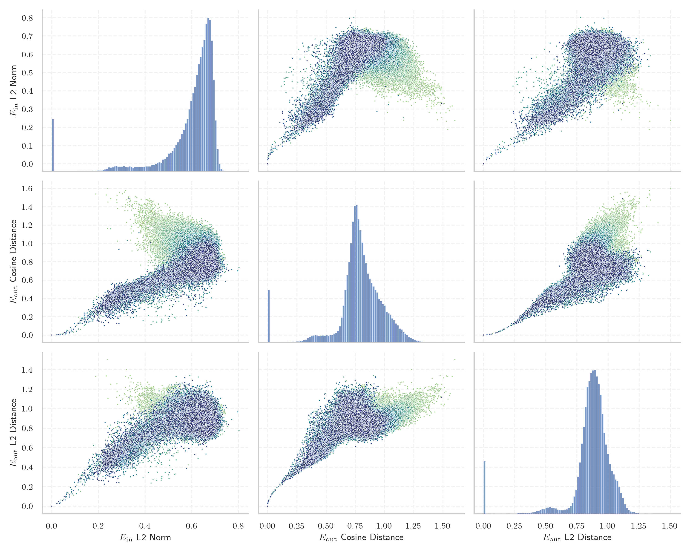

# Report for `chuxin-llm/Chuxin-1.6B-Base`

## Model info

* Tied embeddings: no
* LM head uses bias: no
* Metric for under-trained tokens: E_{in} L2 Norm
  * Overall distribution 0.597 +/- 0.128
  * Token used for verification prompt building: `IllegalArgumentException`
  * Verification threshold: 0.298
  * Threshold for showing candidate under-trained tokens: 0.121
  * Median verified threshold (for bytes, unreachable and special tokens): 0.257
* Embeddings shape: (102400, 2048)
* Vocabulary size: 100015
  * Number of single byte tokens: 256, of which 4 below metric threshold
  * Number of special tokens: 2, of which 1 below metric threshold
  * Number of non-single-byte unreachable tokens: 32, of which 20 below metric threshold
  * Number of non-single-byte UTF-fragment tokens: 438, 0 below soft metric threshold
  * Number of tested under-trained tokens: 1983, 1983 non-special, 886 below p = 0.01 threshold, 38 below soft metric threshold

## Under-trained token indicators plot


## Verification plot


## Under-trained token verification results
38 entries below threshold of 0.121

|   token_id | token                                        |    metric | max_prob                                                         | in_other_tokens                                                                                                                                                                                                                        |
|------------|----------------------------------------------|-----------|------------------------------------------------------------------|----------------------------------------------------------------------------------------------------------------------------------------------------------------------------------------------------------------------------------------|
|      87662 | ````` 日内与新浪看点 `````                   | 0.0218784 | <span style='border: 1px solid rgb(169, 68, 66);'>3.5e-05</span> | <span style='border: 1px solid rgb(169, 68, 66);'>````` 日内与新浪看点联系 `````</span>                                                                                                                                                |
|      87661 | ````` 不代表新浪看点 `````                   | 0.0236809 | <span style='border: 1px solid rgb(169, 68, 66);'>2.6e-08</span> | <span style='border: 1px solid rgb(169, 68, 66);'>````` 不代表新浪看点观点或立场 `````</span>                                                                                                                                          |
|      97672 | ````` 基督教基督教基督教 `````               | 0.0301265 | <span style='border: 1px solid rgb(255, 145, 0);'>0.0011</span>  |                                                                                                                                                                                                                                        |
|      91136 | ````` controlcap `````                       | 0.0321056 | <span style='border: 1px solid rgb(169, 68, 66);'>3.3e-06</span> |                                                                                                                                                                                                                                        |
|      74777 | ````` orangehilldev `````                    | 0.0355834 | <span style='border: 1px solid rgb(169, 68, 66);'>5.6e-05</span> |                                                                                                                                                                                                                                        |
|      16238 | ````` кедония `````                          | 0.0391545 | <span style='border: 1px solid rgb(169, 68, 66);'>3.2e-06</span> | ````` Македония `````, ````` ▁Македония `````                                                                                                                                                                                          |
|      90785 | ````` посолство `````                        | 0.04666   | <span style='border: 1px solid rgb(255, 145, 0);'>0.0019</span>  |                                                                                                                                                                                                                                        |
|      13009 | ````` lemanya `````                          | 0.0497387 | <span style='border: 1px solid rgb(169, 68, 66);'>3.3e-05</span> | ````` Alemanya `````, ````` ▁alemanya `````, ````` ▁Alemanya `````                                                                                                                                                                     |
|      99639 | ````` 亿亿亿亿亿亿亿亿亿亿亿亿亿亿亿亿 ````` | 0.0535675 | <span style='border: 1px solid rgb(251, 189, 8);'>0.099</span>   |                                                                                                                                                                                                                                        |
|      81096 | ````` ▁EDIPU `````                           | 0.0570441 | <span style='border: 1px solid rgb(169, 68, 66);'>1.2e-05</span> | ````` ▁EDIPUCRS `````                                                                                                                                                                                                                  |
|      84405 | ````` RecordedVote `````                     | 0.0587952 | <span style='border: 1px solid rgb(255, 145, 0);'>0.0064</span>  |                                                                                                                                                                                                                                        |
|      59771 | ````` 基督教基督教 `````                     | 0.0625054 | <span style='border: 1px solid rgb(169, 68, 66);'>0.00024</span> | <span style='border: 1px solid rgb(255, 145, 0);'>````` 基督教基督教基督教 `````</span>                                                                                                                                                |
|      71563 | ````` 亿亿亿次 `````                         | 0.063932  | <span style='border: 1px solid rgb(251, 189, 8);'>0.042</span>   |                                                                                                                                                                                                                                        |
|      60623 | ````` odeciclismo `````                      | 0.0639408 | <span style='border: 1px solid rgb(169, 68, 66);'>3e-05</span>   | ````` ▁sitiodeciclismo `````, <span style='border: 1px solid rgb(169, 68, 66);'>````` iodeciclismo `````</span>                                                                                                                        |
|      50113 | ````` memItem `````                          | 0.0682783 | <span style='border: 1px solid rgb(40, 167, 69);'>0.11</span>    | ````` memItemLeft `````, ````` memItemRight `````                                                                                                                                                                                      |
|       5758 | ````` ългар `````                            | 0.0703906 | <span style='border: 1px solid rgb(169, 68, 66);'>9.3e-05</span> | ````` ▁българи `````, ````` ▁българската `````, <span style='border: 1px solid rgb(255, 145, 0);'>````` ългария `````</span>, <span style='border: 1px solid rgb(255, 145, 0);'>````` ▁българ `````</span>, ````` ▁България `````, ... |
|      70532 | ````` \xa0veg `````                          | 0.075737  | <span style='border: 1px solid rgb(255, 145, 0);'>0.0011</span>  | <span style='border: 1px solid rgb(251, 189, 8);'>````` \xa0vegades `````</span>                                                                                                                                                       |
|      97018 | ````` Supamiu `````                          | 0.0764349 | <span style='border: 1px solid rgb(255, 145, 0);'>0.0016</span>  |                                                                                                                                                                                                                                        |
|      78552 | ````` ▁Междусъюз `````                       | 0.0769008 | <span style='border: 1px solid rgb(169, 68, 66);'>0.00012</span> | <span style='border: 1px solid rgb(169, 68, 66);'>````` ▁Междусъюзническата `````</span>                                                                                                                                               |
|      49112 | ````` iberament `````                        | 0.0797149 | <span style='border: 1px solid rgb(169, 68, 66);'>5.8e-05</span> | <span style='border: 1px solid rgb(251, 189, 8);'>````` alliberament `````</span>, <span style='border: 1px solid rgb(255, 145, 0);'>````` Alliberament `````</span>                                                                   |
<details><summary>18 additional entries below threshold</summary>

|   token_id | token                        |    metric | max_prob                                                         | in_other_tokens                                                                                                                                                                                                                                        |
|------------|------------------------------|-----------|------------------------------------------------------------------|--------------------------------------------------------------------------------------------------------------------------------------------------------------------------------------------------------------------------------------------------------|
|      49293 | ````` ▁lampister `````       | 0.0844076 | <span style='border: 1px solid rgb(169, 68, 66);'>3.7e-05</span> | <span style='border: 1px solid rgb(169, 68, 66);'>````` ▁lampisteria `````</span>, <span style='border: 1px solid rgb(169, 68, 66);'>````` ▁lampisteries `````</span>                                                                                  |
|      58888 | ````` 亿亿亿亿亿亿亿亿 ````` | 0.0848685 | <span style='border: 1px solid rgb(251, 189, 8);'>0.027</span>   | <span style='border: 1px solid rgb(251, 189, 8);'>````` 亿亿亿亿亿亿亿亿亿亿亿亿亿亿亿亿 `````</span>                                                                                                                                                  |
|      49918 | ````` magatzem `````         | 0.0849909 | <span style='border: 1px solid rgb(169, 68, 66);'>0.00047</span> | <span style='border: 1px solid rgb(255, 145, 0);'>````` emmagatzem `````</span>, <span style='border: 1px solid rgb(251, 189, 8);'>````` emmagatzematge `````</span>, <span style='border: 1px solid rgb(251, 189, 8);'>````` ▁emmagatzem `````</span> |
|      51244 | ````` ecesito `````          | 0.0872311 | <span style='border: 1px solid rgb(169, 68, 66);'>0.00013</span> | ````` ▁Necesito `````, ````` Necesito `````                                                                                                                                                                                                            |
|      86826 | ````` солство `````          | 0.0923582 | <span style='border: 1px solid rgb(169, 68, 66);'>0.00054</span> | <span style='border: 1px solid rgb(255, 145, 0);'>````` посолство `````</span>                                                                                                                                                                         |
|       9710 | ````` ▁espany `````          | 0.0926319 | <span style='border: 1px solid rgb(169, 68, 66);'>0.00025</span> | ````` ▁espanyoles `````, ````` ▁espanyol `````, ````` ▁espanyols `````, ````` ▁espanyola `````                                                                                                                                                         |
|      73129 | ````` жентина `````          | 0.0972762 | <span style='border: 1px solid rgb(255, 145, 0);'>0.0018</span>  | <span style='border: 1px solid rgb(251, 189, 8);'>````` ▁Аржентина `````</span>                                                                                                                                                                        |
|      85684 | ````` товче `````            | 0.10107   | <span style='border: 1px solid rgb(169, 68, 66);'>4.8e-05</span> | <span style='border: 1px solid rgb(169, 68, 66);'>````` ▁братовче `````</span>                                                                                                                                                                         |
|      52246 | ````` ▁опъл `````            | 0.106657  | <span style='border: 1px solid rgb(169, 68, 66);'>0.00019</span> | <span style='border: 1px solid rgb(255, 145, 0);'>````` ▁опълчение `````</span>, <span style='border: 1px solid rgb(255, 145, 0);'>````` ▁опълчен `````</span>, <span style='border: 1px solid rgb(169, 68, 66);'>````` ▁опълченец `````</span>        |
|       7388 | ````` точници `````          | 0.107464  | <span style='border: 1px solid rgb(169, 68, 66);'>4e-05</span>   | ````` ▁източници `````, ````` Източници `````                                                                                                                                                                                                          |
|      51641 | ````` мъния `````            | 0.112711  | <span style='border: 1px solid rgb(255, 145, 0);'>0.001</span>   | ````` ▁Румъния `````                                                                                                                                                                                                                                   |
|       9630 | ````` ългария `````          | 0.114074  | <span style='border: 1px solid rgb(255, 145, 0);'>0.0019</span>  | ````` ▁България `````, ````` България `````                                                                                                                                                                                                            |
|      93494 | ````` atrals `````           | 0.114798  | <span style='border: 1px solid rgb(255, 145, 0);'>0.0085</span>  | <span style='border: 1px solid rgb(169, 68, 66);'>````` ▁teatrals `````</span>                                                                                                                                                                         |
|      41580 | ````` ▁експе `````           | 0.115079  | <span style='border: 1px solid rgb(169, 68, 66);'>7.1e-05</span> | ````` ▁експеди `````, <span style='border: 1px solid rgb(251, 189, 8);'>````` ▁експедиция `````</span>, ````` ▁експери `````                                                                                                                           |
|      74713 | ````` photonui `````         | 0.115498  | <span style='border: 1px solid rgb(40, 167, 69);'>0.92</span>    |                                                                                                                                                                                                                                                        |
|      90292 | ````` битава `````           | 0.116288  | <span style='border: 1px solid rgb(169, 68, 66);'>6.6e-05</span> | <span style='border: 1px solid rgb(169, 68, 66);'>````` Обитава `````</span>                                                                                                                                                                           |
|      72767 | ````` elrte `````            | 0.118752  | <span style='border: 1px solid rgb(40, 167, 69);'>0.42</span>    |                                                                                                                                                                                                                                                        |
|      24543 | ````` wlwifi `````           | 0.12032   | <span style='border: 1px solid rgb(40, 167, 69);'>0.51</span>    | ````` ▁iwlwifi `````, ````` iwlwifi `````                                                                                                                                                                                                              |
</details>
<details><summary>1945 additional entries above threshold</summary>

|   token_id | token                                |   metric | max_prob                                                         | in_other_tokens                                                                                                                                                                                                                                                                                                                                                     |
|------------|--------------------------------------|----------|------------------------------------------------------------------|---------------------------------------------------------------------------------------------------------------------------------------------------------------------------------------------------------------------------------------------------------------------------------------------------------------------------------------------------------------------|
|      74773 | ````` orangehill `````               | 0.120917 | <span style='border: 1px solid rgb(40, 167, 69);'>0.11</span>    | <span style='border: 1px solid rgb(169, 68, 66);'>````` orangehilldev `````</span>                                                                                                                                                                                                                                                                                  |
|      11911 | ````` ▁изпол `````                   | 0.123442 | <span style='border: 1px solid rgb(169, 68, 66);'>1.6e-05</span> | ````` ▁използват `````, ````` ▁използване `````, ````` ▁използването `````, ````` ▁използва `````, <span style='border: 1px solid rgb(169, 68, 66);'>````` ▁използвани `````</span>, ...                                                                                                                                                                            |
|      93925 | ````` вайг `````                     | 0.123521 | <span style='border: 1px solid rgb(251, 189, 8);'>0.035</span>   | <span style='border: 1px solid rgb(255, 145, 0);'>````` швайг `````</span>                                                                                                                                                                                                                                                                                          |
|      21516 | ````` ximadament `````               | 0.124871 | <span style='border: 1px solid rgb(169, 68, 66);'>5.6e-05</span> | <span style='border: 1px solid rgb(251, 189, 8);'>````` aproximadament `````</span>, ````` ▁aproximadament `````, ````` ▁Aproximadament `````                                                                                                                                                                                                                       |
|       6432 | ````` мври `````                     | 0.125365 | <span style='border: 1px solid rgb(251, 189, 8);'>0.045</span>   | ````` ▁октомври `````, <span style='border: 1px solid rgb(255, 145, 0);'>````` кември `````</span>, <span style='border: 1px solid rgb(251, 189, 8);'>````` птември `````</span>, ````` ▁септември `````, <span style='border: 1px solid rgb(251, 189, 8);'>````` ември `````</span>, ...                                                                           |
|      60376 | ````` ксония `````                   | 0.126165 | <span style='border: 1px solid rgb(255, 145, 0);'>0.0036</span>  | ````` ▁Саксония `````                                                                                                                                                                                                                                                                                                                                               |
|      64695 | ````` rellotge `````                 | 0.127642 | <span style='border: 1px solid rgb(40, 167, 69);'>0.17</span>    | <span style='border: 1px solid rgb(255, 145, 0);'>````` ▁contrarellotge `````</span>, <span style='border: 1px solid rgb(40, 167, 69);'>````` ▁rellotge `````</span>                                                                                                                                                                                                |
|      43247 | ````` питаници `````                 | 0.127683 | <span style='border: 1px solid rgb(255, 145, 0);'>0.0055</span>  | ````` Възпитаници `````                                                                                                                                                                                                                                                                                                                                             |
|      28621 | ````` aixements `````                | 0.129639 | <span style='border: 1px solid rgb(169, 68, 66);'>4.8e-05</span> | ````` Naixements `````                                                                                                                                                                                                                                                                                                                                              |
|      18599 | ````` alsevol `````                  | 0.129798 | <span style='border: 1px solid rgb(169, 68, 66);'>0.00051</span> | ````` ▁qualsevol `````                                                                                                                                                                                                                                                                                                                                              |
|      38991 | ````` rgell `````                    | 0.13204  | <span style='border: 1px solid rgb(255, 145, 0);'>0.009</span>   | ````` ▁Urgell `````, ````` Urgell `````                                                                                                                                                                                                                                                                                                                             |
|      78672 | ````` ▁Хърват `````                  | 0.132627 | <span style='border: 1px solid rgb(251, 189, 8);'>0.012</span>   | <span style='border: 1px solid rgb(251, 189, 8);'>````` ▁Хърватия `````</span>                                                                                                                                                                                                                                                                                      |
|      44330 | ````` последствие `````              | 0.135314 | <span style='border: 1px solid rgb(169, 68, 66);'>4e-05</span>   | <span style='border: 1px solid rgb(169, 68, 66);'>````` ▁Впоследствие `````</span>, <span style='border: 1px solid rgb(169, 68, 66);'>````` ▁впоследствие `````</span>                                                                                                                                                                                              |
|      73735 | ````` ▁FASTFORMAT `````              | 0.138277 | <span style='border: 1px solid rgb(40, 167, 69);'>0.52</span>    |                                                                                                                                                                                                                                                                                                                                                                     |
|      99448 | ````` ▁RTValue `````                 | 0.13844  | <span style='border: 1px solid rgb(40, 167, 69);'>0.9</span>     |                                                                                                                                                                                                                                                                                                                                                                     |
|      77697 | ````` ▁Кън `````                     | 0.138768 | <span style='border: 1px solid rgb(251, 189, 8);'>0.027</span>   | <span style='border: 1px solid rgb(169, 68, 66);'>````` ▁Кънчов `````</span>                                                                                                                                                                                                                                                                                        |
|      22106 | ````` ▁vaix `````                    | 0.139276 | <span style='border: 1px solid rgb(169, 68, 66);'>9.9e-06</span> | ````` ▁vaixells `````, ````` ▁vaixell `````                                                                                                                                                                                                                                                                                                                         |
|      58220 | ````` itedefault `````               | 0.139513 | <span style='border: 1px solid rgb(40, 167, 69);'>0.41</span>    | ````` mcitedefault `````                                                                                                                                                                                                                                                                                                                                            |
|      44942 | ````` министративен `````            | 0.139683 | <span style='border: 1px solid rgb(169, 68, 66);'>0.00051</span> | ````` ▁административен `````, ````` ▁Административен `````                                                                                                                                                                                                                                                                                                          |
|      73157 | ````` ническата `````                | 0.140068 | <span style='border: 1px solid rgb(255, 145, 0);'>0.0028</span>  | <span style='border: 1px solid rgb(169, 68, 66);'>````` ▁Междусъюзническата `````</span>                                                                                                                                                                                                                                                                            |
|      82137 | ````` ждестран `````                 | 0.141236 | <span style='border: 1px solid rgb(255, 145, 0);'>0.0014</span>  | <span style='border: 1px solid rgb(251, 189, 8);'>````` ▁чуждестран `````</span>                                                                                                                                                                                                                                                                                    |
|      84135 | ````` линден `````                   | 0.141334 | <span style='border: 1px solid rgb(40, 167, 69);'>0.17</span>    | <span style='border: 1px solid rgb(40, 167, 69);'>````` ▁Илинден `````</span>                                                                                                                                                                                                                                                                                       |
|      27591 | ````` eriorment `````                | 0.141762 | <span style='border: 1px solid rgb(169, 68, 66);'>0.00013</span> | ````` ▁anteriorment `````, <span style='border: 1px solid rgb(169, 68, 66);'>````` Posteriorment `````</span>, ````` ▁Posteriorment `````, ````` ▁anteriormente `````                                                                                                                                                                                               |
|      61687 | ````` ratges `````                   | 0.141852 | <span style='border: 1px solid rgb(251, 189, 8);'>0.017</span>   | <span style='border: 1px solid rgb(169, 68, 66);'>````` metratges `````</span>                                                                                                                                                                                                                                                                                      |
|      91006 | ````` ейнт `````                     | 0.141936 | <span style='border: 1px solid rgb(251, 189, 8);'>0.018</span>   | <span style='border: 1px solid rgb(40, 167, 69);'>````` ▁Сейнт `````</span>                                                                                                                                                                                                                                                                                         |
|      45290 | ````` ▁крайце `````                  | 0.142481 | <span style='border: 1px solid rgb(169, 68, 66);'>6.4e-05</span> | <span style='border: 1px solid rgb(251, 189, 8);'>````` ▁крайцери `````</span>, <span style='border: 1px solid rgb(169, 68, 66);'>````` ▁крайцера `````</span>, <span style='border: 1px solid rgb(251, 189, 8);'>````` ▁крайцер `````</span>                                                                                                                       |
|      59389 | ````` linkedExternal `````           | 0.142817 | <span style='border: 1px solid rgb(169, 68, 66);'>0.00082</span> | ````` linkedExternalProjectPath `````                                                                                                                                                                                                                                                                                                                               |
|      94822 | ````` orpdfstring `````              | 0.1451   | <span style='border: 1px solid rgb(169, 68, 66);'>2.1e-06</span> | ````` texorpdfstring `````                                                                                                                                                                                                                                                                                                                                          |
|      47980 | ````` върх `````                     | 0.146309 | <span style='border: 1px solid rgb(169, 68, 66);'>0.00088</span> | ````` ▁върхо `````, <span style='border: 1px solid rgb(40, 167, 69);'>````` ▁върха `````</span>, <span style='border: 1px solid rgb(40, 167, 69);'>````` ▁повърхност `````</span>, <span style='border: 1px solid rgb(251, 189, 8);'>````` ▁повърх `````</span>, <span style='border: 1px solid rgb(255, 145, 0);'>````` ▁повърхността `````</span>                 |
|      87336 | ````` estirs `````                   | 0.147953 | <span style='border: 1px solid rgb(255, 145, 0);'>0.002</span>   | <span style='border: 1px solid rgb(169, 68, 66);'>````` ▁monestirs `````</span>                                                                                                                                                                                                                                                                                     |
|      78213 | ````` евград `````                   | 0.148334 | <span style='border: 1px solid rgb(169, 68, 66);'>0.00029</span> | <span style='border: 1px solid rgb(40, 167, 69);'>````` ▁Благоевград `````</span>                                                                                                                                                                                                                                                                                   |
|      19192 | ````` евру `````                     | 0.151465 | <span style='border: 1px solid rgb(40, 167, 69);'>0.22</span>    | ````` ▁февруари `````, <span style='border: 1px solid rgb(169, 68, 66);'>````` евруари `````</span>                                                                                                                                                                                                                                                                 |
|      60891 | ````` кулп `````                     | 0.151676 | <span style='border: 1px solid rgb(255, 145, 0);'>0.0029</span>  | ````` ▁скулп `````                                                                                                                                                                                                                                                                                                                                                  |
|      96803 | ````` afrug `````                    | 0.152671 | <span style='border: 1px solid rgb(40, 167, 69);'>0.12</span>    | ````` afrugell `````                                                                                                                                                                                                                                                                                                                                                |
|      95344 | ````` 图片发自 `````                 | 0.153173 | <span style='border: 1px solid rgb(40, 167, 69);'>0.11</span>    | ````` 图片发自简书 `````                                                                                                                                                                                                                                                                                                                                            |
|      49104 | ````` изток `````                    | 0.155066 | <span style='border: 1px solid rgb(251, 189, 8);'>0.039</span>   | <span style='border: 1px solid rgb(169, 68, 66);'>````` ▁североизток `````</span>, <span style='border: 1px solid rgb(255, 145, 0);'>````` ▁югоизток `````</span>                                                                                                                                                                                                   |
|      59524 | ````` стендил `````                  | 0.155075 | <span style='border: 1px solid rgb(255, 145, 0);'>0.0095</span>  | <span style='border: 1px solid rgb(40, 167, 69);'>````` ▁Кюстендил `````</span>                                                                                                                                                                                                                                                                                     |
|      82211 | ````` emmagatzem `````               | 0.156333 | <span style='border: 1px solid rgb(255, 145, 0);'>0.004</span>   | <span style='border: 1px solid rgb(251, 189, 8);'>````` emmagatzematge `````</span>                                                                                                                                                                                                                                                                                 |
|      74216 | ````` Sinergi `````                  | 0.156625 | <span style='border: 1px solid rgb(40, 167, 69);'>0.97</span>    |                                                                                                                                                                                                                                                                                                                                                                     |
|      18114 | ````` кември `````                   | 0.157033 | <span style='border: 1px solid rgb(255, 145, 0);'>0.0011</span>  | ````` ▁декември `````                                                                                                                                                                                                                                                                                                                                               |
|      80568 | ````` metavariable `````             | 0.157361 | <span style='border: 1px solid rgb(40, 167, 69);'>0.99</span>    |                                                                                                                                                                                                                                                                                                                                                                     |
|      30771 | ````` ▁езе `````                     | 0.157605 | <span style='border: 1px solid rgb(255, 145, 0);'>0.0086</span>  | <span style='border: 1px solid rgb(40, 167, 69);'>````` ▁езеро `````</span>, <span style='border: 1px solid rgb(40, 167, 69);'>````` ▁езера `````</span>, <span style='border: 1px solid rgb(255, 145, 0);'>````` ▁езерото `````</span>                                                                                                                             |
|      52483 | ````` цяло `````                     | 0.158005 | <span style='border: 1px solid rgb(251, 189, 8);'>0.011</span>   | ````` ▁цялост `````, ````` ▁цялото `````, ````` ▁изцяло `````                                                                                                                                                                                                                                                                                                       |
|      28179 | ````` ▁омъ `````                     | 0.158108 | <span style='border: 1px solid rgb(169, 68, 66);'>0.00051</span> | ````` ▁омъжва `````, ````` ▁омъжена `````                                                                                                                                                                                                                                                                                                                           |
|      50412 | ````` ▁повърх `````                  | 0.15863  | <span style='border: 1px solid rgb(251, 189, 8);'>0.016</span>   | <span style='border: 1px solid rgb(40, 167, 69);'>````` ▁повърхност `````</span>, <span style='border: 1px solid rgb(255, 145, 0);'>````` ▁повърхността `````</span>                                                                                                                                                                                                |
|      78939 | ````` ^@^@^@^@^@^@^@^@ `````         | 0.15878  | <span style='border: 1px solid rgb(40, 167, 69);'>0.93</span>    |                                                                                                                                                                                                                                                                                                                                                                     |
|      77699 | ````` фтуер `````                    | 0.159863 | <span style='border: 1px solid rgb(255, 145, 0);'>0.0061</span>  | <span style='border: 1px solid rgb(40, 167, 69);'>````` ▁софтуер `````</span>                                                                                                                                                                                                                                                                                       |
|      52193 | ````` iSector `````                  | 0.160108 | <span style='border: 1px solid rgb(40, 167, 69);'>1</span>       |                                                                                                                                                                                                                                                                                                                                                                     |
|      94515 | ````` mddev `````                    | 0.160536 | <span style='border: 1px solid rgb(40, 167, 69);'>0.92</span>    |                                                                                                                                                                                                                                                                                                                                                                     |
|       9201 | ````` persones `````                 | 0.160579 | <span style='border: 1px solid rgb(40, 167, 69);'>0.98</span>    | ````` \xa0persones `````                                                                                                                                                                                                                                                                                                                                            |
|      45853 | ````` ▁пореди `````                  | 0.161567 | <span style='border: 1px solid rgb(169, 68, 66);'>0.00011</span> | <span style='border: 1px solid rgb(255, 145, 0);'>````` ▁поредицата `````</span>, ````` ▁поредица `````                                                                                                                                                                                                                                                             |
|      39821 | ````` ▁ВМО `````                     | 0.161743 | <span style='border: 1px solid rgb(40, 167, 69);'>0.49</span>    | ````` ▁ВМОРО `````                                                                                                                                                                                                                                                                                                                                                  |
|      62816 | ````` catDesc `````                  | 0.162304 | <span style='border: 1px solid rgb(40, 167, 69);'>0.99</span>    |                                                                                                                                                                                                                                                                                                                                                                     |
|      78059 | ````` дъх `````                      | 0.162712 | <span style='border: 1px solid rgb(255, 145, 0);'>0.0026</span>  | ````` ▁вдъх `````                                                                                                                                                                                                                                                                                                                                                   |
|      46336 | ````` 作品发表后的 `````             | 0.163604 | <span style='border: 1px solid rgb(169, 68, 66);'>0.00024</span> | ````` 版权或其它问题请于作品发表后的 `````                                                                                                                                                                                                                                                                                                                          |
|      28229 | ````` 亿亿亿亿 `````                 | 0.163751 | <span style='border: 1px solid rgb(40, 167, 69);'>0.33</span>    | <span style='border: 1px solid rgb(251, 189, 8);'>````` 亿亿亿亿亿亿亿亿亿亿亿亿亿亿亿亿 `````</span>, <span style='border: 1px solid rgb(251, 189, 8);'>````` 亿亿亿亿亿亿亿亿 `````</span>                                                                                                                                                                        |
|      77640 | ````` ▁renaixent `````               | 0.164908 | <span style='border: 1px solid rgb(255, 145, 0);'>0.0043</span>  | <span style='border: 1px solid rgb(169, 68, 66);'>````` ▁renaixentista `````</span>                                                                                                                                                                                                                                                                                 |
|      69271 | ````` съюз `````                     | 0.1654   | <span style='border: 1px solid rgb(255, 145, 0);'>0.0046</span>  | <span style='border: 1px solid rgb(169, 68, 66);'>````` ▁Междусъюзническата `````</span>, <span style='border: 1px solid rgb(169, 68, 66);'>````` ▁Междусъюз `````</span>                                                                                                                                                                                           |
|      65563 | ````` ▁местообита `````              | 0.165779 | <span style='border: 1px solid rgb(251, 189, 8);'>0.013</span>   | ````` ▁местообитание `````                                                                                                                                                                                                                                                                                                                                          |
|      42203 | ````` metratge `````                 | 0.165922 | <span style='border: 1px solid rgb(251, 189, 8);'>0.017</span>   | <span style='border: 1px solid rgb(251, 189, 8);'>````` ▁curtmetratge `````</span>, <span style='border: 1px solid rgb(255, 145, 0);'>````` ▁llargmetratge `````</span>, <span style='border: 1px solid rgb(169, 68, 66);'>````` metratges `````</span>                                                                                                             |
|      30814 | ````` icionals `````                 | 0.166904 | <span style='border: 1px solid rgb(251, 189, 8);'>0.089</span>   | ````` ▁tradicionals `````, ````` ▁addicionals `````                                                                                                                                                                                                                                                                                                                 |
|      61778 | ````` ocolm `````                    | 0.167009 | <span style='border: 1px solid rgb(40, 167, 69);'>0.47</span>    | <span style='border: 1px solid rgb(251, 189, 8);'>````` Estocolm `````</span>, <span style='border: 1px solid rgb(251, 189, 8);'>````` ▁Estocolm `````</span>                                                                                                                                                                                                       |
|      79621 | ````` ▁асоциа `````                  | 0.167516 | <span style='border: 1px solid rgb(255, 145, 0);'>0.0051</span>  | <span style='border: 1px solid rgb(169, 68, 66);'>````` ▁асоциация `````</span>                                                                                                                                                                                                                                                                                     |
|      83682 | ````` ьорски `````                   | 0.168992 | <span style='border: 1px solid rgb(251, 189, 8);'>0.02</span>    | <span style='border: 1px solid rgb(169, 68, 66);'>````` Актьорски `````</span>                                                                                                                                                                                                                                                                                      |
|      56147 | ````` юсюл `````                     | 0.170365 | <span style='border: 1px solid rgb(255, 145, 0);'>0.0075</span>  | <span style='border: 1px solid rgb(251, 189, 8);'>````` ▁мюсюл `````</span>                                                                                                                                                                                                                                                                                         |
|      62274 | ````` 新浪网联系 `````               | 0.17154  | <span style='border: 1px solid rgb(169, 68, 66);'>6.3e-05</span> | ````` 日内与新浪网联系 `````                                                                                                                                                                                                                                                                                                                                        |
|      28579 | ````` ловдив `````                   | 0.171741 | <span style='border: 1px solid rgb(255, 145, 0);'>0.0024</span>  | <span style='border: 1px solid rgb(40, 167, 69);'>````` Пловдив `````</span>, ````` ▁Пловдив `````                                                                                                                                                                                                                                                                  |
|      62631 | ````` IconSuccess `````              | 0.17221  | <span style='border: 1px solid rgb(40, 167, 69);'>0.72</span>    | <span style='border: 1px solid rgb(251, 189, 8);'>````` IconSuccessEncoded `````</span>                                                                                                                                                                                                                                                                             |
|      49432 | ````` ^@^@^@^@ `````                 | 0.172387 | <span style='border: 1px solid rgb(40, 167, 69);'>0.89</span>    | <span style='border: 1px solid rgb(40, 167, 69);'>````` ^@^@^@^@^@^@^@^@ `````</span>                                                                                                                                                                                                                                                                               |
|      79909 | ````` мисъл `````                    | 0.172884 | <span style='border: 1px solid rgb(251, 189, 8);'>0.019</span>   | <span style='border: 1px solid rgb(251, 189, 8);'>````` ▁смисъл `````</span>                                                                                                                                                                                                                                                                                        |
|      76019 | ````` ▁Campiona `````                | 0.173056 | <span style='border: 1px solid rgb(255, 145, 0);'>0.0052</span>  | <span style='border: 1px solid rgb(251, 189, 8);'>````` ▁Campionats `````</span>                                                                                                                                                                                                                                                                                    |
|      40247 | ````` OpenTl `````                   | 0.173304 | <span style='border: 1px solid rgb(40, 167, 69);'>0.83</span>    |                                                                                                                                                                                                                                                                                                                                                                     |
|      76023 | ````` овеч `````                     | 0.173755 | <span style='border: 1px solid rgb(255, 145, 0);'>0.0098</span>  | <span style='border: 1px solid rgb(40, 167, 69);'>````` ▁Ловеч `````</span>, <span style='border: 1px solid rgb(169, 68, 66);'>````` ▁Повечето `````</span>                                                                                                                                                                                                         |
|      50373 | ````` нгария `````                   | 0.173813 | <span style='border: 1px solid rgb(169, 68, 66);'>0.00063</span> | <span style='border: 1px solid rgb(251, 189, 8);'>````` ▁Унгария `````</span>                                                                                                                                                                                                                                                                                       |
|      91716 | ````` aronja `````                   | 0.17389  | <span style='border: 1px solid rgb(40, 167, 69);'>0.82</span>    | <span style='border: 1px solid rgb(251, 189, 8);'>````` ▁taronja `````</span>                                                                                                                                                                                                                                                                                       |
|      73105 | ````` ▁опълчен `````                 | 0.174469 | <span style='border: 1px solid rgb(255, 145, 0);'>0.0026</span>  | <span style='border: 1px solid rgb(255, 145, 0);'>````` ▁опълчение `````</span>, <span style='border: 1px solid rgb(169, 68, 66);'>````` ▁опълченец `````</span>                                                                                                                                                                                                    |
|      72649 | ````` стието `````                   | 0.175805 | <span style='border: 1px solid rgb(251, 189, 8);'>0.019</span>   | <span style='border: 1px solid rgb(255, 145, 0);'>````` ▁устието `````</span>                                                                                                                                                                                                                                                                                       |
|      84902 | ````` ▁крайцера `````                | 0.17678  | <span style='border: 1px solid rgb(169, 68, 66);'>0.00085</span> |                                                                                                                                                                                                                                                                                                                                                                     |
|      86845 | ````` станбул `````                  | 0.177517 | <span style='border: 1px solid rgb(255, 145, 0);'>0.0049</span>  | <span style='border: 1px solid rgb(169, 68, 66);'>````` ▁Истанбул `````</span>                                                                                                                                                                                                                                                                                      |
|      49102 | ````` долф `````                     | 0.177882 | <span style='border: 1px solid rgb(40, 167, 69);'>0.5</span>     | <span style='border: 1px solid rgb(40, 167, 69);'>````` ▁Рудолф `````</span>, <span style='border: 1px solid rgb(40, 167, 69);'>````` ▁Адолф `````</span>                                                                                                                                                                                                           |
|      70494 | ````` ▁замъ `````                    | 0.178665 | <span style='border: 1px solid rgb(255, 145, 0);'>0.0082</span>  | <span style='border: 1px solid rgb(255, 145, 0);'>````` ▁замък `````</span>, <span style='border: 1px solid rgb(251, 189, 8);'>````` ▁замъка `````</span>                                                                                                                                                                                                           |
|      70650 | ````` icletes `````                  | 0.178845 | <span style='border: 1px solid rgb(255, 145, 0);'>0.0032</span>  | <span style='border: 1px solid rgb(251, 189, 8);'>````` ▁motocicletes `````</span>                                                                                                                                                                                                                                                                                  |
|      65358 | ````` esdeven `````                  | 0.179085 | <span style='border: 1px solid rgb(169, 68, 66);'>1.7e-05</span> | <span style='border: 1px solid rgb(40, 167, 69);'>````` esdeveniment `````</span>                                                                                                                                                                                                                                                                                   |
|      46921 | ````` ▁ръковод `````                 | 0.179359 | <span style='border: 1px solid rgb(169, 68, 66);'>0.00087</span> | <span style='border: 1px solid rgb(40, 167, 69);'>````` ▁ръководител `````</span>, <span style='border: 1px solid rgb(40, 167, 69);'>````` ▁ръководство `````</span>, <span style='border: 1px solid rgb(169, 68, 66);'>````` ▁ръководи `````</span>, <span style='border: 1px solid rgb(255, 145, 0);'>````` ▁ръководството `````</span>                           |
|      35015 | ````` айнрих `````                   | 0.179426 | <span style='border: 1px solid rgb(251, 189, 8);'>0.012</span>   | ````` ▁Хайнрих `````                                                                                                                                                                                                                                                                                                                                                |
|      94218 | ````` ЕФА `````                      | 0.179756 | <span style='border: 1px solid rgb(40, 167, 69);'>0.78</span>    | ````` ▁УЕФА `````                                                                                                                                                                                                                                                                                                                                                   |
|      19166 | ````` ▁nombros `````                 | 0.181373 | <span style='border: 1px solid rgb(255, 145, 0);'>0.0068</span>  | ````` ▁nombrosos `````, ````` ▁nombroses `````                                                                                                                                                                                                                                                                                                                      |
|      18692 | ````` ministraci `````               | 0.181444 | <span style='border: 1px solid rgb(251, 189, 8);'>0.011</span>   | ````` ▁administraci `````, ````` administraci `````, ````` Administraci `````                                                                                                                                                                                                                                                                                       |
|      76726 | ````` ▁крайцери `````                | 0.181544 | <span style='border: 1px solid rgb(251, 189, 8);'>0.067</span>   |                                                                                                                                                                                                                                                                                                                                                                     |
|      84039 | ````` ловения `````                  | 0.181626 | <span style='border: 1px solid rgb(255, 145, 0);'>0.0083</span>  | <span style='border: 1px solid rgb(40, 167, 69);'>````` ▁Словения `````</span>                                                                                                                                                                                                                                                                                      |
|      92376 | ````` ▁motocr `````                  | 0.1824   | <span style='border: 1px solid rgb(255, 145, 0);'>0.004</span>   |                                                                                                                                                                                                                                                                                                                                                                     |
|      99924 | ````` ▁изтре `````                   | 0.182725 | <span style='border: 1px solid rgb(251, 189, 8);'>0.01</span>    |                                                                                                                                                                                                                                                                                                                                                                     |
|      71488 | ````` кграф `````                    | 0.182786 | <span style='border: 1px solid rgb(169, 68, 66);'>0.00014</span> | ````` ▁маркграф `````                                                                                                                                                                                                                                                                                                                                               |
|      93496 | ````` exemplarCity `````             | 0.182794 | <span style='border: 1px solid rgb(40, 167, 69);'>0.74</span>    |                                                                                                                                                                                                                                                                                                                                                                     |
|      67374 | ````` ▁Габро `````                   | 0.182798 | <span style='border: 1px solid rgb(40, 167, 69);'>0.37</span>    | <span style='border: 1px solid rgb(40, 167, 69);'>````` ▁Габрово `````</span>                                                                                                                                                                                                                                                                                       |
|      61740 | ````` ракия `````                    | 0.183363 | <span style='border: 1px solid rgb(40, 167, 69);'>0.15</span>    | <span style='border: 1px solid rgb(40, 167, 69);'>````` ▁Тракия `````</span>                                                                                                                                                                                                                                                                                        |
|      98475 | ````` ▁irlandesos `````              | 0.185051 | <span style='border: 1px solid rgb(169, 68, 66);'>0.00028</span> |                                                                                                                                                                                                                                                                                                                                                                     |
|      32367 | ````` ▁lleug `````                   | 0.185517 | <span style='border: 1px solid rgb(255, 145, 0);'>0.0024</span>  | ````` ▁lleugerament `````, <span style='border: 1px solid rgb(251, 189, 8);'>````` ▁lleugera `````</span>, <span style='border: 1px solid rgb(251, 189, 8);'>````` ▁lleuger `````</span>                                                                                                                                                                            |
|      99811 | ````` ▁Дебър `````                   | 0.188314 | <span style='border: 1px solid rgb(169, 68, 66);'>0.00063</span> |                                                                                                                                                                                                                                                                                                                                                                     |
|      93672 | ````` ▁motocicletes `````            | 0.188756 | <span style='border: 1px solid rgb(251, 189, 8);'>0.03</span>    |                                                                                                                                                                                                                                                                                                                                                                     |
|      98700 | ````` LearningObjective `````        | 0.188953 | <span style='border: 1px solid rgb(40, 167, 69);'>0.96</span>    |                                                                                                                                                                                                                                                                                                                                                                     |
|      22033 | ````` тората `````                   | 0.189933 | <span style='border: 1px solid rgb(255, 145, 0);'>0.007</span>   | ````` ▁втората `````, ````` ▁Втората `````                                                                                                                                                                                                                                                                                                                          |
|      27800 | ````` ▁същест `````                  | 0.190104 | <span style='border: 1px solid rgb(40, 167, 69);'>0.13</span>    | ````` ▁съществува `````, <span style='border: 1px solid rgb(251, 189, 8);'>````` ▁съществуват `````</span>, <span style='border: 1px solid rgb(255, 145, 0);'>````` ▁съществу `````</span>                                                                                                                                                                          |
|      62141 | ````` legalforms `````               | 0.190118 | <span style='border: 1px solid rgb(40, 167, 69);'>0.98</span>    |                                                                                                                                                                                                                                                                                                                                                                     |
|      97358 | ````` ▁вкарва `````                  | 0.190242 | <span style='border: 1px solid rgb(255, 145, 0);'>0.0017</span>  |                                                                                                                                                                                                                                                                                                                                                                     |
|      43904 | ````` ionats `````                   | 0.190433 | <span style='border: 1px solid rgb(255, 145, 0);'>0.0022</span>  | ````` ▁relacionats `````, <span style='border: 1px solid rgb(255, 145, 0);'>````` ▁campionats `````</span>, <span style='border: 1px solid rgb(251, 189, 8);'>````` ▁Campionats `````</span>                                                                                                                                                                        |
|      91460 | ````` ▁оркестър `````                | 0.191804 | <span style='border: 1px solid rgb(255, 145, 0);'>0.005</span>   |                                                                                                                                                                                                                                                                                                                                                                     |
|      19293 | ````` евруари `````                  | 0.192504 | <span style='border: 1px solid rgb(169, 68, 66);'>0.001</span>   | ````` ▁февруари `````                                                                                                                                                                                                                                                                                                                                               |
|      68132 | ````` динанд `````                   | 0.192628 | <span style='border: 1px solid rgb(169, 68, 66);'>0.00064</span> | ````` ▁Фердинанд `````                                                                                                                                                                                                                                                                                                                                              |
|      33658 | ````` Irefn `````                    | 0.192698 | <span style='border: 1px solid rgb(255, 145, 0);'>0.0052</span>  |                                                                                                                                                                                                                                                                                                                                                                     |
|      10596 | ````` Вън `````                      | 0.192826 | <span style='border: 1px solid rgb(251, 189, 8);'>0.012</span>   | ````` Външни `````                                                                                                                                                                                                                                                                                                                                                  |
|      61075 | ````` BrowserDetector `````          | 0.192903 | <span style='border: 1px solid rgb(40, 167, 69);'>0.89</span>    |                                                                                                                                                                                                                                                                                                                                                                     |
|      79441 | ````` вечето `````                   | 0.193089 | <span style='border: 1px solid rgb(169, 68, 66);'>0.00069</span> | <span style='border: 1px solid rgb(169, 68, 66);'>````` ▁Повечето `````</span>                                                                                                                                                                                                                                                                                      |
|      65882 | ````` ▁pugu `````                    | 0.19318  | <span style='border: 1px solid rgb(251, 189, 8);'>0.026</span>   | ````` ▁puguin `````                                                                                                                                                                                                                                                                                                                                                 |
|      84327 | ````` статъ `````                    | 0.193834 | <span style='border: 1px solid rgb(169, 68, 66);'>0.00093</span> | <span style='border: 1px solid rgb(251, 189, 8);'>````` ▁недостатъ `````</span>                                                                                                                                                                                                                                                                                     |
|      98098 | ````` ="../../../../..">< `````      | 0.194469 | <span style='border: 1px solid rgb(169, 68, 66);'>4e-06</span>   |                                                                                                                                                                                                                                                                                                                                                                     |
|      97339 | ````` швайг `````                    | 0.194796 | <span style='border: 1px solid rgb(255, 145, 0);'>0.0015</span>  |                                                                                                                                                                                                                                                                                                                                                                     |
|      55847 | ````` canvi `````                    | 0.195099 | <span style='border: 1px solid rgb(40, 167, 69);'>0.97</span>    | <span style='border: 1px solid rgb(255, 145, 0);'>````` ▁intercanvi `````</span>, <span style='border: 1px solid rgb(251, 189, 8);'>````` intercanvi `````</span>, <span style='border: 1px solid rgb(251, 189, 8);'>````` ▁canviat `````</span>, <span style='border: 1px solid rgb(251, 189, 8);'>````` ▁canviant `````</span>, ````` ▁canvia `````               |
|      45192 | ````` obreix `````                   | 0.195165 | <span style='border: 1px solid rgb(255, 145, 0);'>0.0023</span>  | <span style='border: 1px solid rgb(255, 145, 0);'>````` ▁descobreix `````</span>, <span style='border: 1px solid rgb(169, 68, 66);'>````` obreixen `````</span>, <span style='border: 1px solid rgb(251, 189, 8);'>````` ▁cobreix `````</span>                                                                                                                      |
|      99741 | ````` ▁londinencs `````              | 0.195174 | <span style='border: 1px solid rgb(255, 145, 0);'>0.0044</span>  |                                                                                                                                                                                                                                                                                                                                                                     |
|      77510 | ````` сленост `````                  | 0.19527  | <span style='border: 1px solid rgb(169, 68, 66);'>8.5e-05</span> | <span style='border: 1px solid rgb(169, 68, 66);'>````` Численост `````</span>                                                                                                                                                                                                                                                                                      |
|      71308 | ````` ▁JOption `````                 | 0.195553 | <span style='border: 1px solid rgb(40, 167, 69);'>0.99</span>    | ````` ▁JOptionPane `````                                                                                                                                                                                                                                                                                                                                            |
|      54600 | ````` Окръ `````                     | 0.195786 | <span style='border: 1px solid rgb(255, 145, 0);'>0.0021</span>  | <span style='border: 1px solid rgb(251, 189, 8);'>````` Окръг `````</span>                                                                                                                                                                                                                                                                                          |
|      91979 | ````` ▁тениси `````                  | 0.195896 | <span style='border: 1px solid rgb(255, 145, 0);'>0.0053</span>  |                                                                                                                                                                                                                                                                                                                                                                     |
|      97797 | ````` курещ `````                    | 0.19591  | <span style='border: 1px solid rgb(169, 68, 66);'>0.00084</span> |                                                                                                                                                                                                                                                                                                                                                                     |
|      62986 | ````` ▁съоръ `````                   | 0.196419 | <span style='border: 1px solid rgb(255, 145, 0);'>0.0015</span>  | <span style='border: 1px solid rgb(40, 167, 69);'>````` ▁съоръжения `````</span>                                                                                                                                                                                                                                                                                    |
|      97171 | ````` ▁brasilers `````               | 0.19642  | <span style='border: 1px solid rgb(251, 189, 8);'>0.021</span>   |                                                                                                                                                                                                                                                                                                                                                                     |
|      30090 | ````` ленове `````                   | 0.196537 | <span style='border: 1px solid rgb(251, 189, 8);'>0.015</span>   | ````` ▁членове `````, <span style='border: 1px solid rgb(255, 145, 0);'>````` Членове `````</span>, ````` ▁членовете `````                                                                                                                                                                                                                                          |
|      69737 | ````` ▁крайцер `````                 | 0.19658  | <span style='border: 1px solid rgb(251, 189, 8);'>0.03</span>    | <span style='border: 1px solid rgb(251, 189, 8);'>````` ▁крайцери `````</span>, <span style='border: 1px solid rgb(169, 68, 66);'>````` ▁крайцера `````</span>                                                                                                                                                                                                      |
|      95440 | ````` честър `````                   | 0.196752 | <span style='border: 1px solid rgb(255, 145, 0);'>0.0052</span>  |                                                                                                                                                                                                                                                                                                                                                                     |
|      98004 | ````` esclaus `````                  | 0.196802 | <span style='border: 1px solid rgb(251, 189, 8);'>0.057</span>   |                                                                                                                                                                                                                                                                                                                                                                     |
|      17030 | ````` нуари `````                    | 0.196818 | <span style='border: 1px solid rgb(251, 189, 8);'>0.041</span>   | ````` ▁януари `````                                                                                                                                                                                                                                                                                                                                                 |
|      99453 | ````` ▁Републикански `````           | 0.196856 | <span style='border: 1px solid rgb(251, 189, 8);'>0.02</span>    |                                                                                                                                                                                                                                                                                                                                                                     |
|      68275 | ````` queuelen `````                 | 0.196984 | <span style='border: 1px solid rgb(40, 167, 69);'>0.96</span>    | ````` ▁txqueuelen `````                                                                                                                                                                                                                                                                                                                                             |
|      93534 | ````` байджан `````                  | 0.197454 | <span style='border: 1px solid rgb(251, 189, 8);'>0.017</span>   | ````` зербайджан `````                                                                                                                                                                                                                                                                                                                                              |
|      38518 | ````` atgeria `````                  | 0.197676 | <span style='border: 1px solid rgb(251, 189, 8);'>0.027</span>   | ````` hostatgeria `````                                                                                                                                                                                                                                                                                                                                             |
|      74417 | ````` ardenya `````                  | 0.197929 | <span style='border: 1px solid rgb(251, 189, 8);'>0.057</span>   | <span style='border: 1px solid rgb(40, 167, 69);'>````` ▁Sardenya `````</span>                                                                                                                                                                                                                                                                                      |
|      74496 | ````` ▁избух `````                   | 0.19795  | <span style='border: 1px solid rgb(255, 145, 0);'>0.0013</span>  | <span style='border: 1px solid rgb(169, 68, 66);'>````` ▁избухването `````</span>                                                                                                                                                                                                                                                                                   |
|      97617 | ````` ▁империята `````               | 0.198101 | <span style='border: 1px solid rgb(251, 189, 8);'>0.013</span>   |                                                                                                                                                                                                                                                                                                                                                                     |
|      99846 | ````` ▁артилерийски `````            | 0.199324 | <span style='border: 1px solid rgb(255, 145, 0);'>0.0067</span>  |                                                                                                                                                                                                                                                                                                                                                                     |
|      25359 | ````` талиан `````                   | 0.199492 | <span style='border: 1px solid rgb(251, 189, 8);'>0.034</span>   | <span style='border: 1px solid rgb(251, 189, 8);'>````` Италиански `````</span>, <span style='border: 1px solid rgb(255, 145, 0);'>````` Италиан `````</span>, ````` ▁италиански `````, ````` ▁италиан `````                                                                                                                                                        |
|      90622 | ````` ▁Костур `````                  | 0.19955  | <span style='border: 1px solid rgb(40, 167, 69);'>0.28</span>    |                                                                                                                                                                                                                                                                                                                                                                     |
|      89103 | ````` шър `````                      | 0.200129 | <span style='border: 1px solid rgb(40, 167, 69);'>0.19</span>    |                                                                                                                                                                                                                                                                                                                                                                     |
|      66414 | ````` SYMATTR `````                  | 0.200769 | <span style='border: 1px solid rgb(40, 167, 69);'>0.1</span>     |                                                                                                                                                                                                                                                                                                                                                                     |
|      94556 | ````` Италиански `````               | 0.200944 | <span style='border: 1px solid rgb(251, 189, 8);'>0.062</span>   |                                                                                                                                                                                                                                                                                                                                                                     |
|      85066 | ````` soyc `````                     | 0.201032 | <span style='border: 1px solid rgb(40, 167, 69);'>0.95</span>    |                                                                                                                                                                                                                                                                                                                                                                     |
|      69333 | ````` Италиан `````                  | 0.201049 | <span style='border: 1px solid rgb(255, 145, 0);'>0.0089</span>  | <span style='border: 1px solid rgb(251, 189, 8);'>````` Италиански `````</span>                                                                                                                                                                                                                                                                                     |
|      78010 | ````` Икономи `````                  | 0.201096 | <span style='border: 1px solid rgb(255, 145, 0);'>0.0062</span>  | <span style='border: 1px solid rgb(251, 189, 8);'>````` Икономика `````</span>                                                                                                                                                                                                                                                                                      |
|      95091 | ````` ▁певци `````                   | 0.2011   | <span style='border: 1px solid rgb(251, 189, 8);'>0.026</span>   |                                                                                                                                                                                                                                                                                                                                                                     |
|      63291 | ````` IconSuccessEncoded `````       | 0.201304 | <span style='border: 1px solid rgb(251, 189, 8);'>0.034</span>   |                                                                                                                                                                                                                                                                                                                                                                     |
|      85365 | ````` ▁Анджелис `````                | 0.201443 | <span style='border: 1px solid rgb(169, 68, 66);'>0.00046</span> |                                                                                                                                                                                                                                                                                                                                                                     |
|      85810 | ````` ▁Битоля `````                  | 0.201449 | <span style='border: 1px solid rgb(40, 167, 69);'>0.21</span>    |                                                                                                                                                                                                                                                                                                                                                                     |
|      87378 | ````` ▁hongaresos `````              | 0.2017   | <span style='border: 1px solid rgb(169, 68, 66);'>0.00071</span> |                                                                                                                                                                                                                                                                                                                                                                     |
|      96916 | ````` ▁опълченец `````               | 0.202295 | <span style='border: 1px solid rgb(169, 68, 66);'>9e-06</span>   |                                                                                                                                                                                                                                                                                                                                                                     |
|      44022 | ````` ▁лято `````                    | 0.202377 | <span style='border: 1px solid rgb(40, 167, 69);'>0.11</span>    | ````` ▁лятото `````                                                                                                                                                                                                                                                                                                                                                 |
|      91079 | ````` ▁замъка `````                  | 0.202833 | <span style='border: 1px solid rgb(251, 189, 8);'>0.033</span>   |                                                                                                                                                                                                                                                                                                                                                                     |
|      40482 | ````` IconErrorEncoded `````         | 0.203026 | <span style='border: 1px solid rgb(251, 189, 8);'>0.087</span>   |                                                                                                                                                                                                                                                                                                                                                                     |
|      93726 | ````` ▁обикол `````                  | 0.203669 | <span style='border: 1px solid rgb(251, 189, 8);'>0.036</span>   |                                                                                                                                                                                                                                                                                                                                                                     |
|      34725 | ````` ▁llengu `````                  | 0.203788 | <span style='border: 1px solid rgb(255, 145, 0);'>0.0082</span>  | ````` ▁llenguatge `````                                                                                                                                                                                                                                                                                                                                             |
|      98285 | ````` майстор `````                  | 0.203946 | <span style='border: 1px solid rgb(255, 145, 0);'>0.0063</span>  |                                                                                                                                                                                                                                                                                                                                                                     |
|      99787 | ````` ▁пиано `````                   | 0.2042   | <span style='border: 1px solid rgb(40, 167, 69);'>0.13</span>    |                                                                                                                                                                                                                                                                                                                                                                     |
|      91684 | ````` ▁canadencs `````               | 0.204504 | <span style='border: 1px solid rgb(255, 145, 0);'>0.004</span>   |                                                                                                                                                                                                                                                                                                                                                                     |
|      22509 | ````` suario `````                   | 0.204846 | <span style='border: 1px solid rgb(40, 167, 69);'>0.38</span>    | ````` ▁usuarios `````, ````` ▁Usuario `````, ````` Usuario `````, ````` Usuarios `````, ````` usuarios `````, ...                                                                                                                                                                                                                                                   |
|      32546 | ````` ▁cadasc `````                  | 0.20507  | <span style='border: 1px solid rgb(251, 189, 8);'>0.041</span>   | ````` ▁cadascun `````, ````` ▁cadascuna `````                                                                                                                                                                                                                                                                                                                       |
|      61278 | ````` ▁hongares `````                | 0.205176 | <span style='border: 1px solid rgb(169, 68, 66);'>0.00067</span> | <span style='border: 1px solid rgb(169, 68, 66);'>````` ▁hongaresos `````</span>                                                                                                                                                                                                                                                                                    |
|      87853 | ````` ▁армен `````                   | 0.205331 | <span style='border: 1px solid rgb(40, 167, 69);'>0.63</span>    |                                                                                                                                                                                                                                                                                                                                                                     |
|      15312 | ````` unidenc `````                  | 0.206105 | <span style='border: 1px solid rgb(169, 68, 66);'>0.00026</span> | ````` ▁estatunidencs `````, ````` ▁estatunidenc `````, ````` ▁estatunidenca `````                                                                                                                                                                                                                                                                                   |
|      51380 | ````` ▁преимен `````                 | 0.206293 | <span style='border: 1px solid rgb(255, 145, 0);'>0.0074</span>  | <span style='border: 1px solid rgb(255, 145, 0);'>````` ▁преименува `````</span>                                                                                                                                                                                                                                                                                    |
|      98266 | ````` americanes `````               | 0.20694  | <span style='border: 1px solid rgb(251, 189, 8);'>0.03</span>    |                                                                                                                                                                                                                                                                                                                                                                     |
|      16408 | ````` ▁цър `````                     | 0.207425 | <span style='border: 1px solid rgb(169, 68, 66);'>7.3e-05</span> | <span style='border: 1px solid rgb(251, 189, 8);'>````` ▁църков `````</span>, ````` ▁църквата `````, <span style='border: 1px solid rgb(255, 145, 0);'>````` ▁църкви `````</span>, ````` ▁църква `````                                                                                                                                                              |
|      61594 | ````` ▁vescom `````                  | 0.207447 | <span style='border: 1px solid rgb(251, 189, 8);'>0.04</span>    | <span style='border: 1px solid rgb(251, 189, 8);'>````` ▁vescomte `````</span>                                                                                                                                                                                                                                                                                      |
|      86387 | ````` Traductors `````               | 0.207688 | <span style='border: 1px solid rgb(255, 145, 0);'>0.0096</span>  |                                                                                                                                                                                                                                                                                                                                                                     |
|      94583 | ````` хберг `````                    | 0.207706 | <span style='border: 1px solid rgb(40, 167, 69);'>0.44</span>    |                                                                                                                                                                                                                                                                                                                                                                     |
|      67707 | ````` ▁разстоя `````                 | 0.207878 | <span style='border: 1px solid rgb(40, 167, 69);'>0.14</span>    | <span style='border: 1px solid rgb(251, 189, 8);'>````` ▁разстояние `````</span>                                                                                                                                                                                                                                                                                    |
|      51697 | ````` enginy `````                   | 0.207902 | <span style='border: 1px solid rgb(40, 167, 69);'>0.43</span>    | <span style='border: 1px solid rgb(40, 167, 69);'>````` ▁enginyer `````</span>, <span style='border: 1px solid rgb(255, 145, 0);'>````` enginyeria `````</span>, <span style='border: 1px solid rgb(255, 145, 0);'>````` enginyer `````</span>                                                                                                                      |
|      68491 | ````` Цър `````                      | 0.208006 | <span style='border: 1px solid rgb(251, 189, 8);'>0.011</span>   | <span style='border: 1px solid rgb(169, 68, 66);'>````` Църквата `````</span>, <span style='border: 1px solid rgb(251, 189, 8);'>````` ▁Църквата `````</span>                                                                                                                                                                                                       |
|      84096 | ````` ▁Llengu `````                  | 0.208057 | <span style='border: 1px solid rgb(40, 167, 69);'>0.46</span>    | <span style='border: 1px solid rgb(255, 145, 0);'>````` ▁Llenguadoc `````</span>                                                                                                                                                                                                                                                                                    |
|      97839 | ````` ▁Txecoslov `````               | 0.208083 | <span style='border: 1px solid rgb(255, 145, 0);'>0.0011</span>  |                                                                                                                                                                                                                                                                                                                                                                     |
|      27920 | ````` ловди `````                    | 0.208661 | <span style='border: 1px solid rgb(169, 68, 66);'>0.00072</span> | <span style='border: 1px solid rgb(255, 145, 0);'>````` ловдив `````</span>, <span style='border: 1px solid rgb(40, 167, 69);'>````` Пловдив `````</span>, ````` ▁Пловдив `````                                                                                                                                                                                     |
|      93729 | ````` ▁митология `````               | 0.209562 | <span style='border: 1px solid rgb(169, 68, 66);'>0.00021</span> |                                                                                                                                                                                                                                                                                                                                                                     |
|      17818 | ````` ември `````                    | 0.209705 | <span style='border: 1px solid rgb(251, 189, 8);'>0.028</span>   | <span style='border: 1px solid rgb(255, 145, 0);'>````` кември `````</span>, ````` ▁декември `````, ````` ▁ноември `````                                                                                                                                                                                                                                            |
|      97545 | ````` ▁титли `````                   | 0.209989 | <span style='border: 1px solid rgb(169, 68, 66);'>0.00083</span> |                                                                                                                                                                                                                                                                                                                                                                     |
|      58146 | ````` фове `````                     | 0.210148 | <span style='border: 1px solid rgb(40, 167, 69);'>0.12</span>    | ````` Графове `````                                                                                                                                                                                                                                                                                                                                                 |
|      34303 | ````` ▁xines `````                   | 0.21027  | <span style='border: 1px solid rgb(40, 167, 69);'>0.25</span>    | <span style='border: 1px solid rgb(169, 68, 66);'>````` ▁xinesos `````</span>, <span style='border: 1px solid rgb(251, 189, 8);'>````` ▁xinesa `````</span>                                                                                                                                                                                                         |
|      28811 | ````` ▁сгра `````                    | 0.211146 | <span style='border: 1px solid rgb(255, 145, 0);'>0.0053</span>  | <span style='border: 1px solid rgb(255, 145, 0);'>````` ▁сгради `````</span>, <span style='border: 1px solid rgb(255, 145, 0);'>````` ▁сградата `````</span>, <span style='border: 1px solid rgb(251, 189, 8);'>````` ▁сграда `````</span>                                                                                                                          |
|      30959 | ````` ^@^@ `````                     | 0.211149 | <span style='border: 1px solid rgb(40, 167, 69);'>0.97</span>    | <span style='border: 1px solid rgb(40, 167, 69);'>````` ^@^@^@^@ `````</span>, <span style='border: 1px solid rgb(40, 167, 69);'>````` ^@^@^@^@^@^@^@^@ `````</span>                                                                                                                                                                                                |
|      24348 | ````` ▁Гър `````                     | 0.211149 | <span style='border: 1px solid rgb(40, 167, 69);'>0.6</span>     | ````` ▁Гърция `````                                                                                                                                                                                                                                                                                                                                                 |
|      79806 | ````` futbolista `````               | 0.211246 | <span style='border: 1px solid rgb(40, 167, 69);'>0.73</span>    | ````` ▁exfutbolista `````                                                                                                                                                                                                                                                                                                                                           |
|      39725 | ````` ▁Вилхел `````                  | 0.211483 | <span style='border: 1px solid rgb(251, 189, 8);'>0.08</span>    | ````` ▁Вилхелм `````                                                                                                                                                                                                                                                                                                                                                |
|      16875 | ````` ктомври `````                  | 0.211546 | <span style='border: 1px solid rgb(255, 145, 0);'>0.0035</span>  | ````` ▁октомври `````                                                                                                                                                                                                                                                                                                                                               |
|      80054 | ````` ▁tancs `````                   | 0.211776 | <span style='border: 1px solid rgb(251, 189, 8);'>0.018</span>   |                                                                                                                                                                                                                                                                                                                                                                     |
|      98321 | ````` emmagatzematge `````           | 0.211891 | <span style='border: 1px solid rgb(251, 189, 8);'>0.065</span>   |                                                                                                                                                                                                                                                                                                                                                                     |
|      63687 | ````` дръ `````                      | 0.212261 | <span style='border: 1px solid rgb(40, 167, 69);'>0.64</span>    | ````` ▁поддръ `````                                                                                                                                                                                                                                                                                                                                                 |
|      99585 | ````` rprets `````                   | 0.212346 | <span style='border: 1px solid rgb(169, 68, 66);'>0.00086</span> |                                                                                                                                                                                                                                                                                                                                                                     |
|       8952 | ````` envolup `````                  | 0.212481 | <span style='border: 1px solid rgb(169, 68, 66);'>0.00061</span> | <span style='border: 1px solid rgb(169, 68, 66);'>````` envolupament `````</span>, ````` ▁Desenvolupament `````, ````` ▁desenvolupa `````, ````` ▁desenvolup `````, <span style='border: 1px solid rgb(169, 68, 66);'>````` ▁desenvolupada `````</span>, ...                                                                                                        |
|      97095 | ````` ▁equacions `````               | 0.212793 | <span style='border: 1px solid rgb(251, 189, 8);'>0.09</span>    |                                                                                                                                                                                                                                                                                                                                                                     |
|      83242 | ````` ▁крепостта `````               | 0.212923 | <span style='border: 1px solid rgb(251, 189, 8);'>0.094</span>   |                                                                                                                                                                                                                                                                                                                                                                     |
|      59160 | ````` ▁среднове `````                | 0.213155 | <span style='border: 1px solid rgb(255, 145, 0);'>0.0014</span>  | <span style='border: 1px solid rgb(255, 145, 0);'>````` ▁средновеков `````</span>                                                                                                                                                                                                                                                                                   |
|      98512 | ````` ▁llurs `````                   | 0.213336 | <span style='border: 1px solid rgb(169, 68, 66);'>5.6e-05</span> |                                                                                                                                                                                                                                                                                                                                                                     |
|      45498 | ````` хрид `````                     | 0.214055 | <span style='border: 1px solid rgb(251, 189, 8);'>0.018</span>   | <span style='border: 1px solid rgb(40, 167, 69);'>````` ▁Охридски `````</span>, <span style='border: 1px solid rgb(40, 167, 69);'>````` ▁Охрид `````</span>                                                                                                                                                                                                         |
|      17861 | ````` ▁дъщер `````                   | 0.214104 | <span style='border: 1px solid rgb(255, 145, 0);'>0.0025</span>  | <span style='border: 1px solid rgb(169, 68, 66);'>````` ▁дъщери `````</span>, ````` ▁дъщеря `````                                                                                                                                                                                                                                                                   |
|      27636 | ````` квата `````                    | 0.214154 | <span style='border: 1px solid rgb(40, 167, 69);'>0.23</span>    | ````` ▁църквата `````, <span style='border: 1px solid rgb(169, 68, 66);'>````` Църквата `````</span>, <span style='border: 1px solid rgb(251, 189, 8);'>````` ▁Църквата `````</span>                                                                                                                                                                                |
|       7215 | ````` ▁пър `````                     | 0.214516 | <span style='border: 1px solid rgb(251, 189, 8);'>0.023</span>   | ````` ▁първонача `````, ````` ▁първи `````, ````` ▁първото `````, <span style='border: 1px solid rgb(255, 145, 0);'>````` ▁първен `````</span>, ````` ▁първо `````, ...                                                                                                                                                                                             |
|      18274 | ````` ▁голя `````                    | 0.214719 | <span style='border: 1px solid rgb(169, 68, 66);'>0.00021</span> | ````` ▁голямо `````, ````` ▁голям `````, ````` ▁голяма `````, <span style='border: 1px solid rgb(251, 189, 8);'>````` ▁голямата `````</span>                                                                                                                                                                                                                        |
|      91106 | ````` ▁отборът `````                 | 0.214739 | <span style='border: 1px solid rgb(251, 189, 8);'>0.037</span>   |                                                                                                                                                                                                                                                                                                                                                                     |
|      51143 | ````` ърват `````                    | 0.215334 | <span style='border: 1px solid rgb(255, 145, 0);'>0.0084</span>  | <span style='border: 1px solid rgb(251, 189, 8);'>````` ▁Хърват `````</span>, <span style='border: 1px solid rgb(251, 189, 8);'>````` ▁Хърватия `````</span>                                                                                                                                                                                                        |
|      66880 | ````` unitPattern `````              | 0.215805 | <span style='border: 1px solid rgb(40, 167, 69);'>0.76</span>    |                                                                                                                                                                                                                                                                                                                                                                     |
|      94638 | ````` ▁enfrontaments `````           | 0.215979 | <span style='border: 1px solid rgb(251, 189, 8);'>0.026</span>   |                                                                                                                                                                                                                                                                                                                                                                     |
|      97589 | ````` ▁andalusos `````               | 0.216053 | <span style='border: 1px solid rgb(169, 68, 66);'>3.3e-05</span> |                                                                                                                                                                                                                                                                                                                                                                     |
|      99136 | ````` ▁bombardeig `````              | 0.216119 | <span style='border: 1px solid rgb(169, 68, 66);'>9.8e-05</span> |                                                                                                                                                                                                                                                                                                                                                                     |
|      68045 | ````` раел `````                     | 0.216598 | <span style='border: 1px solid rgb(40, 167, 69);'>0.25</span>    | ````` ▁Израел `````                                                                                                                                                                                                                                                                                                                                                 |
|      95748 | ````` ▁турците `````                 | 0.216633 | <span style='border: 1px solid rgb(169, 68, 66);'>5.7e-05</span> |                                                                                                                                                                                                                                                                                                                                                                     |
|      69012 | ````` днага `````                    | 0.217089 | <span style='border: 1px solid rgb(251, 189, 8);'>0.018</span>   | ````` ▁веднага `````                                                                                                                                                                                                                                                                                                                                                |
|      83735 | ````` ▁contrafort `````              | 0.217136 | <span style='border: 1px solid rgb(251, 189, 8);'>0.088</span>   | <span style='border: 1px solid rgb(255, 145, 0);'>````` ▁contraforts `````</span>                                                                                                                                                                                                                                                                                   |
|      79792 | ````` ▁командването `````            | 0.217329 | <span style='border: 1px solid rgb(169, 68, 66);'>0.00062</span> |                                                                                                                                                                                                                                                                                                                                                                     |
|      99183 | ````` ▁cultius `````                 | 0.217387 | <span style='border: 1px solid rgb(40, 167, 69);'>0.21</span>    |                                                                                                                                                                                                                                                                                                                                                                     |
|      94385 | ````` ▁armats `````                  | 0.21741  | <span style='border: 1px solid rgb(255, 145, 0);'>0.002</span>   |                                                                                                                                                                                                                                                                                                                                                                     |
|      92641 | ````` ▁въстанието `````              | 0.217524 | <span style='border: 1px solid rgb(251, 189, 8);'>0.054</span>   |                                                                                                                                                                                                                                                                                                                                                                     |
|      95903 | ````` Masies `````                   | 0.217847 | <span style='border: 1px solid rgb(255, 145, 0);'>0.0022</span>  |                                                                                                                                                                                                                                                                                                                                                                     |
|      99443 | ````` ▁дъщери `````                  | 0.218074 | <span style='border: 1px solid rgb(169, 68, 66);'>6.9e-05</span> |                                                                                                                                                                                                                                                                                                                                                                     |
|      73774 | ````` ▁suecs `````                   | 0.218079 | <span style='border: 1px solid rgb(255, 145, 0);'>0.0019</span>  |                                                                                                                                                                                                                                                                                                                                                                     |
|      99044 | ````` ▁malalts `````                 | 0.21828  | <span style='border: 1px solid rgb(255, 145, 0);'>0.003</span>   |                                                                                                                                                                                                                                                                                                                                                                     |
|      79297 | ````` ▁Габрово `````                 | 0.218309 | <span style='border: 1px solid rgb(40, 167, 69);'>0.81</span>    |                                                                                                                                                                                                                                                                                                                                                                     |
|      97333 | ````` ъла `````                      | 0.218638 | <span style='border: 1px solid rgb(251, 189, 8);'>0.023</span>   |                                                                                                                                                                                                                                                                                                                                                                     |
|      94052 | ````` ▁островите `````               | 0.218718 | <span style='border: 1px solid rgb(251, 189, 8);'>0.084</span>   |                                                                                                                                                                                                                                                                                                                                                                     |
|      98039 | ````` ..">< `````                    | 0.218774 | <span style='border: 1px solid rgb(40, 167, 69);'>0.45</span>    | <span style='border: 1px solid rgb(169, 68, 66);'>````` ="../../../../..">< `````</span>                                                                                                                                                                                                                                                                            |
|      91717 | ````` редиземно `````                | 0.219404 | <span style='border: 1px solid rgb(255, 145, 0);'>0.0048</span>  | ````` ▁Средиземно `````                                                                                                                                                                                                                                                                                                                                             |
|      35243 | ````` начално `````                  | 0.219451 | <span style='border: 1px solid rgb(169, 68, 66);'>3.8e-05</span> | ````` ▁първоначално `````, <span style='border: 1px solid rgb(169, 68, 66);'>````` ▁Първоначално `````</span>                                                                                                                                                                                                                                                       |
|      97987 | ````` ▁significativament `````       | 0.21947  | <span style='border: 1px solid rgb(255, 145, 0);'>0.0058</span>  |                                                                                                                                                                                                                                                                                                                                                                     |
|      29905 | ````` ▁aconseg `````                 | 0.219565 | <span style='border: 1px solid rgb(169, 68, 66);'>9.1e-05</span> | ````` ▁aconseguit `````, ````` ▁aconsegueix `````, ````` ▁aconseguint `````                                                                                                                                                                                                                                                                                         |
|      83279 | ````` equaci `````                   | 0.219587 | <span style='border: 1px solid rgb(40, 167, 69);'>0.37</span>    | <span style='border: 1px solid rgb(251, 189, 8);'>````` ▁equacions `````</span>                                                                                                                                                                                                                                                                                     |
|      95536 | ````` handbol `````                  | 0.219776 | <span style='border: 1px solid rgb(40, 167, 69);'>0.94</span>    |                                                                                                                                                                                                                                                                                                                                                                     |
|      89748 | ````` ▁Хърватия `````                | 0.219959 | <span style='border: 1px solid rgb(251, 189, 8);'>0.045</span>   |                                                                                                                                                                                                                                                                                                                                                                     |
|      88645 | ````` ▁vescomte `````                | 0.219961 | <span style='border: 1px solid rgb(251, 189, 8);'>0.047</span>   |                                                                                                                                                                                                                                                                                                                                                                     |
|      20325 | ````` uetooth `````                  | 0.22     | <span style='border: 1px solid rgb(251, 189, 8);'>0.017</span>   | ````` bluetooth `````, ````` Bluetooth `````, ````` ▁bluetooth `````                                                                                                                                                                                                                                                                                                |
|      81953 | ````` ▁Хитлер `````                  | 0.220148 | <span style='border: 1px solid rgb(251, 189, 8);'>0.054</span>   |                                                                                                                                                                                                                                                                                                                                                                     |
|      87109 | ````` ▁самолети `````                | 0.220323 | <span style='border: 1px solid rgb(255, 145, 0);'>0.0086</span>  |                                                                                                                                                                                                                                                                                                                                                                     |
|      89592 | ````` ▁спът `````                    | 0.22053  | <span style='border: 1px solid rgb(40, 167, 69);'>0.24</span>    |                                                                                                                                                                                                                                                                                                                                                                     |
|      99891 | ````` ▁guerrers `````                | 0.220704 | <span style='border: 1px solid rgb(169, 68, 66);'>0.00079</span> |                                                                                                                                                                                                                                                                                                                                                                     |
|      51370 | ````` deveniments `````              | 0.220783 | <span style='border: 1px solid rgb(255, 145, 0);'>0.0063</span>  | ````` Esdeveniments `````                                                                                                                                                                                                                                                                                                                                           |
|      97177 | ````` ▁състезанието `````            | 0.220937 | <span style='border: 1px solid rgb(255, 145, 0);'>0.005</span>   |                                                                                                                                                                                                                                                                                                                                                                     |
|      84614 | ````` одрински `````                 | 0.220951 | <span style='border: 1px solid rgb(169, 68, 66);'>8.4e-05</span> |                                                                                                                                                                                                                                                                                                                                                                     |
|      97838 | ````` ▁Питър `````                   | 0.221016 | <span style='border: 1px solid rgb(40, 167, 69);'>0.69</span>    |                                                                                                                                                                                                                                                                                                                                                                     |
|      47785 | ````` щта `````                      | 0.221291 | <span style='border: 1px solid rgb(251, 189, 8);'>0.031</span>   | ````` ▁помощта `````, ````` ▁Площта `````, <span style='border: 1px solid rgb(251, 189, 8);'>````` ▁нощта `````</span>                                                                                                                                                                                                                                              |
|      49800 | ````` renentatge `````               | 0.221858 | <span style='border: 1px solid rgb(255, 145, 0);'>0.0013</span>  | <span style='border: 1px solid rgb(40, 167, 69);'>````` aprenentatge `````</span>                                                                                                                                                                                                                                                                                   |
|      14765 | ````` unicipis `````                 | 0.222026 | <span style='border: 1px solid rgb(251, 189, 8);'>0.018</span>   | ````` Municipis `````, ````` \xa0municipis `````, ````` ▁municipis `````                                                                                                                                                                                                                                                                                            |
|      25643 | ````` винция `````                   | 0.222157 | <span style='border: 1px solid rgb(251, 189, 8);'>0.011</span>   | ````` провинция `````, ````` ▁провинция `````                                                                                                                                                                                                                                                                                                                       |
|      67197 | ````` Videojocs `````                | 0.222212 | <span style='border: 1px solid rgb(255, 145, 0);'>0.0046</span>  |                                                                                                                                                                                                                                                                                                                                                                     |
|      80254 | ````` ▁Насау `````                   | 0.222215 | <span style='border: 1px solid rgb(251, 189, 8);'>0.017</span>   |                                                                                                                                                                                                                                                                                                                                                                     |
|      81866 | ````` ▁въоръжение `````              | 0.222243 | <span style='border: 1px solid rgb(255, 145, 0);'>0.0068</span>  |                                                                                                                                                                                                                                                                                                                                                                     |
|      53200 | ````` частва `````                   | 0.222283 | <span style='border: 1px solid rgb(169, 68, 66);'>9.1e-05</span> | <span style='border: 1px solid rgb(169, 68, 66);'>````` ▁Участва `````</span>                                                                                                                                                                                                                                                                                       |
|      87864 | ````` ърд `````                      | 0.22235  | <span style='border: 1px solid rgb(40, 167, 69);'>0.38</span>    |                                                                                                                                                                                                                                                                                                                                                                     |
|      93268 | ````` ▁aparells `````                | 0.222545 | <span style='border: 1px solid rgb(251, 189, 8);'>0.012</span>   |                                                                                                                                                                                                                                                                                                                                                                     |
|      68823 | ````` ▁ръце `````                    | 0.222596 | <span style='border: 1px solid rgb(40, 167, 69);'>0.14</span>    | <span style='border: 1px solid rgb(40, 167, 69);'>````` ▁ръцете `````</span>                                                                                                                                                                                                                                                                                        |
|      97642 | ````` ▁лъче `````                    | 0.222626 | <span style='border: 1px solid rgb(169, 68, 66);'>7.2e-05</span> |                                                                                                                                                                                                                                                                                                                                                                     |
|      97836 | ````` ▁virrei `````                  | 0.222699 | <span style='border: 1px solid rgb(169, 68, 66);'>3.2e-05</span> |                                                                                                                                                                                                                                                                                                                                                                     |
|      95676 | ````` ▁състезания `````              | 0.222767 | <span style='border: 1px solid rgb(251, 189, 8);'>0.041</span>   |                                                                                                                                                                                                                                                                                                                                                                     |
|      89616 | ````` ▁velocitats `````              | 0.222988 | <span style='border: 1px solid rgb(40, 167, 69);'>0.15</span>    |                                                                                                                                                                                                                                                                                                                                                                     |
|      97113 | ````` ▁libkf `````                   | 0.222997 | <span style='border: 1px solid rgb(40, 167, 69);'>0.96</span>    |                                                                                                                                                                                                                                                                                                                                                                     |
|      96090 | ````` ▁parisencs `````               | 0.223039 | <span style='border: 1px solid rgb(169, 68, 66);'>0.00011</span> |                                                                                                                                                                                                                                                                                                                                                                     |
|      70258 | ````` ъй `````                       | 0.223186 | <span style='border: 1px solid rgb(251, 189, 8);'>0.052</span>   | <span style='border: 1px solid rgb(169, 68, 66);'>````` ▁Тъй `````</span>                                                                                                                                                                                                                                                                                           |
|      86004 | ````` ▁фрайхер `````                 | 0.223257 | <span style='border: 1px solid rgb(169, 68, 66);'>0.00018</span> |                                                                                                                                                                                                                                                                                                                                                                     |
|      94816 | ````` ▁nacionalistes `````           | 0.223262 | <span style='border: 1px solid rgb(255, 145, 0);'>0.0053</span>  |                                                                                                                                                                                                                                                                                                                                                                     |
|      98855 | ````` ▁въздуха `````                 | 0.223324 | <span style='border: 1px solid rgb(40, 167, 69);'>0.28</span>    |                                                                                                                                                                                                                                                                                                                                                                     |
|      98920 | ````` ▁парак `````                   | 0.223465 | <span style='border: 1px solid rgb(40, 167, 69);'>0.19</span>    |                                                                                                                                                                                                                                                                                                                                                                     |
|      76252 | ````` ▁comunistes `````              | 0.223699 | <span style='border: 1px solid rgb(255, 145, 0);'>0.0018</span>  |                                                                                                                                                                                                                                                                                                                                                                     |
|      82937 | ````` ▁крайбрежие `````              | 0.223744 | <span style='border: 1px solid rgb(251, 189, 8);'>0.02</span>    |                                                                                                                                                                                                                                                                                                                                                                     |
|      88492 | ````` ▁повърхността `````            | 0.22381  | <span style='border: 1px solid rgb(255, 145, 0);'>0.0047</span>  |                                                                                                                                                                                                                                                                                                                                                                     |
|      52739 | ````` ▁itemMembers `````             | 0.223958 | <span style='border: 1px solid rgb(251, 189, 8);'>0.028</span>   |                                                                                                                                                                                                                                                                                                                                                                     |
|      75358 | ````` клопе `````                    | 0.224046 | <span style='border: 1px solid rgb(251, 189, 8);'>0.078</span>   | ````` нциклопе `````                                                                                                                                                                                                                                                                                                                                                |
|      86001 | ````` ▁езера `````                   | 0.224189 | <span style='border: 1px solid rgb(40, 167, 69);'>0.11</span>    |                                                                                                                                                                                                                                                                                                                                                                     |
|      92584 | ````` ▁съдове `````                  | 0.224234 | <span style='border: 1px solid rgb(40, 167, 69);'>0.19</span>    |                                                                                                                                                                                                                                                                                                                                                                     |
|      87107 | ````` ▁язови `````                   | 0.224331 | <span style='border: 1px solid rgb(40, 167, 69);'>0.24</span>    |                                                                                                                                                                                                                                                                                                                                                                     |
|      95416 | ````` хайд `````                     | 0.224364 | <span style='border: 1px solid rgb(40, 167, 69);'>0.51</span>    |                                                                                                                                                                                                                                                                                                                                                                     |
|      95985 | ````` ▁руските `````                 | 0.224407 | <span style='border: 1px solid rgb(251, 189, 8);'>0.028</span>   |                                                                                                                                                                                                                                                                                                                                                                     |
|      97372 | ````` ▁mallorquins `````             | 0.224498 | <span style='border: 1px solid rgb(251, 189, 8);'>0.014</span>   |                                                                                                                                                                                                                                                                                                                                                                     |
|      99341 | ````` ▁музикална `````               | 0.224502 | <span style='border: 1px solid rgb(255, 145, 0);'>0.0034</span>  |                                                                                                                                                                                                                                                                                                                                                                     |
|      87645 | ````` ▁Ловеч `````                   | 0.224758 | <span style='border: 1px solid rgb(40, 167, 69);'>0.87</span>    |                                                                                                                                                                                                                                                                                                                                                                     |
|      52916 | ````` iguitat `````                  | 0.224926 | <span style='border: 1px solid rgb(255, 145, 0);'>0.0032</span>  | ````` antiguitat `````                                                                                                                                                                                                                                                                                                                                              |
|      91928 | ````` ▁italianes `````               | 0.22497  | <span style='border: 1px solid rgb(255, 145, 0);'>0.0022</span>  |                                                                                                                                                                                                                                                                                                                                                                     |
|      98892 | ````` idament `````                  | 0.225008 | <span style='border: 1px solid rgb(255, 145, 0);'>0.0056</span>  |                                                                                                                                                                                                                                                                                                                                                                     |
|      87664 | ````` 日内与新浪看点联系 `````       | 0.225152 | <span style='border: 1px solid rgb(169, 68, 66);'>7e-05</span>   |                                                                                                                                                                                                                                                                                                                                                                     |
|      68175 | ````` timologia `````                | 0.225202 | <span style='border: 1px solid rgb(255, 145, 0);'>0.0035</span>  | ````` Etimologia `````                                                                                                                                                                                                                                                                                                                                              |
|      19828 | ````` uretat `````                   | 0.225219 | <span style='border: 1px solid rgb(251, 189, 8);'>0.016</span>   | ````` ▁Seguretat `````, ````` ▁seguretat `````                                                                                                                                                                                                                                                                                                                      |
|      22083 | ````` mateix `````                   | 0.225226 | <span style='border: 1px solid rgb(40, 167, 69);'>0.14</span>    | ````` ▁tanmateix `````, ````` ▁mateixes `````, ````` ▁mateixos `````, ````` ▁Tanmateix `````                                                                                                                                                                                                                                                                        |
|      98183 | ````` avantatge `````                | 0.225586 | <span style='border: 1px solid rgb(251, 189, 8);'>0.047</span>   |                                                                                                                                                                                                                                                                                                                                                                     |
|      66736 | ````` ▁бежан `````                   | 0.226121 | <span style='border: 1px solid rgb(255, 145, 0);'>0.0063</span>  | <span style='border: 1px solid rgb(255, 145, 0);'>````` ▁бежанци `````</span>                                                                                                                                                                                                                                                                                       |
|      87809 | ````` ▁мъжка `````                   | 0.226129 | <span style='border: 1px solid rgb(251, 189, 8);'>0.06</span>    |                                                                                                                                                                                                                                                                                                                                                                     |
|      94392 | ````` ▁асоциация `````               | 0.226259 | <span style='border: 1px solid rgb(169, 68, 66);'>0.00057</span> |                                                                                                                                                                                                                                                                                                                                                                     |
|      68991 | ````` Millor `````                   | 0.226263 | <span style='border: 1px solid rgb(40, 167, 69);'>0.72</span>    |                                                                                                                                                                                                                                                                                                                                                                     |
|      89121 | ````` ▁regularment `````             | 0.226339 | <span style='border: 1px solid rgb(255, 145, 0);'>0.0025</span>  |                                                                                                                                                                                                                                                                                                                                                                     |
|      65162 | ````` ▁фрай `````                    | 0.226425 | <span style='border: 1px solid rgb(251, 189, 8);'>0.039</span>   | <span style='border: 1px solid rgb(169, 68, 66);'>````` ▁фрайхер `````</span>                                                                                                                                                                                                                                                                                       |
|      94708 | ````` полд `````                     | 0.226458 | <span style='border: 1px solid rgb(40, 167, 69);'>0.32</span>    |                                                                                                                                                                                                                                                                                                                                                                     |
|      97418 | ````` ▁nacionalisme `````            | 0.226501 | <span style='border: 1px solid rgb(251, 189, 8);'>0.02</span>    |                                                                                                                                                                                                                                                                                                                                                                     |
|      74046 | ````` teamcraft `````                | 0.226503 | <span style='border: 1px solid rgb(40, 167, 69);'>0.79</span>    |                                                                                                                                                                                                                                                                                                                                                                     |
|      89536 | ````` ▁Филмът `````                  | 0.227091 | <span style='border: 1px solid rgb(251, 189, 8);'>0.013</span>   |                                                                                                                                                                                                                                                                                                                                                                     |
|      87473 | ````` ▁Съветския `````               | 0.227491 | <span style='border: 1px solid rgb(255, 145, 0);'>0.0051</span>  |                                                                                                                                                                                                                                                                                                                                                                     |
|       8236 | ````` ▁българ `````                  | 0.227496 | <span style='border: 1px solid rgb(255, 145, 0);'>0.0093</span>  | ````` ▁българи `````, ````` ▁българската `````, ````` ▁българска `````, ````` ▁българското `````, <span style='border: 1px solid rgb(40, 167, 69);'>````` ▁българите `````</span>, ...                                                                                                                                                                              |
|      84801 | ````` ▁повърхност `````              | 0.227615 | <span style='border: 1px solid rgb(40, 167, 69);'>0.13</span>    | <span style='border: 1px solid rgb(255, 145, 0);'>````` ▁повърхността `````</span>                                                                                                                                                                                                                                                                                  |
|      95281 | ````` ▁revolucionari `````           | 0.227766 | <span style='border: 1px solid rgb(255, 145, 0);'>0.0034</span>  |                                                                                                                                                                                                                                                                                                                                                                     |
|      89784 | ````` ▁галерия `````                 | 0.227786 | <span style='border: 1px solid rgb(40, 167, 69);'>0.2</span>     |                                                                                                                                                                                                                                                                                                                                                                     |
|      51046 | ````` бележител `````                | 0.227798 | <span style='border: 1px solid rgb(169, 68, 66);'>0.00011</span> | <span style='border: 1px solid rgb(251, 189, 8);'>````` ▁забележителности `````</span>, <span style='border: 1px solid rgb(255, 145, 0);'>````` ▁забележител `````</span>                                                                                                                                                                                           |
|      66252 | ````` колкото `````                  | 0.227864 | <span style='border: 1px solid rgb(169, 68, 66);'>0.00033</span> | ````` ▁отколкото `````                                                                                                                                                                                                                                                                                                                                              |
|      98905 | ````` ▁comunament `````              | 0.228171 | <span style='border: 1px solid rgb(169, 68, 66);'>0.00096</span> |                                                                                                                                                                                                                                                                                                                                                                     |
|      93437 | ````` ▁estatals `````                | 0.228264 | <span style='border: 1px solid rgb(255, 145, 0);'>0.0032</span>  |                                                                                                                                                                                                                                                                                                                                                                     |
|      53401 | ````` ▁оръдия `````                  | 0.228303 | <span style='border: 1px solid rgb(255, 145, 0);'>0.0072</span>  |                                                                                                                                                                                                                                                                                                                                                                     |
|      60749 | ````` iodeciclismo `````             | 0.228477 | <span style='border: 1px solid rgb(169, 68, 66);'>0.00016</span> | ````` ▁sitiodeciclismo `````                                                                                                                                                                                                                                                                                                                                        |
|      69962 | ````` ▁Вътре `````                   | 0.228505 | <span style='border: 1px solid rgb(255, 145, 0);'>0.0058</span>  | <span style='border: 1px solid rgb(169, 68, 66);'>````` ▁Вътрешната `````</span>                                                                                                                                                                                                                                                                                    |
|      86941 | ````` ▁класиране `````               | 0.228518 | <span style='border: 1px solid rgb(251, 189, 8);'>0.014</span>   |                                                                                                                                                                                                                                                                                                                                                                     |
|      99079 | ````` obreixen `````                 | 0.22853  | <span style='border: 1px solid rgb(169, 68, 66);'>6.8e-05</span> |                                                                                                                                                                                                                                                                                                                                                                     |
|      73220 | ````` ▁чия `````                     | 0.228535 | <span style='border: 1px solid rgb(169, 68, 66);'>0.00067</span> | ````` ▁чиято `````                                                                                                                                                                                                                                                                                                                                                  |
|      98064 | ````` ▁чичо `````                    | 0.228572 | <span style='border: 1px solid rgb(255, 145, 0);'>0.0017</span>  |                                                                                                                                                                                                                                                                                                                                                                     |
|      97900 | ````` ▁presidencials `````           | 0.228621 | <span style='border: 1px solid rgb(169, 68, 66);'>0.0003</span>  |                                                                                                                                                                                                                                                                                                                                                                     |
|      77039 | ````` infanteria `````               | 0.228797 | <span style='border: 1px solid rgb(251, 189, 8);'>0.011</span>   |                                                                                                                                                                                                                                                                                                                                                                     |
|      98655 | ````` Гръц `````                     | 0.228816 | <span style='border: 1px solid rgb(251, 189, 8);'>0.051</span>   |                                                                                                                                                                                                                                                                                                                                                                     |
|      98601 | ````` йците `````                    | 0.229075 | <span style='border: 1px solid rgb(255, 145, 0);'>0.0018</span>  |                                                                                                                                                                                                                                                                                                                                                                     |
|      97814 | ````` ▁mercaderies `````             | 0.229106 | <span style='border: 1px solid rgb(169, 68, 66);'>0.00011</span> |                                                                                                                                                                                                                                                                                                                                                                     |
|      99325 | ````` ▁съпротива `````               | 0.22912  | <span style='border: 1px solid rgb(251, 189, 8);'>0.086</span>   |                                                                                                                                                                                                                                                                                                                                                                     |
|      96469 | ````` eccions `````                  | 0.229187 | <span style='border: 1px solid rgb(251, 189, 8);'>0.021</span>   |                                                                                                                                                                                                                                                                                                                                                                     |
|      89468 | ````` ▁assentaments `````            | 0.229288 | <span style='border: 1px solid rgb(255, 145, 0);'>0.0029</span>  |                                                                                                                                                                                                                                                                                                                                                                     |
|      94589 | ````` ▁privilegis `````              | 0.229317 | <span style='border: 1px solid rgb(251, 189, 8);'>0.05</span>    |                                                                                                                                                                                                                                                                                                                                                                     |
|      93990 | ````` ▁строителството `````          | 0.229416 | <span style='border: 1px solid rgb(40, 167, 69);'>0.17</span>    |                                                                                                                                                                                                                                                                                                                                                                     |
|      77624 | ````` ▁Xipre `````                   | 0.22942  | <span style='border: 1px solid rgb(251, 189, 8);'>0.078</span>   |                                                                                                                                                                                                                                                                                                                                                                     |
|      40274 | ````` IconError `````                | 0.229468 | <span style='border: 1px solid rgb(40, 167, 69);'>0.99</span>    | <span style='border: 1px solid rgb(251, 189, 8);'>````` IconErrorEncoded `````</span>                                                                                                                                                                                                                                                                               |
|      89896 | ````` almirall `````                 | 0.229748 | <span style='border: 1px solid rgb(40, 167, 69);'>0.96</span>    |                                                                                                                                                                                                                                                                                                                                                                     |
|      94994 | ````` ▁изиграва `````                | 0.229779 | <span style='border: 1px solid rgb(169, 68, 66);'>0.00032</span> |                                                                                                                                                                                                                                                                                                                                                                     |
|      85759 | ````` ▁rugbi `````                   | 0.229879 | <span style='border: 1px solid rgb(255, 145, 0);'>0.006</span>   |                                                                                                                                                                                                                                                                                                                                                                     |
|      98142 | ````` compcert `````                 | 0.229999 | <span style='border: 1px solid rgb(40, 167, 69);'>0.97</span>    |                                                                                                                                                                                                                                                                                                                                                                     |
|      96256 | ````` ▁teatrals `````                | 0.23007  | <span style='border: 1px solid rgb(169, 68, 66);'>0.00018</span> |                                                                                                                                                                                                                                                                                                                                                                     |
|      98559 | ````` ▁reconeguts `````              | 0.230072 | <span style='border: 1px solid rgb(169, 68, 66);'>0.0002</span>  |                                                                                                                                                                                                                                                                                                                                                                     |
|      96952 | ````` ▁Estocolm `````                | 0.23011  | <span style='border: 1px solid rgb(251, 189, 8);'>0.01</span>    |                                                                                                                                                                                                                                                                                                                                                                     |
|      93677 | ````` маните `````                   | 0.230154 | <span style='border: 1px solid rgb(251, 189, 8);'>0.063</span>   |                                                                                                                                                                                                                                                                                                                                                                     |
|      96322 | ````` ▁учители `````                 | 0.23026  | <span style='border: 1px solid rgb(251, 189, 8);'>0.092</span>   |                                                                                                                                                                                                                                                                                                                                                                     |
|      97386 | ````` ▁essencialment `````           | 0.230279 | <span style='border: 1px solid rgb(169, 68, 66);'>0.00028</span> |                                                                                                                                                                                                                                                                                                                                                                     |
|      72136 | ````` ▁пехотен `````                 | 0.230288 | <span style='border: 1px solid rgb(251, 189, 8);'>0.02</span>    |                                                                                                                                                                                                                                                                                                                                                                     |
|      44496 | ````` ▁сътру `````                   | 0.230342 | <span style='border: 1px solid rgb(255, 145, 0);'>0.0098</span>  | ````` ▁сътрудни `````, ````` ▁сътрудничество `````                                                                                                                                                                                                                                                                                                                  |
|      98749 | ````` ▁espectacle `````              | 0.230383 | <span style='border: 1px solid rgb(255, 145, 0);'>0.0098</span>  |                                                                                                                                                                                                                                                                                                                                                                     |
|      95712 | ````` ▁литературни `````             | 0.230435 | <span style='border: 1px solid rgb(255, 145, 0);'>0.0016</span>  |                                                                                                                                                                                                                                                                                                                                                                     |
|      99137 | ````` Актьорски `````                | 0.230495 | <span style='border: 1px solid rgb(169, 68, 66);'>7.1e-06</span> |                                                                                                                                                                                                                                                                                                                                                                     |
|      99876 | ````` ▁urbanitzaci `````             | 0.230569 | <span style='border: 1px solid rgb(255, 145, 0);'>0.0071</span>  |                                                                                                                                                                                                                                                                                                                                                                     |
|      95929 | ````` Estocolm `````                 | 0.23058  | <span style='border: 1px solid rgb(251, 189, 8);'>0.021</span>   | <span style='border: 1px solid rgb(251, 189, 8);'>````` ▁Estocolm `````</span>                                                                                                                                                                                                                                                                                      |
|      92502 | ````` entrenament `````              | 0.230677 | <span style='border: 1px solid rgb(251, 189, 8);'>0.033</span>   |                                                                                                                                                                                                                                                                                                                                                                     |
|      95559 | ````` ▁noruec `````                  | 0.23082  | <span style='border: 1px solid rgb(255, 145, 0);'>0.0013</span>  |                                                                                                                                                                                                                                                                                                                                                                     |
|      95804 | ````` ▁prevere `````                 | 0.230912 | <span style='border: 1px solid rgb(169, 68, 66);'>5.9e-05</span> |                                                                                                                                                                                                                                                                                                                                                                     |
|      99087 | ````` ▁Сейнт `````                   | 0.230917 | <span style='border: 1px solid rgb(40, 167, 69);'>0.26</span>    |                                                                                                                                                                                                                                                                                                                                                                     |
|      92265 | ````` ▁експедиция `````              | 0.230969 | <span style='border: 1px solid rgb(251, 189, 8);'>0.019</span>   |                                                                                                                                                                                                                                                                                                                                                                     |
|      90833 | ````` ▁Истанбул `````                | 0.230978 | <span style='border: 1px solid rgb(169, 68, 66);'>0.00028</span> |                                                                                                                                                                                                                                                                                                                                                                     |
|      54237 | ````` \xa0gols `````                 | 0.231218 | <span style='border: 1px solid rgb(251, 189, 8);'>0.028</span>   |                                                                                                                                                                                                                                                                                                                                                                     |
|      16489 | ````` ележки `````                   | 0.231303 | <span style='border: 1px solid rgb(251, 189, 8);'>0.017</span>   | ````` Бележки `````                                                                                                                                                                                                                                                                                                                                                 |
|      79187 | ````` Resolucions `````              | 0.231321 | <span style='border: 1px solid rgb(169, 68, 66);'>7.5e-05</span> |                                                                                                                                                                                                                                                                                                                                                                     |
|      93602 | ````` атър `````                     | 0.231343 | <span style='border: 1px solid rgb(251, 189, 8);'>0.014</span>   |                                                                                                                                                                                                                                                                                                                                                                     |
|      87158 | ````` ▁espectacles `````             | 0.231375 | <span style='border: 1px solid rgb(251, 189, 8);'>0.021</span>   |                                                                                                                                                                                                                                                                                                                                                                     |
|      88731 | ````` ▁събор `````                   | 0.231478 | <span style='border: 1px solid rgb(251, 189, 8);'>0.015</span>   |                                                                                                                                                                                                                                                                                                                                                                     |
|      97050 | ````` ▁свири `````                   | 0.23156  | <span style='border: 1px solid rgb(251, 189, 8);'>0.032</span>   |                                                                                                                                                                                                                                                                                                                                                                     |
|      80120 | ````` ▁офицери `````                 | 0.231602 | <span style='border: 1px solid rgb(251, 189, 8);'>0.039</span>   |                                                                                                                                                                                                                                                                                                                                                                     |
|      91525 | ````` ▁nadius `````                  | 0.231673 | <span style='border: 1px solid rgb(255, 145, 0);'>0.0054</span>  |                                                                                                                                                                                                                                                                                                                                                                     |
|      43684 | ````` ▁desconeg `````                | 0.2318   | <span style='border: 1px solid rgb(169, 68, 66);'>0.00046</span> | <span style='border: 1px solid rgb(251, 189, 8);'>````` ▁desconeguda `````</span>, <span style='border: 1px solid rgb(40, 167, 69);'>````` ▁desconegut `````</span>                                                                                                                                                                                                 |
|      99540 | ````` ▁разказ `````                  | 0.231816 | <span style='border: 1px solid rgb(40, 167, 69);'>0.19</span>    |                                                                                                                                                                                                                                                                                                                                                                     |
|      81406 | ````` ▁espacials `````               | 0.231992 | <span style='border: 1px solid rgb(169, 68, 66);'>4.1e-06</span> |                                                                                                                                                                                                                                                                                                                                                                     |
|      91764 | ````` ▁desapareguts `````            | 0.232206 | <span style='border: 1px solid rgb(169, 68, 66);'>0.00053</span> |                                                                                                                                                                                                                                                                                                                                                                     |
|      83111 | ````` inclo `````                    | 0.232315 | <span style='border: 1px solid rgb(40, 167, 69);'>0.92</span>    | <span style='border: 1px solid rgb(251, 189, 8);'>````` incloent `````</span>                                                                                                                                                                                                                                                                                       |
|      93168 | ````` ▁превзема `````                | 0.232318 | <span style='border: 1px solid rgb(169, 68, 66);'>0.00065</span> |                                                                                                                                                                                                                                                                                                                                                                     |
|      96939 | ````` ▁fonamentalment `````          | 0.232378 | <span style='border: 1px solid rgb(169, 68, 66);'>0.0004</span>  |                                                                                                                                                                                                                                                                                                                                                                     |
|      97519 | ````` ▁ръководство `````             | 0.232478 | <span style='border: 1px solid rgb(40, 167, 69);'>0.11</span>    |                                                                                                                                                                                                                                                                                                                                                                     |
|      79147 | ````` ▁аресту `````                  | 0.232486 | <span style='border: 1px solid rgb(251, 189, 8);'>0.011</span>   | <span style='border: 1px solid rgb(255, 145, 0);'>````` ▁арестуван `````</span>                                                                                                                                                                                                                                                                                     |
|      92757 | ````` ▁gregues `````                 | 0.232492 | <span style='border: 1px solid rgb(255, 145, 0);'>0.0032</span>  |                                                                                                                                                                                                                                                                                                                                                                     |
|      87472 | ````` ▁supervivents `````            | 0.232592 | <span style='border: 1px solid rgb(169, 68, 66);'>1.1e-05</span> |                                                                                                                                                                                                                                                                                                                                                                     |
|      69262 | ````` ▁contrarellotge `````          | 0.232655 | <span style='border: 1px solid rgb(255, 145, 0);'>0.0035</span>  |                                                                                                                                                                                                                                                                                                                                                                     |
|      93913 | ````` ▁derrotats `````               | 0.23272  | <span style='border: 1px solid rgb(169, 68, 66);'>8.7e-05</span> |                                                                                                                                                                                                                                                                                                                                                                     |
|      84025 | ````` ▁trastorns `````               | 0.23279  | <span style='border: 1px solid rgb(40, 167, 69);'>0.28</span>    |                                                                                                                                                                                                                                                                                                                                                                     |
|      52178 | ````` ▁Голя `````                    | 0.23282  | <span style='border: 1px solid rgb(40, 167, 69);'>0.89</span>    | <span style='border: 1px solid rgb(251, 189, 8);'>````` ▁Голяма `````</span>, <span style='border: 1px solid rgb(255, 145, 0);'>````` ▁Голямата `````</span>                                                                                                                                                                                                        |
|      95283 | ````` Численост `````                | 0.232925 | <span style='border: 1px solid rgb(169, 68, 66);'>0.00075</span> |                                                                                                                                                                                                                                                                                                                                                                     |
|      91740 | ````` Пловдив `````                  | 0.232977 | <span style='border: 1px solid rgb(40, 167, 69);'>0.93</span>    |                                                                                                                                                                                                                                                                                                                                                                     |
|      84253 | ````` ▁отбраната `````               | 0.233215 | <span style='border: 1px solid rgb(251, 189, 8);'>0.095</span>   |                                                                                                                                                                                                                                                                                                                                                                     |
|      29308 | ````` ▁изслед `````                  | 0.233225 | <span style='border: 1px solid rgb(255, 145, 0);'>0.0027</span>  | <span style='border: 1px solid rgb(40, 167, 69);'>````` ▁изследване `````</span>, ````` ▁изследвания `````, <span style='border: 1px solid rgb(251, 189, 8);'>````` ▁изследва `````</span>, <span style='border: 1px solid rgb(40, 167, 69);'>````` ▁изследовател `````</span>                                                                                      |
|      94621 | ````` ▁armades `````                 | 0.233271 | <span style='border: 1px solid rgb(169, 68, 66);'>0.00026</span> |                                                                                                                                                                                                                                                                                                                                                                     |
|      67602 | ````` ▁източни `````                 | 0.233325 | <span style='border: 1px solid rgb(251, 189, 8);'>0.071</span>   | <span style='border: 1px solid rgb(40, 167, 69);'>````` ▁източник `````</span>                                                                                                                                                                                                                                                                                      |
|      82549 | ````` ▁biblioteques `````            | 0.233341 | <span style='border: 1px solid rgb(251, 189, 8);'>0.023</span>   |                                                                                                                                                                                                                                                                                                                                                                     |
|      94831 | ````` ▁sisena `````                  | 0.233512 | <span style='border: 1px solid rgb(251, 189, 8);'>0.018</span>   |                                                                                                                                                                                                                                                                                                                                                                     |
|      93880 | ````` ▁принуден `````                | 0.233594 | <span style='border: 1px solid rgb(255, 145, 0);'>0.0027</span>  |                                                                                                                                                                                                                                                                                                                                                                     |
|      89395 | ````` ▁дебютира `````                | 0.233611 | <span style='border: 1px solid rgb(169, 68, 66);'>0.00032</span> |                                                                                                                                                                                                                                                                                                                                                                     |
|      96188 | ````` ▁canadenc `````                | 0.233614 | <span style='border: 1px solid rgb(169, 68, 66);'>0.00034</span> |                                                                                                                                                                                                                                                                                                                                                                     |
|      96074 | ````` ▁dissenyador `````             | 0.233639 | <span style='border: 1px solid rgb(251, 189, 8);'>0.049</span>   |                                                                                                                                                                                                                                                                                                                                                                     |
|      88422 | ````` ▁creences `````                | 0.233645 | <span style='border: 1px solid rgb(169, 68, 66);'>0.00014</span> |                                                                                                                                                                                                                                                                                                                                                                     |
|      96660 | ````` ▁мисия `````                   | 0.233662 | <span style='border: 1px solid rgb(40, 167, 69);'>0.49</span>    |                                                                                                                                                                                                                                                                                                                                                                     |
|      80693 | ````` ▁изкуства `````                | 0.233788 | <span style='border: 1px solid rgb(169, 68, 66);'>0.00017</span> |                                                                                                                                                                                                                                                                                                                                                                     |
|      97916 | ````` enginyer `````                 | 0.233867 | <span style='border: 1px solid rgb(255, 145, 0);'>0.0041</span>  |                                                                                                                                                                                                                                                                                                                                                                     |
|      95606 | ````` ▁ofereixen `````               | 0.233951 | <span style='border: 1px solid rgb(169, 68, 66);'>0.00039</span> |                                                                                                                                                                                                                                                                                                                                                                     |
|      79613 | ````` вестни `````                   | 0.234002 | <span style='border: 1px solid rgb(40, 167, 69);'>0.12</span>    | <span style='border: 1px solid rgb(255, 145, 0);'>````` известните `````</span>, <span style='border: 1px solid rgb(169, 68, 66);'>````` Известни `````</span>                                                                                                                                                                                                      |
|      91122 | ````` aviaci `````                   | 0.234002 | <span style='border: 1px solid rgb(40, 167, 69);'>0.49</span>    |                                                                                                                                                                                                                                                                                                                                                                     |
|      92762 | ````` ▁negatiu `````                 | 0.234016 | <span style='border: 1px solid rgb(40, 167, 69);'>0.67</span>    |                                                                                                                                                                                                                                                                                                                                                                     |
|      96315 | ````` ▁monestirs `````               | 0.234042 | <span style='border: 1px solid rgb(169, 68, 66);'>0.00031</span> |                                                                                                                                                                                                                                                                                                                                                                     |
|      98935 | ````` ▁obligats `````                | 0.234133 | <span style='border: 1px solid rgb(169, 68, 66);'>0.00072</span> |                                                                                                                                                                                                                                                                                                                                                                     |
|      95940 | ````` ▁разстояние `````              | 0.234145 | <span style='border: 1px solid rgb(251, 189, 8);'>0.056</span>   |                                                                                                                                                                                                                                                                                                                                                                     |
|      94743 | ````` ▁capacitats `````              | 0.234161 | <span style='border: 1px solid rgb(251, 189, 8);'>0.08</span>    |                                                                                                                                                                                                                                                                                                                                                                     |
|      92982 | ````` adriu `````                    | 0.234257 | <span style='border: 1px solid rgb(40, 167, 69);'>0.27</span>    |                                                                                                                                                                                                                                                                                                                                                                     |
|      84661 | ````` ▁Виетнам `````                 | 0.234534 | <span style='border: 1px solid rgb(40, 167, 69);'>0.78</span>    |                                                                                                                                                                                                                                                                                                                                                                     |
|      94535 | ````` ▁breument `````                | 0.234705 | <span style='border: 1px solid rgb(169, 68, 66);'>0.00012</span> |                                                                                                                                                                                                                                                                                                                                                                     |
|      89934 | ````` ▁войските `````                | 0.234817 | <span style='border: 1px solid rgb(251, 189, 8);'>0.037</span>   |                                                                                                                                                                                                                                                                                                                                                                     |
|      18512 | ````` ръц `````                      | 0.234879 | <span style='border: 1px solid rgb(255, 145, 0);'>0.0022</span>  | <span style='border: 1px solid rgb(40, 167, 69);'>````` гръц `````</span>, <span style='border: 1px solid rgb(40, 167, 69);'>````` ▁ръце `````</span>, ````` ▁гръц `````, <span style='border: 1px solid rgb(251, 189, 8);'>````` ▁гръцката `````</span>, <span style='border: 1px solid rgb(251, 189, 8);'>````` Гръц `````</span>, ...                            |
|      74785 | ````` ▁belgues `````                 | 0.235043 | <span style='border: 1px solid rgb(255, 145, 0);'>0.0014</span>  |                                                                                                                                                                                                                                                                                                                                                                     |
|      97652 | ````` ▁tractaments `````             | 0.235115 | <span style='border: 1px solid rgb(40, 167, 69);'>0.25</span>    |                                                                                                                                                                                                                                                                                                                                                                     |
|      82428 | ````` ▁llacs `````                   | 0.235212 | <span style='border: 1px solid rgb(251, 189, 8);'>0.012</span>   |                                                                                                                                                                                                                                                                                                                                                                     |
|      80855 | ````` ▁deessa `````                  | 0.235419 | <span style='border: 1px solid rgb(255, 145, 0);'>0.0011</span>  |                                                                                                                                                                                                                                                                                                                                                                     |
|      94478 | ````` ▁noranta `````                 | 0.235421 | <span style='border: 1px solid rgb(255, 145, 0);'>0.0021</span>  |                                                                                                                                                                                                                                                                                                                                                                     |
|      48171 | ````` карва `````                    | 0.235507 | <span style='border: 1px solid rgb(169, 68, 66);'>5.8e-05</span> | <span style='border: 1px solid rgb(251, 189, 8);'>````` ▁прекарва `````</span>, <span style='border: 1px solid rgb(255, 145, 0);'>````` ▁вкарва `````</span>                                                                                                                                                                                                        |
|      98221 | ````` ▁Тайланд `````                 | 0.235545 | <span style='border: 1px solid rgb(40, 167, 69);'>0.97</span>    |                                                                                                                                                                                                                                                                                                                                                                     |
|      99583 | ````` ▁Среднове `````                | 0.235658 | <span style='border: 1px solid rgb(169, 68, 66);'>0.00021</span> |                                                                                                                                                                                                                                                                                                                                                                     |
|      81984 | ````` ▁краля `````                   | 0.235709 | <span style='border: 1px solid rgb(40, 167, 69);'>0.17</span>    |                                                                                                                                                                                                                                                                                                                                                                     |
|      88813 | ````` ▁кръв `````                    | 0.235776 | <span style='border: 1px solid rgb(40, 167, 69);'>0.95</span>    |                                                                                                                                                                                                                                                                                                                                                                     |
|      83561 | ````` ▁устието `````                 | 0.235838 | <span style='border: 1px solid rgb(255, 145, 0);'>0.001</span>   |                                                                                                                                                                                                                                                                                                                                                                     |
|      94674 | ````` ▁Първите `````                 | 0.235929 | <span style='border: 1px solid rgb(169, 68, 66);'>8e-05</span>   |                                                                                                                                                                                                                                                                                                                                                                     |
|      25642 | ````` ▁Espany `````                  | 0.235973 | <span style='border: 1px solid rgb(40, 167, 69);'>0.53</span>    | ````` ▁Espanyola `````, ````` ▁Espanyol `````                                                                                                                                                                                                                                                                                                                       |
|      99171 | ````` Германска `````                | 0.236024 | <span style='border: 1px solid rgb(255, 145, 0);'>0.0057</span>  |                                                                                                                                                                                                                                                                                                                                                                     |
|      94846 | ````` blicament `````                | 0.236044 | <span style='border: 1px solid rgb(169, 68, 66);'>0.0001</span>  |                                                                                                                                                                                                                                                                                                                                                                     |
|      87582 | ````` lustracions `````              | 0.236068 | <span style='border: 1px solid rgb(255, 145, 0);'>0.0021</span>  |                                                                                                                                                                                                                                                                                                                                                                     |
|      93682 | ````` ▁братята `````                 | 0.236217 | <span style='border: 1px solid rgb(255, 145, 0);'>0.0073</span>  |                                                                                                                                                                                                                                                                                                                                                                     |
|      75698 | ````` \xa0segons `````               | 0.236259 | <span style='border: 1px solid rgb(255, 145, 0);'>0.0073</span>  |                                                                                                                                                                                                                                                                                                                                                                     |
|      85130 | ````` ▁activament `````              | 0.236285 | <span style='border: 1px solid rgb(169, 68, 66);'>0.00044</span> |                                                                                                                                                                                                                                                                                                                                                                     |
|      91700 | ````` ▁общественик `````             | 0.236327 | <span style='border: 1px solid rgb(251, 189, 8);'>0.01</span>    |                                                                                                                                                                                                                                                                                                                                                                     |
|      84930 | ````` ▁creuer `````                  | 0.236508 | <span style='border: 1px solid rgb(251, 189, 8);'>0.023</span>   |                                                                                                                                                                                                                                                                                                                                                                     |
|      98742 | ````` ▁tauler `````                  | 0.236516 | <span style='border: 1px solid rgb(40, 167, 69);'>0.91</span>    |                                                                                                                                                                                                                                                                                                                                                                     |
|      99026 | ````` ▁llegendes `````               | 0.236544 | <span style='border: 1px solid rgb(169, 68, 66);'>1.6e-06</span> |                                                                                                                                                                                                                                                                                                                                                                     |
|      63344 | ````` почва `````                    | 0.236678 | <span style='border: 1px solid rgb(255, 145, 0);'>0.0016</span>  | <span style='border: 1px solid rgb(255, 145, 0);'>````` ▁Започва `````</span>                                                                                                                                                                                                                                                                                       |
|      86803 | ````` ▁hongar `````                  | 0.236702 | <span style='border: 1px solid rgb(255, 145, 0);'>0.004</span>   | <span style='border: 1px solid rgb(169, 68, 66);'>````` ▁hongaresos `````</span>                                                                                                                                                                                                                                                                                    |
|      95046 | ````` ▁pertanyents `````             | 0.236852 | <span style='border: 1px solid rgb(255, 145, 0);'>0.0016</span>  |                                                                                                                                                                                                                                                                                                                                                                     |
|      92255 | ````` ▁governants `````              | 0.236855 | <span style='border: 1px solid rgb(169, 68, 66);'>0.00025</span> |                                                                                                                                                                                                                                                                                                                                                                     |
|      99808 | ````` Guionistes `````               | 0.236944 | <span style='border: 1px solid rgb(169, 68, 66);'>0.00086</span> |                                                                                                                                                                                                                                                                                                                                                                     |
|      76187 | ````` \xa0vots `````                 | 0.236961 | <span style='border: 1px solid rgb(255, 145, 0);'>0.0034</span>  |                                                                                                                                                                                                                                                                                                                                                                     |
|      98232 | ````` ▁четник `````                  | 0.237075 | <span style='border: 1px solid rgb(255, 145, 0);'>0.0046</span>  |                                                                                                                                                                                                                                                                                                                                                                     |
|      87814 | ````` ▁селището `````                | 0.237424 | <span style='border: 1px solid rgb(255, 145, 0);'>0.0031</span>  |                                                                                                                                                                                                                                                                                                                                                                     |
|      95941 | ````` ▁adquirit `````                | 0.237426 | <span style='border: 1px solid rgb(255, 145, 0);'>0.0015</span>  |                                                                                                                                                                                                                                                                                                                                                                     |
|      73968 | ````` ънс `````                      | 0.237565 | <span style='border: 1px solid rgb(40, 167, 69);'>0.39</span>    |                                                                                                                                                                                                                                                                                                                                                                     |
|      93533 | ````` ▁освободен `````               | 0.237578 | <span style='border: 1px solid rgb(255, 145, 0);'>0.0012</span>  |                                                                                                                                                                                                                                                                                                                                                                     |
|      95202 | ````` ▁плът `````                    | 0.237736 | <span style='border: 1px solid rgb(40, 167, 69);'>0.45</span>    |                                                                                                                                                                                                                                                                                                                                                                     |
|      94528 | ````` ▁senzills `````                | 0.237797 | <span style='border: 1px solid rgb(40, 167, 69);'>0.14</span>    |                                                                                                                                                                                                                                                                                                                                                                     |
|      97567 | ````` ▁encuny `````                  | 0.237858 | <span style='border: 1px solid rgb(169, 68, 66);'>0.00066</span> |                                                                                                                                                                                                                                                                                                                                                                     |
|      99075 | ````` ▁donaven `````                 | 0.237918 | <span style='border: 1px solid rgb(169, 68, 66);'>4.5e-05</span> |                                                                                                                                                                                                                                                                                                                                                                     |
|      99424 | ````` ▁renaixentista `````           | 0.237993 | <span style='border: 1px solid rgb(169, 68, 66);'>0.0004</span>  |                                                                                                                                                                                                                                                                                                                                                                     |
|      81845 | ````` ▁Маргарета `````               | 0.238007 | <span style='border: 1px solid rgb(255, 145, 0);'>0.0021</span>  |                                                                                                                                                                                                                                                                                                                                                                     |
|      90486 | ````` ьой `````                      | 0.238093 | <span style='border: 1px solid rgb(40, 167, 69);'>0.6</span>     |                                                                                                                                                                                                                                                                                                                                                                     |
|      97196 | ````` ▁щат `````                     | 0.238104 | <span style='border: 1px solid rgb(251, 189, 8);'>0.026</span>   |                                                                                                                                                                                                                                                                                                                                                                     |
|      99617 | ````` ▁телевизионен `````            | 0.238177 | <span style='border: 1px solid rgb(255, 145, 0);'>0.0056</span>  |                                                                                                                                                                                                                                                                                                                                                                     |
|      93529 | ````` ▁defensors `````               | 0.238216 | <span style='border: 1px solid rgb(40, 167, 69);'>0.11</span>    |                                                                                                                                                                                                                                                                                                                                                                     |
|       5123 | ````` ▁ciut `````                    | 0.238333 | <span style='border: 1px solid rgb(40, 167, 69);'>0.19</span>    | ````` ▁ciutats `````, <span style='border: 1px solid rgb(251, 189, 8);'>````` ▁ciutadania `````</span>, ````` ▁ciutad `````, ````` ▁ciutadans `````, ````` ▁ciutat `````                                                                                                                                                                                            |
|      98389 | ````` ▁предаване `````               | 0.238343 | <span style='border: 1px solid rgb(251, 189, 8);'>0.072</span>   |                                                                                                                                                                                                                                                                                                                                                                     |
|      60348 | ````` jecci `````                    | 0.238348 | <span style='border: 1px solid rgb(251, 189, 8);'>0.078</span>   | <span style='border: 1px solid rgb(251, 189, 8);'>````` ▁projecci `````</span>                                                                                                                                                                                                                                                                                      |
|      87923 | ````` vitx `````                     | 0.238527 | <span style='border: 1px solid rgb(40, 167, 69);'>0.91</span>    |                                                                                                                                                                                                                                                                                                                                                                     |
|      86767 | ````` ▁fitxar `````                  | 0.238553 | <span style='border: 1px solid rgb(169, 68, 66);'>0.00027</span> |                                                                                                                                                                                                                                                                                                                                                                     |
|      85871 | ````` ▁sacerdots `````               | 0.238631 | <span style='border: 1px solid rgb(169, 68, 66);'>0.0006</span>  |                                                                                                                                                                                                                                                                                                                                                                     |
|      91810 | ````` ▁нахлу `````                   | 0.23867  | <span style='border: 1px solid rgb(169, 68, 66);'>0.00044</span> |                                                                                                                                                                                                                                                                                                                                                                     |
|      66286 | ````` ▁съхран `````                  | 0.238691 | <span style='border: 1px solid rgb(255, 145, 0);'>0.0031</span>  | <span style='border: 1px solid rgb(40, 167, 69);'>````` ▁съхранява `````</span>                                                                                                                                                                                                                                                                                     |
|      87914 | ````` ▁assumptes `````               | 0.238702 | <span style='border: 1px solid rgb(251, 189, 8);'>0.077</span>   |                                                                                                                                                                                                                                                                                                                                                                     |
|      39627 | ````` ▁Разпо `````                   | 0.238704 | <span style='border: 1px solid rgb(169, 68, 66);'>0.00034</span> | ````` ▁Разположен `````, ````` ▁Разположено `````                                                                                                                                                                                                                                                                                                                   |
|      95585 | ````` ▁sofrir `````                  | 0.238732 | <span style='border: 1px solid rgb(255, 145, 0);'>0.004</span>   |                                                                                                                                                                                                                                                                                                                                                                     |
|      86907 | ````` ▁comtats `````                 | 0.238898 | <span style='border: 1px solid rgb(251, 189, 8);'>0.038</span>   |                                                                                                                                                                                                                                                                                                                                                                     |
|      79189 | ````` ▁свещеник `````                | 0.238948 | <span style='border: 1px solid rgb(255, 145, 0);'>0.0039</span>  |                                                                                                                                                                                                                                                                                                                                                                     |
|      90943 | ````` Bisbes `````                   | 0.238951 | <span style='border: 1px solid rgb(255, 145, 0);'>0.0023</span>  |                                                                                                                                                                                                                                                                                                                                                                     |
|      58742 | ````` \xa0etapes `````               | 0.239038 | <span style='border: 1px solid rgb(255, 145, 0);'>0.0012</span>  |                                                                                                                                                                                                                                                                                                                                                                     |
|      88526 | ````` ▁мачове `````                  | 0.239053 | <span style='border: 1px solid rgb(251, 189, 8);'>0.01</span>    |                                                                                                                                                                                                                                                                                                                                                                     |
|      79708 | ````` ▁Сливен `````                  | 0.239135 | <span style='border: 1px solid rgb(40, 167, 69);'>0.9</span>     |                                                                                                                                                                                                                                                                                                                                                                     |
|        398 | ````` 。 `````                       | 0.239166 | <span style='border: 1px solid rgb(40, 167, 69);'>1</span>       |                                                                                                                                                                                                                                                                                                                                                                     |
|      93987 | ````` ▁salvatge `````                | 0.23923  | <span style='border: 1px solid rgb(40, 167, 69);'>0.25</span>    |                                                                                                                                                                                                                                                                                                                                                                     |
|      72735 | ````` ▁художници `````               | 0.239308 | <span style='border: 1px solid rgb(40, 167, 69);'>0.21</span>    |                                                                                                                                                                                                                                                                                                                                                                     |
|      95446 | ````` Eleccions `````                | 0.239321 | <span style='border: 1px solid rgb(251, 189, 8);'>0.096</span>   |                                                                                                                                                                                                                                                                                                                                                                     |
|      75909 | ````` ▁Аржентина `````               | 0.239421 | <span style='border: 1px solid rgb(251, 189, 8);'>0.062</span>   |                                                                                                                                                                                                                                                                                                                                                                     |
|      90402 | ````` ▁Bolonya `````                 | 0.239475 | <span style='border: 1px solid rgb(251, 189, 8);'>0.012</span>   |                                                                                                                                                                                                                                                                                                                                                                     |
|      75037 | ````` ▁четата `````                  | 0.239558 | <span style='border: 1px solid rgb(251, 189, 8);'>0.05</span>    |                                                                                                                                                                                                                                                                                                                                                                     |
|      65379 | ````` 亿亿亿 `````                   | 0.239573 | <span style='border: 1px solid rgb(40, 167, 69);'>0.7</span>     | <span style='border: 1px solid rgb(251, 189, 8);'>````` 亿亿亿亿亿亿亿亿亿亿亿亿亿亿亿亿 `````</span>, <span style='border: 1px solid rgb(251, 189, 8);'>````` 亿亿亿次 `````</span>                                                                                                                                                                                |
|      99191 | ````` assaig `````                   | 0.239646 | <span style='border: 1px solid rgb(40, 167, 69);'>0.9</span>     |                                                                                                                                                                                                                                                                                                                                                                     |
|      98714 | ````` ▁realitzant `````              | 0.23968  | <span style='border: 1px solid rgb(255, 145, 0);'>0.0017</span>  |                                                                                                                                                                                                                                                                                                                                                                     |
|      68342 | ````` фалц `````                     | 0.239707 | <span style='border: 1px solid rgb(255, 145, 0);'>0.001</span>   |                                                                                                                                                                                                                                                                                                                                                                     |
|      84189 | ````` ▁gossos `````                  | 0.239759 | <span style='border: 1px solid rgb(40, 167, 69);'>0.36</span>    |                                                                                                                                                                                                                                                                                                                                                                     |
|      82268 | ````` ▁excavacions `````             | 0.239964 | <span style='border: 1px solid rgb(169, 68, 66);'>0.00013</span> |                                                                                                                                                                                                                                                                                                                                                                     |
|      65391 | ````` ▁сингъл `````                  | 0.239988 | <span style='border: 1px solid rgb(251, 189, 8);'>0.017</span>   |                                                                                                                                                                                                                                                                                                                                                                     |
|      95880 | ````` ▁plenament `````               | 0.240025 | <span style='border: 1px solid rgb(255, 145, 0);'>0.001</span>   |                                                                                                                                                                                                                                                                                                                                                                     |
|      62130 | ````` ▁portuguesos `````             | 0.240115 | <span style='border: 1px solid rgb(169, 68, 66);'>0.0006</span>  |                                                                                                                                                                                                                                                                                                                                                                     |
|      98757 | ````` edificis `````                 | 0.240178 | <span style='border: 1px solid rgb(251, 189, 8);'>0.017</span>   |                                                                                                                                                                                                                                                                                                                                                                     |
|      88257 | ````` ▁оръжия `````                  | 0.240218 | <span style='border: 1px solid rgb(255, 145, 0);'>0.0044</span>  |                                                                                                                                                                                                                                                                                                                                                                     |
|      63841 | ````` ▁достатъ `````                 | 0.240269 | <span style='border: 1px solid rgb(251, 189, 8);'>0.012</span>   | ````` ▁достатъчно `````                                                                                                                                                                                                                                                                                                                                             |
|      78093 | ````` ▁Албрехт `````                 | 0.240313 | <span style='border: 1px solid rgb(255, 145, 0);'>0.0081</span>  |                                                                                                                                                                                                                                                                                                                                                                     |
|      99671 | ````` ▁aportacions `````             | 0.240372 | <span style='border: 1px solid rgb(255, 145, 0);'>0.0052</span>  |                                                                                                                                                                                                                                                                                                                                                                     |
|      91429 | ````` ssiques `````                  | 0.240444 | <span style='border: 1px solid rgb(169, 68, 66);'>2.3e-05</span> |                                                                                                                                                                                                                                                                                                                                                                     |
|      90676 | ````` нството `````                  | 0.240532 | <span style='border: 1px solid rgb(255, 145, 0);'>0.0034</span>  |                                                                                                                                                                                                                                                                                                                                                                     |
|      97430 | ````` ▁intercanvi `````              | 0.240586 | <span style='border: 1px solid rgb(255, 145, 0);'>0.0098</span>  |                                                                                                                                                                                                                                                                                                                                                                     |
|      99826 | ````` ▁classificats `````            | 0.24059  | <span style='border: 1px solid rgb(255, 145, 0);'>0.0024</span>  |                                                                                                                                                                                                                                                                                                                                                                     |
|      97149 | ````` ▁дърве `````                   | 0.240654 | <span style='border: 1px solid rgb(251, 189, 8);'>0.082</span>   |                                                                                                                                                                                                                                                                                                                                                                     |
|      95479 | ````` Advocats `````                 | 0.240669 | <span style='border: 1px solid rgb(169, 68, 66);'>0.001</span>   |                                                                                                                                                                                                                                                                                                                                                                     |
|      45970 | ````` ▁бря `````                     | 0.24068  | <span style='border: 1px solid rgb(40, 167, 69);'>0.95</span>    | ````` ▁бряг `````                                                                                                                                                                                                                                                                                                                                                   |
|      93473 | ````` ▁requereixen `````             | 0.240701 | <span style='border: 1px solid rgb(255, 145, 0);'>0.0047</span>  |                                                                                                                                                                                                                                                                                                                                                                     |
|      88277 | ````` ▁Гьо `````                     | 0.240719 | <span style='border: 1px solid rgb(40, 167, 69);'>0.66</span>    |                                                                                                                                                                                                                                                                                                                                                                     |
|      89253 | ````` OffRequest `````               | 0.240764 | <span style='border: 1px solid rgb(40, 167, 69);'>0.86</span>    |                                                                                                                                                                                                                                                                                                                                                                     |
|        280 | ````` ▁of `````                      | 0.240806 | <span style='border: 1px solid rgb(40, 167, 69);'>1</span>       | ````` ▁oficial `````, ````` ▁oftentimes `````, ````` ▁officer `````, ````` ▁offence `````, ````` ▁offerings `````, ...                                                                                                                                                                                                                                              |
|      36461 | ````` bisbe `````                    | 0.240814 | <span style='border: 1px solid rgb(40, 167, 69);'>0.68</span>    | <span style='border: 1px solid rgb(169, 68, 66);'>````` ▁arquebisbe `````</span>, <span style='border: 1px solid rgb(255, 145, 0);'>````` arquebisbe `````</span>, <span style='border: 1px solid rgb(169, 68, 66);'>````` ▁bisbes `````</span>                                                                                                                     |
|      79171 | ````` ▁neerlandesos `````            | 0.240839 | <span style='border: 1px solid rgb(255, 145, 0);'>0.0021</span>  |                                                                                                                                                                                                                                                                                                                                                                     |
|      57785 | ````` ▁Цър `````                     | 0.240859 | <span style='border: 1px solid rgb(40, 167, 69);'>0.29</span>    | <span style='border: 1px solid rgb(251, 189, 8);'>````` ▁Църквата `````</span>                                                                                                                                                                                                                                                                                      |
|      86211 | ````` ▁Txeca `````                   | 0.241064 | <span style='border: 1px solid rgb(255, 145, 0);'>0.0028</span>  |                                                                                                                                                                                                                                                                                                                                                                     |
|      99017 | ````` ▁independentment `````         | 0.24117  | <span style='border: 1px solid rgb(255, 145, 0);'>0.0029</span>  |                                                                                                                                                                                                                                                                                                                                                                     |
|      99544 | ````` ▁пуснат `````                  | 0.241203 | <span style='border: 1px solid rgb(255, 145, 0);'>0.0044</span>  |                                                                                                                                                                                                                                                                                                                                                                     |
|      60927 | ````` тинопол `````                  | 0.241233 | <span style='border: 1px solid rgb(255, 145, 0);'>0.0017</span>  | ````` ▁Константинопол `````                                                                                                                                                                                                                                                                                                                                         |
|      59897 | ````` борите `````                   | 0.241295 | <span style='border: 1px solid rgb(255, 145, 0);'>0.0033</span>  | <span style='border: 1px solid rgb(251, 189, 8);'>````` ▁изборите `````</span>                                                                                                                                                                                                                                                                                      |
|      93516 | ````` рът `````                      | 0.241457 | <span style='border: 1px solid rgb(40, 167, 69);'>0.1</span>     |                                                                                                                                                                                                                                                                                                                                                                     |
|      13191 | ````` върш `````                     | 0.241459 | <span style='border: 1px solid rgb(255, 145, 0);'>0.0042</span>  | ````` ▁завърш `````, ````` ▁Завършва `````, ````` ▁завършва `````, <span style='border: 1px solid rgb(40, 167, 69);'>````` вършен `````</span>, <span style='border: 1px solid rgb(251, 189, 8);'>````` ▁завърши `````</span>, ...                                                                                                                                  |
|      90307 | ````` ▁руската `````                 | 0.241477 | <span style='border: 1px solid rgb(255, 145, 0);'>0.0029</span>  |                                                                                                                                                                                                                                                                                                                                                                     |
|      82891 | ````` ▁egipcis `````                 | 0.241482 | <span style='border: 1px solid rgb(169, 68, 66);'>0.00047</span> |                                                                                                                                                                                                                                                                                                                                                                     |
|      91036 | ````` ▁рицар `````                   | 0.241489 | <span style='border: 1px solid rgb(251, 189, 8);'>0.098</span>   |                                                                                                                                                                                                                                                                                                                                                                     |
|      83154 | ````` ▁Кипър `````                   | 0.241556 | <span style='border: 1px solid rgb(40, 167, 69);'>0.14</span>    |                                                                                                                                                                                                                                                                                                                                                                     |
|      94538 | ````` ▁periodistes `````             | 0.241604 | <span style='border: 1px solid rgb(169, 68, 66);'>9.7e-07</span> |                                                                                                                                                                                                                                                                                                                                                                     |
|      95620 | ````` ▁restriccions `````            | 0.241664 | <span style='border: 1px solid rgb(251, 189, 8);'>0.087</span>   |                                                                                                                                                                                                                                                                                                                                                                     |
|      55731 | ````` хваща `````                    | 0.241734 | <span style='border: 1px solid rgb(40, 167, 69);'>0.21</span>    | ````` ▁обхваща `````                                                                                                                                                                                                                                                                                                                                                |
|      82677 | ````` ▁североизток `````             | 0.241748 | <span style='border: 1px solid rgb(169, 68, 66);'>0.00036</span> |                                                                                                                                                                                                                                                                                                                                                                     |
|      83597 | ````` ▁югоизток `````                | 0.24176  | <span style='border: 1px solid rgb(255, 145, 0);'>0.002</span>   |                                                                                                                                                                                                                                                                                                                                                                     |
|      98067 | ````` ▁френската `````               | 0.241809 | <span style='border: 1px solid rgb(255, 145, 0);'>0.0033</span>  |                                                                                                                                                                                                                                                                                                                                                                     |
|      96965 | ````` ▁considerades `````            | 0.241888 | <span style='border: 1px solid rgb(255, 145, 0);'>0.0011</span>  |                                                                                                                                                                                                                                                                                                                                                                     |
|      90672 | ````` bisbat `````                   | 0.241896 | <span style='border: 1px solid rgb(255, 145, 0);'>0.0029</span>  |                                                                                                                                                                                                                                                                                                                                                                     |
|      90013 | ````` ▁братовче `````                | 0.241962 | <span style='border: 1px solid rgb(169, 68, 66);'>0.00039</span> |                                                                                                                                                                                                                                                                                                                                                                     |
|      84059 | ````` ▁esmentar `````                | 0.241981 | <span style='border: 1px solid rgb(255, 145, 0);'>0.0028</span>  |                                                                                                                                                                                                                                                                                                                                                                     |
|      92612 | ````` ▁subministrament `````         | 0.242025 | <span style='border: 1px solid rgb(251, 189, 8);'>0.072</span>   |                                                                                                                                                                                                                                                                                                                                                                     |
|      93847 | ````` quesos `````                   | 0.242036 | <span style='border: 1px solid rgb(40, 167, 69);'>1</span>       |                                                                                                                                                                                                                                                                                                                                                                     |
|      92761 | ````` писите `````                   | 0.24224  | <span style='border: 1px solid rgb(255, 145, 0);'>0.0096</span>  |                                                                                                                                                                                                                                                                                                                                                                     |
|      94317 | ````` ▁procediments `````            | 0.242258 | <span style='border: 1px solid rgb(40, 167, 69);'>0.11</span>    |                                                                                                                                                                                                                                                                                                                                                                     |
|      85301 | ````` ▁Слън `````                    | 0.242322 | <span style='border: 1px solid rgb(40, 167, 69);'>0.58</span>    |                                                                                                                                                                                                                                                                                                                                                                     |
|      76518 | ````` ▁участък `````                 | 0.242341 | <span style='border: 1px solid rgb(255, 145, 0);'>0.0056</span>  |                                                                                                                                                                                                                                                                                                                                                                     |
|      85415 | ````` Posteriorment `````            | 0.242395 | <span style='border: 1px solid rgb(169, 68, 66);'>1.4e-05</span> |                                                                                                                                                                                                                                                                                                                                                                     |
|      99932 | ````` ▁reconeixements `````          | 0.242496 | <span style='border: 1px solid rgb(169, 68, 66);'>0.00053</span> |                                                                                                                                                                                                                                                                                                                                                                     |
|      82286 | ````` ▁възви `````                   | 0.242503 | <span style='border: 1px solid rgb(40, 167, 69);'>0.12</span>    |                                                                                                                                                                                                                                                                                                                                                                     |
|      88112 | ````` ▁довежда `````                 | 0.242521 | <span style='border: 1px solid rgb(169, 68, 66);'>0.00031</span> |                                                                                                                                                                                                                                                                                                                                                                     |
|      88951 | ````` sticament `````                | 0.242563 | <span style='border: 1px solid rgb(169, 68, 66);'>0.0001</span>  |                                                                                                                                                                                                                                                                                                                                                                     |
|      84588 | ````` ▁enviats `````                 | 0.242623 | <span style='border: 1px solid rgb(255, 145, 0);'>0.0041</span>  |                                                                                                                                                                                                                                                                                                                                                                     |
|      97234 | ````` ▁опълчение `````               | 0.242666 | <span style='border: 1px solid rgb(255, 145, 0);'>0.0025</span>  |                                                                                                                                                                                                                                                                                                                                                                     |
|      91320 | ````` ▁американския `````            | 0.242739 | <span style='border: 1px solid rgb(169, 68, 66);'>0.00065</span> |                                                                                                                                                                                                                                                                                                                                                                     |
|      87673 | ````` ▁взри `````                    | 0.242816 | <span style='border: 1px solid rgb(40, 167, 69);'>0.15</span>    |                                                                                                                                                                                                                                                                                                                                                                     |
|      74391 | ````` ▁китара `````                  | 0.242855 | <span style='border: 1px solid rgb(251, 189, 8);'>0.058</span>   |                                                                                                                                                                                                                                                                                                                                                                     |
|      97667 | ````` ▁Северен `````                 | 0.242875 | <span style='border: 1px solid rgb(251, 189, 8);'>0.088</span>   |                                                                                                                                                                                                                                                                                                                                                                     |
|      87221 | ````` ▁observacions `````            | 0.242921 | <span style='border: 1px solid rgb(40, 167, 69);'>0.24</span>    |                                                                                                                                                                                                                                                                                                                                                                     |
|      91270 | ````` ▁desconeguda `````             | 0.24301  | <span style='border: 1px solid rgb(251, 189, 8);'>0.063</span>   |                                                                                                                                                                                                                                                                                                                                                                     |
|      15281 | ````` ctrine `````                   | 0.243061 | <span style='border: 1px solid rgb(251, 189, 8);'>0.064</span>   | ````` ▁Doctrine `````, ````` ▁doctrine `````, ````` Doctrine `````, ````` ▁doctrines `````, ````` doctrine `````                                                                                                                                                                                                                                                    |
|      87876 | ````` ▁popularment `````             | 0.243094 | <span style='border: 1px solid rgb(255, 145, 0);'>0.0052</span>  |                                                                                                                                                                                                                                                                                                                                                                     |
|      94092 | ````` ▁dissenyada `````              | 0.243147 | <span style='border: 1px solid rgb(255, 145, 0);'>0.002</span>   |                                                                                                                                                                                                                                                                                                                                                                     |
|      90319 | ````` ▁Romanticisme `````            | 0.243161 | <span style='border: 1px solid rgb(169, 68, 66);'>1.9e-06</span> |                                                                                                                                                                                                                                                                                                                                                                     |
|      76981 | ````` ▁probabilitat `````            | 0.243208 | <span style='border: 1px solid rgb(40, 167, 69);'>0.53</span>    |                                                                                                                                                                                                                                                                                                                                                                     |
|      76619 | ````` ▁monjos `````                  | 0.243281 | <span style='border: 1px solid rgb(255, 145, 0);'>0.008</span>   |                                                                                                                                                                                                                                                                                                                                                                     |
|      92079 | ````` ▁световното `````              | 0.24334  | <span style='border: 1px solid rgb(251, 189, 8);'>0.012</span>   |                                                                                                                                                                                                                                                                                                                                                                     |
|      92884 | ````` rtirs `````                    | 0.243344 | <span style='border: 1px solid rgb(169, 68, 66);'>0.00025</span> |                                                                                                                                                                                                                                                                                                                                                                     |
|      33266 | ````` ▁въста `````                   | 0.243346 | <span style='border: 1px solid rgb(251, 189, 8);'>0.016</span>   | <span style='border: 1px solid rgb(251, 189, 8);'>````` ▁въстанието `````</span>, ````` ▁въстание `````                                                                                                                                                                                                                                                             |
|      87793 | ````` ▁църкви `````                  | 0.243379 | <span style='border: 1px solid rgb(255, 145, 0);'>0.0069</span>  |                                                                                                                                                                                                                                                                                                                                                                     |
|      90139 | ````` торията `````                  | 0.243404 | <span style='border: 1px solid rgb(255, 145, 0);'>0.0043</span>  |                                                                                                                                                                                                                                                                                                                                                                     |
|      81917 | ````` ▁траки `````                   | 0.243464 | <span style='border: 1px solid rgb(251, 189, 8);'>0.075</span>   |                                                                                                                                                                                                                                                                                                                                                                     |
|      96265 | ````` ▁pessetes `````                | 0.243482 | <span style='border: 1px solid rgb(251, 189, 8);'>0.087</span>   |                                                                                                                                                                                                                                                                                                                                                                     |
|      95834 | ````` ▁transcurs `````               | 0.243487 | <span style='border: 1px solid rgb(169, 68, 66);'>0.00053</span> |                                                                                                                                                                                                                                                                                                                                                                     |
|      96802 | ````` ▁корабо `````                  | 0.243609 | <span style='border: 1px solid rgb(251, 189, 8);'>0.029</span>   |                                                                                                                                                                                                                                                                                                                                                                     |
|      97692 | ````` ▁ъгъл `````                    | 0.243611 | <span style='border: 1px solid rgb(251, 189, 8);'>0.066</span>   |                                                                                                                                                                                                                                                                                                                                                                     |
|      86586 | ````` ▁desenvolupada `````           | 0.243686 | <span style='border: 1px solid rgb(169, 68, 66);'>0.00089</span> |                                                                                                                                                                                                                                                                                                                                                                     |
|      95749 | ````` ▁местното `````                | 0.243741 | <span style='border: 1px solid rgb(255, 145, 0);'>0.0019</span>  |                                                                                                                                                                                                                                                                                                                                                                     |
|      91444 | ````` ъри `````                      | 0.243796 | <span style='border: 1px solid rgb(40, 167, 69);'>0.86</span>    |                                                                                                                                                                                                                                                                                                                                                                     |
|      96768 | ````` ▁завръщането `````             | 0.243813 | <span style='border: 1px solid rgb(169, 68, 66);'>0.00046</span> |                                                                                                                                                                                                                                                                                                                                                                     |
|      92532 | ````` ▁Двамата `````                 | 0.243817 | <span style='border: 1px solid rgb(255, 145, 0);'>0.0011</span>  |                                                                                                                                                                                                                                                                                                                                                                     |
|      93752 | ````` actualment `````               | 0.243881 | <span style='border: 1px solid rgb(40, 167, 69);'>0.45</span>    |                                                                                                                                                                                                                                                                                                                                                                     |
|      84800 | ````` ▁сръбски `````                 | 0.243947 | <span style='border: 1px solid rgb(40, 167, 69);'>0.17</span>    |                                                                                                                                                                                                                                                                                                                                                                     |
|      90149 | ````` uneixen `````                  | 0.243983 | <span style='border: 1px solid rgb(169, 68, 66);'>1.8e-05</span> |                                                                                                                                                                                                                                                                                                                                                                     |
|      96872 | ````` ▁jugat `````                   | 0.244038 | <span style='border: 1px solid rgb(169, 68, 66);'>0.00083</span> |                                                                                                                                                                                                                                                                                                                                                                     |
|      83673 | ````` ▁съветник `````                | 0.244044 | <span style='border: 1px solid rgb(255, 145, 0);'>0.0056</span>  |                                                                                                                                                                                                                                                                                                                                                                     |
|      74402 | ````` ▁партията `````                | 0.244179 | <span style='border: 1px solid rgb(251, 189, 8);'>0.028</span>   |                                                                                                                                                                                                                                                                                                                                                                     |
|      71787 | ````` ▁творби `````                  | 0.244267 | <span style='border: 1px solid rgb(169, 68, 66);'>6.2e-06</span> |                                                                                                                                                                                                                                                                                                                                                                     |
|      98478 | ````` alumnes `````                  | 0.244288 | <span style='border: 1px solid rgb(40, 167, 69);'>0.95</span>    |                                                                                                                                                                                                                                                                                                                                                                     |
|      93282 | ````` ▁pavell `````                  | 0.244412 | <span style='border: 1px solid rgb(251, 189, 8);'>0.075</span>   |                                                                                                                                                                                                                                                                                                                                                                     |
|      88387 | ````` ▁Кралство `````                | 0.244431 | <span style='border: 1px solid rgb(251, 189, 8);'>0.078</span>   |                                                                                                                                                                                                                                                                                                                                                                     |
|      90840 | ````` ▁убийството `````              | 0.24444  | <span style='border: 1px solid rgb(255, 145, 0);'>0.0043</span>  |                                                                                                                                                                                                                                                                                                                                                                     |
|      88963 | ````` змът `````                     | 0.244556 | <span style='border: 1px solid rgb(255, 145, 0);'>0.0048</span>  |                                                                                                                                                                                                                                                                                                                                                                     |
|      77813 | ````` ▁епизод `````                  | 0.244568 | <span style='border: 1px solid rgb(40, 167, 69);'>0.64</span>    | ````` ▁епизода `````                                                                                                                                                                                                                                                                                                                                                |
|      68840 | ````` ▁румън `````                   | 0.244666 | <span style='border: 1px solid rgb(40, 167, 69);'>0.69</span>    |                                                                                                                                                                                                                                                                                                                                                                     |
|      83962 | ````` ▁protagonitzar `````           | 0.24468  | <span style='border: 1px solid rgb(169, 68, 66);'>0.00081</span> |                                                                                                                                                                                                                                                                                                                                                                     |
|      64801 | ````` ▁esclaus `````                 | 0.244685 | <span style='border: 1px solid rgb(255, 145, 0);'>0.0031</span>  |                                                                                                                                                                                                                                                                                                                                                                     |
|      62707 | ````` ▁войници `````                 | 0.244697 | <span style='border: 1px solid rgb(251, 189, 8);'>0.012</span>   |                                                                                                                                                                                                                                                                                                                                                                     |
|      69174 | ````` ▁титла `````                   | 0.244755 | <span style='border: 1px solid rgb(251, 189, 8);'>0.05</span>    |                                                                                                                                                                                                                                                                                                                                                                     |
|      64606 | ````` ▁Кюстендил `````               | 0.244791 | <span style='border: 1px solid rgb(40, 167, 69);'>0.47</span>    |                                                                                                                                                                                                                                                                                                                                                                     |
|      95814 | ````` ▁публикуван `````              | 0.244802 | <span style='border: 1px solid rgb(251, 189, 8);'>0.022</span>   |                                                                                                                                                                                                                                                                                                                                                                     |
|      89659 | ````` ▁plataformes `````             | 0.244832 | <span style='border: 1px solid rgb(251, 189, 8);'>0.027</span>   |                                                                                                                                                                                                                                                                                                                                                                     |
|      90225 | ````` ▁forats `````                  | 0.244877 | <span style='border: 1px solid rgb(251, 189, 8);'>0.078</span>   |                                                                                                                                                                                                                                                                                                                                                                     |
|      92061 | ````` ▁significatiu `````            | 0.244897 | <span style='border: 1px solid rgb(255, 145, 0);'>0.0059</span>  |                                                                                                                                                                                                                                                                                                                                                                     |
|      85478 | ````` ▁contribucions `````           | 0.244959 | <span style='border: 1px solid rgb(251, 189, 8);'>0.022</span>   |                                                                                                                                                                                                                                                                                                                                                                     |
|      82171 | ````` ▁настъп `````                  | 0.244966 | <span style='border: 1px solid rgb(255, 145, 0);'>0.0035</span>  |                                                                                                                                                                                                                                                                                                                                                                     |
|      70547 | ````` Населени `````                 | 0.244983 | <span style='border: 1px solid rgb(169, 68, 66);'>0.00024</span> |                                                                                                                                                                                                                                                                                                                                                                     |
|      98362 | ````` ▁съставя `````                 | 0.24501  | <span style='border: 1px solid rgb(255, 145, 0);'>0.0056</span>  |                                                                                                                                                                                                                                                                                                                                                                     |
|      67327 | ````` ▁Земята `````                  | 0.245044 | <span style='border: 1px solid rgb(40, 167, 69);'>0.15</span>    |                                                                                                                                                                                                                                                                                                                                                                     |
|      54752 | ````` ▁horitz `````                  | 0.245049 | <span style='border: 1px solid rgb(40, 167, 69);'>0.45</span>    | <span style='border: 1px solid rgb(40, 167, 69);'>````` ▁horitzontal `````</span>                                                                                                                                                                                                                                                                                   |
|      95298 | ````` ▁parells `````                 | 0.245094 | <span style='border: 1px solid rgb(40, 167, 69);'>0.43</span>    |                                                                                                                                                                                                                                                                                                                                                                     |
|      94540 | ````` ▁taques `````                  | 0.245115 | <span style='border: 1px solid rgb(251, 189, 8);'>0.027</span>   |                                                                                                                                                                                                                                                                                                                                                                     |
|      77954 | ````` ▁склонове `````                | 0.245129 | <span style='border: 1px solid rgb(169, 68, 66);'>0.00048</span> |                                                                                                                                                                                                                                                                                                                                                                     |
|      89619 | ````` ▁obtenint `````                | 0.24515  | <span style='border: 1px solid rgb(251, 189, 8);'>0.023</span>   |                                                                                                                                                                                                                                                                                                                                                                     |
|      88596 | ````` ▁турци `````                   | 0.245157 | <span style='border: 1px solid rgb(40, 167, 69);'>0.4</span>     | <span style='border: 1px solid rgb(169, 68, 66);'>````` ▁турците `````</span>                                                                                                                                                                                                                                                                                       |
|      99304 | ````` ▁наследява `````               | 0.245202 | <span style='border: 1px solid rgb(255, 145, 0);'>0.0071</span>  |                                                                                                                                                                                                                                                                                                                                                                     |
|      70310 | ````` ▁Hongria `````                 | 0.245236 | <span style='border: 1px solid rgb(169, 68, 66);'>0.00069</span> |                                                                                                                                                                                                                                                                                                                                                                     |
|      95511 | ````` ▁класира `````                 | 0.245282 | <span style='border: 1px solid rgb(255, 145, 0);'>0.0031</span>  |                                                                                                                                                                                                                                                                                                                                                                     |
|      90297 | ````` ▁localitzaci `````             | 0.245312 | <span style='border: 1px solid rgb(40, 167, 69);'>0.15</span>    |                                                                                                                                                                                                                                                                                                                                                                     |
|      98147 | ````` ▁noucent `````                 | 0.245397 | <span style='border: 1px solid rgb(251, 189, 8);'>0.019</span>   |                                                                                                                                                                                                                                                                                                                                                                     |
|      96437 | ````` ▁assaig `````                  | 0.245486 | <span style='border: 1px solid rgb(40, 167, 69);'>0.75</span>    |                                                                                                                                                                                                                                                                                                                                                                     |
|      61432 | ````` славия `````                   | 0.245491 | <span style='border: 1px solid rgb(251, 189, 8);'>0.051</span>   | ````` ▁Югославия `````                                                                                                                                                                                                                                                                                                                                              |
|      95833 | ````` textquoted `````               | 0.245506 | <span style='border: 1px solid rgb(255, 145, 0);'>0.0033</span>  | ````` textquotedbl `````                                                                                                                                                                                                                                                                                                                                            |
|      94640 | ````` ▁приблизително `````           | 0.245511 | <span style='border: 1px solid rgb(255, 145, 0);'>0.0013</span>  |                                                                                                                                                                                                                                                                                                                                                                     |
|      14832 | ````` ▁вси `````                     | 0.245519 | <span style='border: 1px solid rgb(251, 189, 8);'>0.088</span>   | ````` ▁всички `````, ````` ▁всичко `````, ````` ▁всичките `````                                                                                                                                                                                                                                                                                                     |
|      96089 | ````` ▁промишленост `````            | 0.245557 | <span style='border: 1px solid rgb(251, 189, 8);'>0.07</span>    |                                                                                                                                                                                                                                                                                                                                                                     |
|      95347 | ````` ▁борда `````                   | 0.245602 | <span style='border: 1px solid rgb(251, 189, 8);'>0.036</span>   |                                                                                                                                                                                                                                                                                                                                                                     |
|      28879 | ````` ▁reconeg `````                 | 0.245659 | <span style='border: 1px solid rgb(169, 68, 66);'>0.00035</span> | <span style='border: 1px solid rgb(169, 68, 66);'>````` ▁reconeguts `````</span>, ````` ▁reconegut `````, <span style='border: 1px solid rgb(255, 145, 0);'>````` ▁reconeguda `````</span>                                                                                                                                                                          |
|      71485 | ````` ▁изигра `````                  | 0.245692 | <span style='border: 1px solid rgb(251, 189, 8);'>0.028</span>   | <span style='border: 1px solid rgb(169, 68, 66);'>````` ▁изиграва `````</span>                                                                                                                                                                                                                                                                                      |
|      93849 | ````` ▁възрожден `````               | 0.245694 | <span style='border: 1px solid rgb(169, 68, 66);'>2.1e-05</span> |                                                                                                                                                                                                                                                                                                                                                                     |
|      97227 | ````` ▁serveixen `````               | 0.245797 | <span style='border: 1px solid rgb(255, 145, 0);'>0.0021</span>  |                                                                                                                                                                                                                                                                                                                                                                     |
|      99548 | ````` ▁Флоренция `````               | 0.245803 | <span style='border: 1px solid rgb(40, 167, 69);'>0.98</span>    |                                                                                                                                                                                                                                                                                                                                                                     |
|      85567 | ````` ▁къщата `````                  | 0.245805 | <span style='border: 1px solid rgb(251, 189, 8);'>0.032</span>   |                                                                                                                                                                                                                                                                                                                                                                     |
|      73239 | ````` ▁науките `````                 | 0.245873 | <span style='border: 1px solid rgb(169, 68, 66);'>0.00079</span> |                                                                                                                                                                                                                                                                                                                                                                     |
|      96020 | ````` ▁pagesos `````                 | 0.246006 | <span style='border: 1px solid rgb(251, 189, 8);'>0.084</span>   |                                                                                                                                                                                                                                                                                                                                                                     |
|      96547 | ````` ▁localitzat `````              | 0.246022 | <span style='border: 1px solid rgb(255, 145, 0);'>0.0013</span>  |                                                                                                                                                                                                                                                                                                                                                                     |
|      90758 | ````` ▁metges `````                  | 0.24603  | <span style='border: 1px solid rgb(169, 68, 66);'>0.00013</span> |                                                                                                                                                                                                                                                                                                                                                                     |
|      74874 | ````` ▁отбори `````                  | 0.246077 | <span style='border: 1px solid rgb(255, 145, 0);'>0.0048</span>  |                                                                                                                                                                                                                                                                                                                                                                     |
|      87985 | ````` ▁водосборния `````             | 0.246086 | <span style='border: 1px solid rgb(169, 68, 66);'>0.00012</span> |                                                                                                                                                                                                                                                                                                                                                                     |
|      95340 | ````` ▁дотогава `````                | 0.246091 | <span style='border: 1px solid rgb(169, 68, 66);'>0.00077</span> |                                                                                                                                                                                                                                                                                                                                                                     |
|      85852 | ````` Empresaris `````               | 0.246204 | <span style='border: 1px solid rgb(169, 68, 66);'>2.4e-05</span> |                                                                                                                                                                                                                                                                                                                                                                     |
|      86331 | ````` ▁чужбина `````                 | 0.246242 | <span style='border: 1px solid rgb(251, 189, 8);'>0.028</span>   |                                                                                                                                                                                                                                                                                                                                                                     |
|      85719 | ````` Музикални `````                | 0.246259 | <span style='border: 1px solid rgb(169, 68, 66);'>0.00013</span> |                                                                                                                                                                                                                                                                                                                                                                     |
|      99971 | ````` ▁cremar `````                  | 0.24628  | <span style='border: 1px solid rgb(169, 68, 66);'>0.0006</span>  |                                                                                                                                                                                                                                                                                                                                                                     |
|      58130 | ````` ▁превзе `````                  | 0.246397 | <span style='border: 1px solid rgb(255, 145, 0);'>0.0046</span>  | <span style='border: 1px solid rgb(169, 68, 66);'>````` ▁превзема `````</span>                                                                                                                                                                                                                                                                                      |
|      94760 | ````` неното `````                   | 0.246398 | <span style='border: 1px solid rgb(255, 145, 0);'>0.0056</span>  |                                                                                                                                                                                                                                                                                                                                                                     |
|      93423 | ````` ▁temporalment `````            | 0.246556 | <span style='border: 1px solid rgb(251, 189, 8);'>0.025</span>   |                                                                                                                                                                                                                                                                                                                                                                     |
|      84509 | ````` ▁ordinadors `````              | 0.246619 | <span style='border: 1px solid rgb(251, 189, 8);'>0.023</span>   |                                                                                                                                                                                                                                                                                                                                                                     |
|      76574 | ````` ▁поезия `````                  | 0.246647 | <span style='border: 1px solid rgb(40, 167, 69);'>0.7</span>     |                                                                                                                                                                                                                                                                                                                                                                     |
|      72123 | ````` ▁градът `````                  | 0.246845 | <span style='border: 1px solid rgb(40, 167, 69);'>0.23</span>    |                                                                                                                                                                                                                                                                                                                                                                     |
|      93528 | ````` ▁turons `````                  | 0.246956 | <span style='border: 1px solid rgb(255, 145, 0);'>0.0012</span>  |                                                                                                                                                                                                                                                                                                                                                                     |
|      83630 | ````` ▁reials `````                  | 0.247026 | <span style='border: 1px solid rgb(169, 68, 66);'>0.0005</span>  |                                                                                                                                                                                                                                                                                                                                                                     |
|      90142 | ````` ▁протича `````                 | 0.24703  | <span style='border: 1px solid rgb(255, 145, 0);'>0.0029</span>  |                                                                                                                                                                                                                                                                                                                                                                     |
|      97955 | ````` ▁constantment `````            | 0.247037 | <span style='border: 1px solid rgb(169, 68, 66);'>1.2e-06</span> |                                                                                                                                                                                                                                                                                                                                                                     |
|      88648 | ````` otges `````                    | 0.247054 | <span style='border: 1px solid rgb(251, 189, 8);'>0.083</span>   |                                                                                                                                                                                                                                                                                                                                                                     |
|      94160 | ````` ▁Juntament `````               | 0.247063 | <span style='border: 1px solid rgb(169, 68, 66);'>8.2e-05</span> |                                                                                                                                                                                                                                                                                                                                                                     |
|      70280 | ````` artilleria `````               | 0.247085 | <span style='border: 1px solid rgb(40, 167, 69);'>0.17</span>    |                                                                                                                                                                                                                                                                                                                                                                     |
|      94068 | ````` ▁запознава `````               | 0.2471   | <span style='border: 1px solid rgb(169, 68, 66);'>0.00094</span> |                                                                                                                                                                                                                                                                                                                                                                     |
|      57211 | ````` лън `````                      | 0.247217 | <span style='border: 1px solid rgb(40, 167, 69);'>0.85</span>    | <span style='border: 1px solid rgb(40, 167, 69);'>````` ▁Слън `````</span>, ````` ▁слън `````                                                                                                                                                                                                                                                                       |
|      98826 | ````` ▁contraforts `````             | 0.247219 | <span style='border: 1px solid rgb(255, 145, 0);'>0.0039</span>  |                                                                                                                                                                                                                                                                                                                                                                     |
|      96889 | ````` ▁senyora `````                 | 0.247228 | <span style='border: 1px solid rgb(40, 167, 69);'>0.28</span>    |                                                                                                                                                                                                                                                                                                                                                                     |
|      75973 | ````` ▁Майкъл `````                  | 0.247283 | <span style='border: 1px solid rgb(40, 167, 69);'>0.4</span>     |                                                                                                                                                                                                                                                                                                                                                                     |
|      85658 | ````` ▁alliberat `````               | 0.247312 | <span style='border: 1px solid rgb(255, 145, 0);'>0.002</span>   |                                                                                                                                                                                                                                                                                                                                                                     |
|      91098 | ````` ▁Илинден `````                 | 0.247361 | <span style='border: 1px solid rgb(40, 167, 69);'>0.29</span>    |                                                                                                                                                                                                                                                                                                                                                                     |
|      71823 | ````` ▁Pennsilv `````                | 0.247406 | <span style='border: 1px solid rgb(169, 68, 66);'>0.00064</span> |                                                                                                                                                                                                                                                                                                                                                                     |
|      94214 | ````` ▁llinatge `````                | 0.247433 | <span style='border: 1px solid rgb(251, 189, 8);'>0.017</span>   |                                                                                                                                                                                                                                                                                                                                                                     |
|      97604 | ````` ▁тегло `````                   | 0.247473 | <span style='border: 1px solid rgb(40, 167, 69);'>0.35</span>    |                                                                                                                                                                                                                                                                                                                                                                     |
|      76429 | ````` espectacle `````               | 0.247489 | <span style='border: 1px solid rgb(40, 167, 69);'>0.32</span>    | <span style='border: 1px solid rgb(251, 189, 8);'>````` ▁espectacles `````</span>, <span style='border: 1px solid rgb(255, 145, 0);'>````` ▁espectacle `````</span>                                                                                                                                                                                                 |
|      80679 | ````` ▁llargmetratge `````           | 0.247539 | <span style='border: 1px solid rgb(255, 145, 0);'>0.0013</span>  |                                                                                                                                                                                                                                                                                                                                                                     |
|      70605 | ````` ▁училището `````               | 0.247667 | <span style='border: 1px solid rgb(251, 189, 8);'>0.03</span>    |                                                                                                                                                                                                                                                                                                                                                                     |
|      78577 | ````` ▁bacteris `````                | 0.247687 | <span style='border: 1px solid rgb(251, 189, 8);'>0.056</span>   |                                                                                                                                                                                                                                                                                                                                                                     |
|      62451 | ````` ▁Скопие `````                  | 0.247695 | <span style='border: 1px solid rgb(40, 167, 69);'>0.2</span>     |                                                                                                                                                                                                                                                                                                                                                                     |
|      88637 | ````` ▁песните `````                 | 0.247699 | <span style='border: 1px solid rgb(169, 68, 66);'>1.1e-05</span> |                                                                                                                                                                                                                                                                                                                                                                     |
|      99550 | ````` Enginyers `````                | 0.247726 | <span style='border: 1px solid rgb(169, 68, 66);'>0.00022</span> |                                                                                                                                                                                                                                                                                                                                                                     |
|      87635 | ````` ▁едноименния `````             | 0.247767 | <span style='border: 1px solid rgb(169, 68, 66);'>0.00024</span> |                                                                                                                                                                                                                                                                                                                                                                     |
|      87721 | ````` ▁арестуван `````               | 0.247781 | <span style='border: 1px solid rgb(255, 145, 0);'>0.0023</span>  |                                                                                                                                                                                                                                                                                                                                                                     |
|      76417 | ````` cassiopeia `````               | 0.247784 | <span style='border: 1px solid rgb(40, 167, 69);'>1</span>       |                                                                                                                                                                                                                                                                                                                                                                     |
|      72679 | ````` ▁Купата `````                  | 0.247862 | <span style='border: 1px solid rgb(251, 189, 8);'>0.016</span>   |                                                                                                                                                                                                                                                                                                                                                                     |
|      84383 | ````` ▁rodalia `````                 | 0.247874 | <span style='border: 1px solid rgb(169, 68, 66);'>0.00022</span> |                                                                                                                                                                                                                                                                                                                                                                     |
|      90515 | ````` ▁неговият `````                | 0.247901 | <span style='border: 1px solid rgb(255, 145, 0);'>0.0054</span>  |                                                                                                                                                                                                                                                                                                                                                                     |
|      84398 | ````` Alliberament `````             | 0.247995 | <span style='border: 1px solid rgb(255, 145, 0);'>0.0022</span>  |                                                                                                                                                                                                                                                                                                                                                                     |
|      84175 | ````` Azerbaidjan `````              | 0.248129 | <span style='border: 1px solid rgb(40, 167, 69);'>0.96</span>    |                                                                                                                                                                                                                                                                                                                                                                     |
|      89341 | ````` ▁полски `````                  | 0.248168 | <span style='border: 1px solid rgb(40, 167, 69);'>0.11</span>    |                                                                                                                                                                                                                                                                                                                                                                     |
|      79149 | ````` ▁образуват `````               | 0.248204 | <span style='border: 1px solid rgb(169, 68, 66);'>0.00055</span> |                                                                                                                                                                                                                                                                                                                                                                     |
|      95279 | ````` ▁бяга `````                    | 0.248284 | <span style='border: 1px solid rgb(251, 189, 8);'>0.025</span>   |                                                                                                                                                                                                                                                                                                                                                                     |
|      93976 | ````` ▁музикален `````               | 0.24835  | <span style='border: 1px solid rgb(251, 189, 8);'>0.019</span>   |                                                                                                                                                                                                                                                                                                                                                                     |
|      93338 | ````` ▁cantants `````                | 0.248377 | <span style='border: 1px solid rgb(255, 145, 0);'>0.0042</span>  |                                                                                                                                                                                                                                                                                                                                                                     |
|      98329 | ````` emptat `````                   | 0.248448 | <span style='border: 1px solid rgb(251, 189, 8);'>0.054</span>   |                                                                                                                                                                                                                                                                                                                                                                     |
|      94599 | ````` ▁formacions `````              | 0.248521 | <span style='border: 1px solid rgb(255, 145, 0);'>0.0095</span>  |                                                                                                                                                                                                                                                                                                                                                                     |
|      84199 | ````` picament `````                 | 0.248623 | <span style='border: 1px solid rgb(255, 145, 0);'>0.0014</span>  |                                                                                                                                                                                                                                                                                                                                                                     |
|      62791 | ````` Hongria `````                  | 0.248624 | <span style='border: 1px solid rgb(251, 189, 8);'>0.017</span>   | <span style='border: 1px solid rgb(169, 68, 66);'>````` ▁Hongria `````</span>                                                                                                                                                                                                                                                                                       |
|      76969 | ````` ▁emprar `````                  | 0.248664 | <span style='border: 1px solid rgb(255, 145, 0);'>0.0094</span>  |                                                                                                                                                                                                                                                                                                                                                                     |
|      91312 | ````` четата `````                   | 0.248678 | <span style='border: 1px solid rgb(251, 189, 8);'>0.09</span>    |                                                                                                                                                                                                                                                                                                                                                                     |
|      96340 | ````` Metges `````                   | 0.248689 | <span style='border: 1px solid rgb(169, 68, 66);'>0.00019</span> |                                                                                                                                                                                                                                                                                                                                                                     |
|      54148 | ````` минава `````                   | 0.24875  | <span style='border: 1px solid rgb(169, 68, 66);'>0.00067</span> | <span style='border: 1px solid rgb(255, 145, 0);'>````` ▁заминава `````</span>, ````` ▁минава `````, <span style='border: 1px solid rgb(255, 145, 0);'>````` ▁преминават `````</span>                                                                                                                                                                               |
|      79569 | ````` ▁Видин `````                   | 0.248807 | <span style='border: 1px solid rgb(40, 167, 69);'>0.97</span>    |                                                                                                                                                                                                                                                                                                                                                                     |
|      82600 | ````` ▁arrodon `````                 | 0.248818 | <span style='border: 1px solid rgb(251, 189, 8);'>0.051</span>   |                                                                                                                                                                                                                                                                                                                                                                     |
|      85503 | ````` ▁operatiu `````                | 0.248827 | <span style='border: 1px solid rgb(251, 189, 8);'>0.021</span>   |                                                                                                                                                                                                                                                                                                                                                                     |
|      46634 | ````` кедоно `````                   | 0.248866 | <span style='border: 1px solid rgb(169, 68, 66);'>0.00011</span> | <span style='border: 1px solid rgb(255, 145, 0);'>````` ▁македоно `````</span>                                                                                                                                                                                                                                                                                      |
|      97765 | ````` ▁събират `````                 | 0.24888  | <span style='border: 1px solid rgb(169, 68, 66);'>0.00079</span> |                                                                                                                                                                                                                                                                                                                                                                     |
|      94624 | ````` ▁Първи `````                   | 0.248883 | <span style='border: 1px solid rgb(251, 189, 8);'>0.025</span>   | <span style='border: 1px solid rgb(169, 68, 66);'>````` ▁Първите `````</span>                                                                                                                                                                                                                                                                                       |
|      87953 | ````` Lleng `````                    | 0.248907 | <span style='border: 1px solid rgb(251, 189, 8);'>0.091</span>   | <span style='border: 1px solid rgb(255, 145, 0);'>````` ▁Llenguadoc `````</span>                                                                                                                                                                                                                                                                                    |
|      84012 | ````` insserv `````                  | 0.248919 | <span style='border: 1px solid rgb(40, 167, 69);'>0.94</span>    |                                                                                                                                                                                                                                                                                                                                                                     |
|      95396 | ````` ▁electricistes `````           | 0.248928 | <span style='border: 1px solid rgb(169, 68, 66);'>4.6e-05</span> |                                                                                                                                                                                                                                                                                                                                                                     |
|      59968 | ````` ▁llegend `````                 | 0.248993 | <span style='border: 1px solid rgb(169, 68, 66);'>3.9e-05</span> | <span style='border: 1px solid rgb(169, 68, 66);'>````` ▁llegendes `````</span>                                                                                                                                                                                                                                                                                     |
|      92899 | ````` ▁periodisme `````              | 0.249121 | <span style='border: 1px solid rgb(40, 167, 69);'>0.25</span>    |                                                                                                                                                                                                                                                                                                                                                                     |
|      43749 | ````` ебса `````                     | 0.249136 | <span style='border: 1px solid rgb(255, 145, 0);'>0.0012</span>  | ````` ▁Уебсайт `````, ````` ебсайт `````                                                                                                                                                                                                                                                                                                                            |
|      48636 | ````` ▁Няко `````                    | 0.249151 | <span style='border: 1px solid rgb(169, 68, 66);'>1e-05</span>   | ````` ▁Някои `````                                                                                                                                                                                                                                                                                                                                                  |
|      32912 | ````` ▁съот `````                    | 0.249164 | <span style='border: 1px solid rgb(255, 145, 0);'>0.0049</span>  | ````` ▁съответно `````, ````` ▁съответ `````                                                                                                                                                                                                                                                                                                                        |
|      84716 | ````` ▁cachedSer `````               | 0.249174 | <span style='border: 1px solid rgb(40, 167, 69);'>0.11</span>    |                                                                                                                                                                                                                                                                                                                                                                     |
|      82011 | ````` ▁comerciants `````             | 0.249177 | <span style='border: 1px solid rgb(255, 145, 0);'>0.0037</span>  |                                                                                                                                                                                                                                                                                                                                                                     |
|      74766 | ````` ▁enfons `````                  | 0.249221 | <span style='border: 1px solid rgb(251, 189, 8);'>0.088</span>   |                                                                                                                                                                                                                                                                                                                                                                     |
|      95296 | ````` ▁profundament `````            | 0.249243 | <span style='border: 1px solid rgb(169, 68, 66);'>0.00063</span> |                                                                                                                                                                                                                                                                                                                                                                     |
|      61412 | ````` ▁оттег `````                   | 0.249295 | <span style='border: 1px solid rgb(251, 189, 8);'>0.047</span>   | <span style='border: 1px solid rgb(255, 145, 0);'>````` ▁оттегля `````</span>                                                                                                                                                                                                                                                                                       |
|      92905 | ````` ▁lleugera `````                | 0.249317 | <span style='border: 1px solid rgb(251, 189, 8);'>0.01</span>    |                                                                                                                                                                                                                                                                                                                                                                     |
|      86961 | ````` ▁руския `````                  | 0.249434 | <span style='border: 1px solid rgb(255, 145, 0);'>0.0052</span>  |                                                                                                                                                                                                                                                                                                                                                                     |
|      90793 | ````` ▁voluntaris `````              | 0.249533 | <span style='border: 1px solid rgb(251, 189, 8);'>0.021</span>   |                                                                                                                                                                                                                                                                                                                                                                     |
|      90163 | ````` Aquestes `````                 | 0.249547 | <span style='border: 1px solid rgb(251, 189, 8);'>0.041</span>   |                                                                                                                                                                                                                                                                                                                                                                     |
|      89216 | ````` ▁Впоследствие `````            | 0.249683 | <span style='border: 1px solid rgb(169, 68, 66);'>8.2e-06</span> |                                                                                                                                                                                                                                                                                                                                                                     |
|      92680 | ````` Segona `````                   | 0.249829 | <span style='border: 1px solid rgb(251, 189, 8);'>0.02</span>    |                                                                                                                                                                                                                                                                                                                                                                     |
|      20621 | ````` ▁съпру `````                   | 0.249924 | <span style='border: 1px solid rgb(255, 145, 0);'>0.003</span>   | ````` ▁съпруга `````, ````` ▁съпругата `````, <span style='border: 1px solid rgb(251, 189, 8);'>````` ▁съпруг `````</span>                                                                                                                                                                                                                                          |
|      96598 | ````` ▁acull `````                   | 0.250004 | <span style='border: 1px solid rgb(255, 145, 0);'>0.0083</span>  |                                                                                                                                                                                                                                                                                                                                                                     |
|      32074 | ````` манската `````                 | 0.250017 | <span style='border: 1px solid rgb(251, 189, 8);'>0.016</span>   | ````` ▁Османската `````                                                                                                                                                                                                                                                                                                                                             |
|      50086 | ````` NamedCell `````                | 0.250027 | <span style='border: 1px solid rgb(40, 167, 69);'>0.97</span>    |                                                                                                                                                                                                                                                                                                                                                                     |
|      92838 | ````` надесет `````                  | 0.250047 | <span style='border: 1px solid rgb(40, 167, 69);'>0.31</span>    |                                                                                                                                                                                                                                                                                                                                                                     |
|      72797 | ````` Френски `````                  | 0.250129 | <span style='border: 1px solid rgb(251, 189, 8);'>0.034</span>   |                                                                                                                                                                                                                                                                                                                                                                     |
|      79138 | ````` ▁художествена `````            | 0.25013  | <span style='border: 1px solid rgb(251, 189, 8);'>0.047</span>   |                                                                                                                                                                                                                                                                                                                                                                     |
|      93684 | ````` esclat `````                   | 0.250188 | <span style='border: 1px solid rgb(255, 145, 0);'>0.001</span>   |                                                                                                                                                                                                                                                                                                                                                                     |
|      60728 | ````` ▁БКП `````                     | 0.250209 | <span style='border: 1px solid rgb(251, 189, 8);'>0.054</span>   |                                                                                                                                                                                                                                                                                                                                                                     |
|      90911 | ````` ▁dissoldre `````               | 0.250217 | <span style='border: 1px solid rgb(169, 68, 66);'>0.00019</span> |                                                                                                                                                                                                                                                                                                                                                                     |
|      90700 | ````` ▁стени `````                   | 0.250249 | <span style='border: 1px solid rgb(169, 68, 66);'>0.00026</span> |                                                                                                                                                                                                                                                                                                                                                                     |
|      97607 | ````` ▁насочва `````                 | 0.250295 | <span style='border: 1px solid rgb(255, 145, 0);'>0.0088</span>  |                                                                                                                                                                                                                                                                                                                                                                     |
|      79233 | ````` ▁появяват `````                | 0.250338 | <span style='border: 1px solid rgb(255, 145, 0);'>0.0069</span>  |                                                                                                                                                                                                                                                                                                                                                                     |
|      96126 | ````` ▁любовта `````                 | 0.250363 | <span style='border: 1px solid rgb(40, 167, 69);'>0.25</span>    |                                                                                                                                                                                                                                                                                                                                                                     |
|      34520 | ````` orfologia `````                | 0.250385 | <span style='border: 1px solid rgb(255, 145, 0);'>0.0035</span>  | ````` Morfologia `````                                                                                                                                                                                                                                                                                                                                              |
|      84173 | ````` ▁Църквата `````                | 0.2504   | <span style='border: 1px solid rgb(251, 189, 8);'>0.093</span>   |                                                                                                                                                                                                                                                                                                                                                                     |
|      72541 | ````` ▁гърци `````                   | 0.250427 | <span style='border: 1px solid rgb(251, 189, 8);'>0.062</span>   |                                                                                                                                                                                                                                                                                                                                                                     |
|      79337 | ````` ▁volien `````                  | 0.250477 | <span style='border: 1px solid rgb(169, 68, 66);'>9.7e-05</span> |                                                                                                                                                                                                                                                                                                                                                                     |
|      92166 | ````` ▁portaven `````                | 0.250495 | <span style='border: 1px solid rgb(169, 68, 66);'>0.00054</span> |                                                                                                                                                                                                                                                                                                                                                                     |
|      92745 | ````` ▁притоци `````                 | 0.250497 | <span style='border: 1px solid rgb(169, 68, 66);'>2.4e-06</span> |                                                                                                                                                                                                                                                                                                                                                                     |
|      74409 | ````` ▁habilitats `````              | 0.25059  | <span style='border: 1px solid rgb(40, 167, 69);'>0.27</span>    |                                                                                                                                                                                                                                                                                                                                                                     |
|      77235 | ````` ▁batalles `````                | 0.2508   | <span style='border: 1px solid rgb(251, 189, 8);'>0.014</span>   |                                                                                                                                                                                                                                                                                                                                                                     |
|      86577 | ````` ▁comtessa `````                | 0.250838 | <span style='border: 1px solid rgb(251, 189, 8);'>0.011</span>   |                                                                                                                                                                                                                                                                                                                                                                     |
|      97938 | ````` ▁provinent `````               | 0.250872 | <span style='border: 1px solid rgb(255, 145, 0);'>0.0016</span>  |                                                                                                                                                                                                                                                                                                                                                                     |
|      89149 | ````` ▁expulsat `````                | 0.250875 | <span style='border: 1px solid rgb(251, 189, 8);'>0.033</span>   |                                                                                                                                                                                                                                                                                                                                                                     |
|      98059 | ````` ията `````                     | 0.250886 | <span style='border: 1px solid rgb(251, 189, 8);'>0.016</span>   |                                                                                                                                                                                                                                                                                                                                                                     |
|      99792 | ````` ▁осъден `````                  | 0.251153 | <span style='border: 1px solid rgb(169, 68, 66);'>0.00043</span> |                                                                                                                                                                                                                                                                                                                                                                     |
|      85293 | ````` ▁poguessin `````               | 0.251157 | <span style='border: 1px solid rgb(169, 68, 66);'>4.6e-05</span> |                                                                                                                                                                                                                                                                                                                                                                     |
|      93706 | ````` ▁envoltada `````               | 0.251211 | <span style='border: 1px solid rgb(169, 68, 66);'>0.00041</span> |                                                                                                                                                                                                                                                                                                                                                                     |
|      69129 | ````` ▁alemanyes `````               | 0.251255 | <span style='border: 1px solid rgb(169, 68, 66);'>0.0004</span>  |                                                                                                                                                                                                                                                                                                                                                                     |
|      75851 | ````` ▁музикални `````               | 0.251298 | <span style='border: 1px solid rgb(251, 189, 8);'>0.063</span>   |                                                                                                                                                                                                                                                                                                                                                                     |
|      99800 | ````` ▁ено `````                     | 0.251312 | <span style='border: 1px solid rgb(40, 167, 69);'>0.62</span>    |                                                                                                                                                                                                                                                                                                                                                                     |
|      21377 | ````` laterra `````                  | 0.251331 | <span style='border: 1px solid rgb(40, 167, 69);'>0.3</span>     | ````` ▁Anglaterra `````, ````` Anglaterra `````                                                                                                                                                                                                                                                                                                                     |
|      86798 | ````` ▁provinents `````              | 0.251363 | <span style='border: 1px solid rgb(255, 145, 0);'>0.0022</span>  |                                                                                                                                                                                                                                                                                                                                                                     |
|      71747 | ````` \xa0vegades `````              | 0.251396 | <span style='border: 1px solid rgb(251, 189, 8);'>0.02</span>    |                                                                                                                                                                                                                                                                                                                                                                     |
|      84172 | ````` ▁gallec `````                  | 0.251397 | <span style='border: 1px solid rgb(251, 189, 8);'>0.011</span>   |                                                                                                                                                                                                                                                                                                                                                                     |
|      93076 | ````` ▁обем `````                    | 0.251568 | <span style='border: 1px solid rgb(40, 167, 69);'>0.18</span>    |                                                                                                                                                                                                                                                                                                                                                                     |
|      28125 | ````` ▁оръ `````                     | 0.251595 | <span style='border: 1px solid rgb(40, 167, 69);'>0.14</span>    | <span style='border: 1px solid rgb(251, 189, 8);'>````` ▁оръжие `````</span>, <span style='border: 1px solid rgb(255, 145, 0);'>````` ▁оръдия `````</span>, <span style='border: 1px solid rgb(255, 145, 0);'>````` ▁оръжия `````</span>                                                                                                                            |
|      69079 | ````` SPHIN `````                    | 0.251661 | <span style='border: 1px solid rgb(40, 167, 69);'>0.96</span>    | ````` SPHINX `````                                                                                                                                                                                                                                                                                                                                                  |
|      80347 | ````` ▁бозай `````                   | 0.251674 | <span style='border: 1px solid rgb(255, 145, 0);'>0.0016</span>  |                                                                                                                                                                                                                                                                                                                                                                     |
|      90543 | ````` lustraci `````                 | 0.2517   | <span style='border: 1px solid rgb(255, 145, 0);'>0.0057</span>  |                                                                                                                                                                                                                                                                                                                                                                     |
|      98283 | ````` ▁третата `````                 | 0.251712 | <span style='border: 1px solid rgb(255, 145, 0);'>0.0037</span>  |                                                                                                                                                                                                                                                                                                                                                                     |
|      78374 | ````` ▁тяло `````                    | 0.251744 | <span style='border: 1px solid rgb(40, 167, 69);'>0.25</span>    |                                                                                                                                                                                                                                                                                                                                                                     |
|      95711 | ````` ▁rebuig `````                  | 0.251763 | <span style='border: 1px solid rgb(251, 189, 8);'>0.031</span>   |                                                                                                                                                                                                                                                                                                                                                                     |
|      98623 | ````` Църквата `````                 | 0.251793 | <span style='border: 1px solid rgb(169, 68, 66);'>5.9e-05</span> |                                                                                                                                                                                                                                                                                                                                                                     |
|      96503 | ````` ▁длъжност `````                | 0.251914 | <span style='border: 1px solid rgb(251, 189, 8);'>0.018</span>   |                                                                                                                                                                                                                                                                                                                                                                     |
|      86644 | ````` ▁софтуер `````                 | 0.251948 | <span style='border: 1px solid rgb(40, 167, 69);'>0.92</span>    |                                                                                                                                                                                                                                                                                                                                                                     |
|      82267 | ````` ▁realitzen `````               | 0.251986 | <span style='border: 1px solid rgb(169, 68, 66);'>0.00055</span> |                                                                                                                                                                                                                                                                                                                                                                     |
|      41204 | ````` ▁lleuger `````                 | 0.252087 | <span style='border: 1px solid rgb(251, 189, 8);'>0.052</span>   | ````` ▁lleugerament `````, <span style='border: 1px solid rgb(251, 189, 8);'>````` ▁lleugera `````</span>                                                                                                                                                                                                                                                           |
|      96344 | ````` ▁нарежда `````                 | 0.252148 | <span style='border: 1px solid rgb(255, 145, 0);'>0.0019</span>  |                                                                                                                                                                                                                                                                                                                                                                     |
|      78446 | ````` ▁кралица `````                 | 0.252229 | <span style='border: 1px solid rgb(40, 167, 69);'>0.26</span>    |                                                                                                                                                                                                                                                                                                                                                                     |
|      87580 | ````` ▁ubicat `````                  | 0.252409 | <span style='border: 1px solid rgb(169, 68, 66);'>0.00098</span> |                                                                                                                                                                                                                                                                                                                                                                     |
|      19304 | ````` ， `````                       | 0.252443 | <span style='border: 1px solid rgb(40, 167, 69);'>1</span>       |                                                                                                                                                                                                                                                                                                                                                                     |
|      78719 | ````` ▁alliberar `````               | 0.252468 | <span style='border: 1px solid rgb(169, 68, 66);'>3e-05</span>   |                                                                                                                                                                                                                                                                                                                                                                     |
|      92267 | ````` llament `````                  | 0.252512 | <span style='border: 1px solid rgb(251, 189, 8);'>0.056</span>   |                                                                                                                                                                                                                                                                                                                                                                     |
|      90314 | ````` ▁използвана `````              | 0.252604 | <span style='border: 1px solid rgb(251, 189, 8);'>0.02</span>    |                                                                                                                                                                                                                                                                                                                                                                     |
|      70114 | ````` ▁polonesos `````               | 0.252645 | <span style='border: 1px solid rgb(251, 189, 8);'>0.035</span>   |                                                                                                                                                                                                                                                                                                                                                                     |
|      91607 | ````` ▁нощта `````                   | 0.252764 | <span style='border: 1px solid rgb(251, 189, 8);'>0.032</span>   |                                                                                                                                                                                                                                                                                                                                                                     |
|      81729 | ````` ▁formalment `````              | 0.252923 | <span style='border: 1px solid rgb(251, 189, 8);'>0.021</span>   |                                                                                                                                                                                                                                                                                                                                                                     |
|      86373 | ````` ▁Южен `````                    | 0.252983 | <span style='border: 1px solid rgb(40, 167, 69);'>0.9</span>     |                                                                                                                                                                                                                                                                                                                                                                     |
|      60955 | ````` блъ `````                      | 0.253129 | <span style='border: 1px solid rgb(251, 189, 8);'>0.038</span>   | ````` ▁сблъ `````                                                                                                                                                                                                                                                                                                                                                   |
|      77503 | ````` esdeveniment `````             | 0.253152 | <span style='border: 1px solid rgb(40, 167, 69);'>0.94</span>    |                                                                                                                                                                                                                                                                                                                                                                     |
|      81229 | ````` ▁измер `````                   | 0.253179 | <span style='border: 1px solid rgb(40, 167, 69);'>0.21</span>    |                                                                                                                                                                                                                                                                                                                                                                     |
|      97655 | ````` indicats `````                 | 0.253199 | <span style='border: 1px solid rgb(40, 167, 69);'>0.32</span>    |                                                                                                                                                                                                                                                                                                                                                                     |
|      78631 | ````` ▁Campionats `````              | 0.253271 | <span style='border: 1px solid rgb(251, 189, 8);'>0.099</span>   |                                                                                                                                                                                                                                                                                                                                                                     |
|      95196 | ````` ▁uruguai `````                 | 0.253275 | <span style='border: 1px solid rgb(40, 167, 69);'>0.11</span>    |                                                                                                                                                                                                                                                                                                                                                                     |
|      98908 | ````` ▁prenen `````                  | 0.253284 | <span style='border: 1px solid rgb(169, 68, 66);'>0.00065</span> |                                                                                                                                                                                                                                                                                                                                                                     |
|      81285 | ````` nquing `````                   | 0.253316 | <span style='border: 1px solid rgb(255, 145, 0);'>0.0024</span>  |                                                                                                                                                                                                                                                                                                                                                                     |
|      88721 | ````` ▁estrangera `````              | 0.25332  | <span style='border: 1px solid rgb(255, 145, 0);'>0.0065</span>  |                                                                                                                                                                                                                                                                                                                                                                     |
|      86928 | ````` ▁открита `````                 | 0.253323 | <span style='border: 1px solid rgb(251, 189, 8);'>0.025</span>   |                                                                                                                                                                                                                                                                                                                                                                     |
|      96260 | ````` ▁Ебер `````                    | 0.253384 | <span style='border: 1px solid rgb(40, 167, 69);'>0.17</span>    |                                                                                                                                                                                                                                                                                                                                                                     |
|      96531 | ````` ▁жп `````                      | 0.253413 | <span style='border: 1px solid rgb(251, 189, 8);'>0.022</span>   |                                                                                                                                                                                                                                                                                                                                                                     |
|      73082 | ````` ▁Методий `````                 | 0.25343  | <span style='border: 1px solid rgb(40, 167, 69);'>0.39</span>    |                                                                                                                                                                                                                                                                                                                                                                     |
|      91188 | ````` avinguda `````                 | 0.25355  | <span style='border: 1px solid rgb(251, 189, 8);'>0.057</span>   |                                                                                                                                                                                                                                                                                                                                                                     |
|      94221 | ````` ▁lligat `````                  | 0.253679 | <span style='border: 1px solid rgb(169, 68, 66);'>9.7e-05</span> |                                                                                                                                                                                                                                                                                                                                                                     |
|      95444 | ````` ▁създадени `````               | 0.253694 | <span style='border: 1px solid rgb(251, 189, 8);'>0.06</span>    |                                                                                                                                                                                                                                                                                                                                                                     |
|       4917 | ````` ateix `````                    | 0.253774 | <span style='border: 1px solid rgb(40, 167, 69);'>0.97</span>    | ````` ▁tanmateix `````, ````` ▁mateixes `````, ````` ▁mateixa `````, ````` ▁mateixos `````, ````` ▁pateix `````, ...                                                                                                                                                                                                                                                |
|      93441 | ````` ▁avantpass `````               | 0.25384  | <span style='border: 1px solid rgb(255, 145, 0);'>0.0071</span>  |                                                                                                                                                                                                                                                                                                                                                                     |
|      90082 | ````` ▁personalitats `````           | 0.253854 | <span style='border: 1px solid rgb(169, 68, 66);'>0.00051</span> |                                                                                                                                                                                                                                                                                                                                                                     |
|      65292 | ````` ▁videojoc `````                | 0.253869 | <span style='border: 1px solid rgb(251, 189, 8);'>0.065</span>   |                                                                                                                                                                                                                                                                                                                                                                     |
|      87797 | ````` ▁Благоевград `````             | 0.253963 | <span style='border: 1px solid rgb(40, 167, 69);'>0.84</span>    |                                                                                                                                                                                                                                                                                                                                                                     |
|      96466 | ````` mfasi `````                    | 0.253991 | <span style='border: 1px solid rgb(169, 68, 66);'>0.00063</span> |                                                                                                                                                                                                                                                                                                                                                                     |
|      97060 | ````` ▁destinats `````               | 0.254029 | <span style='border: 1px solid rgb(255, 145, 0);'>0.0082</span>  |                                                                                                                                                                                                                                                                                                                                                                     |
|      90300 | ````` ▁educatiu `````                | 0.254079 | <span style='border: 1px solid rgb(251, 189, 8);'>0.02</span>    |                                                                                                                                                                                                                                                                                                                                                                     |
|      79021 | ````` ▁завлад `````                  | 0.25423  | <span style='border: 1px solid rgb(251, 189, 8);'>0.094</span>   |                                                                                                                                                                                                                                                                                                                                                                     |
|      97514 | ````` ▁complexitat `````             | 0.254261 | <span style='border: 1px solid rgb(40, 167, 69);'>0.41</span>    |                                                                                                                                                                                                                                                                                                                                                                     |
|      77935 | ````` ▁Нидерландия `````             | 0.254263 | <span style='border: 1px solid rgb(251, 189, 8);'>0.02</span>    |                                                                                                                                                                                                                                                                                                                                                                     |
|      94274 | ````` ▁пясъ `````                    | 0.254483 | <span style='border: 1px solid rgb(40, 167, 69);'>0.15</span>    |                                                                                                                                                                                                                                                                                                                                                                     |
|      82460 | ````` ▁civilitzaci `````             | 0.254534 | <span style='border: 1px solid rgb(255, 145, 0);'>0.009</span>   |                                                                                                                                                                                                                                                                                                                                                                     |
|      28944 | ````` изто `````                     | 0.254537 | <span style='border: 1px solid rgb(40, 167, 69);'>0.6</span>     | <span style='border: 1px solid rgb(255, 145, 0);'>````` ▁югоизто `````</span>, <span style='border: 1px solid rgb(251, 189, 8);'>````` ▁източни `````</span>, <span style='border: 1px solid rgb(40, 167, 69);'>````` ▁източник `````</span>, <span style='border: 1px solid rgb(169, 68, 66);'>````` ▁североизток `````</span>, ````` източна `````, ...           |
|      25558 | ````` ътре `````                     | 0.254548 | <span style='border: 1px solid rgb(255, 145, 0);'>0.0015</span>  | <span style='border: 1px solid rgb(255, 145, 0);'>````` ▁Вътре `````</span>, <span style='border: 1px solid rgb(251, 189, 8);'>````` ▁вътрешните `````</span>, ````` ▁вътре `````, <span style='border: 1px solid rgb(169, 68, 66);'>````` ▁Вътрешната `````</span>                                                                                                 |
|      81300 | ````` luminaci `````                 | 0.254576 | <span style='border: 1px solid rgb(255, 145, 0);'>0.0047</span>  |                                                                                                                                                                                                                                                                                                                                                                     |
|      75322 | ````` ▁projecci `````                | 0.254609 | <span style='border: 1px solid rgb(251, 189, 8);'>0.03</span>    |                                                                                                                                                                                                                                                                                                                                                                     |
|      96951 | ````` ▁consideraven `````            | 0.254658 | <span style='border: 1px solid rgb(169, 68, 66);'>3.7e-05</span> |                                                                                                                                                                                                                                                                                                                                                                     |
|      82528 | ````` ▁съветски `````                | 0.254751 | <span style='border: 1px solid rgb(251, 189, 8);'>0.038</span>   |                                                                                                                                                                                                                                                                                                                                                                     |
|      81685 | ````` вицата `````                   | 0.254787 | <span style='border: 1px solid rgb(251, 189, 8);'>0.081</span>   |                                                                                                                                                                                                                                                                                                                                                                     |
|      70691 | ````` ▁partidaris `````              | 0.254827 | <span style='border: 1px solid rgb(255, 145, 0);'>0.0019</span>  |                                                                                                                                                                                                                                                                                                                                                                     |
|      99194 | ````` ▁отличава `````                | 0.25486  | <span style='border: 1px solid rgb(255, 145, 0);'>0.0022</span>  |                                                                                                                                                                                                                                                                                                                                                                     |
|      79936 | ````` \xa0membres `````              | 0.254887 | <span style='border: 1px solid rgb(255, 145, 0);'>0.0018</span>  |                                                                                                                                                                                                                                                                                                                                                                     |
|      69718 | ````` ▁madrilenys `````              | 0.254942 | <span style='border: 1px solid rgb(255, 145, 0);'>0.0052</span>  |                                                                                                                                                                                                                                                                                                                                                                     |
|      57396 | ````` раства `````                   | 0.254967 | <span style='border: 1px solid rgb(169, 68, 66);'>0.00091</span> | ````` ▁нараства `````                                                                                                                                                                                                                                                                                                                                               |
|      79533 | ````` ▁Сръб `````                    | 0.255105 | <span style='border: 1px solid rgb(40, 167, 69);'>0.46</span>    |                                                                                                                                                                                                                                                                                                                                                                     |
|      63479 | ````` йцария `````                   | 0.255151 | <span style='border: 1px solid rgb(169, 68, 66);'>0.00078</span> | ````` ▁Швейцария `````                                                                                                                                                                                                                                                                                                                                              |
|      33954 | ````` malink `````                   | 0.255158 | <span style='border: 1px solid rgb(40, 167, 69);'>1</span>       | ````` permalink `````, ````` ▁permalink `````, ````` Permalink `````                                                                                                                                                                                                                                                                                                |
|      54556 | ````` крация `````                   | 0.255192 | <span style='border: 1px solid rgb(251, 189, 8);'>0.018</span>   | <span style='border: 1px solid rgb(169, 68, 66);'>````` ▁аристокрация `````</span>                                                                                                                                                                                                                                                                                  |
|      84893 | ````` ▁Рудолф `````                  | 0.255194 | <span style='border: 1px solid rgb(40, 167, 69);'>0.82</span>    |                                                                                                                                                                                                                                                                                                                                                                     |
|      96221 | ````` ▁teatres `````                 | 0.255197 | <span style='border: 1px solid rgb(169, 68, 66);'>0.00037</span> |                                                                                                                                                                                                                                                                                                                                                                     |
|      87532 | ````` intercanvi `````               | 0.2553   | <span style='border: 1px solid rgb(251, 189, 8);'>0.039</span>   | <span style='border: 1px solid rgb(255, 145, 0);'>````` ▁intercanvi `````</span>                                                                                                                                                                                                                                                                                    |
|      80768 | ````` ▁protestes `````               | 0.255333 | <span style='border: 1px solid rgb(255, 145, 0);'>0.0028</span>  |                                                                                                                                                                                                                                                                                                                                                                     |
|      78591 | ````` ▁линията `````                 | 0.255333 | <span style='border: 1px solid rgb(251, 189, 8);'>0.023</span>   |                                                                                                                                                                                                                                                                                                                                                                     |
|      83452 | ````` ▁съпруг `````                  | 0.25535  | <span style='border: 1px solid rgb(251, 189, 8);'>0.07</span>    |                                                                                                                                                                                                                                                                                                                                                                     |
|      58142 | ````` ▁desapareg `````               | 0.255374 | <span style='border: 1px solid rgb(255, 145, 0);'>0.0038</span>  | <span style='border: 1px solid rgb(251, 189, 8);'>````` ▁desaparegut `````</span>, <span style='border: 1px solid rgb(169, 68, 66);'>````` ▁desapareguts `````</span>                                                                                                                                                                                               |
|      90518 | ````` ▁aparentment `````             | 0.255379 | <span style='border: 1px solid rgb(169, 68, 66);'>6.9e-05</span> |                                                                                                                                                                                                                                                                                                                                                                     |
|      93498 | ````` ▁produint `````                | 0.255461 | <span style='border: 1px solid rgb(255, 145, 0);'>0.0072</span>  |                                                                                                                                                                                                                                                                                                                                                                     |
|      96829 | ````` ▁pitjor `````                  | 0.255481 | <span style='border: 1px solid rgb(40, 167, 69);'>0.86</span>    |                                                                                                                                                                                                                                                                                                                                                                     |
|      74728 | ````` ▁reaccions `````               | 0.255532 | <span style='border: 1px solid rgb(169, 68, 66);'>0.00036</span> |                                                                                                                                                                                                                                                                                                                                                                     |
|      98200 | ````` ствения `````                  | 0.255552 | <span style='border: 1px solid rgb(255, 145, 0);'>0.0013</span>  |                                                                                                                                                                                                                                                                                                                                                                     |
|      80099 | ````` ▁retrats `````                 | 0.255612 | <span style='border: 1px solid rgb(251, 189, 8);'>0.019</span>   |                                                                                                                                                                                                                                                                                                                                                                     |
|      92702 | ````` ▁obertes `````                 | 0.255637 | <span style='border: 1px solid rgb(40, 167, 69);'>0.24</span>    |                                                                                                                                                                                                                                                                                                                                                                     |
|      95417 | ````` ▁lligada `````                 | 0.255681 | <span style='border: 1px solid rgb(40, 167, 69);'>0.38</span>    |                                                                                                                                                                                                                                                                                                                                                                     |
|      68535 | ````` ▁войвода `````                 | 0.255696 | <span style='border: 1px solid rgb(40, 167, 69);'>0.41</span>    |                                                                                                                                                                                                                                                                                                                                                                     |
|      53406 | ````` ителите `````                  | 0.255741 | <span style='border: 1px solid rgb(255, 145, 0);'>0.0034</span>  | <span style='border: 1px solid rgb(255, 145, 0);'>````` ▁жителите `````</span>, ````` дителите `````, <span style='border: 1px solid rgb(251, 189, 8);'>````` ▁родителите `````</span>                                                                                                                                                                              |
|      86099 | ````` ▁millores `````                | 0.25581  | <span style='border: 1px solid rgb(251, 189, 8);'>0.088</span>   |                                                                                                                                                                                                                                                                                                                                                                     |
|      61608 | ````` mptomes `````                  | 0.255817 | <span style='border: 1px solid rgb(255, 145, 0);'>0.0057</span>  |                                                                                                                                                                                                                                                                                                                                                                     |
|      84814 | ````` ▁Локомотив `````               | 0.255878 | <span style='border: 1px solid rgb(40, 167, 69);'>0.98</span>    |                                                                                                                                                                                                                                                                                                                                                                     |
|      82439 | ````` ▁ръководи `````                | 0.255922 | <span style='border: 1px solid rgb(169, 68, 66);'>0.00093</span> |                                                                                                                                                                                                                                                                                                                                                                     |
|      70961 | ````` ▁refugiats `````               | 0.255959 | <span style='border: 1px solid rgb(255, 145, 0);'>0.009</span>   |                                                                                                                                                                                                                                                                                                                                                                     |
|      73338 | ````` ▁Николов `````                 | 0.256118 | <span style='border: 1px solid rgb(40, 167, 69);'>0.79</span>    |                                                                                                                                                                                                                                                                                                                                                                     |
|      99635 | ````` ▁trobats `````                 | 0.256189 | <span style='border: 1px solid rgb(255, 145, 0);'>0.0012</span>  |                                                                                                                                                                                                                                                                                                                                                                     |
|      82186 | ````` ▁gravetat `````                | 0.256189 | <span style='border: 1px solid rgb(255, 145, 0);'>0.007</span>   |                                                                                                                                                                                                                                                                                                                                                                     |
|      70145 | ````` ▁otomans `````                 | 0.256203 | <span style='border: 1px solid rgb(255, 145, 0);'>0.0053</span>  |                                                                                                                                                                                                                                                                                                                                                                     |
|      88809 | ````` ▁progressivament `````         | 0.256264 | <span style='border: 1px solid rgb(169, 68, 66);'>0.0001</span>  |                                                                                                                                                                                                                                                                                                                                                                     |
|      97742 | ````` ▁зър `````                     | 0.256288 | <span style='border: 1px solid rgb(40, 167, 69);'>0.16</span>    |                                                                                                                                                                                                                                                                                                                                                                     |
|      94847 | ````` laborador `````                | 0.256353 | <span style='border: 1px solid rgb(255, 145, 0);'>0.0062</span>  |                                                                                                                                                                                                                                                                                                                                                                     |
|      79476 | ````` ▁замък `````                   | 0.256372 | <span style='border: 1px solid rgb(255, 145, 0);'>0.0064</span>  | <span style='border: 1px solid rgb(251, 189, 8);'>````` ▁замъка `````</span>                                                                                                                                                                                                                                                                                        |
|      94199 | ````` ▁masies `````                  | 0.256394 | <span style='border: 1px solid rgb(169, 68, 66);'>0.0005</span>  |                                                                                                                                                                                                                                                                                                                                                                     |
|      27870 | ````` cknowledg `````                | 0.256427 | <span style='border: 1px solid rgb(40, 167, 69);'>0.35</span>    | ````` ▁acknowledgment `````, ````` acknowledgments `````, ````` acknowledg `````, ````` acknowledgements `````, ````` ▁acknowledgement `````, ...                                                                                                                                                                                                                   |
|      79535 | ````` ▁associacions `````            | 0.256511 | <span style='border: 1px solid rgb(251, 189, 8);'>0.026</span>   |                                                                                                                                                                                                                                                                                                                                                                     |
|      70906 | ````` ▁Atenes `````                  | 0.256547 | <span style='border: 1px solid rgb(251, 189, 8);'>0.011</span>   |                                                                                                                                                                                                                                                                                                                                                                     |
|      83394 | ````` ▁documentals `````             | 0.25659  | <span style='border: 1px solid rgb(40, 167, 69);'>0.1</span>     |                                                                                                                                                                                                                                                                                                                                                                     |
|      91458 | ````` образни `````                  | 0.256617 | <span style='border: 1px solid rgb(251, 189, 8);'>0.026</span>   |                                                                                                                                                                                                                                                                                                                                                                     |
|      94290 | ````` incloent `````                 | 0.256637 | <span style='border: 1px solid rgb(251, 189, 8);'>0.023</span>   |                                                                                                                                                                                                                                                                                                                                                                     |
|      91812 | ````` geixen `````                   | 0.256826 | <span style='border: 1px solid rgb(169, 68, 66);'>6.9e-05</span> |                                                                                                                                                                                                                                                                                                                                                                     |
|      25932 | ````` ▁херцо `````                   | 0.256833 | <span style='border: 1px solid rgb(255, 145, 0);'>0.0087</span>  | ````` ▁херцог `````                                                                                                                                                                                                                                                                                                                                                 |
|      93233 | ````` Икономика `````                | 0.25691  | <span style='border: 1px solid rgb(251, 189, 8);'>0.01</span>    |                                                                                                                                                                                                                                                                                                                                                                     |
|      83363 | ````` atletisme `````                | 0.25703  | <span style='border: 1px solid rgb(251, 189, 8);'>0.061</span>   |                                                                                                                                                                                                                                                                                                                                                                     |
|      51154 | ````` ▁свеще `````                   | 0.25709  | <span style='border: 1px solid rgb(40, 167, 69);'>0.37</span>    | <span style='border: 1px solid rgb(255, 145, 0);'>````` ▁свещеник `````</span>                                                                                                                                                                                                                                                                                      |
|      68044 | ````` ▁espectadors `````             | 0.2571   | <span style='border: 1px solid rgb(251, 189, 8);'>0.091</span>   |                                                                                                                                                                                                                                                                                                                                                                     |
|      70697 | ````` ▁Шумен `````                   | 0.257122 | <span style='border: 1px solid rgb(40, 167, 69);'>0.99</span>    |                                                                                                                                                                                                                                                                                                                                                                     |
|      94022 | ````` osament `````                  | 0.25716  | <span style='border: 1px solid rgb(251, 189, 8);'>0.03</span>    |                                                                                                                                                                                                                                                                                                                                                                     |
|      89239 | ````` ▁determinades `````            | 0.257212 | <span style='border: 1px solid rgb(255, 145, 0);'>0.003</span>   |                                                                                                                                                                                                                                                                                                                                                                     |
|      84309 | ````` enginyeria `````               | 0.257248 | <span style='border: 1px solid rgb(255, 145, 0);'>0.0012</span>  |                                                                                                                                                                                                                                                                                                                                                                     |
|      83261 | ````` ▁tretze `````                  | 0.257342 | <span style='border: 1px solid rgb(169, 68, 66);'>8e-05</span>   |                                                                                                                                                                                                                                                                                                                                                                     |
|      98458 | ````` ▁останали `````                | 0.257349 | <span style='border: 1px solid rgb(255, 145, 0);'>0.0091</span>  |                                                                                                                                                                                                                                                                                                                                                                     |
|      90260 | ````` ▁Normalment `````              | 0.257388 | <span style='border: 1px solid rgb(169, 68, 66);'>0.00011</span> |                                                                                                                                                                                                                                                                                                                                                                     |
|      88687 | ````` ▁perruqueria `````             | 0.257422 | <span style='border: 1px solid rgb(169, 68, 66);'>0.00094</span> |                                                                                                                                                                                                                                                                                                                                                                     |
|      78368 | ````` ▁tancada `````                 | 0.257426 | <span style='border: 1px solid rgb(251, 189, 8);'>0.038</span>   |                                                                                                                                                                                                                                                                                                                                                                     |
|      53450 | ````` ilitats `````                  | 0.257448 | <span style='border: 1px solid rgb(255, 145, 0);'>0.0016</span>  | <span style='border: 1px solid rgb(251, 189, 8);'>````` ▁possibilitats `````</span>, <span style='border: 1px solid rgb(40, 167, 69);'>````` ▁habilitats `````</span>                                                                                                                                                                                               |
|      97293 | ````` ▁taronja `````                 | 0.257525 | <span style='border: 1px solid rgb(251, 189, 8);'>0.031</span>   |                                                                                                                                                                                                                                                                                                                                                                     |
|      91527 | ````` ▁Llenguadoc `````              | 0.257687 | <span style='border: 1px solid rgb(255, 145, 0);'>0.0051</span>  |                                                                                                                                                                                                                                                                                                                                                                     |
|      96566 | ````` броява `````                   | 0.257772 | <span style='border: 1px solid rgb(169, 68, 66);'>0.00035</span> |                                                                                                                                                                                                                                                                                                                                                                     |
|      78997 | ````` ▁muntatge `````                | 0.257797 | <span style='border: 1px solid rgb(251, 189, 8);'>0.014</span>   |                                                                                                                                                                                                                                                                                                                                                                     |
|      89705 | ````` мпанията `````                 | 0.257845 | <span style='border: 1px solid rgb(255, 145, 0);'>0.0011</span>  |                                                                                                                                                                                                                                                                                                                                                                     |
|      20057 | ````` поред `````                    | 0.257901 | <span style='border: 1px solid rgb(40, 167, 69);'>0.1</span>     | ````` Според `````, ````` ▁според `````, <span style='border: 1px solid rgb(169, 68, 66);'>````` ▁пореди `````</span>, ````` ▁Според `````, <span style='border: 1px solid rgb(255, 145, 0);'>````` ▁поредицата `````</span>, ...                                                                                                                                   |
|      77355 | ````` ▁envair `````                  | 0.257915 | <span style='border: 1px solid rgb(169, 68, 66);'>4.7e-05</span> |                                                                                                                                                                                                                                                                                                                                                                     |
|      89187 | ````` ▁оттегля `````                 | 0.257924 | <span style='border: 1px solid rgb(255, 145, 0);'>0.0027</span>  |                                                                                                                                                                                                                                                                                                                                                                     |
|      92122 | ````` ▁fidels `````                  | 0.257927 | <span style='border: 1px solid rgb(255, 145, 0);'>0.0033</span>  |                                                                                                                                                                                                                                                                                                                                                                     |
|      59591 | ````` envolupament `````             | 0.257933 | <span style='border: 1px solid rgb(169, 68, 66);'>0.00092</span> | ````` ▁Desenvolupament `````                                                                                                                                                                                                                                                                                                                                        |
|      93584 | ````` ▁llicenciar `````              | 0.258073 | <span style='border: 1px solid rgb(169, 68, 66);'>0.00017</span> |                                                                                                                                                                                                                                                                                                                                                                     |
|      75837 | ````` ▁командва `````                | 0.258083 | <span style='border: 1px solid rgb(251, 189, 8);'>0.026</span>   | <span style='border: 1px solid rgb(169, 68, 66);'>````` ▁командването `````</span>                                                                                                                                                                                                                                                                                  |
|      98018 | ````` ▁забележителности `````        | 0.258128 | <span style='border: 1px solid rgb(251, 189, 8);'>0.012</span>   |                                                                                                                                                                                                                                                                                                                                                                     |
|      96212 | ````` жката `````                    | 0.258171 | <span style='border: 1px solid rgb(251, 189, 8);'>0.015</span>   |                                                                                                                                                                                                                                                                                                                                                                     |
|      85960 | ````` ▁lluites `````                 | 0.258172 | <span style='border: 1px solid rgb(169, 68, 66);'>0.00063</span> |                                                                                                                                                                                                                                                                                                                                                                     |
|      89397 | ````` ▁Ptolemeu `````                | 0.258272 | <span style='border: 1px solid rgb(40, 167, 69);'>0.25</span>    |                                                                                                                                                                                                                                                                                                                                                                     |
|      56782 | ````` inatge `````                   | 0.258312 | <span style='border: 1px solid rgb(251, 189, 8);'>0.021</span>   | <span style='border: 1px solid rgb(251, 189, 8);'>````` ▁llinatge `````</span>                                                                                                                                                                                                                                                                                      |
|      83727 | ````` юрте `````                     | 0.258356 | <span style='border: 1px solid rgb(40, 167, 69);'>0.21</span>    | ````` юртемберг `````                                                                                                                                                                                                                                                                                                                                               |
|      98950 | ````` ▁тежко `````                   | 0.25836  | <span style='border: 1px solid rgb(255, 145, 0);'>0.0098</span>  |                                                                                                                                                                                                                                                                                                                                                                     |
|      77545 | ````` ▁basats `````                  | 0.258443 | <span style='border: 1px solid rgb(255, 145, 0);'>0.0042</span>  |                                                                                                                                                                                                                                                                                                                                                                     |
|      88630 | ````` lelament `````                 | 0.258487 | <span style='border: 1px solid rgb(169, 68, 66);'>4.2e-06</span> |                                                                                                                                                                                                                                                                                                                                                                     |
|      84197 | ````` ▁aparegut `````                | 0.258508 | <span style='border: 1px solid rgb(255, 145, 0);'>0.0017</span>  |                                                                                                                                                                                                                                                                                                                                                                     |
|      87200 | ````` ▁династията `````              | 0.258669 | <span style='border: 1px solid rgb(255, 145, 0);'>0.0021</span>  |                                                                                                                                                                                                                                                                                                                                                                     |
|      89423 | ````` ▁pretenia `````                | 0.258702 | <span style='border: 1px solid rgb(169, 68, 66);'>0.0001</span>  |                                                                                                                                                                                                                                                                                                                                                                     |
|      87563 | ````` ▁paisatges `````               | 0.258753 | <span style='border: 1px solid rgb(255, 145, 0);'>0.0035</span>  |                                                                                                                                                                                                                                                                                                                                                                     |
|      21202 | ````` scriptors `````                | 0.258761 | <span style='border: 1px solid rgb(40, 167, 69);'>0.95</span>    | ````` Escriptors `````, ````` Descriptors `````, <span style='border: 1px solid rgb(169, 68, 66);'>````` ▁escriptors `````</span>, ````` ▁descriptors `````                                                                                                                                                                                                         |
|      98383 | ````` ▁Повечето `````                | 0.25878  | <span style='border: 1px solid rgb(169, 68, 66);'>0.00019</span> |                                                                                                                                                                                                                                                                                                                                                                     |
|      17743 | ````` ▁trasll `````                  | 0.258795 | <span style='border: 1px solid rgb(169, 68, 66);'>3.9e-05</span> | ````` ▁trasllad `````, <span style='border: 1px solid rgb(255, 145, 0);'>````` ▁trasllat `````</span>, ````` ▁traslladar `````, <span style='border: 1px solid rgb(255, 145, 0);'>````` ▁traslladat `````</span>                                                                                                                                                    |
|      70992 | ````` Atenes `````                   | 0.258804 | <span style='border: 1px solid rgb(40, 167, 69);'>0.19</span>    |                                                                                                                                                                                                                                                                                                                                                                     |
|      92435 | ````` каните `````                   | 0.258818 | <span style='border: 1px solid rgb(251, 189, 8);'>0.06</span>    |                                                                                                                                                                                                                                                                                                                                                                     |
|      39637 | ````` oventut `````                  | 0.258833 | <span style='border: 1px solid rgb(255, 145, 0);'>0.0078</span>  | ````` ▁joventut `````, ````` ▁Joventut `````                                                                                                                                                                                                                                                                                                                        |
|      68943 | ````` mathcomp `````                 | 0.258895 | <span style='border: 1px solid rgb(40, 167, 69);'>0.98</span>    |                                                                                                                                                                                                                                                                                                                                                                     |
|      80011 | ````` ▁esportius `````               | 0.258953 | <span style='border: 1px solid rgb(255, 145, 0);'>0.0026</span>  |                                                                                                                                                                                                                                                                                                                                                                     |
|      92776 | ````` ▁situen `````                  | 0.259019 | <span style='border: 1px solid rgb(169, 68, 66);'>0.00023</span> |                                                                                                                                                                                                                                                                                                                                                                     |
|      92681 | ````` ▁efectiu `````                 | 0.259126 | <span style='border: 1px solid rgb(255, 145, 0);'>0.0047</span>  |                                                                                                                                                                                                                                                                                                                                                                     |
|      90480 | ````` ▁condueix `````                | 0.259136 | <span style='border: 1px solid rgb(251, 189, 8);'>0.029</span>   |                                                                                                                                                                                                                                                                                                                                                                     |
|      76753 | ````` ▁dissenys `````                | 0.259245 | <span style='border: 1px solid rgb(255, 145, 0);'>0.0033</span>  |                                                                                                                                                                                                                                                                                                                                                                     |
|      43527 | ````` spci `````                     | 0.259285 | <span style='border: 1px solid rgb(40, 167, 69);'>0.99</span>    | ````` ▁lspci `````, ````` lspci `````                                                                                                                                                                                                                                                                                                                               |
|      91226 | ````` ▁mantingu `````                | 0.259408 | <span style='border: 1px solid rgb(255, 145, 0);'>0.0024</span>  |                                                                                                                                                                                                                                                                                                                                                                     |
|      79562 | ````` ▁inscripcions `````            | 0.259451 | <span style='border: 1px solid rgb(255, 145, 0);'>0.0068</span>  |                                                                                                                                                                                                                                                                                                                                                                     |
|      79974 | ````` ▁femenins `````                | 0.259453 | <span style='border: 1px solid rgb(251, 189, 8);'>0.019</span>   |                                                                                                                                                                                                                                                                                                                                                                     |
|      85808 | ````` icionalment `````              | 0.259489 | <span style='border: 1px solid rgb(169, 68, 66);'>1.5e-05</span> |                                                                                                                                                                                                                                                                                                                                                                     |
|      21837 | ````` ▁llind `````                   | 0.25954  | <span style='border: 1px solid rgb(40, 167, 69);'>0.12</span>    | ````` ▁llinda `````, ````` ▁llindar `````                                                                                                                                                                                                                                                                                                                           |
|      79803 | ````` ▁lideratge `````               | 0.259556 | <span style='border: 1px solid rgb(251, 189, 8);'>0.01</span>    |                                                                                                                                                                                                                                                                                                                                                                     |
|      89886 | ````` ▁чуждестран `````              | 0.259573 | <span style='border: 1px solid rgb(251, 189, 8);'>0.012</span>   |                                                                                                                                                                                                                                                                                                                                                                     |
|      89920 | ````` ▁guixaires `````               | 0.259711 | <span style='border: 1px solid rgb(169, 68, 66);'>4.9e-08</span> |                                                                                                                                                                                                                                                                                                                                                                     |
|      75811 | ````` arquebisbe `````               | 0.25974  | <span style='border: 1px solid rgb(255, 145, 0);'>0.0053</span>  |                                                                                                                                                                                                                                                                                                                                                                     |
|       9437 | ````` ържа `````                     | 0.259741 | <span style='border: 1px solid rgb(255, 145, 0);'>0.0024</span>  | <span style='border: 1px solid rgb(255, 145, 0);'>````` ▁държавни `````</span>, <span style='border: 1px solid rgb(251, 189, 8);'>````` ▁държавен `````</span>, ````` държа `````, ````` ▁държава `````, ````` ▁държави `````, ...                                                                                                                                  |
|      99164 | ````` ▁empla `````                   | 0.259765 | <span style='border: 1px solid rgb(251, 189, 8);'>0.056</span>   |                                                                                                                                                                                                                                                                                                                                                                     |
|      71911 | ````` rdues `````                    | 0.259774 | <span style='border: 1px solid rgb(255, 145, 0);'>0.0054</span>  |                                                                                                                                                                                                                                                                                                                                                                     |
|      80086 | ````` ▁Адолф `````                   | 0.259783 | <span style='border: 1px solid rgb(40, 167, 69);'>0.17</span>    |                                                                                                                                                                                                                                                                                                                                                                     |
|      94935 | ````` ▁вътрешните `````              | 0.259952 | <span style='border: 1px solid rgb(251, 189, 8);'>0.062</span>   |                                                                                                                                                                                                                                                                                                                                                                     |
|      92045 | ````` ▁тежки `````                   | 0.259954 | <span style='border: 1px solid rgb(40, 167, 69);'>0.12</span>    |                                                                                                                                                                                                                                                                                                                                                                     |
|      98884 | ````` ▁изпита `````                  | 0.260004 | <span style='border: 1px solid rgb(251, 189, 8);'>0.08</span>    |                                                                                                                                                                                                                                                                                                                                                                     |
|      43583 | ````` ereixen `````                  | 0.260048 | <span style='border: 1px solid rgb(169, 68, 66);'>1.1e-05</span> | <span style='border: 1px solid rgb(255, 145, 0);'>````` ▁requereixen `````</span>, <span style='border: 1px solid rgb(169, 68, 66);'>````` ▁ofereixen `````</span>                                                                                                                                                                                                  |
|      86200 | ````` ▁пътища `````                  | 0.260051 | <span style='border: 1px solid rgb(251, 189, 8);'>0.019</span>   |                                                                                                                                                                                                                                                                                                                                                                     |
|      90162 | ````` observaci `````                | 0.260052 | <span style='border: 1px solid rgb(40, 167, 69);'>0.29</span>    |                                                                                                                                                                                                                                                                                                                                                                     |
|      71250 | ````` ▁побеждава `````               | 0.260075 | <span style='border: 1px solid rgb(251, 189, 8);'>0.02</span>    |                                                                                                                                                                                                                                                                                                                                                                     |
|      89435 | ````` ▁Тодоров `````                 | 0.260117 | <span style='border: 1px solid rgb(40, 167, 69);'>0.81</span>    |                                                                                                                                                                                                                                                                                                                                                                     |
|      91883 | ````` халт `````                     | 0.260132 | <span style='border: 1px solid rgb(251, 189, 8);'>0.081</span>   |                                                                                                                                                                                                                                                                                                                                                                     |
|      85588 | ````` ▁rellevants `````              | 0.260223 | <span style='border: 1px solid rgb(169, 68, 66);'>0.00098</span> |                                                                                                                                                                                                                                                                                                                                                                     |
|      82468 | ````` ▁publicades `````              | 0.260335 | <span style='border: 1px solid rgb(255, 145, 0);'>0.0015</span>  |                                                                                                                                                                                                                                                                                                                                                                     |
|      73319 | ````` ▁curtmetratge `````            | 0.260338 | <span style='border: 1px solid rgb(251, 189, 8);'>0.067</span>   |                                                                                                                                                                                                                                                                                                                                                                     |
|      87420 | ````` лият `````                     | 0.260398 | <span style='border: 1px solid rgb(40, 167, 69);'>0.18</span>    |                                                                                                                                                                                                                                                                                                                                                                     |
|      95845 | ````` ▁изпълняват `````              | 0.260437 | <span style='border: 1px solid rgb(255, 145, 0);'>0.0029</span>  |                                                                                                                                                                                                                                                                                                                                                                     |
|      81392 | ````` ▁extremadament `````           | 0.260595 | <span style='border: 1px solid rgb(255, 145, 0);'>0.0013</span>  |                                                                                                                                                                                                                                                                                                                                                                     |
|      96372 | ````` ▁родителите `````              | 0.260601 | <span style='border: 1px solid rgb(251, 189, 8);'>0.021</span>   |                                                                                                                                                                                                                                                                                                                                                                     |
|      66639 | ````` ▁escons `````                  | 0.260605 | <span style='border: 1px solid rgb(251, 189, 8);'>0.044</span>   |                                                                                                                                                                                                                                                                                                                                                                     |
|      56863 | ````` ▁езерото `````                 | 0.260628 | <span style='border: 1px solid rgb(255, 145, 0);'>0.0054</span>  |                                                                                                                                                                                                                                                                                                                                                                     |
|      88633 | ````` ▁processament `````            | 0.260647 | <span style='border: 1px solid rgb(40, 167, 69);'>0.28</span>    |                                                                                                                                                                                                                                                                                                                                                                     |
|      81350 | ````` шън `````                      | 0.260713 | <span style='border: 1px solid rgb(40, 167, 69);'>0.14</span>    |                                                                                                                                                                                                                                                                                                                                                                     |
|      89387 | ````` ▁Пазар `````                   | 0.260815 | <span style='border: 1px solid rgb(40, 167, 69);'>0.96</span>    |                                                                                                                                                                                                                                                                                                                                                                     |
|      89421 | ````` малки `````                    | 0.260842 | <span style='border: 1px solid rgb(40, 167, 69);'>0.27</span>    |                                                                                                                                                                                                                                                                                                                                                                     |
|      81929 | ````` ждават `````                   | 0.261001 | <span style='border: 1px solid rgb(169, 68, 66);'>0.00064</span> |                                                                                                                                                                                                                                                                                                                                                                     |
|      81733 | ````` пява `````                     | 0.261161 | <span style='border: 1px solid rgb(255, 145, 0);'>0.0017</span>  |                                                                                                                                                                                                                                                                                                                                                                     |
|      93583 | ````` ▁cristalls `````               | 0.261283 | <span style='border: 1px solid rgb(251, 189, 8);'>0.072</span>   |                                                                                                                                                                                                                                                                                                                                                                     |
|      89219 | ````` objectes `````                 | 0.261328 | <span style='border: 1px solid rgb(40, 167, 69);'>0.87</span>    |                                                                                                                                                                                                                                                                                                                                                                     |
|      99597 | ````` ▁басейни `````                 | 0.261378 | <span style='border: 1px solid rgb(255, 145, 0);'>0.0053</span>  |                                                                                                                                                                                                                                                                                                                                                                     |
|      70210 | ````` жието `````                    | 0.261452 | <span style='border: 1px solid rgb(251, 189, 8);'>0.017</span>   |                                                                                                                                                                                                                                                                                                                                                                     |
|      81610 | ````` emissi `````                   | 0.261486 | <span style='border: 1px solid rgb(40, 167, 69);'>0.26</span>    |                                                                                                                                                                                                                                                                                                                                                                     |
|      71948 | ````` ▁produccions `````             | 0.261494 | <span style='border: 1px solid rgb(251, 189, 8);'>0.049</span>   |                                                                                                                                                                                                                                                                                                                                                                     |
|      82377 | ````` ▁iguals `````                  | 0.261519 | <span style='border: 1px solid rgb(40, 167, 69);'>0.55</span>    |                                                                                                                                                                                                                                                                                                                                                                     |
|      83398 | ````` anomenen `````                 | 0.261576 | <span style='border: 1px solid rgb(255, 145, 0);'>0.003</span>   |                                                                                                                                                                                                                                                                                                                                                                     |
|      79975 | ````` ▁съоръжения `````              | 0.261577 | <span style='border: 1px solid rgb(40, 167, 69);'>0.21</span>    |                                                                                                                                                                                                                                                                                                                                                                     |
|      89686 | ````` ▁mundials `````                | 0.261692 | <span style='border: 1px solid rgb(40, 167, 69);'>0.34</span>    |                                                                                                                                                                                                                                                                                                                                                                     |
|      57548 | ````` etapes `````                   | 0.261695 | <span style='border: 1px solid rgb(40, 167, 69);'>1</span>       | <span style='border: 1px solid rgb(255, 145, 0);'>````` \xa0etapes `````</span>                                                                                                                                                                                                                                                                                     |
|      85460 | ````` ▁издателство `````             | 0.261702 | <span style='border: 1px solid rgb(251, 189, 8);'>0.068</span>   |                                                                                                                                                                                                                                                                                                                                                                     |
|      92248 | ````` ▁сцената `````                 | 0.261736 | <span style='border: 1px solid rgb(251, 189, 8);'>0.02</span>    |                                                                                                                                                                                                                                                                                                                                                                     |
|      88291 | ````` станове `````                  | 0.261742 | <span style='border: 1px solid rgb(255, 145, 0);'>0.0013</span>  | ````` ▁установе `````                                                                                                                                                                                                                                                                                                                                               |
|      66556 | ````` ▁matriu `````                  | 0.261768 | <span style='border: 1px solid rgb(40, 167, 69);'>0.97</span>    |                                                                                                                                                                                                                                                                                                                                                                     |
|      92760 | ````` ▁consells `````                | 0.261797 | <span style='border: 1px solid rgb(40, 167, 69);'>0.68</span>    |                                                                                                                                                                                                                                                                                                                                                                     |
|      87312 | ````` ▁missatges `````               | 0.261825 | <span style='border: 1px solid rgb(40, 167, 69);'>0.66</span>    |                                                                                                                                                                                                                                                                                                                                                                     |
|      91896 | ````` ▁бежанци `````                 | 0.261869 | <span style='border: 1px solid rgb(255, 145, 0);'>0.0069</span>  |                                                                                                                                                                                                                                                                                                                                                                     |
|      79665 | ````` ▁изпратен `````                | 0.261877 | <span style='border: 1px solid rgb(255, 145, 0);'>0.0058</span>  |                                                                                                                                                                                                                                                                                                                                                                     |
|      75704 | ````` ▁Плевен `````                  | 0.261958 | <span style='border: 1px solid rgb(40, 167, 69);'>0.75</span>    |                                                                                                                                                                                                                                                                                                                                                                     |
|      78036 | ````` ▁nomenament `````              | 0.262106 | <span style='border: 1px solid rgb(251, 189, 8);'>0.074</span>   |                                                                                                                                                                                                                                                                                                                                                                     |
|      63610 | ````` ▁сгради `````                  | 0.26217  | <span style='border: 1px solid rgb(255, 145, 0);'>0.0071</span>  |                                                                                                                                                                                                                                                                                                                                                                     |
|      68639 | ````` ▁разкази `````                 | 0.262222 | <span style='border: 1px solid rgb(40, 167, 69);'>0.22</span>    |                                                                                                                                                                                                                                                                                                                                                                     |
|      62410 | ````` actriu `````                   | 0.262285 | <span style='border: 1px solid rgb(251, 189, 8);'>0.021</span>   |                                                                                                                                                                                                                                                                                                                                                                     |
|      75021 | ````` ▁poblat `````                  | 0.262306 | <span style='border: 1px solid rgb(40, 167, 69);'>0.11</span>    |                                                                                                                                                                                                                                                                                                                                                                     |
|      92381 | ````` ▁nacionalitat `````            | 0.26231  | <span style='border: 1px solid rgb(251, 189, 8);'>0.09</span>    |                                                                                                                                                                                                                                                                                                                                                                     |
|      70507 | ````` ionalment `````                | 0.262327 | <span style='border: 1px solid rgb(169, 68, 66);'>0.00018</span> | <span style='border: 1px solid rgb(169, 68, 66);'>````` icionalment `````</span>                                                                                                                                                                                                                                                                                    |
|      89827 | ````` ▁suau `````                    | 0.26234  | <span style='border: 1px solid rgb(251, 189, 8);'>0.074</span>   |                                                                                                                                                                                                                                                                                                                                                                     |
|      88916 | ````` ▁зимата `````                  | 0.262357 | <span style='border: 1px solid rgb(251, 189, 8);'>0.02</span>    |                                                                                                                                                                                                                                                                                                                                                                     |
|      95570 | ````` ▁trasllat `````                | 0.262448 | <span style='border: 1px solid rgb(255, 145, 0);'>0.0028</span>  |                                                                                                                                                                                                                                                                                                                                                                     |
|      63688 | ````` дън `````                      | 0.262468 | <span style='border: 1px solid rgb(40, 167, 69);'>0.75</span>    |                                                                                                                                                                                                                                                                                                                                                                     |
|      59119 | ````` ▁избу `````                    | 0.262512 | <span style='border: 1px solid rgb(40, 167, 69);'>0.2</span>     | <span style='border: 1px solid rgb(169, 68, 66);'>````` ▁избухването `````</span>, <span style='border: 1px solid rgb(255, 145, 0);'>````` ▁избух `````</span>                                                                                                                                                                                                      |
|      76873 | ````` ▁troball `````                 | 0.262524 | <span style='border: 1px solid rgb(255, 145, 0);'>0.0025</span>  |                                                                                                                                                                                                                                                                                                                                                                     |
|      86834 | ````` ▁sobrenom `````                | 0.262553 | <span style='border: 1px solid rgb(169, 68, 66);'>0.00043</span> |                                                                                                                                                                                                                                                                                                                                                                     |
|      82129 | ````` ▁Inicialment `````             | 0.26262  | <span style='border: 1px solid rgb(169, 68, 66);'>8e-05</span>   |                                                                                                                                                                                                                                                                                                                                                                     |
|      94124 | ````` esquena `````                  | 0.262656 | <span style='border: 1px solid rgb(251, 189, 8);'>0.034</span>   |                                                                                                                                                                                                                                                                                                                                                                     |
|      61391 | ````` ▁преименува `````              | 0.262675 | <span style='border: 1px solid rgb(255, 145, 0);'>0.0043</span>  |                                                                                                                                                                                                                                                                                                                                                                     |
|      84637 | ````` ▁обявен `````                  | 0.262679 | <span style='border: 1px solid rgb(255, 145, 0);'>0.0043</span>  |                                                                                                                                                                                                                                                                                                                                                                     |
|      56913 | ````` ▁arquebisbe `````              | 0.262713 | <span style='border: 1px solid rgb(169, 68, 66);'>9e-05</span>   |                                                                                                                                                                                                                                                                                                                                                                     |
|      88142 | ````` ▁fosca `````                   | 0.262901 | <span style='border: 1px solid rgb(251, 189, 8);'>0.032</span>   |                                                                                                                                                                                                                                                                                                                                                                     |
|      84081 | ````` ▁mercats `````                 | 0.262936 | <span style='border: 1px solid rgb(255, 145, 0);'>0.0029</span>  |                                                                                                                                                                                                                                                                                                                                                                     |
|      76837 | ````` дията `````                    | 0.263024 | <span style='border: 1px solid rgb(255, 145, 0);'>0.0017</span>  |                                                                                                                                                                                                                                                                                                                                                                     |
|      74447 | ````` ▁cavallers `````               | 0.263095 | <span style='border: 1px solid rgb(255, 145, 0);'>0.0011</span>  |                                                                                                                                                                                                                                                                                                                                                                     |
|      93524 | ````` ▁difondre `````                | 0.263109 | <span style='border: 1px solid rgb(255, 145, 0);'>0.0044</span>  |                                                                                                                                                                                                                                                                                                                                                                     |
|      79885 | ````` ▁amistat `````                 | 0.26312  | <span style='border: 1px solid rgb(251, 189, 8);'>0.036</span>   |                                                                                                                                                                                                                                                                                                                                                                     |
|      76905 | ````` ▁concloure `````               | 0.263143 | <span style='border: 1px solid rgb(169, 68, 66);'>0.00016</span> |                                                                                                                                                                                                                                                                                                                                                                     |
|      61477 | ````` ▁Загора `````                  | 0.263227 | <span style='border: 1px solid rgb(251, 189, 8);'>0.049</span>   |                                                                                                                                                                                                                                                                                                                                                                     |
|      80695 | ````` ▁щаб `````                     | 0.263275 | <span style='border: 1px solid rgb(251, 189, 8);'>0.031</span>   |                                                                                                                                                                                                                                                                                                                                                                     |
|      56592 | ````` ▁videojocs `````               | 0.263282 | <span style='border: 1px solid rgb(251, 189, 8);'>0.02</span>    |                                                                                                                                                                                                                                                                                                                                                                     |
|      87380 | ````` ▁autonegot `````               | 0.263315 | <span style='border: 1px solid rgb(40, 167, 69);'>0.69</span>    | ````` ▁autonegotiation `````                                                                                                                                                                                                                                                                                                                                        |
|      23072 | ````` ▁пъ `````                      | 0.263342 | <span style='border: 1px solid rgb(40, 167, 69);'>0.67</span>    | ````` ▁първонача `````, ````` ▁първи `````, ````` ▁пълно `````, ````` ▁първото `````, <span style='border: 1px solid rgb(251, 189, 8);'>````` ▁пътища `````</span>, ...                                                                                                                                                                                             |
|      85445 | ````` дието `````                    | 0.26336  | <span style='border: 1px solid rgb(251, 189, 8);'>0.077</span>   |                                                                                                                                                                                                                                                                                                                                                                     |
|      74030 | ````` ▁унгар `````                   | 0.263378 | <span style='border: 1px solid rgb(40, 167, 69);'>0.41</span>    |                                                                                                                                                                                                                                                                                                                                                                     |
|      82950 | ````` ▁especialitzada `````          | 0.263385 | <span style='border: 1px solid rgb(40, 167, 69);'>0.33</span>    |                                                                                                                                                                                                                                                                                                                                                                     |
|      88489 | ````` ▁fitxa `````                   | 0.263419 | <span style='border: 1px solid rgb(40, 167, 69);'>0.68</span>    |                                                                                                                                                                                                                                                                                                                                                                     |
|      88783 | ````` ▁dedicats `````                | 0.263446 | <span style='border: 1px solid rgb(169, 68, 66);'>0.00048</span> |                                                                                                                                                                                                                                                                                                                                                                     |
|      87136 | ````` известните `````               | 0.263551 | <span style='border: 1px solid rgb(255, 145, 0);'>0.0045</span>  |                                                                                                                                                                                                                                                                                                                                                                     |
|      84315 | ````` ▁камъ `````                    | 0.263569 | <span style='border: 1px solid rgb(40, 167, 69);'>0.61</span>    |                                                                                                                                                                                                                                                                                                                                                                     |
|      36037 | ````` ▁изи `````                     | 0.263605 | <span style='border: 1px solid rgb(251, 189, 8);'>0.016</span>   | <span style='border: 1px solid rgb(251, 189, 8);'>````` ▁изигра `````</span>, ````` ▁изисква `````, ````` ▁изиск `````, <span style='border: 1px solid rgb(169, 68, 66);'>````` ▁изиграва `````</span>                                                                                                                                                              |
|      89209 | ````` ▁придобива `````               | 0.263624 | <span style='border: 1px solid rgb(255, 145, 0);'>0.0013</span>  |                                                                                                                                                                                                                                                                                                                                                                     |
|      94323 | ````` ▁lliurament `````              | 0.26377  | <span style='border: 1px solid rgb(251, 189, 8);'>0.03</span>    |                                                                                                                                                                                                                                                                                                                                                                     |
|      91480 | ````` ▁ferides `````                 | 0.263882 | <span style='border: 1px solid rgb(251, 189, 8);'>0.011</span>   |                                                                                                                                                                                                                                                                                                                                                                     |
|      72815 | ````` ▁Руската `````                 | 0.263897 | <span style='border: 1px solid rgb(251, 189, 8);'>0.011</span>   |                                                                                                                                                                                                                                                                                                                                                                     |
|      97737 | ````` ▁поставени `````               | 0.263898 | <span style='border: 1px solid rgb(255, 145, 0);'>0.0029</span>  |                                                                                                                                                                                                                                                                                                                                                                     |
|      79930 | ````` premta `````                   | 0.263914 | <span style='border: 1px solid rgb(251, 189, 8);'>0.012</span>   |                                                                                                                                                                                                                                                                                                                                                                     |
|      53788 | ````` icialment `````                | 0.263969 | <span style='border: 1px solid rgb(169, 68, 66);'>3.3e-05</span> | <span style='border: 1px solid rgb(169, 68, 66);'>````` ▁Inicialment `````</span>                                                                                                                                                                                                                                                                                   |
|      82044 | ````` ▁военните `````                | 0.263977 | <span style='border: 1px solid rgb(255, 145, 0);'>0.0068</span>  |                                                                                                                                                                                                                                                                                                                                                                     |
|      87663 | ````` 不代表新浪看点观点或立场 ````` | 0.263992 | <span style='border: 1px solid rgb(169, 68, 66);'>6.1e-05</span> |                                                                                                                                                                                                                                                                                                                                                                     |
|      88875 | ````` ▁extractiva `````              | 0.26419  | <span style='border: 1px solid rgb(169, 68, 66);'>0.00085</span> |                                                                                                                                                                                                                                                                                                                                                                     |
|      87114 | ````` ▁tindria `````                 | 0.264196 | <span style='border: 1px solid rgb(169, 68, 66);'>4.7e-05</span> |                                                                                                                                                                                                                                                                                                                                                                     |
|      83318 | ````` ▁статии `````                  | 0.264216 | <span style='border: 1px solid rgb(40, 167, 69);'>0.53</span>    |                                                                                                                                                                                                                                                                                                                                                                     |
|      89493 | ````` Памет `````                    | 0.264218 | <span style='border: 1px solid rgb(251, 189, 8);'>0.029</span>   |                                                                                                                                                                                                                                                                                                                                                                     |
|      81717 | ````` ▁паша `````                    | 0.264274 | <span style='border: 1px solid rgb(40, 167, 69);'>0.28</span>    |                                                                                                                                                                                                                                                                                                                                                                     |
|      71513 | ````` ▁regidors `````                | 0.264286 | <span style='border: 1px solid rgb(40, 167, 69);'>0.21</span>    |                                                                                                                                                                                                                                                                                                                                                                     |
|      93958 | ````` ▁pintat `````                  | 0.2643   | <span style='border: 1px solid rgb(255, 145, 0);'>0.0095</span>  |                                                                                                                                                                                                                                                                                                                                                                     |
|      72546 | ````` ▁societats `````               | 0.264336 | <span style='border: 1px solid rgb(255, 145, 0);'>0.0078</span>  |                                                                                                                                                                                                                                                                                                                                                                     |
|      72396 | ````` ▁Атина `````                   | 0.264421 | <span style='border: 1px solid rgb(255, 145, 0);'>0.0071</span>  |                                                                                                                                                                                                                                                                                                                                                                     |
|      96920 | ````` ▁perfectament `````            | 0.264431 | <span style='border: 1px solid rgb(169, 68, 66);'>9.6e-05</span> |                                                                                                                                                                                                                                                                                                                                                                     |
|      73812 | ````` ▁гръцката `````                | 0.2645   | <span style='border: 1px solid rgb(251, 189, 8);'>0.019</span>   |                                                                                                                                                                                                                                                                                                                                                                     |
|      70348 | ````` ▁teixits `````                 | 0.2645   | <span style='border: 1px solid rgb(251, 189, 8);'>0.017</span>   |                                                                                                                                                                                                                                                                                                                                                                     |
|      73038 | ````` ▁campionats `````              | 0.264539 | <span style='border: 1px solid rgb(255, 145, 0);'>0.0075</span>  |                                                                                                                                                                                                                                                                                                                                                                     |
|      89062 | ````` ▁suposadament `````            | 0.264563 | <span style='border: 1px solid rgb(169, 68, 66);'>0.00016</span> |                                                                                                                                                                                                                                                                                                                                                                     |
|      71764 | ````` Finalment `````                | 0.264605 | <span style='border: 1px solid rgb(169, 68, 66);'>0.00033</span> |                                                                                                                                                                                                                                                                                                                                                                     |
|      39314 | ````` ▁Сър `````                     | 0.26462  | <span style='border: 1px solid rgb(40, 167, 69);'>0.98</span>    | ````` ▁Сърбия `````                                                                                                                                                                                                                                                                                                                                                 |
|      73874 | ````` ▁serralada `````               | 0.264668 | <span style='border: 1px solid rgb(255, 145, 0);'>0.0029</span>  |                                                                                                                                                                                                                                                                                                                                                                     |
|      85249 | ````` ▁fleca `````                   | 0.264779 | <span style='border: 1px solid rgb(169, 68, 66);'>9.9e-06</span> |                                                                                                                                                                                                                                                                                                                                                                     |
|      80058 | ````` ▁localitats `````              | 0.264806 | <span style='border: 1px solid rgb(251, 189, 8);'>0.042</span>   |                                                                                                                                                                                                                                                                                                                                                                     |
|      85335 | ````` ▁изграждането `````            | 0.264919 | <span style='border: 1px solid rgb(255, 145, 0);'>0.0047</span>  |                                                                                                                                                                                                                                                                                                                                                                     |
|      88173 | ````` ▁привър `````                  | 0.264944 | <span style='border: 1px solid rgb(251, 189, 8);'>0.03</span>    |                                                                                                                                                                                                                                                                                                                                                                     |
|      54758 | ````` ▁треньор `````                 | 0.265007 | <span style='border: 1px solid rgb(251, 189, 8);'>0.017</span>   |                                                                                                                                                                                                                                                                                                                                                                     |
|      78574 | ````` ▁ferits `````                  | 0.265016 | <span style='border: 1px solid rgb(251, 189, 8);'>0.068</span>   |                                                                                                                                                                                                                                                                                                                                                                     |
|      68244 | ````` ▁територии `````               | 0.265018 | <span style='border: 1px solid rgb(251, 189, 8);'>0.057</span>   |                                                                                                                                                                                                                                                                                                                                                                     |
|      99106 | ````` teniment `````                 | 0.26505  | <span style='border: 1px solid rgb(251, 189, 8);'>0.098</span>   |                                                                                                                                                                                                                                                                                                                                                                     |
|      75850 | ````` ▁dissoluci `````               | 0.265124 | <span style='border: 1px solid rgb(251, 189, 8);'>0.041</span>   |                                                                                                                                                                                                                                                                                                                                                                     |
|      80087 | ````` градата `````                  | 0.265206 | <span style='border: 1px solid rgb(251, 189, 8);'>0.092</span>   |                                                                                                                                                                                                                                                                                                                                                                     |
|      99645 | ````` лска `````                     | 0.265274 | <span style='border: 1px solid rgb(40, 167, 69);'>0.29</span>    |                                                                                                                                                                                                                                                                                                                                                                     |
|      20065 | ````` precated `````                 | 0.265347 | <span style='border: 1px solid rgb(40, 167, 69);'>0.43</span>    | ````` deprecated `````, ````` Deprecated `````, ````` ▁deprecated `````                                                                                                                                                                                                                                                                                             |
|      94786 | ````` ▁ocupant `````                 | 0.265351 | <span style='border: 1px solid rgb(255, 145, 0);'>0.0016</span>  |                                                                                                                                                                                                                                                                                                                                                                     |
|      88216 | ````` ▁играта `````                  | 0.265352 | <span style='border: 1px solid rgb(40, 167, 69);'>0.45</span>    |                                                                                                                                                                                                                                                                                                                                                                     |
|      91224 | ````` ▁banderes `````                | 0.265371 | <span style='border: 1px solid rgb(251, 189, 8);'>0.059</span>   |                                                                                                                                                                                                                                                                                                                                                                     |
|      87453 | ````` ▁residus `````                 | 0.265373 | <span style='border: 1px solid rgb(40, 167, 69);'>0.98</span>    |                                                                                                                                                                                                                                                                                                                                                                     |
|      94541 | ````` ▁escollida `````               | 0.265425 | <span style='border: 1px solid rgb(255, 145, 0);'>0.0036</span>  |                                                                                                                                                                                                                                                                                                                                                                     |
|      82756 | ````` ▁наричан `````                 | 0.265446 | <span style='border: 1px solid rgb(169, 68, 66);'>0.00041</span> |                                                                                                                                                                                                                                                                                                                                                                     |
|      75320 | ````` ▁atorgat `````                 | 0.26547  | <span style='border: 1px solid rgb(251, 189, 8);'>0.034</span>   |                                                                                                                                                                                                                                                                                                                                                                     |
|      24161 | ````` artheta `````                  | 0.265545 | <span style='border: 1px solid rgb(40, 167, 69);'>0.98</span>    | ````` vartheta `````                                                                                                                                                                                                                                                                                                                                                |
|      74034 | ````` ▁птици `````                   | 0.265554 | <span style='border: 1px solid rgb(40, 167, 69);'>0.23</span>    |                                                                                                                                                                                                                                                                                                                                                                     |
|      92640 | ````` ▁движението `````              | 0.265585 | <span style='border: 1px solid rgb(40, 167, 69);'>0.37</span>    |                                                                                                                                                                                                                                                                                                                                                                     |
|      81668 | ````` ▁екзархия `````                | 0.265631 | <span style='border: 1px solid rgb(255, 145, 0);'>0.0012</span>  |                                                                                                                                                                                                                                                                                                                                                                     |
|      46698 | ````` iclisme `````                  | 0.265659 | <span style='border: 1px solid rgb(255, 145, 0);'>0.0023</span>  | <span style='border: 1px solid rgb(255, 145, 0);'>````` ▁ciclisme `````</span>                                                                                                                                                                                                                                                                                      |
|      99276 | ````` Organitzacions `````           | 0.265772 | <span style='border: 1px solid rgb(169, 68, 66);'>0.0003</span>  |                                                                                                                                                                                                                                                                                                                                                                     |
|      88947 | ````` ▁hebreu `````                  | 0.265838 | <span style='border: 1px solid rgb(40, 167, 69);'>0.25</span>    |                                                                                                                                                                                                                                                                                                                                                                     |
|      72952 | ````` ▁Дейвид `````                  | 0.265888 | <span style='border: 1px solid rgb(40, 167, 69);'>0.8</span>     |                                                                                                                                                                                                                                                                                                                                                                     |
|      77829 | ````` ▁constitueixen `````           | 0.265898 | <span style='border: 1px solid rgb(169, 68, 66);'>0.00023</span> |                                                                                                                                                                                                                                                                                                                                                                     |
|      98462 | ````` ▁стартира `````                | 0.266031 | <span style='border: 1px solid rgb(251, 189, 8);'>0.091</span>   |                                                                                                                                                                                                                                                                                                                                                                     |
|      72180 | ````` ▁българите `````               | 0.266066 | <span style='border: 1px solid rgb(40, 167, 69);'>0.2</span>     |                                                                                                                                                                                                                                                                                                                                                                     |
|      74033 | ````` ▁utilitzades `````             | 0.266085 | <span style='border: 1px solid rgb(169, 68, 66);'>0.00082</span> |                                                                                                                                                                                                                                                                                                                                                                     |
|      81151 | ````` шкия `````                     | 0.26614  | <span style='border: 1px solid rgb(255, 145, 0);'>0.0047</span>  |                                                                                                                                                                                                                                                                                                                                                                     |
|      27999 | ````` стеза `````                    | 0.266181 | <span style='border: 1px solid rgb(255, 145, 0);'>0.0012</span>  | <span style='border: 1px solid rgb(255, 145, 0);'>````` ▁състезанието `````</span>, ````` ▁състеза `````, <span style='border: 1px solid rgb(251, 189, 8);'>````` ▁състезания `````</span>                                                                                                                                                                          |
|      86322 | ````` ▁uneix `````                   | 0.266189 | <span style='border: 1px solid rgb(169, 68, 66);'>0.00084</span> |                                                                                                                                                                                                                                                                                                                                                                     |
|      93591 | ````` ▁привлича `````                | 0.266245 | <span style='border: 1px solid rgb(40, 167, 69);'>0.14</span>    |                                                                                                                                                                                                                                                                                                                                                                     |
|      30934 | ````` кновено `````                  | 0.266289 | <span style='border: 1px solid rgb(169, 68, 66);'>0.00027</span> | ````` ▁обикновено `````                                                                                                                                                                                                                                                                                                                                             |
|      91184 | ````` escultor `````                 | 0.266295 | <span style='border: 1px solid rgb(40, 167, 69);'>0.11</span>    |                                                                                                                                                                                                                                                                                                                                                                     |
|      44071 | ````` ▁сръб `````                    | 0.266327 | <span style='border: 1px solid rgb(40, 167, 69);'>0.3</span>     | <span style='border: 1px solid rgb(40, 167, 69);'>````` ▁сръбски `````</span>                                                                                                                                                                                                                                                                                       |
|      74960 | ````` ▁emmagatzem `````              | 0.266408 | <span style='border: 1px solid rgb(251, 189, 8);'>0.014</span>   |                                                                                                                                                                                                                                                                                                                                                                     |
|      86632 | ````` ▁soroll `````                  | 0.266414 | <span style='border: 1px solid rgb(40, 167, 69);'>0.85</span>    |                                                                                                                                                                                                                                                                                                                                                                     |
|      92471 | ````` ▁свързана `````                | 0.266535 | <span style='border: 1px solid rgb(251, 189, 8);'>0.017</span>   |                                                                                                                                                                                                                                                                                                                                                                     |
|      89852 | ````` ▁обществото `````              | 0.266553 | <span style='border: 1px solid rgb(251, 189, 8);'>0.046</span>   |                                                                                                                                                                                                                                                                                                                                                                     |
|      86355 | ````` ▁единици `````                 | 0.266561 | <span style='border: 1px solid rgb(40, 167, 69);'>0.31</span>    |                                                                                                                                                                                                                                                                                                                                                                     |
|      84075 | ````` ▁contenia `````                | 0.266577 | <span style='border: 1px solid rgb(251, 189, 8);'>0.021</span>   |                                                                                                                                                                                                                                                                                                                                                                     |
|      70658 | ````` канската `````                 | 0.266587 | <span style='border: 1px solid rgb(255, 145, 0);'>0.006</span>   | <span style='border: 1px solid rgb(255, 145, 0);'>````` ▁американската `````</span>                                                                                                                                                                                                                                                                                 |
|      86154 | ````` ▁специалност `````             | 0.266593 | <span style='border: 1px solid rgb(40, 167, 69);'>0.19</span>    |                                                                                                                                                                                                                                                                                                                                                                     |
|      92481 | ````` Родена `````                   | 0.266596 | <span style='border: 1px solid rgb(169, 68, 66);'>1.2e-05</span> |                                                                                                                                                                                                                                                                                                                                                                     |
|      67257 | ````` ▁varietats `````               | 0.266654 | <span style='border: 1px solid rgb(251, 189, 8);'>0.011</span>   |                                                                                                                                                                                                                                                                                                                                                                     |
|      92313 | ````` тъм `````                      | 0.266667 | <span style='border: 1px solid rgb(40, 167, 69);'>0.72</span>    |                                                                                                                                                                                                                                                                                                                                                                     |
|      91681 | ````` ▁gravaci `````                 | 0.26675  | <span style='border: 1px solid rgb(169, 68, 66);'>0.00076</span> |                                                                                                                                                                                                                                                                                                                                                                     |
|      96283 | ````` ▁proporcions `````             | 0.266772 | <span style='border: 1px solid rgb(255, 145, 0);'>0.0037</span>  |                                                                                                                                                                                                                                                                                                                                                                     |
|      85193 | ````` Aquests `````                  | 0.266774 | <span style='border: 1px solid rgb(255, 145, 0);'>0.0084</span>  |                                                                                                                                                                                                                                                                                                                                                                     |
|      88336 | ````` iosament `````                 | 0.266845 | <span style='border: 1px solid rgb(169, 68, 66);'>0.00014</span> |                                                                                                                                                                                                                                                                                                                                                                     |
|      87486 | ````` ▁писателка `````               | 0.266863 | <span style='border: 1px solid rgb(169, 68, 66);'>8.6e-05</span> |                                                                                                                                                                                                                                                                                                                                                                     |
|      59830 | ````` ▁езеро `````                   | 0.266899 | <span style='border: 1px solid rgb(40, 167, 69);'>0.11</span>    |                                                                                                                                                                                                                                                                                                                                                                     |
|      97216 | ````` ▁международен `````            | 0.266968 | <span style='border: 1px solid rgb(255, 145, 0);'>0.0013</span>  |                                                                                                                                                                                                                                                                                                                                                                     |
|      85420 | ````` ▁последният `````              | 0.26698  | <span style='border: 1px solid rgb(251, 189, 8);'>0.04</span>    |                                                                                                                                                                                                                                                                                                                                                                     |
|      78341 | ````` ▁ВМРО `````                    | 0.267099 | <span style='border: 1px solid rgb(40, 167, 69);'>0.49</span>    |                                                                                                                                                                                                                                                                                                                                                                     |
|      78432 | ````` ▁separades `````               | 0.267135 | <span style='border: 1px solid rgb(169, 68, 66);'>0.00017</span> |                                                                                                                                                                                                                                                                                                                                                                     |
|      81007 | ````` ▁esdevingut `````              | 0.267189 | <span style='border: 1px solid rgb(255, 145, 0);'>0.0012</span>  |                                                                                                                                                                                                                                                                                                                                                                     |
|      84655 | ````` ▁изградена `````               | 0.267259 | <span style='border: 1px solid rgb(169, 68, 66);'>0.00026</span> |                                                                                                                                                                                                                                                                                                                                                                     |
|      48971 | ````` ▁песента `````                 | 0.26726  | <span style='border: 1px solid rgb(251, 189, 8);'>0.028</span>   |                                                                                                                                                                                                                                                                                                                                                                     |
|      86565 | ````` ▁esmentada `````               | 0.267412 | <span style='border: 1px solid rgb(169, 68, 66);'>0.00016</span> |                                                                                                                                                                                                                                                                                                                                                                     |
|      96691 | ````` Обитава `````                  | 0.267451 | <span style='border: 1px solid rgb(169, 68, 66);'>1.3e-05</span> |                                                                                                                                                                                                                                                                                                                                                                     |
|      77621 | ````` ▁Хесен `````                   | 0.267456 | <span style='border: 1px solid rgb(255, 145, 0);'>0.0037</span>  |                                                                                                                                                                                                                                                                                                                                                                     |
|      87008 | ````` хът `````                      | 0.267548 | <span style='border: 1px solid rgb(251, 189, 8);'>0.053</span>   |                                                                                                                                                                                                                                                                                                                                                                     |
|      75582 | ````` българ `````                   | 0.267571 | <span style='border: 1px solid rgb(40, 167, 69);'>0.36</span>    |                                                                                                                                                                                                                                                                                                                                                                     |
|      72731 | ````` енбург `````                   | 0.2676   | <span style='border: 1px solid rgb(40, 167, 69);'>0.49</span>    | ````` ▁Бранденбург `````                                                                                                                                                                                                                                                                                                                                            |
|      78239 | ````` ▁escrites `````                | 0.267605 | <span style='border: 1px solid rgb(169, 68, 66);'>2.5e-05</span> |                                                                                                                                                                                                                                                                                                                                                                     |
|      99494 | ````` ▁SymbolDisplay `````           | 0.267615 | <span style='border: 1px solid rgb(40, 167, 69);'>0.79</span>    |                                                                                                                                                                                                                                                                                                                                                                     |
|      77964 | ````` ▁френския `````                | 0.267695 | <span style='border: 1px solid rgb(255, 145, 0);'>0.001</span>   |                                                                                                                                                                                                                                                                                                                                                                     |
|      71290 | ````` ▁descobreix `````              | 0.267753 | <span style='border: 1px solid rgb(255, 145, 0);'>0.0016</span>  |                                                                                                                                                                                                                                                                                                                                                                     |
|      81222 | ````` ▁fonamentals `````             | 0.267792 | <span style='border: 1px solid rgb(255, 145, 0);'>0.008</span>   |                                                                                                                                                                                                                                                                                                                                                                     |
|      91452 | ````` ▁exposar `````                 | 0.267844 | <span style='border: 1px solid rgb(169, 68, 66);'>0.00056</span> |                                                                                                                                                                                                                                                                                                                                                                     |
|      77850 | ````` ▁executiu `````                | 0.267938 | <span style='border: 1px solid rgb(251, 189, 8);'>0.027</span>   |                                                                                                                                                                                                                                                                                                                                                                     |
|      95760 | ````` ненията `````                  | 0.267959 | <span style='border: 1px solid rgb(251, 189, 8);'>0.021</span>   |                                                                                                                                                                                                                                                                                                                                                                     |
|      77028 | ````` ▁administratiu `````           | 0.267969 | <span style='border: 1px solid rgb(251, 189, 8);'>0.016</span>   |                                                                                                                                                                                                                                                                                                                                                                     |
|      85100 | ````` rregues `````                  | 0.267981 | <span style='border: 1px solid rgb(255, 145, 0);'>0.007</span>   |                                                                                                                                                                                                                                                                                                                                                                     |
|      98906 | ````` ▁Вардар `````                  | 0.268019 | <span style='border: 1px solid rgb(40, 167, 69);'>0.88</span>    |                                                                                                                                                                                                                                                                                                                                                                     |
|      76687 | ````` ▁lampisteria `````             | 0.268044 | <span style='border: 1px solid rgb(169, 68, 66);'>1.8e-06</span> |                                                                                                                                                                                                                                                                                                                                                                     |
|      92525 | ````` ▁въгле `````                   | 0.268065 | <span style='border: 1px solid rgb(40, 167, 69);'>0.2</span>     |                                                                                                                                                                                                                                                                                                                                                                     |
|      89969 | ````` ▁nasqu `````                   | 0.268065 | <span style='border: 1px solid rgb(255, 145, 0);'>0.0023</span>  |                                                                                                                                                                                                                                                                                                                                                                     |
|      62013 | ````` ▁blanques `````                | 0.268113 | <span style='border: 1px solid rgb(40, 167, 69);'>0.25</span>    |                                                                                                                                                                                                                                                                                                                                                                     |
|      52222 | ````` ▁riques `````                  | 0.268139 | <span style='border: 1px solid rgb(251, 189, 8);'>0.079</span>   | <span style='border: 1px solid rgb(251, 189, 8);'>````` ▁riquesa `````</span>                                                                                                                                                                                                                                                                                       |
|      98314 | ````` годишната `````                | 0.268141 | <span style='border: 1px solid rgb(255, 145, 0);'>0.0024</span>  |                                                                                                                                                                                                                                                                                                                                                                     |
|      70709 | ````` ▁negociacions `````            | 0.268154 | <span style='border: 1px solid rgb(251, 189, 8);'>0.019</span>   |                                                                                                                                                                                                                                                                                                                                                                     |
|      63497 | ````` влича `````                    | 0.268162 | <span style='border: 1px solid rgb(255, 145, 0);'>0.005</span>   | <span style='border: 1px solid rgb(40, 167, 69);'>````` ▁привлича `````</span>                                                                                                                                                                                                                                                                                      |
|      62503 | ````` hoquei `````                   | 0.268176 | <span style='border: 1px solid rgb(251, 189, 8);'>0.039</span>   |                                                                                                                                                                                                                                                                                                                                                                     |
|      79204 | ````` ▁Sovint `````                  | 0.268221 | <span style='border: 1px solid rgb(169, 68, 66);'>2.3e-05</span> |                                                                                                                                                                                                                                                                                                                                                                     |
|      74855 | ````` ▁funcionaris `````             | 0.268222 | <span style='border: 1px solid rgb(251, 189, 8);'>0.026</span>   |                                                                                                                                                                                                                                                                                                                                                                     |
|      49695 | ````` iversari `````                 | 0.268222 | <span style='border: 1px solid rgb(40, 167, 69);'>0.17</span>    | ````` ▁aniversari `````                                                                                                                                                                                                                                                                                                                                             |
|      70057 | ````` ▁fortament `````               | 0.268227 | <span style='border: 1px solid rgb(255, 145, 0);'>0.0012</span>  |                                                                                                                                                                                                                                                                                                                                                                     |
|      83143 | ````` quessa `````                   | 0.268258 | <span style='border: 1px solid rgb(40, 167, 69);'>0.19</span>    |                                                                                                                                                                                                                                                                                                                                                                     |
|      92843 | ````` Известни `````                 | 0.268259 | <span style='border: 1px solid rgb(169, 68, 66);'>2.5e-05</span> |                                                                                                                                                                                                                                                                                                                                                                     |
|      72828 | ````` ▁comunicacions `````           | 0.268329 | <span style='border: 1px solid rgb(251, 189, 8);'>0.023</span>   |                                                                                                                                                                                                                                                                                                                                                                     |
|      81288 | ````` ▁generacions `````             | 0.268347 | <span style='border: 1px solid rgb(255, 145, 0);'>0.0076</span>  |                                                                                                                                                                                                                                                                                                                                                                     |
|      84995 | ````` ▁vestits `````                 | 0.268348 | <span style='border: 1px solid rgb(251, 189, 8);'>0.014</span>   |                                                                                                                                                                                                                                                                                                                                                                     |
|      94839 | ````` ▁силите `````                  | 0.268358 | <span style='border: 1px solid rgb(251, 189, 8);'>0.019</span>   |                                                                                                                                                                                                                                                                                                                                                                     |
|      95299 | ````` ▁пряко `````                   | 0.268481 | <span style='border: 1px solid rgb(169, 68, 66);'>0.00012</span> |                                                                                                                                                                                                                                                                                                                                                                     |
|      65349 | ````` ▁situades `````                | 0.268516 | <span style='border: 1px solid rgb(255, 145, 0);'>0.0015</span>  |                                                                                                                                                                                                                                                                                                                                                                     |
|      89077 | ````` ▁modalitat `````               | 0.268523 | <span style='border: 1px solid rgb(40, 167, 69);'>0.59</span>    |                                                                                                                                                                                                                                                                                                                                                                     |
|      73899 | ````` ▁vuitanta `````                | 0.268548 | <span style='border: 1px solid rgb(255, 145, 0);'>0.001</span>   |                                                                                                                                                                                                                                                                                                                                                                     |
|      83817 | ````` ▁productors `````              | 0.268664 | <span style='border: 1px solid rgb(40, 167, 69);'>0.91</span>    |                                                                                                                                                                                                                                                                                                                                                                     |
|      93402 | ````` ▁sospit `````                  | 0.268675 | <span style='border: 1px solid rgb(251, 189, 8);'>0.016</span>   |                                                                                                                                                                                                                                                                                                                                                                     |
|      79045 | ````` ▁transmetre `````              | 0.268695 | <span style='border: 1px solid rgb(251, 189, 8);'>0.024</span>   |                                                                                                                                                                                                                                                                                                                                                                     |
|      86657 | ````` oportunitat `````              | 0.268698 | <span style='border: 1px solid rgb(251, 189, 8);'>0.089</span>   |                                                                                                                                                                                                                                                                                                                                                                     |
|      57859 | ````` ▁Constantinoble `````          | 0.268776 | <span style='border: 1px solid rgb(169, 68, 66);'>0.00036</span> |                                                                                                                                                                                                                                                                                                                                                                     |
|      96018 | ````` Regne `````                    | 0.26879  | <span style='border: 1px solid rgb(40, 167, 69);'>0.94</span>    |                                                                                                                                                                                                                                                                                                                                                                     |
|      86452 | ````` ▁mantingut `````               | 0.268826 | <span style='border: 1px solid rgb(255, 145, 0);'>0.001</span>   |                                                                                                                                                                                                                                                                                                                                                                     |
|      98185 | ````` ▁traspass `````                | 0.268855 | <span style='border: 1px solid rgb(251, 189, 8);'>0.033</span>   |                                                                                                                                                                                                                                                                                                                                                                     |
|      90046 | ````` ▁Вътрешната `````              | 0.26891  | <span style='border: 1px solid rgb(169, 68, 66);'>3.8e-06</span> |                                                                                                                                                                                                                                                                                                                                                                     |
|      61959 | ````` ▁jaciment `````                | 0.268929 | <span style='border: 1px solid rgb(255, 145, 0);'>0.0082</span>  |                                                                                                                                                                                                                                                                                                                                                                     |
|      89702 | ````` ▁darreres `````                | 0.268961 | <span style='border: 1px solid rgb(169, 68, 66);'>0.00077</span> |                                                                                                                                                                                                                                                                                                                                                                     |
|      80819 | ````` ▁escollir `````                | 0.268983 | <span style='border: 1px solid rgb(251, 189, 8);'>0.011</span>   |                                                                                                                                                                                                                                                                                                                                                                     |
|      92382 | ````` ▁Йорда `````                   | 0.268991 | <span style='border: 1px solid rgb(40, 167, 69);'>0.91</span>    |                                                                                                                                                                                                                                                                                                                                                                     |
|      71855 | ````` ▁Носител `````                 | 0.269044 | <span style='border: 1px solid rgb(255, 145, 0);'>0.0047</span>  |                                                                                                                                                                                                                                                                                                                                                                     |
|      83414 | ````` ▁anuals `````                  | 0.269075 | <span style='border: 1px solid rgb(169, 68, 66);'>0.00018</span> |                                                                                                                                                                                                                                                                                                                                                                     |
|      99340 | ````` годишни `````                  | 0.269085 | <span style='border: 1px solid rgb(40, 167, 69);'>0.11</span>    |                                                                                                                                                                                                                                                                                                                                                                     |
|      82788 | ````` ▁Започва `````                 | 0.269128 | <span style='border: 1px solid rgb(255, 145, 0);'>0.0011</span>  |                                                                                                                                                                                                                                                                                                                                                                     |
|      67001 | ````` ▁investigacions `````          | 0.26913  | <span style='border: 1px solid rgb(255, 145, 0);'>0.0056</span>  |                                                                                                                                                                                                                                                                                                                                                                     |
|      91839 | ````` ▁разпада `````                 | 0.269142 | <span style='border: 1px solid rgb(255, 145, 0);'>0.0032</span>  |                                                                                                                                                                                                                                                                                                                                                                     |
|      79272 | ````` ▁especialitzat `````           | 0.269145 | <span style='border: 1px solid rgb(251, 189, 8);'>0.063</span>   |                                                                                                                                                                                                                                                                                                                                                                     |
|      71117 | ````` ▁цвят `````                    | 0.269168 | <span style='border: 1px solid rgb(40, 167, 69);'>0.39</span>    |                                                                                                                                                                                                                                                                                                                                                                     |
|      79001 | ````` ▁modificacions `````           | 0.269227 | <span style='border: 1px solid rgb(251, 189, 8);'>0.025</span>   |                                                                                                                                                                                                                                                                                                                                                                     |
|      96834 | ````` eliminaci `````                | 0.269292 | <span style='border: 1px solid rgb(251, 189, 8);'>0.093</span>   |                                                                                                                                                                                                                                                                                                                                                                     |
|      76926 | ````` ▁братя `````                   | 0.269326 | <span style='border: 1px solid rgb(251, 189, 8);'>0.077</span>   | <span style='border: 1px solid rgb(255, 145, 0);'>````` ▁братята `````</span>                                                                                                                                                                                                                                                                                       |
|      91211 | ````` ▁морето `````                  | 0.269376 | <span style='border: 1px solid rgb(40, 167, 69);'>0.82</span>    |                                                                                                                                                                                                                                                                                                                                                                     |
|      71740 | ````` джър `````                     | 0.269426 | <span style='border: 1px solid rgb(40, 167, 69);'>0.13</span>    |                                                                                                                                                                                                                                                                                                                                                                     |
|      81050 | ````` ▁mantenint `````               | 0.269435 | <span style='border: 1px solid rgb(255, 145, 0);'>0.004</span>   |                                                                                                                                                                                                                                                                                                                                                                     |
|      83450 | ````` ▁дълги `````                   | 0.269494 | <span style='border: 1px solid rgb(251, 189, 8);'>0.048</span>   |                                                                                                                                                                                                                                                                                                                                                                     |
|      90131 | ````` ▁светлина `````                | 0.269542 | <span style='border: 1px solid rgb(40, 167, 69);'>0.2</span>     |                                                                                                                                                                                                                                                                                                                                                                     |
|      54441 | ````` ▁осъщест `````                 | 0.269578 | <span style='border: 1px solid rgb(255, 145, 0);'>0.0067</span>  | <span style='border: 1px solid rgb(255, 145, 0);'>````` ▁осъществява `````</span>                                                                                                                                                                                                                                                                                   |
|      78725 | ````` esmenta `````                  | 0.269589 | <span style='border: 1px solid rgb(255, 145, 0);'>0.0022</span>  | <span style='border: 1px solid rgb(255, 145, 0);'>````` ▁esmentar `````</span>, <span style='border: 1px solid rgb(255, 145, 0);'>````` ▁esmenta `````</span>, <span style='border: 1px solid rgb(169, 68, 66);'>````` ▁esmentada `````</span>                                                                                                                      |
|      60575 | ````` ▁seix `````                    | 0.269658 | <span style='border: 1px solid rgb(40, 167, 69);'>0.94</span>    | <span style='border: 1px solid rgb(40, 167, 69);'>````` ▁seixanta `````</span>                                                                                                                                                                                                                                                                                      |
|      83028 | ````` ▁raigs `````                   | 0.269667 | <span style='border: 1px solid rgb(40, 167, 69);'>0.55</span>    |                                                                                                                                                                                                                                                                                                                                                                     |
|      86070 | ````` ▁permetent `````               | 0.269667 | <span style='border: 1px solid rgb(169, 68, 66);'>0.00041</span> |                                                                                                                                                                                                                                                                                                                                                                     |
|      70066 | ````` ▁conjunts `````                | 0.26968  | <span style='border: 1px solid rgb(40, 167, 69);'>0.78</span>    |                                                                                                                                                                                                                                                                                                                                                                     |
|      94542 | ````` ▁големия `````                 | 0.269688 | <span style='border: 1px solid rgb(255, 145, 0);'>0.0035</span>  |                                                                                                                                                                                                                                                                                                                                                                     |
|      66224 | ````` letisme `````                  | 0.269716 | <span style='border: 1px solid rgb(251, 189, 8);'>0.055</span>   | <span style='border: 1px solid rgb(251, 189, 8);'>````` atletisme `````</span>                                                                                                                                                                                                                                                                                      |
|      99966 | ````` ▁comparteix `````              | 0.269732 | <span style='border: 1px solid rgb(251, 189, 8);'>0.01</span>    |                                                                                                                                                                                                                                                                                                                                                                     |
|      92813 | ````` ▁смятат `````                  | 0.269738 | <span style='border: 1px solid rgb(255, 145, 0);'>0.0016</span>  |                                                                                                                                                                                                                                                                                                                                                                     |
|      89310 | ````` ▁биват `````                   | 0.269739 | <span style='border: 1px solid rgb(255, 145, 0);'>0.003</span>   |                                                                                                                                                                                                                                                                                                                                                                     |
|      84718 | ````` ▁Охридски `````                | 0.269796 | <span style='border: 1px solid rgb(40, 167, 69);'>0.1</span>     |                                                                                                                                                                                                                                                                                                                                                                     |
|      88497 | ````` ▁разслед `````                 | 0.269886 | <span style='border: 1px solid rgb(251, 189, 8);'>0.05</span>    |                                                                                                                                                                                                                                                                                                                                                                     |
|      98576 | ````` Кръ `````                      | 0.269993 | <span style='border: 1px solid rgb(40, 167, 69);'>0.94</span>    |                                                                                                                                                                                                                                                                                                                                                                     |
|      89849 | ````` ▁Торино `````                  | 0.270018 | <span style='border: 1px solid rgb(251, 189, 8);'>0.056</span>   |                                                                                                                                                                                                                                                                                                                                                                     |
|      90065 | ````` ▁considerablement `````        | 0.270032 | <span style='border: 1px solid rgb(251, 189, 8);'>0.012</span>   |                                                                                                                                                                                                                                                                                                                                                                     |
|      64271 | ````` ▁jueva `````                   | 0.270054 | <span style='border: 1px solid rgb(255, 145, 0);'>0.002</span>   |                                                                                                                                                                                                                                                                                                                                                                     |
|      81029 | ````` ▁прекарва `````                | 0.270083 | <span style='border: 1px solid rgb(251, 189, 8);'>0.026</span>   |                                                                                                                                                                                                                                                                                                                                                                     |
|      71895 | ````` aproximadament `````           | 0.270098 | <span style='border: 1px solid rgb(251, 189, 8);'>0.042</span>   |                                                                                                                                                                                                                                                                                                                                                                     |
|      71446 | ````` ▁tractats `````                | 0.270164 | <span style='border: 1px solid rgb(169, 68, 66);'>9.8e-05</span> |                                                                                                                                                                                                                                                                                                                                                                     |
|      69580 | ````` ▁селата `````                  | 0.270192 | <span style='border: 1px solid rgb(251, 189, 8);'>0.019</span>   |                                                                                                                                                                                                                                                                                                                                                                     |
|      83809 | ````` ▁gegants `````                 | 0.270201 | <span style='border: 1px solid rgb(251, 189, 8);'>0.079</span>   |                                                                                                                                                                                                                                                                                                                                                                     |
|      78935 | ````` ▁terratr `````                 | 0.270227 | <span style='border: 1px solid rgb(255, 145, 0);'>0.0019</span>  |                                                                                                                                                                                                                                                                                                                                                                     |
|      97540 | ````` ▁treballen `````               | 0.27023  | <span style='border: 1px solid rgb(255, 145, 0);'>0.0019</span>  |                                                                                                                                                                                                                                                                                                                                                                     |
|      79946 | ````` ▁obtingu `````                 | 0.270326 | <span style='border: 1px solid rgb(169, 68, 66);'>0.00055</span> |                                                                                                                                                                                                                                                                                                                                                                     |
|      78055 | ````` ▁срещи `````                   | 0.270361 | <span style='border: 1px solid rgb(251, 189, 8);'>0.036</span>   |                                                                                                                                                                                                                                                                                                                                                                     |
|      54666 | ````` ▁rellev `````                  | 0.270403 | <span style='border: 1px solid rgb(169, 68, 66);'>0.00012</span> | <span style='border: 1px solid rgb(169, 68, 66);'>````` ▁rellevants `````</span>, <span style='border: 1px solid rgb(255, 145, 0);'>````` ▁rellevant `````</span>                                                                                                                                                                                                   |
|      77725 | ````` ▁manifestacions `````          | 0.27043  | <span style='border: 1px solid rgb(255, 145, 0);'>0.0014</span>  |                                                                                                                                                                                                                                                                                                                                                                     |
|      95653 | ````` ▁contractar `````              | 0.270458 | <span style='border: 1px solid rgb(169, 68, 66);'>8.3e-05</span> |                                                                                                                                                                                                                                                                                                                                                                     |
|      72709 | ````` ▁собственост `````             | 0.270478 | <span style='border: 1px solid rgb(40, 167, 69);'>0.37</span>    |                                                                                                                                                                                                                                                                                                                                                                     |
|      89034 | ````` ▁запазва `````                 | 0.270509 | <span style='border: 1px solid rgb(251, 189, 8);'>0.053</span>   |                                                                                                                                                                                                                                                                                                                                                                     |
|      94853 | ````` ▁instruccions `````            | 0.270513 | <span style='border: 1px solid rgb(40, 167, 69);'>0.58</span>    |                                                                                                                                                                                                                                                                                                                                                                     |
|      90904 | ````` licitar `````                  | 0.27053  | <span style='border: 1px solid rgb(40, 167, 69);'>0.12</span>    |                                                                                                                                                                                                                                                                                                                                                                     |
|      95495 | ````` ▁загуба `````                  | 0.270568 | <span style='border: 1px solid rgb(40, 167, 69);'>0.62</span>    |                                                                                                                                                                                                                                                                                                                                                                     |
|      62502 | ````` ▁забележител `````             | 0.270621 | <span style='border: 1px solid rgb(255, 145, 0);'>0.003</span>   | <span style='border: 1px solid rgb(251, 189, 8);'>````` ▁забележителности `````</span>                                                                                                                                                                                                                                                                              |
|      93532 | ````` ▁afegint `````                 | 0.270623 | <span style='border: 1px solid rgb(251, 189, 8);'>0.024</span>   |                                                                                                                                                                                                                                                                                                                                                                     |
|      81133 | ````` arxip `````                    | 0.270654 | <span style='border: 1px solid rgb(255, 145, 0);'>0.0052</span>  |                                                                                                                                                                                                                                                                                                                                                                     |
|      85286 | ````` ▁prengu `````                  | 0.270665 | <span style='border: 1px solid rgb(169, 68, 66);'>4.6e-05</span> |                                                                                                                                                                                                                                                                                                                                                                     |
|      70067 | ````` ▁posseeix `````                | 0.270679 | <span style='border: 1px solid rgb(255, 145, 0);'>0.0031</span>  |                                                                                                                                                                                                                                                                                                                                                                     |
|      82804 | ````` ▁изследовател `````            | 0.270699 | <span style='border: 1px solid rgb(40, 167, 69);'>0.19</span>    |                                                                                                                                                                                                                                                                                                                                                                     |
|      48606 | ````` ▁хиля `````                    | 0.27071  | <span style='border: 1px solid rgb(251, 189, 8);'>0.086</span>   | <span style='border: 1px solid rgb(251, 189, 8);'>````` ▁хиляди `````</span>                                                                                                                                                                                                                                                                                        |
|      80938 | ````` ▁intensitat `````              | 0.270796 | <span style='border: 1px solid rgb(40, 167, 69);'>0.28</span>    |                                                                                                                                                                                                                                                                                                                                                                     |
|      88454 | ````` Sinopsi `````                  | 0.270841 | <span style='border: 1px solid rgb(255, 145, 0);'>0.0038</span>  |                                                                                                                                                                                                                                                                                                                                                                     |
|      73909 | ````` ▁излъчва `````                 | 0.270844 | <span style='border: 1px solid rgb(255, 145, 0);'>0.0054</span>  |                                                                                                                                                                                                                                                                                                                                                                     |
|      51878 | ````` ▁кораба `````                  | 0.270847 | <span style='border: 1px solid rgb(251, 189, 8);'>0.05</span>    |                                                                                                                                                                                                                                                                                                                                                                     |
|      80130 | ````` ▁победата `````                | 0.27085  | <span style='border: 1px solid rgb(251, 189, 8);'>0.025</span>   |                                                                                                                                                                                                                                                                                                                                                                     |
|      92208 | ````` ▁изборите `````                | 0.270853 | <span style='border: 1px solid rgb(251, 189, 8);'>0.022</span>   |                                                                                                                                                                                                                                                                                                                                                                     |
|      77767 | ````` sendcoins `````                | 0.270913 | <span style='border: 1px solid rgb(40, 167, 69);'>0.74</span>    |                                                                                                                                                                                                                                                                                                                                                                     |
|      84319 | ````` ▁Заедно `````                  | 0.270938 | <span style='border: 1px solid rgb(169, 68, 66);'>5.6e-05</span> |                                                                                                                                                                                                                                                                                                                                                                     |
|      86413 | ````` ▁американската `````           | 0.270942 | <span style='border: 1px solid rgb(255, 145, 0);'>0.0023</span>  |                                                                                                                                                                                                                                                                                                                                                                     |
|      98580 | ````` ▁държавни `````                | 0.270961 | <span style='border: 1px solid rgb(255, 145, 0);'>0.0024</span>  |                                                                                                                                                                                                                                                                                                                                                                     |
|      74765 | ````` ▁llatina `````                 | 0.27098  | <span style='border: 1px solid rgb(251, 189, 8);'>0.027</span>   |                                                                                                                                                                                                                                                                                                                                                                     |
|      92126 | ````` ▁избухването `````             | 0.270997 | <span style='border: 1px solid rgb(169, 68, 66);'>0.00024</span> |                                                                                                                                                                                                                                                                                                                                                                     |
|      89114 | ````` ▁escenaris `````               | 0.271008 | <span style='border: 1px solid rgb(40, 167, 69);'>0.11</span>    |                                                                                                                                                                                                                                                                                                                                                                     |
|      99806 | ````` създа `````                    | 0.27102  | <span style='border: 1px solid rgb(251, 189, 8);'>0.047</span>   |                                                                                                                                                                                                                                                                                                                                                                     |
|      95496 | ````` ▁второто `````                 | 0.271055 | <span style='border: 1px solid rgb(251, 189, 8);'>0.086</span>   |                                                                                                                                                                                                                                                                                                                                                                     |
|      71425 | ````` ▁nomenada `````                | 0.271144 | <span style='border: 1px solid rgb(169, 68, 66);'>0.00082</span> |                                                                                                                                                                                                                                                                                                                                                                     |
|      80562 | ````` ▁Долна `````                   | 0.271223 | <span style='border: 1px solid rgb(40, 167, 69);'>0.87</span>    |                                                                                                                                                                                                                                                                                                                                                                     |
|      91514 | ````` ntiques `````                  | 0.271271 | <span style='border: 1px solid rgb(40, 167, 69);'>0.91</span>    | ````` ▁antiques `````                                                                                                                                                                                                                                                                                                                                               |
|      20130 | ````` ▁връ `````                     | 0.271345 | <span style='border: 1px solid rgb(251, 189, 8);'>0.02</span>    | ````` ▁връх `````, ````` ▁връща `````, <span style='border: 1px solid rgb(40, 167, 69);'>````` ▁връз `````</span>, <span style='border: 1px solid rgb(251, 189, 8);'>````` ▁връзки `````</span>, ````` ▁връзка `````                                                                                                                                                |
|      65863 | ````` ▁местността `````              | 0.271347 | <span style='border: 1px solid rgb(255, 145, 0);'>0.0041</span>  |                                                                                                                                                                                                                                                                                                                                                                     |
|      87288 | ````` ▁Trofeu `````                  | 0.271375 | <span style='border: 1px solid rgb(40, 167, 69);'>0.67</span>    |                                                                                                                                                                                                                                                                                                                                                                     |
|      64209 | ````` ренски `````                   | 0.271434 | <span style='border: 1px solid rgb(40, 167, 69);'>0.96</span>    | <span style='border: 1px solid rgb(255, 145, 0);'>````` ▁френския `````</span>, <span style='border: 1px solid rgb(251, 189, 8);'>````` Френски `````</span>                                                                                                                                                                                                        |
|      67866 | ````` ▁muralles `````                | 0.27144  | <span style='border: 1px solid rgb(169, 68, 66);'>0.00019</span> |                                                                                                                                                                                                                                                                                                                                                                     |
|      76419 | ````` ▁оръжие `````                  | 0.271448 | <span style='border: 1px solid rgb(251, 189, 8);'>0.011</span>   |                                                                                                                                                                                                                                                                                                                                                                     |
|      76034 | ````` ▁ordinador `````               | 0.271453 | <span style='border: 1px solid rgb(255, 145, 0);'>0.0037</span>  | <span style='border: 1px solid rgb(251, 189, 8);'>````` ▁ordinadors `````</span>                                                                                                                                                                                                                                                                                    |
|      81082 | ````` ▁derivats `````                | 0.271459 | <span style='border: 1px solid rgb(251, 189, 8);'>0.043</span>   |                                                                                                                                                                                                                                                                                                                                                                     |
|      75443 | ````` ▁поредицата `````              | 0.271526 | <span style='border: 1px solid rgb(255, 145, 0);'>0.0081</span>  |                                                                                                                                                                                                                                                                                                                                                                     |
|      82165 | ````` ▁creuar `````                  | 0.271576 | <span style='border: 1px solid rgb(255, 145, 0);'>0.0012</span>  |                                                                                                                                                                                                                                                                                                                                                                     |
|      84535 | ````` ▁llegat `````                  | 0.271581 | <span style='border: 1px solid rgb(255, 145, 0);'>0.0036</span>  |                                                                                                                                                                                                                                                                                                                                                                     |
|      66212 | ````` Основани `````                 | 0.271631 | <span style='border: 1px solid rgb(169, 68, 66);'>0.00017</span> |                                                                                                                                                                                                                                                                                                                                                                     |
|      28753 | ````` ▁бълга `````                   | 0.271656 | <span style='border: 1px solid rgb(251, 189, 8);'>0.037</span>   | ````` ▁българи `````, ````` ▁българската `````, ````` ▁българска `````, ````` ▁българското `````, <span style='border: 1px solid rgb(40, 167, 69);'>````` ▁българите `````</span>, ...                                                                                                                                                                              |
|      99119 | ````` nsols `````                    | 0.271698 | <span style='border: 1px solid rgb(40, 167, 69);'>0.68</span>    |                                                                                                                                                                                                                                                                                                                                                                     |
|      61537 | ````` ▁parlants `````                | 0.271712 | <span style='border: 1px solid rgb(40, 167, 69);'>0.78</span>    |                                                                                                                                                                                                                                                                                                                                                                     |
|      79951 | ````` ▁empresonat `````              | 0.27178  | <span style='border: 1px solid rgb(255, 145, 0);'>0.0012</span>  |                                                                                                                                                                                                                                                                                                                                                                     |
|      71621 | ````` ▁passatgers `````              | 0.271824 | <span style='border: 1px solid rgb(255, 145, 0);'>0.005</span>   |                                                                                                                                                                                                                                                                                                                                                                     |
|      93279 | ````` ▁световен `````                | 0.271887 | <span style='border: 1px solid rgb(251, 189, 8);'>0.038</span>   |                                                                                                                                                                                                                                                                                                                                                                     |
|      68292 | ````` ▁организацията `````           | 0.271976 | <span style='border: 1px solid rgb(40, 167, 69);'>0.27</span>    |                                                                                                                                                                                                                                                                                                                                                                     |
|      76347 | ````` ▁nascuda `````                 | 0.272053 | <span style='border: 1px solid rgb(251, 189, 8);'>0.04</span>    |                                                                                                                                                                                                                                                                                                                                                                     |
|      68882 | ````` ▁режисьора `````               | 0.272086 | <span style='border: 1px solid rgb(169, 68, 66);'>0.00094</span> |                                                                                                                                                                                                                                                                                                                                                                     |
|      80738 | ````` ▁железопът `````               | 0.272179 | <span style='border: 1px solid rgb(251, 189, 8);'>0.011</span>   |                                                                                                                                                                                                                                                                                                                                                                     |
|      91845 | ````` ▁оборуд `````                  | 0.272231 | <span style='border: 1px solid rgb(255, 145, 0);'>0.0064</span>  |                                                                                                                                                                                                                                                                                                                                                                     |
|      70393 | ````` ▁cultiu `````                  | 0.272233 | <span style='border: 1px solid rgb(251, 189, 8);'>0.023</span>   | <span style='border: 1px solid rgb(40, 167, 69);'>````` ▁cultius `````</span>                                                                                                                                                                                                                                                                                       |
|      64475 | ````` ▁fundadors `````               | 0.272259 | <span style='border: 1px solid rgb(169, 68, 66);'>0.00036</span> |                                                                                                                                                                                                                                                                                                                                                                     |
|      81806 | ````` вайки `````                    | 0.272273 | <span style='border: 1px solid rgb(251, 189, 8);'>0.021</span>   |                                                                                                                                                                                                                                                                                                                                                                     |
|      69596 | ````` ▁паметник `````                | 0.272285 | <span style='border: 1px solid rgb(251, 189, 8);'>0.047</span>   |                                                                                                                                                                                                                                                                                                                                                                     |
|      74151 | ````` ▁atorgar `````                 | 0.272291 | <span style='border: 1px solid rgb(169, 68, 66);'>0.00043</span> |                                                                                                                                                                                                                                                                                                                                                                     |
|      90800 | ````` ▁organitz `````                | 0.272354 | <span style='border: 1px solid rgb(251, 189, 8);'>0.078</span>   |                                                                                                                                                                                                                                                                                                                                                                     |
|      69273 | ````` ▁съвмест `````                 | 0.272414 | <span style='border: 1px solid rgb(251, 189, 8);'>0.057</span>   | <span style='border: 1px solid rgb(251, 189, 8);'>````` ▁съвместно `````</span>                                                                                                                                                                                                                                                                                     |
|      50904 | ````` ▁артиле `````                  | 0.272421 | <span style='border: 1px solid rgb(40, 167, 69);'>0.14</span>    | <span style='border: 1px solid rgb(255, 145, 0);'>````` ▁артилерийски `````</span>                                                                                                                                                                                                                                                                                  |
|      99263 | ````` ▁Comandant `````               | 0.272498 | <span style='border: 1px solid rgb(251, 189, 8);'>0.025</span>   |                                                                                                                                                                                                                                                                                                                                                                     |
|      83485 | ````` ▁погребан `````                | 0.272514 | <span style='border: 1px solid rgb(255, 145, 0);'>0.0016</span>  |                                                                                                                                                                                                                                                                                                                                                                     |
|      85453 | ````` ▁Mentrestant `````             | 0.272554 | <span style='border: 1px solid rgb(255, 145, 0);'>0.0026</span>  |                                                                                                                                                                                                                                                                                                                                                                     |
|      80886 | ````` ▁революционери `````           | 0.272562 | <span style='border: 1px solid rgb(255, 145, 0);'>0.0018</span>  |                                                                                                                                                                                                                                                                                                                                                                     |
|      75795 | ````` ▁capelles `````                | 0.272589 | <span style='border: 1px solid rgb(255, 145, 0);'>0.0011</span>  |                                                                                                                                                                                                                                                                                                                                                                     |
|      72433 | ````` ▁governant `````               | 0.272604 | <span style='border: 1px solid rgb(255, 145, 0);'>0.0011</span>  | <span style='border: 1px solid rgb(169, 68, 66);'>````` ▁governants `````</span>                                                                                                                                                                                                                                                                                    |
|      63645 | ````` ▁escriptors `````              | 0.272654 | <span style='border: 1px solid rgb(169, 68, 66);'>0.00015</span> |                                                                                                                                                                                                                                                                                                                                                                     |
|      77683 | ````` ▁trobades `````                | 0.272661 | <span style='border: 1px solid rgb(255, 145, 0);'>0.0051</span>  |                                                                                                                                                                                                                                                                                                                                                                     |
|      81015 | ````` ▁Лъ `````                      | 0.272705 | <span style='border: 1px solid rgb(40, 167, 69);'>0.83</span>    |                                                                                                                                                                                                                                                                                                                                                                     |
|      16546 | ````` вършва `````                   | 0.272729 | <span style='border: 1px solid rgb(255, 145, 0);'>0.0025</span>  | ````` ▁Завършва `````, ````` ▁завършва `````, ````` ▁извършва `````                                                                                                                                                                                                                                                                                                 |
|      75628 | ````` ▁главния `````                 | 0.27282  | <span style='border: 1px solid rgb(255, 145, 0);'>0.0032</span>  |                                                                                                                                                                                                                                                                                                                                                                     |
|      91386 | ````` ▁quedava `````                 | 0.272885 | <span style='border: 1px solid rgb(255, 145, 0);'>0.0032</span>  |                                                                                                                                                                                                                                                                                                                                                                     |
|      80660 | ````` ▁изследва `````                | 0.273052 | <span style='border: 1px solid rgb(251, 189, 8);'>0.012</span>   |                                                                                                                                                                                                                                                                                                                                                                     |
|      77203 | ````` ▁есента `````                  | 0.273102 | <span style='border: 1px solid rgb(251, 189, 8);'>0.041</span>   |                                                                                                                                                                                                                                                                                                                                                                     |
|      87984 | ````` ▁Copenhaguen `````             | 0.273123 | <span style='border: 1px solid rgb(251, 189, 8);'>0.069</span>   |                                                                                                                                                                                                                                                                                                                                                                     |
|      63834 | ````` ▁индиви `````                  | 0.273131 | <span style='border: 1px solid rgb(40, 167, 69);'>0.79</span>    | ````` ▁индивиду `````                                                                                                                                                                                                                                                                                                                                               |
|      88283 | ````` ▁literalment `````             | 0.273151 | <span style='border: 1px solid rgb(251, 189, 8);'>0.027</span>   |                                                                                                                                                                                                                                                                                                                                                                     |
|      64688 | ````` ▁Робърт `````                  | 0.273151 | <span style='border: 1px solid rgb(40, 167, 69);'>0.89</span>    |                                                                                                                                                                                                                                                                                                                                                                     |
|      75556 | ````` ▁провеждат `````               | 0.273195 | <span style='border: 1px solid rgb(169, 68, 66);'>0.00017</span> |                                                                                                                                                                                                                                                                                                                                                                     |
|      87827 | ````` utilitz `````                  | 0.273226 | <span style='border: 1px solid rgb(255, 145, 0);'>0.0013</span>  |                                                                                                                                                                                                                                                                                                                                                                     |
|      97770 | ````` Cavallers `````                | 0.273227 | <span style='border: 1px solid rgb(169, 68, 66);'>2e-06</span>   |                                                                                                                                                                                                                                                                                                                                                                     |
|      99659 | ````` ▁xifres `````                  | 0.273351 | <span style='border: 1px solid rgb(40, 167, 69);'>0.18</span>    |                                                                                                                                                                                                                                                                                                                                                                     |
|      77303 | ````` ▁solucions `````               | 0.273471 | <span style='border: 1px solid rgb(40, 167, 69);'>0.2</span>     |                                                                                                                                                                                                                                                                                                                                                                     |
|      60822 | ````` ▁seguidors `````               | 0.273536 | <span style='border: 1px solid rgb(251, 189, 8);'>0.072</span>   |                                                                                                                                                                                                                                                                                                                                                                     |
|      79136 | ````` ▁dibuixant `````               | 0.27354  | <span style='border: 1px solid rgb(251, 189, 8);'>0.064</span>   |                                                                                                                                                                                                                                                                                                                                                                     |
|      99983 | ````` ▁трона `````                   | 0.27355  | <span style='border: 1px solid rgb(251, 189, 8);'>0.088</span>   |                                                                                                                                                                                                                                                                                                                                                                     |
|      82719 | ````` ▁fonament `````                | 0.2736   | <span style='border: 1px solid rgb(255, 145, 0);'>0.0043</span>  | <span style='border: 1px solid rgb(169, 68, 66);'>````` ▁fonamentalment `````</span>                                                                                                                                                                                                                                                                                |
|      80200 | ````` micament `````                 | 0.273718 | <span style='border: 1px solid rgb(169, 68, 66);'>0.00021</span> |                                                                                                                                                                                                                                                                                                                                                                     |
|      83525 | ````` ▁envoltat `````                | 0.273849 | <span style='border: 1px solid rgb(255, 145, 0);'>0.0024</span>  |                                                                                                                                                                                                                                                                                                                                                                     |
|      78311 | ````` ▁пролетта `````                | 0.273941 | <span style='border: 1px solid rgb(255, 145, 0);'>0.003</span>   |                                                                                                                                                                                                                                                                                                                                                                     |
|      90126 | ````` ▁главната `````                | 0.27398  | <span style='border: 1px solid rgb(255, 145, 0);'>0.0071</span>  |                                                                                                                                                                                                                                                                                                                                                                     |
|      88372 | ````` ▁Върхо `````                   | 0.273986 | <span style='border: 1px solid rgb(255, 145, 0);'>0.005</span>   |                                                                                                                                                                                                                                                                                                                                                                     |
|      84649 | ````` ▁enmig `````                   | 0.273997 | <span style='border: 1px solid rgb(255, 145, 0);'>0.0024</span>  |                                                                                                                                                                                                                                                                                                                                                                     |
|      73359 | ````` ▁pluja `````                   | 0.27404  | <span style='border: 1px solid rgb(40, 167, 69);'>0.39</span>    |                                                                                                                                                                                                                                                                                                                                                                     |
|      71193 | ````` ▁segrest `````                 | 0.274057 | <span style='border: 1px solid rgb(251, 189, 8);'>0.033</span>   |                                                                                                                                                                                                                                                                                                                                                                     |
|      82390 | ````` laboradors `````               | 0.274103 | <span style='border: 1px solid rgb(255, 145, 0);'>0.0053</span>  |                                                                                                                                                                                                                                                                                                                                                                     |
|      96970 | ````` ▁canviant `````                | 0.274124 | <span style='border: 1px solid rgb(251, 189, 8);'>0.088</span>   |                                                                                                                                                                                                                                                                                                                                                                     |
|      94139 | ````` ▁двойки `````                  | 0.274174 | <span style='border: 1px solid rgb(251, 189, 8);'>0.093</span>   |                                                                                                                                                                                                                                                                                                                                                                     |
|      88472 | ````` ▁специални `````               | 0.274202 | <span style='border: 1px solid rgb(251, 189, 8);'>0.035</span>   |                                                                                                                                                                                                                                                                                                                                                                     |
|      67054 | ````` ▁Тракия `````                  | 0.27422  | <span style='border: 1px solid rgb(40, 167, 69);'>0.46</span>    |                                                                                                                                                                                                                                                                                                                                                                     |
|      93960 | ````` ▁Черна `````                   | 0.274262 | <span style='border: 1px solid rgb(40, 167, 69);'>0.97</span>    |                                                                                                                                                                                                                                                                                                                                                                     |
|      66396 | ````` ▁esportives `````              | 0.274356 | <span style='border: 1px solid rgb(255, 145, 0);'>0.0058</span>  |                                                                                                                                                                                                                                                                                                                                                                     |
|      45752 | ````` ерата `````                    | 0.274503 | <span style='border: 1px solid rgb(255, 145, 0);'>0.0081</span>  | ````` ▁кариерата `````, ````` ферата `````                                                                                                                                                                                                                                                                                                                          |
|      78040 | ````` ▁conreu `````                  | 0.274536 | <span style='border: 1px solid rgb(251, 189, 8);'>0.011</span>   |                                                                                                                                                                                                                                                                                                                                                                     |
|      99145 | ````` ▁blava `````                   | 0.274556 | <span style='border: 1px solid rgb(40, 167, 69);'>0.96</span>    |                                                                                                                                                                                                                                                                                                                                                                     |
|      76746 | ````` ▁гроби `````                   | 0.274602 | <span style='border: 1px solid rgb(255, 145, 0);'>0.0047</span>  |                                                                                                                                                                                                                                                                                                                                                                     |
|      65237 | ````` ▁кръст `````                   | 0.274652 | <span style='border: 1px solid rgb(40, 167, 69);'>0.34</span>    | ````` ▁кръсто `````                                                                                                                                                                                                                                                                                                                                                 |
|      92891 | ````` ▁външните `````                | 0.274672 | <span style='border: 1px solid rgb(251, 189, 8);'>0.086</span>   |                                                                                                                                                                                                                                                                                                                                                                     |
|      94309 | ````` ▁голямата `````                | 0.274677 | <span style='border: 1px solid rgb(251, 189, 8);'>0.014</span>   |                                                                                                                                                                                                                                                                                                                                                                     |
|      68865 | ````` ▁Белгия `````                  | 0.274798 | <span style='border: 1px solid rgb(40, 167, 69);'>0.19</span>    |                                                                                                                                                                                                                                                                                                                                                                     |
|      73093 | ````` ▁relleus `````                 | 0.274804 | <span style='border: 1px solid rgb(255, 145, 0);'>0.0032</span>  |                                                                                                                                                                                                                                                                                                                                                                     |
|      94807 | ````` ▁вале `````                    | 0.274829 | <span style='border: 1px solid rgb(40, 167, 69);'>0.95</span>    |                                                                                                                                                                                                                                                                                                                                                                     |
|      73428 | ````` ▁tancament `````               | 0.274859 | <span style='border: 1px solid rgb(251, 189, 8);'>0.065</span>   |                                                                                                                                                                                                                                                                                                                                                                     |
|      86068 | ````` ▁cantonada `````               | 0.274928 | <span style='border: 1px solid rgb(251, 189, 8);'>0.082</span>   |                                                                                                                                                                                                                                                                                                                                                                     |
|      88896 | ````` ▁Волф `````                    | 0.274957 | <span style='border: 1px solid rgb(40, 167, 69);'>0.13</span>    |                                                                                                                                                                                                                                                                                                                                                                     |
|      54869 | ````` лър `````                      | 0.274975 | <span style='border: 1px solid rgb(40, 167, 69);'>0.45</span>    |                                                                                                                                                                                                                                                                                                                                                                     |
|      88735 | ````` ▁Голяма `````                  | 0.275036 | <span style='border: 1px solid rgb(251, 189, 8);'>0.032</span>   | <span style='border: 1px solid rgb(255, 145, 0);'>````` ▁Голямата `````</span>                                                                                                                                                                                                                                                                                      |
|      74283 | ````` ▁establerta `````              | 0.275055 | <span style='border: 1px solid rgb(255, 145, 0);'>0.0077</span>  |                                                                                                                                                                                                                                                                                                                                                                     |
|      79194 | ````` posicions `````                | 0.275109 | <span style='border: 1px solid rgb(40, 167, 69);'>0.58</span>    |                                                                                                                                                                                                                                                                                                                                                                     |
|      86589 | ````` ловината `````                 | 0.275122 | <span style='border: 1px solid rgb(251, 189, 8);'>0.05</span>    |                                                                                                                                                                                                                                                                                                                                                                     |
|      83541 | ````` ▁monjo `````                   | 0.275134 | <span style='border: 1px solid rgb(40, 167, 69);'>0.22</span>    |                                                                                                                                                                                                                                                                                                                                                                     |
|      50261 | ````` ▁Виена `````                   | 0.27515  | <span style='border: 1px solid rgb(40, 167, 69);'>0.34</span>    |                                                                                                                                                                                                                                                                                                                                                                     |
|      82676 | ````` ▁esmenta `````                 | 0.275159 | <span style='border: 1px solid rgb(255, 145, 0);'>0.0025</span>  | <span style='border: 1px solid rgb(255, 145, 0);'>````` ▁esmentar `````</span>, <span style='border: 1px solid rgb(169, 68, 66);'>````` ▁esmentada `````</span>                                                                                                                                                                                                     |
|      72174 | ````` ▁emprat `````                  | 0.275164 | <span style='border: 1px solid rgb(255, 145, 0);'>0.0027</span>  |                                                                                                                                                                                                                                                                                                                                                                     |
|      91408 | ````` ▁departaments `````            | 0.275172 | <span style='border: 1px solid rgb(40, 167, 69);'>0.93</span>    |                                                                                                                                                                                                                                                                                                                                                                     |
|      86918 | ````` ▁планини `````                 | 0.275258 | <span style='border: 1px solid rgb(251, 189, 8);'>0.011</span>   |                                                                                                                                                                                                                                                                                                                                                                     |
|      79115 | ````` ▁rutes `````                   | 0.275265 | <span style='border: 1px solid rgb(40, 167, 69);'>0.14</span>    |                                                                                                                                                                                                                                                                                                                                                                     |
|      87157 | ````` ▁redueix `````                 | 0.275273 | <span style='border: 1px solid rgb(251, 189, 8);'>0.024</span>   |                                                                                                                                                                                                                                                                                                                                                                     |
|      79801 | ````` ▁изследване `````              | 0.275353 | <span style='border: 1px solid rgb(40, 167, 69);'>0.1</span>     |                                                                                                                                                                                                                                                                                                                                                                     |
|      86675 | ````` escriure `````                 | 0.275408 | <span style='border: 1px solid rgb(40, 167, 69);'>0.56</span>    |                                                                                                                                                                                                                                                                                                                                                                     |
|      95509 | ````` ▁comparteixen `````            | 0.275411 | <span style='border: 1px solid rgb(169, 68, 66);'>3.7e-05</span> |                                                                                                                                                                                                                                                                                                                                                                     |
|      63384 | ````` ▁senyals `````                 | 0.275449 | <span style='border: 1px solid rgb(40, 167, 69);'>0.44</span>    |                                                                                                                                                                                                                                                                                                                                                                     |
|      77771 | ````` ▁actius `````                  | 0.275529 | <span style='border: 1px solid rgb(40, 167, 69);'>0.7</span>     |                                                                                                                                                                                                                                                                                                                                                                     |
|      70009 | ````` ▁investigadors `````           | 0.275563 | <span style='border: 1px solid rgb(255, 145, 0);'>0.003</span>   |                                                                                                                                                                                                                                                                                                                                                                     |
|      81965 | ````` където `````                   | 0.275564 | <span style='border: 1px solid rgb(251, 189, 8);'>0.092</span>   |                                                                                                                                                                                                                                                                                                                                                                     |
|      71600 | ````` ▁conceptes `````               | 0.275581 | <span style='border: 1px solid rgb(169, 68, 66);'>8.2e-05</span> |                                                                                                                                                                                                                                                                                                                                                                     |
|      82702 | ````` ▁градовете `````               | 0.275587 | <span style='border: 1px solid rgb(251, 189, 8);'>0.06</span>    |                                                                                                                                                                                                                                                                                                                                                                     |
|      91428 | ````` ▁adonar `````                  | 0.275591 | <span style='border: 1px solid rgb(255, 145, 0);'>0.0051</span>  |                                                                                                                                                                                                                                                                                                                                                                     |
|      21398 | ````` ▁албу `````                    | 0.275602 | <span style='border: 1px solid rgb(251, 189, 8);'>0.014</span>   | ````` ▁албума `````, ````` ▁албум `````, <span style='border: 1px solid rgb(40, 167, 69);'>````` ▁албуми `````</span>                                                                                                                                                                                                                                               |
|      94789 | ````` ▁науката `````                 | 0.275604 | <span style='border: 1px solid rgb(40, 167, 69);'>0.17</span>    |                                                                                                                                                                                                                                                                                                                                                                     |
|      90306 | ````` ▁запазени `````                | 0.275682 | <span style='border: 1px solid rgb(255, 145, 0);'>0.0071</span>  |                                                                                                                                                                                                                                                                                                                                                                     |
|      65593 | ````` ▁reconeguda `````              | 0.275686 | <span style='border: 1px solid rgb(255, 145, 0);'>0.0012</span>  |                                                                                                                                                                                                                                                                                                                                                                     |
|      62029 | ````` ▁Уилям `````                   | 0.275689 | <span style='border: 1px solid rgb(40, 167, 69);'>0.41</span>    |                                                                                                                                                                                                                                                                                                                                                                     |
|      73393 | ````` ▁заявява `````                 | 0.275713 | <span style='border: 1px solid rgb(255, 145, 0);'>0.002</span>   |                                                                                                                                                                                                                                                                                                                                                                     |
|      81863 | ````` ▁traslladat `````              | 0.275933 | <span style='border: 1px solid rgb(255, 145, 0);'>0.0099</span>  |                                                                                                                                                                                                                                                                                                                                                                     |
|      65726 | ````` ▁fronteres `````               | 0.275955 | <span style='border: 1px solid rgb(255, 145, 0);'>0.0052</span>  |                                                                                                                                                                                                                                                                                                                                                                     |
|      88293 | ````` ▁mobles `````                  | 0.27596  | <span style='border: 1px solid rgb(251, 189, 8);'>0.023</span>   |                                                                                                                                                                                                                                                                                                                                                                     |
|      79511 | ````` ▁necessaris `````              | 0.275975 | <span style='border: 1px solid rgb(251, 189, 8);'>0.035</span>   |                                                                                                                                                                                                                                                                                                                                                                     |
|      91472 | ````` ▁болница `````                 | 0.276038 | <span style='border: 1px solid rgb(251, 189, 8);'>0.067</span>   |                                                                                                                                                                                                                                                                                                                                                                     |
|      68328 | ````` ▁traduccions `````             | 0.276055 | <span style='border: 1px solid rgb(40, 167, 69);'>0.35</span>    |                                                                                                                                                                                                                                                                                                                                                                     |
|      80039 | ````` ▁открито `````                 | 0.276117 | <span style='border: 1px solid rgb(251, 189, 8);'>0.018</span>   |                                                                                                                                                                                                                                                                                                                                                                     |
|      68478 | ````` ▁competicions `````            | 0.276158 | <span style='border: 1px solid rgb(255, 145, 0);'>0.0078</span>  |                                                                                                                                                                                                                                                                                                                                                                     |
|      86129 | ````` ▁femella `````                 | 0.276197 | <span style='border: 1px solid rgb(40, 167, 69);'>0.74</span>    |                                                                                                                                                                                                                                                                                                                                                                     |
|      74264 | ````` ▁arxius `````                  | 0.276198 | <span style='border: 1px solid rgb(40, 167, 69);'>0.93</span>    |                                                                                                                                                                                                                                                                                                                                                                     |
|      77911 | ````` ▁estreta `````                 | 0.276234 | <span style='border: 1px solid rgb(251, 189, 8);'>0.054</span>   | <span style='border: 1px solid rgb(169, 68, 66);'>````` ▁estretament `````</span>                                                                                                                                                                                                                                                                                   |
|      91348 | ````` ▁semblava `````                | 0.27628  | <span style='border: 1px solid rgb(255, 145, 0);'>0.0046</span>  |                                                                                                                                                                                                                                                                                                                                                                     |
|      86559 | ````` ▁dirigents `````               | 0.27629  | <span style='border: 1px solid rgb(255, 145, 0);'>0.0034</span>  |                                                                                                                                                                                                                                                                                                                                                                     |
|      67206 | ````` ▁наричат `````                 | 0.276295 | <span style='border: 1px solid rgb(169, 68, 66);'>0.00085</span> |                                                                                                                                                                                                                                                                                                                                                                     |
|      73019 | ````` Quadre `````                   | 0.276303 | <span style='border: 1px solid rgb(40, 167, 69);'>0.91</span>    |                                                                                                                                                                                                                                                                                                                                                                     |
|      74063 | ````` ▁suggereix `````               | 0.276398 | <span style='border: 1px solid rgb(255, 145, 0);'>0.0026</span>  |                                                                                                                                                                                                                                                                                                                                                                     |
|      89602 | ````` ▁преминават `````              | 0.276407 | <span style='border: 1px solid rgb(255, 145, 0);'>0.0014</span>  |                                                                                                                                                                                                                                                                                                                                                                     |
|      62790 | ````` ▁Ботев `````                   | 0.276423 | <span style='border: 1px solid rgb(40, 167, 69);'>0.97</span>    |                                                                                                                                                                                                                                                                                                                                                                     |
|      90336 | ````` ▁provocant `````               | 0.276469 | <span style='border: 1px solid rgb(40, 167, 69);'>0.14</span>    |                                                                                                                                                                                                                                                                                                                                                                     |
|      56637 | ````` ▁екзар `````                   | 0.276475 | <span style='border: 1px solid rgb(251, 189, 8);'>0.041</span>   | <span style='border: 1px solid rgb(255, 145, 0);'>````` ▁екзархия `````</span>                                                                                                                                                                                                                                                                                      |
|      88939 | ````` ▁contactes `````               | 0.276486 | <span style='border: 1px solid rgb(40, 167, 69);'>0.82</span>    |                                                                                                                                                                                                                                                                                                                                                                     |
|      54669 | ````` ▁стопан `````                  | 0.2765   | <span style='border: 1px solid rgb(251, 189, 8);'>0.097</span>   | ````` ▁стопанство `````                                                                                                                                                                                                                                                                                                                                             |
|      87792 | ````` ▁дъж `````                     | 0.276617 | <span style='border: 1px solid rgb(40, 167, 69);'>0.58</span>    |                                                                                                                                                                                                                                                                                                                                                                     |
|      70827 | ````` ▁cotxes `````                  | 0.276633 | <span style='border: 1px solid rgb(40, 167, 69);'>0.61</span>    |                                                                                                                                                                                                                                                                                                                                                                     |
|      82878 | ````` ▁guixaire `````                | 0.276654 | <span style='border: 1px solid rgb(169, 68, 66);'>3.9e-07</span> | <span style='border: 1px solid rgb(169, 68, 66);'>````` ▁guixaires `````</span>                                                                                                                                                                                                                                                                                     |
|      93727 | ````` ▁profundes `````               | 0.276667 | <span style='border: 1px solid rgb(169, 68, 66);'>0.00019</span> |                                                                                                                                                                                                                                                                                                                                                                     |
|      85145 | ````` трове `````                    | 0.27674  | <span style='border: 1px solid rgb(40, 167, 69);'>0.15</span>    |                                                                                                                                                                                                                                                                                                                                                                     |
|      71058 | ````` ▁obtingut `````                | 0.276769 | <span style='border: 1px solid rgb(251, 189, 8);'>0.033</span>   |                                                                                                                                                                                                                                                                                                                                                                     |
|      60545 | ````` гръц `````                     | 0.276825 | <span style='border: 1px solid rgb(40, 167, 69);'>0.22</span>    | <span style='border: 1px solid rgb(251, 189, 8);'>````` ▁гръцката `````</span>                                                                                                                                                                                                                                                                                      |
|      63043 | ````` ▁мюсюл `````                   | 0.276866 | <span style='border: 1px solid rgb(251, 189, 8);'>0.024</span>   |                                                                                                                                                                                                                                                                                                                                                                     |
|      90562 | ````` ръх `````                      | 0.276906 | <span style='border: 1px solid rgb(251, 189, 8);'>0.017</span>   |                                                                                                                                                                                                                                                                                                                                                                     |
|      32737 | ````` ▁първен `````                  | 0.276951 | <span style='border: 1px solid rgb(255, 145, 0);'>0.0025</span>  | ````` ▁първенство `````                                                                                                                                                                                                                                                                                                                                             |
|      72439 | ````` estadi `````                   | 0.276972 | <span style='border: 1px solid rgb(40, 167, 69);'>0.96</span>    | ````` ▁estadi `````                                                                                                                                                                                                                                                                                                                                                 |
|      53441 | ````` ▁съществу `````                | 0.276999 | <span style='border: 1px solid rgb(255, 145, 0);'>0.008</span>   | <span style='border: 1px solid rgb(251, 189, 8);'>````` ▁съществуват `````</span>                                                                                                                                                                                                                                                                                   |
|      31201 | ````` onesos `````                   | 0.277048 | <span style='border: 1px solid rgb(40, 167, 69);'>0.23</span>    | <span style='border: 1px solid rgb(169, 68, 66);'>````` ▁japonesos `````</span>, <span style='border: 1px solid rgb(251, 189, 8);'>````` ▁polonesos `````</span>                                                                                                                                                                                                    |
|      57673 | ````` ▁dispositius `````             | 0.277065 | <span style='border: 1px solid rgb(40, 167, 69);'>0.67</span>    |                                                                                                                                                                                                                                                                                                                                                                     |
|      73368 | ````` topsp `````                    | 0.277068 | <span style='border: 1px solid rgb(40, 167, 69);'>0.99</span>    |                                                                                                                                                                                                                                                                                                                                                                     |
|      87541 | ````` дния `````                     | 0.277087 | <span style='border: 1px solid rgb(251, 189, 8);'>0.027</span>   |                                                                                                                                                                                                                                                                                                                                                                     |
|      87577 | ````` ▁Докато `````                  | 0.277167 | <span style='border: 1px solid rgb(169, 68, 66);'>5.6e-05</span> |                                                                                                                                                                                                                                                                                                                                                                     |
|      15543 | ````` птември `````                  | 0.277187 | <span style='border: 1px solid rgb(251, 189, 8);'>0.027</span>   | ````` ▁септември `````                                                                                                                                                                                                                                                                                                                                              |
|      88195 | ````` ▁Името `````                   | 0.277225 | <span style='border: 1px solid rgb(169, 68, 66);'>0.00012</span> |                                                                                                                                                                                                                                                                                                                                                                     |
|      96646 | ````` ▁звезди `````                  | 0.277241 | <span style='border: 1px solid rgb(40, 167, 69);'>0.54</span>    |                                                                                                                                                                                                                                                                                                                                                                     |
|      78188 | ````` ▁Атанас `````                  | 0.277247 | <span style='border: 1px solid rgb(40, 167, 69);'>0.58</span>    |                                                                                                                                                                                                                                                                                                                                                                     |
|      50564 | ````` FilterDatabase `````           | 0.277269 | <span style='border: 1px solid rgb(40, 167, 69);'>0.76</span>    |                                                                                                                                                                                                                                                                                                                                                                     |
|      88846 | ````` ▁entrades `````                | 0.277273 | <span style='border: 1px solid rgb(40, 167, 69);'>0.79</span>    |                                                                                                                                                                                                                                                                                                                                                                     |
|      87658 | ````` ▁coneixia `````                | 0.27728  | <span style='border: 1px solid rgb(255, 145, 0);'>0.0017</span>  |                                                                                                                                                                                                                                                                                                                                                                     |
|      41402 | ````` ловия `````                    | 0.277356 | <span style='border: 1px solid rgb(251, 189, 8);'>0.065</span>   | ````` ▁условия `````                                                                                                                                                                                                                                                                                                                                                |
|      73445 | ````` ▁успяват `````                 | 0.277372 | <span style='border: 1px solid rgb(255, 145, 0);'>0.005</span>   |                                                                                                                                                                                                                                                                                                                                                                     |
|      77051 | ````` ▁съдържание `````              | 0.27738  | <span style='border: 1px solid rgb(40, 167, 69);'>0.89</span>    |                                                                                                                                                                                                                                                                                                                                                                     |
|      78436 | ````` ▁oposar `````                  | 0.277458 | <span style='border: 1px solid rgb(169, 68, 66);'>0.00011</span> |                                                                                                                                                                                                                                                                                                                                                                     |
|      93807 | ````` ▁задържа `````                 | 0.277504 | <span style='border: 1px solid rgb(40, 167, 69);'>0.29</span>    |                                                                                                                                                                                                                                                                                                                                                                     |
|      70034 | ````` ▁bisbat `````                  | 0.277628 | <span style='border: 1px solid rgb(255, 145, 0);'>0.0062</span>  |                                                                                                                                                                                                                                                                                                                                                                     |
|      55999 | ````` anesos `````                   | 0.277665 | <span style='border: 1px solid rgb(40, 167, 69);'>0.51</span>    |                                                                                                                                                                                                                                                                                                                                                                     |
|      75695 | ````` ▁desconegut `````              | 0.27768  | <span style='border: 1px solid rgb(40, 167, 69);'>0.6</span>     |                                                                                                                                                                                                                                                                                                                                                                     |
|      74845 | ````` ▁travessar `````               | 0.2777   | <span style='border: 1px solid rgb(169, 68, 66);'>1.9e-05</span> |                                                                                                                                                                                                                                                                                                                                                                     |
|      92492 | ````` ▁rellevant `````               | 0.277701 | <span style='border: 1px solid rgb(255, 145, 0);'>0.0064</span>  |                                                                                                                                                                                                                                                                                                                                                                     |
|      91398 | ````` ▁guanyadora `````              | 0.27773  | <span style='border: 1px solid rgb(255, 145, 0);'>0.0073</span>  |                                                                                                                                                                                                                                                                                                                                                                     |
|      88857 | ````` ▁бойни `````                   | 0.277741 | <span style='border: 1px solid rgb(251, 189, 8);'>0.057</span>   |                                                                                                                                                                                                                                                                                                                                                                     |
|      74838 | ````` ▁horitzontal `````             | 0.27781  | <span style='border: 1px solid rgb(40, 167, 69);'>0.86</span>    |                                                                                                                                                                                                                                                                                                                                                                     |
|      22972 | ````` ibuix `````                    | 0.277842 | <span style='border: 1px solid rgb(255, 145, 0);'>0.0022</span>  | ````` ▁dibuixos `````, ````` ▁dibuix `````, <span style='border: 1px solid rgb(251, 189, 8);'>````` ▁dibuixant `````</span>                                                                                                                                                                                                                                         |
|      61159 | ````` ▁впоследствие `````            | 0.277844 | <span style='border: 1px solid rgb(169, 68, 66);'>7.6e-05</span> |                                                                                                                                                                                                                                                                                                                                                                     |
|      61504 | ````` ▁Кър `````                     | 0.277855 | <span style='border: 1px solid rgb(40, 167, 69);'>0.78</span>    |                                                                                                                                                                                                                                                                                                                                                                     |
|      73873 | ````` ▁средновеков `````             | 0.277888 | <span style='border: 1px solid rgb(255, 145, 0);'>0.0043</span>  |                                                                                                                                                                                                                                                                                                                                                                     |
|      58773 | ````` ▁enemics `````                 | 0.277894 | <span style='border: 1px solid rgb(255, 145, 0);'>0.0036</span>  |                                                                                                                                                                                                                                                                                                                                                                     |
|      54829 | ````` ▁актьори `````                 | 0.277897 | <span style='border: 1px solid rgb(251, 189, 8);'>0.075</span>   |                                                                                                                                                                                                                                                                                                                                                                     |
|      65008 | ````` ▁botigues `````                | 0.277926 | <span style='border: 1px solid rgb(255, 145, 0);'>0.0033</span>  |                                                                                                                                                                                                                                                                                                                                                                     |
|      59451 | ````` ▁xinesos `````                 | 0.277941 | <span style='border: 1px solid rgb(169, 68, 66);'>0.00049</span> |                                                                                                                                                                                                                                                                                                                                                                     |
|      98903 | ````` ▁Етнография `````              | 0.277942 | <span style='border: 1px solid rgb(169, 68, 66);'>6.1e-08</span> |                                                                                                                                                                                                                                                                                                                                                                     |
|      92927 | ````` ▁Голямата `````                | 0.277974 | <span style='border: 1px solid rgb(255, 145, 0);'>0.0015</span>  |                                                                                                                                                                                                                                                                                                                                                                     |
|      84140 | ````` ▁седмици `````                 | 0.277981 | <span style='border: 1px solid rgb(40, 167, 69);'>0.33</span>    |                                                                                                                                                                                                                                                                                                                                                                     |
|      70342 | ````` Галерия `````                  | 0.278076 | <span style='border: 1px solid rgb(255, 145, 0);'>0.0085</span>  |                                                                                                                                                                                                                                                                                                                                                                     |
|      69431 | ````` ▁североизто `````              | 0.278115 | <span style='border: 1px solid rgb(251, 189, 8);'>0.011</span>   | <span style='border: 1px solid rgb(169, 68, 66);'>````` ▁североизток `````</span>                                                                                                                                                                                                                                                                                   |
|      81123 | ````` ▁PSILI `````                   | 0.278157 | <span style='border: 1px solid rgb(40, 167, 69);'>0.61</span>    |                                                                                                                                                                                                                                                                                                                                                                     |
|      58009 | ````` niament `````                  | 0.27817  | <span style='border: 1px solid rgb(169, 68, 66);'>0.00066</span> |                                                                                                                                                                                                                                                                                                                                                                     |
|      93882 | ````` ▁забеля `````                  | 0.278216 | <span style='border: 1px solid rgb(251, 189, 8);'>0.02</span>    |                                                                                                                                                                                                                                                                                                                                                                     |
|      96122 | ````` ▁Йоха `````                    | 0.278223 | <span style='border: 1px solid rgb(40, 167, 69);'>0.3</span>     |                                                                                                                                                                                                                                                                                                                                                                     |
|      84669 | ````` ▁creure `````                  | 0.27825  | <span style='border: 1px solid rgb(255, 145, 0);'>0.0012</span>  |                                                                                                                                                                                                                                                                                                                                                                     |
|      87165 | ````` ▁Тъй `````                     | 0.278269 | <span style='border: 1px solid rgb(169, 68, 66);'>2.9e-05</span> |                                                                                                                                                                                                                                                                                                                                                                     |
|      74229 | ````` itzadors `````                 | 0.278278 | <span style='border: 1px solid rgb(251, 189, 8);'>0.015</span>   |                                                                                                                                                                                                                                                                                                                                                                     |
|        276 | ````` ▁to `````                      | 0.278304 | <span style='border: 1px solid rgb(40, 167, 69);'>1</span>       | ````` ▁tornado `````, ````` ▁tome `````, ````` ▁towels `````, ````` ▁todd `````, ````` ▁toler `````, ...                                                                                                                                                                                                                                                            |
|      31879 | ````` ▁революцио `````               | 0.278309 | <span style='border: 1px solid rgb(40, 167, 69);'>0.6</span>     | <span style='border: 1px solid rgb(255, 145, 0);'>````` ▁революционери `````</span>, ````` ▁революционер `````, ````` ▁революционна `````                                                                                                                                                                                                                           |
|      93195 | ````` ▁ciutadania `````              | 0.278327 | <span style='border: 1px solid rgb(251, 189, 8);'>0.049</span>   |                                                                                                                                                                                                                                                                                                                                                                     |
|      68796 | ````` ▁jueu `````                    | 0.27845  | <span style='border: 1px solid rgb(255, 145, 0);'>0.0056</span>  |                                                                                                                                                                                                                                                                                                                                                                     |
|      76355 | ````` ▁dirigits `````                | 0.278522 | <span style='border: 1px solid rgb(255, 145, 0);'>0.0014</span>  |                                                                                                                                                                                                                                                                                                                                                                     |
|      70012 | ````` amplada `````                  | 0.278536 | <span style='border: 1px solid rgb(40, 167, 69);'>0.97</span>    |                                                                                                                                                                                                                                                                                                                                                                     |
|      74387 | ````` ▁inicials `````                | 0.278542 | <span style='border: 1px solid rgb(251, 189, 8);'>0.09</span>    |                                                                                                                                                                                                                                                                                                                                                                     |
|      92124 | ````` ▁electorals `````              | 0.278583 | <span style='border: 1px solid rgb(251, 189, 8);'>0.03</span>    |                                                                                                                                                                                                                                                                                                                                                                     |
|      50031 | ````` ascuda `````                   | 0.278609 | <span style='border: 1px solid rgb(251, 189, 8);'>0.035</span>   | <span style='border: 1px solid rgb(251, 189, 8);'>````` ▁nascuda `````</span>                                                                                                                                                                                                                                                                                       |
|      77991 | ````` ▁senzilla `````                | 0.278653 | <span style='border: 1px solid rgb(40, 167, 69);'>0.14</span>    |                                                                                                                                                                                                                                                                                                                                                                     |
|      83524 | ````` ▁нейното `````                 | 0.278687 | <span style='border: 1px solid rgb(169, 68, 66);'>0.00061</span> |                                                                                                                                                                                                                                                                                                                                                                     |
|      78775 | ````` ▁Sardenya `````                | 0.278761 | <span style='border: 1px solid rgb(40, 167, 69);'>0.67</span>    |                                                                                                                                                                                                                                                                                                                                                                     |
|      72021 | ````` ▁dirigeix `````                | 0.278812 | <span style='border: 1px solid rgb(251, 189, 8);'>0.021</span>   |                                                                                                                                                                                                                                                                                                                                                                     |
|      99752 | ````` ▁vigent `````                  | 0.278821 | <span style='border: 1px solid rgb(251, 189, 8);'>0.036</span>   |                                                                                                                                                                                                                                                                                                                                                                     |
|      73985 | ````` ▁possibilitats `````           | 0.278825 | <span style='border: 1px solid rgb(251, 189, 8);'>0.013</span>   |                                                                                                                                                                                                                                                                                                                                                                     |
|      75042 | ````` Periodistes `````              | 0.278839 | <span style='border: 1px solid rgb(169, 68, 66);'>0.00023</span> |                                                                                                                                                                                                                                                                                                                                                                     |
|      77820 | ````` ▁gasos `````                   | 0.278892 | <span style='border: 1px solid rgb(40, 167, 69);'>0.85</span>    |                                                                                                                                                                                                                                                                                                                                                                     |
|      97056 | ````` ▁Inclou `````                  | 0.278899 | <span style='border: 1px solid rgb(251, 189, 8);'>0.086</span>   |                                                                                                                                                                                                                                                                                                                                                                     |
|      53866 | ````` Entrenadors `````              | 0.278909 | <span style='border: 1px solid rgb(169, 68, 66);'>6.3e-05</span> |                                                                                                                                                                                                                                                                                                                                                                     |
|      96644 | ````` Съби `````                     | 0.278972 | <span style='border: 1px solid rgb(255, 145, 0);'>0.0054</span>  |                                                                                                                                                                                                                                                                                                                                                                     |
|      70600 | ````` ▁estils `````                  | 0.278996 | <span style='border: 1px solid rgb(251, 189, 8);'>0.088</span>   |                                                                                                                                                                                                                                                                                                                                                                     |
|      88617 | ````` ▁източник `````                | 0.279043 | <span style='border: 1px solid rgb(40, 167, 69);'>0.12</span>    |                                                                                                                                                                                                                                                                                                                                                                     |
|      87781 | ````` ▁estretament `````             | 0.279063 | <span style='border: 1px solid rgb(169, 68, 66);'>0.00034</span> |                                                                                                                                                                                                                                                                                                                                                                     |
|      83132 | ````` ctrics `````                   | 0.27908  | <span style='border: 1px solid rgb(40, 167, 69);'>0.19</span>    |                                                                                                                                                                                                                                                                                                                                                                     |
|      88843 | ````` ▁riera `````                   | 0.279145 | <span style='border: 1px solid rgb(40, 167, 69);'>0.96</span>    |                                                                                                                                                                                                                                                                                                                                                                     |
|      76761 | ````` ▁noies `````                   | 0.279147 | <span style='border: 1px solid rgb(251, 189, 8);'>0.031</span>   |                                                                                                                                                                                                                                                                                                                                                                     |
|      97795 | ````` ▁местен `````                  | 0.279182 | <span style='border: 1px solid rgb(255, 145, 0);'>0.0088</span>  |                                                                                                                                                                                                                                                                                                                                                                     |
|      98267 | ````` Nominacions `````              | 0.279209 | <span style='border: 1px solid rgb(169, 68, 66);'>2.4e-05</span> |                                                                                                                                                                                                                                                                                                                                                                     |
|      53612 | ````` ▁едноимен `````                | 0.279276 | <span style='border: 1px solid rgb(169, 68, 66);'>0.00026</span> | <span style='border: 1px solid rgb(169, 68, 66);'>````` ▁едноименния `````</span>                                                                                                                                                                                                                                                                                   |
|      79487 | ````` ▁предизвиква `````             | 0.279326 | <span style='border: 1px solid rgb(255, 145, 0);'>0.0042</span>  |                                                                                                                                                                                                                                                                                                                                                                     |
|      70338 | ````` ▁cinquena `````                | 0.27941  | <span style='border: 1px solid rgb(251, 189, 8);'>0.052</span>   |                                                                                                                                                                                                                                                                                                                                                                     |
|      64999 | ````` ▁universitats `````            | 0.279475 | <span style='border: 1px solid rgb(255, 145, 0);'>0.0053</span>  |                                                                                                                                                                                                                                                                                                                                                                     |
|      91071 | ````` ▁изучава `````                 | 0.279533 | <span style='border: 1px solid rgb(251, 189, 8);'>0.02</span>    |                                                                                                                                                                                                                                                                                                                                                                     |
|      72899 | ````` ▁източната `````               | 0.279596 | <span style='border: 1px solid rgb(169, 68, 66);'>0.00011</span> |                                                                                                                                                                                                                                                                                                                                                                     |
|      46430 | ````` omenatge `````                 | 0.27967  | <span style='border: 1px solid rgb(255, 145, 0);'>0.0053</span>  | ````` ▁homenatge `````                                                                                                                                                                                                                                                                                                                                              |
|      92167 | ````` ▁necessiten `````              | 0.279723 | <span style='border: 1px solid rgb(255, 145, 0);'>0.0017</span>  |                                                                                                                                                                                                                                                                                                                                                                     |
|      65648 | ````` ▁tradicions `````              | 0.279728 | <span style='border: 1px solid rgb(251, 189, 8);'>0.023</span>   |                                                                                                                                                                                                                                                                                                                                                                     |
|      89759 | ````` ▁concedit `````                | 0.279778 | <span style='border: 1px solid rgb(251, 189, 8);'>0.032</span>   |                                                                                                                                                                                                                                                                                                                                                                     |
|      87358 | ````` ▁llibert `````                 | 0.279781 | <span style='border: 1px solid rgb(251, 189, 8);'>0.036</span>   |                                                                                                                                                                                                                                                                                                                                                                     |
|      57185 | ````` стън `````                     | 0.279782 | <span style='border: 1px solid rgb(40, 167, 69);'>0.2</span>     |                                                                                                                                                                                                                                                                                                                                                                     |
|      73798 | ````` ▁femenines `````               | 0.27979  | <span style='border: 1px solid rgb(251, 189, 8);'>0.01</span>    |                                                                                                                                                                                                                                                                                                                                                                     |
|      70806 | ````` ▁западната `````               | 0.279806 | <span style='border: 1px solid rgb(255, 145, 0);'>0.0016</span>  |                                                                                                                                                                                                                                                                                                                                                                     |
|      71478 | ````` тъл `````                      | 0.279812 | <span style='border: 1px solid rgb(40, 167, 69);'>0.1</span>     | <span style='border: 1px solid rgb(40, 167, 69);'>````` ▁стъл `````</span>                                                                                                                                                                                                                                                                                          |
|      93177 | ````` ▁suggerir `````                | 0.279813 | <span style='border: 1px solid rgb(255, 145, 0);'>0.002</span>   |                                                                                                                                                                                                                                                                                                                                                                     |
|      61655 | ````` Pobles `````                   | 0.279845 | <span style='border: 1px solid rgb(169, 68, 66);'>6.2e-06</span> |                                                                                                                                                                                                                                                                                                                                                                     |
|      53232 | ````` ▁длъ `````                     | 0.279851 | <span style='border: 1px solid rgb(40, 167, 69);'>0.11</span>    | <span style='border: 1px solid rgb(251, 189, 8);'>````` ▁длъжност `````</span>                                                                                                                                                                                                                                                                                      |
|      83838 | ````` ▁показват `````                | 0.279883 | <span style='border: 1px solid rgb(255, 145, 0);'>0.0023</span>  |                                                                                                                                                                                                                                                                                                                                                                     |
|      65540 | ````` джиев `````                    | 0.279909 | <span style='border: 1px solid rgb(40, 167, 69);'>0.25</span>    |                                                                                                                                                                                                                                                                                                                                                                     |
|        285 | ````` ▁and `````                     | 0.279912 | <span style='border: 1px solid rgb(40, 167, 69);'>1</span>       | ````` ▁android `````, ````` ▁andalus `````, <span style='border: 1px solid rgb(169, 68, 66);'>````` ▁andalusos `````</span>                                                                                                                                                                                                                                         |
|      78265 | ````` Activistes `````               | 0.27993  | <span style='border: 1px solid rgb(169, 68, 66);'>2.4e-05</span> |                                                                                                                                                                                                                                                                                                                                                                     |
|      66838 | ````` ▁diputats `````                | 0.279976 | <span style='border: 1px solid rgb(251, 189, 8);'>0.043</span>   |                                                                                                                                                                                                                                                                                                                                                                     |
|      41491 | ````` лицата `````                   | 0.279997 | <span style='border: 1px solid rgb(40, 167, 69);'>0.17</span>    | ````` ▁столицата `````                                                                                                                                                                                                                                                                                                                                              |
|      94172 | ````` ▁приятели `````                | 0.280022 | <span style='border: 1px solid rgb(40, 167, 69);'>0.5</span>     |                                                                                                                                                                                                                                                                                                                                                                     |
|      21500 | ````` noDB `````                     | 0.280042 | <span style='border: 1px solid rgb(40, 167, 69);'>0.99</span>    | ````` InnoDB `````, ````` ▁InnoDB `````                                                                                                                                                                                                                                                                                                                             |
|      74082 | ````` ▁esclatar `````                | 0.280054 | <span style='border: 1px solid rgb(169, 68, 66);'>0.00099</span> |                                                                                                                                                                                                                                                                                                                                                                     |
|      45041 | ````` пълно `````                    | 0.280075 | <span style='border: 1px solid rgb(251, 189, 8);'>0.076</span>   | ````` ▁напълно `````, ````` ▁пълно `````                                                                                                                                                                                                                                                                                                                            |
|      69507 | ````` ▁situacions `````              | 0.280094 | <span style='border: 1px solid rgb(251, 189, 8);'>0.058</span>   |                                                                                                                                                                                                                                                                                                                                                                     |
|      82406 | ````` ultors `````                   | 0.280158 | <span style='border: 1px solid rgb(40, 167, 69);'>0.88</span>    |                                                                                                                                                                                                                                                                                                                                                                     |
|      80034 | ````` ▁постъпва `````                | 0.2802   | <span style='border: 1px solid rgb(169, 68, 66);'>0.00013</span> |                                                                                                                                                                                                                                                                                                                                                                     |
|      23152 | ````` ▁разположе `````               | 0.280266 | <span style='border: 1px solid rgb(255, 145, 0);'>0.0049</span>  | ````` ▁разположени `````, ````` ▁разположен `````, ````` ▁разположено `````, ````` ▁разположена `````                                                                                                                                                                                                                                                               |
|      88386 | ````` ▁единственият `````            | 0.28029  | <span style='border: 1px solid rgb(251, 189, 8);'>0.01</span>    |                                                                                                                                                                                                                                                                                                                                                                     |
|      61714 | ````` ▁земя `````                    | 0.28032  | <span style='border: 1px solid rgb(40, 167, 69);'>0.62</span>    | ````` ▁земята `````                                                                                                                                                                                                                                                                                                                                                 |
|      78934 | ````` ▁guanya `````                  | 0.280324 | <span style='border: 1px solid rgb(40, 167, 69);'>0.6</span>     | <span style='border: 1px solid rgb(255, 145, 0);'>````` ▁guanyadora `````</span>                                                                                                                                                                                                                                                                                    |
|      63140 | ````` ▁negocis `````                 | 0.280347 | <span style='border: 1px solid rgb(169, 68, 66);'>1.3e-05</span> |                                                                                                                                                                                                                                                                                                                                                                     |
|      66792 | ````` ▁noblesa `````                 | 0.280363 | <span style='border: 1px solid rgb(255, 145, 0);'>0.0019</span>  |                                                                                                                                                                                                                                                                                                                                                                     |
|      28215 | ````` ръб `````                      | 0.280371 | <span style='border: 1px solid rgb(251, 189, 8);'>0.04</span>    | <span style='border: 1px solid rgb(40, 167, 69);'>````` ▁сръб `````</span>, <span style='border: 1px solid rgb(40, 167, 69);'>````` ▁сръбски `````</span>, <span style='border: 1px solid rgb(40, 167, 69);'>````` ▁Сръб `````</span>                                                                                                                               |
|      76624 | ````` ▁associats `````               | 0.2804   | <span style='border: 1px solid rgb(251, 189, 8);'>0.014</span>   |                                                                                                                                                                                                                                                                                                                                                                     |
|      99595 | ````` ▁arquitectes `````             | 0.280419 | <span style='border: 1px solid rgb(251, 189, 8);'>0.054</span>   |                                                                                                                                                                                                                                                                                                                                                                     |
|      27468 | ````` ▁търго `````                   | 0.28042  | <span style='border: 1px solid rgb(251, 189, 8);'>0.041</span>   | ````` ▁търговски `````, ````` ▁търговия `````, ````` ▁търгов `````                                                                                                                                                                                                                                                                                                  |
|      74870 | ````` ▁secundaris `````              | 0.280424 | <span style='border: 1px solid rgb(169, 68, 66);'>0.00032</span> |                                                                                                                                                                                                                                                                                                                                                                     |
|      96450 | ````` ▁завърши `````                 | 0.280441 | <span style='border: 1px solid rgb(251, 189, 8);'>0.048</span>   |                                                                                                                                                                                                                                                                                                                                                                     |
|      58924 | ````` aprenentatge `````             | 0.280579 | <span style='border: 1px solid rgb(40, 167, 69);'>0.38</span>    |                                                                                                                                                                                                                                                                                                                                                                     |
|      84238 | ````` ▁destacant `````               | 0.280642 | <span style='border: 1px solid rgb(169, 68, 66);'>0.00034</span> |                                                                                                                                                                                                                                                                                                                                                                     |
|      56537 | ````` тогава `````                   | 0.280744 | <span style='border: 1px solid rgb(255, 145, 0);'>0.0085</span>  | <span style='border: 1px solid rgb(169, 68, 66);'>````` ▁дотогава `````</span>                                                                                                                                                                                                                                                                                      |
|      55952 | ````` ▁possee `````                  | 0.280749 | <span style='border: 1px solid rgb(251, 189, 8);'>0.019</span>   | <span style='border: 1px solid rgb(255, 145, 0);'>````` ▁posseeix `````</span>                                                                                                                                                                                                                                                                                      |
|      72229 | ````` ▁Първоначално `````            | 0.280788 | <span style='border: 1px solid rgb(169, 68, 66);'>1.5e-05</span> |                                                                                                                                                                                                                                                                                                                                                                     |
|      69188 | ````` ▁Renaixement `````             | 0.280789 | <span style='border: 1px solid rgb(255, 145, 0);'>0.0068</span>  |                                                                                                                                                                                                                                                                                                                                                                     |
|      70345 | ````` ▁произлиза `````               | 0.280798 | <span style='border: 1px solid rgb(255, 145, 0);'>0.0022</span>  |                                                                                                                                                                                                                                                                                                                                                                     |
|      74377 | ````` ▁върха `````                   | 0.280808 | <span style='border: 1px solid rgb(40, 167, 69);'>0.12</span>    |                                                                                                                                                                                                                                                                                                                                                                     |
|      96708 | ````` телното `````                  | 0.280813 | <span style='border: 1px solid rgb(255, 145, 0);'>0.0081</span>  |                                                                                                                                                                                                                                                                                                                                                                     |
|      97279 | ````` assalt `````                   | 0.280894 | <span style='border: 1px solid rgb(40, 167, 69);'>0.95</span>    |                                                                                                                                                                                                                                                                                                                                                                     |
|      74319 | ````` ▁брега `````                   | 0.28094  | <span style='border: 1px solid rgb(251, 189, 8);'>0.097</span>   |                                                                                                                                                                                                                                                                                                                                                                     |
|      78623 | ````` estabilitat `````              | 0.280982 | <span style='border: 1px solid rgb(251, 189, 8);'>0.024</span>   |                                                                                                                                                                                                                                                                                                                                                                     |
|      85488 | ````` ▁храбро `````                  | 0.281106 | <span style='border: 1px solid rgb(40, 167, 69);'>0.17</span>    | ````` ▁храброст `````                                                                                                                                                                                                                                                                                                                                               |
|      69205 | ````` ▁teixit `````                  | 0.281166 | <span style='border: 1px solid rgb(251, 189, 8);'>0.051</span>   | <span style='border: 1px solid rgb(251, 189, 8);'>````` ▁teixits `````</span>                                                                                                                                                                                                                                                                                       |
|      84537 | ````` ▁precisament `````             | 0.281209 | <span style='border: 1px solid rgb(169, 68, 66);'>0.00051</span> |                                                                                                                                                                                                                                                                                                                                                                     |
|      97669 | ````` ществува `````                 | 0.281224 | <span style='border: 1px solid rgb(169, 68, 66);'>0.00024</span> |                                                                                                                                                                                                                                                                                                                                                                     |
|      84516 | ````` ▁partides `````                | 0.281225 | <span style='border: 1px solid rgb(40, 167, 69);'>0.97</span>    |                                                                                                                                                                                                                                                                                                                                                                     |
|      57369 | ````` ▁presoners `````               | 0.281313 | <span style='border: 1px solid rgb(255, 145, 0);'>0.0033</span>  |                                                                                                                                                                                                                                                                                                                                                                     |
|      97638 | ````` снато `````                    | 0.28132  | <span style='border: 1px solid rgb(255, 145, 0);'>0.0077</span>  |                                                                                                                                                                                                                                                                                                                                                                     |
|      89537 | ````` ▁барабани `````                | 0.28134  | <span style='border: 1px solid rgb(251, 189, 8);'>0.012</span>   |                                                                                                                                                                                                                                                                                                                                                                     |
|      27248 | ````` ▁propied `````                 | 0.281389 | <span style='border: 1px solid rgb(40, 167, 69);'>0.35</span>    | ````` ▁propiedad `````, ````` ▁propiedades `````                                                                                                                                                                                                                                                                                                                    |
|      87198 | ````` ▁seguiment `````               | 0.281401 | <span style='border: 1px solid rgb(40, 167, 69);'>0.54</span>    |                                                                                                                                                                                                                                                                                                                                                                     |
|      94712 | ````` ▁perruqueries `````            | 0.281463 | <span style='border: 1px solid rgb(169, 68, 66);'>3.3e-08</span> |                                                                                                                                                                                                                                                                                                                                                                     |
|      59385 | ````` ▁OXIA `````                    | 0.281464 | <span style='border: 1px solid rgb(40, 167, 69);'>0.98</span>    |                                                                                                                                                                                                                                                                                                                                                                     |
|      60332 | ````` обита `````                    | 0.281487 | <span style='border: 1px solid rgb(40, 167, 69);'>0.46</span>    | <span style='border: 1px solid rgb(251, 189, 8);'>````` ▁местообита `````</span>, ````` ▁обита `````, ````` ▁местообитание `````                                                                                                                                                                                                                                    |
|      56829 | ````` ▁japonesos `````               | 0.281497 | <span style='border: 1px solid rgb(169, 68, 66);'>0.00026</span> |                                                                                                                                                                                                                                                                                                                                                                     |
|      85629 | ````` ▁positiu `````                 | 0.281517 | <span style='border: 1px solid rgb(40, 167, 69);'>0.14</span>    |                                                                                                                                                                                                                                                                                                                                                                     |
|        885 | ````` 和 `````                       | 0.281531 | <span style='border: 1px solid rgb(40, 167, 69);'>1</span>       | ````` 和他们 `````, ````` 和朋友 `````, ````` 和国 `````, ````` 温和 `````, ````` 和孩子 `````, ...                                                                                                                                                                                                                                                                 |
|      93907 | ````` ▁Corunya `````                 | 0.281555 | <span style='border: 1px solid rgb(40, 167, 69);'>0.89</span>    |                                                                                                                                                                                                                                                                                                                                                                     |
|      76648 | ````` ▁издига `````                  | 0.281587 | <span style='border: 1px solid rgb(255, 145, 0);'>0.0065</span>  |                                                                                                                                                                                                                                                                                                                                                                     |
|      63440 | ````` ▁сградата `````                | 0.281649 | <span style='border: 1px solid rgb(255, 145, 0);'>0.0055</span>  |                                                                                                                                                                                                                                                                                                                                                                     |
|      87153 | ````` ▁sobt `````                    | 0.281754 | <span style='border: 1px solid rgb(40, 167, 69);'>0.86</span>    |                                                                                                                                                                                                                                                                                                                                                                     |
|      62391 | ````` ▁monedes `````                 | 0.281777 | <span style='border: 1px solid rgb(40, 167, 69);'>0.17</span>    |                                                                                                                                                                                                                                                                                                                                                                     |
|      72447 | ````` тнография `````                | 0.281779 | <span style='border: 1px solid rgb(255, 145, 0);'>0.0011</span>  | <span style='border: 1px solid rgb(169, 68, 66);'>````` ▁Етнография `````</span>                                                                                                                                                                                                                                                                                    |
|      60448 | ````` ▁хиляди `````                  | 0.281801 | <span style='border: 1px solid rgb(251, 189, 8);'>0.091</span>   |                                                                                                                                                                                                                                                                                                                                                                     |
|      63858 | ````` ▁срещат `````                  | 0.281917 | <span style='border: 1px solid rgb(255, 145, 0);'>0.004</span>   |                                                                                                                                                                                                                                                                                                                                                                     |
|      94914 | ````` ▁projectar `````               | 0.281924 | <span style='border: 1px solid rgb(255, 145, 0);'>0.002</span>   |                                                                                                                                                                                                                                                                                                                                                                     |
|      96642 | ````` pcies `````                    | 0.281936 | <span style='border: 1px solid rgb(40, 167, 69);'>0.89</span>    |                                                                                                                                                                                                                                                                                                                                                                     |
|      87137 | ````` alumini `````                  | 0.282001 | <span style='border: 1px solid rgb(40, 167, 69);'>0.96</span>    |                                                                                                                                                                                                                                                                                                                                                                     |
|      95397 | ````` ▁градче `````                  | 0.282079 | <span style='border: 1px solid rgb(169, 68, 66);'>0.00028</span> |                                                                                                                                                                                                                                                                                                                                                                     |
|      68562 | ````` ▁pertanyia `````               | 0.282128 | <span style='border: 1px solid rgb(255, 145, 0);'>0.0095</span>  |                                                                                                                                                                                                                                                                                                                                                                     |
|      72613 | ````` ▁cadenes `````                 | 0.282137 | <span style='border: 1px solid rgb(251, 189, 8);'>0.055</span>   |                                                                                                                                                                                                                                                                                                                                                                     |
|      64648 | ````` ▁долината `````                | 0.282149 | <span style='border: 1px solid rgb(251, 189, 8);'>0.018</span>   |                                                                                                                                                                                                                                                                                                                                                                     |
|      84443 | ````` ▁Умира `````                   | 0.282216 | <span style='border: 1px solid rgb(255, 145, 0);'>0.0012</span>  |                                                                                                                                                                                                                                                                                                                                                                     |
|      57200 | ````` CharacterOffset `````          | 0.282226 | <span style='border: 1px solid rgb(40, 167, 69);'>0.91</span>    | ````` CharacterOffsetBegin `````, ````` CharacterOffsetEnd `````                                                                                                                                                                                                                                                                                                    |
|      71420 | ````` Historiadors `````             | 0.282277 | <span style='border: 1px solid rgb(169, 68, 66);'>0.0006</span>  |                                                                                                                                                                                                                                                                                                                                                                     |
|      93066 | ````` ▁чието `````                   | 0.282315 | <span style='border: 1px solid rgb(255, 145, 0);'>0.002</span>   |                                                                                                                                                                                                                                                                                                                                                                     |
|      81499 | ````` ▁enemic `````                  | 0.282336 | <span style='border: 1px solid rgb(40, 167, 69);'>0.16</span>    |                                                                                                                                                                                                                                                                                                                                                                     |
|      81625 | ````` ▁световно `````                | 0.28236  | <span style='border: 1px solid rgb(255, 145, 0);'>0.0028</span>  | <span style='border: 1px solid rgb(251, 189, 8);'>````` ▁световното `````</span>                                                                                                                                                                                                                                                                                    |
|      76558 | ````` гър `````                      | 0.282385 | <span style='border: 1px solid rgb(40, 167, 69);'>0.92</span>    |                                                                                                                                                                                                                                                                                                                                                                     |
|      82378 | ````` ▁igualtat `````                | 0.282428 | <span style='border: 1px solid rgb(40, 167, 69);'>0.28</span>    |                                                                                                                                                                                                                                                                                                                                                                     |
|      72466 | ````` ▁assenyalar `````              | 0.28249  | <span style='border: 1px solid rgb(169, 68, 66);'>4.1e-05</span> |                                                                                                                                                                                                                                                                                                                                                                     |
|      76705 | ````` ▁наля `````                    | 0.282524 | <span style='border: 1px solid rgb(251, 189, 8);'>0.052</span>   |                                                                                                                                                                                                                                                                                                                                                                     |
|      81187 | ````` ▁jugant `````                  | 0.282597 | <span style='border: 1px solid rgb(40, 167, 69);'>0.5</span>     |                                                                                                                                                                                                                                                                                                                                                                     |
|      97962 | ````` rodueix `````                  | 0.282609 | <span style='border: 1px solid rgb(251, 189, 8);'>0.025</span>   |                                                                                                                                                                                                                                                                                                                                                                     |
|      33608 | ````` ▁тит `````                     | 0.28265  | <span style='border: 1px solid rgb(40, 167, 69);'>0.54</span>    | <span style='border: 1px solid rgb(255, 145, 0);'>````` ▁титлата `````</span>, <span style='border: 1px solid rgb(251, 189, 8);'>````` ▁титла `````</span>, <span style='border: 1px solid rgb(169, 68, 66);'>````` ▁титли `````</span>, ````` ▁титу `````                                                                                                          |
|      63822 | ````` ▁Perpiny `````                 | 0.28267  | <span style='border: 1px solid rgb(40, 167, 69);'>0.99</span>    |                                                                                                                                                                                                                                                                                                                                                                     |
|      79624 | ````` ▁cobreix `````                 | 0.282704 | <span style='border: 1px solid rgb(251, 189, 8);'>0.01</span>    |                                                                                                                                                                                                                                                                                                                                                                     |
|      73514 | ````` ▁Aleshores `````               | 0.282831 | <span style='border: 1px solid rgb(251, 189, 8);'>0.011</span>   |                                                                                                                                                                                                                                                                                                                                                                     |
|      57633 | ````` нгар `````                     | 0.282885 | <span style='border: 1px solid rgb(40, 167, 69);'>0.89</span>    | <span style='border: 1px solid rgb(40, 167, 69);'>````` ▁унгар `````</span>, <span style='border: 1px solid rgb(251, 189, 8);'>````` ▁Унгария `````</span>                                                                                                                                                                                                          |
|      80250 | ````` жния `````                     | 0.282901 | <span style='border: 1px solid rgb(255, 145, 0);'>0.0077</span>  |                                                                                                                                                                                                                                                                                                                                                                     |
|      81577 | ````` ▁увеличава `````               | 0.282901 | <span style='border: 1px solid rgb(251, 189, 8);'>0.032</span>   |                                                                                                                                                                                                                                                                                                                                                                     |
|      57745 | ````` нските `````                   | 0.282905 | <span style='border: 1px solid rgb(169, 68, 66);'>0.00012</span> |                                                                                                                                                                                                                                                                                                                                                                     |
|      55958 | ````` ▁земи `````                    | 0.28302  | <span style='border: 1px solid rgb(251, 189, 8);'>0.011</span>   |                                                                                                                                                                                                                                                                                                                                                                     |
|      70212 | ````` ▁riquesa `````                 | 0.283023 | <span style='border: 1px solid rgb(251, 189, 8);'>0.014</span>   |                                                                                                                                                                                                                                                                                                                                                                     |
|      71080 | ````` ▁carreteres `````              | 0.28311  | <span style='border: 1px solid rgb(255, 145, 0);'>0.0022</span>  |                                                                                                                                                                                                                                                                                                                                                                     |
|      92989 | ````` ▁connecta `````                | 0.283125 | <span style='border: 1px solid rgb(40, 167, 69);'>0.26</span>    |                                                                                                                                                                                                                                                                                                                                                                     |
|      84704 | ````` ▁reflecteix `````              | 0.283158 | <span style='border: 1px solid rgb(251, 189, 8);'>0.015</span>   |                                                                                                                                                                                                                                                                                                                                                                     |
|      64031 | ````` ъж `````                       | 0.283235 | <span style='border: 1px solid rgb(40, 167, 69);'>0.42</span>    | <span style='border: 1px solid rgb(40, 167, 69);'>````` ▁съоръжения `````</span>, ````` днъж `````, <span style='border: 1px solid rgb(251, 189, 8);'>````` ▁длъжност `````</span>, <span style='border: 1px solid rgb(40, 167, 69);'>````` ▁дъж `````</span>, <span style='border: 1px solid rgb(251, 189, 8);'>````` ▁оръжие `````</span>, ...                    |
|      68185 | ````` explot `````                   | 0.283238 | <span style='border: 1px solid rgb(40, 167, 69);'>1</span>       | <span style='border: 1px solid rgb(40, 167, 69);'>````` explotaci `````</span>                                                                                                                                                                                                                                                                                      |
|      68201 | ````` ▁жителите `````                | 0.283295 | <span style='border: 1px solid rgb(255, 145, 0);'>0.0033</span>  |                                                                                                                                                                                                                                                                                                                                                                     |
|      72436 | ````` турската `````                 | 0.283333 | <span style='border: 1px solid rgb(255, 145, 0);'>0.0027</span>  |                                                                                                                                                                                                                                                                                                                                                                     |
|      97530 | ````` ▁недостатъ `````               | 0.283365 | <span style='border: 1px solid rgb(251, 189, 8);'>0.077</span>   |                                                                                                                                                                                                                                                                                                                                                                     |
|      66399 | ````` metratges `````                | 0.283367 | <span style='border: 1px solid rgb(169, 68, 66);'>5.4e-05</span> |                                                                                                                                                                                                                                                                                                                                                                     |
|      89585 | ````` ▁рядко `````                   | 0.283435 | <span style='border: 1px solid rgb(40, 167, 69);'>0.37</span>    |                                                                                                                                                                                                                                                                                                                                                                     |
|      60417 | ````` expedici `````                 | 0.283447 | <span style='border: 1px solid rgb(251, 189, 8);'>0.027</span>   |                                                                                                                                                                                                                                                                                                                                                                     |
|      37298 | ````` NameLink `````                 | 0.283452 | <span style='border: 1px solid rgb(40, 167, 69);'>0.97</span>    | ````` typeNameLink `````, ````` memberNameLink `````                                                                                                                                                                                                                                                                                                                |
|      66766 | ````` ▁coneixements `````            | 0.283482 | <span style='border: 1px solid rgb(251, 189, 8);'>0.053</span>   |                                                                                                                                                                                                                                                                                                                                                                     |
|      85613 | ````` ▁exactament `````              | 0.283505 | <span style='border: 1px solid rgb(251, 189, 8);'>0.046</span>   |                                                                                                                                                                                                                                                                                                                                                                     |
|      74560 | ````` писват `````                   | 0.28352  | <span style='border: 1px solid rgb(255, 145, 0);'>0.0025</span>  |                                                                                                                                                                                                                                                                                                                                                                     |
|      91232 | ````` ▁ordenat `````                 | 0.283564 | <span style='border: 1px solid rgb(251, 189, 8);'>0.039</span>   |                                                                                                                                                                                                                                                                                                                                                                     |
|      85207 | ````` ▁прекъс `````                  | 0.283564 | <span style='border: 1px solid rgb(40, 167, 69);'>0.13</span>    |                                                                                                                                                                                                                                                                                                                                                                     |
|      99582 | ````` ▁Родени `````                  | 0.283566 | <span style='border: 1px solid rgb(169, 68, 66);'>4.2e-06</span> |                                                                                                                                                                                                                                                                                                                                                                     |
|      71591 | ````` ▁музиката `````                | 0.283568 | <span style='border: 1px solid rgb(251, 189, 8);'>0.016</span>   |                                                                                                                                                                                                                                                                                                                                                                     |
|      77295 | ````` episodi `````                  | 0.283629 | <span style='border: 1px solid rgb(40, 167, 69);'>0.99</span>    |                                                                                                                                                                                                                                                                                                                                                                     |
|      69083 | ````` ▁Милано `````                  | 0.283694 | <span style='border: 1px solid rgb(40, 167, 69);'>0.84</span>    |                                                                                                                                                                                                                                                                                                                                                                     |
|      40427 | ````` atzem `````                    | 0.283754 | <span style='border: 1px solid rgb(40, 167, 69);'>0.91</span>    | <span style='border: 1px solid rgb(255, 145, 0);'>````` emmagatzem `````</span>, <span style='border: 1px solid rgb(251, 189, 8);'>````` emmagatzematge `````</span>, <span style='border: 1px solid rgb(251, 189, 8);'>````` ▁emmagatzem `````</span>, <span style='border: 1px solid rgb(169, 68, 66);'>````` magatzem `````</span>                               |
|      50815 | ````` ▁кораби `````                  | 0.283795 | <span style='border: 1px solid rgb(251, 189, 8);'>0.017</span>   |                                                                                                                                                                                                                                                                                                                                                                     |
|      90558 | ````` зеку `````                     | 0.283857 | <span style='border: 1px solid rgb(40, 167, 69);'>0.15</span>    |                                                                                                                                                                                                                                                                                                                                                                     |
|      17151 | ````` ▁esdeven `````                 | 0.283978 | <span style='border: 1px solid rgb(169, 68, 66);'>0.00043</span> | ````` ▁esdeveniment `````, ````` ▁esdevenir `````, ````` ▁esdeveniments `````                                                                                                                                                                                                                                                                                       |
|      68855 | ````` ▁Стоянов `````                 | 0.284007 | <span style='border: 1px solid rgb(40, 167, 69);'>0.78</span>    |                                                                                                                                                                                                                                                                                                                                                                     |
|      68970 | ````` ▁primerenc `````               | 0.284014 | <span style='border: 1px solid rgb(169, 68, 66);'>0.00068</span> |                                                                                                                                                                                                                                                                                                                                                                     |
|      59530 | ````` ▁Унгария `````                 | 0.284101 | <span style='border: 1px solid rgb(251, 189, 8);'>0.056</span>   |                                                                                                                                                                                                                                                                                                                                                                     |
|      68964 | ````` ▁dissenyar `````               | 0.284104 | <span style='border: 1px solid rgb(169, 68, 66);'>0.00032</span> |                                                                                                                                                                                                                                                                                                                                                                     |
|      69701 | ````` ▁variacions `````              | 0.284149 | <span style='border: 1px solid rgb(251, 189, 8);'>0.026</span>   |                                                                                                                                                                                                                                                                                                                                                                     |
|      96132 | ````` ▁Егей `````                    | 0.284236 | <span style='border: 1px solid rgb(255, 145, 0);'>0.0011</span>  |                                                                                                                                                                                                                                                                                                                                                                     |
|      22155 | ````` ▁ръко `````                    | 0.284391 | <span style='border: 1px solid rgb(40, 167, 69);'>0.14</span>    | <span style='border: 1px solid rgb(40, 167, 69);'>````` ▁ръководител `````</span>, <span style='border: 1px solid rgb(40, 167, 69);'>````` ▁ръководство `````</span>, <span style='border: 1px solid rgb(169, 68, 66);'>````` ▁ръководи `````</span>, ````` ▁ръково `````, <span style='border: 1px solid rgb(255, 145, 0);'>````` ▁ръководството `````</span>, ... |
|      86631 | ````` ▁canviat `````                 | 0.284421 | <span style='border: 1px solid rgb(251, 189, 8);'>0.016</span>   |                                                                                                                                                                                                                                                                                                                                                                     |
|      72725 | ````` същност `````                  | 0.284484 | <span style='border: 1px solid rgb(169, 68, 66);'>0.00034</span> | ````` ▁всъщност `````                                                                                                                                                                                                                                                                                                                                               |
|      81086 | ````` ▁посвете `````                 | 0.284487 | <span style='border: 1px solid rgb(251, 189, 8);'>0.07</span>    |                                                                                                                                                                                                                                                                                                                                                                     |
|      97713 | ````` ▁assole `````                  | 0.284523 | <span style='border: 1px solid rgb(169, 68, 66);'>7.3e-05</span> |                                                                                                                                                                                                                                                                                                                                                                     |
|      85538 | ````` Empreses `````                 | 0.284567 | <span style='border: 1px solid rgb(40, 167, 69);'>0.34</span>    |                                                                                                                                                                                                                                                                                                                                                                     |
|      95709 | ````` ▁Малко `````                   | 0.284682 | <span style='border: 1px solid rgb(40, 167, 69);'>0.18</span>    |                                                                                                                                                                                                                                                                                                                                                                     |
|      83538 | ````` enemic `````                   | 0.284682 | <span style='border: 1px solid rgb(40, 167, 69);'>0.99</span>    |                                                                                                                                                                                                                                                                                                                                                                     |
|      70351 | ````` ▁pertanyen `````               | 0.284729 | <span style='border: 1px solid rgb(169, 68, 66);'>0.00056</span> | <span style='border: 1px solid rgb(255, 145, 0);'>````` ▁pertanyents `````</span>                                                                                                                                                                                                                                                                                   |
|      99080 | ````` ▁духовник `````                | 0.28473  | <span style='border: 1px solid rgb(251, 189, 8);'>0.032</span>   |                                                                                                                                                                                                                                                                                                                                                                     |
|      91719 | ````` ▁приемат `````                 | 0.284799 | <span style='border: 1px solid rgb(251, 189, 8);'>0.012</span>   |                                                                                                                                                                                                                                                                                                                                                                     |
|      81371 | ````` ▁управител `````               | 0.284868 | <span style='border: 1px solid rgb(40, 167, 69);'>0.18</span>    |                                                                                                                                                                                                                                                                                                                                                                     |
|      72673 | ````` ▁enginyer `````                | 0.284966 | <span style='border: 1px solid rgb(40, 167, 69);'>0.17</span>    |                                                                                                                                                                                                                                                                                                                                                                     |
|      76295 | ````` ▁международни `````            | 0.284967 | <span style='border: 1px solid rgb(251, 189, 8);'>0.034</span>   |                                                                                                                                                                                                                                                                                                                                                                     |
|      68480 | ````` ▁подписва `````                | 0.284995 | <span style='border: 1px solid rgb(255, 145, 0);'>0.002</span>   |                                                                                                                                                                                                                                                                                                                                                                     |
|      65084 | ````` ionistes `````                 | 0.285021 | <span style='border: 1px solid rgb(40, 167, 69);'>0.2</span>     | <span style='border: 1px solid rgb(169, 68, 66);'>````` Guionistes `````</span>                                                                                                                                                                                                                                                                                     |
|      91930 | ````` ▁Йосиф `````                   | 0.285028 | <span style='border: 1px solid rgb(40, 167, 69);'>0.56</span>    |                                                                                                                                                                                                                                                                                                                                                                     |
|      82741 | ````` ▁testimonis `````              | 0.285069 | <span style='border: 1px solid rgb(255, 145, 0);'>0.0028</span>  |                                                                                                                                                                                                                                                                                                                                                                     |
|      99289 | ````` ▁наречени `````                | 0.285082 | <span style='border: 1px solid rgb(255, 145, 0);'>0.0027</span>  |                                                                                                                                                                                                                                                                                                                                                                     |
|      34915 | ````` ▁обек `````                    | 0.285115 | <span style='border: 1px solid rgb(40, 167, 69);'>0.42</span>    | ````` ▁обект `````, ````` ▁обекти `````                                                                                                                                                                                                                                                                                                                             |
|      71926 | ````` ▁realitzades `````             | 0.285155 | <span style='border: 1px solid rgb(169, 68, 66);'>9.8e-05</span> |                                                                                                                                                                                                                                                                                                                                                                     |
|      84336 | ````` ▁remunt `````                  | 0.285193 | <span style='border: 1px solid rgb(169, 68, 66);'>0.00021</span> |                                                                                                                                                                                                                                                                                                                                                                     |
|      60660 | ````` логията `````                  | 0.285279 | <span style='border: 1px solid rgb(251, 189, 8);'>0.033</span>   |                                                                                                                                                                                                                                                                                                                                                                     |
|      83371 | ````` ▁teula `````                   | 0.285293 | <span style='border: 1px solid rgb(169, 68, 66);'>1.8e-05</span> |                                                                                                                                                                                                                                                                                                                                                                     |
|      74454 | ````` Segle `````                    | 0.285326 | <span style='border: 1px solid rgb(251, 189, 8);'>0.073</span>   |                                                                                                                                                                                                                                                                                                                                                                     |
|      73499 | ````` лък `````                      | 0.285343 | <span style='border: 1px solid rgb(40, 167, 69);'>0.1</span>     |                                                                                                                                                                                                                                                                                                                                                                     |
|      92950 | ````` ▁дълга `````                   | 0.285365 | <span style='border: 1px solid rgb(40, 167, 69);'>0.23</span>    |                                                                                                                                                                                                                                                                                                                                                                     |
|      81099 | ````` ▁Работи `````                  | 0.285419 | <span style='border: 1px solid rgb(169, 68, 66);'>0.00059</span> |                                                                                                                                                                                                                                                                                                                                                                     |
|      68778 | ````` ▁заминава `````                | 0.285531 | <span style='border: 1px solid rgb(255, 145, 0);'>0.0025</span>  |                                                                                                                                                                                                                                                                                                                                                                     |
|      51621 | ````` ▁subministr `````              | 0.285613 | <span style='border: 1px solid rgb(251, 189, 8);'>0.02</span>    | <span style='border: 1px solid rgb(251, 189, 8);'>````` ▁subministrament `````</span>                                                                                                                                                                                                                                                                               |
|      65675 | ````` ▁motll `````                   | 0.285702 | <span style='border: 1px solid rgb(169, 68, 66);'>0.00087</span> |                                                                                                                                                                                                                                                                                                                                                                     |
|      62824 | ````` ▁rodatge `````                 | 0.285722 | <span style='border: 1px solid rgb(255, 145, 0);'>0.002</span>   |                                                                                                                                                                                                                                                                                                                                                                     |
|      66226 | ````` ▁посещава `````                | 0.285817 | <span style='border: 1px solid rgb(251, 189, 8);'>0.014</span>   |                                                                                                                                                                                                                                                                                                                                                                     |
|      73863 | ````` ▁ocells `````                  | 0.28586  | <span style='border: 1px solid rgb(40, 167, 69);'>0.62</span>    |                                                                                                                                                                                                                                                                                                                                                                     |
|      27779 | ````` ▁malalt `````                  | 0.285863 | <span style='border: 1px solid rgb(40, 167, 69);'>0.16</span>    | ````` ▁malalties `````, ````` ▁malaltia `````, <span style='border: 1px solid rgb(255, 145, 0);'>````` ▁malalts `````</span>                                                                                                                                                                                                                                        |
|      73941 | ````` ▁enderro `````                 | 0.285898 | <span style='border: 1px solid rgb(169, 68, 66);'>9.5e-05</span> |                                                                                                                                                                                                                                                                                                                                                                     |
|      87579 | ````` ▁плоча `````                   | 0.285915 | <span style='border: 1px solid rgb(40, 167, 69);'>0.71</span>    |                                                                                                                                                                                                                                                                                                                                                                     |
|      79385 | ````` ▁privades `````                | 0.285916 | <span style='border: 1px solid rgb(255, 145, 0);'>0.0015</span>  |                                                                                                                                                                                                                                                                                                                                                                     |
|      67294 | ````` ocament `````                  | 0.285927 | <span style='border: 1px solid rgb(40, 167, 69);'>0.42</span>    |                                                                                                                                                                                                                                                                                                                                                                     |
|      78960 | ````` ▁escultures `````              | 0.28604  | <span style='border: 1px solid rgb(255, 145, 0);'>0.0082</span>  |                                                                                                                                                                                                                                                                                                                                                                     |
|      46289 | ````` 版权或其它问题请 `````         | 0.28607  | <span style='border: 1px solid rgb(169, 68, 66);'>1.4e-05</span> | ````` 版权或其它问题请于作品发表后的 `````, ````` 版权或其它问题请于 `````                                                                                                                                                                                                                                                                                          |
|      96853 | ````` етвър `````                    | 0.286071 | <span style='border: 1px solid rgb(169, 68, 66);'>0.00094</span> |                                                                                                                                                                                                                                                                                                                                                                     |
|      90596 | ````` ▁ученици `````                 | 0.286131 | <span style='border: 1px solid rgb(251, 189, 8);'>0.058</span>   |                                                                                                                                                                                                                                                                                                                                                                     |
|      56588 | ````` ▁Семейство `````               | 0.286136 | <span style='border: 1px solid rgb(40, 167, 69);'>0.97</span>    |                                                                                                                                                                                                                                                                                                                                                                     |
|      79749 | ````` ▁жъл `````                     | 0.286174 | <span style='border: 1px solid rgb(40, 167, 69);'>0.71</span>    |                                                                                                                                                                                                                                                                                                                                                                     |
|      99695 | ````` ▁alumne `````                  | 0.286184 | <span style='border: 1px solid rgb(40, 167, 69);'>0.56</span>    |                                                                                                                                                                                                                                                                                                                                                                     |
|      73745 | ````` ulacions `````                 | 0.286228 | <span style='border: 1px solid rgb(40, 167, 69);'>0.72</span>    |                                                                                                                                                                                                                                                                                                                                                                     |
|      63132 | ````` ▁campanyes `````               | 0.286262 | <span style='border: 1px solid rgb(255, 145, 0);'>0.0099</span>  |                                                                                                                                                                                                                                                                                                                                                                     |
|      78491 | ````` ▁subjecte `````                | 0.286312 | <span style='border: 1px solid rgb(40, 167, 69);'>0.53</span>    |                                                                                                                                                                                                                                                                                                                                                                     |
|      69959 | ````` ▁вторият `````                 | 0.286317 | <span style='border: 1px solid rgb(255, 145, 0);'>0.0044</span>  |                                                                                                                                                                                                                                                                                                                                                                     |
|      73964 | ````` ▁ciprin `````                  | 0.286318 | <span style='border: 1px solid rgb(40, 167, 69);'>0.68</span>    | ````` ▁cipriniformes `````                                                                                                                                                                                                                                                                                                                                          |
|      89961 | ````` ▁postguerra `````              | 0.286322 | <span style='border: 1px solid rgb(255, 145, 0);'>0.0011</span>  |                                                                                                                                                                                                                                                                                                                                                                     |
|      67798 | ````` ▁destacades `````              | 0.286395 | <span style='border: 1px solid rgb(255, 145, 0);'>0.0024</span>  |                                                                                                                                                                                                                                                                                                                                                                     |
|      75689 | ````` ▁separats `````                | 0.286416 | <span style='border: 1px solid rgb(255, 145, 0);'>0.0037</span>  |                                                                                                                                                                                                                                                                                                                                                                     |
|      75375 | ````` ▁централната `````             | 0.286418 | <span style='border: 1px solid rgb(169, 68, 66);'>0.0007</span>  |                                                                                                                                                                                                                                                                                                                                                                     |
|      70112 | ````` брехт `````                    | 0.286491 | <span style='border: 1px solid rgb(40, 167, 69);'>0.5</span>     | <span style='border: 1px solid rgb(255, 145, 0);'>````` ▁Албрехт `````</span>                                                                                                                                                                                                                                                                                       |
|      61214 | ````` ▁пролет `````                  | 0.286527 | <span style='border: 1px solid rgb(40, 167, 69);'>0.73</span>    | <span style='border: 1px solid rgb(255, 145, 0);'>````` ▁пролетта `````</span>                                                                                                                                                                                                                                                                                      |
|      86853 | ````` ▁portaveu `````                | 0.286556 | <span style='border: 1px solid rgb(251, 189, 8);'>0.018</span>   |                                                                                                                                                                                                                                                                                                                                                                     |
|      66751 | ````` ▁rellotge `````                | 0.286558 | <span style='border: 1px solid rgb(40, 167, 69);'>0.32</span>    |                                                                                                                                                                                                                                                                                                                                                                     |
|      74795 | ````` ▁Въл `````                     | 0.286578 | <span style='border: 1px solid rgb(40, 167, 69);'>0.94</span>    |                                                                                                                                                                                                                                                                                                                                                                     |
|      72774 | ````` Algunes `````                  | 0.286595 | <span style='border: 1px solid rgb(255, 145, 0);'>0.0014</span>  |                                                                                                                                                                                                                                                                                                                                                                     |
|      84337 | ````` ▁propostes `````               | 0.286651 | <span style='border: 1px solid rgb(40, 167, 69);'>0.41</span>    |                                                                                                                                                                                                                                                                                                                                                                     |
|      83409 | ````` ▁главата `````                 | 0.286685 | <span style='border: 1px solid rgb(40, 167, 69);'>0.24</span>    |                                                                                                                                                                                                                                                                                                                                                                     |
|      99618 | ````` ▁съвместно `````               | 0.286723 | <span style='border: 1px solid rgb(251, 189, 8);'>0.045</span>   |                                                                                                                                                                                                                                                                                                                                                                     |
|      70866 | ````` ▁antigament `````              | 0.286724 | <span style='border: 1px solid rgb(255, 145, 0);'>0.0043</span>  |                                                                                                                                                                                                                                                                                                                                                                     |
|      68715 | ````` ▁югоизто `````                 | 0.286775 | <span style='border: 1px solid rgb(255, 145, 0);'>0.0013</span>  | <span style='border: 1px solid rgb(255, 145, 0);'>````` ▁югоизток `````</span>                                                                                                                                                                                                                                                                                      |
|      75574 | ````` ▁resolucions `````             | 0.286859 | <span style='border: 1px solid rgb(255, 145, 0);'>0.0016</span>  |                                                                                                                                                                                                                                                                                                                                                                     |
|      68361 | ````` ▁utilitzaci `````              | 0.28688  | <span style='border: 1px solid rgb(251, 189, 8);'>0.012</span>   |                                                                                                                                                                                                                                                                                                                                                                     |
|      62288 | ````` ▁ambaix `````                  | 0.286966 | <span style='border: 1px solid rgb(251, 189, 8);'>0.018</span>   |                                                                                                                                                                                                                                                                                                                                                                     |
|      81938 | ````` ▁mantenen `````                | 0.286995 | <span style='border: 1px solid rgb(255, 145, 0);'>0.0027</span>  |                                                                                                                                                                                                                                                                                                                                                                     |
|      70974 | ````` ▁връзки `````                  | 0.287027 | <span style='border: 1px solid rgb(251, 189, 8);'>0.019</span>   |                                                                                                                                                                                                                                                                                                                                                                     |
|      66277 | ````` ▁ръководството `````           | 0.287101 | <span style='border: 1px solid rgb(255, 145, 0);'>0.0053</span>  |                                                                                                                                                                                                                                                                                                                                                                     |
|      71845 | ````` alliberament `````             | 0.287105 | <span style='border: 1px solid rgb(251, 189, 8);'>0.01</span>    |                                                                                                                                                                                                                                                                                                                                                                     |
|      64196 | ````` ▁ръководител `````             | 0.287122 | <span style='border: 1px solid rgb(40, 167, 69);'>0.33</span>    |                                                                                                                                                                                                                                                                                                                                                                     |
|      86688 | ````` aixec `````                    | 0.287172 | <span style='border: 1px solid rgb(251, 189, 8);'>0.03</span>    |                                                                                                                                                                                                                                                                                                                                                                     |
|      79252 | ````` Afers `````                    | 0.287281 | <span style='border: 1px solid rgb(251, 189, 8);'>0.027</span>   |                                                                                                                                                                                                                                                                                                                                                                     |
|      47427 | ````` одри `````                     | 0.287321 | <span style='border: 1px solid rgb(255, 145, 0);'>0.0066</span>  | <span style='border: 1px solid rgb(169, 68, 66);'>````` одрински `````</span>                                                                                                                                                                                                                                                                                       |
|      82045 | ````` ▁Филипи `````                  | 0.287327 | <span style='border: 1px solid rgb(40, 167, 69);'>0.78</span>    |                                                                                                                                                                                                                                                                                                                                                                     |
|      32057 | ````` селението `````                | 0.287345 | <span style='border: 1px solid rgb(169, 68, 66);'>0.00038</span> | ````` ▁Населението `````                                                                                                                                                                                                                                                                                                                                            |
|      90997 | ````` ▁barana `````                  | 0.287442 | <span style='border: 1px solid rgb(255, 145, 0);'>0.0031</span>  |                                                                                                                                                                                                                                                                                                                                                                     |
|      87214 | ````` ▁съществуват `````             | 0.287451 | <span style='border: 1px solid rgb(251, 189, 8);'>0.022</span>   |                                                                                                                                                                                                                                                                                                                                                                     |
|      95916 | ````` ▁Сирия `````                   | 0.287452 | <span style='border: 1px solid rgb(40, 167, 69);'>0.99</span>    |                                                                                                                                                                                                                                                                                                                                                                     |
|      79941 | ````` ▁cobertes `````                | 0.287488 | <span style='border: 1px solid rgb(169, 68, 66);'>0.00089</span> |                                                                                                                                                                                                                                                                                                                                                                     |
|      71252 | ````` inguda `````                   | 0.287572 | <span style='border: 1px solid rgb(255, 145, 0);'>0.0013</span>  | <span style='border: 1px solid rgb(251, 189, 8);'>````` avinguda `````</span>, ````` vinguda `````                                                                                                                                                                                                                                                                  |
|      71692 | ````` ▁Министерството `````          | 0.287645 | <span style='border: 1px solid rgb(169, 68, 66);'>0.00076</span> |                                                                                                                                                                                                                                                                                                                                                                     |
|      74347 | ````` ▁dificultat `````              | 0.287659 | <span style='border: 1px solid rgb(40, 167, 69);'>0.97</span>    |                                                                                                                                                                                                                                                                                                                                                                     |
|      84220 | ````` ▁plantej `````                 | 0.28769  | <span style='border: 1px solid rgb(255, 145, 0);'>0.0011</span>  |                                                                                                                                                                                                                                                                                                                                                                     |
|      70252 | ````` ▁quadres `````                 | 0.287704 | <span style='border: 1px solid rgb(40, 167, 69);'>0.39</span>    |                                                                                                                                                                                                                                                                                                                                                                     |
|      82557 | ````` връща `````                    | 0.287715 | <span style='border: 1px solid rgb(251, 189, 8);'>0.06</span>    | <span style='border: 1px solid rgb(169, 68, 66);'>````` ▁завръщането `````</span>                                                                                                                                                                                                                                                                                   |
|      74455 | ````` ▁създават `````                | 0.287717 | <span style='border: 1px solid rgb(255, 145, 0);'>0.001</span>   |                                                                                                                                                                                                                                                                                                                                                                     |
|      95659 | ````` ▁природата `````               | 0.287779 | <span style='border: 1px solid rgb(40, 167, 69);'>0.33</span>    |                                                                                                                                                                                                                                                                                                                                                                     |
|      81966 | ````` ▁нейния `````                  | 0.287797 | <span style='border: 1px solid rgb(255, 145, 0);'>0.0017</span>  |                                                                                                                                                                                                                                                                                                                                                                     |
|      70529 | ````` ▁премества `````               | 0.287813 | <span style='border: 1px solid rgb(255, 145, 0);'>0.0085</span>  |                                                                                                                                                                                                                                                                                                                                                                     |
|      64471 | ````` ） `````                       | 0.287825 | <span style='border: 1px solid rgb(40, 167, 69);'>0.99</span>    |                                                                                                                                                                                                                                                                                                                                                                     |
|      91567 | ````` ▁Кънчов `````                  | 0.287862 | <span style='border: 1px solid rgb(169, 68, 66);'>0.00014</span> |                                                                                                                                                                                                                                                                                                                                                                     |
|      96103 | ````` вършен `````                   | 0.28789  | <span style='border: 1px solid rgb(40, 167, 69);'>0.12</span>    |                                                                                                                                                                                                                                                                                                                                                                     |
|      86108 | ````` ▁скали `````                   | 0.287926 | <span style='border: 1px solid rgb(40, 167, 69);'>0.38</span>    |                                                                                                                                                                                                                                                                                                                                                                     |
|      91869 | ````` ▁думата `````                  | 0.287953 | <span style='border: 1px solid rgb(40, 167, 69);'>0.26</span>    |                                                                                                                                                                                                                                                                                                                                                                     |
|      97745 | ````` ▁дадена `````                  | 0.287978 | <span style='border: 1px solid rgb(251, 189, 8);'>0.017</span>   |                                                                                                                                                                                                                                                                                                                                                                     |
|      77288 | ````` ▁publicitat `````              | 0.28799  | <span style='border: 1px solid rgb(251, 189, 8);'>0.015</span>   |                                                                                                                                                                                                                                                                                                                                                                     |
|      79238 | ````` ▁proposat `````                | 0.288033 | <span style='border: 1px solid rgb(169, 68, 66);'>0.00086</span> |                                                                                                                                                                                                                                                                                                                                                                     |
|      91449 | ````` ▁границите `````               | 0.288067 | <span style='border: 1px solid rgb(255, 145, 0);'>0.0026</span>  |                                                                                                                                                                                                                                                                                                                                                                     |
|      86214 | ````` ▁aprofitant `````              | 0.288097 | <span style='border: 1px solid rgb(255, 145, 0);'>0.0031</span>  |                                                                                                                                                                                                                                                                                                                                                                     |
|      89894 | ````` xiller `````                   | 0.288166 | <span style='border: 1px solid rgb(251, 189, 8);'>0.057</span>   |                                                                                                                                                                                                                                                                                                                                                                     |
|      67175 | ````` execuci `````                  | 0.288249 | <span style='border: 1px solid rgb(251, 189, 8);'>0.018</span>   |                                                                                                                                                                                                                                                                                                                                                                     |
|      48789 | ````` ъгъл `````                     | 0.2883   | <span style='border: 1px solid rgb(40, 167, 69);'>0.21</span>    | <span style='border: 1px solid rgb(251, 189, 8);'>````` ▁ъгъл `````</span>                                                                                                                                                                                                                                                                                          |
|      70581 | ````` ▁desaparegut `````             | 0.28832  | <span style='border: 1px solid rgb(251, 189, 8);'>0.017</span>   | <span style='border: 1px solid rgb(169, 68, 66);'>````` ▁desapareguts `````</span>                                                                                                                                                                                                                                                                                  |
|      83961 | ````` ▁determinats `````             | 0.28835  | <span style='border: 1px solid rgb(251, 189, 8);'>0.031</span>   |                                                                                                                                                                                                                                                                                                                                                                     |
|      66382 | ````` ▁esquerre `````                | 0.288379 | <span style='border: 1px solid rgb(251, 189, 8);'>0.025</span>   |                                                                                                                                                                                                                                                                                                                                                                     |
|      88042 | ````` ▁стъл `````                    | 0.288399 | <span style='border: 1px solid rgb(40, 167, 69);'>0.64</span>    |                                                                                                                                                                                                                                                                                                                                                                     |
|      63607 | ````` незия `````                    | 0.288401 | <span style='border: 1px solid rgb(251, 189, 8);'>0.073</span>   | ````` ▁Индонезия `````                                                                                                                                                                                                                                                                                                                                              |
|      87285 | ````` ▁Segon `````                   | 0.288414 | <span style='border: 1px solid rgb(40, 167, 69);'>1</span>       |                                                                                                                                                                                                                                                                                                                                                                     |
|      59401 | ````` ▁Шампион `````                 | 0.288433 | <span style='border: 1px solid rgb(40, 167, 69);'>0.36</span>    |                                                                                                                                                                                                                                                                                                                                                                     |
|      87244 | ````` ителна `````                   | 0.28854  | <span style='border: 1px solid rgb(255, 145, 0);'>0.0044</span>  |                                                                                                                                                                                                                                                                                                                                                                     |
|      65088 | ````` ▁Първа `````                   | 0.288546 | <span style='border: 1px solid rgb(40, 167, 69);'>0.59</span>    |                                                                                                                                                                                                                                                                                                                                                                     |
|      84171 | ````` Първият `````                  | 0.288586 | <span style='border: 1px solid rgb(255, 145, 0);'>0.0014</span>  |                                                                                                                                                                                                                                                                                                                                                                     |
|      58748 | ````` ▁Солун `````                   | 0.288615 | <span style='border: 1px solid rgb(40, 167, 69);'>0.21</span>    |                                                                                                                                                                                                                                                                                                                                                                     |
|      96147 | ````` ▁polonesa `````                | 0.288627 | <span style='border: 1px solid rgb(251, 189, 8);'>0.03</span>    |                                                                                                                                                                                                                                                                                                                                                                     |
|      62949 | ````` ▁voltants `````                | 0.288652 | <span style='border: 1px solid rgb(251, 189, 8);'>0.022</span>   |                                                                                                                                                                                                                                                                                                                                                                     |
|      73400 | ````` ▁golfes `````                  | 0.28867  | <span style='border: 1px solid rgb(255, 145, 0);'>0.0066</span>  |                                                                                                                                                                                                                                                                                                                                                                     |
|      56363 | ````` ▁армията `````                 | 0.288685 | <span style='border: 1px solid rgb(251, 189, 8);'>0.011</span>   |                                                                                                                                                                                                                                                                                                                                                                     |
|      91007 | ````` ▁estigui `````                 | 0.288779 | <span style='border: 1px solid rgb(251, 189, 8);'>0.016</span>   |                                                                                                                                                                                                                                                                                                                                                                     |
|      85888 | ````` ческият `````                  | 0.288806 | <span style='border: 1px solid rgb(255, 145, 0);'>0.0045</span>  |                                                                                                                                                                                                                                                                                                                                                                     |
|      89337 | ````` рението `````                  | 0.288841 | <span style='border: 1px solid rgb(251, 189, 8);'>0.012</span>   |                                                                                                                                                                                                                                                                                                                                                                     |
|      67287 | ````` ▁arrels `````                  | 0.288849 | <span style='border: 1px solid rgb(251, 189, 8);'>0.029</span>   |                                                                                                                                                                                                                                                                                                                                                                     |
|      95603 | ````` ▁ръцете `````                  | 0.288861 | <span style='border: 1px solid rgb(40, 167, 69);'>0.32</span>    |                                                                                                                                                                                                                                                                                                                                                                     |
|      24861 | ````` numerusform `````              | 0.288866 | <span style='border: 1px solid rgb(40, 167, 69);'>0.9</span>     |                                                                                                                                                                                                                                                                                                                                                                     |
|      80463 | ````` ▁acollir `````                 | 0.28892  | <span style='border: 1px solid rgb(255, 145, 0);'>0.0026</span>  |                                                                                                                                                                                                                                                                                                                                                                     |
|      73053 | ````` ▁corresponen `````             | 0.288977 | <span style='border: 1px solid rgb(169, 68, 66);'>0.00013</span> |                                                                                                                                                                                                                                                                                                                                                                     |
|      96061 | ````` ▁Херцеговина `````             | 0.289022 | <span style='border: 1px solid rgb(251, 189, 8);'>0.025</span>   |                                                                                                                                                                                                                                                                                                                                                                     |
|      70705 | ````` ▁treballava `````              | 0.289027 | <span style='border: 1px solid rgb(255, 145, 0);'>0.0024</span>  |                                                                                                                                                                                                                                                                                                                                                                     |
|      24840 | ````` numerus `````                  | 0.289073 | <span style='border: 1px solid rgb(40, 167, 69);'>0.99</span>    | ````` ▁numerus `````, <span style='border: 1px solid rgb(40, 167, 69);'>````` numerusform `````</span>                                                                                                                                                                                                                                                              |
|      65240 | ````` ▁Участва `````                 | 0.289077 | <span style='border: 1px solid rgb(169, 68, 66);'>1.6e-05</span> |                                                                                                                                                                                                                                                                                                                                                                     |
|      76646 | ````` ▁изключение `````              | 0.289104 | <span style='border: 1px solid rgb(169, 68, 66);'>0.00078</span> |                                                                                                                                                                                                                                                                                                                                                                     |
|      66712 | ````` ▁аристокрация `````            | 0.289256 | <span style='border: 1px solid rgb(169, 68, 66);'>0.00044</span> |                                                                                                                                                                                                                                                                                                                                                                     |
|      72971 | ````` ▁cervell `````                 | 0.289289 | <span style='border: 1px solid rgb(40, 167, 69);'>0.38</span>    |                                                                                                                                                                                                                                                                                                                                                                     |
|      76681 | ````` ▁libnvidia `````               | 0.289302 | <span style='border: 1px solid rgb(40, 167, 69);'>0.88</span>    |                                                                                                                                                                                                                                                                                                                                                                     |
|      82904 | ````` снати `````                    | 0.289351 | <span style='border: 1px solid rgb(169, 68, 66);'>0.00037</span> |                                                                                                                                                                                                                                                                                                                                                                     |
|      77523 | ````` Nascut `````                   | 0.289351 | <span style='border: 1px solid rgb(169, 68, 66);'>3.9e-05</span> |                                                                                                                                                                                                                                                                                                                                                                     |
|      53827 | ````` ▁шампи `````                   | 0.289375 | <span style='border: 1px solid rgb(40, 167, 69);'>0.28</span>    | ````` ▁шампиона `````                                                                                                                                                                                                                                                                                                                                               |
|      73241 | ````` ▁осъществява `````             | 0.289377 | <span style='border: 1px solid rgb(255, 145, 0);'>0.0055</span>  |                                                                                                                                                                                                                                                                                                                                                                     |
|      89508 | ````` ▁revoltar `````                | 0.289418 | <span style='border: 1px solid rgb(169, 68, 66);'>8.3e-05</span> |                                                                                                                                                                                                                                                                                                                                                                     |
|      63850 | ````` ▁южната `````                  | 0.289422 | <span style='border: 1px solid rgb(255, 145, 0);'>0.0042</span>  |                                                                                                                                                                                                                                                                                                                                                                     |
|      42378 | ````` ▁пребро `````                  | 0.289425 | <span style='border: 1px solid rgb(255, 145, 0);'>0.0022</span>  | ````` ▁преброяването `````                                                                                                                                                                                                                                                                                                                                          |
|      69945 | ````` ▁обса `````                    | 0.289436 | <span style='border: 1px solid rgb(40, 167, 69);'>0.1</span>     |                                                                                                                                                                                                                                                                                                                                                                     |
|      74407 | ````` ▁presoner `````                | 0.289442 | <span style='border: 1px solid rgb(169, 68, 66);'>7.3e-05</span> |                                                                                                                                                                                                                                                                                                                                                                     |
|      97582 | ````` стване `````                   | 0.289482 | <span style='border: 1px solid rgb(255, 145, 0);'>0.0023</span>  |                                                                                                                                                                                                                                                                                                                                                                     |
|      86859 | ````` \tCWE `````                    | 0.289504 | <span style='border: 1px solid rgb(40, 167, 69);'>0.52</span>    |                                                                                                                                                                                                                                                                                                                                                                     |
|      57045 | ````` ▁титлата `````                 | 0.289515 | <span style='border: 1px solid rgb(255, 145, 0);'>0.0023</span>  |                                                                                                                                                                                                                                                                                                                                                                     |
|      66686 | ````` ▁tradicionalment `````         | 0.28959  | <span style='border: 1px solid rgb(255, 145, 0);'>0.0012</span>  |                                                                                                                                                                                                                                                                                                                                                                     |
|      50195 | ````` ▁Охрид `````                   | 0.289628 | <span style='border: 1px solid rgb(40, 167, 69);'>0.99</span>    | <span style='border: 1px solid rgb(40, 167, 69);'>````` ▁Охридски `````</span>                                                                                                                                                                                                                                                                                      |
|      94959 | ````` ▁continuen `````               | 0.289711 | <span style='border: 1px solid rgb(251, 189, 8);'>0.058</span>   |                                                                                                                                                                                                                                                                                                                                                                     |
|      80415 | ````` ▁илю `````                     | 0.289786 | <span style='border: 1px solid rgb(40, 167, 69);'>0.48</span>    |                                                                                                                                                                                                                                                                                                                                                                     |
|      71921 | ````` ▁mesurar `````                 | 0.289816 | <span style='border: 1px solid rgb(40, 167, 69);'>0.25</span>    |                                                                                                                                                                                                                                                                                                                                                                     |
|      82525 | ````` ▁претър `````                  | 0.289859 | <span style='border: 1px solid rgb(169, 68, 66);'>0.00017</span> |                                                                                                                                                                                                                                                                                                                                                                     |
|      87122 | ````` ▁Бъ `````                      | 0.289866 | <span style='border: 1px solid rgb(40, 167, 69);'>0.78</span>    | ````` ▁Български `````                                                                                                                                                                                                                                                                                                                                              |
|      91197 | ````` ofensiva `````                 | 0.2899   | <span style='border: 1px solid rgb(40, 167, 69);'>0.63</span>    |                                                                                                                                                                                                                                                                                                                                                                     |
|      71825 | ````` ▁arquitecte `````              | 0.289996 | <span style='border: 1px solid rgb(255, 145, 0);'>0.0076</span>  | <span style='border: 1px solid rgb(251, 189, 8);'>````` ▁arquitectes `````</span>                                                                                                                                                                                                                                                                                   |
|      80030 | ````` ▁proximitat `````              | 0.290027 | <span style='border: 1px solid rgb(255, 145, 0);'>0.0036</span>  |                                                                                                                                                                                                                                                                                                                                                                     |
|      67822 | ````` ▁associaci `````               | 0.29006  | <span style='border: 1px solid rgb(40, 167, 69);'>0.18</span>    | <span style='border: 1px solid rgb(251, 189, 8);'>````` ▁associacions `````</span>                                                                                                                                                                                                                                                                                  |
|      69494 | ````` Thelia `````                   | 0.290067 | <span style='border: 1px solid rgb(40, 167, 69);'>0.99</span>    |                                                                                                                                                                                                                                                                                                                                                                     |
|      60187 | ````` establiment `````              | 0.290147 | <span style='border: 1px solid rgb(40, 167, 69);'>0.18</span>    | ````` ▁establiment `````                                                                                                                                                                                                                                                                                                                                            |
|      80180 | ````` ▁икономика `````               | 0.290157 | <span style='border: 1px solid rgb(169, 68, 66);'>0.00074</span> |                                                                                                                                                                                                                                                                                                                                                                     |
|      53449 | ````` ▁Търново `````                 | 0.290221 | <span style='border: 1px solid rgb(40, 167, 69);'>0.2</span>     |                                                                                                                                                                                                                                                                                                                                                                     |
|      85887 | ````` ▁Словения `````                | 0.290221 | <span style='border: 1px solid rgb(40, 167, 69);'>0.95</span>    |                                                                                                                                                                                                                                                                                                                                                                     |
|      97169 | ````` ▁vassall `````                 | 0.290296 | <span style='border: 1px solid rgb(40, 167, 69);'>0.12</span>    |                                                                                                                                                                                                                                                                                                                                                                     |
|      60294 | ````` ▁bisbes `````                  | 0.290296 | <span style='border: 1px solid rgb(169, 68, 66);'>2.3e-05</span> |                                                                                                                                                                                                                                                                                                                                                                     |
|      57715 | ````` ▁construccions `````           | 0.290321 | <span style='border: 1px solid rgb(169, 68, 66);'>0.0008</span>  |                                                                                                                                                                                                                                                                                                                                                                     |
|      80523 | ````` ▁наречена `````                | 0.290348 | <span style='border: 1px solid rgb(255, 145, 0);'>0.0091</span>  |                                                                                                                                                                                                                                                                                                                                                                     |
|      71439 | ````` ▁използван `````               | 0.290361 | <span style='border: 1px solid rgb(251, 189, 8);'>0.067</span>   | ````` ▁използване `````, <span style='border: 1px solid rgb(251, 189, 8);'>````` ▁използвана `````</span>                                                                                                                                                                                                                                                           |
|      95811 | ````` ▁преврат `````                 | 0.290373 | <span style='border: 1px solid rgb(255, 145, 0);'>0.0046</span>  |                                                                                                                                                                                                                                                                                                                                                                     |
|      83042 | ````` ▁prenent `````                 | 0.29039  | <span style='border: 1px solid rgb(169, 68, 66);'>3.8e-06</span> |                                                                                                                                                                                                                                                                                                                                                                     |
|      52095 | ````` ▁езици `````                   | 0.29044  | <span style='border: 1px solid rgb(251, 189, 8);'>0.023</span>   |                                                                                                                                                                                                                                                                                                                                                                     |
|      80301 | ````` ▁mecanismes `````              | 0.290483 | <span style='border: 1px solid rgb(40, 167, 69);'>0.19</span>    |                                                                                                                                                                                                                                                                                                                                                                     |
|      77639 | ````` ▁владетел `````                | 0.290491 | <span style='border: 1px solid rgb(40, 167, 69);'>0.48</span>    |                                                                                                                                                                                                                                                                                                                                                                     |
|      62524 | ````` ▁македоно `````                | 0.290505 | <span style='border: 1px solid rgb(255, 145, 0);'>0.0056</span>  |                                                                                                                                                                                                                                                                                                                                                                     |
|      85039 | ````` ▁дейности `````                | 0.290564 | <span style='border: 1px solid rgb(40, 167, 69);'>0.23</span>    |                                                                                                                                                                                                                                                                                                                                                                     |
|      98443 | ````` ▁Добру `````                   | 0.290571 | <span style='border: 1px solid rgb(40, 167, 69);'>0.98</span>    |                                                                                                                                                                                                                                                                                                                                                                     |
|      81167 | ````` adaptaci `````                 | 0.290599 | <span style='border: 1px solid rgb(40, 167, 69);'>0.92</span>    |                                                                                                                                                                                                                                                                                                                                                                     |
|      63157 | ````` метър `````                    | 0.290754 | <span style='border: 1px solid rgb(40, 167, 69);'>0.72</span>    |                                                                                                                                                                                                                                                                                                                                                                     |
|        279 | ````` ▁in `````                      | 0.290774 | <span style='border: 1px solid rgb(40, 167, 69);'>1</span>       | ````` ▁invitation `````, ````` ▁inadequ `````, ````` ▁include `````, ````` ▁intervened `````, ````` ▁interpretation `````, ...                                                                                                                                                                                                                                      |
|      88213 | ````` ▁percentatge `````             | 0.290861 | <span style='border: 1px solid rgb(40, 167, 69);'>0.77</span>    |                                                                                                                                                                                                                                                                                                                                                                     |
|      75176 | ````` ▁Националния `````             | 0.290914 | <span style='border: 1px solid rgb(251, 189, 8);'>0.012</span>   |                                                                                                                                                                                                                                                                                                                                                                     |
|      70498 | ````` ▁изкуството `````              | 0.291009 | <span style='border: 1px solid rgb(251, 189, 8);'>0.09</span>    |                                                                                                                                                                                                                                                                                                                                                                     |
|      77819 | ````` ▁ражда `````                   | 0.291015 | <span style='border: 1px solid rgb(40, 167, 69);'>0.33</span>    |                                                                                                                                                                                                                                                                                                                                                                     |
|      71391 | ````` ▁escriu `````                  | 0.291039 | <span style='border: 1px solid rgb(40, 167, 69);'>0.23</span>    |                                                                                                                                                                                                                                                                                                                                                                     |
|      71331 | ````` ▁езика `````                   | 0.291096 | <span style='border: 1px solid rgb(40, 167, 69);'>0.22</span>    |                                                                                                                                                                                                                                                                                                                                                                     |
|      77050 | ````` arribar `````                  | 0.291162 | <span style='border: 1px solid rgb(251, 189, 8);'>0.039</span>   |                                                                                                                                                                                                                                                                                                                                                                     |
|      58179 | ````` Pintors `````                  | 0.291171 | <span style='border: 1px solid rgb(169, 68, 66);'>2.4e-05</span> |                                                                                                                                                                                                                                                                                                                                                                     |
|      98857 | ````` ▁съхранява `````               | 0.291179 | <span style='border: 1px solid rgb(40, 167, 69);'>0.13</span>    |                                                                                                                                                                                                                                                                                                                                                                     |
|      84083 | ````` ▁museociclismo `````           | 0.291191 | <span style='border: 1px solid rgb(169, 68, 66);'>8.7e-06</span> |                                                                                                                                                                                                                                                                                                                                                                     |
|      89719 | ````` ▁земедели `````                | 0.291283 | <span style='border: 1px solid rgb(40, 167, 69);'>0.21</span>    |                                                                                                                                                                                                                                                                                                                                                                     |
|      72757 | ````` ▁издадена `````                | 0.291414 | <span style='border: 1px solid rgb(169, 68, 66);'>0.0006</span>  |                                                                                                                                                                                                                                                                                                                                                                     |
|      88468 | ````` ▁приет `````                   | 0.291436 | <span style='border: 1px solid rgb(255, 145, 0);'>0.0053</span>  |                                                                                                                                                                                                                                                                                                                                                                     |
|      80627 | ````` ▁чийто `````                   | 0.29146  | <span style='border: 1px solid rgb(169, 68, 66);'>0.00072</span> |                                                                                                                                                                                                                                                                                                                                                                     |
|      60234 | ````` ▁organitzat `````              | 0.291618 | <span style='border: 1px solid rgb(255, 145, 0);'>0.0012</span>  |                                                                                                                                                                                                                                                                                                                                                                     |
|      78515 | ````` ционния `````                  | 0.291624 | <span style='border: 1px solid rgb(255, 145, 0);'>0.0019</span>  |                                                                                                                                                                                                                                                                                                                                                                     |
|      63129 | ````` ▁Хоен `````                    | 0.291668 | <span style='border: 1px solid rgb(40, 167, 69);'>0.12</span>    |                                                                                                                                                                                                                                                                                                                                                                     |
|      56263 | ````` мбия `````                     | 0.29178  | <span style='border: 1px solid rgb(40, 167, 69);'>0.64</span>    | ````` ▁Колумбия `````                                                                                                                                                                                                                                                                                                                                               |
|      80837 | ````` ▁нощ `````                     | 0.291788 | <span style='border: 1px solid rgb(40, 167, 69);'>0.86</span>    | <span style='border: 1px solid rgb(251, 189, 8);'>````` ▁нощта `````</span>                                                                                                                                                                                                                                                                                         |
|      74910 | ````` vegeu `````                    | 0.291819 | <span style='border: 1px solid rgb(255, 145, 0);'>0.0036</span>  |                                                                                                                                                                                                                                                                                                                                                                     |
|      47069 | ````` ripcions `````                 | 0.291941 | <span style='border: 1px solid rgb(251, 189, 8);'>0.078</span>   | <span style='border: 1px solid rgb(255, 145, 0);'>````` ▁inscripcions `````</span>                                                                                                                                                                                                                                                                                  |
|      72193 | ````` ▁nacions `````                 | 0.291989 | <span style='border: 1px solid rgb(251, 189, 8);'>0.018</span>   |                                                                                                                                                                                                                                                                                                                                                                     |
|      94661 | ````` pdfstring `````                | 0.291996 | <span style='border: 1px solid rgb(40, 167, 69);'>0.99</span>    | ````` texorpdfstring `````, <span style='border: 1px solid rgb(169, 68, 66);'>````` orpdfstring `````</span>                                                                                                                                                                                                                                                        |
|      67998 | ````` ▁ciclisme `````                | 0.292076 | <span style='border: 1px solid rgb(255, 145, 0);'>0.0014</span>  |                                                                                                                                                                                                                                                                                                                                                                     |
|      67219 | ````` ▁senyors `````                 | 0.292168 | <span style='border: 1px solid rgb(255, 145, 0);'>0.0023</span>  |                                                                                                                                                                                                                                                                                                                                                                     |
|      79327 | ````` ▁капа `````                    | 0.292177 | <span style='border: 1px solid rgb(40, 167, 69);'>0.95</span>    | ````` ▁капаците `````                                                                                                                                                                                                                                                                                                                                               |
|      74330 | ````` utilitzar `````                | 0.292199 | <span style='border: 1px solid rgb(251, 189, 8);'>0.021</span>   |                                                                                                                                                                                                                                                                                                                                                                     |
|      74714 | ````` ▁дял `````                     | 0.292247 | <span style='border: 1px solid rgb(40, 167, 69);'>0.16</span>    |                                                                                                                                                                                                                                                                                                                                                                     |
|      61938 | ````` itzador `````                  | 0.29225  | <span style='border: 1px solid rgb(251, 189, 8);'>0.039</span>   | <span style='border: 1px solid rgb(251, 189, 8);'>````` itzadors `````</span>                                                                                                                                                                                                                                                                                       |
|      74244 | ````` ▁disposava `````               | 0.292294 | <span style='border: 1px solid rgb(169, 68, 66);'>0.00023</span> |                                                                                                                                                                                                                                                                                                                                                                     |
|      83156 | ````` ▁Богородица `````              | 0.292307 | <span style='border: 1px solid rgb(40, 167, 69);'>0.92</span>    |                                                                                                                                                                                                                                                                                                                                                                     |
|      82507 | ````` rpret `````                    | 0.292368 | <span style='border: 1px solid rgb(40, 167, 69);'>0.18</span>    | <span style='border: 1px solid rgb(169, 68, 66);'>````` rprets `````</span>, ````` Interpret `````, ````` ▁interpretant `````                                                                                                                                                                                                                                       |
|      64922 | ````` gicament `````                 | 0.292393 | <span style='border: 1px solid rgb(169, 68, 66);'>0.00011</span> |                                                                                                                                                                                                                                                                                                                                                                     |
|      92925 | ````` ▁свързан `````                 | 0.2924   | <span style='border: 1px solid rgb(251, 189, 8);'>0.011</span>   |                                                                                                                                                                                                                                                                                                                                                                     |
|      78189 | ````` ▁brasiler `````                | 0.292417 | <span style='border: 1px solid rgb(251, 189, 8);'>0.01</span>    | <span style='border: 1px solid rgb(251, 189, 8);'>````` ▁brasilers `````</span>                                                                                                                                                                                                                                                                                     |
|      75584 | ````` ▁acords `````                  | 0.29242  | <span style='border: 1px solid rgb(40, 167, 69);'>0.15</span>    |                                                                                                                                                                                                                                                                                                                                                                     |
|      71862 | ````` inclou `````                   | 0.29245  | <span style='border: 1px solid rgb(251, 189, 8);'>0.064</span>   |                                                                                                                                                                                                                                                                                                                                                                     |
|      75078 | ````` ▁deixeble `````                | 0.292476 | <span style='border: 1px solid rgb(169, 68, 66);'>0.00041</span> |                                                                                                                                                                                                                                                                                                                                                                     |
|      50833 | ````` ▁aliats `````                  | 0.292528 | <span style='border: 1px solid rgb(255, 145, 0);'>0.0021</span>  |                                                                                                                                                                                                                                                                                                                                                                     |
|      71174 | ````` ▁превода `````                 | 0.292554 | <span style='border: 1px solid rgb(40, 167, 69);'>0.63</span>    |                                                                                                                                                                                                                                                                                                                                                                     |
|      77318 | ````` ▁lampisteries `````            | 0.292587 | <span style='border: 1px solid rgb(169, 68, 66);'>2.4e-06</span> |                                                                                                                                                                                                                                                                                                                                                                     |
|      66292 | ````` лацията `````                  | 0.29262  | <span style='border: 1px solid rgb(255, 145, 0);'>0.0062</span>  |                                                                                                                                                                                                                                                                                                                                                                     |
|      56961 | ````` ▁сграда `````                  | 0.292638 | <span style='border: 1px solid rgb(251, 189, 8);'>0.01</span>    | <span style='border: 1px solid rgb(255, 145, 0);'>````` ▁сградата `````</span>                                                                                                                                                                                                                                                                                      |
|      89867 | ````` exercici `````                 | 0.292647 | <span style='border: 1px solid rgb(40, 167, 69);'>1</span>       |                                                                                                                                                                                                                                                                                                                                                                     |
|      70287 | ````` ▁притежава `````               | 0.292658 | <span style='border: 1px solid rgb(251, 189, 8);'>0.041</span>   |                                                                                                                                                                                                                                                                                                                                                                     |
|      59539 | ````` ▁властта `````                 | 0.292755 | <span style='border: 1px solid rgb(251, 189, 8);'>0.046</span>   |                                                                                                                                                                                                                                                                                                                                                                     |
|      75107 | ````` ▁organitzada `````             | 0.292773 | <span style='border: 1px solid rgb(255, 145, 0);'>0.0021</span>  |                                                                                                                                                                                                                                                                                                                                                                     |
|      75474 | ````` ▁Албания `````                 | 0.292844 | <span style='border: 1px solid rgb(40, 167, 69);'>0.88</span>    |                                                                                                                                                                                                                                                                                                                                                                     |
|      79773 | ````` ▁lluna `````                   | 0.292873 | <span style='border: 1px solid rgb(40, 167, 69);'>0.74</span>    |                                                                                                                                                                                                                                                                                                                                                                     |
|      80887 | ````` ▁Междусъюзническата `````      | 0.292927 | <span style='border: 1px solid rgb(169, 68, 66);'>0.00033</span> |                                                                                                                                                                                                                                                                                                                                                                     |
|      42822 | ````` enseny `````                   | 0.293018 | <span style='border: 1px solid rgb(40, 167, 69);'>0.9</span>     | ````` ensenyament `````, ````` ▁ensenyar `````                                                                                                                                                                                                                                                                                                                      |
|      62884 | ````` ▁seixanta `````                | 0.293048 | <span style='border: 1px solid rgb(40, 167, 69);'>0.11</span>    |                                                                                                                                                                                                                                                                                                                                                                     |
|      98202 | ````` ▁Senyora `````                 | 0.293058 | <span style='border: 1px solid rgb(40, 167, 69);'>0.89</span>    |                                                                                                                                                                                                                                                                                                                                                                     |
|      60349 | ````` ▁cristianisme `````            | 0.293218 | <span style='border: 1px solid rgb(169, 68, 66);'>0.00067</span> |                                                                                                                                                                                                                                                                                                                                                                     |
|      64301 | ````` ▁кралство `````                | 0.293262 | <span style='border: 1px solid rgb(251, 189, 8);'>0.028</span>   |                                                                                                                                                                                                                                                                                                                                                                     |
|      75215 | ````` ▁fusteries `````               | 0.293277 | <span style='border: 1px solid rgb(169, 68, 66);'>0.00019</span> |                                                                                                                                                                                                                                                                                                                                                                     |
|      78281 | ````` ▁Следва `````                  | 0.293289 | <span style='border: 1px solid rgb(169, 68, 66);'>0.00035</span> |                                                                                                                                                                                                                                                                                                                                                                     |
|      68564 | ````` ▁навлиза `````                 | 0.293326 | <span style='border: 1px solid rgb(255, 145, 0);'>0.0037</span>  |                                                                                                                                                                                                                                                                                                                                                                     |
|      87733 | ````` ▁върне `````                   | 0.293361 | <span style='border: 1px solid rgb(251, 189, 8);'>0.014</span>   |                                                                                                                                                                                                                                                                                                                                                                     |
|      34445 | ````` ▁monoparent `````              | 0.293379 | <span style='border: 1px solid rgb(40, 167, 69);'>0.67</span>    | ````` ▁monoparentals `````                                                                                                                                                                                                                                                                                                                                          |
|      47145 | ````` ▁режисьор `````                | 0.293392 | <span style='border: 1px solid rgb(40, 167, 69);'>0.57</span>    | <span style='border: 1px solid rgb(169, 68, 66);'>````` ▁режисьора `````</span>                                                                                                                                                                                                                                                                                     |
|      66929 | ````` Членове `````                  | 0.293426 | <span style='border: 1px solid rgb(255, 145, 0);'>0.0038</span>  |                                                                                                                                                                                                                                                                                                                                                                     |
|      72058 | ````` buttonElement `````            | 0.293457 | <span style='border: 1px solid rgb(40, 167, 69);'>1</span>       |                                                                                                                                                                                                                                                                                                                                                                     |
|      77255 | ````` вената `````                   | 0.293485 | <span style='border: 1px solid rgb(251, 189, 8);'>0.019</span>   |                                                                                                                                                                                                                                                                                                                                                                     |
|      60533 | ````` ▁historiadors `````            | 0.293487 | <span style='border: 1px solid rgb(255, 145, 0);'>0.0029</span>  |                                                                                                                                                                                                                                                                                                                                                                     |
|      77845 | ````` elaboraci `````                | 0.29352  | <span style='border: 1px solid rgb(40, 167, 69);'>0.29</span>    |                                                                                                                                                                                                                                                                                                                                                                     |
|      56928 | ````` ▁компанията `````              | 0.293576 | <span style='border: 1px solid rgb(40, 167, 69);'>0.31</span>    |                                                                                                                                                                                                                                                                                                                                                                     |
|      85735 | ````` ndards `````                   | 0.293597 | <span style='border: 1px solid rgb(40, 167, 69);'>0.27</span>    |                                                                                                                                                                                                                                                                                                                                                                     |
|      63644 | ````` ▁албуми `````                  | 0.293642 | <span style='border: 1px solid rgb(40, 167, 69);'>0.21</span>    |                                                                                                                                                                                                                                                                                                                                                                     |
|      50753 | ````` ▁estret `````                  | 0.293642 | <span style='border: 1px solid rgb(40, 167, 69);'>0.64</span>    | <span style='border: 1px solid rgb(251, 189, 8);'>````` ▁estreta `````</span>, <span style='border: 1px solid rgb(169, 68, 66);'>````` ▁estretament `````</span>                                                                                                                                                                                                    |
|      70278 | ````` ▁сравнително `````             | 0.293643 | <span style='border: 1px solid rgb(255, 145, 0);'>0.0025</span>  |                                                                                                                                                                                                                                                                                                                                                                     |
|      48247 | ````` ▁реката `````                  | 0.29371  | <span style='border: 1px solid rgb(251, 189, 8);'>0.032</span>   |                                                                                                                                                                                                                                                                                                                                                                     |
|      92903 | ````` ▁Става `````                   | 0.293712 | <span style='border: 1px solid rgb(40, 167, 69);'>0.16</span>    |                                                                                                                                                                                                                                                                                                                                                                     |
|      63875 | ````` ▁quantitats `````              | 0.293923 | <span style='border: 1px solid rgb(251, 189, 8);'>0.015</span>   |                                                                                                                                                                                                                                                                                                                                                                     |
|      72752 | ````` ▁Abandona `````                | 0.29393  | <span style='border: 1px solid rgb(40, 167, 69);'>0.19</span>    |                                                                                                                                                                                                                                                                                                                                                                     |
|      77864 | ````` ▁родния `````                  | 0.293956 | <span style='border: 1px solid rgb(255, 145, 0);'>0.0018</span>  |                                                                                                                                                                                                                                                                                                                                                                     |
|      76918 | ````` aprovaci `````                 | 0.294026 | <span style='border: 1px solid rgb(251, 189, 8);'>0.028</span>   |                                                                                                                                                                                                                                                                                                                                                                     |
|      79381 | ````` ▁poetes `````                  | 0.29414  | <span style='border: 1px solid rgb(251, 189, 8);'>0.017</span>   |                                                                                                                                                                                                                                                                                                                                                                     |
|      72046 | ````` ▁Тогава `````                  | 0.294182 | <span style='border: 1px solid rgb(255, 145, 0);'>0.0024</span>  |                                                                                                                                                                                                                                                                                                                                                                     |
|      64141 | ````` ▁църков `````                  | 0.29421  | <span style='border: 1px solid rgb(251, 189, 8);'>0.023</span>   |                                                                                                                                                                                                                                                                                                                                                                     |
|      73999 | ````` alemany `````                  | 0.29421  | <span style='border: 1px solid rgb(40, 167, 69);'>0.99</span>    |                                                                                                                                                                                                                                                                                                                                                                     |
|      64134 | ````` ▁permetia `````                | 0.294241 | <span style='border: 1px solid rgb(169, 68, 66);'>0.00097</span> |                                                                                                                                                                                                                                                                                                                                                                     |
|      75562 | ````` ▁дълбочина `````               | 0.294282 | <span style='border: 1px solid rgb(255, 145, 0);'>0.0087</span>  |                                                                                                                                                                                                                                                                                                                                                                     |
|      84880 | ````` ▁apoderar `````                | 0.294286 | <span style='border: 1px solid rgb(255, 145, 0);'>0.0011</span>  |                                                                                                                                                                                                                                                                                                                                                                     |
|      74367 | ````` ▁споменава `````               | 0.294302 | <span style='border: 1px solid rgb(255, 145, 0);'>0.01</span>    |                                                                                                                                                                                                                                                                                                                                                                     |
|      73902 | ````` Окръг `````                    | 0.294325 | <span style='border: 1px solid rgb(251, 189, 8);'>0.081</span>   |                                                                                                                                                                                                                                                                                                                                                                     |
|      82966 | ````` ▁convidat `````                | 0.294425 | <span style='border: 1px solid rgb(40, 167, 69);'>0.16</span>    |                                                                                                                                                                                                                                                                                                                                                                     |
|      66579 | ````` ▁държавен `````                | 0.294454 | <span style='border: 1px solid rgb(251, 189, 8);'>0.092</span>   |                                                                                                                                                                                                                                                                                                                                                                     |
|      89820 | ````` ▁леко `````                    | 0.29458  | <span style='border: 1px solid rgb(40, 167, 69);'>0.29</span>    |                                                                                                                                                                                                                                                                                                                                                                     |
|      49337 | ````` ▁компю `````                   | 0.294659 | <span style='border: 1px solid rgb(40, 167, 69);'>0.59</span>    | ````` ▁компютър `````                                                                                                                                                                                                                                                                                                                                               |
|      57779 | ````` ▁xinesa `````                  | 0.29467  | <span style='border: 1px solid rgb(251, 189, 8);'>0.011</span>   |                                                                                                                                                                                                                                                                                                                                                                     |
|      98187 | ````` rsega `````                    | 0.29471  | <span style='border: 1px solid rgb(251, 189, 8);'>0.015</span>   |                                                                                                                                                                                                                                                                                                                                                                     |
|      69148 | ````` ▁llargs `````                  | 0.294782 | <span style='border: 1px solid rgb(40, 167, 69);'>0.84</span>    |                                                                                                                                                                                                                                                                                                                                                                     |
|      60546 | ````` блиография `````               | 0.294784 | <span style='border: 1px solid rgb(255, 145, 0);'>0.0018</span>  | ````` ▁библиография `````, ````` Библиография `````                                                                                                                                                                                                                                                                                                                 |
|      77773 | ````` ▁утвър `````                   | 0.294796 | <span style='border: 1px solid rgb(251, 189, 8);'>0.011</span>   |                                                                                                                                                                                                                                                                                                                                                                     |
|      90955 | ````` ▁gravats `````                 | 0.294812 | <span style='border: 1px solid rgb(251, 189, 8);'>0.065</span>   |                                                                                                                                                                                                                                                                                                                                                                     |
|      66165 | ````` rgans `````                    | 0.294822 | <span style='border: 1px solid rgb(251, 189, 8);'>0.084</span>   |                                                                                                                                                                                                                                                                                                                                                                     |
|      64085 | ````` тинента `````                  | 0.294835 | <span style='border: 1px solid rgb(169, 68, 66);'>0.00041</span> | ````` ▁континента `````                                                                                                                                                                                                                                                                                                                                             |
|      87691 | ````` ▁principat `````               | 0.294852 | <span style='border: 1px solid rgb(40, 167, 69);'>0.12</span>    |                                                                                                                                                                                                                                                                                                                                                                     |
|      13334 | ````` ▁бъ `````                      | 0.294887 | <span style='border: 1px solid rgb(40, 167, 69);'>0.98</span>    | ````` ▁българи `````, ````` ▁българската `````, ````` ▁бъдат `````, <span style='border: 1px solid rgb(251, 189, 8);'>````` ▁бълга `````</span>, ````` ▁българска `````, ...                                                                                                                                                                                        |
|      78692 | ````` ▁acompanyar `````              | 0.29491  | <span style='border: 1px solid rgb(255, 145, 0);'>0.007</span>   |                                                                                                                                                                                                                                                                                                                                                                     |
|      85546 | ````` ▁нямат `````                   | 0.29491  | <span style='border: 1px solid rgb(40, 167, 69);'>0.17</span>    |                                                                                                                                                                                                                                                                                                                                                                     |
|      55352 | ````` ▁ciclistes `````               | 0.294913 | <span style='border: 1px solid rgb(169, 68, 66);'>0.00086</span> |                                                                                                                                                                                                                                                                                                                                                                     |
|      87131 | ````` coneix `````                   | 0.294983 | <span style='border: 1px solid rgb(40, 167, 69);'>0.27</span>    | <span style='border: 1px solid rgb(255, 145, 0);'>````` ▁coneixia `````</span>, <span style='border: 1px solid rgb(169, 68, 66);'>````` ▁reconeixements `````</span>                                                                                                                                                                                                |
|      71864 | ````` ▁фолкло `````                  | 0.295012 | <span style='border: 1px solid rgb(40, 167, 69);'>0.37</span>    |                                                                                                                                                                                                                                                                                                                                                                     |
|      99387 | ````` lenni `````                    | 0.295018 | <span style='border: 1px solid rgb(40, 167, 69);'>0.99</span>    |                                                                                                                                                                                                                                                                                                                                                                     |
|      75513 | ````` ▁Ръ `````                      | 0.295048 | <span style='border: 1px solid rgb(40, 167, 69);'>0.86</span>    |                                                                                                                                                                                                                                                                                                                                                                     |
|      64107 | ````` ▁mallorqu `````                | 0.295051 | <span style='border: 1px solid rgb(251, 189, 8);'>0.034</span>   | <span style='border: 1px solid rgb(251, 189, 8);'>````` ▁mallorquins `````</span>                                                                                                                                                                                                                                                                                   |
|      71148 | ````` ▁Ернст `````                   | 0.295085 | <span style='border: 1px solid rgb(40, 167, 69);'>0.33</span>    |                                                                                                                                                                                                                                                                                                                                                                     |
|      78416 | ````` ъци `````                      | 0.295091 | <span style='border: 1px solid rgb(251, 189, 8);'>0.031</span>   |                                                                                                                                                                                                                                                                                                                                                                     |
|      61364 | ````` ▁companyies `````              | 0.295121 | <span style='border: 1px solid rgb(251, 189, 8);'>0.059</span>   |                                                                                                                                                                                                                                                                                                                                                                     |
|      87471 | ````` ▁големина `````                | 0.295125 | <span style='border: 1px solid rgb(251, 189, 8);'>0.082</span>   |                                                                                                                                                                                                                                                                                                                                                                     |
|      51633 | ````` говаря `````                   | 0.29514  | <span style='border: 1px solid rgb(255, 145, 0);'>0.0091</span>  | ````` ▁отговаря `````                                                                                                                                                                                                                                                                                                                                               |
|      38265 | ````` ▁събра `````                   | 0.295233 | <span style='border: 1px solid rgb(40, 167, 69);'>0.24</span>    | ````` ▁събрание `````                                                                                                                                                                                                                                                                                                                                               |
|      61577 | ````` ▁присъединява `````            | 0.295256 | <span style='border: 1px solid rgb(251, 189, 8);'>0.025</span>   |                                                                                                                                                                                                                                                                                                                                                                     |
|      72927 | ````` ulades `````                   | 0.29527  | <span style='border: 1px solid rgb(40, 167, 69);'>0.39</span>    |                                                                                                                                                                                                                                                                                                                                                                     |
|      73144 | ````` ▁футболен `````                | 0.29529  | <span style='border: 1px solid rgb(169, 68, 66);'>0.00044</span> |                                                                                                                                                                                                                                                                                                                                                                     |
|      65514 | ````` ▁влизат `````                  | 0.29532  | <span style='border: 1px solid rgb(255, 145, 0);'>0.004</span>   |                                                                                                                                                                                                                                                                                                                                                                     |
|      95464 | ````` ▁главните `````                | 0.295362 | <span style='border: 1px solid rgb(255, 145, 0);'>0.0027</span>  |                                                                                                                                                                                                                                                                                                                                                                     |
|      85150 | ````` Llocs `````                    | 0.295388 | <span style='border: 1px solid rgb(40, 167, 69);'>0.33</span>    |                                                                                                                                                                                                                                                                                                                                                                     |
|      80423 | ````` ▁цяла `````                    | 0.295442 | <span style='border: 1px solid rgb(251, 189, 8);'>0.014</span>   |                                                                                                                                                                                                                                                                                                                                                                     |
|      74679 | ````` ▁idiomes `````                 | 0.295538 | <span style='border: 1px solid rgb(40, 167, 69);'>0.19</span>    |                                                                                                                                                                                                                                                                                                                                                                     |
|      92403 | ````` ▁смисъл `````                  | 0.295565 | <span style='border: 1px solid rgb(251, 189, 8);'>0.096</span>   |                                                                                                                                                                                                                                                                                                                                                                     |
|      72293 | ````` objecte `````                  | 0.295576 | <span style='border: 1px solid rgb(40, 167, 69);'>0.91</span>    | <span style='border: 1px solid rgb(40, 167, 69);'>````` objectes `````</span>                                                                                                                                                                                                                                                                                       |
|      80902 | ````` ▁интервю `````                 | 0.295685 | <span style='border: 1px solid rgb(40, 167, 69);'>0.66</span>    |                                                                                                                                                                                                                                                                                                                                                                     |
|      76591 | ````` ▁нейните `````                 | 0.295741 | <span style='border: 1px solid rgb(255, 145, 0);'>0.0015</span>  |                                                                                                                                                                                                                                                                                                                                                                     |
|      85084 | ````` ▁Одри `````                    | 0.295753 | <span style='border: 1px solid rgb(40, 167, 69);'>0.99</span>    |                                                                                                                                                                                                                                                                                                                                                                     |
|      64681 | ````` ▁използвани `````              | 0.295833 | <span style='border: 1px solid rgb(169, 68, 66);'>0.00069</span> |                                                                                                                                                                                                                                                                                                                                                                     |
|      78674 | ````` ▁Torneig `````                 | 0.295839 | <span style='border: 1px solid rgb(40, 167, 69);'>0.12</span>    |                                                                                                                                                                                                                                                                                                                                                                     |
|      56216 | ````` сента `````                    | 0.295851 | <span style='border: 1px solid rgb(40, 167, 69);'>0.81</span>    | <span style='border: 1px solid rgb(251, 189, 8);'>````` ▁есента `````</span>                                                                                                                                                                                                                                                                                        |
|      36019 | ````` TEGER `````                    | 0.296022 | <span style='border: 1px solid rgb(40, 167, 69);'>0.69</span>    | ````` INTEGER `````, ````` ▁INTEGER `````                                                                                                                                                                                                                                                                                                                           |
|      61046 | ````` ▁exclusivament `````           | 0.296055 | <span style='border: 1px solid rgb(251, 189, 8);'>0.018</span>   |                                                                                                                                                                                                                                                                                                                                                                     |
|      28097 | ````` ▁връз `````                    | 0.296071 | <span style='border: 1px solid rgb(40, 167, 69);'>0.12</span>    | <span style='border: 1px solid rgb(251, 189, 8);'>````` ▁връзки `````</span>, ````` ▁връзка `````                                                                                                                                                                                                                                                                   |
|      63222 | ````` рън `````                      | 0.296088 | <span style='border: 1px solid rgb(40, 167, 69);'>0.69</span>    |                                                                                                                                                                                                                                                                                                                                                                     |
|      63155 | ````` ▁centenars `````               | 0.29611  | <span style='border: 1px solid rgb(251, 189, 8);'>0.046</span>   |                                                                                                                                                                                                                                                                                                                                                                     |
|      83119 | ````` ▁влива `````                   | 0.296133 | <span style='border: 1px solid rgb(40, 167, 69);'>0.24</span>    |                                                                                                                                                                                                                                                                                                                                                                     |
|      95982 | ````` шаването `````                 | 0.296143 | <span style='border: 1px solid rgb(169, 68, 66);'>0.00079</span> |                                                                                                                                                                                                                                                                                                                                                                     |
|      60710 | ````` бъл `````                      | 0.296157 | <span style='border: 1px solid rgb(40, 167, 69);'>0.73</span>    | ````` ▁българското `````, <span style='border: 1px solid rgb(40, 167, 69);'>````` ▁българите `````</span>, <span style='border: 1px solid rgb(40, 167, 69);'>````` българ `````</span>                                                                                                                                                                              |
|      84252 | ````` ▁бившия `````                  | 0.296242 | <span style='border: 1px solid rgb(255, 145, 0);'>0.0023</span>  |                                                                                                                                                                                                                                                                                                                                                                     |
|      98814 | ````` ▁mescla `````                  | 0.296245 | <span style='border: 1px solid rgb(40, 167, 69);'>0.96</span>    |                                                                                                                                                                                                                                                                                                                                                                     |
|      55204 | ````` Egipte `````                   | 0.296253 | <span style='border: 1px solid rgb(255, 145, 0);'>0.005</span>   |                                                                                                                                                                                                                                                                                                                                                                     |
|      96316 | ````` ▁escenari `````                | 0.296277 | <span style='border: 1px solid rgb(40, 167, 69);'>0.1</span>     |                                                                                                                                                                                                                                                                                                                                                                     |
|      35955 | ````` търа `````                     | 0.296356 | <span style='border: 1px solid rgb(251, 189, 8);'>0.043</span>   | ````` ▁центъра `````                                                                                                                                                                                                                                                                                                                                                |
|      68615 | ````` ▁ajudant `````                 | 0.296362 | <span style='border: 1px solid rgb(255, 145, 0);'>0.0058</span>  |                                                                                                                                                                                                                                                                                                                                                                     |
|      43531 | ````` ▁obting `````                  | 0.296444 | <span style='border: 1px solid rgb(255, 145, 0);'>0.0031</span>  | <span style='border: 1px solid rgb(251, 189, 8);'>````` ▁obtingut `````</span>, <span style='border: 1px solid rgb(169, 68, 66);'>````` ▁obtingu `````</span>                                                                                                                                                                                                       |
|      59690 | ````` ▁пристига `````                | 0.296473 | <span style='border: 1px solid rgb(40, 167, 69);'>0.13</span>    |                                                                                                                                                                                                                                                                                                                                                                     |
|      69221 | ````` ▁огън `````                    | 0.296484 | <span style='border: 1px solid rgb(40, 167, 69);'>0.44</span>    |                                                                                                                                                                                                                                                                                                                                                                     |
|      74113 | ````` ▁Тодо `````                    | 0.296495 | <span style='border: 1px solid rgb(40, 167, 69);'>0.89</span>    | <span style='border: 1px solid rgb(40, 167, 69);'>````` ▁Тодоров `````</span>                                                                                                                                                                                                                                                                                       |
|      99503 | ````` ръз `````                      | 0.296589 | <span style='border: 1px solid rgb(251, 189, 8);'>0.041</span>   |                                                                                                                                                                                                                                                                                                                                                                     |
|      99912 | ````` ▁направени `````               | 0.296615 | <span style='border: 1px solid rgb(255, 145, 0);'>0.0035</span>  |                                                                                                                                                                                                                                                                                                                                                                     |
|      47356 | ````` ▁Крал `````                    | 0.296664 | <span style='border: 1px solid rgb(40, 167, 69);'>0.95</span>    | <span style='border: 1px solid rgb(251, 189, 8);'>````` ▁Кралство `````</span>                                                                                                                                                                                                                                                                                      |
|      57816 | ````` ▁campanar `````                | 0.296676 | <span style='border: 1px solid rgb(169, 68, 66);'>0.00026</span> |                                                                                                                                                                                                                                                                                                                                                                     |
|      80564 | ````` ▁местни `````                  | 0.296689 | <span style='border: 1px solid rgb(40, 167, 69);'>0.18</span>    |                                                                                                                                                                                                                                                                                                                                                                     |
|      75073 | ````` explotaci `````                | 0.296699 | <span style='border: 1px solid rgb(40, 167, 69);'>0.21</span>    |                                                                                                                                                                                                                                                                                                                                                                     |
|      66143 | ````` ▁camins `````                  | 0.296717 | <span style='border: 1px solid rgb(40, 167, 69);'>0.48</span>    |                                                                                                                                                                                                                                                                                                                                                                     |
|      60124 | ````` ▁Бургас `````                  | 0.296772 | <span style='border: 1px solid rgb(40, 167, 69);'>0.95</span>    |                                                                                                                                                                                                                                                                                                                                                                     |
|      77679 | ````` ▁хил `````                     | 0.296948 | <span style='border: 1px solid rgb(40, 167, 69);'>0.34</span>    |                                                                                                                                                                                                                                                                                                                                                                     |
|      60618 | ````` ▁anomenades `````              | 0.297012 | <span style='border: 1px solid rgb(169, 68, 66);'>0.00023</span> |                                                                                                                                                                                                                                                                                                                                                                     |
|      71383 | ````` ▁guardonat `````               | 0.297037 | <span style='border: 1px solid rgb(255, 145, 0);'>0.003</span>   |                                                                                                                                                                                                                                                                                                                                                                     |
|      88587 | ````` Xina `````                     | 0.297112 | <span style='border: 1px solid rgb(40, 167, 69);'>0.98</span>    |                                                                                                                                                                                                                                                                                                                                                                     |
|      79938 | ````` ▁ballar `````                  | 0.297122 | <span style='border: 1px solid rgb(40, 167, 69);'>0.61</span>    |                                                                                                                                                                                                                                                                                                                                                                     |
|      91297 | ````` ▁Венеция `````                 | 0.297132 | <span style='border: 1px solid rgb(40, 167, 69);'>0.99</span>    |                                                                                                                                                                                                                                                                                                                                                                     |
|      77198 | ````` ▁semblen `````                 | 0.297165 | <span style='border: 1px solid rgb(169, 68, 66);'>0.00044</span> |                                                                                                                                                                                                                                                                                                                                                                     |
|      64313 | ````` ърс `````                      | 0.297167 | <span style='border: 1px solid rgb(40, 167, 69);'>0.46</span>    | ````` ▁търси `````                                                                                                                                                                                                                                                                                                                                                  |
|      81467 | ````` ▁llevat `````                  | 0.297176 | <span style='border: 1px solid rgb(251, 189, 8);'>0.014</span>   |                                                                                                                                                                                                                                                                                                                                                                     |
|      99090 | ````` ▁Рил `````                     | 0.297195 | <span style='border: 1px solid rgb(40, 167, 69);'>0.85</span>    |                                                                                                                                                                                                                                                                                                                                                                     |
|      88292 | ````` Hivern `````                   | 0.297243 | <span style='border: 1px solid rgb(40, 167, 69);'>0.8</span>     |                                                                                                                                                                                                                                                                                                                                                                     |
|      59883 | ````` cionari `````                  | 0.297262 | <span style='border: 1px solid rgb(40, 167, 69);'>0.19</span>    | ````` ▁diccionario `````, <span style='border: 1px solid rgb(251, 189, 8);'>````` ▁funcionaris `````</span>, <span style='border: 1px solid rgb(255, 145, 0);'>````` ▁revolucionari `````</span>, ````` ▁Diccionari `````                                                                                                                                           |
|      76129 | ````` ▁кър `````                     | 0.297283 | <span style='border: 1px solid rgb(40, 167, 69);'>0.81</span>    |                                                                                                                                                                                                                                                                                                                                                                     |
|      61718 | ````` Дейци `````                    | 0.297394 | <span style='border: 1px solid rgb(169, 68, 66);'>0.00076</span> |                                                                                                                                                                                                                                                                                                                                                                     |
|      55950 | ````` ▁derrotat `````                | 0.297395 | <span style='border: 1px solid rgb(169, 68, 66);'>0.00076</span> | <span style='border: 1px solid rgb(169, 68, 66);'>````` ▁derrotats `````</span>                                                                                                                                                                                                                                                                                     |
|      52840 | ````` ▁capd `````                    | 0.297397 | <span style='border: 1px solid rgb(40, 167, 69);'>0.99</span>    | ````` ▁capdavant `````                                                                                                                                                                                                                                                                                                                                              |
|      75715 | ````` ▁vermella `````                | 0.297445 | <span style='border: 1px solid rgb(40, 167, 69);'>0.14</span>    |                                                                                                                                                                                                                                                                                                                                                                     |
|      68410 | ````` ▁открит `````                  | 0.297448 | <span style='border: 1px solid rgb(251, 189, 8);'>0.056</span>   | <span style='border: 1px solid rgb(251, 189, 8);'>````` ▁открита `````</span>, <span style='border: 1px solid rgb(251, 189, 8);'>````` ▁открито `````</span>                                                                                                                                                                                                        |
|      55957 | ````` ▁popularitat `````             | 0.297452 | <span style='border: 1px solid rgb(255, 145, 0);'>0.001</span>   |                                                                                                                                                                                                                                                                                                                                                                     |
|      63544 | ````` ="../.."> `````                | 0.297461 | <span style='border: 1px solid rgb(40, 167, 69);'>0.36</span>    |                                                                                                                                                                                                                                                                                                                                                                     |
|      63891 | ````` ▁източно `````                 | 0.29749  | <span style='border: 1px solid rgb(255, 145, 0);'>0.0081</span>  |                                                                                                                                                                                                                                                                                                                                                                     |
|      61450 | ````` Германски `````                | 0.297501 | <span style='border: 1px solid rgb(40, 167, 69);'>0.32</span>    |                                                                                                                                                                                                                                                                                                                                                                     |
|      51935 | ````` ▁cavalls `````                 | 0.297565 | <span style='border: 1px solid rgb(251, 189, 8);'>0.092</span>   |                                                                                                                                                                                                                                                                                                                                                                     |
|      69277 | ````` ▁майстор `````                 | 0.297608 | <span style='border: 1px solid rgb(40, 167, 69);'>0.12</span>    |                                                                                                                                                                                                                                                                                                                                                                     |
|      67767 | ````` ▁отделни `````                 | 0.297716 | <span style='border: 1px solid rgb(251, 189, 8);'>0.019</span>   |                                                                                                                                                                                                                                                                                                                                                                     |
|      69910 | ````` ▁beneficis `````               | 0.297791 | <span style='border: 1px solid rgb(251, 189, 8);'>0.1</span>     |                                                                                                                                                                                                                                                                                                                                                                     |
|      88780 | ````` гъл `````                      | 0.297857 | <span style='border: 1px solid rgb(40, 167, 69);'>0.88</span>    | <span style='border: 1px solid rgb(251, 189, 8);'>````` ▁ъгъл `````</span>                                                                                                                                                                                                                                                                                          |
|      79545 | ````` ambaix `````                   | 0.297884 | <span style='border: 1px solid rgb(40, 167, 69);'>0.26</span>    |                                                                                                                                                                                                                                                                                                                                                                     |
|      99565 | ````` ▁трябвало `````                | 0.29791  | <span style='border: 1px solid rgb(255, 145, 0);'>0.0021</span>  |                                                                                                                                                                                                                                                                                                                                                                     |
|      62624 | ````` ▁recolz `````                  | 0.297935 | <span style='border: 1px solid rgb(255, 145, 0);'>0.0034</span>  |                                                                                                                                                                                                                                                                                                                                                                     |
|      83166 | ````` ▁градина `````                 | 0.297957 | <span style='border: 1px solid rgb(40, 167, 69);'>0.64</span>    |                                                                                                                                                                                                                                                                                                                                                                     |
|      55722 | ````` ▁Софийския `````               | 0.297964 | <span style='border: 1px solid rgb(255, 145, 0);'>0.0072</span>  |                                                                                                                                                                                                                                                                                                                                                                     |
|      77912 | ````` ▁десетиле `````                | 0.297978 | <span style='border: 1px solid rgb(255, 145, 0);'>0.0069</span>  |                                                                                                                                                                                                                                                                                                                                                                     |
|      67480 | ````` nascut `````                   | 0.298068 | <span style='border: 1px solid rgb(40, 167, 69);'>0.24</span>    |                                                                                                                                                                                                                                                                                                                                                                     |
|      51103 | ````` ▁Вър `````                     | 0.298117 | <span style='border: 1px solid rgb(40, 167, 69);'>0.66</span>    | <span style='border: 1px solid rgb(255, 145, 0);'>````` ▁Върхо `````</span>                                                                                                                                                                                                                                                                                         |
|      57134 | ````` rcits `````                    | 0.298125 | <span style='border: 1px solid rgb(255, 145, 0);'>0.0068</span>  |                                                                                                                                                                                                                                                                                                                                                                     |
|      81976 | ````` ▁негова `````                  | 0.298138 | <span style='border: 1px solid rgb(255, 145, 0);'>0.0014</span>  |                                                                                                                                                                                                                                                                                                                                                                     |
|      74346 | ````` abadia `````                   | 0.298158 | <span style='border: 1px solid rgb(40, 167, 69);'>0.99</span>    |                                                                                                                                                                                                                                                                                                                                                                     |
|      76037 | ````` шният `````                    | 0.298158 | <span style='border: 1px solid rgb(169, 68, 66);'>0.00072</span> |                                                                                                                                                                                                                                                                                                                                                                     |
|      64150 | ````` ▁comencen `````                | 0.298163 | <span style='border: 1px solid rgb(251, 189, 8);'>0.011</span>   |                                                                                                                                                                                                                                                                                                                                                                     |
|      71976 | ````` ▁разказва `````                | 0.298227 | <span style='border: 1px solid rgb(255, 145, 0);'>0.005</span>   |                                                                                                                                                                                                                                                                                                                                                                     |
|      68751 | ````` ▁addicional `````              | 0.298232 | <span style='border: 1px solid rgb(40, 167, 69);'>0.68</span>    |                                                                                                                                                                                                                                                                                                                                                                     |
|      75925 | ````` ▁detingut `````                | 0.29826  | <span style='border: 1px solid rgb(255, 145, 0);'>0.0077</span>  |                                                                                                                                                                                                                                                                                                                                                                     |
</details>

## Partial UTF-8 tokens
0 entries below threshold of 0.121


<details><summary>438 additional entries above threshold</summary>

|   token_id | token                           |   metric | in_other_tokens                                                                                                                                                  |
|------------|---------------------------------|----------|------------------------------------------------------------------------------------------------------------------------------------------------------------------|
|       2731 | ````` <0xA5><0xBF> `````        | 0.274452 | ````` 西方 `````, ````` 西 `````, ````` 马来西亚 `````, ````` 山西省 `````, ````` 西安市 `````, ...                                                              |
|      82229 | ````` 癫<0xE7><0x97> `````      | 0.3219   | ````` 癫痫 `````                                                                                                                                                 |
|      73191 | ````` <0xE2><0xB5> `````        | 0.407875 |                                                                                                                                                                  |
|      12699 | ````` <0xB1>乐 `````            | 0.515246 | ````` 俱乐部 `````, ````` 俱乐 `````, ````` 在娱乐圈 `````, ````` 娱乐圈 `````, ````` 娱乐 `````                                                                 |
|      20272 | ````` <0xEF><0xBB> `````        | 0.521148 | ````` \ufeff\ufeff\ufeff\ufeff `````, ````` \ufeff\ufeff `````, ````` \ufeff `````                                                                               |
|      90428 | ````` ═<0xE2><0x95> `````       | 0.567494 |                                                                                                                                                                  |
|      68786 | ````` 骨<0xE9><0xAA> `````      | 0.575244 | ````` 骨骼 `````                                                                                                                                                 |
|      69126 | ````` <0xE0><0xBD> `````        | 0.587957 |                                                                                                                                                                  |
|      34918 | ````` <0x8E><0xA1> `````        | 0.59274  | ````` ㎡ `````                                                                                                                                                   |
|      15015 | ````` <0xE2><0x88> `````        | 0.604014 | ````` − `````, ````` √ `````, ````` ∞ `````                                                                                                                      |
|      73475 | ````` ე<0xE1><0x83> `````       | 0.612538 |                                                                                                                                                                  |
|      69806 | ````` ი<0xE1><0x83> `````       | 0.614218 |                                                                                                                                                                  |
|       7558 | ````` ▁<0xCE> `````             | 0.619999 | ````` ▁Κ `````, ````` ▁Δ `````, ````` ▁γ `````, ````` ▁Ω `````, ````` ▁Σ `````, ...                                                                              |
|        948 | ````` <0xEF><0xBC> `````        | 0.620836 | ````` ！ `````, ````` ？！ `````, <span style='border: 1px solid rgb(40, 167, 69);'>````` ， `````</span>, ````` ： `````, ````` ； `````, ...                   |
|       3842 | ````` ▁<0xC3> `````             | 0.628108 | ````` ▁ä `````, ````` ▁Æ `````, ````` ▁Ö `````, ````` ▁ó `````, ````` ▁× `````, ...                                                                              |
|      56166 | ````` ა<0xE1><0x83> `````       | 0.628204 |                                                                                                                                                                  |
|       9156 | ````` <0xE3><0x82> `````        | 0.635227 | ````` ア `````, ````` ク `````, ````` タ `````, ````` る `````, ````` さ<0xE3><0x82> `````, ...                                                                  |
|      95300 | ````` <0x9A><0x80> `````        | 0.643956 |                                                                                                                                                                  |
|      11009 | ````` <0xE2><0x96> `````        | 0.645276 | ````` △ `````, ````` ████ `````, ````` █ `````, ````` ▶ `````, ````` ▽ `````, ...                                                                                |
|       7697 | ````` <0xA4><0x90> `````        | 0.646582 | ````` 晚餐 `````, ````` 褐 `````, ````` 早餐 `````, ````` 餐馆 `````, ````` 用餐 `````, ...                                                                      |
|      16424 | ````` <0xE9><0x89> `````        | 0.649975 | ````` 借鉴 `````, ````` 鉴定 `````, ````` 鉴于 `````, ````` 鉴别 `````, ````` 鉴 `````                                                                           |
|      72051 | ````` <0xE1><0x80> `````        | 0.65037  |                                                                                                                                                                  |
|      43681 | ````` <0xE0><0xB7> `````        | 0.652893 |                                                                                                                                                                  |
|       7217 | ````` <0xE3><0x81> `````        | 0.654088 | ````` た `````, ````` と `````, ````` さ<0xE3><0x82> `````, ````` し<0xE3><0x81> `````, ````` ま `````, ...                                                      |
|      39867 | ````` <0xE9><0x91> `````        | 0.654441 | ````` 鑫 `````                                                                                                                                                   |
|       1996 | ````` <0xE8><0xBA> `````        | 0.655117 | ````` 身份 `````, ````` 自身 `````, ````` 翻身 `````, ````` 烦躁 `````, ````` 健身 `````, ...                                                                    |
|      40259 | ````` <0xE0><0xB6> `````        | 0.657409 |                                                                                                                                                                  |
|       2706 | ````` ▁<0xC2> `````             | 0.658668 | ````` ▁\xad `````, ````` ▁±▁ `````, ````` ▁« `````, ````` ▁¬ `````, ````` ▁° `````, ...                                                                          |
|      20877 | ````` ▁<0xC4> `````             | 0.6593   | ````` ▁čí `````, ````` ▁đ `````, ````` ▁Č `````, ````` ▁čá `````                                                                                                 |
|      32552 | ````` <0xE2><0x89> `````        | 0.659361 | ````` ≤ `````, ````` ≥ `````                                                                                                                                     |
|      16510 | ````` <0xE0><0xB8> `````        | 0.659823 | ````` า<0xE0><0xB8> `````, ````` า `````                                                                                                                         |
|       7344 | ````` <0xE5><0xAA> `````        | 0.6612   | ````` 媲 `````, ````` 传媒 `````, ````` 社交媒体 `````, ````` 多媒体 `````, ````` 媚 `````, ...                                                                  |
|      17736 | ````` ▁<0xD8> `````             | 0.662348 | ````` ▁ا `````, ````` ▁ش `````, ````` ▁ت `````, ````` ▁د `````, ````` ▁ال `````, ...                                                                             |
|      90506 | ````` 黄<0xE8><0x8A> `````      | 0.663371 |                                                                                                                                                                  |
|      39473 | ````` <0x9B>起 `````            | 0.663427 | ````` 崛起 `````                                                                                                                                                 |
|      20535 | ````` <0xA9>▁ `````             | 0.663513 | ````` ▁©▁ `````, ````` ©▁ `````                                                                                                                                  |
|        872 | ````` <0xA6><0x81> `````        | 0.663593 | ````` 重要讲话 `````, ````` 重要的是 `````, ````` 就需要 `````, ````` 主要有 `````, ````` 禁区 `````, ...                                                        |
|       3782 | ````` <0xE9><0x9F> `````        | 0.663618 | ````` 音响 `````, ````` 音乐 `````, ````` 韩国 `````, ````` 音 `````, ````` 音箱 `````, ...                                                                      |
|      59244 | ````` <0xAB><0xE7><0x97> `````  | 0.664001 | ````` 癫<0xE7><0x97> `````, ````` 癫痫 `````                                                                                                                     |
|      54449 | ````` <0xEF><0xAC> `````        | 0.666347 | ````` fi `````                                                                                                                                                    |
|       9543 | ````` <0xE9><0xBD> `````        | 0.666536 | ````` 齐全 `````, ````` 整齐 `````, ````` 木齐 `````, ````` 乌鲁木齐 `````, ````` 齐 `````, ...                                                                  |
|      52479 | ````` <0xE1><0xB9> `````        | 0.666999 |                                                                                                                                                                  |
|      99831 | ````` <0xE1><0xB4> `````        | 0.667516 |                                                                                                                                                                  |
|      57947 | ````` <0xE2><0x87> `````        | 0.667642 | ````` ⇒ `````                                                                                                                                                    |
|      13222 | ````` <0xE1><0x83> `````        | 0.668495 | ````` ი `````, ````` ე `````, ````` ა `````, ````` ე<0xE1><0x83> `````, ````` ი<0xE1><0x83> `````, ...                                                           |
|      41563 | ````` <0xEF><0xB8> `````        | 0.668917 | ````` ️ `````                                                                                                                                                     |
|       7174 | ````` <0xE9><0xAD> `````        | 0.670652 | ````` 魅族 `````, ````` 魁 `````, ````` 的魅力 `````, ````` 魅 `````, ````` 灵魂 `````, ...                                                                      |
|      21507 | ````` ▁<0xD7> `````             | 0.671448 | ````` ▁ה `````, ````` ▁ל `````, ````` ▁א `````                                                                                                                   |
|      13479 | ````` <0xB9><0x81> `````        | 0.671594 | ````` 繁殖 `````, ````` 繁 `````, ````` 繁荣 `````, ````` 频繁 `````, ````` 繁忙 `````, ...                                                                      |
|       9435 | ````` <0xE2><0x84> `````        | 0.673141 | ````` № `````, ````` €™ `````, ````` ™ `````, ````` ℃ `````                                                                                                      |
|       3703 | ````` <0xE6><0xA2> `````        | 0.673562 | ````` 梦中 `````, ````` 穿梭 `````, ````` 桥梁 `````, ````` 器械 `````, ````` 机械 `````, ...                                                                    |
|       7785 | ````` <0xE9><0xB1> `````        | 0.674004 | ````` 双鱼 `````, ````` 鱼 `````, ````` 钓鱼 `````, ````` 小鱼 `````, ````` 鱼肉 `````, ...                                                                      |
|      10044 | ````` <0xF0><0x9F> `````        | 0.674698 | ````` <0xF0><0x9F><0x98> `````, ````` ▁<0xF0><0x9F> `````, ````` ▁😀 `````, ````` ▁😉 `````, ````` ▁<0xF0><0x9F><0x8F> `````, ...                                |
|      47737 | ````` <0xE2><0x81> `````        | 0.674997 |                                                                                                                                                                  |
|      68940 | ````` <0xEF><0xBD> `````        | 0.675066 |                                                                                                                                                                  |
|      12356 | ````` ▁<0xF0><0x9F> `````       | 0.675595 | ````` ▁😀 `````, ````` ▁😉 `````, ````` ▁<0xF0><0x9F><0x8F> `````, ````` ▁<0xF0><0x9F><0x98> `````, ````` ▁<0xF0><0x9F><0x99> `````, ...                         |
|      79832 | ````` <0xEB><0xA5> `````        | 0.675843 | ````` 를 `````                                                                                                                                                   |
|       7925 | ````` <0xE2><0x82> `````        | 0.675862 | ````` ₂ `````, ````` € `````, ````` ₃ `````, ````` €™ `````, ````` ₄ `````                                                                                       |
|      76448 | ````` <0xE2><0x8E> `````        | 0.676201 |                                                                                                                                                                  |
|      59960 | ````` <0xEB><0x8A> `````        | 0.676627 | ````` 는 `````                                                                                                                                                   |
|      89813 | ````` <0xE0><0xB2> `````        | 0.678381 |                                                                                                                                                                  |
|      43101 | ````` <0xE8><0x98> `````        | 0.678881 | ````` 蘸 `````, ````` 蘑菇 `````, ````` 蘑 `````                                                                                                                 |
|      16872 | ````` <0xE2><0x91> `````        | 0.679532 | ````` ④ `````, ````` ② `````, ````` ① `````, ````` ③ `````                                                                                                       |
|      61227 | ````` <0xE1><0xB8> `````        | 0.680647 |                                                                                                                                                                  |
|      45743 | ````` <0xE8><0xA5> `````        | 0.681019 | ````` 马来西亚 `````, ````` 山西省 `````, ````` 西安市 `````, ````` 陕西省 `````, ````` 巴西 `````, ...                                                          |
|      68217 | ````` <0xEB><0xA1> `````        | 0.68131  | ````` 로 `````                                                                                                                                                   |
|      52865 | ````` <0xE2><0x9D> `````        | 0.681319 | ````` ❤ `````                                                                                                                                                    |
|       1137 | ````` <0xE6><0xAC> `````        | 0.681555 | ````` 欢喜 `````, ````` 是一次 `````, ````` 欺诈 `````, ````` 每一次 `````, ````` 万人次 `````, ...                                                              |
|      28357 | ````` <0xE2><0x97> `````        | 0.681557 | ````` ○ `````, ````` ● `````, ````` ◎ `````                                                                                                                      |
|        689 | ````` <0x83><0xBD> `````        | 0.681746 | ````` 一直都是 `````, ````` 体能 `````, ````` 赋能 `````, ````` 都将 `````, ````` 都比较 `````, ...                                                              |
|       1755 | ````` <0xE7><0xA4> `````        | 0.681787 | ````` 新华社 `````, ````` 演示 `````, ````` 向社会 `````, ````` 示范 `````, ````` 社区 `````, ...                                                                |
|      59835 | ````` <0xE1><0xBF> `````        | 0.682052 |                                                                                                                                                                  |
|       8793 | ````` <0xE2><0x86> `````        | 0.682081 | ````` ↑ `````, ````` ↳ `````, ````` → `````, ````` ↓↓ `````, ````` ← `````, ...                                                                                  |
|        503 | ````` <0xE4><0xB9> `````        | 0.682494 | ````` 同时也是 `````, ````` 也开始 `````, ````` 也只是 `````, ````` 加之 `````, ````` 这也 `````, ...                                                            |
|       2218 | ````` <0xE7><0xB1> `````        | 0.682676 | ````` 米 `````, ````` 品类 `````, ````` 类似的 `````, ````` 玉米 `````, ````` 类型 `````, ...                                                                    |
|      92968 | ````` <0x88>다 `````            | 0.683031 |                                                                                                                                                                  |
|        287 | ````` ▁<0xD0> `````             | 0.684283 | ````` ▁ориги `````, ````` ▁ван `````, ````` ▁остават `````, ````` ▁кост `````, ````` ▁Аг `````, ...                                                              |
|       1852 | ````` <0xE7><0x99> `````        | 0.685    | ````` 个百分点 `````, ````` 百分之 `````, ````` 白菜 `````, ````` 白羊 `````, ````` 登陆 `````, ...                                                              |
|      33513 | ````` <0xE2><0x99> `````        | 0.685092 | ````` ♥ `````                                                                                                                                                    |
|      45749 | ````` <0xE2><0x8C> `````        | 0.685518 | ````` ⌘ `````                                                                                                                                                    |
|       7802 | ````` <0xE2><0x95> `````        | 0.685578 | ````` ════════ `````, ````` ════════════════ `````, ````` ═ `````, ````` ║ `````, ````` ═<0xE2><0x95> `````, ...                                                 |
|      11633 | ````` ▁<0xD1> `````             | 0.685632 | ````` ▁региона `````, ````` ▁форма `````, ````` ▁рез `````, <span style='border: 1px solid rgb(169, 68, 66);'>````` ▁фрайхер `````</span>, ````` ▁съм `````, ... |
|      37083 | ````` <0xE7><0x80> `````        | 0.685994 | ````` 瀑布 `````, ````` 瀚 `````, ````` 瀑 `````                                                                                                                 |
|      32555 | ````` <0xE1><0xBB> `````        | 0.686534 |                                                                                                                                                                  |
|      51620 | ````` <0xE2><0x85> `````        | 0.686688 |                                                                                                                                                                  |
|       1335 | ````` <0xE7><0xAB> `````        | 0.686758 | ````` 立案 `````, ````` 建立 `````, ````` 新中国成立 `````, ````` 端 `````, ````` 站点 `````, ...                                                                |
|      71899 | ````` <0xF0><0x9F><0x98> `````  | 0.686759 | ````` ▁😀 `````                                                                                                                                                  |
|      30131 | ````` <0xE6><0xAA> `````        | 0.687269 | ````` 檐 `````, ````` 檀 `````, ````` 檬 `````, ````` 柠檬 `````                                                                                                 |
|       9544 | ````` <0xEF><0xBF> `````        | 0.688093 | ````` ���� `````, ````` ￥ `````, ````` ▁� `````, ````` �� `````, ````` � `````, ...                                                                             |
|       8550 | ````` <0xE3><0x83> `````        | 0.68813  | ````` ー `````, ````` ト `````, ````` リ `````, ````` レ `````, ````` ・ `````, ...                                                                              |
|       3902 | ````` <0xE2><0x94> `````        | 0.688224 | ````` ├─ `````, ````` ├ `````, ````` ━━ `````, ````` │ `````, ````` ─ `````, ...                                                                                 |
|        681 | ````` <0xE5><0xB7> `````        | 0.68826  | ````` 工匠 `````, ````` 员工 `````, ````` 职工 `````, ````` 小巷 `````, ````` 认为自己 `````, ...                                                                |
|      18811 | ````` ▁<0xC5> `````             | 0.689432 | ````` ▁š `````, ````` ▁ž `````, ````` ▁ř `````, ````` ▁Š `````, ````` ▁Ž `````, ...                                                                              |
|       1662 | ````` <0xE8><0x89> `````        | 0.689636 | ````` 优良 `````, ````` 色 `````, ````` 色彩 `````, ````` 色调 `````, ````` 技艺 `````, ...                                                                      |
|        717 | ````` <0xE5><0xA5> `````        | 0.689705 | ````` 大奖 `````, ````` 奇迹 `````, ````` 好吃 `````, ````` 的女性 `````, ````` 很好地 `````, ...                                                                |
|      37103 | ````` <0xE2><0x9C> `````        | 0.690223 | ````` ✔ `````, ````` ✓ `````                                                                                                                                     |
|      25846 | ````` <0xE8><0x9F> `````        | 0.690383 | ````` 蟹 `````, ````` 巨蟹 `````, ````` 巨蟹座 `````, ````` 螃蟹 `````                                                                                           |
|      40751 | ````` <0xE1><0xBD> `````        | 0.69044  |                                                                                                                                                                  |
|      38052 | ````` <0xE8><0xA0> `````        | 0.690791 | ````` 愚蠢 `````, ````` 蠕动 `````, ````` 蠢 `````, ````` 蠕 `````                                                                                               |
|      31137 | ````` <0xE2><0x98> `````        | 0.690941 | ````` ★ `````, ````` ★★ `````                                                                                                                                    |
|      95934 | ````` ▁<0xF0><0x9F><0x8F> ````` | 0.691422 |                                                                                                                                                                  |
|      89277 | ````` <0xE0><0xAA> `````        | 0.691872 |                                                                                                                                                                  |
|       6855 | ````` <0xE9><0xBC> `````        | 0.691893 | ````` 老鼠 `````, ````` 鼓 `````, ````` 鼠 `````, ````` 鼻子 `````, ````` 鼠标 `````, ...                                                                        |
|      66470 | ````` <0xEA><0xB8> `````        | 0.692043 | ````` 기 `````                                                                                                                                                   |
|      37472 | ````` <0xE0><0xA6> `````        | 0.692904 |                                                                                                                                                                  |
|      27766 | ````` <0xE5><0x9A> `````        | 0.693064 | ````` 嚣 `````, ````` 喧嚣 `````, ````` 嚼 `````                                                                                                                 |
|      42614 | ````` <0xE1><0xBA> `````        | 0.693269 |                                                                                                                                                                  |
|       4564 | ````` <0xE8><0xA8> `````        | 0.693543 | ````` 言论 `````, ````` 言语 `````, ````` 而言之 `````, ````` 的语言 `````, ````` 留言 `````, ...                                                                |
|       5899 | ````` <0xE6><0xA4> `````        | 0.693595 | ````` 植物 `````, ````` 植株 `````, ````` 椎 `````, ````` 椰 `````, ````` 颈椎 `````, ...                                                                        |
|       1471 | ````` <0xE8><0xB6> `````        | 0.693722 | ````` 足够的 `````, ````` 国足 `````, ````` 越多 `````, ````` 兴趣 `````, ````` 越来越多 `````, ...                                                              |
|      90826 | ````` <0xE2><0x9E> `````        | 0.693772 |                                                                                                                                                                  |
|       2185 | ````` <0xE7><0x81> `````        | 0.693817 | ````` 热火 `````, ````` 的心灵 `````, ````` 毁灭 `````, ````` 绿灯 `````, ````` 火热 `````, ...                                                                  |
|      93979 | ````` <0xF0><0x9D> `````        | 0.694151 |                                                                                                                                                                  |
|       1386 | ````` <0xE7><0x9D> `````        | 0.694428 | ````` 想着 `````, ````` 看着 `````, ````` 本着 `````, ````` 等着 `````, ````` 伴随着 `````, ...                                                                  |
|      95065 | ````` <0xF0><0x9F><0x93> `````  | 0.695059 |                                                                                                                                                                  |
|      52063 | ````` <0xEF><0xB9> `````        | 0.695309 | ````` ﹐ `````                                                                                                                                                   |
|      82532 | ````` <0xEC><0x83> `````        | 0.696159 |                                                                                                                                                                  |
|      12135 | ````` <0xE9><0x9E> `````        | 0.696618 | ````` 鞍 `````, ````` 鞭 `````, ````` 高跟鞋 `````, ````` 鞭炮 `````, ````` 鞠 `````, ...                                                                        |
|      10681 | ````` <0xE6><0xBE> `````        | 0.696659 | ````` 清澈 `````, ````` 粤港澳 `````, ````` 澡 `````, ````` 洗澡 `````, ````` 港澳 `````, ...                                                                    |
|      15378 | ````` <0xE8><0xA6> `````        | 0.696739 | ````` 重要讲话 `````, ````` 重要的是 `````, ````` 就需要 `````, ````` 主要有 `````, ````` 的主要 `````, ...                                                      |
|      85824 | ````` <0xE9><0x96> `````        | 0.696881 |                                                                                                                                                                  |
|       3405 | ````` <0xE6><0xA3> `````        | 0.696923 | ````` 检测 `````, ````` 棚 `````, ````` 棋 `````, ````` 检察 `````, ````` 棉 `````, ...                                                                          |
|       5229 | ````` <0xE5><0xA1> `````        | 0.69701  | ````` 塞尔 `````, ````` 塔尔 `````, ````` 塔 `````, ````` 填 `````, ````` 填写 `````, ...                                                                        |
|        868 | ````` <0xE7><0xA7> `````        | 0.697224 | ````` 这种 `````, ````` 科创 `````, ````` 中秋 `````, ````` 何种 `````, ````` 称呼 `````, ...                                                                    |
|       3612 | ````` <0xE6><0x91> `````        | 0.69736  | ````` 摆 `````, ````` 摩托车 `````, ````` 摧毁 `````, ````` 摄取 `````, ````` 摔 `````, ...                                                                      |
|       5710 | ````` <0xE8><0xAD> `````        | 0.69757  | ````` 警告 `````, ````` 交警 `````, ````` 武警 `````, ````` 警惕 `````, ````` 警 `````, ...                                                                      |
|      33701 | ````` ▁<0xF0><0x9F><0x98> ````` | 0.697731 | ````` ▁😀 `````, ````` ▁😉 `````                                                                                                                                 |
|      16696 | ````` <0xE6><0xA9> `````        | 0.697761 | ````` 橡 `````, ````` 橱 `````, ````` 橡胶 `````, ````` 橄 `````, ````` 橘 `````, ...                                                                            |
|      34868 | ````` <0xE5><0xB5> `````        | 0.697852 | ````` 嵌 `````, ````` 嵩 `````                                                                                                                                   |
|       2389 | ````` <0xE7><0xA1> `````        | 0.698133 | ````` 确诊 `````, ````` 精确 `````, ````` 硅 `````, ````` 的确 `````, ````` 确实 `````, ...                                                                      |
|      45344 | ````` <0xE5><0xAC> `````        | 0.698307 | ````` 甄嬛 `````, ````` 嬛 `````, ````` 嬉 `````                                                                                                                 |
|      10072 | ````` <0xE0><0xA4> `````        | 0.698445 | ````` ा<0xE0><0xA4> `````, ````` स `````, ````` ल `````, ````` न `````, ````` ्<0xE0><0xA4> `````, ...                                                             |
|       1875 | ````` <0xE6><0x9F> `````        | 0.69851  | ````` 柔 `````, ````` 查找 `````, ````` 柑 `````, ````` 柏 `````, ````` 某种 `````, ...                                                                          |
|       1777 | ````` <0xE8><0x81> `````        | 0.698721 | ````` 履职 `````, ````` 职工 `````, ````` 聪 `````, ````` 妇联 `````, ````` 联通 `````, ...                                                                      |
|        812 | ````` <0xE6><0x95> `````        | 0.698841 | ````` 功效 `````, ````` 敏 `````, ````` 散发 `````, ````` 教导 `````, ````` 敛 `````, ...                                                                        |
|        808 | ````` <0xE8><0xB4> `````        | 0.699219 | ````` 理财 `````, ````` 货币 `````, ````` 贞 `````, ````` 购房 `````, ````` 带货 `````, ...                                                                      |
|       3077 | ````` <0xE5><0x94> `````        | 0.699497 | ````` 售卖 `````, ````` 售 `````, ````` 销售的 `````, ````` 新零售 `````, ````` 的销售 `````, ...                                                                |
|       1942 | ````` <0xE7><0xB3> `````        | 0.699735 | ````` 糊 `````, ````` 糖果 `````, ````` 联系 `````, <span style='border: 1px solid rgb(169, 68, 66);'>````` 新浪网联系 `````</span>, ````` 体系的 `````, ...     |
|       3689 | ````` <0xE6><0x85> `````        | 0.699939 | ````` 恐慌 `````, ````` 慈禧 `````, ````` 慎重 `````, ````` 慰问 `````, ````` 慈善 `````, ...                                                                    |
|      71374 | ````` <0xE1><0x9E> `````        | 0.700078 |                                                                                                                                                                  |
|       1920 | ````` <0xE7><0x95> `````        | 0.700226 | ````` 畅 `````, ````` 张家界 `````, ````` 界面 `````, ````` 世界杯 `````, ````` 留学 `````, ...                                                                  |
|        354 | ````` <0xE4><0xBA> `````        | 0.70023  | ````` 事发 `````, ````` 国产 `````, ````` 于是 `````, ````` 付出了 `````, ````` 成人 `````, ...                                                                  |
|       1351 | ````` <0xE8><0xB7> `````        | 0.70041  | ````` 一路上 `````, ````` 活跃 `````, ````` 跟踪 `````, ````` 跑车 `````, ````` 跟我说 `````, ...                                                                |
|       1621 | ````` <0xE6><0x8F> `````        | 0.700619 | ````` 提出了 `````, ````` 掌握了 `````, ````` 握 `````, ````` 援 `````, ````` 插入 `````, ...                                                                    |
|       1891 | ````` <0xE5><0xA2> `````        | 0.700788 | ````` 环境的 `````, ````` 环境下 `````, ````` 增加了 `````, ````` 的增长 `````, ````` 墙壁 `````, ...                                                            |
|       3852 | ````` <0xE5><0x83> `````        | 0.701031 | ````` 像个 `````, ````` 万像素 `````, ````` 好像 `````, ````` 不像 `````, ````` 画像 `````, ...                                                                  |
|      71500 | ````` <0xE0><0xB4> `````        | 0.701379 |                                                                                                                                                                  |
|        527 | ````` <0xE5><0x8A> `````        | 0.701636 | ````` 发动 `````, ````` 的动作 `````, ````` 没办法 `````, ````` 功效 `````, ````` 加之 `````, ...                                                                |
|        888 | ````` <0xE6><0xAD> `````        | 0.701913 | ````` 正因为 `````, ````` 正品 `````, ````` 死亡 `````, ````` 歌曲 `````, ````` 生死 `````, ...                                                                  |
|       1730 | ````` <0xE7><0xA8> `````        | 0.702056 | ````` 国家税务总局 `````, ````` 稚 `````, ````` 稀缺 `````, ````` 稳 `````, ````` 稳定的 `````, ...                                                              |
|      93755 | ````` า<0xE0><0xB8> `````       | 0.702065 |                                                                                                                                                                  |
|       1352 | ````` <0xE6><0x9B> `````        | 0.70218  | ````` 更新 `````, ````` 会更加 `````, ````` 歌曲 `````, ````` 代替 `````, ````` 更喜欢 `````, ...                                                                |
|       4905 | ````` <0xE8><0x9E> `````        | 0.70221  | ````` 金融服务 `````, ````` 融合 `````, ````` 融 `````, ````` 融合发展 `````, ````` 融资 `````, ...                                                              |
|       3286 | ````` <0xE5><0x84> `````        | 0.702233 | ````` 小儿 `````, ````` 育儿 `````, ````` 会儿 `````, ````` 儿女 `````, ````` 少儿 `````, ...                                                                    |
|       2230 | ````` <0xE8><0x88> `````        | 0.702248 | ````` 舒 `````, ````` 民航 `````, ````` 旗舰店 `````, ````` 宿舍 `````, ````` 舌头 `````, ...                                                                    |
|       2072 | ````` <0xE7><0x83> `````        | 0.702352 | ````` 热火 `````, ````` 激烈的 `````, ````` 烈的 `````, ````` 火热 `````, ````` 抽烟 `````, ...                                                                  |
|        682 | ````` <0xE9><0x87> `````        | 0.70239  | ````` 重要讲话 `````, ````` 重要的是 `````, ````` 野心 `````, ````` 重心 `````, ````` 金融服务 `````, ...                                                        |
|      94951 | ````` <0xEC><0x88> `````        | 0.70252  |                                                                                                                                                                  |
|       6551 | ````` <0xE8><0x92> `````        | 0.702531 | ````` 蒲 `````, ````` 蒙古 `````, ````` 大蒜 `````, ````` 蒸汽 `````, ````` 蒋介石 `````, ...                                                                    |
|      94627 | ````` <0xEC><0x96> `````        | 0.702665 |                                                                                                                                                                  |
|        477 | ````` <0xE5><0x9C> `````        | 0.702896 | ````` 主场 `````, ````` 在内的 `````, ````` 场合 `````, ````` 在没有 `````, ````` 湿地 `````, ...                                                                |
|       9990 | ````` <0xE8><0x94> `````        | 0.702931 | ````` 蔓 `````, ````` 蔡 `````, ````` 蔚 `````, ````` 蔓延 `````, ````` 蔬 `````, ...                                                                            |
|      17403 | ````` <0xE8><0x9D> `````        | 0.703153 | ````` 蝶 `````, ````` 蝉 `````, ````` 天蝎 `````, ````` 天蝎座 `````, ````` 蝴蝶 `````, ...                                                                      |
|       5354 | ````` <0xE7><0x86> `````        | 0.703254 | ````` 熬 `````, ````` 熊猫 `````, ````` 煮熟 `````, ````` 康熙 `````, ````` 熟 `````, ...                                                                        |
|       2101 | ````` <0xE8><0x84> `````        | 0.703257 | ````` 脚下 `````, ````` 脸上 `````, ````` 脾 `````, ````` 脾气 `````, ````` 头脑 `````, ...                                                                      |
|      11065 | ````` <0xE7><0x9E> `````        | 0.703457 | ````` 隐瞒 `````, ````` 瞄准 `````, ````` 瞄 `````, ````` 瞒 `````, ````` 瞧 `````, ...                                                                          |
|       3971 | ````` <0xE5><0xA8> `````        | 0.703475 | ````` 安娜 `````, ````` 娟 `````, ````` 权威 `````, ````` 妊娠 `````, ````` 威廉 `````, ...                                                                      |
|        434 | ````` <0xE5><0x85> `````        | 0.703479 | ````` 中共 `````, ````` 的光 `````, ````` 养颜 `````, ````` 八 `````, ````` 首先是 `````, ...                                                                    |
|      95138 | ````` さ<0xE3><0x82> `````      | 0.703495 |                                                                                                                                                                  |
|        392 | ````` <0xE6><0x9C> `````        | 0.703558 | ````` 有三 `````, ````` 月经 `````, ````` 才会有 `````, ````` 有权 `````, ````` 和朋友 `````, ...                                                                |
|      22625 | ````` ▁<0xF0><0x9F><0x99> ````` | 0.7036   | ````` ▁🙂 `````                                                                                                                                                  |
|       1299 | ````` <0xE6><0xB4> `````        | 0.703627 | ````` 洗涤 `````, ````` 纯洁 `````, ````` 派 `````, ````` 洞 `````, ````` 活跃 `````, ...                                                                        |
|        698 | ````` <0xE5><0xBC> `````        | 0.703839 | ````` 也开始 `````, ````` 弥陀 `````, ````` 炸弹 `````, ````` 强大 `````, ````` 放开 `````, ...                                                                  |
|       4287 | ````` <0xE9><0xBE> `````        | 0.703871 | ````` 龙的 `````, ````` 高龄 `````, ````` 小龙 `````, ````` 龚 `````, ````` 同龄 `````, ...                                                                      |
|        800 | ````` <0xE8><0xA7> `````        | 0.703895 | ````` 看见 `````, ````` 见过 `````, ````` 感觉到 `````, ````` 视觉 `````, ````` 规范 `````, ...                                                                  |
|       1095 | ````` <0xE8><0xBE> `````        | 0.703964 | ````` 一辆 `````, ````` 前辈 `````, ````` 辩 `````, ````` 都比较 `````, ````` 辑 `````, ...                                                                      |
|      33948 | ````` <0xE9><0x84> `````        | 0.704275 | ````` 鄙 `````, ````` 鄂 `````                                                                                                                                   |
|       1075 | ````` <0xE5><0xA6> `````        | 0.704315 | ````` 化妆 `````, ````` 不妨 `````, ````` 如果能 `````, ````` 犹如 `````, ````` 妇联 `````, ...                                                                  |
|       3173 | ````` <0xE8><0x85> `````        | 0.704327 | ````` 腮 `````, ````` 腰 `````, ````` 前列腺 `````, ````` 乳腺 `````, ````` 腹痛 `````, ...                                                                      |
|       1541 | ````` <0xE7><0x84> `````        | 0.704421 | ````` 焯 `````, ````` 天然 `````, ````` 然后再 `````, ````` 焊 `````, ````` 当然 `````, ...                                                                      |
|      86083 | ````` <0xE0><0xAF> `````        | 0.704695 |                                                                                                                                                                  |
|      91765 | ````` <0xEA><0xB5> `````        | 0.704776 |                                                                                                                                                                  |
|      98272 | ````` <0xEB><0xB6> `````        | 0.704801 |                                                                                                                                                                  |
|        419 | ````` <0xE5><0xA4> `````        | 0.704815 | ````` 大奖 `````, ````` 足够的 `````, ````` 多吃 `````, ````` 复试 `````, ````` 天赋 `````, ...                                                                  |
|      44355 | ````` <0xE1><0xBC> `````        | 0.704936 |                                                                                                                                                                  |
|        600 | ````` <0xE4><0xBC> `````        | 0.705077 | ````` 对企业 `````, ````` 的小伙伴 `````, ````` 伦理 `````, ````` 相伴 `````, ````` 才会有 `````, ...                                                            |
|      85339 | ````` <0xEC><0x82> `````        | 0.705086 |                                                                                                                                                                  |
|       3140 | ````` <0xE9><0xA5> `````        | 0.705095 | ````` 饵 `````, ````` 饱 `````, ````` 饮水 `````, ````` 做饭 `````, ````` 饥 `````, ...                                                                          |
|       1948 | ````` <0xE7><0x97> `````        | 0.705415 | ````` <0xAB><0xE7><0x97> `````, ````` 腹痛 `````, ````` 并发症 `````, ````` 冠心病 `````, ````` 发病 `````, ...                                                  |
|       1101 | ````` <0xE6><0x84> `````        | 0.705439 | ````` 寓意 `````, ````` 感觉到 `````, ````` 意义上 `````, ````` 美感 `````, ````` 在意 `````, ...                                                                |
|       8395 | ````` <0xE5><0xAB> `````        | 0.705553 | ````` 嫁 `````, ````` 嫉妒 `````, ````` 嫁给 `````, ````` 嫂 `````, ````` 嫌弃 `````, ...                                                                        |
|       8465 | ````` <0xE7><0x91> `````        | 0.705618 | ````` 瑞典 `````, ````` 奇瑞 `````, ````` 瑶 `````, ````` 瑞 `````, ````` 瑜伽 `````, ...                                                                        |
|      35382 | ````` <0xE7><0xB0> `````        | 0.705694 | ````` 簧 `````, ````` 簇 `````, ````` 簿 `````                                                                                                                   |
|        906 | ````` <0xE7><0x89> `````        | 0.705839 | ````` 建筑物 `````, ````` 药物 `````, ````` 尔特 `````, ````` 物 `````, ````` 物业服务 `````, ...                                                                |
|        350 | ````` <0xE2><0x80> `````        | 0.705849 | ````` ″ `````, ````` \u2005 `````, ````` \u200b `````, ````` – `````, ````` ‐ `````, ...                                                                         |
|      15059 | ````` <0xE8><0x9A> `````        | 0.705965 | ````` 腐蚀 `````, ````` 蚂蚁 `````, ````` 蚕 `````, ````` 蚊 `````, ````` 蚁 `````, ...                                                                          |
|       2406 | ````` <0xE5><0xA3> `````        | 0.705977 | ````` 无声 `````, ````` 壤 `````, ````` 壳 `````, ````` 掌声 `````, ````` 声称 `````, ...                                                                        |
|       1526 | ````` <0xE7><0x9F> `````        | 0.706094 | ````` 通知 `````, ````` 才知道 `````, ````` 矩 `````, ````` 石榴 `````, ````` 介石 `````, ...                                                                    |
|       5319 | ````` <0xE5><0xA0> `````        | 0.706164 | ````` 堆 `````, ````` 食堂 `````, ````` 课堂上 `````, ````` 课堂教学 `````, ````` 堵 `````, ...                                                                  |
|       2178 | ````` <0xE5><0x95> `````        | 0.706175 | ````` 商户 `````, ````` 营商 `````, ````` 啤 `````, ````` 开发商 `````, ````` 微商 `````, ...                                                                    |
|      16434 | ````` <0xE8><0xB2> `````        | 0.70628  | ````` 貌 `````, ````` 礼貌 `````, ````` 貌似 `````, ````` 风貌 `````, ````` 面貌 `````                                                                           |
|      93870 | ````` <0xEB><0x90> `````        | 0.706289 |                                                                                                                                                                  |
|      18250 | ````` <0xE6><0x86> `````        | 0.706351 | ````` 憧憬 `````, ````` 憾 `````, ````` 憬 `````, ````` 憋 `````, ````` 遗憾的是 `````, ...                                                                      |
|       1138 | ````` <0xE5><0x89> `````        | 0.70655  | ````` 前辈 `````, ````` 前景 `````, ````` 前列腺 `````, ````` 前沿 `````, ````` 前排 `````, ...                                                                  |
|        924 | ````` <0xE7><0x9C> `````        | 0.706555 | ````` 双眼 `````, ````` 看见 `````, ````` 新浪看点 `````, ````` 省长 `````, ````` 浙江省 `````, ...                                                              |
|       8505 | ````` <0xE7><0x87> `````        | 0.706565 | ````` 燃料 `````, ````` 燃放 `````, ````` 燕 `````, ````` 干燥 `````, ````` 燥 `````, ...                                                                        |
|        443 | ````` <0xE8><0xBF> `````        | 0.706913 | ````` 这首 `````, ````` 进食 `````, ````` 压迫 `````, ````` 奇迹 `````, ````` 还是很 `````, ...                                                                  |
|        343 | ````` <0xE3><0x80> `````        | 0.707012 | ````` 记》 `````, ````` 在《 `````, ````` 据《 `````, ````` 报》 `````, ````` 办法》 `````, ...                                                                  |
|       6678 | ````` <0xE9><0x86> `````        | 0.707023 | ````` 醉 `````, ````` 提醒 `````, ````` 胆固醇 `````, ````` 清醒 `````, ````` 固醇 `````, ...                                                                    |
|       1836 | ````` <0xE5><0xBB> `````        | 0.707041 | ````` 建筑物 `````, ````` 住建 `````, ````` 共建 `````, ````` 建立 `````, ````` 延迟 `````, ...                                                                  |
|       2556 | ````` <0xE7><0xA6> `````        | 0.707057 | ````` 祝福 `````, ````` 离合 `````, ````` 禁区 `````, ````` 福州 `````, ````` 慈禧 `````, ...                                                                    |
|       1707 | ````` <0xE7><0x88> `````        | 0.70708  | ````` 爵 `````, ````` 爱你 `````, ````` 爆发 `````, ````` 爹 `````, ````` 的爱情 `````, ...                                                                      |
|        665 | ````` <0xE5><0xB8> `````        | 0.70714  | ````` 货币 `````, ````` 带货 `````, ````` 我市 `````, ````` 席 `````, ````` 常见 `````, ...                                                                      |
|        971 | ````` <0xE6><0xAF> `````        | 0.707144 | ````` 毕 `````, ````` 都比较 `````, ````` 毁灭 `````, ````` 要比 `````, ````` 每一天 `````, ...                                                                  |
|      24516 | ````` <0xEC><0x9D> `````        | 0.707189 | ````` 의 `````, ````` 이 `````, ````` 을 `````                                                                                                                   |
|       1320 | ````` <0xE9><0xAB> `````        | 0.707288 | ````` 高手 `````, ````` 新高 `````, ````` 宽高 `````, ````` 高一 `````, ````` 高温 `````, ...                                                                    |
|        819 | ````` <0xE5><0xBF> `````        | 0.7073   | ````` 快手 `````, ````` 的心 `````, ````` 野心 `````, ````` 心理 `````, ````` 心来 `````, ...                                                                    |
|       1038 | ````` <0xE6><0x9E> `````        | 0.707375 | ````` 的结果 `````, ````` 园林 `````, ````` 糖果 `````, ````` 树林 `````, ````` 如果能 `````, ...                                                                |
|       2093 | ````` <0xE7><0xB2> `````        | 0.707438 | ````` 精细化 `````, ````` 精确 `````, ````` 粽 `````, ````` 粪便 `````, ````` 粮食 `````, ...                                                                    |
|       2588 | ````` <0xE9><0xBB> `````        | 0.707443 | ````` 金黄 `````, ````` 黑白 `````, ````` 扫黑除恶专项斗争 `````, ````` 巴黎 `````, ````` 黑色的 `````, ...                                                      |
|      80337 | ````` <0xEB><0x93> `````        | 0.707482 |                                                                                                                                                                  |
|      63795 | ````` <0xEC><0x8B> `````        | 0.707549 | ````` 시 `````                                                                                                                                                   |
|      45735 | ````` <0xE0><0xB9> `````        | 0.707581 |                                                                                                                                                                  |
|       8352 | ````` <0xE7><0xA3> `````        | 0.707597 | ````` 磷 `````, ````` 磅 `````, ````` 电磁 `````, ````` 琢磨 `````, ````` 重磅 `````, ...                                                                        |
|        297 | ````` <0xE4><0xB8> `````        | 0.707779 | ````` 一年的 `````, ````` 有三 `````, ````` 只是一 `````, ````` 第一个 `````, ````` 中共 `````, ...                                                              |
|        884 | ````` <0xE5><0xB1> `````        | 0.7078   | ````` 履职 `````, ````` 国家税务总局 `````, ````` 市公安局 `````, ````` 届 `````, ````` 青山 `````, ...                                                          |
|       1124 | ````` <0xE9><0xA2> `````        | 0.707816 | ````` 养颜 `````, ````` 预测 `````, ````` 主题 `````, ````` 新颖 `````, ````` 预备 `````, ...                                                                    |
|      97292 | ````` <0xEB><0x82> `````        | 0.707901 |                                                                                                                                                                  |
|       4678 | ````` <0xE7><0xA2> `````        | 0.708071 | ````` 碳 `````, ````` 碎片 `````, ````` 碌 `````, ````` 碳水 `````, ````` 口碑 `````, ...                                                                        |
|      55361 | ````` <0xE7><0xB5> `````        | 0.70817  | ````` 絮 `````                                                                                                                                                   |
|        519 | ````` <0xE5><0xB0> `````        | 0.708425 | ````` 尔特 `````, ````` 的小伙伴 `````, ````` 华尔 `````, ````` 减少了 `````, ````` 大小 `````, ...                                                              |
|       1570 | ````` <0xE9><0xA3> `````        | 0.708426 | ````` 进食 `````, ````` 风险 `````, ````` 起飞 `````, ````` 粮食 `````, ````` 风波 `````, ...                                                                    |
|       2205 | ````` <0xE9><0xA9> `````        | 0.708489 | ````` 马来西亚 `````, ````` 驱 `````, ````` 马自达 `````, ````` 入驻 `````, ````` 驾驶证 `````, ...                                                              |
|       1965 | ````` <0xE7><0x96> `````        | 0.708497 | ````` 疡 `````, ````` 毫无疑问 `````, ````` 残疾 `````, ````` 疤 `````, ````` 疾 `````, ...                                                                      |
|       4679 | ````` <0xE5><0x8B> `````        | 0.708512 | ````` 蓬勃 `````, ````` 私募 `````, ````` 勉强 `````, ````` 切勿 `````, ````` 勇士 `````, ...                                                                    |
|       1660 | ````` <0xE9><0x9B> `````        | 0.708533 | ````` 雏 `````, ````` 聚集 `````, ````` 雄 `````, ````` 雅 `````, ````` 零部件 `````, ...                                                                        |
|       7447 | ````` <0xE8><0x97> `````        | 0.708766 | ````` 藻 `````, ````` 藩 `````, ````` 藤 `````, ````` 隐藏 `````, ````` 曾国藩 `````, ...                                                                        |
|      33723 | ````` <0xED><0x95> `````        | 0.708853 | ````` 한 `````, ````` 하 `````                                                                                                                                   |
|        873 | ````` <0xE5><0x8E> `````        | 0.708866 | ````` 严厉 `````, ````` 压迫 `````, ````` 去医院 `````, ````` 原创 `````, ````` 可以去 `````, ...                                                                |
|      87306 | ````` <0xE7><0x8D> `````        | 0.708893 |                                                                                                                                                                  |
|       1672 | ````` <0xE9><0xA1> `````        | 0.708985 | ````` 就必须 `````, ````` 顾 `````, ````` 都必须 `````, ````` 顶级 `````, ````` 顾客 `````, ...                                                                  |
|       6702 | ````` <0xE5><0x82> `````        | 0.709113 | ````` 仓储 `````, ````` 傍晚 `````, ````` 储蓄 `````, ````` 傻 `````, ````` 催化 `````, ...                                                                      |
|       2628 | ````` <0xE8><0x99> `````        | 0.70917  | ````` 谦虚 `````, ````` 考虑 `````, ````` 虚拟 `````, ````` 考虑到 `````, ````` 虐 `````, ...                                                                    |
|       1932 | ````` <0xE6><0x81> `````        | 0.7092   | ````` 恐慌 `````, ````` 的信息 `````, ````` 加息 `````, ````` 恐惧 `````, ````` 恍 `````, ...                                                                    |
|       8460 | ````` <0xE6><0x87> `````        | 0.709232 | ````` 不懈 `````, ````` 懒 `````, ````` 懿 `````, ````` 懂事 `````, ````` 懈 `````, ...                                                                          |
|        624 | ````` <0xE5><0x8D> `````        | 0.709345 | ````` 新华社 `````, ````` 华尔 `````, ````` 卢 `````, ````` 占了 `````, ````` 印证 `````, ...                                                                    |
|      29703 | ````` <0xE8><0xA9> `````        | 0.709354 | ````` 詹 `````, ````` 詹姆斯 `````                                                                                                                               |
|       4002 | ````` <0xE6><0x9A> `````        | 0.709457 | ````` 暂 `````, ````` 暂时 `````, ````` 暮 `````, ````` 取暖 `````, ````` 短暂的 `````, ...                                                                      |
|       7739 | ````` <0xE7><0xAF> `````        | 0.709568 | ````` 这篇 `````, ````` 篇 `````, ````` 投篮 `````, ````` 篮球 `````, ````` 篇章 `````, ...                                                                      |
|        702 | ````` <0xE5><0x87> `````        | 0.709595 | ````` 付出了 `````, ````` 给出的 `````, ````` 了出来 `````, ````` 减少了 `````, ````` 提出了 `````, ...                                                          |
|       1362 | ````` <0xE4><0xBE> `````        | 0.709656 | ````` 侥幸 `````, ````` 依旧是 `````, ````` 华侨 `````, ````` 粪便 `````, ````` 供给侧 `````, ...                                                                |
|       1350 | ````` <0xE5><0x9F> `````        | 0.709773 | ````` 城区 `````, ````` 氨基酸 `````, ````` 人才培养 `````, ````` 城里 `````, ````` 城市 `````, ...                                                              |
|      69855 | ````` <0xE0><0xB0> `````        | 0.709841 |                                                                                                                                                                  |
|        747 | ````` <0xE9><0x80> `````        | 0.709882 | ````` 流通 `````, ````` 逮 `````, ````` 适宜 `````, ````` 中途 `````, ````` 选举 `````, ...                                                                      |
|       5527 | ````` <0xE6><0x93> `````        | 0.709882 | ````` 操 `````, ````` 擦 `````, ````` 擅自 `````, ````` 操控 `````, ````` 擅 `````, ...                                                                          |
|       1126 | ````` <0xE8><0x82> `````        | 0.71013  | ````` 美股 `````, ````` 肖 `````, ````` 发育 `````, ````` 护肤 `````, ````` 股指 `````, ...                                                                      |
|      53055 | ````` <0xEA><0xB0> `````        | 0.710249 | ````` 가 `````                                                                                                                                                   |
|       2498 | ````` <0xE6><0xBB> `````        | 0.710259 | ````` 滩 `````, ````` 沙滩 `````, ````` 点滴 `````, ````` 下滑 `````, ````` 圆满 `````, ...                                                                      |
|        828 | ````` <0xE6><0x80> `````        | 0.710626 | ````` 的女性 `````, ````` 针对性的 `````, ````` 国家税务总局 `````, ````` 动态 `````, ````` 的态度 `````, ...                                                    |
|      13072 | ````` <0xE8><0xAA> `````        | 0.710668 | ````` 誉为 `````, ````` 誓 `````, ````` 名誉 `````, ````` 荣誉 `````, ````` 信誉 `````, ...                                                                      |
|      86157 | ````` <0xEB><0xB3> `````        | 0.710687 |                                                                                                                                                                  |
|        448 | ````` <0xE6><0x98> `````        | 0.710775 | ````` 同时也是 `````, ````` 只是一 `````, ````` 也只是 `````, ````` 重要的是 `````, ````` 一直都是 `````, ...                                                    |
|       4916 | ````` <0xE8><0x91> `````        | 0.710828 | ````` 诸葛亮 `````, ````` 著名的 `````, ````` 著作 `````, ````` 葡萄牙 `````, ````` 董 `````, ...                                                                |
|       1688 | ````` <0xE9><0x9A> `````        | 0.710838 | ````` 难点 `````, ````` 随时 `````, ````` 随处可见 `````, ````` 随心 `````, ````` 伴随着 `````, ...                                                              |
|       1399 | ````` <0xE5><0x80> `````        | 0.710924 | ````` 国债 `````, ````` 那时候 `````, ````` 候选人 `````, ````` 倾向 `````, ````` 值得 `````, ...                                                                |
|      74419 | ````` <0xEB><0xB0> `````        | 0.710935 |                                                                                                                                                                  |
|       3649 | ````` <0xE6><0xB9> `````        | 0.711075 | ````` 湿润 `````, ````` 湿地 `````, ````` 湘 `````, ````` 湖北 `````, ````` 湖北省 `````, ...                                                                    |
|        823 | ````` <0xE6><0xA0> `````        | 0.711109 | ````` 院校 `````, ````` 资格 `````, ````` 指标 `````, ````` 这样做 `````, ````` 那样 `````, ...                                                                  |
|       2560 | ````` <0xE6><0x82> `````        | 0.71115  | ````` 的患者 `````, ````` 患者的 `````, ````` 悲观 `````, ````` 悲剧 `````, ````` 悄悄 `````, ...                                                                |
|      68320 | ````` <0xEC><0xA7> `````        | 0.711256 | ````` 지 `````                                                                                                                                                   |
|      18702 | ````` <0xE9><0xAC> `````        | 0.711283 | ````` 鬼 `````, ````` 魔鬼 `````                                                                                                                                 |
|       1044 | ````` <0xE6><0x8E> `````        | 0.711327 | ````` 把控 `````, ````` 授 `````, ````` 掌声 `````, ````` 掌握了 `````, ````` 掠 `````, ...                                                                      |
|       1125 | ````` <0xE5><0x93> `````        | 0.711384 | ````` 音响 `````, ````` 正品 `````, ````` 品类 `````, ````` 哈 `````, ````` 农产品 `````, ...                                                                    |
|        399 | ````` <0xE4><0xBB> `````        | 0.711437 | ````` 和他们 `````, ````` 付出了 `````, ````` 的其他 `````, ````` 今日 `````, ````` 也可以 `````, ...                                                            |
|       9551 | ````` <0xE7><0x98> `````        | 0.711573 | ````` 瘦 `````, ````` 显瘦 `````, ````` 瘤 `````, ````` 瘾 `````, ````` 瘫 `````, ...                                                                            |
|      57676 | ````` し<0xE3><0x81> `````      | 0.711651 |                                                                                                                                                                  |
|       4248 | ````` <0xE7><0x8C> `````        | 0.711728 | ````` 猕猴桃 `````, ````` 猫 `````, ````` 文献 `````, ````` 贡献 `````, ````` 捐献 `````, ...                                                                    |
|        905 | ````` <0xE9><0x97> `````        | 0.711905 | ````` 卫生间 `````, ````` 相关部门 `````, ````` 车门 `````, ````` 当地时间 `````, ````` 上门 `````, ...                                                          |
|      30960 | ````` <0xE9><0xB3> `````        | 0.711918 | ````` 鳄 `````, ````` 鳞 `````                                                                                                                                   |
|       3874 | ````` <0xE6><0xA8> `````        | 0.712084 | ````` 模具 `````, ````` 樱花 `````, ````` 樟 `````, ````` 模仿 `````, ````` 的模式 `````, ...                                                                    |
|       2050 | ````` <0xE8><0x90> `````        | 0.712161 | ````` 萌 `````, ````` 营商 `````, ````` 克萨斯 `````, ````` 落地 `````, ````` 葡萄牙 `````, ...                                                                  |
|       6200 | ````` <0xE7><0x93> `````        | 0.712179 | ````` 水瓶 `````, ````` 瓦 `````, ````` 一瓶 `````, ````` 瓜 `````, ````` 瓷 `````, ...                                                                          |
|       1249 | ````` <0xE9><0x81> `````        | 0.712225 | ````` 渠道 `````, ````` 遮 `````, ````` 才知道 `````, ````` 道德 `````, ````` 河道 `````, ...                                                                    |
|      84639 | ````` <0xE0><0xA7> `````        | 0.712302 |                                                                                                                                                                  |
|        516 | ````` <0xE7><0x94> `````        | 0.712557 | ````` 考生 `````, ````` 一生的 `````, ````` 卫生间 `````, ````` 电气 `````, ````` 公共卫生 `````, ...                                                            |
|        818 | ````` <0xE7><0x8E> `````        | 0.712701 | ````` 环境的 `````, ````` 王朝 `````, ````` 率 `````, ````` 收益率 `````, ````` 玉 `````, ...                                                                    |
|      43617 | ````` <0xEC><0x97> `````        | 0.71271  | ````` 에 `````                                                                                                                                                   |
|       1287 | ````` <0xE7><0x82> `````        | 0.712731 | ````` 炭 `````, ````` 新浪看点 `````, ````` 个百分点 `````, ````` 炫耀 `````, ````` 炸弹 `````, ...                                                              |
|        455 | ````` <0xE5><0xAE> `````        | 0.712871 | ````` 宣 `````, ````` 安娜 `````, ````` 庄家 `````, ````` 适宜 `````, ````` 的家 `````, ...                                                                      |
|        606 | ````` <0xE5><0xB9> `````        | 0.712888 | ````` 一年的 `````, ````` 幕 `````, ````` 侥幸 `````, ````` 几年 `````, ````` 并有 `````, ...                                                                    |
|        610 | ````` <0xE6><0x9D> `````        | 0.712923 | ````` 线条 `````, ````` 了出来 `````, ````` 有权 `````, ````` 心来 `````, ````` 权 `````, ...                                                                    |
|       2941 | ````` <0xE8><0xB1> `````        | 0.712995 | ````` 豪门 `````, ````` 想象力 `````, ````` 豆 `````, ````` 豆腐 `````, ````` 豫 `````, ...                                                                      |
|      75706 | ````` <0xEC><0x9C> `````        | 0.713061 |                                                                                                                                                                  |
|       2214 | ````` <0xE7><0xB4> `````        | 0.713266 | ````` 紊乱 `````, ````` 等因素 `````, ````` 万像素 `````, ````` 紧凑 `````, ````` 紧接着 `````, ...                                                              |
|        753 | ````` <0xE5><0xAF> `````        | 0.713285 | ````` 对企业 `````, ````` 寓意 `````, ````` 针对性的 `````, ````` 教导 `````, ````` 导游 `````, ...                                                              |
|       7986 | ````` <0xE8><0x96> `````        | 0.713428 | ````` 红薯 `````, ````` 年薪 `````, ````` 薛 `````, ````` 薪资 `````, ````` 薪 `````, ...                                                                        |
|       3094 | ````` <0xE6><0xBA> `````        | 0.713495 | ````` 资源 `````, ````` 房源 `````, ````` 崩溃 `````, ````` 图片来源于网络 `````, ````` 溜 `````, ...                                                            |
|       2187 | ````` <0xE6><0xB7> `````        | 0.713495 | ````` 深深 `````, ````` 深夜 `````, ````` 深厚 `````, ````` 淡 `````, ````` 深处 `````, ...                                                                      |
|      31115 | ````` <0xE8><0xA4> `````        | 0.713542 | ````` 褶 `````, ````` 褐 `````, ````` 褪 `````, ````` 褚 `````, ````` 褐色 `````                                                                                 |
|       7598 | ````` <0xE8><0x86> `````        | 0.71358  | ````` 膝关节 `````, ````` 内膜 `````, ````` 膊 `````, ````` 翅膀 `````, ````` 膏 `````, ...                                                                      |
|       7727 | ````` <0xE8><0x93> `````        | 0.713602 | ````` 蓬勃 `````, ````` 蓝天 `````, ````` 蓝色 `````, ````` 储蓄 `````, ````` 蓝 `````, ...                                                                      |
|        780 | ````` <0xE5><0x8C> `````        | 0.713626 | ````` 江区 `````, ````` 城区 `````, ````` 工匠 `````, ````` 去医院 `````, ````` 精细化 `````, ...                                                                |
|        771 | ````` <0xE7><0x9B> `````        | 0.714062 | ````` 一直都是 `````, ````` 直线 `````, ````` 相伴 `````, ````` 相关部门 `````, ````` 目 `````, ...                                                              |
|       1169 | ````` <0xE6><0x8C> `````        | 0.714066 | ````` 指标 `````, ````` 挺 `````, ````` 主持人 `````, ````` 股指 `````, ````` 戒指 `````, ...                                                                    |
|        922 | ````` <0xE6><0x94> `````        | 0.714095 | ````` 政 `````, ````` 助攻 `````, ````` 放开 `````, ````` 政策 `````, ````` 收益率 `````, ...                                                                    |
|      89923 | ````` <0xEB><0xA6> `````        | 0.714465 |                                                                                                                                                                  |
|        841 | ````` <0xE8><0x87> `````        | 0.714475 | ````` 时至 `````, ````` 认为自己 `````, ````` 降至 `````, ````` 可能导致 `````, ````` 自我的 `````, ...                                                          |
|       4273 | ````` <0xE5><0x99> `````        | 0.714531 | ````` 浏览器 `````, ````` 噪 `````, ````` 器械 `````, ````` 噬 `````, ````` 机器 `````, ...                                                                      |
|       3924 | ````` <0xE6><0x90> `````        | 0.714729 | ````` 搜 `````, ````` 搓 `````, ````` 搬运 `````, ````` 热搜 `````, ````` 搬 `````, ...                                                                          |
|        723 | ````` <0xE5><0x86> `````        | 0.714813 | ````` 在内的 `````, ````` 情况的 `````, ````` 冻结 `````, ````` 内分泌 `````, ````` 冯 `````, ...                                                                |
|        542 | ````` <0xE7><0xBB> `````        | 0.714842 | ````` 月经 `````, ````` 给出的 `````, ````` 精细化 `````, ````` 经济的 `````, ````` 的结果 `````, ...                                                            |
|        896 | ````` <0xE9><0x9D> `````        | 0.714914 | ````` 一面 `````, ````` 动静 `````, ````` 变革 `````, ````` 界面 `````, ````` 靠 `````, ...                                                                      |
|       1293 | ````` <0xE6><0xB1> `````        | 0.714918 | ````` 江区 `````, ````` 汽油 `````, ````` 浙江省 `````, ````` 汾 `````, ````` 江苏省 `````, ...                                                                  |
|      56118 | ````` <0xEC><0x84> `````        | 0.715049 | ````` 서 `````                                                                                                                                                   |
|      23424 | ````` <0xE0><0xA5> `````        | 0.715229 | ````` ी `````, ````` ्<0xE0><0xA4> `````, ````` ् `````, ````` े `````                                                                                               |
|        687 | ````` <0xE8><0x80> `````        | 0.715253 | ````` 老鼠 `````, ````` 考生 `````, ````` 炫耀 `````, ````` 老化 `````, ````` 考虑 `````, ...                                                                    |
|       1685 | ````` <0xE5><0xA7> `````        | 0.715257 | ````` 纪委 `````, ````` 也开始 `````, ````` 一开始 `````, ````` 姐 `````, ````` 党委 `````, ...                                                                  |
|       5242 | ````` <0xE9><0xB8> `````        | 0.715439 | ````` 鸡蛋 `````, ````` 鸡汤 `````, ````` 共鸣 `````, ````` 耳鸣 `````, ````` 鸽 `````, ...                                                                      |
|       1669 | ````` <0xE6><0x8D> `````        | 0.715983 | ````` 据《 `````, ````` 占据了 `````, ````` 据统计 `````, ````` 捕捉 `````, ````` 换成 `````, ...                                                                |
|       1849 | ````` <0xE7><0xA9> `````        | 0.716    | ````` 穿戴 `````, ````` 真空 `````, ````` 讲究 `````, ````` 穿梭 `````, ````` 空气质量 `````, ...                                                                |
|        552 | ````` <0xE6><0x97> `````        | 0.71615  | ````` 同时也是 `````, ````` 无声 `````, ````` 时至 `````, ````` 今日 `````, ````` 魅族 `````, ...                                                                |
|       1103 | ````` <0xE6><0xB5> `````        | 0.716278 | ````` 流通 `````, ````` 新浪网 `````, ````` 新浪看点 `````, ````` 预测 `````, ````` 浙江省 `````, ...                                                            |
|       3058 | ````` <0xE8><0x8E> `````        | 0.716283 | ````` 莽 `````, ````` 莓 `````, ````` 莞 `````, ````` 抓获 `````, ````` 获得了 `````, ...                                                                        |
|       6275 | ````` <0xE6><0xA6> `````        | 0.716456 | ````` 概括 `````, ````` 概 `````, ````` 石榴 `````, ````` 的概率 `````, ````` 的概念 `````, ...                                                                  |
|      48848 | ````` <0xEC><0x9E> `````        | 0.716803 |                                                                                                                                                                  |
|       3881 | ````` <0xE7><0xAA> `````        | 0.716885 | ````` 窑 `````, ````` 突 `````, ````` 窍 `````, ````` 窗口 `````, ````` 窥 `````, ...                                                                            |
|      81967 | ````` <0xEB><0x8F> `````        | 0.716985 |                                                                                                                                                                  |
|       2264 | ````` <0xE9><0xA6> `````        | 0.717225 | ````` 这首 `````, ````` 首先是 `````, ````` 馅 `````, ````` 香味 `````, ````` 香水 `````, ...                                                                    |
|        741 | ````` <0xE8><0xA1> `````        | 0.717257 | ````` 举行了 `````, ````` 来进行 `````, ````` 行政处罚 `````, ````` 衣物 `````, ````` 进行的 `````, ...                                                          |
|        920 | ````` <0xE5><0xBD> `````        | 0.717354 | ````` 当地时间 `````, ````` 形容 `````, ````` 投影 `````, ````` 方形 `````, ````` 色彩 `````, ...                                                                |
|      16792 | ````` <0xE6><0xA7> `````        | 0.71748  | ````` 槛 `````, ````` 槐 `````, ````` 吐槽 `````, ````` 槽 `````, ````` 门槛 `````                                                                               |
|       3195 | ````` <0xE7><0x85> `````        | 0.717749 | ````` 照 `````, ````` 煤炭 `````, ````` 光照 `````, ````` 护照 `````, ````` 依照 `````, ...                                                                      |
|       2058 | ````` <0xE8><0x83> `````        | 0.717771 | ````` 体能 `````, ````` 取胜 `````, ````` 赋能 `````, ````` 同胞 `````, ````` 如果能 `````, ...                                                                  |
|       4240 | ````` <0xE5><0xA9> `````        | 0.717782 | ````` 婚纱 `````, ````` 老婆 `````, ````` 婆婆 `````, ````` 母婴 `````, ````` 婉 `````, ...                                                                      |
|       7180 | ````` <0xE9><0xBA> `````        | 0.717988 | ````` 麻烦 `````, ````` 麒麟 `````, ````` 芝麻 `````, ````` 小麦 `````, ````` 麻醉 `````, ...                                                                    |
|      66130 | ````` <0x95><0xE3><0x82> `````  | 0.718079 | ````` さ<0xE3><0x82> `````                                                                                                                                       |
|       1284 | ````` <0xE6><0xB8> `````        | 0.718187 | ````` 渠道 `````, ````` 导游 `````, ````` 温和 `````, ````` 清楚 `````, ````` 清晰 `````, ...                                                                    |
|       1522 | ````` <0xE7><0xAC> `````        | 0.718235 | ````` 第一个 `````, ````` 笑话 `````, ````` 笑了 `````, ````` 第二种 `````, ````` 第十 `````, ...                                                                |
|        928 | ````` <0xE7><0xBA> `````        | 0.718238 | ````` 纪委 `````, ````` 线条 `````, ````` 红薯 `````, ````` 直线 `````, ````` 红包 `````, ...                                                                    |
|        648 | ````` <0xE6><0x89> `````        | 0.718288 | ````` 快手 `````, ````` 高手 `````, ````` 拨打 `````, ````` 才会有 `````, ````` 打印 `````, ...                                                                  |
|       5805 | ````` <0xE7><0xBF> `````        | 0.718335 | ````` 翡 `````, ````` 翘 `````, ````` 翻身 `````, ````` 翻译 `````, ````` 翅膀 `````, ...                                                                        |
|       1133 | ````` <0xE7><0xAD> `````        | 0.71843  | ````` 建筑物 `````, ````` 政策 `````, ````` 平等 `````, ````` 签证 `````, ````` 筛选 `````, ...                                                                  |
|      39537 | ````` <0xEB><0x8B> `````        | 0.718649 | ````` 다 `````, ````` <0x88>다 `````                                                                                                                             |
|       1950 | ````` <0xE9><0x85> `````        | 0.718705 | ````` 配偶 `````, ````` 酿 `````, ````` 氨基酸 `````, ````` 报酬 `````, ````` 喝酒 `````, ...                                                                    |
|      50252 | ````` <0xE0><0xAE> `````        | 0.718828 |                                                                                                                                                                  |
|        574 | ````` <0xE5><0x9B> `````        | 0.71893  | ````` 国产 `````, ````` 国家队 `````, ````` 和国 `````, ````` 正因为 `````, ````` 园林 `````, ...                                                                |
|      80729 | ````` <0xEC><0x8A> `````        | 0.719101 |                                                                                                                                                                  |
|       1355 | ````` <0xE9><0x95> `````        | 0.719107 | ````` 省长 `````, ````` 古镇 `````, ````` 的成长 `````, ````` 眼镜 `````, ````` 所长 `````, ...                                                                  |
|      75432 | ````` <0xEA><0xB2> `````        | 0.719117 |                                                                                                                                                                  |
|        599 | ````` <0xE6><0x96> `````        | 0.719199 | ````` 更新 `````, ````` 新华社 `````, ````` 新浪网 `````, ````` 新高 `````, ````` 新浪看点 `````, ...                                                            |
|        667 | ````` <0xE5><0xBE> `````        | 0.719399 | ````` 得很 `````, ````` 还是很 `````, ````` 得罪 `````, ````` 很大的 `````, ````` 刘德华 `````, ...                                                              |
|       1160 | ````` <0xE7><0x90> `````        | 0.719429 | ````` 理财 `````, ````` 伦理 `````, ````` 心理 `````, ````` 助理 `````, ````` 管理中心 `````, ...                                                                |
|       3032 | ````` <0xE6><0xBC> `````        | 0.719432 | ````` 演员 `````, ````` 主演 `````, ````` 演示 `````, ````` 油漆 `````, ````` 漠 `````, ...                                                                      |
|       3908 | ````` <0xE8><0x8F> `````        | 0.719473 | ````` 菊 `````, ````` 白菜 `````, ````` 细菌 `````, ````` 菲律宾 `````, ````` 菠 `````, ...                                                                      |
|       8637 | ````` <0xE8><0x9C> `````        | 0.719641 | ````` 蜀 `````, ````` 闺蜜 `````, ````` 蜘蛛 `````, ````` 蜂 `````, ````` 蜘 `````, ...                                                                          |
|        396 | ````` <0xE5><0x8F> `````        | 0.719651 | ````` 只是一 `````, ````` 双眼 `````, ````` 事发 `````, ````` 也只是 `````, ````` 发动 `````, ...                                                                |
|      13554 | ````` <0xE7><0x92> `````        | 0.719746 | ````` 朱元璋 `````, ````` 璃 `````, ````` 璋 `````, ````` 玻璃 `````, ````` 璀 `````, ...                                                                        |
|        806 | ````` <0xE6><0x8A> `````        | 0.719832 | ````` 把控 `````, ````` 抑郁 `````, ````` 投影 `````, ````` 再把 `````, ````` 报酬 `````, ...                                                                    |
|      10687 | ````` <0xE5><0xB4> `````        | 0.719854 | ````` 崩溃 `````, ````` 崇 `````, ````` 崛起 `````, ````` 推崇 `````, ````` 崖 `````, ...                                                                        |
|      47529 | ````` <0xEC><0xA0> `````        | 0.719872 |                                                                                                                                                                  |
|       7512 | ````` <0xE5><0xB3> `````        | 0.719901 | ````` 峰 `````, ````` 峰值 `````, ````` 三峡 `````, ````` 峻 `````, ````` 海峡 `````, ...                                                                        |
|        470 | ````` <0xE5><0x88> `````        | 0.719906 | ````` 体制 `````, ````` 个百分点 `````, ````` 分钟的 `````, ````` 定制 `````, ````` 刘德华 `````, ...                                                            |
|       3096 | ````` <0xE8><0x8C> `````        | 0.720018 | ````` 规范 `````, ````` 茫 `````, ````` 示范 `````, ````` 迷茫 `````, ````` 师范 `````, ...                                                                      |
|       3360 | ````` <0xE7><0x8B> `````        | 0.720042 | ````` 疯狂 `````, ````` 独具 `````, ````` 地狱 `````, ````` 唯独 `````, ````` 狂欢 `````, ...                                                                    |
|       1601 | ````` <0xE5><0x9D> `````        | 0.720121 | ````` 破坏 `````, ````` 坑 `````, ````` 人均 `````, ````` 坚强 `````, ````` 坷 `````, ...                                                                        |
|      71122 | ````` <0xEC><0x9A> `````        | 0.72023  |                                                                                                                                                                  |
|        952 | ````` <0xE6><0x83> `````        | 0.720552 | ````` 想着 `````, ````` 情况的 `````, ````` 情的 `````, ````` 亲情 `````, ````` 习惯 `````, ...                                                                  |
|      69765 | ````` ー<0xE3><0x82> `````      | 0.720597 |                                                                                                                                                                  |
|        336 | ````` <0xE7><0x9A> `````        | 0.720728 | ````` 一年的 `````, ````` 足够的 `````, ````` 的光 `````, ````` 重要的是 `````, ````` 的心 `````, ...                                                            |
|       9411 | ````` <0xE8><0xB8> `````        | 0.721261 | ````` 跟踪 `````, ````` 失踪 `````, ````` 踩 `````, ````` 踪 `````, ````` 踏 `````, ...                                                                          |
|       1954 | ````` <0xE8><0xA2> `````        | 0.721757 | ````` 就会被 `````, ````` 容易被 `````, ````` 被盗 `````, ````` 他被 `````, ````` 会被 `````, ...                                                                |
|       5753 | ````` <0xE9><0xB2> `````        | 0.722154 | ````` 鲨 `````, ````` 乌鲁木齐 `````, ````` 鲜艳 `````, ````` 鲜明的 `````, ````` 鲁 `````, ...                                                                  |
|      59948 | ````` ▁<0xF0><0x9F><0x91> ````` | 0.722183 | ````` ▁👼 `````                                                                                                                                                  |
|       4154 | ````` <0xE7><0x8F> `````        | 0.722387 | ````` 珀 `````, ````` 珠海 `````, ````` 明珠 `````, ````` 珠 `````, ````` 珍珠 `````, ...                                                                        |
|       1211 | ````` <0xE5><0x81> `````        | 0.72239  | ````` 这样做 `````, ````` 配偶 `````, ````` 做人 `````, ````` 来做 `````, ````` 偏向 `````, ...                                                                  |
|       2952 | ````` <0xE6><0xAE> `````        | 0.722414 | ````` 的手段 `````, ````` 的一段 `````, ````` 这段 `````, ````` 残疾 `````, ````` 手段 `````, ...                                                                |
|        640 | ````` <0xE8><0xAE> `````        | 0.72248  | ````` 计 `````, ````` 重要讲话 `````, ````` 我认为 `````, ````` 设计的 `````, ````` 记》 `````, ...                                                              |
|       6344 | ````` <0xE6><0xBD> `````        | 0.722695 | ````` 潘 `````, ````` 浪潮 `````, ````` 潜力 `````, ````` 潭 `````, ````` 潮流 `````, ...                                                                        |
|       2169 | ````` <0xE5><0x96> `````        | 0.722706 | ````` 欢喜 `````, ````` 完善的 `````, ````` 喝 `````, ````` 更喜欢 `````, ````` 喝酒 `````, ...                                                                  |
|       2566 | ````` <0xE8><0xA3> `````        | 0.722793 | ````` 衣裙 `````, ````` 总裁 `````, ````` 包裹 `````, ````` 裹 `````, ````` 裙 `````, ...                                                                        |
|       3992 | ````` <0xE6><0x92> `````        | 0.722873 | ````` 播种 `````, ````` 撰 `````, ````` 撰写 `````, ````` 直播间 `````, ````` 支撑 `````, ...                                                                    |
|       1489 | ````` <0xE7><0xAE> `````        | 0.722946 | ````` 还算 `````, ````` 管理中心 `````, ````` 管制 `````, ````` 简历 `````, ````` 就算是 `````, ...                                                              |
|      56321 | ````` ا<0xD8> `````             | 0.723032 | ````` ار `````                                                                                                                                                   |
|      61410 | ````` <0xEA><0xB3> `````        | 0.723124 |                                                                                                                                                                  |
|        940 | ````` <0xE9><0x99> `````        | 0.723332 | ````` 弥陀 `````, ````` 院校 `````, ````` 去医院 `````, ````` 风险 `````, ````` 扣除 `````, ...                                                                  |
|       1455 | ````` <0xE7><0xBE> `````        | 0.723979 | ````` 美股 `````, ````` 美感 `````, ````` 羊 `````, ````` 美好的 `````, ````` 白羊 `````, ...                                                                    |
|      14553 | ````` <0xE8><0xB9> `````        | 0.724122 | ````` 蹲 `````, ````` 蹄 `````, ````` 蹈 `````, ````` 蹭 `````, ````` 舞蹈 `````, ...                                                                            |
|      74727 | ````` <0xEC><0x95> `````        | 0.724155 |                                                                                                                                                                  |
|       6396 | ````` <0xE8><0x9B> `````        | 0.724187 | ````` 蛇 `````, ````` 蛋白 `````, ````` 鸡蛋 `````, ````` 胶原蛋白 `````, ````` 蜘蛛 `````, ...                                                                  |
|       3447 | ````` <0xE7><0x8A> `````        | 0.724757 | ````` 犹如 `````, ````` 犀 `````, ````` 犬 `````, ````` 犯了 `````, ````` 冠状 `````, ...                                                                        |
|       6203 | ````` <0xE6><0xBF> `````        | 0.724792 | ````` 激烈的 `````, ````` 激发 `````, ````` 刺激 `````, ````` 激光 `````, ````` 濒 `````, ...                                                                    |
|       1683 | ````` <0xE6><0xB6> `````        | 0.724794 | ````` 湿润 `````, ````` 涤 `````, ````` 洗涤 `````, ````` 涉及 `````, ````` 消失了 `````, ...                                                                    |
|        743 | ````` <0xE5><0xBA> `````        | 0.724958 | ````` 庄家 `````, ````` 临床 `````, ````` 庇 `````, ````` 寺庙 `````, ````` 的态度 `````, ...                                                                    |
|        618 | ````` <0xE5><0xAD> `````        | 0.725332 | ````` 亲子 `````, ````` 新赛季 `````, ````` 因子 `````, ````` 胖子 `````, ````` 和孩子 `````, ...                                                                |
|       1542 | ````` <0xE8><0xB0> `````        | 0.725411 | ````` 谦虚 `````, ````` 谢霆锋 `````, ````` 色调 `````, ````` 原谅 `````, ````` 代谢 `````, ...                                                                  |
|       1176 | ````` <0xE9><0x98> `````        | 0.725943 | ````` 国家队 `````, ````` 阐 `````, ````` 阅 `````, ````` 阿弥陀佛 `````, ````` 防护 `````, ...                                                                  |
|       2553 | ````` <0xE5><0x9E> `````        | 0.726034 | ````` 体型 `````, ````` 发型 `````, ````` 成型 `````, ````` 垮 `````, ````` 车型 `````, ...                                                                      |
|       1505 | ````` <0xE9><0x83> `````        | 0.726113 | ````` 部位 `````, ````` 一直都是 `````, ````` 相关部门 `````, ````` 都将 `````, ````` 抑郁 `````, ...                                                            |
|      16971 | ````` <0xE8><0x95> `````        | 0.726256 | ````` 蕾 `````, ````` 香蕉 `````, ````` 蕉 `````, ````` 蕴含 `````, ````` 底蕴 `````, ...                                                                        |
|        931 | ````` <0xE6><0xB2> `````        | 0.726397 | ````` 没办法 `````, ````` 汽油 `````, ````` 在没有 `````, ````` 前沿 `````, ````` 沙滩 `````, ...                                                                |
|        939 | ````` <0xE5><0x91> `````        | 0.726473 | ````` 演员 `````, ````` 员工 `````, ````` 周期 `````, ````` 的呢 `````, ````` 称呼 `````, ...                                                                    |
|       2084 | ````` <0xE8><0x8B> `````        | 0.726582 | ````` 江苏省 `````, ````` 刻苦 `````, ````` 苹 `````, ````` 苓 `````, ````` 苹果 `````, ...                                                                      |
|       5126 | ````` <0xE6><0xA5> `````        | 0.726725 | ````` 楼盘 `````, ````` 清楚 `````, ````` 楼梯 `````, ````` 山楂 `````, ````` 楠 `````, ...                                                                      |
|        783 | ````` <0xE8><0xB5> `````        | 0.726818 | ````` 资源 `````, ````` 赔 `````, ````` 天赋 `````, ````` 资格 `````, ````` 赋能 `````, ...                                                                      |
|       1096 | ````` <0xE6><0x8B> `````        | 0.726834 | ````` 概括 `````, ````` 拨打 `````, ````` 拢 `````, ````` 担保 `````, ````` 拿了 `````, ...                                                                      |
|       1964 | ````` <0xE9><0x9C> `````        | 0.726904 | ````` 就需要 `````, ````` 所需的 `````, ````` 谢霆锋 `````, ````` 泄露 `````, ````` 仅需 `````, ...                                                              |
|        898 | ````` <0xE6><0xB0> `````        | 0.72717  | ````` 民 `````, ````` 水瓶 `````, ````` 电气 `````, ````` 氨基酸 `````, ````` 网民 `````, ...                                                                    |
|        482 | ````` <0xE5><0x90> `````        | 0.727191 | ````` 同时也是 `````, ````` 多吃 `````, ````` 场合 `````, ````` 不吃 `````, ````` 了吗 `````, ...                                                                |
|        474 | ````` <0xE4><0xBD> `````        | 0.727891 | ````` 部位 `````, ````` 体制 `````, ````` 的动作 `````, ````` 住建 `````, ````` 体型 `````, ...                                                                  |
|       9369 | ````` <0xE9><0xB9> `````        | 0.728129 | ````` 鹿 `````, ````` 鹰 `````, ````` 鹃 `````, ````` 鹅 `````, ````` 天鹅 `````, ...                                                                            |
|       1528 | ````` <0xE6><0x99> `````        | 0.72814  | ````` 前景 `````, ````` 晚了 `````, ````` 清晰 `````, ````` 全景 `````, ````` 晚餐 `````, ...                                                                    |
|       1644 | ````` <0xE8><0x8A> `````        | 0.728289 | ````` 的花 `````, ````` 佳节 `````, ````` 膝关节 `````, ````` 春节 `````, ````` 花了 `````, ...                                                                  |
|      96381 | ````` <0xEB><0xA7> `````        | 0.728675 |                                                                                                                                                                  |
|        969 | ````` <0xE6><0xB3> `````        | 0.72918  | ````` 注入 `````, ````` 没办法 `````, ````` 内分泌 `````, ````` 泄露 `````, ````` 法官 `````, ...                                                                |
|        956 | ````` <0xE8><0xBD> `````        | 0.729369 | ````` 网约车 `````, ````` 三轮 `````, ````` 车门 `````, ````` 转折 `````, ````` 跑车 `````, ...                                                                  |
|       1381 | ````` <0xE7><0xBD> `````        | 0.729492 | ````` 新浪网 `````, ````` 得罪 `````, ````` 网约车 `````, ````` 网民 `````, ````` 网吧 `````, ...                                                                |
|       2289 | ````` <0xE6><0xA1> `````        | 0.729757 | ````` 立案 `````, ````` 桥梁 `````, ````` 专案 `````, ````` 案例 `````, ````` 猕猴桃 `````, ...                                                                  |
|       6418 | ````` <0xE5><0x98> `````        | 0.730399 | ````` 嘟 `````, ````` 嘲 `````, ````` 嘉兴 `````, ````` 嘱 `````, ````` 嘎 `````, ...                                                                            |
|       2090 | ````` <0xE7><0xA5> `````        | 0.730452 | ````` 祝福 `````, ````` 神圣 `````, ````` 神话 `````, ````` 祷 `````, ````` 票房 `````, ...                                                                      |
|      15147 | ````` <0xE5><0x97> `````        | 0.730682 | ````` 嗨 `````, ````` 嗜 `````, ````` 嗽 `````, ````` 嗅 `````, ````` 咳嗽 `````, ...                                                                            |
|       2272 | ````` <0xE7><0xA0> `````        | 0.7307   | ````` 砂 `````, ````` 破坏 `````, ````` 码头 `````, ````` 打破 `````, ````` 砍 `````, ...                                                                        |
|        512 | ````` <0xE6><0x88> `````        | 0.732143 | ````` 商户 `````, ````` 成人 `````, ````` 房源 `````, ````` 穿戴 `````, ````` 我认为 `````, ...                                                                  |
|       1056 | ````` <0xE4><0xBF> `````        | 0.732694 | ````` 担保 `````, ````` 修 `````, ````` 的信息 `````, ````` 保险 `````, ````` 修改 `````, ...                                                                    |
|      36533 | ````` ו<0xD7> `````             | 0.733228 |                                                                                                                                                                  |
|       2288 | ````` <0xE7><0xBC> `````        | 0.733248 | ````` 编号 `````, ````` 无缝 `````, ````` 缓解 `````, ````` 收缩 `````, ````` 稀缺 `````, ...                                                                    |
|      60383 | ````` ा<0xE0><0xA4> `````        | 0.734371 |                                                                                                                                                                  |
|       2886 | ````` <0xE5><0xB2> `````        | 0.734421 | ````` 胰岛 `````, ````` 岗位 `````, ````` 岗 `````, ````` 岁的 `````, ````` 岚 `````, ...                                                                        |
|       1816 | ````` <0xE9><0x94> `````        | 0.734565 | ````` 谢霆锋 `````, ````` 错的 `````, ````` 还不错 `````, ````` 过错 `````, ````` 不错 `````, ...                                                                |
|      79366 | ````` ー<0xE3><0x83> `````      | 0.73476  |                                                                                                                                                                  |
|      40926 | ````` י<0xD7> `````             | 0.735008 |                                                                                                                                                                  |
|       2540 | ````` <0xE9><0xAA> `````        | 0.737048 | ````` 骆 `````, ````` 骨 `````, ````` 骨<0xE9><0xAA> `````, ````` 骗取 `````, ````` 骨骼 `````, ...                                                              |
|        589 | ````` <0xE8><0xAF> `````        | 0.737294 | ````` 重要讲话 `````, ````` 复试 `````, ````` 印证 `````, ````` 确诊 `````, ````` 听课 `````, ...                                                                |
|       1618 | ````` <0xE9><0x82> `````        | 0.737622 | ````` 那样 `````, ````` 邱 `````, ````` 那时候 `````, ````` 邦 `````, ````` 邓 `````, ...                                                                        |
|      52539 | ````` ्<0xE0><0xA4> `````        | 0.737817 |                                                                                                                                                                  |
|        835 | ````` <0xE5><0x92> `````        | 0.738012 | ````` 和他们 `````, ````` 和朋友 `````, ````` 和国 `````, ````` 温和 `````, ````` 和孩子 `````, ...                                                              |
|       2541 | ````` <0xE9><0x93> `````        | 0.741109 | ````` 铃 `````, ````` 地铁 `````, ````` 银 `````, ````` 铭记 `````, ````` 银行业 `````, ...                                                                      |
|       2337 | ````` <0xE8><0x8D> `````        | 0.742282 | ````` 药物 `````, ````` 药业 `````, ````` 荧 `````, ````` 推荐的 `````, ````` 烟草 `````, ...                                                                    |
|       2113 | ````` <0xE9><0x92> `````        | 0.745177 | ````` 分钟的 `````, ````` 针对性的 `````, ````` 钾 `````, ````` 钥匙 `````, ````` 秒钟 `````, ...                                                                |
</details>

## Byte tokens
4 entries below threshold of 0.257

|   token_id | token          |   metric |   ord | hex   | byte_type   |
|------------|----------------|----------|-------|-------|-------------|
|        185 | ````` \n ````` | 0.188525 |    10 | 0x0A  | ascii       |
|         11 | ````` , `````  | 0.233417 |    44 | 0x2C  | ascii       |
|        207 | ````` ▁ `````  | 0.237499 |    32 | 0x20  | ascii       |
|         13 | ````` . `````  | 0.252735 |    46 | 0x2E  | ascii       |
<details><summary>252 additional entries above threshold</summary>

|   token_id | token              |   metric |   ord | hex   | byte_type   |
|------------|--------------------|----------|-------|-------|-------------|
|         25 | ````` : `````      | 0.279351 |    58 | 0x3A  | ascii       |
|          8 | ````` ) `````      | 0.282441 |    41 | 0x29  | ascii       |
|         16 | ````` 1 `````      | 0.304627 |    49 | 0x31  | ascii       |
|          1 | ````` " `````      | 0.313559 |    34 | 0x22  | ascii       |
|          7 | ````` ( `````      | 0.315498 |    40 | 0x28  | ascii       |
|         82 | ````` s `````      | 0.320258 |   115 | 0x73  | ascii       |
|         26 | ````` ; `````      | 0.325873 |    59 | 0x3B  | ascii       |
|          6 | ````` ' `````      | 0.332004 |    39 | 0x27  | ascii       |
|         30 | ````` ? `````      | 0.333293 |    63 | 0x3F  | ascii       |
|          0 | ````` ! `````      | 0.333306 |    33 | 0x21  | ascii       |
|         12 | ````` - `````      | 0.335653 |    45 | 0x2D  | ascii       |
|         77 | ````` n `````      | 0.336642 |   110 | 0x6E  | ascii       |
|         17 | ````` 2 `````      | 0.341369 |    50 | 0x32  | ascii       |
|         14 | ````` / `````      | 0.342729 |    47 | 0x2F  | ascii       |
|         29 | ````` > `````      | 0.351215 |    62 | 0x3E  | ascii       |
|         60 | ````` ] `````      | 0.357465 |    93 | 0x5D  | ascii       |
|         83 | ````` t `````      | 0.357705 |   116 | 0x74  | ascii       |
|         15 | ````` 0 `````      | 0.363005 |    48 | 0x30  | ascii       |
|         45 | ````` N `````      | 0.363862 |    78 | 0x4E  | ascii       |
|         64 | ````` a `````      | 0.365803 |    97 | 0x61  | ascii       |
|         76 | ````` m `````      | 0.366521 |   109 | 0x6D  | ascii       |
|         32 | ````` A `````      | 0.367475 |    65 | 0x41  | ascii       |
|         68 | ````` e `````      | 0.36931  |   101 | 0x65  | ascii       |
|         78 | ````` o `````      | 0.36993  |   111 | 0x6F  | ascii       |
|         72 | ````` i `````      | 0.369995 |   105 | 0x69  | ascii       |
|         34 | ````` C `````      | 0.373032 |    67 | 0x43  | ascii       |
|         44 | ````` M `````      | 0.373066 |    77 | 0x4D  | ascii       |
|         50 | ````` S `````      | 0.373715 |    83 | 0x53  | ascii       |
|         19 | ````` 4 `````      | 0.375029 |    52 | 0x34  | ascii       |
|         33 | ````` B `````      | 0.37516  |    66 | 0x42  | ascii       |
|         67 | ````` d `````      | 0.375315 |   100 | 0x64  | ascii       |
|         18 | ````` 3 `````      | 0.375657 |    51 | 0x33  | ascii       |
|         62 | ````` _ `````      | 0.376178 |    95 | 0x5F  | ascii       |
|         37 | ````` F `````      | 0.376972 |    70 | 0x46  | ascii       |
|         51 | ````` T `````      | 0.377665 |    84 | 0x54  | ascii       |
|         40 | ````` I `````      | 0.377733 |    73 | 0x49  | ascii       |
|         35 | ````` D `````      | 0.378957 |    68 | 0x44  | ascii       |
|         42 | ````` K `````      | 0.379692 |    75 | 0x4B  | ascii       |
|         23 | ````` 8 `````      | 0.383527 |    56 | 0x38  | ascii       |
|         24 | ````` 9 `````      | 0.383901 |    57 | 0x39  | ascii       |
|         56 | ````` Y `````      | 0.384616 |    89 | 0x59  | ascii       |
|         20 | ````` 5 `````      | 0.38467  |    53 | 0x35  | ascii       |
|         88 | ````` y `````      | 0.385443 |   121 | 0x79  | ascii       |
|         74 | ````` k `````      | 0.385769 |   107 | 0x6B  | ascii       |
|         22 | ````` 7 `````      | 0.386146 |    55 | 0x37  | ascii       |
|         47 | ````` P `````      | 0.386497 |    80 | 0x50  | ascii       |
|         90 | ````` { `````      | 0.387189 |   123 | 0x7B  | ascii       |
|         43 | ````` L `````      | 0.388613 |    76 | 0x4C  | ascii       |
|         58 | ````` [ `````      | 0.389337 |    91 | 0x5B  | ascii       |
|         79 | ````` p `````      | 0.390004 |   112 | 0x70  | ascii       |
|         81 | ````` r `````      | 0.390478 |   114 | 0x72  | ascii       |
|         66 | ````` c `````      | 0.391593 |    99 | 0x63  | ascii       |
|         53 | ````` V `````      | 0.392104 |    86 | 0x56  | ascii       |
|         87 | ````` x `````      | 0.392299 |   120 | 0x78  | ascii       |
|         65 | ````` b `````      | 0.392315 |    98 | 0x62  | ascii       |
|         48 | ````` Q `````      | 0.393651 |    81 | 0x51  | ascii       |
|         69 | ````` f `````      | 0.393656 |   102 | 0x66  | ascii       |
|         75 | ````` l `````      | 0.394316 |   108 | 0x6C  | ascii       |
|         39 | ````` H `````      | 0.3946   |    72 | 0x48  | ascii       |
|         38 | ````` G `````      | 0.39564  |    71 | 0x47  | ascii       |
|        172 | ````` <0xF2> ````` | 0.396029 |   242 | 0xF2  | utf8        |
|         36 | ````` E `````      | 0.396785 |    69 | 0x45  | ascii       |
|         70 | ````` g `````      | 0.397989 |   103 | 0x67  | ascii       |
|         84 | ````` u `````      | 0.39844  |   117 | 0x75  | ascii       |
|         21 | ````` 6 `````      | 0.398512 |    54 | 0x36  | ascii       |
|         89 | ````` z `````      | 0.402174 |   122 | 0x7A  | ascii       |
|         52 | ````` U `````      | 0.402269 |    85 | 0x55  | ascii       |
|         85 | ````` v `````      | 0.403202 |   118 | 0x76  | ascii       |
|         54 | ````` W `````      | 0.403253 |    87 | 0x57  | ascii       |
|          9 | ````` * `````      | 0.403282 |    42 | 0x2A  | ascii       |
|         80 | ````` q `````      | 0.403631 |   113 | 0x71  | ascii       |
|         46 | ````` O `````      | 0.403695 |    79 | 0x4F  | ascii       |
|         71 | ````` h `````      | 0.40642  |   104 | 0x68  | ascii       |
|         55 | ````` X `````      | 0.40665  |    88 | 0x58  | ascii       |
|         28 | ````` = `````      | 0.406697 |    61 | 0x3D  | ascii       |
|         49 | ````` R `````      | 0.407287 |    82 | 0x52  | ascii       |
|         86 | ````` w `````      | 0.408304 |   119 | 0x77  | ascii       |
|         27 | ````` < `````      | 0.410489 |    60 | 0x3C  | ascii       |
|         59 | ````` \ `````      | 0.411411 |    92 | 0x5C  | ascii       |
|         91 | ````` \| `````     | 0.411543 |   124 | 0x7C  | ascii       |
|         57 | ````` Z `````      | 0.412144 |    90 | 0x5A  | ascii       |
|         41 | ````` J `````      | 0.414386 |    74 | 0x4A  | ascii       |
|         10 | ````` + `````      | 0.420561 |    43 | 0x2B  | ascii       |
|         31 | ````` @ `````      | 0.420567 |    64 | 0x40  | ascii       |
|          3 | ````` $ `````      | 0.42331  |    36 | 0x24  | ascii       |
|         92 | ````` } `````      | 0.423517 |   125 | 0x7D  | ascii       |
|          4 | ````` % `````      | 0.424324 |    37 | 0x25  | ascii       |
|         73 | ````` j `````      | 0.428206 |   106 | 0x6A  | ascii       |
|          2 | ````` # `````      | 0.436283 |    35 | 0x23  | ascii       |
|         63 | ````` ` `````      | 0.443753 |    96 | 0x60  | ascii       |
|         93 | ````` ~ `````      | 0.444971 |   126 | 0x7E  | ascii       |
|          5 | ````` & `````      | 0.45943  |    38 | 0x26  | ascii       |
|         61 | ````` ^ `````      | 0.468402 |    94 | 0x5E  | ascii       |
|        188 | ````` \r `````     | 0.46911  |    13 | 0x0D  | ascii       |
|        184 | ````` \t `````     | 0.470685 |     9 | 0x09  | ascii       |
|        217 | ````` <0x88> ````` | 0.472118 |   136 | 0x88  | utf8        |
|        223 | ````` <0x8E> ````` | 0.473072 |   142 | 0x8E  | utf8        |
|        228 | ````` <0x93> ````` | 0.477541 |   147 | 0x93  | utf8        |
|        216 | ````` <0x87> ````` | 0.479419 |   135 | 0x87  | utf8        |
|        120 | ````` <0xBC> ````` | 0.480842 |   188 | 0xBC  | utf8        |
|        174 | ````` <0xF4> ````` | 0.489221 |   244 | 0xF4  | utf8        |
|        221 | ````` <0x8C> ````` | 0.490354 |   140 | 0x8C  | utf8        |
|         96 | ````` <0xA3> ````` | 0.4916   |   163 | 0xA3  | utf8        |
|        211 | ````` <0x82> ````` | 0.492692 |   130 | 0x82  | utf8        |
|        209 | ````` <0x80> ````` | 0.494345 |   128 | 0x80  | utf8        |
|        240 | ````` <0x9F> ````` | 0.494447 |   159 | 0x9F  | utf8        |
|        103 | ````` <0xAA> ````` | 0.494998 |   170 | 0xAA  | utf8        |
|        116 | ````` <0xB8> ````` | 0.497221 |   184 | 0xB8  | utf8        |
|        230 | ````` <0x95> ````` | 0.497818 |   149 | 0x95  | utf8        |
|         99 | ````` <0xA6> ````` | 0.499909 |   166 | 0xA6  | utf8        |
|         98 | ````` <0xA5> ````` | 0.49997  |   165 | 0xA5  | utf8        |
|        215 | ````` <0x86> ````` | 0.500358 |   134 | 0x86  | utf8        |
|         94 | ````` <0xA1> ````` | 0.500893 |   161 | 0xA1  | utf8        |
|        238 | ````` <0x9D> ````` | 0.503641 |   157 | 0x9D  | utf8        |
|        220 | ````` <0x8B> ````` | 0.504228 |   139 | 0x8B  | utf8        |
|        239 | ````` <0x9E> ````` | 0.504256 |   158 | 0x9E  | utf8        |
|        214 | ````` <0x85> ````` | 0.50863  |   133 | 0x85  | utf8        |
|        236 | ````` <0x9B> ````` | 0.508829 |   155 | 0x9B  | utf8        |
|         97 | ````` <0xA4> ````` | 0.509298 |   164 | 0xA4  | utf8        |
|        212 | ````` <0x83> ````` | 0.509914 |   131 | 0x83  | utf8        |
|        102 | ````` <0xA9> ````` | 0.510116 |   169 | 0xA9  | utf8        |
|        213 | ````` <0x84> ````` | 0.510643 |   132 | 0x84  | utf8        |
|        121 | ````` <0xBD> ````` | 0.511181 |   189 | 0xBD  | utf8        |
|        226 | ````` <0x91> ````` | 0.513038 |   145 | 0x91  | utf8        |
|        234 | ````` <0x99> ````` | 0.513416 |   153 | 0x99  | utf8        |
|        114 | ````` <0xB6> ````` | 0.513583 |   182 | 0xB6  | utf8        |
|        171 | ````` <0xF1> ````` | 0.515106 |   241 | 0xF1  | utf8        |
|        231 | ````` <0x96> ````` | 0.51672  |   150 | 0x96  | utf8        |
|        241 | ````` <0xA0> ````` | 0.517204 |   160 | 0xA0  | utf8        |
|        232 | ````` <0x97> ````` | 0.51751  |   151 | 0x97  | utf8        |
|        233 | ````` <0x98> ````` | 0.517842 |   152 | 0x98  | utf8        |
|        210 | ````` <0x81> ````` | 0.518823 |   129 | 0x81  | utf8        |
|        108 | ````` <0xB0> ````` | 0.519365 |   176 | 0xB0  | utf8        |
|        219 | ````` <0x8A> ````` | 0.519823 |   138 | 0x8A  | utf8        |
|        101 | ````` <0xA8> ````` | 0.520252 |   168 | 0xA8  | utf8        |
|        115 | ````` <0xB7> ````` | 0.520381 |   183 | 0xB7  | utf8        |
|        104 | ````` <0xAB> ````` | 0.520437 |   171 | 0xAB  | utf8        |
|        222 | ````` <0x8D> ````` | 0.522568 |   141 | 0x8D  | utf8        |
|        229 | ````` <0x94> ````` | 0.523048 |   148 | 0x94  | utf8        |
|        109 | ````` <0xB1> ````` | 0.524608 |   177 | 0xB1  | utf8        |
|        237 | ````` <0x9C> ````` | 0.524914 |   156 | 0x9C  | utf8        |
|        118 | ````` <0xBA> ````` | 0.525331 |   186 | 0xBA  | utf8        |
|        225 | ````` <0x90> ````` | 0.525643 |   144 | 0x90  | utf8        |
|        105 | ````` <0xAC> ````` | 0.52575  |   172 | 0xAC  | utf8        |
|        224 | ````` <0x8F> ````` | 0.526027 |   143 | 0x8F  | utf8        |
|        110 | ````` <0xB2> ````` | 0.528495 |   178 | 0xB2  | utf8        |
|        119 | ````` <0xBB> ````` | 0.528638 |   187 | 0xBB  | utf8        |
|        227 | ````` <0x92> ````` | 0.529699 |   146 | 0x92  | utf8        |
|        242 | ````` <0xAD> ````` | 0.530467 |   173 | 0xAD  | utf8        |
|         95 | ````` <0xA2> ````` | 0.530484 |   162 | 0xA2  | utf8        |
|        235 | ````` <0x9A> ````` | 0.533113 |   154 | 0x9A  | utf8        |
|        122 | ````` <0xBE> ````` | 0.533372 |   190 | 0xBE  | utf8        |
|        100 | ````` <0xA7> ````` | 0.539039 |   167 | 0xA7  | utf8        |
|        218 | ````` <0x89> ````` | 0.53936  |   137 | 0x89  | utf8        |
|        112 | ````` <0xB4> ````` | 0.542692 |   180 | 0xB4  | utf8        |
|        117 | ````` <0xB9> ````` | 0.543321 |   185 | 0xB9  | utf8        |
|        106 | ````` <0xAE> ````` | 0.545615 |   174 | 0xAE  | utf8        |
|        173 | ````` <0xF3> ````` | 0.545806 |   243 | 0xF3  | utf8        |
|        187 | ````` \x0c `````   | 0.54653  |    12 | 0x0C  | ascii       |
|        123 | ````` <0xBF> ````` | 0.548238 |   191 | 0xBF  | utf8        |
|        107 | ````` <0xAF> ````` | 0.549831 |   175 | 0xAF  | utf8        |
|        111 | ````` <0xB3> ````` | 0.551213 |   179 | 0xB3  | utf8        |
|        113 | ````` <0xB5> ````` | 0.552102 |   181 | 0xB5  | utf8        |
|     100003 | ````` <0xF6> ````` | 0.560338 |   246 | 0xF6  | unused_utf8 |
|     100004 | ````` <0xFA> ````` | 0.572058 |   250 | 0xFA  | unused_utf8 |
|        152 | ````` <0xDE> ````` | 0.572605 |   222 | 0xDE  | utf8        |
|     100010 | ````` <0xC0> ````` | 0.573196 |   192 | 0xC0  | unused_utf8 |
|     100014 | ````` <0xFC> ````` | 0.579794 |   252 | 0xFC  | unused_utf8 |
|        179 | ````` \x04 `````   | 0.582359 |     4 | 0x04  | ascii       |
|        151 | ````` <0xDD> ````` | 0.58345  |   221 | 0xDD  | utf8        |
|        124 | ````` <0xC2> ````` | 0.583747 |   194 | 0xC2  | utf8        |
|        205 | ````` \x1e `````   | 0.588018 |    30 | 0x1E  | ascii       |
|        189 | ````` \x0e `````   | 0.588241 |    14 | 0x0E  | ascii       |
|        206 | ````` \x1f `````   | 0.591031 |    31 | 0x1F  | ascii       |
|     100012 | ````` <0xC1> ````` | 0.593991 |   193 | 0xC1  | unused_utf8 |
|     100011 | ````` <0xF9> ````` | 0.594161 |   249 | 0xF9  | unused_utf8 |
|        186 | ````` \x0b `````   | 0.594848 |    11 | 0x0B  | ascii       |
|        153 | ````` <0xDF> ````` | 0.597704 |   223 | 0xDF  | utf8        |
|        177 | ````` \x02 `````   | 0.598797 |     2 | 0x02  | ascii       |
|        198 | ````` \x17 `````   | 0.599472 |    23 | 0x17  | ascii       |
|        176 | ````` \x01 `````   | 0.603643 |     1 | 0x01  | ascii       |
|        196 | ````` \x15 `````   | 0.605411 |    21 | 0x15  | ascii       |
|        158 | ````` <0xE4> ````` | 0.608814 |   228 | 0xE4  | utf8        |
|        183 | ````` \x08 `````   | 0.609247 |     8 | 0x08  | ascii       |
|        194 | ````` \x13 `````   | 0.610284 |    19 | 0x13  | ascii       |
|        193 | ````` \x12 `````   | 0.611166 |    18 | 0x12  | ascii       |
|        201 | ````` \x1a `````   | 0.612796 |    26 | 0x1A  | ascii       |
|        150 | ````` <0xDC> ````` | 0.613333 |   220 | 0xDC  | utf8        |
|        203 | ````` \x1c `````   | 0.613532 |    28 | 0x1C  | ascii       |
|        190 | ````` \x0f `````   | 0.613859 |    15 | 0x0F  | ascii       |
|        199 | ````` \x18 `````   | 0.614044 |    24 | 0x18  | ascii       |
|        204 | ````` \x1d `````   | 0.615263 |    29 | 0x1D  | ascii       |
|     100013 | ````` <0xFE> ````` | 0.620581 |   254 | 0xFE  | unused_utf8 |
|        195 | ````` \x14 `````   | 0.621939 |    20 | 0x14  | ascii       |
|        202 | ````` \x1b `````   | 0.622712 |    27 | 0x1B  | ascii       |
|     100008 | ````` <0xFB> ````` | 0.623245 |   251 | 0xFB  | unused_utf8 |
|        160 | ````` <0xE6> ````` | 0.626319 |   230 | 0xE6  | utf8        |
|        191 | ````` \x10 `````   | 0.627161 |    16 | 0x10  | ascii       |
|        208 | ````` \x7f `````   | 0.630023 |   127 | 0x7F  | ascii       |
|        182 | ````` \x07 `````   | 0.631736 |     7 | 0x07  | ascii       |
|        178 | ````` \x03 `````   | 0.632121 |     3 | 0x03  | ascii       |
|        200 | ````` \x19 `````   | 0.632976 |    25 | 0x19  | ascii       |
|        136 | ````` <0xCE> ````` | 0.633038 |   206 | 0xCE  | utf8        |
|        181 | ````` \x06 `````   | 0.633592 |     6 | 0x06  | ascii       |
|     100002 | ````` <0xF8> ````` | 0.634007 |   248 | 0xF8  | unused_utf8 |
|        137 | ````` <0xCF> ````` | 0.634833 |   207 | 0xCF  | utf8        |
|        192 | ````` \x11 `````   | 0.638226 |    17 | 0x11  | ascii       |
|        168 | ````` <0xEE> ````` | 0.639035 |   238 | 0xEE  | utf8        |
|        125 | ````` <0xC3> ````` | 0.639647 |   195 | 0xC3  | utf8        |
|     100006 | ````` <0xF5> ````` | 0.642717 |   245 | 0xF5  | unused_utf8 |
|        175 | ````` \x00 `````   | 0.644154 |       | 0x00  | ascii       |
|        126 | ````` <0xC4> ````` | 0.644274 |   196 | 0xC4  | utf8        |
|        156 | ````` <0xE2> ````` | 0.644605 |   226 | 0xE2  | utf8        |
|        169 | ````` <0xEF> ````` | 0.645499 |   239 | 0xEF  | utf8        |
|        138 | ````` <0xD0> ````` | 0.646355 |   208 | 0xD0  | utf8        |
|        130 | ````` <0xC8> ````` | 0.648274 |   200 | 0xC8  | utf8        |
|        133 | ````` <0xCB> ````` | 0.648588 |   203 | 0xCB  | utf8        |
|        144 | ````` <0xD6> ````` | 0.648686 |   214 | 0xD6  | utf8        |
|     100005 | ````` <0xFF> ````` | 0.649043 |   255 | 0xFF  | unused_utf8 |
|        127 | ````` <0xC5> ````` | 0.651742 |   197 | 0xC5  | utf8        |
|        180 | ````` \x05 `````   | 0.652064 |     5 | 0x05  | ascii       |
|        142 | ````` <0xD4> ````` | 0.652295 |   212 | 0xD4  | utf8        |
|        141 | ````` <0xD3> ````` | 0.652626 |   211 | 0xD3  | utf8        |
|        135 | ````` <0xCD> ````` | 0.654448 |   205 | 0xCD  | utf8        |
|        134 | ````` <0xCC> ````` | 0.663594 |   204 | 0xCC  | utf8        |
|     100007 | ````` <0xF7> ````` | 0.666229 |   247 | 0xF7  | unused_utf8 |
|        197 | ````` \x16 `````   | 0.667445 |    22 | 0x16  | ascii       |
|        140 | ````` <0xD2> ````` | 0.668902 |   210 | 0xD2  | utf8        |
|        146 | ````` <0xD8> ````` | 0.669203 |   216 | 0xD8  | utf8        |
|     100009 | ````` <0xFD> ````` | 0.671702 |   253 | 0xFD  | unused_utf8 |
|        154 | ````` <0xE0> ````` | 0.673195 |   224 | 0xE0  | utf8        |
|        129 | ````` <0xC7> ````` | 0.673756 |   199 | 0xC7  | utf8        |
|        170 | ````` <0xF0> ````` | 0.674229 |   240 | 0xF0  | utf8        |
|        165 | ````` <0xEB> ````` | 0.675579 |   235 | 0xEB  | utf8        |
|        155 | ````` <0xE1> ````` | 0.676511 |   225 | 0xE1  | utf8        |
|        139 | ````` <0xD1> ````` | 0.677177 |   209 | 0xD1  | utf8        |
|        143 | ````` <0xD5> ````` | 0.67752  |   213 | 0xD5  | utf8        |
|        159 | ````` <0xE5> ````` | 0.684105 |   229 | 0xE5  | utf8        |
|        131 | ````` <0xC9> ````` | 0.690187 |   201 | 0xC9  | utf8        |
|        128 | ````` <0xC6> ````` | 0.690603 |   198 | 0xC6  | utf8        |
|        149 | ````` <0xDB> ````` | 0.693625 |   219 | 0xDB  | utf8        |
|        157 | ````` <0xE3> ````` | 0.700081 |   227 | 0xE3  | utf8        |
|        132 | ````` <0xCA> ````` | 0.704312 |   202 | 0xCA  | utf8        |
|        162 | ````` <0xE8> ````` | 0.711562 |   232 | 0xE8  | utf8        |
|        161 | ````` <0xE7> ````` | 0.715593 |   231 | 0xE7  | utf8        |
|        166 | ````` <0xEC> ````` | 0.716418 |   236 | 0xEC  | utf8        |
|        145 | ````` <0xD7> ````` | 0.719937 |   215 | 0xD7  | utf8        |
|        147 | ````` <0xD9> ````` | 0.722354 |   217 | 0xD9  | utf8        |
|        164 | ````` <0xEA> ````` | 0.722696 |   234 | 0xEA  | utf8        |
|        167 | ````` <0xED> ````` | 0.724861 |   237 | 0xED  | utf8        |
|        148 | ````` <0xDA> ````` | 0.728149 |   218 | 0xDA  | utf8        |
|        163 | ````` <0xE9> ````` | 0.731583 |   233 | 0xE9  | utf8        |
</details>

## Special tokens
1 entries below threshold of 0.257

|   token_id | token                                 |      metric | max_prob                                                         |
|------------|---------------------------------------|-------------|------------------------------------------------------------------|
|     100000 | ````` ¿<｜begin▁of▁sentence｜>? ````` | 2.22104e-08 | <span style='border: 1px solid rgb(169, 68, 66);'>1.4e-05</span> |
<details><summary>1 additional entries above threshold</summary>

|   token_id | token                               |   metric |
|------------|-------------------------------------|----------|
|     100001 | ````` ¿<｜end▁of▁sentence｜>? ````` | 0.330847 |
</details>

## Unreachable tokens
20 entries below threshold of 0.257

|   token_id | token          |      metric | reencoded                                       |
|------------|----------------|-------------|-------------------------------------------------|
|      95036 | ````` ▁ö ````` | 2.15243e-08 | 207: ````` ▁ `````, 100003: ````` <0xF6> `````  |
|      48308 | ````` Á `````  | 2.15282e-08 | 100012: ````` <0xC1> `````                      |
|      53854 | ````` ▁ü ````` | 2.16154e-08 | 207: ````` ▁ `````, 100014: ````` <0xFC> `````  |
|      15302 | ````` ▁À ````` | 2.17436e-08 | 207: ````` ▁ `````, 100010: ````` <0xC0> `````  |
|       1612 | ````` ú `````  | 2.17913e-08 | 100004: ````` <0xFA> `````                      |
|      77883 | ````` çõ ````` | 2.18156e-08 | 1337: ````` ç `````, 100006: ````` <0xF5> ````` |
|      31186 | ````` üí ````` | 2.19835e-08 | 100014: ````` <0xFC> `````, 656: ````` í `````  |
|      60840 | ````` ▁þ ````` | 2.20105e-08 | 207: ````` ▁ `````, 100013: ````` <0xFE> `````  |
|      15776 | ````` üè ````` | 2.21308e-08 | 100014: ````` <0xFC> `````, 724: ````` è `````  |
|      27924 | ````` ▁Á ````` | 2.2146e-08  | 207: ````` ▁ `````, 100012: ````` <0xC1> `````  |
|      56124 | ````` û `````  | 2.22393e-08 | 100008: ````` <0xFB> `````                      |
|      25486 | ````` ø `````  | 2.22396e-08 | 100002: ````` <0xF8> `````                      |
|      45981 | ````` õ `````  | 2.22878e-08 | 100006: ````` <0xF5> `````                      |
|       7962 | ````` ö `````  | 2.23045e-08 | 100003: ````` <0xF6> `````                      |
|       6496 | ````` ▁ú ````` | 2.23787e-08 | 207: ````` ▁ `````, 100004: ````` <0xFA> `````  |
|      84896 | ````` þ `````  | 2.24477e-08 | 100013: ````` <0xFE> `````                      |
|      12759 | ````` À `````  | 2.24954e-08 | 100010: ````` <0xC0> `````                      |
|      52272 | ````` ù `````  | 2.25231e-08 | 100011: ````` <0xF9> `````                      |
|       5021 | ````` ý `````  | 2.25858e-08 | 100009: ````` <0xFD> `````                      |
|       2874 | ````` ü `````  | 2.28658e-08 | 100014: ````` <0xFC> `````                      |
<details><summary>12 additional entries above threshold</summary>

|   token_id | token             |   metric | reencoded                                   |
|------------|-------------------|----------|---------------------------------------------|
|      78878 | ````` \xad▁ ````` | 0.517328 | 14894: ````` \xad `````, 207: ````` ▁ ````` |
|      48551 | ````` ▁·▁ `````   | 0.551317 | 15929: ````` ▁· `````, 207: ````` ▁ `````   |
|      41013 | ````` ▁§▁ `````   | 0.564472 | 31425: ````` ▁§ `````, 207: ````` ▁ `````   |
|      78660 | ````` ·▁ `````    | 0.573576 | 1681: ````` · `````, 207: ````` ▁ `````     |
|      65781 | ````` §▁ `````    | 0.593591 | 43448: ````` § `````, 207: ````` ▁ `````    |
|      61178 | ````` ▁±▁ `````   | 0.610776 | 41307: ````` ▁± `````, 207: ````` ▁ `````   |
|      37668 | ````` ▁×▁ `````   | 0.618688 | 28845: ````` ▁× `````, 207: ````` ▁ `````   |
|      32224 | ````` ▁©▁ `````   | 0.622359 | 34261: ````` ▁© `````, 207: ````` ▁ `````   |
|      71009 | ````` º▁ `````    | 0.625802 | 26737: ````` º `````, 207: ````` ▁ `````    |
|      38824 | ````` ©▁ `````    | 0.630495 | 35410: ````` © `````, 207: ````` ▁ `````    |
|      71204 | ````` °▁ `````    | 0.657981 | 8641: ````` ° `````, 207: ````` ▁ `````     |
|      92976 | ````` ®▁ `````    | 0.659712 | 10847: ````` ® `````, 207: ````` ▁ `````    |
</details>
