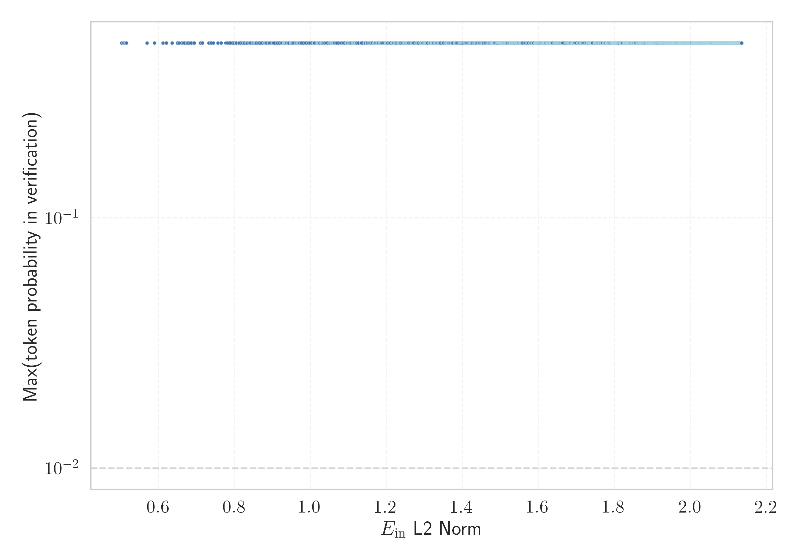

# Report for `deepseek-ai/DeepSeek-R1`

## Model info

* Model Info: 
  * Tied embeddings: False
  * LM head uses bias: False
  * Embeddings shape: [129280, 7168]
* Tokenizer Info: 
  * Vocab Size: 128815
  * Tokenizer Class: LlamaTokenizerFast
  * Tokenizer Type: BPE
  * Bytes handling: Byte Input
  * Token for verification prompt building: 习近平新时代中国特色社会主义思想
  * Token id for verification prompt building: 74252
* Indicator summary: 
  * Indicator for under-trained tokens: E_{in} L2 Norm
  * Overall distribution: 3.167 +/- 0.425
* Detected Token Counts: 
  * Number of tested under-trained tokens: 2547, 2518 non-special, 0 below p = 0.01 threshold, 11 below soft indicator threshold
  * Number of single byte tokens: 256, of which 0 below indicator threshold
  * Number of special tokens: 0, of which 0 below indicator threshold
  * Number of non-single-byte UTF-fragment tokens:  1342, of which 0 below soft indicator threshold

## Under-trained token indicators plot


## Verification plot


## Under-trained token verification results
11 entries below threshold of 0.669

|   token_id | token                   |   indicator | max_prob                                                     | in_other_tokens                                                                                                                                                                                                                                           |
|------------|-------------------------|-------------|--------------------------------------------------------------|-----------------------------------------------------------------------------------------------------------------------------------------------------------------------------------------------------------------------------------------------------------|
|      89953 | ````` ▁kabungtor `````  |    0.569915 | <span style='border: 1px solid rgb(40, 167, 69);'>0.5</span> | <span style='border: 1px solid rgb(40, 167, 69);'>````` ▁kabungtoran `````</span>                                                                                                                                                                         |
|     127635 | ````` послено `````     |    0.612544 | <span style='border: 1px solid rgb(40, 167, 69);'>0.5</span> | <span style='border: 1px solid rgb(40, 167, 69);'>````` ▁Запослено `````</span>                                                                                                                                                                           |
|     116588 | ````` ειοθετήθηκε ````` |    0.61961  | <span style='border: 1px solid rgb(40, 167, 69);'>0.5</span> | <span style='border: 1px solid rgb(40, 167, 69);'>````` ▁Αρχειοθετήθηκε `````</span>                                                                                                                                                                      |
|      72206 | ````` unisipyo `````    |    0.621299 | <span style='border: 1px solid rgb(40, 167, 69);'>0.5</span> | <span style='border: 1px solid rgb(40, 167, 69);'>````` ▁munisipyo `````</span>, <span style='border: 1px solid rgb(40, 167, 69);'>````` Munisipyo `````</span>                                                                                           |
|      79729 | ````` ultatua `````     |    0.635792 | <span style='border: 1px solid rgb(40, 167, 69);'>0.5</span> | <span style='border: 1px solid rgb(40, 167, 69);'>````` ▁kontsultatua `````</span>                                                                                                                                                                        |
|     113872 | ````` ▁pagklas `````    |    0.650046 | <span style='border: 1px solid rgb(40, 167, 69);'>0.5</span> | <span style='border: 1px solid rgb(40, 167, 69);'>````` ▁pagklasipika `````</span>                                                                                                                                                                        |
|     123327 | ````` основним `````    |    0.654504 | <span style='border: 1px solid rgb(40, 167, 69);'>0.5</span> | <span style='border: 1px solid rgb(40, 167, 69);'>````` ▁постосновним `````</span>                                                                                                                                                                        |
|     127328 | ````` jeftigelse `````  |    0.661575 | <span style='border: 1px solid rgb(40, 167, 69);'>0.5</span> | <span style='border: 1px solid rgb(40, 167, 69);'>````` Beskjeftigelse `````</span>                                                                                                                                                                       |
|      64815 | ````` bingkil `````     |    0.66446  | <span style='border: 1px solid rgb(40, 167, 69);'>0.5</span> | <span style='border: 1px solid rgb(40, 167, 69);'>````` ▁pakigbingkil `````</span>                                                                                                                                                                        |
|      62268 | ````` ▁nahimut `````    |    0.664631 | <span style='border: 1px solid rgb(40, 167, 69);'>0.5</span> | <span style='border: 1px solid rgb(40, 167, 69);'>````` ▁nahimutang `````</span>, <span style='border: 1px solid rgb(40, 167, 69);'>````` ▁nahimutangan `````</span>                                                                                      |
|       8364 | ````` новништво `````   |    0.666956 | <span style='border: 1px solid rgb(40, 167, 69);'>0.5</span> | <span style='border: 1px solid rgb(40, 167, 69);'>````` ▁становништво `````</span>, <span style='border: 1px solid rgb(40, 167, 69);'>````` Становништво `````</span>, <span style='border: 1px solid rgb(40, 167, 69);'>````` ▁Становништво `````</span> |
<details><summary>2507 additional entries above threshold</summary>

|   token_id | token                          |   indicator | max_prob                                                     | in_other_tokens                                                                                                                                                                                                                                                                                                                                                                                                                              |
|------------|--------------------------------|-------------|--------------------------------------------------------------|----------------------------------------------------------------------------------------------------------------------------------------------------------------------------------------------------------------------------------------------------------------------------------------------------------------------------------------------------------------------------------------------------------------------------------------------|
|      19335 | ````` asarangang `````         |    0.669243 | <span style='border: 1px solid rgb(40, 167, 69);'>0.5</span> | <span style='border: 1px solid rgb(40, 167, 69);'>````` ▁kasarangang `````</span>, <span style='border: 1px solid rgb(40, 167, 69);'>````` Kasarangang `````</span>                                                                                                                                                                                                                                                                          |
|     127795 | ````` послена `````            |    0.675392 | <span style='border: 1px solid rgb(40, 167, 69);'>0.5</span> | <span style='border: 1px solid rgb(40, 167, 69);'>````` ▁Незапослена `````</span>                                                                                                                                                                                                                                                                                                                                                            |
|      45368 | ````` νακτήθηκε `````          |    0.679091 | <span style='border: 1px solid rgb(40, 167, 69);'>0.5</span> | <span style='border: 1px solid rgb(40, 167, 69);'>````` ▁Ανακτήθηκε `````</span>, <span style='border: 1px solid rgb(40, 167, 69);'>````` ▁ανακτήθηκε `````</span>                                                                                                                                                                                                                                                                           |
|      65778 | ````` ▁Pagklas `````           |    0.682945 | <span style='border: 1px solid rgb(40, 167, 69);'>0.5</span> | <span style='border: 1px solid rgb(40, 167, 69);'>````` ▁Pagklasipikar `````</span>                                                                                                                                                                                                                                                                                                                                                          |
|      43366 | ````` پيديا `````              |    0.687129 | <span style='border: 1px solid rgb(40, 167, 69);'>0.5</span> | <span style='border: 1px solid rgb(40, 167, 69);'>````` ▁ويكيپيديا `````</span>                                                                                                                                                                                                                                                                                                                                                              |
|      29479 | ````` јединачна `````          |    0.692969 | <span style='border: 1px solid rgb(40, 167, 69);'>0.5</span> | <span style='border: 1px solid rgb(40, 167, 69);'>````` ▁Појединачна `````</span>                                                                                                                                                                                                                                                                                                                                                            |
|      42593 | ````` ugnawan `````            |    0.694196 | <span style='border: 1px solid rgb(40, 167, 69);'>0.5</span> | <span style='border: 1px solid rgb(40, 167, 69);'>````` ▁kinabugnawan `````</span>                                                                                                                                                                                                                                                                                                                                                           |
|      57085 | ````` Kadaghan `````           |    0.710235 | <span style='border: 1px solid rgb(40, 167, 69);'>0.5</span> | <span style='border: 1px solid rgb(40, 167, 69);'>````` Kadaghanon `````</span>                                                                                                                                                                                                                                                                                                                                                              |
|     117780 | ````` unoang `````             |    0.715463 | <span style='border: 1px solid rgb(40, 167, 69);'>0.5</span> | <span style='border: 1px solid rgb(40, 167, 69);'>````` Kapunoang `````</span>                                                                                                                                                                                                                                                                                                                                                               |
|      77960 | ````` кономски `````           |    0.716301 | <span style='border: 1px solid rgb(40, 167, 69);'>0.5</span> | <span style='border: 1px solid rgb(40, 167, 69);'>````` ▁Економски `````</span>, <span style='border: 1px solid rgb(40, 167, 69);'>````` ▁економски `````</span>                                                                                                                                                                                                                                                                             |
|      63298 | ````` ▁الساعيه `````           |    0.732802 | <span style='border: 1px solid rgb(40, 167, 69);'>0.5</span> |                                                                                                                                                                                                                                                                                                                                                                                                                                              |
|     127885 | ````` ▁Незапослена `````       |    0.737911 | <span style='border: 1px solid rgb(40, 167, 69);'>0.5</span> |                                                                                                                                                                                                                                                                                                                                                                                                                                              |
|      27540 | ````` ▁DelaL `````             |    0.73956  | <span style='border: 1px solid rgb(40, 167, 69);'>0.5</span> | <span style='border: 1px solid rgb(40, 167, 69);'>````` ▁DelaLika `````</span>                                                                                                                                                                                                                                                                                                                                                               |
|      57013 | ````` ukerken `````            |    0.744761 | <span style='border: 1px solid rgb(40, 167, 69);'>0.5</span> | <span style='border: 1px solid rgb(40, 167, 69);'>````` ▁Nieukerken `````</span>                                                                                                                                                                                                                                                                                                                                                             |
|     105570 | ````` ordenatuak `````         |    0.756648 | <span style='border: 1px solid rgb(40, 167, 69);'>0.5</span> | <span style='border: 1px solid rgb(40, 167, 69);'>````` Koordenatuak `````</span>                                                                                                                                                                                                                                                                                                                                                            |
|     107209 | ````` rinnings `````           |    0.7649   | <span style='border: 1px solid rgb(40, 167, 69);'>0.5</span> | <span style='border: 1px solid rgb(40, 167, 69);'>````` rinningsområ `````</span>                                                                                                                                                                                                                                                                                                                                                            |
|     115856 | ````` يميديا `````             |    0.777421 | <span style='border: 1px solid rgb(40, 167, 69);'>0.5</span> | <span style='border: 1px solid rgb(40, 167, 69);'>````` ▁ويكيميديا `````</span>                                                                                                                                                                                                                                                                                                                                                              |
|     118013 | ````` ▁مرئيه `````             |    0.779506 | <span style='border: 1px solid rgb(40, 167, 69);'>0.5</span> |                                                                                                                                                                                                                                                                                                                                                                                                                                              |
|      64052 | ````` ▁السماوى `````           |    0.781956 | <span style='border: 1px solid rgb(40, 167, 69);'>0.5</span> |                                                                                                                                                                                                                                                                                                                                                                                                                                              |
|      37024 | ````` asadpan `````            |    0.782145 | <span style='border: 1px solid rgb(40, 167, 69);'>0.5</span> | <span style='border: 1px solid rgb(40, 167, 69);'>````` ▁kasadpan `````</span>, <span style='border: 1px solid rgb(40, 167, 69);'>````` -kasadpan `````</span>, <span style='border: 1px solid rgb(40, 167, 69);'>````` asadpang `````</span>                                                                                                                                                                                                |
|     124294 | ````` исмено `````             |    0.787146 | <span style='border: 1px solid rgb(40, 167, 69);'>0.5</span> | <span style='border: 1px solid rgb(40, 167, 69);'>````` ▁неписмено `````</span>                                                                                                                                                                                                                                                                                                                                                              |
|      60292 | ````` ▁الدايره `````           |    0.790378 | <span style='border: 1px solid rgb(40, 167, 69);'>0.5</span> |                                                                                                                                                                                                                                                                                                                                                                                                                                              |
|      31537 | ````` τυμολογία `````          |    0.795424 | <span style='border: 1px solid rgb(40, 167, 69);'>0.5</span> | <span style='border: 1px solid rgb(40, 167, 69);'>````` ▁ετυμολογία `````</span>, <span style='border: 1px solid rgb(40, 167, 69);'>````` ▁Ετυμολογία `````</span>                                                                                                                                                                                                                                                                           |
|     126629 | ````` ▁секундарном `````       |    0.798794 | <span style='border: 1px solid rgb(40, 167, 69);'>0.5</span> |                                                                                                                                                                                                                                                                                                                                                                                                                                              |
|      83573 | ````` ▁الربيعى `````           |    0.803646 | <span style='border: 1px solid rgb(40, 167, 69);'>0.5</span> |                                                                                                                                                                                                                                                                                                                                                                                                                                              |
|     104099 | ````` ▁непотпуним `````        |    0.804353 | <span style='border: 1px solid rgb(40, 167, 69);'>0.5</span> |                                                                                                                                                                                                                                                                                                                                                                                                                                              |
|     109614 | ````` ombonana `````           |    0.804914 | <span style='border: 1px solid rgb(40, 167, 69);'>0.5</span> | <span style='border: 1px solid rgb(40, 167, 69);'>````` ▁iombonana `````</span>                                                                                                                                                                                                                                                                                                                                                              |
|      35670 | ````` Siyent `````             |    0.80516  | <span style='border: 1px solid rgb(40, 167, 69);'>0.5</span> | <span style='border: 1px solid rgb(40, 167, 69);'>````` Siyentipik `````</span>, <span style='border: 1px solid rgb(40, 167, 69);'>````` Siyentipiko `````</span>, <span style='border: 1px solid rgb(40, 167, 69);'>````` Siyentipikinhong `````</span>                                                                                                                                                                                     |
|     123341 | ````` itetsdata `````          |    0.812067 | <span style='border: 1px solid rgb(40, 167, 69);'>0.5</span> | <span style='border: 1px solid rgb(40, 167, 69);'>````` /autoritetsdata `````</span>                                                                                                                                                                                                                                                                                                                                                         |
|      64544 | ````` ▁سماوى `````             |    0.812261 | <span style='border: 1px solid rgb(40, 167, 69);'>0.5</span> |                                                                                                                                                                                                                                                                                                                                                                                                                                              |
|     127926 | ````` ▁Запослено `````         |    0.816554 | <span style='border: 1px solid rgb(40, 167, 69);'>0.5</span> |                                                                                                                                                                                                                                                                                                                                                                                                                                              |
|      92132 | ````` ▁böjnings `````          |    0.82045  | <span style='border: 1px solid rgb(40, 167, 69);'>0.5</span> | <span style='border: 1px solid rgb(40, 167, 69);'>````` ▁böjningsform `````</span>                                                                                                                                                                                                                                                                                                                                                           |
|     122449 | ````` alohany `````            |    0.821852 | <span style='border: 1px solid rgb(40, 167, 69);'>0.5</span> | <span style='border: 1px solid rgb(40, 167, 69);'>````` ▁voalohany `````</span>                                                                                                                                                                                                                                                                                                                                                              |
|     123412 | ````` ▁постосновним `````      |    0.824517 | <span style='border: 1px solid rgb(40, 167, 69);'>0.5</span> |                                                                                                                                                                                                                                                                                                                                                                                                                                              |
|      91955 | ````` uwega `````              |    0.825007 | <span style='border: 1px solid rgb(40, 167, 69);'>0.5</span> | <span style='border: 1px solid rgb(40, 167, 69);'>````` ▁Noruwega `````</span>                                                                                                                                                                                                                                                                                                                                                               |
|      78026 | ````` ▁јуну `````              |    0.825712 | <span style='border: 1px solid rgb(40, 167, 69);'>0.5</span> |                                                                                                                                                                                                                                                                                                                                                                                                                                              |
|      77689 | ````` ▁непотпу `````           |    0.830803 | <span style='border: 1px solid rgb(40, 167, 69);'>0.5</span> | <span style='border: 1px solid rgb(40, 167, 69);'>````` ▁непотпуним `````</span>                                                                                                                                                                                                                                                                                                                                                             |
|     123839 | ````` ▁комплетним `````        |    0.832903 | <span style='border: 1px solid rgb(40, 167, 69);'>0.5</span> |                                                                                                                                                                                                                                                                                                                                                                                                                                              |
|      58572 | ````` ▁تضيفلها `````           |    0.838333 | <span style='border: 1px solid rgb(40, 167, 69);'>0.5</span> |                                                                                                                                                                                                                                                                                                                                                                                                                                              |
|      78660 | ````` ▁talags `````            |    0.839375 | <span style='border: 1px solid rgb(40, 167, 69);'>0.5</span> | <span style='border: 1px solid rgb(40, 167, 69);'>````` ▁talagsaon `````</span>                                                                                                                                                                                                                                                                                                                                                              |
|      57042 | ````` ▁Britonhon `````         |    0.84173  | <span style='border: 1px solid rgb(40, 167, 69);'>0.5</span> |                                                                                                                                                                                                                                                                                                                                                                                                                                              |
|      32461 | ````` ahimutang `````          |    0.842007 | <span style='border: 1px solid rgb(40, 167, 69);'>0.5</span> | <span style='border: 1px solid rgb(40, 167, 69);'>````` ▁nahimutang `````</span>, <span style='border: 1px solid rgb(40, 167, 69);'>````` ▁nahimutangan `````</span>, <span style='border: 1px solid rgb(40, 167, 69);'>````` ▁Nahimutang `````</span>                                                                                                                                                                                       |
|      98649 | ````` referentziak `````       |    0.845723 | <span style='border: 1px solid rgb(40, 167, 69);'>0.5</span> | <span style='border: 1px solid rgb(40, 167, 69);'>````` ▁Erreferentziak `````</span>                                                                                                                                                                                                                                                                                                                                                         |
|     124175 | ````` ▁الظاهرى `````           |    0.847896 | <span style='border: 1px solid rgb(40, 167, 69);'>0.5</span> |                                                                                                                                                                                                                                                                                                                                                                                                                                              |
|      50845 | ````` ▁kinaug `````            |    0.849108 | <span style='border: 1px solid rgb(40, 167, 69);'>0.5</span> | <span style='border: 1px solid rgb(40, 167, 69);'>````` ▁kinaugahan `````</span>                                                                                                                                                                                                                                                                                                                                                             |
|      38167 | ````` ▁matoant `````           |    0.849367 | <span style='border: 1px solid rgb(40, 167, 69);'>0.5</span> | <span style='border: 1px solid rgb(40, 167, 69);'>````` ▁matoanteny `````</span>                                                                                                                                                                                                                                                                                                                                                             |
|      43992 | ````` าสตร์ `````               |    0.852097 | <span style='border: 1px solid rgb(40, 167, 69);'>0.5</span> | <span style='border: 1px solid rgb(40, 167, 69);'>````` ศาสตร์ `````</span>, <span style='border: 1px solid rgb(40, 167, 69);'>````` าศาสตร์ `````</span>, <span style='border: 1px solid rgb(40, 167, 69);'>````` วิทยาศาสตร์ `````</span>                                                                                                                                                                                                      |
|      40998 | ````` Siyentipik `````         |    0.854291 | <span style='border: 1px solid rgb(40, 167, 69);'>0.5</span> | <span style='border: 1px solid rgb(40, 167, 69);'>````` Siyentipiko `````</span>, <span style='border: 1px solid rgb(40, 167, 69);'>````` Siyentipikinhong `````</span>                                                                                                                                                                                                                                                                      |
|     117741 | ````` ▁الفلكى `````            |    0.854391 | <span style='border: 1px solid rgb(40, 167, 69);'>0.5</span> |                                                                                                                                                                                                                                                                                                                                                                                                                                              |
|      98913 | ````` SavedPoint `````         |    0.855527 | <span style='border: 1px solid rgb(40, 167, 69);'>0.5</span> | <span style='border: 1px solid rgb(40, 167, 69);'>````` SetSavedPoint `````</span>                                                                                                                                                                                                                                                                                                                                                           |
|     104113 | ````` Kasipak `````            |    0.857396 | <span style='border: 1px solid rgb(40, 167, 69);'>0.5</span> |                                                                                                                                                                                                                                                                                                                                                                                                                                              |
|     113899 | ````` ▁pagklasipika `````      |    0.862391 | <span style='border: 1px solid rgb(40, 167, 69);'>0.5</span> |                                                                                                                                                                                                                                                                                                                                                                                                                                              |
|      57502 | ````` ▁المجره `````            |    0.865423 | <span style='border: 1px solid rgb(40, 167, 69);'>0.5</span> |                                                                                                                                                                                                                                                                                                                                                                                                                                              |
|     126264 | ````` ▁пуним `````             |    0.866103 | <span style='border: 1px solid rgb(40, 167, 69);'>0.5</span> |                                                                                                                                                                                                                                                                                                                                                                                                                                              |
|      77994 | ````` ▁لجرم `````              |    0.870434 | <span style='border: 1px solid rgb(40, 167, 69);'>0.5</span> |                                                                                                                                                                                                                                                                                                                                                                                                                                              |
|      64987 | ````` inharian `````           |    0.874593 | <span style='border: 1px solid rgb(40, 167, 69);'>0.5</span> | <span style='border: 1px solid rgb(40, 167, 69);'>````` Kaginharian `````</span>                                                                                                                                                                                                                                                                                                                                                             |
|     113302 | ````` razioa `````             |    0.874707 | <span style='border: 1px solid rgb(40, 167, 69);'>0.5</span> | <span style='border: 1px solid rgb(40, 167, 69);'>````` Administrazioa `````</span>                                                                                                                                                                                                                                                                                                                                                          |
|      43458 | ````` ▁ويكيپيديا `````         |    0.874933 | <span style='border: 1px solid rgb(40, 167, 69);'>0.5</span> |                                                                                                                                                                                                                                                                                                                                                                                                                                              |
|     118126 | ````` ▁كومونز `````            |    0.878103 | <span style='border: 1px solid rgb(40, 167, 69);'>0.5</span> |                                                                                                                                                                                                                                                                                                                                                                                                                                              |
|     104015 | ````` ▁осигурање `````         |    0.879109 | <span style='border: 1px solid rgb(40, 167, 69);'>0.5</span> |                                                                                                                                                                                                                                                                                                                                                                                                                                              |
|     119577 | ````` entsitatea `````         |    0.87952  | <span style='border: 1px solid rgb(40, 167, 69);'>0.5</span> | <span style='border: 1px solid rgb(40, 167, 69);'>````` Dentsitatea `````</span>                                                                                                                                                                                                                                                                                                                                                             |
|      30701 | ````` ennettuna `````          |    0.880476 | <span style='border: 1px solid rgb(40, 167, 69);'>0.5</span> | <span style='border: 1px solid rgb(40, 167, 69);'>````` Tallennettuna `````</span>                                                                                                                                                                                                                                                                                                                                                           |
|      70722 | ````` ာအုပ်စ `````                |    0.881668 | <span style='border: 1px solid rgb(40, 167, 69);'>0.5</span> | <span style='border: 1px solid rgb(40, 167, 69);'>````` <0x80>ျေးရွာအုပ်စု `````</span>, <span style='border: 1px solid rgb(40, 167, 69);'>````` <0x80>ျေးရွာအုပ်စ `````</span>                                                                                                                                                                                                                                                                             |
|      48789 | ````` ▁старосног `````         |    0.882076 | <span style='border: 1px solid rgb(40, 167, 69);'>0.5</span> |                                                                                                                                                                                                                                                                                                                                                                                                                                              |
|      88709 | ````` ▁популација `````        |    0.883284 | <span style='border: 1px solid rgb(40, 167, 69);'>0.5</span> |                                                                                                                                                                                                                                                                                                                                                                                                                                              |
|      48220 | ````` ▁аутохтони `````         |    0.884488 | <span style='border: 1px solid rgb(40, 167, 69);'>0.5</span> |                                                                                                                                                                                                                                                                                                                                                                                                                                              |
|      68338 | ````` ▁فريبيس `````            |    0.885298 | <span style='border: 1px solid rgb(40, 167, 69);'>0.5</span> |                                                                                                                                                                                                                                                                                                                                                                                                                                              |
|      78827 | ````` ▁рођено `````            |    0.889154 | <span style='border: 1px solid rgb(40, 167, 69);'>0.5</span> |                                                                                                                                                                                                                                                                                                                                                                                                                                              |
|     124061 | ````` primeable `````          |    0.890005 | <span style='border: 1px solid rgb(40, 167, 69);'>0.5</span> | <span style='border: 1px solid rgb(40, 167, 69);'>````` ▁unprimeable `````</span>                                                                                                                                                                                                                                                                                                                                                            |
|      73669 | ````` ανδρικό `````            |    0.890515 | <span style='border: 1px solid rgb(40, 167, 69);'>0.5</span> |                                                                                                                                                                                                                                                                                                                                                                                                                                              |
|     118247 | ````` ånare `````              |    0.891724 | <span style='border: 1px solid rgb(40, 167, 69);'>0.5</span> | <span style='border: 1px solid rgb(40, 167, 69);'>````` ▁invånare `````</span>                                                                                                                                                                                                                                                                                                                                                               |
|      27527 | ````` ▁medief `````            |    0.895889 | <span style='border: 1px solid rgb(40, 167, 69);'>0.5</span> | <span style='border: 1px solid rgb(40, 167, 69);'>````` ▁mediefiler `````</span>                                                                                                                                                                                                                                                                                                                                                             |
|     126759 | ````` ▁средњим `````           |    0.896007 | <span style='border: 1px solid rgb(40, 167, 69);'>0.5</span> |                                                                                                                                                                                                                                                                                                                                                                                                                                              |
|      25690 | ````` ahimut `````             |    0.897438 | <span style='border: 1px solid rgb(40, 167, 69);'>0.5</span> | <span style='border: 1px solid rgb(40, 167, 69);'>````` ahimutang `````</span>, <span style='border: 1px solid rgb(40, 167, 69);'>````` ▁nahimutang `````</span>, <span style='border: 1px solid rgb(40, 167, 69);'>````` ▁nahimut `````</span>, <span style='border: 1px solid rgb(40, 167, 69);'>````` ▁nahimutangan `````</span>, <span style='border: 1px solid rgb(40, 167, 69);'>````` ▁Nahimutang `````</span>                        |
|     117782 | ````` ▁صوتيه `````             |    0.899825 | <span style='border: 1px solid rgb(40, 167, 69);'>0.5</span> |                                                                                                                                                                                                                                                                                                                                                                                                                                              |
|      80268 | ````` ▁itandi `````            |    0.901249 | <span style='border: 1px solid rgb(40, 167, 69);'>0.5</span> |                                                                                                                                                                                                                                                                                                                                                                                                                                              |
|      85304 | ````` ▁CategoryTreeLabel ````` |    0.902243 | <span style='border: 1px solid rgb(40, 167, 69);'>0.5</span> |                                                                                                                                                                                                                                                                                                                                                                                                                                              |
|      89053 | ````` ▁домаћинствима `````     |    0.903498 | <span style='border: 1px solid rgb(40, 167, 69);'>0.5</span> |                                                                                                                                                                                                                                                                                                                                                                                                                                              |
|      59928 | ````` ibolana `````            |    0.906055 | <span style='border: 1px solid rgb(40, 167, 69);'>0.5</span> | <span style='border: 1px solid rgb(40, 167, 69);'>````` ▁Wikibolana `````</span>                                                                                                                                                                                                                                                                                                                                                             |
|     124795 | ````` ▁неписмено `````         |    0.906237 | <span style='border: 1px solid rgb(40, 167, 69);'>0.5</span> |                                                                                                                                                                                                                                                                                                                                                                                                                                              |
|     101587 | ````` któber `````             |    0.912741 | <span style='border: 1px solid rgb(40, 167, 69);'>0.5</span> | <span style='border: 1px solid rgb(40, 167, 69);'>````` ▁október `````</span>                                                                                                                                                                                                                                                                                                                                                                |
|     118186 | ````` Kapunoang `````          |    0.917844 | <span style='border: 1px solid rgb(40, 167, 69);'>0.5</span> |                                                                                                                                                                                                                                                                                                                                                                                                                                              |
|     125620 | ````` ▁резидентно `````        |    0.918327 | <span style='border: 1px solid rgb(40, 167, 69);'>0.5</span> |                                                                                                                                                                                                                                                                                                                                                                                                                                              |
|      22338 | ````` ▁домаћин `````           |    0.922747 | <span style='border: 1px solid rgb(40, 167, 69);'>0.5</span> | <span style='border: 1px solid rgb(40, 167, 69);'>````` ▁домаћинстава `````</span>, <span style='border: 1px solid rgb(40, 167, 69);'>````` ▁домаћинства `````</span>, <span style='border: 1px solid rgb(40, 167, 69);'>````` ▁домаћинствима `````</span>                                                                                                                                                                                   |
|      98590 | ````` ويكبات `````             |    0.923534 | <span style='border: 1px solid rgb(40, 167, 69);'>0.5</span> | <span style='border: 1px solid rgb(40, 167, 69);'>````` ▁الكويكبات `````</span>                                                                                                                                                                                                                                                                                                                                                              |
|     109502 | ````` alakip `````             |    0.926213 | <span style='border: 1px solid rgb(40, 167, 69);'>0.5</span> | <span style='border: 1px solid rgb(40, 167, 69);'>````` ▁nahilalakip `````</span>                                                                                                                                                                                                                                                                                                                                                            |
|      48433 | ````` ▁ентитету `````          |    0.926631 | <span style='border: 1px solid rgb(40, 167, 69);'>0.5</span> |                                                                                                                                                                                                                                                                                                                                                                                                                                              |
|      80148 | ````` ▁kinadul `````           |    0.92736  | <span style='border: 1px solid rgb(40, 167, 69);'>0.5</span> |                                                                                                                                                                                                                                                                                                                                                                                                                                              |
|      70494 | ````` tanler `````             |    0.929542 | <span style='border: 1px solid rgb(40, 167, 69);'>0.5</span> | <span style='border: 1px solid rgb(40, 167, 69);'>````` tanleria `````</span>, <span style='border: 1px solid rgb(40, 167, 69);'>````` Biztanleria `````</span>                                                                                                                                                                                                                                                                              |
|     123738 | ````` ▁Просечан `````          |    0.929908 | <span style='border: 1px solid rgb(40, 167, 69);'>0.5</span> |                                                                                                                                                                                                                                                                                                                                                                                                                                              |
|     113976 | ````` ▁Ginhadi `````           |    0.930895 | <span style='border: 1px solid rgb(40, 167, 69);'>0.5</span> |                                                                                                                                                                                                                                                                                                                                                                                                                                              |
|     124155 | ````` ▁hilabihan `````         |    0.931302 | <span style='border: 1px solid rgb(40, 167, 69);'>0.5</span> |                                                                                                                                                                                                                                                                                                                                                                                                                                              |
|      58545 | ````` ▁يتيمه `````             |    0.933019 | <span style='border: 1px solid rgb(40, 167, 69);'>0.5</span> |                                                                                                                                                                                                                                                                                                                                                                                                                                              |
|       8274 | ````` новништ `````            |    0.933402 | <span style='border: 1px solid rgb(40, 167, 69);'>0.5</span> | <span style='border: 1px solid rgb(40, 167, 69);'>````` ▁становништво `````</span>, <span style='border: 1px solid rgb(40, 167, 69);'>````` Становништво `````</span>, <span style='border: 1px solid rgb(40, 167, 69);'>````` ▁Становништво `````</span>, <span style='border: 1px solid rgb(40, 167, 69);'>````` новништво `````</span>                                                                                                    |
|      69146 | ````` ▁económ `````            |    0.935576 | <span style='border: 1px solid rgb(40, 167, 69);'>0.5</span> | <span style='border: 1px solid rgb(40, 167, 69);'>````` ▁económico `````</span>, <span style='border: 1px solid rgb(40, 167, 69);'>````` ▁económica `````</span>                                                                                                                                                                                                                                                                             |
|      64847 | ````` ▁pakigbingkil `````      |    0.936466 | <span style='border: 1px solid rgb(40, 167, 69);'>0.5</span> |                                                                                                                                                                                                                                                                                                                                                                                                                                              |
|      35660 | ````` adaghan `````            |    0.9365   | <span style='border: 1px solid rgb(40, 167, 69);'>0.5</span> | <span style='border: 1px solid rgb(40, 167, 69);'>````` Kadaghan `````</span>, <span style='border: 1px solid rgb(40, 167, 69);'>````` Kadaghanon `````</span>, <span style='border: 1px solid rgb(40, 167, 69);'>````` ▁kadaghan `````</span>                                                                                                                                                                                               |
|      42691 | ````` itattu `````             |    0.937003 | <span style='border: 1px solid rgb(40, 167, 69);'>0.5</span> | <span style='border: 1px solid rgb(40, 167, 69);'>````` ▁Viitattu `````</span>                                                                                                                                                                                                                                                                                                                                                               |
|      83484 | ````` ▁الشعاعيه `````          |    0.939667 | <span style='border: 1px solid rgb(40, 167, 69);'>0.5</span> |                                                                                                                                                                                                                                                                                                                                                                                                                                              |
|      88143 | ````` ▁старије `````           |    0.941408 | <span style='border: 1px solid rgb(40, 167, 69);'>0.5</span> |                                                                                                                                                                                                                                                                                                                                                                                                                                              |
|      35717 | ````` ▁kainiton `````          |    0.941893 | <span style='border: 1px solid rgb(40, 167, 69);'>0.5</span> |                                                                                                                                                                                                                                                                                                                                                                                                                                              |
|      50962 | ````` زياح `````               |    0.941903 | <span style='border: 1px solid rgb(40, 167, 69);'>0.5</span> | <span style='border: 1px solid rgb(40, 167, 69);'>````` ▁الانزياح `````</span>, <span style='border: 1px solid rgb(40, 167, 69);'>````` انزياح `````</span>                                                                                                                                                                                                                                                                                  |
|      62264 | ````` abogon `````             |    0.942182 | <span style='border: 1px solid rgb(40, 167, 69);'>0.5</span> | <span style='border: 1px solid rgb(40, 167, 69);'>````` ▁gihabogon `````</span>                                                                                                                                                                                                                                                                                                                                                              |
|      79768 | ````` ▁ограничењима `````      |    0.942647 | <span style='border: 1px solid rgb(40, 167, 69);'>0.5</span> |                                                                                                                                                                                                                                                                                                                                                                                                                                              |
|      32845 | ````` aisarvioitu `````        |    0.943454 | <span style='border: 1px solid rgb(40, 167, 69);'>0.5</span> | <span style='border: 1px solid rgb(40, 167, 69);'>````` ▁Vertaisarvioitu `````</span>                                                                                                                                                                                                                                                                                                                                                        |
|      27544 | ````` ▁DelaLika `````          |    0.948517 | <span style='border: 1px solid rgb(40, 167, 69);'>0.5</span> |                                                                                                                                                                                                                                                                                                                                                                                                                                              |
|      57097 | ````` Kadaghanon `````         |    0.948861 | <span style='border: 1px solid rgb(40, 167, 69);'>0.5</span> |                                                                                                                                                                                                                                                                                                                                                                                                                                              |
|     112876 | ````` ειοθε `````              |    0.949994 | <span style='border: 1px solid rgb(40, 167, 69);'>0.5</span> | <span style='border: 1px solid rgb(40, 167, 69);'>````` ειοθετήθηκε `````</span>, <span style='border: 1px solid rgb(40, 167, 69);'>````` ▁Αρχειοθετήθηκε `````</span>                                                                                                                                                                                                                                                                       |
|      29499 | ````` ▁Појединачна `````       |    0.950385 | <span style='border: 1px solid rgb(40, 167, 69);'>0.5</span> |                                                                                                                                                                                                                                                                                                                                                                                                                                              |
|      85102 | ````` ungtor `````             |    0.950841 | <span style='border: 1px solid rgb(40, 167, 69);'>0.5</span> | <span style='border: 1px solid rgb(40, 167, 69);'>````` ▁kabungtor `````</span>, <span style='border: 1px solid rgb(40, 167, 69);'>````` ▁kabungtoran `````</span>                                                                                                                                                                                                                                                                           |
|     124476 | ````` pskoh `````              |    0.951301 | <span style='border: 1px solid rgb(40, 167, 69);'>0.5</span> | <span style='border: 1px solid rgb(40, 167, 69);'>````` pskohrvatski `````</span>                                                                                                                                                                                                                                                                                                                                                            |
|      43014 | ````` ايره `````               |    0.951847 | <span style='border: 1px solid rgb(40, 167, 69);'>0.5</span> | <span style='border: 1px solid rgb(40, 167, 69);'>````` ▁الدايره `````</span>, <span style='border: 1px solid rgb(40, 167, 69);'>````` ▁دايره `````</span>                                                                                                                                                                                                                                                                                   |
|     123364 | ````` Oppslagsverk `````       |    0.954803 | <span style='border: 1px solid rgb(40, 167, 69);'>0.5</span> |                                                                                                                                                                                                                                                                                                                                                                                                                                              |
|     113121 | ````` ▁домаћинстава `````      |    0.958107 | <span style='border: 1px solid rgb(40, 167, 69);'>0.5</span> |                                                                                                                                                                                                                                                                                                                                                                                                                                              |
|     120753 | ````` slagsverk `````          |    0.961216 | <span style='border: 1px solid rgb(40, 167, 69);'>0.5</span> | <span style='border: 1px solid rgb(40, 167, 69);'>````` Oppslagsverk `````</span>                                                                                                                                                                                                                                                                                                                                                            |
|      89597 | ````` ▁frantsay `````          |    0.961532 | <span style='border: 1px solid rgb(40, 167, 69);'>0.5</span> |                                                                                                                                                                                                                                                                                                                                                                                                                                              |
|     117844 | ````` ▁وتسجيلات `````          |    0.962613 | <span style='border: 1px solid rgb(40, 167, 69);'>0.5</span> |                                                                                                                                                                                                                                                                                                                                                                                                                                              |
|      77834 | ````` ▁سرعه `````              |    0.964219 | <span style='border: 1px solid rgb(40, 167, 69);'>0.5</span> |                                                                                                                                                                                                                                                                                                                                                                                                                                              |
|      57903 | ````` новним `````             |    0.964358 | <span style='border: 1px solid rgb(40, 167, 69);'>0.5</span> | <span style='border: 1px solid rgb(40, 167, 69);'>````` ▁основним `````</span>, <span style='border: 1px solid rgb(40, 167, 69);'>````` ▁постосновним `````</span>, <span style='border: 1px solid rgb(40, 167, 69);'>````` основним `````</span>                                                                                                                                                                                            |
|      44399 | ````` ▁تقاوى `````             |    0.964515 | <span style='border: 1px solid rgb(40, 167, 69);'>0.5</span> |                                                                                                                                                                                                                                                                                                                                                                                                                                              |
|      88141 | ````` iolary `````             |    0.966675 | <span style='border: 1px solid rgb(40, 167, 69);'>0.5</span> | <span style='border: 1px solid rgb(40, 167, 69);'>````` ▁singiolary `````</span>                                                                                                                                                                                                                                                                                                                                                             |
|      48365 | ````` ▁енти `````              |    0.967644 | <span style='border: 1px solid rgb(40, 167, 69);'>0.5</span> | <span style='border: 1px solid rgb(40, 167, 69);'>````` ▁ентитету `````</span>                                                                                                                                                                                                                                                                                                                                                               |
|      45124 | ````` ▁Didži `````             |    0.968058 | <span style='border: 1px solid rgb(40, 167, 69);'>0.5</span> | <span style='border: 1px solid rgb(40, 167, 69);'>````` ▁Didžiulis `````</span>                                                                                                                                                                                                                                                                                                                                                              |
|     118235 | ````` ▁proiektuak `````        |    0.968198 | <span style='border: 1px solid rgb(40, 167, 69);'>0.5</span> |                                                                                                                                                                                                                                                                                                                                                                                                                                              |
|     101261 | ````` ▁enpresak `````          |    0.968264 | <span style='border: 1px solid rgb(40, 167, 69);'>0.5</span> |                                                                                                                                                                                                                                                                                                                                                                                                                                              |
|      48061 | ````` ▁аутох `````             |    0.968441 | <span style='border: 1px solid rgb(40, 167, 69);'>0.5</span> | <span style='border: 1px solid rgb(40, 167, 69);'>````` ▁аутохтони `````</span>                                                                                                                                                                                                                                                                                                                                                              |
|     101583 | ````` ▁школовања `````         |    0.969703 | <span style='border: 1px solid rgb(40, 167, 69);'>0.5</span> |                                                                                                                                                                                                                                                                                                                                                                                                                                              |
|     113755 | ````` ▁مفصله `````             |    0.971171 | <span style='border: 1px solid rgb(40, 167, 69);'>0.5</span> |                                                                                                                                                                                                                                                                                                                                                                                                                                              |
|      82190 | ````` انزياح `````             |    0.971243 | <span style='border: 1px solid rgb(40, 167, 69);'>0.5</span> | <span style='border: 1px solid rgb(40, 167, 69);'>````` ▁الانزياح `````</span>                                                                                                                                                                                                                                                                                                                                                               |
|     126471 | ````` ▁Економски `````         |    0.972061 | <span style='border: 1px solid rgb(40, 167, 69);'>0.5</span> |                                                                                                                                                                                                                                                                                                                                                                                                                                              |
|      44418 | ````` ▁تكبرها `````            |    0.974878 | <span style='border: 1px solid rgb(40, 167, 69);'>0.5</span> |                                                                                                                                                                                                                                                                                                                                                                                                                                              |
|      39601 | ````` henera `````             |    0.974965 | <span style='border: 1px solid rgb(40, 167, 69);'>0.5</span> | <span style='border: 1px solid rgb(40, 167, 69);'>````` ▁kahenera `````</span>, <span style='border: 1px solid rgb(40, 167, 69);'>````` Kahenera `````</span>                                                                                                                                                                                                                                                                                |
|     107880 | ````` ?datasetId `````         |    0.976052 | <span style='border: 1px solid rgb(40, 167, 69);'>0.5</span> |                                                                                                                                                                                                                                                                                                                                                                                                                                              |
|     105019 | ````` EDMFunc `````            |    0.976345 | <span style='border: 1px solid rgb(40, 167, 69);'>0.5</span> | <span style='border: 1px solid rgb(40, 167, 69);'>````` ▁FullEDMFunc `````</span>                                                                                                                                                                                                                                                                                                                                                            |
|      95122 | ````` ▁насељени `````          |    0.976397 | <span style='border: 1px solid rgb(40, 167, 69);'>0.5</span> |                                                                                                                                                                                                                                                                                                                                                                                                                                              |
|      56697 | ````` ▁ετυμολογία `````        |    0.976479 | <span style='border: 1px solid rgb(40, 167, 69);'>0.5</span> |                                                                                                                                                                                                                                                                                                                                                                                                                                              |
|      80323 | ````` ▁gilay `````             |    0.980015 | <span style='border: 1px solid rgb(40, 167, 69);'>0.5</span> |                                                                                                                                                                                                                                                                                                                                                                                                                                              |
|     122690 | ````` ftigelse `````           |    0.982625 | <span style='border: 1px solid rgb(40, 167, 69);'>0.5</span> | <span style='border: 1px solid rgb(40, 167, 69);'>````` Beskjeftigelse `````</span>, <span style='border: 1px solid rgb(40, 167, 69);'>````` jeftigelse `````</span>                                                                                                                                                                                                                                                                         |
|      81655 | ````` ▁ανακτήθηκε `````        |    0.986225 | <span style='border: 1px solid rgb(40, 167, 69);'>0.5</span> |                                                                                                                                                                                                                                                                                                                                                                                                                                              |
|     100522 | ````` ▁тися `````              |    0.987655 | <span style='border: 1px solid rgb(40, 167, 69);'>0.5</span> | <span style='border: 1px solid rgb(40, 167, 69);'>````` ▁тисяч `````</span>                                                                                                                                                                                                                                                                                                                                                                  |
|     105096 | ````` ▁anglisy `````           |    0.990162 | <span style='border: 1px solid rgb(40, 167, 69);'>0.5</span> |                                                                                                                                                                                                                                                                                                                                                                                                                                              |
|     102837 | ````` ▁осигура `````           |    0.990235 | <span style='border: 1px solid rgb(40, 167, 69);'>0.5</span> | <span style='border: 1px solid rgb(40, 167, 69);'>````` ▁осигурање `````</span>                                                                                                                                                                                                                                                                                                                                                              |
|      98166 | ````` овања `````              |    0.993823 | <span style='border: 1px solid rgb(40, 167, 69);'>0.5</span> | <span style='border: 1px solid rgb(40, 167, 69);'>````` ▁школовања `````</span>                                                                                                                                                                                                                                                                                                                                                              |
|     109865 | ````` ▁nahil `````             |    0.995255 | <span style='border: 1px solid rgb(40, 167, 69);'>0.5</span> | <span style='border: 1px solid rgb(40, 167, 69);'>````` ▁nahilalakip `````</span>                                                                                                                                                                                                                                                                                                                                                            |
|     123483 | ````` /autoritetsdata `````    |    0.998    | <span style='border: 1px solid rgb(40, 167, 69);'>0.5</span> |                                                                                                                                                                                                                                                                                                                                                                                                                                              |
|     121213 | ````` -banay `````             |    0.998857 | <span style='border: 1px solid rgb(40, 167, 69);'>0.5</span> |                                                                                                                                                                                                                                                                                                                                                                                                                                              |
|      83483 | ````` ▁دايره `````             |    1.00284  | <span style='border: 1px solid rgb(40, 167, 69);'>0.5</span> |                                                                                                                                                                                                                                                                                                                                                                                                                                              |
|     124677 | ````` ▁здравствен `````        |    1.00621  | <span style='border: 1px solid rgb(40, 167, 69);'>0.5</span> |                                                                                                                                                                                                                                                                                                                                                                                                                                              |
|      57084 | ````` Tinubdan `````           |    1.00764  | <span style='border: 1px solid rgb(40, 167, 69);'>0.5</span> |                                                                                                                                                                                                                                                                                                                                                                                                                                              |
|     123477 | ````` ▁hilab `````             |    1.00944  | <span style='border: 1px solid rgb(40, 167, 69);'>0.5</span> | <span style='border: 1px solid rgb(40, 167, 69);'>````` ▁hilabihan `````</span>                                                                                                                                                                                                                                                                                                                                                              |
|      43634 | ````` ▁похађа `````            |    1.00961  | <span style='border: 1px solid rgb(40, 167, 69);'>0.5</span> |                                                                                                                                                                                                                                                                                                                                                                                                                                              |
|      63104 | ````` ahabogang `````          |    1.00976  | <span style='border: 1px solid rgb(40, 167, 69);'>0.5</span> | <span style='border: 1px solid rgb(40, 167, 69);'>````` ▁kinahabogang `````</span>                                                                                                                                                                                                                                                                                                                                                           |
|     123795 | ````` וניב `````               |    1.00981  | <span style='border: 1px solid rgb(40, 167, 69);'>0.5</span> | <span style='border: 1px solid rgb(40, 167, 69);'>````` וניברס `````</span>                                                                                                                                                                                                                                                                                                                                                                  |
|     121891 | ````` τιατική `````            |    1.01055  | <span style='border: 1px solid rgb(40, 167, 69);'>0.5</span> |                                                                                                                                                                                                                                                                                                                                                                                                                                              |
|      48601 | ````` ulagway `````            |    1.01069  | <span style='border: 1px solid rgb(40, 167, 69);'>0.5</span> | <span style='border: 1px solid rgb(40, 167, 69);'>````` ▁gihulagway `````</span>, <span style='border: 1px solid rgb(40, 167, 69);'>````` ▁ginhulagway `````</span>                                                                                                                                                                                                                                                                          |
|      90042 | ````` ▁مجره `````              |    1.01411  | <span style='border: 1px solid rgb(40, 167, 69);'>0.5</span> |                                                                                                                                                                                                                                                                                                                                                                                                                                              |
|      60846 | ````` aplenty `````            |    1.01647  | <span style='border: 1px solid rgb(40, 167, 69);'>0.5</span> | <span style='border: 1px solid rgb(40, 167, 69);'>````` ▁numbersaplenty `````</span>                                                                                                                                                                                                                                                                                                                                                         |
|     119164 | ````` ▁Septyembre `````        |    1.01687  | <span style='border: 1px solid rgb(40, 167, 69);'>0.5</span> |                                                                                                                                                                                                                                                                                                                                                                                                                                              |
|      76858 | ````` њима `````               |    1.01851  | <span style='border: 1px solid rgb(40, 167, 69);'>0.5</span> | <span style='border: 1px solid rgb(40, 167, 69);'>````` ▁ограничењима `````</span>                                                                                                                                                                                                                                                                                                                                                           |
|      77810 | ````` ▁السرعه `````            |    1.0198   | <span style='border: 1px solid rgb(40, 167, 69);'>0.5</span> |                                                                                                                                                                                                                                                                                                                                                                                                                                              |
|     118205 | ````` ▁средњ `````             |    1.02025  | <span style='border: 1px solid rgb(40, 167, 69);'>0.5</span> | <span style='border: 1px solid rgb(40, 167, 69);'>````` ▁средњим `````</span>                                                                                                                                                                                                                                                                                                                                                                |
|      64780 | ````` ▁pakig `````             |    1.02136  | <span style='border: 1px solid rgb(40, 167, 69);'>0.5</span> | <span style='border: 1px solid rgb(40, 167, 69);'>````` ▁pakigbingkil `````</span>                                                                                                                                                                                                                                                                                                                                                           |
|      94385 | ````` Hakut `````              |    1.02242  | <span style='border: 1px solid rgb(40, 167, 69);'>0.5</span> | <span style='border: 1px solid rgb(40, 167, 69);'>````` Hakutulos `````</span>                                                                                                                                                                                                                                                                                                                                                               |
|      32974 | ````` ▁dével `````             |    1.02344  | <span style='border: 1px solid rgb(40, 167, 69);'>0.5</span> | <span style='border: 1px solid rgb(40, 167, 69);'>````` ▁développer `````</span>, <span style='border: 1px solid rgb(40, 167, 69);'>````` ▁développement `````</span>, <span style='border: 1px solid rgb(40, 167, 69);'>````` ▁développ `````</span>                                                                                                                                                                                        |
|     125806 | ````` ▁економски `````         |    1.02381  | <span style='border: 1px solid rgb(40, 167, 69);'>0.5</span> |                                                                                                                                                                                                                                                                                                                                                                                                                                              |
|      57019 | ````` ▁Pagbu `````             |    1.02449  | <span style='border: 1px solid rgb(40, 167, 69);'>0.5</span> | <span style='border: 1px solid rgb(40, 167, 69);'>````` ▁Pagbuok `````</span>                                                                                                                                                                                                                                                                                                                                                                |
|      87708 | ````` ствима `````             |    1.02815  | <span style='border: 1px solid rgb(40, 167, 69);'>0.5</span> | <span style='border: 1px solid rgb(40, 167, 69);'>````` ▁домаћинствима `````</span>                                                                                                                                                                                                                                                                                                                                                          |
|      90651 | ````` คโนโล `````              |    1.02843  | <span style='border: 1px solid rgb(40, 167, 69);'>0.5</span> | <span style='border: 1px solid rgb(40, 167, 69);'>````` เทคโนโลยี `````</span>, <span style='border: 1px solid rgb(40, 167, 69);'>````` คโนโลยี `````</span>                                                                                                                                                                                                                                                                                   |
|      57406 | ````` ▁граж `````              |    1.02854  | <span style='border: 1px solid rgb(40, 167, 69);'>0.5</span> | <span style='border: 1px solid rgb(40, 167, 69);'>````` ▁граждан `````</span>, <span style='border: 1px solid rgb(40, 167, 69);'>````` ▁гражда `````</span>                                                                                                                                                                                                                                                                                  |
|      52087 | ````` ▁αρσεν `````             |    1.02925  | <span style='border: 1px solid rgb(40, 167, 69);'>0.5</span> | <span style='border: 1px solid rgb(40, 167, 69);'>````` ▁αρσενικό `````</span>                                                                                                                                                                                                                                                                                                                                                               |
|      60438 | ````` lisitry `````            |    1.03057  | <span style='border: 1px solid rgb(40, 167, 69);'>0.5</span> |                                                                                                                                                                                                                                                                                                                                                                                                                                              |
|      41439 | ````` ▁образовањем `````       |    1.03088  | <span style='border: 1px solid rgb(40, 167, 69);'>0.5</span> |                                                                                                                                                                                                                                                                                                                                                                                                                                              |
|      61044 | ````` ▁sumala `````            |    1.03273  | <span style='border: 1px solid rgb(40, 167, 69);'>0.5</span> |                                                                                                                                                                                                                                                                                                                                                                                                                                              |
|      90364 | ````` uhà `````                |    1.03306  | <span style='border: 1px solid rgb(40, 167, 69);'>0.5</span> | <span style='border: 1px solid rgb(40, 167, 69);'>````` ▁Ginkuhà `````</span>                                                                                                                                                                                                                                                                                                                                                                |
|     120159 | ````` ▁nakalista `````         |    1.03497  | <span style='border: 1px solid rgb(40, 167, 69);'>0.5</span> |                                                                                                                                                                                                                                                                                                                                                                                                                                              |
|      29169 | ````` једина `````             |    1.03696  | <span style='border: 1px solid rgb(40, 167, 69);'>0.5</span> | <span style='border: 1px solid rgb(40, 167, 69);'>````` ▁Појединачна `````</span>, <span style='border: 1px solid rgb(40, 167, 69);'>````` јединачна `````</span>                                                                                                                                                                                                                                                                            |
|      82291 | ````` ▁kinahabogang `````      |    1.03791  | <span style='border: 1px solid rgb(40, 167, 69);'>0.5</span> |                                                                                                                                                                                                                                                                                                                                                                                                                                              |
|      31440 | ````` τυμο `````               |    1.04185  | <span style='border: 1px solid rgb(40, 167, 69);'>0.5</span> | <span style='border: 1px solid rgb(40, 167, 69);'>````` ▁ετυμολογία `````</span>, <span style='border: 1px solid rgb(40, 167, 69);'>````` ▁Ετυμολογία `````</span>, <span style='border: 1px solid rgb(40, 167, 69);'>````` τυμολογία `````</span>                                                                                                                                                                                           |
|     110592 | ````` ebizitza `````           |    1.04208  | <span style='border: 1px solid rgb(40, 167, 69);'>0.5</span> |                                                                                                                                                                                                                                                                                                                                                                                                                                              |
|      61233 | ````` ▁γυναικείο `````         |    1.04321  | <span style='border: 1px solid rgb(40, 167, 69);'>0.5</span> |                                                                                                                                                                                                                                                                                                                                                                                                                                              |
|     113877 | ````` Autoritate `````         |    1.04326  | <span style='border: 1px solid rgb(40, 167, 69);'>0.5</span> |                                                                                                                                                                                                                                                                                                                                                                                                                                              |
|     126334 | ````` ▁الصفحه `````            |    1.04535  | <span style='border: 1px solid rgb(40, 167, 69);'>0.5</span> |                                                                                                                                                                                                                                                                                                                                                                                                                                              |
|     127269 | ````` ▁приватним `````         |    1.04848  | <span style='border: 1px solid rgb(40, 167, 69);'>0.5</span> |                                                                                                                                                                                                                                                                                                                                                                                                                                              |
|     120180 | ````` prilis `````             |    1.04997  | <span style='border: 1px solid rgb(40, 167, 69);'>0.5</span> | <span style='border: 1px solid rgb(40, 167, 69);'>````` ▁április `````</span>                                                                                                                                                                                                                                                                                                                                                                |
|      57610 | ````` ▁السماويه `````          |    1.05001  | <span style='border: 1px solid rgb(40, 167, 69);'>0.5</span> |                                                                                                                                                                                                                                                                                                                                                                                                                                              |
|      22220 | ````` ћин `````                |    1.05181  | <span style='border: 1px solid rgb(40, 167, 69);'>0.5</span> | <span style='border: 1px solid rgb(40, 167, 69);'>````` ▁домаћин `````</span>, <span style='border: 1px solid rgb(40, 167, 69);'>````` ▁домаћинстава `````</span>, <span style='border: 1px solid rgb(40, 167, 69);'>````` ▁домаћинства `````</span>, <span style='border: 1px solid rgb(40, 167, 69);'>````` ▁домаћинствима `````</span>                                                                                                    |
|     117687 | ````` jonalitet `````          |    1.05206  | <span style='border: 1px solid rgb(40, 167, 69);'>0.5</span> | <span style='border: 1px solid rgb(40, 167, 69);'>````` Nasjonalitet `````</span>                                                                                                                                                                                                                                                                                                                                                            |
|      56642 | ````` ▁Zarucchi `````          |    1.05438  | <span style='border: 1px solid rgb(40, 167, 69);'>0.5</span> |                                                                                                                                                                                                                                                                                                                                                                                                                                              |
|      65820 | ````` Kahutong `````           |    1.05455  | <span style='border: 1px solid rgb(40, 167, 69);'>0.5</span> |                                                                                                                                                                                                                                                                                                                                                                                                                                              |
|      63376 | ````` ▁gihabogon `````         |    1.05457  | <span style='border: 1px solid rgb(40, 167, 69);'>0.5</span> |                                                                                                                                                                                                                                                                                                                                                                                                                                              |
|      63287 | ````` /SEDAC `````             |    1.05589  | <span style='border: 1px solid rgb(40, 167, 69);'>0.5</span> |                                                                                                                                                                                                                                                                                                                                                                                                                                              |
|      36388 | ````` ฒน `````                 |    1.05734  | <span style='border: 1px solid rgb(40, 167, 69);'>0.5</span> | <span style='border: 1px solid rgb(40, 167, 69);'>````` วัฒน `````</span>, <span style='border: 1px solid rgb(40, 167, 69);'>````` พัฒน `````</span>, <span style='border: 1px solid rgb(40, 167, 69);'>````` วัฒนธรรม `````</span>, <span style='border: 1px solid rgb(40, 167, 69);'>````` พัฒนา `````</span>, <span style='border: 1px solid rgb(40, 167, 69);'>````` ัฒน `````</span>                                                         |
|      76301 | ````` ▁попула `````            |    1.05768  | <span style='border: 1px solid rgb(40, 167, 69);'>0.5</span> | <span style='border: 1px solid rgb(40, 167, 69);'>````` ▁популација `````</span>                                                                                                                                                                                                                                                                                                                                                             |
|      87712 | ````` ▁живело `````            |    1.05922  | <span style='border: 1px solid rgb(40, 167, 69);'>0.5</span> |                                                                                                                                                                                                                                                                                                                                                                                                                                              |
|     112906 | ````` 干净净 `````             |    1.05934  | <span style='border: 1px solid rgb(40, 167, 69);'>0.5</span> | <span style='border: 1px solid rgb(40, 167, 69);'>````` 干干净净 `````</span>                                                                                                                                                                                                                                                                                                                                                                |
|      25681 | ````` ikuha `````              |    1.0606   | <span style='border: 1px solid rgb(40, 167, 69);'>0.5</span> | <span style='border: 1px solid rgb(40, 167, 69);'>````` ▁Gikuha `````</span>                                                                                                                                                                                                                                                                                                                                                                 |
|      94923 | ````` ▁πληθυντ `````           |    1.06064  | <span style='border: 1px solid rgb(40, 167, 69);'>0.5</span> |                                                                                                                                                                                                                                                                                                                                                                                                                                              |
|      27164 | ````` ▁домаћинства `````       |    1.06207  | <span style='border: 1px solid rgb(40, 167, 69);'>0.5</span> |                                                                                                                                                                                                                                                                                                                                                                                                                                              |
|      98751 | ````` ▁etxek `````             |    1.0622   | <span style='border: 1px solid rgb(40, 167, 69);'>0.5</span> |                                                                                                                                                                                                                                                                                                                                                                                                                                              |
|      42549 | ````` ▁kinain `````            |    1.06247  | <span style='border: 1px solid rgb(40, 167, 69);'>0.5</span> | <span style='border: 1px solid rgb(40, 167, 69);'>````` ▁kinainitan `````</span>                                                                                                                                                                                                                                                                                                                                                             |
|      56982 | ````` Pulgada `````            |    1.06278  | <span style='border: 1px solid rgb(40, 167, 69);'>0.5</span> |                                                                                                                                                                                                                                                                                                                                                                                                                                              |
|      62413 | ````` ηγές `````               |    1.0631   | <span style='border: 1px solid rgb(40, 167, 69);'>0.5</span> | <span style='border: 1px solid rgb(40, 167, 69);'>````` ▁Πηγές `````</span>                                                                                                                                                                                                                                                                                                                                                                  |
|      94131 | ````` yembre `````             |    1.06374  | <span style='border: 1px solid rgb(40, 167, 69);'>0.5</span> | <span style='border: 1px solid rgb(40, 167, 69);'>````` ▁Disyembre `````</span>, <span style='border: 1px solid rgb(40, 167, 69);'>````` ▁Septyembre `````</span>                                                                                                                                                                                                                                                                            |
|      27551 | ````` ▁licensierad `````       |    1.06649  | <span style='border: 1px solid rgb(40, 167, 69);'>0.5</span> |                                                                                                                                                                                                                                                                                                                                                                                                                                              |
|      65804 | ````` Kaginharian `````        |    1.06835  | <span style='border: 1px solid rgb(40, 167, 69);'>0.5</span> |                                                                                                                                                                                                                                                                                                                                                                                                                                              |
|      58889 | ````` ▁برانيه `````            |    1.06854  | <span style='border: 1px solid rgb(40, 167, 69);'>0.5</span> |                                                                                                                                                                                                                                                                                                                                                                                                                                              |
|      59214 | ````` δρικό `````              |    1.06932  | <span style='border: 1px solid rgb(40, 167, 69);'>0.5</span> | <span style='border: 1px solid rgb(40, 167, 69);'>````` ανδρικό `````</span>                                                                                                                                                                                                                                                                                                                                                                 |
|     116335 | ````` ▁ويكيميديا `````         |    1.06973  | <span style='border: 1px solid rgb(40, 167, 69);'>0.5</span> |                                                                                                                                                                                                                                                                                                                                                                                                                                              |
|      68268 | ````` ▁فريب `````              |    1.06977  | <span style='border: 1px solid rgb(40, 167, 69);'>0.5</span> | <span style='border: 1px solid rgb(40, 167, 69);'>````` ▁فريبيس `````</span>                                                                                                                                                                                                                                                                                                                                                                 |
|     120563 | ````` 名思义 `````             |    1.07425  | <span style='border: 1px solid rgb(40, 167, 69);'>0.5</span> | <span style='border: 1px solid rgb(40, 167, 69);'>````` 顾名思义 `````</span>                                                                                                                                                                                                                                                                                                                                                                |
|      63262 | ````` ▁шпански `````           |    1.07854  | <span style='border: 1px solid rgb(40, 167, 69);'>0.5</span> |                                                                                                                                                                                                                                                                                                                                                                                                                                              |
|      60058 | ````` ▁Wikibolana `````        |    1.08039  | <span style='border: 1px solid rgb(40, 167, 69);'>0.5</span> |                                                                                                                                                                                                                                                                                                                                                                                                                                              |
|      83480 | ````` )Skip `````              |    1.08219  | <span style='border: 1px solid rgb(40, 167, 69);'>0.5</span> |                                                                                                                                                                                                                                                                                                                                                                                                                                              |
|     114841 | ````` বেষ `````                 |    1.08236  | <span style='border: 1px solid rgb(40, 167, 69);'>0.5</span> | <span style='border: 1px solid rgb(40, 167, 69);'>````` ▁গবেষ `````</span>                                                                                                                                                                                                                                                                                                                                                                    |
|      77819 | ````` tanleria `````           |    1.08476  | <span style='border: 1px solid rgb(40, 167, 69);'>0.5</span> | <span style='border: 1px solid rgb(40, 167, 69);'>````` Biztanleria `````</span>                                                                                                                                                                                                                                                                                                                                                             |
|      80101 | ````` ▁الزاويه `````           |    1.08499  | <span style='border: 1px solid rgb(40, 167, 69);'>0.5</span> |                                                                                                                                                                                                                                                                                                                                                                                                                                              |
|      65754 | ````` anniksi `````            |    1.08631  | <span style='border: 1px solid rgb(40, 167, 69);'>0.5</span> | <span style='border: 1px solid rgb(40, 167, 69);'>````` englanniksi `````</span>                                                                                                                                                                                                                                                                                                                                                             |
|     125435 | ````` ▁ankehit `````           |    1.08637  | <span style='border: 1px solid rgb(40, 167, 69);'>0.5</span> |                                                                                                                                                                                                                                                                                                                                                                                                                                              |
|      38630 | ````` ▁Kalkulado `````         |    1.0878   | <span style='border: 1px solid rgb(40, 167, 69);'>0.5</span> |                                                                                                                                                                                                                                                                                                                                                                                                                                              |
|      57030 | ````` ▁Nieukerken `````        |    1.09027  | <span style='border: 1px solid rgb(40, 167, 69);'>0.5</span> |                                                                                                                                                                                                                                                                                                                                                                                                                                              |
|      27525 | ````` ▁Erkännande `````        |    1.09032  | <span style='border: 1px solid rgb(40, 167, 69);'>0.5</span> |                                                                                                                                                                                                                                                                                                                                                                                                                                              |
|      57045 | ````` ▁Pagbuok `````           |    1.09351  | <span style='border: 1px solid rgb(40, 167, 69);'>0.5</span> |                                                                                                                                                                                                                                                                                                                                                                                                                                              |
|     116995 | ````` ▁بتكون `````             |    1.0952   | <span style='border: 1px solid rgb(40, 167, 69);'>0.5</span> |                                                                                                                                                                                                                                                                                                                                                                                                                                              |
|      51581 | ````` ▁kahab `````             |    1.09556  | <span style='border: 1px solid rgb(40, 167, 69);'>0.5</span> | <span style='border: 1px solid rgb(40, 167, 69);'>````` ▁kahaboga `````</span>                                                                                                                                                                                                                                                                                                                                                               |
|     116390 | ````` ▁mediabestanden `````    |    1.09608  | <span style='border: 1px solid rgb(40, 167, 69);'>0.5</span> |                                                                                                                                                                                                                                                                                                                                                                                                                                              |
|     121965 | ````` ▁кућа `````              |    1.0964   | <span style='border: 1px solid rgb(40, 167, 69);'>0.5</span> |                                                                                                                                                                                                                                                                                                                                                                                                                                              |
|      89243 | ````` عرِّف `````                |    1.09689  | <span style='border: 1px solid rgb(40, 167, 69);'>0.5</span> | <span style='border: 1px solid rgb(40, 167, 69);'>````` ▁مُعرِّف `````</span>                                                                                                                                                                                                                                                                                                                                                                   |
|      23357 | ````` ▁Мушко `````             |    1.09836  | <span style='border: 1px solid rgb(40, 167, 69);'>0.5</span> |                                                                                                                                                                                                                                                                                                                                                                                                                                              |
|     125336 | ````` ▁nederbörd `````         |    1.09992  | <span style='border: 1px solid rgb(40, 167, 69);'>0.5</span> |                                                                                                                                                                                                                                                                                                                                                                                                                                              |
|     109971 | ````` ▁nahilalakip `````       |    1.10074  | <span style='border: 1px solid rgb(40, 167, 69);'>0.5</span> |                                                                                                                                                                                                                                                                                                                                                                                                                                              |
|      82361 | ````` ▁الانزياح `````          |    1.10114  | <span style='border: 1px solid rgb(40, 167, 69);'>0.5</span> |                                                                                                                                                                                                                                                                                                                                                                                                                                              |
|      59566 | ````` aliwatan `````           |    1.10261  | <span style='border: 1px solid rgb(40, 167, 69);'>0.5</span> | <span style='border: 1px solid rgb(40, 167, 69);'>````` Kaliwatan `````</span>                                                                                                                                                                                                                                                                                                                                                               |
|     121932 | ````` ▁dátummal `````          |    1.10276  | <span style='border: 1px solid rgb(40, 167, 69);'>0.5</span> |                                                                                                                                                                                                                                                                                                                                                                                                                                              |
|      65705 | ````` Kabanay `````            |    1.10314  | <span style='border: 1px solid rgb(40, 167, 69);'>0.5</span> |                                                                                                                                                                                                                                                                                                                                                                                                                                              |
|     111210 | ````` ▁Κλιτικός `````          |    1.10366  | <span style='border: 1px solid rgb(40, 167, 69);'>0.5</span> |                                                                                                                                                                                                                                                                                                                                                                                                                                              |
|      22829 | ````` ▁Женско `````            |    1.10452  | <span style='border: 1px solid rgb(40, 167, 69);'>0.5</span> |                                                                                                                                                                                                                                                                                                                                                                                                                                              |
|     124208 | ````` ▁buruj `````             |    1.10507  | <span style='border: 1px solid rgb(40, 167, 69);'>0.5</span> | <span style='border: 1px solid rgb(40, 167, 69);'>````` ▁burujabe `````</span>                                                                                                                                                                                                                                                                                                                                                               |
|      68210 | ````` ▁للمعارف `````           |    1.10722  | <span style='border: 1px solid rgb(40, 167, 69);'>0.5</span> |                                                                                                                                                                                                                                                                                                                                                                                                                                              |
|      65837 | ````` Kahanay `````            |    1.10733  | <span style='border: 1px solid rgb(40, 167, 69);'>0.5</span> |                                                                                                                                                                                                                                                                                                                                                                                                                                              |
|      99008 | ````` เคราะ `````              |    1.11025  | <span style='border: 1px solid rgb(40, 167, 69);'>0.5</span> | <span style='border: 1px solid rgb(40, 167, 69);'>````` เคราะห์ `````</span>                                                                                                                                                                                                                                                                                                                                                                  |
|     127817 | ````` يارى `````               |    1.11195  | <span style='border: 1px solid rgb(40, 167, 69);'>0.5</span> |                                                                                                                                                                                                                                                                                                                                                                                                                                              |
|     122589 | ````` Dentsitatea `````        |    1.11277  | <span style='border: 1px solid rgb(40, 167, 69);'>0.5</span> |                                                                                                                                                                                                                                                                                                                                                                                                                                              |
|      56887 | ````` ▁kadaghan `````          |    1.11383  | <span style='border: 1px solid rgb(40, 167, 69);'>0.5</span> |                                                                                                                                                                                                                                                                                                                                                                                                                                              |
|      63887 | ````` ▁originalet `````        |    1.11447  | <span style='border: 1px solid rgb(40, 167, 69);'>0.5</span> |                                                                                                                                                                                                                                                                                                                                                                                                                                              |
|      82087 | ````` ▁dunay `````             |    1.11484  | <span style='border: 1px solid rgb(40, 167, 69);'>0.5</span> |                                                                                                                                                                                                                                                                                                                                                                                                                                              |
|     125552 | ````` ▁burujabe `````          |    1.11516  | <span style='border: 1px solid rgb(40, 167, 69);'>0.5</span> |                                                                                                                                                                                                                                                                                                                                                                                                                                              |
|     110642 | ````` ▁proiekt `````           |    1.1157   | <span style='border: 1px solid rgb(40, 167, 69);'>0.5</span> | <span style='border: 1px solid rgb(40, 167, 69);'>````` ▁proiektuak `````</span>                                                                                                                                                                                                                                                                                                                                                             |
|      61743 | ````` ▁kahenera `````          |    1.1168   | <span style='border: 1px solid rgb(40, 167, 69);'>0.5</span> |                                                                                                                                                                                                                                                                                                                                                                                                                                              |
|      62296 | ````` ▁nahimutangan `````      |    1.11786  | <span style='border: 1px solid rgb(40, 167, 69);'>0.5</span> |                                                                                                                                                                                                                                                                                                                                                                                                                                              |
|      61475 | ````` ▁kabanay `````           |    1.11811  | <span style='border: 1px solid rgb(40, 167, 69);'>0.5</span> |                                                                                                                                                                                                                                                                                                                                                                                                                                              |
|      71281 | ````` ▁ограниче `````          |    1.11846  | <span style='border: 1px solid rgb(40, 167, 69);'>0.5</span> | <span style='border: 1px solid rgb(40, 167, 69);'>````` ▁ограничењима `````</span>                                                                                                                                                                                                                                                                                                                                                           |
|      85757 | ````` ▁ينا `````               |    1.12003  | <span style='border: 1px solid rgb(40, 167, 69);'>0.5</span> | <span style='border: 1px solid rgb(40, 167, 69);'>````` ▁يناير `````</span>                                                                                                                                                                                                                                                                                                                                                                  |
|     104539 | ````` ▁челу `````              |    1.12069  | <span style='border: 1px solid rgb(40, 167, 69);'>0.5</span> |                                                                                                                                                                                                                                                                                                                                                                                                                                              |
|      87337 | ````` ▁sabwag `````            |    1.12082  | <span style='border: 1px solid rgb(40, 167, 69);'>0.5</span> |                                                                                                                                                                                                                                                                                                                                                                                                                                              |
|      78780 | ````` ▁talagsaon `````         |    1.12258  | <span style='border: 1px solid rgb(40, 167, 69);'>0.5</span> |                                                                                                                                                                                                                                                                                                                                                                                                                                              |
|      50857 | ````` ▁kinabasaan `````        |    1.12572  | <span style='border: 1px solid rgb(40, 167, 69);'>0.5</span> |                                                                                                                                                                                                                                                                                                                                                                                                                                              |
|     121985 | ````` مواطنه `````             |    1.12675  | <span style='border: 1px solid rgb(40, 167, 69);'>0.5</span> |                                                                                                                                                                                                                                                                                                                                                                                                                                              |
|      90516 | ````` ▁Ginkuhà `````           |    1.13247  | <span style='border: 1px solid rgb(40, 167, 69);'>0.5</span> |                                                                                                                                                                                                                                                                                                                                                                                                                                              |
|      32791 | ````` aisarv `````             |    1.13325  | <span style='border: 1px solid rgb(40, 167, 69);'>0.5</span> | <span style='border: 1px solid rgb(40, 167, 69);'>````` ▁Vertaisarvioitu `````</span>, <span style='border: 1px solid rgb(40, 167, 69);'>````` aisarvioitu `````</span>                                                                                                                                                                                                                                                                      |
|      35995 | ````` ▁متعلقه `````            |    1.13424  | <span style='border: 1px solid rgb(40, 167, 69);'>0.5</span> |                                                                                                                                                                                                                                                                                                                                                                                                                                              |
|      91569 | ````` tanle `````              |    1.13493  | <span style='border: 1px solid rgb(40, 167, 69);'>0.5</span> | <span style='border: 1px solid rgb(40, 167, 69);'>````` ▁biztanle `````</span>, <span style='border: 1px solid rgb(40, 167, 69);'>````` Biztanleria `````</span>                                                                                                                                                                                                                                                                             |
|     104873 | ````` ▁Попис `````             |    1.1376   | <span style='border: 1px solid rgb(40, 167, 69);'>0.5</span> |                                                                                                                                                                                                                                                                                                                                                                                                                                              |
|     101172 | ````` λιτικός `````            |    1.14166  | <span style='border: 1px solid rgb(40, 167, 69);'>0.5</span> | <span style='border: 1px solid rgb(40, 167, 69);'>````` ▁Κλιτικός `````</span>                                                                                                                                                                                                                                                                                                                                                               |
|     108635 | ````` 出不穷 `````             |    1.14281  | <span style='border: 1px solid rgb(40, 167, 69);'>0.5</span> | <span style='border: 1px solid rgb(40, 167, 69);'>````` 层出不穷 `````</span>                                                                                                                                                                                                                                                                                                                                                                |
|      38464 | ````` ▁језик `````             |    1.14305  | <span style='border: 1px solid rgb(40, 167, 69);'>0.5</span> |                                                                                                                                                                                                                                                                                                                                                                                                                                              |
|     119061 | ````` ▁Septy `````             |    1.14405  | <span style='border: 1px solid rgb(40, 167, 69);'>0.5</span> | <span style='border: 1px solid rgb(40, 167, 69);'>````` ▁Septyembre `````</span>                                                                                                                                                                                                                                                                                                                                                             |
|      76889 | ````` ▁основним `````          |    1.14734  | <span style='border: 1px solid rgb(40, 167, 69);'>0.5</span> |                                                                                                                                                                                                                                                                                                                                                                                                                                              |
|     125480 | ````` พิมพ `````                |    1.14892  | <span style='border: 1px solid rgb(40, 167, 69);'>0.5</span> | <span style='border: 1px solid rgb(40, 167, 69);'>````` พิมพ์ `````</span>                                                                                                                                                                                                                                                                                                                                                                     |
|      78805 | ````` ▁sidlakan `````          |    1.14949  | <span style='border: 1px solid rgb(40, 167, 69);'>0.5</span> |                                                                                                                                                                                                                                                                                                                                                                                                                                              |
|      94690 | ````` ianhi `````              |    1.14956  | <span style='border: 1px solid rgb(40, 167, 69);'>0.5</span> | <span style='border: 1px solid rgb(40, 167, 69);'>````` ▁anhianhi `````</span>                                                                                                                                                                                                                                                                                                                                                               |
|      56445 | ````` -kasadpan `````          |    1.15278  | <span style='border: 1px solid rgb(40, 167, 69);'>0.5</span> |                                                                                                                                                                                                                                                                                                                                                                                                                                              |
|      95625 | ````` المهنه `````             |    1.15403  | <span style='border: 1px solid rgb(40, 167, 69);'>0.5</span> |                                                                                                                                                                                                                                                                                                                                                                                                                                              |
|      53659 | ````` ▁ativid `````            |    1.15495  | <span style='border: 1px solid rgb(40, 167, 69);'>0.5</span> | <span style='border: 1px solid rgb(40, 167, 69);'>````` ▁atividade `````</span>, <span style='border: 1px solid rgb(40, 167, 69);'>````` ▁atividades `````</span>                                                                                                                                                                                                                                                                            |
|     119867 | ````` ▁Naams `````             |    1.1559   | <span style='border: 1px solid rgb(40, 167, 69);'>0.5</span> | <span style='border: 1px solid rgb(40, 167, 69);'>````` ▁Naamsvermelding `````</span>                                                                                                                                                                                                                                                                                                                                                        |
|      97913 | ````` ▁kondado `````           |    1.15609  | <span style='border: 1px solid rgb(40, 167, 69);'>0.5</span> |                                                                                                                                                                                                                                                                                                                                                                                                                                              |
|      57113 | ````` Roskov `````             |    1.15762  | <span style='border: 1px solid rgb(40, 167, 69);'>0.5</span> |                                                                                                                                                                                                                                                                                                                                                                                                                                              |
|      50011 | ````` ▁enfermed `````          |    1.15856  | <span style='border: 1px solid rgb(40, 167, 69);'>0.5</span> | <span style='border: 1px solid rgb(40, 167, 69);'>````` ▁enfermedad `````</span>, <span style='border: 1px solid rgb(40, 167, 69);'>````` ▁enfermedades `````</span>                                                                                                                                                                                                                                                                         |
|     104074 | ````` ▁filaza `````            |    1.15885  | <span style='border: 1px solid rgb(40, 167, 69);'>0.5</span> |                                                                                                                                                                                                                                                                                                                                                                                                                                              |
|      98474 | ````` њено `````               |    1.16007  | <span style='border: 1px solid rgb(40, 167, 69);'>0.5</span> |                                                                                                                                                                                                                                                                                                                                                                                                                                              |
|      51363 | ````` ▁تانيه `````             |    1.1625   | <span style='border: 1px solid rgb(40, 167, 69);'>0.5</span> |                                                                                                                                                                                                                                                                                                                                                                                                                                              |
|      62444 | ````` ▁kasadpan `````          |    1.16295  | <span style='border: 1px solid rgb(40, 167, 69);'>0.5</span> |                                                                                                                                                                                                                                                                                                                                                                                                                                              |
|      72929 | ````` ▁Укупно `````            |    1.16296  | <span style='border: 1px solid rgb(40, 167, 69);'>0.5</span> |                                                                                                                                                                                                                                                                                                                                                                                                                                              |
|      89868 | ````` ungtod `````             |    1.16334  | <span style='border: 1px solid rgb(40, 167, 69);'>0.5</span> | <span style='border: 1px solid rgb(40, 167, 69);'>````` Bungtod `````</span>                                                                                                                                                                                                                                                                                                                                                                 |
|     119614 | ````` رشف `````                |    1.16625  | <span style='border: 1px solid rgb(40, 167, 69);'>0.5</span> | <span style='border: 1px solid rgb(40, 167, 69);'>````` ▁مؤرشف `````</span>                                                                                                                                                                                                                                                                                                                                                                  |
|      36155 | ````` ►▼ `````                 |    1.16704  | <span style='border: 1px solid rgb(40, 167, 69);'>0.5</span> |                                                                                                                                                                                                                                                                                                                                                                                                                                              |
|     121625 | ````` 迷糊糊 `````             |    1.16765  | <span style='border: 1px solid rgb(40, 167, 69);'>0.5</span> | <span style='border: 1px solid rgb(40, 167, 69);'>````` 迷迷糊糊 `````</span>                                                                                                                                                                                                                                                                                                                                                                |
|      36461 | ````` .catalogueoflife `````   |    1.16868  | <span style='border: 1px solid rgb(40, 167, 69);'>0.5</span> |                                                                                                                                                                                                                                                                                                                                                                                                                                              |
|     116494 | ````` ใช้ง `````                |    1.16873  | <span style='border: 1px solid rgb(40, 167, 69);'>0.5</span> | <span style='border: 1px solid rgb(40, 167, 69);'>````` ใช้งาน `````</span>                                                                                                                                                                                                                                                                                                                                                                   |
|      62782 | ````` -sidlakan `````          |    1.16922  | <span style='border: 1px solid rgb(40, 167, 69);'>0.5</span> | <span style='border: 1px solid rgb(40, 167, 69);'>````` -sidlakang `````</span>                                                                                                                                                                                                                                                                                                                                                              |
|     121099 | ````` ,Skip `````              |    1.16972  | <span style='border: 1px solid rgb(40, 167, 69);'>0.5</span> |                                                                                                                                                                                                                                                                                                                                                                                                                                              |
|     101511 | ````` Kondado `````            |    1.17165  | <span style='border: 1px solid rgb(40, 167, 69);'>0.5</span> |                                                                                                                                                                                                                                                                                                                                                                                                                                              |
|     125439 | ````` ▁faharoa `````           |    1.17234  | <span style='border: 1px solid rgb(40, 167, 69);'>0.5</span> |                                                                                                                                                                                                                                                                                                                                                                                                                                              |
|     121370 | ````` براير `````              |    1.17319  | <span style='border: 1px solid rgb(40, 167, 69);'>0.5</span> | <span style='border: 1px solid rgb(40, 167, 69);'>````` ▁فبراير `````</span>                                                                                                                                                                                                                                                                                                                                                                 |
|      89900 | ````` คโน `````                |    1.17435  | <span style='border: 1px solid rgb(40, 167, 69);'>0.5</span> | <span style='border: 1px solid rgb(40, 167, 69);'>````` เทคโนโลยี `````</span>, <span style='border: 1px solid rgb(40, 167, 69);'>````` คโนโล `````</span>, <span style='border: 1px solid rgb(40, 167, 69);'>````` คโนโลยี `````</span>                                                                                                                                                                                                       |
|      51410 | ````` ▁Κύριο `````             |    1.17613  | <span style='border: 1px solid rgb(40, 167, 69);'>0.5</span> |                                                                                                                                                                                                                                                                                                                                                                                                                                              |
|      42572 | ````` ▁kinainitan `````        |    1.17652  | <span style='border: 1px solid rgb(40, 167, 69);'>0.5</span> |                                                                                                                                                                                                                                                                                                                                                                                                                                              |
|      84028 | ````` ▁العمليه `````           |    1.1766   | <span style='border: 1px solid rgb(40, 167, 69);'>0.5</span> |                                                                                                                                                                                                                                                                                                                                                                                                                                              |
|      65695 | ````` ipikar `````             |    1.17763  | <span style='border: 1px solid rgb(40, 167, 69);'>0.5</span> | <span style='border: 1px solid rgb(40, 167, 69);'>````` ▁Pagklasipikar `````</span>                                                                                                                                                                                                                                                                                                                                                          |
|      57072 | ````` ▁επώνυμο `````           |    1.17811  | <span style='border: 1px solid rgb(40, 167, 69);'>0.5</span> |                                                                                                                                                                                                                                                                                                                                                                                                                                              |
|     122637 | ````` ▁voalohany `````         |    1.17915  | <span style='border: 1px solid rgb(40, 167, 69);'>0.5</span> |                                                                                                                                                                                                                                                                                                                                                                                                                                              |
|      92719 | ````` ▁böjningsform `````      |    1.18188  | <span style='border: 1px solid rgb(40, 167, 69);'>0.5</span> |                                                                                                                                                                                                                                                                                                                                                                                                                                              |
|     108205 | ````` ▁Երև `````               |    1.18196  | <span style='border: 1px solid rgb(40, 167, 69);'>0.5</span> | <span style='border: 1px solid rgb(40, 167, 69);'>````` ▁Երևան `````</span>                                                                                                                                                                                                                                                                                                                                                                  |
|      88963 | ````` Walay `````              |    1.18203  | <span style='border: 1px solid rgb(40, 167, 69);'>0.5</span> | <span style='border: 1px solid rgb(40, 167, 69);'>````` ▁Walay `````</span>                                                                                                                                                                                                                                                                                                                                                                  |
|      90333 | ````` iyembre `````            |    1.18282  | <span style='border: 1px solid rgb(40, 167, 69);'>0.5</span> |                                                                                                                                                                                                                                                                                                                                                                                                                                              |
|      92713 | ````` ▁হচ্ছ `````               |    1.18288  | <span style='border: 1px solid rgb(40, 167, 69);'>0.5</span> | <span style='border: 1px solid rgb(40, 167, 69);'>````` ▁হচ্ছে `````</span>                                                                                                                                                                                                                                                                                                                                                                    |
|      67941 | ````` ▁الحره `````             |    1.18309  | <span style='border: 1px solid rgb(40, 167, 69);'>0.5</span> |                                                                                                                                                                                                                                                                                                                                                                                                                                              |
|      57648 | ````` antsay `````             |    1.18358  | <span style='border: 1px solid rgb(40, 167, 69);'>0.5</span> | <span style='border: 1px solid rgb(40, 167, 69);'>````` ▁frantsay `````</span>, <span style='border: 1px solid rgb(40, 167, 69);'>````` ▁Frantsay `````</span>                                                                                                                                                                                                                                                                               |
|      64328 | ````` ▁المطلع `````            |    1.18479  | <span style='border: 1px solid rgb(40, 167, 69);'>0.5</span> |                                                                                                                                                                                                                                                                                                                                                                                                                                              |
|      73933 | ````` ederbörd `````           |    1.18535  | <span style='border: 1px solid rgb(40, 167, 69);'>0.5</span> | <span style='border: 1px solid rgb(40, 167, 69);'>````` ▁nederbörd `````</span>                                                                                                                                                                                                                                                                                                                                                              |
|      26997 | ````` tterlig `````            |    1.18613  | <span style='border: 1px solid rgb(40, 167, 69);'>0.5</span> | <span style='border: 1px solid rgb(40, 167, 69);'>````` ▁Ytterligare `````</span>, <span style='border: 1px solid rgb(40, 167, 69);'>````` tterligare `````</span>                                                                                                                                                                                                                                                                           |
|     107338 | ````` rinningsområ `````       |    1.18742  | <span style='border: 1px solid rgb(40, 167, 69);'>0.5</span> |                                                                                                                                                                                                                                                                                                                                                                                                                                              |
|      80437 | ````` }<? `````                |    1.18865  | <span style='border: 1px solid rgb(40, 167, 69);'>0.5</span> |                                                                                                                                                                                                                                                                                                                                                                                                                                              |
|      13495 | ````` ▁становништво `````      |    1.1905   | <span style='border: 1px solid rgb(40, 167, 69);'>0.5</span> |                                                                                                                                                                                                                                                                                                                                                                                                                                              |
|      44173 | ````` ▁مصرى `````              |    1.19211  | <span style='border: 1px solid rgb(40, 167, 69);'>0.5</span> |                                                                                                                                                                                                                                                                                                                                                                                                                                              |
|      96191 | ````` .”# `````                |    1.19233  | <span style='border: 1px solid rgb(40, 167, 69);'>0.5</span> |                                                                                                                                                                                                                                                                                                                                                                                                                                              |
|      63082 | ````` ▁nalista `````           |    1.19303  | <span style='border: 1px solid rgb(40, 167, 69);'>0.5</span> |                                                                                                                                                                                                                                                                                                                                                                                                                                              |
|     115988 | ````` Administrazioa `````     |    1.19513  | <span style='border: 1px solid rgb(40, 167, 69);'>0.5</span> |                                                                                                                                                                                                                                                                                                                                                                                                                                              |
|     118011 | ````` Biztanleria `````        |    1.19528  | <span style='border: 1px solid rgb(40, 167, 69);'>0.5</span> |                                                                                                                                                                                                                                                                                                                                                                                                                                              |
|      75364 | ````` lakang `````             |    1.19745  | <span style='border: 1px solid rgb(40, 167, 69);'>0.5</span> | <span style='border: 1px solid rgb(40, 167, 69);'>````` -sidlakang `````</span>                                                                                                                                                                                                                                                                                                                                                              |
|     109975 | ````` ipiko `````              |    1.19809  | <span style='border: 1px solid rgb(40, 167, 69);'>0.5</span> | <span style='border: 1px solid rgb(40, 167, 69);'>````` Siyentipiko `````</span>                                                                                                                                                                                                                                                                                                                                                             |
|      78723 | ````` [Hentet `````            |    1.19871  | <span style='border: 1px solid rgb(40, 167, 69);'>0.5</span> |                                                                                                                                                                                                                                                                                                                                                                                                                                              |
|      25859 | ````` ્ `````                   |    1.19923  | <span style='border: 1px solid rgb(40, 167, 69);'>0.5</span> | <span style='border: 1px solid rgb(40, 167, 69);'>````` ્<0xE0><0xAA> `````</span>, <span style='border: 1px solid rgb(40, 167, 69);'>````` ્ર `````</span>, <span style='border: 1px solid rgb(40, 167, 69);'>````` ્ય `````</span>                                                                                                                                                                                                            |
|     111904 | ````` แวด `````                |    1.19962  | <span style='border: 1px solid rgb(40, 167, 69);'>0.5</span> | <span style='border: 1px solid rgb(40, 167, 69);'>````` แวดล้อม `````</span>                                                                                                                                                                                                                                                                                                                                                                  |
|      71451 | ````` ▁الاجتماعى `````         |    1.20038  | <span style='border: 1px solid rgb(40, 167, 69);'>0.5</span> |                                                                                                                                                                                                                                                                                                                                                                                                                                              |
|     114494 | ````` -sidlakang `````         |    1.2014   | <span style='border: 1px solid rgb(40, 167, 69);'>0.5</span> |                                                                                                                                                                                                                                                                                                                                                                                                                                              |
|      56317 | ````` ▁بيها `````              |    1.20164  | <span style='border: 1px solid rgb(40, 167, 69);'>0.5</span> |                                                                                                                                                                                                                                                                                                                                                                                                                                              |
|      66962 | ````` وكبه `````               |    1.20232  | <span style='border: 1px solid rgb(40, 167, 69);'>0.5</span> |                                                                                                                                                                                                                                                                                                                                                                                                                                              |
|      33031 | ````` ▁cryptocur `````         |    1.20241  | <span style='border: 1px solid rgb(40, 167, 69);'>0.5</span> | <span style='border: 1px solid rgb(40, 167, 69);'>````` ▁cryptocurrencies `````</span>, <span style='border: 1px solid rgb(40, 167, 69);'>````` ▁cryptocurrency `````</span>                                                                                                                                                                                                                                                                 |
|     105690 | ````` Koordenatuak `````       |    1.20267  | <span style='border: 1px solid rgb(40, 167, 69);'>0.5</span> |                                                                                                                                                                                                                                                                                                                                                                                                                                              |
|     124959 | ````` ▁Fylke `````             |    1.20286  | <span style='border: 1px solid rgb(40, 167, 69);'>0.5</span> |                                                                                                                                                                                                                                                                                                                                                                                                                                              |
|      35592 | ````` ▁dinhi `````             |    1.20398  | <span style='border: 1px solid rgb(40, 167, 69);'>0.5</span> |                                                                                                                                                                                                                                                                                                                                                                                                                                              |
|     113100 | ````` Siyentipiko `````        |    1.2071   | <span style='border: 1px solid rgb(40, 167, 69);'>0.5</span> |                                                                                                                                                                                                                                                                                                                                                                                                                                              |
|      60574 | ````` ▁nalukop `````           |    1.20862  | <span style='border: 1px solid rgb(40, 167, 69);'>0.5</span> |                                                                                                                                                                                                                                                                                                                                                                                                                                              |
|      59703 | ````` пански `````             |    1.20887  | <span style='border: 1px solid rgb(40, 167, 69);'>0.5</span> | <span style='border: 1px solid rgb(40, 167, 69);'>````` ▁шпански `````</span>                                                                                                                                                                                                                                                                                                                                                                |
|     123239 | ````` Azalera `````            |    1.21009  | <span style='border: 1px solid rgb(40, 167, 69);'>0.5</span> |                                                                                                                                                                                                                                                                                                                                                                                                                                              |
|      25500 | ````` adtong `````             |    1.21036  | <span style='border: 1px solid rgb(40, 167, 69);'>0.5</span> | <span style='border: 1px solid rgb(40, 167, 69);'>````` ▁adtong `````</span>, <span style='border: 1px solid rgb(40, 167, 69);'>````` ▁niadtong `````</span>                                                                                                                                                                                                                                                                                 |
|      60682 | ````` الميل `````              |    1.21058  | <span style='border: 1px solid rgb(40, 167, 69);'>0.5</span> | <span style='border: 1px solid rgb(40, 167, 69);'>````` الميلاد `````</span>                                                                                                                                                                                                                                                                                                                                                                 |
|      51374 | ````` λυκό `````               |    1.21131  | <span style='border: 1px solid rgb(40, 167, 69);'>0.5</span> | <span style='border: 1px solid rgb(40, 167, 69);'>````` ▁θηλυκό `````</span>                                                                                                                                                                                                                                                                                                                                                                 |
|     119572 | ````` ▁månaden `````           |    1.21156  | <span style='border: 1px solid rgb(40, 167, 69);'>0.5</span> |                                                                                                                                                                                                                                                                                                                                                                                                                                              |
|     120123 | ````` ▁muualla `````           |    1.21427  | <span style='border: 1px solid rgb(40, 167, 69);'>0.5</span> |                                                                                                                                                                                                                                                                                                                                                                                                                                              |
|     110690 | ````` ▁jednine `````           |    1.21504  | <span style='border: 1px solid rgb(40, 167, 69);'>0.5</span> |                                                                                                                                                                                                                                                                                                                                                                                                                                              |
|      86314 | ````` ▁становника `````        |    1.21683  | <span style='border: 1px solid rgb(40, 167, 69);'>0.5</span> |                                                                                                                                                                                                                                                                                                                                                                                                                                              |
|      63322 | ````` љено `````               |    1.2178   | <span style='border: 1px solid rgb(40, 167, 69);'>0.5</span> | <span style='border: 1px solid rgb(40, 167, 69);'>````` ▁Приступљено `````</span>                                                                                                                                                                                                                                                                                                                                                            |
|      41456 | ````` ▁mpandray `````          |    1.21842  | <span style='border: 1px solid rgb(40, 167, 69);'>0.5</span> |                                                                                                                                                                                                                                                                                                                                                                                                                                              |
|      91737 | ````` atiivi `````             |    1.21856  | <span style='border: 1px solid rgb(40, 167, 69);'>0.5</span> |                                                                                                                                                                                                                                                                                                                                                                                                                                              |
|      33090 | ````` ▁habag `````             |    1.21898  | <span style='border: 1px solid rgb(40, 167, 69);'>0.5</span> | <span style='border: 1px solid rgb(40, 167, 69);'>````` ▁habagatang `````</span>, <span style='border: 1px solid rgb(40, 167, 69);'>````` ▁habagatan `````</span>                                                                                                                                                                                                                                                                            |
|      94426 | ````` مریک `````               |    1.22124  | <span style='border: 1px solid rgb(40, 167, 69);'>0.5</span> | <span style='border: 1px solid rgb(40, 167, 69);'>````` ▁آمریک `````</span>                                                                                                                                                                                                                                                                                                                                                                  |
|     117929 | ````` ▁ginh `````              |    1.22124  | <span style='border: 1px solid rgb(40, 167, 69);'>0.5</span> | <span style='border: 1px solid rgb(40, 167, 69);'>````` ▁ginhulagway `````</span>                                                                                                                                                                                                                                                                                                                                                            |
|      81018 | ````` ▁pridjeva `````          |    1.22155  | <span style='border: 1px solid rgb(40, 167, 69);'>0.5</span> |                                                                                                                                                                                                                                                                                                                                                                                                                                              |
|      73170 | ````` ▁estekak `````           |    1.22241  | <span style='border: 1px solid rgb(40, 167, 69);'>0.5</span> |                                                                                                                                                                                                                                                                                                                                                                                                                                              |
|      36466 | ````` alawigan `````           |    1.22279  | <span style='border: 1px solid rgb(40, 167, 69);'>0.5</span> | <span style='border: 1px solid rgb(40, 167, 69);'>````` Lalawigan `````</span>, <span style='border: 1px solid rgb(40, 167, 69);'>````` ▁lalawigan `````</span>                                                                                                                                                                                                                                                                              |
|      27512 | ````` ▁Ytterligare `````       |    1.22406  | <span style='border: 1px solid rgb(40, 167, 69);'>0.5</span> |                                                                                                                                                                                                                                                                                                                                                                                                                                              |
|      99085 | ````` Становништво `````       |    1.2246   | <span style='border: 1px solid rgb(40, 167, 69);'>0.5</span> |                                                                                                                                                                                                                                                                                                                                                                                                                                              |
|      38410 | ````` ▁ulohan `````            |    1.22563  | <span style='border: 1px solid rgb(40, 167, 69);'>0.5</span> |                                                                                                                                                                                                                                                                                                                                                                                                                                              |
|      38350 | ````` τήθηκε `````             |    1.22756  | <span style='border: 1px solid rgb(40, 167, 69);'>0.5</span> | <span style='border: 1px solid rgb(40, 167, 69);'>````` ▁Ανακτήθηκε `````</span>, <span style='border: 1px solid rgb(40, 167, 69);'>````` ειοθετήθηκε `````</span>, <span style='border: 1px solid rgb(40, 167, 69);'>````` ▁Αρχειοθετήθηκε `````</span>, <span style='border: 1px solid rgb(40, 167, 69);'>````` νακτήθηκε `````</span>, <span style='border: 1px solid rgb(40, 167, 69);'>````` ▁ανακτήθηκε `````</span>                   |
|     110034 | ````` ▁ابريل `````             |    1.23085  | <span style='border: 1px solid rgb(40, 167, 69);'>0.5</span> |                                                                                                                                                                                                                                                                                                                                                                                                                                              |
|     108877 | ````` numara `````             |    1.23117  | <span style='border: 1px solid rgb(40, 167, 69);'>0.5</span> |                                                                                                                                                                                                                                                                                                                                                                                                                                              |
|      72960 | ````` ▁adtong `````            |    1.23159  | <span style='border: 1px solid rgb(40, 167, 69);'>0.5</span> |                                                                                                                                                                                                                                                                                                                                                                                                                                              |
|      58871 | ````` ▁руков `````             |    1.2319   | <span style='border: 1px solid rgb(40, 167, 69);'>0.5</span> | <span style='border: 1px solid rgb(40, 167, 69);'>````` ▁руковод `````</span>, <span style='border: 1px solid rgb(40, 167, 69);'>````` ▁руководи `````</span>                                                                                                                                                                                                                                                                                |
|      97466 | ````` teří `````               |    1.23213  | <span style='border: 1px solid rgb(40, 167, 69);'>0.5</span> | <span style='border: 1px solid rgb(40, 167, 69);'>````` ▁kteří `````</span>                                                                                                                                                                                                                                                                                                                                                                  |
|     108826 | ````` ▁попис `````             |    1.23271  | <span style='border: 1px solid rgb(40, 167, 69);'>0.5</span> |                                                                                                                                                                                                                                                                                                                                                                                                                                              |
|     121142 | ````` istoitu `````            |    1.23284  | <span style='border: 1px solid rgb(40, 167, 69);'>0.5</span> |                                                                                                                                                                                                                                                                                                                                                                                                                                              |
|      84830 | ````` ▁شخصيه `````             |    1.23383  | <span style='border: 1px solid rgb(40, 167, 69);'>0.5</span> |                                                                                                                                                                                                                                                                                                                                                                                                                                              |
|     119053 | ````` ▁länkar `````            |    1.23523  | <span style='border: 1px solid rgb(40, 167, 69);'>0.5</span> |                                                                                                                                                                                                                                                                                                                                                                                                                                              |
|      89727 | ````` ▁Datuak `````            |    1.23617  | <span style='border: 1px solid rgb(40, 167, 69);'>0.5</span> |                                                                                                                                                                                                                                                                                                                                                                                                                                              |
|      90697 | ````` ▁singiolary `````        |    1.23768  | <span style='border: 1px solid rgb(40, 167, 69);'>0.5</span> |                                                                                                                                                                                                                                                                                                                                                                                                                                              |
|     120413 | ````` ▁munisipyo `````         |    1.23771  | <span style='border: 1px solid rgb(40, 167, 69);'>0.5</span> |                                                                                                                                                                                                                                                                                                                                                                                                                                              |
|     116832 | ````` ▁Αρχειοθετήθηκε `````    |    1.23807  | <span style='border: 1px solid rgb(40, 167, 69);'>0.5</span> |                                                                                                                                                                                                                                                                                                                                                                                                                                              |
|      30586 | ````` ▁Paglin `````            |    1.24092  | <span style='border: 1px solid rgb(40, 167, 69);'>0.5</span> | <span style='border: 1px solid rgb(40, 167, 69);'>````` ▁Paglinawan `````</span>                                                                                                                                                                                                                                                                                                                                                             |
|      57056 | ````` ▁Parehong `````          |    1.24098  | <span style='border: 1px solid rgb(40, 167, 69);'>0.5</span> |                                                                                                                                                                                                                                                                                                                                                                                                                                              |
|      80234 | ````` ovábbi `````             |    1.24196  | <span style='border: 1px solid rgb(40, 167, 69);'>0.5</span> | <span style='border: 1px solid rgb(40, 167, 69);'>````` ▁További `````</span>                                                                                                                                                                                                                                                                                                                                                                |
|     109677 | ````` ▁الكويكبات `````         |    1.24315  | <span style='border: 1px solid rgb(40, 167, 69);'>0.5</span> |                                                                                                                                                                                                                                                                                                                                                                                                                                              |
|      54980 | ````` ubdan `````              |    1.24477  | <span style='border: 1px solid rgb(40, 167, 69);'>0.5</span> | <span style='border: 1px solid rgb(40, 167, 69);'>````` Tinubdan `````</span>                                                                                                                                                                                                                                                                                                                                                                |
|     117093 | ````` ▁الجرم `````             |    1.2449   | <span style='border: 1px solid rgb(40, 167, 69);'>0.5</span> |                                                                                                                                                                                                                                                                                                                                                                                                                                              |
|      85454 | ````` нциклоп `````            |    1.24506  | <span style='border: 1px solid rgb(40, 167, 69);'>0.5</span> | <span style='border: 1px solid rgb(40, 167, 69);'>````` нциклопедия `````</span>, <span style='border: 1px solid rgb(40, 167, 69);'>````` нциклопеди `````</span>                                                                                                                                                                                                                                                                            |
|     112848 | ````` ▁manoro `````            |    1.24538  | <span style='border: 1px solid rgb(40, 167, 69);'>0.5</span> |                                                                                                                                                                                                                                                                                                                                                                                                                                              |
|      85713 | ````` ▁ploraly `````           |    1.24651  | <span style='border: 1px solid rgb(40, 167, 69);'>0.5</span> |                                                                                                                                                                                                                                                                                                                                                                                                                                              |
|      89945 | ````` asadpang `````           |    1.24881  | <span style='border: 1px solid rgb(40, 167, 69);'>0.5</span> |                                                                                                                                                                                                                                                                                                                                                                                                                                              |
|      90880 | ````` ▁određenog `````         |    1.24931  | <span style='border: 1px solid rgb(40, 167, 69);'>0.5</span> |                                                                                                                                                                                                                                                                                                                                                                                                                                              |
|      66542 | ````` englanniksi `````        |    1.25013  | <span style='border: 1px solid rgb(40, 167, 69);'>0.5</span> |                                                                                                                                                                                                                                                                                                                                                                                                                                              |
|     114450 | ````` 学一做 `````             |    1.25072  | <span style='border: 1px solid rgb(40, 167, 69);'>0.5</span> | <span style='border: 1px solid rgb(40, 167, 69);'>````` 两学一做 `````</span>                                                                                                                                                                                                                                                                                                                                                                |
|     113787 | ````` Banay `````              |    1.251    | <span style='border: 1px solid rgb(40, 167, 69);'>0.5</span> |                                                                                                                                                                                                                                                                                                                                                                                                                                              |
|      79736 | ````` ▁kontsultatua `````      |    1.2523   | <span style='border: 1px solid rgb(40, 167, 69);'>0.5</span> |                                                                                                                                                                                                                                                                                                                                                                                                                                              |
|      64432 | ````` TreeLabel `````          |    1.25231  | <span style='border: 1px solid rgb(40, 167, 69);'>0.5</span> | <span style='border: 1px solid rgb(40, 167, 69);'>````` ▁CategoryTreeLabel `````</span>                                                                                                                                                                                                                                                                                                                                                      |
|      53695 | ````` ▁θηλυκό `````            |    1.25349  | <span style='border: 1px solid rgb(40, 167, 69);'>0.5</span> |                                                                                                                                                                                                                                                                                                                                                                                                                                              |
|      45172 | ````` ▁Abucay `````            |    1.25413  | <span style='border: 1px solid rgb(40, 167, 69);'>0.5</span> |                                                                                                                                                                                                                                                                                                                                                                                                                                              |
|     103835 | ````` hunderts `````           |    1.25445  | <span style='border: 1px solid rgb(40, 167, 69);'>0.5</span> | <span style='border: 1px solid rgb(40, 167, 69);'>````` ▁Jahrhunderts `````</span>                                                                                                                                                                                                                                                                                                                                                           |
|      25689 | ````` ▁Gikuha `````            |    1.2556   | <span style='border: 1px solid rgb(40, 167, 69);'>0.5</span> |                                                                                                                                                                                                                                                                                                                                                                                                                                              |
|     104629 | ````` ควบค `````               |    1.25691  | <span style='border: 1px solid rgb(40, 167, 69);'>0.5</span> | <span style='border: 1px solid rgb(40, 167, 69);'>````` ควบคุม `````</span>                                                                                                                                                                                                                                                                                                                                                                   |
|      58399 | ````` ▁Arkiverad `````         |    1.25738  | <span style='border: 1px solid rgb(40, 167, 69);'>0.5</span> |                                                                                                                                                                                                                                                                                                                                                                                                                                              |
|      83296 | ````` hundrede `````           |    1.25774  | <span style='border: 1px solid rgb(40, 167, 69);'>0.5</span> |                                                                                                                                                                                                                                                                                                                                                                                                                                              |
|     113847 | ````` ▁•# `````                |    1.25869  | <span style='border: 1px solid rgb(40, 167, 69);'>0.5</span> |                                                                                                                                                                                                                                                                                                                                                                                                                                              |
|     127209 | ````` Бахархой `````           |    1.26036  | <span style='border: 1px solid rgb(40, 167, 69);'>0.5</span> |                                                                                                                                                                                                                                                                                                                                                                                                                                              |
|      57114 | ````` ▁Saysay `````            |    1.26236  | <span style='border: 1px solid rgb(40, 167, 69);'>0.5</span> |                                                                                                                                                                                                                                                                                                                                                                                                                                              |
|      99447 | ````` ▁kodea `````             |    1.26545  | <span style='border: 1px solid rgb(40, 167, 69);'>0.5</span> |                                                                                                                                                                                                                                                                                                                                                                                                                                              |
|     114187 | ````` جيلات `````              |    1.26581  | <span style='border: 1px solid rgb(40, 167, 69);'>0.5</span> | <span style='border: 1px solid rgb(40, 167, 69);'>````` ▁وتسجيلات `````</span>                                                                                                                                                                                                                                                                                                                                                               |
|     113244 | ````` ংর `````                  |    1.26725  | <span style='border: 1px solid rgb(40, 167, 69);'>0.5</span> | <span style='border: 1px solid rgb(40, 167, 69);'>````` ংরেজ `````</span>                                                                                                                                                                                                                                                                                                                                                                      |
|     110466 | ````` ▁الرخصة `````            |    1.26742  | <span style='border: 1px solid rgb(40, 167, 69);'>0.5</span> |                                                                                                                                                                                                                                                                                                                                                                                                                                              |
|     120847 | ````` ใกล `````                |    1.2679   | <span style='border: 1px solid rgb(40, 167, 69);'>0.5</span> | <span style='border: 1px solid rgb(40, 167, 69);'>````` ใกล้ `````</span>                                                                                                                                                                                                                                                                                                                                                                     |
|     124727 | ````` aharoa `````             |    1.26809  | <span style='border: 1px solid rgb(40, 167, 69);'>0.5</span> | <span style='border: 1px solid rgb(40, 167, 69);'>````` ▁faharoa `````</span>                                                                                                                                                                                                                                                                                                                                                                |
|      96606 | ````` ▁enpres `````            |    1.2686   | <span style='border: 1px solid rgb(40, 167, 69);'>0.5</span> | <span style='border: 1px solid rgb(40, 167, 69);'>````` ▁enpresak `````</span>                                                                                                                                                                                                                                                                                                                                                               |
|     118452 | ````` -saluran `````           |    1.26881  | <span style='border: 1px solid rgb(40, 167, 69);'>0.5</span> |                                                                                                                                                                                                                                                                                                                                                                                                                                              |
|      75465 | ````` พาะ `````                |    1.26917  | <span style='border: 1px solid rgb(40, 167, 69);'>0.5</span> | <span style='border: 1px solid rgb(40, 167, 69);'>````` เฉพาะ `````</span>                                                                                                                                                                                                                                                                                                                                                                   |
|      51616 | ````` ▁kahaboga `````          |    1.27047  | <span style='border: 1px solid rgb(40, 167, 69);'>0.5</span> |                                                                                                                                                                                                                                                                                                                                                                                                                                              |
|     118543 | ````` vermelding `````         |    1.27142  | <span style='border: 1px solid rgb(40, 167, 69);'>0.5</span> | <span style='border: 1px solid rgb(40, 167, 69);'>````` ▁Naamsvermelding `````</span>                                                                                                                                                                                                                                                                                                                                                        |
|     117465 | ````` 尷 `````                 |    1.27183  | <span style='border: 1px solid rgb(40, 167, 69);'>0.5</span> | <span style='border: 1px solid rgb(40, 167, 69);'>````` 尷尬 `````</span>                                                                                                                                                                                                                                                                                                                                                                    |
|      44350 | ````` ▁sulod `````             |    1.27192  | <span style='border: 1px solid rgb(40, 167, 69);'>0.5</span> |                                                                                                                                                                                                                                                                                                                                                                                                                                              |
|      79958 | ````` ▁dakong `````            |    1.27355  | <span style='border: 1px solid rgb(40, 167, 69);'>0.5</span> |                                                                                                                                                                                                                                                                                                                                                                                                                                              |
|      60182 | ````` ▁Tsiahy `````            |    1.27721  | <span style='border: 1px solid rgb(40, 167, 69);'>0.5</span> |                                                                                                                                                                                                                                                                                                                                                                                                                                              |
|     112434 | ````` ▁Substanti `````         |    1.27763  | <span style='border: 1px solid rgb(40, 167, 69);'>0.5</span> | <span style='border: 1px solid rgb(40, 167, 69);'>````` ▁Substantiivi `````</span>                                                                                                                                                                                                                                                                                                                                                           |
|     110490 | ````` อกาส `````               |    1.27834  | <span style='border: 1px solid rgb(40, 167, 69);'>0.5</span> | <span style='border: 1px solid rgb(40, 167, 69);'>````` โอกาส `````</span>                                                                                                                                                                                                                                                                                                                                                                   |
|      21157 | ````` monary `````             |    1.27916  | <span style='border: 1px solid rgb(40, 167, 69);'>0.5</span> | <span style='border: 1px solid rgb(40, 167, 69);'>````` ▁Pulmonary `````</span>, <span style='border: 1px solid rgb(40, 167, 69);'>````` ulmonary `````</span>, <span style='border: 1px solid rgb(40, 167, 69);'>````` ▁pulmonary `````</span>                                                                                                                                                                                              |
|     112471 | ````` aturik `````             |    1.28006  | <span style='border: 1px solid rgb(40, 167, 69);'>0.5</span> |                                                                                                                                                                                                                                                                                                                                                                                                                                              |
|     115828 | ````` Demografia `````         |    1.28151  | <span style='border: 1px solid rgb(40, 167, 69);'>0.5</span> |                                                                                                                                                                                                                                                                                                                                                                                                                                              |
|      56398 | ````` ▁λείπει `````            |    1.28261  | <span style='border: 1px solid rgb(40, 167, 69);'>0.5</span> |                                                                                                                                                                                                                                                                                                                                                                                                                                              |
|      63678 | ````` ▁Πηγές `````             |    1.28267  | <span style='border: 1px solid rgb(40, 167, 69);'>0.5</span> |                                                                                                                                                                                                                                                                                                                                                                                                                                              |
|      43424 | ````` ällor `````              |    1.28276  | <span style='border: 1px solid rgb(40, 167, 69);'>0.5</span> | <span style='border: 1px solid rgb(40, 167, 69);'>````` ▁Källor `````</span>                                                                                                                                                                                                                                                                                                                                                                 |
|     125291 | ````` ▁الدولى `````            |    1.28368  | <span style='border: 1px solid rgb(40, 167, 69);'>0.5</span> |                                                                                                                                                                                                                                                                                                                                                                                                                                              |
|     113180 | ````` ▁Референ `````           |    1.28499  | <span style='border: 1px solid rgb(40, 167, 69);'>0.5</span> | <span style='border: 1px solid rgb(40, 167, 69);'>````` ▁Референце `````</span>                                                                                                                                                                                                                                                                                                                                                              |
|     101310 | ````` ▁besøkt `````            |    1.28875  | <span style='border: 1px solid rgb(40, 167, 69);'>0.5</span> |                                                                                                                                                                                                                                                                                                                                                                                                                                              |
|      49750 | ````` ▁Entreprene `````        |    1.28883  | <span style='border: 1px solid rgb(40, 167, 69);'>0.5</span> | <span style='border: 1px solid rgb(40, 167, 69);'>````` ▁Entrepreneurship `````</span>, <span style='border: 1px solid rgb(40, 167, 69);'>````` ▁Entrepreneurs `````</span>, <span style='border: 1px solid rgb(40, 167, 69);'>````` ▁Entrepreneur `````</span>                                                                                                                                                                              |
|      48377 | ````` ▁zitu `````              |    1.28889  | <span style='border: 1px solid rgb(40, 167, 69);'>0.5</span> | <span style='border: 1px solid rgb(40, 167, 69);'>````` ▁zituzten `````</span>, <span style='border: 1px solid rgb(40, 167, 69);'>````` ▁zituen `````</span>                                                                                                                                                                                                                                                                                 |
|      59150 | ````` ▁kwadrado `````          |    1.29021  | <span style='border: 1px solid rgb(40, 167, 69);'>0.5</span> |                                                                                                                                                                                                                                                                                                                                                                                                                                              |
|     108300 | ````` 轻而易 `````             |    1.29125  | <span style='border: 1px solid rgb(40, 167, 69);'>0.5</span> | <span style='border: 1px solid rgb(40, 167, 69);'>````` 轻而易举 `````</span>                                                                                                                                                                                                                                                                                                                                                                |
|      77921 | ````` ▁konts `````             |    1.29276  | <span style='border: 1px solid rgb(40, 167, 69);'>0.5</span> | <span style='border: 1px solid rgb(40, 167, 69);'>````` ▁kontsultatua `````</span>                                                                                                                                                                                                                                                                                                                                                           |
|     114598 | ````` ▁setembre `````          |    1.29367  | <span style='border: 1px solid rgb(40, 167, 69);'>0.5</span> |                                                                                                                                                                                                                                                                                                                                                                                                                                              |
|      56033 | ````` ▁λεί `````               |    1.29376  | <span style='border: 1px solid rgb(40, 167, 69);'>0.5</span> | <span style='border: 1px solid rgb(40, 167, 69);'>````` ▁λείπει `````</span>                                                                                                                                                                                                                                                                                                                                                                 |
|      82318 | ````` アメリ `````             |    1.29403  | <span style='border: 1px solid rgb(40, 167, 69);'>0.5</span> | <span style='border: 1px solid rgb(40, 167, 69);'>````` アメリカ `````</span>                                                                                                                                                                                                                                                                                                                                                                |
|      50733 | ````` คัญ `````                 |    1.29517  | <span style='border: 1px solid rgb(40, 167, 69);'>0.5</span> | <span style='border: 1px solid rgb(40, 167, 69);'>````` สำคัญ `````</span>                                                                                                                                                                                                                                                                                                                                                                    |
|      38232 | ````` ▁amihan `````            |    1.2956   | <span style='border: 1px solid rgb(40, 167, 69);'>0.5</span> | <span style='border: 1px solid rgb(40, 167, 69);'>````` ▁amihanan `````</span>                                                                                                                                                                                                                                                                                                                                                               |
|      39617 | ````` abanay `````             |    1.29667  | <span style='border: 1px solid rgb(40, 167, 69);'>0.5</span> | <span style='border: 1px solid rgb(40, 167, 69);'>````` Kabanay `````</span>, <span style='border: 1px solid rgb(40, 167, 69);'>````` ▁kabanay `````</span>                                                                                                                                                                                                                                                                                  |
|      83406 | ````` مجره `````               |    1.29814  | <span style='border: 1px solid rgb(40, 167, 69);'>0.5</span> | <span style='border: 1px solid rgb(40, 167, 69);'>````` ▁مجره `````</span>                                                                                                                                                                                                                                                                                                                                                                   |
|      45178 | ````` ▁Didžiulis `````         |    1.29834  | <span style='border: 1px solid rgb(40, 167, 69);'>0.5</span> |                                                                                                                                                                                                                                                                                                                                                                                                                                              |
|      92567 | ````` ▁biztanle `````          |    1.29989  | <span style='border: 1px solid rgb(40, 167, 69);'>0.5</span> |                                                                                                                                                                                                                                                                                                                                                                                                                                              |
|     109326 | ````` ▁ألفاً `````              |    1.29998  | <span style='border: 1px solid rgb(40, 167, 69);'>0.5</span> |                                                                                                                                                                                                                                                                                                                                                                                                                                              |
|      65270 | ````` Kahenera `````           |    1.3007   | <span style='border: 1px solid rgb(40, 167, 69);'>0.5</span> |                                                                                                                                                                                                                                                                                                                                                                                                                                              |
|     110066 | ````` 埔寨 `````               |    1.30157  | <span style='border: 1px solid rgb(40, 167, 69);'>0.5</span> | <span style='border: 1px solid rgb(40, 167, 69);'>````` 柬埔寨 `````</span>                                                                                                                                                                                                                                                                                                                                                                  |
|      55581 | ````` ▁αρσενικό `````          |    1.30232  | <span style='border: 1px solid rgb(40, 167, 69);'>0.5</span> |                                                                                                                                                                                                                                                                                                                                                                                                                                              |
|      94992 | ````` 然大悟 `````             |    1.30288  | <span style='border: 1px solid rgb(40, 167, 69);'>0.5</span> | <span style='border: 1px solid rgb(40, 167, 69);'>````` 恍然大悟 `````</span>                                                                                                                                                                                                                                                                                                                                                                |
|     122692 | ````` αρίου `````              |    1.3037   | <span style='border: 1px solid rgb(40, 167, 69);'>0.5</span> |                                                                                                                                                                                                                                                                                                                                                                                                                                              |
|      27468 | ````` ▁gälla `````             |    1.3041   | <span style='border: 1px solid rgb(40, 167, 69);'>0.5</span> |                                                                                                                                                                                                                                                                                                                                                                                                                                              |
|     112358 | ````` ▁بيكون `````             |    1.30458  | <span style='border: 1px solid rgb(40, 167, 69);'>0.5</span> |                                                                                                                                                                                                                                                                                                                                                                                                                                              |
|      67937 | ````` купно `````              |    1.30484  | <span style='border: 1px solid rgb(40, 167, 69);'>0.5</span> | <span style='border: 1px solid rgb(40, 167, 69);'>````` ▁Укупно `````</span>                                                                                                                                                                                                                                                                                                                                                                 |
|      88555 | ````` ▁böj `````               |    1.30605  | <span style='border: 1px solid rgb(40, 167, 69);'>0.5</span> | <span style='border: 1px solid rgb(40, 167, 69);'>````` ▁böjningsform `````</span>, <span style='border: 1px solid rgb(40, 167, 69);'>````` ▁böjnings `````</span>                                                                                                                                                                                                                                                                           |
|      30954 | ````` الصفحه `````             |    1.30617  | <span style='border: 1px solid rgb(40, 167, 69);'>0.5</span> | <span style='border: 1px solid rgb(40, 167, 69);'>````` ▁الصفحه `````</span>                                                                                                                                                                                                                                                                                                                                                                 |
|     114220 | ````` uerak `````              |    1.30627  | <span style='border: 1px solid rgb(40, 167, 69);'>0.5</span> |                                                                                                                                                                                                                                                                                                                                                                                                                                              |
|      43554 | ````` ▁поха `````              |    1.30714  | <span style='border: 1px solid rgb(40, 167, 69);'>0.5</span> | <span style='border: 1px solid rgb(40, 167, 69);'>````` ▁похађа `````</span>                                                                                                                                                                                                                                                                                                                                                                 |
|     108438 | ````` 来愈 `````               |    1.30832  | <span style='border: 1px solid rgb(40, 167, 69);'>0.5</span> | <span style='border: 1px solid rgb(40, 167, 69);'>````` 愈来愈 `````</span>                                                                                                                                                                                                                                                                                                                                                                  |
|      37079 | ````` ▁gitas `````             |    1.31271  | <span style='border: 1px solid rgb(40, 167, 69);'>0.5</span> |                                                                                                                                                                                                                                                                                                                                                                                                                                              |
|      65802 | ````` ▁Pagklasipikar `````     |    1.31334  | <span style='border: 1px solid rgb(40, 167, 69);'>0.5</span> |                                                                                                                                                                                                                                                                                                                                                                                                                                              |
|     115898 | ````` তুন `````                 |    1.31429  | <span style='border: 1px solid rgb(40, 167, 69);'>0.5</span> | <span style='border: 1px solid rgb(40, 167, 69);'>````` ▁নতুন `````</span>                                                                                                                                                                                                                                                                                                                                                                    |
|      35337 | ````` ▁јези `````              |    1.3154   | <span style='border: 1px solid rgb(40, 167, 69);'>0.5</span> | <span style='border: 1px solid rgb(40, 167, 69);'>````` ▁језик `````</span>                                                                                                                                                                                                                                                                                                                                                                  |
|     124932 | ````` القدر `````              |    1.3162   | <span style='border: 1px solid rgb(40, 167, 69);'>0.5</span> |                                                                                                                                                                                                                                                                                                                                                                                                                                              |
|      57710 | ````` ▁Tinipong `````          |    1.31771  | <span style='border: 1px solid rgb(40, 167, 69);'>0.5</span> |                                                                                                                                                                                                                                                                                                                                                                                                                                              |
|     126298 | ````` ▁konder `````            |    1.31854  | <span style='border: 1px solid rgb(40, 167, 69);'>0.5</span> |                                                                                                                                                                                                                                                                                                                                                                                                                                              |
|     122288 | ````` 半功 `````               |    1.31969  | <span style='border: 1px solid rgb(40, 167, 69);'>0.5</span> | <span style='border: 1px solid rgb(40, 167, 69);'>````` 事半功 `````</span>                                                                                                                                                                                                                                                                                                                                                                  |
|     119199 | ````` цять `````               |    1.31981  | <span style='border: 1px solid rgb(40, 167, 69);'>0.5</span> |                                                                                                                                                                                                                                                                                                                                                                                                                                              |
|     122700 | ````` 时刻刻 `````             |    1.31999  | <span style='border: 1px solid rgb(40, 167, 69);'>0.5</span> | <span style='border: 1px solid rgb(40, 167, 69);'>````` 时时刻刻 `````</span>                                                                                                                                                                                                                                                                                                                                                                |
|      94855 | ````` ▁anhianhi `````          |    1.32038  | <span style='border: 1px solid rgb(40, 167, 69);'>0.5</span> |                                                                                                                                                                                                                                                                                                                                                                                                                                              |
|      60484 | ````` ▁nadika `````            |    1.32069  | <span style='border: 1px solid rgb(40, 167, 69);'>0.5</span> |                                                                                                                                                                                                                                                                                                                                                                                                                                              |
|     120391 | ````` ▁الظاه `````             |    1.32127  | <span style='border: 1px solid rgb(40, 167, 69);'>0.5</span> | <span style='border: 1px solid rgb(40, 167, 69);'>````` ▁الظاهرى `````</span>                                                                                                                                                                                                                                                                                                                                                                |
|     123397 | ````` ▁desembre `````          |    1.32224  | <span style='border: 1px solid rgb(40, 167, 69);'>0.5</span> |                                                                                                                                                                                                                                                                                                                                                                                                                                              |
|      69383 | ````` اويه `````               |    1.32259  | <span style='border: 1px solid rgb(40, 167, 69);'>0.5</span> | <span style='border: 1px solid rgb(40, 167, 69);'>````` ▁الزاويه `````</span>                                                                                                                                                                                                                                                                                                                                                                |
|      70413 | ````` ုပ်စ `````                 |    1.32275  | <span style='border: 1px solid rgb(40, 167, 69);'>0.5</span> | <span style='border: 1px solid rgb(40, 167, 69);'>````` <0x80>ျေးရွာအုပ်စု `````</span>, <span style='border: 1px solid rgb(40, 167, 69);'>````` ာအုပ်စ `````</span>, <span style='border: 1px solid rgb(40, 167, 69);'>````` <0x80>ျေးရွာအုပ်စ `````</span>                                                                                                                                                                                                   |
|     104170 | ````` 清楚楚 `````             |    1.3228   | <span style='border: 1px solid rgb(40, 167, 69);'>0.5</span> | <span style='border: 1px solid rgb(40, 167, 69);'>````` 清清楚楚 `````</span>                                                                                                                                                                                                                                                                                                                                                                |
|     100730 | ````` υσιαστ `````             |    1.32328  | <span style='border: 1px solid rgb(40, 167, 69);'>0.5</span> |                                                                                                                                                                                                                                                                                                                                                                                                                                              |
|     109205 | ````` ivutus `````             |    1.32461  | <span style='border: 1px solid rgb(40, 167, 69);'>0.5</span> |                                                                                                                                                                                                                                                                                                                                                                                                                                              |
|      94186 | ````` ▁Noruwega `````          |    1.32626  | <span style='border: 1px solid rgb(40, 167, 69);'>0.5</span> |                                                                                                                                                                                                                                                                                                                                                                                                                                              |
|      44563 | ````` ▁имају `````             |    1.32657  | <span style='border: 1px solid rgb(40, 167, 69);'>0.5</span> |                                                                                                                                                                                                                                                                                                                                                                                                                                              |
|      64462 | ````` ▁gihapon `````           |    1.32765  | <span style='border: 1px solid rgb(40, 167, 69);'>0.5</span> |                                                                                                                                                                                                                                                                                                                                                                                                                                              |
|     118691 | ````` ▁ginhulagway `````       |    1.32945  | <span style='border: 1px solid rgb(40, 167, 69);'>0.5</span> |                                                                                                                                                                                                                                                                                                                                                                                                                                              |
|      84474 | ````` ▁ادام `````              |    1.33037  | <span style='border: 1px solid rgb(40, 167, 69);'>0.5</span> | <span style='border: 1px solid rgb(40, 167, 69);'>````` ▁ادامه `````</span>                                                                                                                                                                                                                                                                                                                                                                  |
|      92075 | ````` ▁nahimutang `````        |    1.33041  | <span style='border: 1px solid rgb(40, 167, 69);'>0.5</span> |                                                                                                                                                                                                                                                                                                                                                                                                                                              |
|     105100 | ````` ▁ngaran `````            |    1.33145  | <span style='border: 1px solid rgb(40, 167, 69);'>0.5</span> |                                                                                                                                                                                                                                                                                                                                                                                                                                              |
|      99163 | ````` ▁Disyembre `````         |    1.33193  | <span style='border: 1px solid rgb(40, 167, 69);'>0.5</span> |                                                                                                                                                                                                                                                                                                                                                                                                                                              |
|      27440 | ````` ännande `````            |    1.3323   | <span style='border: 1px solid rgb(40, 167, 69);'>0.5</span> | <span style='border: 1px solid rgb(40, 167, 69);'>````` ▁Erkännande `````</span>                                                                                                                                                                                                                                                                                                                                                             |
|     120626 | ````` ▁invånare `````          |    1.33294  | <span style='border: 1px solid rgb(40, 167, 69);'>0.5</span> |                                                                                                                                                                                                                                                                                                                                                                                                                                              |
|     117552 | ````` ▁բառարան `````           |    1.33309  | <span style='border: 1px solid rgb(40, 167, 69);'>0.5</span> |                                                                                                                                                                                                                                                                                                                                                                                                                                              |
|     113284 | ````` Munisipyo `````          |    1.33403  | <span style='border: 1px solid rgb(40, 167, 69);'>0.5</span> |                                                                                                                                                                                                                                                                                                                                                                                                                                              |
|      87684 | ````` াধ্যম `````                |    1.33654  | <span style='border: 1px solid rgb(40, 167, 69);'>0.5</span> | <span style='border: 1px solid rgb(40, 167, 69);'>````` ▁মাধ্যম `````</span>, <span style='border: 1px solid rgb(40, 167, 69);'>````` ▁মাধ্যমে `````</span>                                                                                                                                                                                                                                                                                       |
|      30600 | ````` ▁Paglinawan `````        |    1.33721  | <span style='border: 1px solid rgb(40, 167, 69);'>0.5</span> |                                                                                                                                                                                                                                                                                                                                                                                                                                              |
|     107217 | ````` সলাম `````                |    1.33743  | <span style='border: 1px solid rgb(40, 167, 69);'>0.5</span> | <span style='border: 1px solid rgb(40, 167, 69);'>````` ▁ইসলাম `````</span>                                                                                                                                                                                                                                                                                                                                                                   |
|     113715 | ````` ▁রয় `````                |    1.33747  | <span style='border: 1px solid rgb(40, 167, 69);'>0.5</span> | <span style='border: 1px solid rgb(40, 167, 69);'>````` ▁রয়েছে `````</span>                                                                                                                                                                                                                                                                                                                                                                    |
|     100053 | ````` ▁كورة `````              |    1.33792  | <span style='border: 1px solid rgb(40, 167, 69);'>0.5</span> |                                                                                                                                                                                                                                                                                                                                                                                                                                              |
|     103245 | ````` heesta `````             |    1.33812  | <span style='border: 1px solid rgb(40, 167, 69);'>0.5</span> |                                                                                                                                                                                                                                                                                                                                                                                                                                              |
|     122041 | ````` Nasjonalitet `````       |    1.33844  | <span style='border: 1px solid rgb(40, 167, 69);'>0.5</span> |                                                                                                                                                                                                                                                                                                                                                                                                                                              |
|     110624 | ````` ▁množine `````           |    1.34013  | <span style='border: 1px solid rgb(40, 167, 69);'>0.5</span> |                                                                                                                                                                                                                                                                                                                                                                                                                                              |
|      54819 | ````` ozzáférés `````          |    1.34108  | <span style='border: 1px solid rgb(40, 167, 69);'>0.5</span> | <span style='border: 1px solid rgb(40, 167, 69);'>````` Hozzáférés `````</span>                                                                                                                                                                                                                                                                                                                                                              |
|      60862 | ````` ▁numbersaplenty `````    |    1.34197  | <span style='border: 1px solid rgb(40, 167, 69);'>0.5</span> |                                                                                                                                                                                                                                                                                                                                                                                                                                              |
|     115959 | ````` ▁petabits `````          |    1.34694  | <span style='border: 1px solid rgb(40, 167, 69);'>0.5</span> |                                                                                                                                                                                                                                                                                                                                                                                                                                              |
|      48361 | ````` ▁الاستواء `````          |    1.34924  | <span style='border: 1px solid rgb(40, 167, 69);'>0.5</span> |                                                                                                                                                                                                                                                                                                                                                                                                                                              |
|     106857 | ````` ▁afores `````            |    1.34924  | <span style='border: 1px solid rgb(40, 167, 69);'>0.5</span> | <span style='border: 1px solid rgb(40, 167, 69);'>````` ▁aforesaid `````</span>                                                                                                                                                                                                                                                                                                                                                              |
|      43315 | ````` ▁علشان `````             |    1.34947  | <span style='border: 1px solid rgb(40, 167, 69);'>0.5</span> |                                                                                                                                                                                                                                                                                                                                                                                                                                              |
|     124742 | ````` ▁міль `````              |    1.35027  | <span style='border: 1px solid rgb(40, 167, 69);'>0.5</span> |                                                                                                                                                                                                                                                                                                                                                                                                                                              |
|      51386 | ````` Espesye `````            |    1.35391  | <span style='border: 1px solid rgb(40, 167, 69);'>0.5</span> |                                                                                                                                                                                                                                                                                                                                                                                                                                              |
|     122580 | ````` Estatu `````             |    1.35408  | <span style='border: 1px solid rgb(40, 167, 69);'>0.5</span> | <span style='border: 1px solid rgb(40, 167, 69);'>````` ▁Estatu `````</span>                                                                                                                                                                                                                                                                                                                                                                 |
|     113408 | ````` ▁Substantiivi `````      |    1.35556  | <span style='border: 1px solid rgb(40, 167, 69);'>0.5</span> |                                                                                                                                                                                                                                                                                                                                                                                                                                              |
|     107929 | ````` etatik `````             |    1.35602  | <span style='border: 1px solid rgb(40, 167, 69);'>0.5</span> |                                                                                                                                                                                                                                                                                                                                                                                                                                              |
|      68763 | ````` ▁اكتوبر `````            |    1.35681  | <span style='border: 1px solid rgb(40, 167, 69);'>0.5</span> |                                                                                                                                                                                                                                                                                                                                                                                                                                              |
|     124305 | ````` ▁unprimeable `````       |    1.35683  | <span style='border: 1px solid rgb(40, 167, 69);'>0.5</span> |                                                                                                                                                                                                                                                                                                                                                                                                                                              |
|      22483 | ````` ▁practition `````        |    1.35836  | <span style='border: 1px solid rgb(40, 167, 69);'>0.5</span> | <span style='border: 1px solid rgb(40, 167, 69);'>````` ▁practitioner `````</span>, <span style='border: 1px solid rgb(40, 167, 69);'>````` ▁practitioners `````</span>                                                                                                                                                                                                                                                                      |
|      84399 | ````` ▁zituzten `````          |    1.3595   | <span style='border: 1px solid rgb(40, 167, 69);'>0.5</span> |                                                                                                                                                                                                                                                                                                                                                                                                                                              |
|     115957 | ````` eltemperaturen `````     |    1.36052  | <span style='border: 1px solid rgb(40, 167, 69);'>0.5</span> |                                                                                                                                                                                                                                                                                                                                                                                                                                              |
|     108618 | ````` ▁المختلف `````           |    1.36198  | <span style='border: 1px solid rgb(40, 167, 69);'>0.5</span> | <span style='border: 1px solid rgb(40, 167, 69);'>````` ▁المختلفة `````</span>                                                                                                                                                                                                                                                                                                                                                               |
|     106597 | ````` číslo `````              |    1.36236  | <span style='border: 1px solid rgb(40, 167, 69);'>0.5</span> |                                                                                                                                                                                                                                                                                                                                                                                                                                              |
|      38909 | ````` พื `````                  |    1.36269  | <span style='border: 1px solid rgb(40, 167, 69);'>0.5</span> | <span style='border: 1px solid rgb(40, 167, 69);'>````` พื้นฐาน `````</span>, <span style='border: 1px solid rgb(40, 167, 69);'>````` พืช `````</span>, <span style='border: 1px solid rgb(40, 167, 69);'>````` ▁เพื่อ `````</span>, <span style='border: 1px solid rgb(40, 167, 69);'>````` พื้น `````</span>, <span style='border: 1px solid rgb(40, 167, 69);'>````` พื้นที่ `````</span>                                                            |
|     121376 | ````` ▁мушка `````             |    1.36295  | <span style='border: 1px solid rgb(40, 167, 69);'>0.5</span> |                                                                                                                                                                                                                                                                                                                                                                                                                                              |
|      63227 | ````` ▁ubang `````             |    1.36361  | <span style='border: 1px solid rgb(40, 167, 69);'>0.5</span> |                                                                                                                                                                                                                                                                                                                                                                                                                                              |
|     121195 | ````` ▁vrijgegeven `````       |    1.36378  | <span style='border: 1px solid rgb(40, 167, 69);'>0.5</span> |                                                                                                                                                                                                                                                                                                                                                                                                                                              |
|     113054 | ````` ข้อง `````                |    1.36381  | <span style='border: 1px solid rgb(40, 167, 69);'>0.5</span> | <span style='border: 1px solid rgb(40, 167, 69);'>````` เกี่ยวข้อง `````</span>                                                                                                                                                                                                                                                                                                                                                                 |
|      93591 | ````` μβρίου `````             |    1.364    | <span style='border: 1px solid rgb(40, 167, 69);'>0.5</span> |                                                                                                                                                                                                                                                                                                                                                                                                                                              |
|     125938 | ````` ▁πρωτό `````             |    1.36436  | <span style='border: 1px solid rgb(40, 167, 69);'>0.5</span> |                                                                                                                                                                                                                                                                                                                                                                                                                                              |
|     116576 | ````` Bungtod `````            |    1.36436  | <span style='border: 1px solid rgb(40, 167, 69);'>0.5</span> |                                                                                                                                                                                                                                                                                                                                                                                                                                              |
|      89585 | ````` สือ `````                 |    1.36545  | <span style='border: 1px solid rgb(40, 167, 69);'>0.5</span> | <span style='border: 1px solid rgb(40, 167, 69);'>````` หนังสือ `````</span>                                                                                                                                                                                                                                                                                                                                                                   |
|      92100 | ````` คโนโลยี `````             |    1.36711  | <span style='border: 1px solid rgb(40, 167, 69);'>0.5</span> | <span style='border: 1px solid rgb(40, 167, 69);'>````` เทคโนโลยี `````</span>                                                                                                                                                                                                                                                                                                                                                                |
|     112313 | ````` ▁Երևան `````             |    1.3683   | <span style='border: 1px solid rgb(40, 167, 69);'>0.5</span> |                                                                                                                                                                                                                                                                                                                                                                                                                                              |
|      84941 | ````` 加哥 `````               |    1.36932  | <span style='border: 1px solid rgb(40, 167, 69);'>0.5</span> | <span style='border: 1px solid rgb(40, 167, 69);'>````` 芝加哥 `````</span>                                                                                                                                                                                                                                                                                                                                                                  |
|     126602 | ````` γγλικά `````             |    1.37054  | <span style='border: 1px solid rgb(40, 167, 69);'>0.5</span> |                                                                                                                                                                                                                                                                                                                                                                                                                                              |
|      87331 | ````` ▁unflagged `````         |    1.37113  | <span style='border: 1px solid rgb(40, 167, 69);'>0.5</span> |                                                                                                                                                                                                                                                                                                                                                                                                                                              |
|      35593 | ````` ▁careg `````             |    1.37184  | <span style='border: 1px solid rgb(40, 167, 69);'>0.5</span> | <span style='border: 1px solid rgb(40, 167, 69);'>````` ▁caregivers `````</span>, <span style='border: 1px solid rgb(40, 167, 69);'>````` ▁caregiver `````</span>                                                                                                                                                                                                                                                                            |
|     126543 | ````` usztus `````             |    1.37191  | <span style='border: 1px solid rgb(40, 167, 69);'>0.5</span> |                                                                                                                                                                                                                                                                                                                                                                                                                                              |
|      72432 | ````` ▁Hapit `````             |    1.37193  | <span style='border: 1px solid rgb(40, 167, 69);'>0.5</span> |                                                                                                                                                                                                                                                                                                                                                                                                                                              |
|      71502 | ````` ▁الاعتد `````            |    1.37287  | <span style='border: 1px solid rgb(40, 167, 69);'>0.5</span> | <span style='border: 1px solid rgb(40, 167, 69);'>````` ▁الاعتدال `````</span>                                                                                                                                                                                                                                                                                                                                                               |
|      24132 | ````` ▁ninete `````            |    1.37419  | <span style='border: 1px solid rgb(40, 167, 69);'>0.5</span> | <span style='border: 1px solid rgb(40, 167, 69);'>````` ▁nineteenth `````</span>, <span style='border: 1px solid rgb(40, 167, 69);'>````` ▁nineteen `````</span>                                                                                                                                                                                                                                                                             |
|     111853 | ````` Numbermatics `````       |    1.37441  | <span style='border: 1px solid rgb(40, 167, 69);'>0.5</span> |                                                                                                                                                                                                                                                                                                                                                                                                                                              |
|     107597 | ````` ี้ยง `````                 |    1.37472  | <span style='border: 1px solid rgb(40, 167, 69);'>0.5</span> | <span style='border: 1px solid rgb(40, 167, 69);'>````` เลี้ยง `````</span>                                                                                                                                                                                                                                                                                                                                                                    |
|      51266 | ````` Espes `````              |    1.37496  | <span style='border: 1px solid rgb(40, 167, 69);'>0.5</span> | <span style='border: 1px solid rgb(40, 167, 69);'>````` Espesye `````</span>                                                                                                                                                                                                                                                                                                                                                                 |
|     108583 | ````` ▁Переводчик `````        |    1.37872  | <span style='border: 1px solid rgb(40, 167, 69);'>0.5</span> |                                                                                                                                                                                                                                                                                                                                                                                                                                              |
|     108127 | ````` шње `````                |    1.38023  | <span style='border: 1px solid rgb(40, 167, 69);'>0.5</span> |                                                                                                                                                                                                                                                                                                                                                                                                                                              |
|      82996 | ````` าวิทย `````               |    1.38121  | <span style='border: 1px solid rgb(40, 167, 69);'>0.5</span> | <span style='border: 1px solid rgb(40, 167, 69);'>````` าวิทยาลัย `````</span>, <span style='border: 1px solid rgb(40, 167, 69);'>````` มหาวิทยาลัย `````</span>                                                                                                                                                                                                                                                                                 |
|      68745 | ````` ▁рођ `````               |    1.38144  | <span style='border: 1px solid rgb(40, 167, 69);'>0.5</span> | <span style='border: 1px solid rgb(40, 167, 69);'>````` ▁рођено `````</span>                                                                                                                                                                                                                                                                                                                                                                 |
|      55803 | ````` ▁Arkiver `````           |    1.38166  | <span style='border: 1px solid rgb(40, 167, 69);'>0.5</span> | <span style='border: 1px solid rgb(40, 167, 69);'>````` ▁Arkivert `````</span>, <span style='border: 1px solid rgb(40, 167, 69);'>````` ▁Arkiverad `````</span>                                                                                                                                                                                                                                                                              |
|     113162 | ````` ▁Ginh `````              |    1.38292  | <span style='border: 1px solid rgb(40, 167, 69);'>0.5</span> | <span style='border: 1px solid rgb(40, 167, 69);'>````` ▁Ginhadi `````</span>                                                                                                                                                                                                                                                                                                                                                                |
|      58119 | ````` ▁lalawigan `````         |    1.38303  | <span style='border: 1px solid rgb(40, 167, 69);'>0.5</span> |                                                                                                                                                                                                                                                                                                                                                                                                                                              |
|     102290 | ````` ótár `````               |    1.38509  | <span style='border: 1px solid rgb(40, 167, 69);'>0.5</span> |                                                                                                                                                                                                                                                                                                                                                                                                                                              |
|      52986 | ````` ▁udaler `````            |    1.38532  | <span style='border: 1px solid rgb(40, 167, 69);'>0.5</span> | <span style='border: 1px solid rgb(40, 167, 69);'>````` ▁udalerria `````</span>                                                                                                                                                                                                                                                                                                                                                              |
|     123340 | ````` ▁pertsona `````          |    1.38556  | <span style='border: 1px solid rgb(40, 167, 69);'>0.5</span> |                                                                                                                                                                                                                                                                                                                                                                                                                                              |
|      52199 | ````` ▁zeuden `````            |    1.38755  | <span style='border: 1px solid rgb(40, 167, 69);'>0.5</span> |                                                                                                                                                                                                                                                                                                                                                                                                                                              |
|      91008 | ````` มาะ `````                |    1.38756  | <span style='border: 1px solid rgb(40, 167, 69);'>0.5</span> | <span style='border: 1px solid rgb(40, 167, 69);'>````` เหมาะ `````</span>, <span style='border: 1px solid rgb(40, 167, 69);'>````` เหมาะสม `````</span>                                                                                                                                                                                                                                                                                     |
|     124093 | ````` ▁везе `````              |    1.39028  | <span style='border: 1px solid rgb(40, 167, 69);'>0.5</span> |                                                                                                                                                                                                                                                                                                                                                                                                                                              |
|     102600 | ````` ▁kasarigan `````         |    1.39195  | <span style='border: 1px solid rgb(40, 167, 69);'>0.5</span> |                                                                                                                                                                                                                                                                                                                                                                                                                                              |
|      35716 | ````` Kasarangang `````        |    1.39257  | <span style='border: 1px solid rgb(40, 167, 69);'>0.5</span> |                                                                                                                                                                                                                                                                                                                                                                                                                                              |
|      58876 | ````` Lalawigan `````          |    1.39355  | <span style='border: 1px solid rgb(40, 167, 69);'>0.5</span> |                                                                                                                                                                                                                                                                                                                                                                                                                                              |
|     109713 | ````` ▁Erreferentziak `````    |    1.39388  | <span style='border: 1px solid rgb(40, 167, 69);'>0.5</span> |                                                                                                                                                                                                                                                                                                                                                                                                                                              |
|     102850 | ````` yczą `````               |    1.39395  | <span style='border: 1px solid rgb(40, 167, 69);'>0.5</span> | <span style='border: 1px solid rgb(40, 167, 69);'>````` ▁dotyczą `````</span>                                                                                                                                                                                                                                                                                                                                                                |
|      96777 | ````` ▁Frantsay `````          |    1.39396  | <span style='border: 1px solid rgb(40, 167, 69);'>0.5</span> |                                                                                                                                                                                                                                                                                                                                                                                                                                              |
|     100399 | ````` ▁mencap `````            |    1.39481  | <span style='border: 1px solid rgb(40, 167, 69);'>0.5</span> | <span style='border: 1px solid rgb(40, 167, 69);'>````` ▁mencapai `````</span>                                                                                                                                                                                                                                                                                                                                                               |
|      60668 | ````` ▁mempun `````            |    1.39633  | <span style='border: 1px solid rgb(40, 167, 69);'>0.5</span> | <span style='border: 1px solid rgb(40, 167, 69);'>````` ▁mempunyai `````</span>                                                                                                                                                                                                                                                                                                                                                              |
|     122670 | ````` ▁március `````           |    1.39666  | <span style='border: 1px solid rgb(40, 167, 69);'>0.5</span> |                                                                                                                                                                                                                                                                                                                                                                                                                                              |
|     111198 | ````` ▁dátum `````             |    1.39679  | <span style='border: 1px solid rgb(40, 167, 69);'>0.5</span> | <span style='border: 1px solid rgb(40, 167, 69);'>````` ▁dátummal `````</span>                                                                                                                                                                                                                                                                                                                                                               |
|      47575 | ````` yarakat `````            |    1.3985   | <span style='border: 1px solid rgb(40, 167, 69);'>0.5</span> | <span style='border: 1px solid rgb(40, 167, 69);'>````` ▁masyarakat `````</span>                                                                                                                                                                                                                                                                                                                                                             |
|      96624 | ````` ▁шеран `````             |    1.39919  | <span style='border: 1px solid rgb(40, 167, 69);'>0.5</span> |                                                                                                                                                                                                                                                                                                                                                                                                                                              |
|      35697 | ````` ▁talay `````             |    1.39976  | <span style='border: 1px solid rgb(40, 167, 69);'>0.5</span> |                                                                                                                                                                                                                                                                                                                                                                                                                                              |
|      76562 | ````` ชน์ `````                 |    1.40133  | <span style='border: 1px solid rgb(40, 167, 69);'>0.5</span> | <span style='border: 1px solid rgb(40, 167, 69);'>````` ประโยชน์ `````</span>                                                                                                                                                                                                                                                                                                                                                                 |
|     114006 | ````` ▁পৃ `````                 |    1.40504  | <span style='border: 1px solid rgb(40, 167, 69);'>0.5</span> | <span style='border: 1px solid rgb(40, 167, 69);'>````` ▁পৃথ `````</span>                                                                                                                                                                                                                                                                                                                                                                     |
|     113016 | ````` ▁udalerria `````         |    1.40509  | <span style='border: 1px solid rgb(40, 167, 69);'>0.5</span> |                                                                                                                                                                                                                                                                                                                                                                                                                                              |
|      93962 | ````` ▁sentro `````            |    1.40519  | <span style='border: 1px solid rgb(40, 167, 69);'>0.5</span> |                                                                                                                                                                                                                                                                                                                                                                                                                                              |
|      92613 | ````` ▁Arkivert `````          |    1.40717  | <span style='border: 1px solid rgb(40, 167, 69);'>0.5</span> |                                                                                                                                                                                                                                                                                                                                                                                                                                              |
|      54025 | ````` ▁Ouvrard `````           |    1.40718  | <span style='border: 1px solid rgb(40, 167, 69);'>0.5</span> |                                                                                                                                                                                                                                                                                                                                                                                                                                              |
|      91699 | ````` }using `````             |    1.40792  | <span style='border: 1px solid rgb(40, 167, 69);'>0.5</span> |                                                                                                                                                                                                                                                                                                                                                                                                                                              |
|     103045 | ````` ▁الاحمر `````            |    1.40806  | <span style='border: 1px solid rgb(40, 167, 69);'>0.5</span> |                                                                                                                                                                                                                                                                                                                                                                                                                                              |
|      48825 | ````` /Tropical `````          |    1.40873  | <span style='border: 1px solid rgb(40, 167, 69);'>0.5</span> |                                                                                                                                                                                                                                                                                                                                                                                                                                              |
|     108912 | ````` ▁بحيره `````             |    1.40886  | <span style='border: 1px solid rgb(40, 167, 69);'>0.5</span> |                                                                                                                                                                                                                                                                                                                                                                                                                                              |
|     105562 | ````` 移默 `````               |    1.40998  | <span style='border: 1px solid rgb(40, 167, 69);'>0.5</span> | <span style='border: 1px solid rgb(40, 167, 69);'>````` 潜移默 `````</span>                                                                                                                                                                                                                                                                                                                                                                  |
|      40691 | ````` saysay `````             |    1.41009  | <span style='border: 1px solid rgb(40, 167, 69);'>0.5</span> |                                                                                                                                                                                                                                                                                                                                                                                                                                              |
|     117600 | ````` ज़ार `````                 |    1.41133  | <span style='border: 1px solid rgb(40, 167, 69);'>0.5</span> | <span style='border: 1px solid rgb(40, 167, 69);'>````` ▁हज़ार `````</span>                                                                                                                                                                                                                                                                                                                                                                    |
|     122941 | ````` ▁április `````           |    1.41287  | <span style='border: 1px solid rgb(40, 167, 69);'>0.5</span> |                                                                                                                                                                                                                                                                                                                                                                                                                                              |
|     101202 | ````` ikuuta `````             |    1.41323  | <span style='border: 1px solid rgb(40, 167, 69);'>0.5</span> |                                                                                                                                                                                                                                                                                                                                                                                                                                              |
|     100289 | ````` ุษย์ `````                 |    1.4133   | <span style='border: 1px solid rgb(40, 167, 69);'>0.5</span> | <span style='border: 1px solid rgb(40, 167, 69);'>````` มนุษย์ `````</span>                                                                                                                                                                                                                                                                                                                                                                    |
|      52762 | ````` -ulo `````               |    1.41378  | <span style='border: 1px solid rgb(40, 167, 69);'>0.5</span> |                                                                                                                                                                                                                                                                                                                                                                                                                                              |
|     110358 | ````` ▁març `````              |    1.41567  | <span style='border: 1px solid rgb(40, 167, 69);'>0.5</span> |                                                                                                                                                                                                                                                                                                                                                                                                                                              |
|      69531 | ````` ▁populasyon `````        |    1.41762  | <span style='border: 1px solid rgb(40, 167, 69);'>0.5</span> |                                                                                                                                                                                                                                                                                                                                                                                                                                              |
|      43058 | ````` økt `````                |    1.41878  | <span style='border: 1px solid rgb(40, 167, 69);'>0.5</span> | <span style='border: 1px solid rgb(40, 167, 69);'>````` ▁Besøkt `````</span>, <span style='border: 1px solid rgb(40, 167, 69);'>````` ▁besøkt `````</span>                                                                                                                                                                                                                                                                                   |
|      63509 | ````` ▁newcom `````            |    1.4195   | <span style='border: 1px solid rgb(40, 167, 69);'>0.5</span> | <span style='border: 1px solid rgb(40, 167, 69);'>````` ▁newcomers `````</span>, <span style='border: 1px solid rgb(40, 167, 69);'>````` ▁newcomer `````</span>                                                                                                                                                                                                                                                                              |
|     116303 | ````` èdia `````               |    1.41952  | <span style='border: 1px solid rgb(40, 167, 69);'>0.5</span> |                                                                                                                                                                                                                                                                                                                                                                                                                                              |
|      22261 | ````` енско `````              |    1.41986  | <span style='border: 1px solid rgb(40, 167, 69);'>0.5</span> | <span style='border: 1px solid rgb(40, 167, 69);'>````` ▁Женско `````</span>                                                                                                                                                                                                                                                                                                                                                                 |
|     127032 | ````` engelsk `````            |    1.41991  | <span style='border: 1px solid rgb(40, 167, 69);'>0.5</span> |                                                                                                                                                                                                                                                                                                                                                                                                                                              |
|     114113 | ````` oliopsida `````          |    1.41994  | <span style='border: 1px solid rgb(40, 167, 69);'>0.5</span> |                                                                                                                                                                                                                                                                                                                                                                                                                                              |
|      77223 | ````` ▁Kanpo `````             |    1.42083  | <span style='border: 1px solid rgb(40, 167, 69);'>0.5</span> |                                                                                                                                                                                                                                                                                                                                                                                                                                              |
|     127021 | ````` ▁Tracheophyta `````      |    1.421    | <span style='border: 1px solid rgb(40, 167, 69);'>0.5</span> |                                                                                                                                                                                                                                                                                                                                                                                                                                              |
|      56591 | ````` ▁أيض `````               |    1.42143  | <span style='border: 1px solid rgb(40, 167, 69);'>0.5</span> | <span style='border: 1px solid rgb(40, 167, 69);'>````` ▁أيضا `````</span>, <span style='border: 1px solid rgb(40, 167, 69);'>````` ▁أيضاً `````</span>, <span style='border: 1px solid rgb(40, 167, 69);'>````` ▁أيضًا `````</span>                                                                                                                                                                                                           |
|      59611 | ````` ▁γυναικ `````            |    1.42269  | <span style='border: 1px solid rgb(40, 167, 69);'>0.5</span> | <span style='border: 1px solid rgb(40, 167, 69);'>````` ▁γυναικείο `````</span>                                                                                                                                                                                                                                                                                                                                                              |
|      48621 | ````` ▁старос `````            |    1.42296  | <span style='border: 1px solid rgb(40, 167, 69);'>0.5</span> | <span style='border: 1px solid rgb(40, 167, 69);'>````` ▁старосног `````</span>                                                                                                                                                                                                                                                                                                                                                              |
|      37759 | ````` ▁pejy `````              |    1.42522  | <span style='border: 1px solid rgb(40, 167, 69);'>0.5</span> |                                                                                                                                                                                                                                                                                                                                                                                                                                              |
|      87622 | ````` ▁Hexapoda `````          |    1.42536  | <span style='border: 1px solid rgb(40, 167, 69);'>0.5</span> |                                                                                                                                                                                                                                                                                                                                                                                                                                              |
|      88414 | ````` 印书馆 `````             |    1.42572  | <span style='border: 1px solid rgb(40, 167, 69);'>0.5</span> | <span style='border: 1px solid rgb(40, 167, 69);'>````` 商务印书馆 `````</span>                                                                                                                                                                                                                                                                                                                                                              |
|      98324 | ````` ▁Pebrero `````           |    1.42608  | <span style='border: 1px solid rgb(40, 167, 69);'>0.5</span> |                                                                                                                                                                                                                                                                                                                                                                                                                                              |
|     118093 | ````` ▁licentie `````          |    1.42625  | <span style='border: 1px solid rgb(40, 167, 69);'>0.5</span> |                                                                                                                                                                                                                                                                                                                                                                                                                                              |
|     111476 | ````` غناط `````               |    1.42909  | <span style='border: 1px solid rgb(40, 167, 69);'>0.5</span> | <span style='border: 1px solid rgb(40, 167, 69);'>````` غناطيس `````</span>                                                                                                                                                                                                                                                                                                                                                                  |
|     101470 | ````` ▁Walay `````             |    1.43018  | <span style='border: 1px solid rgb(40, 167, 69);'>0.5</span> |                                                                                                                                                                                                                                                                                                                                                                                                                                              |
|      49969 | ````` ▁sesu `````              |    1.43142  | <span style='border: 1px solid rgb(40, 167, 69);'>0.5</span> | <span style='border: 1px solid rgb(40, 167, 69);'>````` ▁sesuatu `````</span>, <span style='border: 1px solid rgb(40, 167, 69);'>````` ▁sesuai `````</span>                                                                                                                                                                                                                                                                                  |
|      46289 | ````` เลือ `````                |    1.43158  | <span style='border: 1px solid rgb(40, 167, 69);'>0.5</span> | <span style='border: 1px solid rgb(40, 167, 69);'>````` เลือด `````</span>, <span style='border: 1px solid rgb(40, 167, 69);'>````` เลือก `````</span>                                                                                                                                                                                                                                                                                         |
|     100489 | ````` CHANTABILITY `````       |    1.43232  | <span style='border: 1px solid rgb(40, 167, 69);'>0.5</span> | <span style='border: 1px solid rgb(40, 167, 69);'>````` ▁MERCHANTABILITY `````</span>                                                                                                                                                                                                                                                                                                                                                        |
|      73111 | ````` ▁الاعتدال `````          |    1.43364  | <span style='border: 1px solid rgb(40, 167, 69);'>0.5</span> |                                                                                                                                                                                                                                                                                                                                                                                                                                              |
|      57754 | ````` ▁sakop `````             |    1.43373  | <span style='border: 1px solid rgb(40, 167, 69);'>0.5</span> |                                                                                                                                                                                                                                                                                                                                                                                                                                              |
|      74981 | ````` ▁πληθ `````              |    1.43537  | <span style='border: 1px solid rgb(40, 167, 69);'>0.5</span> | <span style='border: 1px solid rgb(40, 167, 69);'>````` ▁πληθυντ `````</span>                                                                                                                                                                                                                                                                                                                                                                |
|      56294 | ````` ▁насељ `````             |    1.4354   | <span style='border: 1px solid rgb(40, 167, 69);'>0.5</span> | <span style='border: 1px solid rgb(40, 167, 69);'>````` ▁насељени `````</span>                                                                                                                                                                                                                                                                                                                                                               |
|     111319 | ````` ▁emakume `````           |    1.43555  | <span style='border: 1px solid rgb(40, 167, 69);'>0.5</span> |                                                                                                                                                                                                                                                                                                                                                                                                                                              |
|     101913 | ````` تمبر `````               |    1.43904  | <span style='border: 1px solid rgb(40, 167, 69);'>0.5</span> | <span style='border: 1px solid rgb(40, 167, 69);'>````` ▁سبتمبر `````</span>                                                                                                                                                                                                                                                                                                                                                                 |
|      98735 | ````` سمبر `````               |    1.4391   | <span style='border: 1px solid rgb(40, 167, 69);'>0.5</span> | <span style='border: 1px solid rgb(40, 167, 69);'>````` ▁ديسمبر `````</span>                                                                                                                                                                                                                                                                                                                                                                 |
|      80167 | ````` ぞれ `````               |    1.43987  | <span style='border: 1px solid rgb(40, 167, 69);'>0.5</span> | <span style='border: 1px solid rgb(40, 167, 69);'>````` それぞれ `````</span>                                                                                                                                                                                                                                                                                                                                                                |
|      82403 | ````` ▁További `````           |    1.44234  | <span style='border: 1px solid rgb(40, 167, 69);'>0.5</span> |                                                                                                                                                                                                                                                                                                                                                                                                                                              |
|     127847 | ````` 页码范围 `````           |    1.44255  | <span style='border: 1px solid rgb(40, 167, 69);'>0.5</span> |                                                                                                                                                                                                                                                                                                                                                                                                                                              |
|      53022 | ````` ebabkan `````            |    1.44262  | <span style='border: 1px solid rgb(40, 167, 69);'>0.5</span> | <span style='border: 1px solid rgb(40, 167, 69);'>````` ▁disebabkan `````</span>, <span style='border: 1px solid rgb(40, 167, 69);'>````` ▁menyebabkan `````</span>                                                                                                                                                                                                                                                                          |
|      56388 | ````` ี่ยน `````                 |    1.44278  | <span style='border: 1px solid rgb(40, 167, 69);'>0.5</span> | <span style='border: 1px solid rgb(40, 167, 69);'>````` เปลี่ยนแปลง `````</span>, <span style='border: 1px solid rgb(40, 167, 69);'>````` เปลี่ยน `````</span>                                                                                                                                                                                                                                                                                   |
|      17203 | ````` _POSTSU `````            |    1.44299  | <span style='border: 1px solid rgb(40, 167, 69);'>0.5</span> | <span style='border: 1px solid rgb(40, 167, 69);'>````` _POSTSUBSCRIPT `````</span>, <span style='border: 1px solid rgb(40, 167, 69);'>````` _POSTSUPERSCRIPT `````</span>                                                                                                                                                                                                                                                                   |
|      25651 | ````` ▁niadtong `````          |    1.44365  | <span style='border: 1px solid rgb(40, 167, 69);'>0.5</span> |                                                                                                                                                                                                                                                                                                                                                                                                                                              |
|     113909 | ````` asterxml `````           |    1.44483  | <span style='border: 1px solid rgb(40, 167, 69);'>0.5</span> | <span style='border: 1px solid rgb(40, 167, 69);'>````` .fasterxml `````</span>                                                                                                                                                                                                                                                                                                                                                              |
|     107324 | ````` ▁január `````            |    1.44524  | <span style='border: 1px solid rgb(40, 167, 69);'>0.5</span> |                                                                                                                                                                                                                                                                                                                                                                                                                                              |
|      56957 | ````` Giya `````               |    1.44574  | <span style='border: 1px solid rgb(40, 167, 69);'>0.5</span> |                                                                                                                                                                                                                                                                                                                                                                                                                                              |
|     112596 | ````` ▁Arxivat `````           |    1.44746  | <span style='border: 1px solid rgb(40, 167, 69);'>0.5</span> |                                                                                                                                                                                                                                                                                                                                                                                                                                              |
|      92654 | ````` ▁Hunyo `````             |    1.44835  | <span style='border: 1px solid rgb(40, 167, 69);'>0.5</span> |                                                                                                                                                                                                                                                                                                                                                                                                                                              |
|      24658 | ````` ▁encomp `````            |    1.44875  | <span style='border: 1px solid rgb(40, 167, 69);'>0.5</span> | <span style='border: 1px solid rgb(40, 167, 69);'>````` ▁encompassing `````</span>, <span style='border: 1px solid rgb(40, 167, 69);'>````` ▁encompass `````</span>, <span style='border: 1px solid rgb(40, 167, 69);'>````` ▁encompasses `````</span>                                                                                                                                                                                       |
|     126218 | ````` ▁Београд `````           |    1.45012  | <span style='border: 1px solid rgb(40, 167, 69);'>0.5</span> |                                                                                                                                                                                                                                                                                                                                                                                                                                              |
|      56897 | ````` ▁Penev `````             |    1.45039  | <span style='border: 1px solid rgb(40, 167, 69);'>0.5</span> |                                                                                                                                                                                                                                                                                                                                                                                                                                              |
|      70153 | ````` ipyo `````               |    1.45154  | <span style='border: 1px solid rgb(40, 167, 69);'>0.5</span> | <span style='border: 1px solid rgb(40, 167, 69);'>````` unisipyo `````</span>, <span style='border: 1px solid rgb(40, 167, 69);'>````` ▁munisipyo `````</span>, <span style='border: 1px solid rgb(40, 167, 69);'>````` Munisipyo `````</span>                                                                                                                                                                                               |
|      14636 | ````` ▁holid `````             |    1.45266  | <span style='border: 1px solid rgb(40, 167, 69);'>0.5</span> | <span style='border: 1px solid rgb(40, 167, 69);'>````` ▁holidays `````</span>, <span style='border: 1px solid rgb(40, 167, 69);'>````` ▁holiday `````</span>                                                                                                                                                                                                                                                                                |
|     127552 | ````` Beskjeftigelse `````     |    1.45317  | <span style='border: 1px solid rgb(40, 167, 69);'>0.5</span> |                                                                                                                                                                                                                                                                                                                                                                                                                                              |
|      68075 | ````` {enclose `````           |    1.45398  | <span style='border: 1px solid rgb(40, 167, 69);'>0.5</span> |                                                                                                                                                                                                                                                                                                                                                                                                                                              |
|     105058 | ````` ziako `````              |    1.45515  | <span style='border: 1px solid rgb(40, 167, 69);'>0.5</span> |                                                                                                                                                                                                                                                                                                                                                                                                                                              |
|      14649 | ````` ▁volunte `````           |    1.45747  | <span style='border: 1px solid rgb(40, 167, 69);'>0.5</span> | <span style='border: 1px solid rgb(40, 167, 69);'>````` ▁volunteers `````</span>, <span style='border: 1px solid rgb(40, 167, 69);'>````` ▁volunteering `````</span>, <span style='border: 1px solid rgb(40, 167, 69);'>````` ▁volunteer `````</span>, <span style='border: 1px solid rgb(40, 167, 69);'>````` ▁volunteered `````</span>                                                                                                     |
|      72844 | ````` ▁Eksterne `````          |    1.45957  | <span style='border: 1px solid rgb(40, 167, 69);'>0.5</span> |                                                                                                                                                                                                                                                                                                                                                                                                                                              |
|      27187 | ````` tterligare `````         |    1.45997  | <span style='border: 1px solid rgb(40, 167, 69);'>0.5</span> | <span style='border: 1px solid rgb(40, 167, 69);'>````` ▁Ytterligare `````</span>                                                                                                                                                                                                                                                                                                                                                            |
|     118283 | ````` ▁bizt `````              |    1.46076  | <span style='border: 1px solid rgb(40, 167, 69);'>0.5</span> |                                                                                                                                                                                                                                                                                                                                                                                                                                              |
|      67064 | ````` หว่าง `````               |    1.46325  | <span style='border: 1px solid rgb(40, 167, 69);'>0.5</span> | <span style='border: 1px solid rgb(40, 167, 69);'>````` ระหว่าง `````</span>                                                                                                                                                                                                                                                                                                                                                                  |
|      37359 | ````` ราะ `````                |    1.46345  | <span style='border: 1px solid rgb(40, 167, 69);'>0.5</span> | <span style='border: 1px solid rgb(40, 167, 69);'>````` ▁เพราะ `````</span>, <span style='border: 1px solid rgb(40, 167, 69);'>````` เคราะห์ `````</span>, <span style='border: 1px solid rgb(40, 167, 69);'>````` เคราะ `````</span>, <span style='border: 1px solid rgb(40, 167, 69);'>````` เพราะ `````</span>                                                                                                                             |
|      30470 | ````` argeon `````             |    1.46556  | <span style='border: 1px solid rgb(40, 167, 69);'>0.5</span> | <span style='border: 1px solid rgb(40, 167, 69);'>````` ▁Baillargeon `````</span>                                                                                                                                                                                                                                                                                                                                                            |
|      95502 | ````` 目瞪口 `````             |    1.46631  | <span style='border: 1px solid rgb(40, 167, 69);'>0.5</span> | <span style='border: 1px solid rgb(40, 167, 69);'>````` 目瞪口呆 `````</span>                                                                                                                                                                                                                                                                                                                                                                |
|     107436 | ````` datasetId `````          |    1.46661  | <span style='border: 1px solid rgb(40, 167, 69);'>0.5</span> | <span style='border: 1px solid rgb(40, 167, 69);'>````` ?datasetId `````</span>                                                                                                                                                                                                                                                                                                                                                              |
|      22647 | ````` ▁disadvant `````         |    1.46684  | <span style='border: 1px solid rgb(40, 167, 69);'>0.5</span> | <span style='border: 1px solid rgb(40, 167, 69);'>````` ▁disadvantage `````</span>, <span style='border: 1px solid rgb(40, 167, 69);'>````` ▁disadvantaged `````</span>, <span style='border: 1px solid rgb(40, 167, 69);'>````` ▁disadvantages `````</span>                                                                                                                                                                                 |
|     126702 | ````` هروم `````               |    1.46686  | <span style='border: 1px solid rgb(40, 167, 69);'>0.5</span> |                                                                                                                                                                                                                                                                                                                                                                                                                                              |
|     110926 | ````` ▁مرئ `````               |    1.46706  | <span style='border: 1px solid rgb(40, 167, 69);'>0.5</span> | <span style='border: 1px solid rgb(40, 167, 69);'>````` ▁مرئيه `````</span>                                                                                                                                                                                                                                                                                                                                                                  |
|      39731 | ````` ▁anjara `````            |    1.46794  | <span style='border: 1px solid rgb(40, 167, 69);'>0.5</span> |                                                                                                                                                                                                                                                                                                                                                                                                                                              |
|      61356 | ````` widet `````              |    1.46821  | <span style='border: 1px solid rgb(40, 167, 69);'>0.5</span> | <span style='border: 1px solid rgb(40, 167, 69);'>````` widetilde `````</span>                                                                                                                                                                                                                                                                                                                                                               |
|      67460 | ````` াথে `````                  |    1.46896  | <span style='border: 1px solid rgb(40, 167, 69);'>0.5</span> | <span style='border: 1px solid rgb(40, 167, 69);'>````` ▁সাথে `````</span>                                                                                                                                                                                                                                                                                                                                                                     |
|      44225 | ````` اعيه `````               |    1.46921  | <span style='border: 1px solid rgb(40, 167, 69);'>0.5</span> | <span style='border: 1px solid rgb(40, 167, 69);'>````` ▁الشعاعيه `````</span>, <span style='border: 1px solid rgb(40, 167, 69);'>````` ▁الساعيه `````</span>                                                                                                                                                                                                                                                                                |
|      71214 | ````` ▁الأرشيف `````           |    1.46959  | <span style='border: 1px solid rgb(40, 167, 69);'>0.5</span> |                                                                                                                                                                                                                                                                                                                                                                                                                                              |
|     123993 | ````` ▁резидент `````          |    1.46969  | <span style='border: 1px solid rgb(40, 167, 69);'>0.5</span> | <span style='border: 1px solid rgb(40, 167, 69);'>````` ▁резидентно `````</span>                                                                                                                                                                                                                                                                                                                                                             |
|      95010 | ````` ▁terabits `````          |    1.46974  | <span style='border: 1px solid rgb(40, 167, 69);'>0.5</span> |                                                                                                                                                                                                                                                                                                                                                                                                                                              |
|      76435 | ````` отпу `````               |    1.47028  | <span style='border: 1px solid rgb(40, 167, 69);'>0.5</span> | <span style='border: 1px solid rgb(40, 167, 69);'>````` ▁непотпуним `````</span>, <span style='border: 1px solid rgb(40, 167, 69);'>````` ▁отпу `````</span>, <span style='border: 1px solid rgb(40, 167, 69);'>````` ▁непотпу `````</span>                                                                                                                                                                                                  |
|      59516 | ````` /MODIS `````             |    1.47136  | <span style='border: 1px solid rgb(40, 167, 69);'>0.5</span> |                                                                                                                                                                                                                                                                                                                                                                                                                                              |
|     112844 | ````` ▁Pronúncia `````         |    1.47256  | <span style='border: 1px solid rgb(40, 167, 69);'>0.5</span> |                                                                                                                                                                                                                                                                                                                                                                                                                                              |
|     107310 | ````` ▁тисяч `````             |    1.47444  | <span style='border: 1px solid rgb(40, 167, 69);'>0.5</span> |                                                                                                                                                                                                                                                                                                                                                                                                                                              |
|     109461 | ````` ▁gamay `````             |    1.47478  | <span style='border: 1px solid rgb(40, 167, 69);'>0.5</span> |                                                                                                                                                                                                                                                                                                                                                                                                                                              |
|      79076 | ````` ิบัติ `````                 |    1.47513  | <span style='border: 1px solid rgb(40, 167, 69);'>0.5</span> | <span style='border: 1px solid rgb(40, 167, 69);'>````` ปฏิบัติ `````</span>                                                                                                                                                                                                                                                                                                                                                                    |
|     121554 | ````` ▁február `````           |    1.47517  | <span style='border: 1px solid rgb(40, 167, 69);'>0.5</span> |                                                                                                                                                                                                                                                                                                                                                                                                                                              |
|      47309 | ````` ▁наиб `````              |    1.47522  | <span style='border: 1px solid rgb(40, 167, 69);'>0.5</span> | <span style='border: 1px solid rgb(40, 167, 69);'>````` ▁наиболь `````</span>, <span style='border: 1px solid rgb(40, 167, 69);'>````` ▁наиболее `````</span>                                                                                                                                                                                                                                                                                |
|      35565 | ````` ▁anaa `````              |    1.47526  | <span style='border: 1px solid rgb(40, 167, 69);'>0.5</span> |                                                                                                                                                                                                                                                                                                                                                                                                                                              |
|      37930 | ````` ▁janu `````              |    1.47648  | <span style='border: 1px solid rgb(40, 167, 69);'>0.5</span> | <span style='border: 1px solid rgb(40, 167, 69);'>````` ▁január `````</span>, <span style='border: 1px solid rgb(40, 167, 69);'>````` ▁januar `````</span>, <span style='border: 1px solid rgb(40, 167, 69);'>````` ▁januari `````</span>                                                                                                                                                                                                    |
|      83253 | ````` oraly `````              |    1.47829  | <span style='border: 1px solid rgb(40, 167, 69);'>0.5</span> | <span style='border: 1px solid rgb(40, 167, 69);'>````` ▁ploraly `````</span>                                                                                                                                                                                                                                                                                                                                                                |
|     120266 | ````` једи `````               |    1.47874  | <span style='border: 1px solid rgb(40, 167, 69);'>0.5</span> |                                                                                                                                                                                                                                                                                                                                                                                                                                              |
|      72835 | ````` ▁الحياه `````            |    1.47927  | <span style='border: 1px solid rgb(40, 167, 69);'>0.5</span> |                                                                                                                                                                                                                                                                                                                                                                                                                                              |
|     106018 | ````` ▁kasag `````             |    1.47961  | <span style='border: 1px solid rgb(40, 167, 69);'>0.5</span> |                                                                                                                                                                                                                                                                                                                                                                                                                                              |
|      86605 | ````` ▁hayop `````             |    1.48012  | <span style='border: 1px solid rgb(40, 167, 69);'>0.5</span> |                                                                                                                                                                                                                                                                                                                                                                                                                                              |
|     103867 | ````` ▁সংগ্রহের `````             |    1.48046  | <span style='border: 1px solid rgb(40, 167, 69);'>0.5</span> |                                                                                                                                                                                                                                                                                                                                                                                                                                              |
|      66207 | ````` 不及待 `````             |    1.4809   | <span style='border: 1px solid rgb(40, 167, 69);'>0.5</span> | <span style='border: 1px solid rgb(40, 167, 69);'>````` 迫不及待 `````</span>                                                                                                                                                                                                                                                                                                                                                                |
|      96999 | ````` نادى `````               |    1.48117  | <span style='border: 1px solid rgb(40, 167, 69);'>0.5</span> |                                                                                                                                                                                                                                                                                                                                                                                                                                              |
|      60819 | ````` ▁rehiyon `````           |    1.48166  | <span style='border: 1px solid rgb(40, 167, 69);'>0.5</span> |                                                                                                                                                                                                                                                                                                                                                                                                                                              |
|      88217 | ````` ▁habagatang `````        |    1.48203  | <span style='border: 1px solid rgb(40, 167, 69);'>0.5</span> |                                                                                                                                                                                                                                                                                                                                                                                                                                              |
|      86161 | ````` цију `````               |    1.4825   | <span style='border: 1px solid rgb(40, 167, 69);'>0.5</span> |                                                                                                                                                                                                                                                                                                                                                                                                                                              |
|     100802 | ````` ▁augusti `````           |    1.48256  | <span style='border: 1px solid rgb(40, 167, 69);'>0.5</span> |                                                                                                                                                                                                                                                                                                                                                                                                                                              |
|     110828 | ````` ▁Napierian `````         |    1.48357  | <span style='border: 1px solid rgb(40, 167, 69);'>0.5</span> |                                                                                                                                                                                                                                                                                                                                                                                                                                              |
|      86052 | ````` ▁Просе `````             |    1.48359  | <span style='border: 1px solid rgb(40, 167, 69);'>0.5</span> | <span style='border: 1px solid rgb(40, 167, 69);'>````` ▁Просечан `````</span>                                                                                                                                                                                                                                                                                                                                                               |
|      53990 | ````` ▁Bisby `````             |    1.48438  | <span style='border: 1px solid rgb(40, 167, 69);'>0.5</span> |                                                                                                                                                                                                                                                                                                                                                                                                                                              |
|      78571 | ````` ▁komon `````             |    1.48662  | <span style='border: 1px solid rgb(40, 167, 69);'>0.5</span> |                                                                                                                                                                                                                                                                                                                                                                                                                                              |
|      36866 | ````` ▁embra `````             |    1.48704  | <span style='border: 1px solid rgb(40, 167, 69);'>0.5</span> | <span style='border: 1px solid rgb(40, 167, 69);'>````` ▁embracing `````</span>, <span style='border: 1px solid rgb(40, 167, 69);'>````` ▁embraced `````</span>, <span style='border: 1px solid rgb(40, 167, 69);'>````` ▁embraces `````</span>                                                                                                                                                                                              |
|      68657 | ````` ▁Ergeb `````             |    1.48714  | <span style='border: 1px solid rgb(40, 167, 69);'>0.5</span> | <span style='border: 1px solid rgb(40, 167, 69);'>````` ▁Ergebnis `````</span>, <span style='border: 1px solid rgb(40, 167, 69);'>````` ▁Ergebnisse `````</span>                                                                                                                                                                                                                                                                             |
|      79997 | ````` ตว์ `````                 |    1.48935  | <span style='border: 1px solid rgb(40, 167, 69);'>0.5</span> | <span style='border: 1px solid rgb(40, 167, 69);'>````` สัตว์ `````</span>                                                                                                                                                                                                                                                                                                                                                                     |
|     125795 | ````` ▁szeptember `````        |    1.48973  | <span style='border: 1px solid rgb(40, 167, 69);'>0.5</span> |                                                                                                                                                                                                                                                                                                                                                                                                                                              |
|     107234 | ````` บวนการ `````             |    1.49121  | <span style='border: 1px solid rgb(40, 167, 69);'>0.5</span> | <span style='border: 1px solid rgb(40, 167, 69);'>````` กระบวนการ `````</span>                                                                                                                                                                                                                                                                                                                                                               |
|      51348 | ````` ▁ελλην `````             |    1.49126  | <span style='border: 1px solid rgb(40, 167, 69);'>0.5</span> | <span style='border: 1px solid rgb(40, 167, 69);'>````` ▁ελληνικά `````</span>                                                                                                                                                                                                                                                                                                                                                               |
|     123909 | ````` дарном `````             |    1.49355  | <span style='border: 1px solid rgb(40, 167, 69);'>0.5</span> | <span style='border: 1px solid rgb(40, 167, 69);'>````` ▁секундарном `````</span>                                                                                                                                                                                                                                                                                                                                                            |
|      66225 | ````` ▁Ανακτήθηκε `````        |    1.49367  | <span style='border: 1px solid rgb(40, 167, 69);'>0.5</span> |                                                                                                                                                                                                                                                                                                                                                                                                                                              |
|      22782 | ````` ушко `````               |    1.49391  | <span style='border: 1px solid rgb(40, 167, 69);'>0.5</span> | <span style='border: 1px solid rgb(40, 167, 69);'>````` ▁Мушко `````</span>                                                                                                                                                                                                                                                                                                                                                                  |
|      32534 | ````` ioitu `````              |    1.49603  | <span style='border: 1px solid rgb(40, 167, 69);'>0.5</span> | <span style='border: 1px solid rgb(40, 167, 69);'>````` ▁Vertaisarvioitu `````</span>, <span style='border: 1px solid rgb(40, 167, 69);'>````` aisarvioitu `````</span>                                                                                                                                                                                                                                                                      |
|      41600 | ````` ▁predecess `````         |    1.49646  | <span style='border: 1px solid rgb(40, 167, 69);'>0.5</span> | <span style='border: 1px solid rgb(40, 167, 69);'>````` ▁predecessors `````</span>, <span style='border: 1px solid rgb(40, 167, 69);'>````` ▁predecessor `````</span>                                                                                                                                                                                                                                                                        |
|     114554 | ````` ▁Референце `````         |    1.49676  | <span style='border: 1px solid rgb(40, 167, 69);'>0.5</span> |                                                                                                                                                                                                                                                                                                                                                                                                                                              |
|      76995 | ````` ▁információk `````       |    1.49707  | <span style='border: 1px solid rgb(40, 167, 69);'>0.5</span> |                                                                                                                                                                                                                                                                                                                                                                                                                                              |
|     117379 | ````` ▁جغرافيا `````           |    1.4984   | <span style='border: 1px solid rgb(40, 167, 69);'>0.5</span> |                                                                                                                                                                                                                                                                                                                                                                                                                                              |
|     122732 | ````` ▁anke `````              |    1.49906  | <span style='border: 1px solid rgb(40, 167, 69);'>0.5</span> | <span style='border: 1px solid rgb(40, 167, 69);'>````` ▁ankehit `````</span>                                                                                                                                                                                                                                                                                                                                                                |
|     108533 | ````` ajärvi `````             |    1.49981  | <span style='border: 1px solid rgb(40, 167, 69);'>0.5</span> |                                                                                                                                                                                                                                                                                                                                                                                                                                              |
|      56040 | ````` ▁تضيف `````              |    1.50008  | <span style='border: 1px solid rgb(40, 167, 69);'>0.5</span> | <span style='border: 1px solid rgb(40, 167, 69);'>````` ▁تضيفلها `````</span>                                                                                                                                                                                                                                                                                                                                                                |
|     109643 | ````` visiae `````             |    1.50045  | <span style='border: 1px solid rgb(40, 167, 69);'>0.5</span> | <span style='border: 1px solid rgb(40, 167, 69);'>````` ▁cerevisiae `````</span>                                                                                                                                                                                                                                                                                                                                                             |
|      87823 | ````` υντ `````                |    1.50102  | <span style='border: 1px solid rgb(40, 167, 69);'>0.5</span> | <span style='border: 1px solid rgb(40, 167, 69);'>````` ▁πληθυντ `````</span>                                                                                                                                                                                                                                                                                                                                                                |
|      84482 | ````` ุ์ `````                   |    1.50177  | <span style='border: 1px solid rgb(40, 167, 69);'>0.5</span> | <span style='border: 1px solid rgb(40, 167, 69);'>````` พันธุ์ `````</span>                                                                                                                                                                                                                                                                                                                                                                     |
|      59805 | ````` ▁Ngalan `````            |    1.50188  | <span style='border: 1px solid rgb(40, 167, 69);'>0.5</span> |                                                                                                                                                                                                                                                                                                                                                                                                                                              |
|      45790 | ````` ▁Ετυμολογία `````        |    1.50188  | <span style='border: 1px solid rgb(40, 167, 69);'>0.5</span> |                                                                                                                                                                                                                                                                                                                                                                                                                                              |
|      91217 | ````` ▁nyelven `````           |    1.50267  | <span style='border: 1px solid rgb(40, 167, 69);'>0.5</span> |                                                                                                                                                                                                                                                                                                                                                                                                                                              |
|      43172 | ````` lakan `````              |    1.50298  | <span style='border: 1px solid rgb(40, 167, 69);'>0.5</span> | <span style='border: 1px solid rgb(40, 167, 69);'>````` lakang `````</span>, <span style='border: 1px solid rgb(40, 167, 69);'>````` -sidlakan `````</span>, <span style='border: 1px solid rgb(40, 167, 69);'>````` ▁sidlakan `````</span>, <span style='border: 1px solid rgb(40, 167, 69);'>````` -sidlakang `````</span>                                                                                                                 |
|     125352 | ````` ▁május `````             |    1.50379  | <span style='border: 1px solid rgb(40, 167, 69);'>0.5</span> |                                                                                                                                                                                                                                                                                                                                                                                                                                              |
|     122378 | ````` -alue `````              |    1.50487  | <span style='border: 1px solid rgb(40, 167, 69);'>0.5</span> |                                                                                                                                                                                                                                                                                                                                                                                                                                              |
|      55880 | ````` thropoda `````           |    1.50598  | <span style='border: 1px solid rgb(40, 167, 69);'>0.5</span> | <span style='border: 1px solid rgb(40, 167, 69);'>````` ▁Arthropoda `````</span>                                                                                                                                                                                                                                                                                                                                                             |
|     118686 | ````` ερμαν `````              |    1.50635  | <span style='border: 1px solid rgb(40, 167, 69);'>0.5</span> |                                                                                                                                                                                                                                                                                                                                                                                                                                              |
|     127626 | ````` 。”# `````               |    1.50651  | <span style='border: 1px solid rgb(40, 167, 69);'>0.5</span> |                                                                                                                                                                                                                                                                                                                                                                                                                                              |
|      78206 | ````` ▁VisualFractions `````   |    1.5068   | <span style='border: 1px solid rgb(40, 167, 69);'>0.5</span> |                                                                                                                                                                                                                                                                                                                                                                                                                                              |
|      35828 | ````` oteksti `````            |    1.50693  | <span style='border: 1px solid rgb(40, 167, 69);'>0.5</span> | <span style='border: 1px solid rgb(40, 167, 69);'>````` ▁Kokoteksti `````</span>                                                                                                                                                                                                                                                                                                                                                             |
|      80698 | ````` หนด `````                |    1.5077   | <span style='border: 1px solid rgb(40, 167, 69);'>0.5</span> | <span style='border: 1px solid rgb(40, 167, 69);'>````` กำหนด `````</span>                                                                                                                                                                                                                                                                                                                                                                   |
|      85344 | ````` 忐 `````                 |    1.50819  | <span style='border: 1px solid rgb(40, 167, 69);'>0.5</span> | <span style='border: 1px solid rgb(40, 167, 69);'>````` 忐忑 `````</span>                                                                                                                                                                                                                                                                                                                                                                    |
|     112352 | ````` duizend `````            |    1.5086   | <span style='border: 1px solid rgb(40, 167, 69);'>0.5</span> |                                                                                                                                                                                                                                                                                                                                                                                                                                              |
|     107042 | ````` aderie `````             |    1.5094   | <span style='border: 1px solid rgb(40, 167, 69);'>0.5</span> | <span style='border: 1px solid rgb(40, 167, 69);'>````` ▁camaraderie `````</span>                                                                                                                                                                                                                                                                                                                                                            |
|      12320 | ````` ortunately `````         |    1.50949  | <span style='border: 1px solid rgb(40, 167, 69);'>0.5</span> | <span style='border: 1px solid rgb(40, 167, 69);'>````` ▁Unfortunately `````</span>, <span style='border: 1px solid rgb(40, 167, 69);'>````` ▁unfortunately `````</span>, <span style='border: 1px solid rgb(40, 167, 69);'>````` ▁fortunately `````</span>, <span style='border: 1px solid rgb(40, 167, 69);'>````` Fortunately `````</span>, <span style='border: 1px solid rgb(40, 167, 69);'>````` Unfortunately `````</span>, ...       |
|      92839 | ````` ولايات `````             |    1.50958  | <span style='border: 1px solid rgb(40, 167, 69);'>0.5</span> | <span style='border: 1px solid rgb(40, 167, 69);'>````` ▁الولايات `````</span>                                                                                                                                                                                                                                                                                                                                                               |
|     126998 | ````` ▁zego `````              |    1.50997  | <span style='border: 1px solid rgb(40, 167, 69);'>0.5</span> |                                                                                                                                                                                                                                                                                                                                                                                                                                              |
|     114669 | ````` .Exploring `````         |    1.51041  | <span style='border: 1px solid rgb(40, 167, 69);'>0.5</span> |                                                                                                                                                                                                                                                                                                                                                                                                                                              |
|     103434 | ````` ▁október `````           |    1.51089  | <span style='border: 1px solid rgb(40, 167, 69);'>0.5</span> |                                                                                                                                                                                                                                                                                                                                                                                                                                              |
|      49664 | ````` layson `````             |    1.51257  | <span style='border: 1px solid rgb(40, 167, 69);'>0.5</span> | <span style='border: 1px solid rgb(40, 167, 69);'>````` ▁Finlayson `````</span>                                                                                                                                                                                                                                                                                                                                                              |
|      41261 | ````` ▁febru `````             |    1.51294  | <span style='border: 1px solid rgb(40, 167, 69);'>0.5</span> | <span style='border: 1px solid rgb(40, 167, 69);'>````` ▁februar `````</span>, <span style='border: 1px solid rgb(40, 167, 69);'>````` ▁februari `````</span>, <span style='border: 1px solid rgb(40, 167, 69);'>````` ▁február `````</span>                                                                                                                                                                                                 |
|      42490 | ````` ▁giiniton `````          |    1.51338  | <span style='border: 1px solid rgb(40, 167, 69);'>0.5</span> |                                                                                                                                                                                                                                                                                                                                                                                                                                              |
|      54594 | ````` ▁Hulyo `````             |    1.51413  | <span style='border: 1px solid rgb(40, 167, 69);'>0.5</span> |                                                                                                                                                                                                                                                                                                                                                                                                                                              |
|      99165 | ````` ▁প্রয় `````               |    1.51474  | <span style='border: 1px solid rgb(40, 167, 69);'>0.5</span> | <span style='border: 1px solid rgb(40, 167, 69);'>````` ▁প্রয়োজন `````</span>                                                                                                                                                                                                                                                                                                                                                                  |
|      60261 | ````` িন্তু `````                 |    1.51475  | <span style='border: 1px solid rgb(40, 167, 69);'>0.5</span> | <span style='border: 1px solid rgb(40, 167, 69);'>````` ▁কিন্তু `````</span>                                                                                                                                                                                                                                                                                                                                                                    |
|     127384 | ````` ▁CreatureTPL `````       |    1.51479  | <span style='border: 1px solid rgb(40, 167, 69);'>0.5</span> |                                                                                                                                                                                                                                                                                                                                                                                                                                              |
|      28142 | ````` ▁содер `````             |    1.51545  | <span style='border: 1px solid rgb(40, 167, 69);'>0.5</span> | <span style='border: 1px solid rgb(40, 167, 69);'>````` ▁содержит `````</span>, <span style='border: 1px solid rgb(40, 167, 69);'>````` ▁содержание `````</span>, <span style='border: 1px solid rgb(40, 167, 69);'>````` ▁содержа `````</span>, <span style='border: 1px solid rgb(40, 167, 69);'>````` ▁содержи `````</span>                                                                                                               |
|     106495 | ````` igtausend `````          |    1.5159   | <span style='border: 1px solid rgb(40, 167, 69);'>0.5</span> |                                                                                                                                                                                                                                                                                                                                                                                                                                              |
|      87782 | ````` ▁anglès `````            |    1.51616  | <span style='border: 1px solid rgb(40, 167, 69);'>0.5</span> |                                                                                                                                                                                                                                                                                                                                                                                                                                              |
|     104433 | ````` คคล `````                |    1.51762  | <span style='border: 1px solid rgb(40, 167, 69);'>0.5</span> | <span style='border: 1px solid rgb(40, 167, 69);'>````` บุคคล `````</span>                                                                                                                                                                                                                                                                                                                                                                    |
|      47680 | ````` /hess `````              |    1.51964  | <span style='border: 1px solid rgb(40, 167, 69);'>0.5</span> |                                                                                                                                                                                                                                                                                                                                                                                                                                              |
|      32008 | ````` ▁carbohyd `````          |    1.52111  | <span style='border: 1px solid rgb(40, 167, 69);'>0.5</span> | <span style='border: 1px solid rgb(40, 167, 69);'>````` ▁carbohydrates `````</span>, <span style='border: 1px solid rgb(40, 167, 69);'>````` ▁carbohydrate `````</span>                                                                                                                                                                                                                                                                      |
|      18434 | ````` ▁entreprene `````        |    1.52149  | <span style='border: 1px solid rgb(40, 167, 69);'>0.5</span> | <span style='border: 1px solid rgb(40, 167, 69);'>````` ▁entrepreneur `````</span>, <span style='border: 1px solid rgb(40, 167, 69);'>````` ▁entrepreneurship `````</span>, <span style='border: 1px solid rgb(40, 167, 69);'>````` ▁entrepreneurs `````</span>, <span style='border: 1px solid rgb(40, 167, 69);'>````` ▁entrepreneurial `````</span>                                                                                       |
|     126686 | ````` ▁jún `````               |    1.52172  | <span style='border: 1px solid rgb(40, 167, 69);'>0.5</span> |                                                                                                                                                                                                                                                                                                                                                                                                                                              |
|      57688 | ````` ▁ελληνικά `````          |    1.52295  | <span style='border: 1px solid rgb(40, 167, 69);'>0.5</span> |                                                                                                                                                                                                                                                                                                                                                                                                                                              |
|      72427 | ````` ▁lenker `````            |    1.52302  | <span style='border: 1px solid rgb(40, 167, 69);'>0.5</span> |                                                                                                                                                                                                                                                                                                                                                                                                                                              |
|      93050 | ````` ิลป `````                 |    1.52397  | <span style='border: 1px solid rgb(40, 167, 69);'>0.5</span> | <span style='border: 1px solid rgb(40, 167, 69);'>````` ศิลป `````</span>                                                                                                                                                                                                                                                                                                                                                                     |
|      69387 | ````` ября `````               |    1.52447  | <span style='border: 1px solid rgb(40, 167, 69);'>0.5</span> | <span style='border: 1px solid rgb(40, 167, 69);'>````` ▁ноября `````</span>, <span style='border: 1px solid rgb(40, 167, 69);'>````` ▁октября `````</span>, <span style='border: 1px solid rgb(40, 167, 69);'>````` ▁сентября `````</span>                                                                                                                                                                                                  |
|      43894 | ````` ▁الاطلاع `````           |    1.52548  | <span style='border: 1px solid rgb(40, 167, 69);'>0.5</span> |                                                                                                                                                                                                                                                                                                                                                                                                                                              |
|      35784 | ````` iganos `````             |    1.52628  | <span style='border: 1px solid rgb(40, 167, 69);'>0.5</span> | <span style='border: 1px solid rgb(40, 167, 69);'>````` Tiganos `````</span>                                                                                                                                                                                                                                                                                                                                                                 |
|      56177 | ````` Hozzáférés `````         |    1.52678  | <span style='border: 1px solid rgb(40, 167, 69);'>0.5</span> |                                                                                                                                                                                                                                                                                                                                                                                                                                              |
|      22032 | ````` ▁enthusi `````           |    1.52702  | <span style='border: 1px solid rgb(40, 167, 69);'>0.5</span> | <span style='border: 1px solid rgb(40, 167, 69);'>````` ▁enthusiast `````</span>, <span style='border: 1px solid rgb(40, 167, 69);'>````` ▁enthusiastically `````</span>, <span style='border: 1px solid rgb(40, 167, 69);'>````` ▁enthusiastic `````</span>, <span style='border: 1px solid rgb(40, 167, 69);'>````` ▁enthusiasts `````</span>, <span style='border: 1px solid rgb(40, 167, 69);'>````` ▁enthusiasm `````</span>            |
|      59885 | ````` ▁µin `````               |    1.52777  | <span style='border: 1px solid rgb(40, 167, 69);'>0.5</span> |                                                                                                                                                                                                                                                                                                                                                                                                                                              |
|      56548 | ````` ▁γυνα `````              |    1.52811  | <span style='border: 1px solid rgb(40, 167, 69);'>0.5</span> | <span style='border: 1px solid rgb(40, 167, 69);'>````` ▁γυναικ `````</span>, <span style='border: 1px solid rgb(40, 167, 69);'>````` ▁γυναικείο `````</span>                                                                                                                                                                                                                                                                                |
|     109990 | ````` emperaturen `````        |    1.52844  | <span style='border: 1px solid rgb(40, 167, 69);'>0.5</span> | <span style='border: 1px solid rgb(40, 167, 69);'>````` eltemperaturen `````</span>                                                                                                                                                                                                                                                                                                                                                          |
|     113754 | ````` كافئ `````               |    1.52884  | <span style='border: 1px solid rgb(40, 167, 69);'>0.5</span> |                                                                                                                                                                                                                                                                                                                                                                                                                                              |
|     127579 | ````` *....\| `````            |    1.52919  | <span style='border: 1px solid rgb(40, 167, 69);'>0.5</span> |                                                                                                                                                                                                                                                                                                                                                                                                                                              |
|      59835 | ````` iahy `````               |    1.52962  | <span style='border: 1px solid rgb(40, 167, 69);'>0.5</span> | <span style='border: 1px solid rgb(40, 167, 69);'>````` ▁Tsiahy `````</span>                                                                                                                                                                                                                                                                                                                                                                 |
|      83412 | ````` ایط `````                |    1.53     | <span style='border: 1px solid rgb(40, 167, 69);'>0.5</span> | <span style='border: 1px solid rgb(40, 167, 69);'>````` ▁شرایط `````</span>                                                                                                                                                                                                                                                                                                                                                                  |
|     112133 | ````` ullende `````            |    1.5302   | <span style='border: 1px solid rgb(40, 167, 69);'>0.5</span> | <span style='border: 1px solid rgb(40, 167, 69);'>````` ▁aanvullende `````</span>                                                                                                                                                                                                                                                                                                                                                            |
|     126034 | ````` τυπο `````               |    1.53032  | <span style='border: 1px solid rgb(40, 167, 69);'>0.5</span> |                                                                                                                                                                                                                                                                                                                                                                                                                                              |
|      28832 | ````` نجليزية `````            |    1.53232  | <span style='border: 1px solid rgb(40, 167, 69);'>0.5</span> | <span style='border: 1px solid rgb(40, 167, 69);'>````` الإنجليزية `````</span>, <span style='border: 1px solid rgb(40, 167, 69);'>````` ▁الإنجليزية `````</span>                                                                                                                                                                                                                                                                            |
|     104135 | ````` 淋漓尽 `````             |    1.53295  | <span style='border: 1px solid rgb(40, 167, 69);'>0.5</span> | <span style='border: 1px solid rgb(40, 167, 69);'>````` 淋漓尽致 `````</span>                                                                                                                                                                                                                                                                                                                                                                |
|      31357 | ````` ▁Decock `````            |    1.53362  | <span style='border: 1px solid rgb(40, 167, 69);'>0.5</span> |                                                                                                                                                                                                                                                                                                                                                                                                                                              |
|     126737 | ````` ▁Архивирано `````        |    1.53379  | <span style='border: 1px solid rgb(40, 167, 69);'>0.5</span> |                                                                                                                                                                                                                                                                                                                                                                                                                                              |
|      97034 | ````` ▁desember `````          |    1.534    | <span style='border: 1px solid rgb(40, 167, 69);'>0.5</span> |                                                                                                                                                                                                                                                                                                                                                                                                                                              |
|      92384 | ````` 富汗 `````               |    1.53502  | <span style='border: 1px solid rgb(40, 167, 69);'>0.5</span> | <span style='border: 1px solid rgb(40, 167, 69);'>````` 阿富汗 `````</span>                                                                                                                                                                                                                                                                                                                                                                  |
|     100160 | ````` uginosa `````            |    1.53531  | <span style='border: 1px solid rgb(40, 167, 69);'>0.5</span> | <span style='border: 1px solid rgb(40, 167, 69);'>````` ▁aeruginosa `````</span>                                                                                                                                                                                                                                                                                                                                                             |
|      84748 | ````` hteet `````              |    1.53566  | <span style='border: 1px solid rgb(40, 167, 69);'>0.5</span> | <span style='border: 1px solid rgb(40, 167, 69);'>````` ▁Lähteet `````</span>                                                                                                                                                                                                                                                                                                                                                                |
|      47211 | ````` ▁dagat `````             |    1.53583  | <span style='border: 1px solid rgb(40, 167, 69);'>0.5</span> |                                                                                                                                                                                                                                                                                                                                                                                                                                              |
|     122212 | ````` ukiran `````             |    1.53589  | <span style='border: 1px solid rgb(40, 167, 69);'>0.5</span> |                                                                                                                                                                                                                                                                                                                                                                                                                                              |
|      50720 | ````` -Geiger `````            |    1.53595  | <span style='border: 1px solid rgb(40, 167, 69);'>0.5</span> |                                                                                                                                                                                                                                                                                                                                                                                                                                              |
|     119272 | ````` ijärvi `````             |    1.53766  | <span style='border: 1px solid rgb(40, 167, 69);'>0.5</span> |                                                                                                                                                                                                                                                                                                                                                                                                                                              |
|     119391 | ````` ▁Waray `````             |    1.53805  | <span style='border: 1px solid rgb(40, 167, 69);'>0.5</span> |                                                                                                                                                                                                                                                                                                                                                                                                                                              |
|      58813 | ````` {longdiv `````           |    1.53823  | <span style='border: 1px solid rgb(40, 167, 69);'>0.5</span> |                                                                                                                                                                                                                                                                                                                                                                                                                                              |
|      41186 | ````` หรับ `````                |    1.54016  | <span style='border: 1px solid rgb(40, 167, 69);'>0.5</span> | <span style='border: 1px solid rgb(40, 167, 69);'>````` สำหรับ `````</span>, <span style='border: 1px solid rgb(40, 167, 69);'>````` ▁สำหรับ `````</span>                                                                                                                                                                                                                                                                                      |
|      50595 | ````` hiyon `````              |    1.54138  | <span style='border: 1px solid rgb(40, 167, 69);'>0.5</span> | <span style='border: 1px solid rgb(40, 167, 69);'>````` ▁rehiyon `````</span>                                                                                                                                                                                                                                                                                                                                                                |
|      39307 | ````` ▁pollut `````            |    1.54169  | <span style='border: 1px solid rgb(40, 167, 69);'>0.5</span> | <span style='border: 1px solid rgb(40, 167, 69);'>````` ▁pollutant `````</span>, <span style='border: 1px solid rgb(40, 167, 69);'>````` ▁polluted `````</span>, <span style='border: 1px solid rgb(40, 167, 69);'>````` ▁pollutants `````</span>                                                                                                                                                                                            |
|     103901 | ````` เศรษฐ `````              |    1.54176  | <span style='border: 1px solid rgb(40, 167, 69);'>0.5</span> | <span style='border: 1px solid rgb(40, 167, 69);'>````` เศรษฐกิจ `````</span>                                                                                                                                                                                                                                                                                                                                                                 |
|     118142 | ````` ▁हज़ार `````               |    1.54196  | <span style='border: 1px solid rgb(40, 167, 69);'>0.5</span> |                                                                                                                                                                                                                                                                                                                                                                                                                                              |
|      99812 | ````` ▁مفه `````               |    1.54241  | <span style='border: 1px solid rgb(40, 167, 69);'>0.5</span> | <span style='border: 1px solid rgb(40, 167, 69);'>````` ▁مفهوم `````</span>                                                                                                                                                                                                                                                                                                                                                                  |
|      25887 | ````` ▁earthqu `````           |    1.54279  | <span style='border: 1px solid rgb(40, 167, 69);'>0.5</span> | <span style='border: 1px solid rgb(40, 167, 69);'>````` ▁earthquake `````</span>, <span style='border: 1px solid rgb(40, 167, 69);'>````` ▁earthquakes `````</span>                                                                                                                                                                                                                                                                          |
|      78825 | ````` ژوه `````                |    1.5434   | <span style='border: 1px solid rgb(40, 167, 69);'>0.5</span> | <span style='border: 1px solid rgb(40, 167, 69);'>````` ▁پژوهش `````</span>, <span style='border: 1px solid rgb(40, 167, 69);'>````` ▁پژوه `````</span>                                                                                                                                                                                                                                                                                      |
|      93017 | ````` าศาสตร์ `````             |    1.54406  | <span style='border: 1px solid rgb(40, 167, 69);'>0.5</span> | <span style='border: 1px solid rgb(40, 167, 69);'>````` วิทยาศาสตร์ `````</span>                                                                                                                                                                                                                                                                                                                                                               |
|      28439 | ````` ▁kilometro `````         |    1.54428  | <span style='border: 1px solid rgb(40, 167, 69);'>0.5</span> |                                                                                                                                                                                                                                                                                                                                                                                                                                              |
|      42733 | ````` ראל `````                |    1.54428  | <span style='border: 1px solid rgb(40, 167, 69);'>0.5</span> | <span style='border: 1px solid rgb(40, 167, 69);'>````` ישראל `````</span>, <span style='border: 1px solid rgb(40, 167, 69);'>````` ▁ישראל `````</span>                                                                                                                                                                                                                                                                                      |
|      38070 | ````` ▁misunder `````          |    1.5455   | <span style='border: 1px solid rgb(40, 167, 69);'>0.5</span> | <span style='border: 1px solid rgb(40, 167, 69);'>````` ▁misunderstanding `````</span>, <span style='border: 1px solid rgb(40, 167, 69);'>````` ▁misunderstandings `````</span>, <span style='border: 1px solid rgb(40, 167, 69);'>````` ▁misunderstand `````</span>, <span style='border: 1px solid rgb(40, 167, 69);'>````` ▁misunderstood `````</span>                                                                                    |
|      75686 | ````` kuuta `````              |    1.54576  | <span style='border: 1px solid rgb(40, 167, 69);'>0.5</span> | <span style='border: 1px solid rgb(40, 167, 69);'>````` ikuuta `````</span>                                                                                                                                                                                                                                                                                                                                                                  |
|      27535 | ````` ▁mediefiler `````        |    1.54666  | <span style='border: 1px solid rgb(40, 167, 69);'>0.5</span> |                                                                                                                                                                                                                                                                                                                                                                                                                                              |
|      83850 | ````` الميلاد `````            |    1.54667  | <span style='border: 1px solid rgb(40, 167, 69);'>0.5</span> |                                                                                                                                                                                                                                                                                                                                                                                                                                              |
|      53958 | ````` férés `````              |    1.54744  | <span style='border: 1px solid rgb(40, 167, 69);'>0.5</span> | <span style='border: 1px solid rgb(40, 167, 69);'>````` Hozzáférés `````</span>, <span style='border: 1px solid rgb(40, 167, 69);'>````` ozzáférés `````</span>                                                                                                                                                                                                                                                                              |
|     121407 | ````` ▁Externa `````           |    1.5478   | <span style='border: 1px solid rgb(40, 167, 69);'>0.5</span> |                                                                                                                                                                                                                                                                                                                                                                                                                                              |
|      55222 | ````` ▁TaxonID `````           |    1.54837  | <span style='border: 1px solid rgb(40, 167, 69);'>0.5</span> |                                                                                                                                                                                                                                                                                                                                                                                                                                              |
|     110232 | ````` мяти `````               |    1.54842  | <span style='border: 1px solid rgb(40, 167, 69);'>0.5</span> | <span style='border: 1px solid rgb(40, 167, 69);'>````` ▁памяти `````</span>                                                                                                                                                                                                                                                                                                                                                                 |
|      79477 | ````` ▁onemoc `````            |    1.54922  | <span style='border: 1px solid rgb(40, 167, 69);'>0.5</span> | <span style='border: 1px solid rgb(40, 167, 69);'>````` ▁onemocnění `````</span>                                                                                                                                                                                                                                                                                                                                                             |
|      84155 | ````` ِّف `````                  |    1.54989  | <span style='border: 1px solid rgb(40, 167, 69);'>0.5</span> | <span style='border: 1px solid rgb(40, 167, 69);'>````` عرِّف `````</span>, <span style='border: 1px solid rgb(40, 167, 69);'>````` ▁مُعرِّف `````</span>                                                                                                                                                                                                                                                                                         |
|     125263 | ````` ▁الفهرس `````            |    1.55061  | <span style='border: 1px solid rgb(40, 167, 69);'>0.5</span> |                                                                                                                                                                                                                                                                                                                                                                                                                                              |
|      42056 | ````` ▁ويكي `````              |    1.55075  | <span style='border: 1px solid rgb(40, 167, 69);'>0.5</span> | <span style='border: 1px solid rgb(40, 167, 69);'>````` ▁ويكيميديا `````</span>, <span style='border: 1px solid rgb(40, 167, 69);'>````` ▁ويكيپيديا `````</span>                                                                                                                                                                                                                                                                             |
|      55457 | ````` ώνυμο `````              |    1.55089  | <span style='border: 1px solid rgb(40, 167, 69);'>0.5</span> | <span style='border: 1px solid rgb(40, 167, 69);'>````` ▁επώνυμο `````</span>                                                                                                                                                                                                                                                                                                                                                                |
|      76611 | ````` ▁nouv `````              |    1.55097  | <span style='border: 1px solid rgb(40, 167, 69);'>0.5</span> | <span style='border: 1px solid rgb(40, 167, 69);'>````` ▁nouvelles `````</span>, <span style='border: 1px solid rgb(40, 167, 69);'>````` ▁nouveaux `````</span>                                                                                                                                                                                                                                                                              |
|     115121 | ````` ној `````                |    1.55101  | <span style='border: 1px solid rgb(40, 167, 69);'>0.5</span> |                                                                                                                                                                                                                                                                                                                                                                                                                                              |
|      61764 | ````` ▁gihulagway `````        |    1.55176  | <span style='border: 1px solid rgb(40, 167, 69);'>0.5</span> |                                                                                                                                                                                                                                                                                                                                                                                                                                              |
|     101943 | ````` แข่ง `````                |    1.55284  | <span style='border: 1px solid rgb(40, 167, 69);'>0.5</span> | <span style='border: 1px solid rgb(40, 167, 69);'>````` แข่งขัน `````</span>                                                                                                                                                                                                                                                                                                                                                                   |
|      41594 | ````` }package `````           |    1.55319  | <span style='border: 1px solid rgb(40, 167, 69);'>0.5</span> |                                                                                                                                                                                                                                                                                                                                                                                                                                              |
|     120993 | ````` ipoises `````            |    1.55364  | <span style='border: 1px solid rgb(40, 167, 69);'>0.5</span> |                                                                                                                                                                                                                                                                                                                                                                                                                                              |
|      50858 | ````` ▁kinaugahan `````        |    1.5537   | <span style='border: 1px solid rgb(40, 167, 69);'>0.5</span> |                                                                                                                                                                                                                                                                                                                                                                                                                                              |
|      37083 | ````` ▁Geonames `````          |    1.55375  | <span style='border: 1px solid rgb(40, 167, 69);'>0.5</span> |                                                                                                                                                                                                                                                                                                                                                                                                                                              |
|      67416 | ````` ▁antidepress `````       |    1.55416  | <span style='border: 1px solid rgb(40, 167, 69);'>0.5</span> | <span style='border: 1px solid rgb(40, 167, 69);'>````` ▁antidepressants `````</span>, <span style='border: 1px solid rgb(40, 167, 69);'>````` ▁antidepressant `````</span>                                                                                                                                                                                                                                                                  |
|      20997 | ````` ▁gikan `````             |    1.55421  | <span style='border: 1px solid rgb(40, 167, 69);'>0.5</span> |                                                                                                                                                                                                                                                                                                                                                                                                                                              |
|     125085 | ````` ▁Estatu `````            |    1.55429  | <span style='border: 1px solid rgb(40, 167, 69);'>0.5</span> |                                                                                                                                                                                                                                                                                                                                                                                                                                              |
|      20942 | ````` ▁palibot `````           |    1.55492  | <span style='border: 1px solid rgb(40, 167, 69);'>0.5</span> |                                                                                                                                                                                                                                                                                                                                                                                                                                              |
|      91741 | ````` ▁բառ `````               |    1.55559  | <span style='border: 1px solid rgb(40, 167, 69);'>0.5</span> | <span style='border: 1px solid rgb(40, 167, 69);'>````` ▁բառարան `````</span>                                                                                                                                                                                                                                                                                                                                                                |
|      61032 | ````` ▁tawo `````              |    1.55578  | <span style='border: 1px solid rgb(40, 167, 69);'>0.5</span> |                                                                                                                                                                                                                                                                                                                                                                                                                                              |
|     101607 | ````` ilaren `````             |    1.55615  | <span style='border: 1px solid rgb(40, 167, 69);'>0.5</span> |                                                                                                                                                                                                                                                                                                                                                                                                                                              |
|      88770 | ````` システ `````             |    1.55642  | <span style='border: 1px solid rgb(40, 167, 69);'>0.5</span> | <span style='border: 1px solid rgb(40, 167, 69);'>````` システム `````</span>                                                                                                                                                                                                                                                                                                                                                                |
|      62096 | ````` ▁فره `````               |    1.55719  | <span style='border: 1px solid rgb(40, 167, 69);'>0.5</span> | <span style='border: 1px solid rgb(40, 167, 69);'>````` ▁فرهنگی `````</span>, <span style='border: 1px solid rgb(40, 167, 69);'>````` ▁فرهنگ `````</span>                                                                                                                                                                                                                                                                                    |
|      44965 | ````` pshire `````             |    1.558    | <span style='border: 1px solid rgb(40, 167, 69);'>0.5</span> | <span style='border: 1px solid rgb(40, 167, 69);'>````` ▁Hampshire `````</span>                                                                                                                                                                                                                                                                                                                                                              |
|      94853 | ````` Klase `````              |    1.5581   | <span style='border: 1px solid rgb(40, 167, 69);'>0.5</span> |                                                                                                                                                                                                                                                                                                                                                                                                                                              |
|      41080 | ````` Siyentipikinhong `````   |    1.55865  | <span style='border: 1px solid rgb(40, 167, 69);'>0.5</span> |                                                                                                                                                                                                                                                                                                                                                                                                                                              |
|      80141 | ````` -tallet `````            |    1.56255  | <span style='border: 1px solid rgb(40, 167, 69);'>0.5</span> |                                                                                                                                                                                                                                                                                                                                                                                                                                              |
|      27309 | ````` تماع `````               |    1.56273  | <span style='border: 1px solid rgb(40, 167, 69);'>0.5</span> | <span style='border: 1px solid rgb(40, 167, 69);'>````` ▁الاجتماعى `````</span>, <span style='border: 1px solid rgb(40, 167, 69);'>````` ▁الاجتماعية `````</span>, <span style='border: 1px solid rgb(40, 167, 69);'>````` ▁اجتماع `````</span>, <span style='border: 1px solid rgb(40, 167, 69);'>````` اجتماع `````</span>, <span style='border: 1px solid rgb(40, 167, 69);'>````` ▁الاجتماع `````</span>, ...                            |
|      90591 | ````` 淇淋 `````               |    1.56432  | <span style='border: 1px solid rgb(40, 167, 69);'>0.5</span> | <span style='border: 1px solid rgb(40, 167, 69);'>````` 冰淇淋 `````</span>                                                                                                                                                                                                                                                                                                                                                                  |
|      83491 | ````` ▁vagu `````              |    1.56594  | <span style='border: 1px solid rgb(40, 167, 69);'>0.5</span> | <span style='border: 1px solid rgb(40, 167, 69);'>````` ▁vaguely `````</span>                                                                                                                                                                                                                                                                                                                                                                |
|      28658 | ````` ▁kinab `````             |    1.5667   | <span style='border: 1px solid rgb(40, 167, 69);'>0.5</span> | <span style='border: 1px solid rgb(40, 167, 69);'>````` ▁kinabugnawan `````</span>, <span style='border: 1px solid rgb(40, 167, 69);'>````` ▁kinabasaan `````</span>                                                                                                                                                                                                                                                                         |
|      41264 | ````` ▁ibabaw `````            |    1.56858  | <span style='border: 1px solid rgb(40, 167, 69);'>0.5</span> |                                                                                                                                                                                                                                                                                                                                                                                                                                              |
|      27394 | ````` ▁termer `````            |    1.56893  | <span style='border: 1px solid rgb(40, 167, 69);'>0.5</span> |                                                                                                                                                                                                                                                                                                                                                                                                                                              |
|     107762 | ````` slags `````              |    1.56956  | <span style='border: 1px solid rgb(40, 167, 69);'>0.5</span> | <span style='border: 1px solid rgb(40, 167, 69);'>````` slagsverk `````</span>, <span style='border: 1px solid rgb(40, 167, 69);'>````` Oppslagsverk `````</span>                                                                                                                                                                                                                                                                            |
|      89002 | ````` ▁Referències `````       |    1.57015  | <span style='border: 1px solid rgb(40, 167, 69);'>0.5</span> |                                                                                                                                                                                                                                                                                                                                                                                                                                              |
|     121703 | ````` мено `````               |    1.57291  | <span style='border: 1px solid rgb(40, 167, 69);'>0.5</span> | <span style='border: 1px solid rgb(40, 167, 69);'>````` ▁неписмено `````</span>, <span style='border: 1px solid rgb(40, 167, 69);'>````` исмено `````</span>                                                                                                                                                                                                                                                                                 |
|     102267 | ````` ▁lingui `````            |    1.57375  | <span style='border: 1px solid rgb(40, 167, 69);'>0.5</span> |                                                                                                                                                                                                                                                                                                                                                                                                                                              |
|      80910 | ````` ุบัน `````                 |    1.57383  | <span style='border: 1px solid rgb(40, 167, 69);'>0.5</span> | <span style='border: 1px solid rgb(40, 167, 69);'>````` ปัจจุบัน `````</span>                                                                                                                                                                                                                                                                                                                                                                   |
|       9268 | ````` ▁researc `````           |    1.57387  | <span style='border: 1px solid rgb(40, 167, 69);'>0.5</span> | <span style='border: 1px solid rgb(40, 167, 69);'>````` ▁researched `````</span>, <span style='border: 1px solid rgb(40, 167, 69);'>````` ▁researchers `````</span>, <span style='border: 1px solid rgb(40, 167, 69);'>````` ▁researcher `````</span>, <span style='border: 1px solid rgb(40, 167, 69);'>````` ▁researching `````</span>, <span style='border: 1px solid rgb(40, 167, 69);'>````` ▁researches `````</span>                   |
|     104657 | ````` umbersome `````          |    1.57698  | <span style='border: 1px solid rgb(40, 167, 69);'>0.5</span> | <span style='border: 1px solid rgb(40, 167, 69);'>````` ▁cumbersome `````</span>                                                                                                                                                                                                                                                                                                                                                             |
|     112874 | ````` 铃薯 `````               |    1.57754  | <span style='border: 1px solid rgb(40, 167, 69);'>0.5</span> | <span style='border: 1px solid rgb(40, 167, 69);'>````` 马铃薯 `````</span>                                                                                                                                                                                                                                                                                                                                                                  |
|     125428 | ````` DOIs `````               |    1.57825  | <span style='border: 1px solid rgb(40, 167, 69);'>0.5</span> |                                                                                                                                                                                                                                                                                                                                                                                                                                              |
|      69188 | ````` ▁lungsod `````           |    1.5788   | <span style='border: 1px solid rgb(40, 167, 69);'>0.5</span> |                                                                                                                                                                                                                                                                                                                                                                                                                                              |
|     102544 | ````` Bukid `````              |    1.5788   | <span style='border: 1px solid rgb(40, 167, 69);'>0.5</span> |                                                                                                                                                                                                                                                                                                                                                                                                                                              |
|      77083 | ````` lampi `````              |    1.57908  | <span style='border: 1px solid rgb(40, 167, 69);'>0.5</span> | <span style='border: 1px solid rgb(40, 167, 69);'>````` ▁clamping `````</span>                                                                                                                                                                                                                                                                                                                                                               |
|     115748 | ````` yskland `````            |    1.57928  | <span style='border: 1px solid rgb(40, 167, 69);'>0.5</span> |                                                                                                                                                                                                                                                                                                                                                                                                                                              |
|      66110 | ````` ikkeli `````             |    1.57976  | <span style='border: 1px solid rgb(40, 167, 69);'>0.5</span> | <span style='border: 1px solid rgb(40, 167, 69);'>````` Artikkeli `````</span>, <span style='border: 1px solid rgb(40, 167, 69);'>````` ▁ontwikkeling `````</span>                                                                                                                                                                                                                                                                           |
|      95110 | ````` ᱚ `````                  |    1.58103  | <span style='border: 1px solid rgb(40, 167, 69);'>0.5</span> | <span style='border: 1px solid rgb(40, 167, 69);'>````` ᱚ<0xE1><0xB1> `````</span>                                                                                                                                                                                                                                                                                                                                                           |
|      55308 | ````` ▁Besøkt `````            |    1.58107  | <span style='border: 1px solid rgb(40, 167, 69);'>0.5</span> |                                                                                                                                                                                                                                                                                                                                                                                                                                              |
|      91057 | ````` ▁সংগ্রহ `````              |    1.58369  | <span style='border: 1px solid rgb(40, 167, 69);'>0.5</span> | <span style='border: 1px solid rgb(40, 167, 69);'>````` ▁সংগ্রহের `````</span>                                                                                                                                                                                                                                                                                                                                                                  |
|      85089 | ````` 忑 `````                 |    1.58414  | <span style='border: 1px solid rgb(40, 167, 69);'>0.5</span> | <span style='border: 1px solid rgb(40, 167, 69);'>````` 忐忑 `````</span>                                                                                                                                                                                                                                                                                                                                                                    |
|      81119 | ````` ređ `````                |    1.58439  | <span style='border: 1px solid rgb(40, 167, 69);'>0.5</span> | <span style='border: 1px solid rgb(40, 167, 69);'>````` ▁određenog `````</span>, <span style='border: 1px solid rgb(40, 167, 69);'>````` ▁određ `````</span>                                                                                                                                                                                                                                                                                 |
|      30496 | ````` ▁Roskov `````            |    1.58542  | <span style='border: 1px solid rgb(40, 167, 69);'>0.5</span> |                                                                                                                                                                                                                                                                                                                                                                                                                                              |
|      65300 | ````` phins `````              |    1.58564  | <span style='border: 1px solid rgb(40, 167, 69);'>0.5</span> | <span style='border: 1px solid rgb(40, 167, 69);'>````` ▁dolphins `````</span>, <span style='border: 1px solid rgb(40, 167, 69);'>````` ▁Dolphins `````</span>                                                                                                                                                                                                                                                                               |
|      87700 | ````` ахархой `````            |    1.58581  | <span style='border: 1px solid rgb(40, 167, 69);'>0.5</span> | <span style='border: 1px solid rgb(40, 167, 69);'>````` Бахархой `````</span>                                                                                                                                                                                                                                                                                                                                                                |
|     121785 | ````` خیص `````                |    1.58619  | <span style='border: 1px solid rgb(40, 167, 69);'>0.5</span> | <span style='border: 1px solid rgb(40, 167, 69);'>````` ▁تشخیص `````</span>                                                                                                                                                                                                                                                                                                                                                                  |
|       9244 | ````` ▁embod `````             |    1.58639  | <span style='border: 1px solid rgb(40, 167, 69);'>0.5</span> | <span style='border: 1px solid rgb(40, 167, 69);'>````` ▁embodies `````</span>, <span style='border: 1px solid rgb(40, 167, 69);'>````` ▁embodiments `````</span>, <span style='border: 1px solid rgb(40, 167, 69);'>````` ▁embodied `````</span>, <span style='border: 1px solid rgb(40, 167, 69);'>````` ▁embody `````</span>, <span style='border: 1px solid rgb(40, 167, 69);'>````` ▁embodiment `````</span>                            |
|     119397 | ````` اسماء `````              |    1.5866   | <span style='border: 1px solid rgb(40, 167, 69);'>0.5</span> |                                                                                                                                                                                                                                                                                                                                                                                                                                              |
|     122792 | ````` ▁الاكتشاف `````          |    1.58666  | <span style='border: 1px solid rgb(40, 167, 69);'>0.5</span> |                                                                                                                                                                                                                                                                                                                                                                                                                                              |
|     101490 | ````` ▁gigabits `````          |    1.58727  | <span style='border: 1px solid rgb(40, 167, 69);'>0.5</span> |                                                                                                                                                                                                                                                                                                                                                                                                                                              |
|     109526 | ````` altres `````             |    1.58762  | <span style='border: 1px solid rgb(40, 167, 69);'>0.5</span> | <span style='border: 1px solid rgb(40, 167, 69);'>````` ▁altres `````</span>                                                                                                                                                                                                                                                                                                                                                                 |
|     123238 | ````` ▁Numerators `````        |    1.59007  | <span style='border: 1px solid rgb(40, 167, 69);'>0.5</span> |                                                                                                                                                                                                                                                                                                                                                                                                                                              |
|     111524 | ````` ▁originalen `````        |    1.59072  | <span style='border: 1px solid rgb(40, 167, 69);'>0.5</span> |                                                                                                                                                                                                                                                                                                                                                                                                                                              |
|      93932 | ````` ▁kilobits `````          |    1.59072  | <span style='border: 1px solid rgb(40, 167, 69);'>0.5</span> |                                                                                                                                                                                                                                                                                                                                                                                                                                              |
|      83472 | ````` ▁perts `````             |    1.59083  | <span style='border: 1px solid rgb(40, 167, 69);'>0.5</span> | <span style='border: 1px solid rgb(40, 167, 69);'>````` ▁pertsona `````</span>                                                                                                                                                                                                                                                                                                                                                               |
|      36475 | ````` -checklist `````         |    1.59094  | <span style='border: 1px solid rgb(40, 167, 69);'>0.5</span> |                                                                                                                                                                                                                                                                                                                                                                                                                                              |
|      24777 | ````` oNames `````             |    1.59126  | <span style='border: 1px solid rgb(40, 167, 69);'>0.5</span> | <span style='border: 1px solid rgb(40, 167, 69);'>````` GeoNames `````</span>, <span style='border: 1px solid rgb(40, 167, 69);'>````` ▁GeoNames `````</span>                                                                                                                                                                                                                                                                                |
|      57154 | ````` Indones `````            |    1.59177  | <span style='border: 1px solid rgb(40, 167, 69);'>0.5</span> | <span style='border: 1px solid rgb(40, 167, 69);'>````` Indonesia `````</span>, <span style='border: 1px solid rgb(40, 167, 69);'>````` Indonesian `````</span>                                                                                                                                                                                                                                                                              |
|     127373 | ````` ▁lasang `````            |    1.5919   | <span style='border: 1px solid rgb(40, 167, 69);'>0.5</span> |                                                                                                                                                                                                                                                                                                                                                                                                                                              |
|      56824 | ````` ▁Bansa `````             |    1.59236  | <span style='border: 1px solid rgb(40, 167, 69);'>0.5</span> |                                                                                                                                                                                                                                                                                                                                                                                                                                              |
|      61612 | ````` ัจจ `````                 |    1.59297  | <span style='border: 1px solid rgb(40, 167, 69);'>0.5</span> | <span style='border: 1px solid rgb(40, 167, 69);'>````` ปัจจ `````</span>, <span style='border: 1px solid rgb(40, 167, 69);'>````` ปัจจุบัน `````</span>                                                                                                                                                                                                                                                                                         |
|      27246 | ````` ությ `````               |    1.59315  | <span style='border: 1px solid rgb(40, 167, 69);'>0.5</span> | <span style='border: 1px solid rgb(40, 167, 69);'>````` ությունը `````</span>, <span style='border: 1px solid rgb(40, 167, 69);'>````` ություն `````</span>, <span style='border: 1px solid rgb(40, 167, 69);'>````` ության `````</span>                                                                                                                                                                                                     |
|     104937 | ````` EDMF `````               |    1.59374  | <span style='border: 1px solid rgb(40, 167, 69);'>0.5</span> | <span style='border: 1px solid rgb(40, 167, 69);'>````` EDMFunc `````</span>, <span style='border: 1px solid rgb(40, 167, 69);'>````` ▁FullEDMFunc `````</span>                                                                                                                                                                                                                                                                              |
|      68260 | ````` ències `````             |    1.59377  | <span style='border: 1px solid rgb(40, 167, 69);'>0.5</span> | <span style='border: 1px solid rgb(40, 167, 69);'>````` ▁Referències `````</span>                                                                                                                                                                                                                                                                                                                                                            |
|      96529 | ````` ากาศ `````               |    1.59386  | <span style='border: 1px solid rgb(40, 167, 69);'>0.5</span> | <span style='border: 1px solid rgb(40, 167, 69);'>````` อากาศ `````</span>                                                                                                                                                                                                                                                                                                                                                                   |
|     118667 | ````` ▁електри `````           |    1.59396  | <span style='border: 1px solid rgb(40, 167, 69);'>0.5</span> |                                                                                                                                                                                                                                                                                                                                                                                                                                              |
|      90110 | ````` ιαστ `````               |    1.59434  | <span style='border: 1px solid rgb(40, 167, 69);'>0.5</span> | <span style='border: 1px solid rgb(40, 167, 69);'>````` υσιαστ `````</span>                                                                                                                                                                                                                                                                                                                                                                  |
|      52214 | ````` ঞ `````                  |    1.59509  | <span style='border: 1px solid rgb(40, 167, 69);'>0.5</span> | <span style='border: 1px solid rgb(40, 167, 69);'>````` ্ঞান `````</span>, <span style='border: 1px solid rgb(40, 167, 69);'>````` ঞ্চ `````</span>, <span style='border: 1px solid rgb(40, 167, 69);'>````` ঞ্জ `````</span>                                                                                                                                                                                                                    |
|     118863 | ````` ▁пише `````              |    1.5951   | <span style='border: 1px solid rgb(40, 167, 69);'>0.5</span> |                                                                                                                                                                                                                                                                                                                                                                                                                                              |
|      42395 | ````` initon `````             |    1.59565  | <span style='border: 1px solid rgb(40, 167, 69);'>0.5</span> | <span style='border: 1px solid rgb(40, 167, 69);'>````` ▁giiniton `````</span>                                                                                                                                                                                                                                                                                                                                                               |
|     110759 | ````` issionais `````          |    1.59652  | <span style='border: 1px solid rgb(40, 167, 69);'>0.5</span> | <span style='border: 1px solid rgb(40, 167, 69);'>````` ▁profissionais `````</span>                                                                                                                                                                                                                                                                                                                                                          |
|     105733 | ````` ล้อม `````                |    1.59693  | <span style='border: 1px solid rgb(40, 167, 69);'>0.5</span> | <span style='border: 1px solid rgb(40, 167, 69);'>````` แวดล้อม `````</span>                                                                                                                                                                                                                                                                                                                                                                  |
|     125018 | ````` ▁الموجه `````            |    1.597    | <span style='border: 1px solid rgb(40, 167, 69);'>0.5</span> |                                                                                                                                                                                                                                                                                                                                                                                                                                              |
|      73894 | ````` ▁Приступљено `````       |    1.59745  | <span style='border: 1px solid rgb(40, 167, 69);'>0.5</span> |                                                                                                                                                                                                                                                                                                                                                                                                                                              |
|      57405 | ````` }import `````            |    1.59766  | <span style='border: 1px solid rgb(40, 167, 69);'>0.5</span> |                                                                                                                                                                                                                                                                                                                                                                                                                                              |
|      27016 | ````` ▁artikeln `````          |    1.59816  | <span style='border: 1px solid rgb(40, 167, 69);'>0.5</span> |                                                                                                                                                                                                                                                                                                                                                                                                                                              |
|      29651 | ````` ▁públic `````            |    1.59836  | <span style='border: 1px solid rgb(40, 167, 69);'>0.5</span> | <span style='border: 1px solid rgb(40, 167, 69);'>````` ▁públicos `````</span>, <span style='border: 1px solid rgb(40, 167, 69);'>````` ▁públicas `````</span>, <span style='border: 1px solid rgb(40, 167, 69);'>````` ▁pública `````</span>, <span style='border: 1px solid rgb(40, 167, 69);'>````` ▁público `````</span>                                                                                                                 |
|     113780 | ````` 鹉 `````                 |    1.59894  | <span style='border: 1px solid rgb(40, 167, 69);'>0.5</span> | <span style='border: 1px solid rgb(40, 167, 69);'>````` 鹦鹉 `````</span>                                                                                                                                                                                                                                                                                                                                                                    |
|     120219 | ````` ▁Naamsvermelding `````   |    1.59937  | <span style='border: 1px solid rgb(40, 167, 69);'>0.5</span> |                                                                                                                                                                                                                                                                                                                                                                                                                                              |
|     102627 | ````` ▁stolet `````            |    1.60065  | <span style='border: 1px solid rgb(40, 167, 69);'>0.5</span> | <span style='border: 1px solid rgb(40, 167, 69);'>````` ▁století `````</span>                                                                                                                                                                                                                                                                                                                                                                |
|     122447 | ````` ▁מיליון `````            |    1.60132  | <span style='border: 1px solid rgb(40, 167, 69);'>0.5</span> |                                                                                                                                                                                                                                                                                                                                                                                                                                              |
|      47710 | ````` igesimal `````           |    1.60195  | <span style='border: 1px solid rgb(40, 167, 69);'>0.5</span> | <span style='border: 1px solid rgb(40, 167, 69);'>````` ▁Vigesimal `````</span>                                                                                                                                                                                                                                                                                                                                                              |
|     109738 | ````` ▁iombonana `````         |    1.602    | <span style='border: 1px solid rgb(40, 167, 69);'>0.5</span> |                                                                                                                                                                                                                                                                                                                                                                                                                                              |
|      98011 | ````` บวน `````                |    1.60341  | <span style='border: 1px solid rgb(40, 167, 69);'>0.5</span> | <span style='border: 1px solid rgb(40, 167, 69);'>````` กระบวนการ `````</span>, <span style='border: 1px solid rgb(40, 167, 69);'>````` บวนการ `````</span>                                                                                                                                                                                                                                                                                  |
|      55866 | ````` ▁اللى `````              |    1.60455  | <span style='border: 1px solid rgb(40, 167, 69);'>0.5</span> |                                                                                                                                                                                                                                                                                                                                                                                                                                              |
|     105866 | ````` าชน `````                |    1.60605  | <span style='border: 1px solid rgb(40, 167, 69);'>0.5</span> | <span style='border: 1px solid rgb(40, 167, 69);'>````` ประชาชน `````</span>                                                                                                                                                                                                                                                                                                                                                                 |
|     107356 | ````` ▁millioner `````         |    1.6062   | <span style='border: 1px solid rgb(40, 167, 69);'>0.5</span> |                                                                                                                                                                                                                                                                                                                                                                                                                                              |
|      89352 | ````` তিহ `````                 |    1.60622  | <span style='border: 1px solid rgb(40, 167, 69);'>0.5</span> | <span style='border: 1px solid rgb(40, 167, 69);'>````` তিহাস `````</span>                                                                                                                                                                                                                                                                                                                                                                     |
|      22480 | ````` ▁nuest `````             |    1.6064   | <span style='border: 1px solid rgb(40, 167, 69);'>0.5</span> | <span style='border: 1px solid rgb(40, 167, 69);'>````` ▁nuestro `````</span>, <span style='border: 1px solid rgb(40, 167, 69);'>````` ▁nuestra `````</span>, <span style='border: 1px solid rgb(40, 167, 69);'>````` ▁nuestras `````</span>, <span style='border: 1px solid rgb(40, 167, 69);'>````` ▁nuestros `````</span>                                                                                                                 |
|     114459 | ````` ภาษาอ `````              |    1.60681  | <span style='border: 1px solid rgb(40, 167, 69);'>0.5</span> | <span style='border: 1px solid rgb(40, 167, 69);'>````` ภาษาอังกฤษ `````</span>                                                                                                                                                                                                                                                                                                                                                               |
|     119260 | ````` หมื่น `````                |    1.60741  | <span style='border: 1px solid rgb(40, 167, 69);'>0.5</span> |                                                                                                                                                                                                                                                                                                                                                                                                                                              |
|     110889 | ````` 猕 `````                 |    1.60834  | <span style='border: 1px solid rgb(40, 167, 69);'>0.5</span> | <span style='border: 1px solid rgb(40, 167, 69);'>````` 猕猴 `````</span>                                                                                                                                                                                                                                                                                                                                                                    |
|      89710 | ````` ▁Lähteet `````           |    1.60877  | <span style='border: 1px solid rgb(40, 167, 69);'>0.5</span> |                                                                                                                                                                                                                                                                                                                                                                                                                                              |
|      96657 | ````` honderd `````            |    1.609    | <span style='border: 1px solid rgb(40, 167, 69);'>0.5</span> |                                                                                                                                                                                                                                                                                                                                                                                                                                              |
|      44343 | ````` ▁όνομα `````             |    1.60906  | <span style='border: 1px solid rgb(40, 167, 69);'>0.5</span> |                                                                                                                                                                                                                                                                                                                                                                                                                                              |
|      83655 | ````` новника `````            |    1.61041  | <span style='border: 1px solid rgb(40, 167, 69);'>0.5</span> | <span style='border: 1px solid rgb(40, 167, 69);'>````` ▁становника `````</span>                                                                                                                                                                                                                                                                                                                                                             |
|      91088 | ````` เศร `````                |    1.61127  | <span style='border: 1px solid rgb(40, 167, 69);'>0.5</span> | <span style='border: 1px solid rgb(40, 167, 69);'>````` เศรษฐกิจ `````</span>, <span style='border: 1px solid rgb(40, 167, 69);'>````` เศรษฐ `````</span>                                                                                                                                                                                                                                                                                     |
|      46936 | ````` atuak `````              |    1.61168  | <span style='border: 1px solid rgb(40, 167, 69);'>0.5</span> | <span style='border: 1px solid rgb(40, 167, 69);'>````` ▁Datuak `````</span>, <span style='border: 1px solid rgb(40, 167, 69);'>````` Koordenatuak `````</span>, <span style='border: 1px solid rgb(40, 167, 69);'>````` ordenatuak `````</span>                                                                                                                                                                                             |
|      89548 | ````` ▁cód `````               |    1.61254  | <span style='border: 1px solid rgb(40, 167, 69);'>0.5</span> | <span style='border: 1px solid rgb(40, 167, 69);'>````` ▁código `````</span>                                                                                                                                                                                                                                                                                                                                                                 |
|      89970 | ````` ▁kabungtoran `````       |    1.61348  | <span style='border: 1px solid rgb(40, 167, 69);'>0.5</span> |                                                                                                                                                                                                                                                                                                                                                                                                                                              |
|     104331 | ````` asilkan `````            |    1.61425  | <span style='border: 1px solid rgb(40, 167, 69);'>0.5</span> | <span style='border: 1px solid rgb(40, 167, 69);'>````` ▁menghasilkan `````</span>                                                                                                                                                                                                                                                                                                                                                           |
|      93147 | ````` omsnitt `````            |    1.61484  | <span style='border: 1px solid rgb(40, 167, 69);'>0.5</span> |                                                                                                                                                                                                                                                                                                                                                                                                                                              |
|      92820 | ````` ▁februar `````           |    1.61521  | <span style='border: 1px solid rgb(40, 167, 69);'>0.5</span> |                                                                                                                                                                                                                                                                                                                                                                                                                                              |
|     110413 | ````` agę `````                |    1.61557  | <span style='border: 1px solid rgb(40, 167, 69);'>0.5</span> | <span style='border: 1px solid rgb(40, 167, 69);'>````` ▁uwagę `````</span>                                                                                                                                                                                                                                                                                                                                                                  |
|      95060 | ````` ▁تاث `````               |    1.61607  | <span style='border: 1px solid rgb(40, 167, 69);'>0.5</span> | <span style='border: 1px solid rgb(40, 167, 69);'>````` ▁تاثیر `````</span>                                                                                                                                                                                                                                                                                                                                                                  |
|      78315 | ````` ต้ `````                  |    1.61617  | <span style='border: 1px solid rgb(40, 167, 69);'>0.5</span> | <span style='border: 1px solid rgb(40, 167, 69);'>````` ใต้ `````</span>                                                                                                                                                                                                                                                                                                                                                                      |
|     115073 | ````` ▁mediab `````            |    1.61698  | <span style='border: 1px solid rgb(40, 167, 69);'>0.5</span> | <span style='border: 1px solid rgb(40, 167, 69);'>````` ▁mediabestanden `````</span>                                                                                                                                                                                                                                                                                                                                                         |
|     108046 | ````` ácter `````              |    1.61762  | <span style='border: 1px solid rgb(40, 167, 69);'>0.5</span> | <span style='border: 1px solid rgb(40, 167, 69);'>````` ▁carácter `````</span>                                                                                                                                                                                                                                                                                                                                                               |
|      14798 | ````` ▁Становништво `````      |    1.61771  | <span style='border: 1px solid rgb(40, 167, 69);'>0.5</span> |                                                                                                                                                                                                                                                                                                                                                                                                                                              |
|      71541 | ````` korzyst `````            |    1.61821  | <span style='border: 1px solid rgb(40, 167, 69);'>0.5</span> | <span style='border: 1px solid rgb(40, 167, 69);'>````` ▁wykorzyst `````</span>, <span style='border: 1px solid rgb(40, 167, 69);'>````` ▁korzyst `````</span>                                                                                                                                                                                                                                                                               |
|      64811 | ````` ahanay `````             |    1.6183   | <span style='border: 1px solid rgb(40, 167, 69);'>0.5</span> | <span style='border: 1px solid rgb(40, 167, 69);'>````` Kahanay `````</span>                                                                                                                                                                                                                                                                                                                                                                 |
|      93297 | ````` ▁মাধ্যম `````              |    1.61841  | <span style='border: 1px solid rgb(40, 167, 69);'>0.5</span> | <span style='border: 1px solid rgb(40, 167, 69);'>````` ▁মাধ্যমে `````</span>                                                                                                                                                                                                                                                                                                                                                                   |
|     126509 | ````` ▁segle `````             |    1.62069  | <span style='border: 1px solid rgb(40, 167, 69);'>0.5</span> |                                                                                                                                                                                                                                                                                                                                                                                                                                              |
|      78342 | ````` หญ `````                 |    1.62093  | <span style='border: 1px solid rgb(40, 167, 69);'>0.5</span> | <span style='border: 1px solid rgb(40, 167, 69);'>````` หญิง `````</span>                                                                                                                                                                                                                                                                                                                                                                     |
|      32020 | ````` ▁reluct `````            |    1.62125  | <span style='border: 1px solid rgb(40, 167, 69);'>0.5</span> | <span style='border: 1px solid rgb(40, 167, 69);'>````` ▁reluctance `````</span>, <span style='border: 1px solid rgb(40, 167, 69);'>````` ▁reluctantly `````</span>, <span style='border: 1px solid rgb(40, 167, 69);'>````` ▁reluctant `````</span>                                                                                                                                                                                         |
|      36041 | ````` њем `````                |    1.62177  | <span style='border: 1px solid rgb(40, 167, 69);'>0.5</span> | <span style='border: 1px solid rgb(40, 167, 69);'>````` ▁образовањем `````</span>                                                                                                                                                                                                                                                                                                                                                            |
|      59832 | ````` เภ `````                 |    1.62229  | <span style='border: 1px solid rgb(40, 167, 69);'>0.5</span> | <span style='border: 1px solid rgb(40, 167, 69);'>````` ำเภ `````</span>, <span style='border: 1px solid rgb(40, 167, 69);'>````` ประเภท `````</span>, <span style='border: 1px solid rgb(40, 167, 69);'>````` เภท `````</span>                                                                                                                                                                                                              |
|      22176 | ````` ▁nasod `````             |    1.62241  | <span style='border: 1px solid rgb(40, 167, 69);'>0.5</span> |                                                                                                                                                                                                                                                                                                                                                                                                                                              |
|      73110 | ````` rattutto `````           |    1.62361  | <span style='border: 1px solid rgb(40, 167, 69);'>0.5</span> | <span style='border: 1px solid rgb(40, 167, 69);'>````` ▁soprattutto `````</span>                                                                                                                                                                                                                                                                                                                                                            |
|     126553 | ````` στου `````               |    1.62459  | <span style='border: 1px solid rgb(40, 167, 69);'>0.5</span> |                                                                                                                                                                                                                                                                                                                                                                                                                                              |
|      91481 | ````` 木齐 `````               |    1.62518  | <span style='border: 1px solid rgb(40, 167, 69);'>0.5</span> | <span style='border: 1px solid rgb(40, 167, 69);'>````` 乌鲁木齐 `````</span>                                                                                                                                                                                                                                                                                                                                                                |
|     125117 | ````` MASX `````               |    1.62529  | <span style='border: 1px solid rgb(40, 167, 69);'>0.5</span> |                                                                                                                                                                                                                                                                                                                                                                                                                                              |
|     113171 | ````` ▁ingår `````             |    1.62551  | <span style='border: 1px solid rgb(40, 167, 69);'>0.5</span> |                                                                                                                                                                                                                                                                                                                                                                                                                                              |
|      95947 | ````` ▁fordít `````            |    1.62567  | <span style='border: 1px solid rgb(40, 167, 69);'>0.5</span> |                                                                                                                                                                                                                                                                                                                                                                                                                                              |
|      84019 | ````` ardships `````           |    1.62573  | <span style='border: 1px solid rgb(40, 167, 69);'>0.5</span> | <span style='border: 1px solid rgb(40, 167, 69);'>````` ▁hardships `````</span>                                                                                                                                                                                                                                                                                                                                                              |
|      87585 | ````` akume `````              |    1.62597  | <span style='border: 1px solid rgb(40, 167, 69);'>0.5</span> | <span style='border: 1px solid rgb(40, 167, 69);'>````` ▁emakume `````</span>                                                                                                                                                                                                                                                                                                                                                                |
|      61411 | ````` ▁CONCLUS `````           |    1.62622  | <span style='border: 1px solid rgb(40, 167, 69);'>0.5</span> | <span style='border: 1px solid rgb(40, 167, 69);'>````` ▁CONCLUSIONS `````</span>, <span style='border: 1px solid rgb(40, 167, 69);'>````` ▁CONCLUSION `````</span>                                                                                                                                                                                                                                                                          |
|      24214 | ````` ึ้น `````                  |    1.62631  | <span style='border: 1px solid rgb(40, 167, 69);'>0.5</span> | <span style='border: 1px solid rgb(40, 167, 69);'>````` ขึ้น `````</span>, <span style='border: 1px solid rgb(40, 167, 69);'>````` เกิดขึ้น `````</span>, <span style='border: 1px solid rgb(40, 167, 69);'>````` มากขึ้น `````</span>                                                                                                                                                                                                              |
|      86345 | ````` cault `````              |    1.62651  | <span style='border: 1px solid rgb(40, 167, 69);'>0.5</span> | <span style='border: 1px solid rgb(40, 167, 69);'>````` ▁Foucault `````</span>                                                                                                                                                                                                                                                                                                                                                               |
|     116311 | ````` ▁ویژ `````               |    1.62741  | <span style='border: 1px solid rgb(40, 167, 69);'>0.5</span> | <span style='border: 1px solid rgb(40, 167, 69);'>````` ▁ویژگی `````</span>, <span style='border: 1px solid rgb(40, 167, 69);'>````` ▁ویژه `````</span>                                                                                                                                                                                                                                                                                      |
|      22474 | ````` ▁guarante `````          |    1.62757  | <span style='border: 1px solid rgb(40, 167, 69);'>0.5</span> | <span style='border: 1px solid rgb(40, 167, 69);'>````` ▁guaranteed `````</span>, <span style='border: 1px solid rgb(40, 167, 69);'>````` ▁guaranteeing `````</span>, <span style='border: 1px solid rgb(40, 167, 69);'>````` ▁guarantees `````</span>                                                                                                                                                                                       |
|     114162 | ````` ▁Herzeg `````            |    1.62764  | <span style='border: 1px solid rgb(40, 167, 69);'>0.5</span> | <span style='border: 1px solid rgb(40, 167, 69);'>````` ▁Herzegovina `````</span>                                                                                                                                                                                                                                                                                                                                                            |
|     105875 | ````` ▁burge `````             |    1.62777  | <span style='border: 1px solid rgb(40, 167, 69);'>0.5</span> | <span style='border: 1px solid rgb(40, 167, 69);'>````` ▁burgeoning `````</span>                                                                                                                                                                                                                                                                                                                                                             |
|     107089 | ````` ▁eredet `````            |    1.62824  | <span style='border: 1px solid rgb(40, 167, 69);'>0.5</span> |                                                                                                                                                                                                                                                                                                                                                                                                                                              |
|     105971 | ````` 持之以 `````             |    1.62893  | <span style='border: 1px solid rgb(40, 167, 69);'>0.5</span> | <span style='border: 1px solid rgb(40, 167, 69);'>````` 持之以恒 `````</span>                                                                                                                                                                                                                                                                                                                                                                |
|      50201 | ````` ▁tuig `````              |    1.62986  | <span style='border: 1px solid rgb(40, 167, 69);'>0.5</span> |                                                                                                                                                                                                                                                                                                                                                                                                                                              |
|      37979 | ````` ▁dapit `````             |    1.63103  | <span style='border: 1px solid rgb(40, 167, 69);'>0.5</span> |                                                                                                                                                                                                                                                                                                                                                                                                                                              |
|       7928 | ````` ▁Workshe `````           |    1.63119  | <span style='border: 1px solid rgb(40, 167, 69);'>0.5</span> | <span style='border: 1px solid rgb(40, 167, 69);'>````` ▁Worksheet `````</span>, <span style='border: 1px solid rgb(40, 167, 69);'>````` ▁Worksheets `````</span>                                                                                                                                                                                                                                                                            |
|      63294 | ````` 饪 `````                 |    1.6312   | <span style='border: 1px solid rgb(40, 167, 69);'>0.5</span> | <span style='border: 1px solid rgb(40, 167, 69);'>````` 烹饪 `````</span>                                                                                                                                                                                                                                                                                                                                                                    |
|     116430 | ````` ▁ciud `````              |    1.63147  | <span style='border: 1px solid rgb(40, 167, 69);'>0.5</span> | <span style='border: 1px solid rgb(40, 167, 69);'>````` ▁ciudades `````</span>                                                                                                                                                                                                                                                                                                                                                               |
|     123834 | ````` ▁artikk `````            |    1.63335  | <span style='border: 1px solid rgb(40, 167, 69);'>0.5</span> |                                                                                                                                                                                                                                                                                                                                                                                                                                              |
|      98256 | ````` ▁држа `````              |    1.63342  | <span style='border: 1px solid rgb(40, 167, 69);'>0.5</span> |                                                                                                                                                                                                                                                                                                                                                                                                                                              |
|     103029 | ````` ▁مفص `````               |    1.63361  | <span style='border: 1px solid rgb(40, 167, 69);'>0.5</span> | <span style='border: 1px solid rgb(40, 167, 69);'>````` ▁مفصله `````</span>                                                                                                                                                                                                                                                                                                                                                                  |
|      23682 | ````` ▁milimetro `````         |    1.63371  | <span style='border: 1px solid rgb(40, 167, 69);'>0.5</span> |                                                                                                                                                                                                                                                                                                                                                                                                                                              |
|     111875 | ````` ikoak `````              |    1.63376  | <span style='border: 1px solid rgb(40, 167, 69);'>0.5</span> |                                                                                                                                                                                                                                                                                                                                                                                                                                              |
|      48307 | ````` ▁svil `````              |    1.63437  | <span style='border: 1px solid rgb(40, 167, 69);'>0.5</span> | <span style='border: 1px solid rgb(40, 167, 69);'>````` ▁sviluppo `````</span>, <span style='border: 1px solid rgb(40, 167, 69);'>````` ▁svilupp `````</span>                                                                                                                                                                                                                                                                                |
|      42620 | ````` ▁kinabugnawan `````      |    1.63469  | <span style='border: 1px solid rgb(40, 167, 69);'>0.5</span> |                                                                                                                                                                                                                                                                                                                                                                                                                                              |
|      56517 | ````` ▁KLIMA `````             |    1.63487  | <span style='border: 1px solid rgb(40, 167, 69);'>0.5</span> |                                                                                                                                                                                                                                                                                                                                                                                                                                              |
|     121672 | ````` ?><? `````               |    1.635    | <span style='border: 1px solid rgb(40, 167, 69);'>0.5</span> |                                                                                                                                                                                                                                                                                                                                                                                                                                              |
|      30896 | ````` ▁bahin `````             |    1.63566  | <span style='border: 1px solid rgb(40, 167, 69);'>0.5</span> |                                                                                                                                                                                                                                                                                                                                                                                                                                              |
|     124182 | ````` ideak `````              |    1.63668  | <span style='border: 1px solid rgb(40, 167, 69);'>0.5</span> |                                                                                                                                                                                                                                                                                                                                                                                                                                              |
|      25252 | ````` ▁Panoramas `````         |    1.63678  | <span style='border: 1px solid rgb(40, 167, 69);'>0.5</span> |                                                                                                                                                                                                                                                                                                                                                                                                                                              |
|     111639 | ````` ▁artean `````            |    1.63701  | <span style='border: 1px solid rgb(40, 167, 69);'>0.5</span> |                                                                                                                                                                                                                                                                                                                                                                                                                                              |
|      92450 | ````` ▁срп `````               |    1.63749  | <span style='border: 1px solid rgb(40, 167, 69);'>0.5</span> |                                                                                                                                                                                                                                                                                                                                                                                                                                              |
|      96971 | ````` Català `````             |    1.63993  | <span style='border: 1px solid rgb(40, 167, 69);'>0.5</span> |                                                                                                                                                                                                                                                                                                                                                                                                                                              |
|      46692 | ````` ▁GeoNames `````          |    1.64107  | <span style='border: 1px solid rgb(40, 167, 69);'>0.5</span> |                                                                                                                                                                                                                                                                                                                                                                                                                                              |
|      75142 | ````` หวัด `````                |    1.64215  | <span style='border: 1px solid rgb(40, 167, 69);'>0.5</span> | <span style='border: 1px solid rgb(40, 167, 69);'>````` จังหวัด `````</span>, <span style='border: 1px solid rgb(40, 167, 69);'>````` ังหวัด `````</span>                                                                                                                                                                                                                                                                                        |
|     122827 | ````` ▁Anarana `````           |    1.64239  | <span style='border: 1px solid rgb(40, 167, 69);'>0.5</span> |                                                                                                                                                                                                                                                                                                                                                                                                                                              |
|      37150 | ````` Gitas `````              |    1.64284  | <span style='border: 1px solid rgb(40, 167, 69);'>0.5</span> |                                                                                                                                                                                                                                                                                                                                                                                                                                              |
|      89331 | ````` цима `````               |    1.64306  | <span style='border: 1px solid rgb(40, 167, 69);'>0.5</span> |                                                                                                                                                                                                                                                                                                                                                                                                                                              |
|      70279 | ````` ▁palav `````             |    1.64401  | <span style='border: 1px solid rgb(40, 167, 69);'>0.5</span> | <span style='border: 1px solid rgb(40, 167, 69);'>````` ▁palavra `````</span>, <span style='border: 1px solid rgb(40, 167, 69);'>````` ▁palavras `````</span>                                                                                                                                                                                                                                                                                |
|      73171 | ````` рије `````               |    1.64424  | <span style='border: 1px solid rgb(40, 167, 69);'>0.5</span> | <span style='border: 1px solid rgb(40, 167, 69);'>````` ▁старије `````</span>                                                                                                                                                                                                                                                                                                                                                                |
|       9722 | ````` ▁citiz `````             |    1.64447  | <span style='border: 1px solid rgb(40, 167, 69);'>0.5</span> | <span style='border: 1px solid rgb(40, 167, 69);'>````` ▁citizen `````</span>, <span style='border: 1px solid rgb(40, 167, 69);'>````` ▁citizens `````</span>, <span style='border: 1px solid rgb(40, 167, 69);'>````` ▁citizenship `````</span>                                                                                                                                                                                             |
|      56939 | ````` ▁Gamit `````             |    1.64462  | <span style='border: 1px solid rgb(40, 167, 69);'>0.5</span> |                                                                                                                                                                                                                                                                                                                                                                                                                                              |
|     102939 | ````` 中之重 `````             |    1.64547  | <span style='border: 1px solid rgb(40, 167, 69);'>0.5</span> | <span style='border: 1px solid rgb(40, 167, 69);'>````` 重中之重 `````</span>                                                                                                                                                                                                                                                                                                                                                                |
|     115463 | ````` terious `````            |    1.64666  | <span style='border: 1px solid rgb(40, 167, 69);'>0.5</span> | <span style='border: 1px solid rgb(40, 167, 69);'>````` ▁deleterious `````</span>                                                                                                                                                                                                                                                                                                                                                            |
|      43397 | ````` STRACT `````             |    1.64753  | <span style='border: 1px solid rgb(40, 167, 69);'>0.5</span> | <span style='border: 1px solid rgb(40, 167, 69);'>````` ABSTRACT `````</span>, <span style='border: 1px solid rgb(40, 167, 69);'>````` ▁ABSTRACT `````</span>                                                                                                                                                                                                                                                                                |
|     109907 | ````` ▁οποί `````              |    1.64766  | <span style='border: 1px solid rgb(40, 167, 69);'>0.5</span> |                                                                                                                                                                                                                                                                                                                                                                                                                                              |
|      88787 | ````` 迪士 `````               |    1.64795  | <span style='border: 1px solid rgb(40, 167, 69);'>0.5</span> | <span style='border: 1px solid rgb(40, 167, 69);'>````` 迪士尼 `````</span>                                                                                                                                                                                                                                                                                                                                                                  |
|     117345 | ````` ▁Μετα `````              |    1.64813  | <span style='border: 1px solid rgb(40, 167, 69);'>0.5</span> |                                                                                                                                                                                                                                                                                                                                                                                                                                              |
|     106566 | ````` στική `````              |    1.64892  | <span style='border: 1px solid rgb(40, 167, 69);'>0.5</span> |                                                                                                                                                                                                                                                                                                                                                                                                                                              |
|     127453 | ````` ▁Decimeter `````         |    1.64935  | <span style='border: 1px solid rgb(40, 167, 69);'>0.5</span> |                                                                                                                                                                                                                                                                                                                                                                                                                                              |
|      73288 | ````` ▁Приступ `````           |    1.65065  | <span style='border: 1px solid rgb(40, 167, 69);'>0.5</span> | <span style='border: 1px solid rgb(40, 167, 69);'>````` ▁Приступљено `````</span>                                                                                                                                                                                                                                                                                                                                                            |
|      99666 | ````` ).# `````                |    1.6508   | <span style='border: 1px solid rgb(40, 167, 69);'>0.5</span> |                                                                                                                                                                                                                                                                                                                                                                                                                                              |
|      54109 | ````` ulyo `````               |    1.65102  | <span style='border: 1px solid rgb(40, 167, 69);'>0.5</span> | <span style='border: 1px solid rgb(40, 167, 69);'>````` ▁Hulyo `````</span>                                                                                                                                                                                                                                                                                                                                                                  |
|     108772 | ````` 眼睁 `````               |    1.65117  | <span style='border: 1px solid rgb(40, 167, 69);'>0.5</span> | <span style='border: 1px solid rgb(40, 167, 69);'>````` 眼睁睁 `````</span>                                                                                                                                                                                                                                                                                                                                                                  |
|     111922 | ````` јал `````                |    1.65137  | <span style='border: 1px solid rgb(40, 167, 69);'>0.5</span> |                                                                                                                                                                                                                                                                                                                                                                                                                                              |
|      97537 | ````` ▁خانو `````              |    1.65144  | <span style='border: 1px solid rgb(40, 167, 69);'>0.5</span> | <span style='border: 1px solid rgb(40, 167, 69);'>````` ▁خانواده `````</span>                                                                                                                                                                                                                                                                                                                                                                |
|      77859 | ````` ▁zituen `````            |    1.65243  | <span style='border: 1px solid rgb(40, 167, 69);'>0.5</span> |                                                                                                                                                                                                                                                                                                                                                                                                                                              |
|      93223 | ````` λίου `````               |    1.65262  | <span style='border: 1px solid rgb(40, 167, 69);'>0.5</span> |                                                                                                                                                                                                                                                                                                                                                                                                                                              |
|     115420 | ````` ▁aanvullende `````       |    1.65283  | <span style='border: 1px solid rgb(40, 167, 69);'>0.5</span> |                                                                                                                                                                                                                                                                                                                                                                                                                                              |
|     126581 | ````` ▁mosunod `````           |    1.65327  | <span style='border: 1px solid rgb(40, 167, 69);'>0.5</span> |                                                                                                                                                                                                                                                                                                                                                                                                                                              |
|     111208 | ````` لاوه `````               |    1.65391  | <span style='border: 1px solid rgb(40, 167, 69);'>0.5</span> | <span style='border: 1px solid rgb(40, 167, 69);'>````` ▁علاوه `````</span>                                                                                                                                                                                                                                                                                                                                                                  |
|      88553 | ````` ▁τύπος `````             |    1.65448  | <span style='border: 1px solid rgb(40, 167, 69);'>0.5</span> |                                                                                                                                                                                                                                                                                                                                                                                                                                              |
|      36716 | ````` ärvi `````               |    1.65671  | <span style='border: 1px solid rgb(40, 167, 69);'>0.5</span> | <span style='border: 1px solid rgb(40, 167, 69);'>````` ijärvi `````</span>, <span style='border: 1px solid rgb(40, 167, 69);'>````` järvi `````</span>, <span style='border: 1px solid rgb(40, 167, 69);'>````` ajärvi `````</span>                                                                                                                                                                                                         |
|      30514 | ````` ▁Baillargeon `````       |    1.65695  | <span style='border: 1px solid rgb(40, 167, 69);'>0.5</span> |                                                                                                                                                                                                                                                                                                                                                                                                                                              |
|     110571 | ````` kilograms `````          |    1.65754  | <span style='border: 1px solid rgb(40, 167, 69);'>0.5</span> |                                                                                                                                                                                                                                                                                                                                                                                                                                              |
|      24044 | ````` υμο `````                |    1.65755  | <span style='border: 1px solid rgb(40, 167, 69);'>0.5</span> | <span style='border: 1px solid rgb(40, 167, 69);'>````` ▁ετυμολογία `````</span>, <span style='border: 1px solid rgb(40, 167, 69);'>````` ▁Ετυμολογία `````</span>, <span style='border: 1px solid rgb(40, 167, 69);'>````` τυμολογία `````</span>, <span style='border: 1px solid rgb(40, 167, 69);'>````` ▁επώνυμο `````</span>, <span style='border: 1px solid rgb(40, 167, 69);'>````` ώνυμο `````</span>, ...                           |
|      89119 | ````` เหล่าน `````              |    1.65797  | <span style='border: 1px solid rgb(40, 167, 69);'>0.5</span> | <span style='border: 1px solid rgb(40, 167, 69);'>````` เหล่านี้ `````</span>                                                                                                                                                                                                                                                                                                                                                                   |
|      82760 | ````` ▁وصلة `````              |    1.65943  | <span style='border: 1px solid rgb(40, 167, 69);'>0.5</span> |                                                                                                                                                                                                                                                                                                                                                                                                                                              |
|     108310 | ````` ipika `````              |    1.66015  | <span style='border: 1px solid rgb(40, 167, 69);'>0.5</span> | <span style='border: 1px solid rgb(40, 167, 69);'>````` ▁pagklasipika `````</span>                                                                                                                                                                                                                                                                                                                                                           |
|      77683 | ````` ▁যদ `````                |    1.66109  | <span style='border: 1px solid rgb(40, 167, 69);'>0.5</span> | <span style='border: 1px solid rgb(40, 167, 69);'>````` ▁যদি `````</span>                                                                                                                                                                                                                                                                                                                                                                     |
|      95087 | ````` dziesiąt `````           |    1.66154  | <span style='border: 1px solid rgb(40, 167, 69);'>0.5</span> |                                                                                                                                                                                                                                                                                                                                                                                                                                              |
|      73283 | ````` MOOCs `````              |    1.66231  | <span style='border: 1px solid rgb(40, 167, 69);'>0.5</span> |                                                                                                                                                                                                                                                                                                                                                                                                                                              |
|      24198 | ````` odecimal `````           |    1.66257  | <span style='border: 1px solid rgb(40, 167, 69);'>0.5</span> | <span style='border: 1px solid rgb(40, 167, 69);'>````` ▁Duodecimal `````</span>, <span style='border: 1px solid rgb(40, 167, 69);'>````` Duodecimal `````</span>                                                                                                                                                                                                                                                                            |
|      26752 | ````` ▁sovere `````            |    1.66291  | <span style='border: 1px solid rgb(40, 167, 69);'>0.5</span> | <span style='border: 1px solid rgb(40, 167, 69);'>````` ▁sovereign `````</span>, <span style='border: 1px solid rgb(40, 167, 69);'>````` ▁sovereignty `````</span>                                                                                                                                                                                                                                                                           |
|     102980 | ````` ▁مصطلحات `````           |    1.66297  | <span style='border: 1px solid rgb(40, 167, 69);'>0.5</span> |                                                                                                                                                                                                                                                                                                                                                                                                                                              |
|      77814 | ````` اليد `````               |    1.66309  | <span style='border: 1px solid rgb(40, 167, 69);'>0.5</span> | <span style='border: 1px solid rgb(40, 167, 69);'>````` ▁مواليد `````</span>                                                                                                                                                                                                                                                                                                                                                                 |
|     111982 | ````` ▁població `````          |    1.66321  | <span style='border: 1px solid rgb(40, 167, 69);'>0.5</span> |                                                                                                                                                                                                                                                                                                                                                                                                                                              |
|      84481 | ````` ป้อง `````                |    1.6635   | <span style='border: 1px solid rgb(40, 167, 69);'>0.5</span> | <span style='border: 1px solid rgb(40, 167, 69);'>````` ป้องกัน `````</span>                                                                                                                                                                                                                                                                                                                                                                   |
|     120974 | ````` ?## `````                |    1.66365  | <span style='border: 1px solid rgb(40, 167, 69);'>0.5</span> |                                                                                                                                                                                                                                                                                                                                                                                                                                              |
|     110264 | ````` مواط `````               |    1.6638   | <span style='border: 1px solid rgb(40, 167, 69);'>0.5</span> | <span style='border: 1px solid rgb(40, 167, 69);'>````` مواطنه `````</span>                                                                                                                                                                                                                                                                                                                                                                  |
|      19151 | ````` ▁челов `````             |    1.66618  | <span style='border: 1px solid rgb(40, 167, 69);'>0.5</span> | <span style='border: 1px solid rgb(40, 167, 69);'>````` ▁человек `````</span>, <span style='border: 1px solid rgb(40, 167, 69);'>````` ▁челове `````</span>, <span style='border: 1px solid rgb(40, 167, 69);'>````` ▁человека `````</span>                                                                                                                                                                                                  |
|      28087 | ````` ليزية `````              |    1.66619  | <span style='border: 1px solid rgb(40, 167, 69);'>0.5</span> | <span style='border: 1px solid rgb(40, 167, 69);'>````` نجليزية `````</span>, <span style='border: 1px solid rgb(40, 167, 69);'>````` الإنجليزية `````</span>, <span style='border: 1px solid rgb(40, 167, 69);'>````` ▁الإنجليزية `````</span>                                                                                                                                                                                              |
|      99303 | ````` ització `````            |    1.66636  | <span style='border: 1px solid rgb(40, 167, 69);'>0.5</span> |                                                                                                                                                                                                                                                                                                                                                                                                                                              |
|     104859 | ````` anyahu `````             |    1.66873  | <span style='border: 1px solid rgb(40, 167, 69);'>0.5</span> | <span style='border: 1px solid rgb(40, 167, 69);'>````` ▁Netanyahu `````</span>                                                                                                                                                                                                                                                                                                                                                              |
|     114898 | ````` álva `````               |    1.66921  | <span style='border: 1px solid rgb(40, 167, 69);'>0.5</span> |                                                                                                                                                                                                                                                                                                                                                                                                                                              |
|      87256 | ````` ▁তৈ `````                 |    1.66967  | <span style='border: 1px solid rgb(40, 167, 69);'>0.5</span> | <span style='border: 1px solid rgb(40, 167, 69);'>````` ▁তৈরি `````</span>                                                                                                                                                                                                                                                                                                                                                                     |
|     119245 | ````` جليز `````               |    1.66968  | <span style='border: 1px solid rgb(40, 167, 69);'>0.5</span> |                                                                                                                                                                                                                                                                                                                                                                                                                                              |
|     114381 | ````` البلد `````              |    1.67251  | <span style='border: 1px solid rgb(40, 167, 69);'>0.5</span> |                                                                                                                                                                                                                                                                                                                                                                                                                                              |
|      73768 | ````` ประโย `````              |    1.67263  | <span style='border: 1px solid rgb(40, 167, 69);'>0.5</span> | <span style='border: 1px solid rgb(40, 167, 69);'>````` ประโยชน์ `````</span>                                                                                                                                                                                                                                                                                                                                                                 |
|      57789 | ````` Viewfinder `````         |    1.67314  | <span style='border: 1px solid rgb(40, 167, 69);'>0.5</span> |                                                                                                                                                                                                                                                                                                                                                                                                                                              |
|      63362 | ````` ▁tanan `````             |    1.67494  | <span style='border: 1px solid rgb(40, 167, 69);'>0.5</span> |                                                                                                                                                                                                                                                                                                                                                                                                                                              |
|      43266 | ````` ▁Holid `````             |    1.67531  | <span style='border: 1px solid rgb(40, 167, 69);'>0.5</span> | <span style='border: 1px solid rgb(40, 167, 69);'>````` ▁Holiday `````</span>, <span style='border: 1px solid rgb(40, 167, 69);'>````` ▁Holidays `````</span>                                                                                                                                                                                                                                                                                |
|     110352 | ````` ▁Pleist `````            |    1.67578  | <span style='border: 1px solid rgb(40, 167, 69);'>0.5</span> | <span style='border: 1px solid rgb(40, 167, 69);'>````` ▁Pleistocene `````</span>                                                                                                                                                                                                                                                                                                                                                            |
|      96991 | ````` 匈牙 `````               |    1.67587  | <span style='border: 1px solid rgb(40, 167, 69);'>0.5</span> | <span style='border: 1px solid rgb(40, 167, 69);'>````` 匈牙利 `````</span>                                                                                                                                                                                                                                                                                                                                                                  |
|      64336 | ````` ▁اقتص `````              |    1.67644  | <span style='border: 1px solid rgb(40, 167, 69);'>0.5</span> | <span style='border: 1px solid rgb(40, 167, 69);'>````` ▁اقتصادی `````</span>, <span style='border: 1px solid rgb(40, 167, 69);'>````` ▁اقتصاد `````</span>                                                                                                                                                                                                                                                                                  |
|      50890 | ````` ▁nephe `````             |    1.67656  | <span style='border: 1px solid rgb(40, 167, 69);'>0.5</span> | <span style='border: 1px solid rgb(40, 167, 69);'>````` ▁nephew `````</span>, <span style='border: 1px solid rgb(40, 167, 69);'>````` ▁nephews `````</span>                                                                                                                                                                                                                                                                                  |
|      96386 | ````` ابراین `````             |    1.67803  | <span style='border: 1px solid rgb(40, 167, 69);'>0.5</span> | <span style='border: 1px solid rgb(40, 167, 69);'>````` ▁بنابراین `````</span>                                                                                                                                                                                                                                                                                                                                                               |
|     126267 | ````` pskohrvatski `````       |    1.67933  | <span style='border: 1px solid rgb(40, 167, 69);'>0.5</span> |                                                                                                                                                                                                                                                                                                                                                                                                                                              |
|     100454 | ````` querque `````            |    1.67951  | <span style='border: 1px solid rgb(40, 167, 69);'>0.5</span> | <span style='border: 1px solid rgb(40, 167, 69);'>````` buquerque `````</span>, <span style='border: 1px solid rgb(40, 167, 69);'>````` ▁Albuquerque `````</span>                                                                                                                                                                                                                                                                            |
|     107085 | ````` ▁кӀ `````                |    1.67981  | <span style='border: 1px solid rgb(40, 167, 69);'>0.5</span> |                                                                                                                                                                                                                                                                                                                                                                                                                                              |
|      72343 | ````` ปัจจ `````                |    1.68107  | <span style='border: 1px solid rgb(40, 167, 69);'>0.5</span> | <span style='border: 1px solid rgb(40, 167, 69);'>````` ปัจจุบัน `````</span>                                                                                                                                                                                                                                                                                                                                                                   |
|      99258 | ````` 十二指 `````             |    1.68148  | <span style='border: 1px solid rgb(40, 167, 69);'>0.5</span> | <span style='border: 1px solid rgb(40, 167, 69);'>````` 十二指肠 `````</span>                                                                                                                                                                                                                                                                                                                                                                |
|      81008 | ````` েবে `````                  |    1.68153  | <span style='border: 1px solid rgb(40, 167, 69);'>0.5</span> | <span style='border: 1px solid rgb(40, 167, 69);'>````` ▁হিসেবে `````</span>                                                                                                                                                                                                                                                                                                                                                                    |
|     117802 | ````` ▁Fő `````                |    1.68153  | <span style='border: 1px solid rgb(40, 167, 69);'>0.5</span> |                                                                                                                                                                                                                                                                                                                                                                                                                                              |
|      52043 | ````` ▁напри `````             |    1.68271  | <span style='border: 1px solid rgb(40, 167, 69);'>0.5</span> | <span style='border: 1px solid rgb(40, 167, 69);'>````` ▁например `````</span>                                                                                                                                                                                                                                                                                                                                                               |
|      91665 | ````` تیجه `````               |    1.68321  | <span style='border: 1px solid rgb(40, 167, 69);'>0.5</span> | <span style='border: 1px solid rgb(40, 167, 69);'>````` ▁نتیجه `````</span>                                                                                                                                                                                                                                                                                                                                                                  |
|     102614 | ````` 。### `````              |    1.68347  | <span style='border: 1px solid rgb(40, 167, 69);'>0.5</span> |                                                                                                                                                                                                                                                                                                                                                                                                                                              |
|     117572 | ````` ▁SIMBAD `````            |    1.68348  | <span style='border: 1px solid rgb(40, 167, 69);'>0.5</span> |                                                                                                                                                                                                                                                                                                                                                                                                                                              |
|      57490 | ````` ▁Lithuan `````           |    1.68425  | <span style='border: 1px solid rgb(40, 167, 69);'>0.5</span> | <span style='border: 1px solid rgb(40, 167, 69);'>````` ▁Lithuanian `````</span>, <span style='border: 1px solid rgb(40, 167, 69);'>````` ▁Lithuania `````</span>                                                                                                                                                                                                                                                                            |
|      48696 | ````` াংল `````                  |    1.68457  | <span style='border: 1px solid rgb(40, 167, 69);'>0.5</span> | <span style='border: 1px solid rgb(40, 167, 69);'>````` ▁বাংলাদেশ `````</span>, <span style='border: 1px solid rgb(40, 167, 69);'>````` ▁বাংল `````</span>                                                                                                                                                                                                                                                                                         |
|      80988 | ````` خصة `````                |    1.68498  | <span style='border: 1px solid rgb(40, 167, 69);'>0.5</span> | <span style='border: 1px solid rgb(40, 167, 69);'>````` ▁الرخصة `````</span>                                                                                                                                                                                                                                                                                                                                                                 |
|     111700 | ````` egeri `````              |    1.68604  | <span style='border: 1px solid rgb(40, 167, 69);'>0.5</span> | <span style='border: 1px solid rgb(40, 167, 69);'>````` ▁Negeri `````</span>                                                                                                                                                                                                                                                                                                                                                                 |
|     108403 | ````` แนะ `````                |    1.68761  | <span style='border: 1px solid rgb(40, 167, 69);'>0.5</span> | <span style='border: 1px solid rgb(40, 167, 69);'>````` แนะนำ `````</span>                                                                                                                                                                                                                                                                                                                                                                   |
|      70836 | ````` оприя `````              |    1.68865  | <span style='border: 1px solid rgb(40, 167, 69);'>0.5</span> | <span style='border: 1px solid rgb(40, 167, 69);'>````` ▁мероприя `````</span>, <span style='border: 1px solid rgb(40, 167, 69);'>````` оприят `````</span>, <span style='border: 1px solid rgb(40, 167, 69);'>````` ▁мероприятия `````</span>                                                                                                                                                                                               |
|      99290 | ````` ▁conteú `````            |    1.6894   | <span style='border: 1px solid rgb(40, 167, 69);'>0.5</span> | <span style='border: 1px solid rgb(40, 167, 69);'>````` ▁conteúdo `````</span>                                                                                                                                                                                                                                                                                                                                                               |
|      87791 | ````` iesiąt `````             |    1.69036  | <span style='border: 1px solid rgb(40, 167, 69);'>0.5</span> | <span style='border: 1px solid rgb(40, 167, 69);'>````` dziesiąt `````</span>                                                                                                                                                                                                                                                                                                                                                                |
|     127411 | ````` født `````               |    1.69042  | <span style='border: 1px solid rgb(40, 167, 69);'>0.5</span> |                                                                                                                                                                                                                                                                                                                                                                                                                                              |
|      65254 | ````` ்ள `````                  |    1.69076  | <span style='border: 1px solid rgb(40, 167, 69);'>0.5</span> | <span style='border: 1px solid rgb(40, 167, 69);'>````` ுள்ள `````</span>, <span style='border: 1px solid rgb(40, 167, 69);'>````` ள்ள `````</span>                                                                                                                                                                                                                                                                                             |
|      51491 | ````` ▁المستقيم `````          |    1.69142  | <span style='border: 1px solid rgb(40, 167, 69);'>0.5</span> |                                                                                                                                                                                                                                                                                                                                                                                                                                              |
|      95948 | ````` ppsala `````             |    1.69202  | <span style='border: 1px solid rgb(40, 167, 69);'>0.5</span> | <span style='border: 1px solid rgb(40, 167, 69);'>````` ▁Uppsala `````</span>                                                                                                                                                                                                                                                                                                                                                                |
|      79777 | ````` Noiz `````               |    1.69204  | <span style='border: 1px solid rgb(40, 167, 69);'>0.5</span> |                                                                                                                                                                                                                                                                                                                                                                                                                                              |
|      81310 | ````` .gsfc `````              |    1.69218  | <span style='border: 1px solid rgb(40, 167, 69);'>0.5</span> |                                                                                                                                                                                                                                                                                                                                                                                                                                              |
|     122445 | ````` ▁dekameters `````        |    1.69302  | <span style='border: 1px solid rgb(40, 167, 69);'>0.5</span> |                                                                                                                                                                                                                                                                                                                                                                                                                                              |
|     107261 | ````` 宇智 `````               |    1.69315  | <span style='border: 1px solid rgb(40, 167, 69);'>0.5</span> | <span style='border: 1px solid rgb(40, 167, 69);'>````` 宇智波 `````</span>                                                                                                                                                                                                                                                                                                                                                                  |
|      28492 | ````` ▁pione `````             |    1.69386  | <span style='border: 1px solid rgb(40, 167, 69);'>0.5</span> | <span style='border: 1px solid rgb(40, 167, 69);'>````` ▁pioneering `````</span>, <span style='border: 1px solid rgb(40, 167, 69);'>````` ▁pioneers `````</span>, <span style='border: 1px solid rgb(40, 167, 69);'>````` ▁pioneer `````</span>, <span style='border: 1px solid rgb(40, 167, 69);'>````` ▁pioneered `````</span>                                                                                                             |
|     121967 | ````` 莎士 `````               |    1.69456  | <span style='border: 1px solid rgb(40, 167, 69);'>0.5</span> | <span style='border: 1px solid rgb(40, 167, 69);'>````` 莎士比亚 `````</span>                                                                                                                                                                                                                                                                                                                                                                |
|     104847 | ````` 吾尔 `````               |    1.69509  | <span style='border: 1px solid rgb(40, 167, 69);'>0.5</span> | <span style='border: 1px solid rgb(40, 167, 69);'>````` 维吾尔 `````</span>                                                                                                                                                                                                                                                                                                                                                                  |
|      90102 | ````` ▁Ingg `````              |    1.69538  | <span style='border: 1px solid rgb(40, 167, 69);'>0.5</span> | <span style='border: 1px solid rgb(40, 167, 69);'>````` ▁Inggris `````</span>                                                                                                                                                                                                                                                                                                                                                                |
|     115013 | ````` отвра `````              |    1.69565  | <span style='border: 1px solid rgb(40, 167, 69);'>0.5</span> | <span style='border: 1px solid rgb(40, 167, 69);'>````` ▁предотвра `````</span>                                                                                                                                                                                                                                                                                                                                                              |
|     121275 | ````` \%}={ `````              |    1.69572  | <span style='border: 1px solid rgb(40, 167, 69);'>0.5</span> |                                                                                                                                                                                                                                                                                                                                                                                                                                              |
|      38607 | ````` ▁activid `````           |    1.69659  | <span style='border: 1px solid rgb(40, 167, 69);'>0.5</span> | <span style='border: 1px solid rgb(40, 167, 69);'>````` ▁actividades `````</span>, <span style='border: 1px solid rgb(40, 167, 69);'>````` ▁actividad `````</span>                                                                                                                                                                                                                                                                           |
|      47887 | ````` ▁anál `````              |    1.69701  | <span style='border: 1px solid rgb(40, 167, 69);'>0.5</span> | <span style='border: 1px solid rgb(40, 167, 69);'>````` ▁análisis `````</span>, <span style='border: 1px solid rgb(40, 167, 69);'>````` ▁análise `````</span>                                                                                                                                                                                                                                                                                |
|      97422 | ````` ▁tusen `````             |    1.69733  | <span style='border: 1px solid rgb(40, 167, 69);'>0.5</span> |                                                                                                                                                                                                                                                                                                                                                                                                                                              |
|      65697 | ````` ▁gehö `````              |    1.69791  | <span style='border: 1px solid rgb(40, 167, 69);'>0.5</span> | <span style='border: 1px solid rgb(40, 167, 69);'>````` ▁gehören `````</span>, <span style='border: 1px solid rgb(40, 167, 69);'>````` ▁gehört `````</span>                                                                                                                                                                                                                                                                                  |
|     120364 | ````` ▁Спо `````               |    1.69819  | <span style='border: 1px solid rgb(40, 167, 69);'>0.5</span> |                                                                                                                                                                                                                                                                                                                                                                                                                                              |
|     103839 | ````` رژی `````                |    1.69835  | <span style='border: 1px solid rgb(40, 167, 69);'>0.5</span> | <span style='border: 1px solid rgb(40, 167, 69);'>````` ▁انرژی `````</span>                                                                                                                                                                                                                                                                                                                                                                  |
|      32488 | ````` ▁discharg `````          |    1.69959  | <span style='border: 1px solid rgb(40, 167, 69);'>0.5</span> | <span style='border: 1px solid rgb(40, 167, 69);'>````` ▁discharging `````</span>, <span style='border: 1px solid rgb(40, 167, 69);'>````` ▁discharges `````</span>, <span style='border: 1px solid rgb(40, 167, 69);'>````` ▁discharged `````</span>                                                                                                                                                                                        |
|      95586 | ````` skirts `````             |    1.70054  | <span style='border: 1px solid rgb(40, 167, 69);'>0.5</span> | <span style='border: 1px solid rgb(40, 167, 69);'>````` ▁outskirts `````</span>, <span style='border: 1px solid rgb(40, 167, 69);'>````` ▁skirts `````</span>                                                                                                                                                                                                                                                                                |
|      84680 | ````` ▁النجم `````             |    1.70302  | <span style='border: 1px solid rgb(40, 167, 69);'>0.5</span> |                                                                                                                                                                                                                                                                                                                                                                                                                                              |
|     106807 | ````` 工商户 `````             |    1.70357  | <span style='border: 1px solid rgb(40, 167, 69);'>0.5</span> | <span style='border: 1px solid rgb(40, 167, 69);'>````` 个体工商户 `````</span>                                                                                                                                                                                                                                                                                                                                                              |
|     101137 | ````` ▁اتف `````               |    1.70445  | <span style='border: 1px solid rgb(40, 167, 69);'>0.5</span> | <span style='border: 1px solid rgb(40, 167, 69);'>````` ▁اتفاق `````</span>                                                                                                                                                                                                                                                                                                                                                                  |
|      72532 | ````` ederb `````              |    1.70457  | <span style='border: 1px solid rgb(40, 167, 69);'>0.5</span> | <span style='border: 1px solid rgb(40, 167, 69);'>````` ederbörd `````</span>, <span style='border: 1px solid rgb(40, 167, 69);'>````` ▁nederbörd `````</span>                                                                                                                                                                                                                                                                               |
|      63421 | ````` ییر `````                |    1.70475  | <span style='border: 1px solid rgb(40, 167, 69);'>0.5</span> | <span style='border: 1px solid rgb(40, 167, 69);'>````` ▁تغییر `````</span>                                                                                                                                                                                                                                                                                                                                                                  |
|     105092 | ````` 憔 `````                 |    1.70497  | <span style='border: 1px solid rgb(40, 167, 69);'>0.5</span> | <span style='border: 1px solid rgb(40, 167, 69);'>````` 憔悴 `````</span>                                                                                                                                                                                                                                                                                                                                                                    |
|      84391 | ````` ięcy `````               |    1.70533  | <span style='border: 1px solid rgb(40, 167, 69);'>0.5</span> | <span style='border: 1px solid rgb(40, 167, 69);'>````` ▁tysięcy `````</span>                                                                                                                                                                                                                                                                                                                                                                |
|      21198 | ````` ▁niini `````             |    1.7065   | <span style='border: 1px solid rgb(40, 167, 69);'>0.5</span> |                                                                                                                                                                                                                                                                                                                                                                                                                                              |
|      38438 | ````` ▁Nahimutang `````        |    1.70653  | <span style='border: 1px solid rgb(40, 167, 69);'>0.5</span> |                                                                                                                                                                                                                                                                                                                                                                                                                                              |
|      97640 | ````` ▁јед `````               |    1.70677  | <span style='border: 1px solid rgb(40, 167, 69);'>0.5</span> |                                                                                                                                                                                                                                                                                                                                                                                                                                              |
|      73694 | ````` eszcze `````             |    1.7073   | <span style='border: 1px solid rgb(40, 167, 69);'>0.5</span> | <span style='border: 1px solid rgb(40, 167, 69);'>````` ▁jeszcze `````</span>                                                                                                                                                                                                                                                                                                                                                                |
|      88633 | ````` เภท `````                |    1.70809  | <span style='border: 1px solid rgb(40, 167, 69);'>0.5</span> | <span style='border: 1px solid rgb(40, 167, 69);'>````` ประเภท `````</span>                                                                                                                                                                                                                                                                                                                                                                  |
|      91400 | ````` เกษ `````                |    1.70991  | <span style='border: 1px solid rgb(40, 167, 69);'>0.5</span> | <span style='border: 1px solid rgb(40, 167, 69);'>````` เกษตร `````</span>                                                                                                                                                                                                                                                                                                                                                                   |
|     112187 | ````` ▁uska `````              |    1.71138  | <span style='border: 1px solid rgb(40, 167, 69);'>0.5</span> |                                                                                                                                                                                                                                                                                                                                                                                                                                              |
|      91172 | ````` ślin `````               |    1.71176  | <span style='border: 1px solid rgb(40, 167, 69);'>0.5</span> | <span style='border: 1px solid rgb(40, 167, 69);'>````` ▁roślin `````</span>                                                                                                                                                                                                                                                                                                                                                                 |
|      96675 | ````` identique `````          |    1.71213  | <span style='border: 1px solid rgb(40, 167, 69);'>0.5</span> |                                                                                                                                                                                                                                                                                                                                                                                                                                              |
|     127235 | ````` /ijms `````              |    1.71225  | <span style='border: 1px solid rgb(40, 167, 69);'>0.5</span> |                                                                                                                                                                                                                                                                                                                                                                                                                                              |
|     111964 | ````` ▁satisfactor `````       |    1.71286  | <span style='border: 1px solid rgb(40, 167, 69);'>0.5</span> | <span style='border: 1px solid rgb(40, 167, 69);'>````` ▁satisfactorily `````</span>                                                                                                                                                                                                                                                                                                                                                         |
|     105992 | ````` ▁umbil `````             |    1.71311  | <span style='border: 1px solid rgb(40, 167, 69);'>0.5</span> | <span style='border: 1px solid rgb(40, 167, 69);'>````` ▁umbilical `````</span>                                                                                                                                                                                                                                                                                                                                                              |
|      73572 | ````` borah `````              |    1.71368  | <span style='border: 1px solid rgb(40, 167, 69);'>0.5</span> | <span style='border: 1px solid rgb(40, 167, 69);'>````` ▁Deborah `````</span>                                                                                                                                                                                                                                                                                                                                                                |
|      39158 | ````` ▁scarc `````             |    1.71461  | <span style='border: 1px solid rgb(40, 167, 69);'>0.5</span> | <span style='border: 1px solid rgb(40, 167, 69);'>````` ▁scarcely `````</span>, <span style='border: 1px solid rgb(40, 167, 69);'>````` ▁scarce `````</span>, <span style='border: 1px solid rgb(40, 167, 69);'>````` ▁scarcity `````</span>                                                                                                                                                                                                 |
|      70787 | ````` ▁Referanser `````        |    1.71533  | <span style='border: 1px solid rgb(40, 167, 69);'>0.5</span> |                                                                                                                                                                                                                                                                                                                                                                                                                                              |
|      79946 | ````` ▁مواليد `````            |    1.71587  | <span style='border: 1px solid rgb(40, 167, 69);'>0.5</span> |                                                                                                                                                                                                                                                                                                                                                                                                                                              |
|     120012 | ````` ▁سنه `````               |    1.71616  | <span style='border: 1px solid rgb(40, 167, 69);'>0.5</span> |                                                                                                                                                                                                                                                                                                                                                                                                                                              |
|      30206 | ````` ▁لينكات `````            |    1.71775  | <span style='border: 1px solid rgb(40, 167, 69);'>0.5</span> |                                                                                                                                                                                                                                                                                                                                                                                                                                              |
|     121451 | ````` ▁Gelijk `````            |    1.71817  | <span style='border: 1px solid rgb(40, 167, 69);'>0.5</span> |                                                                                                                                                                                                                                                                                                                                                                                                                                              |
|     107397 | ````` olybden `````            |    1.71847  | <span style='border: 1px solid rgb(40, 167, 69);'>0.5</span> | <span style='border: 1px solid rgb(40, 167, 69);'>````` olybdenum `````</span>                                                                                                                                                                                                                                                                                                                                                               |
|      43883 | ````` enment `````             |    1.71884  | <span style='border: 1px solid rgb(40, 167, 69);'>0.5</span> | <span style='border: 1px solid rgb(40, 167, 69);'>````` ▁Enlightenment `````</span>, <span style='border: 1px solid rgb(40, 167, 69);'>````` lightenment `````</span>, <span style='border: 1px solid rgb(40, 167, 69);'>````` ▁enlightenment `````</span>                                                                                                                                                                                   |
|      47306 | ````` ▁Κύ `````                |    1.72082  | <span style='border: 1px solid rgb(40, 167, 69);'>0.5</span> | <span style='border: 1px solid rgb(40, 167, 69);'>````` ▁Κύριο `````</span>                                                                                                                                                                                                                                                                                                                                                                  |
|     104191 | ````` név `````                |    1.7217   | <span style='border: 1px solid rgb(40, 167, 69);'>0.5</span> |                                                                                                                                                                                                                                                                                                                                                                                                                                              |
|      72991 | ````` ▁információ `````        |    1.72334  | <span style='border: 1px solid rgb(40, 167, 69);'>0.5</span> | <span style='border: 1px solid rgb(40, 167, 69);'>````` ▁információk `````</span>                                                                                                                                                                                                                                                                                                                                                            |
|     122365 | ````` ▁리포트 `````            |    1.72387  | <span style='border: 1px solid rgb(40, 167, 69);'>0.5</span> |                                                                                                                                                                                                                                                                                                                                                                                                                                              |
|     103552 | ````` ▁unbear `````            |    1.72458  | <span style='border: 1px solid rgb(40, 167, 69);'>0.5</span> | <span style='border: 1px solid rgb(40, 167, 69);'>````` ▁unbearable `````</span>                                                                                                                                                                                                                                                                                                                                                             |
|     115863 | ````` 搖了 `````               |    1.72537  | <span style='border: 1px solid rgb(40, 167, 69);'>0.5</span> | <span style='border: 1px solid rgb(40, 167, 69);'>````` 搖了搖頭 `````</span>                                                                                                                                                                                                                                                                                                                                                                |
|      76622 | ````` 儡 `````                 |    1.72552  | <span style='border: 1px solid rgb(40, 167, 69);'>0.5</span> | <span style='border: 1px solid rgb(40, 167, 69);'>````` 傀儡 `````</span>                                                                                                                                                                                                                                                                                                                                                                    |
|      83529 | ````` клоп `````               |    1.72594  | <span style='border: 1px solid rgb(40, 167, 69);'>0.5</span> | <span style='border: 1px solid rgb(40, 167, 69);'>````` нциклопедия `````</span>, <span style='border: 1px solid rgb(40, 167, 69);'>````` нциклопеди `````</span>, <span style='border: 1px solid rgb(40, 167, 69);'>````` нциклоп `````</span>                                                                                                                                                                                              |
|      35759 | ````` GeoNames `````           |    1.72595  | <span style='border: 1px solid rgb(40, 167, 69);'>0.5</span> | <span style='border: 1px solid rgb(40, 167, 69);'>````` ▁GeoNames `````</span>                                                                                                                                                                                                                                                                                                                                                               |
|      89128 | ````` ▁مصطل `````              |    1.72669  | <span style='border: 1px solid rgb(40, 167, 69);'>0.5</span> | <span style='border: 1px solid rgb(40, 167, 69);'>````` ▁مصطلحات `````</span>                                                                                                                                                                                                                                                                                                                                                                |
|      98183 | ````` เหมาะ `````              |    1.72859  | <span style='border: 1px solid rgb(40, 167, 69);'>0.5</span> | <span style='border: 1px solid rgb(40, 167, 69);'>````` เหมาะสม `````</span>                                                                                                                                                                                                                                                                                                                                                                 |
|     106762 | ````` abolismo `````           |    1.72885  | <span style='border: 1px solid rgb(40, 167, 69);'>0.5</span> | <span style='border: 1px solid rgb(40, 167, 69);'>````` /metabolismo `````</span>                                                                                                                                                                                                                                                                                                                                                            |
|     106400 | ````` מספר `````               |    1.72915  | <span style='border: 1px solid rgb(40, 167, 69);'>0.5</span> |                                                                                                                                                                                                                                                                                                                                                                                                                                              |
|      81361 | ````` ังหวัด `````               |    1.7303   | <span style='border: 1px solid rgb(40, 167, 69);'>0.5</span> | <span style='border: 1px solid rgb(40, 167, 69);'>````` จังหวัด `````</span>                                                                                                                                                                                                                                                                                                                                                                   |
|      36948 | ````` ▁السما `````             |    1.73057  | <span style='border: 1px solid rgb(40, 167, 69);'>0.5</span> | <span style='border: 1px solid rgb(40, 167, 69);'>````` ▁السماويه `````</span>, <span style='border: 1px solid rgb(40, 167, 69);'>````` ▁السماوى `````</span>                                                                                                                                                                                                                                                                                |
|      95403 | ````` ▁léka `````              |    1.73089  | <span style='border: 1px solid rgb(40, 167, 69);'>0.5</span> | <span style='border: 1px solid rgb(40, 167, 69);'>````` ▁lékař `````</span>                                                                                                                                                                                                                                                                                                                                                                  |
|     102310 | ````` úncia `````              |    1.73105  | <span style='border: 1px solid rgb(40, 167, 69);'>0.5</span> | <span style='border: 1px solid rgb(40, 167, 69);'>````` ▁Pronúncia `````</span>                                                                                                                                                                                                                                                                                                                                                              |
|     118464 | ````` cerne `````              |    1.73115  | <span style='border: 1px solid rgb(40, 167, 69);'>0.5</span> | <span style='border: 1px solid rgb(40, 167, 69);'>````` ▁concerne `````</span>                                                                                                                                                                                                                                                                                                                                                               |
|     118214 | ````` Født `````               |    1.73303  | <span style='border: 1px solid rgb(40, 167, 69);'>0.5</span> |                                                                                                                                                                                                                                                                                                                                                                                                                                              |
|      91119 | ````` ▁مُعرِّف `````              |    1.73308  | <span style='border: 1px solid rgb(40, 167, 69);'>0.5</span> |                                                                                                                                                                                                                                                                                                                                                                                                                                              |
|      99527 | ````` ▁hypoten `````           |    1.73315  | <span style='border: 1px solid rgb(40, 167, 69);'>0.5</span> | <span style='border: 1px solid rgb(40, 167, 69);'>````` ▁hypotenuse `````</span>, <span style='border: 1px solid rgb(40, 167, 69);'>````` ▁hypotension `````</span>                                                                                                                                                                                                                                                                          |
|      65735 | ````` odeline `````            |    1.73325  | <span style='border: 1px solid rgb(40, 167, 69);'>0.5</span> | <span style='border: 1px solid rgb(40, 167, 69);'>````` <codeline `````</span>, <span style='border: 1px solid rgb(40, 167, 69);'>````` codeline `````</span>                                                                                                                                                                                                                                                                                |
|      79576 | ````` ษฐ `````                 |    1.73355  | <span style='border: 1px solid rgb(40, 167, 69);'>0.5</span> | <span style='border: 1px solid rgb(40, 167, 69);'>````` เศรษฐกิจ `````</span>, <span style='border: 1px solid rgb(40, 167, 69);'>````` เศรษฐ `````</span>                                                                                                                                                                                                                                                                                     |
|     119754 | ````` ▁করেছে `````               |    1.73356  | <span style='border: 1px solid rgb(40, 167, 69);'>0.5</span> |                                                                                                                                                                                                                                                                                                                                                                                                                                              |
|      45319 | ````` 该作者 `````             |    1.73502  | <span style='border: 1px solid rgb(40, 167, 69);'>0.5</span> | <span style='border: 1px solid rgb(40, 167, 69);'>````` 只看该作者 `````</span>                                                                                                                                                                                                                                                                                                                                                              |
|     121421 | ````` )import `````            |    1.73551  | <span style='border: 1px solid rgb(40, 167, 69);'>0.5</span> |                                                                                                                                                                                                                                                                                                                                                                                                                                              |
|     121271 | ````` ▁µP `````                |    1.73575  | <span style='border: 1px solid rgb(40, 167, 69);'>0.5</span> |                                                                                                                                                                                                                                                                                                                                                                                                                                              |
|      35899 | ````` Tiganos `````            |    1.73633  | <span style='border: 1px solid rgb(40, 167, 69);'>0.5</span> |                                                                                                                                                                                                                                                                                                                                                                                                                                              |
|      32444 | ````` ▁Viewfinder `````        |    1.73644  | <span style='border: 1px solid rgb(40, 167, 69);'>0.5</span> |                                                                                                                                                                                                                                                                                                                                                                                                                                              |
|      25600 | ````` ▁ulan `````              |    1.73671  | <span style='border: 1px solid rgb(40, 167, 69);'>0.5</span> |                                                                                                                                                                                                                                                                                                                                                                                                                                              |
|      65178 | ````` ▁ју `````                |    1.73747  | <span style='border: 1px solid rgb(40, 167, 69);'>0.5</span> | <span style='border: 1px solid rgb(40, 167, 69);'>````` ▁јуну `````</span>                                                                                                                                                                                                                                                                                                                                                                   |
|     103090 | ````` مسار `````               |    1.73838  | <span style='border: 1px solid rgb(40, 167, 69);'>0.5</span> |                                                                                                                                                                                                                                                                                                                                                                                                                                              |
|      72953 | ````` ▁difí `````              |    1.73849  | <span style='border: 1px solid rgb(40, 167, 69);'>0.5</span> | <span style='border: 1px solid rgb(40, 167, 69);'>````` ▁difícil `````</span>                                                                                                                                                                                                                                                                                                                                                                |
|     104501 | ````` зонта `````              |    1.73881  | <span style='border: 1px solid rgb(40, 167, 69);'>0.5</span> | <span style='border: 1px solid rgb(40, 167, 69);'>````` ▁горизонта `````</span>                                                                                                                                                                                                                                                                                                                                                              |
|     100092 | ````` طني `````                |    1.73915  | <span style='border: 1px solid rgb(40, 167, 69);'>0.5</span> | <span style='border: 1px solid rgb(40, 167, 69);'>````` ▁الوطني `````</span>, <span style='border: 1px solid rgb(40, 167, 69);'>````` ▁الوطنية `````</span>                                                                                                                                                                                                                                                                                  |
|      72142 | ````` วิจ `````                 |    1.73944  | <span style='border: 1px solid rgb(40, 167, 69);'>0.5</span> | <span style='border: 1px solid rgb(40, 167, 69);'>````` วิจัย `````</span>                                                                                                                                                                                                                                                                                                                                                                     |
|      56207 | ````` จจ `````                 |    1.73971  | <span style='border: 1px solid rgb(40, 167, 69);'>0.5</span> | <span style='border: 1px solid rgb(40, 167, 69);'>````` ปัจจ `````</span>, <span style='border: 1px solid rgb(40, 167, 69);'>````` ปัจจุบัน `````</span>, <span style='border: 1px solid rgb(40, 167, 69);'>````` ัจจ `````</span>                                                                                                                                                                                                                |
|     114449 | ````` 逅 `````                 |    1.74036  | <span style='border: 1px solid rgb(40, 167, 69);'>0.5</span> | <span style='border: 1px solid rgb(40, 167, 69);'>````` 邂逅 `````</span>                                                                                                                                                                                                                                                                                                                                                                    |
|      28913 | ````` ▁showc `````             |    1.74046  | <span style='border: 1px solid rgb(40, 167, 69);'>0.5</span> | <span style='border: 1px solid rgb(40, 167, 69);'>````` ▁showcases `````</span>, <span style='border: 1px solid rgb(40, 167, 69);'>````` ▁showcase `````</span>, <span style='border: 1px solid rgb(40, 167, 69);'>````` ▁showcasing `````</span>, <span style='border: 1px solid rgb(40, 167, 69);'>````` ▁showcased `````</span>                                                                                                           |
|      66347 | ````` \Fac `````               |    1.74112  | <span style='border: 1px solid rgb(40, 167, 69);'>0.5</span> | <span style='border: 1px solid rgb(40, 167, 69);'>````` \Facades `````</span>                                                                                                                                                                                                                                                                                                                                                                |
|      94467 | ````` Hakutulos `````          |    1.7418   | <span style='border: 1px solid rgb(40, 167, 69);'>0.5</span> |                                                                                                                                                                                                                                                                                                                                                                                                                                              |
|     102086 | ````` 印第 `````               |    1.74202  | <span style='border: 1px solid rgb(40, 167, 69);'>0.5</span> | <span style='border: 1px solid rgb(40, 167, 69);'>````` 印第安 `````</span>                                                                                                                                                                                                                                                                                                                                                                  |
|      75894 | ````` もしれ `````             |    1.7421   | <span style='border: 1px solid rgb(40, 167, 69);'>0.5</span> | <span style='border: 1px solid rgb(40, 167, 69);'>````` かもしれません `````</span>, <span style='border: 1px solid rgb(40, 167, 69);'>````` かもしれ `````</span>                                                                                                                                                                                                                                                                           |
|      63860 | ````` ▁scrat `````             |    1.74228  | <span style='border: 1px solid rgb(40, 167, 69);'>0.5</span> | <span style='border: 1px solid rgb(40, 167, 69);'>````` ▁scratches `````</span>, <span style='border: 1px solid rgb(40, 167, 69);'>````` ▁scratched `````</span>, <span style='border: 1px solid rgb(40, 167, 69);'>````` ▁scratching `````</span>                                                                                                                                                                                           |
|      81306 | ````` ▁januar `````            |    1.74509  | <span style='border: 1px solid rgb(40, 167, 69);'>0.5</span> |                                                                                                                                                                                                                                                                                                                                                                                                                                              |
|      86577 | ````` าวิทยาลัย `````            |    1.7472   | <span style='border: 1px solid rgb(40, 167, 69);'>0.5</span> | <span style='border: 1px solid rgb(40, 167, 69);'>````` มหาวิทยาลัย `````</span>                                                                                                                                                                                                                                                                                                                                                               |
|      72062 | ````` ▁licha `````             |    1.74738  | <span style='border: 1px solid rgb(40, 167, 69);'>0.5</span> | <span style='border: 1px solid rgb(40, 167, 69);'>````` ▁lichaam `````</span>                                                                                                                                                                                                                                                                                                                                                                |
|      64704 | ````` اعده `````               |    1.74744  | <span style='border: 1px solid rgb(40, 167, 69);'>0.5</span> | <span style='border: 1px solid rgb(40, 167, 69);'>````` ▁قاعده `````</span>                                                                                                                                                                                                                                                                                                                                                                  |
|     122416 | ````` ▁রয় `````                |    1.74757  | <span style='border: 1px solid rgb(40, 167, 69);'>0.5</span> |                                                                                                                                                                                                                                                                                                                                                                                                                                              |
|     103586 | ````` 豌 `````                 |    1.74896  | <span style='border: 1px solid rgb(40, 167, 69);'>0.5</span> | <span style='border: 1px solid rgb(40, 167, 69);'>````` 豌豆 `````</span>                                                                                                                                                                                                                                                                                                                                                                    |
|      84092 | ````` Geografia `````          |    1.74931  | <span style='border: 1px solid rgb(40, 167, 69);'>0.5</span> |                                                                                                                                                                                                                                                                                                                                                                                                                                              |
|     122436 | ````` ธิบ `````                 |    1.74958  | <span style='border: 1px solid rgb(40, 167, 69);'>0.5</span> |                                                                                                                                                                                                                                                                                                                                                                                                                                              |
|      72051 | ````` liquer `````             |    1.74979  | <span style='border: 1px solid rgb(40, 167, 69);'>0.5</span> | <span style='border: 1px solid rgb(40, 167, 69);'>````` appliquer `````</span>                                                                                                                                                                                                                                                                                                                                                               |
|      59040 | ````` ▁Νέα `````               |    1.75132  | <span style='border: 1px solid rgb(40, 167, 69);'>0.5</span> |                                                                                                                                                                                                                                                                                                                                                                                                                                              |
|      43884 | ````` ▁Viitattu `````          |    1.75153  | <span style='border: 1px solid rgb(40, 167, 69);'>0.5</span> |                                                                                                                                                                                                                                                                                                                                                                                                                                              |
|      62139 | ````` järvi `````              |    1.75221  | <span style='border: 1px solid rgb(40, 167, 69);'>0.5</span> | <span style='border: 1px solid rgb(40, 167, 69);'>````` ijärvi `````</span>, <span style='border: 1px solid rgb(40, 167, 69);'>````` ajärvi `````</span>                                                                                                                                                                                                                                                                                     |
|     124402 | ````` বিদ্যাল `````               |    1.75303  | <span style='border: 1px solid rgb(40, 167, 69);'>0.5</span> |                                                                                                                                                                                                                                                                                                                                                                                                                                              |
|      90903 | ````` enceg `````              |    1.75347  | <span style='border: 1px solid rgb(40, 167, 69);'>0.5</span> | <span style='border: 1px solid rgb(40, 167, 69);'>````` encegah `````</span>                                                                                                                                                                                                                                                                                                                                                                 |
|     109365 | ````` 跟党 `````               |    1.75361  | <span style='border: 1px solid rgb(40, 167, 69);'>0.5</span> | <span style='border: 1px solid rgb(40, 167, 69);'>````` 跟党走 `````</span>                                                                                                                                                                                                                                                                                                                                                                  |
|      43622 | ````` ัฒน `````                 |    1.75366  | <span style='border: 1px solid rgb(40, 167, 69);'>0.5</span> | <span style='border: 1px solid rgb(40, 167, 69);'>````` วัฒน `````</span>, <span style='border: 1px solid rgb(40, 167, 69);'>````` พัฒน `````</span>, <span style='border: 1px solid rgb(40, 167, 69);'>````` วัฒนธรรม `````</span>, <span style='border: 1px solid rgb(40, 167, 69);'>````` พัฒนา `````</span>                                                                                                                                  |
|     110096 | ````` rvatski `````            |    1.75367  | <span style='border: 1px solid rgb(40, 167, 69);'>0.5</span> | <span style='border: 1px solid rgb(40, 167, 69);'>````` pskohrvatski `````</span>                                                                                                                                                                                                                                                                                                                                                            |
|     113629 | ````` ▁uitgegeven `````        |    1.75393  | <span style='border: 1px solid rgb(40, 167, 69);'>0.5</span> |                                                                                                                                                                                                                                                                                                                                                                                                                                              |
|      99515 | ````` 揉了 `````               |    1.75423  | <span style='border: 1px solid rgb(40, 167, 69);'>0.5</span> | <span style='border: 1px solid rgb(40, 167, 69);'>````` 揉了揉 `````</span>                                                                                                                                                                                                                                                                                                                                                                  |
|      89035 | ````` ภาว `````                |    1.75427  | <span style='border: 1px solid rgb(40, 167, 69);'>0.5</span> | <span style='border: 1px solid rgb(40, 167, 69);'>````` ภาวะ `````</span>                                                                                                                                                                                                                                                                                                                                                                    |
|      69335 | ````` ▁zuten `````             |    1.75454  | <span style='border: 1px solid rgb(40, 167, 69);'>0.5</span> |                                                                                                                                                                                                                                                                                                                                                                                                                                              |
|     100377 | ````` ▁ffilm `````             |    1.7549   | <span style='border: 1px solid rgb(40, 167, 69);'>0.5</span> |                                                                                                                                                                                                                                                                                                                                                                                                                                              |
|     125916 | ````` ▁المعرف `````            |    1.75496  | <span style='border: 1px solid rgb(40, 167, 69);'>0.5</span> |                                                                                                                                                                                                                                                                                                                                                                                                                                              |
|     121616 | ````` ▁ensimm `````            |    1.75598  | <span style='border: 1px solid rgb(40, 167, 69);'>0.5</span> |                                                                                                                                                                                                                                                                                                                                                                                                                                              |
|      88656 | ````` ▁rozwo `````             |    1.75686  | <span style='border: 1px solid rgb(40, 167, 69);'>0.5</span> | <span style='border: 1px solid rgb(40, 167, 69);'>````` ▁rozwoju `````</span>                                                                                                                                                                                                                                                                                                                                                                |
|      38429 | ````` ▁matoanteny `````        |    1.75801  | <span style='border: 1px solid rgb(40, 167, 69);'>0.5</span> |                                                                                                                                                                                                                                                                                                                                                                                                                                              |
|      84538 | ````` قاس `````                |    1.76009  | <span style='border: 1px solid rgb(40, 167, 69);'>0.5</span> |                                                                                                                                                                                                                                                                                                                                                                                                                                              |
|      74278 | ````` bted `````               |    1.76026  | <span style='border: 1px solid rgb(40, 167, 69);'>0.5</span> | <span style='border: 1px solid rgb(40, 167, 69);'>````` ▁doubted `````</span>, <span style='border: 1px solid rgb(40, 167, 69);'>````` ▁indebted `````</span>                                                                                                                                                                                                                                                                                |
|      51008 | ````` ▁θη `````                |    1.76031  | <span style='border: 1px solid rgb(40, 167, 69);'>0.5</span> | <span style='border: 1px solid rgb(40, 167, 69);'>````` ▁θηλυκό `````</span>                                                                                                                                                                                                                                                                                                                                                                 |
|     119209 | ````` ▁petabytes `````         |    1.76059  | <span style='border: 1px solid rgb(40, 167, 69);'>0.5</span> |                                                                                                                                                                                                                                                                                                                                                                                                                                              |
|       8687 | ````` porary `````             |    1.76072  | <span style='border: 1px solid rgb(40, 167, 69);'>0.5</span> | <span style='border: 1px solid rgb(40, 167, 69);'>````` emporary `````</span>, <span style='border: 1px solid rgb(40, 167, 69);'>````` ▁Temporary `````</span>, <span style='border: 1px solid rgb(40, 167, 69);'>````` ▁Contemporary `````</span>, <span style='border: 1px solid rgb(40, 167, 69);'>````` ▁temporary `````</span>, <span style='border: 1px solid rgb(40, 167, 69);'>````` ▁contemporary `````</span>, ...                 |
|     114929 | ````` 퓨 `````                 |    1.76145  | <span style='border: 1px solid rgb(40, 167, 69);'>0.5</span> | <span style='border: 1px solid rgb(40, 167, 69);'>````` 퓨터 `````</span>                                                                                                                                                                                                                                                                                                                                                                    |
|     104208 | ````` ▁medyo `````             |    1.76155  | <span style='border: 1px solid rgb(40, 167, 69);'>0.5</span> |                                                                                                                                                                                                                                                                                                                                                                                                                                              |
|      52784 | ````` ▁ngalan `````            |    1.76183  | <span style='border: 1px solid rgb(40, 167, 69);'>0.5</span> |                                                                                                                                                                                                                                                                                                                                                                                                                                              |
|      98507 | ````` ترل `````                |    1.76186  | <span style='border: 1px solid rgb(40, 167, 69);'>0.5</span> | <span style='border: 1px solid rgb(40, 167, 69);'>````` ▁کنترل `````</span>                                                                                                                                                                                                                                                                                                                                                                  |
|      50950 | ````` -ulan `````              |    1.76218  | <span style='border: 1px solid rgb(40, 167, 69);'>0.5</span> |                                                                                                                                                                                                                                                                                                                                                                                                                                              |
|      43469 | ````` iliters `````            |    1.76253  | <span style='border: 1px solid rgb(40, 167, 69);'>0.5</span> | <span style='border: 1px solid rgb(40, 167, 69);'>````` ▁Milliliters `````</span>, <span style='border: 1px solid rgb(40, 167, 69);'>````` ▁milliliters `````</span>                                                                                                                                                                                                                                                                         |
|      63354 | ````` ereotype `````           |    1.76277  | <span style='border: 1px solid rgb(40, 167, 69);'>0.5</span> | <span style='border: 1px solid rgb(40, 167, 69);'>````` ▁stereotype `````</span>, <span style='border: 1px solid rgb(40, 167, 69);'>````` .stereotype `````</span>                                                                                                                                                                                                                                                                           |
|      97345 | ````` েম্বর `````                |    1.76467  | <span style='border: 1px solid rgb(40, 167, 69);'>0.5</span> |                                                                                                                                                                                                                                                                                                                                                                                                                                              |
|     118684 | ````` ▁الجغراف `````           |    1.76515  | <span style='border: 1px solid rgb(40, 167, 69);'>0.5</span> |                                                                                                                                                                                                                                                                                                                                                                                                                                              |
|      93514 | ````` แหล `````                |    1.76584  | <span style='border: 1px solid rgb(40, 167, 69);'>0.5</span> | <span style='border: 1px solid rgb(40, 167, 69);'>````` แหล่ง `````</span>                                                                                                                                                                                                                                                                                                                                                                    |
|      98383 | ````` ▁אלף `````               |    1.76667  | <span style='border: 1px solid rgb(40, 167, 69);'>0.5</span> |                                                                                                                                                                                                                                                                                                                                                                                                                                              |
|      85153 | ````` ▁određ `````             |    1.76674  | <span style='border: 1px solid rgb(40, 167, 69);'>0.5</span> | <span style='border: 1px solid rgb(40, 167, 69);'>````` ▁određenog `````</span>                                                                                                                                                                                                                                                                                                                                                              |
|      99095 | ````` ímbol `````              |    1.76684  | <span style='border: 1px solid rgb(40, 167, 69);'>0.5</span> | <span style='border: 1px solid rgb(40, 167, 69);'>````` ▁símbol `````</span>                                                                                                                                                                                                                                                                                                                                                                 |
|      70313 | ````` λικά `````               |    1.76726  | <span style='border: 1px solid rgb(40, 167, 69);'>0.5</span> | <span style='border: 1px solid rgb(40, 167, 69);'>````` γγλικά `````</span>                                                                                                                                                                                                                                                                                                                                                                  |
|     124069 | ````` ▁περιο `````             |    1.76738  | <span style='border: 1px solid rgb(40, 167, 69);'>0.5</span> |                                                                                                                                                                                                                                                                                                                                                                                                                                              |
|      57568 | ````` ▁Newsp `````             |    1.7679   | <span style='border: 1px solid rgb(40, 167, 69);'>0.5</span> | <span style='border: 1px solid rgb(40, 167, 69);'>````` ▁Newspapers `````</span>, <span style='border: 1px solid rgb(40, 167, 69);'>````` ▁Newspaper `````</span>                                                                                                                                                                                                                                                                            |
|      84872 | ````` 红柿 `````               |    1.76812  | <span style='border: 1px solid rgb(40, 167, 69);'>0.5</span> | <span style='border: 1px solid rgb(40, 167, 69);'>````` 西红柿 `````</span>                                                                                                                                                                                                                                                                                                                                                                  |
|      84309 | ````` 脱颖 `````               |    1.7694   | <span style='border: 1px solid rgb(40, 167, 69);'>0.5</span> | <span style='border: 1px solid rgb(40, 167, 69);'>````` 脱颖而出 `````</span>                                                                                                                                                                                                                                                                                                                                                                |
|     118149 | ````` /autor `````             |    1.77131  | <span style='border: 1px solid rgb(40, 167, 69);'>0.5</span> | <span style='border: 1px solid rgb(40, 167, 69);'>````` /autoritetsdata `````</span>                                                                                                                                                                                                                                                                                                                                                         |
|      24404 | ````` ernary `````             |    1.77133  | <span style='border: 1px solid rgb(40, 167, 69);'>0.5</span> | <span style='border: 1px solid rgb(40, 167, 69);'>````` ▁Ternary `````</span>, <span style='border: 1px solid rgb(40, 167, 69);'>````` Ternary `````</span>, <span style='border: 1px solid rgb(40, 167, 69);'>````` ▁Quaternary `````</span>, <span style='border: 1px solid rgb(40, 167, 69);'>````` ▁ternary `````</span>, <span style='border: 1px solid rgb(40, 167, 69);'>````` Quaternary `````</span>                                |
|     105601 | ````` ▁impecc `````            |    1.77147  | <span style='border: 1px solid rgb(40, 167, 69);'>0.5</span> | <span style='border: 1px solid rgb(40, 167, 69);'>````` ▁impeccable `````</span>                                                                                                                                                                                                                                                                                                                                                             |
|      72721 | ````` ▁cerebell `````          |    1.77211  | <span style='border: 1px solid rgb(40, 167, 69);'>0.5</span> | <span style='border: 1px solid rgb(40, 167, 69);'>````` ▁cerebellum `````</span>, <span style='border: 1px solid rgb(40, 167, 69);'>````` ▁cerebellar `````</span>                                                                                                                                                                                                                                                                           |
|      96012 | ````` نسا `````                |    1.77238  | <span style='border: 1px solid rgb(40, 167, 69);'>0.5</span> | <span style='border: 1px solid rgb(40, 167, 69);'>````` ▁النساء `````</span>, <span style='border: 1px solid rgb(40, 167, 69);'>````` ▁فرنسا `````</span>                                                                                                                                                                                                                                                                                    |
|      52349 | ````` ▁graphen `````           |    1.7728   | <span style='border: 1px solid rgb(40, 167, 69);'>0.5</span> | <span style='border: 1px solid rgb(40, 167, 69);'>````` ▁graphene `````</span>                                                                                                                                                                                                                                                                                                                                                               |
|      99057 | ````` iosync `````             |    1.7736   | <span style='border: 1px solid rgb(40, 167, 69);'>0.5</span> | <span style='border: 1px solid rgb(40, 167, 69);'>````` ▁idiosync `````</span>                                                                                                                                                                                                                                                                                                                                                               |
|      60375 | ````` ▁incarcer `````          |    1.77371  | <span style='border: 1px solid rgb(40, 167, 69);'>0.5</span> | <span style='border: 1px solid rgb(40, 167, 69);'>````` ▁incarceration `````</span>, <span style='border: 1px solid rgb(40, 167, 69);'>````` ▁incarcerated `````</span>                                                                                                                                                                                                                                                                      |
|     105522 | ````` سطس `````                |    1.77399  | <span style='border: 1px solid rgb(40, 167, 69);'>0.5</span> |                                                                                                                                                                                                                                                                                                                                                                                                                                              |
|     122515 | ````` يمز `````                |    1.77527  | <span style='border: 1px solid rgb(40, 167, 69);'>0.5</span> |                                                                                                                                                                                                                                                                                                                                                                                                                                              |
|      37152 | ````` izontal `````            |    1.77612  | <span style='border: 1px solid rgb(40, 167, 69);'>0.5</span> | <span style='border: 1px solid rgb(40, 167, 69);'>````` Horizontal `````</span>, <span style='border: 1px solid rgb(40, 167, 69);'>````` orizontal `````</span>, <span style='border: 1px solid rgb(40, 167, 69);'>````` horizontal `````</span>, <span style='border: 1px solid rgb(40, 167, 69);'>````` ▁horizontally `````</span>, <span style='border: 1px solid rgb(40, 167, 69);'>````` ▁Horizontal `````</span>                       |
|      29517 | ````` 尴 `````                 |    1.77678  | <span style='border: 1px solid rgb(40, 167, 69);'>0.5</span> | <span style='border: 1px solid rgb(40, 167, 69);'>````` 尴尬 `````</span>                                                                                                                                                                                                                                                                                                                                                                    |
|      77129 | ````` apoda `````              |    1.77715  | <span style='border: 1px solid rgb(40, 167, 69);'>0.5</span> | <span style='border: 1px solid rgb(40, 167, 69);'>````` ▁Hexapoda `````</span>                                                                                                                                                                                                                                                                                                                                                               |
|      37131 | ````` ▁mů `````                |    1.7773   | <span style='border: 1px solid rgb(40, 167, 69);'>0.5</span> | <span style='border: 1px solid rgb(40, 167, 69);'>````` ▁může `````</span>, <span style='border: 1px solid rgb(40, 167, 69);'>````` ▁můžete `````</span>, <span style='border: 1px solid rgb(40, 167, 69);'>````` ▁můž `````</span>                                                                                                                                                                                                          |
|      58727 | ````` ครง `````                |    1.77746  | <span style='border: 1px solid rgb(40, 167, 69);'>0.5</span> | <span style='border: 1px solid rgb(40, 167, 69);'>````` โครงการ `````</span>, <span style='border: 1px solid rgb(40, 167, 69);'>````` โครง `````</span>                                                                                                                                                                                                                                                                                      |
|      50527 | ````` ▁matag `````             |    1.77769  | <span style='border: 1px solid rgb(40, 167, 69);'>0.5</span> |                                                                                                                                                                                                                                                                                                                                                                                                                                              |
|      90163 | ````` 礴 `````                 |    1.77943  | <span style='border: 1px solid rgb(40, 167, 69);'>0.5</span> | <span style='border: 1px solid rgb(40, 167, 69);'>````` 磅礴 `````</span>                                                                                                                                                                                                                                                                                                                                                                    |
|     102765 | ````` 匪浅 `````               |    1.78015  | <span style='border: 1px solid rgb(40, 167, 69);'>0.5</span> | <span style='border: 1px solid rgb(40, 167, 69);'>````` 受益匪浅 `````</span>                                                                                                                                                                                                                                                                                                                                                                |
|      23817 | ````` ▁Bourgoin `````          |    1.78018  | <span style='border: 1px solid rgb(40, 167, 69);'>0.5</span> |                                                                                                                                                                                                                                                                                                                                                                                                                                              |
|     121194 | ````` ▁julka `````             |    1.78028  | <span style='border: 1px solid rgb(40, 167, 69);'>0.5</span> |                                                                                                                                                                                                                                                                                                                                                                                                                                              |
|      55011 | ````` เศ `````                 |    1.7808   | <span style='border: 1px solid rgb(40, 167, 69);'>0.5</span> | <span style='border: 1px solid rgb(40, 167, 69);'>````` เศรษฐกิจ `````</span>, <span style='border: 1px solid rgb(40, 167, 69);'>````` เศษ `````</span>, <span style='border: 1px solid rgb(40, 167, 69);'>````` เศรษฐ `````</span>, <span style='border: 1px solid rgb(40, 167, 69);'>````` เศร `````</span>                                                                                                                                 |
|      76794 | ````` ▁живе `````              |    1.78093  | <span style='border: 1px solid rgb(40, 167, 69);'>0.5</span> | <span style='border: 1px solid rgb(40, 167, 69);'>````` ▁живело `````</span>                                                                                                                                                                                                                                                                                                                                                                 |
|      67985 | ````` τικός `````              |    1.78114  | <span style='border: 1px solid rgb(40, 167, 69);'>0.5</span> | <span style='border: 1px solid rgb(40, 167, 69);'>````` ▁Κλιτικός `````</span>, <span style='border: 1px solid rgb(40, 167, 69);'>````` λιτικός `````</span>                                                                                                                                                                                                                                                                                 |
|      84136 | ````` 螃 `````                 |    1.78182  | <span style='border: 1px solid rgb(40, 167, 69);'>0.5</span> | <span style='border: 1px solid rgb(40, 167, 69);'>````` 螃蟹 `````</span>                                                                                                                                                                                                                                                                                                                                                                    |
|      65823 | ````` ▁Bika `````              |    1.78195  | <span style='border: 1px solid rgb(40, 167, 69);'>0.5</span> |                                                                                                                                                                                                                                                                                                                                                                                                                                              |
|     125255 | ````` -luv `````               |    1.7824   | <span style='border: 1px solid rgb(40, 167, 69);'>0.5</span> |                                                                                                                                                                                                                                                                                                                                                                                                                                              |
|      94773 | ````` !## `````                |    1.783    | <span style='border: 1px solid rgb(40, 167, 69);'>0.5</span> |                                                                                                                                                                                                                                                                                                                                                                                                                                              |
|      91372 | ````` usätz `````              |    1.78363  | <span style='border: 1px solid rgb(40, 167, 69);'>0.5</span> | <span style='border: 1px solid rgb(40, 167, 69);'>````` ▁zusätz `````</span>                                                                                                                                                                                                                                                                                                                                                                 |
|      72993 | ````` områ `````               |    1.78401  | <span style='border: 1px solid rgb(40, 167, 69);'>0.5</span> | <span style='border: 1px solid rgb(40, 167, 69);'>````` rinningsområ `````</span>, <span style='border: 1px solid rgb(40, 167, 69);'>````` ▁områ `````</span>                                                                                                                                                                                                                                                                                |
|      69476 | ````` ▁läs `````               |    1.78406  | <span style='border: 1px solid rgb(40, 167, 69);'>0.5</span> | <span style='border: 1px solid rgb(40, 167, 69);'>````` ▁lässt `````</span>                                                                                                                                                                                                                                                                                                                                                                  |
|     110939 | ````` ▁després `````           |    1.78413  | <span style='border: 1px solid rgb(40, 167, 69);'>0.5</span> |                                                                                                                                                                                                                                                                                                                                                                                                                                              |
|      71106 | ````` ลักษ `````                |    1.78457  | <span style='border: 1px solid rgb(40, 167, 69);'>0.5</span> | <span style='border: 1px solid rgb(40, 167, 69);'>````` ลักษณะ `````</span>                                                                                                                                                                                                                                                                                                                                                                   |
|     113357 | ````` 邂 `````                 |    1.78475  | <span style='border: 1px solid rgb(40, 167, 69);'>0.5</span> | <span style='border: 1px solid rgb(40, 167, 69);'>````` 邂逅 `````</span>                                                                                                                                                                                                                                                                                                                                                                    |
|      76525 | ````` ▁XOF `````               |    1.78487  | <span style='border: 1px solid rgb(40, 167, 69);'>0.5</span> |                                                                                                                                                                                                                                                                                                                                                                                                                                              |
|      30002 | ````` ึกษ `````                 |    1.7849   | <span style='border: 1px solid rgb(40, 167, 69);'>0.5</span> | <span style='border: 1px solid rgb(40, 167, 69);'>````` ศึกษา `````</span>, <span style='border: 1px solid rgb(40, 167, 69);'>````` การศึกษา `````</span>, <span style='border: 1px solid rgb(40, 167, 69);'>````` การศึกษ `````</span>, <span style='border: 1px solid rgb(40, 167, 69);'>````` ศึกษ `````</span>                                                                                                                               |
|      95713 | ````` ขัน `````                 |    1.7852   | <span style='border: 1px solid rgb(40, 167, 69);'>0.5</span> | <span style='border: 1px solid rgb(40, 167, 69);'>````` แข่งขัน `````</span>                                                                                                                                                                                                                                                                                                                                                                   |
|      53123 | ````` ปัญ `````                 |    1.78543  | <span style='border: 1px solid rgb(40, 167, 69);'>0.5</span> | <span style='border: 1px solid rgb(40, 167, 69);'>````` ปัญหา `````</span>, <span style='border: 1px solid rgb(40, 167, 69);'>````` ปัญห `````</span>                                                                                                                                                                                                                                                                                          |
|      96816 | ````` ▁profiss `````           |    1.78644  | <span style='border: 1px solid rgb(40, 167, 69);'>0.5</span> | <span style='border: 1px solid rgb(40, 167, 69);'>````` ▁profissional `````</span>, <span style='border: 1px solid rgb(40, 167, 69);'>````` ▁profissionais `````</span>                                                                                                                                                                                                                                                                      |
|      20449 | ````` ▁rhyth `````             |    1.78654  | <span style='border: 1px solid rgb(40, 167, 69);'>0.5</span> | <span style='border: 1px solid rgb(40, 167, 69);'>````` ▁rhythmic `````</span>, <span style='border: 1px solid rgb(40, 167, 69);'>````` ▁rhythm `````</span>, <span style='border: 1px solid rgb(40, 167, 69);'>````` ▁rhythms `````</span>                                                                                                                                                                                                  |
|      97553 | ````` ▁객 `````                |    1.78661  | <span style='border: 1px solid rgb(40, 167, 69);'>0.5</span> | <span style='border: 1px solid rgb(40, 167, 69);'>````` ▁객체 `````</span>                                                                                                                                                                                                                                                                                                                                                                   |
|      95879 | ````` 与时俱 `````             |    1.78672  | <span style='border: 1px solid rgb(40, 167, 69);'>0.5</span> | <span style='border: 1px solid rgb(40, 167, 69);'>````` 与时俱进 `````</span>                                                                                                                                                                                                                                                                                                                                                                |
|      23428 | ````` ▁године `````            |    1.78709  | <span style='border: 1px solid rgb(40, 167, 69);'>0.5</span> |                                                                                                                                                                                                                                                                                                                                                                                                                                              |
|     125398 | ````` ▁Δημο `````              |    1.78746  | <span style='border: 1px solid rgb(40, 167, 69);'>0.5</span> |                                                                                                                                                                                                                                                                                                                                                                                                                                              |
|      83055 | ````` ▁Αρχ `````               |    1.78763  | <span style='border: 1px solid rgb(40, 167, 69);'>0.5</span> | <span style='border: 1px solid rgb(40, 167, 69);'>````` ▁Αρχειοθετήθηκε `````</span>                                                                                                                                                                                                                                                                                                                                                         |
|     125070 | ````` ১৯৭ `````                |    1.78876  | <span style='border: 1px solid rgb(40, 167, 69);'>0.5</span> |                                                                                                                                                                                                                                                                                                                                                                                                                                              |
|      79706 | ````` ▁није `````              |    1.78939  | <span style='border: 1px solid rgb(40, 167, 69);'>0.5</span> |                                                                                                                                                                                                                                                                                                                                                                                                                                              |
|      49240 | ````` lément `````             |    1.78942  | <span style='border: 1px solid rgb(40, 167, 69);'>0.5</span> | <span style='border: 1px solid rgb(40, 167, 69);'>````` ▁supplément `````</span>, <span style='border: 1px solid rgb(40, 167, 69);'>````` ▁élément `````</span>, <span style='border: 1px solid rgb(40, 167, 69);'>````` ▁éléments `````</span>, <span style='border: 1px solid rgb(40, 167, 69);'>````` ▁supplémentaires `````</span>                                                                                                       |
|      72060 | ````` ▁Dunay `````             |    1.79037  | <span style='border: 1px solid rgb(40, 167, 69);'>0.5</span> |                                                                                                                                                                                                                                                                                                                                                                                                                                              |
|     112141 | ````` 启超 `````               |    1.79075  | <span style='border: 1px solid rgb(40, 167, 69);'>0.5</span> | <span style='border: 1px solid rgb(40, 167, 69);'>````` 梁启超 `````</span>                                                                                                                                                                                                                                                                                                                                                                  |
|      87605 | ````` ▁unfores `````           |    1.79087  | <span style='border: 1px solid rgb(40, 167, 69);'>0.5</span> | <span style='border: 1px solid rgb(40, 167, 69);'>````` ▁unforeseen `````</span>                                                                                                                                                                                                                                                                                                                                                             |
|      89596 | ````` upart `````              |    1.79284  | <span style='border: 1px solid rgb(40, 167, 69);'>0.5</span> | <span style='border: 1px solid rgb(40, 167, 69);'>````` ▁plupart `````</span>                                                                                                                                                                                                                                                                                                                                                                |
|      94134 | ````` عنی `````                |    1.79397  | <span style='border: 1px solid rgb(40, 167, 69);'>0.5</span> | <span style='border: 1px solid rgb(40, 167, 69);'>````` ▁یعنی `````</span>                                                                                                                                                                                                                                                                                                                                                                   |
|      79585 | ````` مراه `````               |    1.79476  | <span style='border: 1px solid rgb(40, 167, 69);'>0.5</span> | <span style='border: 1px solid rgb(40, 167, 69);'>````` ▁همراه `````</span>                                                                                                                                                                                                                                                                                                                                                                  |
|      22907 | ````` ▁Orrell `````            |    1.79477  | <span style='border: 1px solid rgb(40, 167, 69);'>0.5</span> |                                                                                                                                                                                                                                                                                                                                                                                                                                              |
|     103956 | ````` szág `````               |    1.79486  | <span style='border: 1px solid rgb(40, 167, 69);'>0.5</span> |                                                                                                                                                                                                                                                                                                                                                                                                                                              |
|      36278 | ````` oflife `````             |    1.79514  | <span style='border: 1px solid rgb(40, 167, 69);'>0.5</span> | <span style='border: 1px solid rgb(40, 167, 69);'>````` .catalogueoflife `````</span>                                                                                                                                                                                                                                                                                                                                                        |
|      97287 | ````` ▁nameeee `````           |    1.79517  | <span style='border: 1px solid rgb(40, 167, 69);'>0.5</span> |                                                                                                                                                                                                                                                                                                                                                                                                                                              |
|     127071 | ````` ▁Μαρ `````               |    1.79535  | <span style='border: 1px solid rgb(40, 167, 69);'>0.5</span> |                                                                                                                                                                                                                                                                                                                                                                                                                                              |
|     118670 | ````` ▁গুর `````                |    1.79559  | <span style='border: 1px solid rgb(40, 167, 69);'>0.5</span> |                                                                                                                                                                                                                                                                                                                                                                                                                                              |
|      38334 | ````` รรม `````                |    1.79582  | <span style='border: 1px solid rgb(40, 167, 69);'>0.5</span> | <span style='border: 1px solid rgb(40, 167, 69);'>````` กรรมการ `````</span>, <span style='border: 1px solid rgb(40, 167, 69);'>````` กิจกรรม `````</span>, <span style='border: 1px solid rgb(40, 167, 69);'>````` วัฒนธรรม `````</span>, <span style='border: 1px solid rgb(40, 167, 69);'>````` ธรรมชาติ `````</span>, <span style='border: 1px solid rgb(40, 167, 69);'>````` ธรรม `````</span>                                             |
|      89666 | ````` ূর্ব `````                 |    1.79594  | <span style='border: 1px solid rgb(40, 167, 69);'>0.5</span> | <span style='border: 1px solid rgb(40, 167, 69);'>````` ▁পূর্ব `````</span>                                                                                                                                                                                                                                                                                                                                                                    |
|     100181 | ````` 엇 `````                 |    1.79613  | <span style='border: 1px solid rgb(40, 167, 69);'>0.5</span> | <span style='border: 1px solid rgb(40, 167, 69);'>````` ▁무엇 `````</span>                                                                                                                                                                                                                                                                                                                                                                   |
|      85548 | ````` 蝙 `````                 |    1.79657  | <span style='border: 1px solid rgb(40, 167, 69);'>0.5</span> | <span style='border: 1px solid rgb(40, 167, 69);'>````` 蝙蝠 `````</span>                                                                                                                                                                                                                                                                                                                                                                    |
|     103891 | ````` มพ `````                 |    1.79696  | <span style='border: 1px solid rgb(40, 167, 69);'>0.5</span> | <span style='border: 1px solid rgb(40, 167, 69);'>````` พิมพ `````</span>, <span style='border: 1px solid rgb(40, 167, 69);'>````` พิมพ์ `````</span>                                                                                                                                                                                                                                                                                           |
|      98837 | ````` ชุม `````                 |    1.79703  | <span style='border: 1px solid rgb(40, 167, 69);'>0.5</span> | <span style='border: 1px solid rgb(40, 167, 69);'>````` ชุมชน `````</span>                                                                                                                                                                                                                                                                                                                                                                    |
|      85169 | ````` надле `````              |    1.79714  | <span style='border: 1px solid rgb(40, 167, 69);'>0.5</span> | <span style='border: 1px solid rgb(40, 167, 69);'>````` ▁принадле `````</span>                                                                                                                                                                                                                                                                                                                                                               |
|     102873 | ````` संख्या `````                |    1.79757  | <span style='border: 1px solid rgb(40, 167, 69);'>0.5</span> |                                                                                                                                                                                                                                                                                                                                                                                                                                              |
|      28778 | ````` ▁kasarangang `````       |    1.79771  | <span style='border: 1px solid rgb(40, 167, 69);'>0.5</span> |                                                                                                                                                                                                                                                                                                                                                                                                                                              |
|     111842 | ````` vermel `````             |    1.79839  | <span style='border: 1px solid rgb(40, 167, 69);'>0.5</span> | <span style='border: 1px solid rgb(40, 167, 69);'>````` vermelding `````</span>, <span style='border: 1px solid rgb(40, 167, 69);'>````` ▁Naamsvermelding `````</span>                                                                                                                                                                                                                                                                       |
|     120229 | ````` летним `````             |    1.79843  | <span style='border: 1px solid rgb(40, 167, 69);'>0.5</span> | <span style='border: 1px solid rgb(40, 167, 69);'>````` ▁комплетним `````</span>                                                                                                                                                                                                                                                                                                                                                             |
|      28196 | ````` ▁Läst `````              |    1.79843  | <span style='border: 1px solid rgb(40, 167, 69);'>0.5</span> |                                                                                                                                                                                                                                                                                                                                                                                                                                              |
|     100133 | ````` 保驾 `````               |    1.79884  | <span style='border: 1px solid rgb(40, 167, 69);'>0.5</span> | <span style='border: 1px solid rgb(40, 167, 69);'>````` 保驾护航 `````</span>                                                                                                                                                                                                                                                                                                                                                                |
|     107859 | ````` urezza `````             |    1.79917  | <span style='border: 1px solid rgb(40, 167, 69);'>0.5</span> | <span style='border: 1px solid rgb(40, 167, 69);'>````` ▁sicurezza `````</span>                                                                                                                                                                                                                                                                                                                                                              |
|     109974 | ````` estanden `````           |    1.79934  | <span style='border: 1px solid rgb(40, 167, 69);'>0.5</span> | <span style='border: 1px solid rgb(40, 167, 69);'>````` ▁mediabestanden `````</span>                                                                                                                                                                                                                                                                                                                                                         |
|      72163 | ````` ▁reop `````              |    1.79948  | <span style='border: 1px solid rgb(40, 167, 69);'>0.5</span> | <span style='border: 1px solid rgb(40, 167, 69);'>````` ▁reopen `````</span>, <span style='border: 1px solid rgb(40, 167, 69);'>````` ▁reopened `````</span>, <span style='border: 1px solid rgb(40, 167, 69);'>````` ▁reopening `````</span>                                                                                                                                                                                                |
|     119587 | ````` ับสน `````                |    1.79953  | <span style='border: 1px solid rgb(40, 167, 69);'>0.5</span> |                                                                                                                                                                                                                                                                                                                                                                                                                                              |
|      41899 | ````` ตร์ `````                 |    1.79992  | <span style='border: 1px solid rgb(40, 167, 69);'>0.5</span> | <span style='border: 1px solid rgb(40, 167, 69);'>````` ศาสตร์ `````</span>, <span style='border: 1px solid rgb(40, 167, 69);'>````` าสตร์ `````</span>, <span style='border: 1px solid rgb(40, 167, 69);'>````` าศาสตร์ `````</span>, <span style='border: 1px solid rgb(40, 167, 69);'>````` วิทยาศาสตร์ `````</span>                                                                                                                           |
|      98258 | ````` 咬牙切 `````             |    1.8002   | <span style='border: 1px solid rgb(40, 167, 69);'>0.5</span> | <span style='border: 1px solid rgb(40, 167, 69);'>````` 咬牙切齿 `````</span>                                                                                                                                                                                                                                                                                                                                                                |
|      12785 | ````` ющи `````                |    1.80084  | <span style='border: 1px solid rgb(40, 167, 69);'>0.5</span> | <span style='border: 1px solid rgb(40, 167, 69);'>````` ющие `````</span>, <span style='border: 1px solid rgb(40, 167, 69);'>````` ующи `````</span>, <span style='border: 1px solid rgb(40, 167, 69);'>````` ующих `````</span>, <span style='border: 1px solid rgb(40, 167, 69);'>````` ющиеся `````</span>, <span style='border: 1px solid rgb(40, 167, 69);'>````` ющими `````</span>, ...                                               |
|      54916 | ````` wavering `````           |    1.80131  | <span style='border: 1px solid rgb(40, 167, 69);'>0.5</span> | <span style='border: 1px solid rgb(40, 167, 69);'>````` ▁unwavering `````</span>                                                                                                                                                                                                                                                                                                                                                             |
|      88484 | ````` րև `````                 |    1.80173  | <span style='border: 1px solid rgb(40, 167, 69);'>0.5</span> | <span style='border: 1px solid rgb(40, 167, 69);'>````` ▁Երևան `````</span>, <span style='border: 1px solid rgb(40, 167, 69);'>````` ▁Երև `````</span>                                                                                                                                                                                                                                                                                       |
|      96225 | ````` ovasc `````              |    1.8019   | <span style='border: 1px solid rgb(40, 167, 69);'>0.5</span> | <span style='border: 1px solid rgb(40, 167, 69);'>````` ▁Cardiovasc `````</span>                                                                                                                                                                                                                                                                                                                                                             |
|     102517 | ````` …# `````                 |    1.80292  | <span style='border: 1px solid rgb(40, 167, 69);'>0.5</span> |                                                                                                                                                                                                                                                                                                                                                                                                                                              |
|      85614 | ````` 瘩 `````                 |    1.80295  | <span style='border: 1px solid rgb(40, 167, 69);'>0.5</span> | <span style='border: 1px solid rgb(40, 167, 69);'>````` 疙瘩 `````</span>                                                                                                                                                                                                                                                                                                                                                                    |
|     108342 | ````` ▁kalba `````             |    1.80339  | <span style='border: 1px solid rgb(40, 167, 69);'>0.5</span> |                                                                                                                                                                                                                                                                                                                                                                                                                                              |
|      34770 | ````` cknowledg `````          |    1.80353  | <span style='border: 1px solid rgb(40, 167, 69);'>0.5</span> | <span style='border: 1px solid rgb(40, 167, 69);'>````` ▁acknowledgment `````</span>, <span style='border: 1px solid rgb(40, 167, 69);'>````` Acknowledg `````</span>, <span style='border: 1px solid rgb(40, 167, 69);'>````` ▁acknowledges `````</span>, <span style='border: 1px solid rgb(40, 167, 69);'>````` ▁acknowledging `````</span>, <span style='border: 1px solid rgb(40, 167, 69);'>````` ▁acknowledgement `````</span>, ...   |
|      55211 | ````` ulgada `````             |    1.80437  | <span style='border: 1px solid rgb(40, 167, 69);'>0.5</span> | <span style='border: 1px solid rgb(40, 167, 69);'>````` Pulgada `````</span>                                                                                                                                                                                                                                                                                                                                                                 |
|      67132 | ````` 咙 `````                 |    1.80448  | <span style='border: 1px solid rgb(40, 167, 69);'>0.5</span> | <span style='border: 1px solid rgb(40, 167, 69);'>````` 喉咙 `````</span>                                                                                                                                                                                                                                                                                                                                                                    |
|     120134 | ````` ろん `````               |    1.80466  | <span style='border: 1px solid rgb(40, 167, 69);'>0.5</span> | <span style='border: 1px solid rgb(40, 167, 69);'>````` もちろん `````</span>                                                                                                                                                                                                                                                                                                                                                                |
|      56995 | ````` ▁dissatisf `````         |    1.80485  | <span style='border: 1px solid rgb(40, 167, 69);'>0.5</span> | <span style='border: 1px solid rgb(40, 167, 69);'>````` ▁dissatisfied `````</span>, <span style='border: 1px solid rgb(40, 167, 69);'>````` ▁dissatisfaction `````</span>                                                                                                                                                                                                                                                                    |
|      69629 | ````` ▁বছ `````                |    1.80504  | <span style='border: 1px solid rgb(40, 167, 69);'>0.5</span> | <span style='border: 1px solid rgb(40, 167, 69);'>````` ▁বছর `````</span>                                                                                                                                                                                                                                                                                                                                                                    |
|      44557 | ````` ▁Culham `````            |    1.80532  | <span style='border: 1px solid rgb(40, 167, 69);'>0.5</span> |                                                                                                                                                                                                                                                                                                                                                                                                                                              |
|     100497 | ````` ▁tubig `````             |    1.80619  | <span style='border: 1px solid rgb(40, 167, 69);'>0.5</span> |                                                                                                                                                                                                                                                                                                                                                                                                                                              |
|      19973 | ````` aceut `````              |    1.80675  | <span style='border: 1px solid rgb(40, 167, 69);'>0.5</span> | <span style='border: 1px solid rgb(40, 167, 69);'>````` armaceut `````</span>, <span style='border: 1px solid rgb(40, 167, 69);'>````` ▁pharmaceutical `````</span>, <span style='border: 1px solid rgb(40, 167, 69);'>````` ▁Pharmaceutical `````</span>, <span style='border: 1px solid rgb(40, 167, 69);'>````` ▁pharmaceuticals `````</span>, <span style='border: 1px solid rgb(40, 167, 69);'>````` ▁Pharmaceuticals `````</span>, ... |
|      46975 | ````` тету `````               |    1.80766  | <span style='border: 1px solid rgb(40, 167, 69);'>0.5</span> | <span style='border: 1px solid rgb(40, 167, 69);'>````` ▁ентитету `````</span>                                                                                                                                                                                                                                                                                                                                                               |
|      55919 | ````` ▁تاری `````              |    1.80773  | <span style='border: 1px solid rgb(40, 167, 69);'>0.5</span> | <span style='border: 1px solid rgb(40, 167, 69);'>````` ▁تاریخی `````</span>, <span style='border: 1px solid rgb(40, 167, 69);'>````` ▁تاریخ `````</span>                                                                                                                                                                                                                                                                                    |
|      56302 | ````` ▁DeWalt `````            |    1.80786  | <span style='border: 1px solid rgb(40, 167, 69);'>0.5</span> |                                                                                                                                                                                                                                                                                                                                                                                                                                              |
|     114993 | ````` ▁نوف `````               |    1.80788  | <span style='border: 1px solid rgb(40, 167, 69);'>0.5</span> | <span style='border: 1px solid rgb(40, 167, 69);'>````` ▁نوفمبر `````</span>                                                                                                                                                                                                                                                                                                                                                                 |
|      45975 | ````` ใหญ `````                |    1.80802  | <span style='border: 1px solid rgb(40, 167, 69);'>0.5</span> | <span style='border: 1px solid rgb(40, 167, 69);'>````` ใหญ่ `````</span>                                                                                                                                                                                                                                                                                                                                                                     |
|      90387 | ````` entiful `````            |    1.80901  | <span style='border: 1px solid rgb(40, 167, 69);'>0.5</span> | <span style='border: 1px solid rgb(40, 167, 69);'>````` ▁plentiful `````</span>                                                                                                                                                                                                                                                                                                                                                              |
|     119154 | ````` ▁النجوم `````            |    1.80992  | <span style='border: 1px solid rgb(40, 167, 69);'>0.5</span> |                                                                                                                                                                                                                                                                                                                                                                                                                                              |
|      44727 | ````` ▁establ `````            |    1.81021  | <span style='border: 1px solid rgb(40, 167, 69);'>0.5</span> | <span style='border: 1px solid rgb(40, 167, 69);'>````` ▁establishments `````</span>, <span style='border: 1px solid rgb(40, 167, 69);'>````` ▁establishes `````</span>, <span style='border: 1px solid rgb(40, 167, 69);'>````` ▁estable `````</span>, <span style='border: 1px solid rgb(40, 167, 69);'>````` ▁establecer `````</span>                                                                                                     |
|      69549 | ````` ▁приват `````            |    1.81063  | <span style='border: 1px solid rgb(40, 167, 69);'>0.5</span> | <span style='border: 1px solid rgb(40, 167, 69);'>````` ▁приватним `````</span>                                                                                                                                                                                                                                                                                                                                                              |
|      51440 | ````` ▁Atmosp `````            |    1.8108   | <span style='border: 1px solid rgb(40, 167, 69);'>0.5</span> | <span style='border: 1px solid rgb(40, 167, 69);'>````` ▁Atmospheric `````</span>, <span style='border: 1px solid rgb(40, 167, 69);'>````` ▁Atmosphere `````</span>                                                                                                                                                                                                                                                                          |
|      40656 | ````` inhong `````             |    1.81105  | <span style='border: 1px solid rgb(40, 167, 69);'>0.5</span> | <span style='border: 1px solid rgb(40, 167, 69);'>````` Siyentipikinhong `````</span>                                                                                                                                                                                                                                                                                                                                                        |
|     125933 | ````` љу `````                 |    1.81127  | <span style='border: 1px solid rgb(40, 167, 69);'>0.5</span> |                                                                                                                                                                                                                                                                                                                                                                                                                                              |
|     111047 | ````` ▁områ `````              |    1.81146  | <span style='border: 1px solid rgb(40, 167, 69);'>0.5</span> |                                                                                                                                                                                                                                                                                                                                                                                                                                              |
|      79917 | ````` เนิน `````                |    1.81159  | <span style='border: 1px solid rgb(40, 167, 69);'>0.5</span> | <span style='border: 1px solid rgb(40, 167, 69);'>````` ดำเนิน `````</span>                                                                                                                                                                                                                                                                                                                                                                   |
|     107487 | ````` ødt `````                |    1.81204  | <span style='border: 1px solid rgb(40, 167, 69);'>0.5</span> | <span style='border: 1px solid rgb(40, 167, 69);'>````` født `````</span>, <span style='border: 1px solid rgb(40, 167, 69);'>````` Født `````</span>                                                                                                                                                                                                                                                                                         |
|      65596 | ````` عارف `````               |    1.81226  | <span style='border: 1px solid rgb(40, 167, 69);'>0.5</span> | <span style='border: 1px solid rgb(40, 167, 69);'>````` ▁للمعارف `````</span>                                                                                                                                                                                                                                                                                                                                                                |
|       5278 | ````` ▁workshe `````           |    1.81505  | <span style='border: 1px solid rgb(40, 167, 69);'>0.5</span> | <span style='border: 1px solid rgb(40, 167, 69);'>````` ▁worksheets `````</span>, <span style='border: 1px solid rgb(40, 167, 69);'>````` ▁worksheet `````</span>                                                                                                                                                                                                                                                                            |
|      60366 | ````` แข `````                 |    1.81555  | <span style='border: 1px solid rgb(40, 167, 69);'>0.5</span> | <span style='border: 1px solid rgb(40, 167, 69);'>````` แข่ง `````</span>, <span style='border: 1px solid rgb(40, 167, 69);'>````` แข็ง `````</span>, <span style='border: 1px solid rgb(40, 167, 69);'>````` แข่งขัน `````</span>                                                                                                                                                                                                               |
|      99463 | ````` ικοί `````               |    1.81587  | <span style='border: 1px solid rgb(40, 167, 69);'>0.5</span> |                                                                                                                                                                                                                                                                                                                                                                                                                                              |
|      66838 | ````` ▁pige `````              |    1.8166   | <span style='border: 1px solid rgb(40, 167, 69);'>0.5</span> | <span style='border: 1px solid rgb(40, 167, 69);'>````` ▁pigeons `````</span>, <span style='border: 1px solid rgb(40, 167, 69);'>````` ▁pigeon `````</span>                                                                                                                                                                                                                                                                                  |
|      72863 | ````` าลัย `````                |    1.81761  | <span style='border: 1px solid rgb(40, 167, 69);'>0.5</span> | <span style='border: 1px solid rgb(40, 167, 69);'>````` าวิทยาลัย `````</span>, <span style='border: 1px solid rgb(40, 167, 69);'>````` มหาวิทยาลัย `````</span>                                                                                                                                                                                                                                                                                 |
|     116343 | ````` ésus `````               |    1.8178   | <span style='border: 1px solid rgb(40, 167, 69);'>0.5</span> | <span style='border: 1px solid rgb(40, 167, 69);'>````` ▁Jésus `````</span>                                                                                                                                                                                                                                                                                                                                                                  |
|      38981 | ````` ▁بسی `````               |    1.81819  | <span style='border: 1px solid rgb(40, 167, 69);'>0.5</span> | <span style='border: 1px solid rgb(40, 167, 69);'>````` ▁بسیاری `````</span>, <span style='border: 1px solid rgb(40, 167, 69);'>````` ▁بسیار `````</span>                                                                                                                                                                                                                                                                                    |
|      15232 | ````` ▁врем `````              |    1.81834  | <span style='border: 1px solid rgb(40, 167, 69);'>0.5</span> | <span style='border: 1px solid rgb(40, 167, 69);'>````` ▁время `````</span>, <span style='border: 1px solid rgb(40, 167, 69);'>````` ▁времени `````</span>, <span style='border: 1px solid rgb(40, 167, 69);'>````` ▁времен `````</span>                                                                                                                                                                                                     |
|      29194 | ````` ▁tremend `````           |    1.81892  | <span style='border: 1px solid rgb(40, 167, 69);'>0.5</span> | <span style='border: 1px solid rgb(40, 167, 69);'>````` ▁tremendous `````</span>, <span style='border: 1px solid rgb(40, 167, 69);'>````` ▁tremendously `````</span>                                                                                                                                                                                                                                                                         |
|     126056 | ````` ▁נוספים `````            |    1.81934  | <span style='border: 1px solid rgb(40, 167, 69);'>0.5</span> |                                                                                                                                                                                                                                                                                                                                                                                                                                              |
|     105883 | ````` مقاله `````              |    1.81935  | <span style='border: 1px solid rgb(40, 167, 69);'>0.5</span> |                                                                                                                                                                                                                                                                                                                                                                                                                                              |
|      86039 | ````` ยี `````                  |    1.81935  | <span style='border: 1px solid rgb(40, 167, 69);'>0.5</span> | <span style='border: 1px solid rgb(40, 167, 69);'>````` เทคโนโลยี `````</span>, <span style='border: 1px solid rgb(40, 167, 69);'>````` คโนโลยี `````</span>                                                                                                                                                                                                                                                                                   |
|      60042 | ````` ▁Ity `````               |    1.81944  | <span style='border: 1px solid rgb(40, 167, 69);'>0.5</span> |                                                                                                                                                                                                                                                                                                                                                                                                                                              |
|     115371 | ````` غناطيس `````             |    1.81965  | <span style='border: 1px solid rgb(40, 167, 69);'>0.5</span> |                                                                                                                                                                                                                                                                                                                                                                                                                                              |
|      67018 | ````` ▁Möglich `````           |    1.82025  | <span style='border: 1px solid rgb(40, 167, 69);'>0.5</span> | <span style='border: 1px solid rgb(40, 167, 69);'>````` ▁Möglichkeit `````</span>, <span style='border: 1px solid rgb(40, 167, 69);'>````` ▁Möglichkeiten `````</span>                                                                                                                                                                                                                                                                       |
|     100406 | ````` ▁الاكت `````             |    1.82046  | <span style='border: 1px solid rgb(40, 167, 69);'>0.5</span> | <span style='border: 1px solid rgb(40, 167, 69);'>````` ▁الاكتشاف `````</span>                                                                                                                                                                                                                                                                                                                                                               |
|     126750 | ````` ništ `````               |    1.82067  | <span style='border: 1px solid rgb(40, 167, 69);'>0.5</span> |                                                                                                                                                                                                                                                                                                                                                                                                                                              |
|     107235 | ````` lukan `````              |    1.82207  | <span style='border: 1px solid rgb(40, 167, 69);'>0.5</span> | <span style='border: 1px solid rgb(40, 167, 69);'>````` ▁diperlukan `````</span>                                                                                                                                                                                                                                                                                                                                                             |
|      33392 | ````` 西班 `````               |    1.82371  | <span style='border: 1px solid rgb(40, 167, 69);'>0.5</span> | <span style='border: 1px solid rgb(40, 167, 69);'>````` 西班牙 `````</span>                                                                                                                                                                                                                                                                                                                                                                  |
|     113932 | ````` ülés `````               |    1.82372  | <span style='border: 1px solid rgb(40, 167, 69);'>0.5</span> |                                                                                                                                                                                                                                                                                                                                                                                                                                              |
|      89884 | ````` ▁اشار `````              |    1.82381  | <span style='border: 1px solid rgb(40, 167, 69);'>0.5</span> | <span style='border: 1px solid rgb(40, 167, 69);'>````` ▁اشاره `````</span>                                                                                                                                                                                                                                                                                                                                                                  |
|      43472 | ````` ▁nouve `````             |    1.8252   | <span style='border: 1px solid rgb(40, 167, 69);'>0.5</span> | <span style='border: 1px solid rgb(40, 167, 69);'>````` ▁nouvelles `````</span>, <span style='border: 1px solid rgb(40, 167, 69);'>````` ▁nouvelle `````</span>, <span style='border: 1px solid rgb(40, 167, 69);'>````` ▁nouveau `````</span>, <span style='border: 1px solid rgb(40, 167, 69);'>````` ▁nouveaux `````</span>                                                                                                               |
|      19959 | ````` ▁које `````              |    1.82559  | <span style='border: 1px solid rgb(40, 167, 69);'>0.5</span> |                                                                                                                                                                                                                                                                                                                                                                                                                                              |
|      37396 | ````` /tbsp `````              |    1.82642  | <span style='border: 1px solid rgb(40, 167, 69);'>0.5</span> |                                                                                                                                                                                                                                                                                                                                                                                                                                              |
|     126354 | ````` ประสิทธิ `````             |    1.82693  | <span style='border: 1px solid rgb(40, 167, 69);'>0.5</span> |                                                                                                                                                                                                                                                                                                                                                                                                                                              |
|      79881 | ````` eseorang `````           |    1.82722  | <span style='border: 1px solid rgb(40, 167, 69);'>0.5</span> | <span style='border: 1px solid rgb(40, 167, 69);'>````` ▁seseorang `````</span>                                                                                                                                                                                                                                                                                                                                                              |
|      67199 | ````` থম `````                 |    1.82727  | <span style='border: 1px solid rgb(40, 167, 69);'>0.5</span> | <span style='border: 1px solid rgb(40, 167, 69);'>````` ▁প্রথম `````</span>                                                                                                                                                                                                                                                                                                                                                                   |
|      84595 | ````` ▁Spacewatch `````        |    1.82767  | <span style='border: 1px solid rgb(40, 167, 69);'>0.5</span> |                                                                                                                                                                                                                                                                                                                                                                                                                                              |
|     120892 | ````` )### `````               |    1.82839  | <span style='border: 1px solid rgb(40, 167, 69);'>0.5</span> |                                                                                                                                                                                                                                                                                                                                                                                                                                              |
|     105943 | ````` ▁Bevölker `````          |    1.82841  | <span style='border: 1px solid rgb(40, 167, 69);'>0.5</span> | <span style='border: 1px solid rgb(40, 167, 69);'>````` ▁Bevölkerung `````</span>                                                                                                                                                                                                                                                                                                                                                            |
|     109414 | ````` érc `````                |    1.82846  | <span style='border: 1px solid rgb(40, 167, 69);'>0.5</span> | <span style='border: 1px solid rgb(40, 167, 69);'>````` ército `````</span>                                                                                                                                                                                                                                                                                                                                                                  |
|      90212 | ````` ▁megabits `````          |    1.82859  | <span style='border: 1px solid rgb(40, 167, 69);'>0.5</span> |                                                                                                                                                                                                                                                                                                                                                                                                                                              |
|      44889 | ````` ▁Källor `````            |    1.82874  | <span style='border: 1px solid rgb(40, 167, 69);'>0.5</span> |                                                                                                                                                                                                                                                                                                                                                                                                                                              |
|      84913 | ````` opsida `````             |    1.82878  | <span style='border: 1px solid rgb(40, 167, 69);'>0.5</span> | <span style='border: 1px solid rgb(40, 167, 69);'>````` oliopsida `````</span>                                                                                                                                                                                                                                                                                                                                                               |
|     121665 | ````` ▁গবেষ `````               |    1.82897  | <span style='border: 1px solid rgb(40, 167, 69);'>0.5</span> |                                                                                                                                                                                                                                                                                                                                                                                                                                              |
|      96273 | ````` ▁انگلی `````             |    1.82929  | <span style='border: 1px solid rgb(40, 167, 69);'>0.5</span> | <span style='border: 1px solid rgb(40, 167, 69);'>````` ▁انگلیسی `````</span>                                                                                                                                                                                                                                                                                                                                                                |
|      60925 | ````` ције `````               |    1.83041  | <span style='border: 1px solid rgb(40, 167, 69);'>0.5</span> |                                                                                                                                                                                                                                                                                                                                                                                                                                              |
|     112410 | ````` ▁gelden `````            |    1.8312   | <span style='border: 1px solid rgb(40, 167, 69);'>0.5</span> |                                                                                                                                                                                                                                                                                                                                                                                                                                              |
|     107949 | ````` onimy `````              |    1.83205  | <span style='border: 1px solid rgb(40, 167, 69);'>0.5</span> |                                                                                                                                                                                                                                                                                                                                                                                                                                              |
|      86700 | ````` ▁Monark `````            |    1.83217  | <span style='border: 1px solid rgb(40, 167, 69);'>0.5</span> |                                                                                                                                                                                                                                                                                                                                                                                                                                              |
|     109573 | ````` ówno `````               |    1.83278  | <span style='border: 1px solid rgb(40, 167, 69);'>0.5</span> | <span style='border: 1px solid rgb(40, 167, 69);'>````` ▁zarówno `````</span>                                                                                                                                                                                                                                                                                                                                                                |
|     104158 | ````` երեն `````               |    1.83364  | <span style='border: 1px solid rgb(40, 167, 69);'>0.5</span> |                                                                                                                                                                                                                                                                                                                                                                                                                                              |
|     103614 | ````` ▁Millenniums `````       |    1.83394  | <span style='border: 1px solid rgb(40, 167, 69);'>0.5</span> |                                                                                                                                                                                                                                                                                                                                                                                                                                              |
|      96500 | ````` ائى `````                |    1.83413  | <span style='border: 1px solid rgb(40, 167, 69);'>0.5</span> |                                                                                                                                                                                                                                                                                                                                                                                                                                              |
|     100875 | ````` 蜿 `````                 |    1.83519  | <span style='border: 1px solid rgb(40, 167, 69);'>0.5</span> | <span style='border: 1px solid rgb(40, 167, 69);'>````` 蜿蜒 `````</span>                                                                                                                                                                                                                                                                                                                                                                    |
|     106219 | ````` wiata `````              |    1.83524  | <span style='border: 1px solid rgb(40, 167, 69);'>0.5</span> | <span style='border: 1px solid rgb(40, 167, 69);'>````` ▁świata `````</span>                                                                                                                                                                                                                                                                                                                                                                 |
|     109154 | ````` 公英 `````               |    1.83584  | <span style='border: 1px solid rgb(40, 167, 69);'>0.5</span> | <span style='border: 1px solid rgb(40, 167, 69);'>````` 蒲公英 `````</span>                                                                                                                                                                                                                                                                                                                                                                  |
|     116225 | ````` hdys `````               |    1.83639  | <span style='border: 1px solid rgb(40, 167, 69);'>0.5</span> |                                                                                                                                                                                                                                                                                                                                                                                                                                              |
|      72299 | ````` /equivalent `````        |    1.83672  | <span style='border: 1px solid rgb(40, 167, 69);'>0.5</span> |                                                                                                                                                                                                                                                                                                                                                                                                                                              |
|      52724 | ````` เร็ `````                 |    1.83681  | <span style='border: 1px solid rgb(40, 167, 69);'>0.5</span> | <span style='border: 1px solid rgb(40, 167, 69);'>````` เร็จ `````</span>, <span style='border: 1px solid rgb(40, 167, 69);'>````` เร็ว `````</span>                                                                                                                                                                                                                                                                                           |
|     100455 | ````` ampsia `````             |    1.83773  | <span style='border: 1px solid rgb(40, 167, 69);'>0.5</span> | <span style='border: 1px solid rgb(40, 167, 69);'>````` clampsia `````</span>                                                                                                                                                                                                                                                                                                                                                                |
|     118183 | ````` ২০২ `````                |    1.83794  | <span style='border: 1px solid rgb(40, 167, 69);'>0.5</span> |                                                                                                                                                                                                                                                                                                                                                                                                                                              |
|     126021 | ````` ▁فبراير `````            |    1.83846  | <span style='border: 1px solid rgb(40, 167, 69);'>0.5</span> |                                                                                                                                                                                                                                                                                                                                                                                                                                              |
|     111544 | ````` raltar `````             |    1.83887  | <span style='border: 1px solid rgb(40, 167, 69);'>0.5</span> | <span style='border: 1px solid rgb(40, 167, 69);'>````` ▁Gibraltar `````</span>                                                                                                                                                                                                                                                                                                                                                              |
|     102714 | ````` etako `````              |    1.83906  | <span style='border: 1px solid rgb(40, 167, 69);'>0.5</span> |                                                                                                                                                                                                                                                                                                                                                                                                                                              |
|     113594 | ````` ▁করেছেন `````              |    1.83928  | <span style='border: 1px solid rgb(40, 167, 69);'>0.5</span> |                                                                                                                                                                                                                                                                                                                                                                                                                                              |
|     127141 | ````` ปลอด `````               |    1.83959  | <span style='border: 1px solid rgb(40, 167, 69);'>0.5</span> |                                                                                                                                                                                                                                                                                                                                                                                                                                              |
|     119526 | ````` ংরেজ `````                 |    1.83968  | <span style='border: 1px solid rgb(40, 167, 69);'>0.5</span> |                                                                                                                                                                                                                                                                                                                                                                                                                                              |
|      92744 | ````` appliquer `````          |    1.83981  | <span style='border: 1px solid rgb(40, 167, 69);'>0.5</span> |                                                                                                                                                                                                                                                                                                                                                                                                                                              |
|      71157 | ````` ▁العنوان `````           |    1.83989  | <span style='border: 1px solid rgb(40, 167, 69);'>0.5</span> |                                                                                                                                                                                                                                                                                                                                                                                                                                              |
|     105719 | ````` تيجة `````               |    1.84007  | <span style='border: 1px solid rgb(40, 167, 69);'>0.5</span> | <span style='border: 1px solid rgb(40, 167, 69);'>````` ▁نتيجة `````</span>                                                                                                                                                                                                                                                                                                                                                                  |
|      86962 | ````` ามารถ `````              |    1.84018  | <span style='border: 1px solid rgb(40, 167, 69);'>0.5</span> | <span style='border: 1px solid rgb(40, 167, 69);'>````` ▁สามารถ `````</span>                                                                                                                                                                                                                                                                                                                                                                 |
|     102764 | ````` isième `````             |    1.84085  | <span style='border: 1px solid rgb(40, 167, 69);'>0.5</span> | <span style='border: 1px solid rgb(40, 167, 69);'>````` ▁troisième `````</span>                                                                                                                                                                                                                                                                                                                                                              |
|     113601 | ````` ▁সংশ `````                |    1.8409   | <span style='border: 1px solid rgb(40, 167, 69);'>0.5</span> |                                                                                                                                                                                                                                                                                                                                                                                                                                              |
|      62261 | ````` Kaliwatan `````          |    1.84095  | <span style='border: 1px solid rgb(40, 167, 69);'>0.5</span> |                                                                                                                                                                                                                                                                                                                                                                                                                                              |
|     126648 | ````` โภ `````                 |    1.84106  | <span style='border: 1px solid rgb(40, 167, 69);'>0.5</span> |                                                                                                                                                                                                                                                                                                                                                                                                                                              |
|     104737 | ````` elmäß `````              |    1.84126  | <span style='border: 1px solid rgb(40, 167, 69);'>0.5</span> | <span style='border: 1px solid rgb(40, 167, 69);'>````` ▁regelmäß `````</span>                                                                                                                                                                                                                                                                                                                                                               |
|      83202 | ````` ▁unden `````             |    1.84127  | <span style='border: 1px solid rgb(40, 167, 69);'>0.5</span> | <span style='border: 1px solid rgb(40, 167, 69);'>````` ▁undeniable `````</span>                                                                                                                                                                                                                                                                                                                                                             |
|     108448 | ````` ▁ديسمبر `````            |    1.8416   | <span style='border: 1px solid rgb(40, 167, 69);'>0.5</span> |                                                                                                                                                                                                                                                                                                                                                                                                                                              |
|      25895 | ````` ▁دى `````                |    1.84187  | <span style='border: 1px solid rgb(40, 167, 69);'>0.5</span> |                                                                                                                                                                                                                                                                                                                                                                                                                                              |
|      25973 | ````` فحه `````                |    1.84416  | <span style='border: 1px solid rgb(40, 167, 69);'>0.5</span> | <span style='border: 1px solid rgb(40, 167, 69);'>````` ▁الصفحه `````</span>, <span style='border: 1px solid rgb(40, 167, 69);'>````` الصفحه `````</span>, <span style='border: 1px solid rgb(40, 167, 69);'>````` ▁صفحه `````</span>                                                                                                                                                                                                        |
|     110971 | ````` 'any `````               |    1.84448  | <span style='border: 1px solid rgb(40, 167, 69);'>0.5</span> |                                                                                                                                                                                                                                                                                                                                                                                                                                              |
|      81294 | ````` ▁পর্য `````               |    1.84453  | <span style='border: 1px solid rgb(40, 167, 69);'>0.5</span> | <span style='border: 1px solid rgb(40, 167, 69);'>````` ▁পর্যন্ত `````</span>                                                                                                                                                                                                                                                                                                                                                                  |
|     118123 | ````` ▁amerik `````            |    1.84497  | <span style='border: 1px solid rgb(40, 167, 69);'>0.5</span> |                                                                                                                                                                                                                                                                                                                                                                                                                                              |
|      95686 | ````` 瘙 `````                 |    1.84536  | <span style='border: 1px solid rgb(40, 167, 69);'>0.5</span> | <span style='border: 1px solid rgb(40, 167, 69);'>````` 瘙痒 `````</span>                                                                                                                                                                                                                                                                                                                                                                    |
|      98149 | ````` วัฒน `````                |    1.84552  | <span style='border: 1px solid rgb(40, 167, 69);'>0.5</span> | <span style='border: 1px solid rgb(40, 167, 69);'>````` วัฒนธรรม `````</span>                                                                                                                                                                                                                                                                                                                                                                 |
|      51063 | ````` ▁هيا `````               |    1.8459   | <span style='border: 1px solid rgb(40, 167, 69);'>0.5</span> |                                                                                                                                                                                                                                                                                                                                                                                                                                              |
|      86329 | ````` المه `````               |    1.84599  | <span style='border: 1px solid rgb(40, 167, 69);'>0.5</span> | <span style='border: 1px solid rgb(40, 167, 69);'>````` المهنه `````</span>, <span style='border: 1px solid rgb(40, 167, 69);'>````` ▁المه `````</span>                                                                                                                                                                                                                                                                                      |
|     115596 | ````` 相辅 `````               |    1.84627  | <span style='border: 1px solid rgb(40, 167, 69);'>0.5</span> | <span style='border: 1px solid rgb(40, 167, 69);'>````` 相辅相 `````</span>                                                                                                                                                                                                                                                                                                                                                                  |
|     121576 | ````` ▁রয়েছে `````               |    1.84755  | <span style='border: 1px solid rgb(40, 167, 69);'>0.5</span> |                                                                                                                                                                                                                                                                                                                                                                                                                                              |
|     117641 | ````` kkue `````               |    1.84766  | <span style='border: 1px solid rgb(40, 167, 69);'>0.5</span> |                                                                                                                                                                                                                                                                                                                                                                                                                                              |
|      86796 | ````` มาจ `````                |    1.84832  | <span style='border: 1px solid rgb(40, 167, 69);'>0.5</span> | <span style='border: 1px solid rgb(40, 167, 69);'>````` มาจาก `````</span>                                                                                                                                                                                                                                                                                                                                                                   |
|      50764 | ````` เกี่ยว `````               |    1.84882  | <span style='border: 1px solid rgb(40, 167, 69);'>0.5</span> | <span style='border: 1px solid rgb(40, 167, 69);'>````` เกี่ยวกับ `````</span>, <span style='border: 1px solid rgb(40, 167, 69);'>````` เกี่ยวข้อง `````</span>                                                                                                                                                                                                                                                                                    |
|      62228 | ````` 以赴 `````               |    1.84942  | <span style='border: 1px solid rgb(40, 167, 69);'>0.5</span> | <span style='border: 1px solid rgb(40, 167, 69);'>````` 全力以赴 `````</span>                                                                                                                                                                                                                                                                                                                                                                |
|      63025 | ````` สดง `````                |    1.84945  | <span style='border: 1px solid rgb(40, 167, 69);'>0.5</span> | <span style='border: 1px solid rgb(40, 167, 69);'>````` แสดง `````</span>                                                                                                                                                                                                                                                                                                                                                                    |
|      67824 | ````` اقتص `````               |    1.84955  | <span style='border: 1px solid rgb(40, 167, 69);'>0.5</span> | <span style='border: 1px solid rgb(40, 167, 69);'>````` ▁اقتصادی `````</span>, <span style='border: 1px solid rgb(40, 167, 69);'>````` ▁الاقتص `````</span>, <span style='border: 1px solid rgb(40, 167, 69);'>````` ▁اقتصاد `````</span>                                                                                                                                                                                                    |
|     122820 | ````` ▁نوفمبر `````            |    1.84962  | <span style='border: 1px solid rgb(40, 167, 69);'>0.5</span> |                                                                                                                                                                                                                                                                                                                                                                                                                                              |
|      45079 | ````` ▁scaff `````             |    1.85035  | <span style='border: 1px solid rgb(40, 167, 69);'>0.5</span> | <span style='border: 1px solid rgb(40, 167, 69);'>````` ▁scaffold `````</span>, <span style='border: 1px solid rgb(40, 167, 69);'>````` ▁scaffolding `````</span>, <span style='border: 1px solid rgb(40, 167, 69);'>````` ▁scaffolds `````</span>                                                                                                                                                                                           |
|     121604 | ````` сім `````                |    1.85075  | <span style='border: 1px solid rgb(40, 167, 69);'>0.5</span> |                                                                                                                                                                                                                                                                                                                                                                                                                                              |
|      29580 | ````` ▁gih `````               |    1.85201  | <span style='border: 1px solid rgb(40, 167, 69);'>0.5</span> | <span style='border: 1px solid rgb(40, 167, 69);'>````` ▁gihulagway `````</span>, <span style='border: 1px solid rgb(40, 167, 69);'>````` ▁gihapon `````</span>, <span style='border: 1px solid rgb(40, 167, 69);'>````` ▁gihabogon `````</span>                                                                                                                                                                                             |
|     121341 | ````` ▁XAF `````               |    1.85216  | <span style='border: 1px solid rgb(40, 167, 69);'>0.5</span> |                                                                                                                                                                                                                                                                                                                                                                                                                                              |
|     120690 | ````` ▁اسمها `````             |    1.85248  | <span style='border: 1px solid rgb(40, 167, 69);'>0.5</span> |                                                                                                                                                                                                                                                                                                                                                                                                                                              |
|      28847 | ````` ▁safegu `````            |    1.8528   | <span style='border: 1px solid rgb(40, 167, 69);'>0.5</span> | <span style='border: 1px solid rgb(40, 167, 69);'>````` ▁safeguards `````</span>, <span style='border: 1px solid rgb(40, 167, 69);'>````` ▁safeguarding `````</span>, <span style='border: 1px solid rgb(40, 167, 69);'>````` ▁safeguard `````</span>                                                                                                                                                                                        |
|      79838 | ````` ุษ `````                  |    1.85326  | <span style='border: 1px solid rgb(40, 167, 69);'>0.5</span> | <span style='border: 1px solid rgb(40, 167, 69);'>````` ุษย์ `````</span>, <span style='border: 1px solid rgb(40, 167, 69);'>````` มนุษย์ `````</span>                                                                                                                                                                                                                                                                                           |
|      69468 | ````` њу `````                 |    1.85339  | <span style='border: 1px solid rgb(40, 167, 69);'>0.5</span> |                                                                                                                                                                                                                                                                                                                                                                                                                                              |
|      89320 | ````` endsection `````         |    1.8539   | <span style='border: 1px solid rgb(40, 167, 69);'>0.5</span> | <span style='border: 1px solid rgb(40, 167, 69);'>````` @endsection `````</span>                                                                                                                                                                                                                                                                                                                                                             |
|      35693 | ````` 娠 `````                 |    1.8551   | <span style='border: 1px solid rgb(40, 167, 69);'>0.5</span> | <span style='border: 1px solid rgb(40, 167, 69);'>````` 妊娠 `````</span>                                                                                                                                                                                                                                                                                                                                                                    |
|      99405 | ````` ്ച `````                  |    1.85553  | <span style='border: 1px solid rgb(40, 167, 69);'>0.5</span> | <span style='border: 1px solid rgb(40, 167, 69);'>````` <0x9A>്ച `````</span>                                                                                                                                                                                                                                                                                                                                                                 |
|     110569 | ````` ▁voorwaarden `````       |    1.85742  | <span style='border: 1px solid rgb(40, 167, 69);'>0.5</span> |                                                                                                                                                                                                                                                                                                                                                                                                                                              |
|     123990 | ````` 沫若 `````               |    1.85781  | <span style='border: 1px solid rgb(40, 167, 69);'>0.5</span> | <span style='border: 1px solid rgb(40, 167, 69);'>````` 郭沫若 `````</span>                                                                                                                                                                                                                                                                                                                                                                  |
|      32199 | ````` انيه `````               |    1.85816  | <span style='border: 1px solid rgb(40, 167, 69);'>0.5</span> | <span style='border: 1px solid rgb(40, 167, 69);'>````` ▁برانيه `````</span>, <span style='border: 1px solid rgb(40, 167, 69);'>````` ▁تانيه `````</span>                                                                                                                                                                                                                                                                                    |
|      62900 | ````` ripemd `````             |    1.85899  | <span style='border: 1px solid rgb(40, 167, 69);'>0.5</span> |                                                                                                                                                                                                                                                                                                                                                                                                                                              |
|     114002 | ````` αλλ `````                |    1.86067  | <span style='border: 1px solid rgb(40, 167, 69);'>0.5</span> |                                                                                                                                                                                                                                                                                                                                                                                                                                              |
|      44498 | ````` owired `````             |    1.86084  | <span style='border: 1px solid rgb(40, 167, 69);'>0.5</span> | <span style='border: 1px solid rgb(40, 167, 69);'>````` .Autowired `````</span>, <span style='border: 1px solid rgb(40, 167, 69);'>````` Autowired `````</span>                                                                                                                                                                                                                                                                              |
|     105296 | ````` ▁hectometers `````       |    1.86126  | <span style='border: 1px solid rgb(40, 167, 69);'>0.5</span> |                                                                                                                                                                                                                                                                                                                                                                                                                                              |
|     120655 | ````` ▁канализа `````          |    1.86142  | <span style='border: 1px solid rgb(40, 167, 69);'>0.5</span> |                                                                                                                                                                                                                                                                                                                                                                                                                                              |
|     116700 | ````` ▁slä `````               |    1.86159  | <span style='border: 1px solid rgb(40, 167, 69);'>0.5</span> |                                                                                                                                                                                                                                                                                                                                                                                                                                              |
|      71347 | ````` یط `````                 |    1.86159  | <span style='border: 1px solid rgb(40, 167, 69);'>0.5</span> | <span style='border: 1px solid rgb(40, 167, 69);'>````` ایط `````</span>, <span style='border: 1px solid rgb(40, 167, 69);'>````` ▁محیط `````</span>, <span style='border: 1px solid rgb(40, 167, 69);'>````` ▁شرایط `````</span>                                                                                                                                                                                                            |
|     115289 | ````` قدام `````               |    1.86245  | <span style='border: 1px solid rgb(40, 167, 69);'>0.5</span> | <span style='border: 1px solid rgb(40, 167, 69);'>````` ▁اقدام `````</span>                                                                                                                                                                                                                                                                                                                                                                  |
|      32481 | ````` ▁ziren `````             |    1.86254  | <span style='border: 1px solid rgb(40, 167, 69);'>0.5</span> |                                                                                                                                                                                                                                                                                                                                                                                                                                              |
|      75913 | ````` มือน `````                |    1.86265  | <span style='border: 1px solid rgb(40, 167, 69);'>0.5</span> | <span style='border: 1px solid rgb(40, 167, 69);'>````` เหมือน `````</span>                                                                                                                                                                                                                                                                                                                                                                   |
|      35780 | ````` ▁saatavilla `````        |    1.86266  | <span style='border: 1px solid rgb(40, 167, 69);'>0.5</span> |                                                                                                                                                                                                                                                                                                                                                                                                                                              |
|      94456 | ````` مقال `````               |    1.86287  | <span style='border: 1px solid rgb(40, 167, 69);'>0.5</span> | <span style='border: 1px solid rgb(40, 167, 69);'>````` ▁المقال `````</span>, <span style='border: 1px solid rgb(40, 167, 69);'>````` مقاله `````</span>                                                                                                                                                                                                                                                                                     |
|      82868 | ````` ทย์ `````                 |    1.86287  | <span style='border: 1px solid rgb(40, 167, 69);'>0.5</span> | <span style='border: 1px solid rgb(40, 167, 69);'>````` แพทย์ `````</span>                                                                                                                                                                                                                                                                                                                                                                    |
|     118495 | ````` وفاة `````               |    1.86295  | <span style='border: 1px solid rgb(40, 167, 69);'>0.5</span> |                                                                                                                                                                                                                                                                                                                                                                                                                                              |
|     123648 | ````` ▁nép `````               |    1.86319  | <span style='border: 1px solid rgb(40, 167, 69);'>0.5</span> |                                                                                                                                                                                                                                                                                                                                                                                                                                              |
|     117685 | ````` ▁সমস `````               |    1.8635   | <span style='border: 1px solid rgb(40, 167, 69);'>0.5</span> |                                                                                                                                                                                                                                                                                                                                                                                                                                              |
|     126053 | ````` াচ্ছ `````                 |    1.86358  | <span style='border: 1px solid rgb(40, 167, 69);'>0.5</span> |                                                                                                                                                                                                                                                                                                                                                                                                                                              |
|      67143 | ````` ▁الأمريك `````           |    1.86403  | <span style='border: 1px solid rgb(40, 167, 69);'>0.5</span> | <span style='border: 1px solid rgb(40, 167, 69);'>````` ▁الأمريكية `````</span>                                                                                                                                                                                                                                                                                                                                                              |
|      53963 | ````` 。## `````               |    1.8641   | <span style='border: 1px solid rgb(40, 167, 69);'>0.5</span> | <span style='border: 1px solid rgb(40, 167, 69);'>````` 。### `````</span>                                                                                                                                                                                                                                                                                                                                                                   |
|      59510 | ````` ▁Arthropoda `````        |    1.86429  | <span style='border: 1px solid rgb(40, 167, 69);'>0.5</span> |                                                                                                                                                                                                                                                                                                                                                                                                                                              |
|     108029 | ````` ▁Rép `````               |    1.86467  | <span style='border: 1px solid rgb(40, 167, 69);'>0.5</span> | <span style='border: 1px solid rgb(40, 167, 69);'>````` ▁République `````</span>                                                                                                                                                                                                                                                                                                                                                             |
|      22269 | ````` helial `````             |    1.86477  | <span style='border: 1px solid rgb(40, 167, 69);'>0.5</span> | <span style='border: 1px solid rgb(40, 167, 69);'>````` ithelial `````</span>, <span style='border: 1px solid rgb(40, 167, 69);'>````` ▁epithelial `````</span>, <span style='border: 1px solid rgb(40, 167, 69);'>````` othelial `````</span>, <span style='border: 1px solid rgb(40, 167, 69);'>````` ▁endothelial `````</span>                                                                                                            |
|      60975 | ````` 众所周 `````             |    1.86672  | <span style='border: 1px solid rgb(40, 167, 69);'>0.5</span> | <span style='border: 1px solid rgb(40, 167, 69);'>````` 众所周知 `````</span>                                                                                                                                                                                                                                                                                                                                                                |
|     125665 | ````` ▁পৃথ `````                |    1.8668   | <span style='border: 1px solid rgb(40, 167, 69);'>0.5</span> |                                                                                                                                                                                                                                                                                                                                                                                                                                              |
|      67419 | ````` رشيف `````               |    1.86686  | <span style='border: 1px solid rgb(40, 167, 69);'>0.5</span> | <span style='border: 1px solid rgb(40, 167, 69);'>````` ▁الأرشيف `````</span>                                                                                                                                                                                                                                                                                                                                                                |
|      15638 | ````` ▁више `````              |    1.86737  | <span style='border: 1px solid rgb(40, 167, 69);'>0.5</span> |                                                                                                                                                                                                                                                                                                                                                                                                                                              |
|     125379 | ````` drei `````               |    1.86795  | <span style='border: 1px solid rgb(40, 167, 69);'>0.5</span> |                                                                                                                                                                                                                                                                                                                                                                                                                                              |
|      78090 | ````` ▁τύ `````                |    1.86805  | <span style='border: 1px solid rgb(40, 167, 69);'>0.5</span> | <span style='border: 1px solid rgb(40, 167, 69);'>````` ▁τύπος `````</span>                                                                                                                                                                                                                                                                                                                                                                  |
|     125097 | ````` וניברס `````             |    1.86808  | <span style='border: 1px solid rgb(40, 167, 69);'>0.5</span> |                                                                                                                                                                                                                                                                                                                                                                                                                                              |
|      52236 | ````` ratulations `````        |    1.86833  | <span style='border: 1px solid rgb(40, 167, 69);'>0.5</span> | <span style='border: 1px solid rgb(40, 167, 69);'>````` Congratulations `````</span>, <span style='border: 1px solid rgb(40, 167, 69);'>````` ▁congratulations `````</span>, <span style='border: 1px solid rgb(40, 167, 69);'>````` ▁Congratulations `````</span>                                                                                                                                                                           |
|      79132 | ````` ▁다양 `````              |    1.86834  | <span style='border: 1px solid rgb(40, 167, 69);'>0.5</span> | <span style='border: 1px solid rgb(40, 167, 69);'>````` ▁다양한 `````</span>                                                                                                                                                                                                                                                                                                                                                                 |
|     124796 | ````` ▁җ `````                 |    1.8684   | <span style='border: 1px solid rgb(40, 167, 69);'>0.5</span> |                                                                                                                                                                                                                                                                                                                                                                                                                                              |
|     119257 | ````` алк `````                |    1.86897  | <span style='border: 1px solid rgb(40, 167, 69);'>0.5</span> |                                                                                                                                                                                                                                                                                                                                                                                                                                              |
|      50603 | ````` ประก `````               |    1.8696   | <span style='border: 1px solid rgb(40, 167, 69);'>0.5</span> | <span style='border: 1px solid rgb(40, 167, 69);'>````` ประกอบ `````</span>                                                                                                                                                                                                                                                                                                                                                                  |
|      97824 | ````` ▁slugg `````             |    1.87008  | <span style='border: 1px solid rgb(40, 167, 69);'>0.5</span> | <span style='border: 1px solid rgb(40, 167, 69);'>````` ▁sluggish `````</span>                                                                                                                                                                                                                                                                                                                                                               |
|     110125 | ````` iód `````                |    1.87109  | <span style='border: 1px solid rgb(40, 167, 69);'>0.5</span> | <span style='border: 1px solid rgb(40, 167, 69);'>````` ▁periód `````</span>                                                                                                                                                                                                                                                                                                                                                                 |
|      69042 | ````` ▁Aliquot `````           |    1.87114  | <span style='border: 1px solid rgb(40, 167, 69);'>0.5</span> |                                                                                                                                                                                                                                                                                                                                                                                                                                              |
|      99146 | ````` ▁Expressible `````       |    1.87123  | <span style='border: 1px solid rgb(40, 167, 69);'>0.5</span> |                                                                                                                                                                                                                                                                                                                                                                                                                                              |
|      59169 | ````` liwo `````               |    1.8717   | <span style='border: 1px solid rgb(40, 167, 69);'>0.5</span> | <span style='border: 1px solid rgb(40, 167, 69);'>````` liwości `````</span>, <span style='border: 1px solid rgb(40, 167, 69);'>````` liwość `````</span>                                                                                                                                                                                                                                                                                    |
|      29076 | ````` edback `````             |    1.87178  | <span style='border: 1px solid rgb(40, 167, 69);'>0.5</span> | <span style='border: 1px solid rgb(40, 167, 69);'>````` eedback `````</span>, <span style='border: 1px solid rgb(40, 167, 69);'>````` feedback `````</span>, <span style='border: 1px solid rgb(40, 167, 69);'>````` ▁Feedback `````</span>, <span style='border: 1px solid rgb(40, 167, 69);'>````` Feedback `````</span>                                                                                                                   |
|      91265 | ````` วัต `````                 |    1.87191  | <span style='border: 1px solid rgb(40, 167, 69);'>0.5</span> | <span style='border: 1px solid rgb(40, 167, 69);'>````` วัติ `````</span>, <span style='border: 1px solid rgb(40, 167, 69);'>````` วัตถ `````</span>                                                                                                                                                                                                                                                                                            |
|      43650 | ````` ▁snipp `````             |    1.87237  | <span style='border: 1px solid rgb(40, 167, 69);'>0.5</span> | <span style='border: 1px solid rgb(40, 167, 69);'>````` ▁snippet `````</span>, <span style='border: 1px solid rgb(40, 167, 69);'>````` ▁snippets `````</span>                                                                                                                                                                                                                                                                                |
|     108963 | ````` près `````               |    1.87278  | <span style='border: 1px solid rgb(40, 167, 69);'>0.5</span> | <span style='border: 1px solid rgb(40, 167, 69);'>````` ▁auprès `````</span>                                                                                                                                                                                                                                                                                                                                                                 |
|     126514 | ````` ▁দেয় `````                |    1.87359  | <span style='border: 1px solid rgb(40, 167, 69);'>0.5</span> |                                                                                                                                                                                                                                                                                                                                                                                                                                              |
|     111470 | ````` ▁bottlen `````           |    1.87364  | <span style='border: 1px solid rgb(40, 167, 69);'>0.5</span> | <span style='border: 1px solid rgb(40, 167, 69);'>````` ▁bottlenecks `````</span>                                                                                                                                                                                                                                                                                                                                                            |
|      64726 | ````` ▁Warsz `````             |    1.87378  | <span style='border: 1px solid rgb(40, 167, 69);'>0.5</span> | <span style='border: 1px solid rgb(40, 167, 69);'>````` ▁Warszawa `````</span>, <span style='border: 1px solid rgb(40, 167, 69);'>````` ▁Warszaw `````</span>                                                                                                                                                                                                                                                                                |
|      18430 | ````` ▁overwhel `````          |    1.87505  | <span style='border: 1px solid rgb(40, 167, 69);'>0.5</span> | <span style='border: 1px solid rgb(40, 167, 69);'>````` ▁overwhelmed `````</span>, <span style='border: 1px solid rgb(40, 167, 69);'>````` ▁overwhelming `````</span>, <span style='border: 1px solid rgb(40, 167, 69);'>````` ▁overwhelmingly `````</span>, <span style='border: 1px solid rgb(40, 167, 69);'>````` ▁overwhelm `````</span>                                                                                                 |
|     106749 | ````` Besk `````               |    1.87594  | <span style='border: 1px solid rgb(40, 167, 69);'>0.5</span> | <span style='border: 1px solid rgb(40, 167, 69);'>````` Beskjeftigelse `````</span>                                                                                                                                                                                                                                                                                                                                                          |
|      63194 | ````` াদেশ `````                 |    1.876    | <span style='border: 1px solid rgb(40, 167, 69);'>0.5</span> | <span style='border: 1px solid rgb(40, 167, 69);'>````` ▁বাংলাদেশ `````</span>                                                                                                                                                                                                                                                                                                                                                                   |
|      98820 | ````` ภั `````                  |    1.87743  | <span style='border: 1px solid rgb(40, 167, 69);'>0.5</span> | <span style='border: 1px solid rgb(40, 167, 69);'>````` ภัณฑ์ `````</span>                                                                                                                                                                                                                                                                                                                                                                     |
|     109022 | ````` ▁удовлет `````           |    1.87815  | <span style='border: 1px solid rgb(40, 167, 69);'>0.5</span> | <span style='border: 1px solid rgb(40, 167, 69);'>````` ▁удовлетвор `````</span>                                                                                                                                                                                                                                                                                                                                                             |
|      72886 | ````` ▁муш `````               |    1.87865  | <span style='border: 1px solid rgb(40, 167, 69);'>0.5</span> | <span style='border: 1px solid rgb(40, 167, 69);'>````` ▁мушка `````</span>                                                                                                                                                                                                                                                                                                                                                                  |
|     124211 | ````` .Kr `````                |    1.87898  | <span style='border: 1px solid rgb(40, 167, 69);'>0.5</span> |                                                                                                                                                                                                                                                                                                                                                                                                                                              |
|     104521 | ````` ▁éx `````                |    1.87919  | <span style='border: 1px solid rgb(40, 167, 69);'>0.5</span> | <span style='border: 1px solid rgb(40, 167, 69);'>````` ▁éxito `````</span>                                                                                                                                                                                                                                                                                                                                                                  |
|      36111 | ````` emetery `````            |    1.87975  | <span style='border: 1px solid rgb(40, 167, 69);'>0.5</span> | <span style='border: 1px solid rgb(40, 167, 69);'>````` ▁cemetery `````</span>, <span style='border: 1px solid rgb(40, 167, 69);'>````` ▁Cemetery `````</span>                                                                                                                                                                                                                                                                               |
|      45356 | ````` ▁crian `````             |    1.87994  | <span style='border: 1px solid rgb(40, 167, 69);'>0.5</span> | <span style='border: 1px solid rgb(40, 167, 69);'>````` ▁criança `````</span>, <span style='border: 1px solid rgb(40, 167, 69);'>````` ▁crianças `````</span>                                                                                                                                                                                                                                                                                |
|      71466 | ````` ร่าง `````                |    1.88072  | <span style='border: 1px solid rgb(40, 167, 69);'>0.5</span> | <span style='border: 1px solid rgb(40, 167, 69);'>````` ร่างกาย `````</span>                                                                                                                                                                                                                                                                                                                                                                  |
|      94012 | ````` بلد `````                |    1.8809   | <span style='border: 1px solid rgb(40, 167, 69);'>0.5</span> | <span style='border: 1px solid rgb(40, 167, 69);'>````` البلد `````</span>                                                                                                                                                                                                                                                                                                                                                                   |
|      42142 | ````` wnież `````              |    1.88103  | <span style='border: 1px solid rgb(40, 167, 69);'>0.5</span> | <span style='border: 1px solid rgb(40, 167, 69);'>````` ▁również `````</span>                                                                                                                                                                                                                                                                                                                                                                |
|      93717 | ````` 卵管 `````               |    1.88263  | <span style='border: 1px solid rgb(40, 167, 69);'>0.5</span> | <span style='border: 1px solid rgb(40, 167, 69);'>````` 输卵管 `````</span>                                                                                                                                                                                                                                                                                                                                                                  |
|     101307 | ````` 利物 `````               |    1.88263  | <span style='border: 1px solid rgb(40, 167, 69);'>0.5</span> | <span style='border: 1px solid rgb(40, 167, 69);'>````` 利物浦 `````</span>                                                                                                                                                                                                                                                                                                                                                                  |
|     107897 | ````` LikeLike `````           |    1.88293  | <span style='border: 1px solid rgb(40, 167, 69);'>0.5</span> |                                                                                                                                                                                                                                                                                                                                                                                                                                              |
|      54952 | ````` htaking `````            |    1.88449  | <span style='border: 1px solid rgb(40, 167, 69);'>0.5</span> | <span style='border: 1px solid rgb(40, 167, 69);'>````` ▁breathtaking `````</span>                                                                                                                                                                                                                                                                                                                                                           |
|      97292 | ````` òria `````               |    1.88519  | <span style='border: 1px solid rgb(40, 167, 69);'>0.5</span> |                                                                                                                                                                                                                                                                                                                                                                                                                                              |
|      92192 | ````` ▁Milliliter `````        |    1.88541  | <span style='border: 1px solid rgb(40, 167, 69);'>0.5</span> | <span style='border: 1px solid rgb(40, 167, 69);'>````` ▁Milliliters `````</span>                                                                                                                                                                                                                                                                                                                                                            |
|      51868 | ````` ▁substracted `````       |    1.88577  | <span style='border: 1px solid rgb(40, 167, 69);'>0.5</span> |                                                                                                                                                                                                                                                                                                                                                                                                                                              |
|     102430 | ````` 各行各 `````             |    1.88585  | <span style='border: 1px solid rgb(40, 167, 69);'>0.5</span> | <span style='border: 1px solid rgb(40, 167, 69);'>````` 各行各业 `````</span>                                                                                                                                                                                                                                                                                                                                                                |
|      64559 | ````` ▁courty `````            |    1.88644  | <span style='border: 1px solid rgb(40, 167, 69);'>0.5</span> | <span style='border: 1px solid rgb(40, 167, 69);'>````` ▁courtyard `````</span>                                                                                                                                                                                                                                                                                                                                                              |
|      45281 | ````` esteem `````             |    1.88687  | <span style='border: 1px solid rgb(40, 167, 69);'>0.5</span> | <span style='border: 1px solid rgb(40, 167, 69);'>````` ▁esteem `````</span>, <span style='border: 1px solid rgb(40, 167, 69);'>````` ▁esteemed `````</span>, <span style='border: 1px solid rgb(40, 167, 69);'>````` -esteem `````</span>                                                                                                                                                                                                   |
|      81130 | ````` atchewan `````           |    1.88762  | <span style='border: 1px solid rgb(40, 167, 69);'>0.5</span> | <span style='border: 1px solid rgb(40, 167, 69);'>````` ▁Saskatchewan `````</span>                                                                                                                                                                                                                                                                                                                                                           |
|     119858 | ````` วเตอร์ `````              |    1.88775  | <span style='border: 1px solid rgb(40, 167, 69);'>0.5</span> |                                                                                                                                                                                                                                                                                                                                                                                                                                              |
|      59648 | ````` ▁wła `````               |    1.88788  | <span style='border: 1px solid rgb(40, 167, 69);'>0.5</span> | <span style='border: 1px solid rgb(40, 167, 69);'>````` ▁właśnie `````</span>, <span style='border: 1px solid rgb(40, 167, 69);'>````` ▁wład `````</span>, <span style='border: 1px solid rgb(40, 167, 69);'>````` ▁właści `````</span>, <span style='border: 1px solid rgb(40, 167, 69);'>````` ▁włas `````</span>                                                                                                                          |
|     115257 | ````` tences `````             |    1.88803  | <span style='border: 1px solid rgb(40, 167, 69);'>0.5</span> | <span style='border: 1px solid rgb(40, 167, 69);'>````` étences `````</span>                                                                                                                                                                                                                                                                                                                                                                 |
|      87028 | ````` สิบ `````                 |    1.88821  | <span style='border: 1px solid rgb(40, 167, 69);'>0.5</span> |                                                                                                                                                                                                                                                                                                                                                                                                                                              |
|     112441 | ````` óch `````                |    1.88842  | <span style='border: 1px solid rgb(40, 167, 69);'>0.5</span> | <span style='border: 1px solid rgb(40, 167, 69);'>````` ▁dwóch `````</span>                                                                                                                                                                                                                                                                                                                                                                  |
|      79616 | ````` esez `````               |    1.88875  | <span style='border: 1px solid rgb(40, 167, 69);'>0.5</span> |                                                                                                                                                                                                                                                                                                                                                                                                                                              |
|      87174 | ````` ▁někol `````             |    1.88884  | <span style='border: 1px solid rgb(40, 167, 69);'>0.5</span> | <span style='border: 1px solid rgb(40, 167, 69);'>````` ▁několik `````</span>                                                                                                                                                                                                                                                                                                                                                                |
|      65116 | ````` ▁hundre `````            |    1.88996  | <span style='border: 1px solid rgb(40, 167, 69);'>0.5</span> |                                                                                                                                                                                                                                                                                                                                                                                                                                              |
|      49190 | ````` ▁teny `````              |    1.89009  | <span style='border: 1px solid rgb(40, 167, 69);'>0.5</span> |                                                                                                                                                                                                                                                                                                                                                                                                                                              |
|     119597 | ````` sime `````               |    1.89082  | <span style='border: 1px solid rgb(40, 167, 69);'>0.5</span> | <span style='border: 1px solid rgb(40, 167, 69);'>````` simeq `````</span>                                                                                                                                                                                                                                                                                                                                                                   |
|     112548 | ````` ▁সম্ভ `````               |    1.89125  | <span style='border: 1px solid rgb(40, 167, 69);'>0.5</span> |                                                                                                                                                                                                                                                                                                                                                                                                                                              |
|      36387 | ````` .catalogue `````         |    1.89197  | <span style='border: 1px solid rgb(40, 167, 69);'>0.5</span> | <span style='border: 1px solid rgb(40, 167, 69);'>````` .catalogueoflife `````</span>                                                                                                                                                                                                                                                                                                                                                        |
|      93354 | ````` ▁احتم `````              |    1.89238  | <span style='border: 1px solid rgb(40, 167, 69);'>0.5</span> | <span style='border: 1px solid rgb(40, 167, 69);'>````` ▁احتمال `````</span>                                                                                                                                                                                                                                                                                                                                                                 |
|     101154 | ````` ▁թվական `````            |    1.8924   | <span style='border: 1px solid rgb(40, 167, 69);'>0.5</span> |                                                                                                                                                                                                                                                                                                                                                                                                                                              |
|     118140 | ````` ▁Milliliters `````       |    1.89253  | <span style='border: 1px solid rgb(40, 167, 69);'>0.5</span> |                                                                                                                                                                                                                                                                                                                                                                                                                                              |
|      99612 | ````` 先锋模范 `````           |    1.89256  | <span style='border: 1px solid rgb(40, 167, 69);'>0.5</span> | <span style='border: 1px solid rgb(40, 167, 69);'>````` 先锋模范作用 `````</span>                                                                                                                                                                                                                                                                                                                                                            |
|      91385 | ````` τια `````                |    1.89265  | <span style='border: 1px solid rgb(40, 167, 69);'>0.5</span> | <span style='border: 1px solid rgb(40, 167, 69);'>````` τιατική `````</span>                                                                                                                                                                                                                                                                                                                                                                 |
|      32913 | ````` ▁apopt `````             |    1.89346  | <span style='border: 1px solid rgb(40, 167, 69);'>0.5</span> | <span style='border: 1px solid rgb(40, 167, 69);'>````` ▁apoptosis `````</span>, <span style='border: 1px solid rgb(40, 167, 69);'>````` ▁apoptotic `````</span>                                                                                                                                                                                                                                                                             |
|     112083 | ````` ▁سبتمبر `````            |    1.89348  | <span style='border: 1px solid rgb(40, 167, 69);'>0.5</span> |                                                                                                                                                                                                                                                                                                                                                                                                                                              |
|     118784 | ````` ▁Κυ `````                |    1.89377  | <span style='border: 1px solid rgb(40, 167, 69);'>0.5</span> |                                                                                                                                                                                                                                                                                                                                                                                                                                              |
|      39468 | ````` ђа `````                 |    1.8943   | <span style='border: 1px solid rgb(40, 167, 69);'>0.5</span> | <span style='border: 1px solid rgb(40, 167, 69);'>````` ▁похађа `````</span>                                                                                                                                                                                                                                                                                                                                                                 |
|      59760 | ````` hanced `````             |    1.89443  | <span style='border: 1px solid rgb(40, 167, 69);'>0.5</span> | <span style='border: 1px solid rgb(40, 167, 69);'>````` -enhanced `````</span>, <span style='border: 1px solid rgb(40, 167, 69);'>````` Enhanced `````</span>                                                                                                                                                                                                                                                                                |
|      81926 | ````` ▁unavoid `````           |    1.89456  | <span style='border: 1px solid rgb(40, 167, 69);'>0.5</span> | <span style='border: 1px solid rgb(40, 167, 69);'>````` ▁unavoidable `````</span>                                                                                                                                                                                                                                                                                                                                                            |
|      83780 | ````` ▁دربار `````             |    1.89491  | <span style='border: 1px solid rgb(40, 167, 69);'>0.5</span> | <span style='border: 1px solid rgb(40, 167, 69);'>````` ▁درباره `````</span>                                                                                                                                                                                                                                                                                                                                                                 |
|      98978 | ````` ▁শর `````                |    1.89501  | <span style='border: 1px solid rgb(40, 167, 69);'>0.5</span> | <span style='border: 1px solid rgb(40, 167, 69);'>````` ▁শরীর `````</span>                                                                                                                                                                                                                                                                                                                                                                    |
|     122078 | ````` .Advertisement `````     |    1.89523  | <span style='border: 1px solid rgb(40, 167, 69);'>0.5</span> |                                                                                                                                                                                                                                                                                                                                                                                                                                              |
|     111832 | ````` Monochromatic `````      |    1.89534  | <span style='border: 1px solid rgb(40, 167, 69);'>0.5</span> |                                                                                                                                                                                                                                                                                                                                                                                                                                              |
|      73106 | ````` ▁সঙ্গ `````               |    1.89553  | <span style='border: 1px solid rgb(40, 167, 69);'>0.5</span> | <span style='border: 1px solid rgb(40, 167, 69);'>````` ▁সঙ্গে `````</span>                                                                                                                                                                                                                                                                                                                                                                    |
|     127501 | ````` ▁noventa `````           |    1.89554  | <span style='border: 1px solid rgb(40, 167, 69);'>0.5</span> |                                                                                                                                                                                                                                                                                                                                                                                                                                              |
|      91917 | ````` 方方面 `````             |    1.8964   | <span style='border: 1px solid rgb(40, 167, 69);'>0.5</span> | <span style='border: 1px solid rgb(40, 167, 69);'>````` 方方面面 `````</span>                                                                                                                                                                                                                                                                                                                                                                |
|      82278 | ````` ђу `````                 |    1.89651  | <span style='border: 1px solid rgb(40, 167, 69);'>0.5</span> |                                                                                                                                                                                                                                                                                                                                                                                                                                              |
|      40634 | ````` ▁habagatan `````         |    1.89663  | <span style='border: 1px solid rgb(40, 167, 69);'>0.5</span> | <span style='border: 1px solid rgb(40, 167, 69);'>````` ▁habagatang `````</span>                                                                                                                                                                                                                                                                                                                                                             |
|     106061 | ````` imbledon `````           |    1.89677  | <span style='border: 1px solid rgb(40, 167, 69);'>0.5</span> | <span style='border: 1px solid rgb(40, 167, 69);'>````` ▁Wimbledon `````</span>                                                                                                                                                                                                                                                                                                                                                              |
|     121669 | ````` أسيس `````               |    1.89695  | <span style='border: 1px solid rgb(40, 167, 69);'>0.5</span> |                                                                                                                                                                                                                                                                                                                                                                                                                                              |
|      69138 | ````` ▁میده `````              |    1.8971   | <span style='border: 1px solid rgb(40, 167, 69);'>0.5</span> | <span style='border: 1px solid rgb(40, 167, 69);'>````` ▁میدهد `````</span>                                                                                                                                                                                                                                                                                                                                                                  |
|      91924 | ````` ณฑ์ `````                 |    1.89711  | <span style='border: 1px solid rgb(40, 167, 69);'>0.5</span> | <span style='border: 1px solid rgb(40, 167, 69);'>````` ภัณฑ์ `````</span>                                                                                                                                                                                                                                                                                                                                                                     |
|      75250 | ````` untza `````              |    1.89759  | <span style='border: 1px solid rgb(40, 167, 69);'>0.5</span> |                                                                                                                                                                                                                                                                                                                                                                                                                                              |
|     126875 | ````` ▁لحد `````               |    1.89773  | <span style='border: 1px solid rgb(40, 167, 69);'>0.5</span> |                                                                                                                                                                                                                                                                                                                                                                                                                                              |
|      80282 | ````` াছে `````                  |    1.89892  | <span style='border: 1px solid rgb(40, 167, 69);'>0.5</span> | <span style='border: 1px solid rgb(40, 167, 69);'>````` ▁কাছে `````</span>                                                                                                                                                                                                                                                                                                                                                                     |
|      54595 | ````` ▁kilob `````             |    1.89905  | <span style='border: 1px solid rgb(40, 167, 69);'>0.5</span> | <span style='border: 1px solid rgb(40, 167, 69);'>````` ▁kilobytes `````</span>, <span style='border: 1px solid rgb(40, 167, 69);'>````` ▁kilobits `````</span>                                                                                                                                                                                                                                                                              |
|      50257 | ````` ▁palab `````             |    1.89968  | <span style='border: 1px solid rgb(40, 167, 69);'>0.5</span> | <span style='border: 1px solid rgb(40, 167, 69);'>````` ▁palabra `````</span>, <span style='border: 1px solid rgb(40, 167, 69);'>````` ▁palabras `````</span>                                                                                                                                                                                                                                                                                |
|      86935 | ````` getahui `````            |    1.89976  | <span style='border: 1px solid rgb(40, 167, 69);'>0.5</span> | <span style='border: 1px solid rgb(40, 167, 69);'>````` ▁mengetahui `````</span>                                                                                                                                                                                                                                                                                                                                                             |
|      80928 | ````` ▁одина `````             |    1.89978  | <span style='border: 1px solid rgb(40, 167, 69);'>0.5</span> | <span style='border: 1px solid rgb(40, 167, 69);'>````` ▁одинаков `````</span>                                                                                                                                                                                                                                                                                                                                                               |
|     121640 | ````` াস্থ `````                 |    1.89985  | <span style='border: 1px solid rgb(40, 167, 69);'>0.5</span> |                                                                                                                                                                                                                                                                                                                                                                                                                                              |
|      98599 | ````` باشد `````               |    1.90015  | <span style='border: 1px solid rgb(40, 167, 69);'>0.5</span> | <span style='border: 1px solid rgb(40, 167, 69);'>````` ▁میباشد `````</span>                                                                                                                                                                                                                                                                                                                                                                 |
|     116491 | ````` omyel `````              |    1.90028  | <span style='border: 1px solid rgb(40, 167, 69);'>0.5</span> | <span style='border: 1px solid rgb(40, 167, 69);'>````` omyelitis `````</span>                                                                                                                                                                                                                                                                                                                                                               |
|     127599 | ````` ▁المكت `````             |    1.9006   | <span style='border: 1px solid rgb(40, 167, 69);'>0.5</span> |                                                                                                                                                                                                                                                                                                                                                                                                                                              |
|     102484 | ````` 悴 `````                 |    1.90071  | <span style='border: 1px solid rgb(40, 167, 69);'>0.5</span> | <span style='border: 1px solid rgb(40, 167, 69);'>````` 憔悴 `````</span>                                                                                                                                                                                                                                                                                                                                                                    |
|      28099 | ````` ารถ `````                |    1.90119  | <span style='border: 1px solid rgb(40, 167, 69);'>0.5</span> | <span style='border: 1px solid rgb(40, 167, 69);'>````` สามารถ `````</span>, <span style='border: 1px solid rgb(40, 167, 69);'>````` ▁สามารถ `````</span>, <span style='border: 1px solid rgb(40, 167, 69);'>````` ามารถ `````</span>                                                                                                                                                                                                        |
|      33733 | ````` τις `````                |    1.90125  | <span style='border: 1px solid rgb(40, 167, 69);'>0.5</span> | <span style='border: 1px solid rgb(40, 167, 69);'>````` ▁στις `````</span>, <span style='border: 1px solid rgb(40, 167, 69);'>````` ▁τις `````</span>                                                                                                                                                                                                                                                                                        |
|      81830 | ````` ylke `````               |    1.90129  | <span style='border: 1px solid rgb(40, 167, 69);'>0.5</span> | <span style='border: 1px solid rgb(40, 167, 69);'>````` ▁Fylke `````</span>                                                                                                                                                                                                                                                                                                                                                                  |
|      56491 | ````` ▁yuta `````              |    1.9014   | <span style='border: 1px solid rgb(40, 167, 69);'>0.5</span> |                                                                                                                                                                                                                                                                                                                                                                                                                                              |
|     106716 | ````` ulkner `````             |    1.90155  | <span style='border: 1px solid rgb(40, 167, 69);'>0.5</span> | <span style='border: 1px solid rgb(40, 167, 69);'>````` ▁Faulkner `````</span>                                                                                                                                                                                                                                                                                                                                                               |
|      40776 | ````` ▁ovar `````              |    1.90159  | <span style='border: 1px solid rgb(40, 167, 69);'>0.5</span> | <span style='border: 1px solid rgb(40, 167, 69);'>````` ▁ovary `````</span>, <span style='border: 1px solid rgb(40, 167, 69);'>````` ▁ovaries `````</span>, <span style='border: 1px solid rgb(40, 167, 69);'>````` ▁ovarian `````</span>                                                                                                                                                                                                    |
|     110092 | ````` メージ `````             |    1.90188  | <span style='border: 1px solid rgb(40, 167, 69);'>0.5</span> | <span style='border: 1px solid rgb(40, 167, 69);'>````` イメージ `````</span>                                                                                                                                                                                                                                                                                                                                                                |
|     106323 | ````` bardziej `````           |    1.90211  | <span style='border: 1px solid rgb(40, 167, 69);'>0.5</span> | <span style='border: 1px solid rgb(40, 167, 69);'>````` ▁najbardziej `````</span>                                                                                                                                                                                                                                                                                                                                                            |
|     109279 | ````` upné `````               |    1.90246  | <span style='border: 1px solid rgb(40, 167, 69);'>0.5</span> | <span style='border: 1px solid rgb(40, 167, 69);'>````` ▁Dostupné `````</span>                                                                                                                                                                                                                                                                                                                                                               |
|     108075 | ````` 锦标 `````               |    1.90247  | <span style='border: 1px solid rgb(40, 167, 69);'>0.5</span> | <span style='border: 1px solid rgb(40, 167, 69);'>````` 锦标赛 `````</span>                                                                                                                                                                                                                                                                                                                                                                  |
|      74164 | ````` édias `````              |    1.90257  | <span style='border: 1px solid rgb(40, 167, 69);'>0.5</span> | <span style='border: 1px solid rgb(40, 167, 69);'>````` ▁multimédias `````</span>                                                                                                                                                                                                                                                                                                                                                            |
|      66857 | ````` ▁nyel `````              |    1.90303  | <span style='border: 1px solid rgb(40, 167, 69);'>0.5</span> | <span style='border: 1px solid rgb(40, 167, 69);'>````` ▁nyelven `````</span>                                                                                                                                                                                                                                                                                                                                                                |
|     119551 | ````` -Seven `````             |    1.90316  | <span style='border: 1px solid rgb(40, 167, 69);'>0.5</span> |                                                                                                                                                                                                                                                                                                                                                                                                                                              |
|     123015 | ````` เด็จ `````                |    1.90386  | <span style='border: 1px solid rgb(40, 167, 69);'>0.5</span> |                                                                                                                                                                                                                                                                                                                                                                                                                                              |
|     104654 | ````` áncer `````              |    1.90416  | <span style='border: 1px solid rgb(40, 167, 69);'>0.5</span> | <span style='border: 1px solid rgb(40, 167, 69);'>````` ▁cáncer `````</span>                                                                                                                                                                                                                                                                                                                                                                 |
|      39180 | ````` enclose `````            |    1.90484  | <span style='border: 1px solid rgb(40, 167, 69);'>0.5</span> | <span style='border: 1px solid rgb(40, 167, 69);'>````` ▁enclosed `````</span>, <span style='border: 1px solid rgb(40, 167, 69);'>````` {enclose `````</span>                                                                                                                                                                                                                                                                                |
|      40766 | ````` ▁amihanan `````          |    1.90487  | <span style='border: 1px solid rgb(40, 167, 69);'>0.5</span> |                                                                                                                                                                                                                                                                                                                                                                                                                                              |
|      82521 | ````` ▁фев `````               |    1.90524  | <span style='border: 1px solid rgb(40, 167, 69);'>0.5</span> | <span style='border: 1px solid rgb(40, 167, 69);'>````` ▁февраля `````</span>, <span style='border: 1px solid rgb(40, 167, 69);'>````` ▁февра `````</span>                                                                                                                                                                                                                                                                                   |
|     119732 | ````` ทรัพ `````                |    1.90596  | <span style='border: 1px solid rgb(40, 167, 69);'>0.5</span> |                                                                                                                                                                                                                                                                                                                                                                                                                                              |
|     101876 | ````` ▁گزار `````              |    1.9061   | <span style='border: 1px solid rgb(40, 167, 69);'>0.5</span> | <span style='border: 1px solid rgb(40, 167, 69);'>````` ▁گزارش `````</span>                                                                                                                                                                                                                                                                                                                                                                  |
|     119346 | ````` zetek `````              |    1.90671  | <span style='border: 1px solid rgb(40, 167, 69);'>0.5</span> |                                                                                                                                                                                                                                                                                                                                                                                                                                              |
|     108621 | ````` ▁обус `````              |    1.90709  | <span style='border: 1px solid rgb(40, 167, 69);'>0.5</span> | <span style='border: 1px solid rgb(40, 167, 69);'>````` ▁обуслов `````</span>                                                                                                                                                                                                                                                                                                                                                                |
|      81863 | ````` 러한 `````               |    1.9071   | <span style='border: 1px solid rgb(40, 167, 69);'>0.5</span> | <span style='border: 1px solid rgb(40, 167, 69);'>````` ▁이러한 `````</span>                                                                                                                                                                                                                                                                                                                                                                 |
|      83161 | ````` ▁πρω `````               |    1.90811  | <span style='border: 1px solid rgb(40, 167, 69);'>0.5</span> | <span style='border: 1px solid rgb(40, 167, 69);'>````` ▁πρωτό `````</span>                                                                                                                                                                                                                                                                                                                                                                  |
|     117647 | ````` eils `````               |    1.90828  | <span style='border: 1px solid rgb(40, 167, 69);'>0.5</span> | <span style='border: 1px solid rgb(40, 167, 69);'>````` ▁jeweils `````</span>                                                                                                                                                                                                                                                                                                                                                                |
|      97738 | ````` _\+ `````                |    1.90917  | <span style='border: 1px solid rgb(40, 167, 69);'>0.5</span> | <span style='border: 1px solid rgb(40, 167, 69);'>````` \+\_\+ `````</span>                                                                                                                                                                                                                                                                                                                                                                  |
|     127653 | ````` ১৫ `````                 |    1.90937  | <span style='border: 1px solid rgb(40, 167, 69);'>0.5</span> |                                                                                                                                                                                                                                                                                                                                                                                                                                              |
|     115063 | ````` ล้าน `````                |    1.9098   | <span style='border: 1px solid rgb(40, 167, 69);'>0.5</span> |                                                                                                                                                                                                                                                                                                                                                                                                                                              |
|     122106 | ````` 两个维护 `````           |    1.91043  | <span style='border: 1px solid rgb(40, 167, 69);'>0.5</span> |                                                                                                                                                                                                                                                                                                                                                                                                                                              |
|     119031 | ````` ตะวัน `````               |    1.91099  | <span style='border: 1px solid rgb(40, 167, 69);'>0.5</span> |                                                                                                                                                                                                                                                                                                                                                                                                                                              |
|     119824 | ````` ▁পারেন `````               |    1.91122  | <span style='border: 1px solid rgb(40, 167, 69);'>0.5</span> |                                                                                                                                                                                                                                                                                                                                                                                                                                              |
|      73987 | ````` ▁তারিখ `````               |    1.91137  | <span style='border: 1px solid rgb(40, 167, 69);'>0.5</span> |                                                                                                                                                                                                                                                                                                                                                                                                                                              |
|      76454 | ````` ▁انتخ `````              |    1.91138  | <span style='border: 1px solid rgb(40, 167, 69);'>0.5</span> | <span style='border: 1px solid rgb(40, 167, 69);'>````` ▁انتخاب `````</span>                                                                                                                                                                                                                                                                                                                                                                 |
|      65486 | ````` /inch `````              |    1.91163  | <span style='border: 1px solid rgb(40, 167, 69);'>0.5</span> |                                                                                                                                                                                                                                                                                                                                                                                                                                              |
|      17221 | ````` ▁lifest `````            |    1.91182  | <span style='border: 1px solid rgb(40, 167, 69);'>0.5</span> | <span style='border: 1px solid rgb(40, 167, 69);'>````` ▁lifestyle `````</span>, <span style='border: 1px solid rgb(40, 167, 69);'>````` ▁lifestyles `````</span>                                                                                                                                                                                                                                                                            |
|      67105 | ````` sterne `````             |    1.91219  | <span style='border: 1px solid rgb(40, 167, 69);'>0.5</span> | <span style='border: 1px solid rgb(40, 167, 69);'>````` ▁Eksterne `````</span>                                                                                                                                                                                                                                                                                                                                                               |
|     116009 | ````` ▁ثمان `````              |    1.91454  | <span style='border: 1px solid rgb(40, 167, 69);'>0.5</span> |                                                                                                                                                                                                                                                                                                                                                                                                                                              |
|      77001 | ````` ▁قاعده `````             |    1.91474  | <span style='border: 1px solid rgb(40, 167, 69);'>0.5</span> |                                                                                                                                                                                                                                                                                                                                                                                                                                              |
|      82813 | ````` ríguez `````             |    1.91604  | <span style='border: 1px solid rgb(40, 167, 69);'>0.5</span> | <span style='border: 1px solid rgb(40, 167, 69);'>````` ▁Rodríguez `````</span>                                                                                                                                                                                                                                                                                                                                                              |
|     107350 | ````` iazep `````              |    1.91668  | <span style='border: 1px solid rgb(40, 167, 69);'>0.5</span> | <span style='border: 1px solid rgb(40, 167, 69);'>````` odiazep `````</span>                                                                                                                                                                                                                                                                                                                                                                 |
|      83748 | ````` aution `````             |    1.91677  | <span style='border: 1px solid rgb(40, 167, 69);'>0.5</span> | <span style='border: 1px solid rgb(40, 167, 69);'>````` ▁precaution `````</span>, <span style='border: 1px solid rgb(40, 167, 69);'>````` ▁cautioned `````</span>                                                                                                                                                                                                                                                                            |
|      26273 | ````` ▁basihan `````           |    1.91719  | <span style='border: 1px solid rgb(40, 167, 69);'>0.5</span> |                                                                                                                                                                                                                                                                                                                                                                                                                                              |
|     107825 | ````` naio `````               |    1.91729  | <span style='border: 1px solid rgb(40, 167, 69);'>0.5</span> | <span style='border: 1px solid rgb(40, 167, 69);'>````` ▁gennaio `````</span>                                                                                                                                                                                                                                                                                                                                                                |
|     122540 | ````` ▁المرجع `````            |    1.91732  | <span style='border: 1px solid rgb(40, 167, 69);'>0.5</span> |                                                                                                                                                                                                                                                                                                                                                                                                                                              |
|     111490 | ````` ▁দেও `````                |    1.91746  | <span style='border: 1px solid rgb(40, 167, 69);'>0.5</span> |                                                                                                                                                                                                                                                                                                                                                                                                                                              |
|      55683 | ````` ▁Ower `````              |    1.91788  | <span style='border: 1px solid rgb(40, 167, 69);'>0.5</span> |                                                                                                                                                                                                                                                                                                                                                                                                                                              |
|      74864 | ````` hidupan `````            |    1.91793  | <span style='border: 1px solid rgb(40, 167, 69);'>0.5</span> | <span style='border: 1px solid rgb(40, 167, 69);'>````` ▁kehidupan `````</span>                                                                                                                                                                                                                                                                                                                                                              |
|      49570 | ````` spNetCore `````          |    1.91802  | <span style='border: 1px solid rgb(40, 167, 69);'>0.5</span> | <span style='border: 1px solid rgb(40, 167, 69);'>````` .AspNetCore `````</span>                                                                                                                                                                                                                                                                                                                                                             |
|      82265 | ````` চ্চ `````                 |    1.91896  | <span style='border: 1px solid rgb(40, 167, 69);'>0.5</span> | <span style='border: 1px solid rgb(40, 167, 69);'>````` ▁উচ্চ `````</span>                                                                                                                                                                                                                                                                                                                                                                    |
|      77673 | ````` 实实在 `````             |    1.9197   | <span style='border: 1px solid rgb(40, 167, 69);'>0.5</span> | <span style='border: 1px solid rgb(40, 167, 69);'>````` 实实在在 `````</span>                                                                                                                                                                                                                                                                                                                                                                |
|      59458 | ````` ▁Senary `````            |    1.92054  | <span style='border: 1px solid rgb(40, 167, 69);'>0.5</span> |                                                                                                                                                                                                                                                                                                                                                                                                                                              |
|     114458 | ````` ▁באמצ `````              |    1.92141  | <span style='border: 1px solid rgb(40, 167, 69);'>0.5</span> |                                                                                                                                                                                                                                                                                                                                                                                                                                              |
|     102185 | ````` ▁kontrola `````          |    1.92212  | <span style='border: 1px solid rgb(40, 167, 69);'>0.5</span> |                                                                                                                                                                                                                                                                                                                                                                                                                                              |
|     113632 | ````` 惆 `````                 |    1.92235  | <span style='border: 1px solid rgb(40, 167, 69);'>0.5</span> | <span style='border: 1px solid rgb(40, 167, 69);'>````` 惆怅 `````</span>                                                                                                                                                                                                                                                                                                                                                                    |
|      50529 | ````` ρίου `````               |    1.92255  | <span style='border: 1px solid rgb(40, 167, 69);'>0.5</span> | <span style='border: 1px solid rgb(40, 167, 69);'>````` αρίου `````</span>, <span style='border: 1px solid rgb(40, 167, 69);'>````` μβρίου `````</span>                                                                                                                                                                                                                                                                                      |
|      71781 | ````` ▁οπο `````               |    1.92277  | <span style='border: 1px solid rgb(40, 167, 69);'>0.5</span> | <span style='border: 1px solid rgb(40, 167, 69);'>````` ▁οποί `````</span>                                                                                                                                                                                                                                                                                                                                                                   |
|      56238 | ````` 土耳 `````               |    1.92336  | <span style='border: 1px solid rgb(40, 167, 69);'>0.5</span> | <span style='border: 1px solid rgb(40, 167, 69);'>````` 土耳其 `````</span>                                                                                                                                                                                                                                                                                                                                                                  |
|      54097 | ````` ▁avy `````               |    1.92344  | <span style='border: 1px solid rgb(40, 167, 69);'>0.5</span> |                                                                                                                                                                                                                                                                                                                                                                                                                                              |
|      83577 | ````` ▁پژوه `````              |    1.92356  | <span style='border: 1px solid rgb(40, 167, 69);'>0.5</span> | <span style='border: 1px solid rgb(40, 167, 69);'>````` ▁پژوهش `````</span>                                                                                                                                                                                                                                                                                                                                                                  |
|      37932 | ````` اجتماع `````             |    1.9237   | <span style='border: 1px solid rgb(40, 167, 69);'>0.5</span> | <span style='border: 1px solid rgb(40, 167, 69);'>````` ▁الاجتماعى `````</span>, <span style='border: 1px solid rgb(40, 167, 69);'>````` ▁الاجتماعية `````</span>, <span style='border: 1px solid rgb(40, 167, 69);'>````` ▁اجتماع `````</span>, <span style='border: 1px solid rgb(40, 167, 69);'>````` ▁الاجتماع `````</span>, <span style='border: 1px solid rgb(40, 167, 69);'>````` ▁اجتماعی `````</span>                               |
|     122833 | ````` ocalorie `````           |    1.9242   | <span style='border: 1px solid rgb(40, 167, 69);'>0.5</span> |                                                                                                                                                                                                                                                                                                                                                                                                                                              |
|      36097 | ````` /annual `````            |    1.92427  | <span style='border: 1px solid rgb(40, 167, 69);'>0.5</span> |                                                                                                                                                                                                                                                                                                                                                                                                                                              |
|     115380 | ````` বর্ত `````                |    1.92489  | <span style='border: 1px solid rgb(40, 167, 69);'>0.5</span> |                                                                                                                                                                                                                                                                                                                                                                                                                                              |
|     111186 | ````` 名思 `````               |    1.92503  | <span style='border: 1px solid rgb(40, 167, 69);'>0.5</span> | <span style='border: 1px solid rgb(40, 167, 69);'>````` 名思义 `````</span>, <span style='border: 1px solid rgb(40, 167, 69);'>````` 顾名思义 `````</span>                                                                                                                                                                                                                                                                                   |
|      51391 | ````` ▁WARRANT `````           |    1.92519  | <span style='border: 1px solid rgb(40, 167, 69);'>0.5</span> | <span style='border: 1px solid rgb(40, 167, 69);'>````` ▁WARRANTY `````</span>, <span style='border: 1px solid rgb(40, 167, 69);'>````` ▁WARRANTIES `````</span>                                                                                                                                                                                                                                                                             |
|      22458 | ````` ▁ITIS `````              |    1.92528  | <span style='border: 1px solid rgb(40, 167, 69);'>0.5</span> |                                                                                                                                                                                                                                                                                                                                                                                                                                              |
|     101011 | ````` พลัง `````                |    1.9253   | <span style='border: 1px solid rgb(40, 167, 69);'>0.5</span> | <span style='border: 1px solid rgb(40, 167, 69);'>````` พลังงาน `````</span>                                                                                                                                                                                                                                                                                                                                                                  |
|       5462 | ````` swers `````              |    1.9262   | <span style='border: 1px solid rgb(40, 167, 69);'>0.5</span> | <span style='border: 1px solid rgb(40, 167, 69);'>````` ▁Answers `````</span>, <span style='border: 1px solid rgb(40, 167, 69);'>````` answers `````</span>, <span style='border: 1px solid rgb(40, 167, 69);'>````` ▁answers `````</span>, <span style='border: 1px solid rgb(40, 167, 69);'>````` Answers `````</span>                                                                                                                     |
|      71845 | ````` phrine `````             |    1.92645  | <span style='border: 1px solid rgb(40, 167, 69);'>0.5</span> | <span style='border: 1px solid rgb(40, 167, 69);'>````` inephrine `````</span>, <span style='border: 1px solid rgb(40, 167, 69);'>````` pinephrine `````</span>                                                                                                                                                                                                                                                                              |
|     122093 | ````` ▁Dostupné `````          |    1.92677  | <span style='border: 1px solid rgb(40, 167, 69);'>0.5</span> |                                                                                                                                                                                                                                                                                                                                                                                                                                              |
|      23063 | ````` ticles `````             |    1.927    | <span style='border: 1px solid rgb(40, 167, 69);'>0.5</span> | <span style='border: 1px solid rgb(40, 167, 69);'>````` Articles `````</span>, <span style='border: 1px solid rgb(40, 167, 69);'>````` ▁Articles `````</span>, <span style='border: 1px solid rgb(40, 167, 69);'>````` ▁nanoparticles `````</span>, <span style='border: 1px solid rgb(40, 167, 69);'>````` /articles `````</span>, <span style='border: 1px solid rgb(40, 167, 69);'>````` ▁Particles `````</span>                          |
|     115466 | ````` 内障 `````               |    1.92765  | <span style='border: 1px solid rgb(40, 167, 69);'>0.5</span> | <span style='border: 1px solid rgb(40, 167, 69);'>````` 白内障 `````</span>                                                                                                                                                                                                                                                                                                                                                                  |
|      66269 | ````` ▁vuonna `````            |    1.92806  | <span style='border: 1px solid rgb(40, 167, 69);'>0.5</span> |                                                                                                                                                                                                                                                                                                                                                                                                                                              |
|     119876 | ````` aloh `````               |    1.92832  | <span style='border: 1px solid rgb(40, 167, 69);'>0.5</span> | <span style='border: 1px solid rgb(40, 167, 69);'>````` ▁voalohany `````</span>, <span style='border: 1px solid rgb(40, 167, 69);'>````` alohany `````</span>                                                                                                                                                                                                                                                                                |
|     106648 | ````` πως `````                |    1.92844  | <span style='border: 1px solid rgb(40, 167, 69);'>0.5</span> | <span style='border: 1px solid rgb(40, 167, 69);'>````` ▁όπως `````</span>                                                                                                                                                                                                                                                                                                                                                                   |
|      82869 | ````` েত্র `````                 |    1.92856  | <span style='border: 1px solid rgb(40, 167, 69);'>0.5</span> | <span style='border: 1px solid rgb(40, 167, 69);'>````` েত্রে `````</span>                                                                                                                                                                                                                                                                                                                                                                      |
|      91406 | ````` েমন `````                 |    1.92873  | <span style='border: 1px solid rgb(40, 167, 69);'>0.5</span> | <span style='border: 1px solid rgb(40, 167, 69);'>````` ▁যেমন `````</span>                                                                                                                                                                                                                                                                                                                                                                    |
|     118636 | ````` াটির `````                 |    1.92995  | <span style='border: 1px solid rgb(40, 167, 69);'>0.5</span> |                                                                                                                                                                                                                                                                                                                                                                                                                                              |
|     125779 | ````` aketa `````              |    1.93018  | <span style='border: 1px solid rgb(40, 167, 69);'>0.5</span> |                                                                                                                                                                                                                                                                                                                                                                                                                                              |
|     113204 | ````` ▁পাও `````                |    1.93037  | <span style='border: 1px solid rgb(40, 167, 69);'>0.5</span> |                                                                                                                                                                                                                                                                                                                                                                                                                                              |
|     112404 | ````` ▁Verfü `````             |    1.93043  | <span style='border: 1px solid rgb(40, 167, 69);'>0.5</span> | <span style='border: 1px solid rgb(40, 167, 69);'>````` ▁Verfügung `````</span>                                                                                                                                                                                                                                                                                                                                                              |
|     110744 | ````` เตร `````                |    1.93078  | <span style='border: 1px solid rgb(40, 167, 69);'>0.5</span> |                                                                                                                                                                                                                                                                                                                                                                                                                                              |
|     119973 | ````` ၼ `````                  |    1.93083  | <span style='border: 1px solid rgb(40, 167, 69);'>0.5</span> |                                                                                                                                                                                                                                                                                                                                                                                                                                              |
|     108002 | ````` rzez `````               |    1.93087  | <span style='border: 1px solid rgb(40, 167, 69);'>0.5</span> | <span style='border: 1px solid rgb(40, 167, 69);'>````` ▁poprzez `````</span>                                                                                                                                                                                                                                                                                                                                                                |
|      63459 | ````` ▁Quinary `````           |    1.93098  | <span style='border: 1px solid rgb(40, 167, 69);'>0.5</span> |                                                                                                                                                                                                                                                                                                                                                                                                                                              |
|      35119 | ````` Quintal `````            |    1.93104  | <span style='border: 1px solid rgb(40, 167, 69);'>0.5</span> |                                                                                                                                                                                                                                                                                                                                                                                                                                              |
|      86406 | ````` 帼 `````                 |    1.93174  | <span style='border: 1px solid rgb(40, 167, 69);'>0.5</span> | <span style='border: 1px solid rgb(40, 167, 69);'>````` 巾帼 `````</span>                                                                                                                                                                                                                                                                                                                                                                    |
|     120644 | ````` NgModule `````           |    1.9318   | <span style='border: 1px solid rgb(40, 167, 69);'>0.5</span> | <span style='border: 1px solid rgb(40, 167, 69);'>````` @NgModule `````</span>                                                                                                                                                                                                                                                                                                                                                               |
|      16364 | ````` ▁enthus `````            |    1.93218  | <span style='border: 1px solid rgb(40, 167, 69);'>0.5</span> | <span style='border: 1px solid rgb(40, 167, 69);'>````` ▁enthusiast `````</span>, <span style='border: 1px solid rgb(40, 167, 69);'>````` ▁enthusiastically `````</span>, <span style='border: 1px solid rgb(40, 167, 69);'>````` ▁enthusiastic `````</span>, <span style='border: 1px solid rgb(40, 167, 69);'>````` ▁enthusiasts `````</span>, <span style='border: 1px solid rgb(40, 167, 69);'>````` ▁enthusiasm `````</span>, ...       |
|      69511 | ````` ณฑ `````                 |    1.93288  | <span style='border: 1px solid rgb(40, 167, 69);'>0.5</span> | <span style='border: 1px solid rgb(40, 167, 69);'>````` ภัณฑ์ `````</span>, <span style='border: 1px solid rgb(40, 167, 69);'>````` ณฑ์ `````</span>                                                                                                                                                                                                                                                                                            |
|      84869 | ````` Kini `````               |    1.93313  | <span style='border: 1px solid rgb(40, 167, 69);'>0.5</span> |                                                                                                                                                                                                                                                                                                                                                                                                                                              |
|      76710 | ````` onana `````              |    1.93324  | <span style='border: 1px solid rgb(40, 167, 69);'>0.5</span> | <span style='border: 1px solid rgb(40, 167, 69);'>````` ombonana `````</span>, <span style='border: 1px solid rgb(40, 167, 69);'>````` ▁iombonana `````</span>                                                                                                                                                                                                                                                                               |
|      97970 | ````` แสน `````                |    1.93446  | <span style='border: 1px solid rgb(40, 167, 69);'>0.5</span> |                                                                                                                                                                                                                                                                                                                                                                                                                                              |
|      71567 | ````` ramient `````            |    1.93486  | <span style='border: 1px solid rgb(40, 167, 69);'>0.5</span> | <span style='border: 1px solid rgb(40, 167, 69);'>````` ▁herramient `````</span>, <span style='border: 1px solid rgb(40, 167, 69);'>````` ▁herramientas `````</span>                                                                                                                                                                                                                                                                         |
|     104669 | ````` ностран `````            |    1.93539  | <span style='border: 1px solid rgb(40, 167, 69);'>0.5</span> | <span style='border: 1px solid rgb(40, 167, 69);'>````` ▁иностран `````</span>                                                                                                                                                                                                                                                                                                                                                               |
|      64672 | ````` ▁Insecta `````           |    1.93582  | <span style='border: 1px solid rgb(40, 167, 69);'>0.5</span> |                                                                                                                                                                                                                                                                                                                                                                                                                                              |
|      69017 | ````` әм `````                 |    1.93613  | <span style='border: 1px solid rgb(40, 167, 69);'>0.5</span> | <span style='border: 1px solid rgb(40, 167, 69);'>````` ▁һәм `````</span>                                                                                                                                                                                                                                                                                                                                                                    |
|      93978 | ````` ▁թվ `````                |    1.93614  | <span style='border: 1px solid rgb(40, 167, 69);'>0.5</span> | <span style='border: 1px solid rgb(40, 167, 69);'>````` ▁թվական `````</span>                                                                                                                                                                                                                                                                                                                                                                 |
|     125141 | ````` љи `````                 |    1.93638  | <span style='border: 1px solid rgb(40, 167, 69);'>0.5</span> |                                                                                                                                                                                                                                                                                                                                                                                                                                              |
|      95370 | ````` ▁jäl `````               |    1.93664  | <span style='border: 1px solid rgb(40, 167, 69);'>0.5</span> | <span style='border: 1px solid rgb(40, 167, 69);'>````` ▁jälkeen `````</span>                                                                                                                                                                                                                                                                                                                                                                |
|     102149 | ````` ledon `````              |    1.9367   | <span style='border: 1px solid rgb(40, 167, 69);'>0.5</span> | <span style='border: 1px solid rgb(40, 167, 69);'>````` ▁Wimbledon `````</span>, <span style='border: 1px solid rgb(40, 167, 69);'>````` imbledon `````</span>                                                                                                                                                                                                                                                                               |
|       8248 | ````` ▁strugg `````            |    1.937    | <span style='border: 1px solid rgb(40, 167, 69);'>0.5</span> | <span style='border: 1px solid rgb(40, 167, 69);'>````` ▁struggle `````</span>, <span style='border: 1px solid rgb(40, 167, 69);'>````` ▁struggling `````</span>, <span style='border: 1px solid rgb(40, 167, 69);'>````` ▁struggles `````</span>, <span style='border: 1px solid rgb(40, 167, 69);'>````` ▁struggled `````</span>                                                                                                           |
|     105765 | ````` ▁zape `````              |    1.93735  | <span style='border: 1px solid rgb(40, 167, 69);'>0.5</span> | <span style='border: 1px solid rgb(40, 167, 69);'>````` ▁zapewn `````</span>                                                                                                                                                                                                                                                                                                                                                                 |
|      81797 | ````` ειο `````                |    1.93783  | <span style='border: 1px solid rgb(40, 167, 69);'>0.5</span> | <span style='border: 1px solid rgb(40, 167, 69);'>````` ειοθε `````</span>, <span style='border: 1px solid rgb(40, 167, 69);'>````` ειοθετήθηκε `````</span>, <span style='border: 1px solid rgb(40, 167, 69);'>````` ▁Αρχειοθετήθηκε `````</span>                                                                                                                                                                                           |
|     122298 | ````` ▁Βα `````                |    1.93829  | <span style='border: 1px solid rgb(40, 167, 69);'>0.5</span> |                                                                                                                                                                                                                                                                                                                                                                                                                                              |
|      53168 | ````` พันธ `````                |    1.93855  | <span style='border: 1px solid rgb(40, 167, 69);'>0.5</span> | <span style='border: 1px solid rgb(40, 167, 69);'>````` พันธ์ `````</span>, <span style='border: 1px solid rgb(40, 167, 69);'>````` พันธุ์ `````</span>                                                                                                                                                                                                                                                                                           |
|     119823 | ````` ▁হয়েছে `````               |    1.93858  | <span style='border: 1px solid rgb(40, 167, 69);'>0.5</span> |                                                                                                                                                                                                                                                                                                                                                                                                                                              |
|      41260 | ````` 礎 `````                 |    1.93929  | <span style='border: 1px solid rgb(40, 167, 69);'>0.5</span> | <span style='border: 1px solid rgb(40, 167, 69);'>````` 基礎 `````</span>                                                                                                                                                                                                                                                                                                                                                                    |
|      70728 | ````` 了一跳 `````             |    1.93976  | <span style='border: 1px solid rgb(40, 167, 69);'>0.5</span> | <span style='border: 1px solid rgb(40, 167, 69);'>````` 吓了一跳 `````</span>                                                                                                                                                                                                                                                                                                                                                                |
|      98137 | ````` ▁било `````              |    1.94039  | <span style='border: 1px solid rgb(40, 167, 69);'>0.5</span> |                                                                                                                                                                                                                                                                                                                                                                                                                                              |
|      66596 | ````` ▁prue `````              |    1.94041  | <span style='border: 1px solid rgb(40, 167, 69);'>0.5</span> | <span style='border: 1px solid rgb(40, 167, 69);'>````` ▁pruebas `````</span>, <span style='border: 1px solid rgb(40, 167, 69);'>````` ▁prueba `````</span>                                                                                                                                                                                                                                                                                  |
|     125142 | ````` τιν `````                |    1.94077  | <span style='border: 1px solid rgb(40, 167, 69);'>0.5</span> |                                                                                                                                                                                                                                                                                                                                                                                                                                              |
|      82148 | ````` ুরু `````                  |    1.94157  | <span style='border: 1px solid rgb(40, 167, 69);'>0.5</span> | <span style='border: 1px solid rgb(40, 167, 69);'>````` ▁শুরু `````</span>                                                                                                                                                                                                                                                                                                                                                                     |
|     127005 | ````` การสอน `````             |    1.94188  | <span style='border: 1px solid rgb(40, 167, 69);'>0.5</span> |                                                                                                                                                                                                                                                                                                                                                                                                                                              |
|     121859 | ````` ▁উন্ন `````               |    1.94208  | <span style='border: 1px solid rgb(40, 167, 69);'>0.5</span> |                                                                                                                                                                                                                                                                                                                                                                                                                                              |
|     126923 | ````` ▁аса `````               |    1.94234  | <span style='border: 1px solid rgb(40, 167, 69);'>0.5</span> |                                                                                                                                                                                                                                                                                                                                                                                                                                              |
|     101820 | ````` .Foreign `````           |    1.94246  | <span style='border: 1px solid rgb(40, 167, 69);'>0.5</span> | <span style='border: 1px solid rgb(40, 167, 69);'>````` .ForeignKey `````</span>                                                                                                                                                                                                                                                                                                                                                             |
|      72257 | ````` ekak `````               |    1.9425   | <span style='border: 1px solid rgb(40, 167, 69);'>0.5</span> | <span style='border: 1px solid rgb(40, 167, 69);'>````` ▁estekak `````</span>                                                                                                                                                                                                                                                                                                                                                                |
|     112181 | ````` ▁গ্রহ `````               |    1.9429   | <span style='border: 1px solid rgb(40, 167, 69);'>0.5</span> |                                                                                                                                                                                                                                                                                                                                                                                                                                              |
|      29456 | ````` multicol `````           |    1.94307  | <span style='border: 1px solid rgb(40, 167, 69);'>0.5</span> | <span style='border: 1px solid rgb(40, 167, 69);'>````` multicolumn `````</span>                                                                                                                                                                                                                                                                                                                                                             |
|      56694 | ````` ▁etx `````               |    1.94316  | <span style='border: 1px solid rgb(40, 167, 69);'>0.5</span> | <span style='border: 1px solid rgb(40, 167, 69);'>````` ▁etxek `````</span>                                                                                                                                                                                                                                                                                                                                                                  |
|      45219 | ````` ▁shru `````              |    1.94325  | <span style='border: 1px solid rgb(40, 167, 69);'>0.5</span> | <span style='border: 1px solid rgb(40, 167, 69);'>````` ▁shrub `````</span>, <span style='border: 1px solid rgb(40, 167, 69);'>````` ▁shrubs `````</span>, <span style='border: 1px solid rgb(40, 167, 69);'>````` ▁shrugged `````</span>, <span style='border: 1px solid rgb(40, 167, 69);'>````` ▁shrug `````</span>                                                                                                                       |
|     105990 | ````` ágenes `````             |    1.94335  | <span style='border: 1px solid rgb(40, 167, 69);'>0.5</span> | <span style='border: 1px solid rgb(40, 167, 69);'>````` ▁imágenes `````</span>                                                                                                                                                                                                                                                                                                                                                               |
|     124020 | ````` ১২ `````                 |    1.94368  | <span style='border: 1px solid rgb(40, 167, 69);'>0.5</span> |                                                                                                                                                                                                                                                                                                                                                                                                                                              |
|     115951 | ````` ▁gjenn `````             |    1.9437   | <span style='border: 1px solid rgb(40, 167, 69);'>0.5</span> |                                                                                                                                                                                                                                                                                                                                                                                                                                              |
|      76271 | ````` ▁الربيع `````            |    1.94409  | <span style='border: 1px solid rgb(40, 167, 69);'>0.5</span> | <span style='border: 1px solid rgb(40, 167, 69);'>````` ▁الربيعى `````</span>                                                                                                                                                                                                                                                                                                                                                                |
|      88454 | ````` ▁nauczy `````            |    1.94413  | <span style='border: 1px solid rgb(40, 167, 69);'>0.5</span> | <span style='border: 1px solid rgb(40, 167, 69);'>````` ▁nauczyci `````</span>                                                                                                                                                                                                                                                                                                                                                               |
|     118166 | ````` 坚实基础 `````           |    1.94423  | <span style='border: 1px solid rgb(40, 167, 69);'>0.5</span> |                                                                                                                                                                                                                                                                                                                                                                                                                                              |
|     104262 | ````` ▁дош `````               |    1.94424  | <span style='border: 1px solid rgb(40, 167, 69);'>0.5</span> | <span style='border: 1px solid rgb(40, 167, 69);'>````` ▁дошколь `````</span>                                                                                                                                                                                                                                                                                                                                                                |
|      27021 | ````` ▁помо `````              |    1.94473  | <span style='border: 1px solid rgb(40, 167, 69);'>0.5</span> | <span style='border: 1px solid rgb(40, 167, 69);'>````` ▁помощи `````</span>, <span style='border: 1px solid rgb(40, 167, 69);'>````` ▁помога `````</span>, <span style='border: 1px solid rgb(40, 167, 69);'>````` ▁помочь `````</span>, <span style='border: 1px solid rgb(40, 167, 69);'>````` ▁поможет `````</span>, <span style='border: 1px solid rgb(40, 167, 69);'>````` ▁помогает `````</span>, ...                                 |
|     125971 | ````` ▁Diakses `````           |    1.94491  | <span style='border: 1px solid rgb(40, 167, 69);'>0.5</span> |                                                                                                                                                                                                                                                                                                                                                                                                                                              |
|     123901 | ````` พฤ `````                 |    1.94516  | <span style='border: 1px solid rgb(40, 167, 69);'>0.5</span> |                                                                                                                                                                                                                                                                                                                                                                                                                                              |
|      78729 | ````` emaakt `````             |    1.94521  | <span style='border: 1px solid rgb(40, 167, 69);'>0.5</span> | <span style='border: 1px solid rgb(40, 167, 69);'>````` ▁gemaakt `````</span>                                                                                                                                                                                                                                                                                                                                                                |
|     104977 | ````` 哭笑 `````               |    1.94543  | <span style='border: 1px solid rgb(40, 167, 69);'>0.5</span> | <span style='border: 1px solid rgb(40, 167, 69);'>````` 哭笑不得 `````</span>                                                                                                                                                                                                                                                                                                                                                                |
|      75988 | ````` ▁Partage `````           |    1.94552  | <span style='border: 1px solid rgb(40, 167, 69);'>0.5</span> |                                                                                                                                                                                                                                                                                                                                                                                                                                              |
|     127140 | ````` τής `````                |    1.94559  | <span style='border: 1px solid rgb(40, 167, 69);'>0.5</span> |                                                                                                                                                                                                                                                                                                                                                                                                                                              |
|      51808 | ````` วิต `````                 |    1.94615  | <span style='border: 1px solid rgb(40, 167, 69);'>0.5</span> | <span style='border: 1px solid rgb(40, 167, 69);'>````` ชีวิต `````</span>                                                                                                                                                                                                                                                                                                                                                                     |
|      83093 | ````` ▁sufic `````             |    1.94671  | <span style='border: 1px solid rgb(40, 167, 69);'>0.5</span> | <span style='border: 1px solid rgb(40, 167, 69);'>````` ▁suficiente `````</span>                                                                                                                                                                                                                                                                                                                                                             |
|     127288 | ````` ▁দক্ষ `````               |    1.94686  | <span style='border: 1px solid rgb(40, 167, 69);'>0.5</span> |                                                                                                                                                                                                                                                                                                                                                                                                                                              |
|     126825 | ````` -Eight `````             |    1.94729  | <span style='border: 1px solid rgb(40, 167, 69);'>0.5</span> |                                                                                                                                                                                                                                                                                                                                                                                                                                              |
|     106985 | ````` -Nine `````              |    1.94778  | <span style='border: 1px solid rgb(40, 167, 69);'>0.5</span> |                                                                                                                                                                                                                                                                                                                                                                                                                                              |
|      92577 | ````` ▁সাধ `````                |    1.94811  | <span style='border: 1px solid rgb(40, 167, 69);'>0.5</span> | <span style='border: 1px solid rgb(40, 167, 69);'>````` ▁সাধারণ `````</span>                                                                                                                                                                                                                                                                                                                                                                   |
|      58063 | ````` ▁لاعب `````              |    1.94821  | <span style='border: 1px solid rgb(40, 167, 69);'>0.5</span> |                                                                                                                                                                                                                                                                                                                                                                                                                                              |
|      49024 | ````` incinn `````             |    1.94833  | <span style='border: 1px solid rgb(40, 167, 69);'>0.5</span> | <span style='border: 1px solid rgb(40, 167, 69);'>````` incinnati `````</span>, <span style='border: 1px solid rgb(40, 167, 69);'>````` ▁Cincinnati `````</span>                                                                                                                                                                                                                                                                             |
|      37019 | ````` namese `````             |    1.94855  | <span style='border: 1px solid rgb(40, 167, 69);'>0.5</span> | <span style='border: 1px solid rgb(40, 167, 69);'>````` ▁Vietnamese `````</span>, <span style='border: 1px solid rgb(40, 167, 69);'>````` Vietnamese `````</span>                                                                                                                                                                                                                                                                            |
|     126307 | ````` ▁INSEE `````             |    1.94865  | <span style='border: 1px solid rgb(40, 167, 69);'>0.5</span> |                                                                                                                                                                                                                                                                                                                                                                                                                                              |
|      63086 | ````` ▁decimeters `````        |    1.94877  | <span style='border: 1px solid rgb(40, 167, 69);'>0.5</span> |                                                                                                                                                                                                                                                                                                                                                                                                                                              |
|      94579 | ````` 季后 `````               |    1.94909  | <span style='border: 1px solid rgb(40, 167, 69);'>0.5</span> | <span style='border: 1px solid rgb(40, 167, 69);'>````` 季后赛 `````</span>                                                                                                                                                                                                                                                                                                                                                                  |
|      77051 | ````` ▁بعده `````              |    1.94921  | <span style='border: 1px solid rgb(40, 167, 69);'>0.5</span> |                                                                                                                                                                                                                                                                                                                                                                                                                                              |
|      98791 | ````` 顿了 `````               |    1.94923  | <span style='border: 1px solid rgb(40, 167, 69);'>0.5</span> | <span style='border: 1px solid rgb(40, 167, 69);'>````` 顿了顿 `````</span>                                                                                                                                                                                                                                                                                                                                                                  |
|     110252 | ````` oucester `````           |    1.94932  | <span style='border: 1px solid rgb(40, 167, 69);'>0.5</span> | <span style='border: 1px solid rgb(40, 167, 69);'>````` ▁Gloucester `````</span>                                                                                                                                                                                                                                                                                                                                                             |
|      54055 | ````` 蜘 `````                 |    1.94998  | <span style='border: 1px solid rgb(40, 167, 69);'>0.5</span> | <span style='border: 1px solid rgb(40, 167, 69);'>````` 蜘蛛 `````</span>                                                                                                                                                                                                                                                                                                                                                                    |
|      54902 | ````` اعب `````                |    1.95012  | <span style='border: 1px solid rgb(40, 167, 69);'>0.5</span> | <span style='border: 1px solid rgb(40, 167, 69);'>````` ▁لاعب `````</span>                                                                                                                                                                                                                                                                                                                                                                   |
|     119025 | ````` արակ `````               |    1.95036  | <span style='border: 1px solid rgb(40, 167, 69);'>0.5</span> |                                                                                                                                                                                                                                                                                                                                                                                                                                              |
|      86181 | ````` พุ `````                  |    1.95051  | <span style='border: 1px solid rgb(40, 167, 69);'>0.5</span> | <span style='border: 1px solid rgb(40, 167, 69);'>````` พุทธ `````</span>                                                                                                                                                                                                                                                                                                                                                                     |
|     121777 | ````` ำเภ `````                |    1.95057  | <span style='border: 1px solid rgb(40, 167, 69);'>0.5</span> |                                                                                                                                                                                                                                                                                                                                                                                                                                              |
|      88304 | ````` ▁হয়েছে `````               |    1.95119  | <span style='border: 1px solid rgb(40, 167, 69);'>0.5</span> |                                                                                                                                                                                                                                                                                                                                                                                                                                              |
|     118012 | ````` ▁број `````              |    1.95165  | <span style='border: 1px solid rgb(40, 167, 69);'>0.5</span> |                                                                                                                                                                                                                                                                                                                                                                                                                                              |
|     100480 | ````` liczba `````             |    1.95171  | <span style='border: 1px solid rgb(40, 167, 69);'>0.5</span> |                                                                                                                                                                                                                                                                                                                                                                                                                                              |
|      36734 | ````` ńst `````                |    1.95316  | <span style='border: 1px solid rgb(40, 167, 69);'>0.5</span> | <span style='border: 1px solid rgb(40, 167, 69);'>````` ństwa `````</span>, <span style='border: 1px solid rgb(40, 167, 69);'>````` ństwo `````</span>, <span style='border: 1px solid rgb(40, 167, 69);'>````` ństw `````</span>                                                                                                                                                                                                            |
|      98744 | ````` efeller `````            |    1.95319  | <span style='border: 1px solid rgb(40, 167, 69);'>0.5</span> | <span style='border: 1px solid rgb(40, 167, 69);'>````` ▁Rockefeller `````</span>                                                                                                                                                                                                                                                                                                                                                            |
|      82677 | ````` ২০০ `````                |    1.95323  | <span style='border: 1px solid rgb(40, 167, 69);'>0.5</span> |                                                                                                                                                                                                                                                                                                                                                                                                                                              |
|      51182 | ````` ▁hippoc `````            |    1.95343  | <span style='border: 1px solid rgb(40, 167, 69);'>0.5</span> | <span style='border: 1px solid rgb(40, 167, 69);'>````` ▁hippocampus `````</span>, <span style='border: 1px solid rgb(40, 167, 69);'>````` ▁hippocampal `````</span>                                                                                                                                                                                                                                                                         |
|      61145 | ````` 上腺 `````               |    1.95351  | <span style='border: 1px solid rgb(40, 167, 69);'>0.5</span> | <span style='border: 1px solid rgb(40, 167, 69);'>````` 肾上腺素 `````</span>, <span style='border: 1px solid rgb(40, 167, 69);'>````` 肾上腺 `````</span>                                                                                                                                                                                                                                                                                   |
|      92055 | ````` ▁উত্ত `````               |    1.9536   | <span style='border: 1px solid rgb(40, 167, 69);'>0.5</span> | <span style='border: 1px solid rgb(40, 167, 69);'>````` ▁উত্তর `````</span>                                                                                                                                                                                                                                                                                                                                                                   |
|      75297 | ````` োজন `````                 |    1.95379  | <span style='border: 1px solid rgb(40, 167, 69);'>0.5</span> | <span style='border: 1px solid rgb(40, 167, 69);'>````` ▁প্রয়োজন `````</span>                                                                                                                                                                                                                                                                                                                                                                  |
|      13565 | ````` ailability `````         |    1.95409  | <span style='border: 1px solid rgb(40, 167, 69);'>0.5</span> | <span style='border: 1px solid rgb(40, 167, 69);'>````` availability `````</span>, <span style='border: 1px solid rgb(40, 167, 69);'>````` ▁bioavailability `````</span>, <span style='border: 1px solid rgb(40, 167, 69);'>````` ▁availability `````</span>, <span style='border: 1px solid rgb(40, 167, 69);'>````` Availability `````</span>, <span style='border: 1px solid rgb(40, 167, 69);'>````` ▁Availability `````</span>          |
|      66168 | ````` 徘 `````                 |    1.95419  | <span style='border: 1px solid rgb(40, 167, 69);'>0.5</span> | <span style='border: 1px solid rgb(40, 167, 69);'>````` 徘徊 `````</span>                                                                                                                                                                                                                                                                                                                                                                    |
|      95506 | ````` istak `````              |    1.95423  | <span style='border: 1px solid rgb(40, 167, 69);'>0.5</span> | <span style='border: 1px solid rgb(40, 167, 69);'>````` ▁mistakenly `````</span>, <span style='border: 1px solid rgb(40, 167, 69);'>````` ▁Mistakes `````</span>, <span style='border: 1px solid rgb(40, 167, 69);'>````` ▁unmistak `````</span>                                                                                                                                                                                             |
|      82554 | ````` ังกฤษ `````               |    1.95423  | <span style='border: 1px solid rgb(40, 167, 69);'>0.5</span> | <span style='border: 1px solid rgb(40, 167, 69);'>````` ภาษาอังกฤษ `````</span>                                                                                                                                                                                                                                                                                                                                                               |
|      86949 | ````` солют `````              |    1.9543   | <span style='border: 1px solid rgb(40, 167, 69);'>0.5</span> | <span style='border: 1px solid rgb(40, 167, 69);'>````` ▁абсолют `````</span>                                                                                                                                                                                                                                                                                                                                                                |
|     107316 | ````` apeake `````             |    1.95431  | <span style='border: 1px solid rgb(40, 167, 69);'>0.5</span> | <span style='border: 1px solid rgb(40, 167, 69);'>````` ▁Chesapeake `````</span>                                                                                                                                                                                                                                                                                                                                                             |
|      94989 | ````` ▁однов `````             |    1.95455  | <span style='border: 1px solid rgb(40, 167, 69);'>0.5</span> | <span style='border: 1px solid rgb(40, 167, 69);'>````` ▁одновременно `````</span>                                                                                                                                                                                                                                                                                                                                                           |
|     108323 | ````` サービ `````             |    1.95494  | <span style='border: 1px solid rgb(40, 167, 69);'>0.5</span> | <span style='border: 1px solid rgb(40, 167, 69);'>````` サービス `````</span>                                                                                                                                                                                                                                                                                                                                                                |
|     123522 | ````` űs `````                 |    1.95499  | <span style='border: 1px solid rgb(40, 167, 69);'>0.5</span> |                                                                                                                                                                                                                                                                                                                                                                                                                                              |
|      12849 | ````` ithms `````              |    1.95513  | <span style='border: 1px solid rgb(40, 167, 69);'>0.5</span> | <span style='border: 1px solid rgb(40, 167, 69);'>````` ▁Algorithms `````</span>, <span style='border: 1px solid rgb(40, 167, 69);'>````` gorithms `````</span>, <span style='border: 1px solid rgb(40, 167, 69);'>````` ▁algorithms `````</span>, <span style='border: 1px solid rgb(40, 167, 69);'>````` arithms `````</span>, <span style='border: 1px solid rgb(40, 167, 69);'>````` ▁Logarithms `````</span>                            |
|     111271 | ````` јан `````                |    1.95534  | <span style='border: 1px solid rgb(40, 167, 69);'>0.5</span> |                                                                                                                                                                                                                                                                                                                                                                                                                                              |
|      62180 | ````` ▁سما `````               |    1.95534  | <span style='border: 1px solid rgb(40, 167, 69);'>0.5</span> | <span style='border: 1px solid rgb(40, 167, 69);'>````` ▁سماوى `````</span>                                                                                                                                                                                                                                                                                                                                                                  |
|     116578 | ````` ▁stør `````              |    1.95588  | <span style='border: 1px solid rgb(40, 167, 69);'>0.5</span> |                                                                                                                                                                                                                                                                                                                                                                                                                                              |
|     107236 | ````` oriously `````           |    1.95627  | <span style='border: 1px solid rgb(40, 167, 69);'>0.5</span> | <span style='border: 1px solid rgb(40, 167, 69);'>````` ▁notoriously `````</span>                                                                                                                                                                                                                                                                                                                                                            |
|      80568 | ````` 択 `````                 |    1.95649  | <span style='border: 1px solid rgb(40, 167, 69);'>0.5</span> | <span style='border: 1px solid rgb(40, 167, 69);'>````` 選択 `````</span>                                                                                                                                                                                                                                                                                                                                                                    |
|      48182 | ````` ▁TRMM `````              |    1.95649  | <span style='border: 1px solid rgb(40, 167, 69);'>0.5</span> |                                                                                                                                                                                                                                                                                                                                                                                                                                              |
|      91196 | ````` foundland `````          |    1.95684  | <span style='border: 1px solid rgb(40, 167, 69);'>0.5</span> | <span style='border: 1px solid rgb(40, 167, 69);'>````` ▁Newfoundland `````</span>                                                                                                                                                                                                                                                                                                                                                           |
|      81080 | ````` ▁fierc `````             |    1.95694  | <span style='border: 1px solid rgb(40, 167, 69);'>0.5</span> | <span style='border: 1px solid rgb(40, 167, 69);'>````` ▁fiercely `````</span>                                                                                                                                                                                                                                                                                                                                                               |
|      67714 | ````` ▁তাঁ `````                 |    1.95726  | <span style='border: 1px solid rgb(40, 167, 69);'>0.5</span> | <span style='border: 1px solid rgb(40, 167, 69);'>````` ▁তাঁর `````</span>                                                                                                                                                                                                                                                                                                                                                                     |
|      56083 | ````` ipong `````              |    1.95739  | <span style='border: 1px solid rgb(40, 167, 69);'>0.5</span> | <span style='border: 1px solid rgb(40, 167, 69);'>````` ▁Tinipong `````</span>                                                                                                                                                                                                                                                                                                                                                               |
|      59827 | ````` ริง `````                 |    1.95748  | <span style='border: 1px solid rgb(40, 167, 69);'>0.5</span> | <span style='border: 1px solid rgb(40, 167, 69);'>````` จริง `````</span>                                                                                                                                                                                                                                                                                                                                                                     |
|      77862 | ````` ▁المدار `````            |    1.95788  | <span style='border: 1px solid rgb(40, 167, 69);'>0.5</span> |                                                                                                                                                                                                                                                                                                                                                                                                                                              |
|      94381 | ````` ▁предна `````            |    1.95806  | <span style='border: 1px solid rgb(40, 167, 69);'>0.5</span> | <span style='border: 1px solid rgb(40, 167, 69);'>````` ▁предназна `````</span>                                                                                                                                                                                                                                                                                                                                                              |
|      77005 | ````` ▁multimédias `````       |    1.95813  | <span style='border: 1px solid rgb(40, 167, 69);'>0.5</span> |                                                                                                                                                                                                                                                                                                                                                                                                                                              |
|      96801 | ````` বিদ `````                 |    1.95816  | <span style='border: 1px solid rgb(40, 167, 69);'>0.5</span> | <span style='border: 1px solid rgb(40, 167, 69);'>````` বিদ্যাল `````</span>                                                                                                                                                                                                                                                                                                                                                                    |
|      35212 | ````` ▁pestic `````            |    1.95886  | <span style='border: 1px solid rgb(40, 167, 69);'>0.5</span> | <span style='border: 1px solid rgb(40, 167, 69);'>````` ▁pesticides `````</span>, <span style='border: 1px solid rgb(40, 167, 69);'>````` ▁pesticide `````</span>                                                                                                                                                                                                                                                                            |
|      79827 | ````` smanship `````           |    1.95909  | <span style='border: 1px solid rgb(40, 167, 69);'>0.5</span> | <span style='border: 1px solid rgb(40, 167, 69);'>````` ▁craftsmanship `````</span>                                                                                                                                                                                                                                                                                                                                                          |
|      37051 | ````` ▁wszyst `````            |    1.95918  | <span style='border: 1px solid rgb(40, 167, 69);'>0.5</span> | <span style='border: 1px solid rgb(40, 167, 69);'>````` ▁wszystkim `````</span>, <span style='border: 1px solid rgb(40, 167, 69);'>````` ▁wszystko `````</span>, <span style='border: 1px solid rgb(40, 167, 69);'>````` ▁wszystkie `````</span>, <span style='border: 1px solid rgb(40, 167, 69);'>````` ▁wszystkich `````</span>                                                                                                           |
|     111771 | ````` ђе `````                 |    1.95948  | <span style='border: 1px solid rgb(40, 167, 69);'>0.5</span> |                                                                                                                                                                                                                                                                                                                                                                                                                                              |
|      43595 | ````` λλην `````               |    1.9595   | <span style='border: 1px solid rgb(40, 167, 69);'>0.5</span> | <span style='border: 1px solid rgb(40, 167, 69);'>````` ▁ελληνικά `````</span>, <span style='border: 1px solid rgb(40, 167, 69);'>````` ▁ελλην `````</span>                                                                                                                                                                                                                                                                                  |
|      85575 | ````` ็ง `````                  |    1.95966  | <span style='border: 1px solid rgb(40, 167, 69);'>0.5</span> | <span style='border: 1px solid rgb(40, 167, 69);'>````` แข็ง `````</span>                                                                                                                                                                                                                                                                                                                                                                     |
|     121230 | ````` ▁Κο `````                |    1.95971  | <span style='border: 1px solid rgb(40, 167, 69);'>0.5</span> |                                                                                                                                                                                                                                                                                                                                                                                                                                              |
|      12744 | ````` ▁weap `````              |    1.95987  | <span style='border: 1px solid rgb(40, 167, 69);'>0.5</span> | <span style='border: 1px solid rgb(40, 167, 69);'>````` ▁weapon `````</span>, <span style='border: 1px solid rgb(40, 167, 69);'>````` ▁weapons `````</span>                                                                                                                                                                                                                                                                                  |
|     120733 | ````` ักษะ `````                |    1.96029  | <span style='border: 1px solid rgb(40, 167, 69);'>0.5</span> |                                                                                                                                                                                                                                                                                                                                                                                                                                              |
|      38032 | ````` แร `````                 |    1.96069  | <span style='border: 1px solid rgb(40, 167, 69);'>0.5</span> | <span style='border: 1px solid rgb(40, 167, 69);'>````` แรก `````</span>, <span style='border: 1px solid rgb(40, 167, 69);'>````` แรง `````</span>                                                                                                                                                                                                                                                                                           |
|     122111 | ````` ▁altres `````            |    1.96085  | <span style='border: 1px solid rgb(40, 167, 69);'>0.5</span> |                                                                                                                                                                                                                                                                                                                                                                                                                                              |
|      26854 | ````` ▁Hebre `````             |    1.96098  | <span style='border: 1px solid rgb(40, 167, 69);'>0.5</span> | <span style='border: 1px solid rgb(40, 167, 69);'>````` ▁Hebrews `````</span>, <span style='border: 1px solid rgb(40, 167, 69);'>````` ▁Hebrew `````</span>                                                                                                                                                                                                                                                                                  |
|      65418 | ````` ▁مخطط `````              |    1.96164  | <span style='border: 1px solid rgb(40, 167, 69);'>0.5</span> |                                                                                                                                                                                                                                                                                                                                                                                                                                              |
|      84918 | ````` ধান `````                 |    1.96165  | <span style='border: 1px solid rgb(40, 167, 69);'>0.5</span> | <span style='border: 1px solid rgb(40, 167, 69);'>````` ▁প্রধান `````</span>                                                                                                                                                                                                                                                                                                                                                                   |
|     122248 | ````` ▁оригинала `````         |    1.96167  | <span style='border: 1px solid rgb(40, 167, 69);'>0.5</span> |                                                                                                                                                                                                                                                                                                                                                                                                                                              |
|      19490 | ````` ▁oppon `````             |    1.96196  | <span style='border: 1px solid rgb(40, 167, 69);'>0.5</span> | <span style='border: 1px solid rgb(40, 167, 69);'>````` ▁opponents `````</span>, <span style='border: 1px solid rgb(40, 167, 69);'>````` ▁opponent `````</span>                                                                                                                                                                                                                                                                              |
|     117903 | ````` ▁tartalmaz `````         |    1.962    | <span style='border: 1px solid rgb(40, 167, 69);'>0.5</span> |                                                                                                                                                                                                                                                                                                                                                                                                                                              |
|      88008 | ````` 袱 `````                 |    1.96206  | <span style='border: 1px solid rgb(40, 167, 69);'>0.5</span> | <span style='border: 1px solid rgb(40, 167, 69);'>````` 包袱 `````</span>                                                                                                                                                                                                                                                                                                                                                                    |
|      21521 | ````` ▁affili `````            |    1.96235  | <span style='border: 1px solid rgb(40, 167, 69);'>0.5</span> | <span style='border: 1px solid rgb(40, 167, 69);'>````` ▁affiliate `````</span>, <span style='border: 1px solid rgb(40, 167, 69);'>````` ▁affiliations `````</span>, <span style='border: 1px solid rgb(40, 167, 69);'>````` ▁affiliation `````</span>, <span style='border: 1px solid rgb(40, 167, 69);'>````` ▁affiliated `````</span>, <span style='border: 1px solid rgb(40, 167, 69);'>````` ▁affiliates `````</span>                   |
|      85821 | ````` ▁สำ `````                |    1.96261  | <span style='border: 1px solid rgb(40, 167, 69);'>0.5</span> | <span style='border: 1px solid rgb(40, 167, 69);'>````` ▁สำหรับ `````</span>                                                                                                                                                                                                                                                                                                                                                                  |
|      93519 | ````` ▁práct `````             |    1.96322  | <span style='border: 1px solid rgb(40, 167, 69);'>0.5</span> | <span style='border: 1px solid rgb(40, 167, 69);'>````` ▁prácticas `````</span>                                                                                                                                                                                                                                                                                                                                                              |
|      36124 | ````` ▁која `````              |    1.96395  | <span style='border: 1px solid rgb(40, 167, 69);'>0.5</span> |                                                                                                                                                                                                                                                                                                                                                                                                                                              |
|      95519 | ````` тенсив `````             |    1.96399  | <span style='border: 1px solid rgb(40, 167, 69);'>0.5</span> | <span style='border: 1px solid rgb(40, 167, 69);'>````` ▁интенсив `````</span>                                                                                                                                                                                                                                                                                                                                                               |
|     107196 | ````` ставе `````              |    1.96415  | <span style='border: 1px solid rgb(40, 167, 69);'>0.5</span> | <span style='border: 1px solid rgb(40, 167, 69);'>````` ▁составе `````</span>                                                                                                                                                                                                                                                                                                                                                                |
|     101727 | ````` ▁perovsk `````           |    1.96456  | <span style='border: 1px solid rgb(40, 167, 69);'>0.5</span> | <span style='border: 1px solid rgb(40, 167, 69);'>````` ▁perovskite `````</span>                                                                                                                                                                                                                                                                                                                                                             |
|      99797 | ````` τών `````                |    1.96459  | <span style='border: 1px solid rgb(40, 167, 69);'>0.5</span> |                                                                                                                                                                                                                                                                                                                                                                                                                                              |
|     119342 | ````` ्यते `````                 |    1.96459  | <span style='border: 1px solid rgb(40, 167, 69);'>0.5</span> |                                                                                                                                                                                                                                                                                                                                                                                                                                              |
|     125257 | ````` แพร `````                |    1.96501  | <span style='border: 1px solid rgb(40, 167, 69);'>0.5</span> |                                                                                                                                                                                                                                                                                                                                                                                                                                              |
|      51482 | ````` ▁verschill `````         |    1.96538  | <span style='border: 1px solid rgb(40, 167, 69);'>0.5</span> | <span style='border: 1px solid rgb(40, 167, 69);'>````` ▁verschillende `````</span>                                                                                                                                                                                                                                                                                                                                                          |
|      95679 | ````` ▁Pharise `````           |    1.96553  | <span style='border: 1px solid rgb(40, 167, 69);'>0.5</span> | <span style='border: 1px solid rgb(40, 167, 69);'>````` ▁Pharisees `````</span>                                                                                                                                                                                                                                                                                                                                                              |
|      86526 | ````` ▁છ `````                 |    1.96602  | <span style='border: 1px solid rgb(40, 167, 69);'>0.5</span> | <span style='border: 1px solid rgb(40, 167, 69);'>````` ▁છે `````</span>                                                                                                                                                                                                                                                                                                                                                                      |
|      52033 | ````` ▁терри `````             |    1.96614  | <span style='border: 1px solid rgb(40, 167, 69);'>0.5</span> | <span style='border: 1px solid rgb(40, 167, 69);'>````` ▁территори `````</span>, <span style='border: 1px solid rgb(40, 167, 69);'>````` ▁территории `````</span>                                                                                                                                                                                                                                                                            |
|      33114 | ````` ▁gebru `````             |    1.967    | <span style='border: 1px solid rgb(40, 167, 69);'>0.5</span> | <span style='border: 1px solid rgb(40, 167, 69);'>````` ▁gebruiken `````</span>, <span style='border: 1px solid rgb(40, 167, 69);'>````` ▁gebruikt `````</span>, <span style='border: 1px solid rgb(40, 167, 69);'>````` ▁gebruik `````</span>                                                                                                                                                                                               |
|     115024 | ````` ▁multimed `````          |    1.96725  | <span style='border: 1px solid rgb(40, 167, 69);'>0.5</span> |                                                                                                                                                                                                                                                                                                                                                                                                                                              |
|      89792 | ````` ▁irresist `````          |    1.96811  | <span style='border: 1px solid rgb(40, 167, 69);'>0.5</span> | <span style='border: 1px solid rgb(40, 167, 69);'>````` ▁irresistible `````</span>                                                                                                                                                                                                                                                                                                                                                           |
|      53303 | ````` iquot `````              |    1.96819  | <span style='border: 1px solid rgb(40, 167, 69);'>0.5</span> | <span style='border: 1px solid rgb(40, 167, 69);'>````` ▁aliquot `````</span>, <span style='border: 1px solid rgb(40, 167, 69);'>````` ▁Aliquot `````</span>                                                                                                                                                                                                                                                                                 |
|      81267 | ````` icions `````             |    1.96882  | <span style='border: 1px solid rgb(40, 167, 69);'>0.5</span> | <span style='border: 1px solid rgb(40, 167, 69);'>````` ▁suspicions `````</span>                                                                                                                                                                                                                                                                                                                                                             |
|     126611 | ````` ▁وخط `````               |    1.96911  | <span style='border: 1px solid rgb(40, 167, 69);'>0.5</span> |                                                                                                                                                                                                                                                                                                                                                                                                                                              |
|      50548 | ````` رياض `````               |    1.96915  | <span style='border: 1px solid rgb(40, 167, 69);'>0.5</span> | <span style='border: 1px solid rgb(40, 167, 69);'>````` ▁رياض `````</span>, <span style='border: 1px solid rgb(40, 167, 69);'>````` ▁الرياض `````</span>                                                                                                                                                                                                                                                                                     |
|      17335 | ````` úmer `````               |    1.96974  | <span style='border: 1px solid rgb(40, 167, 69);'>0.5</span> | <span style='border: 1px solid rgb(40, 167, 69);'>````` ▁números `````</span>, <span style='border: 1px solid rgb(40, 167, 69);'>````` úmero `````</span>, <span style='border: 1px solid rgb(40, 167, 69);'>````` número `````</span>, <span style='border: 1px solid rgb(40, 167, 69);'>````` ▁número `````</span>, <span style='border: 1px solid rgb(40, 167, 69);'>````` úmeros `````</span>                                            |
|      96811 | ````` ▁ngOn `````              |    1.96982  | <span style='border: 1px solid rgb(40, 167, 69);'>0.5</span> | <span style='border: 1px solid rgb(40, 167, 69);'>````` ▁ngOnInit `````</span>                                                                                                                                                                                                                                                                                                                                                               |
|      58854 | ````` اهش `````                |    1.9701   | <span style='border: 1px solid rgb(40, 167, 69);'>0.5</span> | <span style='border: 1px solid rgb(40, 167, 69);'>````` ▁کاهش `````</span>                                                                                                                                                                                                                                                                                                                                                                   |
|      47782 | ````` แห `````                 |    1.97018  | <span style='border: 1px solid rgb(40, 167, 69);'>0.5</span> | <span style='border: 1px solid rgb(40, 167, 69);'>````` แหล `````</span>, <span style='border: 1px solid rgb(40, 167, 69);'>````` แห่ง `````</span>, <span style='border: 1px solid rgb(40, 167, 69);'>````` แหล่ง `````</span>                                                                                                                                                                                                                |
|      89591 | ````` เหน `````                |    1.97035  | <span style='border: 1px solid rgb(40, 167, 69);'>0.5</span> | <span style='border: 1px solid rgb(40, 167, 69);'>````` เหนือ `````</span>                                                                                                                                                                                                                                                                                                                                                                    |
|     125813 | ````` াধীন `````                 |    1.9705   | <span style='border: 1px solid rgb(40, 167, 69);'>0.5</span> |                                                                                                                                                                                                                                                                                                                                                                                                                                              |
|      85459 | ````` 疙 `````                 |    1.97074  | <span style='border: 1px solid rgb(40, 167, 69);'>0.5</span> | <span style='border: 1px solid rgb(40, 167, 69);'>````` 疙瘩 `````</span>                                                                                                                                                                                                                                                                                                                                                                    |
|      86079 | ````` cembre `````             |    1.97078  | <span style='border: 1px solid rgb(40, 167, 69);'>0.5</span> | <span style='border: 1px solid rgb(40, 167, 69);'>````` ▁dicembre `````</span>, <span style='border: 1px solid rgb(40, 167, 69);'>````` ▁décembre `````</span>                                                                                                                                                                                                                                                                               |
|     105832 | ````` empuan `````             |    1.97081  | <span style='border: 1px solid rgb(40, 167, 69);'>0.5</span> | <span style='border: 1px solid rgb(40, 167, 69);'>````` ▁perempuan `````</span>                                                                                                                                                                                                                                                                                                                                                              |
|     121981 | ````` ▁بالمو `````             |    1.9709   | <span style='border: 1px solid rgb(40, 167, 69);'>0.5</span> |                                                                                                                                                                                                                                                                                                                                                                                                                                              |
|      66041 | ````` าวิ `````                 |    1.971    | <span style='border: 1px solid rgb(40, 167, 69);'>0.5</span> | <span style='border: 1px solid rgb(40, 167, 69);'>````` าวิทยาลัย `````</span>, <span style='border: 1px solid rgb(40, 167, 69);'>````` าวิทย `````</span>, <span style='border: 1px solid rgb(40, 167, 69);'>````` มหาวิทยาลัย `````</span>                                                                                                                                                                                                      |
|      44922 | ````` ucay `````               |    1.97143  | <span style='border: 1px solid rgb(40, 167, 69);'>0.5</span> | <span style='border: 1px solid rgb(40, 167, 69);'>````` ▁Abucay `````</span>                                                                                                                                                                                                                                                                                                                                                                 |
|      31326 | ````` ২০ `````                 |    1.97168  | <span style='border: 1px solid rgb(40, 167, 69);'>0.5</span> | <span style='border: 1px solid rgb(40, 167, 69);'>````` ২০০ `````</span>, <span style='border: 1px solid rgb(40, 167, 69);'>````` ২০১ `````</span>, <span style='border: 1px solid rgb(40, 167, 69);'>````` ২০২ `````</span>                                                                                                                                                                                                                 |
|      46822 | ````` นวน `````                |    1.972    | <span style='border: 1px solid rgb(40, 167, 69);'>0.5</span> | <span style='border: 1px solid rgb(40, 167, 69);'>````` จำนวน `````</span>                                                                                                                                                                                                                                                                                                                                                                   |
|      43330 | ````` 蝴 `````                 |    1.97223  | <span style='border: 1px solid rgb(40, 167, 69);'>0.5</span> | <span style='border: 1px solid rgb(40, 167, 69);'>````` 蝴蝶 `````</span>                                                                                                                                                                                                                                                                                                                                                                    |
|      53154 | ````` ்ல `````                  |    1.9725   | <span style='border: 1px solid rgb(40, 167, 69);'>0.5</span> | <span style='border: 1px solid rgb(40, 167, 69);'>````` ல்ல `````</span>, <span style='border: 1px solid rgb(40, 167, 69);'>````` ில்ல `````</span>                                                                                                                                                                                                                                                                                             |
|      55204 | ````` 西哥 `````               |    1.97293  | <span style='border: 1px solid rgb(40, 167, 69);'>0.5</span> | <span style='border: 1px solid rgb(40, 167, 69);'>````` 墨西哥 `````</span>                                                                                                                                                                                                                                                                                                                                                                  |
|      71533 | ````` ▁янва `````              |    1.97334  | <span style='border: 1px solid rgb(40, 167, 69);'>0.5</span> | <span style='border: 1px solid rgb(40, 167, 69);'>````` ▁января `````</span>                                                                                                                                                                                                                                                                                                                                                                 |
|     102409 | ````` เสน `````                |    1.97364  | <span style='border: 1px solid rgb(40, 167, 69);'>0.5</span> | <span style='border: 1px solid rgb(40, 167, 69);'>````` เสนอ `````</span>                                                                                                                                                                                                                                                                                                                                                                    |
|      94493 | ````` 因斯坦 `````             |    1.97408  | <span style='border: 1px solid rgb(40, 167, 69);'>0.5</span> | <span style='border: 1px solid rgb(40, 167, 69);'>````` 爱因斯坦 `````</span>                                                                                                                                                                                                                                                                                                                                                                |
|      29504 | ````` letal `````              |    1.97447  | <span style='border: 1px solid rgb(40, 167, 69);'>0.5</span> | <span style='border: 1px solid rgb(40, 167, 69);'>````` ▁musculoskeletal `````</span>, <span style='border: 1px solid rgb(40, 167, 69);'>````` keletal `````</span>, <span style='border: 1px solid rgb(40, 167, 69);'>````` culoskeletal `````</span>, <span style='border: 1px solid rgb(40, 167, 69);'>````` ▁skeletal `````</span>                                                                                                       |
|       8712 | ````` ▁behavi `````            |    1.97467  | <span style='border: 1px solid rgb(40, 167, 69);'>0.5</span> | <span style='border: 1px solid rgb(40, 167, 69);'>````` ▁behaving `````</span>, <span style='border: 1px solid rgb(40, 167, 69);'>````` ▁behavioural `````</span>, <span style='border: 1px solid rgb(40, 167, 69);'>````` ▁behaviors `````</span>, <span style='border: 1px solid rgb(40, 167, 69);'>````` ▁behavioral `````</span>, <span style='border: 1px solid rgb(40, 167, 69);'>````` ▁behaviours `````</span>, ...                  |
|     105214 | ````` ▁Monteneg `````          |    1.97541  | <span style='border: 1px solid rgb(40, 167, 69);'>0.5</span> | <span style='border: 1px solid rgb(40, 167, 69);'>````` ▁Montenegro `````</span>                                                                                                                                                                                                                                                                                                                                                             |
|     121133 | ````` ▁নিয় `````                |    1.97569  | <span style='border: 1px solid rgb(40, 167, 69);'>0.5</span> |                                                                                                                                                                                                                                                                                                                                                                                                                                              |
|      49751 | ````` 百分点 `````             |    1.97572  | <span style='border: 1px solid rgb(40, 167, 69);'>0.5</span> | <span style='border: 1px solid rgb(40, 167, 69);'>````` 个百分点 `````</span>                                                                                                                                                                                                                                                                                                                                                                |
|     120829 | ````` ▁Polignac `````          |    1.9763   | <span style='border: 1px solid rgb(40, 167, 69);'>0.5</span> |                                                                                                                                                                                                                                                                                                                                                                                                                                              |
|     116781 | ````` ▁internacionais `````    |    1.97646  | <span style='border: 1px solid rgb(40, 167, 69);'>0.5</span> |                                                                                                                                                                                                                                                                                                                                                                                                                                              |
|      84512 | ````` terdam `````             |    1.97651  | <span style='border: 1px solid rgb(40, 167, 69);'>0.5</span> | <span style='border: 1px solid rgb(40, 167, 69);'>````` ▁Rotterdam `````</span>                                                                                                                                                                                                                                                                                                                                                              |
|      46246 | ````` комен `````              |    1.9769   | <span style='border: 1px solid rgb(40, 167, 69);'>0.5</span> | <span style='border: 1px solid rgb(40, 167, 69);'>````` ▁рекомендуется `````</span>, <span style='border: 1px solid rgb(40, 167, 69);'>````` ▁рекоменду `````</span>, <span style='border: 1px solid rgb(40, 167, 69);'>````` ▁рекомен `````</span>, <span style='border: 1px solid rgb(40, 167, 69);'>````` ▁рекоменда `````</span>                                                                                                         |
|      65280 | ````` astrous `````            |    1.97699  | <span style='border: 1px solid rgb(40, 167, 69);'>0.5</span> | <span style='border: 1px solid rgb(40, 167, 69);'>````` ▁disastrous `````</span>                                                                                                                                                                                                                                                                                                                                                             |
|     126520 | ````` راتيج `````              |    1.97737  | <span style='border: 1px solid rgb(40, 167, 69);'>0.5</span> |                                                                                                                                                                                                                                                                                                                                                                                                                                              |
|      78907 | ````` 骷 `````                 |    1.97746  | <span style='border: 1px solid rgb(40, 167, 69);'>0.5</span> | <span style='border: 1px solid rgb(40, 167, 69);'>````` 骷<0xE9><0xAB> `````</span>, <span style='border: 1px solid rgb(40, 167, 69);'>````` 骷髅 `````</span>                                                                                                                                                                                                                                                                               |
|     114352 | ````` ▁muu `````               |    1.97761  | <span style='border: 1px solid rgb(40, 167, 69);'>0.5</span> | <span style='border: 1px solid rgb(40, 167, 69);'>````` ▁muualla `````</span>                                                                                                                                                                                                                                                                                                                                                                |
|     114030 | ````` graduates `````          |    1.97763  | <span style='border: 1px solid rgb(40, 167, 69);'>0.5</span> | <span style='border: 1px solid rgb(40, 167, 69);'>````` ▁undergraduates `````</span>                                                                                                                                                                                                                                                                                                                                                         |
|      78188 | ````` ▁reperc `````            |    1.97795  | <span style='border: 1px solid rgb(40, 167, 69);'>0.5</span> | <span style='border: 1px solid rgb(40, 167, 69);'>````` ▁repercussions `````</span>                                                                                                                                                                                                                                                                                                                                                          |
|       9657 | ````` atever `````             |    1.97798  | <span style='border: 1px solid rgb(40, 167, 69);'>0.5</span> | <span style='border: 1px solid rgb(40, 167, 69);'>````` Whatever `````</span>, <span style='border: 1px solid rgb(40, 167, 69);'>````` ▁Whatever `````</span>, <span style='border: 1px solid rgb(40, 167, 69);'>````` whatever `````</span>, <span style='border: 1px solid rgb(40, 167, 69);'>````` ▁whatever `````</span>                                                                                                                 |
|      85017 | ````` ▁серь `````              |    1.97805  | <span style='border: 1px solid rgb(40, 167, 69);'>0.5</span> | <span style='border: 1px solid rgb(40, 167, 69);'>````` ▁серьез `````</span>                                                                                                                                                                                                                                                                                                                                                                 |
|      98431 | ````` embros `````             |    1.97816  | <span style='border: 1px solid rgb(40, 167, 69);'>0.5</span> | <span style='border: 1px solid rgb(40, 167, 69);'>````` ▁miembros `````</span>                                                                                                                                                                                                                                                                                                                                                               |
|      45258 | ````` ্ছ `````                  |    1.97849  | <span style='border: 1px solid rgb(40, 167, 69);'>0.5</span> | <span style='border: 1px solid rgb(40, 167, 69);'>````` ▁হচ্ছ `````</span>, <span style='border: 1px solid rgb(40, 167, 69);'>````` াচ্ছ `````</span>, <span style='border: 1px solid rgb(40, 167, 69);'>````` ▁হচ্ছে `````</span>, <span style='border: 1px solid rgb(40, 167, 69);'>````` চ্ছ `````</span>                                                                                                                                       |
|      93319 | ````` ebiz `````               |    1.97861  | <span style='border: 1px solid rgb(40, 167, 69);'>0.5</span> | <span style='border: 1px solid rgb(40, 167, 69);'>````` ebizitza `````</span>                                                                                                                                                                                                                                                                                                                                                                |
|     103529 | ````` kań `````                |    1.97885  | <span style='border: 1px solid rgb(40, 167, 69);'>0.5</span> | <span style='border: 1px solid rgb(40, 167, 69);'>````` ▁mieszkań `````</span>                                                                                                                                                                                                                                                                                                                                                               |
|     114932 | ````` osols `````              |    1.98003  | <span style='border: 1px solid rgb(40, 167, 69);'>0.5</span> | <span style='border: 1px solid rgb(40, 167, 69);'>````` ▁aerosols `````</span>                                                                                                                                                                                                                                                                                                                                                               |
|      75720 | ````` 制宜 `````               |    1.98008  | <span style='border: 1px solid rgb(40, 167, 69);'>0.5</span> | <span style='border: 1px solid rgb(40, 167, 69);'>````` 因地制宜 `````</span>                                                                                                                                                                                                                                                                                                                                                                |
|     107649 | ````` ashire `````             |    1.98025  | <span style='border: 1px solid rgb(40, 167, 69);'>0.5</span> | <span style='border: 1px solid rgb(40, 167, 69);'>````` ▁Lancashire `````</span>                                                                                                                                                                                                                                                                                                                                                             |
|     125769 | ````` ▁שלהם `````              |    1.98039  | <span style='border: 1px solid rgb(40, 167, 69);'>0.5</span> |                                                                                                                                                                                                                                                                                                                                                                                                                                              |
|     110540 | ````` ▁hini `````              |    1.98081  | <span style='border: 1px solid rgb(40, 167, 69);'>0.5</span> |                                                                                                                                                                                                                                                                                                                                                                                                                                              |
|      14883 | ````` imary `````              |    1.98133  | <span style='border: 1px solid rgb(40, 167, 69);'>0.5</span> | <span style='border: 1px solid rgb(40, 167, 69);'>````` -primary `````</span>, <span style='border: 1px solid rgb(40, 167, 69);'>````` primary `````</span>, <span style='border: 1px solid rgb(40, 167, 69);'>````` Primary `````</span>, <span style='border: 1px solid rgb(40, 167, 69);'>````` ▁Primary `````</span>                                                                                                                     |
|      65609 | ````` গ্রহ `````                |    1.98143  | <span style='border: 1px solid rgb(40, 167, 69);'>0.5</span> | <span style='border: 1px solid rgb(40, 167, 69);'>````` ▁গ্রহ `````</span>, <span style='border: 1px solid rgb(40, 167, 69);'>````` ▁সংগ্রহ `````</span>, <span style='border: 1px solid rgb(40, 167, 69);'>````` ▁সংগ্রহের `````</span>                                                                                                                                                                                                           |
|      22079 | ````` 中华人民 `````           |    1.98176  | <span style='border: 1px solid rgb(40, 167, 69);'>0.5</span> | <span style='border: 1px solid rgb(40, 167, 69);'>````` 中华人民共和 `````</span>, <span style='border: 1px solid rgb(40, 167, 69);'>````` 中华人民共和国 `````</span>                                                                                                                                                                                                                                                                       |
|      50985 | ````` VERTIS `````             |    1.98184  | <span style='border: 1px solid rgb(40, 167, 69);'>0.5</span> | <span style='border: 1px solid rgb(40, 167, 69);'>````` VERTISEMENT `````</span>, <span style='border: 1px solid rgb(40, 167, 69);'>````` ADVERTISEMENT `````</span>                                                                                                                                                                                                                                                                         |
|      28992 | ````` ▁lapt `````              |    1.98187  | <span style='border: 1px solid rgb(40, 167, 69);'>0.5</span> | <span style='border: 1px solid rgb(40, 167, 69);'>````` ▁laptop `````</span>, <span style='border: 1px solid rgb(40, 167, 69);'>````` ▁laptops `````</span>                                                                                                                                                                                                                                                                                  |
|      34233 | ````` ▁متعل `````              |    1.98202  | <span style='border: 1px solid rgb(40, 167, 69);'>0.5</span> | <span style='border: 1px solid rgb(40, 167, 69);'>````` ▁متعلقه `````</span>                                                                                                                                                                                                                                                                                                                                                                 |
|      61100 | ````` ฤษ `````                 |    1.98263  | <span style='border: 1px solid rgb(40, 167, 69);'>0.5</span> | <span style='border: 1px solid rgb(40, 167, 69);'>````` ังกฤษ `````</span>, <span style='border: 1px solid rgb(40, 167, 69);'>````` ภาษาอังกฤษ `````</span>                                                                                                                                                                                                                                                                                    |
|     114378 | ````` hatic `````              |    1.98289  | <span style='border: 1px solid rgb(40, 167, 69);'>0.5</span> | <span style='border: 1px solid rgb(40, 167, 69);'>````` iphatic `````</span>                                                                                                                                                                                                                                                                                                                                                                 |
|     119507 | ````` ▁setenta `````           |    1.98291  | <span style='border: 1px solid rgb(40, 167, 69);'>0.5</span> |                                                                                                                                                                                                                                                                                                                                                                                                                                              |
|      85157 | ````` ▁shamp `````             |    1.98311  | <span style='border: 1px solid rgb(40, 167, 69);'>0.5</span> | <span style='border: 1px solid rgb(40, 167, 69);'>````` ▁shampoo `````</span>                                                                                                                                                                                                                                                                                                                                                                |
|      81836 | ````` ▁unnot `````             |    1.98327  | <span style='border: 1px solid rgb(40, 167, 69);'>0.5</span> | <span style='border: 1px solid rgb(40, 167, 69);'>````` ▁unnoticed `````</span>                                                                                                                                                                                                                                                                                                                                                              |
|      64382 | ````` ▁puluh `````             |    1.98353  | <span style='border: 1px solid rgb(40, 167, 69);'>0.5</span> |                                                                                                                                                                                                                                                                                                                                                                                                                                              |
|      98104 | ````` 不自禁 `````             |    1.98367  | <span style='border: 1px solid rgb(40, 167, 69);'>0.5</span> | <span style='border: 1px solid rgb(40, 167, 69);'>````` 情不自禁 `````</span>                                                                                                                                                                                                                                                                                                                                                                |
|      62443 | ````` \\\\\\\\\\\\\\\\ `````   |    1.9837   | <span style='border: 1px solid rgb(40, 167, 69);'>0.5</span> | <span style='border: 1px solid rgb(40, 167, 69);'>````` \\\\\\\\\\\\\\\\\\\\\\\\\\\\\\\\ `````</span>                                                                                                                                                                                                                                                                                                                                        |
|      72518 | ````` 咆 `````                 |    1.98403  | <span style='border: 1px solid rgb(40, 167, 69);'>0.5</span> | <span style='border: 1px solid rgb(40, 167, 69);'>````` 咆哮 `````</span>                                                                                                                                                                                                                                                                                                                                                                    |
|      29704 | ````` λογία `````              |    1.98431  | <span style='border: 1px solid rgb(40, 167, 69);'>0.5</span> | <span style='border: 1px solid rgb(40, 167, 69);'>````` ▁ετυμολογία `````</span>, <span style='border: 1px solid rgb(40, 167, 69);'>````` ▁Ετυμολογία `````</span>, <span style='border: 1px solid rgb(40, 167, 69);'>````` τυμολογία `````</span>                                                                                                                                                                                           |
|     111155 | ````` 取而 `````               |    1.98453  | <span style='border: 1px solid rgb(40, 167, 69);'>0.5</span> | <span style='border: 1px solid rgb(40, 167, 69);'>````` 取而代之 `````</span>                                                                                                                                                                                                                                                                                                                                                                |
|      25971 | ````` ughed `````              |    1.98578  | <span style='border: 1px solid rgb(40, 167, 69);'>0.5</span> | <span style='border: 1px solid rgb(40, 167, 69);'>````` ▁laughed `````</span>                                                                                                                                                                                                                                                                                                                                                                |
|      89861 | ````` ▁октя `````              |    1.9858   | <span style='border: 1px solid rgb(40, 167, 69);'>0.5</span> | <span style='border: 1px solid rgb(40, 167, 69);'>````` ▁октября `````</span>                                                                                                                                                                                                                                                                                                                                                                |
|     112520 | ````` ▁প্রদ `````               |    1.98625  | <span style='border: 1px solid rgb(40, 167, 69);'>0.5</span> |                                                                                                                                                                                                                                                                                                                                                                                                                                              |
|      67348 | ````` ▁eCollection `````       |    1.98657  | <span style='border: 1px solid rgb(40, 167, 69);'>0.5</span> |                                                                                                                                                                                                                                                                                                                                                                                                                                              |
|      93341 | ````` เคล `````                |    1.98664  | <span style='border: 1px solid rgb(40, 167, 69);'>0.5</span> | <span style='border: 1px solid rgb(40, 167, 69);'>````` เคลื่อน `````</span>                                                                                                                                                                                                                                                                                                                                                                   |
|      85995 | ````` ▁يناير `````             |    1.98696  | <span style='border: 1px solid rgb(40, 167, 69);'>0.5</span> |                                                                                                                                                                                                                                                                                                                                                                                                                                              |
|     125461 | ````` ▁rilasci `````           |    1.98718  | <span style='border: 1px solid rgb(40, 167, 69);'>0.5</span> |                                                                                                                                                                                                                                                                                                                                                                                                                                              |
|     107163 | ````` κή `````                 |    1.98771  | <span style='border: 1px solid rgb(40, 167, 69);'>0.5</span> | <span style='border: 1px solid rgb(40, 167, 69);'>````` τιατική `````</span>                                                                                                                                                                                                                                                                                                                                                                 |
|      52699 | ````` ▁nostalg `````           |    1.98775  | <span style='border: 1px solid rgb(40, 167, 69);'>0.5</span> | <span style='border: 1px solid rgb(40, 167, 69);'>````` ▁nostalgic `````</span>, <span style='border: 1px solid rgb(40, 167, 69);'>````` ▁nostalgia `````</span>                                                                                                                                                                                                                                                                             |
|     113658 | ````` ▁يول `````               |    1.98788  | <span style='border: 1px solid rgb(40, 167, 69);'>0.5</span> |                                                                                                                                                                                                                                                                                                                                                                                                                                              |
|     116281 | ````` ligere `````             |    1.98829  | <span style='border: 1px solid rgb(40, 167, 69);'>0.5</span> |                                                                                                                                                                                                                                                                                                                                                                                                                                              |
|     123937 | ````` ▁tujuh `````             |    1.98839  | <span style='border: 1px solid rgb(40, 167, 69);'>0.5</span> |                                                                                                                                                                                                                                                                                                                                                                                                                                              |
|     108352 | ````` ▁काले `````                |    1.98857  | <span style='border: 1px solid rgb(40, 167, 69);'>0.5</span> |                                                                                                                                                                                                                                                                                                                                                                                                                                              |
|      38734 | ````` эффици `````             |    1.98864  | <span style='border: 1px solid rgb(40, 167, 69);'>0.5</span> | <span style='border: 1px solid rgb(40, 167, 69);'>````` ▁коэффици `````</span>, <span style='border: 1px solid rgb(40, 167, 69);'>````` ▁коэффициент `````</span>                                                                                                                                                                                                                                                                            |
|     108935 | ````` τώ `````                 |    1.98867  | <span style='border: 1px solid rgb(40, 167, 69);'>0.5</span> |                                                                                                                                                                                                                                                                                                                                                                                                                                              |
|      74502 | ````` ويك `````                |    1.98871  | <span style='border: 1px solid rgb(40, 167, 69);'>0.5</span> | <span style='border: 1px solid rgb(40, 167, 69);'>````` ▁ويكيميديا `````</span>, <span style='border: 1px solid rgb(40, 167, 69);'>````` ▁الكويكبات `````</span>, <span style='border: 1px solid rgb(40, 167, 69);'>````` ويكبات `````</span>                                                                                                                                                                                                |
|      83626 | ````` ▁dět `````               |    1.98903  | <span style='border: 1px solid rgb(40, 167, 69);'>0.5</span> | <span style='border: 1px solid rgb(40, 167, 69);'>````` ▁děti `````</span>, <span style='border: 1px solid rgb(40, 167, 69);'>````` ▁dětí `````</span>                                                                                                                                                                                                                                                                                       |
|      34489 | ````` ▁Naturalis `````         |    1.9892   | <span style='border: 1px solid rgb(40, 167, 69);'>0.5</span> |                                                                                                                                                                                                                                                                                                                                                                                                                                              |
|      90585 | ````` ▁protrud `````           |    1.98933  | <span style='border: 1px solid rgb(40, 167, 69);'>0.5</span> | <span style='border: 1px solid rgb(40, 167, 69);'>````` ▁protruding `````</span>                                                                                                                                                                                                                                                                                                                                                             |
|      92072 | ````` )CS `````                |    1.9894   | <span style='border: 1px solid rgb(40, 167, 69);'>0.5</span> |                                                                                                                                                                                                                                                                                                                                                                                                                                              |
|     119349 | ````` ▁কারণে `````               |    1.98954  | <span style='border: 1px solid rgb(40, 167, 69);'>0.5</span> |                                                                                                                                                                                                                                                                                                                                                                                                                                              |
|      85506 | ````` ropract `````            |    1.98955  | <span style='border: 1px solid rgb(40, 167, 69);'>0.5</span> | <span style='border: 1px solid rgb(40, 167, 69);'>````` ropractic `````</span>                                                                                                                                                                                                                                                                                                                                                               |
|      21630 | ````` ▁এব `````                |    1.9896   | <span style='border: 1px solid rgb(40, 167, 69);'>0.5</span> | <span style='border: 1px solid rgb(40, 167, 69);'>````` ▁এবং `````</span>                                                                                                                                                                                                                                                                                                                                                                     |
|      95793 | ````` طقة `````                |    1.98971  | <span style='border: 1px solid rgb(40, 167, 69);'>0.5</span> | <span style='border: 1px solid rgb(40, 167, 69);'>````` ▁المنطقة `````</span>, <span style='border: 1px solid rgb(40, 167, 69);'>````` ▁منطقة `````</span>                                                                                                                                                                                                                                                                                   |
|     124440 | ````` ▁مؤرشف `````             |    1.98979  | <span style='border: 1px solid rgb(40, 167, 69);'>0.5</span> |                                                                                                                                                                                                                                                                                                                                                                                                                                              |
|      91912 | ````` ▁февра `````             |    1.99014  | <span style='border: 1px solid rgb(40, 167, 69);'>0.5</span> | <span style='border: 1px solid rgb(40, 167, 69);'>````` ▁февраля `````</span>                                                                                                                                                                                                                                                                                                                                                                |
|      91895 | ````` ▁هنگ `````               |    1.99044  | <span style='border: 1px solid rgb(40, 167, 69);'>0.5</span> | <span style='border: 1px solid rgb(40, 167, 69);'>````` ▁هنگام `````</span>                                                                                                                                                                                                                                                                                                                                                                  |
|     103520 | ````` ▁Totient `````           |    1.99055  | <span style='border: 1px solid rgb(40, 167, 69);'>0.5</span> |                                                                                                                                                                                                                                                                                                                                                                                                                                              |
|      72527 | ````` ▁পাত `````                |    1.99082  | <span style='border: 1px solid rgb(40, 167, 69);'>0.5</span> | <span style='border: 1px solid rgb(40, 167, 69);'>````` ▁পাতা `````</span>                                                                                                                                                                                                                                                                                                                                                                     |
|      96611 | ````` réal `````               |    1.99128  | <span style='border: 1px solid rgb(40, 167, 69);'>0.5</span> | <span style='border: 1px solid rgb(40, 167, 69);'>````` ▁Montréal `````</span>, <span style='border: 1px solid rgb(40, 167, 69);'>````` ▁réalité `````</span>                                                                                                                                                                                                                                                                                |
|     120950 | ````` १९ `````                 |    1.99132  | <span style='border: 1px solid rgb(40, 167, 69);'>0.5</span> |                                                                                                                                                                                                                                                                                                                                                                                                                                              |
|     124006 | ````` ewód `````               |    1.99198  | <span style='border: 1px solid rgb(40, 167, 69);'>0.5</span> |                                                                                                                                                                                                                                                                                                                                                                                                                                              |
|      74861 | ````` ายุ `````                 |    1.99231  | <span style='border: 1px solid rgb(40, 167, 69);'>0.5</span> | <span style='border: 1px solid rgb(40, 167, 69);'>````` อายุ `````</span>                                                                                                                                                                                                                                                                                                                                                                     |
|      94933 | ````` 스템 `````               |    1.9931   | <span style='border: 1px solid rgb(40, 167, 69);'>0.5</span> | <span style='border: 1px solid rgb(40, 167, 69);'>````` ▁시스템 `````</span>                                                                                                                                                                                                                                                                                                                                                                 |
|      96942 | ````` arekin `````             |    1.99327  | <span style='border: 1px solid rgb(40, 167, 69);'>0.5</span> |                                                                                                                                                                                                                                                                                                                                                                                                                                              |
|      96896 | ````` awsze `````              |    1.99339  | <span style='border: 1px solid rgb(40, 167, 69);'>0.5</span> | <span style='border: 1px solid rgb(40, 167, 69);'>````` ▁zawsze `````</span>                                                                                                                                                                                                                                                                                                                                                                 |
|      73833 | ````` ότη `````                |    1.99339  | <span style='border: 1px solid rgb(40, 167, 69);'>0.5</span> | <span style='border: 1px solid rgb(40, 167, 69);'>````` ότητα `````</span>                                                                                                                                                                                                                                                                                                                                                                   |
|      92415 | ````` ▁сопров `````            |    1.99347  | <span style='border: 1px solid rgb(40, 167, 69);'>0.5</span> | <span style='border: 1px solid rgb(40, 167, 69);'>````` ▁сопровож `````</span>                                                                                                                                                                                                                                                                                                                                                               |
|     116895 | ````` neun `````               |    1.99444  | <span style='border: 1px solid rgb(40, 167, 69);'>0.5</span> |                                                                                                                                                                                                                                                                                                                                                                                                                                              |
|      98920 | ````` trecht `````             |    1.99482  | <span style='border: 1px solid rgb(40, 167, 69);'>0.5</span> | <span style='border: 1px solid rgb(40, 167, 69);'>````` ▁Utrecht `````</span>                                                                                                                                                                                                                                                                                                                                                                |
|     109341 | ````` ▁প্রতিষ্ঠ `````             |    1.99485  | <span style='border: 1px solid rgb(40, 167, 69);'>0.5</span> |                                                                                                                                                                                                                                                                                                                                                                                                                                              |
|     124810 | ````` ประสบ `````              |    1.99489  | <span style='border: 1px solid rgb(40, 167, 69);'>0.5</span> |                                                                                                                                                                                                                                                                                                                                                                                                                                              |
|     120493 | ````` ▁শহ `````                |    1.99518  | <span style='border: 1px solid rgb(40, 167, 69);'>0.5</span> |                                                                                                                                                                                                                                                                                                                                                                                                                                              |
|      89848 | ````` ▁مشک `````               |    1.99527  | <span style='border: 1px solid rgb(40, 167, 69);'>0.5</span> | <span style='border: 1px solid rgb(40, 167, 69);'>````` ▁مشکل `````</span>, <span style='border: 1px solid rgb(40, 167, 69);'>````` ▁مشکلات `````</span>                                                                                                                                                                                                                                                                                     |
|     118671 | ````` ięć `````                |    1.99537  | <span style='border: 1px solid rgb(40, 167, 69);'>0.5</span> | <span style='border: 1px solid rgb(40, 167, 69);'>````` ▁pięć `````</span>                                                                                                                                                                                                                                                                                                                                                                   |
|     121255 | ````` ▁শরীর `````               |    1.99555  | <span style='border: 1px solid rgb(40, 167, 69);'>0.5</span> |                                                                                                                                                                                                                                                                                                                                                                                                                                              |
|     118785 | ````` ▁Femt `````              |    1.99564  | <span style='border: 1px solid rgb(40, 167, 69);'>0.5</span> |                                                                                                                                                                                                                                                                                                                                                                                                                                              |
|      79822 | ````` éress `````              |    1.99622  | <span style='border: 1px solid rgb(40, 167, 69);'>0.5</span> | <span style='border: 1px solid rgb(40, 167, 69);'>````` ▁intéress `````</span>                                                                                                                                                                                                                                                                                                                                                               |
|      86071 | ````` ▁پید `````               |    1.99629  | <span style='border: 1px solid rgb(40, 167, 69);'>0.5</span> | <span style='border: 1px solid rgb(40, 167, 69);'>````` ▁پیدا `````</span>                                                                                                                                                                                                                                                                                                                                                                   |
|      84170 | ````` ▁fórm `````              |    1.99635  | <span style='border: 1px solid rgb(40, 167, 69);'>0.5</span> | <span style='border: 1px solid rgb(40, 167, 69);'>````` ▁fórmula `````</span>                                                                                                                                                                                                                                                                                                                                                                |
|     118278 | ````` ▁করুন `````               |    1.99636  | <span style='border: 1px solid rgb(40, 167, 69);'>0.5</span> |                                                                                                                                                                                                                                                                                                                                                                                                                                              |
|      32899 | ````` ▁Vertaisarvioitu `````   |    1.99649  | <span style='border: 1px solid rgb(40, 167, 69);'>0.5</span> |                                                                                                                                                                                                                                                                                                                                                                                                                                              |
|      75120 | ````` ▁län `````               |    1.99672  | <span style='border: 1px solid rgb(40, 167, 69);'>0.5</span> | <span style='border: 1px solid rgb(40, 167, 69);'>````` ▁läng `````</span>, <span style='border: 1px solid rgb(40, 167, 69);'>````` ▁länkar `````</span>                                                                                                                                                                                                                                                                                     |
|      73105 | ````` ▁ندار `````              |    1.99685  | <span style='border: 1px solid rgb(40, 167, 69);'>0.5</span> | <span style='border: 1px solid rgb(40, 167, 69);'>````` ▁ندارد `````</span>                                                                                                                                                                                                                                                                                                                                                                  |
|     114201 | ````` ράφ `````                |    1.99695  | <span style='border: 1px solid rgb(40, 167, 69);'>0.5</span> |                                                                                                                                                                                                                                                                                                                                                                                                                                              |
|      96795 | ````` 七八糟 `````             |    1.99731  | <span style='border: 1px solid rgb(40, 167, 69);'>0.5</span> | <span style='border: 1px solid rgb(40, 167, 69);'>````` 乱七八糟 `````</span>                                                                                                                                                                                                                                                                                                                                                                |
|     102834 | ````` ։\n `````                |    1.99748  | <span style='border: 1px solid rgb(40, 167, 69);'>0.5</span> |                                                                                                                                                                                                                                                                                                                                                                                                                                              |
|      56814 | ````` غراف `````               |    1.99791  | <span style='border: 1px solid rgb(40, 167, 69);'>0.5</span> | <span style='border: 1px solid rgb(40, 167, 69);'>````` ▁جغراف `````</span>, <span style='border: 1px solid rgb(40, 167, 69);'>````` ▁جغرافيا `````</span>, <span style='border: 1px solid rgb(40, 167, 69);'>````` ▁الجغراف `````</span>                                                                                                                                                                                                    |
|      98277 | ````` ▁assembl `````           |    1.99802  | <span style='border: 1px solid rgb(40, 167, 69);'>0.5</span> | <span style='border: 1px solid rgb(40, 167, 69);'>````` ▁assemblage `````</span>, <span style='border: 1px solid rgb(40, 167, 69);'>````` ▁assemblages `````</span>                                                                                                                                                                                                                                                                          |
|      20914 | ````` ทย `````                 |    1.99817  | <span style='border: 1px solid rgb(40, 167, 69);'>0.5</span> | <span style='border: 1px solid rgb(40, 167, 69);'>````` ไทย `````</span>, <span style='border: 1px solid rgb(40, 167, 69);'>````` าวิทยาลัย `````</span>, <span style='border: 1px solid rgb(40, 167, 69);'>````` าวิทย `````</span>, <span style='border: 1px solid rgb(40, 167, 69);'>````` วิทย `````</span>, <span style='border: 1px solid rgb(40, 167, 69);'>````` ทย์ `````</span>, ...                                                    |
|      29113 | ````` فاده `````               |    1.99846  | <span style='border: 1px solid rgb(40, 167, 69);'>0.5</span> | <span style='border: 1px solid rgb(40, 167, 69);'>````` ▁استفاده `````</span>                                                                                                                                                                                                                                                                                                                                                                |
|      63793 | ````` ▁হিস `````                |    1.99896  | <span style='border: 1px solid rgb(40, 167, 69);'>0.5</span> | <span style='border: 1px solid rgb(40, 167, 69);'>````` ▁হিসেবে `````</span>                                                                                                                                                                                                                                                                                                                                                                    |
|     100619 | ````` 千方 `````               |    1.99903  | <span style='border: 1px solid rgb(40, 167, 69);'>0.5</span> | <span style='border: 1px solid rgb(40, 167, 69);'>````` 千方百计 `````</span>                                                                                                                                                                                                                                                                                                                                                                |
|     121166 | ````` ▁Idioma `````            |    1.9992   | <span style='border: 1px solid rgb(40, 167, 69);'>0.5</span> |                                                                                                                                                                                                                                                                                                                                                                                                                                              |
|      54093 | ````` ▁Surve `````             |    2.00009  | <span style='border: 1px solid rgb(40, 167, 69);'>0.5</span> | <span style='border: 1px solid rgb(40, 167, 69);'>````` ▁Surveys `````</span>, <span style='border: 1px solid rgb(40, 167, 69);'>````` ▁Surveillance `````</span>                                                                                                                                                                                                                                                                            |
|      61334 | ````` ▁Inequ `````             |    2.00015  | <span style='border: 1px solid rgb(40, 167, 69);'>0.5</span> | <span style='border: 1px solid rgb(40, 167, 69);'>````` ▁Inequalities `````</span>, <span style='border: 1px solid rgb(40, 167, 69);'>````` ▁Inequality `````</span>                                                                                                                                                                                                                                                                         |
|      66537 | ````` ▁outwe `````             |    2.00017  | <span style='border: 1px solid rgb(40, 167, 69);'>0.5</span> | <span style='border: 1px solid rgb(40, 167, 69);'>````` ▁outweigh `````</span>                                                                                                                                                                                                                                                                                                                                                               |
|     120808 | ````` ▁års `````               |    2.00043  | <span style='border: 1px solid rgb(40, 167, 69);'>0.5</span> |                                                                                                                                                                                                                                                                                                                                                                                                                                              |
|      90961 | ````` ▁হও `````                |    2.00056  | <span style='border: 1px solid rgb(40, 167, 69);'>0.5</span> |                                                                                                                                                                                                                                                                                                                                                                                                                                              |
|      74162 | ````` 白癜 `````               |    2.00095  | <span style='border: 1px solid rgb(40, 167, 69);'>0.5</span> | <span style='border: 1px solid rgb(40, 167, 69);'>````` 白癜风 `````</span>                                                                                                                                                                                                                                                                                                                                                                  |
|      62557 | ````` número `````             |    2.00143  | <span style='border: 1px solid rgb(40, 167, 69);'>0.5</span> |                                                                                                                                                                                                                                                                                                                                                                                                                                              |
|     106661 | ````` 贡献力量 `````           |    2.00151  | <span style='border: 1px solid rgb(40, 167, 69);'>0.5</span> |                                                                                                                                                                                                                                                                                                                                                                                                                                              |
|     123250 | ````` ▁Lás `````               |    2.00175  | <span style='border: 1px solid rgb(40, 167, 69);'>0.5</span> |                                                                                                                                                                                                                                                                                                                                                                                                                                              |
|      80510 | ````` ▁Sovi `````              |    2.00185  | <span style='border: 1px solid rgb(40, 167, 69);'>0.5</span> | <span style='border: 1px solid rgb(40, 167, 69);'>````` ▁Soviets `````</span>                                                                                                                                                                                                                                                                                                                                                                |
|      68265 | ````` יותר `````               |    2.00187  | <span style='border: 1px solid rgb(40, 167, 69);'>0.5</span> | <span style='border: 1px solid rgb(40, 167, 69);'>````` ▁ביותר `````</span>                                                                                                                                                                                                                                                                                                                                                                  |
|      84744 | ````` ształ `````              |    2.0019   | <span style='border: 1px solid rgb(40, 167, 69);'>0.5</span> | <span style='border: 1px solid rgb(40, 167, 69);'>````` ▁kształ `````</span>                                                                                                                                                                                                                                                                                                                                                                 |
|     117171 | ````` 维也 `````               |    2.00209  | <span style='border: 1px solid rgb(40, 167, 69);'>0.5</span> | <span style='border: 1px solid rgb(40, 167, 69);'>````` 维也纳 `````</span>                                                                                                                                                                                                                                                                                                                                                                  |
|     116985 | ````` ৃত্য `````                 |    2.00269  | <span style='border: 1px solid rgb(40, 167, 69);'>0.5</span> |                                                                                                                                                                                                                                                                                                                                                                                                                                              |
|      15933 | ````` ▁newsp `````             |    2.00318  | <span style='border: 1px solid rgb(40, 167, 69);'>0.5</span> | <span style='border: 1px solid rgb(40, 167, 69);'>````` ▁newspaper `````</span>, <span style='border: 1px solid rgb(40, 167, 69);'>````` ▁newspapers `````</span>                                                                                                                                                                                                                                                                            |
|     108959 | ````` ▁বলেন `````               |    2.00327  | <span style='border: 1px solid rgb(40, 167, 69);'>0.5</span> |                                                                                                                                                                                                                                                                                                                                                                                                                                              |
|     120138 | ````` ▁jälkeen `````           |    2.00335  | <span style='border: 1px solid rgb(40, 167, 69);'>0.5</span> |                                                                                                                                                                                                                                                                                                                                                                                                                                              |
|     105340 | ````` gegeven `````            |    2.00338  | <span style='border: 1px solid rgb(40, 167, 69);'>0.5</span> | <span style='border: 1px solid rgb(40, 167, 69);'>````` ▁vrijgegeven `````</span>, <span style='border: 1px solid rgb(40, 167, 69);'>````` ▁uitgegeven `````</span>                                                                                                                                                                                                                                                                          |
|      92679 | ````` ▁Numbermatics `````      |    2.00342  | <span style='border: 1px solid rgb(40, 167, 69);'>0.5</span> |                                                                                                                                                                                                                                                                                                                                                                                                                                              |
|      69059 | ````` ▁potrz `````             |    2.00367  | <span style='border: 1px solid rgb(40, 167, 69);'>0.5</span> | <span style='border: 1px solid rgb(40, 167, 69);'>````` ▁potrzeb `````</span>                                                                                                                                                                                                                                                                                                                                                                |
|      80632 | ````` ▁cirrh `````             |    2.00378  | <span style='border: 1px solid rgb(40, 167, 69);'>0.5</span> | <span style='border: 1px solid rgb(40, 167, 69);'>````` ▁cirrhosis `````</span>                                                                                                                                                                                                                                                                                                                                                              |
|      73985 | ````` 阿根 `````               |    2.0046   | <span style='border: 1px solid rgb(40, 167, 69);'>0.5</span> | <span style='border: 1px solid rgb(40, 167, 69);'>````` 阿根廷 `````</span>                                                                                                                                                                                                                                                                                                                                                                  |
|      93071 | ````` évrier `````             |    2.00515  | <span style='border: 1px solid rgb(40, 167, 69);'>0.5</span> | <span style='border: 1px solid rgb(40, 167, 69);'>````` ▁février `````</span>                                                                                                                                                                                                                                                                                                                                                                |
|     114099 | ````` 为抓手 `````             |    2.00539  | <span style='border: 1px solid rgb(40, 167, 69);'>0.5</span> |                                                                                                                                                                                                                                                                                                                                                                                                                                              |
|      69175 | ````` paralleled `````         |    2.00591  | <span style='border: 1px solid rgb(40, 167, 69);'>0.5</span> | <span style='border: 1px solid rgb(40, 167, 69);'>````` ▁unparalleled `````</span>                                                                                                                                                                                                                                                                                                                                                           |
|      25596 | ````` ▁Comprehens `````        |    2.00595  | <span style='border: 1px solid rgb(40, 167, 69);'>0.5</span> | <span style='border: 1px solid rgb(40, 167, 69);'>````` ▁Comprehensive `````</span>, <span style='border: 1px solid rgb(40, 167, 69);'>````` ▁Comprehension `````</span>                                                                                                                                                                                                                                                                     |
|     123265 | ````` xjzy `````               |    2.00609  | <span style='border: 1px solid rgb(40, 167, 69);'>0.5</span> |                                                                                                                                                                                                                                                                                                                                                                                                                                              |
|     111184 | ````` erning `````             |    2.00614  | <span style='border: 1px solid rgb(40, 167, 69);'>0.5</span> | <span style='border: 1px solid rgb(40, 167, 69);'>````` ▁patterning `````</span>, <span style='border: 1px solid rgb(40, 167, 69);'>````` ▁discerning `````</span>, <span style='border: 1px solid rgb(40, 167, 69);'>````` ▁Governing `````</span>                                                                                                                                                                                          |
|      11283 | ````` adecimal `````           |    2.00626  | <span style='border: 1px solid rgb(40, 167, 69);'>0.5</span> | <span style='border: 1px solid rgb(40, 167, 69);'>````` Hexadecimal `````</span>, <span style='border: 1px solid rgb(40, 167, 69);'>````` ▁Hexadecimal `````</span>, <span style='border: 1px solid rgb(40, 167, 69);'>````` ▁hexadecimal `````</span>                                                                                                                                                                                       |
|     117686 | ````` ▁Megabytes `````         |    2.00631  | <span style='border: 1px solid rgb(40, 167, 69);'>0.5</span> |                                                                                                                                                                                                                                                                                                                                                                                                                                              |
|      62924 | ````` 淆 `````                 |    2.00663  | <span style='border: 1px solid rgb(40, 167, 69);'>0.5</span> | <span style='border: 1px solid rgb(40, 167, 69);'>````` 混淆 `````</span>                                                                                                                                                                                                                                                                                                                                                                    |
|      25598 | ````` insic `````              |    2.0067   | <span style='border: 1px solid rgb(40, 167, 69);'>0.5</span> | <span style='border: 1px solid rgb(40, 167, 69);'>````` rinsic `````</span>, <span style='border: 1px solid rgb(40, 167, 69);'>````` ▁intrinsic `````</span>, <span style='border: 1px solid rgb(40, 167, 69);'>````` ▁intrinsically `````</span>, <span style='border: 1px solid rgb(40, 167, 69);'>````` ▁extrinsic `````</span>                                                                                                           |
|      88188 | ````` ▁جغراف `````             |    2.00699  | <span style='border: 1px solid rgb(40, 167, 69);'>0.5</span> | <span style='border: 1px solid rgb(40, 167, 69);'>````` ▁جغرافيا `````</span>                                                                                                                                                                                                                                                                                                                                                                |
|     104981 | ````` quartered `````          |    2.0071   | <span style='border: 1px solid rgb(40, 167, 69);'>0.5</span> | <span style='border: 1px solid rgb(40, 167, 69);'>````` ▁headquartered `````</span>                                                                                                                                                                                                                                                                                                                                                          |
|      73023 | ````` otechnol `````           |    2.00739  | <span style='border: 1px solid rgb(40, 167, 69);'>0.5</span> | <span style='border: 1px solid rgb(40, 167, 69);'>````` ▁Biotechnol `````</span>, <span style='border: 1px solid rgb(40, 167, 69);'>````` ▁biotechnology `````</span>, <span style='border: 1px solid rgb(40, 167, 69);'>````` ▁nanotechnology `````</span>                                                                                                                                                                                  |
|      82195 | ````` িষ্ঠ `````                 |    2.00789  | <span style='border: 1px solid rgb(40, 167, 69);'>0.5</span> | <span style='border: 1px solid rgb(40, 167, 69);'>````` ▁প্রতিষ্ঠ `````</span>                                                                                                                                                                                                                                                                                                                                                                  |
|      59834 | ````` quisites `````           |    2.0084   | <span style='border: 1px solid rgb(40, 167, 69);'>0.5</span> | <span style='border: 1px solid rgb(40, 167, 69);'>````` erequisites `````</span>, <span style='border: 1px solid rgb(40, 167, 69);'>````` ▁prerequisites `````</span>                                                                                                                                                                                                                                                                        |
|     115195 | ````` แวดล้อม `````             |    2.00848  | <span style='border: 1px solid rgb(40, 167, 69);'>0.5</span> |                                                                                                                                                                                                                                                                                                                                                                                                                                              |
|     103151 | ````` idelijk `````            |    2.00871  | <span style='border: 1px solid rgb(40, 167, 69);'>0.5</span> | <span style='border: 1px solid rgb(40, 167, 69);'>````` ▁duidelijk `````</span>                                                                                                                                                                                                                                                                                                                                                              |
|     108628 | ````` ครอบ `````               |    2.00894  | <span style='border: 1px solid rgb(40, 167, 69);'>0.5</span> |                                                                                                                                                                                                                                                                                                                                                                                                                                              |
|      79359 | ````` ▁patag `````             |    2.00925  | <span style='border: 1px solid rgb(40, 167, 69);'>0.5</span> |                                                                                                                                                                                                                                                                                                                                                                                                                                              |
|     118386 | ````` ▁Altmetric `````         |    2.00935  | <span style='border: 1px solid rgb(40, 167, 69);'>0.5</span> |                                                                                                                                                                                                                                                                                                                                                                                                                                              |
|     126834 | ````` อุป `````                 |    2.00955  | <span style='border: 1px solid rgb(40, 167, 69);'>0.5</span> |                                                                                                                                                                                                                                                                                                                                                                                                                                              |
|      63404 | ````` ▁způso `````             |    2.0097   | <span style='border: 1px solid rgb(40, 167, 69);'>0.5</span> | <span style='border: 1px solid rgb(40, 167, 69);'>````` ▁způsob `````</span>                                                                                                                                                                                                                                                                                                                                                                 |
|      92127 | ````` ▁clums `````             |    2.00986  | <span style='border: 1px solid rgb(40, 167, 69);'>0.5</span> | <span style='border: 1px solid rgb(40, 167, 69);'>````` ▁clumsy `````</span>                                                                                                                                                                                                                                                                                                                                                                 |
|     114947 | ````` полне `````              |    2.01004  | <span style='border: 1px solid rgb(40, 167, 69);'>0.5</span> | <span style='border: 1px solid rgb(40, 167, 69);'>````` ▁вполне `````</span>                                                                                                                                                                                                                                                                                                                                                                 |
|     115647 | ````` рија `````               |    2.01043  | <span style='border: 1px solid rgb(40, 167, 69);'>0.5</span> |                                                                                                                                                                                                                                                                                                                                                                                                                                              |
|     113220 | ````` рано `````               |    2.01068  | <span style='border: 1px solid rgb(40, 167, 69);'>0.5</span> | <span style='border: 1px solid rgb(40, 167, 69);'>````` ▁Архивирано `````</span>                                                                                                                                                                                                                                                                                                                                                             |
|     126146 | ````` ক্রম `````                |    2.01105  | <span style='border: 1px solid rgb(40, 167, 69);'>0.5</span> |                                                                                                                                                                                                                                                                                                                                                                                                                                              |
|      41977 | ````` ▁пси `````               |    2.01197  | <span style='border: 1px solid rgb(40, 167, 69);'>0.5</span> | <span style='border: 1px solid rgb(40, 167, 69);'>````` ▁псих `````</span>, <span style='border: 1px solid rgb(40, 167, 69);'>````` ▁психи `````</span>                                                                                                                                                                                                                                                                                      |
|      60709 | ````` ▁społ `````              |    2.0125   | <span style='border: 1px solid rgb(40, 167, 69);'>0.5</span> | <span style='border: 1px solid rgb(40, 167, 69);'>````` ▁społecz `````</span>                                                                                                                                                                                                                                                                                                                                                                |
|      86421 | ````` ▁الطبيع `````            |    2.0126   | <span style='border: 1px solid rgb(40, 167, 69);'>0.5</span> | <span style='border: 1px solid rgb(40, 167, 69);'>````` ▁الطبيعية `````</span>                                                                                                                                                                                                                                                                                                                                                               |
|     124729 | ````` ▁Chordata `````          |    2.0127   | <span style='border: 1px solid rgb(40, 167, 69);'>0.5</span> |                                                                                                                                                                                                                                                                                                                                                                                                                                              |
|     110072 | ````` ▁intelect `````          |    2.01273  | <span style='border: 1px solid rgb(40, 167, 69);'>0.5</span> | <span style='border: 1px solid rgb(40, 167, 69);'>````` ▁intelectual `````</span>                                                                                                                                                                                                                                                                                                                                                            |
|      63823 | ````` ληθ `````                |    2.01364  | <span style='border: 1px solid rgb(40, 167, 69);'>0.5</span> | <span style='border: 1px solid rgb(40, 167, 69);'>````` ▁πληθ `````</span>, <span style='border: 1px solid rgb(40, 167, 69);'>````` ▁πληθυντ `````</span>                                                                                                                                                                                                                                                                                    |
|      50214 | ````` ▁ব্যব `````               |    2.01378  | <span style='border: 1px solid rgb(40, 167, 69);'>0.5</span> | <span style='border: 1px solid rgb(40, 167, 69);'>````` ▁ব্যবহার `````</span>                                                                                                                                                                                                                                                                                                                                                                  |
|      48991 | ````` ▁ogs `````               |    2.01379  | <span style='border: 1px solid rgb(40, 167, 69);'>0.5</span> | <span style='border: 1px solid rgb(40, 167, 69);'>````` ▁også `````</span>                                                                                                                                                                                                                                                                                                                                                                   |
|     127681 | ````` วัตถ `````                |    2.01422  | <span style='border: 1px solid rgb(40, 167, 69);'>0.5</span> |                                                                                                                                                                                                                                                                                                                                                                                                                                              |
|      70776 | ````` ▁febr `````              |    2.01438  | <span style='border: 1px solid rgb(40, 167, 69);'>0.5</span> | <span style='border: 1px solid rgb(40, 167, 69);'>````` ▁febrero `````</span>, <span style='border: 1px solid rgb(40, 167, 69);'>````` ▁februar `````</span>, <span style='border: 1px solid rgb(40, 167, 69);'>````` ▁februari `````</span>, <span style='border: 1px solid rgb(40, 167, 69);'>````` ▁február `````</span>                                                                                                                  |
|     109086 | ````` ▁সালের `````               |    2.01503  | <span style='border: 1px solid rgb(40, 167, 69);'>0.5</span> |                                                                                                                                                                                                                                                                                                                                                                                                                                              |
|     116613 | ````` 'imper `````             |    2.01558  | <span style='border: 1px solid rgb(40, 167, 69);'>0.5</span> |                                                                                                                                                                                                                                                                                                                                                                                                                                              |
|     103625 | ````` তিহাস `````                |    2.01572  | <span style='border: 1px solid rgb(40, 167, 69);'>0.5</span> |                                                                                                                                                                                                                                                                                                                                                                                                                                              |
|      69467 | ````` ημο `````                |    2.01585  | <span style='border: 1px solid rgb(40, 167, 69);'>0.5</span> | <span style='border: 1px solid rgb(40, 167, 69);'>````` ▁Δημο `````</span>                                                                                                                                                                                                                                                                                                                                                                   |
|     118990 | ````` าธิ `````                 |    2.01664  | <span style='border: 1px solid rgb(40, 167, 69);'>0.5</span> |                                                                                                                                                                                                                                                                                                                                                                                                                                              |
|      75125 | ````` ▁Inglês `````            |    2.0167   | <span style='border: 1px solid rgb(40, 167, 69);'>0.5</span> |                                                                                                                                                                                                                                                                                                                                                                                                                                              |
|      72248 | ````` بيرة `````               |    2.01694  | <span style='border: 1px solid rgb(40, 167, 69);'>0.5</span> | <span style='border: 1px solid rgb(40, 167, 69);'>````` ▁كبيرة `````</span>                                                                                                                                                                                                                                                                                                                                                                  |
|     127070 | ````` ▁تقس `````               |    2.01722  | <span style='border: 1px solid rgb(40, 167, 69);'>0.5</span> |                                                                                                                                                                                                                                                                                                                                                                                                                                              |
|      61544 | ````` ปฏ `````                 |    2.01775  | <span style='border: 1px solid rgb(40, 167, 69);'>0.5</span> | <span style='border: 1px solid rgb(40, 167, 69);'>````` ปฏิบัติ `````</span>                                                                                                                                                                                                                                                                                                                                                                    |
|     127880 | ````` ▁Πε `````                |    2.01785  | <span style='border: 1px solid rgb(40, 167, 69);'>0.5</span> |                                                                                                                                                                                                                                                                                                                                                                                                                                              |
|     122705 | ````` ▁όπως `````              |    2.01843  | <span style='border: 1px solid rgb(40, 167, 69);'>0.5</span> |                                                                                                                                                                                                                                                                                                                                                                                                                                              |
|      36359 | ````` /tsp `````               |    2.01878  | <span style='border: 1px solid rgb(40, 167, 69);'>0.5</span> |                                                                                                                                                                                                                                                                                                                                                                                                                                              |
|      38546 | ````` الإنجليزية `````         |    2.01887  | <span style='border: 1px solid rgb(40, 167, 69);'>0.5</span> | <span style='border: 1px solid rgb(40, 167, 69);'>````` ▁الإنجليزية `````</span>                                                                                                                                                                                                                                                                                                                                                             |
|     123856 | ````` การเรียนรู้ `````           |    2.01968  | <span style='border: 1px solid rgb(40, 167, 69);'>0.5</span> |                                                                                                                                                                                                                                                                                                                                                                                                                                              |
|     112382 | ````` 名副 `````               |    2.02007  | <span style='border: 1px solid rgb(40, 167, 69);'>0.5</span> | <span style='border: 1px solid rgb(40, 167, 69);'>````` 名副其实 `````</span>                                                                                                                                                                                                                                                                                                                                                                |
|      67280 | ````` ตว `````                 |    2.02022  | <span style='border: 1px solid rgb(40, 167, 69);'>0.5</span> | <span style='border: 1px solid rgb(40, 167, 69);'>````` ตว์ `````</span>, <span style='border: 1px solid rgb(40, 167, 69);'>````` สัตว์ `````</span>                                                                                                                                                                                                                                                                                            |
|     114764 | ````` oscel `````              |    2.02025  | <span style='border: 1px solid rgb(40, 167, 69);'>0.5</span> | <span style='border: 1px solid rgb(40, 167, 69);'>````` osceles `````</span>                                                                                                                                                                                                                                                                                                                                                                 |
|      78891 | ````` élior `````              |    2.02032  | <span style='border: 1px solid rgb(40, 167, 69);'>0.5</span> | <span style='border: 1px solid rgb(40, 167, 69);'>````` ▁amélior `````</span>                                                                                                                                                                                                                                                                                                                                                                |
|      92409 | ````` 目瞪 `````               |    2.02032  | <span style='border: 1px solid rgb(40, 167, 69);'>0.5</span> | <span style='border: 1px solid rgb(40, 167, 69);'>````` 目瞪口呆 `````</span>, <span style='border: 1px solid rgb(40, 167, 69);'>````` 目瞪口 `````</span>                                                                                                                                                                                                                                                                                   |
|      86838 | ````` ▁ดัง `````                |    2.02057  | <span style='border: 1px solid rgb(40, 167, 69);'>0.5</span> | <span style='border: 1px solid rgb(40, 167, 69);'>````` ▁ดังนั้น `````</span>                                                                                                                                                                                                                                                                                                                                                                   |
|      82089 | ````` odeficiency `````        |    2.02062  | <span style='border: 1px solid rgb(40, 167, 69);'>0.5</span> | <span style='border: 1px solid rgb(40, 167, 69);'>````` ▁immunodeficiency `````</span>                                                                                                                                                                                                                                                                                                                                                       |
|      63906 | ````` ▁Alang `````             |    2.02106  | <span style='border: 1px solid rgb(40, 167, 69);'>0.5</span> |                                                                                                                                                                                                                                                                                                                                                                                                                                              |
|      92261 | ````` 狰 `````                 |    2.02108  | <span style='border: 1px solid rgb(40, 167, 69);'>0.5</span> | <span style='border: 1px solid rgb(40, 167, 69);'>````` 狰狞 `````</span>                                                                                                                                                                                                                                                                                                                                                                    |
|      66944 | ````` ริม `````                 |    2.02113  | <span style='border: 1px solid rgb(40, 167, 69);'>0.5</span> | <span style='border: 1px solid rgb(40, 167, 69);'>````` เสริม `````</span>                                                                                                                                                                                                                                                                                                                                                                    |
|     110215 | ````` Estat `````              |    2.02119  | <span style='border: 1px solid rgb(40, 167, 69);'>0.5</span> | <span style='border: 1px solid rgb(40, 167, 69);'>````` Estatu `````</span>, <span style='border: 1px solid rgb(40, 167, 69);'>````` ▁Estatu `````</span>                                                                                                                                                                                                                                                                                    |
|     119023 | ````` iejęt `````              |    2.02141  | <span style='border: 1px solid rgb(40, 167, 69);'>0.5</span> |                                                                                                                                                                                                                                                                                                                                                                                                                                              |
|     119166 | ````` hement `````             |    2.02164  | <span style='border: 1px solid rgb(40, 167, 69);'>0.5</span> | <span style='border: 1px solid rgb(40, 167, 69);'>````` ▁vehement `````</span>                                                                                                                                                                                                                                                                                                                                                               |
|      51609 | ````` ▁мене `````              |    2.02181  | <span style='border: 1px solid rgb(40, 167, 69);'>0.5</span> | <span style='border: 1px solid rgb(40, 167, 69);'>````` ▁менее `````</span>                                                                                                                                                                                                                                                                                                                                                                  |
|      68072 | ````` ▁hydrochlor `````        |    2.02182  | <span style='border: 1px solid rgb(40, 167, 69);'>0.5</span> | <span style='border: 1px solid rgb(40, 167, 69);'>````` ▁hydrochloric `````</span>, <span style='border: 1px solid rgb(40, 167, 69);'>````` ▁hydrochloride `````</span>                                                                                                                                                                                                                                                                      |
|      81978 | ````` ▁huv `````               |    2.02217  | <span style='border: 1px solid rgb(40, 167, 69);'>0.5</span> | <span style='border: 1px solid rgb(40, 167, 69);'>````` ▁huvud `````</span>                                                                                                                                                                                                                                                                                                                                                                  |
|      89438 | ````` ▁kilobytes `````         |    2.02222  | <span style='border: 1px solid rgb(40, 167, 69);'>0.5</span> |                                                                                                                                                                                                                                                                                                                                                                                                                                              |
|      95169 | ````` ebutuhan `````           |    2.02325  | <span style='border: 1px solid rgb(40, 167, 69);'>0.5</span> | <span style='border: 1px solid rgb(40, 167, 69);'>````` ▁kebutuhan `````</span>                                                                                                                                                                                                                                                                                                                                                              |
|      99245 | ````` économ `````             |    2.02328  | <span style='border: 1px solid rgb(40, 167, 69);'>0.5</span> | <span style='border: 1px solid rgb(40, 167, 69);'>````` économie `````</span>                                                                                                                                                                                                                                                                                                                                                                |
|     123102 | ````` ▁সংখ `````                |    2.02397  | <span style='border: 1px solid rgb(40, 167, 69);'>0.5</span> |                                                                                                                                                                                                                                                                                                                                                                                                                                              |
|      74495 | ````` ниципа `````             |    2.02409  | <span style='border: 1px solid rgb(40, 167, 69);'>0.5</span> | <span style='border: 1px solid rgb(40, 167, 69);'>````` ▁муниципа `````</span>                                                                                                                                                                                                                                                                                                                                                               |
|     124560 | ````` ▁ћ `````                 |    2.0241   | <span style='border: 1px solid rgb(40, 167, 69);'>0.5</span> |                                                                                                                                                                                                                                                                                                                                                                                                                                              |
|     119642 | ````` กระจ `````               |    2.02413  | <span style='border: 1px solid rgb(40, 167, 69);'>0.5</span> |                                                                                                                                                                                                                                                                                                                                                                                                                                              |
|      34205 | ````` onames `````             |    2.0242   | <span style='border: 1px solid rgb(40, 167, 69);'>0.5</span> | <span style='border: 1px solid rgb(40, 167, 69);'>````` ▁Geonames `````</span>                                                                                                                                                                                                                                                                                                                                                               |
|      95785 | ````` ipsych `````             |    2.02428  | <span style='border: 1px solid rgb(40, 167, 69);'>0.5</span> | <span style='border: 1px solid rgb(40, 167, 69);'>````` ▁antipsych `````</span>                                                                                                                                                                                                                                                                                                                                                              |
|     119516 | ````` ▁pięć `````              |    2.02431  | <span style='border: 1px solid rgb(40, 167, 69);'>0.5</span> |                                                                                                                                                                                                                                                                                                                                                                                                                                              |
|      27133 | ````` ▁Texten `````            |    2.02469  | <span style='border: 1px solid rgb(40, 167, 69);'>0.5</span> |                                                                                                                                                                                                                                                                                                                                                                                                                                              |
|     110380 | ````` ▁fikk `````              |    2.02494  | <span style='border: 1px solid rgb(40, 167, 69);'>0.5</span> |                                                                                                                                                                                                                                                                                                                                                                                                                                              |
|      96909 | ````` 始至 `````               |    2.02509  | <span style='border: 1px solid rgb(40, 167, 69);'>0.5</span> | <span style='border: 1px solid rgb(40, 167, 69);'>````` 始至终 `````</span>                                                                                                                                                                                                                                                                                                                                                                  |
|      88126 | ````` urança `````             |    2.02521  | <span style='border: 1px solid rgb(40, 167, 69);'>0.5</span> | <span style='border: 1px solid rgb(40, 167, 69);'>````` ▁segurança `````</span>                                                                                                                                                                                                                                                                                                                                                              |
|      47422 | ````` ▁científic `````         |    2.02547  | <span style='border: 1px solid rgb(40, 167, 69);'>0.5</span> | <span style='border: 1px solid rgb(40, 167, 69);'>````` ▁científico `````</span>, <span style='border: 1px solid rgb(40, 167, 69);'>````` ▁científicos `````</span>, <span style='border: 1px solid rgb(40, 167, 69);'>````` ▁científica `````</span>                                                                                                                                                                                        |
|      74612 | ````` 实处 `````               |    2.02549  | <span style='border: 1px solid rgb(40, 167, 69);'>0.5</span> | <span style='border: 1px solid rgb(40, 167, 69);'>````` 落到实处 `````</span>                                                                                                                                                                                                                                                                                                                                                                |
|     119497 | ````` ▁বলা `````                |    2.02565  | <span style='border: 1px solid rgb(40, 167, 69);'>0.5</span> |                                                                                                                                                                                                                                                                                                                                                                                                                                              |
|     109906 | ````` Koordin `````            |    2.02645  | <span style='border: 1px solid rgb(40, 167, 69);'>0.5</span> |                                                                                                                                                                                                                                                                                                                                                                                                                                              |
|      56106 | ````` hundert `````            |    2.02649  | <span style='border: 1px solid rgb(40, 167, 69);'>0.5</span> | <span style='border: 1px solid rgb(40, 167, 69);'>````` ▁Jahrhundert `````</span>, <span style='border: 1px solid rgb(40, 167, 69);'>````` hunderts `````</span>, <span style='border: 1px solid rgb(40, 167, 69);'>````` ▁Jahrhunderts `````</span>                                                                                                                                                                                         |
|     114755 | ````` atanabe `````            |    2.02653  | <span style='border: 1px solid rgb(40, 167, 69);'>0.5</span> | <span style='border: 1px solid rgb(40, 167, 69);'>````` ▁Watanabe `````</span>                                                                                                                                                                                                                                                                                                                                                               |
|       5032 | ````` ptember `````            |    2.02657  | <span style='border: 1px solid rgb(40, 167, 69);'>0.5</span> | <span style='border: 1px solid rgb(40, 167, 69);'>````` September `````</span>, <span style='border: 1px solid rgb(40, 167, 69);'>````` ▁szeptember `````</span>, <span style='border: 1px solid rgb(40, 167, 69);'>````` ▁september `````</span>, <span style='border: 1px solid rgb(40, 167, 69);'>````` ▁September `````</span>                                                                                                           |
|      42057 | ````` νακ `````                |    2.02679  | <span style='border: 1px solid rgb(40, 167, 69);'>0.5</span> | <span style='border: 1px solid rgb(40, 167, 69);'>````` ▁Ανακτήθηκε `````</span>, <span style='border: 1px solid rgb(40, 167, 69);'>````` νακτήθηκε `````</span>, <span style='border: 1px solid rgb(40, 167, 69);'>````` ▁ανακτήθηκε `````</span>                                                                                                                                                                                           |
|     103548 | ````` buquerque `````          |    2.02684  | <span style='border: 1px solid rgb(40, 167, 69);'>0.5</span> | <span style='border: 1px solid rgb(40, 167, 69);'>````` ▁Albuquerque `````</span>                                                                                                                                                                                                                                                                                                                                                            |
|      83746 | ````` ▁exhilar `````           |    2.02778  | <span style='border: 1px solid rgb(40, 167, 69);'>0.5</span> | <span style='border: 1px solid rgb(40, 167, 69);'>````` ▁exhilarating `````</span>                                                                                                                                                                                                                                                                                                                                                           |
|      91322 | ````` ▁terabytes `````         |    2.02804  | <span style='border: 1px solid rgb(40, 167, 69);'>0.5</span> |                                                                                                                                                                                                                                                                                                                                                                                                                                              |
|     105337 | ````` utnya `````              |    2.0281   | <span style='border: 1px solid rgb(40, 167, 69);'>0.5</span> | <span style='border: 1px solid rgb(40, 167, 69);'>````` anjutnya `````</span>                                                                                                                                                                                                                                                                                                                                                                |
|      74616 | ````` rvats `````              |    2.02826  | <span style='border: 1px solid rgb(40, 167, 69);'>0.5</span> | <span style='border: 1px solid rgb(40, 167, 69);'>````` rvatski `````</span>, <span style='border: 1px solid rgb(40, 167, 69);'>````` pskohrvatski `````</span>                                                                                                                                                                                                                                                                              |
|      78789 | ````` ▁můž `````               |    2.02853  | <span style='border: 1px solid rgb(40, 167, 69);'>0.5</span> | <span style='border: 1px solid rgb(40, 167, 69);'>````` ▁můžete `````</span>                                                                                                                                                                                                                                                                                                                                                                 |
|     101254 | ````` 并讲话 `````             |    2.02881  | <span style='border: 1px solid rgb(40, 167, 69);'>0.5</span> |                                                                                                                                                                                                                                                                                                                                                                                                                                              |
|      23129 | ````` ▁muit `````              |    2.02908  | <span style='border: 1px solid rgb(40, 167, 69);'>0.5</span> | <span style='border: 1px solid rgb(40, 167, 69);'>````` ▁muita `````</span>, <span style='border: 1px solid rgb(40, 167, 69);'>````` ▁muito `````</span>, <span style='border: 1px solid rgb(40, 167, 69);'>````` ▁muitos `````</span>, <span style='border: 1px solid rgb(40, 167, 69);'>````` ▁muitas `````</span>                                                                                                                         |
|      52981 | ````` ▁আপন `````               |    2.02966  | <span style='border: 1px solid rgb(40, 167, 69);'>0.5</span> | <span style='border: 1px solid rgb(40, 167, 69);'>````` ▁আপনার `````</span>, <span style='border: 1px solid rgb(40, 167, 69);'>````` ▁আপনি `````</span>                                                                                                                                                                                                                                                                                        |
|     120579 | ````` ▁stör `````              |    2.02974  | <span style='border: 1px solid rgb(40, 167, 69);'>0.5</span> |                                                                                                                                                                                                                                                                                                                                                                                                                                              |
|     109986 | ````` ▁নেই `````                |    2.02974  | <span style='border: 1px solid rgb(40, 167, 69);'>0.5</span> |                                                                                                                                                                                                                                                                                                                                                                                                                                              |
|      98758 | ````` کیل `````                |    2.03025  | <span style='border: 1px solid rgb(40, 167, 69);'>0.5</span> | <span style='border: 1px solid rgb(40, 167, 69);'>````` ▁تشکیل `````</span>                                                                                                                                                                                                                                                                                                                                                                  |
|      86183 | ````` แตก `````                |    2.03093  | <span style='border: 1px solid rgb(40, 167, 69);'>0.5</span> | <span style='border: 1px solid rgb(40, 167, 69);'>````` แตกต่าง `````</span>                                                                                                                                                                                                                                                                                                                                                                  |
|     109650 | ````` ▁মাধ্যমে `````              |    2.03109  | <span style='border: 1px solid rgb(40, 167, 69);'>0.5</span> |                                                                                                                                                                                                                                                                                                                                                                                                                                              |
|      89565 | ````` ▁alred `````             |    2.0312   | <span style='border: 1px solid rgb(40, 167, 69);'>0.5</span> | <span style='border: 1px solid rgb(40, 167, 69);'>````` ▁alrededor `````</span>                                                                                                                                                                                                                                                                                                                                                              |
|      87668 | ````` ostęp `````              |    2.03132  | <span style='border: 1px solid rgb(40, 167, 69);'>0.5</span> | <span style='border: 1px solid rgb(40, 167, 69);'>````` dostęp `````</span>, <span style='border: 1px solid rgb(40, 167, 69);'>````` ▁dostęp `````</span>                                                                                                                                                                                                                                                                                    |
|      62412 | ````` ▁বিভ `````                |    2.03161  | <span style='border: 1px solid rgb(40, 167, 69);'>0.5</span> | <span style='border: 1px solid rgb(40, 167, 69);'>````` ▁বিভিন্ন `````</span>                                                                                                                                                                                                                                                                                                                                                                   |
|      73262 | ````` ▁ভার `````                |    2.03164  | <span style='border: 1px solid rgb(40, 167, 69);'>0.5</span> | <span style='border: 1px solid rgb(40, 167, 69);'>````` ▁ভারত `````</span>                                                                                                                                                                                                                                                                                                                                                                    |
|      91727 | ````` lehem `````              |    2.03165  | <span style='border: 1px solid rgb(40, 167, 69);'>0.5</span> | <span style='border: 1px solid rgb(40, 167, 69);'>````` ▁Bethlehem `````</span>                                                                                                                                                                                                                                                                                                                                                              |
|     113930 | ````` 查看文章 `````           |    2.03201  | <span style='border: 1px solid rgb(40, 167, 69);'>0.5</span> |                                                                                                                                                                                                                                                                                                                                                                                                                                              |
|      89435 | ````` هران `````               |    2.03295  | <span style='border: 1px solid rgb(40, 167, 69);'>0.5</span> | <span style='border: 1px solid rgb(40, 167, 69);'>````` ▁تهران `````</span>                                                                                                                                                                                                                                                                                                                                                                  |
|     105732 | ````` venirs `````             |    2.03298  | <span style='border: 1px solid rgb(40, 167, 69);'>0.5</span> | <span style='border: 1px solid rgb(40, 167, 69);'>````` ▁souvenirs `````</span>                                                                                                                                                                                                                                                                                                                                                              |
|      57735 | ````` 所周 `````               |    2.03362  | <span style='border: 1px solid rgb(40, 167, 69);'>0.5</span> | <span style='border: 1px solid rgb(40, 167, 69);'>````` 众所周知 `````</span>, <span style='border: 1px solid rgb(40, 167, 69);'>````` 众所周 `````</span>                                                                                                                                                                                                                                                                                   |
|     122937 | ````` Classifications `````    |    2.03423  | <span style='border: 1px solid rgb(40, 167, 69);'>0.5</span> |                                                                                                                                                                                                                                                                                                                                                                                                                                              |
|      98379 | ````` ১৮ `````                 |    2.0345   | <span style='border: 1px solid rgb(40, 167, 69);'>0.5</span> |                                                                                                                                                                                                                                                                                                                                                                                                                                              |
|      99400 | ````` ыду `````                |    2.03483  | <span style='border: 1px solid rgb(40, 167, 69);'>0.5</span> | <span style='border: 1px solid rgb(40, 167, 69);'>````` ▁предыду `````</span>                                                                                                                                                                                                                                                                                                                                                                |
|     103076 | ````` ▁ছিলেন `````               |    2.03506  | <span style='border: 1px solid rgb(40, 167, 69);'>0.5</span> |                                                                                                                                                                                                                                                                                                                                                                                                                                              |
|      93948 | ````` ▁beispiel `````          |    2.03518  | <span style='border: 1px solid rgb(40, 167, 69);'>0.5</span> | <span style='border: 1px solid rgb(40, 167, 69);'>````` ▁beispielsweise `````</span>                                                                                                                                                                                                                                                                                                                                                         |
|      85998 | ````` ▁parch `````             |    2.03527  | <span style='border: 1px solid rgb(40, 167, 69);'>0.5</span> | <span style='border: 1px solid rgb(40, 167, 69);'>````` ▁parchment `````</span>                                                                                                                                                                                                                                                                                                                                                              |
|      69847 | ````` تباط `````               |    2.0354   | <span style='border: 1px solid rgb(40, 167, 69);'>0.5</span> | <span style='border: 1px solid rgb(40, 167, 69);'>````` ▁ارتباط `````</span>                                                                                                                                                                                                                                                                                                                                                                 |
|      76739 | ````` ▁যায় `````                |    2.0357   | <span style='border: 1px solid rgb(40, 167, 69);'>0.5</span> |                                                                                                                                                                                                                                                                                                                                                                                                                                              |
|     119040 | ````` 备忘 `````               |    2.03584  | <span style='border: 1px solid rgb(40, 167, 69);'>0.5</span> | <span style='border: 1px solid rgb(40, 167, 69);'>````` 备忘录 `````</span>                                                                                                                                                                                                                                                                                                                                                                  |
|      76200 | ````` 疸 `````                 |    2.03591  | <span style='border: 1px solid rgb(40, 167, 69);'>0.5</span> | <span style='border: 1px solid rgb(40, 167, 69);'>````` 黄疸 `````</span>                                                                                                                                                                                                                                                                                                                                                                    |
|      91163 | ````` ปด `````                 |    2.03635  | <span style='border: 1px solid rgb(40, 167, 69);'>0.5</span> |                                                                                                                                                                                                                                                                                                                                                                                                                                              |
|     118767 | ````` อาช `````                |    2.03687  | <span style='border: 1px solid rgb(40, 167, 69);'>0.5</span> |                                                                                                                                                                                                                                                                                                                                                                                                                                              |
|      61365 | ````` ▁الأحمر `````            |    2.03705  | <span style='border: 1px solid rgb(40, 167, 69);'>0.5</span> |                                                                                                                                                                                                                                                                                                                                                                                                                                              |
|      82001 | ````` MathStep `````           |    2.03737  | <span style='border: 1px solid rgb(40, 167, 69);'>0.5</span> |                                                                                                                                                                                                                                                                                                                                                                                                                                              |
|      73802 | ````` ทั่ว `````                 |    2.0375   | <span style='border: 1px solid rgb(40, 167, 69);'>0.5</span> | <span style='border: 1px solid rgb(40, 167, 69);'>````` ทั่วไป `````</span>                                                                                                                                                                                                                                                                                                                                                                    |
|      90921 | ````` referent `````           |    2.03754  | <span style='border: 1px solid rgb(40, 167, 69);'>0.5</span> | <span style='border: 1px solid rgb(40, 167, 69);'>````` ▁preferentially `````</span>, <span style='border: 1px solid rgb(40, 167, 69);'>````` ▁Erreferentziak `````</span>, <span style='border: 1px solid rgb(40, 167, 69);'>````` ▁preferential `````</span>, <span style='border: 1px solid rgb(40, 167, 69);'>````` referentziak `````</span>                                                                                            |
|     119108 | ````` 咫 `````                 |    2.03765  | <span style='border: 1px solid rgb(40, 167, 69);'>0.5</span> | <span style='border: 1px solid rgb(40, 167, 69);'>````` 咫尺 `````</span>                                                                                                                                                                                                                                                                                                                                                                    |
|      52581 | ````` њи `````                 |    2.03807  | <span style='border: 1px solid rgb(40, 167, 69);'>0.5</span> | <span style='border: 1px solid rgb(40, 167, 69);'>````` ▁ограничењима `````</span>, <span style='border: 1px solid rgb(40, 167, 69);'>````` њима `````</span>, <span style='border: 1px solid rgb(40, 167, 69);'>````` ▁средњим `````</span>                                                                                                                                                                                                 |
|      78210 | ````` およ `````               |    2.0384   | <span style='border: 1px solid rgb(40, 167, 69);'>0.5</span> | <span style='border: 1px solid rgb(40, 167, 69);'>````` および `````</span>                                                                                                                                                                                                                                                                                                                                                                  |
|      97621 | ````` هرس `````                |    2.03862  | <span style='border: 1px solid rgb(40, 167, 69);'>0.5</span> | <span style='border: 1px solid rgb(40, 167, 69);'>````` ▁الفهرس `````</span>                                                                                                                                                                                                                                                                                                                                                                 |
|      96819 | ````` ρακ `````                |    2.03865  | <span style='border: 1px solid rgb(40, 167, 69);'>0.5</span> |                                                                                                                                                                                                                                                                                                                                                                                                                                              |
|      71225 | ````` ozygous `````            |    2.0387   | <span style='border: 1px solid rgb(40, 167, 69);'>0.5</span> | <span style='border: 1px solid rgb(40, 167, 69);'>````` ▁heterozygous `````</span>, <span style='border: 1px solid rgb(40, 167, 69);'>````` ▁homozygous `````</span>                                                                                                                                                                                                                                                                         |
|      37639 | ````` ▁subsidi `````           |    2.03877  | <span style='border: 1px solid rgb(40, 167, 69);'>0.5</span> | <span style='border: 1px solid rgb(40, 167, 69);'>````` ▁subsidiary `````</span>, <span style='border: 1px solid rgb(40, 167, 69);'>````` ▁subsidies `````</span>, <span style='border: 1px solid rgb(40, 167, 69);'>````` ▁subsidiaries `````</span>                                                                                                                                                                                        |
|      39945 | ````` اوى `````                |    2.03886  | <span style='border: 1px solid rgb(40, 167, 69);'>0.5</span> | <span style='border: 1px solid rgb(40, 167, 69);'>````` ▁تقاوى `````</span>, <span style='border: 1px solid rgb(40, 167, 69);'>````` ▁السماوى `````</span>, <span style='border: 1px solid rgb(40, 167, 69);'>````` ▁سماوى `````</span>                                                                                                                                                                                                      |
|     117488 | ````` ▁Milligram `````         |    2.03917  | <span style='border: 1px solid rgb(40, 167, 69);'>0.5</span> |                                                                                                                                                                                                                                                                                                                                                                                                                                              |
|      12212 | ````` ▁acknow `````            |    2.03939  | <span style='border: 1px solid rgb(40, 167, 69);'>0.5</span> | <span style='border: 1px solid rgb(40, 167, 69);'>````` ▁acknowledged `````</span>, <span style='border: 1px solid rgb(40, 167, 69);'>````` ▁acknowledgment `````</span>, <span style='border: 1px solid rgb(40, 167, 69);'>````` ▁acknowled `````</span>, <span style='border: 1px solid rgb(40, 167, 69);'>````` ▁acknowledge `````</span>, <span style='border: 1px solid rgb(40, 167, 69);'>````` ▁acknowledges `````</span>, ...        |
|     122002 | ````` ுதல `````                 |    2.03945  | <span style='border: 1px solid rgb(40, 167, 69);'>0.5</span> |                                                                                                                                                                                                                                                                                                                                                                                                                                              |
|     125608 | ````` ритори `````             |    2.03948  | <span style='border: 1px solid rgb(40, 167, 69);'>0.5</span> |                                                                                                                                                                                                                                                                                                                                                                                                                                              |
|      24146 | ````` ▁sophistic `````         |    2.03988  | <span style='border: 1px solid rgb(40, 167, 69);'>0.5</span> | <span style='border: 1px solid rgb(40, 167, 69);'>````` ▁sophistication `````</span>, <span style='border: 1px solid rgb(40, 167, 69);'>````` ▁sophisticated `````</span>                                                                                                                                                                                                                                                                    |
|       7034 | ````` lished `````             |    2.04027  | <span style='border: 1px solid rgb(40, 167, 69);'>0.5</span> | <span style='border: 1px solid rgb(40, 167, 69);'>````` ablished `````</span>, <span style='border: 1px solid rgb(40, 167, 69);'>````` ▁accomplished `````</span>, <span style='border: 1px solid rgb(40, 167, 69);'>````` -established `````</span>, <span style='border: 1px solid rgb(40, 167, 69);'>````` established `````</span>, <span style='border: 1px solid rgb(40, 167, 69);'>````` ▁Published `````</span>, ...                 |
|      67719 | ````` adém `````               |    2.04039  | <span style='border: 1px solid rgb(40, 167, 69);'>0.5</span> | <span style='border: 1px solid rgb(40, 167, 69);'>````` ▁académ `````</span>                                                                                                                                                                                                                                                                                                                                                                 |
|     101768 | ````` สี่ `````                  |    2.04046  | <span style='border: 1px solid rgb(40, 167, 69);'>0.5</span> | <span style='border: 1px solid rgb(40, 167, 69);'>````` เสี่ยง `````</span>                                                                                                                                                                                                                                                                                                                                                                    |
|     109884 | ````` ▁diket `````             |    2.04062  | <span style='border: 1px solid rgb(40, 167, 69);'>0.5</span> | <span style='border: 1px solid rgb(40, 167, 69);'>````` ▁diketahui `````</span>                                                                                                                                                                                                                                                                                                                                                              |
|     106615 | ````` olkien `````             |    2.04103  | <span style='border: 1px solid rgb(40, 167, 69);'>0.5</span> | <span style='border: 1px solid rgb(40, 167, 69);'>````` ▁Tolkien `````</span>                                                                                                                                                                                                                                                                                                                                                                |
|     107392 | ````` ▁শিশ `````                |    2.04121  | <span style='border: 1px solid rgb(40, 167, 69);'>0.5</span> |                                                                                                                                                                                                                                                                                                                                                                                                                                              |
|     118091 | ````` ▁שונים `````             |    2.04177  | <span style='border: 1px solid rgb(40, 167, 69);'>0.5</span> |                                                                                                                                                                                                                                                                                                                                                                                                                                              |
|      49740 | ````` ▁Köppen `````            |    2.04184  | <span style='border: 1px solid rgb(40, 167, 69);'>0.5</span> |                                                                                                                                                                                                                                                                                                                                                                                                                                              |
|      54458 | ````` ▁hurd `````              |    2.0419   | <span style='border: 1px solid rgb(40, 167, 69);'>0.5</span> | <span style='border: 1px solid rgb(40, 167, 69);'>````` ▁hurdle `````</span>, <span style='border: 1px solid rgb(40, 167, 69);'>````` ▁hurdles `````</span>                                                                                                                                                                                                                                                                                  |
|      87893 | ````` ▁adipis `````            |    2.04197  | <span style='border: 1px solid rgb(40, 167, 69);'>0.5</span> | <span style='border: 1px solid rgb(40, 167, 69);'>````` ▁adipiscing `````</span>, <span style='border: 1px solid rgb(40, 167, 69);'>````` ▁adipisicing `````</span>                                                                                                                                                                                                                                                                          |
|     101671 | ````` continence `````         |    2.04225  | <span style='border: 1px solid rgb(40, 167, 69);'>0.5</span> | <span style='border: 1px solid rgb(40, 167, 69);'>````` ▁incontinence `````</span>                                                                                                                                                                                                                                                                                                                                                           |
|      93133 | ````` ▁као `````               |    2.04228  | <span style='border: 1px solid rgb(40, 167, 69);'>0.5</span> |                                                                                                                                                                                                                                                                                                                                                                                                                                              |
|     108829 | ````` ▁Deficient `````         |    2.04229  | <span style='border: 1px solid rgb(40, 167, 69);'>0.5</span> |                                                                                                                                                                                                                                                                                                                                                                                                                                              |
|       7309 | ````` ittee `````              |    2.04241  | <span style='border: 1px solid rgb(40, 167, 69);'>0.5</span> | <span style='border: 1px solid rgb(40, 167, 69);'>````` ▁Committee `````</span>, <span style='border: 1px solid rgb(40, 167, 69);'>````` ittees `````</span>, <span style='border: 1px solid rgb(40, 167, 69);'>````` ▁committees `````</span>, <span style='border: 1px solid rgb(40, 167, 69);'>````` committee `````</span>, <span style='border: 1px solid rgb(40, 167, 69);'>````` Committee `````</span>, ...                          |
|      70454 | ````` ▁έχ `````                |    2.04252  | <span style='border: 1px solid rgb(40, 167, 69);'>0.5</span> | <span style='border: 1px solid rgb(40, 167, 69);'>````` ▁έχει `````</span>                                                                                                                                                                                                                                                                                                                                                                   |
|      68878 | ````` แผ `````                 |    2.04302  | <span style='border: 1px solid rgb(40, 167, 69);'>0.5</span> | <span style='border: 1px solid rgb(40, 167, 69);'>````` แผน `````</span>                                                                                                                                                                                                                                                                                                                                                                     |
|      79659 | ````` ▁Mozamb `````            |    2.0436   | <span style='border: 1px solid rgb(40, 167, 69);'>0.5</span> | <span style='border: 1px solid rgb(40, 167, 69);'>````` ▁Mozambique `````</span>                                                                                                                                                                                                                                                                                                                                                             |
|     103461 | ````` ▁huvud `````             |    2.04383  | <span style='border: 1px solid rgb(40, 167, 69);'>0.5</span> |                                                                                                                                                                                                                                                                                                                                                                                                                                              |
|      52820 | ````` ▁حاول `````              |    2.04409  | <span style='border: 1px solid rgb(40, 167, 69);'>0.5</span> |                                                                                                                                                                                                                                                                                                                                                                                                                                              |
|     122523 | ````` เร็จ `````                |    2.04429  | <span style='border: 1px solid rgb(40, 167, 69);'>0.5</span> |                                                                                                                                                                                                                                                                                                                                                                                                                                              |
|      98345 | ````` ▁sacr `````              |    2.04459  | <span style='border: 1px solid rgb(40, 167, 69);'>0.5</span> | <span style='border: 1px solid rgb(40, 167, 69);'>````` ▁sacrament `````</span>, <span style='border: 1px solid rgb(40, 167, 69);'>````` ▁sacra `````</span>, <span style='border: 1px solid rgb(40, 167, 69);'>````` ▁sacrificial `````</span>                                                                                                                                                                                              |
|      95028 | ````` ▁dinar `````             |    2.04459  | <span style='border: 1px solid rgb(40, 167, 69);'>0.5</span> |                                                                                                                                                                                                                                                                                                                                                                                                                                              |
|      31243 | ````` ▁Munic `````             |    2.04493  | <span style='border: 1px solid rgb(40, 167, 69);'>0.5</span> | <span style='border: 1px solid rgb(40, 167, 69);'>````` ▁Municipal `````</span>, <span style='border: 1px solid rgb(40, 167, 69);'>````` ▁Municipality `````</span>, <span style='border: 1px solid rgb(40, 167, 69);'>````` ▁Municip `````</span>, <span style='border: 1px solid rgb(40, 167, 69);'>````` ▁Munich `````</span>                                                                                                             |
|      34376 | ````` ฒ `````                  |    2.04496  | <span style='border: 1px solid rgb(40, 167, 69);'>0.5</span> | <span style='border: 1px solid rgb(40, 167, 69);'>````` วัฒน `````</span>, <span style='border: 1px solid rgb(40, 167, 69);'>````` พัฒน `````</span>, <span style='border: 1px solid rgb(40, 167, 69);'>````` วัฒนธรรม `````</span>, <span style='border: 1px solid rgb(40, 167, 69);'>````` ฒน `````</span>, <span style='border: 1px solid rgb(40, 167, 69);'>````` พัฒนา `````</span>, ...                                                    |
|     115151 | ````` ▁فرنسا `````             |    2.0454   | <span style='border: 1px solid rgb(40, 167, 69);'>0.5</span> |                                                                                                                                                                                                                                                                                                                                                                                                                                              |
|     126097 | ````` ाम् `````                  |    2.04552  | <span style='border: 1px solid rgb(40, 167, 69);'>0.5</span> |                                                                                                                                                                                                                                                                                                                                                                                                                                              |
|     108056 | ````` ujuh `````               |    2.04556  | <span style='border: 1px solid rgb(40, 167, 69);'>0.5</span> | <span style='border: 1px solid rgb(40, 167, 69);'>````` ▁tujuh `````</span>                                                                                                                                                                                                                                                                                                                                                                  |
|      38175 | ````` ▁dilig `````             |    2.04566  | <span style='border: 1px solid rgb(40, 167, 69);'>0.5</span> | <span style='border: 1px solid rgb(40, 167, 69);'>````` ▁diligence `````</span>, <span style='border: 1px solid rgb(40, 167, 69);'>````` ▁diligent `````</span>, <span style='border: 1px solid rgb(40, 167, 69);'>````` ▁diligently `````</span>                                                                                                                                                                                            |
|      66835 | ````` โครง `````               |    2.04613  | <span style='border: 1px solid rgb(40, 167, 69);'>0.5</span> | <span style='border: 1px solid rgb(40, 167, 69);'>````` โครงการ `````</span>                                                                                                                                                                                                                                                                                                                                                                 |
|     114456 | ````` اصد `````                |    2.04637  | <span style='border: 1px solid rgb(40, 167, 69);'>0.5</span> |                                                                                                                                                                                                                                                                                                                                                                                                                                              |
|      55608 | ````` malink `````             |    2.04648  | <span style='border: 1px solid rgb(40, 167, 69);'>0.5</span> | <span style='border: 1px solid rgb(40, 167, 69);'>````` permalink `````</span>                                                                                                                                                                                                                                                                                                                                                               |
|      56506 | ````` ▁بزر `````               |    2.04702  | <span style='border: 1px solid rgb(40, 167, 69);'>0.5</span> | <span style='border: 1px solid rgb(40, 167, 69);'>````` ▁بزرگ `````</span>                                                                                                                                                                                                                                                                                                                                                                   |
|      35852 | ````` νομα `````               |    2.04704  | <span style='border: 1px solid rgb(40, 167, 69);'>0.5</span> | <span style='border: 1px solid rgb(40, 167, 69);'>````` ▁όνομα `````</span>                                                                                                                                                                                                                                                                                                                                                                  |
|      70688 | ````` ▁библи `````             |    2.04716  | <span style='border: 1px solid rgb(40, 167, 69);'>0.5</span> | <span style='border: 1px solid rgb(40, 167, 69);'>````` ▁библиоте `````</span>                                                                                                                                                                                                                                                                                                                                                               |
|      87330 | ````` airobi `````             |    2.04721  | <span style='border: 1px solid rgb(40, 167, 69);'>0.5</span> | <span style='border: 1px solid rgb(40, 167, 69);'>````` ▁Nairobi `````</span>                                                                                                                                                                                                                                                                                                                                                                |
|      90448 | ````` ▁subdu `````             |    2.04752  | <span style='border: 1px solid rgb(40, 167, 69);'>0.5</span> | <span style='border: 1px solid rgb(40, 167, 69);'>````` ▁subdued `````</span>                                                                                                                                                                                                                                                                                                                                                                |
|      73468 | ````` ▁szko `````              |    2.04755  | <span style='border: 1px solid rgb(40, 167, 69);'>0.5</span> | <span style='border: 1px solid rgb(40, 167, 69);'>````` ▁szkoły `````</span>                                                                                                                                                                                                                                                                                                                                                                 |
|      89010 | ````` ใส `````                 |    2.04758  | <span style='border: 1px solid rgb(40, 167, 69);'>0.5</span> | <span style='border: 1px solid rgb(40, 167, 69);'>````` ใส่ `````</span>                                                                                                                                                                                                                                                                                                                                                                      |
|      91845 | ````` ▁مايو `````              |    2.04847  | <span style='border: 1px solid rgb(40, 167, 69);'>0.5</span> |                                                                                                                                                                                                                                                                                                                                                                                                                                              |
|     120231 | ````` ুত্ব `````                 |    2.04885  | <span style='border: 1px solid rgb(40, 167, 69);'>0.5</span> |                                                                                                                                                                                                                                                                                                                                                                                                                                              |
|     123748 | ````` ▁ফলে `````                |    2.04948  | <span style='border: 1px solid rgb(40, 167, 69);'>0.5</span> |                                                                                                                                                                                                                                                                                                                                                                                                                                              |
|      85638 | ````` ▁undersc `````           |    2.04956  | <span style='border: 1px solid rgb(40, 167, 69);'>0.5</span> | <span style='border: 1px solid rgb(40, 167, 69);'>````` ▁underscored `````</span>                                                                                                                                                                                                                                                                                                                                                            |
|      82624 | ````` aliation `````           |    2.04963  | <span style='border: 1px solid rgb(40, 167, 69);'>0.5</span> | <span style='border: 1px solid rgb(40, 167, 69);'>````` ▁retaliation `````</span>                                                                                                                                                                                                                                                                                                                                                            |
|      92343 | ````` ▁mån `````               |    2.04984  | <span style='border: 1px solid rgb(40, 167, 69);'>0.5</span> | <span style='border: 1px solid rgb(40, 167, 69);'>````` ▁månaden `````</span>                                                                                                                                                                                                                                                                                                                                                                |
|      43170 | ````` radesh `````             |    2.04994  | <span style='border: 1px solid rgb(40, 167, 69);'>0.5</span> | <span style='border: 1px solid rgb(40, 167, 69);'>````` ▁Pradesh `````</span>                                                                                                                                                                                                                                                                                                                                                                |
|      76362 | ````` zález `````              |    2.04996  | <span style='border: 1px solid rgb(40, 167, 69);'>0.5</span> | <span style='border: 1px solid rgb(40, 167, 69);'>````` ▁González `````</span>                                                                                                                                                                                                                                                                                                                                                               |
|      75747 | ````` curité `````             |    2.05039  | <span style='border: 1px solid rgb(40, 167, 69);'>0.5</span> | <span style='border: 1px solid rgb(40, 167, 69);'>````` ▁sécurité `````</span>                                                                                                                                                                                                                                                                                                                                                               |
|      44678 | ````` ▁المستق `````            |    2.05052  | <span style='border: 1px solid rgb(40, 167, 69);'>0.5</span> | <span style='border: 1px solid rgb(40, 167, 69);'>````` ▁المستقيم `````</span>                                                                                                                                                                                                                                                                                                                                                               |
|     106456 | ````` ▁auster `````            |    2.05058  | <span style='border: 1px solid rgb(40, 167, 69);'>0.5</span> | <span style='border: 1px solid rgb(40, 167, 69);'>````` ▁austerity `````</span>                                                                                                                                                                                                                                                                                                                                                              |
|     112026 | ````` ▁Հայ `````               |    2.0506   | <span style='border: 1px solid rgb(40, 167, 69);'>0.5</span> |                                                                                                                                                                                                                                                                                                                                                                                                                                              |
|     114963 | ````` őd `````                 |    2.05065  | <span style='border: 1px solid rgb(40, 167, 69);'>0.5</span> |                                                                                                                                                                                                                                                                                                                                                                                                                                              |
|     126783 | ````` 上新台阶 `````           |    2.05107  | <span style='border: 1px solid rgb(40, 167, 69);'>0.5</span> |                                                                                                                                                                                                                                                                                                                                                                                                                                              |
|     109542 | ````` avía `````               |    2.0514   | <span style='border: 1px solid rgb(40, 167, 69);'>0.5</span> | <span style='border: 1px solid rgb(40, 167, 69);'>````` ▁todavía `````</span>                                                                                                                                                                                                                                                                                                                                                                |
|     103755 | ````` ▁credentialed `````      |    2.0517   | <span style='border: 1px solid rgb(40, 167, 69);'>0.5</span> |                                                                                                                                                                                                                                                                                                                                                                                                                                              |
|     115517 | ````` 구매 `````               |    2.05186  | <span style='border: 1px solid rgb(40, 167, 69);'>0.5</span> |                                                                                                                                                                                                                                                                                                                                                                                                                                              |
|      95716 | ````` ▁čty `````               |    2.05193  | <span style='border: 1px solid rgb(40, 167, 69);'>0.5</span> |                                                                                                                                                                                                                                                                                                                                                                                                                                              |
|       5153 | ````` cember `````             |    2.05225  | <span style='border: 1px solid rgb(40, 167, 69);'>0.5</span> | <span style='border: 1px solid rgb(40, 167, 69);'>````` December `````</span>, <span style='border: 1px solid rgb(40, 167, 69);'>````` ▁december `````</span>, <span style='border: 1px solid rgb(40, 167, 69);'>````` ▁December `````</span>                                                                                                                                                                                                |
|      31463 | ````` asury `````              |    2.0525   | <span style='border: 1px solid rgb(40, 167, 69);'>0.5</span> | <span style='border: 1px solid rgb(40, 167, 69);'>````` ▁Treasury `````</span>, <span style='border: 1px solid rgb(40, 167, 69);'>````` ▁treasury `````</span>                                                                                                                                                                                                                                                                               |
|     105150 | ````` VIRON `````              |    2.05274  | <span style='border: 1px solid rgb(40, 167, 69);'>0.5</span> | <span style='border: 1px solid rgb(40, 167, 69);'>````` VIRONMENT `````</span>                                                                                                                                                                                                                                                                                                                                                               |
|     110825 | ````` \%\)\n\n `````           |    2.05282  | <span style='border: 1px solid rgb(40, 167, 69);'>0.5</span> |                                                                                                                                                                                                                                                                                                                                                                                                                                              |
|      50106 | ````` ▁mPa `````               |    2.05326  | <span style='border: 1px solid rgb(40, 167, 69);'>0.5</span> |                                                                                                                                                                                                                                                                                                                                                                                                                                              |
|      55580 | ````` ▁própri `````            |    2.05327  | <span style='border: 1px solid rgb(40, 167, 69);'>0.5</span> | <span style='border: 1px solid rgb(40, 167, 69);'>````` ▁própria `````</span>, <span style='border: 1px solid rgb(40, 167, 69);'>````` ▁próprio `````</span>                                                                                                                                                                                                                                                                                 |
|      87599 | ````` esség `````              |    2.05344  | <span style='border: 1px solid rgb(40, 167, 69);'>0.5</span> |                                                                                                                                                                                                                                                                                                                                                                                                                                              |
|      64604 | ````` ћа `````                 |    2.05352  | <span style='border: 1px solid rgb(40, 167, 69);'>0.5</span> | <span style='border: 1px solid rgb(40, 167, 69);'>````` ▁кућа `````</span>                                                                                                                                                                                                                                                                                                                                                                   |
|     109012 | ````` ▁landet `````            |    2.05381  | <span style='border: 1px solid rgb(40, 167, 69);'>0.5</span> |                                                                                                                                                                                                                                                                                                                                                                                                                                              |
|     114855 | ````` 胜利召开 `````           |    2.05391  | <span style='border: 1px solid rgb(40, 167, 69);'>0.5</span> |                                                                                                                                                                                                                                                                                                                                                                                                                                              |
|     118384 | ````` /Hour `````              |    2.05437  | <span style='border: 1px solid rgb(40, 167, 69);'>0.5</span> |                                                                                                                                                                                                                                                                                                                                                                                                                                              |
|     122175 | ````` ๔ `````                  |    2.05496  | <span style='border: 1px solid rgb(40, 167, 69);'>0.5</span> |                                                                                                                                                                                                                                                                                                                                                                                                                                              |
|     119791 | ````` ▁אחרים `````             |    2.055    | <span style='border: 1px solid rgb(40, 167, 69);'>0.5</span> |                                                                                                                                                                                                                                                                                                                                                                                                                                              |
|      53709 | ````` ilanthrop `````          |    2.05509  | <span style='border: 1px solid rgb(40, 167, 69);'>0.5</span> | <span style='border: 1px solid rgb(40, 167, 69);'>````` ▁philanthropic `````</span>, <span style='border: 1px solid rgb(40, 167, 69);'>````` ▁philanthropy `````</span>, <span style='border: 1px solid rgb(40, 167, 69);'>````` ▁philanthrop `````</span>                                                                                                                                                                                   |
|     117749 | ````` ίκ `````                 |    2.05526  | <span style='border: 1px solid rgb(40, 167, 69);'>0.5</span> |                                                                                                                                                                                                                                                                                                                                                                                                                                              |
|      53946 | ````` ERENCES `````            |    2.05526  | <span style='border: 1px solid rgb(40, 167, 69);'>0.5</span> | <span style='border: 1px solid rgb(40, 167, 69);'>````` ▁REFERENCES `````</span>, <span style='border: 1px solid rgb(40, 167, 69);'>````` REFERENCES `````</span>                                                                                                                                                                                                                                                                            |
|      91209 | ````` ▁barbec `````            |    2.05599  | <span style='border: 1px solid rgb(40, 167, 69);'>0.5</span> | <span style='border: 1px solid rgb(40, 167, 69);'>````` ▁barbecue `````</span>                                                                                                                                                                                                                                                                                                                                                               |
|      29928 | ````` ่วน `````                 |    2.05601  | <span style='border: 1px solid rgb(40, 167, 69);'>0.5</span> | <span style='border: 1px solid rgb(40, 167, 69);'>````` ▁ส่วน `````</span>, <span style='border: 1px solid rgb(40, 167, 69);'>````` ส่วน `````</span>                                                                                                                                                                                                                                                                                          |
|      63655 | ````` ฑ `````                  |    2.05615  | <span style='border: 1px solid rgb(40, 167, 69);'>0.5</span> | <span style='border: 1px solid rgb(40, 167, 69);'>````` ณฑ `````</span>, <span style='border: 1px solid rgb(40, 167, 69);'>````` ภัณฑ์ `````</span>, <span style='border: 1px solid rgb(40, 167, 69);'>````` ณฑ์ `````</span>                                                                                                                                                                                                                   |
|      92351 | ````` ▁telep `````             |    2.05622  | <span style='border: 1px solid rgb(40, 167, 69);'>0.5</span> |                                                                                                                                                                                                                                                                                                                                                                                                                                              |
|      83554 | ````` ље `````                 |    2.05626  | <span style='border: 1px solid rgb(40, 167, 69);'>0.5</span> | <span style='border: 1px solid rgb(40, 167, 69);'>````` ▁насељени `````</span>                                                                                                                                                                                                                                                                                                                                                               |
|     107947 | ````` েত্রে `````                 |    2.05632  | <span style='border: 1px solid rgb(40, 167, 69);'>0.5</span> |                                                                                                                                                                                                                                                                                                                                                                                                                                              |
|     121575 | ````` เหมาะสม `````            |    2.05649  | <span style='border: 1px solid rgb(40, 167, 69);'>0.5</span> |                                                                                                                                                                                                                                                                                                                                                                                                                                              |
|      59548 | ````` ország `````             |    2.05707  | <span style='border: 1px solid rgb(40, 167, 69);'>0.5</span> |                                                                                                                                                                                                                                                                                                                                                                                                                                              |
|     109098 | ````` เวณ `````                |    2.05807  | <span style='border: 1px solid rgb(40, 167, 69);'>0.5</span> |                                                                                                                                                                                                                                                                                                                                                                                                                                              |
|      91116 | ````` ▁ribu `````              |    2.05821  | <span style='border: 1px solid rgb(40, 167, 69);'>0.5</span> |                                                                                                                                                                                                                                                                                                                                                                                                                                              |
|      54991 | ````` ▁miscon `````            |    2.0584   | <span style='border: 1px solid rgb(40, 167, 69);'>0.5</span> | <span style='border: 1px solid rgb(40, 167, 69);'>````` ▁misconception `````</span>, <span style='border: 1px solid rgb(40, 167, 69);'>````` ▁misconceptions `````</span>, <span style='border: 1px solid rgb(40, 167, 69);'>````` ▁misconduct `````</span>                                                                                                                                                                                  |
|     123211 | ````` ▁patië `````             |    2.05845  | <span style='border: 1px solid rgb(40, 167, 69);'>0.5</span> |                                                                                                                                                                                                                                                                                                                                                                                                                                              |
|     112957 | ````` すす `````               |    2.05849  | <span style='border: 1px solid rgb(40, 167, 69);'>0.5</span> | <span style='border: 1px solid rgb(40, 167, 69);'>````` すすめ `````</span>                                                                                                                                                                                                                                                                                                                                                                  |
|      36277 | ````` Nasod `````              |    2.05852  | <span style='border: 1px solid rgb(40, 167, 69);'>0.5</span> |                                                                                                                                                                                                                                                                                                                                                                                                                                              |
|      82128 | ````` ▁élé `````               |    2.05878  | <span style='border: 1px solid rgb(40, 167, 69);'>0.5</span> | <span style='border: 1px solid rgb(40, 167, 69);'>````` ▁élément `````</span>, <span style='border: 1px solid rgb(40, 167, 69);'>````` ▁éléments `````</span>                                                                                                                                                                                                                                                                                |
|      38587 | ````` andray `````             |    2.05906  | <span style='border: 1px solid rgb(40, 167, 69);'>0.5</span> | <span style='border: 1px solid rgb(40, 167, 69);'>````` ▁mpandray `````</span>                                                                                                                                                                                                                                                                                                                                                               |
|      99211 | ````` ِين `````                 |    2.05906  | <span style='border: 1px solid rgb(40, 167, 69);'>0.5</span> | <span style='border: 1px solid rgb(40, 167, 69);'>````` ِينَ `````</span>                                                                                                                                                                                                                                                                                                                                                                      |
|     118493 | ````` ▁있었다 `````            |    2.05923  | <span style='border: 1px solid rgb(40, 167, 69);'>0.5</span> |                                                                                                                                                                                                                                                                                                                                                                                                                                              |
|      62325 | ````` ▁الإنجليزية `````        |    2.05941  | <span style='border: 1px solid rgb(40, 167, 69);'>0.5</span> |                                                                                                                                                                                                                                                                                                                                                                                                                                              |
|     110262 | ````` endeley `````            |    2.05968  | <span style='border: 1px solid rgb(40, 167, 69);'>0.5</span> |                                                                                                                                                                                                                                                                                                                                                                                                                                              |
|      85320 | ````` ▁kelu `````              |    2.05992  | <span style='border: 1px solid rgb(40, 167, 69);'>0.5</span> | <span style='border: 1px solid rgb(40, 167, 69);'>````` ▁keluarga `````</span>                                                                                                                                                                                                                                                                                                                                                               |
|     123751 | ````` িটার `````                 |    2.05996  | <span style='border: 1px solid rgb(40, 167, 69);'>0.5</span> |                                                                                                                                                                                                                                                                                                                                                                                                                                              |
|      66948 | ````` ▁প্রক `````               |    2.06085  | <span style='border: 1px solid rgb(40, 167, 69);'>0.5</span> | <span style='border: 1px solid rgb(40, 167, 69);'>````` ▁প্রকাশ `````</span>                                                                                                                                                                                                                                                                                                                                                                   |
|     114584 | ````` ▁প্রচ `````               |    2.06111  | <span style='border: 1px solid rgb(40, 167, 69);'>0.5</span> |                                                                                                                                                                                                                                                                                                                                                                                                                                              |
|      91430 | ````` ▁كوك `````               |    2.06119  | <span style='border: 1px solid rgb(40, 167, 69);'>0.5</span> |                                                                                                                                                                                                                                                                                                                                                                                                                                              |
|     106253 | ````` ▁তৈরি `````                |    2.06136  | <span style='border: 1px solid rgb(40, 167, 69);'>0.5</span> |                                                                                                                                                                                                                                                                                                                                                                                                                                              |
|     124617 | ````` ยน `````                 |    2.06142  | <span style='border: 1px solid rgb(40, 167, 69);'>0.5</span> |                                                                                                                                                                                                                                                                                                                                                                                                                                              |
|      64063 | ````` ▁neutroph `````          |    2.06166  | <span style='border: 1px solid rgb(40, 167, 69);'>0.5</span> | <span style='border: 1px solid rgb(40, 167, 69);'>````` ▁neutrophil `````</span>, <span style='border: 1px solid rgb(40, 167, 69);'>````` ▁neutrophils `````</span>                                                                                                                                                                                                                                                                          |
|     102437 | ````` σσα `````                |    2.06168  | <span style='border: 1px solid rgb(40, 167, 69);'>0.5</span> |                                                                                                                                                                                                                                                                                                                                                                                                                                              |
|      73643 | ````` แด `````                 |    2.06175  | <span style='border: 1px solid rgb(40, 167, 69);'>0.5</span> | <span style='border: 1px solid rgb(40, 167, 69);'>````` แดง `````</span>                                                                                                                                                                                                                                                                                                                                                                     |
|      68087 | ````` ▁ratus `````             |    2.06221  | <span style='border: 1px solid rgb(40, 167, 69);'>0.5</span> |                                                                                                                                                                                                                                                                                                                                                                                                                                              |
|     111685 | ````` িলেন `````                 |    2.06236  | <span style='border: 1px solid rgb(40, 167, 69);'>0.5</span> |                                                                                                                                                                                                                                                                                                                                                                                                                                              |
|      96052 | ````` ▁condol `````            |    2.06249  | <span style='border: 1px solid rgb(40, 167, 69);'>0.5</span> | <span style='border: 1px solid rgb(40, 167, 69);'>````` ▁condolences `````</span>                                                                                                                                                                                                                                                                                                                                                            |
|      75258 | ````` ▁الفلك `````             |    2.06271  | <span style='border: 1px solid rgb(40, 167, 69);'>0.5</span> | <span style='border: 1px solid rgb(40, 167, 69);'>````` ▁الفلكى `````</span>                                                                                                                                                                                                                                                                                                                                                                 |
|      95081 | ````` thaca `````              |    2.06299  | <span style='border: 1px solid rgb(40, 167, 69);'>0.5</span> | <span style='border: 1px solid rgb(40, 167, 69);'>````` ▁Ithaca `````</span>                                                                                                                                                                                                                                                                                                                                                                 |
|      83407 | ````` ▁һәм `````               |    2.06307  | <span style='border: 1px solid rgb(40, 167, 69);'>0.5</span> |                                                                                                                                                                                                                                                                                                                                                                                                                                              |
|      71561 | ````` aharan `````             |    2.06308  | <span style='border: 1px solid rgb(40, 167, 69);'>0.5</span> | <span style='border: 1px solid rgb(40, 167, 69);'>````` -Saharan `````</span>                                                                                                                                                                                                                                                                                                                                                                |
|      90010 | ````` ▁labyr `````             |    2.06309  | <span style='border: 1px solid rgb(40, 167, 69);'>0.5</span> | <span style='border: 1px solid rgb(40, 167, 69);'>````` ▁labyrinth `````</span>                                                                                                                                                                                                                                                                                                                                                              |
|     112145 | ````` ▁পর্যন্ত `````             |    2.06317  | <span style='border: 1px solid rgb(40, 167, 69);'>0.5</span> |                                                                                                                                                                                                                                                                                                                                                                                                                                              |
|      99158 | ````` ▁Altra `````             |    2.0635   | <span style='border: 1px solid rgb(40, 167, 69);'>0.5</span> |                                                                                                                                                                                                                                                                                                                                                                                                                                              |
|      18637 | ````` ▁warr `````              |    2.06372  | <span style='border: 1px solid rgb(40, 167, 69);'>0.5</span> | <span style='border: 1px solid rgb(40, 167, 69);'>````` ▁warranted `````</span>, <span style='border: 1px solid rgb(40, 167, 69);'>````` ▁warrior `````</span>, <span style='border: 1px solid rgb(40, 167, 69);'>````` ▁warriors `````</span>, <span style='border: 1px solid rgb(40, 167, 69);'>````` ▁warranties `````</span>, <span style='border: 1px solid rgb(40, 167, 69);'>````` ▁warrant `````</span>, ...                         |
|      39901 | ````` ধ্য `````                 |    2.06394  | <span style='border: 1px solid rgb(40, 167, 69);'>0.5</span> | <span style='border: 1px solid rgb(40, 167, 69);'>````` ▁মধ্যে `````</span>, <span style='border: 1px solid rgb(40, 167, 69);'>````` াধ্যম `````</span>, <span style='border: 1px solid rgb(40, 167, 69);'>````` ▁মাধ্যম `````</span>, <span style='border: 1px solid rgb(40, 167, 69);'>````` ▁মাধ্যমে `````</span>, <span style='border: 1px solid rgb(40, 167, 69);'>````` ▁মধ্য `````</span>                                                       |
|     122890 | ````` ▁válto `````             |    2.06396  | <span style='border: 1px solid rgb(40, 167, 69);'>0.5</span> |                                                                                                                                                                                                                                                                                                                                                                                                                                              |
|      41988 | ````` едера `````              |    2.06429  | <span style='border: 1px solid rgb(40, 167, 69);'>0.5</span> | <span style='border: 1px solid rgb(40, 167, 69);'>````` ▁Федерации `````</span>, <span style='border: 1px solid rgb(40, 167, 69);'>````` ▁Федера `````</span>, <span style='border: 1px solid rgb(40, 167, 69);'>````` ▁федера `````</span>                                                                                                                                                                                                  |
|     105273 | ````` ktet `````               |    2.06453  | <span style='border: 1px solid rgb(40, 167, 69);'>0.5</span> |                                                                                                                                                                                                                                                                                                                                                                                                                                              |
|      26431 | ````` ▁tiem `````              |    2.06461  | <span style='border: 1px solid rgb(40, 167, 69);'>0.5</span> | <span style='border: 1px solid rgb(40, 167, 69);'>````` ▁tiempo `````</span>, <span style='border: 1px solid rgb(40, 167, 69);'>````` ▁tiempos `````</span>                                                                                                                                                                                                                                                                                  |
|      22204 | ````` adelphia `````           |    2.06464  | <span style='border: 1px solid rgb(40, 167, 69);'>0.5</span> | <span style='border: 1px solid rgb(40, 167, 69);'>````` Philadelphia `````</span>, <span style='border: 1px solid rgb(40, 167, 69);'>````` ▁Philadelphia `````</span>                                                                                                                                                                                                                                                                        |
|      98040 | ````` ublique `````            |    2.06473  | <span style='border: 1px solid rgb(40, 167, 69);'>0.5</span> | <span style='border: 1px solid rgb(40, 167, 69);'>````` ▁publique `````</span>, <span style='border: 1px solid rgb(40, 167, 69);'>````` ▁République `````</span>                                                                                                                                                                                                                                                                             |
|     126050 | ````` ούν `````                |    2.06489  | <span style='border: 1px solid rgb(40, 167, 69);'>0.5</span> |                                                                                                                                                                                                                                                                                                                                                                                                                                              |
|     102525 | ````` ார்க `````                 |    2.06502  | <span style='border: 1px solid rgb(40, 167, 69);'>0.5</span> |                                                                                                                                                                                                                                                                                                                                                                                                                                              |
|     101212 | ````` Nummer `````             |    2.06558  | <span style='border: 1px solid rgb(40, 167, 69);'>0.5</span> |                                                                                                                                                                                                                                                                                                                                                                                                                                              |
|     102526 | ````` ▁πρώ `````               |    2.06565  | <span style='border: 1px solid rgb(40, 167, 69);'>0.5</span> |                                                                                                                                                                                                                                                                                                                                                                                                                                              |
|      94376 | ````` getahuan `````           |    2.06641  | <span style='border: 1px solid rgb(40, 167, 69);'>0.5</span> | <span style='border: 1px solid rgb(40, 167, 69);'>````` ▁pengetahuan `````</span>                                                                                                                                                                                                                                                                                                                                                            |
|     113736 | ````` ▁kanssa `````            |    2.06712  | <span style='border: 1px solid rgb(40, 167, 69);'>0.5</span> |                                                                                                                                                                                                                                                                                                                                                                                                                                              |
|     113705 | ````` ๐ `````                  |    2.06719  | <span style='border: 1px solid rgb(40, 167, 69);'>0.5</span> |                                                                                                                                                                                                                                                                                                                                                                                                                                              |
|      98057 | ````` waarden `````            |    2.0675   | <span style='border: 1px solid rgb(40, 167, 69);'>0.5</span> | <span style='border: 1px solid rgb(40, 167, 69);'>````` ▁voorwaarden `````</span>                                                                                                                                                                                                                                                                                                                                                            |
|      85724 | ````` สบ `````                 |    2.06756  | <span style='border: 1px solid rgb(40, 167, 69);'>0.5</span> | <span style='border: 1px solid rgb(40, 167, 69);'>````` ประสบ `````</span>                                                                                                                                                                                                                                                                                                                                                                   |
|      18210 | ````` ▁occas `````             |    2.06758  | <span style='border: 1px solid rgb(40, 167, 69);'>0.5</span> | <span style='border: 1px solid rgb(40, 167, 69);'>````` ▁occasional `````</span>, <span style='border: 1px solid rgb(40, 167, 69);'>````` ▁occasionally `````</span>, <span style='border: 1px solid rgb(40, 167, 69);'>````` ▁occasions `````</span>                                                                                                                                                                                        |
|      79833 | ````` ▁kasar `````             |    2.06783  | <span style='border: 1px solid rgb(40, 167, 69);'>0.5</span> | <span style='border: 1px solid rgb(40, 167, 69);'>````` ▁kasarigan `````</span>                                                                                                                                                                                                                                                                                                                                                              |
|      98136 | ````` ▁Plantae `````           |    2.06793  | <span style='border: 1px solid rgb(40, 167, 69);'>0.5</span> |                                                                                                                                                                                                                                                                                                                                                                                                                                              |
|      78974 | ````` ▁també `````             |    2.06807  | <span style='border: 1px solid rgb(40, 167, 69);'>0.5</span> |                                                                                                                                                                                                                                                                                                                                                                                                                                              |
|      93711 | ````` ▁rencont `````           |    2.06825  | <span style='border: 1px solid rgb(40, 167, 69);'>0.5</span> | <span style='border: 1px solid rgb(40, 167, 69);'>````` ▁rencontre `````</span>                                                                                                                                                                                                                                                                                                                                                              |
|       9741 | ````` mosp `````               |    2.06845  | <span style='border: 1px solid rgb(40, 167, 69);'>0.5</span> | <span style='border: 1px solid rgb(40, 167, 69);'>````` ▁atmosphere `````</span>, <span style='border: 1px solid rgb(40, 167, 69);'>````` ▁atmosp `````</span>, <span style='border: 1px solid rgb(40, 167, 69);'>````` mosphere `````</span>, <span style='border: 1px solid rgb(40, 167, 69);'>````` mospheric `````</span>, <span style='border: 1px solid rgb(40, 167, 69);'>````` ▁atmospheric `````</span>, ...                        |
|      93649 | ````` ಿಂ `````                   |    2.06891  | <span style='border: 1px solid rgb(40, 167, 69);'>0.5</span> | <span style='border: 1px solid rgb(40, 167, 69);'>````` ಿಂದ `````</span>                                                                                                                                                                                                                                                                                                                                                                       |
|      58859 | ````` Eloquent `````           |    2.06897  | <span style='border: 1px solid rgb(40, 167, 69);'>0.5</span> | <span style='border: 1px solid rgb(40, 167, 69);'>````` \Eloquent `````</span>                                                                                                                                                                                                                                                                                                                                                               |
|     103053 | ````` িয `````                  |    2.06898  | <span style='border: 1px solid rgb(40, 167, 69);'>0.5</span> | <span style='border: 1px solid rgb(40, 167, 69);'>````` ▁করিয়া `````</span>                                                                                                                                                                                                                                                                                                                                                                    |
|     120762 | ````` λιο `````                |    2.06909  | <span style='border: 1px solid rgb(40, 167, 69);'>0.5</span> |                                                                                                                                                                                                                                                                                                                                                                                                                                              |
|      70904 | ````` ্যম `````                 |    2.0695   | <span style='border: 1px solid rgb(40, 167, 69);'>0.5</span> | <span style='border: 1px solid rgb(40, 167, 69);'>````` াধ্যম `````</span>, <span style='border: 1px solid rgb(40, 167, 69);'>````` ▁মাধ্যম `````</span>, <span style='border: 1px solid rgb(40, 167, 69);'>````` ▁মাধ্যমে `````</span>                                                                                                                                                                                                             |
|      31311 | ````` ▁неск `````              |    2.06982  | <span style='border: 1px solid rgb(40, 167, 69);'>0.5</span> | <span style='border: 1px solid rgb(40, 167, 69);'>````` ▁нескольких `````</span>, <span style='border: 1px solid rgb(40, 167, 69);'>````` ▁несколь `````</span>, <span style='border: 1px solid rgb(40, 167, 69);'>````` ▁несколько `````</span>                                                                                                                                                                                             |
|      35728 | ````` 澳大利 `````             |    2.07004  | <span style='border: 1px solid rgb(40, 167, 69);'>0.5</span> | <span style='border: 1px solid rgb(40, 167, 69);'>````` 澳大利亚 `````</span>                                                                                                                                                                                                                                                                                                                                                                |
|     110588 | ````` ▁собе `````              |    2.07015  | <span style='border: 1px solid rgb(40, 167, 69);'>0.5</span> |                                                                                                                                                                                                                                                                                                                                                                                                                                              |
|      65906 | ````` πος `````                |    2.07018  | <span style='border: 1px solid rgb(40, 167, 69);'>0.5</span> | <span style='border: 1px solid rgb(40, 167, 69);'>````` ▁τύπος `````</span>                                                                                                                                                                                                                                                                                                                                                                  |
|      51797 | ````` িন্ত `````                 |    2.07095  | <span style='border: 1px solid rgb(40, 167, 69);'>0.5</span> | <span style='border: 1px solid rgb(40, 167, 69);'>````` িন্তু `````</span>, <span style='border: 1px solid rgb(40, 167, 69);'>````` ▁কিন্তু `````</span>                                                                                                                                                                                                                                                                                           |
|     112870 | ````` ศิลป `````                |    2.07101  | <span style='border: 1px solid rgb(40, 167, 69);'>0.5</span> |                                                                                                                                                                                                                                                                                                                                                                                                                                              |
|     126228 | ````` ája `````                |    2.07103  | <span style='border: 1px solid rgb(40, 167, 69);'>0.5</span> |                                                                                                                                                                                                                                                                                                                                                                                                                                              |
|      72473 | ````` cció `````               |    2.07118  | <span style='border: 1px solid rgb(40, 167, 69);'>0.5</span> | <span style='border: 1px solid rgb(40, 167, 69);'>````` ▁protección `````</span>, <span style='border: 1px solid rgb(40, 167, 69);'>````` acción `````</span>, <span style='border: 1px solid rgb(40, 167, 69);'>````` ▁dirección `````</span>, <span style='border: 1px solid rgb(40, 167, 69);'>````` ▁acción `````</span>, <span style='border: 1px solid rgb(40, 167, 69);'>````` ▁construcción `````</span>                             |
|      22443 | ````` 毛泽 `````               |    2.0712   | <span style='border: 1px solid rgb(40, 167, 69);'>0.5</span> | <span style='border: 1px solid rgb(40, 167, 69);'>````` 毛泽东 `````</span>, <span style='border: 1px solid rgb(40, 167, 69);'>````` 毛泽东思想 `````</span>                                                                                                                                                                                                                                                                                 |
|      97490 | ````` 鸯 `````                 |    2.0715   | <span style='border: 1px solid rgb(40, 167, 69);'>0.5</span> | <span style='border: 1px solid rgb(40, 167, 69);'>````` 鸳鸯 `````</span>                                                                                                                                                                                                                                                                                                                                                                    |
|      62216 | ````` ▁Gastroenter `````       |    2.07174  | <span style='border: 1px solid rgb(40, 167, 69);'>0.5</span> | <span style='border: 1px solid rgb(40, 167, 69);'>````` ▁Gastroenterol `````</span>, <span style='border: 1px solid rgb(40, 167, 69);'>````` ▁Gastroenterology `````</span>                                                                                                                                                                                                                                                                  |
|     121303 | ````` υμα `````                |    2.07223  | <span style='border: 1px solid rgb(40, 167, 69);'>0.5</span> |                                                                                                                                                                                                                                                                                                                                                                                                                                              |
|     113610 | ````` ető `````                |    2.07275  | <span style='border: 1px solid rgb(40, 167, 69);'>0.5</span> |                                                                                                                                                                                                                                                                                                                                                                                                                                              |
|     110093 | ````` ᱮ `````                  |    2.07276  | <span style='border: 1px solid rgb(40, 167, 69);'>0.5</span> |                                                                                                                                                                                                                                                                                                                                                                                                                                              |
|     105873 | ````` ▁هى `````                |    2.07284  | <span style='border: 1px solid rgb(40, 167, 69);'>0.5</span> |                                                                                                                                                                                                                                                                                                                                                                                                                                              |
|     121180 | ````` ตนเอง `````              |    2.07287  | <span style='border: 1px solid rgb(40, 167, 69);'>0.5</span> |                                                                                                                                                                                                                                                                                                                                                                                                                                              |
|      49384 | ````` ▁MentionsView `````      |    2.07295  | <span style='border: 1px solid rgb(40, 167, 69);'>0.5</span> |                                                                                                                                                                                                                                                                                                                                                                                                                                              |
|     120809 | ````` ▁लाख `````                |    2.07295  | <span style='border: 1px solid rgb(40, 167, 69);'>0.5</span> |                                                                                                                                                                                                                                                                                                                                                                                                                                              |
|      45264 | ````` ▁گرف `````               |    2.07341  | <span style='border: 1px solid rgb(40, 167, 69);'>0.5</span> | <span style='border: 1px solid rgb(40, 167, 69);'>````` ▁گرفته `````</span>, <span style='border: 1px solid rgb(40, 167, 69);'>````` ▁گرفت `````</span>                                                                                                                                                                                                                                                                                      |
|      47421 | ````` ▁মধ্য `````               |    2.07374  | <span style='border: 1px solid rgb(40, 167, 69);'>0.5</span> | <span style='border: 1px solid rgb(40, 167, 69);'>````` ▁মধ্যে `````</span>                                                                                                                                                                                                                                                                                                                                                                    |
|      83979 | ````` ▁atroc `````             |    2.07393  | <span style='border: 1px solid rgb(40, 167, 69);'>0.5</span> | <span style='border: 1px solid rgb(40, 167, 69);'>````` ▁atrocities `````</span>                                                                                                                                                                                                                                                                                                                                                             |
|      34938 | ````` ▁scrut `````             |    2.0741   | <span style='border: 1px solid rgb(40, 167, 69);'>0.5</span> | <span style='border: 1px solid rgb(40, 167, 69);'>````` ▁scrutin `````</span>, <span style='border: 1px solid rgb(40, 167, 69);'>````` ▁scrutiny `````</span>                                                                                                                                                                                                                                                                                |
|     106944 | ````` áték `````               |    2.07449  | <span style='border: 1px solid rgb(40, 167, 69);'>0.5</span> |                                                                                                                                                                                                                                                                                                                                                                                                                                              |
|      89527 | ````` nitt `````               |    2.07525  | <span style='border: 1px solid rgb(40, 167, 69);'>0.5</span> | <span style='border: 1px solid rgb(40, 167, 69);'>````` ▁knitted `````</span>, <span style='border: 1px solid rgb(40, 167, 69);'>````` schnitt `````</span>, <span style='border: 1px solid rgb(40, 167, 69);'>````` omsnitt `````</span>                                                                                                                                                                                                    |
|      94726 | ````` 居易 `````               |    2.07543  | <span style='border: 1px solid rgb(40, 167, 69);'>0.5</span> | <span style='border: 1px solid rgb(40, 167, 69);'>````` 白居易 `````</span>                                                                                                                                                                                                                                                                                                                                                                  |
|      92860 | ````` hovah `````              |    2.07549  | <span style='border: 1px solid rgb(40, 167, 69);'>0.5</span> | <span style='border: 1px solid rgb(40, 167, 69);'>````` ▁Jehovah `````</span>                                                                                                                                                                                                                                                                                                                                                                |
|      91521 | ````` ▁quals `````             |    2.07559  | <span style='border: 1px solid rgb(40, 167, 69);'>0.5</span> | <span style='border: 1px solid rgb(40, 167, 69);'>````` ▁qualsiasi `````</span>                                                                                                                                                                                                                                                                                                                                                              |
|      23196 | ````` น้ `````                  |    2.07568  | <span style='border: 1px solid rgb(40, 167, 69);'>0.5</span> | <span style='border: 1px solid rgb(40, 167, 69);'>````` หน้า `````</span>, <span style='border: 1px solid rgb(40, 167, 69);'>````` หน้า<0xE0><0xB8> `````</span>, <span style='border: 1px solid rgb(40, 167, 69);'>````` หน้าที่ `````</span>, <span style='border: 1px solid rgb(40, 167, 69);'>````` น้อย `````</span>, <span style='border: 1px solid rgb(40, 167, 69);'>````` น้ำ `````</span>                                                 |
|     121191 | ````` กระด `````               |    2.07581  | <span style='border: 1px solid rgb(40, 167, 69);'>0.5</span> |                                                                                                                                                                                                                                                                                                                                                                                                                                              |
|      84294 | ````` ucaly `````              |    2.07603  | <span style='border: 1px solid rgb(40, 167, 69);'>0.5</span> | <span style='border: 1px solid rgb(40, 167, 69);'>````` ucalyptus `````</span>                                                                                                                                                                                                                                                                                                                                                               |
|     125977 | ````` วัฒนธรรม `````            |    2.07606  | <span style='border: 1px solid rgb(40, 167, 69);'>0.5</span> |                                                                                                                                                                                                                                                                                                                                                                                                                                              |
|      29466 | ````` ológ `````               |    2.07654  | <span style='border: 1px solid rgb(40, 167, 69);'>0.5</span> | <span style='border: 1px solid rgb(40, 167, 69);'>````` ológicas `````</span>, <span style='border: 1px solid rgb(40, 167, 69);'>````` ológico `````</span>, <span style='border: 1px solid rgb(40, 167, 69);'>````` ológicos `````</span>, <span style='border: 1px solid rgb(40, 167, 69);'>````` ológica `````</span>                                                                                                                     |
|      79478 | ````` ▁kemb `````              |    2.07675  | <span style='border: 1px solid rgb(40, 167, 69);'>0.5</span> | <span style='border: 1px solid rgb(40, 167, 69);'>````` ▁kembali `````</span>                                                                                                                                                                                                                                                                                                                                                                |
|      65868 | ````` ▁Urugu `````             |    2.0769   | <span style='border: 1px solid rgb(40, 167, 69);'>0.5</span> | <span style='border: 1px solid rgb(40, 167, 69);'>````` ▁Uruguay `````</span>                                                                                                                                                                                                                                                                                                                                                                |
|      87924 | ````` ahuan `````              |    2.07692  | <span style='border: 1px solid rgb(40, 167, 69);'>0.5</span> | <span style='border: 1px solid rgb(40, 167, 69);'>````` getahuan `````</span>, <span style='border: 1px solid rgb(40, 167, 69);'>````` ▁pengetahuan `````</span>                                                                                                                                                                                                                                                                             |
|      71439 | ````` บค `````                 |    2.07703  | <span style='border: 1px solid rgb(40, 167, 69);'>0.5</span> | <span style='border: 1px solid rgb(40, 167, 69);'>````` ควบคุม `````</span>, <span style='border: 1px solid rgb(40, 167, 69);'>````` ควบค `````</span>                                                                                                                                                                                                                                                                                        |
|     116558 | ````` ▁گیرد `````              |    2.07711  | <span style='border: 1px solid rgb(40, 167, 69);'>0.5</span> |                                                                                                                                                                                                                                                                                                                                                                                                                                              |
|      77325 | ````` terness `````            |    2.07723  | <span style='border: 1px solid rgb(40, 167, 69);'>0.5</span> | <span style='border: 1px solid rgb(40, 167, 69);'>````` ▁bitterness `````</span>                                                                                                                                                                                                                                                                                                                                                             |
|      61596 | ````` ▁Elig `````              |    2.07769  | <span style='border: 1px solid rgb(40, 167, 69);'>0.5</span> | <span style='border: 1px solid rgb(40, 167, 69);'>````` ▁Eligible `````</span>, <span style='border: 1px solid rgb(40, 167, 69);'>````` ▁Eligibility `````</span>                                                                                                                                                                                                                                                                            |
|      87292 | ````` েছিলেন `````                |    2.07776  | <span style='border: 1px solid rgb(40, 167, 69);'>0.5</span> |                                                                                                                                                                                                                                                                                                                                                                                                                                              |
|      65275 | ````` ▁gobier `````            |    2.078    | <span style='border: 1px solid rgb(40, 167, 69);'>0.5</span> | <span style='border: 1px solid rgb(40, 167, 69);'>````` ▁gobierno `````</span>                                                                                                                                                                                                                                                                                                                                                               |
|     126541 | ````` μάτων `````              |    2.07826  | <span style='border: 1px solid rgb(40, 167, 69);'>0.5</span> |                                                                                                                                                                                                                                                                                                                                                                                                                                              |
|     103906 | ````` صائ `````                |    2.0783   | <span style='border: 1px solid rgb(40, 167, 69);'>0.5</span> |                                                                                                                                                                                                                                                                                                                                                                                                                                              |
|     125098 | ````` Publik `````             |    2.07858  | <span style='border: 1px solid rgb(40, 167, 69);'>0.5</span> |                                                                                                                                                                                                                                                                                                                                                                                                                                              |
|      84089 | ````` ▁étudi `````             |    2.07871  | <span style='border: 1px solid rgb(40, 167, 69);'>0.5</span> | <span style='border: 1px solid rgb(40, 167, 69);'>````` ▁étudiants `````</span>                                                                                                                                                                                                                                                                                                                                                              |
|      49326 | ````` ▁حيات `````              |    2.07892  | <span style='border: 1px solid rgb(40, 167, 69);'>0.5</span> | <span style='border: 1px solid rgb(40, 167, 69);'>````` ▁حياته `````</span>                                                                                                                                                                                                                                                                                                                                                                  |
|      60158 | ````` ▁Odys `````              |    2.07935  | <span style='border: 1px solid rgb(40, 167, 69);'>0.5</span> | <span style='border: 1px solid rgb(40, 167, 69);'>````` ▁Odyssey `````</span>, <span style='border: 1px solid rgb(40, 167, 69);'>````` ▁Odysseus `````</span>                                                                                                                                                                                                                                                                                |
|      40692 | ````` خرى `````                |    2.07943  | <span style='border: 1px solid rgb(40, 167, 69);'>0.5</span> | <span style='border: 1px solid rgb(40, 167, 69);'>````` ▁الأخرى `````</span>, <span style='border: 1px solid rgb(40, 167, 69);'>````` ▁أخرى `````</span>                                                                                                                                                                                                                                                                                     |
|     103935 | ````` ▁aλ `````                |    2.08005  | <span style='border: 1px solid rgb(40, 167, 69);'>0.5</span> |                                                                                                                                                                                                                                                                                                                                                                                                                                              |
|      76946 | ````` ietic `````              |    2.08025  | <span style='border: 1px solid rgb(40, 167, 69);'>0.5</span> | <span style='border: 1px solid rgb(40, 167, 69);'>````` ▁hematopoietic `````</span>, <span style='border: 1px solid rgb(40, 167, 69);'>````` opoietic `````</span>                                                                                                                                                                                                                                                                           |
|        339 | ````` .\n\n `````              |    2.08041  | <span style='border: 1px solid rgb(40, 167, 69);'>0.5</span> | <span style='border: 1px solid rgb(40, 167, 69);'>````` \).\n\n `````</span>, <span style='border: 1px solid rgb(40, 167, 69);'>````` **.\n\n `````</span>, <span style='border: 1px solid rgb(40, 167, 69);'>````` %.\n\n `````</span>, <span style='border: 1px solid rgb(40, 167, 69);'>````` “.\n\n `````</span>, <span style='border: 1px solid rgb(40, 167, 69);'>````` ?...\n\n `````</span>, ...                                     |
|      78555 | ````` ▁апре `````              |    2.08047  | <span style='border: 1px solid rgb(40, 167, 69);'>0.5</span> | <span style='border: 1px solid rgb(40, 167, 69);'>````` ▁апреля `````</span>                                                                                                                                                                                                                                                                                                                                                                 |
|     118668 | ````` ▁Мекси `````             |    2.08089  | <span style='border: 1px solid rgb(40, 167, 69);'>0.5</span> |                                                                                                                                                                                                                                                                                                                                                                                                                                              |
|      34002 | ````` ิ่ม `````                  |    2.08112  | <span style='border: 1px solid rgb(40, 167, 69);'>0.5</span> | <span style='border: 1px solid rgb(40, 167, 69);'>````` เริ่ม `````</span>, <span style='border: 1px solid rgb(40, 167, 69);'>````` เพิ่ม `````</span>                                                                                                                                                                                                                                                                                           |
|       3108 | ````` ...\n\n `````            |    2.08172  | <span style='border: 1px solid rgb(40, 167, 69);'>0.5</span> | <span style='border: 1px solid rgb(40, 167, 69);'>````` ?...\n\n `````</span>, <span style='border: 1px solid rgb(40, 167, 69);'>````` ....\n\n `````</span>, <span style='border: 1px solid rgb(40, 167, 69);'>````` )...\n\n `````</span>, <span style='border: 1px solid rgb(40, 167, 69);'>````` ,...\n\n `````</span>, <span style='border: 1px solid rgb(40, 167, 69);'>````` 。...\n\n `````</span>, ...                              |
|     107288 | ````` ▁tekan `````             |    2.08183  | <span style='border: 1px solid rgb(40, 167, 69);'>0.5</span> | <span style='border: 1px solid rgb(40, 167, 69);'>````` ▁tekanan `````</span>                                                                                                                                                                                                                                                                                                                                                                |
|      96767 | ````` λώ `````                 |    2.08198  | <span style='border: 1px solid rgb(40, 167, 69);'>0.5</span> |                                                                                                                                                                                                                                                                                                                                                                                                                                              |
|      97894 | ````` 蜒 `````                 |    2.08228  | <span style='border: 1px solid rgb(40, 167, 69);'>0.5</span> | <span style='border: 1px solid rgb(40, 167, 69);'>````` 蜿蜒 `````</span>                                                                                                                                                                                                                                                                                                                                                                    |
|      91438 | ````` ibits `````              |    2.08241  | <span style='border: 1px solid rgb(40, 167, 69);'>0.5</span> |                                                                                                                                                                                                                                                                                                                                                                                                                                              |
|      70314 | ````` Agric `````              |    2.08264  | <span style='border: 1px solid rgb(40, 167, 69);'>0.5</span> | <span style='border: 1px solid rgb(40, 167, 69);'>````` Agriculture `````</span>, <span style='border: 1px solid rgb(40, 167, 69);'>````` Agricultural `````</span>                                                                                                                                                                                                                                                                          |
|      85213 | ````` ▁inconsist `````         |    2.08294  | <span style='border: 1px solid rgb(40, 167, 69);'>0.5</span> | <span style='border: 1px solid rgb(40, 167, 69);'>````` ▁inconsistency `````</span>, <span style='border: 1px solid rgb(40, 167, 69);'>````` ▁inconsistencies `````</span>                                                                                                                                                                                                                                                                   |
|      85004 | ````` ▁раств `````             |    2.08336  | <span style='border: 1px solid rgb(40, 167, 69);'>0.5</span> | <span style='border: 1px solid rgb(40, 167, 69);'>````` ▁раствор `````</span>, <span style='border: 1px solid rgb(40, 167, 69);'>````` ▁раство `````</span>                                                                                                                                                                                                                                                                                  |
|      92976 | ````` ▁között `````            |    2.08364  | <span style='border: 1px solid rgb(40, 167, 69);'>0.5</span> |                                                                                                                                                                                                                                                                                                                                                                                                                                              |
|     100342 | ````` ▁cím `````               |    2.08368  | <span style='border: 1px solid rgb(40, 167, 69);'>0.5</span> |                                                                                                                                                                                                                                                                                                                                                                                                                                              |
|     121817 | ````` ▁นอกจาก `````            |    2.08375  | <span style='border: 1px solid rgb(40, 167, 69);'>0.5</span> |                                                                                                                                                                                                                                                                                                                                                                                                                                              |
|      76223 | ````` jsce `````               |    2.08394  | <span style='border: 1px solid rgb(40, 167, 69);'>0.5</span> | <span style='border: 1px solid rgb(40, 167, 69);'>````` ▁miejsce `````</span>                                                                                                                                                                                                                                                                                                                                                                |
|      90488 | ````` 陈代谢 `````             |    2.08399  | <span style='border: 1px solid rgb(40, 167, 69);'>0.5</span> | <span style='border: 1px solid rgb(40, 167, 69);'>````` 新陈代谢 `````</span>                                                                                                                                                                                                                                                                                                                                                                |
|      91936 | ````` ▁všechn `````            |    2.08424  | <span style='border: 1px solid rgb(40, 167, 69);'>0.5</span> | <span style='border: 1px solid rgb(40, 167, 69);'>````` ▁všechny `````</span>                                                                                                                                                                                                                                                                                                                                                                |
|      93628 | ````` ▁מיל `````               |    2.08435  | <span style='border: 1px solid rgb(40, 167, 69);'>0.5</span> | <span style='border: 1px solid rgb(40, 167, 69);'>````` ▁מיליון `````</span>                                                                                                                                                                                                                                                                                                                                                                 |
|     117173 | ````` ▁নয় `````                |    2.08447  | <span style='border: 1px solid rgb(40, 167, 69);'>0.5</span> |                                                                                                                                                                                                                                                                                                                                                                                                                                              |
|      98372 | ````` ikoa `````               |    2.08456  | <span style='border: 1px solid rgb(40, 167, 69);'>0.5</span> | <span style='border: 1px solid rgb(40, 167, 69);'>````` ikoak `````</span>                                                                                                                                                                                                                                                                                                                                                                   |
|      63067 | ````` comings `````            |    2.08461  | <span style='border: 1px solid rgb(40, 167, 69);'>0.5</span> | <span style='border: 1px solid rgb(40, 167, 69);'>````` ▁shortcomings `````</span>                                                                                                                                                                                                                                                                                                                                                           |
|      36493 | ````` ▁ممكن `````              |    2.08463  | <span style='border: 1px solid rgb(40, 167, 69);'>0.5</span> |                                                                                                                                                                                                                                                                                                                                                                                                                                              |
|      93582 | ````` mbito `````              |    2.08471  | <span style='border: 1px solid rgb(40, 167, 69);'>0.5</span> | <span style='border: 1px solid rgb(40, 167, 69);'>````` ▁ámbito `````</span>                                                                                                                                                                                                                                                                                                                                                                 |
|      73927 | ````` ▁ensl `````              |    2.08476  | <span style='border: 1px solid rgb(40, 167, 69);'>0.5</span> | <span style='border: 1px solid rgb(40, 167, 69);'>````` ▁enslaved `````</span>                                                                                                                                                                                                                                                                                                                                                               |
|     125808 | ````` ▁Artigo `````            |    2.08502  | <span style='border: 1px solid rgb(40, 167, 69);'>0.5</span> |                                                                                                                                                                                                                                                                                                                                                                                                                                              |
|     106599 | ````` rafish `````             |    2.08503  | <span style='border: 1px solid rgb(40, 167, 69);'>0.5</span> | <span style='border: 1px solid rgb(40, 167, 69);'>````` ▁zebrafish `````</span>                                                                                                                                                                                                                                                                                                                                                              |
|      65869 | ````` ▁międ `````              |    2.08507  | <span style='border: 1px solid rgb(40, 167, 69);'>0.5</span> | <span style='border: 1px solid rgb(40, 167, 69);'>````` ▁między `````</span>                                                                                                                                                                                                                                                                                                                                                                 |
|     110339 | ````` ▁বিষয় `````               |    2.0854   | <span style='border: 1px solid rgb(40, 167, 69);'>0.5</span> |                                                                                                                                                                                                                                                                                                                                                                                                                                              |
|      82824 | ````` ื่อน `````                 |    2.08544  | <span style='border: 1px solid rgb(40, 167, 69);'>0.5</span> | <span style='border: 1px solid rgb(40, 167, 69);'>````` เคลื่อน `````</span>                                                                                                                                                                                                                                                                                                                                                                   |
|      84727 | ````` อกจาก `````              |    2.08586  | <span style='border: 1px solid rgb(40, 167, 69);'>0.5</span> | <span style='border: 1px solid rgb(40, 167, 69);'>````` ▁นอกจาก `````</span>                                                                                                                                                                                                                                                                                                                                                                 |
|      15328 | ````` 圾 `````                 |    2.08598  | <span style='border: 1px solid rgb(40, 167, 69);'>0.5</span> | <span style='border: 1px solid rgb(40, 167, 69);'>````` 垃圾桶 `````</span>, <span style='border: 1px solid rgb(40, 167, 69);'>````` 生活垃圾 `````</span>, <span style='border: 1px solid rgb(40, 167, 69);'>````` 垃圾分类 `````</span>, <span style='border: 1px solid rgb(40, 167, 69);'>````` 垃圾 `````</span>                                                                                                                         |
|      76046 | ````` ্লাহ `````                 |    2.08681  | <span style='border: 1px solid rgb(40, 167, 69);'>0.5</span> | <span style='border: 1px solid rgb(40, 167, 69);'>````` ▁আল্লাহ `````</span>                                                                                                                                                                                                                                                                                                                                                                   |
|      83965 | ````` ídu `````                |    2.08684  | <span style='border: 1px solid rgb(40, 167, 69);'>0.5</span> | <span style='border: 1px solid rgb(40, 167, 69);'>````` ▁indivídu `````</span>                                                                                                                                                                                                                                                                                                                                                               |
|      46190 | ````` ▁صفح `````               |    2.08711  | <span style='border: 1px solid rgb(40, 167, 69);'>0.5</span> | <span style='border: 1px solid rgb(40, 167, 69);'>````` ▁صفحات `````</span>, <span style='border: 1px solid rgb(40, 167, 69);'>````` ▁صفحه `````</span>                                                                                                                                                                                                                                                                                      |
|     124538 | ````` ▁besk `````              |    2.08715  | <span style='border: 1px solid rgb(40, 167, 69);'>0.5</span> |                                                                                                                                                                                                                                                                                                                                                                                                                                              |
|      62337 | ````` ▁wrink `````             |    2.08731  | <span style='border: 1px solid rgb(40, 167, 69);'>0.5</span> | <span style='border: 1px solid rgb(40, 167, 69);'>````` ▁wrinkles `````</span>, <span style='border: 1px solid rgb(40, 167, 69);'>````` ▁wrinkled `````</span>                                                                                                                                                                                                                                                                               |
|     124951 | ````` ▁Προ `````               |    2.08781  | <span style='border: 1px solid rgb(40, 167, 69);'>0.5</span> |                                                                                                                                                                                                                                                                                                                                                                                                                                              |
|     112082 | ````` قطة `````                |    2.08862  | <span style='border: 1px solid rgb(40, 167, 69);'>0.5</span> |                                                                                                                                                                                                                                                                                                                                                                                                                                              |
|     112663 | ````` ครัว `````                |    2.08903  | <span style='border: 1px solid rgb(40, 167, 69);'>0.5</span> |                                                                                                                                                                                                                                                                                                                                                                                                                                              |
|     124754 | ````` พื้นฐาน `````              |    2.0893   | <span style='border: 1px solid rgb(40, 167, 69);'>0.5</span> |                                                                                                                                                                                                                                                                                                                                                                                                                                              |
|      59739 | ````` ▁Vigesimal `````         |    2.08937  | <span style='border: 1px solid rgb(40, 167, 69);'>0.5</span> |                                                                                                                                                                                                                                                                                                                                                                                                                                              |
|     115046 | ````` uszt `````               |    2.08948  | <span style='border: 1px solid rgb(40, 167, 69);'>0.5</span> | <span style='border: 1px solid rgb(40, 167, 69);'>````` usztus `````</span>                                                                                                                                                                                                                                                                                                                                                                  |
|     127508 | ````` ולוגיה `````             |    2.08965  | <span style='border: 1px solid rgb(40, 167, 69);'>0.5</span> |                                                                                                                                                                                                                                                                                                                                                                                                                                              |
|      96037 | ````` ρες `````                |    2.08974  | <span style='border: 1px solid rgb(40, 167, 69);'>0.5</span> |                                                                                                                                                                                                                                                                                                                                                                                                                                              |
|      66385 | ````` ικής `````               |    2.09002  | <span style='border: 1px solid rgb(40, 167, 69);'>0.5</span> |                                                                                                                                                                                                                                                                                                                                                                                                                                              |
|      33669 | ````` ▁profic `````            |    2.09034  | <span style='border: 1px solid rgb(40, 167, 69);'>0.5</span> | <span style='border: 1px solid rgb(40, 167, 69);'>````` ▁proficient `````</span>, <span style='border: 1px solid rgb(40, 167, 69);'>````` ▁proficiency `````</span>                                                                                                                                                                                                                                                                          |
|      87423 | ````` 已回答 `````             |    2.09057  | <span style='border: 1px solid rgb(40, 167, 69);'>0.5</span> | <span style='border: 1px solid rgb(40, 167, 69);'>````` 年前已回答 `````</span>                                                                                                                                                                                                                                                                                                                                                              |
|     104990 | ````` ுள `````                  |    2.09066  | <span style='border: 1px solid rgb(40, 167, 69);'>0.5</span> | <span style='border: 1px solid rgb(40, 167, 69);'>````` ுள்ள `````</span>                                                                                                                                                                                                                                                                                                                                                                      |
|      73570 | ````` ССР `````                |    2.09069  | <span style='border: 1px solid rgb(40, 167, 69);'>0.5</span> | <span style='border: 1px solid rgb(40, 167, 69);'>````` ▁СССР `````</span>                                                                                                                                                                                                                                                                                                                                                                   |
|     122410 | ````` บ้าง `````                |    2.09074  | <span style='border: 1px solid rgb(40, 167, 69);'>0.5</span> |                                                                                                                                                                                                                                                                                                                                                                                                                                              |
|     115205 | ````` การศึกษา `````            |    2.09075  | <span style='border: 1px solid rgb(40, 167, 69);'>0.5</span> |                                                                                                                                                                                                                                                                                                                                                                                                                                              |
|     103157 | ````` genstein `````           |    2.09081  | <span style='border: 1px solid rgb(40, 167, 69);'>0.5</span> | <span style='border: 1px solid rgb(40, 167, 69);'>````` ▁Wittgenstein `````</span>                                                                                                                                                                                                                                                                                                                                                           |
|     117265 | ````` ▁jú `````                |    2.09091  | <span style='border: 1px solid rgb(40, 167, 69);'>0.5</span> | <span style='border: 1px solid rgb(40, 167, 69);'>````` ▁jún `````</span>                                                                                                                                                                                                                                                                                                                                                                    |
|      85657 | ````` ικών `````               |    2.09094  | <span style='border: 1px solid rgb(40, 167, 69);'>0.5</span> |                                                                                                                                                                                                                                                                                                                                                                                                                                              |
|      43066 | ````` برها `````               |    2.09102  | <span style='border: 1px solid rgb(40, 167, 69);'>0.5</span> | <span style='border: 1px solid rgb(40, 167, 69);'>````` ▁تكبرها `````</span>                                                                                                                                                                                                                                                                                                                                                                 |
|      81110 | ````` ▁estrut `````            |    2.0912   | <span style='border: 1px solid rgb(40, 167, 69);'>0.5</span> | <span style='border: 1px solid rgb(40, 167, 69);'>````` ▁estrutura `````</span>                                                                                                                                                                                                                                                                                                                                                              |
|     127393 | ````` ▁مباش `````              |    2.09132  | <span style='border: 1px solid rgb(40, 167, 69);'>0.5</span> |                                                                                                                                                                                                                                                                                                                                                                                                                                              |
|      75001 | ````` ▁reyn `````              |    2.09149  | <span style='border: 1px solid rgb(40, 167, 69);'>0.5</span> |                                                                                                                                                                                                                                                                                                                                                                                                                                              |
|      69288 | ````` ▁Substantiv `````        |    2.09156  | <span style='border: 1px solid rgb(40, 167, 69);'>0.5</span> |                                                                                                                                                                                                                                                                                                                                                                                                                                              |
|     127266 | ````` জাত `````                 |    2.0916   | <span style='border: 1px solid rgb(40, 167, 69);'>0.5</span> |                                                                                                                                                                                                                                                                                                                                                                                                                                              |
|      97830 | ````` ▁PMCID `````             |    2.09183  | <span style='border: 1px solid rgb(40, 167, 69);'>0.5</span> |                                                                                                                                                                                                                                                                                                                                                                                                                                              |
|     106019 | ````` arendra `````            |    2.09228  | <span style='border: 1px solid rgb(40, 167, 69);'>0.5</span> | <span style='border: 1px solid rgb(40, 167, 69);'>````` ▁Narendra `````</span>                                                                                                                                                                                                                                                                                                                                                               |
|      76561 | ````` ▁تحقی `````              |    2.09232  | <span style='border: 1px solid rgb(40, 167, 69);'>0.5</span> | <span style='border: 1px solid rgb(40, 167, 69);'>````` ▁تحقیق `````</span>                                                                                                                                                                                                                                                                                                                                                                  |
|     106304 | ````` Artigo `````             |    2.09247  | <span style='border: 1px solid rgb(40, 167, 69);'>0.5</span> | <span style='border: 1px solid rgb(40, 167, 69);'>````` ▁Artigo `````</span>                                                                                                                                                                                                                                                                                                                                                                 |
|     124335 | ````` اليا `````               |    2.09255  | <span style='border: 1px solid rgb(40, 167, 69);'>0.5</span> |                                                                                                                                                                                                                                                                                                                                                                                                                                              |
|      85675 | ````` ског `````               |    2.09296  | <span style='border: 1px solid rgb(40, 167, 69);'>0.5</span> | <span style='border: 1px solid rgb(40, 167, 69);'>````` ▁русского `````</span>, <span style='border: 1px solid rgb(40, 167, 69);'>````` ологического `````</span>                                                                                                                                                                                                                                                                            |
|      35326 | ````` ittees `````             |    2.09297  | <span style='border: 1px solid rgb(40, 167, 69);'>0.5</span> | <span style='border: 1px solid rgb(40, 167, 69);'>````` ▁committees `````</span>, <span style='border: 1px solid rgb(40, 167, 69);'>````` ▁Committees `````</span>                                                                                                                                                                                                                                                                           |
|      68681 | ````` arashtra `````           |    2.09306  | <span style='border: 1px solid rgb(40, 167, 69);'>0.5</span> | <span style='border: 1px solid rgb(40, 167, 69);'>````` ▁Maharashtra `````</span>                                                                                                                                                                                                                                                                                                                                                            |
|      68218 | ````` entet `````              |    2.0936   | <span style='border: 1px solid rgb(40, 167, 69);'>0.5</span> | <span style='border: 1px solid rgb(40, 167, 69);'>````` [Hentet `````</span>                                                                                                                                                                                                                                                                                                                                                                 |
|     123646 | ````` ▁Συ `````                |    2.09371  | <span style='border: 1px solid rgb(40, 167, 69);'>0.5</span> |                                                                                                                                                                                                                                                                                                                                                                                                                                              |
|     105711 | ````` বেন `````                 |    2.09405  | <span style='border: 1px solid rgb(40, 167, 69);'>0.5</span> |                                                                                                                                                                                                                                                                                                                                                                                                                                              |
|      90690 | ````` ▁পরিচ `````               |    2.09427  | <span style='border: 1px solid rgb(40, 167, 69);'>0.5</span> |                                                                                                                                                                                                                                                                                                                                                                                                                                              |
|      45336 | ````` ▁odpow `````             |    2.09456  | <span style='border: 1px solid rgb(40, 167, 69);'>0.5</span> | <span style='border: 1px solid rgb(40, 167, 69);'>````` ▁odpowied `````</span>                                                                                                                                                                                                                                                                                                                                                               |
|      52632 | ````` MMARY `````              |    2.09457  | <span style='border: 1px solid rgb(40, 167, 69);'>0.5</span> | <span style='border: 1px solid rgb(40, 167, 69);'>````` SUMMARY `````</span>, <span style='border: 1px solid rgb(40, 167, 69);'>````` ▁SUMMARY `````</span>                                                                                                                                                                                                                                                                                  |
|     115484 | ````` ▁والسي `````             |    2.09493  | <span style='border: 1px solid rgb(40, 167, 69);'>0.5</span> |                                                                                                                                                                                                                                                                                                                                                                                                                                              |
|     106366 | ````` ▁العرض `````             |    2.09493  | <span style='border: 1px solid rgb(40, 167, 69);'>0.5</span> |                                                                                                                                                                                                                                                                                                                                                                                                                                              |
|     118786 | ````` حراف `````               |    2.09509  | <span style='border: 1px solid rgb(40, 167, 69);'>0.5</span> |                                                                                                                                                                                                                                                                                                                                                                                                                                              |
|      94258 | ````` minos `````              |    2.09517  | <span style='border: 1px solid rgb(40, 167, 69);'>0.5</span> | <span style='border: 1px solid rgb(40, 167, 69);'>````` ▁términos `````</span>                                                                                                                                                                                                                                                                                                                                                               |
|      65545 | ````` ▁decimeter `````         |    2.0953   | <span style='border: 1px solid rgb(40, 167, 69);'>0.5</span> |                                                                                                                                                                                                                                                                                                                                                                                                                                              |
|     118472 | ````` Denne `````              |    2.09538  | <span style='border: 1px solid rgb(40, 167, 69);'>0.5</span> |                                                                                                                                                                                                                                                                                                                                                                                                                                              |
|     104637 | ````` elska `````              |    2.09574  | <span style='border: 1px solid rgb(40, 167, 69);'>0.5</span> |                                                                                                                                                                                                                                                                                                                                                                                                                                              |
|      61345 | ````` บัน `````                 |    2.09579  | <span style='border: 1px solid rgb(40, 167, 69);'>0.5</span> | <span style='border: 1px solid rgb(40, 167, 69);'>````` ปัจจุบัน `````</span>, <span style='border: 1px solid rgb(40, 167, 69);'>````` ุบัน `````</span>                                                                                                                                                                                                                                                                                          |
|     108311 | ````` 武则 `````               |    2.09591  | <span style='border: 1px solid rgb(40, 167, 69);'>0.5</span> | <span style='border: 1px solid rgb(40, 167, 69);'>````` 武则天 `````</span>                                                                                                                                                                                                                                                                                                                                                                  |
|     109222 | ````` -Three `````             |    2.09592  | <span style='border: 1px solid rgb(40, 167, 69);'>0.5</span> |                                                                                                                                                                                                                                                                                                                                                                                                                                              |
|      12824 | ````` ▁neighb `````            |    2.09616  | <span style='border: 1px solid rgb(40, 167, 69);'>0.5</span> | <span style='border: 1px solid rgb(40, 167, 69);'>````` ▁neighbourhood `````</span>, <span style='border: 1px solid rgb(40, 167, 69);'>````` ▁neighbours `````</span>, <span style='border: 1px solid rgb(40, 167, 69);'>````` ▁neighbors `````</span>, <span style='border: 1px solid rgb(40, 167, 69);'>````` ▁neighboring `````</span>, <span style='border: 1px solid rgb(40, 167, 69);'>````` ▁neighborhood `````</span>, ...           |
|     117878 | ````` ธาน `````                |    2.09628  | <span style='border: 1px solid rgb(40, 167, 69);'>0.5</span> |                                                                                                                                                                                                                                                                                                                                                                                                                                              |
|     121375 | ````` ริญ `````                 |    2.09631  | <span style='border: 1px solid rgb(40, 167, 69);'>0.5</span> |                                                                                                                                                                                                                                                                                                                                                                                                                                              |
|     115800 | ````` ▁দিয়ে `````                |    2.09646  | <span style='border: 1px solid rgb(40, 167, 69);'>0.5</span> |                                                                                                                                                                                                                                                                                                                                                                                                                                              |
|      82041 | ````` μαν `````                |    2.09668  | <span style='border: 1px solid rgb(40, 167, 69);'>0.5</span> | <span style='border: 1px solid rgb(40, 167, 69);'>````` ερμαν `````</span>                                                                                                                                                                                                                                                                                                                                                                   |
|      37509 | ````` ▁Kokoteksti `````        |    2.09687  | <span style='border: 1px solid rgb(40, 167, 69);'>0.5</span> |                                                                                                                                                                                                                                                                                                                                                                                                                                              |
|     105666 | ````` ▁رابط `````              |    2.09718  | <span style='border: 1px solid rgb(40, 167, 69);'>0.5</span> | <span style='border: 1px solid rgb(40, 167, 69);'>````` ▁رابطه `````</span>                                                                                                                                                                                                                                                                                                                                                                  |
|      62620 | ````` cientos `````            |    2.09756  | <span style='border: 1px solid rgb(40, 167, 69);'>0.5</span> |                                                                                                                                                                                                                                                                                                                                                                                                                                              |
|     114102 | ````` รณ์ `````                 |    2.09774  | <span style='border: 1px solid rgb(40, 167, 69);'>0.5</span> |                                                                                                                                                                                                                                                                                                                                                                                                                                              |
|     109374 | ````` äjä `````                |    2.09796  | <span style='border: 1px solid rgb(40, 167, 69);'>0.5</span> |                                                                                                                                                                                                                                                                                                                                                                                                                                              |
|      90955 | ````` видетель `````           |    2.09797  | <span style='border: 1px solid rgb(40, 167, 69);'>0.5</span> | <span style='border: 1px solid rgb(40, 167, 69);'>````` ▁свидетель `````</span>                                                                                                                                                                                                                                                                                                                                                              |
|      56597 | ````` 必不可 `````             |    2.09828  | <span style='border: 1px solid rgb(40, 167, 69);'>0.5</span> | <span style='border: 1px solid rgb(40, 167, 69);'>````` 必不可少 `````</span>, <span style='border: 1px solid rgb(40, 167, 69);'>````` 必不可少的 `````</span>                                                                                                                                                                                                                                                                               |
|      47094 | ````` rients `````             |    2.09843  | <span style='border: 1px solid rgb(40, 167, 69);'>0.5</span> | <span style='border: 1px solid rgb(40, 167, 69);'>````` ▁Nutrients `````</span>, <span style='border: 1px solid rgb(40, 167, 69);'>````` utrients `````</span>                                                                                                                                                                                                                                                                               |
|      32154 | ````` rainian `````            |    2.09872  | <span style='border: 1px solid rgb(40, 167, 69);'>0.5</span> | <span style='border: 1px solid rgb(40, 167, 69);'>````` Ukrainian `````</span>, <span style='border: 1px solid rgb(40, 167, 69);'>````` ▁Ukrainian `````</span>                                                                                                                                                                                                                                                                              |
|     122112 | ````` ▁niektó `````            |    2.09931  | <span style='border: 1px solid rgb(40, 167, 69);'>0.5</span> |                                                                                                                                                                                                                                                                                                                                                                                                                                              |
|      97579 | ````` 百计 `````               |    2.09937  | <span style='border: 1px solid rgb(40, 167, 69);'>0.5</span> | <span style='border: 1px solid rgb(40, 167, 69);'>````` 千方百计 `````</span>                                                                                                                                                                                                                                                                                                                                                                |
|      32235 | ````` ▁MOOCs `````             |    2.09943  | <span style='border: 1px solid rgb(40, 167, 69);'>0.5</span> |                                                                                                                                                                                                                                                                                                                                                                                                                                              |
|      41402 | ````` ικός `````               |    2.09948  | <span style='border: 1px solid rgb(40, 167, 69);'>0.5</span> | <span style='border: 1px solid rgb(40, 167, 69);'>````` τικός `````</span>, <span style='border: 1px solid rgb(40, 167, 69);'>````` ▁Κλιτικός `````</span>, <span style='border: 1px solid rgb(40, 167, 69);'>````` λιτικός `````</span>                                                                                                                                                                                                     |
|      80253 | ````` ี่ยง `````                 |    2.09967  | <span style='border: 1px solid rgb(40, 167, 69);'>0.5</span> | <span style='border: 1px solid rgb(40, 167, 69);'>````` เสี่ยง `````</span>                                                                                                                                                                                                                                                                                                                                                                    |
|     117426 | ````` ▁tört `````              |    2.09971  | <span style='border: 1px solid rgb(40, 167, 69);'>0.5</span> |                                                                                                                                                                                                                                                                                                                                                                                                                                              |
|     109238 | ````` нализа `````             |    2.10052  | <span style='border: 1px solid rgb(40, 167, 69);'>0.5</span> | <span style='border: 1px solid rgb(40, 167, 69);'>````` ▁канализа `````</span>                                                                                                                                                                                                                                                                                                                                                               |
|      78408 | ````` ريكا `````               |    2.10078  | <span style='border: 1px solid rgb(40, 167, 69);'>0.5</span> |                                                                                                                                                                                                                                                                                                                                                                                                                                              |
|      86911 | ````` ▁који `````              |    2.10098  | <span style='border: 1px solid rgb(40, 167, 69);'>0.5</span> |                                                                                                                                                                                                                                                                                                                                                                                                                                              |
|     100209 | ````` ▁tysięcy `````           |    2.10159  | <span style='border: 1px solid rgb(40, 167, 69);'>0.5</span> |                                                                                                                                                                                                                                                                                                                                                                                                                                              |
|      65871 | ````` ภาย `````                |    2.10169  | <span style='border: 1px solid rgb(40, 167, 69);'>0.5</span> | <span style='border: 1px solid rgb(40, 167, 69);'>````` ภายใน `````</span>                                                                                                                                                                                                                                                                                                                                                                   |
|     104407 | ````` ▁นาง `````               |    2.1019   | <span style='border: 1px solid rgb(40, 167, 69);'>0.5</span> |                                                                                                                                                                                                                                                                                                                                                                                                                                              |
|      92498 | ````` ▁indígen `````           |    2.10199  | <span style='border: 1px solid rgb(40, 167, 69);'>0.5</span> | <span style='border: 1px solid rgb(40, 167, 69);'>````` ▁indígenas `````</span>                                                                                                                                                                                                                                                                                                                                                              |
|      72114 | ````` ▁Milliseconds `````      |    2.10202  | <span style='border: 1px solid rgb(40, 167, 69);'>0.5</span> |                                                                                                                                                                                                                                                                                                                                                                                                                                              |
|      18436 | ````` ▁jurisd `````            |    2.10206  | <span style='border: 1px solid rgb(40, 167, 69);'>0.5</span> | <span style='border: 1px solid rgb(40, 167, 69);'>````` ▁jurisdictional `````</span>, <span style='border: 1px solid rgb(40, 167, 69);'>````` ▁jurisdiction `````</span>, <span style='border: 1px solid rgb(40, 167, 69);'>````` ▁jurisdictions `````</span>                                                                                                                                                                                |
|      69037 | ````` ▁urte `````              |    2.10233  | <span style='border: 1px solid rgb(40, 167, 69);'>0.5</span> |                                                                                                                                                                                                                                                                                                                                                                                                                                              |
|      87746 | ````` 显而易 `````             |    2.10255  | <span style='border: 1px solid rgb(40, 167, 69);'>0.5</span> | <span style='border: 1px solid rgb(40, 167, 69);'>````` 显而易见 `````</span>                                                                                                                                                                                                                                                                                                                                                                |
|     103501 | ````` ▁Heming `````            |    2.10272  | <span style='border: 1px solid rgb(40, 167, 69);'>0.5</span> | <span style='border: 1px solid rgb(40, 167, 69);'>````` ▁Hemingway `````</span>                                                                                                                                                                                                                                                                                                                                                              |
|      30324 | ````` θηκε `````               |    2.10284  | <span style='border: 1px solid rgb(40, 167, 69);'>0.5</span> | <span style='border: 1px solid rgb(40, 167, 69);'>````` ▁Ανακτήθηκε `````</span>, <span style='border: 1px solid rgb(40, 167, 69);'>````` ειοθετήθηκε `````</span>, <span style='border: 1px solid rgb(40, 167, 69);'>````` ▁Αρχειοθετήθηκε `````</span>, <span style='border: 1px solid rgb(40, 167, 69);'>````` νακτήθηκε `````</span>, <span style='border: 1px solid rgb(40, 167, 69);'>````` ▁ανακτήθηκε `````</span>, ...              |
|     118524 | ````` 产学 `````               |    2.10287  | <span style='border: 1px solid rgb(40, 167, 69);'>0.5</span> | <span style='border: 1px solid rgb(40, 167, 69);'>````` 产学研 `````</span>                                                                                                                                                                                                                                                                                                                                                                  |
|      12213 | ````` ▁🔊 `````                |    2.10304  | <span style='border: 1px solid rgb(40, 167, 69);'>0.5</span> | <span style='border: 1px solid rgb(40, 167, 69);'>````` ▁🔊, `````</span>                                                                                                                                                                                                                                                                                                                                                                    |
|     118900 | ````` ▁maig `````              |    2.1031   | <span style='border: 1px solid rgb(40, 167, 69);'>0.5</span> |                                                                                                                                                                                                                                                                                                                                                                                                                                              |
|      71824 | ````` Artikkeli `````          |    2.10319  | <span style='border: 1px solid rgb(40, 167, 69);'>0.5</span> |                                                                                                                                                                                                                                                                                                                                                                                                                                              |
|      96973 | ````` ▁бюдж `````              |    2.10325  | <span style='border: 1px solid rgb(40, 167, 69);'>0.5</span> | <span style='border: 1px solid rgb(40, 167, 69);'>````` ▁бюджет `````</span>                                                                                                                                                                                                                                                                                                                                                                 |
|      98029 | ````` ísk `````                |    2.10342  | <span style='border: 1px solid rgb(40, 167, 69);'>0.5</span> | <span style='border: 1px solid rgb(40, 167, 69);'>````` ▁získ `````</span>                                                                                                                                                                                                                                                                                                                                                                   |
|     122491 | ````` ▁হলো `````                |    2.10355  | <span style='border: 1px solid rgb(40, 167, 69);'>0.5</span> |                                                                                                                                                                                                                                                                                                                                                                                                                                              |
|     118487 | ````` ▁нај `````               |    2.10368  | <span style='border: 1px solid rgb(40, 167, 69);'>0.5</span> |                                                                                                                                                                                                                                                                                                                                                                                                                                              |
|      88638 | ````` ▁casp `````              |    2.1037   | <span style='border: 1px solid rgb(40, 167, 69);'>0.5</span> | <span style='border: 1px solid rgb(40, 167, 69);'>````` ▁caspase `````</span>                                                                                                                                                                                                                                                                                                                                                                |
|      52235 | ````` ▁نقط `````               |    2.10373  | <span style='border: 1px solid rgb(40, 167, 69);'>0.5</span> | <span style='border: 1px solid rgb(40, 167, 69);'>````` ▁نقطه `````</span>                                                                                                                                                                                                                                                                                                                                                                   |
|      89712 | ````` ulif `````               |    2.10383  | <span style='border: 1px solid rgb(40, 167, 69);'>0.5</span> | <span style='border: 1px solid rgb(40, 167, 69);'>````` ▁cauliflower `````</span>, <span style='border: 1px solid rgb(40, 167, 69);'>````` uliflower `````</span>                                                                                                                                                                                                                                                                            |
|      97594 | ````` ▁كوم `````               |    2.10397  | <span style='border: 1px solid rgb(40, 167, 69);'>0.5</span> | <span style='border: 1px solid rgb(40, 167, 69);'>````` ▁كومونز `````</span>                                                                                                                                                                                                                                                                                                                                                                 |
|      61111 | ````` 乓 `````                 |    2.10406  | <span style='border: 1px solid rgb(40, 167, 69);'>0.5</span> | <span style='border: 1px solid rgb(40, 167, 69);'>````` 乒乓球 `````</span>, <span style='border: 1px solid rgb(40, 167, 69);'>````` 乒乓 `````</span>                                                                                                                                                                                                                                                                                       |
|     122837 | ````` িত্ব `````                 |    2.10413  | <span style='border: 1px solid rgb(40, 167, 69);'>0.5</span> |                                                                                                                                                                                                                                                                                                                                                                                                                                              |
|      49207 | ````` ▁monaster `````          |    2.10433  | <span style='border: 1px solid rgb(40, 167, 69);'>0.5</span> | <span style='border: 1px solid rgb(40, 167, 69);'>````` ▁monasteries `````</span>, <span style='border: 1px solid rgb(40, 167, 69);'>````` ▁monastery `````</span>                                                                                                                                                                                                                                                                           |
|      83845 | ````` 诅 `````                 |    2.10453  | <span style='border: 1px solid rgb(40, 167, 69);'>0.5</span> | <span style='border: 1px solid rgb(40, 167, 69);'>````` 诅咒 `````</span>                                                                                                                                                                                                                                                                                                                                                                    |
|      82726 | ````` ร้อย `````                |    2.10459  | <span style='border: 1px solid rgb(40, 167, 69);'>0.5</span> |                                                                                                                                                                                                                                                                                                                                                                                                                                              |
|      55190 | ````` ▁الوطن `````             |    2.10471  | <span style='border: 1px solid rgb(40, 167, 69);'>0.5</span> | <span style='border: 1px solid rgb(40, 167, 69);'>````` ▁الوطني `````</span>, <span style='border: 1px solid rgb(40, 167, 69);'>````` ▁الوطنية `````</span>                                                                                                                                                                                                                                                                                  |
|      58345 | ````` tings `````              |    2.10475  | <span style='border: 1px solid rgb(40, 167, 69);'>0.5</span> | <span style='border: 1px solid rgb(40, 167, 69);'>````` ▁cuttings `````</span>, <span style='border: 1px solid rgb(40, 167, 69);'>````` ▁Meetings `````</span>, <span style='border: 1px solid rgb(40, 167, 69);'>````` _settings `````</span>, <span style='border: 1px solid rgb(40, 167, 69);'>````` ▁sightings `````</span>, <span style='border: 1px solid rgb(40, 167, 69);'>````` ▁Hastings `````</span>, ...                         |
|     100588 | ````` ๕ `````                  |    2.10478  | <span style='border: 1px solid rgb(40, 167, 69);'>0.5</span> |                                                                                                                                                                                                                                                                                                                                                                                                                                              |
|     112399 | ````` ▁.---- `````             |    2.10479  | <span style='border: 1px solid rgb(40, 167, 69);'>0.5</span> |                                                                                                                                                                                                                                                                                                                                                                                                                                              |
|      91771 | ````` chwitz `````             |    2.10492  | <span style='border: 1px solid rgb(40, 167, 69);'>0.5</span> | <span style='border: 1px solid rgb(40, 167, 69);'>````` ▁Auschwitz `````</span>                                                                                                                                                                                                                                                                                                                                                              |
|      73656 | ````` ▁fingert `````           |    2.10495  | <span style='border: 1px solid rgb(40, 167, 69);'>0.5</span> | <span style='border: 1px solid rgb(40, 167, 69);'>````` ▁fingertips `````</span>                                                                                                                                                                                                                                                                                                                                                             |
|      94765 | ````` καν `````                |    2.10505  | <span style='border: 1px solid rgb(40, 167, 69);'>0.5</span> |                                                                                                                                                                                                                                                                                                                                                                                                                                              |
|     119294 | ````` ▁المري `````             |    2.10507  | <span style='border: 1px solid rgb(40, 167, 69);'>0.5</span> |                                                                                                                                                                                                                                                                                                                                                                                                                                              |
|     112545 | ````` ল্ল `````                 |    2.10512  | <span style='border: 1px solid rgb(40, 167, 69);'>0.5</span> | <span style='border: 1px solid rgb(40, 167, 69);'>````` ▁আল্লাহ `````</span>                                                                                                                                                                                                                                                                                                                                                                   |
|      50037 | ````` phthalm `````            |    2.1054   | <span style='border: 1px solid rgb(40, 167, 69);'>0.5</span> | <span style='border: 1px solid rgb(40, 167, 69);'>````` ▁Ophthalmol `````</span>, <span style='border: 1px solid rgb(40, 167, 69);'>````` ▁Ophthalm `````</span>, <span style='border: 1px solid rgb(40, 167, 69);'>````` ▁ophthalm `````</span>                                                                                                                                                                                             |
|     112178 | ````` ุร `````                  |    2.10542  | <span style='border: 1px solid rgb(40, 167, 69);'>0.5</span> |                                                                                                                                                                                                                                                                                                                                                                                                                                              |
|      98849 | ````` луа `````                |    2.10559  | <span style='border: 1px solid rgb(40, 167, 69);'>0.5</span> | <span style='border: 1px solid rgb(40, 167, 69);'>````` ▁эксплуа `````</span>                                                                                                                                                                                                                                                                                                                                                                |
|      72182 | ````` ▁Madag `````             |    2.10639  | <span style='border: 1px solid rgb(40, 167, 69);'>0.5</span> | <span style='border: 1px solid rgb(40, 167, 69);'>````` ▁Madagascar `````</span>                                                                                                                                                                                                                                                                                                                                                             |
|     115275 | ````` เศรษฐกิจ `````            |    2.10678  | <span style='border: 1px solid rgb(40, 167, 69);'>0.5</span> |                                                                                                                                                                                                                                                                                                                                                                                                                                              |
|      81788 | ````` ▁betek `````             |    2.10689  | <span style='border: 1px solid rgb(40, 167, 69);'>0.5</span> | <span style='border: 1px solid rgb(40, 167, 69);'>````` ▁betekent `````</span>                                                                                                                                                                                                                                                                                                                                                               |
|      87764 | ````` ▁เด็ก `````               |    2.10731  | <span style='border: 1px solid rgb(40, 167, 69);'>0.5</span> |                                                                                                                                                                                                                                                                                                                                                                                                                                              |
|     109896 | ````` κλη `````                |    2.10748  | <span style='border: 1px solid rgb(40, 167, 69);'>0.5</span> |                                                                                                                                                                                                                                                                                                                                                                                                                                              |
|     124253 | ````` ▁লাগ `````                |    2.10752  | <span style='border: 1px solid rgb(40, 167, 69);'>0.5</span> |                                                                                                                                                                                                                                                                                                                                                                                                                                              |
|      79445 | ````` ংশ `````                  |    2.10801  | <span style='border: 1px solid rgb(40, 167, 69);'>0.5</span> | <span style='border: 1px solid rgb(40, 167, 69);'>````` ▁সংশ `````</span>, <span style='border: 1px solid rgb(40, 167, 69);'>````` ▁অংশ `````</span>, <span style='border: 1px solid rgb(40, 167, 69);'>````` াংশ `````</span>                                                                                                                                                                                                                   |
|     106601 | ````` وزه `````                |    2.10811  | <span style='border: 1px solid rgb(40, 167, 69);'>0.5</span> | <span style='border: 1px solid rgb(40, 167, 69);'>````` ▁حوزه `````</span>                                                                                                                                                                                                                                                                                                                                                                   |
|     116708 | ````` ᱤ `````                  |    2.10862  | <span style='border: 1px solid rgb(40, 167, 69);'>0.5</span> |                                                                                                                                                                                                                                                                                                                                                                                                                                              |
|      55966 | ````` ▁Oun `````               |    2.10889  | <span style='border: 1px solid rgb(40, 167, 69);'>0.5</span> | <span style='border: 1px solid rgb(40, 167, 69);'>````` ▁Ounce `````</span>, <span style='border: 1px solid rgb(40, 167, 69);'>````` ▁Ounces `````</span>                                                                                                                                                                                                                                                                                    |
|      76045 | ````` ▁экспе `````             |    2.109    | <span style='border: 1px solid rgb(40, 167, 69);'>0.5</span> | <span style='border: 1px solid rgb(40, 167, 69);'>````` ▁экспери `````</span>, <span style='border: 1px solid rgb(40, 167, 69);'>````` ▁эксперимента `````</span>, <span style='border: 1px solid rgb(40, 167, 69);'>````` ▁экспер `````</span>                                                                                                                                                                                              |
|      16890 | ````` েছ `````                  |    2.1093   | <span style='border: 1px solid rgb(40, 167, 69);'>0.5</span> | <span style='border: 1px solid rgb(40, 167, 69);'>````` েছেন `````</span>, <span style='border: 1px solid rgb(40, 167, 69);'>````` েছিলেন `````</span>, <span style='border: 1px solid rgb(40, 167, 69);'>````` ▁হয়েছে `````</span>, <span style='border: 1px solid rgb(40, 167, 69);'>````` েছে `````</span>, <span style='border: 1px solid rgb(40, 167, 69);'>````` ▁হয়েছে `````</span>, ...                                                         |
|      51784 | ````` ▁sincer `````            |    2.10972  | <span style='border: 1px solid rgb(40, 167, 69);'>0.5</span> | <span style='border: 1px solid rgb(40, 167, 69);'>````` ▁sincere `````</span>, <span style='border: 1px solid rgb(40, 167, 69);'>````` ▁sincerely `````</span>, <span style='border: 1px solid rgb(40, 167, 69);'>````` ▁sincerity `````</span>                                                                                                                                                                                              |
|      53840 | ````` يمه `````                |    2.1098   | <span style='border: 1px solid rgb(40, 167, 69);'>0.5</span> | <span style='border: 1px solid rgb(40, 167, 69);'>````` ▁يتيمه `````</span>                                                                                                                                                                                                                                                                                                                                                                  |
|     120345 | ````` িস্ত `````                 |    2.11007  | <span style='border: 1px solid rgb(40, 167, 69);'>0.5</span> |                                                                                                                                                                                                                                                                                                                                                                                                                                              |
|     127771 | ````` ▁삶 `````                |    2.11022  | <span style='border: 1px solid rgb(40, 167, 69);'>0.5</span> |                                                                                                                                                                                                                                                                                                                                                                                                                                              |
|     124985 | ````` มั่น `````                 |    2.11033  | <span style='border: 1px solid rgb(40, 167, 69);'>0.5</span> |                                                                                                                                                                                                                                                                                                                                                                                                                                              |
|      24450 | ````` älla `````               |    2.11056  | <span style='border: 1px solid rgb(40, 167, 69);'>0.5</span> | <span style='border: 1px solid rgb(40, 167, 69);'>````` ▁gälla `````</span>                                                                                                                                                                                                                                                                                                                                                                  |
|     110162 | ````` τζ `````                 |    2.11073  | <span style='border: 1px solid rgb(40, 167, 69);'>0.5</span> |                                                                                                                                                                                                                                                                                                                                                                                                                                              |
|     113878 | ````` 先锋模范作用 `````       |    2.11094  | <span style='border: 1px solid rgb(40, 167, 69);'>0.5</span> |                                                                                                                                                                                                                                                                                                                                                                                                                                              |
|     118089 | ````` คอม `````                |    2.11114  | <span style='border: 1px solid rgb(40, 167, 69);'>0.5</span> |                                                                                                                                                                                                                                                                                                                                                                                                                                              |
|      71057 | ````` ▁dago `````              |    2.11125  | <span style='border: 1px solid rgb(40, 167, 69);'>0.5</span> |                                                                                                                                                                                                                                                                                                                                                                                                                                              |
|      54328 | ````` ▁krij `````              |    2.11196  | <span style='border: 1px solid rgb(40, 167, 69);'>0.5</span> | <span style='border: 1px solid rgb(40, 167, 69);'>````` ▁krijgen `````</span>, <span style='border: 1px solid rgb(40, 167, 69);'>````` ▁krijgt `````</span>                                                                                                                                                                                                                                                                                  |
|      31631 | ````` 験 `````                 |    2.11202  | <span style='border: 1px solid rgb(40, 167, 69);'>0.5</span> | <span style='border: 1px solid rgb(40, 167, 69);'>````` 試験 `````</span>, <span style='border: 1px solid rgb(40, 167, 69);'>````` 実験 `````</span>, <span style='border: 1px solid rgb(40, 167, 69);'>````` 経験 `````</span>, <span style='border: 1px solid rgb(40, 167, 69);'>````` 体験 `````</span>, <span style='border: 1px solid rgb(40, 167, 69);'>````` 受験 `````</span>                                                        |
|      22717 | ````` ื่อง `````                 |    2.11247  | <span style='border: 1px solid rgb(40, 167, 69);'>0.5</span> | <span style='border: 1px solid rgb(40, 167, 69);'>````` เครื่อง `````</span>, <span style='border: 1px solid rgb(40, 167, 69);'>````` เนื่อง `````</span>, <span style='border: 1px solid rgb(40, 167, 69);'>````` เนื่องจาก `````</span>, <span style='border: 1px solid rgb(40, 167, 69);'>````` เรื่อง `````</span>                                                                                                                               |
|      70284 | ````` 馒 `````                 |    2.11247  | <span style='border: 1px solid rgb(40, 167, 69);'>0.5</span> | <span style='border: 1px solid rgb(40, 167, 69);'>````` 馒头 `````</span>                                                                                                                                                                                                                                                                                                                                                                    |
|     107279 | ````` ▁Coleoptera `````        |    2.11267  | <span style='border: 1px solid rgb(40, 167, 69);'>0.5</span> |                                                                                                                                                                                                                                                                                                                                                                                                                                              |
|      94648 | ````` czema `````              |    2.11286  | <span style='border: 1px solid rgb(40, 167, 69);'>0.5</span> | <span style='border: 1px solid rgb(40, 167, 69);'>````` ▁eczema `````</span>                                                                                                                                                                                                                                                                                                                                                                 |
|     111549 | ````` ▁taas `````              |    2.1129   | <span style='border: 1px solid rgb(40, 167, 69);'>0.5</span> |                                                                                                                                                                                                                                                                                                                                                                                                                                              |
|     117722 | ````` ▁Diptera `````           |    2.1129   | <span style='border: 1px solid rgb(40, 167, 69);'>0.5</span> |                                                                                                                                                                                                                                                                                                                                                                                                                                              |
|     113577 | ````` ▁namn `````              |    2.11308  | <span style='border: 1px solid rgb(40, 167, 69);'>0.5</span> |                                                                                                                                                                                                                                                                                                                                                                                                                                              |
|      57877 | ````` {long `````              |    2.11351  | <span style='border: 1px solid rgb(40, 167, 69);'>0.5</span> | <span style='border: 1px solid rgb(40, 167, 69);'>````` {longdiv `````</span>                                                                                                                                                                                                                                                                                                                                                                |
|     117973 | ````` ▁שלנו `````              |    2.11385  | <span style='border: 1px solid rgb(40, 167, 69);'>0.5</span> |                                                                                                                                                                                                                                                                                                                                                                                                                                              |
|      47099 | ````` aucoup `````             |    2.11388  | <span style='border: 1px solid rgb(40, 167, 69);'>0.5</span> | <span style='border: 1px solid rgb(40, 167, 69);'>````` ▁beaucoup `````</span>                                                                                                                                                                                                                                                                                                                                                               |
|     100189 | ````` esimal `````             |    2.11407  | <span style='border: 1px solid rgb(40, 167, 69);'>0.5</span> |                                                                                                                                                                                                                                                                                                                                                                                                                                              |
|     122905 | ````` จังหวัด `````              |    2.11407  | <span style='border: 1px solid rgb(40, 167, 69);'>0.5</span> |                                                                                                                                                                                                                                                                                                                                                                                                                                              |
|      90363 | ````` ><! `````                |    2.1144   | <span style='border: 1px solid rgb(40, 167, 69);'>0.5</span> | <span style='border: 1px solid rgb(40, 167, 69);'>````` ><!-- `````</span>                                                                                                                                                                                                                                                                                                                                                                   |
|     104908 | ````` ▁المكتب `````            |    2.1147   | <span style='border: 1px solid rgb(40, 167, 69);'>0.5</span> |                                                                                                                                                                                                                                                                                                                                                                                                                                              |
|      90619 | ````` opsies `````             |    2.11486  | <span style='border: 1px solid rgb(40, 167, 69);'>0.5</span> | <span style='border: 1px solid rgb(40, 167, 69);'>````` ▁biopsies `````</span>                                                                                                                                                                                                                                                                                                                                                               |
|      19260 | ````` ▁satell `````            |    2.11567  | <span style='border: 1px solid rgb(40, 167, 69);'>0.5</span> | <span style='border: 1px solid rgb(40, 167, 69);'>````` ▁satellites `````</span>, <span style='border: 1px solid rgb(40, 167, 69);'>````` ▁satellite `````</span>                                                                                                                                                                                                                                                                            |
|      99654 | ````` ▁বৃ `````                 |    2.11571  | <span style='border: 1px solid rgb(40, 167, 69);'>0.5</span> |                                                                                                                                                                                                                                                                                                                                                                                                                                              |
|     109024 | ````` alista `````             |    2.11581  | <span style='border: 1px solid rgb(40, 167, 69);'>0.5</span> | <span style='border: 1px solid rgb(40, 167, 69);'>````` ▁nakalista `````</span>                                                                                                                                                                                                                                                                                                                                                              |
|      95063 | ````` ▁الفض `````              |    2.11614  | <span style='border: 1px solid rgb(40, 167, 69);'>0.5</span> |                                                                                                                                                                                                                                                                                                                                                                                                                                              |
|     121508 | ````` ▁নতুন `````               |    2.11627  | <span style='border: 1px solid rgb(40, 167, 69);'>0.5</span> |                                                                                                                                                                                                                                                                                                                                                                                                                                              |
|     116586 | ````` เกี่ยวข้อง `````            |    2.11632  | <span style='border: 1px solid rgb(40, 167, 69);'>0.5</span> |                                                                                                                                                                                                                                                                                                                                                                                                                                              |
|     119350 | ````` ▁رياض `````              |    2.11676  | <span style='border: 1px solid rgb(40, 167, 69);'>0.5</span> |                                                                                                                                                                                                                                                                                                                                                                                                                                              |
|     105411 | ````` ▁الحكوم `````            |    2.11686  | <span style='border: 1px solid rgb(40, 167, 69);'>0.5</span> |                                                                                                                                                                                                                                                                                                                                                                                                                                              |
|       4635 | ````` selves `````             |    2.11687  | <span style='border: 1px solid rgb(40, 167, 69);'>0.5</span> | <span style='border: 1px solid rgb(40, 167, 69);'>````` ▁ourselves `````</span>, <span style='border: 1px solid rgb(40, 167, 69);'>````` ▁selves `````</span>, <span style='border: 1px solid rgb(40, 167, 69);'>````` ▁yourselves `````</span>, <span style='border: 1px solid rgb(40, 167, 69);'>````` ▁themselves `````</span>                                                                                                            |
|      68908 | ````` ▁Tripadvisor `````       |    2.11712  | <span style='border: 1px solid rgb(40, 167, 69);'>0.5</span> |                                                                                                                                                                                                                                                                                                                                                                                                                                              |
|     109767 | ````` ตัวเอง `````              |    2.11738  | <span style='border: 1px solid rgb(40, 167, 69);'>0.5</span> |                                                                                                                                                                                                                                                                                                                                                                                                                                              |
|     102704 | ````` ▁improb `````            |    2.11752  | <span style='border: 1px solid rgb(40, 167, 69);'>0.5</span> | <span style='border: 1px solid rgb(40, 167, 69);'>````` ▁improbable `````</span>                                                                                                                                                                                                                                                                                                                                                             |
|      21331 | ````` bolds `````              |    2.11766  | <span style='border: 1px solid rgb(40, 167, 69);'>0.5</span> | <span style='border: 1px solid rgb(40, 167, 69);'>````` \boldsymbol `````</span>, <span style='border: 1px solid rgb(40, 167, 69);'>````` boldsymbol `````</span>                                                                                                                                                                                                                                                                            |
|      91887 | ````` uciary `````             |    2.11769  | <span style='border: 1px solid rgb(40, 167, 69);'>0.5</span> | <span style='border: 1px solid rgb(40, 167, 69);'>````` ▁fiduciary `````</span>                                                                                                                                                                                                                                                                                                                                                              |
|      91881 | ````` ició `````               |    2.11787  | <span style='border: 1px solid rgb(40, 167, 69);'>0.5</span> | <span style='border: 1px solid rgb(40, 167, 69);'>````` posición `````</span>, <span style='border: 1px solid rgb(40, 167, 69);'>````` ▁posición `````</span>, <span style='border: 1px solid rgb(40, 167, 69);'>````` ▁exposición `````</span>, <span style='border: 1px solid rgb(40, 167, 69);'>````` ▁condición `````</span>                                                                                                             |
|      83857 | ````` ▁Millimeters `````       |    2.11805  | <span style='border: 1px solid rgb(40, 167, 69);'>0.5</span> |                                                                                                                                                                                                                                                                                                                                                                                                                                              |
|      60934 | ````` 实事求 `````             |    2.11812  | <span style='border: 1px solid rgb(40, 167, 69);'>0.5</span> | <span style='border: 1px solid rgb(40, 167, 69);'>````` 实事求是 `````</span>                                                                                                                                                                                                                                                                                                                                                                |
|     105348 | ````` ▁vyr `````               |    2.11824  | <span style='border: 1px solid rgb(40, 167, 69);'>0.5</span> |                                                                                                                                                                                                                                                                                                                                                                                                                                              |
|     105118 | ````` ▁RESUM `````             |    2.11824  | <span style='border: 1px solid rgb(40, 167, 69);'>0.5</span> |                                                                                                                                                                                                                                                                                                                                                                                                                                              |
|      96799 | ````` 选框 `````               |    2.11839  | <span style='border: 1px solid rgb(40, 167, 69);'>0.5</span> | <span style='border: 1px solid rgb(40, 167, 69);'>````` 复选框 `````</span>                                                                                                                                                                                                                                                                                                                                                                  |
|     100145 | ````` ▁Zusammenh `````         |    2.11864  | <span style='border: 1px solid rgb(40, 167, 69);'>0.5</span> | <span style='border: 1px solid rgb(40, 167, 69);'>````` ▁Zusammenhang `````</span>                                                                                                                                                                                                                                                                                                                                                           |
|      33865 | ````` ▁rubb `````              |    2.11881  | <span style='border: 1px solid rgb(40, 167, 69);'>0.5</span> | <span style='border: 1px solid rgb(40, 167, 69);'>````` ▁rubbing `````</span>, <span style='border: 1px solid rgb(40, 167, 69);'>````` ▁rubble `````</span>, <span style='border: 1px solid rgb(40, 167, 69);'>````` ▁rubbed `````</span>, <span style='border: 1px solid rgb(40, 167, 69);'>````` ▁rubbish `````</span>                                                                                                                     |
|      85865 | ````` かもしれ `````           |    2.11881  | <span style='border: 1px solid rgb(40, 167, 69);'>0.5</span> | <span style='border: 1px solid rgb(40, 167, 69);'>````` かもしれません `````</span>                                                                                                                                                                                                                                                                                                                                                          |
|      74540 | ````` izziness `````           |    2.11882  | <span style='border: 1px solid rgb(40, 167, 69);'>0.5</span> | <span style='border: 1px solid rgb(40, 167, 69);'>````` ▁dizziness `````</span>                                                                                                                                                                                                                                                                                                                                                              |
|      53717 | ````` ▁solem `````             |    2.11888  | <span style='border: 1px solid rgb(40, 167, 69);'>0.5</span> | <span style='border: 1px solid rgb(40, 167, 69);'>````` ▁solemn `````</span>                                                                                                                                                                                                                                                                                                                                                                 |
|      27259 | ````` ierad `````              |    2.11908  | <span style='border: 1px solid rgb(40, 167, 69);'>0.5</span> | <span style='border: 1px solid rgb(40, 167, 69);'>````` ▁licensierad `````</span>                                                                                                                                                                                                                                                                                                                                                            |
|      76342 | ````` ettiin `````             |    2.11919  | <span style='border: 1px solid rgb(40, 167, 69);'>0.5</span> |                                                                                                                                                                                                                                                                                                                                                                                                                                              |
|      92109 | ````` ১০ `````                 |    2.11925  | <span style='border: 1px solid rgb(40, 167, 69);'>0.5</span> |                                                                                                                                                                                                                                                                                                                                                                                                                                              |
|      63761 | ````` ᱟ `````                  |    2.11928  | <span style='border: 1px solid rgb(40, 167, 69);'>0.5</span> | <span style='border: 1px solid rgb(40, 167, 69);'>````` ᱟ<0xE1><0xB1> `````</span>                                                                                                                                                                                                                                                                                                                                                           |
|      97099 | ````` ▁αι `````                |    2.11959  | <span style='border: 1px solid rgb(40, 167, 69);'>0.5</span> |                                                                                                                                                                                                                                                                                                                                                                                                                                              |
|     114367 | ````` ▁ইসলাম `````              |    2.1196   | <span style='border: 1px solid rgb(40, 167, 69);'>0.5</span> |                                                                                                                                                                                                                                                                                                                                                                                                                                              |
|      49858 | ````` 期徒刑 `````             |    2.1197   | <span style='border: 1px solid rgb(40, 167, 69);'>0.5</span> | <span style='border: 1px solid rgb(40, 167, 69);'>````` 有期徒刑 `````</span>, <span style='border: 1px solid rgb(40, 167, 69);'>````` 以下有期徒刑 `````</span>                                                                                                                                                                                                                                                                             |
|      23343 | ````` оличе `````              |    2.11971  | <span style='border: 1px solid rgb(40, 167, 69);'>0.5</span> | <span style='border: 1px solid rgb(40, 167, 69);'>````` оличество `````</span>, <span style='border: 1px solid rgb(40, 167, 69);'>````` ▁количество `````</span>, <span style='border: 1px solid rgb(40, 167, 69);'>````` ▁количе `````</span>, <span style='border: 1px solid rgb(40, 167, 69);'>````` ▁количества `````</span>                                                                                                             |
|     118804 | ````` োধন `````                 |    2.12041  | <span style='border: 1px solid rgb(40, 167, 69);'>0.5</span> |                                                                                                                                                                                                                                                                                                                                                                                                                                              |
|      90344 | ````` ukunft `````             |    2.12041  | <span style='border: 1px solid rgb(40, 167, 69);'>0.5</span> | <span style='border: 1px solid rgb(40, 167, 69);'>````` ▁Zukunft `````</span>                                                                                                                                                                                                                                                                                                                                                                |
|      98747 | ````` ▁apan `````              |    2.12071  | <span style='border: 1px solid rgb(40, 167, 69);'>0.5</span> |                                                                                                                                                                                                                                                                                                                                                                                                                                              |
|      77641 | ````` ће `````                 |    2.12078  | <span style='border: 1px solid rgb(40, 167, 69);'>0.5</span> |                                                                                                                                                                                                                                                                                                                                                                                                                                              |
|      89647 | ````` ▁যায় `````                |    2.12094  | <span style='border: 1px solid rgb(40, 167, 69);'>0.5</span> |                                                                                                                                                                                                                                                                                                                                                                                                                                              |
|      69837 | ````` িন্ন `````                 |    2.12101  | <span style='border: 1px solid rgb(40, 167, 69);'>0.5</span> | <span style='border: 1px solid rgb(40, 167, 69);'>````` ▁বিভিন্ন `````</span>                                                                                                                                                                                                                                                                                                                                                                   |
|      60513 | ````` خطط `````                |    2.12105  | <span style='border: 1px solid rgb(40, 167, 69);'>0.5</span> | <span style='border: 1px solid rgb(40, 167, 69);'>````` ▁مخطط `````</span>                                                                                                                                                                                                                                                                                                                                                                   |
|     101705 | ````` itets `````              |    2.12107  | <span style='border: 1px solid rgb(40, 167, 69);'>0.5</span> | <span style='border: 1px solid rgb(40, 167, 69);'>````` /autoritetsdata `````</span>, <span style='border: 1px solid rgb(40, 167, 69);'>````` itetsdata `````</span>                                                                                                                                                                                                                                                                         |
|     124619 | ````` ขับ `````                 |    2.12113  | <span style='border: 1px solid rgb(40, 167, 69);'>0.5</span> |                                                                                                                                                                                                                                                                                                                                                                                                                                              |
|      85944 | ````` денти `````              |    2.12122  | <span style='border: 1px solid rgb(40, 167, 69);'>0.5</span> | <span style='border: 1px solid rgb(40, 167, 69);'>````` ▁иденти `````</span>                                                                                                                                                                                                                                                                                                                                                                 |
|      89354 | ````` ำน `````                 |    2.12131  | <span style='border: 1px solid rgb(40, 167, 69);'>0.5</span> |                                                                                                                                                                                                                                                                                                                                                                                                                                              |
|     101656 | ````` ▁nghìn `````             |    2.12145  | <span style='border: 1px solid rgb(40, 167, 69);'>0.5</span> |                                                                                                                                                                                                                                                                                                                                                                                                                                              |
|      94223 | ````` ▁Rebell `````            |    2.12182  | <span style='border: 1px solid rgb(40, 167, 69);'>0.5</span> | <span style='border: 1px solid rgb(40, 167, 69);'>````` ▁Rebellion `````</span>                                                                                                                                                                                                                                                                                                                                                              |
|     113972 | ````` ▁তোম `````                |    2.12195  | <span style='border: 1px solid rgb(40, 167, 69);'>0.5</span> |                                                                                                                                                                                                                                                                                                                                                                                                                                              |
|      96778 | ````` 扫黑 `````               |    2.12198  | <span style='border: 1px solid rgb(40, 167, 69);'>0.5</span> | <span style='border: 1px solid rgb(40, 167, 69);'>````` 扫黑除恶 `````</span>                                                                                                                                                                                                                                                                                                                                                                |
|      56987 | ````` rapeutics `````          |    2.12243  | <span style='border: 1px solid rgb(40, 167, 69);'>0.5</span> | <span style='border: 1px solid rgb(40, 167, 69);'>````` ▁therapeutics `````</span>, <span style='border: 1px solid rgb(40, 167, 69);'>````` ▁Therapeutics `````</span>                                                                                                                                                                                                                                                                       |
|       7990 | ````` ด้ `````                  |    2.1229   | <span style='border: 1px solid rgb(40, 167, 69);'>0.5</span> | <span style='border: 1px solid rgb(40, 167, 69);'>````` ได้รับ `````</span>, <span style='border: 1px solid rgb(40, 167, 69);'>````` ได้รับการ `````</span>, <span style='border: 1px solid rgb(40, 167, 69);'>````` ด้าน `````</span>, <span style='border: 1px solid rgb(40, 167, 69);'>````` ได้ `````</span>, <span style='border: 1px solid rgb(40, 167, 69);'>````` ไม่ได้ `````</span>, ...                                                   |
|      13624 | ````` ▁advoc `````             |    2.1234   | <span style='border: 1px solid rgb(40, 167, 69);'>0.5</span> | <span style='border: 1px solid rgb(40, 167, 69);'>````` ▁advocacy `````</span>, <span style='border: 1px solid rgb(40, 167, 69);'>````` ▁advocates `````</span>, <span style='border: 1px solid rgb(40, 167, 69);'>````` ▁advocate `````</span>, <span style='border: 1px solid rgb(40, 167, 69);'>````` ▁advocated `````</span>, <span style='border: 1px solid rgb(40, 167, 69);'>````` ▁advocating `````</span>                           |
|      87539 | ````` ذیر `````                |    2.12362  | <span style='border: 1px solid rgb(40, 167, 69);'>0.5</span> | <span style='border: 1px solid rgb(40, 167, 69);'>````` ▁پذیر `````</span>                                                                                                                                                                                                                                                                                                                                                                   |
|     122224 | ````` ภาษาอังกฤษ `````          |    2.12366  | <span style='border: 1px solid rgb(40, 167, 69);'>0.5</span> |                                                                                                                                                                                                                                                                                                                                                                                                                                              |
|      50343 | ````` িক্ষ `````                 |    2.12385  | <span style='border: 1px solid rgb(40, 167, 69);'>0.5</span> | <span style='border: 1px solid rgb(40, 167, 69);'>````` ▁শিক্ষ `````</span>                                                                                                                                                                                                                                                                                                                                                                    |
|      99255 | ````` 跟鞋 `````               |    2.12394  | <span style='border: 1px solid rgb(40, 167, 69);'>0.5</span> | <span style='border: 1px solid rgb(40, 167, 69);'>````` 高跟鞋 `````</span>                                                                                                                                                                                                                                                                                                                                                                  |
|     127006 | ````` য়ের `````                 |    2.12398  | <span style='border: 1px solid rgb(40, 167, 69);'>0.5</span> |                                                                                                                                                                                                                                                                                                                                                                                                                                              |
|     104104 | ````` ▁lehen `````             |    2.12425  | <span style='border: 1px solid rgb(40, 167, 69);'>0.5</span> |                                                                                                                                                                                                                                                                                                                                                                                                                                              |
|     113761 | ````` 訟 `````                 |    2.12456  | <span style='border: 1px solid rgb(40, 167, 69);'>0.5</span> | <span style='border: 1px solid rgb(40, 167, 69);'>````` 訴訟 `````</span>                                                                                                                                                                                                                                                                                                                                                                    |
|     113579 | ````` กระท `````               |    2.12474  | <span style='border: 1px solid rgb(40, 167, 69);'>0.5</span> |                                                                                                                                                                                                                                                                                                                                                                                                                                              |
|      40931 | ````` ▁الاط `````              |    2.12479  | <span style='border: 1px solid rgb(40, 167, 69);'>0.5</span> | <span style='border: 1px solid rgb(40, 167, 69);'>````` ▁الاطلاع `````</span>                                                                                                                                                                                                                                                                                                                                                                |
|      86581 | ````` ▁impover `````           |    2.12488  | <span style='border: 1px solid rgb(40, 167, 69);'>0.5</span> | <span style='border: 1px solid rgb(40, 167, 69);'>````` ▁impoverished `````</span>                                                                                                                                                                                                                                                                                                                                                           |
|     125116 | ````` ปัญหา `````               |    2.12532  | <span style='border: 1px solid rgb(40, 167, 69);'>0.5</span> |                                                                                                                                                                                                                                                                                                                                                                                                                                              |
|      81881 | ````` ▁bepa `````              |    2.12541  | <span style='border: 1px solid rgb(40, 167, 69);'>0.5</span> | <span style='border: 1px solid rgb(40, 167, 69);'>````` ▁bepaalde `````</span>                                                                                                                                                                                                                                                                                                                                                               |
|      46903 | ````` পন `````                 |    2.12563  | <span style='border: 1px solid rgb(40, 167, 69);'>0.5</span> | <span style='border: 1px solid rgb(40, 167, 69);'>````` ▁আপনার `````</span>, <span style='border: 1px solid rgb(40, 167, 69);'>````` ▁আপনি `````</span>, <span style='border: 1px solid rgb(40, 167, 69);'>````` ▁আপন `````</span>                                                                                                                                                                                                             |
|     119344 | ````` ความคิด `````             |    2.12592  | <span style='border: 1px solid rgb(40, 167, 69);'>0.5</span> |                                                                                                                                                                                                                                                                                                                                                                                                                                              |
|     103348 | ````` ▁الفرنس `````            |    2.126    | <span style='border: 1px solid rgb(40, 167, 69);'>0.5</span> |                                                                                                                                                                                                                                                                                                                                                                                                                                              |
|      71679 | ````` ▁Nicarag `````           |    2.12648  | <span style='border: 1px solid rgb(40, 167, 69);'>0.5</span> | <span style='border: 1px solid rgb(40, 167, 69);'>````` ▁Nicaragua `````</span>                                                                                                                                                                                                                                                                                                                                                              |
|      97446 | ````` ▁সম্পর্ক `````             |    2.12659  | <span style='border: 1px solid rgb(40, 167, 69);'>0.5</span> |                                                                                                                                                                                                                                                                                                                                                                                                                                              |
|     111306 | ````` όμε `````                |    2.12726  | <span style='border: 1px solid rgb(40, 167, 69);'>0.5</span> |                                                                                                                                                                                                                                                                                                                                                                                                                                              |
|      56061 | ````` เง `````                 |    2.12732  | <span style='border: 1px solid rgb(40, 167, 69);'>0.5</span> | <span style='border: 1px solid rgb(40, 167, 69);'>````` เงิน `````</span>                                                                                                                                                                                                                                                                                                                                                                     |
|     107672 | ````` ▁přízn `````             |    2.12744  | <span style='border: 1px solid rgb(40, 167, 69);'>0.5</span> |                                                                                                                                                                                                                                                                                                                                                                                                                                              |
|     125113 | ````` كرية `````               |    2.12794  | <span style='border: 1px solid rgb(40, 167, 69);'>0.5</span> |                                                                                                                                                                                                                                                                                                                                                                                                                                              |
|      43025 | ````` ▁matang `````            |    2.12797  | <span style='border: 1px solid rgb(40, 167, 69);'>0.5</span> |                                                                                                                                                                                                                                                                                                                                                                                                                                              |
|      98139 | ````` ▁দেখা `````                |    2.12807  | <span style='border: 1px solid rgb(40, 167, 69);'>0.5</span> |                                                                                                                                                                                                                                                                                                                                                                                                                                              |
|     118549 | ````` ๓ `````                  |    2.12807  | <span style='border: 1px solid rgb(40, 167, 69);'>0.5</span> |                                                                                                                                                                                                                                                                                                                                                                                                                                              |
|     127550 | ````` -Compatible `````        |    2.12817  | <span style='border: 1px solid rgb(40, 167, 69);'>0.5</span> |                                                                                                                                                                                                                                                                                                                                                                                                                                              |
|     120923 | ````` ▁Насе `````              |    2.12838  | <span style='border: 1px solid rgb(40, 167, 69);'>0.5</span> |                                                                                                                                                                                                                                                                                                                                                                                                                                              |
|      49337 | ````` খন `````                 |    2.12848  | <span style='border: 1px solid rgb(40, 167, 69);'>0.5</span> | <span style='border: 1px solid rgb(40, 167, 69);'>````` ▁যখন `````</span>, <span style='border: 1px solid rgb(40, 167, 69);'>````` ▁এখন `````</span>, <span style='border: 1px solid rgb(40, 167, 69);'>````` ▁তখন `````</span>                                                                                                                                                                                                              |
|      89490 | ````` ioids `````              |    2.12864  | <span style='border: 1px solid rgb(40, 167, 69);'>0.5</span> | <span style='border: 1px solid rgb(40, 167, 69);'>````` ▁opioids `````</span>                                                                                                                                                                                                                                                                                                                                                                |
|      85553 | ````` ▁goalk `````             |    2.12867  | <span style='border: 1px solid rgb(40, 167, 69);'>0.5</span> | <span style='border: 1px solid rgb(40, 167, 69);'>````` ▁goalkeeper `````</span>                                                                                                                                                                                                                                                                                                                                                             |
|      99355 | ````` ▁Bolshe `````            |    2.1288   | <span style='border: 1px solid rgb(40, 167, 69);'>0.5</span> | <span style='border: 1px solid rgb(40, 167, 69);'>````` ▁Bolshevik `````</span>                                                                                                                                                                                                                                                                                                                                                              |
|      75498 | ````` ▁מאות `````              |    2.12953  | <span style='border: 1px solid rgb(40, 167, 69);'>0.5</span> |                                                                                                                                                                                                                                                                                                                                                                                                                                              |
|      94410 | ````` ▁প্রশ `````               |    2.12975  | <span style='border: 1px solid rgb(40, 167, 69);'>0.5</span> |                                                                                                                                                                                                                                                                                                                                                                                                                                              |
|     118180 | ````` -Six `````               |    2.12986  | <span style='border: 1px solid rgb(40, 167, 69);'>0.5</span> |                                                                                                                                                                                                                                                                                                                                                                                                                                              |
|      72117 | ````` ▁februari `````          |    2.12993  | <span style='border: 1px solid rgb(40, 167, 69);'>0.5</span> |                                                                                                                                                                                                                                                                                                                                                                                                                                              |
|     110396 | ````` leicht `````             |    2.12994  | <span style='border: 1px solid rgb(40, 167, 69);'>0.5</span> | <span style='border: 1px solid rgb(40, 167, 69);'>````` ▁vielleicht `````</span>                                                                                                                                                                                                                                                                                                                                                             |
|     116105 | ````` ▁একজন `````              |    2.13027  | <span style='border: 1px solid rgb(40, 167, 69);'>0.5</span> |                                                                                                                                                                                                                                                                                                                                                                                                                                              |
|      60180 | ````` ▁میکن `````              |    2.1303   | <span style='border: 1px solid rgb(40, 167, 69);'>0.5</span> | <span style='border: 1px solid rgb(40, 167, 69);'>````` ▁میکنند `````</span>                                                                                                                                                                                                                                                                                                                                                                 |
|      35525 | ````` ▁στις `````              |    2.13038  | <span style='border: 1px solid rgb(40, 167, 69);'>0.5</span> |                                                                                                                                                                                                                                                                                                                                                                                                                                              |
|      94438 | ````` 拿破 `````               |    2.13047  | <span style='border: 1px solid rgb(40, 167, 69);'>0.5</span> | <span style='border: 1px solid rgb(40, 167, 69);'>````` 拿破仑 `````</span>                                                                                                                                                                                                                                                                                                                                                                  |
|      85945 | ````` ▁অবস্থ `````              |    2.13049  | <span style='border: 1px solid rgb(40, 167, 69);'>0.5</span> |                                                                                                                                                                                                                                                                                                                                                                                                                                              |
|     117675 | ````` ารย์ `````                |    2.13067  | <span style='border: 1px solid rgb(40, 167, 69);'>0.5</span> |                                                                                                                                                                                                                                                                                                                                                                                                                                              |
|      68867 | ````` 璀 `````                 |    2.1309   | <span style='border: 1px solid rgb(40, 167, 69);'>0.5</span> | <span style='border: 1px solid rgb(40, 167, 69);'>````` 璀璨 `````</span>                                                                                                                                                                                                                                                                                                                                                                    |
|      60631 | ````` 菲律 `````               |    2.13151  | <span style='border: 1px solid rgb(40, 167, 69);'>0.5</span> | <span style='border: 1px solid rgb(40, 167, 69);'>````` 菲律宾 `````</span>                                                                                                                                                                                                                                                                                                                                                                  |
|     116387 | ````` ▁اتجاه `````             |    2.13159  | <span style='border: 1px solid rgb(40, 167, 69);'>0.5</span> |                                                                                                                                                                                                                                                                                                                                                                                                                                              |
|     108234 | ````` กรณ์ `````                |    2.13172  | <span style='border: 1px solid rgb(40, 167, 69);'>0.5</span> |                                                                                                                                                                                                                                                                                                                                                                                                                                              |
|     106715 | ````` ▁میشوند `````            |    2.13174  | <span style='border: 1px solid rgb(40, 167, 69);'>0.5</span> |                                                                                                                                                                                                                                                                                                                                                                                                                                              |
|      54799 | ````` Suba `````               |    2.13182  | <span style='border: 1px solid rgb(40, 167, 69);'>0.5</span> |                                                                                                                                                                                                                                                                                                                                                                                                                                              |
|      69067 | ````` utako `````              |    2.13188  | <span style='border: 1px solid rgb(40, 167, 69);'>0.5</span> |                                                                                                                                                                                                                                                                                                                                                                                                                                              |
|     119793 | ````` ภัณฑ์ `````                |    2.13198  | <span style='border: 1px solid rgb(40, 167, 69);'>0.5</span> |                                                                                                                                                                                                                                                                                                                                                                                                                                              |
|     115091 | ````` ▁девять `````            |    2.13201  | <span style='border: 1px solid rgb(40, 167, 69);'>0.5</span> |                                                                                                                                                                                                                                                                                                                                                                                                                                              |
|      91308 | ````` 惋 `````                 |    2.1322   | <span style='border: 1px solid rgb(40, 167, 69);'>0.5</span> | <span style='border: 1px solid rgb(40, 167, 69);'>````` 惋惜 `````</span>                                                                                                                                                                                                                                                                                                                                                                    |
|      46545 | ````` าติ `````                 |    2.13234  | <span style='border: 1px solid rgb(40, 167, 69);'>0.5</span> | <span style='border: 1px solid rgb(40, 167, 69);'>````` ชาติ `````</span>, <span style='border: 1px solid rgb(40, 167, 69);'>````` ธรรมชาติ `````</span>                                                                                                                                                                                                                                                                                       |
|     122434 | ````` ของผู้ `````               |    2.1324   | <span style='border: 1px solid rgb(40, 167, 69);'>0.5</span> |                                                                                                                                                                                                                                                                                                                                                                                                                                              |
|      46225 | ````` 惫 `````                 |    2.13264  | <span style='border: 1px solid rgb(40, 167, 69);'>0.5</span> | <span style='border: 1px solid rgb(40, 167, 69);'>````` 疲惫 `````</span>                                                                                                                                                                                                                                                                                                                                                                    |
|     117723 | ````` *.... `````              |    2.13286  | <span style='border: 1px solid rgb(40, 167, 69);'>0.5</span> | <span style='border: 1px solid rgb(40, 167, 69);'>````` *....\| `````</span>                                                                                                                                                                                                                                                                                                                                                                 |
|     107712 | ````` ▁بتاريخ `````            |    2.13301  | <span style='border: 1px solid rgb(40, 167, 69);'>0.5</span> |                                                                                                                                                                                                                                                                                                                                                                                                                                              |
|      37553 | ````` úde `````                |    2.13307  | <span style='border: 1px solid rgb(40, 167, 69);'>0.5</span> | <span style='border: 1px solid rgb(40, 167, 69);'>````` ▁saúde `````</span>, <span style='border: 1px solid rgb(40, 167, 69);'>````` ▁Saúde `````</span>                                                                                                                                                                                                                                                                                     |
|      61854 | ````` ipzig `````              |    2.13307  | <span style='border: 1px solid rgb(40, 167, 69);'>0.5</span> | <span style='border: 1px solid rgb(40, 167, 69);'>````` ▁Leipzig `````</span>                                                                                                                                                                                                                                                                                                                                                                |
|     109988 | ````` ▁δύ `````                |    2.13314  | <span style='border: 1px solid rgb(40, 167, 69);'>0.5</span> |                                                                                                                                                                                                                                                                                                                                                                                                                                              |
|      56589 | ````` ▁atrav `````             |    2.13317  | <span style='border: 1px solid rgb(40, 167, 69);'>0.5</span> | <span style='border: 1px solid rgb(40, 167, 69);'>````` ▁através `````</span>                                                                                                                                                                                                                                                                                                                                                                |
|     122829 | ````` ▁eren `````              |    2.13349  | <span style='border: 1px solid rgb(40, 167, 69);'>0.5</span> |                                                                                                                                                                                                                                                                                                                                                                                                                                              |
|      60320 | ````` któ `````                |    2.13369  | <span style='border: 1px solid rgb(40, 167, 69);'>0.5</span> | <span style='border: 1px solid rgb(40, 167, 69);'>````` ▁którym `````</span>, <span style='border: 1px solid rgb(40, 167, 69);'>````` ▁którzy `````</span>, <span style='border: 1px solid rgb(40, 167, 69);'>````` ▁október `````</span>, <span style='border: 1px solid rgb(40, 167, 69);'>````` ▁niektó `````</span>, <span style='border: 1px solid rgb(40, 167, 69);'>````` ▁której `````</span>, ...                                   |
|      53226 | ````` ▁arous `````             |    2.13393  | <span style='border: 1px solid rgb(40, 167, 69);'>0.5</span> | <span style='border: 1px solid rgb(40, 167, 69);'>````` ▁arousal `````</span>, <span style='border: 1px solid rgb(40, 167, 69);'>````` ▁aroused `````</span>                                                                                                                                                                                                                                                                                 |
|      31055 | ````` entieth `````            |    2.13397  | <span style='border: 1px solid rgb(40, 167, 69);'>0.5</span> | <span style='border: 1px solid rgb(40, 167, 69);'>````` ▁Twentieth `````</span>, <span style='border: 1px solid rgb(40, 167, 69);'>````` ▁twentieth `````</span>                                                                                                                                                                                                                                                                             |
|      54428 | ````` ▁unlaw `````             |    2.13401  | <span style='border: 1px solid rgb(40, 167, 69);'>0.5</span> | <span style='border: 1px solid rgb(40, 167, 69);'>````` ▁unlawful `````</span>                                                                                                                                                                                                                                                                                                                                                               |
|      68425 | ````` علومات `````             |    2.13406  | <span style='border: 1px solid rgb(40, 167, 69);'>0.5</span> | <span style='border: 1px solid rgb(40, 167, 69);'>````` ▁المعلومات `````</span>                                                                                                                                                                                                                                                                                                                                                              |
|      54717 | ````` 嬷 `````                 |    2.13411  | <span style='border: 1px solid rgb(40, 167, 69);'>0.5</span> | <span style='border: 1px solid rgb(40, 167, 69);'>````` 嬷嬷 `````</span>                                                                                                                                                                                                                                                                                                                                                                    |
|     122235 | ````` σια `````                |    2.13425  | <span style='border: 1px solid rgb(40, 167, 69);'>0.5</span> |                                                                                                                                                                                                                                                                                                                                                                                                                                              |
|     112977 | ````` ผู `````                  |    2.13436  | <span style='border: 1px solid rgb(40, 167, 69);'>0.5</span> | <span style='border: 1px solid rgb(40, 167, 69);'>````` ของผู้ `````</span>                                                                                                                                                                                                                                                                                                                                                                    |
|      81161 | ````` ▁sínt `````              |    2.13442  | <span style='border: 1px solid rgb(40, 167, 69);'>0.5</span> | <span style='border: 1px solid rgb(40, 167, 69);'>````` ▁síntomas `````</span>                                                                                                                                                                                                                                                                                                                                                               |
|      50412 | ````` ▁WARR `````              |    2.13448  | <span style='border: 1px solid rgb(40, 167, 69);'>0.5</span> | <span style='border: 1px solid rgb(40, 167, 69);'>````` ▁WARRANT `````</span>, <span style='border: 1px solid rgb(40, 167, 69);'>````` ▁WARRANTY `````</span>, <span style='border: 1px solid rgb(40, 167, 69);'>````` ▁WARRANTIES `````</span>                                                                                                                                                                                              |
</details>

## Tokens with partial UTF-8 sequences
0 entries below threshold of 0.669


<details><summary>1342 additional entries above threshold</summary>

|   token_id | token                                              |   indicator | in_other_tokens                                                                                                                                                                                                                                                                                                                                                                                                                             |
|------------|----------------------------------------------------|-------------|---------------------------------------------------------------------------------------------------------------------------------------------------------------------------------------------------------------------------------------------------------------------------------------------------------------------------------------------------------------------------------------------------------------------------------------------|
|      70766 | ````` <0x80>ျေးရွာအုပ်စ `````                             |    0.724235 | <span style='border: 1px solid rgb(40, 167, 69);'>````` <0x80>ျေးရွာအုပ်စု `````</span>                                                                                                                                                                                                                                                                                                                                                             |
|      54639 | ````` <0x98>이지 `````                             |    0.769253 | <span style='border: 1px solid rgb(40, 167, 69);'>````` ▁페이지 `````</span>, <span style='border: 1px solid rgb(40, 167, 69);'>````` 페이지 `````</span>                                                                                                                                                                                                                                                                                   |
|      70623 | ````` <0x80>ျေးရွ `````                                |    0.95004  | <span style='border: 1px solid rgb(40, 167, 69);'>````` <0x80>ျေးရွာအုပ်စု `````</span>, <span style='border: 1px solid rgb(40, 167, 69);'>````` <0x80>ျေးရွာအုပ်စ `````</span>                                                                                                                                                                                                                                                                            |
|      31530 | ````` <0x87><0x92> `````                           |    1.04597  | <span style='border: 1px solid rgb(40, 167, 69);'>````` 懒得 `````</span>, <span style='border: 1px solid rgb(40, 167, 69);'>````` 懒惰 `````</span>, <span style='border: 1px solid rgb(40, 167, 69);'>````` 燒 `````</span>, <span style='border: 1px solid rgb(40, 167, 69);'>````` ⇒ `````</span>, <span style='border: 1px solid rgb(40, 167, 69);'>````` ▁⇒ `````</span>                                                              |
|      75105 | ````` ▁<0xEB><0xB8> `````                          |    1.06768  | <span style='border: 1px solid rgb(40, 167, 69);'>````` ▁블 `````</span>, <span style='border: 1px solid rgb(40, 167, 69);'>````` ▁브 `````</span>                                                                                                                                                                                                                                                                                          |
|      20548 | ````` <0x86><0xB5> `````                           |    1.1131   | <span style='border: 1px solid rgb(40, 167, 69);'>````` 情况进行 `````</span>, <span style='border: 1px solid rgb(40, 167, 69);'>````` 这种情况下 `````</span>, <span style='border: 1px solid rgb(40, 167, 69);'>````` ↵ `````</span>, <span style='border: 1px solid rgb(40, 167, 69);'>````` 的状况 `````</span>, <span style='border: 1px solid rgb(40, 167, 69);'>````` 情况的 `````</span>, ...                                       |
|      50990 | ````` <0xB4><0x91> `````                           |    1.14593  | <span style='border: 1px solid rgb(40, 167, 69);'>````` 광 `````</span>, <span style='border: 1px solid rgb(40, 167, 69);'>````` ▁광 `````</span>                                                                                                                                                                                                                                                                                           |
|      82263 | ````` 瘫<0xE7><0x97> `````                         |    1.18859  | <span style='border: 1px solid rgb(40, 167, 69);'>````` 瘫痪 `````</span>                                                                                                                                                                                                                                                                                                                                                                   |
|     111480 | ````` <0x96>ন `````                                |    1.22887  | <span style='border: 1px solid rgb(40, 167, 69);'>````` ▁যখন `````</span>                                                                                                                                                                                                                                                                                                                                                                   |
|      58677 | ````` <0x88><0xAC> `````                           |    1.23151  | <span style='border: 1px solid rgb(40, 167, 69);'>````` 一般采用 `````</span>, <span style='border: 1px solid rgb(40, 167, 69);'>````` 爬到 `````</span>, <span style='border: 1px solid rgb(40, 167, 69);'>````` 一般都是 `````</span>, <span style='border: 1px solid rgb(40, 167, 69);'>````` 一般认为 `````</span>, <span style='border: 1px solid rgb(40, 167, 69);'>````` 爬上 `````</span>, ...                                      |
|       1861 | ````` ▁ال<0xD8> `````                              |    1.24447  | <span style='border: 1px solid rgb(40, 167, 69);'>````` ▁الاص `````</span>, <span style='border: 1px solid rgb(40, 167, 69);'>````` ▁الترك `````</span>, <span style='border: 1px solid rgb(40, 167, 69);'>````` ▁الاستواء `````</span>, <span style='border: 1px solid rgb(40, 167, 69);'>````` ▁العلوم `````</span>, <span style='border: 1px solid rgb(40, 167, 69);'>````` ▁الس `````</span>, ...                                       |
|      60486 | ````` 癫<0xE7><0x97> `````                         |    1.32517  | <span style='border: 1px solid rgb(40, 167, 69);'>````` 癫痫 `````</span>                                                                                                                                                                                                                                                                                                                                                                   |
|      37102 | ````` <0xB6><0x8C> `````                           |    1.33255  | <span style='border: 1px solid rgb(40, 167, 69);'>````` 涌动 `````</span>, <span style='border: 1px solid rgb(40, 167, 69);'>````` ▁권 `````</span>, <span style='border: 1px solid rgb(40, 167, 69);'>````` 권 `````</span>, <span style='border: 1px solid rgb(40, 167, 69);'>````` 涌入 `````</span>, <span style='border: 1px solid rgb(40, 167, 69);'>````` 涌现 `````</span>, ...                                                     |
|      33910 | ````` <0x86><0xA0> `````                           |    1.33518  | <span style='border: 1px solid rgb(40, 167, 69);'>````` 夺冠 `````</span>, <span style='border: 1px solid rgb(40, 167, 69);'>````` 新冠疫情 `````</span>, <span style='border: 1px solid rgb(40, 167, 69);'>````` 冠状病毒 `````</span>, <span style='border: 1px solid rgb(40, 167, 69);'>````` 新冠肺炎 `````</span>, <span style='border: 1px solid rgb(40, 167, 69);'>````` 新型冠状病毒 `````</span>, ...                              |
|      70228 | ````` <0x80>ျေး<0xE1><0x80> `````                     |    1.33612  | <span style='border: 1px solid rgb(40, 167, 69);'>````` <0x80>ျေးရွာအုပ်စု `````</span>, <span style='border: 1px solid rgb(40, 167, 69);'>````` <0x80>ျေးရွ `````</span>, <span style='border: 1px solid rgb(40, 167, 69);'>````` <0x80>ျေးရွာအုပ်စ `````</span>                                                                                                                                                                                              |
|      11346 | ````` ▁<0xEB><0xB3> `````                          |    1.38618  | <span style='border: 1px solid rgb(40, 167, 69);'>````` ▁병 `````</span>, <span style='border: 1px solid rgb(40, 167, 69);'>````` ▁보고 `````</span>, <span style='border: 1px solid rgb(40, 167, 69);'>````` ▁별 `````</span>, <span style='border: 1px solid rgb(40, 167, 69);'>````` ▁변 `````</span>, <span style='border: 1px solid rgb(40, 167, 69);'>````` ▁변경 `````</span>, ...                                                   |
|      27491 | ````` <0xA2><0x85> `````                           |    1.38948  | <span style='border: 1px solid rgb(40, 167, 69);'>````` 袅 `````</span>, <span style='border: 1px solid rgb(40, 167, 69);'>````` 别墅 `````</span>, <span style='border: 1px solid rgb(40, 167, 69);'>````` ▁종 `````</span>, <span style='border: 1px solid rgb(40, 167, 69);'>````` 梅花 `````</span>, <span style='border: 1px solid rgb(40, 167, 69);'>````` 梅西 `````</span>, ...                                                     |
|      43117 | ````` <0xAB><0xE7><0x97> `````                     |    1.38948  | <span style='border: 1px solid rgb(40, 167, 69);'>````` 瘫痪 `````</span>, <span style='border: 1px solid rgb(40, 167, 69);'>````` 癫<0xE7><0x97> `````</span>, <span style='border: 1px solid rgb(40, 167, 69);'>````` 虫病 `````</span>, <span style='border: 1px solid rgb(40, 167, 69);'>````` 瘫<0xE7><0x97> `````</span>, <span style='border: 1px solid rgb(40, 167, 69);'>````` 癫痫 `````</span>                                   |
|      26112 | ````` <0x99>্<0xE0><0xA6> `````                     |    1.3958   | <span style='border: 1px solid rgb(40, 167, 69);'>````` <0x99>্গ `````</span>, <span style='border: 1px solid rgb(40, 167, 69);'>````` ঙ্ক `````</span>, <span style='border: 1px solid rgb(40, 167, 69);'>````` ঙ্গ `````</span>, <span style='border: 1px solid rgb(40, 167, 69);'>````` ▁সঙ্গে `````</span>, <span style='border: 1px solid rgb(40, 167, 69);'>````` াঙ্গ `````</span>, ...                                                     |
|       5672 | ````` <0xB8><0xB0> `````                           |    1.41646  | <span style='border: 1px solid rgb(40, 167, 69);'>````` ▁기준 `````</span>, <span style='border: 1px solid rgb(40, 167, 69);'>````` ▁พระ `````</span>, <span style='border: 1px solid rgb(40, 167, 69);'>````` ▁เพราะ `````</span>, <span style='border: 1px solid rgb(40, 167, 69);'>````` ▁자기 `````</span>, <span style='border: 1px solid rgb(40, 167, 69);'>````` แนะ `````</span>, ...                                               |
|      15790 | ````` <0xAE>் `````                                 |    1.46572  | <span style='border: 1px solid rgb(40, 167, 69);'>````` ாம் `````</span>, <span style='border: 1px solid rgb(40, 167, 69);'>````` ம் `````</span>, <span style='border: 1px solid rgb(40, 167, 69);'>````` க்கம் `````</span>, <span style='border: 1px solid rgb(40, 167, 69);'>````` ும் `````</span>, <span style='border: 1px solid rgb(40, 167, 69);'>````` ம்ப `````</span>                                                                   |
|      53009 | ````` <0x94><0x8C> `````                           |    1.52747  | <span style='border: 1px solid rgb(40, 167, 69);'>````` ▁플 `````</span>, <span style='border: 1px solid rgb(40, 167, 69);'>````` 플 `````</span>                                                                                                                                                                                                                                                                                           |
|      59756 | ````` <0x9B>ু `````                                 |    1.57536  | <span style='border: 1px solid rgb(40, 167, 69);'>````` ▁কিছু `````</span>                                                                                                                                                                                                                                                                                                                                                                    |
|      16091 | ````` <0xB9><0x84> `````                           |    1.58022  | <span style='border: 1px solid rgb(40, 167, 69);'>````` ไม้ `````</span>, <span style='border: 1px solid rgb(40, 167, 69);'>````` 马蹄 `````</span>, <span style='border: 1px solid rgb(40, 167, 69);'>````` 비 `````</span>, <span style='border: 1px solid rgb(40, 167, 69);'>````` ▁ไ `````</span>, <span style='border: 1px solid rgb(40, 167, 69);'>````` ▁비교 `````</span>, ...                                                       |
|      39149 | ````` <0xAB>าร `````                               |    1.60935  | <span style='border: 1px solid rgb(40, 167, 69);'>````` บริหาร `````</span>, <span style='border: 1px solid rgb(40, 167, 69);'>````` อาหาร `````</span>, <span style='border: 1px solid rgb(40, 167, 69);'>````` หาร `````</span>                                                                                                                                                                                                            |
|      75145 | ````` <0x9F><0x81> `````                           |    1.63805  | <span style='border: 1px solid rgb(40, 167, 69);'>````` 쟁 `````</span>, <span style='border: 1px solid rgb(40, 167, 69);'>````` េ `````</span>                                                                                                                                                                                                                                                                                              |
|      24615 | ````` <0x91><0x9C> `````                           |    1.65062  | <span style='border: 1px solid rgb(40, 167, 69);'>````` 瑜 `````</span>, <span style='border: 1px solid rgb(40, 167, 69);'>````` 呜呜 `````</span>, <span style='border: 1px solid rgb(40, 167, 69);'>````` ▁표현 `````</span>, <span style='border: 1px solid rgb(40, 167, 69);'>````` 瑜伽 `````</span>, <span style='border: 1px solid rgb(40, 167, 69);'>````` ▁표 `````</span>, ...                                                    |
|      59461 | ````` 黄<0xE8><0x8A> `````                         |    1.65481  | <span style='border: 1px solid rgb(40, 167, 69);'>````` 黄花 `````</span>, <span style='border: 1px solid rgb(40, 167, 69);'>````` 黄芩 `````</span>, <span style='border: 1px solid rgb(40, 167, 69);'>````` 黄芪 `````</span>                                                                                                                                                                                                             |
|      10146 | ````` <0xB7><0xB8> `````                           |    1.66506  | <span style='border: 1px solid rgb(40, 167, 69);'>````` ▁그의 `````</span>, <span style='border: 1px solid rgb(40, 167, 69);'>````` 로그 `````</span>, <span style='border: 1px solid rgb(40, 167, 69);'>````` ▁프로그램 `````</span>, <span style='border: 1px solid rgb(40, 167, 69);'>````` ▁프로그 `````</span>, <span style='border: 1px solid rgb(40, 167, 69);'>````` ▁그리고 `````</span>, ...                                      |
|      11731 | ````` <0xA3><0xBC> `````                           |    1.66746  | <span style='border: 1px solid rgb(40, 167, 69);'>````` 飼 `````</span>, <span style='border: 1px solid rgb(40, 167, 69);'>````` 주 `````</span>, <span style='border: 1px solid rgb(40, 167, 69);'>````` ▁주 `````</span>, <span style='border: 1px solid rgb(40, 167, 69);'>````` 주의 `````</span>, <span style='border: 1px solid rgb(40, 167, 69);'>````` ▁주요 `````</span>                                                           |
|      78113 | ````` <0xA5>幸 `````                               |    1.66862  | <span style='border: 1px solid rgb(40, 167, 69);'>````` 侥幸 `````</span>                                                                                                                                                                                                                                                                                                                                                                   |
|      14868 | ````` <0xB1>乐 `````                               |    1.67518  | <span style='border: 1px solid rgb(40, 167, 69);'>````` 娱乐 `````</span>, <span style='border: 1px solid rgb(40, 167, 69);'>````` 娱乐圈 `````</span>, <span style='border: 1px solid rgb(40, 167, 69);'>````` 俱乐 `````</span>, <span style='border: 1px solid rgb(40, 167, 69);'>````` 俱乐部 `````</span>                                                                                                                              |
|     100272 | ````` <0xBB>게 `````                               |    1.68845  | <span style='border: 1px solid rgb(40, 167, 69);'>````` ▁어떻게 `````</span>                                                                                                                                                                                                                                                                                                                                                                |
|      21865 | ````` ▁<0xEC><0xB6> `````                          |    1.6941   | <span style='border: 1px solid rgb(40, 167, 69);'>````` ▁축 `````</span>, <span style='border: 1px solid rgb(40, 167, 69);'>````` ▁출 `````</span>, <span style='border: 1px solid rgb(40, 167, 69);'>````` ▁추가 `````</span>, <span style='border: 1px solid rgb(40, 167, 69);'>````` ▁출력 `````</span>, <span style='border: 1px solid rgb(40, 167, 69);'>````` ▁추 `````</span>, ...                                                   |
|      99098 | ````` <0x99>്<0xE0><0xB4> `````                     |    1.70255  | <span style='border: 1px solid rgb(40, 167, 69);'>````` ങ്<0xE0><0xB4> `````</span>                                                                                                                                                                                                                                                                                                                                                          |
|      61697 | ````` 青<0xE7><0x9D> `````                         |    1.75276  | <span style='border: 1px solid rgb(40, 167, 69);'>````` 青睐 `````</span>                                                                                                                                                                                                                                                                                                                                                                   |
|      84740 | ````` ▁<0xEB><0x92> `````                          |    1.75874  | <span style='border: 1px solid rgb(40, 167, 69);'>````` ▁뒤 `````</span>                                                                                                                                                                                                                                                                                                                                                                    |
|      13414 | ````` <0xED><0x96> `````                           |    1.77689  | <span style='border: 1px solid rgb(40, 167, 69);'>````` ▁영향 `````</span>, <span style='border: 1px solid rgb(40, 167, 69);'>````` ▁<0xED><0x96> `````</span>, <span style='border: 1px solid rgb(40, 167, 69);'>````` ▁수행 `````</span>, <span style='border: 1px solid rgb(40, 167, 69);'>````` 했습니다 `````</span>, <span style='border: 1px solid rgb(40, 167, 69);'>````` ▁영향을 `````</span>, ...                                |
|      92285 | ````` ▁<0xED><0x82> `````                          |    1.80576  | <span style='border: 1px solid rgb(40, 167, 69);'>````` ▁키 `````</span>                                                                                                                                                                                                                                                                                                                                                                    |
|      62645 | ````` ▁<0xEB><0x88> `````                          |    1.806    | <span style='border: 1px solid rgb(40, 167, 69);'>````` ▁눈 `````</span>, <span style='border: 1px solid rgb(40, 167, 69);'>````` ▁누 `````</span>                                                                                                                                                                                                                                                                                          |
|      26278 | ````` <0x9B><0x84> `````                           |    1.81721  | <span style='border: 1px solid rgb(40, 167, 69);'>````` 雄伟 `````</span>, <span style='border: 1px solid rgb(40, 167, 69);'>````` 的英雄 `````</span>, <span style='border: 1px solid rgb(40, 167, 69);'>````` 高雄 `````</span>, <span style='border: 1px solid rgb(40, 167, 69);'>````` 雄心 `````</span>, <span style='border: 1px solid rgb(40, 167, 69);'>````` 후 `````</span>, ...                                                  |
|      44871 | ````` <0xEC><0xB8> `````                           |    1.81928  | <span style='border: 1px solid rgb(40, 167, 69);'>````` 측 `````</span>, <span style='border: 1px solid rgb(40, 167, 69);'>````` 츠 `````</span>, <span style='border: 1px solid rgb(40, 167, 69);'>````` 층 `````</span>, <span style='border: 1px solid rgb(40, 167, 69);'>````` ▁<0xEC><0xB8> `````</span>, <span style='border: 1px solid rgb(40, 167, 69);'>````` ▁측 `````</span>                                                     |
|      90856 | ````` ▁<0xEC><0xA3> `````                          |    1.81976  | <span style='border: 1px solid rgb(40, 167, 69);'>````` ▁죽 `````</span>, <span style='border: 1px solid rgb(40, 167, 69);'>````` ▁주요 `````</span>                                                                                                                                                                                                                                                                                        |
|     111643 | ````` <0x93><0xA8> `````                           |    1.82746  | <span style='border: 1px solid rgb(40, 167, 69);'>````` 퓨터 `````</span>, <span style='border: 1px solid rgb(40, 167, 69);'>````` 퓨 `````</span>                                                                                                                                                                                                                                                                                          |
|      13531 | ````` <0xA1><0xB0> `````                           |    1.83958  | <span style='border: 1px solid rgb(40, 167, 69);'>````` 心力衰竭 `````</span>, <span style='border: 1px solid rgb(40, 167, 69);'>````` 衰落 `````</span>, <span style='border: 1px solid rgb(40, 167, 69);'>````` ▁구조 `````</span>, <span style='border: 1px solid rgb(40, 167, 69);'>````` 衰弱 `````</span>, <span style='border: 1px solid rgb(40, 167, 69);'>````` 조회 `````</span>, ...                                             |
|      15516 | ````` <0xA4><0x91> `````                           |    1.84822  | <span style='border: 1px solid rgb(40, 167, 69);'>````` ▁중 `````</span>, <span style='border: 1px solid rgb(40, 167, 69);'>````` ▁중심 `````</span>, <span style='border: 1px solid rgb(40, 167, 69);'>````` ▁중요 `````</span>, <span style='border: 1px solid rgb(40, 167, 69);'>````` ▁중국 `````</span>, <span style='border: 1px solid rgb(40, 167, 69);'>````` ▁중요한 `````</span>, ...                                             |
|      36275 | ````` フ<0xE3><0x82> `````                         |    1.87951  | <span style='border: 1px solid rgb(40, 167, 69);'>````` ファ `````</span>, <span style='border: 1px solid rgb(40, 167, 69);'>````` ファイル `````</span>, <span style='border: 1px solid rgb(40, 167, 69);'>````` フィ `````</span>, <span style='border: 1px solid rgb(40, 167, 69);'>````` フォ `````</span>, <span style='border: 1px solid rgb(40, 167, 69);'>````` フェ `````</span>                                                   |
|      68185 | ````` 狼<0xE7><0x8B> `````                         |    1.88878  | <span style='border: 1px solid rgb(40, 167, 69);'>````` 狼狈 `````</span>                                                                                                                                                                                                                                                                                                                                                                   |
|      40976 | ````` <0xB1><0x85> `````                           |    1.89005  | <span style='border: 1px solid rgb(40, 167, 69);'>````` 社区居民 `````</span>, <span style='border: 1px solid rgb(40, 167, 69);'>````` 起居 `````</span>, <span style='border: 1px solid rgb(40, 167, 69);'>````` 居多 `````</span>, <span style='border: 1px solid rgb(40, 167, 69);'>````` 居中 `````</span>, <span style='border: 1px solid rgb(40, 167, 69);'>````` 同居 `````</span>, ...                                              |
|      30980 | ````` <0xB4><0x88> `````                           |    1.89136  | <span style='border: 1px solid rgb(40, 167, 69);'>````` 초 `````</span>, <span style='border: 1px solid rgb(40, 167, 69);'>````` ▁초 `````</span>, <span style='border: 1px solid rgb(40, 167, 69);'>````` 贈 `````</span>                                                                                                                                                                                                                  |
|      25216 | ````` ▁<0xEA><0xB1> `````                          |    1.89421  | <span style='border: 1px solid rgb(40, 167, 69);'>````` ▁건 `````</span>, <span style='border: 1px solid rgb(40, 167, 69);'>````` ▁거 `````</span>, <span style='border: 1px solid rgb(40, 167, 69);'>````` ▁걸 `````</span>, <span style='border: 1px solid rgb(40, 167, 69);'>````` ▁건강 `````</span>                                                                                                                                    |
|      84003 | ````` <0xEB><0x9D> `````                           |    1.89734  | <span style='border: 1px solid rgb(40, 167, 69);'>````` 라이 `````</span>, <span style='border: 1px solid rgb(40, 167, 69);'>````` ▁따라서 `````</span>, <span style='border: 1px solid rgb(40, 167, 69);'>````` 이라는 `````</span>, <span style='border: 1px solid rgb(40, 167, 69);'>````` 락 `````</span>, <span style='border: 1px solid rgb(40, 167, 69);'>````` 나라 `````</span>, ...                                               |
|     106016 | ````` ်<0xE1><0x82> `````                           |    1.90296  |                                                                                                                                                                                                                                                                                                                                                                                                                                             |
|      16498 | ````` <0xED><0x9A> `````                           |    1.92311  | <span style='border: 1px solid rgb(40, 167, 69);'>````` 회 `````</span>, <span style='border: 1px solid rgb(40, 167, 69);'>````` ▁사회 `````</span>, <span style='border: 1px solid rgb(40, 167, 69);'>````` 획 `````</span>, <span style='border: 1px solid rgb(40, 167, 69);'>````` 사회 `````</span>, <span style='border: 1px solid rgb(40, 167, 69);'>````` ▁회 `````</span>, ...                                                      |
|      71586 | ````` <0x80>ျေးရွာအုပ်စု `````                             |    1.92977  |                                                                                                                                                                                                                                                                                                                                                                                                                                             |
|      89338 | ````` ▁<0xEC><0xB8> `````                          |    1.93407  | <span style='border: 1px solid rgb(40, 167, 69);'>````` ▁측 `````</span>                                                                                                                                                                                                                                                                                                                                                                    |
|      45992 | ````` <0xEB><0xB8> `````                           |    1.94579  | <span style='border: 1px solid rgb(40, 167, 69);'>````` 블 `````</span>, <span style='border: 1px solid rgb(40, 167, 69);'>````` ▁블 `````</span>, <span style='border: 1px solid rgb(40, 167, 69);'>````` 브 `````</span>, <span style='border: 1px solid rgb(40, 167, 69);'>````` ▁<0xEB><0xB8> `````</span>, <span style='border: 1px solid rgb(40, 167, 69);'>````` ▁브 `````</span>                                                    |
|      37589 | ````` ▁<0xEC><0xA6> `````                          |    1.95088  | <span style='border: 1px solid rgb(40, 167, 69);'>````` ▁증 `````</span>, <span style='border: 1px solid rgb(40, 167, 69);'>````` ▁증가 `````</span>, <span style='border: 1px solid rgb(40, 167, 69);'>````` ▁즉 `````</span>                                                                                                                                                                                                              |
|      29840 | ````` দ্<0xE0><0xA6> `````                          |    1.95978  | <span style='border: 1px solid rgb(40, 167, 69);'>````` দ্র `````</span>, <span style='border: 1px solid rgb(40, 167, 69);'>````` দ্ধ `````</span>, <span style='border: 1px solid rgb(40, 167, 69);'>````` ▁দ্ব `````</span>, <span style='border: 1px solid rgb(40, 167, 69);'>````` ন্দ্র `````</span>, <span style='border: 1px solid rgb(40, 167, 69);'>````` ▁উদ্<0xE0><0xA6> `````</span>, ...                                             |
|      25411 | ````` ▁<0xEB><0xAF> `````                          |    1.9717   | <span style='border: 1px solid rgb(40, 167, 69);'>````` ▁미국 `````</span>, <span style='border: 1px solid rgb(40, 167, 69);'>````` ▁미 `````</span>, <span style='border: 1px solid rgb(40, 167, 69);'>````` ▁민 `````</span>                                                                                                                                                                                                              |
|      56531 | ````` <0xA8>്ന `````                                |    1.97318  | <span style='border: 1px solid rgb(40, 167, 69);'>````` ന്ന `````</span>, <span style='border: 1px solid rgb(40, 167, 69);'>````` ുന്ന `````</span>                                                                                                                                                                                                                                                                                            |
|      55125 | ````` ▁어<0xEB><0x96> `````                        |    1.98022  | <span style='border: 1px solid rgb(40, 167, 69);'>````` ▁어떻게 `````</span>, <span style='border: 1px solid rgb(40, 167, 69);'>````` ▁어떤 `````</span>                                                                                                                                                                                                                                                                                    |
|      49040 | ````` ▁<0xEC><0xA4> `````                          |    1.9937   | <span style='border: 1px solid rgb(40, 167, 69);'>````` ▁중심 `````</span>, <span style='border: 1px solid rgb(40, 167, 69);'>````` ▁중요 `````</span>, <span style='border: 1px solid rgb(40, 167, 69);'>````` ▁중국 `````</span>, <span style='border: 1px solid rgb(40, 167, 69);'>````` ▁중요한 `````</span>, <span style='border: 1px solid rgb(40, 167, 69);'>````` ▁준 `````</span>, ...                                             |
|      34816 | ````` <0xBD><0x94> `````                           |    2.01295  | <span style='border: 1px solid rgb(40, 167, 69);'>````` པ `````</span>, <span style='border: 1px solid rgb(40, 167, 69);'>````` 潔 `````</span>, <span style='border: 1px solid rgb(40, 167, 69);'>````` 코 `````</span>, <span style='border: 1px solid rgb(40, 167, 69);'>````` 佔 `````</span>, <span style='border: 1px solid rgb(40, 167, 69);'>````` ▁코드 `````</span>, ...                                                          |
|      42276 | ````` ▁<0xED><0x81> `````                          |    2.02009  | <span style='border: 1px solid rgb(40, 167, 69);'>````` ▁크 `````</span>, <span style='border: 1px solid rgb(40, 167, 69);'>````` ▁클 `````</span>, <span style='border: 1px solid rgb(40, 167, 69);'>````` ▁큰 `````</span>                                                                                                                                                                                                                |
|     106512 | ````` ▁תנ<0xD7> `````                              |    2.02155  |                                                                                                                                                                                                                                                                                                                                                                                                                                             |
|      31165 | ````` <0x99>্গ `````                                |    2.0234   | <span style='border: 1px solid rgb(40, 167, 69);'>````` ঙ্গ `````</span>, <span style='border: 1px solid rgb(40, 167, 69);'>````` ▁সঙ্গে `````</span>, <span style='border: 1px solid rgb(40, 167, 69);'>````` াঙ্গ `````</span>, <span style='border: 1px solid rgb(40, 167, 69);'>````` ▁সঙ্গ `````</span>                                                                                                                                      |
|      16605 | ````` <0xED><0x84> `````                           |    2.03294  | <span style='border: 1px solid rgb(40, 167, 69);'>````` 터 `````</span>, <span style='border: 1px solid rgb(40, 167, 69);'>````` 턴 `````</span>, <span style='border: 1px solid rgb(40, 167, 69);'>````` ▁데이터 `````</span>, <span style='border: 1px solid rgb(40, 167, 69);'>````` 퓨터 `````</span>, <span style='border: 1px solid rgb(40, 167, 69);'>````` ▁인터 `````</span>, ...                                                  |
|       6200 | ````` <0xAF>় `````                                 |    2.0352   | <span style='border: 1px solid rgb(40, 167, 69);'>````` িয় `````</span>, <span style='border: 1px solid rgb(40, 167, 69);'>````` য়া `````</span>, <span style='border: 1px solid rgb(40, 167, 69);'>````` িয়া `````</span>, <span style='border: 1px solid rgb(40, 167, 69);'>````` ▁রয় `````</span>, <span style='border: 1px solid rgb(40, 167, 69);'>````` িয়ে `````</span>, ...                                                               |
|      41011 | ````` <0xA8>്<0xE0><0xB4> `````                     |    2.05708  | <span style='border: 1px solid rgb(40, 167, 69);'>````` <0xA8>്ന `````</span>, <span style='border: 1px solid rgb(40, 167, 69);'>````` ന്<0xE0><0xB4> `````</span>, <span style='border: 1px solid rgb(40, 167, 69);'>````` ന്ന `````</span>, <span style='border: 1px solid rgb(40, 167, 69);'>````` ുന്ന `````</span>                                                                                                                          |
|      37058 | ````` <0x84>်<0xE1><0x80> `````                     |    2.05756  | <span style='border: 1px solid rgb(40, 167, 69);'>````` င်<0xE1><0x80> `````</span>, <span style='border: 1px solid rgb(40, 167, 69);'>````` င်း<0xE1><0x80> `````</span>, <span style='border: 1px solid rgb(40, 167, 69);'>````` ောင်<0xE1><0x80> `````</span>, <span style='border: 1px solid rgb(40, 167, 69);'>````` ိုင်<0xE1><0x80> `````</span>                                                                                              |
|      17361 | ````` ন্<0xE0><0xA6> `````                          |    2.06023  | <span style='border: 1px solid rgb(40, 167, 69);'>````` িন্তু `````</span>, <span style='border: 1px solid rgb(40, 167, 69);'>````` ন্ড `````</span>, <span style='border: 1px solid rgb(40, 167, 69);'>````` ন্ন `````</span>, <span style='border: 1px solid rgb(40, 167, 69);'>````` িন্ত `````</span>, <span style='border: 1px solid rgb(40, 167, 69);'>````` ▁বিভিন্ন `````</span>, ...                                                         |
|      15500 | ````` ภา<0xE0><0xB8> `````                         |    2.06589  | <span style='border: 1px solid rgb(40, 167, 69);'>````` ภาษ `````</span>, <span style='border: 1px solid rgb(40, 167, 69);'>````` ภายใน `````</span>, <span style='border: 1px solid rgb(40, 167, 69);'>````` สุขภาพ `````</span>, <span style='border: 1px solid rgb(40, 167, 69);'>````` ภาค `````</span>, <span style='border: 1px solid rgb(40, 167, 69);'>````` ภาษาอ `````</span>, ...                                                 |
|      17206 | ````` <0xB9>果 `````                               |    2.07098  | <span style='border: 1px solid rgb(40, 167, 69);'>````` 苹果 `````</span>, <span style='border: 1px solid rgb(40, 167, 69);'>````` 効果 `````</span>                                                                                                                                                                                                                                                                                        |
|      16395 | ````` <0xEB><0xAF> `````                           |    2.07113  | <span style='border: 1px solid rgb(40, 167, 69);'>````` 므로 `````</span>, <span style='border: 1px solid rgb(40, 167, 69);'>````` ▁미국 `````</span>, <span style='border: 1px solid rgb(40, 167, 69);'>````` 민 `````</span>, <span style='border: 1px solid rgb(40, 167, 69);'>````` ▁이미 `````</span>, <span style='border: 1px solid rgb(40, 167, 69);'>````` ▁<0xEB><0xAF> `````</span>, ...                                         |
|     115393 | ````` ▁Ար<0xD5> `````                              |    2.07514  |                                                                                                                                                                                                                                                                                                                                                                                                                                             |
|     112250 | ````` ᱚ<0xE1><0xB1> `````                          |    2.07622  |                                                                                                                                                                                                                                                                                                                                                                                                                                             |
|      54625 | ````` <0xAA><0xBD> `````                           |    2.07728  | <span style='border: 1px solid rgb(40, 167, 69);'>````` 쪽 `````</span>                                                                                                                                                                                                                                                                                                                                                                     |
|     110173 | ````` ▁উদ্<0xE0><0xA6> `````                        |    2.08646  |                                                                                                                                                                                                                                                                                                                                                                                                                                             |
|      63631 | ````` ▁<0xEC><0xA1> `````                          |    2.09809  | <span style='border: 1px solid rgb(40, 167, 69);'>````` ▁존 `````</span>, <span style='border: 1px solid rgb(40, 167, 69);'>````` ▁존재 `````</span>, <span style='border: 1px solid rgb(40, 167, 69);'>````` ▁조직 `````</span>, <span style='border: 1px solid rgb(40, 167, 69);'>````` ▁조건 `````</span>                                                                                                                                |
|      52590 | ````` <0xEA><0xBB> `````                           |    2.10624  | <span style='border: 1px solid rgb(40, 167, 69);'>````` ▁함께 `````</span>, <span style='border: 1px solid rgb(40, 167, 69);'>````` 께 `````</span>                                                                                                                                                                                                                                                                                         |
|        715 | ````` <0xE0><0xA7> `````                           |    2.11259  | <span style='border: 1px solid rgb(40, 167, 69);'>````` োধন `````</span>, <span style='border: 1px solid rgb(40, 167, 69);'>````` ▁আছে `````</span>, <span style='border: 1px solid rgb(40, 167, 69);'>````` ৮ `````</span>, <span style='border: 1px solid rgb(40, 167, 69);'>````` ্প `````</span>, <span style='border: 1px solid rgb(40, 167, 69);'>````` ্ট `````</span>, ...                                                              |
|      31950 | ````` ▁<0xED><0x96> `````                          |    2.11457  | <span style='border: 1px solid rgb(40, 167, 69);'>````` ▁했 `````</span>, <span style='border: 1px solid rgb(40, 167, 69);'>````` ▁향 `````</span>, <span style='border: 1px solid rgb(40, 167, 69);'>````` ▁행 `````</span>                                                                                                                                                                                                                |
|      30274 | ````` <0xEC><0xA1> `````                           |    2.12096  | <span style='border: 1px solid rgb(40, 167, 69);'>````` ▁구조 `````</span>, <span style='border: 1px solid rgb(40, 167, 69);'>````` ▁존 `````</span>, <span style='border: 1px solid rgb(40, 167, 69);'>````` ▁존재 `````</span>, <span style='border: 1px solid rgb(40, 167, 69);'>````` 조회 `````</span>, <span style='border: 1px solid rgb(40, 167, 69);'>````` 족 `````</span>, ...                                                   |
|      42850 | ````` <0xA9>니다 `````                             |    2.12175  | <span style='border: 1px solid rgb(40, 167, 69);'>````` ▁합니다 `````</span>, <span style='border: 1px solid rgb(40, 167, 69);'>````` 됩니다 `````</span>                                                                                                                                                                                                                                                                                   |
|     119018 | ````` สมา<0xE0><0xB8> `````                        |    2.12504  |                                                                                                                                                                                                                                                                                                                                                                                                                                             |
|      88276 | ````` <0xEC><0xB3> `````                           |    2.12598  | <span style='border: 1px solid rgb(40, 167, 69);'>````` 쳐 `````</span>                                                                                                                                                                                                                                                                                                                                                                     |
|      10490 | ````` <0xEB><0xB6> `````                           |    2.12715  | <span style='border: 1px solid rgb(40, 167, 69);'>````` ▁북 `````</span>, <span style='border: 1px solid rgb(40, 167, 69);'>````` ▁부분 `````</span>, <span style='border: 1px solid rgb(40, 167, 69);'>````` ▁분석 `````</span>, <span style='border: 1px solid rgb(40, 167, 69);'>````` ▁<0xEB><0xB6> `````</span>, <span style='border: 1px solid rgb(40, 167, 69);'>````` 분 `````</span>, ...                                          |
|      47122 | ````` ▁য<0xE0><0xA6> `````                         |    2.12767  | <span style='border: 1px solid rgb(40, 167, 69);'>````` ▁যখন `````</span>, <span style='border: 1px solid rgb(40, 167, 69);'>````` ▁যদ `````</span>, <span style='border: 1px solid rgb(40, 167, 69);'>````` ▁যদি `````</span>, <span style='border: 1px solid rgb(40, 167, 69);'>````` ▁যায় `````</span>, <span style='border: 1px solid rgb(40, 167, 69);'>````` ▁যায় `````</span>, ...                                                      |
|      10155 | ````` <0xEB><0xAC> `````                           |    2.13446  | <span style='border: 1px solid rgb(40, 167, 69);'>````` ▁무엇 `````</span>, <span style='border: 1px solid rgb(40, 167, 69);'>````` ▁문제 `````</span>, <span style='border: 1px solid rgb(40, 167, 69);'>````` ▁문자열 `````</span>, <span style='border: 1px solid rgb(40, 167, 69);'>````` 문 `````</span>, <span style='border: 1px solid rgb(40, 167, 69);'>````` ▁문화 `````</span>, ...                                              |
|      59800 | ````` <0xB7><0xA8> `````                           |    2.13927  | <span style='border: 1px solid rgb(40, 167, 69);'>````` 編輯 `````</span>, <span style='border: 1px solid rgb(40, 167, 69);'>````` 巨蟹 `````</span>, <span style='border: 1px solid rgb(40, 167, 69);'>````` 巨头 `````</span>, <span style='border: 1px solid rgb(40, 167, 69);'>````` 跨界 `````</span>, <span style='border: 1px solid rgb(40, 167, 69);'>````` 的巨大 `````</span>, ...                                                |
|      93640 | ````` ▁নির্<0xE0><0xA6> `````                        |    2.14514  |                                                                                                                                                                                                                                                                                                                                                                                                                                             |
|       1488 | ````` <0xEC><0x9D> `````                           |    2.16075  | <span style='border: 1px solid rgb(40, 167, 69);'>````` ▁그의 `````</span>, <span style='border: 1px solid rgb(40, 167, 69);'>````` 인 `````</span>, <span style='border: 1px solid rgb(40, 167, 69);'>````` ▁같이 `````</span>, <span style='border: 1px solid rgb(40, 167, 69);'>````` ▁이루 `````</span>, <span style='border: 1px solid rgb(40, 167, 69);'>````` ▁확인 `````</span>, ...                                                |
|      22141 | ````` <0x95><0x8C> `````                           |    2.16481  | <span style='border: 1px solid rgb(40, 167, 69);'>````` 整个世界 `````</span>, <span style='border: 1px solid rgb(40, 167, 69);'>````` 仙界 `````</span>, <span style='border: 1px solid rgb(40, 167, 69);'>````` 交界 `````</span>, <span style='border: 1px solid rgb(40, 167, 69);'>````` 社会各界 `````</span>, <span style='border: 1px solid rgb(40, 167, 69);'>````` 各界 `````</span>, ...                                          |
|      90970 | ````` ▁הט<0xD7> `````                              |    2.16483  |                                                                                                                                                                                                                                                                                                                                                                                                                                             |
|     114917 | ````` <0x9E>ל<0xD7> `````                          |    2.19719  | <span style='border: 1px solid rgb(40, 167, 69);'>````` ▁המל<0xD7> `````</span>                                                                                                                                                                                                                                                                                                                                                             |
|      83658 | ````` <0x99>্ক `````                                |    2.19808  | <span style='border: 1px solid rgb(40, 167, 69);'>````` ঙ্ক `````</span>                                                                                                                                                                                                                                                                                                                                                                     |
|      32836 | ````` ▁<0xED><0x8A> `````                          |    2.1995   | <span style='border: 1px solid rgb(40, 167, 69);'>````` ▁트 `````</span>, <span style='border: 1px solid rgb(40, 167, 69);'>````` ▁특징 `````</span>, <span style='border: 1px solid rgb(40, 167, 69);'>````` ▁특히 `````</span>, <span style='border: 1px solid rgb(40, 167, 69);'>````` ▁특 `````</span>                                                                                                                                  |
|      38682 | ````` ▁<0xED><0x9A> `````                          |    2.20237  | <span style='border: 1px solid rgb(40, 167, 69);'>````` ▁회 `````</span>, <span style='border: 1px solid rgb(40, 167, 69);'>````` ▁효과 `````</span>, <span style='border: 1px solid rgb(40, 167, 69);'>````` ▁효 `````</span>                                                                                                                                                                                                              |
|      67883 | ````` <0x8C>Ć `````                                |    2.20814  | <span style='border: 1px solid rgb(40, 167, 69);'>````` ŌĆ `````</span>                                                                                                                                                                                                                                                                                                                                                                     |
|       6278 | ````` ▁<0xEC><0xA0> `````                          |    2.21171  | <span style='border: 1px solid rgb(40, 167, 69);'>````` ▁정도 `````</span>, <span style='border: 1px solid rgb(40, 167, 69);'>````` ▁전 `````</span>, <span style='border: 1px solid rgb(40, 167, 69);'>````` ▁제 `````</span>, <span style='border: 1px solid rgb(40, 167, 69);'>````` ▁접 `````</span>, <span style='border: 1px solid rgb(40, 167, 69);'>````` ▁절 `````</span>, ...                                                     |
|      42632 | ````` ▁<0xEB><0xA6> `````                          |    2.21709  | <span style='border: 1px solid rgb(40, 167, 69);'>````` ▁리포트 `````</span>, <span style='border: 1px solid rgb(40, 167, 69);'>````` ▁리 `````</span>                                                                                                                                                                                                                                                                                      |
|     116824 | ````` ▁המל<0xD7> `````                             |    2.22234  |                                                                                                                                                                                                                                                                                                                                                                                                                                             |
|     108129 | ````` <0x9E>עות `````                              |    2.22347  |                                                                                                                                                                                                                                                                                                                                                                                                                                             |
|      33099 | ````` <0xB5><0x9C> `````                           |    2.22435  | <span style='border: 1px solid rgb(40, 167, 69);'>````` 浜 `````</span>, <span style='border: 1px solid rgb(40, 167, 69);'>````` 최 `````</span>, <span style='border: 1px solid rgb(40, 167, 69);'>````` ▁최 `````</span>                                                                                                                                                                                                                  |
|      34032 | ````` <0x92><0xE1><0x9E> `````                     |    2.22694  | <span style='border: 1px solid rgb(40, 167, 69);'>````` ្<0xE1><0x9E> `````</span>, <span style='border: 1px solid rgb(40, 167, 69);'>````` ្រ<0xE1><0x9E> `````</span>                                                                                                                                                                                                                                                                       |
|      26665 | ````` <0x81><0xAC> `````                           |    2.22697  | <span style='border: 1px solid rgb(40, 167, 69);'>````` 恬 `````</span>, <span style='border: 1px solid rgb(40, 167, 69);'>````` ▁크 `````</span>, <span style='border: 1px solid rgb(40, 167, 69);'>````` ぬ `````</span>, <span style='border: 1px solid rgb(40, 167, 69);'>````` 크 `````</span>                                                                                                                                         |
|      28319 | ````` <0x91><0x90> `````                           |    2.22818  | <span style='border: 1px solid rgb(40, 167, 69);'>````` 呐喊 `````</span>, <span style='border: 1px solid rgb(40, 167, 69);'>````` ▁모두 `````</span>, <span style='border: 1px solid rgb(40, 167, 69);'>````` ▁두 `````</span>, <span style='border: 1px solid rgb(40, 167, 69);'>````` 𝑐 `````</span>, <span style='border: 1px solid rgb(40, 167, 69);'>````` 呐 `````</span>, ...                                                       |
|      68285 | ````` ▁נוס<0xD7> `````                             |    2.23112  | <span style='border: 1px solid rgb(40, 167, 69);'>````` ▁נוספים `````</span>                                                                                                                                                                                                                                                                                                                                                                |
|     119491 | ````` ▁לל<0xD7> `````                              |    2.23579  |                                                                                                                                                                                                                                                                                                                                                                                                                                             |
|      21278 | ````` ▁<0xEC><0xB2> `````                          |    2.23626  | <span style='border: 1px solid rgb(40, 167, 69);'>````` ▁천 `````</span>, <span style='border: 1px solid rgb(40, 167, 69);'>````` ▁청 `````</span>, <span style='border: 1px solid rgb(40, 167, 69);'>````` ▁처 `````</span>, <span style='border: 1px solid rgb(40, 167, 69);'>````` ▁처음 `````</span>, <span style='border: 1px solid rgb(40, 167, 69);'>````` ▁철 `````</span>, ...                                                     |
|       5522 | ````` <0xAF><0xE0><0xA6> `````                     |    2.24441  | <span style='border: 1px solid rgb(40, 167, 69);'>````` িয় `````</span>, <span style='border: 1px solid rgb(40, 167, 69);'>````` ্যান `````</span>, <span style='border: 1px solid rgb(40, 167, 69);'>````` য়া `````</span>, <span style='border: 1px solid rgb(40, 167, 69);'>````` ▁যখন `````</span>, <span style='border: 1px solid rgb(40, 167, 69);'>````` িয়া `````</span>, ...                                                             |
|      95536 | ````` <0x9B>נ `````                                |    2.24597  | <span style='border: 1px solid rgb(40, 167, 69);'>````` <0x9B>נס `````</span>                                                                                                                                                                                                                                                                                                                                                               |
|       1815 | ````` ্<0xE0><0xA6> `````                           |    2.24705  | <span style='border: 1px solid rgb(40, 167, 69);'>````` ্প `````</span>, <span style='border: 1px solid rgb(40, 167, 69);'>````` ্ট `````</span>, <span style='border: 1px solid rgb(40, 167, 69);'>````` স্ত `````</span>, <span style='border: 1px solid rgb(40, 167, 69);'>````` ৃষ্ট `````</span>, <span style='border: 1px solid rgb(40, 167, 69);'>````` িন্তু `````</span>, ...                                                              |
|     113396 | ````` ങ്<0xE0><0xB4> `````                          |    2.24896  |                                                                                                                                                                                                                                                                                                                                                                                                                                             |
|     118581 | ````` <0xA0>יים `````                              |    2.25006  |                                                                                                                                                                                                                                                                                                                                                                                                                                             |
|      19535 | ````` <0x82><0xE0><0xB0> `````                     |    2.25742  | <span style='border: 1px solid rgb(40, 167, 69);'>````` ించ `````</span>, <span style='border: 1px solid rgb(40, 167, 69);'>````` ుం<0xE0><0xB0> `````</span>, <span style='border: 1px solid rgb(40, 167, 69);'>````` ం<0xE0><0xB0> `````</span>, <span style='border: 1px solid rgb(40, 167, 69);'>````` ూ<0xE0><0xB0> `````</span>, <span style='border: 1px solid rgb(40, 167, 69);'>````` ంద `````</span>, ...                                |
|     103917 | ````` ಕ್<0xE0><0xB2> `````                          |    2.25902  |                                                                                                                                                                                                                                                                                                                                                                                                                                             |
|     127878 | ````` <0xA7>סט `````                               |    2.26791  |                                                                                                                                                                                                                                                                                                                                                                                                                                             |
|      79002 | ````` <0x9E>צא `````                               |    2.27123  | <span style='border: 1px solid rgb(40, 167, 69);'>````` ▁נמצא `````</span>                                                                                                                                                                                                                                                                                                                                                                  |
|      47844 | ````` 骨<0xE9><0xAA> `````                         |    2.27563  | <span style='border: 1px solid rgb(40, 167, 69);'>````` 骨骼 `````</span>                                                                                                                                                                                                                                                                                                                                                                   |
|      74336 | ````` <0x9B>ז `````                                |    2.27578  | <span style='border: 1px solid rgb(40, 167, 69);'>````` <0xA8>כז `````</span>                                                                                                                                                                                                                                                                                                                                                               |
|      69848 | ````` <0x88>ะ `````                                |    2.27687  | <span style='border: 1px solid rgb(40, 167, 69);'>````` ค่ะ `````</span>, <span style='border: 1px solid rgb(40, 167, 69);'>````` าจะ `````</span>, <span style='border: 1px solid rgb(40, 167, 69);'>````` จะมี `````</span>, <span style='border: 1px solid rgb(40, 167, 69);'>````` จะเป็น `````</span>, <span style='border: 1px solid rgb(40, 167, 69);'>````` ว่าจะ `````</span>                                                          |
|      95620 | ````` ▁<0xEB><0x9C> `````                          |    2.27899  | <span style='border: 1px solid rgb(40, 167, 69);'>````` ▁뜻 `````</span>                                                                                                                                                                                                                                                                                                                                                                    |
|      49506 | ````` ▁কি<0xE0><0xA6> `````                         |    2.27984  | <span style='border: 1px solid rgb(40, 167, 69);'>````` ▁কিছু `````</span>, <span style='border: 1px solid rgb(40, 167, 69);'>````` ▁কিন্তু `````</span>                                                                                                                                                                                                                                                                                         |
|      13575 | ````` <0xEC><0x86> `````                           |    2.28516  | <span style='border: 1px solid rgb(40, 167, 69);'>````` ▁<0xEC><0x86> `````</span>, <span style='border: 1px solid rgb(40, 167, 69);'>````` ▁손 `````</span>, <span style='border: 1px solid rgb(40, 167, 69);'>````` 속 `````</span>, <span style='border: 1px solid rgb(40, 167, 69);'>````` 소년 `````</span>, <span style='border: 1px solid rgb(40, 167, 69);'>````` 송 `````</span>, ...                                              |
|      16774 | ````` ▁<0xEC><0x9A> `````                          |    2.28523  | <span style='border: 1px solid rgb(40, 167, 69);'>````` ▁우 `````</span>, <span style='border: 1px solid rgb(40, 167, 69);'>````` ▁운 `````</span>, <span style='border: 1px solid rgb(40, 167, 69);'>````` ▁우리 `````</span>, <span style='border: 1px solid rgb(40, 167, 69);'>````` ▁요소 `````</span>, <span style='border: 1px solid rgb(40, 167, 69);'>````` ▁요 `````</span>, ...                                                   |
|      55046 | ````` <0xEA><0xA6> `````                           |    2.28581  |                                                                                                                                                                                                                                                                                                                                                                                                                                             |
|       6141 | ````` <0xEC><0x9A> `````                           |    2.28881  | <span style='border: 1px solid rgb(40, 167, 69);'>````` ▁필요 `````</span>, <span style='border: 1px solid rgb(40, 167, 69);'>````` 세요 `````</span>, <span style='border: 1px solid rgb(40, 167, 69);'>````` ▁우 `````</span>, <span style='border: 1px solid rgb(40, 167, 69);'>````` 요 `````</span>, <span style='border: 1px solid rgb(40, 167, 69);'>````` ▁중요 `````</span>, ...                                                   |
|       1611 | ````` ا<0xD8> `````                                |    2.28929  | <span style='border: 1px solid rgb(40, 167, 69);'>````` الات `````</span>, <span style='border: 1px solid rgb(40, 167, 69);'>````` ▁المدار `````</span>, <span style='border: 1px solid rgb(40, 167, 69);'>````` علومات `````</span>, <span style='border: 1px solid rgb(40, 167, 69);'>````` ▁باع `````</span>, <span style='border: 1px solid rgb(40, 167, 69);'>````` ▁الاص `````</span>, ...                                            |
|      57786 | ````` <0x95>്ക `````                                |    2.29008  | <span style='border: 1px solid rgb(40, 167, 69);'>````` ിക്ക `````</span>, <span style='border: 1px solid rgb(40, 167, 69);'>````` ക്ക `````</span>                                                                                                                                                                                                                                                                                            |
|     116308 | ````` <0xA8>כז `````                               |    2.29327  |                                                                                                                                                                                                                                                                                                                                                                                                                                             |
|      22278 | ````` <0x94><0x84> `````                           |    2.29361  | <span style='border: 1px solid rgb(40, 167, 69);'>````` 甄 `````</span>, <span style='border: 1px solid rgb(40, 167, 69);'>````` 锄 `````</span>, <span style='border: 1px solid rgb(40, 167, 69);'>````` ▁프로그램 `````</span>, <span style='border: 1px solid rgb(40, 167, 69);'>````` ▁프로그 `````</span>, <span style='border: 1px solid rgb(40, 167, 69);'>````` 프 `````</span>, ...                                                |
|     110003 | ````` <0xA1>ם `````                                |    2.2956   |                                                                                                                                                                                                                                                                                                                                                                                                                                             |
|      16901 | ````` <0x8B><0x85> `````                           |    2.29693  | <span style='border: 1px solid rgb(40, 167, 69);'>````` ⋅ `````</span>, <span style='border: 1px solid rgb(40, 167, 69);'>````` 担忧 `````</span>, <span style='border: 1px solid rgb(40, 167, 69);'>````` 担心的 `````</span>, <span style='border: 1px solid rgb(40, 167, 69);'>````` 分担 `````</span>, <span style='border: 1px solid rgb(40, 167, 69);'>````` 担保 `````</span>, ...                                                   |
|      15118 | ````` ▁<0xEB><0x8F> `````                          |    2.29848  | <span style='border: 1px solid rgb(40, 167, 69);'>````` ▁독 `````</span>, <span style='border: 1px solid rgb(40, 167, 69);'>````` ▁돌 `````</span>, <span style='border: 1px solid rgb(40, 167, 69);'>````` ▁동안 `````</span>, <span style='border: 1px solid rgb(40, 167, 69);'>````` ▁도 `````</span>, <span style='border: 1px solid rgb(40, 167, 69);'>````` ▁동 `````</span>                                                          |
|      49213 | ````` <0x93>ם `````                                |    2.30548  | <span style='border: 1px solid rgb(40, 167, 69);'>````` ▁אדם `````</span>, <span style='border: 1px solid rgb(40, 167, 69);'>````` ▁האדם `````</span>                                                                                                                                                                                                                                                                                       |
|       5396 | ````` <0xEB><0xA5> `````                           |    2.30674  | <span style='border: 1px solid rgb(40, 167, 69);'>````` 른 `````</span>, <span style='border: 1px solid rgb(40, 167, 69);'>````` 리를 `````</span>, <span style='border: 1px solid rgb(40, 167, 69);'>````` 사를 `````</span>, <span style='border: 1px solid rgb(40, 167, 69);'>````` 률 `````</span>, <span style='border: 1px solid rgb(40, 167, 69);'>````` 자를 `````</span>, ...                                                      |
|      50057 | ````` <0xEB><0x96> `````                           |    2.31012  | <span style='border: 1px solid rgb(40, 167, 69);'>````` ▁어<0xEB><0x96> `````</span>, <span style='border: 1px solid rgb(40, 167, 69);'>````` ▁<0xEB><0x96> `````</span>, <span style='border: 1px solid rgb(40, 167, 69);'>````` ▁어떻게 `````</span>, <span style='border: 1px solid rgb(40, 167, 69);'>````` ▁어떤 `````</span>                                                                                                          |
|     121177 | ````` ▁כל<0xD7> `````                              |    2.31121  |                                                                                                                                                                                                                                                                                                                                                                                                                                             |
|      76929 | ````` ᱟ<0xE1><0xB1> `````                          |    2.31444  |                                                                                                                                                                                                                                                                                                                                                                                                                                             |
|      13641 | ````` <0xEB><0x9F> `````                           |    2.31558  | <span style='border: 1px solid rgb(40, 167, 69);'>````` 럽 `````</span>, <span style='border: 1px solid rgb(40, 167, 69);'>````` ▁여러 `````</span>, <span style='border: 1px solid rgb(40, 167, 69);'>````` 런 `````</span>, <span style='border: 1px solid rgb(40, 167, 69);'>````` 량 `````</span>, <span style='border: 1px solid rgb(40, 167, 69);'>````` ▁이런 `````</span>, ...                                                      |
|       2025 | ````` <0xE0><0xAF> `````                           |    2.31807  | <span style='border: 1px solid rgb(40, 167, 69);'>````` ிக்க `````</span>, <span style='border: 1px solid rgb(40, 167, 69);'>````` ▁பொ `````</span>, <span style='border: 1px solid rgb(40, 167, 69);'>````` ன்ன `````</span>, <span style='border: 1px solid rgb(40, 167, 69);'>````` ீ `````</span>, <span style='border: 1px solid rgb(40, 167, 69);'>````` ிரு<0xE0><0xAE> `````</span>, ...                                                   |
|      14117 | ````` ▁<0xEB><0xAC> `````                          |    2.32849  | <span style='border: 1px solid rgb(40, 167, 69);'>````` ▁무엇 `````</span>, <span style='border: 1px solid rgb(40, 167, 69);'>````` ▁문제 `````</span>, <span style='border: 1px solid rgb(40, 167, 69);'>````` ▁문자열 `````</span>, <span style='border: 1px solid rgb(40, 167, 69);'>````` ▁문화 `````</span>, <span style='border: 1px solid rgb(40, 167, 69);'>````` ▁문 `````</span>, ...                                             |
|     114027 | ````` ▁להש<0xD7> `````                             |    2.3328   |                                                                                                                                                                                                                                                                                                                                                                                                                                             |
|     102938 | ````` ிரு<0xE0><0xAE> `````                          |    2.33422  |                                                                                                                                                                                                                                                                                                                                                                                                                                             |
|      50486 | ````` ▁כא<0xD7> `````                              |    2.3356   | <span style='border: 1px solid rgb(40, 167, 69);'>````` ▁כאן `````</span>, <span style='border: 1px solid rgb(40, 167, 69);'>````` ▁כאשר `````</span>                                                                                                                                                                                                                                                                                       |
|      88781 | ````` ▁<0xEC><0x89> `````                          |    2.35306  | <span style='border: 1px solid rgb(40, 167, 69);'>````` ▁쉽 `````</span>                                                                                                                                                                                                                                                                                                                                                                    |
|     102743 | ````` <0xA1>ג `````                                |    2.35384  |                                                                                                                                                                                                                                                                                                                                                                                                                                             |
|     105739 | ````` <0xAA>מש `````                               |    2.35443  |                                                                                                                                                                                                                                                                                                                                                                                                                                             |
|       7349 | ````` <0xEA><0xB5> `````                           |    2.35504  | <span style='border: 1px solid rgb(40, 167, 69);'>````` 학교 `````</span>, <span style='border: 1px solid rgb(40, 167, 69);'>````` ▁국가 `````</span>, <span style='border: 1px solid rgb(40, 167, 69);'>````` ▁미국 `````</span>, <span style='border: 1px solid rgb(40, 167, 69);'>````` ▁한국 `````</span>, <span style='border: 1px solid rgb(40, 167, 69);'>````` ▁비교 `````</span>, ...                                              |
|        518 | ````` <0x83><0xBD> `````                           |    2.35615  | <span style='border: 1px solid rgb(40, 167, 69);'>````` 若能 `````</span>, <span style='border: 1px solid rgb(40, 167, 69);'>````` 能手 `````</span>, <span style='border: 1px solid rgb(40, 167, 69);'>````` 能在 `````</span>, <span style='border: 1px solid rgb(40, 167, 69);'>````` 节能 `````</span>, <span style='border: 1px solid rgb(40, 167, 69);'>````` 很多人都 `````</span>, ...                                              |
|      93546 | ````` <0x98>ים `````                               |    2.35795  |                                                                                                                                                                                                                                                                                                                                                                                                                                             |
|      67881 | ````` ▁ε<0xE1><0xBC> `````                         |    2.36015  | <span style='border: 1px solid rgb(40, 167, 69);'>````` ▁εἰ `````</span>                                                                                                                                                                                                                                                                                                                                                                    |
|      79546 | ````` <0xA4>ים `````                               |    2.36089  | <span style='border: 1px solid rgb(40, 167, 69);'>````` ▁נוספים `````</span>                                                                                                                                                                                                                                                                                                                                                                |
|      19503 | ````` <0xEC><0x82> `````                           |    2.3645   | <span style='border: 1px solid rgb(40, 167, 69);'>````` 삼 `````</span>, <span style='border: 1px solid rgb(40, 167, 69);'>````` ▁사회 `````</span>, <span style='border: 1px solid rgb(40, 167, 69);'>````` 사의 `````</span>, <span style='border: 1px solid rgb(40, 167, 69);'>````` 사회 `````</span>, <span style='border: 1px solid rgb(40, 167, 69);'>````` 사를 `````</span>, ...                                                   |
|      18259 | ````` ▁<0xEB><0x93> `````                          |    2.3649   | <span style='border: 1px solid rgb(40, 167, 69);'>````` ▁등 `````</span>, <span style='border: 1px solid rgb(40, 167, 69);'>````` ▁들 `````</span>, <span style='border: 1px solid rgb(40, 167, 69);'>````` ▁드 `````</span>, <span style='border: 1px solid rgb(40, 167, 69);'>````` ▁등을 `````</span>, <span style='border: 1px solid rgb(40, 167, 69);'>````` ▁들어 `````</span>, ...                                                   |
|     117366 | ````` <0xF0><0x93> `````                           |    2.36578  |                                                                                                                                                                                                                                                                                                                                                                                                                                             |
|     108173 | ````` ▁תש<0xD7> `````                              |    2.36818  |                                                                                                                                                                                                                                                                                                                                                                                                                                             |
|     123205 | ````` <0x9B>ון `````                               |    2.36972  |                                                                                                                                                                                                                                                                                                                                                                                                                                             |
|     116567 | ````` <0x94>לך `````                               |    2.36995  |                                                                                                                                                                                                                                                                                                                                                                                                                                             |
|     107520 | ````` <0x94>다 `````                               |    2.37024  |                                                                                                                                                                                                                                                                                                                                                                                                                                             |
|      81245 | ````` 骷<0xE9><0xAB> `````                         |    2.37102  | <span style='border: 1px solid rgb(40, 167, 69);'>````` 骷髅 `````</span>                                                                                                                                                                                                                                                                                                                                                                   |
|       3821 | ````` <0xEB><0x8A> `````                           |    2.37312  | <span style='border: 1px solid rgb(40, 167, 69);'>````` 자는 `````</span>, <span style='border: 1px solid rgb(40, 167, 69);'>````` 가는 `````</span>, <span style='border: 1px solid rgb(40, 167, 69);'>````` 에서는 `````</span>, <span style='border: 1px solid rgb(40, 167, 69);'>````` ▁느 `````</span>, <span style='border: 1px solid rgb(40, 167, 69);'>````` 기는 `````</span>, ...                                                 |
|      13237 | ````` ▁<0xEB><0xB6> `````                          |    2.37329  | <span style='border: 1px solid rgb(40, 167, 69);'>````` ▁북 `````</span>, <span style='border: 1px solid rgb(40, 167, 69);'>````` ▁부분 `````</span>, <span style='border: 1px solid rgb(40, 167, 69);'>````` ▁분석 `````</span>, <span style='border: 1px solid rgb(40, 167, 69);'>````` ▁분 `````</span>, <span style='border: 1px solid rgb(40, 167, 69);'>````` ▁부 `````</span>, ...                                                   |
|      82052 | ````` <0x9C>ך `````                                |    2.37371  | <span style='border: 1px solid rgb(40, 167, 69);'>````` <0x94>לך `````</span>                                                                                                                                                                                                                                                                                                                                                               |
|     104251 | ````` <0x9E>ည `````                                |    2.3744   | <span style='border: 1px solid rgb(40, 167, 69);'>````` <0x9E>ည် `````</span>                                                                                                                                                                                                                                                                                                                                                                |
|      12261 | ````` ▁<0xEA><0xB5> `````                          |    2.37502  | <span style='border: 1px solid rgb(40, 167, 69);'>````` ▁국가 `````</span>, <span style='border: 1px solid rgb(40, 167, 69);'>````` ▁군 `````</span>, <span style='border: 1px solid rgb(40, 167, 69);'>````` ▁구성 `````</span>, <span style='border: 1px solid rgb(40, 167, 69);'>````` ▁구조 `````</span>, <span style='border: 1px solid rgb(40, 167, 69);'>````` ▁교 `````</span>, ...                                                 |
|     110496 | ````` ੰ<0xE0><0xA8> `````                           |    2.3771   |                                                                                                                                                                                                                                                                                                                                                                                                                                             |
|     123888 | ````` <0xBD><0x83> `````                           |    2.38236  |                                                                                                                                                                                                                                                                                                                                                                                                                                             |
|     100883 | ````` <0x82>อง `````                               |    2.38264  | <span style='border: 1px solid rgb(40, 167, 69);'>````` าของ `````</span>, <span style='border: 1px solid rgb(40, 167, 69);'>````` ของคุณ `````</span>, <span style='border: 1px solid rgb(40, 167, 69);'>````` ของผู้ `````</span>                                                                                                                                                                                                            |
|     105432 | ````` <0x97>ים `````                               |    2.38312  |                                                                                                                                                                                                                                                                                                                                                                                                                                             |
|      54797 | ````` ▁<0xEB><0xA1> `````                          |    2.38414  | <span style='border: 1px solid rgb(40, 167, 69);'>````` ▁로 `````</span>                                                                                                                                                                                                                                                                                                                                                                    |
|     103138 | ````` <0x9B>ים `````                               |    2.38506  | <span style='border: 1px solid rgb(40, 167, 69);'>````` רכים `````</span>                                                                                                                                                                                                                                                                                                                                                                   |
|     115719 | ````` <0x96>ור `````                               |    2.38957  |                                                                                                                                                                                                                                                                                                                                                                                                                                             |
|     114831 | ````` <0x87><0x8C> `````                           |    2.39034  | <span style='border: 1px solid rgb(40, 167, 69);'>````` 亚里士多 `````</span>, <span style='border: 1px solid rgb(40, 167, 69);'>````` 凌霄 `````</span>, <span style='border: 1px solid rgb(40, 167, 69);'>````` 洞里 `````</span>, <span style='border: 1px solid rgb(40, 167, 69);'>````` 房子里 `````</span>, <span style='border: 1px solid rgb(40, 167, 69);'>````` 往里 `````</span>, ...                                            |
|     110894 | ````` <0xA0>יות `````                              |    2.39479  |                                                                                                                                                                                                                                                                                                                                                                                                                                             |
|     120972 | ````` <0xA8>்து `````                                |    2.39534  |                                                                                                                                                                                                                                                                                                                                                                                                                                             |
|      21135 | ````` ▁<0xEB><0x90> `````                          |    2.39967  | <span style='border: 1px solid rgb(40, 167, 69);'>````` ▁된다 `````</span>, <span style='border: 1px solid rgb(40, 167, 69);'>````` ▁된 `````</span>, <span style='border: 1px solid rgb(40, 167, 69);'>````` ▁되 `````</span>, <span style='border: 1px solid rgb(40, 167, 69);'>````` ▁될 `````</span>, <span style='border: 1px solid rgb(40, 167, 69);'>````` ▁되는 `````</span>, ...                                                   |
|     111821 | ````` <0xA0>יין `````                              |    2.39972  |                                                                                                                                                                                                                                                                                                                                                                                                                                             |
|     107135 | ````` ▁ולה<0xD7> `````                             |    2.40249  |                                                                                                                                                                                                                                                                                                                                                                                                                                             |
|      47476 | ````` <0x95>്<0xE0><0xB4> `````                     |    2.40409  | <span style='border: 1px solid rgb(40, 167, 69);'>````` ിക്ക `````</span>, <span style='border: 1px solid rgb(40, 167, 69);'>````` <0x95>്ക `````</span>, <span style='border: 1px solid rgb(40, 167, 69);'>````` ക്ക `````</span>                                                                                                                                                                                                              |
|     100818 | ````` <0xBF><0x90> `````                           |    2.40693  | <span style='border: 1px solid rgb(40, 167, 69);'>````` 经济运行 `````</span>, <span style='border: 1px solid rgb(40, 167, 69);'>````` 运动和 `````</span>, <span style='border: 1px solid rgb(40, 167, 69);'>````` 财运 `````</span>, <span style='border: 1px solid rgb(40, 167, 69);'>````` 正常运行 `````</span>, <span style='border: 1px solid rgb(40, 167, 69);'>````` 运用到 `````</span>, ...                                      |
|     122046 | ````` <0xA6>א `````                                |    2.40997  | <span style='border: 1px solid rgb(40, 167, 69);'>````` ▁נמצא `````</span>                                                                                                                                                                                                                                                                                                                                                                  |
|      95824 | ````` <0x97>קר `````                               |    2.41369  |                                                                                                                                                                                                                                                                                                                                                                                                                                             |
|     110119 | ````` ന്<0xE0><0xB4> `````                          |    2.41372  |                                                                                                                                                                                                                                                                                                                                                                                                                                             |
|     110199 | ````` <0x9E>ית `````                               |    2.41457  |                                                                                                                                                                                                                                                                                                                                                                                                                                             |
|       4148 | ````` <0xEC><0xA0> `````                           |    2.41626  | <span style='border: 1px solid rgb(40, 167, 69);'>````` 젝 `````</span>, <span style='border: 1px solid rgb(40, 167, 69);'>````` ▁과정 `````</span>, <span style='border: 1px solid rgb(40, 167, 69);'>````` 접 `````</span>, <span style='border: 1px solid rgb(40, 167, 69);'>````` ▁직접 `````</span>, <span style='border: 1px solid rgb(40, 167, 69);'>````` ▁문제 `````</span>, ...                                                   |
|      28357 | ````` <0xEC><0xA6> `````                           |    2.41833  | <span style='border: 1px solid rgb(40, 167, 69);'>````` 즈 `````</span>, <span style='border: 1px solid rgb(40, 167, 69);'>````` ▁<0xEC><0xA6> `````</span>, <span style='border: 1px solid rgb(40, 167, 69);'>````` 즘 `````</span>, <span style='border: 1px solid rgb(40, 167, 69);'>````` ▁증 `````</span>, <span style='border: 1px solid rgb(40, 167, 69);'>````` ▁증가 `````</span>, ...                                             |
|      77400 | ````` ▁<0xEB><0xA0> `````                          |    2.41875  | <span style='border: 1px solid rgb(40, 167, 69);'>````` ▁레 `````</span>                                                                                                                                                                                                                                                                                                                                                                    |
|     126856 | ````` ▁אמ<0xD7> `````                              |    2.41947  |                                                                                                                                                                                                                                                                                                                                                                                                                                             |
|      11209 | ````` <0xEB><0x90> `````                           |    2.42349  | <span style='border: 1px solid rgb(40, 167, 69);'>````` ▁된다 `````</span>, <span style='border: 1px solid rgb(40, 167, 69);'>````` 된 `````</span>, <span style='border: 1px solid rgb(40, 167, 69);'>````` ▁<0xEB><0x90> `````</span>, <span style='border: 1px solid rgb(40, 167, 69);'>````` 되는 `````</span>, <span style='border: 1px solid rgb(40, 167, 69);'>````` 되지 `````</span>, ...                                          |
|      16749 | ````` ▁<0xEC><0x96> `````                          |    2.42449  | <span style='border: 1px solid rgb(40, 167, 69);'>````` ▁어<0xEB><0x96> `````</span>, <span style='border: 1px solid rgb(40, 167, 69);'>````` ▁어 `````</span>, <span style='border: 1px solid rgb(40, 167, 69);'>````` ▁얼 `````</span>, <span style='border: 1px solid rgb(40, 167, 69);'>````` ▁양 `````</span>, <span style='border: 1px solid rgb(40, 167, 69);'>````` ▁언 `````</span>, ...                                           |
|     125083 | ````` ▁בב<0xD7> `````                              |    2.42899  |                                                                                                                                                                                                                                                                                                                                                                                                                                             |
|     101098 | ````` <0xA7>ים `````                               |    2.43325  |                                                                                                                                                                                                                                                                                                                                                                                                                                             |
|     110049 | ````` <0x9B>נס `````                               |    2.43333  |                                                                                                                                                                                                                                                                                                                                                                                                                                             |
|     121832 | ````` ▁בס<0xD7> `````                              |    2.43597  |                                                                                                                                                                                                                                                                                                                                                                                                                                             |
|     127224 | ````` <0xA9>י `````                                |    2.44081  |                                                                                                                                                                                                                                                                                                                                                                                                                                             |
|     101394 | ````` וח<0xD7> `````                               |    2.44161  | <span style='border: 1px solid rgb(40, 167, 69);'>````` וחות `````</span>                                                                                                                                                                                                                                                                                                                                                                   |
|     102733 | ````` <0xAA>ר `````                                |    2.44364  |                                                                                                                                                                                                                                                                                                                                                                                                                                             |
|     109239 | ````` ੀ<0xE0><0xA8> `````                           |    2.44609  |                                                                                                                                                                                                                                                                                                                                                                                                                                             |
|     124935 | ````` <0xED><0x86> `````                           |    2.4461   |                                                                                                                                                                                                                                                                                                                                                                                                                                             |
|     101844 | ````` ▁י<0xD7> `````                               |    2.4475   | <span style='border: 1px solid rgb(40, 167, 69);'>````` ▁יר `````</span>, <span style='border: 1px solid rgb(40, 167, 69);'>````` ▁יום `````</span>                                                                                                                                                                                                                                                                                         |
|      87466 | ````` <0xB3>் `````                                 |    2.44897  | <span style='border: 1px solid rgb(40, 167, 69);'>````` ிகள் `````</span>, <span style='border: 1px solid rgb(40, 167, 69);'>````` ுள்ள `````</span>, <span style='border: 1px solid rgb(40, 167, 69);'>````` ள்ள `````</span>                                                                                                                                                                                                                   |
|      89151 | ````` <0x96>כ `````                                |    2.45017  | <span style='border: 1px solid rgb(40, 167, 69);'>````` ▁זכ `````</span>                                                                                                                                                                                                                                                                                                                                                                    |
|      22674 | ````` ১<0xE0><0xA7> `````                          |    2.45109  | <span style='border: 1px solid rgb(40, 167, 69);'>````` ১৯ `````</span>, <span style='border: 1px solid rgb(40, 167, 69);'>````` ১২ `````</span>, <span style='border: 1px solid rgb(40, 167, 69);'>````` ১৫ `````</span>, <span style='border: 1px solid rgb(40, 167, 69);'>````` ১৯৭ `````</span>, <span style='border: 1px solid rgb(40, 167, 69);'>````` ১০ `````</span>, ...                                                           |
|     112669 | ````` େ<0xE0><0xAC> `````                           |    2.45205  |                                                                                                                                                                                                                                                                                                                                                                                                                                             |
|     107617 | ````` <0x91>ר `````                                |    2.45249  | <span style='border: 1px solid rgb(40, 167, 69);'>````` וניברס `````</span>, <span style='border: 1px solid rgb(40, 167, 69);'>````` ▁כבר `````</span>                                                                                                                                                                                                                                                                                      |
|      64335 | ````` ုပ်<0xE1><0x80> `````                          |    2.45333  | <span style='border: 1px solid rgb(40, 167, 69);'>````` <0x80>ျေးရွာအုပ်စု `````</span>, <span style='border: 1px solid rgb(40, 167, 69);'>````` ုပ်စ `````</span>, <span style='border: 1px solid rgb(40, 167, 69);'>````` ာအုပ်စ `````</span>, <span style='border: 1px solid rgb(40, 167, 69);'>````` <0x80>ျေးရွာအုပ်စ `````</span>                                                                                                                         |
|      91255 | ````` ੱ<0xE0><0xA8> `````                           |    2.45504  |                                                                                                                                                                                                                                                                                                                                                                                                                                             |
|     103361 | ````` <0xA4>ג `````                                |    2.46115  |                                                                                                                                                                                                                                                                                                                                                                                                                                             |
|     107296 | ````` <0x91>\n\n `````                             |    2.4639   | <span style='border: 1px solid rgb(40, 167, 69);'>````` 🗑\n\n `````</span>, <span style='border: 1px solid rgb(40, 167, 69);'>````` ！】\n\n `````</span>                                                                                                                                                                                                                                                                                   |
|     114447 | ````` <0xA4>ילו `````                              |    2.46763  |                                                                                                                                                                                                                                                                                                                                                                                                                                             |
|     123182 | ````` <0x90>ם `````                                |    2.46874  |                                                                                                                                                                                                                                                                                                                                                                                                                                             |
|      19228 | ````` <0xEA><0xB1> `````                           |    2.46999  | <span style='border: 1px solid rgb(40, 167, 69);'>````` ▁건 `````</span>, <span style='border: 1px solid rgb(40, 167, 69);'>````` ▁거 `````</span>, <span style='border: 1px solid rgb(40, 167, 69);'>````` 건 `````</span>, <span style='border: 1px solid rgb(40, 167, 69);'>````` ▁걸 `````</span>, <span style='border: 1px solid rgb(40, 167, 69);'>````` ▁건강 `````</span>, ...                                                      |
|     115568 | ````` ી<0xE0><0xAA> `````                           |    2.47023  |                                                                                                                                                                                                                                                                                                                                                                                                                                             |
|      20958 | ````` <0xEC><0xB6> `````                           |    2.47183  | <span style='border: 1px solid rgb(40, 167, 69);'>````` 축 `````</span>, <span style='border: 1px solid rgb(40, 167, 69);'>````` ▁축 `````</span>, <span style='border: 1px solid rgb(40, 167, 69);'>````` ▁출 `````</span>, <span style='border: 1px solid rgb(40, 167, 69);'>````` ▁추가 `````</span>, <span style='border: 1px solid rgb(40, 167, 69);'>````` ▁<0xEC><0xB6> `````</span>, ...                                            |
|      92522 | ````` <0x94>ן `````                                |    2.47228  | <span style='border: 1px solid rgb(40, 167, 69);'>````` ▁הן `````</span>                                                                                                                                                                                                                                                                                                                                                                    |
|     122317 | ````` <0x9B>תב `````                               |    2.47662  |                                                                                                                                                                                                                                                                                                                                                                                                                                             |
|      61030 | ````` <0x9B>ွ `````                                 |    2.47801  | <span style='border: 1px solid rgb(40, 167, 69);'>````` <0x80>ျေးရွာအုပ်စု `````</span>, <span style='border: 1px solid rgb(40, 167, 69);'>````` <0x80>ျေးရွ `````</span>, <span style='border: 1px solid rgb(40, 167, 69);'>````` <0x80>ျေးရွာအုပ်စ `````</span>                                                                                                                                                                                              |
|      39251 | ````` ▁<0xEB><0x86> `````                          |    2.4783   | <span style='border: 1px solid rgb(40, 167, 69);'>````` ▁농 `````</span>, <span style='border: 1px solid rgb(40, 167, 69);'>````` ▁높 `````</span>                                                                                                                                                                                                                                                                                          |
|      29766 | ````` ▁<0xEB><0x85> `````                          |    2.47843  | <span style='border: 1px solid rgb(40, 167, 69);'>````` ▁노 `````</span>, <span style='border: 1px solid rgb(40, 167, 69);'>````` ▁논 `````</span>                                                                                                                                                                                                                                                                                          |
|     125341 | ````` ▁<0xEB><0x9F> `````                          |    2.48117  |                                                                                                                                                                                                                                                                                                                                                                                                                                             |
|      58525 | ````` <0xEC><0x94> `````                           |    2.48184  | <span style='border: 1px solid rgb(40, 167, 69);'>````` 씨 `````</span>                                                                                                                                                                                                                                                                                                                                                                     |
|      96965 | ````` რ<0xE1><0x83> `````                          |    2.48204  | <span style='border: 1px solid rgb(40, 167, 69);'>````` ერ<0xE1><0x83> `````</span>                                                                                                                                                                                                                                                                                                                                                         |
|     108276 | ````` <0xA4>ות `````                               |    2.4831   |                                                                                                                                                                                                                                                                                                                                                                                                                                             |
|      29724 | ````` <0xED><0x9E> `````                           |    2.48348  | <span style='border: 1px solid rgb(40, 167, 69);'>````` ▁특히 `````</span>, <span style='border: 1px solid rgb(40, 167, 69);'>````` ▁<0xED><0x9E> `````</span>, <span style='border: 1px solid rgb(40, 167, 69);'>````` 히 `````</span>                                                                                                                                                                                                     |
|      93015 | ````` ుం<0xE0><0xB0> `````                           |    2.48765  |                                                                                                                                                                                                                                                                                                                                                                                                                                             |
|     122989 | ````` ས<0xE0><0xBE> `````                          |    2.4919   |                                                                                                                                                                                                                                                                                                                                                                                                                                             |
|     126833 | ````` ▁వి<0xE0><0xB0> `````                         |    2.49438  |                                                                                                                                                                                                                                                                                                                                                                                                                                             |
|      96765 | ````` ▁הח<0xD7> `````                              |    2.49703  | <span style='border: 1px solid rgb(40, 167, 69);'>````` ▁החל `````</span>                                                                                                                                                                                                                                                                                                                                                                   |
|      94569 | ````` <0xEA><0xAF> `````                           |    2.50073  |                                                                                                                                                                                                                                                                                                                                                                                                                                             |
|        390 | ````` <0xE0><0xA6> `````                           |    2.50315  | <span style='border: 1px solid rgb(40, 167, 69);'>````` োধন `````</span>, <span style='border: 1px solid rgb(40, 167, 69);'>````` ▁আল `````</span>, <span style='border: 1px solid rgb(40, 167, 69);'>````` ▁তারিখ `````</span>, <span style='border: 1px solid rgb(40, 167, 69);'>````` াইট `````</span>, <span style='border: 1px solid rgb(40, 167, 69);'>````` িয় `````</span>, ...                                                          |
|     122271 | ````` <0xA7>ע `````                                |    2.50377  |                                                                                                                                                                                                                                                                                                                                                                                                                                             |
|      19676 | ````` ▁<0xEC><0x86> `````                          |    2.50618  | <span style='border: 1px solid rgb(40, 167, 69);'>````` ▁손 `````</span>, <span style='border: 1px solid rgb(40, 167, 69);'>````` ▁속 `````</span>, <span style='border: 1px solid rgb(40, 167, 69);'>````` ▁소 `````</span>                                                                                                                                                                                                                |
|       4199 | ````` <0xEC><0x84> `````                           |    2.5068   | <span style='border: 1px solid rgb(40, 167, 69);'>````` ▁설치 `````</span>, <span style='border: 1px solid rgb(40, 167, 69);'>````` ▁생성 `````</span>, <span style='border: 1px solid rgb(40, 167, 69);'>````` 면서 `````</span>, <span style='border: 1px solid rgb(40, 167, 69);'>````` ▁성 `````</span>, <span style='border: 1px solid rgb(40, 167, 69);'>````` 에서는 `````</span>, ...                                               |
|     122974 | ````` <0xA7>ה `````                                |    2.50696  |                                                                                                                                                                                                                                                                                                                                                                                                                                             |
|     123709 | ````` <0xEB><0x91> `````                           |    2.51049  |                                                                                                                                                                                                                                                                                                                                                                                                                                             |
|      79821 | ````` <0x8D><0xBC> `````                           |    2.51053  | <span style='border: 1px solid rgb(40, 167, 69);'>````` 荼 `````</span>, <span style='border: 1px solid rgb(40, 167, 69);'>````` 퍼 `````</span>                                                                                                                                                                                                                                                                                            |
|     107885 | ````` ▁<0xEB><0x91> `````                          |    2.51327  |                                                                                                                                                                                                                                                                                                                                                                                                                                             |
|       9248 | ````` ▁<0xEC><0x8B> `````                          |    2.51379  | <span style='border: 1px solid rgb(40, 167, 69);'>````` ▁시 `````</span>, <span style='border: 1px solid rgb(40, 167, 69);'>````` ▁실제 `````</span>, <span style='border: 1px solid rgb(40, 167, 69);'>````` ▁실행 `````</span>, <span style='border: 1px solid rgb(40, 167, 69);'>````` ▁싶 `````</span>, <span style='border: 1px solid rgb(40, 167, 69);'>````` ▁시스템 `````</span>, ...                                               |
|     104806 | ````` <0xB6><0x81> `````                           |    2.51421  | <span style='border: 1px solid rgb(40, 167, 69);'>````` 綁 `````</span>                                                                                                                                                                                                                                                                                                                                                                     |
|      96288 | ````` ▁הפר<0xD7> `````                             |    2.51475  |                                                                                                                                                                                                                                                                                                                                                                                                                                             |
|       9429 | ````` <0xEB><0xB3> `````                           |    2.51633  | <span style='border: 1px solid rgb(40, 167, 69);'>````` ▁<0xEB><0xB3> `````</span>, <span style='border: 1px solid rgb(40, 167, 69);'>````` ▁병 `````</span>, <span style='border: 1px solid rgb(40, 167, 69);'>````` ▁보고 `````</span>, <span style='border: 1px solid rgb(40, 167, 69);'>````` 복 `````</span>, <span style='border: 1px solid rgb(40, 167, 69);'>````` 본 `````</span>, ...                                             |
|     124141 | ````` ▁<0xED><0x8B> `````                          |    2.51697  |                                                                                                                                                                                                                                                                                                                                                                                                                                             |
|     125314 | ````` ▁<0xD3> `````                                |    2.5176   |                                                                                                                                                                                                                                                                                                                                                                                                                                             |
|      14286 | ````` <0xED><0x8A> `````                           |    2.51954  | <span style='border: 1px solid rgb(40, 167, 69);'>````` ▁트 `````</span>, <span style='border: 1px solid rgb(40, 167, 69);'>````` ▁특징 `````</span>, <span style='border: 1px solid rgb(40, 167, 69);'>````` 특 `````</span>, <span style='border: 1px solid rgb(40, 167, 69);'>````` ▁리포트 `````</span>, <span style='border: 1px solid rgb(40, 167, 69);'>````` 포트 `````</span>, ...                                                 |
|     100301 | ````` <0xA6>י `````                                |    2.52186  |                                                                                                                                                                                                                                                                                                                                                                                                                                             |
|      91654 | ````` ರ್<0xE0><0xB2> `````                          |    2.52286  |                                                                                                                                                                                                                                                                                                                                                                                                                                             |
|      88721 | ````` <0x8D><0xA8> `````                           |    2.52319  | <span style='border: 1px solid rgb(40, 167, 69);'>````` 써 `````</span>, <span style='border: 1px solid rgb(40, 167, 69);'>````` 獨立 `````</span>                                                                                                                                                                                                                                                                                          |
|     106200 | ````` ▁בל<0xD7> `````                              |    2.52615  |                                                                                                                                                                                                                                                                                                                                                                                                                                             |
|     107795 | ````` ▁לח<0xD7> `````                              |    2.52727  |                                                                                                                                                                                                                                                                                                                                                                                                                                             |
|      36272 | ````` <0x99>்க `````                                |    2.53003  | <span style='border: 1px solid rgb(40, 167, 69);'>````` ங்க `````</span>                                                                                                                                                                                                                                                                                                                                                                     |
|        326 | ````` <0xE0><0xB8> `````                           |    2.53418  | <span style='border: 1px solid rgb(40, 167, 69);'>````` บบ `````</span>, <span style='border: 1px solid rgb(40, 167, 69);'>````` ภาษ `````</span>, <span style='border: 1px solid rgb(40, 167, 69);'>````` ภายใน `````</span>, <span style='border: 1px solid rgb(40, 167, 69);'>````` ▁ศ `````</span>, <span style='border: 1px solid rgb(40, 167, 69);'>````` ้อง `````</span>, ...                                                        |
|      86534 | ````` <0xA9>ך `````                                |    2.53478  |                                                                                                                                                                                                                                                                                                                                                                                                                                             |
|      90396 | ````` <0x97>נו `````                               |    2.53527  |                                                                                                                                                                                                                                                                                                                                                                                                                                             |
|      65139 | ````` <0x93><0xB0> `````                           |    2.5364   | <span style='border: 1px solid rgb(40, 167, 69);'>````` 铰 `````</span>, <span style='border: 1px solid rgb(40, 167, 69);'>````` ▁쓰 `````</span>                                                                                                                                                                                                                                                                                           |
|      26915 | ````` <0xEA><0xB7> `````                           |    2.53684  | <span style='border: 1px solid rgb(40, 167, 69);'>````` ▁그의 `````</span>, <span style='border: 1px solid rgb(40, 167, 69);'>````` ▁근 `````</span>, <span style='border: 1px solid rgb(40, 167, 69);'>````` ▁규 `````</span>, <span style='border: 1px solid rgb(40, 167, 69);'>````` 로그 `````</span>, <span style='border: 1px solid rgb(40, 167, 69);'>````` 극 `````</span>, ...                                                     |
|      41015 | ````` <0x9E>צ `````                                |    2.53686  | <span style='border: 1px solid rgb(40, 167, 69);'>````` ▁נמצא `````</span>, <span style='border: 1px solid rgb(40, 167, 69);'>````` <0x9E>צא `````</span>, <span style='border: 1px solid rgb(40, 167, 69);'>````` ▁המצ `````</span>, <span style='border: 1px solid rgb(40, 167, 69);'>````` ▁באמצ `````</span>                                                                                                                            |
|      33799 | ````` <0x98><0x90> `````                           |    2.53721  | <span style='border: 1px solid rgb(40, 167, 69);'>````` ▁또 `````</span>, <span style='border: 1px solid rgb(40, 167, 69);'>````` 阐述了 `````</span>, <span style='border: 1px solid rgb(40, 167, 69);'>````` 阐释 `````</span>, <span style='border: 1px solid rgb(40, 167, 69);'>````` 阐明 `````</span>, <span style='border: 1px solid rgb(40, 167, 69);'>````` 阐述 `````</span>, ...                                                 |
|      53092 | ````` ▁<0xD6> `````                                |    2.5387   | <span style='border: 1px solid rgb(40, 167, 69);'>````` ▁ք `````</span>, <span style='border: 1px solid rgb(40, 167, 69);'>````` ▁օ `````</span>, <span style='border: 1px solid rgb(40, 167, 69);'>````` ▁փ `````</span>                                                                                                                                                                                                                   |
|     101802 | ````` <0xA6>ל `````                                |    2.53949  |                                                                                                                                                                                                                                                                                                                                                                                                                                             |
|     109793 | ````` <0xA7>ל `````                                |    2.53977  |                                                                                                                                                                                                                                                                                                                                                                                                                                             |
|      90474 | ````` <0x9E>ונה `````                              |    2.54132  |                                                                                                                                                                                                                                                                                                                                                                                                                                             |
|      56156 | ````` <0xA2>ות `````                               |    2.5449   | <span style='border: 1px solid rgb(40, 167, 69);'>````` עות `````</span>, <span style='border: 1px solid rgb(40, 167, 69);'>````` <0x9E>עות `````</span>                                                                                                                                                                                                                                                                                    |
|      57231 | ````` <0x80>로 `````                               |    2.54528  | <span style='border: 1px solid rgb(40, 167, 69);'>````` 므로 `````</span>, <span style='border: 1px solid rgb(40, 167, 69);'>````` 대로 `````</span>                                                                                                                                                                                                                                                                                        |
|     119019 | ````` <0x90>ב `````                                |    2.54574  |                                                                                                                                                                                                                                                                                                                                                                                                                                             |
|      51472 | ````` <0xA4>שר `````                               |    2.54645  | <span style='border: 1px solid rgb(40, 167, 69);'>````` ▁אפשר `````</span>                                                                                                                                                                                                                                                                                                                                                                  |
|     117854 | ````` ▁ο<0xE1><0xBC> `````                         |    2.5465   |                                                                                                                                                                                                                                                                                                                                                                                                                                             |
|     100290 | ````` <0xA7>ש `````                                |    2.54715  |                                                                                                                                                                                                                                                                                                                                                                                                                                             |
|      67203 | ````` ిం<0xE0><0xB0> `````                           |    2.54719  | <span style='border: 1px solid rgb(40, 167, 69);'>````` ించ `````</span>                                                                                                                                                                                                                                                                                                                                                                      |
|       5043 | ````` <0x82><0xAC> `````                           |    2.5482   | <span style='border: 1px solid rgb(40, 167, 69);'>````` 사 `````</span>, <span style='border: 1px solid rgb(40, 167, 69);'>````` ▁€ `````</span>, <span style='border: 1px solid rgb(40, 167, 69);'>````` 悬挂 `````</span>, <span style='border: 1px solid rgb(40, 167, 69);'>````` 火炬 `````</span>, <span style='border: 1px solid rgb(40, 167, 69);'>````` 悬念 `````</span>, ...                                                      |
|     108083 | ````` <0x9E>ל `````                                |    2.55225  | <span style='border: 1px solid rgb(40, 167, 69);'>````` <0x9E>ל<0xD7> `````</span>, <span style='border: 1px solid rgb(40, 167, 69);'>````` ▁המל<0xD7> `````</span>                                                                                                                                                                                                                                                                         |
|      91039 | ````` <0xA6>ע `````                                |    2.55635  |                                                                                                                                                                                                                                                                                                                                                                                                                                             |
|      20097 | ````` <0xEA><0xB8> `````                           |    2.55843  | <span style='border: 1px solid rgb(40, 167, 69);'>````` ▁기준 `````</span>, <span style='border: 1px solid rgb(40, 167, 69);'>````` ▁<0xEA><0xB8> `````</span>, <span style='border: 1px solid rgb(40, 167, 69);'>````` ▁자기 `````</span>, <span style='border: 1px solid rgb(40, 167, 69);'>````` 급 `````</span>, <span style='border: 1px solid rgb(40, 167, 69);'>````` 길 `````</span>, ...                                           |
|     100072 | ````` ▁아<0xEB><0x8B> `````                        |    2.56014  |                                                                                                                                                                                                                                                                                                                                                                                                                                             |
|      89919 | ````` <0x94>ג `````                                |    2.56187  | <span style='border: 1px solid rgb(40, 167, 69);'>````` ▁הגד `````</span>, <span style='border: 1px solid rgb(40, 167, 69);'>````` ▁להג `````</span>                                                                                                                                                                                                                                                                                        |
|      85037 | ````` િ<0xE0><0xAA> `````                           |    2.56329  |                                                                                                                                                                                                                                                                                                                                                                                                                                             |
|      99752 | ````` ▁הק<0xD7> `````                              |    2.56549  |                                                                                                                                                                                                                                                                                                                                                                                                                                             |
|     124231 | ````` ▁בנ<0xD7> `````                              |    2.5658   |                                                                                                                                                                                                                                                                                                                                                                                                                                             |
|      96281 | ````` ં<0xE0><0xAA> `````                           |    2.56581  |                                                                                                                                                                                                                                                                                                                                                                                                                                             |
|      91512 | ````` רמ<0xD7> `````                               |    2.56659  |                                                                                                                                                                                                                                                                                                                                                                                                                                             |
|     124404 | ````` <0x97>ל `````                                |    2.56779  |                                                                                                                                                                                                                                                                                                                                                                                                                                             |
|      27960 | ````` ▁<0xEB><0x94> `````                          |    2.56795  | <span style='border: 1px solid rgb(40, 167, 69);'>````` ▁따라서 `````</span>, <span style='border: 1px solid rgb(40, 167, 69);'>````` ▁디 `````</span>, <span style='border: 1px solid rgb(40, 167, 69);'>````` ▁따 `````</span>, <span style='border: 1px solid rgb(40, 167, 69);'>````` ▁따른 `````</span>, <span style='border: 1px solid rgb(40, 167, 69);'>````` ▁따라 `````</span>                                                    |
|      76541 | ````` <0xA3>p `````                                |    2.56809  | <span style='border: 1px solid rgb(40, 167, 69);'>````` ▁hợp `````</span>                                                                                                                                                                                                                                                                                                                                                                   |
|      54801 | ````` ימו<0xD7> `````                              |    2.56885  | <span style='border: 1px solid rgb(40, 167, 69);'>````` ימוד `````</span>, <span style='border: 1px solid rgb(40, 167, 69);'>````` ימות `````</span>, <span style='border: 1px solid rgb(40, 167, 69);'>````` ימוש `````</span>                                                                                                                                                                                                             |
|       6950 | ````` <0x88><0x98> `````                           |    2.57017  | <span style='border: 1px solid rgb(40, 167, 69);'>````` 战斗 `````</span>, <span style='border: 1px solid rgb(40, 167, 69);'>````` 刘晓 `````</span>, <span style='border: 1px solid rgb(40, 167, 69);'>````` 战时 `````</span>, <span style='border: 1px solid rgb(40, 167, 69);'>````` 决战 `````</span>, <span style='border: 1px solid rgb(40, 167, 69);'>````` 战斗机 `````</span>, ...                                                |
|      79695 | ````` <0xA0>וע `````                               |    2.57188  |                                                                                                                                                                                                                                                                                                                                                                                                                                             |
|      91543 | ````` <0xA0>יה `````                               |    2.57437  |                                                                                                                                                                                                                                                                                                                                                                                                                                             |
|     108609 | ````` ▁המת<0xD7> `````                             |    2.57672  |                                                                                                                                                                                                                                                                                                                                                                                                                                             |
|     112687 | ````` ერ<0xE1><0x83> `````                         |    2.5777   |                                                                                                                                                                                                                                                                                                                                                                                                                                             |
|      92795 | ````` ▁<0xEB><0x96> `````                          |    2.5781   |                                                                                                                                                                                                                                                                                                                                                                                                                                             |
|      80798 | ````` ▁אינ<0xD7> `````                             |    2.57833  | <span style='border: 1px solid rgb(40, 167, 69);'>````` ▁אינו `````</span>                                                                                                                                                                                                                                                                                                                                                                  |
|     108563 | ````` <0xA8>어 `````                               |    2.57872  |                                                                                                                                                                                                                                                                                                                                                                                                                                             |
|     105034 | ````` <0x8C><0x93> `````                           |    2.57899  |                                                                                                                                                                                                                                                                                                                                                                                                                                             |
|      87464 | ````` <0x9B>ות `````                               |    2.57931  |                                                                                                                                                                                                                                                                                                                                                                                                                                             |
|      65844 | ````` <0xB4><0x9D> `````                           |    2.58023  | <span style='border: 1px solid rgb(40, 167, 69);'>````` 诺贝尔 `````</span>, <span style='border: 1px solid rgb(40, 167, 69);'>````` 贝克 `````</span>, <span style='border: 1px solid rgb(40, 167, 69);'>````` 拷贝 `````</span>, <span style='border: 1px solid rgb(40, 167, 69);'>````` 贝壳 `````</span>, <span style='border: 1px solid rgb(40, 167, 69);'>````` ▁총 `````</span>                                                      |
|       7435 | ````` <0xEA><0xB2> `````                           |    2.5817   | <span style='border: 1px solid rgb(40, 167, 69);'>````` 검 `````</span>, <span style='border: 1px solid rgb(40, 167, 69);'>````` ▁이것 `````</span>, <span style='border: 1px solid rgb(40, 167, 69);'>````` ▁것이다 `````</span>, <span style='border: 1px solid rgb(40, 167, 69);'>````` ▁것 `````</span>, <span style='border: 1px solid rgb(40, 167, 69);'>````` ▁결정 `````</span>, ...                                                |
|     112579 | ````` <0xA2>ד `````                                |    2.58429  |                                                                                                                                                                                                                                                                                                                                                                                                                                             |
|      81740 | ````` <0x84>် `````                                 |    2.58531  | <span style='border: 1px solid rgb(40, 167, 69);'>````` င်း<0xE1><0x80> `````</span>, <span style='border: 1px solid rgb(40, 167, 69);'>````` ောင်<0xE1><0x80> `````</span>, <span style='border: 1px solid rgb(40, 167, 69);'>````` ိုင်<0xE1><0x80> `````</span>                                                                                                                                                                                  |
|      14754 | ````` <0xB4><0x80> `````                           |    2.58559  | <span style='border: 1px solid rgb(40, 167, 69);'>````` ▁관계 `````</span>, <span style='border: 1px solid rgb(40, 167, 69);'>````` 年紀 `````</span>, <span style='border: 1px solid rgb(40, 167, 69);'>````` ▁관 `````</span>, <span style='border: 1px solid rgb(40, 167, 69);'>````` 紀錄 `````</span>, <span style='border: 1px solid rgb(40, 167, 69);'>````` 紀 `````</span>, ...                                                    |
|     113235 | ````` <0xEC><0xA2> `````                           |    2.58579  |                                                                                                                                                                                                                                                                                                                                                                                                                                             |
|     104468 | ````` ▁כמ<0xD7> `````                              |    2.58587  | <span style='border: 1px solid rgb(40, 167, 69);'>````` ▁כמה `````</span>                                                                                                                                                                                                                                                                                                                                                                   |
|     113604 | ````` ١<0xD9> `````                                |    2.5861   |                                                                                                                                                                                                                                                                                                                                                                                                                                             |
|     108585 | ````` <0x98>י `````                                |    2.58675  |                                                                                                                                                                                                                                                                                                                                                                                                                                             |
|      56561 | ````` <0x95>်<0xE1><0x80> `````                     |    2.58698  | <span style='border: 1px solid rgb(40, 167, 69);'>````` ုပ်<0xE1><0x80> `````</span>, <span style='border: 1px solid rgb(40, 167, 69);'>````` <0x80>ျေးရွာအုပ်စု `````</span>, <span style='border: 1px solid rgb(40, 167, 69);'>````` ုပ်စ `````</span>, <span style='border: 1px solid rgb(40, 167, 69);'>````` ာအုပ်စ `````</span>, <span style='border: 1px solid rgb(40, 167, 69);'>````` <0x80>ျေးရွာအုပ်စ `````</span>                                     |
|      11833 | ````` ▁<0xED><0x95> `````                          |    2.58951  | <span style='border: 1px solid rgb(40, 167, 69);'>````` ▁해당 `````</span>, <span style='border: 1px solid rgb(40, 167, 69);'>````` ▁필요 `````</span>, <span style='border: 1px solid rgb(40, 167, 69);'>````` ▁합니다 `````</span>, <span style='border: 1px solid rgb(40, 167, 69);'>````` ▁하 `````</span>, <span style='border: 1px solid rgb(40, 167, 69);'>````` ▁한국 `````</span>, ...                                             |
|      90984 | ````` ▁בע<0xD7> `````                              |    2.58993  |                                                                                                                                                                                                                                                                                                                                                                                                                                             |
|     123447 | ````` <0x90>ן `````                                |    2.59097  |                                                                                                                                                                                                                                                                                                                                                                                                                                             |
|      62342 | ````` <0x90>ים `````                               |    2.59106  |                                                                                                                                                                                                                                                                                                                                                                                                                                             |
|      60864 | ````` <0xEB><0xA8> `````                           |    2.5914   | <span style='border: 1px solid rgb(40, 167, 69);'>````` ▁먹 `````</span>, <span style='border: 1px solid rgb(40, 167, 69);'>````` 머 `````</span>                                                                                                                                                                                                                                                                                           |
|      97480 | ````` <0xAA>ם `````                                |    2.59227  | <span style='border: 1px solid rgb(40, 167, 69);'>````` ▁אותם `````</span>                                                                                                                                                                                                                                                                                                                                                                  |
|       7565 | ````` <0xEC><0x96> `````                           |    2.59421  | <span style='border: 1px solid rgb(40, 167, 69);'>````` 억 `````</span>, <span style='border: 1px solid rgb(40, 167, 69);'>````` ▁어<0xEB><0x96> `````</span>, <span style='border: 1px solid rgb(40, 167, 69);'>````` ▁어 `````</span>, <span style='border: 1px solid rgb(40, 167, 69);'>````` ▁얼 `````</span>, <span style='border: 1px solid rgb(40, 167, 69);'>````` 어 `````</span>, ...                                             |
|      45385 | ````` ▁<0xEC><0xA2> `````                          |    2.59651  | <span style='border: 1px solid rgb(40, 167, 69);'>````` ▁종 `````</span>, <span style='border: 1px solid rgb(40, 167, 69);'>````` ▁좋 `````</span>                                                                                                                                                                                                                                                                                          |
|     104337 | ````` יב<0xD7> `````                               |    2.59877  | <span style='border: 1px solid rgb(40, 167, 69);'>````` וניברס `````</span>                                                                                                                                                                                                                                                                                                                                                                 |
|      78393 | ````` <0x97>שב `````                               |    2.60084  |                                                                                                                                                                                                                                                                                                                                                                                                                                             |
|      87465 | ````` ▁הע<0xD7> `````                              |    2.60111  | <span style='border: 1px solid rgb(40, 167, 69);'>````` ▁העולם `````</span>                                                                                                                                                                                                                                                                                                                                                                 |
|     120233 | ````` <0x9E>ည် `````                                |    2.60238  |                                                                                                                                                                                                                                                                                                                                                                                                                                             |
|      97655 | ````` מו<0xD7> `````                               |    2.60288  | <span style='border: 1px solid rgb(40, 167, 69);'>````` ימות `````</span>, <span style='border: 1px solid rgb(40, 167, 69);'>````` ומות `````</span>                                                                                                                                                                                                                                                                                        |
|     114614 | ````` <0x9A>്ച `````                                |    2.60339  |                                                                                                                                                                                                                                                                                                                                                                                                                                             |
|     101127 | ````` ▁לנ<0xD7> `````                              |    2.6035   | <span style='border: 1px solid rgb(40, 167, 69);'>````` ▁לנו `````</span>                                                                                                                                                                                                                                                                                                                                                                   |
|     108027 | ````` <0x9E>ור `````                               |    2.60482  |                                                                                                                                                                                                                                                                                                                                                                                                                                             |
|      55491 | ````` որ<0xD5> `````                               |    2.60553  | <span style='border: 1px solid rgb(40, 167, 69);'>````` ործ `````</span>                                                                                                                                                                                                                                                                                                                                                                    |
|      98762 | ````` ▁יש<0xD7> `````                              |    2.60886  |                                                                                                                                                                                                                                                                                                                                                                                                                                             |
|      94263 | ````` <0xA4>ש `````                                |    2.60898  |                                                                                                                                                                                                                                                                                                                                                                                                                                             |
|      59564 | ````` <0x97>ี่ `````                                 |    2.60923  | <span style='border: 1px solid rgb(40, 167, 69);'>````` วันที่ `````</span>, <span style='border: 1px solid rgb(40, 167, 69);'>````` หน้าที่ `````</span>, <span style='border: 1px solid rgb(40, 167, 69);'>````` ที่น `````</span>, <span style='border: 1px solid rgb(40, 167, 69);'>````` าที่ `````</span>, <span style='border: 1px solid rgb(40, 167, 69);'>````` ที่เป็น `````</span>, ...                                                       |
|      65542 | ````` <0xB1><0x84> `````                           |    2.61056  | <span style='border: 1px solid rgb(40, 167, 69);'>````` ▁채 `````</span>                                                                                                                                                                                                                                                                                                                                                                    |
|      87506 | ````` <0x98>ן `````                                |    2.61129  |                                                                                                                                                                                                                                                                                                                                                                                                                                             |
|      66820 | ````` ▁<0xEB><0x81> `````                          |    2.61239  | <span style='border: 1px solid rgb(40, 167, 69);'>````` ▁끝 `````</span>                                                                                                                                                                                                                                                                                                                                                                    |
|      81884 | ````` <0xA4>תח `````                               |    2.61244  |                                                                                                                                                                                                                                                                                                                                                                                                                                             |
|     100684 | ````` <0xA1>ד `````                                |    2.6138   |                                                                                                                                                                                                                                                                                                                                                                                                                                             |
|      25899 | ````` ▁<0xEC><0x82> `````                          |    2.61525  | <span style='border: 1px solid rgb(40, 167, 69);'>````` ▁사회 `````</span>, <span style='border: 1px solid rgb(40, 167, 69);'>````` ▁사이 `````</span>, <span style='border: 1px solid rgb(40, 167, 69);'>````` ▁삶 `````</span>, <span style='border: 1px solid rgb(40, 167, 69);'>````` ▁사람 `````</span>, <span style='border: 1px solid rgb(40, 167, 69);'>````` ▁살 `````</span>, ...                                                 |
|      88400 | ````` <0xA8>ი `````                                |    2.61637  |                                                                                                                                                                                                                                                                                                                                                                                                                                             |
|      97131 | ````` ค่า<0xE0><0xB8> `````                         |    2.61652  |                                                                                                                                                                                                                                                                                                                                                                                                                                             |
|       5229 | ````` <0xE0><0xB1> `````                           |    2.61797  | <span style='border: 1px solid rgb(40, 167, 69);'>````` ాలు `````</span>, <span style='border: 1px solid rgb(40, 167, 69);'>````` ు `````</span>, <span style='border: 1px solid rgb(40, 167, 69);'>````` ్ట `````</span>, <span style='border: 1px solid rgb(40, 167, 69);'>````` ్చ `````</span>, <span style='border: 1px solid rgb(40, 167, 69);'>````` ుం<0xE0><0xB0> `````</span>, ...                                                       |
|     104557 | ````` <0x90>ל `````                                |    2.61853  | <span style='border: 1px solid rgb(40, 167, 69);'>````` יאל `````</span>, <span style='border: 1px solid rgb(40, 167, 69);'>````` ▁אלו `````</span>                                                                                                                                                                                                                                                                                         |
|      11939 | ````` <0xEB><0x85> `````                           |    2.62004  | <span style='border: 1px solid rgb(40, 167, 69);'>````` 념 `````</span>, <span style='border: 1px solid rgb(40, 167, 69);'>````` ▁노 `````</span>, <span style='border: 1px solid rgb(40, 167, 69);'>````` ▁논 `````</span>, <span style='border: 1px solid rgb(40, 167, 69);'>````` 소년 `````</span>, <span style='border: 1px solid rgb(40, 167, 69);'>````` 녀 `````</span>, ...                                                        |
|      64487 | ````` <0xED><0x81> `````                           |    2.62093  | <span style='border: 1px solid rgb(40, 167, 69);'>````` 클 `````</span>, <span style='border: 1px solid rgb(40, 167, 69);'>````` ▁큰 `````</span>                                                                                                                                                                                                                                                                                           |
|      91112 | ````` ▁לע<0xD7> `````                              |    2.62179  |                                                                                                                                                                                                                                                                                                                                                                                                                                             |
|      73811 | ````` ▁ע<0xD7> `````                               |    2.6234   | <span style='border: 1px solid rgb(40, 167, 69);'>````` ▁עוד `````</span>                                                                                                                                                                                                                                                                                                                                                                   |
|      72235 | ````` เข้า<0xE0><0xB8> `````                        |    2.62404  | <span style='border: 1px solid rgb(40, 167, 69);'>````` เข้าม `````</span>                                                                                                                                                                                                                                                                                                                                                                   |
|       5005 | ````` <0xEC><0xA7> `````                           |    2.62533  | <span style='border: 1px solid rgb(40, 167, 69);'>````` ▁번째 `````</span>, <span style='border: 1px solid rgb(40, 167, 69);'>````` ▁집 `````</span>, <span style='border: 1px solid rgb(40, 167, 69);'>````` 째 `````</span>, <span style='border: 1px solid rgb(40, 167, 69);'>````` ▁직접 `````</span>, <span style='border: 1px solid rgb(40, 167, 69);'>````` 지만 `````</span>, ...                                                   |
|      61291 | ````` ▁<0xED><0x85> `````                          |    2.6299   | <span style='border: 1px solid rgb(40, 167, 69);'>````` ▁테 `````</span>                                                                                                                                                                                                                                                                                                                                                                    |
|      48259 | ````` <0xA9>ים `````                               |    2.62992  | <span style='border: 1px solid rgb(40, 167, 69);'>````` שים `````</span>, <span style='border: 1px solid rgb(40, 167, 69);'>````` ושים `````</span>, <span style='border: 1px solid rgb(40, 167, 69);'>````` ▁אנשים `````</span>                                                                                                                                                                                                            |
|        831 | ````` ▁<0xE0><0xA6> `````                          |    2.63261  | <span style='border: 1px solid rgb(40, 167, 69);'>````` ▁আল `````</span>, <span style='border: 1px solid rgb(40, 167, 69);'>````` ▁তারিখ `````</span>, <span style='border: 1px solid rgb(40, 167, 69);'>````` ▁আছে `````</span>, <span style='border: 1px solid rgb(40, 167, 69);'>````` ▁সাথে `````</span>, <span style='border: 1px solid rgb(40, 167, 69);'>````` ▁স `````</span>, ...                                                       |
|     111241 | ````` <0x90>ר `````                                |    2.63453  | <span style='border: 1px solid rgb(40, 167, 69);'>````` ▁אר `````</span>                                                                                                                                                                                                                                                                                                                                                                    |
|     117692 | ````` <0xA7>ר `````                                |    2.63933  |                                                                                                                                                                                                                                                                                                                                                                                                                                             |
|      89463 | ````` <0x98>ח `````                                |    2.64074  |                                                                                                                                                                                                                                                                                                                                                                                                                                             |
|      97052 | ````` <0x9E>ע `````                                |    2.64216  | <span style='border: 1px solid rgb(40, 167, 69);'>````` ▁למע `````</span>, <span style='border: 1px solid rgb(40, 167, 69);'>````` <0x9E>עות `````</span>                                                                                                                                                                                                                                                                                   |
|      87166 | ````` יש<0xD7> `````                               |    2.64307  | <span style='border: 1px solid rgb(40, 167, 69);'>````` ▁יש<0xD7> `````</span>                                                                                                                                                                                                                                                                                                                                                              |
|      32332 | ````` 船<0xE8><0x88> `````                         |    2.64603  | <span style='border: 1px solid rgb(40, 167, 69);'>````` 船舶 `````</span>                                                                                                                                                                                                                                                                                                                                                                   |
|     101434 | ````` ▁מנ<0xD7> `````                              |    2.64997  |                                                                                                                                                                                                                                                                                                                                                                                                                                             |
|      50604 | ````` ୍<0xE0><0xAC> `````                           |    2.65635  | <span style='border: 1px solid rgb(40, 167, 69);'>````` ୍ର `````</span>                                                                                                                                                                                                                                                                                                                                                                      |
|       8669 | ````` <0xE0><0xAB> `````                           |    2.65737  | <span style='border: 1px solid rgb(40, 167, 69);'>````` ▁છે `````</span>, <span style='border: 1px solid rgb(40, 167, 69);'>````` ્<0xE0><0xAA> `````</span>, <span style='border: 1px solid rgb(40, 167, 69);'>````` ી `````</span>, <span style='border: 1px solid rgb(40, 167, 69);'>````` ુ `````</span>, <span style='border: 1px solid rgb(40, 167, 69);'>````` ે `````</span>, ...                                                        |
|      91336 | ````` <0x90>מר `````                               |    2.66245  |                                                                                                                                                                                                                                                                                                                                                                                                                                             |
|      86274 | ````` <0x9B>ו `````                                |    2.66254  | <span style='border: 1px solid rgb(40, 167, 69);'>````` <0x9B>ון `````</span>, <span style='border: 1px solid rgb(40, 167, 69);'>````` ▁כול `````</span>, <span style='border: 1px solid rgb(40, 167, 69);'>````` <0x9B>ות `````</span>                                                                                                                                                                                                     |
|      18773 | ````` <0xE0><0xBC> `````                           |    2.6639   | <span style='border: 1px solid rgb(40, 167, 69);'>````` ། `````</span>, <span style='border: 1px solid rgb(40, 167, 69);'>````` ་ `````</span>                                                                                                                                                                                                                                                                                              |
|       5938 | ````` <0xEC><0x8B> `````                           |    2.66491  | <span style='border: 1px solid rgb(40, 167, 69);'>````` 십 `````</span>, <span style='border: 1px solid rgb(40, 167, 69);'>````` 시아 `````</span>, <span style='border: 1px solid rgb(40, 167, 69);'>````` ▁<0xEC><0x8B> `````</span>, <span style='border: 1px solid rgb(40, 167, 69);'>````` ▁시 `````</span>, <span style='border: 1px solid rgb(40, 167, 69);'>````` ▁실제 `````</span>, ...                                           |
|       2219 | ````` เ<0xE0><0xB8> `````                          |    2.66558  | <span style='border: 1px solid rgb(40, 167, 69);'>````` ▁เช `````</span>, <span style='border: 1px solid rgb(40, 167, 69);'>````` ▁เพราะ `````</span>, <span style='border: 1px solid rgb(40, 167, 69);'>````` เขต `````</span>, <span style='border: 1px solid rgb(40, 167, 69);'>````` เหลือ `````</span>, <span style='border: 1px solid rgb(40, 167, 69);'>````` เสริม `````</span>, ...                                                  |
|      76987 | ````` <0xA2>ה `````                                |    2.67009  |                                                                                                                                                                                                                                                                                                                                                                                                                                             |
|      71633 | ````` ▁ט<0xD7> `````                               |    2.67021  |                                                                                                                                                                                                                                                                                                                                                                                                                                             |
|      99280 | ````` <0x9E>ן `````                                |    2.67023  | <span style='border: 1px solid rgb(40, 167, 69);'>````` ▁זמן `````</span>                                                                                                                                                                                                                                                                                                                                                                   |
|      41505 | ````` ▁<0xEC><0x88> `````                          |    2.67121  | <span style='border: 1px solid rgb(40, 167, 69);'>````` ▁수행 `````</span>, <span style='border: 1px solid rgb(40, 167, 69);'>````` ▁숫 `````</span>, <span style='border: 1px solid rgb(40, 167, 69);'>````` ▁순 `````</span>, <span style='border: 1px solid rgb(40, 167, 69);'>````` ▁수도 `````</span>                                                                                                                                  |
|      62239 | ````` <0x97>ה `````                                |    2.67143  | <span style='border: 1px solid rgb(40, 167, 69);'>````` יחה `````</span>                                                                                                                                                                                                                                                                                                                                                                    |
|      57353 | ````` <0xED><0x9D> `````                           |    2.67801  | <span style='border: 1px solid rgb(40, 167, 69);'>````` 희 `````</span>                                                                                                                                                                                                                                                                                                                                                                     |
|      13362 | ````` ▁<0xEB><0xAA> `````                          |    2.6793   | <span style='border: 1px solid rgb(40, 167, 69);'>````` ▁모두 `````</span>, <span style='border: 1px solid rgb(40, 167, 69);'>````` ▁몇 `````</span>, <span style='border: 1px solid rgb(40, 167, 69);'>````` ▁모 `````</span>, <span style='border: 1px solid rgb(40, 167, 69);'>````` ▁모든 `````</span>, <span style='border: 1px solid rgb(40, 167, 69);'>````` ▁명 `````</span>, ...                                                   |
|      80946 | ````` ▁מס<0xD7> `````                              |    2.68288  | <span style='border: 1px solid rgb(40, 167, 69);'>````` ▁מספר `````</span>                                                                                                                                                                                                                                                                                                                                                                  |
|      72286 | ````` ▁וש<0xD7> `````                              |    2.6835   |                                                                                                                                                                                                                                                                                                                                                                                                                                             |
|      73877 | ````` <0x9B>ה `````                                |    2.68512  | <span style='border: 1px solid rgb(40, 167, 69);'>````` וכה `````</span>, <span style='border: 1px solid rgb(40, 167, 69);'>````` ריכה `````</span>                                                                                                                                                                                                                                                                                         |
|      21034 | ````` ▁<0xEC><0xB0> `````                          |    2.68519  | <span style='border: 1px solid rgb(40, 167, 69);'>````` ▁참 `````</span>, <span style='border: 1px solid rgb(40, 167, 69);'>````` ▁창 `````</span>, <span style='border: 1px solid rgb(40, 167, 69);'>````` ▁차 `````</span>, <span style='border: 1px solid rgb(40, 167, 69);'>````` ▁찾 `````</span>                                                                                                                                      |
|     116022 | ````` <0xA7>ס `````                                |    2.68521  | <span style='border: 1px solid rgb(40, 167, 69);'>````` <0xA7>סט `````</span>                                                                                                                                                                                                                                                                                                                                                               |
|      80064 | ````` <0x90>ות `````                               |    2.68606  | <span style='border: 1px solid rgb(40, 167, 69);'>````` ▁אותה `````</span>, <span style='border: 1px solid rgb(40, 167, 69);'>````` ▁אותם `````</span>, <span style='border: 1px solid rgb(40, 167, 69);'>````` יאות `````</span>                                                                                                                                                                                                           |
|      38586 | ````` <0xED><0x92> `````                           |    2.6865   | <span style='border: 1px solid rgb(40, 167, 69);'>````` 품 `````</span>, <span style='border: 1px solid rgb(40, 167, 69);'>````` ▁<0xED><0x92> `````</span>                                                                                                                                                                                                                                                                                 |
|      74850 | ````` กว่า<0xE0><0xB8> `````                        |    2.68683  |                                                                                                                                                                                                                                                                                                                                                                                                                                             |
|      48200 | ````` <0xA7>ב `````                                |    2.68881  | <span style='border: 1px solid rgb(40, 167, 69);'>````` ▁לקב `````</span>, <span style='border: 1px solid rgb(40, 167, 69);'>````` קב `````</span>, <span style='border: 1px solid rgb(40, 167, 69);'>````` ▁קב `````</span>                                                                                                                                                                                                                |
|        508 | ````` ▁<0xD8> `````                                |    2.69067  | <span style='border: 1px solid rgb(40, 167, 69);'>````` ▁الهند `````</span>, <span style='border: 1px solid rgb(40, 167, 69);'>````` ▁المدار `````</span>, <span style='border: 1px solid rgb(40, 167, 69);'>````` ▁بود `````</span>, <span style='border: 1px solid rgb(40, 167, 69);'>````` ▁بین `````</span>, <span style='border: 1px solid rgb(40, 167, 69);'>````` ▁بهد `````</span>, ...                                             |
|      84735 | ````` ો<0xE0><0xAA> `````                           |    2.69106  |                                                                                                                                                                                                                                                                                                                                                                                                                                             |
|      57270 | ````` ▁<0xEB><0xA8> `````                          |    2.69165  | <span style='border: 1px solid rgb(40, 167, 69);'>````` ▁먹 `````</span>                                                                                                                                                                                                                                                                                                                                                                    |
|      86040 | ````` ▁מע<0xD7> `````                              |    2.695    |                                                                                                                                                                                                                                                                                                                                                                                                                                             |
|      90885 | ````` ▁וכ<0xD7> `````                              |    2.69567  | <span style='border: 1px solid rgb(40, 167, 69);'>````` ▁וכן `````</span>                                                                                                                                                                                                                                                                                                                                                                   |
|      25996 | ````` ▁<0xED><0x8C> `````                          |    2.69703  | <span style='border: 1px solid rgb(40, 167, 69);'>````` ▁판 `````</span>, <span style='border: 1px solid rgb(40, 167, 69);'>````` ▁파 `````</span>, <span style='border: 1px solid rgb(40, 167, 69);'>````` ▁패 `````</span>, <span style='border: 1px solid rgb(40, 167, 69);'>````` ▁파일 `````</span>                                                                                                                                    |
|       2018 | ````` <0xED><0x95> `````                           |    2.69726  | <span style='border: 1px solid rgb(40, 167, 69);'>````` ▁<0xED><0x95> `````</span>, <span style='border: 1px solid rgb(40, 167, 69);'>````` ▁해당 `````</span>, <span style='border: 1px solid rgb(40, 167, 69);'>````` 하였 `````</span>, <span style='border: 1px solid rgb(40, 167, 69);'>````` 과학 `````</span>, <span style='border: 1px solid rgb(40, 167, 69);'>````` ▁필요 `````</span>, ...                                       |
|      32556 | ````` <0x90>ש `````                                |    2.69733  | <span style='border: 1px solid rgb(40, 167, 69);'>````` ראש `````</span>, <span style='border: 1px solid rgb(40, 167, 69);'>````` ▁הראשון `````</span>, <span style='border: 1px solid rgb(40, 167, 69);'>````` ▁אשר `````</span>, <span style='border: 1px solid rgb(40, 167, 69);'>````` ▁הראש `````</span>, <span style='border: 1px solid rgb(40, 167, 69);'>````` ▁כאשר `````</span>, ...                                              |
|     123297 | ````` <0xBE><0xB8> `````                           |    2.6979   |                                                                                                                                                                                                                                                                                                                                                                                                                                             |
|      67043 | ````` <0x9B>ך `````                                |    2.69807  |                                                                                                                                                                                                                                                                                                                                                                                                                                             |
|      38430 | ````` <0x9E>ים `````                               |    2.69813  | <span style='border: 1px solid rgb(40, 167, 69);'>````` מים `````</span>, <span style='border: 1px solid rgb(40, 167, 69);'>````` ומים `````</span>, <span style='border: 1px solid rgb(40, 167, 69);'>````` ימים `````</span>                                                                                                                                                                                                              |
|      58542 | ````` <0xAA>்ப `````                                |    2.6987   | <span style='border: 1px solid rgb(40, 167, 69);'>````` ப்பட்ட `````</span>, <span style='border: 1px solid rgb(40, 167, 69);'>````` ிப்ப `````</span>, <span style='border: 1px solid rgb(40, 167, 69);'>````` ப்பட `````</span>                                                                                                                                                                                                                |
|      12199 | ````` <0xEC><0xB2> `````                           |    2.6997   | <span style='border: 1px solid rgb(40, 167, 69);'>````` ▁천 `````</span>, <span style='border: 1px solid rgb(40, 167, 69);'>````` ▁객체 `````</span>, <span style='border: 1px solid rgb(40, 167, 69);'>````` ▁청 `````</span>, <span style='border: 1px solid rgb(40, 167, 69);'>````` ▁처 `````</span>, <span style='border: 1px solid rgb(40, 167, 69);'>````` ▁처음 `````</span>, ...                                                   |
|      89054 | ````` ק<0xD7> `````                                |    2.70155  | <span style='border: 1px solid rgb(40, 167, 69);'>````` ▁לקב `````</span>, <span style='border: 1px solid rgb(40, 167, 69);'>````` קב `````</span>, <span style='border: 1px solid rgb(40, 167, 69);'>````` יקר `````</span>, <span style='border: 1px solid rgb(40, 167, 69);'>````` <0x97>קר `````</span>, <span style='border: 1px solid rgb(40, 167, 69);'>````` ▁קצ `````</span>, ...                                                  |
|      93531 | ````` <0xA4>ני `````                               |    2.70315  |                                                                                                                                                                                                                                                                                                                                                                                                                                             |
|      61213 | ````` หน้า<0xE0><0xB8> `````                        |    2.70411  | <span style='border: 1px solid rgb(40, 167, 69);'>````` หน้าที่ `````</span>                                                                                                                                                                                                                                                                                                                                                                   |
|      10755 | ````` <0xED><0x99> `````                           |    2.70498  | <span style='border: 1px solid rgb(40, 167, 69);'>````` ▁활동 `````</span>, <span style='border: 1px solid rgb(40, 167, 69);'>````` 활 `````</span>, <span style='border: 1px solid rgb(40, 167, 69);'>````` ▁환 `````</span>, <span style='border: 1px solid rgb(40, 167, 69);'>````` ▁확인 `````</span>, <span style='border: 1px solid rgb(40, 167, 69);'>````` 환 `````</span>, ...                                                     |
|      90318 | ````` וש<0xD7> `````                               |    2.70983  | <span style='border: 1px solid rgb(40, 167, 69);'>````` ושב `````</span>, <span style='border: 1px solid rgb(40, 167, 69);'>````` ושים `````</span>                                                                                                                                                                                                                                                                                         |
|      27652 | ````` ▁<0xEC><0x8A> `````                          |    2.71028  | <span style='border: 1px solid rgb(40, 167, 69);'>````` ▁승 `````</span>, <span style='border: 1px solid rgb(40, 167, 69);'>````` ▁스 `````</span>                                                                                                                                                                                                                                                                                          |
|      86282 | ````` <0xEC><0xA3> `````                           |    2.71145  | <span style='border: 1px solid rgb(40, 167, 69);'>````` ▁<0xEC><0xA3> `````</span>, <span style='border: 1px solid rgb(40, 167, 69);'>````` ▁죽 `````</span>, <span style='border: 1px solid rgb(40, 167, 69);'>````` ▁주요 `````</span>                                                                                                                                                                                                    |
|      66174 | ````` <0x9B>ם `````                                |    2.71186  |                                                                                                                                                                                                                                                                                                                                                                                                                                             |
|      22795 | ````` ▁<0xEB><0x8D> `````                          |    2.71346  | <span style='border: 1px solid rgb(40, 167, 69);'>````` ▁더 `````</span>, <span style='border: 1px solid rgb(40, 167, 69);'>````` ▁데이터 `````</span>, <span style='border: 1px solid rgb(40, 167, 69);'>````` ▁데 `````</span>                                                                                                                                                                                                            |
|      76663 | ````` וה<0xD7> `````                               |    2.71438  |                                                                                                                                                                                                                                                                                                                                                                                                                                             |
|      90073 | ````` <0xA4>ה `````                                |    2.71703  | <span style='border: 1px solid rgb(40, 167, 69);'>````` יפה `````</span>                                                                                                                                                                                                                                                                                                                                                                    |
|      12462 | ````` <0xE0><0xA9> `````                           |    2.71713  | <span style='border: 1px solid rgb(40, 167, 69);'>````` ੋ `````</span>, <span style='border: 1px solid rgb(40, 167, 69);'>````` ੇ `````</span>, <span style='border: 1px solid rgb(40, 167, 69);'>````` ੰ `````</span>, <span style='border: 1px solid rgb(40, 167, 69);'>````` ੂ `````</span>, <span style='border: 1px solid rgb(40, 167, 69);'>````` ੀ<0xE0><0xA8> `````</span>, ...                                                          |
|      83510 | ````` <0xEB><0x86> `````                           |    2.71751  | <span style='border: 1px solid rgb(40, 167, 69);'>````` ▁농 `````</span>                                                                                                                                                                                                                                                                                                                                                                    |
|       7361 | ````` <0xEB><0x93> `````                           |    2.72039  | <span style='border: 1px solid rgb(40, 167, 69);'>````` ▁등 `````</span>, <span style='border: 1px solid rgb(40, 167, 69);'>````` 들을 `````</span>, <span style='border: 1px solid rgb(40, 167, 69);'>````` 들의 `````</span>, <span style='border: 1px solid rgb(40, 167, 69);'>````` ▁들 `````</span>, <span style='border: 1px solid rgb(40, 167, 69);'>````` 들이 `````</span>, ...                                                    |
|      58004 | ````` ି<0xE0><0xAC> `````                           |    2.72143  |                                                                                                                                                                                                                                                                                                                                                                                                                                             |
|      76057 | ````` <0x9E>ד `````                                |    2.72297  | <span style='border: 1px solid rgb(40, 167, 69);'>````` ומד `````</span>                                                                                                                                                                                                                                                                                                                                                                    |
|      68296 | ````` <0x97>ות `````                               |    2.72365  | <span style='border: 1px solid rgb(40, 167, 69);'>````` וחות `````</span>                                                                                                                                                                                                                                                                                                                                                                   |
|     111586 | ````` <0x98>ר `````                                |    2.72391  |                                                                                                                                                                                                                                                                                                                                                                                                                                             |
|     114290 | ````` ָ<0xD6> `````                                 |    2.72584  |                                                                                                                                                                                                                                                                                                                                                                                                                                             |
|       6801 | ````` <0xEB><0x8F> `````                           |    2.72643  | <span style='border: 1px solid rgb(40, 167, 69);'>````` ▁활동 `````</span>, <span style='border: 1px solid rgb(40, 167, 69);'>````` ▁독 `````</span>, <span style='border: 1px solid rgb(40, 167, 69);'>````` 동 `````</span>, <span style='border: 1px solid rgb(40, 167, 69);'>````` ▁정도 `````</span>, <span style='border: 1px solid rgb(40, 167, 69);'>````` 도의 `````</span>, ...                                                   |
|      35658 | ````` ▁<0xEA><0xB7> `````                          |    2.72735  | <span style='border: 1px solid rgb(40, 167, 69);'>````` ▁그의 `````</span>, <span style='border: 1px solid rgb(40, 167, 69);'>````` ▁근 `````</span>, <span style='border: 1px solid rgb(40, 167, 69);'>````` ▁규 `````</span>, <span style='border: 1px solid rgb(40, 167, 69);'>````` ▁그리고 `````</span>, <span style='border: 1px solid rgb(40, 167, 69);'>````` ▁그것 `````</span>, ...                                               |
|     104390 | ````` ▁<0xEC><0xBD> `````                          |    2.72744  |                                                                                                                                                                                                                                                                                                                                                                                                                                             |
|     126867 | ````` <0xED><0x9C> `````                           |    2.72756  |                                                                                                                                                                                                                                                                                                                                                                                                                                             |
|     117314 | ````` <0x94>ר `````                                |    2.72862  | <span style='border: 1px solid rgb(40, 167, 69);'>````` ▁הראשון `````</span>                                                                                                                                                                                                                                                                                                                                                                |
|     113192 | ````` ်း<0xE1><0x80> `````                           |    2.72903  | <span style='border: 1px solid rgb(40, 167, 69);'>````` င်း<0xE1><0x80> `````</span>                                                                                                                                                                                                                                                                                                                                                          |
|       1756 | ````` া<0xE0><0xA6> `````                           |    2.72999  | <span style='border: 1px solid rgb(40, 167, 69);'>````` ▁তারিখ `````</span>, <span style='border: 1px solid rgb(40, 167, 69);'>````` াইট `````</span>, <span style='border: 1px solid rgb(40, 167, 69);'>````` াজার `````</span>, <span style='border: 1px solid rgb(40, 167, 69);'>````` ▁সাথে `````</span>, <span style='border: 1px solid rgb(40, 167, 69);'>````` াও `````</span>, ...                                                          |
|     111756 | ````` ိုင်<0xE1><0x80> `````                          |    2.73032  |                                                                                                                                                                                                                                                                                                                                                                                                                                             |
|     102603 | ````` <0xEC><0xBF> `````                           |    2.73221  |                                                                                                                                                                                                                                                                                                                                                                                                                                             |
|      97152 | ````` <0xA4>ל `````                                |    2.73255  |                                                                                                                                                                                                                                                                                                                                                                                                                                             |
|      63205 | ````` ▁המש<0xD7> `````                             |    2.73345  |                                                                                                                                                                                                                                                                                                                                                                                                                                             |
|       9664 | ````` <0xEB><0xA9> `````                           |    2.73365  | <span style='border: 1px solid rgb(40, 167, 69);'>````` 면서 `````</span>, <span style='border: 1px solid rgb(40, 167, 69);'>````` ▁면 `````</span>, <span style='border: 1px solid rgb(40, 167, 69);'>````` ▁<0xEB><0xA9> `````</span>, <span style='border: 1px solid rgb(40, 167, 69);'>````` 하며 `````</span>, <span style='border: 1px solid rgb(40, 167, 69);'>````` 며 `````</span>, ...                                            |
|      56030 | ````` <0x80>ျ `````                                 |    2.73442  | <span style='border: 1px solid rgb(40, 167, 69);'>````` <0x80>ျေးရွာအုပ်စု `````</span>, <span style='border: 1px solid rgb(40, 167, 69);'>````` <0x80>ျေးရွ `````</span>, <span style='border: 1px solid rgb(40, 167, 69);'>````` <0x80>ျေး<0xE1><0x80> `````</span>, <span style='border: 1px solid rgb(40, 167, 69);'>````` <0x80>ျေးရွာအုပ်စ `````</span>                                                                                                     |
|      80299 | ````` ▁הס<0xD7> `````                              |    2.73478  | <span style='border: 1px solid rgb(40, 167, 69);'>````` ▁הספר `````</span>                                                                                                                                                                                                                                                                                                                                                                  |
|      25460 | ````` <0xEC><0x88> `````                           |    2.73494  | <span style='border: 1px solid rgb(40, 167, 69);'>````` 술 `````</span>, <span style='border: 1px solid rgb(40, 167, 69);'>````` 수의 `````</span>, <span style='border: 1px solid rgb(40, 167, 69);'>````` ▁수행 `````</span>, <span style='border: 1px solid rgb(40, 167, 69);'>````` 수가 `````</span>, <span style='border: 1px solid rgb(40, 167, 69);'>````` ▁기술 `````</span>, ...                                                  |
|       3784 | ````` ա<0xD5> `````                                |    2.73686  | <span style='border: 1px solid rgb(40, 167, 69);'>````` անի `````</span>, <span style='border: 1px solid rgb(40, 167, 69);'>````` ական `````</span>, <span style='border: 1px solid rgb(40, 167, 69);'>````` ամ `````</span>, <span style='border: 1px solid rgb(40, 167, 69);'>````` ազ `````</span>, <span style='border: 1px solid rgb(40, 167, 69);'>````` արան `````</span>, ...                                                       |
|      90807 | ````` <0x91>ן `````                                |    2.73769  | <span style='border: 1px solid rgb(40, 167, 69);'>````` ▁בן `````</span>                                                                                                                                                                                                                                                                                                                                                                    |
|      89788 | ````` <0xEC><0xBD> `````                           |    2.73929  | <span style='border: 1px solid rgb(40, 167, 69);'>````` ▁코드 `````</span>, <span style='border: 1px solid rgb(40, 167, 69);'>````` ▁<0xEC><0xBD> `````</span>                                                                                                                                                                                                                                                                              |
|      30831 | ````` ▁<0xEA><0xB8> `````                          |    2.73958  | <span style='border: 1px solid rgb(40, 167, 69);'>````` ▁기준 `````</span>, <span style='border: 1px solid rgb(40, 167, 69);'>````` ▁기술 `````</span>, <span style='border: 1px solid rgb(40, 167, 69);'>````` ▁기본 `````</span>, <span style='border: 1px solid rgb(40, 167, 69);'>````` ▁글 `````</span>, <span style='border: 1px solid rgb(40, 167, 69);'>````` ▁기록 `````</span>, ...                                               |
|      25501 | ````` <0xEA><0xB9> `````                           |    2.74203  | <span style='border: 1px solid rgb(40, 167, 69);'>````` 니까 `````</span>, <span style='border: 1px solid rgb(40, 167, 69);'>````` ▁<0xEA><0xB9> `````</span>, <span style='border: 1px solid rgb(40, 167, 69);'>````` 까 `````</span>, <span style='border: 1px solid rgb(40, 167, 69);'>````` 까지 `````</span>, <span style='border: 1px solid rgb(40, 167, 69);'>````` ▁김 `````</span>, ...                                            |
|     123194 | ````` ▁<0xEB><0xA5> `````                          |    2.74217  |                                                                                                                                                                                                                                                                                                                                                                                                                                             |
|      88150 | ````` ▁ונ<0xD7> `````                              |    2.74264  |                                                                                                                                                                                                                                                                                                                                                                                                                                             |
|       6022 | ````` <0xEC><0x9C> `````                           |    2.744    | <span style='border: 1px solid rgb(40, 167, 69);'>````` ▁유 `````</span>, <span style='border: 1px solid rgb(40, 167, 69);'>````` 위 `````</span>, <span style='border: 1px solid rgb(40, 167, 69);'>````` 교육 `````</span>, <span style='border: 1px solid rgb(40, 167, 69);'>````` 으 `````</span>, <span style='border: 1px solid rgb(40, 167, 69);'>````` 육 `````</span>, ...                                                         |
|      60851 | ````` <0xA7>צ `````                                |    2.74581  | <span style='border: 1px solid rgb(40, 167, 69);'>````` ▁קצ `````</span>                                                                                                                                                                                                                                                                                                                                                                    |
|      92253 | ````` ▁כש<0xD7> `````                              |    2.74715  |                                                                                                                                                                                                                                                                                                                                                                                                                                             |
|      30146 | ````` <0x94>ם `````                                |    2.74757  | <span style='border: 1px solid rgb(40, 167, 69);'>````` ▁שלהם `````</span>, <span style='border: 1px solid rgb(40, 167, 69);'>````` יהם `````</span>, <span style='border: 1px solid rgb(40, 167, 69);'>````` ▁הם `````</span>, <span style='border: 1px solid rgb(40, 167, 69);'>````` ▁להם `````</span>                                                                                                                                   |
|      76701 | ````` יק<0xD7> `````                               |    2.74866  | <span style='border: 1px solid rgb(40, 167, 69);'>````` יקר `````</span>                                                                                                                                                                                                                                                                                                                                                                    |
|     114279 | ````` ောင်<0xE1><0x80> `````                          |    2.75127  |                                                                                                                                                                                                                                                                                                                                                                                                                                             |
|      17697 | ````` ▁<0xED><0x98> `````                          |    2.75318  | <span style='border: 1px solid rgb(40, 167, 69);'>````` ▁현 `````</span>, <span style='border: 1px solid rgb(40, 167, 69);'>````` ▁형 `````</span>, <span style='border: 1px solid rgb(40, 167, 69);'>````` ▁협 `````</span>, <span style='border: 1px solid rgb(40, 167, 69);'>````` ▁현재 `````</span>, <span style='border: 1px solid rgb(40, 167, 69);'>````` ▁혈 `````</span>, ...                                                     |
|      10766 | ````` ▁<0xEC><0xA7> `````                          |    2.75333  | <span style='border: 1px solid rgb(40, 167, 69);'>````` ▁집 `````</span>, <span style='border: 1px solid rgb(40, 167, 69);'>````` ▁직접 `````</span>, <span style='border: 1px solid rgb(40, 167, 69);'>````` ▁직 `````</span>, <span style='border: 1px solid rgb(40, 167, 69);'>````` ▁질 `````</span>, <span style='border: 1px solid rgb(40, 167, 69);'>````` ▁지정 `````</span>, ...                                                   |
|      13385 | ````` ▁<0xEC><0x83> `````                          |    2.75711  | <span style='border: 1px solid rgb(40, 167, 69);'>````` ▁생 `````</span>, <span style='border: 1px solid rgb(40, 167, 69);'>````` ▁생성 `````</span>, <span style='border: 1px solid rgb(40, 167, 69);'>````` ▁상황 `````</span>, <span style='border: 1px solid rgb(40, 167, 69);'>````` ▁생각 `````</span>, <span style='border: 1px solid rgb(40, 167, 69);'>````` ▁새 `````</span>, ...                                                 |
|      13402 | ````` <0xEC><0xB9> `````                           |    2.75712  | <span style='border: 1px solid rgb(40, 167, 69);'>````` 침 `````</span>, <span style='border: 1px solid rgb(40, 167, 69);'>````` ▁설치 `````</span>, <span style='border: 1px solid rgb(40, 167, 69);'>````` 치 `````</span>, <span style='border: 1px solid rgb(40, 167, 69);'>````` ▁친 `````</span>, <span style='border: 1px solid rgb(40, 167, 69);'>````` ▁<0xEC><0xB9> `````</span>, ...                                             |
|      11472 | ````` <0xEC><0x98> `````                           |    2.75795  | <span style='border: 1px solid rgb(40, 167, 69);'>````` 하였 `````</span>, <span style='border: 1px solid rgb(40, 167, 69);'>````` ▁영향 `````</span>, <span style='border: 1px solid rgb(40, 167, 69);'>````` 예 `````</span>, <span style='border: 1px solid rgb(40, 167, 69);'>````` ▁영 `````</span>, <span style='border: 1px solid rgb(40, 167, 69);'>````` ▁<0xEC><0x98> `````</span>, ...                                           |
|       5012 | ````` ▁<0xEC><0x9D> `````                          |    2.75795  | <span style='border: 1px solid rgb(40, 167, 69);'>````` ▁이루 `````</span>, <span style='border: 1px solid rgb(40, 167, 69);'>````` ▁이것 `````</span>, <span style='border: 1px solid rgb(40, 167, 69);'>````` ▁일본 `````</span>, <span style='border: 1px solid rgb(40, 167, 69);'>````` ▁이야 `````</span>, <span style='border: 1px solid rgb(40, 167, 69);'>````` ▁이름 `````</span>, ...                                             |
|      35361 | ````` ্য<0xE0><0xA6> `````                          |    2.75835  | <span style='border: 1px solid rgb(40, 167, 69);'>````` ্যান `````</span>, <span style='border: 1px solid rgb(40, 167, 69);'>````` ্যার `````</span>, <span style='border: 1px solid rgb(40, 167, 69);'>````` াধ্যম `````</span>, <span style='border: 1px solid rgb(40, 167, 69);'>````` ্যা `````</span>, <span style='border: 1px solid rgb(40, 167, 69);'>````` ▁ব্যবহার `````</span>, ...                                                        |
|     110572 | ````` ្រ<0xE1><0x9E> `````                          |    2.75936  |                                                                                                                                                                                                                                                                                                                                                                                                                                             |
|      66889 | ````` ે<0xE0><0xAA> `````                           |    2.75946  |                                                                                                                                                                                                                                                                                                                                                                                                                                             |
|      80827 | ````` ▁<0xED><0x9E> `````                          |    2.75976  |                                                                                                                                                                                                                                                                                                                                                                                                                                             |
|      50468 | ````` ▁<0xE1><0xB1> `````                          |    2.76088  |                                                                                                                                                                                                                                                                                                                                                                                                                                             |
|      23242 | ````` <0xED><0x8C> `````                           |    2.7622   | <span style='border: 1px solid rgb(40, 167, 69);'>````` ▁판 `````</span>, <span style='border: 1px solid rgb(40, 167, 69);'>````` ▁파 `````</span>, <span style='border: 1px solid rgb(40, 167, 69);'>````` 파 `````</span>, <span style='border: 1px solid rgb(40, 167, 69);'>````` 패 `````</span>, <span style='border: 1px solid rgb(40, 167, 69);'>````` 팅 `````</span>, ...                                                          |
|      28607 | ````` <0xA1>פר `````                               |    2.7697   | <span style='border: 1px solid rgb(40, 167, 69);'>````` מספר `````</span>, <span style='border: 1px solid rgb(40, 167, 69);'>````` ▁ספר `````</span>, <span style='border: 1px solid rgb(40, 167, 69);'>````` ▁הספר `````</span>, <span style='border: 1px solid rgb(40, 167, 69);'>````` ▁מספר `````</span>                                                                                                                                |
|      46128 | ````` <0x9E>יד `````                               |    2.77078  | <span style='border: 1px solid rgb(40, 167, 69);'>````` למיד `````</span>                                                                                                                                                                                                                                                                                                                                                                   |
|      80313 | ````` <0xEB><0x81> `````                           |    2.77106  | <span style='border: 1px solid rgb(40, 167, 69);'>````` ▁끝 `````</span>                                                                                                                                                                                                                                                                                                                                                                    |
|       6768 | ````` <0x88>다 `````                               |    2.7731   | <span style='border: 1px solid rgb(40, 167, 69);'>````` ▁합니다 `````</span>, <span style='border: 1px solid rgb(40, 167, 69);'>````` <0xA9>니다 `````</span>, <span style='border: 1px solid rgb(40, 167, 69);'>````` ▁있었다 `````</span>, <span style='border: 1px solid rgb(40, 167, 69);'>````` 니다 `````</span>, <span style='border: 1px solid rgb(40, 167, 69);'>````` 되었다 `````</span>, ...                                    |
|      52353 | ````` <0xA2>צ `````                                |    2.77339  |                                                                                                                                                                                                                                                                                                                                                                                                                                             |
|      80040 | ````` ွ<0xE1><0x80> `````                           |    2.77356  |                                                                                                                                                                                                                                                                                                                                                                                                                                             |
|      54680 | ````` ା<0xE0><0xAC> `````                           |    2.77387  | <span style='border: 1px solid rgb(40, 167, 69);'>````` ାର `````</span>                                                                                                                                                                                                                                                                                                                                                                      |
|      51255 | ````` <0xA0>ית `````                               |    2.7756   | <span style='border: 1px solid rgb(40, 167, 69);'>````` ונית `````</span>, <span style='border: 1px solid rgb(40, 167, 69);'>````` ▁ניתן `````</span>                                                                                                                                                                                                                                                                                       |
|      63576 | ````` เจ้า<0xE0><0xB8> `````                        |    2.77719  |                                                                                                                                                                                                                                                                                                                                                                                                                                             |
|      53177 | ````` <0x9A>ი `````                                |    2.78141  | <span style='border: 1px solid rgb(40, 167, 69);'>````` ული `````</span>                                                                                                                                                                                                                                                                                                                                                                    |
|      78189 | ````` <0xEB><0x88> `````                           |    2.78157  | <span style='border: 1px solid rgb(40, 167, 69);'>````` 누 `````</span>, <span style='border: 1px solid rgb(40, 167, 69);'>````` ▁눈 `````</span>, <span style='border: 1px solid rgb(40, 167, 69);'>````` ▁누 `````</span>                                                                                                                                                                                                                 |
|      51677 | ````` ▁<0xEB><0x8A> `````                          |    2.78221  | <span style='border: 1px solid rgb(40, 167, 69);'>````` ▁느 `````</span>, <span style='border: 1px solid rgb(40, 167, 69);'>````` ▁능 `````</span>                                                                                                                                                                                                                                                                                          |
|      66791 | ````` ▁הכ<0xD7> `````                              |    2.786    | <span style='border: 1px solid rgb(40, 167, 69);'>````` ▁הכל `````</span>                                                                                                                                                                                                                                                                                                                                                                   |
|      53267 | ````` ▁אנ<0xD7> `````                              |    2.78832  | <span style='border: 1px solid rgb(40, 167, 69);'>````` ▁אני `````</span>, <span style='border: 1px solid rgb(40, 167, 69);'>````` ▁אנשים `````</span>                                                                                                                                                                                                                                                                                      |
|      74388 | ````` <0xEB><0x83> `````                           |    2.78867  |                                                                                                                                                                                                                                                                                                                                                                                                                                             |
|      74439 | ````` ▁לת<0xD7> `````                              |    2.78914  |                                                                                                                                                                                                                                                                                                                                                                                                                                             |
|      80303 | ````` <0xA4>ס `````                                |    2.79344  | <span style='border: 1px solid rgb(40, 167, 69);'>````` ▁פס `````</span>                                                                                                                                                                                                                                                                                                                                                                    |
|     102694 | ````` ▁სა<0xE1><0x83> `````                        |    2.7935   |                                                                                                                                                                                                                                                                                                                                                                                                                                             |
|      74901 | ````` <0x90>ת `````                                |    2.79531  | <span style='border: 1px solid rgb(40, 167, 69);'>````` ▁זאת `````</span>, <span style='border: 1px solid rgb(40, 167, 69);'>````` ▁אתה `````</span>                                                                                                                                                                                                                                                                                        |
|      44795 | ````` ▁<0xED><0x8E> `````                          |    2.79645  | <span style='border: 1px solid rgb(40, 167, 69);'>````` ▁페이지 `````</span>, <span style='border: 1px solid rgb(40, 167, 69);'>````` ▁편 `````</span>                                                                                                                                                                                                                                                                                      |
|     119593 | ````` င်း<0xE1><0x80> `````                          |    2.79805  |                                                                                                                                                                                                                                                                                                                                                                                                                                             |
|      36682 | ````` ▁<0xEB><0x84> `````                          |    2.79813  | <span style='border: 1px solid rgb(40, 167, 69);'>````` ▁네 `````</span>, <span style='border: 1px solid rgb(40, 167, 69);'>````` ▁넘 `````</span>, <span style='border: 1px solid rgb(40, 167, 69);'>````` ▁너 `````</span>                                                                                                                                                                                                                |
|      92064 | ````` <0xF0><0x9F><0x97> `````                     |    2.79952  | <span style='border: 1px solid rgb(40, 167, 69);'>````` 🗑\n\n `````</span>                                                                                                                                                                                                                                                                                                                                                                  |
|      54707 | ````` <0xE3><0xB1> `````                           |    2.801    | <span style='border: 1px solid rgb(40, 167, 69);'>````` 㱕 `````</span>                                                                                                                                                                                                                                                                                                                                                                     |
|      12763 | ````` <0xEC><0x99> `````                           |    2.80224  | <span style='border: 1px solid rgb(40, 167, 69);'>````` ▁외 `````</span>, <span style='border: 1px solid rgb(40, 167, 69);'>````` ▁<0xEC><0x99> `````</span>, <span style='border: 1px solid rgb(40, 167, 69);'>````` 외 `````</span>, <span style='border: 1px solid rgb(40, 167, 69);'>````` ▁완 `````</span>, <span style='border: 1px solid rgb(40, 167, 69);'>````` 왕 `````</span>, ...                                               |
|      54123 | ````` ▁לפ<0xD7> `````                              |    2.80234  | <span style='border: 1px solid rgb(40, 167, 69);'>````` ▁לפי `````</span>, <span style='border: 1px solid rgb(40, 167, 69);'>````` ▁לפני `````</span>                                                                                                                                                                                                                                                                                       |
|      23351 | ````` <0xA7>a `````                                |    2.80383  | <span style='border: 1px solid rgb(40, 167, 69);'>````` ças `````</span>, <span style='border: 1px solid rgb(40, 167, 69);'>````` ança `````</span>, <span style='border: 1px solid rgb(40, 167, 69);'>````` çant `````</span>, <span style='border: 1px solid rgb(40, 167, 69);'>````` ▁của `````</span>, <span style='border: 1px solid rgb(40, 167, 69);'>````` çar `````</span>, ...                                                    |
|      57890 | ````` ▁אל<0xD7> `````                              |    2.8055   | <span style='border: 1px solid rgb(40, 167, 69);'>````` ▁אלו `````</span>, <span style='border: 1px solid rgb(40, 167, 69);'>````` ▁אלה `````</span>, <span style='border: 1px solid rgb(40, 167, 69);'>````` ▁אלא `````</span>, <span style='border: 1px solid rgb(40, 167, 69);'>````` ▁אלף `````</span>                                                                                                                                  |
|      17974 | ````` <0xE0><0xAD> `````                           |    2.80828  | <span style='border: 1px solid rgb(40, 167, 69);'>````` ୍<0xE0><0xAC> `````</span>, <span style='border: 1px solid rgb(40, 167, 69);'>````` ୟ `````</span>, <span style='border: 1px solid rgb(40, 167, 69);'>````` ୍ `````</span>, <span style='border: 1px solid rgb(40, 167, 69);'>````` େ<0xE0><0xAC> `````</span>, <span style='border: 1px solid rgb(40, 167, 69);'>````` ୁ `````</span>, ...                                             |
|      15713 | ````` ▁বি<0xE0><0xA6> `````                         |    2.80912  | <span style='border: 1px solid rgb(40, 167, 69);'>````` ▁বিশেষ `````</span>, <span style='border: 1px solid rgb(40, 167, 69);'>````` ▁বিক `````</span>, <span style='border: 1px solid rgb(40, 167, 69);'>````` ▁বিভিন্ন `````</span>, <span style='border: 1px solid rgb(40, 167, 69);'>````` ▁বিষ `````</span>, <span style='border: 1px solid rgb(40, 167, 69);'>````` ▁বিজ `````</span>, ...                                                    |
|      67745 | ````` וק<0xD7> `````                               |    2.80939  |                                                                                                                                                                                                                                                                                                                                                                                                                                             |
|      49688 | ````` <0xE3><0x8E> `````                           |    2.80977  | <span style='border: 1px solid rgb(40, 167, 69);'>````` ㎡ `````</span>                                                                                                                                                                                                                                                                                                                                                                     |
|      29072 | ````` <0xA8>்த `````                                |    2.8148   | <span style='border: 1px solid rgb(40, 167, 69);'>````` <0xA8>்து `````</span>, <span style='border: 1px solid rgb(40, 167, 69);'>````` ந்த `````</span>                                                                                                                                                                                                                                                                                       |
|      72012 | ````` ▁מב<0xD7> `````                              |    2.81569  |                                                                                                                                                                                                                                                                                                                                                                                                                                             |
|      65860 | ````` ▁להת<0xD7> `````                             |    2.81677  |                                                                                                                                                                                                                                                                                                                                                                                                                                             |
|      73227 | ````` <0xA0>ג `````                                |    2.81678  |                                                                                                                                                                                                                                                                                                                                                                                                                                             |
|      12751 | ````` র্<0xE0><0xA6> `````                          |    2.81707  | <span style='border: 1px solid rgb(40, 167, 69);'>````` র্ক `````</span>, <span style='border: 1px solid rgb(40, 167, 69);'>````` বর্ত `````</span>, <span style='border: 1px solid rgb(40, 167, 69);'>````` র্ত `````</span>, <span style='border: 1px solid rgb(40, 167, 69);'>````` ▁সম্পর্ক `````</span>, <span style='border: 1px solid rgb(40, 167, 69);'>````` ▁নির্<0xE0><0xA6> `````</span>, ...                                          |
|      34662 | ````` <0xED><0x82> `````                           |    2.81946  | <span style='border: 1px solid rgb(40, 167, 69);'>````` 키 `````</span>, <span style='border: 1px solid rgb(40, 167, 69);'>````` ▁키 `````</span>, <span style='border: 1px solid rgb(40, 167, 69);'>````` 시키 `````</span>, <span style='border: 1px solid rgb(40, 167, 69);'>````` ▁<0xED><0x82> `````</span>                                                                                                                            |
|      12408 | ````` ե<0xD5> `````                                |    2.82017  | <span style='border: 1px solid rgb(40, 167, 69);'>````` ետ `````</span>, <span style='border: 1px solid rgb(40, 167, 69);'>````` ▁են `````</span>, <span style='border: 1px solid rgb(40, 167, 69);'>````` եկ `````</span>, <span style='border: 1px solid rgb(40, 167, 69);'>````` եզ `````</span>, <span style='border: 1px solid rgb(40, 167, 69);'>````` ▁հետ `````</span>, ...                                                         |
|      36560 | ````` ▁<0xE2><0x82> `````                          |    2.82274  | <span style='border: 1px solid rgb(40, 167, 69);'>````` ▁₹ `````</span>                                                                                                                                                                                                                                                                                                                                                                     |
|      87914 | ````` וא<0xD7> `````                               |    2.82342  |                                                                                                                                                                                                                                                                                                                                                                                                                                             |
|      13797 | ````` <0xEB><0xAA> `````                           |    2.8252   | <span style='border: 1px solid rgb(40, 167, 69);'>````` ▁설명 `````</span>, <span style='border: 1px solid rgb(40, 167, 69);'>````` 모 `````</span>, <span style='border: 1px solid rgb(40, 167, 69);'>````` ▁모두 `````</span>, <span style='border: 1px solid rgb(40, 167, 69);'>````` ▁몇 `````</span>, <span style='border: 1px solid rgb(40, 167, 69);'>````` ▁모 `````</span>, ...                                                    |
|        608 | ````` <0xE0><0xB9> `````                           |    2.82546  | <span style='border: 1px solid rgb(40, 167, 69);'>````` ภายใน `````</span>, <span style='border: 1px solid rgb(40, 167, 69);'>````` ้อง `````</span>, <span style='border: 1px solid rgb(40, 167, 69);'>````` ▁เช `````</span>, <span style='border: 1px solid rgb(40, 167, 69);'>````` ้น `````</span>, <span style='border: 1px solid rgb(40, 167, 69);'>````` ้อ `````</span>, ...                                                          |
|      33301 | ````` וס<0xD7> `````                               |    2.82754  | <span style='border: 1px solid rgb(40, 167, 69);'>````` וסט `````</span>, <span style='border: 1px solid rgb(40, 167, 69);'>````` ▁נוס<0xD7> `````</span>, <span style='border: 1px solid rgb(40, 167, 69);'>````` ▁נוספים `````</span>, <span style='border: 1px solid rgb(40, 167, 69);'>````` וסף `````</span>                                                                                                                           |
|      88308 | ````` <0xA1>ת `````                                |    2.82876  |                                                                                                                                                                                                                                                                                                                                                                                                                                             |
|      32785 | ````` <0xA0><0xE1><0x83> `````                     |    2.83258  | <span style='border: 1px solid rgb(40, 167, 69);'>````` ერ<0xE1><0x83> `````</span>, <span style='border: 1px solid rgb(40, 167, 69);'>````` არ<0xE1><0x83> `````</span>, <span style='border: 1px solid rgb(40, 167, 69);'>````` რ<0xE1><0x83> `````</span>                                                                                                                                                                                |
|      56864 | ````` <0x94>ל `````                                |    2.83316  | <span style='border: 1px solid rgb(40, 167, 69);'>````` ▁הל<0xD7> `````</span>, <span style='border: 1px solid rgb(40, 167, 69);'>````` ▁הל `````</span>, <span style='border: 1px solid rgb(40, 167, 69);'>````` <0x94>לך `````</span>                                                                                                                                                                                                     |
|        669 | ````` ▁<0xD7> `````                                |    2.83345  | <span style='border: 1px solid rgb(40, 167, 69);'>````` ▁ח `````</span>, <span style='border: 1px solid rgb(40, 167, 69);'>````` ▁מח `````</span>, <span style='border: 1px solid rgb(40, 167, 69);'>````` ▁אותה `````</span>, <span style='border: 1px solid rgb(40, 167, 69);'>````` ▁לס `````</span>, <span style='border: 1px solid rgb(40, 167, 69);'>````` ▁ס<0xD7> `````</span>, ...                                                 |
|      56457 | ````` <0x90>ה `````                                |    2.83399  | <span style='border: 1px solid rgb(40, 167, 69);'>````` ראה `````</span>, <span style='border: 1px solid rgb(40, 167, 69);'>````` ואה `````</span>, <span style='border: 1px solid rgb(40, 167, 69);'>````` יאה `````</span>                                                                                                                                                                                                                |
|      73588 | ````` <0xA9>ה `````                                |    2.83465  | <span style='border: 1px solid rgb(40, 167, 69);'>````` ▁שהוא `````</span>, <span style='border: 1px solid rgb(40, 167, 69);'>````` ושה `````</span>, <span style='border: 1px solid rgb(40, 167, 69);'>````` ▁משה `````</span>                                                                                                                                                                                                             |
|      98201 | ````` າ<0xE0><0xBA> `````                          |    2.83759  |                                                                                                                                                                                                                                                                                                                                                                                                                                             |
|       4543 | ````` ்<0xE0><0xAE> `````                           |    2.83894  | <span style='border: 1px solid rgb(40, 167, 69);'>````` ிக்க `````</span>, <span style='border: 1px solid rgb(40, 167, 69);'>````` ன்ன `````</span>, <span style='border: 1px solid rgb(40, 167, 69);'>````` <0xA8>்து `````</span>, <span style='border: 1px solid rgb(40, 167, 69);'>````` ்ள `````</span>, <span style='border: 1px solid rgb(40, 167, 69);'>````` ்வ `````</span>, ...                                                         |
|      35541 | ````` ור<0xD7> `````                               |    2.8391   | <span style='border: 1px solid rgb(40, 167, 69);'>````` ורת `````</span>, <span style='border: 1px solid rgb(40, 167, 69);'>````` וריה `````</span>, <span style='border: 1px solid rgb(40, 167, 69);'>````` ורך `````</span>, <span style='border: 1px solid rgb(40, 167, 69);'>````` ורג `````</span>, <span style='border: 1px solid rgb(40, 167, 69);'>````` ורות `````</span>, ...                                                     |
|      40626 | ````` եր<0xD5> `````                               |    2.83931  | <span style='border: 1px solid rgb(40, 167, 69);'>````` երի `````</span>, <span style='border: 1px solid rgb(40, 167, 69);'>````` ները `````</span>, <span style='border: 1px solid rgb(40, 167, 69);'>````` երը `````</span>, <span style='border: 1px solid rgb(40, 167, 69);'>````` երեն `````</span>, <span style='border: 1px solid rgb(40, 167, 69);'>````` ների `````</span>                                                         |
|      26586 | ````` <0xA0>ים `````                               |    2.84046  | <span style='border: 1px solid rgb(40, 167, 69);'>````` ▁שנים `````</span>, <span style='border: 1px solid rgb(40, 167, 69);'>````` ונים `````</span>, <span style='border: 1px solid rgb(40, 167, 69);'>````` ▁שונים `````</span>, <span style='border: 1px solid rgb(40, 167, 69);'>````` ינים `````</span>                                                                                                                               |
|      80291 | ````` <0xA2>ת `````                                |    2.84082  |                                                                                                                                                                                                                                                                                                                                                                                                                                             |
|      84097 | ````` ▁<0xDA> `````                                |    2.84199  | <span style='border: 1px solid rgb(40, 167, 69);'>````` ▁گزارش `````</span>, <span style='border: 1px solid rgb(40, 167, 69);'>````` ▁چشم `````</span>, <span style='border: 1px solid rgb(40, 167, 69);'>````` ▁چنین `````</span>, <span style='border: 1px solid rgb(40, 167, 69);'>````` ▁چون `````</span>, <span style='border: 1px solid rgb(40, 167, 69);'>````` ▁گونه `````</span>, ...                                              |
|      44928 | ````` ית<0xD7> `````                               |    2.84314  | <span style='border: 1px solid rgb(40, 167, 69);'>````` יתן `````</span>, <span style='border: 1px solid rgb(40, 167, 69);'>````` ▁הייתה `````</span>, <span style='border: 1px solid rgb(40, 167, 69);'>````` יתה `````</span>, <span style='border: 1px solid rgb(40, 167, 69);'>````` ▁ניתן `````</span>                                                                                                                                 |
|      28097 | ````` ▁<0xEC><0xB9> `````                          |    2.84361  | <span style='border: 1px solid rgb(40, 167, 69);'>````` ▁친 `````</span>, <span style='border: 1px solid rgb(40, 167, 69);'>````` ▁카 `````</span>, <span style='border: 1px solid rgb(40, 167, 69);'>````` ▁치 `````</span>, <span style='border: 1px solid rgb(40, 167, 69);'>````` ▁치료 `````</span>                                                                                                                                    |
|      80925 | ````` <0x9B><0x88> `````                           |    2.84396  | <span style='border: 1px solid rgb(40, 167, 69);'>````` 充盈 `````</span>, <span style='border: 1px solid rgb(40, 167, 69);'>````` 盈利能力 `````</span>, <span style='border: 1px solid rgb(40, 167, 69);'>````` 盈亏 `````</span>, <span style='border: 1px solid rgb(40, 167, 69);'>````` 市盈 `````</span>, <span style='border: 1px solid rgb(40, 167, 69);'>````` 盈盈 `````</span>, ...                                              |
|      42975 | ````` <0xE0><0xBE> `````                           |    2.84404  | <span style='border: 1px solid rgb(40, 167, 69);'>````` ས<0xE0><0xBE> `````</span>, <span style='border: 1px solid rgb(40, 167, 69);'>````` ྱ `````</span>                                                                                                                                                                                                                                                                                   |
|     120577 | ````` <0xF0><0x90> `````                           |    2.84526  |                                                                                                                                                                                                                                                                                                                                                                                                                                             |
|      58776 | ````` ေး<0xE1><0x80> `````                           |    2.8469   | <span style='border: 1px solid rgb(40, 167, 69);'>````` <0x80>ျေးရွာအုပ်စု `````</span>, <span style='border: 1px solid rgb(40, 167, 69);'>````` <0x80>ျေးရွ `````</span>, <span style='border: 1px solid rgb(40, 167, 69);'>````` <0x80>ျေး<0xE1><0x80> `````</span>, <span style='border: 1px solid rgb(40, 167, 69);'>````` <0x80>ျေးရွာအုပ်စ `````</span>                                                                                                     |
|      65057 | ````` <0xA0>ד `````                                |    2.85006  |                                                                                                                                                                                                                                                                                                                                                                                                                                             |
|      24520 | ````` ▁<0xED><0x8F> `````                          |    2.85012  | <span style='border: 1px solid rgb(40, 167, 69);'>````` ▁평가 `````</span>, <span style='border: 1px solid rgb(40, 167, 69);'>````` ▁포함 `````</span>, <span style='border: 1px solid rgb(40, 167, 69);'>````` ▁평 `````</span>, <span style='border: 1px solid rgb(40, 167, 69);'>````` ▁포 `````</span>                                                                                                                                  |
|      58092 | ````` ரு<0xE0><0xAE> `````                          |    2.85079  | <span style='border: 1px solid rgb(40, 167, 69);'>````` ிரு<0xE0><0xAE> `````</span>                                                                                                                                                                                                                                                                                                                                                          |
|       8000 | ````` <0x8C><0x80> `````                           |    2.85252  | <span style='border: 1px solid rgb(40, 167, 69);'>````` 不均匀 `````</span>, <span style='border: 1px solid rgb(40, 167, 69);'>````` 대 `````</span>, <span style='border: 1px solid rgb(40, 167, 69);'>````` 拌匀 `````</span>, <span style='border: 1px solid rgb(40, 167, 69);'>````` 대로 `````</span>, <span style='border: 1px solid rgb(40, 167, 69);'>````` 均匀 `````</span>, ...                                                  |
|      18500 | ````` ի<0xD5> `````                                |    2.85305  | <span style='border: 1px solid rgb(40, 167, 69);'>````` իկ `````</span>, <span style='border: 1px solid rgb(40, 167, 69);'>````` իտ `````</span>, <span style='border: 1px solid rgb(40, 167, 69);'>````` ային `````</span>, <span style='border: 1px solid rgb(40, 167, 69);'>````` իլ `````</span>, <span style='border: 1px solid rgb(40, 167, 69);'>````` իշ `````</span>, ...                                                          |
|       5240 | ````` <0xE0><0xB3> `````                           |    2.85471  | <span style='border: 1px solid rgb(40, 167, 69);'>````` ್ರ `````</span>, <span style='border: 1px solid rgb(40, 167, 69);'>````` ೋ `````</span>, <span style='border: 1px solid rgb(40, 167, 69);'>````` ುವ `````</span>, <span style='border: 1px solid rgb(40, 167, 69);'>````` ು `````</span>, <span style='border: 1px solid rgb(40, 167, 69);'>````` ೆ `````</span>, ...                                                                    |
|      37640 | ````` <0x9E>ו `````                                |    2.85541  | <span style='border: 1px solid rgb(40, 167, 69);'>````` <0x9E>ות `````</span>, <span style='border: 1px solid rgb(40, 167, 69);'>````` ימו<0xD7> `````</span>, <span style='border: 1px solid rgb(40, 167, 69);'>````` מו<0xD7> `````</span>, <span style='border: 1px solid rgb(40, 167, 69);'>````` מות `````</span>, <span style='border: 1px solid rgb(40, 167, 69);'>````` ימוד `````</span>, ...                                      |
|     100685 | ````` <0xB4><0x84> `````                           |    2.85541  | <span style='border: 1px solid rgb(40, 167, 69);'>````` 大約 `````</span>                                                                                                                                                                                                                                                                                                                                                                   |
|      77386 | ````` サー<0xE3><0x83> `````                       |    2.85558  | <span style='border: 1px solid rgb(40, 167, 69);'>````` サービス `````</span>, <span style='border: 1px solid rgb(40, 167, 69);'>````` サービ `````</span>                                                                                                                                                                                                                                                                                  |
|      42218 | ````` <0x9E>וד `````                               |    2.85636  | <span style='border: 1px solid rgb(40, 167, 69);'>````` ימוד `````</span>                                                                                                                                                                                                                                                                                                                                                                   |
|      18229 | ````` <0xE1><0xB1> `````                           |    2.85698  | <span style='border: 1px solid rgb(40, 167, 69);'>````` ᱚ `````</span>, <span style='border: 1px solid rgb(40, 167, 69);'>````` ᱤ `````</span>, <span style='border: 1px solid rgb(40, 167, 69);'>````` ᱟ `````</span>, <span style='border: 1px solid rgb(40, 167, 69);'>````` ᱮ `````</span>, <span style='border: 1px solid rgb(40, 167, 69);'>````` ▁<0xE1><0xB1> `````</span>, ...                                                     |
|      38210 | ````` <0x97>ד `````                                |    2.8586   | <span style='border: 1px solid rgb(40, 167, 69);'>````` וחד `````</span>, <span style='border: 1px solid rgb(40, 167, 69);'>````` ▁אחד `````</span>, <span style='border: 1px solid rgb(40, 167, 69);'>````` ▁חד `````</span>                                                                                                                                                                                                               |
|       9825 | ````` <0xEC><0x83> `````                           |    2.85958  | <span style='border: 1px solid rgb(40, 167, 69);'>````` ▁생 `````</span>, <span style='border: 1px solid rgb(40, 167, 69);'>````` ▁생성 `````</span>, <span style='border: 1px solid rgb(40, 167, 69);'>````` ▁상황 `````</span>, <span style='border: 1px solid rgb(40, 167, 69);'>````` ▁생각 `````</span>, <span style='border: 1px solid rgb(40, 167, 69);'>````` 색 `````</span>, ...                                                  |
|      69376 | ````` ూ<0xE0><0xB0> `````                           |    2.86003  |                                                                                                                                                                                                                                                                                                                                                                                                                                             |
|      91720 | ````` <0x89><0xB4> `````                           |    2.86006  | <span style='border: 1px solid rgb(40, 167, 69);'>````` 年鉴 `````</span>                                                                                                                                                                                                                                                                                                                                                                   |
|     126477 | ````` <0x89>\n\n `````                             |    2.8603   |                                                                                                                                                                                                                                                                                                                                                                                                                                             |
|       1174 | ````` า<0xE0><0xB8> `````                          |    2.86123  | <span style='border: 1px solid rgb(40, 167, 69);'>````` ภาษ `````</span>, <span style='border: 1px solid rgb(40, 167, 69);'>````` ภายใน `````</span>, <span style='border: 1px solid rgb(40, 167, 69);'>````` ▁นาย `````</span>, <span style='border: 1px solid rgb(40, 167, 69);'>````` หาก `````</span>, <span style='border: 1px solid rgb(40, 167, 69);'>````` ▁เพราะ `````</span>, ...                                                 |
|      61433 | ````` ▁<0xED><0x97> `````                          |    2.86161  | <span style='border: 1px solid rgb(40, 167, 69);'>````` ▁허 `````</span>                                                                                                                                                                                                                                                                                                                                                                    |
|      55100 | ````` וכ<0xD7> `````                               |    2.86273  | <span style='border: 1px solid rgb(40, 167, 69);'>````` וכל `````</span>, <span style='border: 1px solid rgb(40, 167, 69);'>````` ▁וכ<0xD7> `````</span>, <span style='border: 1px solid rgb(40, 167, 69);'>````` ▁וכן `````</span>, <span style='border: 1px solid rgb(40, 167, 69);'>````` וכה `````</span>                                                                                                                               |
|      41006 | ````` <0xED><0x8B> `````                           |    2.86336  | <span style='border: 1px solid rgb(40, 167, 69);'>````` 티 `````</span>, <span style='border: 1px solid rgb(40, 167, 69);'>````` ▁<0xED><0x8B> `````</span>                                                                                                                                                                                                                                                                                 |
|       8225 | ````` ▁<0xEA><0xB2> `````                          |    2.86406  | <span style='border: 1px solid rgb(40, 167, 69);'>````` ▁것이다 `````</span>, <span style='border: 1px solid rgb(40, 167, 69);'>````` ▁것 `````</span>, <span style='border: 1px solid rgb(40, 167, 69);'>````` ▁결정 `````</span>, <span style='border: 1px solid rgb(40, 167, 69);'>````` ▁경 `````</span>, <span style='border: 1px solid rgb(40, 167, 69);'>````` ▁결과 `````</span>, ...                                               |
|      10257 | ````` <0x9D><0xBC> `````                           |    2.86705  | <span style='border: 1px solid rgb(40, 167, 69);'>````` 라고 `````</span>, <span style='border: 1px solid rgb(40, 167, 69);'>````` 라이 `````</span>, <span style='border: 1px solid rgb(40, 167, 69);'>````` ▁따라서 `````</span>, <span style='border: 1px solid rgb(40, 167, 69);'>````` ▁일본 `````</span>, <span style='border: 1px solid rgb(40, 167, 69);'>````` ▁라 `````</span>, ...                                               |
|      42835 | ````` <0x97>ק `````                                |    2.86721  | <span style='border: 1px solid rgb(40, 167, 69);'>````` <0x97>קר `````</span>                                                                                                                                                                                                                                                                                                                                                               |
|      40561 | ````` <0xA9>ב `````                                |    2.87005  | <span style='border: 1px solid rgb(40, 167, 69);'>````` <0x97>שב `````</span>, <span style='border: 1px solid rgb(40, 167, 69);'>````` ▁שב<0xD7> `````</span>, <span style='border: 1px solid rgb(40, 167, 69);'>````` ושב `````</span>, <span style='border: 1px solid rgb(40, 167, 69);'>````` ▁שבע `````</span>, <span style='border: 1px solid rgb(40, 167, 69);'>````` ▁שב `````</span>                                                |
|      57332 | ````` <0xA4>ק `````                                |    2.87054  |                                                                                                                                                                                                                                                                                                                                                                                                                                             |
|      12132 | ````` ▁<0xEC><0x98> `````                          |    2.87135  | <span style='border: 1px solid rgb(40, 167, 69);'>````` ▁영향 `````</span>, <span style='border: 1px solid rgb(40, 167, 69);'>````` ▁영 `````</span>, <span style='border: 1px solid rgb(40, 167, 69);'>````` ▁오 `````</span>, <span style='border: 1px solid rgb(40, 167, 69);'>````` ▁영향을 `````</span>, <span style='border: 1px solid rgb(40, 167, 69);'>````` ▁올 `````</span>, ...                                                 |
|      60681 | ````` <0xA4>ט `````                                |    2.87976  |                                                                                                                                                                                                                                                                                                                                                                                                                                             |
|      35460 | ````` ▁<0xEB><0xA9> `````                          |    2.88204  | <span style='border: 1px solid rgb(40, 167, 69);'>````` ▁면 `````</span>, <span style='border: 1px solid rgb(40, 167, 69);'>````` ▁메 `````</span>                                                                                                                                                                                                                                                                                          |
|       9894 | ````` <0xEB><0xB0> `````                           |    2.88451  | <span style='border: 1px solid rgb(40, 167, 69);'>````` ▁받 `````</span>, <span style='border: 1px solid rgb(40, 167, 69);'>````` ▁발 `````</span>, <span style='border: 1px solid rgb(40, 167, 69);'>````` 백 `````</span>, <span style='border: 1px solid rgb(40, 167, 69);'>````` ▁백 `````</span>, <span style='border: 1px solid rgb(40, 167, 69);'>````` ▁박 `````</span>, ...                                                        |
|      23010 | ````` <0xED><0x8F> `````                           |    2.8853   | <span style='border: 1px solid rgb(40, 167, 69);'>````` ▁평가 `````</span>, <span style='border: 1px solid rgb(40, 167, 69);'>````` 평 `````</span>, <span style='border: 1px solid rgb(40, 167, 69);'>````` ▁리포트 `````</span>, <span style='border: 1px solid rgb(40, 167, 69);'>````` 포트 `````</span>, <span style='border: 1px solid rgb(40, 167, 69);'>````` ▁<0xED><0x8F> `````</span>, ...                                       |
|      45277 | ````` <0xA4>ע `````                                |    2.88635  | <span style='border: 1px solid rgb(40, 167, 69);'>````` ▁פע `````</span>                                                                                                                                                                                                                                                                                                                                                                    |
|      69416 | ````` არ<0xE1><0x83> `````                         |    2.888    |                                                                                                                                                                                                                                                                                                                                                                                                                                             |
|      56203 | ````` <0x97>ז `````                                |    2.88854  | <span style='border: 1px solid rgb(40, 167, 69);'>````` ▁חז `````</span>                                                                                                                                                                                                                                                                                                                                                                    |
|       7036 | ````` ி<0xE0><0xAE> `````                           |    2.88863  | <span style='border: 1px solid rgb(40, 167, 69);'>````` ிக்க `````</span>, <span style='border: 1px solid rgb(40, 167, 69);'>````` ிரு<0xE0><0xAE> `````</span>, <span style='border: 1px solid rgb(40, 167, 69);'>````` ிப `````</span>, <span style='border: 1px solid rgb(40, 167, 69);'>````` ிற `````</span>, <span style='border: 1px solid rgb(40, 167, 69);'>````` ித `````</span>, ...                                                    |
|     103384 | ````` ▁<0xEC><0xBA> `````                          |    2.89255  |                                                                                                                                                                                                                                                                                                                                                                                                                                             |
|      45279 | ````` <0xA9>א `````                                |    2.89418  | <span style='border: 1px solid rgb(40, 167, 69);'>````` ושא `````</span>, <span style='border: 1px solid rgb(40, 167, 69);'>````` ▁שא `````</span>, <span style='border: 1px solid rgb(40, 167, 69);'>````` ▁שא<0xD7> `````</span>                                                                                                                                                                                                          |
|       6348 | ````` <0xEB><0xA6> `````                           |    2.89619  | <span style='border: 1px solid rgb(40, 167, 69);'>````` 리를 `````</span>, <span style='border: 1px solid rgb(40, 167, 69);'>````` 립 `````</span>, <span style='border: 1px solid rgb(40, 167, 69);'>````` 릭 `````</span>, <span style='border: 1px solid rgb(40, 167, 69);'>````` 리의 `````</span>, <span style='border: 1px solid rgb(40, 167, 69);'>````` 리스 `````</span>, ...                                                      |
|       8991 | ````` <0xEB><0x82> `````                           |    2.89936  | <span style='border: 1px solid rgb(40, 167, 69);'>````` ▁내 `````</span>, <span style='border: 1px solid rgb(40, 167, 69);'>````` 내 `````</span>, <span style='border: 1px solid rgb(40, 167, 69);'>````` ▁남 `````</span>, <span style='border: 1px solid rgb(40, 167, 69);'>````` 나는 `````</span>, <span style='border: 1px solid rgb(40, 167, 69);'>````` 나 `````</span>, ...                                                        |
|      77738 | ````` <0xE1><0x86> `````                           |    2.90215  |                                                                                                                                                                                                                                                                                                                                                                                                                                             |
|      59736 | ````` ▁הל<0xD7> `````                              |    2.90394  |                                                                                                                                                                                                                                                                                                                                                                                                                                             |
|       2409 | ````` ি<0xE0><0xA6> `````                           |    2.90765  | <span style='border: 1px solid rgb(40, 167, 69);'>````` ▁তারিখ `````</span>, <span style='border: 1px solid rgb(40, 167, 69);'>````` িয় `````</span>, <span style='border: 1px solid rgb(40, 167, 69);'>````` িন্তু `````</span>, <span style='border: 1px solid rgb(40, 167, 69);'>````` ▁তিনি `````</span>, <span style='border: 1px solid rgb(40, 167, 69);'>````` িব `````</span>, ...                                                           |
|      63081 | ````` ▁לב<0xD7> `````                              |    2.90862  |                                                                                                                                                                                                                                                                                                                                                                                                                                             |
|      19750 | ````` <0xEB><0xA3> `````                           |    2.90932  | <span style='border: 1px solid rgb(40, 167, 69);'>````` ▁이루 `````</span>, <span style='border: 1px solid rgb(40, 167, 69);'>````` 루 `````</span>, <span style='border: 1px solid rgb(40, 167, 69);'>````` ▁자료 `````</span>, <span style='border: 1px solid rgb(40, 167, 69);'>````` ▁치료 `````</span>, <span style='border: 1px solid rgb(40, 167, 69);'>````` 료 `````</span>                                                        |
|       4048 | ````` <0xEA><0xB3> `````                           |    2.91201  | <span style='border: 1px solid rgb(40, 167, 69);'>````` ▁보고 `````</span>, <span style='border: 1px solid rgb(40, 167, 69);'>````` 계 `````</span>, <span style='border: 1px solid rgb(40, 167, 69);'>````` ▁과정 `````</span>, <span style='border: 1px solid rgb(40, 167, 69);'>````` 과학 `````</span>, <span style='border: 1px solid rgb(40, 167, 69);'>````` 라고 `````</span>, ...                                                  |
|      11175 | ````` ್<0xE0><0xB2> `````                           |    2.91258  | <span style='border: 1px solid rgb(40, 167, 69);'>````` ್ರ `````</span>, <span style='border: 1px solid rgb(40, 167, 69);'>````` ನ್ನು `````</span>, <span style='border: 1px solid rgb(40, 167, 69);'>````` ್ವ `````</span>, <span style='border: 1px solid rgb(40, 167, 69);'>````` ಲ್ಲ `````</span>, <span style='border: 1px solid rgb(40, 167, 69);'>````` ತ್ತ `````</span>, ...                                                              |
|      17375 | ````` ▁<0xED><0x99> `````                          |    2.91515  | <span style='border: 1px solid rgb(40, 167, 69);'>````` ▁활동 `````</span>, <span style='border: 1px solid rgb(40, 167, 69);'>````` ▁환 `````</span>, <span style='border: 1px solid rgb(40, 167, 69);'>````` ▁확인 `````</span>, <span style='border: 1px solid rgb(40, 167, 69);'>````` ▁환경 `````</span>, <span style='border: 1px solid rgb(40, 167, 69);'>````` ▁확 `````</span>, ...                                                 |
|       6627 | ````` ▁<0xEA><0xB0> `````                          |    2.92285  | <span style='border: 1px solid rgb(40, 167, 69);'>````` ▁객체 `````</span>, <span style='border: 1px solid rgb(40, 167, 69);'>````` ▁같이 `````</span>, <span style='border: 1px solid rgb(40, 167, 69);'>````` ▁가능 `````</span>, <span style='border: 1px solid rgb(40, 167, 69);'>````` ▁가장 `````</span>, <span style='border: 1px solid rgb(40, 167, 69);'>````` ▁가지고 `````</span>, ...                                           |
|      33947 | ````` <0xEC><0xA4> `````                           |    2.92346  | <span style='border: 1px solid rgb(40, 167, 69);'>````` ▁기준 `````</span>, <span style='border: 1px solid rgb(40, 167, 69);'>````` ▁중심 `````</span>, <span style='border: 1px solid rgb(40, 167, 69);'>````` ▁중요 `````</span>, <span style='border: 1px solid rgb(40, 167, 69);'>````` ▁중국 `````</span>, <span style='border: 1px solid rgb(40, 167, 69);'>````` ▁중요한 `````</span>, ...                                           |
|      37538 | ````` <0x9B>ן `````                                |    2.92372  | <span style='border: 1px solid rgb(40, 167, 69);'>````` ▁וכן `````</span>, <span style='border: 1px solid rgb(40, 167, 69);'>````` ▁כן `````</span>                                                                                                                                                                                                                                                                                         |
|      36966 | ````` <0xED><0x85> `````                           |    2.92378  | <span style='border: 1px solid rgb(40, 167, 69);'>````` ▁테 `````</span>, <span style='border: 1px solid rgb(40, 167, 69);'>````` 테 `````</span>, <span style='border: 1px solid rgb(40, 167, 69);'>````` 스템 `````</span>, <span style='border: 1px solid rgb(40, 167, 69);'>````` 템 `````</span>, <span style='border: 1px solid rgb(40, 167, 69);'>````` ▁시스템 `````</span>, ...                                                    |
|       9712 | ````` ▁<0xEC><0x84> `````                          |    2.92549  | <span style='border: 1px solid rgb(40, 167, 69);'>````` ▁설치 `````</span>, <span style='border: 1px solid rgb(40, 167, 69);'>````` ▁성 `````</span>, <span style='border: 1px solid rgb(40, 167, 69);'>````` ▁세계 `````</span>, <span style='border: 1px solid rgb(40, 167, 69);'>````` ▁세 `````</span>, <span style='border: 1px solid rgb(40, 167, 69);'>````` ▁설명 `````</span>, ...                                                 |
|      46746 | ````` <0xA0>ס `````                                |    2.92782  | <span style='border: 1px solid rgb(40, 167, 69);'>````` <0x9B>נס `````</span>                                                                                                                                                                                                                                                                                                                                                               |
|      53546 | ````` <0x97>ס `````                                |    2.92855  |                                                                                                                                                                                                                                                                                                                                                                                                                                             |
|      11822 | ````` <0xED><0x98> `````                           |    2.92993  | <span style='border: 1px solid rgb(40, 167, 69);'>````` ▁현 `````</span>, <span style='border: 1px solid rgb(40, 167, 69);'>````` 번호 `````</span>, <span style='border: 1px solid rgb(40, 167, 69);'>````` ▁형 `````</span>, <span style='border: 1px solid rgb(40, 167, 69);'>````` 호 `````</span>, <span style='border: 1px solid rgb(40, 167, 69);'>````` ▁표현 `````</span>, ...                                                     |
|      43957 | ````` ▁<0xEA><0xB9> `````                          |    2.93162  | <span style='border: 1px solid rgb(40, 167, 69);'>````` ▁김 `````</span>                                                                                                                                                                                                                                                                                                                                                                    |
|      10985 | ````` ▁<0xEA><0xB3> `````                          |    2.93212  | <span style='border: 1px solid rgb(40, 167, 69);'>````` ▁과정 `````</span>, <span style='border: 1px solid rgb(40, 167, 69);'>````` ▁고 `````</span>, <span style='border: 1px solid rgb(40, 167, 69);'>````` ▁공 `````</span>, <span style='border: 1px solid rgb(40, 167, 69);'>````` ▁과학 `````</span>, <span style='border: 1px solid rgb(40, 167, 69);'>````` ▁곳 `````</span>, ...                                                   |
|      55424 | ````` ▁הב<0xD7> `````                              |    2.9326   |                                                                                                                                                                                                                                                                                                                                                                                                                                             |
|      11886 | ````` ്<0xE0><0xB4> `````                           |    2.93311  | <span style='border: 1px solid rgb(40, 167, 69);'>````` <0xA8>്ന `````</span>, <span style='border: 1px solid rgb(40, 167, 69);'>````` <0x99>്<0xE0><0xB4> `````</span>, <span style='border: 1px solid rgb(40, 167, 69);'>````` ത്ത `````</span>, <span style='border: 1px solid rgb(40, 167, 69);'>````` ്ച `````</span>, <span style='border: 1px solid rgb(40, 167, 69);'>````` ന്<0xE0><0xB4> `````</span>, ...                             |
|      38545 | ````` <0xBD>子 `````                               |    2.93384  | <span style='border: 1px solid rgb(40, 167, 69);'>````` 帽子 `````</span>, <span style='border: 1px solid rgb(40, 167, 69);'>````` 粽子 `````</span>, <span style='border: 1px solid rgb(40, 167, 69);'>````` 鸽子 `````</span>                                                                                                                                                                                                             |
|      11015 | ````` ▁<0xEB><0x8B> `````                          |    2.93534  | <span style='border: 1px solid rgb(40, 167, 69);'>````` ▁다양 `````</span>, <span style='border: 1px solid rgb(40, 167, 69);'>````` ▁다음 `````</span>, <span style='border: 1px solid rgb(40, 167, 69);'>````` ▁다음과 `````</span>, <span style='border: 1px solid rgb(40, 167, 69);'>````` ▁다른 `````</span>, <span style='border: 1px solid rgb(40, 167, 69);'>````` ▁담 `````</span>, ...                                             |
|      52007 | ````` <0xEC><0xBC> `````                           |    2.9403   | <span style='border: 1px solid rgb(40, 167, 69);'>````` 케 `````</span>                                                                                                                                                                                                                                                                                                                                                                     |
|      49201 | ````` ▁<0xEC><0xBB> `````                          |    2.94098  | <span style='border: 1px solid rgb(40, 167, 69);'>````` ▁커 `````</span>, <span style='border: 1px solid rgb(40, 167, 69);'>````` ▁컴 `````</span>                                                                                                                                                                                                                                                                                          |
|      26050 | ````` ્<0xE0><0xAA> `````                           |    2.94301  | <span style='border: 1px solid rgb(40, 167, 69);'>````` ્ર `````</span>, <span style='border: 1px solid rgb(40, 167, 69);'>````` ્ય `````</span>                                                                                                                                                                                                                                                                                              |
|      15904 | ````` <0xEB><0x8D> `````                           |    2.94301  | <span style='border: 1px solid rgb(40, 167, 69);'>````` ▁<0xEB><0x8D> `````</span>, <span style='border: 1px solid rgb(40, 167, 69);'>````` ▁더 `````</span>, <span style='border: 1px solid rgb(40, 167, 69);'>````` ▁데이터 `````</span>, <span style='border: 1px solid rgb(40, 167, 69);'>````` 더 `````</span>, <span style='border: 1px solid rgb(40, 167, 69);'>````` 데 `````</span>, ...                                           |
|      49390 | ````` <0xA7>ד `````                                |    2.94528  |                                                                                                                                                                                                                                                                                                                                                                                                                                             |
|      22049 | ````` ▁<0xEB><0xB2> `````                          |    2.94561  | <span style='border: 1px solid rgb(40, 167, 69);'>````` ▁번째 `````</span>, <span style='border: 1px solid rgb(40, 167, 69);'>````` ▁번 `````</span>, <span style='border: 1px solid rgb(40, 167, 69);'>````` ▁범 `````</span>, <span style='border: 1px solid rgb(40, 167, 69);'>````` ▁법 `````</span>, <span style='border: 1px solid rgb(40, 167, 69);'>````` ▁베 `````</span>, ...                                                     |
|        507 | ````` <0xE5><0xB8> `````                           |    2.94665  | <span style='border: 1px solid rgb(40, 167, 69);'>````` 公布了 `````</span>, <span style='border: 1px solid rgb(40, 167, 69);'>````` 大师 `````</span>, <span style='border: 1px solid rgb(40, 167, 69);'>````` 金融市场 `````</span>, <span style='border: 1px solid rgb(40, 167, 69);'>````` 分布的 `````</span>, <span style='border: 1px solid rgb(40, 167, 69);'>````` 席 `````</span>, ...                                            |
|      44901 | ````` <0x9E>ות `````                               |    2.94733  | <span style='border: 1px solid rgb(40, 167, 69);'>````` מות `````</span>, <span style='border: 1px solid rgb(40, 167, 69);'>````` ימות `````</span>, <span style='border: 1px solid rgb(40, 167, 69);'>````` ומות `````</span>                                                                                                                                                                                                              |
|      14964 | ````` ಿ<0xE0><0xB2> `````                           |    2.95449  | <span style='border: 1px solid rgb(40, 167, 69);'>````` ಿಯ `````</span>, <span style='border: 1px solid rgb(40, 167, 69);'>````` ಿನ `````</span>, <span style='border: 1px solid rgb(40, 167, 69);'>````` ಿದ `````</span>, <span style='border: 1px solid rgb(40, 167, 69);'>````` ಿಕ `````</span>, <span style='border: 1px solid rgb(40, 167, 69);'>````` ಿಂ `````</span>, ...                                                                  |
|      92228 | ````` っ<0xE3><0x81> `````                         |    2.95583  | <span style='border: 1px solid rgb(40, 167, 69);'>````` といった `````</span>, <span style='border: 1px solid rgb(40, 167, 69);'>````` やって `````</span>, <span style='border: 1px solid rgb(40, 167, 69);'>````` ったり `````</span>, <span style='border: 1px solid rgb(40, 167, 69);'>````` しっかり `````</span>, <span style='border: 1px solid rgb(40, 167, 69);'>````` っかり `````</span>, ...                                    |
|      15498 | ````` <0xED><0x83> `````                           |    2.95749  | <span style='border: 1px solid rgb(40, 167, 69);'>````` ▁탐 `````</span>, <span style='border: 1px solid rgb(40, 167, 69);'>````` ▁타 `````</span>, <span style='border: 1px solid rgb(40, 167, 69);'>````` ▁<0xED><0x83> `````</span>, <span style='border: 1px solid rgb(40, 167, 69);'>````` 타 `````</span>, <span style='border: 1px solid rgb(40, 167, 69);'>````` ▁선택 `````</span>, ...                                            |
|     102109 | ````` မ<0xE1><0x80> `````                          |    2.96066  |                                                                                                                                                                                                                                                                                                                                                                                                                                             |
|      44656 | ````` ▁בת<0xD7> `````                              |    2.96144  | <span style='border: 1px solid rgb(40, 167, 69);'>````` ▁בתח `````</span>                                                                                                                                                                                                                                                                                                                                                                   |
|       6466 | ````` <0xE0><0xB5> `````                           |    2.96433  | <span style='border: 1px solid rgb(40, 167, 69);'>````` <0xA8>്ന `````</span>, <span style='border: 1px solid rgb(40, 167, 69);'>````` ് `````</span>, <span style='border: 1px solid rgb(40, 167, 69);'>````` <0x99>്<0xE0><0xB4> `````</span>, <span style='border: 1px solid rgb(40, 167, 69);'>````` ീ `````</span>, <span style='border: 1px solid rgb(40, 167, 69);'>````` ൾ `````</span>, ...                                            |
|      12237 | ````` ու<0xD5> `````                               |    2.9673   | <span style='border: 1px solid rgb(40, 167, 69);'>````` ույ `````</span>, <span style='border: 1px solid rgb(40, 167, 69);'>````` ուն `````</span>, <span style='border: 1px solid rgb(40, 167, 69);'>````` ությ `````</span>, <span style='border: 1px solid rgb(40, 167, 69);'>````` ութ `````</span>, <span style='border: 1px solid rgb(40, 167, 69);'>````` ությունը `````</span>, ...                                                 |
|      27713 | ````` <0x9E>ה `````                                |    2.9676   | <span style='border: 1px solid rgb(40, 167, 69);'>````` ומה `````</span>, <span style='border: 1px solid rgb(40, 167, 69);'>````` ▁מה<0xD7> `````</span>, <span style='border: 1px solid rgb(40, 167, 69);'>````` ימה `````</span>, <span style='border: 1px solid rgb(40, 167, 69);'>````` ▁מה `````</span>, <span style='border: 1px solid rgb(40, 167, 69);'>````` ▁כמה `````</span>, ...                                                |
|      69647 | ````` <0xE1><0xBE> `````                           |    2.96776  |                                                                                                                                                                                                                                                                                                                                                                                                                                             |
|      37818 | ````` <0x93>י `````                                |    2.96899  | <span style='border: 1px solid rgb(40, 167, 69);'>````` דים `````</span>, <span style='border: 1px solid rgb(40, 167, 69);'>````` ודי `````</span>, <span style='border: 1px solid rgb(40, 167, 69);'>````` ילדים `````</span>, <span style='border: 1px solid rgb(40, 167, 69);'>````` ▁ידי `````</span>, <span style='border: 1px solid rgb(40, 167, 69);'>````` ודים `````</span>, ...                                                   |
|      35344 | ````` <0xAD><0x90> `````                           |    2.97064  | <span style='border: 1px solid rgb(40, 167, 69);'>````` 电子信息 `````</span>, <span style='border: 1px solid rgb(40, 167, 69);'>````` 脑子 `````</span>, <span style='border: 1px solid rgb(40, 167, 69);'>````` 篮子 `````</span>, <span style='border: 1px solid rgb(40, 167, 69);'>````` 袖子 `````</span>, <span style='border: 1px solid rgb(40, 167, 69);'>````` 桃子 `````</span>, ...                                              |
|      72166 | ````` יר<0xD7> `````                               |    2.97157  | <span style='border: 1px solid rgb(40, 167, 69);'>````` ירוש `````</span>, <span style='border: 1px solid rgb(40, 167, 69);'>````` ירת `````</span>, <span style='border: 1px solid rgb(40, 167, 69);'>````` ירים `````</span>                                                                                                                                                                                                              |
|      53637 | ````` ▁פר<0xD7> `````                              |    2.97353  |                                                                                                                                                                                                                                                                                                                                                                                                                                             |
|      56915 | ````` ▁מר<0xD7> `````                              |    2.97666  |                                                                                                                                                                                                                                                                                                                                                                                                                                             |
|      15692 | ````` <0xE1><0xBF> `````                           |    2.97846  | <span style='border: 1px solid rgb(40, 167, 69);'>````` ῶν `````</span>, <span style='border: 1px solid rgb(40, 167, 69);'>````` ▁τῆς `````</span>, <span style='border: 1px solid rgb(40, 167, 69);'>````` ῆ `````</span>, <span style='border: 1px solid rgb(40, 167, 69);'>````` ῷ `````</span>, <span style='border: 1px solid rgb(40, 167, 69);'>````` ▁τῶν `````</span>, ...                                                          |
|      51745 | ````` ਿ<0xE0><0xA8> `````                           |    2.97947  |                                                                                                                                                                                                                                                                                                                                                                                                                                             |
|      42079 | ````` <0xA4>י `````                                |    2.98002  | <span style='border: 1px solid rgb(40, 167, 69);'>````` ▁לפי `````</span>, <span style='border: 1px solid rgb(40, 167, 69);'>````` <0xA4>ילו `````</span>, <span style='border: 1px solid rgb(40, 167, 69);'>````` <0xA4>ים `````</span>, <span style='border: 1px solid rgb(40, 167, 69);'>````` ▁נוספים `````</span>, <span style='border: 1px solid rgb(40, 167, 69);'>````` ▁פי `````</span>                                            |
|      54770 | ````` וב<0xD7> `````                               |    2.98518  | <span style='border: 1px solid rgb(40, 167, 69);'>````` ובות `````</span>, <span style='border: 1px solid rgb(40, 167, 69);'>````` ובד `````</span>, <span style='border: 1px solid rgb(40, 167, 69);'>````` ובה `````</span>, <span style='border: 1px solid rgb(40, 167, 69);'>````` ובים `````</span>, <span style='border: 1px solid rgb(40, 167, 69);'>````` ובר `````</span>                                                          |
|      51989 | ````` <0x90>י `````                                |    2.98519  | <span style='border: 1px solid rgb(40, 167, 69);'>````` ▁אין `````</span>, <span style='border: 1px solid rgb(40, 167, 69);'>````` אי `````</span>, <span style='border: 1px solid rgb(40, 167, 69);'>````` <0x90>ים `````</span>, <span style='border: 1px solid rgb(40, 167, 69);'>````` ▁אינו `````</span>, <span style='border: 1px solid rgb(40, 167, 69);'>````` ▁איש `````</span>, ...                                               |
|       4660 | ````` <0xEB><0xA1> `````                           |    2.98622  | <span style='border: 1px solid rgb(40, 167, 69);'>````` 로그 `````</span>, <span style='border: 1px solid rgb(40, 167, 69);'>````` 므로 `````</span>, <span style='border: 1px solid rgb(40, 167, 69);'>````` 록 `````</span>, <span style='border: 1px solid rgb(40, 167, 69);'>````` ▁프로그램 `````</span>, <span style='border: 1px solid rgb(40, 167, 69);'>````` ▁프로그 `````</span>, ...                                            |
|      40010 | ````` <0x9E>ת `````                                |    2.9863   | <span style='border: 1px solid rgb(40, 167, 69);'>````` ▁המת<0xD7> `````</span>, <span style='border: 1px solid rgb(40, 167, 69);'>````` מת `````</span>, <span style='border: 1px solid rgb(40, 167, 69);'>````` ▁מת `````</span>                                                                                                                                                                                                          |
|      45978 | ````` <0xE6><0xAB> `````                           |    2.98823  | <span style='border: 1px solid rgb(40, 167, 69);'>````` 櫻 `````</span>, <span style='border: 1px solid rgb(40, 167, 69);'>````` 櫃 `````</span>                                                                                                                                                                                                                                                                                            |
|      40497 | ````` <0x9E>ש `````                                |    2.98833  | <span style='border: 1px solid rgb(40, 167, 69);'>````` <0xAA>מש `````</span>, <span style='border: 1px solid rgb(40, 167, 69);'>````` ▁המש `````</span>, <span style='border: 1px solid rgb(40, 167, 69);'>````` ▁מש `````</span>, <span style='border: 1px solid rgb(40, 167, 69);'>````` ▁משה `````</span>, <span style='border: 1px solid rgb(40, 167, 69);'>````` ▁המש<0xD7> `````</span>                                              |
|      64146 | ````` ▁בר<0xD7> `````                              |    2.98911  |                                                                                                                                                                                                                                                                                                                                                                                                                                             |
|      62926 | ````` <0xA0>ט `````                                |    2.9908   |                                                                                                                                                                                                                                                                                                                                                                                                                                             |
|      60386 | ````` יא<0xD7> `````                               |    2.99364  | <span style='border: 1px solid rgb(40, 167, 69);'>````` יאל `````</span>, <span style='border: 1px solid rgb(40, 167, 69);'>````` יאות `````</span>, <span style='border: 1px solid rgb(40, 167, 69);'>````` יאה `````</span>                                                                                                                                                                                                               |
|      58118 | ````` <0xA1>ק `````                                |    2.99467  |                                                                                                                                                                                                                                                                                                                                                                                                                                             |
|      55286 | ````` ▁שא<0xD7> `````                              |    2.99608  |                                                                                                                                                                                                                                                                                                                                                                                                                                             |
|      12032 | ````` ▁<0xEC><0x9C> `````                          |    2.99668  | <span style='border: 1px solid rgb(40, 167, 69);'>````` ▁유 `````</span>, <span style='border: 1px solid rgb(40, 167, 69);'>````` ▁위치 `````</span>, <span style='border: 1px solid rgb(40, 167, 69);'>````` ▁위한 `````</span>, <span style='border: 1px solid rgb(40, 167, 69);'>````` ▁위 `````</span>, <span style='border: 1px solid rgb(40, 167, 69);'>````` ▁위해 `````</span>, ...                                                 |
|      65063 | ````` ▁<0xED><0x92> `````                          |    2.99879  |                                                                                                                                                                                                                                                                                                                                                                                                                                             |
|       3462 | ````` ्<0xE0><0xA4> `````                           |    2.99904  | <span style='border: 1px solid rgb(40, 167, 69);'>````` र्ण `````</span>, <span style='border: 1px solid rgb(40, 167, 69);'>````` ्रो `````</span>, <span style='border: 1px solid rgb(40, 167, 69);'>````` ▁प्र `````</span>, <span style='border: 1px solid rgb(40, 167, 69);'>````` त्र `````</span>, <span style='border: 1px solid rgb(40, 167, 69);'>````` ्न `````</span>, ...                                                             |
|      80140 | ````` န်<0xE1><0x80> `````                          |    3.00147  |                                                                                                                                                                                                                                                                                                                                                                                                                                             |
|      54159 | ````` ▁מל<0xD7> `````                              |    3.00227  |                                                                                                                                                                                                                                                                                                                                                                                                                                             |
|      29820 | ````` ▁<0xD2> `````                                |    3.00337  | <span style='border: 1px solid rgb(40, 167, 69);'>````` ▁җ `````</span>, <span style='border: 1px solid rgb(40, 167, 69);'>````` ▁қ `````</span>, <span style='border: 1px solid rgb(40, 167, 69);'>````` ▁ү `````</span>, <span style='border: 1px solid rgb(40, 167, 69);'>````` ▁һәм `````</span>, <span style='border: 1px solid rgb(40, 167, 69);'>````` ▁һ `````</span>                                                               |
|      56525 | ````` ▁שנ<0xD7> `````                              |    3.00479  | <span style='border: 1px solid rgb(40, 167, 69);'>````` ▁שנים `````</span>, <span style='border: 1px solid rgb(40, 167, 69);'>````` ▁שנה `````</span>, <span style='border: 1px solid rgb(40, 167, 69);'>````` ▁שני `````</span>                                                                                                                                                                                                            |
|     118288 | ````` က်<0xE1><0x80> `````                          |    3.00484  |                                                                                                                                                                                                                                                                                                                                                                                                                                             |
|      18146 | ````` รา<0xE0><0xB8> `````                         |    3.0055   | <span style='border: 1px solid rgb(40, 167, 69);'>````` ▁เพราะ `````</span>, <span style='border: 1px solid rgb(40, 167, 69);'>````` เคราะห์ `````</span>, <span style='border: 1px solid rgb(40, 167, 69);'>````` พระราช `````</span>, <span style='border: 1px solid rgb(40, 167, 69);'>````` ราย `````</span>, <span style='border: 1px solid rgb(40, 167, 69);'>````` เคราะ `````</span>, ...                                            |
|      34218 | ````` יל<0xD7> `````                               |    3.00553  | <span style='border: 1px solid rgb(40, 167, 69);'>````` ילד `````</span>, <span style='border: 1px solid rgb(40, 167, 69);'>````` ▁מיליון `````</span>, <span style='border: 1px solid rgb(40, 167, 69);'>````` ▁ילד `````</span>, <span style='border: 1px solid rgb(40, 167, 69);'>````` <0xA4>ילו `````</span>, <span style='border: 1px solid rgb(40, 167, 69);'>````` ילות `````</span>, ...                                           |
|      29934 | ````` <0xEB><0x84> `````                           |    3.00883  | <span style='border: 1px solid rgb(40, 167, 69);'>````` 너 `````</span>, <span style='border: 1px solid rgb(40, 167, 69);'>````` 네 `````</span>, <span style='border: 1px solid rgb(40, 167, 69);'>````` ▁네 `````</span>, <span style='border: 1px solid rgb(40, 167, 69);'>````` 널 `````</span>, <span style='border: 1px solid rgb(40, 167, 69);'>````` ▁<0xEB><0x84> `````</span>, ...                                                |
|      45346 | ````` <0x9E>י `````                                |    3.01133  | <span style='border: 1px solid rgb(40, 167, 69);'>````` ▁מיל `````</span>, <span style='border: 1px solid rgb(40, 167, 69);'>````` ומי `````</span>, <span style='border: 1px solid rgb(40, 167, 69);'>````` ▁מיליון `````</span>, <span style='border: 1px solid rgb(40, 167, 69);'>````` ▁מי `````</span>, <span style='border: 1px solid rgb(40, 167, 69);'>````` <0x9E>ית `````</span>, ...                                             |
|      38246 | ````` <0xA4>ת `````                                |    3.0128   | <span style='border: 1px solid rgb(40, 167, 69);'>````` <0xA4>תח `````</span>, <span style='border: 1px solid rgb(40, 167, 69);'>````` ▁פת `````</span>                                                                                                                                                                                                                                                                                     |
|      32236 | ````` <0xED><0x97> `````                           |    3.01767  | <span style='border: 1px solid rgb(40, 167, 69);'>````` ▁<0xED><0x97> `````</span>, <span style='border: 1px solid rgb(40, 167, 69);'>````` 험 `````</span>, <span style='border: 1px solid rgb(40, 167, 69);'>````` ▁허 `````</span>                                                                                                                                                                                                       |
|      70649 | ````` <0xB4><0x89> `````                           |    3.01802  |                                                                                                                                                                                                                                                                                                                                                                                                                                             |
|      16229 | ````` ո<0xD5> `````                                |    3.01856  | <span style='border: 1px solid rgb(40, 167, 69);'>````` ոլ `````</span>, <span style='border: 1px solid rgb(40, 167, 69);'>````` ոմ `````</span>, <span style='border: 1px solid rgb(40, 167, 69);'>````` ող `````</span>, <span style='border: 1px solid rgb(40, 167, 69);'>````` ոն `````</span>, <span style='border: 1px solid rgb(40, 167, 69);'>````` ոս `````</span>, ...                                                            |
|      16491 | ````` ▁<0xD4> `````                                |    3.0195   | <span style='border: 1px solid rgb(40, 167, 69);'>````` ▁Գ `````</span>, <span style='border: 1px solid rgb(40, 167, 69);'>````` ▁Լ `````</span>, <span style='border: 1px solid rgb(40, 167, 69);'>````` ▁Երևան `````</span>, <span style='border: 1px solid rgb(40, 167, 69);'>````` ▁Երև `````</span>, <span style='border: 1px solid rgb(40, 167, 69);'>````` ▁Ար<0xD5> `````</span>, ...                                               |
|      59881 | ````` ▁שב<0xD7> `````                              |    3.01989  | <span style='border: 1px solid rgb(40, 167, 69);'>````` ▁שבע `````</span>                                                                                                                                                                                                                                                                                                                                                                   |
|      20837 | ````` <0xA0>ו `````                                |    3.02001  | <span style='border: 1px solid rgb(40, 167, 69);'>````` נו `````</span>, <span style='border: 1px solid rgb(40, 167, 69);'>````` ינות `````</span>, <span style='border: 1px solid rgb(40, 167, 69);'>````` ינוי `````</span>, <span style='border: 1px solid rgb(40, 167, 69);'>````` ונות `````</span>, <span style='border: 1px solid rgb(40, 167, 69);'>````` <0x97>נו `````</span>, ...                                                |
|       3071 | ````` <0xEC><0x97> `````                           |    3.02047  | <span style='border: 1px solid rgb(40, 167, 69);'>````` 열 `````</span>, <span style='border: 1px solid rgb(40, 167, 69);'>````` ▁무엇 `````</span>, <span style='border: 1px solid rgb(40, 167, 69);'>````` 에서는 `````</span>, <span style='border: 1px solid rgb(40, 167, 69);'>````` ▁문자열 `````</span>, <span style='border: 1px solid rgb(40, 167, 69);'>````` ▁여러 `````</span>, ...                                             |
|      30952 | ````` <0xA0>ות `````                               |    3.02099  | <span style='border: 1px solid rgb(40, 167, 69);'>````` ינות `````</span>, <span style='border: 1px solid rgb(40, 167, 69);'>````` ונות `````</span>                                                                                                                                                                                                                                                                                        |
|       4598 | ````` <0xEA><0xB0> `````                           |    3.02109  | <span style='border: 1px solid rgb(40, 167, 69);'>````` 가는 `````</span>, <span style='border: 1px solid rgb(40, 167, 69);'>````` ▁객체 `````</span>, <span style='border: 1px solid rgb(40, 167, 69);'>````` ▁같이 `````</span>, <span style='border: 1px solid rgb(40, 167, 69);'>````` 갈 `````</span>, <span style='border: 1px solid rgb(40, 167, 69);'>````` ▁평가 `````</span>, ...                                                 |
|      20645 | ````` <0xA0>ה `````                                |    3.02358  | <span style='border: 1px solid rgb(40, 167, 69);'>````` ▁שנה `````</span>, <span style='border: 1px solid rgb(40, 167, 69);'>````` ינה `````</span>, <span style='border: 1px solid rgb(40, 167, 69);'>````` נה `````</span>, <span style='border: 1px solid rgb(40, 167, 69);'>````` <0x9E>ונה `````</span>, <span style='border: 1px solid rgb(40, 167, 69);'>````` ונה `````</span>                                                      |
|      38331 | ````` <0x98>이 `````                               |    3.02384  | <span style='border: 1px solid rgb(40, 167, 69);'>````` ▁페이지 `````</span>, <span style='border: 1px solid rgb(40, 167, 69);'>````` 페이지 `````</span>, <span style='border: 1px solid rgb(40, 167, 69);'>````` <0x98>이지 `````</span>                                                                                                                                                                                                  |
|      53882 | ````` ▁הפ<0xD7> `````                              |    3.0241   | <span style='border: 1px solid rgb(40, 167, 69);'>````` ▁הפר<0xD7> `````</span>                                                                                                                                                                                                                                                                                                                                                             |
|      28910 | ````` <0xA3><0xE1><0x83> `````                     |    3.02482  | <span style='border: 1px solid rgb(40, 167, 69);'>````` ურ `````</span>, <span style='border: 1px solid rgb(40, 167, 69);'>````` ული `````</span>, <span style='border: 1px solid rgb(40, 167, 69);'>````` უ<0xE1><0x83> `````</span>                                                                                                                                                                                                       |
|      49920 | ````` <0x92>ד `````                                |    3.0267   | <span style='border: 1px solid rgb(40, 167, 69);'>````` ▁גד `````</span>, <span style='border: 1px solid rgb(40, 167, 69);'>````` ▁הגד `````</span>                                                                                                                                                                                                                                                                                         |
|      12557 | ````` ్<0xE0><0xB0> `````                           |    3.0269   | <span style='border: 1px solid rgb(40, 167, 69);'>````` ్ట `````</span>, <span style='border: 1px solid rgb(40, 167, 69);'>````` ్చ `````</span>, <span style='border: 1px solid rgb(40, 167, 69);'>````` ్త `````</span>, <span style='border: 1px solid rgb(40, 167, 69);'>````` ్ర `````</span>, <span style='border: 1px solid rgb(40, 167, 69);'>````` ్ల `````</span>, ...                                                                 |
|      12860 | ````` ր<0xD5> `````                                |    3.02919  | <span style='border: 1px solid rgb(40, 167, 69);'>````` արան `````</span>, <span style='border: 1px solid rgb(40, 167, 69);'>````` ար<0xD5> `````</span>, <span style='border: 1px solid rgb(40, 167, 69);'>````` երի `````</span>, <span style='border: 1px solid rgb(40, 167, 69);'>````` ները `````</span>, <span style='border: 1px solid rgb(40, 167, 69);'>````` երը `````</span>, ...                                                |
|      32254 | ````` <0x9E>ר `````                                |    3.03071  | <span style='border: 1px solid rgb(40, 167, 69);'>````` מר `````</span>, <span style='border: 1px solid rgb(40, 167, 69);'>````` <0x90>מר `````</span>, <span style='border: 1px solid rgb(40, 167, 69);'>````` ▁אמר `````</span>, <span style='border: 1px solid rgb(40, 167, 69);'>````` ▁מר<0xD7> `````</span>, <span style='border: 1px solid rgb(40, 167, 69);'>````` ומר `````</span>, ...                                            |
|       2714 | ````` <0xEB><0x8B> `````                           |    3.03308  | <span style='border: 1px solid rgb(40, 167, 69);'>````` 담 `````</span>, <span style='border: 1px solid rgb(40, 167, 69);'>````` 니 `````</span>, <span style='border: 1px solid rgb(40, 167, 69);'>````` ▁해당 `````</span>, <span style='border: 1px solid rgb(40, 167, 69);'>````` ▁된다 `````</span>, <span style='border: 1px solid rgb(40, 167, 69);'>````` 다 `````</span>, ...                                                      |
|       4856 | ````` <0xEC><0x9E> `````                           |    3.03421  | <span style='border: 1px solid rgb(40, 167, 69);'>````` 자는 `````</span>, <span style='border: 1px solid rgb(40, 167, 69);'>````` ▁자기 `````</span>, <span style='border: 1px solid rgb(40, 167, 69);'>````` 자 `````</span>, <span style='border: 1px solid rgb(40, 167, 69);'>````` ▁작 `````</span>, <span style='border: 1px solid rgb(40, 167, 69);'>````` ▁임 `````</span>, ...                                                     |
|       3457 | ````` <0x9C><0xD7> `````                           |    3.03766  | <span style='border: 1px solid rgb(40, 167, 69);'>````` ▁לס `````</span>, <span style='border: 1px solid rgb(40, 167, 69);'>````` לים `````</span>, <span style='border: 1px solid rgb(40, 167, 69);'>````` ▁לקב `````</span>, <span style='border: 1px solid rgb(40, 167, 69);'>````` ▁לה<0xD7> `````</span>, <span style='border: 1px solid rgb(40, 167, 69);'>````` ▁לק `````</span>, ...                                                |
|       3671 | ````` ে<0xE0><0xA6> `````                           |    3.03939  | <span style='border: 1px solid rgb(40, 167, 69);'>````` েন `````</span>, <span style='border: 1px solid rgb(40, 167, 69);'>````` ▁বাংলাদেশ `````</span>, <span style='border: 1px solid rgb(40, 167, 69);'>````` েই `````</span>, <span style='border: 1px solid rgb(40, 167, 69);'>````` ▁দেখ `````</span>, <span style='border: 1px solid rgb(40, 167, 69);'>````` েম্বর `````</span>, ...                                                         |
|      61517 | ````` ော<0xE1><0x80> `````                           |    3.04051  | <span style='border: 1px solid rgb(40, 167, 69);'>````` ောင်<0xE1><0x80> `````</span>                                                                                                                                                                                                                                                                                                                                                          |
|      11795 | ````` ▁<0xEB><0x82> `````                          |    3.04072  | <span style='border: 1px solid rgb(40, 167, 69);'>````` ▁내 `````</span>, <span style='border: 1px solid rgb(40, 167, 69);'>````` ▁남 `````</span>, <span style='border: 1px solid rgb(40, 167, 69);'>````` ▁나 `````</span>, <span style='border: 1px solid rgb(40, 167, 69);'>````` ▁내용 `````</span>, <span style='border: 1px solid rgb(40, 167, 69);'>````` ▁날 `````</span>, ...                                                     |
|      10204 | ````` <0xEC><0x9B> `````                           |    3.04111  | <span style='border: 1px solid rgb(40, 167, 69);'>````` ▁<0xEC><0x9B> `````</span>, <span style='border: 1px solid rgb(40, 167, 69);'>````` 워 `````</span>, <span style='border: 1px solid rgb(40, 167, 69);'>````` ▁원 `````</span>, <span style='border: 1px solid rgb(40, 167, 69);'>````` ▁지원 `````</span>, <span style='border: 1px solid rgb(40, 167, 69);'>````` 움 `````</span>, ...                                             |
|      51631 | ````` ▁<0xED><0x9D> `````                          |    3.04158  |                                                                                                                                                                                                                                                                                                                                                                                                                                             |
|      30450 | ````` ▁<0xED><0x83> `````                          |    3.04329  | <span style='border: 1px solid rgb(40, 167, 69);'>````` ▁탐 `````</span>, <span style='border: 1px solid rgb(40, 167, 69);'>````` ▁타 `````</span>, <span style='border: 1px solid rgb(40, 167, 69);'>````` ▁태 `````</span>                                                                                                                                                                                                                |
|       7428 | ````` ▁<0xEB><0xB0> `````                          |    3.04374  | <span style='border: 1px solid rgb(40, 167, 69);'>````` ▁받 `````</span>, <span style='border: 1px solid rgb(40, 167, 69);'>````` ▁발 `````</span>, <span style='border: 1px solid rgb(40, 167, 69);'>````` ▁백 `````</span>, <span style='border: 1px solid rgb(40, 167, 69);'>````` ▁박 `````</span>, <span style='border: 1px solid rgb(40, 167, 69);'>````` ▁방식 `````</span>, ...                                                     |
|      20743 | ````` <0xEC><0xB0> `````                           |    3.04496  | <span style='border: 1px solid rgb(40, 167, 69);'>````` ▁참 `````</span>, <span style='border: 1px solid rgb(40, 167, 69);'>````` ▁창 `````</span>, <span style='border: 1px solid rgb(40, 167, 69);'>````` 착 `````</span>, <span style='border: 1px solid rgb(40, 167, 69);'>````` ▁차 `````</span>, <span style='border: 1px solid rgb(40, 167, 69);'>````` ▁찾 `````</span>, ...                                                        |
|       9962 | ````` ா<0xE0><0xAE> `````                           |    3.04693  | <span style='border: 1px solid rgb(40, 167, 69);'>````` ாண `````</span>, <span style='border: 1px solid rgb(40, 167, 69);'>````` ாம் `````</span>, <span style='border: 1px solid rgb(40, 167, 69);'>````` ார் `````</span>, <span style='border: 1px solid rgb(40, 167, 69);'>````` ால `````</span>, <span style='border: 1px solid rgb(40, 167, 69);'>````` ாக `````</span>, ...                                                                 |
|      18123 | ````` อา<0xE0><0xB8> `````                         |    3.04807  | <span style='border: 1px solid rgb(40, 167, 69);'>````` ▁อาจ `````</span>, <span style='border: 1px solid rgb(40, 167, 69);'>````` อายุ `````</span>, <span style='border: 1px solid rgb(40, 167, 69);'>````` อาการ `````</span>, <span style='border: 1px solid rgb(40, 167, 69);'>````` อาหาร `````</span>, <span style='border: 1px solid rgb(40, 167, 69);'>````` อากาศ `````</span>, ...                                                |
|       1247 | ````` ▁<0xCE> `````                                |    3.0495   | <span style='border: 1px solid rgb(40, 167, 69);'>````` ▁με `````</span>, <span style='border: 1px solid rgb(40, 167, 69);'>````` ▁μl `````</span>, <span style='border: 1px solid rgb(40, 167, 69);'>````` ▁δὲ `````</span>, <span style='border: 1px solid rgb(40, 167, 69);'>````` ▁εν `````</span>, <span style='border: 1px solid rgb(40, 167, 69);'>````` ▁οὐ `````</span>, ...                                                       |
|      11571 | ````` <0xEB><0x9E> `````                           |    3.05149  | <span style='border: 1px solid rgb(40, 167, 69);'>````` 랑 `````</span>, <span style='border: 1px solid rgb(40, 167, 69);'>````` 래스 `````</span>, <span style='border: 1px solid rgb(40, 167, 69);'>````` ▁프로그램 `````</span>, <span style='border: 1px solid rgb(40, 167, 69);'>````` 램 `````</span>, <span style='border: 1px solid rgb(40, 167, 69);'>````` ▁사람 `````</span>, ...                                                |
|      37708 | ````` <0x91>ת `````                                |    3.05312  | <span style='border: 1px solid rgb(40, 167, 69);'>````` ▁בת `````</span>, <span style='border: 1px solid rgb(40, 167, 69);'>````` ▁בתח `````</span>, <span style='border: 1px solid rgb(40, 167, 69);'>````` ▁בת<0xD7> `````</span>                                                                                                                                                                                                         |
|      31252 | ````` ਾ<0xE0><0xA8> `````                           |    3.05488  | <span style='border: 1px solid rgb(40, 167, 69);'>````` ਾਂ `````</span>, <span style='border: 1px solid rgb(40, 167, 69);'>````` ਾਰ `````</span>                                                                                                                                                                                                                                                                                               |
|     111427 | ````` <0xE3><0xB3> `````                           |    3.05713  |                                                                                                                                                                                                                                                                                                                                                                                                                                             |
|      38646 | ````` ▁של<0xD7> `````                              |    3.05752  | <span style='border: 1px solid rgb(40, 167, 69);'>````` ▁שלהם `````</span>, <span style='border: 1px solid rgb(40, 167, 69);'>````` ▁שלא `````</span>, <span style='border: 1px solid rgb(40, 167, 69);'>````` ▁שלנו `````</span>, <span style='border: 1px solid rgb(40, 167, 69);'>````` ▁שלו `````</span>                                                                                                                                |
|     103981 | ````` <0x86>ィ `````                               |    3.05901  |                                                                                                                                                                                                                                                                                                                                                                                                                                             |
|     114999 | ````` ▁<0xE1><0xB8> `````                          |    3.06017  |                                                                                                                                                                                                                                                                                                                                                                                                                                             |
|      29204 | ````` <0xED><0x8E> `````                           |    3.06106  | <span style='border: 1px solid rgb(40, 167, 69);'>````` 편 `````</span>, <span style='border: 1px solid rgb(40, 167, 69);'>````` ▁페이지 `````</span>, <span style='border: 1px solid rgb(40, 167, 69);'>````` ▁<0xED><0x8E> `````</span>, <span style='border: 1px solid rgb(40, 167, 69);'>````` ▁편 `````</span>, <span style='border: 1px solid rgb(40, 167, 69);'>````` 페이지 `````</span>, ...                                       |
|      54296 | ````` ▁ממ<0xD7> `````                              |    3.06177  |                                                                                                                                                                                                                                                                                                                                                                                                                                             |
|      37254 | ````` <0x97>ת `````                                |    3.06467  | <span style='border: 1px solid rgb(40, 167, 69);'>````` ▁אחת `````</span>                                                                                                                                                                                                                                                                                                                                                                   |
|      41786 | ````` <0x9B>ת `````                                |    3.06541  | <span style='border: 1px solid rgb(40, 167, 69);'>````` רכת `````</span>, <span style='border: 1px solid rgb(40, 167, 69);'>````` <0x9B>תב `````</span>, <span style='border: 1px solid rgb(40, 167, 69);'>````` ▁כת `````</span>                                                                                                                                                                                                           |
|      46064 | ````` <0xA7>ט `````                                |    3.06578  |                                                                                                                                                                                                                                                                                                                                                                                                                                             |
|       7171 | ````` <0xEC><0x8A> `````                           |    3.06765  | <span style='border: 1px solid rgb(40, 167, 69);'>````` 습 `````</span>, <span style='border: 1px solid rgb(40, 167, 69);'>````` 리스 `````</span>, <span style='border: 1px solid rgb(40, 167, 69);'>````` 래스 `````</span>, <span style='border: 1px solid rgb(40, 167, 69);'>````` 승 `````</span>, <span style='border: 1px solid rgb(40, 167, 69);'>````` ▁<0xEC><0x8A> `````</span>, ...                                             |
|      80202 | ````` ▁<0xE3><0x84> `````                          |    3.06771  |                                                                                                                                                                                                                                                                                                                                                                                                                                             |
|        953 | ````` <0xE7><0xA4> `````                           |    3.06806  | <span style='border: 1px solid rgb(40, 167, 69);'>````` 和社会保障 `````</span>, <span style='border: 1px solid rgb(40, 167, 69);'>````` 新时代中国特色社会主义 `````</span>, <span style='border: 1px solid rgb(40, 167, 69);'>````` 社会主义建设 `````</span>, <span style='border: 1px solid rgb(40, 167, 69);'>````` 温馨提示 `````</span>, <span style='border: 1px solid rgb(40, 167, 69);'>````` 社科 `````</span>, ...              |
|      35126 | ````` <0xEB><0x94> `````                           |    3.0688   | <span style='border: 1px solid rgb(40, 167, 69);'>````` ▁따라서 `````</span>, <span style='border: 1px solid rgb(40, 167, 69);'>````` 디 `````</span>, <span style='border: 1px solid rgb(40, 167, 69);'>````` ▁디 `````</span>, <span style='border: 1px solid rgb(40, 167, 69);'>````` ▁따 `````</span>, <span style='border: 1px solid rgb(40, 167, 69);'>````` ▁따른 `````</span>, ...                                                  |
|       9507 | ````` <0xEB><0xA7> `````                           |    3.07046  | <span style='border: 1px solid rgb(40, 167, 69);'>````` 막 `````</span>, <span style='border: 1px solid rgb(40, 167, 69);'>````` ▁매 `````</span>, <span style='border: 1px solid rgb(40, 167, 69);'>````` 매 `````</span>, <span style='border: 1px solid rgb(40, 167, 69);'>````` 지만 `````</span>, <span style='border: 1px solid rgb(40, 167, 69);'>````` ▁만 `````</span>, ...                                                        |
|      63831 | ````` <0x9A><0xE1><0x9E> `````                     |    3.07424  | <span style='border: 1px solid rgb(40, 167, 69);'>````` ្រ<0xE1><0x9E> `````</span>                                                                                                                                                                                                                                                                                                                                                          |
|      52357 | ````` כ<0xD7> `````                                |    3.07426  | <span style='border: 1px solid rgb(40, 167, 69);'>````` וכל `````</span>, <span style='border: 1px solid rgb(40, 167, 69);'>````` ▁הכל `````</span>, <span style='border: 1px solid rgb(40, 167, 69);'>````` ▁לכל `````</span>, <span style='border: 1px solid rgb(40, 167, 69);'>````` ▁כל<0xD7> `````</span>, <span style='border: 1px solid rgb(40, 167, 69);'>````` רכת `````</span>, ...                                               |
|      55900 | ````` ▁<0xF0><0x9F><0x99> `````                    |    3.07695  | <span style='border: 1px solid rgb(40, 167, 69);'>````` ▁🙂 `````</span>, <span style='border: 1px solid rgb(40, 167, 69);'>````` ▁🙂\n\n `````</span>                                                                                                                                                                                                                                                                                      |
|      23855 | ````` <0xB8><0xE1><0x80> `````                     |    3.07762  | <span style='border: 1px solid rgb(40, 167, 69);'>````` ်း<0xE1><0x80> `````</span>, <span style='border: 1px solid rgb(40, 167, 69);'>````` င်း<0xE1><0x80> `````</span>, <span style='border: 1px solid rgb(40, 167, 69);'>````` း<0xE1><0x80> `````</span>, <span style='border: 1px solid rgb(40, 167, 69);'>````` <0x80>ျေးရွာအုပ်စု `````</span>, <span style='border: 1px solid rgb(40, 167, 69);'>````` ား<0xE1><0x80> `````</span>, ...           |
|      55644 | ````` င်<0xE1><0x80> `````                          |    3.07851  | <span style='border: 1px solid rgb(40, 167, 69);'>````` င်း<0xE1><0x80> `````</span>, <span style='border: 1px solid rgb(40, 167, 69);'>````` ောင်<0xE1><0x80> `````</span>, <span style='border: 1px solid rgb(40, 167, 69);'>````` ိုင်<0xE1><0x80> `````</span>                                                                                                                                                                                  |
|     103356 | ````` <0xF0><0x9D><0x98> `````                     |    3.08037  |                                                                                                                                                                                                                                                                                                                                                                                                                                             |
|      36073 | ````` ▁לא<0xD7> `````                              |    3.08165  | <span style='border: 1px solid rgb(40, 167, 69);'>````` ▁לאחר `````</span>                                                                                                                                                                                                                                                                                                                                                                  |
|      38293 | ````` <0xA9>ת `````                                |    3.08224  | <span style='border: 1px solid rgb(40, 167, 69);'>````` ▁שת `````</span>                                                                                                                                                                                                                                                                                                                                                                    |
|      25931 | ````` ▁<0xEC><0x9B> `````                          |    3.08273  | <span style='border: 1px solid rgb(40, 167, 69);'>````` ▁원 `````</span>, <span style='border: 1px solid rgb(40, 167, 69);'>````` ▁월 `````</span>                                                                                                                                                                                                                                                                                          |
|      27758 | ````` <0x91>ע `````                                |    3.08289  | <span style='border: 1px solid rgb(40, 167, 69);'>````` בע `````</span>, <span style='border: 1px solid rgb(40, 167, 69);'>````` רבע `````</span>, <span style='border: 1px solid rgb(40, 167, 69);'>````` ▁שבע `````</span>, <span style='border: 1px solid rgb(40, 167, 69);'>````` ▁בע<0xD7> `````</span>                                                                                                                                |
|      34073 | ````` <0x91>ד `````                                |    3.08431  | <span style='border: 1px solid rgb(40, 167, 69);'>````` ▁בד `````</span>, <span style='border: 1px solid rgb(40, 167, 69);'>````` ובד `````</span>                                                                                                                                                                                                                                                                                          |
|      11815 | ````` ▁เ<0xE0><0xB8> `````                         |    3.08556  | <span style='border: 1px solid rgb(40, 167, 69);'>````` ▁เช `````</span>, <span style='border: 1px solid rgb(40, 167, 69);'>````` ▁เพราะ `````</span>, <span style='border: 1px solid rgb(40, 167, 69);'>````` ▁เด `````</span>, <span style='border: 1px solid rgb(40, 167, 69);'>````` ▁เด็ก `````</span>, <span style='border: 1px solid rgb(40, 167, 69);'>````` ▁เส `````</span>, ...                                                   |
|      10773 | ````` <0xEF><0xAC> `````                           |    3.08685  | <span style='border: 1px solid rgb(40, 167, 69);'>````` ▁first `````</span>, <span style='border: 1px solid rgb(40, 167, 69);'>````` ▁fi `````</span>, <span style='border: 1px solid rgb(40, 167, 69);'>````` ▁signifi `````</span>, <span style='border: 1px solid rgb(40, 167, 69);'>````` ▁defi `````</span>, <span style='border: 1px solid rgb(40, 167, 69);'>````` ffiffi `````</span>, ...                                                  |
|      23090 | ````` <0xA9>ר `````                                |    3.08902  | <span style='border: 1px solid rgb(40, 167, 69);'>````` ישראל `````</span>, <span style='border: 1px solid rgb(40, 167, 69);'>````` ▁ישראל `````</span>, <span style='border: 1px solid rgb(40, 167, 69);'>````` ▁אפשר `````</span>, <span style='border: 1px solid rgb(40, 167, 69);'>````` ▁אשר `````</span>, <span style='border: 1px solid rgb(40, 167, 69);'>````` <0xA4>שר `````</span>, ...                                          |
|      26492 | ````` ար<0xD5> `````                               |    3.09222  | <span style='border: 1px solid rgb(40, 167, 69);'>````` արան `````</span>, <span style='border: 1px solid rgb(40, 167, 69);'>````` արգ `````</span>, <span style='border: 1px solid rgb(40, 167, 69);'>````` ▁բառարան `````</span>, <span style='border: 1px solid rgb(40, 167, 69);'>````` արակ `````</span>, <span style='border: 1px solid rgb(40, 167, 69);'>````` արդ `````</span>, ...                                                |
|      31349 | ````` ופ<0xD7> `````                               |    3.09228  | <span style='border: 1px solid rgb(40, 167, 69);'>````` ופה `````</span>, <span style='border: 1px solid rgb(40, 167, 69);'>````` ▁באופן `````</span>, <span style='border: 1px solid rgb(40, 167, 69);'>````` ופן `````</span>                                                                                                                                                                                                             |
|      29811 | ````` <0xA1>ט `````                                |    3.09952  | <span style='border: 1px solid rgb(40, 167, 69);'>````` וסט `````</span>, <span style='border: 1px solid rgb(40, 167, 69);'>````` יסט `````</span>, <span style='border: 1px solid rgb(40, 167, 69);'>````` <0xA7>סט `````</span>                                                                                                                                                                                                           |
|      27433 | ````` ▁<0xEC><0x99> `````                          |    3.10042  | <span style='border: 1px solid rgb(40, 167, 69);'>````` ▁외 `````</span>, <span style='border: 1px solid rgb(40, 167, 69);'>````` ▁완 `````</span>, <span style='border: 1px solid rgb(40, 167, 69);'>````` ▁왕 `````</span>                                                                                                                                                                                                                |
|      86387 | ````` ▁<0xF0> `````                                |    3.10126  | <span style='border: 1px solid rgb(40, 167, 69);'>````` ▁👍 `````</span>, <span style='border: 1px solid rgb(40, 167, 69);'>````` ▁🙂\n\n `````</span>, <span style='border: 1px solid rgb(40, 167, 69);'>````` ▁<0xF0><0x9D><0x9C> `````</span>, <span style='border: 1px solid rgb(40, 167, 69);'>````` ▁🔊, `````</span>, <span style='border: 1px solid rgb(40, 167, 69);'>````` ▁𝑦 `````</span>, ...                                   |
|      76054 | ````` <0xEB><0xB9> `````                           |    3.10233  | <span style='border: 1px solid rgb(40, 167, 69);'>````` ▁비교 `````</span>, <span style='border: 1px solid rgb(40, 167, 69);'>````` 비스 `````</span>, <span style='border: 1px solid rgb(40, 167, 69);'>````` ▁빠 `````</span>                                                                                                                                                                                                             |
|      91669 | ````` <0xE1><0x84> `````                           |    3.10415  |                                                                                                                                                                                                                                                                                                                                                                                                                                             |
|      34562 | ````` <0xA4>ר<0xD7> `````                          |    3.10546  | <span style='border: 1px solid rgb(40, 167, 69);'>````` ▁פר<0xD7> `````</span>, <span style='border: 1px solid rgb(40, 167, 69);'>````` ▁הפר<0xD7> `````</span>                                                                                                                                                                                                                                                                             |
|      50349 | ````` ▁לש<0xD7> `````                              |    3.10556  |                                                                                                                                                                                                                                                                                                                                                                                                                                             |
|      52152 | ````` ימ<0xD7> `````                               |    3.10746  | <span style='border: 1px solid rgb(40, 167, 69);'>````` ימו<0xD7> `````</span>, <span style='border: 1px solid rgb(40, 167, 69);'>````` ימוד `````</span>, <span style='border: 1px solid rgb(40, 167, 69);'>````` ימה `````</span>, <span style='border: 1px solid rgb(40, 167, 69);'>````` ימות `````</span>, <span style='border: 1px solid rgb(40, 167, 69);'>````` ימים `````</span>, ...                                              |
|     115522 | ````` <0xE1><0xA0> `````                           |    3.10854  |                                                                                                                                                                                                                                                                                                                                                                                                                                             |
|      35925 | ````` <0xEC><0x85> `````                           |    3.11146  | <span style='border: 1px solid rgb(40, 167, 69);'>````` 션 `````</span>                                                                                                                                                                                                                                                                                                                                                                     |
|        741 | ````` <0xE6><0x8B> `````                           |    3.11183  | <span style='border: 1px solid rgb(40, 167, 69);'>````` 的选择 `````</span>, <span style='border: 1px solid rgb(40, 167, 69);'>````` 拔 `````</span>, <span style='border: 1px solid rgb(40, 167, 69);'>````` 拨打 `````</span>, <span style='border: 1px solid rgb(40, 167, 69);'>````` 拖拉 `````</span>, <span style='border: 1px solid rgb(40, 167, 69);'>````` 拥护 `````</span>, ...                                                  |
|      20204 | ````` <0x97>ר `````                                |    3.11388  | <span style='border: 1px solid rgb(40, 167, 69);'>````` ▁האחר `````</span>, <span style='border: 1px solid rgb(40, 167, 69);'>````` ▁אחרים `````</span>, <span style='border: 1px solid rgb(40, 167, 69);'>````` ▁אחר `````</span>, <span style='border: 1px solid rgb(40, 167, 69);'>````` ▁לאחר `````</span>                                                                                                                              |
|      68600 | ````` <0xE9><0xB7> `````                           |    3.1144   | <span style='border: 1px solid rgb(40, 167, 69);'>````` 鷹 `````</span>                                                                                                                                                                                                                                                                                                                                                                     |
|      32645 | ````` <0x96>ה `````                                |    3.11479  | <span style='border: 1px solid rgb(40, 167, 69);'>````` ▁הזה `````</span>                                                                                                                                                                                                                                                                                                                                                                   |
|      12636 | ````` <0xEB><0xB2> `````                           |    3.11515  | <span style='border: 1px solid rgb(40, 167, 69);'>````` ▁번째 `````</span>, <span style='border: 1px solid rgb(40, 167, 69);'>````` 번호 `````</span>, <span style='border: 1px solid rgb(40, 167, 69);'>````` 법 `````</span>, <span style='border: 1px solid rgb(40, 167, 69);'>````` ▁번 `````</span>, <span style='border: 1px solid rgb(40, 167, 69);'>````` ▁범 `````</span>, ...                                                     |
|      77579 | ````` ▁<0xF0><0x9F><0x87> `````                    |    3.11745  |                                                                                                                                                                                                                                                                                                                                                                                                                                             |
|      16195 | ````` ้า<0xE0><0xB8> `````                          |    3.1181   | <span style='border: 1px solid rgb(40, 167, 69);'>````` สร้าง `````</span>, <span style='border: 1px solid rgb(40, 167, 69);'>````` ้าห `````</span>, <span style='border: 1px solid rgb(40, 167, 69);'>````` หน้า<0xE0><0xB8> `````</span>, <span style='border: 1px solid rgb(40, 167, 69);'>````` หน้าที่ `````</span>, <span style='border: 1px solid rgb(40, 167, 69);'>````` ข้าง `````</span>, ...                                          |
|      47489 | ````` ▁המו<0xD7> `````                             |    3.12053  |                                                                                                                                                                                                                                                                                                                                                                                                                                             |
|        563 | ````` <0xE6><0xAD> `````                           |    3.12181  | <span style='border: 1px solid rgb(40, 167, 69);'>````` 歌舞 `````</span>, <span style='border: 1px solid rgb(40, 167, 69);'>````` 死死的 `````</span>, <span style='border: 1px solid rgb(40, 167, 69);'>````` 更进一步 `````</span>, <span style='border: 1px solid rgb(40, 167, 69);'>````` 为止 `````</span>, <span style='border: 1px solid rgb(40, 167, 69);'>````` 此种 `````</span>, ...                                            |
|       1136 | ````` <0xE0><0xAE> `````                           |    3.12847  | <span style='border: 1px solid rgb(40, 167, 69);'>````` ாண `````</span>, <span style='border: 1px solid rgb(40, 167, 69);'>````` ிக்க `````</span>, <span style='border: 1px solid rgb(40, 167, 69);'>````` ▁பொ `````</span>, <span style='border: 1px solid rgb(40, 167, 69);'>````` ன்ன `````</span>, <span style='border: 1px solid rgb(40, 167, 69);'>````` ▁இர `````</span>, ...                                                            |
|       5267 | ````` ▁<0xEC><0x9E> `````                          |    3.13012  | <span style='border: 1px solid rgb(40, 167, 69);'>````` ▁자기 `````</span>, <span style='border: 1px solid rgb(40, 167, 69);'>````` ▁작 `````</span>, <span style='border: 1px solid rgb(40, 167, 69);'>````` ▁임 `````</span>, <span style='border: 1px solid rgb(40, 167, 69);'>````` ▁있었다 `````</span>, <span style='border: 1px solid rgb(40, 167, 69);'>````` ▁작성 `````</span>, ...                                               |
|       7061 | ````` <0xEC><0x95> `````                           |    3.13371  | <span style='border: 1px solid rgb(40, 167, 69);'>````` 안 `````</span>, <span style='border: 1px solid rgb(40, 167, 69);'>````` 시아 `````</span>, <span style='border: 1px solid rgb(40, 167, 69);'>````` ▁애 `````</span>, <span style='border: 1px solid rgb(40, 167, 69);'>````` ▁이야 `````</span>, <span style='border: 1px solid rgb(40, 167, 69);'>````` ▁알고 `````</span>, ...                                                   |
|      37961 | ````` უ<0xE1><0x83> `````                          |    3.13421  | <span style='border: 1px solid rgb(40, 167, 69);'>````` ურ `````</span>, <span style='border: 1px solid rgb(40, 167, 69);'>````` ული `````</span>                                                                                                                                                                                                                                                                                           |
|      84265 | ````` ိ<0xE1><0x80> `````                           |    3.13698  | <span style='border: 1px solid rgb(40, 167, 69);'>````` ိုင်<0xE1><0x80> `````</span>                                                                                                                                                                                                                                                                                                                                                          |
|       6173 | ````` ่า<0xE0><0xB8> `````                          |    3.13748  | <span style='border: 1px solid rgb(40, 167, 69);'>````` ตัวอย่าง `````</span>, <span style='border: 1px solid rgb(40, 167, 69);'>````` ระหว่าง `````</span>, <span style='border: 1px solid rgb(40, 167, 69);'>````` ่าง `````</span>, <span style='border: 1px solid rgb(40, 167, 69);'>````` ่าส `````</span>, <span style='border: 1px solid rgb(40, 167, 69);'>````` เหล่านี้ `````</span>, ...                                                 |
|      78184 | ````` း<0xE1><0x80> `````                           |    3.13779  | <span style='border: 1px solid rgb(40, 167, 69);'>````` ်း<0xE1><0x80> `````</span>, <span style='border: 1px solid rgb(40, 167, 69);'>````` င်း<0xE1><0x80> `````</span>, <span style='border: 1px solid rgb(40, 167, 69);'>````` ား<0xE1><0x80> `````</span>                                                                                                                                                                                    |
|      47170 | ````` ▁<0xEB><0xB9> `````                          |    3.14393  | <span style='border: 1px solid rgb(40, 167, 69);'>````` ▁비교 `````</span>, <span style='border: 1px solid rgb(40, 167, 69);'>````` ▁빠 `````</span>                                                                                                                                                                                                                                                                                        |
|      72366 | ````` <0xBC><0xE1><0x80> `````                     |    3.15128  |                                                                                                                                                                                                                                                                                                                                                                                                                                             |
|       2230 | ````` <0xE0><0xB2> `````                           |    3.15363  | <span style='border: 1px solid rgb(40, 167, 69);'>````` ಯ `````</span>, <span style='border: 1px solid rgb(40, 167, 69);'>````` ್ರ `````</span>, <span style='border: 1px solid rgb(40, 167, 69);'>````` ▁ಆ `````</span>, <span style='border: 1px solid rgb(40, 167, 69);'>````` ▁ಇ `````</span>, <span style='border: 1px solid rgb(40, 167, 69);'>````` ▁ರ `````</span>, ...                                                              |
|      47896 | ````` <0x80>이 `````                               |    3.15426  |                                                                                                                                                                                                                                                                                                                                                                                                                                             |
|       5608 | ````` <0xE8><0xBB> `````                           |    3.15758  | <span style='border: 1px solid rgb(40, 167, 69);'>````` 軌 `````</span>, <span style='border: 1px solid rgb(40, 167, 69);'>````` 將軍 `````</span>, <span style='border: 1px solid rgb(40, 167, 69);'>````` 軀 `````</span>, <span style='border: 1px solid rgb(40, 167, 69);'>````` 車輛 `````</span>, <span style='border: 1px solid rgb(40, 167, 69);'>````` 汽車 `````</span>, ...                                                      |
|      39872 | ````` ▁וב<0xD7> `````                              |    3.16065  |                                                                                                                                                                                                                                                                                                                                                                                                                                             |
|      33108 | ````` ▁<0xE1><0xBD> `````                          |    3.16118  | <span style='border: 1px solid rgb(40, 167, 69);'>````` ▁ὁ `````</span>, <span style='border: 1px solid rgb(40, 167, 69);'>````` ▁ὑ `````</span>, <span style='border: 1px solid rgb(40, 167, 69);'>````` ▁ὅ `````</span>                                                                                                                                                                                                                   |
|     124127 | ````` ▁အ<0xE1><0x80> `````                         |    3.1686   |                                                                                                                                                                                                                                                                                                                                                                                                                                             |
|        557 | ````` <0xE6><0x8A> `````                           |    3.1697   | <span style='border: 1px solid rgb(40, 167, 69);'>````` 医护 `````</span>, <span style='border: 1px solid rgb(40, 167, 69);'>````` 抵达 `````</span>, <span style='border: 1px solid rgb(40, 167, 69);'>````` 科技大学 `````</span>, <span style='border: 1px solid rgb(40, 167, 69);'>````` 抽象的 `````</span>, <span style='border: 1px solid rgb(40, 167, 69);'>````` 抽查 `````</span>, ...                                            |
|      30149 | ````` <0xA0>ת `````                                |    3.17035  | <span style='border: 1px solid rgb(40, 167, 69);'>````` ינת `````</span>, <span style='border: 1px solid rgb(40, 167, 69);'>````` ▁נת `````</span>, <span style='border: 1px solid rgb(40, 167, 69);'>````` ▁בשנת `````</span>                                                                                                                                                                                                              |
|      37843 | ````` ▁בא<0xD7> `````                              |    3.17449  | <span style='border: 1px solid rgb(40, 167, 69);'>````` ▁באופן `````</span>, <span style='border: 1px solid rgb(40, 167, 69);'>````` ▁באמצ `````</span>                                                                                                                                                                                                                                                                                     |
|      34119 | ````` <0xA9>ל `````                                |    3.1762   | <span style='border: 1px solid rgb(40, 167, 69);'>````` ▁בשל `````</span>, <span style='border: 1px solid rgb(40, 167, 69);'>````` ▁שלהם `````</span>, <span style='border: 1px solid rgb(40, 167, 69);'>````` ▁שלא `````</span>, <span style='border: 1px solid rgb(40, 167, 69);'>````` ▁של<0xD7> `````</span>, <span style='border: 1px solid rgb(40, 167, 69);'>````` ▁שלנו `````</span>, ...                                           |
|        573 | ````` <0xE7><0xA7> `````                           |    3.18003  | <span style='border: 1px solid rgb(40, 167, 69);'>````` 乘积 `````</span>, <span style='border: 1px solid rgb(40, 167, 69);'>````` 公私 `````</span>, <span style='border: 1px solid rgb(40, 167, 69);'>````` 移动 `````</span>, <span style='border: 1px solid rgb(40, 167, 69);'>````` 某种 `````</span>, <span style='border: 1px solid rgb(40, 167, 69);'>````` 一种 `````</span>, ...                                                  |
|      33964 | ````` ▁ול<0xD7> `````                              |    3.18099  | <span style='border: 1px solid rgb(40, 167, 69);'>````` ▁ולה<0xD7> `````</span>, <span style='border: 1px solid rgb(40, 167, 69);'>````` ▁ולא `````</span>                                                                                                                                                                                                                                                                                  |
|       8129 | ````` ▁<0xEC><0x95> `````                          |    3.18139  | <span style='border: 1px solid rgb(40, 167, 69);'>````` ▁애 `````</span>, <span style='border: 1px solid rgb(40, 167, 69);'>````` ▁알고 `````</span>, <span style='border: 1px solid rgb(40, 167, 69);'>````` ▁알 `````</span>, <span style='border: 1px solid rgb(40, 167, 69);'>````` ▁앞 `````</span>, <span style='border: 1px solid rgb(40, 167, 69);'>````` ▁아니 `````</span>, ...                                                   |
|      11529 | ````` <0xA0>י `````                                |    3.18408  | <span style='border: 1px solid rgb(40, 167, 69);'>````` ▁שנים `````</span>, <span style='border: 1px solid rgb(40, 167, 69);'>````` וניב `````</span>, <span style='border: 1px solid rgb(40, 167, 69);'>````` <0xA0>יות `````</span>, <span style='border: 1px solid rgb(40, 167, 69);'>````` <0xA4>ני `````</span>, <span style='border: 1px solid rgb(40, 167, 69);'>````` ונים `````</span>, ...                                        |
|      68253 | ````` <0xE9><0xB6> `````                           |    3.18729  | <span style='border: 1px solid rgb(40, 167, 69);'>````` 鶴 `````</span>                                                                                                                                                                                                                                                                                                                                                                     |
|      24546 | ````` ว่า<0xE0><0xB8> `````                         |    3.18842  | <span style='border: 1px solid rgb(40, 167, 69);'>````` ระหว่าง `````</span>, <span style='border: 1px solid rgb(40, 167, 69);'>````` ว่าจะ `````</span>, <span style='border: 1px solid rgb(40, 167, 69);'>````` หว่าง `````</span>, <span style='border: 1px solid rgb(40, 167, 69);'>````` กว่า<0xE0><0xB8> `````</span>                                                                                                                     |
|       9054 | ````` <0xEB><0xA0> `````                           |    3.19159  | <span style='border: 1px solid rgb(40, 167, 69);'>````` 려 `````</span>, <span style='border: 1px solid rgb(40, 167, 69);'>````` 렇 `````</span>, <span style='border: 1px solid rgb(40, 167, 69);'>````` 레 `````</span>, <span style='border: 1px solid rgb(40, 167, 69);'>````` 하려 `````</span>, <span style='border: 1px solid rgb(40, 167, 69);'>````` ▁출력 `````</span>, ...                                                       |
|      67532 | ````` <0xEC><0xBB> `````                           |    3.19186  | <span style='border: 1px solid rgb(40, 167, 69);'>````` ▁커 `````</span>, <span style='border: 1px solid rgb(40, 167, 69);'>````` ▁컴 `````</span>                                                                                                                                                                                                                                                                                          |
|      16647 | ````` ಾ<0xE0><0xB2> `````                           |    3.20394  | <span style='border: 1px solid rgb(40, 167, 69);'>````` ಾನ `````</span>, <span style='border: 1px solid rgb(40, 167, 69);'>````` ಾಗ `````</span>, <span style='border: 1px solid rgb(40, 167, 69);'>````` ಾದ `````</span>, <span style='border: 1px solid rgb(40, 167, 69);'>````` ಾರ `````</span>                                                                                                                                              |
|      40494 | ````` ▁הה<0xD7> `````                              |    3.20581  |                                                                                                                                                                                                                                                                                                                                                                                                                                             |
|      40811 | ````` ונ<0xD7> `````                               |    3.20793  | <span style='border: 1px solid rgb(40, 167, 69);'>````` וניב `````</span>, <span style='border: 1px solid rgb(40, 167, 69);'>````` ונים `````</span>, <span style='border: 1px solid rgb(40, 167, 69);'>````` וני `````</span>, <span style='border: 1px solid rgb(40, 167, 69);'>````` ונות `````</span>, <span style='border: 1px solid rgb(40, 167, 69);'>````` וניברס `````</span>, ...                                                 |
|      53312 | ````` ▁<0xE1><0x9E> `````                          |    3.20833  |                                                                                                                                                                                                                                                                                                                                                                                                                                             |
|      95549 | ````` ား<0xE1><0x80> `````                           |    3.20989  |                                                                                                                                                                                                                                                                                                                                                                                                                                             |
|     113818 | ````` <0xB9><0xE1><0x80> `````                     |    3.20996  |                                                                                                                                                                                                                                                                                                                                                                                                                                             |
|       8080 | ````` ு<0xE0><0xAE> `````                           |    3.21067  | <span style='border: 1px solid rgb(40, 167, 69);'>````` ிரு<0xE0><0xAE> `````</span>, <span style='border: 1px solid rgb(40, 167, 69);'>````` ும `````</span>, <span style='border: 1px solid rgb(40, 167, 69);'>````` ுற `````</span>, <span style='border: 1px solid rgb(40, 167, 69);'>````` ுப `````</span>, <span style='border: 1px solid rgb(40, 167, 69);'>````` ுள `````</span>, ...                                                     |
|      18438 | ````` ા<0xE0><0xAA> `````                           |    3.21378  | <span style='border: 1px solid rgb(40, 167, 69);'>````` માં `````</span>, <span style='border: 1px solid rgb(40, 167, 69);'>````` ાર `````</span>, <span style='border: 1px solid rgb(40, 167, 69);'>````` ાં `````</span>, <span style='border: 1px solid rgb(40, 167, 69);'>````` ામ `````</span>, <span style='border: 1px solid rgb(40, 167, 69);'>````` ાન `````</span>                                                                       |
|        516 | ````` <0xE5><0xA5> `````                           |    3.21701  | <span style='border: 1px solid rgb(40, 167, 69);'>````` 无奈的 `````</span>, <span style='border: 1px solid rgb(40, 167, 69);'>````` 她被 `````</span>, <span style='border: 1px solid rgb(40, 167, 69);'>````` 了好 `````</span>, <span style='border: 1px solid rgb(40, 167, 69);'>````` 成套 `````</span>, <span style='border: 1px solid rgb(40, 167, 69);'>````` 奶茶 `````</span>, ...                                                |
|        502 | ````` <0xE6><0x95> `````                           |    3.21738  | <span style='border: 1px solid rgb(40, 167, 69);'>````` 整 `````</span>, <span style='border: 1px solid rgb(40, 167, 69);'>````` 解救 `````</span>, <span style='border: 1px solid rgb(40, 167, 69);'>````` 视觉效果 `````</span>, <span style='border: 1px solid rgb(40, 167, 69);'>````` 数据库中 `````</span>, <span style='border: 1px solid rgb(40, 167, 69);'>````` 教你 `````</span>, ...                                            |
|      16308 | ````` <0xE9><0xA8> `````                           |    3.21949  | <span style='border: 1px solid rgb(40, 167, 69);'>````` 騙 `````</span>, <span style='border: 1px solid rgb(40, 167, 69);'>````` 騎士 `````</span>, <span style='border: 1px solid rgb(40, 167, 69);'>````` 騰 `````</span>, <span style='border: 1px solid rgb(40, 167, 69);'>````` 騎 `````</span>, <span style='border: 1px solid rgb(40, 167, 69);'>````` 試験 `````</span>, ...                                                        |
|      42319 | ````` ▁מא<0xD7> `````                              |    3.22038  | <span style='border: 1px solid rgb(40, 167, 69);'>````` ▁מאוד `````</span>, <span style='border: 1px solid rgb(40, 167, 69);'>````` ▁מאות `````</span>                                                                                                                                                                                                                                                                                      |
|       1077 | ````` <0xE8><0xB6> `````                           |    3.2204   | <span style='border: 1px solid rgb(40, 167, 69);'>````` 趟 `````</span>, <span style='border: 1px solid rgb(40, 167, 69);'>````` 越来越多 `````</span>, <span style='border: 1px solid rgb(40, 167, 69);'>````` 越发 `````</span>, <span style='border: 1px solid rgb(40, 167, 69);'>````` 乐趣 `````</span>, <span style='border: 1px solid rgb(40, 167, 69);'>````` 不足之处 `````</span>, ...                                            |
|       3222 | ````` <0xE7><0x86> `````                           |    3.22079  | <span style='border: 1px solid rgb(40, 167, 69);'>````` 熬夜 `````</span>, <span style='border: 1px solid rgb(40, 167, 69);'>````` 成熟的 `````</span>, <span style='border: 1px solid rgb(40, 167, 69);'>````` 熔 `````</span>, <span style='border: 1px solid rgb(40, 167, 69);'>````` 熄灭 `````</span>, <span style='border: 1px solid rgb(40, 167, 69);'>````` 熨 `````</span>, ...                                                    |
|        912 | ````` <0xE3><0x83> `````                           |    3.2208   | <span style='border: 1px solid rgb(40, 167, 69);'>````` フ<0xE3><0x82> `````</span>, <span style='border: 1px solid rgb(40, 167, 69);'>````` プ `````</span>, <span style='border: 1px solid rgb(40, 167, 69);'>````` プログラム `````</span>, <span style='border: 1px solid rgb(40, 167, 69);'>````` グラ `````</span>, <span style='border: 1px solid rgb(40, 167, 69);'>````` プリ `````</span>, ...                                    |
|      41361 | ````` נ<0xD7> `````                                |    3.22269  | <span style='border: 1px solid rgb(40, 167, 69);'>````` ▁תנ<0xD7> `````</span>, <span style='border: 1px solid rgb(40, 167, 69);'>````` ▁שנים `````</span>, <span style='border: 1px solid rgb(40, 167, 69);'>````` וניב `````</span>, <span style='border: 1px solid rgb(40, 167, 69);'>````` ינת `````</span>, <span style='border: 1px solid rgb(40, 167, 69);'>````` ▁נק `````</span>, ...                                              |
|      35425 | ````` ▁בש<0xD7> `````                              |    3.22272  | <span style='border: 1px solid rgb(40, 167, 69);'>````` ▁בשל `````</span>, <span style='border: 1px solid rgb(40, 167, 69);'>````` ▁בשנת `````</span>                                                                                                                                                                                                                                                                                       |
|       9207 | ````` ▁<0xEC><0x97> `````                          |    3.22375  | <span style='border: 1px solid rgb(40, 167, 69);'>````` ▁여러 `````</span>, <span style='border: 1px solid rgb(40, 167, 69);'>````` ▁없다 `````</span>, <span style='border: 1px solid rgb(40, 167, 69);'>````` ▁없 `````</span>, <span style='border: 1px solid rgb(40, 167, 69);'>````` ▁연 `````</span>, <span style='border: 1px solid rgb(40, 167, 69);'>````` ▁역할 `````</span>, ...                                                 |
|      76920 | ````` <0xEF><0x9C> `````                           |    3.22409  |                                                                                                                                                                                                                                                                                                                                                                                                                                             |
|       8711 | ````` <0xE0><0xB7> `````                           |    3.22412  | <span style='border: 1px solid rgb(40, 167, 69);'>````` ස `````</span>, <span style='border: 1px solid rgb(40, 167, 69);'>````` ▁ව `````</span>, <span style='border: 1px solid rgb(40, 167, 69);'>````` ▁ස `````</span>, <span style='border: 1px solid rgb(40, 167, 69);'>````` ත් `````</span>, <span style='border: 1px solid rgb(40, 167, 69);'>````` ේ `````</span>, ...                                                                |
|      36362 | ````` ▁וא<0xD7> `````                              |    3.22432  |                                                                                                                                                                                                                                                                                                                                                                                                                                             |
|        865 | ````` <0xE7><0x84> `````                           |    3.2262   | <span style='border: 1px solid rgb(40, 167, 69);'>````` 自然地 `````</span>, <span style='border: 1px solid rgb(40, 167, 69);'>````` 居然 `````</span>, <span style='border: 1px solid rgb(40, 167, 69);'>````` 虽然说 `````</span>, <span style='border: 1px solid rgb(40, 167, 69);'>````` 坦然 `````</span>, <span style='border: 1px solid rgb(40, 167, 69);'>````` 当然是 `````</span>, ...                                            |
|      10422 | ````` <0xA8><0xD7> `````                           |    3.22663  | <span style='border: 1px solid rgb(40, 167, 69);'>````` ישראל `````</span>, <span style='border: 1px solid rgb(40, 167, 69);'>````` רג `````</span>, <span style='border: 1px solid rgb(40, 167, 69);'>````` ▁ישראל `````</span>, <span style='border: 1px solid rgb(40, 167, 69);'>````` רי `````</span>, <span style='border: 1px solid rgb(40, 167, 69);'>````` ירוש `````</span>, ...                                                   |
|      82684 | ````` ु<0xE0><0xA4> `````                           |    3.2319   | <span style='border: 1px solid rgb(40, 167, 69);'>````` ुप `````</span>, <span style='border: 1px solid rgb(40, 167, 69);'>````` ुम `````</span>, <span style='border: 1px solid rgb(40, 167, 69);'>````` ुद `````</span>, <span style='border: 1px solid rgb(40, 167, 69);'>````` ुष `````</span>, <span style='border: 1px solid rgb(40, 167, 69);'>````` ुल `````</span>, ...                                                                 |
|        325 | ````` <0xE6><0x9C> `````                           |    3.23583  | <span style='border: 1px solid rgb(40, 167, 69);'>````` 艺术家 `````</span>, <span style='border: 1px solid rgb(40, 167, 69);'>````` 是本 `````</span>, <span style='border: 1px solid rgb(40, 167, 69);'>````` 世纪末 `````</span>, <span style='border: 1px solid rgb(40, 167, 69);'>````` 计算机 `````</span>, <span style='border: 1px solid rgb(40, 167, 69);'>````` 机和 `````</span>, ...                                            |
|      58326 | ````` ▁ა<0xE1><0x83> `````                         |    3.23667  |                                                                                                                                                                                                                                                                                                                                                                                                                                             |
|      71135 | ````` <0xA1><0xE1><0x80> `````                     |    3.23762  | <span style='border: 1px solid rgb(40, 167, 69);'>````` ▁အ<0xE1><0x80> `````</span>, <span style='border: 1px solid rgb(40, 167, 69);'>````` <0x80>ျေးရွာအုပ်စု `````</span>                                                                                                                                                                                                                                                                        |
|      14976 | ````` ်<0xE1><0x80> `````                           |    3.24155  | <span style='border: 1px solid rgb(40, 167, 69);'>````` ်း<0xE1><0x80> `````</span>, <span style='border: 1px solid rgb(40, 167, 69);'>````` င်<0xE1><0x80> `````</span>, <span style='border: 1px solid rgb(40, 167, 69);'>````` <0x95>်<0xE1><0x80> `````</span>, <span style='border: 1px solid rgb(40, 167, 69);'>````` င်း<0xE1><0x80> `````</span>, <span style='border: 1px solid rgb(40, 167, 69);'>````` ုပ်<0xE1><0x80> `````</span>, ... |
|        622 | ````` <0xE6><0x83> `````                           |    3.24181  | <span style='border: 1px solid rgb(40, 167, 69);'>````` 思想 `````</span>, <span style='border: 1px solid rgb(40, 167, 69);'>````` 我不想 `````</span>, <span style='border: 1px solid rgb(40, 167, 69);'>````` 思想的 `````</span>, <span style='border: 1px solid rgb(40, 167, 69);'>````` 想来 `````</span>, <span style='border: 1px solid rgb(40, 167, 69);'>````` 想起 `````</span>, ...                                              |
|      36460 | ````` ▁ק<0xD7> `````                               |    3.24355  | <span style='border: 1px solid rgb(40, 167, 69);'>````` ▁קר `````</span>, <span style='border: 1px solid rgb(40, 167, 69);'>````` ▁קצ `````</span>, <span style='border: 1px solid rgb(40, 167, 69);'>````` ▁קב `````</span>                                                                                                                                                                                                                |
|      12300 | ````` ▁<0xE0><0xA8> `````                          |    3.24675  | <span style='border: 1px solid rgb(40, 167, 69);'>````` ▁ਬ `````</span>, <span style='border: 1px solid rgb(40, 167, 69);'>````` ▁ਕ `````</span>, <span style='border: 1px solid rgb(40, 167, 69);'>````` ▁ਪ `````</span>, <span style='border: 1px solid rgb(40, 167, 69);'>````` ▁ਮ `````</span>, <span style='border: 1px solid rgb(40, 167, 69);'>````` ▁ਹ `````</span>, ...                                                            |
|      34332 | ````` ▁שה<0xD7> `````                              |    3.24762  | <span style='border: 1px solid rgb(40, 167, 69);'>````` ▁שהוא `````</span>                                                                                                                                                                                                                                                                                                                                                                  |
|      23368 | ````` <0xE2><0x83> `````                           |    3.24813  | <span style='border: 1px solid rgb(40, 167, 69);'>````` ⃣ `````</span>, <span style='border: 1px solid rgb(40, 167, 69);'>````` ⃣️ `````</span>, <span style='border: 1px solid rgb(40, 167, 69);'>````` ️⃣ `````</span>                                                                                                                                                                                                                         |
|        827 | ````` <0xE8><0x82> `````                           |    3.25027  | <span style='border: 1px solid rgb(40, 167, 69);'>````` 肯定不会 `````</span>, <span style='border: 1px solid rgb(40, 167, 69);'>````` 肯定了 `````</span>, <span style='border: 1px solid rgb(40, 167, 69);'>````` 不肯 `````</span>, <span style='border: 1px solid rgb(40, 167, 69);'>````` 肩负 `````</span>, <span style='border: 1px solid rgb(40, 167, 69);'>````` 胃肠道 `````</span>, ...                                          |
|      62749 | ````` <0xE9><0xB5> `````                           |    3.25083  | <span style='border: 1px solid rgb(40, 167, 69);'>````` 鵬 `````</span>                                                                                                                                                                                                                                                                                                                                                                     |
|       1402 | ````` <0xE7><0x83> `````                           |    3.25241  | <span style='border: 1px solid rgb(40, 167, 69);'>````` 发烧 `````</span>, <span style='border: 1px solid rgb(40, 167, 69);'>````` 烟台 `````</span>, <span style='border: 1px solid rgb(40, 167, 69);'>````` 清热 `````</span>, <span style='border: 1px solid rgb(40, 167, 69);'>````` 烟 `````</span>, <span style='border: 1px solid rgb(40, 167, 69);'>````` 激烈 `````</span>, ...                                                    |
|      10167 | ````` ▁<0xEB><0xA7> `````                          |    3.25303  | <span style='border: 1px solid rgb(40, 167, 69);'>````` ▁매 `````</span>, <span style='border: 1px solid rgb(40, 167, 69);'>````` ▁만 `````</span>, <span style='border: 1px solid rgb(40, 167, 69);'>````` ▁많은 `````</span>, <span style='border: 1px solid rgb(40, 167, 69);'>````` ▁많이 `````</span>, <span style='border: 1px solid rgb(40, 167, 69);'>````` ▁말 `````</span>, ...                                                   |
|        466 | ````` о<0xD0> `````                                |    3.25353  | <span style='border: 1px solid rgb(40, 167, 69);'>````` ▁региона `````</span>, <span style='border: 1px solid rgb(40, 167, 69);'>````` ▁небольш `````</span>, <span style='border: 1px solid rgb(40, 167, 69);'>````` роп `````</span>, <span style='border: 1px solid rgb(40, 167, 69);'>````` ковые `````</span>, <span style='border: 1px solid rgb(40, 167, 69);'>````` нциклопедия `````</span>, ...                                   |
|     107568 | ````` ▁<0xEF><0xBB> `````                          |    3.25994  |                                                                                                                                                                                                                                                                                                                                                                                                                                             |
|      23842 | ````` ု<0xE1><0x80> `````                           |    3.26055  | <span style='border: 1px solid rgb(40, 167, 69);'>````` ုပ်<0xE1><0x80> `````</span>, <span style='border: 1px solid rgb(40, 167, 69);'>````` <0x80>ျေးရွာအုပ်စု `````</span>, <span style='border: 1px solid rgb(40, 167, 69);'>````` ုပ်စ `````</span>, <span style='border: 1px solid rgb(40, 167, 69);'>````` ုံ `````</span>, <span style='border: 1px solid rgb(40, 167, 69);'>````` ာအုပ်စ `````</span>, ...                                          |
|      31170 | ````` <0xE9><0xAE> `````                           |    3.26439  | <span style='border: 1px solid rgb(40, 167, 69);'>````` 鮮 `````</span>, <span style='border: 1px solid rgb(40, 167, 69);'>````` 新鮮 `````</span>, <span style='border: 1px solid rgb(40, 167, 69);'>````` 朝鮮 `````</span>                                                                                                                                                                                                               |
|      43333 | ````` <0xE1><0x82> `````                           |    3.26587  | <span style='border: 1px solid rgb(40, 167, 69);'>````` ်<0xE1><0x82> `````</span>                                                                                                                                                                                                                                                                                                                                                           |
|       8462 | ````` ▁<0xE0><0xB2> `````                          |    3.26886  | <span style='border: 1px solid rgb(40, 167, 69);'>````` ▁ಆ `````</span>, <span style='border: 1px solid rgb(40, 167, 69);'>````` ▁ಇ `````</span>, <span style='border: 1px solid rgb(40, 167, 69);'>````` ▁ರ `````</span>, <span style='border: 1px solid rgb(40, 167, 69);'>````` ▁ಪ `````</span>, <span style='border: 1px solid rgb(40, 167, 69);'>````` ▁ಹ `````</span>, ...                                                            |
|      19952 | ````` <0x9B>ל `````                                |    3.2702   | <span style='border: 1px solid rgb(40, 167, 69);'>````` וכל `````</span>, <span style='border: 1px solid rgb(40, 167, 69);'>````` ▁הכל `````</span>, <span style='border: 1px solid rgb(40, 167, 69);'>````` ▁לכל `````</span>, <span style='border: 1px solid rgb(40, 167, 69);'>````` ▁כל<0xD7> `````</span>, <span style='border: 1px solid rgb(40, 167, 69);'>````` ▁בכל `````</span>, ...                                              |
|      79424 | ````` ▁<0xE2><0x9E> `````                          |    3.27459  |                                                                                                                                                                                                                                                                                                                                                                                                                                             |
|     102186 | ````` ▁<0xEF><0xBA> `````                          |    3.27699  |                                                                                                                                                                                                                                                                                                                                                                                                                                             |
|       5174 | ````` <0xE6><0xA9> `````                           |    3.27845  | <span style='border: 1px solid rgb(40, 167, 69);'>````` 橘子 `````</span>, <span style='border: 1px solid rgb(40, 167, 69);'>````` 危機 `````</span>, <span style='border: 1px solid rgb(40, 167, 69);'>````` 機械 `````</span>, <span style='border: 1px solid rgb(40, 167, 69);'>````` 柑橘 `````</span>, <span style='border: 1px solid rgb(40, 167, 69);'>````` 的機會 `````</span>, ...                                                |
|       1038 | ````` <0xE6><0x8D> `````                           |    3.28165  | <span style='border: 1px solid rgb(40, 167, 69);'>````` 数据库中 `````</span>, <span style='border: 1px solid rgb(40, 167, 69);'>````` 快捷键 `````</span>, <span style='border: 1px solid rgb(40, 167, 69);'>````` 捉 `````</span>, <span style='border: 1px solid rgb(40, 167, 69);'>````` 损害赔偿 `````</span>, <span style='border: 1px solid rgb(40, 167, 69);'>````` 捆 `````</span>, ...                                            |
|       1084 | ````` <0xE7><0xA9> `````                           |    3.28168  | <span style='border: 1px solid rgb(40, 167, 69);'>````` 上空 `````</span>, <span style='border: 1px solid rgb(40, 167, 69);'>````` 研究者 `````</span>, <span style='border: 1px solid rgb(40, 167, 69);'>````` 穿过 `````</span>, <span style='border: 1px solid rgb(40, 167, 69);'>````` 终究 `````</span>, <span style='border: 1px solid rgb(40, 167, 69);'>````` 究竟是什么 `````</span>, ...                                          |
|      40874 | ````` ▁בה<0xD7> `````                              |    3.28216  |                                                                                                                                                                                                                                                                                                                                                                                                                                             |
|        405 | ````` <0xE5><0x8A> `````                           |    3.28352  | <span style='border: 1px solid rgb(40, 167, 69);'>````` 加 `````</span>, <span style='border: 1px solid rgb(40, 167, 69);'>````` 移动 `````</span>, <span style='border: 1px solid rgb(40, 167, 69);'>````` 动物的 `````</span>, <span style='border: 1px solid rgb(40, 167, 69);'>````` 励志 `````</span>, <span style='border: 1px solid rgb(40, 167, 69);'>````` 水力 `````</span>, ...                                                  |
|      26415 | ````` ു<0xE0><0xB4> `````                           |    3.28646  | <span style='border: 1px solid rgb(40, 167, 69);'>````` ും `````</span>, <span style='border: 1px solid rgb(40, 167, 69);'>````` ുന്ന `````</span>                                                                                                                                                                                                                                                                                              |
|       8747 | ````` <0xE6><0x86> `````                           |    3.28779  | <span style='border: 1px solid rgb(40, 167, 69);'>````` 憾 `````</span>, <span style='border: 1px solid rgb(40, 167, 69);'>````` 憶 `````</span>, <span style='border: 1px solid rgb(40, 167, 69);'>````` 憔悴 `````</span>, <span style='border: 1px solid rgb(40, 167, 69);'>````` 憎 `````</span>, <span style='border: 1px solid rgb(40, 167, 69);'>````` 遗憾 `````</span>, ...                                                        |
|      19236 | ````` <0xA4>ר `````                                |    3.29172  | <span style='border: 1px solid rgb(40, 167, 69);'>````` מספר `````</span>, <span style='border: 1px solid rgb(40, 167, 69);'>````` ▁ספר `````</span>, <span style='border: 1px solid rgb(40, 167, 69);'>````` ▁הספר `````</span>, <span style='border: 1px solid rgb(40, 167, 69);'>````` ▁מספר `````</span>, <span style='border: 1px solid rgb(40, 167, 69);'>````` <0xA4>ר<0xD7> `````</span>, ...                                       |
|      25249 | ````` ▁<0xE0><0xAC> `````                          |    3.29228  | <span style='border: 1px solid rgb(40, 167, 69);'>````` ▁ସ `````</span>                                                                                                                                                                                                                                                                                                                                                                     |
|      17767 | ````` <0xE1><0x9F> `````                           |    3.29349  | <span style='border: 1px solid rgb(40, 167, 69);'>````` ្<0xE1><0x9E> `````</span>, <span style='border: 1px solid rgb(40, 167, 69);'>````` េ `````</span>, <span style='border: 1px solid rgb(40, 167, 69);'>````` ់ `````</span>, <span style='border: 1px solid rgb(40, 167, 69);'>````` ្រ<0xE1><0x9E> `````</span>, <span style='border: 1px solid rgb(40, 167, 69);'>````` ំ `````</span>                                                  |
|      10029 | ````` ▁<0xE0><0xAA> `````                          |    3.29423  | <span style='border: 1px solid rgb(40, 167, 69);'>````` ▁છે `````</span>, <span style='border: 1px solid rgb(40, 167, 69);'>````` ▁અ `````</span>, <span style='border: 1px solid rgb(40, 167, 69);'>````` ▁જ `````</span>, <span style='border: 1px solid rgb(40, 167, 69);'>````` ▁સ `````</span>, <span style='border: 1px solid rgb(40, 167, 69);'>````` ▁ક `````</span>, ...                                                            |
|      11685 | ````` <0xE8><0xA4> `````                           |    3.29528  | <span style='border: 1px solid rgb(40, 167, 69);'>````` 褲 `````</span>, <span style='border: 1px solid rgb(40, 167, 69);'>````` 複雜 `````</span>, <span style='border: 1px solid rgb(40, 167, 69);'>````` 褐色 `````</span>, <span style='border: 1px solid rgb(40, 167, 69);'>````` 褐 `````</span>, <span style='border: 1px solid rgb(40, 167, 69);'>````` 褪 `````</span>, ...                                                        |
|        627 | ````` <0xE9><0x99> `````                           |    3.29681  | <span style='border: 1px solid rgb(40, 167, 69);'>````` 陵 `````</span>, <span style='border: 1px solid rgb(40, 167, 69);'>````` 管理学院 `````</span>, <span style='border: 1px solid rgb(40, 167, 69);'>````` 除夕 `````</span>, <span style='border: 1px solid rgb(40, 167, 69);'>````` 降解 `````</span>, <span style='border: 1px solid rgb(40, 167, 69);'>````` 移除 `````</span>, ...                                                |
|      35295 | ````` <0x94><0xBC> `````                           |    3.29755  | <span style='border: 1px solid rgb(40, 167, 69);'>````` ▁피 `````</span>, <span style='border: 1px solid rgb(40, 167, 69);'>````` 피 `````</span>, <span style='border: 1px solid rgb(40, 167, 69);'>````` 蔼 `````</span>                                                                                                                                                                                                                  |
|       1037 | ````` <0xE5><0x9D> `````                           |    3.29846  | <span style='border: 1px solid rgb(40, 167, 69);'>````` 小块 `````</span>, <span style='border: 1px solid rgb(40, 167, 69);'>````` 边坡 `````</span>, <span style='border: 1px solid rgb(40, 167, 69);'>````` 坚 `````</span>, <span style='border: 1px solid rgb(40, 167, 69);'>````` 坡 `````</span>, <span style='border: 1px solid rgb(40, 167, 69);'>````` 不均匀 `````</span>, ...                                                    |
|       2098 | ````` ▁<0xD1> `````                                |    3.3022   | <span style='border: 1px solid rgb(40, 167, 69);'>````` ▁региона `````</span>, <span style='border: 1px solid rgb(40, 167, 69);'>````` ▁структур `````</span>, <span style='border: 1px solid rgb(40, 167, 69);'>````` ▁сы `````</span>, <span style='border: 1px solid rgb(40, 167, 69);'>````` ▁функ `````</span>, <span style='border: 1px solid rgb(40, 167, 69);'>````` ▁центр `````</span>, ...                                       |
|       2002 | ````` <0x94><0xD7> `````                           |    3.30245  | <span style='border: 1px solid rgb(40, 167, 69);'>````` ▁הז `````</span>, <span style='border: 1px solid rgb(40, 167, 69);'>````` ▁הכל `````</span>, <span style='border: 1px solid rgb(40, 167, 69);'>````` ▁הת<0xD7> `````</span>, <span style='border: 1px solid rgb(40, 167, 69);'>````` ▁לה<0xD7> `````</span>, <span style='border: 1px solid rgb(40, 167, 69);'>````` ▁המע `````</span>, ...                                         |
|      71658 | ````` <0xE2><0x9A> `````                           |    3.30312  | <span style='border: 1px solid rgb(40, 167, 69);'>````` ⚠ `````</span>                                                                                                                                                                                                                                                                                                                                                                      |
|      18244 | ````` มา<0xE0><0xB8> `````                         |    3.30457  | <span style='border: 1px solid rgb(40, 167, 69);'>````` มาณ `````</span>, <span style='border: 1px solid rgb(40, 167, 69);'>````` สามารถ `````</span>, <span style='border: 1px solid rgb(40, 167, 69);'>````` ▁สามารถ `````</span>, <span style='border: 1px solid rgb(40, 167, 69);'>````` เหมาะ `````</span>, <span style='border: 1px solid rgb(40, 167, 69);'>````` มาก `````</span>, ...                                              |
|        546 | ````` <0xE5><0xBF> `````                           |    3.30501  | <span style='border: 1px solid rgb(40, 167, 69);'>````` 必 `````</span>, <span style='border: 1px solid rgb(40, 167, 69);'>````` 励志 `````</span>, <span style='border: 1px solid rgb(40, 167, 69);'>````` 心悦 `````</span>, <span style='border: 1px solid rgb(40, 167, 69);'>````` 手心 `````</span>, <span style='border: 1px solid rgb(40, 167, 69);'>````` 不必 `````</span>, ...                                                    |
|      35497 | ````` ▁מת<0xD7> `````                              |    3.30558  |                                                                                                                                                                                                                                                                                                                                                                                                                                             |
|      29852 | ````` ▁הר<0xD7> `````                              |    3.3091   | <span style='border: 1px solid rgb(40, 167, 69);'>````` ▁הרב `````</span>, <span style='border: 1px solid rgb(40, 167, 69);'>````` ▁הראשון `````</span>, <span style='border: 1px solid rgb(40, 167, 69);'>````` ▁הראש `````</span>                                                                                                                                                                                                         |
|      76127 | ````` <0x81><0xE1><0x80> `````                     |    3.3097   |                                                                                                                                                                                                                                                                                                                                                                                                                                             |
|       1216 | ````` <0xE8><0xBA> `````                           |    3.31099  | <span style='border: 1px solid rgb(40, 167, 69);'>````` 置身 `````</span>, <span style='border: 1px solid rgb(40, 167, 69);'>````` 身為 `````</span>, <span style='border: 1px solid rgb(40, 167, 69);'>````` 站起身 `````</span>, <span style='border: 1px solid rgb(40, 167, 69);'>````` 的身影 `````</span>, <span style='border: 1px solid rgb(40, 167, 69);'>````` 浮躁 `````</span>, ...                                              |
|      88017 | ````` <0xE1><0x8B> `````                           |    3.31173  |                                                                                                                                                                                                                                                                                                                                                                                                                                             |
|       2035 | ````` <0xE6><0xBC> `````                           |    3.3118   | <span style='border: 1px solid rgb(40, 167, 69);'>````` 漏 `````</span>, <span style='border: 1px solid rgb(40, 167, 69);'>````` 漏洞 `````</span>, <span style='border: 1px solid rgb(40, 167, 69);'>````` 漂亮 `````</span>, <span style='border: 1px solid rgb(40, 167, 69);'>````` 主演 `````</span>, <span style='border: 1px solid rgb(40, 167, 69);'>````` 漾 `````</span>, ...                                                      |
|       2806 | ````` ▁<0xE2><0x86> `````                          |    3.31421  | <span style='border: 1px solid rgb(40, 167, 69);'>````` ▁↓ `````</span>, <span style='border: 1px solid rgb(40, 167, 69);'>````` ▁→ `````</span>, <span style='border: 1px solid rgb(40, 167, 69);'>````` ▁→\n\n `````</span>, <span style='border: 1px solid rgb(40, 167, 69);'>````` ▁↔ `````</span>, <span style='border: 1px solid rgb(40, 167, 69);'>````` ▁↵ `````</span>, ...                                                        |
|      36435 | ````` ▁מה<0xD7> `````                              |    3.31606  |                                                                                                                                                                                                                                                                                                                                                                                                                                             |
|      13762 | ````` ე<0xE1><0x83> `````                          |    3.31856  | <span style='border: 1px solid rgb(40, 167, 69);'>````` ერ<0xE1><0x83> `````</span>, <span style='border: 1px solid rgb(40, 167, 69);'>````` ეს `````</span>, <span style='border: 1px solid rgb(40, 167, 69);'>````` ელ `````</span>, <span style='border: 1px solid rgb(40, 167, 69);'>````` ერ `````</span>, <span style='border: 1px solid rgb(40, 167, 69);'>````` ებ `````</span>, ...                                                |
|     117129 | ````` <0xE1><0xB4> `````                           |    3.32234  |                                                                                                                                                                                                                                                                                                                                                                                                                                             |
|      37185 | ````` ▁הנ<0xD7> `````                              |    3.32317  |                                                                                                                                                                                                                                                                                                                                                                                                                                             |
|      35188 | ````` ្<0xE1><0x9E> `````                           |    3.32423  | <span style='border: 1px solid rgb(40, 167, 69);'>````` ្រ<0xE1><0x9E> `````</span>                                                                                                                                                                                                                                                                                                                                                          |
|      29706 | ````` ש<0xD7> `````                                |    3.32504  | <span style='border: 1px solid rgb(40, 167, 69);'>````` ישראל `````</span>, <span style='border: 1px solid rgb(40, 167, 69);'>````` ושא `````</span>, <span style='border: 1px solid rgb(40, 167, 69);'>````` <0x97>שב `````</span>, <span style='border: 1px solid rgb(40, 167, 69);'>````` ▁שנים `````</span>, <span style='border: 1px solid rgb(40, 167, 69);'>````` ▁ישראל `````</span>, ...                                           |
|        703 | ````` <0xE6><0xAF> `````                           |    3.32582  | <span style='border: 1px solid rgb(40, 167, 69);'>````` 母亲的 `````</span>, <span style='border: 1px solid rgb(40, 167, 69);'>````` 毙 `````</span>, <span style='border: 1px solid rgb(40, 167, 69);'>````` 比例的 `````</span>, <span style='border: 1px solid rgb(40, 167, 69);'>````` 无比 `````</span>, <span style='border: 1px solid rgb(40, 167, 69);'>````` 毛 `````</span>, ...                                                  |
|       4355 | ````` <0xE7><0xA3> `````                           |    3.32611  | <span style='border: 1px solid rgb(40, 167, 69);'>````` 磁带 `````</span>, <span style='border: 1px solid rgb(40, 167, 69);'>````` 磐 `````</span>, <span style='border: 1px solid rgb(40, 167, 69);'>````` 磁 `````</span>, <span style='border: 1px solid rgb(40, 167, 69);'>````` 琢磨 `````</span>, <span style='border: 1px solid rgb(40, 167, 69);'>````` 折磨 `````</span>, ...                                                      |
|      42424 | ````` ា<0xE1><0x9E> `````                           |    3.32799  |                                                                                                                                                                                                                                                                                                                                                                                                                                             |
|        570 | ````` <0xE5><0x8E> `````                           |    3.32837  | <span style='border: 1px solid rgb(40, 167, 69);'>````` 大厦 `````</span>, <span style='border: 1px solid rgb(40, 167, 69);'>````` 走过去 `````</span>, <span style='border: 1px solid rgb(40, 167, 69);'>````` 原谅 `````</span>, <span style='border: 1px solid rgb(40, 167, 69);'>````` 看去 `````</span>, <span style='border: 1px solid rgb(40, 167, 69);'>````` 还原 `````</span>, ...                                                |
|      38751 | ````` ▁שמ<0xD7> `````                              |    3.33058  |                                                                                                                                                                                                                                                                                                                                                                                                                                             |
|      31394 | ````` ינ<0xD7> `````                               |    3.33114  | <span style='border: 1px solid rgb(40, 167, 69);'>````` ינת `````</span>, <span style='border: 1px solid rgb(40, 167, 69);'>````` ינה `````</span>, <span style='border: 1px solid rgb(40, 167, 69);'>````` ינות `````</span>, <span style='border: 1px solid rgb(40, 167, 69);'>````` ינוי `````</span>, <span style='border: 1px solid rgb(40, 167, 69);'>````` ינו `````</span>, ...                                                     |
|        487 | ````` <0xE5><0xBC> `````                           |    3.33362  | <span style='border: 1px solid rgb(40, 167, 69);'>````` 开水 `````</span>, <span style='border: 1px solid rgb(40, 167, 69);'>````` 一式 `````</span>, <span style='border: 1px solid rgb(40, 167, 69);'>````` 柔弱 `````</span>, <span style='border: 1px solid rgb(40, 167, 69);'>````` 增强了 `````</span>, <span style='border: 1px solid rgb(40, 167, 69);'>````` 开的 `````</span>, ...                                                |
|      88089 | ````` ▁<0xEF> `````                                |    3.3357   | <span style='border: 1px solid rgb(40, 167, 69);'>````` ▁＋ `````</span>, <span style='border: 1px solid rgb(40, 167, 69);'>````` ▁）。 `````</span>, <span style='border: 1px solid rgb(40, 167, 69);'>````` ▁<0xEF><0xBB> `````</span>, <span style='border: 1px solid rgb(40, 167, 69);'>````` ▁<0xEF><0xBC> `````</span>, <span style='border: 1px solid rgb(40, 167, 69);'>````` ▁<0xEF><0xBA> `````</span>, ...                       |
|       3370 | ````` <0xE0><0xB4> `````                           |    3.3359   | <span style='border: 1px solid rgb(40, 167, 69);'>````` ദ `````</span>, <span style='border: 1px solid rgb(40, 167, 69);'>````` <0xA8>്ന `````</span>, <span style='border: 1px solid rgb(40, 167, 69);'>````` ം `````</span>, <span style='border: 1px solid rgb(40, 167, 69);'>````` ിയ `````</span>, <span style='border: 1px solid rgb(40, 167, 69);'>````` ▁പ `````</span>, ...                                                           |
|       2232 | ````` <0xE0><0xB0> `````                           |    3.3374   | <span style='border: 1px solid rgb(40, 167, 69);'>````` ాలు `````</span>, <span style='border: 1px solid rgb(40, 167, 69);'>````` ించ `````</span>, <span style='border: 1px solid rgb(40, 167, 69);'>````` ▁అ `````</span>, <span style='border: 1px solid rgb(40, 167, 69);'>````` ▁<0xE0><0xB0> `````</span>, <span style='border: 1px solid rgb(40, 167, 69);'>````` ్ట `````</span>, ...                                                    |
|       1053 | ````` <0xE7><0xBE> `````                           |    3.33741  | <span style='border: 1px solid rgb(40, 167, 69);'>````` 很美 `````</span>, <span style='border: 1px solid rgb(40, 167, 69);'>````` 美术馆 `````</span>, <span style='border: 1px solid rgb(40, 167, 69);'>````` 美股 `````</span>, <span style='border: 1px solid rgb(40, 167, 69);'>````` 美國 `````</span>, <span style='border: 1px solid rgb(40, 167, 69);'>````` 微信群 `````</span>, ...                                              |
|      18830 | ````` ומ<0xD7> `````                               |    3.34015  | <span style='border: 1px solid rgb(40, 167, 69);'>````` ומי `````</span>, <span style='border: 1px solid rgb(40, 167, 69);'>````` ומה `````</span>, <span style='border: 1px solid rgb(40, 167, 69);'>````` ▁ומ<0xD7> `````</span>, <span style='border: 1px solid rgb(40, 167, 69);'>````` ומר `````</span>, <span style='border: 1px solid rgb(40, 167, 69);'>````` ומד `````</span>, ...                                                 |
|      22872 | ````` ി<0xE0><0xB4> `````                           |    3.34231  | <span style='border: 1px solid rgb(40, 167, 69);'>````` ിയ `````</span>, <span style='border: 1px solid rgb(40, 167, 69);'>````` ിക്ക `````</span>, <span style='border: 1px solid rgb(40, 167, 69);'>````` ില `````</span>                                                                                                                                                                                                                     |
|        364 | ````` <0xE5><0x90> `````                           |    3.34374  | <span style='border: 1px solid rgb(40, 167, 69);'>````` 后用 `````</span>, <span style='border: 1px solid rgb(40, 167, 69);'>````` 同盟 `````</span>, <span style='border: 1px solid rgb(40, 167, 69);'>````` 合适 `````</span>, <span style='border: 1px solid rgb(40, 167, 69);'>````` 向量 `````</span>, <span style='border: 1px solid rgb(40, 167, 69);'>````` 合法权益 `````</span>, ...                                              |
|      31397 | ````` ం<0xE0><0xB0> `````                           |    3.34855  | <span style='border: 1px solid rgb(40, 167, 69);'>````` ించ `````</span>, <span style='border: 1px solid rgb(40, 167, 69);'>````` ుం<0xE0><0xB0> `````</span>, <span style='border: 1px solid rgb(40, 167, 69);'>````` ంద `````</span>, <span style='border: 1px solid rgb(40, 167, 69);'>````` ిం<0xE0><0xB0> `````</span>                                                                                                                        |
|      26329 | ````` ാ<0xE0><0xB4> `````                           |    3.34938  | <span style='border: 1px solid rgb(40, 167, 69);'>````` ായ `````</span>                                                                                                                                                                                                                                                                                                                                                                      |
|       4192 | ````` ▁<0xE0><0xAE> `````                          |    3.34974  | <span style='border: 1px solid rgb(40, 167, 69);'>````` ▁பொ `````</span>, <span style='border: 1px solid rgb(40, 167, 69);'>````` ▁இர `````</span>, <span style='border: 1px solid rgb(40, 167, 69);'>````` ▁தொ `````</span>, <span style='border: 1px solid rgb(40, 167, 69);'>````` ▁என `````</span>, <span style='border: 1px solid rgb(40, 167, 69);'>````` ▁ச `````</span>, ...                                                          |
|      10121 | ````` <0xE0><0xBD> `````                           |    3.35012  | <span style='border: 1px solid rgb(40, 167, 69);'>````` ན `````</span>, <span style='border: 1px solid rgb(40, 167, 69);'>````` པ `````</span>, <span style='border: 1px solid rgb(40, 167, 69);'>````` ི `````</span>, <span style='border: 1px solid rgb(40, 167, 69);'>````` ལ `````</span>, <span style='border: 1px solid rgb(40, 167, 69);'>````` མ `````</span>, ...                                                                  |
|      33748 | ````` <0xE1><0xBC> `````                           |    3.35057  | <span style='border: 1px solid rgb(40, 167, 69);'>````` ▁ἐν `````</span>, <span style='border: 1px solid rgb(40, 167, 69);'>````` ▁ἀ `````</span>, <span style='border: 1px solid rgb(40, 167, 69);'>````` ▁ἡ `````</span>, <span style='border: 1px solid rgb(40, 167, 69);'>````` ▁ο<0xE1><0xBC> `````</span>, <span style='border: 1px solid rgb(40, 167, 69);'>````` ▁εἰ `````</span>, ...                                              |
|      18576 | ````` <0x98><0xD7> `````                           |    3.35072  | <span style='border: 1px solid rgb(40, 167, 69);'>````` <0x98>י `````</span>, <span style='border: 1px solid rgb(40, 167, 69);'>````` <0x98>ר `````</span>, <span style='border: 1px solid rgb(40, 167, 69);'>````` <0x98>ים `````</span>, <span style='border: 1px solid rgb(40, 167, 69);'>````` <0x98>ח `````</span>, <span style='border: 1px solid rgb(40, 167, 69);'>````` ▁הט<0xD7> `````</span>, ...                                |
|      19250 | ````` ול<0xD7> `````                               |    3.3509   | <span style='border: 1px solid rgb(40, 167, 69);'>````` ולה `````</span>, <span style='border: 1px solid rgb(40, 167, 69);'>````` ולות `````</span>, <span style='border: 1px solid rgb(40, 167, 69);'>````` ולת `````</span>, <span style='border: 1px solid rgb(40, 167, 69);'>````` ▁ולה<0xD7> `````</span>, <span style='border: 1px solid rgb(40, 167, 69);'>````` ▁ולא `````</span>, ...                                              |
|       1983 | ````` <0xE9><0x9F> `````                           |    3.35255  | <span style='border: 1px solid rgb(40, 167, 69);'>````` 聲音 `````</span>, <span style='border: 1px solid rgb(40, 167, 69);'>````` 嗓音 `````</span>, <span style='border: 1px solid rgb(40, 167, 69);'>````` 观音 `````</span>, <span style='border: 1px solid rgb(40, 167, 69);'>````` 音 `````</span>, <span style='border: 1px solid rgb(40, 167, 69);'>````` 韓 `````</span>, ...                                                      |
|     105625 | ````` <0xE2><0x92> `````                           |    3.35279  |                                                                                                                                                                                                                                                                                                                                                                                                                                             |
|        561 | ````` <0xE8><0xA6> `````                           |    3.35434  | <span style='border: 1px solid rgb(40, 167, 69);'>````` 可見 `````</span>, <span style='border: 1px solid rgb(40, 167, 69);'>````` 工作要求 `````</span>, <span style='border: 1px solid rgb(40, 167, 69);'>````` 并要求 `````</span>, <span style='border: 1px solid rgb(40, 167, 69);'>````` 要充分 `````</span>, <span style='border: 1px solid rgb(40, 167, 69);'>````` 我还要 `````</span>, ...                                        |
|       1385 | ````` <0xE7><0x96> `````                           |    3.35579  | <span style='border: 1px solid rgb(40, 167, 69);'>````` 疹 `````</span>, <span style='border: 1px solid rgb(40, 167, 69);'>````` 疙 `````</span>, <span style='border: 1px solid rgb(40, 167, 69);'>````` 疏松 `````</span>, <span style='border: 1px solid rgb(40, 167, 69);'>````` 疏忽 `````</span>, <span style='border: 1px solid rgb(40, 167, 69);'>````` 疫 `````</span>, ...                                                        |
|       8586 | ````` ▁<0xE0><0xB0> `````                          |    3.35998  | <span style='border: 1px solid rgb(40, 167, 69);'>````` ▁అ `````</span>, <span style='border: 1px solid rgb(40, 167, 69);'>````` ▁వ `````</span>, <span style='border: 1px solid rgb(40, 167, 69);'>````` ▁వి<0xE0><0xB0> `````</span>, <span style='border: 1px solid rgb(40, 167, 69);'>````` ▁గ `````</span>, <span style='border: 1px solid rgb(40, 167, 69);'>````` ▁జ `````</span>, ...                                                |
|       8501 | ````` <0xE0><0xB6> `````                           |    3.36006  | <span style='border: 1px solid rgb(40, 167, 69);'>````` ම `````</span>, <span style='border: 1px solid rgb(40, 167, 69);'>````` ▁න `````</span>, <span style='border: 1px solid rgb(40, 167, 69);'>````` ද `````</span>, <span style='border: 1px solid rgb(40, 167, 69);'>````` ල `````</span>, <span style='border: 1px solid rgb(40, 167, 69);'>````` ග `````</span>, ...                                                                |
|        461 | ````` <0xE6><0x89> `````                           |    3.36023  | <span style='border: 1px solid rgb(40, 167, 69);'>````` 能手 `````</span>, <span style='border: 1px solid rgb(40, 167, 69);'>````` 才有了 `````</span>, <span style='border: 1px solid rgb(40, 167, 69);'>````` 所谓的 `````</span>, <span style='border: 1px solid rgb(40, 167, 69);'>````` 手心 `````</span>, <span style='border: 1px solid rgb(40, 167, 69);'>````` 顺手 `````</span>, ...                                              |
|       5121 | ````` <0xE5><0xAA> `````                           |    3.36183  | <span style='border: 1px solid rgb(40, 167, 69);'>````` 媚 `````</span>, <span style='border: 1px solid rgb(40, 167, 69);'>````` 媒体的 `````</span>, <span style='border: 1px solid rgb(40, 167, 69);'>````` 融媒体 `````</span>, <span style='border: 1px solid rgb(40, 167, 69);'>````` 新媒体 `````</span>, <span style='border: 1px solid rgb(40, 167, 69);'>````` 自媒体 `````</span>, ...                                            |
|      88991 | ````` <0xE1><0x8A> `````                           |    3.36257  |                                                                                                                                                                                                                                                                                                                                                                                                                                             |
|      38198 | ````` ▁ס<0xD7> `````                               |    3.36303  | <span style='border: 1px solid rgb(40, 167, 69);'>````` ▁ספר `````</span>, <span style='border: 1px solid rgb(40, 167, 69);'>````` ▁סב `````</span>                                                                                                                                                                                                                                                                                         |
|        352 | ````` <0xE5><0x88> `````                           |    3.36574  | <span style='border: 1px solid rgb(40, 167, 69);'>````` 可分为 `````</span>, <span style='border: 1px solid rgb(40, 167, 69);'>````` 再利用 `````</span>, <span style='border: 1px solid rgb(40, 167, 69);'>````` 分枝 `````</span>, <span style='border: 1px solid rgb(40, 167, 69);'>````` 上升到 `````</span>, <span style='border: 1px solid rgb(40, 167, 69);'>````` 充分地 `````</span>, ...                                          |
|      77482 | ````` ▁<0xE2><0x9F> `````                          |    3.37254  | <span style='border: 1px solid rgb(40, 167, 69);'>````` ▁⟨ `````</span>                                                                                                                                                                                                                                                                                                                                                                     |
|        453 | ````` <0xE5><0x8D> `````                           |    3.37283  | <span style='border: 1px solid rgb(40, 167, 69);'>````` 上升到 `````</span>, <span style='border: 1px solid rgb(40, 167, 69);'>````` 二十九 `````</span>, <span style='border: 1px solid rgb(40, 167, 69);'>````` 的提升 `````</span>, <span style='border: 1px solid rgb(40, 167, 69);'>````` 保单 `````</span>, <span style='border: 1px solid rgb(40, 167, 69);'>````` 红十字会 `````</span>, ...                                        |
|        708 | ````` <0xE7><0xAD> `````                           |    3.37284  | <span style='border: 1px solid rgb(40, 167, 69);'>````` 不等于 `````</span>, <span style='border: 1px solid rgb(40, 167, 69);'>````` 等人 `````</span>, <span style='border: 1px solid rgb(40, 167, 69);'>````` 答應 `````</span>, <span style='border: 1px solid rgb(40, 167, 69);'>````` 等级 `````</span>, <span style='border: 1px solid rgb(40, 167, 69);'>````` 货币政策 `````</span>, ...                                            |
|        542 | ````` <0xE5><0x8C> `````                           |    3.37343  | <span style='border: 1px solid rgb(40, 167, 69);'>````` 医护 `````</span>, <span style='border: 1px solid rgb(40, 167, 69);'>````` 辖区内 `````</span>, <span style='border: 1px solid rgb(40, 167, 69);'>````` 现代化建设 `````</span>, <span style='border: 1px solid rgb(40, 167, 69);'>````` 北大 `````</span>, <span style='border: 1px solid rgb(40, 167, 69);'>````` 区 `````</span>, ...                                            |
|        351 | ````` <0xE8><0xBF> `````                           |    3.37432  | <span style='border: 1px solid rgb(40, 167, 69);'>````` 经济运行 `````</span>, <span style='border: 1px solid rgb(40, 167, 69);'>````` 连续 `````</span>, <span style='border: 1px solid rgb(40, 167, 69);'>````` 走过去 `````</span>, <span style='border: 1px solid rgb(40, 167, 69);'>````` 这首 `````</span>, <span style='border: 1px solid rgb(40, 167, 69);'>````` 进驻 `````</span>, ...                                            |
|        375 | ````` <0xE4><0xB9> `````                           |    3.37535  | <span style='border: 1px solid rgb(40, 167, 69);'>````` 乘积 `````</span>, <span style='border: 1px solid rgb(40, 167, 69);'>````` 也可以是 `````</span>, <span style='border: 1px solid rgb(40, 167, 69);'>````` 二十九 `````</span>, <span style='border: 1px solid rgb(40, 167, 69);'>````` 书店 `````</span>, <span style='border: 1px solid rgb(40, 167, 69);'>````` 学习方法 `````</span>, ...                                        |
|      11827 | ````` ▁<0xF0><0x9F><0x94> `````                    |    3.37667  | <span style='border: 1px solid rgb(40, 167, 69);'>````` ▁🔊, `````</span>, <span style='border: 1px solid rgb(40, 167, 69);'>````` ▁🔊 `````</span>                                                                                                                                                                                                                                                                                         |
|      24582 | ````` ▁פ<0xD7> `````                               |    3.3767   | <span style='border: 1px solid rgb(40, 167, 69);'>````` ▁פת `````</span>, <span style='border: 1px solid rgb(40, 167, 69);'>````` ▁פע `````</span>, <span style='border: 1px solid rgb(40, 167, 69);'>````` ▁פר<0xD7> `````</span>, <span style='border: 1px solid rgb(40, 167, 69);'>````` ▁פס `````</span>, <span style='border: 1px solid rgb(40, 167, 69);'>````` ▁פר `````</span>, ...                                                 |
|      61351 | ````` <0x9E><0xE1><0x80> `````                     |    3.37831  | <span style='border: 1px solid rgb(40, 167, 69);'>````` <0x9E>ည `````</span>, <span style='border: 1px solid rgb(40, 167, 69);'>````` <0x9E>ည် `````</span>                                                                                                                                                                                                                                                                                  |
|       1401 | ````` <0xE7><0xB2> `````                           |    3.37862  | <span style='border: 1px solid rgb(40, 167, 69);'>````` 粗暴 `````</span>, <span style='border: 1px solid rgb(40, 167, 69);'>````` 粟 `````</span>, <span style='border: 1px solid rgb(40, 167, 69);'>````` 精髓 `````</span>, <span style='border: 1px solid rgb(40, 167, 69);'>````` 粘结 `````</span>, <span style='border: 1px solid rgb(40, 167, 69);'>````` 粒细胞 `````</span>, ...                                                  |
|       1160 | ````` <0xE7><0x88> `````                           |    3.37893  | <span style='border: 1px solid rgb(40, 167, 69);'>````` 不爽 `````</span>, <span style='border: 1px solid rgb(40, 167, 69);'>````` 爆發 `````</span>, <span style='border: 1px solid rgb(40, 167, 69);'>````` 爬 `````</span>, <span style='border: 1px solid rgb(40, 167, 69);'>````` 認爲 `````</span>, <span style='border: 1px solid rgb(40, 167, 69);'>````` 兴趣爱好 `````</span>, ...                                                |
|        324 | ````` <0xE5><0x8F> `````                           |    3.37967  | <span style='border: 1px solid rgb(40, 167, 69);'>````` 可分为 `````</span>, <span style='border: 1px solid rgb(40, 167, 69);'>````` 发烧 `````</span>, <span style='border: 1px solid rgb(40, 167, 69);'>````` 也可以是 `````</span>, <span style='border: 1px solid rgb(40, 167, 69);'>````` 和朋友 `````</span>, <span style='border: 1px solid rgb(40, 167, 69);'>````` 可見 `````</span>, ...                                          |
|        365 | ````` <0xE5><0x9C> `````                           |    3.38124  | <span style='border: 1px solid rgb(40, 167, 69);'>````` 土地的 `````</span>, <span style='border: 1px solid rgb(40, 167, 69);'>````` 充分地 `````</span>, <span style='border: 1px solid rgb(40, 167, 69);'>````` 场面 `````</span>, <span style='border: 1px solid rgb(40, 167, 69);'>````` 也是在 `````</span>, <span style='border: 1px solid rgb(40, 167, 69);'>````` 产地 `````</span>, ...                                            |
|        584 | ````` <0xE7><0x9C> `````                           |    3.38155  | <span style='border: 1px solid rgb(40, 167, 69);'>````` 失真 `````</span>, <span style='border: 1px solid rgb(40, 167, 69);'>````` 江西省 `````</span>, <span style='border: 1px solid rgb(40, 167, 69);'>````` 看去 `````</span>, <span style='border: 1px solid rgb(40, 167, 69);'>````` 湖南省 `````</span>, <span style='border: 1px solid rgb(40, 167, 69);'>````` 眼睁 `````</span>, ...                                              |
|       1570 | ````` <0xE8><0xA8> `````                           |    3.38451  | <span style='border: 1px solid rgb(40, 167, 69);'>````` 方言 `````</span>, <span style='border: 1px solid rgb(40, 167, 69);'>````` 自言 `````</span>, <span style='border: 1px solid rgb(40, 167, 69);'>````` 的语言 `````</span>, <span style='border: 1px solid rgb(40, 167, 69);'>````` 計画 `````</span>, <span style='border: 1px solid rgb(40, 167, 69);'>````` 訴 `````</span>, ...                                                  |
|        486 | ````` <0xE5><0x87> `````                           |    3.38477  | <span style='border: 1px solid rgb(40, 167, 69);'>````` 凭 `````</span>, <span style='border: 1px solid rgb(40, 167, 69);'>````` 标准差 `````</span>, <span style='border: 1px solid rgb(40, 167, 69);'>````` 平凡的 `````</span>, <span style='border: 1px solid rgb(40, 167, 69);'>````` 几分 `````</span>, <span style='border: 1px solid rgb(40, 167, 69);'>````` 撞击 `````</span>, ...                                                |
|      18201 | ````` <0xE9><0x90> `````                           |    3.38833  | <span style='border: 1px solid rgb(40, 167, 69);'>````` 鐘 `````</span>, <span style='border: 1px solid rgb(40, 167, 69);'>````` 鐵 `````</span>, <span style='border: 1px solid rgb(40, 167, 69);'>````` 分鐘 `````</span>                                                                                                                                                                                                                 |
|      22563 | ````` ▁וה<0xD7> `````                              |    3.39023  |                                                                                                                                                                                                                                                                                                                                                                                                                                             |
|      26721 | ````` <0xE1><0xB8> `````                           |    3.39135  | <span style='border: 1px solid rgb(40, 167, 69);'>````` ḥ `````</span>, <span style='border: 1px solid rgb(40, 167, 69);'>````` ▁<0xE1><0xB8> `````</span>, <span style='border: 1px solid rgb(40, 167, 69);'>````` ḍ `````</span>                                                                                                                                                                                                          |
|      21985 | ````` ო<0xE1><0x83> `````                          |    3.39193  | <span style='border: 1px solid rgb(40, 167, 69);'>````` ომ `````</span>, <span style='border: 1px solid rgb(40, 167, 69);'>````` ობ `````</span>, <span style='border: 1px solid rgb(40, 167, 69);'>````` ოს `````</span>, <span style='border: 1px solid rgb(40, 167, 69);'>````` ოლ `````</span>, <span style='border: 1px solid rgb(40, 167, 69);'>````` ონ `````</span>                                                                 |
|      97817 | ````` <0xEE><0x80> `````                           |    3.39295  |                                                                                                                                                                                                                                                                                                                                                                                                                                             |
|        871 | ````` <0xE5><0x81> `````                           |    3.39471  | <span style='border: 1px solid rgb(40, 167, 69);'>````` 虚假 `````</span>, <span style='border: 1px solid rgb(40, 167, 69);'>````` 停了 `````</span>, <span style='border: 1px solid rgb(40, 167, 69);'>````` 做的 `````</span>, <span style='border: 1px solid rgb(40, 167, 69);'>````` 休假 `````</span>, <span style='border: 1px solid rgb(40, 167, 69);'>````` 造假 `````</span>, ...                                                  |
|      29411 | ````` ▁ומ<0xD7> `````                              |    3.39659  |                                                                                                                                                                                                                                                                                                                                                                                                                                             |
|        600 | ````` <0xE8><0xB4> `````                           |    3.39678  | <span style='border: 1px solid rgb(40, 167, 69);'>````` 介质 `````</span>, <span style='border: 1px solid rgb(40, 167, 69);'>````` 收货 `````</span>, <span style='border: 1px solid rgb(40, 167, 69);'>````` 财政局 `````</span>, <span style='border: 1px solid rgb(40, 167, 69);'>````` 连贯 `````</span>, <span style='border: 1px solid rgb(40, 167, 69);'>````` 货款 `````</span>, ...                                                |
|      80300 | ````` <0xF0><0x9F><0x99> `````                     |    3.39809  | <span style='border: 1px solid rgb(40, 167, 69);'>````` ▁🙂\n\n `````</span>                                                                                                                                                                                                                                                                                                                                                                |
|       1609 | ````` <0xE6><0x82> `````                           |    3.39992  | <span style='border: 1px solid rgb(40, 167, 69);'>````` 悄 `````</span>, <span style='border: 1px solid rgb(40, 167, 69);'>````` 心悦 `````</span>, <span style='border: 1px solid rgb(40, 167, 69);'>````` 悚 `````</span>, <span style='border: 1px solid rgb(40, 167, 69);'>````` 悬挂 `````</span>, <span style='border: 1px solid rgb(40, 167, 69);'>````` 隐患排查 `````</span>, ...                                                  |
|      11176 | ````` <0xA7><0xD7> `````                           |    3.40081  | <span style='border: 1px solid rgb(40, 167, 69);'>````` <0xA7>ש `````</span>, <span style='border: 1px solid rgb(40, 167, 69);'>````` <0xA7>ל `````</span>, <span style='border: 1px solid rgb(40, 167, 69);'>````` ▁לקב `````</span>, <span style='border: 1px solid rgb(40, 167, 69);'>````` ▁קר `````</span>, <span style='border: 1px solid rgb(40, 167, 69);'>````` <0xA7>ב `````</span>, ...                                          |
|       2779 | ````` <0xEF><0xBF> `````                           |    3.40172  | <span style='border: 1px solid rgb(40, 167, 69);'>````` �\n `````</span>, <span style='border: 1px solid rgb(40, 167, 69);'>````` �������� `````</span>, <span style='border: 1px solid rgb(40, 167, 69);'>````` ���������������� `````</span>, <span style='border: 1px solid rgb(40, 167, 69);'>````` ▁�� `````</span>, <span style='border: 1px solid rgb(40, 167, 69);'>````` ▁� `````</span>, ...                                      |
|      14237 | ````` ▁<0xE0><0xB4> `````                          |    3.4022   | <span style='border: 1px solid rgb(40, 167, 69);'>````` ▁പ `````</span>, <span style='border: 1px solid rgb(40, 167, 69);'>````` ▁ക `````</span>, <span style='border: 1px solid rgb(40, 167, 69);'>````` ▁ന `````</span>, <span style='border: 1px solid rgb(40, 167, 69);'>````` ▁അ `````</span>, <span style='border: 1px solid rgb(40, 167, 69);'>````` ▁സ `````</span>, ...                                                            |
|      30190 | ````` ▁מש<0xD7> `````                              |    3.403    | <span style='border: 1px solid rgb(40, 167, 69);'>````` ▁משה `````</span>                                                                                                                                                                                                                                                                                                                                                                   |
|      98164 | ````` ▁<0xE2><0x8C> `````                          |    3.40386  |                                                                                                                                                                                                                                                                                                                                                                                                                                             |
|        275 | ````` <0xE4><0xB8> `````                           |    3.40391  | <span style='border: 1px solid rgb(40, 167, 69);'>````` 两位 `````</span>, <span style='border: 1px solid rgb(40, 167, 69);'>````` 可分为 `````</span>, <span style='border: 1px solid rgb(40, 167, 69);'>````` 世纪末 `````</span>, <span style='border: 1px solid rgb(40, 167, 69);'>````` 一式 `````</span>, <span style='border: 1px solid rgb(40, 167, 69);'>````` 一路上 `````</span>, ...                                            |
|        384 | ````` <0xE6><0x88> `````                           |    3.4093   | <span style='border: 1px solid rgb(40, 167, 69);'>````` 但是我们 `````</span>, <span style='border: 1px solid rgb(40, 167, 69);'>````` 或者是 `````</span>, <span style='border: 1px solid rgb(40, 167, 69);'>````` 了我们 `````</span>, <span style='border: 1px solid rgb(40, 167, 69);'>````` 现在我们 `````</span>, <span style='border: 1px solid rgb(40, 167, 69);'>````` 成套 `````</span>, ...                                      |
|       3918 | ````` <0xE8><0x86> `````                           |    3.40962  | <span style='border: 1px solid rgb(40, 167, 69);'>````` 膳 `````</span>, <span style='border: 1px solid rgb(40, 167, 69);'>````` 膊 `````</span>, <span style='border: 1px solid rgb(40, 167, 69);'>````` 黏膜 `````</span>, <span style='border: 1px solid rgb(40, 167, 69);'>````` 膝关节 `````</span>, <span style='border: 1px solid rgb(40, 167, 69);'>````` 膺 `````</span>, ...                                                      |
|      23302 | ````` <0xE1><0x81> `````                           |    3.41005  | <span style='border: 1px solid rgb(40, 167, 69);'>````` ၼ `````</span>, <span style='border: 1px solid rgb(40, 167, 69);'>````` ။ `````</span>, <span style='border: 1px solid rgb(40, 167, 69);'>````` ၊ `````</span>                                                                                                                                                                                                                      |
|      83721 | ````` <0xE1><0x89> `````                           |    3.41037  |                                                                                                                                                                                                                                                                                                                                                                                                                                             |
|       5000 | ````` <0xE0><0xA8> `````                           |    3.41102  | <span style='border: 1px solid rgb(40, 167, 69);'>````` ▁ਬ `````</span>, <span style='border: 1px solid rgb(40, 167, 69);'>````` ਾ `````</span>, <span style='border: 1px solid rgb(40, 167, 69);'>````` ▁ਕ `````</span>, <span style='border: 1px solid rgb(40, 167, 69);'>````` ▁ਪ `````</span>, <span style='border: 1px solid rgb(40, 167, 69);'>````` ਾਂ `````</span>, ...                                                                |
|       3877 | ````` <0xE6><0xA4> `````                           |    3.41107  | <span style='border: 1px solid rgb(40, 167, 69);'>````` 胡椒 `````</span>, <span style='border: 1px solid rgb(40, 167, 69);'>````` 胡椒粉 `````</span>, <span style='border: 1px solid rgb(40, 167, 69);'>````` 颈椎 `````</span>, <span style='border: 1px solid rgb(40, 167, 69);'>````` 椭圆 `````</span>, <span style='border: 1px solid rgb(40, 167, 69);'>````` 植物油 `````</span>, ...                                              |
|      27211 | ````` ▁הש<0xD7> `````                              |    3.41199  | <span style='border: 1px solid rgb(40, 167, 69);'>````` ▁השני `````</span>                                                                                                                                                                                                                                                                                                                                                                  |
|      61885 | ````` <0xE0><0xBB> `````                           |    3.41346  |                                                                                                                                                                                                                                                                                                                                                                                                                                             |
|      74287 | ````` <0xF0><0x9F><0x9A> `````                     |    3.4138   |                                                                                                                                                                                                                                                                                                                                                                                                                                             |
|      73369 | ````` ▁<0xF0><0x9F><0x8C> `````                    |    3.41392  |                                                                                                                                                                                                                                                                                                                                                                                                                                             |
|     127470 | ````` <0xE2><0xAC> `````                           |    3.41416  |                                                                                                                                                                                                                                                                                                                                                                                                                                             |
|        299 | ````` <0xE7><0x9A> `````                           |    3.4143   | <span style='border: 1px solid rgb(40, 167, 69);'>````` 的話 `````</span>, <span style='border: 1px solid rgb(40, 167, 69);'>````` 无奈的 `````</span>, <span style='border: 1px solid rgb(40, 167, 69);'>````` 意外的 `````</span>, <span style='border: 1px solid rgb(40, 167, 69);'>````` 团队的 `````</span>, <span style='border: 1px solid rgb(40, 167, 69);'>````` 土地的 `````</span>, ...                                          |
|       9986 | ````` <0x9E>ו<0xD7> `````                          |    3.41433  | <span style='border: 1px solid rgb(40, 167, 69);'>````` <0x9E>ות `````</span>, <span style='border: 1px solid rgb(40, 167, 69);'>````` ימו<0xD7> `````</span>, <span style='border: 1px solid rgb(40, 167, 69);'>````` מו<0xD7> `````</span>, <span style='border: 1px solid rgb(40, 167, 69);'>````` מות `````</span>, <span style='border: 1px solid rgb(40, 167, 69);'>````` ▁מו<0xD7> `````</span>, ...                                 |
|       1249 | ````` ו<0xD7> `````                                |    3.41538  | <span style='border: 1px solid rgb(40, 167, 69);'>````` <0x9E>ות `````</span>, <span style='border: 1px solid rgb(40, 167, 69);'>````` ▁אותה `````</span>, <span style='border: 1px solid rgb(40, 167, 69);'>````` וח<0xD7> `````</span>, <span style='border: 1px solid rgb(40, 167, 69);'>````` יום `````</span>, <span style='border: 1px solid rgb(40, 167, 69);'>````` וי `````</span>, ...                                            |
|      29555 | ````` ▁ח<0xD7> `````                               |    3.41595  | <span style='border: 1px solid rgb(40, 167, 69);'>````` ▁חש `````</span>, <span style='border: 1px solid rgb(40, 167, 69);'>````` ▁חבר `````</span>, <span style='border: 1px solid rgb(40, 167, 69);'>````` ▁חי `````</span>, <span style='border: 1px solid rgb(40, 167, 69);'>````` ▁חיים `````</span>, <span style='border: 1px solid rgb(40, 167, 69);'>````` ▁חז `````</span>, ...                                                    |
|      16172 | ````` <0xA2><0xD7> `````                           |    3.41709  | <span style='border: 1px solid rgb(40, 167, 69);'>````` עות `````</span>, <span style='border: 1px solid rgb(40, 167, 69);'>````` ▁עב `````</span>, <span style='border: 1px solid rgb(40, 167, 69);'>````` <0xA2>ה `````</span>, <span style='border: 1px solid rgb(40, 167, 69);'>````` עת `````</span>, <span style='border: 1px solid rgb(40, 167, 69);'>````` ▁עם `````</span>, ...                                                    |
|      80351 | ````` イン<0xE3><0x83> `````                       |    3.41774  | <span style='border: 1px solid rgb(40, 167, 69);'>````` イント `````</span>, <span style='border: 1px solid rgb(40, 167, 69);'>````` ポイント `````</span>                                                                                                                                                                                                                                                                                  |
|     112838 | ````` ▁<0xF0><0x9F><0xA4> `````                    |    3.41912  |                                                                                                                                                                                                                                                                                                                                                                                                                                             |
|       1210 | ````` <0xE9><0x9C> `````                           |    3.41954  | <span style='border: 1px solid rgb(40, 167, 69);'>````` 霖 `````</span>, <span style='border: 1px solid rgb(40, 167, 69);'>````` 需求 `````</span>, <span style='border: 1px solid rgb(40, 167, 69);'>````` 也需要 `````</span>, <span style='border: 1px solid rgb(40, 167, 69);'>````` 霉菌 `````</span>, <span style='border: 1px solid rgb(40, 167, 69);'>````` 披露 `````</span>, ...                                                  |
|       2724 | ````` <0xE5><0xA1> `````                           |    3.41977  | <span style='border: 1px solid rgb(40, 167, 69);'>````` 塞尔 `````</span>, <span style='border: 1px solid rgb(40, 167, 69);'>````` 填空题 `````</span>, <span style='border: 1px solid rgb(40, 167, 69);'>````` 活塞 `````</span>, <span style='border: 1px solid rgb(40, 167, 69);'>````` 塑料袋 `````</span>, <span style='border: 1px solid rgb(40, 167, 69);'>````` 填报 `````</span>, ...                                              |
|       1322 | ````` <0xE8><0x83> `````                           |    3.4221   | <span style='border: 1px solid rgb(40, 167, 69);'>````` 若能 `````</span>, <span style='border: 1px solid rgb(40, 167, 69);'>````` 胖 `````</span>, <span style='border: 1px solid rgb(40, 167, 69);'>````` 通胀 `````</span>, <span style='border: 1px solid rgb(40, 167, 69);'>````` 能手 `````</span>, <span style='border: 1px solid rgb(40, 167, 69);'>````` 能在 `````</span>, ...                                                    |
|      75164 | ````` ▁<0xE2><0x87> `````                          |    3.42245  |                                                                                                                                                                                                                                                                                                                                                                                                                                             |
|        451 | ````` <0xE8><0xAE> `````                           |    3.4229   | <span style='border: 1px solid rgb(40, 167, 69);'>````` 计算机 `````</span>, <span style='border: 1px solid rgb(40, 167, 69);'>````` 社会主义建设 `````</span>, <span style='border: 1px solid rgb(40, 167, 69);'>````` 认 `````</span>, <span style='border: 1px solid rgb(40, 167, 69);'>````` 设立的 `````</span>, <span style='border: 1px solid rgb(40, 167, 69);'>````` 订立 `````</span>, ...                                        |
|       2102 | ````` <0xE6><0x85> `````                           |    3.42451  | <span style='border: 1px solid rgb(40, 167, 69);'>````` 慰 `````</span>, <span style='border: 1px solid rgb(40, 167, 69);'>````` 慢了 `````</span>, <span style='border: 1px solid rgb(40, 167, 69);'>````` 考慮 `````</span>, <span style='border: 1px solid rgb(40, 167, 69);'>````` 智慧的 `````</span>, <span style='border: 1px solid rgb(40, 167, 69);'>````` 恐慌 `````</span>, ...                                                  |
|       1118 | ````` <0xE7><0xB4> `````                           |    3.42648  | <span style='border: 1px solid rgb(40, 167, 69);'>````` 詳細 `````</span>, <span style='border: 1px solid rgb(40, 167, 69);'>````` 紧急 `````</span>, <span style='border: 1px solid rgb(40, 167, 69);'>````` 探索 `````</span>, <span style='border: 1px solid rgb(40, 167, 69);'>````` 素食 `````</span>, <span style='border: 1px solid rgb(40, 167, 69);'>````` 元素的 `````</span>, ...                                                |
|      21510 | ````` ▁<0xE0><0xB6> `````                          |    3.42688  | <span style='border: 1px solid rgb(40, 167, 69);'>````` ▁න `````</span>, <span style='border: 1px solid rgb(40, 167, 69);'>````` ▁ම `````</span>, <span style='border: 1px solid rgb(40, 167, 69);'>````` ▁ප `````</span>, <span style='border: 1px solid rgb(40, 167, 69);'>````` ▁ක `````</span>, <span style='border: 1px solid rgb(40, 167, 69);'>````` ▁ද `````</span>                                                                 |
|       4223 | ````` ▁<0xD5> `````                                |    3.42737  | <span style='border: 1px solid rgb(40, 167, 69);'>````` ▁Ն `````</span>, <span style='border: 1px solid rgb(40, 167, 69);'>````` ▁ծ `````</span>, <span style='border: 1px solid rgb(40, 167, 69);'>````` ▁խ `````</span>, <span style='border: 1px solid rgb(40, 167, 69);'>````` ▁բ `````</span>, <span style='border: 1px solid rgb(40, 167, 69);'>````` ▁կ `````</span>, ...                                                            |
|      91825 | ````` <0xF0><0x9F><0xA7> `````                     |    3.4283   |                                                                                                                                                                                                                                                                                                                                                                                                                                             |
|      22587 | ````` シ<0xE3><0x83> `````                         |    3.42885  | <span style='border: 1px solid rgb(40, 167, 69);'>````` ーション `````</span>, <span style='border: 1px solid rgb(40, 167, 69);'>````` ション `````</span>, <span style='border: 1px solid rgb(40, 167, 69);'>````` ケーション `````</span>, <span style='border: 1px solid rgb(40, 167, 69);'>````` ショ `````</span>, <span style='border: 1px solid rgb(40, 167, 69);'>````` シャ `````</span>, ...                                      |
|       1296 | ````` <0xE8><0x90> `````                           |    3.43365  | <span style='border: 1px solid rgb(40, 167, 69);'>````` 生产经营 `````</span>, <span style='border: 1px solid rgb(40, 167, 69);'>````` 营收 `````</span>, <span style='border: 1px solid rgb(40, 167, 69);'>````` 企业经营 `````</span>, <span style='border: 1px solid rgb(40, 167, 69);'>````` 抓落实 `````</span>, <span style='border: 1px solid rgb(40, 167, 69);'>````` 葡萄 `````</span>, ...                                        |
|      23378 | ````` ▁למ<0xD7> `````                              |    3.43793  | <span style='border: 1px solid rgb(40, 167, 69);'>````` ▁למע `````</span>                                                                                                                                                                                                                                                                                                                                                                   |
|      22902 | ````` ▁הא<0xD7> `````                              |    3.43856  | <span style='border: 1px solid rgb(40, 167, 69);'>````` ▁האחר `````</span>, <span style='border: 1px solid rgb(40, 167, 69);'>````` ▁האדם `````</span>, <span style='border: 1px solid rgb(40, 167, 69);'>````` ▁האם `````</span>                                                                                                                                                                                                           |
|       8011 | ````` <0xE0><0xAC> `````                           |    3.4389   | <span style='border: 1px solid rgb(40, 167, 69);'>````` ାର `````</span>, <span style='border: 1px solid rgb(40, 167, 69);'>````` ି `````</span>, <span style='border: 1px solid rgb(40, 167, 69);'>````` ୍<0xE0><0xAC> `````</span>, <span style='border: 1px solid rgb(40, 167, 69);'>````` ର `````</span>, <span style='border: 1px solid rgb(40, 167, 69);'>````` ି<0xE0><0xAC> `````</span>, ...                                            |
|     120280 | ````` ▁<0xCF> `````                                |    3.43939  | <span style='border: 1px solid rgb(40, 167, 69);'>````` ▁τὸν `````</span>, <span style='border: 1px solid rgb(40, 167, 69);'>````` ▁πρό `````</span>, <span style='border: 1px solid rgb(40, 167, 69);'>````` ▁τέ `````</span>, <span style='border: 1px solid rgb(40, 167, 69);'>````` ▁όπως `````</span>, <span style='border: 1px solid rgb(40, 167, 69);'>````` ▁πρωτό `````</span>, ...                                                |
|        338 | ````` <0xE5><0xA4> `````                           |    3.43955  | <span style='border: 1px solid rgb(40, 167, 69);'>````` 大巴 `````</span>, <span style='border: 1px solid rgb(40, 167, 69);'>````` 意外的 `````</span>, <span style='border: 1px solid rgb(40, 167, 69);'>````` 头顶 `````</span>, <span style='border: 1px solid rgb(40, 167, 69);'>````` 多用 `````</span>, <span style='border: 1px solid rgb(40, 167, 69);'>````` 龙头 `````</span>, ...                                                |
|        594 | ````` <0xE9><0x9D> `````                           |    3.43986  | <span style='border: 1px solid rgb(40, 167, 69);'>````` 场面 `````</span>, <span style='border: 1px solid rgb(40, 167, 69);'>````` 非线性 `````</span>, <span style='border: 1px solid rgb(40, 167, 69);'>````` 全面推进 `````</span>, <span style='border: 1px solid rgb(40, 167, 69);'>````` 四面八方 `````</span>, <span style='border: 1px solid rgb(40, 167, 69);'>````` 面色 `````</span>, ...                                        |
|       1358 | ````` <0xE7><0x81> `````                           |    3.44046  | <span style='border: 1px solid rgb(40, 167, 69);'>````` 灿 `````</span>, <span style='border: 1px solid rgb(40, 167, 69);'>````` 心灵 `````</span>, <span style='border: 1px solid rgb(40, 167, 69);'>````` 灭了 `````</span>, <span style='border: 1px solid rgb(40, 167, 69);'>````` 红灯 `````</span>, <span style='border: 1px solid rgb(40, 167, 69);'>````` 烈火 `````</span>, ...                                                    |
|      74389 | ````` ▁<0xC6> `````                                |    3.44067  |                                                                                                                                                                                                                                                                                                                                                                                                                                             |
|       6907 | ````` <0xAA><0xD7> `````                           |    3.44255  | <span style='border: 1px solid rgb(40, 167, 69);'>````` ▁אותה `````</span>, <span style='border: 1px solid rgb(40, 167, 69);'>````` ▁תנ<0xD7> `````</span>, <span style='border: 1px solid rgb(40, 167, 69);'>````` ית<0xD7> `````</span>, <span style='border: 1px solid rgb(40, 167, 69);'>````` ▁אותם `````</span>, <span style='border: 1px solid rgb(40, 167, 69);'>````` ▁הת<0xD7> `````</span>, ...                                  |
|        701 | ````` <0xE6><0x84> `````                           |    3.44281  | <span style='border: 1px solid rgb(40, 167, 69);'>````` 意外的 `````</span>, <span style='border: 1px solid rgb(40, 167, 69);'>````` 的意思 `````</span>, <span style='border: 1px solid rgb(40, 167, 69);'>````` 玩意儿 `````</span>, <span style='border: 1px solid rgb(40, 167, 69);'>````` 的重要意义 `````</span>, <span style='border: 1px solid rgb(40, 167, 69);'>````` 深感 `````</span>, ...                                      |
|       2297 | ````` ▁<0xEA> `````                                |    3.45018  | <span style='border: 1px solid rgb(40, 167, 69);'>````` ▁그의 `````</span>, <span style='border: 1px solid rgb(40, 167, 69);'>````` ▁기준 `````</span>, <span style='border: 1px solid rgb(40, 167, 69);'>````` ▁<0xEA><0xB8> `````</span>, <span style='border: 1px solid rgb(40, 167, 69);'>````` ▁객체 `````</span>, <span style='border: 1px solid rgb(40, 167, 69);'>````` ▁근 `````</span>, ...                                       |
|       1339 | ````` <0xE7><0xB1> `````                           |    3.45042  | <span style='border: 1px solid rgb(40, 167, 69);'>````` 国籍 `````</span>, <span style='border: 1px solid rgb(40, 167, 69);'>````` 平米 `````</span>, <span style='border: 1px solid rgb(40, 167, 69);'>````` 小米 `````</span>, <span style='border: 1px solid rgb(40, 167, 69);'>````` 是人类 `````</span>, <span style='border: 1px solid rgb(40, 167, 69);'>````` 毫米 `````</span>, ...                                                |
|      24108 | ````` ာ<0xE1><0x80> `````                           |    3.4515   | <span style='border: 1px solid rgb(40, 167, 69);'>````` ာအ `````</span>, <span style='border: 1px solid rgb(40, 167, 69);'>````` ောင်<0xE1><0x80> `````</span>, <span style='border: 1px solid rgb(40, 167, 69);'>````` <0x80>ျေးရွာအုပ်စု `````</span>, <span style='border: 1px solid rgb(40, 167, 69);'>````` ား<0xE1><0x80> `````</span>, <span style='border: 1px solid rgb(40, 167, 69);'>````` ာအုပ်စ `````</span>, ...                               |
|        665 | ````` <0xE3><0x82> `````                           |    3.4524   | <span style='border: 1px solid rgb(40, 167, 69);'>````` ら `````</span>, <span style='border: 1px solid rgb(40, 167, 69);'>````` 入れ `````</span>, <span style='border: 1px solid rgb(40, 167, 69);'>````` サイ `````</span>, <span style='border: 1px solid rgb(40, 167, 69);'>````` フ<0xE3><0x82> `````</span>, <span style='border: 1px solid rgb(40, 167, 69);'>````` すすめ `````</span>, ...                                        |
|      19599 | ````` <0xE9><0x8D> `````                           |    3.45578  | <span style='border: 1px solid rgb(40, 167, 69);'>````` 鍛 `````</span>, <span style='border: 1px solid rgb(40, 167, 69);'>````` 鍵 `````</span>, <span style='border: 1px solid rgb(40, 167, 69);'>````` 關鍵 `````</span>, <span style='border: 1px solid rgb(40, 167, 69);'>````` 鍊 `````</span>, <span style='border: 1px solid rgb(40, 167, 69);'>````` 鍋 `````</span>, ...                                                          |
|      10535 | ````` <0xE8><0x9D> `````                           |    3.45622  | <span style='border: 1px solid rgb(40, 167, 69);'>````` 蝶 `````</span>, <span style='border: 1px solid rgb(40, 167, 69);'>````` 蝠 `````</span>, <span style='border: 1px solid rgb(40, 167, 69);'>````` 苍蝇 `````</span>, <span style='border: 1px solid rgb(40, 167, 69);'>````` 蝎 `````</span>, <span style='border: 1px solid rgb(40, 167, 69);'>````` 蝴蝶 `````</span>, ...                                                        |
|      37312 | ````` <0x80><0xE1><0x80> `````                     |    3.45749  | <span style='border: 1px solid rgb(40, 167, 69);'>````` <0x80>ျေးရွာအုပ်စု `````</span>, <span style='border: 1px solid rgb(40, 167, 69);'>````` <0x80>ျေးရွ `````</span>, <span style='border: 1px solid rgb(40, 167, 69);'>````` <0x80>ျ `````</span>, <span style='border: 1px solid rgb(40, 167, 69);'>````` <0x80>ျေး<0xE1><0x80> `````</span>, <span style='border: 1px solid rgb(40, 167, 69);'>````` က်<0xE1><0x80> `````</span>, ...                |
|      13374 | ````` ▁<0xE1><0xBC> `````                          |    3.45773  | <span style='border: 1px solid rgb(40, 167, 69);'>````` ▁ἐν `````</span>, <span style='border: 1px solid rgb(40, 167, 69);'>````` ▁ἀ `````</span>, <span style='border: 1px solid rgb(40, 167, 69);'>````` ▁ἡ `````</span>, <span style='border: 1px solid rgb(40, 167, 69);'>````` ▁ἔ `````</span>, <span style='border: 1px solid rgb(40, 167, 69);'>````` ▁ἐ `````</span>, ...                                                           |
|      50794 | ````` ▁<0xF0><0x9F><0x93> `````                    |    3.45898  |                                                                                                                                                                                                                                                                                                                                                                                                                                             |
|      58451 | ````` ▁h<0xE1><0xBB> `````                         |    3.46037  | <span style='border: 1px solid rgb(40, 167, 69);'>````` ▁hợp `````</span>, <span style='border: 1px solid rgb(40, 167, 69);'>````` ▁hệ `````</span>, <span style='border: 1px solid rgb(40, 167, 69);'>````` ▁học `````</span>                                                                                                                                                                                                              |
|     109215 | ````` <0xF0><0x9D><0x99> `````                     |    3.46175  |                                                                                                                                                                                                                                                                                                                                                                                                                                             |
|      22584 | ````` ב<0xD7> `````                                |    3.46391  | <span style='border: 1px solid rgb(40, 167, 69);'>````` ▁בנ `````</span>, <span style='border: 1px solid rgb(40, 167, 69);'>````` ביר `````</span>, <span style='border: 1px solid rgb(40, 167, 69);'>````` ▁בז `````</span>, <span style='border: 1px solid rgb(40, 167, 69);'>````` ▁בע `````</span>, <span style='border: 1px solid rgb(40, 167, 69);'>````` ▁בא `````</span>, ...                                                       |
|       5860 | ````` <0xE9><0xB1> `````                           |    3.4641   | <span style='border: 1px solid rgb(40, 167, 69);'>````` 鱼的 `````</span>, <span style='border: 1px solid rgb(40, 167, 69);'>````` 鱼 `````</span>, <span style='border: 1px solid rgb(40, 167, 69);'>````` 钓鱼 `````</span>, <span style='border: 1px solid rgb(40, 167, 69);'>````` 大鱼 `````</span>, <span style='border: 1px solid rgb(40, 167, 69);'>````` 鱼肉 `````</span>, ...                                                    |
|      45059 | ````` ို<0xE1><0x80> `````                           |    3.46476  | <span style='border: 1px solid rgb(40, 167, 69);'>````` ိုင်<0xE1><0x80> `````</span>                                                                                                                                                                                                                                                                                                                                                          |
|      43754 | ````` <0xF0><0x9F><0x87> `````                     |    3.46493  | <span style='border: 1px solid rgb(40, 167, 69);'>````` ▁<0xF0><0x9F><0x87> `````</span>                                                                                                                                                                                                                                                                                                                                                    |
|       9699 | ````` <0x97><0xD7> `````                           |    3.46539  | <span style='border: 1px solid rgb(40, 167, 69);'>````` וח<0xD7> `````</span>, <span style='border: 1px solid rgb(40, 167, 69);'>````` <0x97>שב `````</span>, <span style='border: 1px solid rgb(40, 167, 69);'>````` <0x97>ס `````</span>, <span style='border: 1px solid rgb(40, 167, 69);'>````` <0x97>ל `````</span>, <span style='border: 1px solid rgb(40, 167, 69);'>````` ▁חש `````</span>, ...                                     |
|        506 | ````` <0xE5><0x86> `````                           |    3.46586  | <span style='border: 1px solid rgb(40, 167, 69);'>````` 再利用 `````</span>, <span style='border: 1px solid rgb(40, 167, 69);'>````` 冷冷 `````</span>, <span style='border: 1px solid rgb(40, 167, 69);'>````` 再者 `````</span>, <span style='border: 1px solid rgb(40, 167, 69);'>````` 夺冠 `````</span>, <span style='border: 1px solid rgb(40, 167, 69);'>````` 辖区内 `````</span>, ...                                              |
|      18781 | ````` ▁ר<0xD7> `````                               |    3.46602  | <span style='border: 1px solid rgb(40, 167, 69);'>````` ▁רב `````</span>, <span style='border: 1px solid rgb(40, 167, 69);'>````` ▁רק `````</span>, <span style='border: 1px solid rgb(40, 167, 69);'>````` ▁רצ `````</span>, <span style='border: 1px solid rgb(40, 167, 69);'>````` ▁ראש `````</span>, <span style='border: 1px solid rgb(40, 167, 69);'>````` ▁רבים `````</span>, ...                                                    |
|      17736 | ````` ి<0xE0><0xB0> `````                           |    3.46671  | <span style='border: 1px solid rgb(40, 167, 69);'>````` ించ `````</span>, <span style='border: 1px solid rgb(40, 167, 69);'>````` ▁వి<0xE0><0xB0> `````</span>, <span style='border: 1px solid rgb(40, 167, 69);'>````` ియ `````</span>, <span style='border: 1px solid rgb(40, 167, 69);'>````` ిక `````</span>, <span style='border: 1px solid rgb(40, 167, 69);'>````` ిత `````</span>, ...                                                    |
|       5953 | ````` <0xE5><0xAB> `````                           |    3.46902  | <span style='border: 1px solid rgb(40, 167, 69);'>````` 嫡 `````</span>, <span style='border: 1px solid rgb(40, 167, 69);'>````` 大嫂 `````</span>, <span style='border: 1px solid rgb(40, 167, 69);'>````` 嫩 `````</span>, <span style='border: 1px solid rgb(40, 167, 69);'>````` 嫩的 `````</span>, <span style='border: 1px solid rgb(40, 167, 69);'>````` 嫖 `````</span>, ...                                                        |
|       5458 | ````` <0xE8><0xBC> `````                           |    3.47015  | <span style='border: 1px solid rgb(40, 167, 69);'>````` 編輯 `````</span>, <span style='border: 1px solid rgb(40, 167, 69);'>````` 較 `````</span>, <span style='border: 1px solid rgb(40, 167, 69);'>````` 載 `````</span>, <span style='border: 1px solid rgb(40, 167, 69);'>````` 比較 `````</span>, <span style='border: 1px solid rgb(40, 167, 69);'>````` 輔 `````</span>, ...                                                        |
|       8030 | ````` <0xA1><0xD7> `````                           |    3.47166  | <span style='border: 1px solid rgb(40, 167, 69);'>````` ▁ס<0xD7> `````</span>, <span style='border: 1px solid rgb(40, 167, 69);'>````` מספר `````</span>, <span style='border: 1px solid rgb(40, 167, 69);'>````` ▁מס<0xD7> `````</span>, <span style='border: 1px solid rgb(40, 167, 69);'>````` וסט `````</span>, <span style='border: 1px solid rgb(40, 167, 69);'>````` ▁ספר `````</span>, ...                                          |
|        512 | ````` <0xE5><0xAF> `````                           |    3.4735   | <span style='border: 1px solid rgb(40, 167, 69);'>````` 而对于 `````</span>, <span style='border: 1px solid rgb(40, 167, 69);'>````` 實施 `````</span>, <span style='border: 1px solid rgb(40, 167, 69);'>````` 对国家 `````</span>, <span style='border: 1px solid rgb(40, 167, 69);'>````` 领导下 `````</span>, <span style='border: 1px solid rgb(40, 167, 69);'>````` に対 `````</span>, ...                                            |
|      91218 | ````` <0xE9><0xAF> `````                           |    3.47389  |                                                                                                                                                                                                                                                                                                                                                                                                                                             |
|       4251 | ````` <0xE8><0xB3> `````                           |    3.47427  | <span style='border: 1px solid rgb(40, 167, 69);'>````` 賓 `````</span>, <span style='border: 1px solid rgb(40, 167, 69);'>````` 賽 `````</span>, <span style='border: 1px solid rgb(40, 167, 69);'>````` 資 `````</span>, <span style='border: 1px solid rgb(40, 167, 69);'>````` 賊 `````</span>, <span style='border: 1px solid rgb(40, 167, 69);'>````` 購 `````</span>, ...                                                            |
|        590 | ````` <0xE5><0xB1> `````                           |    3.47674  | <span style='border: 1px solid rgb(40, 167, 69);'>````` 居然 `````</span>, <span style='border: 1px solid rgb(40, 167, 69);'>````` 财政局 `````</span>, <span style='border: 1px solid rgb(40, 167, 69);'>````` 中层 `````</span>, <span style='border: 1px solid rgb(40, 167, 69);'>````` 山东 `````</span>, <span style='border: 1px solid rgb(40, 167, 69);'>````` 外层 `````</span>, ...                                                |
|      17232 | ````` ు<0xE0><0xB0> `````                           |    3.47733  | <span style='border: 1px solid rgb(40, 167, 69);'>````` ుం<0xE0><0xB0> `````</span>, <span style='border: 1px solid rgb(40, 167, 69);'>````` ుగ `````</span>, <span style='border: 1px solid rgb(40, 167, 69);'>````` ులు `````</span>, <span style='border: 1px solid rgb(40, 167, 69);'>````` ున `````</span>, <span style='border: 1px solid rgb(40, 167, 69);'>````` ువ `````</span>, ...                                                      |
|     121083 | ````` <0xE2><0xBD> `````                           |    3.47733  |                                                                                                                                                                                                                                                                                                                                                                                                                                             |
|       4740 | ````` <0xE9><0xBD> `````                           |    3.47744  | <span style='border: 1px solid rgb(40, 167, 69);'>````` 齐全 `````</span>, <span style='border: 1px solid rgb(40, 167, 69);'>````` 锯齿 `````</span>, <span style='border: 1px solid rgb(40, 167, 69);'>````` 齿 `````</span>, <span style='border: 1px solid rgb(40, 167, 69);'>````` 乌鲁木齐 `````</span>, <span style='border: 1px solid rgb(40, 167, 69);'>````` 牙齿 `````</span>, ...                                                |
|        497 | ````` <0xE5><0xBA> `````                           |    3.47908  | <span style='border: 1px solid rgb(40, 167, 69);'>````` 书店 `````</span>, <span style='border: 1px solid rgb(40, 167, 69);'>````` 数据库中 `````</span>, <span style='border: 1px solid rgb(40, 167, 69);'>````` 及应用 `````</span>, <span style='border: 1px solid rgb(40, 167, 69);'>````` 的一座 `````</span>, <span style='border: 1px solid rgb(40, 167, 69);'>````` 饭店 `````</span>, ...                                          |
|      10679 | ````` <0xE8><0x98> `````                           |    3.47956  | <span style='border: 1px solid rgb(40, 167, 69);'>````` 蘊 `````</span>, <span style='border: 1px solid rgb(40, 167, 69);'>````` 蘑菇 `````</span>, <span style='border: 1px solid rgb(40, 167, 69);'>````` 蘋果 `````</span>, <span style='border: 1px solid rgb(40, 167, 69);'>````` 蘭 `````</span>, <span style='border: 1px solid rgb(40, 167, 69);'>````` 蘑 `````</span>, ...                                                        |
|       6246 | ````` <0x9B><0xD7> `````                           |    3.48169  | <span style='border: 1px solid rgb(40, 167, 69);'>````` וכל `````</span>, <span style='border: 1px solid rgb(40, 167, 69);'>````` ▁הכל `````</span>, <span style='border: 1px solid rgb(40, 167, 69);'>````` כ<0xD7> `````</span>, <span style='border: 1px solid rgb(40, 167, 69);'>````` ▁לכל `````</span>, <span style='border: 1px solid rgb(40, 167, 69);'>````` ▁כל<0xD7> `````</span>, ...                                           |
|       2062 | ````` <0xE6><0xA2> `````                           |    3.48464  | <span style='border: 1px solid rgb(40, 167, 69);'>````` 梭 `````</span>, <span style='border: 1px solid rgb(40, 167, 69);'>````` 机械设备 `````</span>, <span style='border: 1px solid rgb(40, 167, 69);'>````` 穿梭 `````</span>, <span style='border: 1px solid rgb(40, 167, 69);'>````` 中国梦 `````</span>, <span style='border: 1px solid rgb(40, 167, 69);'>````` 梯形 `````</span>, ...                                              |
|        873 | ````` <0xE9><0xA1> `````                           |    3.48477  | <span style='border: 1px solid rgb(40, 167, 69);'>````` 头顶 `````</span>, <span style='border: 1px solid rgb(40, 167, 69);'>````` 专项资金 `````</span>, <span style='border: 1px solid rgb(40, 167, 69);'>````` 顺手 `````</span>, <span style='border: 1px solid rgb(40, 167, 69);'>````` 顺利地 `````</span>, <span style='border: 1px solid rgb(40, 167, 69);'>````` 必须在 `````</span>, ...                                          |
|        524 | ````` <0xE6><0x80> `````                           |    3.48533  | <span style='border: 1px solid rgb(40, 167, 69);'>````` 非线性 `````</span>, <span style='border: 1px solid rgb(40, 167, 69);'>````` 紧急 `````</span>, <span style='border: 1px solid rgb(40, 167, 69);'>````` 思想 `````</span>, <span style='border: 1px solid rgb(40, 167, 69);'>````` 的意思 `````</span>, <span style='border: 1px solid rgb(40, 167, 69);'>````` 总算 `````</span>, ...                                              |
|       1717 | ````` <0xE8><0xA5> `````                           |    3.48675  | <span style='border: 1px solid rgb(40, 167, 69);'>````` 江西省 `````</span>, <span style='border: 1px solid rgb(40, 167, 69);'>````` 西方的 `````</span>, <span style='border: 1px solid rgb(40, 167, 69);'>````` 西周 `````</span>, <span style='border: 1px solid rgb(40, 167, 69);'>````` 在西 `````</span>, <span style='border: 1px solid rgb(40, 167, 69);'>````` 西蒙 `````</span>, ...                                              |
|        354 | ````` <0xE6><0x98> `````                           |    3.48687  | <span style='border: 1px solid rgb(40, 167, 69);'>````` 它是 `````</span>, <span style='border: 1px solid rgb(40, 167, 69);'>````` 是本 `````</span>, <span style='border: 1px solid rgb(40, 167, 69);'>````` 但是我们 `````</span>, <span style='border: 1px solid rgb(40, 167, 69);'>````` 也可以是 `````</span>, <span style='border: 1px solid rgb(40, 167, 69);'>````` 彰显 `````</span>, ...                                          |
|       1340 | ````` <0xE7><0xA1> `````                           |    3.48715  | <span style='border: 1px solid rgb(40, 167, 69);'>````` 确保了 `````</span>, <span style='border: 1px solid rgb(40, 167, 69);'>````` 硬币 `````</span>, <span style='border: 1px solid rgb(40, 167, 69);'>````` 基础 `````</span>, <span style='border: 1px solid rgb(40, 167, 69);'>````` 基础知识 `````</span>, <span style='border: 1px solid rgb(40, 167, 69);'>````` 明确规定 `````</span>, ...                                        |
|       3024 | ````` <0xE8><0xAD> `````                           |    3.48757  | <span style='border: 1px solid rgb(40, 167, 69);'>````` 議論 `````</span>, <span style='border: 1px solid rgb(40, 167, 69);'>````` 翻譯 `````</span>, <span style='border: 1px solid rgb(40, 167, 69);'>````` 刑警 `````</span>, <span style='border: 1px solid rgb(40, 167, 69);'>````` 知識 `````</span>, <span style='border: 1px solid rgb(40, 167, 69);'>````` 报警 `````</span>, ...                                                  |
|      21406 | ````` <0xE9><0x8B> `````                           |    3.48763  | <span style='border: 1px solid rgb(40, 167, 69);'>````` 鋪 `````</span>, <span style='border: 1px solid rgb(40, 167, 69);'>````` 鋒 `````</span>, <span style='border: 1px solid rgb(40, 167, 69);'>````` 鋼 `````</span>                                                                                                                                                                                                                   |
|        884 | ````` <0xE7><0xA8> `````                           |    3.48773  | <span style='border: 1px solid rgb(40, 167, 69);'>````` 稽查 `````</span>, <span style='border: 1px solid rgb(40, 167, 69);'>````` 整个过程 `````</span>, <span style='border: 1px solid rgb(40, 167, 69);'>````` 稳压 `````</span>, <span style='border: 1px solid rgb(40, 167, 69);'>````` 稳健 `````</span>, <span style='border: 1px solid rgb(40, 167, 69);'>````` 稀少 `````</span>, ...                                              |
|       2601 | ````` <0xE5><0x82> `````                           |    3.48781  | <span style='border: 1px solid rgb(40, 167, 69);'>````` 傾 `````</span>, <span style='border: 1px solid rgb(40, 167, 69);'>````` 傀 `````</span>, <span style='border: 1px solid rgb(40, 167, 69);'>````` 储 `````</span>, <span style='border: 1px solid rgb(40, 167, 69);'>````` 債 `````</span>, <span style='border: 1px solid rgb(40, 167, 69);'>````` 傳來 `````</span>, ...                                                          |
|       3658 | ````` <0xE0><0xAA> `````                           |    3.48793  | <span style='border: 1px solid rgb(40, 167, 69);'>````` ▁છે `````</span>, <span style='border: 1px solid rgb(40, 167, 69);'>````` ં `````</span>, <span style='border: 1px solid rgb(40, 167, 69);'>````` ▁અ `````</span>, <span style='border: 1px solid rgb(40, 167, 69);'>````` વ `````</span>, <span style='border: 1px solid rgb(40, 167, 69);'>````` પ `````</span>, ...                                                                |
|        752 | ````` <0xE5><0x80> `````                           |    3.48807  | <span style='border: 1px solid rgb(40, 167, 69);'>````` 倪 `````</span>, <span style='border: 1px solid rgb(40, 167, 69);'>````` 個 `````</span>, <span style='border: 1px solid rgb(40, 167, 69);'>````` 价值和 `````</span>, <span style='border: 1px solid rgb(40, 167, 69);'>````` 取值范围 `````</span>, <span style='border: 1px solid rgb(40, 167, 69);'>````` 的时候就 `````</span>, ...                                            |
|        930 | ````` <0xE6><0x99> `````                           |    3.48825  | <span style='border: 1px solid rgb(40, 167, 69);'>````` 晨 `````</span>, <span style='border: 1px solid rgb(40, 167, 69);'>````` 普罗 `````</span>, <span style='border: 1px solid rgb(40, 167, 69);'>````` 晔 `````</span>, <span style='border: 1px solid rgb(40, 167, 69);'>````` 普鲁 `````</span>, <span style='border: 1px solid rgb(40, 167, 69);'>````` 普京 `````</span>, ...                                                      |
|       2567 | ````` ▁ה<0xD7> `````                               |    3.48839  | <span style='border: 1px solid rgb(40, 167, 69);'>````` ▁הז `````</span>, <span style='border: 1px solid rgb(40, 167, 69);'>````` ▁הכל `````</span>, <span style='border: 1px solid rgb(40, 167, 69);'>````` ▁הת<0xD7> `````</span>, <span style='border: 1px solid rgb(40, 167, 69);'>````` ▁המע `````</span>, <span style='border: 1px solid rgb(40, 167, 69);'>````` ▁הנ<0xD7> `````</span>, ...                                         |
|       3724 | ````` <0xA9><0xD7> `````                           |    3.48961  | <span style='border: 1px solid rgb(40, 167, 69);'>````` ישראל `````</span>, <span style='border: 1px solid rgb(40, 167, 69);'>````` ושא `````</span>, <span style='border: 1px solid rgb(40, 167, 69);'>````` <0x97>שב `````</span>, <span style='border: 1px solid rgb(40, 167, 69);'>````` ▁שנים `````</span>, <span style='border: 1px solid rgb(40, 167, 69);'>````` ▁ישראל `````</span>, ...                                           |
|      10710 | ````` <0xE1><0xBD> `````                           |    3.48975  | <span style='border: 1px solid rgb(40, 167, 69);'>````` ▁<0xE1><0xBD> `````</span>, <span style='border: 1px solid rgb(40, 167, 69);'>````` ▁δὲ `````</span>, <span style='border: 1px solid rgb(40, 167, 69);'>````` ▁οὐ `````</span>, <span style='border: 1px solid rgb(40, 167, 69);'>````` ▁ὁ `````</span>, <span style='border: 1px solid rgb(40, 167, 69);'>````` ▁καὶ `````</span>, ...                                             |
|       6251 | ````` ▁ו<0xD7> `````                               |    3.4924   | <span style='border: 1px solid rgb(40, 167, 69);'>````` ▁ומ<0xD7> `````</span>, <span style='border: 1px solid rgb(40, 167, 69);'>````` ▁וכ<0xD7> `````</span>, <span style='border: 1px solid rgb(40, 167, 69);'>````` ▁וה `````</span>, <span style='border: 1px solid rgb(40, 167, 69);'>````` ▁וח `````</span>, <span style='border: 1px solid rgb(40, 167, 69);'>````` ▁ולה<0xD7> `````</span>, ...                                    |
|       3042 | ````` <0x91><0xD7> `````                           |    3.49275  | <span style='border: 1px solid rgb(40, 167, 69);'>````` ▁בנ `````</span>, <span style='border: 1px solid rgb(40, 167, 69);'>````` ביר `````</span>, <span style='border: 1px solid rgb(40, 167, 69);'>````` <0x91>ן `````</span>, <span style='border: 1px solid rgb(40, 167, 69);'>````` <0x91>ת `````</span>, <span style='border: 1px solid rgb(40, 167, 69);'>````` ▁בז `````</span>, ...                                               |
|       2959 | ````` <0xE7><0xB5> `````                           |    3.49506  | <span style='border: 1px solid rgb(40, 167, 69);'>````` 神経 `````</span>, <span style='border: 1px solid rgb(40, 167, 69);'>````` 絲 `````</span>, <span style='border: 1px solid rgb(40, 167, 69);'>````` 絲毫 `````</span>, <span style='border: 1px solid rgb(40, 167, 69);'>````` 拒絕 `````</span>, <span style='border: 1px solid rgb(40, 167, 69);'>````` 絕對 `````</span>, ...                                                    |
|        503 | ````` <0xE9><0x80> `````                           |    3.49538  | <span style='border: 1px solid rgb(40, 167, 69);'>````` 合适 `````</span>, <span style='border: 1px solid rgb(40, 167, 69);'>````` 通胀 `````</span>, <span style='border: 1px solid rgb(40, 167, 69);'>````` 的选择 `````</span>, <span style='border: 1px solid rgb(40, 167, 69);'>````` 這麼 `````</span>, <span style='border: 1px solid rgb(40, 167, 69);'>````` 就這樣 `````</span>, ...                                              |
|       1433 | ````` <0xE9><0xBB> `````                           |    3.49621  | <span style='border: 1px solid rgb(40, 167, 69);'>````` 黑暗 `````</span>, <span style='border: 1px solid rgb(40, 167, 69);'>````` 黏膜 `````</span>, <span style='border: 1px solid rgb(40, 167, 69);'>````` 默默地 `````</span>, <span style='border: 1px solid rgb(40, 167, 69);'>````` 黃 `````</span>, <span style='border: 1px solid rgb(40, 167, 69);'>````` 地點 `````</span>, ...                                                  |
|       8751 | ````` ▁<0xE1> `````                                |    3.49688  | <span style='border: 1px solid rgb(40, 167, 69);'>````` ▁<0xE1><0xBD> `````</span>, <span style='border: 1px solid rgb(40, 167, 69);'>````` ▁წ `````</span>, <span style='border: 1px solid rgb(40, 167, 69);'>````` ▁ở `````</span>, <span style='border: 1px solid rgb(40, 167, 69);'>````` ▁რ `````</span>, <span style='border: 1px solid rgb(40, 167, 69);'>````` ▁ứng `````</span>, ...                                               |
|        417 | ````` <0xE6><0x96> `````                           |    3.49733  | <span style='border: 1px solid rgb(40, 167, 69);'>````` 方言 `````</span>, <span style='border: 1px solid rgb(40, 167, 69);'>````` 斩杀 `````</span>, <span style='border: 1px solid rgb(40, 167, 69);'>````` 学习方法 `````</span>, <span style='border: 1px solid rgb(40, 167, 69);'>````` 新时代中国特色社会主义 `````</span>, <span style='border: 1px solid rgb(40, 167, 69);'>````` 文学作品 `````</span>, ...                        |
|      34552 | ````` <0xE9><0xB4> `````                           |    3.49817  | <span style='border: 1px solid rgb(40, 167, 69);'>````` 鴻 `````</span>, <span style='border: 1px solid rgb(40, 167, 69);'>````` 鴦 `````</span>, <span style='border: 1px solid rgb(40, 167, 69);'>````` 鴨 `````</span>                                                                                                                                                                                                                   |
|       1198 | ````` <0xE6><0xB6> `````                           |    3.49872  | <span style='border: 1px solid rgb(40, 167, 69);'>````` 消防 `````</span>, <span style='border: 1px solid rgb(40, 167, 69);'>````` 溶液 `````</span>, <span style='border: 1px solid rgb(40, 167, 69);'>````` 涅槃 `````</span>, <span style='border: 1px solid rgb(40, 167, 69);'>````` 消化 `````</span>, <span style='border: 1px solid rgb(40, 167, 69);'>````` 消息 `````</span>, ...                                                  |
|      42598 | ````` <0x99><0xE1><0x80> `````                     |    3.49954  | <span style='border: 1px solid rgb(40, 167, 69);'>````` မ<0xE1><0x80> `````</span>                                                                                                                                                                                                                                                                                                                                                          |
|       1476 | ````` <0xE8><0xA3> `````                           |    3.49974  | <span style='border: 1px solid rgb(40, 167, 69);'>````` 裴 `````</span>, <span style='border: 1px solid rgb(40, 167, 69);'>````` 裂缝 `````</span>, <span style='border: 1px solid rgb(40, 167, 69);'>````` 那裡 `````</span>, <span style='border: 1px solid rgb(40, 167, 69);'>````` 牛仔裤 `````</span>, <span style='border: 1px solid rgb(40, 167, 69);'>````` 装在 `````</span>, ...                                                  |
|        945 | ````` <0xE6><0x8F> `````                           |    3.50074  | <span style='border: 1px solid rgb(40, 167, 69);'>````` 的提升 `````</span>, <span style='border: 1px solid rgb(40, 167, 69);'>````` 温馨提示 `````</span>, <span style='border: 1px solid rgb(40, 167, 69);'>````` 揣 `````</span>, <span style='border: 1px solid rgb(40, 167, 69);'>````` 提着 `````</span>, <span style='border: 1px solid rgb(40, 167, 69);'>````` 和提高 `````</span>, ...                                            |
|        709 | ````` <0xE8><0xBE> `````                           |    3.50286  | <span style='border: 1px solid rgb(40, 167, 69);'>````` 多达 `````</span>, <span style='border: 1px solid rgb(40, 167, 69);'>````` 抵达 `````</span>, <span style='border: 1px solid rgb(40, 167, 69);'>````` 辊 `````</span>, <span style='border: 1px solid rgb(40, 167, 69);'>````` 辖区内 `````</span>, <span style='border: 1px solid rgb(40, 167, 69);'>````` 比较好 `````</span>, ...                                                |
|      26677 | ````` יי<0xD7> `````                               |    3.5037   | <span style='border: 1px solid rgb(40, 167, 69);'>````` יין `````</span>, <span style='border: 1px solid rgb(40, 167, 69);'>````` יית `````</span>, <span style='border: 1px solid rgb(40, 167, 69);'>````` ▁הייתה `````</span>, <span style='border: 1px solid rgb(40, 167, 69);'>````` ייה `````</span>, <span style='border: 1px solid rgb(40, 167, 69);'>````` <0xA0>יים `````</span>, ...                                              |
|      27174 | ````` ▁הת<0xD7> `````                              |    3.50389  |                                                                                                                                                                                                                                                                                                                                                                                                                                             |
|        464 | ````` <0xE5><0xB9> `````                           |    3.50497  | <span style='border: 1px solid rgb(40, 167, 69);'>````` 平凡的 `````</span>, <span style='border: 1px solid rgb(40, 167, 69);'>````` 自幼 `````</span>, <span style='border: 1px solid rgb(40, 167, 69);'>````` 并要求 `````</span>, <span style='border: 1px solid rgb(40, 167, 69);'>````` 平米 `````</span>, <span style='border: 1px solid rgb(40, 167, 69);'>````` 广播电视 `````</span>, ...                                          |
|        887 | ````` <0xE8><0xB7> `````                           |    3.50514  | <span style='border: 1px solid rgb(40, 167, 69);'>````` 一路上 `````</span>, <span style='border: 1px solid rgb(40, 167, 69);'>````` 跟你说 `````</span>, <span style='border: 1px solid rgb(40, 167, 69);'>````` 电路 `````</span>, <span style='border: 1px solid rgb(40, 167, 69);'>````` 跌破 `````</span>, <span style='border: 1px solid rgb(40, 167, 69);'>````` 在路上 `````</span>, ...                                            |
|       6355 | ````` <0xE8><0x94> `````                           |    3.50677  | <span style='border: 1px solid rgb(40, 167, 69);'>````` 蔑 `````</span>, <span style='border: 1px solid rgb(40, 167, 69);'>````` 蔡 `````</span>, <span style='border: 1px solid rgb(40, 167, 69);'>````` 蔓 `````</span>, <span style='border: 1px solid rgb(40, 167, 69);'>````` 遮蔽 `````</span>, <span style='border: 1px solid rgb(40, 167, 69);'>````` 蔓延 `````</span>, ...                                                        |
|      61600 | ````` <0x95><0xE1><0x80> `````                     |    3.507    | <span style='border: 1px solid rgb(40, 167, 69);'>````` ုပ်<0xE1><0x80> `````</span>, <span style='border: 1px solid rgb(40, 167, 69);'>````` <0x80>ျေးရွာအုပ်စု `````</span>, <span style='border: 1px solid rgb(40, 167, 69);'>````` ုပ်စ `````</span>, <span style='border: 1px solid rgb(40, 167, 69);'>````` ာအုပ်စ `````</span>, <span style='border: 1px solid rgb(40, 167, 69);'>````` <0x80>ျေးရွာအုပ်စ `````</span>                                     |
|       9404 | ````` <0xE7><0xB0> `````                           |    3.50797  | <span style='border: 1px solid rgb(40, 167, 69);'>````` 簡 `````</span>, <span style='border: 1px solid rgb(40, 167, 69);'>````` 簡単 `````</span>, <span style='border: 1px solid rgb(40, 167, 69);'>````` 簽 `````</span>, <span style='border: 1px solid rgb(40, 167, 69);'>````` 弹簧 `````</span>, <span style='border: 1px solid rgb(40, 167, 69);'>````` 簿 `````</span>, ...                                                        |
|        404 | ````` <0xE7><0xBB> `````                           |    3.50888  | <span style='border: 1px solid rgb(40, 167, 69);'>````` 经济运行 `````</span>, <span style='border: 1px solid rgb(40, 167, 69);'>````` 连续 `````</span>, <span style='border: 1px solid rgb(40, 167, 69);'>````` 生产经营 `````</span>, <span style='border: 1px solid rgb(40, 167, 69);'>````` 细细 `````</span>, <span style='border: 1px solid rgb(40, 167, 69);'>````` 详细信息 `````</span>, ...                                      |
|        415 | ````` <0xE3><0x81> `````                           |    3.51059  | <span style='border: 1px solid rgb(40, 167, 69);'>````` または `````</span>, <span style='border: 1px solid rgb(40, 167, 69);'>````` の中で `````</span>, <span style='border: 1px solid rgb(40, 167, 69);'>````` との `````</span>, <span style='border: 1px solid rgb(40, 167, 69);'>````` すすめ `````</span>, <span style='border: 1px solid rgb(40, 167, 69);'>````` 前に `````</span>, ...                                            |
|       1825 | ````` <0xE5><0x84> `````                           |    3.5118   | <span style='border: 1px solid rgb(40, 167, 69);'>````` 玩意儿 `````</span>, <span style='border: 1px solid rgb(40, 167, 69);'>````` 儒 `````</span>, <span style='border: 1px solid rgb(40, 167, 69);'>````` 玩儿 `````</span>, <span style='border: 1px solid rgb(40, 167, 69);'>````` 一点儿 `````</span>, <span style='border: 1px solid rgb(40, 167, 69);'>````` 去哪儿 `````</span>, ...                                              |
|        788 | ````` <0xE7><0xAC> `````                           |    3.51182  | <span style='border: 1px solid rgb(40, 167, 69);'>````` 含笑 `````</span>, <span style='border: 1px solid rgb(40, 167, 69);'>````` 苦笑 `````</span>, <span style='border: 1px solid rgb(40, 167, 69);'>````` 第一位 `````</span>, <span style='border: 1px solid rgb(40, 167, 69);'>````` 第三者 `````</span>, <span style='border: 1px solid rgb(40, 167, 69);'>````` 第二章 `````</span>, ...                                            |
|      21025 | ````` א<0xD7> `````                                |    3.51302  | <span style='border: 1px solid rgb(40, 167, 69);'>````` ישראל `````</span>, <span style='border: 1px solid rgb(40, 167, 69);'>````` ▁אותה `````</span>, <span style='border: 1px solid rgb(40, 167, 69);'>````` ▁או `````</span>, <span style='border: 1px solid rgb(40, 167, 69);'>````` ▁אותם `````</span>, <span style='border: 1px solid rgb(40, 167, 69);'>````` ▁אף `````</span>, ...                                                 |
|       7438 | ````` <0xA4><0xD7> `````                           |    3.51338  | <span style='border: 1px solid rgb(40, 167, 69);'>````` יפור `````</span>, <span style='border: 1px solid rgb(40, 167, 69);'>````` ופה `````</span>, <span style='border: 1px solid rgb(40, 167, 69);'>````` <0xA4>ש `````</span>, <span style='border: 1px solid rgb(40, 167, 69);'>````` <0xA4>תח `````</span>, <span style='border: 1px solid rgb(40, 167, 69);'>````` מספר `````</span>, ...                                            |
|        457 | ````` <0xE4><0xBC> `````                           |    3.51361  | <span style='border: 1px solid rgb(40, 167, 69);'>````` 肯定不会 `````</span>, <span style='border: 1px solid rgb(40, 167, 69);'>````` 红十字会 `````</span>, <span style='border: 1px solid rgb(40, 167, 69);'>````` 不会 `````</span>, <span style='border: 1px solid rgb(40, 167, 69);'>````` 和社会保障 `````</span>, <span style='border: 1px solid rgb(40, 167, 69);'>````` 新时代中国特色社会主义 `````</span>, ...                  |
|       5489 | ````` <0xE8><0xB8> `````                           |    3.51411  | <span style='border: 1px solid rgb(40, 167, 69);'>````` 失踪 `````</span>, <span style='border: 1px solid rgb(40, 167, 69);'>````` 實踐 `````</span>, <span style='border: 1px solid rgb(40, 167, 69);'>````` 踏上 `````</span>, <span style='border: 1px solid rgb(40, 167, 69);'>````` 脚踏实地 `````</span>, <span style='border: 1px solid rgb(40, 167, 69);'>````` 追踪 `````</span>, ...                                              |
|      52780 | ````` ▁<0xF0><0x9F><0x91> `````                    |    3.51429  | <span style='border: 1px solid rgb(40, 167, 69);'>````` ▁👍 `````</span>                                                                                                                                                                                                                                                                                                                                                                    |
|       1223 | ````` <0xE8><0xA2> `````                           |    3.51584  | <span style='border: 1px solid rgb(40, 167, 69);'>````` 她被 `````</span>, <span style='border: 1px solid rgb(40, 167, 69);'>````` 袅 `````</span>, <span style='border: 1px solid rgb(40, 167, 69);'>````` 袖子 `````</span>, <span style='border: 1px solid rgb(40, 167, 69);'>````` 被评为 `````</span>, <span style='border: 1px solid rgb(40, 167, 69);'>````` 偷袭 `````</span>, ...                                                  |
|       2017 | ````` <0xE1><0x83> `````                           |    3.51852  | <span style='border: 1px solid rgb(40, 167, 69);'>````` ერ<0xE1><0x83> `````</span>, <span style='border: 1px solid rgb(40, 167, 69);'>````` თ `````</span>, <span style='border: 1px solid rgb(40, 167, 69);'>````` ავ `````</span>, <span style='border: 1px solid rgb(40, 167, 69);'>````` ა `````</span>, <span style='border: 1px solid rgb(40, 167, 69);'>````` ▁წ `````</span>, ...                                                  |
|       5366 | ````` <0xA0><0xD7> `````                           |    3.52017  | <span style='border: 1px solid rgb(40, 167, 69);'>````` ▁תנ<0xD7> `````</span>, <span style='border: 1px solid rgb(40, 167, 69);'>````` ▁שנים `````</span>, <span style='border: 1px solid rgb(40, 167, 69);'>````` וניב `````</span>, <span style='border: 1px solid rgb(40, 167, 69);'>````` ינת `````</span>, <span style='border: 1px solid rgb(40, 167, 69);'>````` <0xA0>יות `````</span>, ...                                        |
|       2890 | ````` <0xE6><0xB9> `````                           |    3.52078  | <span style='border: 1px solid rgb(40, 167, 69);'>````` 湧 `````</span>, <span style='border: 1px solid rgb(40, 167, 69);'>````` 湖南省 `````</span>, <span style='border: 1px solid rgb(40, 167, 69);'>````` 湖北省 `````</span>, <span style='border: 1px solid rgb(40, 167, 69);'>````` 湃 `````</span>, <span style='border: 1px solid rgb(40, 167, 69);'>````` 湿润 `````</span>, ...                                                  |
|        683 | ````` <0xE4><0xBF> `````                           |    3.5212   | <span style='border: 1px solid rgb(40, 167, 69);'>````` 保单 `````</span>, <span style='border: 1px solid rgb(40, 167, 69);'>````` 和社会保障 `````</span>, <span style='border: 1px solid rgb(40, 167, 69);'>````` 电子信息 `````</span>, <span style='border: 1px solid rgb(40, 167, 69);'>````` 详细信息 `````</span>, <span style='border: 1px solid rgb(40, 167, 69);'>````` 保镖 `````</span>, ...                                    |
|       2217 | ````` <0xE6><0x91> `````                           |    3.52271  | <span style='border: 1px solid rgb(40, 167, 69);'>````` 摩尔 `````</span>, <span style='border: 1px solid rgb(40, 167, 69);'>````` 摇头 `````</span>, <span style='border: 1px solid rgb(40, 167, 69);'>````` 摄取 `````</span>, <span style='border: 1px solid rgb(40, 167, 69);'>````` 分摊 `````</span>, <span style='border: 1px solid rgb(40, 167, 69);'>````` 观摩 `````</span>, ...                                                  |
|       1367 | ````` <0xE0><0xA5> `````                           |    3.52302  | <span style='border: 1px solid rgb(40, 167, 69);'>````` र्ण `````</span>, <span style='border: 1px solid rgb(40, 167, 69);'>````` ोग `````</span>, <span style='border: 1px solid rgb(40, 167, 69);'>````` ▁काले `````</span>, <span style='border: 1px solid rgb(40, 167, 69);'>````` ▁हो `````</span>, <span style='border: 1px solid rgb(40, 167, 69);'>````` ाले `````</span>, ...                                                             |
|        358 | ````` <0xE5><0xAE> `````                           |    3.52452  | <span style='border: 1px solid rgb(40, 167, 69);'>````` 它是 `````</span>, <span style='border: 1px solid rgb(40, 167, 69);'>````` 艺术家 `````</span>, <span style='border: 1px solid rgb(40, 167, 69);'>````` 它们的 `````</span>, <span style='border: 1px solid rgb(40, 167, 69);'>````` 完 `````</span>, <span style='border: 1px solid rgb(40, 167, 69);'>````` 上官 `````</span>, ...                                                |
|      29907 | ````` ▁<0xE2><0x98> `````                          |    3.5246   | <span style='border: 1px solid rgb(40, 167, 69);'>````` ▁☆ `````</span>, <span style='border: 1px solid rgb(40, 167, 69);'>````` ▁★ `````</span>                                                                                                                                                                                                                                                                                            |
|       1992 | ````` <0xE5><0x94> `````                           |    3.52504  | <span style='border: 1px solid rgb(40, 167, 69);'>````` 唯独 `````</span>, <span style='border: 1px solid rgb(40, 167, 69);'>````` 唐三 `````</span>, <span style='border: 1px solid rgb(40, 167, 69);'>````` 唐代 `````</span>, <span style='border: 1px solid rgb(40, 167, 69);'>````` 发售 `````</span>, <span style='border: 1px solid rgb(40, 167, 69);'>````` 唱着 `````</span>, ...                                                  |
|      37834 | ````` ေ<0xE1><0x80> `````                           |    3.52612  | <span style='border: 1px solid rgb(40, 167, 69);'>````` ော `````</span>, <span style='border: 1px solid rgb(40, 167, 69);'>````` ောင်<0xE1><0x80> `````</span>, <span style='border: 1px solid rgb(40, 167, 69);'>````` <0x80>ျေးရွာအုပ်စု `````</span>, <span style='border: 1px solid rgb(40, 167, 69);'>````` <0x80>ျေးရွ `````</span>, <span style='border: 1px solid rgb(40, 167, 69);'>````` <0x80>ျေး<0xE1><0x80> `````</span>, ...                      |
|       1064 | ````` <0xE8><0x89> `````                           |    3.53021  | <span style='border: 1px solid rgb(40, 167, 69);'>````` 艺术家 `````</span>, <span style='border: 1px solid rgb(40, 167, 69);'>````` 新时代中国特色社会主义 `````</span>, <span style='border: 1px solid rgb(40, 167, 69);'>````` 以色列 `````</span>, <span style='border: 1px solid rgb(40, 167, 69);'>````` 生产工艺 `````</span>, <span style='border: 1px solid rgb(40, 167, 69);'>````` 面色 `````</span>, ...                        |
|      10798 | ````` ა<0xE1><0x83> `````                          |    3.53049  | <span style='border: 1px solid rgb(40, 167, 69);'>````` ავ `````</span>, <span style='border: 1px solid rgb(40, 167, 69);'>````` არ `````</span>, <span style='border: 1px solid rgb(40, 167, 69);'>````` ამ `````</span>, <span style='border: 1px solid rgb(40, 167, 69);'>````` არ<0xE1><0x83> `````</span>, <span style='border: 1px solid rgb(40, 167, 69);'>````` ატ `````</span>, ...                                                |
|       1171 | ````` <0xE6><0x81> `````                           |    3.53064  | <span style='border: 1px solid rgb(40, 167, 69);'>````` 电子信息 `````</span>, <span style='border: 1px solid rgb(40, 167, 69);'>````` 恰到 `````</span>, <span style='border: 1px solid rgb(40, 167, 69);'>````` 之恩 `````</span>, <span style='border: 1px solid rgb(40, 167, 69);'>````` 详细信息 `````</span>, <span style='border: 1px solid rgb(40, 167, 69);'>````` 信息资源 `````</span>, ...                                      |
|        398 | ````` <0xE5><0xB0> `````                           |    3.53116  | <span style='border: 1px solid rgb(40, 167, 69);'>````` 小块 `````</span>, <span style='border: 1px solid rgb(40, 167, 69);'>````` 塞尔 `````</span>, <span style='border: 1px solid rgb(40, 167, 69);'>````` 小伙伴们 `````</span>, <span style='border: 1px solid rgb(40, 167, 69);'>````` 就這樣 `````</span>, <span style='border: 1px solid rgb(40, 167, 69);'>````` 这样就可以 `````</span>, ...                                      |
|      20932 | ````` ה<0xD7> `````                                |    3.53118  | <span style='border: 1px solid rgb(40, 167, 69);'>````` ▁הז `````</span>, <span style='border: 1px solid rgb(40, 167, 69);'>````` ▁הכל `````</span>, <span style='border: 1px solid rgb(40, 167, 69);'>````` ▁הת<0xD7> `````</span>, <span style='border: 1px solid rgb(40, 167, 69);'>````` ▁המע `````</span>, <span style='border: 1px solid rgb(40, 167, 69);'>````` ▁שהוא `````</span>, ...                                             |
|       2100 | ````` <0x9E><0xD7> `````                           |    3.53301  | <span style='border: 1px solid rgb(40, 167, 69);'>````` <0x9E>ות `````</span>, <span style='border: 1px solid rgb(40, 167, 69);'>````` ▁מח `````</span>, <span style='border: 1px solid rgb(40, 167, 69);'>````` ▁זמן `````</span>, <span style='border: 1px solid rgb(40, 167, 69);'>````` ימו<0xD7> `````</span>, <span style='border: 1px solid rgb(40, 167, 69);'>````` מר `````</span>, ...                                            |
|      24846 | ````` <0xE9><0x8F> `````                           |    3.53321  | <span style='border: 1px solid rgb(40, 167, 69);'>````` 鏡 `````</span>, <span style='border: 1px solid rgb(40, 167, 69);'>````` 鏈 `````</span>                                                                                                                                                                                                                                                                                            |
|       2120 | ````` <0xE6><0xA5> `````                           |    3.53654  | <span style='border: 1px solid rgb(40, 167, 69);'>````` 產業 `````</span>, <span style='border: 1px solid rgb(40, 167, 69);'>````` 楼下 `````</span>, <span style='border: 1px solid rgb(40, 167, 69);'>````` 看清楚 `````</span>, <span style='border: 1px solid rgb(40, 167, 69);'>````` 楼上 `````</span>, <span style='border: 1px solid rgb(40, 167, 69);'>````` 極為 `````</span>, ...                                                |
|     101113 | ````` ▁<0xE2><0x8B> `````                          |    3.53828  |                                                                                                                                                                                                                                                                                                                                                                                                                                             |
|        544 | ````` ▁<0xD9> `````                                |    3.53964  | <span style='border: 1px solid rgb(40, 167, 69);'>````` ▁ير `````</span>, <span style='border: 1px solid rgb(40, 167, 69);'>````` ▁وهو `````</span>, <span style='border: 1px solid rgb(40, 167, 69);'>````` ▁لج `````</span>, <span style='border: 1px solid rgb(40, 167, 69);'>````` ▁وأ `````</span>, <span style='border: 1px solid rgb(40, 167, 69);'>````` ▁مت `````</span>, ...                                                      |
|       1551 | ````` <0xE6><0xBA> `````                           |    3.54172  | <span style='border: 1px solid rgb(40, 167, 69);'>````` 溶液 `````</span>, <span style='border: 1px solid rgb(40, 167, 69);'>````` 新能源汽车 `````</span>, <span style='border: 1px solid rgb(40, 167, 69);'>````` 源自 `````</span>, <span style='border: 1px solid rgb(40, 167, 69);'>````` 溥 `````</span>, <span style='border: 1px solid rgb(40, 167, 69);'>````` 的资源 `````</span>, ...                                            |
|        843 | ````` <0xE6><0xB1> `````                           |    3.54279  | <span style='border: 1px solid rgb(40, 167, 69);'>````` 词汇 `````</span>, <span style='border: 1px solid rgb(40, 167, 69);'>````` 污染 `````</span>, <span style='border: 1px solid rgb(40, 167, 69);'>````` 汇聚 `````</span>, <span style='border: 1px solid rgb(40, 167, 69);'>````` 江西省 `````</span>, <span style='border: 1px solid rgb(40, 167, 69);'>````` 工作要求 `````</span>, ...                                            |
|      10477 | ````` <0xE5><0x9A> `````                           |    3.54324  | <span style='border: 1px solid rgb(40, 167, 69);'>````` 嚼 `````</span>, <span style='border: 1px solid rgb(40, 167, 69);'>````` 咔嚓 `````</span>, <span style='border: 1px solid rgb(40, 167, 69);'>````` 咀嚼 `````</span>, <span style='border: 1px solid rgb(40, 167, 69);'>````` 喧嚣 `````</span>, <span style='border: 1px solid rgb(40, 167, 69);'>````` 喷嚏 `````</span>, ...                                                    |
|       7253 | ````` ל<0xD7> `````                                |    3.54577  | <span style='border: 1px solid rgb(40, 167, 69);'>````` ▁לס `````</span>, <span style='border: 1px solid rgb(40, 167, 69);'>````` לים `````</span>, <span style='border: 1px solid rgb(40, 167, 69);'>````` ▁לקב `````</span>, <span style='border: 1px solid rgb(40, 167, 69);'>````` ▁לה<0xD7> `````</span>, <span style='border: 1px solid rgb(40, 167, 69);'>````` ▁לק `````</span>, ...                                                |
|      15725 | ````` ా<0xE0><0xB0> `````                           |    3.54721  | <span style='border: 1px solid rgb(40, 167, 69);'>````` ాలు `````</span>, <span style='border: 1px solid rgb(40, 167, 69);'>````` ాయ `````</span>, <span style='border: 1px solid rgb(40, 167, 69);'>````` ాన `````</span>, <span style='border: 1px solid rgb(40, 167, 69);'>````` ార `````</span>, <span style='border: 1px solid rgb(40, 167, 69);'>````` ామ `````</span>, ...                                                                 |
|      40965 | ````` <0xF0><0x9F><0x8F> `````                     |    3.55012  | <span style='border: 1px solid rgb(40, 167, 69);'>````` 🏻 `````</span>                                                                                                                                                                                                                                                                                                                                                                       |
|      72078 | ````` <0xE2><0x87> `````                           |    3.551    | <span style='border: 1px solid rgb(40, 167, 69);'>````` ▁<0xE2><0x87> `````</span>                                                                                                                                                                                                                                                                                                                                                          |
|      66924 | ````` <0xF0><0x9F><0x90> `````                     |    3.55117  |                                                                                                                                                                                                                                                                                                                                                                                                                                             |
|       3232 | ````` <0xE9><0xAD> `````                           |    3.55278  | <span style='border: 1px solid rgb(40, 167, 69);'>````` 的灵魂 `````</span>, <span style='border: 1px solid rgb(40, 167, 69);'>````` 魚 `````</span>, <span style='border: 1px solid rgb(40, 167, 69);'>````` 魔族 `````</span>, <span style='border: 1px solid rgb(40, 167, 69);'>````` 北魏 `````</span>, <span style='border: 1px solid rgb(40, 167, 69);'>````` 落魄 `````</span>, ...                                                  |
|       1862 | ````` <0xE5><0x8B> `````                           |    3.55392  | <span style='border: 1px solid rgb(40, 167, 69);'>````` 勤 `````</span>, <span style='border: 1px solid rgb(40, 167, 69);'>````` 勢力 `````</span>, <span style='border: 1px solid rgb(40, 167, 69);'>````` 勉強 `````</span>, <span style='border: 1px solid rgb(40, 167, 69);'>````` 勝 `````</span>, <span style='border: 1px solid rgb(40, 167, 69);'>````` 私募 `````</span>, ...                                                      |
|      40267 | ````` <0xF0><0x9F><0x93> `````                     |    3.55415  | <span style='border: 1px solid rgb(40, 167, 69);'>````` ▁<0xF0><0x9F><0x93> `````</span>, <span style='border: 1px solid rgb(40, 167, 69);'>````` 📍 `````</span>                                                                                                                                                                                                                                                                           |
|        861 | ````` <0xE7><0x9F> `````                           |    3.55477  | <span style='border: 1px solid rgb(40, 167, 69);'>````` 知识 `````</span>, <span style='border: 1px solid rgb(40, 167, 69);'>````` 扭矩 `````</span>, <span style='border: 1px solid rgb(40, 167, 69);'>````` 告知 `````</span>, <span style='border: 1px solid rgb(40, 167, 69);'>````` 也不知 `````</span>, <span style='border: 1px solid rgb(40, 167, 69);'>````` 之间的矛盾 `````</span>, ...                                          |
|      62377 | ````` <0xF0><0x9F><0xA4> `````                     |    3.55505  | <span style='border: 1px solid rgb(40, 167, 69);'>````` ▁<0xF0><0x9F><0xA4> `````</span>                                                                                                                                                                                                                                                                                                                                                    |
|       1517 | ````` <0xE7><0xA6> `````                           |    3.55536  | <span style='border: 1px solid rgb(40, 167, 69);'>````` 不离 `````</span>, <span style='border: 1px solid rgb(40, 167, 69);'>````` 离不开 `````</span>, <span style='border: 1px solid rgb(40, 167, 69);'>````` 脱离了 `````</span>, <span style='border: 1px solid rgb(40, 167, 69);'>````` 离退休 `````</span>, <span style='border: 1px solid rgb(40, 167, 69);'>````` 禮 `````</span>, ...                                              |
|        332 | ````` ▁<0xD0> `````                                |    3.55544  | <span style='border: 1px solid rgb(40, 167, 69);'>````` ▁небольш `````</span>, <span style='border: 1px solid rgb(40, 167, 69);'>````` ▁Ан `````</span>, <span style='border: 1px solid rgb(40, 167, 69);'>````` ▁насељени `````</span>, <span style='border: 1px solid rgb(40, 167, 69);'>````` ▁посвя `````</span>, <span style='border: 1px solid rgb(40, 167, 69);'>````` ▁избе `````</span>, ...                                       |
|       2360 | ````` <0xE5><0xA8> `````                           |    3.55627  | <span style='border: 1px solid rgb(40, 167, 69);'>````` 娛 `````</span>, <span style='border: 1px solid rgb(40, 167, 69);'>````` 威严 `````</span>, <span style='border: 1px solid rgb(40, 167, 69);'>````` 权威 `````</span>, <span style='border: 1px solid rgb(40, 167, 69);'>````` 娇 `````</span>, <span style='border: 1px solid rgb(40, 167, 69);'>````` 妊娠 `````</span>, ...                                                      |
|       1548 | ````` <0xE8><0x99> `````                           |    3.55734  | <span style='border: 1px solid rgb(40, 167, 69);'>````` 虫 `````</span>, <span style='border: 1px solid rgb(40, 167, 69);'>````` 虚假 `````</span>, <span style='border: 1px solid rgb(40, 167, 69);'>````` 虽然说 `````</span>, <span style='border: 1px solid rgb(40, 167, 69);'>````` 虔 `````</span>, <span style='border: 1px solid rgb(40, 167, 69);'>````` 他虽然 `````</span>, ...                                                  |
|       1284 | ````` <0xE8><0x84> `````                           |    3.55738  | <span style='border: 1px solid rgb(40, 167, 69);'>````` 脑海里 `````</span>, <span style='border: 1px solid rgb(40, 167, 69);'>````` 脸上的 `````</span>, <span style='border: 1px solid rgb(40, 167, 69);'>````` 脑子 `````</span>, <span style='border: 1px solid rgb(40, 167, 69);'>````` 脊柱 `````</span>, <span style='border: 1px solid rgb(40, 167, 69);'>````` 静脉 `````</span>, ...                                              |
|       2663 | ````` <0xE6><0x90> `````                           |    3.55788  | <span style='border: 1px solid rgb(40, 167, 69);'>````` 搜查 `````</span>, <span style='border: 1px solid rgb(40, 167, 69);'>````` 搁 `````</span>, <span style='border: 1px solid rgb(40, 167, 69);'>````` 携手 `````</span>, <span style='border: 1px solid rgb(40, 167, 69);'>````` 搭档 `````</span>, <span style='border: 1px solid rgb(40, 167, 69);'>````` 搭 `````</span>, ...                                                      |
|        644 | ````` <0xE6><0x8E> `````                           |    3.55909  | <span style='border: 1px solid rgb(40, 167, 69);'>````` 推荐 `````</span>, <span style='border: 1px solid rgb(40, 167, 69);'>````` 全面推进 `````</span>, <span style='border: 1px solid rgb(40, 167, 69);'>````` 直接把 `````</span>, <span style='border: 1px solid rgb(40, 167, 69);'>````` 掌管 `````</span>, <span style='border: 1px solid rgb(40, 167, 69);'>````` 探索 `````</span>, ...                                            |
|        530 | ````` <0xE8><0xA7> `````                           |    3.5596   | <span style='border: 1px solid rgb(40, 167, 69);'>````` 解救 `````</span>, <span style='border: 1px solid rgb(40, 167, 69);'>````` 视觉效果 `````</span>, <span style='border: 1px solid rgb(40, 167, 69);'>````` 视 `````</span>, <span style='border: 1px solid rgb(40, 167, 69);'>````` 降解 `````</span>, <span style='border: 1px solid rgb(40, 167, 69);'>````` 电视机 `````</span>, ...                                              |
|      16960 | ````` ▁לה<0xD7> `````                              |    3.56124  | <span style='border: 1px solid rgb(40, 167, 69);'>````` ▁להיות `````</span>, <span style='border: 1px solid rgb(40, 167, 69);'>````` ▁להם `````</span>, <span style='border: 1px solid rgb(40, 167, 69);'>````` ▁להג `````</span>, <span style='border: 1px solid rgb(40, 167, 69);'>````` ▁להש<0xD7> `````</span>, <span style='border: 1px solid rgb(40, 167, 69);'>````` ▁להת<0xD7> `````</span>                                         |
|       4168 | ````` ▁ל<0xD7> `````                               |    3.56214  | <span style='border: 1px solid rgb(40, 167, 69);'>````` ▁לס `````</span>, <span style='border: 1px solid rgb(40, 167, 69);'>````` ▁לקב `````</span>, <span style='border: 1px solid rgb(40, 167, 69);'>````` ▁לה<0xD7> `````</span>, <span style='border: 1px solid rgb(40, 167, 69);'>````` ▁לק `````</span>, <span style='border: 1px solid rgb(40, 167, 69);'>````` ▁לכל `````</span>, ...                                               |
|      12197 | ````` <0xE6><0xAA> `````                           |    3.56221  | <span style='border: 1px solid rgb(40, 167, 69);'>````` 檢查 `````</span>, <span style='border: 1px solid rgb(40, 167, 69);'>````` 檀 `````</span>, <span style='border: 1px solid rgb(40, 167, 69);'>````` 檐 `````</span>, <span style='border: 1px solid rgb(40, 167, 69);'>````` 檢 `````</span>, <span style='border: 1px solid rgb(40, 167, 69);'>````` 屋檐 `````</span>, ...                                                        |
|       1361 | ````` <0xE7><0x97> `````                           |    3.5623   | <span style='border: 1px solid rgb(40, 167, 69);'>````` 毛病 `````</span>, <span style='border: 1px solid rgb(40, 167, 69);'>````` 痛 `````</span>, <span style='border: 1px solid rgb(40, 167, 69);'>````` 瘫痪 `````</span>, <span style='border: 1px solid rgb(40, 167, 69);'>````` 痰 `````</span>, <span style='border: 1px solid rgb(40, 167, 69);'>````` 艾滋病 `````</span>, ...                                                    |
|       1113 | ````` <0xE7><0xB3> `````                           |    3.56255  | <span style='border: 1px solid rgb(40, 167, 69);'>````` 糖果 `````</span>, <span style='border: 1px solid rgb(40, 167, 69);'>````` 糖 `````</span>, <span style='border: 1px solid rgb(40, 167, 69);'>````` 联系人 `````</span>, <span style='border: 1px solid rgb(40, 167, 69);'>````` 体系中 `````</span>, <span style='border: 1px solid rgb(40, 167, 69);'>````` 系列的 `````</span>, ...                                              |
|      15185 | ````` ▁<0xE2><0x97> `````                          |    3.56357  | <span style='border: 1px solid rgb(40, 167, 69);'>````` ▁◦ `````</span>, <span style='border: 1px solid rgb(40, 167, 69);'>````` ▁◎ `````</span>, <span style='border: 1px solid rgb(40, 167, 69);'>````` ▁○ `````</span>, <span style='border: 1px solid rgb(40, 167, 69);'>````` ▁◆ `````</span>, <span style='border: 1px solid rgb(40, 167, 69);'>````` ▁● `````</span>                                                                 |
|      19920 | ````` <0xE9><0x91> `````                           |    3.56442  | <span style='border: 1px solid rgb(40, 167, 69);'>````` 鑽 `````</span>, <span style='border: 1px solid rgb(40, 167, 69);'>````` 鑑 `````</span>, <span style='border: 1px solid rgb(40, 167, 69);'>````` 鑄 `````</span>, <span style='border: 1px solid rgb(40, 167, 69);'>````` 鑫 `````</span>                                                                                                                                          |
|      90705 | ````` ▁<0xEF><0xBC> `````                          |    3.56475  | <span style='border: 1px solid rgb(40, 167, 69);'>````` ▁＋ `````</span>, <span style='border: 1px solid rgb(40, 167, 69);'>````` ▁）。 `````</span>, <span style='border: 1px solid rgb(40, 167, 69);'>````` ▁）。\n\n `````</span>, <span style='border: 1px solid rgb(40, 167, 69);'>````` ▁－ `````</span>                                                                                                                              |
|        919 | ````` <0xE9><0x9B> `````                           |    3.56561  | <span style='border: 1px solid rgb(40, 167, 69);'>````` 雨中 `````</span>, <span style='border: 1px solid rgb(40, 167, 69);'>````` 迷雾 `````</span>, <span style='border: 1px solid rgb(40, 167, 69);'>````` 朱雀 `````</span>, <span style='border: 1px solid rgb(40, 167, 69);'>````` 集体 `````</span>, <span style='border: 1px solid rgb(40, 167, 69);'>````` 零八 `````</span>, ...                                                  |
|      18375 | ````` <0xE5><0xAC> `````                           |    3.56595  | <span style='border: 1px solid rgb(40, 167, 69);'>````` 嬷 `````</span>, <span style='border: 1px solid rgb(40, 167, 69);'>````` 嬉 `````</span>, <span style='border: 1px solid rgb(40, 167, 69);'>````` 嬰 `````</span>, <span style='border: 1px solid rgb(40, 167, 69);'>````` 嬌 `````</span>, <span style='border: 1px solid rgb(40, 167, 69);'>````` 嬷嬷 `````</span>, ...                                                          |
|        485 | ````` <0xE9><0x87> `````                           |    3.56847  | <span style='border: 1px solid rgb(40, 167, 69);'>````` 向量 `````</span>, <span style='border: 1px solid rgb(40, 167, 69);'>````` 专项资金 `````</span>, <span style='border: 1px solid rgb(40, 167, 69);'>````` 嘴里 `````</span>, <span style='border: 1px solid rgb(40, 167, 69);'>````` 脑海里 `````</span>, <span style='border: 1px solid rgb(40, 167, 69);'>````` 释 `````</span>, ...                                              |
|        689 | ````` <0xE6><0xB5> `````                           |    3.56857  | <span style='border: 1px solid rgb(40, 167, 69);'>````` 经济运行 `````</span>, <span style='border: 1px solid rgb(40, 167, 69);'>````` 脑海里 `````</span>, <span style='border: 1px solid rgb(40, 167, 69);'>````` 浩瀚 `````</span>, <span style='border: 1px solid rgb(40, 167, 69);'>````` 中国经济 `````</span>, <span style='border: 1px solid rgb(40, 167, 69);'>````` 流入 `````</span>, ...                                        |
|       3308 | ````` <0x90><0xD7> `````                           |    3.56865  | <span style='border: 1px solid rgb(40, 167, 69);'>````` ישראל `````</span>, <span style='border: 1px solid rgb(40, 167, 69);'>````` ▁אותה `````</span>, <span style='border: 1px solid rgb(40, 167, 69);'>````` ▁או `````</span>, <span style='border: 1px solid rgb(40, 167, 69);'>````` ▁אותם `````</span>, <span style='border: 1px solid rgb(40, 167, 69);'>````` ▁אף `````</span>, ...                                                 |
|      17422 | ````` <0xE1><0xB9> `````                           |    3.56866  | <span style='border: 1px solid rgb(40, 167, 69);'>````` ṃ `````</span>, <span style='border: 1px solid rgb(40, 167, 69);'>````` ṭ `````</span>, <span style='border: 1px solid rgb(40, 167, 69);'>````` ṇ `````</span>, <span style='border: 1px solid rgb(40, 167, 69);'>````` ṇa `````</span>, <span style='border: 1px solid rgb(40, 167, 69);'>````` ṛ `````</span>, ...                                                                |
|       6430 | ````` <0xE2><0x91> `````                           |    3.56947  | <span style='border: 1px solid rgb(40, 167, 69);'>````` ③ `````</span>, <span style='border: 1px solid rgb(40, 167, 69);'>````` ⑤ `````</span>, <span style='border: 1px solid rgb(40, 167, 69);'>````` ④ `````</span>, <span style='border: 1px solid rgb(40, 167, 69);'>````` ① `````</span>, <span style='border: 1px solid rgb(40, 167, 69);'>````` ①② `````</span>, ...                                                                |
|       5755 | ````` <0xE7><0xB9> `````                           |    3.56978  | <span style='border: 1px solid rgb(40, 167, 69);'>````` 繞 `````</span>, <span style='border: 1px solid rgb(40, 167, 69);'>````` 聯繫 `````</span>, <span style='border: 1px solid rgb(40, 167, 69);'>````` 繁 `````</span>, <span style='border: 1px solid rgb(40, 167, 69);'>````` 繪 `````</span>, <span style='border: 1px solid rgb(40, 167, 69);'>````` 繁多 `````</span>, ...                                                        |
|       5173 | ````` ר<0xD7> `````                                |    3.57148  | <span style='border: 1px solid rgb(40, 167, 69);'>````` ישראל `````</span>, <span style='border: 1px solid rgb(40, 167, 69);'>````` רג `````</span>, <span style='border: 1px solid rgb(40, 167, 69);'>````` ▁ישראל `````</span>, <span style='border: 1px solid rgb(40, 167, 69);'>````` רי `````</span>, <span style='border: 1px solid rgb(40, 167, 69);'>````` ירוש `````</span>, ...                                                   |
|      19005 | ````` ▁במ<0xD7> `````                              |    3.57164  | <span style='border: 1px solid rgb(40, 167, 69);'>````` ▁במק `````</span>                                                                                                                                                                                                                                                                                                                                                                   |
|       6686 | ````` ▁ש<0xD7> `````                               |    3.57352  | <span style='border: 1px solid rgb(40, 167, 69);'>````` ▁שנים `````</span>, <span style='border: 1px solid rgb(40, 167, 69);'>````` ▁שנה `````</span>, <span style='border: 1px solid rgb(40, 167, 69);'>````` ▁שיש `````</span>, <span style='border: 1px solid rgb(40, 167, 69);'>````` ▁שהוא `````</span>, <span style='border: 1px solid rgb(40, 167, 69);'>````` ▁שג `````</span>, ...                                                 |
|      53153 | ````` <0xF0><0x9F><0x8E> `````                     |    3.57369  |                                                                                                                                                                                                                                                                                                                                                                                                                                             |
|       3762 | ````` <0xE8><0xB2> `````                           |    3.57413  | <span style='border: 1px solid rgb(40, 167, 69);'>````` 貝 `````</span>, <span style='border: 1px solid rgb(40, 167, 69);'>````` 面貌 `````</span>, <span style='border: 1px solid rgb(40, 167, 69);'>````` 貨 `````</span>, <span style='border: 1px solid rgb(40, 167, 69);'>````` 負責 `````</span>, <span style='border: 1px solid rgb(40, 167, 69);'>````` 貌 `````</span>, ...                                                        |
|        543 | ````` <0xE6><0xA0> `````                           |    3.57485  | <span style='border: 1px solid rgb(40, 167, 69);'>````` 标准差 `````</span>, <span style='border: 1px solid rgb(40, 167, 69);'>````` 树的 `````</span>, <span style='border: 1px solid rgb(40, 167, 69);'>````` 这样就可以 `````</span>, <span style='border: 1px solid rgb(40, 167, 69);'>````` 有这样 `````</span>, <span style='border: 1px solid rgb(40, 167, 69);'>````` 性格 `````</span>, ...                                        |
|      73892 | ````` コン<0xE3><0x83> `````                       |    3.57702  |                                                                                                                                                                                                                                                                                                                                                                                                                                             |
|       4264 | ````` ▁ב<0xD7> `````                               |    3.5775   | <span style='border: 1px solid rgb(40, 167, 69);'>````` ▁בנ `````</span>, <span style='border: 1px solid rgb(40, 167, 69);'>````` ▁בז `````</span>, <span style='border: 1px solid rgb(40, 167, 69);'>````` ▁בע `````</span>, <span style='border: 1px solid rgb(40, 167, 69);'>````` ▁בא `````</span>, <span style='border: 1px solid rgb(40, 167, 69);'>````` ▁בשל `````</span>, ...                                                      |
|      94568 | ````` <0xE2><0xBC> `````                           |    3.57752  |                                                                                                                                                                                                                                                                                                                                                                                                                                             |
|      32756 | ````` <0xE2><0x9F> `````                           |    3.57784  | <span style='border: 1px solid rgb(40, 167, 69);'>````` ▁⟨ `````</span>, <span style='border: 1px solid rgb(40, 167, 69);'>````` ▁<0xE2><0x9F> `````</span>, <span style='border: 1px solid rgb(40, 167, 69);'>````` ⟨ `````</span>, <span style='border: 1px solid rgb(40, 167, 69);'>````` ⟩ `````</span>                                                                                                                                 |
|       4790 | ````` <0xE9><0xA4> `````                           |    3.57893  | <span style='border: 1px solid rgb(40, 167, 69);'>````` 午餐 `````</span>, <span style='border: 1px solid rgb(40, 167, 69);'>````` 快餐 `````</span>, <span style='border: 1px solid rgb(40, 167, 69);'>````` 餓 `````</span>, <span style='border: 1px solid rgb(40, 167, 69);'>````` 餅 `````</span>, <span style='border: 1px solid rgb(40, 167, 69);'>````` 餐饮 `````</span>, ...                                                      |
|        840 | ````` <0xE6><0xAC> `````                           |    3.5802   | <span style='border: 1px solid rgb(40, 167, 69);'>````` 货款 `````</span>, <span style='border: 1px solid rgb(40, 167, 69);'>````` 这次的 `````</span>, <span style='border: 1px solid rgb(40, 167, 69);'>````` 欢喜 `````</span>, <span style='border: 1px solid rgb(40, 167, 69);'>````` 欠 `````</span>, <span style='border: 1px solid rgb(40, 167, 69);'>````` 是一次 `````</span>, ...                                                |
|      53586 | ````` <0xE2><0x8C> `````                           |    3.58076  | <span style='border: 1px solid rgb(40, 167, 69);'>````` ▁<0xE2><0x8C> `````</span>, <span style='border: 1px solid rgb(40, 167, 69);'>````` 〉 `````</span>                                                                                                                                                                                                                                                                                 |
|       6929 | ````` <0xE6><0xA7> `````                           |    3.58102  | <span style='border: 1px solid rgb(40, 167, 69);'>````` 涅槃 `````</span>, <span style='border: 1px solid rgb(40, 167, 69);'>````` 構成 `````</span>, <span style='border: 1px solid rgb(40, 167, 69);'>````` 吐槽 `````</span>, <span style='border: 1px solid rgb(40, 167, 69);'>````` 構 `````</span>, <span style='border: 1px solid rgb(40, 167, 69);'>````` 槟 `````</span>, ...                                                      |
|        441 | ````` <0xE6><0x9D> `````                           |    3.58132  | <span style='border: 1px solid rgb(40, 167, 69);'>````` 合法权益 `````</span>, <span style='border: 1px solid rgb(40, 167, 69);'>````` 斩杀 `````</span>, <span style='border: 1px solid rgb(40, 167, 69);'>````` 酒杯 `````</span>, <span style='border: 1px solid rgb(40, 167, 69);'>````` 站起来 `````</span>, <span style='border: 1px solid rgb(40, 167, 69);'>````` 不来 `````</span>, ...                                            |
|      13043 | ````` ი<0xE1><0x83> `````                          |    3.58361  | <span style='border: 1px solid rgb(40, 167, 69);'>````` ინ `````</span>, <span style='border: 1px solid rgb(40, 167, 69);'>````` ით `````</span>, <span style='border: 1px solid rgb(40, 167, 69);'>````` ების `````</span>, <span style='border: 1px solid rgb(40, 167, 69);'>````` ის `````</span>, <span style='border: 1px solid rgb(40, 167, 69);'>````` იდ `````</span>, ...                                                          |
|        923 | ````` <0xE6><0x9B> `````                           |    3.58407  | <span style='border: 1px solid rgb(40, 167, 69);'>````` 曾说 `````</span>, <span style='border: 1px solid rgb(40, 167, 69);'>````` 作曲家 `````</span>, <span style='border: 1px solid rgb(40, 167, 69);'>````` 我更 `````</span>, <span style='border: 1px solid rgb(40, 167, 69);'>````` 交替 `````</span>, <span style='border: 1px solid rgb(40, 167, 69);'>````` 更进一步 `````</span>, ...                                            |
|      13105 | ````` <0xE9><0x8A> `````                           |    3.58433  | <span style='border: 1px solid rgb(40, 167, 69);'>````` 銀 `````</span>, <span style='border: 1px solid rgb(40, 167, 69);'>````` 銘 `````</span>, <span style='border: 1px solid rgb(40, 167, 69);'>````` 銳 `````</span>, <span style='border: 1px solid rgb(40, 167, 69);'>````` 銷售 `````</span>, <span style='border: 1px solid rgb(40, 167, 69);'>````` 銀行 `````</span>, ...                                                        |
|        587 | ````` <0xE8><0x87> `````                           |    3.58435  | <span style='border: 1px solid rgb(40, 167, 69);'>````` 以自己的 `````</span>, <span style='border: 1px solid rgb(40, 167, 69);'>````` 一致的 `````</span>, <span style='border: 1px solid rgb(40, 167, 69);'>````` 的自 `````</span>, <span style='border: 1px solid rgb(40, 167, 69);'>````` 自然地 `````</span>, <span style='border: 1px solid rgb(40, 167, 69);'>````` 自言 `````</span>, ...                                          |
|       8664 | ````` <0xE9><0x9E> `````                           |    3.58536  | <span style='border: 1px solid rgb(40, 167, 69);'>````` 鞭 `````</span>, <span style='border: 1px solid rgb(40, 167, 69);'>````` 鞠躬 `````</span>, <span style='border: 1px solid rgb(40, 167, 69);'>````` 鞋 `````</span>, <span style='border: 1px solid rgb(40, 167, 69);'>````` 鞍 `````</span>, <span style='border: 1px solid rgb(40, 167, 69);'>````` 皮鞋 `````</span>, ...                                                        |
|        822 | ````` <0xE5><0x9F> `````                           |    3.5857   | <span style='border: 1px solid rgb(40, 167, 69);'>````` 培养基 `````</span>, <span style='border: 1px solid rgb(40, 167, 69);'>````` 基本相同 `````</span>, <span style='border: 1px solid rgb(40, 167, 69);'>````` 城内 `````</span>, <span style='border: 1px solid rgb(40, 167, 69);'>````` 城镇化 `````</span>, <span style='border: 1px solid rgb(40, 167, 69);'>````` 基础 `````</span>, ...                                          |
|      21444 | ````` <0xE9><0x8E> `````                           |    3.58663  | <span style='border: 1px solid rgb(40, 167, 69);'>````` 鎮 `````</span>, <span style='border: 1px solid rgb(40, 167, 69);'>````` 鎖 `````</span>                                                                                                                                                                                                                                                                                            |
|       1252 | ````` <0xE5><0xA3> `````                           |    3.58679  | <span style='border: 1px solid rgb(40, 167, 69);'>````` 亚里士多 `````</span>, <span style='border: 1px solid rgb(40, 167, 69);'>````` 壁上 `````</span>, <span style='border: 1px solid rgb(40, 167, 69);'>````` 业内人士 `````</span>, <span style='border: 1px solid rgb(40, 167, 69);'>````` 巴士 `````</span>, <span style='border: 1px solid rgb(40, 167, 69);'>````` 声中 `````</span>, ...                                          |
|      57522 | ````` <0xF0><0x9F><0xA5> `````                     |    3.58732  |                                                                                                                                                                                                                                                                                                                                                                                                                                             |
|        596 | ````` <0xE5><0xBD> `````                           |    3.58951  | <span style='border: 1px solid rgb(40, 167, 69);'>````` 彰显 `````</span>, <span style='border: 1px solid rgb(40, 167, 69);'>````` 七彩 `````</span>, <span style='border: 1px solid rgb(40, 167, 69);'>````` 当着 `````</span>, <span style='border: 1px solid rgb(40, 167, 69);'>````` 阴影 `````</span>, <span style='border: 1px solid rgb(40, 167, 69);'>````` 合影 `````</span>, ...                                                  |
|       2715 | ````` <0xE9><0xBE> `````                           |    3.59164  | <span style='border: 1px solid rgb(40, 167, 69);'>````` 龙头 `````</span>, <span style='border: 1px solid rgb(40, 167, 69);'>````` 龙山 `````</span>, <span style='border: 1px solid rgb(40, 167, 69);'>````` 牙龈 `````</span>, <span style='border: 1px solid rgb(40, 167, 69);'>````` 年龄 `````</span>, <span style='border: 1px solid rgb(40, 167, 69);'>````` 龙的 `````</span>, ...                                                  |
|       9576 | ````` ▁<0xE2><0x89> `````                          |    3.59287  | <span style='border: 1px solid rgb(40, 167, 69);'>````` ▁≈ `````</span>, <span style='border: 1px solid rgb(40, 167, 69);'>````` ▁≤ `````</span>, <span style='border: 1px solid rgb(40, 167, 69);'>````` ▁≡ `````</span>, <span style='border: 1px solid rgb(40, 167, 69);'>````` ▁≥ `````</span>, <span style='border: 1px solid rgb(40, 167, 69);'>````` ▁≠ `````</span>                                                                 |
|        629 | ````` <0xE6><0x9E> `````                           |    3.5931   | <span style='border: 1px solid rgb(40, 167, 69);'>````` 分枝 `````</span>, <span style='border: 1px solid rgb(40, 167, 69);'>````` 枣 `````</span>, <span style='border: 1px solid rgb(40, 167, 69);'>````` 枕头 `````</span>, <span style='border: 1px solid rgb(40, 167, 69);'>````` 视觉效果 `````</span>, <span style='border: 1px solid rgb(40, 167, 69);'>````` 管理机构 `````</span>, ...                                            |
|        780 | ````` <0xE7><0x82> `````                           |    3.59353  | <span style='border: 1px solid rgb(40, 167, 69);'>````` 了点 `````</span>, <span style='border: 1px solid rgb(40, 167, 69);'>````` 身為 `````</span>, <span style='border: 1px solid rgb(40, 167, 69);'>````` 优缺点 `````</span>, <span style='border: 1px solid rgb(40, 167, 69);'>````` 的点 `````</span>, <span style='border: 1px solid rgb(40, 167, 69);'>````` 炕 `````</span>, ...                                                  |
|        731 | ````` <0xE6><0x8C> `````                           |    3.59672  | <span style='border: 1px solid rgb(40, 167, 69);'>````` 持续时间 `````</span>, <span style='border: 1px solid rgb(40, 167, 69);'>````` 指着 `````</span>, <span style='border: 1px solid rgb(40, 167, 69);'>````` 用手指 `````</span>, <span style='border: 1px solid rgb(40, 167, 69);'>````` 大拇指 `````</span>, <span style='border: 1px solid rgb(40, 167, 69);'>````` 指了指 `````</span>, ...                                        |
|      23903 | ````` <0xF0><0x9F><0x92> `````                     |    3.59695  | <span style='border: 1px solid rgb(40, 167, 69);'>````` 💰 `````</span>, <span style='border: 1px solid rgb(40, 167, 69);'>````` ▁<0xF0><0x9F><0x92> `````</span>                                                                                                                                                                                                                                                                           |
|        308 | ````` <0xE4><0xBA> `````                           |    3.59709  | <span style='border: 1px solid rgb(40, 167, 69);'>````` 而对于 `````</span>, <span style='border: 1px solid rgb(40, 167, 69);'>````` 英国人 `````</span>, <span style='border: 1px solid rgb(40, 167, 69);'>````` 产学研 `````</span>, <span style='border: 1px solid rgb(40, 167, 69);'>````` 母亲的 `````</span>, <span style='border: 1px solid rgb(40, 167, 69);'>````` 二十九 `````</span>, ...                                        |
|        599 | ````` <0xE6><0xB3> `````                           |    3.59732  | <span style='border: 1px solid rgb(40, 167, 69);'>````` 合法权益 `````</span>, <span style='border: 1px solid rgb(40, 167, 69);'>````` 学习方法 `````</span>, <span style='border: 1px solid rgb(40, 167, 69);'>````` 哭泣 `````</span>, <span style='border: 1px solid rgb(40, 167, 69);'>````` 泠 `````</span>, <span style='border: 1px solid rgb(40, 167, 69);'>````` 立法 `````</span>, ...                                            |
|       4088 | ````` <0xE9><0xBC> `````                           |    3.59737  | <span style='border: 1px solid rgb(40, 167, 69);'>````` 鼠标 `````</span>, <span style='border: 1px solid rgb(40, 167, 69);'>````` 鼓励 `````</span>, <span style='border: 1px solid rgb(40, 167, 69);'>````` 鼻涕 `````</span>, <span style='border: 1px solid rgb(40, 167, 69);'>````` 鼻炎 `````</span>, <span style='border: 1px solid rgb(40, 167, 69);'>````` 鼓 `````</span>, ...                                                    |
|       1071 | ````` <0xE9><0xA3> `````                           |    3.5977   | <span style='border: 1px solid rgb(40, 167, 69);'>````` 素食 `````</span>, <span style='border: 1px solid rgb(40, 167, 69);'>````` 飞的 `````</span>, <span style='border: 1px solid rgb(40, 167, 69);'>````` 飞行 `````</span>, <span style='border: 1px solid rgb(40, 167, 69);'>````` 风 `````</span>, <span style='border: 1px solid rgb(40, 167, 69);'>````` 风中 `````</span>, ...                                                    |
|       2044 | ````` <0xE8><0x85> `````                           |    3.59843  | <span style='border: 1px solid rgb(40, 167, 69);'>````` 血腥 `````</span>, <span style='border: 1px solid rgb(40, 167, 69);'>````` 腰间 `````</span>, <span style='border: 1px solid rgb(40, 167, 69);'>````` 满腔 `````</span>, <span style='border: 1px solid rgb(40, 167, 69);'>````` 腺 `````</span>, <span style='border: 1px solid rgb(40, 167, 69);'>````` 腳 `````</span>, ...                                                      |
|       1903 | ````` <0xE7><0x8B> `````                           |    3.59852  | <span style='border: 1px solid rgb(40, 167, 69);'>````` 唯独 `````</span>, <span style='border: 1px solid rgb(40, 167, 69);'>````` 狙 `````</span>, <span style='border: 1px solid rgb(40, 167, 69);'>````` 狠 `````</span>, <span style='border: 1px solid rgb(40, 167, 69);'>````` 狗狗 `````</span>, <span style='border: 1px solid rgb(40, 167, 69);'>````` 狠抓 `````</span>, ...                                                      |
|        474 | ````` <0xE5><0xBE> `````                           |    3.59856  | <span style='border: 1px solid rgb(40, 167, 69);'>````` 很大 `````</span>, <span style='border: 1px solid rgb(40, 167, 69);'>````` 很美 `````</span>, <span style='border: 1px solid rgb(40, 167, 69);'>````` 吃得 `````</span>, <span style='border: 1px solid rgb(40, 167, 69);'>````` 还有很多 `````</span>, <span style='border: 1px solid rgb(40, 167, 69);'>````` 很小的 `````</span>, ...                                            |
|       1323 | ````` <0xE6><0xB7> `````                           |    3.59914  | <span style='border: 1px solid rgb(40, 167, 69);'>````` 深的 `````</span>, <span style='border: 1px solid rgb(40, 167, 69);'>````` 淋巴细胞 `````</span>, <span style='border: 1px solid rgb(40, 167, 69);'>````` 深感 `````</span>, <span style='border: 1px solid rgb(40, 167, 69);'>````` 添 `````</span>, <span style='border: 1px solid rgb(40, 167, 69);'>````` 淡化 `````</span>, ...                                                |
|        885 | ````` <0xE6><0xB8> `````                           |    3.5994   | <span style='border: 1px solid rgb(40, 167, 69);'>````` 渝 `````</span>, <span style='border: 1px solid rgb(40, 167, 69);'>````` 温馨提示 `````</span>, <span style='border: 1px solid rgb(40, 167, 69);'>````` 港 `````</span>, <span style='border: 1px solid rgb(40, 167, 69);'>````` 清热 `````</span>, <span style='border: 1px solid rgb(40, 167, 69);'>````` 看清楚 `````</span>, ...                                                |
|       6604 | ````` <0xE6><0xBE> `````                           |    3.60032  | <span style='border: 1px solid rgb(40, 167, 69);'>````` 澳大利 `````</span>, <span style='border: 1px solid rgb(40, 167, 69);'>````` 澤 `````</span>, <span style='border: 1px solid rgb(40, 167, 69);'>````` 澳门 `````</span>, <span style='border: 1px solid rgb(40, 167, 69);'>````` 澈 `````</span>, <span style='border: 1px solid rgb(40, 167, 69);'>````` 澄 `````</span>, ...                                                      |
|       8232 | ````` <0xE7><0xB8> `````                           |    3.60054  | <span style='border: 1px solid rgb(40, 167, 69);'>````` 縱 `````</span>, <span style='border: 1px solid rgb(40, 167, 69);'>````` 成績 `````</span>, <span style='border: 1px solid rgb(40, 167, 69);'>````` 縣 `````</span>, <span style='border: 1px solid rgb(40, 167, 69);'>````` 總 `````</span>, <span style='border: 1px solid rgb(40, 167, 69);'>````` 總是 `````</span>, ...                                                        |
|       2927 | ````` <0xE7><0xBF> `````                           |    3.60067  | <span style='border: 1px solid rgb(40, 167, 69);'>````` 翻转 `````</span>, <span style='border: 1px solid rgb(40, 167, 69);'>````` 翻天 `````</span>, <span style='border: 1px solid rgb(40, 167, 69);'>````` 翻譯 `````</span>, <span style='border: 1px solid rgb(40, 167, 69);'>````` 翱 `````</span>, <span style='border: 1px solid rgb(40, 167, 69);'>````` 小心翼翼的 `````</span>, ...                                              |
|       1085 | ````` <0xE6><0x9F> `````                           |    3.60148  | <span style='border: 1px solid rgb(40, 167, 69);'>````` 柔弱 `````</span>, <span style='border: 1px solid rgb(40, 167, 69);'>````` 某种 `````</span>, <span style='border: 1px solid rgb(40, 167, 69);'>````` 污染 `````</span>, <span style='border: 1px solid rgb(40, 167, 69);'>````` 抽查 `````</span>, <span style='border: 1px solid rgb(40, 167, 69);'>````` 稽查 `````</span>, ...                                                  |
|        941 | ````` <0xE7><0xBD> `````                           |    3.60218  | <span style='border: 1px solid rgb(40, 167, 69);'>````` 物联网 `````</span>, <span style='border: 1px solid rgb(40, 167, 69);'>````` 置身 `````</span>, <span style='border: 1px solid rgb(40, 167, 69);'>````` 设置了 `````</span>, <span style='border: 1px solid rgb(40, 167, 69);'>````` 普罗 `````</span>, <span style='border: 1px solid rgb(40, 167, 69);'>````` 的设置 `````</span>, ...                                            |
|       3744 | ````` <0xE6><0x87> `````                           |    3.60372  | <span style='border: 1px solid rgb(40, 167, 69);'>````` 答應 `````</span>, <span style='border: 1px solid rgb(40, 167, 69);'>````` 應該 `````</span>, <span style='border: 1px solid rgb(40, 167, 69);'>````` 懒得 `````</span>, <span style='border: 1px solid rgb(40, 167, 69);'>````` 懒惰 `````</span>, <span style='border: 1px solid rgb(40, 167, 69);'>````` 適應 `````</span>, ...                                                  |
|      21090 | ````` ▁<0xE1><0x80> `````                          |    3.60383  | <span style='border: 1px solid rgb(40, 167, 69);'>````` ▁အ<0xE1><0x80> `````</span>, <span style='border: 1px solid rgb(40, 167, 69);'>````` ▁တ `````</span>                                                                                                                                                                                                                                                                                |
|       2569 | ````` <0xE9><0xBA> `````                           |    3.60438  | <span style='border: 1px solid rgb(40, 167, 69);'>````` 這麼 `````</span>, <span style='border: 1px solid rgb(40, 167, 69);'>````` 麻麻 `````</span>, <span style='border: 1px solid rgb(40, 167, 69);'>````` 密密麻麻 `````</span>, <span style='border: 1px solid rgb(40, 167, 69);'>````` 麒麟 `````</span>, <span style='border: 1px solid rgb(40, 167, 69);'>````` 麼 `````</span>, ...                                                |
|       1953 | ````` <0xE5><0x83> `````                           |    3.60601  | <span style='border: 1px solid rgb(40, 167, 69);'>````` 價格 `````</span>, <span style='border: 1px solid rgb(40, 167, 69);'>````` 像素 `````</span>, <span style='border: 1px solid rgb(40, 167, 69);'>````` 就像是 `````</span>, <span style='border: 1px solid rgb(40, 167, 69);'>````` 働 `````</span>, <span style='border: 1px solid rgb(40, 167, 69);'>````` 很像 `````</span>, ...                                                  |
|       8766 | ````` <0xE9><0x89> `````                           |    3.60658  | <span style='border: 1px solid rgb(40, 167, 69);'>````` 鉴定 `````</span>, <span style='border: 1px solid rgb(40, 167, 69);'>````` 鉛 `````</span>, <span style='border: 1px solid rgb(40, 167, 69);'>````` 借鉴 `````</span>, <span style='border: 1px solid rgb(40, 167, 69);'>````` 鉴赏 `````</span>, <span style='border: 1px solid rgb(40, 167, 69);'>````` 年鉴 `````</span>, ...                                                    |
|      66301 | ````` ▁<0xF0><0x9F><0x92> `````                    |    3.60684  |                                                                                                                                                                                                                                                                                                                                                                                                                                             |
|      33881 | ````` <0xF0><0x9F><0x8D> `````                     |    3.6091   |                                                                                                                                                                                                                                                                                                                                                                                                                                             |
|       4452 | ````` <0xE7><0x9E> `````                           |    3.60919  | <span style='border: 1px solid rgb(40, 167, 69);'>````` 瞳孔 `````</span>, <span style='border: 1px solid rgb(40, 167, 69);'>````` 瞭 `````</span>, <span style='border: 1px solid rgb(40, 167, 69);'>````` 瞬间 `````</span>, <span style='border: 1px solid rgb(40, 167, 69);'>````` 瞎子 `````</span>, <span style='border: 1px solid rgb(40, 167, 69);'>````` 目瞪口呆 `````</span>, ...                                                |
|        773 | ````` <0xE8><0xBD> `````                           |    3.60936  | <span style='border: 1px solid rgb(40, 167, 69);'>````` 翻转 `````</span>, <span style='border: 1px solid rgb(40, 167, 69);'>````` 转过头 `````</span>, <span style='border: 1px solid rgb(40, 167, 69);'>````` 转移 `````</span>, <span style='border: 1px solid rgb(40, 167, 69);'>````` 新能源汽车 `````</span>, <span style='border: 1px solid rgb(40, 167, 69);'>````` 中转 `````</span>, ...                                          |
|       3610 | ````` <0xE9><0xB8> `````                           |    3.61044  | <span style='border: 1px solid rgb(40, 167, 69);'>````` 鸳鸯 `````</span>, <span style='border: 1px solid rgb(40, 167, 69);'>````` 李鸿 `````</span>, <span style='border: 1px solid rgb(40, 167, 69);'>````` 鸾 `````</span>, <span style='border: 1px solid rgb(40, 167, 69);'>````` 鸽 `````</span>, <span style='border: 1px solid rgb(40, 167, 69);'>````` 小鸟 `````</span>, ...                                                      |
|        421 | ````` <0xE5><0xAD> `````                           |    3.61061  | <span style='border: 1px solid rgb(40, 167, 69);'>````` 产学研 `````</span>, <span style='border: 1px solid rgb(40, 167, 69);'>````` 管理学院 `````</span>, <span style='border: 1px solid rgb(40, 167, 69);'>````` 学习方法 `````</span>, <span style='border: 1px solid rgb(40, 167, 69);'>````` 红十字会 `````</span>, <span style='border: 1px solid rgb(40, 167, 69);'>````` 电子信息 `````</span>, ...                                |
|       8141 | ````` <0xE9><0x8C> `````                           |    3.61107  | <span style='border: 1px solid rgb(40, 167, 69);'>````` 錄 `````</span>, <span style='border: 1px solid rgb(40, 167, 69);'>````` 錫 `````</span>, <span style='border: 1px solid rgb(40, 167, 69);'>````` 記錄 `````</span>, <span style='border: 1px solid rgb(40, 167, 69);'>````` 錢 `````</span>, <span style='border: 1px solid rgb(40, 167, 69);'>````` 不錯 `````</span>, ...                                                        |
|       8993 | ````` <0xE7><0x8D> `````                           |    3.61133  | <span style='border: 1px solid rgb(40, 167, 69);'>````` 獎 `````</span>, <span style='border: 1px solid rgb(40, 167, 69);'>````` 獨 `````</span>, <span style='border: 1px solid rgb(40, 167, 69);'>````` 貢獻 `````</span>, <span style='border: 1px solid rgb(40, 167, 69);'>````` 獸 `````</span>, <span style='border: 1px solid rgb(40, 167, 69);'>````` 獻 `````</span>, ...                                                          |
|        526 | ````` <0xE7><0x9B> `````                           |    3.61155  | <span style='border: 1px solid rgb(40, 167, 69);'>````` 同盟 `````</span>, <span style='border: 1px solid rgb(40, 167, 69);'>````` 合法权益 `````</span>, <span style='border: 1px solid rgb(40, 167, 69);'>````` 相公 `````</span>, <span style='border: 1px solid rgb(40, 167, 69);'>````` 的目的是 `````</span>, <span style='border: 1px solid rgb(40, 167, 69);'>````` 充盈 `````</span>, ...                                          |
|        609 | ````` <0xE6><0xB2> `````                           |    3.61214  | <span style='border: 1px solid rgb(40, 167, 69);'>````` 没过 `````</span>, <span style='border: 1px solid rgb(40, 167, 69);'>````` 沒辦法 `````</span>, <span style='border: 1px solid rgb(40, 167, 69);'>````` 社会治安 `````</span>, <span style='border: 1px solid rgb(40, 167, 69);'>````` 我没 `````</span>, <span style='border: 1px solid rgb(40, 167, 69);'>````` 有沒有 `````</span>, ...                                          |
|        483 | ````` <0xE5><0xB7> `````                           |    3.61281  | <span style='border: 1px solid rgb(40, 167, 69);'>````` 大巴 `````</span>, <span style='border: 1px solid rgb(40, 167, 69);'>````` 以自己的 `````</span>, <span style='border: 1px solid rgb(40, 167, 69);'>````` 标准差 `````</span>, <span style='border: 1px solid rgb(40, 167, 69);'>````` 已久 `````</span>, <span style='border: 1px solid rgb(40, 167, 69);'>````` 工作要求 `````</span>, ...                                        |
|       1798 | ````` <0xE6><0xA3> `````                           |    3.613    | <span style='border: 1px solid rgb(40, 167, 69);'>````` 检出 `````</span>, <span style='border: 1px solid rgb(40, 167, 69);'>````` 安检 `````</span>, <span style='border: 1px solid rgb(40, 167, 69);'>````` 质检 `````</span>, <span style='border: 1px solid rgb(40, 167, 69);'>````` 检查组 `````</span>, <span style='border: 1px solid rgb(40, 167, 69);'>````` 森 `````</span>, ...                                                  |
|       2412 | ````` <0xE9><0xA5> `````                           |    3.61514  | <span style='border: 1px solid rgb(40, 167, 69);'>````` 饭店 `````</span>, <span style='border: 1px solid rgb(40, 167, 69);'>````` 饲养 `````</span>, <span style='border: 1px solid rgb(40, 167, 69);'>````` 服饰 `````</span>, <span style='border: 1px solid rgb(40, 167, 69);'>````` 饮水 `````</span>, <span style='border: 1px solid rgb(40, 167, 69);'>````` 饮品 `````</span>, ...                                                  |
|        711 | ````` <0xE5><0xA6> `````                           |    3.61646  | <span style='border: 1px solid rgb(40, 167, 69);'>````` 妈妈的 `````</span>, <span style='border: 1px solid rgb(40, 167, 69);'>````` 妹妹 `````</span>, <span style='border: 1px solid rgb(40, 167, 69);'>````` 如 `````</span>, <span style='border: 1px solid rgb(40, 167, 69);'>````` 应该如何 `````</span>, <span style='border: 1px solid rgb(40, 167, 69);'>````` 如一 `````</span>, ...                                              |
|      12590 | ````` מ<0xD7> `````                                |    3.61648  | <span style='border: 1px solid rgb(40, 167, 69);'>````` ▁מח `````</span>, <span style='border: 1px solid rgb(40, 167, 69);'>````` ▁זמן `````</span>, <span style='border: 1px solid rgb(40, 167, 69);'>````` ימו<0xD7> `````</span>, <span style='border: 1px solid rgb(40, 167, 69);'>````` מר `````</span>, <span style='border: 1px solid rgb(40, 167, 69);'>````` ▁מיל `````</span>, ...                                                |
|       2458 | ````` <0xE7><0xA2> `````                           |    3.61773  | <span style='border: 1px solid rgb(40, 167, 69);'>````` 触碰 `````</span>, <span style='border: 1px solid rgb(40, 167, 69);'>````` 碎 `````</span>, <span style='border: 1px solid rgb(40, 167, 69);'>````` 阻碍 `````</span>, <span style='border: 1px solid rgb(40, 167, 69);'>````` 確定 `````</span>, <span style='border: 1px solid rgb(40, 167, 69);'>````` 碎裂 `````</span>, ...                                                    |
|      53341 | ````` ▁<0xE2><0x9D> `````                          |    3.61891  |                                                                                                                                                                                                                                                                                                                                                                                                                                             |
|      39347 | ````` <0xF0><0x9F><0x94> `````                     |    3.61901  | <span style='border: 1px solid rgb(40, 167, 69);'>````` 🔥 `````</span>, <span style='border: 1px solid rgb(40, 167, 69);'>````` ▁🔊, `````</span>                                                                                                                                                                                                                                                                                          |
|      26558 | ````` <0xE2><0x82> `````                           |    3.62019  | <span style='border: 1px solid rgb(40, 167, 69);'>````` ₹ `````</span>, <span style='border: 1px solid rgb(40, 167, 69);'>````` ▁₹ `````</span>, <span style='border: 1px solid rgb(40, 167, 69);'>````` €™ `````</span>, <span style='border: 1px solid rgb(40, 167, 69);'>````` ₁ `````</span>, <span style='border: 1px solid rgb(40, 167, 69);'>````` ₂ `````</span>, ...                                                               |
|     105692 | ````` ▁<0xF0><0x9D><0x9C> `````                    |    3.62042  |                                                                                                                                                                                                                                                                                                                                                                                                                                             |
|      15710 | ````` <0xE8><0x9F> `````                           |    3.62245  | <span style='border: 1px solid rgb(40, 167, 69);'>````` 蟲 `````</span>, <span style='border: 1px solid rgb(40, 167, 69);'>````` 巨蟹 `````</span>, <span style='border: 1px solid rgb(40, 167, 69);'>````` 蟠 `````</span>, <span style='border: 1px solid rgb(40, 167, 69);'>````` 蟒 `````</span>, <span style='border: 1px solid rgb(40, 167, 69);'>````` 螃蟹 `````</span>, ...                                                        |
|       7694 | ````` <0xE2><0x97> `````                           |    3.62361  | <span style='border: 1px solid rgb(40, 167, 69);'>````` ▁◦ `````</span>, <span style='border: 1px solid rgb(40, 167, 69);'>````` ○ `````</span>, <span style='border: 1px solid rgb(40, 167, 69);'>````` ◦ `````</span>, <span style='border: 1px solid rgb(40, 167, 69);'>````` ▁◎ `````</span>, <span style='border: 1px solid rgb(40, 167, 69);'>````` ▁○ `````</span>, ...                                                              |
|       2371 | ````` <0xE6><0x9A> `````                           |    3.62505  | <span style='border: 1px solid rgb(40, 167, 69);'>````` 粗暴 `````</span>, <span style='border: 1px solid rgb(40, 167, 69);'>````` 暗示 `````</span>, <span style='border: 1px solid rgb(40, 167, 69);'>````` 黑暗 `````</span>, <span style='border: 1px solid rgb(40, 167, 69);'>````` 暂停 `````</span>, <span style='border: 1px solid rgb(40, 167, 69);'>````` 暂时的 `````</span>, ...                                                |
|      67795 | ````` <0xE3><0x85> `````                           |    3.62646  |                                                                                                                                                                                                                                                                                                                                                                                                                                             |
|      11102 | ````` ▁כ<0xD7> `````                               |    3.62751  | <span style='border: 1px solid rgb(40, 167, 69);'>````` ▁כל<0xD7> `````</span>, <span style='border: 1px solid rgb(40, 167, 69);'>````` ▁כא `````</span>, <span style='border: 1px solid rgb(40, 167, 69);'>````` ▁כלל `````</span>, <span style='border: 1px solid rgb(40, 167, 69);'>````` ▁כן `````</span>, <span style='border: 1px solid rgb(40, 167, 69);'>````` ▁כל `````</span>, ...                                                |
|       1596 | ````` <0xE6><0xAE> `````                           |    3.62832  | <span style='border: 1px solid rgb(40, 167, 69);'>````` 这段话 `````</span>, <span style='border: 1px solid rgb(40, 167, 69);'>````` 残 `````</span>, <span style='border: 1px solid rgb(40, 167, 69);'>````` 这一段 `````</span>, <span style='border: 1px solid rgb(40, 167, 69);'>````` 殇 `````</span>, <span style='border: 1px solid rgb(40, 167, 69);'>````` 殖民地 `````</span>, ...                                                |
|      10405 | ````` <0xEF><0xB8> `````                           |    3.63091  | <span style='border: 1px solid rgb(40, 167, 69);'>````` ⃣️ `````</span>, <span style='border: 1px solid rgb(40, 167, 69);'>````` ️⃣ `````</span>, <span style='border: 1px solid rgb(40, 167, 69);'>````` ️ `````</span>, <span style='border: 1px solid rgb(40, 167, 69);'>````` ︰ `````</span>                                                                                                                                                |
|      17954 | ````` <0xE5><0xB5> `````                           |    3.63158  | <span style='border: 1px solid rgb(40, 167, 69);'>````` 镶嵌 `````</span>, <span style='border: 1px solid rgb(40, 167, 69);'>````` 嵐 `````</span>, <span style='border: 1px solid rgb(40, 167, 69);'>````` 嵌套 `````</span>, <span style='border: 1px solid rgb(40, 167, 69);'>````` 嵌入 `````</span>, <span style='border: 1px solid rgb(40, 167, 69);'>````` 嵩 `````</span>, ...                                                      |
|       8949 | ````` <0xE8><0xAC> `````                           |    3.6324   | <span style='border: 1px solid rgb(40, 167, 69);'>````` 謝 `````</span>, <span style='border: 1px solid rgb(40, 167, 69);'>````` 講座 `````</span>, <span style='border: 1px solid rgb(40, 167, 69);'>````` 謀 `````</span>, <span style='border: 1px solid rgb(40, 167, 69);'>````` 謂 `````</span>, <span style='border: 1px solid rgb(40, 167, 69);'>````` 感謝 `````</span>, ...                                                        |
|       2559 | ````` <0xE7><0x8C> `````                           |    3.6337   | <span style='border: 1px solid rgb(40, 167, 69);'>````` 猎人 `````</span>, <span style='border: 1px solid rgb(40, 167, 69);'>````` 无私奉献 `````</span>, <span style='border: 1px solid rgb(40, 167, 69);'>````` 猜 `````</span>, <span style='border: 1px solid rgb(40, 167, 69);'>````` 贡献力量 `````</span>, <span style='border: 1px solid rgb(40, 167, 69);'>````` 奉献 `````</span>, ...                                            |
|        501 | ````` <0xE8><0xA1> `````                           |    3.63419  | <span style='border: 1px solid rgb(40, 167, 69);'>````` 经济运行 `````</span>, <span style='border: 1px solid rgb(40, 167, 69);'>````` 行驶 `````</span>, <span style='border: 1px solid rgb(40, 167, 69);'>````` 的表 `````</span>, <span style='border: 1px solid rgb(40, 167, 69);'>````` 图表 `````</span>, <span style='border: 1px solid rgb(40, 167, 69);'>````` 由衷 `````</span>, ...                                              |
|      53769 | ````` ▁<0xF0><0x9F><0x98> `````                    |    3.63552  |                                                                                                                                                                                                                                                                                                                                                                                                                                             |
|       1329 | ````` <0xE9><0x85> `````                           |    3.63614  | <span style='border: 1px solid rgb(40, 167, 69);'>````` 酒杯 `````</span>, <span style='border: 1px solid rgb(40, 167, 69);'>````` 酥 `````</span>, <span style='border: 1px solid rgb(40, 167, 69);'>````` 发酵 `````</span>, <span style='border: 1px solid rgb(40, 167, 69);'>````` 配送 `````</span>, <span style='border: 1px solid rgb(40, 167, 69);'>````` 分配给 `````</span>, ...                                                  |
|       4720 | ````` <0xE5><0xB3> `````                           |    3.63636  | <span style='border: 1px solid rgb(40, 167, 69);'>````` 峨 `````</span>, <span style='border: 1px solid rgb(40, 167, 69);'>````` 島 `````</span>, <span style='border: 1px solid rgb(40, 167, 69);'>````` 峥 `````</span>, <span style='border: 1px solid rgb(40, 167, 69);'>````` 严峻 `````</span>, <span style='border: 1px solid rgb(40, 167, 69);'>````` 对峙 `````</span>, ...                                                        |
|       4152 | ````` <0xE7><0x93> `````                           |    3.63932  | <span style='border: 1px solid rgb(40, 167, 69);'>````` 豆瓣 `````</span>, <span style='border: 1px solid rgb(40, 167, 69);'>````` 南瓜 `````</span>, <span style='border: 1px solid rgb(40, 167, 69);'>````` 水瓶 `````</span>, <span style='border: 1px solid rgb(40, 167, 69);'>````` 千瓦 `````</span>, <span style='border: 1px solid rgb(40, 167, 69);'>````` 瓜子 `````</span>, ...                                                  |
|       3276 | ````` <0xE9><0xA0> `````                           |    3.63999  | <span style='border: 1px solid rgb(40, 167, 69);'>````` 領導 `````</span>, <span style='border: 1px solid rgb(40, 167, 69);'>````` 視頻 `````</span>, <span style='border: 1px solid rgb(40, 167, 69);'>````` 頼 `````</span>, <span style='border: 1px solid rgb(40, 167, 69);'>````` 頸 `````</span>, <span style='border: 1px solid rgb(40, 167, 69);'>````` 須 `````</span>, ...                                                        |
|       1023 | ````` <0xE5><0xA7> `````                           |    3.64026  | <span style='border: 1px solid rgb(40, 167, 69);'>````` 发改委 `````</span>, <span style='border: 1px solid rgb(40, 167, 69);'>````` 从一开始 `````</span>, <span style='border: 1px solid rgb(40, 167, 69);'>````` 专业委员会 `````</span>, <span style='border: 1px solid rgb(40, 167, 69);'>````` 镇党委 `````</span>, <span style='border: 1px solid rgb(40, 167, 69);'>````` 年开始 `````</span>, ...                                  |
|      21716 | ````` <0xF0><0x9F><0x8C> `````                     |    3.6415   | <span style='border: 1px solid rgb(40, 167, 69);'>````` 🌸 `````</span>, <span style='border: 1px solid rgb(40, 167, 69);'>````` 🌈 `````</span>, <span style='border: 1px solid rgb(40, 167, 69);'>````` 🌟 `````</span>, <span style='border: 1px solid rgb(40, 167, 69);'>````` ▁<0xF0><0x9F><0x8C> `````</span>, <span style='border: 1px solid rgb(40, 167, 69);'>````` 🌀 `````</span>, ...                                           |
|       1972 | ````` <0xE7><0x85> `````                           |    3.64386  | <span style='border: 1px solid rgb(40, 167, 69);'>````` 关照 `````</span>, <span style='border: 1px solid rgb(40, 167, 69);'>````` 照 `````</span>, <span style='border: 1px solid rgb(40, 167, 69);'>````` 照顧 `````</span>, <span style='border: 1px solid rgb(40, 167, 69);'>````` 按照 `````</span>, <span style='border: 1px solid rgb(40, 167, 69);'>````` 煤矿 `````</span>, ...                                                    |
|      23603 | ````` <0xE2><0x85> `````                           |    3.64395  | <span style='border: 1px solid rgb(40, 167, 69);'>````` Ⅱ `````</span>, <span style='border: 1px solid rgb(40, 167, 69);'>````` Ⅲ `````</span>, <span style='border: 1px solid rgb(40, 167, 69);'>````` Ⅰ `````</span>                                                                                                                                                                                                                      |
|      29641 | ````` ▁<0xE2><0x94> `````                          |    3.64416  | <span style='border: 1px solid rgb(40, 167, 69);'>````` ▁│ `````</span>, <span style='border: 1px solid rgb(40, 167, 69);'>````` ▁├ `````</span>                                                                                                                                                                                                                                                                                            |
|       1177 | ````` <0xE5><0xA2> `````                           |    3.64456  | <span style='border: 1px solid rgb(40, 167, 69);'>````` 增强了 `````</span>, <span style='border: 1px solid rgb(40, 167, 69);'>````` 增生 `````</span>, <span style='border: 1px solid rgb(40, 167, 69);'>````` 增减 `````</span>, <span style='border: 1px solid rgb(40, 167, 69);'>````` 同比增长 `````</span>, <span style='border: 1px solid rgb(40, 167, 69);'>````` 墟 `````</span>, ...                                              |
|       1607 | ````` <0xE5><0x9E> `````                           |    3.64458  | <span style='border: 1px solid rgb(40, 167, 69);'>````` 型的 `````</span>, <span style='border: 1px solid rgb(40, 167, 69);'>````` 造型 `````</span>, <span style='border: 1px solid rgb(40, 167, 69);'>````` 垣 `````</span>, <span style='border: 1px solid rgb(40, 167, 69);'>````` 型和 `````</span>, <span style='border: 1px solid rgb(40, 167, 69);'>````` 壁垒 `````</span>, ...                                                    |
|        789 | ````` <0xE7><0x9D> `````                           |    3.64574  | <span style='border: 1px solid rgb(40, 167, 69);'>````` 睡不着 `````</span>, <span style='border: 1px solid rgb(40, 167, 69);'>````` 牵着 `````</span>, <span style='border: 1px solid rgb(40, 167, 69);'>````` 和睦 `````</span>, <span style='border: 1px solid rgb(40, 167, 69);'>````` 着我们 `````</span>, <span style='border: 1px solid rgb(40, 167, 69);'>````` 指着 `````</span>, ...                                              |
|        739 | ````` <0xE0><0xA4> `````                           |    3.64869  | <span style='border: 1px solid rgb(40, 167, 69);'>````` ़ `````</span>, <span style='border: 1px solid rgb(40, 167, 69);'>````` ष `````</span>, <span style='border: 1px solid rgb(40, 167, 69);'>````` इ `````</span>, <span style='border: 1px solid rgb(40, 167, 69);'>````` र्ण `````</span>, <span style='border: 1px solid rgb(40, 167, 69);'>````` ोग `````</span>, ...                                                                 |
|       6602 | ````` <0xE7><0x92> `````                           |    3.64972  | <span style='border: 1px solid rgb(40, 167, 69);'>````` 玻璃 `````</span>, <span style='border: 1px solid rgb(40, 167, 69);'>````` 璀璨 `````</span>, <span style='border: 1px solid rgb(40, 167, 69);'>````` 環保 `````</span>, <span style='border: 1px solid rgb(40, 167, 69);'>````` 琉璃 `````</span>, <span style='border: 1px solid rgb(40, 167, 69);'>````` 環 `````</span>, ...                                                    |
|       6661 | ````` <0xE2><0x86> `````                           |    3.65     | <span style='border: 1px solid rgb(40, 167, 69);'>````` )→ `````</span>, <span style='border: 1px solid rgb(40, 167, 69);'>````` ▁↓ `````</span>, <span style='border: 1px solid rgb(40, 167, 69);'>````` ↵ `````</span>, <span style='border: 1px solid rgb(40, 167, 69);'>````` ▁→ `````</span>, <span style='border: 1px solid rgb(40, 167, 69);'>````` ”→“ `````</span>, ...                                                            |
|      16957 | ````` ▁ת<0xD7> `````                               |    3.65006  | <span style='border: 1px solid rgb(40, 167, 69);'>````` ▁תנ<0xD7> `````</span>, <span style='border: 1px solid rgb(40, 167, 69);'>````` ▁תש<0xD7> `````</span>, <span style='border: 1px solid rgb(40, 167, 69);'>````` ▁תח `````</span>, <span style='border: 1px solid rgb(40, 167, 69);'>````` ▁תק `````</span>                                                                                                                          |
|       1083 | ````` <0xE8><0x81> `````                           |    3.65019  | <span style='border: 1px solid rgb(40, 167, 69);'>````` 物联网 `````</span>, <span style='border: 1px solid rgb(40, 167, 69);'>````` 聲音 `````</span>, <span style='border: 1px solid rgb(40, 167, 69);'>````` 汇聚 `````</span>, <span style='border: 1px solid rgb(40, 167, 69);'>````` 聂 `````</span>, <span style='border: 1px solid rgb(40, 167, 69);'>````` 聯繫 `````</span>, ...                                                  |
|       4110 | ````` <0xE8><0x92> `````                           |    3.6505   | <span style='border: 1px solid rgb(40, 167, 69);'>````` 内蒙古 `````</span>, <span style='border: 1px solid rgb(40, 167, 69);'>````` 蒙蒙 `````</span>, <span style='border: 1px solid rgb(40, 167, 69);'>````` 蒂 `````</span>, <span style='border: 1px solid rgb(40, 167, 69);'>````` 西蒙 `````</span>, <span style='border: 1px solid rgb(40, 167, 69);'>````` 启蒙 `````</span>, ...                                                  |
|        562 | ````` <0xE8><0xB5> `````                           |    3.65226  | <span style='border: 1px solid rgb(40, 167, 69);'>````` 专项资金 `````</span>, <span style='border: 1px solid rgb(40, 167, 69);'>````` 走后 `````</span>, <span style='border: 1px solid rgb(40, 167, 69);'>````` 走过去 `````</span>, <span style='border: 1px solid rgb(40, 167, 69);'>````` 资本主义 `````</span>, <span style='border: 1px solid rgb(40, 167, 69);'>````` 走向 `````</span>, ...                                        |
|      10065 | ````` <0xE2><0x89> `````                           |    3.65235  | <span style='border: 1px solid rgb(40, 167, 69);'>````` ≈ `````</span>, <span style='border: 1px solid rgb(40, 167, 69);'>````` ≥ `````</span>, <span style='border: 1px solid rgb(40, 167, 69);'>````` ▁≈ `````</span>, <span style='border: 1px solid rgb(40, 167, 69);'>````` ▁≤ `````</span>, <span style='border: 1px solid rgb(40, 167, 69);'>````` ▁≡ `````</span>, ...                                                              |
|       1655 | ````` <0xE9><0xA9> `````                           |    3.65238  | <span style='border: 1px solid rgb(40, 167, 69);'>````` 行驶 `````</span>, <span style='border: 1px solid rgb(40, 167, 69);'>````` 进驻 `````</span>, <span style='border: 1px solid rgb(40, 167, 69);'>````` 马克思主义 `````</span>, <span style='border: 1px solid rgb(40, 167, 69);'>````` 驹 `````</span>, <span style='border: 1px solid rgb(40, 167, 69);'>````` 驱使 `````</span>, ...                                              |
|      12192 | ````` <0xE9><0xB3> `````                           |    3.65265  | <span style='border: 1px solid rgb(40, 167, 69);'>````` 鳴 `````</span>, <span style='border: 1px solid rgb(40, 167, 69);'>````` 鳳 `````</span>, <span style='border: 1px solid rgb(40, 167, 69);'>````` 鳍 `````</span>, <span style='border: 1px solid rgb(40, 167, 69);'>````` 鳥 `````</span>, <span style='border: 1px solid rgb(40, 167, 69);'>````` 鳌 `````</span>, ...                                                            |
|      10416 | ````` ▁<0xE1><0x83> `````                          |    3.65465  | <span style='border: 1px solid rgb(40, 167, 69);'>````` ▁წ `````</span>, <span style='border: 1px solid rgb(40, 167, 69);'>````` ▁რ `````</span>, <span style='border: 1px solid rgb(40, 167, 69);'>````` ▁დ `````</span>, <span style='border: 1px solid rgb(40, 167, 69);'>````` ▁თ `````</span>, <span style='border: 1px solid rgb(40, 167, 69);'>````` ▁გ `````</span>, ...                                                            |
|        770 | ````` <0xE7><0xAB> `````                           |    3.65493  | <span style='border: 1px solid rgb(40, 167, 69);'>````` 两端 `````</span>, <span style='border: 1px solid rgb(40, 167, 69);'>````` 站起来 `````</span>, <span style='border: 1px solid rgb(40, 167, 69);'>````` 设立的 `````</span>, <span style='border: 1px solid rgb(40, 167, 69);'>````` 订立 `````</span>, <span style='border: 1px solid rgb(40, 167, 69);'>````` 毕竟是 `````</span>, ...                                            |
|       4551 | ````` <0xE8><0x96> `````                           |    3.65499  | <span style='border: 1px solid rgb(40, 167, 69);'>````` 薑 `````</span>, <span style='border: 1px solid rgb(40, 167, 69);'>````` 薰 `````</span>, <span style='border: 1px solid rgb(40, 167, 69);'>````` 薯 `````</span>, <span style='border: 1px solid rgb(40, 167, 69);'>````` 薪酬 `````</span>, <span style='border: 1px solid rgb(40, 167, 69);'>````` 薪 `````</span>, ...                                                          |
|       5295 | ````` <0xE7><0xB7> `````                           |    3.65567  | <span style='border: 1px solid rgb(40, 167, 69);'>````` 緩緩 `````</span>, <span style='border: 1px solid rgb(40, 167, 69);'>````` 視線 `````</span>, <span style='border: 1px solid rgb(40, 167, 69);'>````` 編 `````</span>, <span style='border: 1px solid rgb(40, 167, 69);'>````` 編輯 `````</span>, <span style='border: 1px solid rgb(40, 167, 69);'>````` 練習 `````</span>, ...                                                    |
|      32895 | ````` ▁<0xE2><0x9C> `````                          |    3.65882  | <span style='border: 1px solid rgb(40, 167, 69);'>````` ▁✅ `````</span>, <span style='border: 1px solid rgb(40, 167, 69);'>````` ▁✓ `````</span>, <span style='border: 1px solid rgb(40, 167, 69);'>````` ▁✔ `````</span>                                                                                                                                                                                                                  |
|        323 | ````` <0xE4><0xBB> `````                           |    3.65965  | <span style='border: 1px solid rgb(40, 167, 69);'>````` 但是我们 `````</span>, <span style='border: 1px solid rgb(40, 167, 69);'>````` 它们的 `````</span>, <span style='border: 1px solid rgb(40, 167, 69);'>````` 以自己的 `````</span>, <span style='border: 1px solid rgb(40, 167, 69);'>````` 也可以是 `````</span>, <span style='border: 1px solid rgb(40, 167, 69);'>````` 多以 `````</span>, ...                                    |
|        431 | ````` <0xE6><0x97> `````                           |    3.66036  | <span style='border: 1px solid rgb(40, 167, 69);'>````` 无奈的 `````</span>, <span style='border: 1px solid rgb(40, 167, 69);'>````` 新时代中国特色社会主义 `````</span>, <span style='border: 1px solid rgb(40, 167, 69);'>````` 既有 `````</span>, <span style='border: 1px solid rgb(40, 167, 69);'>````` 无比 `````</span>, <span style='border: 1px solid rgb(40, 167, 69);'>````` 无私 `````</span>, ...                              |
|        298 | ````` <0xE3><0x80> `````                           |    3.66127  | <span style='border: 1px solid rgb(40, 167, 69);'>````` 。) `````</span>, <span style='border: 1px solid rgb(40, 167, 69);'>````` 。”(《 `````</span>, <span style='border: 1px solid rgb(40, 167, 69);'>````` 。。。。 `````</span>, <span style='border: 1px solid rgb(40, 167, 69);'>````` 》， `````</span>, <span style='border: 1px solid rgb(40, 167, 69);'>````` 》： `````</span>, ...                                             |
|        732 | ````` <0xE5><0x89> `````                           |    3.66257  | <span style='border: 1px solid rgb(40, 167, 69);'>````` 前に `````</span>, <span style='border: 1px solid rgb(40, 167, 69);'>````` 前几天 `````</span>, <span style='border: 1px solid rgb(40, 167, 69);'>````` 试剂 `````</span>, <span style='border: 1px solid rgb(40, 167, 69);'>````` 前后的 `````</span>, <span style='border: 1px solid rgb(40, 167, 69);'>````` 之前 `````</span>, ...                                              |
|      21749 | ````` <0xE9><0xA7> `````                           |    3.66293  | <span style='border: 1px solid rgb(40, 167, 69);'>````` 駐 `````</span>, <span style='border: 1px solid rgb(40, 167, 69);'>````` 駁 `````</span>, <span style='border: 1px solid rgb(40, 167, 69);'>````` 駕 `````</span>, <span style='border: 1px solid rgb(40, 167, 69);'>````` 駅 `````</span>, <span style='border: 1px solid rgb(40, 167, 69);'>````` 駕駛 `````</span>, ...                                                          |
|       2156 | ````` <0xE7><0xAA> `````                           |    3.663    | <span style='border: 1px solid rgb(40, 167, 69);'>````` 窿 `````</span>, <span style='border: 1px solid rgb(40, 167, 69);'>````` 突出 `````</span>, <span style='border: 1px solid rgb(40, 167, 69);'>````` 突 `````</span>, <span style='border: 1px solid rgb(40, 167, 69);'>````` 突出了 `````</span>, <span style='border: 1px solid rgb(40, 167, 69);'>````` 突厥 `````</span>, ...                                                    |
|       1220 | ````` <0xE7><0xA0> `````                           |    3.66371  | <span style='border: 1px solid rgb(40, 167, 69);'>````` 产学研 `````</span>, <span style='border: 1px solid rgb(40, 167, 69);'>````` 跌破 `````</span>, <span style='border: 1px solid rgb(40, 167, 69);'>````` 研究者 `````</span>, <span style='border: 1px solid rgb(40, 167, 69);'>````` 最起码 `````</span>, <span style='border: 1px solid rgb(40, 167, 69);'>````` 研究发现 `````</span>, ...                                        |
|       4780 | ````` <0xE8><0x93> `````                           |    3.66381  | <span style='border: 1px solid rgb(40, 167, 69);'>````` 蓬莱 `````</span>, <span style='border: 1px solid rgb(40, 167, 69);'>````` 芙蓉 `````</span>, <span style='border: 1px solid rgb(40, 167, 69);'>````` 含蓄 `````</span>, <span style='border: 1px solid rgb(40, 167, 69);'>````` 蓋 `````</span>, <span style='border: 1px solid rgb(40, 167, 69);'>````` 蓉 `````</span>, ...                                                      |
|       3534 | ````` <0xE6><0xA6> `````                           |    3.66461  | <span style='border: 1px solid rgb(40, 167, 69);'>````` 概率 `````</span>, <span style='border: 1px solid rgb(40, 167, 69);'>````` 概念的 `````</span>, <span style='border: 1px solid rgb(40, 167, 69);'>````` 榜单 `````</span>, <span style='border: 1px solid rgb(40, 167, 69);'>````` 榔 `````</span>, <span style='border: 1px solid rgb(40, 167, 69);'>````` 概 `````</span>, ...                                                    |
|       1978 | ````` <0xE5><0xB2> `````                           |    3.66646  | <span style='border: 1px solid rgb(40, 167, 69);'>````` 口岸 `````</span>, <span style='border: 1px solid rgb(40, 167, 69);'>````` 岛的 `````</span>, <span style='border: 1px solid rgb(40, 167, 69);'>````` 岁 `````</span>, <span style='border: 1px solid rgb(40, 167, 69);'>````` 上岸 `````</span>, <span style='border: 1px solid rgb(40, 167, 69);'>````` 岳阳 `````</span>, ...                                                    |
|       1991 | ````` <0xE8><0x91> `````                           |    3.66654  | <span style='border: 1px solid rgb(40, 167, 69);'>````` 著的 `````</span>, <span style='border: 1px solid rgb(40, 167, 69);'>````` 葡萄 `````</span>, <span style='border: 1px solid rgb(40, 167, 69);'>````` 董 `````</span>, <span style='border: 1px solid rgb(40, 167, 69);'>````` 穿著 `````</span>, <span style='border: 1px solid rgb(40, 167, 69);'>````` 古董 `````</span>, ...                                                    |
|       8905 | ````` <0xE8><0x9A> `````                           |    3.66688  | <span style='border: 1px solid rgb(40, 167, 69);'>````` 蚂 `````</span>, <span style='border: 1px solid rgb(40, 167, 69);'>````` 蚓 `````</span>, <span style='border: 1px solid rgb(40, 167, 69);'>````` 蚂蚁 `````</span>, <span style='border: 1px solid rgb(40, 167, 69);'>````` 侵蚀 `````</span>, <span style='border: 1px solid rgb(40, 167, 69);'>````` 蚊 `````</span>, ...                                                        |
|        750 | ````` <0xE5><0x93> `````                           |    3.66791  | <span style='border: 1px solid rgb(40, 167, 69);'>````` 哭泣 `````</span>, <span style='border: 1px solid rgb(40, 167, 69);'>````` 文学作品 `````</span>, <span style='border: 1px solid rgb(40, 167, 69);'>````` 作响 `````</span>, <span style='border: 1px solid rgb(40, 167, 69);'>````` 哥 `````</span>, <span style='border: 1px solid rgb(40, 167, 69);'>````` 响应 `````</span>, ...                                                |
|       7861 | ````` <0xE2><0x94> `````                           |    3.67004  | <span style='border: 1px solid rgb(40, 167, 69);'>````` ── `````</span>, <span style='border: 1px solid rgb(40, 167, 69);'>````` ▁<0xE2><0x94> `````</span>, <span style='border: 1px solid rgb(40, 167, 69);'>````` ▁│ `````</span>, <span style='border: 1px solid rgb(40, 167, 69);'>````` ━━ `````</span>, <span style='border: 1px solid rgb(40, 167, 69);'>````` ━ `````</span>, ...                                                  |
|      77370 | ````` ▁<0xEF><0xBD> `````                          |    3.67053  |                                                                                                                                                                                                                                                                                                                                                                                                                                             |
|        860 | ````` <0xE6><0xB4> `````                           |    3.67089  | <span style='border: 1px solid rgb(40, 167, 69);'>````` 洪 `````</span>, <span style='border: 1px solid rgb(40, 167, 69);'>````` 活动中 `````</span>, <span style='border: 1px solid rgb(40, 167, 69);'>````` 激活 `````</span>, <span style='border: 1px solid rgb(40, 167, 69);'>````` 漏洞 `````</span>, <span style='border: 1px solid rgb(40, 167, 69);'>````` 派出所 `````</span>, ...                                                |
|      23162 | ````` ▁מו<0xD7> `````                              |    3.67196  |                                                                                                                                                                                                                                                                                                                                                                                                                                             |
|        598 | ````` <0xE6><0x94> `````                           |    3.67525  | <span style='border: 1px solid rgb(40, 167, 69);'>````` 开放式 `````</span>, <span style='border: 1px solid rgb(40, 167, 69);'>````` 收货 `````</span>, <span style='border: 1px solid rgb(40, 167, 69);'>````` 发改委 `````</span>, <span style='border: 1px solid rgb(40, 167, 69);'>````` 财政局 `````</span>, <span style='border: 1px solid rgb(40, 167, 69);'>````` 支付宝 `````</span>, ...                                          |
|       1832 | ````` <0xE8><0x8C> `````                           |    3.67602  | <span style='border: 1px solid rgb(40, 167, 69);'>````` 茗 `````</span>, <span style='border: 1px solid rgb(40, 167, 69);'>````` 奶茶 `````</span>, <span style='border: 1px solid rgb(40, 167, 69);'>````` 先锋模范作用 `````</span>, <span style='border: 1px solid rgb(40, 167, 69);'>````` 取值范围 `````</span>, <span style='border: 1px solid rgb(40, 167, 69);'>````` 茹 `````</span>, ...                                          |
|      11583 | ````` ▁המ<0xD7> `````                              |    3.67634  | <span style='border: 1px solid rgb(40, 167, 69);'>````` ▁המע `````</span>, <span style='border: 1px solid rgb(40, 167, 69);'>````` ▁המק `````</span>, <span style='border: 1px solid rgb(40, 167, 69);'>````` ▁המש `````</span>, <span style='border: 1px solid rgb(40, 167, 69);'>````` ▁המת<0xD7> `````</span>, <span style='border: 1px solid rgb(40, 167, 69);'>````` ▁המצ `````</span>, ...                                            |
|      55241 | ````` <0xEF><0xBE> `````                           |    3.67752  |                                                                                                                                                                                                                                                                                                                                                                                                                                             |
|       1041 | ````` <0xE5><0xBB> `````                           |    3.6786   | <span style='border: 1px solid rgb(40, 167, 69);'>````` 社会主义建设 `````</span>, <span style='border: 1px solid rgb(40, 167, 69);'>````` 现代化建设 `````</span>, <span style='border: 1px solid rgb(40, 167, 69);'>````` 党的建设 `````</span>, <span style='border: 1px solid rgb(40, 167, 69);'>````` 轮廓 `````</span>, <span style='border: 1px solid rgb(40, 167, 69);'>````` 长廊 `````</span>, ...                                |
|      96705 | ````` ▁<0xCC> `````                                |    3.68166  |                                                                                                                                                                                                                                                                                                                                                                                                                                             |
|     106361 | ````` ▁<0xE2><0xAB> `````                          |    3.68219  |                                                                                                                                                                                                                                                                                                                                                                                                                                             |
|        656 | ````` <0xE7><0xBA> `````                           |    3.68275  | <span style='border: 1px solid rgb(40, 167, 69);'>````` 世纪末 `````</span>, <span style='border: 1px solid rgb(40, 167, 69);'>````` 非线性 `````</span>, <span style='border: 1px solid rgb(40, 167, 69);'>````` 红十字会 `````</span>, <span style='border: 1px solid rgb(40, 167, 69);'>````` 的高级 `````</span>, <span style='border: 1px solid rgb(40, 167, 69);'>````` 红叶 `````</span>, ...                                        |
|        527 | ````` <0xE5><0x92> `````                           |    3.68347  | <span style='border: 1px solid rgb(40, 167, 69);'>````` 机和 `````</span>, <span style='border: 1px solid rgb(40, 167, 69);'>````` 和朋友 `````</span>, <span style='border: 1px solid rgb(40, 167, 69);'>````` 和社会保障 `````</span>, <span style='border: 1px solid rgb(40, 167, 69);'>````` 和睦 `````</span>, <span style='border: 1px solid rgb(40, 167, 69);'>````` 价值和 `````</span>, ...                                        |
|        569 | ````` <0xE7><0x8E> `````                           |    3.68374  | <span style='border: 1px solid rgb(40, 167, 69);'>````` 概率 `````</span>, <span style='border: 1px solid rgb(40, 167, 69);'>````` 在现代 `````</span>, <span style='border: 1px solid rgb(40, 167, 69);'>````` 玫 `````</span>, <span style='border: 1px solid rgb(40, 167, 69);'>````` 现在我们 `````</span>, <span style='border: 1px solid rgb(40, 167, 69);'>````` 呈现 `````</span>, ...                                              |
|        889 | ````` <0xE9><0xAB> `````                           |    3.68488  | <span style='border: 1px solid rgb(40, 167, 69);'>````` 的高级 `````</span>, <span style='border: 1px solid rgb(40, 167, 69);'>````` 的高速 `````</span>, <span style='border: 1px solid rgb(40, 167, 69);'>````` 精髓 `````</span>, <span style='border: 1px solid rgb(40, 167, 69);'>````` 和提高 `````</span>, <span style='border: 1px solid rgb(40, 167, 69);'>````` 很高兴 `````</span>, ...                                          |
|      36728 | ````` <0xE2><0x9E> `````                           |    3.68509  | <span style='border: 1px solid rgb(40, 167, 69);'>````` ▁<0xE2><0x9E> `````</span>, <span style='border: 1px solid rgb(40, 167, 69);'>````` ➕ `````</span>                                                                                                                                                                                                                                                                                 |
|       2064 | ````` <0xE8><0xAA> `````                           |    3.68533  | <span style='border: 1px solid rgb(40, 167, 69);'>````` 誉 `````</span>, <span style='border: 1px solid rgb(40, 167, 69);'>````` 認爲 `````</span>, <span style='border: 1px solid rgb(40, 167, 69);'>````` 地說 `````</span>, <span style='border: 1px solid rgb(40, 167, 69);'>````` 語言 `````</span>, <span style='border: 1px solid rgb(40, 167, 69);'>````` 被誉为 `````</span>, ...                                                  |
|      36202 | ````` ▁t<0xE1><0xBB> `````                         |    3.686    | <span style='border: 1px solid rgb(40, 167, 69);'>````` ▁tử `````</span>, <span style='border: 1px solid rgb(40, 167, 69);'>````` ▁tự `````</span>, <span style='border: 1px solid rgb(40, 167, 69);'>````` ▁tố `````</span>, <span style='border: 1px solid rgb(40, 167, 69);'>````` ▁từ `````</span>                                                                                                                                      |
|       2473 | ````` <0xE6><0x93> `````                           |    3.68612  | <span style='border: 1px solid rgb(40, 167, 69);'>````` 情操 `````</span>, <span style='border: 1px solid rgb(40, 167, 69);'>````` 依據 `````</span>, <span style='border: 1px solid rgb(40, 167, 69);'>````` 操心 `````</span>, <span style='border: 1px solid rgb(40, 167, 69);'>````` 擾 `````</span>, <span style='border: 1px solid rgb(40, 167, 69);'>````` 体操 `````</span>, ...                                                    |
|      83689 | ````` ▁<0xF0><0x9D> `````                          |    3.68613  | <span style='border: 1px solid rgb(40, 167, 69);'>````` ▁<0xF0><0x9D><0x9C> `````</span>, <span style='border: 1px solid rgb(40, 167, 69);'>````` ▁𝐵 `````</span>, <span style='border: 1px solid rgb(40, 167, 69);'>````` ▁𝑦 `````</span>                                                                                                                                                                                                  |
|       2250 | ````` <0xE5><0xA0> `````                           |    3.68797  | <span style='border: 1px solid rgb(40, 167, 69);'>````` 戰場 `````</span>, <span style='border: 1px solid rgb(40, 167, 69);'>````` 這場 `````</span>, <span style='border: 1px solid rgb(40, 167, 69);'>````` 登場 `````</span>, <span style='border: 1px solid rgb(40, 167, 69);'>````` 堂课 `````</span>, <span style='border: 1px solid rgb(40, 167, 69);'>````` 場所 `````</span>, ...                                                  |
|       2522 | ````` <0xE6><0x92> `````                           |    3.68934  | <span style='border: 1px solid rgb(40, 167, 69);'>````` 撞击 `````</span>, <span style='border: 1px solid rgb(40, 167, 69);'>````` 广播电视 `````</span>, <span style='border: 1px solid rgb(40, 167, 69);'>````` 撤退 `````</span>, <span style='border: 1px solid rgb(40, 167, 69);'>````` 撒 `````</span>, <span style='border: 1px solid rgb(40, 167, 69);'>````` 播音 `````</span>, ...                                                |
|      17270 | ````` ▁<0xF0><0x9D><0x91> `````                    |    3.6923   | <span style='border: 1px solid rgb(40, 167, 69);'>````` ▁𝑥 `````</span>, <span style='border: 1px solid rgb(40, 167, 69);'>````` ▁𝑦 `````</span>                                                                                                                                                                                                                                                                                            |
|       2171 | ````` ▁<0xE0><0xA4> `````                          |    3.69354  | <span style='border: 1px solid rgb(40, 167, 69);'>````` ▁काले `````</span>, <span style='border: 1px solid rgb(40, 167, 69);'>````` ▁हो `````</span>, <span style='border: 1px solid rgb(40, 167, 69);'>````` ▁म `````</span>, <span style='border: 1px solid rgb(40, 167, 69);'>````` ▁इति `````</span>, <span style='border: 1px solid rgb(40, 167, 69);'>````` ▁प्र `````</span>, ...                                                         |
|        746 | ````` <0xE4><0xBE> `````                           |    3.69469  | <span style='border: 1px solid rgb(40, 167, 69);'>````` 比例的 `````</span>, <span style='border: 1px solid rgb(40, 167, 69);'>````` 便会 `````</span>, <span style='border: 1px solid rgb(40, 167, 69);'>````` 很方便 `````</span>, <span style='border: 1px solid rgb(40, 167, 69);'>````` 例行 `````</span>, <span style='border: 1px solid rgb(40, 167, 69);'>````` 依據 `````</span>, ...                                              |
|       1343 | ````` <0xE6><0xA1> `````                           |    3.69475  | <span style='border: 1px solid rgb(40, 167, 69);'>````` 桃子 `````</span>, <span style='border: 1px solid rgb(40, 167, 69);'>````` 搭档 `````</span>, <span style='border: 1px solid rgb(40, 167, 69);'>````` 及答案 `````</span>, <span style='border: 1px solid rgb(40, 167, 69);'>````` 法案 `````</span>, <span style='border: 1px solid rgb(40, 167, 69);'>````` 桌上 `````</span>, ...                                                |
|       1966 | ````` <0xE8><0x8E> `````                           |    3.69701  | <span style='border: 1px solid rgb(40, 167, 69);'>````` 获胜 `````</span>, <span style='border: 1px solid rgb(40, 167, 69);'>````` 莫非 `````</span>, <span style='border: 1px solid rgb(40, 167, 69);'>````` 获奖 `````</span>, <span style='border: 1px solid rgb(40, 167, 69);'>````` 蓬莱 `````</span>, <span style='border: 1px solid rgb(40, 167, 69);'>````` 茉莉 `````</span>, ...                                                  |
|       9304 | ````` <0xE8><0x95> `````                           |    3.69826  | <span style='border: 1px solid rgb(40, 167, 69);'>````` 蕴含着 `````</span>, <span style='border: 1px solid rgb(40, 167, 69);'>````` 蕴含 `````</span>, <span style='border: 1px solid rgb(40, 167, 69);'>````` 蕴 `````</span>, <span style='border: 1px solid rgb(40, 167, 69);'>````` 底蕴 `````</span>, <span style='border: 1px solid rgb(40, 167, 69);'>````` 蕩 `````</span>, ...                                                    |
|      21315 | ````` <0xE2><0x99> `````                           |    3.69831  | <span style='border: 1px solid rgb(40, 167, 69);'>````` ♪ `````</span>, <span style='border: 1px solid rgb(40, 167, 69);'>````` ♥ `````</span>, <span style='border: 1px solid rgb(40, 167, 69);'>````` ♀ `````</span>, <span style='border: 1px solid rgb(40, 167, 69);'>````` ▁♦ `````</span>, <span style='border: 1px solid rgb(40, 167, 69);'>````` ♦ `````</span>, ...                                                                |
|       2891 | ````` <0xE5><0x98> `````                           |    3.69855  | <span style='border: 1px solid rgb(40, 167, 69);'>````` 嘴里 `````</span>, <span style='border: 1px solid rgb(40, 167, 69);'>````` 遗嘱 `````</span>, <span style='border: 1px solid rgb(40, 167, 69);'>````` 嘀咕 `````</span>, <span style='border: 1px solid rgb(40, 167, 69);'>````` 嘀 `````</span>, <span style='border: 1px solid rgb(40, 167, 69);'>````` 嘉 `````</span>, ...                                                      |
|     115120 | ````` ▁<0xE2><0x81> `````                          |    3.6988   |                                                                                                                                                                                                                                                                                                                                                                                                                                             |
|      26064 | ````` र्<0xE0><0xA4> `````                          |    3.69944  | <span style='border: 1px solid rgb(40, 167, 69);'>````` र्ण `````</span>, <span style='border: 1px solid rgb(40, 167, 69);'>````` र्त `````</span>, <span style='border: 1px solid rgb(40, 167, 69);'>````` र्व `````</span>, <span style='border: 1px solid rgb(40, 167, 69);'>````` र्म `````</span>, <span style='border: 1px solid rgb(40, 167, 69);'>````` र्थ `````</span>                                                                 |
|        585 | ````` <0xE6><0xB0> `````                           |    3.70002  | <span style='border: 1px solid rgb(40, 167, 69);'>````` 开水 `````</span>, <span style='border: 1px solid rgb(40, 167, 69);'>````` 氛围 `````</span>, <span style='border: 1px solid rgb(40, 167, 69);'>````` 水力 `````</span>, <span style='border: 1px solid rgb(40, 167, 69);'>````` 各民族 `````</span>, <span style='border: 1px solid rgb(40, 167, 69);'>````` 水 `````</span>, ...                                                  |
|       1215 | ````` <0xE5><0x95> `````                           |    3.70041  | <span style='border: 1px solid rgb(40, 167, 69);'>````` 啦 `````</span>, <span style='border: 1px solid rgb(40, 167, 69);'>````` 啡 `````</span>, <span style='border: 1px solid rgb(40, 167, 69);'>````` 商品 `````</span>, <span style='border: 1px solid rgb(40, 167, 69);'>````` 商场 `````</span>, <span style='border: 1px solid rgb(40, 167, 69);'>````` 外商投资 `````</span>, ...                                                  |
|      28885 | ````` ▁<0xE2><0x8E> `````                          |    3.70042  | <span style='border: 1px solid rgb(40, 167, 69);'>````` ▁⎟ `````</span>                                                                                                                                                                                                                                                                                                                                                                     |
|       3113 | ````` <0xE5><0xA9> `````                           |    3.70092  | <span style='border: 1px solid rgb(40, 167, 69);'>````` 元婴 `````</span>, <span style='border: 1px solid rgb(40, 167, 69);'>````` 婴 `````</span>, <span style='border: 1px solid rgb(40, 167, 69);'>````` 试管婴儿 `````</span>, <span style='border: 1px solid rgb(40, 167, 69);'>````` 婚礼 `````</span>, <span style='border: 1px solid rgb(40, 167, 69);'>````` 婷 `````</span>, ...                                                  |
|      16906 | ````` <0xE2><0x9D> `````                           |    3.70188  | <span style='border: 1px solid rgb(40, 167, 69);'>````` ❷ `````</span>, <span style='border: 1px solid rgb(40, 167, 69);'>````` ❤ `````</span>, <span style='border: 1px solid rgb(40, 167, 69);'>````` ❶ `````</span>, <span style='border: 1px solid rgb(40, 167, 69);'>````` ▁<0xE2><0x9D> `````</span>, <span style='border: 1px solid rgb(40, 167, 69);'>````` ❗ `````</span>                                                         |
|        605 | ````` <0xE7><0x89> `````                           |    3.70232  | <span style='border: 1px solid rgb(40, 167, 69);'>````` 物联网 `````</span>, <span style='border: 1px solid rgb(40, 167, 69);'>````` 动物的 `````</span>, <span style='border: 1px solid rgb(40, 167, 69);'>````` 牵着 `````</span>, <span style='border: 1px solid rgb(40, 167, 69);'>````` 新时代中国特色社会主义 `````</span>, <span style='border: 1px solid rgb(40, 167, 69);'>````` 版本的 `````</span>, ...                          |
|      74475 | ````` ▁<0xF0><0x9D><0x92> `````                    |    3.70237  |                                                                                                                                                                                                                                                                                                                                                                                                                                             |
|       1524 | ````` <0xE9><0xA6> `````                           |    3.70253  | <span style='border: 1px solid rgb(40, 167, 69);'>````` 这首 `````</span>, <span style='border: 1px solid rgb(40, 167, 69);'>````` 温馨提示 `````</span>, <span style='border: 1px solid rgb(40, 167, 69);'>````` 美术馆 `````</span>, <span style='border: 1px solid rgb(40, 167, 69);'>````` 馒 `````</span>, <span style='border: 1px solid rgb(40, 167, 69);'>````` 馋 `````</span>, ...                                                |
|        652 | ````` <0xE9><0x81> `````                           |    3.70291  | <span style='border: 1px solid rgb(40, 167, 69);'>````` 遐 `````</span>, <span style='border: 1px solid rgb(40, 167, 69);'>````` 遏 `````</span>, <span style='border: 1px solid rgb(40, 167, 69);'>````` 日报道 `````</span>, <span style='border: 1px solid rgb(40, 167, 69);'>````` 遇上 `````</span>, <span style='border: 1px solid rgb(40, 167, 69);'>````` 胃肠道 `````</span>, ...                                                  |
|      42680 | ````` <0xE5><0xB6> `````                           |    3.70314  | <span style='border: 1px solid rgb(40, 167, 69);'>````` 嶺 `````</span>                                                                                                                                                                                                                                                                                                                                                                     |
|       4017 | ````` <0xE8><0x9B> `````                           |    3.70382  | <span style='border: 1px solid rgb(40, 167, 69);'>````` 蛋白 `````</span>, <span style='border: 1px solid rgb(40, 167, 69);'>````` 蜘蛛 `````</span>, <span style='border: 1px solid rgb(40, 167, 69);'>````` 蛰 `````</span>, <span style='border: 1px solid rgb(40, 167, 69);'>````` 蛇 `````</span>, <span style='border: 1px solid rgb(40, 167, 69);'>````` 蛊 `````</span>, ...                                                        |
|       6335 | ````` <0xE9><0xAC> `````                           |    3.70462  | <span style='border: 1px solid rgb(40, 167, 69);'>````` 鬼神 `````</span>, <span style='border: 1px solid rgb(40, 167, 69);'>````` 鬱 `````</span>, <span style='border: 1px solid rgb(40, 167, 69);'>````` 丫鬟 `````</span>, <span style='border: 1px solid rgb(40, 167, 69);'>````` 鬧 `````</span>, <span style='border: 1px solid rgb(40, 167, 69);'>````` 魔鬼 `````</span>, ...                                                      |
|      18474 | ````` <0xE8><0xA0> `````                           |    3.70767  | <span style='border: 1px solid rgb(40, 167, 69);'>````` 蠻 `````</span>, <span style='border: 1px solid rgb(40, 167, 69);'>````` 愚蠢 `````</span>, <span style='border: 1px solid rgb(40, 167, 69);'>````` 蠕 `````</span>, <span style='border: 1px solid rgb(40, 167, 69);'>````` 蠢 `````</span>, <span style='border: 1px solid rgb(40, 167, 69);'>````` 蠕动 `````</span>                                                             |
|       5981 | ````` <0xE8><0xAB> `````                           |    3.70828  | <span style='border: 1px solid rgb(40, 167, 69);'>````` 議論 `````</span>, <span style='border: 1px solid rgb(40, 167, 69);'>````` 諸 `````</span>, <span style='border: 1px solid rgb(40, 167, 69);'>````` 論 `````</span>, <span style='border: 1px solid rgb(40, 167, 69);'>````` 諧 `````</span>, <span style='border: 1px solid rgb(40, 167, 69);'>````` 相談 `````</span>, ...                                                        |
|      85050 | ````` <0xE2><0xA0> `````                           |    3.70966  | <span style='border: 1px solid rgb(40, 167, 69);'>````` ⠀⠀ `````</span>, <span style='border: 1px solid rgb(40, 167, 69);'>````` ⠀ `````</span>                                                                                                                                                                                                                                                                                             |
|      54585 | ````` <0xE1><0x88> `````                           |    3.71151  |                                                                                                                                                                                                                                                                                                                                                                                                                                             |
|        586 | ````` <0xE9><0x97> `````                           |    3.71171  | <span style='border: 1px solid rgb(40, 167, 69);'>````` 持续时间 `````</span>, <span style='border: 1px solid rgb(40, 167, 69);'>````` 之间存在 `````</span>, <span style='border: 1px solid rgb(40, 167, 69);'>````` 厦门 `````</span>, <span style='border: 1px solid rgb(40, 167, 69);'>````` 之间的矛盾 `````</span>, <span style='border: 1px solid rgb(40, 167, 69);'>````` 质问 `````</span>, ...                                    |
|       3629 | ````` <0xE8><0x97> `````                           |    3.71363  | <span style='border: 1px solid rgb(40, 167, 69);'>````` 藏在 `````</span>, <span style='border: 1px solid rgb(40, 167, 69);'>````` 藏 `````</span>, <span style='border: 1px solid rgb(40, 167, 69);'>````` 藉 `````</span>, <span style='border: 1px solid rgb(40, 167, 69);'>````` 藝 `````</span>, <span style='border: 1px solid rgb(40, 167, 69);'>````` 藩 `````</span>, ...                                                          |
|        382 | ````` <0xE7><0x94> `````                           |    3.71407  | <span style='border: 1px solid rgb(40, 167, 69);'>````` 后用 `````</span>, <span style='border: 1px solid rgb(40, 167, 69);'>````` 再利用 `````</span>, <span style='border: 1px solid rgb(40, 167, 69);'>````` 多用 `````</span>, <span style='border: 1px solid rgb(40, 167, 69);'>````` 电子信息 `````</span>, <span style='border: 1px solid rgb(40, 167, 69);'>````` 生产经营 `````</span>, ...                                        |
|        493 | ````` <0xE8><0x80> `````                           |    3.71668  | <span style='border: 1px solid rgb(40, 167, 69);'>````` 而对于 `````</span>, <span style='border: 1px solid rgb(40, 167, 69);'>````` 再者 `````</span>, <span style='border: 1px solid rgb(40, 167, 69);'>````` 或者是 `````</span>, <span style='border: 1px solid rgb(40, 167, 69);'>````` 考证 `````</span>, <span style='border: 1px solid rgb(40, 167, 69);'>````` 而且是 `````</span>, ...                                            |
|       3802 | ````` <0xE9><0x86> `````                           |    3.71728  | <span style='border: 1px solid rgb(40, 167, 69);'>````` 甲醛 `````</span>, <span style='border: 1px solid rgb(40, 167, 69);'>````` 醉了 `````</span>, <span style='border: 1px solid rgb(40, 167, 69);'>````` 麻醉 `````</span>, <span style='border: 1px solid rgb(40, 167, 69);'>````` 醫學 `````</span>, <span style='border: 1px solid rgb(40, 167, 69);'>````` 惊醒 `````</span>, ...                                                  |
|       1376 | ````` <0xE5><0x96> `````                           |    3.71777  | <span style='border: 1px solid rgb(40, 167, 69);'>````` 單 `````</span>, <span style='border: 1px solid rgb(40, 167, 69);'>````` 喜 `````</span>, <span style='border: 1px solid rgb(40, 167, 69);'>````` 欢喜 `````</span>, <span style='border: 1px solid rgb(40, 167, 69);'>````` 大喝 `````</span>, <span style='border: 1px solid rgb(40, 167, 69);'>````` 恭喜 `````</span>, ...                                                      |
|       1010 | ````` ▁<0xEC> `````                                |    3.72076  | <span style='border: 1px solid rgb(40, 167, 69);'>````` ▁외 `````</span>, <span style='border: 1px solid rgb(40, 167, 69);'>````` ▁천 `````</span>, <span style='border: 1px solid rgb(40, 167, 69);'>````` ▁생 `````</span>, <span style='border: 1px solid rgb(40, 167, 69);'>````` ▁자기 `````</span>, <span style='border: 1px solid rgb(40, 167, 69);'>````` ▁청 `````</span>, ...                                                     |
|       1307 | ````` י<0xD7> `````                                |    3.72136  | <span style='border: 1px solid rgb(40, 167, 69);'>````` ישראל `````</span>, <span style='border: 1px solid rgb(40, 167, 69);'>````` ▁יח `````</span>, <span style='border: 1px solid rgb(40, 167, 69);'>````` ביר `````</span>, <span style='border: 1px solid rgb(40, 167, 69);'>````` יא `````</span>, <span style='border: 1px solid rgb(40, 167, 69);'>````` לים `````</span>, ...                                                      |
|       1046 | ````` <0xE7><0x99> `````                           |    3.72146  | <span style='border: 1px solid rgb(40, 167, 69);'>````` 発 `````</span>, <span style='border: 1px solid rgb(40, 167, 69);'>````` 開發 `````</span>, <span style='border: 1px solid rgb(40, 167, 69);'>````` 白细胞 `````</span>, <span style='border: 1px solid rgb(40, 167, 69);'>````` 爆發 `````</span>, <span style='border: 1px solid rgb(40, 167, 69);'>````` 六百 `````</span>, ...                                                  |
|      19126 | ````` <0xE7><0x80> `````                           |    3.72462  | <span style='border: 1px solid rgb(40, 167, 69);'>````` 浩瀚 `````</span>, <span style='border: 1px solid rgb(40, 167, 69);'>````` 瀑布 `````</span>, <span style='border: 1px solid rgb(40, 167, 69);'>````` 瀑 `````</span>, <span style='border: 1px solid rgb(40, 167, 69);'>````` 瀛 `````</span>, <span style='border: 1px solid rgb(40, 167, 69);'>````` 瀚 `````</span>, ...                                                        |
|      25730 | ````` <0xF0><0x9F><0x91> `````                     |    3.72568  | <span style='border: 1px solid rgb(40, 167, 69);'>````` ▁👍 `````</span>, <span style='border: 1px solid rgb(40, 167, 69);'>````` ▁<0xF0><0x9F><0x91> `````</span>, <span style='border: 1px solid rgb(40, 167, 69);'>````` 👉 `````</span>, <span style='border: 1px solid rgb(40, 167, 69);'>````` 👍 `````</span>, <span style='border: 1px solid rgb(40, 167, 69);'>````` 👇 `````</span>                                               |
|      22836 | ````` ▁<0xE2><0x8A> `````                          |    3.72635  | <span style='border: 1px solid rgb(40, 167, 69);'>````` ▁⊕ `````</span>, <span style='border: 1px solid rgb(40, 167, 69);'>````` ▁⊆ `````</span>, <span style='border: 1px solid rgb(40, 167, 69);'>````` ▁⊢ `````</span>                                                                                                                                                                                                                   |
|       1222 | ````` <0xE8><0x88> `````                           |    3.72635  | <span style='border: 1px solid rgb(40, 167, 69);'>````` 歌舞 `````</span>, <span style='border: 1px solid rgb(40, 167, 69);'>````` 舒适的 `````</span>, <span style='border: 1px solid rgb(40, 167, 69);'>````` 一般的 `````</span>, <span style='border: 1px solid rgb(40, 167, 69);'>````` 船长 `````</span>, <span style='border: 1px solid rgb(40, 167, 69);'>````` 一般在 `````</span>, ...                                            |
|      13155 | ````` <0xE2><0x98> `````                           |    3.7276   | <span style='border: 1px solid rgb(40, 167, 69);'>````` ▁☆ `````</span>, <span style='border: 1px solid rgb(40, 167, 69);'>````` ☆ `````</span>, <span style='border: 1px solid rgb(40, 167, 69);'>````` ▁★ `````</span>, <span style='border: 1px solid rgb(40, 167, 69);'>````` ★ `````</span>, <span style='border: 1px solid rgb(40, 167, 69);'>````` ★★★★ `````</span>, ...                                                            |
|        335 | ````` <0xE5><0x85> `````                           |    3.72868  | <span style='border: 1px solid rgb(40, 167, 69);'>````` 入れ `````</span>, <span style='border: 1px solid rgb(40, 167, 69);'>````` 公私 `````</span>, <span style='border: 1px solid rgb(40, 167, 69);'>````` 充分地 `````</span>, <span style='border: 1px solid rgb(40, 167, 69);'>````` 公交 `````</span>, <span style='border: 1px solid rgb(40, 167, 69);'>````` 公布了 `````</span>, ...                                              |
|       1102 | ````` <0xE8><0x8A> `````                           |    3.72868  | <span style='border: 1px solid rgb(40, 167, 69);'>````` 节的 `````</span>, <span style='border: 1px solid rgb(40, 167, 69);'>````` 节能 `````</span>, <span style='border: 1px solid rgb(40, 167, 69);'>````` 一节 `````</span>, <span style='border: 1px solid rgb(40, 167, 69);'>````` 花开 `````</span>, <span style='border: 1px solid rgb(40, 167, 69);'>````` 细节 `````</span>, ...                                                  |
|       1792 | ````` <0xE8><0xB1> `````                           |    3.72938  | <span style='border: 1px solid rgb(40, 167, 69);'>````` 印象 `````</span>, <span style='border: 1px solid rgb(40, 167, 69);'>````` 抽象的 `````</span>, <span style='border: 1px solid rgb(40, 167, 69);'>````` 土豪 `````</span>, <span style='border: 1px solid rgb(40, 167, 69);'>````` 豫 `````</span>, <span style='border: 1px solid rgb(40, 167, 69);'>````` 深刻的印象 `````</span>, ...                                            |
|      34810 | ````` <0xE2><0x8E> `````                           |    3.72948  | <span style='border: 1px solid rgb(40, 167, 69);'>````` ▁⎟ `````</span>                                                                                                                                                                                                                                                                                                                                                                     |
|      27391 | ````` ▁<0xF0><0x9D><0x90> `````                    |    3.73136  | <span style='border: 1px solid rgb(40, 167, 69);'>````` ▁𝐴 `````</span>, <span style='border: 1px solid rgb(40, 167, 69);'>````` ▁𝐵 `````</span>                                                                                                                                                                                                                                                                                            |
|      26158 | ````` <0xEF><0xB9> `````                           |    3.73406  | <span style='border: 1px solid rgb(40, 167, 69);'>````` ﹐ `````</span>, <span style='border: 1px solid rgb(40, 167, 69);'>````` ﹣ `````</span>                                                                                                                                                                                                                                                                                            |
|       3649 | ````` ▁<0xED> `````                                |    3.73556  | <span style='border: 1px solid rgb(40, 167, 69);'>````` ▁탐 `````</span>, <span style='border: 1px solid rgb(40, 167, 69);'>````` ▁현 `````</span>, <span style='border: 1px solid rgb(40, 167, 69);'>````` ▁테 `````</span>, <span style='border: 1px solid rgb(40, 167, 69);'>````` ▁<0xED><0x95> `````</span>, <span style='border: 1px solid rgb(40, 167, 69);'>````` ▁해당 `````</span>, ...                                           |
|       1203 | ````` ▁<0xC2> `````                                |    3.73592  | <span style='border: 1px solid rgb(40, 167, 69);'>````` ▁¢ `````</span>, <span style='border: 1px solid rgb(40, 167, 69);'>````` ▁© `````</span>, <span style='border: 1px solid rgb(40, 167, 69);'>````` ▁µin `````</span>, <span style='border: 1px solid rgb(40, 167, 69);'>````` ▁».\n\n `````</span>, <span style='border: 1px solid rgb(40, 167, 69);'>````` ▁» `````</span>, ...                                                     |
|       2388 | ````` <0xE9><0x96> `````                           |    3.74022  | <span style='border: 1px solid rgb(40, 167, 69);'>````` 開發 `````</span>, <span style='border: 1px solid rgb(40, 167, 69);'>````` 門口 `````</span>, <span style='border: 1px solid rgb(40, 167, 69);'>````` 離開 `````</span>, <span style='border: 1px solid rgb(40, 167, 69);'>````` 開展 `````</span>, <span style='border: 1px solid rgb(40, 167, 69);'>````` 人間 `````</span>, ...                                                  |
|       1588 | ````` <0xE6><0xA8> `````                           |    3.7405   | <span style='border: 1px solid rgb(40, 167, 69);'>````` 就這樣 `````</span>, <span style='border: 1px solid rgb(40, 167, 69);'>````` 先锋模范作用 `````</span>, <span style='border: 1px solid rgb(40, 167, 69);'>````` 模样 `````</span>, <span style='border: 1px solid rgb(40, 167, 69);'>````` 模具 `````</span>, <span style='border: 1px solid rgb(40, 167, 69);'>````` 的模式 `````</span>, ...                                      |
|       5944 | ````` <0xE5><0xB4> `````                           |    3.74201  | <span style='border: 1px solid rgb(40, 167, 69);'>````` 崩 `````</span>, <span style='border: 1px solid rgb(40, 167, 69);'>````` 崗 `````</span>, <span style='border: 1px solid rgb(40, 167, 69);'>````` 崽 `````</span>, <span style='border: 1px solid rgb(40, 167, 69);'>````` 崭 `````</span>, <span style='border: 1px solid rgb(40, 167, 69);'>````` 崇高的 `````</span>, ...                                                        |
|        777 | ````` <0xE9><0x98> `````                           |    3.74232  | <span style='border: 1px solid rgb(40, 167, 69);'>````` 团队的 `````</span>, <span style='border: 1px solid rgb(40, 167, 69);'>````` 消防 `````</span>, <span style='border: 1px solid rgb(40, 167, 69);'>````` 宽阔 `````</span>, <span style='border: 1px solid rgb(40, 167, 69);'>````` 阴影 `````</span>, <span style='border: 1px solid rgb(40, 167, 69);'>````` 阶级斗争 `````</span>, ...                                            |
|      13273 | ````` ▁<0xE2><0x96> `````                          |    3.74398  | <span style='border: 1px solid rgb(40, 167, 69);'>````` ▁■ `````</span>, <span style='border: 1px solid rgb(40, 167, 69);'>````` ▁▌ `````</span>, <span style='border: 1px solid rgb(40, 167, 69);'>````` ▁▶ `````</span>, <span style='border: 1px solid rgb(40, 167, 69);'>````` ▁▲ `````</span>, <span style='border: 1px solid rgb(40, 167, 69);'>````` ▁► `````</span>, ...                                                            |
|        618 | ````` <0xE5><0x91> `````                           |    3.74915  | <span style='border: 1px solid rgb(40, 167, 69);'>````` 命运 `````</span>, <span style='border: 1px solid rgb(40, 167, 69);'>````` 呈现 `````</span>, <span style='border: 1px solid rgb(40, 167, 69);'>````` 一味 `````</span>, <span style='border: 1px solid rgb(40, 167, 69);'>````` 呵呵 `````</span>, <span style='border: 1px solid rgb(40, 167, 69);'>````` 人员进行 `````</span>, ...                                              |
|       4092 | ````` <0xE6><0xBD> `````                           |    3.75238  | <span style='border: 1px solid rgb(40, 167, 69);'>````` 潤 `````</span>, <span style='border: 1px solid rgb(40, 167, 69);'>````` 潇 `````</span>, <span style='border: 1px solid rgb(40, 167, 69);'>````` 潭 `````</span>, <span style='border: 1px solid rgb(40, 167, 69);'>````` 潜意识 `````</span>, <span style='border: 1px solid rgb(40, 167, 69);'>````` 潜水 `````</span>, ...                                                      |
|       5855 | ````` <0xE7><0x98> `````                           |    3.75439  | <span style='border: 1px solid rgb(40, 167, 69);'>````` 瘟 `````</span>, <span style='border: 1px solid rgb(40, 167, 69);'>````` 瘘 `````</span>, <span style='border: 1px solid rgb(40, 167, 69);'>````` 瘪 `````</span>, <span style='border: 1px solid rgb(40, 167, 69);'>````` 瘙 `````</span>, <span style='border: 1px solid rgb(40, 167, 69);'>````` 瘫痪 `````</span>, ...                                                          |
|       3532 | ````` <0xE8><0xA9> `````                           |    3.75478  | <span style='border: 1px solid rgb(40, 167, 69);'>````` 的話 `````</span>, <span style='border: 1px solid rgb(40, 167, 69);'>````` 詳細 `````</span>, <span style='border: 1px solid rgb(40, 167, 69);'>````` 試 `````</span>, <span style='border: 1px solid rgb(40, 167, 69);'>````` 詹 `````</span>, <span style='border: 1px solid rgb(40, 167, 69);'>````` 詳 `````</span>, ...                                                        |
|      13284 | ````` <0xE9><0x84> `````                           |    3.75493  | <span style='border: 1px solid rgb(40, 167, 69);'>````` 卑鄙 `````</span>, <span style='border: 1px solid rgb(40, 167, 69);'>````` 鄙 `````</span>, <span style='border: 1px solid rgb(40, 167, 69);'>````` 鄙视 `````</span>, <span style='border: 1px solid rgb(40, 167, 69);'>````` 鄉 `````</span>, <span style='border: 1px solid rgb(40, 167, 69);'>````` 鄂 `````</span>, ...                                                        |
|        809 | ````` <0xE7><0xAE> `````                           |    3.75708  | <span style='border: 1px solid rgb(40, 167, 69);'>````` 计算机 `````</span>, <span style='border: 1px solid rgb(40, 167, 69);'>````` 管理学院 `````</span>, <span style='border: 1px solid rgb(40, 167, 69);'>````` 预算 `````</span>, <span style='border: 1px solid rgb(40, 167, 69);'>````` 管理机构 `````</span>, <span style='border: 1px solid rgb(40, 167, 69);'>````` 掌管 `````</span>, ...                                        |
|      30717 | ````` ▁<0xE2><0x99> `````                          |    3.75711  | <span style='border: 1px solid rgb(40, 167, 69);'>````` ▁♦ `````</span>                                                                                                                                                                                                                                                                                                                                                                     |
|       9745 | ````` ▁<0xC5> `````                                |    3.75847  | <span style='border: 1px solid rgb(40, 167, 69);'>````` ▁œuvre `````</span>, <span style='border: 1px solid rgb(40, 167, 69);'>````` ▁ř `````</span>, <span style='border: 1px solid rgb(40, 167, 69);'>````` ▁środ `````</span>, <span style='border: 1px solid rgb(40, 167, 69);'>````` ▁Ş `````</span>, <span style='border: 1px solid rgb(40, 167, 69);'>````` ▁Ř `````</span>, ...                                                     |
|       6210 | ````` <0xE8><0x9C> `````                           |    3.75868  | <span style='border: 1px solid rgb(40, 167, 69);'>````` 甜蜜 `````</span>, <span style='border: 1px solid rgb(40, 167, 69);'>````` 蜀 `````</span>, <span style='border: 1px solid rgb(40, 167, 69);'>````` 蜘蛛 `````</span>, <span style='border: 1px solid rgb(40, 167, 69);'>````` 闺蜜 `````</span>, <span style='border: 1px solid rgb(40, 167, 69);'>````` 蜂蜜 `````</span>, ...                                                    |
|       3033 | ````` <0xE1><0xBB> `````                           |    3.7604   | <span style='border: 1px solid rgb(40, 167, 69);'>````` ố `````</span>, <span style='border: 1px solid rgb(40, 167, 69);'>````` ▁đề `````</span>, <span style='border: 1px solid rgb(40, 167, 69);'>````` ượ `````</span>, <span style='border: 1px solid rgb(40, 167, 69);'>````` ▁đồ `````</span>, <span style='border: 1px solid rgb(40, 167, 69);'>````` ỉ `````</span>, ...                                                            |
|      28927 | ````` <0xF0><0x9F><0x98> `````                     |    3.76233  | <span style='border: 1px solid rgb(40, 167, 69);'>````` ▁<0xF0><0x9F><0x98> `````</span>, <span style='border: 1px solid rgb(40, 167, 69);'>````` 😂 `````</span>                                                                                                                                                                                                                                                                           |
|       1938 | ````` <0xE7><0x8A> `````                           |    3.76584  | <span style='border: 1px solid rgb(40, 167, 69);'>````` 犊 `````</span>, <span style='border: 1px solid rgb(40, 167, 69);'>````` 状态 `````</span>, <span style='border: 1px solid rgb(40, 167, 69);'>````` 性状 `````</span>, <span style='border: 1px solid rgb(40, 167, 69);'>````` 冠状病毒 `````</span>, <span style='border: 1px solid rgb(40, 167, 69);'>````` 状元 `````</span>, ...                                                |
|      39873 | ````` <0xE2><0x8B> `````                           |    3.76633  | <span style='border: 1px solid rgb(40, 167, 69);'>````` ▁<0xE2><0x8B> `````</span>, <span style='border: 1px solid rgb(40, 167, 69);'>````` ⋯ `````</span>                                                                                                                                                                                                                                                                                  |
|        991 | ````` <0xE9><0x9A> `````                           |    3.76764  | <span style='border: 1px solid rgb(40, 167, 69);'>````` 和社会保障 `````</span>, <span style='border: 1px solid rgb(40, 167, 69);'>````` 相隔 `````</span>, <span style='border: 1px solid rgb(40, 167, 69);'>````` 难受 `````</span>, <span style='border: 1px solid rgb(40, 167, 69);'>````` 分隔 `````</span>, <span style='border: 1px solid rgb(40, 167, 69);'>````` 実際 `````</span>, ...                                            |
|      20406 | ````` <0xE2><0x95> `````                           |    3.76886  | <span style='border: 1px solid rgb(40, 167, 69);'>````` ════ `````</span>, <span style='border: 1px solid rgb(40, 167, 69);'>````` ═ `````</span>, <span style='border: 1px solid rgb(40, 167, 69);'>````` ══ `````</span>                                                                                                                                                                                                                  |
|       3619 | ````` <0xE7><0xAF> `````                           |    3.77     | <span style='border: 1px solid rgb(40, 167, 69);'>````` 篮子 `````</span>, <span style='border: 1px solid rgb(40, 167, 69);'>````` 篷 `````</span>, <span style='border: 1px solid rgb(40, 167, 69);'>````` 篇幅 `````</span>, <span style='border: 1px solid rgb(40, 167, 69);'>````` 一篇 `````</span>, <span style='border: 1px solid rgb(40, 167, 69);'>````` 篇小说 `````</span>, ...                                                  |
|      31218 | ````` <0xE9><0x88> `````                           |    3.77154  | <span style='border: 1px solid rgb(40, 167, 69);'>````` 鈴 `````</span>                                                                                                                                                                                                                                                                                                                                                                     |
|       7351 | ````` ▁<0xF0><0x9F> `````                          |    3.77164  | <span style='border: 1px solid rgb(40, 167, 69);'>````` ▁<0xF0><0x9F><0x99> `````</span>, <span style='border: 1px solid rgb(40, 167, 69);'>````` ▁<0xF0><0x9F><0x98> `````</span>, <span style='border: 1px solid rgb(40, 167, 69);'>````` ▁👍 `````</span>, <span style='border: 1px solid rgb(40, 167, 69);'>````` ▁<0xF0><0x9F><0x94> `````</span>, <span style='border: 1px solid rgb(40, 167, 69);'>````` ▁🙂 `````</span>, ...       |
|        914 | ````` <0xE9><0x95> `````                           |    3.77614  | <span style='border: 1px solid rgb(40, 167, 69);'>````` 镰 `````</span>, <span style='border: 1px solid rgb(40, 167, 69);'>````` 长度的 `````</span>, <span style='border: 1px solid rgb(40, 167, 69);'>````` 保镖 `````</span>, <span style='border: 1px solid rgb(40, 167, 69);'>````` 城镇化 `````</span>, <span style='border: 1px solid rgb(40, 167, 69);'>````` 镶嵌 `````</span>, ...                                                |
|       1067 | ````` ▁<0xC3> `````                                |    3.77861  | <span style='border: 1px solid rgb(40, 167, 69);'>````` ▁Á `````</span>, <span style='border: 1px solid rgb(40, 167, 69);'>````` ▁Ál `````</span>, <span style='border: 1px solid rgb(40, 167, 69);'>````` ▁één `````</span>, <span style='border: 1px solid rgb(40, 167, 69);'>````` ▁ç `````</span>, <span style='border: 1px solid rgb(40, 167, 69);'>````` ▁års `````</span>, ...                                                       |
|        357 | ````` <0xE4><0xBD> `````                           |    3.77989  | <span style='border: 1px solid rgb(40, 167, 69);'>````` 两位 `````</span>, <span style='border: 1px solid rgb(40, 167, 69);'>````` 但是我们 `````</span>, <span style='border: 1px solid rgb(40, 167, 69);'>````` 体的 `````</span>, <span style='border: 1px solid rgb(40, 167, 69);'>````` 文学作品 `````</span>, <span style='border: 1px solid rgb(40, 167, 69);'>````` 跟你说 `````</span>, ...                                        |
|       1096 | ````` <0xE7><0x95> `````                           |    3.78324  | <span style='border: 1px solid rgb(40, 167, 69);'>````` 整个世界 `````</span>, <span style='border: 1px solid rgb(40, 167, 69);'>````` 世界上 `````</span>, <span style='border: 1px solid rgb(40, 167, 69);'>````` 留学 `````</span>, <span style='border: 1px solid rgb(40, 167, 69);'>````` 留下来 `````</span>, <span style='border: 1px solid rgb(40, 167, 69);'>````` 當中 `````</span>, ...                                          |
|      15371 | ````` <0xE2><0x81> `````                           |    3.78549  | <span style='border: 1px solid rgb(40, 167, 69);'>````` ▁<0xE2><0x81> `````</span>, <span style='border: 1px solid rgb(40, 167, 69);'>````` ⁻ `````</span>, <span style='border: 1px solid rgb(40, 167, 69);'>````` \u2062 `````</span>, <span style='border: 1px solid rgb(40, 167, 69);'>````` ⁿ `````</span>, <span style='border: 1px solid rgb(40, 167, 69);'>````` ⁄ `````</span>                                                     |
|      33798 | ````` <0xE3><0x84> `````                           |    3.78631  | <span style='border: 1px solid rgb(40, 167, 69);'>````` ▁<0xE3><0x84> `````</span>                                                                                                                                                                                                                                                                                                                                                          |
|       4021 | ````` <0xE7><0xB6> `````                           |    3.78761  | <span style='border: 1px solid rgb(40, 167, 69);'>````` 經理 `````</span>, <span style='border: 1px solid rgb(40, 167, 69);'>````` 網站 `````</span>, <span style='border: 1px solid rgb(40, 167, 69);'>````` 綫 `````</span>, <span style='border: 1px solid rgb(40, 167, 69);'>````` 曾經 `````</span>, <span style='border: 1px solid rgb(40, 167, 69);'>````` 綿 `````</span>, ...                                                      |
|       1180 | ````` <0xE7><0xA5> `````                           |    3.78968  | <span style='border: 1px solid rgb(40, 167, 69);'>````` 神経 `````</span>, <span style='border: 1px solid rgb(40, 167, 69);'>````` 鬼神 `````</span>, <span style='border: 1px solid rgb(40, 167, 69);'>````` 神奇 `````</span>, <span style='border: 1px solid rgb(40, 167, 69);'>````` 祖国 `````</span>, <span style='border: 1px solid rgb(40, 167, 69);'>````` 祟 `````</span>, ...                                                    |
|       4948 | ````` <0xE7><0x91> `````                           |    3.79165  | <span style='border: 1px solid rgb(40, 167, 69);'>````` 瑰 `````</span>, <span style='border: 1px solid rgb(40, 167, 69);'>````` 瑜 `````</span>, <span style='border: 1px solid rgb(40, 167, 69);'>````` 瑤 `````</span>, <span style='border: 1px solid rgb(40, 167, 69);'>````` 瑪 `````</span>, <span style='border: 1px solid rgb(40, 167, 69);'>````` 瑶 `````</span>, ...                                                            |
|       6581 | ````` ि<0xE0><0xA4> `````                           |    3.79393  | <span style='border: 1px solid rgb(40, 167, 69);'>````` िस `````</span>, <span style='border: 1px solid rgb(40, 167, 69);'>````` िल `````</span>, <span style='border: 1px solid rgb(40, 167, 69);'>````` िया `````</span>, <span style='border: 1px solid rgb(40, 167, 69);'>````` िय `````</span>, <span style='border: 1px solid rgb(40, 167, 69);'>````` िक `````</span>, ...                                                                 |
|       1681 | ````` <0xE9><0x93> `````                           |    3.79515  | <span style='border: 1px solid rgb(40, 167, 69);'>````` 铁路 `````</span>, <span style='border: 1px solid rgb(40, 167, 69);'>````` 商业银行 `````</span>, <span style='border: 1px solid rgb(40, 167, 69);'>````` 价值链 `````</span>, <span style='border: 1px solid rgb(40, 167, 69);'>````` 铸造 `````</span>, <span style='border: 1px solid rgb(40, 167, 69);'>````` 中铁 `````</span>, ...                                            |
|      14145 | ````` ン<0xE3><0x83> `````                         |    3.79599  | <span style='border: 1px solid rgb(40, 167, 69);'>````` メント `````</span>, <span style='border: 1px solid rgb(40, 167, 69);'>````` ント `````</span>, <span style='border: 1px solid rgb(40, 167, 69);'>````` ンダ `````</span>, <span style='border: 1px solid rgb(40, 167, 69);'>````` コン<0xE3><0x83> `````</span>, <span style='border: 1px solid rgb(40, 167, 69);'>````` ンパ `````</span>, ...                                    |
|      10018 | ````` <0xF0><0x9D><0x90> `````                     |    3.80031  | <span style='border: 1px solid rgb(40, 167, 69);'>````` subscript<0xF0><0x9D><0x90> `````</span>, <span style='border: 1px solid rgb(40, 167, 69);'>````` 𝐺 `````</span>, <span style='border: 1px solid rgb(40, 167, 69);'>````` 𝐷 `````</span>, <span style='border: 1px solid rgb(40, 167, 69);'>````` ▁<0xF0><0x9D><0x90> `````</span>, <span style='border: 1px solid rgb(40, 167, 69);'>````` 𝐾 `````</span>, ...                     |
|        663 | ````` ▁<0xE2><0x80> `````                          |    3.80058  | <span style='border: 1px solid rgb(40, 167, 69);'>````` ▁—\n\n `````</span>, <span style='border: 1px solid rgb(40, 167, 69);'>````` ▁’’ `````</span>, <span style='border: 1px solid rgb(40, 167, 69);'>````` ▁‚ `````</span>, <span style='border: 1px solid rgb(40, 167, 69);'>````` ▁† `````</span>, <span style='border: 1px solid rgb(40, 167, 69);'>````` ▁“‘ `````</span>, ...                                                      |
|        408 | ````` <0xE8><0xAF> `````                           |    3.80126  | <span style='border: 1px solid rgb(40, 167, 69);'>````` 知识 `````</span>, <span style='border: 1px solid rgb(40, 167, 69);'>````` 曾说 `````</span>, <span style='border: 1px solid rgb(40, 167, 69);'>````` 词汇 `````</span>, <span style='border: 1px solid rgb(40, 167, 69);'>````` 跟你说 `````</span>, <span style='border: 1px solid rgb(40, 167, 69);'>````` 这段话 `````</span>, ...                                              |
|        424 | ````` <0xE5><0x9B> `````                           |    3.80323  | <span style='border: 1px solid rgb(40, 167, 69);'>````` 英国人 `````</span>, <span style='border: 1px solid rgb(40, 167, 69);'>````` 团队的 `````</span>, <span style='border: 1px solid rgb(40, 167, 69);'>````` 新时代中国特色社会主义 `````</span>, <span style='border: 1px solid rgb(40, 167, 69);'>````` 图表 `````</span>, <span style='border: 1px solid rgb(40, 167, 69);'>````` 公园 `````</span>, ...                            |
|       5001 | ````` <0xE5><0x97> `````                           |    3.80551  | <span style='border: 1px solid rgb(40, 167, 69);'>````` 嗚 `````</span>, <span style='border: 1px solid rgb(40, 167, 69);'>````` 嗓音 `````</span>, <span style='border: 1px solid rgb(40, 167, 69);'>````` 嗒 `````</span>, <span style='border: 1px solid rgb(40, 167, 69);'>````` 嗪 `````</span>, <span style='border: 1px solid rgb(40, 167, 69);'>````` 嗖 `````</span>, ...                                                          |
|       3574 | ````` <0xF0><0x9F> `````                           |    3.80926  | <span style='border: 1px solid rgb(40, 167, 69);'>````` 🌸 `````</span>, <span style='border: 1px solid rgb(40, 167, 69);'>````` ▁<0xF0><0x9F><0x99> `````</span>, <span style='border: 1px solid rgb(40, 167, 69);'>````` <0xF0><0x9F><0xA5> `````</span>, <span style='border: 1px solid rgb(40, 167, 69);'>````` ▁<0xF0><0x9F><0x98> `````</span>, <span style='border: 1px solid rgb(40, 167, 69);'>````` ▁👍 `````</span>, ...         |
|      48957 | ````` ▁वि<0xE0><0xA4> `````                         |    3.8104   |                                                                                                                                                                                                                                                                                                                                                                                                                                             |
|     102536 | ````` <0xF0><0x9D><0x9A> `````                     |    3.81226  |                                                                                                                                                                                                                                                                                                                                                                                                                                             |
|      24656 | ````` <0xE2><0x8A> `````                           |    3.8142   | <span style='border: 1px solid rgb(40, 167, 69);'>````` ▁⊕ `````</span>, <span style='border: 1px solid rgb(40, 167, 69);'>````` ⊙ `````</span>, <span style='border: 1px solid rgb(40, 167, 69);'>````` ▁⊆ `````</span>, <span style='border: 1px solid rgb(40, 167, 69);'>````` ▁⊢ `````</span>, <span style='border: 1px solid rgb(40, 167, 69);'>````` ⊥ `````</span>, ...                                                              |
|       3368 | ````` <0xE6><0xBF> `````                           |    3.81425  | <span style='border: 1px solid rgb(40, 167, 69);'>````` 濡 `````</span>, <span style='border: 1px solid rgb(40, 167, 69);'>````` 激活 `````</span>, <span style='border: 1px solid rgb(40, 167, 69);'>````` 激烈 `````</span>, <span style='border: 1px solid rgb(40, 167, 69);'>````` 濟 `````</span>, <span style='border: 1px solid rgb(40, 167, 69);'>````` 刺激性 `````</span>, ...                                                    |
|      14508 | ````` ▁<0xE2><0x84> `````                          |    3.81635  | <span style='border: 1px solid rgb(40, 167, 69);'>````` ▁ℝ `````</span>, <span style='border: 1px solid rgb(40, 167, 69);'>````` ▁℃ `````</span>, <span style='border: 1px solid rgb(40, 167, 69);'>````` ▁№ `````</span>, <span style='border: 1px solid rgb(40, 167, 69);'>````` ▁Ω `````</span>                                                                                                                                          |
|       6113 | ````` ▁<0xC4> `````                                |    3.81817  | <span style='border: 1px solid rgb(40, 167, 69);'>````` ▁đề `````</span>, <span style='border: 1px solid rgb(40, 167, 69);'>````` ▁đồ `````</span>, <span style='border: 1px solid rgb(40, 167, 69);'>````` ▁điện `````</span>, <span style='border: 1px solid rgb(40, 167, 69);'>````` ▁đ `````</span>, <span style='border: 1px solid rgb(40, 167, 69);'>````` ▁độ `````</span>, ...                                                      |
|      36936 | ````` <0xEF><0xBA> `````                           |    3.81915  | <span style='border: 1px solid rgb(40, 167, 69);'>````` ▁<0xEF><0xBA> `````</span>                                                                                                                                                                                                                                                                                                                                                          |
|       5006 | ````` <0xE1><0xBA> `````                           |    3.82031  | <span style='border: 1px solid rgb(40, 167, 69);'>````` ặt `````</span>, <span style='border: 1px solid rgb(40, 167, 69);'>````` ắt `````</span>, <span style='border: 1px solid rgb(40, 167, 69);'>````` ằng `````</span>, <span style='border: 1px solid rgb(40, 167, 69);'>````` ậ `````</span>, <span style='border: 1px solid rgb(40, 167, 69);'>````` ặ `````</span>, ...                                                             |
|       4265 | ````` <0xE7><0x87> `````                           |    3.82257  | <span style='border: 1px solid rgb(40, 167, 69);'>````` 燈 `````</span>, <span style='border: 1px solid rgb(40, 167, 69);'>````` 易燃 `````</span>, <span style='border: 1px solid rgb(40, 167, 69);'>````` 点燃 `````</span>, <span style='border: 1px solid rgb(40, 167, 69);'>````` 燒 `````</span>, <span style='border: 1px solid rgb(40, 167, 69);'>````` 營 `````</span>, ...                                                        |
|       1944 | ````` <0xE7><0x8F> `````                           |    3.82365  | <span style='border: 1px solid rgb(40, 167, 69);'>````` 值班 `````</span>, <span style='border: 1px solid rgb(40, 167, 69);'>````` 珍宝 `````</span>, <span style='border: 1px solid rgb(40, 167, 69);'>````` 珍 `````</span>, <span style='border: 1px solid rgb(40, 167, 69);'>````` 开班 `````</span>, <span style='border: 1px solid rgb(40, 167, 69);'>````` 玲珑 `````</span>, ...                                                    |
|      16948 | ````` <0xE2><0x9C> `````                           |    3.82384  | <span style='border: 1px solid rgb(40, 167, 69);'>````` ✓ `````</span>, <span style='border: 1px solid rgb(40, 167, 69);'>````` ▁✅ `````</span>, <span style='border: 1px solid rgb(40, 167, 69);'>````` ✨ `````</span>, <span style='border: 1px solid rgb(40, 167, 69);'>````` ✔ `````</span>, <span style='border: 1px solid rgb(40, 167, 69);'>````` ▁✓ `````</span>, ...                                                             |
|      70958 | ````` <0xF0><0x9D><0x9F> `````                     |    3.82409  |                                                                                                                                                                                                                                                                                                                                                                                                                                             |
|       4116 | ````` ▁מ<0xD7> `````                               |    3.82559  | <span style='border: 1px solid rgb(40, 167, 69);'>````` ▁מח `````</span>, <span style='border: 1px solid rgb(40, 167, 69);'>````` ▁מיל `````</span>, <span style='border: 1px solid rgb(40, 167, 69);'>````` ▁מז `````</span>, <span style='border: 1px solid rgb(40, 167, 69);'>````` ▁מס<0xD7> `````</span>, <span style='border: 1px solid rgb(40, 167, 69);'>````` ▁מע `````</span>, ...                                                |
|       5487 | ````` <0xE2><0x96> `````                           |    3.83465  | <span style='border: 1px solid rgb(40, 167, 69);'>````` ■■ `````</span>, <span style='border: 1px solid rgb(40, 167, 69);'>````` ▁■ `````</span>, <span style='border: 1px solid rgb(40, 167, 69);'>````` △ `````</span>, <span style='border: 1px solid rgb(40, 167, 69);'>````` □□ `````</span>, <span style='border: 1px solid rgb(40, 167, 69);'>````` ▁▌ `````</span>, ...                                                             |
|       3254 | ````` ▁<0xE2><0x88> `````                          |    3.8348   | <span style='border: 1px solid rgb(40, 167, 69);'>````` ▁∗ `````</span>, <span style='border: 1px solid rgb(40, 167, 69);'>````` ▁∴ `````</span>, <span style='border: 1px solid rgb(40, 167, 69);'>````` ▁∩ `````</span>, <span style='border: 1px solid rgb(40, 167, 69);'>````` ▁∪ `````</span>, <span style='border: 1px solid rgb(40, 167, 69);'>````` ▁∼ `````</span>, ...                                                            |
|        720 | ````` <0xE7><0x90> `````                           |    3.83493  | <span style='border: 1px solid rgb(40, 167, 69);'>````` 管理学院 `````</span>, <span style='border: 1px solid rgb(40, 167, 69);'>````` 管理机构 `````</span>, <span style='border: 1px solid rgb(40, 167, 69);'>````` 生理 `````</span>, <span style='border: 1px solid rgb(40, 167, 69);'>````` 經理 `````</span>, <span style='border: 1px solid rgb(40, 167, 69);'>````` 助理 `````</span>, ...                                          |
|       1466 | ````` <0xE8><0x8D> `````                           |    3.83889  | <span style='border: 1px solid rgb(40, 167, 69);'>````` 推荐 `````</span>, <span style='border: 1px solid rgb(40, 167, 69);'>````` 荼 `````</span>, <span style='border: 1px solid rgb(40, 167, 69);'>````` 弹药 `````</span>, <span style='border: 1px solid rgb(40, 167, 69);'>````` 荔 `````</span>, <span style='border: 1px solid rgb(40, 167, 69);'>````` 荟 `````</span>, ...                                                        |
|       1553 | ````` <0xE6><0xBB> `````                           |    3.83918  | <span style='border: 1px solid rgb(40, 167, 69);'>````` 滴滴 `````</span>, <span style='border: 1px solid rgb(40, 167, 69);'>````` 满腔 `````</span>, <span style='border: 1px solid rgb(40, 167, 69);'>````` 滥用 `````</span>, <span style='border: 1px solid rgb(40, 167, 69);'>````` 点点滴滴 `````</span>, <span style='border: 1px solid rgb(40, 167, 69);'>````` 滤镜 `````</span>, ...                                              |
|       1333 | ````` <0xE9><0x94> `````                           |    3.84086  | <span style='border: 1px solid rgb(40, 167, 69);'>````` 先锋模范作用 `````</span>, <span style='border: 1px solid rgb(40, 167, 69);'>````` 是错误的 `````</span>, <span style='border: 1px solid rgb(40, 167, 69);'>````` 快捷键 `````</span>, <span style='border: 1px solid rgb(40, 167, 69);'>````` 锐 `````</span>, <span style='border: 1px solid rgb(40, 167, 69);'>````` 冲锋 `````</span>, ...                                      |
|       3463 | ````` <0xE8><0x9E> `````                           |    3.84135  | <span style='border: 1px solid rgb(40, 167, 69);'>````` 金融市场 `````</span>, <span style='border: 1px solid rgb(40, 167, 69);'>````` 融合 `````</span>, <span style='border: 1px solid rgb(40, 167, 69);'>````` 螺钉 `````</span>, <span style='border: 1px solid rgb(40, 167, 69);'>````` 螨 `````</span>, <span style='border: 1px solid rgb(40, 167, 69);'>````` 交融 `````</span>, ...                                                |
|       5543 | ````` ▁א<0xD7> `````                               |    3.84572  | <span style='border: 1px solid rgb(40, 167, 69);'>````` ▁אותה `````</span>, <span style='border: 1px solid rgb(40, 167, 69);'>````` ▁או `````</span>, <span style='border: 1px solid rgb(40, 167, 69);'>````` ▁אותם `````</span>, <span style='border: 1px solid rgb(40, 167, 69);'>````` ▁אף `````</span>, <span style='border: 1px solid rgb(40, 167, 69);'>````` ▁אפשר `````</span>, ...                                                 |
|       1515 | ````` <0xE9><0xAA> `````                           |    3.84818  | <span style='border: 1px solid rgb(40, 167, 69);'>````` 已验证 `````</span>, <span style='border: 1px solid rgb(40, 167, 69);'>````` 体验到 `````</span>, <span style='border: 1px solid rgb(40, 167, 69);'>````` 骂 `````</span>, <span style='border: 1px solid rgb(40, 167, 69);'>````` 锁骨 `````</span>, <span style='border: 1px solid rgb(40, 167, 69);'>````` 和经验 `````</span>, ...                                              |
|        820 | ````` <0xE9><0x82> `````                           |    3.84879  | <span style='border: 1px solid rgb(40, 167, 69);'>````` 那两个 `````</span>, <span style='border: 1px solid rgb(40, 167, 69);'>````` 那是 `````</span>, <span style='border: 1px solid rgb(40, 167, 69);'>````` 那就 `````</span>, <span style='border: 1px solid rgb(40, 167, 69);'>````` 那不是 `````</span>, <span style='border: 1px solid rgb(40, 167, 69);'>````` 那可 `````</span>, ...                                              |
|      25283 | ````` <0xF0><0x9D><0x92> `````                     |    3.85076  | <span style='border: 1px solid rgb(40, 167, 69);'>````` ▁<0xF0><0x9D><0x92> `````</span>                                                                                                                                                                                                                                                                                                                                                    |
|      14133 | ````` ▁נ<0xD7> `````                               |    3.85195  | <span style='border: 1px solid rgb(40, 167, 69);'>````` ▁נק `````</span>, <span style='border: 1px solid rgb(40, 167, 69);'>````` ▁נמצא `````</span>, <span style='border: 1px solid rgb(40, 167, 69);'>````` ▁נת `````</span>, <span style='border: 1px solid rgb(40, 167, 69);'>````` ▁נוס<0xD7> `````</span>, <span style='border: 1px solid rgb(40, 167, 69);'>````` ▁נוספים `````</span>, ...                                          |
|       4193 | ````` <0xE9><0xB2> `````                           |    3.85228  | <span style='border: 1px solid rgb(40, 167, 69);'>````` 普鲁 `````</span>, <span style='border: 1px solid rgb(40, 167, 69);'>````` 海鲜 `````</span>, <span style='border: 1px solid rgb(40, 167, 69);'>````` 鲜明的 `````</span>, <span style='border: 1px solid rgb(40, 167, 69);'>````` 鲁 `````</span>, <span style='border: 1px solid rgb(40, 167, 69);'>````` 鲁迅 `````</span>, ...                                                  |
|       1525 | ````` ▁<0xEB> `````                                |    3.85558  | <span style='border: 1px solid rgb(40, 167, 69);'>````` ▁<0xEB><0xB3> `````</span>, <span style='border: 1px solid rgb(40, 167, 69);'>````` ▁받 `````</span>, <span style='border: 1px solid rgb(40, 167, 69);'>````` ▁북 `````</span>, <span style='border: 1px solid rgb(40, 167, 69);'>````` ▁매 `````</span>, <span style='border: 1px solid rgb(40, 167, 69);'>````` ▁번째 `````</span>, ...                                           |
|       2510 | ````` <0xE8><0x8F> `````                           |    3.85583  | <span style='border: 1px solid rgb(40, 167, 69);'>````` 霉菌 `````</span>, <span style='border: 1px solid rgb(40, 167, 69);'>````` 華 `````</span>, <span style='border: 1px solid rgb(40, 167, 69);'>````` 油菜 `````</span>, <span style='border: 1px solid rgb(40, 167, 69);'>````` 白菜 `````</span>, <span style='border: 1px solid rgb(40, 167, 69);'>````` 菱形 `````</span>, ...                                                    |
|        951 | ````` <0xE8><0xB0> `````                           |    3.8585   | <span style='border: 1px solid rgb(40, 167, 69);'>````` 原谅 `````</span>, <span style='border: 1px solid rgb(40, 167, 69);'>````` 所谓的 `````</span>, <span style='border: 1px solid rgb(40, 167, 69);'>````` 之谜 `````</span>, <span style='border: 1px solid rgb(40, 167, 69);'>````` 谁来 `````</span>, <span style='border: 1px solid rgb(40, 167, 69);'>````` 谁是 `````</span>, ...                                                |
|        911 | ````` <0xE9><0x83> `````                           |    3.86112  | <span style='border: 1px solid rgb(40, 167, 69);'>````` 很多人都 `````</span>, <span style='border: 1px solid rgb(40, 167, 69);'>````` 都与 `````</span>, <span style='border: 1px solid rgb(40, 167, 69);'>````` 部下 `````</span>, <span style='border: 1px solid rgb(40, 167, 69);'>````` 你都 `````</span>, <span style='border: 1px solid rgb(40, 167, 69);'>````` 支部书记 `````</span>, ...                                          |
|      25934 | ````` ▁c<0xE1><0xBB> `````                         |    3.86403  | <span style='border: 1px solid rgb(40, 167, 69);'>````` ▁của `````</span>                                                                                                                                                                                                                                                                                                                                                                   |
|        704 | ````` <0xE9><0xA2> `````                           |    3.86497  | <span style='border: 1px solid rgb(40, 167, 69);'>````` 预算 `````</span>, <span style='border: 1px solid rgb(40, 167, 69);'>````` 为主题的 `````</span>, <span style='border: 1px solid rgb(40, 167, 69);'>````` 颜 `````</span>, <span style='border: 1px solid rgb(40, 167, 69);'>````` 的问题是 `````</span>, <span style='border: 1px solid rgb(40, 167, 69);'>````` 领导下 `````</span>, ...                                          |
|      12550 | ````` <0xEF><0xBB> `````                           |    3.86989  | <span style='border: 1px solid rgb(40, 167, 69);'>````` \ufeffusing `````</span>, <span style='border: 1px solid rgb(40, 167, 69);'>````` ▁<0xEF><0xBB> `````</span>, <span style='border: 1px solid rgb(40, 167, 69);'>````` \ufeffnamespace `````</span>, <span style='border: 1px solid rgb(40, 167, 69);'>````` \ufeff `````</span>                                                                                                     |
|      18965 | ````` <0xE0><0xBA> `````                           |    3.87058  | <span style='border: 1px solid rgb(40, 167, 69);'>````` າ `````</span>, <span style='border: 1px solid rgb(40, 167, 69);'>````` ນ `````</span>, <span style='border: 1px solid rgb(40, 167, 69);'>````` າ<0xE0><0xBA> `````</span>                                                                                                                                                                                                          |
|      20442 | ````` <0xF0><0x9D><0x9C> `````                     |    3.87168  | <span style='border: 1px solid rgb(40, 167, 69);'>````` subscript<0xF0><0x9D><0x9C> `````</span>, <span style='border: 1px solid rgb(40, 167, 69);'>````` ▁<0xF0><0x9D><0x9C> `````</span>, <span style='border: 1px solid rgb(40, 167, 69);'>````` 𝜑 `````</span>                                                                                                                                                                          |
|       1211 | ````` <0xE8><0x8B> `````                           |    3.87301  | <span style='border: 1px solid rgb(40, 167, 69);'>````` 若能 `````</span>, <span style='border: 1px solid rgb(40, 167, 69);'>````` 英国人 `````</span>, <span style='border: 1px solid rgb(40, 167, 69);'>````` 苦笑 `````</span>, <span style='border: 1px solid rgb(40, 167, 69);'>````` 苏维埃 `````</span>, <span style='border: 1px solid rgb(40, 167, 69);'>````` 若 `````</span>, ...                                                |
|        300 | ````` <0xE2><0x80> `````                           |    3.87419  | <span style='border: 1px solid rgb(40, 167, 69);'>````` ▁—\n\n `````</span>, <span style='border: 1px solid rgb(40, 167, 69);'>````` ▁’’ `````</span>, <span style='border: 1px solid rgb(40, 167, 69);'>````` ’ `````</span>, <span style='border: 1px solid rgb(40, 167, 69);'>````` 。”(《 `````</span>, <span style='border: 1px solid rgb(40, 167, 69);'>````` ”！ `````</span>, ...                                                   |
|       1439 | ````` <0xE9><0x92> `````                           |    3.87795  | <span style='border: 1px solid rgb(40, 167, 69);'>````` 钥 `````</span>, <span style='border: 1px solid rgb(40, 167, 69);'>````` 把钱 `````</span>, <span style='border: 1px solid rgb(40, 167, 69);'>````` 钻井 `````</span>, <span style='border: 1px solid rgb(40, 167, 69);'>````` 每分钟 `````</span>, <span style='border: 1px solid rgb(40, 167, 69);'>````` 有针对 `````</span>, ...                                                |
|        286 | ````` <0xEF><0xBC> `````                           |    3.88148  | <span style='border: 1px solid rgb(40, 167, 69);'>````` ； `````</span>, <span style='border: 1px solid rgb(40, 167, 69);'>````` 》， `````</span>, <span style='border: 1px solid rgb(40, 167, 69);'>````` ，∴ `````</span>, <span style='border: 1px solid rgb(40, 167, 69);'>````` ”！ `````</span>, <span style='border: 1px solid rgb(40, 167, 69);'>````` 》： `````</span>, ...                                                      |
|       1869 | ````` <0xE5><0x99> `````                           |    3.88385  | <span style='border: 1px solid rgb(40, 167, 69);'>````` 噢 `````</span>, <span style='border: 1px solid rgb(40, 167, 69);'>````` 路由器 `````</span>, <span style='border: 1px solid rgb(40, 167, 69);'>````` 利器 `````</span>, <span style='border: 1px solid rgb(40, 167, 69);'>````` 放大器 `````</span>, <span style='border: 1px solid rgb(40, 167, 69);'>````` 传感器的 `````</span>, ...                                            |
|       5879 | ````` <0xEF><0xBD> `````                           |    3.88567  | <span style='border: 1px solid rgb(40, 167, 69);'>````` ～\n\n `````</span>, <span style='border: 1px solid rgb(40, 167, 69);'>````` ｜ `````</span>, <span style='border: 1px solid rgb(40, 167, 69);'>````` ａ `````</span>, <span style='border: 1px solid rgb(40, 167, 69);'>````` ･ `````</span>, <span style='border: 1px solid rgb(40, 167, 69);'>````` ｏ `````</span>, ...                                                         |
|     114148 | ````` <0xF0><0x9D><0x96> `````                     |    3.88728  |                                                                                                                                                                                                                                                                                                                                                                                                                                             |
|       7611 | ````` <0xE1><0x9E> `````                           |    3.88961  | <span style='border: 1px solid rgb(40, 167, 69);'>````` ុ `````</span>, <span style='border: 1px solid rgb(40, 167, 69);'>````` ង `````</span>, <span style='border: 1px solid rgb(40, 167, 69);'>````` ប `````</span>, <span style='border: 1px solid rgb(40, 167, 69);'>````` <0x92><0xE1><0x9E> `````</span>, <span style='border: 1px solid rgb(40, 167, 69);'>````` ិ `````</span>, ...                                                  |
|       1327 | ````` ▁<0xE2> `````                                |    3.88969  | <span style='border: 1px solid rgb(40, 167, 69);'>````` ▁—\n\n `````</span>, <span style='border: 1px solid rgb(40, 167, 69);'>````` ▁’’ `````</span>, <span style='border: 1px solid rgb(40, 167, 69);'>````` ▁◦ `````</span>, <span style='border: 1px solid rgb(40, 167, 69);'>````` ▁<0xE2><0x89> `````</span>, <span style='border: 1px solid rgb(40, 167, 69);'>````` ▁<0xE2><0x9E> `````</span>, ...                                 |
|      17536 | ````` ư<0xE1><0xBB> `````                          |    3.89337  | <span style='border: 1px solid rgb(40, 167, 69);'>````` ượ `````</span>, <span style='border: 1px solid rgb(40, 167, 69);'>````` ược `````</span>, <span style='border: 1px solid rgb(40, 167, 69);'>````` ▁lượng `````</span>, <span style='border: 1px solid rgb(40, 167, 69);'>````` ườ `````</span>, <span style='border: 1px solid rgb(40, 167, 69);'>````` ướ `````</span>, ...                                                       |
|       8036 | ````` <0xE8><0xB9> `````                           |    3.90037  | <span style='border: 1px solid rgb(40, 167, 69);'>````` 马蹄 `````</span>, <span style='border: 1px solid rgb(40, 167, 69);'>````` 蹙 `````</span>, <span style='border: 1px solid rgb(40, 167, 69);'>````` 蹈 `````</span>, <span style='border: 1px solid rgb(40, 167, 69);'>````` 蹦 `````</span>, <span style='border: 1px solid rgb(40, 167, 69);'>````` 蹄 `````</span>, ...                                                          |
|       2190 | ````` <0xE2><0x88> `````                           |    3.91293  | <span style='border: 1px solid rgb(40, 167, 69);'>````` ，∴ `````</span>, <span style='border: 1px solid rgb(40, 167, 69);'>````` ▁∗ `````</span>, <span style='border: 1px solid rgb(40, 167, 69);'>````` ▁∴ `````</span>, <span style='border: 1px solid rgb(40, 167, 69);'>````` −− `````</span>, <span style='border: 1px solid rgb(40, 167, 69);'>````` ▁(− `````</span>, ...                                                          |
|       2612 | ````` <0xE1><0x80> `````                           |    3.91559  | <span style='border: 1px solid rgb(40, 167, 69);'>````` ရ `````</span>, <span style='border: 1px solid rgb(40, 167, 69);'>````` ် `````</span>, <span style='border: 1px solid rgb(40, 167, 69);'>````` ့ `````</span>, <span style='border: 1px solid rgb(40, 167, 69);'>````` ်း<0xE1><0x80> `````</span>, <span style='border: 1px solid rgb(40, 167, 69);'>````` <0x9E>ည `````</span>, ...                                                  |
|      10419 | ````` <0xE2><0x84> `````                           |    3.91712  | <span style='border: 1px solid rgb(40, 167, 69);'>````` ▁<0xE2><0x84> `````</span>, <span style='border: 1px solid rgb(40, 167, 69);'>````` ™ `````</span>, <span style='border: 1px solid rgb(40, 167, 69);'>````` ▁ℝ `````</span>, <span style='border: 1px solid rgb(40, 167, 69);'>````` €™ `````</span>, <span style='border: 1px solid rgb(40, 167, 69);'>````` ℃， `````</span>, ...                                                 |
|       6151 | ````` <0xE9><0xB9> `````                           |    3.92129  | <span style='border: 1px solid rgb(40, 167, 69);'>````` 杜鹃 `````</span>, <span style='border: 1px solid rgb(40, 167, 69);'>````` 鹉 `````</span>, <span style='border: 1px solid rgb(40, 167, 69);'>````` 鹤 `````</span>, <span style='border: 1px solid rgb(40, 167, 69);'>````` 鹽 `````</span>, <span style='border: 1px solid rgb(40, 167, 69);'>````` 鹿 `````</span>, ...                                                          |
|       1379 | ````` <0xE7><0xBC> `````                           |    3.94611  | <span style='border: 1px solid rgb(40, 167, 69);'>````` 优缺点 `````</span>, <span style='border: 1px solid rgb(40, 167, 69);'>````` 编辑 `````</span>, <span style='border: 1px solid rgb(40, 167, 69);'>````` 边缘 `````</span>, <span style='border: 1px solid rgb(40, 167, 69);'>````` 编织 `````</span>, <span style='border: 1px solid rgb(40, 167, 69);'>````` 裂缝 `````</span>, ...                                                |
|      61619 | ````` <0xF0><0x9D><0x97> `````                     |    3.95632  |                                                                                                                                                                                                                                                                                                                                                                                                                                             |
|       4235 | ````` ा<0xE0><0xA4> `````                           |    3.96242  | <span style='border: 1px solid rgb(40, 167, 69);'>````` ▁काले `````</span>, <span style='border: 1px solid rgb(40, 167, 69);'>````` कार `````</span>, <span style='border: 1px solid rgb(40, 167, 69);'>````` ाले `````</span>, <span style='border: 1px solid rgb(40, 167, 69);'>````` ात `````</span>, <span style='border: 1px solid rgb(40, 167, 69);'>````` ान `````</span>, ...                                                              |
|      81446 | ````` superscriptsubscript<0xF0><0x9D><0x91> ````` |    4.02981  |                                                                                                                                                                                                                                                                                                                                                                                                                                             |
|       4845 | ````` <0xF0><0x9D><0x91> `````                     |    4.07844  | <span style='border: 1px solid rgb(40, 167, 69);'>````` 𝑁 `````</span>, <span style='border: 1px solid rgb(40, 167, 69);'>````` 𝑠 `````</span>, <span style='border: 1px solid rgb(40, 167, 69);'>````` 𝑥 `````</span>, <span style='border: 1px solid rgb(40, 167, 69);'>````` 𝑎 `````</span>, <span style='border: 1px solid rgb(40, 167, 69);'>````` 𝑛 `````</span>, ...                                                                 |
|       3128 | ````` <0xF0><0x9D> `````                           |    4.07971  | <span style='border: 1px solid rgb(40, 167, 69);'>````` subscript<0xF0><0x9D><0x90> `````</span>, <span style='border: 1px solid rgb(40, 167, 69);'>````` 𝑁 `````</span>, <span style='border: 1px solid rgb(40, 167, 69);'>````` 𝐺 `````</span>, <span style='border: 1px solid rgb(40, 167, 69);'>````` 𝑠 `````</span>, <span style='border: 1px solid rgb(40, 167, 69);'>````` 𝑥 `````</span>, ...                                       |
|      10230 | ````` ー<0xE3><0x83> `````                         |    4.12786  | <span style='border: 1px solid rgb(40, 167, 69);'>````` コード `````</span>, <span style='border: 1px solid rgb(40, 167, 69);'>````` ード `````</span>, <span style='border: 1px solid rgb(40, 167, 69);'>````` サービス `````</span>, <span style='border: 1px solid rgb(40, 167, 69);'>````` サー<0xE3><0x83> `````</span>, <span style='border: 1px solid rgb(40, 167, 69);'>````` ーブ `````</span>, ...                                |
|      25433 | ````` subscript<0xF0><0x9D><0x91> `````            |    4.214    | <span style='border: 1px solid rgb(40, 167, 69);'>````` superscriptsubscript<0xF0><0x9D><0x91> `````</span>                                                                                                                                                                                                                                                                                                                                 |
|      65046 | ````` subscript<0xF0><0x9D><0x9C> `````            |    4.28826  |                                                                                                                                                                                                                                                                                                                                                                                                                                             |
|      68426 | ````` subscript<0xF0><0x9D><0x90> `````            |    4.29516  |                                                                                                                                                                                                                                                                                                                                                                                                                                             |
|      56804 | ````` superscript<0xF0><0x9D><0x91> `````          |    4.35841  |                                                                                                                                                                                                                                                                                                                                                                                                                                             |
|      45302 | ````` <0xF0><0x9D><0x9B> `````                     |    4.36419  | <span style='border: 1px solid rgb(40, 167, 69);'>````` 𝛼 `````</span>                                                                                                                                                                                                                                                                                                                                                                      |
</details>

## Byte tokens
0 entries below threshold of 0.000


<details><summary>256 additional entries above threshold</summary>

|   token_id | token              |   indicator |   ord | hex   | byte_type   |
|------------|--------------------|-------------|-------|-------|-------------|
|        186 | ````` <0xFB> ````` |    0.504118 |   251 | 0xFB  | unused_utf8 |
|        185 | ````` <0xFA> ````` |    0.504795 |   250 | 0xFA  | unused_utf8 |
|        190 | ````` <0xFF> ````` |    0.505078 |   255 | 0xFF  | unused_utf8 |
|        183 | ````` <0xF8> ````` |    0.506357 |   248 | 0xF8  | unused_utf8 |
|        127 | ````` <0xC0> ````` |    0.50651  |   192 | 0xC0  | unused_utf8 |
|        128 | ````` <0xC1> ````` |    0.506736 |   193 | 0xC1  | unused_utf8 |
|        180 | ````` <0xF5> ````` |    0.50777  |   245 | 0xF5  | unused_utf8 |
|        188 | ````` <0xFD> ````` |    0.508084 |   253 | 0xFD  | unused_utf8 |
|        189 | ````` <0xFE> ````` |    0.508459 |   254 | 0xFE  | unused_utf8 |
|        182 | ````` <0xF7> ````` |    0.508543 |   247 | 0xF7  | unused_utf8 |
|        187 | ````` <0xFC> ````` |    0.508851 |   252 | 0xFC  | unused_utf8 |
|        181 | ````` <0xF6> ````` |    0.51095  |   246 | 0xF6  | unused_utf8 |
|        184 | ````` <0xF9> ````` |    0.51244  |   249 | 0xF9  | unused_utf8 |
|        165 | ````` <0xE6> ````` |    0.933731 |   230 | 0xE6  | utf8        |
|        166 | ````` <0xE7> ````` |    1.00932  |   231 | 0xE7  | utf8        |
|        164 | ````` <0xE5> ````` |    1.37477  |   229 | 0xE5  | utf8        |
|        177 | ````` <0xF2> ````` |    1.44666  |   242 | 0xF2  | utf8        |
|        176 | ````` <0xF1> ````` |    1.46349  |   241 | 0xF1  | utf8        |
|        179 | ````` <0xF4> ````` |    1.79411  |   244 | 0xF4  | utf8        |
|        214 | ````` \x17 `````   |    1.81114  |    23 | 0x17  | ascii       |
|        212 | ````` \x15 `````   |    1.82788  |    21 | 0x15  | ascii       |
|        213 | ````` \x16 `````   |    1.83004  |    22 | 0x16  | ascii       |
|        210 | ````` \x13 `````   |    1.86978  |    19 | 0x13  | ascii       |
|        221 | ````` \x1e `````   |    1.89889  |    30 | 0x1E  | ascii       |
|        222 | ````` \x1f `````   |    1.99385  |    31 | 0x1F  | ascii       |
|        209 | ````` \x12 `````   |    2.01027  |    18 | 0x12  | ascii       |
|        211 | ````` \x14 `````   |    2.01445  |    20 | 0x14  | ascii       |
|        216 | ````` \x19 `````   |    2.01858  |    25 | 0x19  | ascii       |
|        219 | ````` \x1c `````   |    2.01874  |    28 | 0x1C  | ascii       |
|        205 | ````` \x0e `````   |    2.07496  |    14 | 0x0E  | ascii       |
|         16 | ````` . `````      |    2.08333  |    46 | 0x2E  | ascii       |
|        217 | ````` \x1a `````   |    2.08386  |    26 | 0x1A  | ascii       |
|        208 | ````` \x11 `````   |    2.09537  |    17 | 0x11  | ascii       |
|        196 | ````` \x05 `````   |    2.11915  |     5 | 0x05  | ascii       |
|        220 | ````` \x1d `````   |    2.13114  |    29 | 0x1D  | ascii       |
|        206 | ````` \x0f `````   |    2.19404  |    15 | 0x0F  | ascii       |
|        197 | ````` \x06 `````   |    2.21151  |     6 | 0x06  | ascii       |
|        202 | ````` \x0b `````   |    2.21605  |    11 | 0x0B  | ascii       |
|        201 | ````` \n `````     |    2.27941  |    10 | 0x0A  | ascii       |
|        198 | ````` \x07 `````   |    2.28333  |     7 | 0x07  | ascii       |
|         28 | ````` : `````      |    2.28685  |    58 | 0x3A  | ascii       |
|        167 | ````` <0xE8> ````` |    2.29537  |   232 | 0xE8  | utf8        |
|        178 | ````` <0xF3> ````` |    2.34034  |   243 | 0xF3  | utf8        |
|        215 | ````` \x18 `````   |    2.36688  |    24 | 0x18  | ascii       |
|        195 | ````` \x04 `````   |    2.37899  |     4 | 0x04  | ascii       |
|         15 | ````` - `````      |    2.47207  |    45 | 0x2D  | ascii       |
|        223 | ````` ▁ `````      |    2.47343  |    32 | 0x20  | ascii       |
|        193 | ````` \x02 `````   |    2.52275  |     2 | 0x02  | ascii       |
|         33 | ````` ? `````      |    2.52809  |    63 | 0x3F  | ascii       |
|        224 | ````` \x7f `````   |    2.53157  |   127 | 0x7F  | ascii       |
|         14 | ````` , `````      |    2.55082  |    44 | 0x2C  | ascii       |
|        207 | ````` \x10 `````   |    2.58443  |    16 | 0x10  | ascii       |
|          3 | ````` ! `````      |    2.59216  |    33 | 0x21  | ascii       |
|         11 | ````` ) `````      |    2.63066  |    41 | 0x29  | ascii       |
|         32 | ````` > `````      |    2.66347  |    62 | 0x3E  | ascii       |
|         29 | ````` ; `````      |    2.68339  |    59 | 0x3B  | ascii       |
|         13 | ````` + `````      |    2.71556  |    43 | 0x2B  | ascii       |
|         20 | ````` 2 `````      |    2.7356   |    50 | 0x32  | ascii       |
|         81 | ````` o `````      |    2.75887  |   111 | 0x6F  | ascii       |
|         19 | ````` 1 `````      |    2.77151  |    49 | 0x31  | ascii       |
|         18 | ````` 0 `````      |    2.78238  |    48 | 0x30  | ascii       |
|          7 | ````` % `````      |    2.78266  |    37 | 0x25  | ascii       |
|         21 | ````` 3 `````      |    2.78718  |    51 | 0x33  | ascii       |
|        119 | ````` <0xB8> ````` |    2.80655  |   184 | 0xB8  | utf8        |
|        123 | ````` <0xBC> ````` |    2.80697  |   188 | 0xBC  | utf8        |
|         30 | ````` < `````      |    2.80846  |    60 | 0x3C  | ascii       |
|        249 | ````` <0x98> ````` |    2.82896  |   152 | 0x98  | utf8        |
|         91 | ````` y `````      |    2.85624  |   121 | 0x79  | ascii       |
|         87 | ````` u `````      |    2.85974  |   117 | 0x75  | ascii       |
|        110 | ````` <0xAF> ````` |    2.86333  |   175 | 0xAF  | utf8        |
|         63 | ````` ] `````      |    2.86356  |    93 | 0x5D  | ascii       |
|        120 | ````` <0xB9> ````` |    2.86367  |   185 | 0xB9  | utf8        |
|        243 | ````` <0x92> ````` |    2.86789  |   146 | 0x92  | utf8        |
|         31 | ````` = `````      |    2.86913  |    61 | 0x3D  | ascii       |
|        124 | ````` <0xBD> ````` |    2.86945  |   189 | 0xBD  | utf8        |
|        107 | ````` <0xAB> ````` |    2.87568  |   171 | 0xAB  | utf8        |
|        121 | ````` <0xBA> ````` |    2.87763  |   186 | 0xBA  | utf8        |
|        204 | ````` \r `````     |    2.88209  |    13 | 0x0D  | ascii       |
|         75 | ````` i `````      |    2.88328  |   105 | 0x69  | ascii       |
|         43 | ````` I `````      |    2.88443  |    73 | 0x49  | ascii       |
|         86 | ````` t `````      |    2.89166  |   116 | 0x74  | ascii       |
|         67 | ````` a `````      |    2.89392  |    97 | 0x61  | ascii       |
|        228 | ````` <0x83> ````` |    2.89477  |   131 | 0x83  | utf8        |
|         12 | ````` * `````      |    2.89558  |    42 | 0x2A  | ascii       |
|        256 | ````` <0x9F> ````` |    2.89786  |   159 | 0x9F  | utf8        |
|        200 | ````` \t `````     |    2.90129  |     9 | 0x09  | ascii       |
|        253 | ````` <0x9C> ````` |    2.90242  |   156 | 0x9C  | utf8        |
|         71 | ````` e `````      |    2.90412  |   101 | 0x65  | ascii       |
|        244 | ````` <0x93> ````` |    2.90684  |   147 | 0x93  | utf8        |
|        100 | ````` <0xA4> ````` |    2.90972  |   164 | 0xA4  | utf8        |
|        126 | ````` <0xBF> ````` |    2.91156  |   191 | 0xBF  | utf8        |
|        104 | ````` <0xA8> ````` |    2.9156   |   168 | 0xA8  | utf8        |
|         17 | ````` / `````      |    2.92053  |    47 | 0x2F  | ascii       |
|        234 | ````` <0x89> ````` |    2.92087  |   137 | 0x89  | utf8        |
|        112 | ````` <0xB1> ````` |    2.92437  |   177 | 0xB1  | utf8        |
|         85 | ````` s `````      |    2.92542  |   115 | 0x73  | ascii       |
|        105 | ````` <0xA9> ````` |    2.92813  |   169 | 0xA9  | utf8        |
|         65 | ````` _ `````      |    2.92948  |    95 | 0x5F  | ascii       |
|         98 | ````` <0xA2> ````` |    2.93     |   162 | 0xA2  | utf8        |
|         94 | ````` \| `````     |    2.93216  |   124 | 0x7C  | ascii       |
|          9 | ````` ' `````      |    2.93444  |    39 | 0x27  | ascii       |
|        101 | ````` <0xA5> ````` |    2.93605  |   165 | 0xA5  | utf8        |
|        125 | ````` <0xBE> ````` |    2.94063  |   190 | 0xBE  | utf8        |
|        192 | ````` \x01 `````   |    2.94144  |     1 | 0x01  | ascii       |
|        203 | ````` \x0c `````   |    2.94263  |    12 | 0x0C  | ascii       |
|        106 | ````` <0xAA> ````` |    2.94371  |   170 | 0xAA  | utf8        |
|        108 | ````` <0xAC> ````` |    2.94433  |   172 | 0xAC  | utf8        |
|        122 | ````` <0xBB> ````` |    2.945    |   187 | 0xBB  | utf8        |
|         80 | ````` n `````      |    2.94529  |   110 | 0x6E  | ascii       |
|         22 | ````` 4 `````      |    2.94619  |    52 | 0x34  | ascii       |
|        239 | ````` <0x8E> ````` |    2.95067  |   142 | 0x8E  | utf8        |
|        258 | ````` <0xAD> ````` |    2.95127  |   173 | 0xAD  | utf8        |
|        194 | ````` \x03 `````   |    2.95231  |     3 | 0x03  | ascii       |
|          4 | ````` " `````      |    2.95854  |    34 | 0x22  | ascii       |
|        233 | ````` <0x88> ````` |    2.95855  |   136 | 0x88  | utf8        |
|        255 | ````` <0x9E> ````` |    2.95899  |   158 | 0x9E  | utf8        |
|        237 | ````` <0x8C> ````` |    2.96024  |   140 | 0x8C  | utf8        |
|        240 | ````` <0x8F> ````` |    2.96154  |   143 | 0x8F  | utf8        |
|        231 | ````` <0x86> ````` |    2.96748  |   134 | 0x86  | utf8        |
|        109 | ````` <0xAE> ````` |    2.96779  |   174 | 0xAE  | utf8        |
|        235 | ````` <0x8A> ````` |    2.9688   |   138 | 0x8A  | utf8        |
|         96 | ````` ~ `````      |    2.97335  |   126 | 0x7E  | ascii       |
|        227 | ````` <0x82> ````` |    2.97589  |   130 | 0x82  | utf8        |
|         97 | ````` <0xA1> ````` |    2.97669  |   161 | 0xA1  | utf8        |
|        252 | ````` <0x9B> ````` |    2.97698  |   155 | 0x9B  | utf8        |
|        115 | ````` <0xB4> ````` |    2.97804  |   180 | 0xB4  | utf8        |
|        236 | ````` <0x8B> ````` |    2.98166  |   139 | 0x8B  | utf8        |
|         90 | ````` x `````      |    2.98601  |   120 | 0x78  | ascii       |
|        241 | ````` <0x90> ````` |    2.98751  |   144 | 0x90  | utf8        |
|         10 | ````` ( `````      |    2.98881  |    40 | 0x28  | ascii       |
|         64 | ````` ^ `````      |    2.98909  |    94 | 0x5E  | ascii       |
|         78 | ````` l `````      |    2.99466  |   108 | 0x6C  | ascii       |
|         23 | ````` 5 `````      |    2.99661  |    53 | 0x35  | ascii       |
|        229 | ````` <0x84> ````` |    2.99845  |   132 | 0x84  | utf8        |
|        232 | ````` <0x87> ````` |    3.00055  |   135 | 0x87  | utf8        |
|         69 | ````` c `````      |    3.00199  |    99 | 0x63  | ascii       |
|          6 | ````` $ `````      |    3.00726  |    36 | 0x24  | ascii       |
|         66 | ````` ` `````      |    3.00886  |    96 | 0x60  | ascii       |
|        118 | ````` <0xB7> ````` |    3.01123  |   183 | 0xB7  | utf8        |
|        238 | ````` <0x8D> ````` |    3.01305  |   141 | 0x8D  | utf8        |
|         92 | ````` z `````      |    3.01408  |   122 | 0x7A  | ascii       |
|         82 | ````` p `````      |    3.01912  |   112 | 0x70  | ascii       |
|        113 | ````` <0xB2> ````` |    3.02184  |   178 | 0xB2  | utf8        |
|        242 | ````` <0x91> ````` |    3.02896  |   145 | 0x91  | utf8        |
|         77 | ````` k `````      |    3.03469  |   107 | 0x6B  | ascii       |
|        248 | ````` <0x97> ````` |    3.03474  |   151 | 0x97  | utf8        |
|        230 | ````` <0x85> ````` |    3.03484  |   133 | 0x85  | utf8        |
|        114 | ````` <0xB3> ````` |    3.03509  |   179 | 0xB3  | utf8        |
|         74 | ````` h `````      |    3.03587  |   104 | 0x68  | ascii       |
|         84 | ````` r `````      |    3.03623  |   114 | 0x72  | ascii       |
|        117 | ````` <0xB6> ````` |    3.0451   |   182 | 0xB6  | utf8        |
|         99 | ````` <0xA3> ````` |    3.04643  |   163 | 0xA3  | utf8        |
|         73 | ````` g `````      |    3.05403  |   103 | 0x67  | ascii       |
|        111 | ````` <0xB0> ````` |    3.05428  |   176 | 0xB0  | utf8        |
|          8 | ````` & `````      |    3.06012  |    38 | 0x26  | ascii       |
|         61 | ````` [ `````      |    3.06555  |    91 | 0x5B  | ascii       |
|          5 | ````` # `````      |    3.06596  |    35 | 0x23  | ascii       |
|         35 | ````` A `````      |    3.06703  |    65 | 0x41  | ascii       |
|         68 | ````` b `````      |    3.0704   |    98 | 0x62  | ascii       |
|        116 | ````` <0xB5> ````` |    3.07192  |   181 | 0xB5  | utf8        |
|        257 | ````` <0xA0> ````` |    3.07623  |   160 | 0xA0  | utf8        |
|        254 | ````` <0x9D> ````` |    3.08841  |   157 | 0x9D  | utf8        |
|         93 | ````` { `````      |    3.09235  |   123 | 0x7B  | ascii       |
|        102 | ````` <0xA6> ````` |    3.09302  |   166 | 0xA6  | utf8        |
|        226 | ````` <0x81> ````` |    3.09394  |   129 | 0x81  | utf8        |
|         49 | ````` O `````      |    3.09423  |    79 | 0x4F  | ascii       |
|        225 | ````` <0x80> ````` |    3.09611  |   128 | 0x80  | utf8        |
|         72 | ````` f `````      |    3.09629  |   102 | 0x66  | ascii       |
|         39 | ````` E `````      |    3.09858  |    69 | 0x45  | ascii       |
|         70 | ````` d `````      |    3.09897  |   100 | 0x64  | ascii       |
|         95 | ````` } `````      |    3.09988  |   125 | 0x7D  | ascii       |
|         37 | ````` C `````      |    3.10913  |    67 | 0x43  | ascii       |
|         88 | ````` v `````      |    3.11584  |   118 | 0x76  | ascii       |
|        159 | ````` <0xE0> ````` |    3.11633  |   224 | 0xE0  | utf8        |
|         79 | ````` m `````      |    3.13316  |   109 | 0x6D  | ascii       |
|         38 | ````` D `````      |    3.13369  |    68 | 0x44  | ascii       |
|         62 | ````` \ `````      |    3.13787  |    92 | 0x5C  | ascii       |
|         76 | ````` j `````      |    3.14543  |   106 | 0x6A  | ascii       |
|         83 | ````` q `````      |    3.16466  |   113 | 0x71  | ascii       |
|         89 | ````` w `````      |    3.17207  |   119 | 0x77  | ascii       |
|         36 | ````` B `````      |    3.17603  |    66 | 0x42  | ascii       |
|        245 | ````` <0x94> ````` |    3.1764   |   148 | 0x94  | utf8        |
|         26 | ````` 8 `````      |    3.18617  |    56 | 0x38  | ascii       |
|         24 | ````` 6 `````      |    3.18622  |    54 | 0x36  | ascii       |
|         60 | ````` Z `````      |    3.18764  |    90 | 0x5A  | ascii       |
|        250 | ````` <0x99> ````` |    3.18989  |   153 | 0x99  | utf8        |
|         46 | ````` L `````      |    3.19219  |    76 | 0x4C  | ascii       |
|        157 | ````` <0xDE> ````` |    3.19809  |   222 | 0xDE  | utf8        |
|        246 | ````` <0x95> ````` |    3.20019  |   149 | 0x95  | utf8        |
|         42 | ````` H `````      |    3.20076  |    72 | 0x48  | ascii       |
|         54 | ````` T `````      |    3.20364  |    84 | 0x54  | ascii       |
|         41 | ````` G `````      |    3.21425  |    71 | 0x47  | ascii       |
|         50 | ````` P `````      |    3.21563  |    80 | 0x50  | ascii       |
|         56 | ````` V `````      |    3.21925  |    86 | 0x56  | ascii       |
|         55 | ````` U `````      |    3.22235  |    85 | 0x55  | ascii       |
|         45 | ````` K `````      |    3.22237  |    75 | 0x4B  | ascii       |
|         40 | ````` F `````      |    3.22683  |    70 | 0x46  | ascii       |
|         59 | ````` Y `````      |    3.23066  |    89 | 0x59  | ascii       |
|        251 | ````` <0x9A> ````` |    3.23362  |   154 | 0x9A  | utf8        |
|         52 | ````` R `````      |    3.24128  |    82 | 0x52  | ascii       |
|         48 | ````` N `````      |    3.24293  |    78 | 0x4E  | ascii       |
|         58 | ````` X `````      |    3.2507   |    88 | 0x58  | ascii       |
|         27 | ````` 9 `````      |    3.25341  |    57 | 0x39  | ascii       |
|         53 | ````` S `````      |    3.25478  |    83 | 0x53  | ascii       |
|        247 | ````` <0x96> ````` |    3.27203  |   150 | 0x96  | utf8        |
|         51 | ````` Q `````      |    3.27305  |    81 | 0x51  | ascii       |
|         44 | ````` J `````      |    3.27959  |    74 | 0x4A  | ascii       |
|         25 | ````` 7 `````      |    3.28753  |    55 | 0x37  | ascii       |
|         47 | ````` M `````      |    3.2893   |    77 | 0x4D  | ascii       |
|        168 | ````` <0xE9> ````` |    3.3112   |   233 | 0xE9  | utf8        |
|        103 | ````` <0xA7> ````` |    3.31577  |   167 | 0xA7  | utf8        |
|        199 | ````` \x08 `````   |    3.31727  |     8 | 0x08  | ascii       |
|        218 | ````` \x1b `````   |    3.32206  |    27 | 0x1B  | ascii       |
|         57 | ````` W `````      |    3.35943  |    87 | 0x57  | ascii       |
|         34 | ````` @ `````      |    3.43188  |    64 | 0x40  | ascii       |
|        154 | ````` <0xDB> ````` |    3.47243  |   219 | 0xDB  | utf8        |
|        156 | ````` <0xDD> ````` |    3.50552  |   221 | 0xDD  | utf8        |
|        175 | ````` <0xF0> ````` |    3.51291  |   240 | 0xF0  | utf8        |
|        151 | ````` <0xD8> ````` |    3.52642  |   216 | 0xD8  | utf8        |
|        148 | ````` <0xD5> ````` |    3.5388   |   213 | 0xD5  | utf8        |
|        141 | ````` <0xCE> ````` |    3.54658  |   206 | 0xCE  | utf8        |
|        158 | ````` <0xDF> ````` |    3.55164  |   223 | 0xDF  | utf8        |
|        143 | ````` <0xD0> ````` |    3.5561   |   208 | 0xD0  | utf8        |
|        131 | ````` <0xC4> ````` |    3.57654  |   196 | 0xC4  | utf8        |
|        191 | ````` \x00 `````   |    3.62918  |       | 0x00  | ascii       |
|        146 | ````` <0xD3> ````` |    3.65784  |   211 | 0xD3  | utf8        |
|        130 | ````` <0xC3> ````` |    3.68162  |   195 | 0xC3  | utf8        |
|        144 | ````` <0xD1> ````` |    3.69562  |   209 | 0xD1  | utf8        |
|        150 | ````` <0xD7> ````` |    3.70264  |   215 | 0xD7  | utf8        |
|        152 | ````` <0xD9> ````` |    3.71571  |   217 | 0xD9  | utf8        |
|        169 | ````` <0xEA> ````` |    3.7315   |   234 | 0xEA  | utf8        |
|        155 | ````` <0xDC> ````` |    3.73575  |   220 | 0xDC  | utf8        |
|        145 | ````` <0xD2> ````` |    3.73721  |   210 | 0xD2  | utf8        |
|        139 | ````` <0xCC> ````` |    3.74447  |   204 | 0xCC  | utf8        |
|        142 | ````` <0xCF> ````` |    3.76484  |   207 | 0xCF  | utf8        |
|        134 | ````` <0xC7> ````` |    3.76924  |   199 | 0xC7  | utf8        |
|        173 | ````` <0xEE> ````` |    3.78605  |   238 | 0xEE  | utf8        |
|        138 | ````` <0xCB> ````` |    3.78738  |   203 | 0xCB  | utf8        |
|        153 | ````` <0xDA> ````` |    3.7998   |   218 | 0xDA  | utf8        |
|        170 | ````` <0xEB> ````` |    3.80426  |   235 | 0xEB  | utf8        |
|        136 | ````` <0xC9> ````` |    3.80821  |   201 | 0xC9  | utf8        |
|        172 | ````` <0xED> ````` |    3.81253  |   237 | 0xED  | utf8        |
|        147 | ````` <0xD4> ````` |    3.82168  |   212 | 0xD4  | utf8        |
|        133 | ````` <0xC6> ````` |    3.8218   |   198 | 0xC6  | utf8        |
|        171 | ````` <0xEC> ````` |    3.85147  |   236 | 0xEC  | utf8        |
|        129 | ````` <0xC2> ````` |    3.85788  |   194 | 0xC2  | utf8        |
|        174 | ````` <0xEF> ````` |    3.87467  |   239 | 0xEF  | utf8        |
|        149 | ````` <0xD6> ````` |    3.88282  |   214 | 0xD6  | utf8        |
|        137 | ````` <0xCA> ````` |    3.88328  |   202 | 0xCA  | utf8        |
|        132 | ````` <0xC5> ````` |    3.90533  |   197 | 0xC5  | utf8        |
|        161 | ````` <0xE2> ````` |    3.91406  |   226 | 0xE2  | utf8        |
|        162 | ````` <0xE3> ````` |    3.95053  |   227 | 0xE3  | utf8        |
|        135 | ````` <0xC8> ````` |    3.96077  |   200 | 0xC8  | utf8        |
|        160 | ````` <0xE1> ````` |    3.97073  |   225 | 0xE1  | utf8        |
|        163 | ````` <0xE4> ````` |    3.98414  |   228 | 0xE4  | utf8        |
|        140 | ````` <0xCD> ````` |    4.07504  |   205 | 0xCD  | utf8        |
</details>

## Special tokens
0 entries below threshold of 0.000


<details><summary>818 additional entries above threshold</summary>

|   token_id | token                                   |   indicator | max_prob                                                     |
|------------|-----------------------------------------|-------------|--------------------------------------------------------------|
|     128812 | ````` ¿<｜tool▁output▁begin｜>? `````   |    0.503742 | <span style='border: 1px solid rgb(40, 167, 69);'>0.5</span> |
|     128813 | ````` ¿<｜tool▁output▁end｜>? `````     |    0.507352 | <span style='border: 1px solid rgb(40, 167, 69);'>0.5</span> |
|     128811 | ````` ¿<｜tool▁outputs▁end｜>? `````    |    0.507894 | <span style='border: 1px solid rgb(40, 167, 69);'>0.5</span> |
|     128810 | ````` ¿<｜tool▁outputs▁begin｜>? `````  |    0.507916 | <span style='border: 1px solid rgb(40, 167, 69);'>0.5</span> |
|     128808 | ````` ¿<｜tool▁call▁begin｜>? `````     |    0.50906  | <span style='border: 1px solid rgb(40, 167, 69);'>0.5</span> |
|     128806 | ````` ¿<｜tool▁calls▁begin｜>? `````    |    0.509324 | <span style='border: 1px solid rgb(40, 167, 69);'>0.5</span> |
|     128814 | ````` ¿<｜tool▁sep｜>? `````            |    0.511315 | <span style='border: 1px solid rgb(40, 167, 69);'>0.5</span> |
|     128804 | ````` ¿<｜Assistant｜>? `````           |    0.511859 | <span style='border: 1px solid rgb(40, 167, 69);'>0.5</span> |
|     128803 | ````` ¿<｜User｜>? `````                |    0.514423 | <span style='border: 1px solid rgb(40, 167, 69);'>0.5</span> |
|     128807 | ````` ¿<｜tool▁calls▁end｜>? `````      |    0.515675 | <span style='border: 1px solid rgb(40, 167, 69);'>0.5</span> |
|     128809 | ````` ¿<｜tool▁call▁end｜>? `````       |    0.516145 | <span style='border: 1px solid rgb(40, 167, 69);'>0.5</span> |
|     128805 | ````` <\|EOT\|> `````                   |    0.589805 | <span style='border: 1px solid rgb(40, 167, 69);'>0.5</span> |
|     128802 | ````` ¿<｜fim▁end｜>? `````             |    2.01526  | <span style='border: 1px solid rgb(40, 167, 69);'>0.5</span> |
|          0 | ````` ¿<｜begin▁of▁sentence｜>? `````   |    2.13927  | <span style='border: 1px solid rgb(40, 167, 69);'>0.5</span> |
|     128800 | ````` ¿<｜fim▁hole｜>? `````            |    2.41253  | <span style='border: 1px solid rgb(40, 167, 69);'>0.5</span> |
|     128034 | ````` ¿<｜place▁holder▁no▁34｜>? `````  |    2.44854  | <span style='border: 1px solid rgb(40, 167, 69);'>0.5</span> |
|     128610 | ````` ¿<｜place▁holder▁no▁610｜>? ````` |    2.45319  | <span style='border: 1px solid rgb(40, 167, 69);'>0.5</span> |
|     128083 | ````` ¿<｜place▁holder▁no▁83｜>? `````  |    2.45382  | <span style='border: 1px solid rgb(40, 167, 69);'>0.5</span> |
|     128280 | ````` ¿<｜place▁holder▁no▁280｜>? ````` |    2.45539  | <span style='border: 1px solid rgb(40, 167, 69);'>0.5</span> |
|     128703 | ````` ¿<｜place▁holder▁no▁703｜>? ````` |    2.46273  | <span style='border: 1px solid rgb(40, 167, 69);'>0.5</span> |
|     128461 | ````` ¿<｜place▁holder▁no▁461｜>? ````` |    2.46331  | <span style='border: 1px solid rgb(40, 167, 69);'>0.5</span> |
|     128078 | ````` ¿<｜place▁holder▁no▁78｜>? `````  |    2.46371  | <span style='border: 1px solid rgb(40, 167, 69);'>0.5</span> |
|     128512 | ````` ¿<｜place▁holder▁no▁512｜>? ````` |    2.46553  | <span style='border: 1px solid rgb(40, 167, 69);'>0.5</span> |
|     128140 | ````` ¿<｜place▁holder▁no▁140｜>? ````` |    2.46603  | <span style='border: 1px solid rgb(40, 167, 69);'>0.5</span> |
|     128410 | ````` ¿<｜place▁holder▁no▁410｜>? ````` |    2.46657  | <span style='border: 1px solid rgb(40, 167, 69);'>0.5</span> |
|     128585 | ````` ¿<｜place▁holder▁no▁585｜>? ````` |    2.46666  | <span style='border: 1px solid rgb(40, 167, 69);'>0.5</span> |
|     128487 | ````` ¿<｜place▁holder▁no▁487｜>? ````` |    2.46717  | <span style='border: 1px solid rgb(40, 167, 69);'>0.5</span> |
|     128000 | ````` ¿<｜place▁holder▁no▁0｜>? `````   |    2.46913  | <span style='border: 1px solid rgb(40, 167, 69);'>0.5</span> |
|     128464 | ````` ¿<｜place▁holder▁no▁464｜>? ````` |    2.46938  | <span style='border: 1px solid rgb(40, 167, 69);'>0.5</span> |
|     128177 | ````` ¿<｜place▁holder▁no▁177｜>? ````` |    2.4696   | <span style='border: 1px solid rgb(40, 167, 69);'>0.5</span> |
|     128314 | ````` ¿<｜place▁holder▁no▁314｜>? ````` |    2.47087  | <span style='border: 1px solid rgb(40, 167, 69);'>0.5</span> |
|     128350 | ````` ¿<｜place▁holder▁no▁350｜>? ````` |    2.47358  | <span style='border: 1px solid rgb(40, 167, 69);'>0.5</span> |
|     128555 | ````` ¿<｜place▁holder▁no▁555｜>? ````` |    2.47398  | <span style='border: 1px solid rgb(40, 167, 69);'>0.5</span> |
|     128272 | ````` ¿<｜place▁holder▁no▁272｜>? ````` |    2.47502  | <span style='border: 1px solid rgb(40, 167, 69);'>0.5</span> |
|     128734 | ````` ¿<｜place▁holder▁no▁734｜>? ````` |    2.47708  | <span style='border: 1px solid rgb(40, 167, 69);'>0.5</span> |
|     128376 | ````` ¿<｜place▁holder▁no▁376｜>? ````` |    2.47718  | <span style='border: 1px solid rgb(40, 167, 69);'>0.5</span> |
|     128400 | ````` ¿<｜place▁holder▁no▁400｜>? ````` |    2.47749  | <span style='border: 1px solid rgb(40, 167, 69);'>0.5</span> |
|     128367 | ````` ¿<｜place▁holder▁no▁367｜>? ````` |    2.47751  | <span style='border: 1px solid rgb(40, 167, 69);'>0.5</span> |
|     128230 | ````` ¿<｜place▁holder▁no▁230｜>? ````` |    2.47756  | <span style='border: 1px solid rgb(40, 167, 69);'>0.5</span> |
|     128520 | ````` ¿<｜place▁holder▁no▁520｜>? ````` |    2.47832  | <span style='border: 1px solid rgb(40, 167, 69);'>0.5</span> |
|     128172 | ````` ¿<｜place▁holder▁no▁172｜>? ````` |    2.47835  | <span style='border: 1px solid rgb(40, 167, 69);'>0.5</span> |
|     128303 | ````` ¿<｜place▁holder▁no▁303｜>? ````` |    2.47966  | <span style='border: 1px solid rgb(40, 167, 69);'>0.5</span> |
|     128773 | ````` ¿<｜place▁holder▁no▁773｜>? ````` |    2.48     | <span style='border: 1px solid rgb(40, 167, 69);'>0.5</span> |
|     128295 | ````` ¿<｜place▁holder▁no▁295｜>? ````` |    2.48009  | <span style='border: 1px solid rgb(40, 167, 69);'>0.5</span> |
|     128730 | ````` ¿<｜place▁holder▁no▁730｜>? ````` |    2.48085  | <span style='border: 1px solid rgb(40, 167, 69);'>0.5</span> |
|     128714 | ````` ¿<｜place▁holder▁no▁714｜>? ````` |    2.48122  | <span style='border: 1px solid rgb(40, 167, 69);'>0.5</span> |
|     128067 | ````` ¿<｜place▁holder▁no▁67｜>? `````  |    2.48169  | <span style='border: 1px solid rgb(40, 167, 69);'>0.5</span> |
|     128305 | ````` ¿<｜place▁holder▁no▁305｜>? ````` |    2.48197  | <span style='border: 1px solid rgb(40, 167, 69);'>0.5</span> |
|     128421 | ````` ¿<｜place▁holder▁no▁421｜>? ````` |    2.48276  | <span style='border: 1px solid rgb(40, 167, 69);'>0.5</span> |
|     128782 | ````` ¿<｜place▁holder▁no▁782｜>? ````` |    2.48322  | <span style='border: 1px solid rgb(40, 167, 69);'>0.5</span> |
|     128549 | ````` ¿<｜place▁holder▁no▁549｜>? ````` |    2.4846   | <span style='border: 1px solid rgb(40, 167, 69);'>0.5</span> |
|     128043 | ````` ¿<｜place▁holder▁no▁43｜>? `````  |    2.48462  | <span style='border: 1px solid rgb(40, 167, 69);'>0.5</span> |
|     128322 | ````` ¿<｜place▁holder▁no▁322｜>? ````` |    2.48479  | <span style='border: 1px solid rgb(40, 167, 69);'>0.5</span> |
|     128506 | ````` ¿<｜place▁holder▁no▁506｜>? ````` |    2.48496  | <span style='border: 1px solid rgb(40, 167, 69);'>0.5</span> |
|     128141 | ````` ¿<｜place▁holder▁no▁141｜>? ````` |    2.48522  | <span style='border: 1px solid rgb(40, 167, 69);'>0.5</span> |
|     128763 | ````` ¿<｜place▁holder▁no▁763｜>? ````` |    2.48563  | <span style='border: 1px solid rgb(40, 167, 69);'>0.5</span> |
|     128413 | ````` ¿<｜place▁holder▁no▁413｜>? ````` |    2.48575  | <span style='border: 1px solid rgb(40, 167, 69);'>0.5</span> |
|     128307 | ````` ¿<｜place▁holder▁no▁307｜>? ````` |    2.48584  | <span style='border: 1px solid rgb(40, 167, 69);'>0.5</span> |
|     128733 | ````` ¿<｜place▁holder▁no▁733｜>? ````` |    2.4864   | <span style='border: 1px solid rgb(40, 167, 69);'>0.5</span> |
|     128531 | ````` ¿<｜place▁holder▁no▁531｜>? ````` |    2.48658  | <span style='border: 1px solid rgb(40, 167, 69);'>0.5</span> |
|     128178 | ````` ¿<｜place▁holder▁no▁178｜>? ````` |    2.48674  | <span style='border: 1px solid rgb(40, 167, 69);'>0.5</span> |
|     128590 | ````` ¿<｜place▁holder▁no▁590｜>? ````` |    2.48689  | <span style='border: 1px solid rgb(40, 167, 69);'>0.5</span> |
|     128054 | ````` ¿<｜place▁holder▁no▁54｜>? `````  |    2.48705  | <span style='border: 1px solid rgb(40, 167, 69);'>0.5</span> |
|     128738 | ````` ¿<｜place▁holder▁no▁738｜>? ````` |    2.48784  | <span style='border: 1px solid rgb(40, 167, 69);'>0.5</span> |
|     128659 | ````` ¿<｜place▁holder▁no▁659｜>? ````` |    2.48805  | <span style='border: 1px solid rgb(40, 167, 69);'>0.5</span> |
|     128599 | ````` ¿<｜place▁holder▁no▁599｜>? ````` |    2.48807  | <span style='border: 1px solid rgb(40, 167, 69);'>0.5</span> |
|     128430 | ````` ¿<｜place▁holder▁no▁430｜>? ````` |    2.4887   | <span style='border: 1px solid rgb(40, 167, 69);'>0.5</span> |
|     128673 | ````` ¿<｜place▁holder▁no▁673｜>? ````` |    2.48973  | <span style='border: 1px solid rgb(40, 167, 69);'>0.5</span> |
|     128065 | ````` ¿<｜place▁holder▁no▁65｜>? `````  |    2.48988  | <span style='border: 1px solid rgb(40, 167, 69);'>0.5</span> |
|     128192 | ````` ¿<｜place▁holder▁no▁192｜>? ````` |    2.48994  | <span style='border: 1px solid rgb(40, 167, 69);'>0.5</span> |
|     128328 | ````` ¿<｜place▁holder▁no▁328｜>? ````` |    2.48996  | <span style='border: 1px solid rgb(40, 167, 69);'>0.5</span> |
|     128750 | ````` ¿<｜place▁holder▁no▁750｜>? ````` |    2.49011  | <span style='border: 1px solid rgb(40, 167, 69);'>0.5</span> |
|     128193 | ````` ¿<｜place▁holder▁no▁193｜>? ````` |    2.49046  | <span style='border: 1px solid rgb(40, 167, 69);'>0.5</span> |
|     128003 | ````` ¿<｜place▁holder▁no▁3｜>? `````   |    2.49048  | <span style='border: 1px solid rgb(40, 167, 69);'>0.5</span> |
|     128511 | ````` ¿<｜place▁holder▁no▁511｜>? ````` |    2.49061  | <span style='border: 1px solid rgb(40, 167, 69);'>0.5</span> |
|     128469 | ````` ¿<｜place▁holder▁no▁469｜>? ````` |    2.49085  | <span style='border: 1px solid rgb(40, 167, 69);'>0.5</span> |
|     128320 | ````` ¿<｜place▁holder▁no▁320｜>? ````` |    2.49088  | <span style='border: 1px solid rgb(40, 167, 69);'>0.5</span> |
|     128449 | ````` ¿<｜place▁holder▁no▁449｜>? ````` |    2.4912   | <span style='border: 1px solid rgb(40, 167, 69);'>0.5</span> |
|     128242 | ````` ¿<｜place▁holder▁no▁242｜>? ````` |    2.49123  | <span style='border: 1px solid rgb(40, 167, 69);'>0.5</span> |
|     128615 | ````` ¿<｜place▁holder▁no▁615｜>? ````` |    2.4915   | <span style='border: 1px solid rgb(40, 167, 69);'>0.5</span> |
|     128781 | ````` ¿<｜place▁holder▁no▁781｜>? ````` |    2.49167  | <span style='border: 1px solid rgb(40, 167, 69);'>0.5</span> |
|     128108 | ````` ¿<｜place▁holder▁no▁108｜>? ````` |    2.49217  | <span style='border: 1px solid rgb(40, 167, 69);'>0.5</span> |
|     128454 | ````` ¿<｜place▁holder▁no▁454｜>? ````` |    2.4924   | <span style='border: 1px solid rgb(40, 167, 69);'>0.5</span> |
|     128187 | ````` ¿<｜place▁holder▁no▁187｜>? ````` |    2.49271  | <span style='border: 1px solid rgb(40, 167, 69);'>0.5</span> |
|     128744 | ````` ¿<｜place▁holder▁no▁744｜>? ````` |    2.49321  | <span style='border: 1px solid rgb(40, 167, 69);'>0.5</span> |
|     128284 | ````` ¿<｜place▁holder▁no▁284｜>? ````` |    2.49372  | <span style='border: 1px solid rgb(40, 167, 69);'>0.5</span> |
|     128133 | ````` ¿<｜place▁holder▁no▁133｜>? ````` |    2.49386  | <span style='border: 1px solid rgb(40, 167, 69);'>0.5</span> |
|     128767 | ````` ¿<｜place▁holder▁no▁767｜>? ````` |    2.49412  | <span style='border: 1px solid rgb(40, 167, 69);'>0.5</span> |
|     128077 | ````` ¿<｜place▁holder▁no▁77｜>? `````  |    2.49441  | <span style='border: 1px solid rgb(40, 167, 69);'>0.5</span> |
|     128359 | ````` ¿<｜place▁holder▁no▁359｜>? ````` |    2.49448  | <span style='border: 1px solid rgb(40, 167, 69);'>0.5</span> |
|     128428 | ````` ¿<｜place▁holder▁no▁428｜>? ````` |    2.49467  | <span style='border: 1px solid rgb(40, 167, 69);'>0.5</span> |
|     128380 | ````` ¿<｜place▁holder▁no▁380｜>? ````` |    2.4956   | <span style='border: 1px solid rgb(40, 167, 69);'>0.5</span> |
|     128036 | ````` ¿<｜place▁holder▁no▁36｜>? `````  |    2.49578  | <span style='border: 1px solid rgb(40, 167, 69);'>0.5</span> |
|     128538 | ````` ¿<｜place▁holder▁no▁538｜>? ````` |    2.4967   | <span style='border: 1px solid rgb(40, 167, 69);'>0.5</span> |
|     128166 | ````` ¿<｜place▁holder▁no▁166｜>? ````` |    2.49675  | <span style='border: 1px solid rgb(40, 167, 69);'>0.5</span> |
|     128648 | ````` ¿<｜place▁holder▁no▁648｜>? ````` |    2.49684  | <span style='border: 1px solid rgb(40, 167, 69);'>0.5</span> |
|     128669 | ````` ¿<｜place▁holder▁no▁669｜>? ````` |    2.49692  | <span style='border: 1px solid rgb(40, 167, 69);'>0.5</span> |
|     128052 | ````` ¿<｜place▁holder▁no▁52｜>? `````  |    2.49693  | <span style='border: 1px solid rgb(40, 167, 69);'>0.5</span> |
|     128455 | ````` ¿<｜place▁holder▁no▁455｜>? ````` |    2.49706  | <span style='border: 1px solid rgb(40, 167, 69);'>0.5</span> |
|     128526 | ````` ¿<｜place▁holder▁no▁526｜>? ````` |    2.49717  | <span style='border: 1px solid rgb(40, 167, 69);'>0.5</span> |
|     128287 | ````` ¿<｜place▁holder▁no▁287｜>? ````` |    2.49721  | <span style='border: 1px solid rgb(40, 167, 69);'>0.5</span> |
|     128203 | ````` ¿<｜place▁holder▁no▁203｜>? ````` |    2.49765  | <span style='border: 1px solid rgb(40, 167, 69);'>0.5</span> |
|     128364 | ````` ¿<｜place▁holder▁no▁364｜>? ````` |    2.4977   | <span style='border: 1px solid rgb(40, 167, 69);'>0.5</span> |
|     128091 | ````` ¿<｜place▁holder▁no▁91｜>? `````  |    2.49833  | <span style='border: 1px solid rgb(40, 167, 69);'>0.5</span> |
|     128130 | ````` ¿<｜place▁holder▁no▁130｜>? ````` |    2.49862  | <span style='border: 1px solid rgb(40, 167, 69);'>0.5</span> |
|     128571 | ````` ¿<｜place▁holder▁no▁571｜>? ````` |    2.49875  | <span style='border: 1px solid rgb(40, 167, 69);'>0.5</span> |
|     128500 | ````` ¿<｜place▁holder▁no▁500｜>? ````` |    2.49882  | <span style='border: 1px solid rgb(40, 167, 69);'>0.5</span> |
|     128748 | ````` ¿<｜place▁holder▁no▁748｜>? ````` |    2.49895  | <span style='border: 1px solid rgb(40, 167, 69);'>0.5</span> |
|     128031 | ````` ¿<｜place▁holder▁no▁31｜>? `````  |    2.49917  | <span style='border: 1px solid rgb(40, 167, 69);'>0.5</span> |
|     128444 | ````` ¿<｜place▁holder▁no▁444｜>? ````` |    2.4994   | <span style='border: 1px solid rgb(40, 167, 69);'>0.5</span> |
|     128407 | ````` ¿<｜place▁holder▁no▁407｜>? ````` |    2.49981  | <span style='border: 1px solid rgb(40, 167, 69);'>0.5</span> |
|     128207 | ````` ¿<｜place▁holder▁no▁207｜>? ````` |    2.49996  | <span style='border: 1px solid rgb(40, 167, 69);'>0.5</span> |
|     128525 | ````` ¿<｜place▁holder▁no▁525｜>? ````` |    2.50021  | <span style='border: 1px solid rgb(40, 167, 69);'>0.5</span> |
|     128041 | ````` ¿<｜place▁holder▁no▁41｜>? `````  |    2.50031  | <span style='border: 1px solid rgb(40, 167, 69);'>0.5</span> |
|     128316 | ````` ¿<｜place▁holder▁no▁316｜>? ````` |    2.50036  | <span style='border: 1px solid rgb(40, 167, 69);'>0.5</span> |
|     128604 | ````` ¿<｜place▁holder▁no▁604｜>? ````` |    2.50073  | <span style='border: 1px solid rgb(40, 167, 69);'>0.5</span> |
|     128576 | ````` ¿<｜place▁holder▁no▁576｜>? ````` |    2.50111  | <span style='border: 1px solid rgb(40, 167, 69);'>0.5</span> |
|     128652 | ````` ¿<｜place▁holder▁no▁652｜>? ````` |    2.50118  | <span style='border: 1px solid rgb(40, 167, 69);'>0.5</span> |
|     128176 | ````` ¿<｜place▁holder▁no▁176｜>? ````` |    2.50124  | <span style='border: 1px solid rgb(40, 167, 69);'>0.5</span> |
|     128779 | ````` ¿<｜place▁holder▁no▁779｜>? ````` |    2.50132  | <span style='border: 1px solid rgb(40, 167, 69);'>0.5</span> |
|     128562 | ````` ¿<｜place▁holder▁no▁562｜>? ````` |    2.50164  | <span style='border: 1px solid rgb(40, 167, 69);'>0.5</span> |
|     128023 | ````` ¿<｜place▁holder▁no▁23｜>? `````  |    2.50166  | <span style='border: 1px solid rgb(40, 167, 69);'>0.5</span> |
|     128336 | ````` ¿<｜place▁holder▁no▁336｜>? ````` |    2.50186  | <span style='border: 1px solid rgb(40, 167, 69);'>0.5</span> |
|     128686 | ````` ¿<｜place▁holder▁no▁686｜>? ````` |    2.5019   | <span style='border: 1px solid rgb(40, 167, 69);'>0.5</span> |
|     128118 | ````` ¿<｜place▁holder▁no▁118｜>? ````` |    2.50195  | <span style='border: 1px solid rgb(40, 167, 69);'>0.5</span> |
|     128418 | ````` ¿<｜place▁holder▁no▁418｜>? ````` |    2.50202  | <span style='border: 1px solid rgb(40, 167, 69);'>0.5</span> |
|     128258 | ````` ¿<｜place▁holder▁no▁258｜>? ````` |    2.50221  | <span style='border: 1px solid rgb(40, 167, 69);'>0.5</span> |
|     128490 | ````` ¿<｜place▁holder▁no▁490｜>? ````` |    2.50225  | <span style='border: 1px solid rgb(40, 167, 69);'>0.5</span> |
|     128713 | ````` ¿<｜place▁holder▁no▁713｜>? ````` |    2.5025   | <span style='border: 1px solid rgb(40, 167, 69);'>0.5</span> |
|     128290 | ````` ¿<｜place▁holder▁no▁290｜>? ````` |    2.50272  | <span style='border: 1px solid rgb(40, 167, 69);'>0.5</span> |
|     128792 | ````` ¿<｜place▁holder▁no▁792｜>? ````` |    2.50276  | <span style='border: 1px solid rgb(40, 167, 69);'>0.5</span> |
|     128391 | ````` ¿<｜place▁holder▁no▁391｜>? ````` |    2.5028   | <span style='border: 1px solid rgb(40, 167, 69);'>0.5</span> |
|     128221 | ````` ¿<｜place▁holder▁no▁221｜>? ````` |    2.5029   | <span style='border: 1px solid rgb(40, 167, 69);'>0.5</span> |
|     128671 | ````` ¿<｜place▁holder▁no▁671｜>? ````` |    2.50294  | <span style='border: 1px solid rgb(40, 167, 69);'>0.5</span> |
|     128062 | ````` ¿<｜place▁holder▁no▁62｜>? `````  |    2.50295  | <span style='border: 1px solid rgb(40, 167, 69);'>0.5</span> |
|     128300 | ````` ¿<｜place▁holder▁no▁300｜>? ````` |    2.5036   | <span style='border: 1px solid rgb(40, 167, 69);'>0.5</span> |
|     128038 | ````` ¿<｜place▁holder▁no▁38｜>? `````  |    2.50418  | <span style='border: 1px solid rgb(40, 167, 69);'>0.5</span> |
|     128375 | ````` ¿<｜place▁holder▁no▁375｜>? ````` |    2.50494  | <span style='border: 1px solid rgb(40, 167, 69);'>0.5</span> |
|     128164 | ````` ¿<｜place▁holder▁no▁164｜>? ````` |    2.50495  | <span style='border: 1px solid rgb(40, 167, 69);'>0.5</span> |
|     128215 | ````` ¿<｜place▁holder▁no▁215｜>? ````` |    2.50501  | <span style='border: 1px solid rgb(40, 167, 69);'>0.5</span> |
|     128491 | ````` ¿<｜place▁holder▁no▁491｜>? ````` |    2.50547  | <span style='border: 1px solid rgb(40, 167, 69);'>0.5</span> |
|     128115 | ````` ¿<｜place▁holder▁no▁115｜>? ````` |    2.50606  | <span style='border: 1px solid rgb(40, 167, 69);'>0.5</span> |
|     128321 | ````` ¿<｜place▁holder▁no▁321｜>? ````` |    2.50616  | <span style='border: 1px solid rgb(40, 167, 69);'>0.5</span> |
|     128020 | ````` ¿<｜place▁holder▁no▁20｜>? `````  |    2.5067   | <span style='border: 1px solid rgb(40, 167, 69);'>0.5</span> |
|     128070 | ````` ¿<｜place▁holder▁no▁70｜>? `````  |    2.50681  | <span style='border: 1px solid rgb(40, 167, 69);'>0.5</span> |
|     128195 | ````` ¿<｜place▁holder▁no▁195｜>? ````` |    2.50687  | <span style='border: 1px solid rgb(40, 167, 69);'>0.5</span> |
|     128765 | ````` ¿<｜place▁holder▁no▁765｜>? ````` |    2.50694  | <span style='border: 1px solid rgb(40, 167, 69);'>0.5</span> |
|     128092 | ````` ¿<｜place▁holder▁no▁92｜>? `````  |    2.50706  | <span style='border: 1px solid rgb(40, 167, 69);'>0.5</span> |
|     128180 | ````` ¿<｜place▁holder▁no▁180｜>? ````` |    2.50736  | <span style='border: 1px solid rgb(40, 167, 69);'>0.5</span> |
|     128017 | ````` ¿<｜place▁holder▁no▁17｜>? `````  |    2.50755  | <span style='border: 1px solid rgb(40, 167, 69);'>0.5</span> |
|     128296 | ````` ¿<｜place▁holder▁no▁296｜>? ````` |    2.50781  | <span style='border: 1px solid rgb(40, 167, 69);'>0.5</span> |
|     128228 | ````` ¿<｜place▁holder▁no▁228｜>? ````` |    2.50799  | <span style='border: 1px solid rgb(40, 167, 69);'>0.5</span> |
|     128553 | ````` ¿<｜place▁holder▁no▁553｜>? ````` |    2.50821  | <span style='border: 1px solid rgb(40, 167, 69);'>0.5</span> |
|     128213 | ````` ¿<｜place▁holder▁no▁213｜>? ````` |    2.50832  | <span style='border: 1px solid rgb(40, 167, 69);'>0.5</span> |
|     128341 | ````` ¿<｜place▁holder▁no▁341｜>? ````` |    2.50845  | <span style='border: 1px solid rgb(40, 167, 69);'>0.5</span> |
|     128501 | ````` ¿<｜place▁holder▁no▁501｜>? ````` |    2.50849  | <span style='border: 1px solid rgb(40, 167, 69);'>0.5</span> |
|     128261 | ````` ¿<｜place▁holder▁no▁261｜>? ````` |    2.50875  | <span style='border: 1px solid rgb(40, 167, 69);'>0.5</span> |
|     128426 | ````` ¿<｜place▁holder▁no▁426｜>? ````` |    2.50878  | <span style='border: 1px solid rgb(40, 167, 69);'>0.5</span> |
|     128073 | ````` ¿<｜place▁holder▁no▁73｜>? `````  |    2.50887  | <span style='border: 1px solid rgb(40, 167, 69);'>0.5</span> |
|     128517 | ````` ¿<｜place▁holder▁no▁517｜>? ````` |    2.50894  | <span style='border: 1px solid rgb(40, 167, 69);'>0.5</span> |
|     128489 | ````` ¿<｜place▁holder▁no▁489｜>? ````` |    2.50939  | <span style='border: 1px solid rgb(40, 167, 69);'>0.5</span> |
|     128445 | ````` ¿<｜place▁holder▁no▁445｜>? ````` |    2.50942  | <span style='border: 1px solid rgb(40, 167, 69);'>0.5</span> |
|     128513 | ````` ¿<｜place▁holder▁no▁513｜>? ````` |    2.50949  | <span style='border: 1px solid rgb(40, 167, 69);'>0.5</span> |
|     128100 | ````` ¿<｜place▁holder▁no▁100｜>? ````` |    2.50952  | <span style='border: 1px solid rgb(40, 167, 69);'>0.5</span> |
|     128656 | ````` ¿<｜place▁holder▁no▁656｜>? ````` |    2.50998  | <span style='border: 1px solid rgb(40, 167, 69);'>0.5</span> |
|     128662 | ````` ¿<｜place▁holder▁no▁662｜>? ````` |    2.5101   | <span style='border: 1px solid rgb(40, 167, 69);'>0.5</span> |
|     128349 | ````` ¿<｜place▁holder▁no▁349｜>? ````` |    2.51067  | <span style='border: 1px solid rgb(40, 167, 69);'>0.5</span> |
|     128707 | ````` ¿<｜place▁holder▁no▁707｜>? ````` |    2.51079  | <span style='border: 1px solid rgb(40, 167, 69);'>0.5</span> |
|     128353 | ````` ¿<｜place▁holder▁no▁353｜>? ````` |    2.51081  | <span style='border: 1px solid rgb(40, 167, 69);'>0.5</span> |
|     128523 | ````` ¿<｜place▁holder▁no▁523｜>? ````` |    2.51143  | <span style='border: 1px solid rgb(40, 167, 69);'>0.5</span> |
|     128411 | ````` ¿<｜place▁holder▁no▁411｜>? ````` |    2.51234  | <span style='border: 1px solid rgb(40, 167, 69);'>0.5</span> |
|     128378 | ````` ¿<｜place▁holder▁no▁378｜>? ````` |    2.51274  | <span style='border: 1px solid rgb(40, 167, 69);'>0.5</span> |
|     128646 | ````` ¿<｜place▁holder▁no▁646｜>? ````` |    2.5129   | <span style='border: 1px solid rgb(40, 167, 69);'>0.5</span> |
|     128616 | ````` ¿<｜place▁holder▁no▁616｜>? ````` |    2.51292  | <span style='border: 1px solid rgb(40, 167, 69);'>0.5</span> |
|     128617 | ````` ¿<｜place▁holder▁no▁617｜>? ````` |    2.51349  | <span style='border: 1px solid rgb(40, 167, 69);'>0.5</span> |
|     128352 | ````` ¿<｜place▁holder▁no▁352｜>? ````` |    2.51355  | <span style='border: 1px solid rgb(40, 167, 69);'>0.5</span> |
|     128282 | ````` ¿<｜place▁holder▁no▁282｜>? ````` |    2.51371  | <span style='border: 1px solid rgb(40, 167, 69);'>0.5</span> |
|     128129 | ````` ¿<｜place▁holder▁no▁129｜>? ````` |    2.51371  | <span style='border: 1px solid rgb(40, 167, 69);'>0.5</span> |
|     128566 | ````` ¿<｜place▁holder▁no▁566｜>? ````` |    2.51377  | <span style='border: 1px solid rgb(40, 167, 69);'>0.5</span> |
|     128190 | ````` ¿<｜place▁holder▁no▁190｜>? ````` |    2.51377  | <span style='border: 1px solid rgb(40, 167, 69);'>0.5</span> |
|     128313 | ````` ¿<｜place▁holder▁no▁313｜>? ````` |    2.51391  | <span style='border: 1px solid rgb(40, 167, 69);'>0.5</span> |
|     128676 | ````` ¿<｜place▁holder▁no▁676｜>? ````` |    2.51412  | <span style='border: 1px solid rgb(40, 167, 69);'>0.5</span> |
|     128210 | ````` ¿<｜place▁holder▁no▁210｜>? ````` |    2.51434  | <span style='border: 1px solid rgb(40, 167, 69);'>0.5</span> |
|     128279 | ````` ¿<｜place▁holder▁no▁279｜>? ````` |    2.51454  | <span style='border: 1px solid rgb(40, 167, 69);'>0.5</span> |
|     128737 | ````` ¿<｜place▁holder▁no▁737｜>? ````` |    2.51469  | <span style='border: 1px solid rgb(40, 167, 69);'>0.5</span> |
|     128374 | ````` ¿<｜place▁holder▁no▁374｜>? ````` |    2.51495  | <span style='border: 1px solid rgb(40, 167, 69);'>0.5</span> |
|     128742 | ````` ¿<｜place▁holder▁no▁742｜>? ````` |    2.51514  | <span style='border: 1px solid rgb(40, 167, 69);'>0.5</span> |
|     128424 | ````` ¿<｜place▁holder▁no▁424｜>? ````` |    2.5153   | <span style='border: 1px solid rgb(40, 167, 69);'>0.5</span> |
|     128685 | ````` ¿<｜place▁holder▁no▁685｜>? ````` |    2.51536  | <span style='border: 1px solid rgb(40, 167, 69);'>0.5</span> |
|     128470 | ````` ¿<｜place▁holder▁no▁470｜>? ````` |    2.51551  | <span style='border: 1px solid rgb(40, 167, 69);'>0.5</span> |
|     128654 | ````` ¿<｜place▁holder▁no▁654｜>? ````` |    2.51563  | <span style='border: 1px solid rgb(40, 167, 69);'>0.5</span> |
|     128111 | ````` ¿<｜place▁holder▁no▁111｜>? ````` |    2.51566  | <span style='border: 1px solid rgb(40, 167, 69);'>0.5</span> |
|     128453 | ````` ¿<｜place▁holder▁no▁453｜>? ````` |    2.51608  | <span style='border: 1px solid rgb(40, 167, 69);'>0.5</span> |
|     128700 | ````` ¿<｜place▁holder▁no▁700｜>? ````` |    2.51618  | <span style='border: 1px solid rgb(40, 167, 69);'>0.5</span> |
|     128419 | ````` ¿<｜place▁holder▁no▁419｜>? ````` |    2.5162   | <span style='border: 1px solid rgb(40, 167, 69);'>0.5</span> |
|     128255 | ````` ¿<｜place▁holder▁no▁255｜>? ````` |    2.51628  | <span style='border: 1px solid rgb(40, 167, 69);'>0.5</span> |
|     128011 | ````` ¿<｜place▁holder▁no▁11｜>? `````  |    2.5164   | <span style='border: 1px solid rgb(40, 167, 69);'>0.5</span> |
|     128572 | ````` ¿<｜place▁holder▁no▁572｜>? ````` |    2.51758  | <span style='border: 1px solid rgb(40, 167, 69);'>0.5</span> |
|     128047 | ````` ¿<｜place▁holder▁no▁47｜>? `````  |    2.51761  | <span style='border: 1px solid rgb(40, 167, 69);'>0.5</span> |
|     128024 | ````` ¿<｜place▁holder▁no▁24｜>? `````  |    2.5177   | <span style='border: 1px solid rgb(40, 167, 69);'>0.5</span> |
|     128243 | ````` ¿<｜place▁holder▁no▁243｜>? ````` |    2.51784  | <span style='border: 1px solid rgb(40, 167, 69);'>0.5</span> |
|     128477 | ````` ¿<｜place▁holder▁no▁477｜>? ````` |    2.51809  | <span style='border: 1px solid rgb(40, 167, 69);'>0.5</span> |
|     128431 | ````` ¿<｜place▁holder▁no▁431｜>? ````` |    2.51811  | <span style='border: 1px solid rgb(40, 167, 69);'>0.5</span> |
|     128565 | ````` ¿<｜place▁holder▁no▁565｜>? ````` |    2.51818  | <span style='border: 1px solid rgb(40, 167, 69);'>0.5</span> |
|     128069 | ````` ¿<｜place▁holder▁no▁69｜>? `````  |    2.51826  | <span style='border: 1px solid rgb(40, 167, 69);'>0.5</span> |
|     128074 | ````` ¿<｜place▁holder▁no▁74｜>? `````  |    2.51844  | <span style='border: 1px solid rgb(40, 167, 69);'>0.5</span> |
|     128618 | ````` ¿<｜place▁holder▁no▁618｜>? ````` |    2.5185   | <span style='border: 1px solid rgb(40, 167, 69);'>0.5</span> |
|     128785 | ````` ¿<｜place▁holder▁no▁785｜>? ````` |    2.51856  | <span style='border: 1px solid rgb(40, 167, 69);'>0.5</span> |
|     128267 | ````` ¿<｜place▁holder▁no▁267｜>? ````` |    2.51891  | <span style='border: 1px solid rgb(40, 167, 69);'>0.5</span> |
|     128248 | ````` ¿<｜place▁holder▁no▁248｜>? ````` |    2.51909  | <span style='border: 1px solid rgb(40, 167, 69);'>0.5</span> |
|     128302 | ````` ¿<｜place▁holder▁no▁302｜>? ````` |    2.51915  | <span style='border: 1px solid rgb(40, 167, 69);'>0.5</span> |
|     128383 | ````` ¿<｜place▁holder▁no▁383｜>? ````` |    2.51916  | <span style='border: 1px solid rgb(40, 167, 69);'>0.5</span> |
|     128793 | ````` ¿<｜place▁holder▁no▁793｜>? ````` |    2.51951  | <span style='border: 1px solid rgb(40, 167, 69);'>0.5</span> |
|     128339 | ````` ¿<｜place▁holder▁no▁339｜>? ````` |    2.52005  | <span style='border: 1px solid rgb(40, 167, 69);'>0.5</span> |
|     128508 | ````` ¿<｜place▁holder▁no▁508｜>? ````` |    2.52012  | <span style='border: 1px solid rgb(40, 167, 69);'>0.5</span> |
|     128776 | ````` ¿<｜place▁holder▁no▁776｜>? ````` |    2.52053  | <span style='border: 1px solid rgb(40, 167, 69);'>0.5</span> |
|     128055 | ````` ¿<｜place▁holder▁no▁55｜>? `````  |    2.52075  | <span style='border: 1px solid rgb(40, 167, 69);'>0.5</span> |
|     128165 | ````` ¿<｜place▁holder▁no▁165｜>? ````` |    2.52096  | <span style='border: 1px solid rgb(40, 167, 69);'>0.5</span> |
|     128474 | ````` ¿<｜place▁holder▁no▁474｜>? ````` |    2.52118  | <span style='border: 1px solid rgb(40, 167, 69);'>0.5</span> |
|     128311 | ````` ¿<｜place▁holder▁no▁311｜>? ````` |    2.52155  | <span style='border: 1px solid rgb(40, 167, 69);'>0.5</span> |
|     128304 | ````` ¿<｜place▁holder▁no▁304｜>? ````` |    2.5217   | <span style='border: 1px solid rgb(40, 167, 69);'>0.5</span> |
|     128621 | ````` ¿<｜place▁holder▁no▁621｜>? ````` |    2.52176  | <span style='border: 1px solid rgb(40, 167, 69);'>0.5</span> |
|     128030 | ````` ¿<｜place▁holder▁no▁30｜>? `````  |    2.52193  | <span style='border: 1px solid rgb(40, 167, 69);'>0.5</span> |
|     128053 | ````` ¿<｜place▁holder▁no▁53｜>? `````  |    2.52204  | <span style='border: 1px solid rgb(40, 167, 69);'>0.5</span> |
|     128502 | ````` ¿<｜place▁holder▁no▁502｜>? ````` |    2.52215  | <span style='border: 1px solid rgb(40, 167, 69);'>0.5</span> |
|     128019 | ````` ¿<｜place▁holder▁no▁19｜>? `````  |    2.52219  | <span style='border: 1px solid rgb(40, 167, 69);'>0.5</span> |
|     128027 | ````` ¿<｜place▁holder▁no▁27｜>? `````  |    2.5225   | <span style='border: 1px solid rgb(40, 167, 69);'>0.5</span> |
|     128755 | ````` ¿<｜place▁holder▁no▁755｜>? ````` |    2.52256  | <span style='border: 1px solid rgb(40, 167, 69);'>0.5</span> |
|     128076 | ````` ¿<｜place▁holder▁no▁76｜>? `````  |    2.52273  | <span style='border: 1px solid rgb(40, 167, 69);'>0.5</span> |
|     128631 | ````` ¿<｜place▁holder▁no▁631｜>? ````` |    2.52284  | <span style='border: 1px solid rgb(40, 167, 69);'>0.5</span> |
|     128199 | ````` ¿<｜place▁holder▁no▁199｜>? ````` |    2.52288  | <span style='border: 1px solid rgb(40, 167, 69);'>0.5</span> |
|     128567 | ````` ¿<｜place▁holder▁no▁567｜>? ````` |    2.52288  | <span style='border: 1px solid rgb(40, 167, 69);'>0.5</span> |
|     128515 | ````` ¿<｜place▁holder▁no▁515｜>? ````` |    2.52303  | <span style='border: 1px solid rgb(40, 167, 69);'>0.5</span> |
|     128775 | ````` ¿<｜place▁holder▁no▁775｜>? ````` |    2.5231   | <span style='border: 1px solid rgb(40, 167, 69);'>0.5</span> |
|     128534 | ````` ¿<｜place▁holder▁no▁534｜>? ````` |    2.52335  | <span style='border: 1px solid rgb(40, 167, 69);'>0.5</span> |
|     128495 | ````` ¿<｜place▁holder▁no▁495｜>? ````` |    2.52338  | <span style='border: 1px solid rgb(40, 167, 69);'>0.5</span> |
|     128653 | ````` ¿<｜place▁holder▁no▁653｜>? ````` |    2.52342  | <span style='border: 1px solid rgb(40, 167, 69);'>0.5</span> |
|     128286 | ````` ¿<｜place▁holder▁no▁286｜>? ````` |    2.52349  | <span style='border: 1px solid rgb(40, 167, 69);'>0.5</span> |
|     128208 | ````` ¿<｜place▁holder▁no▁208｜>? ````` |    2.52369  | <span style='border: 1px solid rgb(40, 167, 69);'>0.5</span> |
|     128595 | ````` ¿<｜place▁holder▁no▁595｜>? ````` |    2.5237   | <span style='border: 1px solid rgb(40, 167, 69);'>0.5</span> |
|     128205 | ````` ¿<｜place▁holder▁no▁205｜>? ````` |    2.52392  | <span style='border: 1px solid rgb(40, 167, 69);'>0.5</span> |
|     128747 | ````` ¿<｜place▁holder▁no▁747｜>? ````` |    2.52404  | <span style='border: 1px solid rgb(40, 167, 69);'>0.5</span> |
|     128153 | ````` ¿<｜place▁holder▁no▁153｜>? ````` |    2.52416  | <span style='border: 1px solid rgb(40, 167, 69);'>0.5</span> |
|     128429 | ````` ¿<｜place▁holder▁no▁429｜>? ````` |    2.52419  | <span style='border: 1px solid rgb(40, 167, 69);'>0.5</span> |
|     128012 | ````` ¿<｜place▁holder▁no▁12｜>? `````  |    2.52425  | <span style='border: 1px solid rgb(40, 167, 69);'>0.5</span> |
|     128202 | ````` ¿<｜place▁holder▁no▁202｜>? ````` |    2.52425  | <span style='border: 1px solid rgb(40, 167, 69);'>0.5</span> |
|     128467 | ````` ¿<｜place▁holder▁no▁467｜>? ````` |    2.52475  | <span style='border: 1px solid rgb(40, 167, 69);'>0.5</span> |
|     128442 | ````` ¿<｜place▁holder▁no▁442｜>? ````` |    2.52492  | <span style='border: 1px solid rgb(40, 167, 69);'>0.5</span> |
|     128423 | ````` ¿<｜place▁holder▁no▁423｜>? ````` |    2.52499  | <span style='border: 1px solid rgb(40, 167, 69);'>0.5</span> |
|     128399 | ````` ¿<｜place▁holder▁no▁399｜>? ````` |    2.52503  | <span style='border: 1px solid rgb(40, 167, 69);'>0.5</span> |
|     128144 | ````` ¿<｜place▁holder▁no▁144｜>? ````` |    2.5251   | <span style='border: 1px solid rgb(40, 167, 69);'>0.5</span> |
|     128051 | ````` ¿<｜place▁holder▁no▁51｜>? `````  |    2.52522  | <span style='border: 1px solid rgb(40, 167, 69);'>0.5</span> |
|     128503 | ````` ¿<｜place▁holder▁no▁503｜>? ````` |    2.52575  | <span style='border: 1px solid rgb(40, 167, 69);'>0.5</span> |
|     128254 | ````` ¿<｜place▁holder▁no▁254｜>? ````` |    2.52605  | <span style='border: 1px solid rgb(40, 167, 69);'>0.5</span> |
|     128334 | ````` ¿<｜place▁holder▁no▁334｜>? ````` |    2.52607  | <span style='border: 1px solid rgb(40, 167, 69);'>0.5</span> |
|     128112 | ````` ¿<｜place▁holder▁no▁112｜>? ````` |    2.52607  | <span style='border: 1px solid rgb(40, 167, 69);'>0.5</span> |
|     128554 | ````` ¿<｜place▁holder▁no▁554｜>? ````` |    2.52608  | <span style='border: 1px solid rgb(40, 167, 69);'>0.5</span> |
|     128484 | ````` ¿<｜place▁holder▁no▁484｜>? ````` |    2.52633  | <span style='border: 1px solid rgb(40, 167, 69);'>0.5</span> |
|     128732 | ````` ¿<｜place▁holder▁no▁732｜>? ````` |    2.52659  | <span style='border: 1px solid rgb(40, 167, 69);'>0.5</span> |
|     128794 | ````` ¿<｜place▁holder▁no▁794｜>? ````` |    2.52673  | <span style='border: 1px solid rgb(40, 167, 69);'>0.5</span> |
|     128395 | ````` ¿<｜place▁holder▁no▁395｜>? ````` |    2.52697  | <span style='border: 1px solid rgb(40, 167, 69);'>0.5</span> |
|     128607 | ````` ¿<｜place▁holder▁no▁607｜>? ````` |    2.52701  | <span style='border: 1px solid rgb(40, 167, 69);'>0.5</span> |
|     128104 | ````` ¿<｜place▁holder▁no▁104｜>? ````` |    2.52709  | <span style='border: 1px solid rgb(40, 167, 69);'>0.5</span> |
|     128343 | ````` ¿<｜place▁holder▁no▁343｜>? ````` |    2.52725  | <span style='border: 1px solid rgb(40, 167, 69);'>0.5</span> |
|     128440 | ````` ¿<｜place▁holder▁no▁440｜>? ````` |    2.52726  | <span style='border: 1px solid rgb(40, 167, 69);'>0.5</span> |
|     128476 | ````` ¿<｜place▁holder▁no▁476｜>? ````` |    2.5274   | <span style='border: 1px solid rgb(40, 167, 69);'>0.5</span> |
|     128552 | ````` ¿<｜place▁holder▁no▁552｜>? ````` |    2.52746  | <span style='border: 1px solid rgb(40, 167, 69);'>0.5</span> |
|     128471 | ````` ¿<｜place▁holder▁no▁471｜>? ````` |    2.52756  | <span style='border: 1px solid rgb(40, 167, 69);'>0.5</span> |
|     128729 | ````` ¿<｜place▁holder▁no▁729｜>? ````` |    2.52785  | <span style='border: 1px solid rgb(40, 167, 69);'>0.5</span> |
|     128557 | ````` ¿<｜place▁holder▁no▁557｜>? ````` |    2.52804  | <span style='border: 1px solid rgb(40, 167, 69);'>0.5</span> |
|     128072 | ````` ¿<｜place▁holder▁no▁72｜>? `````  |    2.52819  | <span style='border: 1px solid rgb(40, 167, 69);'>0.5</span> |
|     128093 | ````` ¿<｜place▁holder▁no▁93｜>? `````  |    2.52825  | <span style='border: 1px solid rgb(40, 167, 69);'>0.5</span> |
|     128452 | ````` ¿<｜place▁holder▁no▁452｜>? ````` |    2.5286   | <span style='border: 1px solid rgb(40, 167, 69);'>0.5</span> |
|     128120 | ````` ¿<｜place▁holder▁no▁120｜>? ````` |    2.52864  | <span style='border: 1px solid rgb(40, 167, 69);'>0.5</span> |
|     128397 | ````` ¿<｜place▁holder▁no▁397｜>? ````` |    2.52875  | <span style='border: 1px solid rgb(40, 167, 69);'>0.5</span> |
|     128121 | ````` ¿<｜place▁holder▁no▁121｜>? ````` |    2.52881  | <span style='border: 1px solid rgb(40, 167, 69);'>0.5</span> |
|     128175 | ````` ¿<｜place▁holder▁no▁175｜>? ````` |    2.52901  | <span style='border: 1px solid rgb(40, 167, 69);'>0.5</span> |
|     128787 | ````` ¿<｜place▁holder▁no▁787｜>? ````` |    2.5292   | <span style='border: 1px solid rgb(40, 167, 69);'>0.5</span> |
|     128229 | ````` ¿<｜place▁holder▁no▁229｜>? ````` |    2.52928  | <span style='border: 1px solid rgb(40, 167, 69);'>0.5</span> |
|     128706 | ````` ¿<｜place▁holder▁no▁706｜>? ````` |    2.52967  | <span style='border: 1px solid rgb(40, 167, 69);'>0.5</span> |
|     128533 | ````` ¿<｜place▁holder▁no▁533｜>? ````` |    2.53003  | <span style='border: 1px solid rgb(40, 167, 69);'>0.5</span> |
|     128433 | ````` ¿<｜place▁holder▁no▁433｜>? ````` |    2.53007  | <span style='border: 1px solid rgb(40, 167, 69);'>0.5</span> |
|     128486 | ````` ¿<｜place▁holder▁no▁486｜>? ````` |    2.5301   | <span style='border: 1px solid rgb(40, 167, 69);'>0.5</span> |
|     128694 | ````` ¿<｜place▁holder▁no▁694｜>? ````` |    2.5304   | <span style='border: 1px solid rgb(40, 167, 69);'>0.5</span> |
|     128728 | ````` ¿<｜place▁holder▁no▁728｜>? ````` |    2.53048  | <span style='border: 1px solid rgb(40, 167, 69);'>0.5</span> |
|     128625 | ````` ¿<｜place▁holder▁no▁625｜>? ````` |    2.53049  | <span style='border: 1px solid rgb(40, 167, 69);'>0.5</span> |
|     128657 | ````` ¿<｜place▁holder▁no▁657｜>? ````` |    2.53051  | <span style='border: 1px solid rgb(40, 167, 69);'>0.5</span> |
|     128021 | ````` ¿<｜place▁holder▁no▁21｜>? `````  |    2.53054  | <span style='border: 1px solid rgb(40, 167, 69);'>0.5</span> |
|     128529 | ````` ¿<｜place▁holder▁no▁529｜>? ````` |    2.53059  | <span style='border: 1px solid rgb(40, 167, 69);'>0.5</span> |
|     128206 | ````` ¿<｜place▁holder▁no▁206｜>? ````` |    2.53068  | <span style='border: 1px solid rgb(40, 167, 69);'>0.5</span> |
|     128456 | ````` ¿<｜place▁holder▁no▁456｜>? ````` |    2.53074  | <span style='border: 1px solid rgb(40, 167, 69);'>0.5</span> |
|     128211 | ````` ¿<｜place▁holder▁no▁211｜>? ````` |    2.53077  | <span style='border: 1px solid rgb(40, 167, 69);'>0.5</span> |
|     128389 | ````` ¿<｜place▁holder▁no▁389｜>? ````` |    2.53093  | <span style='border: 1px solid rgb(40, 167, 69);'>0.5</span> |
|     128146 | ````` ¿<｜place▁holder▁no▁146｜>? ````` |    2.53106  | <span style='border: 1px solid rgb(40, 167, 69);'>0.5</span> |
|     128257 | ````` ¿<｜place▁holder▁no▁257｜>? ````` |    2.53114  | <span style='border: 1px solid rgb(40, 167, 69);'>0.5</span> |
|     128579 | ````` ¿<｜place▁holder▁no▁579｜>? ````` |    2.53133  | <span style='border: 1px solid rgb(40, 167, 69);'>0.5</span> |
|     128087 | ````` ¿<｜place▁holder▁no▁87｜>? `````  |    2.53143  | <span style='border: 1px solid rgb(40, 167, 69);'>0.5</span> |
|     128475 | ````` ¿<｜place▁holder▁no▁475｜>? ````` |    2.53166  | <span style='border: 1px solid rgb(40, 167, 69);'>0.5</span> |
|     128057 | ````` ¿<｜place▁holder▁no▁57｜>? `````  |    2.53175  | <span style='border: 1px solid rgb(40, 167, 69);'>0.5</span> |
|     128472 | ````` ¿<｜place▁holder▁no▁472｜>? ````` |    2.53187  | <span style='border: 1px solid rgb(40, 167, 69);'>0.5</span> |
|     128071 | ````` ¿<｜place▁holder▁no▁71｜>? `````  |    2.53193  | <span style='border: 1px solid rgb(40, 167, 69);'>0.5</span> |
|     128634 | ````` ¿<｜place▁holder▁no▁634｜>? ````` |    2.53208  | <span style='border: 1px solid rgb(40, 167, 69);'>0.5</span> |
|     128777 | ````` ¿<｜place▁holder▁no▁777｜>? ````` |    2.53216  | <span style='border: 1px solid rgb(40, 167, 69);'>0.5</span> |
|     128032 | ````` ¿<｜place▁holder▁no▁32｜>? `````  |    2.53217  | <span style='border: 1px solid rgb(40, 167, 69);'>0.5</span> |
|     128473 | ````` ¿<｜place▁holder▁no▁473｜>? ````` |    2.53231  | <span style='border: 1px solid rgb(40, 167, 69);'>0.5</span> |
|     128080 | ````` ¿<｜place▁holder▁no▁80｜>? `````  |    2.53234  | <span style='border: 1px solid rgb(40, 167, 69);'>0.5</span> |
|     128745 | ````` ¿<｜place▁holder▁no▁745｜>? ````` |    2.53256  | <span style='border: 1px solid rgb(40, 167, 69);'>0.5</span> |
|     128227 | ````` ¿<｜place▁holder▁no▁227｜>? ````` |    2.53266  | <span style='border: 1px solid rgb(40, 167, 69);'>0.5</span> |
|     128259 | ````` ¿<｜place▁holder▁no▁259｜>? ````` |    2.5327   | <span style='border: 1px solid rgb(40, 167, 69);'>0.5</span> |
|     128251 | ````` ¿<｜place▁holder▁no▁251｜>? ````` |    2.53274  | <span style='border: 1px solid rgb(40, 167, 69);'>0.5</span> |
|     128434 | ````` ¿<｜place▁holder▁no▁434｜>? ````` |    2.53278  | <span style='border: 1px solid rgb(40, 167, 69);'>0.5</span> |
|     128220 | ````` ¿<｜place▁holder▁no▁220｜>? ````` |    2.53284  | <span style='border: 1px solid rgb(40, 167, 69);'>0.5</span> |
|     128136 | ````` ¿<｜place▁holder▁no▁136｜>? ````` |    2.53298  | <span style='border: 1px solid rgb(40, 167, 69);'>0.5</span> |
|     128373 | ````` ¿<｜place▁holder▁no▁373｜>? ````` |    2.53307  | <span style='border: 1px solid rgb(40, 167, 69);'>0.5</span> |
|     128636 | ````` ¿<｜place▁holder▁no▁636｜>? ````` |    2.53326  | <span style='border: 1px solid rgb(40, 167, 69);'>0.5</span> |
|     128757 | ````` ¿<｜place▁holder▁no▁757｜>? ````` |    2.53359  | <span style='border: 1px solid rgb(40, 167, 69);'>0.5</span> |
|     128382 | ````` ¿<｜place▁holder▁no▁382｜>? ````` |    2.53362  | <span style='border: 1px solid rgb(40, 167, 69);'>0.5</span> |
|     128149 | ````` ¿<｜place▁holder▁no▁149｜>? ````` |    2.53371  | <span style='border: 1px solid rgb(40, 167, 69);'>0.5</span> |
|     128460 | ````` ¿<｜place▁holder▁no▁460｜>? ````` |    2.53381  | <span style='border: 1px solid rgb(40, 167, 69);'>0.5</span> |
|     128786 | ````` ¿<｜place▁holder▁no▁786｜>? ````` |    2.53382  | <span style='border: 1px solid rgb(40, 167, 69);'>0.5</span> |
|     128587 | ````` ¿<｜place▁holder▁no▁587｜>? ````` |    2.53383  | <span style='border: 1px solid rgb(40, 167, 69);'>0.5</span> |
|     128746 | ````` ¿<｜place▁holder▁no▁746｜>? ````` |    2.53412  | <span style='border: 1px solid rgb(40, 167, 69);'>0.5</span> |
|     128564 | ````` ¿<｜place▁holder▁no▁564｜>? ````` |    2.53419  | <span style='border: 1px solid rgb(40, 167, 69);'>0.5</span> |
|     128106 | ````` ¿<｜place▁holder▁no▁106｜>? ````` |    2.53427  | <span style='border: 1px solid rgb(40, 167, 69);'>0.5</span> |
|     128241 | ````` ¿<｜place▁holder▁no▁241｜>? ````` |    2.53446  | <span style='border: 1px solid rgb(40, 167, 69);'>0.5</span> |
|     128061 | ````` ¿<｜place▁holder▁no▁61｜>? `````  |    2.53447  | <span style='border: 1px solid rgb(40, 167, 69);'>0.5</span> |
|     128408 | ````` ¿<｜place▁holder▁no▁408｜>? ````` |    2.53457  | <span style='border: 1px solid rgb(40, 167, 69);'>0.5</span> |
|     128158 | ````` ¿<｜place▁holder▁no▁158｜>? ````` |    2.53479  | <span style='border: 1px solid rgb(40, 167, 69);'>0.5</span> |
|     128094 | ````` ¿<｜place▁holder▁no▁94｜>? `````  |    2.53499  | <span style='border: 1px solid rgb(40, 167, 69);'>0.5</span> |
|     128682 | ````` ¿<｜place▁holder▁no▁682｜>? ````` |    2.53507  | <span style='border: 1px solid rgb(40, 167, 69);'>0.5</span> |
|     128260 | ````` ¿<｜place▁holder▁no▁260｜>? ````` |    2.53522  | <span style='border: 1px solid rgb(40, 167, 69);'>0.5</span> |
|     128368 | ````` ¿<｜place▁holder▁no▁368｜>? ````` |    2.53527  | <span style='border: 1px solid rgb(40, 167, 69);'>0.5</span> |
|     128496 | ````` ¿<｜place▁holder▁no▁496｜>? ````` |    2.53527  | <span style='border: 1px solid rgb(40, 167, 69);'>0.5</span> |
|     128417 | ````` ¿<｜place▁holder▁no▁417｜>? ````` |    2.53554  | <span style='border: 1px solid rgb(40, 167, 69);'>0.5</span> |
|     128013 | ````` ¿<｜place▁holder▁no▁13｜>? `````  |    2.53559  | <span style='border: 1px solid rgb(40, 167, 69);'>0.5</span> |
|     128731 | ````` ¿<｜place▁holder▁no▁731｜>? ````` |    2.53562  | <span style='border: 1px solid rgb(40, 167, 69);'>0.5</span> |
|     128611 | ````` ¿<｜place▁holder▁no▁611｜>? ````` |    2.53591  | <span style='border: 1px solid rgb(40, 167, 69);'>0.5</span> |
|     128010 | ````` ¿<｜place▁holder▁no▁10｜>? `````  |    2.53608  | <span style='border: 1px solid rgb(40, 167, 69);'>0.5</span> |
|     128068 | ````` ¿<｜place▁holder▁no▁68｜>? `````  |    2.53611  | <span style='border: 1px solid rgb(40, 167, 69);'>0.5</span> |
|     128265 | ````` ¿<｜place▁holder▁no▁265｜>? ````` |    2.53615  | <span style='border: 1px solid rgb(40, 167, 69);'>0.5</span> |
|     128145 | ````` ¿<｜place▁holder▁no▁145｜>? ````` |    2.53617  | <span style='border: 1px solid rgb(40, 167, 69);'>0.5</span> |
|     128196 | ````` ¿<｜place▁holder▁no▁196｜>? ````` |    2.53637  | <span style='border: 1px solid rgb(40, 167, 69);'>0.5</span> |
|     128386 | ````` ¿<｜place▁holder▁no▁386｜>? ````` |    2.53638  | <span style='border: 1px solid rgb(40, 167, 69);'>0.5</span> |
|     128317 | ````` ¿<｜place▁holder▁no▁317｜>? ````` |    2.53641  | <span style='border: 1px solid rgb(40, 167, 69);'>0.5</span> |
|     128639 | ````` ¿<｜place▁holder▁no▁639｜>? ````` |    2.53643  | <span style='border: 1px solid rgb(40, 167, 69);'>0.5</span> |
|     128216 | ````` ¿<｜place▁holder▁no▁216｜>? ````` |    2.53644  | <span style='border: 1px solid rgb(40, 167, 69);'>0.5</span> |
|     128683 | ````` ¿<｜place▁holder▁no▁683｜>? ````` |    2.53651  | <span style='border: 1px solid rgb(40, 167, 69);'>0.5</span> |
|     128749 | ````` ¿<｜place▁holder▁no▁749｜>? ````` |    2.5368   | <span style='border: 1px solid rgb(40, 167, 69);'>0.5</span> |
|     128363 | ````` ¿<｜place▁holder▁no▁363｜>? ````` |    2.53707  | <span style='border: 1px solid rgb(40, 167, 69);'>0.5</span> |
|     128739 | ````` ¿<｜place▁holder▁no▁739｜>? ````` |    2.53722  | <span style='border: 1px solid rgb(40, 167, 69);'>0.5</span> |
|     128569 | ````` ¿<｜place▁holder▁no▁569｜>? ````` |    2.53729  | <span style='border: 1px solid rgb(40, 167, 69);'>0.5</span> |
|     128247 | ````` ¿<｜place▁holder▁no▁247｜>? ````` |    2.53743  | <span style='border: 1px solid rgb(40, 167, 69);'>0.5</span> |
|     128048 | ````` ¿<｜place▁holder▁no▁48｜>? `````  |    2.53745  | <span style='border: 1px solid rgb(40, 167, 69);'>0.5</span> |
|     128001 | ````` ¿<｜place▁holder▁no▁1｜>? `````   |    2.53759  | <span style='border: 1px solid rgb(40, 167, 69);'>0.5</span> |
|     128510 | ````` ¿<｜place▁holder▁no▁510｜>? ````` |    2.53761  | <span style='border: 1px solid rgb(40, 167, 69);'>0.5</span> |
|     128122 | ````` ¿<｜place▁holder▁no▁122｜>? ````` |    2.53779  | <span style='border: 1px solid rgb(40, 167, 69);'>0.5</span> |
|     128406 | ````` ¿<｜place▁holder▁no▁406｜>? ````` |    2.53792  | <span style='border: 1px solid rgb(40, 167, 69);'>0.5</span> |
|     128537 | ````` ¿<｜place▁holder▁no▁537｜>? ````` |    2.53793  | <span style='border: 1px solid rgb(40, 167, 69);'>0.5</span> |
|     128171 | ````` ¿<｜place▁holder▁no▁171｜>? ````` |    2.53794  | <span style='border: 1px solid rgb(40, 167, 69);'>0.5</span> |
|     128432 | ````` ¿<｜place▁holder▁no▁432｜>? ````` |    2.53801  | <span style='border: 1px solid rgb(40, 167, 69);'>0.5</span> |
|     128668 | ````` ¿<｜place▁holder▁no▁668｜>? ````` |    2.53828  | <span style='border: 1px solid rgb(40, 167, 69);'>0.5</span> |
|     128762 | ````` ¿<｜place▁holder▁no▁762｜>? ````` |    2.5384   | <span style='border: 1px solid rgb(40, 167, 69);'>0.5</span> |
|     128342 | ````` ¿<｜place▁holder▁no▁342｜>? ````` |    2.53882  | <span style='border: 1px solid rgb(40, 167, 69);'>0.5</span> |
|     128481 | ````` ¿<｜place▁holder▁no▁481｜>? ````` |    2.53901  | <span style='border: 1px solid rgb(40, 167, 69);'>0.5</span> |
|     128016 | ````` ¿<｜place▁holder▁no▁16｜>? `````  |    2.53904  | <span style='border: 1px solid rgb(40, 167, 69);'>0.5</span> |
|     128097 | ````` ¿<｜place▁holder▁no▁97｜>? `````  |    2.5391   | <span style='border: 1px solid rgb(40, 167, 69);'>0.5</span> |
|     128743 | ````` ¿<｜place▁holder▁no▁743｜>? ````` |    2.53917  | <span style='border: 1px solid rgb(40, 167, 69);'>0.5</span> |
|     128002 | ````` ¿<｜place▁holder▁no▁2｜>? `````   |    2.53929  | <span style='border: 1px solid rgb(40, 167, 69);'>0.5</span> |
|     128234 | ````` ¿<｜place▁holder▁no▁234｜>? ````` |    2.53942  | <span style='border: 1px solid rgb(40, 167, 69);'>0.5</span> |
|     128045 | ````` ¿<｜place▁holder▁no▁45｜>? `````  |    2.53942  | <span style='border: 1px solid rgb(40, 167, 69);'>0.5</span> |
|     128394 | ````` ¿<｜place▁holder▁no▁394｜>? ````` |    2.53944  | <span style='border: 1px solid rgb(40, 167, 69);'>0.5</span> |
|     128693 | ````` ¿<｜place▁holder▁no▁693｜>? ````` |    2.53953  | <span style='border: 1px solid rgb(40, 167, 69);'>0.5</span> |
|     128494 | ````` ¿<｜place▁holder▁no▁494｜>? ````` |    2.53957  | <span style='border: 1px solid rgb(40, 167, 69);'>0.5</span> |
|     128727 | ````` ¿<｜place▁holder▁no▁727｜>? ````` |    2.53981  | <span style='border: 1px solid rgb(40, 167, 69);'>0.5</span> |
|     128651 | ````` ¿<｜place▁holder▁no▁651｜>? ````` |    2.53985  | <span style='border: 1px solid rgb(40, 167, 69);'>0.5</span> |
|     128404 | ````` ¿<｜place▁holder▁no▁404｜>? ````` |    2.53993  | <span style='border: 1px solid rgb(40, 167, 69);'>0.5</span> |
|     128753 | ````` ¿<｜place▁holder▁no▁753｜>? ````` |    2.53994  | <span style='border: 1px solid rgb(40, 167, 69);'>0.5</span> |
|     128365 | ````` ¿<｜place▁holder▁no▁365｜>? ````` |    2.54007  | <span style='border: 1px solid rgb(40, 167, 69);'>0.5</span> |
|     128278 | ````` ¿<｜place▁holder▁no▁278｜>? ````` |    2.54026  | <span style='border: 1px solid rgb(40, 167, 69);'>0.5</span> |
|     128791 | ````` ¿<｜place▁holder▁no▁791｜>? ````` |    2.54036  | <span style='border: 1px solid rgb(40, 167, 69);'>0.5</span> |
|     128780 | ````` ¿<｜place▁holder▁no▁780｜>? ````` |    2.54042  | <span style='border: 1px solid rgb(40, 167, 69);'>0.5</span> |
|     128101 | ````` ¿<｜place▁holder▁no▁101｜>? ````` |    2.54046  | <span style='border: 1px solid rgb(40, 167, 69);'>0.5</span> |
|     128269 | ````` ¿<｜place▁holder▁no▁269｜>? ````` |    2.54061  | <span style='border: 1px solid rgb(40, 167, 69);'>0.5</span> |
|     128371 | ````` ¿<｜place▁holder▁no▁371｜>? ````` |    2.54069  | <span style='border: 1px solid rgb(40, 167, 69);'>0.5</span> |
|     128698 | ````` ¿<｜place▁holder▁no▁698｜>? ````` |    2.54077  | <span style='border: 1px solid rgb(40, 167, 69);'>0.5</span> |
|     128289 | ````` ¿<｜place▁holder▁no▁289｜>? ````` |    2.54079  | <span style='border: 1px solid rgb(40, 167, 69);'>0.5</span> |
|     128362 | ````` ¿<｜place▁holder▁no▁362｜>? ````` |    2.54084  | <span style='border: 1px solid rgb(40, 167, 69);'>0.5</span> |
|     128135 | ````` ¿<｜place▁holder▁no▁135｜>? ````` |    2.54091  | <span style='border: 1px solid rgb(40, 167, 69);'>0.5</span> |
|     128547 | ````` ¿<｜place▁holder▁no▁547｜>? ````` |    2.54098  | <span style='border: 1px solid rgb(40, 167, 69);'>0.5</span> |
|     128751 | ````` ¿<｜place▁holder▁no▁751｜>? ````` |    2.54114  | <span style='border: 1px solid rgb(40, 167, 69);'>0.5</span> |
|     128756 | ````` ¿<｜place▁holder▁no▁756｜>? ````` |    2.54148  | <span style='border: 1px solid rgb(40, 167, 69);'>0.5</span> |
|     128209 | ````` ¿<｜place▁holder▁no▁209｜>? ````` |    2.54152  | <span style='border: 1px solid rgb(40, 167, 69);'>0.5</span> |
|     128740 | ````` ¿<｜place▁holder▁no▁740｜>? ````` |    2.54165  | <span style='border: 1px solid rgb(40, 167, 69);'>0.5</span> |
|     128361 | ````` ¿<｜place▁holder▁no▁361｜>? ````` |    2.54175  | <span style='border: 1px solid rgb(40, 167, 69);'>0.5</span> |
|     128079 | ````` ¿<｜place▁holder▁no▁79｜>? `````  |    2.54177  | <span style='border: 1px solid rgb(40, 167, 69);'>0.5</span> |
|     128527 | ````` ¿<｜place▁holder▁no▁527｜>? ````` |    2.54184  | <span style='border: 1px solid rgb(40, 167, 69);'>0.5</span> |
|     128736 | ````` ¿<｜place▁holder▁no▁736｜>? ````` |    2.54187  | <span style='border: 1px solid rgb(40, 167, 69);'>0.5</span> |
|     128401 | ````` ¿<｜place▁holder▁no▁401｜>? ````` |    2.54203  | <span style='border: 1px solid rgb(40, 167, 69);'>0.5</span> |
|     128297 | ````` ¿<｜place▁holder▁no▁297｜>? ````` |    2.54229  | <span style='border: 1px solid rgb(40, 167, 69);'>0.5</span> |
|     128402 | ````` ¿<｜place▁holder▁no▁402｜>? ````` |    2.54233  | <span style='border: 1px solid rgb(40, 167, 69);'>0.5</span> |
|     128033 | ````` ¿<｜place▁holder▁no▁33｜>? `````  |    2.54264  | <span style='border: 1px solid rgb(40, 167, 69);'>0.5</span> |
|     128546 | ````` ¿<｜place▁holder▁no▁546｜>? ````` |    2.54264  | <span style='border: 1px solid rgb(40, 167, 69);'>0.5</span> |
|     128608 | ````` ¿<｜place▁holder▁no▁608｜>? ````` |    2.54269  | <span style='border: 1px solid rgb(40, 167, 69);'>0.5</span> |
|     128719 | ````` ¿<｜place▁holder▁no▁719｜>? ````` |    2.54274  | <span style='border: 1px solid rgb(40, 167, 69);'>0.5</span> |
|     128232 | ````` ¿<｜place▁holder▁no▁232｜>? ````` |    2.54279  | <span style='border: 1px solid rgb(40, 167, 69);'>0.5</span> |
|     128677 | ````` ¿<｜place▁holder▁no▁677｜>? ````` |    2.54279  | <span style='border: 1px solid rgb(40, 167, 69);'>0.5</span> |
|     128518 | ````` ¿<｜place▁holder▁no▁518｜>? ````` |    2.54284  | <span style='border: 1px solid rgb(40, 167, 69);'>0.5</span> |
|     128624 | ````` ¿<｜place▁holder▁no▁624｜>? ````` |    2.54286  | <span style='border: 1px solid rgb(40, 167, 69);'>0.5</span> |
|     128189 | ````` ¿<｜place▁holder▁no▁189｜>? ````` |    2.543    | <span style='border: 1px solid rgb(40, 167, 69);'>0.5</span> |
|     128586 | ````` ¿<｜place▁holder▁no▁586｜>? ````` |    2.54322  | <span style='border: 1px solid rgb(40, 167, 69);'>0.5</span> |
|     128042 | ````` ¿<｜place▁holder▁no▁42｜>? `````  |    2.54327  | <span style='border: 1px solid rgb(40, 167, 69);'>0.5</span> |
|     128482 | ````` ¿<｜place▁holder▁no▁482｜>? ````` |    2.54346  | <span style='border: 1px solid rgb(40, 167, 69);'>0.5</span> |
|     128029 | ````` ¿<｜place▁holder▁no▁29｜>? `````  |    2.54349  | <span style='border: 1px solid rgb(40, 167, 69);'>0.5</span> |
|     128640 | ````` ¿<｜place▁holder▁no▁640｜>? ````` |    2.54377  | <span style='border: 1px solid rgb(40, 167, 69);'>0.5</span> |
|     128262 | ````` ¿<｜place▁holder▁no▁262｜>? ````` |    2.54405  | <span style='border: 1px solid rgb(40, 167, 69);'>0.5</span> |
|     128721 | ````` ¿<｜place▁holder▁no▁721｜>? ````` |    2.54429  | <span style='border: 1px solid rgb(40, 167, 69);'>0.5</span> |
|     128233 | ````` ¿<｜place▁holder▁no▁233｜>? ````` |    2.5443   | <span style='border: 1px solid rgb(40, 167, 69);'>0.5</span> |
|     128264 | ````` ¿<｜place▁holder▁no▁264｜>? ````` |    2.54435  | <span style='border: 1px solid rgb(40, 167, 69);'>0.5</span> |
|     128162 | ````` ¿<｜place▁holder▁no▁162｜>? ````` |    2.54452  | <span style='border: 1px solid rgb(40, 167, 69);'>0.5</span> |
|     128344 | ````` ¿<｜place▁holder▁no▁344｜>? ````` |    2.54471  | <span style='border: 1px solid rgb(40, 167, 69);'>0.5</span> |
|     128148 | ````` ¿<｜place▁holder▁no▁148｜>? ````` |    2.54489  | <span style='border: 1px solid rgb(40, 167, 69);'>0.5</span> |
|     128522 | ````` ¿<｜place▁holder▁no▁522｜>? ````` |    2.54499  | <span style='border: 1px solid rgb(40, 167, 69);'>0.5</span> |
|     128447 | ````` ¿<｜place▁holder▁no▁447｜>? ````` |    2.54522  | <span style='border: 1px solid rgb(40, 167, 69);'>0.5</span> |
|     128596 | ````` ¿<｜place▁holder▁no▁596｜>? ````` |    2.54537  | <span style='border: 1px solid rgb(40, 167, 69);'>0.5</span> |
|     128772 | ````` ¿<｜place▁holder▁no▁772｜>? ````` |    2.54566  | <span style='border: 1px solid rgb(40, 167, 69);'>0.5</span> |
|     128214 | ````` ¿<｜place▁holder▁no▁214｜>? ````` |    2.54573  | <span style='border: 1px solid rgb(40, 167, 69);'>0.5</span> |
|     128450 | ````` ¿<｜place▁holder▁no▁450｜>? ````` |    2.54573  | <span style='border: 1px solid rgb(40, 167, 69);'>0.5</span> |
|     128105 | ````` ¿<｜place▁holder▁no▁105｜>? ````` |    2.54576  | <span style='border: 1px solid rgb(40, 167, 69);'>0.5</span> |
|     128696 | ````` ¿<｜place▁holder▁no▁696｜>? ````` |    2.54609  | <span style='border: 1px solid rgb(40, 167, 69);'>0.5</span> |
|     128672 | ````` ¿<｜place▁holder▁no▁672｜>? ````` |    2.54627  | <span style='border: 1px solid rgb(40, 167, 69);'>0.5</span> |
|     128168 | ````` ¿<｜place▁holder▁no▁168｜>? ````` |    2.54632  | <span style='border: 1px solid rgb(40, 167, 69);'>0.5</span> |
|     128044 | ````` ¿<｜place▁holder▁no▁44｜>? `````  |    2.54671  | <span style='border: 1px solid rgb(40, 167, 69);'>0.5</span> |
|     128125 | ````` ¿<｜place▁holder▁no▁125｜>? ````` |    2.5468   | <span style='border: 1px solid rgb(40, 167, 69);'>0.5</span> |
|     128725 | ````` ¿<｜place▁holder▁no▁725｜>? ````` |    2.54682  | <span style='border: 1px solid rgb(40, 167, 69);'>0.5</span> |
|     128366 | ````` ¿<｜place▁holder▁no▁366｜>? ````` |    2.54684  | <span style='border: 1px solid rgb(40, 167, 69);'>0.5</span> |
|     128412 | ````` ¿<｜place▁holder▁no▁412｜>? ````` |    2.54693  | <span style='border: 1px solid rgb(40, 167, 69);'>0.5</span> |
|     128684 | ````` ¿<｜place▁holder▁no▁684｜>? ````` |    2.54696  | <span style='border: 1px solid rgb(40, 167, 69);'>0.5</span> |
|     128240 | ````` ¿<｜place▁holder▁no▁240｜>? ````` |    2.54706  | <span style='border: 1px solid rgb(40, 167, 69);'>0.5</span> |
|     128008 | ````` ¿<｜place▁holder▁no▁8｜>? `````   |    2.5473   | <span style='border: 1px solid rgb(40, 167, 69);'>0.5</span> |
|     128035 | ````` ¿<｜place▁holder▁no▁35｜>? `````  |    2.5473   | <span style='border: 1px solid rgb(40, 167, 69);'>0.5</span> |
|     128348 | ````` ¿<｜place▁holder▁no▁348｜>? ````` |    2.54734  | <span style='border: 1px solid rgb(40, 167, 69);'>0.5</span> |
|     128198 | ````` ¿<｜place▁holder▁no▁198｜>? ````` |    2.54741  | <span style='border: 1px solid rgb(40, 167, 69);'>0.5</span> |
|     128219 | ````` ¿<｜place▁holder▁no▁219｜>? ````` |    2.54748  | <span style='border: 1px solid rgb(40, 167, 69);'>0.5</span> |
|     128589 | ````` ¿<｜place▁holder▁no▁589｜>? ````` |    2.5476   | <span style='border: 1px solid rgb(40, 167, 69);'>0.5</span> |
|     128039 | ````` ¿<｜place▁holder▁no▁39｜>? `````  |    2.54774  | <span style='border: 1px solid rgb(40, 167, 69);'>0.5</span> |
|     128644 | ````` ¿<｜place▁holder▁no▁644｜>? ````` |    2.54789  | <span style='border: 1px solid rgb(40, 167, 69);'>0.5</span> |
|     128223 | ````` ¿<｜place▁holder▁no▁223｜>? ````` |    2.5479   | <span style='border: 1px solid rgb(40, 167, 69);'>0.5</span> |
|     128237 | ````` ¿<｜place▁holder▁no▁237｜>? ````` |    2.54815  | <span style='border: 1px solid rgb(40, 167, 69);'>0.5</span> |
|     128795 | ````` ¿<｜place▁holder▁no▁795｜>? ````` |    2.5482   | <span style='border: 1px solid rgb(40, 167, 69);'>0.5</span> |
|     128266 | ````` ¿<｜place▁holder▁no▁266｜>? ````` |    2.54825  | <span style='border: 1px solid rgb(40, 167, 69);'>0.5</span> |
|     128186 | ````` ¿<｜place▁holder▁no▁186｜>? ````` |    2.54827  | <span style='border: 1px solid rgb(40, 167, 69);'>0.5</span> |
|     128519 | ````` ¿<｜place▁holder▁no▁519｜>? ````` |    2.54829  | <span style='border: 1px solid rgb(40, 167, 69);'>0.5</span> |
|     128704 | ````` ¿<｜place▁holder▁no▁704｜>? ````` |    2.54847  | <span style='border: 1px solid rgb(40, 167, 69);'>0.5</span> |
|     128275 | ````` ¿<｜place▁holder▁no▁275｜>? ````` |    2.54864  | <span style='border: 1px solid rgb(40, 167, 69);'>0.5</span> |
|     128250 | ````` ¿<｜place▁holder▁no▁250｜>? ````` |    2.54901  | <span style='border: 1px solid rgb(40, 167, 69);'>0.5</span> |
|     128594 | ````` ¿<｜place▁holder▁no▁594｜>? ````` |    2.54902  | <span style='border: 1px solid rgb(40, 167, 69);'>0.5</span> |
|     128099 | ````` ¿<｜place▁holder▁no▁99｜>? `````  |    2.54905  | <span style='border: 1px solid rgb(40, 167, 69);'>0.5</span> |
|     128004 | ````` ¿<｜place▁holder▁no▁4｜>? `````   |    2.54908  | <span style='border: 1px solid rgb(40, 167, 69);'>0.5</span> |
|     128188 | ````` ¿<｜place▁holder▁no▁188｜>? ````` |    2.5491   | <span style='border: 1px solid rgb(40, 167, 69);'>0.5</span> |
|     128351 | ````` ¿<｜place▁holder▁no▁351｜>? ````` |    2.54935  | <span style='border: 1px solid rgb(40, 167, 69);'>0.5</span> |
|     128575 | ````` ¿<｜place▁holder▁no▁575｜>? ````` |    2.54939  | <span style='border: 1px solid rgb(40, 167, 69);'>0.5</span> |
|     128483 | ````` ¿<｜place▁holder▁no▁483｜>? ````` |    2.54939  | <span style='border: 1px solid rgb(40, 167, 69);'>0.5</span> |
|     128082 | ````` ¿<｜place▁holder▁no▁82｜>? `````  |    2.54964  | <span style='border: 1px solid rgb(40, 167, 69);'>0.5</span> |
|     128315 | ````` ¿<｜place▁holder▁no▁315｜>? ````` |    2.54966  | <span style='border: 1px solid rgb(40, 167, 69);'>0.5</span> |
|     128184 | ````` ¿<｜place▁holder▁no▁184｜>? ````` |    2.54983  | <span style='border: 1px solid rgb(40, 167, 69);'>0.5</span> |
|     128468 | ````` ¿<｜place▁holder▁no▁468｜>? ````` |    2.54991  | <span style='border: 1px solid rgb(40, 167, 69);'>0.5</span> |
|     128768 | ````` ¿<｜place▁holder▁no▁768｜>? ````` |    2.55025  | <span style='border: 1px solid rgb(40, 167, 69);'>0.5</span> |
|     128392 | ````` ¿<｜place▁holder▁no▁392｜>? ````` |    2.55046  | <span style='border: 1px solid rgb(40, 167, 69);'>0.5</span> |
|     128689 | ````` ¿<｜place▁holder▁no▁689｜>? ````` |    2.55084  | <span style='border: 1px solid rgb(40, 167, 69);'>0.5</span> |
|     128064 | ````` ¿<｜place▁holder▁no▁64｜>? `````  |    2.55106  | <span style='border: 1px solid rgb(40, 167, 69);'>0.5</span> |
|     128499 | ````` ¿<｜place▁holder▁no▁499｜>? ````` |    2.55108  | <span style='border: 1px solid rgb(40, 167, 69);'>0.5</span> |
|     128081 | ````` ¿<｜place▁holder▁no▁81｜>? `````  |    2.55125  | <span style='border: 1px solid rgb(40, 167, 69);'>0.5</span> |
|     128458 | ````` ¿<｜place▁holder▁no▁458｜>? ````` |    2.55127  | <span style='border: 1px solid rgb(40, 167, 69);'>0.5</span> |
|     128726 | ````` ¿<｜place▁holder▁no▁726｜>? ````` |    2.55131  | <span style='border: 1px solid rgb(40, 167, 69);'>0.5</span> |
|     128674 | ````` ¿<｜place▁holder▁no▁674｜>? ````` |    2.55137  | <span style='border: 1px solid rgb(40, 167, 69);'>0.5</span> |
|     128102 | ````` ¿<｜place▁holder▁no▁102｜>? ````` |    2.55157  | <span style='border: 1px solid rgb(40, 167, 69);'>0.5</span> |
|     128355 | ````` ¿<｜place▁holder▁no▁355｜>? ````` |    2.5516   | <span style='border: 1px solid rgb(40, 167, 69);'>0.5</span> |
|     128306 | ````` ¿<｜place▁holder▁no▁306｜>? ````` |    2.55167  | <span style='border: 1px solid rgb(40, 167, 69);'>0.5</span> |
|     128126 | ````` ¿<｜place▁holder▁no▁126｜>? ````` |    2.55188  | <span style='border: 1px solid rgb(40, 167, 69);'>0.5</span> |
|     128584 | ````` ¿<｜place▁holder▁no▁584｜>? ````` |    2.55193  | <span style='border: 1px solid rgb(40, 167, 69);'>0.5</span> |
|     128701 | ````` ¿<｜place▁holder▁no▁701｜>? ````` |    2.55204  | <span style='border: 1px solid rgb(40, 167, 69);'>0.5</span> |
|     128492 | ````` ¿<｜place▁holder▁no▁492｜>? ````` |    2.55212  | <span style='border: 1px solid rgb(40, 167, 69);'>0.5</span> |
|     128157 | ````` ¿<｜place▁holder▁no▁157｜>? ````` |    2.55224  | <span style='border: 1px solid rgb(40, 167, 69);'>0.5</span> |
|     128764 | ````` ¿<｜place▁holder▁no▁764｜>? ````` |    2.55225  | <span style='border: 1px solid rgb(40, 167, 69);'>0.5</span> |
|     128532 | ````` ¿<｜place▁holder▁no▁532｜>? ````` |    2.55235  | <span style='border: 1px solid rgb(40, 167, 69);'>0.5</span> |
|     128326 | ````` ¿<｜place▁holder▁no▁326｜>? ````` |    2.55254  | <span style='border: 1px solid rgb(40, 167, 69);'>0.5</span> |
|     128238 | ````` ¿<｜place▁holder▁no▁238｜>? ````` |    2.55288  | <span style='border: 1px solid rgb(40, 167, 69);'>0.5</span> |
|     128497 | ````` ¿<｜place▁holder▁no▁497｜>? ````` |    2.55321  | <span style='border: 1px solid rgb(40, 167, 69);'>0.5</span> |
|     128667 | ````` ¿<｜place▁holder▁no▁667｜>? ````` |    2.55327  | <span style='border: 1px solid rgb(40, 167, 69);'>0.5</span> |
|     128357 | ````` ¿<｜place▁holder▁no▁357｜>? ````` |    2.55333  | <span style='border: 1px solid rgb(40, 167, 69);'>0.5</span> |
|     128098 | ````` ¿<｜place▁holder▁no▁98｜>? `````  |    2.55337  | <span style='border: 1px solid rgb(40, 167, 69);'>0.5</span> |
|     128796 | ````` ¿<｜place▁holder▁no▁796｜>? ````` |    2.55356  | <span style='border: 1px solid rgb(40, 167, 69);'>0.5</span> |
|     128090 | ````` ¿<｜place▁holder▁no▁90｜>? `````  |    2.55363  | <span style='border: 1px solid rgb(40, 167, 69);'>0.5</span> |
|     128697 | ````` ¿<｜place▁holder▁no▁697｜>? ````` |    2.55369  | <span style='border: 1px solid rgb(40, 167, 69);'>0.5</span> |
|     128283 | ````` ¿<｜place▁holder▁no▁283｜>? ````` |    2.55385  | <span style='border: 1px solid rgb(40, 167, 69);'>0.5</span> |
|     128026 | ````` ¿<｜place▁holder▁no▁26｜>? `````  |    2.55401  | <span style='border: 1px solid rgb(40, 167, 69);'>0.5</span> |
|     128788 | ````` ¿<｜place▁holder▁no▁788｜>? ````` |    2.55411  | <span style='border: 1px solid rgb(40, 167, 69);'>0.5</span> |
|     128655 | ````` ¿<｜place▁holder▁no▁655｜>? ````` |    2.55437  | <span style='border: 1px solid rgb(40, 167, 69);'>0.5</span> |
|     128614 | ````` ¿<｜place▁holder▁no▁614｜>? ````` |    2.55451  | <span style='border: 1px solid rgb(40, 167, 69);'>0.5</span> |
|     128212 | ````` ¿<｜place▁holder▁no▁212｜>? ````` |    2.55452  | <span style='border: 1px solid rgb(40, 167, 69);'>0.5</span> |
|     128691 | ````` ¿<｜place▁holder▁no▁691｜>? ````` |    2.55453  | <span style='border: 1px solid rgb(40, 167, 69);'>0.5</span> |
|     128134 | ````` ¿<｜place▁holder▁no▁134｜>? ````` |    2.55453  | <span style='border: 1px solid rgb(40, 167, 69);'>0.5</span> |
|     128291 | ````` ¿<｜place▁holder▁no▁291｜>? ````` |    2.55455  | <span style='border: 1px solid rgb(40, 167, 69);'>0.5</span> |
|     128521 | ````` ¿<｜place▁holder▁no▁521｜>? ````` |    2.55459  | <span style='border: 1px solid rgb(40, 167, 69);'>0.5</span> |
|     128249 | ````` ¿<｜place▁holder▁no▁249｜>? ````` |    2.55472  | <span style='border: 1px solid rgb(40, 167, 69);'>0.5</span> |
|     128103 | ````` ¿<｜place▁holder▁no▁103｜>? ````` |    2.55473  | <span style='border: 1px solid rgb(40, 167, 69);'>0.5</span> |
|     128308 | ````` ¿<｜place▁holder▁no▁308｜>? ````` |    2.55495  | <span style='border: 1px solid rgb(40, 167, 69);'>0.5</span> |
|     128119 | ````` ¿<｜place▁holder▁no▁119｜>? ````` |    2.55499  | <span style='border: 1px solid rgb(40, 167, 69);'>0.5</span> |
|     128573 | ````` ¿<｜place▁holder▁no▁573｜>? ````` |    2.55555  | <span style='border: 1px solid rgb(40, 167, 69);'>0.5</span> |
|     128154 | ````` ¿<｜place▁holder▁no▁154｜>? ````` |    2.55559  | <span style='border: 1px solid rgb(40, 167, 69);'>0.5</span> |
|     128488 | ````` ¿<｜place▁holder▁no▁488｜>? ````` |    2.55563  | <span style='border: 1px solid rgb(40, 167, 69);'>0.5</span> |
|     128558 | ````` ¿<｜place▁holder▁no▁558｜>? ````` |    2.55585  | <span style='border: 1px solid rgb(40, 167, 69);'>0.5</span> |
|     128415 | ````` ¿<｜place▁holder▁no▁415｜>? ````` |    2.55593  | <span style='border: 1px solid rgb(40, 167, 69);'>0.5</span> |
|     128710 | ````` ¿<｜place▁holder▁no▁710｜>? ````` |    2.55611  | <span style='border: 1px solid rgb(40, 167, 69);'>0.5</span> |
|     128480 | ````` ¿<｜place▁holder▁no▁480｜>? ````` |    2.55624  | <span style='border: 1px solid rgb(40, 167, 69);'>0.5</span> |
|     128754 | ````` ¿<｜place▁holder▁no▁754｜>? ````` |    2.55629  | <span style='border: 1px solid rgb(40, 167, 69);'>0.5</span> |
|     128528 | ````` ¿<｜place▁holder▁no▁528｜>? ````` |    2.55641  | <span style='border: 1px solid rgb(40, 167, 69);'>0.5</span> |
|     128717 | ````` ¿<｜place▁holder▁no▁717｜>? ````` |    2.55642  | <span style='border: 1px solid rgb(40, 167, 69);'>0.5</span> |
|     128116 | ````` ¿<｜place▁holder▁no▁116｜>? ````` |    2.55651  | <span style='border: 1px solid rgb(40, 167, 69);'>0.5</span> |
|     128675 | ````` ¿<｜place▁holder▁no▁675｜>? ````` |    2.55652  | <span style='border: 1px solid rgb(40, 167, 69);'>0.5</span> |
|     128285 | ````` ¿<｜place▁holder▁no▁285｜>? ````` |    2.55655  | <span style='border: 1px solid rgb(40, 167, 69);'>0.5</span> |
|     128598 | ````` ¿<｜place▁holder▁no▁598｜>? ````` |    2.55693  | <span style='border: 1px solid rgb(40, 167, 69);'>0.5</span> |
|     128485 | ````` ¿<｜place▁holder▁no▁485｜>? ````` |    2.55696  | <span style='border: 1px solid rgb(40, 167, 69);'>0.5</span> |
|     128239 | ````` ¿<｜place▁holder▁no▁239｜>? ````` |    2.55702  | <span style='border: 1px solid rgb(40, 167, 69);'>0.5</span> |
|     128559 | ````` ¿<｜place▁holder▁no▁559｜>? ````` |    2.55767  | <span style='border: 1px solid rgb(40, 167, 69);'>0.5</span> |
|     128150 | ````` ¿<｜place▁holder▁no▁150｜>? ````` |    2.55779  | <span style='border: 1px solid rgb(40, 167, 69);'>0.5</span> |
|     128505 | ````` ¿<｜place▁holder▁no▁505｜>? ````` |    2.5582   | <span style='border: 1px solid rgb(40, 167, 69);'>0.5</span> |
|     128504 | ````` ¿<｜place▁holder▁no▁504｜>? ````` |    2.55824  | <span style='border: 1px solid rgb(40, 167, 69);'>0.5</span> |
|     128253 | ````` ¿<｜place▁holder▁no▁253｜>? ````` |    2.55831  | <span style='border: 1px solid rgb(40, 167, 69);'>0.5</span> |
|     128028 | ````` ¿<｜place▁holder▁no▁28｜>? `````  |    2.55875  | <span style='border: 1px solid rgb(40, 167, 69);'>0.5</span> |
|     128441 | ````` ¿<｜place▁holder▁no▁441｜>? ````` |    2.55875  | <span style='border: 1px solid rgb(40, 167, 69);'>0.5</span> |
|     128568 | ````` ¿<｜place▁holder▁no▁568｜>? ````` |    2.55893  | <span style='border: 1px solid rgb(40, 167, 69);'>0.5</span> |
|     128709 | ````` ¿<｜place▁holder▁no▁709｜>? ````` |    2.55918  | <span style='border: 1px solid rgb(40, 167, 69);'>0.5</span> |
|     128398 | ````` ¿<｜place▁holder▁no▁398｜>? ````` |    2.55923  | <span style='border: 1px solid rgb(40, 167, 69);'>0.5</span> |
|     128381 | ````` ¿<｜place▁holder▁no▁381｜>? ````` |    2.55925  | <span style='border: 1px solid rgb(40, 167, 69);'>0.5</span> |
|     128720 | ````` ¿<｜place▁holder▁no▁720｜>? ````` |    2.55928  | <span style='border: 1px solid rgb(40, 167, 69);'>0.5</span> |
|     128437 | ````` ¿<｜place▁holder▁no▁437｜>? ````` |    2.55935  | <span style='border: 1px solid rgb(40, 167, 69);'>0.5</span> |
|     128451 | ````` ¿<｜place▁holder▁no▁451｜>? ````` |    2.55939  | <span style='border: 1px solid rgb(40, 167, 69);'>0.5</span> |
|     128771 | ````` ¿<｜place▁holder▁no▁771｜>? ````` |    2.55952  | <span style='border: 1px solid rgb(40, 167, 69);'>0.5</span> |
|     128324 | ````` ¿<｜place▁holder▁no▁324｜>? ````` |    2.55966  | <span style='border: 1px solid rgb(40, 167, 69);'>0.5</span> |
|     128630 | ````` ¿<｜place▁holder▁no▁630｜>? ````` |    2.55966  | <span style='border: 1px solid rgb(40, 167, 69);'>0.5</span> |
|     128385 | ````` ¿<｜place▁holder▁no▁385｜>? ````` |    2.55989  | <span style='border: 1px solid rgb(40, 167, 69);'>0.5</span> |
|     128143 | ````` ¿<｜place▁holder▁no▁143｜>? ````` |    2.55994  | <span style='border: 1px solid rgb(40, 167, 69);'>0.5</span> |
|     128182 | ````` ¿<｜place▁holder▁no▁182｜>? ````` |    2.55996  | <span style='border: 1px solid rgb(40, 167, 69);'>0.5</span> |
|     128705 | ````` ¿<｜place▁holder▁no▁705｜>? ````` |    2.56011  | <span style='border: 1px solid rgb(40, 167, 69);'>0.5</span> |
|     128766 | ````` ¿<｜place▁holder▁no▁766｜>? ````` |    2.56012  | <span style='border: 1px solid rgb(40, 167, 69);'>0.5</span> |
|     128292 | ````` ¿<｜place▁holder▁no▁292｜>? ````` |    2.56013  | <span style='border: 1px solid rgb(40, 167, 69);'>0.5</span> |
|     128493 | ````` ¿<｜place▁holder▁no▁493｜>? ````` |    2.56018  | <span style='border: 1px solid rgb(40, 167, 69);'>0.5</span> |
|     128708 | ````` ¿<｜place▁holder▁no▁708｜>? ````` |    2.56025  | <span style='border: 1px solid rgb(40, 167, 69);'>0.5</span> |
|     128217 | ````` ¿<｜place▁holder▁no▁217｜>? ````` |    2.56039  | <span style='border: 1px solid rgb(40, 167, 69);'>0.5</span> |
|     128088 | ````` ¿<｜place▁holder▁no▁88｜>? `````  |    2.56044  | <span style='border: 1px solid rgb(40, 167, 69);'>0.5</span> |
|     128276 | ````` ¿<｜place▁holder▁no▁276｜>? ````` |    2.56046  | <span style='border: 1px solid rgb(40, 167, 69);'>0.5</span> |
|     128037 | ````` ¿<｜place▁holder▁no▁37｜>? `````  |    2.56046  | <span style='border: 1px solid rgb(40, 167, 69);'>0.5</span> |
|     128018 | ````` ¿<｜place▁holder▁no▁18｜>? `````  |    2.56061  | <span style='border: 1px solid rgb(40, 167, 69);'>0.5</span> |
|     128570 | ````` ¿<｜place▁holder▁no▁570｜>? ````` |    2.56086  | <span style='border: 1px solid rgb(40, 167, 69);'>0.5</span> |
|     128711 | ````` ¿<｜place▁holder▁no▁711｜>? ````` |    2.56094  | <span style='border: 1px solid rgb(40, 167, 69);'>0.5</span> |
|     128436 | ````` ¿<｜place▁holder▁no▁436｜>? ````` |    2.56104  | <span style='border: 1px solid rgb(40, 167, 69);'>0.5</span> |
|     128660 | ````` ¿<｜place▁holder▁no▁660｜>? ````` |    2.56123  | <span style='border: 1px solid rgb(40, 167, 69);'>0.5</span> |
|     128372 | ````` ¿<｜place▁holder▁no▁372｜>? ````` |    2.56132  | <span style='border: 1px solid rgb(40, 167, 69);'>0.5</span> |
|     128179 | ````` ¿<｜place▁holder▁no▁179｜>? ````` |    2.56149  | <span style='border: 1px solid rgb(40, 167, 69);'>0.5</span> |
|     128514 | ````` ¿<｜place▁holder▁no▁514｜>? ````` |    2.56153  | <span style='border: 1px solid rgb(40, 167, 69);'>0.5</span> |
|     128524 | ````` ¿<｜place▁holder▁no▁524｜>? ````` |    2.56157  | <span style='border: 1px solid rgb(40, 167, 69);'>0.5</span> |
|     128060 | ````` ¿<｜place▁holder▁no▁60｜>? `````  |    2.56162  | <span style='border: 1px solid rgb(40, 167, 69);'>0.5</span> |
|     128309 | ````` ¿<｜place▁holder▁no▁309｜>? ````` |    2.56172  | <span style='border: 1px solid rgb(40, 167, 69);'>0.5</span> |
|     128687 | ````` ¿<｜place▁holder▁no▁687｜>? ````` |    2.56213  | <span style='border: 1px solid rgb(40, 167, 69);'>0.5</span> |
|     128560 | ````` ¿<｜place▁holder▁no▁560｜>? ````` |    2.56242  | <span style='border: 1px solid rgb(40, 167, 69);'>0.5</span> |
|     128422 | ````` ¿<｜place▁holder▁no▁422｜>? ````` |    2.56274  | <span style='border: 1px solid rgb(40, 167, 69);'>0.5</span> |
|     128591 | ````` ¿<｜place▁holder▁no▁591｜>? ````` |    2.56275  | <span style='border: 1px solid rgb(40, 167, 69);'>0.5</span> |
|     128678 | ````` ¿<｜place▁holder▁no▁678｜>? ````` |    2.56275  | <span style='border: 1px solid rgb(40, 167, 69);'>0.5</span> |
|     128574 | ````` ¿<｜place▁holder▁no▁574｜>? ````` |    2.56288  | <span style='border: 1px solid rgb(40, 167, 69);'>0.5</span> |
|     128056 | ````` ¿<｜place▁holder▁no▁56｜>? `````  |    2.56289  | <span style='border: 1px solid rgb(40, 167, 69);'>0.5</span> |
|     128778 | ````` ¿<｜place▁holder▁no▁778｜>? ````` |    2.56304  | <span style='border: 1px solid rgb(40, 167, 69);'>0.5</span> |
|     128637 | ````` ¿<｜place▁holder▁no▁637｜>? ````` |    2.56305  | <span style='border: 1px solid rgb(40, 167, 69);'>0.5</span> |
|     128649 | ````` ¿<｜place▁holder▁no▁649｜>? ````` |    2.56317  | <span style='border: 1px solid rgb(40, 167, 69);'>0.5</span> |
|     128356 | ````` ¿<｜place▁holder▁no▁356｜>? ````` |    2.5633   | <span style='border: 1px solid rgb(40, 167, 69);'>0.5</span> |
|     128600 | ````` ¿<｜place▁holder▁no▁600｜>? ````` |    2.56334  | <span style='border: 1px solid rgb(40, 167, 69);'>0.5</span> |
|     128645 | ````` ¿<｜place▁holder▁no▁645｜>? ````` |    2.56345  | <span style='border: 1px solid rgb(40, 167, 69);'>0.5</span> |
|     128797 | ````` ¿<｜place▁holder▁no▁797｜>? ````` |    2.56366  | <span style='border: 1px solid rgb(40, 167, 69);'>0.5</span> |
|     128273 | ````` ¿<｜place▁holder▁no▁273｜>? ````` |    2.5637   | <span style='border: 1px solid rgb(40, 167, 69);'>0.5</span> |
|     128174 | ````` ¿<｜place▁holder▁no▁174｜>? ````` |    2.56373  | <span style='border: 1px solid rgb(40, 167, 69);'>0.5</span> |
|     128420 | ````` ¿<｜place▁holder▁no▁420｜>? ````` |    2.56403  | <span style='border: 1px solid rgb(40, 167, 69);'>0.5</span> |
|     128774 | ````` ¿<｜place▁holder▁no▁774｜>? ````` |    2.56414  | <span style='border: 1px solid rgb(40, 167, 69);'>0.5</span> |
|     128680 | ````` ¿<｜place▁holder▁no▁680｜>? ````` |    2.56422  | <span style='border: 1px solid rgb(40, 167, 69);'>0.5</span> |
|     128699 | ````` ¿<｜place▁holder▁no▁699｜>? ````` |    2.5643   | <span style='border: 1px solid rgb(40, 167, 69);'>0.5</span> |
|     128405 | ````` ¿<｜place▁holder▁no▁405｜>? ````` |    2.56431  | <span style='border: 1px solid rgb(40, 167, 69);'>0.5</span> |
|     128139 | ````` ¿<｜place▁holder▁no▁139｜>? ````` |    2.56451  | <span style='border: 1px solid rgb(40, 167, 69);'>0.5</span> |
|     128270 | ````` ¿<｜place▁holder▁no▁270｜>? ````` |    2.56482  | <span style='border: 1px solid rgb(40, 167, 69);'>0.5</span> |
|     128507 | ````` ¿<｜place▁holder▁no▁507｜>? ````` |    2.56483  | <span style='border: 1px solid rgb(40, 167, 69);'>0.5</span> |
|     128014 | ````` ¿<｜place▁holder▁no▁14｜>? `````  |    2.56497  | <span style='border: 1px solid rgb(40, 167, 69);'>0.5</span> |
|     128602 | ````` ¿<｜place▁holder▁no▁602｜>? ````` |    2.56544  | <span style='border: 1px solid rgb(40, 167, 69);'>0.5</span> |
|     128377 | ````` ¿<｜place▁holder▁no▁377｜>? ````` |    2.5658   | <span style='border: 1px solid rgb(40, 167, 69);'>0.5</span> |
|     128331 | ````` ¿<｜place▁holder▁no▁331｜>? ````` |    2.56583  | <span style='border: 1px solid rgb(40, 167, 69);'>0.5</span> |
|     128288 | ````` ¿<｜place▁holder▁no▁288｜>? ````` |    2.56594  | <span style='border: 1px solid rgb(40, 167, 69);'>0.5</span> |
|     128085 | ````` ¿<｜place▁holder▁no▁85｜>? `````  |    2.56611  | <span style='border: 1px solid rgb(40, 167, 69);'>0.5</span> |
|     128319 | ````` ¿<｜place▁holder▁no▁319｜>? ````` |    2.56618  | <span style='border: 1px solid rgb(40, 167, 69);'>0.5</span> |
|     128619 | ````` ¿<｜place▁holder▁no▁619｜>? ````` |    2.56626  | <span style='border: 1px solid rgb(40, 167, 69);'>0.5</span> |
|     128160 | ````` ¿<｜place▁holder▁no▁160｜>? ````` |    2.56627  | <span style='border: 1px solid rgb(40, 167, 69);'>0.5</span> |
|     128563 | ````` ¿<｜place▁holder▁no▁563｜>? ````` |    2.56637  | <span style='border: 1px solid rgb(40, 167, 69);'>0.5</span> |
|     128387 | ````` ¿<｜place▁holder▁no▁387｜>? ````` |    2.56643  | <span style='border: 1px solid rgb(40, 167, 69);'>0.5</span> |
|     128131 | ````` ¿<｜place▁holder▁no▁131｜>? ````` |    2.56649  | <span style='border: 1px solid rgb(40, 167, 69);'>0.5</span> |
|     128142 | ````` ¿<｜place▁holder▁no▁142｜>? ````` |    2.56671  | <span style='border: 1px solid rgb(40, 167, 69);'>0.5</span> |
|     128379 | ````` ¿<｜place▁holder▁no▁379｜>? ````` |    2.56676  | <span style='border: 1px solid rgb(40, 167, 69);'>0.5</span> |
|     128231 | ````` ¿<｜place▁holder▁no▁231｜>? ````` |    2.56702  | <span style='border: 1px solid rgb(40, 167, 69);'>0.5</span> |
|     128609 | ````` ¿<｜place▁holder▁no▁609｜>? ````` |    2.56707  | <span style='border: 1px solid rgb(40, 167, 69);'>0.5</span> |
|     128046 | ````` ¿<｜place▁holder▁no▁46｜>? `````  |    2.56707  | <span style='border: 1px solid rgb(40, 167, 69);'>0.5</span> |
|     128127 | ````` ¿<｜place▁holder▁no▁127｜>? ````` |    2.56711  | <span style='border: 1px solid rgb(40, 167, 69);'>0.5</span> |
|     128096 | ````` ¿<｜place▁holder▁no▁96｜>? `````  |    2.56736  | <span style='border: 1px solid rgb(40, 167, 69);'>0.5</span> |
|     128396 | ````` ¿<｜place▁holder▁no▁396｜>? ````` |    2.5675   | <span style='border: 1px solid rgb(40, 167, 69);'>0.5</span> |
|     128798 | ````` <think> `````                     |    2.56754  | <span style='border: 1px solid rgb(40, 167, 69);'>0.5</span> |
|     128435 | ````` ¿<｜place▁holder▁no▁435｜>? ````` |    2.56763  | <span style='border: 1px solid rgb(40, 167, 69);'>0.5</span> |
|     128761 | ````` ¿<｜place▁holder▁no▁761｜>? ````` |    2.56764  | <span style='border: 1px solid rgb(40, 167, 69);'>0.5</span> |
|     128086 | ````` ¿<｜place▁holder▁no▁86｜>? `````  |    2.56788  | <span style='border: 1px solid rgb(40, 167, 69);'>0.5</span> |
|     128124 | ````` ¿<｜place▁holder▁no▁124｜>? ````` |    2.56834  | <span style='border: 1px solid rgb(40, 167, 69);'>0.5</span> |
|     128551 | ````` ¿<｜place▁holder▁no▁551｜>? ````` |    2.56844  | <span style='border: 1px solid rgb(40, 167, 69);'>0.5</span> |
|     128114 | ````` ¿<｜place▁holder▁no▁114｜>? ````` |    2.56851  | <span style='border: 1px solid rgb(40, 167, 69);'>0.5</span> |
|     128226 | ````` ¿<｜place▁holder▁no▁226｜>? ````` |    2.56851  | <span style='border: 1px solid rgb(40, 167, 69);'>0.5</span> |
|     128627 | ````` ¿<｜place▁holder▁no▁627｜>? ````` |    2.56856  | <span style='border: 1px solid rgb(40, 167, 69);'>0.5</span> |
|     128169 | ````` ¿<｜place▁holder▁no▁169｜>? ````` |    2.56865  | <span style='border: 1px solid rgb(40, 167, 69);'>0.5</span> |
|     128301 | ````` ¿<｜place▁holder▁no▁301｜>? ````` |    2.56895  | <span style='border: 1px solid rgb(40, 167, 69);'>0.5</span> |
|     128256 | ````` ¿<｜place▁holder▁no▁256｜>? ````` |    2.56904  | <span style='border: 1px solid rgb(40, 167, 69);'>0.5</span> |
|     128799 | ````` </think> `````                    |    2.56915  | <span style='border: 1px solid rgb(40, 167, 69);'>0.5</span> |
|     128688 | ````` ¿<｜place▁holder▁no▁688｜>? ````` |    2.56921  | <span style='border: 1px solid rgb(40, 167, 69);'>0.5</span> |
|     128390 | ````` ¿<｜place▁holder▁no▁390｜>? ````` |    2.56938  | <span style='border: 1px solid rgb(40, 167, 69);'>0.5</span> |
|     128007 | ````` ¿<｜place▁holder▁no▁7｜>? `````   |    2.56951  | <span style='border: 1px solid rgb(40, 167, 69);'>0.5</span> |
|     128664 | ````` ¿<｜place▁holder▁no▁664｜>? ````` |    2.56955  | <span style='border: 1px solid rgb(40, 167, 69);'>0.5</span> |
|     128327 | ````` ¿<｜place▁holder▁no▁327｜>? ````` |    2.56964  | <span style='border: 1px solid rgb(40, 167, 69);'>0.5</span> |
|     128222 | ````` ¿<｜place▁holder▁no▁222｜>? ````` |    2.5699   | <span style='border: 1px solid rgb(40, 167, 69);'>0.5</span> |
|     128535 | ````` ¿<｜place▁holder▁no▁535｜>? ````` |    2.5699   | <span style='border: 1px solid rgb(40, 167, 69);'>0.5</span> |
|     128173 | ````` ¿<｜place▁holder▁no▁173｜>? ````` |    2.56991  | <span style='border: 1px solid rgb(40, 167, 69);'>0.5</span> |
|     128110 | ````` ¿<｜place▁holder▁no▁110｜>? ````` |    2.57     | <span style='border: 1px solid rgb(40, 167, 69);'>0.5</span> |
|     128075 | ````` ¿<｜place▁holder▁no▁75｜>? `````  |    2.57003  | <span style='border: 1px solid rgb(40, 167, 69);'>0.5</span> |
|     128550 | ````` ¿<｜place▁holder▁no▁550｜>? ````` |    2.5705   | <span style='border: 1px solid rgb(40, 167, 69);'>0.5</span> |
|     128050 | ````` ¿<｜place▁holder▁no▁50｜>? `````  |    2.57053  | <span style='border: 1px solid rgb(40, 167, 69);'>0.5</span> |
|     128545 | ````` ¿<｜place▁holder▁no▁545｜>? ````` |    2.57085  | <span style='border: 1px solid rgb(40, 167, 69);'>0.5</span> |
|     128603 | ````` ¿<｜place▁holder▁no▁603｜>? ````` |    2.5713   | <span style='border: 1px solid rgb(40, 167, 69);'>0.5</span> |
|     128293 | ````` ¿<｜place▁holder▁no▁293｜>? ````` |    2.57139  | <span style='border: 1px solid rgb(40, 167, 69);'>0.5</span> |
|     128620 | ````` ¿<｜place▁holder▁no▁620｜>? ````` |    2.5718   | <span style='border: 1px solid rgb(40, 167, 69);'>0.5</span> |
|     128416 | ````` ¿<｜place▁holder▁no▁416｜>? ````` |    2.57192  | <span style='border: 1px solid rgb(40, 167, 69);'>0.5</span> |
|     128613 | ````` ¿<｜place▁holder▁no▁613｜>? ````` |    2.57214  | <span style='border: 1px solid rgb(40, 167, 69);'>0.5</span> |
|     128752 | ````` ¿<｜place▁holder▁no▁752｜>? ````` |    2.57236  | <span style='border: 1px solid rgb(40, 167, 69);'>0.5</span> |
|     128268 | ````` ¿<｜place▁holder▁no▁268｜>? ````` |    2.57256  | <span style='border: 1px solid rgb(40, 167, 69);'>0.5</span> |
|     128084 | ````` ¿<｜place▁holder▁no▁84｜>? `````  |    2.57262  | <span style='border: 1px solid rgb(40, 167, 69);'>0.5</span> |
|     128335 | ````` ¿<｜place▁holder▁no▁335｜>? ````` |    2.57275  | <span style='border: 1px solid rgb(40, 167, 69);'>0.5</span> |
|     128159 | ````` ¿<｜place▁holder▁no▁159｜>? ````` |    2.57317  | <span style='border: 1px solid rgb(40, 167, 69);'>0.5</span> |
|     128201 | ````` ¿<｜place▁holder▁no▁201｜>? ````` |    2.57326  | <span style='border: 1px solid rgb(40, 167, 69);'>0.5</span> |
|     128741 | ````` ¿<｜place▁holder▁no▁741｜>? ````` |    2.57367  | <span style='border: 1px solid rgb(40, 167, 69);'>0.5</span> |
|     128147 | ````` ¿<｜place▁holder▁no▁147｜>? ````` |    2.57378  | <span style='border: 1px solid rgb(40, 167, 69);'>0.5</span> |
|     128722 | ````` ¿<｜place▁holder▁no▁722｜>? ````` |    2.5739   | <span style='border: 1px solid rgb(40, 167, 69);'>0.5</span> |
|     128333 | ````` ¿<｜place▁holder▁no▁333｜>? ````` |    2.57395  | <span style='border: 1px solid rgb(40, 167, 69);'>0.5</span> |
|     128712 | ````` ¿<｜place▁holder▁no▁712｜>? ````` |    2.57396  | <span style='border: 1px solid rgb(40, 167, 69);'>0.5</span> |
|     128117 | ````` ¿<｜place▁holder▁no▁117｜>? ````` |    2.57408  | <span style='border: 1px solid rgb(40, 167, 69);'>0.5</span> |
|     128323 | ````` ¿<｜place▁holder▁no▁323｜>? ````` |    2.57496  | <span style='border: 1px solid rgb(40, 167, 69);'>0.5</span> |
|     128509 | ````` ¿<｜place▁holder▁no▁509｜>? ````` |    2.575    | <span style='border: 1px solid rgb(40, 167, 69);'>0.5</span> |
|     128536 | ````` ¿<｜place▁holder▁no▁536｜>? ````` |    2.57509  | <span style='border: 1px solid rgb(40, 167, 69);'>0.5</span> |
|     128354 | ````` ¿<｜place▁holder▁no▁354｜>? ````` |    2.57578  | <span style='border: 1px solid rgb(40, 167, 69);'>0.5</span> |
|     128138 | ````` ¿<｜place▁holder▁no▁138｜>? ````` |    2.57625  | <span style='border: 1px solid rgb(40, 167, 69);'>0.5</span> |
|     128263 | ````` ¿<｜place▁holder▁no▁263｜>? ````` |    2.57638  | <span style='border: 1px solid rgb(40, 167, 69);'>0.5</span> |
|     128715 | ````` ¿<｜place▁holder▁no▁715｜>? ````` |    2.57653  | <span style='border: 1px solid rgb(40, 167, 69);'>0.5</span> |
|     128718 | ````` ¿<｜place▁holder▁no▁718｜>? ````` |    2.57655  | <span style='border: 1px solid rgb(40, 167, 69);'>0.5</span> |
|     128443 | ````` ¿<｜place▁holder▁no▁443｜>? ````` |    2.57668  | <span style='border: 1px solid rgb(40, 167, 69);'>0.5</span> |
|     128181 | ````` ¿<｜place▁holder▁no▁181｜>? ````` |    2.57676  | <span style='border: 1px solid rgb(40, 167, 69);'>0.5</span> |
|     128448 | ````` ¿<｜place▁holder▁no▁448｜>? ````` |    2.57686  | <span style='border: 1px solid rgb(40, 167, 69);'>0.5</span> |
|     128332 | ````` ¿<｜place▁holder▁no▁332｜>? ````` |    2.57722  | <span style='border: 1px solid rgb(40, 167, 69);'>0.5</span> |
|     128446 | ````` ¿<｜place▁holder▁no▁446｜>? ````` |    2.57741  | <span style='border: 1px solid rgb(40, 167, 69);'>0.5</span> |
|     128578 | ````` ¿<｜place▁holder▁no▁578｜>? ````` |    2.57743  | <span style='border: 1px solid rgb(40, 167, 69);'>0.5</span> |
|     128137 | ````` ¿<｜place▁holder▁no▁137｜>? ````` |    2.57762  | <span style='border: 1px solid rgb(40, 167, 69);'>0.5</span> |
|     128544 | ````` ¿<｜place▁holder▁no▁544｜>? ````` |    2.57767  | <span style='border: 1px solid rgb(40, 167, 69);'>0.5</span> |
|     128325 | ````` ¿<｜place▁holder▁no▁325｜>? ````` |    2.57783  | <span style='border: 1px solid rgb(40, 167, 69);'>0.5</span> |
|     128006 | ````` ¿<｜place▁holder▁no▁6｜>? `````   |    2.57792  | <span style='border: 1px solid rgb(40, 167, 69);'>0.5</span> |
|     128155 | ````` ¿<｜place▁holder▁no▁155｜>? ````` |    2.57887  | <span style='border: 1px solid rgb(40, 167, 69);'>0.5</span> |
|     128760 | ````` ¿<｜place▁holder▁no▁760｜>? ````` |    2.57894  | <span style='border: 1px solid rgb(40, 167, 69);'>0.5</span> |
|     128592 | ````` ¿<｜place▁holder▁no▁592｜>? ````` |    2.57902  | <span style='border: 1px solid rgb(40, 167, 69);'>0.5</span> |
|     128338 | ````` ¿<｜place▁holder▁no▁338｜>? ````` |    2.57905  | <span style='border: 1px solid rgb(40, 167, 69);'>0.5</span> |
|     128346 | ````` ¿<｜place▁holder▁no▁346｜>? ````` |    2.57908  | <span style='border: 1px solid rgb(40, 167, 69);'>0.5</span> |
|     128225 | ````` ¿<｜place▁holder▁no▁225｜>? ````` |    2.57927  | <span style='border: 1px solid rgb(40, 167, 69);'>0.5</span> |
|     128345 | ````` ¿<｜place▁holder▁no▁345｜>? ````` |    2.57946  | <span style='border: 1px solid rgb(40, 167, 69);'>0.5</span> |
|     128347 | ````` ¿<｜place▁holder▁no▁347｜>? ````` |    2.57962  | <span style='border: 1px solid rgb(40, 167, 69);'>0.5</span> |
|     128658 | ````` ¿<｜place▁holder▁no▁658｜>? ````` |    2.57974  | <span style='border: 1px solid rgb(40, 167, 69);'>0.5</span> |
|     128612 | ````` ¿<｜place▁holder▁no▁612｜>? ````` |    2.57996  | <span style='border: 1px solid rgb(40, 167, 69);'>0.5</span> |
|     128626 | ````` ¿<｜place▁holder▁no▁626｜>? ````` |    2.5803   | <span style='border: 1px solid rgb(40, 167, 69);'>0.5</span> |
|     128163 | ````` ¿<｜place▁holder▁no▁163｜>? ````` |    2.58037  | <span style='border: 1px solid rgb(40, 167, 69);'>0.5</span> |
|     128665 | ````` ¿<｜place▁holder▁no▁665｜>? ````` |    2.58038  | <span style='border: 1px solid rgb(40, 167, 69);'>0.5</span> |
|     128635 | ````` ¿<｜place▁holder▁no▁635｜>? ````` |    2.58043  | <span style='border: 1px solid rgb(40, 167, 69);'>0.5</span> |
|     128107 | ````` ¿<｜place▁holder▁no▁107｜>? ````` |    2.58073  | <span style='border: 1px solid rgb(40, 167, 69);'>0.5</span> |
|     128679 | ````` ¿<｜place▁holder▁no▁679｜>? ````` |    2.5808   | <span style='border: 1px solid rgb(40, 167, 69);'>0.5</span> |
|     128427 | ````` ¿<｜place▁holder▁no▁427｜>? ````` |    2.58084  | <span style='border: 1px solid rgb(40, 167, 69);'>0.5</span> |
|     128597 | ````` ¿<｜place▁holder▁no▁597｜>? ````` |    2.58159  | <span style='border: 1px solid rgb(40, 167, 69);'>0.5</span> |
|     128123 | ````` ¿<｜place▁holder▁no▁123｜>? ````` |    2.5817   | <span style='border: 1px solid rgb(40, 167, 69);'>0.5</span> |
|     128605 | ````` ¿<｜place▁holder▁no▁605｜>? ````` |    2.58181  | <span style='border: 1px solid rgb(40, 167, 69);'>0.5</span> |
|     128294 | ````` ¿<｜place▁holder▁no▁294｜>? ````` |    2.58198  | <span style='border: 1px solid rgb(40, 167, 69);'>0.5</span> |
|     128393 | ````` ¿<｜place▁holder▁no▁393｜>? ````` |    2.58205  | <span style='border: 1px solid rgb(40, 167, 69);'>0.5</span> |
|     128561 | ````` ¿<｜place▁holder▁no▁561｜>? ````` |    2.5826   | <span style='border: 1px solid rgb(40, 167, 69);'>0.5</span> |
|     128622 | ````` ¿<｜place▁holder▁no▁622｜>? ````` |    2.58319  | <span style='border: 1px solid rgb(40, 167, 69);'>0.5</span> |
|     128681 | ````` ¿<｜place▁holder▁no▁681｜>? ````` |    2.58326  | <span style='border: 1px solid rgb(40, 167, 69);'>0.5</span> |
|     128245 | ````` ¿<｜place▁holder▁no▁245｜>? ````` |    2.58474  | <span style='border: 1px solid rgb(40, 167, 69);'>0.5</span> |
|     128601 | ````` ¿<｜place▁holder▁no▁601｜>? ````` |    2.58483  | <span style='border: 1px solid rgb(40, 167, 69);'>0.5</span> |
|     128666 | ````` ¿<｜place▁holder▁no▁666｜>? ````` |    2.5854   | <span style='border: 1px solid rgb(40, 167, 69);'>0.5</span> |
|     128439 | ````` ¿<｜place▁holder▁no▁439｜>? ````` |    2.58552  | <span style='border: 1px solid rgb(40, 167, 69);'>0.5</span> |
|     128191 | ````` ¿<｜place▁holder▁no▁191｜>? ````` |    2.58557  | <span style='border: 1px solid rgb(40, 167, 69);'>0.5</span> |
|     128271 | ````` ¿<｜place▁holder▁no▁271｜>? ````` |    2.58582  | <span style='border: 1px solid rgb(40, 167, 69);'>0.5</span> |
|     128384 | ````` ¿<｜place▁holder▁no▁384｜>? ````` |    2.58588  | <span style='border: 1px solid rgb(40, 167, 69);'>0.5</span> |
|     128759 | ````` ¿<｜place▁holder▁no▁759｜>? ````` |    2.58593  | <span style='border: 1px solid rgb(40, 167, 69);'>0.5</span> |
|     128015 | ````` ¿<｜place▁holder▁no▁15｜>? `````  |    2.5862   | <span style='border: 1px solid rgb(40, 167, 69);'>0.5</span> |
|     128593 | ````` ¿<｜place▁holder▁no▁593｜>? ````` |    2.58625  | <span style='border: 1px solid rgb(40, 167, 69);'>0.5</span> |
|     128167 | ````` ¿<｜place▁holder▁no▁167｜>? ````` |    2.58659  | <span style='border: 1px solid rgb(40, 167, 69);'>0.5</span> |
|     128466 | ````` ¿<｜place▁holder▁no▁466｜>? ````` |    2.58674  | <span style='border: 1px solid rgb(40, 167, 69);'>0.5</span> |
|     128548 | ````` ¿<｜place▁holder▁no▁548｜>? ````` |    2.5874   | <span style='border: 1px solid rgb(40, 167, 69);'>0.5</span> |
|     128369 | ````` ¿<｜place▁holder▁no▁369｜>? ````` |    2.58767  | <span style='border: 1px solid rgb(40, 167, 69);'>0.5</span> |
|     128723 | ````` ¿<｜place▁holder▁no▁723｜>? ````` |    2.5877   | <span style='border: 1px solid rgb(40, 167, 69);'>0.5</span> |
|     128716 | ````` ¿<｜place▁holder▁no▁716｜>? ````` |    2.58775  | <span style='border: 1px solid rgb(40, 167, 69);'>0.5</span> |
|     128632 | ````` ¿<｜place▁holder▁no▁632｜>? ````` |    2.58782  | <span style='border: 1px solid rgb(40, 167, 69);'>0.5</span> |
|     128638 | ````` ¿<｜place▁holder▁no▁638｜>? ````` |    2.58825  | <span style='border: 1px solid rgb(40, 167, 69);'>0.5</span> |
|     128530 | ````` ¿<｜place▁holder▁no▁530｜>? ````` |    2.58825  | <span style='border: 1px solid rgb(40, 167, 69);'>0.5</span> |
|     128329 | ````` ¿<｜place▁holder▁no▁329｜>? ````` |    2.58829  | <span style='border: 1px solid rgb(40, 167, 69);'>0.5</span> |
|     128540 | ````` ¿<｜place▁holder▁no▁540｜>? ````` |    2.58831  | <span style='border: 1px solid rgb(40, 167, 69);'>0.5</span> |
|     128277 | ````` ¿<｜place▁holder▁no▁277｜>? ````` |    2.58831  | <span style='border: 1px solid rgb(40, 167, 69);'>0.5</span> |
|     128058 | ````` ¿<｜place▁holder▁no▁58｜>? `````  |    2.58837  | <span style='border: 1px solid rgb(40, 167, 69);'>0.5</span> |
|     128670 | ````` ¿<｜place▁holder▁no▁670｜>? ````` |    2.58843  | <span style='border: 1px solid rgb(40, 167, 69);'>0.5</span> |
|     128790 | ````` ¿<｜place▁holder▁no▁790｜>? ````` |    2.58846  | <span style='border: 1px solid rgb(40, 167, 69);'>0.5</span> |
|     128695 | ````` ¿<｜place▁holder▁no▁695｜>? ````` |    2.58849  | <span style='border: 1px solid rgb(40, 167, 69);'>0.5</span> |
|     128236 | ````` ¿<｜place▁holder▁no▁236｜>? ````` |    2.58855  | <span style='border: 1px solid rgb(40, 167, 69);'>0.5</span> |
|     128310 | ````` ¿<｜place▁holder▁no▁310｜>? ````` |    2.5889   | <span style='border: 1px solid rgb(40, 167, 69);'>0.5</span> |
|     128318 | ````` ¿<｜place▁holder▁no▁318｜>? ````` |    2.58911  | <span style='border: 1px solid rgb(40, 167, 69);'>0.5</span> |
|     128152 | ````` ¿<｜place▁holder▁no▁152｜>? ````` |    2.58923  | <span style='border: 1px solid rgb(40, 167, 69);'>0.5</span> |
|     128580 | ````` ¿<｜place▁holder▁no▁580｜>? ````` |    2.58959  | <span style='border: 1px solid rgb(40, 167, 69);'>0.5</span> |
|     128298 | ````` ¿<｜place▁holder▁no▁298｜>? ````` |    2.58973  | <span style='border: 1px solid rgb(40, 167, 69);'>0.5</span> |
|     128185 | ````` ¿<｜place▁holder▁no▁185｜>? ````` |    2.58989  | <span style='border: 1px solid rgb(40, 167, 69);'>0.5</span> |
|     128281 | ````` ¿<｜place▁holder▁no▁281｜>? ````` |    2.59015  | <span style='border: 1px solid rgb(40, 167, 69);'>0.5</span> |
|     128095 | ````` ¿<｜place▁holder▁no▁95｜>? `````  |    2.59016  | <span style='border: 1px solid rgb(40, 167, 69);'>0.5</span> |
|     128577 | ````` ¿<｜place▁holder▁no▁577｜>? ````` |    2.59023  | <span style='border: 1px solid rgb(40, 167, 69);'>0.5</span> |
|     128224 | ````` ¿<｜place▁holder▁no▁224｜>? ````` |    2.59024  | <span style='border: 1px solid rgb(40, 167, 69);'>0.5</span> |
|     128358 | ````` ¿<｜place▁holder▁no▁358｜>? ````` |    2.59033  | <span style='border: 1px solid rgb(40, 167, 69);'>0.5</span> |
|     128465 | ````` ¿<｜place▁holder▁no▁465｜>? ````` |    2.59046  | <span style='border: 1px solid rgb(40, 167, 69);'>0.5</span> |
|     128360 | ````` ¿<｜place▁holder▁no▁360｜>? ````` |    2.5906   | <span style='border: 1px solid rgb(40, 167, 69);'>0.5</span> |
|     128463 | ````` ¿<｜place▁holder▁no▁463｜>? ````` |    2.59066  | <span style='border: 1px solid rgb(40, 167, 69);'>0.5</span> |
|     128629 | ````` ¿<｜place▁holder▁no▁629｜>? ````` |    2.59139  | <span style='border: 1px solid rgb(40, 167, 69);'>0.5</span> |
|     128702 | ````` ¿<｜place▁holder▁no▁702｜>? ````` |    2.59154  | <span style='border: 1px solid rgb(40, 167, 69);'>0.5</span> |
|     128409 | ````` ¿<｜place▁holder▁no▁409｜>? ````` |    2.59159  | <span style='border: 1px solid rgb(40, 167, 69);'>0.5</span> |
|     128235 | ````` ¿<｜place▁holder▁no▁235｜>? ````` |    2.59175  | <span style='border: 1px solid rgb(40, 167, 69);'>0.5</span> |
|     128109 | ````` ¿<｜place▁holder▁no▁109｜>? ````` |    2.59191  | <span style='border: 1px solid rgb(40, 167, 69);'>0.5</span> |
|     128581 | ````` ¿<｜place▁holder▁no▁581｜>? ````` |    2.59206  | <span style='border: 1px solid rgb(40, 167, 69);'>0.5</span> |
|     128541 | ````` ¿<｜place▁holder▁no▁541｜>? ````` |    2.5922   | <span style='border: 1px solid rgb(40, 167, 69);'>0.5</span> |
|     128244 | ````` ¿<｜place▁holder▁no▁244｜>? ````` |    2.59232  | <span style='border: 1px solid rgb(40, 167, 69);'>0.5</span> |
|     128457 | ````` ¿<｜place▁holder▁no▁457｜>? ````` |    2.59285  | <span style='border: 1px solid rgb(40, 167, 69);'>0.5</span> |
|     128724 | ````` ¿<｜place▁holder▁no▁724｜>? ````` |    2.59293  | <span style='border: 1px solid rgb(40, 167, 69);'>0.5</span> |
|     128690 | ````` ¿<｜place▁holder▁no▁690｜>? ````` |    2.5933   | <span style='border: 1px solid rgb(40, 167, 69);'>0.5</span> |
|     128498 | ````` ¿<｜place▁holder▁no▁498｜>? ````` |    2.5937   | <span style='border: 1px solid rgb(40, 167, 69);'>0.5</span> |
|     128663 | ````` ¿<｜place▁holder▁no▁663｜>? ````` |    2.59373  | <span style='border: 1px solid rgb(40, 167, 69);'>0.5</span> |
|     128197 | ````` ¿<｜place▁holder▁no▁197｜>? ````` |    2.59399  | <span style='border: 1px solid rgb(40, 167, 69);'>0.5</span> |
|     128009 | ````` ¿<｜place▁holder▁no▁9｜>? `````   |    2.59447  | <span style='border: 1px solid rgb(40, 167, 69);'>0.5</span> |
|     128274 | ````` ¿<｜place▁holder▁no▁274｜>? ````` |    2.5951   | <span style='border: 1px solid rgb(40, 167, 69);'>0.5</span> |
|     128438 | ````` ¿<｜place▁holder▁no▁438｜>? ````` |    2.59512  | <span style='border: 1px solid rgb(40, 167, 69);'>0.5</span> |
|     128388 | ````` ¿<｜place▁holder▁no▁388｜>? ````` |    2.5958   | <span style='border: 1px solid rgb(40, 167, 69);'>0.5</span> |
|     128647 | ````` ¿<｜place▁holder▁no▁647｜>? ````` |    2.59601  | <span style='border: 1px solid rgb(40, 167, 69);'>0.5</span> |
|     128462 | ````` ¿<｜place▁holder▁no▁462｜>? ````` |    2.59648  | <span style='border: 1px solid rgb(40, 167, 69);'>0.5</span> |
|     128194 | ````` ¿<｜place▁holder▁no▁194｜>? ````` |    2.59693  | <span style='border: 1px solid rgb(40, 167, 69);'>0.5</span> |
|     128113 | ````` ¿<｜place▁holder▁no▁113｜>? ````` |    2.5972   | <span style='border: 1px solid rgb(40, 167, 69);'>0.5</span> |
|     128066 | ````` ¿<｜place▁holder▁no▁66｜>? `````  |    2.59723  | <span style='border: 1px solid rgb(40, 167, 69);'>0.5</span> |
|     128022 | ````` ¿<｜place▁holder▁no▁22｜>? `````  |    2.59735  | <span style='border: 1px solid rgb(40, 167, 69);'>0.5</span> |
|     128132 | ````` ¿<｜place▁holder▁no▁132｜>? ````` |    2.59812  | <span style='border: 1px solid rgb(40, 167, 69);'>0.5</span> |
|     128040 | ````` ¿<｜place▁holder▁no▁40｜>? `````  |    2.59876  | <span style='border: 1px solid rgb(40, 167, 69);'>0.5</span> |
|     128661 | ````` ¿<｜place▁holder▁no▁661｜>? ````` |    2.59897  | <span style='border: 1px solid rgb(40, 167, 69);'>0.5</span> |
|     128340 | ````` ¿<｜place▁holder▁no▁340｜>? ````` |    2.59929  | <span style='border: 1px solid rgb(40, 167, 69);'>0.5</span> |
|     128650 | ````` ¿<｜place▁holder▁no▁650｜>? ````` |    2.59938  | <span style='border: 1px solid rgb(40, 167, 69);'>0.5</span> |
|     128770 | ````` ¿<｜place▁holder▁no▁770｜>? ````` |    2.60008  | <span style='border: 1px solid rgb(40, 167, 69);'>0.5</span> |
|     128542 | ````` ¿<｜place▁holder▁no▁542｜>? ````` |    2.60031  | <span style='border: 1px solid rgb(40, 167, 69);'>0.5</span> |
|     128005 | ````` ¿<｜place▁holder▁no▁5｜>? `````   |    2.60063  | <span style='border: 1px solid rgb(40, 167, 69);'>0.5</span> |
|     128183 | ````` ¿<｜place▁holder▁no▁183｜>? ````` |    2.60076  | <span style='border: 1px solid rgb(40, 167, 69);'>0.5</span> |
|     128641 | ````` ¿<｜place▁holder▁no▁641｜>? ````` |    2.60114  | <span style='border: 1px solid rgb(40, 167, 69);'>0.5</span> |
|     128218 | ````` ¿<｜place▁holder▁no▁218｜>? ````` |    2.60126  | <span style='border: 1px solid rgb(40, 167, 69);'>0.5</span> |
|     128025 | ````` ¿<｜place▁holder▁no▁25｜>? `````  |    2.60138  | <span style='border: 1px solid rgb(40, 167, 69);'>0.5</span> |
|     128059 | ````` ¿<｜place▁holder▁no▁59｜>? `````  |    2.60146  | <span style='border: 1px solid rgb(40, 167, 69);'>0.5</span> |
|     128478 | ````` ¿<｜place▁holder▁no▁478｜>? ````` |    2.60281  | <span style='border: 1px solid rgb(40, 167, 69);'>0.5</span> |
|     128128 | ````` ¿<｜place▁holder▁no▁128｜>? ````` |    2.60293  | <span style='border: 1px solid rgb(40, 167, 69);'>0.5</span> |
|     128516 | ````` ¿<｜place▁holder▁no▁516｜>? ````` |    2.60294  | <span style='border: 1px solid rgb(40, 167, 69);'>0.5</span> |
|     128089 | ````` ¿<｜place▁holder▁no▁89｜>? `````  |    2.60309  | <span style='border: 1px solid rgb(40, 167, 69);'>0.5</span> |
|     128459 | ````` ¿<｜place▁holder▁no▁459｜>? ````` |    2.60315  | <span style='border: 1px solid rgb(40, 167, 69);'>0.5</span> |
|     128583 | ````` ¿<｜place▁holder▁no▁583｜>? ````` |    2.60398  | <span style='border: 1px solid rgb(40, 167, 69);'>0.5</span> |
|     128582 | ````` ¿<｜place▁holder▁no▁582｜>? ````` |    2.6041   | <span style='border: 1px solid rgb(40, 167, 69);'>0.5</span> |
|     128200 | ````` ¿<｜place▁holder▁no▁200｜>? ````` |    2.60528  | <span style='border: 1px solid rgb(40, 167, 69);'>0.5</span> |
|     128692 | ````` ¿<｜place▁holder▁no▁692｜>? ````` |    2.60533  | <span style='border: 1px solid rgb(40, 167, 69);'>0.5</span> |
|     128204 | ````` ¿<｜place▁holder▁no▁204｜>? ````` |    2.60543  | <span style='border: 1px solid rgb(40, 167, 69);'>0.5</span> |
|     128161 | ````` ¿<｜place▁holder▁no▁161｜>? ````` |    2.60609  | <span style='border: 1px solid rgb(40, 167, 69);'>0.5</span> |
|     128330 | ````` ¿<｜place▁holder▁no▁330｜>? ````` |    2.60636  | <span style='border: 1px solid rgb(40, 167, 69);'>0.5</span> |
|     128588 | ````` ¿<｜place▁holder▁no▁588｜>? ````` |    2.60745  | <span style='border: 1px solid rgb(40, 167, 69);'>0.5</span> |
|     128643 | ````` ¿<｜place▁holder▁no▁643｜>? ````` |    2.60872  | <span style='border: 1px solid rgb(40, 167, 69);'>0.5</span> |
|     128769 | ````` ¿<｜place▁holder▁no▁769｜>? ````` |    2.60881  | <span style='border: 1px solid rgb(40, 167, 69);'>0.5</span> |
|     128784 | ````` ¿<｜place▁holder▁no▁784｜>? ````` |    2.61129  | <span style='border: 1px solid rgb(40, 167, 69);'>0.5</span> |
|     128403 | ````` ¿<｜place▁holder▁no▁403｜>? ````` |    2.61152  | <span style='border: 1px solid rgb(40, 167, 69);'>0.5</span> |
|     128543 | ````` ¿<｜place▁holder▁no▁543｜>? ````` |    2.61163  | <span style='border: 1px solid rgb(40, 167, 69);'>0.5</span> |
|     128414 | ````` ¿<｜place▁holder▁no▁414｜>? ````` |    2.61177  | <span style='border: 1px solid rgb(40, 167, 69);'>0.5</span> |
|     128479 | ````` ¿<｜place▁holder▁no▁479｜>? ````` |    2.61197  | <span style='border: 1px solid rgb(40, 167, 69);'>0.5</span> |
|     128049 | ````` ¿<｜place▁holder▁no▁49｜>? `````  |    2.61224  | <span style='border: 1px solid rgb(40, 167, 69);'>0.5</span> |
|     128623 | ````` ¿<｜place▁holder▁no▁623｜>? ````` |    2.61358  | <span style='border: 1px solid rgb(40, 167, 69);'>0.5</span> |
|     128299 | ````` ¿<｜place▁holder▁no▁299｜>? ````` |    2.61416  | <span style='border: 1px solid rgb(40, 167, 69);'>0.5</span> |
|     128063 | ````` ¿<｜place▁holder▁no▁63｜>? `````  |    2.61573  | <span style='border: 1px solid rgb(40, 167, 69);'>0.5</span> |
|     128633 | ````` ¿<｜place▁holder▁no▁633｜>? ````` |    2.61778  | <span style='border: 1px solid rgb(40, 167, 69);'>0.5</span> |
|     128156 | ````` ¿<｜place▁holder▁no▁156｜>? ````` |    2.62014  | <span style='border: 1px solid rgb(40, 167, 69);'>0.5</span> |
|     128758 | ````` ¿<｜place▁holder▁no▁758｜>? ````` |    2.62118  | <span style='border: 1px solid rgb(40, 167, 69);'>0.5</span> |
|     128312 | ````` ¿<｜place▁holder▁no▁312｜>? ````` |    2.62175  | <span style='border: 1px solid rgb(40, 167, 69);'>0.5</span> |
|     128170 | ````` ¿<｜place▁holder▁no▁170｜>? ````` |    2.62276  | <span style='border: 1px solid rgb(40, 167, 69);'>0.5</span> |
|     128556 | ````` ¿<｜place▁holder▁no▁556｜>? ````` |    2.62693  | <span style='border: 1px solid rgb(40, 167, 69);'>0.5</span> |
|     128425 | ````` ¿<｜place▁holder▁no▁425｜>? ````` |    2.6272   | <span style='border: 1px solid rgb(40, 167, 69);'>0.5</span> |
|     128370 | ````` ¿<｜place▁holder▁no▁370｜>? ````` |    2.62789  | <span style='border: 1px solid rgb(40, 167, 69);'>0.5</span> |
|     128337 | ````` ¿<｜place▁holder▁no▁337｜>? ````` |    2.63057  | <span style='border: 1px solid rgb(40, 167, 69);'>0.5</span> |
|     128735 | ````` ¿<｜place▁holder▁no▁735｜>? ````` |    2.63079  | <span style='border: 1px solid rgb(40, 167, 69);'>0.5</span> |
|     128252 | ````` ¿<｜place▁holder▁no▁252｜>? ````` |    2.63149  | <span style='border: 1px solid rgb(40, 167, 69);'>0.5</span> |
|     128606 | ````` ¿<｜place▁holder▁no▁606｜>? ````` |    2.63153  | <span style='border: 1px solid rgb(40, 167, 69);'>0.5</span> |
|     128642 | ````` ¿<｜place▁holder▁no▁642｜>? ````` |    2.63238  | <span style='border: 1px solid rgb(40, 167, 69);'>0.5</span> |
|     128539 | ````` ¿<｜place▁holder▁no▁539｜>? ````` |    2.63756  | <span style='border: 1px solid rgb(40, 167, 69);'>0.5</span> |
|     128246 | ````` ¿<｜place▁holder▁no▁246｜>? ````` |    2.63835  | <span style='border: 1px solid rgb(40, 167, 69);'>0.5</span> |
|     128628 | ````` ¿<｜place▁holder▁no▁628｜>? ````` |    2.63876  | <span style='border: 1px solid rgb(40, 167, 69);'>0.5</span> |
|     128783 | ````` ¿<｜place▁holder▁no▁783｜>? ````` |    2.64016  | <span style='border: 1px solid rgb(40, 167, 69);'>0.5</span> |
|     128789 | ````` ¿<｜place▁holder▁no▁789｜>? ````` |    2.64028  | <span style='border: 1px solid rgb(40, 167, 69);'>0.5</span> |
|     128151 | ````` ¿<｜place▁holder▁no▁151｜>? ````` |    2.66486  | <span style='border: 1px solid rgb(40, 167, 69);'>0.5</span> |
|          2 | ````` ¿<｜▁pad▁｜>? `````               |    2.89331  | <span style='border: 1px solid rgb(40, 167, 69);'>0.5</span> |
|     128801 | ````` ¿<｜fim▁begin｜>? `````           |    4.16696  | <span style='border: 1px solid rgb(40, 167, 69);'>0.5</span> |
|          1 | ````` ¿<｜end▁of▁sentence｜>? `````     |    4.39971  | <span style='border: 1px solid rgb(40, 167, 69);'>0.5</span> |
</details>
