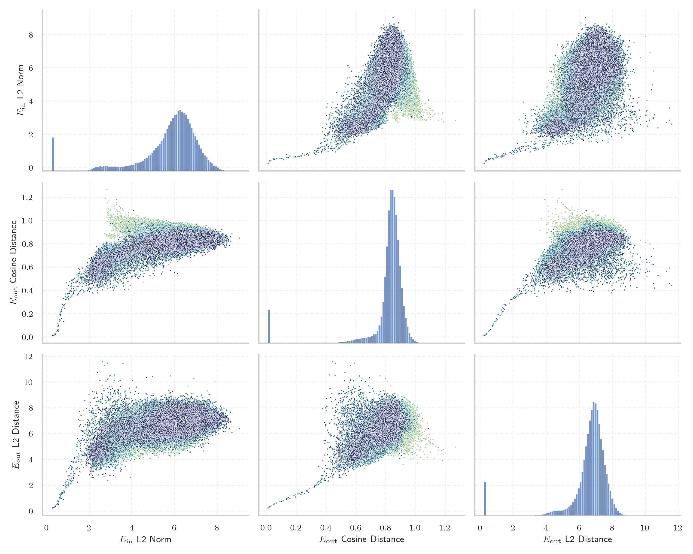
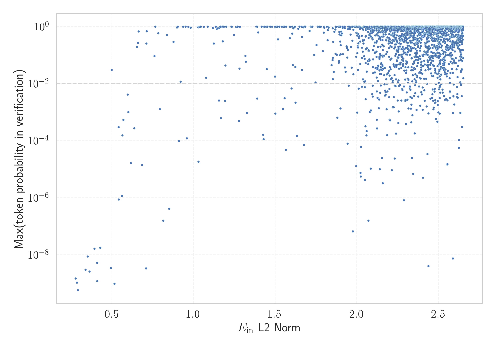

# Report for `deepseek-ai/DeepSeek-V2-Lite`

## Model info

* Model Info: 
  * Tied embeddings: False
  * LM head uses bias: False
  * Embeddings shape: [102400, 2048]
* Tokenizer Info: 
  * Vocab Size: 100002
  * Tokenizer Class: LlamaTokenizerFast
  * Tokenizer Type: BPE
  * Bytes handling: Byte Input
  * Token for verification prompt building: IllegalArgumentException
  * Token id for verification prompt building: 91253
* Indicator summary: 
  * Indicator for under-trained tokens: E_{in} L2 Norm
  * Overall distribution: 5.786 +/- 1.398
* Detected Token Counts: 
  * Number of tested under-trained tokens: 1989, 1989 non-special, 202 below p = 0.01 threshold, 18 below soft indicator threshold
  * Number of single byte tokens: 243, of which 0 below indicator threshold
  * Number of special tokens: 12, of which 0 below indicator threshold
  * Number of non-single-byte unreachable tokens: 12, of which 0 below indicator threshold
  * Number of non-single-byte UTF-fragment tokens:  438, of which 0 below soft indicator threshold

## Under-trained token indicators plot


## Verification plot


## Under-trained token verification results
18 entries below threshold of 0.596

|   token_id | token                                 |   indicator | max_prob                                                         | in_other_tokens                |
|------------|---------------------------------------|-------------|------------------------------------------------------------------|--------------------------------|
|      98098 | ````` ="../../../../..">< `````       |    0.277387 | <span style='border: 1px solid rgb(169, 68, 66);'>1.5e-09</span> |                                |
|      63291 | ````` IconSuccessEncoded `````        |    0.285365 | <span style='border: 1px solid rgb(169, 68, 66);'>1.1e-09</span> |                                |
|      40482 | ````` IconErrorEncoded `````          |    0.291514 | <span style='border: 1px solid rgb(169, 68, 66);'>5.8e-10</span> |                                |
|      74777 | ````` orangehilldev `````             |    0.337313 | <span style='border: 1px solid rgb(169, 68, 66);'>3e-09</span>   |                                |
|      38174 | ````` ExternalTaskPojo `````          |    0.351187 | <span style='border: 1px solid rgb(169, 68, 66);'>8.8e-09</span> |                                |
|      86289 | ````` typeNameLink `````              |    0.362539 | <span style='border: 1px solid rgb(169, 68, 66);'>2.6e-09</span> |                                |
|      57926 | ````` navBarCell `````                |    0.392072 | <span style='border: 1px solid rgb(169, 68, 66);'>1.7e-08</span> |                                |
|      95833 | ````` textquoted `````                |    0.40883  | <span style='border: 1px solid rgb(169, 68, 66);'>5.3e-09</span> | ````` textquotedbl `````       |
|      87662 | ````` 日内与新浪看点 `````            |    0.409887 | <span style='border: 1px solid rgb(169, 68, 66);'>1.2e-09</span> | ````` 日内与新浪看点联系 ````` |
|      97018 | ````` Supamiu `````                   |    0.427577 | <span style='border: 1px solid rgb(169, 68, 66);'>1.8e-08</span> |                                |
|      84405 | ````` RecordedVote `````              |    0.492544 | <span style='border: 1px solid rgb(169, 68, 66);'>3.5e-09</span> |                                |
|      28490 | ````` ▁allClassesLink `````           |    0.498124 | <span style='border: 1px solid rgb(251, 189, 8);'>0.03</span>    |                                |
|      91136 | ````` controlcap `````                |    0.515423 | <span style='border: 1px solid rgb(169, 68, 66);'>9.7e-10</span> |                                |
|      83041 | ````` sympad `````                    |    0.540853 | <span style='border: 1px solid rgb(169, 68, 66);'>0.0003</span>  |                                |
|      59602 | ````` linkedExternalProjectPath ````` |    0.541388 | <span style='border: 1px solid rgb(169, 68, 66);'>8.7e-07</span> |                                |
|      91619 | ````` >?[< `````                      |    0.560272 | <span style='border: 1px solid rgb(169, 68, 66);'>1.2e-06</span> |                                |
|      84716 | ````` ▁cachedSer `````                |    0.563244 | <span style='border: 1px solid rgb(169, 68, 66);'>0.00015</span> |                                |
|      20947 | ````` NavBarCell `````                |    0.569525 | <span style='border: 1px solid rgb(169, 68, 66);'>0.00054</span> |                                |
<details><summary>1971 additional entries above threshold</summary>

|   token_id | token                                        |   indicator | max_prob                                                         | in_other_tokens                                                                                                                                                                                                                                                                                                                                       |
|------------|----------------------------------------------|-------------|------------------------------------------------------------------|-------------------------------------------------------------------------------------------------------------------------------------------------------------------------------------------------------------------------------------------------------------------------------------------------------------------------------------------------------|
|      89054 | ````` TableHeadingColor `````                |    0.595614 | <span style='border: 1px solid rgb(255, 145, 0);'>0.0042</span>  |                                                                                                                                                                                                                                                                                                                                                       |
|      74713 | ````` photonui `````                         |    0.600323 | <span style='border: 1px solid rgb(255, 145, 0);'>0.001</span>   |                                                                                                                                                                                                                                                                                                                                                       |
|      16238 | ````` кедония `````                          |    0.614885 | <span style='border: 1px solid rgb(169, 68, 66);'>1.6e-05</span> | ````` ▁Македония `````, <span style='border: 1px solid rgb(40, 167, 69);'>````` Македония `````</span>                                                                                                                                                                                                                                                |
|      27151 | ````` NavBarFont `````                       |    0.636519 | <span style='border: 1px solid rgb(169, 68, 66);'>0.00027</span> |                                                                                                                                                                                                                                                                                                                                                       |
|      45729 | ````` memberNameLink `````                   |    0.652809 | <span style='border: 1px solid rgb(40, 167, 69);'>0.2</span>     |                                                                                                                                                                                                                                                                                                                                                       |
|      84002 | ````` ▁sideWeight `````                      |    0.659811 | <span style='border: 1px solid rgb(40, 167, 69);'>0.27</span>    |                                                                                                                                                                                                                                                                                                                                                       |
|      24861 | ````` numerusform `````                      |    0.662762 | <span style='border: 1px solid rgb(40, 167, 69);'>0.68</span>    |                                                                                                                                                                                                                                                                                                                                                       |
|      92850 | ````` typeNameLabel `````                    |    0.68375  | <span style='border: 1px solid rgb(169, 68, 66);'>1.4e-05</span> |                                                                                                                                                                                                                                                                                                                                                       |
|      87661 | ````` 不代表新浪看点 `````                   |    0.708852 | <span style='border: 1px solid rgb(169, 68, 66);'>3.4e-09</span> | ````` 不代表新浪看点观点或立场 `````                                                                                                                                                                                                                                                                                                                  |
|      73735 | ````` ▁FASTFORMAT `````                      |    0.710753 | <span style='border: 1px solid rgb(40, 167, 69);'>0.26</span>    |                                                                                                                                                                                                                                                                                                                                                       |
|      89626 | ````` memSeparator `````                     |    0.712202 | <span style='border: 1px solid rgb(40, 167, 69);'>0.69</span>    |                                                                                                                                                                                                                                                                                                                                                       |
|      52739 | ````` ▁itemMembers `````                     |    0.760582 | <span style='border: 1px solid rgb(251, 189, 8);'>0.093</span>   |                                                                                                                                                                                                                                                                                                                                                       |
|      97672 | ````` 基督教基督教基督教 `````               |    0.764987 | <span style='border: 1px solid rgb(40, 167, 69);'>1</span>       |                                                                                                                                                                                                                                                                                                                                                       |
|      78973 | ````` subNavList `````                       |    0.783443 | <span style='border: 1px solid rgb(40, 167, 69);'>0.58</span>    |                                                                                                                                                                                                                                                                                                                                                       |
|      81175 | ````` ▁visbl `````                           |    0.793093 | <span style='border: 1px solid rgb(255, 145, 0);'>0.0013</span>  |                                                                                                                                                                                                                                                                                                                                                       |
|      94822 | ````` orpdfstring `````                      |    0.8138   | <span style='border: 1px solid rgb(169, 68, 66);'>1.6e-07</span> | ````` texorpdfstring `````                                                                                                                                                                                                                                                                                                                            |
|      59389 | ````` linkedExternal `````                   |    0.836136 | <span style='border: 1px solid rgb(40, 167, 69);'>0.5</span>     | <span style='border: 1px solid rgb(169, 68, 66);'>````` linkedExternalProjectPath `````</span>                                                                                                                                                                                                                                                        |
|      81096 | ````` ▁EDIPU `````                           |    0.849967 | <span style='border: 1px solid rgb(169, 68, 66);'>4.1e-07</span> | <span style='border: 1px solid rgb(40, 167, 69);'>````` ▁EDIPUCRS `````</span>                                                                                                                                                                                                                                                                        |
|      84162 | ````` OnSearchSelect `````                   |    0.87675  | <span style='border: 1px solid rgb(40, 167, 69);'>0.29</span>    |                                                                                                                                                                                                                                                                                                                                                       |
|      40247 | ````` OpenTl `````                           |    0.897548 | <span style='border: 1px solid rgb(40, 167, 69);'>0.93</span>    |                                                                                                                                                                                                                                                                                                                                                       |
|      50113 | ````` memItem `````                          |    0.902782 | <span style='border: 1px solid rgb(40, 167, 69);'>1</span>       | <span style='border: 1px solid rgb(40, 167, 69);'>````` memItemRight `````</span>, <span style='border: 1px solid rgb(40, 167, 69);'>````` memItemLeft `````</span>                                                                                                                                                                                   |
|      13009 | ````` lemanya `````                          |    0.90906  | <span style='border: 1px solid rgb(169, 68, 66);'>9.8e-05</span> | ````` ▁alemanya `````, ````` Alemanya `````, ````` ▁Alemanya `````                                                                                                                                                                                                                                                                                    |
|      51244 | ````` ecesito `````                          |    0.92016  | <span style='border: 1px solid rgb(251, 189, 8);'>0.012</span>   | ````` Necesito `````, ````` ▁Necesito `````                                                                                                                                                                                                                                                                                                           |
|      38326 | ````` TableRowColor `````                    |    0.935742 | <span style='border: 1px solid rgb(40, 167, 69);'>1</span>       |                                                                                                                                                                                                                                                                                                                                                       |
|      54199 | ````` tabEnd `````                           |    0.950595 | <span style='border: 1px solid rgb(40, 167, 69);'>1</span>       |                                                                                                                                                                                                                                                                                                                                                       |
|      60623 | ````` odeciclismo `````                      |    0.959173 | <span style='border: 1px solid rgb(169, 68, 66);'>0.00012</span> | <span style='border: 1px solid rgb(40, 167, 69);'>````` iodeciclismo `````</span>, ````` ▁sitiodeciclismo `````                                                                                                                                                                                                                                       |
|      89953 | ````` CharacterOffsetEnd `````               |    0.967812 | <span style='border: 1px solid rgb(40, 167, 69);'>0.99</span>    |                                                                                                                                                                                                                                                                                                                                                       |
|      72767 | ````` elrte `````                            |    0.981692 | <span style='border: 1px solid rgb(40, 167, 69);'>0.92</span>    |                                                                                                                                                                                                                                                                                                                                                       |
|      33658 | ````` Irefn `````                            |    1.02849  | <span style='border: 1px solid rgb(40, 167, 69);'>0.94</span>    |                                                                                                                                                                                                                                                                                                                                                       |
|      49293 | ````` ▁lampister `````                       |    1.02915  | <span style='border: 1px solid rgb(169, 68, 66);'>1.9e-05</span> | <span style='border: 1px solid rgb(169, 68, 66);'>````` ▁lampisteria `````</span>, <span style='border: 1px solid rgb(169, 68, 66);'>````` ▁lampisteries `````</span>                                                                                                                                                                                 |
|      78300 | ````` memItemRight `````                     |    1.03604  | <span style='border: 1px solid rgb(40, 167, 69);'>0.98</span>    |                                                                                                                                                                                                                                                                                                                                                       |
|      79283 | ````` typecol `````                          |    1.04287  | <span style='border: 1px solid rgb(40, 167, 69);'>1</span>       |                                                                                                                                                                                                                                                                                                                                                       |
|      99448 | ````` ▁RTValue `````                         |    1.04388  | <span style='border: 1px solid rgb(40, 167, 69);'>1</span>       |                                                                                                                                                                                                                                                                                                                                                       |
|      66880 | ````` unitPattern `````                      |    1.06225  | <span style='border: 1px solid rgb(40, 167, 69);'>0.99</span>    |                                                                                                                                                                                                                                                                                                                                                       |
|      86826 | ````` солство `````                          |    1.07653  | <span style='border: 1px solid rgb(251, 189, 8);'>0.016</span>   | <span style='border: 1px solid rgb(251, 189, 8);'>````` посолство `````</span>                                                                                                                                                                                                                                                                        |
|      24543 | ````` wlwifi `````                           |    1.08642  | <span style='border: 1px solid rgb(40, 167, 69);'>0.99</span>    | ````` ▁iwlwifi `````, ````` iwlwifi `````                                                                                                                                                                                                                                                                                                             |
|      93496 | ````` exemplarCity `````                     |    1.11764  | <span style='border: 1px solid rgb(40, 167, 69);'>0.89</span>    |                                                                                                                                                                                                                                                                                                                                                       |
|      59620 | ````` onlinecite `````                       |    1.12346  | <span style='border: 1px solid rgb(40, 167, 69);'>0.26</span>    |                                                                                                                                                                                                                                                                                                                                                       |
|      78404 | ````` maskFromRange `````                    |    1.13634  | <span style='border: 1px solid rgb(40, 167, 69);'>0.99</span>    |                                                                                                                                                                                                                                                                                                                                                       |
|      70532 | ````` \xa0veg `````                          |    1.14251  | <span style='border: 1px solid rgb(40, 167, 69);'>0.83</span>    | <span style='border: 1px solid rgb(251, 189, 8);'>````` \xa0vegades `````</span>                                                                                                                                                                                                                                                                      |
|      89954 | ````` CharacterOffsetBegin `````             |    1.14709  | <span style='border: 1px solid rgb(40, 167, 69);'>0.86</span>    |                                                                                                                                                                                                                                                                                                                                                       |
|      78552 | ````` ▁Междусъюз `````                       |    1.15567  | <span style='border: 1px solid rgb(255, 145, 0);'>0.0026</span>  | ````` ▁Междусъюзническата `````                                                                                                                                                                                                                                                                                                                       |
|      78219 | ````` memItemLeft `````                      |    1.15739  | <span style='border: 1px solid rgb(40, 167, 69);'>0.9</span>     |                                                                                                                                                                                                                                                                                                                                                       |
|      58220 | ````` itedefault `````                       |    1.16366  | <span style='border: 1px solid rgb(40, 167, 69);'>1</span>       | <span style='border: 1px solid rgb(40, 167, 69);'>````` mcitedefault `````</span>                                                                                                                                                                                                                                                                     |
|      82452 | ````` skipNav `````                          |    1.16622  | <span style='border: 1px solid rgb(40, 167, 69);'>1</span>       |                                                                                                                                                                                                                                                                                                                                                       |
|      79301 | ````` dereq `````                            |    1.16687  | <span style='border: 1px solid rgb(40, 167, 69);'>1</span>       |                                                                                                                                                                                                                                                                                                                                                       |
|      49112 | ````` iberament `````                        |    1.16742  | <span style='border: 1px solid rgb(169, 68, 66);'>0.00062</span> | <span style='border: 1px solid rgb(40, 167, 69);'>````` Alliberament `````</span>, <span style='border: 1px solid rgb(40, 167, 69);'>````` alliberament `````</span>                                                                                                                                                                                  |
|      38991 | ````` rgell `````                            |    1.17774  | <span style='border: 1px solid rgb(40, 167, 69);'>1</span>       | ````` Urgell `````, ````` ▁Urgell `````                                                                                                                                                                                                                                                                                                               |
|       9710 | ````` ▁espany `````                          |    1.17868  | <span style='border: 1px solid rgb(40, 167, 69);'>0.3</span>     | ````` ▁espanyola `````, ````` ▁espanyoles `````, ````` ▁espanyols `````, ````` ▁espanyol `````                                                                                                                                                                                                                                                        |
|      91241 | ````` ▁fullComment `````                     |    1.18144  | <span style='border: 1px solid rgb(40, 167, 69);'>1</span>       |                                                                                                                                                                                                                                                                                                                                                       |
|      49918 | ````` magatzem `````                         |    1.18596  | <span style='border: 1px solid rgb(40, 167, 69);'>1</span>       | <span style='border: 1px solid rgb(251, 189, 8);'>````` emmagatzematge `````</span>, <span style='border: 1px solid rgb(40, 167, 69);'>````` emmagatzem `````</span>, <span style='border: 1px solid rgb(40, 167, 69);'>````` ▁emmagatzem `````</span>                                                                                                |
|       5758 | ````` ългар `````                            |    1.1926   | <span style='border: 1px solid rgb(255, 145, 0);'>0.0025</span>  | ````` ▁българския `````, ````` ▁българско `````, <span style='border: 1px solid rgb(40, 167, 69);'>````` България `````</span>, ````` Българ `````, ````` ▁българската `````, ...                                                                                                                                                                     |
|       9630 | ````` ългария `````                          |    1.19486  | <span style='border: 1px solid rgb(251, 189, 8);'>0.043</span>   | <span style='border: 1px solid rgb(40, 167, 69);'>````` България `````</span>, ````` ▁България `````                                                                                                                                                                                                                                                  |
|      24695 | ````` colLast `````                          |    1.19973  | <span style='border: 1px solid rgb(40, 167, 69);'>1</span>       |                                                                                                                                                                                                                                                                                                                                                       |
|      50086 | ````` NamedCell `````                        |    1.23108  | <span style='border: 1px solid rgb(40, 167, 69);'>1</span>       |                                                                                                                                                                                                                                                                                                                                                       |
|      58228 | ````` mcitedefault `````                     |    1.23282  | <span style='border: 1px solid rgb(40, 167, 69);'>0.99</span>    |                                                                                                                                                                                                                                                                                                                                                       |
|      93494 | ````` atrals `````                           |    1.24733  | <span style='border: 1px solid rgb(40, 167, 69);'>0.51</span>    | <span style='border: 1px solid rgb(251, 189, 8);'>````` ▁teatrals `````</span>                                                                                                                                                                                                                                                                        |
|      66255 | ````` memitem `````                          |    1.26015  | <span style='border: 1px solid rgb(40, 167, 69);'>0.98</span>    |                                                                                                                                                                                                                                                                                                                                                       |
|      99639 | ````` 亿亿亿亿亿亿亿亿亿亿亿亿亿亿亿亿 ````` |    1.26902  | <span style='border: 1px solid rgb(40, 167, 69);'>1</span>       |                                                                                                                                                                                                                                                                                                                                                       |
|      91575 | ````` sourceLineNo `````                     |    1.2695   | <span style='border: 1px solid rgb(40, 167, 69);'>1</span>       |                                                                                                                                                                                                                                                                                                                                                       |
|      51641 | ````` мъния `````                            |    1.27766  | <span style='border: 1px solid rgb(169, 68, 66);'>0.00049</span> | <span style='border: 1px solid rgb(40, 167, 69);'>````` ▁Румъния `````</span>                                                                                                                                                                                                                                                                         |
|      18114 | ````` кември `````                           |    1.28049  | <span style='border: 1px solid rgb(251, 189, 8);'>0.034</span>   | ````` ▁декември `````                                                                                                                                                                                                                                                                                                                                 |
|      74773 | ````` orangehill `````                       |    1.2825   | <span style='border: 1px solid rgb(40, 167, 69);'>0.98</span>    | <span style='border: 1px solid rgb(169, 68, 66);'>````` orangehilldev `````</span>                                                                                                                                                                                                                                                                    |
|      86859 | ````` \tCWE `````                            |    1.31773  | <span style='border: 1px solid rgb(251, 189, 8);'>0.094</span>   |                                                                                                                                                                                                                                                                                                                                                       |
|      73129 | ````` жентина `````                          |    1.32035  | <span style='border: 1px solid rgb(251, 189, 8);'>0.059</span>   | <span style='border: 1px solid rgb(40, 167, 69);'>````` ▁Аржентина `````</span>                                                                                                                                                                                                                                                                       |
|      90292 | ````` битава `````                           |    1.32661  | <span style='border: 1px solid rgb(169, 68, 66);'>0.00093</span> | <span style='border: 1px solid rgb(255, 145, 0);'>````` Обитава `````</span>                                                                                                                                                                                                                                                                          |
|      95674 | ````` >:][< `````                            |    1.38395  | <span style='border: 1px solid rgb(40, 167, 69);'>1</span>       |                                                                                                                                                                                                                                                                                                                                                       |
|      52246 | ````` ▁опъл `````                            |    1.38881  | <span style='border: 1px solid rgb(255, 145, 0);'>0.003</span>   | ````` ▁опълченец `````, <span style='border: 1px solid rgb(255, 145, 0);'>````` ▁опълчение `````</span>, <span style='border: 1px solid rgb(251, 189, 8);'>````` ▁опълчен `````</span>                                                                                                                                                                |
|      74046 | ````` teamcraft `````                        |    1.3894   | <span style='border: 1px solid rgb(40, 167, 69);'>1</span>       |                                                                                                                                                                                                                                                                                                                                                       |
|      18692 | ````` ministraci `````                       |    1.39515  | <span style='border: 1px solid rgb(40, 167, 69);'>0.62</span>    | ````` administraci `````, ````` ▁administraci `````, ````` Administraci `````                                                                                                                                                                                                                                                                         |
|      52193 | ````` iSector `````                          |    1.41683  | <span style='border: 1px solid rgb(40, 167, 69);'>1</span>       |                                                                                                                                                                                                                                                                                                                                                       |
|      44942 | ````` министративен `````                    |    1.42595  | <span style='border: 1px solid rgb(169, 68, 66);'>0.00016</span> | <span style='border: 1px solid rgb(40, 167, 69);'>````` ▁Административен `````</span>, <span style='border: 1px solid rgb(251, 189, 8);'>````` ▁административен `````</span>                                                                                                                                                                          |
|      21516 | ````` ximadament `````                       |    1.42913  | <span style='border: 1px solid rgb(169, 68, 66);'>0.00011</span> | <span style='border: 1px solid rgb(40, 167, 69);'>````` aproximadament `````</span>, <span style='border: 1px solid rgb(40, 167, 69);'>````` ▁Aproximadament `````</span>, ````` ▁aproximadament `````                                                                                                                                                |
|      82700 | ````` classFrame `````                       |    1.43165  | <span style='border: 1px solid rgb(40, 167, 69);'>1</span>       |                                                                                                                                                                                                                                                                                                                                                       |
|      46373 | ````` tableblock `````                       |    1.43353  | <span style='border: 1px solid rgb(40, 167, 69);'>1</span>       |                                                                                                                                                                                                                                                                                                                                                       |
|      85066 | ````` soyc `````                             |    1.4439   | <span style='border: 1px solid rgb(40, 167, 69);'>1</span>       |                                                                                                                                                                                                                                                                                                                                                       |
|      90785 | ````` посолство `````                        |    1.44767  | <span style='border: 1px solid rgb(251, 189, 8);'>0.032</span>   |                                                                                                                                                                                                                                                                                                                                                       |
|      71563 | ````` 亿亿亿次 `````                         |    1.4516   | <span style='border: 1px solid rgb(40, 167, 69);'>1</span>       |                                                                                                                                                                                                                                                                                                                                                       |
|      25029 | ````` colFirst `````                         |    1.46833  | <span style='border: 1px solid rgb(40, 167, 69);'>1</span>       |                                                                                                                                                                                                                                                                                                                                                       |
|      77767 | ````` sendcoins `````                        |    1.46929  | <span style='border: 1px solid rgb(40, 167, 69);'>0.99</span>    |                                                                                                                                                                                                                                                                                                                                                       |
|      33431 | ````` ▁apilevel `````                        |    1.48065  | <span style='border: 1px solid rgb(40, 167, 69);'>1</span>       |                                                                                                                                                                                                                                                                                                                                                       |
|      49104 | ````` изток `````                            |    1.4977   | <span style='border: 1px solid rgb(40, 167, 69);'>0.95</span>    | <span style='border: 1px solid rgb(251, 189, 8);'>````` ▁североизток `````</span>, <span style='border: 1px solid rgb(255, 145, 0);'>````` ▁югоизток `````</span>                                                                                                                                                                                     |
|      62141 | ````` legalforms `````                       |    1.49864  | <span style='border: 1px solid rgb(40, 167, 69);'>1</span>       |                                                                                                                                                                                                                                                                                                                                                       |
|      85684 | ````` товче `````                            |    1.49902  | <span style='border: 1px solid rgb(251, 189, 8);'>0.018</span>   | <span style='border: 1px solid rgb(251, 189, 8);'>````` ▁братовче `````</span>                                                                                                                                                                                                                                                                        |
|      27591 | ````` eriorment `````                        |    1.50093  | <span style='border: 1px solid rgb(169, 68, 66);'>0.0009</span>  | <span style='border: 1px solid rgb(40, 167, 69);'>````` Posteriorment `````</span>, ````` ▁anteriorment `````, ````` ▁Posteriorment `````, ````` ▁anteriormente `````                                                                                                                                                                                 |
|      50564 | ````` FilterDatabase `````                   |    1.50955  | <span style='border: 1px solid rgb(40, 167, 69);'>1</span>       |                                                                                                                                                                                                                                                                                                                                                       |
|      62631 | ````` IconSuccess `````                      |    1.51374  | <span style='border: 1px solid rgb(40, 167, 69);'>1</span>       | <span style='border: 1px solid rgb(169, 68, 66);'>````` IconSuccessEncoded `````</span>                                                                                                                                                                                                                                                               |
|      49273 | ````` .,][]{ `````                           |    1.51694  | <span style='border: 1px solid rgb(40, 167, 69);'>0.36</span>    |                                                                                                                                                                                                                                                                                                                                                       |
|      74216 | ````` Sinergi `````                          |    1.52531  | <span style='border: 1px solid rgb(40, 167, 69);'>1</span>       |                                                                                                                                                                                                                                                                                                                                                       |
|      62816 | ````` catDesc `````                          |    1.54104  | <span style='border: 1px solid rgb(40, 167, 69);'>1</span>       |                                                                                                                                                                                                                                                                                                                                                       |
|       7388 | ````` точници `````                          |    1.54845  | <span style='border: 1px solid rgb(255, 145, 0);'>0.0013</span>  | ````` Източници `````, ````` ▁източници `````                                                                                                                                                                                                                                                                                                         |
|      84453 | ````` colOne `````                           |    1.55246  | <span style='border: 1px solid rgb(40, 167, 69);'>1</span>       |                                                                                                                                                                                                                                                                                                                                                       |
|      61075 | ````` BrowserDetector `````                  |    1.55695  | <span style='border: 1px solid rgb(40, 167, 69);'>1</span>       |                                                                                                                                                                                                                                                                                                                                                       |
|      78213 | ````` евград `````                           |    1.5576   | <span style='border: 1px solid rgb(255, 145, 0);'>0.0031</span>  | ````` ▁Благоевград `````                                                                                                                                                                                                                                                                                                                              |
|      82137 | ````` ждестран `````                         |    1.56513  | <span style='border: 1px solid rgb(169, 68, 66);'>4.8e-05</span> | <span style='border: 1px solid rgb(255, 145, 0);'>````` ▁чуждестран `````</span>                                                                                                                                                                                                                                                                      |
|      36457 | ````` altColor `````                         |    1.5667   | <span style='border: 1px solid rgb(40, 167, 69);'>1</span>       |                                                                                                                                                                                                                                                                                                                                                       |
|      87380 | ````` ▁autonegot `````                       |    1.58956  | <span style='border: 1px solid rgb(40, 167, 69);'>1</span>       | ````` ▁autonegotiation `````                                                                                                                                                                                                                                                                                                                          |
|      44330 | ````` последствие `````                      |    1.58997  | <span style='border: 1px solid rgb(40, 167, 69);'>0.39</span>    | <span style='border: 1px solid rgb(251, 189, 8);'>````` ▁Впоследствие `````</span>, <span style='border: 1px solid rgb(251, 189, 8);'>````` ▁впоследствие `````</span>                                                                                                                                                                                |
|      61778 | ````` ocolm `````                            |    1.59116  | <span style='border: 1px solid rgb(40, 167, 69);'>0.98</span>    | <span style='border: 1px solid rgb(40, 167, 69);'>````` Estocolm `````</span>, <span style='border: 1px solid rgb(40, 167, 69);'>````` ▁Estocolm `````</span>                                                                                                                                                                                         |
|      95626 | ````` }$~\ `````                             |    1.59983  | <span style='border: 1px solid rgb(255, 145, 0);'>0.0068</span>  |                                                                                                                                                                                                                                                                                                                                                       |
|      96803 | ````` afrug `````                            |    1.60355  | <span style='border: 1px solid rgb(40, 167, 69);'>0.57</span>    | ````` afrugell `````                                                                                                                                                                                                                                                                                                                                  |
|      81498 | ````` widetext `````                         |    1.60383  | <span style='border: 1px solid rgb(40, 167, 69);'>1</span>       |                                                                                                                                                                                                                                                                                                                                                       |
|      19293 | ````` евруари `````                          |    1.60766  | <span style='border: 1px solid rgb(251, 189, 8);'>0.045</span>   | ````` ▁февруари `````                                                                                                                                                                                                                                                                                                                                 |
|      20325 | ````` uetooth `````                          |    1.61128  | <span style='border: 1px solid rgb(40, 167, 69);'>0.87</span>    | ````` bluetooth `````, ````` ▁bluetooth `````, ````` Bluetooth `````                                                                                                                                                                                                                                                                                  |
|      65595 | ````` HeadingColor `````                     |    1.6205   | <span style='border: 1px solid rgb(40, 167, 69);'>1</span>       | <span style='border: 1px solid rgb(255, 145, 0);'>````` TableHeadingColor `````</span>                                                                                                                                                                                                                                                                |
|      50670 | ````` .][]{ `````                            |    1.62317  | <span style='border: 1px solid rgb(251, 189, 8);'>0.038</span>   |                                                                                                                                                                                                                                                                                                                                                       |
|      28621 | ````` aixements `````                        |    1.62451  | <span style='border: 1px solid rgb(255, 145, 0);'>0.0022</span>  | ````` Naixements `````                                                                                                                                                                                                                                                                                                                                |
|      18599 | ````` alsevol `````                          |    1.63277  | <span style='border: 1px solid rgb(169, 68, 66);'>0.00015</span> | ````` ▁qualsevol `````                                                                                                                                                                                                                                                                                                                                |
|      61687 | ````` ratges `````                           |    1.64175  | <span style='border: 1px solid rgb(40, 167, 69);'>0.83</span>    | ````` metratges `````                                                                                                                                                                                                                                                                                                                                 |
|      98039 | ````` ..">< `````                            |    1.64877  | <span style='border: 1px solid rgb(40, 167, 69);'>1</span>       | <span style='border: 1px solid rgb(169, 68, 66);'>````` ="../../../../..">< `````</span>                                                                                                                                                                                                                                                              |
|      64695 | ````` rellotge `````                         |    1.66268  | <span style='border: 1px solid rgb(40, 167, 69);'>1</span>       | ````` ▁rellotge `````, <span style='border: 1px solid rgb(40, 167, 69);'>````` ▁contrarellotge `````</span>                                                                                                                                                                                                                                           |
|      43247 | ````` питаници `````                         |    1.66396  | <span style='border: 1px solid rgb(251, 189, 8);'>0.03</span>    | ````` Възпитаници `````                                                                                                                                                                                                                                                                                                                               |
|      87336 | ````` estirs `````                           |    1.66438  | <span style='border: 1px solid rgb(40, 167, 69);'>0.44</span>    | <span style='border: 1px solid rgb(40, 167, 69);'>````` ▁monestirs `````</span>                                                                                                                                                                                                                                                                       |
|      86453 | ````` ;->< `````                             |    1.67186  | <span style='border: 1px solid rgb(40, 167, 69);'>0.95</span>    |                                                                                                                                                                                                                                                                                                                                                       |
|      73157 | ````` ническата `````                        |    1.67636  | <span style='border: 1px solid rgb(169, 68, 66);'>7.2e-05</span> | ````` ▁Междусъюзническата `````                                                                                                                                                                                                                                                                                                                       |
|      94515 | ````` mddev `````                            |    1.67853  | <span style='border: 1px solid rgb(40, 167, 69);'>1</span>       |                                                                                                                                                                                                                                                                                                                                                       |
|      98700 | ````` LearningObjective `````                |    1.6831   | <span style='border: 1px solid rgb(40, 167, 69);'>1</span>       |                                                                                                                                                                                                                                                                                                                                                       |
|      80568 | ````` metavariable `````                     |    1.68444  | <span style='border: 1px solid rgb(40, 167, 69);'>1</span>       |                                                                                                                                                                                                                                                                                                                                                       |
|      22106 | ````` ▁vaix `````                            |    1.70999  | <span style='border: 1px solid rgb(40, 167, 69);'>0.7</span>     | ````` ▁vaixells `````, ````` ▁vaixell `````                                                                                                                                                                                                                                                                                                           |
|      84039 | ````` ловения `````                          |    1.71754  | <span style='border: 1px solid rgb(40, 167, 69);'>0.99</span>    | <span style='border: 1px solid rgb(40, 167, 69);'>````` ▁Словения `````</span>                                                                                                                                                                                                                                                                        |
|       9201 | ````` persones `````                         |    1.71791  | <span style='border: 1px solid rgb(40, 167, 69);'>1</span>       | ````` \xa0persones `````                                                                                                                                                                                                                                                                                                                              |
|      59771 | ````` 基督教基督教 `````                     |    1.72159  | <span style='border: 1px solid rgb(40, 167, 69);'>0.97</span>    | <span style='border: 1px solid rgb(40, 167, 69);'>````` 基督教基督教基督教 `````</span>                                                                                                                                                                                                                                                               |
|      26323 | ````` EEEEFF `````                           |    1.72752  | <span style='border: 1px solid rgb(40, 167, 69);'>1</span>       |                                                                                                                                                                                                                                                                                                                                                       |
|      50373 | ````` нгария `````                           |    1.73912  | <span style='border: 1px solid rgb(40, 167, 69);'>0.1</span>     | <span style='border: 1px solid rgb(40, 167, 69);'>````` ▁Унгария `````</span>                                                                                                                                                                                                                                                                         |
|      74417 | ````` ardenya `````                          |    1.74709  | <span style='border: 1px solid rgb(251, 189, 8);'>0.011</span>   | ````` ▁Sardenya `````                                                                                                                                                                                                                                                                                                                                 |
|      82211 | ````` emmagatzem `````                       |    1.75335  | <span style='border: 1px solid rgb(40, 167, 69);'>0.23</span>    | <span style='border: 1px solid rgb(251, 189, 8);'>````` emmagatzematge `````</span>                                                                                                                                                                                                                                                                   |
|      27870 | ````` cknowledg `````                        |    1.76003  | <span style='border: 1px solid rgb(40, 167, 69);'>1</span>       | ````` Acknowledgments `````, ````` ▁Acknowledg `````, ````` acknowledgments `````, ````` Acknowledgements `````, ````` ▁acknowledges `````, ...                                                                                                                                                                                                       |
|      78672 | ````` ▁Хърват `````                          |    1.76567  | <span style='border: 1px solid rgb(40, 167, 69);'>0.98</span>    | <span style='border: 1px solid rgb(40, 167, 69);'>````` ▁Хърватия `````</span>                                                                                                                                                                                                                                                                        |
|      82753 | ````` fullcomment `````                      |    1.76912  | <span style='border: 1px solid rgb(40, 167, 69);'>0.96</span>    |                                                                                                                                                                                                                                                                                                                                                       |
|      49432 | ````` ^@^@^@^@ `````                         |    1.76999  | <span style='border: 1px solid rgb(40, 167, 69);'>0.99</span>    | <span style='border: 1px solid rgb(40, 167, 69);'>````` ^@^@^@^@^@^@^@^@ `````</span>                                                                                                                                                                                                                                                                 |
|      71160 | ````` mcite `````                            |    1.77882  | <span style='border: 1px solid rgb(40, 167, 69);'>1</span>       |                                                                                                                                                                                                                                                                                                                                                       |
|      77640 | ````` ▁renaixent `````                       |    1.7911   | <span style='border: 1px solid rgb(40, 167, 69);'>0.14</span>    | <span style='border: 1px solid rgb(40, 167, 69);'>````` ▁renaixentista `````</span>                                                                                                                                                                                                                                                                   |
|      81826 | ````` .}~\ `````                             |    1.79789  | <span style='border: 1px solid rgb(40, 167, 69);'>0.62</span>    |                                                                                                                                                                                                                                                                                                                                                       |
|      40274 | ````` IconError `````                        |    1.79983  | <span style='border: 1px solid rgb(40, 167, 69);'>0.99</span>    | <span style='border: 1px solid rgb(169, 68, 66);'>````` IconErrorEncoded `````</span>                                                                                                                                                                                                                                                                 |
|       6432 | ````` мври `````                             |    1.80067  | <span style='border: 1px solid rgb(40, 167, 69);'>0.92</span>    | ````` ▁октомври `````, ````` ▁септември `````, <span style='border: 1px solid rgb(251, 189, 8);'>````` кември `````</span>, <span style='border: 1px solid rgb(251, 189, 8);'>````` ември `````</span>, ````` птември `````, ...                                                                                                                      |
|      77697 | ````` ▁Кън `````                             |    1.81621  | <span style='border: 1px solid rgb(40, 167, 69);'>1</span>       | ````` ▁Кънчов `````                                                                                                                                                                                                                                                                                                                                   |
|      83682 | ````` ьорски `````                           |    1.82087  | <span style='border: 1px solid rgb(40, 167, 69);'>0.33</span>    | <span style='border: 1px solid rgb(251, 189, 8);'>````` Актьорски `````</span>                                                                                                                                                                                                                                                                        |
|      97171 | ````` ▁brasilers `````                       |    1.82226  | <span style='border: 1px solid rgb(40, 167, 69);'>0.76</span>    |                                                                                                                                                                                                                                                                                                                                                       |
|      43904 | ````` ionats `````                           |    1.82475  | <span style='border: 1px solid rgb(40, 167, 69);'>0.99</span>    | <span style='border: 1px solid rgb(40, 167, 69);'>````` ▁Campionats `````</span>, ````` ▁relacionats `````, <span style='border: 1px solid rgb(40, 167, 69);'>````` ▁campionats `````</span>                                                                                                                                                          |
|      76023 | ````` овеч `````                             |    1.8272   | <span style='border: 1px solid rgb(40, 167, 69);'>0.92</span>    | ````` ▁Ловеч `````, <span style='border: 1px solid rgb(255, 145, 0);'>````` ▁Повечето `````</span>                                                                                                                                                                                                                                                    |
|      98601 | ````` йците `````                            |    1.84475  | <span style='border: 1px solid rgb(251, 189, 8);'>0.045</span>   |                                                                                                                                                                                                                                                                                                                                                       |
|      59524 | ````` стендил `````                          |    1.85107  | <span style='border: 1px solid rgb(251, 189, 8);'>0.067</span>   | ````` ▁Кюстендил `````                                                                                                                                                                                                                                                                                                                                |
|      79621 | ````` ▁асоциа `````                          |    1.85232  | <span style='border: 1px solid rgb(40, 167, 69);'>0.87</span>    | <span style='border: 1px solid rgb(40, 167, 69);'>````` ▁асоциация `````</span>                                                                                                                                                                                                                                                                       |
|      30814 | ````` icionals `````                         |    1.85285  | <span style='border: 1px solid rgb(251, 189, 8);'>0.081</span>   | <span style='border: 1px solid rgb(40, 167, 69);'>````` ▁tradicionals `````</span>, ````` ▁addicionals `````                                                                                                                                                                                                                                          |
|      28579 | ````` ловдив `````                           |    1.85299  | <span style='border: 1px solid rgb(251, 189, 8);'>0.014</span>   | <span style='border: 1px solid rgb(40, 167, 69);'>````` Пловдив `````</span>, ````` ▁Пловдив `````                                                                                                                                                                                                                                                    |
|      30771 | ````` ▁езе `````                             |    1.85539  | <span style='border: 1px solid rgb(40, 167, 69);'>0.29</span>    | <span style='border: 1px solid rgb(40, 167, 69);'>````` ▁езерото `````</span>, ````` ▁езеро `````, <span style='border: 1px solid rgb(40, 167, 69);'>````` ▁езера `````</span>                                                                                                                                                                        |
|      95091 | ````` ▁певци `````                           |    1.85779  | <span style='border: 1px solid rgb(251, 189, 8);'>0.026</span>   |                                                                                                                                                                                                                                                                                                                                                       |
|      91684 | ````` ▁canadencs `````                       |    1.86185  | <span style='border: 1px solid rgb(40, 167, 69);'>0.66</span>    |                                                                                                                                                                                                                                                                                                                                                       |
|      85130 | ````` ▁activament `````                      |    1.86819  | <span style='border: 1px solid rgb(40, 167, 69);'>0.79</span>    |                                                                                                                                                                                                                                                                                                                                                       |
|      97642 | ````` ▁лъче `````                            |    1.86972  | <span style='border: 1px solid rgb(40, 167, 69);'>0.11</span>    |                                                                                                                                                                                                                                                                                                                                                       |
|      57200 | ````` CharacterOffset `````                  |    1.8705   | <span style='border: 1px solid rgb(40, 167, 69);'>1</span>       | <span style='border: 1px solid rgb(40, 167, 69);'>````` CharacterOffsetEnd `````</span>, <span style='border: 1px solid rgb(40, 167, 69);'>````` CharacterOffsetBegin `````</span>                                                                                                                                                                    |
|      84135 | ````` линден `````                           |    1.8726   | <span style='border: 1px solid rgb(40, 167, 69);'>0.97</span>    | ````` ▁Илинден `````                                                                                                                                                                                                                                                                                                                                  |
|      99741 | ````` ▁londinencs `````                      |    1.87734  | <span style='border: 1px solid rgb(40, 167, 69);'>0.1</span>     |                                                                                                                                                                                                                                                                                                                                                       |
|      77699 | ````` фтуер `````                            |    1.88061  | <span style='border: 1px solid rgb(169, 68, 66);'>0.00064</span> | <span style='border: 1px solid rgb(40, 167, 69);'>````` ▁софтуер `````</span>                                                                                                                                                                                                                                                                         |
|      78939 | ````` ^@^@^@^@^@^@^@^@ `````                 |    1.88627  | <span style='border: 1px solid rgb(40, 167, 69);'>1</span>       |                                                                                                                                                                                                                                                                                                                                                       |
|      72649 | ````` стието `````                           |    1.89005  | <span style='border: 1px solid rgb(251, 189, 8);'>0.055</span>   | <span style='border: 1px solid rgb(255, 145, 0);'>````` ▁устието `````</span>                                                                                                                                                                                                                                                                         |
|      85365 | ````` ▁Анджелис `````                        |    1.89157  | <span style='border: 1px solid rgb(251, 189, 8);'>0.063</span>   |                                                                                                                                                                                                                                                                                                                                                       |
|      17030 | ````` нуари `````                            |    1.89305  | <span style='border: 1px solid rgb(40, 167, 69);'>0.65</span>    | ````` ▁януари `````                                                                                                                                                                                                                                                                                                                                   |
|      93913 | ````` ▁derrotats `````                       |    1.89322  | <span style='border: 1px solid rgb(40, 167, 69);'>0.53</span>    |                                                                                                                                                                                                                                                                                                                                                       |
|      98142 | ````` compcert `````                         |    1.89343  | <span style='border: 1px solid rgb(40, 167, 69);'>1</span>       |                                                                                                                                                                                                                                                                                                                                                       |
|      11911 | ````` ▁изпол `````                           |    1.89597  | <span style='border: 1px solid rgb(40, 167, 69);'>0.1</span>     | <span style='border: 1px solid rgb(251, 189, 8);'>````` ▁използването `````</span>, ````` ▁използват `````, <span style='border: 1px solid rgb(40, 167, 69);'>````` ▁използван `````</span>, ````` ▁използва `````, <span style='border: 1px solid rgb(255, 145, 0);'>````` ▁използвана `````</span>, ...                                             |
|      87378 | ````` ▁hongaresos `````                      |    1.89811  | <span style='border: 1px solid rgb(40, 167, 69);'>0.3</span>     |                                                                                                                                                                                                                                                                                                                                                       |
|      45192 | ````` obreix `````                           |    1.89961  | <span style='border: 1px solid rgb(255, 145, 0);'>0.0013</span>  | <span style='border: 1px solid rgb(251, 189, 8);'>````` ▁cobreix `````</span>, <span style='border: 1px solid rgb(40, 167, 69);'>````` ▁descobreix `````</span>, <span style='border: 1px solid rgb(255, 145, 0);'>````` obreixen `````</span>                                                                                                        |
|      21377 | ````` laterra `````                          |    1.89976  | <span style='border: 1px solid rgb(40, 167, 69);'>1</span>       | ````` ▁Anglaterra `````, ````` Anglaterra `````                                                                                                                                                                                                                                                                                                       |
|      70650 | ````` icletes `````                          |    1.90044  | <span style='border: 1px solid rgb(40, 167, 69);'>0.22</span>    | <span style='border: 1px solid rgb(40, 167, 69);'>````` ▁motocicletes `````</span>                                                                                                                                                                                                                                                                    |
|      32367 | ````` ▁lleug `````                           |    1.90095  | <span style='border: 1px solid rgb(40, 167, 69);'>0.11</span>    | <span style='border: 1px solid rgb(40, 167, 69);'>````` ▁lleugerament `````</span>, <span style='border: 1px solid rgb(40, 167, 69);'>````` ▁lleugera `````</span>, <span style='border: 1px solid rgb(40, 167, 69);'>````` ▁lleuger `````</span>                                                                                                     |
|      98266 | ````` americanes `````                       |    1.90364  | <span style='border: 1px solid rgb(40, 167, 69);'>0.67</span>    |                                                                                                                                                                                                                                                                                                                                                       |
|      54556 | ````` крация `````                           |    1.90439  | <span style='border: 1px solid rgb(40, 167, 69);'>0.5</span>     | ````` ▁аристокрация `````                                                                                                                                                                                                                                                                                                                             |
|      42203 | ````` metratge `````                         |    1.90821  | <span style='border: 1px solid rgb(40, 167, 69);'>0.58</span>    | ````` metratges `````, <span style='border: 1px solid rgb(40, 167, 69);'>````` ▁llargmetratge `````</span>, ````` ▁curtmetratge `````                                                                                                                                                                                                                 |
|      89755 | ````` citealp `````                          |    1.91262  | <span style='border: 1px solid rgb(40, 167, 69);'>1</span>       |                                                                                                                                                                                                                                                                                                                                                       |
|      93925 | ````` вайг `````                             |    1.91319  | <span style='border: 1px solid rgb(40, 167, 69);'>0.91</span>    | <span style='border: 1px solid rgb(251, 189, 8);'>````` швайг `````</span>                                                                                                                                                                                                                                                                            |
|      86331 | ````` ▁чужбина `````                         |    1.91523  | <span style='border: 1px solid rgb(40, 167, 69);'>0.11</span>    |                                                                                                                                                                                                                                                                                                                                                       |
|      58888 | ````` 亿亿亿亿亿亿亿亿 `````                 |    1.92121  | <span style='border: 1px solid rgb(40, 167, 69);'>1</span>       | <span style='border: 1px solid rgb(40, 167, 69);'>````` 亿亿亿亿亿亿亿亿亿亿亿亿亿亿亿亿 `````</span>                                                                                                                                                                                                                                                 |
|      94661 | ````` pdfstring `````                        |    1.92516  | <span style='border: 1px solid rgb(40, 167, 69);'>1</span>       | ````` texorpdfstring `````, <span style='border: 1px solid rgb(169, 68, 66);'>````` orpdfstring `````</span>                                                                                                                                                                                                                                          |
|      98475 | ````` ▁irlandesos `````                      |    1.92574  | <span style='border: 1px solid rgb(40, 167, 69);'>0.89</span>    |                                                                                                                                                                                                                                                                                                                                                       |
|      62274 | ````` 新浪网联系 `````                       |    1.92731  | <span style='border: 1px solid rgb(251, 189, 8);'>0.037</span>   | ````` 日内与新浪网联系 `````                                                                                                                                                                                                                                                                                                                          |
|      60891 | ````` кулп `````                             |    1.93163  | <span style='border: 1px solid rgb(251, 189, 8);'>0.026</span>   | ````` ▁скулп `````                                                                                                                                                                                                                                                                                                                                    |
|      22033 | ````` тората `````                           |    1.93732  | <span style='border: 1px solid rgb(40, 167, 69);'>0.2</span>     | ````` ▁втората `````, ````` ▁Втората `````                                                                                                                                                                                                                                                                                                            |
|      91006 | ````` ейнт `````                             |    1.94032  | <span style='border: 1px solid rgb(40, 167, 69);'>0.18</span>    | <span style='border: 1px solid rgb(40, 167, 69);'>````` ▁Сейнт `````</span>                                                                                                                                                                                                                                                                           |
|      41580 | ````` ▁експе `````                           |    1.94093  | <span style='border: 1px solid rgb(251, 189, 8);'>0.083</span>   | ````` ▁експеди `````, ````` ▁експери `````, <span style='border: 1px solid rgb(169, 68, 66);'>````` ▁експедиция `````</span>                                                                                                                                                                                                                          |
|      94846 | ````` blicament `````                        |    1.943    | <span style='border: 1px solid rgb(169, 68, 66);'>8e-05</span>   |                                                                                                                                                                                                                                                                                                                                                       |
|      98935 | ````` ▁obligats `````                        |    1.94448  | <span style='border: 1px solid rgb(40, 167, 69);'>0.83</span>    |                                                                                                                                                                                                                                                                                                                                                       |
|      58552 | ````` >:]< `````                             |    1.94537  | <span style='border: 1px solid rgb(40, 167, 69);'>0.15</span>    |                                                                                                                                                                                                                                                                                                                                                       |
|       5123 | ````` ▁ciut `````                            |    1.94747  | <span style='border: 1px solid rgb(40, 167, 69);'>1</span>       | ````` ▁ciutad `````, ````` ▁ciutat `````, <span style='border: 1px solid rgb(40, 167, 69);'>````` ▁ciutadania `````</span>, <span style='border: 1px solid rgb(40, 167, 69);'>````` ▁ciutadans `````</span>, ````` ▁ciutats `````                                                                                                                     |
|      74785 | ````` ▁belgues `````                         |    1.94934  | <span style='border: 1px solid rgb(40, 167, 69);'>0.89</span>    |                                                                                                                                                                                                                                                                                                                                                       |
|      97987 | ````` ▁significativament `````               |    1.95021  | <span style='border: 1px solid rgb(255, 145, 0);'>0.0086</span>  |                                                                                                                                                                                                                                                                                                                                                       |
|      68943 | ````` mathcomp `````                         |    1.95342  | <span style='border: 1px solid rgb(40, 167, 69);'>1</span>       |                                                                                                                                                                                                                                                                                                                                                       |
|      99443 | ````` ▁дъщери `````                          |    1.95711  | <span style='border: 1px solid rgb(40, 167, 69);'>0.82</span>    |                                                                                                                                                                                                                                                                                                                                                       |
|      78010 | ````` Икономи `````                          |    1.96191  | <span style='border: 1px solid rgb(40, 167, 69);'>0.53</span>    | <span style='border: 1px solid rgb(40, 167, 69);'>````` Икономика `````</span>                                                                                                                                                                                                                                                                        |
|      65882 | ````` ▁pugu `````                            |    1.96312  | <span style='border: 1px solid rgb(40, 167, 69);'>0.95</span>    | <span style='border: 1px solid rgb(251, 189, 8);'>````` ▁puguin `````</span>                                                                                                                                                                                                                                                                          |
|      71488 | ````` кграф `````                            |    1.96469  | <span style='border: 1px solid rgb(40, 167, 69);'>0.19</span>    | ````` ▁маркграф `````                                                                                                                                                                                                                                                                                                                                 |
|      56147 | ````` юсюл `````                             |    1.96881  | <span style='border: 1px solid rgb(251, 189, 8);'>0.037</span>   | ````` ▁мюсюл `````                                                                                                                                                                                                                                                                                                                                    |
|      99713 | ````` ▁ROWSPAN `````                         |    1.96956  | <span style='border: 1px solid rgb(40, 167, 69);'>1</span>       |                                                                                                                                                                                                                                                                                                                                                       |
|      78574 | ````` ▁ferits `````                          |    1.97227  | <span style='border: 1px solid rgb(40, 167, 69);'>0.32</span>    |                                                                                                                                                                                                                                                                                                                                                       |
|      82793 | ````` ReadWriteAccess `````                  |    1.9728   | <span style='border: 1px solid rgb(40, 167, 69);'>1</span>       |                                                                                                                                                                                                                                                                                                                                                       |
|      98004 | ````` esclaus `````                          |    1.97568  | <span style='border: 1px solid rgb(169, 68, 66);'>6.7e-08</span> |                                                                                                                                                                                                                                                                                                                                                       |
|      97955 | ````` ▁constantment `````                    |    1.97839  | <span style='border: 1px solid rgb(40, 167, 69);'>0.77</span>    |                                                                                                                                                                                                                                                                                                                                                       |
|      93880 | ````` ▁принуден `````                        |    1.97874  | <span style='border: 1px solid rgb(251, 189, 8);'>0.021</span>   |                                                                                                                                                                                                                                                                                                                                                       |
|      97113 | ````` ▁libkf `````                           |    1.98518  | <span style='border: 1px solid rgb(40, 167, 69);'>1</span>       |                                                                                                                                                                                                                                                                                                                                                       |
|      94831 | ````` ▁sisena `````                          |    1.98842  | <span style='border: 1px solid rgb(40, 167, 69);'>0.98</span>    |                                                                                                                                                                                                                                                                                                                                                       |
|      46489 | ````` rowColor `````                         |    1.992    | <span style='border: 1px solid rgb(40, 167, 69);'>1</span>       |                                                                                                                                                                                                                                                                                                                                                       |
|      86845 | ````` станбул `````                          |    1.99547  | <span style='border: 1px solid rgb(40, 167, 69);'>0.97</span>    | <span style='border: 1px solid rgb(40, 167, 69);'>````` ▁Истанбул `````</span>                                                                                                                                                                                                                                                                        |
|      17818 | ````` ември `````                            |    1.99576  | <span style='border: 1px solid rgb(251, 189, 8);'>0.089</span>   | <span style='border: 1px solid rgb(251, 189, 8);'>````` кември `````</span>, ````` ▁ноември `````, ````` ▁декември `````                                                                                                                                                                                                                              |
|      79441 | ````` вечето `````                           |    1.99626  | <span style='border: 1px solid rgb(169, 68, 66);'>1.3e-05</span> | <span style='border: 1px solid rgb(255, 145, 0);'>````` ▁Повечето `````</span>                                                                                                                                                                                                                                                                        |
|      83414 | ````` ▁anuals `````                          |    1.99715  | <span style='border: 1px solid rgb(40, 167, 69);'>0.61</span>    |                                                                                                                                                                                                                                                                                                                                                       |
|      86105 | ````` ▁extensionRegistry `````               |    1.99834  | <span style='border: 1px solid rgb(40, 167, 69);'>1</span>       |                                                                                                                                                                                                                                                                                                                                                       |
|      54569 | ````` DOCKED `````                           |    1.99944  | <span style='border: 1px solid rgb(40, 167, 69);'>1</span>       |                                                                                                                                                                                                                                                                                                                                                       |
|      83204 | ````` computeroutput `````                   |    2.00003  | <span style='border: 1px solid rgb(40, 167, 69);'>1</span>       |                                                                                                                                                                                                                                                                                                                                                       |
|      91928 | ````` ▁italianes `````                       |    2.00231  | <span style='border: 1px solid rgb(40, 167, 69);'>0.58</span>    |                                                                                                                                                                                                                                                                                                                                                       |
|      19166 | ````` ▁nombros `````                         |    2.00253  | <span style='border: 1px solid rgb(40, 167, 69);'>0.48</span>    | ````` ▁nombroses `````, ````` ▁nombrosos `````                                                                                                                                                                                                                                                                                                        |
|      28179 | ````` ▁омъ `````                             |    2.00258  | <span style='border: 1px solid rgb(169, 68, 66);'>0.00097</span> | ````` ▁омъжва `````, ````` ▁омъжена `````                                                                                                                                                                                                                                                                                                             |
|      94760 | ````` неното `````                           |    2.003    | <span style='border: 1px solid rgb(40, 167, 69);'>0.12</span>    |                                                                                                                                                                                                                                                                                                                                                       |
|      84096 | ````` ▁Llengu `````                          |    2.00493  | <span style='border: 1px solid rgb(40, 167, 69);'>0.95</span>    | <span style='border: 1px solid rgb(40, 167, 69);'>````` ▁Llenguadoc `````</span>                                                                                                                                                                                                                                                                      |
|      91429 | ````` ssiques `````                          |    2.00636  | <span style='border: 1px solid rgb(40, 167, 69);'>0.2</span>     |                                                                                                                                                                                                                                                                                                                                                       |
|      93423 | ````` ▁temporalment `````                    |    2.00665  | <span style='border: 1px solid rgb(40, 167, 69);'>0.19</span>    |                                                                                                                                                                                                                                                                                                                                                       |
|      94638 | ````` ▁enfrontaments `````                   |    2.00677  | <span style='border: 1px solid rgb(251, 189, 8);'>0.03</span>    |                                                                                                                                                                                                                                                                                                                                                       |
|      95880 | ````` ▁plenament `````                       |    2.00902  | <span style='border: 1px solid rgb(40, 167, 69);'>0.26</span>    |                                                                                                                                                                                                                                                                                                                                                       |
|      99513 | ````` _{_\ `````                             |    2.00945  | <span style='border: 1px solid rgb(40, 167, 69);'>0.56</span>    |                                                                                                                                                                                                                                                                                                                                                       |
|      43684 | ````` ▁desconeg `````                        |    2.01077  | <span style='border: 1px solid rgb(255, 145, 0);'>0.0067</span>  | <span style='border: 1px solid rgb(40, 167, 69);'>````` ▁desconegut `````</span>, <span style='border: 1px solid rgb(40, 167, 69);'>````` ▁desconeguda `````</span>                                                                                                                                                                                   |
|      64911 | ````` classv `````                           |    2.01113  | <span style='border: 1px solid rgb(40, 167, 69);'>1</span>       |                                                                                                                                                                                                                                                                                                                                                       |
|      34303 | ````` ▁xines `````                           |    2.01216  | <span style='border: 1px solid rgb(40, 167, 69);'>0.96</span>    | ````` ▁xinesa `````, <span style='border: 1px solid rgb(40, 167, 69);'>````` ▁xinesos `````</span>                                                                                                                                                                                                                                                    |
|      69271 | ````` съюз `````                             |    2.01251  | <span style='border: 1px solid rgb(40, 167, 69);'>0.4</span>     | ````` ▁Междусъюзническата `````, <span style='border: 1px solid rgb(255, 145, 0);'>````` ▁Междусъюз `````</span>                                                                                                                                                                                                                                      |
|      95929 | ````` Estocolm `````                         |    2.01557  | <span style='border: 1px solid rgb(40, 167, 69);'>0.46</span>    | <span style='border: 1px solid rgb(40, 167, 69);'>````` ▁Estocolm `````</span>                                                                                                                                                                                                                                                                        |
|      44744 | ````` colhead `````                          |    2.01608  | <span style='border: 1px solid rgb(40, 167, 69);'>1</span>       |                                                                                                                                                                                                                                                                                                                                                       |
|      62986 | ````` ▁съоръ `````                           |    2.01798  | <span style='border: 1px solid rgb(40, 167, 69);'>0.83</span>    | <span style='border: 1px solid rgb(40, 167, 69);'>````` ▁съоръжения `````</span>                                                                                                                                                                                                                                                                      |
|      91270 | ````` ▁desconeguda `````                     |    2.01824  | <span style='border: 1px solid rgb(40, 167, 69);'>0.98</span>    |                                                                                                                                                                                                                                                                                                                                                       |
|      62214 | ````` childnode `````                        |    2.01854  | <span style='border: 1px solid rgb(40, 167, 69);'>1</span>       |                                                                                                                                                                                                                                                                                                                                                       |
|      98757 | ````` edificis `````                         |    2.01938  | <span style='border: 1px solid rgb(40, 167, 69);'>1</span>       |                                                                                                                                                                                                                                                                                                                                                       |
|      95606 | ````` ▁ofereixen `````                       |    2.02068  | <span style='border: 1px solid rgb(40, 167, 69);'>0.3</span>     |                                                                                                                                                                                                                                                                                                                                                       |
|      97617 | ````` ▁империята `````                       |    2.02096  | <span style='border: 1px solid rgb(251, 189, 8);'>0.049</span>   |                                                                                                                                                                                                                                                                                                                                                       |
|      79909 | ````` мисъл `````                            |    2.02098  | <span style='border: 1px solid rgb(40, 167, 69);'>0.95</span>    | <span style='border: 1px solid rgb(40, 167, 69);'>````` ▁смисъл `````</span>                                                                                                                                                                                                                                                                          |
|      94556 | ````` Италиански `````                       |    2.02244  | <span style='border: 1px solid rgb(40, 167, 69);'>0.94</span>    |                                                                                                                                                                                                                                                                                                                                                       |
|      81929 | ````` ждават `````                           |    2.02278  | <span style='border: 1px solid rgb(169, 68, 66);'>7.5e-06</span> |                                                                                                                                                                                                                                                                                                                                                       |
|      29905 | ````` ▁aconseg `````                         |    2.02404  | <span style='border: 1px solid rgb(169, 68, 66);'>6e-05</span>   | ````` ▁aconseguint `````, ````` ▁aconsegueix `````, <span style='border: 1px solid rgb(40, 167, 69);'>````` ▁aconseguit `````</span>                                                                                                                                                                                                                  |
|      95396 | ````` ▁electricistes `````                   |    2.02444  | <span style='border: 1px solid rgb(169, 68, 66);'>5.6e-06</span> |                                                                                                                                                                                                                                                                                                                                                       |
|      19192 | ````` евру `````                             |    2.02509  | <span style='border: 1px solid rgb(40, 167, 69);'>0.89</span>    | ````` ▁февруари `````, <span style='border: 1px solid rgb(251, 189, 8);'>````` евруари `````</span>                                                                                                                                                                                                                                                   |
|      99891 | ````` ▁guerrers `````                        |    2.03055  | <span style='border: 1px solid rgb(40, 167, 69);'>0.48</span>    |                                                                                                                                                                                                                                                                                                                                                       |
|      98559 | ````` ▁reconeguts `````                      |    2.031    | <span style='border: 1px solid rgb(255, 145, 0);'>0.0079</span>  |                                                                                                                                                                                                                                                                                                                                                       |
|      93706 | ````` ▁envoltada `````                       |    2.03132  | <span style='border: 1px solid rgb(40, 167, 69);'>0.18</span>    |                                                                                                                                                                                                                                                                                                                                                       |
|      96256 | ````` ▁teatrals `````                        |    2.03222  | <span style='border: 1px solid rgb(251, 189, 8);'>0.08</span>    |                                                                                                                                                                                                                                                                                                                                                       |
|      97814 | ````` ▁mercaderies `````                     |    2.03556  | <span style='border: 1px solid rgb(40, 167, 69);'>0.91</span>    |                                                                                                                                                                                                                                                                                                                                                       |
|      96089 | ````` ▁промишленост `````                    |    2.03559  | <span style='border: 1px solid rgb(40, 167, 69);'>0.35</span>    |                                                                                                                                                                                                                                                                                                                                                       |
|      94160 | ````` ▁Juntament `````                       |    2.03635  | <span style='border: 1px solid rgb(40, 167, 69);'>0.32</span>    |                                                                                                                                                                                                                                                                                                                                                       |
|      20621 | ````` ▁съпру `````                           |    2.03663  | <span style='border: 1px solid rgb(40, 167, 69);'>0.13</span>    | ````` ▁съпругата `````, ````` ▁съпруга `````, <span style='border: 1px solid rgb(40, 167, 69);'>````` ▁съпруг `````</span>                                                                                                                                                                                                                            |
|      73105 | ````` ▁опълчен `````                         |    2.03792  | <span style='border: 1px solid rgb(251, 189, 8);'>0.014</span>   | ````` ▁опълченец `````, <span style='border: 1px solid rgb(255, 145, 0);'>````` ▁опълчение `````</span>                                                                                                                                                                                                                                               |
|      96188 | ````` ▁canadenc `````                        |    2.03831  | <span style='border: 1px solid rgb(40, 167, 69);'>0.79</span>    |                                                                                                                                                                                                                                                                                                                                                       |
|      85249 | ````` ▁fleca `````                           |    2.04034  | <span style='border: 1px solid rgb(40, 167, 69);'>0.26</span>    |                                                                                                                                                                                                                                                                                                                                                       |
|      25359 | ````` талиан `````                           |    2.041    | <span style='border: 1px solid rgb(40, 167, 69);'>0.97</span>    | <span style='border: 1px solid rgb(40, 167, 69);'>````` Италиан `````</span>, <span style='border: 1px solid rgb(40, 167, 69);'>````` Италиански `````</span>, ````` ▁италиан `````, ````` ▁италиански `````                                                                                                                                          |
|      52916 | ````` iguitat `````                          |    2.04131  | <span style='border: 1px solid rgb(40, 167, 69);'>0.99</span>    | <span style='border: 1px solid rgb(40, 167, 69);'>````` antiguitat `````</span>                                                                                                                                                                                                                                                                       |
|      63868 | ````` jocs `````                             |    2.0417   | <span style='border: 1px solid rgb(40, 167, 69);'>1</span>       | <span style='border: 1px solid rgb(40, 167, 69);'>````` Videojocs `````</span>                                                                                                                                                                                                                                                                        |
|      54600 | ````` Окръ `````                             |    2.044    | <span style='border: 1px solid rgb(40, 167, 69);'>1</span>       | <span style='border: 1px solid rgb(169, 68, 66);'>````` Окръг `````</span>                                                                                                                                                                                                                                                                            |
|      98855 | ````` ▁въздуха `````                         |    2.04444  | <span style='border: 1px solid rgb(40, 167, 69);'>0.34</span>    |                                                                                                                                                                                                                                                                                                                                                       |
|      95046 | ````` ▁pertanyents `````                     |    2.04473  | <span style='border: 1px solid rgb(251, 189, 8);'>0.092</span>   |                                                                                                                                                                                                                                                                                                                                                       |
|      32546 | ````` ▁cadasc `````                          |    2.04532  | <span style='border: 1px solid rgb(251, 189, 8);'>0.012</span>   | ````` ▁cadascuna `````, ````` ▁cadascun `````                                                                                                                                                                                                                                                                                                         |
|      81863 | ````` ▁traslladat `````                      |    2.04729  | <span style='border: 1px solid rgb(251, 189, 8);'>0.074</span>   |                                                                                                                                                                                                                                                                                                                                                       |
|      69631 | ````` FUNCPTR `````                          |    2.0478   | <span style='border: 1px solid rgb(40, 167, 69);'>0.99</span>    |                                                                                                                                                                                                                                                                                                                                                       |
|      78059 | ````` дъх `````                              |    2.04906  | <span style='border: 1px solid rgb(169, 68, 66);'>4.2e-06</span> | ````` ▁вдъх `````                                                                                                                                                                                                                                                                                                                                     |
|      63479 | ````` йцария `````                           |    2.04957  | <span style='border: 1px solid rgb(255, 145, 0);'>0.0074</span>  | ````` ▁Швейцария `````                                                                                                                                                                                                                                                                                                                                |
|      16875 | ````` ктомври `````                          |    2.05043  | <span style='border: 1px solid rgb(251, 189, 8);'>0.012</span>   | ````` ▁октомври `````                                                                                                                                                                                                                                                                                                                                 |
|      14765 | ````` unicipis `````                         |    2.05241  | <span style='border: 1px solid rgb(169, 68, 66);'>0.00032</span> | ````` Municipis `````, ````` \xa0municipis `````, ````` ▁municipis `````                                                                                                                                                                                                                                                                              |
|      58142 | ````` ▁desapareg `````                       |    2.05346  | <span style='border: 1px solid rgb(251, 189, 8);'>0.053</span>   | <span style='border: 1px solid rgb(255, 145, 0);'>````` ▁desapareguts `````</span>, <span style='border: 1px solid rgb(251, 189, 8);'>````` ▁desaparegut `````</span>                                                                                                                                                                                 |
|      85293 | ````` ▁poguessin `````                       |    2.05367  | <span style='border: 1px solid rgb(255, 145, 0);'>0.0029</span>  |                                                                                                                                                                                                                                                                                                                                                       |
|      95296 | ````` ▁profundament `````                    |    2.05403  | <span style='border: 1px solid rgb(40, 167, 69);'>0.45</span>    |                                                                                                                                                                                                                                                                                                                                                       |
|      88809 | ````` ▁progressivament `````                 |    2.05469  | <span style='border: 1px solid rgb(40, 167, 69);'>0.16</span>    |                                                                                                                                                                                                                                                                                                                                                       |
|      91460 | ````` ▁оркестър `````                        |    2.05564  | <span style='border: 1px solid rgb(40, 167, 69);'>0.46</span>    |                                                                                                                                                                                                                                                                                                                                                       |
|      41204 | ````` ▁lleuger `````                         |    2.05612  | <span style='border: 1px solid rgb(40, 167, 69);'>0.78</span>    | <span style='border: 1px solid rgb(40, 167, 69);'>````` ▁lleugerament `````</span>, <span style='border: 1px solid rgb(40, 167, 69);'>````` ▁lleugera `````</span>                                                                                                                                                                                    |
|      52483 | ````` цяло `````                             |    2.05614  | <span style='border: 1px solid rgb(40, 167, 69);'>0.99</span>    | <span style='border: 1px solid rgb(40, 167, 69);'>````` ▁цялост `````</span>, ````` ▁изцяло `````, ````` ▁цялото `````                                                                                                                                                                                                                                |
|      87582 | ````` lustracions `````                      |    2.05727  | <span style='border: 1px solid rgb(40, 167, 69);'>0.89</span>    |                                                                                                                                                                                                                                                                                                                                                       |
|      76687 | ````` ▁lampisteria `````                     |    2.05866  | <span style='border: 1px solid rgb(169, 68, 66);'>0.00015</span> |                                                                                                                                                                                                                                                                                                                                                       |
|      85871 | ````` ▁sacerdots `````                       |    2.05988  | <span style='border: 1px solid rgb(40, 167, 69);'>0.92</span>    |                                                                                                                                                                                                                                                                                                                                                       |
|      45853 | ````` ▁пореди `````                          |    2.05993  | <span style='border: 1px solid rgb(169, 68, 66);'>0.00022</span> | ````` ▁поредицата `````, ````` ▁поредица `````                                                                                                                                                                                                                                                                                                        |
|      98714 | ````` ▁realitzant `````                      |    2.06106  | <span style='border: 1px solid rgb(40, 167, 69);'>0.83</span>    |                                                                                                                                                                                                                                                                                                                                                       |
|      97540 | ````` ▁treballen `````                       |    2.06119  | <span style='border: 1px solid rgb(40, 167, 69);'>0.81</span>    |                                                                                                                                                                                                                                                                                                                                                       |
|      86050 | ````` ificades `````                         |    2.06126  | <span style='border: 1px solid rgb(40, 167, 69);'>0.81</span>    |                                                                                                                                                                                                                                                                                                                                                       |
|      49800 | ````` renentatge `````                       |    2.06127  | <span style='border: 1px solid rgb(251, 189, 8);'>0.026</span>   | <span style='border: 1px solid rgb(40, 167, 69);'>````` aprenentatge `````</span>                                                                                                                                                                                                                                                                     |
|      95941 | ````` ▁adquirit `````                        |    2.06154  | <span style='border: 1px solid rgb(40, 167, 69);'>0.98</span>    |                                                                                                                                                                                                                                                                                                                                                       |
|      68823 | ````` ▁ръце `````                            |    2.06191  | <span style='border: 1px solid rgb(40, 167, 69);'>0.85</span>    | <span style='border: 1px solid rgb(40, 167, 69);'>````` ▁ръцете `````</span>                                                                                                                                                                                                                                                                          |
|      79171 | ````` ▁neerlandesos `````                    |    2.06212  | <span style='border: 1px solid rgb(40, 167, 69);'>0.17</span>    |                                                                                                                                                                                                                                                                                                                                                       |
|      93752 | ````` actualment `````                       |    2.0623   | <span style='border: 1px solid rgb(40, 167, 69);'>0.99</span>    |                                                                                                                                                                                                                                                                                                                                                       |
|      96469 | ````` eccions `````                          |    2.06466  | <span style='border: 1px solid rgb(40, 167, 69);'>0.82</span>    |                                                                                                                                                                                                                                                                                                                                                       |
|      46336 | ````` 作品发表后的 `````                     |    2.06774  | <span style='border: 1px solid rgb(251, 189, 8);'>0.061</span>   | ````` 版权或其它问题请于作品发表后的 `````                                                                                                                                                                                                                                                                                                            |
|      93534 | ````` байджан `````                          |    2.06897  | <span style='border: 1px solid rgb(40, 167, 69);'>0.66</span>    | ````` зербайджан `````                                                                                                                                                                                                                                                                                                                                |
|      92776 | ````` ▁situen `````                          |    2.06978  | <span style='border: 1px solid rgb(251, 189, 8);'>0.048</span>   |                                                                                                                                                                                                                                                                                                                                                       |
|      65358 | ````` esdeven `````                          |    2.07081  | <span style='border: 1px solid rgb(169, 68, 66);'>1.6e-07</span> | <span style='border: 1px solid rgb(40, 167, 69);'>````` esdeveniment `````</span>                                                                                                                                                                                                                                                                     |
|      93473 | ````` ▁requereixen `````                     |    2.07194  | <span style='border: 1px solid rgb(40, 167, 69);'>0.4</span>     |                                                                                                                                                                                                                                                                                                                                                       |
|      99932 | ````` ▁reconeixements `````                  |    2.07201  | <span style='border: 1px solid rgb(40, 167, 69);'>0.14</span>    |                                                                                                                                                                                                                                                                                                                                                       |
|      92905 | ````` ▁lleugera `````                        |    2.07236  | <span style='border: 1px solid rgb(40, 167, 69);'>0.15</span>    |                                                                                                                                                                                                                                                                                                                                                       |
|      69129 | ````` ▁alemanyes `````                       |    2.07505  | <span style='border: 1px solid rgb(40, 167, 69);'>0.5</span>     |                                                                                                                                                                                                                                                                                                                                                       |
|      98221 | ````` ▁Тайланд `````                         |    2.07523  | <span style='border: 1px solid rgb(40, 167, 69);'>0.94</span>    |                                                                                                                                                                                                                                                                                                                                                       |
|      94535 | ````` ▁breument `````                        |    2.07592  | <span style='border: 1px solid rgb(251, 189, 8);'>0.071</span>   |                                                                                                                                                                                                                                                                                                                                                       |
|      93338 | ````` ▁cantants `````                        |    2.07617  | <span style='border: 1px solid rgb(40, 167, 69);'>0.83</span>    |                                                                                                                                                                                                                                                                                                                                                       |
|      22509 | ````` suario `````                           |    2.07693  | <span style='border: 1px solid rgb(40, 167, 69);'>1</span>       | ````` ▁Usuario `````, ````` Usuarios `````, ````` Usuario `````, ````` ▁usuarios `````, ````` suarios `````, ...                                                                                                                                                                                                                                      |
|      96090 | ````` ▁parisencs `````                       |    2.07754  | <span style='border: 1px solid rgb(251, 189, 8);'>0.064</span>   |                                                                                                                                                                                                                                                                                                                                                       |
|      83630 | ````` ▁reials `````                          |    2.07764  | <span style='border: 1px solid rgb(251, 189, 8);'>0.066</span>   |                                                                                                                                                                                                                                                                                                                                                       |
|      87809 | ````` ▁мъжка `````                           |    2.07783  | <span style='border: 1px solid rgb(40, 167, 69);'>0.5</span>     |                                                                                                                                                                                                                                                                                                                                                       |
|      55847 | ````` canvi `````                            |    2.07845  | <span style='border: 1px solid rgb(40, 167, 69);'>1</span>       | <span style='border: 1px solid rgb(40, 167, 69);'>````` ▁canviat `````</span>, <span style='border: 1px solid rgb(40, 167, 69);'>````` ▁canviant `````</span>, ````` ▁canvia `````, <span style='border: 1px solid rgb(40, 167, 69);'>````` ▁intercanvi `````</span>, <span style='border: 1px solid rgb(40, 167, 69);'>````` intercanvi `````</span> |
|      63841 | ````` ▁достатъ `````                         |    2.07902  | <span style='border: 1px solid rgb(255, 145, 0);'>0.001</span>   | ````` ▁достатъчно `````                                                                                                                                                                                                                                                                                                                               |
|      90065 | ````` ▁considerablement `````                |    2.08031  | <span style='border: 1px solid rgb(40, 167, 69);'>0.5</span>     |                                                                                                                                                                                                                                                                                                                                                       |
|      94538 | ````` ▁periodistes `````                     |    2.0824   | <span style='border: 1px solid rgb(40, 167, 69);'>0.58</span>    |                                                                                                                                                                                                                                                                                                                                                       |
|      92061 | ````` ▁significatiu `````                    |    2.08429  | <span style='border: 1px solid rgb(40, 167, 69);'>0.84</span>    |                                                                                                                                                                                                                                                                                                                                                       |
|      82878 | ````` ▁guixaire `````                        |    2.08487  | <span style='border: 1px solid rgb(169, 68, 66);'>1.1e-05</span> | <span style='border: 1px solid rgb(169, 68, 66);'>````` ▁guixaires `````</span>                                                                                                                                                                                                                                                                       |
|      68132 | ````` динанд `````                           |    2.08623  | <span style='border: 1px solid rgb(40, 167, 69);'>0.74</span>    | ````` ▁Фердинанд `````                                                                                                                                                                                                                                                                                                                                |
|      99079 | ````` obreixen `````                         |    2.08666  | <span style='border: 1px solid rgb(255, 145, 0);'>0.0012</span>  |                                                                                                                                                                                                                                                                                                                                                       |
|      85588 | ````` ▁rellevants `````                      |    2.08715  | <span style='border: 1px solid rgb(40, 167, 69);'>0.45</span>    |                                                                                                                                                                                                                                                                                                                                                       |
|      74033 | ````` ▁utilitzades `````                     |    2.08807  | <span style='border: 1px solid rgb(40, 167, 69);'>0.67</span>    |                                                                                                                                                                                                                                                                                                                                                       |
|      96265 | ````` ▁pessetes `````                        |    2.08969  | <span style='border: 1px solid rgb(40, 167, 69);'>1</span>       |                                                                                                                                                                                                                                                                                                                                                       |
|      71823 | ````` ▁Pennsilv `````                        |    2.08988  | <span style='border: 1px solid rgb(40, 167, 69);'>0.97</span>    |                                                                                                                                                                                                                                                                                                                                                       |
|      92702 | ````` ▁obertes `````                         |    2.09157  | <span style='border: 1px solid rgb(40, 167, 69);'>0.6</span>     |                                                                                                                                                                                                                                                                                                                                                       |
|      88951 | ````` sticament `````                        |    2.09442  | <span style='border: 1px solid rgb(255, 145, 0);'>0.0043</span>  |                                                                                                                                                                                                                                                                                                                                                       |
|      71926 | ````` ▁realitzades `````                     |    2.09444  | <span style='border: 1px solid rgb(40, 167, 69);'>0.68</span>    |                                                                                                                                                                                                                                                                                                                                                       |
|      88721 | ````` ▁estrangera `````                      |    2.09572  | <span style='border: 1px solid rgb(40, 167, 69);'>0.39</span>    |                                                                                                                                                                                                                                                                                                                                                       |
|      73774 | ````` ▁suecs `````                           |    2.09597  | <span style='border: 1px solid rgb(40, 167, 69);'>0.78</span>    |                                                                                                                                                                                                                                                                                                                                                       |
|      98067 | ````` ▁френската `````                       |    2.09616  | <span style='border: 1px solid rgb(40, 167, 69);'>0.36</span>    |                                                                                                                                                                                                                                                                                                                                                       |
|      93437 | ````` ▁estatals `````                        |    2.09624  | <span style='border: 1px solid rgb(40, 167, 69);'>0.65</span>    |                                                                                                                                                                                                                                                                                                                                                       |
|      92045 | ````` ▁тежки `````                           |    2.09684  | <span style='border: 1px solid rgb(40, 167, 69);'>0.93</span>    |                                                                                                                                                                                                                                                                                                                                                       |
|      91764 | ````` ▁desapareguts `````                    |    2.09695  | <span style='border: 1px solid rgb(255, 145, 0);'>0.0086</span>  |                                                                                                                                                                                                                                                                                                                                                       |
|      35243 | ````` начално `````                          |    2.09698  | <span style='border: 1px solid rgb(255, 145, 0);'>0.0035</span>  | ````` ▁първоначално `````, <span style='border: 1px solid rgb(251, 189, 8);'>````` ▁Първоначално `````</span>                                                                                                                                                                                                                                         |
|      85658 | ````` ▁alliberat `````                       |    2.09785  | <span style='border: 1px solid rgb(40, 167, 69);'>0.15</span>    |                                                                                                                                                                                                                                                                                                                                                       |
|      89934 | ````` ▁войските `````                        |    2.09843  | <span style='border: 1px solid rgb(251, 189, 8);'>0.038</span>   |                                                                                                                                                                                                                                                                                                                                                       |
|      95585 | ````` ▁sofrir `````                          |    2.0992   | <span style='border: 1px solid rgb(40, 167, 69);'>0.64</span>    |                                                                                                                                                                                                                                                                                                                                                       |
|      83525 | ````` ▁envoltat `````                        |    2.09945  | <span style='border: 1px solid rgb(251, 189, 8);'>0.071</span>   |                                                                                                                                                                                                                                                                                                                                                       |
|      86798 | ````` ▁provinents `````                      |    2.10051  | <span style='border: 1px solid rgb(251, 189, 8);'>0.024</span>   |                                                                                                                                                                                                                                                                                                                                                       |
|      83261 | ````` ▁tretze `````                          |    2.1008   | <span style='border: 1px solid rgb(40, 167, 69);'>0.97</span>    |                                                                                                                                                                                                                                                                                                                                                       |
|      99494 | ````` ▁SymbolDisplay `````                   |    2.10273  | <span style='border: 1px solid rgb(40, 167, 69);'>1</span>       |                                                                                                                                                                                                                                                                                                                                                       |
|      97916 | ````` enginyer `````                         |    2.1038   | <span style='border: 1px solid rgb(40, 167, 69);'>0.21</span>    |                                                                                                                                                                                                                                                                                                                                                       |
|      27800 | ````` ▁същест `````                          |    2.10645  | <span style='border: 1px solid rgb(40, 167, 69);'>0.73</span>    | ````` ▁съществува `````, <span style='border: 1px solid rgb(251, 189, 8);'>````` ▁съществуват `````</span>, <span style='border: 1px solid rgb(251, 189, 8);'>````` ▁съществу `````</span>                                                                                                                                                            |
|      83680 | ````` memname `````                          |    2.10771  | <span style='border: 1px solid rgb(40, 167, 69);'>1</span>       |                                                                                                                                                                                                                                                                                                                                                       |
|      89852 | ````` ▁обществото `````                      |    2.10993  | <span style='border: 1px solid rgb(40, 167, 69);'>0.12</span>    |                                                                                                                                                                                                                                                                                                                                                       |
|      98321 | ````` emmagatzematge `````                   |    2.11033  | <span style='border: 1px solid rgb(251, 189, 8);'>0.025</span>   |                                                                                                                                                                                                                                                                                                                                                       |
|      90758 | ````` ▁metges `````                          |    2.11066  | <span style='border: 1px solid rgb(40, 167, 69);'>0.28</span>    |                                                                                                                                                                                                                                                                                                                                                       |
|      91716 | ````` aronja `````                           |    2.11135  | <span style='border: 1px solid rgb(40, 167, 69);'>1</span>       | <span style='border: 1px solid rgb(40, 167, 69);'>````` ▁taronja `````</span>                                                                                                                                                                                                                                                                         |
|      96322 | ````` ▁учители `````                         |    2.11159  | <span style='border: 1px solid rgb(40, 167, 69);'>0.97</span>    |                                                                                                                                                                                                                                                                                                                                                       |
|      82011 | ````` ▁comerciants `````                     |    2.11179  | <span style='border: 1px solid rgb(40, 167, 69);'>0.88</span>    |                                                                                                                                                                                                                                                                                                                                                       |
|      97060 | ````` ▁destinats `````                       |    2.11217  | <span style='border: 1px solid rgb(40, 167, 69);'>0.13</span>    |                                                                                                                                                                                                                                                                                                                                                       |
|      90260 | ````` ▁Normalment `````                      |    2.11255  | <span style='border: 1px solid rgb(40, 167, 69);'>0.49</span>    |                                                                                                                                                                                                                                                                                                                                                       |
|      77545 | ````` ▁basats `````                          |    2.11406  | <span style='border: 1px solid rgb(251, 189, 8);'>0.035</span>   |                                                                                                                                                                                                                                                                                                                                                       |
|      94092 | ````` ▁dissenyada `````                      |    2.11682  | <span style='border: 1px solid rgb(40, 167, 69);'>0.5</span>     |                                                                                                                                                                                                                                                                                                                                                       |
|      91211 | ````` ▁морето `````                          |    2.11728  | <span style='border: 1px solid rgb(40, 167, 69);'>0.86</span>    |                                                                                                                                                                                                                                                                                                                                                       |
|      39804 | ````` noframe `````                          |    2.11921  | <span style='border: 1px solid rgb(40, 167, 69);'>1</span>       |                                                                                                                                                                                                                                                                                                                                                       |
|      96315 | ````` ▁monestirs `````                       |    2.11929  | <span style='border: 1px solid rgb(40, 167, 69);'>0.86</span>    |                                                                                                                                                                                                                                                                                                                                                       |
|      79511 | ````` ▁necessaris `````                      |    2.11979  | <span style='border: 1px solid rgb(40, 167, 69);'>0.28</span>    |                                                                                                                                                                                                                                                                                                                                                       |
|      79974 | ````` ▁femenins `````                        |    2.12041  | <span style='border: 1px solid rgb(40, 167, 69);'>0.73</span>    |                                                                                                                                                                                                                                                                                                                                                       |
|      94621 | ````` ▁armades `````                         |    2.12057  | <span style='border: 1px solid rgb(40, 167, 69);'>0.13</span>    |                                                                                                                                                                                                                                                                                                                                                       |
|      94589 | ````` ▁privilegis `````                      |    2.12069  | <span style='border: 1px solid rgb(40, 167, 69);'>0.85</span>    |                                                                                                                                                                                                                                                                                                                                                       |
|      96965 | ````` ▁considerades `````                    |    2.12076  | <span style='border: 1px solid rgb(251, 189, 8);'>0.087</span>   |                                                                                                                                                                                                                                                                                                                                                       |
|      46921 | ````` ▁ръковод `````                         |    2.12106  | <span style='border: 1px solid rgb(40, 167, 69);'>0.54</span>    | <span style='border: 1px solid rgb(40, 167, 69);'>````` ▁ръководител `````</span>, <span style='border: 1px solid rgb(251, 189, 8);'>````` ▁ръководството `````</span>, <span style='border: 1px solid rgb(40, 167, 69);'>````` ▁ръководство `````</span>, <span style='border: 1px solid rgb(251, 189, 8);'>````` ▁ръководи `````</span>             |
|      74391 | ````` ▁китара `````                          |    2.12111  | <span style='border: 1px solid rgb(40, 167, 69);'>0.86</span>    |                                                                                                                                                                                                                                                                                                                                                       |
|      98283 | ````` ▁третата `````                         |    2.12123  | <span style='border: 1px solid rgb(40, 167, 69);'>0.9</span>     |                                                                                                                                                                                                                                                                                                                                                       |
|      92757 | ````` ▁gregues `````                         |    2.12137  | <span style='border: 1px solid rgb(40, 167, 69);'>0.95</span>    |                                                                                                                                                                                                                                                                                                                                                       |
|      82267 | ````` ▁realitzen `````                       |    2.12137  | <span style='border: 1px solid rgb(40, 167, 69);'>0.85</span>    |                                                                                                                                                                                                                                                                                                                                                       |
|      84588 | ````` ▁enviats `````                         |    2.12146  | <span style='border: 1px solid rgb(40, 167, 69);'>0.31</span>    |                                                                                                                                                                                                                                                                                                                                                       |
|      84253 | ````` ▁отбраната `````                       |    2.12162  | <span style='border: 1px solid rgb(251, 189, 8);'>0.016</span>   |                                                                                                                                                                                                                                                                                                                                                       |
|      99912 | ````` ▁направени `````                       |    2.12198  | <span style='border: 1px solid rgb(40, 167, 69);'>0.91</span>    |                                                                                                                                                                                                                                                                                                                                                       |
|      96951 | ````` ▁consideraven `````                    |    2.12276  | <span style='border: 1px solid rgb(169, 68, 66);'>0.00055</span> |                                                                                                                                                                                                                                                                                                                                                       |
|      82937 | ````` ▁крайбрежие `````                      |    2.12279  | <span style='border: 1px solid rgb(251, 189, 8);'>0.033</span>   |                                                                                                                                                                                                                                                                                                                                                       |
|      96455 | ````` ▁$&$ `````                             |    2.12291  | <span style='border: 1px solid rgb(40, 167, 69);'>1</span>       |                                                                                                                                                                                                                                                                                                                                                       |
|      95748 | ````` ▁турците `````                         |    2.12298  | <span style='border: 1px solid rgb(255, 145, 0);'>0.0053</span>  |                                                                                                                                                                                                                                                                                                                                                       |
|      15312 | ````` unidenc `````                          |    2.12363  | <span style='border: 1px solid rgb(169, 68, 66);'>0.00027</span> | ````` ▁estatunidenc `````, ````` ▁estatunidencs `````, ````` ▁estatunidenca `````                                                                                                                                                                                                                                                                     |
|      15281 | ````` ctrine `````                           |    2.12547  | <span style='border: 1px solid rgb(40, 167, 69);'>1</span>       | ````` ▁doctrine `````, ````` doctrine `````, ````` Doctrine `````, ````` ▁Doctrine `````, ````` ▁doctrines `````                                                                                                                                                                                                                                      |
|      24197 | ````` allclasses `````                       |    2.12561  | <span style='border: 1px solid rgb(40, 167, 69);'>1</span>       |                                                                                                                                                                                                                                                                                                                                                       |
|      84059 | ````` ▁esmentar `````                        |    2.12584  | <span style='border: 1px solid rgb(251, 189, 8);'>0.037</span>   |                                                                                                                                                                                                                                                                                                                                                       |
|      93524 | ````` ▁difondre `````                        |    2.12693  | <span style='border: 1px solid rgb(255, 145, 0);'>0.0032</span>  |                                                                                                                                                                                                                                                                                                                                                       |
|      70114 | ````` ▁polonesos `````                       |    2.12716  | <span style='border: 1px solid rgb(251, 189, 8);'>0.033</span>   |                                                                                                                                                                                                                                                                                                                                                       |
|      87793 | ````` ▁църкви `````                          |    2.12857  | <span style='border: 1px solid rgb(40, 167, 69);'>0.62</span>    |                                                                                                                                                                                                                                                                                                                                                       |
|      85415 | ````` Posteriorment `````                    |    2.12956  | <span style='border: 1px solid rgb(40, 167, 69);'>0.19</span>    |                                                                                                                                                                                                                                                                                                                                                       |
|      94541 | ````` ▁escollida `````                       |    2.12984  | <span style='border: 1px solid rgb(40, 167, 69);'>0.97</span>    |                                                                                                                                                                                                                                                                                                                                                       |
|      97797 | ````` курещ `````                            |    2.12993  | <span style='border: 1px solid rgb(251, 189, 8);'>0.013</span>   |                                                                                                                                                                                                                                                                                                                                                       |
|      20985 | ````` IMARY `````                            |    2.13015  | <span style='border: 1px solid rgb(40, 167, 69);'>1</span>       | ````` ▁PRIMARY `````, ````` PRIMARY `````                                                                                                                                                                                                                                                                                                             |
|      92982 | ````` adriu `````                            |    2.13062  | <span style='border: 1px solid rgb(40, 167, 69);'>0.95</span>    |                                                                                                                                                                                                                                                                                                                                                       |
|      88630 | ````` lelament `````                         |    2.13075  | <span style='border: 1px solid rgb(251, 189, 8);'>0.043</span>   |                                                                                                                                                                                                                                                                                                                                                       |
|      71308 | ````` ▁JOption `````                         |    2.13112  | <span style='border: 1px solid rgb(40, 167, 69);'>1</span>       | ````` ▁JOptionPane `````                                                                                                                                                                                                                                                                                                                              |
|      92641 | ````` ▁въстанието `````                      |    2.13201  | <span style='border: 1px solid rgb(40, 167, 69);'>0.48</span>    |                                                                                                                                                                                                                                                                                                                                                       |
|      90300 | ````` ▁educatiu `````                        |    2.13231  | <span style='border: 1px solid rgb(40, 167, 69);'>0.92</span>    |                                                                                                                                                                                                                                                                                                                                                       |
|      98383 | ````` ▁Повечето `````                        |    2.13448  | <span style='border: 1px solid rgb(255, 145, 0);'>0.0014</span>  |                                                                                                                                                                                                                                                                                                                                                       |
|      99635 | ````` ▁trobats `````                         |    2.13496  | <span style='border: 1px solid rgb(40, 167, 69);'>0.38</span>    |                                                                                                                                                                                                                                                                                                                                                       |
|      92502 | ````` entrenament `````                      |    2.13515  | <span style='border: 1px solid rgb(40, 167, 69);'>0.89</span>    |                                                                                                                                                                                                                                                                                                                                                       |
|      95676 | ````` ▁състезания `````                      |    2.13602  | <span style='border: 1px solid rgb(40, 167, 69);'>0.85</span>    |                                                                                                                                                                                                                                                                                                                                                       |
|      95749 | ````` ▁местното `````                        |    2.13683  | <span style='border: 1px solid rgb(251, 189, 8);'>0.078</span>   |                                                                                                                                                                                                                                                                                                                                                       |
|      84327 | ````` статъ `````                            |    2.13697  | <span style='border: 1px solid rgb(255, 145, 0);'>0.0028</span>  | <span style='border: 1px solid rgb(251, 189, 8);'>````` ▁недостатъ `````</span>                                                                                                                                                                                                                                                                       |
|      95440 | ````` честър `````                           |    2.13731  | <span style='border: 1px solid rgb(40, 167, 69);'>0.69</span>    |                                                                                                                                                                                                                                                                                                                                                       |
|      87781 | ````` ▁estretament `````                     |    2.13875  | <span style='border: 1px solid rgb(40, 167, 69);'>0.43</span>    |                                                                                                                                                                                                                                                                                                                                                       |
|      97227 | ````` ▁serveixen `````                       |    2.13891  | <span style='border: 1px solid rgb(40, 167, 69);'>0.87</span>    |                                                                                                                                                                                                                                                                                                                                                       |
|      93168 | ````` ▁превзема `````                        |    2.13911  | <span style='border: 1px solid rgb(251, 189, 8);'>0.029</span>   |                                                                                                                                                                                                                                                                                                                                                       |
|      91480 | ````` ▁ferides `````                         |    2.13913  | <span style='border: 1px solid rgb(251, 189, 8);'>0.074</span>   |                                                                                                                                                                                                                                                                                                                                                       |
|      89239 | ````` ▁determinades `````                    |    2.13922  | <span style='border: 1px solid rgb(251, 189, 8);'>0.089</span>   |                                                                                                                                                                                                                                                                                                                                                       |
|      97589 | ````` ▁andalusos `````                       |    2.13953  | <span style='border: 1px solid rgb(251, 189, 8);'>0.093</span>   |                                                                                                                                                                                                                                                                                                                                                       |
|      97358 | ````` ▁вкарва `````                          |    2.14014  | <span style='border: 1px solid rgb(251, 189, 8);'>0.087</span>   |                                                                                                                                                                                                                                                                                                                                                       |
|      99585 | ````` rprets `````                           |    2.14041  | <span style='border: 1px solid rgb(40, 167, 69);'>0.11</span>    |                                                                                                                                                                                                                                                                                                                                                       |
|      89920 | ````` ▁guixaires `````                       |    2.14049  | <span style='border: 1px solid rgb(169, 68, 66);'>1e-05</span>   |                                                                                                                                                                                                                                                                                                                                                       |
|      98247 | ````` ▁споразумение `````                    |    2.14239  | <span style='border: 1px solid rgb(251, 189, 8);'>0.022</span>   |                                                                                                                                                                                                                                                                                                                                                       |
|      81392 | ````` ▁extremadament `````                   |    2.14276  | <span style='border: 1px solid rgb(40, 167, 69);'>0.4</span>     |                                                                                                                                                                                                                                                                                                                                                       |
|      95416 | ````` хайд `````                             |    2.14282  | <span style='border: 1px solid rgb(40, 167, 69);'>1</span>       |                                                                                                                                                                                                                                                                                                                                                       |
|      45290 | ````` ▁крайце `````                          |    2.14311  | <span style='border: 1px solid rgb(255, 145, 0);'>0.0048</span>  | ````` ▁крайцер `````, ````` ▁крайцери `````, <span style='border: 1px solid rgb(40, 167, 69);'>````` ▁крайцера `````</span>                                                                                                                                                                                                                           |
|      70310 | ````` ▁Hongria `````                         |    2.14379  | <span style='border: 1px solid rgb(40, 167, 69);'>0.95</span>    |                                                                                                                                                                                                                                                                                                                                                       |
|      19828 | ````` uretat `````                           |    2.14405  | <span style='border: 1px solid rgb(40, 167, 69);'>0.63</span>    | ````` ▁seguretat `````, ````` ▁Seguretat `````                                                                                                                                                                                                                                                                                                        |
|      53406 | ````` ителите `````                          |    2.14497  | <span style='border: 1px solid rgb(40, 167, 69);'>0.2</span>     | <span style='border: 1px solid rgb(255, 145, 0);'>````` ▁родителите `````</span>, ````` ▁жителите `````, <span style='border: 1px solid rgb(251, 189, 8);'>````` дителите `````</span>                                                                                                                                                                |
|      99787 | ````` ▁пиано `````                           |    2.14512  | <span style='border: 1px solid rgb(40, 167, 69);'>1</span>       |                                                                                                                                                                                                                                                                                                                                                       |
|      94847 | ````` laborador `````                        |    2.14538  | <span style='border: 1px solid rgb(251, 189, 8);'>0.1</span>     |                                                                                                                                                                                                                                                                                                                                                       |
|      94385 | ````` ▁armats `````                          |    2.14566  | <span style='border: 1px solid rgb(40, 167, 69);'>0.86</span>    |                                                                                                                                                                                                                                                                                                                                                       |
|      53200 | ````` частва `````                           |    2.14651  | <span style='border: 1px solid rgb(251, 189, 8);'>0.022</span>   | <span style='border: 1px solid rgb(40, 167, 69);'>````` ▁Участва `````</span>                                                                                                                                                                                                                                                                         |
|      82129 | ````` ▁Inicialment `````                     |    2.14678  | <span style='border: 1px solid rgb(40, 167, 69);'>0.33</span>    |                                                                                                                                                                                                                                                                                                                                                       |
|      90314 | ````` ▁използвана `````                      |    2.14738  | <span style='border: 1px solid rgb(255, 145, 0);'>0.0086</span>  |                                                                                                                                                                                                                                                                                                                                                       |
|      91079 | ````` ▁замъка `````                          |    2.1479   | <span style='border: 1px solid rgb(40, 167, 69);'>0.63</span>    |                                                                                                                                                                                                                                                                                                                                                       |
|      58009 | ````` niament `````                          |    2.14803  | <span style='border: 1px solid rgb(251, 189, 8);'>0.032</span>   |                                                                                                                                                                                                                                                                                                                                                       |
|      86211 | ````` ▁Txeca `````                           |    2.14804  | <span style='border: 1px solid rgb(251, 189, 8);'>0.038</span>   |                                                                                                                                                                                                                                                                                                                                                       |
|      77911 | ````` ▁estreta `````                         |    2.14888  | <span style='border: 1px solid rgb(251, 189, 8);'>0.05</span>    | <span style='border: 1px solid rgb(40, 167, 69);'>````` ▁estretament `````</span>                                                                                                                                                                                                                                                                     |
|      98905 | ````` ▁comunament `````                      |    2.14968  | <span style='border: 1px solid rgb(251, 189, 8);'>0.052</span>   |                                                                                                                                                                                                                                                                                                                                                       |
|      95570 | ````` ▁trasllat `````                        |    2.15006  | <span style='border: 1px solid rgb(40, 167, 69);'>0.99</span>    |                                                                                                                                                                                                                                                                                                                                                       |
|      68044 | ````` ▁espectadors `````                     |    2.15264  | <span style='border: 1px solid rgb(40, 167, 69);'>0.88</span>    |                                                                                                                                                                                                                                                                                                                                                       |
|      87563 | ````` ▁paisatges `````                       |    2.15369  | <span style='border: 1px solid rgb(40, 167, 69);'>0.96</span>    |                                                                                                                                                                                                                                                                                                                                                       |
|      74496 | ````` ▁избух `````                           |    2.15465  | <span style='border: 1px solid rgb(251, 189, 8);'>0.096</span>   | ````` ▁избухването `````                                                                                                                                                                                                                                                                                                                              |
|      68013 | ````` *}[! `````                             |    2.15466  | <span style='border: 1px solid rgb(169, 68, 66);'>2.5e-05</span> |                                                                                                                                                                                                                                                                                                                                                       |
|      79792 | ````` ▁командването `````                    |    2.15507  | <span style='border: 1px solid rgb(251, 189, 8);'>0.097</span>   |                                                                                                                                                                                                                                                                                                                                                       |
|      71621 | ````` ▁passatgers `````                      |    2.15519  | <span style='border: 1px solid rgb(40, 167, 69);'>0.98</span>    |                                                                                                                                                                                                                                                                                                                                                       |
|      87472 | ````` ▁supervivents `````                    |    2.15534  | <span style='border: 1px solid rgb(40, 167, 69);'>0.45</span>    |                                                                                                                                                                                                                                                                                                                                                       |
|      96939 | ````` ▁fonamentalment `````                  |    2.15549  | <span style='border: 1px solid rgb(251, 189, 8);'>0.031</span>   |                                                                                                                                                                                                                                                                                                                                                       |
|      89216 | ````` ▁Впоследствие `````                    |    2.15552  | <span style='border: 1px solid rgb(251, 189, 8);'>0.046</span>   |                                                                                                                                                                                                                                                                                                                                                       |
|      61278 | ````` ▁hongares `````                        |    2.15568  | <span style='border: 1px solid rgb(40, 167, 69);'>0.23</span>    | <span style='border: 1px solid rgb(40, 167, 69);'>````` ▁hongaresos `````</span>                                                                                                                                                                                                                                                                      |
|      71183 | ````` linkcol `````                          |    2.15588  | <span style='border: 1px solid rgb(40, 167, 69);'>1</span>       |                                                                                                                                                                                                                                                                                                                                                       |
|      99075 | ````` ▁donaven `````                         |    2.15727  | <span style='border: 1px solid rgb(251, 189, 8);'>0.041</span>   |                                                                                                                                                                                                                                                                                                                                                       |
|      99424 | ````` ▁renaixentista `````                   |    2.15734  | <span style='border: 1px solid rgb(40, 167, 69);'>0.63</span>    |                                                                                                                                                                                                                                                                                                                                                       |
|      78239 | ````` ▁escrites `````                        |    2.1574   | <span style='border: 1px solid rgb(40, 167, 69);'>0.34</span>    |                                                                                                                                                                                                                                                                                                                                                       |
|      90319 | ````` ▁Romanticisme `````                    |    2.15756  | <span style='border: 1px solid rgb(40, 167, 69);'>0.73</span>    |                                                                                                                                                                                                                                                                                                                                                       |
|      97938 | ````` ▁provinent `````                       |    2.15897  | <span style='border: 1px solid rgb(251, 189, 8);'>0.089</span>   |                                                                                                                                                                                                                                                                                                                                                       |
|      99846 | ````` ▁артилерийски `````                    |    2.1591   | <span style='border: 1px solid rgb(40, 167, 69);'>0.15</span>    |                                                                                                                                                                                                                                                                                                                                                       |
|      61432 | ````` славия `````                           |    2.15911  | <span style='border: 1px solid rgb(40, 167, 69);'>1</span>       | ````` ▁Югославия `````                                                                                                                                                                                                                                                                                                                                |
|      75215 | ````` ▁fusteries `````                       |    2.15929  | <span style='border: 1px solid rgb(169, 68, 66);'>3.3e-06</span> |                                                                                                                                                                                                                                                                                                                                                       |
|      96221 | ````` ▁teatres `````                         |    2.15938  | <span style='border: 1px solid rgb(40, 167, 69);'>0.9</span>     |                                                                                                                                                                                                                                                                                                                                                       |
|      96872 | ````` ▁jugat `````                           |    2.16061  | <span style='border: 1px solid rgb(40, 167, 69);'>0.91</span>    |                                                                                                                                                                                                                                                                                                                                                       |
|      72735 | ````` ▁художници `````                       |    2.16071  | <span style='border: 1px solid rgb(251, 189, 8);'>0.034</span>   |                                                                                                                                                                                                                                                                                                                                                       |
|      79885 | ````` ▁amistat `````                         |    2.16274  | <span style='border: 1px solid rgb(40, 167, 69);'>0.68</span>    |                                                                                                                                                                                                                                                                                                                                                       |
|      92899 | ````` ▁periodisme `````                      |    2.16276  | <span style='border: 1px solid rgb(40, 167, 69);'>0.46</span>    |                                                                                                                                                                                                                                                                                                                                                       |
|      82891 | ````` ▁egipcis `````                         |    2.16367  | <span style='border: 1px solid rgb(40, 167, 69);'>0.53</span>    |                                                                                                                                                                                                                                                                                                                                                       |
|      70494 | ````` ▁замъ `````                            |    2.1638   | <span style='border: 1px solid rgb(40, 167, 69);'>0.21</span>    | <span style='border: 1px solid rgb(40, 167, 69);'>````` ▁замъка `````</span>, <span style='border: 1px solid rgb(40, 167, 69);'>````` ▁замък `````</span>                                                                                                                                                                                             |
|      99341 | ````` ▁музикална `````                       |    2.16439  | <span style='border: 1px solid rgb(40, 167, 69);'>0.21</span>    |                                                                                                                                                                                                                                                                                                                                                       |
|      98892 | ````` idament `````                          |    2.16609  | <span style='border: 1px solid rgb(40, 167, 69);'>1</span>       |                                                                                                                                                                                                                                                                                                                                                       |
|      95444 | ````` ▁създадени `````                       |    2.16697  | <span style='border: 1px solid rgb(251, 189, 8);'>0.02</span>    |                                                                                                                                                                                                                                                                                                                                                       |
|      82468 | ````` ▁publicades `````                      |    2.16744  | <span style='border: 1px solid rgb(251, 189, 8);'>0.096</span>   |                                                                                                                                                                                                                                                                                                                                                       |
|      51697 | ````` enginy `````                           |    2.1677   | <span style='border: 1px solid rgb(40, 167, 69);'>1</span>       | <span style='border: 1px solid rgb(40, 167, 69);'>````` enginyeria `````</span>, <span style='border: 1px solid rgb(251, 189, 8);'>````` ▁enginyer `````</span>, <span style='border: 1px solid rgb(40, 167, 69);'>````` enginyer `````</span>                                                                                                        |
|      92681 | ````` ▁efectiu `````                         |    2.16854  | <span style='border: 1px solid rgb(40, 167, 69);'>0.9</span>     |                                                                                                                                                                                                                                                                                                                                                       |
|      87473 | ````` ▁Съветския `````                       |    2.16876  | <span style='border: 1px solid rgb(255, 145, 0);'>0.0096</span>  |                                                                                                                                                                                                                                                                                                                                                       |
|      94674 | ````` ▁Първите `````                         |    2.1691   | <span style='border: 1px solid rgb(40, 167, 69);'>0.74</span>    |                                                                                                                                                                                                                                                                                                                                                       |
|      89686 | ````` ▁mundials `````                        |    2.16964  | <span style='border: 1px solid rgb(40, 167, 69);'>0.99</span>    |                                                                                                                                                                                                                                                                                                                                                       |
|      78114 | ````` FieldLocation `````                    |    2.17     | <span style='border: 1px solid rgb(40, 167, 69);'>1</span>       |                                                                                                                                                                                                                                                                                                                                                       |
|      62410 | ````` actriu `````                           |    2.17046  | <span style='border: 1px solid rgb(40, 167, 69);'>0.88</span>    |                                                                                                                                                                                                                                                                                                                                                       |
|      95559 | ````` ▁noruec `````                          |    2.17136  | <span style='border: 1px solid rgb(251, 189, 8);'>0.035</span>   |                                                                                                                                                                                                                                                                                                                                                       |
|      90094 | ````` )$.} `````                             |    2.1722   | <span style='border: 1px solid rgb(255, 145, 0);'>0.0038</span>  |                                                                                                                                                                                                                                                                                                                                                       |
|      84075 | ````` ▁contenia `````                        |    2.17281  | <span style='border: 1px solid rgb(40, 167, 69);'>1</span>       |                                                                                                                                                                                                                                                                                                                                                       |
|      66414 | ````` SYMATTR `````                          |    2.17313  | <span style='border: 1px solid rgb(40, 167, 69);'>0.98</span>    |                                                                                                                                                                                                                                                                                                                                                       |
|      90840 | ````` ▁убийството `````                      |    2.17323  | <span style='border: 1px solid rgb(255, 145, 0);'>0.0057</span>  |                                                                                                                                                                                                                                                                                                                                                       |
|      85453 | ````` ▁Mentrestant `````                     |    2.17351  | <span style='border: 1px solid rgb(40, 167, 69);'>0.95</span>    |                                                                                                                                                                                                                                                                                                                                                       |
|      49102 | ````` долф `````                             |    2.17518  | <span style='border: 1px solid rgb(40, 167, 69);'>1</span>       | <span style='border: 1px solid rgb(40, 167, 69);'>````` ▁Адолф `````</span>, ````` ▁Рудолф `````                                                                                                                                                                                                                                                      |
|      92612 | ````` ▁subministrament `````                 |    2.17561  | <span style='border: 1px solid rgb(40, 167, 69);'>0.63</span>    |                                                                                                                                                                                                                                                                                                                                                       |
|      95985 | ````` ▁руските `````                         |    2.17583  | <span style='border: 1px solid rgb(255, 145, 0);'>0.005</span>   |                                                                                                                                                                                                                                                                                                                                                       |
|      27920 | ````` ловди `````                            |    2.176    | <span style='border: 1px solid rgb(255, 145, 0);'>0.0041</span>  | <span style='border: 1px solid rgb(40, 167, 69);'>````` Пловдив `````</span>, ````` ▁Пловдив `````, <span style='border: 1px solid rgb(251, 189, 8);'>````` ловдив `````</span>                                                                                                                                                                       |
|      65563 | ````` ▁местообита `````                      |    2.17676  | <span style='border: 1px solid rgb(40, 167, 69);'>0.54</span>    | ````` ▁местообитание `````                                                                                                                                                                                                                                                                                                                            |
|      15645 | ````` .~(\ `````                             |    2.17769  | <span style='border: 1px solid rgb(40, 167, 69);'>1</span>       |                                                                                                                                                                                                                                                                                                                                                       |
|      83242 | ````` ▁крепостта `````                       |    2.17772  | <span style='border: 1px solid rgb(40, 167, 69);'>0.72</span>    |                                                                                                                                                                                                                                                                                                                                                       |
|      98749 | ````` ▁espectacle `````                      |    2.17851  | <span style='border: 1px solid rgb(40, 167, 69);'>0.83</span>    |                                                                                                                                                                                                                                                                                                                                                       |
|      65349 | ````` ▁situades `````                        |    2.17854  | <span style='border: 1px solid rgb(40, 167, 69);'>0.69</span>    |                                                                                                                                                                                                                                                                                                                                                       |
|      77935 | ````` ▁Нидерландия `````                     |    2.17972  | <span style='border: 1px solid rgb(40, 167, 69);'>0.35</span>    |                                                                                                                                                                                                                                                                                                                                                       |
|      79936 | ````` \xa0membres `````                      |    2.18032  | <span style='border: 1px solid rgb(40, 167, 69);'>0.33</span>    |                                                                                                                                                                                                                                                                                                                                                       |
|      94068 | ````` ▁запознава `````                       |    2.18047  | <span style='border: 1px solid rgb(40, 167, 69);'>0.11</span>    |                                                                                                                                                                                                                                                                                                                                                       |
|      88422 | ````` ▁creences `````                        |    2.18083  | <span style='border: 1px solid rgb(251, 189, 8);'>0.014</span>   |                                                                                                                                                                                                                                                                                                                                                       |
|      88336 | ````` iosament `````                         |    2.18202  | <span style='border: 1px solid rgb(255, 145, 0);'>0.0013</span>  |                                                                                                                                                                                                                                                                                                                                                       |
|      97545 | ````` ▁титли `````                           |    2.18208  | <span style='border: 1px solid rgb(40, 167, 69);'>0.84</span>    |                                                                                                                                                                                                                                                                                                                                                       |
|      43583 | ````` ereixen `````                          |    2.18381  | <span style='border: 1px solid rgb(251, 189, 8);'>0.021</span>   | <span style='border: 1px solid rgb(40, 167, 69);'>````` ▁requereixen `````</span>, <span style='border: 1px solid rgb(40, 167, 69);'>````` ▁ofereixen `````</span>                                                                                                                                                                                    |
|      90989 | ````` '}$. `````                             |    2.18396  | <span style='border: 1px solid rgb(251, 189, 8);'>0.01</span>    |                                                                                                                                                                                                                                                                                                                                                       |
|      74229 | ````` itzadors `````                         |    2.18399  | <span style='border: 1px solid rgb(40, 167, 69);'>1</span>       |                                                                                                                                                                                                                                                                                                                                                       |
|      86200 | ````` ▁пътища `````                          |    2.18459  | <span style='border: 1px solid rgb(40, 167, 69);'>0.75</span>    |                                                                                                                                                                                                                                                                                                                                                       |
|      93684 | ````` esclat `````                           |    2.18461  | <span style='border: 1px solid rgb(40, 167, 69);'>0.97</span>    |                                                                                                                                                                                                                                                                                                                                                       |
|      89468 | ````` ▁assentaments `````                    |    2.18479  | <span style='border: 1px solid rgb(40, 167, 69);'>0.78</span>    |                                                                                                                                                                                                                                                                                                                                                       |
|      28811 | ````` ▁сгра `````                            |    2.18538  | <span style='border: 1px solid rgb(169, 68, 66);'>0.00016</span> | <span style='border: 1px solid rgb(40, 167, 69);'>````` ▁сграда `````</span>, <span style='border: 1px solid rgb(40, 167, 69);'>````` ▁сградата `````</span>, <span style='border: 1px solid rgb(251, 189, 8);'>````` ▁сгради `````</span>                                                                                                            |
|      89219 | ````` objectes `````                         |    2.18551  | <span style='border: 1px solid rgb(40, 167, 69);'>1</span>       |                                                                                                                                                                                                                                                                                                                                                       |
|      94478 | ````` ▁noranta `````                         |    2.18584  | <span style='border: 1px solid rgb(40, 167, 69);'>0.97</span>    |                                                                                                                                                                                                                                                                                                                                                       |
|      51370 | ````` deveniments `````                      |    2.18619  | <span style='border: 1px solid rgb(40, 167, 69);'>0.94</span>    | ````` Esdeveniments `````                                                                                                                                                                                                                                                                                                                             |
|      84197 | ````` ▁aparegut `````                        |    2.18677  | <span style='border: 1px solid rgb(40, 167, 69);'>0.13</span>    |                                                                                                                                                                                                                                                                                                                                                       |
|      77039 | ````` infanteria `````                       |    2.18718  | <span style='border: 1px solid rgb(40, 167, 69);'>1</span>       |                                                                                                                                                                                                                                                                                                                                                       |
|      89536 | ````` ▁Филмът `````                          |    2.18757  | <span style='border: 1px solid rgb(255, 145, 0);'>0.0054</span>  |                                                                                                                                                                                                                                                                                                                                                       |
|      93441 | ````` ▁avantpass `````                       |    2.18794  | <span style='border: 1px solid rgb(40, 167, 69);'>0.42</span>    |                                                                                                                                                                                                                                                                                                                                                       |
|      93195 | ````` ▁ciutadania `````                      |    2.18897  | <span style='border: 1px solid rgb(40, 167, 69);'>0.9</span>     |                                                                                                                                                                                                                                                                                                                                                       |
|      98183 | ````` avantatge `````                        |    2.18945  | <span style='border: 1px solid rgb(40, 167, 69);'>0.91</span>    |                                                                                                                                                                                                                                                                                                                                                       |
|      39821 | ````` ▁ВМО `````                             |    2.19132  | <span style='border: 1px solid rgb(40, 167, 69);'>1</span>       | ````` ▁ВМОРО `````                                                                                                                                                                                                                                                                                                                                    |
|      85039 | ````` ▁дейности `````                        |    2.19221  | <span style='border: 1px solid rgb(251, 189, 8);'>0.024</span>   |                                                                                                                                                                                                                                                                                                                                                       |
|      69148 | ````` ▁llargs `````                          |    2.19255  | <span style='border: 1px solid rgb(40, 167, 69);'>0.99</span>    |                                                                                                                                                                                                                                                                                                                                                       |
|      93958 | ````` ▁pintat `````                          |    2.19403  | <span style='border: 1px solid rgb(40, 167, 69);'>0.96</span>    |                                                                                                                                                                                                                                                                                                                                                       |
|      93990 | ````` ▁строителството `````                  |    2.19478  | <span style='border: 1px solid rgb(40, 167, 69);'>0.26</span>    |                                                                                                                                                                                                                                                                                                                                                       |
|      97900 | ````` ▁presidencials `````                   |    2.19516  | <span style='border: 1px solid rgb(251, 189, 8);'>0.028</span>   |                                                                                                                                                                                                                                                                                                                                                       |
|      70507 | ````` ionalment `````                        |    2.19525  | <span style='border: 1px solid rgb(40, 167, 69);'>0.4</span>     | <span style='border: 1px solid rgb(255, 145, 0);'>````` icionalment `````</span>                                                                                                                                                                                                                                                                      |
|      92255 | ````` ▁governants `````                      |    2.19607  | <span style='border: 1px solid rgb(40, 167, 69);'>0.31</span>    |                                                                                                                                                                                                                                                                                                                                                       |
|      61740 | ````` ракия `````                            |    2.19632  | <span style='border: 1px solid rgb(40, 167, 69);'>1</span>       | ````` ▁Тракия `````                                                                                                                                                                                                                                                                                                                                   |
|      90793 | ````` ▁voluntaris `````                      |    2.19654  | <span style='border: 1px solid rgb(40, 167, 69);'>0.85</span>    |                                                                                                                                                                                                                                                                                                                                                       |
|      91122 | ````` aviaci `````                           |    2.19704  | <span style='border: 1px solid rgb(40, 167, 69);'>0.99</span>    |                                                                                                                                                                                                                                                                                                                                                       |
|      96920 | ````` ▁perfectament `````                    |    2.19713  | <span style='border: 1px solid rgb(40, 167, 69);'>0.18</span>    |                                                                                                                                                                                                                                                                                                                                                       |
|      28879 | ````` ▁reconeg `````                         |    2.19728  | <span style='border: 1px solid rgb(255, 145, 0);'>0.0034</span>  | <span style='border: 1px solid rgb(40, 167, 69);'>````` ▁reconeguda `````</span>, ````` ▁reconegut `````, <span style='border: 1px solid rgb(255, 145, 0);'>````` ▁reconeguts `````</span>                                                                                                                                                            |
|      87914 | ````` ▁assumptes `````                       |    2.19777  | <span style='border: 1px solid rgb(251, 189, 8);'>0.088</span>   |                                                                                                                                                                                                                                                                                                                                                       |
|      87580 | ````` ▁ubicat `````                          |    2.19806  | <span style='border: 1px solid rgb(40, 167, 69);'>0.82</span>    |                                                                                                                                                                                                                                                                                                                                                       |
|      93279 | ````` ▁световен `````                        |    2.19836  | <span style='border: 1px solid rgb(40, 167, 69);'>0.56</span>    |                                                                                                                                                                                                                                                                                                                                                       |
|      96340 | ````` Metges `````                           |    2.19912  | <span style='border: 1px solid rgb(40, 167, 69);'>0.55</span>    |                                                                                                                                                                                                                                                                                                                                                       |
|      96020 | ````` ▁pagesos `````                         |    2.19924  | <span style='border: 1px solid rgb(40, 167, 69);'>0.89</span>    |                                                                                                                                                                                                                                                                                                                                                       |
|      94540 | ````` ▁taques `````                          |    2.19931  | <span style='border: 1px solid rgb(40, 167, 69);'>0.78</span>    |                                                                                                                                                                                                                                                                                                                                                       |
|      96372 | ````` ▁родителите `````                      |    2.1996   | <span style='border: 1px solid rgb(255, 145, 0);'>0.0066</span>  |                                                                                                                                                                                                                                                                                                                                                       |
|      86586 | ````` ▁desenvolupada `````                   |    2.19978  | <span style='border: 1px solid rgb(40, 167, 69);'>0.36</span>    |                                                                                                                                                                                                                                                                                                                                                       |
|      99017 | ````` ▁independentment `````                 |    2.20013  | <span style='border: 1px solid rgb(251, 189, 8);'>0.019</span>   |                                                                                                                                                                                                                                                                                                                                                       |
|      51380 | ````` ▁преимен `````                         |    2.20051  | <span style='border: 1px solid rgb(169, 68, 66);'>0.00055</span> | ````` ▁преименува `````                                                                                                                                                                                                                                                                                                                               |
|      87158 | ````` ▁espectacles `````                     |    2.20075  | <span style='border: 1px solid rgb(40, 167, 69);'>0.87</span>    |                                                                                                                                                                                                                                                                                                                                                       |
|      91681 | ````` ▁gravaci `````                         |    2.20119  | <span style='border: 1px solid rgb(40, 167, 69);'>0.36</span>    |                                                                                                                                                                                                                                                                                                                                                       |
|      91106 | ````` ▁отборът `````                         |    2.20132  | <span style='border: 1px solid rgb(251, 189, 8);'>0.038</span>   |                                                                                                                                                                                                                                                                                                                                                       |
|      94743 | ````` ▁capacitats `````                      |    2.20184  | <span style='border: 1px solid rgb(40, 167, 69);'>0.27</span>    |                                                                                                                                                                                                                                                                                                                                                       |
|      87721 | ````` ▁арестуван `````                       |    2.20203  | <span style='border: 1px solid rgb(169, 68, 66);'>0.00053</span> |                                                                                                                                                                                                                                                                                                                                                       |
|      90676 | ````` нството `````                          |    2.20403  | <span style='border: 1px solid rgb(169, 68, 66);'>0.00052</span> |                                                                                                                                                                                                                                                                                                                                                       |
|      94392 | ````` ▁асоциация `````                       |    2.20408  | <span style='border: 1px solid rgb(40, 167, 69);'>0.3</span>     |                                                                                                                                                                                                                                                                                                                                                       |
|      79147 | ````` ▁аресту `````                          |    2.20411  | <span style='border: 1px solid rgb(40, 167, 69);'>0.84</span>    | <span style='border: 1px solid rgb(169, 68, 66);'>````` ▁арестуван `````</span>                                                                                                                                                                                                                                                                       |
|      82428 | ````` ▁llacs `````                           |    2.20419  | <span style='border: 1px solid rgb(40, 167, 69);'>0.99</span>    |                                                                                                                                                                                                                                                                                                                                                       |
|      21202 | ````` scriptors `````                        |    2.20428  | <span style='border: 1px solid rgb(40, 167, 69);'>0.98</span>    | <span style='border: 1px solid rgb(40, 167, 69);'>````` ▁escriptors `````</span>, ````` Descriptors `````, ````` Escriptors `````, ````` ▁descriptors `````                                                                                                                                                                                           |
|      99595 | ````` ▁arquitectes `````                     |    2.2044   | <span style='border: 1px solid rgb(40, 167, 69);'>1</span>       |                                                                                                                                                                                                                                                                                                                                                       |
|      89619 | ````` ▁obtenint `````                        |    2.20458  | <span style='border: 1px solid rgb(40, 167, 69);'>0.72</span>    |                                                                                                                                                                                                                                                                                                                                                       |
|      99233 | ````` }}\$ `````                             |    2.20595  | <span style='border: 1px solid rgb(251, 189, 8);'>0.069</span>   |                                                                                                                                                                                                                                                                                                                                                       |
|      91717 | ````` редиземно `````                        |    2.206    | <span style='border: 1px solid rgb(40, 167, 69);'>0.21</span>    | ````` ▁Средиземно `````                                                                                                                                                                                                                                                                                                                               |
|      99183 | ````` ▁cultius `````                         |    2.20619  | <span style='border: 1px solid rgb(40, 167, 69);'>0.99</span>    |                                                                                                                                                                                                                                                                                                                                                       |
|      97519 | ````` ▁ръководство `````                     |    2.2062   | <span style='border: 1px solid rgb(40, 167, 69);'>0.68</span>    |                                                                                                                                                                                                                                                                                                                                                       |
|      99136 | ````` ▁bombardeig `````                      |    2.2064   | <span style='border: 1px solid rgb(251, 189, 8);'>0.032</span>   |                                                                                                                                                                                                                                                                                                                                                       |
|      74151 | ````` ▁atorgar `````                         |    2.20651  | <span style='border: 1px solid rgb(40, 167, 69);'>0.2</span>     |                                                                                                                                                                                                                                                                                                                                                       |
|      92680 | ````` Segona `````                           |    2.20681  | <span style='border: 1px solid rgb(40, 167, 69);'>1</span>       |                                                                                                                                                                                                                                                                                                                                                       |
|      92167 | ````` ▁necessiten `````                      |    2.20683  | <span style='border: 1px solid rgb(40, 167, 69);'>0.28</span>    |                                                                                                                                                                                                                                                                                                                                                       |
|      80200 | ````` micament `````                         |    2.20812  | <span style='border: 1px solid rgb(251, 189, 8);'>0.014</span>   |                                                                                                                                                                                                                                                                                                                                                       |
|      79806 | ````` futbolista `````                       |    2.20857  | <span style='border: 1px solid rgb(40, 167, 69);'>1</span>       | ````` ▁exfutbolista `````                                                                                                                                                                                                                                                                                                                             |
|      95659 | ````` ▁природата `````                       |    2.20903  | <span style='border: 1px solid rgb(40, 167, 69);'>0.87</span>    |                                                                                                                                                                                                                                                                                                                                                       |
|      36461 | ````` bisbe `````                            |    2.20908  | <span style='border: 1px solid rgb(40, 167, 69);'>0.89</span>    | <span style='border: 1px solid rgb(40, 167, 69);'>````` arquebisbe `````</span>, <span style='border: 1px solid rgb(40, 167, 69);'>````` ▁bisbes `````</span>, ````` ▁arquebisbe `````                                                                                                                                                                |
|      44022 | ````` ▁лято `````                            |    2.2092   | <span style='border: 1px solid rgb(40, 167, 69);'>0.9</span>     | ````` ▁лятото `````                                                                                                                                                                                                                                                                                                                                   |
|      76619 | ````` ▁monjos `````                          |    2.20967  | <span style='border: 1px solid rgb(40, 167, 69);'>0.97</span>    |                                                                                                                                                                                                                                                                                                                                                       |
|      55156 | ````` ▁pintors `````                         |    2.21038  | <span style='border: 1px solid rgb(40, 167, 69);'>0.85</span>    |                                                                                                                                                                                                                                                                                                                                                       |
|      79204 | ````` ▁Sovint `````                          |    2.21091  | <span style='border: 1px solid rgb(40, 167, 69);'>0.52</span>    |                                                                                                                                                                                                                                                                                                                                                       |
|      97339 | ````` швайг `````                            |    2.21194  | <span style='border: 1px solid rgb(251, 189, 8);'>0.076</span>   |                                                                                                                                                                                                                                                                                                                                                       |
|      86565 | ````` ▁esmentada `````                       |    2.21205  | <span style='border: 1px solid rgb(40, 167, 69);'>0.5</span>     |                                                                                                                                                                                                                                                                                                                                                       |
|      90402 | ````` ▁Bolonya `````                         |    2.21233  | <span style='border: 1px solid rgb(40, 167, 69);'>1</span>       |                                                                                                                                                                                                                                                                                                                                                       |
|      79951 | ````` ▁empresonat `````                      |    2.21317  | <span style='border: 1px solid rgb(40, 167, 69);'>0.19</span>    |                                                                                                                                                                                                                                                                                                                                                       |
|      88472 | ````` ▁специални `````                       |    2.21342  | <span style='border: 1px solid rgb(40, 167, 69);'>0.73</span>    |                                                                                                                                                                                                                                                                                                                                                       |
|      96952 | ````` ▁Estocolm `````                        |    2.21362  | <span style='border: 1px solid rgb(40, 167, 69);'>0.99</span>    |                                                                                                                                                                                                                                                                                                                                                       |
|      98908 | ````` ▁prenen `````                          |    2.21389  | <span style='border: 1px solid rgb(40, 167, 69);'>0.98</span>    |                                                                                                                                                                                                                                                                                                                                                       |
|      95712 | ````` ▁литературни `````                     |    2.21412  | <span style='border: 1px solid rgb(251, 189, 8);'>0.016</span>   |                                                                                                                                                                                                                                                                                                                                                       |
|      77318 | ````` ▁lampisteries `````                    |    2.21527  | <span style='border: 1px solid rgb(169, 68, 66);'>9.3e-06</span> |                                                                                                                                                                                                                                                                                                                                                       |
|      99618 | ````` ▁съвместно `````                       |    2.21557  | <span style='border: 1px solid rgb(40, 167, 69);'>0.26</span>    |                                                                                                                                                                                                                                                                                                                                                       |
|      82950 | ````` ▁especialitzada `````                  |    2.21559  | <span style='border: 1px solid rgb(40, 167, 69);'>0.76</span>    |                                                                                                                                                                                                                                                                                                                                                       |
|      81222 | ````` ▁fonamentals `````                     |    2.2169   | <span style='border: 1px solid rgb(40, 167, 69);'>0.53</span>    |                                                                                                                                                                                                                                                                                                                                                       |
|      81300 | ````` luminaci `````                         |    2.21693  | <span style='border: 1px solid rgb(40, 167, 69);'>0.89</span>    |                                                                                                                                                                                                                                                                                                                                                       |
|      99026 | ````` ▁llegendes `````                       |    2.21768  | <span style='border: 1px solid rgb(40, 167, 69);'>0.33</span>    |                                                                                                                                                                                                                                                                                                                                                       |
|      97177 | ````` ▁състезанието `````                    |    2.2177   | <span style='border: 1px solid rgb(40, 167, 69);'>0.51</span>    |                                                                                                                                                                                                                                                                                                                                                       |
|      74402 | ````` ▁партията `````                        |    2.21779  | <span style='border: 1px solid rgb(40, 167, 69);'>0.49</span>    |                                                                                                                                                                                                                                                                                                                                                       |
|      83485 | ````` ▁погребан `````                        |    2.21892  | <span style='border: 1px solid rgb(251, 189, 8);'>0.011</span>   |                                                                                                                                                                                                                                                                                                                                                       |
|      77954 | ````` ▁склонове `````                        |    2.2194   | <span style='border: 1px solid rgb(255, 145, 0);'>0.0015</span>  |                                                                                                                                                                                                                                                                                                                                                       |
|      79337 | ````` ▁volien `````                          |    2.21981  | <span style='border: 1px solid rgb(251, 189, 8);'>0.013</span>   |                                                                                                                                                                                                                                                                                                                                                       |
|      64443 | ````` macrodef `````                         |    2.22054  | <span style='border: 1px solid rgb(40, 167, 69);'>1</span>       |                                                                                                                                                                                                                                                                                                                                                       |
|      66286 | ````` ▁съхран `````                          |    2.22184  | <span style='border: 1px solid rgb(40, 167, 69);'>0.58</span>    | <span style='border: 1px solid rgb(251, 189, 8);'>````` ▁съхранява `````</span>                                                                                                                                                                                                                                                                       |
|      79001 | ````` ▁modificacions `````                   |    2.22188  | <span style='border: 1px solid rgb(40, 167, 69);'>0.35</span>    |                                                                                                                                                                                                                                                                                                                                                       |
|      89616 | ````` ▁velocitats `````                      |    2.22373  | <span style='border: 1px solid rgb(40, 167, 69);'>0.76</span>    |                                                                                                                                                                                                                                                                                                                                                       |
|      79385 | ````` ▁privades `````                        |    2.22425  | <span style='border: 1px solid rgb(40, 167, 69);'>0.9</span>     |                                                                                                                                                                                                                                                                                                                                                       |
|      77991 | ````` ▁senzilla `````                        |    2.22431  | <span style='border: 1px solid rgb(40, 167, 69);'>0.91</span>    |                                                                                                                                                                                                                                                                                                                                                       |
|      76355 | ````` ▁dirigits `````                        |    2.22544  | <span style='border: 1px solid rgb(251, 189, 8);'>0.048</span>   |                                                                                                                                                                                                                                                                                                                                                       |
|      93727 | ````` ▁profundes `````                       |    2.22545  | <span style='border: 1px solid rgb(40, 167, 69);'>0.47</span>    |                                                                                                                                                                                                                                                                                                                                                       |
|      82549 | ````` ▁biblioteques `````                    |    2.22554  | <span style='border: 1px solid rgb(40, 167, 69);'>0.95</span>    |                                                                                                                                                                                                                                                                                                                                                       |
|      89886 | ````` ▁чуждестран `````                      |    2.22557  | <span style='border: 1px solid rgb(255, 145, 0);'>0.0015</span>  |                                                                                                                                                                                                                                                                                                                                                       |
|      71895 | ````` aproximadament `````                   |    2.2257   | <span style='border: 1px solid rgb(40, 167, 69);'>1</span>       |                                                                                                                                                                                                                                                                                                                                                       |
|      88687 | ````` ▁perruqueria `````                     |    2.22587  | <span style='border: 1px solid rgb(251, 189, 8);'>0.042</span>   |                                                                                                                                                                                                                                                                                                                                                       |
|      83597 | ````` ▁югоизток `````                        |    2.2261   | <span style='border: 1px solid rgb(255, 145, 0);'>0.0034</span>  |                                                                                                                                                                                                                                                                                                                                                       |
|      90437 | ````` добрите `````                          |    2.22661  | <span style='border: 1px solid rgb(40, 167, 69);'>0.99</span>    |                                                                                                                                                                                                                                                                                                                                                       |
|      98680 | ````` ▁\;. `````                             |    2.22746  | <span style='border: 1px solid rgb(40, 167, 69);'>0.98</span>    |                                                                                                                                                                                                                                                                                                                                                       |
|      70057 | ````` ▁fortament `````                       |    2.22819  | <span style='border: 1px solid rgb(40, 167, 69);'>0.32</span>    |                                                                                                                                                                                                                                                                                                                                                       |
|      43527 | ````` spci `````                             |    2.22843  | <span style='border: 1px solid rgb(40, 167, 69);'>1</span>       | ````` ▁lspci `````, ````` lspci `````                                                                                                                                                                                                                                                                                                                 |
|      60749 | ````` iodeciclismo `````                     |    2.22889  | <span style='border: 1px solid rgb(40, 167, 69);'>0.17</span>    | ````` ▁sitiodeciclismo `````                                                                                                                                                                                                                                                                                                                          |
|      99164 | ````` ▁empla `````                           |    2.22909  | <span style='border: 1px solid rgb(40, 167, 69);'>0.74</span>    |                                                                                                                                                                                                                                                                                                                                                       |
|      95903 | ````` Masies `````                           |    2.22979  | <span style='border: 1px solid rgb(40, 167, 69);'>0.61</span>    |                                                                                                                                                                                                                                                                                                                                                       |
|      86657 | ````` oportunitat `````                      |    2.22991  | <span style='border: 1px solid rgb(40, 167, 69);'>0.99</span>    |                                                                                                                                                                                                                                                                                                                                                       |
|      71088 | ````` ievals `````                           |    2.23033  | <span style='border: 1px solid rgb(40, 167, 69);'>1</span>       | ````` ▁medievals `````                                                                                                                                                                                                                                                                                                                                |
|      79975 | ````` ▁съоръжения `````                      |    2.23054  | <span style='border: 1px solid rgb(40, 167, 69);'>0.64</span>    |                                                                                                                                                                                                                                                                                                                                                       |
|      90911 | ````` ▁dissoldre `````                       |    2.23101  | <span style='border: 1px solid rgb(251, 189, 8);'>0.02</span>    |                                                                                                                                                                                                                                                                                                                                                       |
|      99971 | ````` ▁cremar `````                          |    2.23113  | <span style='border: 1px solid rgb(40, 167, 69);'>0.52</span>    |                                                                                                                                                                                                                                                                                                                                                       |
|      95603 | ````` ▁ръцете `````                          |    2.23132  | <span style='border: 1px solid rgb(40, 167, 69);'>0.42</span>    |                                                                                                                                                                                                                                                                                                                                                       |
|      96466 | ````` mfasi `````                            |    2.23155  | <span style='border: 1px solid rgb(169, 68, 66);'>2.4e-05</span> |                                                                                                                                                                                                                                                                                                                                                       |
|      95495 | ````` ▁загуба `````                          |    2.2322   | <span style='border: 1px solid rgb(40, 167, 69);'>0.35</span>    |                                                                                                                                                                                                                                                                                                                                                       |
|      93533 | ````` ▁освободен `````                       |    2.23224  | <span style='border: 1px solid rgb(251, 189, 8);'>0.039</span>   |                                                                                                                                                                                                                                                                                                                                                       |
|      70059 | ````` ▁fusteria `````                        |    2.23245  | <span style='border: 1px solid rgb(255, 145, 0);'>0.0085</span>  |                                                                                                                                                                                                                                                                                                                                                       |
|      99171 | ````` Германска `````                        |    2.23324  | <span style='border: 1px solid rgb(40, 167, 69);'>0.98</span>    |                                                                                                                                                                                                                                                                                                                                                       |
|      98314 | ````` годишната `````                        |    2.23369  | <span style='border: 1px solid rgb(40, 167, 69);'>0.19</span>    |                                                                                                                                                                                                                                                                                                                                                       |
|      85503 | ````` ▁operatiu `````                        |    2.2337   | <span style='border: 1px solid rgb(40, 167, 69);'>0.93</span>    |                                                                                                                                                                                                                                                                                                                                                       |
|      90306 | ````` ▁запазени `````                        |    2.23374  | <span style='border: 1px solid rgb(40, 167, 69);'>0.24</span>    |                                                                                                                                                                                                                                                                                                                                                       |
|      74283 | ````` ▁establerta `````                      |    2.23414  | <span style='border: 1px solid rgb(40, 167, 69);'>0.91</span>    |                                                                                                                                                                                                                                                                                                                                                       |
|      87114 | ````` ▁tindria `````                         |    2.23458  | <span style='border: 1px solid rgb(40, 167, 69);'>0.72</span>    |                                                                                                                                                                                                                                                                                                                                                       |
|      95281 | ````` ▁revolucionari `````                   |    2.23526  | <span style='border: 1px solid rgb(40, 167, 69);'>0.74</span>    |                                                                                                                                                                                                                                                                                                                                                       |
|      78742 | ````` NonUser `````                          |    2.23569  | <span style='border: 1px solid rgb(40, 167, 69);'>1</span>       | ````` DebuggerNonUser `````, ````` DebuggerNonUserCodeAttribute `````                                                                                                                                                                                                                                                                                 |
|       8952 | ````` envolup `````                          |    2.23607  | <span style='border: 1px solid rgb(40, 167, 69);'>0.8</span>     | <span style='border: 1px solid rgb(40, 167, 69);'>````` ▁desenvolupada `````</span>, ````` ▁desenvolupat `````, <span style='border: 1px solid rgb(40, 167, 69);'>````` ▁desenvolupa `````</span>, <span style='border: 1px solid rgb(251, 189, 8);'>````` envolupament `````</span>, ````` ▁desenvolupar `````, ...                                  |
|      79665 | ````` ▁изпратен `````                        |    2.23657  | <span style='border: 1px solid rgb(251, 189, 8);'>0.094</span>   |                                                                                                                                                                                                                                                                                                                                                       |
|      89149 | ````` ▁expulsat `````                        |    2.23705  | <span style='border: 1px solid rgb(40, 167, 69);'>0.36</span>    |                                                                                                                                                                                                                                                                                                                                                       |
|      89423 | ````` ▁pretenia `````                        |    2.23706  | <span style='border: 1px solid rgb(251, 189, 8);'>0.045</span>   |                                                                                                                                                                                                                                                                                                                                                       |
|      90515 | ````` ▁неговият `````                        |    2.23713  | <span style='border: 1px solid rgb(255, 145, 0);'>0.0082</span>  |                                                                                                                                                                                                                                                                                                                                                       |
|      93987 | ````` ▁salvatge `````                        |    2.23862  | <span style='border: 1px solid rgb(40, 167, 69);'>0.99</span>    |                                                                                                                                                                                                                                                                                                                                                       |
|      89062 | ````` ▁suposadament `````                    |    2.23866  | <span style='border: 1px solid rgb(40, 167, 69);'>0.11</span>    |                                                                                                                                                                                                                                                                                                                                                       |
|      87109 | ````` ▁самолети `````                        |    2.2392   | <span style='border: 1px solid rgb(40, 167, 69);'>0.92</span>    |                                                                                                                                                                                                                                                                                                                                                       |
|      79535 | ````` ▁associacions `````                    |    2.23949  | <span style='border: 1px solid rgb(40, 167, 69);'>0.41</span>    |                                                                                                                                                                                                                                                                                                                                                       |
|      84025 | ````` ▁trastorns `````                       |    2.23975  | <span style='border: 1px solid rgb(40, 167, 69);'>0.24</span>    |                                                                                                                                                                                                                                                                                                                                                       |
|      78515 | ````` ционния `````                          |    2.2399   | <span style='border: 1px solid rgb(251, 189, 8);'>0.014</span>   |                                                                                                                                                                                                                                                                                                                                                       |
|      95601 | ````` ▁oberts `````                          |    2.23999  | <span style='border: 1px solid rgb(40, 167, 69);'>0.84</span>    |                                                                                                                                                                                                                                                                                                                                                       |
|      89187 | ````` ▁оттегля `````                         |    2.24023  | <span style='border: 1px solid rgb(169, 68, 66);'>0.00018</span> |                                                                                                                                                                                                                                                                                                                                                       |
|      86452 | ````` ▁mantingut `````                       |    2.24078  | <span style='border: 1px solid rgb(251, 189, 8);'>0.043</span>   |                                                                                                                                                                                                                                                                                                                                                       |
|      75320 | ````` ▁atorgat `````                         |    2.24139  | <span style='border: 1px solid rgb(40, 167, 69);'>0.73</span>    |                                                                                                                                                                                                                                                                                                                                                       |
|      89702 | ````` ▁darreres `````                        |    2.24212  | <span style='border: 1px solid rgb(251, 189, 8);'>0.039</span>   |                                                                                                                                                                                                                                                                                                                                                       |
|      77235 | ````` ▁batalles `````                        |    2.24227  | <span style='border: 1px solid rgb(40, 167, 69);'>0.83</span>    |                                                                                                                                                                                                                                                                                                                                                       |
|      66224 | ````` letisme `````                          |    2.24336  | <span style='border: 1px solid rgb(40, 167, 69);'>0.98</span>    | <span style='border: 1px solid rgb(40, 167, 69);'>````` atletisme `````</span>                                                                                                                                                                                                                                                                        |
|      92824 | ````` ▁despeses `````                        |    2.24401  | <span style='border: 1px solid rgb(40, 167, 69);'>0.95</span>    |                                                                                                                                                                                                                                                                                                                                                       |
|      88783 | ````` ▁dedicats `````                        |    2.24422  | <span style='border: 1px solid rgb(40, 167, 69);'>0.33</span>    |                                                                                                                                                                                                                                                                                                                                                       |
|      79272 | ````` ▁especialitzat `````                   |    2.24431  | <span style='border: 1px solid rgb(40, 167, 69);'>0.15</span>    |                                                                                                                                                                                                                                                                                                                                                       |
|      70338 | ````` ▁cinquena `````                        |    2.24449  | <span style='border: 1px solid rgb(40, 167, 69);'>0.99</span>    |                                                                                                                                                                                                                                                                                                                                                       |
|      71787 | ````` ▁творби `````                          |    2.24465  | <span style='border: 1px solid rgb(251, 189, 8);'>0.046</span>   |                                                                                                                                                                                                                                                                                                                                                       |
|      91320 | ````` ▁американския `````                    |    2.24474  | <span style='border: 1px solid rgb(251, 189, 8);'>0.066</span>   |                                                                                                                                                                                                                                                                                                                                                       |
|      70709 | ````` ▁negociacions `````                    |    2.2451   | <span style='border: 1px solid rgb(40, 167, 69);'>0.49</span>    |                                                                                                                                                                                                                                                                                                                                                       |
|      75909 | ````` ▁Аржентина `````                       |    2.24557  | <span style='border: 1px solid rgb(40, 167, 69);'>0.92</span>    |                                                                                                                                                                                                                                                                                                                                                       |
|      76486 | ````` }\$, `````                             |    2.24569  | <span style='border: 1px solid rgb(40, 167, 69);'>0.28</span>    |                                                                                                                                                                                                                                                                                                                                                       |
|      80011 | ````` ▁esportius `````                       |    2.24584  | <span style='border: 1px solid rgb(251, 189, 8);'>0.062</span>   |                                                                                                                                                                                                                                                                                                                                                       |
|      91184 | ````` escultor `````                         |    2.24588  | <span style='border: 1px solid rgb(40, 167, 69);'>1</span>       |                                                                                                                                                                                                                                                                                                                                                       |
|      70351 | ````` ▁pertanyen `````                       |    2.24632  | <span style='border: 1px solid rgb(40, 167, 69);'>0.28</span>    | <span style='border: 1px solid rgb(251, 189, 8);'>````` ▁pertanyents `````</span>                                                                                                                                                                                                                                                                     |
|      20065 | ````` precated `````                         |    2.24654  | <span style='border: 1px solid rgb(40, 167, 69);'>1</span>       | ````` deprecated `````, ````` Deprecated `````, ````` ▁deprecated `````                                                                                                                                                                                                                                                                               |
|      83452 | ````` ▁съпруг `````                          |    2.24676  | <span style='border: 1px solid rgb(40, 167, 69);'>0.3</span>     |                                                                                                                                                                                                                                                                                                                                                       |
|      27636 | ````` квата `````                            |    2.24764  | <span style='border: 1px solid rgb(40, 167, 69);'>0.84</span>    | ````` ▁църквата `````, <span style='border: 1px solid rgb(40, 167, 69);'>````` ▁Църквата `````</span>, <span style='border: 1px solid rgb(40, 167, 69);'>````` Църквата `````</span>                                                                                                                                                                  |
|      92891 | ````` ▁външните `````                        |    2.24816  | <span style='border: 1px solid rgb(40, 167, 69);'>0.13</span>    |                                                                                                                                                                                                                                                                                                                                                       |
|      94221 | ````` ▁lligat `````                          |    2.24947  | <span style='border: 1px solid rgb(40, 167, 69);'>0.66</span>    |                                                                                                                                                                                                                                                                                                                                                       |
|      86036 | ````` ▁членовете `````                       |    2.25001  | <span style='border: 1px solid rgb(255, 145, 0);'>0.0026</span>  |                                                                                                                                                                                                                                                                                                                                                       |
|      85478 | ````` ▁contribucions `````                   |    2.25013  | <span style='border: 1px solid rgb(251, 189, 8);'>0.081</span>   |                                                                                                                                                                                                                                                                                                                                                       |
|      81845 | ````` ▁Маргарета `````                       |    2.25014  | <span style='border: 1px solid rgb(40, 167, 69);'>0.97</span>    |                                                                                                                                                                                                                                                                                                                                                       |
|      98950 | ````` ▁тежко `````                           |    2.25061  | <span style='border: 1px solid rgb(40, 167, 69);'>0.16</span>    |                                                                                                                                                                                                                                                                                                                                                       |
|      99325 | ````` ▁съпротива `````                       |    2.25096  | <span style='border: 1px solid rgb(251, 189, 8);'>0.084</span>   |                                                                                                                                                                                                                                                                                                                                                       |
|      85960 | ````` ▁lluites `````                         |    2.25218  | <span style='border: 1px solid rgb(40, 167, 69);'>0.15</span>    |                                                                                                                                                                                                                                                                                                                                                       |
|      84140 | ````` ▁седмици `````                         |    2.25222  | <span style='border: 1px solid rgb(40, 167, 69);'>0.77</span>    |                                                                                                                                                                                                                                                                                                                                                       |
|      66382 | ````` ▁esquerre `````                        |    2.25264  | <span style='border: 1px solid rgb(40, 167, 69);'>0.99</span>    |                                                                                                                                                                                                                                                                                                                                                       |
|      90518 | ````` ▁aparentment `````                     |    2.25285  | <span style='border: 1px solid rgb(251, 189, 8);'>0.011</span>   |                                                                                                                                                                                                                                                                                                                                                       |
|      87814 | ````` ▁селището `````                        |    2.25332  | <span style='border: 1px solid rgb(40, 167, 69);'>0.13</span>    |                                                                                                                                                                                                                                                                                                                                                       |
|      38518 | ````` atgeria `````                          |    2.25376  | <span style='border: 1px solid rgb(40, 167, 69);'>0.99</span>    | ````` hostatgeria `````                                                                                                                                                                                                                                                                                                                               |
|      85888 | ````` ческият `````                          |    2.25405  | <span style='border: 1px solid rgb(169, 68, 66);'>0.00042</span> |                                                                                                                                                                                                                                                                                                                                                       |
|      94052 | ````` ▁островите `````                       |    2.25423  | <span style='border: 1px solid rgb(251, 189, 8);'>0.082</span>   |                                                                                                                                                                                                                                                                                                                                                       |
|      76252 | ````` ▁comunistes `````                      |    2.25438  | <span style='border: 1px solid rgb(40, 167, 69);'>0.88</span>    |                                                                                                                                                                                                                                                                                                                                                       |
|      94816 | ````` ▁nacionalistes `````                   |    2.25444  | <span style='border: 1px solid rgb(40, 167, 69);'>0.2</span>     |                                                                                                                                                                                                                                                                                                                                                       |
|      96598 | ````` ▁acull `````                           |    2.25458  | <span style='border: 1px solid rgb(40, 167, 69);'>0.89</span>    |                                                                                                                                                                                                                                                                                                                                                       |
|      93528 | ````` ▁turons `````                          |    2.2554   | <span style='border: 1px solid rgb(40, 167, 69);'>0.17</span>    |                                                                                                                                                                                                                                                                                                                                                       |
|      95417 | ````` ▁lligada `````                         |    2.25566  | <span style='border: 1px solid rgb(40, 167, 69);'>0.93</span>    |                                                                                                                                                                                                                                                                                                                                                       |
|      93177 | ````` ▁suggerir `````                        |    2.25567  | <span style='border: 1px solid rgb(251, 189, 8);'>0.013</span>   |                                                                                                                                                                                                                                                                                                                                                       |
|      92813 | ````` ▁смятат `````                          |    2.25594  | <span style='border: 1px solid rgb(255, 145, 0);'>0.0011</span>  |                                                                                                                                                                                                                                                                                                                                                       |
|      83132 | ````` ctrics `````                           |    2.25617  | <span style='border: 1px solid rgb(40, 167, 69);'>0.95</span>    |                                                                                                                                                                                                                                                                                                                                                       |
|      97655 | ````` indicats `````                         |    2.25643  | <span style='border: 1px solid rgb(40, 167, 69);'>1</span>       |                                                                                                                                                                                                                                                                                                                                                       |
|      80180 | ````` ▁икономика `````                       |    2.25682  | <span style='border: 1px solid rgb(40, 167, 69);'>0.83</span>    |                                                                                                                                                                                                                                                                                                                                                       |
|      95509 | ````` ▁comparteixen `````                    |    2.25814  | <span style='border: 1px solid rgb(40, 167, 69);'>0.1</span>     |                                                                                                                                                                                                                                                                                                                                                       |
|      76019 | ````` ▁Campiona `````                        |    2.25846  | <span style='border: 1px solid rgb(40, 167, 69);'>0.9</span>     | <span style='border: 1px solid rgb(40, 167, 69);'>````` ▁Campionats `````</span>                                                                                                                                                                                                                                                                      |
|      86470 | ````` ▁altament `````                        |    2.25863  | <span style='border: 1px solid rgb(251, 189, 8);'>0.034</span>   |                                                                                                                                                                                                                                                                                                                                                       |
|      92208 | ````` ▁изборите `````                        |    2.25876  | <span style='border: 1px solid rgb(40, 167, 69);'>0.45</span>    |                                                                                                                                                                                                                                                                                                                                                       |
|      94317 | ````` ▁procediments `````                    |    2.25883  | <span style='border: 1px solid rgb(40, 167, 69);'>0.91</span>    |                                                                                                                                                                                                                                                                                                                                                       |
|      97386 | ````` ▁essencialment `````                   |    2.25914  | <span style='border: 1px solid rgb(255, 145, 0);'>0.0083</span>  |                                                                                                                                                                                                                                                                                                                                                       |
|      98064 | ````` ▁чичо `````                            |    2.25985  | <span style='border: 1px solid rgb(251, 189, 8);'>0.048</span>   |                                                                                                                                                                                                                                                                                                                                                       |
|      62707 | ````` ▁войници `````                         |    2.26037  | <span style='border: 1px solid rgb(40, 167, 69);'>0.38</span>    |                                                                                                                                                                                                                                                                                                                                                       |
|      72899 | ````` ▁източната `````                       |    2.2605   | <span style='border: 1px solid rgb(40, 167, 69);'>0.26</span>    |                                                                                                                                                                                                                                                                                                                                                       |
|      35015 | ````` айнрих `````                           |    2.26172  | <span style='border: 1px solid rgb(40, 167, 69);'>0.91</span>    | ````` ▁Хайнрих `````                                                                                                                                                                                                                                                                                                                                  |
|      82600 | ````` ▁arrodon `````                         |    2.26173  | <span style='border: 1px solid rgb(40, 167, 69);'>0.92</span>    |                                                                                                                                                                                                                                                                                                                                                       |
|      84509 | ````` ▁ordinadors `````                      |    2.26201  | <span style='border: 1px solid rgb(40, 167, 69);'>0.93</span>    |                                                                                                                                                                                                                                                                                                                                                       |
|      39725 | ````` ▁Вилхел `````                          |    2.26207  | <span style='border: 1px solid rgb(40, 167, 69);'>0.97</span>    | ````` ▁Вилхелм `````                                                                                                                                                                                                                                                                                                                                  |
|      80120 | ````` ▁офицери `````                         |    2.26212  | <span style='border: 1px solid rgb(40, 167, 69);'>0.43</span>    |                                                                                                                                                                                                                                                                                                                                                       |
|      88386 | ````` ▁единственият `````                    |    2.2631   | <span style='border: 1px solid rgb(251, 189, 8);'>0.053</span>   |                                                                                                                                                                                                                                                                                                                                                       |
|      78311 | ````` ▁пролетта `````                        |    2.26312  | <span style='border: 1px solid rgb(40, 167, 69);'>0.48</span>    |                                                                                                                                                                                                                                                                                                                                                       |
|      99742 | ````` '}$, `````                             |    2.26412  | <span style='border: 1px solid rgb(255, 145, 0);'>0.0088</span>  |                                                                                                                                                                                                                                                                                                                                                       |
|      94697 | ````` ▁селско `````                          |    2.26436  | <span style='border: 1px solid rgb(40, 167, 69);'>0.75</span>    |                                                                                                                                                                                                                                                                                                                                                       |
|      75925 | ````` ▁detingut `````                        |    2.26442  | <span style='border: 1px solid rgb(40, 167, 69);'>0.2</span>     |                                                                                                                                                                                                                                                                                                                                                       |
|      89748 | ````` ▁Хърватия `````                        |    2.26487  | <span style='border: 1px solid rgb(40, 167, 69);'>0.94</span>    |                                                                                                                                                                                                                                                                                                                                                       |
|      97293 | ````` ▁taronja `````                         |    2.26515  | <span style='border: 1px solid rgb(40, 167, 69);'>1</span>       |                                                                                                                                                                                                                                                                                                                                                       |
|      85335 | ````` ▁изграждането `````                    |    2.26528  | <span style='border: 1px solid rgb(40, 167, 69);'>0.32</span>    |                                                                                                                                                                                                                                                                                                                                                       |
|      54752 | ````` ▁horitz `````                          |    2.26552  | <span style='border: 1px solid rgb(40, 167, 69);'>0.98</span>    | <span style='border: 1px solid rgb(40, 167, 69);'>````` ▁horitzontal `````</span>                                                                                                                                                                                                                                                                     |
|      86631 | ````` ▁canviat `````                         |    2.2663   | <span style='border: 1px solid rgb(40, 167, 69);'>0.43</span>    |                                                                                                                                                                                                                                                                                                                                                       |
|      86070 | ````` ▁permetent `````                       |    2.26632  | <span style='border: 1px solid rgb(251, 189, 8);'>0.048</span>   |                                                                                                                                                                                                                                                                                                                                                       |
|      70342 | ````` Галерия `````                          |    2.26637  | <span style='border: 1px solid rgb(40, 167, 69);'>0.85</span>    |                                                                                                                                                                                                                                                                                                                                                       |
|      74330 | ````` utilitzar `````                        |    2.26651  | <span style='border: 1px solid rgb(40, 167, 69);'>0.77</span>    |                                                                                                                                                                                                                                                                                                                                                       |
|      88916 | ````` ▁зимата `````                          |    2.26801  | <span style='border: 1px solid rgb(40, 167, 69);'>0.25</span>    |                                                                                                                                                                                                                                                                                                                                                       |
|      62557 | ````` ▁fossin `````                          |    2.26858  | <span style='border: 1px solid rgb(251, 189, 8);'>0.054</span>   |                                                                                                                                                                                                                                                                                                                                                       |
|      79113 | ````` ▁сътрудничество `````                  |    2.27059  | <span style='border: 1px solid rgb(40, 167, 69);'>0.74</span>    |                                                                                                                                                                                                                                                                                                                                                       |
|      46015 | ````` >()</ `````                            |    2.27087  | <span style='border: 1px solid rgb(40, 167, 69);'>0.95</span>    | ````` ">()</ `````                                                                                                                                                                                                                                                                                                                                    |
|      92381 | ````` ▁nacionalitat `````                    |    2.27142  | <span style='border: 1px solid rgb(40, 167, 69);'>0.95</span>    |                                                                                                                                                                                                                                                                                                                                                       |
|      84081 | ````` ▁mercats `````                         |    2.2718   | <span style='border: 1px solid rgb(40, 167, 69);'>0.9</span>     |                                                                                                                                                                                                                                                                                                                                                       |
|      30090 | ````` ленове `````                           |    2.27193  | <span style='border: 1px solid rgb(40, 167, 69);'>0.7</span>     | <span style='border: 1px solid rgb(40, 167, 69);'>````` Членове `````</span>, <span style='border: 1px solid rgb(255, 145, 0);'>````` ▁членовете `````</span>, <span style='border: 1px solid rgb(40, 167, 69);'>````` ▁членове `````</span>                                                                                                          |
|      78192 | ````` чаването `````                         |    2.27211  | <span style='border: 1px solid rgb(255, 145, 0);'>0.0026</span>  |                                                                                                                                                                                                                                                                                                                                                       |
|      99826 | ````` ▁classificats `````                    |    2.27213  | <span style='border: 1px solid rgb(40, 167, 69);'>0.34</span>    |                                                                                                                                                                                                                                                                                                                                                       |
|      95814 | ````` ▁публикуван `````                      |    2.2722   | <span style='border: 1px solid rgb(251, 189, 8);'>0.096</span>   |                                                                                                                                                                                                                                                                                                                                                       |
|      60376 | ````` ксония `````                           |    2.27252  | <span style='border: 1px solid rgb(251, 189, 8);'>0.097</span>   | ````` ▁Саксония `````                                                                                                                                                                                                                                                                                                                                 |
|      96768 | ````` ▁завръщането `````                     |    2.27262  | <span style='border: 1px solid rgb(40, 167, 69);'>0.1</span>     |                                                                                                                                                                                                                                                                                                                                                       |
|      68466 | ````` ▁puguin `````                          |    2.27264  | <span style='border: 1px solid rgb(251, 189, 8);'>0.036</span>   |                                                                                                                                                                                                                                                                                                                                                       |
|      79233 | ````` ▁появяват `````                        |    2.27319  | <span style='border: 1px solid rgb(40, 167, 69);'>0.16</span>    |                                                                                                                                                                                                                                                                                                                                                       |
|      93529 | ````` ▁defensors `````                       |    2.27442  | <span style='border: 1px solid rgb(40, 167, 69);'>1</span>       |                                                                                                                                                                                                                                                                                                                                                       |
|      90163 | ````` Aquestes `````                         |    2.27461  | <span style='border: 1px solid rgb(40, 167, 69);'>1</span>       |                                                                                                                                                                                                                                                                                                                                                       |
|      94542 | ````` ▁големия `````                         |    2.27504  | <span style='border: 1px solid rgb(40, 167, 69);'>0.72</span>    |                                                                                                                                                                                                                                                                                                                                                       |
|      90131 | ````` ▁светлина `````                        |    2.27526  | <span style='border: 1px solid rgb(40, 167, 69);'>0.38</span>    |                                                                                                                                                                                                                                                                                                                                                       |
|      72123 | ````` ▁градът `````                          |    2.27559  | <span style='border: 1px solid rgb(40, 167, 69);'>0.1</span>     |                                                                                                                                                                                                                                                                                                                                                       |
|      76295 | ````` ▁международни `````                    |    2.27587  | <span style='border: 1px solid rgb(40, 167, 69);'>0.47</span>    |                                                                                                                                                                                                                                                                                                                                                       |
|      82406 | ````` ultors `````                           |    2.2759   | <span style='border: 1px solid rgb(40, 167, 69);'>0.97</span>    |                                                                                                                                                                                                                                                                                                                                                       |
|      64010 | ````` ▁estrangers `````                      |    2.276    | <span style='border: 1px solid rgb(40, 167, 69);'>0.48</span>    |                                                                                                                                                                                                                                                                                                                                                       |
|      74855 | ````` ▁funcionaris `````                     |    2.27601  | <span style='border: 1px solid rgb(40, 167, 69);'>0.56</span>    |                                                                                                                                                                                                                                                                                                                                                       |
|      71747 | ````` \xa0vegades `````                      |    2.27603  | <span style='border: 1px solid rgb(251, 189, 8);'>0.066</span>   |                                                                                                                                                                                                                                                                                                                                                       |
|      56829 | ````` ▁japonesos `````                       |    2.27608  | <span style='border: 1px solid rgb(251, 189, 8);'>0.084</span>   |                                                                                                                                                                                                                                                                                                                                                       |
|      79624 | ````` ▁cobreix `````                         |    2.27638  | <span style='border: 1px solid rgb(251, 189, 8);'>0.087</span>   |                                                                                                                                                                                                                                                                                                                                                       |
|      84199 | ````` picament `````                         |    2.27651  | <span style='border: 1px solid rgb(255, 145, 0);'>0.0064</span>  |                                                                                                                                                                                                                                                                                                                                                       |
|      64475 | ````` ▁fundadors `````                       |    2.27734  | <span style='border: 1px solid rgb(40, 167, 69);'>0.55</span>    |                                                                                                                                                                                                                                                                                                                                                       |
|      61046 | ````` ▁exclusivament `````                   |    2.27776  | <span style='border: 1px solid rgb(40, 167, 69);'>0.71</span>    |                                                                                                                                                                                                                                                                                                                                                       |
|      85567 | ````` ▁къщата `````                          |    2.27796  | <span style='border: 1px solid rgb(40, 167, 69);'>0.78</span>    |                                                                                                                                                                                                                                                                                                                                                       |
|      86001 | ````` ▁езера `````                           |    2.27797  | <span style='border: 1px solid rgb(40, 167, 69);'>0.71</span>    |                                                                                                                                                                                                                                                                                                                                                       |
|      97333 | ````` ъла `````                              |    2.27949  | <span style='border: 1px solid rgb(40, 167, 69);'>0.35</span>    |                                                                                                                                                                                                                                                                                                                                                       |
|      73393 | ````` ▁заявява `````                         |    2.27973  | <span style='border: 1px solid rgb(251, 189, 8);'>0.066</span>   |                                                                                                                                                                                                                                                                                                                                                       |
|      87876 | ````` ▁popularment `````                     |    2.2799   | <span style='border: 1px solid rgb(255, 145, 0);'>0.0059</span>  |                                                                                                                                                                                                                                                                                                                                                       |
|      77203 | ````` ▁есента `````                          |    2.28012  | <span style='border: 1px solid rgb(40, 167, 69);'>0.32</span>    |                                                                                                                                                                                                                                                                                                                                                       |
|      78432 | ````` ▁separades `````                       |    2.28064  | <span style='border: 1px solid rgb(40, 167, 69);'>0.19</span>    |                                                                                                                                                                                                                                                                                                                                                       |
|      83961 | ````` ▁determinats `````                     |    2.28084  | <span style='border: 1px solid rgb(40, 167, 69);'>0.91</span>    |                                                                                                                                                                                                                                                                                                                                                       |
|      97737 | ````` ▁поставени `````                       |    2.28098  | <span style='border: 1px solid rgb(40, 167, 69);'>0.86</span>    |                                                                                                                                                                                                                                                                                                                                                       |
|      10596 | ````` Вън `````                              |    2.28136  | <span style='border: 1px solid rgb(40, 167, 69);'>0.86</span>    | ````` Външни `````                                                                                                                                                                                                                                                                                                                                    |
|      98478 | ````` alumnes `````                          |    2.28144  | <span style='border: 1px solid rgb(40, 167, 69);'>1</span>       |                                                                                                                                                                                                                                                                                                                                                       |
|      82390 | ````` laboradors `````                       |    2.28264  | <span style='border: 1px solid rgb(40, 167, 69);'>0.16</span>    |                                                                                                                                                                                                                                                                                                                                                       |
|      82581 | ````` ▁играят `````                          |    2.28269  | <span style='border: 1px solid rgb(40, 167, 69);'>0.34</span>    |                                                                                                                                                                                                                                                                                                                                                       |
|      81288 | ````` ▁generacions `````                     |    2.28323  | <span style='border: 1px solid rgb(40, 167, 69);'>0.49</span>    |                                                                                                                                                                                                                                                                                                                                                       |
|      54237 | ````` \xa0gols `````                         |    2.2833   | <span style='border: 1px solid rgb(251, 189, 8);'>0.049</span>   |                                                                                                                                                                                                                                                                                                                                                       |
|      90149 | ````` uneixen `````                          |    2.28343  | <span style='border: 1px solid rgb(251, 189, 8);'>0.064</span>   |                                                                                                                                                                                                                                                                                                                                                       |
|      94022 | ````` osament `````                          |    2.2835   | <span style='border: 1px solid rgb(40, 167, 69);'>1</span>       |                                                                                                                                                                                                                                                                                                                                                       |
|      92584 | ````` ▁съдове `````                          |    2.28404  | <span style='border: 1px solid rgb(251, 189, 8);'>0.042</span>   |                                                                                                                                                                                                                                                                                                                                                       |
|      95804 | ````` ▁prevere `````                         |    2.28412  | <span style='border: 1px solid rgb(40, 167, 69);'>0.99</span>    |                                                                                                                                                                                                                                                                                                                                                       |
|      81729 | ````` ▁formalment `````                      |    2.2844   | <span style='border: 1px solid rgb(40, 167, 69);'>0.51</span>    |                                                                                                                                                                                                                                                                                                                                                       |
|      89784 | ````` ▁галерия `````                         |    2.28458  | <span style='border: 1px solid rgb(40, 167, 69);'>0.99</span>    |                                                                                                                                                                                                                                                                                                                                                       |
|      53441 | ````` ▁съществу `````                        |    2.28484  | <span style='border: 1px solid rgb(251, 189, 8);'>0.076</span>   | <span style='border: 1px solid rgb(251, 189, 8);'>````` ▁съществуват `````</span>                                                                                                                                                                                                                                                                     |
|      58146 | ````` фове `````                             |    2.2852   | <span style='border: 1px solid rgb(40, 167, 69);'>1</span>       | ````` Графове `````                                                                                                                                                                                                                                                                                                                                   |
|      96946 | ````` ▁онова `````                           |    2.28552  | <span style='border: 1px solid rgb(40, 167, 69);'>0.14</span>    |                                                                                                                                                                                                                                                                                                                                                       |
|      93976 | ````` ▁музикален `````                       |    2.28598  | <span style='border: 1px solid rgb(40, 167, 69);'>0.45</span>    |                                                                                                                                                                                                                                                                                                                                                       |
|      89659 | ````` ▁plataformes `````                     |    2.28617  | <span style='border: 1px solid rgb(40, 167, 69);'>0.92</span>    |                                                                                                                                                                                                                                                                                                                                                       |
|      82460 | ````` ▁civilitzaci `````                     |    2.28623  | <span style='border: 1px solid rgb(40, 167, 69);'>0.87</span>    |                                                                                                                                                                                                                                                                                                                                                       |
|      82268 | ````` ▁excavacions `````                     |    2.28631  | <span style='border: 1px solid rgb(40, 167, 69);'>0.3</span>     |                                                                                                                                                                                                                                                                                                                                                       |
|      75851 | ````` ▁музикални `````                       |    2.28634  | <span style='border: 1px solid rgb(40, 167, 69);'>0.17</span>    |                                                                                                                                                                                                                                                                                                                                                       |
|      76591 | ````` ▁нейните `````                         |    2.28649  | <span style='border: 1px solid rgb(40, 167, 69);'>0.12</span>    |                                                                                                                                                                                                                                                                                                                                                       |
|      96547 | ````` ▁localitzat `````                      |    2.28693  | <span style='border: 1px solid rgb(40, 167, 69);'>0.71</span>    |                                                                                                                                                                                                                                                                                                                                                       |
|      94935 | ````` ▁вътрешните `````                      |    2.28728  | <span style='border: 1px solid rgb(40, 167, 69);'>0.75</span>    |                                                                                                                                                                                                                                                                                                                                                       |
|      75747 | ````` ▁solucionarlo `````                    |    2.28763  | <span style='border: 1px solid rgb(40, 167, 69);'>0.93</span>    |                                                                                                                                                                                                                                                                                                                                                       |
|      80347 | ````` ▁бозай `````                           |    2.28764  | <span style='border: 1px solid rgb(40, 167, 69);'>0.53</span>    |                                                                                                                                                                                                                                                                                                                                                       |
|      76905 | ````` ▁concloure `````                       |    2.28833  | <span style='border: 1px solid rgb(255, 145, 0);'>0.0079</span>  |                                                                                                                                                                                                                                                                                                                                                       |
|      90126 | ````` ▁главната `````                        |    2.2885   | <span style='border: 1px solid rgb(40, 167, 69);'>0.3</span>     |                                                                                                                                                                                                                                                                                                                                                       |
|      78036 | ````` ▁nomenament `````                      |    2.28879  | <span style='border: 1px solid rgb(40, 167, 69);'>0.8</span>     |                                                                                                                                                                                                                                                                                                                                                       |
|      80693 | ````` ▁изкуства `````                        |    2.28886  | <span style='border: 1px solid rgb(169, 68, 66);'>8.2e-07</span> |                                                                                                                                                                                                                                                                                                                                                       |
|      99752 | ````` ▁vigent `````                          |    2.28916  | <span style='border: 1px solid rgb(40, 167, 69);'>1</span>       |                                                                                                                                                                                                                                                                                                                                                       |
|      90480 | ````` ▁condueix `````                        |    2.2897   | <span style='border: 1px solid rgb(40, 167, 69);'>0.78</span>    |                                                                                                                                                                                                                                                                                                                                                       |
|      95479 | ````` Advocats `````                         |    2.29003  | <span style='border: 1px solid rgb(40, 167, 69);'>0.95</span>    |                                                                                                                                                                                                                                                                                                                                                       |
|      91458 | ````` образни `````                          |    2.29037  | <span style='border: 1px solid rgb(40, 167, 69);'>0.78</span>    |                                                                                                                                                                                                                                                                                                                                                       |
|      70581 | ````` ▁desaparegut `````                     |    2.2904   | <span style='border: 1px solid rgb(251, 189, 8);'>0.029</span>   | <span style='border: 1px solid rgb(255, 145, 0);'>````` ▁desapareguts `````</span>                                                                                                                                                                                                                                                                    |
|      90297 | ````` ▁localitzaci `````                     |    2.2907   | <span style='border: 1px solid rgb(40, 167, 69);'>0.99</span>    |                                                                                                                                                                                                                                                                                                                                                       |
|      94959 | ````` ▁continuen `````                       |    2.29075  | <span style='border: 1px solid rgb(40, 167, 69);'>0.9</span>     |                                                                                                                                                                                                                                                                                                                                                       |
|      74063 | ````` ▁suggereix `````                       |    2.29197  | <span style='border: 1px solid rgb(40, 167, 69);'>0.34</span>    |                                                                                                                                                                                                                                                                                                                                                       |
|      63645 | ````` ▁escriptors `````                      |    2.29231  | <span style='border: 1px solid rgb(40, 167, 69);'>0.97</span>    |                                                                                                                                                                                                                                                                                                                                                       |
|      91525 | ````` ▁nadius `````                          |    2.29237  | <span style='border: 1px solid rgb(40, 167, 69);'>0.96</span>    |                                                                                                                                                                                                                                                                                                                                                       |
|      75556 | ````` ▁провеждат `````                       |    2.29317  | <span style='border: 1px solid rgb(40, 167, 69);'>0.17</span>    |                                                                                                                                                                                                                                                                                                                                                       |
|      18274 | ````` ▁голя `````                            |    2.29366  | <span style='border: 1px solid rgb(40, 167, 69);'>0.89</span>    | ````` ▁голям `````, ````` ▁голяма `````, <span style='border: 1px solid rgb(40, 167, 69);'>````` ▁голямо `````</span>, <span style='border: 1px solid rgb(40, 167, 69);'>````` ▁голямата `````</span>                                                                                                                                                 |
|      44496 | ````` ▁сътру `````                           |    2.29388  | <span style='border: 1px solid rgb(255, 145, 0);'>0.0026</span>  | <span style='border: 1px solid rgb(40, 167, 69);'>````` ▁сътрудничество `````</span>, ````` ▁сътрудни `````                                                                                                                                                                                                                                           |
|      95834 | ````` ▁transcurs `````                       |    2.29425  | <span style='border: 1px solid rgb(40, 167, 69);'>0.4</span>     |                                                                                                                                                                                                                                                                                                                                                       |
|      94789 | ````` ▁науката `````                         |    2.29462  | <span style='border: 1px solid rgb(40, 167, 69);'>0.49</span>    |                                                                                                                                                                                                                                                                                                                                                       |
|      99671 | ````` ▁aportacions `````                     |    2.29477  | <span style='border: 1px solid rgb(40, 167, 69);'>0.49</span>    |                                                                                                                                                                                                                                                                                                                                                       |
|      63155 | ````` ▁centenars `````                       |    2.295    | <span style='border: 1px solid rgb(40, 167, 69);'>0.12</span>    |                                                                                                                                                                                                                                                                                                                                                       |
|      82439 | ````` ▁ръководи `````                        |    2.29563  | <span style='border: 1px solid rgb(251, 189, 8);'>0.014</span>   |                                                                                                                                                                                                                                                                                                                                                       |
|      88875 | ````` ▁extractiva `````                      |    2.29564  | <span style='border: 1px solid rgb(40, 167, 69);'>0.73</span>    |                                                                                                                                                                                                                                                                                                                                                       |
|      70992 | ````` Atenes `````                           |    2.29602  | <span style='border: 1px solid rgb(40, 167, 69);'>0.98</span>    |                                                                                                                                                                                                                                                                                                                                                       |
|      90307 | ````` ▁руската `````                         |    2.29628  | <span style='border: 1px solid rgb(40, 167, 69);'>0.55</span>    |                                                                                                                                                                                                                                                                                                                                                       |
|      75107 | ````` ▁organitzada `````                     |    2.29637  | <span style='border: 1px solid rgb(40, 167, 69);'>0.96</span>    |                                                                                                                                                                                                                                                                                                                                                       |
|      86468 | ````` ▁Днес `````                            |    2.29711  | <span style='border: 1px solid rgb(40, 167, 69);'>0.82</span>    |                                                                                                                                                                                                                                                                                                                                                       |
|      94994 | ````` ▁изиграва `````                        |    2.29757  | <span style='border: 1px solid rgb(251, 189, 8);'>0.038</span>   |                                                                                                                                                                                                                                                                                                                                                       |
|      90139 | ````` торията `````                          |    2.2978   | <span style='border: 1px solid rgb(255, 145, 0);'>0.0025</span>  |                                                                                                                                                                                                                                                                                                                                                       |
|      91007 | ````` ▁estigui `````                         |    2.29901  | <span style='border: 1px solid rgb(40, 167, 69);'>0.17</span>    |                                                                                                                                                                                                                                                                                                                                                       |
|      82702 | ````` ▁градовете `````                       |    2.29944  | <span style='border: 1px solid rgb(40, 167, 69);'>0.66</span>    |                                                                                                                                                                                                                                                                                                                                                       |
|      77244 | ````` ▁дейността `````                       |    2.29962  | <span style='border: 1px solid rgb(40, 167, 69);'>0.41</span>    |                                                                                                                                                                                                                                                                                                                                                       |
|      87312 | ````` ▁missatges `````                       |    2.29963  | <span style='border: 1px solid rgb(40, 167, 69);'>0.95</span>    |                                                                                                                                                                                                                                                                                                                                                       |
|      86099 | ````` ▁millores `````                        |    2.29985  | <span style='border: 1px solid rgb(40, 167, 69);'>0.32</span>    |                                                                                                                                                                                                                                                                                                                                                       |
|      86767 | ````` ▁fitxar `````                          |    2.29991  | <span style='border: 1px solid rgb(255, 145, 0);'>0.0027</span>  |                                                                                                                                                                                                                                                                                                                                                       |
|      81938 | ````` ▁mantenen `````                        |    2.30005  | <span style='border: 1px solid rgb(40, 167, 69);'>0.48</span>    |                                                                                                                                                                                                                                                                                                                                                       |
|      77510 | ````` сленост `````                          |    2.30088  | <span style='border: 1px solid rgb(251, 189, 8);'>0.061</span>   | ````` Численост `````                                                                                                                                                                                                                                                                                                                                 |
|      84319 | ````` ▁Заедно `````                          |    2.3009   | <span style='border: 1px solid rgb(251, 189, 8);'>0.024</span>   |                                                                                                                                                                                                                                                                                                                                                       |
|      82676 | ````` ▁esmenta `````                         |    2.30119  | <span style='border: 1px solid rgb(40, 167, 69);'>0.71</span>    | <span style='border: 1px solid rgb(40, 167, 69);'>````` ▁esmentada `````</span>, <span style='border: 1px solid rgb(251, 189, 8);'>````` ▁esmentar `````</span>                                                                                                                                                                                       |
|      70906 | ````` ▁Atenes `````                          |    2.30159  | <span style='border: 1px solid rgb(40, 167, 69);'>0.99</span>    |                                                                                                                                                                                                                                                                                                                                                       |
|      39637 | ````` oventut `````                          |    2.30167  | <span style='border: 1px solid rgb(40, 167, 69);'>0.11</span>    | ````` ▁Joventut `````, <span style='border: 1px solid rgb(40, 167, 69);'>````` ▁joventut `````</span>                                                                                                                                                                                                                                                 |
|      91226 | ````` ▁mantingu `````                        |    2.30183  | <span style='border: 1px solid rgb(169, 68, 66);'>0.00039</span> |                                                                                                                                                                                                                                                                                                                                                       |
|      95620 | ````` ▁restriccions `````                    |    2.30303  | <span style='border: 1px solid rgb(40, 167, 69);'>0.94</span>    |                                                                                                                                                                                                                                                                                                                                                       |
|      93498 | ````` ▁produint `````                        |    2.30303  | <span style='border: 1px solid rgb(40, 167, 69);'>0.95</span>    |                                                                                                                                                                                                                                                                                                                                                       |
|      61383 | ````` ▁enterrat `````                        |    2.3031   | <span style='border: 1px solid rgb(251, 189, 8);'>0.029</span>   |                                                                                                                                                                                                                                                                                                                                                       |
|      67001 | ````` ▁investigacions `````                  |    2.30326  | <span style='border: 1px solid rgb(251, 189, 8);'>0.05</span>    |                                                                                                                                                                                                                                                                                                                                                       |
|      83394 | ````` ▁documentals `````                     |    2.30328  | <span style='border: 1px solid rgb(40, 167, 69);'>0.94</span>    |                                                                                                                                                                                                                                                                                                                                                       |
|      81406 | ````` ▁espacials `````                       |    2.30331  | <span style='border: 1px solid rgb(40, 167, 69);'>0.5</span>     |                                                                                                                                                                                                                                                                                                                                                       |
|      76187 | ````` \xa0vots `````                         |    2.30347  | <span style='border: 1px solid rgb(40, 167, 69);'>0.65</span>    |                                                                                                                                                                                                                                                                                                                                                       |
|      82291 | ````` }{!}{ `````                            |    2.30349  | <span style='border: 1px solid rgb(40, 167, 69);'>0.76</span>    | ````` }{!}{\ `````                                                                                                                                                                                                                                                                                                                                    |
|      77829 | ````` ▁constitueixen `````                   |    2.3038   | <span style='border: 1px solid rgb(40, 167, 69);'>0.67</span>    |                                                                                                                                                                                                                                                                                                                                                       |
|      96376 | ````` ▁политиката `````                      |    2.30441  | <span style='border: 1px solid rgb(40, 167, 69);'>0.83</span>    |                                                                                                                                                                                                                                                                                                                                                       |
|      65078 | ````` ▁procedents `````                      |    2.30469  | <span style='border: 1px solid rgb(40, 167, 69);'>0.5</span>     |                                                                                                                                                                                                                                                                                                                                                       |
|      92122 | ````` ▁fidels `````                          |    2.30471  | <span style='border: 1px solid rgb(40, 167, 69);'>1</span>       |                                                                                                                                                                                                                                                                                                                                                       |
|      79045 | ````` ▁transmetre `````                      |    2.30518  | <span style='border: 1px solid rgb(40, 167, 69);'>0.91</span>    |                                                                                                                                                                                                                                                                                                                                                       |
|      97839 | ````` ▁Txecoslov `````                       |    2.30523  | <span style='border: 1px solid rgb(40, 167, 69);'>0.73</span>    |                                                                                                                                                                                                                                                                                                                                                       |
|      96074 | ````` ▁dissenyador `````                     |    2.30544  | <span style='border: 1px solid rgb(251, 189, 8);'>0.06</span>    |                                                                                                                                                                                                                                                                                                                                                       |
|      86941 | ````` ▁класиране `````                       |    2.30544  | <span style='border: 1px solid rgb(40, 167, 69);'>0.28</span>    |                                                                                                                                                                                                                                                                                                                                                       |
|      76969 | ````` ▁emprar `````                          |    2.30578  | <span style='border: 1px solid rgb(251, 189, 8);'>0.053</span>   |                                                                                                                                                                                                                                                                                                                                                       |
|      75695 | ````` ▁desconegut `````                      |    2.3058   | <span style='border: 1px solid rgb(40, 167, 69);'>0.94</span>    |                                                                                                                                                                                                                                                                                                                                                       |
|      93847 | ````` quesos `````                           |    2.30586  | <span style='border: 1px solid rgb(40, 167, 69);'>1</span>       |                                                                                                                                                                                                                                                                                                                                                       |
|      94528 | ````` ▁senzills `````                        |    2.30619  | <span style='border: 1px solid rgb(40, 167, 69);'>0.37</span>    |                                                                                                                                                                                                                                                                                                                                                       |
|      78436 | ````` ▁oposar `````                          |    2.30632  | <span style='border: 1px solid rgb(255, 145, 0);'>0.0049</span>  |                                                                                                                                                                                                                                                                                                                                                       |
|      60822 | ````` ▁seguidors `````                       |    2.30722  | <span style='border: 1px solid rgb(40, 167, 69);'>0.86</span>    |                                                                                                                                                                                                                                                                                                                                                       |
|      96030 | ````` __(/*! `````                           |    2.30741  | <span style='border: 1px solid rgb(40, 167, 69);'>0.61</span>    |                                                                                                                                                                                                                                                                                                                                                       |
|      78960 | ````` ▁escultures `````                      |    2.30746  | <span style='border: 1px solid rgb(40, 167, 69);'>0.79</span>    |                                                                                                                                                                                                                                                                                                                                                       |
|      83673 | ````` ▁съветник `````                        |    2.30758  | <span style='border: 1px solid rgb(40, 167, 69);'>0.1</span>     |                                                                                                                                                                                                                                                                                                                                                       |
|      92267 | ````` llament `````                          |    2.30758  | <span style='border: 1px solid rgb(40, 167, 69);'>0.96</span>    |                                                                                                                                                                                                                                                                                                                                                       |
|      54836 | ````` SACTION `````                          |    2.30803  | <span style='border: 1px solid rgb(40, 167, 69);'>1</span>       | ````` ▁TRANSACTION `````, ````` TRANSACTION `````                                                                                                                                                                                                                                                                                                     |
|      84189 | ````` ▁gossos `````                          |    2.30807  | <span style='border: 1px solid rgb(40, 167, 69);'>0.98</span>    |                                                                                                                                                                                                                                                                                                                                                       |
|      68865 | ````` ▁Белгия `````                          |    2.30904  | <span style='border: 1px solid rgb(40, 167, 69);'>1</span>       |                                                                                                                                                                                                                                                                                                                                                       |
|      32074 | ````` манската `````                         |    2.30904  | <span style='border: 1px solid rgb(40, 167, 69);'>0.19</span>    | ````` ▁Османската `````                                                                                                                                                                                                                                                                                                                               |
|      67148 | ````` ▁financeres `````                      |    2.31023  | <span style='border: 1px solid rgb(255, 145, 0);'>0.0028</span>  |                                                                                                                                                                                                                                                                                                                                                       |
|      97418 | ````` ▁nacionalisme `````                    |    2.31063  | <span style='border: 1px solid rgb(40, 167, 69);'>0.99</span>    |                                                                                                                                                                                                                                                                                                                                                       |
|      92532 | ````` ▁Двамата `````                         |    2.31074  | <span style='border: 1px solid rgb(40, 167, 69);'>0.13</span>    |                                                                                                                                                                                                                                                                                                                                                       |
|      55950 | ````` ▁derrotat `````                        |    2.31075  | <span style='border: 1px solid rgb(40, 167, 69);'>0.21</span>    | <span style='border: 1px solid rgb(40, 167, 69);'>````` ▁derrotats `````</span>                                                                                                                                                                                                                                                                       |
|      85193 | ````` Aquests `````                          |    2.31076  | <span style='border: 1px solid rgb(40, 167, 69);'>0.94</span>    |                                                                                                                                                                                                                                                                                                                                                       |
|      88492 | ````` ▁повърхността `````                    |    2.31085  | <span style='border: 1px solid rgb(40, 167, 69);'>0.51</span>    |                                                                                                                                                                                                                                                                                                                                                       |
|      83838 | ````` ▁показват `````                        |    2.31151  | <span style='border: 1px solid rgb(251, 189, 8);'>0.015</span>   |                                                                                                                                                                                                                                                                                                                                                       |
|      77429 | ````` ▁ejecuto `````                         |    2.31168  | <span style='border: 1px solid rgb(40, 167, 69);'>1</span>       |                                                                                                                                                                                                                                                                                                                                                       |
|      85546 | ````` ▁нямат `````                           |    2.31178  | <span style='border: 1px solid rgb(40, 167, 69);'>0.81</span>    |                                                                                                                                                                                                                                                                                                                                                       |
|      68964 | ````` ▁dissenyar `````                       |    2.31201  | <span style='border: 1px solid rgb(40, 167, 69);'>0.17</span>    |                                                                                                                                                                                                                                                                                                                                                       |
|      73239 | ````` ▁науките `````                         |    2.3121   | <span style='border: 1px solid rgb(251, 189, 8);'>0.011</span>   |                                                                                                                                                                                                                                                                                                                                                       |
|      74418 | ````` ▁vegetals `````                        |    2.31224  | <span style='border: 1px solid rgb(40, 167, 69);'>1</span>       |                                                                                                                                                                                                                                                                                                                                                       |
|      94640 | ````` ▁приблизително `````                   |    2.31315  | <span style='border: 1px solid rgb(40, 167, 69);'>0.27</span>    |                                                                                                                                                                                                                                                                                                                                                       |
|      84383 | ````` ▁rodalia `````                         |    2.31353  | <span style='border: 1px solid rgb(40, 167, 69);'>0.71</span>    |                                                                                                                                                                                                                                                                                                                                                       |
|      74870 | ````` ▁secundaris `````                      |    2.31436  | <span style='border: 1px solid rgb(40, 167, 69);'>0.79</span>    |                                                                                                                                                                                                                                                                                                                                                       |
|      90082 | ````` ▁personalitats `````                   |    2.31555  | <span style='border: 1px solid rgb(251, 189, 8);'>0.038</span>   |                                                                                                                                                                                                                                                                                                                                                       |
|      81007 | ````` ▁esdevingut `````                      |    2.31593  | <span style='border: 1px solid rgb(251, 189, 8);'>0.014</span>   |                                                                                                                                                                                                                                                                                                                                                       |
|      85852 | ````` Empresaris `````                       |    2.31659  | <span style='border: 1px solid rgb(255, 145, 0);'>0.0014</span>  |                                                                                                                                                                                                                                                                                                                                                       |
|      85402 | ````` bitField `````                         |    2.31683  | <span style='border: 1px solid rgb(40, 167, 69);'>1</span>       |                                                                                                                                                                                                                                                                                                                                                       |
|      89896 | ````` almirall `````                         |    2.31765  | <span style='border: 1px solid rgb(40, 167, 69);'>1</span>       |                                                                                                                                                                                                                                                                                                                                                       |
|      88257 | ````` ▁оръжия `````                          |    2.31846  | <span style='border: 1px solid rgb(40, 167, 69);'>0.4</span>     |                                                                                                                                                                                                                                                                                                                                                       |
|      70806 | ````` ▁западната `````                       |    2.31872  | <span style='border: 1px solid rgb(40, 167, 69);'>0.14</span>    |                                                                                                                                                                                                                                                                                                                                                       |
|      61015 | ````` algunes `````                          |    2.31907  | <span style='border: 1px solid rgb(40, 167, 69);'>0.78</span>    |                                                                                                                                                                                                                                                                                                                                                       |
|      98691 | ````` bigarray `````                         |    2.31919  | <span style='border: 1px solid rgb(40, 167, 69);'>1</span>       |                                                                                                                                                                                                                                                                                                                                                       |
|      71439 | ````` ▁използван `````                       |    2.31973  | <span style='border: 1px solid rgb(40, 167, 69);'>0.22</span>    | <span style='border: 1px solid rgb(255, 145, 0);'>````` ▁използвана `````</span>, <span style='border: 1px solid rgb(251, 189, 8);'>````` ▁използване `````</span>                                                                                                                                                                                    |
|      22083 | ````` mateix `````                           |    2.32015  | <span style='border: 1px solid rgb(40, 167, 69);'>1</span>       | ````` ▁mateixos `````, ````` ▁tanmateix `````, ````` ▁Tanmateix `````, <span style='border: 1px solid rgb(40, 167, 69);'>````` ▁mateixes `````</span>                                                                                                                                                                                                 |
|      84337 | ````` ▁propostes `````                       |    2.32035  | <span style='border: 1px solid rgb(40, 167, 69);'>0.67</span>    |                                                                                                                                                                                                                                                                                                                                                       |
|      87984 | ````` ▁Copenhaguen `````                     |    2.3212   | <span style='border: 1px solid rgb(40, 167, 69);'>1</span>       |                                                                                                                                                                                                                                                                                                                                                       |
|      93532 | ````` ▁afegint `````                         |    2.32143  | <span style='border: 1px solid rgb(40, 167, 69);'>0.66</span>    |                                                                                                                                                                                                                                                                                                                                                       |
|      59664 | ````` ▁Aproximadament `````                  |    2.32145  | <span style='border: 1px solid rgb(40, 167, 69);'>0.64</span>    |                                                                                                                                                                                                                                                                                                                                                       |
|      72797 | ````` Френски `````                          |    2.32157  | <span style='border: 1px solid rgb(40, 167, 69);'>0.89</span>    |                                                                                                                                                                                                                                                                                                                                                       |
|      94172 | ````` ▁приятели `````                        |    2.32164  | <span style='border: 1px solid rgb(40, 167, 69);'>0.59</span>    |                                                                                                                                                                                                                                                                                                                                                       |
|      75715 | ````` ▁vermella `````                        |    2.32182  | <span style='border: 1px solid rgb(40, 167, 69);'>0.99</span>    |                                                                                                                                                                                                                                                                                                                                                       |
|      53450 | ````` ilitats `````                          |    2.32274  | <span style='border: 1px solid rgb(40, 167, 69);'>0.57</span>    | <span style='border: 1px solid rgb(40, 167, 69);'>````` ▁possibilitats `````</span>, <span style='border: 1px solid rgb(40, 167, 69);'>````` ▁habilitats `````</span>                                                                                                                                                                                 |
|      77355 | ````` ▁envair `````                          |    2.32317  | <span style='border: 1px solid rgb(40, 167, 69);'>0.42</span>    |                                                                                                                                                                                                                                                                                                                                                       |
|      86413 | ````` ▁американската `````                   |    2.32327  | <span style='border: 1px solid rgb(40, 167, 69);'>0.66</span>    |                                                                                                                                                                                                                                                                                                                                                       |
|      92124 | ````` ▁electorals `````                      |    2.32327  | <span style='border: 1px solid rgb(40, 167, 69);'>0.99</span>    |                                                                                                                                                                                                                                                                                                                                                       |
|      29886 | ````` ersonals `````                         |    2.32328  | <span style='border: 1px solid rgb(40, 167, 69);'>0.95</span>    | ````` ▁personals `````, ````` ▁unipersonals `````                                                                                                                                                                                                                                                                                                     |
|      99194 | ````` ▁отличава `````                        |    2.32408  | <span style='border: 1px solid rgb(255, 145, 0);'>0.0073</span>  |                                                                                                                                                                                                                                                                                                                                                       |
|      84704 | ````` ▁reflecteix `````                      |    2.32426  | <span style='border: 1px solid rgb(40, 167, 69);'>0.1</span>     |                                                                                                                                                                                                                                                                                                                                                       |
|      99044 | ````` ▁malalts `````                         |    2.32507  | <span style='border: 1px solid rgb(255, 145, 0);'>0.0079</span>  |                                                                                                                                                                                                                                                                                                                                                       |
|      34725 | ````` ▁llengu `````                          |    2.3254   | <span style='border: 1px solid rgb(40, 167, 69);'>0.68</span>    | ````` ▁llenguatge `````                                                                                                                                                                                                                                                                                                                               |
|      62130 | ````` ▁portuguesos `````                     |    2.32642  | <span style='border: 1px solid rgb(40, 167, 69);'>0.31</span>    |                                                                                                                                                                                                                                                                                                                                                       |
|      96829 | ````` ▁pitjor `````                          |    2.32718  | <span style='border: 1px solid rgb(40, 167, 69);'>0.32</span>    |                                                                                                                                                                                                                                                                                                                                                       |
|      47980 | ````` върх `````                             |    2.32727  | <span style='border: 1px solid rgb(40, 167, 69);'>0.15</span>    | <span style='border: 1px solid rgb(40, 167, 69);'>````` ▁повърх `````</span>, ````` ▁върхо `````, <span style='border: 1px solid rgb(40, 167, 69);'>````` ▁повърхността `````</span>, <span style='border: 1px solid rgb(40, 167, 69);'>````` ▁повърхност `````</span>, ````` ▁върха `````                                                            |
|      91566 | ````` ▁борбата `````                         |    2.32767  | <span style='border: 1px solid rgb(40, 167, 69);'>0.86</span>    |                                                                                                                                                                                                                                                                                                                                                       |
|      80054 | ````` ▁tancs `````                           |    2.32858  | <span style='border: 1px solid rgb(40, 167, 69);'>0.93</span>    |                                                                                                                                                                                                                                                                                                                                                       |
|      78719 | ````` ▁alliberar `````                       |    2.32871  | <span style='border: 1px solid rgb(40, 167, 69);'>0.47</span>    |                                                                                                                                                                                                                                                                                                                                                       |
|      70210 | ````` жието `````                            |    2.32871  | <span style='border: 1px solid rgb(255, 145, 0);'>0.0061</span>  |                                                                                                                                                                                                                                                                                                                                                       |
|      97607 | ````` ▁насочва `````                         |    2.32872  | <span style='border: 1px solid rgb(255, 145, 0);'>0.0034</span>  |                                                                                                                                                                                                                                                                                                                                                       |
|      86053 | ````` ▁новите `````                          |    2.32886  | <span style='border: 1px solid rgb(40, 167, 69);'>0.49</span>    |                                                                                                                                                                                                                                                                                                                                                       |
|      79946 | ````` ▁obtingu `````                         |    2.32933  | <span style='border: 1px solid rgb(40, 167, 69);'>0.19</span>    |                                                                                                                                                                                                                                                                                                                                                       |
|      96126 | ````` ▁любовта `````                         |    2.32957  | <span style='border: 1px solid rgb(40, 167, 69);'>0.28</span>    |                                                                                                                                                                                                                                                                                                                                                       |
|      78623 | ````` estabilitat `````                      |    2.32957  | <span style='border: 1px solid rgb(40, 167, 69);'>0.99</span>    |                                                                                                                                                                                                                                                                                                                                                       |
|      94204 | ````` ▁изиск `````                           |    2.3296   | <span style='border: 1px solid rgb(40, 167, 69);'>0.16</span>    |                                                                                                                                                                                                                                                                                                                                                       |
|      79803 | ````` ▁lideratge `````                       |    2.32984  | <span style='border: 1px solid rgb(40, 167, 69);'>0.7</span>     |                                                                                                                                                                                                                                                                                                                                                       |
|      82707 | ````` ▁образованието `````                   |    2.33024  | <span style='border: 1px solid rgb(40, 167, 69);'>0.31</span>    |                                                                                                                                                                                                                                                                                                                                                       |
|      69012 | ````` днага `````                            |    2.33121  | <span style='border: 1px solid rgb(40, 167, 69);'>0.14</span>    | <span style='border: 1px solid rgb(251, 189, 8);'>````` ▁веднага `````</span>                                                                                                                                                                                                                                                                         |
|      97514 | ````` ▁complexitat `````                     |    2.33127  | <span style='border: 1px solid rgb(40, 167, 69);'>0.99</span>    |                                                                                                                                                                                                                                                                                                                                                       |
|      76918 | ````` aprovaci `````                         |    2.33128  | <span style='border: 1px solid rgb(255, 145, 0);'>0.0013</span>  |                                                                                                                                                                                                                                                                                                                                                       |
|      97372 | ````` ▁mallorquins `````                     |    2.3329   | <span style='border: 1px solid rgb(40, 167, 69);'>0.57</span>    |                                                                                                                                                                                                                                                                                                                                                       |
|      64999 | ````` ▁universitats `````                    |    2.33305  | <span style='border: 1px solid rgb(40, 167, 69);'>0.59</span>    |                                                                                                                                                                                                                                                                                                                                                       |
|      66277 | ````` ▁ръководството `````                   |    2.33329  | <span style='border: 1px solid rgb(251, 189, 8);'>0.03</span>    |                                                                                                                                                                                                                                                                                                                                                       |
|      62949 | ````` ▁voltants `````                        |    2.3335   | <span style='border: 1px solid rgb(40, 167, 69);'>0.15</span>    |                                                                                                                                                                                                                                                                                                                                                       |
|      76873 | ````` ▁troball `````                         |    2.33363  | <span style='border: 1px solid rgb(169, 68, 66);'>0.00044</span> |                                                                                                                                                                                                                                                                                                                                                       |
|      98512 | ````` ▁llurs `````                           |    2.33431  | <span style='border: 1px solid rgb(255, 145, 0);'>0.0018</span>  |                                                                                                                                                                                                                                                                                                                                                       |
|      89253 | ````` OffRequest `````                       |    2.33431  | <span style='border: 1px solid rgb(40, 167, 69);'>1</span>       |                                                                                                                                                                                                                                                                                                                                                       |
|      80565 | ````` ▁rectangulars `````                    |    2.33504  | <span style='border: 1px solid rgb(40, 167, 69);'>1</span>       |                                                                                                                                                                                                                                                                                                                                                       |
|      30959 | ````` ^@^@ `````                             |    2.33517  | <span style='border: 1px solid rgb(40, 167, 69);'>0.99</span>    | <span style='border: 1px solid rgb(40, 167, 69);'>````` ^@^@^@^@ `````</span>, <span style='border: 1px solid rgb(40, 167, 69);'>````` ^@^@^@^@^@^@^@^@ `````</span>                                                                                                                                                                                  |
|      80146 | ````` ▁веднага `````                         |    2.33542  | <span style='border: 1px solid rgb(251, 189, 8);'>0.038</span>   |                                                                                                                                                                                                                                                                                                                                                       |
|      68244 | ````` ▁територии `````                       |    2.33545  | <span style='border: 1px solid rgb(251, 189, 8);'>0.077</span>   |                                                                                                                                                                                                                                                                                                                                                       |
|      97667 | ````` ▁Северен `````                         |    2.33571  | <span style='border: 1px solid rgb(40, 167, 69);'>0.91</span>    |                                                                                                                                                                                                                                                                                                                                                       |
|      80768 | ````` ▁protestes `````                       |    2.33629  | <span style='border: 1px solid rgb(40, 167, 69);'>0.8</span>     |                                                                                                                                                                                                                                                                                                                                                       |
|      93584 | ````` ▁llicenciar `````                      |    2.33674  | <span style='border: 1px solid rgb(251, 189, 8);'>0.078</span>   |                                                                                                                                                                                                                                                                                                                                                       |
|      74034 | ````` ▁птици `````                           |    2.3373   | <span style='border: 1px solid rgb(40, 167, 69);'>0.88</span>    |                                                                                                                                                                                                                                                                                                                                                       |
|      87635 | ````` ▁едноименния `````                     |    2.33739  | <span style='border: 1px solid rgb(255, 145, 0);'>0.0031</span>  |                                                                                                                                                                                                                                                                                                                                                       |
|      71425 | ````` ▁nomenada `````                        |    2.33748  | <span style='border: 1px solid rgb(40, 167, 69);'>0.28</span>    |                                                                                                                                                                                                                                                                                                                                                       |
|      89395 | ````` ▁дебютира `````                        |    2.3375   | <span style='border: 1px solid rgb(169, 68, 66);'>2.5e-05</span> |                                                                                                                                                                                                                                                                                                                                                       |
|      80819 | ````` ▁escollir `````                        |    2.33775  | <span style='border: 1px solid rgb(40, 167, 69);'>0.94</span>    |                                                                                                                                                                                                                                                                                                                                                       |
|      92248 | ````` ▁сцената `````                         |    2.33825  | <span style='border: 1px solid rgb(40, 167, 69);'>0.59</span>    |                                                                                                                                                                                                                                                                                                                                                       |
|      68635 | ````` ▁considerats `````                     |    2.33914  | <span style='border: 1px solid rgb(40, 167, 69);'>0.17</span>    |                                                                                                                                                                                                                                                                                                                                                       |
|      88142 | ````` ▁fosca `````                           |    2.33919  | <span style='border: 1px solid rgb(40, 167, 69);'>0.98</span>    |                                                                                                                                                                                                                                                                                                                                                       |
|      84995 | ````` ▁vestits `````                         |    2.33929  | <span style='border: 1px solid rgb(40, 167, 69);'>0.9</span>     |                                                                                                                                                                                                                                                                                                                                                       |
|      87221 | ````` ▁observacions `````                    |    2.33963  | <span style='border: 1px solid rgb(40, 167, 69);'>0.92</span>    |                                                                                                                                                                                                                                                                                                                                                       |
|      76753 | ````` ▁dissenys `````                        |    2.33985  | <span style='border: 1px solid rgb(251, 189, 8);'>0.012</span>   |                                                                                                                                                                                                                                                                                                                                                       |
|      93682 | ````` ▁братята `````                         |    2.34001  | <span style='border: 1px solid rgb(40, 167, 69);'>0.46</span>    |                                                                                                                                                                                                                                                                                                                                                       |
|      88468 | ````` ▁приет `````                           |    2.34002  | <span style='border: 1px solid rgb(40, 167, 69);'>0.84</span>    |                                                                                                                                                                                                                                                                                                                                                       |
|      54158 | ````` ▁utilitzats `````                      |    2.34025  | <span style='border: 1px solid rgb(40, 167, 69);'>0.9</span>     |                                                                                                                                                                                                                                                                                                                                                       |
|      79187 | ````` Resolucions `````                      |    2.34079  | <span style='border: 1px solid rgb(40, 167, 69);'>1</span>       |                                                                                                                                                                                                                                                                                                                                                       |
|      86961 | ````` ▁руския `````                          |    2.34091  | <span style='border: 1px solid rgb(169, 68, 66);'>0.00078</span> |                                                                                                                                                                                                                                                                                                                                                       |
|      59968 | ````` ▁llegend `````                         |    2.34095  | <span style='border: 1px solid rgb(40, 167, 69);'>0.85</span>    | <span style='border: 1px solid rgb(40, 167, 69);'>````` ▁llegendes `````</span>                                                                                                                                                                                                                                                                       |
|      83398 | ````` anomenen `````                         |    2.3411   | <span style='border: 1px solid rgb(40, 167, 69);'>0.99</span>    |                                                                                                                                                                                                                                                                                                                                                       |
|      61159 | ````` ▁впоследствие `````                    |    2.34276  | <span style='border: 1px solid rgb(251, 189, 8);'>0.02</span>    |                                                                                                                                                                                                                                                                                                                                                       |
|      80130 | ````` ▁победата `````                        |    2.34305  | <span style='border: 1px solid rgb(251, 189, 8);'>0.03</span>    |                                                                                                                                                                                                                                                                                                                                                       |
|      84309 | ````` enginyeria `````                       |    2.34363  | <span style='border: 1px solid rgb(40, 167, 69);'>0.97</span>    |                                                                                                                                                                                                                                                                                                                                                       |
|      80855 | ````` ▁deessa `````                          |    2.34402  | <span style='border: 1px solid rgb(40, 167, 69);'>0.99</span>    |                                                                                                                                                                                                                                                                                                                                                       |
|      83111 | ````` inclo `````                            |    2.34424  | <span style='border: 1px solid rgb(40, 167, 69);'>1</span>       | <span style='border: 1px solid rgb(40, 167, 69);'>````` incloent `````</span>                                                                                                                                                                                                                                                                         |
|      63610 | ````` ▁сгради `````                          |    2.34426  | <span style='border: 1px solid rgb(251, 189, 8);'>0.05</span>    |                                                                                                                                                                                                                                                                                                                                                       |
|      48378 | ````` ndefined `````                         |    2.34478  | <span style='border: 1px solid rgb(40, 167, 69);'>1</span>       | ````` Undefined `````, ````` ▁Undefined `````                                                                                                                                                                                                                                                                                                         |
|      89719 | ````` ▁земедели `````                        |    2.34522  | <span style='border: 1px solid rgb(40, 167, 69);'>0.41</span>    |                                                                                                                                                                                                                                                                                                                                                       |
|      51046 | ````` бележител `````                        |    2.34531  | <span style='border: 1px solid rgb(169, 68, 66);'>6.9e-06</span> | <span style='border: 1px solid rgb(251, 189, 8);'>````` ▁забележителности `````</span>, <span style='border: 1px solid rgb(251, 189, 8);'>````` ▁забележител `````</span>                                                                                                                                                                             |
|      87953 | ````` Lleng `````                            |    2.34559  | <span style='border: 1px solid rgb(40, 167, 69);'>0.33</span>    | <span style='border: 1px solid rgb(40, 167, 69);'>````` ▁Llenguadoc `````</span>                                                                                                                                                                                                                                                                      |
|      83817 | ````` ▁productors `````                      |    2.34614  | <span style='border: 1px solid rgb(40, 167, 69);'>0.99</span>    |                                                                                                                                                                                                                                                                                                                                                       |
|      67866 | ````` ▁muralles `````                        |    2.34783  | <span style='border: 1px solid rgb(40, 167, 69);'>0.46</span>    |                                                                                                                                                                                                                                                                                                                                                       |
|      99145 | ````` ▁blava `````                           |    2.34816  | <span style='border: 1px solid rgb(40, 167, 69);'>1</span>       |                                                                                                                                                                                                                                                                                                                                                       |
|      80030 | ````` ▁proximitat `````                      |    2.3485   | <span style='border: 1px solid rgb(40, 167, 69);'>0.89</span>    |                                                                                                                                                                                                                                                                                                                                                       |
|      80099 | ````` ▁retrats `````                         |    2.34863  | <span style='border: 1px solid rgb(40, 167, 69);'>0.59</span>    |                                                                                                                                                                                                                                                                                                                                                       |
|      62287 | ````` ▁joventut `````                        |    2.34926  | <span style='border: 1px solid rgb(40, 167, 69);'>0.99</span>    |                                                                                                                                                                                                                                                                                                                                                       |
|      68562 | ````` ▁pertanyia `````                       |    2.35065  | <span style='border: 1px solid rgb(40, 167, 69);'>0.5</span>     |                                                                                                                                                                                                                                                                                                                                                       |
|      97567 | ````` ▁encuny `````                          |    2.35068  | <span style='border: 1px solid rgb(40, 167, 69);'>0.69</span>    |                                                                                                                                                                                                                                                                                                                                                       |
|      84713 | ````` ▁разпростран `````                     |    2.35073  | <span style='border: 1px solid rgb(40, 167, 69);'>0.17</span>    |                                                                                                                                                                                                                                                                                                                                                       |
|      68715 | ````` ▁югоизто `````                         |    2.35111  | <span style='border: 1px solid rgb(251, 189, 8);'>0.06</span>    | <span style='border: 1px solid rgb(255, 145, 0);'>````` ▁югоизток `````</span>                                                                                                                                                                                                                                                                        |
|      68214 | ````` ционната `````                         |    2.35123  | <span style='border: 1px solid rgb(255, 145, 0);'>0.0037</span>  |                                                                                                                                                                                                                                                                                                                                                       |
|      77028 | ````` ▁administratiu `````                   |    2.3515   | <span style='border: 1px solid rgb(40, 167, 69);'>0.68</span>    |                                                                                                                                                                                                                                                                                                                                                       |
|      97530 | ````` ▁недостатъ `````                       |    2.35165  | <span style='border: 1px solid rgb(251, 189, 8);'>0.053</span>   |                                                                                                                                                                                                                                                                                                                                                       |
|      64922 | ````` gicament `````                         |    2.35167  | <span style='border: 1px solid rgb(251, 189, 8);'>0.035</span>   |                                                                                                                                                                                                                                                                                                                                                       |
|      76879 | ````` ▁големите `````                        |    2.3517   | <span style='border: 1px solid rgb(40, 167, 69);'>0.25</span>    |                                                                                                                                                                                                                                                                                                                                                       |
|      91188 | ````` avinguda `````                         |    2.35185  | <span style='border: 1px solid rgb(40, 167, 69);'>0.94</span>    |                                                                                                                                                                                                                                                                                                                                                       |
|      96970 | ````` ▁canviant `````                        |    2.35193  | <span style='border: 1px solid rgb(40, 167, 69);'>0.87</span>    |                                                                                                                                                                                                                                                                                                                                                       |
|      99966 | ````` ▁comparteix `````                      |    2.35246  | <span style='border: 1px solid rgb(40, 167, 69);'>0.65</span>    |                                                                                                                                                                                                                                                                                                                                                       |
|      94853 | ````` ▁instruccions `````                    |    2.35277  | <span style='border: 1px solid rgb(40, 167, 69);'>0.83</span>    |                                                                                                                                                                                                                                                                                                                                                       |
|      97430 | ````` ▁intercanvi `````                      |    2.35278  | <span style='border: 1px solid rgb(40, 167, 69);'>0.99</span>    |                                                                                                                                                                                                                                                                                                                                                       |
|      79941 | ````` ▁cobertes `````                        |    2.35326  | <span style='border: 1px solid rgb(40, 167, 69);'>0.7</span>     |                                                                                                                                                                                                                                                                                                                                                       |
|      70280 | ````` artilleria `````                       |    2.35336  | <span style='border: 1px solid rgb(40, 167, 69);'>0.95</span>    |                                                                                                                                                                                                                                                                                                                                                       |
|      99792 | ````` ▁осъден `````                          |    2.35364  | <span style='border: 1px solid rgb(251, 189, 8);'>0.014</span>   |                                                                                                                                                                                                                                                                                                                                                       |
|      75689 | ````` ▁separats `````                        |    2.35377  | <span style='border: 1px solid rgb(251, 189, 8);'>0.088</span>   |                                                                                                                                                                                                                                                                                                                                                       |
|      30934 | ````` кновено `````                          |    2.35453  | <span style='border: 1px solid rgb(169, 68, 66);'>0.00018</span> | ````` ▁обикновено `````                                                                                                                                                                                                                                                                                                                               |
|      86129 | ````` ▁femella `````                         |    2.35488  | <span style='border: 1px solid rgb(40, 167, 69);'>1</span>       |                                                                                                                                                                                                                                                                                                                                                       |
|      77850 | ````` ▁executiu `````                        |    2.35497  | <span style='border: 1px solid rgb(40, 167, 69);'>0.22</span>    |                                                                                                                                                                                                                                                                                                                                                       |
|      69431 | ````` ▁североизто `````                      |    2.35514  | <span style='border: 1px solid rgb(40, 167, 69);'>0.4</span>     | <span style='border: 1px solid rgb(251, 189, 8);'>````` ▁североизток `````</span>                                                                                                                                                                                                                                                                     |
|      86907 | ````` ▁comtats `````                         |    2.35595  | <span style='border: 1px solid rgb(40, 167, 69);'>0.82</span>    |                                                                                                                                                                                                                                                                                                                                                       |
|      55463 | ````` ▁definitivament `````                  |    2.356    | <span style='border: 1px solid rgb(40, 167, 69);'>0.36</span>    |                                                                                                                                                                                                                                                                                                                                                       |
|      97216 | ````` ▁международен `````                    |    2.35633  | <span style='border: 1px solid rgb(40, 167, 69);'>0.6</span>     |                                                                                                                                                                                                                                                                                                                                                       |
|      85286 | ````` ▁prengu `````                          |    2.35662  | <span style='border: 1px solid rgb(255, 145, 0);'>0.0087</span>  |                                                                                                                                                                                                                                                                                                                                                       |
|      60200 | ````` ▁conjuntament `````                    |    2.35699  | <span style='border: 1px solid rgb(40, 167, 69);'>0.12</span>    |                                                                                                                                                                                                                                                                                                                                                       |
|      83028 | ````` ▁raigs `````                           |    2.35708  | <span style='border: 1px solid rgb(40, 167, 69);'>0.84</span>    |                                                                                                                                                                                                                                                                                                                                                       |
|      76417 | ````` cassiopeia `````                       |    2.35709  | <span style='border: 1px solid rgb(40, 167, 69);'>1</span>       |                                                                                                                                                                                                                                                                                                                                                       |
|      89827 | ````` ▁suau `````                            |    2.35717  | <span style='border: 1px solid rgb(40, 167, 69);'>0.96</span>    |                                                                                                                                                                                                                                                                                                                                                       |
|      57345 | ````` ▁religioses `````                      |    2.35717  | <span style='border: 1px solid rgb(40, 167, 69);'>0.12</span>    |                                                                                                                                                                                                                                                                                                                                                       |
|      54441 | ````` ▁осъщест `````                         |    2.35749  | <span style='border: 1px solid rgb(255, 145, 0);'>0.0046</span>  | <span style='border: 1px solid rgb(40, 167, 69);'>````` ▁осъществява `````</span>                                                                                                                                                                                                                                                                     |
|      85420 | ````` ▁последният `````                      |    2.35797  | <span style='border: 1px solid rgb(251, 189, 8);'>0.033</span>   |                                                                                                                                                                                                                                                                                                                                                       |
|      91812 | ````` geixen `````                           |    2.35875  | <span style='border: 1px solid rgb(251, 189, 8);'>0.021</span>   |                                                                                                                                                                                                                                                                                                                                                       |
|      92623 | ````` ▁\;, `````                             |    2.35949  | <span style='border: 1px solid rgb(40, 167, 69);'>0.99</span>    |                                                                                                                                                                                                                                                                                                                                                       |
|      86373 | ````` ▁Южен `````                            |    2.35981  | <span style='border: 1px solid rgb(40, 167, 69);'>0.98</span>    |                                                                                                                                                                                                                                                                                                                                                       |
|      74141 | ````` ▁споразуме `````                       |    2.35988  | <span style='border: 1px solid rgb(40, 167, 69);'>0.17</span>    | <span style='border: 1px solid rgb(251, 189, 8);'>````` ▁споразумение `````</span>                                                                                                                                                                                                                                                                    |
|      73311 | ````` ▁remunta `````                         |    2.36051  | <span style='border: 1px solid rgb(251, 189, 8);'>0.089</span>   |                                                                                                                                                                                                                                                                                                                                                       |
|      87157 | ````` ▁redueix `````                         |    2.36054  | <span style='border: 1px solid rgb(40, 167, 69);'>0.27</span>    |                                                                                                                                                                                                                                                                                                                                                       |
|      82677 | ````` ▁североизток `````                     |    2.3606   | <span style='border: 1px solid rgb(251, 189, 8);'>0.012</span>   |                                                                                                                                                                                                                                                                                                                                                       |
|      62502 | ````` ▁забележител `````                     |    2.36167  | <span style='border: 1px solid rgb(251, 189, 8);'>0.095</span>   | <span style='border: 1px solid rgb(251, 189, 8);'>````` ▁забележителности `````</span>                                                                                                                                                                                                                                                                |
|      81610 | ````` emissi `````                           |    2.36175  | <span style='border: 1px solid rgb(40, 167, 69);'>1</span>       |                                                                                                                                                                                                                                                                                                                                                       |
|      17861 | ````` ▁дъщер `````                           |    2.36182  | <span style='border: 1px solid rgb(251, 189, 8);'>0.069</span>   | <span style='border: 1px solid rgb(40, 167, 69);'>````` ▁дъщери `````</span>, ````` ▁дъщеря `````                                                                                                                                                                                                                                                     |
|      72229 | ````` ▁Първоначално `````                    |    2.36419  | <span style='border: 1px solid rgb(251, 189, 8);'>0.011</span>   |                                                                                                                                                                                                                                                                                                                                                       |
|      78692 | ````` ▁acompanyar `````                      |    2.36439  | <span style='border: 1px solid rgb(40, 167, 69);'>0.27</span>    |                                                                                                                                                                                                                                                                                                                                                       |
|      64681 | ````` ▁използвани `````                      |    2.36447  | <span style='border: 1px solid rgb(40, 167, 69);'>0.1</span>     |                                                                                                                                                                                                                                                                                                                                                       |
|      91452 | ````` ▁exposar `````                         |    2.36486  | <span style='border: 1px solid rgb(40, 167, 69);'>0.78</span>    |                                                                                                                                                                                                                                                                                                                                                       |
|      97604 | ````` ▁тегло `````                           |    2.3651   | <span style='border: 1px solid rgb(40, 167, 69);'>0.92</span>    |                                                                                                                                                                                                                                                                                                                                                       |
|      83154 | ````` ▁Кипър `````                           |    2.36539  | <span style='border: 1px solid rgb(40, 167, 69);'>1</span>       |                                                                                                                                                                                                                                                                                                                                                       |
|      58130 | ````` ▁превзе `````                          |    2.36606  | <span style='border: 1px solid rgb(255, 145, 0);'>0.0012</span>  | <span style='border: 1px solid rgb(251, 189, 8);'>````` ▁превзема `````</span>                                                                                                                                                                                                                                                                        |
|      68275 | ````` queuelen `````                         |    2.36627  | <span style='border: 1px solid rgb(40, 167, 69);'>1</span>       | ````` ▁txqueuelen `````                                                                                                                                                                                                                                                                                                                               |
|      58204 | ````` дителите `````                         |    2.36671  | <span style='border: 1px solid rgb(251, 189, 8);'>0.086</span>   | <span style='border: 1px solid rgb(255, 145, 0);'>````` ▁родителите `````</span>                                                                                                                                                                                                                                                                      |
|      64134 | ````` ▁permetia `````                        |    2.36697  | <span style='border: 1px solid rgb(251, 189, 8);'>0.019</span>   |                                                                                                                                                                                                                                                                                                                                                       |
|      98285 | ````` майстор `````                          |    2.36722  | <span style='border: 1px solid rgb(40, 167, 69);'>0.38</span>    |                                                                                                                                                                                                                                                                                                                                                       |
|      99159 | ````` ▁dimitir `````                         |    2.36722  | <span style='border: 1px solid rgb(40, 167, 69);'>0.26</span>    |                                                                                                                                                                                                                                                                                                                                                       |
|      70691 | ````` ▁partidaris `````                      |    2.36724  | <span style='border: 1px solid rgb(40, 167, 69);'>0.69</span>    |                                                                                                                                                                                                                                                                                                                                                       |
|      56289 | ````` ▁dirigides `````                       |    2.36742  | <span style='border: 1px solid rgb(40, 167, 69);'>0.14</span>    |                                                                                                                                                                                                                                                                                                                                                       |
|      90225 | ````` ▁forats `````                          |    2.36746  | <span style='border: 1px solid rgb(40, 167, 69);'>0.75</span>    |                                                                                                                                                                                                                                                                                                                                                       |
|      94599 | ````` ▁formacions `````                      |    2.36763  | <span style='border: 1px solid rgb(40, 167, 69);'>0.93</span>    |                                                                                                                                                                                                                                                                                                                                                       |
|      94309 | ````` ▁голямата `````                        |    2.368    | <span style='border: 1px solid rgb(40, 167, 69);'>0.12</span>    |                                                                                                                                                                                                                                                                                                                                                       |
|      91348 | ````` ▁semblava `````                        |    2.36814  | <span style='border: 1px solid rgb(40, 167, 69);'>0.32</span>    |                                                                                                                                                                                                                                                                                                                                                       |
|      70605 | ````` ▁училището `````                       |    2.36837  | <span style='border: 1px solid rgb(40, 167, 69);'>0.94</span>    |                                                                                                                                                                                                                                                                                                                                                       |
|      82165 | ````` ▁creuar `````                          |    2.36941  | <span style='border: 1px solid rgb(40, 167, 69);'>0.85</span>    |                                                                                                                                                                                                                                                                                                                                                       |
|      98580 | ````` ▁държавни `````                        |    2.36982  | <span style='border: 1px solid rgb(251, 189, 8);'>0.017</span>   |                                                                                                                                                                                                                                                                                                                                                       |
|      90833 | ````` ▁Истанбул `````                        |    2.36983  | <span style='border: 1px solid rgb(40, 167, 69);'>1</span>       |                                                                                                                                                                                                                                                                                                                                                       |
|      74874 | ````` ▁отбори `````                          |    2.37001  | <span style='border: 1px solid rgb(40, 167, 69);'>0.26</span>    |                                                                                                                                                                                                                                                                                                                                                       |
|      87214 | ````` ▁съществуват `````                     |    2.37012  | <span style='border: 1px solid rgb(251, 189, 8);'>0.041</span>   |                                                                                                                                                                                                                                                                                                                                                       |
|      91398 | ````` ▁guanyadora `````                      |    2.37102  | <span style='border: 1px solid rgb(40, 167, 69);'>0.24</span>    |                                                                                                                                                                                                                                                                                                                                                       |
|      91449 | ````` ▁границите `````                       |    2.37157  | <span style='border: 1px solid rgb(40, 167, 69);'>0.27</span>    |                                                                                                                                                                                                                                                                                                                                                       |
|      93268 | ````` ▁aparells `````                        |    2.37198  | <span style='border: 1px solid rgb(40, 167, 69);'>0.34</span>    |                                                                                                                                                                                                                                                                                                                                                       |
|      97838 | ````` ▁Питър `````                           |    2.37206  | <span style='border: 1px solid rgb(40, 167, 69);'>0.48</span>    |                                                                                                                                                                                                                                                                                                                                                       |
|      77683 | ````` ▁trobades `````                        |    2.37246  | <span style='border: 1px solid rgb(40, 167, 69);'>0.65</span>    |                                                                                                                                                                                                                                                                                                                                                       |
|      96316 | ````` ▁escenari `````                        |    2.37265  | <span style='border: 1px solid rgb(40, 167, 69);'>0.91</span>    |                                                                                                                                                                                                                                                                                                                                                       |
|      74447 | ````` ▁cavallers `````                       |    2.37286  | <span style='border: 1px solid rgb(40, 167, 69);'>0.96</span>    |                                                                                                                                                                                                                                                                                                                                                       |
|      88216 | ````` ▁играта `````                          |    2.37317  | <span style='border: 1px solid rgb(40, 167, 69);'>0.38</span>    |                                                                                                                                                                                                                                                                                                                                                       |
|      92055 | ````` _{_{\ `````                            |    2.37377  | <span style='border: 1px solid rgb(40, 167, 69);'>0.91</span>    |                                                                                                                                                                                                                                                                                                                                                       |
|      85496 | ````` ▁подкрепя `````                        |    2.3741   | <span style='border: 1px solid rgb(251, 189, 8);'>0.054</span>   |                                                                                                                                                                                                                                                                                                                                                       |
|      33954 | ````` malink `````                           |    2.37427  | <span style='border: 1px solid rgb(40, 167, 69);'>1</span>       | ````` ▁permalink `````, ````` Permalink `````, ````` permalink `````                                                                                                                                                                                                                                                                                  |
|      86577 | ````` ▁comtessa `````                        |    2.37429  | <span style='border: 1px solid rgb(40, 167, 69);'>1</span>       |                                                                                                                                                                                                                                                                                                                                                       |
|      80058 | ````` ▁localitats `````                      |    2.37433  | <span style='border: 1px solid rgb(40, 167, 69);'>0.94</span>    |                                                                                                                                                                                                                                                                                                                                                       |
|      97765 | ````` ▁събират `````                         |    2.37438  | <span style='border: 1px solid rgb(40, 167, 69);'>0.19</span>    |                                                                                                                                                                                                                                                                                                                                                       |
|      41391 | ````` Видът `````                            |    2.37445  | <span style='border: 1px solid rgb(40, 167, 69);'>0.93</span>    |                                                                                                                                                                                                                                                                                                                                                       |
|      96503 | ````` ▁длъжност `````                        |    2.37453  | <span style='border: 1px solid rgb(251, 189, 8);'>0.086</span>   |                                                                                                                                                                                                                                                                                                                                                       |
|      93677 | ````` маните `````                           |    2.37466  | <span style='border: 1px solid rgb(40, 167, 69);'>0.93</span>    |                                                                                                                                                                                                                                                                                                                                                       |
|      86559 | ````` ▁dirigents `````                       |    2.37534  | <span style='border: 1px solid rgb(251, 189, 8);'>0.067</span>   |                                                                                                                                                                                                                                                                                                                                                       |
|      71764 | ````` Finalment `````                        |    2.37548  | <span style='border: 1px solid rgb(40, 167, 69);'>0.98</span>    |                                                                                                                                                                                                                                                                                                                                                       |
|      75811 | ````` arquebisbe `````                       |    2.37548  | <span style='border: 1px solid rgb(40, 167, 69);'>0.27</span>    |                                                                                                                                                                                                                                                                                                                                                       |
|      97234 | ````` ▁опълчение `````                       |    2.37561  | <span style='border: 1px solid rgb(255, 145, 0);'>0.0035</span>  |                                                                                                                                                                                                                                                                                                                                                       |
|      68444 | ````` ativament `````                        |    2.37581  | <span style='border: 1px solid rgb(40, 167, 69);'>0.21</span>    | <span style='border: 1px solid rgb(255, 145, 0);'>````` ▁significativament `````</span>                                                                                                                                                                                                                                                               |
|      77050 | ````` arribar `````                          |    2.37623  | <span style='border: 1px solid rgb(40, 167, 69);'>1</span>       |                                                                                                                                                                                                                                                                                                                                                       |
|      81050 | ````` ▁mantenint `````                       |    2.37742  | <span style='border: 1px solid rgb(40, 167, 69);'>0.69</span>    |                                                                                                                                                                                                                                                                                                                                                       |
|      88326 | ````` ▁catorze `````                         |    2.37804  | <span style='border: 1px solid rgb(40, 167, 69);'>0.95</span>    |                                                                                                                                                                                                                                                                                                                                                       |
|      64150 | ````` ▁comencen `````                        |    2.3781   | <span style='border: 1px solid rgb(40, 167, 69);'>0.86</span>    |                                                                                                                                                                                                                                                                                                                                                       |
|      84801 | ````` ▁повърхност `````                      |    2.37835  | <span style='border: 1px solid rgb(40, 167, 69);'>0.91</span>    | <span style='border: 1px solid rgb(40, 167, 69);'>````` ▁повърхността `````</span>                                                                                                                                                                                                                                                                    |
|      31201 | ````` onesos `````                           |    2.37842  | <span style='border: 1px solid rgb(40, 167, 69);'>0.99</span>    | <span style='border: 1px solid rgb(251, 189, 8);'>````` ▁polonesos `````</span>, <span style='border: 1px solid rgb(251, 189, 8);'>````` ▁japonesos `````</span>                                                                                                                                                                                      |
|      56782 | ````` inatge `````                           |    2.37862  | <span style='border: 1px solid rgb(40, 167, 69);'>0.56</span>    | <span style='border: 1px solid rgb(40, 167, 69);'>````` ▁llinatge `````</span>                                                                                                                                                                                                                                                                        |
|      88617 | ````` ▁източник `````                        |    2.37976  | <span style='border: 1px solid rgb(40, 167, 69);'>0.32</span>    |                                                                                                                                                                                                                                                                                                                                                       |
|      89759 | ````` ▁concedit `````                        |    2.37984  | <span style='border: 1px solid rgb(40, 167, 69);'>0.99</span>    |                                                                                                                                                                                                                                                                                                                                                       |
|      62791 | ````` Hongria `````                          |    2.38065  | <span style='border: 1px solid rgb(40, 167, 69);'>0.81</span>    | <span style='border: 1px solid rgb(40, 167, 69);'>````` ▁Hongria `````</span>                                                                                                                                                                                                                                                                         |
|      90336 | ````` ▁provocant `````                       |    2.38099  | <span style='border: 1px solid rgb(40, 167, 69);'>0.99</span>    |                                                                                                                                                                                                                                                                                                                                                       |
|      99617 | ````` ▁телевизионен `````                    |    2.38108  | <span style='border: 1px solid rgb(255, 145, 0);'>0.008</span>   |                                                                                                                                                                                                                                                                                                                                                       |
|      87827 | ````` utilitz `````                          |    2.3811   | <span style='border: 1px solid rgb(40, 167, 69);'>0.3</span>     |                                                                                                                                                                                                                                                                                                                                                       |
|      73445 | ````` ▁успяват `````                         |    2.38161  | <span style='border: 1px solid rgb(251, 189, 8);'>0.024</span>   |                                                                                                                                                                                                                                                                                                                                                       |
|      89121 | ````` ▁regularment `````                     |    2.38175  | <span style='border: 1px solid rgb(251, 189, 8);'>0.073</span>   |                                                                                                                                                                                                                                                                                                                                                       |
|      88596 | ````` ▁турци `````                           |    2.38177  | <span style='border: 1px solid rgb(40, 167, 69);'>0.52</span>    | <span style='border: 1px solid rgb(255, 145, 0);'>````` ▁турците `````</span>                                                                                                                                                                                                                                                                         |
|      68292 | ````` ▁организацията `````                   |    2.38205  | <span style='border: 1px solid rgb(40, 167, 69);'>0.6</span>     |                                                                                                                                                                                                                                                                                                                                                       |
|      60533 | ````` ▁historiadors `````                    |    2.38299  | <span style='border: 1px solid rgb(40, 167, 69);'>0.59</span>    |                                                                                                                                                                                                                                                                                                                                                       |
|      92884 | ````` rtirs `````                            |    2.38347  | <span style='border: 1px solid rgb(40, 167, 69);'>0.31</span>    |                                                                                                                                                                                                                                                                                                                                                       |
|      92989 | ````` ▁connecta `````                        |    2.38437  | <span style='border: 1px solid rgb(40, 167, 69);'>1</span>       |                                                                                                                                                                                                                                                                                                                                                       |
|      88963 | ````` змът `````                             |    2.38483  | <span style='border: 1px solid rgb(251, 189, 8);'>0.025</span>   |                                                                                                                                                                                                                                                                                                                                                       |
|      69426 | ````` ▁veuen `````                           |    2.38486  | <span style='border: 1px solid rgb(251, 189, 8);'>0.092</span>   |                                                                                                                                                                                                                                                                                                                                                       |
|      73428 | ````` ▁tancament `````                       |    2.38494  | <span style='border: 1px solid rgb(40, 167, 69);'>0.89</span>    |                                                                                                                                                                                                                                                                                                                                                       |
|      64801 | ````` ▁esclaus `````                         |    2.38533  | <span style='border: 1px solid rgb(40, 167, 69);'>0.89</span>    |                                                                                                                                                                                                                                                                                                                                                       |
|      91607 | ````` ▁нощта `````                           |    2.38636  | <span style='border: 1px solid rgb(40, 167, 69);'>0.6</span>     |                                                                                                                                                                                                                                                                                                                                                       |
|      17743 | ````` ▁trasll `````                          |    2.38643  | <span style='border: 1px solid rgb(40, 167, 69);'>0.5</span>     | ````` ▁trasllad `````, <span style='border: 1px solid rgb(251, 189, 8);'>````` ▁traslladat `````</span>, ````` ▁traslladar `````, <span style='border: 1px solid rgb(40, 167, 69);'>````` ▁trasllat `````</span>                                                                                                                                      |
|      72709 | ````` ▁собственост `````                     |    2.38678  | <span style='border: 1px solid rgb(40, 167, 69);'>0.14</span>    |                                                                                                                                                                                                                                                                                                                                                       |
|      64271 | ````` ▁jueva `````                           |    2.38717  | <span style='border: 1px solid rgb(40, 167, 69);'>0.41</span>    |                                                                                                                                                                                                                                                                                                                                                       |
|      76392 | ````` женията `````                          |    2.38721  | <span style='border: 1px solid rgb(251, 189, 8);'>0.016</span>   |                                                                                                                                                                                                                                                                                                                                                       |
|      59160 | ````` ▁среднове `````                        |    2.38767  | <span style='border: 1px solid rgb(255, 145, 0);'>0.0017</span>  | <span style='border: 1px solid rgb(40, 167, 69);'>````` ▁средновеков `````</span>                                                                                                                                                                                                                                                                     |
|      77837 | ````` ▁жените `````                          |    2.3881   | <span style='border: 1px solid rgb(40, 167, 69);'>0.17</span>    |                                                                                                                                                                                                                                                                                                                                                       |
|      79021 | ````` ▁завлад `````                          |    2.38921  | <span style='border: 1px solid rgb(251, 189, 8);'>0.075</span>   |                                                                                                                                                                                                                                                                                                                                                       |
|      58469 | ````` }$.} `````                             |    2.38924  | <span style='border: 1px solid rgb(251, 189, 8);'>0.025</span>   |                                                                                                                                                                                                                                                                                                                                                       |
|      77771 | ````` ▁actius `````                          |    2.38936  | <span style='border: 1px solid rgb(40, 167, 69);'>1</span>       |                                                                                                                                                                                                                                                                                                                                                       |
|      92760 | ````` ▁consells `````                        |    2.38989  | <span style='border: 1px solid rgb(40, 167, 69);'>0.54</span>    |                                                                                                                                                                                                                                                                                                                                                       |
|      59931 | ````` ▁parcialment `````                     |    2.3903   | <span style='border: 1px solid rgb(40, 167, 69);'>0.89</span>    |                                                                                                                                                                                                                                                                                                                                                       |
|      85810 | ````` ▁Битоля `````                          |    2.39053  | <span style='border: 1px solid rgb(40, 167, 69);'>0.92</span>    |                                                                                                                                                                                                                                                                                                                                                       |
|      81984 | ````` ▁краля `````                           |    2.39064  | <span style='border: 1px solid rgb(40, 167, 69);'>0.27</span>    |                                                                                                                                                                                                                                                                                                                                                       |
|      83445 | ````` алната `````                           |    2.39087  | <span style='border: 1px solid rgb(251, 189, 8);'>0.015</span>   |                                                                                                                                                                                                                                                                                                                                                       |
|      66792 | ````` ▁noblesa `````                         |    2.39137  | <span style='border: 1px solid rgb(40, 167, 69);'>0.38</span>    |                                                                                                                                                                                                                                                                                                                                                       |
|      99876 | ````` ▁urbanitzaci `````                     |    2.39192  | <span style='border: 1px solid rgb(40, 167, 69);'>0.21</span>    |                                                                                                                                                                                                                                                                                                                                                       |
|      58773 | ````` ▁enemics `````                         |    2.39201  | <span style='border: 1px solid rgb(40, 167, 69);'>0.97</span>    |                                                                                                                                                                                                                                                                                                                                                       |
|      49043 | ````` ▁щати `````                            |    2.3921   | <span style='border: 1px solid rgb(40, 167, 69);'>0.82</span>    |                                                                                                                                                                                                                                                                                                                                                       |
|      91588 | ````` стопан `````                           |    2.39233  | <span style='border: 1px solid rgb(40, 167, 69);'>0.94</span>    |                                                                                                                                                                                                                                                                                                                                                       |
|      98200 | ````` ствения `````                          |    2.39277  | <span style='border: 1px solid rgb(251, 189, 8);'>0.046</span>   |                                                                                                                                                                                                                                                                                                                                                       |
|      91740 | ````` Пловдив `````                          |    2.39325  | <span style='border: 1px solid rgb(40, 167, 69);'>1</span>       |                                                                                                                                                                                                                                                                                                                                                       |
|      50277 | ````` ▁осигур `````                          |    2.39358  | <span style='border: 1px solid rgb(251, 189, 8);'>0.024</span>   | <span style='border: 1px solid rgb(40, 167, 69);'>````` ▁осигурява `````</span>                                                                                                                                                                                                                                                                       |
|      86711 | ````` \tprintLine `````                      |    2.39388  | <span style='border: 1px solid rgb(251, 189, 8);'>0.031</span>   |                                                                                                                                                                                                                                                                                                                                                       |
|      78577 | ````` ▁bacteris `````                        |    2.39404  | <span style='border: 1px solid rgb(40, 167, 69);'>0.94</span>    |                                                                                                                                                                                                                                                                                                                                                       |
|      77503 | ````` esdeveniment `````                     |    2.39416  | <span style='border: 1px solid rgb(40, 167, 69);'>1</span>       |                                                                                                                                                                                                                                                                                                                                                       |
|      80111 | ````` }$\, `````                             |    2.39445  | <span style='border: 1px solid rgb(251, 189, 8);'>0.055</span>   |                                                                                                                                                                                                                                                                                                                                                       |
|      77964 | ````` ▁френския `````                        |    2.39453  | <span style='border: 1px solid rgb(251, 189, 8);'>0.037</span>   |                                                                                                                                                                                                                                                                                                                                                       |
|      79189 | ````` ▁свещеник `````                        |    2.3949   | <span style='border: 1px solid rgb(255, 145, 0);'>0.0051</span>  |                                                                                                                                                                                                                                                                                                                                                       |
|      73899 | ````` ▁vuitanta `````                        |    2.39616  | <span style='border: 1px solid rgb(251, 189, 8);'>0.059</span>   |                                                                                                                                                                                                                                                                                                                                                       |
|      71921 | ````` ▁mesurar `````                         |    2.39645  | <span style='border: 1px solid rgb(40, 167, 69);'>0.35</span>    |                                                                                                                                                                                                                                                                                                                                                       |
|      70012 | ````` amplada `````                          |    2.3972   | <span style='border: 1px solid rgb(40, 167, 69);'>1</span>       |                                                                                                                                                                                                                                                                                                                                                       |
|      58271 | ````` itzava `````                           |    2.39827  | <span style='border: 1px solid rgb(40, 167, 69);'>0.63</span>    |                                                                                                                                                                                                                                                                                                                                                       |
|      75078 | ````` ▁deixeble `````                        |    2.39858  | <span style='border: 1px solid rgb(40, 167, 69);'>0.8</span>     |                                                                                                                                                                                                                                                                                                                                                       |
|      91700 | ````` ▁общественик `````                     |    2.39865  | <span style='border: 1px solid rgb(255, 145, 0);'>0.0042</span>  |                                                                                                                                                                                                                                                                                                                                                       |
|      86644 | ````` ▁софтуер `````                         |    2.39882  | <span style='border: 1px solid rgb(40, 167, 69);'>0.92</span>    |                                                                                                                                                                                                                                                                                                                                                       |
|      95711 | ````` ▁rebuig `````                          |    2.3992   | <span style='border: 1px solid rgb(40, 167, 69);'>1</span>       |                                                                                                                                                                                                                                                                                                                                                       |
|      70212 | ````` ▁riquesa `````                         |    2.40001  | <span style='border: 1px solid rgb(40, 167, 69);'>0.46</span>    |                                                                                                                                                                                                                                                                                                                                                       |
|      77705 | ````` ▁Sembla `````                          |    2.40046  | <span style='border: 1px solid rgb(40, 167, 69);'>0.99</span>    |                                                                                                                                                                                                                                                                                                                                                       |
|      78063 | ````` ▁lleial `````                          |    2.40096  | <span style='border: 1px solid rgb(251, 189, 8);'>0.022</span>   |                                                                                                                                                                                                                                                                                                                                                       |
|      96061 | ````` ▁Херцеговина `````                     |    2.40157  | <span style='border: 1px solid rgb(40, 167, 69);'>0.96</span>    |                                                                                                                                                                                                                                                                                                                                                       |
|      89209 | ````` ▁придобива `````                       |    2.40213  | <span style='border: 1px solid rgb(40, 167, 69);'>0.1</span>     |                                                                                                                                                                                                                                                                                                                                                       |
|      79149 | ````` ▁образуват `````                       |    2.4024   | <span style='border: 1px solid rgb(40, 167, 69);'>0.42</span>    |                                                                                                                                                                                                                                                                                                                                                       |
|      84902 | ````` ▁крайцера `````                        |    2.40301  | <span style='border: 1px solid rgb(40, 167, 69);'>0.79</span>    |                                                                                                                                                                                                                                                                                                                                                       |
|      83538 | ````` enemic `````                           |    2.40302  | <span style='border: 1px solid rgb(40, 167, 69);'>1</span>       |                                                                                                                                                                                                                                                                                                                                                       |
|      96691 | ````` Обитава `````                          |    2.40312  | <span style='border: 1px solid rgb(255, 145, 0);'>0.0074</span>  |                                                                                                                                                                                                                                                                                                                                                       |
|      88112 | ````` ▁довежда `````                         |    2.40313  | <span style='border: 1px solid rgb(255, 145, 0);'>0.0012</span>  |                                                                                                                                                                                                                                                                                                                                                       |
|      92146 | ````` ▁nuclears `````                        |    2.40314  | <span style='border: 1px solid rgb(40, 167, 69);'>1</span>       |                                                                                                                                                                                                                                                                                                                                                       |
|      70705 | ````` ▁treballava `````                      |    2.40354  | <span style='border: 1px solid rgb(40, 167, 69);'>0.73</span>    |                                                                                                                                                                                                                                                                                                                                                       |
|      34520 | ````` orfologia `````                        |    2.40358  | <span style='border: 1px solid rgb(40, 167, 69);'>0.97</span>    | ````` Morfologia `````                                                                                                                                                                                                                                                                                                                                |
|      65726 | ````` ▁fronteres `````                       |    2.4038   | <span style='border: 1px solid rgb(40, 167, 69);'>0.93</span>    |                                                                                                                                                                                                                                                                                                                                                       |
|      60294 | ````` ▁bisbes `````                          |    2.40432  | <span style='border: 1px solid rgb(40, 167, 69);'>0.8</span>     |                                                                                                                                                                                                                                                                                                                                                       |
|      47785 | ````` щта `````                              |    2.40445  | <span style='border: 1px solid rgb(40, 167, 69);'>1</span>       | <span style='border: 1px solid rgb(40, 167, 69);'>````` ▁Площта `````</span>, ````` ▁помощта `````, <span style='border: 1px solid rgb(40, 167, 69);'>````` ▁нощта `````</span>                                                                                                                                                                       |
|      67175 | ````` execuci `````                          |    2.40453  | <span style='border: 1px solid rgb(40, 167, 69);'>0.9</span>     |                                                                                                                                                                                                                                                                                                                                                       |
|      91810 | ````` ▁нахлу `````                           |    2.40475  | <span style='border: 1px solid rgb(169, 68, 66);'>5.1e-06</span> |                                                                                                                                                                                                                                                                                                                                                       |
|      68478 | ````` ▁competicions `````                    |    2.40532  | <span style='border: 1px solid rgb(40, 167, 69);'>0.66</span>    |                                                                                                                                                                                                                                                                                                                                                       |
|      94124 | ````` esquena `````                          |    2.40574  | <span style='border: 1px solid rgb(40, 167, 69);'>0.94</span>    |                                                                                                                                                                                                                                                                                                                                                       |
|      87658 | ````` ▁coneixia `````                        |    2.40579  | <span style='border: 1px solid rgb(251, 189, 8);'>0.094</span>   |                                                                                                                                                                                                                                                                                                                                                       |
|      83616 | ````` ▁проучва `````                         |    2.40585  | <span style='border: 1px solid rgb(251, 189, 8);'>0.042</span>   |                                                                                                                                                                                                                                                                                                                                                       |
|      69962 | ````` ▁Вътре `````                           |    2.40586  | <span style='border: 1px solid rgb(40, 167, 69);'>0.96</span>    | ````` ▁Вътрешната `````                                                                                                                                                                                                                                                                                                                               |
|      87853 | ````` ▁армен `````                           |    2.40739  | <span style='border: 1px solid rgb(40, 167, 69);'>0.99</span>    |                                                                                                                                                                                                                                                                                                                                                       |
|      98458 | ````` ▁останали `````                        |    2.40747  | <span style='border: 1px solid rgb(40, 167, 69);'>0.77</span>    |                                                                                                                                                                                                                                                                                                                                                       |
|      92166 | ````` ▁portaven `````                        |    2.40854  | <span style='border: 1px solid rgb(40, 167, 69);'>0.43</span>    |                                                                                                                                                                                                                                                                                                                                                       |
|      71591 | ````` ▁музиката `````                        |    2.40856  | <span style='border: 1px solid rgb(40, 167, 69);'>0.83</span>    |                                                                                                                                                                                                                                                                                                                                                       |
|      83524 | ````` ▁нейното `````                         |    2.40922  | <span style='border: 1px solid rgb(40, 167, 69);'>0.1</span>     |                                                                                                                                                                                                                                                                                                                                                       |
|      81675 | ````` )\\|^ `````                            |    2.40933  | <span style='border: 1px solid rgb(40, 167, 69);'>0.98</span>    |                                                                                                                                                                                                                                                                                                                                                       |
|      74680 | ````` ▁създаване `````                       |    2.41107  | <span style='border: 1px solid rgb(40, 167, 69);'>0.58</span>    |                                                                                                                                                                                                                                                                                                                                                       |
|      76429 | ````` espectacle `````                       |    2.41128  | <span style='border: 1px solid rgb(40, 167, 69);'>1</span>       | <span style='border: 1px solid rgb(40, 167, 69);'>````` ▁espectacle `````</span>, <span style='border: 1px solid rgb(40, 167, 69);'>````` ▁espectacles `````</span>                                                                                                                                                                                   |
|      66766 | ````` ▁coneixements `````                    |    2.4114   | <span style='border: 1px solid rgb(40, 167, 69);'>0.57</span>    |                                                                                                                                                                                                                                                                                                                                                       |
|      84165 | ````` ▁нараства `````                        |    2.4115   | <span style='border: 1px solid rgb(40, 167, 69);'>0.54</span>    |                                                                                                                                                                                                                                                                                                                                                       |
|      79562 | ````` ▁inscripcions `````                    |    2.41152  | <span style='border: 1px solid rgb(40, 167, 69);'>0.47</span>    |                                                                                                                                                                                                                                                                                                                                                       |
|      63544 | ````` ="../.."> `````                        |    2.41201  | <span style='border: 1px solid rgb(251, 189, 8);'>0.015</span>   |                                                                                                                                                                                                                                                                                                                                                       |
|      74044 | ````` ▁използване `````                      |    2.41237  | <span style='border: 1px solid rgb(251, 189, 8);'>0.064</span>   |                                                                                                                                                                                                                                                                                                                                                       |
|      89929 | ````` ▁feble `````                           |    2.4126   | <span style='border: 1px solid rgb(40, 167, 69);'>0.99</span>    |                                                                                                                                                                                                                                                                                                                                                       |
|      59025 | ````` ]$} `````                              |    2.41305  | <span style='border: 1px solid rgb(40, 167, 69);'>0.96</span>    |                                                                                                                                                                                                                                                                                                                                                       |
|      68796 | ````` ▁jueu `````                            |    2.41307  | <span style='border: 1px solid rgb(40, 167, 69);'>0.55</span>    |                                                                                                                                                                                                                                                                                                                                                       |
|      81151 | ````` шкия `````                             |    2.41313  | <span style='border: 1px solid rgb(40, 167, 69);'>0.14</span>    |                                                                                                                                                                                                                                                                                                                                                       |
|      97836 | ````` ▁virrei `````                          |    2.41367  | <span style='border: 1px solid rgb(255, 145, 0);'>0.0059</span>  |                                                                                                                                                                                                                                                                                                                                                       |
|      63440 | ````` ▁сградата `````                        |    2.41456  | <span style='border: 1px solid rgb(40, 167, 69);'>0.55</span>    |                                                                                                                                                                                                                                                                                                                                                       |
|      59115 | ````` ▁conquerir `````                       |    2.41477  | <span style='border: 1px solid rgb(40, 167, 69);'>0.47</span>    |                                                                                                                                                                                                                                                                                                                                                       |
|      96708 | ````` телното `````                          |    2.41497  | <span style='border: 1px solid rgb(255, 145, 0);'>0.0025</span>  |                                                                                                                                                                                                                                                                                                                                                       |
|      90543 | ````` lustraci `````                         |    2.41526  | <span style='border: 1px solid rgb(40, 167, 69);'>1</span>       |                                                                                                                                                                                                                                                                                                                                                       |
|      76574 | ````` ▁поезия `````                          |    2.41558  | <span style='border: 1px solid rgb(40, 167, 69);'>0.86</span>    |                                                                                                                                                                                                                                                                                                                                                       |
|      71948 | ````` ▁produccions `````                     |    2.41564  | <span style='border: 1px solid rgb(40, 167, 69);'>0.95</span>    |                                                                                                                                                                                                                                                                                                                                                       |
|      71485 | ````` ▁изигра `````                          |    2.41643  | <span style='border: 1px solid rgb(251, 189, 8);'>0.047</span>   | <span style='border: 1px solid rgb(251, 189, 8);'>````` ▁изиграва `````</span>                                                                                                                                                                                                                                                                        |
|      92435 | ````` каните `````                           |    2.41663  | <span style='border: 1px solid rgb(40, 167, 69);'>1</span>       |                                                                                                                                                                                                                                                                                                                                                       |
|      88293 | ````` ▁mobles `````                          |    2.41702  | <span style='border: 1px solid rgb(40, 167, 69);'>0.99</span>    |                                                                                                                                                                                                                                                                                                                                                       |
|      56184 | ````` ▁utilitzen `````                       |    2.41776  | <span style='border: 1px solid rgb(40, 167, 69);'>0.26</span>    |                                                                                                                                                                                                                                                                                                                                                       |
|      89919 | ````` ▁vinculat `````                        |    2.41783  | <span style='border: 1px solid rgb(40, 167, 69);'>0.59</span>    |                                                                                                                                                                                                                                                                                                                                                       |
|      71080 | ````` ▁carreteres `````                      |    2.41792  | <span style='border: 1px solid rgb(40, 167, 69);'>0.92</span>    |                                                                                                                                                                                                                                                                                                                                                       |
|      88939 | ````` ▁contactes `````                       |    2.41797  | <span style='border: 1px solid rgb(40, 167, 69);'>0.99</span>    |                                                                                                                                                                                                                                                                                                                                                       |
|      70961 | ````` ▁refugiats `````                       |    2.41805  | <span style='border: 1px solid rgb(40, 167, 69);'>0.9</span>     |                                                                                                                                                                                                                                                                                                                                                       |
|      86928 | ````` ▁открита `````                         |    2.41809  | <span style='border: 1px solid rgb(40, 167, 69);'>0.87</span>    |                                                                                                                                                                                                                                                                                                                                                       |
|      98059 | ````` ията `````                             |    2.41867  | <span style='border: 1px solid rgb(40, 167, 69);'>0.54</span>    |                                                                                                                                                                                                                                                                                                                                                       |
|      92838 | ````` надесет `````                          |    2.41898  | <span style='border: 1px solid rgb(40, 167, 69);'>0.13</span>    |                                                                                                                                                                                                                                                                                                                                                       |
|      92471 | ````` ▁свързана `````                        |    2.419    | <span style='border: 1px solid rgb(40, 167, 69);'>0.53</span>    |                                                                                                                                                                                                                                                                                                                                                       |
|      84661 | ````` ▁Виетнам `````                         |    2.41923  | <span style='border: 1px solid rgb(40, 167, 69);'>0.97</span>    |                                                                                                                                                                                                                                                                                                                                                       |
|      80149 | ````` ▁Европейския `````                     |    2.41952  | <span style='border: 1px solid rgb(40, 167, 69);'>0.27</span>    |                                                                                                                                                                                                                                                                                                                                                       |
|      78725 | ````` esmenta `````                          |    2.42008  | <span style='border: 1px solid rgb(251, 189, 8);'>0.03</span>    | <span style='border: 1px solid rgb(40, 167, 69);'>````` ▁esmenta `````</span>, <span style='border: 1px solid rgb(40, 167, 69);'>````` ▁esmentada `````</span>, <span style='border: 1px solid rgb(251, 189, 8);'>````` ▁esmentar `````</span>                                                                                                        |
|      95279 | ````` ▁бяга `````                            |    2.42018  | <span style='border: 1px solid rgb(40, 167, 69);'>0.21</span>    |                                                                                                                                                                                                                                                                                                                                                       |
|      90904 | ````` licitar `````                          |    2.42038  | <span style='border: 1px solid rgb(40, 167, 69);'>1</span>       |                                                                                                                                                                                                                                                                                                                                                       |
|      92492 | ````` ▁rellevant `````                       |    2.42051  | <span style='border: 1px solid rgb(40, 167, 69);'>0.96</span>    |                                                                                                                                                                                                                                                                                                                                                       |
|      88387 | ````` ▁Кралство `````                        |    2.42118  | <span style='border: 1px solid rgb(40, 167, 69);'>0.93</span>    |                                                                                                                                                                                                                                                                                                                                                       |
|      89421 | ````` малки `````                            |    2.42162  | <span style='border: 1px solid rgb(40, 167, 69);'>1</span>       |                                                                                                                                                                                                                                                                                                                                                       |
|      81099 | ````` ▁Работи `````                          |    2.42164  | <span style='border: 1px solid rgb(40, 167, 69);'>0.81</span>    |                                                                                                                                                                                                                                                                                                                                                       |
|      96889 | ````` ▁senyora `````                         |    2.42185  | <span style='border: 1px solid rgb(40, 167, 69);'>0.99</span>    |                                                                                                                                                                                                                                                                                                                                                       |
|      67730 | ````` ▁acompanyat `````                      |    2.42205  | <span style='border: 1px solid rgb(40, 167, 69);'>0.91</span>    |                                                                                                                                                                                                                                                                                                                                                       |
|      74317 | ````` ▁продължават `````                     |    2.4221   | <span style='border: 1px solid rgb(40, 167, 69);'>0.12</span>    |                                                                                                                                                                                                                                                                                                                                                       |
|      93602 | ````` атър `````                             |    2.42216  | <span style='border: 1px solid rgb(40, 167, 69);'>0.78</span>    |                                                                                                                                                                                                                                                                                                                                                       |
|      83703 | ````` гията `````                            |    2.42241  | <span style='border: 1px solid rgb(40, 167, 69);'>0.25</span>    |                                                                                                                                                                                                                                                                                                                                                       |
|      69494 | ````` Thelia `````                           |    2.42352  | <span style='border: 1px solid rgb(40, 167, 69);'>1</span>       |                                                                                                                                                                                                                                                                                                                                                       |
|      89114 | ````` ▁escenaris `````                       |    2.42361  | <span style='border: 1px solid rgb(40, 167, 69);'>0.11</span>    |                                                                                                                                                                                                                                                                                                                                                       |
|      56960 | ````` ▁europees `````                        |    2.42443  | <span style='border: 1px solid rgb(40, 167, 69);'>0.88</span>    |                                                                                                                                                                                                                                                                                                                                                       |
|      72466 | ````` ▁assenyalar `````                      |    2.42454  | <span style='border: 1px solid rgb(251, 189, 8);'>0.015</span>   |                                                                                                                                                                                                                                                                                                                                                       |
|      83363 | ````` atletisme `````                        |    2.42454  | <span style='border: 1px solid rgb(40, 167, 69);'>0.88</span>    |                                                                                                                                                                                                                                                                                                                                                       |
|      95496 | ````` ▁второто `````                         |    2.42518  | <span style='border: 1px solid rgb(40, 167, 69);'>0.19</span>    |                                                                                                                                                                                                                                                                                                                                                       |
|      71058 | ````` ▁obtingut `````                        |    2.42547  | <span style='border: 1px solid rgb(40, 167, 69);'>0.85</span>    |                                                                                                                                                                                                                                                                                                                                                       |
|      69507 | ````` ▁situacions `````                      |    2.42551  | <span style='border: 1px solid rgb(40, 167, 69);'>0.94</span>    |                                                                                                                                                                                                                                                                                                                                                       |
|      94786 | ````` ▁ocupant `````                         |    2.42683  | <span style='border: 1px solid rgb(40, 167, 69);'>1</span>       |                                                                                                                                                                                                                                                                                                                                                       |
|      92762 | ````` ▁negatiu `````                         |    2.42685  | <span style='border: 1px solid rgb(40, 167, 69);'>0.99</span>    |                                                                                                                                                                                                                                                                                                                                                       |
|      95653 | ````` ▁contractar `````                      |    2.4272   | <span style='border: 1px solid rgb(40, 167, 69);'>0.11</span>    |                                                                                                                                                                                                                                                                                                                                                       |
|      90180 | ````` татите `````                           |    2.4277   | <span style='border: 1px solid rgb(255, 145, 0);'>0.0016</span>  |                                                                                                                                                                                                                                                                                                                                                       |
|      86322 | ````` ▁uneix `````                           |    2.42771  | <span style='border: 1px solid rgb(40, 167, 69);'>0.62</span>    |                                                                                                                                                                                                                                                                                                                                                       |
|      89705 | ````` мпанията `````                         |    2.42837  | <span style='border: 1px solid rgb(40, 167, 69);'>0.2</span>     |                                                                                                                                                                                                                                                                                                                                                       |
|      96660 | ````` ▁мисия `````                           |    2.42859  | <span style='border: 1px solid rgb(40, 167, 69);'>0.71</span>    |                                                                                                                                                                                                                                                                                                                                                       |
|      94839 | ````` ▁силите `````                          |    2.42867  | <span style='border: 1px solid rgb(40, 167, 69);'>0.13</span>    |                                                                                                                                                                                                                                                                                                                                                       |
|      61224 | ````` ▁occidentals `````                     |    2.42879  | <span style='border: 1px solid rgb(40, 167, 69);'>1</span>       |                                                                                                                                                                                                                                                                                                                                                       |
|      94214 | ````` ▁llinatge `````                        |    2.42899  | <span style='border: 1px solid rgb(40, 167, 69);'>0.91</span>    |                                                                                                                                                                                                                                                                                                                                                       |
|      77912 | ````` ▁десетиле `````                        |    2.42942  | <span style='border: 1px solid rgb(251, 189, 8);'>0.01</span>    |                                                                                                                                                                                                                                                                                                                                                       |
|      62884 | ````` ▁seixanta `````                        |    2.42956  | <span style='border: 1px solid rgb(40, 167, 69);'>0.88</span>    |                                                                                                                                                                                                                                                                                                                                                       |
|      92640 | ````` ▁движението `````                      |    2.42967  | <span style='border: 1px solid rgb(40, 167, 69);'>0.35</span>    |                                                                                                                                                                                                                                                                                                                                                       |
|      72828 | ````` ▁comunicacions `````                   |    2.4297   | <span style='border: 1px solid rgb(40, 167, 69);'>0.41</span>    |                                                                                                                                                                                                                                                                                                                                                       |
|      73053 | ````` ▁corresponen `````                     |    2.43001  | <span style='border: 1px solid rgb(40, 167, 69);'>0.28</span>    |                                                                                                                                                                                                                                                                                                                                                       |
|      82741 | ````` ▁testimonis `````                      |    2.43032  | <span style='border: 1px solid rgb(40, 167, 69);'>0.89</span>    |                                                                                                                                                                                                                                                                                                                                                       |
|      76761 | ````` ▁noies `````                           |    2.43052  | <span style='border: 1px solid rgb(40, 167, 69);'>0.62</span>    |                                                                                                                                                                                                                                                                                                                                                       |
|      71911 | ````` rdues `````                            |    2.43082  | <span style='border: 1px solid rgb(40, 167, 69);'>0.74</span>    |                                                                                                                                                                                                                                                                                                                                                       |
|      63546 | ````` ▁exposicions `````                     |    2.43099  | <span style='border: 1px solid rgb(40, 167, 69);'>0.95</span>    |                                                                                                                                                                                                                                                                                                                                                       |
|      70866 | ````` ▁antigament `````                      |    2.43178  | <span style='border: 1px solid rgb(40, 167, 69);'>0.83</span>    |                                                                                                                                                                                                                                                                                                                                                       |
|      84537 | ````` ▁precisament `````                     |    2.43183  | <span style='border: 1px solid rgb(251, 189, 8);'>0.044</span>   |                                                                                                                                                                                                                                                                                                                                                       |
|      92265 | ````` ▁експедиция `````                      |    2.43226  | <span style='border: 1px solid rgb(169, 68, 66);'>3.4e-05</span> |                                                                                                                                                                                                                                                                                                                                                       |
|      99695 | ````` ▁alumne `````                          |    2.4324   | <span style='border: 1px solid rgb(40, 167, 69);'>0.99</span>    |                                                                                                                                                                                                                                                                                                                                                       |
|      92481 | ````` Родена `````                           |    2.43364  | <span style='border: 1px solid rgb(40, 167, 69);'>0.1</span>     |                                                                                                                                                                                                                                                                                                                                                       |
|      69273 | ````` ▁съвмест `````                         |    2.43373  | <span style='border: 1px solid rgb(251, 189, 8);'>0.065</span>   | <span style='border: 1px solid rgb(40, 167, 69);'>````` ▁съвместно `````</span>                                                                                                                                                                                                                                                                       |
|      73750 | ````` ▁работят `````                         |    2.43383  | <span style='border: 1px solid rgb(40, 167, 69);'>0.59</span>    |                                                                                                                                                                                                                                                                                                                                                       |
|      92761 | ````` писите `````                           |    2.43403  | <span style='border: 1px solid rgb(40, 167, 69);'>0.54</span>    |                                                                                                                                                                                                                                                                                                                                                       |
|      64009 | ````` ▁северната `````                       |    2.43409  | <span style='border: 1px solid rgb(40, 167, 69);'>0.13</span>    |                                                                                                                                                                                                                                                                                                                                                       |
|      82044 | ````` ▁военните `````                        |    2.43434  | <span style='border: 1px solid rgb(40, 167, 69);'>0.3</span>     |                                                                                                                                                                                                                                                                                                                                                       |
|      95845 | ````` ▁изпълняват `````                      |    2.43436  | <span style='border: 1px solid rgb(251, 189, 8);'>0.038</span>   |                                                                                                                                                                                                                                                                                                                                                       |
|      79138 | ````` ▁художествена `````                    |    2.43471  | <span style='border: 1px solid rgb(40, 167, 69);'>0.88</span>    |                                                                                                                                                                                                                                                                                                                                                       |
|      63875 | ````` ▁quantitats `````                      |    2.43538  | <span style='border: 1px solid rgb(40, 167, 69);'>0.53</span>    |                                                                                                                                                                                                                                                                                                                                                       |
|      72174 | ````` ▁emprat `````                          |    2.43545  | <span style='border: 1px solid rgb(40, 167, 69);'>0.92</span>    |                                                                                                                                                                                                                                                                                                                                                       |
|      83962 | ````` ▁protagonitzar `````                   |    2.43568  | <span style='border: 1px solid rgb(251, 189, 8);'>0.045</span>   |                                                                                                                                                                                                                                                                                                                                                       |
|      84637 | ````` ▁обявен `````                          |    2.43586  | <span style='border: 1px solid rgb(251, 189, 8);'>0.057</span>   |                                                                                                                                                                                                                                                                                                                                                       |
|      58099 | ````` ▁clarament `````                       |    2.43667  | <span style='border: 1px solid rgb(40, 167, 69);'>0.43</span>    |                                                                                                                                                                                                                                                                                                                                                       |
|      70529 | ````` ▁премества `````                       |    2.43689  | <span style='border: 1px solid rgb(40, 167, 69);'>0.15</span>    |                                                                                                                                                                                                                                                                                                                                                       |
|      72725 | ````` същност `````                          |    2.43709  | <span style='border: 1px solid rgb(40, 167, 69);'>0.18</span>    | ````` ▁всъщност `````                                                                                                                                                                                                                                                                                                                                 |
|      78040 | ````` ▁conreu `````                          |    2.43778  | <span style='border: 1px solid rgb(40, 167, 69);'>0.61</span>    |                                                                                                                                                                                                                                                                                                                                                       |
|      84655 | ````` ▁изградена `````                       |    2.43807  | <span style='border: 1px solid rgb(40, 167, 69);'>0.7</span>     |                                                                                                                                                                                                                                                                                                                                                       |
|      66838 | ````` ▁diputats `````                        |    2.4381   | <span style='border: 1px solid rgb(40, 167, 69);'>0.92</span>    |                                                                                                                                                                                                                                                                                                                                                       |
|      91949 | ````` indria `````                           |    2.4386   | <span style='border: 1px solid rgb(40, 167, 69);'>1</span>       |                                                                                                                                                                                                                                                                                                                                                       |
|      69959 | ````` ▁вторият `````                         |    2.43883  | <span style='border: 1px solid rgb(40, 167, 69);'>0.41</span>    |                                                                                                                                                                                                                                                                                                                                                       |
|      46289 | ````` 版权或其它问题请 `````                 |    2.43899  | <span style='border: 1px solid rgb(169, 68, 66);'>4.1e-09</span> | ````` 版权或其它问题请于作品发表后的 `````, ````` 版权或其它问题请于 `````                                                                                                                                                                                                                                                                            |
|      25643 | ````` винция `````                           |    2.43906  | <span style='border: 1px solid rgb(169, 68, 66);'>0.00091</span> | ````` ▁провинция `````, ````` провинция `````                                                                                                                                                                                                                                                                                                         |
|      88497 | ````` ▁разслед `````                         |    2.43907  | <span style='border: 1px solid rgb(251, 189, 8);'>0.032</span>   |                                                                                                                                                                                                                                                                                                                                                       |
|      78055 | ````` ▁срещи `````                           |    2.43965  | <span style='border: 1px solid rgb(40, 167, 69);'>0.6</span>     |                                                                                                                                                                                                                                                                                                                                                       |
|      60279 | ````` ▁llargues `````                        |    2.43967  | <span style='border: 1px solid rgb(40, 167, 69);'>0.78</span>    |                                                                                                                                                                                                                                                                                                                                                       |
|      82887 | ````` ▁Moltes `````                          |    2.43988  | <span style='border: 1px solid rgb(40, 167, 69);'>1</span>       |                                                                                                                                                                                                                                                                                                                                                       |
|      84083 | ````` ▁museociclismo `````                   |    2.44021  | <span style='border: 1px solid rgb(251, 189, 8);'>0.033</span>   |                                                                                                                                                                                                                                                                                                                                                       |
|      81577 | ````` ▁увеличава `````                       |    2.4415   | <span style='border: 1px solid rgb(40, 167, 69);'>0.2</span>     |                                                                                                                                                                                                                                                                                                                                                       |
|      92046 | ````` ▁participen `````                      |    2.44203  | <span style='border: 1px solid rgb(40, 167, 69);'>0.9</span>     |                                                                                                                                                                                                                                                                                                                                                       |
|      70087 | ````` ▁нейната `````                         |    2.44216  | <span style='border: 1px solid rgb(40, 167, 69);'>0.31</span>    |                                                                                                                                                                                                                                                                                                                                                       |
|      95347 | ````` ▁борда `````                           |    2.44242  | <span style='border: 1px solid rgb(40, 167, 69);'>0.97</span>    |                                                                                                                                                                                                                                                                                                                                                       |
|      65648 | ````` ▁tradicions `````                      |    2.44293  | <span style='border: 1px solid rgb(40, 167, 69);'>0.16</span>    |                                                                                                                                                                                                                                                                                                                                                       |
|      58361 | ````` ▁treballat `````                       |    2.44314  | <span style='border: 1px solid rgb(40, 167, 69);'>0.58</span>    |                                                                                                                                                                                                                                                                                                                                                       |
|      94199 | ````` ▁masies `````                          |    2.44333  | <span style='border: 1px solid rgb(40, 167, 69);'>0.62</span>    |                                                                                                                                                                                                                                                                                                                                                       |
|      80423 | ````` ▁цяла `````                            |    2.44339  | <span style='border: 1px solid rgb(251, 189, 8);'>0.084</span>   |                                                                                                                                                                                                                                                                                                                                                       |
|      50031 | ````` ascuda `````                           |    2.44357  | <span style='border: 1px solid rgb(40, 167, 69);'>0.98</span>    | <span style='border: 1px solid rgb(40, 167, 69);'>````` ▁nascuda `````</span>                                                                                                                                                                                                                                                                         |
|      69718 | ````` ▁madrilenys `````                      |    2.44361  | <span style='border: 1px solid rgb(40, 167, 69);'>0.65</span>    |                                                                                                                                                                                                                                                                                                                                                       |
|      84012 | ````` insserv `````                          |    2.44363  | <span style='border: 1px solid rgb(40, 167, 69);'>0.97</span>    |                                                                                                                                                                                                                                                                                                                                                       |
|      67822 | ````` ▁associaci `````                       |    2.4437   | <span style='border: 1px solid rgb(40, 167, 69);'>0.99</span>    | <span style='border: 1px solid rgb(40, 167, 69);'>````` ▁associacions `````</span>                                                                                                                                                                                                                                                                    |
|      74181 | ````` ▁тяхната `````                         |    2.44403  | <span style='border: 1px solid rgb(40, 167, 69);'>0.5</span>     |                                                                                                                                                                                                                                                                                                                                                       |
|      82186 | ````` ▁gravetat `````                        |    2.44452  | <span style='border: 1px solid rgb(40, 167, 69);'>0.98</span>    |                                                                                                                                                                                                                                                                                                                                                       |
|      51459 | ````` }--\ `````                             |    2.44535  | <span style='border: 1px solid rgb(40, 167, 69);'>0.91</span>    |                                                                                                                                                                                                                                                                                                                                                       |
|      49829 | ````` добър `````                            |    2.44537  | <span style='border: 1px solid rgb(40, 167, 69);'>0.94</span>    |                                                                                                                                                                                                                                                                                                                                                       |
|      74409 | ````` ▁habilitats `````                      |    2.44539  | <span style='border: 1px solid rgb(40, 167, 69);'>0.75</span>    |                                                                                                                                                                                                                                                                                                                                                       |
|      70569 | ````` ▁diversitat `````                      |    2.44624  | <span style='border: 1px solid rgb(40, 167, 69);'>1</span>       |                                                                                                                                                                                                                                                                                                                                                       |
|      63850 | ````` ▁южната `````                          |    2.44655  | <span style='border: 1px solid rgb(251, 189, 8);'>0.069</span>   |                                                                                                                                                                                                                                                                                                                                                       |
|      77814 | ````` )}_\ `````                             |    2.44698  | <span style='border: 1px solid rgb(251, 189, 8);'>0.09</span>    |                                                                                                                                                                                                                                                                                                                                                       |
|      70600 | ````` ▁estils `````                          |    2.44745  | <span style='border: 1px solid rgb(40, 167, 69);'>0.9</span>     |                                                                                                                                                                                                                                                                                                                                                       |
|      71233 | ````` ▁&$\ `````                             |    2.44852  | <span style='border: 1px solid rgb(40, 167, 69);'>1</span>       |                                                                                                                                                                                                                                                                                                                                                       |
|      73999 | ````` alemany `````                          |    2.44886  | <span style='border: 1px solid rgb(40, 167, 69);'>1</span>       |                                                                                                                                                                                                                                                                                                                                                       |
|      75768 | ````` aconseguir `````                       |    2.44909  | <span style='border: 1px solid rgb(40, 167, 69);'>0.49</span>    |                                                                                                                                                                                                                                                                                                                                                       |
|      99924 | ````` ▁изтре `````                           |    2.44912  | <span style='border: 1px solid rgb(40, 167, 69);'>0.17</span>    |                                                                                                                                                                                                                                                                                                                                                       |
|      71692 | ````` ▁Министерството `````                  |    2.44985  | <span style='border: 1px solid rgb(251, 189, 8);'>0.079</span>   |                                                                                                                                                                                                                                                                                                                                                       |
|      82966 | ````` ▁convidat `````                        |    2.44989  | <span style='border: 1px solid rgb(40, 167, 69);'>0.95</span>    |                                                                                                                                                                                                                                                                                                                                                       |
|      74455 | ````` ▁създават `````                        |    2.45017  | <span style='border: 1px solid rgb(251, 189, 8);'>0.046</span>   |                                                                                                                                                                                                                                                                                                                                                       |
|      98836 | ````` ▁condemna `````                        |    2.45024  | <span style='border: 1px solid rgb(40, 167, 69);'>0.5</span>     |                                                                                                                                                                                                                                                                                                                                                       |
|      67798 | ````` ▁destacades `````                      |    2.45035  | <span style='border: 1px solid rgb(255, 145, 0);'>0.003</span>   |                                                                                                                                                                                                                                                                                                                                                       |
|      78718 | ````` ▁благодарение `````                    |    2.45063  | <span style='border: 1px solid rgb(251, 189, 8);'>0.034</span>   |                                                                                                                                                                                                                                                                                                                                                       |
|      71346 | ````` ▁aturar `````                          |    2.45106  | <span style='border: 1px solid rgb(40, 167, 69);'>0.68</span>    |                                                                                                                                                                                                                                                                                                                                                       |
|      83735 | ````` ▁contrafort `````                      |    2.45206  | <span style='border: 1px solid rgb(40, 167, 69);'>1</span>       | <span style='border: 1px solid rgb(40, 167, 69);'>````` ▁contraforts `````</span>                                                                                                                                                                                                                                                                     |
|      71317 | ````` estranger `````                        |    2.45214  | <span style='border: 1px solid rgb(40, 167, 69);'>1</span>       | <span style='border: 1px solid rgb(40, 167, 69);'>````` ▁estrangera `````</span>                                                                                                                                                                                                                                                                      |
|      74679 | ````` ▁idiomes `````                         |    2.45279  | <span style='border: 1px solid rgb(40, 167, 69);'>0.99</span>    |                                                                                                                                                                                                                                                                                                                                                       |
|      70009 | ````` ▁investigadors `````                   |    2.45332  | <span style='border: 1px solid rgb(40, 167, 69);'>0.97</span>    |                                                                                                                                                                                                                                                                                                                                                       |
|      58742 | ````` \xa0etapes `````                       |    2.45338  | <span style='border: 1px solid rgb(40, 167, 69);'>0.13</span>    |                                                                                                                                                                                                                                                                                                                                                       |
|      74319 | ````` ▁брега `````                           |    2.45338  | <span style='border: 1px solid rgb(40, 167, 69);'>0.55</span>    |                                                                                                                                                                                                                                                                                                                                                       |
|      81187 | ````` ▁jugant `````                          |    2.45364  | <span style='border: 1px solid rgb(40, 167, 69);'>0.98</span>    |                                                                                                                                                                                                                                                                                                                                                       |
|      95340 | ````` ▁дотогава `````                        |    2.45376  | <span style='border: 1px solid rgb(251, 189, 8);'>0.053</span>   |                                                                                                                                                                                                                                                                                                                                                       |
|      76347 | ````` ▁nascuda `````                         |    2.45384  | <span style='border: 1px solid rgb(40, 167, 69);'>0.83</span>    |                                                                                                                                                                                                                                                                                                                                                       |
|      24161 | ````` artheta `````                          |    2.45424  | <span style='border: 1px solid rgb(40, 167, 69);'>1</span>       | ````` vartheta `````                                                                                                                                                                                                                                                                                                                                  |
|      84443 | ````` ▁Умира `````                           |    2.45443  | <span style='border: 1px solid rgb(40, 167, 69);'>1</span>       |                                                                                                                                                                                                                                                                                                                                                       |
|      78416 | ````` ъци `````                              |    2.45472  | <span style='border: 1px solid rgb(251, 189, 8);'>0.023</span>   |                                                                                                                                                                                                                                                                                                                                                       |
|      74845 | ````` ▁travessar `````                       |    2.45485  | <span style='border: 1px solid rgb(251, 189, 8);'>0.092</span>   |                                                                                                                                                                                                                                                                                                                                                       |
|      57548 | ````` etapes `````                           |    2.45543  | <span style='border: 1px solid rgb(40, 167, 69);'>1</span>       | <span style='border: 1px solid rgb(40, 167, 69);'>````` \xa0etapes `````</span>                                                                                                                                                                                                                                                                       |
|      72546 | ````` ▁societats `````                       |    2.45579  | <span style='border: 1px solid rgb(251, 189, 8);'>0.085</span>   |                                                                                                                                                                                                                                                                                                                                                       |
|      89034 | ````` ▁запазва `````                         |    2.45606  | <span style='border: 1px solid rgb(40, 167, 69);'>0.39</span>    |                                                                                                                                                                                                                                                                                                                                                       |
|      90492 | ````` ')$, `````                             |    2.45644  | <span style='border: 1px solid rgb(40, 167, 69);'>0.13</span>    |                                                                                                                                                                                                                                                                                                                                                       |
|      45825 | ````` жават `````                            |    2.45668  | <span style='border: 1px solid rgb(40, 167, 69);'>0.45</span>    | ````` ▁държавата `````, <span style='border: 1px solid rgb(40, 167, 69);'>````` ▁продължават `````</span>                                                                                                                                                                                                                                             |
|      76624 | ````` ▁associats `````                       |    2.45724  | <span style='border: 1px solid rgb(40, 167, 69);'>0.72</span>    |                                                                                                                                                                                                                                                                                                                                                       |
|      88526 | ````` ▁мачове `````                          |    2.45748  | <span style='border: 1px solid rgb(40, 167, 69);'>0.67</span>    |                                                                                                                                                                                                                                                                                                                                                       |
|      98857 | ````` ▁съхранява `````                       |    2.45782  | <span style='border: 1px solid rgb(251, 189, 8);'>0.065</span>   |                                                                                                                                                                                                                                                                                                                                                       |
|      61600 | ````` ▁създаден `````                        |    2.45847  | <span style='border: 1px solid rgb(40, 167, 69);'>0.79</span>    | <span style='border: 1px solid rgb(251, 189, 8);'>````` ▁създадени `````</span>                                                                                                                                                                                                                                                                       |
|      97652 | ````` ▁tractaments `````                     |    2.45878  | <span style='border: 1px solid rgb(40, 167, 69);'>0.42</span>    |                                                                                                                                                                                                                                                                                                                                                       |
|      92927 | ````` ▁Голямата `````                        |    2.45908  | <span style='border: 1px solid rgb(40, 167, 69);'>0.33</span>    |                                                                                                                                                                                                                                                                                                                                                       |
|      59897 | ````` борите `````                           |    2.46027  | <span style='border: 1px solid rgb(40, 167, 69);'>0.23</span>    | <span style='border: 1px solid rgb(40, 167, 69);'>````` ▁изборите `````</span>                                                                                                                                                                                                                                                                        |
|      72774 | ````` Algunes `````                          |    2.46039  | <span style='border: 1px solid rgb(40, 167, 69);'>0.83</span>    |                                                                                                                                                                                                                                                                                                                                                       |
|      99808 | ````` Guionistes `````                       |    2.46053  | <span style='border: 1px solid rgb(40, 167, 69);'>0.92</span>    |                                                                                                                                                                                                                                                                                                                                                       |
|      76086 | ````` жаване `````                           |    2.46123  | <span style='border: 1px solid rgb(255, 145, 0);'>0.0032</span>  |                                                                                                                                                                                                                                                                                                                                                       |
|      84669 | ````` ▁creure `````                          |    2.46141  | <span style='border: 1px solid rgb(251, 189, 8);'>0.019</span>   |                                                                                                                                                                                                                                                                                                                                                       |
|      70493 | ````` ▁formaven `````                        |    2.46182  | <span style='border: 1px solid rgb(40, 167, 69);'>0.7</span>     |                                                                                                                                                                                                                                                                                                                                                       |
|      71290 | ````` ▁descobreix `````                      |    2.46226  | <span style='border: 1px solid rgb(40, 167, 69);'>0.64</span>    |                                                                                                                                                                                                                                                                                                                                                       |
|      63666 | ````` ▁trobaven `````                        |    2.46261  | <span style='border: 1px solid rgb(255, 145, 0);'>0.0043</span>  |                                                                                                                                                                                                                                                                                                                                                       |
|      59530 | ````` ▁Унгария `````                         |    2.46274  | <span style='border: 1px solid rgb(40, 167, 69);'>0.66</span>    |                                                                                                                                                                                                                                                                                                                                                       |
|      91386 | ````` ▁quedava `````                         |    2.46351  | <span style='border: 1px solid rgb(40, 167, 69);'>0.18</span>    |                                                                                                                                                                                                                                                                                                                                                       |
|      79381 | ````` ▁poetes `````                          |    2.46366  | <span style='border: 1px solid rgb(40, 167, 69);'>0.99</span>    |                                                                                                                                                                                                                                                                                                                                                       |
|      55957 | ````` ▁popularitat `````                     |    2.46379  | <span style='border: 1px solid rgb(40, 167, 69);'>0.37</span>    |                                                                                                                                                                                                                                                                                                                                                       |
|      87532 | ````` intercanvi `````                       |    2.46389  | <span style='border: 1px solid rgb(40, 167, 69);'>1</span>       | <span style='border: 1px solid rgb(40, 167, 69);'>````` ▁intercanvi `````</span>                                                                                                                                                                                                                                                                      |
|      80250 | ````` жния `````                             |    2.46413  | <span style='border: 1px solid rgb(40, 167, 69);'>0.99</span>    |                                                                                                                                                                                                                                                                                                                                                       |
|      79776 | ````` ▁criteris `````                        |    2.46434  | <span style='border: 1px solid rgb(40, 167, 69);'>0.78</span>    |                                                                                                                                                                                                                                                                                                                                                       |
|      91719 | ````` ▁приемат `````                         |    2.46447  | <span style='border: 1px solid rgb(40, 167, 69);'>0.39</span>    |                                                                                                                                                                                                                                                                                                                                                       |
|      87719 | ````` ▁afegit `````                          |    2.46477  | <span style='border: 1px solid rgb(40, 167, 69);'>0.97</span>    |                                                                                                                                                                                                                                                                                                                                                       |
|      59434 | ````` ▁Някои `````                           |    2.46483  | <span style='border: 1px solid rgb(40, 167, 69);'>0.12</span>    |                                                                                                                                                                                                                                                                                                                                                       |
|      78368 | ````` ▁tancada `````                         |    2.46484  | <span style='border: 1px solid rgb(40, 167, 69);'>0.98</span>    |                                                                                                                                                                                                                                                                                                                                                       |
|      81438 | ````` ▁негови `````                          |    2.46489  | <span style='border: 1px solid rgb(255, 145, 0);'>0.0063</span>  | <span style='border: 1px solid rgb(255, 145, 0);'>````` ▁неговият `````</span>                                                                                                                                                                                                                                                                        |
|      98427 | ````` ▁създаде `````                         |    2.46496  | <span style='border: 1px solid rgb(251, 189, 8);'>0.044</span>   |                                                                                                                                                                                                                                                                                                                                                       |
|      72193 | ````` ▁nacions `````                         |    2.46514  | <span style='border: 1px solid rgb(40, 167, 69);'>0.98</span>    |                                                                                                                                                                                                                                                                                                                                                       |
|      90800 | ````` ▁organitz `````                        |    2.46552  | <span style='border: 1px solid rgb(251, 189, 8);'>0.079</span>   |                                                                                                                                                                                                                                                                                                                                                       |
|      93869 | ````` qtek `````                             |    2.466    | <span style='border: 1px solid rgb(40, 167, 69);'>1</span>       |                                                                                                                                                                                                                                                                                                                                                       |
|      71008 | ````` ▁използването `````                    |    2.46631  | <span style='border: 1px solid rgb(251, 189, 8);'>0.093</span>   |                                                                                                                                                                                                                                                                                                                                                       |
|      81768 | ````` шкото `````                            |    2.46643  | <span style='border: 1px solid rgb(40, 167, 69);'>0.83</span>    |                                                                                                                                                                                                                                                                                                                                                       |
|      86834 | ````` ▁sobrenom `````                        |    2.46645  | <span style='border: 1px solid rgb(40, 167, 69);'>0.97</span>    |                                                                                                                                                                                                                                                                                                                                                       |
|      80679 | ````` ▁llargmetratge `````                   |    2.46661  | <span style='border: 1px solid rgb(40, 167, 69);'>0.31</span>    |                                                                                                                                                                                                                                                                                                                                                       |
|      62013 | ````` ▁blanques `````                        |    2.46663  | <span style='border: 1px solid rgb(40, 167, 69);'>0.98</span>    |                                                                                                                                                                                                                                                                                                                                                       |
|      74766 | ````` ▁enfons `````                          |    2.46692  | <span style='border: 1px solid rgb(40, 167, 69);'>0.94</span>    |                                                                                                                                                                                                                                                                                                                                                       |
|      87136 | ````` известните `````                       |    2.46704  | <span style='border: 1px solid rgb(251, 189, 8);'>0.064</span>   |                                                                                                                                                                                                                                                                                                                                                       |
|      88637 | ````` ▁песните `````                         |    2.46725  | <span style='border: 1px solid rgb(255, 145, 0);'>0.0025</span>  |                                                                                                                                                                                                                                                                                                                                                       |
|      41585 | ````` ancellationToken `````                 |    2.46807  | <span style='border: 1px solid rgb(40, 167, 69);'>0.97</span>    | ````` ▁CancellationToken `````, ````` ▁cancellationToken `````, ````` CancellationToken `````, ````` cancellationToken `````                                                                                                                                                                                                                          |
|      91670 | ````` ▁calia `````                           |    2.46811  | <span style='border: 1px solid rgb(40, 167, 69);'>1</span>       |                                                                                                                                                                                                                                                                                                                                                       |
|      93591 | ````` ▁привлича `````                        |    2.46831  | <span style='border: 1px solid rgb(251, 189, 8);'>0.018</span>   |                                                                                                                                                                                                                                                                                                                                                       |
|      76034 | ````` ▁ordinador `````                       |    2.46881  | <span style='border: 1px solid rgb(40, 167, 69);'>0.98</span>    | <span style='border: 1px solid rgb(40, 167, 69);'>````` ▁ordinadors `````</span>                                                                                                                                                                                                                                                                      |
|      51143 | ````` ърват `````                            |    2.4689   | <span style='border: 1px solid rgb(255, 145, 0);'>0.0013</span>  | <span style='border: 1px solid rgb(40, 167, 69);'>````` ▁Хърватия `````</span>, <span style='border: 1px solid rgb(40, 167, 69);'>````` ▁Хърват `````</span>                                                                                                                                                                                          |
|      72132 | ````` ▁habituals `````                       |    2.46907  | <span style='border: 1px solid rgb(40, 167, 69);'>1</span>       |                                                                                                                                                                                                                                                                                                                                                       |
|      78446 | ````` ▁кралица `````                         |    2.46914  | <span style='border: 1px solid rgb(40, 167, 69);'>0.93</span>    |                                                                                                                                                                                                                                                                                                                                                       |
|      60927 | ````` тинопол `````                          |    2.46947  | <span style='border: 1px solid rgb(40, 167, 69);'>0.53</span>    | ````` ▁Константинопол `````                                                                                                                                                                                                                                                                                                                           |
|      98655 | ````` Гръц `````                             |    2.46987  | <span style='border: 1px solid rgb(251, 189, 8);'>0.042</span>   |                                                                                                                                                                                                                                                                                                                                                       |
|      84238 | ````` ▁destacant `````                       |    2.47094  | <span style='border: 1px solid rgb(255, 145, 0);'>0.0014</span>  |                                                                                                                                                                                                                                                                                                                                                       |
|      98147 | ````` ▁noucent `````                         |    2.47195  | <span style='border: 1px solid rgb(40, 167, 69);'>0.79</span>    |                                                                                                                                                                                                                                                                                                                                                       |
|      48636 | ````` ▁Няко `````                            |    2.47212  | <span style='border: 1px solid rgb(251, 189, 8);'>0.042</span>   | <span style='border: 1px solid rgb(40, 167, 69);'>````` ▁Някои `````</span>                                                                                                                                                                                                                                                                           |
|      97056 | ````` ▁Inclou `````                          |    2.47277  | <span style='border: 1px solid rgb(40, 167, 69);'>0.99</span>    |                                                                                                                                                                                                                                                                                                                                                       |
|      89103 | ````` шър `````                              |    2.47294  | <span style='border: 1px solid rgb(40, 167, 69);'>0.84</span>    |                                                                                                                                                                                                                                                                                                                                                       |
|      84649 | ````` ▁enmig `````                           |    2.47345  | <span style='border: 1px solid rgb(40, 167, 69);'>0.39</span>    |                                                                                                                                                                                                                                                                                                                                                       |
|      59451 | ````` ▁xinesos `````                         |    2.47381  | <span style='border: 1px solid rgb(40, 167, 69);'>0.62</span>    |                                                                                                                                                                                                                                                                                                                                                       |
|      78093 | ````` ▁Албрехт `````                         |    2.47399  | <span style='border: 1px solid rgb(40, 167, 69);'>0.97</span>    |                                                                                                                                                                                                                                                                                                                                                       |
|      81966 | ````` ▁нейния `````                          |    2.4743   | <span style='border: 1px solid rgb(40, 167, 69);'>0.12</span>    |                                                                                                                                                                                                                                                                                                                                                       |
|      72673 | ````` ▁enginyer `````                        |    2.47432  | <span style='border: 1px solid rgb(251, 189, 8);'>0.093</span>   |                                                                                                                                                                                                                                                                                                                                                       |
|      77725 | ````` ▁manifestacions `````                  |    2.47463  | <span style='border: 1px solid rgb(40, 167, 69);'>0.22</span>    |                                                                                                                                                                                                                                                                                                                                                       |
|      59551 | ````` ▁caracteritza `````                    |    2.47526  | <span style='border: 1px solid rgb(40, 167, 69);'>0.21</span>    |                                                                                                                                                                                                                                                                                                                                                       |
|      71446 | ````` ▁tractats `````                        |    2.47535  | <span style='border: 1px solid rgb(40, 167, 69);'>0.56</span>    |                                                                                                                                                                                                                                                                                                                                                       |
|      55952 | ````` ▁possee `````                          |    2.47578  | <span style='border: 1px solid rgb(40, 167, 69);'>0.99</span>    | <span style='border: 1px solid rgb(40, 167, 69);'>````` ▁posseeix `````</span>                                                                                                                                                                                                                                                                        |
|      94290 | ````` incloent `````                         |    2.47604  | <span style='border: 1px solid rgb(40, 167, 69);'>0.98</span>    |                                                                                                                                                                                                                                                                                                                                                       |
|      91428 | ````` ▁adonar `````                          |    2.47607  | <span style='border: 1px solid rgb(255, 145, 0);'>0.0063</span>  |                                                                                                                                                                                                                                                                                                                                                       |
|      68328 | ````` ▁traduccions `````                     |    2.47616  | <span style='border: 1px solid rgb(40, 167, 69);'>0.97</span>    |                                                                                                                                                                                                                                                                                                                                                       |
|      87608 | ````` алните `````                           |    2.47626  | <span style='border: 1px solid rgb(255, 145, 0);'>0.0053</span>  |                                                                                                                                                                                                                                                                                                                                                       |
|      90589 | ````` ▁прекрат `````                         |    2.47679  | <span style='border: 1px solid rgb(40, 167, 69);'>0.98</span>    |                                                                                                                                                                                                                                                                                                                                                       |
|      81499 | ````` ▁enemic `````                          |    2.47719  | <span style='border: 1px solid rgb(40, 167, 69);'>0.94</span>    |                                                                                                                                                                                                                                                                                                                                                       |
|      72757 | ````` ▁издадена `````                        |    2.47726  | <span style='border: 1px solid rgb(255, 145, 0);'>0.0066</span>  |                                                                                                                                                                                                                                                                                                                                                       |
|      66396 | ````` ▁esportives `````                      |    2.47754  | <span style='border: 1px solid rgb(251, 189, 8);'>0.033</span>   |                                                                                                                                                                                                                                                                                                                                                       |
|      67197 | ````` Videojocs `````                        |    2.47758  | <span style='border: 1px solid rgb(40, 167, 69);'>0.99</span>    |                                                                                                                                                                                                                                                                                                                                                       |
|      78455 | ````` ▁икономически `````                    |    2.47784  | <span style='border: 1px solid rgb(40, 167, 69);'>0.37</span>    |                                                                                                                                                                                                                                                                                                                                                       |
|      84173 | ````` ▁Църквата `````                        |    2.47791  | <span style='border: 1px solid rgb(40, 167, 69);'>0.57</span>    |                                                                                                                                                                                                                                                                                                                                                       |
|      65087 | ````` ▁greus `````                           |    2.47801  | <span style='border: 1px solid rgb(40, 167, 69);'>0.31</span>    |                                                                                                                                                                                                                                                                                                                                                       |
|      95397 | ````` ▁градче `````                          |    2.47866  | <span style='border: 1px solid rgb(255, 145, 0);'>0.0021</span>  |                                                                                                                                                                                                                                                                                                                                                       |
|      32713 | ````` ratulations `````                      |    2.47907  | <span style='border: 1px solid rgb(40, 167, 69);'>1</span>       | ````` ▁Congratulations `````, ````` Congratulations `````, ````` ▁congratulations `````                                                                                                                                                                                                                                                               |
|      68175 | ````` timologia `````                        |    2.47962  | <span style='border: 1px solid rgb(40, 167, 69);'>1</span>       | ````` Etimologia `````                                                                                                                                                                                                                                                                                                                                |
|      81029 | ````` ▁прекарва `````                        |    2.48036  | <span style='border: 1px solid rgb(251, 189, 8);'>0.03</span>    |                                                                                                                                                                                                                                                                                                                                                       |
|      85808 | ````` icionalment `````                      |    2.48059  | <span style='border: 1px solid rgb(255, 145, 0);'>0.0027</span>  |                                                                                                                                                                                                                                                                                                                                                       |
|      80434 | ````` ▁Съвета `````                          |    2.48066  | <span style='border: 1px solid rgb(40, 167, 69);'>0.89</span>    |                                                                                                                                                                                                                                                                                                                                                       |
|      52222 | ````` ▁riques `````                          |    2.48086  | <span style='border: 1px solid rgb(40, 167, 69);'>0.86</span>    | <span style='border: 1px solid rgb(40, 167, 69);'>````` ▁riquesa `````</span>                                                                                                                                                                                                                                                                         |
|      77813 | ````` ▁епизод `````                          |    2.48121  | <span style='border: 1px solid rgb(40, 167, 69);'>0.77</span>    | ````` ▁епизода `````                                                                                                                                                                                                                                                                                                                                  |
|      76037 | ````` шният `````                            |    2.48125  | <span style='border: 1px solid rgb(255, 145, 0);'>0.0022</span>  |                                                                                                                                                                                                                                                                                                                                                       |
|      59591 | ````` envolupament `````                     |    2.48156  | <span style='border: 1px solid rgb(251, 189, 8);'>0.024</span>   | <span style='border: 1px solid rgb(40, 167, 69);'>````` ▁Desenvolupament `````</span>                                                                                                                                                                                                                                                                 |
|      87200 | ````` ▁династията `````                      |    2.48157  | <span style='border: 1px solid rgb(251, 189, 8);'>0.025</span>   |                                                                                                                                                                                                                                                                                                                                                       |
|      79099 | ````` }^*( `````                             |    2.48192  | <span style='border: 1px solid rgb(40, 167, 69);'>0.18</span>    |                                                                                                                                                                                                                                                                                                                                                       |
|      97320 | ````` unicacions `````                       |    2.48215  | <span style='border: 1px solid rgb(40, 167, 69);'>0.11</span>    |                                                                                                                                                                                                                                                                                                                                                       |
|      68227 | ````` ▁подкрепа `````                        |    2.48228  | <span style='border: 1px solid rgb(40, 167, 69);'>0.93</span>    |                                                                                                                                                                                                                                                                                                                                                       |
|      75698 | ````` \xa0segons `````                       |    2.48239  | <span style='border: 1px solid rgb(251, 189, 8);'>0.092</span>   |                                                                                                                                                                                                                                                                                                                                                       |
|      54049 | ````` ficament `````                         |    2.48257  | <span style='border: 1px solid rgb(40, 167, 69);'>0.58</span>    |                                                                                                                                                                                                                                                                                                                                                       |
|      55958 | ````` ▁земи `````                            |    2.48274  | <span style='border: 1px solid rgb(40, 167, 69);'>0.11</span>    |                                                                                                                                                                                                                                                                                                                                                       |
|      50261 | ````` ▁Виена `````                           |    2.48396  | <span style='border: 1px solid rgb(40, 167, 69);'>1</span>       |                                                                                                                                                                                                                                                                                                                                                       |
|      62810 | ````` ▁Filipines `````                       |    2.48415  | <span style='border: 1px solid rgb(40, 167, 69);'>0.94</span>    |                                                                                                                                                                                                                                                                                                                                                       |
|      74367 | ````` ▁споменава `````                       |    2.48437  | <span style='border: 1px solid rgb(251, 189, 8);'>0.095</span>   |                                                                                                                                                                                                                                                                                                                                                       |
|      99106 | ````` teniment `````                         |    2.48439  | <span style='border: 1px solid rgb(40, 167, 69);'>0.99</span>    |                                                                                                                                                                                                                                                                                                                                                       |
|      73941 | ````` ▁enderro `````                         |    2.48455  | <span style='border: 1px solid rgb(169, 68, 66);'>0.00058</span> |                                                                                                                                                                                                                                                                                                                                                       |
|      61862 | ````` ▁Разположено `````                     |    2.48487  | <span style='border: 1px solid rgb(255, 145, 0);'>0.0098</span>  |                                                                                                                                                                                                                                                                                                                                                       |
|      74083 | ````` ▁estableix `````                       |    2.48531  | <span style='border: 1px solid rgb(40, 167, 69);'>0.97</span>    |                                                                                                                                                                                                                                                                                                                                                       |
|      68751 | ````` ▁addicional `````                      |    2.48631  | <span style='border: 1px solid rgb(40, 167, 69);'>0.98</span>    |                                                                                                                                                                                                                                                                                                                                                       |
|      85445 | ````` дието `````                            |    2.48635  | <span style='border: 1px solid rgb(40, 167, 69);'>1</span>       |                                                                                                                                                                                                                                                                                                                                                       |
|      87137 | ````` alumini `````                          |    2.48725  | <span style='border: 1px solid rgb(40, 167, 69);'>1</span>       |                                                                                                                                                                                                                                                                                                                                                       |
|      65240 | ````` ▁Участва `````                         |    2.48727  | <span style='border: 1px solid rgb(40, 167, 69);'>0.21</span>    |                                                                                                                                                                                                                                                                                                                                                       |
|      71250 | ````` ▁побеждава `````                       |    2.48804  | <span style='border: 1px solid rgb(40, 167, 69);'>0.36</span>    |                                                                                                                                                                                                                                                                                                                                                       |
|      63858 | ````` ▁срещат `````                          |    2.4881   | <span style='border: 1px solid rgb(40, 167, 69);'>0.15</span>    |                                                                                                                                                                                                                                                                                                                                                       |
|      90162 | ````` observaci `````                        |    2.4882   | <span style='border: 1px solid rgb(40, 167, 69);'>0.99</span>    |                                                                                                                                                                                                                                                                                                                                                       |
|      67482 | ````` ▁guanyant `````                        |    2.48821  | <span style='border: 1px solid rgb(40, 167, 69);'>0.58</span>    |                                                                                                                                                                                                                                                                                                                                                       |
|      69079 | ````` SPHIN `````                            |    2.4885   | <span style='border: 1px solid rgb(40, 167, 69);'>1</span>       | ````` SPHINX `````                                                                                                                                                                                                                                                                                                                                    |
|      97593 | ````` ▁opcions `````                         |    2.48881  | <span style='border: 1px solid rgb(40, 167, 69);'>0.86</span>    |                                                                                                                                                                                                                                                                                                                                                       |
|      47069 | ````` ripcions `````                         |    2.48884  | <span style='border: 1px solid rgb(40, 167, 69);'>0.58</span>    | <span style='border: 1px solid rgb(40, 167, 69);'>````` ▁inscripcions `````</span>                                                                                                                                                                                                                                                                    |
|      83541 | ````` ▁monjo `````                           |    2.48893  | <span style='border: 1px solid rgb(40, 167, 69);'>0.95</span>    |                                                                                                                                                                                                                                                                                                                                                       |
|      73798 | ````` ▁femenines `````                       |    2.48945  | <span style='border: 1px solid rgb(40, 167, 69);'>0.56</span>    |                                                                                                                                                                                                                                                                                                                                                       |
|      99550 | ````` Enginyers `````                        |    2.48998  | <span style='border: 1px solid rgb(40, 167, 69);'>0.96</span>    |                                                                                                                                                                                                                                                                                                                                                       |
|      75375 | ````` ▁централната `````                     |    2.49017  | <span style='border: 1px solid rgb(40, 167, 69);'>0.36</span>    |                                                                                                                                                                                                                                                                                                                                                       |
|      90997 | ````` ▁barana `````                          |    2.49044  | <span style='border: 1px solid rgb(40, 167, 69);'>1</span>       |                                                                                                                                                                                                                                                                                                                                                       |
|      50412 | ````` ▁повърх `````                          |    2.49085  | <span style='border: 1px solid rgb(40, 167, 69);'>0.47</span>    | <span style='border: 1px solid rgb(40, 167, 69);'>````` ▁повърхността `````</span>, <span style='border: 1px solid rgb(40, 167, 69);'>````` ▁повърхност `````</span>                                                                                                                                                                                  |
|      52121 | ````` igiosos `````                          |    2.49087  | <span style='border: 1px solid rgb(40, 167, 69);'>0.99</span>    | ````` Religiosos `````                                                                                                                                                                                                                                                                                                                                |
|      94323 | ````` ▁lliurament `````                      |    2.49111  | <span style='border: 1px solid rgb(40, 167, 69);'>0.96</span>    |                                                                                                                                                                                                                                                                                                                                                       |
|      67767 | ````` ▁отделни `````                         |    2.49118  | <span style='border: 1px solid rgb(40, 167, 69);'>0.21</span>    |                                                                                                                                                                                                                                                                                                                                                       |
|      69910 | ````` ▁beneficis `````                       |    2.49131  | <span style='border: 1px solid rgb(40, 167, 69);'>0.93</span>    |                                                                                                                                                                                                                                                                                                                                                       |
|      55999 | ````` anesos `````                           |    2.49138  | <span style='border: 1px solid rgb(40, 167, 69);'>0.96</span>    |                                                                                                                                                                                                                                                                                                                                                       |
|      55310 | ````` segons `````                           |    2.49152  | <span style='border: 1px solid rgb(40, 167, 69);'>1</span>       | <span style='border: 1px solid rgb(251, 189, 8);'>````` \xa0segons `````</span>                                                                                                                                                                                                                                                                       |
|      72815 | ````` ▁Руската `````                         |    2.49201  | <span style='border: 1px solid rgb(251, 189, 8);'>0.022</span>   |                                                                                                                                                                                                                                                                                                                                                       |
|      84175 | ````` Azerbaidjan `````                      |    2.49254  | <span style='border: 1px solid rgb(40, 167, 69);'>1</span>       |                                                                                                                                                                                                                                                                                                                                                       |
|      74082 | ````` ▁esclatar `````                        |    2.49317  | <span style='border: 1px solid rgb(169, 68, 66);'>0.00047</span> |                                                                                                                                                                                                                                                                                                                                                       |
|      73863 | ````` ▁ocells `````                          |    2.49332  | <span style='border: 1px solid rgb(40, 167, 69);'>0.98</span>    |                                                                                                                                                                                                                                                                                                                                                       |
|      66980 | ````` ▁новия `````                           |    2.49351  | <span style='border: 1px solid rgb(251, 189, 8);'>0.084</span>   |                                                                                                                                                                                                                                                                                                                                                       |
|      86688 | ````` aixec `````                            |    2.49356  | <span style='border: 1px solid rgb(40, 167, 69);'>0.72</span>    |                                                                                                                                                                                                                                                                                                                                                       |
|      82788 | ````` ▁Започва `````                         |    2.49395  | <span style='border: 1px solid rgb(40, 167, 69);'>0.31</span>    |                                                                                                                                                                                                                                                                                                                                                       |
|      80738 | ````` ▁железопът `````                       |    2.49399  | <span style='border: 1px solid rgb(40, 167, 69);'>0.65</span>    |                                                                                                                                                                                                                                                                                                                                                       |
|      75837 | ````` ▁командва `````                        |    2.49407  | <span style='border: 1px solid rgb(251, 189, 8);'>0.016</span>   | <span style='border: 1px solid rgb(251, 189, 8);'>````` ▁командването `````</span>                                                                                                                                                                                                                                                                    |
|      80301 | ````` ▁mecanismes `````                      |    2.49417  | <span style='border: 1px solid rgb(40, 167, 69);'>1</span>       |                                                                                                                                                                                                                                                                                                                                                       |
|      66639 | ````` ▁escons `````                          |    2.49422  | <span style='border: 1px solid rgb(40, 167, 69);'>1</span>       |                                                                                                                                                                                                                                                                                                                                                       |
|      98623 | ````` Църквата `````                         |    2.49451  | <span style='border: 1px solid rgb(40, 167, 69);'>0.16</span>    |                                                                                                                                                                                                                                                                                                                                                       |
|      67523 | ````` ▁comptava `````                        |    2.49465  | <span style='border: 1px solid rgb(251, 189, 8);'>0.041</span>   |                                                                                                                                                                                                                                                                                                                                                       |
|      56248 | ````` нското `````                           |    2.49465  | <span style='border: 1px solid rgb(40, 167, 69);'>0.12</span>    |                                                                                                                                                                                                                                                                                                                                                       |
|      88195 | ````` ▁Името `````                           |    2.4948   | <span style='border: 1px solid rgb(40, 167, 69);'>0.5</span>     |                                                                                                                                                                                                                                                                                                                                                       |
|      73985 | ````` ▁possibilitats `````                   |    2.49491  | <span style='border: 1px solid rgb(40, 167, 69);'>0.42</span>    |                                                                                                                                                                                                                                                                                                                                                       |
|      51933 | ````` ▁lleugerament `````                    |    2.49505  | <span style='border: 1px solid rgb(40, 167, 69);'>0.18</span>    |                                                                                                                                                                                                                                                                                                                                                       |
|      79252 | ````` Afers `````                            |    2.49509  | <span style='border: 1px solid rgb(40, 167, 69);'>0.48</span>    |                                                                                                                                                                                                                                                                                                                                                       |
|      82756 | ````` ▁наричан `````                         |    2.49528  | <span style='border: 1px solid rgb(255, 145, 0);'>0.0025</span>  |                                                                                                                                                                                                                                                                                                                                                       |
|      88213 | ````` ▁percentatge `````                     |    2.49534  | <span style='border: 1px solid rgb(40, 167, 69);'>1</span>       |                                                                                                                                                                                                                                                                                                                                                       |
|      90700 | ````` ▁стени `````                           |    2.49539  | <span style='border: 1px solid rgb(40, 167, 69);'>0.58</span>    |                                                                                                                                                                                                                                                                                                                                                       |
|      74387 | ````` ▁inicials `````                        |    2.49542  | <span style='border: 1px solid rgb(40, 167, 69);'>0.96</span>    |                                                                                                                                                                                                                                                                                                                                                       |
|      95916 | ````` ▁Сирия `````                           |    2.49557  | <span style='border: 1px solid rgb(40, 167, 69);'>1</span>       |                                                                                                                                                                                                                                                                                                                                                       |
|      78376 | ````` ▁въпроси `````                         |    2.49573  | <span style='border: 1px solid rgb(255, 145, 0);'>0.0018</span>  |                                                                                                                                                                                                                                                                                                                                                       |
|      91869 | ````` ▁думата `````                          |    2.49638  | <span style='border: 1px solid rgb(40, 167, 69);'>0.68</span>    |                                                                                                                                                                                                                                                                                                                                                       |
|      60349 | ````` ▁cristianisme `````                    |    2.49689  | <span style='border: 1px solid rgb(40, 167, 69);'>0.49</span>    |                                                                                                                                                                                                                                                                                                                                                       |
|      77288 | ````` ▁publicitat `````                      |    2.49704  | <span style='border: 1px solid rgb(40, 167, 69);'>0.8</span>     |                                                                                                                                                                                                                                                                                                                                                       |
|      80886 | ````` ▁революционери `````                   |    2.49749  | <span style='border: 1px solid rgb(40, 167, 69);'>0.19</span>    |                                                                                                                                                                                                                                                                                                                                                       |
|      74521 | ````` zerbaidjan `````                       |    2.49755  | <span style='border: 1px solid rgb(40, 167, 69);'>0.74</span>    | <span style='border: 1px solid rgb(40, 167, 69);'>````` Azerbaidjan `````</span>                                                                                                                                                                                                                                                                      |
|      79890 | ````` ▁tingui `````                          |    2.49758  | <span style='border: 1px solid rgb(40, 167, 69);'>0.48</span>    |                                                                                                                                                                                                                                                                                                                                                       |
|      73038 | ````` ▁campionats `````                      |    2.49798  | <span style='border: 1px solid rgb(40, 167, 69);'>0.46</span>    |                                                                                                                                                                                                                                                                                                                                                       |
|      55954 | ````` ▁concedir `````                        |    2.49874  | <span style='border: 1px solid rgb(40, 167, 69);'>0.32</span>    |                                                                                                                                                                                                                                                                                                                                                       |
|      99276 | ````` Organitzacions `````                   |    2.49922  | <span style='border: 1px solid rgb(251, 189, 8);'>0.093</span>   |                                                                                                                                                                                                                                                                                                                                                       |
|      16408 | ````` ▁цър `````                             |    2.49961  | <span style='border: 1px solid rgb(169, 68, 66);'>0.00098</span> | ````` ▁църквата `````, ````` ▁църква `````, <span style='border: 1px solid rgb(40, 167, 69);'>````` ▁църкви `````</span>, ````` ▁църков `````                                                                                                                                                                                                         |
|      76419 | ````` ▁оръжие `````                          |    2.49963  | <span style='border: 1px solid rgb(40, 167, 69);'>0.35</span>    |                                                                                                                                                                                                                                                                                                                                                       |
|      70067 | ````` ▁posseeix `````                        |    2.49974  | <span style='border: 1px solid rgb(40, 167, 69);'>0.43</span>    |                                                                                                                                                                                                                                                                                                                                                       |
|      59016 | ````` ssics `````                            |    2.49989  | <span style='border: 1px solid rgb(40, 167, 69);'>1</span>       | ````` ▁Classics `````                                                                                                                                                                                                                                                                                                                                 |
|      57156 | ````` ▁basades `````                         |    2.49999  | <span style='border: 1px solid rgb(40, 167, 69);'>0.36</span>    |                                                                                                                                                                                                                                                                                                                                                       |
|      86803 | ````` ▁hongar `````                          |    2.50012  | <span style='border: 1px solid rgb(251, 189, 8);'>0.023</span>   | <span style='border: 1px solid rgb(40, 167, 69);'>````` ▁hongaresos `````</span>                                                                                                                                                                                                                                                                      |
|      86387 | ````` Traductors `````                       |    2.50029  | <span style='border: 1px solid rgb(40, 167, 69);'>0.26</span>    |                                                                                                                                                                                                                                                                                                                                                       |
|      90672 | ````` bisbat `````                           |    2.5006   | <span style='border: 1px solid rgb(40, 167, 69);'>0.36</span>    |                                                                                                                                                                                                                                                                                                                                                       |
|      84174 | ````` interopRequire `````                   |    2.50089  | <span style='border: 1px solid rgb(40, 167, 69);'>0.98</span>    | ````` interopRequireDefault `````                                                                                                                                                                                                                                                                                                                     |
|      96834 | ````` eliminaci `````                        |    2.50108  | <span style='border: 1px solid rgb(40, 167, 69);'>1</span>       |                                                                                                                                                                                                                                                                                                                                                       |
|      86675 | ````` escriure `````                         |    2.50109  | <span style='border: 1px solid rgb(40, 167, 69);'>1</span>       |                                                                                                                                                                                                                                                                                                                                                       |
|      85613 | ````` ▁exactament `````                      |    2.50112  | <span style='border: 1px solid rgb(40, 167, 69);'>0.25</span>    |                                                                                                                                                                                                                                                                                                                                                       |
|      54835 | ````` ▁promoure `````                        |    2.50113  | <span style='border: 1px solid rgb(251, 189, 8);'>0.011</span>   |                                                                                                                                                                                                                                                                                                                                                       |
|      75584 | ````` ▁acords `````                          |    2.50114  | <span style='border: 1px solid rgb(40, 167, 69);'>0.97</span>    |                                                                                                                                                                                                                                                                                                                                                       |
|      69701 | ````` ▁variacions `````                      |    2.50132  | <span style='border: 1px solid rgb(40, 167, 69);'>0.76</span>    |                                                                                                                                                                                                                                                                                                                                                       |
|      79514 | ````` ▁тяхното `````                         |    2.50206  | <span style='border: 1px solid rgb(251, 189, 8);'>0.081</span>   |                                                                                                                                                                                                                                                                                                                                                       |
|      93397 | ````` ▁присъства `````                       |    2.50233  | <span style='border: 1px solid rgb(251, 189, 8);'>0.047</span>   |                                                                                                                                                                                                                                                                                                                                                       |
|      61271 | ````` ▁desenvolupa `````                     |    2.50257  | <span style='border: 1px solid rgb(40, 167, 69);'>0.78</span>    | <span style='border: 1px solid rgb(40, 167, 69);'>````` ▁desenvolupada `````</span>                                                                                                                                                                                                                                                                   |
|      54168 | ````` ▁fotografies `````                     |    2.50281  | <span style='border: 1px solid rgb(40, 167, 69);'>0.72</span>    |                                                                                                                                                                                                                                                                                                                                                       |
|      73874 | ````` ▁serralada `````                       |    2.50285  | <span style='border: 1px solid rgb(40, 167, 69);'>1</span>       |                                                                                                                                                                                                                                                                                                                                                       |
|      70827 | ````` ▁cotxes `````                          |    2.5031   | <span style='border: 1px solid rgb(40, 167, 69);'>0.97</span>    |                                                                                                                                                                                                                                                                                                                                                       |
|      67990 | ````` ▁oficines `````                        |    2.50363  | <span style='border: 1px solid rgb(40, 167, 69);'>0.95</span>    |                                                                                                                                                                                                                                                                                                                                                       |
|      74728 | ````` ▁reaccions `````                       |    2.50383  | <span style='border: 1px solid rgb(40, 167, 69);'>0.63</span>    |                                                                                                                                                                                                                                                                                                                                                       |
|      86068 | ````` ▁cantonada `````                       |    2.50385  | <span style='border: 1px solid rgb(40, 167, 69);'>0.99</span>    |                                                                                                                                                                                                                                                                                                                                                       |
|      56363 | ````` ▁армията `````                         |    2.504    | <span style='border: 1px solid rgb(251, 189, 8);'>0.03</span>    |                                                                                                                                                                                                                                                                                                                                                       |
|      64192 | ````` ционните `````                         |    2.50408  | <span style='border: 1px solid rgb(255, 145, 0);'>0.0064</span>  |                                                                                                                                                                                                                                                                                                                                                       |
|      93402 | ````` ▁sospit `````                          |    2.50413  | <span style='border: 1px solid rgb(40, 167, 69);'>0.92</span>    |                                                                                                                                                                                                                                                                                                                                                       |
|      58832 | ````` ▁понякога `````                        |    2.50451  | <span style='border: 1px solid rgb(40, 167, 69);'>0.12</span>    |                                                                                                                                                                                                                                                                                                                                                       |
|      60416 | ````` ▁създадена `````                       |    2.5046   | <span style='border: 1px solid rgb(40, 167, 69);'>0.24</span>    |                                                                                                                                                                                                                                                                                                                                                       |
|      59857 | ````` ▁detalls `````                         |    2.50463  | <span style='border: 1px solid rgb(40, 167, 69);'>0.93</span>    |                                                                                                                                                                                                                                                                                                                                                       |
|      85624 | ````` ▁стопанство `````                      |    2.50527  | <span style='border: 1px solid rgb(40, 167, 69);'>0.42</span>    |                                                                                                                                                                                                                                                                                                                                                       |
|      86691 | ````` OperationKind `````                    |    2.50538  | <span style='border: 1px solid rgb(40, 167, 69);'>1</span>       |                                                                                                                                                                                                                                                                                                                                                       |
|      71677 | ````` зацията `````                          |    2.50571  | <span style='border: 1px solid rgb(251, 189, 8);'>0.028</span>   |                                                                                                                                                                                                                                                                                                                                                       |
|      98462 | ````` ▁стартира `````                        |    2.50582  | <span style='border: 1px solid rgb(40, 167, 69);'>0.63</span>    |                                                                                                                                                                                                                                                                                                                                                       |
|      89221 | ````` \%$, `````                             |    2.50631  | <span style='border: 1px solid rgb(40, 167, 69);'>0.66</span>    |                                                                                                                                                                                                                                                                                                                                                       |
|      99304 | ````` ▁наследява `````                       |    2.50636  | <span style='border: 1px solid rgb(40, 167, 69);'>0.29</span>    |                                                                                                                                                                                                                                                                                                                                                       |
|      63085 | ````` ▁arriben `````                         |    2.50647  | <span style='border: 1px solid rgb(40, 167, 69);'>0.26</span>    |                                                                                                                                                                                                                                                                                                                                                       |
|      29308 | ````` ▁изслед `````                          |    2.50666  | <span style='border: 1px solid rgb(255, 145, 0);'>0.0075</span>  | <span style='border: 1px solid rgb(251, 189, 8);'>````` ▁изследване `````</span>, ````` ▁изследвания `````, <span style='border: 1px solid rgb(251, 189, 8);'>````` ▁изследва `````</span>, ````` ▁изследовател `````                                                                                                                                 |
|      79194 | ````` posicions `````                        |    2.50679  | <span style='border: 1px solid rgb(40, 167, 69);'>1</span>       |                                                                                                                                                                                                                                                                                                                                                       |
|      72021 | ````` ▁dirigeix `````                        |    2.50696  | <span style='border: 1px solid rgb(40, 167, 69);'>0.19</span>    |                                                                                                                                                                                                                                                                                                                                                       |
|      57673 | ````` ▁dispositius `````                     |    2.50711  | <span style='border: 1px solid rgb(40, 167, 69);'>0.93</span>    |                                                                                                                                                                                                                                                                                                                                                       |
|      88283 | ````` ▁literalment `````                     |    2.50723  | <span style='border: 1px solid rgb(251, 189, 8);'>0.018</span>   |                                                                                                                                                                                                                                                                                                                                                       |
|      97638 | ````` снато `````                            |    2.50759  | <span style='border: 1px solid rgb(169, 68, 66);'>0.00089</span> |                                                                                                                                                                                                                                                                                                                                                       |
|      83561 | ````` ▁устието `````                         |    2.5077   | <span style='border: 1px solid rgb(255, 145, 0);'>0.0031</span>  |                                                                                                                                                                                                                                                                                                                                                       |
|      66768 | ````` ▁semblants `````                       |    2.50783  | <span style='border: 1px solid rgb(40, 167, 69);'>0.91</span>    |                                                                                                                                                                                                                                                                                                                                                       |
|      74960 | ````` ▁emmagatzem `````                      |    2.50806  | <span style='border: 1px solid rgb(40, 167, 69);'>0.95</span>    |                                                                                                                                                                                                                                                                                                                                                       |
|      47245 | ````` ▁novament `````                        |    2.5082   | <span style='border: 1px solid rgb(40, 167, 69);'>0.81</span>    |                                                                                                                                                                                                                                                                                                                                                       |
|      63140 | ````` ▁negocis `````                         |    2.5089   | <span style='border: 1px solid rgb(40, 167, 69);'>0.82</span>    |                                                                                                                                                                                                                                                                                                                                                       |
|      79238 | ````` ▁proposat `````                        |    2.50914  | <span style='border: 1px solid rgb(40, 167, 69);'>0.67</span>    |                                                                                                                                                                                                                                                                                                                                                       |
|      83450 | ````` ▁дълги `````                           |    2.50923  | <span style='border: 1px solid rgb(251, 189, 8);'>0.055</span>   |                                                                                                                                                                                                                                                                                                                                                       |
|      70345 | ````` ▁произлиза `````                       |    2.50954  | <span style='border: 1px solid rgb(251, 189, 8);'>0.064</span>   |                                                                                                                                                                                                                                                                                                                                                       |
|      58350 | ````` йското `````                           |    2.50967  | <span style='border: 1px solid rgb(251, 189, 8);'>0.093</span>   |                                                                                                                                                                                                                                                                                                                                                       |
|      99583 | ````` ▁Среднове `````                        |    2.51005  | <span style='border: 1px solid rgb(255, 145, 0);'>0.0082</span>  |                                                                                                                                                                                                                                                                                                                                                       |
|      48488 | ````` ▁Algunes `````                         |    2.51019  | <span style='border: 1px solid rgb(251, 189, 8);'>0.05</span>    |                                                                                                                                                                                                                                                                                                                                                       |
|      95511 | ````` ▁класира `````                         |    2.51044  | <span style='border: 1px solid rgb(40, 167, 69);'>0.45</span>    |                                                                                                                                                                                                                                                                                                                                                       |
|      62407 | ````` ▁situats `````                         |    2.51045  | <span style='border: 1px solid rgb(40, 167, 69);'>0.93</span>    |                                                                                                                                                                                                                                                                                                                                                       |
|      97050 | ````` ▁свири `````                           |    2.51052  | <span style='border: 1px solid rgb(40, 167, 69);'>0.93</span>    |                                                                                                                                                                                                                                                                                                                                                       |
|      77198 | ````` ▁semblen `````                         |    2.51081  | <span style='border: 1px solid rgb(255, 145, 0);'>0.0049</span>  |                                                                                                                                                                                                                                                                                                                                                       |
|      52680 | ````` ▁guanyat `````                         |    2.51087  | <span style='border: 1px solid rgb(40, 167, 69);'>0.61</span>    |                                                                                                                                                                                                                                                                                                                                                       |
|      56586 | ````` ▁necessitats `````                     |    2.51107  | <span style='border: 1px solid rgb(40, 167, 69);'>0.79</span>    |                                                                                                                                                                                                                                                                                                                                                       |
|      80325 | ````` ▁основната `````                       |    2.51113  | <span style='border: 1px solid rgb(40, 167, 69);'>0.43</span>    |                                                                                                                                                                                                                                                                                                                                                       |
|      65450 | ````` ▁земята `````                          |    2.51136  | <span style='border: 1px solid rgb(40, 167, 69);'>0.6</span>     |                                                                                                                                                                                                                                                                                                                                                       |
|      66252 | ````` колкото `````                          |    2.51155  | <span style='border: 1px solid rgb(251, 189, 8);'>0.014</span>   | <span style='border: 1px solid rgb(251, 189, 8);'>````` ▁отколкото `````</span>                                                                                                                                                                                                                                                                       |
|      90013 | ````` ▁братовче `````                        |    2.51206  | <span style='border: 1px solid rgb(251, 189, 8);'>0.032</span>   |                                                                                                                                                                                                                                                                                                                                                       |
|      93729 | ````` ▁митология `````                       |    2.51233  | <span style='border: 1px solid rgb(40, 167, 69);'>0.11</span>    |                                                                                                                                                                                                                                                                                                                                                       |
|      78624 | ````` --"> `````                             |    2.5124   | <span style='border: 1px solid rgb(40, 167, 69);'>1</span>       |                                                                                                                                                                                                                                                                                                                                                       |
|      92079 | ````` ▁световното `````                      |    2.51307  | <span style='border: 1px solid rgb(40, 167, 69);'>0.24</span>    |                                                                                                                                                                                                                                                                                                                                                       |
|      16489 | ````` ележки `````                           |    2.51334  | <span style='border: 1px solid rgb(251, 189, 8);'>0.068</span>   | ````` Бележки `````                                                                                                                                                                                                                                                                                                                                   |
|      69188 | ````` ▁Renaixement `````                     |    2.51363  | <span style='border: 1px solid rgb(40, 167, 69);'>1</span>       |                                                                                                                                                                                                                                                                                                                                                       |
|      86632 | ````` ▁soroll `````                          |    2.51366  | <span style='border: 1px solid rgb(40, 167, 69);'>0.96</span>    |                                                                                                                                                                                                                                                                                                                                                       |
|      76127 | ````` ▁комисия `````                         |    2.51588  | <span style='border: 1px solid rgb(40, 167, 69);'>0.35</span>    |                                                                                                                                                                                                                                                                                                                                                       |
|      79459 | ````` multiput `````                         |    2.51643  | <span style='border: 1px solid rgb(40, 167, 69);'>1</span>       |                                                                                                                                                                                                                                                                                                                                                       |
|      54666 | ````` ▁rellev `````                          |    2.51644  | <span style='border: 1px solid rgb(40, 167, 69);'>0.44</span>    | <span style='border: 1px solid rgb(40, 167, 69);'>````` ▁rellevants `````</span>, <span style='border: 1px solid rgb(40, 167, 69);'>````` ▁rellevant `````</span>                                                                                                                                                                                     |
|      99311 | ````` ▁самата `````                          |    2.51685  | <span style='border: 1px solid rgb(251, 189, 8);'>0.039</span>   |                                                                                                                                                                                                                                                                                                                                                       |
|      81082 | ````` ▁derivats `````                        |    2.51692  | <span style='border: 1px solid rgb(40, 167, 69);'>0.19</span>    |                                                                                                                                                                                                                                                                                                                                                       |
|      85719 | ````` Музикални `````                        |    2.51693  | <span style='border: 1px solid rgb(40, 167, 69);'>0.88</span>    |                                                                                                                                                                                                                                                                                                                                                       |
|      61577 | ````` ▁присъединява `````                    |    2.51713  | <span style='border: 1px solid rgb(251, 189, 8);'>0.021</span>   |                                                                                                                                                                                                                                                                                                                                                       |
|      94708 | ````` полд `````                             |    2.51801  | <span style='border: 1px solid rgb(40, 167, 69);'>1</span>       |                                                                                                                                                                                                                                                                                                                                                       |
|      63176 | ````` ▁tractava `````                        |    2.51809  | <span style='border: 1px solid rgb(255, 145, 0);'>0.0096</span>  |                                                                                                                                                                                                                                                                                                                                                       |
|      49922 | ````` ▁bellesa `````                         |    2.51812  | <span style='border: 1px solid rgb(40, 167, 69);'>0.96</span>    |                                                                                                                                                                                                                                                                                                                                                       |
|      59768 | ````` ▁viatges `````                         |    2.51891  | <span style='border: 1px solid rgb(40, 167, 69);'>0.94</span>    |                                                                                                                                                                                                                                                                                                                                                       |
|      71825 | ````` ▁arquitecte `````                      |    2.51903  | <span style='border: 1px solid rgb(40, 167, 69);'>0.91</span>    | <span style='border: 1px solid rgb(40, 167, 69);'>````` ▁arquitectes `````</span>                                                                                                                                                                                                                                                                     |
|      68639 | ````` ▁разкази `````                         |    2.5193   | <span style='border: 1px solid rgb(40, 167, 69);'>0.21</span>    |                                                                                                                                                                                                                                                                                                                                                       |
|      89592 | ````` ▁спът `````                            |    2.5197   | <span style='border: 1px solid rgb(40, 167, 69);'>0.98</span>    |                                                                                                                                                                                                                                                                                                                                                       |
|      71600 | ````` ▁conceptes `````                       |    2.51986  | <span style='border: 1px solid rgb(40, 167, 69);'>0.75</span>    |                                                                                                                                                                                                                                                                                                                                                       |
|      89961 | ````` ▁postguerra `````                      |    2.52077  | <span style='border: 1px solid rgb(40, 167, 69);'>0.89</span>    |                                                                                                                                                                                                                                                                                                                                                       |
|      25642 | ````` ▁Espany `````                          |    2.52078  | <span style='border: 1px solid rgb(40, 167, 69);'>1</span>       | ````` ▁Espanyola `````, ````` ▁Espanyol `````                                                                                                                                                                                                                                                                                                         |
|      98389 | ````` ▁предаване `````                       |    2.52081  | <span style='border: 1px solid rgb(40, 167, 69);'>0.68</span>    |                                                                                                                                                                                                                                                                                                                                                       |
|      86017 | ````` ▁обикнове `````                        |    2.52097  | <span style='border: 1px solid rgb(40, 167, 69);'>0.55</span>    |                                                                                                                                                                                                                                                                                                                                                       |
|      58603 | ````` ▁interessos `````                      |    2.52104  | <span style='border: 1px solid rgb(40, 167, 69);'>0.92</span>    |                                                                                                                                                                                                                                                                                                                                                       |
|      80376 | ````` aderies `````                          |    2.5211   | <span style='border: 1px solid rgb(40, 167, 69);'>0.99</span>    | <span style='border: 1px solid rgb(40, 167, 69);'>````` ▁mercaderies `````</span>                                                                                                                                                                                                                                                                     |
|      97279 | ````` assalt `````                           |    2.52165  | <span style='border: 1px solid rgb(40, 167, 69);'>1</span>       |                                                                                                                                                                                                                                                                                                                                                       |
|      91527 | ````` ▁Llenguadoc `````                      |    2.52181  | <span style='border: 1px solid rgb(40, 167, 69);'>1</span>       |                                                                                                                                                                                                                                                                                                                                                       |
|      58715 | ````` ▁relacionat `````                      |    2.52181  | <span style='border: 1px solid rgb(40, 167, 69);'>0.93</span>    |                                                                                                                                                                                                                                                                                                                                                       |
|      59051 | ````` ▁millora `````                         |    2.52246  | <span style='border: 1px solid rgb(40, 167, 69);'>0.98</span>    |                                                                                                                                                                                                                                                                                                                                                       |
|      74838 | ````` ▁horitzontal `````                     |    2.5231   | <span style='border: 1px solid rgb(40, 167, 69);'>0.98</span>    |                                                                                                                                                                                                                                                                                                                                                       |
|      86154 | ````` ▁специалност `````                     |    2.52338  | <span style='border: 1px solid rgb(40, 167, 69);'>0.87</span>    |                                                                                                                                                                                                                                                                                                                                                       |
|      63132 | ````` ▁campanyes `````                       |    2.52363  | <span style='border: 1px solid rgb(40, 167, 69);'>0.15</span>    |                                                                                                                                                                                                                                                                                                                                                       |
|      50478 | ````` utilitzen `````                        |    2.52367  | <span style='border: 1px solid rgb(251, 189, 8);'>0.067</span>   | <span style='border: 1px solid rgb(40, 167, 69);'>````` ▁utilitzen `````</span>                                                                                                                                                                                                                                                                       |
|      94914 | ````` ▁projectar `````                       |    2.52415  | <span style='border: 1px solid rgb(40, 167, 69);'>0.43</span>    |                                                                                                                                                                                                                                                                                                                                                       |
|      81133 | ````` arxip `````                            |    2.52476  | <span style='border: 1px solid rgb(255, 145, 0);'>0.0062</span>  |                                                                                                                                                                                                                                                                                                                                                       |
|      57396 | ````` раства `````                           |    2.52486  | <span style='border: 1px solid rgb(251, 189, 8);'>0.035</span>   | <span style='border: 1px solid rgb(40, 167, 69);'>````` ▁нараства `````</span>                                                                                                                                                                                                                                                                        |
|      47338 | ````` extype `````                           |    2.52499  | <span style='border: 1px solid rgb(40, 167, 69);'>1</span>       |                                                                                                                                                                                                                                                                                                                                                       |
|      53443 | ````` ▁realitzada `````                      |    2.52542  | <span style='border: 1px solid rgb(40, 167, 69);'>0.93</span>    |                                                                                                                                                                                                                                                                                                                                                       |
|      93882 | ````` ▁забеля `````                          |    2.52572  | <span style='border: 1px solid rgb(255, 145, 0);'>0.0049</span>  |                                                                                                                                                                                                                                                                                                                                                       |
|      68361 | ````` ▁utilitzaci `````                      |    2.5258   | <span style='border: 1px solid rgb(40, 167, 69);'>0.85</span>    |                                                                                                                                                                                                                                                                                                                                                       |
|      46335 | ````` blics `````                            |    2.526    | <span style='border: 1px solid rgb(40, 167, 69);'>0.96</span>    |                                                                                                                                                                                                                                                                                                                                                       |
|      86853 | ````` ▁portaveu `````                        |    2.52601  | <span style='border: 1px solid rgb(40, 167, 69);'>0.49</span>    |                                                                                                                                                                                                                                                                                                                                                       |
|      83581 | ````` щението `````                          |    2.52692  | <span style='border: 1px solid rgb(251, 189, 8);'>0.049</span>   |                                                                                                                                                                                                                                                                                                                                                       |
|      83556 | ````` ▁първонача `````                       |    2.52707  | <span style='border: 1px solid rgb(251, 189, 8);'>0.074</span>   |                                                                                                                                                                                                                                                                                                                                                       |
|      62186 | ````` ▁esmentat `````                        |    2.52793  | <span style='border: 1px solid rgb(40, 167, 69);'>0.29</span>    |                                                                                                                                                                                                                                                                                                                                                       |
|      83143 | ````` quessa `````                           |    2.52837  | <span style='border: 1px solid rgb(40, 167, 69);'>0.97</span>    |                                                                                                                                                                                                                                                                                                                                                       |
|      98031 | ````` ▁fruita `````                          |    2.52894  | <span style='border: 1px solid rgb(40, 167, 69);'>1</span>       |                                                                                                                                                                                                                                                                                                                                                       |
|      99191 | ````` assaig `````                           |    2.52918  | <span style='border: 1px solid rgb(40, 167, 69);'>1</span>       |                                                                                                                                                                                                                                                                                                                                                       |
|      63467 | ````` вяването `````                         |    2.52937  | <span style='border: 1px solid rgb(40, 167, 69);'>0.3</span>     |                                                                                                                                                                                                                                                                                                                                                       |
|      72927 | ````` ulades `````                           |    2.52941  | <span style='border: 1px solid rgb(40, 167, 69);'>0.99</span>    |                                                                                                                                                                                                                                                                                                                                                       |
|      68778 | ````` ▁заминава `````                        |    2.52992  | <span style='border: 1px solid rgb(251, 189, 8);'>0.045</span>   |                                                                                                                                                                                                                                                                                                                                                       |
|      59778 | ````` entitats `````                         |    2.53002  | <span style='border: 1px solid rgb(40, 167, 69);'>0.99</span>    |                                                                                                                                                                                                                                                                                                                                                       |
|      81285 | ````` nquing `````                           |    2.53004  | <span style='border: 1px solid rgb(251, 189, 8);'>0.073</span>   |                                                                                                                                                                                                                                                                                                                                                       |
|      69333 | ````` Италиан `````                          |    2.53035  | <span style='border: 1px solid rgb(40, 167, 69);'>0.11</span>    | <span style='border: 1px solid rgb(40, 167, 69);'>````` Италиански `````</span>                                                                                                                                                                                                                                                                       |
|      63344 | ````` почва `````                            |    2.53041  | <span style='border: 1px solid rgb(40, 167, 69);'>1</span>       | <span style='border: 1px solid rgb(40, 167, 69);'>````` ▁Започва `````</span>                                                                                                                                                                                                                                                                         |
|      53111 | ````` ▁Румъния `````                         |    2.53134  | <span style='border: 1px solid rgb(40, 167, 69);'>0.96</span>    |                                                                                                                                                                                                                                                                                                                                                       |
|      76676 | ````` esperit `````                          |    2.53136  | <span style='border: 1px solid rgb(40, 167, 69);'>1</span>       |                                                                                                                                                                                                                                                                                                                                                       |
|      88645 | ````` ▁vescomte `````                        |    2.53143  | <span style='border: 1px solid rgb(40, 167, 69);'>0.63</span>    |                                                                                                                                                                                                                                                                                                                                                       |
|      76746 | ````` ▁гроби `````                           |    2.53177  | <span style='border: 1px solid rgb(40, 167, 69);'>0.13</span>    |                                                                                                                                                                                                                                                                                                                                                       |
|      55307 | ````` ▁produeixen `````                      |    2.5319   | <span style='border: 1px solid rgb(40, 167, 69);'>0.36</span>    |                                                                                                                                                                                                                                                                                                                                                       |
|      70679 | ````` ▁следващия `````                       |    2.53195  | <span style='border: 1px solid rgb(251, 189, 8);'>0.03</span>    |                                                                                                                                                                                                                                                                                                                                                       |
|      21837 | ````` ▁llind `````                           |    2.53197  | <span style='border: 1px solid rgb(40, 167, 69);'>0.98</span>    | ````` ▁llinda `````, ````` ▁llindar `````                                                                                                                                                                                                                                                                                                             |
|      98018 | ````` ▁забележителности `````                |    2.53225  | <span style='border: 1px solid rgb(251, 189, 8);'>0.058</span>   |                                                                                                                                                                                                                                                                                                                                                       |
|      66090 | ````` ▁местните `````                        |    2.5334   | <span style='border: 1px solid rgb(40, 167, 69);'>0.34</span>    |                                                                                                                                                                                                                                                                                                                                                       |
|      74407 | ````` ▁presoner `````                        |    2.53343  | <span style='border: 1px solid rgb(40, 167, 69);'>0.65</span>    |                                                                                                                                                                                                                                                                                                                                                       |
|      91036 | ````` ▁рицар `````                           |    2.53356  | <span style='border: 1px solid rgb(40, 167, 69);'>0.57</span>    |                                                                                                                                                                                                                                                                                                                                                       |
|      96450 | ````` ▁завърши `````                         |    2.53386  | <span style='border: 1px solid rgb(251, 189, 8);'>0.082</span>   |                                                                                                                                                                                                                                                                                                                                                       |
|      73100 | ````` ▁germanes `````                        |    2.53389  | <span style='border: 1px solid rgb(40, 167, 69);'>0.99</span>    |                                                                                                                                                                                                                                                                                                                                                       |
|      65682 | ````` ▁pogut `````                           |    2.53389  | <span style='border: 1px solid rgb(251, 189, 8);'>0.037</span>   |                                                                                                                                                                                                                                                                                                                                                       |
|      78934 | ````` ▁guanya `````                          |    2.53406  | <span style='border: 1px solid rgb(40, 167, 69);'>1</span>       | <span style='border: 1px solid rgb(40, 167, 69);'>````` ▁guanyadora `````</span>                                                                                                                                                                                                                                                                      |
|      96853 | ````` етвър `````                            |    2.53418  | <span style='border: 1px solid rgb(255, 145, 0);'>0.0037</span>  |                                                                                                                                                                                                                                                                                                                                                       |
|      99137 | ````` Актьорски `````                        |    2.535    | <span style='border: 1px solid rgb(251, 189, 8);'>0.045</span>   |                                                                                                                                                                                                                                                                                                                                                       |
|      97554 | ````` България `````                         |    2.53532  | <span style='border: 1px solid rgb(40, 167, 69);'>0.95</span>    |                                                                                                                                                                                                                                                                                                                                                       |
|      93907 | ````` ▁Corunya `````                         |    2.53575  | <span style='border: 1px solid rgb(40, 167, 69);'>0.98</span>    |                                                                                                                                                                                                                                                                                                                                                       |
|      85234 | ````` ▁Desenvolupament `````                 |    2.53649  | <span style='border: 1px solid rgb(40, 167, 69);'>1</span>       |                                                                                                                                                                                                                                                                                                                                                       |
|      64449 | ````` ▁serral `````                          |    2.53707  | <span style='border: 1px solid rgb(40, 167, 69);'>1</span>       | <span style='border: 1px solid rgb(40, 167, 69);'>````` ▁serralada `````</span>                                                                                                                                                                                                                                                                       |
|      93807 | ````` ▁задържа `````                         |    2.53733  | <span style='border: 1px solid rgb(251, 189, 8);'>0.054</span>   |                                                                                                                                                                                                                                                                                                                                                       |
|      81086 | ````` ▁посвете `````                         |    2.53857  | <span style='border: 1px solid rgb(251, 189, 8);'>0.066</span>   |                                                                                                                                                                                                                                                                                                                                                       |
|      56726 | ````` ▁dissenyat `````                       |    2.5386   | <span style='border: 1px solid rgb(40, 167, 69);'>0.57</span>    |                                                                                                                                                                                                                                                                                                                                                       |
|      66673 | ````` ▁производството `````                  |    2.53872  | <span style='border: 1px solid rgb(40, 167, 69);'>0.58</span>    |                                                                                                                                                                                                                                                                                                                                                       |
|      57369 | ````` ▁presoners `````                       |    2.53878  | <span style='border: 1px solid rgb(40, 167, 69);'>0.27</span>    |                                                                                                                                                                                                                                                                                                                                                       |
|      74030 | ````` ▁унгар `````                           |    2.53933  | <span style='border: 1px solid rgb(40, 167, 69);'>0.38</span>    |                                                                                                                                                                                                                                                                                                                                                       |
|      50630 | ````` ▁дейци `````                           |    2.53944  | <span style='border: 1px solid rgb(251, 189, 8);'>0.025</span>   |                                                                                                                                                                                                                                                                                                                                                       |
|      77624 | ````` ▁Xipre `````                           |    2.53966  | <span style='border: 1px solid rgb(40, 167, 69);'>1</span>       |                                                                                                                                                                                                                                                                                                                                                       |
|      73359 | ````` ▁pluja `````                           |    2.54002  | <span style='border: 1px solid rgb(40, 167, 69);'>0.99</span>    |                                                                                                                                                                                                                                                                                                                                                       |
|      99597 | ````` ▁басейни `````                         |    2.5401   | <span style='border: 1px solid rgb(40, 167, 69);'>0.57</span>    |                                                                                                                                                                                                                                                                                                                                                       |
|      76646 | ````` ▁изключение `````                      |    2.54022  | <span style='border: 1px solid rgb(40, 167, 69);'>0.75</span>    |                                                                                                                                                                                                                                                                                                                                                       |
|      60618 | ````` ▁anomenades `````                      |    2.54023  | <span style='border: 1px solid rgb(255, 145, 0);'>0.0028</span>  |                                                                                                                                                                                                                                                                                                                                                       |
|      96212 | ````` жката `````                            |    2.54027  | <span style='border: 1px solid rgb(40, 167, 69);'>0.75</span>    |                                                                                                                                                                                                                                                                                                                                                       |
|      54981 | ````` Muntanyes `````                        |    2.54031  | <span style='border: 1px solid rgb(40, 167, 69);'>0.99</span>    |                                                                                                                                                                                                                                                                                                                                                       |
|      76926 | ````` ▁братя `````                           |    2.5407   | <span style='border: 1px solid rgb(251, 189, 8);'>0.091</span>   | <span style='border: 1px solid rgb(40, 167, 69);'>````` ▁братята `````</span>                                                                                                                                                                                                                                                                         |
|      75850 | ````` ▁dissoluci `````                       |    2.54076  | <span style='border: 1px solid rgb(40, 167, 69);'>0.29</span>    |                                                                                                                                                                                                                                                                                                                                                       |
|      97095 | ````` ▁equacions `````                       |    2.54122  | <span style='border: 1px solid rgb(40, 167, 69);'>0.69</span>    |                                                                                                                                                                                                                                                                                                                                                       |
|      72218 | ````` }})$. `````                            |    2.54134  | <span style='border: 1px solid rgb(251, 189, 8);'>0.021</span>   |                                                                                                                                                                                                                                                                                                                                                       |
|      77442 | ````` ▁Площта `````                          |    2.54135  | <span style='border: 1px solid rgb(40, 167, 69);'>0.75</span>    |                                                                                                                                                                                                                                                                                                                                                       |
|      81806 | ````` вайки `````                            |    2.54171  | <span style='border: 1px solid rgb(40, 167, 69);'>0.48</span>    |                                                                                                                                                                                                                                                                                                                                                       |
|      94031 | ````` совата `````                           |    2.54171  | <span style='border: 1px solid rgb(40, 167, 69);'>0.93</span>    |                                                                                                                                                                                                                                                                                                                                                       |
|      71845 | ````` alliberament `````                     |    2.54242  | <span style='border: 1px solid rgb(40, 167, 69);'>0.64</span>    |                                                                                                                                                                                                                                                                                                                                                       |
|      74264 | ````` ▁arxius `````                          |    2.54296  | <span style='border: 1px solid rgb(40, 167, 69);'>0.98</span>    |                                                                                                                                                                                                                                                                                                                                                       |
|      86746 | ````` ▁промяна `````                         |    2.54311  | <span style='border: 1px solid rgb(40, 167, 69);'>0.49</span>    |                                                                                                                                                                                                                                                                                                                                                       |
|      93233 | ````` Икономика `````                        |    2.54329  | <span style='border: 1px solid rgb(40, 167, 69);'>0.12</span>    |                                                                                                                                                                                                                                                                                                                                                       |
|      91312 | ````` четата `````                           |    2.54346  | <span style='border: 1px solid rgb(251, 189, 8);'>0.032</span>   |                                                                                                                                                                                                                                                                                                                                                       |
|      60187 | ````` establiment `````                      |    2.54387  | <span style='border: 1px solid rgb(40, 167, 69);'>1</span>       | ````` ▁establiment `````                                                                                                                                                                                                                                                                                                                              |
|      75322 | ````` ▁projecci `````                        |    2.54409  | <span style='border: 1px solid rgb(40, 167, 69);'>0.92</span>    |                                                                                                                                                                                                                                                                                                                                                       |
|      61248 | ````` ▁connexi `````                         |    2.54417  | <span style='border: 1px solid rgb(40, 167, 69);'>0.89</span>    | ````` ▁connexion `````, ````` ▁connexions `````                                                                                                                                                                                                                                                                                                       |
|      70393 | ````` ▁cultiu `````                          |    2.54497  | <span style='border: 1px solid rgb(40, 167, 69);'>0.97</span>    | <span style='border: 1px solid rgb(40, 167, 69);'>````` ▁cultius `````</span>                                                                                                                                                                                                                                                                         |
|      74347 | ````` ▁dificultat `````                      |    2.54522  | <span style='border: 1px solid rgb(40, 167, 69);'>0.95</span>    |                                                                                                                                                                                                                                                                                                                                                       |
|      91839 | ````` ▁разпада `````                         |    2.54543  | <span style='border: 1px solid rgb(251, 189, 8);'>0.099</span>   |                                                                                                                                                                                                                                                                                                                                                       |
|      56961 | ````` ▁сграда `````                          |    2.54553  | <span style='border: 1px solid rgb(40, 167, 69);'>0.58</span>    | <span style='border: 1px solid rgb(40, 167, 69);'>````` ▁сградата `````</span>                                                                                                                                                                                                                                                                        |
|      79856 | ````` ствените `````                         |    2.54581  | <span style='border: 1px solid rgb(40, 167, 69);'>0.16</span>    |                                                                                                                                                                                                                                                                                                                                                       |
|      89508 | ````` ▁revoltar `````                        |    2.54595  | <span style='border: 1px solid rgb(40, 167, 69);'>0.48</span>    |                                                                                                                                                                                                                                                                                                                                                       |
|      52927 | ````` \xa0partits `````                      |    2.54602  | <span style='border: 1px solid rgb(40, 167, 69);'>0.19</span>    |                                                                                                                                                                                                                                                                                                                                                       |
|      59867 | ````` ▁concretament `````                    |    2.54614  | <span style='border: 1px solid rgb(40, 167, 69);'>0.2</span>     |                                                                                                                                                                                                                                                                                                                                                       |
|      64473 | ````` mmode `````                            |    2.54657  | <span style='border: 1px solid rgb(40, 167, 69);'>1</span>       | ````` ifmmode `````                                                                                                                                                                                                                                                                                                                                   |
|      82703 | ````` ▁disposar `````                        |    2.54702  | <span style='border: 1px solid rgb(255, 145, 0);'>0.0029</span>  |                                                                                                                                                                                                                                                                                                                                                       |
|      78291 | ````` estudis `````                          |    2.54711  | <span style='border: 1px solid rgb(40, 167, 69);'>0.95</span>    |                                                                                                                                                                                                                                                                                                                                                       |
|      62763 | ````` ▁sobreviure `````                      |    2.54796  | <span style='border: 1px solid rgb(40, 167, 69);'>0.36</span>    |                                                                                                                                                                                                                                                                                                                                                       |
|      93713 | ````` )\\|_ `````                            |    2.54874  | <span style='border: 1px solid rgb(40, 167, 69);'>0.8</span>     |                                                                                                                                                                                                                                                                                                                                                       |
|      68185 | ````` explot `````                           |    2.54885  | <span style='border: 1px solid rgb(40, 167, 69);'>1</span>       | <span style='border: 1px solid rgb(40, 167, 69);'>````` explotaci `````</span>                                                                                                                                                                                                                                                                        |
|      51528 | ````` NOSCRIPT `````                         |    2.54936  | <span style='border: 1px solid rgb(40, 167, 69);'>1</span>       |                                                                                                                                                                                                                                                                                                                                                       |
|      64301 | ````` ▁кралство `````                        |    2.5504   | <span style='border: 1px solid rgb(40, 167, 69);'>0.62</span>    |                                                                                                                                                                                                                                                                                                                                                       |
|      76096 | ````` ▁gaudir `````                          |    2.5506   | <span style='border: 1px solid rgb(40, 167, 69);'>0.94</span>    |                                                                                                                                                                                                                                                                                                                                                       |
|      53232 | ````` ▁длъ `````                             |    2.55066  | <span style='border: 1px solid rgb(251, 189, 8);'>0.018</span>   | <span style='border: 1px solid rgb(251, 189, 8);'>````` ▁длъжност `````</span>                                                                                                                                                                                                                                                                        |
|      84296 | ````` ▁xifra `````                           |    2.55079  | <span style='border: 1px solid rgb(40, 167, 69);'>1</span>       |                                                                                                                                                                                                                                                                                                                                                       |
|      99540 | ````` ▁разказ `````                          |    2.55111  | <span style='border: 1px solid rgb(251, 189, 8);'>0.022</span>   |                                                                                                                                                                                                                                                                                                                                                       |
|      84560 | ````` ▁подобни `````                         |    2.55116  | <span style='border: 1px solid rgb(40, 167, 69);'>0.51</span>    |                                                                                                                                                                                                                                                                                                                                                       |
|      53775 | ````` ▁treballant `````                      |    2.55162  | <span style='border: 1px solid rgb(40, 167, 69);'>0.82</span>    |                                                                                                                                                                                                                                                                                                                                                       |
|      94446 | ````` ▁цялост `````                          |    2.55163  | <span style='border: 1px solid rgb(40, 167, 69);'>0.36</span>    |                                                                                                                                                                                                                                                                                                                                                       |
|      64196 | ````` ▁ръководител `````                     |    2.55165  | <span style='border: 1px solid rgb(40, 167, 69);'>0.15</span>    |                                                                                                                                                                                                                                                                                                                                                       |
|      62922 | ````` associaci `````                        |    2.55199  | <span style='border: 1px solid rgb(40, 167, 69);'>1</span>       | <span style='border: 1px solid rgb(40, 167, 69);'>````` ▁associaci `````</span>, <span style='border: 1px solid rgb(40, 167, 69);'>````` ▁associacions `````</span>                                                                                                                                                                                   |
|      85735 | ````` ndards `````                           |    2.55215  | <span style='border: 1px solid rgb(40, 167, 69);'>0.97</span>    |                                                                                                                                                                                                                                                                                                                                                       |
|      75021 | ````` ▁poblat `````                          |    2.5524   | <span style='border: 1px solid rgb(40, 167, 69);'>0.97</span>    |                                                                                                                                                                                                                                                                                                                                                       |
|      98742 | ````` ▁tauler `````                          |    2.55261  | <span style='border: 1px solid rgb(40, 167, 69);'>1</span>       |                                                                                                                                                                                                                                                                                                                                                       |
|      75628 | ````` ▁главния `````                         |    2.55291  | <span style='border: 1px solid rgb(40, 167, 69);'>0.23</span>    |                                                                                                                                                                                                                                                                                                                                                       |
|      55652 | ````` mpliament `````                        |    2.55311  | <span style='border: 1px solid rgb(169, 68, 66);'>1.5e-05</span> |                                                                                                                                                                                                                                                                                                                                                       |
|      72068 | ````` ▁hereu `````                           |    2.55319  | <span style='border: 1px solid rgb(40, 167, 69);'>0.98</span>    |                                                                                                                                                                                                                                                                                                                                                       |
|      60932 | ````` ▁reeix `````                           |    2.55332  | <span style='border: 1px solid rgb(40, 167, 69);'>0.19</span>    |                                                                                                                                                                                                                                                                                                                                                       |
|      81135 | ````` ▁EDIPUCRS `````                        |    2.55337  | <span style='border: 1px solid rgb(40, 167, 69);'>1</span>       |                                                                                                                                                                                                                                                                                                                                                       |
|      99565 | ````` ▁трябвало `````                        |    2.55472  | <span style='border: 1px solid rgb(255, 145, 0);'>0.0026</span>  |                                                                                                                                                                                                                                                                                                                                                       |
|      77845 | ````` elaboraci `````                        |    2.55495  | <span style='border: 1px solid rgb(40, 167, 69);'>1</span>       |                                                                                                                                                                                                                                                                                                                                                       |
|      95982 | ````` шаването `````                         |    2.55538  | <span style='border: 1px solid rgb(169, 68, 66);'>1.5e-05</span> |                                                                                                                                                                                                                                                                                                                                                       |
|      85100 | ````` rregues `````                          |    2.55559  | <span style='border: 1px solid rgb(40, 167, 69);'>0.96</span>    |                                                                                                                                                                                                                                                                                                                                                       |
|      88731 | ````` ▁събор `````                           |    2.55598  | <span style='border: 1px solid rgb(40, 167, 69);'>0.16</span>    |                                                                                                                                                                                                                                                                                                                                                       |
|      75622 | ````` ▁\\|^ `````                            |    2.55636  | <span style='border: 1px solid rgb(40, 167, 69);'>1</span>       |                                                                                                                                                                                                                                                                                                                                                       |
|      76602 | ````` ▁последната `````                      |    2.55695  | <span style='border: 1px solid rgb(40, 167, 69);'>0.33</span>    |                                                                                                                                                                                                                                                                                                                                                       |
|      77303 | ````` ▁solucions `````                       |    2.55703  | <span style='border: 1px solid rgb(40, 167, 69);'>0.99</span>    |                                                                                                                                                                                                                                                                                                                                                       |
|      73628 | ````` ▁административен `````                 |    2.5574   | <span style='border: 1px solid rgb(251, 189, 8);'>0.028</span>   |                                                                                                                                                                                                                                                                                                                                                       |
|       9613 | ````` ▁llib `````                            |    2.55763  | <span style='border: 1px solid rgb(40, 167, 69);'>0.99</span>    | <span style='border: 1px solid rgb(40, 167, 69);'>````` ▁llibert `````</span>, ````` ▁llibre `````, ````` ▁llibertat `````, ````` ▁llibres `````, ````` ▁llibret `````                                                                                                                                                                                |
|      62098 | ````` ▁realitzaci `````                      |    2.55812  | <span style='border: 1px solid rgb(40, 167, 69);'>0.97</span>    |                                                                                                                                                                                                                                                                                                                                                       |
|      63171 | ````` ▁financera `````                       |    2.5584   | <span style='border: 1px solid rgb(40, 167, 69);'>0.34</span>    |                                                                                                                                                                                                                                                                                                                                                       |
|      84592 | ````` рието `````                            |    2.55914  | <span style='border: 1px solid rgb(40, 167, 69);'>0.1</span>     |                                                                                                                                                                                                                                                                                                                                                       |
|      82378 | ````` ▁igualtat `````                        |    2.56043  | <span style='border: 1px solid rgb(40, 167, 69);'>0.9</span>     |                                                                                                                                                                                                                                                                                                                                                       |
|      80938 | ````` ▁intensitat `````                      |    2.56061  | <span style='border: 1px solid rgb(40, 167, 69);'>0.99</span>    |                                                                                                                                                                                                                                                                                                                                                       |
|      73745 | ````` ulacions `````                         |    2.5609   | <span style='border: 1px solid rgb(40, 167, 69);'>0.98</span>    |                                                                                                                                                                                                                                                                                                                                                       |
|      98826 | ````` ▁contraforts `````                     |    2.56114  | <span style='border: 1px solid rgb(40, 167, 69);'>0.52</span>    |                                                                                                                                                                                                                                                                                                                                                       |
|      74336 | ````` ▁assassinats `````                     |    2.5612   | <span style='border: 1px solid rgb(40, 167, 69);'>0.93</span>    |                                                                                                                                                                                                                                                                                                                                                       |
|      72679 | ````` ▁Купата `````                          |    2.56124  | <span style='border: 1px solid rgb(40, 167, 69);'>0.15</span>    |                                                                                                                                                                                                                                                                                                                                                       |
|      78189 | ````` ▁brasiler `````                        |    2.56207  | <span style='border: 1px solid rgb(40, 167, 69);'>0.2</span>     | <span style='border: 1px solid rgb(40, 167, 69);'>````` ▁brasilers `````</span>                                                                                                                                                                                                                                                                       |
|      78997 | ````` ▁muntatge `````                        |    2.56234  | <span style='border: 1px solid rgb(40, 167, 69);'>0.71</span>    |                                                                                                                                                                                                                                                                                                                                                       |
|      81087 | ````` ▁идеята `````                          |    2.56248  | <span style='border: 1px solid rgb(40, 167, 69);'>0.69</span>    |                                                                                                                                                                                                                                                                                                                                                       |
|      88473 | ````` ▁институции `````                      |    2.56414  | <span style='border: 1px solid rgb(251, 189, 8);'>0.048</span>   |                                                                                                                                                                                                                                                                                                                                                       |
|      34445 | ````` ▁monoparent `````                      |    2.56423  | <span style='border: 1px solid rgb(40, 167, 69);'>1</span>       | ````` ▁monoparentals `````                                                                                                                                                                                                                                                                                                                            |
|      47111 | ````` ▁utilitzada `````                      |    2.56464  | <span style='border: 1px solid rgb(40, 167, 69);'>0.89</span>    |                                                                                                                                                                                                                                                                                                                                                       |
|      93282 | ````` ▁pavell `````                          |    2.5647   | <span style='border: 1px solid rgb(40, 167, 69);'>0.99</span>    |                                                                                                                                                                                                                                                                                                                                                       |
|      63555 | ````` ▁pacients `````                        |    2.56482  | <span style='border: 1px solid rgb(40, 167, 69);'>1</span>       |                                                                                                                                                                                                                                                                                                                                                       |
|      70658 | ````` канската `````                         |    2.56492  | <span style='border: 1px solid rgb(40, 167, 69);'>0.19</span>    | <span style='border: 1px solid rgb(40, 167, 69);'>````` ▁американската `````</span>                                                                                                                                                                                                                                                                   |
|      91883 | ````` халт `````                             |    2.56535  | <span style='border: 1px solid rgb(40, 167, 69);'>0.84</span>    |                                                                                                                                                                                                                                                                                                                                                       |
|      52942 | ````` ricament `````                         |    2.56571  | <span style='border: 1px solid rgb(40, 167, 69);'>0.1</span>     |                                                                                                                                                                                                                                                                                                                                                       |
|      31879 | ````` ▁революцио `````                       |    2.56584  | <span style='border: 1px solid rgb(40, 167, 69);'>0.75</span>    | <span style='border: 1px solid rgb(40, 167, 69);'>````` ▁революционери `````</span>, ````` ▁революционер `````, ````` ▁революционна `````                                                                                                                                                                                                             |
|      64562 | ````` големият `````                         |    2.5662   | <span style='border: 1px solid rgb(40, 167, 69);'>0.16</span>    |                                                                                                                                                                                                                                                                                                                                                       |
|      74025 | ````` ▁diumenge `````                        |    2.56692  | <span style='border: 1px solid rgb(40, 167, 69);'>0.98</span>    |                                                                                                                                                                                                                                                                                                                                                       |
|      61416 | ````` ▁segurament `````                      |    2.56805  | <span style='border: 1px solid rgb(40, 167, 69);'>0.38</span>    |                                                                                                                                                                                                                                                                                                                                                       |
|      95055 | ````` лизира `````                           |    2.56811  | <span style='border: 1px solid rgb(40, 167, 69);'>0.19</span>    |                                                                                                                                                                                                                                                                                                                                                       |
|      87165 | ````` ▁Тъй `````                             |    2.56872  | <span style='border: 1px solid rgb(251, 189, 8);'>0.016</span>   |                                                                                                                                                                                                                                                                                                                                                       |
|      79115 | ````` ▁rutes `````                           |    2.56886  | <span style='border: 1px solid rgb(40, 167, 69);'>0.99</span>    |                                                                                                                                                                                                                                                                                                                                                       |
|      70974 | ````` ▁връзки `````                          |    2.56908  | <span style='border: 1px solid rgb(40, 167, 69);'>0.74</span>    |                                                                                                                                                                                                                                                                                                                                                       |
|      43748 | ````` ▁setmanes `````                        |    2.5698   | <span style='border: 1px solid rgb(40, 167, 69);'>0.83</span>    |                                                                                                                                                                                                                                                                                                                                                       |
|      70947 | ````` шават `````                            |    2.56984  | <span style='border: 1px solid rgb(255, 145, 0);'>0.005</span>   |                                                                                                                                                                                                                                                                                                                                                       |
|      88813 | ````` ▁кръв `````                            |    2.57003  | <span style='border: 1px solid rgb(40, 167, 69);'>0.72</span>    |                                                                                                                                                                                                                                                                                                                                                       |
|      95760 | ````` ненията `````                          |    2.57025  | <span style='border: 1px solid rgb(255, 145, 0);'>0.0053</span>  |                                                                                                                                                                                                                                                                                                                                                       |
|      95196 | ````` ▁uruguai `````                         |    2.57025  | <span style='border: 1px solid rgb(40, 167, 69);'>0.99</span>    |                                                                                                                                                                                                                                                                                                                                                       |
|      72070 | ````` ▁обхваща `````                         |    2.57034  | <span style='border: 1px solid rgb(40, 167, 69);'>0.45</span>    |                                                                                                                                                                                                                                                                                                                                                       |
|      99842 | ````` ^+$. `````                             |    2.57054  | <span style='border: 1px solid rgb(255, 145, 0);'>0.0032</span>  |                                                                                                                                                                                                                                                                                                                                                       |
|      68045 | ````` раел `````                             |    2.57083  | <span style='border: 1px solid rgb(40, 167, 69);'>1</span>       | ````` ▁Израел `````                                                                                                                                                                                                                                                                                                                                   |
|      87561 | ````` ▁croats `````                          |    2.57084  | <span style='border: 1px solid rgb(40, 167, 69);'>1</span>       |                                                                                                                                                                                                                                                                                                                                                       |
|      68668 | ````` ▁deixat `````                          |    2.57093  | <span style='border: 1px solid rgb(251, 189, 8);'>0.011</span>   |                                                                                                                                                                                                                                                                                                                                                       |
|      76395 | ````` ▁относно `````                         |    2.57114  | <span style='border: 1px solid rgb(40, 167, 69);'>0.89</span>    |                                                                                                                                                                                                                                                                                                                                                       |
|      74765 | ````` ▁llatina `````                         |    2.57124  | <span style='border: 1px solid rgb(40, 167, 69);'>0.89</span>    |                                                                                                                                                                                                                                                                                                                                                       |
|      46218 | ````` ▁ciutadans `````                       |    2.57127  | <span style='border: 1px solid rgb(40, 167, 69);'>0.93</span>    |                                                                                                                                                                                                                                                                                                                                                       |
|      68840 | ````` ▁румън `````                           |    2.57139  | <span style='border: 1px solid rgb(40, 167, 69);'>0.98</span>    |                                                                                                                                                                                                                                                                                                                                                       |
|      70145 | ````` ▁otomans `````                         |    2.57172  | <span style='border: 1px solid rgb(40, 167, 69);'>0.69</span>    |                                                                                                                                                                                                                                                                                                                                                       |
|      76748 | ````` ▁anaven `````                          |    2.5722   | <span style='border: 1px solid rgb(40, 167, 69);'>0.12</span>    |                                                                                                                                                                                                                                                                                                                                                       |
|      68443 | ````` ▁recollir `````                        |    2.57257  | <span style='border: 1px solid rgb(40, 167, 69);'>0.18</span>    |                                                                                                                                                                                                                                                                                                                                                       |
|      92549 | ````` esposa `````                           |    2.57265  | <span style='border: 1px solid rgb(40, 167, 69);'>1</span>       |                                                                                                                                                                                                                                                                                                                                                       |
|      86214 | ````` ▁aprofitant `````                      |    2.57273  | <span style='border: 1px solid rgb(40, 167, 69);'>0.3</span>     |                                                                                                                                                                                                                                                                                                                                                       |
|      76408 | ````` ▁камък `````                           |    2.57277  | <span style='border: 1px solid rgb(40, 167, 69);'>0.44</span>    |                                                                                                                                                                                                                                                                                                                                                       |
|      80716 | ````` ▁electricista `````                    |    2.57324  | <span style='border: 1px solid rgb(40, 167, 69);'>1</span>       |                                                                                                                                                                                                                                                                                                                                                       |
|      84027 | ````` ▁londin `````                          |    2.57366  | <span style='border: 1px solid rgb(40, 167, 69);'>1</span>       | <span style='border: 1px solid rgb(40, 167, 69);'>````` ▁londinencs `````</span>                                                                                                                                                                                                                                                                      |
|      99544 | ````` ▁пуснат `````                          |    2.57367  | <span style='border: 1px solid rgb(251, 189, 8);'>0.024</span>   |                                                                                                                                                                                                                                                                                                                                                       |
|      92403 | ````` ▁смисъл `````                          |    2.57401  | <span style='border: 1px solid rgb(40, 167, 69);'>0.42</span>    |                                                                                                                                                                                                                                                                                                                                                       |
|      75973 | ````` ▁Майкъл `````                          |    2.57405  | <span style='border: 1px solid rgb(40, 167, 69);'>0.7</span>     |                                                                                                                                                                                                                                                                                                                                                       |
|      56313 | ````` ▁свърза `````                          |    2.57422  | <span style='border: 1px solid rgb(251, 189, 8);'>0.059</span>   | <span style='border: 1px solid rgb(40, 167, 69);'>````` ▁свързана `````</span>, ````` ▁свързан `````                                                                                                                                                                                                                                                  |
|      78935 | ````` ▁terratr `````                         |    2.57433  | <span style='border: 1px solid rgb(40, 167, 69);'>0.21</span>    |                                                                                                                                                                                                                                                                                                                                                       |
|      90211 | ````` ▁такава `````                          |    2.57445  | <span style='border: 1px solid rgb(251, 189, 8);'>0.091</span>   |                                                                                                                                                                                                                                                                                                                                                       |
|      87923 | ````` vitx `````                             |    2.57454  | <span style='border: 1px solid rgb(40, 167, 69);'>1</span>       |                                                                                                                                                                                                                                                                                                                                                       |
|      98329 | ````` emptat `````                           |    2.57551  | <span style='border: 1px solid rgb(40, 167, 69);'>0.12</span>    |                                                                                                                                                                                                                                                                                                                                                       |
|      73187 | ````` телните `````                          |    2.57573  | <span style='border: 1px solid rgb(251, 189, 8);'>0.098</span>   |                                                                                                                                                                                                                                                                                                                                                       |
|      98197 | ````` ^*,\ `````                             |    2.57614  | <span style='border: 1px solid rgb(40, 167, 69);'>0.65</span>    |                                                                                                                                                                                                                                                                                                                                                       |
|      82233 | ````` ▁основен `````                         |    2.57625  | <span style='border: 1px solid rgb(40, 167, 69);'>1</span>       |                                                                                                                                                                                                                                                                                                                                                       |
|      49695 | ````` iversari `````                         |    2.57641  | <span style='border: 1px solid rgb(40, 167, 69);'>0.93</span>    | ````` ▁aniversari `````                                                                                                                                                                                                                                                                                                                               |
|      78591 | ````` ▁линията `````                         |    2.57683  | <span style='border: 1px solid rgb(40, 167, 69);'>0.89</span>    |                                                                                                                                                                                                                                                                                                                                                       |
|      45648 | ````` годишна `````                          |    2.57749  | <span style='border: 1px solid rgb(40, 167, 69);'>0.6</span>     | <span style='border: 1px solid rgb(40, 167, 69);'>````` годишната `````</span>                                                                                                                                                                                                                                                                        |
|      57715 | ````` ▁construccions `````                   |    2.57762  | <span style='border: 1px solid rgb(40, 167, 69);'>0.77</span>    |                                                                                                                                                                                                                                                                                                                                                       |
|      69252 | ````` ▁parlen `````                          |    2.57896  | <span style='border: 1px solid rgb(40, 167, 69);'>0.99</span>    |                                                                                                                                                                                                                                                                                                                                                       |
|      84398 | ````` Alliberament `````                     |    2.5791   | <span style='border: 1px solid rgb(40, 167, 69);'>0.63</span>    |                                                                                                                                                                                                                                                                                                                                                       |
|      57464 | ````` ▁junts `````                           |    2.57926  | <span style='border: 1px solid rgb(40, 167, 69);'>1</span>       |                                                                                                                                                                                                                                                                                                                                                       |
|      98202 | ````` ▁Senyora `````                         |    2.5794   | <span style='border: 1px solid rgb(40, 167, 69);'>1</span>       |                                                                                                                                                                                                                                                                                                                                                       |
|      46982 | ````` ▁dotze `````                           |    2.5795   | <span style='border: 1px solid rgb(40, 167, 69);'>1</span>       |                                                                                                                                                                                                                                                                                                                                                       |
|      73857 | ````` ▁осигурява `````                       |    2.57959  | <span style='border: 1px solid rgb(40, 167, 69);'>0.44</span>    |                                                                                                                                                                                                                                                                                                                                                       |
|      76177 | ````` ▁totalitat `````                       |    2.57981  | <span style='border: 1px solid rgb(40, 167, 69);'>0.93</span>    |                                                                                                                                                                                                                                                                                                                                                       |
|      95298 | ````` ▁parells `````                         |    2.58068  | <span style='border: 1px solid rgb(40, 167, 69);'>0.89</span>    |                                                                                                                                                                                                                                                                                                                                                       |
|      72180 | ````` ▁българите `````                       |    2.58094  | <span style='border: 1px solid rgb(40, 167, 69);'>0.91</span>    |                                                                                                                                                                                                                                                                                                                                                       |
|      66929 | ````` Членове `````                          |    2.58107  | <span style='border: 1px solid rgb(40, 167, 69);'>0.5</span>     |                                                                                                                                                                                                                                                                                                                                                       |
|      69575 | ````` ▁aprovat `````                         |    2.58134  | <span style='border: 1px solid rgb(40, 167, 69);'>0.77</span>    |                                                                                                                                                                                                                                                                                                                                                       |
|      89570 | ````` ▁tindr `````                           |    2.58136  | <span style='border: 1px solid rgb(40, 167, 69);'>0.7</span>     |                                                                                                                                                                                                                                                                                                                                                       |
|      49172 | ````` нените `````                           |    2.58153  | <span style='border: 1px solid rgb(251, 189, 8);'>0.076</span>   | <span style='border: 1px solid rgb(251, 189, 8);'>````` ▁Съединените `````</span>                                                                                                                                                                                                                                                                     |
|      35184 | ````` ▁cedits `````                          |    2.58212  | <span style='border: 1px solid rgb(251, 189, 8);'>0.033</span>   |                                                                                                                                                                                                                                                                                                                                                       |
|      66213 | ````` ▁sobirania `````                       |    2.58218  | <span style='border: 1px solid rgb(40, 167, 69);'>0.16</span>    |                                                                                                                                                                                                                                                                                                                                                       |
|      62288 | ````` ▁ambaix `````                          |    2.5822   | <span style='border: 1px solid rgb(40, 167, 69);'>0.72</span>    |                                                                                                                                                                                                                                                                                                                                                       |
|      75183 | ````` ▁creuen `````                          |    2.58252  | <span style='border: 1px solid rgb(40, 167, 69);'>0.57</span>    |                                                                                                                                                                                                                                                                                                                                                       |
|      78374 | ````` ▁тяло `````                            |    2.58277  | <span style='border: 1px solid rgb(40, 167, 69);'>0.89</span>    |                                                                                                                                                                                                                                                                                                                                                       |
|      59539 | ````` ▁властта `````                         |    2.58285  | <span style='border: 1px solid rgb(40, 167, 69);'>0.54</span>    |                                                                                                                                                                                                                                                                                                                                                       |
|      49158 | ````` laborar `````                          |    2.5829   | <span style='border: 1px solid rgb(40, 167, 69);'>0.96</span>    | ````` ▁elaborar `````                                                                                                                                                                                                                                                                                                                                 |
|      75073 | ````` explotaci `````                        |    2.58312  | <span style='border: 1px solid rgb(40, 167, 69);'>0.86</span>    |                                                                                                                                                                                                                                                                                                                                                       |
|      18512 | ````` ръц `````                              |    2.58322  | <span style='border: 1px solid rgb(40, 167, 69);'>0.99</span>    | ````` гръц `````, <span style='border: 1px solid rgb(40, 167, 69);'>````` ▁гръцката `````</span>, ````` ▁гръцки `````, <span style='border: 1px solid rgb(40, 167, 69);'>````` ▁ръце `````</span>, <span style='border: 1px solid rgb(251, 189, 8);'>````` Гръц `````</span>, ...                                                                     |
|      95446 | ````` Eleccions `````                        |    2.58377  | <span style='border: 1px solid rgb(40, 167, 69);'>0.99</span>    |                                                                                                                                                                                                                                                                                                                                                       |
|      79476 | ````` ▁замък `````                           |    2.58378  | <span style='border: 1px solid rgb(40, 167, 69);'>0.23</span>    | <span style='border: 1px solid rgb(40, 167, 69);'>````` ▁замъка `````</span>                                                                                                                                                                                                                                                                          |
|      72526 | ````` ▁Съединените `````                     |    2.58419  | <span style='border: 1px solid rgb(251, 189, 8);'>0.1</span>     |                                                                                                                                                                                                                                                                                                                                                       |
|      79487 | ````` ▁предизвиква `````                     |    2.58429  | <span style='border: 1px solid rgb(40, 167, 69);'>0.27</span>    |                                                                                                                                                                                                                                                                                                                                                       |
|      82637 | ````` ▁relats `````                          |    2.58473  | <span style='border: 1px solid rgb(40, 167, 69);'>1</span>       |                                                                                                                                                                                                                                                                                                                                                       |
|      56651 | ````` ▁escriptora `````                      |    2.58587  | <span style='border: 1px solid rgb(251, 189, 8);'>0.052</span>   |                                                                                                                                                                                                                                                                                                                                                       |
|      72960 | ````` ▁търговски `````                       |    2.58594  | <span style='border: 1px solid rgb(40, 167, 69);'>0.29</span>    |                                                                                                                                                                                                                                                                                                                                                       |
|      70278 | ````` ▁сравнително `````                     |    2.58599  | <span style='border: 1px solid rgb(40, 167, 69);'>0.19</span>    |                                                                                                                                                                                                                                                                                                                                                       |
|      66686 | ````` ▁tradicionalment `````                 |    2.58609  | <span style='border: 1px solid rgb(40, 167, 69);'>0.15</span>    |                                                                                                                                                                                                                                                                                                                                                       |
|      57745 | ````` нските `````                           |    2.58763  | <span style='border: 1px solid rgb(40, 167, 69);'>0.31</span>    |                                                                                                                                                                                                                                                                                                                                                       |
|      96437 | ````` ▁assaig `````                          |    2.58774  | <span style='border: 1px solid rgb(40, 167, 69);'>0.97</span>    |                                                                                                                                                                                                                                                                                                                                                       |
|      72955 | ````` ▁restabl `````                         |    2.58818  | <span style='border: 1px solid rgb(251, 189, 8);'>0.024</span>   |                                                                                                                                                                                                                                                                                                                                                       |
|      73902 | ````` Окръг `````                            |    2.5882   | <span style='border: 1px solid rgb(169, 68, 66);'>7.5e-09</span> |                                                                                                                                                                                                                                                                                                                                                       |
|      22451 | ````` чително `````                          |    2.58843  | <span style='border: 1px solid rgb(251, 189, 8);'>0.074</span>   | ````` ▁включително `````, <span style='border: 1px solid rgb(251, 189, 8);'>````` ▁значително `````</span>, ````` ▁изключително `````                                                                                                                                                                                                                 |
|      61595 | ````` ▁capdavant `````                       |    2.58846  | <span style='border: 1px solid rgb(169, 68, 66);'>0.00093</span> |                                                                                                                                                                                                                                                                                                                                                       |
|      81866 | ````` ▁въоръжение `````                      |    2.58866  | <span style='border: 1px solid rgb(40, 167, 69);'>0.66</span>    |                                                                                                                                                                                                                                                                                                                                                       |
|      35745 | ````` ▁anglesos `````                        |    2.58909  | <span style='border: 1px solid rgb(40, 167, 69);'>0.44</span>    |                                                                                                                                                                                                                                                                                                                                                       |
|      56592 | ````` ▁videojocs `````                       |    2.58915  | <span style='border: 1px solid rgb(40, 167, 69);'>0.95</span>    |                                                                                                                                                                                                                                                                                                                                                       |
|      99340 | ````` годишни `````                          |    2.58941  | <span style='border: 1px solid rgb(40, 167, 69);'>0.21</span>    |                                                                                                                                                                                                                                                                                                                                                       |
|      64648 | ````` ▁долината `````                        |    2.58955  | <span style='border: 1px solid rgb(40, 167, 69);'>0.51</span>    |                                                                                                                                                                                                                                                                                                                                                       |
|      75795 | ````` ▁capelles `````                        |    2.58984  | <span style='border: 1px solid rgb(40, 167, 69);'>0.24</span>    |                                                                                                                                                                                                                                                                                                                                                       |
|      91408 | ````` ▁departaments `````                    |    2.59009  | <span style='border: 1px solid rgb(40, 167, 69);'>0.97</span>    |                                                                                                                                                                                                                                                                                                                                                       |
|      80455 | ````` ▁valls `````                           |    2.59073  | <span style='border: 1px solid rgb(40, 167, 69);'>1</span>       |                                                                                                                                                                                                                                                                                                                                                       |
|      80290 | ````` }})$, `````                            |    2.59116  | <span style='border: 1px solid rgb(255, 145, 0);'>0.0036</span>  |                                                                                                                                                                                                                                                                                                                                                       |
|      83042 | ````` ▁prenent `````                         |    2.59145  | <span style='border: 1px solid rgb(40, 167, 69);'>0.89</span>    |                                                                                                                                                                                                                                                                                                                                                       |
|      61608 | ````` mptomes `````                          |    2.592    | <span style='border: 1px solid rgb(255, 145, 0);'>0.0037</span>  |                                                                                                                                                                                                                                                                                                                                                       |
|      46890 | ````` ▁viuen `````                           |    2.59208  | <span style='border: 1px solid rgb(40, 167, 69);'>0.47</span>    |                                                                                                                                                                                                                                                                                                                                                       |
|      88633 | ````` ▁processament `````                    |    2.59218  | <span style='border: 1px solid rgb(40, 167, 69);'>0.88</span>    |                                                                                                                                                                                                                                                                                                                                                       |
|      67634 | ````` ▁различните `````                      |    2.59224  | <span style='border: 1px solid rgb(40, 167, 69);'>0.44</span>    |                                                                                                                                                                                                                                                                                                                                                       |
|      73810 | ````` ▁procedent `````                       |    2.59237  | <span style='border: 1px solid rgb(40, 167, 69);'>1</span>       |                                                                                                                                                                                                                                                                                                                                                       |
|      73997 | ````` ▁metalls `````                         |    2.59247  | <span style='border: 1px solid rgb(40, 167, 69);'>1</span>       |                                                                                                                                                                                                                                                                                                                                                       |
|      85134 | ````` Македония `````                        |    2.59278  | <span style='border: 1px solid rgb(40, 167, 69);'>0.83</span>    |                                                                                                                                                                                                                                                                                                                                                       |
|      75798 | ````` ▁capturat `````                        |    2.59308  | <span style='border: 1px solid rgb(40, 167, 69);'>0.83</span>    |                                                                                                                                                                                                                                                                                                                                                       |
|      55204 | ````` Egipte `````                           |    2.59356  | <span style='border: 1px solid rgb(40, 167, 69);'>1</span>       |                                                                                                                                                                                                                                                                                                                                                       |
|      85181 | ````` },~\ `````                             |    2.59398  | <span style='border: 1px solid rgb(255, 145, 0);'>0.0094</span>  |                                                                                                                                                                                                                                                                                                                                                       |
|      56250 | ````` ▁particularment `````                  |    2.59411  | <span style='border: 1px solid rgb(251, 189, 8);'>0.071</span>   |                                                                                                                                                                                                                                                                                                                                                       |
|      85887 | ````` ▁Словения `````                        |    2.59429  | <span style='border: 1px solid rgb(40, 167, 69);'>0.99</span>    |                                                                                                                                                                                                                                                                                                                                                       |
|       4917 | ````` ateix `````                            |    2.59437  | <span style='border: 1px solid rgb(40, 167, 69);'>1</span>       | ````` ▁pateix `````, ````` ▁mateixos `````, ````` ▁tanmateix `````, ````` ▁Tanmateix `````, ````` ▁mateix `````, ...                                                                                                                                                                                                                                  |
|      84800 | ````` ▁сръбски `````                         |    2.5945   | <span style='border: 1px solid rgb(40, 167, 69);'>0.95</span>    |                                                                                                                                                                                                                                                                                                                                                       |
|      67017 | ````` голям `````                            |    2.59463  | <span style='border: 1px solid rgb(40, 167, 69);'>0.93</span>    | <span style='border: 1px solid rgb(40, 167, 69);'>````` ▁голямата `````</span>                                                                                                                                                                                                                                                                        |
|      87577 | ````` ▁Докато `````                          |    2.59478  | <span style='border: 1px solid rgb(251, 189, 8);'>0.065</span>   |                                                                                                                                                                                                                                                                                                                                                       |
|      99263 | ````` ▁Comandant `````                       |    2.59491  | <span style='border: 1px solid rgb(40, 167, 69);'>1</span>       |                                                                                                                                                                                                                                                                                                                                                       |
|      56815 | ````` ▁conflictes `````                      |    2.5955   | <span style='border: 1px solid rgb(40, 167, 69);'>0.94</span>    |                                                                                                                                                                                                                                                                                                                                                       |
|      65391 | ````` ▁сингъл `````                          |    2.59561  | <span style='border: 1px solid rgb(40, 167, 69);'>0.19</span>    |                                                                                                                                                                                                                                                                                                                                                       |
|      65004 | ````` ▁danys `````                           |    2.59598  | <span style='border: 1px solid rgb(40, 167, 69);'>1</span>       |                                                                                                                                                                                                                                                                                                                                                       |
|      66579 | ````` ▁държавен `````                        |    2.59612  | <span style='border: 1px solid rgb(40, 167, 69);'>0.29</span>    |                                                                                                                                                                                                                                                                                                                                                       |
|      61680 | ````` ▁divideix `````                        |    2.59613  | <span style='border: 1px solid rgb(40, 167, 69);'>0.97</span>    |                                                                                                                                                                                                                                                                                                                                                       |
|      95464 | ````` ▁главните `````                        |    2.59641  | <span style='border: 1px solid rgb(40, 167, 69);'>0.27</span>    |                                                                                                                                                                                                                                                                                                                                                       |
|      69150 | ````` шенията `````                          |    2.59642  | <span style='border: 1px solid rgb(255, 145, 0);'>0.0019</span>  |                                                                                                                                                                                                                                                                                                                                                       |
|      64802 | ````` ▁намалява `````                        |    2.59679  | <span style='border: 1px solid rgb(40, 167, 69);'>0.45</span>    |                                                                                                                                                                                                                                                                                                                                                       |
|      52189 | ````` ▁compondre `````                       |    2.59701  | <span style='border: 1px solid rgb(251, 189, 8);'>0.058</span>   |                                                                                                                                                                                                                                                                                                                                                       |
|      58245 | ````` големите `````                         |    2.59714  | <span style='border: 1px solid rgb(40, 167, 69);'>0.65</span>    | <span style='border: 1px solid rgb(40, 167, 69);'>````` ▁големите `````</span>                                                                                                                                                                                                                                                                        |
|      99353 | ````` ▁acaben `````                          |    2.59737  | <span style='border: 1px solid rgb(40, 167, 69);'>0.23</span>    |                                                                                                                                                                                                                                                                                                                                                       |
|      83166 | ````` ▁градина `````                         |    2.59743  | <span style='border: 1px solid rgb(40, 167, 69);'>0.97</span>    |                                                                                                                                                                                                                                                                                                                                                       |
|      91197 | ````` ofensiva `````                         |    2.59801  | <span style='border: 1px solid rgb(40, 167, 69);'>1</span>       |                                                                                                                                                                                                                                                                                                                                                       |
|      73338 | ````` ▁Николов `````                         |    2.5998   | <span style='border: 1px solid rgb(40, 167, 69);'>0.99</span>    |                                                                                                                                                                                                                                                                                                                                                       |
|      61938 | ````` itzador `````                          |    2.59991  | <span style='border: 1px solid rgb(40, 167, 69);'>1</span>       | <span style='border: 1px solid rgb(40, 167, 69);'>````` itzadors `````</span>                                                                                                                                                                                                                                                                         |
|      51621 | ````` ▁subministr `````                      |    2.59997  | <span style='border: 1px solid rgb(40, 167, 69);'>0.46</span>    | <span style='border: 1px solid rgb(40, 167, 69);'>````` ▁subministrament `````</span>                                                                                                                                                                                                                                                                 |
|      39627 | ````` ▁Разпо `````                           |    2.59998  | <span style='border: 1px solid rgb(40, 167, 69);'>0.95</span>    | <span style='border: 1px solid rgb(255, 145, 0);'>````` ▁Разположено `````</span>, ````` ▁Разположен `````                                                                                                                                                                                                                                            |
|      62935 | ````` ▁aprendre `````                        |    2.60014  | <span style='border: 1px solid rgb(40, 167, 69);'>0.99</span>    |                                                                                                                                                                                                                                                                                                                                                       |
|      48791 | ````` ▁organitzacions `````                  |    2.60015  | <span style='border: 1px solid rgb(40, 167, 69);'>0.74</span>    |                                                                                                                                                                                                                                                                                                                                                       |
|      77864 | ````` ▁родния `````                          |    2.60058  | <span style='border: 1px solid rgb(251, 189, 8);'>0.054</span>   |                                                                                                                                                                                                                                                                                                                                                       |
|      73241 | ````` ▁осъществява `````                     |    2.60064  | <span style='border: 1px solid rgb(40, 167, 69);'>0.13</span>    |                                                                                                                                                                                                                                                                                                                                                       |
|      98143 | ````` xims `````                             |    2.60075  | <span style='border: 1px solid rgb(40, 167, 69);'>1</span>       |                                                                                                                                                                                                                                                                                                                                                       |
|      95940 | ````` ▁разстояние `````                      |    2.60085  | <span style='border: 1px solid rgb(40, 167, 69);'>0.28</span>    |                                                                                                                                                                                                                                                                                                                                                       |
|      93672 | ````` ▁motocicletes `````                    |    2.60108  | <span style='border: 1px solid rgb(40, 167, 69);'>0.47</span>    |                                                                                                                                                                                                                                                                                                                                                       |
|      68106 | ````` ▁Първият `````                         |    2.60114  | <span style='border: 1px solid rgb(40, 167, 69);'>0.26</span>    |                                                                                                                                                                                                                                                                                                                                                       |
|      61412 | ````` ▁оттег `````                           |    2.60144  | <span style='border: 1px solid rgb(40, 167, 69);'>0.84</span>    | <span style='border: 1px solid rgb(169, 68, 66);'>````` ▁оттегля `````</span>                                                                                                                                                                                                                                                                         |
|      54619 | ````` ▁profunditat `````                     |    2.60147  | <span style='border: 1px solid rgb(40, 167, 69);'>0.99</span>    |                                                                                                                                                                                                                                                                                                                                                       |
|      68970 | ````` ▁primerenc `````                       |    2.60219  | <span style='border: 1px solid rgb(40, 167, 69);'>0.82</span>    |                                                                                                                                                                                                                                                                                                                                                       |
|      65593 | ````` ▁reconeguda `````                      |    2.60231  | <span style='border: 1px solid rgb(40, 167, 69);'>0.46</span>    |                                                                                                                                                                                                                                                                                                                                                       |
|      35899 | ````` ▁alliber `````                         |    2.60264  | <span style='border: 1px solid rgb(40, 167, 69);'>0.94</span>    | <span style='border: 1px solid rgb(40, 167, 69);'>````` ▁alliberat `````</span>, <span style='border: 1px solid rgb(40, 167, 69);'>````` ▁alliberar `````</span>                                                                                                                                                                                      |
|      35955 | ````` търа `````                             |    2.60292  | <span style='border: 1px solid rgb(40, 167, 69);'>0.85</span>    | ````` ▁центъра `````                                                                                                                                                                                                                                                                                                                                  |
|      49549 | ````` ▁conegudes `````                       |    2.60349  | <span style='border: 1px solid rgb(40, 167, 69);'>0.77</span>    |                                                                                                                                                                                                                                                                                                                                                       |
|      77523 | ````` Nascut `````                           |    2.60455  | <span style='border: 1px solid rgb(40, 167, 69);'>0.68</span>    |                                                                                                                                                                                                                                                                                                                                                       |
|      85815 | ````` )$] `````                              |    2.60487  | <span style='border: 1px solid rgb(40, 167, 69);'>0.89</span>    |                                                                                                                                                                                                                                                                                                                                                       |
|      73220 | ````` ▁чия `````                             |    2.60525  | <span style='border: 1px solid rgb(40, 167, 69);'>0.77</span>    | ````` ▁чиято `````                                                                                                                                                                                                                                                                                                                                    |
|      80086 | ````` ▁Адолф `````                           |    2.60559  | <span style='border: 1px solid rgb(40, 167, 69);'>0.96</span>    |                                                                                                                                                                                                                                                                                                                                                       |
|      73194 | ````` ряване `````                           |    2.60564  | <span style='border: 1px solid rgb(251, 189, 8);'>0.079</span>   |                                                                                                                                                                                                                                                                                                                                                       |
|      45498 | ````` хрид `````                             |    2.60573  | <span style='border: 1px solid rgb(40, 167, 69);'>0.97</span>    | ````` ▁Охридски `````, ````` ▁Охрид `````                                                                                                                                                                                                                                                                                                             |
|      58924 | ````` aprenentatge `````                     |    2.60589  | <span style='border: 1px solid rgb(40, 167, 69);'>0.95</span>    |                                                                                                                                                                                                                                                                                                                                                       |
|      44664 | ````` cticament `````                        |    2.6059   | <span style='border: 1px solid rgb(251, 189, 8);'>0.053</span>   |                                                                                                                                                                                                                                                                                                                                                       |
|      58359 | ````` ▁paisatge `````                        |    2.60592  | <span style='border: 1px solid rgb(40, 167, 69);'>0.95</span>    | <span style='border: 1px solid rgb(40, 167, 69);'>````` ▁paisatges `````</span>                                                                                                                                                                                                                                                                       |
|      70258 | ````` ъй `````                               |    2.60696  | <span style='border: 1px solid rgb(40, 167, 69);'>1</span>       | <span style='border: 1px solid rgb(251, 189, 8);'>````` ▁Тъй `````</span>                                                                                                                                                                                                                                                                             |
|      84982 | ````` lpVtbl `````                           |    2.60708  | <span style='border: 1px solid rgb(40, 167, 69);'>1</span>       |                                                                                                                                                                                                                                                                                                                                                       |
|      52713 | ````` ▁treballa `````                        |    2.60732  | <span style='border: 1px solid rgb(40, 167, 69);'>0.91</span>    | <span style='border: 1px solid rgb(40, 167, 69);'>````` ▁treballava `````</span>, <span style='border: 1px solid rgb(40, 167, 69);'>````` ▁treballant `````</span>, <span style='border: 1px solid rgb(40, 167, 69);'>````` ▁treballat `````</span>                                                                                                   |
|      72554 | ````` ▁последния `````                       |    2.60776  | <span style='border: 1px solid rgb(40, 167, 69);'>0.29</span>    | <span style='border: 1px solid rgb(251, 189, 8);'>````` ▁последният `````</span>                                                                                                                                                                                                                                                                      |
|      85850 | ````` ▁представляват `````                   |    2.60795  | <span style='border: 1px solid rgb(40, 167, 69);'>0.5</span>     |                                                                                                                                                                                                                                                                                                                                                       |
|      73585 | ````` ▁acusat `````                          |    2.60894  | <span style='border: 1px solid rgb(40, 167, 69);'>0.88</span>    |                                                                                                                                                                                                                                                                                                                                                       |
|      60348 | ````` jecci `````                            |    2.60908  | <span style='border: 1px solid rgb(40, 167, 69);'>0.91</span>    | <span style='border: 1px solid rgb(40, 167, 69);'>````` ▁projecci `````</span>                                                                                                                                                                                                                                                                        |
|      57859 | ````` ▁Constantinoble `````                  |    2.60947  | <span style='border: 1px solid rgb(40, 167, 69);'>0.93</span>    |                                                                                                                                                                                                                                                                                                                                                       |
|      99548 | ````` ▁Флоренция `````                       |    2.60986  | <span style='border: 1px solid rgb(40, 167, 69);'>1</span>       |                                                                                                                                                                                                                                                                                                                                                       |
|      63318 | ````` ▁teories `````                         |    2.6099   | <span style='border: 1px solid rgb(40, 167, 69);'>0.79</span>    |                                                                                                                                                                                                                                                                                                                                                       |
|      91873 | ````` lfia `````                             |    2.61025  | <span style='border: 1px solid rgb(40, 167, 69);'>1</span>       |                                                                                                                                                                                                                                                                                                                                                       |
|      18352 | ````` liments `````                          |    2.61031  | <span style='border: 1px solid rgb(40, 167, 69);'>1</span>       | ````` ▁establiments `````, ````` ▁aliments `````, ````` ▁compliments `````, ````` aliments `````                                                                                                                                                                                                                                                      |
|      69905 | ````` ствената `````                         |    2.61131  | <span style='border: 1px solid rgb(251, 189, 8);'>0.032</span>   |                                                                                                                                                                                                                                                                                                                                                       |
|      81533 | ````` _-$ `````                              |    2.61143  | <span style='border: 1px solid rgb(40, 167, 69);'>1</span>       |                                                                                                                                                                                                                                                                                                                                                       |
|      75562 | ````` ▁дълбочина `````                       |    2.61149  | <span style='border: 1px solid rgb(40, 167, 69);'>0.86</span>    |                                                                                                                                                                                                                                                                                                                                                       |
|      69427 | ````` escenari `````                         |    2.6115   | <span style='border: 1px solid rgb(40, 167, 69);'>1</span>       | <span style='border: 1px solid rgb(40, 167, 69);'>````` ▁escenaris `````</span>, <span style='border: 1px solid rgb(40, 167, 69);'>````` ▁escenari `````</span>                                                                                                                                                                                       |
|      67771 | ````` ▁segueixen `````                       |    2.61157  | <span style='border: 1px solid rgb(40, 167, 69);'>0.8</span>     |                                                                                                                                                                                                                                                                                                                                                       |
|      63582 | ````` ▁constitueix `````                     |    2.61158  | <span style='border: 1px solid rgb(40, 167, 69);'>0.82</span>    | <span style='border: 1px solid rgb(40, 167, 69);'>````` ▁constitueixen `````</span>                                                                                                                                                                                                                                                                   |
|      61369 | ````` голяма `````                           |    2.61281  | <span style='border: 1px solid rgb(40, 167, 69);'>0.86</span>    | <span style='border: 1px solid rgb(40, 167, 69);'>````` ▁голямата `````</span>                                                                                                                                                                                                                                                                        |
|      79136 | ````` ▁dibuixant `````                       |    2.61285  | <span style='border: 1px solid rgb(40, 167, 69);'>0.25</span>    |                                                                                                                                                                                                                                                                                                                                                       |
|      49914 | ````` ▁sorgir `````                          |    2.61286  | <span style='border: 1px solid rgb(40, 167, 69);'>0.89</span>    |                                                                                                                                                                                                                                                                                                                                                       |
|      68480 | ````` ▁подписва `````                        |    2.613    | <span style='border: 1px solid rgb(255, 145, 0);'>0.0034</span>  |                                                                                                                                                                                                                                                                                                                                                       |
|      55263 | ````` ▁comenc `````                          |    2.61313  | <span style='border: 1px solid rgb(40, 167, 69);'>0.53</span>    | <span style='border: 1px solid rgb(40, 167, 69);'>````` ▁comencen `````</span>                                                                                                                                                                                                                                                                        |
|      67707 | ````` ▁разстоя `````                         |    2.61341  | <span style='border: 1px solid rgb(40, 167, 69);'>0.74</span>    | <span style='border: 1px solid rgb(40, 167, 69);'>````` ▁разстояние `````</span>                                                                                                                                                                                                                                                                      |
|      74346 | ````` abadia `````                           |    2.61384  | <span style='border: 1px solid rgb(40, 167, 69);'>1</span>       |                                                                                                                                                                                                                                                                                                                                                       |
|      52389 | ````` ▁siguin `````                          |    2.61388  | <span style='border: 1px solid rgb(255, 145, 0);'>0.0078</span>  |                                                                                                                                                                                                                                                                                                                                                       |
|      67532 | ````` ▁depenent `````                        |    2.61479  | <span style='border: 1px solid rgb(40, 167, 69);'>0.98</span>    |                                                                                                                                                                                                                                                                                                                                                       |
|      68491 | ````` Цър `````                              |    2.61505  | <span style='border: 1px solid rgb(40, 167, 69);'>0.81</span>    | <span style='border: 1px solid rgb(40, 167, 69);'>````` ▁Църквата `````</span>, <span style='border: 1px solid rgb(40, 167, 69);'>````` Църквата `````</span>                                                                                                                                                                                         |
|      69319 | ````` ▁aquelles `````                        |    2.61526  | <span style='border: 1px solid rgb(40, 167, 69);'>0.33</span>    |                                                                                                                                                                                                                                                                                                                                                       |
|      89011 | ````` _-( `````                              |    2.61549  | <span style='border: 1px solid rgb(40, 167, 69);'>1</span>       |                                                                                                                                                                                                                                                                                                                                                       |
|      67546 | ````` ▁responsabilitat `````                 |    2.61565  | <span style='border: 1px solid rgb(40, 167, 69);'>0.86</span>    |                                                                                                                                                                                                                                                                                                                                                       |
|      96344 | ````` ▁нарежда `````                         |    2.61565  | <span style='border: 1px solid rgb(255, 145, 0);'>0.0044</span>  |                                                                                                                                                                                                                                                                                                                                                       |
|      48007 | ````` ▁бряг `````                            |    2.61567  | <span style='border: 1px solid rgb(40, 167, 69);'>0.21</span>    |                                                                                                                                                                                                                                                                                                                                                       |
|      74043 | ````` ▁paletes `````                         |    2.61581  | <span style='border: 1px solid rgb(40, 167, 69);'>1</span>       |                                                                                                                                                                                                                                                                                                                                                       |
|      87864 | ````` ърд `````                              |    2.61607  | <span style='border: 1px solid rgb(40, 167, 69);'>0.41</span>    |                                                                                                                                                                                                                                                                                                                                                       |
|      70348 | ````` ▁teixits `````                         |    2.61632  | <span style='border: 1px solid rgb(40, 167, 69);'>0.94</span>    |                                                                                                                                                                                                                                                                                                                                                       |
|      47949 | ````` ▁protegir `````                        |    2.61642  | <span style='border: 1px solid rgb(40, 167, 69);'>0.33</span>    |                                                                                                                                                                                                                                                                                                                                                       |
|      84171 | ````` Първият `````                          |    2.61666  | <span style='border: 1px solid rgb(40, 167, 69);'>0.92</span>    |                                                                                                                                                                                                                                                                                                                                                       |
|      60575 | ````` ▁seix `````                            |    2.6171   | <span style='border: 1px solid rgb(40, 167, 69);'>1</span>       | <span style='border: 1px solid rgb(40, 167, 69);'>````` ▁seixanta `````</span>                                                                                                                                                                                                                                                                        |
|      83110 | ````` ▁чиито `````                           |    2.61739  | <span style='border: 1px solid rgb(251, 189, 8);'>0.017</span>   |                                                                                                                                                                                                                                                                                                                                                       |
|      68410 | ````` ▁открит `````                          |    2.61758  | <span style='border: 1px solid rgb(40, 167, 69);'>0.78</span>    | <span style='border: 1px solid rgb(40, 167, 69);'>````` ▁открита `````</span>, ````` ▁открито `````                                                                                                                                                                                                                                                   |
|      53788 | ````` icialment `````                        |    2.61844  | <span style='border: 1px solid rgb(255, 145, 0);'>0.0032</span>  | <span style='border: 1px solid rgb(40, 167, 69);'>````` ▁Inicialment `````</span>                                                                                                                                                                                                                                                                     |
|      71420 | ````` Historiadors `````                     |    2.61852  | <span style='border: 1px solid rgb(40, 167, 69);'>0.98</span>    |                                                                                                                                                                                                                                                                                                                                                       |
|      71915 | ````` ▁отколкото `````                       |    2.61855  | <span style='border: 1px solid rgb(251, 189, 8);'>0.042</span>   |                                                                                                                                                                                                                                                                                                                                                       |
|      84520 | ````` ▁премах `````                          |    2.61867  | <span style='border: 1px solid rgb(40, 167, 69);'>0.26</span>    |                                                                                                                                                                                                                                                                                                                                                       |
|      70770 | ````` zerbaid `````                          |    2.61874  | <span style='border: 1px solid rgb(40, 167, 69);'>0.43</span>    | <span style='border: 1px solid rgb(40, 167, 69);'>````` Azerbaidjan `````</span>, <span style='border: 1px solid rgb(40, 167, 69);'>````` zerbaidjan `````</span>                                                                                                                                                                                     |
|      63496 | ````` antiguitat `````                       |    2.61897  | <span style='border: 1px solid rgb(40, 167, 69);'>1</span>       |                                                                                                                                                                                                                                                                                                                                                       |
|      48610 | ````` ixement `````                          |    2.61905  | <span style='border: 1px solid rgb(40, 167, 69);'>0.45</span>    | <span style='border: 1px solid rgb(40, 167, 69);'>````` ▁Renaixement `````</span>, <span style='border: 1px solid rgb(40, 167, 69);'>````` ▁coneixements `````</span>, <span style='border: 1px solid rgb(40, 167, 69);'>````` ▁reconeixements `````</span>                                                                                           |
|      65611 | ````` ▁родена `````                          |    2.61905  | <span style='border: 1px solid rgb(40, 167, 69);'>0.18</span>    |                                                                                                                                                                                                                                                                                                                                                       |
|      63159 | ````` ▁esdeveniment `````                    |    2.61936  | <span style='border: 1px solid rgb(40, 167, 69);'>0.81</span>    |                                                                                                                                                                                                                                                                                                                                                       |
|      61328 | ````` ▁terrenys `````                        |    2.61964  | <span style='border: 1px solid rgb(40, 167, 69);'>0.93</span>    |                                                                                                                                                                                                                                                                                                                                                       |
|      84880 | ````` ▁apoderar `````                        |    2.61969  | <span style='border: 1px solid rgb(40, 167, 69);'>0.97</span>    |                                                                                                                                                                                                                                                                                                                                                       |
|      86528 | ````` ^+_{ `````                             |    2.62036  | <span style='border: 1px solid rgb(40, 167, 69);'>0.68</span>    |                                                                                                                                                                                                                                                                                                                                                       |
|      60809 | ````` ▁dispositiu `````                      |    2.62036  | <span style='border: 1px solid rgb(40, 167, 69);'>0.89</span>    |                                                                                                                                                                                                                                                                                                                                                       |
|      51228 | ````` ▁finalitat `````                       |    2.62067  | <span style='border: 1px solid rgb(40, 167, 69);'>0.2</span>     |                                                                                                                                                                                                                                                                                                                                                       |
|      61958 | ````` ▁получават `````                       |    2.62071  | <span style='border: 1px solid rgb(40, 167, 69);'>0.93</span>    |                                                                                                                                                                                                                                                                                                                                                       |
|      65084 | ````` ionistes `````                         |    2.62103  | <span style='border: 1px solid rgb(40, 167, 69);'>1</span>       | <span style='border: 1px solid rgb(40, 167, 69);'>````` Guionistes `````</span>                                                                                                                                                                                                                                                                       |
|      56863 | ````` ▁езерото `````                         |    2.62116  | <span style='border: 1px solid rgb(40, 167, 69);'>0.63</span>    |                                                                                                                                                                                                                                                                                                                                                       |
|      53357 | ````` ▁aconseguit `````                      |    2.62153  | <span style='border: 1px solid rgb(40, 167, 69);'>0.21</span>    |                                                                                                                                                                                                                                                                                                                                                       |
|      56537 | ````` тогава `````                           |    2.6216   | <span style='border: 1px solid rgb(40, 167, 69);'>0.99</span>    | <span style='border: 1px solid rgb(251, 189, 8);'>````` ▁дотогава `````</span>                                                                                                                                                                                                                                                                        |
|      55279 | ````` ▁cementiri `````                       |    2.62204  | <span style='border: 1px solid rgb(40, 167, 69);'>0.53</span>    |                                                                                                                                                                                                                                                                                                                                                       |
|      87541 | ````` дния `````                             |    2.6221   | <span style='border: 1px solid rgb(40, 167, 69);'>0.37</span>    |                                                                                                                                                                                                                                                                                                                                                       |
|      72433 | ````` ▁governant `````                       |    2.62295  | <span style='border: 1px solid rgb(40, 167, 69);'>0.75</span>    | <span style='border: 1px solid rgb(40, 167, 69);'>````` ▁governants `````</span>                                                                                                                                                                                                                                                                      |
|      99645 | ````` лска `````                             |    2.62297  | <span style='border: 1px solid rgb(40, 167, 69);'>1</span>       |                                                                                                                                                                                                                                                                                                                                                       |
|      82904 | ````` снати `````                            |    2.62343  | <span style='border: 1px solid rgb(40, 167, 69);'>0.33</span>    |                                                                                                                                                                                                                                                                                                                                                       |
|      56467 | ````` ▁столицата `````                       |    2.62421  | <span style='border: 1px solid rgb(40, 167, 69);'>0.8</span>     |                                                                                                                                                                                                                                                                                                                                                       |
|      60134 | ````` ▁barreja `````                         |    2.62423  | <span style='border: 1px solid rgb(40, 167, 69);'>0.99</span>    |                                                                                                                                                                                                                                                                                                                                                       |
|      76868 | ````` ▁обяс `````                            |    2.62432  | <span style='border: 1px solid rgb(40, 167, 69);'>0.66</span>    |                                                                                                                                                                                                                                                                                                                                                       |
|      96566 | ````` броява `````                           |    2.62466  | <span style='border: 1px solid rgb(169, 68, 66);'>5.7e-05</span> |                                                                                                                                                                                                                                                                                                                                                       |
|      84212 | ````` ▁depressi `````                        |    2.62475  | <span style='border: 1px solid rgb(40, 167, 69);'>1</span>       |                                                                                                                                                                                                                                                                                                                                                       |
|      93583 | ````` ▁cristalls `````                       |    2.62515  | <span style='border: 1px solid rgb(40, 167, 69);'>0.92</span>    |                                                                                                                                                                                                                                                                                                                                                       |
|      70498 | ````` ▁изкуството `````                      |    2.62533  | <span style='border: 1px solid rgb(251, 189, 8);'>0.064</span>   |                                                                                                                                                                                                                                                                                                                                                       |
|      52657 | ````` viure `````                            |    2.62546  | <span style='border: 1px solid rgb(40, 167, 69);'>1</span>       | <span style='border: 1px solid rgb(40, 167, 69);'>````` ▁sobreviure `````</span>                                                                                                                                                                                                                                                                      |
|      43079 | ````` ="../_ `````                           |    2.62568  | <span style='border: 1px solid rgb(169, 68, 66);'>0.0001</span>  |                                                                                                                                                                                                                                                                                                                                                       |
|      94583 | ````` хберг `````                            |    2.62664  | <span style='border: 1px solid rgb(40, 167, 69);'>0.17</span>    |                                                                                                                                                                                                                                                                                                                                                       |
|      91232 | ````` ▁ordenat `````                         |    2.62696  | <span style='border: 1px solid rgb(40, 167, 69);'>1</span>       |                                                                                                                                                                                                                                                                                                                                                       |
|      74003 | ````` inguts `````                           |    2.62731  | <span style='border: 1px solid rgb(40, 167, 69);'>0.99</span>    |                                                                                                                                                                                                                                                                                                                                                       |
|      48971 | ````` ▁песента `````                         |    2.62732  | <span style='border: 1px solid rgb(40, 167, 69);'>0.29</span>    |                                                                                                                                                                                                                                                                                                                                                       |
|      98187 | ````` rsega `````                            |    2.62782  | <span style='border: 1px solid rgb(40, 167, 69);'>0.29</span>    |                                                                                                                                                                                                                                                                                                                                                       |
|      67374 | ````` ▁Габро `````                           |    2.62824  | <span style='border: 1px solid rgb(40, 167, 69);'>0.98</span>    | <span style='border: 1px solid rgb(40, 167, 69);'>````` ▁Габрово `````</span>                                                                                                                                                                                                                                                                         |
|      87358 | ````` ▁llibert `````                         |    2.6283   | <span style='border: 1px solid rgb(40, 167, 69);'>0.91</span>    |                                                                                                                                                                                                                                                                                                                                                       |
|      73082 | ````` ▁Методий `````                         |    2.6283   | <span style='border: 1px solid rgb(40, 167, 69);'>0.85</span>    |                                                                                                                                                                                                                                                                                                                                                       |
|      77819 | ````` ▁ражда `````                           |    2.62867  | <span style='border: 1px solid rgb(40, 167, 69);'>0.46</span>    |                                                                                                                                                                                                                                                                                                                                                       |
|      72374 | ````` ')$. `````                             |    2.62915  | <span style='border: 1px solid rgb(40, 167, 69);'>0.99</span>    |                                                                                                                                                                                                                                                                                                                                                       |
|      45087 | ````` ▁изчезване `````                       |    2.6293   | <span style='border: 1px solid rgb(40, 167, 69);'>0.23</span>    |                                                                                                                                                                                                                                                                                                                                                       |
|      67219 | ````` ▁senyors `````                         |    2.62969  | <span style='border: 1px solid rgb(40, 167, 69);'>0.78</span>    |                                                                                                                                                                                                                                                                                                                                                       |
|      80254 | ````` ▁Насау `````                           |    2.62977  | <span style='border: 1px solid rgb(40, 167, 69);'>0.97</span>    |                                                                                                                                                                                                                                                                                                                                                       |
|      61594 | ````` ▁vescom `````                          |    2.62979  | <span style='border: 1px solid rgb(40, 167, 69);'>0.91</span>    | <span style='border: 1px solid rgb(40, 167, 69);'>````` ▁vescomte `````</span>                                                                                                                                                                                                                                                                        |
|      25932 | ````` ▁херцо `````                           |    2.63102  | <span style='border: 1px solid rgb(40, 167, 69);'>0.35</span>    | ````` ▁херцог `````                                                                                                                                                                                                                                                                                                                                   |
|      88846 | ````` ▁entrades `````                        |    2.63196  | <span style='border: 1px solid rgb(40, 167, 69);'>0.94</span>    |                                                                                                                                                                                                                                                                                                                                                       |
|      73602 | ````` ▁потвър `````                          |    2.63225  | <span style='border: 1px solid rgb(40, 167, 69);'>0.48</span>    |                                                                                                                                                                                                                                                                                                                                                       |
|      69262 | ````` ▁contrarellotge `````                  |    2.63246  | <span style='border: 1px solid rgb(40, 167, 69);'>0.4</span>     |                                                                                                                                                                                                                                                                                                                                                       |
|      43137 | ````` ▁augmentar `````                       |    2.63276  | <span style='border: 1px solid rgb(40, 167, 69);'>0.86</span>    |                                                                                                                                                                                                                                                                                                                                                       |
|      60417 | ````` expedici `````                         |    2.6328   | <span style='border: 1px solid rgb(40, 167, 69);'>0.42</span>    |                                                                                                                                                                                                                                                                                                                                                       |
|      61306 | ````` ▁branques `````                        |    2.63312  | <span style='border: 1px solid rgb(40, 167, 69);'>0.41</span>    |                                                                                                                                                                                                                                                                                                                                                       |
|      79801 | ````` ▁изследване `````                      |    2.63313  | <span style='border: 1px solid rgb(251, 189, 8);'>0.011</span>   |                                                                                                                                                                                                                                                                                                                                                       |
|      72293 | ````` objecte `````                          |    2.63348  | <span style='border: 1px solid rgb(40, 167, 69);'>1</span>       | <span style='border: 1px solid rgb(40, 167, 69);'>````` objectes `````</span>                                                                                                                                                                                                                                                                         |
|      69596 | ````` ▁паметник `````                        |    2.63355  | <span style='border: 1px solid rgb(40, 167, 69);'>0.14</span>    |                                                                                                                                                                                                                                                                                                                                                       |
|      99659 | ````` ▁xifres `````                          |    2.63369  | <span style='border: 1px solid rgb(40, 167, 69);'>0.82</span>    |                                                                                                                                                                                                                                                                                                                                                       |
|      43171 | ````` няват `````                            |    2.63381  | <span style='border: 1px solid rgb(169, 68, 66);'>0.00095</span> | <span style='border: 1px solid rgb(251, 189, 8);'>````` ▁изпълняват `````</span>                                                                                                                                                                                                                                                                      |
|      78631 | ````` ▁Campionats `````                      |    2.63386  | <span style='border: 1px solid rgb(40, 167, 69);'>0.82</span>    |                                                                                                                                                                                                                                                                                                                                                       |
|      64709 | ````` historiador `````                      |    2.63387  | <span style='border: 1px solid rgb(40, 167, 69);'>1</span>       |                                                                                                                                                                                                                                                                                                                                                       |
|      80660 | ````` ▁изследва `````                        |    2.63388  | <span style='border: 1px solid rgb(251, 189, 8);'>0.09</span>    |                                                                                                                                                                                                                                                                                                                                                       |
|      75042 | ````` Periodistes `````                      |    2.63411  | <span style='border: 1px solid rgb(40, 167, 69);'>0.96</span>    |                                                                                                                                                                                                                                                                                                                                                       |
|      88228 | ````` ▁tornen `````                          |    2.63434  | <span style='border: 1px solid rgb(40, 167, 69);'>0.79</span>    |                                                                                                                                                                                                                                                                                                                                                       |
|      24840 | ````` numerus `````                          |    2.6345   | <span style='border: 1px solid rgb(40, 167, 69);'>1</span>       | ````` ▁numerus `````, <span style='border: 1px solid rgb(40, 167, 69);'>````` numerusform `````</span>                                                                                                                                                                                                                                                |
|      52698 | ````` ▁relacionades `````                    |    2.63494  | <span style='border: 1px solid rgb(40, 167, 69);'>0.13</span>    |                                                                                                                                                                                                                                                                                                                                                       |
|      60667 | ````` ▁rebutjar `````                        |    2.63501  | <span style='border: 1px solid rgb(40, 167, 69);'>0.48</span>    |                                                                                                                                                                                                                                                                                                                                                       |
|      71577 | ````` ▁Административен `````                 |    2.63544  | <span style='border: 1px solid rgb(40, 167, 69);'>0.13</span>    |                                                                                                                                                                                                                                                                                                                                                       |
|      80087 | ````` градата `````                          |    2.63609  | <span style='border: 1px solid rgb(251, 189, 8);'>0.069</span>   |                                                                                                                                                                                                                                                                                                                                                       |
|      98362 | ````` ▁съставя `````                         |    2.6361   | <span style='border: 1px solid rgb(40, 167, 69);'>0.32</span>    |                                                                                                                                                                                                                                                                                                                                                       |
|      33266 | ````` ▁въста `````                           |    2.63614  | <span style='border: 1px solid rgb(251, 189, 8);'>0.01</span>    | ````` ▁въстание `````, <span style='border: 1px solid rgb(40, 167, 69);'>````` ▁въстанието `````</span>                                                                                                                                                                                                                                               |
|       8236 | ````` ▁българ `````                          |    2.63666  | <span style='border: 1px solid rgb(251, 189, 8);'>0.083</span>   | ````` ▁българския `````, ````` ▁българско `````, ````` ▁българската `````, ````` ▁българи `````, ````` ▁български `````, ...                                                                                                                                                                                                                          |
|      90142 | ````` ▁протича `````                         |    2.63688  | <span style='border: 1px solid rgb(40, 167, 69);'>0.29</span>    |                                                                                                                                                                                                                                                                                                                                                       |
|      66560 | ````` ▁respondre `````                       |    2.63708  | <span style='border: 1px solid rgb(40, 167, 69);'>1</span>       |                                                                                                                                                                                                                                                                                                                                                       |
|      78220 | ````` ▁Индонезия `````                       |    2.63727  | <span style='border: 1px solid rgb(40, 167, 69);'>1</span>       |                                                                                                                                                                                                                                                                                                                                                       |
|      62824 | ````` ▁rodatge `````                         |    2.63731  | <span style='border: 1px solid rgb(251, 189, 8);'>0.097</span>   |                                                                                                                                                                                                                                                                                                                                                       |
|      68991 | ````` Millor `````                           |    2.63746  | <span style='border: 1px solid rgb(40, 167, 69);'>1</span>       |                                                                                                                                                                                                                                                                                                                                                       |
|      79297 | ````` ▁Габрово `````                         |    2.63758  | <span style='border: 1px solid rgb(40, 167, 69);'>1</span>       |                                                                                                                                                                                                                                                                                                                                                       |
|      69580 | ````` ▁селата `````                          |    2.63761  | <span style='border: 1px solid rgb(251, 189, 8);'>0.026</span>   |                                                                                                                                                                                                                                                                                                                                                       |
|      98393 | ````` '$- `````                              |    2.63762  | <span style='border: 1px solid rgb(40, 167, 69);'>0.99</span>    |                                                                                                                                                                                                                                                                                                                                                       |
|      66736 | ````` ▁бежан `````                           |    2.63803  | <span style='border: 1px solid rgb(40, 167, 69);'>0.11</span>    | ````` ▁бежанци `````                                                                                                                                                                                                                                                                                                                                  |
|      51264 | ````` ▁развитието `````                      |    2.63804  | <span style='border: 1px solid rgb(251, 189, 8);'>0.028</span>   |                                                                                                                                                                                                                                                                                                                                                       |
|      75176 | ````` ▁Националния `````                     |    2.63811  | <span style='border: 1px solid rgb(255, 145, 0);'>0.0092</span>  |                                                                                                                                                                                                                                                                                                                                                       |
|      72396 | ````` ▁Атина `````                           |    2.6384   | <span style='border: 1px solid rgb(40, 167, 69);'>1</span>       |                                                                                                                                                                                                                                                                                                                                                       |
|      86824 | ````` ▁предоставя `````                      |    2.63858  | <span style='border: 1px solid rgb(40, 167, 69);'>0.15</span>    |                                                                                                                                                                                                                                                                                                                                                       |
|      69174 | ````` ▁титла `````                           |    2.63863  | <span style='border: 1px solid rgb(40, 167, 69);'>0.93</span>    |                                                                                                                                                                                                                                                                                                                                                       |
|      84336 | ````` ▁remunt `````                          |    2.63887  | <span style='border: 1px solid rgb(40, 167, 69);'>0.11</span>    |                                                                                                                                                                                                                                                                                                                                                       |
|      85538 | ````` Empreses `````                         |    2.63947  | <span style='border: 1px solid rgb(40, 167, 69);'>1</span>       |                                                                                                                                                                                                                                                                                                                                                       |
|      56400 | ````` ▁mateixes `````                        |    2.63999  | <span style='border: 1px solid rgb(40, 167, 69);'>0.84</span>    |                                                                                                                                                                                                                                                                                                                                                       |
|      84614 | ````` одрински `````                         |    2.64031  | <span style='border: 1px solid rgb(251, 189, 8);'>0.088</span>   |                                                                                                                                                                                                                                                                                                                                                       |
|      50565 | ````` ▁esquerra `````                        |    2.64084  | <span style='border: 1px solid rgb(40, 167, 69);'>0.99</span>    |                                                                                                                                                                                                                                                                                                                                                       |
|      73093 | ````` ▁relleus `````                         |    2.64108  | <span style='border: 1px solid rgb(40, 167, 69);'>0.72</span>    |                                                                                                                                                                                                                                                                                                                                                       |
|      70539 | ````` ▁наблюдава `````                       |    2.64121  | <span style='border: 1px solid rgb(40, 167, 69);'>0.82</span>    |                                                                                                                                                                                                                                                                                                                                                       |
|      57507 | ````` ▁composicions `````                    |    2.64148  | <span style='border: 1px solid rgb(40, 167, 69);'>0.96</span>    |                                                                                                                                                                                                                                                                                                                                                       |
|      57689 | ````` ▁актриси `````                         |    2.64148  | <span style='border: 1px solid rgb(40, 167, 69);'>0.95</span>    |                                                                                                                                                                                                                                                                                                                                                       |
|      46430 | ````` omenatge `````                         |    2.64194  | <span style='border: 1px solid rgb(255, 145, 0);'>0.0037</span>  | ````` ▁homenatge `````                                                                                                                                                                                                                                                                                                                                |
|      66166 | ````` ▁condemnat `````                       |    2.64203  | <span style='border: 1px solid rgb(40, 167, 69);'>0.99</span>    | ````` ▁condemnation `````                                                                                                                                                                                                                                                                                                                             |
|      84220 | ````` ▁plantej `````                         |    2.64257  | <span style='border: 1px solid rgb(40, 167, 69);'>0.78</span>    |                                                                                                                                                                                                                                                                                                                                                       |
|      62532 | ````` ▁установява `````                      |    2.64289  | <span style='border: 1px solid rgb(40, 167, 69);'>0.31</span>    |                                                                                                                                                                                                                                                                                                                                                       |
|      73873 | ````` ▁средновеков `````                     |    2.64291  | <span style='border: 1px solid rgb(40, 167, 69);'>0.27</span>    |                                                                                                                                                                                                                                                                                                                                                       |
|      88402 | ````` }~( `````                              |    2.64296  | <span style='border: 1px solid rgb(40, 167, 69);'>0.99</span>    |                                                                                                                                                                                                                                                                                                                                                       |
|      99453 | ````` ▁Републикански `````                   |    2.64303  | <span style='border: 1px solid rgb(251, 189, 8);'>0.032</span>   |                                                                                                                                                                                                                                                                                                                                                       |
|      73812 | ````` ▁гръцката `````                        |    2.6431   | <span style='border: 1px solid rgb(40, 167, 69);'>0.32</span>    |                                                                                                                                                                                                                                                                                                                                                       |
|      68802 | ````` ▁миналото `````                        |    2.64327  | <span style='border: 1px solid rgb(40, 167, 69);'>0.53</span>    |                                                                                                                                                                                                                                                                                                                                                       |
|      49571 | ````` ▁viatjar `````                         |    2.64333  | <span style='border: 1px solid rgb(251, 189, 8);'>0.062</span>   |                                                                                                                                                                                                                                                                                                                                                       |
|      66226 | ````` ▁посещава `````                        |    2.64334  | <span style='border: 1px solid rgb(251, 189, 8);'>0.031</span>   |                                                                                                                                                                                                                                                                                                                                                       |
|      82528 | ````` ▁съветски `````                        |    2.64346  | <span style='border: 1px solid rgb(40, 167, 69);'>0.25</span>    |                                                                                                                                                                                                                                                                                                                                                       |
|      62391 | ````` ▁monedes `````                         |    2.64357  | <span style='border: 1px solid rgb(40, 167, 69);'>0.99</span>    |                                                                                                                                                                                                                                                                                                                                                       |
|      44452 | ````` ▁anglesa `````                         |    2.64393  | <span style='border: 1px solid rgb(40, 167, 69);'>0.99</span>    |                                                                                                                                                                                                                                                                                                                                                       |
|      51742 | ````` ▁участват `````                        |    2.6441   | <span style='border: 1px solid rgb(40, 167, 69);'>0.48</span>    |                                                                                                                                                                                                                                                                                                                                                       |
|      71263 | ````` ▁aixecar `````                         |    2.64419  | <span style='border: 1px solid rgb(40, 167, 69);'>0.27</span>    |                                                                                                                                                                                                                                                                                                                                                       |
|      97547 | ````` tablenot `````                         |    2.64426  | <span style='border: 1px solid rgb(40, 167, 69);'>1</span>       |                                                                                                                                                                                                                                                                                                                                                       |
|      85488 | ````` ▁храбро `````                          |    2.64453  | <span style='border: 1px solid rgb(40, 167, 69);'>0.57</span>    | ````` ▁храброст `````                                                                                                                                                                                                                                                                                                                                 |
|      55882 | ````` ▁голямо `````                          |    2.64504  | <span style='border: 1px solid rgb(40, 167, 69);'>0.63</span>    |                                                                                                                                                                                                                                                                                                                                                       |
|      43094 | ````` ▁tradicionals `````                    |    2.64509  | <span style='border: 1px solid rgb(40, 167, 69);'>0.39</span>    |                                                                                                                                                                                                                                                                                                                                                       |
|      89537 | ````` ▁барабани `````                        |    2.64524  | <span style='border: 1px solid rgb(40, 167, 69);'>0.98</span>    |                                                                                                                                                                                                                                                                                                                                                       |
|      72541 | ````` ▁гърци `````                           |    2.64525  | <span style='border: 1px solid rgb(169, 68, 66);'>0.00031</span> |                                                                                                                                                                                                                                                                                                                                                       |
|      25558 | ````` ътре `````                             |    2.6453   | <span style='border: 1px solid rgb(251, 189, 8);'>0.064</span>   | <span style='border: 1px solid rgb(40, 167, 69);'>````` ▁Вътре `````</span>, <span style='border: 1px solid rgb(40, 167, 69);'>````` ▁вътрешните `````</span>, ````` ▁вътре `````, ````` ▁Вътрешната `````                                                                                                                                            |
|      72009 | ````` ▁repressi `````                        |    2.64545  | <span style='border: 1px solid rgb(40, 167, 69);'>0.92</span>    |                                                                                                                                                                                                                                                                                                                                                       |
|      81167 | ````` adaptaci `````                         |    2.64559  | <span style='border: 1px solid rgb(40, 167, 69);'>0.81</span>    |                                                                                                                                                                                                                                                                                                                                                       |
|      67097 | ````` ▁ensenyar `````                        |    2.64579  | <span style='border: 1px solid rgb(40, 167, 69);'>0.59</span>    |                                                                                                                                                                                                                                                                                                                                                       |
|      63891 | ````` ▁източно `````                         |    2.64607  | <span style='border: 1px solid rgb(40, 167, 69);'>0.86</span>    |                                                                                                                                                                                                                                                                                                                                                       |
|      80659 | ````` ▁правото `````                         |    2.64614  | <span style='border: 1px solid rgb(40, 167, 69);'>0.81</span>    |                                                                                                                                                                                                                                                                                                                                                       |
|      72175 | ````` ▁encarregat `````                      |    2.64653  | <span style='border: 1px solid rgb(40, 167, 69);'>0.59</span>    |                                                                                                                                                                                                                                                                                                                                                       |
|      99087 | ````` ▁Сейнт `````                           |    2.64666  | <span style='border: 1px solid rgb(40, 167, 69);'>1</span>       |                                                                                                                                                                                                                                                                                                                                                       |
|      51935 | ````` ▁cavalls `````                         |    2.647    | <span style='border: 1px solid rgb(40, 167, 69);'>1</span>       |                                                                                                                                                                                                                                                                                                                                                       |
|      91867 | ````` ▁granota `````                         |    2.64729  | <span style='border: 1px solid rgb(40, 167, 69);'>1</span>       |                                                                                                                                                                                                                                                                                                                                                       |
|      54247 | ````` ▁dibuixos `````                        |    2.6473   | <span style='border: 1px solid rgb(40, 167, 69);'>0.97</span>    |                                                                                                                                                                                                                                                                                                                                                       |
|      62883 | ````` ▁distingir `````                       |    2.6481   | <span style='border: 1px solid rgb(40, 167, 69);'>0.35</span>    |                                                                                                                                                                                                                                                                                                                                                       |
|      96642 | ````` pcies `````                            |    2.64818  | <span style='border: 1px solid rgb(40, 167, 69);'>1</span>       |                                                                                                                                                                                                                                                                                                                                                       |
|      88454 | ````` Sinopsi `````                          |    2.64826  | <span style='border: 1px solid rgb(40, 167, 69);'>0.97</span>    |                                                                                                                                                                                                                                                                                                                                                       |
|      51771 | ````` cilment `````                          |    2.649    | <span style='border: 1px solid rgb(40, 167, 69);'>0.82</span>    |                                                                                                                                                                                                                                                                                                                                                       |
|      63607 | ````` незия `````                            |    2.64931  | <span style='border: 1px solid rgb(40, 167, 69);'>1</span>       | <span style='border: 1px solid rgb(40, 167, 69);'>````` ▁Индонезия `````</span>                                                                                                                                                                                                                                                                       |
|      37082 | ````` itzades `````                          |    2.64932  | <span style='border: 1px solid rgb(40, 167, 69);'>0.99</span>    | <span style='border: 1px solid rgb(40, 167, 69);'>````` ▁utilitzades `````</span>, <span style='border: 1px solid rgb(40, 167, 69);'>````` ▁realitzades `````</span>                                                                                                                                                                                  |
|      73972 | ````` ▁tothom `````                          |    2.64937  | <span style='border: 1px solid rgb(40, 167, 69);'>0.96</span>    |                                                                                                                                                                                                                                                                                                                                                       |
|      79809 | ````` }\}$, `````                            |    2.64949  | <span style='border: 1px solid rgb(40, 167, 69);'>0.15</span>    |                                                                                                                                                                                                                                                                                                                                                       |
|      39781 | ````` ▁членове `````                         |    2.65092  | <span style='border: 1px solid rgb(40, 167, 69);'>0.46</span>    | <span style='border: 1px solid rgb(255, 145, 0);'>````` ▁членовете `````</span>                                                                                                                                                                                                                                                                       |
|      80562 | ````` ▁Долна `````                           |    2.651    | <span style='border: 1px solid rgb(40, 167, 69);'>1</span>       |                                                                                                                                                                                                                                                                                                                                                       |
|      94033 | ````` nesos `````                            |    2.65109  | <span style='border: 1px solid rgb(40, 167, 69);'>1</span>       |                                                                                                                                                                                                                                                                                                                                                       |
|      91284 | ````` esperan `````                          |    2.65125  | <span style='border: 1px solid rgb(40, 167, 69);'>1</span>       | ````` ▁esperant `````                                                                                                                                                                                                                                                                                                                                 |
|      57106 | ````` ▁значително `````                      |    2.65159  | <span style='border: 1px solid rgb(251, 189, 8);'>0.078</span>   |                                                                                                                                                                                                                                                                                                                                                       |
|      89849 | ````` ▁Торино `````                          |    2.65161  | <span style='border: 1px solid rgb(40, 167, 69);'>1</span>       |                                                                                                                                                                                                                                                                                                                                                       |
|      52912 | ````` aleshores `````                        |    2.65165  | <span style='border: 1px solid rgb(40, 167, 69);'>0.77</span>    |                                                                                                                                                                                                                                                                                                                                                       |
|      47914 | ````` ▁permeten `````                        |    2.6522   | <span style='border: 1px solid rgb(251, 189, 8);'>0.015</span>   | <span style='border: 1px solid rgb(251, 189, 8);'>````` ▁permetent `````</span>                                                                                                                                                                                                                                                                       |
</details>

## Tokens with partial UTF-8 sequences
0 entries below threshold of 0.596


<details><summary>438 additional entries above threshold</summary>

|   token_id | token                           |   indicator | in_other_tokens                                                                                                                                                    |
|------------|---------------------------------|-------------|--------------------------------------------------------------------------------------------------------------------------------------------------------------------|
|        948 | ````` <0xEF><0xBC> `````        |     3.68048 | ````` )； `````, ````` ； `````, ````` "？ `````, ````` ， `````, ````` ！ `````, ...                                                                              |
|       1362 | ````` <0xE4><0xBE> `````        |     3.81697 | ````` 仅供参考 `````, ````` 伴侣 `````, ````` 依法 `````, ````` 提供 `````, ````` 情侣 `````, ...                                                                  |
|       1399 | ````` <0xE5><0x80> `````        |     3.9591  | ````` 负债 `````, ````` 等候 `````, ````` 倩 `````, ````` 借款人 `````, ````` 倘若 `````, ...                                                                      |
|        392 | ````` <0xE6><0x9C> `````        |     3.96576 | ````` 机场 `````, ````` 所有的 `````, ````` 定期 `````, ````` 到期 `````, ````` 是有 `````, ...                                                                    |
|      68940 | ````` <0xEF><0xBD> `````        |     4.12784 |                                                                                                                                                                    |
|       1528 | ````` <0xE6><0x99> `````        |     4.14163 | ````` 晚会 `````, ````` 理智 `````, ````` 景点 `````, ````` 晋升 `````, ````` 晚了 `````, ...                                                                      |
|       1287 | ````` <0xE7><0x82> `````        |     4.39926 | ````` 景点 `````, ````` 翻炒 `````, ````` 一点都不 `````, ````` 重点 `````, ````` 炼 `````, ...                                                                    |
|      10044 | ````` <0xF0><0x9F> `````        |     4.42609 | ````` ▁<0xF0><0x9F><0x91> `````, ````` ▁👼 `````, ````` ▁😉 `````, ````` <0xF0><0x9F><0x93> `````, ````` ▁<0xF0><0x9F><0x98> `````, ...                            |
|      82229 | ````` 癫<0xE7><0x97> `````      |     4.6163  | ````` 癫痫 `````                                                                                                                                                   |
|        477 | ````` <0xE5><0x9C> `````        |     4.63956 | ````` 慢慢地 `````, ````` 机场 `````, ````` 旨在 `````, ````` 在他的 `````, ````` 在乎 `````, ...                                                                  |
|        599 | ````` <0xE6><0x96> `````        |     4.64729 | ````` 各方面 `````, ````` 新加坡 `````, ````` 塑料 `````, ````` 和文化 `````, ````` 扫黑除恶专项斗争 `````, ...                                                    |
|       2731 | ````` <0xA5><0xBF> `````        |     4.73995 | ````` 西安 `````, ````` 巴西 `````, ````` 西 `````, ````` 饿了 `````, ````` 西班 `````, ...                                                                        |
|      16872 | ````` <0xE2><0x91> `````        |     4.74537 | ````` ③ `````, ````` ② `````, ````` ④ `````, ````` ① `````                                                                                                         |
|        667 | ````` <0xE5><0xBE> `````        |     4.75941 | ````` 待 `````, ````` 口径 `````, ````` 变得更 `````, ````` 很好的 `````, ````` 得好 `````, ...                                                                    |
|       4154 | ````` <0xE7><0x8F> `````        |     4.78327 | ````` 班主任 `````, ````` 西班 `````, ````` 值班 `````, ````` 珍 `````, ````` 珠宝 `````, ...                                                                      |
|       1541 | ````` <0xE7><0x84> `````        |     4.81012 | ````` 既然 `````, ````` 焊 `````, ````` 截然 `````, ````` 焕 `````, ````` 当然了 `````, ...                                                                        |
|        747 | ````` <0xE9><0x80> `````        |     4.82883 | ````` 高通 `````, ````` 适量的 `````, ````` 驱逐 `````, ````` 不适合 `````, ````` 逃离 `````, ...                                                                  |
|       4679 | ````` <0xE5><0x8B> `````        |     4.88112 | ````` 勾 `````, ````` 后勤 `````, ````` 执勤 `````, ````` 勉 `````, ````` 私募 `````, ...                                                                          |
|      15015 | ````` <0xE2><0x88> `````        |     4.89616 | ````` − `````, ````` √ `````, ````` ∞ `````                                                                                                                        |
|      11009 | ````` <0xE2><0x96> `````        |     4.9002  | ````` ▅ `````, ````` ▽ `````, ````` ► `````, ````` ■ `````, ````` △ `````, ...                                                                                     |
|       1355 | ````` <0xE9><0x95> `````        |     4.9132  | ````` 长辈 `````, ````` 的增长 `````, ````` 过长 `````, ````` 擅长 `````, ````` 增长的 `````, ...                                                                  |
|       3842 | ````` ▁<0xC3> `````             |     4.9489  | ````` ▁ä `````, ````` ▁À `````, ````` ▁É `````, ````` ▁Æ `````, ````` ▁â `````, ...                                                                                |
|       1249 | ````` <0xE9><0x81> `````        |     4.99106 | ````` 为了避免 `````, ````` 遗产 `````, ````` 我们知道 `````, ````` 渠道 `````, ````` 霸道 `````, ...                                                              |
|      85824 | ````` <0xE9><0x96> `````        |     5.01185 |                                                                                                                                                                    |
|        343 | ````` <0xE3><0x80> `````        |     5.08233 | ````` 》和《 `````, ````` 》等 `````, ````` 经》 `````, ````` 《中华人民共和国 `````, ````` 》 `````, ...                                                          |
|       1618 | ````` <0xE9><0x82> `````        |     5.08683 | ````` 那么多 `````, ````` 邮政 `````, ````` 那你 `````, ````` 那边 `````, ````` 在那里 `````, ...                                                                  |
|        931 | ````` <0xE6><0xB2> `````        |     5.08957 | ````` 沈 `````, ````` 沙 `````, ````` 治安 `````, ````` 没收 `````, ````` 自治区 `````, ...                                                                        |
|       5126 | ````` <0xE6><0xA5> `````        |     5.11393 | ````` 楠 `````, ````` 售楼 `````, ````` 楂 `````, ````` 楼 `````, ````` 楼梯 `````, ...                                                                            |
|       5319 | ````` <0xE5><0xA0> `````        |     5.13885 | ````` 一堆 `````, ````` 课堂上 `````, ````` 堆 `````, ````` 堆积 `````, ````` 拥堵 `````, ...                                                                      |
|      12356 | ````` ▁<0xF0><0x9F> `````       |     5.20492 | ````` ▁<0xF0><0x9F><0x91> `````, ````` ▁👼 `````, ````` ▁😉 `````, ````` ▁<0xF0><0x9F><0x98> `````, ````` ▁<0xF0><0x9F><0x8F> `````, ...                           |
|        618 | ````` <0xE5><0xAD> `````        |     5.2126  | ````` 一下子 `````, ````` 孤单 `````, ````` 季 `````, ````` 胖子 `````, ````` 把孩子 `````, ...                                                                    |
|        519 | ````` <0xE5><0xB0> `````        |     5.23357 | ````` 就是一个 `````, ````` 就一直 `````, ````` 个小时 `````, ````` 尊敬 `````, ````` 小伙伴们 `````, ...                                                          |
|       1730 | ````` <0xE7><0xA8> `````        |     5.24121 | ````` 纳税 `````, ````` 的程度 `````, ````` 全程 `````, ````` 稀缺 `````, ````` 平稳 `````, ...                                                                    |
|       2588 | ````` <0xE9><0xBB> `````        |     5.27324 | ````` 扫黑除恶专项斗争 `````, ````` 默认 `````, ````` 巴黎 `````, ````` 涉黑 `````, ````` 黄河 `````, ...                                                          |
|      73191 | ````` <0xE2><0xB5> `````        |     5.27983 |                                                                                                                                                                    |
|       7180 | ````` <0xE9><0xBA> `````        |     5.30973 | ````` 麻烦 `````, ````` 麻 `````, ````` 麒麟 `````, ````` 麦 `````, ````` 麻将 `````, ...                                                                          |
|        350 | ````` <0xE2><0x80> `````        |     5.31478 | ````` —— `````, ````` ‚ `````, ````` ’’ `````, ````` \u2005 `````, ````` –– `````, ...                                                                             |
|      15378 | ````` <0xE8><0xA6> `````        |     5.33449 | ````` 要素 `````, ````` 最重要的是 `````, ````` 还需要 `````, ````` 不要再 `````, ````` 重要作用 `````, ...                                                        |
|      28357 | ````` <0xE2><0x97> `````        |     5.34019 | ````` ○ `````, ````` ◎ `````, ````` ● `````                                                                                                                        |
|       2706 | ````` ▁<0xC2> `````             |     5.35075 | ````` ▁\x97 `````, ````` ▁° `````, ````` ▁¡ `````, ````` ▁§▁ `````, ````` ▁± `````, ...                                                                            |
|       3874 | ````` <0xE6><0xA8> `````        |     5.36645 | ````` 模样 `````, ````` 模板 `````, ````` 模式的 `````, ````` 模糊 `````, ````` 模型 `````, ...                                                                    |
|       2169 | ````` <0xE5><0x96> `````        |     5.39291 | ````` 自己喜欢 `````, ````` 喜欢的 `````, ````` 都喜欢 `````, ````` 喜欢吃 `````, ````` 喉 `````, ...                                                              |
|       1672 | ````` <0xE9><0xA1> `````        |     5.40078 | ````` 页 `````, ````` 扫黑除恶专项斗争 `````, ````` 项目 `````, ````` 顺风 `````, ````` 顿 `````, ...                                                              |
|        287 | ````` ▁<0xD0> `````             |     5.4051  | ````` ▁кръ `````, ````` ▁кариерата `````, ````` ▁кал `````, ````` ▁приклю `````, <span style='border: 1px solid rgb(40, 167, 69);'>````` ▁аресту `````</span>, ... |
|       4564 | ````` <0xE8><0xA8> `````        |     5.41636 | ````` 留言 `````, ````` 言论 `````, ````` 坦言 `````, ````` 直言 `````, ````` 言行 `````, ...                                                                      |
|       1852 | ````` <0xE7><0x99> `````        |     5.42638 | ````` 致癌 `````, ````` 登陆 `````, ````` 癣 `````, ````` 白衣 `````, ````` 登场 `````, ...                                                                        |
|       7558 | ````` ▁<0xCE> `````             |     5.43222 | ````` ▁ε `````, ````` ▁Π `````, ````` ▁δ `````, ````` ▁Δ `````, ````` ▁ν `````, ...                                                                                |
|      55361 | ````` <0xE7><0xB5> `````        |     5.45118 | ````` 絮 `````                                                                                                                                                     |
|      37103 | ````` <0xE2><0x9C> `````        |     5.45658 | ````` ✔ `````, ````` ✓ `````                                                                                                                                       |
|       1320 | ````` <0xE9><0xAB> `````        |     5.46088 | ````` 高通 `````, ````` 高潮 `````, ````` 升高 `````, ````` 高血压 `````, ````` 高额 `````, ...                                                                    |
|       1125 | ````` <0xE5><0x93> `````        |     5.46401 | ````` 严重影响 `````, ````` 哉 `````, ````` 哪家 `````, ````` 新产品 `````, ````` 商品房 `````, ...                                                                |
|       6418 | ````` <0xE5><0x98> `````        |     5.49536 | ````` 嘱 `````, ````` 李嘉 `````, ````` 嘉兴 `````, ````` 嘛 `````, ````` 嘴巴 `````, ...                                                                          |
|       2050 | ````` <0xE8><0x90> `````        |     5.53033 | ````` 葡萄 `````, ````` 落实 `````, ````` 落下 `````, ````` 营商环境 `````, ````` 生产经营 `````, ...                                                              |
|       3902 | ````` <0xE2><0x94> `````        |     5.54765 | ````` ──── `````, ````` ━ `````, ````` └── `````, ````` ──────── `````, ````` ━━━━ `````, ...                                                                      |
|      32552 | ````` <0xE2><0x89> `````        |     5.57665 | ````` ≤ `````, ````` ≥ `````                                                                                                                                       |
|      31137 | ````` <0xE2><0x98> `````        |     5.57731 | ````` ★★ `````, ````` ★ `````                                                                                                                                      |
|        753 | ````` <0xE5><0xAF> `````        |     5.58314 | ````` 领导的 `````, ````` 对的 `````, ````` 精密 `````, ````` 他对 `````, ````` 对称 `````, ...                                                                    |
|        888 | ````` <0xE6><0xAD> `````        |     5.58903 | ````` 因此 `````, ````` 禁止 `````, ````` 武术 `````, ````` 由此 `````, ````` 歌唱 `````, ...                                                                      |
|      20535 | ````` <0xA9>▁ `````             |     5.59832 | ````` ©▁ `````, ````` ▁©▁ `````                                                                                                                                    |
|      33513 | ````` <0xE2><0x99> `````        |     5.62462 | ````` ♥ `````                                                                                                                                                      |
|       2566 | ````` <0xE8><0xA3> `````        |     5.64215 | ````` 装扮 `````, ````` 纸尿裤 `````, ````` 装 `````, ````` 裔 `````, ````` 装备 `````, ...                                                                        |
|        905 | ````` <0xE9><0x97> `````        |     5.68312 | ````` 问题上 `````, ````` 期间的 `````, ````` 间接 `````, ````` 相关部门 `````, ````` 闺 `````, ...                                                                |
|      20877 | ````` ▁<0xC4> `````             |     5.68361 | ````` ▁čí `````, ````` ▁čá `````, ````` ▁đ `````, ````` ▁Č `````                                                                                                   |
|      13072 | ````` <0xE8><0xAA> `````        |     5.69075 | ````` 誓 `````, ````` 名誉 `````, ````` 被誉为 `````, ````` 信誉 `````, ````` 誉 `````, ...                                                                        |
|      17736 | ````` ▁<0xD8> `````             |     5.70374 | ````` ▁ال `````, ````` ▁ش `````, ````` ▁ر `````, ````` ▁ا `````, ````` ▁د `````, ...                                                                               |
|       1660 | ````` <0xE9><0x9B> `````        |     5.70932 | ````` 雌 `````, ````` 阵雨 `````, ````` 汇集 `````, ````` 集团 `````, ````` 集合 `````, ...                                                                        |
|       2178 | ````` <0xE5><0x95> `````        |     5.71268 | ````` 商量 `````, ````` 啤酒 `````, ````` 商品房 `````, ````` 营商环境 `````, ````` 智商 `````, ...                                                                |
|      71899 | ````` <0xF0><0x9F><0x98> `````  |     5.74168 | ````` ▁😀 `````                                                                                                                                                    |
|      18811 | ````` ▁<0xC5> `````             |     5.74435 | ````` ▁Ž `````, ````` ▁š `````, ````` ▁Š `````, ````` ▁Ř `````, ````` ▁ž `````, ...                                                                                |
|      52865 | ````` <0xE2><0x9D> `````        |     5.76306 | ````` ❤ `````                                                                                                                                                      |
|       2214 | ````` <0xE7><0xB4> `````        |     5.78245 | ````` 要素 `````, ````` 探索 `````, ````` 紧急 `````, ````` 累积 `````, ````` 激素 `````, ...                                                                      |
|      52063 | ````` <0xEF><0xB9> `````        |     5.783   | ````` ﹐ `````                                                                                                                                                     |
|      95065 | ````` <0xF0><0x9F><0x93> `````  |     5.78962 |                                                                                                                                                                    |
|      29703 | ````` <0xE8><0xA9> `````        |     5.80149 | ````` 詹 `````, ````` 詹姆斯 `````                                                                                                                                 |
|      13479 | ````` <0xB9><0x81> `````        |     5.80989 | ````` 繁忙 `````, ````` 繁 `````, ````` 繁荣 `````, ````` 繁华 `````, ````` 繁殖 `````, ...                                                                        |
|      93979 | ````` <0xF0><0x9D> `````        |     5.82145 |                                                                                                                                                                    |
|      59244 | ````` <0xAB><0xE7><0x97> `````  |     5.82517 | ````` 癫痫 `````, ````` 癫<0xE7><0x97> `````                                                                                                                       |
|       3703 | ````` <0xE6><0xA2> `````        |     5.83158 | ````` 梨 `````, ````` 梁 `````, ````` 桥梁 `````, ````` 机械 `````, ````` 械 `````, ...                                                                            |
|        434 | ````` <0xE5><0x85> `````        |     5.8322  | ````` 齐全 `````, ````` 公元前 `````, ````` 为了避免 `````, ````` 元宵 `````, ````` 全身 `````, ...                                                                |
|        640 | ````` <0xE8><0xAE> `````        |     5.8338  | ````` 记者 `````, ````` 让你 `````, ````` 切记 `````, ````` 设计的 `````, ````` 理论 `````, ...                                                                    |
|        898 | ````` <0xE6><0xB0> `````        |     5.85341 | ````` 民办 `````, ````` 居民 `````, ````` 为人民 `````, ````` 民族 `````, ````` 氨 `````, ...                                                                      |
|       1688 | ````` <0xE9><0x9A> `````        |     5.86002 | ````` 随心 `````, ````` 隐形 `````, ````` 隧 `````, ````` 困难 `````, ````` 也随之 `````, ...                                                                      |
|      21507 | ````` ▁<0xD7> `````             |     5.8653  | ````` ▁א `````, ````` ▁ל `````, ````` ▁ה `````                                                                                                                     |
|        624 | ````` <0xE5><0x8D> `````        |     5.88207 | ````` 即可 `````, ````` 转型升级 `````, ````` 即日起 `````, ````` 卖出 `````, ````` 孤单 `````, ...                                                                |
|       1707 | ````` <0xE7><0x88> `````        |     5.88226 | ````` 爱情的 `````, ````` 恩爱 `````, ````` 爽 `````, ````` 亲爱的 `````, ````` 爪 `````, ...                                                                      |
|      15147 | ````` <0xE5><0x97> `````        |     5.8829  | ````` 嗯 `````, ````` 嗅 `````, ````` 咳嗽 `````, ````` 嗨 `````, ````` 嗜 `````, ...                                                                              |
|       5527 | ````` <0xE6><0x93> `````        |     5.88797 | ````` 摩擦 `````, ````` 擅长 `````, ````` 擀 `````, ````` 擦 `````, ````` 操作系统 `````, ...                                                                      |
|       2230 | ````` <0xE8><0x88> `````        |     5.89652 | ````` 舅 `````, ````` 一般都是 `````, ````` 舌头 `````, ````` 一般的 `````, ````` 舟 `````, ...                                                                    |
|        952 | ````` <0xE6><0x83> `````        |     5.89658 | ````` 意想不到 `````, ````` 爱情的 `````, ````` 就想 `````, ````` 情侣 `````, ````` 我想 `````, ...                                                                |
|        928 | ````` <0xE7><0xBA> `````        |     5.9177  | ````` 转型升级 `````, ````` 接纳 `````, ````` 红酒 `````, ````` 纯净 `````, ````` 上世纪 `````, ...                                                                |
|        924 | ````` <0xE7><0x9C> `````        |     5.92713 | ````` 辽宁省 `````, ````` 眼睛 `````, ````` 看起来 `````, ````` 省 `````, ````` 看上去 `````, ...                                                                  |
|       7697 | ````` <0xA4><0x90> `````        |     5.94075 | ````` 餐 `````, ````` 就餐 `````, ````` 用餐 `````, ````` 早餐 `````, ````` 餐桌 `````, ...                                                                        |
|        470 | ````` <0xE5><0x88> `````        |     5.94122 | ````` 不分 `````, ````` 以色列 `````, ````` 切记 `````, ````` 到期 `````, ````` 意识到 `````, ...                                                                  |
|       1920 | ````` <0xE7><0x95> `````        |     5.94193 | ````` 畔 `````, ````` 畸形 `````, ````` 留言 `````, ````` 停留在 `````, ````` 留学生 `````, ...                                                                    |
|      92968 | ````` <0x88>다 `````            |     5.94332 |                                                                                                                                                                    |
|      16696 | ````` <0xE6><0xA9> `````        |     5.94783 | ````` 橄 `````, ````` 橄榄 `````, ````` 橱 `````, ````` 橙 `````, ````` 橘 `````, ...                                                                              |
|       3782 | ````` <0xE9><0x9F> `````        |     5.95461 | ````` 韶 `````, ````` 的声音 `````, ````` 韩信 `````, ````` 的音乐 `````, ````` 韬 `````, ...                                                                      |
|        835 | ````` <0xE5><0x92> `````        |     5.95709 | ````` 》和《 `````, ````` 和文化 `````, ````` 环境和 `````, ````` 和 `````, ````` 和她 `````, ...                                                                  |
|        741 | ````` <0xE8><0xA1> `````        |     5.95892 | ````` 衍生 `````, ````` 推行 `````, ````` 表决 `````, ````` 各行 `````, ````` 高血压 `````, ...                                                                    |
|        512 | ````` <0xE6><0x88> `````        |     5.96593 | ````` 散户 `````, ````` 做成 `````, ````` 我们会 `````, ````` 我们知道 `````, ````` 我们先 `````, ...                                                              |
|      11633 | ````` ▁<0xD1> `````             |     5.96841 | ````` ▁студио `````, ````` ▁функциони `````, ````` ▁философ `````, ````` ▁участник `````, ````` ▁хода `````, ...                                                   |
|        665 | ````` <0xE5><0xB8> `````        |     5.96974 | ````` 经常 `````, ````` 常识 `````, ````` 布 `````, ````` 皇帝 `````, ````` 都市 `````, ...                                                                        |
|      33701 | ````` ▁<0xF0><0x9F><0x98> ````` |     5.9891  | ````` ▁😉 `````, ````` ▁😀 `````                                                                                                                                   |
|       1138 | ````` <0xE5><0x89> `````        |     6.00042 | ````` 公元前 `````, ````` 前置 `````, ````` 这部剧 `````, ````` 前的 `````, ````` 副作用 `````, ...                                                                |
|       1101 | ````` <0xE6><0x84> `````        |     6.01197 | ````` 感叹 `````, ````` 意识到 `````, ````` 意想不到 `````, ````` 创意 `````, ````` 愈合 `````, ...                                                                |
|      90826 | ````` <0xE2><0x9E> `````        |     6.02344 |                                                                                                                                                                    |
|       5710 | ````` <0xE8><0xAD> `````        |     6.02871 | ````` 干警 `````, ````` 警察 `````, ````` 譬 `````, ````` 警方 `````, ````` 警示 `````, ...                                                                        |
|       2628 | ````` <0xE8><0x99> `````        |     6.0392  | ````` 虐 `````, ````` 虎 `````, ````` 彩虹 `````, ````` 虽然是 `````, ````` 虚弱 `````, ...                                                                        |
|        297 | ````` <0xE4><0xB8> `````        |     6.04446 | ````` 不分 `````, ````` 问题上 `````, ````` 不予 `````, ````` 五个 `````, ````` 一下子 `````, ...                                                                  |
|       7217 | ````` <0xE3><0x81> `````        |     6.04641 | ````` た `````, ````` が `````, ````` て `````, ````` と `````, ````` か `````, ...                                                                                |
|      16434 | ````` <0xE8><0xB2> `````        |     6.04726 | ````` 貌似 `````, ````` 面貌 `````, ````` 礼貌 `````, ````` 貌 `````, ````` 风貌 `````                                                                             |
|       6702 | ````` <0xE5><0x82> `````        |     6.06263 | ````` 储物 `````, ````` 美联储 `````, ````` 傻 `````, ````` 催 `````, ````` 仓储 `````, ...                                                                        |
|       1352 | ````` <0xE6><0x9B> `````        |     6.07375 | ````` 更好的 `````, ````` 变得更 `````, ````` 更是 `````, ````` 更多人 `````, ````` 更容易 `````, ...                                                              |
|      51620 | ````` <0xE2><0x85> `````        |     6.07844 |                                                                                                                                                                    |
|       1777 | ````` <0xE8><0x81> `````        |     6.0869  | ````` 联系电话 `````, ````` 网联 `````, ````` 无聊 `````, ````` 联盟 `````, ````` 美联储 `````, ...                                                                |
|        698 | ````` <0xE5><0xBC> `````        |     6.09054 | ````` 抛弃 `````, ````` 开展了 `````, ````` 夸张 `````, ````` 弧 `````, ````` 开心 `````, ...                                                                      |
|       7739 | ````` <0xE7><0xAF> `````        |     6.09277 | ````` 篮 `````, ````` 篮板 `````, ````` 篮球 `````, ````` 这篇 `````, ````` 篇 `````, ...                                                                          |
|       9156 | ````` <0xE3><0x82> `````        |     6.10169 | ````` イ `````, ````` <0x95><0xE3><0x82> `````, ````` を `````, ````` さ<0xE3><0x82> `````, ````` ア `````, ...                                                    |
|        969 | ````` <0xE6><0xB3> `````        |     6.1456  | ````` 宁波 `````, ````` 波罗 `````, ````` 风波 `````, ````` 是无法 `````, ````` 打法 `````, ...                                                                    |
|        939 | ````` <0xE5><0x91> `````        |     6.1473  | ````` 人员 `````, ````` 原告 `````, ````` 员工的 `````, ````` 呗 `````, ````` 什么呢 `````, ...                                                                    |
|       8793 | ````` <0xE2><0x86> `````        |     6.1565  | ````` ← `````, ````` ↳ `````, ````` → `````, ````` ↓↓↓ `````, ````` ↓ `````, ...                                                                                   |
|       8550 | ````` <0xE3><0x83> `````        |     6.17846 | ````` ト `````, ````` ッ `````, ````` ー<0xE3><0x83> `````, ````` ン `````, ````` ラ `````, ...                                                                    |
|       8460 | ````` <0xE6><0x87> `````        |     6.19477 | ````` 懈 `````, ````` 懂事 `````, ````` 懂得 `````, ````` 懿 `````, ````` 不懈 `````, ...                                                                          |
|        396 | ````` <0xE5><0x8F> `````        |     6.2068  | ````` 平台的 `````, ````` 即可 `````, ````` 会发现 `````, ````` 古代 `````, ````` 仅供参考 `````, ...                                                              |
|       2560 | ````` <0xE6><0x82> `````        |     6.21306 | ````` 为您 `````, ````` 的患者 `````, ````` 悲 `````, ````` 强悍 `````, ````` 悠悠 `````, ...                                                                      |
|        610 | ````` <0xE6><0x9D> `````        |     6.21689 | ````` 条款 `````, ````` 回来 `````, ````` 接下来 `````, ````` 线条 `````, ````` 杯子 `````, ...                                                                    |
|       1455 | ````` <0xE7><0xBE> `````        |     6.21725 | ````` 美股 `````, ````` 之美 `````, ````` 美国的 `````, ````` 美女 `````, ````` 最美 `````, ...                                                                    |
|        800 | ````` <0xE8><0xA7> `````        |     6.22977 | ````` 见了 `````, ````` 了解了 `````, ````` 破解 `````, ````` 误解 `````, ````` 审视 `````, ...                                                                    |
|      90428 | ````` ═<0xE2><0x95> `````       |     6.23119 |                                                                                                                                                                    |
|      76448 | ````` <0xE2><0x8E> `````        |     6.24038 |                                                                                                                                                                    |
|      39473 | ````` <0x9B>起 `````            |     6.24061 | ````` 崛起 `````                                                                                                                                                   |
|      41563 | ````` <0xEF><0xB8> `````        |     6.24965 | ````` ️ `````                                                                                                                                                       |
|      11065 | ````` <0xE7><0x9E> `````        |     6.25065 | ````` 瞳 `````, ````` 瞩 `````, ````` 隐瞒 `````, ````` 瞬 `````, ````` 瞒 `````, ...                                                                              |
|       7802 | ````` <0xE2><0x95> `````        |     6.26758 | ````` ║ `````, ````` ═<0xE2><0x95> `````, ````` ═ `````, ````` ════════ `````, ````` ══ `````, ...                                                                 |
|        812 | ````` <0xE6><0x95> `````        |     6.27836 | ````` 教育的 `````, ````` 调整 `````, ````` 整天 `````, ````` 散户 `````, ````` 尊敬 `````, ...                                                                    |
|      47737 | ````` <0xE2><0x81> `````        |     6.28724 |                                                                                                                                                                    |
|      27766 | ````` <0xE5><0x9A> `````        |     6.28827 | ````` 嚣 `````, ````` 嚼 `````, ````` 喧嚣 `````                                                                                                                   |
|       3360 | ````` <0xE7><0x8B> `````        |     6.29538 | ````` 独具 `````, ````` 小狗 `````, ````` 独有的 `````, ````` 独家 `````, ````` 狭 `````, ...                                                                      |
|        589 | ````` <0xE8><0xAF> `````        |     6.32451 | ````` 证监会 `````, ````` 联系电话 `````, ````` 意识到 `````, ````` 中说 `````, ````` 常识 `````, ...                                                              |
|       3032 | ````` <0xE6><0xBC> `````        |     6.33644 | ````` 演奏 `````, ````` 漏 `````, ````` 冷漠 `````, ````` 演戏 `````, ````` 演绎 `````, ...                                                                        |
|       7986 | ````` <0xE8><0x96> `````        |     6.33665 | ````` 薪 `````, ````` 薄弱 `````, ````` 薪资 `````, ````` 红薯 `````, ````` 赵薇 `````, ...                                                                        |
|       2185 | ````` <0xE7><0x81> `````        |     6.33704 | ````` 火车站 `````, ````` 热火 `````, ````` 上火 `````, ````` 灶 `````, ````` 救灾 `````, ...                                                                      |
|        940 | ````` <0xE9><0x99> `````        |     6.34994 | ````` 除夕 `````, ````` 附近 `````, ````` 去医院 `````, ````` 陈某 `````, ````` 扫黑除恶专项斗争 `````, ...                                                        |
|      16792 | ````` <0xE6><0xA7> `````        |     6.3619  | ````` 吐槽 `````, ````` 槛 `````, ````` 槽 `````, ````` 门槛 `````, ````` 槐 `````                                                                                 |
|        819 | ````` <0xE5><0xBF> `````        |     6.36509 | ````` 随心 `````, ````` 纪念 `````, ````` 有心 `````, ````` 心的 `````, ````` 为中心 `````, ...                                                                    |
|        419 | ````` <0xE5><0xA4> `````        |     6.36667 | ````` 大于 `````, ````` 大事 `````, ````` 准备好 `````, ````` 整天 `````, ````` 除夕 `````, ...                                                                    |
|       1124 | ````` <0xE9><0xA2> `````        |     6.36804 | ````` 问题上 `````, ````` 领导的 `````, ````` 脱颖而出 `````, ````` 领克 `````, ````` 高额 `````, ...                                                              |
|        841 | ````` <0xE8><0x87> `````        |     6.36891 | ````` 至今 `````, ````` 自己喜欢 `````, ````` 图片发自 `````, ````` 大臣 `````, ````` 源自 `````, ...                                                              |
|       1095 | ````` <0xE8><0xBE> `````        |     6.37628 | ````` 也是比较 `````, ````` 长辈 `````, ````` 辽宁省 `````, ````` 这辆 `````, ````` 身边 `````, ...                                                                |
|      43101 | ````` <0xE8><0x98> `````        |     6.3913  | ````` 蘸 `````, ````` 蘑 `````, ````` 蘑菇 `````                                                                                                                   |
|        527 | ````` <0xE5><0x8A> `````        |     6.39284 | ````` 民办 `````, ````` 暴力 `````, ````` 新加坡 `````, ````` 走势 `````, ````` 加入了 `````, ...                                                                  |
|       2264 | ````` <0xE9><0xA6> `````        |     6.40707 | ````` 香菜 `````, ````` 博物馆 `````, ````` 首届 `````, ````` 首批 `````, ````` 这首 `````, ...                                                                    |
|      57676 | ````` し<0xE3><0x81> `````      |     6.40994 |                                                                                                                                                                    |
|      35382 | ````` <0xE7><0xB0> `````        |     6.41156 | ````` 簿 `````, ````` 簇 `````, ````` 簧 `````                                                                                                                     |
|       3689 | ````` <0xE6><0x85> `````        |     6.41203 | ````` 慢慢地 `````, ````` 安慰 `````, ````` 慈 `````, ````` 智慧 `````, ````` 欣慰 `````, ...                                                                      |
|        574 | ````` <0xE5><0x9B> `````        |     6.4147  | ````` 因此 `````, ````` 回来 `````, ````` 图片发自 `````, ````` 困 `````, ````` 固体 `````, ...                                                                    |
|        606 | ````` <0xE5><0xB9> `````        |     6.42164 | ````` 平台的 `````, ````` 童年 `````, ````` 干净 `````, ````` 年头 `````, ````` 服务平台 `````, ...                                                                |
|       1056 | ````` <0xE4><0xBF> `````        |     6.42988 | ````` 督促 `````, ````` 迷信 `````, ````` 保健品 `````, ````` 检修 `````, ````` 社保 `````, ...                                                                    |
|      59948 | ````` ▁<0xF0><0x9F><0x91> ````` |     6.45489 | ````` ▁👼 `````                                                                                                                                                    |
|       3077 | ````` <0xE5><0x94> `````        |     6.45829 | ````` 歌唱 `````, ````` 唯一 `````, ````` 唯一的 `````, ````` 唱 `````, ````` 唯有 `````, ...                                                                      |
|       4273 | ````` <0xE5><0x99> `````        |     6.46589 | ````` 器的 `````, ````` 器官 `````, ````` 浏览器 `````, ````` 机器 `````, ````` 器件 `````, ...                                                                    |
|       1954 | ````` <0xE8><0xA2> `````        |     6.46643 | ````` 脑袋 `````, ````` 被动 `````, ````` 一直被 `````, ````` 袭 `````, ````` 袖 `````, ...                                                                        |
|       3286 | ````` <0xE5><0x84> `````        |     6.48289 | ````` 婴幼儿 `````, ````` 婴儿 `````, ````` 儿童 `````, ````` 儿女 `````, ````` 少儿 `````, ...                                                                    |
|      57947 | ````` <0xE2><0x87> `````        |     6.48703 | ````` ⇒ `````                                                                                                                                                      |
|       3094 | ````` <0xE6><0xBA> `````        |     6.48714 | ````` 洋溢 `````, ````` 源自 `````, ````` 来源 `````, ````` 源源 `````, ````` 图片来源于网络 `````, ...                                                            |
|      87306 | ````` <0xE7><0x8D> `````        |     6.49268 |                                                                                                                                                                    |
|       3173 | ````` <0xE8><0x85> `````        |     6.49731 | ````` 细腻 `````, ````` 腐蚀 `````, ````` 腺 `````, ````` 防腐 `````, ````` 双腿 `````, ...                                                                        |
|        884 | ````` <0xE5><0xB1> `````        |     6.5083  | ````` 开展了 `````, ````` 所属 `````, ````` 居民 `````, ````` 上一层 `````, ````` 属于自己的 `````, ...                                                            |
|       5354 | ````` <0xE7><0x86> `````        |     6.50839 | ````` 熟悉 `````, ````` 康熙 `````, ````` 熊猫 `````, ````` 熟 `````, ````` 熟练 `````, ...                                                                        |
|       9990 | ````` <0xE8><0x94> `````        |     6.509   | ````` 蔽 `````, ````` 蔚来 `````, ````` 蔬 `````, ````` 蔬菜 `````, ````` 蔚 `````, ...                                                                            |
|        354 | ````` <0xE4><0xBA> `````        |     6.51293 | ````` 大于 `````, ````` 见了 `````, ````` 不予 `````, ````` 的人才 `````, ````` 五个 `````, ...                                                                    |
|       3908 | ````` <0xE8><0x8F> `````        |     6.51824 | ````` 香菜 `````, ````` 菲特 `````, ````` 菲律宾 `````, ````` 菌 `````, ````` 菇 `````, ...                                                                        |
|        828 | ````` <0xE6><0x80> `````        |     6.53078 | ````` 良性 `````, ````` 性感 `````, ````` 业态 `````, ````` 理性 `````, ````` 思考 `````, ...                                                                      |
|       6203 | ````` <0xE6><0xBF> `````        |     6.53769 | ````` 激素 `````, ````` 激 `````, ````` 激动 `````, ````` 激活 `````, ````` 激烈 `````, ...                                                                        |
|       1816 | ````` <0xE9><0x94> `````        |     6.54246 | ````` 锅 `````, ````` 锈 `````, ````` 传销 `````, ````` 不错的选择 `````, ````` 锅内 `````, ...                                                                    |
|       2187 | ````` <0xE6><0xB7> `````        |     6.55729 | ````` 清淡 `````, ````` 深耕 `````, ````` 混凝 `````, ````` 混 `````, ````` 深受 `````, ...                                                                        |
|       7512 | ````` <0xE5><0xB3> `````        |     6.56034 | ````` 峡谷 `````, ````` 峭 `````, ````` 峻 `````, ````` 三峡 `````, ````` 峨 `````, ...                                                                            |
|       1542 | ````` <0xE8><0xB0> `````        |     6.56264 | ````` 调整 `````, ````` 峡谷 `````, ````` 谢娜 `````, ````` 谈谈 `````, ````` 谣 `````, ...                                                                        |
|       9551 | ````` <0xE7><0x98> `````        |     6.56744 | ````` 瘾 `````, ````` 瘦肉 `````, ````` 瘤 `````, ````` 瘟 `````, ````` 瘦 `````, ...                                                                              |
|        516 | ````` <0xE7><0x94> `````        |     6.57468 | ````` 联系电话 `````, ````` 衍生 `````, ````` 由此 `````, ````` 生日 `````, ````` 安全生产 `````, ...                                                              |
|      22625 | ````` ▁<0xF0><0x9F><0x99> ````` |     6.58047 | ````` ▁🙂 `````                                                                                                                                                    |
|       3924 | ````` <0xE6><0x90> `````        |     6.59181 | ````` 拼搏 `````, ````` 搓 `````, ````` 携带 `````, ````` 搭建 `````, ````` 搜索 `````, ...                                                                        |
|       7344 | ````` <0xE5><0xAA> `````        |     6.60358 | ````` 媒 `````, ````` 新媒体 `````, ````` 媒介 `````, ````` 媒体报道 `````, ````` 媲 `````, ...                                                                    |
|      54449 | ````` <0xEF><0xAC> `````        |     6.60522 | ````` fi `````                                                                                                                                                      |
|      45749 | ````` <0xE2><0x8C> `````        |     6.61137 | ````` ⌘ `````                                                                                                                                                      |
|       6678 | ````` <0xE9><0x86> `````        |     6.6132  | ````` 醒 `````, ````` 醉 `````, ````` 醋 `````, ````` 醛 `````, ````` 甲醛 `````, ...                                                                              |
|       7447 | ````` <0xE8><0x97> `````        |     6.61413 | ````` 藕 `````, ````` 隐藏 `````, ````` 藤 `````, ````` 藏着 `````, ````` 藻 `````, ...                                                                            |
|       3852 | ````` <0xE5><0x83> `````        |     6.61624 | ````` 僧 `````, ````` 图像 `````, ````` 像是 `````, ````` 影像 `````, ````` 画像 `````, ...                                                                        |
|       2498 | ````` <0xE6><0xBB> `````        |     6.61646 | ````` 滨海 `````, ````` 满意的 `````, ````` 充满 `````, ````` 沙滩 `````, ````` 不满意 `````, ...                                                                  |
|       4678 | ````` <0xE7><0xA2> `````        |     6.61672 | ````` 阻碍 `````, ````` 碳水 `````, ````` 碘 `````, ````` 碧桂园 `````, ````` 破碎 `````, ...                                                                      |
|       1570 | ````` <0xE9><0xA3> `````        |     6.62243 | ````` 风波 `````, ````` 起飞 `````, ````` 飘 `````, ````` 风险的 `````, ````` 饮食 `````, ...                                                                      |
|       4287 | ````` <0xE9><0xBE> `````        |     6.62472 | ````` 龈 `````, ````` 龚 `````, ````` 龄 `````, ````` 高龄 `````, ````` 年龄 `````, ...                                                                            |
|        723 | ````` <0xE5><0x86> `````        |     6.62797 | ````` 再将 `````, ````` 表决 `````, ````` 再也 `````, ````` 农业农村 `````, ````` 况 `````, ...                                                                    |
|        872 | ````` <0xA6><0x81> `````        |     6.63505 | ````` 要素 `````, ````` 禁止 `````, ````` 要求 `````, ````` 最重要的是 `````, ````` 禁忌 `````, ...                                                                |
|       1284 | ````` <0xE6><0xB8> `````        |     6.63689 | ````` 渗 `````, ````` 旅游 `````, ````` 清淡 `````, ````` 渠道 `````, ````` 港股 `````, ...                                                                        |
|      95934 | ````` ▁<0xF0><0x9F><0x8F> ````` |     6.64203 |                                                                                                                                                                    |
|        717 | ````` <0xE5><0xA5> `````        |     6.64455 | ````` 更好的 `````, ````` 准备好 `````, ````` 的女人 `````, ````` 很好的 `````, ````` 得好 `````, ...                                                              |
|        455 | ````` <0xE5><0xAE> `````        |     6.64882 | ````` 宁波 `````, ````` 人家 `````, ````` 元宵 `````, ````` 定期 `````, ````` 辽宁省 `````, ...                                                                    |
|      30960 | ````` <0xE9><0xB3> `````        |     6.65712 | ````` 鳄 `````, ````` 鳞 `````                                                                                                                                     |
|       1836 | ````` <0xE5><0xBB> `````        |     6.65896 | ````` 构建 `````, ````` 封建 `````, ````` 延安 `````, ````` 拖延 `````, ````` 延 `````, ...                                                                        |
|       1293 | ````` <0xE6><0xB1> `````        |     6.66833 | ````` 汽车 `````, ````` 要求 `````, ````` 污水处理 `````, ````` 汇集 `````, ````` 汤匙 `````, ...                                                                  |
|        482 | ````` <0xE5><0x90> `````        |     6.67556 | ````` 同胞 `````, ````` 后的 `````, ````` 各方面 `````, ````` 能否 `````, ````` 不适合 `````, ...                                                                  |
|       2556 | ````` <0xE7><0xA6> `````        |     6.68919 | ````` 禁止 `````, ````` 逃离 `````, ````` 离家 `````, ````` 禽 `````, ````` 禁忌 `````, ...                                                                        |
|       2540 | ````` <0xE9><0xAA> `````        |     6.70082 | ````` 骗子 `````, ````` 验 `````, ````` 骨质 `````, ````` 考验 `````, ````` 诈骗 `````, ...                                                                        |
|       1044 | ````` <0xE6><0x8E> `````        |     6.70615 | ````` 接纳 `````, ````` 控股 `````, ````` 推行 `````, ````` 接下来 `````, ````` 探索 `````, ...                                                                    |
|      97292 | ````` <0xEB><0x82> `````        |     6.70943 |                                                                                                                                                                    |
|       2288 | ````` <0xE7><0xBC> `````        |     6.71176 | ````` 缉 `````, ````` 编辑 `````, ````` 缅甸 `````, ````` 压缩 `````, ````` 编号 `````, ...                                                                        |
|      33948 | ````` <0xE9><0x84> `````        |     6.71316 | ````` 鄙 `````, ````` 鄂 `````                                                                                                                                     |
|       9435 | ````` <0xE2><0x84> `````        |     6.72221 | ````` ™ `````, ````` № `````, ````` ℃ `````, ````` €™ `````                                                                                                        |
|       2090 | ````` <0xE7><0xA5> `````        |     6.72282 | ````` 股票 `````, ````` 传祺 `````, ````` 神 `````, ````` 神奇 `````, ````` 祺 `````, ...                                                                          |
|       4916 | ````` <0xE8><0x91> `````        |     6.72416 | ````` 葡萄 `````, ````` 葡萄酒 `````, ````` 诸葛 `````, ````` 董事长 `````, ````` 葬 `````, ...                                                                    |
|        896 | ````` <0xE9><0x9D> `````        |     6.72553 | ````` 各方面 `````, ````` 书面 `````, ````` 一面 `````, ````` 改革的 `````, ````` 靖 `````, ...                                                                    |
|       6344 | ````` <0xE6><0xBD> `````        |     6.72687 | ````` 高潮 `````, ````` 湘潭 `````, ````` 潘 `````, ````` 潍坊 `````, ````` 潜在 `````, ...                                                                        |
|      95300 | ````` <0x9A><0x80> `````        |     6.72938 |                                                                                                                                                                    |
|       1621 | ````` <0xE6><0x8F> `````        |     6.73165 | ````` 揉 `````, ````` 提供 `````, ````` 描述 `````, ````` 插入 `````, ````` 支援 `````, ...                                                                        |
|       2072 | ````` <0xE7><0x83> `````        |     6.73194 | ````` 烤 `````, ````` 热水 `````, ````` 乙烯 `````, ````` 烁 `````, ````` 烦恼 `````, ...                                                                          |
|       2205 | ````` <0xE9><0xA9> `````        |     6.73934 | ````` 驱逐 `````, ````` 驾驭 `````, ````` 驱 `````, ````` 司马 `````, ````` 奔驰 `````, ...                                                                        |
|       2952 | ````` <0xE6><0xAE> `````        |     6.75674 | ````` 残疾人 `````, ````` 线段 `````, ````` 殖 `````, ````` 阶段 `````, ````` 残酷 `````, ...                                                                      |
|       1351 | ````` <0xE8><0xB7> `````        |     6.75724 | ````` 路口 `````, ````` 践 `````, ````` 跨 `````, ````` 轴距 `````, ````` 跪 `````, ...                                                                            |
|       1849 | ````` <0xE7><0xA9> `````        |     6.76175 | ````` 时空 `````, ````` 穗 `````, ````` 研究生 `````, ````` 贯穿 `````, ````` 空头 `````, ...                                                                      |
|       2337 | ````` <0xE8><0x8D> `````        |     6.77543 | ````` 荷花 `````, ````` 荷 `````, ````` 荧 `````, ````` 荡 `````, ````` 震荡 `````, ...                                                                            |
|        922 | ````` <0xE6><0x94> `````        |     6.77592 | ````` 改革的 `````, ````` 没收 `````, ````` 增收 `````, ````` 邮政 `````, ````` 收拾 `````, ...                                                                    |
|        682 | ````` <0xE9><0x87> `````        |     6.77936 | ````` 适量的 `````, ````` 商量 `````, ````` 严重影响 `````, ````` 万里 `````, ````` 最重要的是 `````, ...                                                          |
|       7925 | ````` <0xE2><0x82> `````        |     6.78313 | ````` ₄ `````, ````` ₂ `````, ````` ₃ `````, ````` € `````, ````` €™ `````                                                                                         |
|       9411 | ````` <0xE8><0xB8> `````        |     6.78512 | ````` 脚踏 `````, ````` 失踪 `````, ````` 踩 `````, ````` 踢 `````, ````` 踏上 `````, ...                                                                          |
|        474 | ````` <0xE4><0xBD> `````        |     6.78599 | ````` 当作 `````, ````` 作 `````, ````` 但如果 `````, ````` 让你 `````, ````` 为一体 `````, ...                                                                    |
|       9369 | ````` <0xE9><0xB9> `````        |     6.78795 | ````` 鹏 `````, ````` 鹊 `````, ````` 鹿晗 `````, ````` 天鹅 `````, ````` 鹰 `````, ...                                                                            |
|      34918 | ````` <0x8E><0xA1> `````        |     6.78825 | ````` ㎡ `````                                                                                                                                                     |
|       9544 | ````` <0xEF><0xBF> `````        |     6.78969 | ````` ���� `````, ````` �� `````, ````` �������� `````, ````` � `````, ````` ▁� `````, ...                                                                         |
|       4248 | ````` <0xE7><0x8C> `````        |     6.79417 | ````` 猜 `````, ````` 献 `````, ````` 猫咪 `````, ````` 养猪 `````, ````` 猪肉 `````, ...                                                                          |
|        956 | ````` <0xE8><0xBD> `````        |     6.79636 | ````` 转型升级 `````, ````` 火车站 `````, ````` 软 `````, ````` 转 `````, ````` 车队 `````, ...                                                                    |
|       1176 | ````` <0xE9><0x98> `````        |     6.80575 | ````` 中队 `````, ````` 车队 `````, ````` 阵雨 `````, ````` 阿拉伯 `````, ````` 阴阳 `````, ...                                                                    |
|       8505 | ````` <0xE7><0x87> `````        |     6.80958 | ````` 燃 `````, ````` 燥 `````, ````` 枯燥 `````, ````` 点燃 `````, ````` 燃油 `````, ...                                                                          |
|       5805 | ````` <0xE7><0xBF> `````        |     6.81228 | ````` 翻炒 `````, ````` 翔 `````, ````` 翻译 `````, ````` 翅 `````, ````` 翁 `````, ...                                                                            |
|       2541 | ````` <0xE9><0x93> `````        |     6.81732 | ````` 钢铁 `````, ````` 链条 `````, ````` 商业银行 `````, ````` 铜 `````, ````` 银 `````, ...                                                                      |
|       1685 | ````` <0xE5><0xA7> `````        |     6.81794 | ````` 姥 `````, ````` 委会 `````, ````` 管委会 `````, ````` 姿 `````, ````` 党委书记 `````, ...                                                                    |
|      32555 | ````` <0xE1><0xBB> `````        |     6.81989 |                                                                                                                                                                    |
|      24516 | ````` <0xEC><0x9D> `````        |     6.82013 | ````` 이 `````, ````` 을 `````, ````` 의 `````                                                                                                                     |
|      14553 | ````` <0xE8><0xB9> `````        |     6.82282 | ````` 蹲 `````, ````` 舞蹈 `````, ````` 蹄 `````, ````` 蹈 `````, ````` 蹦 `````, ...                                                                              |
|       7727 | ````` <0xE8><0x93> `````        |     6.82499 | ````` 蓄 `````, ````` 蓝天 `````, ````` 蓝牙 `````, ````` 芙蓉 `````, ````` 蓝 `````, ...                                                                          |
|      93870 | ````` <0xEB><0x90> `````        |     6.8301  |                                                                                                                                                                    |
|       2886 | ````` <0xE5><0xB2> `````        |     6.83116 | ````` 岁时 `````, ````` 半岛 `````, ````` 海岸 `````, ````` 岚 `````, ````` 周岁 `````, ...                                                                        |
|       8465 | ````` <0xE7><0x91> `````        |     6.8322  | ````` 瑶 `````, ````` 瑞士 `````, ````` 瑞 `````, ````` 瑟 `````, ````` 瑞典 `````, ...                                                                            |
|       3992 | ````` <0xE6><0x92> `````        |     6.83489 | ````` 撞击 `````, ````` 撩 `````, ````` 碰撞 `````, ````` 主播 `````, ````` 撤销 `````, ...                                                                        |
|      13554 | ````` <0xE7><0x92> `````        |     6.83516 | ````` 璋 `````, ````` 朱元璋 `````, ````` 璐 `````, ````` 璀璨 `````, ````` 玻璃 `````, ...                                                                        |
|      30131 | ````` <0xE6><0xAA> `````        |     6.8379  | ````` 柠檬 `````, ````` 檐 `````, ````` 檬 `````, ````` 檀 `````                                                                                                   |
|       6396 | ````` <0xE8><0x9B> `````        |     6.84015 | ````` 鸡蛋 `````, ````` 胶原蛋白 `````, ````` 蛋糕 `````, ````` 蛇 `````, ````` 蛛 `````, ...                                                                      |
|        648 | ````` <0xE6><0x89> `````        |     6.84409 | ````` 的人才 `````, ````` 这样才能 `````, ````` 所有的 `````, ````` 所属 `````, ````` 之所以 `````, ...                                                            |
|      79832 | ````` <0xEB><0xA5> `````        |     6.84491 | ````` 를 `````                                                                                                                                                     |
|       7174 | ````` <0xE9><0xAD> `````        |     6.86493 | ````` 魔术 `````, ````` 魂 `````, ````` 魏 `````, ````` 魅 `````, ````` 的魅力 `````, ...                                                                          |
|       7598 | ````` <0xE8><0x86> `````        |     6.87371 | ````` 膳 `````, ````` 膳食纤维 `````, ````` 肩膀 `````, ````` 牙膏 `````, ````` 膨胀 `````, ...                                                                    |
|        920 | ````` <0xE5><0xBD> `````        |     6.87797 | ````` 隐形 `````, ````` 当作 `````, ````` 严重影响 `````, ````` 当他 `````, ````` 录用 `````, ...                                                                  |
|       3058 | ````` <0xE8><0x8E> `````        |     6.88012 | ````` 莲花 `````, ````` 获得的 `````, ````` 获得 `````, ````` 收获了 `````, ````` 莫过于 `````, ...                                                                |
|      18250 | ````` <0xE6><0x86> `````        |     6.88306 | ````` 憋 `````, ````` 憧 `````, ````` 憬 `````, ````` 憾 `````, ````` 遗憾的是 `````, ...                                                                          |
|        780 | ````` <0xE5><0x8C> `````        |     6.88427 | ````` 和文化 `````, ````` 去医院 `````, ````` 自动化 `````, ````` 钥匙 `````, ````` 自治区 `````, ...                                                              |
|       1386 | ````` <0xE7><0x9D> `````        |     6.90079 | ````` 眼睛 `````, ````` 望着 `````, ````` 督促 `````, ````` 抱着 `````, ````` 睡眠 `````, ...                                                                      |
|        771 | ````` <0xE7><0x9B> `````        |     6.90215 | ````` 旺盛 `````, ````` 证监会 `````, ````` 就一直 `````, ````` 监会 `````, ````` 相声 `````, ...                                                                  |
|       4240 | ````` <0xE5><0xA9> `````        |     6.90457 | ````` 婴幼儿 `````, ````` 婚纱照 `````, ````` 婴儿 `````, ````` 离婚 `````, ````` 婆婆 `````, ...                                                                  |
|        783 | ````` <0xE8><0xB5> `````        |     6.90693 | ````` 即日起 `````, ````` 起了 `````, ````` 资质 `````, ````` 走势 `````, ````` 投资者 `````, ...                                                                  |
|      12699 | ````` <0xB1>乐 `````            |     6.90743 | ````` 娱乐 `````, ````` 在娱乐圈 `````, ````` 娱乐圈 `````, ````` 俱乐部 `````, ````` 俱乐 `````                                                                   |
|       1133 | ````` <0xE7><0xAD> `````        |     6.90891 | ````` 统筹 `````, ````` 筹备 `````, ````` 等候 `````, ````` 筷 `````, ````` 答 `````, ...                                                                          |
|       1891 | ````` <0xE5><0xA2> `````        |     6.91137 | ````` 增多 `````, ````` 环境和 `````, ````` 的增长 `````, ````` 增收 `````, ````` 营商环境 `````, ...                                                              |
|      17403 | ````` <0xE8><0x9D> `````        |     6.91268 | ````` 蝴 `````, ````` 蝇 `````, ````` 蝉 `````, ````` 蝶 `````, ````` 天蝎座 `````, ...                                                                            |
|       1932 | ````` <0xE6><0x81> `````        |     6.92007 | ````` 涉恶 `````, ````` 恩爱 `````, ````` 恋人 `````, ````` 扫黑除恶专项斗争 `````, ````` 恰好 `````, ...                                                          |
|       3971 | ````` <0xE5><0xA8> `````        |     6.92127 | ````` 谢娜 `````, ````` 娅 `````, ````` 娱乐 `````, ````` 分娩 `````, ````` 娩 `````, ...                                                                          |
|      89923 | ````` <0xEB><0xA6> `````        |     6.92254 |                                                                                                                                                                    |
|        702 | ````` <0xE5><0x87> `````        |     6.92448 | ````` 纯净 `````, ````` 准备好 `````, ````` 派出 `````, ````` 卖出 `````, ````` 脱颖而出 `````, ...                                                                |
|      80729 | ````` <0xEC><0x8A> `````        |     6.92532 |                                                                                                                                                                    |
|       2113 | ````` <0xE9><0x92> `````        |     6.92577 | ````` 钰 `````, ````` 钢铁 `````, ````` 钥匙 `````, ````` 花钱 `````, ````` 钦 `````, ...                                                                          |
|       1644 | ````` <0xE8><0x8A> `````        |     6.92897 | ````` 节约 `````, ````` 芯 `````, ````` 莲花 `````, ````` 花钱 `````, ````` 春节 `````, ...                                                                        |
|       1096 | ````` <0xE6><0x8B> `````        |     6.93328 | ````` 拒绝了 `````, ````` 拒不 `````, ````` 拼搏 `````, ````` 克拉 `````, ````` 不错的选择 `````, ...                                                              |
|       1075 | ````` <0xE5><0xA6> `````        |     6.9355  | ````` 但如果 `````, ````` 妇产 `````, ````` 夫妻 `````, ````` 妞 `````, ````` 无论如何 `````, ...                                                                  |
|       5242 | ````` <0xE9><0xB8> `````        |     6.93764 | ````` 鸡蛋 `````, ````` 鸽 `````, ````` 鸡汤 `````, ````` 鸦 `````, ````` 鸣 `````, ...                                                                            |
|       1211 | ````` <0xE5><0x81> `````        |     6.93883 | ````` 做成 `````, ````` 卫健 `````, ````` 停 `````, ````` 做好 `````, ````` 做饭 `````, ...                                                                        |
|      68786 | ````` 骨<0xE9><0xAA> `````      |     6.94596 | ````` 骨骼 `````                                                                                                                                                   |
|      66130 | ````` <0x95><0xE3><0x82> `````  |     6.95334 | ````` さ<0xE3><0x82> `````                                                                                                                                         |
|      33723 | ````` <0xED><0x95> `````        |     6.95426 | ````` 하 `````, ````` 한 `````                                                                                                                                     |
|       3096 | ````` <0xE8><0x8C> `````        |     6.95901 | ````` 茄 `````, ````` 茄子 `````, ````` 红茶 `````, ````` 示范 `````, ````` 防范 `````, ...                                                                        |
|       4905 | ````` <0xE8><0x9E> `````        |     6.96321 | ````` 螺 `````, ````` 螃 `````, ````` 螺旋 `````, ````` 金融危机 `````, ````` 金融 `````, ...                                                                      |
|       8637 | ````` <0xE8><0x9C> `````        |     6.96388 | ````` 甜蜜 `````, ````` 蜡 `````, ````` 蜂 `````, ````` 蜀 `````, ````` 闺蜜 `````, ...                                                                            |
|       1505 | ````` <0xE9><0x83> `````        |     6.96446 | ````` 一部 `````, ````` 这部剧 `````, ````` 都市 `````, ````` 这些都是 `````, ````` 背部 `````, ...                                                                |
|      16510 | ````` <0xE0><0xB8> `````        |     6.96565 | ````` า `````, ````` า<0xE0><0xB8> `````                                                                                                                           |
|       1137 | ````` <0xE6><0xAC> `````        |     6.97481 | ````` 条款 `````, ````` 自己喜欢 `````, ````` 喜欢的 `````, ````` 的一次 `````, ````` 上次 `````, ...                                                              |
|        336 | ````` <0xE7><0x9A> `````        |     6.98358 | ````` 平台的 `````, ````` 的人才 `````, ````` 教育的 `````, ````` 硬的 `````, ````` 后的 `````, ...                                                                |
|       2101 | ````` <0xE8><0x84> `````        |     6.98407 | ````` 脱颖而出 `````, ````` 树脂 `````, ````` 脸部 `````, ````` 脂 `````, ````` 脑袋 `````, ...                                                                    |
|        808 | ````` <0xE8><0xB4> `````        |     6.98995 | ````` 资质 `````, ````` 负债 `````, ````` 购车 `````, ````` 外贸 `````, ````` 货架 `````, ...                                                                      |
|       4002 | ````` <0xE6><0x9A> `````        |     6.99036 | ````` 暴力 `````, ````` 暂时 `````, ````` 温暖的 `````, ````` 暴跌 `````, ````` 取暖 `````, ...                                                                    |
|      15059 | ````` <0xE8><0x9A> `````        |     6.99093 | ````` 蚁 `````, ````` 腐蚀 `````, ````` 蚊 `````, ````` 蚂蚁 `````, ````` 蚝 `````, ...                                                                            |
|       1683 | ````` <0xE6><0xB6> `````        |     6.99314 | ````` 涉恶 `````, ````` 涨幅 `````, ````` 涉案 `````, ````` 血液 `````, ````` 消极 `````, ...                                                                      |
|      71122 | ````` <0xEC><0x9A> `````        |     6.99407 |                                                                                                                                                                    |
|       3881 | ````` <0xE7><0xAA> `````        |     6.9948  | ````` 窗帘 `````, ````` 突 `````, ````` 盗窃 `````, ````` 窥 `````, ````` 门窗 `````, ...                                                                          |
|       1160 | ````` <0xE7><0x90> `````        |     6.99704 | ````` 理智 `````, ````` 处理 `````, ````` 理论 `````, ````` 理解的 `````, ````` 管理局 `````, ...                                                                  |
|        443 | ````` <0xE8><0xBF> `````        |     6.99719 | ````` 这样才能 `````, ````` 这是一个 `````, ````` 还是一个 `````, ````` 附近 `````, ````` 过大 `````, ...                                                          |
|       2289 | ````` <0xE6><0xA1> `````        |     7.00099 | ````` 桃 `````, ````` 桥梁 `````, ````` 涉案 `````, ````` 预案 `````, ````` 万桶 `````, ...                                                                        |
|       3195 | ````` <0xE7><0x85> `````        |     7.0108  | ````` 拍照 `````, ````` 婚纱照 `````, ````` 煤矿 `````, ````` 照 `````, ````` 营业执照 `````, ...                                                                  |
|        743 | ````` <0xE5><0xBA> `````        |     7.01261 | ````` 庸 `````, ````` 工序 `````, ````` 度的 `````, ````` 仓库 `````, ````` 适度 `````, ...                                                                        |
|       1965 | ````` <0xE7><0x96> `````        |     7.02233 | ````` 疗效 `````, ````` 免疫 `````, ````` 疾控 `````, ````` 痔疮 `````, ````` 疑 `````, ...                                                                        |
|       3649 | ````` <0xE6><0xB9> `````        |     7.02497 | ````` 湘潭 `````, ````` 湖 `````, ````` 湿润 `````, ````` 新湖南客户端 `````, ````` 湿 `````, ...                                                                  |
|      93755 | ````` า<0xE0><0xB8> `````       |     7.02813 |                                                                                                                                                                    |
|      80337 | ````` <0xEB><0x93> `````        |     7.02974 |                                                                                                                                                                    |
|      44355 | ````` <0xE1><0xBC> `````        |     7.03217 |                                                                                                                                                                    |
|       3612 | ````` <0xE6><0x91> `````        |     7.03366 | ````` 摩擦 `````, ````` 摄取 `````, ````` 摩托 `````, ````` 摄入 `````, ````` 摄影 `````, ...                                                                      |
|       1669 | ````` <0xE6><0x8D> `````        |     7.03476 | ````` 受损 `````, ````` 捐 `````, ````` 替换 `````, ````` 兑换 `````, ````` 捉 `````, ...                                                                          |
|        542 | ````` <0xE7><0xBB> `````        |     7.03656 | ````` 细腻 `````, ````` 绿色 `````, ````` 拒绝了 `````, ````` 经常 `````, ````` 绯 `````, ...                                                                      |
|        399 | ````` <0xE4><0xBB> `````        |     7.03996 | ````` 古代 `````, ````` 些什么 `````, ````` 仅供参考 `````, ````` 至今 `````, ````` 以色列 `````, ...                                                              |
|      10072 | ````` <0xE0><0xA4> `````        |     7.04391 | ````` ा `````, ````` क `````, ````` ा<0xE0><0xA4> `````, ````` स `````, ````` प `````, ...                                                                           |
|       6275 | ````` <0xE6><0xA6> `````        |     7.04461 | ````` 的概率 `````, ````` 概念 `````, ````` 概率 `````, ````` 榜单 `````, ````` 排行榜 `````, ...                                                                  |
|      45344 | ````` <0xE5><0xAC> `````        |     7.05124 | ````` 嬛 `````, ````` 嬉 `````, ````` 甄嬛 `````                                                                                                                   |
|       1350 | ````` <0xE5><0x9F> `````        |     7.05255 | ````` 城中 `````, ````` 人才培养 `````, ````` 埃及 `````, ````` 埃 `````, ````` 城县 `````, ...                                                                    |
|       2093 | ````` <0xE7><0xB2> `````        |     7.05364 | ````` 精密 `````, ````` 颗粒 `````, ````` 酒精 `````, ````` 精益 `````, ````` 精度 `````, ...                                                                      |
|       2272 | ````` <0xE7><0xA0> `````        |     7.05406 | ````` 破解 `````, ````` 研究生 `````, ````` 砖 `````, ````` 教研 `````, ````` 研究院 `````, ...                                                                    |
|       8352 | ````` <0xE7><0xA3> `````        |     7.05459 | ````` 磕 `````, ````` 电磁 `````, ````` 磊 `````, ````` 磅 `````, ````` 磁 `````, ...                                                                              |
|       1381 | ````` <0xE7><0xBD> `````        |     7.06268 | ````` 波罗 `````, ````` 前置 `````, ````` 罩 `````, ````` 不少网友 `````, ````` 网联 `````, ...                                                                    |
|      42614 | ````` <0xE1><0xBA> `````        |     7.06796 |                                                                                                                                                                    |
|       2406 | ````` <0xE5><0xA3> `````        |     7.06942 | ````` 壤 `````, ````` 瑞士 `````, ````` 相声 `````, ````` 壮观 `````, ````` 壶 `````, ...                                                                          |
|        687 | ````` <0xE8><0x80> `````        |     7.07111 | ````` 记者 `````, ````` 仅供参考 `````, ````` 久而久之 `````, ````` 脱颖而出 `````, ````` 投资者 `````, ...                                                        |
|        823 | ````` <0xE6><0xA0> `````        |     7.07172 | ````` 这样才能 `````, ````` 模样 `````, ````` 树脂 `````, ````` 栋 `````, ````` 投标 `````, ...                                                                    |
|       1755 | ````` <0xE7><0xA4> `````        |     7.07402 | ````` 社交 `````, ````` 出版社 `````, ````` 纷纷表示 `````, ````` 礼物 `````, ````` 他表示 `````, ...                                                              |
|        806 | ````` <0xE6><0x8A> `````        |     7.08024 | ````` 抛弃 `````, ````` 投资者 `````, ````` 把孩子 `````, ````` 抗拒 `````, ````` 抱着 `````, ...                                                                  |
|       1950 | ````` <0xE9><0x85> `````        |     7.08628 | ````` 红酒 `````, ````` 啤酒 `````, ````` 酶 `````, ````` 酸盐 `````, ````` 酒精 `````, ...                                                                        |
|        873 | ````` <0xE5><0x8E> `````        |     7.08999 | ````` 上去 `````, ````` 不去 `````, ````` 厕所 `````, ````` 原告 `````, ````` 去医院 `````, ...                                                                    |
|       1471 | ````` <0xE8><0xB6> `````        |     7.09029 | ````` 越来越大 `````, ````` 兴趣 `````, ````` 来越 `````, ````` 立足 `````, ````` 超高 `````, ...                                                                  |
|      31115 | ````` <0xE8><0xA4> `````        |     7.09048 | ````` 褶 `````, ````` 褚 `````, ````` 褪 `````, ````` 褐色 `````, ````` 褐 `````                                                                                   |
|       2941 | ````` <0xE8><0xB1> `````        |     7.10174 | ````` 豁 `````, ````` 土豪 `````, ````` 好象 `````, ````` 的形象 `````, ````` 豪宅 `````, ...                                                                      |
|      20272 | ````` <0xEF><0xBB> `````        |     7.1186  | ````` \ufeff\ufeff\ufeff\ufeff `````, ````` \ufeff\ufeff `````, ````` \ufeff `````                                                                                 |
|       1996 | ````` <0xE8><0xBA> `````        |     7.12458 | ````` 全身 `````, ````` 身边 `````, ````` 躬 `````, ````` 身价 `````, ````` 转身 `````, ...                                                                        |
|      18702 | ````` <0xE9><0xAC> `````        |     7.13291 | ````` 鬼 `````, ````` 魔鬼 `````                                                                                                                                   |
|       8395 | ````` <0xE5><0xAB> `````        |     7.13314 | ````` 嫌 `````, ````` 嫁 `````, ````` 嫉 `````, ````` 嫌弃 `````, ````` 嫌疑人 `````, ...                                                                          |
|       2084 | ````` <0xE8><0x8B> `````        |     7.13322 | ````` 若是 `````, ````` 英寸 `````, ````` 倘若 `````, ````` 苦 `````, ````` 苹果 `````, ...                                                                        |
|       1169 | ````` <0xE6><0x8C> `````        |     7.13574 | ````` 挣 `````, ````` 指甲 `````, ````` 手指 `````, ````` 持有 `````, ````` 挂 `````, ...                                                                          |
|      25846 | ````` <0xE8><0x9F> `````        |     7.14402 | ````` 蟹 `````, ````` 巨蟹 `````, ````` 螃蟹 `````, ````` 巨蟹座 `````                                                                                             |
|      16971 | ````` <0xE8><0x95> `````        |     7.14482 | ````` 蕴含 `````, ````` 底蕴 `````, ````` 香蕉 `````, ````` 蕾 `````, ````` 蕴 `````, ...                                                                          |
|       2058 | ````` <0xE8><0x83> `````        |     7.14718 | ````` 同胞 `````, ````` 这样才能 `````, ````` 能否 `````, ````` 胖子 `````, ````` 可能有 `````, ...                                                                |
|        448 | ````` <0xE6><0x98> `````        |     7.15522 | ````` 也是比较 `````, ````` 就是一个 `````, ````` 是无法 `````, ````` 这是一个 `````, ````` 还是一个 `````, ...                                                    |
|      56118 | ````` <0xEC><0x84> `````        |     7.16409 | ````` 서 `````                                                                                                                                                     |
|      95138 | ````` さ<0xE3><0x82> `````      |     7.16462 |                                                                                                                                                                    |
|      10681 | ````` <0xE6><0xBE> `````        |     7.16737 | ````` 澈 `````, ````` 澎 `````, ````` 澄清 `````, ````` 澳门 `````, ````` 澄 `````, ...                                                                            |
|      94951 | ````` <0xEC><0x88> `````        |     7.17648 |                                                                                                                                                                    |
|       3140 | ````` <0xE9><0xA5> `````        |     7.17678 | ````` 吃饭 `````, ````` 饮食 `````, ````` 做饭 `````, ````` 掩饰 `````, ````` 晚饭 `````, ...                                                                      |
|       1103 | ````` <0xE6><0xB5> `````        |     7.18264 | ````` 测算 `````, ````` 海尔 `````, ````` 探测 `````, ````` 经济学家 `````, ````` 海拔 `````, ...                                                                  |
|      47529 | ````` <0xEC><0xA0> `````        |     7.18493 |                                                                                                                                                                    |
|       1489 | ````` <0xE7><0xAE> `````        |     7.18697 | ````` 打算 `````, ````` 简易 `````, ````` 输卵管 `````, ````` 测算 `````, ````` 管委会 `````, ...                                                                  |
|       1335 | ````` <0xE7><0xAB> `````        |     7.19049 | ````` 童年 `````, ````` 火车站 `````, ````` 成立的 `````, ````` 订立 `````, ````` 立法 `````, ...                                                                  |
|      74727 | ````` <0xEC><0x95> `````        |     7.19702 |                                                                                                                                                                    |
|        503 | ````` <0xE4><0xB9> `````        |     7.19717 | ````` 也是比较 `````, ````` 些什么 `````, ````` 久而久之 `````, ````` 称之为 `````, ````` 之所以 `````, ...                                                        |
|      16424 | ````` <0xE9><0x89> `````        |     7.20438 | ````` 鉴于 `````, ````` 鉴 `````, ````` 鉴别 `````, ````` 借鉴 `````, ````` 鉴定 `````                                                                             |
|       5753 | ````` <0xE9><0xB2> `````        |     7.21722 | ````` 鲤 `````, ````` 鲜明的 `````, ````` 生鲜 `````, ````` 乌鲁木齐 `````, ````` 鲍 `````, ...                                                                    |
|       1522 | ````` <0xE7><0xAC> `````        |     7.21845 | ````` 第十 `````, ````` 第七 `````, ````` 笑容 `````, ````` 第一步 `````, ````` 笔 `````, ...                                                                      |
|      40751 | ````` <0xE1><0xBD> `````        |     7.22818 |                                                                                                                                                                    |
|       5229 | ````` <0xE5><0xA1> `````        |     7.24481 | ````` 塑料 `````, ````` 填报 `````, ````` 塑造 `````, ````` 塔尔 `````, ````` 塘 `````, ...                                                                        |
|        971 | ````` <0xE6><0xAF> `````        |     7.2469  | ````` 也是比较 `````, ````` 每 `````, ````` 每到 `````, ````` 每人 `````, ````` 对比 `````, ...                                                                    |
|       1948 | ````` <0xE7><0x97> `````        |     7.24739 | ````` 发病 `````, ````` 痔疮 `````, ````` 止痛 `````, ````` 病情 `````, ````` 痒 `````, ...                                                                        |
|      85339 | ````` <0xEC><0x82> `````        |     7.24796 |                                                                                                                                                                    |
|       1875 | ````` <0xE6><0x9F> `````        |     7.24857 | ````` 陈某 `````, ````` 柯 `````, ````` 张某 `````, ````` 柳 `````, ````` 查询 `````, ...                                                                          |
|      91765 | ````` <0xEA><0xB5> `````        |     7.25195 |                                                                                                                                                                    |
|       5899 | ````` <0xE6><0xA4> `````        |     7.25265 | ````` 植 `````, ````` 辣椒 `````, ````` 种植 `````, ````` 椅 `````, ````` 胡椒 `````, ...                                                                          |
|        600 | ````` <0xE4><0xBC> `````        |     7.25338 | ````` 会发现 `````, ````` 晚会 `````, ````` 证监会 `````, ````` 委会 `````, ````` 伤亡 `````, ...                                                                  |
|       1964 | ````` <0xE9><0x9C> `````        |     7.26455 | ````` 霸道 `````, ````` 霄 `````, ````` 还需要 `````, ````` 地震 `````, ````` 也需要 `````, ...                                                                    |
|       3447 | ````` <0xE7><0x8A> `````        |     7.27116 | ````` 犹 `````, ````` 犯罪 `````, ````` 冠状病毒 `````, ````` 甲状 `````, ````` 侵犯 `````, ...                                                                    |
|      45735 | ````` <0xE0><0xB9> `````        |     7.29623 |                                                                                                                                                                    |
|       1299 | ````` <0xE6><0xB4> `````        |     7.29691 | ````` 洋溢 `````, ````` 派出 `````, ````` 京津 `````, ````` 洋 `````, ````` 洞察 `````, ...                                                                        |
|       9543 | ````` <0xE9><0xBD> `````        |     7.31214 | ````` 齐全 `````, ````` 乌鲁木齐 `````, ````` 木齐 `````, ````` 齐 `````, ````` 整齐 `````, ...                                                                    |
|      86157 | ````` <0xEB><0xB3> `````        |     7.31734 |                                                                                                                                                                    |
|      34868 | ````` <0xE5><0xB5> `````        |     7.32041 | ````` 嵩 `````, ````` 嵌 `````                                                                                                                                     |
|      82532 | ````` <0xEC><0x83> `````        |     7.32906 |                                                                                                                                                                    |
|      94627 | ````` <0xEC><0x96> `````        |     7.33528 |                                                                                                                                                                    |
|        818 | ````` <0xE7><0x8E> `````        |     7.34505 | ````` 会发现 `````, ````` 王朝 `````, ````` 现 `````, ````` 环境和 `````, ````` 玻 `````, ...                                                                      |
|       6551 | ````` <0xE8><0x92> `````        |     7.35536 | ````` 蒙古 `````, ````` 蒸发 `````, ````` 蒋 `````, ````` 大蒜 `````, ````` 蒸汽 `````, ...                                                                        |
|       3405 | ````` <0xE6><0xA3> `````        |     7.35559 | ````` 人民检察院 `````, ````` 棺 `````, ````` 大棚 `````, ````` 检修 `````, ````` 棋 `````, ...                                                                    |
|       2218 | ````` <0xE7><0xB1> `````        |     7.35814 | ````` 一类 `````, ````` 各类 `````, ````` 品类 `````, ````` 书籍 `````, ````` 类别 `````, ...                                                                      |
|      59960 | ````` <0xEB><0x8A> `````        |     7.35895 | ````` 는 `````                                                                                                                                                     |
|      61227 | ````` <0xE1><0xB8> `````        |     7.36396 |                                                                                                                                                                    |
|      38052 | ````` <0xE8><0xA0> `````        |     7.36455 | ````` 蠕动 `````, ````` 愚蠢 `````, ````` 蠢 `````, ````` 蠕 `````                                                                                                 |
|      23424 | ````` <0xE0><0xA5> `````        |     7.37376 | ````` े `````, ````` ् `````, ````` ी `````, ````` ्<0xE0><0xA4> `````                                                                                                 |
|       1601 | ````` <0xE5><0x9D> `````        |     7.38129 | ````` 新加坡 `````, ````` 坤 `````, ````` 坊 `````, ````` 坎 `````, ````` 好坏 `````, ...                                                                          |
|       1942 | ````` <0xE7><0xB3> `````        |     7.3849  | ````` 联系电话 `````, ````` 红糖 `````, ````` 关系 `````, ````` 之间的关系 `````, ````` 系数 `````, ...                                                            |
|      48848 | ````` <0xEC><0x9E> `````        |     7.39563 |                                                                                                                                                                    |
|      61410 | ````` <0xEA><0xB3> `````        |     7.41055 |                                                                                                                                                                    |
|      39537 | ````` <0xEB><0x8B> `````        |     7.41517 | ````` <0x88>다 `````, ````` 다 `````                                                                                                                               |
|      75706 | ````` <0xEC><0x9C> `````        |     7.41642 |                                                                                                                                                                    |
|        906 | ````` <0xE7><0x89> `````        |     7.4247  | ````` 图片发自 `````, ````` 博物馆 `````, ````` 牡 `````, ````` 菲特 `````, ````` 储物 `````, ...                                                                  |
|      68217 | ````` <0xEB><0xA1> `````        |     7.42854 | ````` 로 `````                                                                                                                                                     |
|      52479 | ````` <0xE1><0xB9> `````        |     7.45415 |                                                                                                                                                                    |
|       6855 | ````` <0xE9><0xBC> `````        |     7.45872 | ````` 鼓舞 `````, ````` 鼻 `````, ````` 鼎 `````, ````` 鼠 `````, ````` 鼠标 `````, ...                                                                            |
|      81967 | ````` <0xEB><0x8F> `````        |     7.45964 |                                                                                                                                                                    |
|        552 | ````` <0xE6><0x97> `````        |     7.46241 | ````` 即日起 `````, ````` 旺盛 `````, ````` 是无法 `````, ````` 岁时 `````, ````` 旅游 `````, ...                                                                  |
|       1526 | ````` <0xE7><0x9F> `````        |     7.46714 | ````` 知识 `````, ````` 我们知道 `````, ````` 知晓 `````, ````` 石油 `````, ````` 都不知道 `````, ...                                                              |
|       1126 | ````` <0xE8><0x82> `````        |     7.4771  | ````` 教育的 `````, ````` 控股 `````, ````` 肌肉 `````, ````` 股票 `````, ````` 美股 `````, ...                                                                    |
|      37083 | ````` <0xE7><0x80> `````        |     7.48515 | ````` 瀑 `````, ````` 瀚 `````, ````` 瀑布 `````                                                                                                                   |
|      98272 | ````` <0xEB><0xB6> `````        |     7.50371 |                                                                                                                                                                    |
|      74419 | ````` <0xEB><0xB0> `````        |     7.50771 |                                                                                                                                                                    |
|      13222 | ````` <0xE1><0x83> `````        |     7.51037 | ````` ა `````, ````` ი<0xE1><0x83> `````, ````` ი `````, ````` ა<0xE1><0x83> `````, ````` ე `````, ...                                                             |
|       1662 | ````` <0xE8><0x89> `````        |     7.51078 | ````` 以色列 `````, ````` 绿色 `````, ````` 良性 `````, ````` 艺术家 `````, ````` 张艺 `````, ...                                                                  |
|      43617 | ````` <0xEC><0x97> `````        |     7.5267  | ````` 에 `````                                                                                                                                                     |
|       7785 | ````` <0xE9><0xB1> `````        |     7.53164 | ````` 鱼肉 `````, ````` 小鱼 `````, ````` 钓鱼 `````, ````` 鱼 `````, ````` 双鱼 `````, ...                                                                        |
|      12135 | ````` <0xE9><0x9E> `````        |     7.53767 | ````` 鞋 `````, ````` 鞠 `````, ````` 鞭 `````, ````` 跟鞋 `````, ````` 高跟鞋 `````, ...                                                                          |
|      99831 | ````` <0xE1><0xB4> `````        |     7.53813 |                                                                                                                                                                    |
|       6200 | ````` <0xE7><0x93> `````        |     7.53965 | ````` 瓦 `````, ````` 瓷砖 `````, ````` 苦瓜 `````, ````` 千瓦 `````, ````` 水瓶 `````, ...                                                                        |
|      90506 | ````` 黄<0xE8><0x8A> `````      |     7.54605 |                                                                                                                                                                    |
|      53055 | ````` <0xEA><0xB0> `````        |     7.5479  | ````` 가 `````                                                                                                                                                     |
|      39867 | ````` <0xE9><0x91> `````        |     7.54977 | ````` 鑫 `````                                                                                                                                                     |
|      56321 | ````` ا<0xD8> `````             |     7.55262 | ````` ار `````                                                                                                                                                     |
|      43681 | ````` <0xE0><0xB7> `````        |     7.55415 |                                                                                                                                                                    |
|      75432 | ````` <0xEA><0xB2> `````        |     7.55572 |                                                                                                                                                                    |
|      45743 | ````` <0xE8><0xA5> `````        |     7.56613 | ````` 巴西 `````, ````` 西哥 `````, ````` 西湖 `````, ````` 墨西哥 `````, ````` 西瓜 `````, ...                                                                    |
|       1038 | ````` <0xE6><0x9E> `````        |     7.57061 | ````` 但如果 `````, ````` 枢 `````, ````` 林 `````, ````` 构建 `````, ````` 货架 `````, ...                                                                        |
|       2553 | ````` <0xE5><0x9E> `````        |     7.57358 | ````` 转型升级 `````, ````` 垮 `````, ````` 重型 `````, ````` 体型 `````, ````` 型的 `````, ...                                                                    |
|        868 | ````` <0xE7><0xA7> `````        |     7.59823 | ````` 秤 `````, ````` 称之为 `````, ````` 转移到 `````, ````` 对称 `````, ````` 秋季 `````, ...                                                                    |
|      10687 | ````` <0xE5><0xB4> `````        |     7.59972 | ````` 崭 `````, ````` 崩溃 `````, ````` 崖 `````, ````` 崛起 `````, ````` 崇拜 `````, ...                                                                          |
|      68320 | ````` <0xEC><0xA7> `````        |     7.63497 | ````` 지 `````                                                                                                                                                     |
|      96381 | ````` <0xEB><0xA7> `````        |     7.64036 |                                                                                                                                                                    |
|      66470 | ````` <0xEA><0xB8> `````        |     7.64037 | ````` 기 `````                                                                                                                                                     |
|        681 | ````` <0xE5><0xB7> `````        |     7.65648 | ````` 自己喜欢 `````, ````` 工序 `````, ````` 工业 `````, ````` 属于自己的 `````, ````` 员工的 `````, ...                                                          |
|       2389 | ````` <0xE7><0xA1> `````        |     7.66198 | ````` 硬的 `````, ````` 硫 `````, ````` 础 `````, ````` 硬盘 `````, ````` 确定了 `````, ...                                                                        |
|      63795 | ````` <0xEC><0x8B> `````        |     7.67204 | ````` 시 `````                                                                                                                                                     |
|      37472 | ````` <0xE0><0xA6> `````        |     7.71526 |                                                                                                                                                                    |
|      71500 | ````` <0xE0><0xB4> `````        |     7.73296 |                                                                                                                                                                    |
|      89813 | ````` <0xE0><0xB2> `````        |     7.74373 |                                                                                                                                                                    |
|      59835 | ````` <0xE1><0xBF> `````        |     7.80807 |                                                                                                                                                                    |
|      69765 | ````` ー<0xE3><0x82> `````      |     7.81502 |                                                                                                                                                                    |
|      40259 | ````` <0xE0><0xB6> `````        |     7.8356  |                                                                                                                                                                    |
|      36533 | ````` ו<0xD7> `````             |     7.85986 |                                                                                                                                                                    |
|      89277 | ````` <0xE0><0xAA> `````        |     7.86125 |                                                                                                                                                                    |
|      79366 | ````` ー<0xE3><0x83> `````      |     7.89837 |                                                                                                                                                                    |
|        689 | ````` <0x83><0xBD> `````        |     7.89838 | ````` 这样才能 `````, ````` 能否 `````, ````` 可能有 `````, ````` 也不能 `````, ````` 都市 `````, ...                                                              |
|      73475 | ````` ე<0xE1><0x83> `````       |     7.90965 |                                                                                                                                                                    |
|      84639 | ````` <0xE0><0xA7> `````        |     7.91253 |                                                                                                                                                                    |
|      69126 | ````` <0xE0><0xBD> `````        |     7.95229 |                                                                                                                                                                    |
|      69806 | ````` ი<0xE1><0x83> `````       |     7.95465 |                                                                                                                                                                    |
|      50252 | ````` <0xE0><0xAE> `````        |     7.97304 |                                                                                                                                                                    |
|      69855 | ````` <0xE0><0xB0> `````        |     8.04226 |                                                                                                                                                                    |
|      56166 | ````` ა<0xE1><0x83> `````       |     8.05426 |                                                                                                                                                                    |
|      40926 | ````` י<0xD7> `````             |     8.19436 |                                                                                                                                                                    |
|      71374 | ````` <0xE1><0x9E> `````        |     8.24024 |                                                                                                                                                                    |
|      52539 | ````` ्<0xE0><0xA4> `````        |     8.30602 |                                                                                                                                                                    |
|      86083 | ````` <0xE0><0xAF> `````        |     8.44314 |                                                                                                                                                                    |
|      72051 | ````` <0xE1><0x80> `````        |     8.70021 |                                                                                                                                                                    |
|      60383 | ````` ा<0xE0><0xA4> `````        |     9.04192 |                                                                                                                                                                    |
</details>

## Byte tokens
0 entries below threshold of 2.239


<details><summary>243 additional entries above threshold</summary>

|   token_id | token              |   indicator |   ord | hex   | byte_type   |
|------------|--------------------|-------------|-------|-------|-------------|
|        171 | ````` <0xF1> ````` |     2.61237 |   241 | 0xF1  | utf8        |
|        220 | ````` <0x8B> ````` |     2.74057 |   139 | 0x8B  | utf8        |
|        223 | ````` <0x8E> ````` |     2.74615 |   142 | 0x8E  | utf8        |
|        185 | ````` \n `````     |     2.75793 |    10 | 0x0A  | ascii       |
|        118 | ````` <0xBA> ````` |     2.79697 |   186 | 0xBA  | utf8        |
|        172 | ````` <0xF2> ````` |     2.80352 |   242 | 0xF2  | utf8        |
|        239 | ````` <0x9E> ````` |     2.82154 |   158 | 0x9E  | utf8        |
|        216 | ````` <0x87> ````` |     2.82164 |   135 | 0x87  | utf8        |
|        207 | ````` ▁ `````      |     2.83234 |    32 | 0x20  | ascii       |
|        110 | ````` <0xB2> ````` |     2.83873 |   178 | 0xB2  | utf8        |
|          1 | ````` " `````      |     2.84502 |    34 | 0x22  | ascii       |
|         13 | ````` . `````      |     2.85507 |    46 | 0x2E  | ascii       |
|        228 | ````` <0x93> ````` |     2.85777 |   147 | 0x93  | utf8        |
|         26 | ````` ; `````      |     2.85945 |    59 | 0x3B  | ascii       |
|        222 | ````` <0x8D> ````` |     2.89192 |   141 | 0x8D  | utf8        |
|         82 | ````` s `````      |     2.91474 |   115 | 0x73  | ascii       |
|          8 | ````` ) `````      |     2.91676 |    41 | 0x29  | ascii       |
|         30 | ````` ? `````      |     2.91823 |    63 | 0x3F  | ascii       |
|        219 | ````` <0x8A> ````` |     2.9277  |   138 | 0x8A  | utf8        |
|         11 | ````` , `````      |     2.93062 |    44 | 0x2C  | ascii       |
|        121 | ````` <0xBD> ````` |     2.93706 |   189 | 0xBD  | utf8        |
|         94 | ````` <0xA1> ````` |     2.94509 |   161 | 0xA1  | utf8        |
|        209 | ````` <0x80> ````` |     2.94993 |   128 | 0x80  | utf8        |
|        120 | ````` <0xBC> ````` |     2.95102 |   188 | 0xBC  | utf8        |
|        211 | ````` <0x82> ````` |     2.95301 |   130 | 0x82  | utf8        |
|        231 | ````` <0x96> ````` |     2.95698 |   150 | 0x96  | utf8        |
|        235 | ````` <0x9A> ````` |     2.96478 |   154 | 0x9A  | utf8        |
|        116 | ````` <0xB8> ````` |     2.97271 |   184 | 0xB8  | utf8        |
|         99 | ````` <0xA6> ````` |     2.97421 |   166 | 0xA6  | utf8        |
|        227 | ````` <0x92> ````` |     2.9769  |   146 | 0x92  | utf8        |
|         96 | ````` <0xA3> ````` |     2.98084 |   163 | 0xA3  | utf8        |
|        212 | ````` <0x83> ````` |     2.98493 |   131 | 0x83  | utf8        |
|        189 | ````` \x0e `````   |     2.98606 |    14 | 0x0E  | ascii       |
|          0 | ````` ! `````      |     2.98804 |    33 | 0x21  | ascii       |
|        109 | ````` <0xB1> ````` |     2.99361 |   177 | 0xB1  | utf8        |
|         95 | ````` <0xA2> ````` |     3.0006  |   162 | 0xA2  | utf8        |
|         25 | ````` : `````      |     3.00586 |    58 | 0x3A  | ascii       |
|        104 | ````` <0xAB> ````` |     3.00602 |   171 | 0xAB  | utf8        |
|         29 | ````` > `````      |     3.00703 |    62 | 0x3E  | ascii       |
|        106 | ````` <0xAE> ````` |     3.01168 |   174 | 0xAE  | utf8        |
|         60 | ````` ] `````      |     3.01487 |    93 | 0x5D  | ascii       |
|        108 | ````` <0xB0> ````` |     3.01587 |   176 | 0xB0  | utf8        |
|         12 | ````` - `````      |     3.01703 |    45 | 0x2D  | ascii       |
|        242 | ````` <0xAD> ````` |     3.01787 |   173 | 0xAD  | utf8        |
|        234 | ````` <0x99> ````` |     3.02331 |   153 | 0x99  | utf8        |
|        218 | ````` <0x89> ````` |     3.02336 |   137 | 0x89  | utf8        |
|        226 | ````` <0x91> ````` |     3.04223 |   145 | 0x91  | utf8        |
|        238 | ````` <0x9D> ````` |     3.04371 |   157 | 0x9D  | utf8        |
|        103 | ````` <0xAA> ````` |     3.04507 |   170 | 0xAA  | utf8        |
|        215 | ````` <0x86> ````` |     3.06131 |   134 | 0x86  | utf8        |
|        114 | ````` <0xB6> ````` |     3.06811 |   182 | 0xB6  | utf8        |
|        221 | ````` <0x8C> ````` |     3.06878 |   140 | 0x8C  | utf8        |
|        122 | ````` <0xBE> ````` |     3.07321 |   190 | 0xBE  | utf8        |
|        229 | ````` <0x94> ````` |     3.08401 |   148 | 0x94  | utf8        |
|        233 | ````` <0x98> ````` |     3.08662 |   152 | 0x98  | utf8        |
|          6 | ````` ' `````      |     3.08738 |    39 | 0x27  | ascii       |
|        115 | ````` <0xB7> ````` |     3.09532 |   183 | 0xB7  | utf8        |
|        102 | ````` <0xA9> ````` |     3.09819 |   169 | 0xA9  | utf8        |
|        119 | ````` <0xBB> ````` |     3.09824 |   187 | 0xBB  | utf8        |
|        105 | ````` <0xAC> ````` |     3.09948 |   172 | 0xAC  | utf8        |
|        237 | ````` <0x9C> ````` |     3.1099  |   156 | 0x9C  | utf8        |
|        236 | ````` <0x9B> ````` |     3.11593 |   155 | 0x9B  | utf8        |
|        213 | ````` <0x84> ````` |     3.11607 |   132 | 0x84  | utf8        |
|        217 | ````` <0x88> ````` |     3.11788 |   136 | 0x88  | utf8        |
|        230 | ````` <0x95> ````` |     3.13283 |   149 | 0x95  | utf8        |
|        240 | ````` <0x9F> ````` |     3.13845 |   159 | 0x9F  | utf8        |
|        224 | ````` <0x8F> ````` |     3.17371 |   143 | 0x8F  | utf8        |
|        113 | ````` <0xB5> ````` |     3.17566 |   181 | 0xB5  | utf8        |
|        111 | ````` <0xB3> ````` |     3.17622 |   179 | 0xB3  | utf8        |
|        214 | ````` <0x85> ````` |     3.18461 |   133 | 0x85  | utf8        |
|        225 | ````` <0x90> ````` |     3.18624 |   144 | 0x90  | utf8        |
|        112 | ````` <0xB4> ````` |     3.18967 |   180 | 0xB4  | utf8        |
|        101 | ````` <0xA8> ````` |     3.18987 |   168 | 0xA8  | utf8        |
|         83 | ````` t `````      |     3.19578 |   116 | 0x74  | ascii       |
|          2 | ````` # `````      |     3.19746 |    35 | 0x23  | ascii       |
|         28 | ````` = `````      |     3.21561 |    61 | 0x3D  | ascii       |
|          9 | ````` * `````      |     3.22284 |    42 | 0x2A  | ascii       |
|        107 | ````` <0xAF> ````` |     3.22705 |   175 | 0xAF  | utf8        |
|         92 | ````` } `````      |     3.23683 |   125 | 0x7D  | ascii       |
|         91 | ````` \| `````     |     3.24506 |   124 | 0x7C  | ascii       |
|         98 | ````` <0xA5> ````` |     3.24655 |   165 | 0xA5  | utf8        |
|        194 | ````` \x13 `````   |     3.27718 |    19 | 0x13  | ascii       |
|         17 | ````` 2 `````      |     3.28248 |    50 | 0x32  | ascii       |
|         16 | ````` 1 `````      |     3.28459 |    49 | 0x31  | ascii       |
|          7 | ````` ( `````      |     3.29128 |    40 | 0x28  | ascii       |
|         15 | ````` 0 `````      |     3.3005  |    48 | 0x30  | ascii       |
|         14 | ````` / `````      |     3.31582 |    47 | 0x2F  | ascii       |
|         97 | ````` <0xA4> ````` |     3.31623 |   164 | 0xA4  | utf8        |
|        241 | ````` <0xA0> ````` |     3.32538 |   160 | 0xA0  | utf8        |
|        232 | ````` <0x97> ````` |     3.33211 |   151 | 0x97  | utf8        |
|        123 | ````` <0xBF> ````` |     3.33555 |   191 | 0xBF  | utf8        |
|        100 | ````` <0xA7> ````` |     3.34444 |   167 | 0xA7  | utf8        |
|        198 | ````` \x17 `````   |     3.3481  |    23 | 0x17  | ascii       |
|         68 | ````` e `````      |     3.36591 |   101 | 0x65  | ascii       |
|         64 | ````` a `````      |     3.36612 |    97 | 0x61  | ascii       |
|        197 | ````` \x16 `````   |     3.37142 |    22 | 0x16  | ascii       |
|         77 | ````` n `````      |     3.37939 |   110 | 0x6E  | ascii       |
|         63 | ````` ` `````      |     3.37967 |    96 | 0x60  | ascii       |
|        117 | ````` <0xB9> ````` |     3.39026 |   185 | 0xB9  | utf8        |
|        205 | ````` \x1e `````   |     3.39471 |    30 | 0x1E  | ascii       |
|         58 | ````` [ `````      |     3.39858 |    91 | 0x5B  | ascii       |
|         76 | ````` m `````      |     3.41449 |   109 | 0x6D  | ascii       |
|         18 | ````` 3 `````      |     3.41465 |    51 | 0x33  | ascii       |
|         78 | ````` o `````      |     3.42924 |   111 | 0x6F  | ascii       |
|         90 | ````` { `````      |     3.43773 |   123 | 0x7B  | ascii       |
|          3 | ````` $ `````      |     3.43792 |    36 | 0x24  | ascii       |
|         62 | ````` _ `````      |     3.44534 |    95 | 0x5F  | ascii       |
|          4 | ````` % `````      |     3.45868 |    37 | 0x25  | ascii       |
|         67 | ````` d `````      |     3.46025 |   100 | 0x64  | ascii       |
|         19 | ````` 4 `````      |     3.4632  |    52 | 0x34  | ascii       |
|         20 | ````` 5 `````      |     3.46768 |    53 | 0x35  | ascii       |
|         10 | ````` + `````      |     3.48264 |    43 | 0x2B  | ascii       |
|         93 | ````` ~ `````      |     3.48574 |   126 | 0x7E  | ascii       |
|         72 | ````` i `````      |     3.48711 |   105 | 0x69  | ascii       |
|        210 | ````` <0x81> ````` |     3.49278 |   129 | 0x81  | utf8        |
|         32 | ````` A `````      |     3.49607 |    65 | 0x41  | ascii       |
|         59 | ````` \ `````      |     3.49893 |    92 | 0x5C  | ascii       |
|        196 | ````` \x15 `````   |     3.50643 |    21 | 0x15  | ascii       |
|         27 | ````` < `````      |     3.50879 |    60 | 0x3C  | ascii       |
|        193 | ````` \x12 `````   |     3.50948 |    18 | 0x12  | ascii       |
|         40 | ````` I `````      |     3.51244 |    73 | 0x49  | ascii       |
|         21 | ````` 6 `````      |     3.55652 |    54 | 0x36  | ascii       |
|         50 | ````` S `````      |     3.56749 |    83 | 0x53  | ascii       |
|         23 | ````` 8 `````      |     3.57287 |    56 | 0x38  | ascii       |
|        181 | ````` \x06 `````   |     3.57678 |     6 | 0x06  | ascii       |
|         22 | ````` 7 `````      |     3.59198 |    55 | 0x37  | ascii       |
|        206 | ````` \x1f `````   |     3.59773 |    31 | 0x1F  | ascii       |
|        184 | ````` \t `````     |     3.60063 |     9 | 0x09  | ascii       |
|         24 | ````` 9 `````      |     3.61099 |    57 | 0x39  | ascii       |
|         81 | ````` r `````      |     3.69136 |   114 | 0x72  | ascii       |
|        204 | ````` \x1d `````   |     3.69538 |    29 | 0x1D  | ascii       |
|         88 | ````` y `````      |     3.70023 |   121 | 0x79  | ascii       |
|        200 | ````` \x19 `````   |     3.71451 |    25 | 0x19  | ascii       |
|         66 | ````` c `````      |     3.71598 |    99 | 0x63  | ascii       |
|         35 | ````` D `````      |     3.73628 |    68 | 0x44  | ascii       |
|         87 | ````` x `````      |     3.74435 |   120 | 0x78  | ascii       |
|        203 | ````` \x1c `````   |     3.7545  |    28 | 0x1C  | ascii       |
|         56 | ````` Y `````      |     3.75641 |    89 | 0x59  | ascii       |
|         34 | ````` C `````      |     3.77084 |    67 | 0x43  | ascii       |
|         31 | ````` @ `````      |     3.7733  |    64 | 0x40  | ascii       |
|         84 | ````` u `````      |     3.79375 |   117 | 0x75  | ascii       |
|        199 | ````` \x18 `````   |     3.8263  |    24 | 0x18  | ascii       |
|          5 | ````` & `````      |     3.8352  |    38 | 0x26  | ascii       |
|         36 | ````` E `````      |     3.8423  |    69 | 0x45  | ascii       |
|         46 | ````` O `````      |     3.84409 |    79 | 0x4F  | ascii       |
|         51 | ````` T `````      |     3.86137 |    84 | 0x54  | ascii       |
|         45 | ````` N `````      |     3.86608 |    78 | 0x4E  | ascii       |
|         79 | ````` p `````      |     3.88406 |   112 | 0x70  | ascii       |
|         74 | ````` k `````      |     3.89052 |   107 | 0x6B  | ascii       |
|         33 | ````` B `````      |     3.89158 |    66 | 0x42  | ascii       |
|         75 | ````` l `````      |     3.91891 |   108 | 0x6C  | ascii       |
|         73 | ````` j `````      |     3.92617 |   106 | 0x6A  | ascii       |
|         44 | ````` M `````      |     3.93075 |    77 | 0x4D  | ascii       |
|         42 | ````` K `````      |     3.93085 |    75 | 0x4B  | ascii       |
|         69 | ````` f `````      |     3.93279 |   102 | 0x66  | ascii       |
|         65 | ````` b `````      |     3.93418 |    98 | 0x62  | ascii       |
|         70 | ````` g `````      |     3.93477 |   103 | 0x67  | ascii       |
|         71 | ````` h `````      |     3.93629 |   104 | 0x68  | ascii       |
|         61 | ````` ^ `````      |     3.94196 |    94 | 0x5E  | ascii       |
|         41 | ````` J `````      |     3.95975 |    74 | 0x4A  | ascii       |
|         37 | ````` F `````      |     3.96207 |    70 | 0x46  | ascii       |
|        180 | ````` \x05 `````   |     3.98614 |     5 | 0x05  | ascii       |
|         47 | ````` P `````      |     3.98769 |    80 | 0x50  | ascii       |
|        191 | ````` \x10 `````   |     4.00291 |    16 | 0x10  | ascii       |
|         55 | ````` X `````      |     4.0109  |    88 | 0x58  | ascii       |
|         52 | ````` U `````      |     4.01238 |    85 | 0x55  | ascii       |
|         38 | ````` G `````      |     4.02213 |    71 | 0x47  | ascii       |
|         85 | ````` v `````      |     4.03056 |   118 | 0x76  | ascii       |
|         43 | ````` L `````      |     4.03419 |    76 | 0x4C  | ascii       |
|         39 | ````` H `````      |     4.04688 |    72 | 0x48  | ascii       |
|        188 | ````` \r `````     |     4.0477  |    13 | 0x0D  | ascii       |
|         86 | ````` w `````      |     4.05648 |   119 | 0x77  | ascii       |
|         49 | ````` R `````      |     4.05818 |    82 | 0x52  | ascii       |
|         89 | ````` z `````      |     4.07695 |   122 | 0x7A  | ascii       |
|         54 | ````` W `````      |     4.09678 |    87 | 0x57  | ascii       |
|        186 | ````` \x0b `````   |     4.11105 |    11 | 0x0B  | ascii       |
|         53 | ````` V `````      |     4.11337 |    86 | 0x56  | ascii       |
|        201 | ````` \x1a `````   |     4.11515 |    26 | 0x1A  | ascii       |
|        182 | ````` \x07 `````   |     4.12616 |     7 | 0x07  | ascii       |
|        179 | ````` \x04 `````   |     4.1595  |     4 | 0x04  | ascii       |
|        192 | ````` \x11 `````   |     4.23917 |    17 | 0x11  | ascii       |
|         57 | ````` Z `````      |     4.26697 |    90 | 0x5A  | ascii       |
|         48 | ````` Q `````      |     4.31275 |    81 | 0x51  | ascii       |
|        190 | ````` \x0f `````   |     4.31696 |    15 | 0x0F  | ascii       |
|         80 | ````` q `````      |     4.33266 |   113 | 0x71  | ascii       |
|        162 | ````` <0xE8> ````` |     4.38678 |   232 | 0xE8  | utf8        |
|        195 | ````` \x14 `````   |     4.57696 |    20 | 0x14  | ascii       |
|        156 | ````` <0xE2> ````` |     4.75776 |   226 | 0xE2  | utf8        |
|        174 | ````` <0xF4> ````` |     4.75807 |   244 | 0xF4  | utf8        |
|        161 | ````` <0xE7> ````` |     4.79167 |   231 | 0xE7  | utf8        |
|        175 | ````` \x00 `````   |     4.79522 |       | 0x00  | ascii       |
|        176 | ````` \x01 `````   |     4.87744 |     1 | 0x01  | ascii       |
|        163 | ````` <0xE9> ````` |     4.95209 |   233 | 0xE9  | utf8        |
|        177 | ````` \x02 `````   |     5.07483 |     2 | 0x02  | ascii       |
|        178 | ````` \x03 `````   |     5.14877 |     3 | 0x03  | ascii       |
|        183 | ````` \x08 `````   |     5.19081 |     8 | 0x08  | ascii       |
|        173 | ````` <0xF3> ````` |     5.42774 |   243 | 0xF3  | utf8        |
|        208 | ````` \x7f `````   |     5.45826 |   127 | 0x7F  | ascii       |
|        133 | ````` <0xCB> ````` |     5.50394 |   203 | 0xCB  | utf8        |
|        124 | ````` <0xC2> ````` |     5.57719 |   194 | 0xC2  | utf8        |
|        157 | ````` <0xE3> ````` |     5.71698 |   227 | 0xE3  | utf8        |
|        136 | ````` <0xCE> ````` |     5.72584 |   206 | 0xCE  | utf8        |
|        125 | ````` <0xC3> ````` |     5.79828 |   195 | 0xC3  | utf8        |
|        126 | ````` <0xC4> ````` |     5.87525 |   196 | 0xC4  | utf8        |
|        139 | ````` <0xD1> ````` |     5.9462  |   209 | 0xD1  | utf8        |
|        127 | ````` <0xC5> ````` |     5.978   |   197 | 0xC5  | utf8        |
|        166 | ````` <0xEC> ````` |     5.98093 |   236 | 0xEC  | utf8        |
|        138 | ````` <0xD0> ````` |     5.98857 |   208 | 0xD0  | utf8        |
|        187 | ````` \x0c `````   |     5.99051 |    12 | 0x0C  | ascii       |
|        167 | ````` <0xED> ````` |     6.09212 |   237 | 0xED  | utf8        |
|        169 | ````` <0xEF> ````` |     6.21954 |   239 | 0xEF  | utf8        |
|        137 | ````` <0xCF> ````` |     6.26053 |   207 | 0xCF  | utf8        |
|        134 | ````` <0xCC> ````` |     6.31725 |   204 | 0xCC  | utf8        |
|        128 | ````` <0xC6> ````` |     6.46796 |   198 | 0xC6  | utf8        |
|        164 | ````` <0xEA> ````` |     6.50061 |   234 | 0xEA  | utf8        |
|        202 | ````` \x1b `````   |     6.51079 |    27 | 0x1B  | ascii       |
|        168 | ````` <0xEE> ````` |     6.53557 |   238 | 0xEE  | utf8        |
|        151 | ````` <0xDD> ````` |     6.65884 |   221 | 0xDD  | utf8        |
|        152 | ````` <0xDE> ````` |     6.66196 |   222 | 0xDE  | utf8        |
|        142 | ````` <0xD4> ````` |     6.67568 |   212 | 0xD4  | utf8        |
|        144 | ````` <0xD6> ````` |     6.68602 |   214 | 0xD6  | utf8        |
|        129 | ````` <0xC7> ````` |     6.69305 |   199 | 0xC7  | utf8        |
|        154 | ````` <0xE0> ````` |     6.74113 |   224 | 0xE0  | utf8        |
|        165 | ````` <0xEB> ````` |     6.74493 |   235 | 0xEB  | utf8        |
|        140 | ````` <0xD2> ````` |     6.75368 |   210 | 0xD2  | utf8        |
|        132 | ````` <0xCA> ````` |     6.78388 |   202 | 0xCA  | utf8        |
|        131 | ````` <0xC9> ````` |     6.8211  |   201 | 0xC9  | utf8        |
|        150 | ````` <0xDC> ````` |     6.84103 |   220 | 0xDC  | utf8        |
|        155 | ````` <0xE1> ````` |     6.9369  |   225 | 0xE1  | utf8        |
|        135 | ````` <0xCD> ````` |     7.06554 |   205 | 0xCD  | utf8        |
|        130 | ````` <0xC8> ````` |     7.10903 |   200 | 0xC8  | utf8        |
|        160 | ````` <0xE6> ````` |     7.1366  |   230 | 0xE6  | utf8        |
|        158 | ````` <0xE4> ````` |     7.17167 |   228 | 0xE4  | utf8        |
|        153 | ````` <0xDF> ````` |     7.19486 |   223 | 0xDF  | utf8        |
|        141 | ````` <0xD3> ````` |     7.20276 |   211 | 0xD3  | utf8        |
|        143 | ````` <0xD5> ````` |     7.21556 |   213 | 0xD5  | utf8        |
|        159 | ````` <0xE5> ````` |     7.31717 |   229 | 0xE5  | utf8        |
|        147 | ````` <0xD9> ````` |     7.34708 |   217 | 0xD9  | utf8        |
|        146 | ````` <0xD8> ````` |     7.41409 |   216 | 0xD8  | utf8        |
|        149 | ````` <0xDB> ````` |     7.43926 |   219 | 0xDB  | utf8        |
|        170 | ````` <0xF0> ````` |     7.46858 |   240 | 0xF0  | utf8        |
|        148 | ````` <0xDA> ````` |     7.57718 |   218 | 0xDA  | utf8        |
|        145 | ````` <0xD7> ````` |     7.58059 |   215 | 0xD7  | utf8        |
</details>

## Special tokens
0 entries below threshold of 2.239


<details><summary>2 additional entries above threshold</summary>

|   token_id | token                                 |   indicator |
|------------|---------------------------------------|-------------|
|     100000 | ````` ¿<｜begin▁of▁sentence｜>? ````` |     2.9755  |
|     100001 | ````` ¿<｜end▁of▁sentence｜>? `````   |     4.06711 |
</details>

## Unreachable tokens
0 entries below threshold of 2.239


<details><summary>12 additional entries above threshold</summary>

|   token_id | token             |   indicator | reencoded                                   |
|------------|-------------------|-------------|---------------------------------------------|
|      78878 | ````` \xad▁ ````` |     4.35161 | 14894: ````` \xad `````, 207: ````` ▁ ````` |
|      48551 | ````` ▁·▁ `````   |     4.4479  | 15929: ````` ▁· `````, 207: ````` ▁ `````   |
|      78660 | ````` ·▁ `````    |     4.70657 | 1681: ````` · `````, 207: ````` ▁ `````     |
|      37668 | ````` ▁×▁ `````   |     5.07425 | 28845: ````` ▁× `````, 207: ````` ▁ `````   |
|      71009 | ````` º▁ `````    |     5.90656 | 26737: ````` º `````, 207: ````` ▁ `````    |
|      61178 | ````` ▁±▁ `````   |     5.90836 | 41307: ````` ▁± `````, 207: ````` ▁ `````   |
|      71204 | ````` °▁ `````    |     5.99402 | 8641: ````` ° `````, 207: ````` ▁ `````     |
|      41013 | ````` ▁§▁ `````   |     6.04652 | 31425: ````` ▁§ `````, 207: ````` ▁ `````   |
|      65781 | ````` §▁ `````    |     6.08278 | 43448: ````` § `````, 207: ````` ▁ `````    |
|      32224 | ````` ▁©▁ `````   |     6.0873  | 34261: ````` ▁© `````, 207: ````` ▁ `````   |
|      92976 | ````` ®▁ `````    |     6.39166 | 10847: ````` ® `````, 207: ````` ▁ `````    |
|      38824 | ````` ©▁ `````    |     6.42094 | 35410: ````` © `````, 207: ````` ▁ `````    |
</details>
